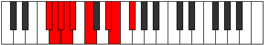
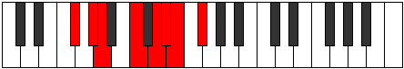
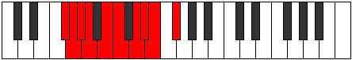
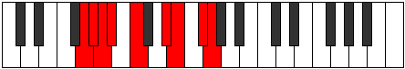
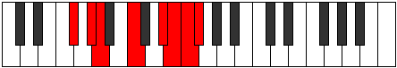
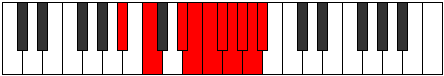

# AFlatDominantSeventhFlatNinthFlatThirteenth

## Links

- [Documentation](index.md)
- [Scales Index](Scales.md)
- [Modes Index](Modes.md)
- [Chords Index](Chords.md)

## Root

Ab

## Notes

| Position | Notes | Illustration |
|----------|------|--------------|
| RootPosition | Ab,C,Eb,Gb,Bbb,Fb |  |
| FirstInversion | C,Eb,Gb,Bbb,Fb,Ab |  |
| SecondInversion | Eb,Gb,Bbb,Fb,Ab,C |  |
| ThirdInversion | Gb,Bbb,Fb,Ab,C,Eb |  |
| FourthInversion | Bbb,Fb,Ab,C,Eb,Gb |  |
| FifthInversion | Fb,Ab,C,Eb,Gb,Bbb |  |
## Modes

| Number | Mode | Tonic | Notes | Illustration |
|--------|------|-------|-------|--------------|
| [619](https://ianring.com/musictheory/scales/619) | [Parimic](ModeDSharpParimic.md) | D# | D#, E, F#, G#, A, B#, D# |  |
| [619](https://ianring.com/musictheory/scales/619) | [Parimic](ModeEFlatParimic.md) | Eb | Eb, Fb, Gb, Ab, Bbb, C, Eb |  |
| [623](https://ianring.com/musictheory/scales/623) | [Sycrian](ModeDSharpSycrian.md) | D# | D#, E, F, Gb, Ab, Bbb, C, D# |  |
| [635](https://ianring.com/musictheory/scales/635) | [Epolian](ModeDSharpEpolian.md) | D# | D#, E, F#, G, Ab, Bbb, C, D# |  |
| [639](https://ianring.com/musictheory/scales/639) | [Ionaryllic](ModeDSharpIonaryllic.md) | D# | D#, E, F, F#, G, G#, A, C, D# |  |
| [639](https://ianring.com/musictheory/scales/639) | [Ionaryllic](ModeEFlatIonaryllic.md) | Eb | Eb, E, F, Gb, G, Ab, A, C, Eb |  |
| [747](https://ianring.com/musictheory/scales/747) | [Lynian](ModeDSharpLynian.md) | D# | D#, E, F#, G#, A, Bb, C, D# |  |
| [747](https://ianring.com/musictheory/scales/747) | [Lynian](ModeEFlatLynian.md) | Eb | Eb, Fb, Gb, Ab, Bbb, Cbb, Dbb, Eb |  |
| [751](https://ianring.com/musictheory/scales/751) | [Epacryllic](ModeDSharpEpacryllic.md) | D# | D#, E, F, F#, G#, A, A#, C, D# |  |
| [751](https://ianring.com/musictheory/scales/751) | [Epacryllic](ModeEFlatEpacryllic.md) | Eb | Eb, E, F, Gb, Ab, A, Bb, C, Eb |  |
| [763](https://ianring.com/musictheory/scales/763) | [Doryllic](ModeDSharpDoryllic.md) | D# | D#, E, F#, G, G#, A, A#, C, D# |  |
| [763](https://ianring.com/musictheory/scales/763) | [Doryllic](ModeEFlatDoryllic.md) | Eb | Eb, E, Gb, G, Ab, A, Bb, C, Eb |  |
| [767](https://ianring.com/musictheory/scales/767) | [Raptygic](ModeDSharpRaptygic.md) | D# | D#, E, F, F#, G, G#, A, A#, C, D# |  |
| [767](https://ianring.com/musictheory/scales/767) | [Raptygic](ModeEFlatRaptygic.md) | Eb | Eb, E, F, Gb, G, Ab, A, Bb, C, Eb |  |
| [857](https://ianring.com/musictheory/scales/857) | [Aeolydimic](ModeCNaturalAeolydimic.md) | C | C, D#, E, F#, G#, A, C |  |
| [859](https://ianring.com/musictheory/scales/859) | [Pathian](ModeCNaturalPathian.md) | C | C, Db, Eb, Fb, Gb, Ab, Bbb, C |  |
| [861](https://ianring.com/musictheory/scales/861) | [Rylian](ModeCNaturalRylian.md) | C | C, D, Eb, Fb, Gb, Ab, Bbb, C |  |
| [863](https://ianring.com/musictheory/scales/863) | [Pyryllic](ModeCNaturalPyryllic.md) | C | C, C#, D, D#, E, F#, G#, A, C |  |
| [875](https://ianring.com/musictheory/scales/875) | [Stothian](ModeDSharpStothian.md) | D# | D#, E, F#, G#, A, B, C, D# |  |
| [875](https://ianring.com/musictheory/scales/875) | [Stothian](ModeEFlatStothian.md) | Eb | Eb, Fb, Gb, Ab, Bbb, Cb, Dbb, Eb |  |
| [879](https://ianring.com/musictheory/scales/879) | [Aeolocryllic](ModeDSharpAeolocryllic.md) | D# | D#, E, F, F#, G#, A, B, C, D# |  |
| [879](https://ianring.com/musictheory/scales/879) | [Aeolocryllic](ModeEFlatAeolocryllic.md) | Eb | Eb, E, F, Gb, Ab, A, B, C, Eb |  |
| [889](https://ianring.com/musictheory/scales/889) | [Borian](ModeCNaturalBorian.md) | C | C, D#, E, F, Gb, Ab, Bbb, C |  |
| [891](https://ianring.com/musictheory/scales/891) | [Ionilyllic](ModeCNaturalIonilyllic.md) | C | C, C#, D#, E, F, F#, G#, A, C |  |
| [891](https://ianring.com/musictheory/scales/891) | [Ionilyllic](ModeDSharpIonilyllic.md) | D# | D#, E, F#, G, G#, A, B, C, D# |  |
| [891](https://ianring.com/musictheory/scales/891) | [Ionilyllic](ModeEFlatIonilyllic.md) | Eb | Eb, E, Gb, G, Ab, A, B, C, Eb |  |
| [893](https://ianring.com/musictheory/scales/893) | [Pycryllic](ModeCNaturalPycryllic.md) | C | C, D, D#, E, F, F#, G#, A, C |  |
| [895](https://ianring.com/musictheory/scales/895) | [Aeolathygic](ModeCNaturalAeolathygic.md) | C | C, C#, D, D#, E, F, F#, G#, A, C |  |
| [895](https://ianring.com/musictheory/scales/895) | [Aeolathygic](ModeDSharpAeolathygic.md) | D# | D#, E, F, F#, G, G#, A, B, C, D# |  |
| [895](https://ianring.com/musictheory/scales/895) | [Aeolathygic](ModeEFlatAeolathygic.md) | Eb | Eb, E, F, Gb, G, Ab, A, B, C, Eb |  |
| [985](https://ianring.com/musictheory/scales/985) | [Raptian](ModeCNaturalRaptian.md) | C | C, D#, E, F#, G, Ab, Bbb, C |  |
| [987](https://ianring.com/musictheory/scales/987) | [Aeraptyllic](ModeCNaturalAeraptyllic.md) | C | C, C#, D#, E, F#, G, G#, A, C |  |
| [989](https://ianring.com/musictheory/scales/989) | [Phrolyllic](ModeCNaturalPhrolyllic.md) | C | C, D, D#, E, F#, G, G#, A, C |  |
| [991](https://ianring.com/musictheory/scales/991) | [Aeolygic](ModeCNaturalAeolygic.md) | C | C, C#, D, D#, E, F#, G, G#, A, C |  |
| [1003](https://ianring.com/musictheory/scales/1003) | [Ionyryllic](ModeDSharpIonyryllic.md) | D# | D#, E, F#, G#, A, A#, B, C, D# |  |
| [1003](https://ianring.com/musictheory/scales/1003) | [Ionyryllic](ModeEFlatIonyryllic.md) | Eb | Eb, E, Gb, Ab, A, Bb, B, C, Eb |  |
| [1007](https://ianring.com/musictheory/scales/1007) | [Ionycrygic](ModeDSharpIonycrygic.md) | D# | D#, E, F, F#, G#, A, A#, B, C, D# |  |
| [1007](https://ianring.com/musictheory/scales/1007) | [Ionycrygic](ModeEFlatIonycrygic.md) | Eb | Eb, E, F, Gb, Ab, A, Bb, B, C, Eb |  |
| [1017](https://ianring.com/musictheory/scales/1017) | [Dythyllic](ModeCNaturalDythyllic.md) | C | C, D#, E, F, F#, G, G#, A, C |  |
| [1019](https://ianring.com/musictheory/scales/1019) | [Aeranygic](ModeCNaturalAeranygic.md) | C | C, C#, D#, E, F, F#, G, G#, A, C |  |
| [1019](https://ianring.com/musictheory/scales/1019) | [Aeranygic](ModeDSharpAeranygic.md) | D# | D#, E, F#, G, G#, A, A#, B, C, D# |  |
| [1019](https://ianring.com/musictheory/scales/1019) | [Aeranygic](ModeEFlatAeranygic.md) | Eb | Eb, E, Gb, G, Ab, A, Bb, B, C, Eb |  |
| [1021](https://ianring.com/musictheory/scales/1021) | [Ladygic](ModeCNaturalLadygic.md) | C | C, D, D#, E, F, F#, G, G#, A, C |  |
| [1023](https://ianring.com/musictheory/scales/1023) | [Dodyllian](ModeCNaturalDodyllian.md) | C | C, C#, D, D#, E, F, F#, G, G#, A, C |  |
| [1023](https://ianring.com/musictheory/scales/1023) | [Dodyllian](ModeDSharpDodyllian.md) | D# | D#, E, F, F#, G, G#, A, A#, B, C, D# |  |
| [1023](https://ianring.com/musictheory/scales/1023) | [Dodyllian](ModeEFlatDodyllian.md) | Eb | Eb, E, F, Gb, G, Ab, A, Bb, B, C, Eb |  |
| [1239](https://ianring.com/musictheory/scales/1239) | [Epaptian](ModeDNaturalEpaptian.md) | D | D, Eb, Fb, Gb, Ab, Bbb, C, D |  |
| [1247](https://ianring.com/musictheory/scales/1247) | [Mygyllic](ModeDNaturalMygyllic.md) | D | D, D#, E, F, F#, G#, A, C, D |  |
| [1271](https://ianring.com/musictheory/scales/1271) | [Kolyllic](ModeDNaturalKolyllic.md) | D | D, D#, E, F#, G, G#, A, C, D |  |
| [1279](https://ianring.com/musictheory/scales/1279) | [Sarygic](ModeDNaturalSarygic.md) | D | D, D#, E, F, F#, G, G#, A, C, D |  |
| [1427](https://ianring.com/musictheory/scales/1427) | [Lolimic](ModeGSharpLolimic.md) | G# | G#, A, B#, C###, D##, E##, G# |  |
| [1427](https://ianring.com/musictheory/scales/1427) | [Lolimic](ModeAFlatLolimic.md) | Ab | Ab, Bbb, C, D#, E, F#, Ab |  |
| [1431](https://ianring.com/musictheory/scales/1431) | [Phragian](ModeGSharpPhragian.md) | G# | G#, A, Bb, C, D#, E, F#, G# |  |
| [1431](https://ianring.com/musictheory/scales/1431) | [Phragian](ModeAFlatPhragian.md) | Ab | Ab, Bbb, Cbb, Dbb, Eb, Fb, Gb, Ab |  |
| [1435](https://ianring.com/musictheory/scales/1435) | [Phronian](ModeGSharpPhronian.md) | G# | G#, A, B, C, D#, E, F#, G# |  |
| [1435](https://ianring.com/musictheory/scales/1435) | [Phronian](ModeAFlatPhronian.md) | Ab | Ab, Bbb, Cb, Dbb, Eb, Fb, Gb, Ab |  |
| [1439](https://ianring.com/musictheory/scales/1439) | [Rolyllic](ModeGSharpRolyllic.md) | G# | G#, A, A#, B, C, D#, E, F#, G# |  |
| [1439](https://ianring.com/musictheory/scales/1439) | [Rolyllic](ModeAFlatRolyllic.md) | Ab | Ab, A, Bb, B, C, Eb, E, Gb, Ab |  |
| [1459](https://ianring.com/musictheory/scales/1459) | [Ionalian](ModeGSharpIonalian.md) | G# | G#, A, B#, C#, D#, E, F#, G# |  |
| [1459](https://ianring.com/musictheory/scales/1459) | [Ionalian](ModeAFlatIonalian.md) | Ab | Ab, Bbb, C, Db, Eb, Fb, Gb, Ab |  |
| [1463](https://ianring.com/musictheory/scales/1463) | [Zaptyllic](ModeGSharpZaptyllic.md) | G# | G#, A, A#, C, C#, D#, E, F#, G# |  |
| [1463](https://ianring.com/musictheory/scales/1463) | [Zaptyllic](ModeAFlatZaptyllic.md) | Ab | Ab, A, Bb, C, Db, Eb, E, Gb, Ab |  |
| [1467](https://ianring.com/musictheory/scales/1467) | [Thydyllic](ModeGSharpThydyllic.md) | G# | G#, A, B, C, C#, D#, E, F#, G# |  |
| [1467](https://ianring.com/musictheory/scales/1467) | [Thydyllic](ModeAFlatThydyllic.md) | Ab | Ab, A, B, C, Db, Eb, E, Gb, Ab |  |
| [1471](https://ianring.com/musictheory/scales/1471) | [Radygic](ModeGSharpRadygic.md) | G# | G#, A, A#, B, C, C#, D#, E, F#, G# |  |
| [1471](https://ianring.com/musictheory/scales/1471) | [Radygic](ModeAFlatRadygic.md) | Ab | Ab, A, Bb, B, C, Db, Eb, E, Gb, Ab |  |
| [1491](https://ianring.com/musictheory/scales/1491) | [Rynian](ModeGSharpRynian.md) | G# | G#, A, B#, C##, D#, E, F#, G# |  |
| [1491](https://ianring.com/musictheory/scales/1491) | [Rynian](ModeAFlatRynian.md) | Ab | Ab, Bbb, C, D, Eb, Fb, Gb, Ab |  |
| [1495](https://ianring.com/musictheory/scales/1495) | [Kaptyllic](ModeDNaturalKaptyllic.md) | D | D, D#, E, F#, G#, A, A#, C, D |  |
| [1495](https://ianring.com/musictheory/scales/1495) | [Kaptyllic](ModeGSharpKaptyllic.md) | G# | G#, A, A#, C, D, D#, E, F#, G# |  |
| [1495](https://ianring.com/musictheory/scales/1495) | [Kaptyllic](ModeAFlatKaptyllic.md) | Ab | Ab, A, Bb, C, D, Eb, E, Gb, Ab |  |
| [1499](https://ianring.com/musictheory/scales/1499) | [Stonyllic](ModeGSharpStonyllic.md) | G# | G#, A, B, C, D, D#, E, F#, G# |  |
| [1499](https://ianring.com/musictheory/scales/1499) | [Stonyllic](ModeAFlatStonyllic.md) | Ab | Ab, A, B, C, D, Eb, E, Gb, Ab |  |
| [1503](https://ianring.com/musictheory/scales/1503) | [Padygic](ModeDNaturalPadygic.md) | D | D, D#, E, F, F#, G#, A, A#, C, D |  |
| [1503](https://ianring.com/musictheory/scales/1503) | [Padygic](ModeGSharpPadygic.md) | G# | G#, A, A#, B, C, D, D#, E, F#, G# |  |
| [1503](https://ianring.com/musictheory/scales/1503) | [Padygic](ModeAFlatPadygic.md) | Ab | Ab, A, Bb, B, C, D, Eb, E, Gb, Ab |  |
| [1523](https://ianring.com/musictheory/scales/1523) | [Zothyllic](ModeGSharpZothyllic.md) | G# | G#, A, C, C#, D, D#, E, F#, G# |  |
| [1523](https://ianring.com/musictheory/scales/1523) | [Zothyllic](ModeAFlatZothyllic.md) | Ab | Ab, A, C, Db, D, Eb, E, Gb, Ab |  |
| [1527](https://ianring.com/musictheory/scales/1527) | [Aeolyrygic](ModeGSharpAeolyrygic.md) | G# | G#, A, A#, C, C#, D, D#, E, F#, G# |  |
| [1527](https://ianring.com/musictheory/scales/1527) | [Aeolyrygic](ModeAFlatAeolyrygic.md) | Ab | Ab, A, Bb, C, Db, D, Eb, E, Gb, Ab |  |
| [1527](https://ianring.com/musictheory/scales/1527) | [Aeolyrygic](ModeDNaturalAeolyrygic.md) | D | D, D#, E, F#, G, G#, A, A#, C, D |  |
| [1531](https://ianring.com/musictheory/scales/1531) | [Styptygic](ModeGSharpStyptygic.md) | G# | G#, A, B, C, C#, D, D#, E, F#, G# |  |
| [1531](https://ianring.com/musictheory/scales/1531) | [Styptygic](ModeAFlatStyptygic.md) | Ab | Ab, A, B, C, Db, D, Eb, E, Gb, Ab |  |
| [1535](https://ianring.com/musictheory/scales/1535) | [Mixodyllian](ModeDNaturalMixodyllian.md) | D | D, D#, E, F, F#, G, G#, A, A#, C, D |  |
| [1535](https://ianring.com/musictheory/scales/1535) | [Mixodyllian](ModeGSharpMixodyllian.md) | G# | G#, A, A#, B, C, C#, D, D#, E, F#, G# |  |
| [1535](https://ianring.com/musictheory/scales/1535) | [Mixodyllian](ModeAFlatMixodyllian.md) | Ab | Ab, A, Bb, B, C, Db, D, Eb, E, Gb, Ab |  |
| [1613](https://ianring.com/musictheory/scales/1613) | [Thylimic](ModeFSharpThylimic.md) | F# | F#, G#, A, B#, C###, D##, F# |  |
| [1613](https://ianring.com/musictheory/scales/1613) | [Thylimic](ModeGFlatThylimic.md) | Gb | Gb, Ab, Bbb, C, D#, E, Gb |  |
| [1615](https://ianring.com/musictheory/scales/1615) | [Sydian](ModeFSharpSydian.md) | F# | F#, G, Ab, Bbb, C, D#, E, F# |  |
| [1629](https://ianring.com/musictheory/scales/1629) | [Synian](ModeFSharpSynian.md) | F# | F#, G#, A, Bb, C, D#, E, F# |  |
| [1629](https://ianring.com/musictheory/scales/1629) | [Synian](ModeGFlatSynian.md) | Gb | Gb, Ab, Bbb, Cbb, Dbb, Eb, Fb, Gb |  |
| [1631](https://ianring.com/musictheory/scales/1631) | [Rynyllic](ModeFSharpRynyllic.md) | F# | F#, G, G#, A, A#, C, D#, E, F# |  |
| [1631](https://ianring.com/musictheory/scales/1631) | [Rynyllic](ModeGFlatRynyllic.md) | Gb | Gb, G, Ab, A, Bb, C, Eb, E, Gb |  |
| [1643](https://ianring.com/musictheory/scales/1643) | [Thyptian](ModeDSharpThyptian.md) | D# | D#, E, F#, G#, A, B#, C#, D# |  |
| [1643](https://ianring.com/musictheory/scales/1643) | [Thyptian](ModeEFlatThyptian.md) | Eb | Eb, Fb, Gb, Ab, Bbb, C, Db, Eb |  |
| [1645](https://ianring.com/musictheory/scales/1645) | [Katagian](ModeFSharpKatagian.md) | F# | F#, G#, A, B, C, D#, E, F# |  |
| [1645](https://ianring.com/musictheory/scales/1645) | [Katagian](ModeGFlatKatagian.md) | Gb | Gb, Ab, Bbb, Cb, Dbb, Eb, Fb, Gb |  |
| [1647](https://ianring.com/musictheory/scales/1647) | [Polyllic](ModeDSharpPolyllic.md) | D# | D#, E, F, F#, G#, A, C, C#, D# |  |
| [1647](https://ianring.com/musictheory/scales/1647) | [Polyllic](ModeEFlatPolyllic.md) | Eb | Eb, E, F, Gb, Ab, A, C, Db, Eb |  |
| [1647](https://ianring.com/musictheory/scales/1647) | [Polyllic](ModeFSharpPolyllic.md) | F# | F#, G, G#, A, B, C, D#, E, F# |  |
| [1647](https://ianring.com/musictheory/scales/1647) | [Polyllic](ModeGFlatPolyllic.md) | Gb | Gb, G, Ab, A, B, C, Eb, E, Gb |  |
| [1659](https://ianring.com/musictheory/scales/1659) | [Magyllic](ModeDSharpMagyllic.md) | D# | D#, E, F#, G, G#, A, C, C#, D# |  |
| [1659](https://ianring.com/musictheory/scales/1659) | [Magyllic](ModeEFlatMagyllic.md) | Eb | Eb, E, Gb, G, Ab, A, C, Db, Eb |  |
| [1661](https://ianring.com/musictheory/scales/1661) | [Gonyllic](ModeFSharpGonyllic.md) | F# | F#, G#, A, A#, B, C, D#, E, F# |  |
| [1661](https://ianring.com/musictheory/scales/1661) | [Gonyllic](ModeGFlatGonyllic.md) | Gb | Gb, Ab, A, Bb, B, C, Eb, E, Gb |  |
| [1663](https://ianring.com/musictheory/scales/1663) | [Lydygic](ModeDSharpLydygic.md) | D# | D#, E, F, F#, G, G#, A, C, C#, D# |  |
| [1663](https://ianring.com/musictheory/scales/1663) | [Lydygic](ModeEFlatLydygic.md) | Eb | Eb, E, F, Gb, G, Ab, A, C, Db, Eb |  |
| [1663](https://ianring.com/musictheory/scales/1663) | [Lydygic](ModeFSharpLydygic.md) | F# | F#, G, G#, A, A#, B, C, D#, E, F# |  |
| [1663](https://ianring.com/musictheory/scales/1663) | [Lydygic](ModeGFlatLydygic.md) | Gb | Gb, G, Ab, A, Bb, B, C, Eb, E, Gb |  |
| [1715](https://ianring.com/musictheory/scales/1715) | [Aeronian](ModeBNaturalAeronian.md) | B | B, C, D#, E, F#, G#, A, B |  |
| [1719](https://ianring.com/musictheory/scales/1719) | [Lyryllic](ModeBNaturalLyryllic.md) | B | B, C, C#, D#, E, F#, G#, A, B |  |
| [1723](https://ianring.com/musictheory/scales/1723) | [Poryllic](ModeBNaturalPoryllic.md) | B | B, C, D, D#, E, F#, G#, A, B |  |
| [1727](https://ianring.com/musictheory/scales/1727) | [Sydygic](ModeBNaturalSydygic.md) | B | B, C, C#, D, D#, E, F#, G#, A, B |  |
| [1741](https://ianring.com/musictheory/scales/1741) | [Katycrian](ModeFSharpKatycrian.md) | F# | F#, G#, A, B#, C#, D#, E, F# |  |
| [1741](https://ianring.com/musictheory/scales/1741) | [Katycrian](ModeGFlatKatycrian.md) | Gb | Gb, Ab, Bbb, C, Db, Eb, Fb, Gb |  |
| [1743](https://ianring.com/musictheory/scales/1743) | [Epigyllic](ModeFSharpEpigyllic.md) | F# | F#, G, G#, A, C, C#, D#, E, F# |  |
| [1743](https://ianring.com/musictheory/scales/1743) | [Epigyllic](ModeGFlatEpigyllic.md) | Gb | Gb, G, Ab, A, C, Db, Eb, E, Gb |  |
| [1751](https://ianring.com/musictheory/scales/1751) | [Aeolyryllic](ModeDNaturalAeolyryllic.md) | D | D, D#, E, F#, G#, A, B, C, D |  |
| [1757](https://ianring.com/musictheory/scales/1757) | [Ionyphyllic](ModeFSharpIonyphyllic.md) | F# | F#, G#, A, A#, C, C#, D#, E, F# |  |
| [1757](https://ianring.com/musictheory/scales/1757) | [Ionyphyllic](ModeGFlatIonyphyllic.md) | Gb | Gb, Ab, A, Bb, C, Db, Eb, E, Gb |  |
| [1759](https://ianring.com/musictheory/scales/1759) | [Pylygic](ModeFSharpPylygic.md) | F# | F#, G, G#, A, A#, C, C#, D#, E, F# |  |
| [1759](https://ianring.com/musictheory/scales/1759) | [Pylygic](ModeGFlatPylygic.md) | Gb | Gb, G, Ab, A, Bb, C, Db, Eb, E, Gb |  |
| [1759](https://ianring.com/musictheory/scales/1759) | [Pylygic](ModeDNaturalPylygic.md) | D | D, D#, E, F, F#, G#, A, B, C, D |  |
| [1771](https://ianring.com/musictheory/scales/1771) | [Stylyllic](ModeDSharpStylyllic.md) | D# | D#, E, F#, G#, A, A#, C, C#, D# |  |
| [1771](https://ianring.com/musictheory/scales/1771) | [Stylyllic](ModeEFlatStylyllic.md) | Eb | Eb, E, Gb, Ab, A, Bb, C, Db, Eb |  |
| [1773](https://ianring.com/musictheory/scales/1773) | [Aeoloryllic](ModeFSharpAeoloryllic.md) | F# | F#, G#, A, B, C, C#, D#, E, F# |  |
| [1773](https://ianring.com/musictheory/scales/1773) | [Aeoloryllic](ModeGFlatAeoloryllic.md) | Gb | Gb, Ab, A, B, C, Db, Eb, E, Gb |  |
| [1775](https://ianring.com/musictheory/scales/1775) | [Lyrygic](ModeDSharpLyrygic.md) | D# | D#, E, F, F#, G#, A, A#, C, C#, D# |  |
| [1775](https://ianring.com/musictheory/scales/1775) | [Lyrygic](ModeEFlatLyrygic.md) | Eb | Eb, E, F, Gb, Ab, A, Bb, C, Db, Eb |  |
| [1775](https://ianring.com/musictheory/scales/1775) | [Lyrygic](ModeFSharpLyrygic.md) | F# | F#, G, G#, A, B, C, C#, D#, E, F# |  |
| [1775](https://ianring.com/musictheory/scales/1775) | [Lyrygic](ModeGFlatLyrygic.md) | Gb | Gb, G, Ab, A, B, C, Db, Eb, E, Gb |  |
| [1779](https://ianring.com/musictheory/scales/1779) | [Aerythyllic](ModeBNaturalAerythyllic.md) | B | B, C, D#, E, F, F#, G#, A, B |  |
| [1783](https://ianring.com/musictheory/scales/1783) | [Danygic](ModeBNaturalDanygic.md) | B | B, C, C#, D#, E, F, F#, G#, A, B |  |
| [1783](https://ianring.com/musictheory/scales/1783) | [Danygic](ModeDNaturalDanygic.md) | D | D, D#, E, F#, G, G#, A, B, C, D |  |
| [1787](https://ianring.com/musictheory/scales/1787) | [Mycrygic](ModeDSharpMycrygic.md) | D# | D#, E, F#, G, G#, A, A#, C, C#, D# |  |
| [1787](https://ianring.com/musictheory/scales/1787) | [Mycrygic](ModeEFlatMycrygic.md) | Eb | Eb, E, Gb, G, Ab, A, Bb, C, Db, Eb |  |
| [1787](https://ianring.com/musictheory/scales/1787) | [Mycrygic](ModeBNaturalMycrygic.md) | B | B, C, D, D#, E, F, F#, G#, A, B |  |
| [1789](https://ianring.com/musictheory/scales/1789) | [Katagygic](ModeFSharpKatagygic.md) | F# | F#, G#, A, A#, B, C, C#, D#, E, F# |  |
| [1789](https://ianring.com/musictheory/scales/1789) | [Katagygic](ModeGFlatKatagygic.md) | Gb | Gb, Ab, A, Bb, B, C, Db, Eb, E, Gb |  |
| [1791](https://ianring.com/musictheory/scales/1791) | [Aerygyllian](ModeDSharpAerygyllian.md) | D# | D#, E, F, F#, G, G#, A, A#, C, C#, D# |  |
| [1791](https://ianring.com/musictheory/scales/1791) | [Aerygyllian](ModeEFlatAerygyllian.md) | Eb | Eb, E, F, Gb, G, Ab, A, Bb, C, Db, Eb |  |
| [1791](https://ianring.com/musictheory/scales/1791) | [Aerygyllian](ModeBNaturalAerygyllian.md) | B | B, C, C#, D, D#, E, F, F#, G#, A, B |  |
| [1791](https://ianring.com/musictheory/scales/1791) | [Aerygyllian](ModeDNaturalAerygyllian.md) | D | D, D#, E, F, F#, G, G#, A, B, C, D |  |
| [1791](https://ianring.com/musictheory/scales/1791) | [Aerygyllian](ModeFSharpAerygyllian.md) | F# | F#, G, G#, A, A#, B, C, C#, D#, E, F# |  |
| [1791](https://ianring.com/musictheory/scales/1791) | [Aerygyllian](ModeGFlatAerygyllian.md) | Gb | Gb, G, Ab, A, Bb, B, C, Db, Eb, E, Gb |  |
| [1869](https://ianring.com/musictheory/scales/1869) | [Katyrian](ModeFSharpKatyrian.md) | F# | F#, G#, A, B#, C##, D#, E, F# |  |
| [1869](https://ianring.com/musictheory/scales/1869) | [Katyrian](ModeGFlatKatyrian.md) | Gb | Gb, Ab, Bbb, C, D, Eb, Fb, Gb |  |
| [1871](https://ianring.com/musictheory/scales/1871) | [Aeolyllic](ModeFSharpAeolyllic.md) | F# | F#, G, G#, A, C, D, D#, E, F# |  |
| [1871](https://ianring.com/musictheory/scales/1871) | [Aeolyllic](ModeGFlatAeolyllic.md) | Gb | Gb, G, Ab, A, C, D, Eb, E, Gb |  |
| [1881](https://ianring.com/musictheory/scales/1881) | [Korian](ModeCNaturalKorian.md) | C | C, D#, E, F#, G#, A, Bb, C |  |
| [1883](https://ianring.com/musictheory/scales/1883) | [Mixopyryllic](ModeCNaturalMixopyryllic.md) | C | C, C#, D#, E, F#, G#, A, A#, C |  |
| [1885](https://ianring.com/musictheory/scales/1885) | [Epidyllic](ModeCNaturalEpidyllic.md) | C | C, D, D#, E, F#, G#, A, A#, C |  |
| [1885](https://ianring.com/musictheory/scales/1885) | [Epidyllic](ModeFSharpEpidyllic.md) | F# | F#, G#, A, A#, C, D, D#, E, F# |  |
| [1885](https://ianring.com/musictheory/scales/1885) | [Epidyllic](ModeGFlatEpidyllic.md) | Gb | Gb, Ab, A, Bb, C, D, Eb, E, Gb |  |
| [1887](https://ianring.com/musictheory/scales/1887) | [Aerocrygic](ModeCNaturalAerocrygic.md) | C | C, C#, D, D#, E, F#, G#, A, A#, C |  |
| [1887](https://ianring.com/musictheory/scales/1887) | [Aerocrygic](ModeFSharpAerocrygic.md) | F# | F#, G, G#, A, A#, C, D, D#, E, F# |  |
| [1887](https://ianring.com/musictheory/scales/1887) | [Aerocrygic](ModeGFlatAerocrygic.md) | Gb | Gb, G, Ab, A, Bb, C, D, Eb, E, Gb |  |
| [1899](https://ianring.com/musictheory/scales/1899) | [Moptyllic](ModeDSharpMoptyllic.md) | D# | D#, E, F#, G#, A, B, C, C#, D# |  |
| [1899](https://ianring.com/musictheory/scales/1899) | [Moptyllic](ModeEFlatMoptyllic.md) | Eb | Eb, E, Gb, Ab, A, B, C, Db, Eb |  |
| [1901](https://ianring.com/musictheory/scales/1901) | [Ionidyllic](ModeFSharpIonidyllic.md) | F# | F#, G#, A, B, C, D, D#, E, F# |  |
| [1901](https://ianring.com/musictheory/scales/1901) | [Ionidyllic](ModeGFlatIonidyllic.md) | Gb | Gb, Ab, A, B, C, D, Eb, E, Gb |  |
| [1903](https://ianring.com/musictheory/scales/1903) | [Rocrygic](ModeDSharpRocrygic.md) | D# | D#, E, F, F#, G#, A, B, C, C#, D# |  |
| [1903](https://ianring.com/musictheory/scales/1903) | [Rocrygic](ModeEFlatRocrygic.md) | Eb | Eb, E, F, Gb, Ab, A, B, C, Db, Eb |  |
| [1903](https://ianring.com/musictheory/scales/1903) | [Rocrygic](ModeFSharpRocrygic.md) | F# | F#, G, G#, A, B, C, D, D#, E, F# |  |
| [1903](https://ianring.com/musictheory/scales/1903) | [Rocrygic](ModeGFlatRocrygic.md) | Gb | Gb, G, Ab, A, B, C, D, Eb, E, Gb |  |
| [1913](https://ianring.com/musictheory/scales/1913) | [Zagyllic](ModeCNaturalZagyllic.md) | C | C, D#, E, F, F#, G#, A, A#, C |  |
| [1915](https://ianring.com/musictheory/scales/1915) | [Thydygic](ModeCNaturalThydygic.md) | C | C, C#, D#, E, F, F#, G#, A, A#, C |  |
| [1915](https://ianring.com/musictheory/scales/1915) | [Thydygic](ModeDSharpThydygic.md) | D# | D#, E, F#, G, G#, A, B, C, C#, D# |  |
| [1915](https://ianring.com/musictheory/scales/1915) | [Thydygic](ModeEFlatThydygic.md) | Eb | Eb, E, Gb, G, Ab, A, B, C, Db, Eb |  |
| [1917](https://ianring.com/musictheory/scales/1917) | [Sacrygic](ModeCNaturalSacrygic.md) | C | C, D, D#, E, F, F#, G#, A, A#, C |  |
| [1917](https://ianring.com/musictheory/scales/1917) | [Sacrygic](ModeFSharpSacrygic.md) | F# | F#, G#, A, A#, B, C, D, D#, E, F# |  |
| [1917](https://ianring.com/musictheory/scales/1917) | [Sacrygic](ModeGFlatSacrygic.md) | Gb | Gb, Ab, A, Bb, B, C, D, Eb, E, Gb |  |
| [1919](https://ianring.com/musictheory/scales/1919) | [Rocryllian](ModeCNaturalRocryllian.md) | C | C, C#, D, D#, E, F, F#, G#, A, A#, C |  |
| [1919](https://ianring.com/musictheory/scales/1919) | [Rocryllian](ModeDSharpRocryllian.md) | D# | D#, E, F, F#, G, G#, A, B, C, C#, D# |  |
| [1919](https://ianring.com/musictheory/scales/1919) | [Rocryllian](ModeEFlatRocryllian.md) | Eb | Eb, E, F, Gb, G, Ab, A, B, C, Db, Eb |  |
| [1919](https://ianring.com/musictheory/scales/1919) | [Rocryllian](ModeFSharpRocryllian.md) | F# | F#, G, G#, A, A#, B, C, D, D#, E, F# |  |
| [1919](https://ianring.com/musictheory/scales/1919) | [Rocryllian](ModeGFlatRocryllian.md) | Gb | Gb, G, Ab, A, Bb, B, C, D, Eb, E, Gb |  |
| [1939](https://ianring.com/musictheory/scales/1939) | [Dathian](ModeGSharpDathian.md) | G# | G#, A, B#, C###, D##, E#, F#, G# |  |
| [1939](https://ianring.com/musictheory/scales/1939) | [Dathian](ModeAFlatDathian.md) | Ab | Ab, Bbb, C, D#, E, F, Gb, Ab |  |
| [1943](https://ianring.com/musictheory/scales/1943) | [Malyllic](ModeGSharpMalyllic.md) | G# | G#, A, A#, C, D#, E, F, F#, G# |  |
| [1943](https://ianring.com/musictheory/scales/1943) | [Malyllic](ModeAFlatMalyllic.md) | Ab | Ab, A, Bb, C, Eb, E, F, Gb, Ab |  |
| [1947](https://ianring.com/musictheory/scales/1947) | [Ionoyllic](ModeGSharpIonoyllic.md) | G# | G#, A, B, C, D#, E, F, F#, G# |  |
| [1947](https://ianring.com/musictheory/scales/1947) | [Ionoyllic](ModeAFlatIonoyllic.md) | Ab | Ab, A, B, C, Eb, E, F, Gb, Ab |  |
| [1951](https://ianring.com/musictheory/scales/1951) | [Gonygic](ModeGSharpGonygic.md) | G# | G#, A, A#, B, C, D#, E, F, F#, G# |  |
| [1951](https://ianring.com/musictheory/scales/1951) | [Gonygic](ModeAFlatGonygic.md) | Ab | Ab, A, Bb, B, C, Eb, E, F, Gb, Ab |  |
| [1971](https://ianring.com/musictheory/scales/1971) | [Aerynyllic](ModeGSharpAerynyllic.md) | G# | G#, A, C, C#, D#, E, F, F#, G# |  |
| [1971](https://ianring.com/musictheory/scales/1971) | [Aerynyllic](ModeAFlatAerynyllic.md) | Ab | Ab, A, C, Db, Eb, E, F, Gb, Ab |  |
| [1971](https://ianring.com/musictheory/scales/1971) | [Aerynyllic](ModeBNaturalAerynyllic.md) | B | B, C, D#, E, F#, G, G#, A, B |  |
| [1975](https://ianring.com/musictheory/scales/1975) | [Ionocrygic](ModeGSharpIonocrygic.md) | G# | G#, A, A#, C, C#, D#, E, F, F#, G# |  |
| [1975](https://ianring.com/musictheory/scales/1975) | [Ionocrygic](ModeAFlatIonocrygic.md) | Ab | Ab, A, Bb, C, Db, Eb, E, F, Gb, Ab |  |
| [1975](https://ianring.com/musictheory/scales/1975) | [Ionocrygic](ModeBNaturalIonocrygic.md) | B | B, C, C#, D#, E, F#, G, G#, A, B |  |
| [1979](https://ianring.com/musictheory/scales/1979) | [Aeradygic](ModeGSharpAeradygic.md) | G# | G#, A, B, C, C#, D#, E, F, F#, G# |  |
| [1979](https://ianring.com/musictheory/scales/1979) | [Aeradygic](ModeAFlatAeradygic.md) | Ab | Ab, A, B, C, Db, Eb, E, F, Gb, Ab |  |
| [1979](https://ianring.com/musictheory/scales/1979) | [Aeradygic](ModeBNaturalAeradygic.md) | B | B, C, D, D#, E, F#, G, G#, A, B |  |
| [1983](https://ianring.com/musictheory/scales/1983) | [Soryllian](ModeBNaturalSoryllian.md) | B | B, C, C#, D, D#, E, F#, G, G#, A, B |  |
| [1983](https://ianring.com/musictheory/scales/1983) | [Soryllian](ModeGSharpSoryllian.md) | G# | G#, A, A#, B, C, C#, D#, E, F, F#, G# |  |
| [1983](https://ianring.com/musictheory/scales/1983) | [Soryllian](ModeAFlatSoryllian.md) | Ab | Ab, A, Bb, B, C, Db, Eb, E, F, Gb, Ab |  |
| [1997](https://ianring.com/musictheory/scales/1997) | [Staryllic](ModeFSharpStaryllic.md) | F# | F#, G#, A, C, C#, D, D#, E, F# |  |
| [1997](https://ianring.com/musictheory/scales/1997) | [Staryllic](ModeGFlatStaryllic.md) | Gb | Gb, Ab, A, C, Db, D, Eb, E, Gb |  |
| [1999](https://ianring.com/musictheory/scales/1999) | [Zacrygic](ModeFSharpZacrygic.md) | F# | F#, G, G#, A, C, C#, D, D#, E, F# |  |
| [1999](https://ianring.com/musictheory/scales/1999) | [Zacrygic](ModeGFlatZacrygic.md) | Gb | Gb, G, Ab, A, C, Db, D, Eb, E, Gb |  |
| [2003](https://ianring.com/musictheory/scales/2003) | [Lolyllic](ModeGSharpLolyllic.md) | G# | G#, A, C, D, D#, E, F, F#, G# |  |
| [2003](https://ianring.com/musictheory/scales/2003) | [Lolyllic](ModeAFlatLolyllic.md) | Ab | Ab, A, C, D, Eb, E, F, Gb, Ab |  |
| [2007](https://ianring.com/musictheory/scales/2007) | [Stonygic](ModeGSharpStonygic.md) | G# | G#, A, A#, C, D, D#, E, F, F#, G# |  |
| [2007](https://ianring.com/musictheory/scales/2007) | [Stonygic](ModeAFlatStonygic.md) | Ab | Ab, A, Bb, C, D, Eb, E, F, Gb, Ab |  |
| [2007](https://ianring.com/musictheory/scales/2007) | [Stonygic](ModeDNaturalStonygic.md) | D | D, D#, E, F#, G#, A, A#, B, C, D |  |
| [2009](https://ianring.com/musictheory/scales/2009) | [Stacryllic](ModeCNaturalStacryllic.md) | C | C, D#, E, F#, G, G#, A, A#, C |  |
| [2011](https://ianring.com/musictheory/scales/2011) | [Raphygic](ModeCNaturalRaphygic.md) | C | C, C#, D#, E, F#, G, G#, A, A#, C |  |
| [2011](https://ianring.com/musictheory/scales/2011) | [Raphygic](ModeGSharpRaphygic.md) | G# | G#, A, B, C, D, D#, E, F, F#, G# |  |
| [2011](https://ianring.com/musictheory/scales/2011) | [Raphygic](ModeAFlatRaphygic.md) | Ab | Ab, A, B, C, D, Eb, E, F, Gb, Ab |  |
| [2013](https://ianring.com/musictheory/scales/2013) | [Mocrygic](ModeFSharpMocrygic.md) | F# | F#, G#, A, A#, C, C#, D, D#, E, F# |  |
| [2013](https://ianring.com/musictheory/scales/2013) | [Mocrygic](ModeGFlatMocrygic.md) | Gb | Gb, Ab, A, Bb, C, Db, D, Eb, E, Gb |  |
| [2013](https://ianring.com/musictheory/scales/2013) | [Mocrygic](ModeCNaturalMocrygic.md) | C | C, D, D#, E, F#, G, G#, A, A#, C |  |
| [2015](https://ianring.com/musictheory/scales/2015) | [Epiryllian](ModeCNaturalEpiryllian.md) | C | C, C#, D, D#, E, F#, G, G#, A, A#, C |  |
| [2015](https://ianring.com/musictheory/scales/2015) | [Epiryllian](ModeFSharpEpiryllian.md) | F# | F#, G, G#, A, A#, C, C#, D, D#, E, F# |  |
| [2015](https://ianring.com/musictheory/scales/2015) | [Epiryllian](ModeGFlatEpiryllian.md) | Gb | Gb, G, Ab, A, Bb, C, Db, D, Eb, E, Gb |  |
| [2015](https://ianring.com/musictheory/scales/2015) | [Epiryllian](ModeDNaturalEpiryllian.md) | D | D, D#, E, F, F#, G#, A, A#, B, C, D |  |
| [2015](https://ianring.com/musictheory/scales/2015) | [Epiryllian](ModeGSharpEpiryllian.md) | G# | G#, A, A#, B, C, D, D#, E, F, F#, G# |  |
| [2015](https://ianring.com/musictheory/scales/2015) | [Epiryllian](ModeAFlatEpiryllian.md) | Ab | Ab, A, Bb, B, C, D, Eb, E, F, Gb, Ab |  |
| [2027](https://ianring.com/musictheory/scales/2027) | [Boptygic](ModeDSharpBoptygic.md) | D# | D#, E, F#, G#, A, A#, B, C, C#, D# |  |
| [2027](https://ianring.com/musictheory/scales/2027) | [Boptygic](ModeEFlatBoptygic.md) | Eb | Eb, E, Gb, Ab, A, Bb, B, C, Db, Eb |  |
| [2029](https://ianring.com/musictheory/scales/2029) | [Mathygic](ModeFSharpMathygic.md) | F# | F#, G#, A, B, C, C#, D, D#, E, F# |  |
| [2029](https://ianring.com/musictheory/scales/2029) | [Mathygic](ModeGFlatMathygic.md) | Gb | Gb, Ab, A, B, C, Db, D, Eb, E, Gb |  |
| [2031](https://ianring.com/musictheory/scales/2031) | [Gadyllian](ModeFSharpGadyllian.md) | F# | F#, G, G#, A, B, C, C#, D, D#, E, F# |  |
| [2031](https://ianring.com/musictheory/scales/2031) | [Gadyllian](ModeGFlatGadyllian.md) | Gb | Gb, G, Ab, A, B, C, Db, D, Eb, E, Gb |  |
| [2031](https://ianring.com/musictheory/scales/2031) | [Gadyllian](ModeDSharpGadyllian.md) | D# | D#, E, F, F#, G#, A, A#, B, C, C#, D# |  |
| [2031](https://ianring.com/musictheory/scales/2031) | [Gadyllian](ModeEFlatGadyllian.md) | Eb | Eb, E, F, Gb, Ab, A, Bb, B, C, Db, Eb |  |
| [2035](https://ianring.com/musictheory/scales/2035) | [Aerythygic](ModeGSharpAerythygic.md) | G# | G#, A, C, C#, D, D#, E, F, F#, G# |  |
| [2035](https://ianring.com/musictheory/scales/2035) | [Aerythygic](ModeAFlatAerythygic.md) | Ab | Ab, A, C, Db, D, Eb, E, F, Gb, Ab |  |
| [2035](https://ianring.com/musictheory/scales/2035) | [Aerythygic](ModeBNaturalAerythygic.md) | B | B, C, D#, E, F, F#, G, G#, A, B |  |
| [2039](https://ianring.com/musictheory/scales/2039) | [Danyllian](ModeGSharpDanyllian.md) | G# | G#, A, A#, C, C#, D, D#, E, F, F#, G# |  |
| [2039](https://ianring.com/musictheory/scales/2039) | [Danyllian](ModeAFlatDanyllian.md) | Ab | Ab, A, Bb, C, Db, D, Eb, E, F, Gb, Ab |  |
| [2039](https://ianring.com/musictheory/scales/2039) | [Danyllian](ModeBNaturalDanyllian.md) | B | B, C, C#, D#, E, F, F#, G, G#, A, B |  |
| [2039](https://ianring.com/musictheory/scales/2039) | [Danyllian](ModeDNaturalDanyllian.md) | D | D, D#, E, F#, G, G#, A, A#, B, C, D |  |
| [2041](https://ianring.com/musictheory/scales/2041) | [Aeolacrygic](ModeCNaturalAeolacrygic.md) | C | C, D#, E, F, F#, G, G#, A, A#, C |  |
| [2043](https://ianring.com/musictheory/scales/2043) | [Lythyllian](ModeCNaturalLythyllian.md) | C | C, C#, D#, E, F, F#, G, G#, A, A#, C |  |
| [2043](https://ianring.com/musictheory/scales/2043) | [Lythyllian](ModeGSharpLythyllian.md) | G# | G#, A, B, C, C#, D, D#, E, F, F#, G# |  |
| [2043](https://ianring.com/musictheory/scales/2043) | [Lythyllian](ModeAFlatLythyllian.md) | Ab | Ab, A, B, C, Db, D, Eb, E, F, Gb, Ab |  |
| [2043](https://ianring.com/musictheory/scales/2043) | [Lythyllian](ModeBNaturalLythyllian.md) | B | B, C, D, D#, E, F, F#, G, G#, A, B |  |
| [2043](https://ianring.com/musictheory/scales/2043) | [Lythyllian](ModeDSharpLythyllian.md) | D# | D#, E, F#, G, G#, A, A#, B, C, C#, D# |  |
| [2043](https://ianring.com/musictheory/scales/2043) | [Lythyllian](ModeEFlatLythyllian.md) | Eb | Eb, E, Gb, G, Ab, A, Bb, B, C, Db, Eb |  |
| [2045](https://ianring.com/musictheory/scales/2045) | [Katogyllian](ModeCNaturalKatogyllian.md) | C | C, D, D#, E, F, F#, G, G#, A, A#, C |  |
| [2045](https://ianring.com/musictheory/scales/2045) | [Katogyllian](ModeFSharpKatogyllian.md) | F# | F#, G#, A, A#, B, C, C#, D, D#, E, F# |  |
| [2045](https://ianring.com/musictheory/scales/2045) | [Katogyllian](ModeGFlatKatogyllian.md) | Gb | Gb, Ab, A, Bb, B, C, Db, D, Eb, E, Gb |  |
| [2047](https://ianring.com/musictheory/scales/2047) | [Monatic](ModeCNaturalMonatic.md) | C | C, C#, D, D#, E, F, F#, G, G#, A, A#, C |  |
| [2047](https://ianring.com/musictheory/scales/2047) | [Monatic](ModeBNaturalMonatic.md) | B | B, C, C#, D, D#, E, F, F#, G, G#, A, B |  |
| [2047](https://ianring.com/musictheory/scales/2047) | [Monatic](ModeGSharpMonatic.md) | G# | G#, A, A#, B, C, C#, D, D#, E, F, F#, G# |  |
| [2047](https://ianring.com/musictheory/scales/2047) | [Monatic](ModeAFlatMonatic.md) | Ab | Ab, A, Bb, B, C, Db, D, Eb, E, F, Gb, Ab |  |
| [2047](https://ianring.com/musictheory/scales/2047) | [Monatic](ModeFSharpMonatic.md) | F# | F#, G, G#, A, A#, B, C, C#, D, D#, E, F# |  |
| [2047](https://ianring.com/musictheory/scales/2047) | [Monatic](ModeGFlatMonatic.md) | Gb | Gb, G, Ab, A, Bb, B, C, Db, D, Eb, E, Gb |  |
| [2047](https://ianring.com/musictheory/scales/2047) | [Monatic](ModeDSharpMonatic.md) | D# | D#, E, F, F#, G, G#, A, A#, B, C, C#, D# |  |
| [2047](https://ianring.com/musictheory/scales/2047) | [Monatic](ModeEFlatMonatic.md) | Eb | Eb, E, F, Gb, G, Ab, A, Bb, B, C, Db, Eb |  |
| [2047](https://ianring.com/musictheory/scales/2047) | [Monatic](ModeDNaturalMonatic.md) | D | D, D#, E, F, F#, G, G#, A, A#, B, C, D |  |
| [2357](https://ianring.com/musictheory/scales/2357) | [Ionaptimic](ModeENaturalIonaptimic.md) | E | E, F#, G#, A, B#, C###, E |  |
| [2359](https://ianring.com/musictheory/scales/2359) | [Gadian](ModeENaturalGadian.md) | E | E, F, Gb, Ab, Bbb, C, D#, E |  |
| [2365](https://ianring.com/musictheory/scales/2365) | [Sythian](ModeENaturalSythian.md) | E | E, F#, G, Ab, Bbb, C, D#, E |  |
| [2367](https://ianring.com/musictheory/scales/2367) | [Laryllic](ModeENaturalLaryllic.md) | E | E, F, F#, G, G#, A, C, D#, E |  |
| [2421](https://ianring.com/musictheory/scales/2421) | [Malian](ModeENaturalMalian.md) | E | E, F#, G#, A, Bb, C, D#, E |  |
| [2423](https://ianring.com/musictheory/scales/2423) | [Thorcryllic](ModeENaturalThorcryllic.md) | E | E, F, F#, G#, A, A#, C, D#, E |  |
| [2429](https://ianring.com/musictheory/scales/2429) | [Kadyllic](ModeENaturalKadyllic.md) | E | E, F#, G, G#, A, A#, C, D#, E |  |
| [2431](https://ianring.com/musictheory/scales/2431) | [Gythygic](ModeENaturalGythygic.md) | E | E, F, F#, G, G#, A, A#, C, D#, E |  |
| [2477](https://ianring.com/musictheory/scales/2477) | [Mydian](ModeCSharpMydian.md) | C# | C#, D#, E, F#, G#, A, B#, C# |  |
| [2477](https://ianring.com/musictheory/scales/2477) | [Mydian](ModeDFlatMydian.md) | Db | Db, Eb, Fb, Gb, Ab, Bbb, C, Db |  |
| [2479](https://ianring.com/musictheory/scales/2479) | [Rycryllic](ModeCSharpRycryllic.md) | C# | C#, D, D#, E, F#, G#, A, C, C# |  |
| [2479](https://ianring.com/musictheory/scales/2479) | [Rycryllic](ModeDFlatRycryllic.md) | Db | Db, D, Eb, E, Gb, Ab, A, C, Db |  |
| [2485](https://ianring.com/musictheory/scales/2485) | [Aerorian](ModeENaturalAerorian.md) | E | E, F#, G#, A, B, C, D#, E |  |
| [2487](https://ianring.com/musictheory/scales/2487) | [Phroptyllic](ModeENaturalPhroptyllic.md) | E | E, F, F#, G#, A, B, C, D#, E |  |
| [2493](https://ianring.com/musictheory/scales/2493) | [Manyllic](ModeCSharpManyllic.md) | C# | C#, D#, E, F, F#, G#, A, C, C# |  |
| [2493](https://ianring.com/musictheory/scales/2493) | [Manyllic](ModeDFlatManyllic.md) | Db | Db, Eb, E, F, Gb, Ab, A, C, Db |  |
| [2493](https://ianring.com/musictheory/scales/2493) | [Manyllic](ModeENaturalManyllic.md) | E | E, F#, G, G#, A, B, C, D#, E |  |
| [2495](https://ianring.com/musictheory/scales/2495) | [Aeolocrygic](ModeCSharpAeolocrygic.md) | C# | C#, D, D#, E, F, F#, G#, A, C, C# |  |
| [2495](https://ianring.com/musictheory/scales/2495) | [Aeolocrygic](ModeDFlatAeolocrygic.md) | Db | Db, D, Eb, E, F, Gb, Ab, A, C, Db |  |
| [2495](https://ianring.com/musictheory/scales/2495) | [Aeolocrygic](ModeENaturalAeolocrygic.md) | E | E, F, F#, G, G#, A, B, C, D#, E |  |
| [2541](https://ianring.com/musictheory/scales/2541) | [Katadyllic](ModeCSharpKatadyllic.md) | C# | C#, D#, E, F#, G, G#, A, C, C# |  |
| [2541](https://ianring.com/musictheory/scales/2541) | [Katadyllic](ModeDFlatKatadyllic.md) | Db | Db, Eb, E, Gb, G, Ab, A, C, Db |  |
| [2543](https://ianring.com/musictheory/scales/2543) | [Dydygic](ModeCSharpDydygic.md) | C# | C#, D, D#, E, F#, G, G#, A, C, C# |  |
| [2543](https://ianring.com/musictheory/scales/2543) | [Dydygic](ModeDFlatDydygic.md) | Db | Db, D, Eb, E, Gb, G, Ab, A, C, Db |  |
| [2549](https://ianring.com/musictheory/scales/2549) | [Rydyllic](ModeENaturalRydyllic.md) | E | E, F#, G#, A, A#, B, C, D#, E |  |
| [2551](https://ianring.com/musictheory/scales/2551) | [Zoptygic](ModeENaturalZoptygic.md) | E | E, F, F#, G#, A, A#, B, C, D#, E |  |
| [2557](https://ianring.com/musictheory/scales/2557) | [Dothygic](ModeCSharpDothygic.md) | C# | C#, D#, E, F, F#, G, G#, A, C, C# |  |
| [2557](https://ianring.com/musictheory/scales/2557) | [Dothygic](ModeDFlatDothygic.md) | Db | Db, Eb, E, F, Gb, G, Ab, A, C, Db |  |
| [2557](https://ianring.com/musictheory/scales/2557) | [Dothygic](ModeENaturalDothygic.md) | E | E, F#, G, G#, A, A#, B, C, D#, E |  |
| [2559](https://ianring.com/musictheory/scales/2559) | [Zogyllian](ModeCSharpZogyllian.md) | C# | C#, D, D#, E, F, F#, G, G#, A, C, C# |  |
| [2559](https://ianring.com/musictheory/scales/2559) | [Zogyllian](ModeDFlatZogyllian.md) | Db | Db, D, Eb, E, F, Gb, G, Ab, A, C, Db |  |
| [2559](https://ianring.com/musictheory/scales/2559) | [Zogyllian](ModeENaturalZogyllian.md) | E | E, F, F#, G, G#, A, A#, B, C, D#, E |  |
| [2667](https://ianring.com/musictheory/scales/2667) | [Byrian](ModeDSharpByrian.md) | D# | D#, E, F#, G#, A, B#, C##, D# |  |
| [2667](https://ianring.com/musictheory/scales/2667) | [Byrian](ModeEFlatByrian.md) | Eb | Eb, Fb, Gb, Ab, Bbb, C, D, Eb |  |
| [2671](https://ianring.com/musictheory/scales/2671) | [Lylyllic](ModeDSharpLylyllic.md) | D# | D#, E, F, F#, G#, A, C, D, D# |  |
| [2671](https://ianring.com/musictheory/scales/2671) | [Lylyllic](ModeEFlatLylyllic.md) | Eb | Eb, E, F, Gb, Ab, A, C, D, Eb |  |
| [2683](https://ianring.com/musictheory/scales/2683) | [Thodyllic](ModeDSharpThodyllic.md) | D# | D#, E, F#, G, G#, A, C, D, D# |  |
| [2683](https://ianring.com/musictheory/scales/2683) | [Thodyllic](ModeEFlatThodyllic.md) | Eb | Eb, E, Gb, G, Ab, A, C, D, Eb |  |
| [2687](https://ianring.com/musictheory/scales/2687) | [Thacrygic](ModeDSharpThacrygic.md) | D# | D#, E, F, F#, G, G#, A, C, D, D# |  |
| [2687](https://ianring.com/musictheory/scales/2687) | [Thacrygic](ModeEFlatThacrygic.md) | Eb | Eb, E, F, Gb, G, Ab, A, C, D, Eb |  |
| [2763](https://ianring.com/musictheory/scales/2763) | [Manian](ModeANaturalManian.md) | A | A, Bb, C, D#, E, F#, G#, A |  |
| [2765](https://ianring.com/musictheory/scales/2765) | [Banian](ModeANaturalBanian.md) | A | A, B, C, D#, E, F#, G#, A |  |
| [2767](https://ianring.com/musictheory/scales/2767) | [Katydyllic](ModeANaturalKatydyllic.md) | A | A, A#, B, C, D#, E, F#, G#, A |  |
| [2777](https://ianring.com/musictheory/scales/2777) | [Bycrian](ModeANaturalBycrian.md) | A | A, B#, C#, D#, E, F#, G#, A |  |
| [2779](https://ianring.com/musictheory/scales/2779) | [Garyllic](ModeANaturalGaryllic.md) | A | A, A#, C, C#, D#, E, F#, G#, A |  |
| [2781](https://ianring.com/musictheory/scales/2781) | [Gycryllic](ModeANaturalGycryllic.md) | A | A, B, C, C#, D#, E, F#, G#, A |  |
| [2783](https://ianring.com/musictheory/scales/2783) | [Gothygic](ModeANaturalGothygic.md) | A | A, A#, B, C, C#, D#, E, F#, G#, A |  |
| [2793](https://ianring.com/musictheory/scales/2793) | [Eporian](ModeANaturalEporian.md) | A | A, B#, C##, D#, E, F#, G#, A |  |
| [2797](https://ianring.com/musictheory/scales/2797) | [Stalyllic](ModeANaturalStalyllic.md) | A | A, B, C, D, D#, E, F#, G#, A |  |
| [2799](https://ianring.com/musictheory/scales/2799) | [Epilygic](ModeDSharpEpilygic.md) | D# | D#, E, F, F#, G#, A, A#, C, D, D# |  |
| [2799](https://ianring.com/musictheory/scales/2799) | [Epilygic](ModeEFlatEpilygic.md) | Eb | Eb, E, F, Gb, Ab, A, Bb, C, D, Eb |  |
| [2799](https://ianring.com/musictheory/scales/2799) | [Epilygic](ModeANaturalEpilygic.md) | A | A, A#, B, C, D, D#, E, F#, G#, A |  |
| [2809](https://ianring.com/musictheory/scales/2809) | [Gythyllic](ModeANaturalGythyllic.md) | A | A, C, C#, D, D#, E, F#, G#, A |  |
| [2811](https://ianring.com/musictheory/scales/2811) | [Barygic](ModeANaturalBarygic.md) | A | A, A#, C, C#, D, D#, E, F#, G#, A |  |
| [2811](https://ianring.com/musictheory/scales/2811) | [Barygic](ModeDSharpBarygic.md) | D# | D#, E, F#, G, G#, A, A#, C, D, D# |  |
| [2811](https://ianring.com/musictheory/scales/2811) | [Barygic](ModeEFlatBarygic.md) | Eb | Eb, E, Gb, G, Ab, A, Bb, C, D, Eb |  |
| [2813](https://ianring.com/musictheory/scales/2813) | [Zolygic](ModeANaturalZolygic.md) | A | A, B, C, C#, D, D#, E, F#, G#, A |  |
| [2815](https://ianring.com/musictheory/scales/2815) | [Aeradyllian](ModeDSharpAeradyllian.md) | D# | D#, E, F, F#, G, G#, A, A#, C, D, D# |  |
| [2815](https://ianring.com/musictheory/scales/2815) | [Aeradyllian](ModeEFlatAeradyllian.md) | Eb | Eb, E, F, Gb, G, Ab, A, Bb, C, D, Eb |  |
| [2815](https://ianring.com/musictheory/scales/2815) | [Aeradyllian](ModeANaturalAeradyllian.md) | A | A, A#, B, C, C#, D, D#, E, F#, G#, A |  |
| [2855](https://ianring.com/musictheory/scales/2855) | [Epocrian](ModeGNaturalEpocrian.md) | G | G, Ab, Bbb, C, D#, E, F#, G |  |
| [2863](https://ianring.com/musictheory/scales/2863) | [Aerogyllic](ModeGNaturalAerogyllic.md) | G | G, G#, A, A#, C, D#, E, F#, G |  |
| [2869](https://ianring.com/musictheory/scales/2869) | [Phrothian](ModeENaturalPhrothian.md) | E | E, F#, G#, A, B#, C#, D#, E |  |
| [2871](https://ianring.com/musictheory/scales/2871) | [Stanyllic](ModeENaturalStanyllic.md) | E | E, F, F#, G#, A, C, C#, D#, E |  |
| [2871](https://ianring.com/musictheory/scales/2871) | [Stanyllic](ModeGNaturalStanyllic.md) | G | G, G#, A, B, C, D#, E, F#, G |  |
| [2877](https://ianring.com/musictheory/scales/2877) | [Phrylyllic](ModeENaturalPhrylyllic.md) | E | E, F#, G, G#, A, C, C#, D#, E |  |
| [2879](https://ianring.com/musictheory/scales/2879) | [Stadygic](ModeENaturalStadygic.md) | E | E, F, F#, G, G#, A, C, C#, D#, E |  |
| [2879](https://ianring.com/musictheory/scales/2879) | [Stadygic](ModeGNaturalStadygic.md) | G | G, G#, A, A#, B, C, D#, E, F#, G |  |
| [2905](https://ianring.com/musictheory/scales/2905) | [Palian](ModeCNaturalPalian.md) | C | C, D#, E, F#, G#, A, B, C |  |
| [2907](https://ianring.com/musictheory/scales/2907) | [Mogyllic](ModeCNaturalMogyllic.md) | C | C, C#, D#, E, F#, G#, A, B, C |  |
| [2909](https://ianring.com/musictheory/scales/2909) | [Mocryllic](ModeCNaturalMocryllic.md) | C | C, D, D#, E, F#, G#, A, B, C |  |
| [2911](https://ianring.com/musictheory/scales/2911) | [Katygic](ModeCNaturalKatygic.md) | C | C, C#, D, D#, E, F#, G#, A, B, C |  |
| [2919](https://ianring.com/musictheory/scales/2919) | [Molyllic](ModeGNaturalMolyllic.md) | G | G, G#, A, C, C#, D#, E, F#, G |  |
| [2923](https://ianring.com/musictheory/scales/2923) | [Baryllic](ModeDSharpBaryllic.md) | D# | D#, E, F#, G#, A, B, C, D, D# |  |
| [2923](https://ianring.com/musictheory/scales/2923) | [Baryllic](ModeEFlatBaryllic.md) | Eb | Eb, E, Gb, Ab, A, B, C, D, Eb |  |
| [2927](https://ianring.com/musictheory/scales/2927) | [Rodygic](ModeGNaturalRodygic.md) | G | G, G#, A, A#, C, C#, D#, E, F#, G |  |
| [2927](https://ianring.com/musictheory/scales/2927) | [Rodygic](ModeDSharpRodygic.md) | D# | D#, E, F, F#, G#, A, B, C, D, D# |  |
| [2927](https://ianring.com/musictheory/scales/2927) | [Rodygic](ModeEFlatRodygic.md) | Eb | Eb, E, F, Gb, Ab, A, B, C, D, Eb |  |
| [2933](https://ianring.com/musictheory/scales/2933) | [Dalyllic](ModeENaturalDalyllic.md) | E | E, F#, G#, A, A#, C, C#, D#, E |  |
| [2935](https://ianring.com/musictheory/scales/2935) | [Modygic](ModeENaturalModygic.md) | E | E, F, F#, G#, A, A#, C, C#, D#, E |  |
| [2935](https://ianring.com/musictheory/scales/2935) | [Modygic](ModeGNaturalModygic.md) | G | G, G#, A, B, C, C#, D#, E, F#, G |  |
| [2937](https://ianring.com/musictheory/scales/2937) | [Aeolathyllic](ModeCNaturalAeolathyllic.md) | C | C, D#, E, F, F#, G#, A, B, C |  |
| [2939](https://ianring.com/musictheory/scales/2939) | [Goptygic](ModeCNaturalGoptygic.md) | C | C, C#, D#, E, F, F#, G#, A, B, C |  |
| [2939](https://ianring.com/musictheory/scales/2939) | [Goptygic](ModeDSharpGoptygic.md) | D# | D#, E, F#, G, G#, A, B, C, D, D# |  |
| [2939](https://ianring.com/musictheory/scales/2939) | [Goptygic](ModeEFlatGoptygic.md) | Eb | Eb, E, Gb, G, Ab, A, B, C, D, Eb |  |
| [2941](https://ianring.com/musictheory/scales/2941) | [Laptygic](ModeENaturalLaptygic.md) | E | E, F#, G, G#, A, A#, C, C#, D#, E |  |
| [2941](https://ianring.com/musictheory/scales/2941) | [Laptygic](ModeCNaturalLaptygic.md) | C | C, D, D#, E, F, F#, G#, A, B, C |  |
| [2943](https://ianring.com/musictheory/scales/2943) | [Dathyllian](ModeENaturalDathyllian.md) | E | E, F, F#, G, G#, A, A#, C, C#, D#, E |  |
| [2943](https://ianring.com/musictheory/scales/2943) | [Dathyllian](ModeCNaturalDathyllian.md) | C | C, C#, D, D#, E, F, F#, G#, A, B, C |  |
| [2943](https://ianring.com/musictheory/scales/2943) | [Dathyllian](ModeDSharpDathyllian.md) | D# | D#, E, F, F#, G, G#, A, B, C, D, D# |  |
| [2943](https://ianring.com/musictheory/scales/2943) | [Dathyllian](ModeEFlatDathyllian.md) | Eb | Eb, E, F, Gb, G, Ab, A, B, C, D, Eb |  |
| [2943](https://ianring.com/musictheory/scales/2943) | [Dathyllian](ModeGNaturalDathyllian.md) | G | G, G#, A, A#, B, C, C#, D#, E, F#, G |  |
| [2983](https://ianring.com/musictheory/scales/2983) | [Zythyllic](ModeGNaturalZythyllic.md) | G | G, G#, A, C, D, D#, E, F#, G |  |
| [2989](https://ianring.com/musictheory/scales/2989) | [Ionacryllic](ModeCSharpIonacryllic.md) | C# | C#, D#, E, F#, G#, A, A#, C, C# |  |
| [2989](https://ianring.com/musictheory/scales/2989) | [Ionacryllic](ModeDFlatIonacryllic.md) | Db | Db, Eb, E, Gb, Ab, A, Bb, C, Db |  |
| [2991](https://ianring.com/musictheory/scales/2991) | [Zanygic](ModeCSharpZanygic.md) | C# | C#, D, D#, E, F#, G#, A, A#, C, C# |  |
| [2991](https://ianring.com/musictheory/scales/2991) | [Zanygic](ModeDFlatZanygic.md) | Db | Db, D, Eb, E, Gb, Ab, A, Bb, C, Db |  |
| [2991](https://ianring.com/musictheory/scales/2991) | [Zanygic](ModeGNaturalZanygic.md) | G | G, G#, A, A#, C, D, D#, E, F#, G |  |
| [2997](https://ianring.com/musictheory/scales/2997) | [Ionoptyllic](ModeENaturalIonoptyllic.md) | E | E, F#, G#, A, B, C, C#, D#, E |  |
| [2999](https://ianring.com/musictheory/scales/2999) | [Zyrygic](ModeENaturalZyrygic.md) | E | E, F, F#, G#, A, B, C, C#, D#, E |  |
| [2999](https://ianring.com/musictheory/scales/2999) | [Zyrygic](ModeGNaturalZyrygic.md) | G | G, G#, A, B, C, D, D#, E, F#, G |  |
| [3005](https://ianring.com/musictheory/scales/3005) | [Gycrygic](ModeCSharpGycrygic.md) | C# | C#, D#, E, F, F#, G#, A, A#, C, C# |  |
| [3005](https://ianring.com/musictheory/scales/3005) | [Gycrygic](ModeDFlatGycrygic.md) | Db | Db, Eb, E, F, Gb, Ab, A, Bb, C, Db |  |
| [3005](https://ianring.com/musictheory/scales/3005) | [Gycrygic](ModeENaturalGycrygic.md) | E | E, F#, G, G#, A, B, C, C#, D#, E |  |
| [3007](https://ianring.com/musictheory/scales/3007) | [Zyryllian](ModeCSharpZyryllian.md) | C# | C#, D, D#, E, F, F#, G#, A, A#, C, C# |  |
| [3007](https://ianring.com/musictheory/scales/3007) | [Zyryllian](ModeDFlatZyryllian.md) | Db | Db, D, Eb, E, F, Gb, Ab, A, Bb, C, Db |  |
| [3007](https://ianring.com/musictheory/scales/3007) | [Zyryllian](ModeENaturalZyryllian.md) | E | E, F, F#, G, G#, A, B, C, C#, D#, E |  |
| [3007](https://ianring.com/musictheory/scales/3007) | [Zyryllian](ModeGNaturalZyryllian.md) | G | G, G#, A, A#, B, C, D, D#, E, F#, G |  |
| [3017](https://ianring.com/musictheory/scales/3017) | [Gacrian](ModeANaturalGacrian.md) | A | A, B#, C###, D##, E#, F#, G#, A |  |
| [3019](https://ianring.com/musictheory/scales/3019) | [Mydyllic](ModeANaturalMydyllic.md) | A | A, A#, C, D#, E, F, F#, G#, A |  |
| [3021](https://ianring.com/musictheory/scales/3021) | [Gyptyllic](ModeANaturalGyptyllic.md) | A | A, B, C, D#, E, F, F#, G#, A |  |
| [3023](https://ianring.com/musictheory/scales/3023) | [Aeracrygic](ModeANaturalAeracrygic.md) | A | A, A#, B, C, D#, E, F, F#, G#, A |  |
| [3033](https://ianring.com/musictheory/scales/3033) | [Doptyllic](ModeANaturalDoptyllic.md) | A | A, C, C#, D#, E, F, F#, G#, A |  |
| [3033](https://ianring.com/musictheory/scales/3033) | [Doptyllic](ModeCNaturalDoptyllic.md) | C | C, D#, E, F#, G, G#, A, B, C |  |
| [3035](https://ianring.com/musictheory/scales/3035) | [Gocrygic](ModeANaturalGocrygic.md) | A | A, A#, C, C#, D#, E, F, F#, G#, A |  |
| [3035](https://ianring.com/musictheory/scales/3035) | [Gocrygic](ModeCNaturalGocrygic.md) | C | C, C#, D#, E, F#, G, G#, A, B, C |  |
| [3037](https://ianring.com/musictheory/scales/3037) | [Staptygic](ModeANaturalStaptygic.md) | A | A, B, C, C#, D#, E, F, F#, G#, A |  |
| [3037](https://ianring.com/musictheory/scales/3037) | [Staptygic](ModeCNaturalStaptygic.md) | C | C, D, D#, E, F#, G, G#, A, B, C |  |
| [3039](https://ianring.com/musictheory/scales/3039) | [Godyllian](ModeCNaturalGodyllian.md) | C | C, C#, D, D#, E, F#, G, G#, A, B, C |  |
| [3039](https://ianring.com/musictheory/scales/3039) | [Godyllian](ModeANaturalGodyllian.md) | A | A, A#, B, C, C#, D#, E, F, F#, G#, A |  |
| [3047](https://ianring.com/musictheory/scales/3047) | [Panygic](ModeGNaturalPanygic.md) | G | G, G#, A, C, C#, D, D#, E, F#, G |  |
| [3049](https://ianring.com/musictheory/scales/3049) | [Aeronyllic](ModeANaturalAeronyllic.md) | A | A, C, D, D#, E, F, F#, G#, A |  |
| [3051](https://ianring.com/musictheory/scales/3051) | [Stalygic](ModeANaturalStalygic.md) | A | A, A#, C, D, D#, E, F, F#, G#, A |  |
| [3051](https://ianring.com/musictheory/scales/3051) | [Stalygic](ModeDSharpStalygic.md) | D# | D#, E, F#, G#, A, A#, B, C, D, D# |  |
| [3051](https://ianring.com/musictheory/scales/3051) | [Stalygic](ModeEFlatStalygic.md) | Eb | Eb, E, Gb, Ab, A, Bb, B, C, D, Eb |  |
| [3053](https://ianring.com/musictheory/scales/3053) | [Zycrygic](ModeCSharpZycrygic.md) | C# | C#, D#, E, F#, G, G#, A, A#, C, C# |  |
| [3053](https://ianring.com/musictheory/scales/3053) | [Zycrygic](ModeDFlatZycrygic.md) | Db | Db, Eb, E, Gb, G, Ab, A, Bb, C, Db |  |
| [3053](https://ianring.com/musictheory/scales/3053) | [Zycrygic](ModeANaturalZycrygic.md) | A | A, B, C, D, D#, E, F, F#, G#, A |  |
| [3055](https://ianring.com/musictheory/scales/3055) | [Lyryllian](ModeCSharpLyryllian.md) | C# | C#, D, D#, E, F#, G, G#, A, A#, C, C# |  |
| [3055](https://ianring.com/musictheory/scales/3055) | [Lyryllian](ModeDFlatLyryllian.md) | Db | Db, D, Eb, E, Gb, G, Ab, A, Bb, C, Db |  |
| [3055](https://ianring.com/musictheory/scales/3055) | [Lyryllian](ModeGNaturalLyryllian.md) | G | G, G#, A, A#, C, C#, D, D#, E, F#, G |  |
| [3055](https://ianring.com/musictheory/scales/3055) | [Lyryllian](ModeDSharpLyryllian.md) | D# | D#, E, F, F#, G#, A, A#, B, C, D, D# |  |
| [3055](https://ianring.com/musictheory/scales/3055) | [Lyryllian](ModeEFlatLyryllian.md) | Eb | Eb, E, F, Gb, Ab, A, Bb, B, C, D, Eb |  |
| [3055](https://ianring.com/musictheory/scales/3055) | [Lyryllian](ModeANaturalLyryllian.md) | A | A, A#, B, C, D, D#, E, F, F#, G#, A |  |
| [3061](https://ianring.com/musictheory/scales/3061) | [Apinygic](ModeENaturalApinygic.md) | E | E, F#, G#, A, A#, B, C, C#, D#, E |  |
| [3063](https://ianring.com/musictheory/scales/3063) | [Solyllian](ModeGNaturalSolyllian.md) | G | G, G#, A, B, C, C#, D, D#, E, F#, G |  |
| [3063](https://ianring.com/musictheory/scales/3063) | [Solyllian](ModeENaturalSolyllian.md) | E | E, F, F#, G#, A, A#, B, C, C#, D#, E |  |
| [3065](https://ianring.com/musictheory/scales/3065) | [Zothygic](ModeANaturalZothygic.md) | A | A, C, C#, D, D#, E, F, F#, G#, A |  |
| [3065](https://ianring.com/musictheory/scales/3065) | [Zothygic](ModeCNaturalZothygic.md) | C | C, D#, E, F, F#, G, G#, A, B, C |  |
| [3067](https://ianring.com/musictheory/scales/3067) | [Goptyllian](ModeANaturalGoptyllian.md) | A | A, A#, C, C#, D, D#, E, F, F#, G#, A |  |
| [3067](https://ianring.com/musictheory/scales/3067) | [Goptyllian](ModeCNaturalGoptyllian.md) | C | C, C#, D#, E, F, F#, G, G#, A, B, C |  |
| [3067](https://ianring.com/musictheory/scales/3067) | [Goptyllian](ModeDSharpGoptyllian.md) | D# | D#, E, F#, G, G#, A, A#, B, C, D, D# |  |
| [3067](https://ianring.com/musictheory/scales/3067) | [Goptyllian](ModeEFlatGoptyllian.md) | Eb | Eb, E, Gb, G, Ab, A, Bb, B, C, D, Eb |  |
| [3069](https://ianring.com/musictheory/scales/3069) | [Bacryllian](ModeCSharpBacryllian.md) | C# | C#, D#, E, F, F#, G, G#, A, A#, C, C# |  |
| [3069](https://ianring.com/musictheory/scales/3069) | [Bacryllian](ModeDFlatBacryllian.md) | Db | Db, Eb, E, F, Gb, G, Ab, A, Bb, C, Db |  |
| [3069](https://ianring.com/musictheory/scales/3069) | [Bacryllian](ModeANaturalBacryllian.md) | A | A, B, C, C#, D, D#, E, F, F#, G#, A |  |
| [3069](https://ianring.com/musictheory/scales/3069) | [Bacryllian](ModeCNaturalBacryllian.md) | C | C, D, D#, E, F, F#, G, G#, A, B, C |  |
| [3069](https://ianring.com/musictheory/scales/3069) | [Bacryllian](ModeENaturalBacryllian.md) | E | E, F#, G, G#, A, A#, B, C, C#, D#, E |  |
| [3071](https://ianring.com/musictheory/scales/3071) | [Solatic](ModeCSharpSolatic.md) | C# | C#, D, D#, E, F, F#, G, G#, A, A#, C, C# |  |
| [3071](https://ianring.com/musictheory/scales/3071) | [Solatic](ModeDFlatSolatic.md) | Db | Db, D, Eb, E, F, Gb, G, Ab, A, Bb, C, Db |  |
| [3071](https://ianring.com/musictheory/scales/3071) | [Solatic](ModeCNaturalSolatic.md) | C | C, C#, D, D#, E, F, F#, G, G#, A, B, C |  |
| [3071](https://ianring.com/musictheory/scales/3071) | [Solatic](ModeANaturalSolatic.md) | A | A, A#, B, C, C#, D, D#, E, F, F#, G#, A |  |
| [3071](https://ianring.com/musictheory/scales/3071) | [Solatic](ModeGNaturalSolatic.md) | G | G, G#, A, A#, B, C, C#, D, D#, E, F#, G |  |
| [3071](https://ianring.com/musictheory/scales/3071) | [Solatic](ModeENaturalSolatic.md) | E | E, F, F#, G, G#, A, A#, B, C, C#, D#, E |  |
| [3071](https://ianring.com/musictheory/scales/3071) | [Solatic](ModeDSharpSolatic.md) | D# | D#, E, F, F#, G, G#, A, A#, B, C, D, D# |  |
| [3071](https://ianring.com/musictheory/scales/3071) | [Solatic](ModeEFlatSolatic.md) | Eb | Eb, E, F, Gb, G, Ab, A, Bb, B, C, D, Eb |  |
| [3227](https://ianring.com/musictheory/scales/3227) | [Aeolocrian](ModeFNaturalAeolocrian.md) | F | F, Gb, Ab, Bbb, C, D#, E, F |  |
| [3231](https://ianring.com/musictheory/scales/3231) | [Kataptyllic](ModeFNaturalKataptyllic.md) | F | F, F#, G, G#, A, C, D#, E, F |  |
| [3259](https://ianring.com/musictheory/scales/3259) | [Loptyllic](ModeFNaturalLoptyllic.md) | F | F, F#, G#, A, A#, C, D#, E, F |  |
| [3263](https://ianring.com/musictheory/scales/3263) | [Pyrygic](ModeFNaturalPyrygic.md) | F | F, F#, G, G#, A, A#, C, D#, E, F |  |
| [3287](https://ianring.com/musictheory/scales/3287) | [Phrathyllic](ModeDNaturalPhrathyllic.md) | D | D, D#, E, F#, G#, A, C, C#, D |  |
| [3291](https://ianring.com/musictheory/scales/3291) | [Kodyllic](ModeFNaturalKodyllic.md) | F | F, F#, G#, A, B, C, D#, E, F |  |
| [3295](https://ianring.com/musictheory/scales/3295) | [Phroptygic](ModeDNaturalPhroptygic.md) | D | D, D#, E, F, F#, G#, A, C, C#, D |  |
| [3295](https://ianring.com/musictheory/scales/3295) | [Phroptygic](ModeFNaturalPhroptygic.md) | F | F, F#, G, G#, A, B, C, D#, E, F |  |
| [3319](https://ianring.com/musictheory/scales/3319) | [Tholygic](ModeDNaturalTholygic.md) | D | D, D#, E, F#, G, G#, A, C, C#, D |  |
| [3323](https://ianring.com/musictheory/scales/3323) | [Phrygygic](ModeFNaturalPhrygygic.md) | F | F, F#, G#, A, A#, B, C, D#, E, F |  |
| [3327](https://ianring.com/musictheory/scales/3327) | [Madyllian](ModeDNaturalMadyllian.md) | D | D, D#, E, F, F#, G, G#, A, C, C#, D |  |
| [3327](https://ianring.com/musictheory/scales/3327) | [Madyllian](ModeFNaturalMadyllian.md) | F | F, F#, G, G#, A, A#, B, C, D#, E, F |  |
| [3381](https://ianring.com/musictheory/scales/3381) | [Katanian](ModeENaturalKatanian.md) | E | E, F#, G#, A, B#, C##, D#, E |  |
| [3383](https://ianring.com/musictheory/scales/3383) | [Daptyllic](ModeENaturalDaptyllic.md) | E | E, F, F#, G#, A, C, D, D#, E |  |
| [3389](https://ianring.com/musictheory/scales/3389) | [Socryllic](ModeENaturalSocryllic.md) | E | E, F#, G, G#, A, C, D, D#, E |  |
| [3391](https://ianring.com/musictheory/scales/3391) | [Aeolynygic](ModeENaturalAeolynygic.md) | E | E, F, F#, G, G#, A, C, D, D#, E |  |
| [3429](https://ianring.com/musictheory/scales/3429) | [Marian](ModeBFlatMarian.md) | Bb | Bb, C, D#, E, F#, G#, A, Bb |  |
| [3431](https://ianring.com/musictheory/scales/3431) | [Zyptyllic](ModeASharpZyptyllic.md) | A# | A#, B, C, D#, E, F#, G#, A, A# |  |
| [3431](https://ianring.com/musictheory/scales/3431) | [Zyptyllic](ModeBFlatZyptyllic.md) | Bb | Bb, B, C, Eb, E, Gb, Ab, A, Bb |  |
| [3437](https://ianring.com/musictheory/scales/3437) | [Gathyllic](ModeASharpGathyllic.md) | A# | A#, C, C#, D#, E, F#, G#, A, A# |  |
| [3437](https://ianring.com/musictheory/scales/3437) | [Gathyllic](ModeBFlatGathyllic.md) | Bb | Bb, C, Db, Eb, E, Gb, Ab, A, Bb |  |
| [3439](https://ianring.com/musictheory/scales/3439) | [Lythygic](ModeASharpLythygic.md) | A# | A#, B, C, C#, D#, E, F#, G#, A, A# |  |
| [3439](https://ianring.com/musictheory/scales/3439) | [Lythygic](ModeBFlatLythygic.md) | Bb | Bb, B, C, Db, Eb, E, Gb, Ab, A, Bb |  |
| [3445](https://ianring.com/musictheory/scales/3445) | [Epotyllic](ModeENaturalEpotyllic.md) | E | E, F#, G#, A, A#, C, D, D#, E |  |
| [3445](https://ianring.com/musictheory/scales/3445) | [Epotyllic](ModeASharpEpotyllic.md) | A# | A#, C, D, D#, E, F#, G#, A, A# |  |
| [3445](https://ianring.com/musictheory/scales/3445) | [Epotyllic](ModeBFlatEpotyllic.md) | Bb | Bb, C, D, Eb, E, Gb, Ab, A, Bb |  |
| [3447](https://ianring.com/musictheory/scales/3447) | [Kynygic](ModeENaturalKynygic.md) | E | E, F, F#, G#, A, A#, C, D, D#, E |  |
| [3447](https://ianring.com/musictheory/scales/3447) | [Kynygic](ModeASharpKynygic.md) | A# | A#, B, C, D, D#, E, F#, G#, A, A# |  |
| [3447](https://ianring.com/musictheory/scales/3447) | [Kynygic](ModeBFlatKynygic.md) | Bb | Bb, B, C, D, Eb, E, Gb, Ab, A, Bb |  |
| [3453](https://ianring.com/musictheory/scales/3453) | [Katarygic](ModeASharpKatarygic.md) | A# | A#, C, C#, D, D#, E, F#, G#, A, A# |  |
| [3453](https://ianring.com/musictheory/scales/3453) | [Katarygic](ModeBFlatKatarygic.md) | Bb | Bb, C, Db, D, Eb, E, Gb, Ab, A, Bb |  |
| [3453](https://ianring.com/musictheory/scales/3453) | [Katarygic](ModeENaturalKatarygic.md) | E | E, F#, G, G#, A, A#, C, D, D#, E |  |
| [3455](https://ianring.com/musictheory/scales/3455) | [Ryptyllian](ModeENaturalRyptyllian.md) | E | E, F, F#, G, G#, A, A#, C, D, D#, E |  |
| [3455](https://ianring.com/musictheory/scales/3455) | [Ryptyllian](ModeASharpRyptyllian.md) | A# | A#, B, C, C#, D, D#, E, F#, G#, A, A# |  |
| [3455](https://ianring.com/musictheory/scales/3455) | [Ryptyllian](ModeBFlatRyptyllian.md) | Bb | Bb, B, C, Db, D, Eb, E, Gb, Ab, A, Bb |  |
| [3475](https://ianring.com/musictheory/scales/3475) | [Kylian](ModeGSharpKylian.md) | G# | G#, A, B#, C###, D##, E##, F##, G# |  |
| [3475](https://ianring.com/musictheory/scales/3475) | [Kylian](ModeAFlatKylian.md) | Ab | Ab, Bbb, C, D#, E, F#, G, Ab |  |
| [3479](https://ianring.com/musictheory/scales/3479) | [Rothyllic](ModeGSharpRothyllic.md) | G# | G#, A, A#, C, D#, E, F#, G, G# |  |
| [3479](https://ianring.com/musictheory/scales/3479) | [Rothyllic](ModeAFlatRothyllic.md) | Ab | Ab, A, Bb, C, Eb, E, Gb, G, Ab |  |
| [3483](https://ianring.com/musictheory/scales/3483) | [Mixotharyllic](ModeFNaturalMixotharyllic.md) | F | F, F#, G#, A, C, C#, D#, E, F |  |
| [3483](https://ianring.com/musictheory/scales/3483) | [Mixotharyllic](ModeGSharpMixotharyllic.md) | G# | G#, A, B, C, D#, E, F#, G, G# |  |
| [3483](https://ianring.com/musictheory/scales/3483) | [Mixotharyllic](ModeAFlatMixotharyllic.md) | Ab | Ab, A, B, C, Eb, E, Gb, G, Ab |  |
| [3487](https://ianring.com/musictheory/scales/3487) | [Byptygic](ModeFNaturalByptygic.md) | F | F, F#, G, G#, A, C, C#, D#, E, F |  |
| [3487](https://ianring.com/musictheory/scales/3487) | [Byptygic](ModeGSharpByptygic.md) | G# | G#, A, A#, B, C, D#, E, F#, G, G# |  |
| [3487](https://ianring.com/musictheory/scales/3487) | [Byptygic](ModeAFlatByptygic.md) | Ab | Ab, A, Bb, B, C, Eb, E, Gb, G, Ab |  |
| [3501](https://ianring.com/musictheory/scales/3501) | [Katodyllic](ModeCSharpKatodyllic.md) | C# | C#, D#, E, F#, G#, A, B, C, C# |  |
| [3501](https://ianring.com/musictheory/scales/3501) | [Katodyllic](ModeDFlatKatodyllic.md) | Db | Db, Eb, E, Gb, Ab, A, B, C, Db |  |
| [3503](https://ianring.com/musictheory/scales/3503) | [Zyphygic](ModeCSharpZyphygic.md) | C# | C#, D, D#, E, F#, G#, A, B, C, C# |  |
| [3503](https://ianring.com/musictheory/scales/3503) | [Zyphygic](ModeDFlatZyphygic.md) | Db | Db, D, Eb, E, Gb, Ab, A, B, C, Db |  |
| [3507](https://ianring.com/musictheory/scales/3507) | [Ponyllic](ModeGSharpPonyllic.md) | G# | G#, A, C, C#, D#, E, F#, G, G# |  |
| [3507](https://ianring.com/musictheory/scales/3507) | [Ponyllic](ModeAFlatPonyllic.md) | Ab | Ab, A, C, Db, Eb, E, Gb, G, Ab |  |
| [3509](https://ianring.com/musictheory/scales/3509) | [Stogyllic](ModeENaturalStogyllic.md) | E | E, F#, G#, A, B, C, D, D#, E |  |
| [3511](https://ianring.com/musictheory/scales/3511) | [Epolygic](ModeGSharpEpolygic.md) | G# | G#, A, A#, C, C#, D#, E, F#, G, G# |  |
| [3511](https://ianring.com/musictheory/scales/3511) | [Epolygic](ModeAFlatEpolygic.md) | Ab | Ab, A, Bb, C, Db, Eb, E, Gb, G, Ab |  |
| [3511](https://ianring.com/musictheory/scales/3511) | [Epolygic](ModeENaturalEpolygic.md) | E | E, F, F#, G#, A, B, C, D, D#, E |  |
| [3515](https://ianring.com/musictheory/scales/3515) | [Katodygic](ModeFNaturalKatodygic.md) | F | F, F#, G#, A, A#, C, C#, D#, E, F |  |
| [3515](https://ianring.com/musictheory/scales/3515) | [Katodygic](ModeGSharpKatodygic.md) | G# | G#, A, B, C, C#, D#, E, F#, G, G# |  |
| [3515](https://ianring.com/musictheory/scales/3515) | [Katodygic](ModeAFlatKatodygic.md) | Ab | Ab, A, B, C, Db, Eb, E, Gb, G, Ab |  |
| [3517](https://ianring.com/musictheory/scales/3517) | [Epocrygic](ModeCSharpEpocrygic.md) | C# | C#, D#, E, F, F#, G#, A, B, C, C# |  |
| [3517](https://ianring.com/musictheory/scales/3517) | [Epocrygic](ModeDFlatEpocrygic.md) | Db | Db, Eb, E, F, Gb, Ab, A, B, C, Db |  |
| [3517](https://ianring.com/musictheory/scales/3517) | [Epocrygic](ModeENaturalEpocrygic.md) | E | E, F#, G, G#, A, B, C, D, D#, E |  |
| [3519](https://ianring.com/musictheory/scales/3519) | [Boptyllian](ModeFNaturalBoptyllian.md) | F | F, F#, G, G#, A, A#, C, C#, D#, E, F |  |
| [3519](https://ianring.com/musictheory/scales/3519) | [Boptyllian](ModeCSharpBoptyllian.md) | C# | C#, D, D#, E, F, F#, G#, A, B, C, C# |  |
| [3519](https://ianring.com/musictheory/scales/3519) | [Boptyllian](ModeDFlatBoptyllian.md) | Db | Db, D, Eb, E, F, Gb, Ab, A, B, C, Db |  |
| [3519](https://ianring.com/musictheory/scales/3519) | [Boptyllian](ModeENaturalBoptyllian.md) | E | E, F, F#, G, G#, A, B, C, D, D#, E |  |
| [3519](https://ianring.com/musictheory/scales/3519) | [Boptyllian](ModeGSharpBoptyllian.md) | G# | G#, A, A#, B, C, C#, D#, E, F#, G, G# |  |
| [3519](https://ianring.com/musictheory/scales/3519) | [Boptyllian](ModeAFlatBoptyllian.md) | Ab | Ab, A, Bb, B, C, Db, Eb, E, Gb, G, Ab |  |
| [3539](https://ianring.com/musictheory/scales/3539) | [Aeoryllic](ModeGSharpAeoryllic.md) | G# | G#, A, C, D, D#, E, F#, G, G# |  |
| [3539](https://ianring.com/musictheory/scales/3539) | [Aeoryllic](ModeAFlatAeoryllic.md) | Ab | Ab, A, C, D, Eb, E, Gb, G, Ab |  |
| [3543](https://ianring.com/musictheory/scales/3543) | [Aeolonygic](ModeDNaturalAeolonygic.md) | D | D, D#, E, F#, G#, A, A#, C, C#, D |  |
| [3543](https://ianring.com/musictheory/scales/3543) | [Aeolonygic](ModeGSharpAeolonygic.md) | G# | G#, A, A#, C, D, D#, E, F#, G, G# |  |
| [3543](https://ianring.com/musictheory/scales/3543) | [Aeolonygic](ModeAFlatAeolonygic.md) | Ab | Ab, A, Bb, C, D, Eb, E, Gb, G, Ab |  |
| [3547](https://ianring.com/musictheory/scales/3547) | [Sadygic](ModeFNaturalSadygic.md) | F | F, F#, G#, A, B, C, C#, D#, E, F |  |
| [3547](https://ianring.com/musictheory/scales/3547) | [Sadygic](ModeGSharpSadygic.md) | G# | G#, A, B, C, D, D#, E, F#, G, G# |  |
| [3547](https://ianring.com/musictheory/scales/3547) | [Sadygic](ModeAFlatSadygic.md) | Ab | Ab, A, B, C, D, Eb, E, Gb, G, Ab |  |
| [3551](https://ianring.com/musictheory/scales/3551) | [Sagyllian](ModeDNaturalSagyllian.md) | D | D, D#, E, F, F#, G#, A, A#, C, C#, D |  |
| [3551](https://ianring.com/musictheory/scales/3551) | [Sagyllian](ModeFNaturalSagyllian.md) | F | F, F#, G, G#, A, B, C, C#, D#, E, F |  |
| [3551](https://ianring.com/musictheory/scales/3551) | [Sagyllian](ModeGSharpSagyllian.md) | G# | G#, A, A#, B, C, D, D#, E, F#, G, G# |  |
| [3551](https://ianring.com/musictheory/scales/3551) | [Sagyllian](ModeAFlatSagyllian.md) | Ab | Ab, A, Bb, B, C, D, Eb, E, Gb, G, Ab |  |
| [3557](https://ianring.com/musictheory/scales/3557) | [Thycryllic](ModeASharpThycryllic.md) | A# | A#, C, D#, E, F, F#, G#, A, A# |  |
| [3557](https://ianring.com/musictheory/scales/3557) | [Thycryllic](ModeBFlatThycryllic.md) | Bb | Bb, C, Eb, E, F, Gb, Ab, A, Bb |  |
| [3559](https://ianring.com/musictheory/scales/3559) | [Aerathygic](ModeASharpAerathygic.md) | A# | A#, B, C, D#, E, F, F#, G#, A, A# |  |
| [3559](https://ianring.com/musictheory/scales/3559) | [Aerathygic](ModeBFlatAerathygic.md) | Bb | Bb, B, C, Eb, E, F, Gb, Ab, A, Bb |  |
| [3565](https://ianring.com/musictheory/scales/3565) | [Aeolorygic](ModeASharpAeolorygic.md) | A# | A#, C, C#, D#, E, F, F#, G#, A, A# |  |
| [3565](https://ianring.com/musictheory/scales/3565) | [Aeolorygic](ModeBFlatAeolorygic.md) | Bb | Bb, C, Db, Eb, E, F, Gb, Ab, A, Bb |  |
| [3565](https://ianring.com/musictheory/scales/3565) | [Aeolorygic](ModeCSharpAeolorygic.md) | C# | C#, D#, E, F#, G, G#, A, B, C, C# |  |
| [3565](https://ianring.com/musictheory/scales/3565) | [Aeolorygic](ModeDFlatAeolorygic.md) | Db | Db, Eb, E, Gb, G, Ab, A, B, C, Db |  |
| [3567](https://ianring.com/musictheory/scales/3567) | [Epityllian](ModeCSharpEpityllian.md) | C# | C#, D, D#, E, F#, G, G#, A, B, C, C# |  |
| [3567](https://ianring.com/musictheory/scales/3567) | [Epityllian](ModeDFlatEpityllian.md) | Db | Db, D, Eb, E, Gb, G, Ab, A, B, C, Db |  |
| [3567](https://ianring.com/musictheory/scales/3567) | [Epityllian](ModeASharpEpityllian.md) | A# | A#, B, C, C#, D#, E, F, F#, G#, A, A# |  |
| [3567](https://ianring.com/musictheory/scales/3567) | [Epityllian](ModeBFlatEpityllian.md) | Bb | Bb, B, C, Db, Eb, E, F, Gb, Ab, A, Bb |  |
| [3571](https://ianring.com/musictheory/scales/3571) | [Dyrygic](ModeGSharpDyrygic.md) | G# | G#, A, C, C#, D, D#, E, F#, G, G# |  |
| [3571](https://ianring.com/musictheory/scales/3571) | [Dyrygic](ModeAFlatDyrygic.md) | Ab | Ab, A, C, Db, D, Eb, E, Gb, G, Ab |  |
| [3573](https://ianring.com/musictheory/scales/3573) | [Kaptygic](ModeASharpKaptygic.md) | A# | A#, C, D, D#, E, F, F#, G#, A, A# |  |
| [3573](https://ianring.com/musictheory/scales/3573) | [Kaptygic](ModeBFlatKaptygic.md) | Bb | Bb, C, D, Eb, E, F, Gb, Ab, A, Bb |  |
| [3573](https://ianring.com/musictheory/scales/3573) | [Kaptygic](ModeENaturalKaptygic.md) | E | E, F#, G#, A, A#, B, C, D, D#, E |  |
| [3575](https://ianring.com/musictheory/scales/3575) | [Mogyllian](ModeDNaturalMogyllian.md) | D | D, D#, E, F#, G, G#, A, A#, C, C#, D |  |
| [3575](https://ianring.com/musictheory/scales/3575) | [Mogyllian](ModeGSharpMogyllian.md) | G# | G#, A, A#, C, C#, D, D#, E, F#, G, G# |  |
| [3575](https://ianring.com/musictheory/scales/3575) | [Mogyllian](ModeAFlatMogyllian.md) | Ab | Ab, A, Bb, C, Db, D, Eb, E, Gb, G, Ab |  |
| [3575](https://ianring.com/musictheory/scales/3575) | [Mogyllian](ModeENaturalMogyllian.md) | E | E, F, F#, G#, A, A#, B, C, D, D#, E |  |
| [3575](https://ianring.com/musictheory/scales/3575) | [Mogyllian](ModeASharpMogyllian.md) | A# | A#, B, C, D, D#, E, F, F#, G#, A, A# |  |
| [3575](https://ianring.com/musictheory/scales/3575) | [Mogyllian](ModeBFlatMogyllian.md) | Bb | Bb, B, C, D, Eb, E, F, Gb, Ab, A, Bb |  |
| [3579](https://ianring.com/musictheory/scales/3579) | [Zyphyllian](ModeGSharpZyphyllian.md) | G# | G#, A, B, C, C#, D, D#, E, F#, G, G# |  |
| [3579](https://ianring.com/musictheory/scales/3579) | [Zyphyllian](ModeAFlatZyphyllian.md) | Ab | Ab, A, B, C, Db, D, Eb, E, Gb, G, Ab |  |
| [3579](https://ianring.com/musictheory/scales/3579) | [Zyphyllian](ModeFNaturalZyphyllian.md) | F | F, F#, G#, A, A#, B, C, C#, D#, E, F |  |
| [3581](https://ianring.com/musictheory/scales/3581) | [Epocryllian](ModeASharpEpocryllian.md) | A# | A#, C, C#, D, D#, E, F, F#, G#, A, A# |  |
| [3581](https://ianring.com/musictheory/scales/3581) | [Epocryllian](ModeBFlatEpocryllian.md) | Bb | Bb, C, Db, D, Eb, E, F, Gb, Ab, A, Bb |  |
| [3581](https://ianring.com/musictheory/scales/3581) | [Epocryllian](ModeCSharpEpocryllian.md) | C# | C#, D#, E, F, F#, G, G#, A, B, C, C# |  |
| [3581](https://ianring.com/musictheory/scales/3581) | [Epocryllian](ModeDFlatEpocryllian.md) | Db | Db, Eb, E, F, Gb, G, Ab, A, B, C, Db |  |
| [3581](https://ianring.com/musictheory/scales/3581) | [Epocryllian](ModeENaturalEpocryllian.md) | E | E, F#, G, G#, A, A#, B, C, D, D#, E |  |
| [3583](https://ianring.com/musictheory/scales/3583) | [Zylatic](ModeDNaturalZylatic.md) | D | D, D#, E, F, F#, G, G#, A, A#, C, C#, D |  |
| [3583](https://ianring.com/musictheory/scales/3583) | [Zylatic](ModeCSharpZylatic.md) | C# | C#, D, D#, E, F, F#, G, G#, A, B, C, C# |  |
| [3583](https://ianring.com/musictheory/scales/3583) | [Zylatic](ModeDFlatZylatic.md) | Db | Db, D, Eb, E, F, Gb, G, Ab, A, B, C, Db |  |
| [3583](https://ianring.com/musictheory/scales/3583) | [Zylatic](ModeASharpZylatic.md) | A# | A#, B, C, C#, D, D#, E, F, F#, G#, A, A# |  |
| [3583](https://ianring.com/musictheory/scales/3583) | [Zylatic](ModeBFlatZylatic.md) | Bb | Bb, B, C, Db, D, Eb, E, F, Gb, Ab, A, Bb |  |
| [3583](https://ianring.com/musictheory/scales/3583) | [Zylatic](ModeGSharpZylatic.md) | G# | G#, A, A#, B, C, C#, D, D#, E, F#, G, G# |  |
| [3583](https://ianring.com/musictheory/scales/3583) | [Zylatic](ModeAFlatZylatic.md) | Ab | Ab, A, Bb, B, C, Db, D, Eb, E, Gb, G, Ab |  |
| [3583](https://ianring.com/musictheory/scales/3583) | [Zylatic](ModeFNaturalZylatic.md) | F | F, F#, G, G#, A, A#, B, C, C#, D#, E, F |  |
| [3583](https://ianring.com/musictheory/scales/3583) | [Zylatic](ModeENaturalZylatic.md) | E | E, F, F#, G, G#, A, A#, B, C, D, D#, E |  |
| [3661](https://ianring.com/musictheory/scales/3661) | [Mixodorian](ModeFSharpMixodorian.md) | F# | F#, G#, A, B#, C###, D##, E#, F# |  |
| [3661](https://ianring.com/musictheory/scales/3661) | [Mixodorian](ModeGFlatMixodorian.md) | Gb | Gb, Ab, Bbb, C, D#, E, F, Gb |  |
| [3663](https://ianring.com/musictheory/scales/3663) | [Sonyllic](ModeFSharpSonyllic.md) | F# | F#, G, G#, A, C, D#, E, F, F# |  |
| [3663](https://ianring.com/musictheory/scales/3663) | [Sonyllic](ModeGFlatSonyllic.md) | Gb | Gb, G, Ab, A, C, Eb, E, F, Gb |  |
| [3677](https://ianring.com/musictheory/scales/3677) | [Katylyllic](ModeFSharpKatylyllic.md) | F# | F#, G#, A, A#, C, D#, E, F, F# |  |
| [3677](https://ianring.com/musictheory/scales/3677) | [Katylyllic](ModeGFlatKatylyllic.md) | Gb | Gb, Ab, A, Bb, C, Eb, E, F, Gb |  |
| [3679](https://ianring.com/musictheory/scales/3679) | [Rycrygic](ModeFSharpRycrygic.md) | F# | F#, G, G#, A, A#, C, D#, E, F, F# |  |
| [3679](https://ianring.com/musictheory/scales/3679) | [Rycrygic](ModeGFlatRycrygic.md) | Gb | Gb, G, Ab, A, Bb, C, Eb, E, F, Gb |  |
| [3691](https://ianring.com/musictheory/scales/3691) | [Badyllic](ModeDSharpBadyllic.md) | D# | D#, E, F#, G#, A, C, C#, D, D# |  |
| [3691](https://ianring.com/musictheory/scales/3691) | [Badyllic](ModeEFlatBadyllic.md) | Eb | Eb, E, Gb, Ab, A, C, Db, D, Eb |  |
| [3693](https://ianring.com/musictheory/scales/3693) | [Epaptyllic](ModeFSharpEpaptyllic.md) | F# | F#, G#, A, B, C, D#, E, F, F# |  |
| [3693](https://ianring.com/musictheory/scales/3693) | [Epaptyllic](ModeGFlatEpaptyllic.md) | Gb | Gb, Ab, A, B, C, Eb, E, F, Gb |  |
| [3695](https://ianring.com/musictheory/scales/3695) | [Kodygic](ModeDSharpKodygic.md) | D# | D#, E, F, F#, G#, A, C, C#, D, D# |  |
| [3695](https://ianring.com/musictheory/scales/3695) | [Kodygic](ModeEFlatKodygic.md) | Eb | Eb, E, F, Gb, Ab, A, C, Db, D, Eb |  |
| [3695](https://ianring.com/musictheory/scales/3695) | [Kodygic](ModeFSharpKodygic.md) | F# | F#, G, G#, A, B, C, D#, E, F, F# |  |
| [3695](https://ianring.com/musictheory/scales/3695) | [Kodygic](ModeGFlatKodygic.md) | Gb | Gb, G, Ab, A, B, C, Eb, E, F, Gb |  |
| [3707](https://ianring.com/musictheory/scales/3707) | [Rynygic](ModeDSharpRynygic.md) | D# | D#, E, F#, G, G#, A, C, C#, D, D# |  |
| [3707](https://ianring.com/musictheory/scales/3707) | [Rynygic](ModeEFlatRynygic.md) | Eb | Eb, E, Gb, G, Ab, A, C, Db, D, Eb |  |
| [3709](https://ianring.com/musictheory/scales/3709) | [Locrygic](ModeFSharpLocrygic.md) | F# | F#, G#, A, A#, B, C, D#, E, F, F# |  |
| [3709](https://ianring.com/musictheory/scales/3709) | [Locrygic](ModeGFlatLocrygic.md) | Gb | Gb, Ab, A, Bb, B, C, Eb, E, F, Gb |  |
| [3711](https://ianring.com/musictheory/scales/3711) | [Dycryllian](ModeDSharpDycryllian.md) | D# | D#, E, F, F#, G, G#, A, C, C#, D, D# |  |
| [3711](https://ianring.com/musictheory/scales/3711) | [Dycryllian](ModeEFlatDycryllian.md) | Eb | Eb, E, F, Gb, G, Ab, A, C, Db, D, Eb |  |
| [3711](https://ianring.com/musictheory/scales/3711) | [Dycryllian](ModeFSharpDycryllian.md) | F# | F#, G, G#, A, A#, B, C, D#, E, F, F# |  |
| [3711](https://ianring.com/musictheory/scales/3711) | [Dycryllian](ModeGFlatDycryllian.md) | Gb | Gb, G, Ab, A, Bb, B, C, Eb, E, F, Gb |  |
| [3739](https://ianring.com/musictheory/scales/3739) | [Ioninyllic](ModeFNaturalIoninyllic.md) | F | F, F#, G#, A, C, D, D#, E, F |  |
| [3743](https://ianring.com/musictheory/scales/3743) | [Thadygic](ModeFNaturalThadygic.md) | F | F, F#, G, G#, A, C, D, D#, E, F |  |
| [3763](https://ianring.com/musictheory/scales/3763) | [Modyllic](ModeBNaturalModyllic.md) | B | B, C, D#, E, F#, G#, A, A#, B |  |
| [3767](https://ianring.com/musictheory/scales/3767) | [Bacrygic](ModeBNaturalBacrygic.md) | B | B, C, C#, D#, E, F#, G#, A, A#, B |  |
| [3771](https://ianring.com/musictheory/scales/3771) | [Stophygic](ModeFNaturalStophygic.md) | F | F, F#, G#, A, A#, C, D, D#, E, F |  |
| [3771](https://ianring.com/musictheory/scales/3771) | [Stophygic](ModeBNaturalStophygic.md) | B | B, C, D, D#, E, F#, G#, A, A#, B |  |
| [3775](https://ianring.com/musictheory/scales/3775) | [Loptyllian](ModeFNaturalLoptyllian.md) | F | F, F#, G, G#, A, A#, C, D, D#, E, F |  |
| [3775](https://ianring.com/musictheory/scales/3775) | [Loptyllian](ModeBNaturalLoptyllian.md) | B | B, C, C#, D, D#, E, F#, G#, A, A#, B |  |
| [3785](https://ianring.com/musictheory/scales/3785) | [Epagian](ModeANaturalEpagian.md) | A | A, B#, C###, D##, E##, F##, G#, A |  |
| [3787](https://ianring.com/musictheory/scales/3787) | [Kagyllic](ModeANaturalKagyllic.md) | A | A, A#, C, D#, E, F#, G, G#, A |  |
| [3789](https://ianring.com/musictheory/scales/3789) | [Eporyllic](ModeFSharpEporyllic.md) | F# | F#, G#, A, C, C#, D#, E, F, F# |  |
| [3789](https://ianring.com/musictheory/scales/3789) | [Eporyllic](ModeGFlatEporyllic.md) | Gb | Gb, Ab, A, C, Db, Eb, E, F, Gb |  |
| [3789](https://ianring.com/musictheory/scales/3789) | [Eporyllic](ModeANaturalEporyllic.md) | A | A, B, C, D#, E, F#, G, G#, A |  |
| [3791](https://ianring.com/musictheory/scales/3791) | [Stodygic](ModeFSharpStodygic.md) | F# | F#, G, G#, A, C, C#, D#, E, F, F# |  |
| [3791](https://ianring.com/musictheory/scales/3791) | [Stodygic](ModeGFlatStodygic.md) | Gb | Gb, G, Ab, A, C, Db, Eb, E, F, Gb |  |
| [3791](https://ianring.com/musictheory/scales/3791) | [Stodygic](ModeANaturalStodygic.md) | A | A, A#, B, C, D#, E, F#, G, G#, A |  |
| [3799](https://ianring.com/musictheory/scales/3799) | [Aeralygic](ModeDNaturalAeralygic.md) | D | D, D#, E, F#, G#, A, B, C, C#, D |  |
| [3801](https://ianring.com/musictheory/scales/3801) | [Maptyllic](ModeANaturalMaptyllic.md) | A | A, C, C#, D#, E, F#, G, G#, A |  |
| [3803](https://ianring.com/musictheory/scales/3803) | [Epidygic](ModeANaturalEpidygic.md) | A | A, A#, C, C#, D#, E, F#, G, G#, A |  |
| [3803](https://ianring.com/musictheory/scales/3803) | [Epidygic](ModeFNaturalEpidygic.md) | F | F, F#, G#, A, B, C, D, D#, E, F |  |
| [3805](https://ianring.com/musictheory/scales/3805) | [Moptygic](ModeFSharpMoptygic.md) | F# | F#, G#, A, A#, C, C#, D#, E, F, F# |  |
| [3805](https://ianring.com/musictheory/scales/3805) | [Moptygic](ModeGFlatMoptygic.md) | Gb | Gb, Ab, A, Bb, C, Db, Eb, E, F, Gb |  |
| [3805](https://ianring.com/musictheory/scales/3805) | [Moptygic](ModeANaturalMoptygic.md) | A | A, B, C, C#, D#, E, F#, G, G#, A |  |
| [3807](https://ianring.com/musictheory/scales/3807) | [Bagyllian](ModeFSharpBagyllian.md) | F# | F#, G, G#, A, A#, C, C#, D#, E, F, F# |  |
| [3807](https://ianring.com/musictheory/scales/3807) | [Bagyllian](ModeGFlatBagyllian.md) | Gb | Gb, G, Ab, A, Bb, C, Db, Eb, E, F, Gb |  |
| [3807](https://ianring.com/musictheory/scales/3807) | [Bagyllian](ModeDNaturalBagyllian.md) | D | D, D#, E, F, F#, G#, A, B, C, C#, D |  |
| [3807](https://ianring.com/musictheory/scales/3807) | [Bagyllian](ModeFNaturalBagyllian.md) | F | F, F#, G, G#, A, B, C, D, D#, E, F |  |
| [3807](https://ianring.com/musictheory/scales/3807) | [Bagyllian](ModeANaturalBagyllian.md) | A | A, A#, B, C, C#, D#, E, F#, G, G#, A |  |
| [3817](https://ianring.com/musictheory/scales/3817) | [Zoryllic](ModeANaturalZoryllic.md) | A | A, C, D, D#, E, F#, G, G#, A |  |
| [3819](https://ianring.com/musictheory/scales/3819) | [Aeolanygic](ModeDSharpAeolanygic.md) | D# | D#, E, F#, G#, A, A#, C, C#, D, D# |  |
| [3819](https://ianring.com/musictheory/scales/3819) | [Aeolanygic](ModeEFlatAeolanygic.md) | Eb | Eb, E, Gb, Ab, A, Bb, C, Db, D, Eb |  |
| [3819](https://ianring.com/musictheory/scales/3819) | [Aeolanygic](ModeANaturalAeolanygic.md) | A | A, A#, C, D, D#, E, F#, G, G#, A |  |
| [3821](https://ianring.com/musictheory/scales/3821) | [Epyrygic](ModeFSharpEpyrygic.md) | F# | F#, G#, A, B, C, C#, D#, E, F, F# |  |
| [3821](https://ianring.com/musictheory/scales/3821) | [Epyrygic](ModeGFlatEpyrygic.md) | Gb | Gb, Ab, A, B, C, Db, Eb, E, F, Gb |  |
| [3821](https://ianring.com/musictheory/scales/3821) | [Epyrygic](ModeANaturalEpyrygic.md) | A | A, B, C, D, D#, E, F#, G, G#, A |  |
| [3823](https://ianring.com/musictheory/scales/3823) | [Epinyllian](ModeDSharpEpinyllian.md) | D# | D#, E, F, F#, G#, A, A#, C, C#, D, D# |  |
| [3823](https://ianring.com/musictheory/scales/3823) | [Epinyllian](ModeEFlatEpinyllian.md) | Eb | Eb, E, F, Gb, Ab, A, Bb, C, Db, D, Eb |  |
| [3823](https://ianring.com/musictheory/scales/3823) | [Epinyllian](ModeFSharpEpinyllian.md) | F# | F#, G, G#, A, B, C, C#, D#, E, F, F# |  |
| [3823](https://ianring.com/musictheory/scales/3823) | [Epinyllian](ModeGFlatEpinyllian.md) | Gb | Gb, G, Ab, A, B, C, Db, Eb, E, F, Gb |  |
| [3823](https://ianring.com/musictheory/scales/3823) | [Epinyllian](ModeANaturalEpinyllian.md) | A | A, A#, B, C, D, D#, E, F#, G, G#, A |  |
| [3827](https://ianring.com/musictheory/scales/3827) | [Dorygic](ModeBNaturalDorygic.md) | B | B, C, D#, E, F, F#, G#, A, A#, B |  |
| [3831](https://ianring.com/musictheory/scales/3831) | [Ionyllian](ModeDNaturalIonyllian.md) | D | D, D#, E, F#, G, G#, A, B, C, C#, D |  |
| [3831](https://ianring.com/musictheory/scales/3831) | [Ionyllian](ModeBNaturalIonyllian.md) | B | B, C, C#, D#, E, F, F#, G#, A, A#, B |  |
| [3833](https://ianring.com/musictheory/scales/3833) | [Dycrygic](ModeANaturalDycrygic.md) | A | A, C, C#, D, D#, E, F#, G, G#, A |  |
| [3835](https://ianring.com/musictheory/scales/3835) | [Katodyllian](ModeDSharpKatodyllian.md) | D# | D#, E, F#, G, G#, A, A#, C, C#, D, D# |  |
| [3835](https://ianring.com/musictheory/scales/3835) | [Katodyllian](ModeEFlatKatodyllian.md) | Eb | Eb, E, Gb, G, Ab, A, Bb, C, Db, D, Eb |  |
| [3835](https://ianring.com/musictheory/scales/3835) | [Katodyllian](ModeANaturalKatodyllian.md) | A | A, A#, C, C#, D, D#, E, F#, G, G#, A |  |
| [3835](https://ianring.com/musictheory/scales/3835) | [Katodyllian](ModeFNaturalKatodyllian.md) | F | F, F#, G#, A, A#, B, C, D, D#, E, F |  |
| [3835](https://ianring.com/musictheory/scales/3835) | [Katodyllian](ModeBNaturalKatodyllian.md) | B | B, C, D, D#, E, F, F#, G#, A, A#, B |  |
| [3837](https://ianring.com/musictheory/scales/3837) | [Garyllian](ModeANaturalGaryllian.md) | A | A, B, C, C#, D, D#, E, F#, G, G#, A |  |
| [3837](https://ianring.com/musictheory/scales/3837) | [Garyllian](ModeFSharpGaryllian.md) | F# | F#, G#, A, A#, B, C, C#, D#, E, F, F# |  |
| [3837](https://ianring.com/musictheory/scales/3837) | [Garyllian](ModeGFlatGaryllian.md) | Gb | Gb, Ab, A, Bb, B, C, Db, Eb, E, F, Gb |  |
| [3839](https://ianring.com/musictheory/scales/3839) | [Mixolatic](ModeDSharpMixolatic.md) | D# | D#, E, F, F#, G, G#, A, A#, C, C#, D, D# |  |
| [3839](https://ianring.com/musictheory/scales/3839) | [Mixolatic](ModeEFlatMixolatic.md) | Eb | Eb, E, F, Gb, G, Ab, A, Bb, C, Db, D, Eb |  |
| [3839](https://ianring.com/musictheory/scales/3839) | [Mixolatic](ModeDNaturalMixolatic.md) | D | D, D#, E, F, F#, G, G#, A, B, C, C#, D |  |
| [3839](https://ianring.com/musictheory/scales/3839) | [Mixolatic](ModeBNaturalMixolatic.md) | B | B, C, C#, D, D#, E, F, F#, G#, A, A#, B |  |
| [3839](https://ianring.com/musictheory/scales/3839) | [Mixolatic](ModeANaturalMixolatic.md) | A | A, A#, B, C, C#, D, D#, E, F#, G, G#, A |  |
| [3839](https://ianring.com/musictheory/scales/3839) | [Mixolatic](ModeFSharpMixolatic.md) | F# | F#, G, G#, A, A#, B, C, C#, D#, E, F, F# |  |
| [3839](https://ianring.com/musictheory/scales/3839) | [Mixolatic](ModeGFlatMixolatic.md) | Gb | Gb, G, Ab, A, Bb, B, C, Db, Eb, E, F, Gb |  |
| [3839](https://ianring.com/musictheory/scales/3839) | [Mixolatic](ModeFNaturalMixolatic.md) | F | F, F#, G, G#, A, A#, B, C, D, D#, E, F |  |
| [3879](https://ianring.com/musictheory/scales/3879) | [Pathyllic](ModeGNaturalPathyllic.md) | G | G, G#, A, C, D#, E, F, F#, G |  |
| [3887](https://ianring.com/musictheory/scales/3887) | [Phrathygic](ModeGNaturalPhrathygic.md) | G | G, G#, A, A#, C, D#, E, F, F#, G |  |
| [3893](https://ianring.com/musictheory/scales/3893) | [Phrocryllic](ModeENaturalPhrocryllic.md) | E | E, F#, G#, A, C, C#, D, D#, E |  |
| [3895](https://ianring.com/musictheory/scales/3895) | [Eparygic](ModeENaturalEparygic.md) | E | E, F, F#, G#, A, C, C#, D, D#, E |  |
| [3895](https://ianring.com/musictheory/scales/3895) | [Eparygic](ModeGNaturalEparygic.md) | G | G, G#, A, B, C, D#, E, F, F#, G |  |
| [3901](https://ianring.com/musictheory/scales/3901) | [Bycrygic](ModeENaturalBycrygic.md) | E | E, F#, G, G#, A, C, C#, D, D#, E |  |
| [3903](https://ianring.com/musictheory/scales/3903) | [Aeogyllian](ModeENaturalAeogyllian.md) | E | E, F, F#, G, G#, A, C, C#, D, D#, E |  |
| [3903](https://ianring.com/musictheory/scales/3903) | [Aeogyllian](ModeGNaturalAeogyllian.md) | G | G, G#, A, A#, B, C, D#, E, F, F#, G |  |
| [3917](https://ianring.com/musictheory/scales/3917) | [Epaphyllic](ModeFSharpEpaphyllic.md) | F# | F#, G#, A, C, D, D#, E, F, F# |  |
| [3917](https://ianring.com/musictheory/scales/3917) | [Epaphyllic](ModeGFlatEpaphyllic.md) | Gb | Gb, Ab, A, C, D, Eb, E, F, Gb |  |
| [3919](https://ianring.com/musictheory/scales/3919) | [Lynygic](ModeFSharpLynygic.md) | F# | F#, G, G#, A, C, D, D#, E, F, F# |  |
| [3919](https://ianring.com/musictheory/scales/3919) | [Lynygic](ModeGFlatLynygic.md) | Gb | Gb, G, Ab, A, C, D, Eb, E, F, Gb |  |
| [3929](https://ianring.com/musictheory/scales/3929) | [Aeolothyllic](ModeCNaturalAeolothyllic.md) | C | C, D#, E, F#, G#, A, A#, B, C |  |
| [3931](https://ianring.com/musictheory/scales/3931) | [Aerygic](ModeCNaturalAerygic.md) | C | C, C#, D#, E, F#, G#, A, A#, B, C |  |
| [3933](https://ianring.com/musictheory/scales/3933) | [Ionidygic](ModeFSharpIonidygic.md) | F# | F#, G#, A, A#, C, D, D#, E, F, F# |  |
| [3933](https://ianring.com/musictheory/scales/3933) | [Ionidygic](ModeGFlatIonidygic.md) | Gb | Gb, Ab, A, Bb, C, D, Eb, E, F, Gb |  |
| [3933](https://ianring.com/musictheory/scales/3933) | [Ionidygic](ModeCNaturalIonidygic.md) | C | C, D, D#, E, F#, G#, A, A#, B, C |  |
| [3935](https://ianring.com/musictheory/scales/3935) | [Kataphyllian](ModeFSharpKataphyllian.md) | F# | F#, G, G#, A, A#, C, D, D#, E, F, F# |  |
| [3935](https://ianring.com/musictheory/scales/3935) | [Kataphyllian](ModeGFlatKataphyllian.md) | Gb | Gb, G, Ab, A, Bb, C, D, Eb, E, F, Gb |  |
| [3935](https://ianring.com/musictheory/scales/3935) | [Kataphyllian](ModeCNaturalKataphyllian.md) | C | C, C#, D, D#, E, F#, G#, A, A#, B, C |  |
| [3941](https://ianring.com/musictheory/scales/3941) | [Stathyllic](ModeASharpStathyllic.md) | A# | A#, C, D#, E, F#, G, G#, A, A# |  |
| [3941](https://ianring.com/musictheory/scales/3941) | [Stathyllic](ModeBFlatStathyllic.md) | Bb | Bb, C, Eb, E, Gb, G, Ab, A, Bb |  |
| [3943](https://ianring.com/musictheory/scales/3943) | [Zynygic](ModeGNaturalZynygic.md) | G | G, G#, A, C, C#, D#, E, F, F#, G |  |
| [3943](https://ianring.com/musictheory/scales/3943) | [Zynygic](ModeASharpZynygic.md) | A# | A#, B, C, D#, E, F#, G, G#, A, A# |  |
| [3943](https://ianring.com/musictheory/scales/3943) | [Zynygic](ModeBFlatZynygic.md) | Bb | Bb, B, C, Eb, E, Gb, G, Ab, A, Bb |  |
| [3947](https://ianring.com/musictheory/scales/3947) | [Ryptygic](ModeDSharpRyptygic.md) | D# | D#, E, F#, G#, A, B, C, C#, D, D# |  |
| [3947](https://ianring.com/musictheory/scales/3947) | [Ryptygic](ModeEFlatRyptygic.md) | Eb | Eb, E, Gb, Ab, A, B, C, Db, D, Eb |  |
| [3949](https://ianring.com/musictheory/scales/3949) | [Koptygic](ModeASharpKoptygic.md) | A# | A#, C, C#, D#, E, F#, G, G#, A, A# |  |
| [3949](https://ianring.com/musictheory/scales/3949) | [Koptygic](ModeBFlatKoptygic.md) | Bb | Bb, C, Db, Eb, E, Gb, G, Ab, A, Bb |  |
| [3949](https://ianring.com/musictheory/scales/3949) | [Koptygic](ModeFSharpKoptygic.md) | F# | F#, G#, A, B, C, D, D#, E, F, F# |  |
| [3949](https://ianring.com/musictheory/scales/3949) | [Koptygic](ModeGFlatKoptygic.md) | Gb | Gb, Ab, A, B, C, D, Eb, E, F, Gb |  |
| [3951](https://ianring.com/musictheory/scales/3951) | [Mathyllian](ModeGNaturalMathyllian.md) | G | G, G#, A, A#, C, C#, D#, E, F, F#, G |  |
| [3951](https://ianring.com/musictheory/scales/3951) | [Mathyllian](ModeDSharpMathyllian.md) | D# | D#, E, F, F#, G#, A, B, C, C#, D, D# |  |
| [3951](https://ianring.com/musictheory/scales/3951) | [Mathyllian](ModeEFlatMathyllian.md) | Eb | Eb, E, F, Gb, Ab, A, B, C, Db, D, Eb |  |
| [3951](https://ianring.com/musictheory/scales/3951) | [Mathyllian](ModeFSharpMathyllian.md) | F# | F#, G, G#, A, B, C, D, D#, E, F, F# |  |
| [3951](https://ianring.com/musictheory/scales/3951) | [Mathyllian](ModeGFlatMathyllian.md) | Gb | Gb, G, Ab, A, B, C, D, Eb, E, F, Gb |  |
| [3951](https://ianring.com/musictheory/scales/3951) | [Mathyllian](ModeASharpMathyllian.md) | A# | A#, B, C, C#, D#, E, F#, G, G#, A, A# |  |
| [3951](https://ianring.com/musictheory/scales/3951) | [Mathyllian](ModeBFlatMathyllian.md) | Bb | Bb, B, C, Db, Eb, E, Gb, G, Ab, A, Bb |  |
| [3957](https://ianring.com/musictheory/scales/3957) | [Porygic](ModeENaturalPorygic.md) | E | E, F#, G#, A, A#, C, C#, D, D#, E |  |
| [3957](https://ianring.com/musictheory/scales/3957) | [Porygic](ModeASharpPorygic.md) | A# | A#, C, D, D#, E, F#, G, G#, A, A# |  |
| [3957](https://ianring.com/musictheory/scales/3957) | [Porygic](ModeBFlatPorygic.md) | Bb | Bb, C, D, Eb, E, Gb, G, Ab, A, Bb |  |
| [3959](https://ianring.com/musictheory/scales/3959) | [Katagyllian](ModeENaturalKatagyllian.md) | E | E, F, F#, G#, A, A#, C, C#, D, D#, E |  |
| [3959](https://ianring.com/musictheory/scales/3959) | [Katagyllian](ModeGNaturalKatagyllian.md) | G | G, G#, A, B, C, C#, D#, E, F, F#, G |  |
| [3959](https://ianring.com/musictheory/scales/3959) | [Katagyllian](ModeASharpKatagyllian.md) | A# | A#, B, C, D, D#, E, F#, G, G#, A, A# |  |
| [3959](https://ianring.com/musictheory/scales/3959) | [Katagyllian](ModeBFlatKatagyllian.md) | Bb | Bb, B, C, D, Eb, E, Gb, G, Ab, A, Bb |  |
| [3961](https://ianring.com/musictheory/scales/3961) | [Mixolydygic](ModeCNaturalMixolydygic.md) | C | C, D#, E, F, F#, G#, A, A#, B, C |  |
| [3963](https://ianring.com/musictheory/scales/3963) | [Aeoryllian](ModeDSharpAeoryllian.md) | D# | D#, E, F#, G, G#, A, B, C, C#, D, D# |  |
| [3963](https://ianring.com/musictheory/scales/3963) | [Aeoryllian](ModeEFlatAeoryllian.md) | Eb | Eb, E, Gb, G, Ab, A, B, C, Db, D, Eb |  |
| [3963](https://ianring.com/musictheory/scales/3963) | [Aeoryllian](ModeCNaturalAeoryllian.md) | C | C, C#, D#, E, F, F#, G#, A, A#, B, C |  |
| [3965](https://ianring.com/musictheory/scales/3965) | [Thydyllian](ModeENaturalThydyllian.md) | E | E, F#, G, G#, A, A#, C, C#, D, D#, E |  |
| [3965](https://ianring.com/musictheory/scales/3965) | [Thydyllian](ModeASharpThydyllian.md) | A# | A#, C, C#, D, D#, E, F#, G, G#, A, A# |  |
| [3965](https://ianring.com/musictheory/scales/3965) | [Thydyllian](ModeBFlatThydyllian.md) | Bb | Bb, C, Db, D, Eb, E, Gb, G, Ab, A, Bb |  |
| [3965](https://ianring.com/musictheory/scales/3965) | [Thydyllian](ModeCNaturalThydyllian.md) | C | C, D, D#, E, F, F#, G#, A, A#, B, C |  |
| [3965](https://ianring.com/musictheory/scales/3965) | [Thydyllian](ModeFSharpThydyllian.md) | F# | F#, G#, A, A#, B, C, D, D#, E, F, F# |  |
| [3965](https://ianring.com/musictheory/scales/3965) | [Thydyllian](ModeGFlatThydyllian.md) | Gb | Gb, Ab, A, Bb, B, C, D, Eb, E, F, Gb |  |
| [3967](https://ianring.com/musictheory/scales/3967) | [Soratic](ModeENaturalSoratic.md) | E | E, F, F#, G, G#, A, A#, C, C#, D, D#, E |  |
| [3967](https://ianring.com/musictheory/scales/3967) | [Soratic](ModeDSharpSoratic.md) | D# | D#, E, F, F#, G, G#, A, B, C, C#, D, D# |  |
| [3967](https://ianring.com/musictheory/scales/3967) | [Soratic](ModeEFlatSoratic.md) | Eb | Eb, E, F, Gb, G, Ab, A, B, C, Db, D, Eb |  |
| [3967](https://ianring.com/musictheory/scales/3967) | [Soratic](ModeCNaturalSoratic.md) | C | C, C#, D, D#, E, F, F#, G#, A, A#, B, C |  |
| [3967](https://ianring.com/musictheory/scales/3967) | [Soratic](ModeASharpSoratic.md) | A# | A#, B, C, C#, D, D#, E, F#, G, G#, A, A# |  |
| [3967](https://ianring.com/musictheory/scales/3967) | [Soratic](ModeBFlatSoratic.md) | Bb | Bb, B, C, Db, D, Eb, E, Gb, G, Ab, A, Bb |  |
| [3967](https://ianring.com/musictheory/scales/3967) | [Soratic](ModeGNaturalSoratic.md) | G | G, G#, A, A#, B, C, C#, D#, E, F, F#, G |  |
| [3967](https://ianring.com/musictheory/scales/3967) | [Soratic](ModeFSharpSoratic.md) | F# | F#, G, G#, A, A#, B, C, D, D#, E, F, F# |  |
| [3967](https://ianring.com/musictheory/scales/3967) | [Soratic](ModeGFlatSoratic.md) | Gb | Gb, G, Ab, A, Bb, B, C, D, Eb, E, F, Gb |  |
| [3987](https://ianring.com/musictheory/scales/3987) | [Loryllic](ModeGSharpLoryllic.md) | G# | G#, A, C, D#, E, F, F#, G, G# |  |
| [3987](https://ianring.com/musictheory/scales/3987) | [Loryllic](ModeAFlatLoryllic.md) | Ab | Ab, A, C, Eb, E, F, Gb, G, Ab |  |
| [3991](https://ianring.com/musictheory/scales/3991) | [Badygic](ModeGSharpBadygic.md) | G# | G#, A, A#, C, D#, E, F, F#, G, G# |  |
| [3991](https://ianring.com/musictheory/scales/3991) | [Badygic](ModeAFlatBadygic.md) | Ab | Ab, A, Bb, C, Eb, E, F, Gb, G, Ab |  |
| [3995](https://ianring.com/musictheory/scales/3995) | [Ionygic](ModeFNaturalIonygic.md) | F | F, F#, G#, A, C, C#, D, D#, E, F |  |
| [3995](https://ianring.com/musictheory/scales/3995) | [Ionygic](ModeGSharpIonygic.md) | G# | G#, A, B, C, D#, E, F, F#, G, G# |  |
| [3995](https://ianring.com/musictheory/scales/3995) | [Ionygic](ModeAFlatIonygic.md) | Ab | Ab, A, B, C, Eb, E, F, Gb, G, Ab |  |
| [3999](https://ianring.com/musictheory/scales/3999) | [Dydyllian](ModeFNaturalDydyllian.md) | F | F, F#, G, G#, A, C, C#, D, D#, E, F |  |
| [3999](https://ianring.com/musictheory/scales/3999) | [Dydyllian](ModeGSharpDydyllian.md) | G# | G#, A, A#, B, C, D#, E, F, F#, G, G# |  |
| [3999](https://ianring.com/musictheory/scales/3999) | [Dydyllian](ModeAFlatDydyllian.md) | Ab | Ab, A, Bb, B, C, Eb, E, F, Gb, G, Ab |  |
| [4007](https://ianring.com/musictheory/scales/4007) | [Doptygic](ModeGNaturalDoptygic.md) | G | G, G#, A, C, D, D#, E, F, F#, G |  |
| [4013](https://ianring.com/musictheory/scales/4013) | [Dathygic](ModeCSharpDathygic.md) | C# | C#, D#, E, F#, G#, A, A#, B, C, C# |  |
| [4013](https://ianring.com/musictheory/scales/4013) | [Dathygic](ModeDFlatDathygic.md) | Db | Db, Eb, E, Gb, Ab, A, Bb, B, C, Db |  |
| [4015](https://ianring.com/musictheory/scales/4015) | [Phradyllian](ModeGNaturalPhradyllian.md) | G | G, G#, A, A#, C, D, D#, E, F, F#, G |  |
| [4015](https://ianring.com/musictheory/scales/4015) | [Phradyllian](ModeCSharpPhradyllian.md) | C# | C#, D, D#, E, F#, G#, A, A#, B, C, C# |  |
| [4015](https://ianring.com/musictheory/scales/4015) | [Phradyllian](ModeDFlatPhradyllian.md) | Db | Db, D, Eb, E, Gb, Ab, A, Bb, B, C, Db |  |
| [4019](https://ianring.com/musictheory/scales/4019) | [Lonygic](ModeGSharpLonygic.md) | G# | G#, A, C, C#, D#, E, F, F#, G, G# |  |
| [4019](https://ianring.com/musictheory/scales/4019) | [Lonygic](ModeAFlatLonygic.md) | Ab | Ab, A, C, Db, Eb, E, F, Gb, G, Ab |  |
| [4019](https://ianring.com/musictheory/scales/4019) | [Lonygic](ModeBNaturalLonygic.md) | B | B, C, D#, E, F#, G, G#, A, A#, B |  |
| [4021](https://ianring.com/musictheory/scales/4021) | [Bagygic](ModeENaturalBagygic.md) | E | E, F#, G#, A, B, C, C#, D, D#, E |  |
| [4023](https://ianring.com/musictheory/scales/4023) | [Styptyllian](ModeGSharpStyptyllian.md) | G# | G#, A, A#, C, C#, D#, E, F, F#, G, G# |  |
| [4023](https://ianring.com/musictheory/scales/4023) | [Styptyllian](ModeAFlatStyptyllian.md) | Ab | Ab, A, Bb, C, Db, Eb, E, F, Gb, G, Ab |  |
| [4023](https://ianring.com/musictheory/scales/4023) | [Styptyllian](ModeENaturalStyptyllian.md) | E | E, F, F#, G#, A, B, C, C#, D, D#, E |  |
| [4023](https://ianring.com/musictheory/scales/4023) | [Styptyllian](ModeGNaturalStyptyllian.md) | G | G, G#, A, B, C, D, D#, E, F, F#, G |  |
| [4023](https://ianring.com/musictheory/scales/4023) | [Styptyllian](ModeBNaturalStyptyllian.md) | B | B, C, C#, D#, E, F#, G, G#, A, A#, B |  |
| [4027](https://ianring.com/musictheory/scales/4027) | [Ragyllian](ModeFNaturalRagyllian.md) | F | F, F#, G#, A, A#, C, C#, D, D#, E, F |  |
| [4027](https://ianring.com/musictheory/scales/4027) | [Ragyllian](ModeGSharpRagyllian.md) | G# | G#, A, B, C, C#, D#, E, F, F#, G, G# |  |
| [4027](https://ianring.com/musictheory/scales/4027) | [Ragyllian](ModeAFlatRagyllian.md) | Ab | Ab, A, B, C, Db, Eb, E, F, Gb, G, Ab |  |
| [4027](https://ianring.com/musictheory/scales/4027) | [Ragyllian](ModeBNaturalRagyllian.md) | B | B, C, D, D#, E, F#, G, G#, A, A#, B |  |
| [4029](https://ianring.com/musictheory/scales/4029) | [Aerycryllian](ModeENaturalAerycryllian.md) | E | E, F#, G, G#, A, B, C, C#, D, D#, E |  |
| [4029](https://ianring.com/musictheory/scales/4029) | [Aerycryllian](ModeCSharpAerycryllian.md) | C# | C#, D#, E, F, F#, G#, A, A#, B, C, C# |  |
| [4029](https://ianring.com/musictheory/scales/4029) | [Aerycryllian](ModeDFlatAerycryllian.md) | Db | Db, Eb, E, F, Gb, Ab, A, Bb, B, C, Db |  |
| [4031](https://ianring.com/musictheory/scales/4031) | [Godatic](ModeFNaturalGodatic.md) | F | F, F#, G, G#, A, A#, C, C#, D, D#, E, F |  |
| [4031](https://ianring.com/musictheory/scales/4031) | [Godatic](ModeENaturalGodatic.md) | E | E, F, F#, G, G#, A, B, C, C#, D, D#, E |  |
| [4031](https://ianring.com/musictheory/scales/4031) | [Godatic](ModeCSharpGodatic.md) | C# | C#, D, D#, E, F, F#, G#, A, A#, B, C, C# |  |
| [4031](https://ianring.com/musictheory/scales/4031) | [Godatic](ModeDFlatGodatic.md) | Db | Db, D, Eb, E, F, Gb, Ab, A, Bb, B, C, Db |  |
| [4031](https://ianring.com/musictheory/scales/4031) | [Godatic](ModeBNaturalGodatic.md) | B | B, C, C#, D, D#, E, F#, G, G#, A, A#, B |  |
| [4031](https://ianring.com/musictheory/scales/4031) | [Godatic](ModeGSharpGodatic.md) | G# | G#, A, A#, B, C, C#, D#, E, F, F#, G, G# |  |
| [4031](https://ianring.com/musictheory/scales/4031) | [Godatic](ModeAFlatGodatic.md) | Ab | Ab, A, Bb, B, C, Db, Eb, E, F, Gb, G, Ab |  |
| [4031](https://ianring.com/musictheory/scales/4031) | [Godatic](ModeGNaturalGodatic.md) | G | G, G#, A, A#, B, C, D, D#, E, F, F#, G |  |
| [4041](https://ianring.com/musictheory/scales/4041) | [Zaryllic](ModeANaturalZaryllic.md) | A | A, C, D#, E, F, F#, G, G#, A |  |
| [4043](https://ianring.com/musictheory/scales/4043) | [Phrocrygic](ModeANaturalPhrocrygic.md) | A | A, A#, C, D#, E, F, F#, G, G#, A |  |
| [4045](https://ianring.com/musictheory/scales/4045) | [Gyptygic](ModeFSharpGyptygic.md) | F# | F#, G#, A, C, C#, D, D#, E, F, F# |  |
| [4045](https://ianring.com/musictheory/scales/4045) | [Gyptygic](ModeGFlatGyptygic.md) | Gb | Gb, Ab, A, C, Db, D, Eb, E, F, Gb |  |
| [4045](https://ianring.com/musictheory/scales/4045) | [Gyptygic](ModeANaturalGyptygic.md) | A | A, B, C, D#, E, F, F#, G, G#, A |  |
| [4047](https://ianring.com/musictheory/scales/4047) | [Thogyllian](ModeFSharpThogyllian.md) | F# | F#, G, G#, A, C, C#, D, D#, E, F, F# |  |
| [4047](https://ianring.com/musictheory/scales/4047) | [Thogyllian](ModeGFlatThogyllian.md) | Gb | Gb, G, Ab, A, C, Db, D, Eb, E, F, Gb |  |
| [4047](https://ianring.com/musictheory/scales/4047) | [Thogyllian](ModeANaturalThogyllian.md) | A | A, A#, B, C, D#, E, F, F#, G, G#, A |  |
| [4051](https://ianring.com/musictheory/scales/4051) | [Ionilygic](ModeGSharpIonilygic.md) | G# | G#, A, C, D, D#, E, F, F#, G, G# |  |
| [4051](https://ianring.com/musictheory/scales/4051) | [Ionilygic](ModeAFlatIonilygic.md) | Ab | Ab, A, C, D, Eb, E, F, Gb, G, Ab |  |
| [4055](https://ianring.com/musictheory/scales/4055) | [Dagyllian](ModeGSharpDagyllian.md) | G# | G#, A, A#, C, D, D#, E, F, F#, G, G# |  |
| [4055](https://ianring.com/musictheory/scales/4055) | [Dagyllian](ModeAFlatDagyllian.md) | Ab | Ab, A, Bb, C, D, Eb, E, F, Gb, G, Ab |  |
| [4055](https://ianring.com/musictheory/scales/4055) | [Dagyllian](ModeDNaturalDagyllian.md) | D | D, D#, E, F#, G#, A, A#, B, C, C#, D |  |
| [4057](https://ianring.com/musictheory/scales/4057) | [Phrygic](ModeANaturalPhrygic.md) | A | A, C, C#, D#, E, F, F#, G, G#, A |  |
| [4057](https://ianring.com/musictheory/scales/4057) | [Phrygic](ModeCNaturalPhrygic.md) | C | C, D#, E, F#, G, G#, A, A#, B, C |  |
| [4059](https://ianring.com/musictheory/scales/4059) | [Zolyllian](ModeANaturalZolyllian.md) | A | A, A#, C, C#, D#, E, F, F#, G, G#, A |  |
| [4059](https://ianring.com/musictheory/scales/4059) | [Zolyllian](ModeFNaturalZolyllian.md) | F | F, F#, G#, A, B, C, C#, D, D#, E, F |  |
| [4059](https://ianring.com/musictheory/scales/4059) | [Zolyllian](ModeGSharpZolyllian.md) | G# | G#, A, B, C, D, D#, E, F, F#, G, G# |  |
| [4059](https://ianring.com/musictheory/scales/4059) | [Zolyllian](ModeAFlatZolyllian.md) | Ab | Ab, A, B, C, D, Eb, E, F, Gb, G, Ab |  |
| [4059](https://ianring.com/musictheory/scales/4059) | [Zolyllian](ModeCNaturalZolyllian.md) | C | C, C#, D#, E, F#, G, G#, A, A#, B, C |  |
| [4061](https://ianring.com/musictheory/scales/4061) | [Staptyllian](ModeFSharpStaptyllian.md) | F# | F#, G#, A, A#, C, C#, D, D#, E, F, F# |  |
| [4061](https://ianring.com/musictheory/scales/4061) | [Staptyllian](ModeGFlatStaptyllian.md) | Gb | Gb, Ab, A, Bb, C, Db, D, Eb, E, F, Gb |  |
| [4061](https://ianring.com/musictheory/scales/4061) | [Staptyllian](ModeANaturalStaptyllian.md) | A | A, B, C, C#, D#, E, F, F#, G, G#, A |  |
| [4061](https://ianring.com/musictheory/scales/4061) | [Staptyllian](ModeCNaturalStaptyllian.md) | C | C, D, D#, E, F#, G, G#, A, A#, B, C |  |
| [4063](https://ianring.com/musictheory/scales/4063) | [Eptatic](ModeFSharpEptatic.md) | F# | F#, G, G#, A, A#, C, C#, D, D#, E, F, F# |  |
| [4063](https://ianring.com/musictheory/scales/4063) | [Eptatic](ModeGFlatEptatic.md) | Gb | Gb, G, Ab, A, Bb, C, Db, D, Eb, E, F, Gb |  |
| [4063](https://ianring.com/musictheory/scales/4063) | [Eptatic](ModeFNaturalEptatic.md) | F | F, F#, G, G#, A, B, C, C#, D, D#, E, F |  |
| [4063](https://ianring.com/musictheory/scales/4063) | [Eptatic](ModeDNaturalEptatic.md) | D | D, D#, E, F, F#, G#, A, A#, B, C, C#, D |  |
| [4063](https://ianring.com/musictheory/scales/4063) | [Eptatic](ModeCNaturalEptatic.md) | C | C, C#, D, D#, E, F#, G, G#, A, A#, B, C |  |
| [4063](https://ianring.com/musictheory/scales/4063) | [Eptatic](ModeANaturalEptatic.md) | A | A, A#, B, C, C#, D#, E, F, F#, G, G#, A |  |
| [4063](https://ianring.com/musictheory/scales/4063) | [Eptatic](ModeGSharpEptatic.md) | G# | G#, A, A#, B, C, D, D#, E, F, F#, G, G# |  |
| [4063](https://ianring.com/musictheory/scales/4063) | [Eptatic](ModeAFlatEptatic.md) | Ab | Ab, A, Bb, B, C, D, Eb, E, F, Gb, G, Ab |  |
| [4069](https://ianring.com/musictheory/scales/4069) | [Starygic](ModeASharpStarygic.md) | A# | A#, C, D#, E, F, F#, G, G#, A, A# |  |
| [4069](https://ianring.com/musictheory/scales/4069) | [Starygic](ModeBFlatStarygic.md) | Bb | Bb, C, Eb, E, F, Gb, G, Ab, A, Bb |  |
| [4071](https://ianring.com/musictheory/scales/4071) | [Rygyllian](ModeGNaturalRygyllian.md) | G | G, G#, A, C, C#, D, D#, E, F, F#, G |  |
| [4071](https://ianring.com/musictheory/scales/4071) | [Rygyllian](ModeASharpRygyllian.md) | A# | A#, B, C, D#, E, F, F#, G, G#, A, A# |  |
| [4071](https://ianring.com/musictheory/scales/4071) | [Rygyllian](ModeBFlatRygyllian.md) | Bb | Bb, B, C, Eb, E, F, Gb, G, Ab, A, Bb |  |
| [4073](https://ianring.com/musictheory/scales/4073) | [Sathygic](ModeANaturalSathygic.md) | A | A, C, D, D#, E, F, F#, G, G#, A |  |
| [4075](https://ianring.com/musictheory/scales/4075) | [Katyllian](ModeANaturalKatyllian.md) | A | A, A#, C, D, D#, E, F, F#, G, G#, A |  |
| [4075](https://ianring.com/musictheory/scales/4075) | [Katyllian](ModeDSharpKatyllian.md) | D# | D#, E, F#, G#, A, A#, B, C, C#, D, D# |  |
| [4075](https://ianring.com/musictheory/scales/4075) | [Katyllian](ModeEFlatKatyllian.md) | Eb | Eb, E, Gb, Ab, A, Bb, B, C, Db, D, Eb |  |
| [4077](https://ianring.com/musictheory/scales/4077) | [Gothyllian](ModeASharpGothyllian.md) | A# | A#, C, C#, D#, E, F, F#, G, G#, A, A# |  |
| [4077](https://ianring.com/musictheory/scales/4077) | [Gothyllian](ModeBFlatGothyllian.md) | Bb | Bb, C, Db, Eb, E, F, Gb, G, Ab, A, Bb |  |
| [4077](https://ianring.com/musictheory/scales/4077) | [Gothyllian](ModeFSharpGothyllian.md) | F# | F#, G#, A, B, C, C#, D, D#, E, F, F# |  |
| [4077](https://ianring.com/musictheory/scales/4077) | [Gothyllian](ModeGFlatGothyllian.md) | Gb | Gb, Ab, A, B, C, Db, D, Eb, E, F, Gb |  |
| [4077](https://ianring.com/musictheory/scales/4077) | [Gothyllian](ModeANaturalGothyllian.md) | A | A, B, C, D, D#, E, F, F#, G, G#, A |  |
| [4077](https://ianring.com/musictheory/scales/4077) | [Gothyllian](ModeCSharpGothyllian.md) | C# | C#, D#, E, F#, G, G#, A, A#, B, C, C# |  |
| [4077](https://ianring.com/musictheory/scales/4077) | [Gothyllian](ModeDFlatGothyllian.md) | Db | Db, Eb, E, Gb, G, Ab, A, Bb, B, C, Db |  |
| [4079](https://ianring.com/musictheory/scales/4079) | [Ionatic](ModeGNaturalIonatic.md) | G | G, G#, A, A#, C, C#, D, D#, E, F, F#, G |  |
| [4079](https://ianring.com/musictheory/scales/4079) | [Ionatic](ModeFSharpIonatic.md) | F# | F#, G, G#, A, B, C, C#, D, D#, E, F, F# |  |
| [4079](https://ianring.com/musictheory/scales/4079) | [Ionatic](ModeGFlatIonatic.md) | Gb | Gb, G, Ab, A, B, C, Db, D, Eb, E, F, Gb |  |
| [4079](https://ianring.com/musictheory/scales/4079) | [Ionatic](ModeDSharpIonatic.md) | D# | D#, E, F, F#, G#, A, A#, B, C, C#, D, D# |  |
| [4079](https://ianring.com/musictheory/scales/4079) | [Ionatic](ModeEFlatIonatic.md) | Eb | Eb, E, F, Gb, Ab, A, Bb, B, C, Db, D, Eb |  |
| [4079](https://ianring.com/musictheory/scales/4079) | [Ionatic](ModeCSharpIonatic.md) | C# | C#, D, D#, E, F#, G, G#, A, A#, B, C, C# |  |
| [4079](https://ianring.com/musictheory/scales/4079) | [Ionatic](ModeDFlatIonatic.md) | Db | Db, D, Eb, E, Gb, G, Ab, A, Bb, B, C, Db |  |
| [4079](https://ianring.com/musictheory/scales/4079) | [Ionatic](ModeASharpIonatic.md) | A# | A#, B, C, C#, D#, E, F, F#, G, G#, A, A# |  |
| [4079](https://ianring.com/musictheory/scales/4079) | [Ionatic](ModeBFlatIonatic.md) | Bb | Bb, B, C, Db, Eb, E, F, Gb, G, Ab, A, Bb |  |
| [4079](https://ianring.com/musictheory/scales/4079) | [Ionatic](ModeANaturalIonatic.md) | A | A, A#, B, C, D, D#, E, F, F#, G, G#, A |  |
| [4083](https://ianring.com/musictheory/scales/4083) | [Bathyllian](ModeGSharpBathyllian.md) | G# | G#, A, C, C#, D, D#, E, F, F#, G, G# |  |
| [4083](https://ianring.com/musictheory/scales/4083) | [Bathyllian](ModeAFlatBathyllian.md) | Ab | Ab, A, C, Db, D, Eb, E, F, Gb, G, Ab |  |
| [4083](https://ianring.com/musictheory/scales/4083) | [Bathyllian](ModeBNaturalBathyllian.md) | B | B, C, D#, E, F, F#, G, G#, A, A#, B |  |
| [4085](https://ianring.com/musictheory/scales/4085) | [Sydyllian](ModeASharpSydyllian.md) | A# | A#, C, D, D#, E, F, F#, G, G#, A, A# |  |
| [4085](https://ianring.com/musictheory/scales/4085) | [Sydyllian](ModeBFlatSydyllian.md) | Bb | Bb, C, D, Eb, E, F, Gb, G, Ab, A, Bb |  |
| [4085](https://ianring.com/musictheory/scales/4085) | [Sydyllian](ModeENaturalSydyllian.md) | E | E, F#, G#, A, A#, B, C, C#, D, D#, E |  |
| [4087](https://ianring.com/musictheory/scales/4087) | [Aeolatic](ModeGSharpAeolatic.md) | G# | G#, A, A#, C, C#, D, D#, E, F, F#, G, G# |  |
| [4087](https://ianring.com/musictheory/scales/4087) | [Aeolatic](ModeAFlatAeolatic.md) | Ab | Ab, A, Bb, C, Db, D, Eb, E, F, Gb, G, Ab |  |
| [4087](https://ianring.com/musictheory/scales/4087) | [Aeolatic](ModeGNaturalAeolatic.md) | G | G, G#, A, B, C, C#, D, D#, E, F, F#, G |  |
| [4087](https://ianring.com/musictheory/scales/4087) | [Aeolatic](ModeENaturalAeolatic.md) | E | E, F, F#, G#, A, A#, B, C, C#, D, D#, E |  |
| [4087](https://ianring.com/musictheory/scales/4087) | [Aeolatic](ModeDNaturalAeolatic.md) | D | D, D#, E, F#, G, G#, A, A#, B, C, C#, D |  |
| [4087](https://ianring.com/musictheory/scales/4087) | [Aeolatic](ModeBNaturalAeolatic.md) | B | B, C, C#, D#, E, F, F#, G, G#, A, A#, B |  |
| [4087](https://ianring.com/musictheory/scales/4087) | [Aeolatic](ModeASharpAeolatic.md) | A# | A#, B, C, D, D#, E, F, F#, G, G#, A, A# |  |
| [4087](https://ianring.com/musictheory/scales/4087) | [Aeolatic](ModeBFlatAeolatic.md) | Bb | Bb, B, C, D, Eb, E, F, Gb, G, Ab, A, Bb |  |
| [4089](https://ianring.com/musictheory/scales/4089) | [Katoryllian](ModeANaturalKatoryllian.md) | A | A, C, C#, D, D#, E, F, F#, G, G#, A |  |
| [4089](https://ianring.com/musictheory/scales/4089) | [Katoryllian](ModeCNaturalKatoryllian.md) | C | C, D#, E, F, F#, G, G#, A, A#, B, C |  |
| [4091](https://ianring.com/musictheory/scales/4091) | [Thydatic](ModeANaturalThydatic.md) | A | A, A#, C, C#, D, D#, E, F, F#, G, G#, A |  |
| [4091](https://ianring.com/musictheory/scales/4091) | [Thydatic](ModeGSharpThydatic.md) | G# | G#, A, B, C, C#, D, D#, E, F, F#, G, G# |  |
| [4091](https://ianring.com/musictheory/scales/4091) | [Thydatic](ModeAFlatThydatic.md) | Ab | Ab, A, B, C, Db, D, Eb, E, F, Gb, G, Ab |  |
| [4091](https://ianring.com/musictheory/scales/4091) | [Thydatic](ModeFNaturalThydatic.md) | F | F, F#, G#, A, A#, B, C, C#, D, D#, E, F |  |
| [4091](https://ianring.com/musictheory/scales/4091) | [Thydatic](ModeDSharpThydatic.md) | D# | D#, E, F#, G, G#, A, A#, B, C, C#, D, D# |  |
| [4091](https://ianring.com/musictheory/scales/4091) | [Thydatic](ModeEFlatThydatic.md) | Eb | Eb, E, Gb, G, Ab, A, Bb, B, C, Db, D, Eb |  |
| [4091](https://ianring.com/musictheory/scales/4091) | [Thydatic](ModeCNaturalThydatic.md) | C | C, C#, D#, E, F, F#, G, G#, A, A#, B, C |  |
| [4091](https://ianring.com/musictheory/scales/4091) | [Thydatic](ModeBNaturalThydatic.md) | B | B, C, D, D#, E, F, F#, G, G#, A, A#, B |  |
| [4093](https://ianring.com/musictheory/scales/4093) | [Aerycratic](ModeASharpAerycratic.md) | A# | A#, C, C#, D, D#, E, F, F#, G, G#, A, A# |  |
| [4093](https://ianring.com/musictheory/scales/4093) | [Aerycratic](ModeBFlatAerycratic.md) | Bb | Bb, C, Db, D, Eb, E, F, Gb, G, Ab, A, Bb |  |
| [4093](https://ianring.com/musictheory/scales/4093) | [Aerycratic](ModeANaturalAerycratic.md) | A | A, B, C, C#, D, D#, E, F, F#, G, G#, A |  |
| [4093](https://ianring.com/musictheory/scales/4093) | [Aerycratic](ModeFSharpAerycratic.md) | F# | F#, G#, A, A#, B, C, C#, D, D#, E, F, F# |  |
| [4093](https://ianring.com/musictheory/scales/4093) | [Aerycratic](ModeGFlatAerycratic.md) | Gb | Gb, Ab, A, Bb, B, C, Db, D, Eb, E, F, Gb |  |
| [4093](https://ianring.com/musictheory/scales/4093) | [Aerycratic](ModeENaturalAerycratic.md) | E | E, F#, G, G#, A, A#, B, C, C#, D, D#, E |  |
| [4093](https://ianring.com/musictheory/scales/4093) | [Aerycratic](ModeCSharpAerycratic.md) | C# | C#, D#, E, F, F#, G, G#, A, A#, B, C, C# |  |
| [4093](https://ianring.com/musictheory/scales/4093) | [Aerycratic](ModeDFlatAerycratic.md) | Db | Db, Eb, E, F, Gb, G, Ab, A, Bb, B, C, Db |  |
| [4093](https://ianring.com/musictheory/scales/4093) | [Aerycratic](ModeCNaturalAerycratic.md) | C | C, D, D#, E, F, F#, G, G#, A, A#, B, C |  |
| [4095](https://ianring.com/musictheory/scales/4095) | [Chromatic](ModeCNaturalChromatic.md) | C | C, C#, D, D#, E, F, F#, G, G#, A, A#, B, C |  |
| [4095](https://ianring.com/musictheory/scales/4095) | [Chromatic](ModeCSharpChromatic.md) | C# | C#, D, D#, E, F, F#, G, G#, A, A#, B, C, C# |  |
| [4095](https://ianring.com/musictheory/scales/4095) | [Chromatic](ModeDFlatChromatic.md) | Db | Db, D, Eb, E, F, Gb, G, Ab, A, Bb, B, C, Db |  |
| [4095](https://ianring.com/musictheory/scales/4095) | [Chromatic](ModeDNaturalChromatic.md) | D | D, D#, E, F, F#, G, G#, A, A#, B, C, C#, D |  |
| [4095](https://ianring.com/musictheory/scales/4095) | [Chromatic](ModeDSharpChromatic.md) | D# | D#, E, F, F#, G, G#, A, A#, B, C, C#, D, D# |  |
| [4095](https://ianring.com/musictheory/scales/4095) | [Chromatic](ModeEFlatChromatic.md) | Eb | Eb, E, F, Gb, G, Ab, A, Bb, B, C, Db, D, Eb |  |
| [4095](https://ianring.com/musictheory/scales/4095) | [Chromatic](ModeENaturalChromatic.md) | E | E, F, F#, G, G#, A, A#, B, C, C#, D, D#, E |  |
| [4095](https://ianring.com/musictheory/scales/4095) | [Chromatic](ModeFNaturalChromatic.md) | F | F, F#, G, G#, A, A#, B, C, C#, D, D#, E, F |  |
| [4095](https://ianring.com/musictheory/scales/4095) | [Chromatic](ModeFSharpChromatic.md) | F# | F#, G, G#, A, A#, B, C, C#, D, D#, E, F, F# |  |
| [4095](https://ianring.com/musictheory/scales/4095) | [Chromatic](ModeGFlatChromatic.md) | Gb | Gb, G, Ab, A, Bb, B, C, Db, D, Eb, E, F, Gb |  |
| [4095](https://ianring.com/musictheory/scales/4095) | [Chromatic](ModeGNaturalChromatic.md) | G | G, G#, A, A#, B, C, C#, D, D#, E, F, F#, G |  |
| [4095](https://ianring.com/musictheory/scales/4095) | [Chromatic](ModeGSharpChromatic.md) | G# | G#, A, A#, B, C, C#, D, D#, E, F, F#, G, G# |  |
| [4095](https://ianring.com/musictheory/scales/4095) | [Chromatic](ModeAFlatChromatic.md) | Ab | Ab, A, Bb, B, C, Db, D, Eb, E, F, Gb, G, Ab |  |
| [4095](https://ianring.com/musictheory/scales/4095) | [Chromatic](ModeANaturalChromatic.md) | A | A, A#, B, C, C#, D, D#, E, F, F#, G, G#, A |  |
| [4095](https://ianring.com/musictheory/scales/4095) | [Chromatic](ModeASharpChromatic.md) | A# | A#, B, C, C#, D, D#, E, F, F#, G, G#, A, A# |  |
| [4095](https://ianring.com/musictheory/scales/4095) | [Chromatic](ModeBFlatChromatic.md) | Bb | Bb, B, C, Db, D, Eb, E, F, Gb, G, Ab, A, Bb |  |
| [4095](https://ianring.com/musictheory/scales/4095) | [Chromatic](ModeBNaturalChromatic.md) | B | B, C, C#, D, D#, E, F, F#, G, G#, A, A#, B |  |
