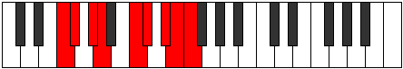
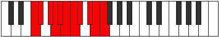

# AFlatDominantThirteenthFlatNinth

## Links

- [Documentation](index.md)
- [Scales Index](Scales.md)
- [Modes Index](Modes.md)
- [Chords Index](Chords.md)

## Root

Ab

## Notes

| Position | Notes | Illustration |
|----------|------|--------------|
| RootPosition | Ab,C,Eb,Gb,Bbb,Db,F |  |
| FirstInversion | C,Eb,Gb,Bbb,Db,F,Ab |  |
| SecondInversion | Eb,Gb,Bbb,Db,F,Ab,C |  |
| ThirdInversion | Gb,Bbb,Db,F,Ab,C,Eb |  |
| FourthInversion | Bbb,Db,F,Ab,C,Eb,Gb |  |
| FifthInversion | Db,F,Ab,C,Eb,Gb,Bbb |  |
| SixthInversion | F,Ab,C,Eb,Gb,Bbb,Db |  |
## Modes

| Number | Mode | Tonic | Notes | Illustration |
|--------|------|-------|-------|--------------|
| [875](https://ianring.com/musictheory/scales/875) | [Stothian](ModeCNaturalStothian.md) | C | C, Db, Eb, F, Gb, Ab, Bbb, C |  |
| [879](https://ianring.com/musictheory/scales/879) | [Aeolocryllic](ModeCNaturalAeolocryllic.md) | C | C, C#, D, D#, F, F#, G#, A, C |  |
| [891](https://ianring.com/musictheory/scales/891) | [Ionilyllic](ModeCNaturalIonilyllic.md) | C | C, C#, D#, E, F, F#, G#, A, C |  |
| [895](https://ianring.com/musictheory/scales/895) | [Aeolathygic](ModeCNaturalAeolathygic.md) | C | C, C#, D, D#, E, F, F#, G#, A, C |  |
| [1003](https://ianring.com/musictheory/scales/1003) | [Ionyryllic](ModeCNaturalIonyryllic.md) | C | C, C#, D#, F, F#, G, G#, A, C |  |
| [1007](https://ianring.com/musictheory/scales/1007) | [Ionycrygic](ModeCNaturalIonycrygic.md) | C | C, C#, D, D#, F, F#, G, G#, A, C |  |
| [1019](https://ianring.com/musictheory/scales/1019) | [Aeranygic](ModeCNaturalAeranygic.md) | C | C, C#, D#, E, F, F#, G, G#, A, C |  |
| [1023](https://ianring.com/musictheory/scales/1023) | [Dodyllian](ModeCNaturalDodyllian.md) | C | C, C#, D, D#, E, F, F#, G, G#, A, C |  |
| [1435](https://ianring.com/musictheory/scales/1435) | [Phronian](ModeFNaturalPhronian.md) | F | F, Gb, Ab, Bbb, C, Db, Eb, F |  |
| [1439](https://ianring.com/musictheory/scales/1439) | [Rolyllic](ModeFNaturalRolyllic.md) | F | F, F#, G, G#, A, C, C#, D#, F |  |
| [1467](https://ianring.com/musictheory/scales/1467) | [Thydyllic](ModeFNaturalThydyllic.md) | F | F, F#, G#, A, A#, C, C#, D#, F |  |
| [1471](https://ianring.com/musictheory/scales/1471) | [Radygic](ModeFNaturalRadygic.md) | F | F, F#, G, G#, A, A#, C, C#, D#, F |  |
| [1499](https://ianring.com/musictheory/scales/1499) | [Stonyllic](ModeFNaturalStonyllic.md) | F | F, F#, G#, A, B, C, C#, D#, F |  |
| [1503](https://ianring.com/musictheory/scales/1503) | [Padygic](ModeFNaturalPadygic.md) | F | F, F#, G, G#, A, B, C, C#, D#, F |  |
| [1531](https://ianring.com/musictheory/scales/1531) | [Styptygic](ModeFNaturalStyptygic.md) | F | F, F#, G#, A, A#, B, C, C#, D#, F |  |
| [1535](https://ianring.com/musictheory/scales/1535) | [Mixodyllian](ModeFNaturalMixodyllian.md) | F | F, F#, G, G#, A, A#, B, C, C#, D#, F |  |
| [1645](https://ianring.com/musictheory/scales/1645) | [Katagian](ModeDSharpKatagian.md) | D# | D#, E#, F#, G#, A, B#, C#, D# |  |
| [1645](https://ianring.com/musictheory/scales/1645) | [Katagian](ModeEFlatKatagian.md) | Eb | Eb, F, Gb, Ab, Bbb, C, Db, Eb |  |
| [1647](https://ianring.com/musictheory/scales/1647) | [Polyllic](ModeDSharpPolyllic.md) | D# | D#, E, F, F#, G#, A, C, C#, D# |  |
| [1647](https://ianring.com/musictheory/scales/1647) | [Polyllic](ModeEFlatPolyllic.md) | Eb | Eb, E, F, Gb, Ab, A, C, Db, Eb |  |
| [1661](https://ianring.com/musictheory/scales/1661) | [Gonyllic](ModeDSharpGonyllic.md) | D# | D#, F, F#, G, G#, A, C, C#, D# |  |
| [1661](https://ianring.com/musictheory/scales/1661) | [Gonyllic](ModeEFlatGonyllic.md) | Eb | Eb, F, Gb, G, Ab, A, C, Db, Eb |  |
| [1663](https://ianring.com/musictheory/scales/1663) | [Lydygic](ModeDSharpLydygic.md) | D# | D#, E, F, F#, G, G#, A, C, C#, D# |  |
| [1663](https://ianring.com/musictheory/scales/1663) | [Lydygic](ModeEFlatLydygic.md) | Eb | Eb, E, F, Gb, G, Ab, A, C, Db, Eb |  |
| [1715](https://ianring.com/musictheory/scales/1715) | [Aeronian](ModeGSharpAeronian.md) | G# | G#, A, B#, C#, D#, E#, F#, G# |  |
| [1715](https://ianring.com/musictheory/scales/1715) | [Aeronian](ModeAFlatAeronian.md) | Ab | Ab, Bbb, C, Db, Eb, F, Gb, Ab |  |
| [1719](https://ianring.com/musictheory/scales/1719) | [Lyryllic](ModeGSharpLyryllic.md) | G# | G#, A, A#, C, C#, D#, F, F#, G# |  |
| [1719](https://ianring.com/musictheory/scales/1719) | [Lyryllic](ModeAFlatLyryllic.md) | Ab | Ab, A, Bb, C, Db, Eb, F, Gb, Ab |  |
| [1723](https://ianring.com/musictheory/scales/1723) | [Poryllic](ModeGSharpPoryllic.md) | G# | G#, A, B, C, C#, D#, F, F#, G# |  |
| [1723](https://ianring.com/musictheory/scales/1723) | [Poryllic](ModeAFlatPoryllic.md) | Ab | Ab, A, B, C, Db, Eb, F, Gb, Ab |  |
| [1727](https://ianring.com/musictheory/scales/1727) | [Sydygic](ModeGSharpSydygic.md) | G# | G#, A, A#, B, C, C#, D#, F, F#, G# |  |
| [1727](https://ianring.com/musictheory/scales/1727) | [Sydygic](ModeAFlatSydygic.md) | Ab | Ab, A, Bb, B, C, Db, Eb, F, Gb, Ab |  |
| [1751](https://ianring.com/musictheory/scales/1751) | [Aeolyryllic](ModeBNaturalAeolyryllic.md) | B | B, C, C#, D#, F, F#, G#, A, B |  |
| [1759](https://ianring.com/musictheory/scales/1759) | [Pylygic](ModeBNaturalPylygic.md) | B | B, C, C#, D, D#, F, F#, G#, A, B |  |
| [1773](https://ianring.com/musictheory/scales/1773) | [Aeoloryllic](ModeDSharpAeoloryllic.md) | D# | D#, F, F#, G#, A, A#, C, C#, D# |  |
| [1773](https://ianring.com/musictheory/scales/1773) | [Aeoloryllic](ModeEFlatAeoloryllic.md) | Eb | Eb, F, Gb, Ab, A, Bb, C, Db, Eb |  |
| [1775](https://ianring.com/musictheory/scales/1775) | [Lyrygic](ModeDSharpLyrygic.md) | D# | D#, E, F, F#, G#, A, A#, C, C#, D# |  |
| [1775](https://ianring.com/musictheory/scales/1775) | [Lyrygic](ModeEFlatLyrygic.md) | Eb | Eb, E, F, Gb, Ab, A, Bb, C, Db, Eb |  |
| [1779](https://ianring.com/musictheory/scales/1779) | [Aerythyllic](ModeGSharpAerythyllic.md) | G# | G#, A, C, C#, D, D#, F, F#, G# |  |
| [1779](https://ianring.com/musictheory/scales/1779) | [Aerythyllic](ModeAFlatAerythyllic.md) | Ab | Ab, A, C, Db, D, Eb, F, Gb, Ab |  |
| [1783](https://ianring.com/musictheory/scales/1783) | [Danygic](ModeGSharpDanygic.md) | G# | G#, A, A#, C, C#, D, D#, F, F#, G# |  |
| [1783](https://ianring.com/musictheory/scales/1783) | [Danygic](ModeAFlatDanygic.md) | Ab | Ab, A, Bb, C, Db, D, Eb, F, Gb, Ab |  |
| [1783](https://ianring.com/musictheory/scales/1783) | [Danygic](ModeBNaturalDanygic.md) | B | B, C, C#, D#, E, F, F#, G#, A, B |  |
| [1787](https://ianring.com/musictheory/scales/1787) | [Mycrygic](ModeGSharpMycrygic.md) | G# | G#, A, B, C, C#, D, D#, F, F#, G# |  |
| [1787](https://ianring.com/musictheory/scales/1787) | [Mycrygic](ModeAFlatMycrygic.md) | Ab | Ab, A, B, C, Db, D, Eb, F, Gb, Ab |  |
| [1789](https://ianring.com/musictheory/scales/1789) | [Katagygic](ModeDSharpKatagygic.md) | D# | D#, F, F#, G, G#, A, A#, C, C#, D# |  |
| [1789](https://ianring.com/musictheory/scales/1789) | [Katagygic](ModeEFlatKatagygic.md) | Eb | Eb, F, Gb, G, Ab, A, Bb, C, Db, Eb |  |
| [1791](https://ianring.com/musictheory/scales/1791) | [Aerygyllian](ModeDSharpAerygyllian.md) | D# | D#, E, F, F#, G, G#, A, A#, C, C#, D# |  |
| [1791](https://ianring.com/musictheory/scales/1791) | [Aerygyllian](ModeEFlatAerygyllian.md) | Eb | Eb, E, F, Gb, G, Ab, A, Bb, C, Db, Eb |  |
| [1791](https://ianring.com/musictheory/scales/1791) | [Aerygyllian](ModeBNaturalAerygyllian.md) | B | B, C, C#, D, D#, E, F, F#, G#, A, B |  |
| [1791](https://ianring.com/musictheory/scales/1791) | [Aerygyllian](ModeGSharpAerygyllian.md) | G# | G#, A, A#, B, C, C#, D, D#, F, F#, G# |  |
| [1791](https://ianring.com/musictheory/scales/1791) | [Aerygyllian](ModeAFlatAerygyllian.md) | Ab | Ab, A, Bb, B, C, Db, D, Eb, F, Gb, Ab |  |
| [1899](https://ianring.com/musictheory/scales/1899) | [Moptyllic](ModeCNaturalMoptyllic.md) | C | C, C#, D#, F, F#, G#, A, A#, C |  |
| [1901](https://ianring.com/musictheory/scales/1901) | [Ionidyllic](ModeDSharpIonidyllic.md) | D# | D#, F, F#, G#, A, B, C, C#, D# |  |
| [1901](https://ianring.com/musictheory/scales/1901) | [Ionidyllic](ModeEFlatIonidyllic.md) | Eb | Eb, F, Gb, Ab, A, B, C, Db, Eb |  |
| [1903](https://ianring.com/musictheory/scales/1903) | [Rocrygic](ModeCNaturalRocrygic.md) | C | C, C#, D, D#, F, F#, G#, A, A#, C |  |
| [1903](https://ianring.com/musictheory/scales/1903) | [Rocrygic](ModeDSharpRocrygic.md) | D# | D#, E, F, F#, G#, A, B, C, C#, D# |  |
| [1903](https://ianring.com/musictheory/scales/1903) | [Rocrygic](ModeEFlatRocrygic.md) | Eb | Eb, E, F, Gb, Ab, A, B, C, Db, Eb |  |
| [1915](https://ianring.com/musictheory/scales/1915) | [Thydygic](ModeCNaturalThydygic.md) | C | C, C#, D#, E, F, F#, G#, A, A#, C |  |
| [1917](https://ianring.com/musictheory/scales/1917) | [Sacrygic](ModeDSharpSacrygic.md) | D# | D#, F, F#, G, G#, A, B, C, C#, D# |  |
| [1917](https://ianring.com/musictheory/scales/1917) | [Sacrygic](ModeEFlatSacrygic.md) | Eb | Eb, F, Gb, G, Ab, A, B, C, Db, Eb |  |
| [1919](https://ianring.com/musictheory/scales/1919) | [Rocryllian](ModeCNaturalRocryllian.md) | C | C, C#, D, D#, E, F, F#, G#, A, A#, C |  |
| [1919](https://ianring.com/musictheory/scales/1919) | [Rocryllian](ModeDSharpRocryllian.md) | D# | D#, E, F, F#, G, G#, A, B, C, C#, D# |  |
| [1919](https://ianring.com/musictheory/scales/1919) | [Rocryllian](ModeEFlatRocryllian.md) | Eb | Eb, E, F, Gb, G, Ab, A, B, C, Db, Eb |  |
| [1947](https://ianring.com/musictheory/scales/1947) | [Ionoyllic](ModeFNaturalIonoyllic.md) | F | F, F#, G#, A, C, C#, D, D#, F |  |
| [1951](https://ianring.com/musictheory/scales/1951) | [Gonygic](ModeFNaturalGonygic.md) | F | F, F#, G, G#, A, C, C#, D, D#, F |  |
| [1971](https://ianring.com/musictheory/scales/1971) | [Aerynyllic](ModeGSharpAerynyllic.md) | G# | G#, A, C, C#, D#, E, F, F#, G# |  |
| [1971](https://ianring.com/musictheory/scales/1971) | [Aerynyllic](ModeAFlatAerynyllic.md) | Ab | Ab, A, C, Db, Eb, E, F, Gb, Ab |  |
| [1975](https://ianring.com/musictheory/scales/1975) | [Ionocrygic](ModeGSharpIonocrygic.md) | G# | G#, A, A#, C, C#, D#, E, F, F#, G# |  |
| [1975](https://ianring.com/musictheory/scales/1975) | [Ionocrygic](ModeAFlatIonocrygic.md) | Ab | Ab, A, Bb, C, Db, Eb, E, F, Gb, Ab |  |
| [1979](https://ianring.com/musictheory/scales/1979) | [Aeradygic](ModeFNaturalAeradygic.md) | F | F, F#, G#, A, A#, C, C#, D, D#, F |  |
| [1979](https://ianring.com/musictheory/scales/1979) | [Aeradygic](ModeGSharpAeradygic.md) | G# | G#, A, B, C, C#, D#, E, F, F#, G# |  |
| [1979](https://ianring.com/musictheory/scales/1979) | [Aeradygic](ModeAFlatAeradygic.md) | Ab | Ab, A, B, C, Db, Eb, E, F, Gb, Ab |  |
| [1983](https://ianring.com/musictheory/scales/1983) | [Soryllian](ModeFNaturalSoryllian.md) | F | F, F#, G, G#, A, A#, C, C#, D, D#, F |  |
| [1983](https://ianring.com/musictheory/scales/1983) | [Soryllian](ModeGSharpSoryllian.md) | G# | G#, A, A#, B, C, C#, D#, E, F, F#, G# |  |
| [1983](https://ianring.com/musictheory/scales/1983) | [Soryllian](ModeAFlatSoryllian.md) | Ab | Ab, A, Bb, B, C, Db, Eb, E, F, Gb, Ab |  |
| [2007](https://ianring.com/musictheory/scales/2007) | [Stonygic](ModeBNaturalStonygic.md) | B | B, C, C#, D#, F, F#, G, G#, A, B |  |
| [2011](https://ianring.com/musictheory/scales/2011) | [Raphygic](ModeFNaturalRaphygic.md) | F | F, F#, G#, A, B, C, C#, D, D#, F |  |
| [2015](https://ianring.com/musictheory/scales/2015) | [Epiryllian](ModeFNaturalEpiryllian.md) | F | F, F#, G, G#, A, B, C, C#, D, D#, F |  |
| [2015](https://ianring.com/musictheory/scales/2015) | [Epiryllian](ModeBNaturalEpiryllian.md) | B | B, C, C#, D, D#, F, F#, G, G#, A, B |  |
| [2027](https://ianring.com/musictheory/scales/2027) | [Boptygic](ModeCNaturalBoptygic.md) | C | C, C#, D#, F, F#, G, G#, A, A#, C |  |
| [2029](https://ianring.com/musictheory/scales/2029) | [Mathygic](ModeDSharpMathygic.md) | D# | D#, F, F#, G#, A, A#, B, C, C#, D# |  |
| [2029](https://ianring.com/musictheory/scales/2029) | [Mathygic](ModeEFlatMathygic.md) | Eb | Eb, F, Gb, Ab, A, Bb, B, C, Db, Eb |  |
| [2031](https://ianring.com/musictheory/scales/2031) | [Gadyllian](ModeCNaturalGadyllian.md) | C | C, C#, D, D#, F, F#, G, G#, A, A#, C |  |
| [2031](https://ianring.com/musictheory/scales/2031) | [Gadyllian](ModeDSharpGadyllian.md) | D# | D#, E, F, F#, G#, A, A#, B, C, C#, D# |  |
| [2031](https://ianring.com/musictheory/scales/2031) | [Gadyllian](ModeEFlatGadyllian.md) | Eb | Eb, E, F, Gb, Ab, A, Bb, B, C, Db, Eb |  |
| [2035](https://ianring.com/musictheory/scales/2035) | [Aerythygic](ModeGSharpAerythygic.md) | G# | G#, A, C, C#, D, D#, E, F, F#, G# |  |
| [2035](https://ianring.com/musictheory/scales/2035) | [Aerythygic](ModeAFlatAerythygic.md) | Ab | Ab, A, C, Db, D, Eb, E, F, Gb, Ab |  |
| [2039](https://ianring.com/musictheory/scales/2039) | [Danyllian](ModeGSharpDanyllian.md) | G# | G#, A, A#, C, C#, D, D#, E, F, F#, G# |  |
| [2039](https://ianring.com/musictheory/scales/2039) | [Danyllian](ModeAFlatDanyllian.md) | Ab | Ab, A, Bb, C, Db, D, Eb, E, F, Gb, Ab |  |
| [2039](https://ianring.com/musictheory/scales/2039) | [Danyllian](ModeBNaturalDanyllian.md) | B | B, C, C#, D#, E, F, F#, G, G#, A, B |  |
| [2043](https://ianring.com/musictheory/scales/2043) | [Lythyllian](ModeCNaturalLythyllian.md) | C | C, C#, D#, E, F, F#, G, G#, A, A#, C |  |
| [2043](https://ianring.com/musictheory/scales/2043) | [Lythyllian](ModeGSharpLythyllian.md) | G# | G#, A, B, C, C#, D, D#, E, F, F#, G# |  |
| [2043](https://ianring.com/musictheory/scales/2043) | [Lythyllian](ModeAFlatLythyllian.md) | Ab | Ab, A, B, C, Db, D, Eb, E, F, Gb, Ab |  |
| [2043](https://ianring.com/musictheory/scales/2043) | [Lythyllian](ModeFNaturalLythyllian.md) | F | F, F#, G#, A, A#, B, C, C#, D, D#, F |  |
| [2045](https://ianring.com/musictheory/scales/2045) | [Katogyllian](ModeDSharpKatogyllian.md) | D# | D#, F, F#, G, G#, A, A#, B, C, C#, D# |  |
| [2045](https://ianring.com/musictheory/scales/2045) | [Katogyllian](ModeEFlatKatogyllian.md) | Eb | Eb, F, Gb, G, Ab, A, Bb, B, C, Db, Eb |  |
| [2047](https://ianring.com/musictheory/scales/2047) | [Monatic](ModeCNaturalMonatic.md) | C | C, C#, D, D#, E, F, F#, G, G#, A, A#, C |  |
| [2047](https://ianring.com/musictheory/scales/2047) | [Monatic](ModeBNaturalMonatic.md) | B | B, C, C#, D, D#, E, F, F#, G, G#, A, B |  |
| [2047](https://ianring.com/musictheory/scales/2047) | [Monatic](ModeGSharpMonatic.md) | G# | G#, A, A#, B, C, C#, D, D#, E, F, F#, G# |  |
| [2047](https://ianring.com/musictheory/scales/2047) | [Monatic](ModeAFlatMonatic.md) | Ab | Ab, A, Bb, B, C, Db, D, Eb, E, F, Gb, Ab |  |
| [2047](https://ianring.com/musictheory/scales/2047) | [Monatic](ModeFNaturalMonatic.md) | F | F, F#, G, G#, A, A#, B, C, C#, D, D#, F |  |
| [2047](https://ianring.com/musictheory/scales/2047) | [Monatic](ModeDSharpMonatic.md) | D# | D#, E, F, F#, G, G#, A, A#, B, C, C#, D# |  |
| [2047](https://ianring.com/musictheory/scales/2047) | [Monatic](ModeEFlatMonatic.md) | Eb | Eb, E, F, Gb, G, Ab, A, Bb, B, C, Db, Eb |  |
| [2485](https://ianring.com/musictheory/scales/2485) | [Aerorian](ModeCSharpAerorian.md) | C# | C#, D#, E#, F#, G#, A, B#, C# |  |
| [2485](https://ianring.com/musictheory/scales/2485) | [Aerorian](ModeDFlatAerorian.md) | Db | Db, Eb, F, Gb, Ab, Bbb, C, Db |  |
| [2487](https://ianring.com/musictheory/scales/2487) | [Phroptyllic](ModeCSharpPhroptyllic.md) | C# | C#, D, D#, F, F#, G#, A, C, C# |  |
| [2487](https://ianring.com/musictheory/scales/2487) | [Phroptyllic](ModeDFlatPhroptyllic.md) | Db | Db, D, Eb, F, Gb, Ab, A, C, Db |  |
| [2493](https://ianring.com/musictheory/scales/2493) | [Manyllic](ModeCSharpManyllic.md) | C# | C#, D#, E, F, F#, G#, A, C, C# |  |
| [2493](https://ianring.com/musictheory/scales/2493) | [Manyllic](ModeDFlatManyllic.md) | Db | Db, Eb, E, F, Gb, Ab, A, C, Db |  |
| [2495](https://ianring.com/musictheory/scales/2495) | [Aeolocrygic](ModeCSharpAeolocrygic.md) | C# | C#, D, D#, E, F, F#, G#, A, C, C# |  |
| [2495](https://ianring.com/musictheory/scales/2495) | [Aeolocrygic](ModeDFlatAeolocrygic.md) | Db | Db, D, Eb, E, F, Gb, Ab, A, C, Db |  |
| [2549](https://ianring.com/musictheory/scales/2549) | [Rydyllic](ModeCSharpRydyllic.md) | C# | C#, D#, F, F#, G, G#, A, C, C# |  |
| [2549](https://ianring.com/musictheory/scales/2549) | [Rydyllic](ModeDFlatRydyllic.md) | Db | Db, Eb, F, Gb, G, Ab, A, C, Db |  |
| [2551](https://ianring.com/musictheory/scales/2551) | [Zoptygic](ModeCSharpZoptygic.md) | C# | C#, D, D#, F, F#, G, G#, A, C, C# |  |
| [2551](https://ianring.com/musictheory/scales/2551) | [Zoptygic](ModeDFlatZoptygic.md) | Db | Db, D, Eb, F, Gb, G, Ab, A, C, Db |  |
| [2557](https://ianring.com/musictheory/scales/2557) | [Dothygic](ModeCSharpDothygic.md) | C# | C#, D#, E, F, F#, G, G#, A, C, C# |  |
| [2557](https://ianring.com/musictheory/scales/2557) | [Dothygic](ModeDFlatDothygic.md) | Db | Db, Eb, E, F, Gb, G, Ab, A, C, Db |  |
| [2559](https://ianring.com/musictheory/scales/2559) | [Zogyllian](ModeCSharpZogyllian.md) | C# | C#, D, D#, E, F, F#, G, G#, A, C, C# |  |
| [2559](https://ianring.com/musictheory/scales/2559) | [Zogyllian](ModeDFlatZogyllian.md) | Db | Db, D, Eb, E, F, Gb, G, Ab, A, C, Db |  |
| [2765](https://ianring.com/musictheory/scales/2765) | [Banian](ModeFSharpBanian.md) | F# | F#, G#, A, B#, C#, D#, E#, F# |  |
| [2765](https://ianring.com/musictheory/scales/2765) | [Banian](ModeGFlatBanian.md) | Gb | Gb, Ab, Bbb, C, Db, Eb, F, Gb |  |
| [2767](https://ianring.com/musictheory/scales/2767) | [Katydyllic](ModeFSharpKatydyllic.md) | F# | F#, G, G#, A, C, C#, D#, F, F# |  |
| [2767](https://ianring.com/musictheory/scales/2767) | [Katydyllic](ModeGFlatKatydyllic.md) | Gb | Gb, G, Ab, A, C, Db, Eb, F, Gb |  |
| [2781](https://ianring.com/musictheory/scales/2781) | [Gycryllic](ModeFSharpGycryllic.md) | F# | F#, G#, A, A#, C, C#, D#, F, F# |  |
| [2781](https://ianring.com/musictheory/scales/2781) | [Gycryllic](ModeGFlatGycryllic.md) | Gb | Gb, Ab, A, Bb, C, Db, Eb, F, Gb |  |
| [2783](https://ianring.com/musictheory/scales/2783) | [Gothygic](ModeFSharpGothygic.md) | F# | F#, G, G#, A, A#, C, C#, D#, F, F# |  |
| [2783](https://ianring.com/musictheory/scales/2783) | [Gothygic](ModeGFlatGothygic.md) | Gb | Gb, G, Ab, A, Bb, C, Db, Eb, F, Gb |  |
| [2797](https://ianring.com/musictheory/scales/2797) | [Stalyllic](ModeFSharpStalyllic.md) | F# | F#, G#, A, B, C, C#, D#, F, F# |  |
| [2797](https://ianring.com/musictheory/scales/2797) | [Stalyllic](ModeGFlatStalyllic.md) | Gb | Gb, Ab, A, B, C, Db, Eb, F, Gb |  |
| [2799](https://ianring.com/musictheory/scales/2799) | [Epilygic](ModeFSharpEpilygic.md) | F# | F#, G, G#, A, B, C, C#, D#, F, F# |  |
| [2799](https://ianring.com/musictheory/scales/2799) | [Epilygic](ModeGFlatEpilygic.md) | Gb | Gb, G, Ab, A, B, C, Db, Eb, F, Gb |  |
| [2813](https://ianring.com/musictheory/scales/2813) | [Zolygic](ModeFSharpZolygic.md) | F# | F#, G#, A, A#, B, C, C#, D#, F, F# |  |
| [2813](https://ianring.com/musictheory/scales/2813) | [Zolygic](ModeGFlatZolygic.md) | Gb | Gb, Ab, A, Bb, B, C, Db, Eb, F, Gb |  |
| [2815](https://ianring.com/musictheory/scales/2815) | [Aeradyllian](ModeFSharpAeradyllian.md) | F# | F#, G, G#, A, A#, B, C, C#, D#, F, F# |  |
| [2815](https://ianring.com/musictheory/scales/2815) | [Aeradyllian](ModeGFlatAeradyllian.md) | Gb | Gb, G, Ab, A, Bb, B, C, Db, Eb, F, Gb |  |
| [2871](https://ianring.com/musictheory/scales/2871) | [Stanyllic](ModeENaturalStanyllic.md) | E | E, F, F#, G#, A, C, C#, D#, E |  |
| [2879](https://ianring.com/musictheory/scales/2879) | [Stadygic](ModeENaturalStadygic.md) | E | E, F, F#, G, G#, A, C, C#, D#, E |  |
| [2905](https://ianring.com/musictheory/scales/2905) | [Palian](ModeANaturalPalian.md) | A | A, B#, C#, D#, E#, F#, G#, A |  |
| [2907](https://ianring.com/musictheory/scales/2907) | [Mogyllic](ModeANaturalMogyllic.md) | A | A, A#, C, C#, D#, F, F#, G#, A |  |
| [2909](https://ianring.com/musictheory/scales/2909) | [Mocryllic](ModeANaturalMocryllic.md) | A | A, B, C, C#, D#, F, F#, G#, A |  |
| [2911](https://ianring.com/musictheory/scales/2911) | [Katygic](ModeANaturalKatygic.md) | A | A, A#, B, C, C#, D#, F, F#, G#, A |  |
| [2923](https://ianring.com/musictheory/scales/2923) | [Baryllic](ModeCNaturalBaryllic.md) | C | C, C#, D#, F, F#, G#, A, B, C |  |
| [2927](https://ianring.com/musictheory/scales/2927) | [Rodygic](ModeCNaturalRodygic.md) | C | C, C#, D, D#, F, F#, G#, A, B, C |  |
| [2935](https://ianring.com/musictheory/scales/2935) | [Modygic](ModeENaturalModygic.md) | E | E, F, F#, G#, A, A#, C, C#, D#, E |  |
| [2937](https://ianring.com/musictheory/scales/2937) | [Aeolathyllic](ModeANaturalAeolathyllic.md) | A | A, C, C#, D, D#, F, F#, G#, A |  |
| [2939](https://ianring.com/musictheory/scales/2939) | [Goptygic](ModeANaturalGoptygic.md) | A | A, A#, C, C#, D, D#, F, F#, G#, A |  |
| [2939](https://ianring.com/musictheory/scales/2939) | [Goptygic](ModeCNaturalGoptygic.md) | C | C, C#, D#, E, F, F#, G#, A, B, C |  |
| [2941](https://ianring.com/musictheory/scales/2941) | [Laptygic](ModeANaturalLaptygic.md) | A | A, B, C, C#, D, D#, F, F#, G#, A |  |
| [2943](https://ianring.com/musictheory/scales/2943) | [Dathyllian](ModeENaturalDathyllian.md) | E | E, F, F#, G, G#, A, A#, C, C#, D#, E |  |
| [2943](https://ianring.com/musictheory/scales/2943) | [Dathyllian](ModeCNaturalDathyllian.md) | C | C, C#, D, D#, E, F, F#, G#, A, B, C |  |
| [2943](https://ianring.com/musictheory/scales/2943) | [Dathyllian](ModeANaturalDathyllian.md) | A | A, A#, B, C, C#, D, D#, F, F#, G#, A |  |
| [2997](https://ianring.com/musictheory/scales/2997) | [Ionoptyllic](ModeCSharpIonoptyllic.md) | C# | C#, D#, F, F#, G#, A, A#, C, C# |  |
| [2997](https://ianring.com/musictheory/scales/2997) | [Ionoptyllic](ModeDFlatIonoptyllic.md) | Db | Db, Eb, F, Gb, Ab, A, Bb, C, Db |  |
| [2999](https://ianring.com/musictheory/scales/2999) | [Zyrygic](ModeCSharpZyrygic.md) | C# | C#, D, D#, F, F#, G#, A, A#, C, C# |  |
| [2999](https://ianring.com/musictheory/scales/2999) | [Zyrygic](ModeDFlatZyrygic.md) | Db | Db, D, Eb, F, Gb, Ab, A, Bb, C, Db |  |
| [2999](https://ianring.com/musictheory/scales/2999) | [Zyrygic](ModeENaturalZyrygic.md) | E | E, F, F#, G#, A, B, C, C#, D#, E |  |
| [3005](https://ianring.com/musictheory/scales/3005) | [Gycrygic](ModeCSharpGycrygic.md) | C# | C#, D#, E, F, F#, G#, A, A#, C, C# |  |
| [3005](https://ianring.com/musictheory/scales/3005) | [Gycrygic](ModeDFlatGycrygic.md) | Db | Db, Eb, E, F, Gb, Ab, A, Bb, C, Db |  |
| [3007](https://ianring.com/musictheory/scales/3007) | [Zyryllian](ModeCSharpZyryllian.md) | C# | C#, D, D#, E, F, F#, G#, A, A#, C, C# |  |
| [3007](https://ianring.com/musictheory/scales/3007) | [Zyryllian](ModeDFlatZyryllian.md) | Db | Db, D, Eb, E, F, Gb, Ab, A, Bb, C, Db |  |
| [3007](https://ianring.com/musictheory/scales/3007) | [Zyryllian](ModeENaturalZyryllian.md) | E | E, F, F#, G, G#, A, B, C, C#, D#, E |  |
| [3021](https://ianring.com/musictheory/scales/3021) | [Gyptyllic](ModeFSharpGyptyllic.md) | F# | F#, G#, A, C, C#, D, D#, F, F# |  |
| [3021](https://ianring.com/musictheory/scales/3021) | [Gyptyllic](ModeGFlatGyptyllic.md) | Gb | Gb, Ab, A, C, Db, D, Eb, F, Gb |  |
| [3023](https://ianring.com/musictheory/scales/3023) | [Aeracrygic](ModeFSharpAeracrygic.md) | F# | F#, G, G#, A, C, C#, D, D#, F, F# |  |
| [3023](https://ianring.com/musictheory/scales/3023) | [Aeracrygic](ModeGFlatAeracrygic.md) | Gb | Gb, G, Ab, A, C, Db, D, Eb, F, Gb |  |
| [3033](https://ianring.com/musictheory/scales/3033) | [Doptyllic](ModeANaturalDoptyllic.md) | A | A, C, C#, D#, E, F, F#, G#, A |  |
| [3035](https://ianring.com/musictheory/scales/3035) | [Gocrygic](ModeANaturalGocrygic.md) | A | A, A#, C, C#, D#, E, F, F#, G#, A |  |
| [3037](https://ianring.com/musictheory/scales/3037) | [Staptygic](ModeFSharpStaptygic.md) | F# | F#, G#, A, A#, C, C#, D, D#, F, F# |  |
| [3037](https://ianring.com/musictheory/scales/3037) | [Staptygic](ModeGFlatStaptygic.md) | Gb | Gb, Ab, A, Bb, C, Db, D, Eb, F, Gb |  |
| [3037](https://ianring.com/musictheory/scales/3037) | [Staptygic](ModeANaturalStaptygic.md) | A | A, B, C, C#, D#, E, F, F#, G#, A |  |
| [3039](https://ianring.com/musictheory/scales/3039) | [Godyllian](ModeFSharpGodyllian.md) | F# | F#, G, G#, A, A#, C, C#, D, D#, F, F# |  |
| [3039](https://ianring.com/musictheory/scales/3039) | [Godyllian](ModeGFlatGodyllian.md) | Gb | Gb, G, Ab, A, Bb, C, Db, D, Eb, F, Gb |  |
| [3039](https://ianring.com/musictheory/scales/3039) | [Godyllian](ModeANaturalGodyllian.md) | A | A, A#, B, C, C#, D#, E, F, F#, G#, A |  |
| [3051](https://ianring.com/musictheory/scales/3051) | [Stalygic](ModeCNaturalStalygic.md) | C | C, C#, D#, F, F#, G, G#, A, B, C |  |
| [3053](https://ianring.com/musictheory/scales/3053) | [Zycrygic](ModeFSharpZycrygic.md) | F# | F#, G#, A, B, C, C#, D, D#, F, F# |  |
| [3053](https://ianring.com/musictheory/scales/3053) | [Zycrygic](ModeGFlatZycrygic.md) | Gb | Gb, Ab, A, B, C, Db, D, Eb, F, Gb |  |
| [3055](https://ianring.com/musictheory/scales/3055) | [Lyryllian](ModeCNaturalLyryllian.md) | C | C, C#, D, D#, F, F#, G, G#, A, B, C |  |
| [3055](https://ianring.com/musictheory/scales/3055) | [Lyryllian](ModeFSharpLyryllian.md) | F# | F#, G, G#, A, B, C, C#, D, D#, F, F# |  |
| [3055](https://ianring.com/musictheory/scales/3055) | [Lyryllian](ModeGFlatLyryllian.md) | Gb | Gb, G, Ab, A, B, C, Db, D, Eb, F, Gb |  |
| [3061](https://ianring.com/musictheory/scales/3061) | [Apinygic](ModeCSharpApinygic.md) | C# | C#, D#, F, F#, G, G#, A, A#, C, C# |  |
| [3061](https://ianring.com/musictheory/scales/3061) | [Apinygic](ModeDFlatApinygic.md) | Db | Db, Eb, F, Gb, G, Ab, A, Bb, C, Db |  |
| [3063](https://ianring.com/musictheory/scales/3063) | [Solyllian](ModeCSharpSolyllian.md) | C# | C#, D, D#, F, F#, G, G#, A, A#, C, C# |  |
| [3063](https://ianring.com/musictheory/scales/3063) | [Solyllian](ModeDFlatSolyllian.md) | Db | Db, D, Eb, F, Gb, G, Ab, A, Bb, C, Db |  |
| [3063](https://ianring.com/musictheory/scales/3063) | [Solyllian](ModeENaturalSolyllian.md) | E | E, F, F#, G#, A, A#, B, C, C#, D#, E |  |
| [3065](https://ianring.com/musictheory/scales/3065) | [Zothygic](ModeANaturalZothygic.md) | A | A, C, C#, D, D#, E, F, F#, G#, A |  |
| [3067](https://ianring.com/musictheory/scales/3067) | [Goptyllian](ModeANaturalGoptyllian.md) | A | A, A#, C, C#, D, D#, E, F, F#, G#, A |  |
| [3067](https://ianring.com/musictheory/scales/3067) | [Goptyllian](ModeCNaturalGoptyllian.md) | C | C, C#, D#, E, F, F#, G, G#, A, B, C |  |
| [3069](https://ianring.com/musictheory/scales/3069) | [Bacryllian](ModeCSharpBacryllian.md) | C# | C#, D#, E, F, F#, G, G#, A, A#, C, C# |  |
| [3069](https://ianring.com/musictheory/scales/3069) | [Bacryllian](ModeDFlatBacryllian.md) | Db | Db, Eb, E, F, Gb, G, Ab, A, Bb, C, Db |  |
| [3069](https://ianring.com/musictheory/scales/3069) | [Bacryllian](ModeANaturalBacryllian.md) | A | A, B, C, C#, D, D#, E, F, F#, G#, A |  |
| [3069](https://ianring.com/musictheory/scales/3069) | [Bacryllian](ModeFSharpBacryllian.md) | F# | F#, G#, A, A#, B, C, C#, D, D#, F, F# |  |
| [3069](https://ianring.com/musictheory/scales/3069) | [Bacryllian](ModeGFlatBacryllian.md) | Gb | Gb, Ab, A, Bb, B, C, Db, D, Eb, F, Gb |  |
| [3071](https://ianring.com/musictheory/scales/3071) | [Solatic](ModeCSharpSolatic.md) | C# | C#, D, D#, E, F, F#, G, G#, A, A#, C, C# |  |
| [3071](https://ianring.com/musictheory/scales/3071) | [Solatic](ModeDFlatSolatic.md) | Db | Db, D, Eb, E, F, Gb, G, Ab, A, Bb, C, Db |  |
| [3071](https://ianring.com/musictheory/scales/3071) | [Solatic](ModeCNaturalSolatic.md) | C | C, C#, D, D#, E, F, F#, G, G#, A, B, C |  |
| [3071](https://ianring.com/musictheory/scales/3071) | [Solatic](ModeANaturalSolatic.md) | A | A, A#, B, C, C#, D, D#, E, F, F#, G#, A |  |
| [3071](https://ianring.com/musictheory/scales/3071) | [Solatic](ModeFSharpSolatic.md) | F# | F#, G, G#, A, A#, B, C, C#, D, D#, F, F# |  |
| [3071](https://ianring.com/musictheory/scales/3071) | [Solatic](ModeGFlatSolatic.md) | Gb | Gb, G, Ab, A, Bb, B, C, Db, D, Eb, F, Gb |  |
| [3071](https://ianring.com/musictheory/scales/3071) | [Solatic](ModeENaturalSolatic.md) | E | E, F, F#, G, G#, A, A#, B, C, C#, D#, E |  |
| [3291](https://ianring.com/musictheory/scales/3291) | [Kodyllic](ModeDNaturalKodyllic.md) | D | D, D#, F, F#, G#, A, C, C#, D |  |
| [3295](https://ianring.com/musictheory/scales/3295) | [Phroptygic](ModeDNaturalPhroptygic.md) | D | D, D#, E, F, F#, G#, A, C, C#, D |  |
| [3323](https://ianring.com/musictheory/scales/3323) | [Phrygygic](ModeDNaturalPhrygygic.md) | D | D, D#, F, F#, G, G#, A, C, C#, D |  |
| [3327](https://ianring.com/musictheory/scales/3327) | [Madyllian](ModeDNaturalMadyllian.md) | D | D, D#, E, F, F#, G, G#, A, C, C#, D |  |
| [3431](https://ianring.com/musictheory/scales/3431) | [Zyptyllic](ModeGNaturalZyptyllic.md) | G | G, G#, A, C, C#, D#, F, F#, G |  |
| [3439](https://ianring.com/musictheory/scales/3439) | [Lythygic](ModeGNaturalLythygic.md) | G | G, G#, A, A#, C, C#, D#, F, F#, G |  |
| [3447](https://ianring.com/musictheory/scales/3447) | [Kynygic](ModeGNaturalKynygic.md) | G | G, G#, A, B, C, C#, D#, F, F#, G |  |
| [3455](https://ianring.com/musictheory/scales/3455) | [Ryptyllian](ModeGNaturalRyptyllian.md) | G | G, G#, A, A#, B, C, C#, D#, F, F#, G |  |
| [3483](https://ianring.com/musictheory/scales/3483) | [Mixotharyllic](ModeFNaturalMixotharyllic.md) | F | F, F#, G#, A, C, C#, D#, E, F |  |
| [3487](https://ianring.com/musictheory/scales/3487) | [Byptygic](ModeFNaturalByptygic.md) | F | F, F#, G, G#, A, C, C#, D#, E, F |  |
| [3501](https://ianring.com/musictheory/scales/3501) | [Katodyllic](ModeASharpKatodyllic.md) | A# | A#, C, C#, D#, F, F#, G#, A, A# |  |
| [3501](https://ianring.com/musictheory/scales/3501) | [Katodyllic](ModeBFlatKatodyllic.md) | Bb | Bb, C, Db, Eb, F, Gb, Ab, A, Bb |  |
| [3503](https://ianring.com/musictheory/scales/3503) | [Zyphygic](ModeASharpZyphygic.md) | A# | A#, B, C, C#, D#, F, F#, G#, A, A# |  |
| [3503](https://ianring.com/musictheory/scales/3503) | [Zyphygic](ModeBFlatZyphygic.md) | Bb | Bb, B, C, Db, Eb, F, Gb, Ab, A, Bb |  |
| [3509](https://ianring.com/musictheory/scales/3509) | [Stogyllic](ModeCSharpStogyllic.md) | C# | C#, D#, F, F#, G#, A, B, C, C# |  |
| [3509](https://ianring.com/musictheory/scales/3509) | [Stogyllic](ModeDFlatStogyllic.md) | Db | Db, Eb, F, Gb, Ab, A, B, C, Db |  |
| [3511](https://ianring.com/musictheory/scales/3511) | [Epolygic](ModeCSharpEpolygic.md) | C# | C#, D, D#, F, F#, G#, A, B, C, C# |  |
| [3511](https://ianring.com/musictheory/scales/3511) | [Epolygic](ModeDFlatEpolygic.md) | Db | Db, D, Eb, F, Gb, Ab, A, B, C, Db |  |
| [3515](https://ianring.com/musictheory/scales/3515) | [Katodygic](ModeFNaturalKatodygic.md) | F | F, F#, G#, A, A#, C, C#, D#, E, F |  |
| [3517](https://ianring.com/musictheory/scales/3517) | [Epocrygic](ModeASharpEpocrygic.md) | A# | A#, C, C#, D, D#, F, F#, G#, A, A# |  |
| [3517](https://ianring.com/musictheory/scales/3517) | [Epocrygic](ModeBFlatEpocrygic.md) | Bb | Bb, C, Db, D, Eb, F, Gb, Ab, A, Bb |  |
| [3517](https://ianring.com/musictheory/scales/3517) | [Epocrygic](ModeCSharpEpocrygic.md) | C# | C#, D#, E, F, F#, G#, A, B, C, C# |  |
| [3517](https://ianring.com/musictheory/scales/3517) | [Epocrygic](ModeDFlatEpocrygic.md) | Db | Db, Eb, E, F, Gb, Ab, A, B, C, Db |  |
| [3519](https://ianring.com/musictheory/scales/3519) | [Boptyllian](ModeFNaturalBoptyllian.md) | F | F, F#, G, G#, A, A#, C, C#, D#, E, F |  |
| [3519](https://ianring.com/musictheory/scales/3519) | [Boptyllian](ModeCSharpBoptyllian.md) | C# | C#, D, D#, E, F, F#, G#, A, B, C, C# |  |
| [3519](https://ianring.com/musictheory/scales/3519) | [Boptyllian](ModeDFlatBoptyllian.md) | Db | Db, D, Eb, E, F, Gb, Ab, A, B, C, Db |  |
| [3519](https://ianring.com/musictheory/scales/3519) | [Boptyllian](ModeASharpBoptyllian.md) | A# | A#, B, C, C#, D, D#, F, F#, G#, A, A# |  |
| [3519](https://ianring.com/musictheory/scales/3519) | [Boptyllian](ModeBFlatBoptyllian.md) | Bb | Bb, B, C, Db, D, Eb, F, Gb, Ab, A, Bb |  |
| [3547](https://ianring.com/musictheory/scales/3547) | [Sadygic](ModeDNaturalSadygic.md) | D | D, D#, F, F#, G#, A, A#, C, C#, D |  |
| [3547](https://ianring.com/musictheory/scales/3547) | [Sadygic](ModeFNaturalSadygic.md) | F | F, F#, G#, A, B, C, C#, D#, E, F |  |
| [3551](https://ianring.com/musictheory/scales/3551) | [Sagyllian](ModeDNaturalSagyllian.md) | D | D, D#, E, F, F#, G#, A, A#, C, C#, D |  |
| [3551](https://ianring.com/musictheory/scales/3551) | [Sagyllian](ModeFNaturalSagyllian.md) | F | F, F#, G, G#, A, B, C, C#, D#, E, F |  |
| [3559](https://ianring.com/musictheory/scales/3559) | [Aerathygic](ModeGNaturalAerathygic.md) | G | G, G#, A, C, C#, D, D#, F, F#, G |  |
| [3565](https://ianring.com/musictheory/scales/3565) | [Aeolorygic](ModeASharpAeolorygic.md) | A# | A#, C, C#, D#, E, F, F#, G#, A, A# |  |
| [3565](https://ianring.com/musictheory/scales/3565) | [Aeolorygic](ModeBFlatAeolorygic.md) | Bb | Bb, C, Db, Eb, E, F, Gb, Ab, A, Bb |  |
| [3567](https://ianring.com/musictheory/scales/3567) | [Epityllian](ModeGNaturalEpityllian.md) | G | G, G#, A, A#, C, C#, D, D#, F, F#, G |  |
| [3567](https://ianring.com/musictheory/scales/3567) | [Epityllian](ModeASharpEpityllian.md) | A# | A#, B, C, C#, D#, E, F, F#, G#, A, A# |  |
| [3567](https://ianring.com/musictheory/scales/3567) | [Epityllian](ModeBFlatEpityllian.md) | Bb | Bb, B, C, Db, Eb, E, F, Gb, Ab, A, Bb |  |
| [3573](https://ianring.com/musictheory/scales/3573) | [Kaptygic](ModeCSharpKaptygic.md) | C# | C#, D#, F, F#, G, G#, A, B, C, C# |  |
| [3573](https://ianring.com/musictheory/scales/3573) | [Kaptygic](ModeDFlatKaptygic.md) | Db | Db, Eb, F, Gb, G, Ab, A, B, C, Db |  |
| [3575](https://ianring.com/musictheory/scales/3575) | [Mogyllian](ModeCSharpMogyllian.md) | C# | C#, D, D#, F, F#, G, G#, A, B, C, C# |  |
| [3575](https://ianring.com/musictheory/scales/3575) | [Mogyllian](ModeDFlatMogyllian.md) | Db | Db, D, Eb, F, Gb, G, Ab, A, B, C, Db |  |
| [3575](https://ianring.com/musictheory/scales/3575) | [Mogyllian](ModeGNaturalMogyllian.md) | G | G, G#, A, B, C, C#, D, D#, F, F#, G |  |
| [3579](https://ianring.com/musictheory/scales/3579) | [Zyphyllian](ModeDNaturalZyphyllian.md) | D | D, D#, F, F#, G, G#, A, A#, C, C#, D |  |
| [3579](https://ianring.com/musictheory/scales/3579) | [Zyphyllian](ModeFNaturalZyphyllian.md) | F | F, F#, G#, A, A#, B, C, C#, D#, E, F |  |
| [3581](https://ianring.com/musictheory/scales/3581) | [Epocryllian](ModeASharpEpocryllian.md) | A# | A#, C, C#, D, D#, E, F, F#, G#, A, A# |  |
| [3581](https://ianring.com/musictheory/scales/3581) | [Epocryllian](ModeBFlatEpocryllian.md) | Bb | Bb, C, Db, D, Eb, E, F, Gb, Ab, A, Bb |  |
| [3581](https://ianring.com/musictheory/scales/3581) | [Epocryllian](ModeCSharpEpocryllian.md) | C# | C#, D#, E, F, F#, G, G#, A, B, C, C# |  |
| [3581](https://ianring.com/musictheory/scales/3581) | [Epocryllian](ModeDFlatEpocryllian.md) | Db | Db, Eb, E, F, Gb, G, Ab, A, B, C, Db |  |
| [3583](https://ianring.com/musictheory/scales/3583) | [Zylatic](ModeDNaturalZylatic.md) | D | D, D#, E, F, F#, G, G#, A, A#, C, C#, D |  |
| [3583](https://ianring.com/musictheory/scales/3583) | [Zylatic](ModeCSharpZylatic.md) | C# | C#, D, D#, E, F, F#, G, G#, A, B, C, C# |  |
| [3583](https://ianring.com/musictheory/scales/3583) | [Zylatic](ModeDFlatZylatic.md) | Db | Db, D, Eb, E, F, Gb, G, Ab, A, B, C, Db |  |
| [3583](https://ianring.com/musictheory/scales/3583) | [Zylatic](ModeASharpZylatic.md) | A# | A#, B, C, C#, D, D#, E, F, F#, G#, A, A# |  |
| [3583](https://ianring.com/musictheory/scales/3583) | [Zylatic](ModeBFlatZylatic.md) | Bb | Bb, B, C, Db, D, Eb, E, F, Gb, Ab, A, Bb |  |
| [3583](https://ianring.com/musictheory/scales/3583) | [Zylatic](ModeGNaturalZylatic.md) | G | G, G#, A, A#, B, C, C#, D, D#, F, F#, G |  |
| [3583](https://ianring.com/musictheory/scales/3583) | [Zylatic](ModeFNaturalZylatic.md) | F | F, F#, G, G#, A, A#, B, C, C#, D#, E, F |  |
| [3693](https://ianring.com/musictheory/scales/3693) | [Epaptyllic](ModeDSharpEpaptyllic.md) | D# | D#, F, F#, G#, A, C, C#, D, D# |  |
| [3693](https://ianring.com/musictheory/scales/3693) | [Epaptyllic](ModeEFlatEpaptyllic.md) | Eb | Eb, F, Gb, Ab, A, C, Db, D, Eb |  |
| [3695](https://ianring.com/musictheory/scales/3695) | [Kodygic](ModeDSharpKodygic.md) | D# | D#, E, F, F#, G#, A, C, C#, D, D# |  |
| [3695](https://ianring.com/musictheory/scales/3695) | [Kodygic](ModeEFlatKodygic.md) | Eb | Eb, E, F, Gb, Ab, A, C, Db, D, Eb |  |
| [3709](https://ianring.com/musictheory/scales/3709) | [Locrygic](ModeDSharpLocrygic.md) | D# | D#, F, F#, G, G#, A, C, C#, D, D# |  |
| [3709](https://ianring.com/musictheory/scales/3709) | [Locrygic](ModeEFlatLocrygic.md) | Eb | Eb, F, Gb, G, Ab, A, C, Db, D, Eb |  |
| [3711](https://ianring.com/musictheory/scales/3711) | [Dycryllian](ModeDSharpDycryllian.md) | D# | D#, E, F, F#, G, G#, A, C, C#, D, D# |  |
| [3711](https://ianring.com/musictheory/scales/3711) | [Dycryllian](ModeEFlatDycryllian.md) | Eb | Eb, E, F, Gb, G, Ab, A, C, Db, D, Eb |  |
| [3763](https://ianring.com/musictheory/scales/3763) | [Modyllic](ModeGSharpModyllic.md) | G# | G#, A, C, C#, D#, F, F#, G, G# |  |
| [3763](https://ianring.com/musictheory/scales/3763) | [Modyllic](ModeAFlatModyllic.md) | Ab | Ab, A, C, Db, Eb, F, Gb, G, Ab |  |
| [3767](https://ianring.com/musictheory/scales/3767) | [Bacrygic](ModeGSharpBacrygic.md) | G# | G#, A, A#, C, C#, D#, F, F#, G, G# |  |
| [3767](https://ianring.com/musictheory/scales/3767) | [Bacrygic](ModeAFlatBacrygic.md) | Ab | Ab, A, Bb, C, Db, Eb, F, Gb, G, Ab |  |
| [3771](https://ianring.com/musictheory/scales/3771) | [Stophygic](ModeGSharpStophygic.md) | G# | G#, A, B, C, C#, D#, F, F#, G, G# |  |
| [3771](https://ianring.com/musictheory/scales/3771) | [Stophygic](ModeAFlatStophygic.md) | Ab | Ab, A, B, C, Db, Eb, F, Gb, G, Ab |  |
| [3775](https://ianring.com/musictheory/scales/3775) | [Loptyllian](ModeGSharpLoptyllian.md) | G# | G#, A, A#, B, C, C#, D#, F, F#, G, G# |  |
| [3775](https://ianring.com/musictheory/scales/3775) | [Loptyllian](ModeAFlatLoptyllian.md) | Ab | Ab, A, Bb, B, C, Db, Eb, F, Gb, G, Ab |  |
| [3789](https://ianring.com/musictheory/scales/3789) | [Eporyllic](ModeFSharpEporyllic.md) | F# | F#, G#, A, C, C#, D#, E, F, F# |  |
| [3789](https://ianring.com/musictheory/scales/3789) | [Eporyllic](ModeGFlatEporyllic.md) | Gb | Gb, Ab, A, C, Db, Eb, E, F, Gb |  |
| [3791](https://ianring.com/musictheory/scales/3791) | [Stodygic](ModeFSharpStodygic.md) | F# | F#, G, G#, A, C, C#, D#, E, F, F# |  |
| [3791](https://ianring.com/musictheory/scales/3791) | [Stodygic](ModeGFlatStodygic.md) | Gb | Gb, G, Ab, A, C, Db, Eb, E, F, Gb |  |
| [3799](https://ianring.com/musictheory/scales/3799) | [Aeralygic](ModeBNaturalAeralygic.md) | B | B, C, C#, D#, F, F#, G#, A, A#, B |  |
| [3803](https://ianring.com/musictheory/scales/3803) | [Epidygic](ModeDNaturalEpidygic.md) | D | D, D#, F, F#, G#, A, B, C, C#, D |  |
| [3805](https://ianring.com/musictheory/scales/3805) | [Moptygic](ModeFSharpMoptygic.md) | F# | F#, G#, A, A#, C, C#, D#, E, F, F# |  |
| [3805](https://ianring.com/musictheory/scales/3805) | [Moptygic](ModeGFlatMoptygic.md) | Gb | Gb, Ab, A, Bb, C, Db, Eb, E, F, Gb |  |
| [3807](https://ianring.com/musictheory/scales/3807) | [Bagyllian](ModeFSharpBagyllian.md) | F# | F#, G, G#, A, A#, C, C#, D#, E, F, F# |  |
| [3807](https://ianring.com/musictheory/scales/3807) | [Bagyllian](ModeGFlatBagyllian.md) | Gb | Gb, G, Ab, A, Bb, C, Db, Eb, E, F, Gb |  |
| [3807](https://ianring.com/musictheory/scales/3807) | [Bagyllian](ModeDNaturalBagyllian.md) | D | D, D#, E, F, F#, G#, A, B, C, C#, D |  |
| [3807](https://ianring.com/musictheory/scales/3807) | [Bagyllian](ModeBNaturalBagyllian.md) | B | B, C, C#, D, D#, F, F#, G#, A, A#, B |  |
| [3821](https://ianring.com/musictheory/scales/3821) | [Epyrygic](ModeDSharpEpyrygic.md) | D# | D#, F, F#, G#, A, A#, C, C#, D, D# |  |
| [3821](https://ianring.com/musictheory/scales/3821) | [Epyrygic](ModeEFlatEpyrygic.md) | Eb | Eb, F, Gb, Ab, A, Bb, C, Db, D, Eb |  |
| [3821](https://ianring.com/musictheory/scales/3821) | [Epyrygic](ModeFSharpEpyrygic.md) | F# | F#, G#, A, B, C, C#, D#, E, F, F# |  |
| [3821](https://ianring.com/musictheory/scales/3821) | [Epyrygic](ModeGFlatEpyrygic.md) | Gb | Gb, Ab, A, B, C, Db, Eb, E, F, Gb |  |
| [3823](https://ianring.com/musictheory/scales/3823) | [Epinyllian](ModeDSharpEpinyllian.md) | D# | D#, E, F, F#, G#, A, A#, C, C#, D, D# |  |
| [3823](https://ianring.com/musictheory/scales/3823) | [Epinyllian](ModeEFlatEpinyllian.md) | Eb | Eb, E, F, Gb, Ab, A, Bb, C, Db, D, Eb |  |
| [3823](https://ianring.com/musictheory/scales/3823) | [Epinyllian](ModeFSharpEpinyllian.md) | F# | F#, G, G#, A, B, C, C#, D#, E, F, F# |  |
| [3823](https://ianring.com/musictheory/scales/3823) | [Epinyllian](ModeGFlatEpinyllian.md) | Gb | Gb, G, Ab, A, B, C, Db, Eb, E, F, Gb |  |
| [3827](https://ianring.com/musictheory/scales/3827) | [Dorygic](ModeGSharpDorygic.md) | G# | G#, A, C, C#, D, D#, F, F#, G, G# |  |
| [3827](https://ianring.com/musictheory/scales/3827) | [Dorygic](ModeAFlatDorygic.md) | Ab | Ab, A, C, Db, D, Eb, F, Gb, G, Ab |  |
| [3831](https://ianring.com/musictheory/scales/3831) | [Ionyllian](ModeGSharpIonyllian.md) | G# | G#, A, A#, C, C#, D, D#, F, F#, G, G# |  |
| [3831](https://ianring.com/musictheory/scales/3831) | [Ionyllian](ModeAFlatIonyllian.md) | Ab | Ab, A, Bb, C, Db, D, Eb, F, Gb, G, Ab |  |
| [3831](https://ianring.com/musictheory/scales/3831) | [Ionyllian](ModeBNaturalIonyllian.md) | B | B, C, C#, D#, E, F, F#, G#, A, A#, B |  |
| [3835](https://ianring.com/musictheory/scales/3835) | [Katodyllian](ModeDNaturalKatodyllian.md) | D | D, D#, F, F#, G, G#, A, B, C, C#, D |  |
| [3835](https://ianring.com/musictheory/scales/3835) | [Katodyllian](ModeGSharpKatodyllian.md) | G# | G#, A, B, C, C#, D, D#, F, F#, G, G# |  |
| [3835](https://ianring.com/musictheory/scales/3835) | [Katodyllian](ModeAFlatKatodyllian.md) | Ab | Ab, A, B, C, Db, D, Eb, F, Gb, G, Ab |  |
| [3837](https://ianring.com/musictheory/scales/3837) | [Garyllian](ModeDSharpGaryllian.md) | D# | D#, F, F#, G, G#, A, A#, C, C#, D, D# |  |
| [3837](https://ianring.com/musictheory/scales/3837) | [Garyllian](ModeEFlatGaryllian.md) | Eb | Eb, F, Gb, G, Ab, A, Bb, C, Db, D, Eb |  |
| [3837](https://ianring.com/musictheory/scales/3837) | [Garyllian](ModeFSharpGaryllian.md) | F# | F#, G#, A, A#, B, C, C#, D#, E, F, F# |  |
| [3837](https://ianring.com/musictheory/scales/3837) | [Garyllian](ModeGFlatGaryllian.md) | Gb | Gb, Ab, A, Bb, B, C, Db, Eb, E, F, Gb |  |
| [3839](https://ianring.com/musictheory/scales/3839) | [Mixolatic](ModeDSharpMixolatic.md) | D# | D#, E, F, F#, G, G#, A, A#, C, C#, D, D# |  |
| [3839](https://ianring.com/musictheory/scales/3839) | [Mixolatic](ModeEFlatMixolatic.md) | Eb | Eb, E, F, Gb, G, Ab, A, Bb, C, Db, D, Eb |  |
| [3839](https://ianring.com/musictheory/scales/3839) | [Mixolatic](ModeDNaturalMixolatic.md) | D | D, D#, E, F, F#, G, G#, A, B, C, C#, D |  |
| [3839](https://ianring.com/musictheory/scales/3839) | [Mixolatic](ModeBNaturalMixolatic.md) | B | B, C, C#, D, D#, E, F, F#, G#, A, A#, B |  |
| [3839](https://ianring.com/musictheory/scales/3839) | [Mixolatic](ModeGSharpMixolatic.md) | G# | G#, A, A#, B, C, C#, D, D#, F, F#, G, G# |  |
| [3839](https://ianring.com/musictheory/scales/3839) | [Mixolatic](ModeAFlatMixolatic.md) | Ab | Ab, A, Bb, B, C, Db, D, Eb, F, Gb, G, Ab |  |
| [3839](https://ianring.com/musictheory/scales/3839) | [Mixolatic](ModeFSharpMixolatic.md) | F# | F#, G, G#, A, A#, B, C, C#, D#, E, F, F# |  |
| [3839](https://ianring.com/musictheory/scales/3839) | [Mixolatic](ModeGFlatMixolatic.md) | Gb | Gb, G, Ab, A, Bb, B, C, Db, Eb, E, F, Gb |  |
| [3895](https://ianring.com/musictheory/scales/3895) | [Eparygic](ModeENaturalEparygic.md) | E | E, F, F#, G#, A, C, C#, D, D#, E |  |
| [3903](https://ianring.com/musictheory/scales/3903) | [Aeogyllian](ModeENaturalAeogyllian.md) | E | E, F, F#, G, G#, A, C, C#, D, D#, E |  |
| [3929](https://ianring.com/musictheory/scales/3929) | [Aeolothyllic](ModeANaturalAeolothyllic.md) | A | A, C, C#, D#, F, F#, G, G#, A |  |
| [3931](https://ianring.com/musictheory/scales/3931) | [Aerygic](ModeANaturalAerygic.md) | A | A, A#, C, C#, D#, F, F#, G, G#, A |  |
| [3933](https://ianring.com/musictheory/scales/3933) | [Ionidygic](ModeANaturalIonidygic.md) | A | A, B, C, C#, D#, F, F#, G, G#, A |  |
| [3935](https://ianring.com/musictheory/scales/3935) | [Kataphyllian](ModeANaturalKataphyllian.md) | A | A, A#, B, C, C#, D#, F, F#, G, G#, A |  |
| [3943](https://ianring.com/musictheory/scales/3943) | [Zynygic](ModeGNaturalZynygic.md) | G | G, G#, A, C, C#, D#, E, F, F#, G |  |
| [3947](https://ianring.com/musictheory/scales/3947) | [Ryptygic](ModeCNaturalRyptygic.md) | C | C, C#, D#, F, F#, G#, A, A#, B, C |  |
| [3949](https://ianring.com/musictheory/scales/3949) | [Koptygic](ModeDSharpKoptygic.md) | D# | D#, F, F#, G#, A, B, C, C#, D, D# |  |
| [3949](https://ianring.com/musictheory/scales/3949) | [Koptygic](ModeEFlatKoptygic.md) | Eb | Eb, F, Gb, Ab, A, B, C, Db, D, Eb |  |
| [3951](https://ianring.com/musictheory/scales/3951) | [Mathyllian](ModeGNaturalMathyllian.md) | G | G, G#, A, A#, C, C#, D#, E, F, F#, G |  |
| [3951](https://ianring.com/musictheory/scales/3951) | [Mathyllian](ModeDSharpMathyllian.md) | D# | D#, E, F, F#, G#, A, B, C, C#, D, D# |  |
| [3951](https://ianring.com/musictheory/scales/3951) | [Mathyllian](ModeEFlatMathyllian.md) | Eb | Eb, E, F, Gb, Ab, A, B, C, Db, D, Eb |  |
| [3951](https://ianring.com/musictheory/scales/3951) | [Mathyllian](ModeCNaturalMathyllian.md) | C | C, C#, D, D#, F, F#, G#, A, A#, B, C |  |
| [3959](https://ianring.com/musictheory/scales/3959) | [Katagyllian](ModeENaturalKatagyllian.md) | E | E, F, F#, G#, A, A#, C, C#, D, D#, E |  |
| [3959](https://ianring.com/musictheory/scales/3959) | [Katagyllian](ModeGNaturalKatagyllian.md) | G | G, G#, A, B, C, C#, D#, E, F, F#, G |  |
| [3961](https://ianring.com/musictheory/scales/3961) | [Mixolydygic](ModeANaturalMixolydygic.md) | A | A, C, C#, D, D#, F, F#, G, G#, A |  |
| [3963](https://ianring.com/musictheory/scales/3963) | [Aeoryllian](ModeANaturalAeoryllian.md) | A | A, A#, C, C#, D, D#, F, F#, G, G#, A |  |
| [3963](https://ianring.com/musictheory/scales/3963) | [Aeoryllian](ModeCNaturalAeoryllian.md) | C | C, C#, D#, E, F, F#, G#, A, A#, B, C |  |
| [3965](https://ianring.com/musictheory/scales/3965) | [Thydyllian](ModeDSharpThydyllian.md) | D# | D#, F, F#, G, G#, A, B, C, C#, D, D# |  |
| [3965](https://ianring.com/musictheory/scales/3965) | [Thydyllian](ModeEFlatThydyllian.md) | Eb | Eb, F, Gb, G, Ab, A, B, C, Db, D, Eb |  |
| [3965](https://ianring.com/musictheory/scales/3965) | [Thydyllian](ModeANaturalThydyllian.md) | A | A, B, C, C#, D, D#, F, F#, G, G#, A |  |
| [3967](https://ianring.com/musictheory/scales/3967) | [Soratic](ModeENaturalSoratic.md) | E | E, F, F#, G, G#, A, A#, C, C#, D, D#, E |  |
| [3967](https://ianring.com/musictheory/scales/3967) | [Soratic](ModeDSharpSoratic.md) | D# | D#, E, F, F#, G, G#, A, B, C, C#, D, D# |  |
| [3967](https://ianring.com/musictheory/scales/3967) | [Soratic](ModeEFlatSoratic.md) | Eb | Eb, E, F, Gb, G, Ab, A, B, C, Db, D, Eb |  |
| [3967](https://ianring.com/musictheory/scales/3967) | [Soratic](ModeCNaturalSoratic.md) | C | C, C#, D, D#, E, F, F#, G#, A, A#, B, C |  |
| [3967](https://ianring.com/musictheory/scales/3967) | [Soratic](ModeANaturalSoratic.md) | A | A, A#, B, C, C#, D, D#, F, F#, G, G#, A |  |
| [3967](https://ianring.com/musictheory/scales/3967) | [Soratic](ModeGNaturalSoratic.md) | G | G, G#, A, A#, B, C, C#, D#, E, F, F#, G |  |
| [3995](https://ianring.com/musictheory/scales/3995) | [Ionygic](ModeFNaturalIonygic.md) | F | F, F#, G#, A, C, C#, D, D#, E, F |  |
| [3999](https://ianring.com/musictheory/scales/3999) | [Dydyllian](ModeFNaturalDydyllian.md) | F | F, F#, G, G#, A, C, C#, D, D#, E, F |  |
| [4013](https://ianring.com/musictheory/scales/4013) | [Dathygic](ModeASharpDathygic.md) | A# | A#, C, C#, D#, F, F#, G, G#, A, A# |  |
| [4013](https://ianring.com/musictheory/scales/4013) | [Dathygic](ModeBFlatDathygic.md) | Bb | Bb, C, Db, Eb, F, Gb, G, Ab, A, Bb |  |
| [4015](https://ianring.com/musictheory/scales/4015) | [Phradyllian](ModeASharpPhradyllian.md) | A# | A#, B, C, C#, D#, F, F#, G, G#, A, A# |  |
| [4015](https://ianring.com/musictheory/scales/4015) | [Phradyllian](ModeBFlatPhradyllian.md) | Bb | Bb, B, C, Db, Eb, F, Gb, G, Ab, A, Bb |  |
| [4019](https://ianring.com/musictheory/scales/4019) | [Lonygic](ModeGSharpLonygic.md) | G# | G#, A, C, C#, D#, E, F, F#, G, G# |  |
| [4019](https://ianring.com/musictheory/scales/4019) | [Lonygic](ModeAFlatLonygic.md) | Ab | Ab, A, C, Db, Eb, E, F, Gb, G, Ab |  |
| [4021](https://ianring.com/musictheory/scales/4021) | [Bagygic](ModeCSharpBagygic.md) | C# | C#, D#, F, F#, G#, A, A#, B, C, C# |  |
| [4021](https://ianring.com/musictheory/scales/4021) | [Bagygic](ModeDFlatBagygic.md) | Db | Db, Eb, F, Gb, Ab, A, Bb, B, C, Db |  |
| [4023](https://ianring.com/musictheory/scales/4023) | [Styptyllian](ModeGSharpStyptyllian.md) | G# | G#, A, A#, C, C#, D#, E, F, F#, G, G# |  |
| [4023](https://ianring.com/musictheory/scales/4023) | [Styptyllian](ModeAFlatStyptyllian.md) | Ab | Ab, A, Bb, C, Db, Eb, E, F, Gb, G, Ab |  |
| [4023](https://ianring.com/musictheory/scales/4023) | [Styptyllian](ModeENaturalStyptyllian.md) | E | E, F, F#, G#, A, B, C, C#, D, D#, E |  |
| [4023](https://ianring.com/musictheory/scales/4023) | [Styptyllian](ModeCSharpStyptyllian.md) | C# | C#, D, D#, F, F#, G#, A, A#, B, C, C# |  |
| [4023](https://ianring.com/musictheory/scales/4023) | [Styptyllian](ModeDFlatStyptyllian.md) | Db | Db, D, Eb, F, Gb, Ab, A, Bb, B, C, Db |  |
| [4027](https://ianring.com/musictheory/scales/4027) | [Ragyllian](ModeFNaturalRagyllian.md) | F | F, F#, G#, A, A#, C, C#, D, D#, E, F |  |
| [4027](https://ianring.com/musictheory/scales/4027) | [Ragyllian](ModeGSharpRagyllian.md) | G# | G#, A, B, C, C#, D#, E, F, F#, G, G# |  |
| [4027](https://ianring.com/musictheory/scales/4027) | [Ragyllian](ModeAFlatRagyllian.md) | Ab | Ab, A, B, C, Db, Eb, E, F, Gb, G, Ab |  |
| [4029](https://ianring.com/musictheory/scales/4029) | [Aerycryllian](ModeASharpAerycryllian.md) | A# | A#, C, C#, D, D#, F, F#, G, G#, A, A# |  |
| [4029](https://ianring.com/musictheory/scales/4029) | [Aerycryllian](ModeBFlatAerycryllian.md) | Bb | Bb, C, Db, D, Eb, F, Gb, G, Ab, A, Bb |  |
| [4029](https://ianring.com/musictheory/scales/4029) | [Aerycryllian](ModeCSharpAerycryllian.md) | C# | C#, D#, E, F, F#, G#, A, A#, B, C, C# |  |
| [4029](https://ianring.com/musictheory/scales/4029) | [Aerycryllian](ModeDFlatAerycryllian.md) | Db | Db, Eb, E, F, Gb, Ab, A, Bb, B, C, Db |  |
| [4031](https://ianring.com/musictheory/scales/4031) | [Godatic](ModeFNaturalGodatic.md) | F | F, F#, G, G#, A, A#, C, C#, D, D#, E, F |  |
| [4031](https://ianring.com/musictheory/scales/4031) | [Godatic](ModeENaturalGodatic.md) | E | E, F, F#, G, G#, A, B, C, C#, D, D#, E |  |
| [4031](https://ianring.com/musictheory/scales/4031) | [Godatic](ModeCSharpGodatic.md) | C# | C#, D, D#, E, F, F#, G#, A, A#, B, C, C# |  |
| [4031](https://ianring.com/musictheory/scales/4031) | [Godatic](ModeDFlatGodatic.md) | Db | Db, D, Eb, E, F, Gb, Ab, A, Bb, B, C, Db |  |
| [4031](https://ianring.com/musictheory/scales/4031) | [Godatic](ModeASharpGodatic.md) | A# | A#, B, C, C#, D, D#, F, F#, G, G#, A, A# |  |
| [4031](https://ianring.com/musictheory/scales/4031) | [Godatic](ModeBFlatGodatic.md) | Bb | Bb, B, C, Db, D, Eb, F, Gb, G, Ab, A, Bb |  |
| [4031](https://ianring.com/musictheory/scales/4031) | [Godatic](ModeGSharpGodatic.md) | G# | G#, A, A#, B, C, C#, D#, E, F, F#, G, G# |  |
| [4031](https://ianring.com/musictheory/scales/4031) | [Godatic](ModeAFlatGodatic.md) | Ab | Ab, A, Bb, B, C, Db, Eb, E, F, Gb, G, Ab |  |
| [4045](https://ianring.com/musictheory/scales/4045) | [Gyptygic](ModeFSharpGyptygic.md) | F# | F#, G#, A, C, C#, D, D#, E, F, F# |  |
| [4045](https://ianring.com/musictheory/scales/4045) | [Gyptygic](ModeGFlatGyptygic.md) | Gb | Gb, Ab, A, C, Db, D, Eb, E, F, Gb |  |
| [4047](https://ianring.com/musictheory/scales/4047) | [Thogyllian](ModeFSharpThogyllian.md) | F# | F#, G, G#, A, C, C#, D, D#, E, F, F# |  |
| [4047](https://ianring.com/musictheory/scales/4047) | [Thogyllian](ModeGFlatThogyllian.md) | Gb | Gb, G, Ab, A, C, Db, D, Eb, E, F, Gb |  |
| [4055](https://ianring.com/musictheory/scales/4055) | [Dagyllian](ModeBNaturalDagyllian.md) | B | B, C, C#, D#, F, F#, G, G#, A, A#, B |  |
| [4057](https://ianring.com/musictheory/scales/4057) | [Phrygic](ModeANaturalPhrygic.md) | A | A, C, C#, D#, E, F, F#, G, G#, A |  |
| [4059](https://ianring.com/musictheory/scales/4059) | [Zolyllian](ModeANaturalZolyllian.md) | A | A, A#, C, C#, D#, E, F, F#, G, G#, A |  |
| [4059](https://ianring.com/musictheory/scales/4059) | [Zolyllian](ModeFNaturalZolyllian.md) | F | F, F#, G#, A, B, C, C#, D, D#, E, F |  |
| [4059](https://ianring.com/musictheory/scales/4059) | [Zolyllian](ModeDNaturalZolyllian.md) | D | D, D#, F, F#, G#, A, A#, B, C, C#, D |  |
| [4061](https://ianring.com/musictheory/scales/4061) | [Staptyllian](ModeFSharpStaptyllian.md) | F# | F#, G#, A, A#, C, C#, D, D#, E, F, F# |  |
| [4061](https://ianring.com/musictheory/scales/4061) | [Staptyllian](ModeGFlatStaptyllian.md) | Gb | Gb, Ab, A, Bb, C, Db, D, Eb, E, F, Gb |  |
| [4061](https://ianring.com/musictheory/scales/4061) | [Staptyllian](ModeANaturalStaptyllian.md) | A | A, B, C, C#, D#, E, F, F#, G, G#, A |  |
| [4063](https://ianring.com/musictheory/scales/4063) | [Eptatic](ModeFSharpEptatic.md) | F# | F#, G, G#, A, A#, C, C#, D, D#, E, F, F# |  |
| [4063](https://ianring.com/musictheory/scales/4063) | [Eptatic](ModeGFlatEptatic.md) | Gb | Gb, G, Ab, A, Bb, C, Db, D, Eb, E, F, Gb |  |
| [4063](https://ianring.com/musictheory/scales/4063) | [Eptatic](ModeFNaturalEptatic.md) | F | F, F#, G, G#, A, B, C, C#, D, D#, E, F |  |
| [4063](https://ianring.com/musictheory/scales/4063) | [Eptatic](ModeDNaturalEptatic.md) | D | D, D#, E, F, F#, G#, A, A#, B, C, C#, D |  |
| [4063](https://ianring.com/musictheory/scales/4063) | [Eptatic](ModeBNaturalEptatic.md) | B | B, C, C#, D, D#, F, F#, G, G#, A, A#, B |  |
| [4063](https://ianring.com/musictheory/scales/4063) | [Eptatic](ModeANaturalEptatic.md) | A | A, A#, B, C, C#, D#, E, F, F#, G, G#, A |  |
| [4071](https://ianring.com/musictheory/scales/4071) | [Rygyllian](ModeGNaturalRygyllian.md) | G | G, G#, A, C, C#, D, D#, E, F, F#, G |  |
| [4075](https://ianring.com/musictheory/scales/4075) | [Katyllian](ModeCNaturalKatyllian.md) | C | C, C#, D#, F, F#, G, G#, A, A#, B, C |  |
| [4077](https://ianring.com/musictheory/scales/4077) | [Gothyllian](ModeASharpGothyllian.md) | A# | A#, C, C#, D#, E, F, F#, G, G#, A, A# |  |
| [4077](https://ianring.com/musictheory/scales/4077) | [Gothyllian](ModeBFlatGothyllian.md) | Bb | Bb, C, Db, Eb, E, F, Gb, G, Ab, A, Bb |  |
| [4077](https://ianring.com/musictheory/scales/4077) | [Gothyllian](ModeFSharpGothyllian.md) | F# | F#, G#, A, B, C, C#, D, D#, E, F, F# |  |
| [4077](https://ianring.com/musictheory/scales/4077) | [Gothyllian](ModeGFlatGothyllian.md) | Gb | Gb, Ab, A, B, C, Db, D, Eb, E, F, Gb |  |
| [4077](https://ianring.com/musictheory/scales/4077) | [Gothyllian](ModeDSharpGothyllian.md) | D# | D#, F, F#, G#, A, A#, B, C, C#, D, D# |  |
| [4077](https://ianring.com/musictheory/scales/4077) | [Gothyllian](ModeEFlatGothyllian.md) | Eb | Eb, F, Gb, Ab, A, Bb, B, C, Db, D, Eb |  |
| [4079](https://ianring.com/musictheory/scales/4079) | [Ionatic](ModeGNaturalIonatic.md) | G | G, G#, A, A#, C, C#, D, D#, E, F, F#, G |  |
| [4079](https://ianring.com/musictheory/scales/4079) | [Ionatic](ModeFSharpIonatic.md) | F# | F#, G, G#, A, B, C, C#, D, D#, E, F, F# |  |
| [4079](https://ianring.com/musictheory/scales/4079) | [Ionatic](ModeGFlatIonatic.md) | Gb | Gb, G, Ab, A, B, C, Db, D, Eb, E, F, Gb |  |
| [4079](https://ianring.com/musictheory/scales/4079) | [Ionatic](ModeDSharpIonatic.md) | D# | D#, E, F, F#, G#, A, A#, B, C, C#, D, D# |  |
| [4079](https://ianring.com/musictheory/scales/4079) | [Ionatic](ModeEFlatIonatic.md) | Eb | Eb, E, F, Gb, Ab, A, Bb, B, C, Db, D, Eb |  |
| [4079](https://ianring.com/musictheory/scales/4079) | [Ionatic](ModeCNaturalIonatic.md) | C | C, C#, D, D#, F, F#, G, G#, A, A#, B, C |  |
| [4079](https://ianring.com/musictheory/scales/4079) | [Ionatic](ModeASharpIonatic.md) | A# | A#, B, C, C#, D#, E, F, F#, G, G#, A, A# |  |
| [4079](https://ianring.com/musictheory/scales/4079) | [Ionatic](ModeBFlatIonatic.md) | Bb | Bb, B, C, Db, Eb, E, F, Gb, G, Ab, A, Bb |  |
| [4083](https://ianring.com/musictheory/scales/4083) | [Bathyllian](ModeGSharpBathyllian.md) | G# | G#, A, C, C#, D, D#, E, F, F#, G, G# |  |
| [4083](https://ianring.com/musictheory/scales/4083) | [Bathyllian](ModeAFlatBathyllian.md) | Ab | Ab, A, C, Db, D, Eb, E, F, Gb, G, Ab |  |
| [4085](https://ianring.com/musictheory/scales/4085) | [Sydyllian](ModeCSharpSydyllian.md) | C# | C#, D#, F, F#, G, G#, A, A#, B, C, C# |  |
| [4085](https://ianring.com/musictheory/scales/4085) | [Sydyllian](ModeDFlatSydyllian.md) | Db | Db, Eb, F, Gb, G, Ab, A, Bb, B, C, Db |  |
| [4087](https://ianring.com/musictheory/scales/4087) | [Aeolatic](ModeGSharpAeolatic.md) | G# | G#, A, A#, C, C#, D, D#, E, F, F#, G, G# |  |
| [4087](https://ianring.com/musictheory/scales/4087) | [Aeolatic](ModeAFlatAeolatic.md) | Ab | Ab, A, Bb, C, Db, D, Eb, E, F, Gb, G, Ab |  |
| [4087](https://ianring.com/musictheory/scales/4087) | [Aeolatic](ModeGNaturalAeolatic.md) | G | G, G#, A, B, C, C#, D, D#, E, F, F#, G |  |
| [4087](https://ianring.com/musictheory/scales/4087) | [Aeolatic](ModeENaturalAeolatic.md) | E | E, F, F#, G#, A, A#, B, C, C#, D, D#, E |  |
| [4087](https://ianring.com/musictheory/scales/4087) | [Aeolatic](ModeCSharpAeolatic.md) | C# | C#, D, D#, F, F#, G, G#, A, A#, B, C, C# |  |
| [4087](https://ianring.com/musictheory/scales/4087) | [Aeolatic](ModeDFlatAeolatic.md) | Db | Db, D, Eb, F, Gb, G, Ab, A, Bb, B, C, Db |  |
| [4087](https://ianring.com/musictheory/scales/4087) | [Aeolatic](ModeBNaturalAeolatic.md) | B | B, C, C#, D#, E, F, F#, G, G#, A, A#, B |  |
| [4089](https://ianring.com/musictheory/scales/4089) | [Katoryllian](ModeANaturalKatoryllian.md) | A | A, C, C#, D, D#, E, F, F#, G, G#, A |  |
| [4091](https://ianring.com/musictheory/scales/4091) | [Thydatic](ModeANaturalThydatic.md) | A | A, A#, C, C#, D, D#, E, F, F#, G, G#, A |  |
| [4091](https://ianring.com/musictheory/scales/4091) | [Thydatic](ModeGSharpThydatic.md) | G# | G#, A, B, C, C#, D, D#, E, F, F#, G, G# |  |
| [4091](https://ianring.com/musictheory/scales/4091) | [Thydatic](ModeAFlatThydatic.md) | Ab | Ab, A, B, C, Db, D, Eb, E, F, Gb, G, Ab |  |
| [4091](https://ianring.com/musictheory/scales/4091) | [Thydatic](ModeFNaturalThydatic.md) | F | F, F#, G#, A, A#, B, C, C#, D, D#, E, F |  |
| [4091](https://ianring.com/musictheory/scales/4091) | [Thydatic](ModeDNaturalThydatic.md) | D | D, D#, F, F#, G, G#, A, A#, B, C, C#, D |  |
| [4091](https://ianring.com/musictheory/scales/4091) | [Thydatic](ModeCNaturalThydatic.md) | C | C, C#, D#, E, F, F#, G, G#, A, A#, B, C |  |
| [4093](https://ianring.com/musictheory/scales/4093) | [Aerycratic](ModeASharpAerycratic.md) | A# | A#, C, C#, D, D#, E, F, F#, G, G#, A, A# |  |
| [4093](https://ianring.com/musictheory/scales/4093) | [Aerycratic](ModeBFlatAerycratic.md) | Bb | Bb, C, Db, D, Eb, E, F, Gb, G, Ab, A, Bb |  |
| [4093](https://ianring.com/musictheory/scales/4093) | [Aerycratic](ModeANaturalAerycratic.md) | A | A, B, C, C#, D, D#, E, F, F#, G, G#, A |  |
| [4093](https://ianring.com/musictheory/scales/4093) | [Aerycratic](ModeFSharpAerycratic.md) | F# | F#, G#, A, A#, B, C, C#, D, D#, E, F, F# |  |
| [4093](https://ianring.com/musictheory/scales/4093) | [Aerycratic](ModeGFlatAerycratic.md) | Gb | Gb, Ab, A, Bb, B, C, Db, D, Eb, E, F, Gb |  |
| [4093](https://ianring.com/musictheory/scales/4093) | [Aerycratic](ModeDSharpAerycratic.md) | D# | D#, F, F#, G, G#, A, A#, B, C, C#, D, D# |  |
| [4093](https://ianring.com/musictheory/scales/4093) | [Aerycratic](ModeEFlatAerycratic.md) | Eb | Eb, F, Gb, G, Ab, A, Bb, B, C, Db, D, Eb |  |
| [4093](https://ianring.com/musictheory/scales/4093) | [Aerycratic](ModeCSharpAerycratic.md) | C# | C#, D#, E, F, F#, G, G#, A, A#, B, C, C# |  |
| [4093](https://ianring.com/musictheory/scales/4093) | [Aerycratic](ModeDFlatAerycratic.md) | Db | Db, Eb, E, F, Gb, G, Ab, A, Bb, B, C, Db |  |
| [4095](https://ianring.com/musictheory/scales/4095) | [Chromatic](ModeCNaturalChromatic.md) | C | C, C#, D, D#, E, F, F#, G, G#, A, A#, B, C |  |
| [4095](https://ianring.com/musictheory/scales/4095) | [Chromatic](ModeCSharpChromatic.md) | C# | C#, D, D#, E, F, F#, G, G#, A, A#, B, C, C# |  |
| [4095](https://ianring.com/musictheory/scales/4095) | [Chromatic](ModeDFlatChromatic.md) | Db | Db, D, Eb, E, F, Gb, G, Ab, A, Bb, B, C, Db |  |
| [4095](https://ianring.com/musictheory/scales/4095) | [Chromatic](ModeDNaturalChromatic.md) | D | D, D#, E, F, F#, G, G#, A, A#, B, C, C#, D |  |
| [4095](https://ianring.com/musictheory/scales/4095) | [Chromatic](ModeDSharpChromatic.md) | D# | D#, E, F, F#, G, G#, A, A#, B, C, C#, D, D# |  |
| [4095](https://ianring.com/musictheory/scales/4095) | [Chromatic](ModeEFlatChromatic.md) | Eb | Eb, E, F, Gb, G, Ab, A, Bb, B, C, Db, D, Eb |  |
| [4095](https://ianring.com/musictheory/scales/4095) | [Chromatic](ModeENaturalChromatic.md) | E | E, F, F#, G, G#, A, A#, B, C, C#, D, D#, E |  |
| [4095](https://ianring.com/musictheory/scales/4095) | [Chromatic](ModeFNaturalChromatic.md) | F | F, F#, G, G#, A, A#, B, C, C#, D, D#, E, F |  |
| [4095](https://ianring.com/musictheory/scales/4095) | [Chromatic](ModeFSharpChromatic.md) | F# | F#, G, G#, A, A#, B, C, C#, D, D#, E, F, F# |  |
| [4095](https://ianring.com/musictheory/scales/4095) | [Chromatic](ModeGFlatChromatic.md) | Gb | Gb, G, Ab, A, Bb, B, C, Db, D, Eb, E, F, Gb |  |
| [4095](https://ianring.com/musictheory/scales/4095) | [Chromatic](ModeGNaturalChromatic.md) | G | G, G#, A, A#, B, C, C#, D, D#, E, F, F#, G |  |
| [4095](https://ianring.com/musictheory/scales/4095) | [Chromatic](ModeGSharpChromatic.md) | G# | G#, A, A#, B, C, C#, D, D#, E, F, F#, G, G# |  |
| [4095](https://ianring.com/musictheory/scales/4095) | [Chromatic](ModeAFlatChromatic.md) | Ab | Ab, A, Bb, B, C, Db, D, Eb, E, F, Gb, G, Ab |  |
| [4095](https://ianring.com/musictheory/scales/4095) | [Chromatic](ModeANaturalChromatic.md) | A | A, A#, B, C, C#, D, D#, E, F, F#, G, G#, A |  |
| [4095](https://ianring.com/musictheory/scales/4095) | [Chromatic](ModeASharpChromatic.md) | A# | A#, B, C, C#, D, D#, E, F, F#, G, G#, A, A# |  |
| [4095](https://ianring.com/musictheory/scales/4095) | [Chromatic](ModeBFlatChromatic.md) | Bb | Bb, B, C, Db, D, Eb, E, F, Gb, G, Ab, A, Bb |  |
| [4095](https://ianring.com/musictheory/scales/4095) | [Chromatic](ModeBNaturalChromatic.md) | B | B, C, C#, D, D#, E, F, F#, G, G#, A, A#, B |  |
