# AFlatMajorSeventh

## Links

- [Documentation](README.md)
- [Scales Index](Scales.md)
- [Modes Index](Modes.md)
- [Chords Index](Chords.md)

## Root

Ab

## Notes

| Position | Notes | Illustration |
|----------|------|--------------|
| RootPosition | Ab,C,Eb,G |  |
| FirstInversion | C,Eb,G,Ab |  |
| SecondInversion | Eb,G,Ab,C |  |
| ThirdInversion | G,Ab,C,Eb |  |
## Modes

| Number | Mode | Tonic | Notes | Illustration |
|--------|------|-------|-------|--------------|
| [291](https://ianring.com/musictheory/scales/291) | [Aerathic](ModeGNaturalAerathic.md) | G | G, G#, C, D#, G |  |
| [295](https://ianring.com/musictheory/scales/295) | [Gyritonic](ModeGNaturalGyritonic.md) | G | G, G#, A, C, D#, G |  |
| [299](https://ianring.com/musictheory/scales/299) | [Phratonic](ModeGNaturalPhratonic.md) | G | G, G#, A#, C, D#, G |  |
| [303](https://ianring.com/musictheory/scales/303) | [Golimic](ModeGNaturalGolimic.md) | G | G, Ab, Bbb, Cbb, Dbb, Eb, G |  |
| [307](https://ianring.com/musictheory/scales/307) | [Phrolitonic](ModeGNaturalPhrolitonic.md) | G | G, G#, B, C, D#, G | 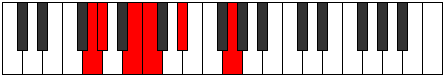 |
| [311](https://ianring.com/musictheory/scales/311) | [Stagimic](ModeGNaturalStagimic.md) | G | G, Ab, Bbb, Cb, Dbb, Eb, G |  |
| [315](https://ianring.com/musictheory/scales/315) | [Stodimic](ModeGNaturalStodimic.md) | G | G, Ab, Bb, Cb, Dbb, Eb, G |  |
| [319](https://ianring.com/musictheory/scales/319) | [Epodian](ModeGNaturalEpodian.md) | G | G, Ab, Bbb, Cbb, Dbbb, Dbb, Eb, G |  |
| [355](https://ianring.com/musictheory/scales/355) | [Aeoloritonic](ModeGNaturalAeoloritonic.md) | G | G, G#, C, C#, D#, G |  |
| [359](https://ianring.com/musictheory/scales/359) | [Bothimic](ModeGNaturalBothimic.md) | G | G, Ab, Bbb, C, Db, Eb, G |  |
| [363](https://ianring.com/musictheory/scales/363) | [Soptimic](ModeGNaturalSoptimic.md) | G | G, Ab, Bb, C, Db, Eb, G |  |
| [367](https://ianring.com/musictheory/scales/367) | [Aerodian](ModeGNaturalAerodian.md) | G | G, Ab, Bbb, Cbb, Dbb, Ebbb, Fbb, G |  |
| [371](https://ianring.com/musictheory/scales/371) | [Rythimic](ModeGNaturalRythimic.md) | G | G, Ab, B, C, Db, Eb, G |  |
| [375](https://ianring.com/musictheory/scales/375) | [Sodian](ModeGNaturalSodian.md) | G | G, Ab, Bbb, Cb, Dbb, Ebbb, Fbb, G |  |
| [379](https://ianring.com/musictheory/scales/379) | [Aeragian](ModeGNaturalAeragian.md) | G | G, Ab, Bb, Cb, Dbb, Ebbb, Fbb, G |  |
| [383](https://ianring.com/musictheory/scales/383) | [Logyllic](ModeGNaturalLogyllic.md) | G | G, G#, A, A#, B, C, C#, D#, G |  |
| [393](https://ianring.com/musictheory/scales/393) | [Lothic](ModeCNaturalLothic.md) | C | C, D#, G, G#, C |  |
| [395](https://ianring.com/musictheory/scales/395) | [Dalitonic](ModeCNaturalDalitonic.md) | C | C, C#, D#, G, G#, C |  |
| [397](https://ianring.com/musictheory/scales/397) | [Epogitonic](ModeCNaturalEpogitonic.md) | C | C, D, D#, G, G#, C |  |
| [399](https://ianring.com/musictheory/scales/399) | [Zynimic](ModeCNaturalZynimic.md) | C | C, Db, Ebb, Fbb, G, Ab, C |  |
| [409](https://ianring.com/musictheory/scales/409) | [Laritonic](ModeCNaturalLaritonic.md) | C | C, D#, E, G, G#, C |  |
| [411](https://ianring.com/musictheory/scales/411) | [Lygimic](ModeCNaturalLygimic.md) | C | C, Db, Eb, Fb, G, Ab, C |  |
| [413](https://ianring.com/musictheory/scales/413) | [Ganimic](ModeCNaturalGanimic.md) | C | C, D, Eb, Fb, G, Ab, C |  |
| [419](https://ianring.com/musictheory/scales/419) | [Ionacritonic](ModeGNaturalIonacritonic.md) | G | G, G#, C, D, D#, G |  |
| [423](https://ianring.com/musictheory/scales/423) | [Sogimic](ModeGNaturalSogimic.md) | G | G, Ab, Bbb, C, D, Eb, G |  |
| [425](https://ianring.com/musictheory/scales/425) | [Daditonic](ModeCNaturalDaditonic.md) | C | C, D#, F, G, G#, C |  |
| [427](https://ianring.com/musictheory/scales/427) | [Zothimic](ModeCNaturalZothimic.md) | C | C, Db, Eb, F, G, Ab, C |  |
| [427](https://ianring.com/musictheory/scales/427) | [Zothimic](ModeGNaturalZothimic.md) | G | G, Ab, Bb, C, D, Eb, G |  |
| [429](https://ianring.com/musictheory/scales/429) | [Koptimic](ModeCNaturalKoptimic.md) | C | C, D, Eb, F, G, Ab, C |  |
| [431](https://ianring.com/musictheory/scales/431) | [Epyrian](ModeGNaturalEpyrian.md) | G | G, Ab, Bbb, Cbb, Dbb, Ebb, Fbb, G |  |
| [435](https://ianring.com/musictheory/scales/435) | [Ionolimic](ModeGNaturalIonolimic.md) | G | G, Ab, B, C, D, Eb, G |  |
| [439](https://ianring.com/musictheory/scales/439) | [Bythian](ModeGNaturalBythian.md) | G | G, Ab, Bbb, Cb, Dbb, Ebb, Fbb, G |  |
| [441](https://ianring.com/musictheory/scales/441) | [Thycrimic](ModeCNaturalThycrimic.md) | C | C, D#, E, F, G, Ab, C |  |
| [443](https://ianring.com/musictheory/scales/443) | [Kothian](ModeGNaturalKothian.md) | G | G, Ab, Bb, Cb, Dbb, Ebb, Fbb, G |  |
| [447](https://ianring.com/musictheory/scales/447) | [Thyphyllic](ModeCNaturalThyphyllic.md) | C | C, C#, D, D#, E, F, G, G#, C |  |
| [447](https://ianring.com/musictheory/scales/447) | [Thyphyllic](ModeGNaturalThyphyllic.md) | G | G, G#, A, A#, B, C, D, D#, G |  |
| [457](https://ianring.com/musictheory/scales/457) | [Staptitonic](ModeCNaturalStaptitonic.md) | C | C, D#, F#, G, G#, C |  |
| [459](https://ianring.com/musictheory/scales/459) | [Zaptimic](ModeCNaturalZaptimic.md) | C | C, Db, Eb, F#, G, Ab, C |  |
| [461](https://ianring.com/musictheory/scales/461) | [Madimic](ModeCNaturalMadimic.md) | C | C, D, Eb, F#, G, Ab, C |  |
| [473](https://ianring.com/musictheory/scales/473) | [Aeralimic](ModeCNaturalAeralimic.md) | C | C, D#, E, F#, G, Ab, C |  |
| [479](https://ianring.com/musictheory/scales/479) | [Kocryllic](ModeCNaturalKocryllic.md) | C | C, C#, D, D#, E, F#, G, G#, C |  |
| [483](https://ianring.com/musictheory/scales/483) | [Kygimic](ModeGNaturalKygimic.md) | G | G, Ab, B#, C#, D, Eb, G |  |
| [487](https://ianring.com/musictheory/scales/487) | [Dynian](ModeGNaturalDynian.md) | G | G, Ab, Bbb, C, Db, Ebb, Fbb, G |  |
| [489](https://ianring.com/musictheory/scales/489) | [Phrathimic](ModeCNaturalPhrathimic.md) | C | C, D#, E#, F#, G, Ab, C |  |
| [491](https://ianring.com/musictheory/scales/491) | [Aeolyrian](ModeGNaturalAeolyrian.md) | G | G, Ab, Bb, C, Db, Ebb, Fbb, G |  |
| [495](https://ianring.com/musictheory/scales/495) | [Bocryllic](ModeCNaturalBocryllic.md) | C | C, C#, D, D#, F, F#, G, G#, C |  |
| [495](https://ianring.com/musictheory/scales/495) | [Bocryllic](ModeGNaturalBocryllic.md) | G | G, G#, A, A#, C, C#, D, D#, G |  |
| [499](https://ianring.com/musictheory/scales/499) | [Ionaptian](ModeGNaturalIonaptian.md) | G | G, Ab, B, C, Db, Ebb, Fbb, G |  |
| [503](https://ianring.com/musictheory/scales/503) | [Thoptyllic](ModeGNaturalThoptyllic.md) | G | G, G#, A, B, C, C#, D, D#, G |  |
| [507](https://ianring.com/musictheory/scales/507) | [Moryllic](ModeCNaturalMoryllic.md) | C | C, C#, D#, E, F, F#, G, G#, C |  |
| [507](https://ianring.com/musictheory/scales/507) | [Moryllic](ModeGNaturalMoryllic.md) | G | G, G#, A#, B, C, C#, D, D#, G |  |
| [509](https://ianring.com/musictheory/scales/509) | [Ionothyllic](ModeCNaturalIonothyllic.md) | C | C, D, D#, E, F, F#, G, G#, C |  |
| [511](https://ianring.com/musictheory/scales/511) | [Polygic](ModeCNaturalPolygic.md) | C | C, C#, D, D#, E, F, F#, G, G#, C |  |
| [511](https://ianring.com/musictheory/scales/511) | [Polygic](ModeGNaturalPolygic.md) | G | G, G#, A, A#, B, C, C#, D, D#, G |  |
| [561](https://ianring.com/musictheory/scales/561) | [Phratic](ModeDSharpPhratic.md) | D# | D#, G, G#, C, D# |  |
| [561](https://ianring.com/musictheory/scales/561) | [Phratic](ModeEFlatPhratic.md) | Eb | Eb, G, Ab, C, Eb |  |
| [563](https://ianring.com/musictheory/scales/563) | [Thacritonic](ModeDSharpThacritonic.md) | D# | D#, E, G, G#, C, D# |  |
| [563](https://ianring.com/musictheory/scales/563) | [Thacritonic](ModeEFlatThacritonic.md) | Eb | Eb, E, G, Ab, C, Eb |  |
| [565](https://ianring.com/musictheory/scales/565) | [Aeolyphritonic](ModeDSharpAeolyphritonic.md) | D# | D#, F, G, G#, C, D# |  |
| [565](https://ianring.com/musictheory/scales/565) | [Aeolyphritonic](ModeEFlatAeolyphritonic.md) | Eb | Eb, F, G, Ab, C, Eb |  |
| [567](https://ianring.com/musictheory/scales/567) | [Aeoladimic](ModeDSharpAeoladimic.md) | D# | D#, E, F, G, Ab, B#, D# |  |
| [569](https://ianring.com/musictheory/scales/569) | [Mothitonic](ModeDSharpMothitonic.md) | D# | D#, F#, G, G#, C, D# | 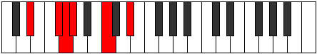 |
| [569](https://ianring.com/musictheory/scales/569) | [Mothitonic](ModeEFlatMothitonic.md) | Eb | Eb, Gb, G, Ab, C, Eb |  |
| [571](https://ianring.com/musictheory/scales/571) | [Kynimic](ModeDSharpKynimic.md) | D# | D#, E, F#, G, Ab, B#, D# |  |
| [573](https://ianring.com/musictheory/scales/573) | [Saptimic](ModeDSharpSaptimic.md) | D# | D#, E#, F#, G, Ab, B#, D# |  |
| [583](https://ianring.com/musictheory/scales/583) | [Aeritonic](ModeFSharpAeritonic.md) | F# | F#, G, G#, C, D#, F# |  |
| [583](https://ianring.com/musictheory/scales/583) | [Aeritonic](ModeGFlatAeritonic.md) | Gb | Gb, G, Ab, C, Eb, Gb | 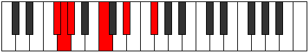 |
| [591](https://ianring.com/musictheory/scales/591) | [Gaptimic](ModeFSharpGaptimic.md) | F# | F#, G, Ab, Bbb, C, D#, F# |  |
| [599](https://ianring.com/musictheory/scales/599) | [Thyrimic](ModeFSharpThyrimic.md) | F# | F#, G, Ab, Bb, C, D#, F# |  |
| [607](https://ianring.com/musictheory/scales/607) | [Kadian](ModeFSharpKadian.md) | F# | F#, G, Ab, Bbb, Cbb, Dbb, Eb, F# |  |
| [615](https://ianring.com/musictheory/scales/615) | [Phrothimic](ModeFSharpPhrothimic.md) | F# | F#, G, Ab, B, C, D#, F# |  |
| [623](https://ianring.com/musictheory/scales/623) | [Sycrian](ModeFSharpSycrian.md) | F# | F#, G, Ab, Bbb, Cb, Dbb, Eb, F# |  |
| [625](https://ianring.com/musictheory/scales/625) | [Ionyptitonic](ModeDSharpIonyptitonic.md) | D# | D#, G, G#, A, C, D# |  |
| [625](https://ianring.com/musictheory/scales/625) | [Ionyptitonic](ModeEFlatIonyptitonic.md) | Eb | Eb, G, Ab, A, C, Eb |  |
| [627](https://ianring.com/musictheory/scales/627) | [Mogimic](ModeDSharpMogimic.md) | D# | D#, E, F##, G#, A, B#, D# |  |
| [627](https://ianring.com/musictheory/scales/627) | [Mogimic](ModeEFlatMogimic.md) | Eb | Eb, Fb, G, Ab, Bbb, C, Eb |  |
| [629](https://ianring.com/musictheory/scales/629) | [Aeronimic](ModeDSharpAeronimic.md) | D# | D#, E#, F##, G#, A, B#, D# |  |
| [629](https://ianring.com/musictheory/scales/629) | [Aeronimic](ModeEFlatAeronimic.md) | Eb | Eb, F, G, Ab, Bbb, C, Eb |  |
| [631](https://ianring.com/musictheory/scales/631) | [Zygian](ModeDSharpZygian.md) | D# | D#, E, F, G, Ab, Bbb, C, D# |  |
| [631](https://ianring.com/musictheory/scales/631) | [Zygian](ModeFSharpZygian.md) | F# | F#, G, Ab, Bb, Cb, Dbb, Eb, F# |  |
| [633](https://ianring.com/musictheory/scales/633) | [Kydimic](ModeDSharpKydimic.md) | D# | D#, E##, F##, G#, A, B#, D# |  |
| [633](https://ianring.com/musictheory/scales/633) | [Kydimic](ModeEFlatKydimic.md) | Eb | Eb, F#, G, Ab, Bbb, C, Eb |  |
| [635](https://ianring.com/musictheory/scales/635) | [Epolian](ModeDSharpEpolian.md) | D# | D#, E, F#, G, Ab, Bbb, C, D# |  |
| [637](https://ianring.com/musictheory/scales/637) | [Katodian](ModeDSharpKatodian.md) | D# | D#, E#, F#, G, Ab, Bbb, C, D# |  |
| [639](https://ianring.com/musictheory/scales/639) | [Ionaryllic](ModeDSharpIonaryllic.md) | D# | D#, E, F, F#, G, G#, A, C, D# |  |
| [639](https://ianring.com/musictheory/scales/639) | [Ionaryllic](ModeEFlatIonaryllic.md) | Eb | Eb, E, F, Gb, G, Ab, A, C, Eb |  |
| [639](https://ianring.com/musictheory/scales/639) | [Ionaryllic](ModeFSharpIonaryllic.md) | F# | F#, G, G#, A, A#, B, C, D#, F# |  |
| [639](https://ianring.com/musictheory/scales/639) | [Ionaryllic](ModeGFlatIonaryllic.md) | Gb | Gb, G, Ab, A, Bb, B, C, Eb, Gb |  |
| [689](https://ianring.com/musictheory/scales/689) | [Lothitonic](ModeDSharpLothitonic.md) | D# | D#, G, G#, A#, C, D# |  |
| [689](https://ianring.com/musictheory/scales/689) | [Lothitonic](ModeEFlatLothitonic.md) | Eb | Eb, G, Ab, Bb, C, Eb | 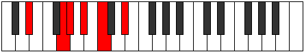 |
| [691](https://ianring.com/musictheory/scales/691) | [Zydimic](ModeDSharpZydimic.md) | D# | D#, E, F##, G#, A#, B#, D# |  |
| [691](https://ianring.com/musictheory/scales/691) | [Zydimic](ModeEFlatZydimic.md) | Eb | Eb, Fb, G, Ab, Bb, C, Eb |  |
| [693](https://ianring.com/musictheory/scales/693) | [Mynimic](ModeDSharpMynimic.md) | D# | D#, E#, F##, G#, A#, B#, D# |  |
| [693](https://ianring.com/musictheory/scales/693) | [Mynimic](ModeEFlatMynimic.md) | Eb | Eb, F, G, Ab, Bb, C, Eb |  |
| [695](https://ianring.com/musictheory/scales/695) | [Sarian](ModeDSharpSarian.md) | D# | D#, E, F, G, Ab, Bb, C, D# |  |
| [697](https://ianring.com/musictheory/scales/697) | [Lagimic](ModeDSharpLagimic.md) | D# | D#, E##, F##, G#, A#, B#, D# |  |
| [697](https://ianring.com/musictheory/scales/697) | [Lagimic](ModeEFlatLagimic.md) | Eb | Eb, F#, G, Ab, Bb, C, Eb |  |
| [699](https://ianring.com/musictheory/scales/699) | [Aerothian](ModeDSharpAerothian.md) | D# | D#, E, F#, G, Ab, Bb, C, D# |  |
| [701](https://ianring.com/musictheory/scales/701) | [Mixonyphian](ModeDSharpMixonyphian.md) | D# | D#, E#, F#, G, Ab, Bb, C, D# |  |
| [703](https://ianring.com/musictheory/scales/703) | [Aerocryllic](ModeDSharpAerocryllic.md) | D# | D#, E, F, F#, G, G#, A#, C, D# |  |
| [703](https://ianring.com/musictheory/scales/703) | [Aerocryllic](ModeEFlatAerocryllic.md) | Eb | Eb, E, F, Gb, G, Ab, Bb, C, Eb |  |
| [711](https://ianring.com/musictheory/scales/711) | [Epyrimic](ModeFSharpEpyrimic.md) | F# | F#, G, Ab, B#, C#, D#, F# |  |
| [719](https://ianring.com/musictheory/scales/719) | [Kanian](ModeFSharpKanian.md) | F# | F#, G, Ab, Bbb, C, Db, Eb, F# |  |
| [727](https://ianring.com/musictheory/scales/727) | [Phradian](ModeFSharpPhradian.md) | F# | F#, G, Ab, Bb, C, Db, Eb, F# |  |
| [735](https://ianring.com/musictheory/scales/735) | [Sylyllic](ModeFSharpSylyllic.md) | F# | F#, G, G#, A, A#, C, C#, D#, F# |  |
| [735](https://ianring.com/musictheory/scales/735) | [Sylyllic](ModeGFlatSylyllic.md) | Gb | Gb, G, Ab, A, Bb, C, Db, Eb, Gb |  |
| [743](https://ianring.com/musictheory/scales/743) | [Lanian](ModeFSharpLanian.md) | F# | F#, G, Ab, B, C, Db, Eb, F# |  |
| [751](https://ianring.com/musictheory/scales/751) | [Epacryllic](ModeFSharpEpacryllic.md) | F# | F#, G, G#, A, B, C, C#, D#, F# |  |
| [751](https://ianring.com/musictheory/scales/751) | [Epacryllic](ModeGFlatEpacryllic.md) | Gb | Gb, G, Ab, A, B, C, Db, Eb, Gb |  |
| [753](https://ianring.com/musictheory/scales/753) | [Kytrimic](ModeEFlatKytrimic.md) | Eb | Eb, F##, G#, A, Bb, C, Eb |  |
| [755](https://ianring.com/musictheory/scales/755) | [Phrythian](ModeDSharpPhrythian.md) | D# | D#, E, F##, G#, A, Bb, C, D# |  |
| [755](https://ianring.com/musictheory/scales/755) | [Phrythian](ModeEFlatPhrythian.md) | Eb | Eb, Fb, G, Ab, Bbb, Cbb, Dbb, Eb |  |
| [757](https://ianring.com/musictheory/scales/757) | [Ionyptian](ModeDSharpIonyptian.md) | D# | D#, E#, F##, G#, A, Bb, C, D# |  |
| [757](https://ianring.com/musictheory/scales/757) | [Ionyptian](ModeEFlatIonyptian.md) | Eb | Eb, F, G, Ab, Bbb, Cbb, Dbb, Eb |  |
| [759](https://ianring.com/musictheory/scales/759) | [Katalyllic](ModeDSharpKatalyllic.md) | D# | D#, E, F, G, G#, A, A#, C, D# |  |
| [759](https://ianring.com/musictheory/scales/759) | [Katalyllic](ModeEFlatKatalyllic.md) | Eb | Eb, E, F, G, Ab, A, Bb, C, Eb |  |
| [759](https://ianring.com/musictheory/scales/759) | [Katalyllic](ModeFSharpKatalyllic.md) | F# | F#, G, G#, A#, B, C, C#, D#, F# |  |
| [759](https://ianring.com/musictheory/scales/759) | [Katalyllic](ModeGFlatKatalyllic.md) | Gb | Gb, G, Ab, Bb, B, C, Db, Eb, Gb |  |
| [761](https://ianring.com/musictheory/scales/761) | [Ponian](ModeDSharpPonian.md) | D# | D#, E##, F##, G#, A, Bb, C, D# |  |
| [761](https://ianring.com/musictheory/scales/761) | [Ponian](ModeEFlatPonian.md) | Eb | Eb, F#, G, Ab, Bbb, Cbb, Dbb, Eb |  |
| [763](https://ianring.com/musictheory/scales/763) | [Doryllic](ModeDSharpDoryllic.md) | D# | D#, E, F#, G, G#, A, A#, C, D# |  |
| [763](https://ianring.com/musictheory/scales/763) | [Doryllic](ModeEFlatDoryllic.md) | Eb | Eb, E, Gb, G, Ab, A, Bb, C, Eb |  |
| [765](https://ianring.com/musictheory/scales/765) | [Mixonyphyllic](ModeDSharpMixonyphyllic.md) | D# | D#, F, F#, G, G#, A, A#, C, D# |  |
| [765](https://ianring.com/musictheory/scales/765) | [Mixonyphyllic](ModeEFlatMixonyphyllic.md) | Eb | Eb, F, Gb, G, Ab, A, Bb, C, Eb |  |
| [767](https://ianring.com/musictheory/scales/767) | [Raptygic](ModeDSharpRaptygic.md) | D# | D#, E, F, F#, G, G#, A, A#, C, D# |  |
| [767](https://ianring.com/musictheory/scales/767) | [Raptygic](ModeEFlatRaptygic.md) | Eb | Eb, E, F, Gb, G, Ab, A, Bb, C, Eb |  |
| [767](https://ianring.com/musictheory/scales/767) | [Raptygic](ModeFSharpRaptygic.md) | F# | F#, G, G#, A, A#, B, C, C#, D#, F# |  |
| [767](https://ianring.com/musictheory/scales/767) | [Raptygic](ModeGFlatRaptygic.md) | Gb | Gb, G, Ab, A, Bb, B, C, Db, Eb, Gb |  |
| [787](https://ianring.com/musictheory/scales/787) | [Aeolapritonic](ModeBNaturalAeolapritonic.md) | B | B, C, D#, G, G#, B |  |
| [791](https://ianring.com/musictheory/scales/791) | [Aeoloptimic](ModeBNaturalAeoloptimic.md) | B | B, C, Db, Eb, F##, G#, B |  |
| [795](https://ianring.com/musictheory/scales/795) | [Aeologimic](ModeBNaturalAeologimic.md) | B | B, C, D, Eb, F##, G#, B |  |
| [799](https://ianring.com/musictheory/scales/799) | [Lolian](ModeBNaturalLolian.md) | B | B, C, Db, Ebb, Fbb, G, Ab, B |  |
| [803](https://ianring.com/musictheory/scales/803) | [Loritonic](ModeGNaturalLoritonic.md) | G | G, G#, C, D#, E, G |  |
| [807](https://ianring.com/musictheory/scales/807) | [Epadimic](ModeGNaturalEpadimic.md) | G | G, Ab, Bbb, C, D#, E, G |  |
| [811](https://ianring.com/musictheory/scales/811) | [Radimic](ModeGNaturalRadimic.md) | G | G, Ab, Bb, C, D#, E, G |  |
| [815](https://ianring.com/musictheory/scales/815) | [Bolian](ModeGNaturalBolian.md) | G | G, Ab, Bbb, Cbb, Dbb, Eb, Fb, G |  |
| [817](https://ianring.com/musictheory/scales/817) | [Zothitonic](ModeDSharpZothitonic.md) | D# | D#, G, G#, B, C, D# |  |
| [817](https://ianring.com/musictheory/scales/817) | [Zothitonic](ModeEFlatZothitonic.md) | Eb | Eb, G, Ab, B, C, Eb |  |
| [819](https://ianring.com/musictheory/scales/819) | [Aerythimic](ModeDSharpAerythimic.md) | D# | D#, E, F##, G#, A##, B#, D# |  |
| [819](https://ianring.com/musictheory/scales/819) | [Aerythimic](ModeEFlatAerythimic.md) | Eb | Eb, Fb, G, Ab, B, C, Eb |  |
| [819](https://ianring.com/musictheory/scales/819) | [Aerythimic](ModeGNaturalAerythimic.md) | G | G, Ab, B, C, D#, E, G |  |
| [819](https://ianring.com/musictheory/scales/819) | [Aerythimic](ModeBNaturalAerythimic.md) | B | B, C, D#, E, F##, G#, B |  |
| [821](https://ianring.com/musictheory/scales/821) | [Aeranimic](ModeDSharpAeranimic.md) | D# | D#, E#, F##, G#, A##, B#, D# |  |
| [821](https://ianring.com/musictheory/scales/821) | [Aeranimic](ModeEFlatAeranimic.md) | Eb | Eb, F, G, Ab, B, C, Eb |  |
| [823](https://ianring.com/musictheory/scales/823) | [Stodian](ModeBNaturalStodian.md) | B | B, C, Db, Eb, Fb, G, Ab, B |  |
| [823](https://ianring.com/musictheory/scales/823) | [Stodian](ModeDSharpStodian.md) | D# | D#, E, F, G, Ab, B, C, D# |  |
| [823](https://ianring.com/musictheory/scales/823) | [Stodian](ModeGNaturalStodian.md) | G | G, Ab, Bbb, Cb, Dbb, Eb, Fb, G |  |
| [825](https://ianring.com/musictheory/scales/825) | [Thyptimic](ModeDSharpThyptimic.md) | D# | D#, E##, F##, G#, A##, B#, D# |  |
| [825](https://ianring.com/musictheory/scales/825) | [Thyptimic](ModeEFlatThyptimic.md) | Eb | Eb, F#, G, Ab, B, C, Eb |  |
| [827](https://ianring.com/musictheory/scales/827) | [Mixolocrian](ModeBNaturalMixolocrian.md) | B | B, C, D, Eb, Fb, G, Ab, B |  |
| [827](https://ianring.com/musictheory/scales/827) | [Mixolocrian](ModeDSharpMixolocrian.md) | D# | D#, E, F#, G, Ab, B, C, D# |  |
| [827](https://ianring.com/musictheory/scales/827) | [Mixolocrian](ModeGNaturalMixolocrian.md) | G | G, Ab, Bb, Cb, Dbb, Eb, Fb, G |  |
| [829](https://ianring.com/musictheory/scales/829) | [Lygian](ModeDSharpLygian.md) | D# | D#, E#, F#, G, Ab, B, C, D# | 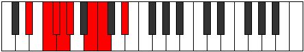 |
| [831](https://ianring.com/musictheory/scales/831) | [Rodyllic](ModeBNaturalRodyllic.md) | B | B, C, C#, D, D#, E, G, G#, B |  |
| [831](https://ianring.com/musictheory/scales/831) | [Rodyllic](ModeDSharpRodyllic.md) | D# | D#, E, F, F#, G, G#, B, C, D# |  |
| [831](https://ianring.com/musictheory/scales/831) | [Rodyllic](ModeEFlatRodyllic.md) | Eb | Eb, E, F, Gb, G, Ab, B, C, Eb |  |
| [831](https://ianring.com/musictheory/scales/831) | [Rodyllic](ModeGNaturalRodyllic.md) | G | G, G#, A, A#, B, C, D#, E, G |  |
| [839](https://ianring.com/musictheory/scales/839) | [Ionathimic](ModeFSharpIonathimic.md) | F# | F#, G, Ab, B#, C##, D#, F# |  |
| [847](https://ianring.com/musictheory/scales/847) | [Ganian](ModeFSharpGanian.md) | F# | F#, G, Ab, Bbb, C, D, Eb, F# |  |
| [851](https://ianring.com/musictheory/scales/851) | [Aerylimic](ModeBNaturalAerylimic.md) | B | B, C, D#, E#, F##, G#, B |  |
| [855](https://ianring.com/musictheory/scales/855) | [Porian](ModeFSharpPorian.md) | F# | F#, G, Ab, Bb, C, D, Eb, F# |  |
| [855](https://ianring.com/musictheory/scales/855) | [Porian](ModeBNaturalPorian.md) | B | B, C, Db, Eb, F, G, Ab, B |  |
| [859](https://ianring.com/musictheory/scales/859) | [Pathian](ModeBNaturalPathian.md) | B | B, C, D, Eb, F, G, Ab, B |  |
| [863](https://ianring.com/musictheory/scales/863) | [Pyryllic](ModeFSharpPyryllic.md) | F# | F#, G, G#, A, A#, C, D, D#, F# |  |
| [863](https://ianring.com/musictheory/scales/863) | [Pyryllic](ModeGFlatPyryllic.md) | Gb | Gb, G, Ab, A, Bb, C, D, Eb, Gb |  |
| [863](https://ianring.com/musictheory/scales/863) | [Pyryllic](ModeBNaturalPyryllic.md) | B | B, C, C#, D, D#, F, G, G#, B |  |
| [867](https://ianring.com/musictheory/scales/867) | [Phrocrimic](ModeGNaturalPhrocrimic.md) | G | G, Ab, B#, C#, D#, E, G |  |
| [871](https://ianring.com/musictheory/scales/871) | [Epadian](ModeGNaturalEpadian.md) | G | G, Ab, Bbb, C, Db, Eb, Fb, G |  |
| [871](https://ianring.com/musictheory/scales/871) | [Epadian](ModeFSharpEpadian.md) | F# | F#, G, Ab, B, C, D, Eb, F# |  |
| [875](https://ianring.com/musictheory/scales/875) | [Stothian](ModeGNaturalStothian.md) | G | G, Ab, Bb, C, Db, Eb, Fb, G |  |
| [879](https://ianring.com/musictheory/scales/879) | [Aeolocryllic](ModeGNaturalAeolocryllic.md) | G | G, G#, A, A#, C, C#, D#, E, G |  |
| [879](https://ianring.com/musictheory/scales/879) | [Aeolocryllic](ModeFSharpAeolocryllic.md) | F# | F#, G, G#, A, B, C, D, D#, F# |  |
| [879](https://ianring.com/musictheory/scales/879) | [Aeolocryllic](ModeGFlatAeolocryllic.md) | Gb | Gb, G, Ab, A, B, C, D, Eb, Gb |  |
| [881](https://ianring.com/musictheory/scales/881) | [Aerothimic](ModeEFlatAerothimic.md) | Eb | Eb, F##, G#, A, B, C, Eb |  |
| [883](https://ianring.com/musictheory/scales/883) | [Ralian](ModeGNaturalRalian.md) | G | G, Ab, B, C, Db, Eb, Fb, G |  |
| [883](https://ianring.com/musictheory/scales/883) | [Ralian](ModeBNaturalRalian.md) | B | B, C, D#, E, F, G, Ab, B |  |
| [883](https://ianring.com/musictheory/scales/883) | [Ralian](ModeDSharpRalian.md) | D# | D#, E, F##, G#, A, B, C, D# |  |
| [883](https://ianring.com/musictheory/scales/883) | [Ralian](ModeEFlatRalian.md) | Eb | Eb, Fb, G, Ab, Bbb, Cb, Dbb, Eb |  |
| [885](https://ianring.com/musictheory/scales/885) | [Sathian](ModeDSharpSathian.md) | D# | D#, E#, F##, G#, A, B, C, D# |  |
| [885](https://ianring.com/musictheory/scales/885) | [Sathian](ModeEFlatSathian.md) | Eb | Eb, F, G, Ab, Bbb, Cb, Dbb, Eb |  |
| [887](https://ianring.com/musictheory/scales/887) | [Sathyllic](ModeBNaturalSathyllic.md) | B | B, C, C#, D#, E, F, G, G#, B |  |
| [887](https://ianring.com/musictheory/scales/887) | [Sathyllic](ModeGNaturalSathyllic.md) | G | G, G#, A, B, C, C#, D#, E, G |  |
| [887](https://ianring.com/musictheory/scales/887) | [Sathyllic](ModeDSharpSathyllic.md) | D# | D#, E, F, G, G#, A, B, C, D# |  |
| [887](https://ianring.com/musictheory/scales/887) | [Sathyllic](ModeEFlatSathyllic.md) | Eb | Eb, E, F, G, Ab, A, B, C, Eb |  |
| [887](https://ianring.com/musictheory/scales/887) | [Sathyllic](ModeFSharpSathyllic.md) | F# | F#, G, G#, A#, B, C, D, D#, F# |  |
| [887](https://ianring.com/musictheory/scales/887) | [Sathyllic](ModeGFlatSathyllic.md) | Gb | Gb, G, Ab, Bb, B, C, D, Eb, Gb |  |
| [889](https://ianring.com/musictheory/scales/889) | [Borian](ModeDSharpBorian.md) | D# | D#, E##, F##, G#, A, B, C, D# |  |
| [889](https://ianring.com/musictheory/scales/889) | [Borian](ModeEFlatBorian.md) | Eb | Eb, F#, G, Ab, Bbb, Cb, Dbb, Eb |  |
| [891](https://ianring.com/musictheory/scales/891) | [Ionilyllic](ModeBNaturalIonilyllic.md) | B | B, C, D, D#, E, F, G, G#, B |  |
| [891](https://ianring.com/musictheory/scales/891) | [Ionilyllic](ModeDSharpIonilyllic.md) | D# | D#, E, F#, G, G#, A, B, C, D# |  |
| [891](https://ianring.com/musictheory/scales/891) | [Ionilyllic](ModeEFlatIonilyllic.md) | Eb | Eb, E, Gb, G, Ab, A, B, C, Eb |  |
| [891](https://ianring.com/musictheory/scales/891) | [Ionilyllic](ModeGNaturalIonilyllic.md) | G | G, G#, A#, B, C, C#, D#, E, G |  |
| [893](https://ianring.com/musictheory/scales/893) | [Pycryllic](ModeDSharpPycryllic.md) | D# | D#, F, F#, G, G#, A, B, C, D# |  |
| [893](https://ianring.com/musictheory/scales/893) | [Pycryllic](ModeEFlatPycryllic.md) | Eb | Eb, F, Gb, G, Ab, A, B, C, Eb |  |
| [895](https://ianring.com/musictheory/scales/895) | [Aeolathygic](ModeBNaturalAeolathygic.md) | B | B, C, C#, D, D#, E, F, G, G#, B |  |
| [895](https://ianring.com/musictheory/scales/895) | [Aeolathygic](ModeDSharpAeolathygic.md) | D# | D#, E, F, F#, G, G#, A, B, C, D# |  |
| [895](https://ianring.com/musictheory/scales/895) | [Aeolathygic](ModeEFlatAeolathygic.md) | Eb | Eb, E, F, Gb, G, Ab, A, B, C, Eb |  |
| [895](https://ianring.com/musictheory/scales/895) | [Aeolathygic](ModeGNaturalAeolathygic.md) | G | G, G#, A, A#, B, C, C#, D#, E, G |  |
| [895](https://ianring.com/musictheory/scales/895) | [Aeolathygic](ModeFSharpAeolathygic.md) | F# | F#, G, G#, A, A#, B, C, D, D#, F# |  |
| [895](https://ianring.com/musictheory/scales/895) | [Aeolathygic](ModeGFlatAeolathygic.md) | Gb | Gb, G, Ab, A, Bb, B, C, D, Eb, Gb |  |
| [905](https://ianring.com/musictheory/scales/905) | [Bylitonic](ModeCNaturalBylitonic.md) | C | C, D#, G, G#, A, C |  |
| [907](https://ianring.com/musictheory/scales/907) | [Tholimic](ModeCNaturalTholimic.md) | C | C, Db, Eb, F##, G#, A, C | 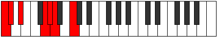 |
| [909](https://ianring.com/musictheory/scales/909) | [Katarimic](ModeCNaturalKatarimic.md) | C | C, D, Eb, F##, G#, A, C |  |
| [911](https://ianring.com/musictheory/scales/911) | [Radian](ModeCNaturalRadian.md) | C | C, Db, Ebb, Fbb, G, Ab, Bbb, C |  |
| [915](https://ianring.com/musictheory/scales/915) | [Loptimic](ModeBNaturalLoptimic.md) | B | B, C, D#, E##, F##, G#, B |  |
| [919](https://ianring.com/musictheory/scales/919) | [Gathian](ModeBNaturalGathian.md) | B | B, C, Db, Eb, F#, G, Ab, B |  |
| [921](https://ianring.com/musictheory/scales/921) | [Bogimic](ModeCNaturalBogimic.md) | C | C, D#, E, F##, G#, A, C |  |
| [923](https://ianring.com/musictheory/scales/923) | [Ionodian](ModeCNaturalIonodian.md) | C | C, Db, Eb, Fb, G, Ab, Bbb, C |  |
| [923](https://ianring.com/musictheory/scales/923) | [Ionodian](ModeBNaturalIonodian.md) | B | B, C, D, Eb, F#, G, Ab, B |  |
| [925](https://ianring.com/musictheory/scales/925) | [Mythian](ModeCNaturalMythian.md) | C | C, D, Eb, Fb, G, Ab, Bbb, C |  |
| [927](https://ianring.com/musictheory/scales/927) | [Koptyllic](ModeCNaturalKoptyllic.md) | C | C, C#, D, D#, E, G, G#, A, C | 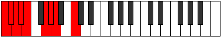 |
| [927](https://ianring.com/musictheory/scales/927) | [Koptyllic](ModeBNaturalKoptyllic.md) | B | B, C, C#, D, D#, F#, G, G#, B |  |
| [931](https://ianring.com/musictheory/scales/931) | [Bacrimic](ModeGNaturalBacrimic.md) | G | G, Ab, B#, C##, D#, E, G | 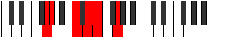 |
| [935](https://ianring.com/musictheory/scales/935) | [Katarian](ModeGNaturalKatarian.md) | G | G, Ab, Bbb, C, D, Eb, Fb, G |  |
| [937](https://ianring.com/musictheory/scales/937) | [Stothimic](ModeCNaturalStothimic.md) | C | C, D#, E#, F##, G#, A, C |  |
| [939](https://ianring.com/musictheory/scales/939) | [Dyptian](ModeCNaturalDyptian.md) | C | C, Db, Eb, F, G, Ab, Bbb, C |  |
| [939](https://ianring.com/musictheory/scales/939) | [Dyptian](ModeGNaturalDyptian.md) | G | G, Ab, Bb, C, D, Eb, Fb, G |  |
| [941](https://ianring.com/musictheory/scales/941) | [Phrorian](ModeCNaturalPhrorian.md) | C | C, D, Eb, F, G, Ab, Bbb, C |  |
| [943](https://ianring.com/musictheory/scales/943) | [Aerygyllic](ModeCNaturalAerygyllic.md) | C | C, C#, D, D#, F, G, G#, A, C |  |
| [943](https://ianring.com/musictheory/scales/943) | [Aerygyllic](ModeGNaturalAerygyllic.md) | G | G, G#, A, A#, C, D, D#, E, G |  |
| [945](https://ianring.com/musictheory/scales/945) | [Syrimic](ModeEFlatSyrimic.md) | Eb | Eb, F##, G#, A#, B, C, Eb |  |
| [947](https://ianring.com/musictheory/scales/947) | [Modian](ModeGNaturalModian.md) | G | G, Ab, B, C, D, Eb, Fb, G |  |
| [947](https://ianring.com/musictheory/scales/947) | [Modian](ModeBNaturalModian.md) | B | B, C, D#, E, F#, G, Ab, B |  |
| [947](https://ianring.com/musictheory/scales/947) | [Modian](ModeDSharpModian.md) | D# | D#, E, F##, G#, A#, B, C, D# |  |
| [947](https://ianring.com/musictheory/scales/947) | [Modian](ModeEFlatModian.md) | Eb | Eb, Fb, G, Ab, Bb, Cb, Dbb, Eb |  |
| [949](https://ianring.com/musictheory/scales/949) | [Ionagian](ModeDSharpIonagian.md) | D# | D#, E#, F##, G#, A#, B, C, D# |  |
| [949](https://ianring.com/musictheory/scales/949) | [Ionagian](ModeEFlatIonagian.md) | Eb | Eb, F, G, Ab, Bb, Cb, Dbb, Eb |  |
| [951](https://ianring.com/musictheory/scales/951) | [Thogyllic](ModeBNaturalThogyllic.md) | B | B, C, C#, D#, E, F#, G, G#, B |  |
| [951](https://ianring.com/musictheory/scales/951) | [Thogyllic](ModeGNaturalThogyllic.md) | G | G, G#, A, B, C, D, D#, E, G |  |
| [951](https://ianring.com/musictheory/scales/951) | [Thogyllic](ModeDSharpThogyllic.md) | D# | D#, E, F, G, G#, A#, B, C, D# |  |
| [951](https://ianring.com/musictheory/scales/951) | [Thogyllic](ModeEFlatThogyllic.md) | Eb | Eb, E, F, G, Ab, Bb, B, C, Eb |  |
| [953](https://ianring.com/musictheory/scales/953) | [Stoptian](ModeCNaturalStoptian.md) | C | C, D#, E, F, G, Ab, Bbb, C |  |
| [953](https://ianring.com/musictheory/scales/953) | [Stoptian](ModeDSharpStoptian.md) | D# | D#, E##, F##, G#, A#, B, C, D# |  |
| [953](https://ianring.com/musictheory/scales/953) | [Stoptian](ModeEFlatStoptian.md) | Eb | Eb, F#, G, Ab, Bb, Cb, Dbb, Eb |  |
| [955](https://ianring.com/musictheory/scales/955) | [Ionogyllic](ModeCNaturalIonogyllic.md) | C | C, C#, D#, E, F, G, G#, A, C |  |
| [955](https://ianring.com/musictheory/scales/955) | [Ionogyllic](ModeBNaturalIonogyllic.md) | B | B, C, D, D#, E, F#, G, G#, B |  |
| [955](https://ianring.com/musictheory/scales/955) | [Ionogyllic](ModeGNaturalIonogyllic.md) | G | G, G#, A#, B, C, D, D#, E, G |  |
| [955](https://ianring.com/musictheory/scales/955) | [Ionogyllic](ModeDSharpIonogyllic.md) | D# | D#, E, F#, G, G#, A#, B, C, D# |  |
| [955](https://ianring.com/musictheory/scales/955) | [Ionogyllic](ModeEFlatIonogyllic.md) | Eb | Eb, E, Gb, G, Ab, Bb, B, C, Eb |  |
| [957](https://ianring.com/musictheory/scales/957) | [Phronyllic](ModeCNaturalPhronyllic.md) | C | C, D, D#, E, F, G, G#, A, C |  |
| [957](https://ianring.com/musictheory/scales/957) | [Phronyllic](ModeDSharpPhronyllic.md) | D# | D#, F, F#, G, G#, A#, B, C, D# |  |
| [957](https://ianring.com/musictheory/scales/957) | [Phronyllic](ModeEFlatPhronyllic.md) | Eb | Eb, F, Gb, G, Ab, Bb, B, C, Eb |  |
| [959](https://ianring.com/musictheory/scales/959) | [Katylygic](ModeCNaturalKatylygic.md) | C | C, C#, D, D#, E, F, G, G#, A, C |  |
| [959](https://ianring.com/musictheory/scales/959) | [Katylygic](ModeBNaturalKatylygic.md) | B | B, C, C#, D, D#, E, F#, G, G#, B | 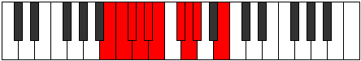 |
| [959](https://ianring.com/musictheory/scales/959) | [Katylygic](ModeDSharpKatylygic.md) | D# | D#, E, F, F#, G, G#, A#, B, C, D# |  |
| [959](https://ianring.com/musictheory/scales/959) | [Katylygic](ModeEFlatKatylygic.md) | Eb | Eb, E, F, Gb, G, Ab, Bb, B, C, Eb |  |
| [959](https://ianring.com/musictheory/scales/959) | [Katylygic](ModeGNaturalKatylygic.md) | G | G, G#, A, A#, B, C, D, D#, E, G |  |
| [967](https://ianring.com/musictheory/scales/967) | [Aeolanian](ModeFSharpAeolanian.md) | F# | F#, G, Ab, B#, C#, D, Eb, F# |  |
| [969](https://ianring.com/musictheory/scales/969) | [Ionogimic](ModeCNaturalIonogimic.md) | C | C, D#, E##, F##, G#, A, C |  |
| [971](https://ianring.com/musictheory/scales/971) | [Ladian](ModeCNaturalLadian.md) | C | C, Db, Eb, F#, G, Ab, Bbb, C |  |
| [973](https://ianring.com/musictheory/scales/973) | [Phryptian](ModeCNaturalPhryptian.md) | C | C, D, Eb, F#, G, Ab, Bbb, C |  |
| [975](https://ianring.com/musictheory/scales/975) | [Katogyllic](ModeCNaturalKatogyllic.md) | C | C, C#, D, D#, F#, G, G#, A, C |  |
| [975](https://ianring.com/musictheory/scales/975) | [Katogyllic](ModeFSharpKatogyllic.md) | F# | F#, G, G#, A, C, C#, D, D#, F# |  |
| [975](https://ianring.com/musictheory/scales/975) | [Katogyllic](ModeGFlatKatogyllic.md) | Gb | Gb, G, Ab, A, C, Db, D, Eb, Gb |  |
| [979](https://ianring.com/musictheory/scales/979) | [Thogian](ModeBNaturalThogian.md) | B | B, C, D#, E#, F#, G, Ab, B |  |
| [983](https://ianring.com/musictheory/scales/983) | [Epygyllic](ModeFSharpEpygyllic.md) | F# | F#, G, G#, A#, C, C#, D, D#, F# |  |
| [983](https://ianring.com/musictheory/scales/983) | [Epygyllic](ModeGFlatEpygyllic.md) | Gb | Gb, G, Ab, Bb, C, Db, D, Eb, Gb |  |
| [983](https://ianring.com/musictheory/scales/983) | [Epygyllic](ModeBNaturalEpygyllic.md) | B | B, C, C#, D#, F, F#, G, G#, B |  |
| [985](https://ianring.com/musictheory/scales/985) | [Raptian](ModeCNaturalRaptian.md) | C | C, D#, E, F#, G, Ab, Bbb, C |  |
| [987](https://ianring.com/musictheory/scales/987) | [Aeraptyllic](ModeCNaturalAeraptyllic.md) | C | C, C#, D#, E, F#, G, G#, A, C |  |
| [987](https://ianring.com/musictheory/scales/987) | [Aeraptyllic](ModeBNaturalAeraptyllic.md) | B | B, C, D, D#, F, F#, G, G#, B |  |
| [989](https://ianring.com/musictheory/scales/989) | [Phrolyllic](ModeCNaturalPhrolyllic.md) | C | C, D, D#, E, F#, G, G#, A, C |  |
| [991](https://ianring.com/musictheory/scales/991) | [Aeolygic](ModeCNaturalAeolygic.md) | C | C, C#, D, D#, E, F#, G, G#, A, C |  |
| [991](https://ianring.com/musictheory/scales/991) | [Aeolygic](ModeFSharpAeolygic.md) | F# | F#, G, G#, A, A#, C, C#, D, D#, F# |  |
| [991](https://ianring.com/musictheory/scales/991) | [Aeolygic](ModeGFlatAeolygic.md) | Gb | Gb, G, Ab, A, Bb, C, Db, D, Eb, Gb |  |
| [991](https://ianring.com/musictheory/scales/991) | [Aeolygic](ModeBNaturalAeolygic.md) | B | B, C, C#, D, D#, F, F#, G, G#, B |  |
| [995](https://ianring.com/musictheory/scales/995) | [Phrathian](ModeGNaturalPhrathian.md) | G | G, Ab, B#, C#, D, Eb, Fb, G |  |
| [999](https://ianring.com/musictheory/scales/999) | [Bylyllic](ModeGNaturalBylyllic.md) | G | G, G#, A, C, C#, D, D#, E, G |  |
| [999](https://ianring.com/musictheory/scales/999) | [Bylyllic](ModeFSharpBylyllic.md) | F# | F#, G, G#, B, C, C#, D, D#, F# |  |
| [999](https://ianring.com/musictheory/scales/999) | [Bylyllic](ModeGFlatBylyllic.md) | Gb | Gb, G, Ab, B, C, Db, D, Eb, Gb |  |
| [1001](https://ianring.com/musictheory/scales/1001) | [Badian](ModeCNaturalBadian.md) | C | C, D#, E#, F#, G, Ab, Bbb, C |  |
| [1003](https://ianring.com/musictheory/scales/1003) | [Ionyryllic](ModeCNaturalIonyryllic.md) | C | C, C#, D#, F, F#, G, G#, A, C |  |
| [1003](https://ianring.com/musictheory/scales/1003) | [Ionyryllic](ModeGNaturalIonyryllic.md) | G | G, G#, A#, C, C#, D, D#, E, G | 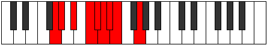 |
| [1005](https://ianring.com/musictheory/scales/1005) | [Radyllic](ModeCNaturalRadyllic.md) | C | C, D, D#, F, F#, G, G#, A, C |  |
| [1007](https://ianring.com/musictheory/scales/1007) | [Ionycrygic](ModeCNaturalIonycrygic.md) | C | C, C#, D, D#, F, F#, G, G#, A, C |  |
| [1007](https://ianring.com/musictheory/scales/1007) | [Ionycrygic](ModeGNaturalIonycrygic.md) | G | G, G#, A, A#, C, C#, D, D#, E, G |  |
| [1007](https://ianring.com/musictheory/scales/1007) | [Ionycrygic](ModeFSharpIonycrygic.md) | F# | F#, G, G#, A, B, C, C#, D, D#, F# |  |
| [1007](https://ianring.com/musictheory/scales/1007) | [Ionycrygic](ModeGFlatIonycrygic.md) | Gb | Gb, G, Ab, A, B, C, Db, D, Eb, Gb |  |
| [1009](https://ianring.com/musictheory/scales/1009) | [Katyptian](ModeEFlatKatyptian.md) | Eb | Eb, F##, G#, A, Bb, Cb, Dbb, Eb |  |
| [1011](https://ianring.com/musictheory/scales/1011) | [Kycryllic](ModeGNaturalKycryllic.md) | G | G, G#, B, C, C#, D, D#, E, G |  |
| [1011](https://ianring.com/musictheory/scales/1011) | [Kycryllic](ModeBNaturalKycryllic.md) | B | B, C, D#, E, F, F#, G, G#, B |  |
| [1011](https://ianring.com/musictheory/scales/1011) | [Kycryllic](ModeDSharpKycryllic.md) | D# | D#, E, G, G#, A, A#, B, C, D# |  |
| [1011](https://ianring.com/musictheory/scales/1011) | [Kycryllic](ModeEFlatKycryllic.md) | Eb | Eb, E, G, Ab, A, Bb, B, C, Eb |  |
| [1013](https://ianring.com/musictheory/scales/1013) | [Stydyllic](ModeDSharpStydyllic.md) | D# | D#, F, G, G#, A, A#, B, C, D# |  |
| [1013](https://ianring.com/musictheory/scales/1013) | [Stydyllic](ModeEFlatStydyllic.md) | Eb | Eb, F, G, Ab, A, Bb, B, C, Eb |  |
| [1015](https://ianring.com/musictheory/scales/1015) | [Ionodygic](ModeBNaturalIonodygic.md) | B | B, C, C#, D#, E, F, F#, G, G#, B |  |
| [1015](https://ianring.com/musictheory/scales/1015) | [Ionodygic](ModeGNaturalIonodygic.md) | G | G, G#, A, B, C, C#, D, D#, E, G |  |
| [1015](https://ianring.com/musictheory/scales/1015) | [Ionodygic](ModeFSharpIonodygic.md) | F# | F#, G, G#, A#, B, C, C#, D, D#, F# |  |
| [1015](https://ianring.com/musictheory/scales/1015) | [Ionodygic](ModeGFlatIonodygic.md) | Gb | Gb, G, Ab, Bb, B, C, Db, D, Eb, Gb |  |
| [1015](https://ianring.com/musictheory/scales/1015) | [Ionodygic](ModeDSharpIonodygic.md) | D# | D#, E, F, G, G#, A, A#, B, C, D# |  |
| [1015](https://ianring.com/musictheory/scales/1015) | [Ionodygic](ModeEFlatIonodygic.md) | Eb | Eb, E, F, G, Ab, A, Bb, B, C, Eb |  |
| [1017](https://ianring.com/musictheory/scales/1017) | [Dythyllic](ModeCNaturalDythyllic.md) | C | C, D#, E, F, F#, G, G#, A, C |  |
| [1017](https://ianring.com/musictheory/scales/1017) | [Dythyllic](ModeDSharpDythyllic.md) | D# | D#, F#, G, G#, A, A#, B, C, D# |  |
| [1017](https://ianring.com/musictheory/scales/1017) | [Dythyllic](ModeEFlatDythyllic.md) | Eb | Eb, Gb, G, Ab, A, Bb, B, C, Eb |  |
| [1019](https://ianring.com/musictheory/scales/1019) | [Aeranygic](ModeCNaturalAeranygic.md) | C | C, C#, D#, E, F, F#, G, G#, A, C |  |
| [1019](https://ianring.com/musictheory/scales/1019) | [Aeranygic](ModeBNaturalAeranygic.md) | B | B, C, D, D#, E, F, F#, G, G#, B |  |
| [1019](https://ianring.com/musictheory/scales/1019) | [Aeranygic](ModeGNaturalAeranygic.md) | G | G, G#, A#, B, C, C#, D, D#, E, G |  |
| [1019](https://ianring.com/musictheory/scales/1019) | [Aeranygic](ModeDSharpAeranygic.md) | D# | D#, E, F#, G, G#, A, A#, B, C, D# |  |
| [1019](https://ianring.com/musictheory/scales/1019) | [Aeranygic](ModeEFlatAeranygic.md) | Eb | Eb, E, Gb, G, Ab, A, Bb, B, C, Eb |  |
| [1021](https://ianring.com/musictheory/scales/1021) | [Ladygic](ModeCNaturalLadygic.md) | C | C, D, D#, E, F, F#, G, G#, A, C |  |
| [1021](https://ianring.com/musictheory/scales/1021) | [Ladygic](ModeDSharpLadygic.md) | D# | D#, F, F#, G, G#, A, A#, B, C, D# |  |
| [1021](https://ianring.com/musictheory/scales/1021) | [Ladygic](ModeEFlatLadygic.md) | Eb | Eb, F, Gb, G, Ab, A, Bb, B, C, Eb |  |
| [1023](https://ianring.com/musictheory/scales/1023) | [Dodyllian](ModeCNaturalDodyllian.md) | C | C, C#, D, D#, E, F, F#, G, G#, A, C |  |
| [1023](https://ianring.com/musictheory/scales/1023) | [Dodyllian](ModeBNaturalDodyllian.md) | B | B, C, C#, D, D#, E, F, F#, G, G#, B |  |
| [1023](https://ianring.com/musictheory/scales/1023) | [Dodyllian](ModeGNaturalDodyllian.md) | G | G, G#, A, A#, B, C, C#, D, D#, E, G |  |
| [1023](https://ianring.com/musictheory/scales/1023) | [Dodyllian](ModeFSharpDodyllian.md) | F# | F#, G, G#, A, A#, B, C, C#, D, D#, F# |  |
| [1023](https://ianring.com/musictheory/scales/1023) | [Dodyllian](ModeGFlatDodyllian.md) | Gb | Gb, G, Ab, A, Bb, B, C, Db, D, Eb, Gb |  |
| [1023](https://ianring.com/musictheory/scales/1023) | [Dodyllian](ModeDSharpDodyllian.md) | D# | D#, E, F, F#, G, G#, A, A#, B, C, D# |  |
| [1023](https://ianring.com/musictheory/scales/1023) | [Dodyllian](ModeEFlatDodyllian.md) | Eb | Eb, E, F, Gb, G, Ab, A, Bb, B, C, Eb |  |
| [1123](https://ianring.com/musictheory/scales/1123) | [Lanitonic](ModeDNaturalLanitonic.md) | D | D, D#, G, G#, C, D |  |
| [1127](https://ianring.com/musictheory/scales/1127) | [Eparimic](ModeDNaturalEparimic.md) | D | D, Eb, Fb, G, Ab, B#, D |  |
| [1131](https://ianring.com/musictheory/scales/1131) | [Thocrimic](ModeDNaturalThocrimic.md) | D | D, Eb, F, G, Ab, B#, D |  |
| [1139](https://ianring.com/musictheory/scales/1139) | [Aerygimic](ModeDNaturalAerygimic.md) | D | D, Eb, F#, G, Ab, B#, D |  |
| [1151](https://ianring.com/musictheory/scales/1151) | [Mythyllic](ModeDNaturalMythyllic.md) | D | D, D#, E, F, F#, G, G#, C, D |  |
| [1165](https://ianring.com/musictheory/scales/1165) | [Gycritonic](ModeFNaturalGycritonic.md) | F | F, G, G#, C, D#, F |  |
| [1181](https://ianring.com/musictheory/scales/1181) | [Katagimic](ModeFNaturalKatagimic.md) | F | F, G, Ab, Bbb, C, D#, F |  |
| [1197](https://ianring.com/musictheory/scales/1197) | [Rocrimic](ModeFNaturalRocrimic.md) | F | F, G, Ab, Bb, C, D#, F |  |
| [1213](https://ianring.com/musictheory/scales/1213) | [Gyrian](ModeFNaturalGyrian.md) | F | F, G, Ab, Bbb, Cbb, Dbb, Eb, F |  |
| [1215](https://ianring.com/musictheory/scales/1215) | [Aeolanyllic](ModeFNaturalAeolanyllic.md) | F | F, F#, G, G#, A, A#, C, D#, F |  |
| [1229](https://ianring.com/musictheory/scales/1229) | [Ragimic](ModeFNaturalRagimic.md) | F | F, G, Ab, B, C, D#, F |  |
| [1245](https://ianring.com/musictheory/scales/1245) | [Lathian](ModeFNaturalLathian.md) | F | F, G, Ab, Bbb, Cb, Dbb, Eb, F |  |
| [1247](https://ianring.com/musictheory/scales/1247) | [Mygyllic](ModeFNaturalMygyllic.md) | F | F, F#, G, G#, A, B, C, D#, F |  |
| [1251](https://ianring.com/musictheory/scales/1251) | [Sylimic](ModeDNaturalSylimic.md) | D | D, Eb, F##, G#, A, B#, D |  |
| [1255](https://ianring.com/musictheory/scales/1255) | [Sogian](ModeDNaturalSogian.md) | D | D, Eb, Fb, G, Ab, Bbb, C, D | 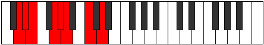 |
| [1259](https://ianring.com/musictheory/scales/1259) | [Stadian](ModeDNaturalStadian.md) | D | D, Eb, F, G, Ab, Bbb, C, D |  |
| [1261](https://ianring.com/musictheory/scales/1261) | [Aeodian](ModeFNaturalAeodian.md) | F | F, G, Ab, Bb, Cb, Dbb, Eb, F |  |
| [1263](https://ianring.com/musictheory/scales/1263) | [Stynyllic](ModeDNaturalStynyllic.md) | D | D, D#, E, F, G, G#, A, C, D |  |
| [1263](https://ianring.com/musictheory/scales/1263) | [Stynyllic](ModeFNaturalStynyllic.md) | F | F, F#, G, G#, A#, B, C, D#, F |  |
| [1267](https://ianring.com/musictheory/scales/1267) | [Katynian](ModeDNaturalKatynian.md) | D | D, Eb, F#, G, Ab, Bbb, C, D |  |
| [1271](https://ianring.com/musictheory/scales/1271) | [Kolyllic](ModeDNaturalKolyllic.md) | D | D, D#, E, F#, G, G#, A, C, D |  |
| [1275](https://ianring.com/musictheory/scales/1275) | [Stagyllic](ModeDNaturalStagyllic.md) | D | D, D#, F, F#, G, G#, A, C, D |  |
| [1277](https://ianring.com/musictheory/scales/1277) | [Zadyllic](ModeFNaturalZadyllic.md) | F | F, G, G#, A, A#, B, C, D#, F |  |
| [1279](https://ianring.com/musictheory/scales/1279) | [Sarygic](ModeDNaturalSarygic.md) | D | D, D#, E, F, F#, G, G#, A, C, D |  |
| [1279](https://ianring.com/musictheory/scales/1279) | [Sarygic](ModeFNaturalSarygic.md) | F | F, F#, G, G#, A, A#, B, C, D#, F |  |
| [1315](https://ianring.com/musictheory/scales/1315) | [Pyritonic](ModeGNaturalPyritonic.md) | G | G, G#, C, D#, F, G |  |
| [1319](https://ianring.com/musictheory/scales/1319) | [Phronimic](ModeGNaturalPhronimic.md) | G | G, Ab, Bbb, C, D#, E#, G |  |
| [1323](https://ianring.com/musictheory/scales/1323) | [Eporimic](ModeGNaturalEporimic.md) | G | G, Ab, Bb, C, D#, E#, G |  |
| [1327](https://ianring.com/musictheory/scales/1327) | [Zalian](ModeGNaturalZalian.md) | G | G, Ab, Bbb, Cbb, Dbb, Eb, F, G |  |
| [1331](https://ianring.com/musictheory/scales/1331) | [Dolimic](ModeGNaturalDolimic.md) | G | G, Ab, B, C, D#, E#, G |  |
| [1335](https://ianring.com/musictheory/scales/1335) | [Aeralian](ModeGNaturalAeralian.md) | G | G, Ab, Bbb, Cb, Dbb, Eb, F, G |  |
| [1339](https://ianring.com/musictheory/scales/1339) | [Kycrian](ModeGNaturalKycrian.md) | G | G, Ab, Bb, Cb, Dbb, Eb, F, G |  |
| [1343](https://ianring.com/musictheory/scales/1343) | [Zalyllic](ModeGNaturalZalyllic.md) | G | G, G#, A, A#, B, C, D#, F, G |  |
| [1379](https://ianring.com/musictheory/scales/1379) | [Kycrimic](ModeGNaturalKycrimic.md) | G | G, Ab, B#, C#, D#, E#, G |  |
| [1379](https://ianring.com/musictheory/scales/1379) | [Kycrimic](ModeDNaturalKycrimic.md) | D | D, Eb, F##, G#, A#, B#, D |  |
| [1383](https://ianring.com/musictheory/scales/1383) | [Pynian](ModeGNaturalPynian.md) | G | G, Ab, Bbb, C, Db, Eb, F, G |  |
| [1383](https://ianring.com/musictheory/scales/1383) | [Pynian](ModeDNaturalPynian.md) | D | D, Eb, Fb, G, Ab, Bb, C, D |  |
| [1387](https://ianring.com/musictheory/scales/1387) | [Locrian](ModeGNaturalLocrian.md) | G | G, Ab, Bb, C, Db, Eb, F, G |  |
| [1387](https://ianring.com/musictheory/scales/1387) | [Locrian](ModeDNaturalLocrian.md) | D | D, Eb, F, G, Ab, Bb, C, D |  |
| [1391](https://ianring.com/musictheory/scales/1391) | [Aeradyllic](ModeDNaturalAeradyllic.md) | D | D, D#, E, F, G, G#, A#, C, D |  |
| [1391](https://ianring.com/musictheory/scales/1391) | [Aeradyllic](ModeGNaturalAeradyllic.md) | G | G, G#, A, A#, C, C#, D#, F, G |  |
| [1395](https://ianring.com/musictheory/scales/1395) | [Mixonorian](ModeDNaturalMixonorian.md) | D | D, Eb, F#, G, Ab, Bb, C, D |  |
| [1395](https://ianring.com/musictheory/scales/1395) | [Mixonorian](ModeGNaturalMixonorian.md) | G | G, Ab, B, C, Db, Eb, F, G |  |
| [1399](https://ianring.com/musictheory/scales/1399) | [Syryllic](ModeDNaturalSyryllic.md) | D | D, D#, E, F#, G, G#, A#, C, D |  |
| [1399](https://ianring.com/musictheory/scales/1399) | [Syryllic](ModeGNaturalSyryllic.md) | G | G, G#, A, B, C, C#, D#, F, G |  |
| [1403](https://ianring.com/musictheory/scales/1403) | [Epinyllic](ModeDNaturalEpinyllic.md) | D | D, D#, F, F#, G, G#, A#, C, D |  |
| [1403](https://ianring.com/musictheory/scales/1403) | [Epinyllic](ModeGNaturalEpinyllic.md) | G | G, G#, A#, B, C, C#, D#, F, G |  |
| [1407](https://ianring.com/musictheory/scales/1407) | [Tharygic](ModeDNaturalTharygic.md) | D | D, D#, E, F, F#, G, G#, A#, C, D |  |
| [1407](https://ianring.com/musictheory/scales/1407) | [Tharygic](ModeGNaturalTharygic.md) | G | G, G#, A, A#, B, C, C#, D#, F, G |  |
| [1417](https://ianring.com/musictheory/scales/1417) | [Zoptitonic](ModeCNaturalZoptitonic.md) | C | C, D#, G, G#, A#, C |  |
| [1419](https://ianring.com/musictheory/scales/1419) | [Zalimic](ModeCNaturalZalimic.md) | C | C, Db, Eb, F##, G#, A#, C |  |
| [1421](https://ianring.com/musictheory/scales/1421) | [Aeolaphimic](ModeFNaturalAeolaphimic.md) | F | F, G, Ab, B#, C#, D#, F |  |
| [1421](https://ianring.com/musictheory/scales/1421) | [Aeolaphimic](ModeCNaturalAeolaphimic.md) | C | C, D, Eb, F##, G#, A#, C |  |
| [1423](https://ianring.com/musictheory/scales/1423) | [Doptian](ModeCNaturalDoptian.md) | C | C, Db, Ebb, Fbb, G, Ab, Bb, C |  |
| [1433](https://ianring.com/musictheory/scales/1433) | [Dynimic](ModeCNaturalDynimic.md) | C | C, D#, E, F##, G#, A#, C |  |
| [1435](https://ianring.com/musictheory/scales/1435) | [Phronian](ModeCNaturalPhronian.md) | C | C, Db, Eb, Fb, G, Ab, Bb, C |  |
| [1437](https://ianring.com/musictheory/scales/1437) | [Aeolycrian](ModeFNaturalAeolycrian.md) | F | F, G, Ab, Bbb, C, Db, Eb, F |  |
| [1437](https://ianring.com/musictheory/scales/1437) | [Aeolycrian](ModeCNaturalAeolycrian.md) | C | C, D, Eb, Fb, G, Ab, Bb, C |  |
| [1439](https://ianring.com/musictheory/scales/1439) | [Rolyllic](ModeFNaturalRolyllic.md) | F | F, F#, G, G#, A, C, C#, D#, F |  |
| [1439](https://ianring.com/musictheory/scales/1439) | [Rolyllic](ModeCNaturalRolyllic.md) | C | C, C#, D, D#, E, G, G#, A#, C |  |
| [1443](https://ianring.com/musictheory/scales/1443) | [Ionarimic](ModeGNaturalIonarimic.md) | G | G, Ab, B#, C##, D#, E#, G | 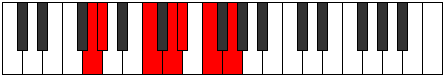 |
| [1447](https://ianring.com/musictheory/scales/1447) | [Mixopyrian](ModeGNaturalMixopyrian.md) | G | G, Ab, Bbb, C, D, Eb, F, G |  |
| [1449](https://ianring.com/musictheory/scales/1449) | [Epathimic](ModeCNaturalEpathimic.md) | C | C, D#, E#, F##, G#, A#, C |  |
| [1451](https://ianring.com/musictheory/scales/1451) | [Phrygian](ModeCNaturalPhrygian.md) | C | C, Db, Eb, F, G, Ab, Bb, C |  |
| [1451](https://ianring.com/musictheory/scales/1451) | [Phrygian](ModeGNaturalPhrygian.md) | G | G, Ab, Bb, C, D, Eb, F, G |  |
| [1453](https://ianring.com/musictheory/scales/1453) | [Aeolian](ModeFNaturalAeolian.md) | F | F, G, Ab, Bb, C, Db, Eb, F |  |
| [1453](https://ianring.com/musictheory/scales/1453) | [Aeolian](ModeCNaturalAeolian.md) | C | C, D, Eb, F, G, Ab, Bb, C |  |
| [1455](https://ianring.com/musictheory/scales/1455) | [Soryllic](ModeCNaturalSoryllic.md) | C | C, C#, D, D#, F, G, G#, A#, C |  |
| [1455](https://ianring.com/musictheory/scales/1455) | [Soryllic](ModeFNaturalSoryllic.md) | F | F, F#, G, G#, A#, C, C#, D#, F |  |
| [1455](https://ianring.com/musictheory/scales/1455) | [Soryllic](ModeGNaturalSoryllic.md) | G | G, G#, A, A#, C, D, D#, F, G |  |
| [1459](https://ianring.com/musictheory/scales/1459) | [Ionalian](ModeGNaturalIonalian.md) | G | G, Ab, B, C, D, Eb, F, G |  |
| [1463](https://ianring.com/musictheory/scales/1463) | [Zaptyllic](ModeGNaturalZaptyllic.md) | G | G, G#, A, B, C, D, D#, F, G |  |
| [1465](https://ianring.com/musictheory/scales/1465) | [Aerathian](ModeCNaturalAerathian.md) | C | C, D#, E, F, G, Ab, Bb, C | 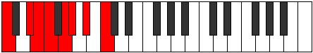 |
| [1467](https://ianring.com/musictheory/scales/1467) | [Thydyllic](ModeCNaturalThydyllic.md) | C | C, C#, D#, E, F, G, G#, A#, C |  |
| [1467](https://ianring.com/musictheory/scales/1467) | [Thydyllic](ModeGNaturalThydyllic.md) | G | G, G#, A#, B, C, D, D#, F, G |  |
| [1469](https://ianring.com/musictheory/scales/1469) | [Epiryllic](ModeCNaturalEpiryllic.md) | C | C, D, D#, E, F, G, G#, A#, C |  |
| [1469](https://ianring.com/musictheory/scales/1469) | [Epiryllic](ModeFNaturalEpiryllic.md) | F | F, G, G#, A, A#, C, C#, D#, F |  |
| [1471](https://ianring.com/musictheory/scales/1471) | [Radygic](ModeCNaturalRadygic.md) | C | C, C#, D, D#, E, F, G, G#, A#, C |  |
| [1471](https://ianring.com/musictheory/scales/1471) | [Radygic](ModeFNaturalRadygic.md) | F | F, F#, G, G#, A, A#, C, C#, D#, F |  |
| [1471](https://ianring.com/musictheory/scales/1471) | [Radygic](ModeGNaturalRadygic.md) | G | G, G#, A, A#, B, C, D, D#, F, G |  |
| [1481](https://ianring.com/musictheory/scales/1481) | [Zagimic](ModeCNaturalZagimic.md) | C | C, D#, E##, F##, G#, A#, C |  |
| [1483](https://ianring.com/musictheory/scales/1483) | [Dygian](ModeCNaturalDygian.md) | C | C, Db, Eb, F#, G, Ab, Bb, C | 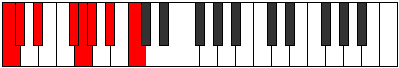 |
| [1485](https://ianring.com/musictheory/scales/1485) | [Tyrian](ModeCNaturalTyrian.md) | C | C, D, Eb, F#, G, Ab, Bb, C |  |
| [1485](https://ianring.com/musictheory/scales/1485) | [Tyrian](ModeFNaturalTyrian.md) | F | F, G, Ab, B, C, Db, Eb, F | 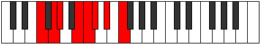 |
| [1487](https://ianring.com/musictheory/scales/1487) | [Lycryllic](ModeCNaturalLycryllic.md) | C | C, C#, D, D#, F#, G, G#, A#, C |  |
| [1487](https://ianring.com/musictheory/scales/1487) | [Lycryllic](ModeFNaturalLycryllic.md) | F | F, F#, G, G#, B, C, C#, D#, F |  |
| [1497](https://ianring.com/musictheory/scales/1497) | [Ionanian](ModeCNaturalIonanian.md) | C | C, D#, E, F#, G, Ab, Bb, C |  |
| [1499](https://ianring.com/musictheory/scales/1499) | [Stonyllic](ModeCNaturalStonyllic.md) | C | C, C#, D#, E, F#, G, G#, A#, C |  |
| [1501](https://ianring.com/musictheory/scales/1501) | [Stygyllic](ModeCNaturalStygyllic.md) | C | C, D, D#, E, F#, G, G#, A#, C |  |
| [1501](https://ianring.com/musictheory/scales/1501) | [Stygyllic](ModeFNaturalStygyllic.md) | F | F, G, G#, A, B, C, C#, D#, F | 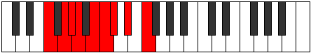 |
| [1503](https://ianring.com/musictheory/scales/1503) | [Padygic](ModeCNaturalPadygic.md) | C | C, C#, D, D#, E, F#, G, G#, A#, C |  |
| [1503](https://ianring.com/musictheory/scales/1503) | [Padygic](ModeFNaturalPadygic.md) | F | F, F#, G, G#, A, B, C, C#, D#, F |  |
| [1507](https://ianring.com/musictheory/scales/1507) | [Zynian](ModeGNaturalZynian.md) | G | G, Ab, B#, C#, D, Eb, F, G | 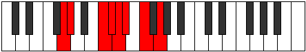 |
| [1507](https://ianring.com/musictheory/scales/1507) | [Zynian](ModeDNaturalZynian.md) | D | D, Eb, F##, G#, A, Bb, C, D |  |
| [1511](https://ianring.com/musictheory/scales/1511) | [Styptyllic](ModeGNaturalStyptyllic.md) | G | G, G#, A, C, C#, D, D#, F, G |  |
| [1511](https://ianring.com/musictheory/scales/1511) | [Styptyllic](ModeDNaturalStyptyllic.md) | D | D, D#, E, G, G#, A, A#, C, D |  |
| [1513](https://ianring.com/musictheory/scales/1513) | [Stathian](ModeCNaturalStathian.md) | C | C, D#, E#, F#, G, Ab, Bb, C |  |
| [1515](https://ianring.com/musictheory/scales/1515) | [Solyllic](ModeGNaturalSolyllic.md) | G | G, G#, A#, C, C#, D, D#, F, G |  |
| [1515](https://ianring.com/musictheory/scales/1515) | [Solyllic](ModeCNaturalSolyllic.md) | C | C, C#, D#, F, F#, G, G#, A#, C |  |
| [1515](https://ianring.com/musictheory/scales/1515) | [Solyllic](ModeDNaturalSolyllic.md) | D | D, D#, F, G, G#, A, A#, C, D |  |
| [1517](https://ianring.com/musictheory/scales/1517) | [Sagyllic](ModeCNaturalSagyllic.md) | C | C, D, D#, F, F#, G, G#, A#, C |  |
| [1517](https://ianring.com/musictheory/scales/1517) | [Sagyllic](ModeFNaturalSagyllic.md) | F | F, G, G#, A#, B, C, C#, D#, F |  |
| [1519](https://ianring.com/musictheory/scales/1519) | [Solygic](ModeCNaturalSolygic.md) | C | C, C#, D, D#, F, F#, G, G#, A#, C |  |
| [1519](https://ianring.com/musictheory/scales/1519) | [Solygic](ModeGNaturalSolygic.md) | G | G, G#, A, A#, C, C#, D, D#, F, G |  |
| [1519](https://ianring.com/musictheory/scales/1519) | [Solygic](ModeDNaturalSolygic.md) | D | D, D#, E, F, G, G#, A, A#, C, D |  |
| [1519](https://ianring.com/musictheory/scales/1519) | [Solygic](ModeFNaturalSolygic.md) | F | F, F#, G, G#, A#, B, C, C#, D#, F |  |
| [1523](https://ianring.com/musictheory/scales/1523) | [Zothyllic](ModeDNaturalZothyllic.md) | D | D, D#, F#, G, G#, A, A#, C, D |  |
| [1523](https://ianring.com/musictheory/scales/1523) | [Zothyllic](ModeGNaturalZothyllic.md) | G | G, G#, B, C, C#, D, D#, F, G |  |
| [1527](https://ianring.com/musictheory/scales/1527) | [Aeolyrygic](ModeDNaturalAeolyrygic.md) | D | D, D#, E, F#, G, G#, A, A#, C, D | 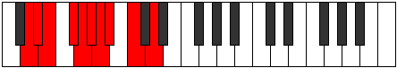 |
| [1527](https://ianring.com/musictheory/scales/1527) | [Aeolyrygic](ModeGNaturalAeolyrygic.md) | G | G, G#, A, B, C, C#, D, D#, F, G |  |
| [1529](https://ianring.com/musictheory/scales/1529) | [Kataryllic](ModeCNaturalKataryllic.md) | C | C, D#, E, F, F#, G, G#, A#, C |  |
| [1531](https://ianring.com/musictheory/scales/1531) | [Styptygic](ModeCNaturalStyptygic.md) | C | C, C#, D#, E, F, F#, G, G#, A#, C |  |
| [1531](https://ianring.com/musictheory/scales/1531) | [Styptygic](ModeDNaturalStyptygic.md) | D | D, D#, F, F#, G, G#, A, A#, C, D |  |
| [1531](https://ianring.com/musictheory/scales/1531) | [Styptygic](ModeGNaturalStyptygic.md) | G | G, G#, A#, B, C, C#, D, D#, F, G |  |
| [1533](https://ianring.com/musictheory/scales/1533) | [Katycrygic](ModeCNaturalKatycrygic.md) | C | C, D, D#, E, F, F#, G, G#, A#, C |  |
| [1533](https://ianring.com/musictheory/scales/1533) | [Katycrygic](ModeFNaturalKatycrygic.md) | F | F, G, G#, A, A#, B, C, C#, D#, F |  |
| [1535](https://ianring.com/musictheory/scales/1535) | [Mixodyllian](ModeCNaturalMixodyllian.md) | C | C, C#, D, D#, E, F, F#, G, G#, A#, C |  |
| [1535](https://ianring.com/musictheory/scales/1535) | [Mixodyllian](ModeDNaturalMixodyllian.md) | D | D, D#, E, F, F#, G, G#, A, A#, C, D |  |
| [1535](https://ianring.com/musictheory/scales/1535) | [Mixodyllian](ModeGNaturalMixodyllian.md) | G | G, G#, A, A#, B, C, C#, D, D#, F, G |  |
| [1535](https://ianring.com/musictheory/scales/1535) | [Mixodyllian](ModeFNaturalMixodyllian.md) | F | F, F#, G, G#, A, A#, B, C, C#, D#, F |  |
| [1573](https://ianring.com/musictheory/scales/1573) | [Saritonic](ModeASharpSaritonic.md) | A# | A#, C, D#, G, G#, A# |  |
| [1573](https://ianring.com/musictheory/scales/1573) | [Saritonic](ModeBFlatSaritonic.md) | Bb | Bb, C, Eb, G, Ab, Bb |  |
| [1575](https://ianring.com/musictheory/scales/1575) | [Zycrimic](ModeBFlatZycrimic.md) | Bb | Bb, Cb, Dbb, Eb, F##, G#, Bb |  |
| [1581](https://ianring.com/musictheory/scales/1581) | [Gyrimic](ModeBFlatGyrimic.md) | Bb | Bb, C, Db, Eb, F##, G#, Bb |  |
| [1583](https://ianring.com/musictheory/scales/1583) | [Salian](ModeASharpSalian.md) | A# | A#, B, C, Db, Eb, F##, G#, A# |  |
| [1583](https://ianring.com/musictheory/scales/1583) | [Salian](ModeBFlatSalian.md) | Bb | Bb, Cb, Dbb, Ebbb, Fbb, G, Ab, Bb |  |
| [1585](https://ianring.com/musictheory/scales/1585) | [Phraditonic](ModeDSharpPhraditonic.md) | D# | D#, G, G#, C, C#, D# |  |
| [1585](https://ianring.com/musictheory/scales/1585) | [Phraditonic](ModeEFlatPhraditonic.md) | Eb | Eb, G, Ab, C, Db, Eb |  |
| [1587](https://ianring.com/musictheory/scales/1587) | [Lalimic](ModeDSharpLalimic.md) | D# | D#, E, F##, G#, A###, B##, D# |  |
| [1587](https://ianring.com/musictheory/scales/1587) | [Lalimic](ModeEFlatLalimic.md) | Eb | Eb, Fb, G, Ab, B#, C#, Eb |  |
| [1589](https://ianring.com/musictheory/scales/1589) | [Ionagimic](ModeDSharpIonagimic.md) | D# | D#, E#, F##, G#, A###, B##, D# |  |
| [1589](https://ianring.com/musictheory/scales/1589) | [Ionagimic](ModeEFlatIonagimic.md) | Eb | Eb, F, G, Ab, B#, C#, Eb |  |
| [1589](https://ianring.com/musictheory/scales/1589) | [Ionagimic](ModeBFlatIonagimic.md) | Bb | Bb, C, D, Eb, F##, G#, Bb |  |
| [1591](https://ianring.com/musictheory/scales/1591) | [Rodian](ModeDSharpRodian.md) | D# | D#, E, F, G, Ab, B#, C#, D# |  |
| [1591](https://ianring.com/musictheory/scales/1591) | [Rodian](ModeASharpRodian.md) | A# | A#, B, C, D, Eb, F##, G#, A# |  |
| [1591](https://ianring.com/musictheory/scales/1591) | [Rodian](ModeBFlatRodian.md) | Bb | Bb, Cb, Dbb, Ebb, Fbb, G, Ab, Bb |  |
| [1593](https://ianring.com/musictheory/scales/1593) | [Zogimic](ModeDSharpZogimic.md) | D# | D#, E##, F##, G#, A###, B##, D# |  |
| [1593](https://ianring.com/musictheory/scales/1593) | [Zogimic](ModeEFlatZogimic.md) | Eb | Eb, F#, G, Ab, B#, C#, Eb |  |
| [1595](https://ianring.com/musictheory/scales/1595) | [Dacrian](ModeDSharpDacrian.md) | D# | D#, E, F#, G, Ab, B#, C#, D# |  |
| [1597](https://ianring.com/musictheory/scales/1597) | [Aeolodian](ModeDSharpAeolodian.md) | D# | D#, E#, F#, G, Ab, B#, C#, D# |  |
| [1597](https://ianring.com/musictheory/scales/1597) | [Aeolodian](ModeASharpAeolodian.md) | A# | A#, B#, C#, D, Eb, F##, G#, A# |  |
| [1597](https://ianring.com/musictheory/scales/1597) | [Aeolodian](ModeBFlatAeolodian.md) | Bb | Bb, C, Db, Ebb, Fbb, G, Ab, Bb |  |
| [1599](https://ianring.com/musictheory/scales/1599) | [Pocryllic](ModeDSharpPocryllic.md) | D# | D#, E, F, F#, G, G#, C, C#, D# |  |
| [1599](https://ianring.com/musictheory/scales/1599) | [Pocryllic](ModeEFlatPocryllic.md) | Eb | Eb, E, F, Gb, G, Ab, C, Db, Eb |  |
| [1599](https://ianring.com/musictheory/scales/1599) | [Pocryllic](ModeASharpPocryllic.md) | A# | A#, B, C, C#, D, D#, G, G#, A# |  |
| [1599](https://ianring.com/musictheory/scales/1599) | [Pocryllic](ModeBFlatPocryllic.md) | Bb | Bb, B, C, Db, D, Eb, G, Ab, Bb |  |
| [1607](https://ianring.com/musictheory/scales/1607) | [Epytimic](ModeFSharpEpytimic.md) | F# | F#, G, Ab, B#, C###, D##, F# |  |
| [1615](https://ianring.com/musictheory/scales/1615) | [Sydian](ModeFSharpSydian.md) | F# | F#, G, Ab, Bbb, C, D#, E, F# |  |
| [1623](https://ianring.com/musictheory/scales/1623) | [Lothian](ModeFSharpLothian.md) | F# | F#, G, Ab, Bb, C, D#, E, F# |  |
| [1631](https://ianring.com/musictheory/scales/1631) | [Rynyllic](ModeFSharpRynyllic.md) | F# | F#, G, G#, A, A#, C, D#, E, F# |  |
| [1631](https://ianring.com/musictheory/scales/1631) | [Rynyllic](ModeGFlatRynyllic.md) | Gb | Gb, G, Ab, A, Bb, C, Eb, E, Gb |  |
| [1635](https://ianring.com/musictheory/scales/1635) | [Sygimic](ModeDNaturalSygimic.md) | D | D, Eb, F##, G#, A##, B#, D |  |
| [1637](https://ianring.com/musictheory/scales/1637) | [Syptimic](ModeBFlatSyptimic.md) | Bb | Bb, C, D#, E, F##, G#, Bb |  |
| [1639](https://ianring.com/musictheory/scales/1639) | [Aeolothian](ModeDNaturalAeolothian.md) | D | D, Eb, Fb, G, Ab, B, C, D |  |
| [1639](https://ianring.com/musictheory/scales/1639) | [Aeolothian](ModeFSharpAeolothian.md) | F# | F#, G, Ab, B, C, D#, E, F# |  |
| [1639](https://ianring.com/musictheory/scales/1639) | [Aeolothian](ModeASharpAeolothian.md) | A# | A#, B, C, D#, E, F##, G#, A# |  |
| [1639](https://ianring.com/musictheory/scales/1639) | [Aeolothian](ModeBFlatAeolothian.md) | Bb | Bb, Cb, Dbb, Eb, Fb, G, Ab, Bb |  |
| [1643](https://ianring.com/musictheory/scales/1643) | [Thyptian](ModeDNaturalThyptian.md) | D | D, Eb, F, G, Ab, B, C, D |  |
| [1645](https://ianring.com/musictheory/scales/1645) | [Katagian](ModeASharpKatagian.md) | A# | A#, B#, C#, D#, E, F##, G#, A# |  |
| [1645](https://ianring.com/musictheory/scales/1645) | [Katagian](ModeBFlatKatagian.md) | Bb | Bb, C, Db, Eb, Fb, G, Ab, Bb |  |
| [1647](https://ianring.com/musictheory/scales/1647) | [Polyllic](ModeDNaturalPolyllic.md) | D | D, D#, E, F, G, G#, B, C, D |  |
| [1647](https://ianring.com/musictheory/scales/1647) | [Polyllic](ModeFSharpPolyllic.md) | F# | F#, G, G#, A, B, C, D#, E, F# |  |
| [1647](https://ianring.com/musictheory/scales/1647) | [Polyllic](ModeGFlatPolyllic.md) | Gb | Gb, G, Ab, A, B, C, Eb, E, Gb | 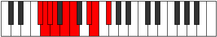 |
| [1647](https://ianring.com/musictheory/scales/1647) | [Polyllic](ModeASharpPolyllic.md) | A# | A#, B, C, C#, D#, E, G, G#, A# |  |
| [1647](https://ianring.com/musictheory/scales/1647) | [Polyllic](ModeBFlatPolyllic.md) | Bb | Bb, B, C, Db, Eb, E, G, Ab, Bb |  |
| [1649](https://ianring.com/musictheory/scales/1649) | [Bolimic](ModeEFlatBolimic.md) | Eb | Eb, F##, G#, A, B#, C#, Eb |  |
| [1651](https://ianring.com/musictheory/scales/1651) | [Mogian](ModeDSharpMogian.md) | D# | D#, E, F##, G#, A, B#, C#, D# |  |
| [1651](https://ianring.com/musictheory/scales/1651) | [Mogian](ModeEFlatMogian.md) | Eb | Eb, Fb, G, Ab, Bbb, C, Db, Eb |  |
| [1651](https://ianring.com/musictheory/scales/1651) | [Mogian](ModeDNaturalMogian.md) | D | D, Eb, F#, G, Ab, B, C, D | 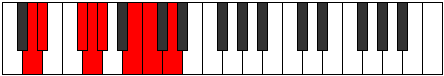 |
| [1653](https://ianring.com/musictheory/scales/1653) | [Gylian](ModeDSharpGylian.md) | D# | D#, E#, F##, G#, A, B#, C#, D# |  |
| [1653](https://ianring.com/musictheory/scales/1653) | [Gylian](ModeEFlatGylian.md) | Eb | Eb, F, G, Ab, Bbb, C, Db, Eb |  |
| [1653](https://ianring.com/musictheory/scales/1653) | [Gylian](ModeASharpGylian.md) | A# | A#, B#, C##, D#, E, F##, G#, A# |  |
| [1653](https://ianring.com/musictheory/scales/1653) | [Gylian](ModeBFlatGylian.md) | Bb | Bb, C, D, Eb, Fb, G, Ab, Bb |  |
| [1655](https://ianring.com/musictheory/scales/1655) | [Katygyllic](ModeDSharpKatygyllic.md) | D# | D#, E, F, G, G#, A, C, C#, D# |  |
| [1655](https://ianring.com/musictheory/scales/1655) | [Katygyllic](ModeEFlatKatygyllic.md) | Eb | Eb, E, F, G, Ab, A, C, Db, Eb |  |
| [1655](https://ianring.com/musictheory/scales/1655) | [Katygyllic](ModeDNaturalKatygyllic.md) | D | D, D#, E, F#, G, G#, B, C, D |  |
| [1655](https://ianring.com/musictheory/scales/1655) | [Katygyllic](ModeASharpKatygyllic.md) | A# | A#, B, C, D, D#, E, G, G#, A# |  |
| [1655](https://ianring.com/musictheory/scales/1655) | [Katygyllic](ModeBFlatKatygyllic.md) | Bb | Bb, B, C, D, Eb, E, G, Ab, Bb |  |
| [1655](https://ianring.com/musictheory/scales/1655) | [Katygyllic](ModeFSharpKatygyllic.md) | F# | F#, G, G#, A#, B, C, D#, E, F# |  |
| [1655](https://ianring.com/musictheory/scales/1655) | [Katygyllic](ModeGFlatKatygyllic.md) | Gb | Gb, G, Ab, Bb, B, C, Eb, E, Gb |  |
| [1657](https://ianring.com/musictheory/scales/1657) | [Ionothian](ModeDSharpIonothian.md) | D# | D#, E##, F##, G#, A, B#, C#, D# |  |
| [1657](https://ianring.com/musictheory/scales/1657) | [Ionothian](ModeEFlatIonothian.md) | Eb | Eb, F#, G, Ab, Bbb, C, Db, Eb |  |
| [1659](https://ianring.com/musictheory/scales/1659) | [Magyllic](ModeDSharpMagyllic.md) | D# | D#, E, F#, G, G#, A, C, C#, D# |  |
| [1659](https://ianring.com/musictheory/scales/1659) | [Magyllic](ModeEFlatMagyllic.md) | Eb | Eb, E, Gb, G, Ab, A, C, Db, Eb |  |
| [1659](https://ianring.com/musictheory/scales/1659) | [Magyllic](ModeDNaturalMagyllic.md) | D | D, D#, F, F#, G, G#, B, C, D |  |
| [1661](https://ianring.com/musictheory/scales/1661) | [Gonyllic](ModeDSharpGonyllic.md) | D# | D#, F, F#, G, G#, A, C, C#, D# |  |
| [1661](https://ianring.com/musictheory/scales/1661) | [Gonyllic](ModeEFlatGonyllic.md) | Eb | Eb, F, Gb, G, Ab, A, C, Db, Eb |  |
| [1661](https://ianring.com/musictheory/scales/1661) | [Gonyllic](ModeASharpGonyllic.md) | A# | A#, C, C#, D, D#, E, G, G#, A# |  |
| [1661](https://ianring.com/musictheory/scales/1661) | [Gonyllic](ModeBFlatGonyllic.md) | Bb | Bb, C, Db, D, Eb, E, G, Ab, Bb |  |
| [1663](https://ianring.com/musictheory/scales/1663) | [Lydygic](ModeDSharpLydygic.md) | D# | D#, E, F, F#, G, G#, A, C, C#, D# |  |
| [1663](https://ianring.com/musictheory/scales/1663) | [Lydygic](ModeEFlatLydygic.md) | Eb | Eb, E, F, Gb, G, Ab, A, C, Db, Eb |  |
| [1663](https://ianring.com/musictheory/scales/1663) | [Lydygic](ModeDNaturalLydygic.md) | D | D, D#, E, F, F#, G, G#, B, C, D |  |
| [1663](https://ianring.com/musictheory/scales/1663) | [Lydygic](ModeASharpLydygic.md) | A# | A#, B, C, C#, D, D#, E, G, G#, A# |  |
| [1663](https://ianring.com/musictheory/scales/1663) | [Lydygic](ModeBFlatLydygic.md) | Bb | Bb, B, C, Db, D, Eb, E, G, Ab, Bb |  |
| [1663](https://ianring.com/musictheory/scales/1663) | [Lydygic](ModeFSharpLydygic.md) | F# | F#, G, G#, A, A#, B, C, D#, E, F# |  |
| [1663](https://ianring.com/musictheory/scales/1663) | [Lydygic](ModeGFlatLydygic.md) | Gb | Gb, G, Ab, A, Bb, B, C, Eb, E, Gb |  |
| [1677](https://ianring.com/musictheory/scales/1677) | [Danimic](ModeFNaturalDanimic.md) | F | F, G, Ab, B#, C##, D#, F | 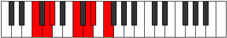 |
| [1693](https://ianring.com/musictheory/scales/1693) | [Dogian](ModeFNaturalDogian.md) | F | F, G, Ab, Bbb, C, D, Eb, F |  |
| [1695](https://ianring.com/musictheory/scales/1695) | [Phrodyllic](ModeFNaturalPhrodyllic.md) | F | F, F#, G, G#, A, C, D, D#, F |  |
| [1701](https://ianring.com/musictheory/scales/1701) | [Lothimic](ModeBFlatLothimic.md) | Bb | Bb, C, D#, E#, F##, G#, Bb |  |
| [1703](https://ianring.com/musictheory/scales/1703) | [Zaptian](ModeASharpZaptian.md) | A# | A#, B, C, D#, E#, F##, G#, A# |  |
| [1703](https://ianring.com/musictheory/scales/1703) | [Zaptian](ModeBFlatZaptian.md) | Bb | Bb, Cb, Dbb, Eb, F, G, Ab, Bb |  |
| [1709](https://ianring.com/musictheory/scales/1709) | [Dorian](ModeASharpDorian.md) | A# | A#, B#, C#, D#, E#, F##, G#, A# |  |
| [1709](https://ianring.com/musictheory/scales/1709) | [Dorian](ModeBFlatDorian.md) | Bb | Bb, C, Db, Eb, F, G, Ab, Bb |  |
| [1709](https://ianring.com/musictheory/scales/1709) | [Dorian](ModeFNaturalDorian.md) | F | F, G, Ab, Bb, C, D, Eb, F |  |
| [1711](https://ianring.com/musictheory/scales/1711) | [Ragyllic](ModeFNaturalRagyllic.md) | F | F, F#, G, G#, A#, C, D, D#, F |  |
| [1711](https://ianring.com/musictheory/scales/1711) | [Ragyllic](ModeASharpRagyllic.md) | A# | A#, B, C, C#, D#, F, G, G#, A# |  |
| [1711](https://ianring.com/musictheory/scales/1711) | [Ragyllic](ModeBFlatRagyllic.md) | Bb | Bb, B, C, Db, Eb, F, G, Ab, Bb |  |
| [1713](https://ianring.com/musictheory/scales/1713) | [Garimic](ModeEFlatGarimic.md) | Eb | Eb, F##, G#, A#, B#, C#, Eb |  |
| [1715](https://ianring.com/musictheory/scales/1715) | [Aeronian](ModeDSharpAeronian.md) | D# | D#, E, F##, G#, A#, B#, C#, D# |  |
| [1715](https://ianring.com/musictheory/scales/1715) | [Aeronian](ModeEFlatAeronian.md) | Eb | Eb, Fb, G, Ab, Bb, C, Db, Eb |  |
| [1717](https://ianring.com/musictheory/scales/1717) | [Mixolydian](ModeDSharpMixolydian.md) | D# | D#, E#, F##, G#, A#, B#, C#, D# |  |
| [1717](https://ianring.com/musictheory/scales/1717) | [Mixolydian](ModeEFlatMixolydian.md) | Eb | Eb, F, G, Ab, Bb, C, Db, Eb |  |
| [1717](https://ianring.com/musictheory/scales/1717) | [Mixolydian](ModeASharpMixolydian.md) | A# | A#, B#, C##, D#, E#, F##, G#, A# |  |
| [1717](https://ianring.com/musictheory/scales/1717) | [Mixolydian](ModeBFlatMixolydian.md) | Bb | Bb, C, D, Eb, F, G, Ab, Bb |  |
| [1719](https://ianring.com/musictheory/scales/1719) | [Lyryllic](ModeDSharpLyryllic.md) | D# | D#, E, F, G, G#, A#, C, C#, D# |  |
| [1719](https://ianring.com/musictheory/scales/1719) | [Lyryllic](ModeEFlatLyryllic.md) | Eb | Eb, E, F, G, Ab, Bb, C, Db, Eb |  |
| [1719](https://ianring.com/musictheory/scales/1719) | [Lyryllic](ModeASharpLyryllic.md) | A# | A#, B, C, D, D#, F, G, G#, A# |  |
| [1719](https://ianring.com/musictheory/scales/1719) | [Lyryllic](ModeBFlatLyryllic.md) | Bb | Bb, B, C, D, Eb, F, G, Ab, Bb |  |
| [1721](https://ianring.com/musictheory/scales/1721) | [Ionycrian](ModeDSharpIonycrian.md) | D# | D#, E##, F##, G#, A#, B#, C#, D# |  |
| [1721](https://ianring.com/musictheory/scales/1721) | [Ionycrian](ModeEFlatIonycrian.md) | Eb | Eb, F#, G, Ab, Bb, C, Db, Eb | 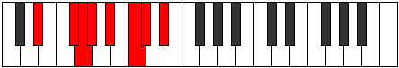 |
| [1723](https://ianring.com/musictheory/scales/1723) | [Poryllic](ModeDSharpPoryllic.md) | D# | D#, E, F#, G, G#, A#, C, C#, D# |  |
| [1723](https://ianring.com/musictheory/scales/1723) | [Poryllic](ModeEFlatPoryllic.md) | Eb | Eb, E, Gb, G, Ab, Bb, C, Db, Eb |  |
| [1725](https://ianring.com/musictheory/scales/1725) | [Mixodyllic](ModeASharpMixodyllic.md) | A# | A#, C, C#, D, D#, F, G, G#, A# |  |
| [1725](https://ianring.com/musictheory/scales/1725) | [Mixodyllic](ModeBFlatMixodyllic.md) | Bb | Bb, C, Db, D, Eb, F, G, Ab, Bb |  |
| [1725](https://ianring.com/musictheory/scales/1725) | [Mixodyllic](ModeDSharpMixodyllic.md) | D# | D#, F, F#, G, G#, A#, C, C#, D# |  |
| [1725](https://ianring.com/musictheory/scales/1725) | [Mixodyllic](ModeEFlatMixodyllic.md) | Eb | Eb, F, Gb, G, Ab, Bb, C, Db, Eb |  |
| [1725](https://ianring.com/musictheory/scales/1725) | [Mixodyllic](ModeFNaturalMixodyllic.md) | F | F, G, G#, A, A#, C, D, D#, F |  |
| [1727](https://ianring.com/musictheory/scales/1727) | [Sydygic](ModeDSharpSydygic.md) | D# | D#, E, F, F#, G, G#, A#, C, C#, D# |  |
| [1727](https://ianring.com/musictheory/scales/1727) | [Sydygic](ModeEFlatSydygic.md) | Eb | Eb, E, F, Gb, G, Ab, Bb, C, Db, Eb |  |
| [1727](https://ianring.com/musictheory/scales/1727) | [Sydygic](ModeFNaturalSydygic.md) | F | F, F#, G, G#, A, A#, C, D, D#, F |  |
| [1727](https://ianring.com/musictheory/scales/1727) | [Sydygic](ModeASharpSydygic.md) | A# | A#, B, C, C#, D, D#, F, G, G#, A# |  |
| [1727](https://ianring.com/musictheory/scales/1727) | [Sydygic](ModeBFlatSydygic.md) | Bb | Bb, B, C, Db, D, Eb, F, G, Ab, Bb |  |
| [1735](https://ianring.com/musictheory/scales/1735) | [Dagian](ModeFSharpDagian.md) | F# | F#, G, Ab, B#, C#, D#, E, F# |  |
| [1741](https://ianring.com/musictheory/scales/1741) | [Katycrian](ModeFNaturalKatycrian.md) | F | F, G, Ab, B, C, D, Eb, F |  |
| [1743](https://ianring.com/musictheory/scales/1743) | [Epigyllic](ModeFSharpEpigyllic.md) | F# | F#, G, G#, A, C, C#, D#, E, F# |  |
| [1743](https://ianring.com/musictheory/scales/1743) | [Epigyllic](ModeGFlatEpigyllic.md) | Gb | Gb, G, Ab, A, C, Db, Eb, E, Gb |  |
| [1743](https://ianring.com/musictheory/scales/1743) | [Epigyllic](ModeFNaturalEpigyllic.md) | F | F, F#, G, G#, B, C, D, D#, F |  |
| [1751](https://ianring.com/musictheory/scales/1751) | [Aeolyryllic](ModeFSharpAeolyryllic.md) | F# | F#, G, G#, A#, C, C#, D#, E, F# |  |
| [1751](https://ianring.com/musictheory/scales/1751) | [Aeolyryllic](ModeGFlatAeolyryllic.md) | Gb | Gb, G, Ab, Bb, C, Db, Eb, E, Gb |  |
| [1757](https://ianring.com/musictheory/scales/1757) | [Ionyphyllic](ModeFNaturalIonyphyllic.md) | F | F, G, G#, A, B, C, D, D#, F |  |
| [1759](https://ianring.com/musictheory/scales/1759) | [Pylygic](ModeFSharpPylygic.md) | F# | F#, G, G#, A, A#, C, C#, D#, E, F# |  |
| [1759](https://ianring.com/musictheory/scales/1759) | [Pylygic](ModeGFlatPylygic.md) | Gb | Gb, G, Ab, A, Bb, C, Db, Eb, E, Gb |  |
| [1759](https://ianring.com/musictheory/scales/1759) | [Pylygic](ModeFNaturalPylygic.md) | F | F, F#, G, G#, A, B, C, D, D#, F |  |
| [1763](https://ianring.com/musictheory/scales/1763) | [Katalian](ModeDNaturalKatalian.md) | D | D, Eb, F##, G#, A, B, C, D |  |
| [1765](https://ianring.com/musictheory/scales/1765) | [Lonian](ModeASharpLonian.md) | A# | A#, B#, C###, D##, E#, F##, G#, A# |  |
| [1765](https://ianring.com/musictheory/scales/1765) | [Lonian](ModeBFlatLonian.md) | Bb | Bb, C, D#, E, F, G, Ab, Bb |  |
| [1767](https://ianring.com/musictheory/scales/1767) | [Dyryllic](ModeFSharpDyryllic.md) | F# | F#, G, G#, B, C, C#, D#, E, F# |  |
| [1767](https://ianring.com/musictheory/scales/1767) | [Dyryllic](ModeGFlatDyryllic.md) | Gb | Gb, G, Ab, B, C, Db, Eb, E, Gb |  |
| [1767](https://ianring.com/musictheory/scales/1767) | [Dyryllic](ModeDNaturalDyryllic.md) | D | D, D#, E, G, G#, A, B, C, D |  |
| [1767](https://ianring.com/musictheory/scales/1767) | [Dyryllic](ModeASharpDyryllic.md) | A# | A#, B, C, D#, E, F, G, G#, A# |  |
| [1767](https://ianring.com/musictheory/scales/1767) | [Dyryllic](ModeBFlatDyryllic.md) | Bb | Bb, B, C, Eb, E, F, G, Ab, Bb |  |
| [1771](https://ianring.com/musictheory/scales/1771) | [Stylyllic](ModeDNaturalStylyllic.md) | D | D, D#, F, G, G#, A, B, C, D |  |
| [1773](https://ianring.com/musictheory/scales/1773) | [Aeoloryllic](ModeASharpAeoloryllic.md) | A# | A#, C, C#, D#, E, F, G, G#, A# |  |
| [1773](https://ianring.com/musictheory/scales/1773) | [Aeoloryllic](ModeBFlatAeoloryllic.md) | Bb | Bb, C, Db, Eb, E, F, G, Ab, Bb |  |
| [1773](https://ianring.com/musictheory/scales/1773) | [Aeoloryllic](ModeFNaturalAeoloryllic.md) | F | F, G, G#, A#, B, C, D, D#, F |  |
| [1775](https://ianring.com/musictheory/scales/1775) | [Lyrygic](ModeDNaturalLyrygic.md) | D | D, D#, E, F, G, G#, A, B, C, D |  |
| [1775](https://ianring.com/musictheory/scales/1775) | [Lyrygic](ModeFSharpLyrygic.md) | F# | F#, G, G#, A, B, C, C#, D#, E, F# |  |
| [1775](https://ianring.com/musictheory/scales/1775) | [Lyrygic](ModeGFlatLyrygic.md) | Gb | Gb, G, Ab, A, B, C, Db, Eb, E, Gb |  |
| [1775](https://ianring.com/musictheory/scales/1775) | [Lyrygic](ModeASharpLyrygic.md) | A# | A#, B, C, C#, D#, E, F, G, G#, A# |  |
| [1775](https://ianring.com/musictheory/scales/1775) | [Lyrygic](ModeBFlatLyrygic.md) | Bb | Bb, B, C, Db, Eb, E, F, G, Ab, Bb |  |
| [1775](https://ianring.com/musictheory/scales/1775) | [Lyrygic](ModeFNaturalLyrygic.md) | F | F, F#, G, G#, A#, B, C, D, D#, F |  |
| [1777](https://ianring.com/musictheory/scales/1777) | [Saptian](ModeEFlatSaptian.md) | Eb | Eb, F##, G#, A, Bb, C, Db, Eb |  |
| [1779](https://ianring.com/musictheory/scales/1779) | [Aerythyllic](ModeDSharpAerythyllic.md) | D# | D#, E, G, G#, A, A#, C, C#, D# |  |
| [1779](https://ianring.com/musictheory/scales/1779) | [Aerythyllic](ModeEFlatAerythyllic.md) | Eb | Eb, E, G, Ab, A, Bb, C, Db, Eb |  |
| [1779](https://ianring.com/musictheory/scales/1779) | [Aerythyllic](ModeDNaturalAerythyllic.md) | D | D, D#, F#, G, G#, A, B, C, D |  |
| [1781](https://ianring.com/musictheory/scales/1781) | [Gocryllic](ModeASharpGocryllic.md) | A# | A#, C, D, D#, E, F, G, G#, A# |  |
| [1781](https://ianring.com/musictheory/scales/1781) | [Gocryllic](ModeBFlatGocryllic.md) | Bb | Bb, C, D, Eb, E, F, G, Ab, Bb |  |
| [1781](https://ianring.com/musictheory/scales/1781) | [Gocryllic](ModeDSharpGocryllic.md) | D# | D#, F, G, G#, A, A#, C, C#, D# |  |
| [1781](https://ianring.com/musictheory/scales/1781) | [Gocryllic](ModeEFlatGocryllic.md) | Eb | Eb, F, G, Ab, A, Bb, C, Db, Eb |  |
| [1783](https://ianring.com/musictheory/scales/1783) | [Danygic](ModeDSharpDanygic.md) | D# | D#, E, F, G, G#, A, A#, C, C#, D# |  |
| [1783](https://ianring.com/musictheory/scales/1783) | [Danygic](ModeEFlatDanygic.md) | Eb | Eb, E, F, G, Ab, A, Bb, C, Db, Eb |  |
| [1783](https://ianring.com/musictheory/scales/1783) | [Danygic](ModeDNaturalDanygic.md) | D | D, D#, E, F#, G, G#, A, B, C, D |  |
| [1783](https://ianring.com/musictheory/scales/1783) | [Danygic](ModeASharpDanygic.md) | A# | A#, B, C, D, D#, E, F, G, G#, A# |  |
| [1783](https://ianring.com/musictheory/scales/1783) | [Danygic](ModeBFlatDanygic.md) | Bb | Bb, B, C, D, Eb, E, F, G, Ab, Bb |  |
| [1783](https://ianring.com/musictheory/scales/1783) | [Danygic](ModeFSharpDanygic.md) | F# | F#, G, G#, A#, B, C, C#, D#, E, F# |  |
| [1783](https://ianring.com/musictheory/scales/1783) | [Danygic](ModeGFlatDanygic.md) | Gb | Gb, G, Ab, Bb, B, C, Db, Eb, E, Gb |  |
| [1785](https://ianring.com/musictheory/scales/1785) | [Tharyllic](ModeDSharpTharyllic.md) | D# | D#, F#, G, G#, A, A#, C, C#, D# |  |
| [1785](https://ianring.com/musictheory/scales/1785) | [Tharyllic](ModeEFlatTharyllic.md) | Eb | Eb, Gb, G, Ab, A, Bb, C, Db, Eb |  |
| [1787](https://ianring.com/musictheory/scales/1787) | [Mycrygic](ModeDSharpMycrygic.md) | D# | D#, E, F#, G, G#, A, A#, C, C#, D# |  |
| [1787](https://ianring.com/musictheory/scales/1787) | [Mycrygic](ModeEFlatMycrygic.md) | Eb | Eb, E, Gb, G, Ab, A, Bb, C, Db, Eb |  |
| [1787](https://ianring.com/musictheory/scales/1787) | [Mycrygic](ModeDNaturalMycrygic.md) | D | D, D#, F, F#, G, G#, A, B, C, D |  |
| [1789](https://ianring.com/musictheory/scales/1789) | [Katagygic](ModeASharpKatagygic.md) | A# | A#, C, C#, D, D#, E, F, G, G#, A# |  |
| [1789](https://ianring.com/musictheory/scales/1789) | [Katagygic](ModeBFlatKatagygic.md) | Bb | Bb, C, Db, D, Eb, E, F, G, Ab, Bb |  |
| [1789](https://ianring.com/musictheory/scales/1789) | [Katagygic](ModeDSharpKatagygic.md) | D# | D#, F, F#, G, G#, A, A#, C, C#, D# |  |
| [1789](https://ianring.com/musictheory/scales/1789) | [Katagygic](ModeEFlatKatagygic.md) | Eb | Eb, F, Gb, G, Ab, A, Bb, C, Db, Eb |  |
| [1789](https://ianring.com/musictheory/scales/1789) | [Katagygic](ModeFNaturalKatagygic.md) | F | F, G, G#, A, A#, B, C, D, D#, F |  |
| [1791](https://ianring.com/musictheory/scales/1791) | [Aerygyllian](ModeDSharpAerygyllian.md) | D# | D#, E, F, F#, G, G#, A, A#, C, C#, D# |  |
| [1791](https://ianring.com/musictheory/scales/1791) | [Aerygyllian](ModeEFlatAerygyllian.md) | Eb | Eb, E, F, Gb, G, Ab, A, Bb, C, Db, Eb |  |
| [1791](https://ianring.com/musictheory/scales/1791) | [Aerygyllian](ModeDNaturalAerygyllian.md) | D | D, D#, E, F, F#, G, G#, A, B, C, D |  |
| [1791](https://ianring.com/musictheory/scales/1791) | [Aerygyllian](ModeASharpAerygyllian.md) | A# | A#, B, C, C#, D, D#, E, F, G, G#, A# |  |
| [1791](https://ianring.com/musictheory/scales/1791) | [Aerygyllian](ModeBFlatAerygyllian.md) | Bb | Bb, B, C, Db, D, Eb, E, F, G, Ab, Bb |  |
| [1791](https://ianring.com/musictheory/scales/1791) | [Aerygyllian](ModeFSharpAerygyllian.md) | F# | F#, G, G#, A, A#, B, C, C#, D#, E, F# |  |
| [1791](https://ianring.com/musictheory/scales/1791) | [Aerygyllian](ModeGFlatAerygyllian.md) | Gb | Gb, G, Ab, A, Bb, B, C, Db, Eb, E, Gb |  |
| [1791](https://ianring.com/musictheory/scales/1791) | [Aerygyllian](ModeFNaturalAerygyllian.md) | F | F, F#, G, G#, A, A#, B, C, D, D#, F |  |
| [1815](https://ianring.com/musictheory/scales/1815) | [Godian](ModeBNaturalGodian.md) | B | B, C, Db, Eb, F##, G#, A, B |  |
| [1819](https://ianring.com/musictheory/scales/1819) | [Pydian](ModeBNaturalPydian.md) | B | B, C, D, Eb, F##, G#, A, B |  |
| [1823](https://ianring.com/musictheory/scales/1823) | [Phralyllic](ModeBNaturalPhralyllic.md) | B | B, C, C#, D, D#, G, G#, A, B |  |
| [1827](https://ianring.com/musictheory/scales/1827) | [Katygimic](ModeGNaturalKatygimic.md) | G | G, Ab, B#, C###, D##, E#, G |  |
| [1829](https://ianring.com/musictheory/scales/1829) | [Pathimic](ModeASharpPathimic.md) | A# | A#, B#, C###, E##, F##, G#, A# |  |
| [1829](https://ianring.com/musictheory/scales/1829) | [Pathimic](ModeBFlatPathimic.md) | Bb | Bb, C, D#, E##, F##, G#, Bb |  |
| [1831](https://ianring.com/musictheory/scales/1831) | [Pothian](ModeGNaturalPothian.md) | G | G, Ab, Bbb, C, D#, E, F, G |  |
| [1831](https://ianring.com/musictheory/scales/1831) | [Pothian](ModeASharpPothian.md) | A# | A#, B, C, D#, E##, F##, G#, A# |  |
| [1831](https://ianring.com/musictheory/scales/1831) | [Pothian](ModeBFlatPothian.md) | Bb | Bb, Cb, Dbb, Eb, F#, G, Ab, Bb |  |
| [1835](https://ianring.com/musictheory/scales/1835) | [Byptian](ModeGNaturalByptian.md) | G | G, Ab, Bb, C, D#, E, F, G |  |
| [1837](https://ianring.com/musictheory/scales/1837) | [Dalian](ModeASharpDalian.md) | A# | A#, B#, C#, D#, E##, F##, G#, A# |  |
| [1837](https://ianring.com/musictheory/scales/1837) | [Dalian](ModeBFlatDalian.md) | Bb | Bb, C, Db, Eb, F#, G, Ab, Bb |  |
| [1839](https://ianring.com/musictheory/scales/1839) | [Zogyllic](ModeGNaturalZogyllic.md) | G | G, G#, A, A#, C, D#, E, F, G |  |
| [1839](https://ianring.com/musictheory/scales/1839) | [Zogyllic](ModeASharpZogyllic.md) | A# | A#, B, C, C#, D#, F#, G, G#, A# |  |
| [1839](https://ianring.com/musictheory/scales/1839) | [Zogyllic](ModeBFlatZogyllic.md) | Bb | Bb, B, C, Db, Eb, Gb, G, Ab, Bb |  |
| [1841](https://ianring.com/musictheory/scales/1841) | [Thogimic](ModeEFlatThogimic.md) | Eb | Eb, F##, G#, A##, B#, C#, Eb |  |
| [1843](https://ianring.com/musictheory/scales/1843) | [Ionygian](ModeDSharpIonygian.md) | D# | D#, E, F##, G#, A##, B#, C#, D# |  |
| [1843](https://ianring.com/musictheory/scales/1843) | [Ionygian](ModeEFlatIonygian.md) | Eb | Eb, Fb, G, Ab, B, C, Db, Eb |  |
| [1843](https://ianring.com/musictheory/scales/1843) | [Ionygian](ModeGNaturalIonygian.md) | G | G, Ab, B, C, D#, E, F, G |  |
| [1843](https://ianring.com/musictheory/scales/1843) | [Ionygian](ModeBNaturalIonygian.md) | B | B, C, D#, E, F##, G#, A, B |  |
| [1845](https://ianring.com/musictheory/scales/1845) | [Lagian](ModeASharpLagian.md) | A# | A#, B#, C##, D#, E##, F##, G#, A# |  |
| [1845](https://ianring.com/musictheory/scales/1845) | [Lagian](ModeBFlatLagian.md) | Bb | Bb, C, D, Eb, F#, G, Ab, Bb |  |
| [1845](https://ianring.com/musictheory/scales/1845) | [Lagian](ModeDSharpLagian.md) | D# | D#, E#, F##, G#, A##, B#, C#, D# |  |
| [1845](https://ianring.com/musictheory/scales/1845) | [Lagian](ModeEFlatLagian.md) | Eb | Eb, F, G, Ab, B, C, Db, Eb |  |
| [1847](https://ianring.com/musictheory/scales/1847) | [Thacryllic](ModeDSharpThacryllic.md) | D# | D#, E, F, G, G#, B, C, C#, D# |  |
| [1847](https://ianring.com/musictheory/scales/1847) | [Thacryllic](ModeEFlatThacryllic.md) | Eb | Eb, E, F, G, Ab, B, C, Db, Eb |  |
| [1847](https://ianring.com/musictheory/scales/1847) | [Thacryllic](ModeBNaturalThacryllic.md) | B | B, C, C#, D#, E, G, G#, A, B |  |
| [1847](https://ianring.com/musictheory/scales/1847) | [Thacryllic](ModeGNaturalThacryllic.md) | G | G, G#, A, B, C, D#, E, F, G |  |
| [1847](https://ianring.com/musictheory/scales/1847) | [Thacryllic](ModeASharpThacryllic.md) | A# | A#, B, C, D, D#, F#, G, G#, A# |  |
| [1847](https://ianring.com/musictheory/scales/1847) | [Thacryllic](ModeBFlatThacryllic.md) | Bb | Bb, B, C, D, Eb, Gb, G, Ab, Bb |  |
| [1849](https://ianring.com/musictheory/scales/1849) | [Epogian](ModeDSharpEpogian.md) | D# | D#, E##, F##, G#, A##, B#, C#, D# |  |
| [1849](https://ianring.com/musictheory/scales/1849) | [Epogian](ModeEFlatEpogian.md) | Eb | Eb, F#, G, Ab, B, C, Db, Eb |  |
| [1851](https://ianring.com/musictheory/scales/1851) | [Zacryllic](ModeDSharpZacryllic.md) | D# | D#, E, F#, G, G#, B, C, C#, D# |  |
| [1851](https://ianring.com/musictheory/scales/1851) | [Zacryllic](ModeEFlatZacryllic.md) | Eb | Eb, E, Gb, G, Ab, B, C, Db, Eb |  |
| [1851](https://ianring.com/musictheory/scales/1851) | [Zacryllic](ModeBNaturalZacryllic.md) | B | B, C, D, D#, E, G, G#, A, B |  |
| [1851](https://ianring.com/musictheory/scales/1851) | [Zacryllic](ModeGNaturalZacryllic.md) | G | G, G#, A#, B, C, D#, E, F, G |  |
| [1853](https://ianring.com/musictheory/scales/1853) | [Phrynyllic](ModeASharpPhrynyllic.md) | A# | A#, C, C#, D, D#, F#, G, G#, A# |  |
| [1853](https://ianring.com/musictheory/scales/1853) | [Phrynyllic](ModeBFlatPhrynyllic.md) | Bb | Bb, C, Db, D, Eb, Gb, G, Ab, Bb |  |
| [1853](https://ianring.com/musictheory/scales/1853) | [Phrynyllic](ModeDSharpPhrynyllic.md) | D# | D#, F, F#, G, G#, B, C, C#, D# |  |
| [1853](https://ianring.com/musictheory/scales/1853) | [Phrynyllic](ModeEFlatPhrynyllic.md) | Eb | Eb, F, Gb, G, Ab, B, C, Db, Eb |  |
| [1855](https://ianring.com/musictheory/scales/1855) | [Marygic](ModeDSharpMarygic.md) | D# | D#, E, F, F#, G, G#, B, C, C#, D# |  |
| [1855](https://ianring.com/musictheory/scales/1855) | [Marygic](ModeEFlatMarygic.md) | Eb | Eb, E, F, Gb, G, Ab, B, C, Db, Eb |  |
| [1855](https://ianring.com/musictheory/scales/1855) | [Marygic](ModeBNaturalMarygic.md) | B | B, C, C#, D, D#, E, G, G#, A, B |  |
| [1855](https://ianring.com/musictheory/scales/1855) | [Marygic](ModeASharpMarygic.md) | A# | A#, B, C, C#, D, D#, F#, G, G#, A# |  |
| [1855](https://ianring.com/musictheory/scales/1855) | [Marygic](ModeBFlatMarygic.md) | Bb | Bb, B, C, Db, D, Eb, Gb, G, Ab, Bb |  |
| [1855](https://ianring.com/musictheory/scales/1855) | [Marygic](ModeGNaturalMarygic.md) | G | G, G#, A, A#, B, C, D#, E, F, G |  |
| [1863](https://ianring.com/musictheory/scales/1863) | [Pycrian](ModeFSharpPycrian.md) | F# | F#, G, Ab, B#, C##, D#, E, F# |  |
| [1871](https://ianring.com/musictheory/scales/1871) | [Aeolyllic](ModeFSharpAeolyllic.md) | F# | F#, G, G#, A, C, D, D#, E, F# |  |
| [1871](https://ianring.com/musictheory/scales/1871) | [Aeolyllic](ModeGFlatAeolyllic.md) | Gb | Gb, G, Ab, A, C, D, Eb, E, Gb |  |
| [1875](https://ianring.com/musictheory/scales/1875) | [Epyphian](ModeBNaturalEpyphian.md) | B | B, C, D#, E#, F##, G#, A, B |  |
| [1879](https://ianring.com/musictheory/scales/1879) | [Mixoryllic](ModeFSharpMixoryllic.md) | F# | F#, G, G#, A#, C, D, D#, E, F# |  |
| [1879](https://ianring.com/musictheory/scales/1879) | [Mixoryllic](ModeGFlatMixoryllic.md) | Gb | Gb, G, Ab, Bb, C, D, Eb, E, Gb |  |
| [1879](https://ianring.com/musictheory/scales/1879) | [Mixoryllic](ModeBNaturalMixoryllic.md) | B | B, C, C#, D#, F, G, G#, A, B |  |
| [1883](https://ianring.com/musictheory/scales/1883) | [Mixopyryllic](ModeBNaturalMixopyryllic.md) | B | B, C, D, D#, F, G, G#, A, B |  |
| [1887](https://ianring.com/musictheory/scales/1887) | [Aerocrygic](ModeFSharpAerocrygic.md) | F# | F#, G, G#, A, A#, C, D, D#, E, F# |  |
| [1887](https://ianring.com/musictheory/scales/1887) | [Aerocrygic](ModeGFlatAerocrygic.md) | Gb | Gb, G, Ab, A, Bb, C, D, Eb, E, Gb |  |
| [1887](https://ianring.com/musictheory/scales/1887) | [Aerocrygic](ModeBNaturalAerocrygic.md) | B | B, C, C#, D, D#, F, G, G#, A, B |  |
| [1891](https://ianring.com/musictheory/scales/1891) | [Thalian](ModeGNaturalThalian.md) | G | G, Ab, B#, C#, D#, E, F, G |  |
| [1891](https://ianring.com/musictheory/scales/1891) | [Thalian](ModeDNaturalThalian.md) | D | D, Eb, F##, G#, A#, B, C, D |  |
| [1893](https://ianring.com/musictheory/scales/1893) | [Ionylian](ModeASharpIonylian.md) | A# | A#, B#, C###, D##, E##, F##, G#, A# |  |
| [1893](https://ianring.com/musictheory/scales/1893) | [Ionylian](ModeBFlatIonylian.md) | Bb | Bb, C, D#, E, F#, G, Ab, Bb |  |
| [1895](https://ianring.com/musictheory/scales/1895) | [Salyllic](ModeGNaturalSalyllic.md) | G | G, G#, A, C, C#, D#, E, F, G |  |
| [1895](https://ianring.com/musictheory/scales/1895) | [Salyllic](ModeFSharpSalyllic.md) | F# | F#, G, G#, B, C, D, D#, E, F# |  |
| [1895](https://ianring.com/musictheory/scales/1895) | [Salyllic](ModeGFlatSalyllic.md) | Gb | Gb, G, Ab, B, C, D, Eb, E, Gb |  |
| [1895](https://ianring.com/musictheory/scales/1895) | [Salyllic](ModeDNaturalSalyllic.md) | D | D, D#, E, G, G#, A#, B, C, D |  |
| [1895](https://ianring.com/musictheory/scales/1895) | [Salyllic](ModeASharpSalyllic.md) | A# | A#, B, C, D#, E, F#, G, G#, A# |  |
| [1895](https://ianring.com/musictheory/scales/1895) | [Salyllic](ModeBFlatSalyllic.md) | Bb | Bb, B, C, Eb, E, Gb, G, Ab, Bb |  |
| [1899](https://ianring.com/musictheory/scales/1899) | [Moptyllic](ModeGNaturalMoptyllic.md) | G | G, G#, A#, C, C#, D#, E, F, G |  |
| [1899](https://ianring.com/musictheory/scales/1899) | [Moptyllic](ModeDNaturalMoptyllic.md) | D | D, D#, F, G, G#, A#, B, C, D |  |
| [1901](https://ianring.com/musictheory/scales/1901) | [Ionidyllic](ModeASharpIonidyllic.md) | A# | A#, C, C#, D#, E, F#, G, G#, A# |  |
| [1901](https://ianring.com/musictheory/scales/1901) | [Ionidyllic](ModeBFlatIonidyllic.md) | Bb | Bb, C, Db, Eb, E, Gb, G, Ab, Bb |  |
| [1903](https://ianring.com/musictheory/scales/1903) | [Rocrygic](ModeGNaturalRocrygic.md) | G | G, G#, A, A#, C, C#, D#, E, F, G |  |
| [1903](https://ianring.com/musictheory/scales/1903) | [Rocrygic](ModeFSharpRocrygic.md) | F# | F#, G, G#, A, B, C, D, D#, E, F# |  |
| [1903](https://ianring.com/musictheory/scales/1903) | [Rocrygic](ModeGFlatRocrygic.md) | Gb | Gb, G, Ab, A, B, C, D, Eb, E, Gb |  |
| [1903](https://ianring.com/musictheory/scales/1903) | [Rocrygic](ModeDNaturalRocrygic.md) | D | D, D#, E, F, G, G#, A#, B, C, D |  |
| [1903](https://ianring.com/musictheory/scales/1903) | [Rocrygic](ModeASharpRocrygic.md) | A# | A#, B, C, C#, D#, E, F#, G, G#, A# |  |
| [1903](https://ianring.com/musictheory/scales/1903) | [Rocrygic](ModeBFlatRocrygic.md) | Bb | Bb, B, C, Db, Eb, E, Gb, G, Ab, Bb |  |
| [1905](https://ianring.com/musictheory/scales/1905) | [Katacrian](ModeEFlatKatacrian.md) | Eb | Eb, F##, G#, A, B, C, Db, Eb |  |
| [1907](https://ianring.com/musictheory/scales/1907) | [Lynyllic](ModeGNaturalLynyllic.md) | G | G, G#, B, C, C#, D#, E, F, G |  |
| [1907](https://ianring.com/musictheory/scales/1907) | [Lynyllic](ModeDSharpLynyllic.md) | D# | D#, E, G, G#, A, B, C, C#, D# |  |
| [1907](https://ianring.com/musictheory/scales/1907) | [Lynyllic](ModeEFlatLynyllic.md) | Eb | Eb, E, G, Ab, A, B, C, Db, Eb |  |
| [1907](https://ianring.com/musictheory/scales/1907) | [Lynyllic](ModeBNaturalLynyllic.md) | B | B, C, D#, E, F, G, G#, A, B |  |
| [1907](https://ianring.com/musictheory/scales/1907) | [Lynyllic](ModeDNaturalLynyllic.md) | D | D, D#, F#, G, G#, A#, B, C, D |  |
| [1909](https://ianring.com/musictheory/scales/1909) | [Epicryllic](ModeASharpEpicryllic.md) | A# | A#, C, D, D#, E, F#, G, G#, A# |  |
| [1909](https://ianring.com/musictheory/scales/1909) | [Epicryllic](ModeBFlatEpicryllic.md) | Bb | Bb, C, D, Eb, E, Gb, G, Ab, Bb |  |
| [1909](https://ianring.com/musictheory/scales/1909) | [Epicryllic](ModeDSharpEpicryllic.md) | D# | D#, F, G, G#, A, B, C, C#, D# |  |
| [1909](https://ianring.com/musictheory/scales/1909) | [Epicryllic](ModeEFlatEpicryllic.md) | Eb | Eb, F, G, Ab, A, B, C, Db, Eb |  |
| [1911](https://ianring.com/musictheory/scales/1911) | [Stynygic](ModeDSharpStynygic.md) | D# | D#, E, F, G, G#, A, B, C, C#, D# |  |
| [1911](https://ianring.com/musictheory/scales/1911) | [Stynygic](ModeEFlatStynygic.md) | Eb | Eb, E, F, G, Ab, A, B, C, Db, Eb |  |
| [1911](https://ianring.com/musictheory/scales/1911) | [Stynygic](ModeGNaturalStynygic.md) | G | G, G#, A, B, C, C#, D#, E, F, G |  |
| [1911](https://ianring.com/musictheory/scales/1911) | [Stynygic](ModeBNaturalStynygic.md) | B | B, C, C#, D#, E, F, G, G#, A, B |  |
| [1911](https://ianring.com/musictheory/scales/1911) | [Stynygic](ModeDNaturalStynygic.md) | D | D, D#, E, F#, G, G#, A#, B, C, D |  |
| [1911](https://ianring.com/musictheory/scales/1911) | [Stynygic](ModeFSharpStynygic.md) | F# | F#, G, G#, A#, B, C, D, D#, E, F# |  |
| [1911](https://ianring.com/musictheory/scales/1911) | [Stynygic](ModeGFlatStynygic.md) | Gb | Gb, G, Ab, Bb, B, C, D, Eb, E, Gb |  |
| [1911](https://ianring.com/musictheory/scales/1911) | [Stynygic](ModeASharpStynygic.md) | A# | A#, B, C, D, D#, E, F#, G, G#, A# |  |
| [1911](https://ianring.com/musictheory/scales/1911) | [Stynygic](ModeBFlatStynygic.md) | Bb | Bb, B, C, D, Eb, E, Gb, G, Ab, Bb |  |
| [1913](https://ianring.com/musictheory/scales/1913) | [Zagyllic](ModeDSharpZagyllic.md) | D# | D#, F#, G, G#, A, B, C, C#, D# |  |
| [1913](https://ianring.com/musictheory/scales/1913) | [Zagyllic](ModeEFlatZagyllic.md) | Eb | Eb, Gb, G, Ab, A, B, C, Db, Eb |  |
| [1915](https://ianring.com/musictheory/scales/1915) | [Thydygic](ModeBNaturalThydygic.md) | B | B, C, D, D#, E, F, G, G#, A, B |  |
| [1915](https://ianring.com/musictheory/scales/1915) | [Thydygic](ModeDSharpThydygic.md) | D# | D#, E, F#, G, G#, A, B, C, C#, D# |  |
| [1915](https://ianring.com/musictheory/scales/1915) | [Thydygic](ModeEFlatThydygic.md) | Eb | Eb, E, Gb, G, Ab, A, B, C, Db, Eb |  |
| [1915](https://ianring.com/musictheory/scales/1915) | [Thydygic](ModeGNaturalThydygic.md) | G | G, G#, A#, B, C, C#, D#, E, F, G |  |
| [1915](https://ianring.com/musictheory/scales/1915) | [Thydygic](ModeDNaturalThydygic.md) | D | D, D#, F, F#, G, G#, A#, B, C, D |  |
| [1917](https://ianring.com/musictheory/scales/1917) | [Sacrygic](ModeASharpSacrygic.md) | A# | A#, C, C#, D, D#, E, F#, G, G#, A# |  |
| [1917](https://ianring.com/musictheory/scales/1917) | [Sacrygic](ModeBFlatSacrygic.md) | Bb | Bb, C, Db, D, Eb, E, Gb, G, Ab, Bb |  |
| [1917](https://ianring.com/musictheory/scales/1917) | [Sacrygic](ModeDSharpSacrygic.md) | D# | D#, F, F#, G, G#, A, B, C, C#, D# |  |
| [1917](https://ianring.com/musictheory/scales/1917) | [Sacrygic](ModeEFlatSacrygic.md) | Eb | Eb, F, Gb, G, Ab, A, B, C, Db, Eb |  |
| [1919](https://ianring.com/musictheory/scales/1919) | [Rocryllian](ModeBNaturalRocryllian.md) | B | B, C, C#, D, D#, E, F, G, G#, A, B |  |
| [1919](https://ianring.com/musictheory/scales/1919) | [Rocryllian](ModeDSharpRocryllian.md) | D# | D#, E, F, F#, G, G#, A, B, C, C#, D# |  |
| [1919](https://ianring.com/musictheory/scales/1919) | [Rocryllian](ModeEFlatRocryllian.md) | Eb | Eb, E, F, Gb, G, Ab, A, B, C, Db, Eb |  |
| [1919](https://ianring.com/musictheory/scales/1919) | [Rocryllian](ModeASharpRocryllian.md) | A# | A#, B, C, C#, D, D#, E, F#, G, G#, A# |  |
| [1919](https://ianring.com/musictheory/scales/1919) | [Rocryllian](ModeBFlatRocryllian.md) | Bb | Bb, B, C, Db, D, Eb, E, Gb, G, Ab, Bb |  |
| [1919](https://ianring.com/musictheory/scales/1919) | [Rocryllian](ModeDNaturalRocryllian.md) | D | D, D#, E, F, F#, G, G#, A#, B, C, D |  |
| [1919](https://ianring.com/musictheory/scales/1919) | [Rocryllian](ModeGNaturalRocryllian.md) | G | G, G#, A, A#, B, C, C#, D#, E, F, G |  |
| [1919](https://ianring.com/musictheory/scales/1919) | [Rocryllian](ModeFSharpRocryllian.md) | F# | F#, G, G#, A, A#, B, C, D, D#, E, F# |  |
| [1919](https://ianring.com/musictheory/scales/1919) | [Rocryllian](ModeGFlatRocryllian.md) | Gb | Gb, G, Ab, A, Bb, B, C, D, Eb, E, Gb |  |
| [1931](https://ianring.com/musictheory/scales/1931) | [Stogian](ModeCNaturalStogian.md) | C | C, Db, Eb, F##, G#, A, Bb, C |  |
| [1933](https://ianring.com/musictheory/scales/1933) | [Mocrian](ModeFNaturalMocrian.md) | F | F, G, Ab, B#, C#, D, Eb, F |  |
| [1933](https://ianring.com/musictheory/scales/1933) | [Mocrian](ModeCNaturalMocrian.md) | C | C, D, Eb, F##, G#, A, Bb, C |  |
| [1935](https://ianring.com/musictheory/scales/1935) | [Mycryllic](ModeFNaturalMycryllic.md) | F | F, F#, G, G#, C, C#, D, D#, F |  |
| [1935](https://ianring.com/musictheory/scales/1935) | [Mycryllic](ModeCNaturalMycryllic.md) | C | C, C#, D, D#, G, G#, A, A#, C |  |
| [1939](https://ianring.com/musictheory/scales/1939) | [Dathian](ModeBNaturalDathian.md) | B | B, C, D#, E##, F##, G#, A, B |  |
| [1943](https://ianring.com/musictheory/scales/1943) | [Malyllic](ModeBNaturalMalyllic.md) | B | B, C, C#, D#, F#, G, G#, A, B |  |
| [1945](https://ianring.com/musictheory/scales/1945) | [Zarian](ModeCNaturalZarian.md) | C | C, D#, E, F##, G#, A, Bb, C |  |
| [1947](https://ianring.com/musictheory/scales/1947) | [Ionoyllic](ModeCNaturalIonoyllic.md) | C | C, C#, D#, E, G, G#, A, A#, C |  |
| [1947](https://ianring.com/musictheory/scales/1947) | [Ionoyllic](ModeBNaturalIonoyllic.md) | B | B, C, D, D#, F#, G, G#, A, B |  |
| [1949](https://ianring.com/musictheory/scales/1949) | [Mathyllic](ModeFNaturalMathyllic.md) | F | F, G, G#, A, C, C#, D, D#, F |  |
| [1949](https://ianring.com/musictheory/scales/1949) | [Mathyllic](ModeCNaturalMathyllic.md) | C | C, D, D#, E, G, G#, A, A#, C |  |
| [1951](https://ianring.com/musictheory/scales/1951) | [Gonygic](ModeFNaturalGonygic.md) | F | F, F#, G, G#, A, C, C#, D, D#, F |  |
| [1951](https://ianring.com/musictheory/scales/1951) | [Gonygic](ModeCNaturalGonygic.md) | C | C, C#, D, D#, E, G, G#, A, A#, C |  |
| [1951](https://ianring.com/musictheory/scales/1951) | [Gonygic](ModeBNaturalGonygic.md) | B | B, C, C#, D, D#, F#, G, G#, A, B |  |
| [1955](https://ianring.com/musictheory/scales/1955) | [Sonian](ModeGNaturalSonian.md) | G | G, Ab, B#, C##, D#, E, F, G |  |
| [1957](https://ianring.com/musictheory/scales/1957) | [Pyrian](ModeASharpPyrian.md) | A# | A#, B#, C###, D###, E##, F##, G#, A# |  |
| [1957](https://ianring.com/musictheory/scales/1957) | [Pyrian](ModeBFlatPyrian.md) | Bb | Bb, C, D#, E#, F#, G, Ab, Bb |  |
| [1959](https://ianring.com/musictheory/scales/1959) | [Katolyllic](ModeGNaturalKatolyllic.md) | G | G, G#, A, C, D, D#, E, F, G |  |
| [1959](https://ianring.com/musictheory/scales/1959) | [Katolyllic](ModeASharpKatolyllic.md) | A# | A#, B, C, D#, F, F#, G, G#, A# |  |
| [1959](https://ianring.com/musictheory/scales/1959) | [Katolyllic](ModeBFlatKatolyllic.md) | Bb | Bb, B, C, Eb, F, Gb, G, Ab, Bb |  |
| [1961](https://ianring.com/musictheory/scales/1961) | [Soptian](ModeCNaturalSoptian.md) | C | C, D#, E#, F##, G#, A, Bb, C |  |
| [1963](https://ianring.com/musictheory/scales/1963) | [Epocryllic](ModeGNaturalEpocryllic.md) | G | G, G#, A#, C, D, D#, E, F, G |  |
| [1963](https://ianring.com/musictheory/scales/1963) | [Epocryllic](ModeCNaturalEpocryllic.md) | C | C, C#, D#, F, G, G#, A, A#, C |  |
| [1965](https://ianring.com/musictheory/scales/1965) | [Gadyllic](ModeFNaturalGadyllic.md) | F | F, G, G#, A#, C, C#, D, D#, F |  |
| [1965](https://ianring.com/musictheory/scales/1965) | [Gadyllic](ModeASharpGadyllic.md) | A# | A#, C, C#, D#, F, F#, G, G#, A# |  |
| [1965](https://ianring.com/musictheory/scales/1965) | [Gadyllic](ModeBFlatGadyllic.md) | Bb | Bb, C, Db, Eb, F, Gb, G, Ab, Bb |  |
| [1965](https://ianring.com/musictheory/scales/1965) | [Gadyllic](ModeCNaturalGadyllic.md) | C | C, D, D#, F, G, G#, A, A#, C |  |
| [1967](https://ianring.com/musictheory/scales/1967) | [Godygic](ModeFNaturalGodygic.md) | F | F, F#, G, G#, A#, C, C#, D, D#, F |  |
| [1967](https://ianring.com/musictheory/scales/1967) | [Godygic](ModeCNaturalGodygic.md) | C | C, C#, D, D#, F, G, G#, A, A#, C | 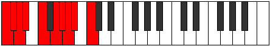 |
| [1967](https://ianring.com/musictheory/scales/1967) | [Godygic](ModeGNaturalGodygic.md) | G | G, G#, A, A#, C, D, D#, E, F, G |  |
| [1967](https://ianring.com/musictheory/scales/1967) | [Godygic](ModeASharpGodygic.md) | A# | A#, B, C, C#, D#, F, F#, G, G#, A# |  |
| [1967](https://ianring.com/musictheory/scales/1967) | [Godygic](ModeBFlatGodygic.md) | Bb | Bb, B, C, Db, Eb, F, Gb, G, Ab, Bb |  |
| [1969](https://ianring.com/musictheory/scales/1969) | [Zorian](ModeEFlatZorian.md) | Eb | Eb, F##, G#, A#, B, C, Db, Eb |  |
| [1971](https://ianring.com/musictheory/scales/1971) | [Aerynyllic](ModeGNaturalAerynyllic.md) | G | G, G#, B, C, D, D#, E, F, G |  |
| [1971](https://ianring.com/musictheory/scales/1971) | [Aerynyllic](ModeBNaturalAerynyllic.md) | B | B, C, D#, E, F#, G, G#, A, B |  |
| [1971](https://ianring.com/musictheory/scales/1971) | [Aerynyllic](ModeDSharpAerynyllic.md) | D# | D#, E, G, G#, A#, B, C, C#, D# |  |
| [1971](https://ianring.com/musictheory/scales/1971) | [Aerynyllic](ModeEFlatAerynyllic.md) | Eb | Eb, E, G, Ab, Bb, B, C, Db, Eb |  |
| [1973](https://ianring.com/musictheory/scales/1973) | [Zyryllic](ModeASharpZyryllic.md) | A# | A#, C, D, D#, F, F#, G, G#, A# |  |
| [1973](https://ianring.com/musictheory/scales/1973) | [Zyryllic](ModeBFlatZyryllic.md) | Bb | Bb, C, D, Eb, F, Gb, G, Ab, Bb |  |
| [1973](https://ianring.com/musictheory/scales/1973) | [Zyryllic](ModeDSharpZyryllic.md) | D# | D#, F, G, G#, A#, B, C, C#, D# |  |
| [1973](https://ianring.com/musictheory/scales/1973) | [Zyryllic](ModeEFlatZyryllic.md) | Eb | Eb, F, G, Ab, Bb, B, C, Db, Eb |  |
| [1975](https://ianring.com/musictheory/scales/1975) | [Ionocrygic](ModeGNaturalIonocrygic.md) | G | G, G#, A, B, C, D, D#, E, F, G |  |
| [1975](https://ianring.com/musictheory/scales/1975) | [Ionocrygic](ModeBNaturalIonocrygic.md) | B | B, C, C#, D#, E, F#, G, G#, A, B |  |
| [1975](https://ianring.com/musictheory/scales/1975) | [Ionocrygic](ModeDSharpIonocrygic.md) | D# | D#, E, F, G, G#, A#, B, C, C#, D# |  |
| [1975](https://ianring.com/musictheory/scales/1975) | [Ionocrygic](ModeEFlatIonocrygic.md) | Eb | Eb, E, F, G, Ab, Bb, B, C, Db, Eb |  |
| [1975](https://ianring.com/musictheory/scales/1975) | [Ionocrygic](ModeASharpIonocrygic.md) | A# | A#, B, C, D, D#, F, F#, G, G#, A# |  |
| [1975](https://ianring.com/musictheory/scales/1975) | [Ionocrygic](ModeBFlatIonocrygic.md) | Bb | Bb, B, C, D, Eb, F, Gb, G, Ab, Bb |  |
| [1977](https://ianring.com/musictheory/scales/1977) | [Dagyllic](ModeCNaturalDagyllic.md) | C | C, D#, E, F, G, G#, A, A#, C |  |
| [1977](https://ianring.com/musictheory/scales/1977) | [Dagyllic](ModeDSharpDagyllic.md) | D# | D#, F#, G, G#, A#, B, C, C#, D# |  |
| [1977](https://ianring.com/musictheory/scales/1977) | [Dagyllic](ModeEFlatDagyllic.md) | Eb | Eb, Gb, G, Ab, Bb, B, C, Db, Eb |  |
| [1979](https://ianring.com/musictheory/scales/1979) | [Aeradygic](ModeCNaturalAeradygic.md) | C | C, C#, D#, E, F, G, G#, A, A#, C |  |
| [1979](https://ianring.com/musictheory/scales/1979) | [Aeradygic](ModeBNaturalAeradygic.md) | B | B, C, D, D#, E, F#, G, G#, A, B | 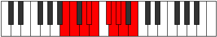 |
| [1979](https://ianring.com/musictheory/scales/1979) | [Aeradygic](ModeGNaturalAeradygic.md) | G | G, G#, A#, B, C, D, D#, E, F, G |  |
| [1979](https://ianring.com/musictheory/scales/1979) | [Aeradygic](ModeDSharpAeradygic.md) | D# | D#, E, F#, G, G#, A#, B, C, C#, D# |  |
| [1979](https://ianring.com/musictheory/scales/1979) | [Aeradygic](ModeEFlatAeradygic.md) | Eb | Eb, E, Gb, G, Ab, Bb, B, C, Db, Eb |  |
| [1981](https://ianring.com/musictheory/scales/1981) | [Gadygic](ModeASharpGadygic.md) | A# | A#, C, C#, D, D#, F, F#, G, G#, A# |  |
| [1981](https://ianring.com/musictheory/scales/1981) | [Gadygic](ModeBFlatGadygic.md) | Bb | Bb, C, Db, D, Eb, F, Gb, G, Ab, Bb |  |
| [1981](https://ianring.com/musictheory/scales/1981) | [Gadygic](ModeFNaturalGadygic.md) | F | F, G, G#, A, A#, C, C#, D, D#, F |  |
| [1981](https://ianring.com/musictheory/scales/1981) | [Gadygic](ModeCNaturalGadygic.md) | C | C, D, D#, E, F, G, G#, A, A#, C |  |
| [1981](https://ianring.com/musictheory/scales/1981) | [Gadygic](ModeDSharpGadygic.md) | D# | D#, F, F#, G, G#, A#, B, C, C#, D# |  |
| [1981](https://ianring.com/musictheory/scales/1981) | [Gadygic](ModeEFlatGadygic.md) | Eb | Eb, F, Gb, G, Ab, Bb, B, C, Db, Eb |  |
| [1983](https://ianring.com/musictheory/scales/1983) | [Soryllian](ModeCNaturalSoryllian.md) | C | C, C#, D, D#, E, F, G, G#, A, A#, C |  |
| [1983](https://ianring.com/musictheory/scales/1983) | [Soryllian](ModeFNaturalSoryllian.md) | F | F, F#, G, G#, A, A#, C, C#, D, D#, F |  |
| [1983](https://ianring.com/musictheory/scales/1983) | [Soryllian](ModeBNaturalSoryllian.md) | B | B, C, C#, D, D#, E, F#, G, G#, A, B |  |
| [1983](https://ianring.com/musictheory/scales/1983) | [Soryllian](ModeASharpSoryllian.md) | A# | A#, B, C, C#, D, D#, F, F#, G, G#, A# |  |
| [1983](https://ianring.com/musictheory/scales/1983) | [Soryllian](ModeBFlatSoryllian.md) | Bb | Bb, B, C, Db, D, Eb, F, Gb, G, Ab, Bb |  |
| [1983](https://ianring.com/musictheory/scales/1983) | [Soryllian](ModeDSharpSoryllian.md) | D# | D#, E, F, F#, G, G#, A#, B, C, C#, D# |  |
| [1983](https://ianring.com/musictheory/scales/1983) | [Soryllian](ModeEFlatSoryllian.md) | Eb | Eb, E, F, Gb, G, Ab, Bb, B, C, Db, Eb |  |
| [1983](https://ianring.com/musictheory/scales/1983) | [Soryllian](ModeGNaturalSoryllian.md) | G | G, G#, A, A#, B, C, D, D#, E, F, G |  |
| [1991](https://ianring.com/musictheory/scales/1991) | [Phryptyllic](ModeFSharpPhryptyllic.md) | F# | F#, G, G#, C, C#, D, D#, E, F# |  |
| [1991](https://ianring.com/musictheory/scales/1991) | [Phryptyllic](ModeGFlatPhryptyllic.md) | Gb | Gb, G, Ab, C, Db, D, Eb, E, Gb |  |
| [1993](https://ianring.com/musictheory/scales/1993) | [Katoptian](ModeCNaturalKatoptian.md) | C | C, D#, E##, F##, G#, A, Bb, C |  |
| [1995](https://ianring.com/musictheory/scales/1995) | [Aeolacryllic](ModeCNaturalAeolacryllic.md) | C | C, C#, D#, F#, G, G#, A, A#, C |  |
| [1997](https://ianring.com/musictheory/scales/1997) | [Staryllic](ModeCNaturalStaryllic.md) | C | C, D, D#, F#, G, G#, A, A#, C |  |
| [1997](https://ianring.com/musictheory/scales/1997) | [Staryllic](ModeFNaturalStaryllic.md) | F | F, G, G#, B, C, C#, D, D#, F |  |
| [1999](https://ianring.com/musictheory/scales/1999) | [Zacrygic](ModeFSharpZacrygic.md) | F# | F#, G, G#, A, C, C#, D, D#, E, F# |  |
| [1999](https://ianring.com/musictheory/scales/1999) | [Zacrygic](ModeGFlatZacrygic.md) | Gb | Gb, G, Ab, A, C, Db, D, Eb, E, Gb |  |
| [1999](https://ianring.com/musictheory/scales/1999) | [Zacrygic](ModeCNaturalZacrygic.md) | C | C, C#, D, D#, F#, G, G#, A, A#, C |  |
| [1999](https://ianring.com/musictheory/scales/1999) | [Zacrygic](ModeFNaturalZacrygic.md) | F | F, F#, G, G#, B, C, C#, D, D#, F |  |
| [2003](https://ianring.com/musictheory/scales/2003) | [Lolyllic](ModeBNaturalLolyllic.md) | B | B, C, D#, F, F#, G, G#, A, B |  |
| [2007](https://ianring.com/musictheory/scales/2007) | [Stonygic](ModeFSharpStonygic.md) | F# | F#, G, G#, A#, C, C#, D, D#, E, F# |  |
| [2007](https://ianring.com/musictheory/scales/2007) | [Stonygic](ModeGFlatStonygic.md) | Gb | Gb, G, Ab, Bb, C, Db, D, Eb, E, Gb |  |
| [2007](https://ianring.com/musictheory/scales/2007) | [Stonygic](ModeBNaturalStonygic.md) | B | B, C, C#, D#, F, F#, G, G#, A, B |  |
| [2009](https://ianring.com/musictheory/scales/2009) | [Stacryllic](ModeCNaturalStacryllic.md) | C | C, D#, E, F#, G, G#, A, A#, C |  |
| [2011](https://ianring.com/musictheory/scales/2011) | [Raphygic](ModeCNaturalRaphygic.md) | C | C, C#, D#, E, F#, G, G#, A, A#, C |  |
| [2011](https://ianring.com/musictheory/scales/2011) | [Raphygic](ModeBNaturalRaphygic.md) | B | B, C, D, D#, F, F#, G, G#, A, B |  |
| [2013](https://ianring.com/musictheory/scales/2013) | [Mocrygic](ModeCNaturalMocrygic.md) | C | C, D, D#, E, F#, G, G#, A, A#, C |  |
| [2013](https://ianring.com/musictheory/scales/2013) | [Mocrygic](ModeFNaturalMocrygic.md) | F | F, G, G#, A, B, C, C#, D, D#, F |  |
| [2015](https://ianring.com/musictheory/scales/2015) | [Epiryllian](ModeCNaturalEpiryllian.md) | C | C, C#, D, D#, E, F#, G, G#, A, A#, C |  |
| [2015](https://ianring.com/musictheory/scales/2015) | [Epiryllian](ModeFSharpEpiryllian.md) | F# | F#, G, G#, A, A#, C, C#, D, D#, E, F# |  |
| [2015](https://ianring.com/musictheory/scales/2015) | [Epiryllian](ModeGFlatEpiryllian.md) | Gb | Gb, G, Ab, A, Bb, C, Db, D, Eb, E, Gb |  |
| [2015](https://ianring.com/musictheory/scales/2015) | [Epiryllian](ModeFNaturalEpiryllian.md) | F | F, F#, G, G#, A, B, C, C#, D, D#, F |  |
| [2015](https://ianring.com/musictheory/scales/2015) | [Epiryllian](ModeBNaturalEpiryllian.md) | B | B, C, C#, D, D#, F, F#, G, G#, A, B |  |
| [2019](https://ianring.com/musictheory/scales/2019) | [Palyllic](ModeGNaturalPalyllic.md) | G | G, G#, C, C#, D, D#, E, F, G |  |
| [2019](https://ianring.com/musictheory/scales/2019) | [Palyllic](ModeDNaturalPalyllic.md) | D | D, D#, G, G#, A, A#, B, C, D |  |
| [2021](https://ianring.com/musictheory/scales/2021) | [Katycryllic](ModeASharpKatycryllic.md) | A# | A#, C, D#, E, F, F#, G, G#, A# |  |
| [2021](https://ianring.com/musictheory/scales/2021) | [Katycryllic](ModeBFlatKatycryllic.md) | Bb | Bb, C, Eb, E, F, Gb, G, Ab, Bb |  |
| [2023](https://ianring.com/musictheory/scales/2023) | [Zodygic](ModeGNaturalZodygic.md) | G | G, G#, A, C, C#, D, D#, E, F, G |  |
| [2023](https://ianring.com/musictheory/scales/2023) | [Zodygic](ModeFSharpZodygic.md) | F# | F#, G, G#, B, C, C#, D, D#, E, F# |  |
| [2023](https://ianring.com/musictheory/scales/2023) | [Zodygic](ModeGFlatZodygic.md) | Gb | Gb, G, Ab, B, C, Db, D, Eb, E, Gb |  |
| [2023](https://ianring.com/musictheory/scales/2023) | [Zodygic](ModeASharpZodygic.md) | A# | A#, B, C, D#, E, F, F#, G, G#, A# |  |
| [2023](https://ianring.com/musictheory/scales/2023) | [Zodygic](ModeBFlatZodygic.md) | Bb | Bb, B, C, Eb, E, F, Gb, G, Ab, Bb |  |
| [2023](https://ianring.com/musictheory/scales/2023) | [Zodygic](ModeDNaturalZodygic.md) | D | D, D#, E, G, G#, A, A#, B, C, D |  |
| [2025](https://ianring.com/musictheory/scales/2025) | [Mixolydyllic](ModeCNaturalMixolydyllic.md) | C | C, D#, F, F#, G, G#, A, A#, C |  |
| [2027](https://ianring.com/musictheory/scales/2027) | [Boptygic](ModeGNaturalBoptygic.md) | G | G, G#, A#, C, C#, D, D#, E, F, G |  |
| [2027](https://ianring.com/musictheory/scales/2027) | [Boptygic](ModeCNaturalBoptygic.md) | C | C, C#, D#, F, F#, G, G#, A, A#, C |  |
| [2027](https://ianring.com/musictheory/scales/2027) | [Boptygic](ModeDNaturalBoptygic.md) | D | D, D#, F, G, G#, A, A#, B, C, D |  |
| [2029](https://ianring.com/musictheory/scales/2029) | [Mathygic](ModeASharpMathygic.md) | A# | A#, C, C#, D#, E, F, F#, G, G#, A# |  |
| [2029](https://ianring.com/musictheory/scales/2029) | [Mathygic](ModeBFlatMathygic.md) | Bb | Bb, C, Db, Eb, E, F, Gb, G, Ab, Bb |  |
| [2029](https://ianring.com/musictheory/scales/2029) | [Mathygic](ModeCNaturalMathygic.md) | C | C, D, D#, F, F#, G, G#, A, A#, C |  |
| [2029](https://ianring.com/musictheory/scales/2029) | [Mathygic](ModeFNaturalMathygic.md) | F | F, G, G#, A#, B, C, C#, D, D#, F |  |
| [2031](https://ianring.com/musictheory/scales/2031) | [Gadyllian](ModeGNaturalGadyllian.md) | G | G, G#, A, A#, C, C#, D, D#, E, F, G |  |
| [2031](https://ianring.com/musictheory/scales/2031) | [Gadyllian](ModeCNaturalGadyllian.md) | C | C, C#, D, D#, F, F#, G, G#, A, A#, C |  |
| [2031](https://ianring.com/musictheory/scales/2031) | [Gadyllian](ModeFSharpGadyllian.md) | F# | F#, G, G#, A, B, C, C#, D, D#, E, F# | 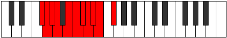 |
| [2031](https://ianring.com/musictheory/scales/2031) | [Gadyllian](ModeGFlatGadyllian.md) | Gb | Gb, G, Ab, A, B, C, Db, D, Eb, E, Gb |  |
| [2031](https://ianring.com/musictheory/scales/2031) | [Gadyllian](ModeFNaturalGadyllian.md) | F | F, F#, G, G#, A#, B, C, C#, D, D#, F |  |
| [2031](https://ianring.com/musictheory/scales/2031) | [Gadyllian](ModeASharpGadyllian.md) | A# | A#, B, C, C#, D#, E, F, F#, G, G#, A# |  |
| [2031](https://ianring.com/musictheory/scales/2031) | [Gadyllian](ModeBFlatGadyllian.md) | Bb | Bb, B, C, Db, Eb, E, F, Gb, G, Ab, Bb |  |
| [2031](https://ianring.com/musictheory/scales/2031) | [Gadyllian](ModeDNaturalGadyllian.md) | D | D, D#, E, F, G, G#, A, A#, B, C, D |  |
| [2033](https://ianring.com/musictheory/scales/2033) | [Stolyllic](ModeDSharpStolyllic.md) | D# | D#, G, G#, A, A#, B, C, C#, D# |  |
| [2033](https://ianring.com/musictheory/scales/2033) | [Stolyllic](ModeEFlatStolyllic.md) | Eb | Eb, G, Ab, A, Bb, B, C, Db, Eb |  |
| [2035](https://ianring.com/musictheory/scales/2035) | [Aerythygic](ModeGNaturalAerythygic.md) | G | G, G#, B, C, C#, D, D#, E, F, G |  |
| [2035](https://ianring.com/musictheory/scales/2035) | [Aerythygic](ModeBNaturalAerythygic.md) | B | B, C, D#, E, F, F#, G, G#, A, B |  |
| [2035](https://ianring.com/musictheory/scales/2035) | [Aerythygic](ModeDSharpAerythygic.md) | D# | D#, E, G, G#, A, A#, B, C, C#, D# |  |
| [2035](https://ianring.com/musictheory/scales/2035) | [Aerythygic](ModeEFlatAerythygic.md) | Eb | Eb, E, G, Ab, A, Bb, B, C, Db, Eb |  |
| [2035](https://ianring.com/musictheory/scales/2035) | [Aerythygic](ModeDNaturalAerythygic.md) | D | D, D#, F#, G, G#, A, A#, B, C, D |  |
| [2037](https://ianring.com/musictheory/scales/2037) | [Sythygic](ModeASharpSythygic.md) | A# | A#, C, D, D#, E, F, F#, G, G#, A# |  |
| [2037](https://ianring.com/musictheory/scales/2037) | [Sythygic](ModeBFlatSythygic.md) | Bb | Bb, C, D, Eb, E, F, Gb, G, Ab, Bb |  |
| [2037](https://ianring.com/musictheory/scales/2037) | [Sythygic](ModeDSharpSythygic.md) | D# | D#, F, G, G#, A, A#, B, C, C#, D# |  |
| [2037](https://ianring.com/musictheory/scales/2037) | [Sythygic](ModeEFlatSythygic.md) | Eb | Eb, F, G, Ab, A, Bb, B, C, Db, Eb |  |
| [2039](https://ianring.com/musictheory/scales/2039) | [Danyllian](ModeGNaturalDanyllian.md) | G | G, G#, A, B, C, C#, D, D#, E, F, G |  |
| [2039](https://ianring.com/musictheory/scales/2039) | [Danyllian](ModeBNaturalDanyllian.md) | B | B, C, C#, D#, E, F, F#, G, G#, A, B |  |
| [2039](https://ianring.com/musictheory/scales/2039) | [Danyllian](ModeFSharpDanyllian.md) | F# | F#, G, G#, A#, B, C, C#, D, D#, E, F# |  |
| [2039](https://ianring.com/musictheory/scales/2039) | [Danyllian](ModeGFlatDanyllian.md) | Gb | Gb, G, Ab, Bb, B, C, Db, D, Eb, E, Gb |  |
| [2039](https://ianring.com/musictheory/scales/2039) | [Danyllian](ModeASharpDanyllian.md) | A# | A#, B, C, D, D#, E, F, F#, G, G#, A# |  |
| [2039](https://ianring.com/musictheory/scales/2039) | [Danyllian](ModeBFlatDanyllian.md) | Bb | Bb, B, C, D, Eb, E, F, Gb, G, Ab, Bb |  |
| [2039](https://ianring.com/musictheory/scales/2039) | [Danyllian](ModeDSharpDanyllian.md) | D# | D#, E, F, G, G#, A, A#, B, C, C#, D# |  |
| [2039](https://ianring.com/musictheory/scales/2039) | [Danyllian](ModeEFlatDanyllian.md) | Eb | Eb, E, F, G, Ab, A, Bb, B, C, Db, Eb |  |
| [2039](https://ianring.com/musictheory/scales/2039) | [Danyllian](ModeDNaturalDanyllian.md) | D | D, D#, E, F#, G, G#, A, A#, B, C, D |  |
| [2041](https://ianring.com/musictheory/scales/2041) | [Aeolacrygic](ModeCNaturalAeolacrygic.md) | C | C, D#, E, F, F#, G, G#, A, A#, C |  |
| [2041](https://ianring.com/musictheory/scales/2041) | [Aeolacrygic](ModeDSharpAeolacrygic.md) | D# | D#, F#, G, G#, A, A#, B, C, C#, D# |  |
| [2041](https://ianring.com/musictheory/scales/2041) | [Aeolacrygic](ModeEFlatAeolacrygic.md) | Eb | Eb, Gb, G, Ab, A, Bb, B, C, Db, Eb |  |
| [2043](https://ianring.com/musictheory/scales/2043) | [Lythyllian](ModeCNaturalLythyllian.md) | C | C, C#, D#, E, F, F#, G, G#, A, A#, C |  |
| [2043](https://ianring.com/musictheory/scales/2043) | [Lythyllian](ModeBNaturalLythyllian.md) | B | B, C, D, D#, E, F, F#, G, G#, A, B |  |
| [2043](https://ianring.com/musictheory/scales/2043) | [Lythyllian](ModeGNaturalLythyllian.md) | G | G, G#, A#, B, C, C#, D, D#, E, F, G |  |
| [2043](https://ianring.com/musictheory/scales/2043) | [Lythyllian](ModeDSharpLythyllian.md) | D# | D#, E, F#, G, G#, A, A#, B, C, C#, D# |  |
| [2043](https://ianring.com/musictheory/scales/2043) | [Lythyllian](ModeEFlatLythyllian.md) | Eb | Eb, E, Gb, G, Ab, A, Bb, B, C, Db, Eb |  |
| [2043](https://ianring.com/musictheory/scales/2043) | [Lythyllian](ModeDNaturalLythyllian.md) | D | D, D#, F, F#, G, G#, A, A#, B, C, D |  |
| [2045](https://ianring.com/musictheory/scales/2045) | [Katogyllian](ModeASharpKatogyllian.md) | A# | A#, C, C#, D, D#, E, F, F#, G, G#, A# |  |
| [2045](https://ianring.com/musictheory/scales/2045) | [Katogyllian](ModeBFlatKatogyllian.md) | Bb | Bb, C, Db, D, Eb, E, F, Gb, G, Ab, Bb |  |
| [2045](https://ianring.com/musictheory/scales/2045) | [Katogyllian](ModeCNaturalKatogyllian.md) | C | C, D, D#, E, F, F#, G, G#, A, A#, C |  |
| [2045](https://ianring.com/musictheory/scales/2045) | [Katogyllian](ModeFNaturalKatogyllian.md) | F | F, G, G#, A, A#, B, C, C#, D, D#, F |  |
| [2045](https://ianring.com/musictheory/scales/2045) | [Katogyllian](ModeDSharpKatogyllian.md) | D# | D#, F, F#, G, G#, A, A#, B, C, C#, D# |  |
| [2045](https://ianring.com/musictheory/scales/2045) | [Katogyllian](ModeEFlatKatogyllian.md) | Eb | Eb, F, Gb, G, Ab, A, Bb, B, C, Db, Eb |  |
| [2047](https://ianring.com/musictheory/scales/2047) | [Monatic](ModeCNaturalMonatic.md) | C | C, C#, D, D#, E, F, F#, G, G#, A, A#, C |  |
| [2047](https://ianring.com/musictheory/scales/2047) | [Monatic](ModeBNaturalMonatic.md) | B | B, C, C#, D, D#, E, F, F#, G, G#, A, B |  |
| [2047](https://ianring.com/musictheory/scales/2047) | [Monatic](ModeASharpMonatic.md) | A# | A#, B, C, C#, D, D#, E, F, F#, G, G#, A# |  |
| [2047](https://ianring.com/musictheory/scales/2047) | [Monatic](ModeBFlatMonatic.md) | Bb | Bb, B, C, Db, D, Eb, E, F, Gb, G, Ab, Bb |  |
| [2047](https://ianring.com/musictheory/scales/2047) | [Monatic](ModeGNaturalMonatic.md) | G | G, G#, A, A#, B, C, C#, D, D#, E, F, G |  |
| [2047](https://ianring.com/musictheory/scales/2047) | [Monatic](ModeFSharpMonatic.md) | F# | F#, G, G#, A, A#, B, C, C#, D, D#, E, F# |  |
| [2047](https://ianring.com/musictheory/scales/2047) | [Monatic](ModeGFlatMonatic.md) | Gb | Gb, G, Ab, A, Bb, B, C, Db, D, Eb, E, Gb |  |
| [2047](https://ianring.com/musictheory/scales/2047) | [Monatic](ModeFNaturalMonatic.md) | F | F, F#, G, G#, A, A#, B, C, C#, D, D#, F |  |
| [2047](https://ianring.com/musictheory/scales/2047) | [Monatic](ModeDSharpMonatic.md) | D# | D#, E, F, F#, G, G#, A, A#, B, C, C#, D# |  |
| [2047](https://ianring.com/musictheory/scales/2047) | [Monatic](ModeEFlatMonatic.md) | Eb | Eb, E, F, Gb, G, Ab, A, Bb, B, C, Db, Eb |  |
| [2047](https://ianring.com/musictheory/scales/2047) | [Monatic](ModeDNaturalMonatic.md) | D | D, D#, E, F, F#, G, G#, A, A#, B, C, D |  |
| [2193](https://ianring.com/musictheory/scales/2193) | [Thaptic](ModeGSharpThaptic.md) | G# | G#, C, D#, G, G# |  |
| [2193](https://ianring.com/musictheory/scales/2193) | [Thaptic](ModeAFlatThaptic.md) | Ab | Ab, C, Eb, G, Ab |  |
| [2195](https://ianring.com/musictheory/scales/2195) | [Zalitonic](ModeGSharpZalitonic.md) | G# | G#, A, C, D#, G, G# |  |
| [2195](https://ianring.com/musictheory/scales/2195) | [Zalitonic](ModeAFlatZalitonic.md) | Ab | Ab, A, C, Eb, G, Ab |  |
| [2197](https://ianring.com/musictheory/scales/2197) | [Aerathitonic](ModeGSharpAerathitonic.md) | G# | G#, A#, C, D#, G, G# |  |
| [2197](https://ianring.com/musictheory/scales/2197) | [Aerathitonic](ModeAFlatAerathitonic.md) | Ab | Ab, Bb, C, Eb, G, Ab |  |
| [2199](https://ianring.com/musictheory/scales/2199) | [Dyptimic](ModeGSharpDyptimic.md) | G# | G#, A, Bb, C, D#, E###, G# |  |
| [2199](https://ianring.com/musictheory/scales/2199) | [Dyptimic](ModeAFlatDyptimic.md) | Ab | Ab, Bbb, Cbb, Dbb, Eb, F##, Ab |  |
| [2201](https://ianring.com/musictheory/scales/2201) | [Ionagitonic](ModeGSharpIonagitonic.md) | G# | G#, B, C, D#, G, G# |  |
| [2201](https://ianring.com/musictheory/scales/2201) | [Ionagitonic](ModeAFlatIonagitonic.md) | Ab | Ab, B, C, Eb, G, Ab |  |
| [2203](https://ianring.com/musictheory/scales/2203) | [Dorimic](ModeGSharpDorimic.md) | G# | G#, A, B, C, D#, E###, G# |  |
| [2203](https://ianring.com/musictheory/scales/2203) | [Dorimic](ModeAFlatDorimic.md) | Ab | Ab, Bbb, Cb, Dbb, Eb, F##, Ab |  |
| [2205](https://ianring.com/musictheory/scales/2205) | [Ionocrimic](ModeGSharpIonocrimic.md) | G# | G#, A#, B, C, D#, E###, G# |  |
| [2205](https://ianring.com/musictheory/scales/2205) | [Ionocrimic](ModeAFlatIonocrimic.md) | Ab | Ab, Bb, Cb, Dbb, Eb, F##, Ab |  |
| [2207](https://ianring.com/musictheory/scales/2207) | [Mygian](ModeGSharpMygian.md) | G# | G#, A, Bb, Cb, Dbb, Eb, F##, G# |  |
| [2207](https://ianring.com/musictheory/scales/2207) | [Mygian](ModeAFlatMygian.md) | Ab | Ab, Bbb, Cbb, Dbbb, Dbb, Eb, F##, Ab |  |
| [2225](https://ianring.com/musictheory/scales/2225) | [Gonitonic](ModeGSharpGonitonic.md) | G# | G#, C, C#, D#, G, G# |  |
| [2225](https://ianring.com/musictheory/scales/2225) | [Gonitonic](ModeAFlatGonitonic.md) | Ab | Ab, C, Db, Eb, G, Ab |  |
| [2227](https://ianring.com/musictheory/scales/2227) | [Katadimic](ModeGSharpKatadimic.md) | G# | G#, A, B#, C#, D#, E###, G# |  |
| [2227](https://ianring.com/musictheory/scales/2227) | [Katadimic](ModeAFlatKatadimic.md) | Ab | Ab, Bbb, C, Db, Eb, F##, Ab |  |
| [2229](https://ianring.com/musictheory/scales/2229) | [Ionyptimic](ModeGSharpIonyptimic.md) | G# | G#, A#, B#, C#, D#, E###, G# |  |
| [2229](https://ianring.com/musictheory/scales/2229) | [Ionyptimic](ModeAFlatIonyptimic.md) | Ab | Ab, Bb, C, Db, Eb, F##, Ab |  |
| [2231](https://ianring.com/musictheory/scales/2231) | [Macrian](ModeGSharpMacrian.md) | G# | G#, A, Bb, C, Db, Eb, F##, G# |  |
| [2231](https://ianring.com/musictheory/scales/2231) | [Macrian](ModeAFlatMacrian.md) | Ab | Ab, Bbb, Cbb, Dbb, Ebbb, Fbb, G, Ab |  |
| [2233](https://ianring.com/musictheory/scales/2233) | [Donimic](ModeGSharpDonimic.md) | G# | G#, A##, B#, C#, D#, E###, G# |  |
| [2233](https://ianring.com/musictheory/scales/2233) | [Donimic](ModeAFlatDonimic.md) | Ab | Ab, B, C, Db, Eb, F##, Ab |  |
| [2235](https://ianring.com/musictheory/scales/2235) | [Bathian](ModeGSharpBathian.md) | G# | G#, A, B, C, Db, Eb, F##, G# |  |
| [2235](https://ianring.com/musictheory/scales/2235) | [Bathian](ModeAFlatBathian.md) | Ab | Ab, Bbb, Cb, Dbb, Ebbb, Fbb, G, Ab |  |
| [2237](https://ianring.com/musictheory/scales/2237) | [Epothian](ModeGSharpEpothian.md) | G# | G#, A#, B, C, Db, Eb, F##, G# |  |
| [2237](https://ianring.com/musictheory/scales/2237) | [Epothian](ModeAFlatEpothian.md) | Ab | Ab, Bb, Cb, Dbb, Ebbb, Fbb, G, Ab |  |
| [2239](https://ianring.com/musictheory/scales/2239) | [Dacryllic](ModeGSharpDacryllic.md) | G# | G#, A, A#, B, C, C#, D#, G, G# |  |
| [2239](https://ianring.com/musictheory/scales/2239) | [Dacryllic](ModeAFlatDacryllic.md) | Ab | Ab, A, Bb, B, C, Db, Eb, G, Ab |  |
| [2245](https://ianring.com/musictheory/scales/2245) | [Dygitonic](ModeCSharpDygitonic.md) | C# | C#, D#, G, G#, C, C# |  |
| [2245](https://ianring.com/musictheory/scales/2245) | [Dygitonic](ModeDFlatDygitonic.md) | Db | Db, Eb, G, Ab, C, Db |  |
| [2247](https://ianring.com/musictheory/scales/2247) | [Aeolimic](ModeCSharpAeolimic.md) | C# | C#, D, Eb, F##, G#, A###, C# |  |
| [2247](https://ianring.com/musictheory/scales/2247) | [Aeolimic](ModeDFlatAeolimic.md) | Db | Db, Ebb, Fbb, G, Ab, B#, Db |  |
| [2253](https://ianring.com/musictheory/scales/2253) | [Logimic](ModeCSharpLogimic.md) | C# | C#, D#, E, F##, G#, A###, C# |  |
| [2253](https://ianring.com/musictheory/scales/2253) | [Logimic](ModeDFlatLogimic.md) | Db | Db, Eb, Fb, G, Ab, B#, Db |  |
| [2255](https://ianring.com/musictheory/scales/2255) | [Dylian](ModeCSharpDylian.md) | C# | C#, D, Eb, Fb, G, Ab, B#, C# |  |
| [2257](https://ianring.com/musictheory/scales/2257) | [Zolitonic](ModeGSharpZolitonic.md) | G# | G#, C, D, D#, G, G# | 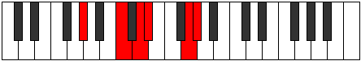 |
| [2257](https://ianring.com/musictheory/scales/2257) | [Zolitonic](ModeAFlatZolitonic.md) | Ab | Ab, C, D, Eb, G, Ab |  |
| [2259](https://ianring.com/musictheory/scales/2259) | [Gogimic](ModeGSharpGogimic.md) | G# | G#, A, B#, C##, D#, E###, G# |  |
| [2259](https://ianring.com/musictheory/scales/2259) | [Gogimic](ModeAFlatGogimic.md) | Ab | Ab, Bbb, C, D, Eb, F##, Ab |  |
| [2261](https://ianring.com/musictheory/scales/2261) | [Phrolimic](ModeCSharpPhrolimic.md) | C# | C#, D#, E#, F##, G#, A###, C# |  |
| [2261](https://ianring.com/musictheory/scales/2261) | [Phrolimic](ModeDFlatPhrolimic.md) | Db | Db, Eb, F, G, Ab, B#, Db |  |
| [2261](https://ianring.com/musictheory/scales/2261) | [Phrolimic](ModeGSharpPhrolimic.md) | G# | G#, A#, B#, C##, D#, E###, G# |  |
| [2261](https://ianring.com/musictheory/scales/2261) | [Phrolimic](ModeAFlatPhrolimic.md) | Ab | Ab, Bb, C, D, Eb, F##, Ab |  |
| [2263](https://ianring.com/musictheory/scales/2263) | [Lycrian](ModeCSharpLycrian.md) | C# | C#, D, Eb, F, G, Ab, B#, C# |  |
| [2263](https://ianring.com/musictheory/scales/2263) | [Lycrian](ModeGSharpLycrian.md) | G# | G#, A, Bb, C, D, Eb, F##, G# |  |
| [2263](https://ianring.com/musictheory/scales/2263) | [Lycrian](ModeAFlatLycrian.md) | Ab | Ab, Bbb, Cbb, Dbb, Ebb, Fbb, G, Ab |  |
| [2265](https://ianring.com/musictheory/scales/2265) | [Ionophimic](ModeGSharpIonophimic.md) | G# | G#, A##, B#, C##, D#, E###, G# |  |
| [2265](https://ianring.com/musictheory/scales/2265) | [Ionophimic](ModeAFlatIonophimic.md) | Ab | Ab, B, C, D, Eb, F##, Ab |  |
| [2267](https://ianring.com/musictheory/scales/2267) | [Padian](ModeGSharpPadian.md) | G# | G#, A, B, C, D, Eb, F##, G# |  |
| [2267](https://ianring.com/musictheory/scales/2267) | [Padian](ModeAFlatPadian.md) | Ab | Ab, Bbb, Cb, Dbb, Ebb, Fbb, G, Ab |  |
| [2269](https://ianring.com/musictheory/scales/2269) | [Pygian](ModeCSharpPygian.md) | C# | C#, D#, E, F, G, Ab, B#, C# |  |
| [2269](https://ianring.com/musictheory/scales/2269) | [Pygian](ModeGSharpPygian.md) | G# | G#, A#, B, C, D, Eb, F##, G# |  |
| [2269](https://ianring.com/musictheory/scales/2269) | [Pygian](ModeAFlatPygian.md) | Ab | Ab, Bb, Cb, Dbb, Ebb, Fbb, G, Ab |  |
| [2271](https://ianring.com/musictheory/scales/2271) | [Poptyllic](ModeCSharpPoptyllic.md) | C# | C#, D, D#, E, F, G, G#, C, C# |  |
| [2271](https://ianring.com/musictheory/scales/2271) | [Poptyllic](ModeDFlatPoptyllic.md) | Db | Db, D, Eb, E, F, G, Ab, C, Db |  |
| [2271](https://ianring.com/musictheory/scales/2271) | [Poptyllic](ModeGSharpPoptyllic.md) | G# | G#, A, A#, B, C, D, D#, G, G# |  |
| [2271](https://ianring.com/musictheory/scales/2271) | [Poptyllic](ModeAFlatPoptyllic.md) | Ab | Ab, A, Bb, B, C, D, Eb, G, Ab |  |
| [2277](https://ianring.com/musictheory/scales/2277) | [Kagimic](ModeCSharpKagimic.md) | C# | C#, D#, E##, F##, G#, A###, C# |  |
| [2277](https://ianring.com/musictheory/scales/2277) | [Kagimic](ModeDFlatKagimic.md) | Db | Db, Eb, F#, G, Ab, B#, Db |  |
| [2279](https://ianring.com/musictheory/scales/2279) | [Dyrian](ModeCSharpDyrian.md) | C# | C#, D, Eb, F#, G, Ab, B#, C# |  |
| [2285](https://ianring.com/musictheory/scales/2285) | [Aerogian](ModeCSharpAerogian.md) | C# | C#, D#, E, F#, G, Ab, B#, C# |  |
| [2287](https://ianring.com/musictheory/scales/2287) | [Lodyllic](ModeCSharpLodyllic.md) | C# | C#, D, D#, E, F#, G, G#, C, C# |  |
| [2287](https://ianring.com/musictheory/scales/2287) | [Lodyllic](ModeDFlatLodyllic.md) | Db | Db, D, Eb, E, Gb, G, Ab, C, Db |  |
| [2289](https://ianring.com/musictheory/scales/2289) | [Mocrimic](ModeGSharpMocrimic.md) | G# | G#, A###, B##, C##, D#, E###, G# |  |
| [2289](https://ianring.com/musictheory/scales/2289) | [Mocrimic](ModeAFlatMocrimic.md) | Ab | Ab, B#, C#, D, Eb, F##, Ab |  |
| [2291](https://ianring.com/musictheory/scales/2291) | [Zydian](ModeGSharpZydian.md) | G# | G#, A, B#, C#, D, Eb, F##, G# |  |
| [2291](https://ianring.com/musictheory/scales/2291) | [Zydian](ModeAFlatZydian.md) | Ab | Ab, Bbb, C, Db, Ebb, Fbb, G, Ab |  |
| [2293](https://ianring.com/musictheory/scales/2293) | [Gorian](ModeCSharpGorian.md) | C# | C#, D#, E#, F#, G, Ab, B#, C# |  |
| [2293](https://ianring.com/musictheory/scales/2293) | [Gorian](ModeGSharpGorian.md) | G# | G#, A#, B#, C#, D, Eb, F##, G# |  |
| [2293](https://ianring.com/musictheory/scales/2293) | [Gorian](ModeAFlatGorian.md) | Ab | Ab, Bb, C, Db, Ebb, Fbb, G, Ab |  |
| [2295](https://ianring.com/musictheory/scales/2295) | [Kogyllic](ModeCSharpKogyllic.md) | C# | C#, D, D#, F, F#, G, G#, C, C# |  |
| [2295](https://ianring.com/musictheory/scales/2295) | [Kogyllic](ModeDFlatKogyllic.md) | Db | Db, D, Eb, F, Gb, G, Ab, C, Db |  |
| [2295](https://ianring.com/musictheory/scales/2295) | [Kogyllic](ModeGSharpKogyllic.md) | G# | G#, A, A#, C, C#, D, D#, G, G# |  |
| [2295](https://ianring.com/musictheory/scales/2295) | [Kogyllic](ModeAFlatKogyllic.md) | Ab | Ab, A, Bb, C, Db, D, Eb, G, Ab |  |
| [2297](https://ianring.com/musictheory/scales/2297) | [Thylian](ModeGSharpThylian.md) | G# | G#, A##, B#, C#, D, Eb, F##, G# |  |
| [2297](https://ianring.com/musictheory/scales/2297) | [Thylian](ModeAFlatThylian.md) | Ab | Ab, B, C, Db, Ebb, Fbb, G, Ab |  |
| [2299](https://ianring.com/musictheory/scales/2299) | [Phraptyllic](ModeGSharpPhraptyllic.md) | G# | G#, A, B, C, C#, D, D#, G, G# |  |
| [2299](https://ianring.com/musictheory/scales/2299) | [Phraptyllic](ModeAFlatPhraptyllic.md) | Ab | Ab, A, B, C, Db, D, Eb, G, Ab |  |
| [2301](https://ianring.com/musictheory/scales/2301) | [Bydyllic](ModeCSharpBydyllic.md) | C# | C#, D#, E, F, F#, G, G#, C, C# |  |
| [2301](https://ianring.com/musictheory/scales/2301) | [Bydyllic](ModeDFlatBydyllic.md) | Db | Db, Eb, E, F, Gb, G, Ab, C, Db |  |
| [2301](https://ianring.com/musictheory/scales/2301) | [Bydyllic](ModeGSharpBydyllic.md) | G# | G#, A#, B, C, C#, D, D#, G, G# |  |
| [2301](https://ianring.com/musictheory/scales/2301) | [Bydyllic](ModeAFlatBydyllic.md) | Ab | Ab, Bb, B, C, Db, D, Eb, G, Ab |  |
| [2303](https://ianring.com/musictheory/scales/2303) | [Stanygic](ModeCSharpStanygic.md) | C# | C#, D, D#, E, F, F#, G, G#, C, C# |  |
| [2303](https://ianring.com/musictheory/scales/2303) | [Stanygic](ModeDFlatStanygic.md) | Db | Db, D, Eb, E, F, Gb, G, Ab, C, Db |  |
| [2303](https://ianring.com/musictheory/scales/2303) | [Stanygic](ModeGSharpStanygic.md) | G# | G#, A, A#, B, C, C#, D, D#, G, G# |  |
| [2303](https://ianring.com/musictheory/scales/2303) | [Stanygic](ModeAFlatStanygic.md) | Ab | Ab, A, Bb, B, C, Db, D, Eb, G, Ab |  |
| [2329](https://ianring.com/musictheory/scales/2329) | [Styditonic](ModeENaturalStyditonic.md) | E | E, G, G#, C, D#, E |  |
| [2331](https://ianring.com/musictheory/scales/2331) | [Dylimic](ModeENaturalDylimic.md) | E | E, F, G, Ab, B#, C###, E |  |
| [2333](https://ianring.com/musictheory/scales/2333) | [Stynimic](ModeENaturalStynimic.md) | E | E, F#, G, Ab, B#, C###, E |  |
| [2339](https://ianring.com/musictheory/scales/2339) | [Ragitonic](ModeGNaturalRagitonic.md) | G | G, G#, C, D#, F#, G | 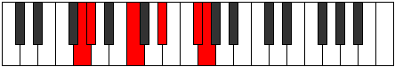 |
| [2343](https://ianring.com/musictheory/scales/2343) | [Tharimic](ModeGNaturalTharimic.md) | G | G, Ab, Bbb, C, D#, E##, G |  |
| [2347](https://ianring.com/musictheory/scales/2347) | [Thothimic](ModeGNaturalThothimic.md) | G | G, Ab, Bb, C, D#, E##, G |  |
| [2351](https://ianring.com/musictheory/scales/2351) | [Gynian](ModeGNaturalGynian.md) | G | G, Ab, Bbb, Cbb, Dbb, Eb, F#, G |  |
| [2355](https://ianring.com/musictheory/scales/2355) | [Katycrimic](ModeGNaturalKatycrimic.md) | G | G, Ab, B, C, D#, E##, G |  |
| [2359](https://ianring.com/musictheory/scales/2359) | [Gadian](ModeGNaturalGadian.md) | G | G, Ab, Bbb, Cb, Dbb, Eb, F#, G |  |
| [2361](https://ianring.com/musictheory/scales/2361) | [Docrimic](ModeENaturalDocrimic.md) | E | E, F##, G#, A, B#, C###, E |  |
| [2363](https://ianring.com/musictheory/scales/2363) | [Kataptian](ModeENaturalKataptian.md) | E | E, F, G, Ab, Bbb, C, D#, E |  |
| [2363](https://ianring.com/musictheory/scales/2363) | [Kataptian](ModeGNaturalKataptian.md) | G | G, Ab, Bb, Cb, Dbb, Eb, F#, G |  |
| [2365](https://ianring.com/musictheory/scales/2365) | [Sythian](ModeENaturalSythian.md) | E | E, F#, G, Ab, Bbb, C, D#, E |  |
| [2367](https://ianring.com/musictheory/scales/2367) | [Laryllic](ModeENaturalLaryllic.md) | E | E, F, F#, G, G#, A, C, D#, E |  |
| [2367](https://ianring.com/musictheory/scales/2367) | [Laryllic](ModeGNaturalLaryllic.md) | G | G, G#, A, A#, B, C, D#, F#, G |  |
| [2393](https://ianring.com/musictheory/scales/2393) | [Zathimic](ModeENaturalZathimic.md) | E | E, F##, G#, A#, B#, C###, E |  |
| [2395](https://ianring.com/musictheory/scales/2395) | [Zoptian](ModeENaturalZoptian.md) | E | E, F, G, Ab, Bb, C, D#, E |  |
| [2397](https://ianring.com/musictheory/scales/2397) | [Stagian](ModeENaturalStagian.md) | E | E, F#, G, Ab, Bb, C, D#, E |  |
| [2399](https://ianring.com/musictheory/scales/2399) | [Zanyllic](ModeENaturalZanyllic.md) | E | E, F, F#, G, G#, A#, C, D#, E |  |
| [2403](https://ianring.com/musictheory/scales/2403) | [Lycrimic](ModeGNaturalLycrimic.md) | G | G, Ab, B#, C#, D#, E##, G |  |
| [2407](https://ianring.com/musictheory/scales/2407) | [Zylian](ModeGNaturalZylian.md) | G | G, Ab, Bbb, C, Db, Eb, F#, G |  |
| [2411](https://ianring.com/musictheory/scales/2411) | [Aeolorian](ModeGNaturalAeolorian.md) | G | G, Ab, Bb, C, Db, Eb, F#, G |  |
| [2415](https://ianring.com/musictheory/scales/2415) | [Lothyllic](ModeGNaturalLothyllic.md) | G | G, G#, A, A#, C, C#, D#, F#, G |  |
| [2419](https://ianring.com/musictheory/scales/2419) | [Paptian](ModeGNaturalPaptian.md) | G | G, Ab, B, C, Db, Eb, F#, G |  |
| [2423](https://ianring.com/musictheory/scales/2423) | [Thorcryllic](ModeGNaturalThorcryllic.md) | G | G, G#, A, B, C, C#, D#, F#, G |  |
| [2425](https://ianring.com/musictheory/scales/2425) | [Rorian](ModeENaturalRorian.md) | E | E, F##, G#, A, Bb, C, D#, E | 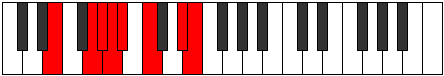 |
| [2427](https://ianring.com/musictheory/scales/2427) | [Katoryllic](ModeENaturalKatoryllic.md) | E | E, F, G, G#, A, A#, C, D#, E |  |
| [2427](https://ianring.com/musictheory/scales/2427) | [Katoryllic](ModeGNaturalKatoryllic.md) | G | G, G#, A#, B, C, C#, D#, F#, G |  |
| [2429](https://ianring.com/musictheory/scales/2429) | [Kadyllic](ModeENaturalKadyllic.md) | E | E, F#, G, G#, A, A#, C, D#, E | 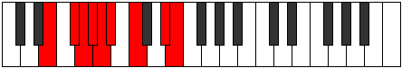 |
| [2431](https://ianring.com/musictheory/scales/2431) | [Gythygic](ModeENaturalGythygic.md) | E | E, F, F#, G, G#, A, A#, C, D#, E |  |
| [2431](https://ianring.com/musictheory/scales/2431) | [Gythygic](ModeGNaturalGythygic.md) | G | G, G#, A, A#, B, C, C#, D#, F#, G |  |
| [2441](https://ianring.com/musictheory/scales/2441) | [Kyritonic](ModeCNaturalKyritonic.md) | C | C, D#, G, G#, B, C |  |
| [2443](https://ianring.com/musictheory/scales/2443) | [Panimic](ModeCNaturalPanimic.md) | C | C, Db, Eb, F##, G#, A##, C |  |
| [2445](https://ianring.com/musictheory/scales/2445) | [Zadimic](ModeCNaturalZadimic.md) | C | C, D, Eb, F##, G#, A##, C |  |
| [2447](https://ianring.com/musictheory/scales/2447) | [Thagian](ModeCNaturalThagian.md) | C | C, Db, Ebb, Fbb, G, Ab, B, C |  |
| [2449](https://ianring.com/musictheory/scales/2449) | [Zacritonic](ModeGSharpZacritonic.md) | G# | G#, C, D#, E, G, G# |  |
| [2449](https://ianring.com/musictheory/scales/2449) | [Zacritonic](ModeAFlatZacritonic.md) | Ab | Ab, C, Eb, E, G, Ab |  |
| [2451](https://ianring.com/musictheory/scales/2451) | [Aerynimic](ModeGSharpAerynimic.md) | G# | G#, A, B#, C###, D##, E###, G# |  |
| [2451](https://ianring.com/musictheory/scales/2451) | [Aerynimic](ModeAFlatAerynimic.md) | Ab | Ab, Bbb, C, D#, E, F##, Ab |  |
| [2453](https://ianring.com/musictheory/scales/2453) | [Stonimic](ModeGSharpStonimic.md) | G# | G#, A#, B#, C###, D##, E###, G# |  |
| [2453](https://ianring.com/musictheory/scales/2453) | [Stonimic](ModeAFlatStonimic.md) | Ab | Ab, Bb, C, D#, E, F##, Ab |  |
| [2455](https://ianring.com/musictheory/scales/2455) | [Bothian](ModeGSharpBothian.md) | G# | G#, A, Bb, C, D#, E, F##, G# |  |
| [2455](https://ianring.com/musictheory/scales/2455) | [Bothian](ModeAFlatBothian.md) | Ab | Ab, Bbb, Cbb, Dbb, Eb, Fb, G, Ab |  |
| [2457](https://ianring.com/musictheory/scales/2457) | [Ionythimic](ModeCNaturalIonythimic.md) | C | C, D#, E, F##, G#, A##, C |  |
| [2457](https://ianring.com/musictheory/scales/2457) | [Ionythimic](ModeENaturalIonythimic.md) | E | E, F##, G#, A##, B#, C###, E |  |
| [2457](https://ianring.com/musictheory/scales/2457) | [Ionythimic](ModeGSharpIonythimic.md) | G# | G#, A##, B#, C###, D##, E###, G# |  |
| [2457](https://ianring.com/musictheory/scales/2457) | [Ionythimic](ModeAFlatIonythimic.md) | Ab | Ab, B, C, D#, E, F##, Ab |  |
| [2459](https://ianring.com/musictheory/scales/2459) | [Ionocrian](ModeCNaturalIonocrian.md) | C | C, Db, Eb, Fb, G, Ab, B, C |  |
| [2459](https://ianring.com/musictheory/scales/2459) | [Ionocrian](ModeENaturalIonocrian.md) | E | E, F, G, Ab, B, C, D#, E |  |
| [2459](https://ianring.com/musictheory/scales/2459) | [Ionocrian](ModeGSharpIonocrian.md) | G# | G#, A, B, C, D#, E, F##, G# |  |
| [2459](https://ianring.com/musictheory/scales/2459) | [Ionocrian](ModeAFlatIonocrian.md) | Ab | Ab, Bbb, Cb, Dbb, Eb, Fb, G, Ab |  |
| [2461](https://ianring.com/musictheory/scales/2461) | [Sagian](ModeCNaturalSagian.md) | C | C, D, Eb, Fb, G, Ab, B, C |  |
| [2461](https://ianring.com/musictheory/scales/2461) | [Sagian](ModeENaturalSagian.md) | E | E, F#, G, Ab, B, C, D#, E |  |
| [2461](https://ianring.com/musictheory/scales/2461) | [Sagian](ModeGSharpSagian.md) | G# | G#, A#, B, C, D#, E, F##, G# |  |
| [2461](https://ianring.com/musictheory/scales/2461) | [Sagian](ModeAFlatSagian.md) | Ab | Ab, Bb, Cb, Dbb, Eb, Fb, G, Ab |  |
| [2463](https://ianring.com/musictheory/scales/2463) | [Ionathyllic](ModeCNaturalIonathyllic.md) | C | C, C#, D, D#, E, G, G#, B, C |  |
| [2463](https://ianring.com/musictheory/scales/2463) | [Ionathyllic](ModeENaturalIonathyllic.md) | E | E, F, F#, G, G#, B, C, D#, E |  |
| [2463](https://ianring.com/musictheory/scales/2463) | [Ionathyllic](ModeGSharpIonathyllic.md) | G# | G#, A, A#, B, C, D#, E, G, G# |  |
| [2463](https://ianring.com/musictheory/scales/2463) | [Ionathyllic](ModeAFlatIonathyllic.md) | Ab | Ab, A, Bb, B, C, Eb, E, G, Ab |  |
| [2467](https://ianring.com/musictheory/scales/2467) | [Morimic](ModeGNaturalMorimic.md) | G | G, Ab, B#, C##, D#, E##, G |  |
| [2471](https://ianring.com/musictheory/scales/2471) | [Eparian](ModeGNaturalEparian.md) | G | G, Ab, Bbb, C, D, Eb, F#, G |  |
| [2473](https://ianring.com/musictheory/scales/2473) | [Mothimic](ModeCNaturalMothimic.md) | C | C, D#, E#, F##, G#, A##, C |  |
| [2475](https://ianring.com/musictheory/scales/2475) | [Aerylian](ModeGNaturalAerylian.md) | G | G, Ab, Bb, C, D, Eb, F#, G |  |
| [2475](https://ianring.com/musictheory/scales/2475) | [Aerylian](ModeCNaturalAerylian.md) | C | C, Db, Eb, F, G, Ab, B, C |  |
| [2477](https://ianring.com/musictheory/scales/2477) | [Mydian](ModeCNaturalMydian.md) | C | C, D, Eb, F, G, Ab, B, C |  |
| [2479](https://ianring.com/musictheory/scales/2479) | [Rycryllic](ModeGNaturalRycryllic.md) | G | G, G#, A, A#, C, D, D#, F#, G |  |
| [2479](https://ianring.com/musictheory/scales/2479) | [Rycryllic](ModeCNaturalRycryllic.md) | C | C, C#, D, D#, F, G, G#, B, C |  |
| [2481](https://ianring.com/musictheory/scales/2481) | [Laptimic](ModeGSharpLaptimic.md) | G# | G#, A###, B##, C###, D##, E###, G# |  |
| [2481](https://ianring.com/musictheory/scales/2481) | [Laptimic](ModeAFlatLaptimic.md) | Ab | Ab, B#, C#, D#, E, F##, Ab |  |
| [2483](https://ianring.com/musictheory/scales/2483) | [Aerynian](ModeGSharpAerynian.md) | G# | G#, A, B#, C#, D#, E, F##, G# |  |
| [2483](https://ianring.com/musictheory/scales/2483) | [Aerynian](ModeAFlatAerynian.md) | Ab | Ab, Bbb, C, Db, Eb, Fb, G, Ab |  |
| [2483](https://ianring.com/musictheory/scales/2483) | [Aerynian](ModeGNaturalAerynian.md) | G | G, Ab, B, C, D, Eb, F#, G |  |
| [2485](https://ianring.com/musictheory/scales/2485) | [Aerorian](ModeGSharpAerorian.md) | G# | G#, A#, B#, C#, D#, E, F##, G# |  |
| [2485](https://ianring.com/musictheory/scales/2485) | [Aerorian](ModeAFlatAerorian.md) | Ab | Ab, Bb, C, Db, Eb, Fb, G, Ab |  |
| [2487](https://ianring.com/musictheory/scales/2487) | [Phroptyllic](ModeGSharpPhroptyllic.md) | G# | G#, A, A#, C, C#, D#, E, G, G# |  |
| [2487](https://ianring.com/musictheory/scales/2487) | [Phroptyllic](ModeAFlatPhroptyllic.md) | Ab | Ab, A, Bb, C, Db, Eb, E, G, Ab | 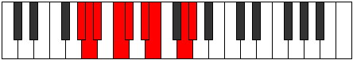 |
| [2487](https://ianring.com/musictheory/scales/2487) | [Phroptyllic](ModeGNaturalPhroptyllic.md) | G | G, G#, A, B, C, D, D#, F#, G |  |
| [2489](https://ianring.com/musictheory/scales/2489) | [Syrian](ModeGSharpSyrian.md) | G# | G#, A##, B#, C#, D#, E, F##, G# |  |
| [2489](https://ianring.com/musictheory/scales/2489) | [Syrian](ModeAFlatSyrian.md) | Ab | Ab, B, C, Db, Eb, Fb, G, Ab |  |
| [2489](https://ianring.com/musictheory/scales/2489) | [Syrian](ModeCNaturalSyrian.md) | C | C, D#, E, F, G, Ab, B, C |  |
| [2489](https://ianring.com/musictheory/scales/2489) | [Syrian](ModeENaturalSyrian.md) | E | E, F##, G#, A, B, C, D#, E |  |
| [2491](https://ianring.com/musictheory/scales/2491) | [Layllic](ModeCNaturalLayllic.md) | C | C, C#, D#, E, F, G, G#, B, C |  |
| [2491](https://ianring.com/musictheory/scales/2491) | [Layllic](ModeGSharpLayllic.md) | G# | G#, A, B, C, C#, D#, E, G, G# |  |
| [2491](https://ianring.com/musictheory/scales/2491) | [Layllic](ModeAFlatLayllic.md) | Ab | Ab, A, B, C, Db, Eb, E, G, Ab |  |
| [2491](https://ianring.com/musictheory/scales/2491) | [Layllic](ModeENaturalLayllic.md) | E | E, F, G, G#, A, B, C, D#, E |  |
| [2491](https://ianring.com/musictheory/scales/2491) | [Layllic](ModeGNaturalLayllic.md) | G | G, G#, A#, B, C, D, D#, F#, G |  |
| [2493](https://ianring.com/musictheory/scales/2493) | [Manyllic](ModeCNaturalManyllic.md) | C | C, D, D#, E, F, G, G#, B, C |  |
| [2493](https://ianring.com/musictheory/scales/2493) | [Manyllic](ModeENaturalManyllic.md) | E | E, F#, G, G#, A, B, C, D#, E |  |
| [2493](https://ianring.com/musictheory/scales/2493) | [Manyllic](ModeGSharpManyllic.md) | G# | G#, A#, B, C, C#, D#, E, G, G# |  |
| [2493](https://ianring.com/musictheory/scales/2493) | [Manyllic](ModeAFlatManyllic.md) | Ab | Ab, Bb, B, C, Db, Eb, E, G, Ab | 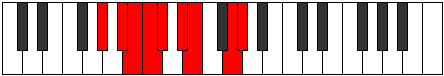 |
| [2495](https://ianring.com/musictheory/scales/2495) | [Aeolocrygic](ModeCNaturalAeolocrygic.md) | C | C, C#, D, D#, E, F, G, G#, B, C |  |
| [2495](https://ianring.com/musictheory/scales/2495) | [Aeolocrygic](ModeENaturalAeolocrygic.md) | E | E, F, F#, G, G#, A, B, C, D#, E |  |
| [2495](https://ianring.com/musictheory/scales/2495) | [Aeolocrygic](ModeGSharpAeolocrygic.md) | G# | G#, A, A#, B, C, C#, D#, E, G, G# |  |
| [2495](https://ianring.com/musictheory/scales/2495) | [Aeolocrygic](ModeAFlatAeolocrygic.md) | Ab | Ab, A, Bb, B, C, Db, Eb, E, G, Ab |  |
| [2495](https://ianring.com/musictheory/scales/2495) | [Aeolocrygic](ModeGNaturalAeolocrygic.md) | G | G, G#, A, A#, B, C, D, D#, F#, G |  |
| [2501](https://ianring.com/musictheory/scales/2501) | [Ralimic](ModeDFlatRalimic.md) | Db | Db, Eb, F##, G#, A, B#, Db |  |
| [2503](https://ianring.com/musictheory/scales/2503) | [Stonian](ModeCSharpStonian.md) | C# | C#, D, Eb, F##, G#, A, B#, C# |  |
| [2503](https://ianring.com/musictheory/scales/2503) | [Stonian](ModeDFlatStonian.md) | Db | Db, Ebb, Fbb, G, Ab, Bbb, C, Db |  |
| [2505](https://ianring.com/musictheory/scales/2505) | [Mydimic](ModeCNaturalMydimic.md) | C | C, D#, E##, F##, G#, A##, C |  |
| [2507](https://ianring.com/musictheory/scales/2507) | [Ionyphian](ModeCNaturalIonyphian.md) | C | C, Db, Eb, F#, G, Ab, B, C |  |
| [2509](https://ianring.com/musictheory/scales/2509) | [Bogian](ModeCSharpBogian.md) | C# | C#, D#, E, F##, G#, A, B#, C# |  |
| [2509](https://ianring.com/musictheory/scales/2509) | [Bogian](ModeDFlatBogian.md) | Db | Db, Eb, Fb, G, Ab, Bbb, C, Db |  |
| [2509](https://ianring.com/musictheory/scales/2509) | [Bogian](ModeCNaturalBogian.md) | C | C, D, Eb, F#, G, Ab, B, C |  |
| [2511](https://ianring.com/musictheory/scales/2511) | [Epyryllic](ModeCSharpEpyryllic.md) | C# | C#, D, D#, E, G, G#, A, C, C# |  |
| [2511](https://ianring.com/musictheory/scales/2511) | [Epyryllic](ModeDFlatEpyryllic.md) | Db | Db, D, Eb, E, G, Ab, A, C, Db |  |
| [2511](https://ianring.com/musictheory/scales/2511) | [Epyryllic](ModeCNaturalEpyryllic.md) | C | C, C#, D, D#, F#, G, G#, B, C |  |
| [2513](https://ianring.com/musictheory/scales/2513) | [Aerycrimic](ModeGSharpAerycrimic.md) | G# | G#, A###, B###, C###, D##, E###, G# |  |
| [2513](https://ianring.com/musictheory/scales/2513) | [Aerycrimic](ModeAFlatAerycrimic.md) | Ab | Ab, B#, C##, D#, E, F##, Ab |  |
| [2515](https://ianring.com/musictheory/scales/2515) | [Stylian](ModeGSharpStylian.md) | G# | G#, A, B#, C##, D#, E, F##, G# |  |
| [2515](https://ianring.com/musictheory/scales/2515) | [Stylian](ModeAFlatStylian.md) | Ab | Ab, Bbb, C, D, Eb, Fb, G, Ab |  |
| [2517](https://ianring.com/musictheory/scales/2517) | [Ryphian](ModeCSharpRyphian.md) | C# | C#, D#, E#, F##, G#, A, B#, C# |  |
| [2517](https://ianring.com/musictheory/scales/2517) | [Ryphian](ModeDFlatRyphian.md) | Db | Db, Eb, F, G, Ab, Bbb, C, Db |  |
| [2517](https://ianring.com/musictheory/scales/2517) | [Ryphian](ModeGSharpRyphian.md) | G# | G#, A#, B#, C##, D#, E, F##, G# |  |
| [2517](https://ianring.com/musictheory/scales/2517) | [Ryphian](ModeAFlatRyphian.md) | Ab | Ab, Bb, C, D, Eb, Fb, G, Ab |  |
| [2519](https://ianring.com/musictheory/scales/2519) | [Dathyllic](ModeCSharpDathyllic.md) | C# | C#, D, D#, F, G, G#, A, C, C# |  |
| [2519](https://ianring.com/musictheory/scales/2519) | [Dathyllic](ModeDFlatDathyllic.md) | Db | Db, D, Eb, F, G, Ab, A, C, Db |  |
| [2519](https://ianring.com/musictheory/scales/2519) | [Dathyllic](ModeGSharpDathyllic.md) | G# | G#, A, A#, C, D, D#, E, G, G# |  |
| [2519](https://ianring.com/musictheory/scales/2519) | [Dathyllic](ModeAFlatDathyllic.md) | Ab | Ab, A, Bb, C, D, Eb, E, G, Ab |  |
| [2521](https://ianring.com/musictheory/scales/2521) | [Barian](ModeGSharpBarian.md) | G# | G#, A##, B#, C##, D#, E, F##, G# |  |
| [2521](https://ianring.com/musictheory/scales/2521) | [Barian](ModeAFlatBarian.md) | Ab | Ab, B, C, D, Eb, Fb, G, Ab |  |
| [2521](https://ianring.com/musictheory/scales/2521) | [Barian](ModeCNaturalBarian.md) | C | C, D#, E, F#, G, Ab, B, C |  |
| [2521](https://ianring.com/musictheory/scales/2521) | [Barian](ModeENaturalBarian.md) | E | E, F##, G#, A#, B, C, D#, E |  |
| [2523](https://ianring.com/musictheory/scales/2523) | [Rygyllic](ModeCNaturalRygyllic.md) | C | C, C#, D#, E, F#, G, G#, B, C |  |
| [2523](https://ianring.com/musictheory/scales/2523) | [Rygyllic](ModeGSharpRygyllic.md) | G# | G#, A, B, C, D, D#, E, G, G# |  |
| [2523](https://ianring.com/musictheory/scales/2523) | [Rygyllic](ModeAFlatRygyllic.md) | Ab | Ab, A, B, C, D, Eb, E, G, Ab |  |
| [2523](https://ianring.com/musictheory/scales/2523) | [Rygyllic](ModeENaturalRygyllic.md) | E | E, F, G, G#, A#, B, C, D#, E |  |
| [2525](https://ianring.com/musictheory/scales/2525) | [Aeolaryllic](ModeCSharpAeolaryllic.md) | C# | C#, D#, E, F, G, G#, A, C, C# |  |
| [2525](https://ianring.com/musictheory/scales/2525) | [Aeolaryllic](ModeDFlatAeolaryllic.md) | Db | Db, Eb, E, F, G, Ab, A, C, Db |  |
| [2525](https://ianring.com/musictheory/scales/2525) | [Aeolaryllic](ModeCNaturalAeolaryllic.md) | C | C, D, D#, E, F#, G, G#, B, C |  |
| [2525](https://ianring.com/musictheory/scales/2525) | [Aeolaryllic](ModeGSharpAeolaryllic.md) | G# | G#, A#, B, C, D, D#, E, G, G# |  |
| [2525](https://ianring.com/musictheory/scales/2525) | [Aeolaryllic](ModeAFlatAeolaryllic.md) | Ab | Ab, Bb, B, C, D, Eb, E, G, Ab |  |
| [2525](https://ianring.com/musictheory/scales/2525) | [Aeolaryllic](ModeENaturalAeolaryllic.md) | E | E, F#, G, G#, A#, B, C, D#, E |  |
| [2527](https://ianring.com/musictheory/scales/2527) | [Phradygic](ModeCSharpPhradygic.md) | C# | C#, D, D#, E, F, G, G#, A, C, C# |  |
| [2527](https://ianring.com/musictheory/scales/2527) | [Phradygic](ModeDFlatPhradygic.md) | Db | Db, D, Eb, E, F, G, Ab, A, C, Db |  |
| [2527](https://ianring.com/musictheory/scales/2527) | [Phradygic](ModeCNaturalPhradygic.md) | C | C, C#, D, D#, E, F#, G, G#, B, C |  |
| [2527](https://ianring.com/musictheory/scales/2527) | [Phradygic](ModeENaturalPhradygic.md) | E | E, F, F#, G, G#, A#, B, C, D#, E |  |
| [2527](https://ianring.com/musictheory/scales/2527) | [Phradygic](ModeGSharpPhradygic.md) | G# | G#, A, A#, B, C, D, D#, E, G, G# | 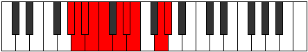 |
| [2527](https://ianring.com/musictheory/scales/2527) | [Phradygic](ModeAFlatPhradygic.md) | Ab | Ab, A, Bb, B, C, D, Eb, E, G, Ab |  |
| [2531](https://ianring.com/musictheory/scales/2531) | [Danian](ModeGNaturalDanian.md) | G | G, Ab, B#, C#, D, Eb, F#, G |  |
| [2533](https://ianring.com/musictheory/scales/2533) | [Podian](ModeCSharpPodian.md) | C# | C#, D#, E##, F##, G#, A, B#, C# |  |
| [2533](https://ianring.com/musictheory/scales/2533) | [Podian](ModeDFlatPodian.md) | Db | Db, Eb, F#, G, Ab, Bbb, C, Db |  |
| [2535](https://ianring.com/musictheory/scales/2535) | [Zygyllic](ModeCSharpZygyllic.md) | C# | C#, D, D#, F#, G, G#, A, C, C# |  |
| [2535](https://ianring.com/musictheory/scales/2535) | [Zygyllic](ModeDFlatZygyllic.md) | Db | Db, D, Eb, Gb, G, Ab, A, C, Db |  |
| [2535](https://ianring.com/musictheory/scales/2535) | [Zygyllic](ModeGNaturalZygyllic.md) | G | G, G#, A, C, C#, D, D#, F#, G |  |
| [2537](https://ianring.com/musictheory/scales/2537) | [Laptian](ModeCNaturalLaptian.md) | C | C, D#, E#, F#, G, Ab, B, C |  |
| [2539](https://ianring.com/musictheory/scales/2539) | [Thonyllic](ModeGNaturalThonyllic.md) | G | G, G#, A#, C, C#, D, D#, F#, G |  |
| [2539](https://ianring.com/musictheory/scales/2539) | [Thonyllic](ModeCNaturalThonyllic.md) | C | C, C#, D#, F, F#, G, G#, B, C |  |
| [2541](https://ianring.com/musictheory/scales/2541) | [Katadyllic](ModeCSharpKatadyllic.md) | C# | C#, D#, E, F#, G, G#, A, C, C# |  |
| [2541](https://ianring.com/musictheory/scales/2541) | [Katadyllic](ModeDFlatKatadyllic.md) | Db | Db, Eb, E, Gb, G, Ab, A, C, Db |  |
| [2541](https://ianring.com/musictheory/scales/2541) | [Katadyllic](ModeCNaturalKatadyllic.md) | C | C, D, D#, F, F#, G, G#, B, C |  |
| [2543](https://ianring.com/musictheory/scales/2543) | [Dydygic](ModeCSharpDydygic.md) | C# | C#, D, D#, E, F#, G, G#, A, C, C# |  |
| [2543](https://ianring.com/musictheory/scales/2543) | [Dydygic](ModeDFlatDydygic.md) | Db | Db, D, Eb, E, Gb, G, Ab, A, C, Db |  |
| [2543](https://ianring.com/musictheory/scales/2543) | [Dydygic](ModeGNaturalDydygic.md) | G | G, G#, A, A#, C, C#, D, D#, F#, G |  |
| [2543](https://ianring.com/musictheory/scales/2543) | [Dydygic](ModeCNaturalDydygic.md) | C | C, C#, D, D#, F, F#, G, G#, B, C |  |
| [2545](https://ianring.com/musictheory/scales/2545) | [Thycrian](ModeGSharpThycrian.md) | G# | G#, A###, B##, C##, D#, E, F##, G# | 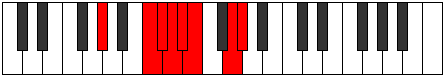 |
| [2545](https://ianring.com/musictheory/scales/2545) | [Thycrian](ModeAFlatThycrian.md) | Ab | Ab, B#, C#, D, Eb, Fb, G, Ab |  |
| [2547](https://ianring.com/musictheory/scales/2547) | [Sogyllic](ModeGSharpSogyllic.md) | G# | G#, A, C, C#, D, D#, E, G, G# |  |
| [2547](https://ianring.com/musictheory/scales/2547) | [Sogyllic](ModeAFlatSogyllic.md) | Ab | Ab, A, C, Db, D, Eb, E, G, Ab |  |
| [2547](https://ianring.com/musictheory/scales/2547) | [Sogyllic](ModeGNaturalSogyllic.md) | G | G, G#, B, C, C#, D, D#, F#, G |  |
| [2549](https://ianring.com/musictheory/scales/2549) | [Rydyllic](ModeCSharpRydyllic.md) | C# | C#, D#, F, F#, G, G#, A, C, C# |  |
| [2549](https://ianring.com/musictheory/scales/2549) | [Rydyllic](ModeDFlatRydyllic.md) | Db | Db, Eb, F, Gb, G, Ab, A, C, Db |  |
| [2549](https://ianring.com/musictheory/scales/2549) | [Rydyllic](ModeGSharpRydyllic.md) | G# | G#, A#, C, C#, D, D#, E, G, G# |  |
| [2549](https://ianring.com/musictheory/scales/2549) | [Rydyllic](ModeAFlatRydyllic.md) | Ab | Ab, Bb, C, Db, D, Eb, E, G, Ab |  |
| [2551](https://ianring.com/musictheory/scales/2551) | [Zoptygic](ModeCSharpZoptygic.md) | C# | C#, D, D#, F, F#, G, G#, A, C, C# |  |
| [2551](https://ianring.com/musictheory/scales/2551) | [Zoptygic](ModeDFlatZoptygic.md) | Db | Db, D, Eb, F, Gb, G, Ab, A, C, Db |  |
| [2551](https://ianring.com/musictheory/scales/2551) | [Zoptygic](ModeGSharpZoptygic.md) | G# | G#, A, A#, C, C#, D, D#, E, G, G# |  |
| [2551](https://ianring.com/musictheory/scales/2551) | [Zoptygic](ModeAFlatZoptygic.md) | Ab | Ab, A, Bb, C, Db, D, Eb, E, G, Ab |  |
| [2551](https://ianring.com/musictheory/scales/2551) | [Zoptygic](ModeGNaturalZoptygic.md) | G | G, G#, A, B, C, C#, D, D#, F#, G |  |
| [2553](https://ianring.com/musictheory/scales/2553) | [Aeolaptyllic](ModeGSharpAeolaptyllic.md) | G# | G#, B, C, C#, D, D#, E, G, G# |  |
| [2553](https://ianring.com/musictheory/scales/2553) | [Aeolaptyllic](ModeAFlatAeolaptyllic.md) | Ab | Ab, B, C, Db, D, Eb, E, G, Ab |  |
| [2553](https://ianring.com/musictheory/scales/2553) | [Aeolaptyllic](ModeCNaturalAeolaptyllic.md) | C | C, D#, E, F, F#, G, G#, B, C |  |
| [2553](https://ianring.com/musictheory/scales/2553) | [Aeolaptyllic](ModeENaturalAeolaptyllic.md) | E | E, G, G#, A, A#, B, C, D#, E |  |
| [2555](https://ianring.com/musictheory/scales/2555) | [Bythygic](ModeCNaturalBythygic.md) | C | C, C#, D#, E, F, F#, G, G#, B, C |  |
| [2555](https://ianring.com/musictheory/scales/2555) | [Bythygic](ModeGSharpBythygic.md) | G# | G#, A, B, C, C#, D, D#, E, G, G# |  |
| [2555](https://ianring.com/musictheory/scales/2555) | [Bythygic](ModeAFlatBythygic.md) | Ab | Ab, A, B, C, Db, D, Eb, E, G, Ab |  |
| [2555](https://ianring.com/musictheory/scales/2555) | [Bythygic](ModeGNaturalBythygic.md) | G | G, G#, A#, B, C, C#, D, D#, F#, G |  |
| [2555](https://ianring.com/musictheory/scales/2555) | [Bythygic](ModeENaturalBythygic.md) | E | E, F, G, G#, A, A#, B, C, D#, E |  |
| [2557](https://ianring.com/musictheory/scales/2557) | [Dothygic](ModeCSharpDothygic.md) | C# | C#, D#, E, F, F#, G, G#, A, C, C# |  |
| [2557](https://ianring.com/musictheory/scales/2557) | [Dothygic](ModeDFlatDothygic.md) | Db | Db, Eb, E, F, Gb, G, Ab, A, C, Db |  |
| [2557](https://ianring.com/musictheory/scales/2557) | [Dothygic](ModeCNaturalDothygic.md) | C | C, D, D#, E, F, F#, G, G#, B, C |  |
| [2557](https://ianring.com/musictheory/scales/2557) | [Dothygic](ModeGSharpDothygic.md) | G# | G#, A#, B, C, C#, D, D#, E, G, G# |  |
| [2557](https://ianring.com/musictheory/scales/2557) | [Dothygic](ModeAFlatDothygic.md) | Ab | Ab, Bb, B, C, Db, D, Eb, E, G, Ab |  |
| [2557](https://ianring.com/musictheory/scales/2557) | [Dothygic](ModeENaturalDothygic.md) | E | E, F#, G, G#, A, A#, B, C, D#, E |  |
| [2559](https://ianring.com/musictheory/scales/2559) | [Zogyllian](ModeCSharpZogyllian.md) | C# | C#, D, D#, E, F, F#, G, G#, A, C, C# |  |
| [2559](https://ianring.com/musictheory/scales/2559) | [Zogyllian](ModeDFlatZogyllian.md) | Db | Db, D, Eb, E, F, Gb, G, Ab, A, C, Db |  |
| [2559](https://ianring.com/musictheory/scales/2559) | [Zogyllian](ModeCNaturalZogyllian.md) | C | C, C#, D, D#, E, F, F#, G, G#, B, C |  |
| [2559](https://ianring.com/musictheory/scales/2559) | [Zogyllian](ModeGSharpZogyllian.md) | G# | G#, A, A#, B, C, C#, D, D#, E, G, G# |  |
| [2559](https://ianring.com/musictheory/scales/2559) | [Zogyllian](ModeAFlatZogyllian.md) | Ab | Ab, A, Bb, B, C, Db, D, Eb, E, G, Ab |  |
| [2559](https://ianring.com/musictheory/scales/2559) | [Zogyllian](ModeGNaturalZogyllian.md) | G | G, G#, A, A#, B, C, C#, D, D#, F#, G |  |
| [2559](https://ianring.com/musictheory/scales/2559) | [Zogyllian](ModeENaturalZogyllian.md) | E | E, F, F#, G, G#, A, A#, B, C, D#, E |  |
| [2609](https://ianring.com/musictheory/scales/2609) | [Paptitonic](ModeDSharpPaptitonic.md) | D# | D#, G, G#, C, D, D# | 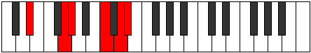 |
| [2609](https://ianring.com/musictheory/scales/2609) | [Paptitonic](ModeEFlatPaptitonic.md) | Eb | Eb, G, Ab, C, D, Eb |  |
| [2611](https://ianring.com/musictheory/scales/2611) | [Lyrimic](ModeDSharpLyrimic.md) | D# | D#, E, F##, G#, A###, B###, D# |  |
| [2611](https://ianring.com/musictheory/scales/2611) | [Lyrimic](ModeEFlatLyrimic.md) | Eb | Eb, Fb, G, Ab, B#, C##, Eb |  |
| [2613](https://ianring.com/musictheory/scales/2613) | [Aeolanimic](ModeDSharpAeolanimic.md) | D# | D#, E#, F##, G#, A###, B###, D# |  |
| [2613](https://ianring.com/musictheory/scales/2613) | [Aeolanimic](ModeEFlatAeolanimic.md) | Eb | Eb, F, G, Ab, B#, C##, Eb |  |
| [2615](https://ianring.com/musictheory/scales/2615) | [Thoptian](ModeDSharpThoptian.md) | D# | D#, E, F, G, Ab, B#, C##, D# |  |
| [2617](https://ianring.com/musictheory/scales/2617) | [Pylimic](ModeDSharpPylimic.md) | D# | D#, E##, F##, G#, A###, B###, D# |  |
| [2617](https://ianring.com/musictheory/scales/2617) | [Pylimic](ModeEFlatPylimic.md) | Eb | Eb, F#, G, Ab, B#, C##, Eb | 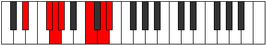 |
| [2619](https://ianring.com/musictheory/scales/2619) | [Ionyrian](ModeDSharpIonyrian.md) | D# | D#, E, F#, G, Ab, B#, C##, D# |  |
| [2621](https://ianring.com/musictheory/scales/2621) | [Ionogian](ModeDSharpIonogian.md) | D# | D#, E#, F#, G, Ab, B#, C##, D# |  |
| [2623](https://ianring.com/musictheory/scales/2623) | [Aerylyllic](ModeDSharpAerylyllic.md) | D# | D#, E, F, F#, G, G#, C, D, D# |  |
| [2623](https://ianring.com/musictheory/scales/2623) | [Aerylyllic](ModeEFlatAerylyllic.md) | Eb | Eb, E, F, Gb, G, Ab, C, D, Eb |  |
| [2631](https://ianring.com/musictheory/scales/2631) | [Macrimic](ModeFSharpMacrimic.md) | F# | F#, G, Ab, B#, C###, D###, F# |  |
| [2639](https://ianring.com/musictheory/scales/2639) | [Dothian](ModeFSharpDothian.md) | F# | F#, G, Ab, Bbb, C, D#, E#, F# |  |
| [2647](https://ianring.com/musictheory/scales/2647) | [Dadian](ModeFSharpDadian.md) | F# | F#, G, Ab, Bb, C, D#, E#, F# |  |
| [2655](https://ianring.com/musictheory/scales/2655) | [Thocryllic](ModeFSharpThocryllic.md) | F# | F#, G, G#, A, A#, C, D#, F, F# |  |
| [2655](https://ianring.com/musictheory/scales/2655) | [Thocryllic](ModeGFlatThocryllic.md) | Gb | Gb, G, Ab, A, Bb, C, Eb, F, Gb |  |
| [2663](https://ianring.com/musictheory/scales/2663) | [Lalian](ModeFSharpLalian.md) | F# | F#, G, Ab, B, C, D#, E#, F# |  |
| [2671](https://ianring.com/musictheory/scales/2671) | [Lylyllic](ModeFSharpLylyllic.md) | F# | F#, G, G#, A, B, C, D#, F, F# |  |
| [2671](https://ianring.com/musictheory/scales/2671) | [Lylyllic](ModeGFlatLylyllic.md) | Gb | Gb, G, Ab, A, B, C, Eb, F, Gb |  |
| [2673](https://ianring.com/musictheory/scales/2673) | [Mythimic](ModeEFlatMythimic.md) | Eb | Eb, F##, G#, A, B#, C##, Eb |  |
| [2675](https://ianring.com/musictheory/scales/2675) | [Gogian](ModeDSharpGogian.md) | D# | D#, E, F##, G#, A, B#, C##, D# |  |
| [2675](https://ianring.com/musictheory/scales/2675) | [Gogian](ModeEFlatGogian.md) | Eb | Eb, Fb, G, Ab, Bbb, C, D, Eb |  |
| [2677](https://ianring.com/musictheory/scales/2677) | [Thodian](ModeDSharpThodian.md) | D# | D#, E#, F##, G#, A, B#, C##, D# |  |
| [2677](https://ianring.com/musictheory/scales/2677) | [Thodian](ModeEFlatThodian.md) | Eb | Eb, F, G, Ab, Bbb, C, D, Eb |  |
| [2679](https://ianring.com/musictheory/scales/2679) | [Rathyllic](ModeDSharpRathyllic.md) | D# | D#, E, F, G, G#, A, C, D, D# |  |
| [2679](https://ianring.com/musictheory/scales/2679) | [Rathyllic](ModeEFlatRathyllic.md) | Eb | Eb, E, F, G, Ab, A, C, D, Eb |  |
| [2679](https://ianring.com/musictheory/scales/2679) | [Rathyllic](ModeFSharpRathyllic.md) | F# | F#, G, G#, A#, B, C, D#, F, F# |  |
| [2679](https://ianring.com/musictheory/scales/2679) | [Rathyllic](ModeGFlatRathyllic.md) | Gb | Gb, G, Ab, Bb, B, C, Eb, F, Gb |  |
| [2681](https://ianring.com/musictheory/scales/2681) | [Aerycrian](ModeDSharpAerycrian.md) | D# | D#, E##, F##, G#, A, B#, C##, D# |  |
| [2681](https://ianring.com/musictheory/scales/2681) | [Aerycrian](ModeEFlatAerycrian.md) | Eb | Eb, F#, G, Ab, Bbb, C, D, Eb |  |
| [2683](https://ianring.com/musictheory/scales/2683) | [Thodyllic](ModeDSharpThodyllic.md) | D# | D#, E, F#, G, G#, A, C, D, D# |  |
| [2683](https://ianring.com/musictheory/scales/2683) | [Thodyllic](ModeEFlatThodyllic.md) | Eb | Eb, E, Gb, G, Ab, A, C, D, Eb |  |
| [2685](https://ianring.com/musictheory/scales/2685) | [Ionoryllic](ModeDSharpIonoryllic.md) | D# | D#, F, F#, G, G#, A, C, D, D# |  |
| [2685](https://ianring.com/musictheory/scales/2685) | [Ionoryllic](ModeEFlatIonoryllic.md) | Eb | Eb, F, Gb, G, Ab, A, C, D, Eb |  |
| [2687](https://ianring.com/musictheory/scales/2687) | [Thacrygic](ModeDSharpThacrygic.md) | D# | D#, E, F, F#, G, G#, A, C, D, D# |  |
| [2687](https://ianring.com/musictheory/scales/2687) | [Thacrygic](ModeEFlatThacrygic.md) | Eb | Eb, E, F, Gb, G, Ab, A, C, D, Eb |  |
| [2687](https://ianring.com/musictheory/scales/2687) | [Thacrygic](ModeFSharpThacrygic.md) | F# | F#, G, G#, A, A#, B, C, D#, F, F# |  |
| [2687](https://ianring.com/musictheory/scales/2687) | [Thacrygic](ModeGFlatThacrygic.md) | Gb | Gb, G, Ab, A, Bb, B, C, Eb, F, Gb |  |
| [2705](https://ianring.com/musictheory/scales/2705) | [Magitonic](ModeGSharpMagitonic.md) | G# | G#, C, D#, F, G, G# |  |
| [2705](https://ianring.com/musictheory/scales/2705) | [Magitonic](ModeAFlatMagitonic.md) | Ab | Ab, C, Eb, F, G, Ab |  |
| [2707](https://ianring.com/musictheory/scales/2707) | [Banimic](ModeGSharpBanimic.md) | G# | G#, A, B#, C###, D###, E###, G# |  |
| [2707](https://ianring.com/musictheory/scales/2707) | [Banimic](ModeAFlatBanimic.md) | Ab | Ab, Bbb, C, D#, E#, F##, Ab |  |
| [2709](https://ianring.com/musictheory/scales/2709) | [Thaptimic](ModeGSharpThaptimic.md) | G# | G#, A#, B#, C###, D###, E###, G# |  |
| [2709](https://ianring.com/musictheory/scales/2709) | [Thaptimic](ModeAFlatThaptimic.md) | Ab | Ab, Bb, C, D#, E#, F##, Ab |  |
| [2711](https://ianring.com/musictheory/scales/2711) | [Stolian](ModeGSharpStolian.md) | G# | G#, A, Bb, C, D#, E#, F##, G# | 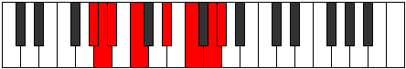 |
| [2711](https://ianring.com/musictheory/scales/2711) | [Stolian](ModeAFlatStolian.md) | Ab | Ab, Bbb, Cbb, Dbb, Eb, F, G, Ab |  |
| [2713](https://ianring.com/musictheory/scales/2713) | [Porimic](ModeGSharpPorimic.md) | G# | G#, A##, B#, C###, D###, E###, G# |  |
| [2713](https://ianring.com/musictheory/scales/2713) | [Porimic](ModeAFlatPorimic.md) | Ab | Ab, B, C, D#, E#, F##, Ab |  |
| [2715](https://ianring.com/musictheory/scales/2715) | [Kynian](ModeGSharpKynian.md) | G# | G#, A, B, C, D#, E#, F##, G# |  |
| [2715](https://ianring.com/musictheory/scales/2715) | [Kynian](ModeAFlatKynian.md) | Ab | Ab, Bbb, Cb, Dbb, Eb, F, G, Ab |  |
| [2717](https://ianring.com/musictheory/scales/2717) | [Epygian](ModeGSharpEpygian.md) | G# | G#, A#, B, C, D#, E#, F##, G# |  |
| [2717](https://ianring.com/musictheory/scales/2717) | [Epygian](ModeAFlatEpygian.md) | Ab | Ab, Bb, Cb, Dbb, Eb, F, G, Ab |  |
| [2719](https://ianring.com/musictheory/scales/2719) | [Zocryllic](ModeGSharpZocryllic.md) | G# | G#, A, A#, B, C, D#, F, G, G# |  |
| [2719](https://ianring.com/musictheory/scales/2719) | [Zocryllic](ModeAFlatZocryllic.md) | Ab | Ab, A, Bb, B, C, Eb, F, G, Ab |  |
| [2737](https://ianring.com/musictheory/scales/2737) | [Bylimic](ModeGSharpBylimic.md) | G# | G#, A###, B##, C###, D###, E###, G# |  |
| [2737](https://ianring.com/musictheory/scales/2737) | [Bylimic](ModeAFlatBylimic.md) | Ab | Ab, B#, C#, D#, E#, F##, Ab |  |
| [2737](https://ianring.com/musictheory/scales/2737) | [Bylimic](ModeEFlatBylimic.md) | Eb | Eb, F##, G#, A#, B#, C##, Eb |  |
| [2739](https://ianring.com/musictheory/scales/2739) | [Zanian](ModeGSharpZanian.md) | G# | G#, A, B#, C#, D#, E#, F##, G# |  |
| [2739](https://ianring.com/musictheory/scales/2739) | [Zanian](ModeAFlatZanian.md) | Ab | Ab, Bbb, C, Db, Eb, F, G, Ab |  |
| [2739](https://ianring.com/musictheory/scales/2739) | [Zanian](ModeDSharpZanian.md) | D# | D#, E, F##, G#, A#, B#, C##, D# |  |
| [2739](https://ianring.com/musictheory/scales/2739) | [Zanian](ModeEFlatZanian.md) | Eb | Eb, Fb, G, Ab, Bb, C, D, Eb |  |
| [2741](https://ianring.com/musictheory/scales/2741) | [Ionian](ModeGSharpIonian.md) | G# | G#, A#, B#, C#, D#, E#, F##, G# |  |
| [2741](https://ianring.com/musictheory/scales/2741) | [Ionian](ModeAFlatIonian.md) | Ab | Ab, Bb, C, Db, Eb, F, G, Ab |  |
| [2741](https://ianring.com/musictheory/scales/2741) | [Ionian](ModeDSharpIonian.md) | D# | D#, E#, F##, G#, A#, B#, C##, D# |  |
| [2741](https://ianring.com/musictheory/scales/2741) | [Ionian](ModeEFlatIonian.md) | Eb | Eb, F, G, Ab, Bb, C, D, Eb |  |
| [2743](https://ianring.com/musictheory/scales/2743) | [Staptyllic](ModeDSharpStaptyllic.md) | D# | D#, E, F, G, G#, A#, C, D, D# |  |
| [2743](https://ianring.com/musictheory/scales/2743) | [Staptyllic](ModeEFlatStaptyllic.md) | Eb | Eb, E, F, G, Ab, Bb, C, D, Eb |  |
| [2743](https://ianring.com/musictheory/scales/2743) | [Staptyllic](ModeGSharpStaptyllic.md) | G# | G#, A, A#, C, C#, D#, F, G, G# |  |
| [2743](https://ianring.com/musictheory/scales/2743) | [Staptyllic](ModeAFlatStaptyllic.md) | Ab | Ab, A, Bb, C, Db, Eb, F, G, Ab |  |
| [2745](https://ianring.com/musictheory/scales/2745) | [Dolian](ModeDSharpDolian.md) | D# | D#, E##, F##, G#, A#, B#, C##, D# |  |
| [2745](https://ianring.com/musictheory/scales/2745) | [Dolian](ModeEFlatDolian.md) | Eb | Eb, F#, G, Ab, Bb, C, D, Eb |  |
| [2745](https://ianring.com/musictheory/scales/2745) | [Dolian](ModeGSharpDolian.md) | G# | G#, A##, B#, C#, D#, E#, F##, G# |  |
| [2745](https://ianring.com/musictheory/scales/2745) | [Dolian](ModeAFlatDolian.md) | Ab | Ab, B, C, Db, Eb, F, G, Ab |  |
| [2747](https://ianring.com/musictheory/scales/2747) | [Stythyllic](ModeDSharpStythyllic.md) | D# | D#, E, F#, G, G#, A#, C, D, D# |  |
| [2747](https://ianring.com/musictheory/scales/2747) | [Stythyllic](ModeEFlatStythyllic.md) | Eb | Eb, E, Gb, G, Ab, Bb, C, D, Eb |  |
| [2747](https://ianring.com/musictheory/scales/2747) | [Stythyllic](ModeGSharpStythyllic.md) | G# | G#, A, B, C, C#, D#, F, G, G# | 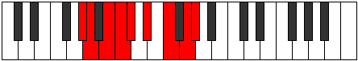 |
| [2747](https://ianring.com/musictheory/scales/2747) | [Stythyllic](ModeAFlatStythyllic.md) | Ab | Ab, A, B, C, Db, Eb, F, G, Ab |  |
| [2749](https://ianring.com/musictheory/scales/2749) | [Katagyllic](ModeDSharpKatagyllic.md) | D# | D#, F, F#, G, G#, A#, C, D, D# |  |
| [2749](https://ianring.com/musictheory/scales/2749) | [Katagyllic](ModeEFlatKatagyllic.md) | Eb | Eb, F, Gb, G, Ab, Bb, C, D, Eb |  |
| [2749](https://ianring.com/musictheory/scales/2749) | [Katagyllic](ModeGSharpKatagyllic.md) | G# | G#, A#, B, C, C#, D#, F, G, G# |  |
| [2749](https://ianring.com/musictheory/scales/2749) | [Katagyllic](ModeAFlatKatagyllic.md) | Ab | Ab, Bb, B, C, Db, Eb, F, G, Ab |  |
| [2751](https://ianring.com/musictheory/scales/2751) | [Sylygic](ModeDSharpSylygic.md) | D# | D#, E, F, F#, G, G#, A#, C, D, D# |  |
| [2751](https://ianring.com/musictheory/scales/2751) | [Sylygic](ModeEFlatSylygic.md) | Eb | Eb, E, F, Gb, G, Ab, Bb, C, D, Eb |  |
| [2751](https://ianring.com/musictheory/scales/2751) | [Sylygic](ModeGSharpSylygic.md) | G# | G#, A, A#, B, C, C#, D#, F, G, G# |  |
| [2751](https://ianring.com/musictheory/scales/2751) | [Sylygic](ModeAFlatSylygic.md) | Ab | Ab, A, Bb, B, C, Db, Eb, F, G, Ab |  |
| [2757](https://ianring.com/musictheory/scales/2757) | [Stolimic](ModeDFlatStolimic.md) | Db | Db, Eb, F##, G#, A#, B#, Db |  |
| [2759](https://ianring.com/musictheory/scales/2759) | [Aeraphian](ModeFSharpAeraphian.md) | F# | F#, G, Ab, B#, C#, D#, E#, F# |  |
| [2759](https://ianring.com/musictheory/scales/2759) | [Aeraphian](ModeCSharpAeraphian.md) | C# | C#, D, Eb, F##, G#, A#, B#, C# |  |
| [2759](https://ianring.com/musictheory/scales/2759) | [Aeraphian](ModeDFlatAeraphian.md) | Db | Db, Ebb, Fbb, G, Ab, Bb, C, Db |  |
| [2765](https://ianring.com/musictheory/scales/2765) | [Banian](ModeCSharpBanian.md) | C# | C#, D#, E, F##, G#, A#, B#, C# |  |
| [2765](https://ianring.com/musictheory/scales/2765) | [Banian](ModeDFlatBanian.md) | Db | Db, Eb, Fb, G, Ab, Bb, C, Db |  |
| [2767](https://ianring.com/musictheory/scales/2767) | [Katydyllic](ModeFSharpKatydyllic.md) | F# | F#, G, G#, A, C, C#, D#, F, F# |  |
| [2767](https://ianring.com/musictheory/scales/2767) | [Katydyllic](ModeGFlatKatydyllic.md) | Gb | Gb, G, Ab, A, C, Db, Eb, F, Gb |  |
| [2767](https://ianring.com/musictheory/scales/2767) | [Katydyllic](ModeCSharpKatydyllic.md) | C# | C#, D, D#, E, G, G#, A#, C, C# |  |
| [2767](https://ianring.com/musictheory/scales/2767) | [Katydyllic](ModeDFlatKatydyllic.md) | Db | Db, D, Eb, E, G, Ab, Bb, C, Db |  |
| [2769](https://ianring.com/musictheory/scales/2769) | [Dyrimic](ModeGSharpDyrimic.md) | G# | G#, A###, B###, C###, D###, E###, G# |  |
| [2769](https://ianring.com/musictheory/scales/2769) | [Dyrimic](ModeAFlatDyrimic.md) | Ab | Ab, B#, C##, D#, E#, F##, Ab | 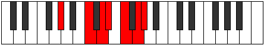 |
| [2771](https://ianring.com/musictheory/scales/2771) | [Garian](ModeGSharpGarian.md) | G# | G#, A, B#, C##, D#, E#, F##, G# |  |
| [2771](https://ianring.com/musictheory/scales/2771) | [Garian](ModeAFlatGarian.md) | Ab | Ab, Bbb, C, D, Eb, F, G, Ab |  |
| [2773](https://ianring.com/musictheory/scales/2773) | [Lydian](ModeCSharpLydian.md) | C# | C#, D#, E#, F##, G#, A#, B#, C# |  |
| [2773](https://ianring.com/musictheory/scales/2773) | [Lydian](ModeDFlatLydian.md) | Db | Db, Eb, F, G, Ab, Bb, C, Db |  |
| [2773](https://ianring.com/musictheory/scales/2773) | [Lydian](ModeGSharpLydian.md) | G# | G#, A#, B#, C##, D#, E#, F##, G# |  |
| [2773](https://ianring.com/musictheory/scales/2773) | [Lydian](ModeAFlatLydian.md) | Ab | Ab, Bb, C, D, Eb, F, G, Ab |  |
| [2775](https://ianring.com/musictheory/scales/2775) | [Godyllic](ModeCSharpGodyllic.md) | C# | C#, D, D#, F, G, G#, A#, C, C# |  |
| [2775](https://ianring.com/musictheory/scales/2775) | [Godyllic](ModeDFlatGodyllic.md) | Db | Db, D, Eb, F, G, Ab, Bb, C, Db |  |
| [2775](https://ianring.com/musictheory/scales/2775) | [Godyllic](ModeFSharpGodyllic.md) | F# | F#, G, G#, A#, C, C#, D#, F, F# |  |
| [2775](https://ianring.com/musictheory/scales/2775) | [Godyllic](ModeGFlatGodyllic.md) | Gb | Gb, G, Ab, Bb, C, Db, Eb, F, Gb |  |
| [2775](https://ianring.com/musictheory/scales/2775) | [Godyllic](ModeGSharpGodyllic.md) | G# | G#, A, A#, C, D, D#, F, G, G# |  |
| [2775](https://ianring.com/musictheory/scales/2775) | [Godyllic](ModeAFlatGodyllic.md) | Ab | Ab, A, Bb, C, D, Eb, F, G, Ab |  |
| [2777](https://ianring.com/musictheory/scales/2777) | [Bycrian](ModeGSharpBycrian.md) | G# | G#, A##, B#, C##, D#, E#, F##, G# |  |
| [2777](https://ianring.com/musictheory/scales/2777) | [Bycrian](ModeAFlatBycrian.md) | Ab | Ab, B, C, D, Eb, F, G, Ab |  |
| [2779](https://ianring.com/musictheory/scales/2779) | [Garyllic](ModeGSharpGaryllic.md) | G# | G#, A, B, C, D, D#, F, G, G# |  |
| [2779](https://ianring.com/musictheory/scales/2779) | [Garyllic](ModeAFlatGaryllic.md) | Ab | Ab, A, B, C, D, Eb, F, G, Ab |  |
| [2781](https://ianring.com/musictheory/scales/2781) | [Gycryllic](ModeCSharpGycryllic.md) | C# | C#, D#, E, F, G, G#, A#, C, C# |  |
| [2781](https://ianring.com/musictheory/scales/2781) | [Gycryllic](ModeDFlatGycryllic.md) | Db | Db, Eb, E, F, G, Ab, Bb, C, Db |  |
| [2781](https://ianring.com/musictheory/scales/2781) | [Gycryllic](ModeGSharpGycryllic.md) | G# | G#, A#, B, C, D, D#, F, G, G# |  |
| [2781](https://ianring.com/musictheory/scales/2781) | [Gycryllic](ModeAFlatGycryllic.md) | Ab | Ab, Bb, B, C, D, Eb, F, G, Ab |  |
| [2783](https://ianring.com/musictheory/scales/2783) | [Gothygic](ModeCSharpGothygic.md) | C# | C#, D, D#, E, F, G, G#, A#, C, C# |  |
| [2783](https://ianring.com/musictheory/scales/2783) | [Gothygic](ModeDFlatGothygic.md) | Db | Db, D, Eb, E, F, G, Ab, Bb, C, Db |  |
| [2783](https://ianring.com/musictheory/scales/2783) | [Gothygic](ModeFSharpGothygic.md) | F# | F#, G, G#, A, A#, C, C#, D#, F, F# |  |
| [2783](https://ianring.com/musictheory/scales/2783) | [Gothygic](ModeGFlatGothygic.md) | Gb | Gb, G, Ab, A, Bb, C, Db, Eb, F, Gb |  |
| [2783](https://ianring.com/musictheory/scales/2783) | [Gothygic](ModeGSharpGothygic.md) | G# | G#, A, A#, B, C, D, D#, F, G, G# |  |
| [2783](https://ianring.com/musictheory/scales/2783) | [Gothygic](ModeAFlatGothygic.md) | Ab | Ab, A, Bb, B, C, D, Eb, F, G, Ab |  |
| [2789](https://ianring.com/musictheory/scales/2789) | [Zolian](ModeCSharpZolian.md) | C# | C#, D#, E##, F##, G#, A#, B#, C# |  |
| [2789](https://ianring.com/musictheory/scales/2789) | [Zolian](ModeDFlatZolian.md) | Db | Db, Eb, F#, G, Ab, Bb, C, Db |  |
| [2791](https://ianring.com/musictheory/scales/2791) | [Ionyptyllic](ModeCSharpIonyptyllic.md) | C# | C#, D, D#, F#, G, G#, A#, C, C# |  |
| [2791](https://ianring.com/musictheory/scales/2791) | [Ionyptyllic](ModeDFlatIonyptyllic.md) | Db | Db, D, Eb, Gb, G, Ab, Bb, C, Db |  |
| [2791](https://ianring.com/musictheory/scales/2791) | [Ionyptyllic](ModeFSharpIonyptyllic.md) | F# | F#, G, G#, B, C, C#, D#, F, F# |  |
| [2791](https://ianring.com/musictheory/scales/2791) | [Ionyptyllic](ModeGFlatIonyptyllic.md) | Gb | Gb, G, Ab, B, C, Db, Eb, F, Gb |  |
| [2797](https://ianring.com/musictheory/scales/2797) | [Stalyllic](ModeCSharpStalyllic.md) | C# | C#, D#, E, F#, G, G#, A#, C, C# |  |
| [2797](https://ianring.com/musictheory/scales/2797) | [Stalyllic](ModeDFlatStalyllic.md) | Db | Db, Eb, E, Gb, G, Ab, Bb, C, Db |  |
| [2799](https://ianring.com/musictheory/scales/2799) | [Epilygic](ModeCSharpEpilygic.md) | C# | C#, D, D#, E, F#, G, G#, A#, C, C# |  |
| [2799](https://ianring.com/musictheory/scales/2799) | [Epilygic](ModeDFlatEpilygic.md) | Db | Db, D, Eb, E, Gb, G, Ab, Bb, C, Db |  |
| [2799](https://ianring.com/musictheory/scales/2799) | [Epilygic](ModeFSharpEpilygic.md) | F# | F#, G, G#, A, B, C, C#, D#, F, F# |  |
| [2799](https://ianring.com/musictheory/scales/2799) | [Epilygic](ModeGFlatEpilygic.md) | Gb | Gb, G, Ab, A, B, C, Db, Eb, F, Gb |  |
| [2801](https://ianring.com/musictheory/scales/2801) | [Zogian](ModeGSharpZogian.md) | G# | G#, A###, B##, C##, D#, E#, F##, G# |  |
| [2801](https://ianring.com/musictheory/scales/2801) | [Zogian](ModeAFlatZogian.md) | Ab | Ab, B#, C#, D, Eb, F, G, Ab |  |
| [2801](https://ianring.com/musictheory/scales/2801) | [Zogian](ModeEFlatZogian.md) | Eb | Eb, F##, G#, A, Bb, C, D, Eb |  |
| [2803](https://ianring.com/musictheory/scales/2803) | [Zolyllic](ModeGSharpZolyllic.md) | G# | G#, A, C, C#, D, D#, F, G, G# |  |
| [2803](https://ianring.com/musictheory/scales/2803) | [Zolyllic](ModeAFlatZolyllic.md) | Ab | Ab, A, C, Db, D, Eb, F, G, Ab |  |
| [2803](https://ianring.com/musictheory/scales/2803) | [Zolyllic](ModeDSharpZolyllic.md) | D# | D#, E, G, G#, A, A#, C, D, D# |  |
| [2803](https://ianring.com/musictheory/scales/2803) | [Zolyllic](ModeEFlatZolyllic.md) | Eb | Eb, E, G, Ab, A, Bb, C, D, Eb |  |
| [2805](https://ianring.com/musictheory/scales/2805) | [Zylyllic](ModeGSharpZylyllic.md) | G# | G#, A#, C, C#, D, D#, F, G, G# |  |
| [2805](https://ianring.com/musictheory/scales/2805) | [Zylyllic](ModeAFlatZylyllic.md) | Ab | Ab, Bb, C, Db, D, Eb, F, G, Ab |  |
| [2805](https://ianring.com/musictheory/scales/2805) | [Zylyllic](ModeCSharpZylyllic.md) | C# | C#, D#, F, F#, G, G#, A#, C, C# |  |
| [2805](https://ianring.com/musictheory/scales/2805) | [Zylyllic](ModeDFlatZylyllic.md) | Db | Db, Eb, F, Gb, G, Ab, Bb, C, Db |  |
| [2805](https://ianring.com/musictheory/scales/2805) | [Zylyllic](ModeDSharpZylyllic.md) | D# | D#, F, G, G#, A, A#, C, D, D# |  |
| [2805](https://ianring.com/musictheory/scales/2805) | [Zylyllic](ModeEFlatZylyllic.md) | Eb | Eb, F, G, Ab, A, Bb, C, D, Eb |  |
| [2807](https://ianring.com/musictheory/scales/2807) | [Zylygic](ModeCSharpZylygic.md) | C# | C#, D, D#, F, F#, G, G#, A#, C, C# |  |
| [2807](https://ianring.com/musictheory/scales/2807) | [Zylygic](ModeDFlatZylygic.md) | Db | Db, D, Eb, F, Gb, G, Ab, Bb, C, Db |  |
| [2807](https://ianring.com/musictheory/scales/2807) | [Zylygic](ModeGSharpZylygic.md) | G# | G#, A, A#, C, C#, D, D#, F, G, G# |  |
| [2807](https://ianring.com/musictheory/scales/2807) | [Zylygic](ModeAFlatZylygic.md) | Ab | Ab, A, Bb, C, Db, D, Eb, F, G, Ab |  |
| [2807](https://ianring.com/musictheory/scales/2807) | [Zylygic](ModeDSharpZylygic.md) | D# | D#, E, F, G, G#, A, A#, C, D, D# |  |
| [2807](https://ianring.com/musictheory/scales/2807) | [Zylygic](ModeEFlatZylygic.md) | Eb | Eb, E, F, G, Ab, A, Bb, C, D, Eb |  |
| [2807](https://ianring.com/musictheory/scales/2807) | [Zylygic](ModeFSharpZylygic.md) | F# | F#, G, G#, A#, B, C, C#, D#, F, F# |  |
| [2807](https://ianring.com/musictheory/scales/2807) | [Zylygic](ModeGFlatZylygic.md) | Gb | Gb, G, Ab, Bb, B, C, Db, Eb, F, Gb |  |
| [2809](https://ianring.com/musictheory/scales/2809) | [Gythyllic](ModeDSharpGythyllic.md) | D# | D#, F#, G, G#, A, A#, C, D, D# |  |
| [2809](https://ianring.com/musictheory/scales/2809) | [Gythyllic](ModeEFlatGythyllic.md) | Eb | Eb, Gb, G, Ab, A, Bb, C, D, Eb |  |
| [2809](https://ianring.com/musictheory/scales/2809) | [Gythyllic](ModeGSharpGythyllic.md) | G# | G#, B, C, C#, D, D#, F, G, G# |  |
| [2809](https://ianring.com/musictheory/scales/2809) | [Gythyllic](ModeAFlatGythyllic.md) | Ab | Ab, B, C, Db, D, Eb, F, G, Ab |  |
| [2811](https://ianring.com/musictheory/scales/2811) | [Barygic](ModeDSharpBarygic.md) | D# | D#, E, F#, G, G#, A, A#, C, D, D# |  |
| [2811](https://ianring.com/musictheory/scales/2811) | [Barygic](ModeEFlatBarygic.md) | Eb | Eb, E, Gb, G, Ab, A, Bb, C, D, Eb |  |
| [2811](https://ianring.com/musictheory/scales/2811) | [Barygic](ModeGSharpBarygic.md) | G# | G#, A, B, C, C#, D, D#, F, G, G# |  |
| [2811](https://ianring.com/musictheory/scales/2811) | [Barygic](ModeAFlatBarygic.md) | Ab | Ab, A, B, C, Db, D, Eb, F, G, Ab |  |
| [2813](https://ianring.com/musictheory/scales/2813) | [Zolygic](ModeCSharpZolygic.md) | C# | C#, D#, E, F, F#, G, G#, A#, C, C# |  |
| [2813](https://ianring.com/musictheory/scales/2813) | [Zolygic](ModeDFlatZolygic.md) | Db | Db, Eb, E, F, Gb, G, Ab, Bb, C, Db |  |
| [2813](https://ianring.com/musictheory/scales/2813) | [Zolygic](ModeDSharpZolygic.md) | D# | D#, F, F#, G, G#, A, A#, C, D, D# |  |
| [2813](https://ianring.com/musictheory/scales/2813) | [Zolygic](ModeEFlatZolygic.md) | Eb | Eb, F, Gb, G, Ab, A, Bb, C, D, Eb |  |
| [2813](https://ianring.com/musictheory/scales/2813) | [Zolygic](ModeGSharpZolygic.md) | G# | G#, A#, B, C, C#, D, D#, F, G, G# |  |
| [2813](https://ianring.com/musictheory/scales/2813) | [Zolygic](ModeAFlatZolygic.md) | Ab | Ab, Bb, B, C, Db, D, Eb, F, G, Ab |  |
| [2815](https://ianring.com/musictheory/scales/2815) | [Aeradyllian](ModeCSharpAeradyllian.md) | C# | C#, D, D#, E, F, F#, G, G#, A#, C, C# |  |
| [2815](https://ianring.com/musictheory/scales/2815) | [Aeradyllian](ModeDFlatAeradyllian.md) | Db | Db, D, Eb, E, F, Gb, G, Ab, Bb, C, Db |  |
| [2815](https://ianring.com/musictheory/scales/2815) | [Aeradyllian](ModeDSharpAeradyllian.md) | D# | D#, E, F, F#, G, G#, A, A#, C, D, D# |  |
| [2815](https://ianring.com/musictheory/scales/2815) | [Aeradyllian](ModeEFlatAeradyllian.md) | Eb | Eb, E, F, Gb, G, Ab, A, Bb, C, D, Eb |  |
| [2815](https://ianring.com/musictheory/scales/2815) | [Aeradyllian](ModeGSharpAeradyllian.md) | G# | G#, A, A#, B, C, C#, D, D#, F, G, G# |  |
| [2815](https://ianring.com/musictheory/scales/2815) | [Aeradyllian](ModeAFlatAeradyllian.md) | Ab | Ab, A, Bb, B, C, Db, D, Eb, F, G, Ab |  |
| [2815](https://ianring.com/musictheory/scales/2815) | [Aeradyllian](ModeFSharpAeradyllian.md) | F# | F#, G, G#, A, A#, B, C, C#, D#, F, F# |  |
| [2815](https://ianring.com/musictheory/scales/2815) | [Aeradyllian](ModeGFlatAeradyllian.md) | Gb | Gb, G, Ab, A, Bb, B, C, Db, Eb, F, Gb |  |
| [2839](https://ianring.com/musictheory/scales/2839) | [Lyptian](ModeBNaturalLyptian.md) | B | B, C, Db, Eb, F##, G#, A#, B |  |
| [2841](https://ianring.com/musictheory/scales/2841) | [Sothimic](ModeENaturalSothimic.md) | E | E, F##, G#, A###, B##, C###, E |  |
| [2843](https://ianring.com/musictheory/scales/2843) | [Sorian](ModeENaturalSorian.md) | E | E, F, G, Ab, B#, C#, D#, E |  |
| [2843](https://ianring.com/musictheory/scales/2843) | [Sorian](ModeBNaturalSorian.md) | B | B, C, D, Eb, F##, G#, A#, B |  |
| [2845](https://ianring.com/musictheory/scales/2845) | [Baptian](ModeENaturalBaptian.md) | E | E, F#, G, Ab, B#, C#, D#, E |  |
| [2847](https://ianring.com/musictheory/scales/2847) | [Phracryllic](ModeENaturalPhracryllic.md) | E | E, F, F#, G, G#, C, C#, D#, E |  |
| [2847](https://ianring.com/musictheory/scales/2847) | [Phracryllic](ModeBNaturalPhracryllic.md) | B | B, C, C#, D, D#, G, G#, A#, B |  |
| [2851](https://ianring.com/musictheory/scales/2851) | [Katoptimic](ModeGNaturalKatoptimic.md) | G | G, Ab, B#, C###, D##, E##, G |  |
| [2855](https://ianring.com/musictheory/scales/2855) | [Epocrian](ModeGNaturalEpocrian.md) | G | G, Ab, Bbb, C, D#, E, F#, G |  |
| [2859](https://ianring.com/musictheory/scales/2859) | [Phrycrian](ModeGNaturalPhrycrian.md) | G | G, Ab, Bb, C, D#, E, F#, G |  |
| [2863](https://ianring.com/musictheory/scales/2863) | [Aerogyllic](ModeGNaturalAerogyllic.md) | G | G, G#, A, A#, C, D#, E, F#, G |  |
| [2865](https://ianring.com/musictheory/scales/2865) | [Solimic](ModeEFlatSolimic.md) | Eb | Eb, F##, G#, A##, B#, C##, Eb |  |
| [2867](https://ianring.com/musictheory/scales/2867) | [Socrian](ModeDSharpSocrian.md) | D# | D#, E, F##, G#, A##, B#, C##, D# |  |
| [2867](https://ianring.com/musictheory/scales/2867) | [Socrian](ModeEFlatSocrian.md) | Eb | Eb, Fb, G, Ab, B, C, D, Eb |  |
| [2867](https://ianring.com/musictheory/scales/2867) | [Socrian](ModeGNaturalSocrian.md) | G | G, Ab, B, C, D#, E, F#, G |  |
| [2867](https://ianring.com/musictheory/scales/2867) | [Socrian](ModeBNaturalSocrian.md) | B | B, C, D#, E, F##, G#, A#, B |  |
| [2869](https://ianring.com/musictheory/scales/2869) | [Phrothian](ModeDSharpPhrothian.md) | D# | D#, E#, F##, G#, A##, B#, C##, D# |  |
| [2869](https://ianring.com/musictheory/scales/2869) | [Phrothian](ModeEFlatPhrothian.md) | Eb | Eb, F, G, Ab, B, C, D, Eb |  |
| [2871](https://ianring.com/musictheory/scales/2871) | [Stanyllic](ModeDSharpStanyllic.md) | D# | D#, E, F, G, G#, B, C, D, D# |  |
| [2871](https://ianring.com/musictheory/scales/2871) | [Stanyllic](ModeEFlatStanyllic.md) | Eb | Eb, E, F, G, Ab, B, C, D, Eb |  |
| [2871](https://ianring.com/musictheory/scales/2871) | [Stanyllic](ModeGNaturalStanyllic.md) | G | G, G#, A, B, C, D#, E, F#, G |  |
| [2871](https://ianring.com/musictheory/scales/2871) | [Stanyllic](ModeBNaturalStanyllic.md) | B | B, C, C#, D#, E, G, G#, A#, B |  |
| [2873](https://ianring.com/musictheory/scales/2873) | [Docrian](ModeENaturalDocrian.md) | E | E, F##, G#, A, B#, C#, D#, E |  |
| [2873](https://ianring.com/musictheory/scales/2873) | [Docrian](ModeDSharpDocrian.md) | D# | D#, E##, F##, G#, A##, B#, C##, D# |  |
| [2873](https://ianring.com/musictheory/scales/2873) | [Docrian](ModeEFlatDocrian.md) | Eb | Eb, F#, G, Ab, B, C, D, Eb |  |
| [2875](https://ianring.com/musictheory/scales/2875) | [Ganyllic](ModeENaturalGanyllic.md) | E | E, F, G, G#, A, C, C#, D#, E |  |
| [2875](https://ianring.com/musictheory/scales/2875) | [Ganyllic](ModeDSharpGanyllic.md) | D# | D#, E, F#, G, G#, B, C, D, D# |  |
| [2875](https://ianring.com/musictheory/scales/2875) | [Ganyllic](ModeEFlatGanyllic.md) | Eb | Eb, E, Gb, G, Ab, B, C, D, Eb |  |
| [2875](https://ianring.com/musictheory/scales/2875) | [Ganyllic](ModeBNaturalGanyllic.md) | B | B, C, D, D#, E, G, G#, A#, B |  |
| [2875](https://ianring.com/musictheory/scales/2875) | [Ganyllic](ModeGNaturalGanyllic.md) | G | G, G#, A#, B, C, D#, E, F#, G | 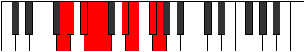 |
| [2877](https://ianring.com/musictheory/scales/2877) | [Phrylyllic](ModeENaturalPhrylyllic.md) | E | E, F#, G, G#, A, C, C#, D#, E |  |
| [2877](https://ianring.com/musictheory/scales/2877) | [Phrylyllic](ModeDSharpPhrylyllic.md) | D# | D#, F, F#, G, G#, B, C, D, D# |  |
| [2877](https://ianring.com/musictheory/scales/2877) | [Phrylyllic](ModeEFlatPhrylyllic.md) | Eb | Eb, F, Gb, G, Ab, B, C, D, Eb |  |
| [2879](https://ianring.com/musictheory/scales/2879) | [Stadygic](ModeENaturalStadygic.md) | E | E, F, F#, G, G#, A, C, C#, D#, E |  |
| [2879](https://ianring.com/musictheory/scales/2879) | [Stadygic](ModeDSharpStadygic.md) | D# | D#, E, F, F#, G, G#, B, C, D, D# |  |
| [2879](https://ianring.com/musictheory/scales/2879) | [Stadygic](ModeEFlatStadygic.md) | Eb | Eb, E, F, Gb, G, Ab, B, C, D, Eb |  |
| [2879](https://ianring.com/musictheory/scales/2879) | [Stadygic](ModeBNaturalStadygic.md) | B | B, C, C#, D, D#, E, G, G#, A#, B |  |
| [2879](https://ianring.com/musictheory/scales/2879) | [Stadygic](ModeGNaturalStadygic.md) | G | G, G#, A, A#, B, C, D#, E, F#, G |  |
| [2887](https://ianring.com/musictheory/scales/2887) | [Gaptian](ModeFSharpGaptian.md) | F# | F#, G, Ab, B#, C##, D#, E#, F# |  |
| [2895](https://ianring.com/musictheory/scales/2895) | [Aeragyllic](ModeFSharpAeragyllic.md) | F# | F#, G, G#, A, C, D, D#, F, F# |  |
| [2895](https://ianring.com/musictheory/scales/2895) | [Aeragyllic](ModeGFlatAeragyllic.md) | Gb | Gb, G, Ab, A, C, D, Eb, F, Gb |  |
| [2899](https://ianring.com/musictheory/scales/2899) | [Kagian](ModeBNaturalKagian.md) | B | B, C, D#, E#, F##, G#, A#, B |  |
| [2903](https://ianring.com/musictheory/scales/2903) | [Gothyllic](ModeFSharpGothyllic.md) | F# | F#, G, G#, A#, C, D, D#, F, F# |  |
| [2903](https://ianring.com/musictheory/scales/2903) | [Gothyllic](ModeGFlatGothyllic.md) | Gb | Gb, G, Ab, Bb, C, D, Eb, F, Gb |  |
| [2903](https://ianring.com/musictheory/scales/2903) | [Gothyllic](ModeBNaturalGothyllic.md) | B | B, C, C#, D#, F, G, G#, A#, B |  |
| [2905](https://ianring.com/musictheory/scales/2905) | [Palian](ModeENaturalPalian.md) | E | E, F##, G#, A#, B#, C#, D#, E |  |
| [2907](https://ianring.com/musictheory/scales/2907) | [Mogyllic](ModeENaturalMogyllic.md) | E | E, F, G, G#, A#, C, C#, D#, E |  |
| [2907](https://ianring.com/musictheory/scales/2907) | [Mogyllic](ModeBNaturalMogyllic.md) | B | B, C, D, D#, F, G, G#, A#, B |  |
| [2909](https://ianring.com/musictheory/scales/2909) | [Mocryllic](ModeENaturalMocryllic.md) | E | E, F#, G, G#, A#, C, C#, D#, E |  |
| [2911](https://ianring.com/musictheory/scales/2911) | [Katygic](ModeENaturalKatygic.md) | E | E, F, F#, G, G#, A#, C, C#, D#, E |  |
| [2911](https://ianring.com/musictheory/scales/2911) | [Katygic](ModeFSharpKatygic.md) | F# | F#, G, G#, A, A#, C, D, D#, F, F# |  |
| [2911](https://ianring.com/musictheory/scales/2911) | [Katygic](ModeGFlatKatygic.md) | Gb | Gb, G, Ab, A, Bb, C, D, Eb, F, Gb |  |
| [2911](https://ianring.com/musictheory/scales/2911) | [Katygic](ModeBNaturalKatygic.md) | B | B, C, C#, D, D#, F, G, G#, A#, B |  |
| [2915](https://ianring.com/musictheory/scales/2915) | [Aeolydian](ModeGNaturalAeolydian.md) | G | G, Ab, B#, C#, D#, E, F#, G |  |
| [2919](https://ianring.com/musictheory/scales/2919) | [Molyllic](ModeGNaturalMolyllic.md) | G | G, G#, A, C, C#, D#, E, F#, G |  |
| [2919](https://ianring.com/musictheory/scales/2919) | [Molyllic](ModeFSharpMolyllic.md) | F# | F#, G, G#, B, C, D, D#, F, F# |  |
| [2919](https://ianring.com/musictheory/scales/2919) | [Molyllic](ModeGFlatMolyllic.md) | Gb | Gb, G, Ab, B, C, D, Eb, F, Gb |  |
| [2923](https://ianring.com/musictheory/scales/2923) | [Baryllic](ModeGNaturalBaryllic.md) | G | G, G#, A#, C, C#, D#, E, F#, G |  |
| [2927](https://ianring.com/musictheory/scales/2927) | [Rodygic](ModeGNaturalRodygic.md) | G | G, G#, A, A#, C, C#, D#, E, F#, G |  |
| [2927](https://ianring.com/musictheory/scales/2927) | [Rodygic](ModeFSharpRodygic.md) | F# | F#, G, G#, A, B, C, D, D#, F, F# |  |
| [2927](https://ianring.com/musictheory/scales/2927) | [Rodygic](ModeGFlatRodygic.md) | Gb | Gb, G, Ab, A, B, C, D, Eb, F, Gb |  |
| [2929](https://ianring.com/musictheory/scales/2929) | [Aeolathian](ModeEFlatAeolathian.md) | Eb | Eb, F##, G#, A, B, C, D, Eb |  |
| [2931](https://ianring.com/musictheory/scales/2931) | [Zathyllic](ModeGNaturalZathyllic.md) | G | G, G#, B, C, C#, D#, E, F#, G |  |
| [2931](https://ianring.com/musictheory/scales/2931) | [Zathyllic](ModeDSharpZathyllic.md) | D# | D#, E, G, G#, A, B, C, D, D# |  |
| [2931](https://ianring.com/musictheory/scales/2931) | [Zathyllic](ModeEFlatZathyllic.md) | Eb | Eb, E, G, Ab, A, B, C, D, Eb |  |
| [2931](https://ianring.com/musictheory/scales/2931) | [Zathyllic](ModeBNaturalZathyllic.md) | B | B, C, D#, E, F, G, G#, A#, B |  |
| [2933](https://ianring.com/musictheory/scales/2933) | [Dalyllic](ModeDSharpDalyllic.md) | D# | D#, F, G, G#, A, B, C, D, D# |  |
| [2933](https://ianring.com/musictheory/scales/2933) | [Dalyllic](ModeEFlatDalyllic.md) | Eb | Eb, F, G, Ab, A, B, C, D, Eb |  |
| [2935](https://ianring.com/musictheory/scales/2935) | [Modygic](ModeDSharpModygic.md) | D# | D#, E, F, G, G#, A, B, C, D, D# |  |
| [2935](https://ianring.com/musictheory/scales/2935) | [Modygic](ModeEFlatModygic.md) | Eb | Eb, E, F, G, Ab, A, B, C, D, Eb |  |
| [2935](https://ianring.com/musictheory/scales/2935) | [Modygic](ModeGNaturalModygic.md) | G | G, G#, A, B, C, C#, D#, E, F#, G |  |
| [2935](https://ianring.com/musictheory/scales/2935) | [Modygic](ModeBNaturalModygic.md) | B | B, C, C#, D#, E, F, G, G#, A#, B |  |
| [2935](https://ianring.com/musictheory/scales/2935) | [Modygic](ModeFSharpModygic.md) | F# | F#, G, G#, A#, B, C, D, D#, F, F# |  |
| [2935](https://ianring.com/musictheory/scales/2935) | [Modygic](ModeGFlatModygic.md) | Gb | Gb, G, Ab, Bb, B, C, D, Eb, F, Gb |  |
| [2937](https://ianring.com/musictheory/scales/2937) | [Aeolathyllic](ModeENaturalAeolathyllic.md) | E | E, G, G#, A, A#, C, C#, D#, E |  |
| [2937](https://ianring.com/musictheory/scales/2937) | [Aeolathyllic](ModeDSharpAeolathyllic.md) | D# | D#, F#, G, G#, A, B, C, D, D# |  |
| [2937](https://ianring.com/musictheory/scales/2937) | [Aeolathyllic](ModeEFlatAeolathyllic.md) | Eb | Eb, Gb, G, Ab, A, B, C, D, Eb |  |
| [2939](https://ianring.com/musictheory/scales/2939) | [Goptygic](ModeENaturalGoptygic.md) | E | E, F, G, G#, A, A#, C, C#, D#, E |  |
| [2939](https://ianring.com/musictheory/scales/2939) | [Goptygic](ModeDSharpGoptygic.md) | D# | D#, E, F#, G, G#, A, B, C, D, D# |  |
| [2939](https://ianring.com/musictheory/scales/2939) | [Goptygic](ModeEFlatGoptygic.md) | Eb | Eb, E, Gb, G, Ab, A, B, C, D, Eb |  |
| [2939](https://ianring.com/musictheory/scales/2939) | [Goptygic](ModeBNaturalGoptygic.md) | B | B, C, D, D#, E, F, G, G#, A#, B |  |
| [2939](https://ianring.com/musictheory/scales/2939) | [Goptygic](ModeGNaturalGoptygic.md) | G | G, G#, A#, B, C, C#, D#, E, F#, G |  |
| [2941](https://ianring.com/musictheory/scales/2941) | [Laptygic](ModeENaturalLaptygic.md) | E | E, F#, G, G#, A, A#, C, C#, D#, E |  |
| [2941](https://ianring.com/musictheory/scales/2941) | [Laptygic](ModeDSharpLaptygic.md) | D# | D#, F, F#, G, G#, A, B, C, D, D# |  |
| [2941](https://ianring.com/musictheory/scales/2941) | [Laptygic](ModeEFlatLaptygic.md) | Eb | Eb, F, Gb, G, Ab, A, B, C, D, Eb |  |
| [2943](https://ianring.com/musictheory/scales/2943) | [Dathyllian](ModeENaturalDathyllian.md) | E | E, F, F#, G, G#, A, A#, C, C#, D#, E |  |
| [2943](https://ianring.com/musictheory/scales/2943) | [Dathyllian](ModeDSharpDathyllian.md) | D# | D#, E, F, F#, G, G#, A, B, C, D, D# |  |
| [2943](https://ianring.com/musictheory/scales/2943) | [Dathyllian](ModeEFlatDathyllian.md) | Eb | Eb, E, F, Gb, G, Ab, A, B, C, D, Eb |  |
| [2943](https://ianring.com/musictheory/scales/2943) | [Dathyllian](ModeBNaturalDathyllian.md) | B | B, C, C#, D, D#, E, F, G, G#, A#, B |  |
| [2943](https://ianring.com/musictheory/scales/2943) | [Dathyllian](ModeGNaturalDathyllian.md) | G | G, G#, A, A#, B, C, C#, D#, E, F#, G |  |
| [2943](https://ianring.com/musictheory/scales/2943) | [Dathyllian](ModeFSharpDathyllian.md) | F# | F#, G, G#, A, A#, B, C, D, D#, F, F# |  |
| [2943](https://ianring.com/musictheory/scales/2943) | [Dathyllian](ModeGFlatDathyllian.md) | Gb | Gb, G, Ab, A, Bb, B, C, D, Eb, F, Gb |  |
| [2955](https://ianring.com/musictheory/scales/2955) | [Thorian](ModeCNaturalThorian.md) | C | C, Db, Eb, F##, G#, A, B, C |  |
| [2957](https://ianring.com/musictheory/scales/2957) | [Thygian](ModeCNaturalThygian.md) | C | C, D, Eb, F##, G#, A, B, C |  |
| [2959](https://ianring.com/musictheory/scales/2959) | [Dygyllic](ModeCNaturalDygyllic.md) | C | C, C#, D, D#, G, G#, A, B, C |  |
| [2961](https://ianring.com/musictheory/scales/2961) | [Bygimic](ModeGSharpBygimic.md) | G# | G#, A###, C###, D##, E#, F##, G# |  |
| [2961](https://ianring.com/musictheory/scales/2961) | [Bygimic](ModeAFlatBygimic.md) | Ab | Ab, B#, C###, D##, E#, F##, Ab |  |
| [2963](https://ianring.com/musictheory/scales/2963) | [Bygian](ModeGSharpBygian.md) | G# | G#, A, B#, C###, D##, E#, F##, G# |  |
| [2963](https://ianring.com/musictheory/scales/2963) | [Bygian](ModeAFlatBygian.md) | Ab | Ab, Bbb, C, D#, E, F, G, Ab |  |
| [2963](https://ianring.com/musictheory/scales/2963) | [Bygian](ModeBNaturalBygian.md) | B | B, C, D#, E##, F##, G#, A#, B |  |
| [2965](https://ianring.com/musictheory/scales/2965) | [Darian](ModeGSharpDarian.md) | G# | G#, A#, B#, C###, D##, E#, F##, G# |  |
| [2965](https://ianring.com/musictheory/scales/2965) | [Darian](ModeAFlatDarian.md) | Ab | Ab, Bb, C, D#, E, F, G, Ab |  |
| [2967](https://ianring.com/musictheory/scales/2967) | [Madyllic](ModeGSharpMadyllic.md) | G# | G#, A, A#, C, D#, E, F, G, G# |  |
| [2967](https://ianring.com/musictheory/scales/2967) | [Madyllic](ModeAFlatMadyllic.md) | Ab | Ab, A, Bb, C, Eb, E, F, G, Ab |  |
| [2967](https://ianring.com/musictheory/scales/2967) | [Madyllic](ModeBNaturalMadyllic.md) | B | B, C, C#, D#, F#, G, G#, A#, B |  |
| [2969](https://ianring.com/musictheory/scales/2969) | [Tholian](ModeENaturalTholian.md) | E | E, F##, G#, A##, B#, C#, D#, E |  |
| [2969](https://ianring.com/musictheory/scales/2969) | [Tholian](ModeGSharpTholian.md) | G# | G#, A##, B#, C###, D##, E#, F##, G# |  |
| [2969](https://ianring.com/musictheory/scales/2969) | [Tholian](ModeAFlatTholian.md) | Ab | Ab, B, C, D#, E, F, G, Ab |  |
| [2969](https://ianring.com/musictheory/scales/2969) | [Tholian](ModeCNaturalTholian.md) | C | C, D#, E, F##, G#, A, B, C | 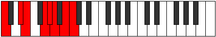 |
| [2971](https://ianring.com/musictheory/scales/2971) | [Aeolynyllic](ModeENaturalAeolynyllic.md) | E | E, F, G, G#, B, C, C#, D#, E | 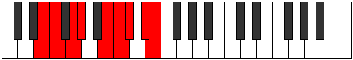 |
| [2971](https://ianring.com/musictheory/scales/2971) | [Aeolynyllic](ModeCNaturalAeolynyllic.md) | C | C, C#, D#, E, G, G#, A, B, C |  |
| [2971](https://ianring.com/musictheory/scales/2971) | [Aeolynyllic](ModeGSharpAeolynyllic.md) | G# | G#, A, B, C, D#, E, F, G, G# |  |
| [2971](https://ianring.com/musictheory/scales/2971) | [Aeolynyllic](ModeAFlatAeolynyllic.md) | Ab | Ab, A, B, C, Eb, E, F, G, Ab |  |
| [2971](https://ianring.com/musictheory/scales/2971) | [Aeolynyllic](ModeBNaturalAeolynyllic.md) | B | B, C, D, D#, F#, G, G#, A#, B |  |
| [2973](https://ianring.com/musictheory/scales/2973) | [Panyllic](ModeENaturalPanyllic.md) | E | E, F#, G, G#, B, C, C#, D#, E |  |
| [2973](https://ianring.com/musictheory/scales/2973) | [Panyllic](ModeCNaturalPanyllic.md) | C | C, D, D#, E, G, G#, A, B, C |  |
| [2973](https://ianring.com/musictheory/scales/2973) | [Panyllic](ModeGSharpPanyllic.md) | G# | G#, A#, B, C, D#, E, F, G, G# |  |
| [2973](https://ianring.com/musictheory/scales/2973) | [Panyllic](ModeAFlatPanyllic.md) | Ab | Ab, Bb, B, C, Eb, E, F, G, Ab |  |
| [2975](https://ianring.com/musictheory/scales/2975) | [Gaptygic](ModeENaturalGaptygic.md) | E | E, F, F#, G, G#, B, C, C#, D#, E |  |
| [2975](https://ianring.com/musictheory/scales/2975) | [Gaptygic](ModeCNaturalGaptygic.md) | C | C, C#, D, D#, E, G, G#, A, B, C |  |
| [2975](https://ianring.com/musictheory/scales/2975) | [Gaptygic](ModeBNaturalGaptygic.md) | B | B, C, C#, D, D#, F#, G, G#, A#, B |  |
| [2975](https://ianring.com/musictheory/scales/2975) | [Gaptygic](ModeGSharpGaptygic.md) | G# | G#, A, A#, B, C, D#, E, F, G, G# |  |
| [2975](https://ianring.com/musictheory/scales/2975) | [Gaptygic](ModeAFlatGaptygic.md) | Ab | Ab, A, Bb, B, C, Eb, E, F, G, Ab |  |
| [2979](https://ianring.com/musictheory/scales/2979) | [Gyptian](ModeGNaturalGyptian.md) | G | G, Ab, B#, C##, D#, E, F#, G |  |
| [2983](https://ianring.com/musictheory/scales/2983) | [Zythyllic](ModeGNaturalZythyllic.md) | G | G, G#, A, C, D, D#, E, F#, G |  |
| [2985](https://ianring.com/musictheory/scales/2985) | [Epacrian](ModeCNaturalEpacrian.md) | C | C, D#, E#, F##, G#, A, B, C |  |
| [2987](https://ianring.com/musictheory/scales/2987) | [Thanyllic](ModeGNaturalThanyllic.md) | G | G, G#, A#, C, D, D#, E, F#, G |  |
| [2987](https://ianring.com/musictheory/scales/2987) | [Thanyllic](ModeCNaturalThanyllic.md) | C | C, C#, D#, F, G, G#, A, B, C |  |
| [2989](https://ianring.com/musictheory/scales/2989) | [Ionacryllic](ModeCNaturalIonacryllic.md) | C | C, D, D#, F, G, G#, A, B, C |  |
| [2991](https://ianring.com/musictheory/scales/2991) | [Zanygic](ModeGNaturalZanygic.md) | G | G, G#, A, A#, C, D, D#, E, F#, G |  |
| [2991](https://ianring.com/musictheory/scales/2991) | [Zanygic](ModeCNaturalZanygic.md) | C | C, C#, D, D#, F, G, G#, A, B, C |  |
| [2993](https://ianring.com/musictheory/scales/2993) | [Stythian](ModeGSharpStythian.md) | G# | G#, A###, B##, C###, D##, E#, F##, G# |  |
| [2993](https://ianring.com/musictheory/scales/2993) | [Stythian](ModeAFlatStythian.md) | Ab | Ab, B#, C#, D#, E, F, G, Ab |  |
| [2993](https://ianring.com/musictheory/scales/2993) | [Stythian](ModeEFlatStythian.md) | Eb | Eb, F##, G#, A#, B, C, D, Eb |  |
| [2995](https://ianring.com/musictheory/scales/2995) | [Sanyllic](ModeGSharpSanyllic.md) | G# | G#, A, C, C#, D#, E, F, G, G# |  |
| [2995](https://ianring.com/musictheory/scales/2995) | [Sanyllic](ModeAFlatSanyllic.md) | Ab | Ab, A, C, Db, Eb, E, F, G, Ab |  |
| [2995](https://ianring.com/musictheory/scales/2995) | [Sanyllic](ModeGNaturalSanyllic.md) | G | G, G#, B, C, D, D#, E, F#, G |  |
| [2995](https://ianring.com/musictheory/scales/2995) | [Sanyllic](ModeDSharpSanyllic.md) | D# | D#, E, G, G#, A#, B, C, D, D# |  |
| [2995](https://ianring.com/musictheory/scales/2995) | [Sanyllic](ModeEFlatSanyllic.md) | Eb | Eb, E, G, Ab, Bb, B, C, D, Eb |  |
| [2995](https://ianring.com/musictheory/scales/2995) | [Sanyllic](ModeBNaturalSanyllic.md) | B | B, C, D#, E, F#, G, G#, A#, B |  |
| [2997](https://ianring.com/musictheory/scales/2997) | [Ionoptyllic](ModeGSharpIonoptyllic.md) | G# | G#, A#, C, C#, D#, E, F, G, G# |  |
| [2997](https://ianring.com/musictheory/scales/2997) | [Ionoptyllic](ModeAFlatIonoptyllic.md) | Ab | Ab, Bb, C, Db, Eb, E, F, G, Ab |  |
| [2997](https://ianring.com/musictheory/scales/2997) | [Ionoptyllic](ModeDSharpIonoptyllic.md) | D# | D#, F, G, G#, A#, B, C, D, D# |  |
| [2997](https://ianring.com/musictheory/scales/2997) | [Ionoptyllic](ModeEFlatIonoptyllic.md) | Eb | Eb, F, G, Ab, Bb, B, C, D, Eb |  |
| [2999](https://ianring.com/musictheory/scales/2999) | [Zyrygic](ModeGSharpZyrygic.md) | G# | G#, A, A#, C, C#, D#, E, F, G, G# |  |
| [2999](https://ianring.com/musictheory/scales/2999) | [Zyrygic](ModeAFlatZyrygic.md) | Ab | Ab, A, Bb, C, Db, Eb, E, F, G, Ab |  |
| [2999](https://ianring.com/musictheory/scales/2999) | [Zyrygic](ModeGNaturalZyrygic.md) | G | G, G#, A, B, C, D, D#, E, F#, G |  |
| [2999](https://ianring.com/musictheory/scales/2999) | [Zyrygic](ModeDSharpZyrygic.md) | D# | D#, E, F, G, G#, A#, B, C, D, D# |  |
| [2999](https://ianring.com/musictheory/scales/2999) | [Zyrygic](ModeEFlatZyrygic.md) | Eb | Eb, E, F, G, Ab, Bb, B, C, D, Eb |  |
| [2999](https://ianring.com/musictheory/scales/2999) | [Zyrygic](ModeBNaturalZyrygic.md) | B | B, C, C#, D#, E, F#, G, G#, A#, B |  |
| [3001](https://ianring.com/musictheory/scales/3001) | [Lonyllic](ModeGSharpLonyllic.md) | G# | G#, B, C, C#, D#, E, F, G, G# |  |
| [3001](https://ianring.com/musictheory/scales/3001) | [Lonyllic](ModeAFlatLonyllic.md) | Ab | Ab, B, C, Db, Eb, E, F, G, Ab |  |
| [3001](https://ianring.com/musictheory/scales/3001) | [Lonyllic](ModeENaturalLonyllic.md) | E | E, G, G#, A, B, C, C#, D#, E |  |
| [3001](https://ianring.com/musictheory/scales/3001) | [Lonyllic](ModeCNaturalLonyllic.md) | C | C, D#, E, F, G, G#, A, B, C |  |
| [3001](https://ianring.com/musictheory/scales/3001) | [Lonyllic](ModeDSharpLonyllic.md) | D# | D#, F#, G, G#, A#, B, C, D, D# |  |
| [3001](https://ianring.com/musictheory/scales/3001) | [Lonyllic](ModeEFlatLonyllic.md) | Eb | Eb, Gb, G, Ab, Bb, B, C, D, Eb |  |
| [3003](https://ianring.com/musictheory/scales/3003) | [Zydygic](ModeCNaturalZydygic.md) | C | C, C#, D#, E, F, G, G#, A, B, C |  |
| [3003](https://ianring.com/musictheory/scales/3003) | [Zydygic](ModeENaturalZydygic.md) | E | E, F, G, G#, A, B, C, C#, D#, E |  |
| [3003](https://ianring.com/musictheory/scales/3003) | [Zydygic](ModeGSharpZydygic.md) | G# | G#, A, B, C, C#, D#, E, F, G, G# |  |
| [3003](https://ianring.com/musictheory/scales/3003) | [Zydygic](ModeAFlatZydygic.md) | Ab | Ab, A, B, C, Db, Eb, E, F, G, Ab |  |
| [3003](https://ianring.com/musictheory/scales/3003) | [Zydygic](ModeDSharpZydygic.md) | D# | D#, E, F#, G, G#, A#, B, C, D, D# |  |
| [3003](https://ianring.com/musictheory/scales/3003) | [Zydygic](ModeEFlatZydygic.md) | Eb | Eb, E, Gb, G, Ab, Bb, B, C, D, Eb |  |
| [3003](https://ianring.com/musictheory/scales/3003) | [Zydygic](ModeGNaturalZydygic.md) | G | G, G#, A#, B, C, D, D#, E, F#, G |  |
| [3003](https://ianring.com/musictheory/scales/3003) | [Zydygic](ModeBNaturalZydygic.md) | B | B, C, D, D#, E, F#, G, G#, A#, B |  |
| [3005](https://ianring.com/musictheory/scales/3005) | [Gycrygic](ModeCNaturalGycrygic.md) | C | C, D, D#, E, F, G, G#, A, B, C |  |
| [3005](https://ianring.com/musictheory/scales/3005) | [Gycrygic](ModeENaturalGycrygic.md) | E | E, F#, G, G#, A, B, C, C#, D#, E |  |
| [3005](https://ianring.com/musictheory/scales/3005) | [Gycrygic](ModeGSharpGycrygic.md) | G# | G#, A#, B, C, C#, D#, E, F, G, G# |  |
| [3005](https://ianring.com/musictheory/scales/3005) | [Gycrygic](ModeAFlatGycrygic.md) | Ab | Ab, Bb, B, C, Db, Eb, E, F, G, Ab |  |
| [3005](https://ianring.com/musictheory/scales/3005) | [Gycrygic](ModeDSharpGycrygic.md) | D# | D#, F, F#, G, G#, A#, B, C, D, D# |  |
| [3005](https://ianring.com/musictheory/scales/3005) | [Gycrygic](ModeEFlatGycrygic.md) | Eb | Eb, F, Gb, G, Ab, Bb, B, C, D, Eb |  |
| [3007](https://ianring.com/musictheory/scales/3007) | [Zyryllian](ModeCNaturalZyryllian.md) | C | C, C#, D, D#, E, F, G, G#, A, B, C |  |
| [3007](https://ianring.com/musictheory/scales/3007) | [Zyryllian](ModeENaturalZyryllian.md) | E | E, F, F#, G, G#, A, B, C, C#, D#, E |  |
| [3007](https://ianring.com/musictheory/scales/3007) | [Zyryllian](ModeBNaturalZyryllian.md) | B | B, C, C#, D, D#, E, F#, G, G#, A#, B |  |
| [3007](https://ianring.com/musictheory/scales/3007) | [Zyryllian](ModeDSharpZyryllian.md) | D# | D#, E, F, F#, G, G#, A#, B, C, D, D# |  |
| [3007](https://ianring.com/musictheory/scales/3007) | [Zyryllian](ModeEFlatZyryllian.md) | Eb | Eb, E, F, Gb, G, Ab, Bb, B, C, D, Eb |  |
| [3007](https://ianring.com/musictheory/scales/3007) | [Zyryllian](ModeGSharpZyryllian.md) | G# | G#, A, A#, B, C, C#, D#, E, F, G, G# |  |
| [3007](https://ianring.com/musictheory/scales/3007) | [Zyryllian](ModeAFlatZyryllian.md) | Ab | Ab, A, Bb, B, C, Db, Eb, E, F, G, Ab |  |
| [3007](https://ianring.com/musictheory/scales/3007) | [Zyryllian](ModeGNaturalZyryllian.md) | G | G, G#, A, A#, B, C, D, D#, E, F#, G |  |
| [3013](https://ianring.com/musictheory/scales/3013) | [Thynian](ModeDFlatThynian.md) | Db | Db, Eb, F##, G#, A, Bb, C, Db |  |
| [3015](https://ianring.com/musictheory/scales/3015) | [Laptyllic](ModeFSharpLaptyllic.md) | F# | F#, G, G#, C, C#, D, D#, F, F# |  |
| [3015](https://ianring.com/musictheory/scales/3015) | [Laptyllic](ModeGFlatLaptyllic.md) | Gb | Gb, G, Ab, C, Db, D, Eb, F, Gb |  |
| [3015](https://ianring.com/musictheory/scales/3015) | [Laptyllic](ModeCSharpLaptyllic.md) | C# | C#, D, D#, G, G#, A, A#, C, C# |  |
| [3015](https://ianring.com/musictheory/scales/3015) | [Laptyllic](ModeDFlatLaptyllic.md) | Db | Db, D, Eb, G, Ab, A, Bb, C, Db |  |
| [3017](https://ianring.com/musictheory/scales/3017) | [Gacrian](ModeCNaturalGacrian.md) | C | C, D#, E##, F##, G#, A, B, C |  |
| [3019](https://ianring.com/musictheory/scales/3019) | [Mydyllic](ModeCNaturalMydyllic.md) | C | C, C#, D#, F#, G, G#, A, B, C |  |
| [3021](https://ianring.com/musictheory/scales/3021) | [Gyptyllic](ModeCSharpGyptyllic.md) | C# | C#, D#, E, G, G#, A, A#, C, C# |  |
| [3021](https://ianring.com/musictheory/scales/3021) | [Gyptyllic](ModeDFlatGyptyllic.md) | Db | Db, Eb, E, G, Ab, A, Bb, C, Db |  |
| [3021](https://ianring.com/musictheory/scales/3021) | [Gyptyllic](ModeCNaturalGyptyllic.md) | C | C, D, D#, F#, G, G#, A, B, C |  |
| [3023](https://ianring.com/musictheory/scales/3023) | [Aeracrygic](ModeFSharpAeracrygic.md) | F# | F#, G, G#, A, C, C#, D, D#, F, F# |  |
| [3023](https://ianring.com/musictheory/scales/3023) | [Aeracrygic](ModeGFlatAeracrygic.md) | Gb | Gb, G, Ab, A, C, Db, D, Eb, F, Gb |  |
| [3023](https://ianring.com/musictheory/scales/3023) | [Aeracrygic](ModeCSharpAeracrygic.md) | C# | C#, D, D#, E, G, G#, A, A#, C, C# |  |
| [3023](https://ianring.com/musictheory/scales/3023) | [Aeracrygic](ModeDFlatAeracrygic.md) | Db | Db, D, Eb, E, G, Ab, A, Bb, C, Db |  |
| [3023](https://ianring.com/musictheory/scales/3023) | [Aeracrygic](ModeCNaturalAeracrygic.md) | C | C, C#, D, D#, F#, G, G#, A, B, C |  |
| [3025](https://ianring.com/musictheory/scales/3025) | [Epycrian](ModeGSharpEpycrian.md) | G# | G#, A###, B###, C###, D##, E#, F##, G# |  |
| [3025](https://ianring.com/musictheory/scales/3025) | [Epycrian](ModeAFlatEpycrian.md) | Ab | Ab, B#, C##, D#, E, F, G, Ab |  |
| [3027](https://ianring.com/musictheory/scales/3027) | [Rythyllic](ModeGSharpRythyllic.md) | G# | G#, A, C, D, D#, E, F, G, G# |  |
| [3027](https://ianring.com/musictheory/scales/3027) | [Rythyllic](ModeAFlatRythyllic.md) | Ab | Ab, A, C, D, Eb, E, F, G, Ab |  |
| [3027](https://ianring.com/musictheory/scales/3027) | [Rythyllic](ModeBNaturalRythyllic.md) | B | B, C, D#, F, F#, G, G#, A#, B |  |
| [3029](https://ianring.com/musictheory/scales/3029) | [Ionocryllic](ModeGSharpIonocryllic.md) | G# | G#, A#, C, D, D#, E, F, G, G# |  |
| [3029](https://ianring.com/musictheory/scales/3029) | [Ionocryllic](ModeAFlatIonocryllic.md) | Ab | Ab, Bb, C, D, Eb, E, F, G, Ab |  |
| [3029](https://ianring.com/musictheory/scales/3029) | [Ionocryllic](ModeCSharpIonocryllic.md) | C# | C#, D#, F, G, G#, A, A#, C, C# |  |
| [3029](https://ianring.com/musictheory/scales/3029) | [Ionocryllic](ModeDFlatIonocryllic.md) | Db | Db, Eb, F, G, Ab, A, Bb, C, Db |  |
| [3031](https://ianring.com/musictheory/scales/3031) | [Epithygic](ModeFSharpEpithygic.md) | F# | F#, G, G#, A#, C, C#, D, D#, F, F# | 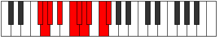 |
| [3031](https://ianring.com/musictheory/scales/3031) | [Epithygic](ModeGFlatEpithygic.md) | Gb | Gb, G, Ab, Bb, C, Db, D, Eb, F, Gb |  |
| [3031](https://ianring.com/musictheory/scales/3031) | [Epithygic](ModeCSharpEpithygic.md) | C# | C#, D, D#, F, G, G#, A, A#, C, C# |  |
| [3031](https://ianring.com/musictheory/scales/3031) | [Epithygic](ModeDFlatEpithygic.md) | Db | Db, D, Eb, F, G, Ab, A, Bb, C, Db |  |
| [3031](https://ianring.com/musictheory/scales/3031) | [Epithygic](ModeGSharpEpithygic.md) | G# | G#, A, A#, C, D, D#, E, F, G, G# |  |
| [3031](https://ianring.com/musictheory/scales/3031) | [Epithygic](ModeAFlatEpithygic.md) | Ab | Ab, A, Bb, C, D, Eb, E, F, G, Ab |  |
| [3031](https://ianring.com/musictheory/scales/3031) | [Epithygic](ModeBNaturalEpithygic.md) | B | B, C, C#, D#, F, F#, G, G#, A#, B |  |
| [3033](https://ianring.com/musictheory/scales/3033) | [Doptyllic](ModeGSharpDoptyllic.md) | G# | G#, B, C, D, D#, E, F, G, G# |  |
| [3033](https://ianring.com/musictheory/scales/3033) | [Doptyllic](ModeAFlatDoptyllic.md) | Ab | Ab, B, C, D, Eb, E, F, G, Ab |  |
| [3033](https://ianring.com/musictheory/scales/3033) | [Doptyllic](ModeCNaturalDoptyllic.md) | C | C, D#, E, F#, G, G#, A, B, C |  |
| [3033](https://ianring.com/musictheory/scales/3033) | [Doptyllic](ModeENaturalDoptyllic.md) | E | E, G, G#, A#, B, C, C#, D#, E |  |
| [3035](https://ianring.com/musictheory/scales/3035) | [Gocrygic](ModeGSharpGocrygic.md) | G# | G#, A, B, C, D, D#, E, F, G, G# |  |
| [3035](https://ianring.com/musictheory/scales/3035) | [Gocrygic](ModeAFlatGocrygic.md) | Ab | Ab, A, B, C, D, Eb, E, F, G, Ab |  |
| [3035](https://ianring.com/musictheory/scales/3035) | [Gocrygic](ModeCNaturalGocrygic.md) | C | C, C#, D#, E, F#, G, G#, A, B, C |  |
| [3035](https://ianring.com/musictheory/scales/3035) | [Gocrygic](ModeENaturalGocrygic.md) | E | E, F, G, G#, A#, B, C, C#, D#, E |  |
| [3035](https://ianring.com/musictheory/scales/3035) | [Gocrygic](ModeBNaturalGocrygic.md) | B | B, C, D, D#, F, F#, G, G#, A#, B |  |
| [3037](https://ianring.com/musictheory/scales/3037) | [Staptygic](ModeCSharpStaptygic.md) | C# | C#, D#, E, F, G, G#, A, A#, C, C# |  |
| [3037](https://ianring.com/musictheory/scales/3037) | [Staptygic](ModeDFlatStaptygic.md) | Db | Db, Eb, E, F, G, Ab, A, Bb, C, Db |  |
| [3037](https://ianring.com/musictheory/scales/3037) | [Staptygic](ModeCNaturalStaptygic.md) | C | C, D, D#, E, F#, G, G#, A, B, C |  |
| [3037](https://ianring.com/musictheory/scales/3037) | [Staptygic](ModeGSharpStaptygic.md) | G# | G#, A#, B, C, D, D#, E, F, G, G# |  |
| [3037](https://ianring.com/musictheory/scales/3037) | [Staptygic](ModeAFlatStaptygic.md) | Ab | Ab, Bb, B, C, D, Eb, E, F, G, Ab |  |
| [3037](https://ianring.com/musictheory/scales/3037) | [Staptygic](ModeENaturalStaptygic.md) | E | E, F#, G, G#, A#, B, C, C#, D#, E |  |
| [3039](https://ianring.com/musictheory/scales/3039) | [Godyllian](ModeCSharpGodyllian.md) | C# | C#, D, D#, E, F, G, G#, A, A#, C, C# |  |
| [3039](https://ianring.com/musictheory/scales/3039) | [Godyllian](ModeDFlatGodyllian.md) | Db | Db, D, Eb, E, F, G, Ab, A, Bb, C, Db |  |
| [3039](https://ianring.com/musictheory/scales/3039) | [Godyllian](ModeFSharpGodyllian.md) | F# | F#, G, G#, A, A#, C, C#, D, D#, F, F# |  |
| [3039](https://ianring.com/musictheory/scales/3039) | [Godyllian](ModeGFlatGodyllian.md) | Gb | Gb, G, Ab, A, Bb, C, Db, D, Eb, F, Gb |  |
| [3039](https://ianring.com/musictheory/scales/3039) | [Godyllian](ModeCNaturalGodyllian.md) | C | C, C#, D, D#, E, F#, G, G#, A, B, C |  |
| [3039](https://ianring.com/musictheory/scales/3039) | [Godyllian](ModeBNaturalGodyllian.md) | B | B, C, C#, D, D#, F, F#, G, G#, A#, B |  |
| [3039](https://ianring.com/musictheory/scales/3039) | [Godyllian](ModeENaturalGodyllian.md) | E | E, F, F#, G, G#, A#, B, C, C#, D#, E |  |
| [3039](https://ianring.com/musictheory/scales/3039) | [Godyllian](ModeGSharpGodyllian.md) | G# | G#, A, A#, B, C, D, D#, E, F, G, G# |  |
| [3039](https://ianring.com/musictheory/scales/3039) | [Godyllian](ModeAFlatGodyllian.md) | Ab | Ab, A, Bb, B, C, D, Eb, E, F, G, Ab |  |
| [3043](https://ianring.com/musictheory/scales/3043) | [Ionayllic](ModeGNaturalIonayllic.md) | G | G, G#, C, C#, D, D#, E, F#, G |  |
| [3045](https://ianring.com/musictheory/scales/3045) | [Raptyllic](ModeCSharpRaptyllic.md) | C# | C#, D#, F#, G, G#, A, A#, C, C# |  |
| [3045](https://ianring.com/musictheory/scales/3045) | [Raptyllic](ModeDFlatRaptyllic.md) | Db | Db, Eb, Gb, G, Ab, A, Bb, C, Db |  |
| [3047](https://ianring.com/musictheory/scales/3047) | [Panygic](ModeGNaturalPanygic.md) | G | G, G#, A, C, C#, D, D#, E, F#, G |  |
| [3047](https://ianring.com/musictheory/scales/3047) | [Panygic](ModeCSharpPanygic.md) | C# | C#, D, D#, F#, G, G#, A, A#, C, C# |  |
| [3047](https://ianring.com/musictheory/scales/3047) | [Panygic](ModeDFlatPanygic.md) | Db | Db, D, Eb, Gb, G, Ab, A, Bb, C, Db |  |
| [3047](https://ianring.com/musictheory/scales/3047) | [Panygic](ModeFSharpPanygic.md) | F# | F#, G, G#, B, C, C#, D, D#, F, F# |  |
| [3047](https://ianring.com/musictheory/scales/3047) | [Panygic](ModeGFlatPanygic.md) | Gb | Gb, G, Ab, B, C, Db, D, Eb, F, Gb |  |
| [3049](https://ianring.com/musictheory/scales/3049) | [Aeronyllic](ModeCNaturalAeronyllic.md) | C | C, D#, F, F#, G, G#, A, B, C |  |
| [3051](https://ianring.com/musictheory/scales/3051) | [Stalygic](ModeGNaturalStalygic.md) | G | G, G#, A#, C, C#, D, D#, E, F#, G |  |
| [3051](https://ianring.com/musictheory/scales/3051) | [Stalygic](ModeCNaturalStalygic.md) | C | C, C#, D#, F, F#, G, G#, A, B, C |  |
| [3053](https://ianring.com/musictheory/scales/3053) | [Zycrygic](ModeCSharpZycrygic.md) | C# | C#, D#, E, F#, G, G#, A, A#, C, C# |  |
| [3053](https://ianring.com/musictheory/scales/3053) | [Zycrygic](ModeDFlatZycrygic.md) | Db | Db, Eb, E, Gb, G, Ab, A, Bb, C, Db |  |
| [3053](https://ianring.com/musictheory/scales/3053) | [Zycrygic](ModeCNaturalZycrygic.md) | C | C, D, D#, F, F#, G, G#, A, B, C |  |
| [3055](https://ianring.com/musictheory/scales/3055) | [Lyryllian](ModeCSharpLyryllian.md) | C# | C#, D, D#, E, F#, G, G#, A, A#, C, C# |  |
| [3055](https://ianring.com/musictheory/scales/3055) | [Lyryllian](ModeDFlatLyryllian.md) | Db | Db, D, Eb, E, Gb, G, Ab, A, Bb, C, Db |  |
| [3055](https://ianring.com/musictheory/scales/3055) | [Lyryllian](ModeGNaturalLyryllian.md) | G | G, G#, A, A#, C, C#, D, D#, E, F#, G |  |
| [3055](https://ianring.com/musictheory/scales/3055) | [Lyryllian](ModeCNaturalLyryllian.md) | C | C, C#, D, D#, F, F#, G, G#, A, B, C |  |
| [3055](https://ianring.com/musictheory/scales/3055) | [Lyryllian](ModeFSharpLyryllian.md) | F# | F#, G, G#, A, B, C, C#, D, D#, F, F# |  |
| [3055](https://ianring.com/musictheory/scales/3055) | [Lyryllian](ModeGFlatLyryllian.md) | Gb | Gb, G, Ab, A, B, C, Db, D, Eb, F, Gb |  |
| [3057](https://ianring.com/musictheory/scales/3057) | [Phroryllic](ModeGSharpPhroryllic.md) | G# | G#, C, C#, D, D#, E, F, G, G# |  |
| [3057](https://ianring.com/musictheory/scales/3057) | [Phroryllic](ModeAFlatPhroryllic.md) | Ab | Ab, C, Db, D, Eb, E, F, G, Ab |  |
| [3057](https://ianring.com/musictheory/scales/3057) | [Phroryllic](ModeDSharpPhroryllic.md) | D# | D#, G, G#, A, A#, B, C, D, D# |  |
| [3057](https://ianring.com/musictheory/scales/3057) | [Phroryllic](ModeEFlatPhroryllic.md) | Eb | Eb, G, Ab, A, Bb, B, C, D, Eb |  |
| [3059](https://ianring.com/musictheory/scales/3059) | [Madygic](ModeGSharpMadygic.md) | G# | G#, A, C, C#, D, D#, E, F, G, G# |  |
| [3059](https://ianring.com/musictheory/scales/3059) | [Madygic](ModeAFlatMadygic.md) | Ab | Ab, A, C, Db, D, Eb, E, F, G, Ab |  |
| [3059](https://ianring.com/musictheory/scales/3059) | [Madygic](ModeGNaturalMadygic.md) | G | G, G#, B, C, C#, D, D#, E, F#, G |  |
| [3059](https://ianring.com/musictheory/scales/3059) | [Madygic](ModeBNaturalMadygic.md) | B | B, C, D#, E, F, F#, G, G#, A#, B |  |
| [3059](https://ianring.com/musictheory/scales/3059) | [Madygic](ModeDSharpMadygic.md) | D# | D#, E, G, G#, A, A#, B, C, D, D# |  |
| [3059](https://ianring.com/musictheory/scales/3059) | [Madygic](ModeEFlatMadygic.md) | Eb | Eb, E, G, Ab, A, Bb, B, C, D, Eb |  |
| [3061](https://ianring.com/musictheory/scales/3061) | [Apinygic](ModeGSharpApinygic.md) | G# | G#, A#, C, C#, D, D#, E, F, G, G# |  |
| [3061](https://ianring.com/musictheory/scales/3061) | [Apinygic](ModeAFlatApinygic.md) | Ab | Ab, Bb, C, Db, D, Eb, E, F, G, Ab |  |
| [3061](https://ianring.com/musictheory/scales/3061) | [Apinygic](ModeCSharpApinygic.md) | C# | C#, D#, F, F#, G, G#, A, A#, C, C# |  |
| [3061](https://ianring.com/musictheory/scales/3061) | [Apinygic](ModeDFlatApinygic.md) | Db | Db, Eb, F, Gb, G, Ab, A, Bb, C, Db |  |
| [3061](https://ianring.com/musictheory/scales/3061) | [Apinygic](ModeDSharpApinygic.md) | D# | D#, F, G, G#, A, A#, B, C, D, D# |  |
| [3061](https://ianring.com/musictheory/scales/3061) | [Apinygic](ModeEFlatApinygic.md) | Eb | Eb, F, G, Ab, A, Bb, B, C, D, Eb |  |
| [3063](https://ianring.com/musictheory/scales/3063) | [Solyllian](ModeGSharpSolyllian.md) | G# | G#, A, A#, C, C#, D, D#, E, F, G, G# |  |
| [3063](https://ianring.com/musictheory/scales/3063) | [Solyllian](ModeAFlatSolyllian.md) | Ab | Ab, A, Bb, C, Db, D, Eb, E, F, G, Ab |  |
| [3063](https://ianring.com/musictheory/scales/3063) | [Solyllian](ModeCSharpSolyllian.md) | C# | C#, D, D#, F, F#, G, G#, A, A#, C, C# |  |
| [3063](https://ianring.com/musictheory/scales/3063) | [Solyllian](ModeDFlatSolyllian.md) | Db | Db, D, Eb, F, Gb, G, Ab, A, Bb, C, Db |  |
| [3063](https://ianring.com/musictheory/scales/3063) | [Solyllian](ModeGNaturalSolyllian.md) | G | G, G#, A, B, C, C#, D, D#, E, F#, G |  |
| [3063](https://ianring.com/musictheory/scales/3063) | [Solyllian](ModeFSharpSolyllian.md) | F# | F#, G, G#, A#, B, C, C#, D, D#, F, F# |  |
| [3063](https://ianring.com/musictheory/scales/3063) | [Solyllian](ModeGFlatSolyllian.md) | Gb | Gb, G, Ab, Bb, B, C, Db, D, Eb, F, Gb |  |
| [3063](https://ianring.com/musictheory/scales/3063) | [Solyllian](ModeBNaturalSolyllian.md) | B | B, C, C#, D#, E, F, F#, G, G#, A#, B |  |
| [3063](https://ianring.com/musictheory/scales/3063) | [Solyllian](ModeDSharpSolyllian.md) | D# | D#, E, F, G, G#, A, A#, B, C, D, D# |  |
| [3063](https://ianring.com/musictheory/scales/3063) | [Solyllian](ModeEFlatSolyllian.md) | Eb | Eb, E, F, G, Ab, A, Bb, B, C, D, Eb |  |
| [3065](https://ianring.com/musictheory/scales/3065) | [Zothygic](ModeGSharpZothygic.md) | G# | G#, B, C, C#, D, D#, E, F, G, G# |  |
| [3065](https://ianring.com/musictheory/scales/3065) | [Zothygic](ModeAFlatZothygic.md) | Ab | Ab, B, C, Db, D, Eb, E, F, G, Ab |  |
| [3065](https://ianring.com/musictheory/scales/3065) | [Zothygic](ModeCNaturalZothygic.md) | C | C, D#, E, F, F#, G, G#, A, B, C |  |
| [3065](https://ianring.com/musictheory/scales/3065) | [Zothygic](ModeENaturalZothygic.md) | E | E, G, G#, A, A#, B, C, C#, D#, E |  |
| [3065](https://ianring.com/musictheory/scales/3065) | [Zothygic](ModeDSharpZothygic.md) | D# | D#, F#, G, G#, A, A#, B, C, D, D# |  |
| [3065](https://ianring.com/musictheory/scales/3065) | [Zothygic](ModeEFlatZothygic.md) | Eb | Eb, Gb, G, Ab, A, Bb, B, C, D, Eb |  |
| [3067](https://ianring.com/musictheory/scales/3067) | [Goptyllian](ModeGSharpGoptyllian.md) | G# | G#, A, B, C, C#, D, D#, E, F, G, G# |  |
| [3067](https://ianring.com/musictheory/scales/3067) | [Goptyllian](ModeAFlatGoptyllian.md) | Ab | Ab, A, B, C, Db, D, Eb, E, F, G, Ab |  |
| [3067](https://ianring.com/musictheory/scales/3067) | [Goptyllian](ModeCNaturalGoptyllian.md) | C | C, C#, D#, E, F, F#, G, G#, A, B, C |  |
| [3067](https://ianring.com/musictheory/scales/3067) | [Goptyllian](ModeGNaturalGoptyllian.md) | G | G, G#, A#, B, C, C#, D, D#, E, F#, G |  |
| [3067](https://ianring.com/musictheory/scales/3067) | [Goptyllian](ModeBNaturalGoptyllian.md) | B | B, C, D, D#, E, F, F#, G, G#, A#, B |  |
| [3067](https://ianring.com/musictheory/scales/3067) | [Goptyllian](ModeENaturalGoptyllian.md) | E | E, F, G, G#, A, A#, B, C, C#, D#, E |  |
| [3067](https://ianring.com/musictheory/scales/3067) | [Goptyllian](ModeDSharpGoptyllian.md) | D# | D#, E, F#, G, G#, A, A#, B, C, D, D# |  |
| [3067](https://ianring.com/musictheory/scales/3067) | [Goptyllian](ModeEFlatGoptyllian.md) | Eb | Eb, E, Gb, G, Ab, A, Bb, B, C, D, Eb |  |
| [3069](https://ianring.com/musictheory/scales/3069) | [Bacryllian](ModeCSharpBacryllian.md) | C# | C#, D#, E, F, F#, G, G#, A, A#, C, C# |  |
| [3069](https://ianring.com/musictheory/scales/3069) | [Bacryllian](ModeDFlatBacryllian.md) | Db | Db, Eb, E, F, Gb, G, Ab, A, Bb, C, Db |  |
| [3069](https://ianring.com/musictheory/scales/3069) | [Bacryllian](ModeCNaturalBacryllian.md) | C | C, D, D#, E, F, F#, G, G#, A, B, C |  |
| [3069](https://ianring.com/musictheory/scales/3069) | [Bacryllian](ModeGSharpBacryllian.md) | G# | G#, A#, B, C, C#, D, D#, E, F, G, G# |  |
| [3069](https://ianring.com/musictheory/scales/3069) | [Bacryllian](ModeAFlatBacryllian.md) | Ab | Ab, Bb, B, C, Db, D, Eb, E, F, G, Ab |  |
| [3069](https://ianring.com/musictheory/scales/3069) | [Bacryllian](ModeENaturalBacryllian.md) | E | E, F#, G, G#, A, A#, B, C, C#, D#, E |  |
| [3069](https://ianring.com/musictheory/scales/3069) | [Bacryllian](ModeDSharpBacryllian.md) | D# | D#, F, F#, G, G#, A, A#, B, C, D, D# |  |
| [3069](https://ianring.com/musictheory/scales/3069) | [Bacryllian](ModeEFlatBacryllian.md) | Eb | Eb, F, Gb, G, Ab, A, Bb, B, C, D, Eb |  |
| [3071](https://ianring.com/musictheory/scales/3071) | [Solatic](ModeCSharpSolatic.md) | C# | C#, D, D#, E, F, F#, G, G#, A, A#, C, C# |  |
| [3071](https://ianring.com/musictheory/scales/3071) | [Solatic](ModeDFlatSolatic.md) | Db | Db, D, Eb, E, F, Gb, G, Ab, A, Bb, C, Db |  |
| [3071](https://ianring.com/musictheory/scales/3071) | [Solatic](ModeCNaturalSolatic.md) | C | C, C#, D, D#, E, F, F#, G, G#, A, B, C |  |
| [3071](https://ianring.com/musictheory/scales/3071) | [Solatic](ModeBNaturalSolatic.md) | B | B, C, C#, D, D#, E, F, F#, G, G#, A#, B |  |
| [3071](https://ianring.com/musictheory/scales/3071) | [Solatic](ModeGSharpSolatic.md) | G# | G#, A, A#, B, C, C#, D, D#, E, F, G, G# |  |
| [3071](https://ianring.com/musictheory/scales/3071) | [Solatic](ModeAFlatSolatic.md) | Ab | Ab, A, Bb, B, C, Db, D, Eb, E, F, G, Ab |  |
| [3071](https://ianring.com/musictheory/scales/3071) | [Solatic](ModeGNaturalSolatic.md) | G | G, G#, A, A#, B, C, C#, D, D#, E, F#, G |  |
| [3071](https://ianring.com/musictheory/scales/3071) | [Solatic](ModeFSharpSolatic.md) | F# | F#, G, G#, A, A#, B, C, C#, D, D#, F, F# |  |
| [3071](https://ianring.com/musictheory/scales/3071) | [Solatic](ModeGFlatSolatic.md) | Gb | Gb, G, Ab, A, Bb, B, C, Db, D, Eb, F, Gb |  |
| [3071](https://ianring.com/musictheory/scales/3071) | [Solatic](ModeENaturalSolatic.md) | E | E, F, F#, G, G#, A, A#, B, C, C#, D#, E |  |
| [3071](https://ianring.com/musictheory/scales/3071) | [Solatic](ModeDSharpSolatic.md) | D# | D#, E, F, F#, G, G#, A, A#, B, C, D, D# |  |
| [3071](https://ianring.com/musictheory/scales/3071) | [Solatic](ModeEFlatSolatic.md) | Eb | Eb, E, F, Gb, G, Ab, A, Bb, B, C, D, Eb |  |
| [3145](https://ianring.com/musictheory/scales/3145) | [Stolitonic](ModeANaturalStolitonic.md) | A | A, C, D#, G, G#, A |  |
| [3151](https://ianring.com/musictheory/scales/3151) | [Pacrian](ModeANaturalPacrian.md) | A | A, Bb, Cb, Dbb, Eb, F##, G#, A |  |
| [3163](https://ianring.com/musictheory/scales/3163) | [Rogian](ModeANaturalRogian.md) | A | A, Bb, C, Db, Eb, F##, G#, A |  |
| [3165](https://ianring.com/musictheory/scales/3165) | [Mylian](ModeANaturalMylian.md) | A | A, B, C, Db, Eb, F##, G#, A |  |
| [3167](https://ianring.com/musictheory/scales/3167) | [Thynyllic](ModeANaturalThynyllic.md) | A | A, A#, B, C, C#, D#, G, G#, A | 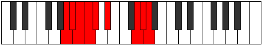 |
| [3171](https://ianring.com/musictheory/scales/3171) | [Zythimic](ModeDNaturalZythimic.md) | D | D, Eb, F##, G#, A###, B##, D |  |
| [3175](https://ianring.com/musictheory/scales/3175) | [Eponian](ModeDNaturalEponian.md) | D | D, Eb, Fb, G, Ab, B#, C#, D |  |
| [3179](https://ianring.com/musictheory/scales/3179) | [Daptian](ModeDNaturalDaptian.md) | D | D, Eb, F, G, Ab, B#, C#, D |  |
| [3179](https://ianring.com/musictheory/scales/3179) | [Daptian](ModeANaturalDaptian.md) | A | A, Bb, C, D, Eb, F##, G#, A |  |
| [3181](https://ianring.com/musictheory/scales/3181) | [Rolian](ModeANaturalRolian.md) | A | A, B, C, D, Eb, F##, G#, A |  |
| [3183](https://ianring.com/musictheory/scales/3183) | [Mixonyllic](ModeDNaturalMixonyllic.md) | D | D, D#, E, F, G, G#, C, C#, D |  |
| [3183](https://ianring.com/musictheory/scales/3183) | [Mixonyllic](ModeANaturalMixonyllic.md) | A | A, A#, B, C, D, D#, G, G#, A |  |
| [3187](https://ianring.com/musictheory/scales/3187) | [Koptian](ModeDNaturalKoptian.md) | D | D, Eb, F#, G, Ab, B#, C#, D |  |
| [3191](https://ianring.com/musictheory/scales/3191) | [Bynyllic](ModeDNaturalBynyllic.md) | D | D, D#, E, F#, G, G#, C, C#, D |  |
| [3193](https://ianring.com/musictheory/scales/3193) | [Zathian](ModeANaturalZathian.md) | A | A, B#, C#, D, Eb, F##, G#, A |  |
| [3195](https://ianring.com/musictheory/scales/3195) | [Raryllic](ModeDNaturalRaryllic.md) | D | D, D#, F, F#, G, G#, C, C#, D |  |
| [3195](https://ianring.com/musictheory/scales/3195) | [Raryllic](ModeANaturalRaryllic.md) | A | A, A#, C, C#, D, D#, G, G#, A |  |
| [3197](https://ianring.com/musictheory/scales/3197) | [Gylyllic](ModeANaturalGylyllic.md) | A | A, B, C, C#, D, D#, G, G#, A |  |
| [3199](https://ianring.com/musictheory/scales/3199) | [Thaptygic](ModeDNaturalThaptygic.md) | D | D, D#, E, F, F#, G, G#, C, C#, D |  |
| [3199](https://ianring.com/musictheory/scales/3199) | [Thaptygic](ModeANaturalThaptygic.md) | A | A, A#, B, C, C#, D, D#, G, G#, A |  |
| [3213](https://ianring.com/musictheory/scales/3213) | [Eponimic](ModeFNaturalEponimic.md) | F | F, G, Ab, B#, C###, D##, F |  |
| [3217](https://ianring.com/musictheory/scales/3217) | [Molitonic](ModeGSharpMolitonic.md) | G# | G#, C, D#, F#, G, G# |  |
| [3217](https://ianring.com/musictheory/scales/3217) | [Molitonic](ModeAFlatMolitonic.md) | Ab | Ab, C, Eb, Gb, G, Ab |  |
| [3219](https://ianring.com/musictheory/scales/3219) | [Ionaphimic](ModeGSharpIonaphimic.md) | G# | G#, A, B#, C###, E##, F##, G# |  |
| [3219](https://ianring.com/musictheory/scales/3219) | [Ionaphimic](ModeAFlatIonaphimic.md) | Ab | Ab, Bbb, C, D#, E##, F##, Ab |  |
| [3221](https://ianring.com/musictheory/scales/3221) | [Bycrimic](ModeGSharpBycrimic.md) | G# | G#, A#, B#, C###, E##, F##, G# |  |
| [3221](https://ianring.com/musictheory/scales/3221) | [Bycrimic](ModeAFlatBycrimic.md) | Ab | Ab, Bb, C, D#, E##, F##, Ab |  |
| [3223](https://ianring.com/musictheory/scales/3223) | [Thyphian](ModeGSharpThyphian.md) | G# | G#, A, Bb, C, D#, E##, F##, G# |  |
| [3223](https://ianring.com/musictheory/scales/3223) | [Thyphian](ModeAFlatThyphian.md) | Ab | Ab, Bbb, Cbb, Dbb, Eb, F#, G, Ab |  |
| [3225](https://ianring.com/musictheory/scales/3225) | [Ionalimic](ModeGSharpIonalimic.md) | G# | G#, A##, B#, C###, E##, F##, G# |  |
| [3225](https://ianring.com/musictheory/scales/3225) | [Ionalimic](ModeAFlatIonalimic.md) | Ab | Ab, B, C, D#, E##, F##, Ab |  |
| [3227](https://ianring.com/musictheory/scales/3227) | [Aeolocrian](ModeGSharpAeolocrian.md) | G# | G#, A, B, C, D#, E##, F##, G# |  |
| [3227](https://ianring.com/musictheory/scales/3227) | [Aeolocrian](ModeAFlatAeolocrian.md) | Ab | Ab, Bbb, Cb, Dbb, Eb, F#, G, Ab |  |
| [3229](https://ianring.com/musictheory/scales/3229) | [Aeolaptian](ModeFNaturalAeolaptian.md) | F | F, G, Ab, Bbb, C, D#, E, F |  |
| [3229](https://ianring.com/musictheory/scales/3229) | [Aeolaptian](ModeGSharpAeolaptian.md) | G# | G#, A#, B, C, D#, E##, F##, G# |  |
| [3229](https://ianring.com/musictheory/scales/3229) | [Aeolaptian](ModeAFlatAeolaptian.md) | Ab | Ab, Bb, Cb, Dbb, Eb, F#, G, Ab |  |
| [3231](https://ianring.com/musictheory/scales/3231) | [Kataptyllic](ModeFNaturalKataptyllic.md) | F | F, F#, G, G#, A, C, D#, E, F |  |
| [3231](https://ianring.com/musictheory/scales/3231) | [Kataptyllic](ModeGSharpKataptyllic.md) | G# | G#, A, A#, B, C, D#, F#, G, G# |  |
| [3231](https://ianring.com/musictheory/scales/3231) | [Kataptyllic](ModeAFlatKataptyllic.md) | Ab | Ab, A, Bb, B, C, Eb, Gb, G, Ab |  |
| [3245](https://ianring.com/musictheory/scales/3245) | [Aeracrian](ModeFNaturalAeracrian.md) | F | F, G, Ab, Bb, C, D#, E, F |  |
| [3247](https://ianring.com/musictheory/scales/3247) | [Aeolonyllic](ModeFNaturalAeolonyllic.md) | F | F, F#, G, G#, A#, C, D#, E, F |  |
| [3249](https://ianring.com/musictheory/scales/3249) | [Epygimic](ModeGSharpEpygimic.md) | G# | G#, A###, B##, C###, E##, F##, G# |  |
| [3249](https://ianring.com/musictheory/scales/3249) | [Epygimic](ModeAFlatEpygimic.md) | Ab | Ab, B#, C#, D#, E##, F##, Ab |  |
| [3251](https://ianring.com/musictheory/scales/3251) | [Zodian](ModeGSharpZodian.md) | G# | G#, A, B#, C#, D#, E##, F##, G# |  |
| [3251](https://ianring.com/musictheory/scales/3251) | [Zodian](ModeAFlatZodian.md) | Ab | Ab, Bbb, C, Db, Eb, F#, G, Ab |  |
| [3253](https://ianring.com/musictheory/scales/3253) | [Gonian](ModeGSharpGonian.md) | G# | G#, A#, B#, C#, D#, E##, F##, G# |  |
| [3253](https://ianring.com/musictheory/scales/3253) | [Gonian](ModeAFlatGonian.md) | Ab | Ab, Bb, C, Db, Eb, F#, G, Ab |  |
| [3255](https://ianring.com/musictheory/scales/3255) | [Daryllic](ModeGSharpDaryllic.md) | G# | G#, A, A#, C, C#, D#, F#, G, G# |  |
| [3255](https://ianring.com/musictheory/scales/3255) | [Daryllic](ModeAFlatDaryllic.md) | Ab | Ab, A, Bb, C, Db, Eb, Gb, G, Ab |  |
| [3257](https://ianring.com/musictheory/scales/3257) | [Ionacrian](ModeGSharpIonacrian.md) | G# | G#, A##, B#, C#, D#, E##, F##, G# |  |
| [3257](https://ianring.com/musictheory/scales/3257) | [Ionacrian](ModeAFlatIonacrian.md) | Ab | Ab, B, C, Db, Eb, F#, G, Ab |  |
| [3259](https://ianring.com/musictheory/scales/3259) | [Loptyllic](ModeGSharpLoptyllic.md) | G# | G#, A, B, C, C#, D#, F#, G, G# |  |
| [3259](https://ianring.com/musictheory/scales/3259) | [Loptyllic](ModeAFlatLoptyllic.md) | Ab | Ab, A, B, C, Db, Eb, Gb, G, Ab |  |
| [3261](https://ianring.com/musictheory/scales/3261) | [Dodyllic](ModeFNaturalDodyllic.md) | F | F, G, G#, A, A#, C, D#, E, F |  |
| [3261](https://ianring.com/musictheory/scales/3261) | [Dodyllic](ModeGSharpDodyllic.md) | G# | G#, A#, B, C, C#, D#, F#, G, G# |  |
| [3261](https://ianring.com/musictheory/scales/3261) | [Dodyllic](ModeAFlatDodyllic.md) | Ab | Ab, Bb, B, C, Db, Eb, Gb, G, Ab |  |
| [3263](https://ianring.com/musictheory/scales/3263) | [Pyrygic](ModeFNaturalPyrygic.md) | F | F, F#, G, G#, A, A#, C, D#, E, F |  |
| [3263](https://ianring.com/musictheory/scales/3263) | [Pyrygic](ModeGSharpPyrygic.md) | G# | G#, A, A#, B, C, C#, D#, F#, G, G# |  |
| [3263](https://ianring.com/musictheory/scales/3263) | [Pyrygic](ModeAFlatPyrygic.md) | Ab | Ab, A, Bb, B, C, Db, Eb, Gb, G, Ab |  |
| [3269](https://ianring.com/musictheory/scales/3269) | [Lodimic](ModeDFlatLodimic.md) | Db | Db, Eb, F##, G#, A##, B#, Db |  |
| [3271](https://ianring.com/musictheory/scales/3271) | [Kolian](ModeCSharpKolian.md) | C# | C#, D, Eb, F##, G#, A##, B#, C# | 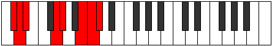 |
| [3271](https://ianring.com/musictheory/scales/3271) | [Kolian](ModeDFlatKolian.md) | Db | Db, Ebb, Fbb, G, Ab, B, C, Db |  |
| [3275](https://ianring.com/musictheory/scales/3275) | [Katadian](ModeANaturalKatadian.md) | A | A, Bb, C, D#, E, F##, G#, A |  |
| [3277](https://ianring.com/musictheory/scales/3277) | [Zycrian](ModeCSharpZycrian.md) | C# | C#, D#, E, F##, G#, A##, B#, C# |  |
| [3277](https://ianring.com/musictheory/scales/3277) | [Zycrian](ModeDFlatZycrian.md) | Db | Db, Eb, Fb, G, Ab, B, C, Db |  |
| [3277](https://ianring.com/musictheory/scales/3277) | [Zycrian](ModeFNaturalZycrian.md) | F | F, G, Ab, B, C, D#, E, F |  |
| [3277](https://ianring.com/musictheory/scales/3277) | [Zycrian](ModeANaturalZycrian.md) | A | A, B, C, D#, E, F##, G#, A |  |
| [3279](https://ianring.com/musictheory/scales/3279) | [Pythyllic](ModeCSharpPythyllic.md) | C# | C#, D, D#, E, G, G#, B, C, C# |  |
| [3279](https://ianring.com/musictheory/scales/3279) | [Pythyllic](ModeDFlatPythyllic.md) | Db | Db, D, Eb, E, G, Ab, B, C, Db |  |
| [3279](https://ianring.com/musictheory/scales/3279) | [Pythyllic](ModeFNaturalPythyllic.md) | F | F, F#, G, G#, B, C, D#, E, F |  |
| [3279](https://ianring.com/musictheory/scales/3279) | [Pythyllic](ModeANaturalPythyllic.md) | A | A, A#, B, C, D#, E, G, G#, A |  |
| [3281](https://ianring.com/musictheory/scales/3281) | [Katythimic](ModeGSharpKatythimic.md) | G# | G#, A###, B###, C###, E##, F##, G# |  |
| [3281](https://ianring.com/musictheory/scales/3281) | [Katythimic](ModeAFlatKatythimic.md) | Ab | Ab, B#, C##, D#, E##, F##, Ab |  |
| [3283](https://ianring.com/musictheory/scales/3283) | [Lyrian](ModeGSharpLyrian.md) | G# | G#, A, B#, C##, D#, E##, F##, G# |  |
| [3283](https://ianring.com/musictheory/scales/3283) | [Lyrian](ModeAFlatLyrian.md) | Ab | Ab, Bbb, C, D, Eb, F#, G, Ab |  |
| [3285](https://ianring.com/musictheory/scales/3285) | [Zagian](ModeGSharpZagian.md) | G# | G#, A#, B#, C##, D#, E##, F##, G# |  |
| [3285](https://ianring.com/musictheory/scales/3285) | [Zagian](ModeAFlatZagian.md) | Ab | Ab, Bb, C, D, Eb, F#, G, Ab |  |
| [3285](https://ianring.com/musictheory/scales/3285) | [Zagian](ModeCSharpZagian.md) | C# | C#, D#, E#, F##, G#, A##, B#, C# |  |
| [3285](https://ianring.com/musictheory/scales/3285) | [Zagian](ModeDFlatZagian.md) | Db | Db, Eb, F, G, Ab, B, C, Db |  |
| [3287](https://ianring.com/musictheory/scales/3287) | [Phrathyllic](ModeGSharpPhrathyllic.md) | G# | G#, A, A#, C, D, D#, F#, G, G# |  |
| [3287](https://ianring.com/musictheory/scales/3287) | [Phrathyllic](ModeAFlatPhrathyllic.md) | Ab | Ab, A, Bb, C, D, Eb, Gb, G, Ab |  |
| [3287](https://ianring.com/musictheory/scales/3287) | [Phrathyllic](ModeCSharpPhrathyllic.md) | C# | C#, D, D#, F, G, G#, B, C, C# |  |
| [3287](https://ianring.com/musictheory/scales/3287) | [Phrathyllic](ModeDFlatPhrathyllic.md) | Db | Db, D, Eb, F, G, Ab, B, C, Db |  |
| [3289](https://ianring.com/musictheory/scales/3289) | [Loptian](ModeANaturalLoptian.md) | A | A, B#, C#, D#, E, F##, G#, A |  |
| [3289](https://ianring.com/musictheory/scales/3289) | [Loptian](ModeGSharpLoptian.md) | G# | G#, A##, B#, C##, D#, E##, F##, G# |  |
| [3289](https://ianring.com/musictheory/scales/3289) | [Loptian](ModeAFlatLoptian.md) | Ab | Ab, B, C, D, Eb, F#, G, Ab |  |
| [3291](https://ianring.com/musictheory/scales/3291) | [Kodyllic](ModeANaturalKodyllic.md) | A | A, A#, C, C#, D#, E, G, G#, A |  |
| [3291](https://ianring.com/musictheory/scales/3291) | [Kodyllic](ModeGSharpKodyllic.md) | G# | G#, A, B, C, D, D#, F#, G, G# |  |
| [3291](https://ianring.com/musictheory/scales/3291) | [Kodyllic](ModeAFlatKodyllic.md) | Ab | Ab, A, B, C, D, Eb, Gb, G, Ab |  |
| [3293](https://ianring.com/musictheory/scales/3293) | [Saryllic](ModeCSharpSaryllic.md) | C# | C#, D#, E, F, G, G#, B, C, C# |  |
| [3293](https://ianring.com/musictheory/scales/3293) | [Saryllic](ModeDFlatSaryllic.md) | Db | Db, Eb, E, F, G, Ab, B, C, Db |  |
| [3293](https://ianring.com/musictheory/scales/3293) | [Saryllic](ModeANaturalSaryllic.md) | A | A, B, C, C#, D#, E, G, G#, A |  |
| [3293](https://ianring.com/musictheory/scales/3293) | [Saryllic](ModeFNaturalSaryllic.md) | F | F, G, G#, A, B, C, D#, E, F |  |
| [3293](https://ianring.com/musictheory/scales/3293) | [Saryllic](ModeGSharpSaryllic.md) | G# | G#, A#, B, C, D, D#, F#, G, G# |  |
| [3293](https://ianring.com/musictheory/scales/3293) | [Saryllic](ModeAFlatSaryllic.md) | Ab | Ab, Bb, B, C, D, Eb, Gb, G, Ab |  |
| [3295](https://ianring.com/musictheory/scales/3295) | [Phroptygic](ModeCSharpPhroptygic.md) | C# | C#, D, D#, E, F, G, G#, B, C, C# |  |
| [3295](https://ianring.com/musictheory/scales/3295) | [Phroptygic](ModeDFlatPhroptygic.md) | Db | Db, D, Eb, E, F, G, Ab, B, C, Db |  |
| [3295](https://ianring.com/musictheory/scales/3295) | [Phroptygic](ModeFNaturalPhroptygic.md) | F | F, F#, G, G#, A, B, C, D#, E, F |  |
| [3295](https://ianring.com/musictheory/scales/3295) | [Phroptygic](ModeANaturalPhroptygic.md) | A | A, A#, B, C, C#, D#, E, G, G#, A |  |
| [3295](https://ianring.com/musictheory/scales/3295) | [Phroptygic](ModeGSharpPhroptygic.md) | G# | G#, A, A#, B, C, D, D#, F#, G, G# |  |
| [3295](https://ianring.com/musictheory/scales/3295) | [Phroptygic](ModeAFlatPhroptygic.md) | Ab | Ab, A, Bb, B, C, D, Eb, Gb, G, Ab |  |
| [3299](https://ianring.com/musictheory/scales/3299) | [Syptian](ModeDNaturalSyptian.md) | D | D, Eb, F##, G#, A, B#, C#, D |  |
| [3301](https://ianring.com/musictheory/scales/3301) | [Phrynian](ModeCSharpPhrynian.md) | C# | C#, D#, E##, F##, G#, A##, B#, C# |  |
| [3301](https://ianring.com/musictheory/scales/3301) | [Phrynian](ModeDFlatPhrynian.md) | Db | Db, Eb, F#, G, Ab, B, C, Db |  |
| [3303](https://ianring.com/musictheory/scales/3303) | [Soptyllic](ModeDNaturalSoptyllic.md) | D | D, D#, E, G, G#, A, C, C#, D |  |
| [3303](https://ianring.com/musictheory/scales/3303) | [Soptyllic](ModeCSharpSoptyllic.md) | C# | C#, D, D#, F#, G, G#, B, C, C# |  |
| [3303](https://ianring.com/musictheory/scales/3303) | [Soptyllic](ModeDFlatSoptyllic.md) | Db | Db, D, Eb, Gb, G, Ab, B, C, Db |  |
| [3305](https://ianring.com/musictheory/scales/3305) | [Epathian](ModeANaturalEpathian.md) | A | A, B#, C##, D#, E, F##, G#, A |  |
| [3307](https://ianring.com/musictheory/scales/3307) | [Boptyllic](ModeDNaturalBoptyllic.md) | D | D, D#, F, G, G#, A, C, C#, D |  |
| [3307](https://ianring.com/musictheory/scales/3307) | [Boptyllic](ModeANaturalBoptyllic.md) | A | A, A#, C, D, D#, E, G, G#, A |  |
| [3309](https://ianring.com/musictheory/scales/3309) | [Bycryllic](ModeCSharpBycryllic.md) | C# | C#, D#, E, F#, G, G#, B, C, C# |  |
| [3309](https://ianring.com/musictheory/scales/3309) | [Bycryllic](ModeDFlatBycryllic.md) | Db | Db, Eb, E, Gb, G, Ab, B, C, Db |  |
| [3309](https://ianring.com/musictheory/scales/3309) | [Bycryllic](ModeANaturalBycryllic.md) | A | A, B, C, D, D#, E, G, G#, A |  |
| [3309](https://ianring.com/musictheory/scales/3309) | [Bycryllic](ModeFNaturalBycryllic.md) | F | F, G, G#, A#, B, C, D#, E, F |  |
| [3311](https://ianring.com/musictheory/scales/3311) | [Mixodygic](ModeDNaturalMixodygic.md) | D | D, D#, E, F, G, G#, A, C, C#, D |  |
| [3311](https://ianring.com/musictheory/scales/3311) | [Mixodygic](ModeCSharpMixodygic.md) | C# | C#, D, D#, E, F#, G, G#, B, C, C# |  |
| [3311](https://ianring.com/musictheory/scales/3311) | [Mixodygic](ModeDFlatMixodygic.md) | Db | Db, D, Eb, E, Gb, G, Ab, B, C, Db |  |
| [3311](https://ianring.com/musictheory/scales/3311) | [Mixodygic](ModeFNaturalMixodygic.md) | F | F, F#, G, G#, A#, B, C, D#, E, F |  |
| [3311](https://ianring.com/musictheory/scales/3311) | [Mixodygic](ModeANaturalMixodygic.md) | A | A, A#, B, C, D, D#, E, G, G#, A |  |
| [3313](https://ianring.com/musictheory/scales/3313) | [Aeolacrian](ModeGSharpAeolacrian.md) | G# | G#, A###, B##, C##, D#, E##, F##, G# | 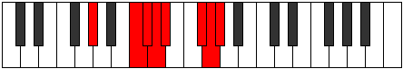 |
| [3313](https://ianring.com/musictheory/scales/3313) | [Aeolacrian](ModeAFlatAeolacrian.md) | Ab | Ab, B#, C#, D, Eb, F#, G, Ab |  |
| [3315](https://ianring.com/musictheory/scales/3315) | [Aeralyllic](ModeDNaturalAeralyllic.md) | D | D, D#, F#, G, G#, A, C, C#, D |  |
| [3315](https://ianring.com/musictheory/scales/3315) | [Aeralyllic](ModeGSharpAeralyllic.md) | G# | G#, A, C, C#, D, D#, F#, G, G# |  |
| [3315](https://ianring.com/musictheory/scales/3315) | [Aeralyllic](ModeAFlatAeralyllic.md) | Ab | Ab, A, C, Db, D, Eb, Gb, G, Ab |  |
| [3317](https://ianring.com/musictheory/scales/3317) | [Lanyllic](ModeGSharpLanyllic.md) | G# | G#, A#, C, C#, D, D#, F#, G, G# |  |
| [3317](https://ianring.com/musictheory/scales/3317) | [Lanyllic](ModeAFlatLanyllic.md) | Ab | Ab, Bb, C, Db, D, Eb, Gb, G, Ab |  |
| [3317](https://ianring.com/musictheory/scales/3317) | [Lanyllic](ModeCSharpLanyllic.md) | C# | C#, D#, F, F#, G, G#, B, C, C# |  |
| [3317](https://ianring.com/musictheory/scales/3317) | [Lanyllic](ModeDFlatLanyllic.md) | Db | Db, Eb, F, Gb, G, Ab, B, C, Db |  |
| [3319](https://ianring.com/musictheory/scales/3319) | [Tholygic](ModeDNaturalTholygic.md) | D | D, D#, E, F#, G, G#, A, C, C#, D |  |
| [3319](https://ianring.com/musictheory/scales/3319) | [Tholygic](ModeGSharpTholygic.md) | G# | G#, A, A#, C, C#, D, D#, F#, G, G# |  |
| [3319](https://ianring.com/musictheory/scales/3319) | [Tholygic](ModeAFlatTholygic.md) | Ab | Ab, A, Bb, C, Db, D, Eb, Gb, G, Ab |  |
| [3319](https://ianring.com/musictheory/scales/3319) | [Tholygic](ModeCSharpTholygic.md) | C# | C#, D, D#, F, F#, G, G#, B, C, C# |  |
| [3319](https://ianring.com/musictheory/scales/3319) | [Tholygic](ModeDFlatTholygic.md) | Db | Db, D, Eb, F, Gb, G, Ab, B, C, Db |  |
| [3321](https://ianring.com/musictheory/scales/3321) | [Ionycryllic](ModeANaturalIonycryllic.md) | A | A, C, C#, D, D#, E, G, G#, A |  |
| [3321](https://ianring.com/musictheory/scales/3321) | [Ionycryllic](ModeGSharpIonycryllic.md) | G# | G#, B, C, C#, D, D#, F#, G, G# |  |
| [3321](https://ianring.com/musictheory/scales/3321) | [Ionycryllic](ModeAFlatIonycryllic.md) | Ab | Ab, B, C, Db, D, Eb, Gb, G, Ab |  |
| [3323](https://ianring.com/musictheory/scales/3323) | [Phrygygic](ModeDNaturalPhrygygic.md) | D | D, D#, F, F#, G, G#, A, C, C#, D |  |
| [3323](https://ianring.com/musictheory/scales/3323) | [Phrygygic](ModeANaturalPhrygygic.md) | A | A, A#, C, C#, D, D#, E, G, G#, A |  |
| [3323](https://ianring.com/musictheory/scales/3323) | [Phrygygic](ModeGSharpPhrygygic.md) | G# | G#, A, B, C, C#, D, D#, F#, G, G# |  |
| [3323](https://ianring.com/musictheory/scales/3323) | [Phrygygic](ModeAFlatPhrygygic.md) | Ab | Ab, A, B, C, Db, D, Eb, Gb, G, Ab |  |
| [3325](https://ianring.com/musictheory/scales/3325) | [Epygic](ModeCSharpEpygic.md) | C# | C#, D#, E, F, F#, G, G#, B, C, C# |  |
| [3325](https://ianring.com/musictheory/scales/3325) | [Epygic](ModeDFlatEpygic.md) | Db | Db, Eb, E, F, Gb, G, Ab, B, C, Db |  |
| [3325](https://ianring.com/musictheory/scales/3325) | [Epygic](ModeANaturalEpygic.md) | A | A, B, C, C#, D, D#, E, G, G#, A |  |
| [3325](https://ianring.com/musictheory/scales/3325) | [Epygic](ModeGSharpEpygic.md) | G# | G#, A#, B, C, C#, D, D#, F#, G, G# |  |
| [3325](https://ianring.com/musictheory/scales/3325) | [Epygic](ModeAFlatEpygic.md) | Ab | Ab, Bb, B, C, Db, D, Eb, Gb, G, Ab |  |
| [3325](https://ianring.com/musictheory/scales/3325) | [Epygic](ModeFNaturalEpygic.md) | F | F, G, G#, A, A#, B, C, D#, E, F |  |
| [3327](https://ianring.com/musictheory/scales/3327) | [Madyllian](ModeDNaturalMadyllian.md) | D | D, D#, E, F, F#, G, G#, A, C, C#, D |  |
| [3327](https://ianring.com/musictheory/scales/3327) | [Madyllian](ModeCSharpMadyllian.md) | C# | C#, D, D#, E, F, F#, G, G#, B, C, C# |  |
| [3327](https://ianring.com/musictheory/scales/3327) | [Madyllian](ModeDFlatMadyllian.md) | Db | Db, D, Eb, E, F, Gb, G, Ab, B, C, Db |  |
| [3327](https://ianring.com/musictheory/scales/3327) | [Madyllian](ModeANaturalMadyllian.md) | A | A, A#, B, C, C#, D, D#, E, G, G#, A |  |
| [3327](https://ianring.com/musictheory/scales/3327) | [Madyllian](ModeGSharpMadyllian.md) | G# | G#, A, A#, B, C, C#, D, D#, F#, G, G# |  |
| [3327](https://ianring.com/musictheory/scales/3327) | [Madyllian](ModeAFlatMadyllian.md) | Ab | Ab, A, Bb, B, C, Db, D, Eb, Gb, G, Ab |  |
| [3327](https://ianring.com/musictheory/scales/3327) | [Madyllian](ModeFNaturalMadyllian.md) | F | F, F#, G, G#, A, A#, B, C, D#, E, F |  |
| [3353](https://ianring.com/musictheory/scales/3353) | [Phraptimic](ModeENaturalPhraptimic.md) | E | E, F##, G#, A###, B###, C###, E |  |
| [3355](https://ianring.com/musictheory/scales/3355) | [Bagian](ModeENaturalBagian.md) | E | E, F, G, Ab, B#, C##, D#, E |  |
| [3357](https://ianring.com/musictheory/scales/3357) | [Phrodian](ModeENaturalPhrodian.md) | E | E, F#, G, Ab, B#, C##, D#, E |  |
| [3359](https://ianring.com/musictheory/scales/3359) | [Bonyllic](ModeENaturalBonyllic.md) | E | E, F, F#, G, G#, C, D, D#, E |  |
| [3363](https://ianring.com/musictheory/scales/3363) | [Rogimic](ModeGNaturalRogimic.md) | G | G, Ab, B#, C###, D###, E##, G |  |
| [3367](https://ianring.com/musictheory/scales/3367) | [Moptian](ModeGNaturalMoptian.md) | G | G, Ab, Bbb, C, D#, E#, F#, G |  |
| [3371](https://ianring.com/musictheory/scales/3371) | [Aeolylian](ModeGNaturalAeolylian.md) | G | G, Ab, Bb, C, D#, E#, F#, G |  |
| [3375](https://ianring.com/musictheory/scales/3375) | [Kygyllic](ModeGNaturalKygyllic.md) | G | G, G#, A, A#, C, D#, F, F#, G |  |
| [3379](https://ianring.com/musictheory/scales/3379) | [Sothian](ModeGNaturalSothian.md) | G | G, Ab, B, C, D#, E#, F#, G |  |
| [3383](https://ianring.com/musictheory/scales/3383) | [Daptyllic](ModeGNaturalDaptyllic.md) | G | G, G#, A, B, C, D#, F, F#, G |  |
| [3385](https://ianring.com/musictheory/scales/3385) | [Rothian](ModeENaturalRothian.md) | E | E, F##, G#, A, B#, C##, D#, E |  |
| [3387](https://ianring.com/musictheory/scales/3387) | [Aeryptyllic](ModeENaturalAeryptyllic.md) | E | E, F, G, G#, A, C, D, D#, E |  |
| [3387](https://ianring.com/musictheory/scales/3387) | [Aeryptyllic](ModeGNaturalAeryptyllic.md) | G | G, G#, A#, B, C, D#, F, F#, G |  |
| [3389](https://ianring.com/musictheory/scales/3389) | [Socryllic](ModeENaturalSocryllic.md) | E | E, F#, G, G#, A, C, D, D#, E |  |
| [3391](https://ianring.com/musictheory/scales/3391) | [Aeolynygic](ModeENaturalAeolynygic.md) | E | E, F, F#, G, G#, A, C, D, D#, E |  |
| [3391](https://ianring.com/musictheory/scales/3391) | [Aeolynygic](ModeGNaturalAeolynygic.md) | G | G, G#, A, A#, B, C, D#, F, F#, G |  |
| [3403](https://ianring.com/musictheory/scales/3403) | [Bylian](ModeANaturalBylian.md) | A | A, Bb, C, D#, E#, F##, G#, A |  |
| [3405](https://ianring.com/musictheory/scales/3405) | [Stynian](ModeANaturalStynian.md) | A | A, B, C, D#, E#, F##, G#, A |  |
| [3407](https://ianring.com/musictheory/scales/3407) | [Katocryllic](ModeANaturalKatocryllic.md) | A | A, A#, B, C, D#, F, G, G#, A |  |
| [3417](https://ianring.com/musictheory/scales/3417) | [Golian](ModeANaturalGolian.md) | A | A, B#, C#, D#, E#, F##, G#, A |  |
| [3417](https://ianring.com/musictheory/scales/3417) | [Golian](ModeENaturalGolian.md) | E | E, F##, G#, A#, B#, C##, D#, E |  |
| [3419](https://ianring.com/musictheory/scales/3419) | [Danyllic](ModeENaturalDanyllic.md) | E | E, F, G, G#, A#, C, D, D#, E |  |
| [3419](https://ianring.com/musictheory/scales/3419) | [Danyllic](ModeANaturalDanyllic.md) | A | A, A#, C, C#, D#, F, G, G#, A |  |
| [3421](https://ianring.com/musictheory/scales/3421) | [Aerothyllic](ModeENaturalAerothyllic.md) | E | E, F#, G, G#, A#, C, D, D#, E |  |
| [3421](https://ianring.com/musictheory/scales/3421) | [Aerothyllic](ModeANaturalAerothyllic.md) | A | A, B, C, C#, D#, F, G, G#, A |  |
| [3423](https://ianring.com/musictheory/scales/3423) | [Lothygic](ModeENaturalLothygic.md) | E | E, F, F#, G, G#, A#, C, D, D#, E |  |
| [3423](https://ianring.com/musictheory/scales/3423) | [Lothygic](ModeANaturalLothygic.md) | A | A, A#, B, C, C#, D#, F, G, G#, A |  |
| [3427](https://ianring.com/musictheory/scales/3427) | [Zacrian](ModeGNaturalZacrian.md) | G | G, Ab, B#, C#, D#, E#, F#, G |  |
| [3427](https://ianring.com/musictheory/scales/3427) | [Zacrian](ModeDNaturalZacrian.md) | D | D, Eb, F##, G#, A#, B#, C#, D |  |
| [3431](https://ianring.com/musictheory/scales/3431) | [Zyptyllic](ModeGNaturalZyptyllic.md) | G | G, G#, A, C, C#, D#, F, F#, G |  |
| [3431](https://ianring.com/musictheory/scales/3431) | [Zyptyllic](ModeDNaturalZyptyllic.md) | D | D, D#, E, G, G#, A#, C, C#, D |  |
| [3433](https://ianring.com/musictheory/scales/3433) | [Thonian](ModeANaturalThonian.md) | A | A, B#, C##, D#, E#, F##, G#, A |  |
| [3435](https://ianring.com/musictheory/scales/3435) | [Epiphyllic](ModeDNaturalEpiphyllic.md) | D | D, D#, F, G, G#, A#, C, C#, D |  |
| [3435](https://ianring.com/musictheory/scales/3435) | [Epiphyllic](ModeGNaturalEpiphyllic.md) | G | G, G#, A#, C, C#, D#, F, F#, G |  |
| [3435](https://ianring.com/musictheory/scales/3435) | [Epiphyllic](ModeANaturalEpiphyllic.md) | A | A, A#, C, D, D#, F, G, G#, A |  |
| [3437](https://ianring.com/musictheory/scales/3437) | [Gathyllic](ModeANaturalGathyllic.md) | A | A, B, C, D, D#, F, G, G#, A |  |
| [3439](https://ianring.com/musictheory/scales/3439) | [Lythygic](ModeDNaturalLythygic.md) | D | D, D#, E, F, G, G#, A#, C, C#, D |  |
| [3439](https://ianring.com/musictheory/scales/3439) | [Lythygic](ModeGNaturalLythygic.md) | G | G, G#, A, A#, C, C#, D#, F, F#, G |  |
| [3439](https://ianring.com/musictheory/scales/3439) | [Lythygic](ModeANaturalLythygic.md) | A | A, A#, B, C, D, D#, F, G, G#, A |  |
| [3443](https://ianring.com/musictheory/scales/3443) | [Epathyllic](ModeDNaturalEpathyllic.md) | D | D, D#, F#, G, G#, A#, C, C#, D |  |
| [3443](https://ianring.com/musictheory/scales/3443) | [Epathyllic](ModeGNaturalEpathyllic.md) | G | G, G#, B, C, C#, D#, F, F#, G |  |
| [3447](https://ianring.com/musictheory/scales/3447) | [Kynygic](ModeDNaturalKynygic.md) | D | D, D#, E, F#, G, G#, A#, C, C#, D |  |
| [3447](https://ianring.com/musictheory/scales/3447) | [Kynygic](ModeGNaturalKynygic.md) | G | G, G#, A, B, C, C#, D#, F, F#, G |  |
| [3449](https://ianring.com/musictheory/scales/3449) | [Bacryllic](ModeANaturalBacryllic.md) | A | A, C, C#, D, D#, F, G, G#, A |  |
| [3449](https://ianring.com/musictheory/scales/3449) | [Bacryllic](ModeENaturalBacryllic.md) | E | E, G, G#, A, A#, C, D, D#, E |  |
| [3451](https://ianring.com/musictheory/scales/3451) | [Garygic](ModeDNaturalGarygic.md) | D | D, D#, F, F#, G, G#, A#, C, C#, D |  |
| [3451](https://ianring.com/musictheory/scales/3451) | [Garygic](ModeANaturalGarygic.md) | A | A, A#, C, C#, D, D#, F, G, G#, A |  |
| [3451](https://ianring.com/musictheory/scales/3451) | [Garygic](ModeENaturalGarygic.md) | E | E, F, G, G#, A, A#, C, D, D#, E |  |
| [3451](https://ianring.com/musictheory/scales/3451) | [Garygic](ModeGNaturalGarygic.md) | G | G, G#, A#, B, C, C#, D#, F, F#, G |  |
| [3453](https://ianring.com/musictheory/scales/3453) | [Katarygic](ModeENaturalKatarygic.md) | E | E, F#, G, G#, A, A#, C, D, D#, E |  |
| [3453](https://ianring.com/musictheory/scales/3453) | [Katarygic](ModeANaturalKatarygic.md) | A | A, B, C, C#, D, D#, F, G, G#, A |  |
| [3455](https://ianring.com/musictheory/scales/3455) | [Ryptyllian](ModeDNaturalRyptyllian.md) | D | D, D#, E, F, F#, G, G#, A#, C, C#, D |  |
| [3455](https://ianring.com/musictheory/scales/3455) | [Ryptyllian](ModeENaturalRyptyllian.md) | E | E, F, F#, G, G#, A, A#, C, D, D#, E |  |
| [3455](https://ianring.com/musictheory/scales/3455) | [Ryptyllian](ModeANaturalRyptyllian.md) | A | A, A#, B, C, C#, D, D#, F, G, G#, A |  |
| [3455](https://ianring.com/musictheory/scales/3455) | [Ryptyllian](ModeGNaturalRyptyllian.md) | G | G, G#, A, A#, B, C, C#, D#, F, F#, G |  |
| [3467](https://ianring.com/musictheory/scales/3467) | [Katonian](ModeCNaturalKatonian.md) | C | C, Db, Eb, F##, G#, A#, B, C |  |
| [3469](https://ianring.com/musictheory/scales/3469) | [Monian](ModeFNaturalMonian.md) | F | F, G, Ab, B#, C#, D#, E, F |  |
| [3469](https://ianring.com/musictheory/scales/3469) | [Monian](ModeCNaturalMonian.md) | C | C, D, Eb, F##, G#, A#, B, C |  |
| [3471](https://ianring.com/musictheory/scales/3471) | [Gyryllic](ModeFNaturalGyryllic.md) | F | F, F#, G, G#, C, C#, D#, E, F |  |
| [3471](https://ianring.com/musictheory/scales/3471) | [Gyryllic](ModeCNaturalGyryllic.md) | C | C, C#, D, D#, G, G#, A#, B, C |  |
| [3473](https://ianring.com/musictheory/scales/3473) | [Lathimic](ModeGSharpLathimic.md) | G# | G#, A###, C###, D##, E##, F##, G# |  |
| [3473](https://ianring.com/musictheory/scales/3473) | [Lathimic](ModeAFlatLathimic.md) | Ab | Ab, B#, C###, D##, E##, F##, Ab |  |
| [3475](https://ianring.com/musictheory/scales/3475) | [Kylian](ModeGSharpKylian.md) | G# | G#, A, B#, C###, D##, E##, F##, G# |  |
| [3475](https://ianring.com/musictheory/scales/3475) | [Kylian](ModeAFlatKylian.md) | Ab | Ab, Bbb, C, D#, E, F#, G, Ab |  |
| [3477](https://ianring.com/musictheory/scales/3477) | [Kyptian](ModeGSharpKyptian.md) | G# | G#, A#, B#, C###, D##, E##, F##, G# |  |
| [3477](https://ianring.com/musictheory/scales/3477) | [Kyptian](ModeAFlatKyptian.md) | Ab | Ab, Bb, C, D#, E, F#, G, Ab |  |
| [3479](https://ianring.com/musictheory/scales/3479) | [Rothyllic](ModeGSharpRothyllic.md) | G# | G#, A, A#, C, D#, E, F#, G, G# |  |
| [3479](https://ianring.com/musictheory/scales/3479) | [Rothyllic](ModeAFlatRothyllic.md) | Ab | Ab, A, Bb, C, Eb, E, Gb, G, Ab |  |
| [3481](https://ianring.com/musictheory/scales/3481) | [Katathian](ModeENaturalKatathian.md) | E | E, F##, G#, A##, B#, C##, D#, E |  |
| [3481](https://ianring.com/musictheory/scales/3481) | [Katathian](ModeGSharpKatathian.md) | G# | G#, A##, B#, C###, D##, E##, F##, G# |  |
| [3481](https://ianring.com/musictheory/scales/3481) | [Katathian](ModeAFlatKatathian.md) | Ab | Ab, B, C, D#, E, F#, G, Ab |  |
| [3481](https://ianring.com/musictheory/scales/3481) | [Katathian](ModeCNaturalKatathian.md) | C | C, D#, E, F##, G#, A#, B, C |  |
| [3483](https://ianring.com/musictheory/scales/3483) | [Mixotharyllic](ModeENaturalMixotharyllic.md) | E | E, F, G, G#, B, C, D, D#, E |  |
| [3483](https://ianring.com/musictheory/scales/3483) | [Mixotharyllic](ModeGSharpMixotharyllic.md) | G# | G#, A, B, C, D#, E, F#, G, G# |  |
| [3483](https://ianring.com/musictheory/scales/3483) | [Mixotharyllic](ModeAFlatMixotharyllic.md) | Ab | Ab, A, B, C, Eb, E, Gb, G, Ab |  |
| [3483](https://ianring.com/musictheory/scales/3483) | [Mixotharyllic](ModeCNaturalMixotharyllic.md) | C | C, C#, D#, E, G, G#, A#, B, C |  |
| [3485](https://ianring.com/musictheory/scales/3485) | [Kyptyllic](ModeFNaturalKyptyllic.md) | F | F, G, G#, A, C, C#, D#, E, F |  |
| [3485](https://ianring.com/musictheory/scales/3485) | [Kyptyllic](ModeENaturalKyptyllic.md) | E | E, F#, G, G#, B, C, D, D#, E |  |
| [3485](https://ianring.com/musictheory/scales/3485) | [Kyptyllic](ModeCNaturalKyptyllic.md) | C | C, D, D#, E, G, G#, A#, B, C |  |
| [3485](https://ianring.com/musictheory/scales/3485) | [Kyptyllic](ModeGSharpKyptyllic.md) | G# | G#, A#, B, C, D#, E, F#, G, G# |  |
| [3485](https://ianring.com/musictheory/scales/3485) | [Kyptyllic](ModeAFlatKyptyllic.md) | Ab | Ab, Bb, B, C, Eb, E, Gb, G, Ab |  |
| [3487](https://ianring.com/musictheory/scales/3487) | [Byptygic](ModeFNaturalByptygic.md) | F | F, F#, G, G#, A, C, C#, D#, E, F |  |
| [3487](https://ianring.com/musictheory/scales/3487) | [Byptygic](ModeENaturalByptygic.md) | E | E, F, F#, G, G#, B, C, D, D#, E |  |
| [3487](https://ianring.com/musictheory/scales/3487) | [Byptygic](ModeCNaturalByptygic.md) | C | C, C#, D, D#, E, G, G#, A#, B, C | 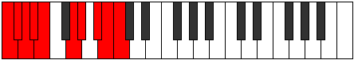 |
| [3487](https://ianring.com/musictheory/scales/3487) | [Byptygic](ModeGSharpByptygic.md) | G# | G#, A, A#, B, C, D#, E, F#, G, G# |  |
| [3487](https://ianring.com/musictheory/scales/3487) | [Byptygic](ModeAFlatByptygic.md) | Ab | Ab, A, Bb, B, C, Eb, E, Gb, G, Ab |  |
| [3491](https://ianring.com/musictheory/scales/3491) | [Tharian](ModeGNaturalTharian.md) | G | G, Ab, B#, C##, D#, E#, F#, G |  |
| [3495](https://ianring.com/musictheory/scales/3495) | [Banyllic](ModeGNaturalBanyllic.md) | G | G, G#, A, C, D, D#, F, F#, G |  |
| [3497](https://ianring.com/musictheory/scales/3497) | [Phrolian](ModeCNaturalPhrolian.md) | C | C, D#, E#, F##, G#, A#, B, C |  |
| [3499](https://ianring.com/musictheory/scales/3499) | [Lythyllic](ModeGNaturalLythyllic.md) | G | G, G#, A#, C, D, D#, F, F#, G |  |
| [3499](https://ianring.com/musictheory/scales/3499) | [Lythyllic](ModeCNaturalLythyllic.md) | C | C, C#, D#, F, G, G#, A#, B, C |  |
| [3501](https://ianring.com/musictheory/scales/3501) | [Katodyllic](ModeFNaturalKatodyllic.md) | F | F, G, G#, A#, C, C#, D#, E, F |  |
| [3501](https://ianring.com/musictheory/scales/3501) | [Katodyllic](ModeCNaturalKatodyllic.md) | C | C, D, D#, F, G, G#, A#, B, C |  |
| [3503](https://ianring.com/musictheory/scales/3503) | [Zyphygic](ModeFNaturalZyphygic.md) | F | F, F#, G, G#, A#, C, C#, D#, E, F |  |
| [3503](https://ianring.com/musictheory/scales/3503) | [Zyphygic](ModeGNaturalZyphygic.md) | G | G, G#, A, A#, C, D, D#, F, F#, G |  |
| [3503](https://ianring.com/musictheory/scales/3503) | [Zyphygic](ModeCNaturalZyphygic.md) | C | C, C#, D, D#, F, G, G#, A#, B, C |  |
| [3505](https://ianring.com/musictheory/scales/3505) | [Stygian](ModeGSharpStygian.md) | G# | G#, A###, B##, C###, D##, E##, F##, G# |  |
| [3505](https://ianring.com/musictheory/scales/3505) | [Stygian](ModeAFlatStygian.md) | Ab | Ab, B#, C#, D#, E, F#, G, Ab |  |
| [3507](https://ianring.com/musictheory/scales/3507) | [Ponyllic](ModeGSharpPonyllic.md) | G# | G#, A, C, C#, D#, E, F#, G, G# |  |
| [3507](https://ianring.com/musictheory/scales/3507) | [Ponyllic](ModeAFlatPonyllic.md) | Ab | Ab, A, C, Db, Eb, E, Gb, G, Ab |  |
| [3507](https://ianring.com/musictheory/scales/3507) | [Ponyllic](ModeGNaturalPonyllic.md) | G | G, G#, B, C, D, D#, F, F#, G |  |
| [3509](https://ianring.com/musictheory/scales/3509) | [Stogyllic](ModeGSharpStogyllic.md) | G# | G#, A#, C, C#, D#, E, F#, G, G# |  |
| [3509](https://ianring.com/musictheory/scales/3509) | [Stogyllic](ModeAFlatStogyllic.md) | Ab | Ab, Bb, C, Db, Eb, E, Gb, G, Ab |  |
| [3511](https://ianring.com/musictheory/scales/3511) | [Epolygic](ModeGSharpEpolygic.md) | G# | G#, A, A#, C, C#, D#, E, F#, G, G# |  |
| [3511](https://ianring.com/musictheory/scales/3511) | [Epolygic](ModeAFlatEpolygic.md) | Ab | Ab, A, Bb, C, Db, Eb, E, Gb, G, Ab |  |
| [3511](https://ianring.com/musictheory/scales/3511) | [Epolygic](ModeGNaturalEpolygic.md) | G | G, G#, A, B, C, D, D#, F, F#, G |  |
| [3513](https://ianring.com/musictheory/scales/3513) | [Dydyllic](ModeGSharpDydyllic.md) | G# | G#, B, C, C#, D#, E, F#, G, G# |  |
| [3513](https://ianring.com/musictheory/scales/3513) | [Dydyllic](ModeAFlatDydyllic.md) | Ab | Ab, B, C, Db, Eb, E, Gb, G, Ab |  |
| [3513](https://ianring.com/musictheory/scales/3513) | [Dydyllic](ModeENaturalDydyllic.md) | E | E, G, G#, A, B, C, D, D#, E |  |
| [3513](https://ianring.com/musictheory/scales/3513) | [Dydyllic](ModeCNaturalDydyllic.md) | C | C, D#, E, F, G, G#, A#, B, C |  |
| [3515](https://ianring.com/musictheory/scales/3515) | [Katodygic](ModeENaturalKatodygic.md) | E | E, F, G, G#, A, B, C, D, D#, E |  |
| [3515](https://ianring.com/musictheory/scales/3515) | [Katodygic](ModeGSharpKatodygic.md) | G# | G#, A, B, C, C#, D#, E, F#, G, G# |  |
| [3515](https://ianring.com/musictheory/scales/3515) | [Katodygic](ModeAFlatKatodygic.md) | Ab | Ab, A, B, C, Db, Eb, E, Gb, G, Ab |  |
| [3515](https://ianring.com/musictheory/scales/3515) | [Katodygic](ModeCNaturalKatodygic.md) | C | C, C#, D#, E, F, G, G#, A#, B, C |  |
| [3515](https://ianring.com/musictheory/scales/3515) | [Katodygic](ModeGNaturalKatodygic.md) | G | G, G#, A#, B, C, D, D#, F, F#, G |  |
| [3517](https://ianring.com/musictheory/scales/3517) | [Epocrygic](ModeFNaturalEpocrygic.md) | F | F, G, G#, A, A#, C, C#, D#, E, F |  |
| [3517](https://ianring.com/musictheory/scales/3517) | [Epocrygic](ModeENaturalEpocrygic.md) | E | E, F#, G, G#, A, B, C, D, D#, E |  |
| [3517](https://ianring.com/musictheory/scales/3517) | [Epocrygic](ModeCNaturalEpocrygic.md) | C | C, D, D#, E, F, G, G#, A#, B, C |  |
| [3517](https://ianring.com/musictheory/scales/3517) | [Epocrygic](ModeGSharpEpocrygic.md) | G# | G#, A#, B, C, C#, D#, E, F#, G, G# |  |
| [3517](https://ianring.com/musictheory/scales/3517) | [Epocrygic](ModeAFlatEpocrygic.md) | Ab | Ab, Bb, B, C, Db, Eb, E, Gb, G, Ab |  |
| [3519](https://ianring.com/musictheory/scales/3519) | [Boptyllian](ModeFNaturalBoptyllian.md) | F | F, F#, G, G#, A, A#, C, C#, D#, E, F |  |
| [3519](https://ianring.com/musictheory/scales/3519) | [Boptyllian](ModeENaturalBoptyllian.md) | E | E, F, F#, G, G#, A, B, C, D, D#, E |  |
| [3519](https://ianring.com/musictheory/scales/3519) | [Boptyllian](ModeCNaturalBoptyllian.md) | C | C, C#, D, D#, E, F, G, G#, A#, B, C |  |
| [3519](https://ianring.com/musictheory/scales/3519) | [Boptyllian](ModeGSharpBoptyllian.md) | G# | G#, A, A#, B, C, C#, D#, E, F#, G, G# |  |
| [3519](https://ianring.com/musictheory/scales/3519) | [Boptyllian](ModeAFlatBoptyllian.md) | Ab | Ab, A, Bb, B, C, Db, Eb, E, Gb, G, Ab |  |
| [3519](https://ianring.com/musictheory/scales/3519) | [Boptyllian](ModeGNaturalBoptyllian.md) | G | G, G#, A, A#, B, C, D, D#, F, F#, G |  |
| [3525](https://ianring.com/musictheory/scales/3525) | [Zocrian](ModeDFlatZocrian.md) | Db | Db, Eb, F##, G#, A, B, C, Db |  |
| [3527](https://ianring.com/musictheory/scales/3527) | [Ronyllic](ModeCSharpRonyllic.md) | C# | C#, D, D#, G, G#, A, B, C, C# |  |
| [3527](https://ianring.com/musictheory/scales/3527) | [Ronyllic](ModeDFlatRonyllic.md) | Db | Db, D, Eb, G, Ab, A, B, C, Db |  |
| [3529](https://ianring.com/musictheory/scales/3529) | [Stalian](ModeANaturalStalian.md) | A | A, B#, C###, D##, E#, F##, G#, A |  |
| [3529](https://ianring.com/musictheory/scales/3529) | [Stalian](ModeCNaturalStalian.md) | C | C, D#, E##, F##, G#, A#, B, C |  |
| [3531](https://ianring.com/musictheory/scales/3531) | [Dycryllic](ModeANaturalDycryllic.md) | A | A, A#, C, D#, E, F, G, G#, A |  |
| [3531](https://ianring.com/musictheory/scales/3531) | [Dycryllic](ModeCNaturalDycryllic.md) | C | C, C#, D#, F#, G, G#, A#, B, C |  |
| [3533](https://ianring.com/musictheory/scales/3533) | [Thadyllic](ModeFNaturalThadyllic.md) | F | F, G, G#, B, C, C#, D#, E, F |  |
| [3533](https://ianring.com/musictheory/scales/3533) | [Thadyllic](ModeCSharpThadyllic.md) | C# | C#, D#, E, G, G#, A, B, C, C# |  |
| [3533](https://ianring.com/musictheory/scales/3533) | [Thadyllic](ModeDFlatThadyllic.md) | Db | Db, Eb, E, G, Ab, A, B, C, Db |  |
| [3533](https://ianring.com/musictheory/scales/3533) | [Thadyllic](ModeANaturalThadyllic.md) | A | A, B, C, D#, E, F, G, G#, A |  |
| [3533](https://ianring.com/musictheory/scales/3533) | [Thadyllic](ModeCNaturalThadyllic.md) | C | C, D, D#, F#, G, G#, A#, B, C |  |
| [3535](https://ianring.com/musictheory/scales/3535) | [Aeroptygic](ModeFNaturalAeroptygic.md) | F | F, F#, G, G#, B, C, C#, D#, E, F |  |
| [3535](https://ianring.com/musictheory/scales/3535) | [Aeroptygic](ModeCSharpAeroptygic.md) | C# | C#, D, D#, E, G, G#, A, B, C, C# |  |
| [3535](https://ianring.com/musictheory/scales/3535) | [Aeroptygic](ModeDFlatAeroptygic.md) | Db | Db, D, Eb, E, G, Ab, A, B, C, Db |  |
| [3535](https://ianring.com/musictheory/scales/3535) | [Aeroptygic](ModeCNaturalAeroptygic.md) | C | C, C#, D, D#, F#, G, G#, A#, B, C |  |
| [3535](https://ianring.com/musictheory/scales/3535) | [Aeroptygic](ModeANaturalAeroptygic.md) | A | A, A#, B, C, D#, E, F, G, G#, A |  |
| [3537](https://ianring.com/musictheory/scales/3537) | [Katogian](ModeGSharpKatogian.md) | G# | G#, A###, B###, C###, D##, E##, F##, G# |  |
| [3537](https://ianring.com/musictheory/scales/3537) | [Katogian](ModeAFlatKatogian.md) | Ab | Ab, B#, C##, D#, E, F#, G, Ab |  |
| [3539](https://ianring.com/musictheory/scales/3539) | [Aeoryllic](ModeGSharpAeoryllic.md) | G# | G#, A, C, D, D#, E, F#, G, G# |  |
| [3539](https://ianring.com/musictheory/scales/3539) | [Aeoryllic](ModeAFlatAeoryllic.md) | Ab | Ab, A, C, D, Eb, E, Gb, G, Ab |  |
| [3541](https://ianring.com/musictheory/scales/3541) | [Racryllic](ModeGSharpRacryllic.md) | G# | G#, A#, C, D, D#, E, F#, G, G# |  |
| [3541](https://ianring.com/musictheory/scales/3541) | [Racryllic](ModeAFlatRacryllic.md) | Ab | Ab, Bb, C, D, Eb, E, Gb, G, Ab |  |
| [3541](https://ianring.com/musictheory/scales/3541) | [Racryllic](ModeCSharpRacryllic.md) | C# | C#, D#, F, G, G#, A, B, C, C# |  |
| [3541](https://ianring.com/musictheory/scales/3541) | [Racryllic](ModeDFlatRacryllic.md) | Db | Db, Eb, F, G, Ab, A, B, C, Db |  |
| [3543](https://ianring.com/musictheory/scales/3543) | [Aeolonygic](ModeGSharpAeolonygic.md) | G# | G#, A, A#, C, D, D#, E, F#, G, G# |  |
| [3543](https://ianring.com/musictheory/scales/3543) | [Aeolonygic](ModeAFlatAeolonygic.md) | Ab | Ab, A, Bb, C, D, Eb, E, Gb, G, Ab |  |
| [3543](https://ianring.com/musictheory/scales/3543) | [Aeolonygic](ModeCSharpAeolonygic.md) | C# | C#, D, D#, F, G, G#, A, B, C, C# |  |
| [3543](https://ianring.com/musictheory/scales/3543) | [Aeolonygic](ModeDFlatAeolonygic.md) | Db | Db, D, Eb, F, G, Ab, A, B, C, Db |  |
| [3545](https://ianring.com/musictheory/scales/3545) | [Thyptyllic](ModeANaturalThyptyllic.md) | A | A, C, C#, D#, E, F, G, G#, A |  |
| [3545](https://ianring.com/musictheory/scales/3545) | [Thyptyllic](ModeGSharpThyptyllic.md) | G# | G#, B, C, D, D#, E, F#, G, G# |  |
| [3545](https://ianring.com/musictheory/scales/3545) | [Thyptyllic](ModeAFlatThyptyllic.md) | Ab | Ab, B, C, D, Eb, E, Gb, G, Ab |  |
| [3545](https://ianring.com/musictheory/scales/3545) | [Thyptyllic](ModeENaturalThyptyllic.md) | E | E, G, G#, A#, B, C, D, D#, E |  |
| [3545](https://ianring.com/musictheory/scales/3545) | [Thyptyllic](ModeCNaturalThyptyllic.md) | C | C, D#, E, F#, G, G#, A#, B, C |  |
| [3547](https://ianring.com/musictheory/scales/3547) | [Sadygic](ModeANaturalSadygic.md) | A | A, A#, C, C#, D#, E, F, G, G#, A |  |
| [3547](https://ianring.com/musictheory/scales/3547) | [Sadygic](ModeGSharpSadygic.md) | G# | G#, A, B, C, D, D#, E, F#, G, G# |  |
| [3547](https://ianring.com/musictheory/scales/3547) | [Sadygic](ModeAFlatSadygic.md) | Ab | Ab, A, B, C, D, Eb, E, Gb, G, Ab |  |
| [3547](https://ianring.com/musictheory/scales/3547) | [Sadygic](ModeENaturalSadygic.md) | E | E, F, G, G#, A#, B, C, D, D#, E |  |
| [3547](https://ianring.com/musictheory/scales/3547) | [Sadygic](ModeCNaturalSadygic.md) | C | C, C#, D#, E, F#, G, G#, A#, B, C |  |
| [3549](https://ianring.com/musictheory/scales/3549) | [Phronygic](ModeCSharpPhronygic.md) | C# | C#, D#, E, F, G, G#, A, B, C, C# |  |
| [3549](https://ianring.com/musictheory/scales/3549) | [Phronygic](ModeDFlatPhronygic.md) | Db | Db, Eb, E, F, G, Ab, A, B, C, Db |  |
| [3549](https://ianring.com/musictheory/scales/3549) | [Phronygic](ModeFNaturalPhronygic.md) | F | F, G, G#, A, B, C, C#, D#, E, F |  |
| [3549](https://ianring.com/musictheory/scales/3549) | [Phronygic](ModeANaturalPhronygic.md) | A | A, B, C, C#, D#, E, F, G, G#, A |  |
| [3549](https://ianring.com/musictheory/scales/3549) | [Phronygic](ModeCNaturalPhronygic.md) | C | C, D, D#, E, F#, G, G#, A#, B, C |  |
| [3549](https://ianring.com/musictheory/scales/3549) | [Phronygic](ModeENaturalPhronygic.md) | E | E, F#, G, G#, A#, B, C, D, D#, E |  |
| [3549](https://ianring.com/musictheory/scales/3549) | [Phronygic](ModeGSharpPhronygic.md) | G# | G#, A#, B, C, D, D#, E, F#, G, G# |  |
| [3549](https://ianring.com/musictheory/scales/3549) | [Phronygic](ModeAFlatPhronygic.md) | Ab | Ab, Bb, B, C, D, Eb, E, Gb, G, Ab |  |
| [3551](https://ianring.com/musictheory/scales/3551) | [Sagyllian](ModeCSharpSagyllian.md) | C# | C#, D, D#, E, F, G, G#, A, B, C, C# |  |
| [3551](https://ianring.com/musictheory/scales/3551) | [Sagyllian](ModeDFlatSagyllian.md) | Db | Db, D, Eb, E, F, G, Ab, A, B, C, Db |  |
| [3551](https://ianring.com/musictheory/scales/3551) | [Sagyllian](ModeFNaturalSagyllian.md) | F | F, F#, G, G#, A, B, C, C#, D#, E, F | 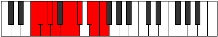 |
| [3551](https://ianring.com/musictheory/scales/3551) | [Sagyllian](ModeCNaturalSagyllian.md) | C | C, C#, D, D#, E, F#, G, G#, A#, B, C |  |
| [3551](https://ianring.com/musictheory/scales/3551) | [Sagyllian](ModeENaturalSagyllian.md) | E | E, F, F#, G, G#, A#, B, C, D, D#, E |  |
| [3551](https://ianring.com/musictheory/scales/3551) | [Sagyllian](ModeANaturalSagyllian.md) | A | A, A#, B, C, C#, D#, E, F, G, G#, A |  |
| [3551](https://ianring.com/musictheory/scales/3551) | [Sagyllian](ModeGSharpSagyllian.md) | G# | G#, A, A#, B, C, D, D#, E, F#, G, G# |  |
| [3551](https://ianring.com/musictheory/scales/3551) | [Sagyllian](ModeAFlatSagyllian.md) | Ab | Ab, A, Bb, B, C, D, Eb, E, Gb, G, Ab |  |
| [3555](https://ianring.com/musictheory/scales/3555) | [Pylyllic](ModeGNaturalPylyllic.md) | G | G, G#, C, C#, D, D#, F, F#, G |  |
| [3555](https://ianring.com/musictheory/scales/3555) | [Pylyllic](ModeDNaturalPylyllic.md) | D | D, D#, G, G#, A, A#, C, C#, D |  |
| [3557](https://ianring.com/musictheory/scales/3557) | [Thycryllic](ModeCSharpThycryllic.md) | C# | C#, D#, F#, G, G#, A, B, C, C# |  |
| [3557](https://ianring.com/musictheory/scales/3557) | [Thycryllic](ModeDFlatThycryllic.md) | Db | Db, Eb, Gb, G, Ab, A, B, C, Db |  |
| [3559](https://ianring.com/musictheory/scales/3559) | [Aerathygic](ModeGNaturalAerathygic.md) | G | G, G#, A, C, C#, D, D#, F, F#, G |  |
| [3559](https://ianring.com/musictheory/scales/3559) | [Aerathygic](ModeDNaturalAerathygic.md) | D | D, D#, E, G, G#, A, A#, C, C#, D |  |
| [3559](https://ianring.com/musictheory/scales/3559) | [Aerathygic](ModeCSharpAerathygic.md) | C# | C#, D, D#, F#, G, G#, A, B, C, C# |  |
| [3559](https://ianring.com/musictheory/scales/3559) | [Aerathygic](ModeDFlatAerathygic.md) | Db | Db, D, Eb, Gb, G, Ab, A, B, C, Db |  |
| [3561](https://ianring.com/musictheory/scales/3561) | [Pothyllic](ModeANaturalPothyllic.md) | A | A, C, D, D#, E, F, G, G#, A |  |
| [3561](https://ianring.com/musictheory/scales/3561) | [Pothyllic](ModeCNaturalPothyllic.md) | C | C, D#, F, F#, G, G#, A#, B, C |  |
| [3563](https://ianring.com/musictheory/scales/3563) | [Ionoptygic](ModeGNaturalIonoptygic.md) | G | G, G#, A#, C, C#, D, D#, F, F#, G |  |
| [3563](https://ianring.com/musictheory/scales/3563) | [Ionoptygic](ModeDNaturalIonoptygic.md) | D | D, D#, F, G, G#, A, A#, C, C#, D |  |
| [3563](https://ianring.com/musictheory/scales/3563) | [Ionoptygic](ModeANaturalIonoptygic.md) | A | A, A#, C, D, D#, E, F, G, G#, A |  |
| [3563](https://ianring.com/musictheory/scales/3563) | [Ionoptygic](ModeCNaturalIonoptygic.md) | C | C, C#, D#, F, F#, G, G#, A#, B, C |  |
| [3565](https://ianring.com/musictheory/scales/3565) | [Aeolorygic](ModeANaturalAeolorygic.md) | A | A, B, C, D, D#, E, F, G, G#, A |  |
| [3565](https://ianring.com/musictheory/scales/3565) | [Aeolorygic](ModeCSharpAeolorygic.md) | C# | C#, D#, E, F#, G, G#, A, B, C, C# |  |
| [3565](https://ianring.com/musictheory/scales/3565) | [Aeolorygic](ModeDFlatAeolorygic.md) | Db | Db, Eb, E, Gb, G, Ab, A, B, C, Db |  |
| [3565](https://ianring.com/musictheory/scales/3565) | [Aeolorygic](ModeFNaturalAeolorygic.md) | F | F, G, G#, A#, B, C, C#, D#, E, F |  |
| [3565](https://ianring.com/musictheory/scales/3565) | [Aeolorygic](ModeCNaturalAeolorygic.md) | C | C, D, D#, F, F#, G, G#, A#, B, C |  |
| [3567](https://ianring.com/musictheory/scales/3567) | [Epityllian](ModeDNaturalEpityllian.md) | D | D, D#, E, F, G, G#, A, A#, C, C#, D |  |
| [3567](https://ianring.com/musictheory/scales/3567) | [Epityllian](ModeGNaturalEpityllian.md) | G | G, G#, A, A#, C, C#, D, D#, F, F#, G |  |
| [3567](https://ianring.com/musictheory/scales/3567) | [Epityllian](ModeCSharpEpityllian.md) | C# | C#, D, D#, E, F#, G, G#, A, B, C, C# |  |
| [3567](https://ianring.com/musictheory/scales/3567) | [Epityllian](ModeDFlatEpityllian.md) | Db | Db, D, Eb, E, Gb, G, Ab, A, B, C, Db |  |
| [3567](https://ianring.com/musictheory/scales/3567) | [Epityllian](ModeCNaturalEpityllian.md) | C | C, C#, D, D#, F, F#, G, G#, A#, B, C |  |
| [3567](https://ianring.com/musictheory/scales/3567) | [Epityllian](ModeFNaturalEpityllian.md) | F | F, F#, G, G#, A#, B, C, C#, D#, E, F |  |
| [3567](https://ianring.com/musictheory/scales/3567) | [Epityllian](ModeANaturalEpityllian.md) | A | A, A#, B, C, D, D#, E, F, G, G#, A |  |
| [3569](https://ianring.com/musictheory/scales/3569) | [Aeoladyllic](ModeGSharpAeoladyllic.md) | G# | G#, C, C#, D, D#, E, F#, G, G# |  |
| [3569](https://ianring.com/musictheory/scales/3569) | [Aeoladyllic](ModeAFlatAeoladyllic.md) | Ab | Ab, C, Db, D, Eb, E, Gb, G, Ab |  |
| [3571](https://ianring.com/musictheory/scales/3571) | [Dyrygic](ModeGSharpDyrygic.md) | G# | G#, A, C, C#, D, D#, E, F#, G, G# |  |
| [3571](https://ianring.com/musictheory/scales/3571) | [Dyrygic](ModeAFlatDyrygic.md) | Ab | Ab, A, C, Db, D, Eb, E, Gb, G, Ab |  |
| [3571](https://ianring.com/musictheory/scales/3571) | [Dyrygic](ModeDNaturalDyrygic.md) | D | D, D#, F#, G, G#, A, A#, C, C#, D |  |
| [3571](https://ianring.com/musictheory/scales/3571) | [Dyrygic](ModeGNaturalDyrygic.md) | G | G, G#, B, C, C#, D, D#, F, F#, G |  |
| [3573](https://ianring.com/musictheory/scales/3573) | [Kaptygic](ModeGSharpKaptygic.md) | G# | G#, A#, C, C#, D, D#, E, F#, G, G# |  |
| [3573](https://ianring.com/musictheory/scales/3573) | [Kaptygic](ModeAFlatKaptygic.md) | Ab | Ab, Bb, C, Db, D, Eb, E, Gb, G, Ab |  |
| [3573](https://ianring.com/musictheory/scales/3573) | [Kaptygic](ModeCSharpKaptygic.md) | C# | C#, D#, F, F#, G, G#, A, B, C, C# |  |
| [3573](https://ianring.com/musictheory/scales/3573) | [Kaptygic](ModeDFlatKaptygic.md) | Db | Db, Eb, F, Gb, G, Ab, A, B, C, Db |  |
| [3575](https://ianring.com/musictheory/scales/3575) | [Mogyllian](ModeDNaturalMogyllian.md) | D | D, D#, E, F#, G, G#, A, A#, C, C#, D |  |
| [3575](https://ianring.com/musictheory/scales/3575) | [Mogyllian](ModeGSharpMogyllian.md) | G# | G#, A, A#, C, C#, D, D#, E, F#, G, G# |  |
| [3575](https://ianring.com/musictheory/scales/3575) | [Mogyllian](ModeAFlatMogyllian.md) | Ab | Ab, A, Bb, C, Db, D, Eb, E, Gb, G, Ab |  |
| [3575](https://ianring.com/musictheory/scales/3575) | [Mogyllian](ModeCSharpMogyllian.md) | C# | C#, D, D#, F, F#, G, G#, A, B, C, C# |  |
| [3575](https://ianring.com/musictheory/scales/3575) | [Mogyllian](ModeDFlatMogyllian.md) | Db | Db, D, Eb, F, Gb, G, Ab, A, B, C, Db |  |
| [3575](https://ianring.com/musictheory/scales/3575) | [Mogyllian](ModeGNaturalMogyllian.md) | G | G, G#, A, B, C, C#, D, D#, F, F#, G |  |
| [3577](https://ianring.com/musictheory/scales/3577) | [Loptygic](ModeANaturalLoptygic.md) | A | A, C, C#, D, D#, E, F, G, G#, A |  |
| [3577](https://ianring.com/musictheory/scales/3577) | [Loptygic](ModeGSharpLoptygic.md) | G# | G#, B, C, C#, D, D#, E, F#, G, G# |  |
| [3577](https://ianring.com/musictheory/scales/3577) | [Loptygic](ModeAFlatLoptygic.md) | Ab | Ab, B, C, Db, D, Eb, E, Gb, G, Ab |  |
| [3577](https://ianring.com/musictheory/scales/3577) | [Loptygic](ModeCNaturalLoptygic.md) | C | C, D#, E, F, F#, G, G#, A#, B, C |  |
| [3577](https://ianring.com/musictheory/scales/3577) | [Loptygic](ModeENaturalLoptygic.md) | E | E, G, G#, A, A#, B, C, D, D#, E |  |
| [3579](https://ianring.com/musictheory/scales/3579) | [Zyphyllian](ModeANaturalZyphyllian.md) | A | A, A#, C, C#, D, D#, E, F, G, G#, A |  |
| [3579](https://ianring.com/musictheory/scales/3579) | [Zyphyllian](ModeDNaturalZyphyllian.md) | D | D, D#, F, F#, G, G#, A, A#, C, C#, D |  |
| [3579](https://ianring.com/musictheory/scales/3579) | [Zyphyllian](ModeGSharpZyphyllian.md) | G# | G#, A, B, C, C#, D, D#, E, F#, G, G# |  |
| [3579](https://ianring.com/musictheory/scales/3579) | [Zyphyllian](ModeAFlatZyphyllian.md) | Ab | Ab, A, B, C, Db, D, Eb, E, Gb, G, Ab |  |
| [3579](https://ianring.com/musictheory/scales/3579) | [Zyphyllian](ModeGNaturalZyphyllian.md) | G | G, G#, A#, B, C, C#, D, D#, F, F#, G |  |
| [3579](https://ianring.com/musictheory/scales/3579) | [Zyphyllian](ModeCNaturalZyphyllian.md) | C | C, C#, D#, E, F, F#, G, G#, A#, B, C |  |
| [3579](https://ianring.com/musictheory/scales/3579) | [Zyphyllian](ModeENaturalZyphyllian.md) | E | E, F, G, G#, A, A#, B, C, D, D#, E |  |
| [3581](https://ianring.com/musictheory/scales/3581) | [Epocryllian](ModeANaturalEpocryllian.md) | A | A, B, C, C#, D, D#, E, F, G, G#, A |  |
| [3581](https://ianring.com/musictheory/scales/3581) | [Epocryllian](ModeCSharpEpocryllian.md) | C# | C#, D#, E, F, F#, G, G#, A, B, C, C# |  |
| [3581](https://ianring.com/musictheory/scales/3581) | [Epocryllian](ModeDFlatEpocryllian.md) | Db | Db, Eb, E, F, Gb, G, Ab, A, B, C, Db |  |
| [3581](https://ianring.com/musictheory/scales/3581) | [Epocryllian](ModeGSharpEpocryllian.md) | G# | G#, A#, B, C, C#, D, D#, E, F#, G, G# |  |
| [3581](https://ianring.com/musictheory/scales/3581) | [Epocryllian](ModeAFlatEpocryllian.md) | Ab | Ab, Bb, B, C, Db, D, Eb, E, Gb, G, Ab |  |
| [3581](https://ianring.com/musictheory/scales/3581) | [Epocryllian](ModeCNaturalEpocryllian.md) | C | C, D, D#, E, F, F#, G, G#, A#, B, C |  |
| [3581](https://ianring.com/musictheory/scales/3581) | [Epocryllian](ModeFNaturalEpocryllian.md) | F | F, G, G#, A, A#, B, C, C#, D#, E, F |  |
| [3581](https://ianring.com/musictheory/scales/3581) | [Epocryllian](ModeENaturalEpocryllian.md) | E | E, F#, G, G#, A, A#, B, C, D, D#, E |  |
| [3583](https://ianring.com/musictheory/scales/3583) | [Zylatic](ModeDNaturalZylatic.md) | D | D, D#, E, F, F#, G, G#, A, A#, C, C#, D |  |
| [3583](https://ianring.com/musictheory/scales/3583) | [Zylatic](ModeCSharpZylatic.md) | C# | C#, D, D#, E, F, F#, G, G#, A, B, C, C# |  |
| [3583](https://ianring.com/musictheory/scales/3583) | [Zylatic](ModeDFlatZylatic.md) | Db | Db, D, Eb, E, F, Gb, G, Ab, A, B, C, Db |  |
| [3583](https://ianring.com/musictheory/scales/3583) | [Zylatic](ModeCNaturalZylatic.md) | C | C, C#, D, D#, E, F, F#, G, G#, A#, B, C |  |
| [3583](https://ianring.com/musictheory/scales/3583) | [Zylatic](ModeANaturalZylatic.md) | A | A, A#, B, C, C#, D, D#, E, F, G, G#, A |  |
| [3583](https://ianring.com/musictheory/scales/3583) | [Zylatic](ModeGSharpZylatic.md) | G# | G#, A, A#, B, C, C#, D, D#, E, F#, G, G# |  |
| [3583](https://ianring.com/musictheory/scales/3583) | [Zylatic](ModeAFlatZylatic.md) | Ab | Ab, A, Bb, B, C, Db, D, Eb, E, Gb, G, Ab |  |
| [3583](https://ianring.com/musictheory/scales/3583) | [Zylatic](ModeGNaturalZylatic.md) | G | G, G#, A, A#, B, C, C#, D, D#, F, F#, G |  |
| [3583](https://ianring.com/musictheory/scales/3583) | [Zylatic](ModeFNaturalZylatic.md) | F | F, F#, G, G#, A, A#, B, C, C#, D#, E, F |  |
| [3583](https://ianring.com/musictheory/scales/3583) | [Zylatic](ModeENaturalZylatic.md) | E | E, F, F#, G, G#, A, A#, B, C, D, D#, E |  |
| [3623](https://ianring.com/musictheory/scales/3623) | [Aerocrian](ModeBFlatAerocrian.md) | Bb | Bb, Cb, Dbb, Eb, F##, G#, A, Bb |  |
| [3629](https://ianring.com/musictheory/scales/3629) | [Boptian](ModeBFlatBoptian.md) | Bb | Bb, C, Db, Eb, F##, G#, A, Bb |  |
| [3631](https://ianring.com/musictheory/scales/3631) | [Gydyllic](ModeASharpGydyllic.md) | A# | A#, B, C, C#, D#, G, G#, A, A# |  |
| [3631](https://ianring.com/musictheory/scales/3631) | [Gydyllic](ModeBFlatGydyllic.md) | Bb | Bb, B, C, Db, Eb, G, Ab, A, Bb |  |
| [3633](https://ianring.com/musictheory/scales/3633) | [Daptimic](ModeEFlatDaptimic.md) | Eb | Eb, F##, G#, A###, B##, C##, Eb |  |
| [3635](https://ianring.com/musictheory/scales/3635) | [Katygian](ModeDSharpKatygian.md) | D# | D#, E, F##, G#, A###, B##, C##, D# |  |
| [3635](https://ianring.com/musictheory/scales/3635) | [Katygian](ModeEFlatKatygian.md) | Eb | Eb, Fb, G, Ab, B#, C#, D, Eb |  |
| [3637](https://ianring.com/musictheory/scales/3637) | [Kygian](ModeDSharpKygian.md) | D# | D#, E#, F##, G#, A###, B##, C##, D# |  |
| [3637](https://ianring.com/musictheory/scales/3637) | [Kygian](ModeEFlatKygian.md) | Eb | Eb, F, G, Ab, B#, C#, D, Eb |  |
| [3637](https://ianring.com/musictheory/scales/3637) | [Kygian](ModeBFlatKygian.md) | Bb | Bb, C, D, Eb, F##, G#, A, Bb |  |
| [3639](https://ianring.com/musictheory/scales/3639) | [Paptyllic](ModeDSharpPaptyllic.md) | D# | D#, E, F, G, G#, C, C#, D, D# |  |
| [3639](https://ianring.com/musictheory/scales/3639) | [Paptyllic](ModeEFlatPaptyllic.md) | Eb | Eb, E, F, G, Ab, C, Db, D, Eb |  |
| [3639](https://ianring.com/musictheory/scales/3639) | [Paptyllic](ModeASharpPaptyllic.md) | A# | A#, B, C, D, D#, G, G#, A, A# | 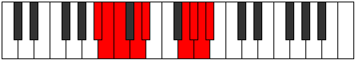 |
| [3639](https://ianring.com/musictheory/scales/3639) | [Paptyllic](ModeBFlatPaptyllic.md) | Bb | Bb, B, C, D, Eb, G, Ab, A, Bb |  |
| [3641](https://ianring.com/musictheory/scales/3641) | [Thocrian](ModeDSharpThocrian.md) | D# | D#, E##, F##, G#, A###, B##, C##, D# |  |
| [3641](https://ianring.com/musictheory/scales/3641) | [Thocrian](ModeEFlatThocrian.md) | Eb | Eb, F#, G, Ab, B#, C#, D, Eb |  |
| [3643](https://ianring.com/musictheory/scales/3643) | [Kydyllic](ModeDSharpKydyllic.md) | D# | D#, E, F#, G, G#, C, C#, D, D# |  |
| [3643](https://ianring.com/musictheory/scales/3643) | [Kydyllic](ModeEFlatKydyllic.md) | Eb | Eb, E, Gb, G, Ab, C, Db, D, Eb |  |
| [3645](https://ianring.com/musictheory/scales/3645) | [Zycryllic](ModeDSharpZycryllic.md) | D# | D#, F, F#, G, G#, C, C#, D, D# |  |
| [3645](https://ianring.com/musictheory/scales/3645) | [Zycryllic](ModeEFlatZycryllic.md) | Eb | Eb, F, Gb, G, Ab, C, Db, D, Eb |  |
| [3645](https://ianring.com/musictheory/scales/3645) | [Zycryllic](ModeASharpZycryllic.md) | A# | A#, C, C#, D, D#, G, G#, A, A# |  |
| [3645](https://ianring.com/musictheory/scales/3645) | [Zycryllic](ModeBFlatZycryllic.md) | Bb | Bb, C, Db, D, Eb, G, Ab, A, Bb |  |
| [3647](https://ianring.com/musictheory/scales/3647) | [Eporygic](ModeDSharpEporygic.md) | D# | D#, E, F, F#, G, G#, C, C#, D, D# |  |
| [3647](https://ianring.com/musictheory/scales/3647) | [Eporygic](ModeEFlatEporygic.md) | Eb | Eb, E, F, Gb, G, Ab, C, Db, D, Eb |  |
| [3647](https://ianring.com/musictheory/scales/3647) | [Eporygic](ModeASharpEporygic.md) | A# | A#, B, C, C#, D, D#, G, G#, A, A# |  |
| [3647](https://ianring.com/musictheory/scales/3647) | [Eporygic](ModeBFlatEporygic.md) | Bb | Bb, B, C, Db, D, Eb, G, Ab, A, Bb |  |
| [3655](https://ianring.com/musictheory/scales/3655) | [Mathian](ModeFSharpMathian.md) | F# | F#, G, Ab, B#, C###, D##, E#, F# |  |
| [3657](https://ianring.com/musictheory/scales/3657) | [Epynimic](ModeANaturalEpynimic.md) | A | A, B#, C###, E##, F##, G#, A |  |
| [3659](https://ianring.com/musictheory/scales/3659) | [Polian](ModeANaturalPolian.md) | A | A, Bb, C, D#, E##, F##, G#, A |  |
| [3661](https://ianring.com/musictheory/scales/3661) | [Mixodorian](ModeANaturalMixodorian.md) | A | A, B, C, D#, E##, F##, G#, A |  |
| [3663](https://ianring.com/musictheory/scales/3663) | [Sonyllic](ModeFSharpSonyllic.md) | F# | F#, G, G#, A, C, D#, E, F, F# |  |
| [3663](https://ianring.com/musictheory/scales/3663) | [Sonyllic](ModeGFlatSonyllic.md) | Gb | Gb, G, Ab, A, C, Eb, E, F, Gb |  |
| [3663](https://ianring.com/musictheory/scales/3663) | [Sonyllic](ModeANaturalSonyllic.md) | A | A, A#, B, C, D#, F#, G, G#, A |  |
| [3671](https://ianring.com/musictheory/scales/3671) | [Aeonyllic](ModeFSharpAeonyllic.md) | F# | F#, G, G#, A#, C, D#, E, F, F# |  |
| [3671](https://ianring.com/musictheory/scales/3671) | [Aeonyllic](ModeGFlatAeonyllic.md) | Gb | Gb, G, Ab, Bb, C, Eb, E, F, Gb |  |
| [3673](https://ianring.com/musictheory/scales/3673) | [Ranian](ModeANaturalRanian.md) | A | A, B#, C#, D#, E##, F##, G#, A |  |
| [3675](https://ianring.com/musictheory/scales/3675) | [Monyllic](ModeANaturalMonyllic.md) | A | A, A#, C, C#, D#, F#, G, G#, A |  |
| [3677](https://ianring.com/musictheory/scales/3677) | [Katylyllic](ModeANaturalKatylyllic.md) | A | A, B, C, C#, D#, F#, G, G#, A |  |
| [3679](https://ianring.com/musictheory/scales/3679) | [Rycrygic](ModeFSharpRycrygic.md) | F# | F#, G, G#, A, A#, C, D#, E, F, F# |  |
| [3679](https://ianring.com/musictheory/scales/3679) | [Rycrygic](ModeGFlatRycrygic.md) | Gb | Gb, G, Ab, A, Bb, C, Eb, E, F, Gb |  |
| [3679](https://ianring.com/musictheory/scales/3679) | [Rycrygic](ModeANaturalRycrygic.md) | A | A, A#, B, C, C#, D#, F#, G, G#, A |  |
| [3683](https://ianring.com/musictheory/scales/3683) | [Dycrian](ModeDNaturalDycrian.md) | D | D, Eb, F##, G#, A##, B#, C#, D |  |
| [3685](https://ianring.com/musictheory/scales/3685) | [Kodian](ModeBFlatKodian.md) | Bb | Bb, C, D#, E, F##, G#, A, Bb |  |
| [3687](https://ianring.com/musictheory/scales/3687) | [Zonyllic](ModeDNaturalZonyllic.md) | D | D, D#, E, G, G#, B, C, C#, D |  |
| [3687](https://ianring.com/musictheory/scales/3687) | [Zonyllic](ModeFSharpZonyllic.md) | F# | F#, G, G#, B, C, D#, E, F, F# |  |
| [3687](https://ianring.com/musictheory/scales/3687) | [Zonyllic](ModeGFlatZonyllic.md) | Gb | Gb, G, Ab, B, C, Eb, E, F, Gb |  |
| [3687](https://ianring.com/musictheory/scales/3687) | [Zonyllic](ModeASharpZonyllic.md) | A# | A#, B, C, D#, E, G, G#, A, A# |  |
| [3687](https://ianring.com/musictheory/scales/3687) | [Zonyllic](ModeBFlatZonyllic.md) | Bb | Bb, B, C, Eb, E, G, Ab, A, Bb |  |
| [3689](https://ianring.com/musictheory/scales/3689) | [Katocrian](ModeANaturalKatocrian.md) | A | A, B#, C##, D#, E##, F##, G#, A |  |
| [3691](https://ianring.com/musictheory/scales/3691) | [Badyllic](ModeANaturalBadyllic.md) | A | A, A#, C, D, D#, F#, G, G#, A |  |
| [3691](https://ianring.com/musictheory/scales/3691) | [Badyllic](ModeDNaturalBadyllic.md) | D | D, D#, F, G, G#, B, C, C#, D |  |
| [3693](https://ianring.com/musictheory/scales/3693) | [Epaptyllic](ModeASharpEpaptyllic.md) | A# | A#, C, C#, D#, E, G, G#, A, A# |  |
| [3693](https://ianring.com/musictheory/scales/3693) | [Epaptyllic](ModeBFlatEpaptyllic.md) | Bb | Bb, C, Db, Eb, E, G, Ab, A, Bb |  |
| [3693](https://ianring.com/musictheory/scales/3693) | [Epaptyllic](ModeANaturalEpaptyllic.md) | A | A, B, C, D, D#, F#, G, G#, A |  |
| [3695](https://ianring.com/musictheory/scales/3695) | [Kodygic](ModeDNaturalKodygic.md) | D | D, D#, E, F, G, G#, B, C, C#, D |  |
| [3695](https://ianring.com/musictheory/scales/3695) | [Kodygic](ModeFSharpKodygic.md) | F# | F#, G, G#, A, B, C, D#, E, F, F# |  |
| [3695](https://ianring.com/musictheory/scales/3695) | [Kodygic](ModeGFlatKodygic.md) | Gb | Gb, G, Ab, A, B, C, Eb, E, F, Gb |  |
| [3695](https://ianring.com/musictheory/scales/3695) | [Kodygic](ModeASharpKodygic.md) | A# | A#, B, C, C#, D#, E, G, G#, A, A# |  |
| [3695](https://ianring.com/musictheory/scales/3695) | [Kodygic](ModeBFlatKodygic.md) | Bb | Bb, B, C, Db, Eb, E, G, Ab, A, Bb |  |
| [3695](https://ianring.com/musictheory/scales/3695) | [Kodygic](ModeANaturalKodygic.md) | A | A, A#, B, C, D, D#, F#, G, G#, A |  |
| [3697](https://ianring.com/musictheory/scales/3697) | [Ionarian](ModeEFlatIonarian.md) | Eb | Eb, F##, G#, A, B#, C#, D, Eb |  |
| [3699](https://ianring.com/musictheory/scales/3699) | [Aeolylyllic](ModeDSharpAeolylyllic.md) | D# | D#, E, G, G#, A, C, C#, D, D# |  |
| [3699](https://ianring.com/musictheory/scales/3699) | [Aeolylyllic](ModeEFlatAeolylyllic.md) | Eb | Eb, E, G, Ab, A, C, Db, D, Eb |  |
| [3699](https://ianring.com/musictheory/scales/3699) | [Aeolylyllic](ModeDNaturalAeolylyllic.md) | D | D, D#, F#, G, G#, B, C, C#, D |  |
| [3701](https://ianring.com/musictheory/scales/3701) | [Bagyllic](ModeDSharpBagyllic.md) | D# | D#, F, G, G#, A, C, C#, D, D# |  |
| [3701](https://ianring.com/musictheory/scales/3701) | [Bagyllic](ModeEFlatBagyllic.md) | Eb | Eb, F, G, Ab, A, C, Db, D, Eb |  |
| [3701](https://ianring.com/musictheory/scales/3701) | [Bagyllic](ModeASharpBagyllic.md) | A# | A#, C, D, D#, E, G, G#, A, A# |  |
| [3701](https://ianring.com/musictheory/scales/3701) | [Bagyllic](ModeBFlatBagyllic.md) | Bb | Bb, C, D, Eb, E, G, Ab, A, Bb |  |
| [3703](https://ianring.com/musictheory/scales/3703) | [Katalygic](ModeDSharpKatalygic.md) | D# | D#, E, F, G, G#, A, C, C#, D, D# |  |
| [3703](https://ianring.com/musictheory/scales/3703) | [Katalygic](ModeEFlatKatalygic.md) | Eb | Eb, E, F, G, Ab, A, C, Db, D, Eb |  |
| [3703](https://ianring.com/musictheory/scales/3703) | [Katalygic](ModeDNaturalKatalygic.md) | D | D, D#, E, F#, G, G#, B, C, C#, D |  |
| [3703](https://ianring.com/musictheory/scales/3703) | [Katalygic](ModeFSharpKatalygic.md) | F# | F#, G, G#, A#, B, C, D#, E, F, F# |  |
| [3703](https://ianring.com/musictheory/scales/3703) | [Katalygic](ModeGFlatKatalygic.md) | Gb | Gb, G, Ab, Bb, B, C, Eb, E, F, Gb |  |
| [3703](https://ianring.com/musictheory/scales/3703) | [Katalygic](ModeASharpKatalygic.md) | A# | A#, B, C, D, D#, E, G, G#, A, A# |  |
| [3703](https://ianring.com/musictheory/scales/3703) | [Katalygic](ModeBFlatKatalygic.md) | Bb | Bb, B, C, D, Eb, E, G, Ab, A, Bb |  |
| [3705](https://ianring.com/musictheory/scales/3705) | [Sydyllic](ModeDSharpSydyllic.md) | D# | D#, F#, G, G#, A, C, C#, D, D# |  |
| [3705](https://ianring.com/musictheory/scales/3705) | [Sydyllic](ModeEFlatSydyllic.md) | Eb | Eb, Gb, G, Ab, A, C, Db, D, Eb |  |
| [3705](https://ianring.com/musictheory/scales/3705) | [Sydyllic](ModeANaturalSydyllic.md) | A | A, C, C#, D, D#, F#, G, G#, A |  |
| [3707](https://ianring.com/musictheory/scales/3707) | [Rynygic](ModeDSharpRynygic.md) | D# | D#, E, F#, G, G#, A, C, C#, D, D# |  |
| [3707](https://ianring.com/musictheory/scales/3707) | [Rynygic](ModeEFlatRynygic.md) | Eb | Eb, E, Gb, G, Ab, A, C, Db, D, Eb |  |
| [3707](https://ianring.com/musictheory/scales/3707) | [Rynygic](ModeANaturalRynygic.md) | A | A, A#, C, C#, D, D#, F#, G, G#, A |  |
| [3707](https://ianring.com/musictheory/scales/3707) | [Rynygic](ModeDNaturalRynygic.md) | D | D, D#, F, F#, G, G#, B, C, C#, D |  |
| [3709](https://ianring.com/musictheory/scales/3709) | [Locrygic](ModeDSharpLocrygic.md) | D# | D#, F, F#, G, G#, A, C, C#, D, D# |  |
| [3709](https://ianring.com/musictheory/scales/3709) | [Locrygic](ModeEFlatLocrygic.md) | Eb | Eb, F, Gb, G, Ab, A, C, Db, D, Eb |  |
| [3709](https://ianring.com/musictheory/scales/3709) | [Locrygic](ModeASharpLocrygic.md) | A# | A#, C, C#, D, D#, E, G, G#, A, A# |  |
| [3709](https://ianring.com/musictheory/scales/3709) | [Locrygic](ModeBFlatLocrygic.md) | Bb | Bb, C, Db, D, Eb, E, G, Ab, A, Bb |  |
| [3709](https://ianring.com/musictheory/scales/3709) | [Locrygic](ModeANaturalLocrygic.md) | A | A, B, C, C#, D, D#, F#, G, G#, A |  |
| [3711](https://ianring.com/musictheory/scales/3711) | [Dycryllian](ModeDSharpDycryllian.md) | D# | D#, E, F, F#, G, G#, A, C, C#, D, D# |  |
| [3711](https://ianring.com/musictheory/scales/3711) | [Dycryllian](ModeEFlatDycryllian.md) | Eb | Eb, E, F, Gb, G, Ab, A, C, Db, D, Eb |  |
| [3711](https://ianring.com/musictheory/scales/3711) | [Dycryllian](ModeDNaturalDycryllian.md) | D | D, D#, E, F, F#, G, G#, B, C, C#, D |  |
| [3711](https://ianring.com/musictheory/scales/3711) | [Dycryllian](ModeASharpDycryllian.md) | A# | A#, B, C, C#, D, D#, E, G, G#, A, A# |  |
| [3711](https://ianring.com/musictheory/scales/3711) | [Dycryllian](ModeBFlatDycryllian.md) | Bb | Bb, B, C, Db, D, Eb, E, G, Ab, A, Bb |  |
| [3711](https://ianring.com/musictheory/scales/3711) | [Dycryllian](ModeANaturalDycryllian.md) | A | A, A#, B, C, C#, D, D#, F#, G, G#, A |  |
| [3711](https://ianring.com/musictheory/scales/3711) | [Dycryllian](ModeFSharpDycryllian.md) | F# | F#, G, G#, A, A#, B, C, D#, E, F, F# |  |
| [3711](https://ianring.com/musictheory/scales/3711) | [Dycryllian](ModeGFlatDycryllian.md) | Gb | Gb, G, Ab, A, Bb, B, C, Eb, E, F, Gb |  |
| [3725](https://ianring.com/musictheory/scales/3725) | [Kyrian](ModeFNaturalKyrian.md) | F | F, G, Ab, B#, C##, D#, E, F |  |
| [3727](https://ianring.com/musictheory/scales/3727) | [Tholyllic](ModeFNaturalTholyllic.md) | F | F, F#, G, G#, C, D, D#, E, F |  |
| [3729](https://ianring.com/musictheory/scales/3729) | [Starimic](ModeGSharpStarimic.md) | G# | G#, A###, C###, D###, E##, F##, G# |  |
| [3729](https://ianring.com/musictheory/scales/3729) | [Starimic](ModeAFlatStarimic.md) | Ab | Ab, B#, C###, D###, E##, F##, Ab |  |
| [3731](https://ianring.com/musictheory/scales/3731) | [Aeryrian](ModeGSharpAeryrian.md) | G# | G#, A, B#, C###, D###, E##, F##, G# |  |
| [3731](https://ianring.com/musictheory/scales/3731) | [Aeryrian](ModeAFlatAeryrian.md) | Ab | Ab, Bbb, C, D#, E#, F#, G, Ab |  |
| [3733](https://ianring.com/musictheory/scales/3733) | [Gycrian](ModeGSharpGycrian.md) | G# | G#, A#, B#, C###, D###, E##, F##, G# | 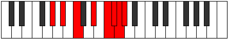 |
| [3733](https://ianring.com/musictheory/scales/3733) | [Gycrian](ModeAFlatGycrian.md) | Ab | Ab, Bb, C, D#, E#, F#, G, Ab |  |
| [3735](https://ianring.com/musictheory/scales/3735) | [Ionagyllic](ModeGSharpIonagyllic.md) | G# | G#, A, A#, C, D#, F, F#, G, G# |  |
| [3735](https://ianring.com/musictheory/scales/3735) | [Ionagyllic](ModeAFlatIonagyllic.md) | Ab | Ab, A, Bb, C, Eb, F, Gb, G, Ab |  |
| [3737](https://ianring.com/musictheory/scales/3737) | [Phrocrian](ModeGSharpPhrocrian.md) | G# | G#, A##, B#, C###, D###, E##, F##, G# |  |
| [3737](https://ianring.com/musictheory/scales/3737) | [Phrocrian](ModeAFlatPhrocrian.md) | Ab | Ab, B, C, D#, E#, F#, G, Ab |  |
| [3739](https://ianring.com/musictheory/scales/3739) | [Ioninyllic](ModeGSharpIoninyllic.md) | G# | G#, A, B, C, D#, F, F#, G, G# |  |
| [3739](https://ianring.com/musictheory/scales/3739) | [Ioninyllic](ModeAFlatIoninyllic.md) | Ab | Ab, A, B, C, Eb, F, Gb, G, Ab |  |
| [3741](https://ianring.com/musictheory/scales/3741) | [Zydyllic](ModeFNaturalZydyllic.md) | F | F, G, G#, A, C, D, D#, E, F |  |
| [3741](https://ianring.com/musictheory/scales/3741) | [Zydyllic](ModeGSharpZydyllic.md) | G# | G#, A#, B, C, D#, F, F#, G, G# |  |
| [3741](https://ianring.com/musictheory/scales/3741) | [Zydyllic](ModeAFlatZydyllic.md) | Ab | Ab, Bb, B, C, Eb, F, Gb, G, Ab |  |
| [3743](https://ianring.com/musictheory/scales/3743) | [Thadygic](ModeFNaturalThadygic.md) | F | F, F#, G, G#, A, C, D, D#, E, F |  |
| [3743](https://ianring.com/musictheory/scales/3743) | [Thadygic](ModeGSharpThadygic.md) | G# | G#, A, A#, B, C, D#, F, F#, G, G# |  |
| [3743](https://ianring.com/musictheory/scales/3743) | [Thadygic](ModeAFlatThadygic.md) | Ab | Ab, A, Bb, B, C, Eb, F, Gb, G, Ab |  |
| [3749](https://ianring.com/musictheory/scales/3749) | [Zothian](ModeBFlatZothian.md) | Bb | Bb, C, D#, E#, F##, G#, A, Bb |  |
| [3751](https://ianring.com/musictheory/scales/3751) | [Aerathyllic](ModeASharpAerathyllic.md) | A# | A#, B, C, D#, F, G, G#, A, A# |  |
| [3751](https://ianring.com/musictheory/scales/3751) | [Aerathyllic](ModeBFlatAerathyllic.md) | Bb | Bb, B, C, Eb, F, G, Ab, A, Bb |  |
| [3757](https://ianring.com/musictheory/scales/3757) | [Goptyllic](ModeFNaturalGoptyllic.md) | F | F, G, G#, A#, C, D, D#, E, F |  |
| [3757](https://ianring.com/musictheory/scales/3757) | [Goptyllic](ModeASharpGoptyllic.md) | A# | A#, C, C#, D#, F, G, G#, A, A# |  |
| [3757](https://ianring.com/musictheory/scales/3757) | [Goptyllic](ModeBFlatGoptyllic.md) | Bb | Bb, C, Db, Eb, F, G, Ab, A, Bb |  |
| [3759](https://ianring.com/musictheory/scales/3759) | [Darygic](ModeFNaturalDarygic.md) | F | F, F#, G, G#, A#, C, D, D#, E, F |  |
| [3759](https://ianring.com/musictheory/scales/3759) | [Darygic](ModeASharpDarygic.md) | A# | A#, B, C, C#, D#, F, G, G#, A, A# |  |
| [3759](https://ianring.com/musictheory/scales/3759) | [Darygic](ModeBFlatDarygic.md) | Bb | Bb, B, C, Db, Eb, F, G, Ab, A, Bb |  |
| [3761](https://ianring.com/musictheory/scales/3761) | [Ionythian](ModeGSharpIonythian.md) | G# | G#, A###, B##, C###, D###, E##, F##, G# |  |
| [3761](https://ianring.com/musictheory/scales/3761) | [Ionythian](ModeAFlatIonythian.md) | Ab | Ab, B#, C#, D#, E#, F#, G, Ab |  |
| [3761](https://ianring.com/musictheory/scales/3761) | [Ionythian](ModeEFlatIonythian.md) | Eb | Eb, F##, G#, A#, B#, C#, D, Eb |  |
| [3763](https://ianring.com/musictheory/scales/3763) | [Modyllic](ModeGSharpModyllic.md) | G# | G#, A, C, C#, D#, F, F#, G, G# |  |
| [3763](https://ianring.com/musictheory/scales/3763) | [Modyllic](ModeAFlatModyllic.md) | Ab | Ab, A, C, Db, Eb, F, Gb, G, Ab |  |
| [3763](https://ianring.com/musictheory/scales/3763) | [Modyllic](ModeDSharpModyllic.md) | D# | D#, E, G, G#, A#, C, C#, D, D# |  |
| [3763](https://ianring.com/musictheory/scales/3763) | [Modyllic](ModeEFlatModyllic.md) | Eb | Eb, E, G, Ab, Bb, C, Db, D, Eb |  |
| [3765](https://ianring.com/musictheory/scales/3765) | [Aerycryllic](ModeDSharpAerycryllic.md) | D# | D#, F, G, G#, A#, C, C#, D, D# |  |
| [3765](https://ianring.com/musictheory/scales/3765) | [Aerycryllic](ModeEFlatAerycryllic.md) | Eb | Eb, F, G, Ab, Bb, C, Db, D, Eb |  |
| [3765](https://ianring.com/musictheory/scales/3765) | [Aerycryllic](ModeGSharpAerycryllic.md) | G# | G#, A#, C, C#, D#, F, F#, G, G# |  |
| [3765](https://ianring.com/musictheory/scales/3765) | [Aerycryllic](ModeAFlatAerycryllic.md) | Ab | Ab, Bb, C, Db, Eb, F, Gb, G, Ab |  |
| [3765](https://ianring.com/musictheory/scales/3765) | [Aerycryllic](ModeASharpAerycryllic.md) | A# | A#, C, D, D#, F, G, G#, A, A# |  |
| [3765](https://ianring.com/musictheory/scales/3765) | [Aerycryllic](ModeBFlatAerycryllic.md) | Bb | Bb, C, D, Eb, F, G, Ab, A, Bb |  |
| [3767](https://ianring.com/musictheory/scales/3767) | [Bacrygic](ModeDSharpBacrygic.md) | D# | D#, E, F, G, G#, A#, C, C#, D, D# |  |
| [3767](https://ianring.com/musictheory/scales/3767) | [Bacrygic](ModeEFlatBacrygic.md) | Eb | Eb, E, F, G, Ab, Bb, C, Db, D, Eb |  |
| [3767](https://ianring.com/musictheory/scales/3767) | [Bacrygic](ModeGSharpBacrygic.md) | G# | G#, A, A#, C, C#, D#, F, F#, G, G# |  |
| [3767](https://ianring.com/musictheory/scales/3767) | [Bacrygic](ModeAFlatBacrygic.md) | Ab | Ab, A, Bb, C, Db, Eb, F, Gb, G, Ab |  |
| [3767](https://ianring.com/musictheory/scales/3767) | [Bacrygic](ModeASharpBacrygic.md) | A# | A#, B, C, D, D#, F, G, G#, A, A# |  |
| [3767](https://ianring.com/musictheory/scales/3767) | [Bacrygic](ModeBFlatBacrygic.md) | Bb | Bb, B, C, D, Eb, F, G, Ab, A, Bb |  |
| [3769](https://ianring.com/musictheory/scales/3769) | [Aeracryllic](ModeDSharpAeracryllic.md) | D# | D#, F#, G, G#, A#, C, C#, D, D# |  |
| [3769](https://ianring.com/musictheory/scales/3769) | [Aeracryllic](ModeEFlatAeracryllic.md) | Eb | Eb, Gb, G, Ab, Bb, C, Db, D, Eb |  |
| [3769](https://ianring.com/musictheory/scales/3769) | [Aeracryllic](ModeGSharpAeracryllic.md) | G# | G#, B, C, C#, D#, F, F#, G, G# |  |
| [3769](https://ianring.com/musictheory/scales/3769) | [Aeracryllic](ModeAFlatAeracryllic.md) | Ab | Ab, B, C, Db, Eb, F, Gb, G, Ab |  |
| [3771](https://ianring.com/musictheory/scales/3771) | [Stophygic](ModeDSharpStophygic.md) | D# | D#, E, F#, G, G#, A#, C, C#, D, D# |  |
| [3771](https://ianring.com/musictheory/scales/3771) | [Stophygic](ModeEFlatStophygic.md) | Eb | Eb, E, Gb, G, Ab, Bb, C, Db, D, Eb |  |
| [3771](https://ianring.com/musictheory/scales/3771) | [Stophygic](ModeGSharpStophygic.md) | G# | G#, A, B, C, C#, D#, F, F#, G, G# |  |
| [3771](https://ianring.com/musictheory/scales/3771) | [Stophygic](ModeAFlatStophygic.md) | Ab | Ab, A, B, C, Db, Eb, F, Gb, G, Ab |  |
| [3773](https://ianring.com/musictheory/scales/3773) | [Sorygic](ModeDSharpSorygic.md) | D# | D#, F, F#, G, G#, A#, C, C#, D, D# |  |
| [3773](https://ianring.com/musictheory/scales/3773) | [Sorygic](ModeEFlatSorygic.md) | Eb | Eb, F, Gb, G, Ab, Bb, C, Db, D, Eb |  |
| [3773](https://ianring.com/musictheory/scales/3773) | [Sorygic](ModeASharpSorygic.md) | A# | A#, C, C#, D, D#, F, G, G#, A, A# |  |
| [3773](https://ianring.com/musictheory/scales/3773) | [Sorygic](ModeBFlatSorygic.md) | Bb | Bb, C, Db, D, Eb, F, G, Ab, A, Bb |  |
| [3773](https://ianring.com/musictheory/scales/3773) | [Sorygic](ModeFNaturalSorygic.md) | F | F, G, G#, A, A#, C, D, D#, E, F |  |
| [3773](https://ianring.com/musictheory/scales/3773) | [Sorygic](ModeGSharpSorygic.md) | G# | G#, A#, B, C, C#, D#, F, F#, G, G# |  |
| [3773](https://ianring.com/musictheory/scales/3773) | [Sorygic](ModeAFlatSorygic.md) | Ab | Ab, Bb, B, C, Db, Eb, F, Gb, G, Ab |  |
| [3775](https://ianring.com/musictheory/scales/3775) | [Loptyllian](ModeDSharpLoptyllian.md) | D# | D#, E, F, F#, G, G#, A#, C, C#, D, D# |  |
| [3775](https://ianring.com/musictheory/scales/3775) | [Loptyllian](ModeEFlatLoptyllian.md) | Eb | Eb, E, F, Gb, G, Ab, Bb, C, Db, D, Eb |  |
| [3775](https://ianring.com/musictheory/scales/3775) | [Loptyllian](ModeFNaturalLoptyllian.md) | F | F, F#, G, G#, A, A#, C, D, D#, E, F |  |
| [3775](https://ianring.com/musictheory/scales/3775) | [Loptyllian](ModeASharpLoptyllian.md) | A# | A#, B, C, C#, D, D#, F, G, G#, A, A# |  |
| [3775](https://ianring.com/musictheory/scales/3775) | [Loptyllian](ModeBFlatLoptyllian.md) | Bb | Bb, B, C, Db, D, Eb, F, G, Ab, A, Bb |  |
| [3775](https://ianring.com/musictheory/scales/3775) | [Loptyllian](ModeGSharpLoptyllian.md) | G# | G#, A, A#, B, C, C#, D#, F, F#, G, G# |  |
| [3775](https://ianring.com/musictheory/scales/3775) | [Loptyllian](ModeAFlatLoptyllian.md) | Ab | Ab, A, Bb, B, C, Db, Eb, F, Gb, G, Ab |  |
| [3781](https://ianring.com/musictheory/scales/3781) | [Gyphian](ModeDFlatGyphian.md) | Db | Db, Eb, F##, G#, A#, B, C, Db |  |
| [3783](https://ianring.com/musictheory/scales/3783) | [Phrygyllic](ModeFSharpPhrygyllic.md) | F# | F#, G, G#, C, C#, D#, E, F, F# |  |
| [3783](https://ianring.com/musictheory/scales/3783) | [Phrygyllic](ModeGFlatPhrygyllic.md) | Gb | Gb, G, Ab, C, Db, Eb, E, F, Gb |  |
| [3783](https://ianring.com/musictheory/scales/3783) | [Phrygyllic](ModeCSharpPhrygyllic.md) | C# | C#, D, D#, G, G#, A#, B, C, C# |  |
| [3783](https://ianring.com/musictheory/scales/3783) | [Phrygyllic](ModeDFlatPhrygyllic.md) | Db | Db, D, Eb, G, Ab, Bb, B, C, Db |  |
| [3785](https://ianring.com/musictheory/scales/3785) | [Epagian](ModeANaturalEpagian.md) | A | A, B#, C###, D##, E##, F##, G#, A |  |
| [3787](https://ianring.com/musictheory/scales/3787) | [Kagyllic](ModeANaturalKagyllic.md) | A | A, A#, C, D#, E, F#, G, G#, A |  |
| [3789](https://ianring.com/musictheory/scales/3789) | [Eporyllic](ModeFNaturalEporyllic.md) | F | F, G, G#, B, C, D, D#, E, F |  |
| [3789](https://ianring.com/musictheory/scales/3789) | [Eporyllic](ModeANaturalEporyllic.md) | A | A, B, C, D#, E, F#, G, G#, A |  |
| [3789](https://ianring.com/musictheory/scales/3789) | [Eporyllic](ModeCSharpEporyllic.md) | C# | C#, D#, E, G, G#, A#, B, C, C# |  |
| [3789](https://ianring.com/musictheory/scales/3789) | [Eporyllic](ModeDFlatEporyllic.md) | Db | Db, Eb, E, G, Ab, Bb, B, C, Db |  |
| [3791](https://ianring.com/musictheory/scales/3791) | [Stodygic](ModeFSharpStodygic.md) | F# | F#, G, G#, A, C, C#, D#, E, F, F# |  |
| [3791](https://ianring.com/musictheory/scales/3791) | [Stodygic](ModeGFlatStodygic.md) | Gb | Gb, G, Ab, A, C, Db, Eb, E, F, Gb |  |
| [3791](https://ianring.com/musictheory/scales/3791) | [Stodygic](ModeFNaturalStodygic.md) | F | F, F#, G, G#, B, C, D, D#, E, F |  |
| [3791](https://ianring.com/musictheory/scales/3791) | [Stodygic](ModeCSharpStodygic.md) | C# | C#, D, D#, E, G, G#, A#, B, C, C# |  |
| [3791](https://ianring.com/musictheory/scales/3791) | [Stodygic](ModeDFlatStodygic.md) | Db | Db, D, Eb, E, G, Ab, Bb, B, C, Db |  |
| [3791](https://ianring.com/musictheory/scales/3791) | [Stodygic](ModeANaturalStodygic.md) | A | A, A#, B, C, D#, E, F#, G, G#, A |  |
| [3793](https://ianring.com/musictheory/scales/3793) | [Aeopian](ModeGSharpAeopian.md) | G# | G#, A###, B###, C###, D###, E##, F##, G# |  |
| [3793](https://ianring.com/musictheory/scales/3793) | [Aeopian](ModeAFlatAeopian.md) | Ab | Ab, B#, C##, D#, E#, F#, G, Ab |  |
| [3795](https://ianring.com/musictheory/scales/3795) | [Epothyllic](ModeGSharpEpothyllic.md) | G# | G#, A, C, D, D#, F, F#, G, G# |  |
| [3795](https://ianring.com/musictheory/scales/3795) | [Epothyllic](ModeAFlatEpothyllic.md) | Ab | Ab, A, C, D, Eb, F, Gb, G, Ab |  |
| [3797](https://ianring.com/musictheory/scales/3797) | [Rocryllic](ModeGSharpRocryllic.md) | G# | G#, A#, C, D, D#, F, F#, G, G# |  |
| [3797](https://ianring.com/musictheory/scales/3797) | [Rocryllic](ModeAFlatRocryllic.md) | Ab | Ab, Bb, C, D, Eb, F, Gb, G, Ab |  |
| [3797](https://ianring.com/musictheory/scales/3797) | [Rocryllic](ModeCSharpRocryllic.md) | C# | C#, D#, F, G, G#, A#, B, C, C# |  |
| [3797](https://ianring.com/musictheory/scales/3797) | [Rocryllic](ModeDFlatRocryllic.md) | Db | Db, Eb, F, G, Ab, Bb, B, C, Db |  |
| [3799](https://ianring.com/musictheory/scales/3799) | [Aeralygic](ModeFSharpAeralygic.md) | F# | F#, G, G#, A#, C, C#, D#, E, F, F# |  |
| [3799](https://ianring.com/musictheory/scales/3799) | [Aeralygic](ModeGFlatAeralygic.md) | Gb | Gb, G, Ab, Bb, C, Db, Eb, E, F, Gb |  |
| [3799](https://ianring.com/musictheory/scales/3799) | [Aeralygic](ModeGSharpAeralygic.md) | G# | G#, A, A#, C, D, D#, F, F#, G, G# |  |
| [3799](https://ianring.com/musictheory/scales/3799) | [Aeralygic](ModeAFlatAeralygic.md) | Ab | Ab, A, Bb, C, D, Eb, F, Gb, G, Ab |  |
| [3799](https://ianring.com/musictheory/scales/3799) | [Aeralygic](ModeCSharpAeralygic.md) | C# | C#, D, D#, F, G, G#, A#, B, C, C# |  |
| [3799](https://ianring.com/musictheory/scales/3799) | [Aeralygic](ModeDFlatAeralygic.md) | Db | Db, D, Eb, F, G, Ab, Bb, B, C, Db |  |
| [3801](https://ianring.com/musictheory/scales/3801) | [Maptyllic](ModeANaturalMaptyllic.md) | A | A, C, C#, D#, E, F#, G, G#, A |  |
| [3801](https://ianring.com/musictheory/scales/3801) | [Maptyllic](ModeGSharpMaptyllic.md) | G# | G#, B, C, D, D#, F, F#, G, G# |  |
| [3801](https://ianring.com/musictheory/scales/3801) | [Maptyllic](ModeAFlatMaptyllic.md) | Ab | Ab, B, C, D, Eb, F, Gb, G, Ab |  |
| [3803](https://ianring.com/musictheory/scales/3803) | [Epidygic](ModeANaturalEpidygic.md) | A | A, A#, C, C#, D#, E, F#, G, G#, A |  |
| [3803](https://ianring.com/musictheory/scales/3803) | [Epidygic](ModeGSharpEpidygic.md) | G# | G#, A, B, C, D, D#, F, F#, G, G# |  |
| [3803](https://ianring.com/musictheory/scales/3803) | [Epidygic](ModeAFlatEpidygic.md) | Ab | Ab, A, B, C, D, Eb, F, Gb, G, Ab |  |
| [3805](https://ianring.com/musictheory/scales/3805) | [Moptygic](ModeFNaturalMoptygic.md) | F | F, G, G#, A, B, C, D, D#, E, F |  |
| [3805](https://ianring.com/musictheory/scales/3805) | [Moptygic](ModeANaturalMoptygic.md) | A | A, B, C, C#, D#, E, F#, G, G#, A |  |
| [3805](https://ianring.com/musictheory/scales/3805) | [Moptygic](ModeCSharpMoptygic.md) | C# | C#, D#, E, F, G, G#, A#, B, C, C# |  |
| [3805](https://ianring.com/musictheory/scales/3805) | [Moptygic](ModeDFlatMoptygic.md) | Db | Db, Eb, E, F, G, Ab, Bb, B, C, Db |  |
| [3805](https://ianring.com/musictheory/scales/3805) | [Moptygic](ModeGSharpMoptygic.md) | G# | G#, A#, B, C, D, D#, F, F#, G, G# |  |
| [3805](https://ianring.com/musictheory/scales/3805) | [Moptygic](ModeAFlatMoptygic.md) | Ab | Ab, Bb, B, C, D, Eb, F, Gb, G, Ab |  |
| [3807](https://ianring.com/musictheory/scales/3807) | [Bagyllian](ModeFSharpBagyllian.md) | F# | F#, G, G#, A, A#, C, C#, D#, E, F, F# |  |
| [3807](https://ianring.com/musictheory/scales/3807) | [Bagyllian](ModeGFlatBagyllian.md) | Gb | Gb, G, Ab, A, Bb, C, Db, Eb, E, F, Gb |  |
| [3807](https://ianring.com/musictheory/scales/3807) | [Bagyllian](ModeFNaturalBagyllian.md) | F | F, F#, G, G#, A, B, C, D, D#, E, F |  |
| [3807](https://ianring.com/musictheory/scales/3807) | [Bagyllian](ModeCSharpBagyllian.md) | C# | C#, D, D#, E, F, G, G#, A#, B, C, C# |  |
| [3807](https://ianring.com/musictheory/scales/3807) | [Bagyllian](ModeDFlatBagyllian.md) | Db | Db, D, Eb, E, F, G, Ab, Bb, B, C, Db |  |
| [3807](https://ianring.com/musictheory/scales/3807) | [Bagyllian](ModeANaturalBagyllian.md) | A | A, A#, B, C, C#, D#, E, F#, G, G#, A |  |
| [3807](https://ianring.com/musictheory/scales/3807) | [Bagyllian](ModeGSharpBagyllian.md) | G# | G#, A, A#, B, C, D, D#, F, F#, G, G# |  |
| [3807](https://ianring.com/musictheory/scales/3807) | [Bagyllian](ModeAFlatBagyllian.md) | Ab | Ab, A, Bb, B, C, D, Eb, F, Gb, G, Ab |  |
| [3811](https://ianring.com/musictheory/scales/3811) | [Epogyllic](ModeDNaturalEpogyllic.md) | D | D, D#, G, G#, A, B, C, C#, D |  |
| [3813](https://ianring.com/musictheory/scales/3813) | [Aeologyllic](ModeASharpAeologyllic.md) | A# | A#, C, D#, E, F, G, G#, A, A# |  |
| [3813](https://ianring.com/musictheory/scales/3813) | [Aeologyllic](ModeBFlatAeologyllic.md) | Bb | Bb, C, Eb, E, F, G, Ab, A, Bb |  |
| [3813](https://ianring.com/musictheory/scales/3813) | [Aeologyllic](ModeCSharpAeologyllic.md) | C# | C#, D#, F#, G, G#, A#, B, C, C# |  |
| [3813](https://ianring.com/musictheory/scales/3813) | [Aeologyllic](ModeDFlatAeologyllic.md) | Db | Db, Eb, Gb, G, Ab, Bb, B, C, Db |  |
| [3815](https://ianring.com/musictheory/scales/3815) | [Mylygic](ModeFSharpMylygic.md) | F# | F#, G, G#, B, C, C#, D#, E, F, F# |  |
| [3815](https://ianring.com/musictheory/scales/3815) | [Mylygic](ModeGFlatMylygic.md) | Gb | Gb, G, Ab, B, C, Db, Eb, E, F, Gb |  |
| [3815](https://ianring.com/musictheory/scales/3815) | [Mylygic](ModeDNaturalMylygic.md) | D | D, D#, E, G, G#, A, B, C, C#, D |  |
| [3815](https://ianring.com/musictheory/scales/3815) | [Mylygic](ModeCSharpMylygic.md) | C# | C#, D, D#, F#, G, G#, A#, B, C, C# |  |
| [3815](https://ianring.com/musictheory/scales/3815) | [Mylygic](ModeDFlatMylygic.md) | Db | Db, D, Eb, Gb, G, Ab, Bb, B, C, Db |  |
| [3815](https://ianring.com/musictheory/scales/3815) | [Mylygic](ModeASharpMylygic.md) | A# | A#, B, C, D#, E, F, G, G#, A, A# |  |
| [3815](https://ianring.com/musictheory/scales/3815) | [Mylygic](ModeBFlatMylygic.md) | Bb | Bb, B, C, Eb, E, F, G, Ab, A, Bb |  |
| [3817](https://ianring.com/musictheory/scales/3817) | [Zoryllic](ModeANaturalZoryllic.md) | A | A, C, D, D#, E, F#, G, G#, A |  |
| [3819](https://ianring.com/musictheory/scales/3819) | [Aeolanygic](ModeANaturalAeolanygic.md) | A | A, A#, C, D, D#, E, F#, G, G#, A |  |
| [3819](https://ianring.com/musictheory/scales/3819) | [Aeolanygic](ModeDNaturalAeolanygic.md) | D | D, D#, F, G, G#, A, B, C, C#, D |  |
| [3821](https://ianring.com/musictheory/scales/3821) | [Epyrygic](ModeASharpEpyrygic.md) | A# | A#, C, C#, D#, E, F, G, G#, A, A# |  |
| [3821](https://ianring.com/musictheory/scales/3821) | [Epyrygic](ModeBFlatEpyrygic.md) | Bb | Bb, C, Db, Eb, E, F, G, Ab, A, Bb |  |
| [3821](https://ianring.com/musictheory/scales/3821) | [Epyrygic](ModeANaturalEpyrygic.md) | A | A, B, C, D, D#, E, F#, G, G#, A |  |
| [3821](https://ianring.com/musictheory/scales/3821) | [Epyrygic](ModeFNaturalEpyrygic.md) | F | F, G, G#, A#, B, C, D, D#, E, F |  |
| [3821](https://ianring.com/musictheory/scales/3821) | [Epyrygic](ModeCSharpEpyrygic.md) | C# | C#, D#, E, F#, G, G#, A#, B, C, C# |  |
| [3821](https://ianring.com/musictheory/scales/3821) | [Epyrygic](ModeDFlatEpyrygic.md) | Db | Db, Eb, E, Gb, G, Ab, Bb, B, C, Db |  |
| [3823](https://ianring.com/musictheory/scales/3823) | [Epinyllian](ModeDNaturalEpinyllian.md) | D | D, D#, E, F, G, G#, A, B, C, C#, D |  |
| [3823](https://ianring.com/musictheory/scales/3823) | [Epinyllian](ModeFSharpEpinyllian.md) | F# | F#, G, G#, A, B, C, C#, D#, E, F, F# |  |
| [3823](https://ianring.com/musictheory/scales/3823) | [Epinyllian](ModeGFlatEpinyllian.md) | Gb | Gb, G, Ab, A, B, C, Db, Eb, E, F, Gb |  |
| [3823](https://ianring.com/musictheory/scales/3823) | [Epinyllian](ModeCSharpEpinyllian.md) | C# | C#, D, D#, E, F#, G, G#, A#, B, C, C# |  |
| [3823](https://ianring.com/musictheory/scales/3823) | [Epinyllian](ModeDFlatEpinyllian.md) | Db | Db, D, Eb, E, Gb, G, Ab, Bb, B, C, Db |  |
| [3823](https://ianring.com/musictheory/scales/3823) | [Epinyllian](ModeFNaturalEpinyllian.md) | F | F, F#, G, G#, A#, B, C, D, D#, E, F |  |
| [3823](https://ianring.com/musictheory/scales/3823) | [Epinyllian](ModeASharpEpinyllian.md) | A# | A#, B, C, C#, D#, E, F, G, G#, A, A# |  |
| [3823](https://ianring.com/musictheory/scales/3823) | [Epinyllian](ModeBFlatEpinyllian.md) | Bb | Bb, B, C, Db, Eb, E, F, G, Ab, A, Bb |  |
| [3823](https://ianring.com/musictheory/scales/3823) | [Epinyllian](ModeANaturalEpinyllian.md) | A | A, A#, B, C, D, D#, E, F#, G, G#, A |  |
| [3825](https://ianring.com/musictheory/scales/3825) | [Pynyllic](ModeGSharpPynyllic.md) | G# | G#, C, C#, D, D#, F, F#, G, G# |  |
| [3825](https://ianring.com/musictheory/scales/3825) | [Pynyllic](ModeAFlatPynyllic.md) | Ab | Ab, C, Db, D, Eb, F, Gb, G, Ab |  |
| [3825](https://ianring.com/musictheory/scales/3825) | [Pynyllic](ModeDSharpPynyllic.md) | D# | D#, G, G#, A, A#, C, C#, D, D# |  |
| [3825](https://ianring.com/musictheory/scales/3825) | [Pynyllic](ModeEFlatPynyllic.md) | Eb | Eb, G, Ab, A, Bb, C, Db, D, Eb |  |
| [3827](https://ianring.com/musictheory/scales/3827) | [Dorygic](ModeGSharpDorygic.md) | G# | G#, A, C, C#, D, D#, F, F#, G, G# |  |
| [3827](https://ianring.com/musictheory/scales/3827) | [Dorygic](ModeAFlatDorygic.md) | Ab | Ab, A, C, Db, D, Eb, F, Gb, G, Ab |  |
| [3827](https://ianring.com/musictheory/scales/3827) | [Dorygic](ModeDSharpDorygic.md) | D# | D#, E, G, G#, A, A#, C, C#, D, D# |  |
| [3827](https://ianring.com/musictheory/scales/3827) | [Dorygic](ModeEFlatDorygic.md) | Eb | Eb, E, G, Ab, A, Bb, C, Db, D, Eb |  |
| [3827](https://ianring.com/musictheory/scales/3827) | [Dorygic](ModeDNaturalDorygic.md) | D | D, D#, F#, G, G#, A, B, C, C#, D |  |
| [3829](https://ianring.com/musictheory/scales/3829) | [Aerycrygic](ModeGSharpAerycrygic.md) | G# | G#, A#, C, C#, D, D#, F, F#, G, G# |  |
| [3829](https://ianring.com/musictheory/scales/3829) | [Aerycrygic](ModeAFlatAerycrygic.md) | Ab | Ab, Bb, C, Db, D, Eb, F, Gb, G, Ab |  |
| [3829](https://ianring.com/musictheory/scales/3829) | [Aerycrygic](ModeDSharpAerycrygic.md) | D# | D#, F, G, G#, A, A#, C, C#, D, D# |  |
| [3829](https://ianring.com/musictheory/scales/3829) | [Aerycrygic](ModeEFlatAerycrygic.md) | Eb | Eb, F, G, Ab, A, Bb, C, Db, D, Eb |  |
| [3829](https://ianring.com/musictheory/scales/3829) | [Aerycrygic](ModeASharpAerycrygic.md) | A# | A#, C, D, D#, E, F, G, G#, A, A# |  |
| [3829](https://ianring.com/musictheory/scales/3829) | [Aerycrygic](ModeBFlatAerycrygic.md) | Bb | Bb, C, D, Eb, E, F, G, Ab, A, Bb |  |
| [3829](https://ianring.com/musictheory/scales/3829) | [Aerycrygic](ModeCSharpAerycrygic.md) | C# | C#, D#, F, F#, G, G#, A#, B, C, C# |  |
| [3829](https://ianring.com/musictheory/scales/3829) | [Aerycrygic](ModeDFlatAerycrygic.md) | Db | Db, Eb, F, Gb, G, Ab, Bb, B, C, Db |  |
| [3831](https://ianring.com/musictheory/scales/3831) | [Ionyllian](ModeDSharpIonyllian.md) | D# | D#, E, F, G, G#, A, A#, C, C#, D, D# |  |
| [3831](https://ianring.com/musictheory/scales/3831) | [Ionyllian](ModeEFlatIonyllian.md) | Eb | Eb, E, F, G, Ab, A, Bb, C, Db, D, Eb |  |
| [3831](https://ianring.com/musictheory/scales/3831) | [Ionyllian](ModeGSharpIonyllian.md) | G# | G#, A, A#, C, C#, D, D#, F, F#, G, G# |  |
| [3831](https://ianring.com/musictheory/scales/3831) | [Ionyllian](ModeAFlatIonyllian.md) | Ab | Ab, A, Bb, C, Db, D, Eb, F, Gb, G, Ab |  |
| [3831](https://ianring.com/musictheory/scales/3831) | [Ionyllian](ModeDNaturalIonyllian.md) | D | D, D#, E, F#, G, G#, A, B, C, C#, D |  |
| [3831](https://ianring.com/musictheory/scales/3831) | [Ionyllian](ModeCSharpIonyllian.md) | C# | C#, D, D#, F, F#, G, G#, A#, B, C, C# |  |
| [3831](https://ianring.com/musictheory/scales/3831) | [Ionyllian](ModeDFlatIonyllian.md) | Db | Db, D, Eb, F, Gb, G, Ab, Bb, B, C, Db |  |
| [3831](https://ianring.com/musictheory/scales/3831) | [Ionyllian](ModeFSharpIonyllian.md) | F# | F#, G, G#, A#, B, C, C#, D#, E, F, F# |  |
| [3831](https://ianring.com/musictheory/scales/3831) | [Ionyllian](ModeGFlatIonyllian.md) | Gb | Gb, G, Ab, Bb, B, C, Db, Eb, E, F, Gb |  |
| [3831](https://ianring.com/musictheory/scales/3831) | [Ionyllian](ModeASharpIonyllian.md) | A# | A#, B, C, D, D#, E, F, G, G#, A, A# |  |
| [3831](https://ianring.com/musictheory/scales/3831) | [Ionyllian](ModeBFlatIonyllian.md) | Bb | Bb, B, C, D, Eb, E, F, G, Ab, A, Bb |  |
| [3833](https://ianring.com/musictheory/scales/3833) | [Dycrygic](ModeANaturalDycrygic.md) | A | A, C, C#, D, D#, E, F#, G, G#, A |  |
| [3833](https://ianring.com/musictheory/scales/3833) | [Dycrygic](ModeDSharpDycrygic.md) | D# | D#, F#, G, G#, A, A#, C, C#, D, D# |  |
| [3833](https://ianring.com/musictheory/scales/3833) | [Dycrygic](ModeEFlatDycrygic.md) | Eb | Eb, Gb, G, Ab, A, Bb, C, Db, D, Eb |  |
| [3833](https://ianring.com/musictheory/scales/3833) | [Dycrygic](ModeGSharpDycrygic.md) | G# | G#, B, C, C#, D, D#, F, F#, G, G# |  |
| [3833](https://ianring.com/musictheory/scales/3833) | [Dycrygic](ModeAFlatDycrygic.md) | Ab | Ab, B, C, Db, D, Eb, F, Gb, G, Ab |  |
| [3835](https://ianring.com/musictheory/scales/3835) | [Katodyllian](ModeDSharpKatodyllian.md) | D# | D#, E, F#, G, G#, A, A#, C, C#, D, D# |  |
| [3835](https://ianring.com/musictheory/scales/3835) | [Katodyllian](ModeEFlatKatodyllian.md) | Eb | Eb, E, Gb, G, Ab, A, Bb, C, Db, D, Eb |  |
| [3835](https://ianring.com/musictheory/scales/3835) | [Katodyllian](ModeANaturalKatodyllian.md) | A | A, A#, C, C#, D, D#, E, F#, G, G#, A |  |
| [3835](https://ianring.com/musictheory/scales/3835) | [Katodyllian](ModeDNaturalKatodyllian.md) | D | D, D#, F, F#, G, G#, A, B, C, C#, D |  |
| [3835](https://ianring.com/musictheory/scales/3835) | [Katodyllian](ModeGSharpKatodyllian.md) | G# | G#, A, B, C, C#, D, D#, F, F#, G, G# |  |
| [3835](https://ianring.com/musictheory/scales/3835) | [Katodyllian](ModeAFlatKatodyllian.md) | Ab | Ab, A, B, C, Db, D, Eb, F, Gb, G, Ab |  |
| [3837](https://ianring.com/musictheory/scales/3837) | [Garyllian](ModeASharpGaryllian.md) | A# | A#, C, C#, D, D#, E, F, G, G#, A, A# |  |
| [3837](https://ianring.com/musictheory/scales/3837) | [Garyllian](ModeBFlatGaryllian.md) | Bb | Bb, C, Db, D, Eb, E, F, G, Ab, A, Bb |  |
| [3837](https://ianring.com/musictheory/scales/3837) | [Garyllian](ModeDSharpGaryllian.md) | D# | D#, F, F#, G, G#, A, A#, C, C#, D, D# |  |
| [3837](https://ianring.com/musictheory/scales/3837) | [Garyllian](ModeEFlatGaryllian.md) | Eb | Eb, F, Gb, G, Ab, A, Bb, C, Db, D, Eb |  |
| [3837](https://ianring.com/musictheory/scales/3837) | [Garyllian](ModeANaturalGaryllian.md) | A | A, B, C, C#, D, D#, E, F#, G, G#, A |  |
| [3837](https://ianring.com/musictheory/scales/3837) | [Garyllian](ModeGSharpGaryllian.md) | G# | G#, A#, B, C, C#, D, D#, F, F#, G, G# |  |
| [3837](https://ianring.com/musictheory/scales/3837) | [Garyllian](ModeAFlatGaryllian.md) | Ab | Ab, Bb, B, C, Db, D, Eb, F, Gb, G, Ab |  |
| [3837](https://ianring.com/musictheory/scales/3837) | [Garyllian](ModeCSharpGaryllian.md) | C# | C#, D#, E, F, F#, G, G#, A#, B, C, C# |  |
| [3837](https://ianring.com/musictheory/scales/3837) | [Garyllian](ModeDFlatGaryllian.md) | Db | Db, Eb, E, F, Gb, G, Ab, Bb, B, C, Db |  |
| [3837](https://ianring.com/musictheory/scales/3837) | [Garyllian](ModeFNaturalGaryllian.md) | F | F, G, G#, A, A#, B, C, D, D#, E, F |  |
| [3839](https://ianring.com/musictheory/scales/3839) | [Mixolatic](ModeDSharpMixolatic.md) | D# | D#, E, F, F#, G, G#, A, A#, C, C#, D, D# |  |
| [3839](https://ianring.com/musictheory/scales/3839) | [Mixolatic](ModeEFlatMixolatic.md) | Eb | Eb, E, F, Gb, G, Ab, A, Bb, C, Db, D, Eb |  |
| [3839](https://ianring.com/musictheory/scales/3839) | [Mixolatic](ModeDNaturalMixolatic.md) | D | D, D#, E, F, F#, G, G#, A, B, C, C#, D |  |
| [3839](https://ianring.com/musictheory/scales/3839) | [Mixolatic](ModeCSharpMixolatic.md) | C# | C#, D, D#, E, F, F#, G, G#, A#, B, C, C# |  |
| [3839](https://ianring.com/musictheory/scales/3839) | [Mixolatic](ModeDFlatMixolatic.md) | Db | Db, D, Eb, E, F, Gb, G, Ab, Bb, B, C, Db |  |
| [3839](https://ianring.com/musictheory/scales/3839) | [Mixolatic](ModeASharpMixolatic.md) | A# | A#, B, C, C#, D, D#, E, F, G, G#, A, A# |  |
| [3839](https://ianring.com/musictheory/scales/3839) | [Mixolatic](ModeBFlatMixolatic.md) | Bb | Bb, B, C, Db, D, Eb, E, F, G, Ab, A, Bb |  |
| [3839](https://ianring.com/musictheory/scales/3839) | [Mixolatic](ModeANaturalMixolatic.md) | A | A, A#, B, C, C#, D, D#, E, F#, G, G#, A |  |
| [3839](https://ianring.com/musictheory/scales/3839) | [Mixolatic](ModeGSharpMixolatic.md) | G# | G#, A, A#, B, C, C#, D, D#, F, F#, G, G# |  |
| [3839](https://ianring.com/musictheory/scales/3839) | [Mixolatic](ModeAFlatMixolatic.md) | Ab | Ab, A, Bb, B, C, Db, D, Eb, F, Gb, G, Ab |  |
| [3839](https://ianring.com/musictheory/scales/3839) | [Mixolatic](ModeFSharpMixolatic.md) | F# | F#, G, G#, A, A#, B, C, C#, D#, E, F, F# |  |
| [3839](https://ianring.com/musictheory/scales/3839) | [Mixolatic](ModeGFlatMixolatic.md) | Gb | Gb, G, Ab, A, Bb, B, C, Db, Eb, E, F, Gb |  |
| [3839](https://ianring.com/musictheory/scales/3839) | [Mixolatic](ModeFNaturalMixolatic.md) | F | F, F#, G, G#, A, A#, B, C, D, D#, E, F |  |
| [3863](https://ianring.com/musictheory/scales/3863) | [Eparyllic](ModeBNaturalEparyllic.md) | B | B, C, C#, D#, G, G#, A, A#, B |  |
| [3865](https://ianring.com/musictheory/scales/3865) | [Starian](ModeENaturalStarian.md) | E | E, F##, G#, A###, B##, C##, D#, E |  |
| [3867](https://ianring.com/musictheory/scales/3867) | [Storyllic](ModeENaturalStoryllic.md) | E | E, F, G, G#, C, C#, D, D#, E |  |
| [3867](https://ianring.com/musictheory/scales/3867) | [Storyllic](ModeBNaturalStoryllic.md) | B | B, C, D, D#, G, G#, A, A#, B |  |
| [3869](https://ianring.com/musictheory/scales/3869) | [Bygyllic](ModeENaturalBygyllic.md) | E | E, F#, G, G#, C, C#, D, D#, E |  |
| [3871](https://ianring.com/musictheory/scales/3871) | [Aerynygic](ModeENaturalAerynygic.md) | E | E, F, F#, G, G#, C, C#, D, D#, E |  |
| [3871](https://ianring.com/musictheory/scales/3871) | [Aerynygic](ModeBNaturalAerynygic.md) | B | B, C, C#, D, D#, G, G#, A, A#, B |  |
| [3875](https://ianring.com/musictheory/scales/3875) | [Aeryptian](ModeGNaturalAeryptian.md) | G | G, Ab, B#, C###, D##, E#, F#, G |  |
| [3877](https://ianring.com/musictheory/scales/3877) | [Thanian](ModeASharpThanian.md) | A# | A#, B#, C###, E##, F##, G#, A, A# |  |
| [3877](https://ianring.com/musictheory/scales/3877) | [Thanian](ModeBFlatThanian.md) | Bb | Bb, C, D#, E##, F##, G#, A, Bb |  |
| [3879](https://ianring.com/musictheory/scales/3879) | [Pathyllic](ModeGNaturalPathyllic.md) | G | G, G#, A, C, D#, E, F, F#, G |  |
| [3879](https://ianring.com/musictheory/scales/3879) | [Pathyllic](ModeASharpPathyllic.md) | A# | A#, B, C, D#, F#, G, G#, A, A# |  |
| [3879](https://ianring.com/musictheory/scales/3879) | [Pathyllic](ModeBFlatPathyllic.md) | Bb | Bb, B, C, Eb, Gb, G, Ab, A, Bb |  |
| [3883](https://ianring.com/musictheory/scales/3883) | [Kyryllic](ModeGNaturalKyryllic.md) | G | G, G#, A#, C, D#, E, F, F#, G |  |
| [3885](https://ianring.com/musictheory/scales/3885) | [Styryllic](ModeASharpStyryllic.md) | A# | A#, C, C#, D#, F#, G, G#, A, A# |  |
| [3885](https://ianring.com/musictheory/scales/3885) | [Styryllic](ModeBFlatStyryllic.md) | Bb | Bb, C, Db, Eb, Gb, G, Ab, A, Bb |  |
| [3887](https://ianring.com/musictheory/scales/3887) | [Phrathygic](ModeGNaturalPhrathygic.md) | G | G, G#, A, A#, C, D#, E, F, F#, G |  |
| [3887](https://ianring.com/musictheory/scales/3887) | [Phrathygic](ModeASharpPhrathygic.md) | A# | A#, B, C, C#, D#, F#, G, G#, A, A# |  |
| [3887](https://ianring.com/musictheory/scales/3887) | [Phrathygic](ModeBFlatPhrathygic.md) | Bb | Bb, B, C, Db, Eb, Gb, G, Ab, A, Bb |  |
| [3889](https://ianring.com/musictheory/scales/3889) | [Parian](ModeEFlatParian.md) | Eb | Eb, F##, G#, A##, B#, C#, D, Eb |  |
| [3891](https://ianring.com/musictheory/scales/3891) | [Ryryllic](ModeDSharpRyryllic.md) | D# | D#, E, G, G#, B, C, C#, D, D# |  |
| [3891](https://ianring.com/musictheory/scales/3891) | [Ryryllic](ModeEFlatRyryllic.md) | Eb | Eb, E, G, Ab, B, C, Db, D, Eb |  |
| [3891](https://ianring.com/musictheory/scales/3891) | [Ryryllic](ModeGNaturalRyryllic.md) | G | G, G#, B, C, D#, E, F, F#, G |  |
| [3891](https://ianring.com/musictheory/scales/3891) | [Ryryllic](ModeBNaturalRyryllic.md) | B | B, C, D#, E, G, G#, A, A#, B |  |
| [3893](https://ianring.com/musictheory/scales/3893) | [Phrocryllic](ModeASharpPhrocryllic.md) | A# | A#, C, D, D#, F#, G, G#, A, A# |  |
| [3893](https://ianring.com/musictheory/scales/3893) | [Phrocryllic](ModeBFlatPhrocryllic.md) | Bb | Bb, C, D, Eb, Gb, G, Ab, A, Bb |  |
| [3893](https://ianring.com/musictheory/scales/3893) | [Phrocryllic](ModeDSharpPhrocryllic.md) | D# | D#, F, G, G#, B, C, C#, D, D# |  |
| [3893](https://ianring.com/musictheory/scales/3893) | [Phrocryllic](ModeEFlatPhrocryllic.md) | Eb | Eb, F, G, Ab, B, C, Db, D, Eb |  |
| [3895](https://ianring.com/musictheory/scales/3895) | [Eparygic](ModeDSharpEparygic.md) | D# | D#, E, F, G, G#, B, C, C#, D, D# |  |
| [3895](https://ianring.com/musictheory/scales/3895) | [Eparygic](ModeEFlatEparygic.md) | Eb | Eb, E, F, G, Ab, B, C, Db, D, Eb |  |
| [3895](https://ianring.com/musictheory/scales/3895) | [Eparygic](ModeGNaturalEparygic.md) | G | G, G#, A, B, C, D#, E, F, F#, G |  |
| [3895](https://ianring.com/musictheory/scales/3895) | [Eparygic](ModeBNaturalEparygic.md) | B | B, C, C#, D#, E, G, G#, A, A#, B |  |
| [3895](https://ianring.com/musictheory/scales/3895) | [Eparygic](ModeASharpEparygic.md) | A# | A#, B, C, D, D#, F#, G, G#, A, A# |  |
| [3895](https://ianring.com/musictheory/scales/3895) | [Eparygic](ModeBFlatEparygic.md) | Bb | Bb, B, C, D, Eb, Gb, G, Ab, A, Bb |  |
| [3897](https://ianring.com/musictheory/scales/3897) | [Locryllic](ModeENaturalLocryllic.md) | E | E, G, G#, A, C, C#, D, D#, E |  |
| [3897](https://ianring.com/musictheory/scales/3897) | [Locryllic](ModeDSharpLocryllic.md) | D# | D#, F#, G, G#, B, C, C#, D, D# |  |
| [3897](https://ianring.com/musictheory/scales/3897) | [Locryllic](ModeEFlatLocryllic.md) | Eb | Eb, Gb, G, Ab, B, C, Db, D, Eb |  |
| [3899](https://ianring.com/musictheory/scales/3899) | [Katorygic](ModeENaturalKatorygic.md) | E | E, F, G, G#, A, C, C#, D, D#, E |  |
| [3899](https://ianring.com/musictheory/scales/3899) | [Katorygic](ModeDSharpKatorygic.md) | D# | D#, E, F#, G, G#, B, C, C#, D, D# |  |
| [3899](https://ianring.com/musictheory/scales/3899) | [Katorygic](ModeEFlatKatorygic.md) | Eb | Eb, E, Gb, G, Ab, B, C, Db, D, Eb |  |
| [3899](https://ianring.com/musictheory/scales/3899) | [Katorygic](ModeGNaturalKatorygic.md) | G | G, G#, A#, B, C, D#, E, F, F#, G |  |
| [3899](https://ianring.com/musictheory/scales/3899) | [Katorygic](ModeBNaturalKatorygic.md) | B | B, C, D, D#, E, G, G#, A, A#, B |  |
| [3901](https://ianring.com/musictheory/scales/3901) | [Bycrygic](ModeENaturalBycrygic.md) | E | E, F#, G, G#, A, C, C#, D, D#, E |  |
| [3901](https://ianring.com/musictheory/scales/3901) | [Bycrygic](ModeASharpBycrygic.md) | A# | A#, C, C#, D, D#, F#, G, G#, A, A# |  |
| [3901](https://ianring.com/musictheory/scales/3901) | [Bycrygic](ModeBFlatBycrygic.md) | Bb | Bb, C, Db, D, Eb, Gb, G, Ab, A, Bb |  |
| [3901](https://ianring.com/musictheory/scales/3901) | [Bycrygic](ModeDSharpBycrygic.md) | D# | D#, F, F#, G, G#, B, C, C#, D, D# |  |
| [3901](https://ianring.com/musictheory/scales/3901) | [Bycrygic](ModeEFlatBycrygic.md) | Eb | Eb, F, Gb, G, Ab, B, C, Db, D, Eb |  |
| [3903](https://ianring.com/musictheory/scales/3903) | [Aeogyllian](ModeENaturalAeogyllian.md) | E | E, F, F#, G, G#, A, C, C#, D, D#, E | 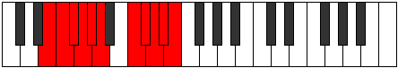 |
| [3903](https://ianring.com/musictheory/scales/3903) | [Aeogyllian](ModeDSharpAeogyllian.md) | D# | D#, E, F, F#, G, G#, B, C, C#, D, D# |  |
| [3903](https://ianring.com/musictheory/scales/3903) | [Aeogyllian](ModeEFlatAeogyllian.md) | Eb | Eb, E, F, Gb, G, Ab, B, C, Db, D, Eb |  |
| [3903](https://ianring.com/musictheory/scales/3903) | [Aeogyllian](ModeBNaturalAeogyllian.md) | B | B, C, C#, D, D#, E, G, G#, A, A#, B |  |
| [3903](https://ianring.com/musictheory/scales/3903) | [Aeogyllian](ModeASharpAeogyllian.md) | A# | A#, B, C, C#, D, D#, F#, G, G#, A, A# |  |
| [3903](https://ianring.com/musictheory/scales/3903) | [Aeogyllian](ModeBFlatAeogyllian.md) | Bb | Bb, B, C, Db, D, Eb, Gb, G, Ab, A, Bb |  |
| [3903](https://ianring.com/musictheory/scales/3903) | [Aeogyllian](ModeGNaturalAeogyllian.md) | G | G, G#, A, A#, B, C, D#, E, F, F#, G |  |
| [3911](https://ianring.com/musictheory/scales/3911) | [Katyryllic](ModeFSharpKatyryllic.md) | F# | F#, G, G#, C, D, D#, E, F, F# |  |
| [3911](https://ianring.com/musictheory/scales/3911) | [Katyryllic](ModeGFlatKatyryllic.md) | Gb | Gb, G, Ab, C, D, Eb, E, F, Gb |  |
| [3913](https://ianring.com/musictheory/scales/3913) | [Bonian](ModeANaturalBonian.md) | A | A, B#, C###, D###, E##, F##, G#, A |  |
| [3915](https://ianring.com/musictheory/scales/3915) | [Gogyllic](ModeANaturalGogyllic.md) | A | A, A#, C, D#, F, F#, G, G#, A |  |
| [3917](https://ianring.com/musictheory/scales/3917) | [Epaphyllic](ModeANaturalEpaphyllic.md) | A | A, B, C, D#, F, F#, G, G#, A |  |
| [3919](https://ianring.com/musictheory/scales/3919) | [Lynygic](ModeFSharpLynygic.md) | F# | F#, G, G#, A, C, D, D#, E, F, F# |  |
| [3919](https://ianring.com/musictheory/scales/3919) | [Lynygic](ModeGFlatLynygic.md) | Gb | Gb, G, Ab, A, C, D, Eb, E, F, Gb |  |
| [3919](https://ianring.com/musictheory/scales/3919) | [Lynygic](ModeANaturalLynygic.md) | A | A, A#, B, C, D#, F, F#, G, G#, A |  |
| [3923](https://ianring.com/musictheory/scales/3923) | [Stoptyllic](ModeBNaturalStoptyllic.md) | B | B, C, D#, F, G, G#, A, A#, B |  |
| [3927](https://ianring.com/musictheory/scales/3927) | [Monygic](ModeFSharpMonygic.md) | F# | F#, G, G#, A#, C, D, D#, E, F, F# |  |
| [3927](https://ianring.com/musictheory/scales/3927) | [Monygic](ModeGFlatMonygic.md) | Gb | Gb, G, Ab, Bb, C, D, Eb, E, F, Gb |  |
| [3927](https://ianring.com/musictheory/scales/3927) | [Monygic](ModeBNaturalMonygic.md) | B | B, C, C#, D#, F, G, G#, A, A#, B |  |
| [3929](https://ianring.com/musictheory/scales/3929) | [Aeolothyllic](ModeANaturalAeolothyllic.md) | A | A, C, C#, D#, F, F#, G, G#, A |  |
| [3929](https://ianring.com/musictheory/scales/3929) | [Aeolothyllic](ModeENaturalAeolothyllic.md) | E | E, G, G#, A#, C, C#, D, D#, E |  |
| [3931](https://ianring.com/musictheory/scales/3931) | [Aerygic](ModeENaturalAerygic.md) | E | E, F, G, G#, A#, C, C#, D, D#, E |  |
| [3931](https://ianring.com/musictheory/scales/3931) | [Aerygic](ModeANaturalAerygic.md) | A | A, A#, C, C#, D#, F, F#, G, G#, A |  |
| [3931](https://ianring.com/musictheory/scales/3931) | [Aerygic](ModeBNaturalAerygic.md) | B | B, C, D, D#, F, G, G#, A, A#, B |  |
| [3933](https://ianring.com/musictheory/scales/3933) | [Ionidygic](ModeENaturalIonidygic.md) | E | E, F#, G, G#, A#, C, C#, D, D#, E |  |
| [3933](https://ianring.com/musictheory/scales/3933) | [Ionidygic](ModeANaturalIonidygic.md) | A | A, B, C, C#, D#, F, F#, G, G#, A |  |
| [3935](https://ianring.com/musictheory/scales/3935) | [Kataphyllian](ModeENaturalKataphyllian.md) | E | E, F, F#, G, G#, A#, C, C#, D, D#, E |  |
| [3935](https://ianring.com/musictheory/scales/3935) | [Kataphyllian](ModeFSharpKataphyllian.md) | F# | F#, G, G#, A, A#, C, D, D#, E, F, F# |  |
| [3935](https://ianring.com/musictheory/scales/3935) | [Kataphyllian](ModeGFlatKataphyllian.md) | Gb | Gb, G, Ab, A, Bb, C, D, Eb, E, F, Gb |  |
| [3935](https://ianring.com/musictheory/scales/3935) | [Kataphyllian](ModeBNaturalKataphyllian.md) | B | B, C, C#, D, D#, F, G, G#, A, A#, B |  |
| [3935](https://ianring.com/musictheory/scales/3935) | [Kataphyllian](ModeANaturalKataphyllian.md) | A | A, A#, B, C, C#, D#, F, F#, G, G#, A |  |
| [3939](https://ianring.com/musictheory/scales/3939) | [Dogyllic](ModeGNaturalDogyllic.md) | G | G, G#, C, C#, D#, E, F, F#, G |  |
| [3939](https://ianring.com/musictheory/scales/3939) | [Dogyllic](ModeDNaturalDogyllic.md) | D | D, D#, G, G#, A#, B, C, C#, D |  |
| [3941](https://ianring.com/musictheory/scales/3941) | [Stathyllic](ModeASharpStathyllic.md) | A# | A#, C, D#, E, F#, G, G#, A, A# |  |
| [3941](https://ianring.com/musictheory/scales/3941) | [Stathyllic](ModeBFlatStathyllic.md) | Bb | Bb, C, Eb, E, Gb, G, Ab, A, Bb |  |
| [3943](https://ianring.com/musictheory/scales/3943) | [Zynygic](ModeGNaturalZynygic.md) | G | G, G#, A, C, C#, D#, E, F, F#, G |  |
| [3943](https://ianring.com/musictheory/scales/3943) | [Zynygic](ModeFSharpZynygic.md) | F# | F#, G, G#, B, C, D, D#, E, F, F# |  |
| [3943](https://ianring.com/musictheory/scales/3943) | [Zynygic](ModeGFlatZynygic.md) | Gb | Gb, G, Ab, B, C, D, Eb, E, F, Gb |  |
| [3943](https://ianring.com/musictheory/scales/3943) | [Zynygic](ModeDNaturalZynygic.md) | D | D, D#, E, G, G#, A#, B, C, C#, D |  |
| [3943](https://ianring.com/musictheory/scales/3943) | [Zynygic](ModeASharpZynygic.md) | A# | A#, B, C, D#, E, F#, G, G#, A, A# |  |
| [3943](https://ianring.com/musictheory/scales/3943) | [Zynygic](ModeBFlatZynygic.md) | Bb | Bb, B, C, Eb, E, Gb, G, Ab, A, Bb |  |
| [3945](https://ianring.com/musictheory/scales/3945) | [Lydyllic](ModeANaturalLydyllic.md) | A | A, C, D, D#, F, F#, G, G#, A |  |
| [3947](https://ianring.com/musictheory/scales/3947) | [Ryptygic](ModeGNaturalRyptygic.md) | G | G, G#, A#, C, C#, D#, E, F, F#, G |  |
| [3947](https://ianring.com/musictheory/scales/3947) | [Ryptygic](ModeANaturalRyptygic.md) | A | A, A#, C, D, D#, F, F#, G, G#, A |  |
| [3947](https://ianring.com/musictheory/scales/3947) | [Ryptygic](ModeDNaturalRyptygic.md) | D | D, D#, F, G, G#, A#, B, C, C#, D |  |
| [3949](https://ianring.com/musictheory/scales/3949) | [Koptygic](ModeASharpKoptygic.md) | A# | A#, C, C#, D#, E, F#, G, G#, A, A# |  |
| [3949](https://ianring.com/musictheory/scales/3949) | [Koptygic](ModeBFlatKoptygic.md) | Bb | Bb, C, Db, Eb, E, Gb, G, Ab, A, Bb |  |
| [3949](https://ianring.com/musictheory/scales/3949) | [Koptygic](ModeANaturalKoptygic.md) | A | A, B, C, D, D#, F, F#, G, G#, A |  |
| [3951](https://ianring.com/musictheory/scales/3951) | [Mathyllian](ModeGNaturalMathyllian.md) | G | G, G#, A, A#, C, C#, D#, E, F, F#, G |  |
| [3951](https://ianring.com/musictheory/scales/3951) | [Mathyllian](ModeFSharpMathyllian.md) | F# | F#, G, G#, A, B, C, D, D#, E, F, F# |  |
| [3951](https://ianring.com/musictheory/scales/3951) | [Mathyllian](ModeGFlatMathyllian.md) | Gb | Gb, G, Ab, A, B, C, D, Eb, E, F, Gb |  |
| [3951](https://ianring.com/musictheory/scales/3951) | [Mathyllian](ModeDNaturalMathyllian.md) | D | D, D#, E, F, G, G#, A#, B, C, C#, D |  |
| [3951](https://ianring.com/musictheory/scales/3951) | [Mathyllian](ModeASharpMathyllian.md) | A# | A#, B, C, C#, D#, E, F#, G, G#, A, A# |  |
| [3951](https://ianring.com/musictheory/scales/3951) | [Mathyllian](ModeBFlatMathyllian.md) | Bb | Bb, B, C, Db, Eb, E, Gb, G, Ab, A, Bb |  |
| [3951](https://ianring.com/musictheory/scales/3951) | [Mathyllian](ModeANaturalMathyllian.md) | A | A, A#, B, C, D, D#, F, F#, G, G#, A |  |
| [3953](https://ianring.com/musictheory/scales/3953) | [Thagyllic](ModeDSharpThagyllic.md) | D# | D#, G, G#, A, B, C, C#, D, D# |  |
| [3953](https://ianring.com/musictheory/scales/3953) | [Thagyllic](ModeEFlatThagyllic.md) | Eb | Eb, G, Ab, A, B, C, Db, D, Eb |  |
| [3955](https://ianring.com/musictheory/scales/3955) | [Galygic](ModeGNaturalGalygic.md) | G | G, G#, B, C, C#, D#, E, F, F#, G |  |
| [3955](https://ianring.com/musictheory/scales/3955) | [Galygic](ModeDSharpGalygic.md) | D# | D#, E, G, G#, A, B, C, C#, D, D# |  |
| [3955](https://ianring.com/musictheory/scales/3955) | [Galygic](ModeEFlatGalygic.md) | Eb | Eb, E, G, Ab, A, B, C, Db, D, Eb |  |
| [3955](https://ianring.com/musictheory/scales/3955) | [Galygic](ModeDNaturalGalygic.md) | D | D, D#, F#, G, G#, A#, B, C, C#, D |  |
| [3955](https://ianring.com/musictheory/scales/3955) | [Galygic](ModeBNaturalGalygic.md) | B | B, C, D#, E, F, G, G#, A, A#, B |  |
| [3957](https://ianring.com/musictheory/scales/3957) | [Porygic](ModeASharpPorygic.md) | A# | A#, C, D, D#, E, F#, G, G#, A, A# |  |
| [3957](https://ianring.com/musictheory/scales/3957) | [Porygic](ModeBFlatPorygic.md) | Bb | Bb, C, D, Eb, E, Gb, G, Ab, A, Bb |  |
| [3957](https://ianring.com/musictheory/scales/3957) | [Porygic](ModeDSharpPorygic.md) | D# | D#, F, G, G#, A, B, C, C#, D, D# |  |
| [3957](https://ianring.com/musictheory/scales/3957) | [Porygic](ModeEFlatPorygic.md) | Eb | Eb, F, G, Ab, A, B, C, Db, D, Eb |  |
| [3959](https://ianring.com/musictheory/scales/3959) | [Katagyllian](ModeDSharpKatagyllian.md) | D# | D#, E, F, G, G#, A, B, C, C#, D, D# |  |
| [3959](https://ianring.com/musictheory/scales/3959) | [Katagyllian](ModeEFlatKatagyllian.md) | Eb | Eb, E, F, G, Ab, A, B, C, Db, D, Eb |  |
| [3959](https://ianring.com/musictheory/scales/3959) | [Katagyllian](ModeGNaturalKatagyllian.md) | G | G, G#, A, B, C, C#, D#, E, F, F#, G |  |
| [3959](https://ianring.com/musictheory/scales/3959) | [Katagyllian](ModeDNaturalKatagyllian.md) | D | D, D#, E, F#, G, G#, A#, B, C, C#, D |  |
| [3959](https://ianring.com/musictheory/scales/3959) | [Katagyllian](ModeFSharpKatagyllian.md) | F# | F#, G, G#, A#, B, C, D, D#, E, F, F# |  |
| [3959](https://ianring.com/musictheory/scales/3959) | [Katagyllian](ModeGFlatKatagyllian.md) | Gb | Gb, G, Ab, Bb, B, C, D, Eb, E, F, Gb |  |
| [3959](https://ianring.com/musictheory/scales/3959) | [Katagyllian](ModeBNaturalKatagyllian.md) | B | B, C, C#, D#, E, F, G, G#, A, A#, B |  |
| [3959](https://ianring.com/musictheory/scales/3959) | [Katagyllian](ModeASharpKatagyllian.md) | A# | A#, B, C, D, D#, E, F#, G, G#, A, A# |  |
| [3959](https://ianring.com/musictheory/scales/3959) | [Katagyllian](ModeBFlatKatagyllian.md) | Bb | Bb, B, C, D, Eb, E, Gb, G, Ab, A, Bb |  |
| [3961](https://ianring.com/musictheory/scales/3961) | [Mixolydygic](ModeANaturalMixolydygic.md) | A | A, C, C#, D, D#, F, F#, G, G#, A |  |
| [3961](https://ianring.com/musictheory/scales/3961) | [Mixolydygic](ModeENaturalMixolydygic.md) | E | E, G, G#, A, A#, C, C#, D, D#, E |  |
| [3961](https://ianring.com/musictheory/scales/3961) | [Mixolydygic](ModeDSharpMixolydygic.md) | D# | D#, F#, G, G#, A, B, C, C#, D, D# |  |
| [3961](https://ianring.com/musictheory/scales/3961) | [Mixolydygic](ModeEFlatMixolydygic.md) | Eb | Eb, Gb, G, Ab, A, B, C, Db, D, Eb |  |
| [3963](https://ianring.com/musictheory/scales/3963) | [Aeoryllian](ModeENaturalAeoryllian.md) | E | E, F, G, G#, A, A#, C, C#, D, D#, E |  |
| [3963](https://ianring.com/musictheory/scales/3963) | [Aeoryllian](ModeANaturalAeoryllian.md) | A | A, A#, C, C#, D, D#, F, F#, G, G#, A |  |
| [3963](https://ianring.com/musictheory/scales/3963) | [Aeoryllian](ModeDSharpAeoryllian.md) | D# | D#, E, F#, G, G#, A, B, C, C#, D, D# |  |
| [3963](https://ianring.com/musictheory/scales/3963) | [Aeoryllian](ModeEFlatAeoryllian.md) | Eb | Eb, E, Gb, G, Ab, A, B, C, Db, D, Eb |  |
| [3963](https://ianring.com/musictheory/scales/3963) | [Aeoryllian](ModeDNaturalAeoryllian.md) | D | D, D#, F, F#, G, G#, A#, B, C, C#, D |  |
| [3963](https://ianring.com/musictheory/scales/3963) | [Aeoryllian](ModeGNaturalAeoryllian.md) | G | G, G#, A#, B, C, C#, D#, E, F, F#, G |  |
| [3963](https://ianring.com/musictheory/scales/3963) | [Aeoryllian](ModeBNaturalAeoryllian.md) | B | B, C, D, D#, E, F, G, G#, A, A#, B |  |
| [3965](https://ianring.com/musictheory/scales/3965) | [Thydyllian](ModeENaturalThydyllian.md) | E | E, F#, G, G#, A, A#, C, C#, D, D#, E |  |
| [3965](https://ianring.com/musictheory/scales/3965) | [Thydyllian](ModeASharpThydyllian.md) | A# | A#, C, C#, D, D#, E, F#, G, G#, A, A# |  |
| [3965](https://ianring.com/musictheory/scales/3965) | [Thydyllian](ModeBFlatThydyllian.md) | Bb | Bb, C, Db, D, Eb, E, Gb, G, Ab, A, Bb |  |
| [3965](https://ianring.com/musictheory/scales/3965) | [Thydyllian](ModeDSharpThydyllian.md) | D# | D#, F, F#, G, G#, A, B, C, C#, D, D# |  |
| [3965](https://ianring.com/musictheory/scales/3965) | [Thydyllian](ModeEFlatThydyllian.md) | Eb | Eb, F, Gb, G, Ab, A, B, C, Db, D, Eb |  |
| [3965](https://ianring.com/musictheory/scales/3965) | [Thydyllian](ModeANaturalThydyllian.md) | A | A, B, C, C#, D, D#, F, F#, G, G#, A |  |
| [3967](https://ianring.com/musictheory/scales/3967) | [Soratic](ModeENaturalSoratic.md) | E | E, F, F#, G, G#, A, A#, C, C#, D, D#, E |  |
| [3967](https://ianring.com/musictheory/scales/3967) | [Soratic](ModeDSharpSoratic.md) | D# | D#, E, F, F#, G, G#, A, B, C, C#, D, D# |  |
| [3967](https://ianring.com/musictheory/scales/3967) | [Soratic](ModeEFlatSoratic.md) | Eb | Eb, E, F, Gb, G, Ab, A, B, C, Db, D, Eb |  |
| [3967](https://ianring.com/musictheory/scales/3967) | [Soratic](ModeDNaturalSoratic.md) | D | D, D#, E, F, F#, G, G#, A#, B, C, C#, D |  |
| [3967](https://ianring.com/musictheory/scales/3967) | [Soratic](ModeBNaturalSoratic.md) | B | B, C, C#, D, D#, E, F, G, G#, A, A#, B |  |
| [3967](https://ianring.com/musictheory/scales/3967) | [Soratic](ModeASharpSoratic.md) | A# | A#, B, C, C#, D, D#, E, F#, G, G#, A, A# |  |
| [3967](https://ianring.com/musictheory/scales/3967) | [Soratic](ModeBFlatSoratic.md) | Bb | Bb, B, C, Db, D, Eb, E, Gb, G, Ab, A, Bb |  |
| [3967](https://ianring.com/musictheory/scales/3967) | [Soratic](ModeANaturalSoratic.md) | A | A, A#, B, C, C#, D, D#, F, F#, G, G#, A |  |
| [3967](https://ianring.com/musictheory/scales/3967) | [Soratic](ModeGNaturalSoratic.md) | G | G, G#, A, A#, B, C, C#, D#, E, F, F#, G |  |
| [3967](https://ianring.com/musictheory/scales/3967) | [Soratic](ModeFSharpSoratic.md) | F# | F#, G, G#, A, A#, B, C, D, D#, E, F, F# |  |
| [3967](https://ianring.com/musictheory/scales/3967) | [Soratic](ModeGFlatSoratic.md) | Gb | Gb, G, Ab, A, Bb, B, C, D, Eb, E, F, Gb |  |
| [3979](https://ianring.com/musictheory/scales/3979) | [Dynyllic](ModeCNaturalDynyllic.md) | C | C, C#, D#, G, G#, A, A#, B, C |  |
| [3981](https://ianring.com/musictheory/scales/3981) | [Phrycryllic](ModeFNaturalPhrycryllic.md) | F | F, G, G#, C, C#, D, D#, E, F |  |
| [3981](https://ianring.com/musictheory/scales/3981) | [Phrycryllic](ModeCNaturalPhrycryllic.md) | C | C, D, D#, G, G#, A, A#, B, C |  |
| [3983](https://ianring.com/musictheory/scales/3983) | [Thyptygic](ModeFNaturalThyptygic.md) | F | F, F#, G, G#, C, C#, D, D#, E, F |  |
| [3983](https://ianring.com/musictheory/scales/3983) | [Thyptygic](ModeCNaturalThyptygic.md) | C | C, C#, D, D#, G, G#, A, A#, B, C |  |
| [3985](https://ianring.com/musictheory/scales/3985) | [Thadian](ModeGSharpThadian.md) | G# | G#, A###, C###, D##, E#, F#, G, G# |  |
| [3985](https://ianring.com/musictheory/scales/3985) | [Thadian](ModeAFlatThadian.md) | Ab | Ab, B#, C###, D##, E#, F#, G, Ab |  |
| [3987](https://ianring.com/musictheory/scales/3987) | [Loryllic](ModeGSharpLoryllic.md) | G# | G#, A, C, D#, E, F, F#, G, G# |  |
| [3987](https://ianring.com/musictheory/scales/3987) | [Loryllic](ModeAFlatLoryllic.md) | Ab | Ab, A, C, Eb, E, F, Gb, G, Ab |  |
| [3987](https://ianring.com/musictheory/scales/3987) | [Loryllic](ModeBNaturalLoryllic.md) | B | B, C, D#, F#, G, G#, A, A#, B |  |
| [3989](https://ianring.com/musictheory/scales/3989) | [Sythyllic](ModeGSharpSythyllic.md) | G# | G#, A#, C, D#, E, F, F#, G, G# |  |
| [3989](https://ianring.com/musictheory/scales/3989) | [Sythyllic](ModeAFlatSythyllic.md) | Ab | Ab, Bb, C, Eb, E, F, Gb, G, Ab |  |
| [3991](https://ianring.com/musictheory/scales/3991) | [Badygic](ModeGSharpBadygic.md) | G# | G#, A, A#, C, D#, E, F, F#, G, G# |  |
| [3991](https://ianring.com/musictheory/scales/3991) | [Badygic](ModeAFlatBadygic.md) | Ab | Ab, A, Bb, C, Eb, E, F, Gb, G, Ab |  |
| [3991](https://ianring.com/musictheory/scales/3991) | [Badygic](ModeBNaturalBadygic.md) | B | B, C, C#, D#, F#, G, G#, A, A#, B |  |
| [3993](https://ianring.com/musictheory/scales/3993) | [Ioniptyllic](ModeENaturalIoniptyllic.md) | E | E, G, G#, B, C, C#, D, D#, E |  |
| [3993](https://ianring.com/musictheory/scales/3993) | [Ioniptyllic](ModeGSharpIoniptyllic.md) | G# | G#, B, C, D#, E, F, F#, G, G# |  |
| [3993](https://ianring.com/musictheory/scales/3993) | [Ioniptyllic](ModeAFlatIoniptyllic.md) | Ab | Ab, B, C, Eb, E, F, Gb, G, Ab |  |
| [3993](https://ianring.com/musictheory/scales/3993) | [Ioniptyllic](ModeCNaturalIoniptyllic.md) | C | C, D#, E, G, G#, A, A#, B, C |  |
| [3995](https://ianring.com/musictheory/scales/3995) | [Ionygic](ModeENaturalIonygic.md) | E | E, F, G, G#, B, C, C#, D, D#, E |  |
| [3995](https://ianring.com/musictheory/scales/3995) | [Ionygic](ModeGSharpIonygic.md) | G# | G#, A, B, C, D#, E, F, F#, G, G# |  |
| [3995](https://ianring.com/musictheory/scales/3995) | [Ionygic](ModeAFlatIonygic.md) | Ab | Ab, A, B, C, Eb, E, F, Gb, G, Ab |  |
| [3995](https://ianring.com/musictheory/scales/3995) | [Ionygic](ModeCNaturalIonygic.md) | C | C, C#, D#, E, G, G#, A, A#, B, C |  |
| [3995](https://ianring.com/musictheory/scales/3995) | [Ionygic](ModeBNaturalIonygic.md) | B | B, C, D, D#, F#, G, G#, A, A#, B |  |
| [3997](https://ianring.com/musictheory/scales/3997) | [Dogygic](ModeFNaturalDogygic.md) | F | F, G, G#, A, C, C#, D, D#, E, F |  |
| [3997](https://ianring.com/musictheory/scales/3997) | [Dogygic](ModeENaturalDogygic.md) | E | E, F#, G, G#, B, C, C#, D, D#, E |  |
| [3997](https://ianring.com/musictheory/scales/3997) | [Dogygic](ModeGSharpDogygic.md) | G# | G#, A#, B, C, D#, E, F, F#, G, G# |  |
| [3997](https://ianring.com/musictheory/scales/3997) | [Dogygic](ModeAFlatDogygic.md) | Ab | Ab, Bb, B, C, Eb, E, F, Gb, G, Ab |  |
| [3997](https://ianring.com/musictheory/scales/3997) | [Dogygic](ModeCNaturalDogygic.md) | C | C, D, D#, E, G, G#, A, A#, B, C |  |
| [3999](https://ianring.com/musictheory/scales/3999) | [Dydyllian](ModeFNaturalDydyllian.md) | F | F, F#, G, G#, A, C, C#, D, D#, E, F |  |
| [3999](https://ianring.com/musictheory/scales/3999) | [Dydyllian](ModeENaturalDydyllian.md) | E | E, F, F#, G, G#, B, C, C#, D, D#, E |  |
| [3999](https://ianring.com/musictheory/scales/3999) | [Dydyllian](ModeCNaturalDydyllian.md) | C | C, C#, D, D#, E, G, G#, A, A#, B, C |  |
| [3999](https://ianring.com/musictheory/scales/3999) | [Dydyllian](ModeBNaturalDydyllian.md) | B | B, C, C#, D, D#, F#, G, G#, A, A#, B |  |
| [3999](https://ianring.com/musictheory/scales/3999) | [Dydyllian](ModeGSharpDydyllian.md) | G# | G#, A, A#, B, C, D#, E, F, F#, G, G# |  |
| [3999](https://ianring.com/musictheory/scales/3999) | [Dydyllian](ModeAFlatDydyllian.md) | Ab | Ab, A, Bb, B, C, Eb, E, F, Gb, G, Ab |  |
| [4003](https://ianring.com/musictheory/scales/4003) | [Sadyllic](ModeGNaturalSadyllic.md) | G | G, G#, C, D, D#, E, F, F#, G |  |
| [4005](https://ianring.com/musictheory/scales/4005) | [Phradyllic](ModeASharpPhradyllic.md) | A# | A#, C, D#, F, F#, G, G#, A, A# |  |
| [4005](https://ianring.com/musictheory/scales/4005) | [Phradyllic](ModeBFlatPhradyllic.md) | Bb | Bb, C, Eb, F, Gb, G, Ab, A, Bb |  |
| [4007](https://ianring.com/musictheory/scales/4007) | [Doptygic](ModeGNaturalDoptygic.md) | G | G, G#, A, C, D, D#, E, F, F#, G |  |
| [4007](https://ianring.com/musictheory/scales/4007) | [Doptygic](ModeASharpDoptygic.md) | A# | A#, B, C, D#, F, F#, G, G#, A, A# |  |
| [4007](https://ianring.com/musictheory/scales/4007) | [Doptygic](ModeBFlatDoptygic.md) | Bb | Bb, B, C, Eb, F, Gb, G, Ab, A, Bb |  |
| [4009](https://ianring.com/musictheory/scales/4009) | [Phranyllic](ModeCNaturalPhranyllic.md) | C | C, D#, F, G, G#, A, A#, B, C |  |
| [4011](https://ianring.com/musictheory/scales/4011) | [Styrygic](ModeGNaturalStyrygic.md) | G | G, G#, A#, C, D, D#, E, F, F#, G |  |
| [4011](https://ianring.com/musictheory/scales/4011) | [Styrygic](ModeCNaturalStyrygic.md) | C | C, C#, D#, F, G, G#, A, A#, B, C |  |
| [4013](https://ianring.com/musictheory/scales/4013) | [Dathygic](ModeFNaturalDathygic.md) | F | F, G, G#, A#, C, C#, D, D#, E, F |  |
| [4013](https://ianring.com/musictheory/scales/4013) | [Dathygic](ModeASharpDathygic.md) | A# | A#, C, C#, D#, F, F#, G, G#, A, A# |  |
| [4013](https://ianring.com/musictheory/scales/4013) | [Dathygic](ModeBFlatDathygic.md) | Bb | Bb, C, Db, Eb, F, Gb, G, Ab, A, Bb |  |
| [4013](https://ianring.com/musictheory/scales/4013) | [Dathygic](ModeCNaturalDathygic.md) | C | C, D, D#, F, G, G#, A, A#, B, C |  |
| [4015](https://ianring.com/musictheory/scales/4015) | [Phradyllian](ModeFNaturalPhradyllian.md) | F | F, F#, G, G#, A#, C, C#, D, D#, E, F |  |
| [4015](https://ianring.com/musictheory/scales/4015) | [Phradyllian](ModeGNaturalPhradyllian.md) | G | G, G#, A, A#, C, D, D#, E, F, F#, G |  |
| [4015](https://ianring.com/musictheory/scales/4015) | [Phradyllian](ModeCNaturalPhradyllian.md) | C | C, C#, D, D#, F, G, G#, A, A#, B, C |  |
| [4015](https://ianring.com/musictheory/scales/4015) | [Phradyllian](ModeASharpPhradyllian.md) | A# | A#, B, C, C#, D#, F, F#, G, G#, A, A# |  |
| [4015](https://ianring.com/musictheory/scales/4015) | [Phradyllian](ModeBFlatPhradyllian.md) | Bb | Bb, B, C, Db, Eb, F, Gb, G, Ab, A, Bb |  |
| [4017](https://ianring.com/musictheory/scales/4017) | [Dolyllic](ModeGSharpDolyllic.md) | G# | G#, C, C#, D#, E, F, F#, G, G# |  |
| [4017](https://ianring.com/musictheory/scales/4017) | [Dolyllic](ModeAFlatDolyllic.md) | Ab | Ab, C, Db, Eb, E, F, Gb, G, Ab |  |
| [4017](https://ianring.com/musictheory/scales/4017) | [Dolyllic](ModeDSharpDolyllic.md) | D# | D#, G, G#, A#, B, C, C#, D, D# |  |
| [4017](https://ianring.com/musictheory/scales/4017) | [Dolyllic](ModeEFlatDolyllic.md) | Eb | Eb, G, Ab, Bb, B, C, Db, D, Eb |  |
| [4019](https://ianring.com/musictheory/scales/4019) | [Lonygic](ModeGSharpLonygic.md) | G# | G#, A, C, C#, D#, E, F, F#, G, G# |  |
| [4019](https://ianring.com/musictheory/scales/4019) | [Lonygic](ModeAFlatLonygic.md) | Ab | Ab, A, C, Db, Eb, E, F, Gb, G, Ab |  |
| [4019](https://ianring.com/musictheory/scales/4019) | [Lonygic](ModeGNaturalLonygic.md) | G | G, G#, B, C, D, D#, E, F, F#, G |  |
| [4019](https://ianring.com/musictheory/scales/4019) | [Lonygic](ModeDSharpLonygic.md) | D# | D#, E, G, G#, A#, B, C, C#, D, D# |  |
| [4019](https://ianring.com/musictheory/scales/4019) | [Lonygic](ModeEFlatLonygic.md) | Eb | Eb, E, G, Ab, Bb, B, C, Db, D, Eb |  |
| [4019](https://ianring.com/musictheory/scales/4019) | [Lonygic](ModeBNaturalLonygic.md) | B | B, C, D#, E, F#, G, G#, A, A#, B |  |
| [4021](https://ianring.com/musictheory/scales/4021) | [Bagygic](ModeGSharpBagygic.md) | G# | G#, A#, C, C#, D#, E, F, F#, G, G# |  |
| [4021](https://ianring.com/musictheory/scales/4021) | [Bagygic](ModeAFlatBagygic.md) | Ab | Ab, Bb, C, Db, Eb, E, F, Gb, G, Ab |  |
| [4021](https://ianring.com/musictheory/scales/4021) | [Bagygic](ModeASharpBagygic.md) | A# | A#, C, D, D#, F, F#, G, G#, A, A# |  |
| [4021](https://ianring.com/musictheory/scales/4021) | [Bagygic](ModeBFlatBagygic.md) | Bb | Bb, C, D, Eb, F, Gb, G, Ab, A, Bb |  |
| [4021](https://ianring.com/musictheory/scales/4021) | [Bagygic](ModeDSharpBagygic.md) | D# | D#, F, G, G#, A#, B, C, C#, D, D# |  |
| [4021](https://ianring.com/musictheory/scales/4021) | [Bagygic](ModeEFlatBagygic.md) | Eb | Eb, F, G, Ab, Bb, B, C, Db, D, Eb |  |
| [4023](https://ianring.com/musictheory/scales/4023) | [Styptyllian](ModeGSharpStyptyllian.md) | G# | G#, A, A#, C, C#, D#, E, F, F#, G, G# |  |
| [4023](https://ianring.com/musictheory/scales/4023) | [Styptyllian](ModeAFlatStyptyllian.md) | Ab | Ab, A, Bb, C, Db, Eb, E, F, Gb, G, Ab |  |
| [4023](https://ianring.com/musictheory/scales/4023) | [Styptyllian](ModeGNaturalStyptyllian.md) | G | G, G#, A, B, C, D, D#, E, F, F#, G |  |
| [4023](https://ianring.com/musictheory/scales/4023) | [Styptyllian](ModeDSharpStyptyllian.md) | D# | D#, E, F, G, G#, A#, B, C, C#, D, D# |  |
| [4023](https://ianring.com/musictheory/scales/4023) | [Styptyllian](ModeEFlatStyptyllian.md) | Eb | Eb, E, F, G, Ab, Bb, B, C, Db, D, Eb |  |
| [4023](https://ianring.com/musictheory/scales/4023) | [Styptyllian](ModeBNaturalStyptyllian.md) | B | B, C, C#, D#, E, F#, G, G#, A, A#, B |  |
| [4023](https://ianring.com/musictheory/scales/4023) | [Styptyllian](ModeASharpStyptyllian.md) | A# | A#, B, C, D, D#, F, F#, G, G#, A, A# |  |
| [4023](https://ianring.com/musictheory/scales/4023) | [Styptyllian](ModeBFlatStyptyllian.md) | Bb | Bb, B, C, D, Eb, F, Gb, G, Ab, A, Bb |  |
| [4025](https://ianring.com/musictheory/scales/4025) | [Kalygic](ModeGSharpKalygic.md) | G# | G#, B, C, C#, D#, E, F, F#, G, G# |  |
| [4025](https://ianring.com/musictheory/scales/4025) | [Kalygic](ModeAFlatKalygic.md) | Ab | Ab, B, C, Db, Eb, E, F, Gb, G, Ab |  |
| [4025](https://ianring.com/musictheory/scales/4025) | [Kalygic](ModeENaturalKalygic.md) | E | E, G, G#, A, B, C, C#, D, D#, E |  |
| [4025](https://ianring.com/musictheory/scales/4025) | [Kalygic](ModeDSharpKalygic.md) | D# | D#, F#, G, G#, A#, B, C, C#, D, D# |  |
| [4025](https://ianring.com/musictheory/scales/4025) | [Kalygic](ModeEFlatKalygic.md) | Eb | Eb, Gb, G, Ab, Bb, B, C, Db, D, Eb |  |
| [4025](https://ianring.com/musictheory/scales/4025) | [Kalygic](ModeCNaturalKalygic.md) | C | C, D#, E, F, G, G#, A, A#, B, C |  |
| [4027](https://ianring.com/musictheory/scales/4027) | [Ragyllian](ModeENaturalRagyllian.md) | E | E, F, G, G#, A, B, C, C#, D, D#, E |  |
| [4027](https://ianring.com/musictheory/scales/4027) | [Ragyllian](ModeGSharpRagyllian.md) | G# | G#, A, B, C, C#, D#, E, F, F#, G, G# |  |
| [4027](https://ianring.com/musictheory/scales/4027) | [Ragyllian](ModeAFlatRagyllian.md) | Ab | Ab, A, B, C, Db, Eb, E, F, Gb, G, Ab |  |
| [4027](https://ianring.com/musictheory/scales/4027) | [Ragyllian](ModeDSharpRagyllian.md) | D# | D#, E, F#, G, G#, A#, B, C, C#, D, D# |  |
| [4027](https://ianring.com/musictheory/scales/4027) | [Ragyllian](ModeEFlatRagyllian.md) | Eb | Eb, E, Gb, G, Ab, Bb, B, C, Db, D, Eb |  |
| [4027](https://ianring.com/musictheory/scales/4027) | [Ragyllian](ModeGNaturalRagyllian.md) | G | G, G#, A#, B, C, D, D#, E, F, F#, G |  |
| [4027](https://ianring.com/musictheory/scales/4027) | [Ragyllian](ModeCNaturalRagyllian.md) | C | C, C#, D#, E, F, G, G#, A, A#, B, C |  |
| [4027](https://ianring.com/musictheory/scales/4027) | [Ragyllian](ModeBNaturalRagyllian.md) | B | B, C, D, D#, E, F#, G, G#, A, A#, B |  |
| [4029](https://ianring.com/musictheory/scales/4029) | [Aerycryllian](ModeFNaturalAerycryllian.md) | F | F, G, G#, A, A#, C, C#, D, D#, E, F |  |
| [4029](https://ianring.com/musictheory/scales/4029) | [Aerycryllian](ModeASharpAerycryllian.md) | A# | A#, C, C#, D, D#, F, F#, G, G#, A, A# |  |
| [4029](https://ianring.com/musictheory/scales/4029) | [Aerycryllian](ModeBFlatAerycryllian.md) | Bb | Bb, C, Db, D, Eb, F, Gb, G, Ab, A, Bb |  |
| [4029](https://ianring.com/musictheory/scales/4029) | [Aerycryllian](ModeENaturalAerycryllian.md) | E | E, F#, G, G#, A, B, C, C#, D, D#, E |  |
| [4029](https://ianring.com/musictheory/scales/4029) | [Aerycryllian](ModeDSharpAerycryllian.md) | D# | D#, F, F#, G, G#, A#, B, C, C#, D, D# |  |
| [4029](https://ianring.com/musictheory/scales/4029) | [Aerycryllian](ModeEFlatAerycryllian.md) | Eb | Eb, F, Gb, G, Ab, Bb, B, C, Db, D, Eb |  |
| [4029](https://ianring.com/musictheory/scales/4029) | [Aerycryllian](ModeGSharpAerycryllian.md) | G# | G#, A#, B, C, C#, D#, E, F, F#, G, G# |  |
| [4029](https://ianring.com/musictheory/scales/4029) | [Aerycryllian](ModeAFlatAerycryllian.md) | Ab | Ab, Bb, B, C, Db, Eb, E, F, Gb, G, Ab |  |
| [4029](https://ianring.com/musictheory/scales/4029) | [Aerycryllian](ModeCNaturalAerycryllian.md) | C | C, D, D#, E, F, G, G#, A, A#, B, C |  |
| [4031](https://ianring.com/musictheory/scales/4031) | [Godatic](ModeFNaturalGodatic.md) | F | F, F#, G, G#, A, A#, C, C#, D, D#, E, F |  |
| [4031](https://ianring.com/musictheory/scales/4031) | [Godatic](ModeENaturalGodatic.md) | E | E, F, F#, G, G#, A, B, C, C#, D, D#, E |  |
| [4031](https://ianring.com/musictheory/scales/4031) | [Godatic](ModeDSharpGodatic.md) | D# | D#, E, F, F#, G, G#, A#, B, C, C#, D, D# |  |
| [4031](https://ianring.com/musictheory/scales/4031) | [Godatic](ModeEFlatGodatic.md) | Eb | Eb, E, F, Gb, G, Ab, Bb, B, C, Db, D, Eb |  |
| [4031](https://ianring.com/musictheory/scales/4031) | [Godatic](ModeCNaturalGodatic.md) | C | C, C#, D, D#, E, F, G, G#, A, A#, B, C |  |
| [4031](https://ianring.com/musictheory/scales/4031) | [Godatic](ModeBNaturalGodatic.md) | B | B, C, C#, D, D#, E, F#, G, G#, A, A#, B |  |
| [4031](https://ianring.com/musictheory/scales/4031) | [Godatic](ModeASharpGodatic.md) | A# | A#, B, C, C#, D, D#, F, F#, G, G#, A, A# |  |
| [4031](https://ianring.com/musictheory/scales/4031) | [Godatic](ModeBFlatGodatic.md) | Bb | Bb, B, C, Db, D, Eb, F, Gb, G, Ab, A, Bb |  |
| [4031](https://ianring.com/musictheory/scales/4031) | [Godatic](ModeGSharpGodatic.md) | G# | G#, A, A#, B, C, C#, D#, E, F, F#, G, G# |  |
| [4031](https://ianring.com/musictheory/scales/4031) | [Godatic](ModeAFlatGodatic.md) | Ab | Ab, A, Bb, B, C, Db, Eb, E, F, Gb, G, Ab |  |
| [4031](https://ianring.com/musictheory/scales/4031) | [Godatic](ModeGNaturalGodatic.md) | G | G, G#, A, A#, B, C, D, D#, E, F, F#, G |  |
| [4037](https://ianring.com/musictheory/scales/4037) | [Ionyllic](ModeCSharpIonyllic.md) | C# | C#, D#, G, G#, A, A#, B, C, C# |  |
| [4037](https://ianring.com/musictheory/scales/4037) | [Ionyllic](ModeDFlatIonyllic.md) | Db | Db, Eb, G, Ab, A, Bb, B, C, Db |  |
| [4039](https://ianring.com/musictheory/scales/4039) | [Ionogygic](ModeFSharpIonogygic.md) | F# | F#, G, G#, C, C#, D, D#, E, F, F# |  |
| [4039](https://ianring.com/musictheory/scales/4039) | [Ionogygic](ModeGFlatIonogygic.md) | Gb | Gb, G, Ab, C, Db, D, Eb, E, F, Gb |  |
| [4039](https://ianring.com/musictheory/scales/4039) | [Ionogygic](ModeCSharpIonogygic.md) | C# | C#, D, D#, G, G#, A, A#, B, C, C# |  |
| [4039](https://ianring.com/musictheory/scales/4039) | [Ionogygic](ModeDFlatIonogygic.md) | Db | Db, D, Eb, G, Ab, A, Bb, B, C, Db |  |
| [4041](https://ianring.com/musictheory/scales/4041) | [Zaryllic](ModeANaturalZaryllic.md) | A | A, C, D#, E, F, F#, G, G#, A |  |
| [4041](https://ianring.com/musictheory/scales/4041) | [Zaryllic](ModeCNaturalZaryllic.md) | C | C, D#, F#, G, G#, A, A#, B, C |  |
| [4043](https://ianring.com/musictheory/scales/4043) | [Phrocrygic](ModeANaturalPhrocrygic.md) | A | A, A#, C, D#, E, F, F#, G, G#, A |  |
| [4043](https://ianring.com/musictheory/scales/4043) | [Phrocrygic](ModeCNaturalPhrocrygic.md) | C | C, C#, D#, F#, G, G#, A, A#, B, C |  |
| [4045](https://ianring.com/musictheory/scales/4045) | [Gyptygic](ModeFNaturalGyptygic.md) | F | F, G, G#, B, C, C#, D, D#, E, F |  |
| [4045](https://ianring.com/musictheory/scales/4045) | [Gyptygic](ModeANaturalGyptygic.md) | A | A, B, C, D#, E, F, F#, G, G#, A |  |
| [4045](https://ianring.com/musictheory/scales/4045) | [Gyptygic](ModeCSharpGyptygic.md) | C# | C#, D#, E, G, G#, A, A#, B, C, C# |  |
| [4045](https://ianring.com/musictheory/scales/4045) | [Gyptygic](ModeDFlatGyptygic.md) | Db | Db, Eb, E, G, Ab, A, Bb, B, C, Db |  |
| [4045](https://ianring.com/musictheory/scales/4045) | [Gyptygic](ModeCNaturalGyptygic.md) | C | C, D, D#, F#, G, G#, A, A#, B, C |  |
| [4047](https://ianring.com/musictheory/scales/4047) | [Thogyllian](ModeFSharpThogyllian.md) | F# | F#, G, G#, A, C, C#, D, D#, E, F, F# |  |
| [4047](https://ianring.com/musictheory/scales/4047) | [Thogyllian](ModeGFlatThogyllian.md) | Gb | Gb, G, Ab, A, C, Db, D, Eb, E, F, Gb |  |
| [4047](https://ianring.com/musictheory/scales/4047) | [Thogyllian](ModeFNaturalThogyllian.md) | F | F, F#, G, G#, B, C, C#, D, D#, E, F |  |
| [4047](https://ianring.com/musictheory/scales/4047) | [Thogyllian](ModeCSharpThogyllian.md) | C# | C#, D, D#, E, G, G#, A, A#, B, C, C# |  |
| [4047](https://ianring.com/musictheory/scales/4047) | [Thogyllian](ModeDFlatThogyllian.md) | Db | Db, D, Eb, E, G, Ab, A, Bb, B, C, Db |  |
| [4047](https://ianring.com/musictheory/scales/4047) | [Thogyllian](ModeCNaturalThogyllian.md) | C | C, C#, D, D#, F#, G, G#, A, A#, B, C |  |
| [4047](https://ianring.com/musictheory/scales/4047) | [Thogyllian](ModeANaturalThogyllian.md) | A | A, A#, B, C, D#, E, F, F#, G, G#, A |  |
| [4049](https://ianring.com/musictheory/scales/4049) | [Stycryllic](ModeGSharpStycryllic.md) | G# | G#, C, D, D#, E, F, F#, G, G# |  |
| [4049](https://ianring.com/musictheory/scales/4049) | [Stycryllic](ModeAFlatStycryllic.md) | Ab | Ab, C, D, Eb, E, F, Gb, G, Ab |  |
| [4051](https://ianring.com/musictheory/scales/4051) | [Ionilygic](ModeGSharpIonilygic.md) | G# | G#, A, C, D, D#, E, F, F#, G, G# |  |
| [4051](https://ianring.com/musictheory/scales/4051) | [Ionilygic](ModeAFlatIonilygic.md) | Ab | Ab, A, C, D, Eb, E, F, Gb, G, Ab |  |
| [4051](https://ianring.com/musictheory/scales/4051) | [Ionilygic](ModeBNaturalIonilygic.md) | B | B, C, D#, F, F#, G, G#, A, A#, B |  |
| [4053](https://ianring.com/musictheory/scales/4053) | [Kyrygic](ModeGSharpKyrygic.md) | G# | G#, A#, C, D, D#, E, F, F#, G, G# |  |
| [4053](https://ianring.com/musictheory/scales/4053) | [Kyrygic](ModeAFlatKyrygic.md) | Ab | Ab, Bb, C, D, Eb, E, F, Gb, G, Ab |  |
| [4053](https://ianring.com/musictheory/scales/4053) | [Kyrygic](ModeCSharpKyrygic.md) | C# | C#, D#, F, G, G#, A, A#, B, C, C# |  |
| [4053](https://ianring.com/musictheory/scales/4053) | [Kyrygic](ModeDFlatKyrygic.md) | Db | Db, Eb, F, G, Ab, A, Bb, B, C, Db |  |
| [4055](https://ianring.com/musictheory/scales/4055) | [Dagyllian](ModeFSharpDagyllian.md) | F# | F#, G, G#, A#, C, C#, D, D#, E, F, F# |  |
| [4055](https://ianring.com/musictheory/scales/4055) | [Dagyllian](ModeGFlatDagyllian.md) | Gb | Gb, G, Ab, Bb, C, Db, D, Eb, E, F, Gb |  |
| [4055](https://ianring.com/musictheory/scales/4055) | [Dagyllian](ModeGSharpDagyllian.md) | G# | G#, A, A#, C, D, D#, E, F, F#, G, G# |  |
| [4055](https://ianring.com/musictheory/scales/4055) | [Dagyllian](ModeAFlatDagyllian.md) | Ab | Ab, A, Bb, C, D, Eb, E, F, Gb, G, Ab |  |
| [4055](https://ianring.com/musictheory/scales/4055) | [Dagyllian](ModeCSharpDagyllian.md) | C# | C#, D, D#, F, G, G#, A, A#, B, C, C# |  |
| [4055](https://ianring.com/musictheory/scales/4055) | [Dagyllian](ModeDFlatDagyllian.md) | Db | Db, D, Eb, F, G, Ab, A, Bb, B, C, Db |  |
| [4055](https://ianring.com/musictheory/scales/4055) | [Dagyllian](ModeBNaturalDagyllian.md) | B | B, C, C#, D#, F, F#, G, G#, A, A#, B |  |
| [4057](https://ianring.com/musictheory/scales/4057) | [Phrygic](ModeANaturalPhrygic.md) | A | A, C, C#, D#, E, F, F#, G, G#, A |  |
| [4057](https://ianring.com/musictheory/scales/4057) | [Phrygic](ModeGSharpPhrygic.md) | G# | G#, B, C, D, D#, E, F, F#, G, G# |  |
| [4057](https://ianring.com/musictheory/scales/4057) | [Phrygic](ModeAFlatPhrygic.md) | Ab | Ab, B, C, D, Eb, E, F, Gb, G, Ab |  |
| [4057](https://ianring.com/musictheory/scales/4057) | [Phrygic](ModeENaturalPhrygic.md) | E | E, G, G#, A#, B, C, C#, D, D#, E |  |
| [4057](https://ianring.com/musictheory/scales/4057) | [Phrygic](ModeCNaturalPhrygic.md) | C | C, D#, E, F#, G, G#, A, A#, B, C |  |
| [4059](https://ianring.com/musictheory/scales/4059) | [Zolyllian](ModeANaturalZolyllian.md) | A | A, A#, C, C#, D#, E, F, F#, G, G#, A |  |
| [4059](https://ianring.com/musictheory/scales/4059) | [Zolyllian](ModeGSharpZolyllian.md) | G# | G#, A, B, C, D, D#, E, F, F#, G, G# |  |
| [4059](https://ianring.com/musictheory/scales/4059) | [Zolyllian](ModeAFlatZolyllian.md) | Ab | Ab, A, B, C, D, Eb, E, F, Gb, G, Ab |  |
| [4059](https://ianring.com/musictheory/scales/4059) | [Zolyllian](ModeENaturalZolyllian.md) | E | E, F, G, G#, A#, B, C, C#, D, D#, E |  |
| [4059](https://ianring.com/musictheory/scales/4059) | [Zolyllian](ModeCNaturalZolyllian.md) | C | C, C#, D#, E, F#, G, G#, A, A#, B, C |  |
| [4059](https://ianring.com/musictheory/scales/4059) | [Zolyllian](ModeBNaturalZolyllian.md) | B | B, C, D, D#, F, F#, G, G#, A, A#, B |  |
| [4061](https://ianring.com/musictheory/scales/4061) | [Staptyllian](ModeFNaturalStaptyllian.md) | F | F, G, G#, A, B, C, C#, D, D#, E, F |  |
| [4061](https://ianring.com/musictheory/scales/4061) | [Staptyllian](ModeANaturalStaptyllian.md) | A | A, B, C, C#, D#, E, F, F#, G, G#, A |  |
| [4061](https://ianring.com/musictheory/scales/4061) | [Staptyllian](ModeENaturalStaptyllian.md) | E | E, F#, G, G#, A#, B, C, C#, D, D#, E |  |
| [4061](https://ianring.com/musictheory/scales/4061) | [Staptyllian](ModeGSharpStaptyllian.md) | G# | G#, A#, B, C, D, D#, E, F, F#, G, G# |  |
| [4061](https://ianring.com/musictheory/scales/4061) | [Staptyllian](ModeAFlatStaptyllian.md) | Ab | Ab, Bb, B, C, D, Eb, E, F, Gb, G, Ab |  |
| [4061](https://ianring.com/musictheory/scales/4061) | [Staptyllian](ModeCSharpStaptyllian.md) | C# | C#, D#, E, F, G, G#, A, A#, B, C, C# |  |
| [4061](https://ianring.com/musictheory/scales/4061) | [Staptyllian](ModeDFlatStaptyllian.md) | Db | Db, Eb, E, F, G, Ab, A, Bb, B, C, Db |  |
| [4061](https://ianring.com/musictheory/scales/4061) | [Staptyllian](ModeCNaturalStaptyllian.md) | C | C, D, D#, E, F#, G, G#, A, A#, B, C |  |
| [4063](https://ianring.com/musictheory/scales/4063) | [Eptatic](ModeFSharpEptatic.md) | F# | F#, G, G#, A, A#, C, C#, D, D#, E, F, F# |  |
| [4063](https://ianring.com/musictheory/scales/4063) | [Eptatic](ModeGFlatEptatic.md) | Gb | Gb, G, Ab, A, Bb, C, Db, D, Eb, E, F, Gb |  |
| [4063](https://ianring.com/musictheory/scales/4063) | [Eptatic](ModeFNaturalEptatic.md) | F | F, F#, G, G#, A, B, C, C#, D, D#, E, F |  |
| [4063](https://ianring.com/musictheory/scales/4063) | [Eptatic](ModeENaturalEptatic.md) | E | E, F, F#, G, G#, A#, B, C, C#, D, D#, E |  |
| [4063](https://ianring.com/musictheory/scales/4063) | [Eptatic](ModeCSharpEptatic.md) | C# | C#, D, D#, E, F, G, G#, A, A#, B, C, C# |  |
| [4063](https://ianring.com/musictheory/scales/4063) | [Eptatic](ModeDFlatEptatic.md) | Db | Db, D, Eb, E, F, G, Ab, A, Bb, B, C, Db |  |
| [4063](https://ianring.com/musictheory/scales/4063) | [Eptatic](ModeCNaturalEptatic.md) | C | C, C#, D, D#, E, F#, G, G#, A, A#, B, C |  |
| [4063](https://ianring.com/musictheory/scales/4063) | [Eptatic](ModeBNaturalEptatic.md) | B | B, C, C#, D, D#, F, F#, G, G#, A, A#, B |  |
| [4063](https://ianring.com/musictheory/scales/4063) | [Eptatic](ModeANaturalEptatic.md) | A | A, A#, B, C, C#, D#, E, F, F#, G, G#, A |  |
| [4063](https://ianring.com/musictheory/scales/4063) | [Eptatic](ModeGSharpEptatic.md) | G# | G#, A, A#, B, C, D, D#, E, F, F#, G, G# |  |
| [4063](https://ianring.com/musictheory/scales/4063) | [Eptatic](ModeAFlatEptatic.md) | Ab | Ab, A, Bb, B, C, D, Eb, E, F, Gb, G, Ab |  |
| [4067](https://ianring.com/musictheory/scales/4067) | [Aeolarygic](ModeGNaturalAeolarygic.md) | G | G, G#, C, C#, D, D#, E, F, F#, G |  |
| [4067](https://ianring.com/musictheory/scales/4067) | [Aeolarygic](ModeDNaturalAeolarygic.md) | D | D, D#, G, G#, A, A#, B, C, C#, D |  |
| [4069](https://ianring.com/musictheory/scales/4069) | [Starygic](ModeASharpStarygic.md) | A# | A#, C, D#, E, F, F#, G, G#, A, A# |  |
| [4069](https://ianring.com/musictheory/scales/4069) | [Starygic](ModeBFlatStarygic.md) | Bb | Bb, C, Eb, E, F, Gb, G, Ab, A, Bb |  |
| [4069](https://ianring.com/musictheory/scales/4069) | [Starygic](ModeCSharpStarygic.md) | C# | C#, D#, F#, G, G#, A, A#, B, C, C# |  |
| [4069](https://ianring.com/musictheory/scales/4069) | [Starygic](ModeDFlatStarygic.md) | Db | Db, Eb, Gb, G, Ab, A, Bb, B, C, Db |  |
| [4071](https://ianring.com/musictheory/scales/4071) | [Rygyllian](ModeGNaturalRygyllian.md) | G | G, G#, A, C, C#, D, D#, E, F, F#, G |  |
| [4071](https://ianring.com/musictheory/scales/4071) | [Rygyllian](ModeFSharpRygyllian.md) | F# | F#, G, G#, B, C, C#, D, D#, E, F, F# |  |
| [4071](https://ianring.com/musictheory/scales/4071) | [Rygyllian](ModeGFlatRygyllian.md) | Gb | Gb, G, Ab, B, C, Db, D, Eb, E, F, Gb |  |
| [4071](https://ianring.com/musictheory/scales/4071) | [Rygyllian](ModeDNaturalRygyllian.md) | D | D, D#, E, G, G#, A, A#, B, C, C#, D |  |
| [4071](https://ianring.com/musictheory/scales/4071) | [Rygyllian](ModeCSharpRygyllian.md) | C# | C#, D, D#, F#, G, G#, A, A#, B, C, C# |  |
| [4071](https://ianring.com/musictheory/scales/4071) | [Rygyllian](ModeDFlatRygyllian.md) | Db | Db, D, Eb, Gb, G, Ab, A, Bb, B, C, Db |  |
| [4071](https://ianring.com/musictheory/scales/4071) | [Rygyllian](ModeASharpRygyllian.md) | A# | A#, B, C, D#, E, F, F#, G, G#, A, A# |  |
| [4071](https://ianring.com/musictheory/scales/4071) | [Rygyllian](ModeBFlatRygyllian.md) | Bb | Bb, B, C, Eb, E, F, Gb, G, Ab, A, Bb |  |
| [4073](https://ianring.com/musictheory/scales/4073) | [Sathygic](ModeANaturalSathygic.md) | A | A, C, D, D#, E, F, F#, G, G#, A |  |
| [4073](https://ianring.com/musictheory/scales/4073) | [Sathygic](ModeCNaturalSathygic.md) | C | C, D#, F, F#, G, G#, A, A#, B, C |  |
| [4075](https://ianring.com/musictheory/scales/4075) | [Katyllian](ModeGNaturalKatyllian.md) | G | G, G#, A#, C, C#, D, D#, E, F, F#, G |  |
| [4075](https://ianring.com/musictheory/scales/4075) | [Katyllian](ModeANaturalKatyllian.md) | A | A, A#, C, D, D#, E, F, F#, G, G#, A |  |
| [4075](https://ianring.com/musictheory/scales/4075) | [Katyllian](ModeDNaturalKatyllian.md) | D | D, D#, F, G, G#, A, A#, B, C, C#, D |  |
| [4075](https://ianring.com/musictheory/scales/4075) | [Katyllian](ModeCNaturalKatyllian.md) | C | C, C#, D#, F, F#, G, G#, A, A#, B, C |  |
| [4077](https://ianring.com/musictheory/scales/4077) | [Gothyllian](ModeASharpGothyllian.md) | A# | A#, C, C#, D#, E, F, F#, G, G#, A, A# |  |
| [4077](https://ianring.com/musictheory/scales/4077) | [Gothyllian](ModeBFlatGothyllian.md) | Bb | Bb, C, Db, Eb, E, F, Gb, G, Ab, A, Bb |  |
| [4077](https://ianring.com/musictheory/scales/4077) | [Gothyllian](ModeANaturalGothyllian.md) | A | A, B, C, D, D#, E, F, F#, G, G#, A |  |
| [4077](https://ianring.com/musictheory/scales/4077) | [Gothyllian](ModeFNaturalGothyllian.md) | F | F, G, G#, A#, B, C, C#, D, D#, E, F |  |
| [4077](https://ianring.com/musictheory/scales/4077) | [Gothyllian](ModeCSharpGothyllian.md) | C# | C#, D#, E, F#, G, G#, A, A#, B, C, C# |  |
| [4077](https://ianring.com/musictheory/scales/4077) | [Gothyllian](ModeDFlatGothyllian.md) | Db | Db, Eb, E, Gb, G, Ab, A, Bb, B, C, Db |  |
| [4077](https://ianring.com/musictheory/scales/4077) | [Gothyllian](ModeCNaturalGothyllian.md) | C | C, D, D#, F, F#, G, G#, A, A#, B, C |  |
| [4079](https://ianring.com/musictheory/scales/4079) | [Ionatic](ModeGNaturalIonatic.md) | G | G, G#, A, A#, C, C#, D, D#, E, F, F#, G |  |
| [4079](https://ianring.com/musictheory/scales/4079) | [Ionatic](ModeFSharpIonatic.md) | F# | F#, G, G#, A, B, C, C#, D, D#, E, F, F# |  |
| [4079](https://ianring.com/musictheory/scales/4079) | [Ionatic](ModeGFlatIonatic.md) | Gb | Gb, G, Ab, A, B, C, Db, D, Eb, E, F, Gb |  |
| [4079](https://ianring.com/musictheory/scales/4079) | [Ionatic](ModeFNaturalIonatic.md) | F | F, F#, G, G#, A#, B, C, C#, D, D#, E, F |  |
| [4079](https://ianring.com/musictheory/scales/4079) | [Ionatic](ModeDNaturalIonatic.md) | D | D, D#, E, F, G, G#, A, A#, B, C, C#, D |  |
| [4079](https://ianring.com/musictheory/scales/4079) | [Ionatic](ModeCSharpIonatic.md) | C# | C#, D, D#, E, F#, G, G#, A, A#, B, C, C# |  |
| [4079](https://ianring.com/musictheory/scales/4079) | [Ionatic](ModeDFlatIonatic.md) | Db | Db, D, Eb, E, Gb, G, Ab, A, Bb, B, C, Db |  |
| [4079](https://ianring.com/musictheory/scales/4079) | [Ionatic](ModeCNaturalIonatic.md) | C | C, C#, D, D#, F, F#, G, G#, A, A#, B, C |  |
| [4079](https://ianring.com/musictheory/scales/4079) | [Ionatic](ModeASharpIonatic.md) | A# | A#, B, C, C#, D#, E, F, F#, G, G#, A, A# |  |
| [4079](https://ianring.com/musictheory/scales/4079) | [Ionatic](ModeBFlatIonatic.md) | Bb | Bb, B, C, Db, Eb, E, F, Gb, G, Ab, A, Bb |  |
| [4079](https://ianring.com/musictheory/scales/4079) | [Ionatic](ModeANaturalIonatic.md) | A | A, A#, B, C, D, D#, E, F, F#, G, G#, A |  |
| [4081](https://ianring.com/musictheory/scales/4081) | [Manygic](ModeGSharpManygic.md) | G# | G#, C, C#, D, D#, E, F, F#, G, G# |  |
| [4081](https://ianring.com/musictheory/scales/4081) | [Manygic](ModeAFlatManygic.md) | Ab | Ab, C, Db, D, Eb, E, F, Gb, G, Ab |  |
| [4081](https://ianring.com/musictheory/scales/4081) | [Manygic](ModeDSharpManygic.md) | D# | D#, G, G#, A, A#, B, C, C#, D, D# |  |
| [4081](https://ianring.com/musictheory/scales/4081) | [Manygic](ModeEFlatManygic.md) | Eb | Eb, G, Ab, A, Bb, B, C, Db, D, Eb |  |
| [4083](https://ianring.com/musictheory/scales/4083) | [Bathyllian](ModeGSharpBathyllian.md) | G# | G#, A, C, C#, D, D#, E, F, F#, G, G# |  |
| [4083](https://ianring.com/musictheory/scales/4083) | [Bathyllian](ModeAFlatBathyllian.md) | Ab | Ab, A, C, Db, D, Eb, E, F, Gb, G, Ab |  |
| [4083](https://ianring.com/musictheory/scales/4083) | [Bathyllian](ModeGNaturalBathyllian.md) | G | G, G#, B, C, C#, D, D#, E, F, F#, G |  |
| [4083](https://ianring.com/musictheory/scales/4083) | [Bathyllian](ModeDSharpBathyllian.md) | D# | D#, E, G, G#, A, A#, B, C, C#, D, D# |  |
| [4083](https://ianring.com/musictheory/scales/4083) | [Bathyllian](ModeEFlatBathyllian.md) | Eb | Eb, E, G, Ab, A, Bb, B, C, Db, D, Eb |  |
| [4083](https://ianring.com/musictheory/scales/4083) | [Bathyllian](ModeDNaturalBathyllian.md) | D | D, D#, F#, G, G#, A, A#, B, C, C#, D |  |
| [4083](https://ianring.com/musictheory/scales/4083) | [Bathyllian](ModeBNaturalBathyllian.md) | B | B, C, D#, E, F, F#, G, G#, A, A#, B |  |
| [4085](https://ianring.com/musictheory/scales/4085) | [Sydyllian](ModeGSharpSydyllian.md) | G# | G#, A#, C, C#, D, D#, E, F, F#, G, G# |  |
| [4085](https://ianring.com/musictheory/scales/4085) | [Sydyllian](ModeAFlatSydyllian.md) | Ab | Ab, Bb, C, Db, D, Eb, E, F, Gb, G, Ab |  |
| [4085](https://ianring.com/musictheory/scales/4085) | [Sydyllian](ModeASharpSydyllian.md) | A# | A#, C, D, D#, E, F, F#, G, G#, A, A# |  |
| [4085](https://ianring.com/musictheory/scales/4085) | [Sydyllian](ModeBFlatSydyllian.md) | Bb | Bb, C, D, Eb, E, F, Gb, G, Ab, A, Bb |  |
| [4085](https://ianring.com/musictheory/scales/4085) | [Sydyllian](ModeDSharpSydyllian.md) | D# | D#, F, G, G#, A, A#, B, C, C#, D, D# |  |
| [4085](https://ianring.com/musictheory/scales/4085) | [Sydyllian](ModeEFlatSydyllian.md) | Eb | Eb, F, G, Ab, A, Bb, B, C, Db, D, Eb |  |
| [4085](https://ianring.com/musictheory/scales/4085) | [Sydyllian](ModeCSharpSydyllian.md) | C# | C#, D#, F, F#, G, G#, A, A#, B, C, C# |  |
| [4085](https://ianring.com/musictheory/scales/4085) | [Sydyllian](ModeDFlatSydyllian.md) | Db | Db, Eb, F, Gb, G, Ab, A, Bb, B, C, Db |  |
| [4087](https://ianring.com/musictheory/scales/4087) | [Aeolatic](ModeGSharpAeolatic.md) | G# | G#, A, A#, C, C#, D, D#, E, F, F#, G, G# |  |
| [4087](https://ianring.com/musictheory/scales/4087) | [Aeolatic](ModeAFlatAeolatic.md) | Ab | Ab, A, Bb, C, Db, D, Eb, E, F, Gb, G, Ab |  |
| [4087](https://ianring.com/musictheory/scales/4087) | [Aeolatic](ModeGNaturalAeolatic.md) | G | G, G#, A, B, C, C#, D, D#, E, F, F#, G |  |
| [4087](https://ianring.com/musictheory/scales/4087) | [Aeolatic](ModeFSharpAeolatic.md) | F# | F#, G, G#, A#, B, C, C#, D, D#, E, F, F# |  |
| [4087](https://ianring.com/musictheory/scales/4087) | [Aeolatic](ModeGFlatAeolatic.md) | Gb | Gb, G, Ab, Bb, B, C, Db, D, Eb, E, F, Gb |  |
| [4087](https://ianring.com/musictheory/scales/4087) | [Aeolatic](ModeDSharpAeolatic.md) | D# | D#, E, F, G, G#, A, A#, B, C, C#, D, D# |  |
| [4087](https://ianring.com/musictheory/scales/4087) | [Aeolatic](ModeEFlatAeolatic.md) | Eb | Eb, E, F, G, Ab, A, Bb, B, C, Db, D, Eb |  |
| [4087](https://ianring.com/musictheory/scales/4087) | [Aeolatic](ModeDNaturalAeolatic.md) | D | D, D#, E, F#, G, G#, A, A#, B, C, C#, D |  |
| [4087](https://ianring.com/musictheory/scales/4087) | [Aeolatic](ModeCSharpAeolatic.md) | C# | C#, D, D#, F, F#, G, G#, A, A#, B, C, C# |  |
| [4087](https://ianring.com/musictheory/scales/4087) | [Aeolatic](ModeDFlatAeolatic.md) | Db | Db, D, Eb, F, Gb, G, Ab, A, Bb, B, C, Db |  |
| [4087](https://ianring.com/musictheory/scales/4087) | [Aeolatic](ModeBNaturalAeolatic.md) | B | B, C, C#, D#, E, F, F#, G, G#, A, A#, B |  |
| [4087](https://ianring.com/musictheory/scales/4087) | [Aeolatic](ModeASharpAeolatic.md) | A# | A#, B, C, D, D#, E, F, F#, G, G#, A, A# |  |
| [4087](https://ianring.com/musictheory/scales/4087) | [Aeolatic](ModeBFlatAeolatic.md) | Bb | Bb, B, C, D, Eb, E, F, Gb, G, Ab, A, Bb |  |
| [4089](https://ianring.com/musictheory/scales/4089) | [Katoryllian](ModeANaturalKatoryllian.md) | A | A, C, C#, D, D#, E, F, F#, G, G#, A |  |
| [4089](https://ianring.com/musictheory/scales/4089) | [Katoryllian](ModeGSharpKatoryllian.md) | G# | G#, B, C, C#, D, D#, E, F, F#, G, G# |  |
| [4089](https://ianring.com/musictheory/scales/4089) | [Katoryllian](ModeAFlatKatoryllian.md) | Ab | Ab, B, C, Db, D, Eb, E, F, Gb, G, Ab |  |
| [4089](https://ianring.com/musictheory/scales/4089) | [Katoryllian](ModeENaturalKatoryllian.md) | E | E, G, G#, A, A#, B, C, C#, D, D#, E |  |
| [4089](https://ianring.com/musictheory/scales/4089) | [Katoryllian](ModeDSharpKatoryllian.md) | D# | D#, F#, G, G#, A, A#, B, C, C#, D, D# |  |
| [4089](https://ianring.com/musictheory/scales/4089) | [Katoryllian](ModeEFlatKatoryllian.md) | Eb | Eb, Gb, G, Ab, A, Bb, B, C, Db, D, Eb |  |
| [4089](https://ianring.com/musictheory/scales/4089) | [Katoryllian](ModeCNaturalKatoryllian.md) | C | C, D#, E, F, F#, G, G#, A, A#, B, C |  |
| [4091](https://ianring.com/musictheory/scales/4091) | [Thydatic](ModeANaturalThydatic.md) | A | A, A#, C, C#, D, D#, E, F, F#, G, G#, A |  |
| [4091](https://ianring.com/musictheory/scales/4091) | [Thydatic](ModeGSharpThydatic.md) | G# | G#, A, B, C, C#, D, D#, E, F, F#, G, G# |  |
| [4091](https://ianring.com/musictheory/scales/4091) | [Thydatic](ModeAFlatThydatic.md) | Ab | Ab, A, B, C, Db, D, Eb, E, F, Gb, G, Ab |  |
| [4091](https://ianring.com/musictheory/scales/4091) | [Thydatic](ModeGNaturalThydatic.md) | G | G, G#, A#, B, C, C#, D, D#, E, F, F#, G |  |
| [4091](https://ianring.com/musictheory/scales/4091) | [Thydatic](ModeENaturalThydatic.md) | E | E, F, G, G#, A, A#, B, C, C#, D, D#, E |  |
| [4091](https://ianring.com/musictheory/scales/4091) | [Thydatic](ModeDSharpThydatic.md) | D# | D#, E, F#, G, G#, A, A#, B, C, C#, D, D# |  |
| [4091](https://ianring.com/musictheory/scales/4091) | [Thydatic](ModeEFlatThydatic.md) | Eb | Eb, E, Gb, G, Ab, A, Bb, B, C, Db, D, Eb |  |
| [4091](https://ianring.com/musictheory/scales/4091) | [Thydatic](ModeDNaturalThydatic.md) | D | D, D#, F, F#, G, G#, A, A#, B, C, C#, D |  |
| [4091](https://ianring.com/musictheory/scales/4091) | [Thydatic](ModeCNaturalThydatic.md) | C | C, C#, D#, E, F, F#, G, G#, A, A#, B, C |  |
| [4091](https://ianring.com/musictheory/scales/4091) | [Thydatic](ModeBNaturalThydatic.md) | B | B, C, D, D#, E, F, F#, G, G#, A, A#, B |  |
| [4093](https://ianring.com/musictheory/scales/4093) | [Aerycratic](ModeASharpAerycratic.md) | A# | A#, C, C#, D, D#, E, F, F#, G, G#, A, A# |  |
| [4093](https://ianring.com/musictheory/scales/4093) | [Aerycratic](ModeBFlatAerycratic.md) | Bb | Bb, C, Db, D, Eb, E, F, Gb, G, Ab, A, Bb |  |
| [4093](https://ianring.com/musictheory/scales/4093) | [Aerycratic](ModeANaturalAerycratic.md) | A | A, B, C, C#, D, D#, E, F, F#, G, G#, A |  |
| [4093](https://ianring.com/musictheory/scales/4093) | [Aerycratic](ModeGSharpAerycratic.md) | G# | G#, A#, B, C, C#, D, D#, E, F, F#, G, G# |  |
| [4093](https://ianring.com/musictheory/scales/4093) | [Aerycratic](ModeAFlatAerycratic.md) | Ab | Ab, Bb, B, C, Db, D, Eb, E, F, Gb, G, Ab |  |
| [4093](https://ianring.com/musictheory/scales/4093) | [Aerycratic](ModeFNaturalAerycratic.md) | F | F, G, G#, A, A#, B, C, C#, D, D#, E, F |  |
| [4093](https://ianring.com/musictheory/scales/4093) | [Aerycratic](ModeENaturalAerycratic.md) | E | E, F#, G, G#, A, A#, B, C, C#, D, D#, E |  |
| [4093](https://ianring.com/musictheory/scales/4093) | [Aerycratic](ModeDSharpAerycratic.md) | D# | D#, F, F#, G, G#, A, A#, B, C, C#, D, D# |  |
| [4093](https://ianring.com/musictheory/scales/4093) | [Aerycratic](ModeEFlatAerycratic.md) | Eb | Eb, F, Gb, G, Ab, A, Bb, B, C, Db, D, Eb |  |
| [4093](https://ianring.com/musictheory/scales/4093) | [Aerycratic](ModeCSharpAerycratic.md) | C# | C#, D#, E, F, F#, G, G#, A, A#, B, C, C# |  |
| [4093](https://ianring.com/musictheory/scales/4093) | [Aerycratic](ModeDFlatAerycratic.md) | Db | Db, Eb, E, F, Gb, G, Ab, A, Bb, B, C, Db |  |
| [4093](https://ianring.com/musictheory/scales/4093) | [Aerycratic](ModeCNaturalAerycratic.md) | C | C, D, D#, E, F, F#, G, G#, A, A#, B, C |  |
| [4095](https://ianring.com/musictheory/scales/4095) | [Chromatic](ModeCNaturalChromatic.md) | C | C, C#, D, D#, E, F, F#, G, G#, A, A#, B, C |  |
| [4095](https://ianring.com/musictheory/scales/4095) | [Chromatic](ModeCSharpChromatic.md) | C# | C#, D, D#, E, F, F#, G, G#, A, A#, B, C, C# |  |
| [4095](https://ianring.com/musictheory/scales/4095) | [Chromatic](ModeDFlatChromatic.md) | Db | Db, D, Eb, E, F, Gb, G, Ab, A, Bb, B, C, Db |  |
| [4095](https://ianring.com/musictheory/scales/4095) | [Chromatic](ModeDNaturalChromatic.md) | D | D, D#, E, F, F#, G, G#, A, A#, B, C, C#, D |  |
| [4095](https://ianring.com/musictheory/scales/4095) | [Chromatic](ModeDSharpChromatic.md) | D# | D#, E, F, F#, G, G#, A, A#, B, C, C#, D, D# |  |
| [4095](https://ianring.com/musictheory/scales/4095) | [Chromatic](ModeEFlatChromatic.md) | Eb | Eb, E, F, Gb, G, Ab, A, Bb, B, C, Db, D, Eb |  |
| [4095](https://ianring.com/musictheory/scales/4095) | [Chromatic](ModeENaturalChromatic.md) | E | E, F, F#, G, G#, A, A#, B, C, C#, D, D#, E |  |
| [4095](https://ianring.com/musictheory/scales/4095) | [Chromatic](ModeFNaturalChromatic.md) | F | F, F#, G, G#, A, A#, B, C, C#, D, D#, E, F |  |
| [4095](https://ianring.com/musictheory/scales/4095) | [Chromatic](ModeFSharpChromatic.md) | F# | F#, G, G#, A, A#, B, C, C#, D, D#, E, F, F# |  |
| [4095](https://ianring.com/musictheory/scales/4095) | [Chromatic](ModeGFlatChromatic.md) | Gb | Gb, G, Ab, A, Bb, B, C, Db, D, Eb, E, F, Gb |  |
| [4095](https://ianring.com/musictheory/scales/4095) | [Chromatic](ModeGNaturalChromatic.md) | G | G, G#, A, A#, B, C, C#, D, D#, E, F, F#, G |  |
| [4095](https://ianring.com/musictheory/scales/4095) | [Chromatic](ModeGSharpChromatic.md) | G# | G#, A, A#, B, C, C#, D, D#, E, F, F#, G, G# |  |
| [4095](https://ianring.com/musictheory/scales/4095) | [Chromatic](ModeAFlatChromatic.md) | Ab | Ab, A, Bb, B, C, Db, D, Eb, E, F, Gb, G, Ab |  |
| [4095](https://ianring.com/musictheory/scales/4095) | [Chromatic](ModeANaturalChromatic.md) | A | A, A#, B, C, C#, D, D#, E, F, F#, G, G#, A |  |
| [4095](https://ianring.com/musictheory/scales/4095) | [Chromatic](ModeASharpChromatic.md) | A# | A#, B, C, C#, D, D#, E, F, F#, G, G#, A, A# |  |
| [4095](https://ianring.com/musictheory/scales/4095) | [Chromatic](ModeBFlatChromatic.md) | Bb | Bb, B, C, Db, D, Eb, E, F, Gb, G, Ab, A, Bb |  |
| [4095](https://ianring.com/musictheory/scales/4095) | [Chromatic](ModeBNaturalChromatic.md) | B | B, C, C#, D, D#, E, F, F#, G, G#, A, A#, B |  |
