# AFlatMajorSeventhAddEleventh

## Links

- [Documentation](index.md)
- [Scales Index](Scales.md)
- [Modes Index](Modes.md)
- [Chords Index](Chords.md)

## Root

Ab

## Notes

| Position | Notes | Illustration |
|----------|------|--------------|
| RootPosition | Ab,C,Eb,G,Db |  |
| FirstInversion | C,Eb,G,Db,Ab |  |
| SecondInversion | Eb,G,Db,Ab,C |  |
| ThirdInversion | G,Db,Ab,C,Eb |  |
| FourthInversion | Db,Ab,C,Eb,G |  |
## Modes

| Number | Mode | Tonic | Notes | Illustration |
|--------|------|-------|-------|--------------|
| [355](https://ianring.com/musictheory/scales/355) | [Aeoloritonic](ModeGNaturalAeoloritonic.md) | G | G, G#, C, C#, D#, G | 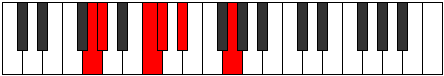 |
| [359](https://ianring.com/musictheory/scales/359) | [Bothimic](ModeGNaturalBothimic.md) | G | G, Ab, Bbb, C, Db, Eb, G | 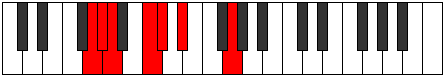 |
| [363](https://ianring.com/musictheory/scales/363) | [Soptimic](ModeGNaturalSoptimic.md) | G | G, Ab, Bb, C, Db, Eb, G |  |
| [367](https://ianring.com/musictheory/scales/367) | [Aerodian](ModeGNaturalAerodian.md) | G | G, Ab, Bbb, Cbb, Dbb, Ebbb, Fbb, G |  |
| [371](https://ianring.com/musictheory/scales/371) | [Rythimic](ModeGNaturalRythimic.md) | G | G, Ab, B, C, Db, Eb, G |  |
| [375](https://ianring.com/musictheory/scales/375) | [Sodian](ModeGNaturalSodian.md) | G | G, Ab, Bbb, Cb, Dbb, Ebbb, Fbb, G |  |
| [379](https://ianring.com/musictheory/scales/379) | [Aeragian](ModeGNaturalAeragian.md) | G | G, Ab, Bb, Cb, Dbb, Ebbb, Fbb, G |  |
| [383](https://ianring.com/musictheory/scales/383) | [Logyllic](ModeGNaturalLogyllic.md) | G | G, G#, A, A#, B, C, C#, D#, G |  |
| [395](https://ianring.com/musictheory/scales/395) | [Dalitonic](ModeCNaturalDalitonic.md) | C | C, C#, D#, G, G#, C |  |
| [399](https://ianring.com/musictheory/scales/399) | [Zynimic](ModeCNaturalZynimic.md) | C | C, Db, Ebb, Fbb, G, Ab, C |  |
| [411](https://ianring.com/musictheory/scales/411) | [Lygimic](ModeCNaturalLygimic.md) | C | C, Db, Eb, Fb, G, Ab, C | 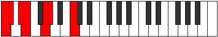 |
| [427](https://ianring.com/musictheory/scales/427) | [Zothimic](ModeCNaturalZothimic.md) | C | C, Db, Eb, F, G, Ab, C |  |
| [447](https://ianring.com/musictheory/scales/447) | [Thyphyllic](ModeCNaturalThyphyllic.md) | C | C, C#, D, D#, E, F, G, G#, C |  |
| [459](https://ianring.com/musictheory/scales/459) | [Zaptimic](ModeCNaturalZaptimic.md) | C | C, Db, Eb, F#, G, Ab, C |  |
| [479](https://ianring.com/musictheory/scales/479) | [Kocryllic](ModeCNaturalKocryllic.md) | C | C, C#, D, D#, E, F#, G, G#, C |  |
| [483](https://ianring.com/musictheory/scales/483) | [Kygimic](ModeGNaturalKygimic.md) | G | G, Ab, B#, C#, D, Eb, G |  |
| [487](https://ianring.com/musictheory/scales/487) | [Dynian](ModeGNaturalDynian.md) | G | G, Ab, Bbb, C, Db, Ebb, Fbb, G |  |
| [491](https://ianring.com/musictheory/scales/491) | [Aeolyrian](ModeGNaturalAeolyrian.md) | G | G, Ab, Bb, C, Db, Ebb, Fbb, G |  |
| [495](https://ianring.com/musictheory/scales/495) | [Bocryllic](ModeCNaturalBocryllic.md) | C | C, C#, D, D#, F, F#, G, G#, C |  |
| [495](https://ianring.com/musictheory/scales/495) | [Bocryllic](ModeGNaturalBocryllic.md) | G | G, G#, A, A#, C, C#, D, D#, G |  |
| [499](https://ianring.com/musictheory/scales/499) | [Ionaptian](ModeGNaturalIonaptian.md) | G | G, Ab, B, C, Db, Ebb, Fbb, G |  |
| [503](https://ianring.com/musictheory/scales/503) | [Thoptyllic](ModeGNaturalThoptyllic.md) | G | G, G#, A, B, C, C#, D, D#, G |  |
| [507](https://ianring.com/musictheory/scales/507) | [Moryllic](ModeCNaturalMoryllic.md) | C | C, C#, D#, E, F, F#, G, G#, C |  |
| [507](https://ianring.com/musictheory/scales/507) | [Moryllic](ModeGNaturalMoryllic.md) | G | G, G#, A#, B, C, C#, D, D#, G |  |
| [511](https://ianring.com/musictheory/scales/511) | [Polygic](ModeCNaturalPolygic.md) | C | C, C#, D, D#, E, F, F#, G, G#, C |  |
| [511](https://ianring.com/musictheory/scales/511) | [Polygic](ModeGNaturalPolygic.md) | G | G, G#, A, A#, B, C, C#, D, D#, G |  |
| [711](https://ianring.com/musictheory/scales/711) | [Epyrimic](ModeFSharpEpyrimic.md) | F# | F#, G, Ab, B#, C#, D#, F# |  |
| [719](https://ianring.com/musictheory/scales/719) | [Kanian](ModeFSharpKanian.md) | F# | F#, G, Ab, Bbb, C, Db, Eb, F# |  |
| [727](https://ianring.com/musictheory/scales/727) | [Phradian](ModeFSharpPhradian.md) | F# | F#, G, Ab, Bb, C, Db, Eb, F# |  |
| [735](https://ianring.com/musictheory/scales/735) | [Sylyllic](ModeFSharpSylyllic.md) | F# | F#, G, G#, A, A#, C, C#, D#, F# |  |
| [735](https://ianring.com/musictheory/scales/735) | [Sylyllic](ModeGFlatSylyllic.md) | Gb | Gb, G, Ab, A, Bb, C, Db, Eb, Gb |  |
| [743](https://ianring.com/musictheory/scales/743) | [Lanian](ModeFSharpLanian.md) | F# | F#, G, Ab, B, C, Db, Eb, F# |  |
| [751](https://ianring.com/musictheory/scales/751) | [Epacryllic](ModeFSharpEpacryllic.md) | F# | F#, G, G#, A, B, C, C#, D#, F# |  |
| [751](https://ianring.com/musictheory/scales/751) | [Epacryllic](ModeGFlatEpacryllic.md) | Gb | Gb, G, Ab, A, B, C, Db, Eb, Gb |  |
| [759](https://ianring.com/musictheory/scales/759) | [Katalyllic](ModeFSharpKatalyllic.md) | F# | F#, G, G#, A#, B, C, C#, D#, F# |  |
| [759](https://ianring.com/musictheory/scales/759) | [Katalyllic](ModeGFlatKatalyllic.md) | Gb | Gb, G, Ab, Bb, B, C, Db, Eb, Gb |  |
| [767](https://ianring.com/musictheory/scales/767) | [Raptygic](ModeFSharpRaptygic.md) | F# | F#, G, G#, A, A#, B, C, C#, D#, F# |  |
| [767](https://ianring.com/musictheory/scales/767) | [Raptygic](ModeGFlatRaptygic.md) | Gb | Gb, G, Ab, A, Bb, B, C, Db, Eb, Gb |  |
| [791](https://ianring.com/musictheory/scales/791) | [Aeoloptimic](ModeBNaturalAeoloptimic.md) | B | B, C, Db, Eb, F##, G#, B |  |
| [799](https://ianring.com/musictheory/scales/799) | [Lolian](ModeBNaturalLolian.md) | B | B, C, Db, Ebb, Fbb, G, Ab, B |  |
| [823](https://ianring.com/musictheory/scales/823) | [Stodian](ModeBNaturalStodian.md) | B | B, C, Db, Eb, Fb, G, Ab, B |  |
| [831](https://ianring.com/musictheory/scales/831) | [Rodyllic](ModeBNaturalRodyllic.md) | B | B, C, C#, D, D#, E, G, G#, B |  |
| [855](https://ianring.com/musictheory/scales/855) | [Porian](ModeBNaturalPorian.md) | B | B, C, Db, Eb, F, G, Ab, B |  |
| [863](https://ianring.com/musictheory/scales/863) | [Pyryllic](ModeBNaturalPyryllic.md) | B | B, C, C#, D, D#, F, G, G#, B |  |
| [867](https://ianring.com/musictheory/scales/867) | [Phrocrimic](ModeGNaturalPhrocrimic.md) | G | G, Ab, B#, C#, D#, E, G |  |
| [871](https://ianring.com/musictheory/scales/871) | [Epadian](ModeGNaturalEpadian.md) | G | G, Ab, Bbb, C, Db, Eb, Fb, G |  |
| [875](https://ianring.com/musictheory/scales/875) | [Stothian](ModeGNaturalStothian.md) | G | G, Ab, Bb, C, Db, Eb, Fb, G | 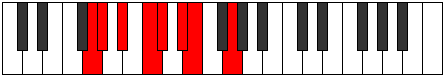 |
| [879](https://ianring.com/musictheory/scales/879) | [Aeolocryllic](ModeGNaturalAeolocryllic.md) | G | G, G#, A, A#, C, C#, D#, E, G |  |
| [883](https://ianring.com/musictheory/scales/883) | [Ralian](ModeGNaturalRalian.md) | G | G, Ab, B, C, Db, Eb, Fb, G |  |
| [887](https://ianring.com/musictheory/scales/887) | [Sathyllic](ModeBNaturalSathyllic.md) | B | B, C, C#, D#, E, F, G, G#, B |  |
| [887](https://ianring.com/musictheory/scales/887) | [Sathyllic](ModeGNaturalSathyllic.md) | G | G, G#, A, B, C, C#, D#, E, G |  |
| [891](https://ianring.com/musictheory/scales/891) | [Ionilyllic](ModeGNaturalIonilyllic.md) | G | G, G#, A#, B, C, C#, D#, E, G |  |
| [895](https://ianring.com/musictheory/scales/895) | [Aeolathygic](ModeBNaturalAeolathygic.md) | B | B, C, C#, D, D#, E, F, G, G#, B |  |
| [895](https://ianring.com/musictheory/scales/895) | [Aeolathygic](ModeGNaturalAeolathygic.md) | G | G, G#, A, A#, B, C, C#, D#, E, G |  |
| [907](https://ianring.com/musictheory/scales/907) | [Tholimic](ModeCNaturalTholimic.md) | C | C, Db, Eb, F##, G#, A, C |  |
| [911](https://ianring.com/musictheory/scales/911) | [Radian](ModeCNaturalRadian.md) | C | C, Db, Ebb, Fbb, G, Ab, Bbb, C |  |
| [919](https://ianring.com/musictheory/scales/919) | [Gathian](ModeBNaturalGathian.md) | B | B, C, Db, Eb, F#, G, Ab, B |  |
| [923](https://ianring.com/musictheory/scales/923) | [Ionodian](ModeCNaturalIonodian.md) | C | C, Db, Eb, Fb, G, Ab, Bbb, C |  |
| [927](https://ianring.com/musictheory/scales/927) | [Koptyllic](ModeCNaturalKoptyllic.md) | C | C, C#, D, D#, E, G, G#, A, C |  |
| [927](https://ianring.com/musictheory/scales/927) | [Koptyllic](ModeBNaturalKoptyllic.md) | B | B, C, C#, D, D#, F#, G, G#, B |  |
| [939](https://ianring.com/musictheory/scales/939) | [Dyptian](ModeCNaturalDyptian.md) | C | C, Db, Eb, F, G, Ab, Bbb, C |  |
| [943](https://ianring.com/musictheory/scales/943) | [Aerygyllic](ModeCNaturalAerygyllic.md) | C | C, C#, D, D#, F, G, G#, A, C |  |
| [951](https://ianring.com/musictheory/scales/951) | [Thogyllic](ModeBNaturalThogyllic.md) | B | B, C, C#, D#, E, F#, G, G#, B |  |
| [955](https://ianring.com/musictheory/scales/955) | [Ionogyllic](ModeCNaturalIonogyllic.md) | C | C, C#, D#, E, F, G, G#, A, C |  |
| [959](https://ianring.com/musictheory/scales/959) | [Katylygic](ModeCNaturalKatylygic.md) | C | C, C#, D, D#, E, F, G, G#, A, C |  |
| [959](https://ianring.com/musictheory/scales/959) | [Katylygic](ModeBNaturalKatylygic.md) | B | B, C, C#, D, D#, E, F#, G, G#, B |  |
| [967](https://ianring.com/musictheory/scales/967) | [Aeolanian](ModeFSharpAeolanian.md) | F# | F#, G, Ab, B#, C#, D, Eb, F# |  |
| [971](https://ianring.com/musictheory/scales/971) | [Ladian](ModeCNaturalLadian.md) | C | C, Db, Eb, F#, G, Ab, Bbb, C |  |
| [975](https://ianring.com/musictheory/scales/975) | [Katogyllic](ModeCNaturalKatogyllic.md) | C | C, C#, D, D#, F#, G, G#, A, C |  |
| [975](https://ianring.com/musictheory/scales/975) | [Katogyllic](ModeFSharpKatogyllic.md) | F# | F#, G, G#, A, C, C#, D, D#, F# |  |
| [975](https://ianring.com/musictheory/scales/975) | [Katogyllic](ModeGFlatKatogyllic.md) | Gb | Gb, G, Ab, A, C, Db, D, Eb, Gb |  |
| [983](https://ianring.com/musictheory/scales/983) | [Epygyllic](ModeFSharpEpygyllic.md) | F# | F#, G, G#, A#, C, C#, D, D#, F# |  |
| [983](https://ianring.com/musictheory/scales/983) | [Epygyllic](ModeGFlatEpygyllic.md) | Gb | Gb, G, Ab, Bb, C, Db, D, Eb, Gb |  |
| [983](https://ianring.com/musictheory/scales/983) | [Epygyllic](ModeBNaturalEpygyllic.md) | B | B, C, C#, D#, F, F#, G, G#, B |  |
| [987](https://ianring.com/musictheory/scales/987) | [Aeraptyllic](ModeCNaturalAeraptyllic.md) | C | C, C#, D#, E, F#, G, G#, A, C |  |
| [991](https://ianring.com/musictheory/scales/991) | [Aeolygic](ModeCNaturalAeolygic.md) | C | C, C#, D, D#, E, F#, G, G#, A, C |  |
| [991](https://ianring.com/musictheory/scales/991) | [Aeolygic](ModeFSharpAeolygic.md) | F# | F#, G, G#, A, A#, C, C#, D, D#, F# |  |
| [991](https://ianring.com/musictheory/scales/991) | [Aeolygic](ModeGFlatAeolygic.md) | Gb | Gb, G, Ab, A, Bb, C, Db, D, Eb, Gb |  |
| [991](https://ianring.com/musictheory/scales/991) | [Aeolygic](ModeBNaturalAeolygic.md) | B | B, C, C#, D, D#, F, F#, G, G#, B |  |
| [995](https://ianring.com/musictheory/scales/995) | [Phrathian](ModeGNaturalPhrathian.md) | G | G, Ab, B#, C#, D, Eb, Fb, G |  |
| [999](https://ianring.com/musictheory/scales/999) | [Bylyllic](ModeGNaturalBylyllic.md) | G | G, G#, A, C, C#, D, D#, E, G |  |
| [999](https://ianring.com/musictheory/scales/999) | [Bylyllic](ModeFSharpBylyllic.md) | F# | F#, G, G#, B, C, C#, D, D#, F# |  |
| [999](https://ianring.com/musictheory/scales/999) | [Bylyllic](ModeGFlatBylyllic.md) | Gb | Gb, G, Ab, B, C, Db, D, Eb, Gb |  |
| [1003](https://ianring.com/musictheory/scales/1003) | [Ionyryllic](ModeCNaturalIonyryllic.md) | C | C, C#, D#, F, F#, G, G#, A, C |  |
| [1003](https://ianring.com/musictheory/scales/1003) | [Ionyryllic](ModeGNaturalIonyryllic.md) | G | G, G#, A#, C, C#, D, D#, E, G |  |
| [1007](https://ianring.com/musictheory/scales/1007) | [Ionycrygic](ModeCNaturalIonycrygic.md) | C | C, C#, D, D#, F, F#, G, G#, A, C |  |
| [1007](https://ianring.com/musictheory/scales/1007) | [Ionycrygic](ModeGNaturalIonycrygic.md) | G | G, G#, A, A#, C, C#, D, D#, E, G |  |
| [1007](https://ianring.com/musictheory/scales/1007) | [Ionycrygic](ModeFSharpIonycrygic.md) | F# | F#, G, G#, A, B, C, C#, D, D#, F# |  |
| [1007](https://ianring.com/musictheory/scales/1007) | [Ionycrygic](ModeGFlatIonycrygic.md) | Gb | Gb, G, Ab, A, B, C, Db, D, Eb, Gb |  |
| [1011](https://ianring.com/musictheory/scales/1011) | [Kycryllic](ModeGNaturalKycryllic.md) | G | G, G#, B, C, C#, D, D#, E, G |  |
| [1015](https://ianring.com/musictheory/scales/1015) | [Ionodygic](ModeBNaturalIonodygic.md) | B | B, C, C#, D#, E, F, F#, G, G#, B |  |
| [1015](https://ianring.com/musictheory/scales/1015) | [Ionodygic](ModeGNaturalIonodygic.md) | G | G, G#, A, B, C, C#, D, D#, E, G |  |
| [1015](https://ianring.com/musictheory/scales/1015) | [Ionodygic](ModeFSharpIonodygic.md) | F# | F#, G, G#, A#, B, C, C#, D, D#, F# |  |
| [1015](https://ianring.com/musictheory/scales/1015) | [Ionodygic](ModeGFlatIonodygic.md) | Gb | Gb, G, Ab, Bb, B, C, Db, D, Eb, Gb |  |
| [1019](https://ianring.com/musictheory/scales/1019) | [Aeranygic](ModeCNaturalAeranygic.md) | C | C, C#, D#, E, F, F#, G, G#, A, C |  |
| [1019](https://ianring.com/musictheory/scales/1019) | [Aeranygic](ModeGNaturalAeranygic.md) | G | G, G#, A#, B, C, C#, D, D#, E, G |  |
| [1023](https://ianring.com/musictheory/scales/1023) | [Dodyllian](ModeCNaturalDodyllian.md) | C | C, C#, D, D#, E, F, F#, G, G#, A, C |  |
| [1023](https://ianring.com/musictheory/scales/1023) | [Dodyllian](ModeBNaturalDodyllian.md) | B | B, C, C#, D, D#, E, F, F#, G, G#, B |  |
| [1023](https://ianring.com/musictheory/scales/1023) | [Dodyllian](ModeGNaturalDodyllian.md) | G | G, G#, A, A#, B, C, C#, D, D#, E, G |  |
| [1023](https://ianring.com/musictheory/scales/1023) | [Dodyllian](ModeFSharpDodyllian.md) | F# | F#, G, G#, A, A#, B, C, C#, D, D#, F# |  |
| [1023](https://ianring.com/musictheory/scales/1023) | [Dodyllian](ModeGFlatDodyllian.md) | Gb | Gb, G, Ab, A, Bb, B, C, Db, D, Eb, Gb |  |
| [1379](https://ianring.com/musictheory/scales/1379) | [Kycrimic](ModeGNaturalKycrimic.md) | G | G, Ab, B#, C#, D#, E#, G |  |
| [1383](https://ianring.com/musictheory/scales/1383) | [Pynian](ModeGNaturalPynian.md) | G | G, Ab, Bbb, C, Db, Eb, F, G |  |
| [1387](https://ianring.com/musictheory/scales/1387) | [Locrian](ModeGNaturalLocrian.md) | G | G, Ab, Bb, C, Db, Eb, F, G |  |
| [1391](https://ianring.com/musictheory/scales/1391) | [Aeradyllic](ModeGNaturalAeradyllic.md) | G | G, G#, A, A#, C, C#, D#, F, G |  |
| [1395](https://ianring.com/musictheory/scales/1395) | [Mixonorian](ModeGNaturalMixonorian.md) | G | G, Ab, B, C, Db, Eb, F, G |  |
| [1399](https://ianring.com/musictheory/scales/1399) | [Syryllic](ModeGNaturalSyryllic.md) | G | G, G#, A, B, C, C#, D#, F, G |  |
| [1403](https://ianring.com/musictheory/scales/1403) | [Epinyllic](ModeGNaturalEpinyllic.md) | G | G, G#, A#, B, C, C#, D#, F, G |  |
| [1407](https://ianring.com/musictheory/scales/1407) | [Tharygic](ModeGNaturalTharygic.md) | G | G, G#, A, A#, B, C, C#, D#, F, G |  |
| [1419](https://ianring.com/musictheory/scales/1419) | [Zalimic](ModeCNaturalZalimic.md) | C | C, Db, Eb, F##, G#, A#, C |  |
| [1421](https://ianring.com/musictheory/scales/1421) | [Aeolaphimic](ModeFNaturalAeolaphimic.md) | F | F, G, Ab, B#, C#, D#, F |  |
| [1423](https://ianring.com/musictheory/scales/1423) | [Doptian](ModeCNaturalDoptian.md) | C | C, Db, Ebb, Fbb, G, Ab, Bb, C |  |
| [1435](https://ianring.com/musictheory/scales/1435) | [Phronian](ModeCNaturalPhronian.md) | C | C, Db, Eb, Fb, G, Ab, Bb, C |  |
| [1437](https://ianring.com/musictheory/scales/1437) | [Aeolycrian](ModeFNaturalAeolycrian.md) | F | F, G, Ab, Bbb, C, Db, Eb, F |  |
| [1439](https://ianring.com/musictheory/scales/1439) | [Rolyllic](ModeFNaturalRolyllic.md) | F | F, F#, G, G#, A, C, C#, D#, F |  |
| [1439](https://ianring.com/musictheory/scales/1439) | [Rolyllic](ModeCNaturalRolyllic.md) | C | C, C#, D, D#, E, G, G#, A#, C |  |
| [1451](https://ianring.com/musictheory/scales/1451) | [Phrygian](ModeCNaturalPhrygian.md) | C | C, Db, Eb, F, G, Ab, Bb, C |  |
| [1453](https://ianring.com/musictheory/scales/1453) | [Aeolian](ModeFNaturalAeolian.md) | F | F, G, Ab, Bb, C, Db, Eb, F |  |
| [1455](https://ianring.com/musictheory/scales/1455) | [Soryllic](ModeCNaturalSoryllic.md) | C | C, C#, D, D#, F, G, G#, A#, C |  |
| [1455](https://ianring.com/musictheory/scales/1455) | [Soryllic](ModeFNaturalSoryllic.md) | F | F, F#, G, G#, A#, C, C#, D#, F |  |
| [1467](https://ianring.com/musictheory/scales/1467) | [Thydyllic](ModeCNaturalThydyllic.md) | C | C, C#, D#, E, F, G, G#, A#, C |  |
| [1469](https://ianring.com/musictheory/scales/1469) | [Epiryllic](ModeFNaturalEpiryllic.md) | F | F, G, G#, A, A#, C, C#, D#, F |  |
| [1471](https://ianring.com/musictheory/scales/1471) | [Radygic](ModeCNaturalRadygic.md) | C | C, C#, D, D#, E, F, G, G#, A#, C |  |
| [1471](https://ianring.com/musictheory/scales/1471) | [Radygic](ModeFNaturalRadygic.md) | F | F, F#, G, G#, A, A#, C, C#, D#, F |  |
| [1483](https://ianring.com/musictheory/scales/1483) | [Dygian](ModeCNaturalDygian.md) | C | C, Db, Eb, F#, G, Ab, Bb, C |  |
| [1485](https://ianring.com/musictheory/scales/1485) | [Tyrian](ModeFNaturalTyrian.md) | F | F, G, Ab, B, C, Db, Eb, F |  |
| [1487](https://ianring.com/musictheory/scales/1487) | [Lycryllic](ModeCNaturalLycryllic.md) | C | C, C#, D, D#, F#, G, G#, A#, C |  |
| [1487](https://ianring.com/musictheory/scales/1487) | [Lycryllic](ModeFNaturalLycryllic.md) | F | F, F#, G, G#, B, C, C#, D#, F |  |
| [1499](https://ianring.com/musictheory/scales/1499) | [Stonyllic](ModeCNaturalStonyllic.md) | C | C, C#, D#, E, F#, G, G#, A#, C |  |
| [1501](https://ianring.com/musictheory/scales/1501) | [Stygyllic](ModeFNaturalStygyllic.md) | F | F, G, G#, A, B, C, C#, D#, F |  |
| [1503](https://ianring.com/musictheory/scales/1503) | [Padygic](ModeCNaturalPadygic.md) | C | C, C#, D, D#, E, F#, G, G#, A#, C |  |
| [1503](https://ianring.com/musictheory/scales/1503) | [Padygic](ModeFNaturalPadygic.md) | F | F, F#, G, G#, A, B, C, C#, D#, F |  |
| [1507](https://ianring.com/musictheory/scales/1507) | [Zynian](ModeGNaturalZynian.md) | G | G, Ab, B#, C#, D, Eb, F, G |  |
| [1511](https://ianring.com/musictheory/scales/1511) | [Styptyllic](ModeGNaturalStyptyllic.md) | G | G, G#, A, C, C#, D, D#, F, G |  |
| [1515](https://ianring.com/musictheory/scales/1515) | [Solyllic](ModeGNaturalSolyllic.md) | G | G, G#, A#, C, C#, D, D#, F, G |  |
| [1515](https://ianring.com/musictheory/scales/1515) | [Solyllic](ModeCNaturalSolyllic.md) | C | C, C#, D#, F, F#, G, G#, A#, C |  |
| [1517](https://ianring.com/musictheory/scales/1517) | [Sagyllic](ModeFNaturalSagyllic.md) | F | F, G, G#, A#, B, C, C#, D#, F |  |
| [1519](https://ianring.com/musictheory/scales/1519) | [Solygic](ModeCNaturalSolygic.md) | C | C, C#, D, D#, F, F#, G, G#, A#, C |  |
| [1519](https://ianring.com/musictheory/scales/1519) | [Solygic](ModeGNaturalSolygic.md) | G | G, G#, A, A#, C, C#, D, D#, F, G |  |
| [1519](https://ianring.com/musictheory/scales/1519) | [Solygic](ModeFNaturalSolygic.md) | F | F, F#, G, G#, A#, B, C, C#, D#, F |  |
| [1523](https://ianring.com/musictheory/scales/1523) | [Zothyllic](ModeGNaturalZothyllic.md) | G | G, G#, B, C, C#, D, D#, F, G |  |
| [1527](https://ianring.com/musictheory/scales/1527) | [Aeolyrygic](ModeGNaturalAeolyrygic.md) | G | G, G#, A, B, C, C#, D, D#, F, G |  |
| [1531](https://ianring.com/musictheory/scales/1531) | [Styptygic](ModeCNaturalStyptygic.md) | C | C, C#, D#, E, F, F#, G, G#, A#, C |  |
| [1531](https://ianring.com/musictheory/scales/1531) | [Styptygic](ModeGNaturalStyptygic.md) | G | G, G#, A#, B, C, C#, D, D#, F, G |  |
| [1533](https://ianring.com/musictheory/scales/1533) | [Katycrygic](ModeFNaturalKatycrygic.md) | F | F, G, G#, A, A#, B, C, C#, D#, F |  |
| [1535](https://ianring.com/musictheory/scales/1535) | [Mixodyllian](ModeCNaturalMixodyllian.md) | C | C, C#, D, D#, E, F, F#, G, G#, A#, C |  |
| [1535](https://ianring.com/musictheory/scales/1535) | [Mixodyllian](ModeGNaturalMixodyllian.md) | G | G, G#, A, A#, B, C, C#, D, D#, F, G |  |
| [1535](https://ianring.com/musictheory/scales/1535) | [Mixodyllian](ModeFNaturalMixodyllian.md) | F | F, F#, G, G#, A, A#, B, C, C#, D#, F |  |
| [1581](https://ianring.com/musictheory/scales/1581) | [Gyrimic](ModeBFlatGyrimic.md) | Bb | Bb, C, Db, Eb, F##, G#, Bb |  |
| [1583](https://ianring.com/musictheory/scales/1583) | [Salian](ModeASharpSalian.md) | A# | A#, B, C, Db, Eb, F##, G#, A# |  |
| [1583](https://ianring.com/musictheory/scales/1583) | [Salian](ModeBFlatSalian.md) | Bb | Bb, Cb, Dbb, Ebbb, Fbb, G, Ab, Bb |  |
| [1585](https://ianring.com/musictheory/scales/1585) | [Phraditonic](ModeDSharpPhraditonic.md) | D# | D#, G, G#, C, C#, D# |  |
| [1585](https://ianring.com/musictheory/scales/1585) | [Phraditonic](ModeEFlatPhraditonic.md) | Eb | Eb, G, Ab, C, Db, Eb |  |
| [1587](https://ianring.com/musictheory/scales/1587) | [Lalimic](ModeDSharpLalimic.md) | D# | D#, E, F##, G#, A###, B##, D# |  |
| [1587](https://ianring.com/musictheory/scales/1587) | [Lalimic](ModeEFlatLalimic.md) | Eb | Eb, Fb, G, Ab, B#, C#, Eb |  |
| [1589](https://ianring.com/musictheory/scales/1589) | [Ionagimic](ModeDSharpIonagimic.md) | D# | D#, E#, F##, G#, A###, B##, D# |  |
| [1589](https://ianring.com/musictheory/scales/1589) | [Ionagimic](ModeEFlatIonagimic.md) | Eb | Eb, F, G, Ab, B#, C#, Eb |  |
| [1591](https://ianring.com/musictheory/scales/1591) | [Rodian](ModeDSharpRodian.md) | D# | D#, E, F, G, Ab, B#, C#, D# |  |
| [1593](https://ianring.com/musictheory/scales/1593) | [Zogimic](ModeDSharpZogimic.md) | D# | D#, E##, F##, G#, A###, B##, D# |  |
| [1593](https://ianring.com/musictheory/scales/1593) | [Zogimic](ModeEFlatZogimic.md) | Eb | Eb, F#, G, Ab, B#, C#, Eb |  |
| [1595](https://ianring.com/musictheory/scales/1595) | [Dacrian](ModeDSharpDacrian.md) | D# | D#, E, F#, G, Ab, B#, C#, D# |  |
| [1597](https://ianring.com/musictheory/scales/1597) | [Aeolodian](ModeDSharpAeolodian.md) | D# | D#, E#, F#, G, Ab, B#, C#, D# |  |
| [1597](https://ianring.com/musictheory/scales/1597) | [Aeolodian](ModeASharpAeolodian.md) | A# | A#, B#, C#, D, Eb, F##, G#, A# |  |
| [1597](https://ianring.com/musictheory/scales/1597) | [Aeolodian](ModeBFlatAeolodian.md) | Bb | Bb, C, Db, Ebb, Fbb, G, Ab, Bb |  |
| [1599](https://ianring.com/musictheory/scales/1599) | [Pocryllic](ModeDSharpPocryllic.md) | D# | D#, E, F, F#, G, G#, C, C#, D# |  |
| [1599](https://ianring.com/musictheory/scales/1599) | [Pocryllic](ModeEFlatPocryllic.md) | Eb | Eb, E, F, Gb, G, Ab, C, Db, Eb |  |
| [1599](https://ianring.com/musictheory/scales/1599) | [Pocryllic](ModeASharpPocryllic.md) | A# | A#, B, C, C#, D, D#, G, G#, A# |  |
| [1599](https://ianring.com/musictheory/scales/1599) | [Pocryllic](ModeBFlatPocryllic.md) | Bb | Bb, B, C, Db, D, Eb, G, Ab, Bb |  |
| [1645](https://ianring.com/musictheory/scales/1645) | [Katagian](ModeASharpKatagian.md) | A# | A#, B#, C#, D#, E, F##, G#, A# |  |
| [1645](https://ianring.com/musictheory/scales/1645) | [Katagian](ModeBFlatKatagian.md) | Bb | Bb, C, Db, Eb, Fb, G, Ab, Bb |  |
| [1647](https://ianring.com/musictheory/scales/1647) | [Polyllic](ModeASharpPolyllic.md) | A# | A#, B, C, C#, D#, E, G, G#, A# |  |
| [1647](https://ianring.com/musictheory/scales/1647) | [Polyllic](ModeBFlatPolyllic.md) | Bb | Bb, B, C, Db, Eb, E, G, Ab, Bb |  |
| [1649](https://ianring.com/musictheory/scales/1649) | [Bolimic](ModeEFlatBolimic.md) | Eb | Eb, F##, G#, A, B#, C#, Eb |  |
| [1651](https://ianring.com/musictheory/scales/1651) | [Mogian](ModeDSharpMogian.md) | D# | D#, E, F##, G#, A, B#, C#, D# |  |
| [1651](https://ianring.com/musictheory/scales/1651) | [Mogian](ModeEFlatMogian.md) | Eb | Eb, Fb, G, Ab, Bbb, C, Db, Eb |  |
| [1653](https://ianring.com/musictheory/scales/1653) | [Gylian](ModeDSharpGylian.md) | D# | D#, E#, F##, G#, A, B#, C#, D# |  |
| [1653](https://ianring.com/musictheory/scales/1653) | [Gylian](ModeEFlatGylian.md) | Eb | Eb, F, G, Ab, Bbb, C, Db, Eb |  |
| [1655](https://ianring.com/musictheory/scales/1655) | [Katygyllic](ModeDSharpKatygyllic.md) | D# | D#, E, F, G, G#, A, C, C#, D# |  |
| [1655](https://ianring.com/musictheory/scales/1655) | [Katygyllic](ModeEFlatKatygyllic.md) | Eb | Eb, E, F, G, Ab, A, C, Db, Eb |  |
| [1657](https://ianring.com/musictheory/scales/1657) | [Ionothian](ModeDSharpIonothian.md) | D# | D#, E##, F##, G#, A, B#, C#, D# |  |
| [1657](https://ianring.com/musictheory/scales/1657) | [Ionothian](ModeEFlatIonothian.md) | Eb | Eb, F#, G, Ab, Bbb, C, Db, Eb |  |
| [1659](https://ianring.com/musictheory/scales/1659) | [Magyllic](ModeDSharpMagyllic.md) | D# | D#, E, F#, G, G#, A, C, C#, D# |  |
| [1659](https://ianring.com/musictheory/scales/1659) | [Magyllic](ModeEFlatMagyllic.md) | Eb | Eb, E, Gb, G, Ab, A, C, Db, Eb |  |
| [1661](https://ianring.com/musictheory/scales/1661) | [Gonyllic](ModeDSharpGonyllic.md) | D# | D#, F, F#, G, G#, A, C, C#, D# |  |
| [1661](https://ianring.com/musictheory/scales/1661) | [Gonyllic](ModeEFlatGonyllic.md) | Eb | Eb, F, Gb, G, Ab, A, C, Db, Eb |  |
| [1661](https://ianring.com/musictheory/scales/1661) | [Gonyllic](ModeASharpGonyllic.md) | A# | A#, C, C#, D, D#, E, G, G#, A# | 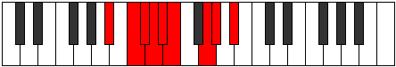 |
| [1661](https://ianring.com/musictheory/scales/1661) | [Gonyllic](ModeBFlatGonyllic.md) | Bb | Bb, C, Db, D, Eb, E, G, Ab, Bb |  |
| [1663](https://ianring.com/musictheory/scales/1663) | [Lydygic](ModeDSharpLydygic.md) | D# | D#, E, F, F#, G, G#, A, C, C#, D# |  |
| [1663](https://ianring.com/musictheory/scales/1663) | [Lydygic](ModeEFlatLydygic.md) | Eb | Eb, E, F, Gb, G, Ab, A, C, Db, Eb |  |
| [1663](https://ianring.com/musictheory/scales/1663) | [Lydygic](ModeASharpLydygic.md) | A# | A#, B, C, C#, D, D#, E, G, G#, A# |  |
| [1663](https://ianring.com/musictheory/scales/1663) | [Lydygic](ModeBFlatLydygic.md) | Bb | Bb, B, C, Db, D, Eb, E, G, Ab, Bb |  |
| [1709](https://ianring.com/musictheory/scales/1709) | [Dorian](ModeASharpDorian.md) | A# | A#, B#, C#, D#, E#, F##, G#, A# |  |
| [1709](https://ianring.com/musictheory/scales/1709) | [Dorian](ModeBFlatDorian.md) | Bb | Bb, C, Db, Eb, F, G, Ab, Bb |  |
| [1711](https://ianring.com/musictheory/scales/1711) | [Ragyllic](ModeASharpRagyllic.md) | A# | A#, B, C, C#, D#, F, G, G#, A# |  |
| [1711](https://ianring.com/musictheory/scales/1711) | [Ragyllic](ModeBFlatRagyllic.md) | Bb | Bb, B, C, Db, Eb, F, G, Ab, Bb |  |
| [1713](https://ianring.com/musictheory/scales/1713) | [Garimic](ModeEFlatGarimic.md) | Eb | Eb, F##, G#, A#, B#, C#, Eb |  |
| [1715](https://ianring.com/musictheory/scales/1715) | [Aeronian](ModeDSharpAeronian.md) | D# | D#, E, F##, G#, A#, B#, C#, D# |  |
| [1715](https://ianring.com/musictheory/scales/1715) | [Aeronian](ModeEFlatAeronian.md) | Eb | Eb, Fb, G, Ab, Bb, C, Db, Eb |  |
| [1717](https://ianring.com/musictheory/scales/1717) | [Mixolydian](ModeDSharpMixolydian.md) | D# | D#, E#, F##, G#, A#, B#, C#, D# |  |
| [1717](https://ianring.com/musictheory/scales/1717) | [Mixolydian](ModeEFlatMixolydian.md) | Eb | Eb, F, G, Ab, Bb, C, Db, Eb |  |
| [1719](https://ianring.com/musictheory/scales/1719) | [Lyryllic](ModeDSharpLyryllic.md) | D# | D#, E, F, G, G#, A#, C, C#, D# |  |
| [1719](https://ianring.com/musictheory/scales/1719) | [Lyryllic](ModeEFlatLyryllic.md) | Eb | Eb, E, F, G, Ab, Bb, C, Db, Eb |  |
| [1721](https://ianring.com/musictheory/scales/1721) | [Ionycrian](ModeDSharpIonycrian.md) | D# | D#, E##, F##, G#, A#, B#, C#, D# |  |
| [1721](https://ianring.com/musictheory/scales/1721) | [Ionycrian](ModeEFlatIonycrian.md) | Eb | Eb, F#, G, Ab, Bb, C, Db, Eb |  |
| [1723](https://ianring.com/musictheory/scales/1723) | [Poryllic](ModeDSharpPoryllic.md) | D# | D#, E, F#, G, G#, A#, C, C#, D# |  |
| [1723](https://ianring.com/musictheory/scales/1723) | [Poryllic](ModeEFlatPoryllic.md) | Eb | Eb, E, Gb, G, Ab, Bb, C, Db, Eb |  |
| [1725](https://ianring.com/musictheory/scales/1725) | [Mixodyllic](ModeASharpMixodyllic.md) | A# | A#, C, C#, D, D#, F, G, G#, A# |  |
| [1725](https://ianring.com/musictheory/scales/1725) | [Mixodyllic](ModeBFlatMixodyllic.md) | Bb | Bb, C, Db, D, Eb, F, G, Ab, Bb |  |
| [1725](https://ianring.com/musictheory/scales/1725) | [Mixodyllic](ModeDSharpMixodyllic.md) | D# | D#, F, F#, G, G#, A#, C, C#, D# |  |
| [1725](https://ianring.com/musictheory/scales/1725) | [Mixodyllic](ModeEFlatMixodyllic.md) | Eb | Eb, F, Gb, G, Ab, Bb, C, Db, Eb |  |
| [1727](https://ianring.com/musictheory/scales/1727) | [Sydygic](ModeDSharpSydygic.md) | D# | D#, E, F, F#, G, G#, A#, C, C#, D# |  |
| [1727](https://ianring.com/musictheory/scales/1727) | [Sydygic](ModeEFlatSydygic.md) | Eb | Eb, E, F, Gb, G, Ab, Bb, C, Db, Eb |  |
| [1727](https://ianring.com/musictheory/scales/1727) | [Sydygic](ModeASharpSydygic.md) | A# | A#, B, C, C#, D, D#, F, G, G#, A# |  |
| [1727](https://ianring.com/musictheory/scales/1727) | [Sydygic](ModeBFlatSydygic.md) | Bb | Bb, B, C, Db, D, Eb, F, G, Ab, Bb |  |
| [1735](https://ianring.com/musictheory/scales/1735) | [Dagian](ModeFSharpDagian.md) | F# | F#, G, Ab, B#, C#, D#, E, F# |  |
| [1743](https://ianring.com/musictheory/scales/1743) | [Epigyllic](ModeFSharpEpigyllic.md) | F# | F#, G, G#, A, C, C#, D#, E, F# |  |
| [1743](https://ianring.com/musictheory/scales/1743) | [Epigyllic](ModeGFlatEpigyllic.md) | Gb | Gb, G, Ab, A, C, Db, Eb, E, Gb | 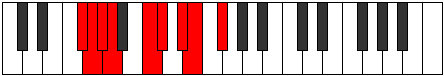 |
| [1751](https://ianring.com/musictheory/scales/1751) | [Aeolyryllic](ModeFSharpAeolyryllic.md) | F# | F#, G, G#, A#, C, C#, D#, E, F# |  |
| [1751](https://ianring.com/musictheory/scales/1751) | [Aeolyryllic](ModeGFlatAeolyryllic.md) | Gb | Gb, G, Ab, Bb, C, Db, Eb, E, Gb |  |
| [1759](https://ianring.com/musictheory/scales/1759) | [Pylygic](ModeFSharpPylygic.md) | F# | F#, G, G#, A, A#, C, C#, D#, E, F# |  |
| [1759](https://ianring.com/musictheory/scales/1759) | [Pylygic](ModeGFlatPylygic.md) | Gb | Gb, G, Ab, A, Bb, C, Db, Eb, E, Gb |  |
| [1767](https://ianring.com/musictheory/scales/1767) | [Dyryllic](ModeFSharpDyryllic.md) | F# | F#, G, G#, B, C, C#, D#, E, F# |  |
| [1767](https://ianring.com/musictheory/scales/1767) | [Dyryllic](ModeGFlatDyryllic.md) | Gb | Gb, G, Ab, B, C, Db, Eb, E, Gb |  |
| [1773](https://ianring.com/musictheory/scales/1773) | [Aeoloryllic](ModeASharpAeoloryllic.md) | A# | A#, C, C#, D#, E, F, G, G#, A# |  |
| [1773](https://ianring.com/musictheory/scales/1773) | [Aeoloryllic](ModeBFlatAeoloryllic.md) | Bb | Bb, C, Db, Eb, E, F, G, Ab, Bb |  |
| [1775](https://ianring.com/musictheory/scales/1775) | [Lyrygic](ModeFSharpLyrygic.md) | F# | F#, G, G#, A, B, C, C#, D#, E, F# |  |
| [1775](https://ianring.com/musictheory/scales/1775) | [Lyrygic](ModeGFlatLyrygic.md) | Gb | Gb, G, Ab, A, B, C, Db, Eb, E, Gb |  |
| [1775](https://ianring.com/musictheory/scales/1775) | [Lyrygic](ModeASharpLyrygic.md) | A# | A#, B, C, C#, D#, E, F, G, G#, A# |  |
| [1775](https://ianring.com/musictheory/scales/1775) | [Lyrygic](ModeBFlatLyrygic.md) | Bb | Bb, B, C, Db, Eb, E, F, G, Ab, Bb |  |
| [1777](https://ianring.com/musictheory/scales/1777) | [Saptian](ModeEFlatSaptian.md) | Eb | Eb, F##, G#, A, Bb, C, Db, Eb |  |
| [1779](https://ianring.com/musictheory/scales/1779) | [Aerythyllic](ModeDSharpAerythyllic.md) | D# | D#, E, G, G#, A, A#, C, C#, D# |  |
| [1779](https://ianring.com/musictheory/scales/1779) | [Aerythyllic](ModeEFlatAerythyllic.md) | Eb | Eb, E, G, Ab, A, Bb, C, Db, Eb |  |
| [1781](https://ianring.com/musictheory/scales/1781) | [Gocryllic](ModeDSharpGocryllic.md) | D# | D#, F, G, G#, A, A#, C, C#, D# |  |
| [1781](https://ianring.com/musictheory/scales/1781) | [Gocryllic](ModeEFlatGocryllic.md) | Eb | Eb, F, G, Ab, A, Bb, C, Db, Eb |  |
| [1783](https://ianring.com/musictheory/scales/1783) | [Danygic](ModeDSharpDanygic.md) | D# | D#, E, F, G, G#, A, A#, C, C#, D# |  |
| [1783](https://ianring.com/musictheory/scales/1783) | [Danygic](ModeEFlatDanygic.md) | Eb | Eb, E, F, G, Ab, A, Bb, C, Db, Eb |  |
| [1783](https://ianring.com/musictheory/scales/1783) | [Danygic](ModeFSharpDanygic.md) | F# | F#, G, G#, A#, B, C, C#, D#, E, F# |  |
| [1783](https://ianring.com/musictheory/scales/1783) | [Danygic](ModeGFlatDanygic.md) | Gb | Gb, G, Ab, Bb, B, C, Db, Eb, E, Gb |  |
| [1785](https://ianring.com/musictheory/scales/1785) | [Tharyllic](ModeDSharpTharyllic.md) | D# | D#, F#, G, G#, A, A#, C, C#, D# |  |
| [1785](https://ianring.com/musictheory/scales/1785) | [Tharyllic](ModeEFlatTharyllic.md) | Eb | Eb, Gb, G, Ab, A, Bb, C, Db, Eb |  |
| [1787](https://ianring.com/musictheory/scales/1787) | [Mycrygic](ModeDSharpMycrygic.md) | D# | D#, E, F#, G, G#, A, A#, C, C#, D# |  |
| [1787](https://ianring.com/musictheory/scales/1787) | [Mycrygic](ModeEFlatMycrygic.md) | Eb | Eb, E, Gb, G, Ab, A, Bb, C, Db, Eb |  |
| [1789](https://ianring.com/musictheory/scales/1789) | [Katagygic](ModeASharpKatagygic.md) | A# | A#, C, C#, D, D#, E, F, G, G#, A# |  |
| [1789](https://ianring.com/musictheory/scales/1789) | [Katagygic](ModeBFlatKatagygic.md) | Bb | Bb, C, Db, D, Eb, E, F, G, Ab, Bb |  |
| [1789](https://ianring.com/musictheory/scales/1789) | [Katagygic](ModeDSharpKatagygic.md) | D# | D#, F, F#, G, G#, A, A#, C, C#, D# |  |
| [1789](https://ianring.com/musictheory/scales/1789) | [Katagygic](ModeEFlatKatagygic.md) | Eb | Eb, F, Gb, G, Ab, A, Bb, C, Db, Eb |  |
| [1791](https://ianring.com/musictheory/scales/1791) | [Aerygyllian](ModeDSharpAerygyllian.md) | D# | D#, E, F, F#, G, G#, A, A#, C, C#, D# |  |
| [1791](https://ianring.com/musictheory/scales/1791) | [Aerygyllian](ModeEFlatAerygyllian.md) | Eb | Eb, E, F, Gb, G, Ab, A, Bb, C, Db, Eb |  |
| [1791](https://ianring.com/musictheory/scales/1791) | [Aerygyllian](ModeASharpAerygyllian.md) | A# | A#, B, C, C#, D, D#, E, F, G, G#, A# |  |
| [1791](https://ianring.com/musictheory/scales/1791) | [Aerygyllian](ModeBFlatAerygyllian.md) | Bb | Bb, B, C, Db, D, Eb, E, F, G, Ab, Bb |  |
| [1791](https://ianring.com/musictheory/scales/1791) | [Aerygyllian](ModeFSharpAerygyllian.md) | F# | F#, G, G#, A, A#, B, C, C#, D#, E, F# |  |
| [1791](https://ianring.com/musictheory/scales/1791) | [Aerygyllian](ModeGFlatAerygyllian.md) | Gb | Gb, G, Ab, A, Bb, B, C, Db, Eb, E, Gb |  |
| [1815](https://ianring.com/musictheory/scales/1815) | [Godian](ModeBNaturalGodian.md) | B | B, C, Db, Eb, F##, G#, A, B |  |
| [1823](https://ianring.com/musictheory/scales/1823) | [Phralyllic](ModeBNaturalPhralyllic.md) | B | B, C, C#, D, D#, G, G#, A, B |  |
| [1837](https://ianring.com/musictheory/scales/1837) | [Dalian](ModeASharpDalian.md) | A# | A#, B#, C#, D#, E##, F##, G#, A# |  |
| [1837](https://ianring.com/musictheory/scales/1837) | [Dalian](ModeBFlatDalian.md) | Bb | Bb, C, Db, Eb, F#, G, Ab, Bb |  |
| [1839](https://ianring.com/musictheory/scales/1839) | [Zogyllic](ModeASharpZogyllic.md) | A# | A#, B, C, C#, D#, F#, G, G#, A# |  |
| [1839](https://ianring.com/musictheory/scales/1839) | [Zogyllic](ModeBFlatZogyllic.md) | Bb | Bb, B, C, Db, Eb, Gb, G, Ab, Bb |  |
| [1841](https://ianring.com/musictheory/scales/1841) | [Thogimic](ModeEFlatThogimic.md) | Eb | Eb, F##, G#, A##, B#, C#, Eb |  |
| [1843](https://ianring.com/musictheory/scales/1843) | [Ionygian](ModeDSharpIonygian.md) | D# | D#, E, F##, G#, A##, B#, C#, D# |  |
| [1843](https://ianring.com/musictheory/scales/1843) | [Ionygian](ModeEFlatIonygian.md) | Eb | Eb, Fb, G, Ab, B, C, Db, Eb |  |
| [1845](https://ianring.com/musictheory/scales/1845) | [Lagian](ModeDSharpLagian.md) | D# | D#, E#, F##, G#, A##, B#, C#, D# |  |
| [1845](https://ianring.com/musictheory/scales/1845) | [Lagian](ModeEFlatLagian.md) | Eb | Eb, F, G, Ab, B, C, Db, Eb |  |
| [1847](https://ianring.com/musictheory/scales/1847) | [Thacryllic](ModeDSharpThacryllic.md) | D# | D#, E, F, G, G#, B, C, C#, D# |  |
| [1847](https://ianring.com/musictheory/scales/1847) | [Thacryllic](ModeEFlatThacryllic.md) | Eb | Eb, E, F, G, Ab, B, C, Db, Eb |  |
| [1847](https://ianring.com/musictheory/scales/1847) | [Thacryllic](ModeBNaturalThacryllic.md) | B | B, C, C#, D#, E, G, G#, A, B | 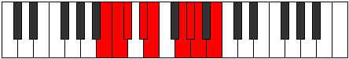 |
| [1849](https://ianring.com/musictheory/scales/1849) | [Epogian](ModeDSharpEpogian.md) | D# | D#, E##, F##, G#, A##, B#, C#, D# |  |
| [1849](https://ianring.com/musictheory/scales/1849) | [Epogian](ModeEFlatEpogian.md) | Eb | Eb, F#, G, Ab, B, C, Db, Eb |  |
| [1851](https://ianring.com/musictheory/scales/1851) | [Zacryllic](ModeDSharpZacryllic.md) | D# | D#, E, F#, G, G#, B, C, C#, D# |  |
| [1851](https://ianring.com/musictheory/scales/1851) | [Zacryllic](ModeEFlatZacryllic.md) | Eb | Eb, E, Gb, G, Ab, B, C, Db, Eb |  |
| [1853](https://ianring.com/musictheory/scales/1853) | [Phrynyllic](ModeASharpPhrynyllic.md) | A# | A#, C, C#, D, D#, F#, G, G#, A# |  |
| [1853](https://ianring.com/musictheory/scales/1853) | [Phrynyllic](ModeBFlatPhrynyllic.md) | Bb | Bb, C, Db, D, Eb, Gb, G, Ab, Bb |  |
| [1853](https://ianring.com/musictheory/scales/1853) | [Phrynyllic](ModeDSharpPhrynyllic.md) | D# | D#, F, F#, G, G#, B, C, C#, D# |  |
| [1853](https://ianring.com/musictheory/scales/1853) | [Phrynyllic](ModeEFlatPhrynyllic.md) | Eb | Eb, F, Gb, G, Ab, B, C, Db, Eb |  |
| [1855](https://ianring.com/musictheory/scales/1855) | [Marygic](ModeDSharpMarygic.md) | D# | D#, E, F, F#, G, G#, B, C, C#, D# |  |
| [1855](https://ianring.com/musictheory/scales/1855) | [Marygic](ModeEFlatMarygic.md) | Eb | Eb, E, F, Gb, G, Ab, B, C, Db, Eb |  |
| [1855](https://ianring.com/musictheory/scales/1855) | [Marygic](ModeBNaturalMarygic.md) | B | B, C, C#, D, D#, E, G, G#, A, B |  |
| [1855](https://ianring.com/musictheory/scales/1855) | [Marygic](ModeASharpMarygic.md) | A# | A#, B, C, C#, D, D#, F#, G, G#, A# |  |
| [1855](https://ianring.com/musictheory/scales/1855) | [Marygic](ModeBFlatMarygic.md) | Bb | Bb, B, C, Db, D, Eb, Gb, G, Ab, Bb |  |
| [1879](https://ianring.com/musictheory/scales/1879) | [Mixoryllic](ModeBNaturalMixoryllic.md) | B | B, C, C#, D#, F, G, G#, A, B |  |
| [1887](https://ianring.com/musictheory/scales/1887) | [Aerocrygic](ModeBNaturalAerocrygic.md) | B | B, C, C#, D, D#, F, G, G#, A, B |  |
| [1891](https://ianring.com/musictheory/scales/1891) | [Thalian](ModeGNaturalThalian.md) | G | G, Ab, B#, C#, D#, E, F, G |  |
| [1895](https://ianring.com/musictheory/scales/1895) | [Salyllic](ModeGNaturalSalyllic.md) | G | G, G#, A, C, C#, D#, E, F, G |  |
| [1899](https://ianring.com/musictheory/scales/1899) | [Moptyllic](ModeGNaturalMoptyllic.md) | G | G, G#, A#, C, C#, D#, E, F, G |  |
| [1901](https://ianring.com/musictheory/scales/1901) | [Ionidyllic](ModeASharpIonidyllic.md) | A# | A#, C, C#, D#, E, F#, G, G#, A# |  |
| [1901](https://ianring.com/musictheory/scales/1901) | [Ionidyllic](ModeBFlatIonidyllic.md) | Bb | Bb, C, Db, Eb, E, Gb, G, Ab, Bb |  |
| [1903](https://ianring.com/musictheory/scales/1903) | [Rocrygic](ModeGNaturalRocrygic.md) | G | G, G#, A, A#, C, C#, D#, E, F, G |  |
| [1903](https://ianring.com/musictheory/scales/1903) | [Rocrygic](ModeASharpRocrygic.md) | A# | A#, B, C, C#, D#, E, F#, G, G#, A# |  |
| [1903](https://ianring.com/musictheory/scales/1903) | [Rocrygic](ModeBFlatRocrygic.md) | Bb | Bb, B, C, Db, Eb, E, Gb, G, Ab, Bb |  |
| [1905](https://ianring.com/musictheory/scales/1905) | [Katacrian](ModeEFlatKatacrian.md) | Eb | Eb, F##, G#, A, B, C, Db, Eb |  |
| [1907](https://ianring.com/musictheory/scales/1907) | [Lynyllic](ModeGNaturalLynyllic.md) | G | G, G#, B, C, C#, D#, E, F, G |  |
| [1907](https://ianring.com/musictheory/scales/1907) | [Lynyllic](ModeDSharpLynyllic.md) | D# | D#, E, G, G#, A, B, C, C#, D# |  |
| [1907](https://ianring.com/musictheory/scales/1907) | [Lynyllic](ModeEFlatLynyllic.md) | Eb | Eb, E, G, Ab, A, B, C, Db, Eb |  |
| [1909](https://ianring.com/musictheory/scales/1909) | [Epicryllic](ModeDSharpEpicryllic.md) | D# | D#, F, G, G#, A, B, C, C#, D# |  |
| [1909](https://ianring.com/musictheory/scales/1909) | [Epicryllic](ModeEFlatEpicryllic.md) | Eb | Eb, F, G, Ab, A, B, C, Db, Eb |  |
| [1911](https://ianring.com/musictheory/scales/1911) | [Stynygic](ModeDSharpStynygic.md) | D# | D#, E, F, G, G#, A, B, C, C#, D# |  |
| [1911](https://ianring.com/musictheory/scales/1911) | [Stynygic](ModeEFlatStynygic.md) | Eb | Eb, E, F, G, Ab, A, B, C, Db, Eb |  |
| [1911](https://ianring.com/musictheory/scales/1911) | [Stynygic](ModeGNaturalStynygic.md) | G | G, G#, A, B, C, C#, D#, E, F, G |  |
| [1911](https://ianring.com/musictheory/scales/1911) | [Stynygic](ModeBNaturalStynygic.md) | B | B, C, C#, D#, E, F, G, G#, A, B |  |
| [1913](https://ianring.com/musictheory/scales/1913) | [Zagyllic](ModeDSharpZagyllic.md) | D# | D#, F#, G, G#, A, B, C, C#, D# |  |
| [1913](https://ianring.com/musictheory/scales/1913) | [Zagyllic](ModeEFlatZagyllic.md) | Eb | Eb, Gb, G, Ab, A, B, C, Db, Eb |  |
| [1915](https://ianring.com/musictheory/scales/1915) | [Thydygic](ModeDSharpThydygic.md) | D# | D#, E, F#, G, G#, A, B, C, C#, D# |  |
| [1915](https://ianring.com/musictheory/scales/1915) | [Thydygic](ModeEFlatThydygic.md) | Eb | Eb, E, Gb, G, Ab, A, B, C, Db, Eb |  |
| [1915](https://ianring.com/musictheory/scales/1915) | [Thydygic](ModeGNaturalThydygic.md) | G | G, G#, A#, B, C, C#, D#, E, F, G |  |
| [1917](https://ianring.com/musictheory/scales/1917) | [Sacrygic](ModeASharpSacrygic.md) | A# | A#, C, C#, D, D#, E, F#, G, G#, A# |  |
| [1917](https://ianring.com/musictheory/scales/1917) | [Sacrygic](ModeBFlatSacrygic.md) | Bb | Bb, C, Db, D, Eb, E, Gb, G, Ab, Bb |  |
| [1917](https://ianring.com/musictheory/scales/1917) | [Sacrygic](ModeDSharpSacrygic.md) | D# | D#, F, F#, G, G#, A, B, C, C#, D# |  |
| [1917](https://ianring.com/musictheory/scales/1917) | [Sacrygic](ModeEFlatSacrygic.md) | Eb | Eb, F, Gb, G, Ab, A, B, C, Db, Eb |  |
| [1919](https://ianring.com/musictheory/scales/1919) | [Rocryllian](ModeBNaturalRocryllian.md) | B | B, C, C#, D, D#, E, F, G, G#, A, B |  |
| [1919](https://ianring.com/musictheory/scales/1919) | [Rocryllian](ModeDSharpRocryllian.md) | D# | D#, E, F, F#, G, G#, A, B, C, C#, D# |  |
| [1919](https://ianring.com/musictheory/scales/1919) | [Rocryllian](ModeEFlatRocryllian.md) | Eb | Eb, E, F, Gb, G, Ab, A, B, C, Db, Eb |  |
| [1919](https://ianring.com/musictheory/scales/1919) | [Rocryllian](ModeASharpRocryllian.md) | A# | A#, B, C, C#, D, D#, E, F#, G, G#, A# |  |
| [1919](https://ianring.com/musictheory/scales/1919) | [Rocryllian](ModeBFlatRocryllian.md) | Bb | Bb, B, C, Db, D, Eb, E, Gb, G, Ab, Bb |  |
| [1919](https://ianring.com/musictheory/scales/1919) | [Rocryllian](ModeGNaturalRocryllian.md) | G | G, G#, A, A#, B, C, C#, D#, E, F, G |  |
| [1931](https://ianring.com/musictheory/scales/1931) | [Stogian](ModeCNaturalStogian.md) | C | C, Db, Eb, F##, G#, A, Bb, C | 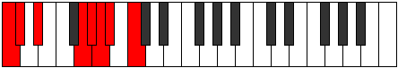 |
| [1933](https://ianring.com/musictheory/scales/1933) | [Mocrian](ModeFNaturalMocrian.md) | F | F, G, Ab, B#, C#, D, Eb, F |  |
| [1935](https://ianring.com/musictheory/scales/1935) | [Mycryllic](ModeFNaturalMycryllic.md) | F | F, F#, G, G#, C, C#, D, D#, F | 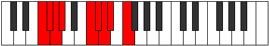 |
| [1935](https://ianring.com/musictheory/scales/1935) | [Mycryllic](ModeCNaturalMycryllic.md) | C | C, C#, D, D#, G, G#, A, A#, C |  |
| [1943](https://ianring.com/musictheory/scales/1943) | [Malyllic](ModeBNaturalMalyllic.md) | B | B, C, C#, D#, F#, G, G#, A, B | 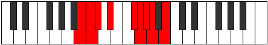 |
| [1947](https://ianring.com/musictheory/scales/1947) | [Ionoyllic](ModeCNaturalIonoyllic.md) | C | C, C#, D#, E, G, G#, A, A#, C |  |
| [1949](https://ianring.com/musictheory/scales/1949) | [Mathyllic](ModeFNaturalMathyllic.md) | F | F, G, G#, A, C, C#, D, D#, F |  |
| [1951](https://ianring.com/musictheory/scales/1951) | [Gonygic](ModeFNaturalGonygic.md) | F | F, F#, G, G#, A, C, C#, D, D#, F |  |
| [1951](https://ianring.com/musictheory/scales/1951) | [Gonygic](ModeCNaturalGonygic.md) | C | C, C#, D, D#, E, G, G#, A, A#, C |  |
| [1951](https://ianring.com/musictheory/scales/1951) | [Gonygic](ModeBNaturalGonygic.md) | B | B, C, C#, D, D#, F#, G, G#, A, B |  |
| [1963](https://ianring.com/musictheory/scales/1963) | [Epocryllic](ModeCNaturalEpocryllic.md) | C | C, C#, D#, F, G, G#, A, A#, C | 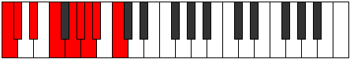 |
| [1965](https://ianring.com/musictheory/scales/1965) | [Gadyllic](ModeFNaturalGadyllic.md) | F | F, G, G#, A#, C, C#, D, D#, F |  |
| [1965](https://ianring.com/musictheory/scales/1965) | [Gadyllic](ModeASharpGadyllic.md) | A# | A#, C, C#, D#, F, F#, G, G#, A# |  |
| [1965](https://ianring.com/musictheory/scales/1965) | [Gadyllic](ModeBFlatGadyllic.md) | Bb | Bb, C, Db, Eb, F, Gb, G, Ab, Bb |  |
| [1967](https://ianring.com/musictheory/scales/1967) | [Godygic](ModeFNaturalGodygic.md) | F | F, F#, G, G#, A#, C, C#, D, D#, F |  |
| [1967](https://ianring.com/musictheory/scales/1967) | [Godygic](ModeCNaturalGodygic.md) | C | C, C#, D, D#, F, G, G#, A, A#, C |  |
| [1967](https://ianring.com/musictheory/scales/1967) | [Godygic](ModeASharpGodygic.md) | A# | A#, B, C, C#, D#, F, F#, G, G#, A# |  |
| [1967](https://ianring.com/musictheory/scales/1967) | [Godygic](ModeBFlatGodygic.md) | Bb | Bb, B, C, Db, Eb, F, Gb, G, Ab, Bb |  |
| [1969](https://ianring.com/musictheory/scales/1969) | [Zorian](ModeEFlatZorian.md) | Eb | Eb, F##, G#, A#, B, C, Db, Eb | 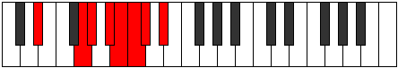 |
| [1971](https://ianring.com/musictheory/scales/1971) | [Aerynyllic](ModeDSharpAerynyllic.md) | D# | D#, E, G, G#, A#, B, C, C#, D# |  |
| [1971](https://ianring.com/musictheory/scales/1971) | [Aerynyllic](ModeEFlatAerynyllic.md) | Eb | Eb, E, G, Ab, Bb, B, C, Db, Eb |  |
| [1973](https://ianring.com/musictheory/scales/1973) | [Zyryllic](ModeDSharpZyryllic.md) | D# | D#, F, G, G#, A#, B, C, C#, D# |  |
| [1973](https://ianring.com/musictheory/scales/1973) | [Zyryllic](ModeEFlatZyryllic.md) | Eb | Eb, F, G, Ab, Bb, B, C, Db, Eb |  |
| [1975](https://ianring.com/musictheory/scales/1975) | [Ionocrygic](ModeBNaturalIonocrygic.md) | B | B, C, C#, D#, E, F#, G, G#, A, B |  |
| [1975](https://ianring.com/musictheory/scales/1975) | [Ionocrygic](ModeDSharpIonocrygic.md) | D# | D#, E, F, G, G#, A#, B, C, C#, D# |  |
| [1975](https://ianring.com/musictheory/scales/1975) | [Ionocrygic](ModeEFlatIonocrygic.md) | Eb | Eb, E, F, G, Ab, Bb, B, C, Db, Eb |  |
| [1977](https://ianring.com/musictheory/scales/1977) | [Dagyllic](ModeDSharpDagyllic.md) | D# | D#, F#, G, G#, A#, B, C, C#, D# |  |
| [1977](https://ianring.com/musictheory/scales/1977) | [Dagyllic](ModeEFlatDagyllic.md) | Eb | Eb, Gb, G, Ab, Bb, B, C, Db, Eb |  |
| [1979](https://ianring.com/musictheory/scales/1979) | [Aeradygic](ModeCNaturalAeradygic.md) | C | C, C#, D#, E, F, G, G#, A, A#, C |  |
| [1979](https://ianring.com/musictheory/scales/1979) | [Aeradygic](ModeDSharpAeradygic.md) | D# | D#, E, F#, G, G#, A#, B, C, C#, D# |  |
| [1979](https://ianring.com/musictheory/scales/1979) | [Aeradygic](ModeEFlatAeradygic.md) | Eb | Eb, E, Gb, G, Ab, Bb, B, C, Db, Eb |  |
| [1981](https://ianring.com/musictheory/scales/1981) | [Gadygic](ModeASharpGadygic.md) | A# | A#, C, C#, D, D#, F, F#, G, G#, A# |  |
| [1981](https://ianring.com/musictheory/scales/1981) | [Gadygic](ModeBFlatGadygic.md) | Bb | Bb, C, Db, D, Eb, F, Gb, G, Ab, Bb |  |
| [1981](https://ianring.com/musictheory/scales/1981) | [Gadygic](ModeFNaturalGadygic.md) | F | F, G, G#, A, A#, C, C#, D, D#, F |  |
| [1981](https://ianring.com/musictheory/scales/1981) | [Gadygic](ModeDSharpGadygic.md) | D# | D#, F, F#, G, G#, A#, B, C, C#, D# |  |
| [1981](https://ianring.com/musictheory/scales/1981) | [Gadygic](ModeEFlatGadygic.md) | Eb | Eb, F, Gb, G, Ab, Bb, B, C, Db, Eb |  |
| [1983](https://ianring.com/musictheory/scales/1983) | [Soryllian](ModeCNaturalSoryllian.md) | C | C, C#, D, D#, E, F, G, G#, A, A#, C |  |
| [1983](https://ianring.com/musictheory/scales/1983) | [Soryllian](ModeFNaturalSoryllian.md) | F | F, F#, G, G#, A, A#, C, C#, D, D#, F |  |
| [1983](https://ianring.com/musictheory/scales/1983) | [Soryllian](ModeBNaturalSoryllian.md) | B | B, C, C#, D, D#, E, F#, G, G#, A, B |  |
| [1983](https://ianring.com/musictheory/scales/1983) | [Soryllian](ModeASharpSoryllian.md) | A# | A#, B, C, C#, D, D#, F, F#, G, G#, A# |  |
| [1983](https://ianring.com/musictheory/scales/1983) | [Soryllian](ModeBFlatSoryllian.md) | Bb | Bb, B, C, Db, D, Eb, F, Gb, G, Ab, Bb |  |
| [1983](https://ianring.com/musictheory/scales/1983) | [Soryllian](ModeDSharpSoryllian.md) | D# | D#, E, F, F#, G, G#, A#, B, C, C#, D# |  |
| [1983](https://ianring.com/musictheory/scales/1983) | [Soryllian](ModeEFlatSoryllian.md) | Eb | Eb, E, F, Gb, G, Ab, Bb, B, C, Db, Eb |  |
| [1991](https://ianring.com/musictheory/scales/1991) | [Phryptyllic](ModeFSharpPhryptyllic.md) | F# | F#, G, G#, C, C#, D, D#, E, F# |  |
| [1991](https://ianring.com/musictheory/scales/1991) | [Phryptyllic](ModeGFlatPhryptyllic.md) | Gb | Gb, G, Ab, C, Db, D, Eb, E, Gb |  |
| [1995](https://ianring.com/musictheory/scales/1995) | [Aeolacryllic](ModeCNaturalAeolacryllic.md) | C | C, C#, D#, F#, G, G#, A, A#, C |  |
| [1997](https://ianring.com/musictheory/scales/1997) | [Staryllic](ModeFNaturalStaryllic.md) | F | F, G, G#, B, C, C#, D, D#, F |  |
| [1999](https://ianring.com/musictheory/scales/1999) | [Zacrygic](ModeFSharpZacrygic.md) | F# | F#, G, G#, A, C, C#, D, D#, E, F# |  |
| [1999](https://ianring.com/musictheory/scales/1999) | [Zacrygic](ModeGFlatZacrygic.md) | Gb | Gb, G, Ab, A, C, Db, D, Eb, E, Gb |  |
| [1999](https://ianring.com/musictheory/scales/1999) | [Zacrygic](ModeCNaturalZacrygic.md) | C | C, C#, D, D#, F#, G, G#, A, A#, C |  |
| [1999](https://ianring.com/musictheory/scales/1999) | [Zacrygic](ModeFNaturalZacrygic.md) | F | F, F#, G, G#, B, C, C#, D, D#, F |  |
| [2007](https://ianring.com/musictheory/scales/2007) | [Stonygic](ModeFSharpStonygic.md) | F# | F#, G, G#, A#, C, C#, D, D#, E, F# |  |
| [2007](https://ianring.com/musictheory/scales/2007) | [Stonygic](ModeGFlatStonygic.md) | Gb | Gb, G, Ab, Bb, C, Db, D, Eb, E, Gb |  |
| [2007](https://ianring.com/musictheory/scales/2007) | [Stonygic](ModeBNaturalStonygic.md) | B | B, C, C#, D#, F, F#, G, G#, A, B |  |
| [2011](https://ianring.com/musictheory/scales/2011) | [Raphygic](ModeCNaturalRaphygic.md) | C | C, C#, D#, E, F#, G, G#, A, A#, C |  |
| [2013](https://ianring.com/musictheory/scales/2013) | [Mocrygic](ModeFNaturalMocrygic.md) | F | F, G, G#, A, B, C, C#, D, D#, F |  |
| [2015](https://ianring.com/musictheory/scales/2015) | [Epiryllian](ModeCNaturalEpiryllian.md) | C | C, C#, D, D#, E, F#, G, G#, A, A#, C |  |
| [2015](https://ianring.com/musictheory/scales/2015) | [Epiryllian](ModeFSharpEpiryllian.md) | F# | F#, G, G#, A, A#, C, C#, D, D#, E, F# |  |
| [2015](https://ianring.com/musictheory/scales/2015) | [Epiryllian](ModeGFlatEpiryllian.md) | Gb | Gb, G, Ab, A, Bb, C, Db, D, Eb, E, Gb |  |
| [2015](https://ianring.com/musictheory/scales/2015) | [Epiryllian](ModeFNaturalEpiryllian.md) | F | F, F#, G, G#, A, B, C, C#, D, D#, F |  |
| [2015](https://ianring.com/musictheory/scales/2015) | [Epiryllian](ModeBNaturalEpiryllian.md) | B | B, C, C#, D, D#, F, F#, G, G#, A, B |  |
| [2019](https://ianring.com/musictheory/scales/2019) | [Palyllic](ModeGNaturalPalyllic.md) | G | G, G#, C, C#, D, D#, E, F, G | 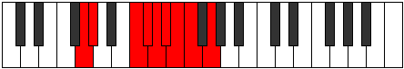 |
| [2023](https://ianring.com/musictheory/scales/2023) | [Zodygic](ModeGNaturalZodygic.md) | G | G, G#, A, C, C#, D, D#, E, F, G |  |
| [2023](https://ianring.com/musictheory/scales/2023) | [Zodygic](ModeFSharpZodygic.md) | F# | F#, G, G#, B, C, C#, D, D#, E, F# |  |
| [2023](https://ianring.com/musictheory/scales/2023) | [Zodygic](ModeGFlatZodygic.md) | Gb | Gb, G, Ab, B, C, Db, D, Eb, E, Gb |  |
| [2027](https://ianring.com/musictheory/scales/2027) | [Boptygic](ModeGNaturalBoptygic.md) | G | G, G#, A#, C, C#, D, D#, E, F, G |  |
| [2027](https://ianring.com/musictheory/scales/2027) | [Boptygic](ModeCNaturalBoptygic.md) | C | C, C#, D#, F, F#, G, G#, A, A#, C |  |
| [2029](https://ianring.com/musictheory/scales/2029) | [Mathygic](ModeASharpMathygic.md) | A# | A#, C, C#, D#, E, F, F#, G, G#, A# |  |
| [2029](https://ianring.com/musictheory/scales/2029) | [Mathygic](ModeBFlatMathygic.md) | Bb | Bb, C, Db, Eb, E, F, Gb, G, Ab, Bb |  |
| [2029](https://ianring.com/musictheory/scales/2029) | [Mathygic](ModeFNaturalMathygic.md) | F | F, G, G#, A#, B, C, C#, D, D#, F |  |
| [2031](https://ianring.com/musictheory/scales/2031) | [Gadyllian](ModeGNaturalGadyllian.md) | G | G, G#, A, A#, C, C#, D, D#, E, F, G |  |
| [2031](https://ianring.com/musictheory/scales/2031) | [Gadyllian](ModeCNaturalGadyllian.md) | C | C, C#, D, D#, F, F#, G, G#, A, A#, C |  |
| [2031](https://ianring.com/musictheory/scales/2031) | [Gadyllian](ModeFSharpGadyllian.md) | F# | F#, G, G#, A, B, C, C#, D, D#, E, F# |  |
| [2031](https://ianring.com/musictheory/scales/2031) | [Gadyllian](ModeGFlatGadyllian.md) | Gb | Gb, G, Ab, A, B, C, Db, D, Eb, E, Gb |  |
| [2031](https://ianring.com/musictheory/scales/2031) | [Gadyllian](ModeFNaturalGadyllian.md) | F | F, F#, G, G#, A#, B, C, C#, D, D#, F |  |
| [2031](https://ianring.com/musictheory/scales/2031) | [Gadyllian](ModeASharpGadyllian.md) | A# | A#, B, C, C#, D#, E, F, F#, G, G#, A# |  |
| [2031](https://ianring.com/musictheory/scales/2031) | [Gadyllian](ModeBFlatGadyllian.md) | Bb | Bb, B, C, Db, Eb, E, F, Gb, G, Ab, Bb |  |
| [2033](https://ianring.com/musictheory/scales/2033) | [Stolyllic](ModeDSharpStolyllic.md) | D# | D#, G, G#, A, A#, B, C, C#, D# |  |
| [2033](https://ianring.com/musictheory/scales/2033) | [Stolyllic](ModeEFlatStolyllic.md) | Eb | Eb, G, Ab, A, Bb, B, C, Db, Eb |  |
| [2035](https://ianring.com/musictheory/scales/2035) | [Aerythygic](ModeGNaturalAerythygic.md) | G | G, G#, B, C, C#, D, D#, E, F, G |  |
| [2035](https://ianring.com/musictheory/scales/2035) | [Aerythygic](ModeDSharpAerythygic.md) | D# | D#, E, G, G#, A, A#, B, C, C#, D# |  |
| [2035](https://ianring.com/musictheory/scales/2035) | [Aerythygic](ModeEFlatAerythygic.md) | Eb | Eb, E, G, Ab, A, Bb, B, C, Db, Eb |  |
| [2037](https://ianring.com/musictheory/scales/2037) | [Sythygic](ModeDSharpSythygic.md) | D# | D#, F, G, G#, A, A#, B, C, C#, D# |  |
| [2037](https://ianring.com/musictheory/scales/2037) | [Sythygic](ModeEFlatSythygic.md) | Eb | Eb, F, G, Ab, A, Bb, B, C, Db, Eb |  |
| [2039](https://ianring.com/musictheory/scales/2039) | [Danyllian](ModeGNaturalDanyllian.md) | G | G, G#, A, B, C, C#, D, D#, E, F, G |  |
| [2039](https://ianring.com/musictheory/scales/2039) | [Danyllian](ModeBNaturalDanyllian.md) | B | B, C, C#, D#, E, F, F#, G, G#, A, B |  |
| [2039](https://ianring.com/musictheory/scales/2039) | [Danyllian](ModeFSharpDanyllian.md) | F# | F#, G, G#, A#, B, C, C#, D, D#, E, F# |  |
| [2039](https://ianring.com/musictheory/scales/2039) | [Danyllian](ModeGFlatDanyllian.md) | Gb | Gb, G, Ab, Bb, B, C, Db, D, Eb, E, Gb |  |
| [2039](https://ianring.com/musictheory/scales/2039) | [Danyllian](ModeDSharpDanyllian.md) | D# | D#, E, F, G, G#, A, A#, B, C, C#, D# |  |
| [2039](https://ianring.com/musictheory/scales/2039) | [Danyllian](ModeEFlatDanyllian.md) | Eb | Eb, E, F, G, Ab, A, Bb, B, C, Db, Eb |  |
| [2041](https://ianring.com/musictheory/scales/2041) | [Aeolacrygic](ModeDSharpAeolacrygic.md) | D# | D#, F#, G, G#, A, A#, B, C, C#, D# |  |
| [2041](https://ianring.com/musictheory/scales/2041) | [Aeolacrygic](ModeEFlatAeolacrygic.md) | Eb | Eb, Gb, G, Ab, A, Bb, B, C, Db, Eb |  |
| [2043](https://ianring.com/musictheory/scales/2043) | [Lythyllian](ModeCNaturalLythyllian.md) | C | C, C#, D#, E, F, F#, G, G#, A, A#, C |  |
| [2043](https://ianring.com/musictheory/scales/2043) | [Lythyllian](ModeGNaturalLythyllian.md) | G | G, G#, A#, B, C, C#, D, D#, E, F, G |  |
| [2043](https://ianring.com/musictheory/scales/2043) | [Lythyllian](ModeDSharpLythyllian.md) | D# | D#, E, F#, G, G#, A, A#, B, C, C#, D# |  |
| [2043](https://ianring.com/musictheory/scales/2043) | [Lythyllian](ModeEFlatLythyllian.md) | Eb | Eb, E, Gb, G, Ab, A, Bb, B, C, Db, Eb |  |
| [2045](https://ianring.com/musictheory/scales/2045) | [Katogyllian](ModeASharpKatogyllian.md) | A# | A#, C, C#, D, D#, E, F, F#, G, G#, A# |  |
| [2045](https://ianring.com/musictheory/scales/2045) | [Katogyllian](ModeBFlatKatogyllian.md) | Bb | Bb, C, Db, D, Eb, E, F, Gb, G, Ab, Bb |  |
| [2045](https://ianring.com/musictheory/scales/2045) | [Katogyllian](ModeFNaturalKatogyllian.md) | F | F, G, G#, A, A#, B, C, C#, D, D#, F |  |
| [2045](https://ianring.com/musictheory/scales/2045) | [Katogyllian](ModeDSharpKatogyllian.md) | D# | D#, F, F#, G, G#, A, A#, B, C, C#, D# |  |
| [2045](https://ianring.com/musictheory/scales/2045) | [Katogyllian](ModeEFlatKatogyllian.md) | Eb | Eb, F, Gb, G, Ab, A, Bb, B, C, Db, Eb |  |
| [2047](https://ianring.com/musictheory/scales/2047) | [Monatic](ModeCNaturalMonatic.md) | C | C, C#, D, D#, E, F, F#, G, G#, A, A#, C |  |
| [2047](https://ianring.com/musictheory/scales/2047) | [Monatic](ModeBNaturalMonatic.md) | B | B, C, C#, D, D#, E, F, F#, G, G#, A, B |  |
| [2047](https://ianring.com/musictheory/scales/2047) | [Monatic](ModeASharpMonatic.md) | A# | A#, B, C, C#, D, D#, E, F, F#, G, G#, A# |  |
| [2047](https://ianring.com/musictheory/scales/2047) | [Monatic](ModeBFlatMonatic.md) | Bb | Bb, B, C, Db, D, Eb, E, F, Gb, G, Ab, Bb |  |
| [2047](https://ianring.com/musictheory/scales/2047) | [Monatic](ModeGNaturalMonatic.md) | G | G, G#, A, A#, B, C, C#, D, D#, E, F, G |  |
| [2047](https://ianring.com/musictheory/scales/2047) | [Monatic](ModeFSharpMonatic.md) | F# | F#, G, G#, A, A#, B, C, C#, D, D#, E, F# |  |
| [2047](https://ianring.com/musictheory/scales/2047) | [Monatic](ModeGFlatMonatic.md) | Gb | Gb, G, Ab, A, Bb, B, C, Db, D, Eb, E, Gb |  |
| [2047](https://ianring.com/musictheory/scales/2047) | [Monatic](ModeFNaturalMonatic.md) | F | F, F#, G, G#, A, A#, B, C, C#, D, D#, F |  |
| [2047](https://ianring.com/musictheory/scales/2047) | [Monatic](ModeDSharpMonatic.md) | D# | D#, E, F, F#, G, G#, A, A#, B, C, C#, D# |  |
| [2047](https://ianring.com/musictheory/scales/2047) | [Monatic](ModeEFlatMonatic.md) | Eb | Eb, E, F, Gb, G, Ab, A, Bb, B, C, Db, Eb |  |
| [2225](https://ianring.com/musictheory/scales/2225) | [Gonitonic](ModeGSharpGonitonic.md) | G# | G#, C, C#, D#, G, G# |  |
| [2225](https://ianring.com/musictheory/scales/2225) | [Gonitonic](ModeAFlatGonitonic.md) | Ab | Ab, C, Db, Eb, G, Ab |  |
| [2227](https://ianring.com/musictheory/scales/2227) | [Katadimic](ModeGSharpKatadimic.md) | G# | G#, A, B#, C#, D#, E###, G# |  |
| [2227](https://ianring.com/musictheory/scales/2227) | [Katadimic](ModeAFlatKatadimic.md) | Ab | Ab, Bbb, C, Db, Eb, F##, Ab |  |
| [2229](https://ianring.com/musictheory/scales/2229) | [Ionyptimic](ModeGSharpIonyptimic.md) | G# | G#, A#, B#, C#, D#, E###, G# |  |
| [2229](https://ianring.com/musictheory/scales/2229) | [Ionyptimic](ModeAFlatIonyptimic.md) | Ab | Ab, Bb, C, Db, Eb, F##, Ab |  |
| [2231](https://ianring.com/musictheory/scales/2231) | [Macrian](ModeGSharpMacrian.md) | G# | G#, A, Bb, C, Db, Eb, F##, G# |  |
| [2231](https://ianring.com/musictheory/scales/2231) | [Macrian](ModeAFlatMacrian.md) | Ab | Ab, Bbb, Cbb, Dbb, Ebbb, Fbb, G, Ab |  |
| [2233](https://ianring.com/musictheory/scales/2233) | [Donimic](ModeGSharpDonimic.md) | G# | G#, A##, B#, C#, D#, E###, G# |  |
| [2233](https://ianring.com/musictheory/scales/2233) | [Donimic](ModeAFlatDonimic.md) | Ab | Ab, B, C, Db, Eb, F##, Ab |  |
| [2235](https://ianring.com/musictheory/scales/2235) | [Bathian](ModeGSharpBathian.md) | G# | G#, A, B, C, Db, Eb, F##, G# |  |
| [2235](https://ianring.com/musictheory/scales/2235) | [Bathian](ModeAFlatBathian.md) | Ab | Ab, Bbb, Cb, Dbb, Ebbb, Fbb, G, Ab |  |
| [2237](https://ianring.com/musictheory/scales/2237) | [Epothian](ModeGSharpEpothian.md) | G# | G#, A#, B, C, Db, Eb, F##, G# |  |
| [2237](https://ianring.com/musictheory/scales/2237) | [Epothian](ModeAFlatEpothian.md) | Ab | Ab, Bb, Cb, Dbb, Ebbb, Fbb, G, Ab |  |
| [2239](https://ianring.com/musictheory/scales/2239) | [Dacryllic](ModeGSharpDacryllic.md) | G# | G#, A, A#, B, C, C#, D#, G, G# |  |
| [2239](https://ianring.com/musictheory/scales/2239) | [Dacryllic](ModeAFlatDacryllic.md) | Ab | Ab, A, Bb, B, C, Db, Eb, G, Ab |  |
| [2245](https://ianring.com/musictheory/scales/2245) | [Dygitonic](ModeCSharpDygitonic.md) | C# | C#, D#, G, G#, C, C# |  |
| [2245](https://ianring.com/musictheory/scales/2245) | [Dygitonic](ModeDFlatDygitonic.md) | Db | Db, Eb, G, Ab, C, Db |  |
| [2247](https://ianring.com/musictheory/scales/2247) | [Aeolimic](ModeCSharpAeolimic.md) | C# | C#, D, Eb, F##, G#, A###, C# |  |
| [2247](https://ianring.com/musictheory/scales/2247) | [Aeolimic](ModeDFlatAeolimic.md) | Db | Db, Ebb, Fbb, G, Ab, B#, Db |  |
| [2253](https://ianring.com/musictheory/scales/2253) | [Logimic](ModeCSharpLogimic.md) | C# | C#, D#, E, F##, G#, A###, C# |  |
| [2253](https://ianring.com/musictheory/scales/2253) | [Logimic](ModeDFlatLogimic.md) | Db | Db, Eb, Fb, G, Ab, B#, Db |  |
| [2255](https://ianring.com/musictheory/scales/2255) | [Dylian](ModeCSharpDylian.md) | C# | C#, D, Eb, Fb, G, Ab, B#, C# |  |
| [2261](https://ianring.com/musictheory/scales/2261) | [Phrolimic](ModeCSharpPhrolimic.md) | C# | C#, D#, E#, F##, G#, A###, C# |  |
| [2261](https://ianring.com/musictheory/scales/2261) | [Phrolimic](ModeDFlatPhrolimic.md) | Db | Db, Eb, F, G, Ab, B#, Db |  |
| [2263](https://ianring.com/musictheory/scales/2263) | [Lycrian](ModeCSharpLycrian.md) | C# | C#, D, Eb, F, G, Ab, B#, C# |  |
| [2269](https://ianring.com/musictheory/scales/2269) | [Pygian](ModeCSharpPygian.md) | C# | C#, D#, E, F, G, Ab, B#, C# |  |
| [2271](https://ianring.com/musictheory/scales/2271) | [Poptyllic](ModeCSharpPoptyllic.md) | C# | C#, D, D#, E, F, G, G#, C, C# |  |
| [2271](https://ianring.com/musictheory/scales/2271) | [Poptyllic](ModeDFlatPoptyllic.md) | Db | Db, D, Eb, E, F, G, Ab, C, Db |  |
| [2277](https://ianring.com/musictheory/scales/2277) | [Kagimic](ModeCSharpKagimic.md) | C# | C#, D#, E##, F##, G#, A###, C# |  |
| [2277](https://ianring.com/musictheory/scales/2277) | [Kagimic](ModeDFlatKagimic.md) | Db | Db, Eb, F#, G, Ab, B#, Db |  |
| [2279](https://ianring.com/musictheory/scales/2279) | [Dyrian](ModeCSharpDyrian.md) | C# | C#, D, Eb, F#, G, Ab, B#, C# |  |
| [2285](https://ianring.com/musictheory/scales/2285) | [Aerogian](ModeCSharpAerogian.md) | C# | C#, D#, E, F#, G, Ab, B#, C# |  |
| [2287](https://ianring.com/musictheory/scales/2287) | [Lodyllic](ModeCSharpLodyllic.md) | C# | C#, D, D#, E, F#, G, G#, C, C# |  |
| [2287](https://ianring.com/musictheory/scales/2287) | [Lodyllic](ModeDFlatLodyllic.md) | Db | Db, D, Eb, E, Gb, G, Ab, C, Db |  |
| [2289](https://ianring.com/musictheory/scales/2289) | [Mocrimic](ModeGSharpMocrimic.md) | G# | G#, A###, B##, C##, D#, E###, G# |  |
| [2289](https://ianring.com/musictheory/scales/2289) | [Mocrimic](ModeAFlatMocrimic.md) | Ab | Ab, B#, C#, D, Eb, F##, Ab |  |
| [2291](https://ianring.com/musictheory/scales/2291) | [Zydian](ModeGSharpZydian.md) | G# | G#, A, B#, C#, D, Eb, F##, G# |  |
| [2291](https://ianring.com/musictheory/scales/2291) | [Zydian](ModeAFlatZydian.md) | Ab | Ab, Bbb, C, Db, Ebb, Fbb, G, Ab |  |
| [2293](https://ianring.com/musictheory/scales/2293) | [Gorian](ModeCSharpGorian.md) | C# | C#, D#, E#, F#, G, Ab, B#, C# |  |
| [2293](https://ianring.com/musictheory/scales/2293) | [Gorian](ModeGSharpGorian.md) | G# | G#, A#, B#, C#, D, Eb, F##, G# |  |
| [2293](https://ianring.com/musictheory/scales/2293) | [Gorian](ModeAFlatGorian.md) | Ab | Ab, Bb, C, Db, Ebb, Fbb, G, Ab |  |
| [2295](https://ianring.com/musictheory/scales/2295) | [Kogyllic](ModeCSharpKogyllic.md) | C# | C#, D, D#, F, F#, G, G#, C, C# |  |
| [2295](https://ianring.com/musictheory/scales/2295) | [Kogyllic](ModeDFlatKogyllic.md) | Db | Db, D, Eb, F, Gb, G, Ab, C, Db |  |
| [2295](https://ianring.com/musictheory/scales/2295) | [Kogyllic](ModeGSharpKogyllic.md) | G# | G#, A, A#, C, C#, D, D#, G, G# |  |
| [2295](https://ianring.com/musictheory/scales/2295) | [Kogyllic](ModeAFlatKogyllic.md) | Ab | Ab, A, Bb, C, Db, D, Eb, G, Ab |  |
| [2297](https://ianring.com/musictheory/scales/2297) | [Thylian](ModeGSharpThylian.md) | G# | G#, A##, B#, C#, D, Eb, F##, G# |  |
| [2297](https://ianring.com/musictheory/scales/2297) | [Thylian](ModeAFlatThylian.md) | Ab | Ab, B, C, Db, Ebb, Fbb, G, Ab |  |
| [2299](https://ianring.com/musictheory/scales/2299) | [Phraptyllic](ModeGSharpPhraptyllic.md) | G# | G#, A, B, C, C#, D, D#, G, G# |  |
| [2299](https://ianring.com/musictheory/scales/2299) | [Phraptyllic](ModeAFlatPhraptyllic.md) | Ab | Ab, A, B, C, Db, D, Eb, G, Ab | 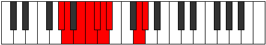 |
| [2301](https://ianring.com/musictheory/scales/2301) | [Bydyllic](ModeCSharpBydyllic.md) | C# | C#, D#, E, F, F#, G, G#, C, C# |  |
| [2301](https://ianring.com/musictheory/scales/2301) | [Bydyllic](ModeDFlatBydyllic.md) | Db | Db, Eb, E, F, Gb, G, Ab, C, Db |  |
| [2301](https://ianring.com/musictheory/scales/2301) | [Bydyllic](ModeGSharpBydyllic.md) | G# | G#, A#, B, C, C#, D, D#, G, G# |  |
| [2301](https://ianring.com/musictheory/scales/2301) | [Bydyllic](ModeAFlatBydyllic.md) | Ab | Ab, Bb, B, C, Db, D, Eb, G, Ab |  |
| [2303](https://ianring.com/musictheory/scales/2303) | [Stanygic](ModeCSharpStanygic.md) | C# | C#, D, D#, E, F, F#, G, G#, C, C# |  |
| [2303](https://ianring.com/musictheory/scales/2303) | [Stanygic](ModeDFlatStanygic.md) | Db | Db, D, Eb, E, F, Gb, G, Ab, C, Db |  |
| [2303](https://ianring.com/musictheory/scales/2303) | [Stanygic](ModeGSharpStanygic.md) | G# | G#, A, A#, B, C, C#, D, D#, G, G# |  |
| [2303](https://ianring.com/musictheory/scales/2303) | [Stanygic](ModeAFlatStanygic.md) | Ab | Ab, A, Bb, B, C, Db, D, Eb, G, Ab |  |
| [2403](https://ianring.com/musictheory/scales/2403) | [Lycrimic](ModeGNaturalLycrimic.md) | G | G, Ab, B#, C#, D#, E##, G |  |
| [2407](https://ianring.com/musictheory/scales/2407) | [Zylian](ModeGNaturalZylian.md) | G | G, Ab, Bbb, C, Db, Eb, F#, G |  |
| [2411](https://ianring.com/musictheory/scales/2411) | [Aeolorian](ModeGNaturalAeolorian.md) | G | G, Ab, Bb, C, Db, Eb, F#, G |  |
| [2415](https://ianring.com/musictheory/scales/2415) | [Lothyllic](ModeGNaturalLothyllic.md) | G | G, G#, A, A#, C, C#, D#, F#, G |  |
| [2419](https://ianring.com/musictheory/scales/2419) | [Paptian](ModeGNaturalPaptian.md) | G | G, Ab, B, C, Db, Eb, F#, G |  |
| [2423](https://ianring.com/musictheory/scales/2423) | [Thorcryllic](ModeGNaturalThorcryllic.md) | G | G, G#, A, B, C, C#, D#, F#, G |  |
| [2427](https://ianring.com/musictheory/scales/2427) | [Katoryllic](ModeGNaturalKatoryllic.md) | G | G, G#, A#, B, C, C#, D#, F#, G |  |
| [2431](https://ianring.com/musictheory/scales/2431) | [Gythygic](ModeGNaturalGythygic.md) | G | G, G#, A, A#, B, C, C#, D#, F#, G |  |
| [2443](https://ianring.com/musictheory/scales/2443) | [Panimic](ModeCNaturalPanimic.md) | C | C, Db, Eb, F##, G#, A##, C |  |
| [2447](https://ianring.com/musictheory/scales/2447) | [Thagian](ModeCNaturalThagian.md) | C | C, Db, Ebb, Fbb, G, Ab, B, C |  |
| [2459](https://ianring.com/musictheory/scales/2459) | [Ionocrian](ModeCNaturalIonocrian.md) | C | C, Db, Eb, Fb, G, Ab, B, C |  |
| [2463](https://ianring.com/musictheory/scales/2463) | [Ionathyllic](ModeCNaturalIonathyllic.md) | C | C, C#, D, D#, E, G, G#, B, C |  |
| [2475](https://ianring.com/musictheory/scales/2475) | [Aerylian](ModeCNaturalAerylian.md) | C | C, Db, Eb, F, G, Ab, B, C |  |
| [2479](https://ianring.com/musictheory/scales/2479) | [Rycryllic](ModeCNaturalRycryllic.md) | C | C, C#, D, D#, F, G, G#, B, C |  |
| [2481](https://ianring.com/musictheory/scales/2481) | [Laptimic](ModeGSharpLaptimic.md) | G# | G#, A###, B##, C###, D##, E###, G# |  |
| [2481](https://ianring.com/musictheory/scales/2481) | [Laptimic](ModeAFlatLaptimic.md) | Ab | Ab, B#, C#, D#, E, F##, Ab |  |
| [2483](https://ianring.com/musictheory/scales/2483) | [Aerynian](ModeGSharpAerynian.md) | G# | G#, A, B#, C#, D#, E, F##, G# |  |
| [2483](https://ianring.com/musictheory/scales/2483) | [Aerynian](ModeAFlatAerynian.md) | Ab | Ab, Bbb, C, Db, Eb, Fb, G, Ab |  |
| [2485](https://ianring.com/musictheory/scales/2485) | [Aerorian](ModeGSharpAerorian.md) | G# | G#, A#, B#, C#, D#, E, F##, G# |  |
| [2485](https://ianring.com/musictheory/scales/2485) | [Aerorian](ModeAFlatAerorian.md) | Ab | Ab, Bb, C, Db, Eb, Fb, G, Ab | 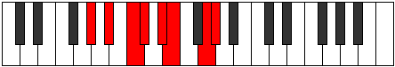 |
| [2487](https://ianring.com/musictheory/scales/2487) | [Phroptyllic](ModeGSharpPhroptyllic.md) | G# | G#, A, A#, C, C#, D#, E, G, G# |  |
| [2487](https://ianring.com/musictheory/scales/2487) | [Phroptyllic](ModeAFlatPhroptyllic.md) | Ab | Ab, A, Bb, C, Db, Eb, E, G, Ab |  |
| [2489](https://ianring.com/musictheory/scales/2489) | [Syrian](ModeGSharpSyrian.md) | G# | G#, A##, B#, C#, D#, E, F##, G# |  |
| [2489](https://ianring.com/musictheory/scales/2489) | [Syrian](ModeAFlatSyrian.md) | Ab | Ab, B, C, Db, Eb, Fb, G, Ab |  |
| [2491](https://ianring.com/musictheory/scales/2491) | [Layllic](ModeCNaturalLayllic.md) | C | C, C#, D#, E, F, G, G#, B, C |  |
| [2491](https://ianring.com/musictheory/scales/2491) | [Layllic](ModeGSharpLayllic.md) | G# | G#, A, B, C, C#, D#, E, G, G# |  |
| [2491](https://ianring.com/musictheory/scales/2491) | [Layllic](ModeAFlatLayllic.md) | Ab | Ab, A, B, C, Db, Eb, E, G, Ab |  |
| [2493](https://ianring.com/musictheory/scales/2493) | [Manyllic](ModeGSharpManyllic.md) | G# | G#, A#, B, C, C#, D#, E, G, G# |  |
| [2493](https://ianring.com/musictheory/scales/2493) | [Manyllic](ModeAFlatManyllic.md) | Ab | Ab, Bb, B, C, Db, Eb, E, G, Ab |  |
| [2495](https://ianring.com/musictheory/scales/2495) | [Aeolocrygic](ModeCNaturalAeolocrygic.md) | C | C, C#, D, D#, E, F, G, G#, B, C |  |
| [2495](https://ianring.com/musictheory/scales/2495) | [Aeolocrygic](ModeGSharpAeolocrygic.md) | G# | G#, A, A#, B, C, C#, D#, E, G, G# |  |
| [2495](https://ianring.com/musictheory/scales/2495) | [Aeolocrygic](ModeAFlatAeolocrygic.md) | Ab | Ab, A, Bb, B, C, Db, Eb, E, G, Ab |  |
| [2501](https://ianring.com/musictheory/scales/2501) | [Ralimic](ModeDFlatRalimic.md) | Db | Db, Eb, F##, G#, A, B#, Db |  |
| [2503](https://ianring.com/musictheory/scales/2503) | [Stonian](ModeCSharpStonian.md) | C# | C#, D, Eb, F##, G#, A, B#, C# |  |
| [2503](https://ianring.com/musictheory/scales/2503) | [Stonian](ModeDFlatStonian.md) | Db | Db, Ebb, Fbb, G, Ab, Bbb, C, Db |  |
| [2507](https://ianring.com/musictheory/scales/2507) | [Ionyphian](ModeCNaturalIonyphian.md) | C | C, Db, Eb, F#, G, Ab, B, C |  |
| [2509](https://ianring.com/musictheory/scales/2509) | [Bogian](ModeCSharpBogian.md) | C# | C#, D#, E, F##, G#, A, B#, C# |  |
| [2509](https://ianring.com/musictheory/scales/2509) | [Bogian](ModeDFlatBogian.md) | Db | Db, Eb, Fb, G, Ab, Bbb, C, Db |  |
| [2511](https://ianring.com/musictheory/scales/2511) | [Epyryllic](ModeCSharpEpyryllic.md) | C# | C#, D, D#, E, G, G#, A, C, C# |  |
| [2511](https://ianring.com/musictheory/scales/2511) | [Epyryllic](ModeDFlatEpyryllic.md) | Db | Db, D, Eb, E, G, Ab, A, C, Db |  |
| [2511](https://ianring.com/musictheory/scales/2511) | [Epyryllic](ModeCNaturalEpyryllic.md) | C | C, C#, D, D#, F#, G, G#, B, C |  |
| [2517](https://ianring.com/musictheory/scales/2517) | [Ryphian](ModeCSharpRyphian.md) | C# | C#, D#, E#, F##, G#, A, B#, C# |  |
| [2517](https://ianring.com/musictheory/scales/2517) | [Ryphian](ModeDFlatRyphian.md) | Db | Db, Eb, F, G, Ab, Bbb, C, Db |  |
| [2519](https://ianring.com/musictheory/scales/2519) | [Dathyllic](ModeCSharpDathyllic.md) | C# | C#, D, D#, F, G, G#, A, C, C# |  |
| [2519](https://ianring.com/musictheory/scales/2519) | [Dathyllic](ModeDFlatDathyllic.md) | Db | Db, D, Eb, F, G, Ab, A, C, Db |  |
| [2523](https://ianring.com/musictheory/scales/2523) | [Rygyllic](ModeCNaturalRygyllic.md) | C | C, C#, D#, E, F#, G, G#, B, C |  |
| [2525](https://ianring.com/musictheory/scales/2525) | [Aeolaryllic](ModeCSharpAeolaryllic.md) | C# | C#, D#, E, F, G, G#, A, C, C# |  |
| [2525](https://ianring.com/musictheory/scales/2525) | [Aeolaryllic](ModeDFlatAeolaryllic.md) | Db | Db, Eb, E, F, G, Ab, A, C, Db |  |
| [2527](https://ianring.com/musictheory/scales/2527) | [Phradygic](ModeCSharpPhradygic.md) | C# | C#, D, D#, E, F, G, G#, A, C, C# |  |
| [2527](https://ianring.com/musictheory/scales/2527) | [Phradygic](ModeDFlatPhradygic.md) | Db | Db, D, Eb, E, F, G, Ab, A, C, Db |  |
| [2527](https://ianring.com/musictheory/scales/2527) | [Phradygic](ModeCNaturalPhradygic.md) | C | C, C#, D, D#, E, F#, G, G#, B, C |  |
| [2531](https://ianring.com/musictheory/scales/2531) | [Danian](ModeGNaturalDanian.md) | G | G, Ab, B#, C#, D, Eb, F#, G |  |
| [2533](https://ianring.com/musictheory/scales/2533) | [Podian](ModeCSharpPodian.md) | C# | C#, D#, E##, F##, G#, A, B#, C# |  |
| [2533](https://ianring.com/musictheory/scales/2533) | [Podian](ModeDFlatPodian.md) | Db | Db, Eb, F#, G, Ab, Bbb, C, Db |  |
| [2535](https://ianring.com/musictheory/scales/2535) | [Zygyllic](ModeCSharpZygyllic.md) | C# | C#, D, D#, F#, G, G#, A, C, C# |  |
| [2535](https://ianring.com/musictheory/scales/2535) | [Zygyllic](ModeDFlatZygyllic.md) | Db | Db, D, Eb, Gb, G, Ab, A, C, Db |  |
| [2535](https://ianring.com/musictheory/scales/2535) | [Zygyllic](ModeGNaturalZygyllic.md) | G | G, G#, A, C, C#, D, D#, F#, G |  |
| [2539](https://ianring.com/musictheory/scales/2539) | [Thonyllic](ModeGNaturalThonyllic.md) | G | G, G#, A#, C, C#, D, D#, F#, G |  |
| [2539](https://ianring.com/musictheory/scales/2539) | [Thonyllic](ModeCNaturalThonyllic.md) | C | C, C#, D#, F, F#, G, G#, B, C |  |
| [2541](https://ianring.com/musictheory/scales/2541) | [Katadyllic](ModeCSharpKatadyllic.md) | C# | C#, D#, E, F#, G, G#, A, C, C# |  |
| [2541](https://ianring.com/musictheory/scales/2541) | [Katadyllic](ModeDFlatKatadyllic.md) | Db | Db, Eb, E, Gb, G, Ab, A, C, Db |  |
| [2543](https://ianring.com/musictheory/scales/2543) | [Dydygic](ModeCSharpDydygic.md) | C# | C#, D, D#, E, F#, G, G#, A, C, C# |  |
| [2543](https://ianring.com/musictheory/scales/2543) | [Dydygic](ModeDFlatDydygic.md) | Db | Db, D, Eb, E, Gb, G, Ab, A, C, Db |  |
| [2543](https://ianring.com/musictheory/scales/2543) | [Dydygic](ModeGNaturalDydygic.md) | G | G, G#, A, A#, C, C#, D, D#, F#, G |  |
| [2543](https://ianring.com/musictheory/scales/2543) | [Dydygic](ModeCNaturalDydygic.md) | C | C, C#, D, D#, F, F#, G, G#, B, C |  |
| [2545](https://ianring.com/musictheory/scales/2545) | [Thycrian](ModeGSharpThycrian.md) | G# | G#, A###, B##, C##, D#, E, F##, G# |  |
| [2545](https://ianring.com/musictheory/scales/2545) | [Thycrian](ModeAFlatThycrian.md) | Ab | Ab, B#, C#, D, Eb, Fb, G, Ab |  |
| [2547](https://ianring.com/musictheory/scales/2547) | [Sogyllic](ModeGSharpSogyllic.md) | G# | G#, A, C, C#, D, D#, E, G, G# |  |
| [2547](https://ianring.com/musictheory/scales/2547) | [Sogyllic](ModeAFlatSogyllic.md) | Ab | Ab, A, C, Db, D, Eb, E, G, Ab |  |
| [2547](https://ianring.com/musictheory/scales/2547) | [Sogyllic](ModeGNaturalSogyllic.md) | G | G, G#, B, C, C#, D, D#, F#, G |  |
| [2549](https://ianring.com/musictheory/scales/2549) | [Rydyllic](ModeCSharpRydyllic.md) | C# | C#, D#, F, F#, G, G#, A, C, C# |  |
| [2549](https://ianring.com/musictheory/scales/2549) | [Rydyllic](ModeDFlatRydyllic.md) | Db | Db, Eb, F, Gb, G, Ab, A, C, Db |  |
| [2549](https://ianring.com/musictheory/scales/2549) | [Rydyllic](ModeGSharpRydyllic.md) | G# | G#, A#, C, C#, D, D#, E, G, G# |  |
| [2549](https://ianring.com/musictheory/scales/2549) | [Rydyllic](ModeAFlatRydyllic.md) | Ab | Ab, Bb, C, Db, D, Eb, E, G, Ab |  |
| [2551](https://ianring.com/musictheory/scales/2551) | [Zoptygic](ModeCSharpZoptygic.md) | C# | C#, D, D#, F, F#, G, G#, A, C, C# |  |
| [2551](https://ianring.com/musictheory/scales/2551) | [Zoptygic](ModeDFlatZoptygic.md) | Db | Db, D, Eb, F, Gb, G, Ab, A, C, Db |  |
| [2551](https://ianring.com/musictheory/scales/2551) | [Zoptygic](ModeGSharpZoptygic.md) | G# | G#, A, A#, C, C#, D, D#, E, G, G# |  |
| [2551](https://ianring.com/musictheory/scales/2551) | [Zoptygic](ModeAFlatZoptygic.md) | Ab | Ab, A, Bb, C, Db, D, Eb, E, G, Ab |  |
| [2551](https://ianring.com/musictheory/scales/2551) | [Zoptygic](ModeGNaturalZoptygic.md) | G | G, G#, A, B, C, C#, D, D#, F#, G |  |
| [2553](https://ianring.com/musictheory/scales/2553) | [Aeolaptyllic](ModeGSharpAeolaptyllic.md) | G# | G#, B, C, C#, D, D#, E, G, G# |  |
| [2553](https://ianring.com/musictheory/scales/2553) | [Aeolaptyllic](ModeAFlatAeolaptyllic.md) | Ab | Ab, B, C, Db, D, Eb, E, G, Ab |  |
| [2555](https://ianring.com/musictheory/scales/2555) | [Bythygic](ModeCNaturalBythygic.md) | C | C, C#, D#, E, F, F#, G, G#, B, C |  |
| [2555](https://ianring.com/musictheory/scales/2555) | [Bythygic](ModeGSharpBythygic.md) | G# | G#, A, B, C, C#, D, D#, E, G, G# |  |
| [2555](https://ianring.com/musictheory/scales/2555) | [Bythygic](ModeAFlatBythygic.md) | Ab | Ab, A, B, C, Db, D, Eb, E, G, Ab |  |
| [2555](https://ianring.com/musictheory/scales/2555) | [Bythygic](ModeGNaturalBythygic.md) | G | G, G#, A#, B, C, C#, D, D#, F#, G |  |
| [2557](https://ianring.com/musictheory/scales/2557) | [Dothygic](ModeCSharpDothygic.md) | C# | C#, D#, E, F, F#, G, G#, A, C, C# |  |
| [2557](https://ianring.com/musictheory/scales/2557) | [Dothygic](ModeDFlatDothygic.md) | Db | Db, Eb, E, F, Gb, G, Ab, A, C, Db |  |
| [2557](https://ianring.com/musictheory/scales/2557) | [Dothygic](ModeGSharpDothygic.md) | G# | G#, A#, B, C, C#, D, D#, E, G, G# |  |
| [2557](https://ianring.com/musictheory/scales/2557) | [Dothygic](ModeAFlatDothygic.md) | Ab | Ab, Bb, B, C, Db, D, Eb, E, G, Ab |  |
| [2559](https://ianring.com/musictheory/scales/2559) | [Zogyllian](ModeCSharpZogyllian.md) | C# | C#, D, D#, E, F, F#, G, G#, A, C, C# |  |
| [2559](https://ianring.com/musictheory/scales/2559) | [Zogyllian](ModeDFlatZogyllian.md) | Db | Db, D, Eb, E, F, Gb, G, Ab, A, C, Db |  |
| [2559](https://ianring.com/musictheory/scales/2559) | [Zogyllian](ModeCNaturalZogyllian.md) | C | C, C#, D, D#, E, F, F#, G, G#, B, C |  |
| [2559](https://ianring.com/musictheory/scales/2559) | [Zogyllian](ModeGSharpZogyllian.md) | G# | G#, A, A#, B, C, C#, D, D#, E, G, G# |  |
| [2559](https://ianring.com/musictheory/scales/2559) | [Zogyllian](ModeAFlatZogyllian.md) | Ab | Ab, A, Bb, B, C, Db, D, Eb, E, G, Ab |  |
| [2559](https://ianring.com/musictheory/scales/2559) | [Zogyllian](ModeGNaturalZogyllian.md) | G | G, G#, A, A#, B, C, C#, D, D#, F#, G |  |
| [2737](https://ianring.com/musictheory/scales/2737) | [Bylimic](ModeGSharpBylimic.md) | G# | G#, A###, B##, C###, D###, E###, G# |  |
| [2737](https://ianring.com/musictheory/scales/2737) | [Bylimic](ModeAFlatBylimic.md) | Ab | Ab, B#, C#, D#, E#, F##, Ab |  |
| [2739](https://ianring.com/musictheory/scales/2739) | [Zanian](ModeGSharpZanian.md) | G# | G#, A, B#, C#, D#, E#, F##, G# |  |
| [2739](https://ianring.com/musictheory/scales/2739) | [Zanian](ModeAFlatZanian.md) | Ab | Ab, Bbb, C, Db, Eb, F, G, Ab |  |
| [2741](https://ianring.com/musictheory/scales/2741) | [Ionian](ModeGSharpIonian.md) | G# | G#, A#, B#, C#, D#, E#, F##, G# |  |
| [2741](https://ianring.com/musictheory/scales/2741) | [Ionian](ModeAFlatIonian.md) | Ab | Ab, Bb, C, Db, Eb, F, G, Ab |  |
| [2743](https://ianring.com/musictheory/scales/2743) | [Staptyllic](ModeGSharpStaptyllic.md) | G# | G#, A, A#, C, C#, D#, F, G, G# |  |
| [2743](https://ianring.com/musictheory/scales/2743) | [Staptyllic](ModeAFlatStaptyllic.md) | Ab | Ab, A, Bb, C, Db, Eb, F, G, Ab |  |
| [2745](https://ianring.com/musictheory/scales/2745) | [Dolian](ModeGSharpDolian.md) | G# | G#, A##, B#, C#, D#, E#, F##, G# |  |
| [2745](https://ianring.com/musictheory/scales/2745) | [Dolian](ModeAFlatDolian.md) | Ab | Ab, B, C, Db, Eb, F, G, Ab |  |
| [2747](https://ianring.com/musictheory/scales/2747) | [Stythyllic](ModeGSharpStythyllic.md) | G# | G#, A, B, C, C#, D#, F, G, G# |  |
| [2747](https://ianring.com/musictheory/scales/2747) | [Stythyllic](ModeAFlatStythyllic.md) | Ab | Ab, A, B, C, Db, Eb, F, G, Ab |  |
| [2749](https://ianring.com/musictheory/scales/2749) | [Katagyllic](ModeGSharpKatagyllic.md) | G# | G#, A#, B, C, C#, D#, F, G, G# |  |
| [2749](https://ianring.com/musictheory/scales/2749) | [Katagyllic](ModeAFlatKatagyllic.md) | Ab | Ab, Bb, B, C, Db, Eb, F, G, Ab |  |
| [2751](https://ianring.com/musictheory/scales/2751) | [Sylygic](ModeGSharpSylygic.md) | G# | G#, A, A#, B, C, C#, D#, F, G, G# |  |
| [2751](https://ianring.com/musictheory/scales/2751) | [Sylygic](ModeAFlatSylygic.md) | Ab | Ab, A, Bb, B, C, Db, Eb, F, G, Ab |  |
| [2757](https://ianring.com/musictheory/scales/2757) | [Stolimic](ModeDFlatStolimic.md) | Db | Db, Eb, F##, G#, A#, B#, Db |  |
| [2759](https://ianring.com/musictheory/scales/2759) | [Aeraphian](ModeFSharpAeraphian.md) | F# | F#, G, Ab, B#, C#, D#, E#, F# |  |
| [2759](https://ianring.com/musictheory/scales/2759) | [Aeraphian](ModeCSharpAeraphian.md) | C# | C#, D, Eb, F##, G#, A#, B#, C# |  |
| [2759](https://ianring.com/musictheory/scales/2759) | [Aeraphian](ModeDFlatAeraphian.md) | Db | Db, Ebb, Fbb, G, Ab, Bb, C, Db |  |
| [2765](https://ianring.com/musictheory/scales/2765) | [Banian](ModeCSharpBanian.md) | C# | C#, D#, E, F##, G#, A#, B#, C# |  |
| [2765](https://ianring.com/musictheory/scales/2765) | [Banian](ModeDFlatBanian.md) | Db | Db, Eb, Fb, G, Ab, Bb, C, Db |  |
| [2767](https://ianring.com/musictheory/scales/2767) | [Katydyllic](ModeFSharpKatydyllic.md) | F# | F#, G, G#, A, C, C#, D#, F, F# |  |
| [2767](https://ianring.com/musictheory/scales/2767) | [Katydyllic](ModeGFlatKatydyllic.md) | Gb | Gb, G, Ab, A, C, Db, Eb, F, Gb |  |
| [2767](https://ianring.com/musictheory/scales/2767) | [Katydyllic](ModeCSharpKatydyllic.md) | C# | C#, D, D#, E, G, G#, A#, C, C# |  |
| [2767](https://ianring.com/musictheory/scales/2767) | [Katydyllic](ModeDFlatKatydyllic.md) | Db | Db, D, Eb, E, G, Ab, Bb, C, Db |  |
| [2773](https://ianring.com/musictheory/scales/2773) | [Lydian](ModeCSharpLydian.md) | C# | C#, D#, E#, F##, G#, A#, B#, C# |  |
| [2773](https://ianring.com/musictheory/scales/2773) | [Lydian](ModeDFlatLydian.md) | Db | Db, Eb, F, G, Ab, Bb, C, Db |  |
| [2775](https://ianring.com/musictheory/scales/2775) | [Godyllic](ModeCSharpGodyllic.md) | C# | C#, D, D#, F, G, G#, A#, C, C# |  |
| [2775](https://ianring.com/musictheory/scales/2775) | [Godyllic](ModeDFlatGodyllic.md) | Db | Db, D, Eb, F, G, Ab, Bb, C, Db |  |
| [2775](https://ianring.com/musictheory/scales/2775) | [Godyllic](ModeFSharpGodyllic.md) | F# | F#, G, G#, A#, C, C#, D#, F, F# |  |
| [2775](https://ianring.com/musictheory/scales/2775) | [Godyllic](ModeGFlatGodyllic.md) | Gb | Gb, G, Ab, Bb, C, Db, Eb, F, Gb |  |
| [2781](https://ianring.com/musictheory/scales/2781) | [Gycryllic](ModeCSharpGycryllic.md) | C# | C#, D#, E, F, G, G#, A#, C, C# |  |
| [2781](https://ianring.com/musictheory/scales/2781) | [Gycryllic](ModeDFlatGycryllic.md) | Db | Db, Eb, E, F, G, Ab, Bb, C, Db |  |
| [2783](https://ianring.com/musictheory/scales/2783) | [Gothygic](ModeCSharpGothygic.md) | C# | C#, D, D#, E, F, G, G#, A#, C, C# |  |
| [2783](https://ianring.com/musictheory/scales/2783) | [Gothygic](ModeDFlatGothygic.md) | Db | Db, D, Eb, E, F, G, Ab, Bb, C, Db |  |
| [2783](https://ianring.com/musictheory/scales/2783) | [Gothygic](ModeFSharpGothygic.md) | F# | F#, G, G#, A, A#, C, C#, D#, F, F# |  |
| [2783](https://ianring.com/musictheory/scales/2783) | [Gothygic](ModeGFlatGothygic.md) | Gb | Gb, G, Ab, A, Bb, C, Db, Eb, F, Gb |  |
| [2789](https://ianring.com/musictheory/scales/2789) | [Zolian](ModeCSharpZolian.md) | C# | C#, D#, E##, F##, G#, A#, B#, C# |  |
| [2789](https://ianring.com/musictheory/scales/2789) | [Zolian](ModeDFlatZolian.md) | Db | Db, Eb, F#, G, Ab, Bb, C, Db | 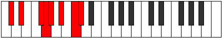 |
| [2791](https://ianring.com/musictheory/scales/2791) | [Ionyptyllic](ModeCSharpIonyptyllic.md) | C# | C#, D, D#, F#, G, G#, A#, C, C# |  |
| [2791](https://ianring.com/musictheory/scales/2791) | [Ionyptyllic](ModeDFlatIonyptyllic.md) | Db | Db, D, Eb, Gb, G, Ab, Bb, C, Db |  |
| [2791](https://ianring.com/musictheory/scales/2791) | [Ionyptyllic](ModeFSharpIonyptyllic.md) | F# | F#, G, G#, B, C, C#, D#, F, F# |  |
| [2791](https://ianring.com/musictheory/scales/2791) | [Ionyptyllic](ModeGFlatIonyptyllic.md) | Gb | Gb, G, Ab, B, C, Db, Eb, F, Gb |  |
| [2797](https://ianring.com/musictheory/scales/2797) | [Stalyllic](ModeCSharpStalyllic.md) | C# | C#, D#, E, F#, G, G#, A#, C, C# |  |
| [2797](https://ianring.com/musictheory/scales/2797) | [Stalyllic](ModeDFlatStalyllic.md) | Db | Db, Eb, E, Gb, G, Ab, Bb, C, Db |  |
| [2799](https://ianring.com/musictheory/scales/2799) | [Epilygic](ModeCSharpEpilygic.md) | C# | C#, D, D#, E, F#, G, G#, A#, C, C# |  |
| [2799](https://ianring.com/musictheory/scales/2799) | [Epilygic](ModeDFlatEpilygic.md) | Db | Db, D, Eb, E, Gb, G, Ab, Bb, C, Db |  |
| [2799](https://ianring.com/musictheory/scales/2799) | [Epilygic](ModeFSharpEpilygic.md) | F# | F#, G, G#, A, B, C, C#, D#, F, F# |  |
| [2799](https://ianring.com/musictheory/scales/2799) | [Epilygic](ModeGFlatEpilygic.md) | Gb | Gb, G, Ab, A, B, C, Db, Eb, F, Gb |  |
| [2801](https://ianring.com/musictheory/scales/2801) | [Zogian](ModeGSharpZogian.md) | G# | G#, A###, B##, C##, D#, E#, F##, G# |  |
| [2801](https://ianring.com/musictheory/scales/2801) | [Zogian](ModeAFlatZogian.md) | Ab | Ab, B#, C#, D, Eb, F, G, Ab |  |
| [2803](https://ianring.com/musictheory/scales/2803) | [Zolyllic](ModeGSharpZolyllic.md) | G# | G#, A, C, C#, D, D#, F, G, G# |  |
| [2803](https://ianring.com/musictheory/scales/2803) | [Zolyllic](ModeAFlatZolyllic.md) | Ab | Ab, A, C, Db, D, Eb, F, G, Ab |  |
| [2805](https://ianring.com/musictheory/scales/2805) | [Zylyllic](ModeGSharpZylyllic.md) | G# | G#, A#, C, C#, D, D#, F, G, G# |  |
| [2805](https://ianring.com/musictheory/scales/2805) | [Zylyllic](ModeAFlatZylyllic.md) | Ab | Ab, Bb, C, Db, D, Eb, F, G, Ab |  |
| [2805](https://ianring.com/musictheory/scales/2805) | [Zylyllic](ModeCSharpZylyllic.md) | C# | C#, D#, F, F#, G, G#, A#, C, C# |  |
| [2805](https://ianring.com/musictheory/scales/2805) | [Zylyllic](ModeDFlatZylyllic.md) | Db | Db, Eb, F, Gb, G, Ab, Bb, C, Db |  |
| [2807](https://ianring.com/musictheory/scales/2807) | [Zylygic](ModeCSharpZylygic.md) | C# | C#, D, D#, F, F#, G, G#, A#, C, C# |  |
| [2807](https://ianring.com/musictheory/scales/2807) | [Zylygic](ModeDFlatZylygic.md) | Db | Db, D, Eb, F, Gb, G, Ab, Bb, C, Db |  |
| [2807](https://ianring.com/musictheory/scales/2807) | [Zylygic](ModeGSharpZylygic.md) | G# | G#, A, A#, C, C#, D, D#, F, G, G# |  |
| [2807](https://ianring.com/musictheory/scales/2807) | [Zylygic](ModeAFlatZylygic.md) | Ab | Ab, A, Bb, C, Db, D, Eb, F, G, Ab |  |
| [2807](https://ianring.com/musictheory/scales/2807) | [Zylygic](ModeFSharpZylygic.md) | F# | F#, G, G#, A#, B, C, C#, D#, F, F# |  |
| [2807](https://ianring.com/musictheory/scales/2807) | [Zylygic](ModeGFlatZylygic.md) | Gb | Gb, G, Ab, Bb, B, C, Db, Eb, F, Gb |  |
| [2809](https://ianring.com/musictheory/scales/2809) | [Gythyllic](ModeGSharpGythyllic.md) | G# | G#, B, C, C#, D, D#, F, G, G# |  |
| [2809](https://ianring.com/musictheory/scales/2809) | [Gythyllic](ModeAFlatGythyllic.md) | Ab | Ab, B, C, Db, D, Eb, F, G, Ab |  |
| [2811](https://ianring.com/musictheory/scales/2811) | [Barygic](ModeGSharpBarygic.md) | G# | G#, A, B, C, C#, D, D#, F, G, G# |  |
| [2811](https://ianring.com/musictheory/scales/2811) | [Barygic](ModeAFlatBarygic.md) | Ab | Ab, A, B, C, Db, D, Eb, F, G, Ab |  |
| [2813](https://ianring.com/musictheory/scales/2813) | [Zolygic](ModeCSharpZolygic.md) | C# | C#, D#, E, F, F#, G, G#, A#, C, C# |  |
| [2813](https://ianring.com/musictheory/scales/2813) | [Zolygic](ModeDFlatZolygic.md) | Db | Db, Eb, E, F, Gb, G, Ab, Bb, C, Db |  |
| [2813](https://ianring.com/musictheory/scales/2813) | [Zolygic](ModeGSharpZolygic.md) | G# | G#, A#, B, C, C#, D, D#, F, G, G# |  |
| [2813](https://ianring.com/musictheory/scales/2813) | [Zolygic](ModeAFlatZolygic.md) | Ab | Ab, Bb, B, C, Db, D, Eb, F, G, Ab |  |
| [2815](https://ianring.com/musictheory/scales/2815) | [Aeradyllian](ModeCSharpAeradyllian.md) | C# | C#, D, D#, E, F, F#, G, G#, A#, C, C# |  |
| [2815](https://ianring.com/musictheory/scales/2815) | [Aeradyllian](ModeDFlatAeradyllian.md) | Db | Db, D, Eb, E, F, Gb, G, Ab, Bb, C, Db |  |
| [2815](https://ianring.com/musictheory/scales/2815) | [Aeradyllian](ModeGSharpAeradyllian.md) | G# | G#, A, A#, B, C, C#, D, D#, F, G, G# |  |
| [2815](https://ianring.com/musictheory/scales/2815) | [Aeradyllian](ModeAFlatAeradyllian.md) | Ab | Ab, A, Bb, B, C, Db, D, Eb, F, G, Ab |  |
| [2815](https://ianring.com/musictheory/scales/2815) | [Aeradyllian](ModeFSharpAeradyllian.md) | F# | F#, G, G#, A, A#, B, C, C#, D#, F, F# |  |
| [2815](https://ianring.com/musictheory/scales/2815) | [Aeradyllian](ModeGFlatAeradyllian.md) | Gb | Gb, G, Ab, A, Bb, B, C, Db, Eb, F, Gb |  |
| [2839](https://ianring.com/musictheory/scales/2839) | [Lyptian](ModeBNaturalLyptian.md) | B | B, C, Db, Eb, F##, G#, A#, B |  |
| [2841](https://ianring.com/musictheory/scales/2841) | [Sothimic](ModeENaturalSothimic.md) | E | E, F##, G#, A###, B##, C###, E |  |
| [2843](https://ianring.com/musictheory/scales/2843) | [Sorian](ModeENaturalSorian.md) | E | E, F, G, Ab, B#, C#, D#, E |  |
| [2845](https://ianring.com/musictheory/scales/2845) | [Baptian](ModeENaturalBaptian.md) | E | E, F#, G, Ab, B#, C#, D#, E |  |
| [2847](https://ianring.com/musictheory/scales/2847) | [Phracryllic](ModeENaturalPhracryllic.md) | E | E, F, F#, G, G#, C, C#, D#, E |  |
| [2847](https://ianring.com/musictheory/scales/2847) | [Phracryllic](ModeBNaturalPhracryllic.md) | B | B, C, C#, D, D#, G, G#, A#, B |  |
| [2871](https://ianring.com/musictheory/scales/2871) | [Stanyllic](ModeBNaturalStanyllic.md) | B | B, C, C#, D#, E, G, G#, A#, B |  |
| [2873](https://ianring.com/musictheory/scales/2873) | [Docrian](ModeENaturalDocrian.md) | E | E, F##, G#, A, B#, C#, D#, E |  |
| [2875](https://ianring.com/musictheory/scales/2875) | [Ganyllic](ModeENaturalGanyllic.md) | E | E, F, G, G#, A, C, C#, D#, E | 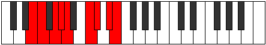 |
| [2877](https://ianring.com/musictheory/scales/2877) | [Phrylyllic](ModeENaturalPhrylyllic.md) | E | E, F#, G, G#, A, C, C#, D#, E |  |
| [2879](https://ianring.com/musictheory/scales/2879) | [Stadygic](ModeENaturalStadygic.md) | E | E, F, F#, G, G#, A, C, C#, D#, E |  |
| [2879](https://ianring.com/musictheory/scales/2879) | [Stadygic](ModeBNaturalStadygic.md) | B | B, C, C#, D, D#, E, G, G#, A#, B |  |
| [2903](https://ianring.com/musictheory/scales/2903) | [Gothyllic](ModeBNaturalGothyllic.md) | B | B, C, C#, D#, F, G, G#, A#, B |  |
| [2905](https://ianring.com/musictheory/scales/2905) | [Palian](ModeENaturalPalian.md) | E | E, F##, G#, A#, B#, C#, D#, E |  |
| [2907](https://ianring.com/musictheory/scales/2907) | [Mogyllic](ModeENaturalMogyllic.md) | E | E, F, G, G#, A#, C, C#, D#, E |  |
| [2909](https://ianring.com/musictheory/scales/2909) | [Mocryllic](ModeENaturalMocryllic.md) | E | E, F#, G, G#, A#, C, C#, D#, E |  |
| [2911](https://ianring.com/musictheory/scales/2911) | [Katygic](ModeENaturalKatygic.md) | E | E, F, F#, G, G#, A#, C, C#, D#, E |  |
| [2911](https://ianring.com/musictheory/scales/2911) | [Katygic](ModeBNaturalKatygic.md) | B | B, C, C#, D, D#, F, G, G#, A#, B |  |
| [2915](https://ianring.com/musictheory/scales/2915) | [Aeolydian](ModeGNaturalAeolydian.md) | G | G, Ab, B#, C#, D#, E, F#, G |  |
| [2919](https://ianring.com/musictheory/scales/2919) | [Molyllic](ModeGNaturalMolyllic.md) | G | G, G#, A, C, C#, D#, E, F#, G |  |
| [2923](https://ianring.com/musictheory/scales/2923) | [Baryllic](ModeGNaturalBaryllic.md) | G | G, G#, A#, C, C#, D#, E, F#, G |  |
| [2927](https://ianring.com/musictheory/scales/2927) | [Rodygic](ModeGNaturalRodygic.md) | G | G, G#, A, A#, C, C#, D#, E, F#, G |  |
| [2931](https://ianring.com/musictheory/scales/2931) | [Zathyllic](ModeGNaturalZathyllic.md) | G | G, G#, B, C, C#, D#, E, F#, G |  |
| [2935](https://ianring.com/musictheory/scales/2935) | [Modygic](ModeGNaturalModygic.md) | G | G, G#, A, B, C, C#, D#, E, F#, G |  |
| [2935](https://ianring.com/musictheory/scales/2935) | [Modygic](ModeBNaturalModygic.md) | B | B, C, C#, D#, E, F, G, G#, A#, B |  |
| [2937](https://ianring.com/musictheory/scales/2937) | [Aeolathyllic](ModeENaturalAeolathyllic.md) | E | E, G, G#, A, A#, C, C#, D#, E |  |
| [2939](https://ianring.com/musictheory/scales/2939) | [Goptygic](ModeENaturalGoptygic.md) | E | E, F, G, G#, A, A#, C, C#, D#, E |  |
| [2939](https://ianring.com/musictheory/scales/2939) | [Goptygic](ModeGNaturalGoptygic.md) | G | G, G#, A#, B, C, C#, D#, E, F#, G |  |
| [2941](https://ianring.com/musictheory/scales/2941) | [Laptygic](ModeENaturalLaptygic.md) | E | E, F#, G, G#, A, A#, C, C#, D#, E |  |
| [2943](https://ianring.com/musictheory/scales/2943) | [Dathyllian](ModeENaturalDathyllian.md) | E | E, F, F#, G, G#, A, A#, C, C#, D#, E |  |
| [2943](https://ianring.com/musictheory/scales/2943) | [Dathyllian](ModeBNaturalDathyllian.md) | B | B, C, C#, D, D#, E, F, G, G#, A#, B |  |
| [2943](https://ianring.com/musictheory/scales/2943) | [Dathyllian](ModeGNaturalDathyllian.md) | G | G, G#, A, A#, B, C, C#, D#, E, F#, G |  |
| [2955](https://ianring.com/musictheory/scales/2955) | [Thorian](ModeCNaturalThorian.md) | C | C, Db, Eb, F##, G#, A, B, C |  |
| [2959](https://ianring.com/musictheory/scales/2959) | [Dygyllic](ModeCNaturalDygyllic.md) | C | C, C#, D, D#, G, G#, A, B, C |  |
| [2967](https://ianring.com/musictheory/scales/2967) | [Madyllic](ModeBNaturalMadyllic.md) | B | B, C, C#, D#, F#, G, G#, A#, B |  |
| [2969](https://ianring.com/musictheory/scales/2969) | [Tholian](ModeENaturalTholian.md) | E | E, F##, G#, A##, B#, C#, D#, E |  |
| [2971](https://ianring.com/musictheory/scales/2971) | [Aeolynyllic](ModeENaturalAeolynyllic.md) | E | E, F, G, G#, B, C, C#, D#, E |  |
| [2971](https://ianring.com/musictheory/scales/2971) | [Aeolynyllic](ModeCNaturalAeolynyllic.md) | C | C, C#, D#, E, G, G#, A, B, C |  |
| [2973](https://ianring.com/musictheory/scales/2973) | [Panyllic](ModeENaturalPanyllic.md) | E | E, F#, G, G#, B, C, C#, D#, E |  |
| [2975](https://ianring.com/musictheory/scales/2975) | [Gaptygic](ModeENaturalGaptygic.md) | E | E, F, F#, G, G#, B, C, C#, D#, E |  |
| [2975](https://ianring.com/musictheory/scales/2975) | [Gaptygic](ModeCNaturalGaptygic.md) | C | C, C#, D, D#, E, G, G#, A, B, C |  |
| [2975](https://ianring.com/musictheory/scales/2975) | [Gaptygic](ModeBNaturalGaptygic.md) | B | B, C, C#, D, D#, F#, G, G#, A#, B |  |
| [2987](https://ianring.com/musictheory/scales/2987) | [Thanyllic](ModeCNaturalThanyllic.md) | C | C, C#, D#, F, G, G#, A, B, C |  |
| [2991](https://ianring.com/musictheory/scales/2991) | [Zanygic](ModeCNaturalZanygic.md) | C | C, C#, D, D#, F, G, G#, A, B, C |  |
| [2993](https://ianring.com/musictheory/scales/2993) | [Stythian](ModeGSharpStythian.md) | G# | G#, A###, B##, C###, D##, E#, F##, G# |  |
| [2993](https://ianring.com/musictheory/scales/2993) | [Stythian](ModeAFlatStythian.md) | Ab | Ab, B#, C#, D#, E, F, G, Ab |  |
| [2995](https://ianring.com/musictheory/scales/2995) | [Sanyllic](ModeGSharpSanyllic.md) | G# | G#, A, C, C#, D#, E, F, G, G# |  |
| [2995](https://ianring.com/musictheory/scales/2995) | [Sanyllic](ModeAFlatSanyllic.md) | Ab | Ab, A, C, Db, Eb, E, F, G, Ab |  |
| [2997](https://ianring.com/musictheory/scales/2997) | [Ionoptyllic](ModeGSharpIonoptyllic.md) | G# | G#, A#, C, C#, D#, E, F, G, G# |  |
| [2997](https://ianring.com/musictheory/scales/2997) | [Ionoptyllic](ModeAFlatIonoptyllic.md) | Ab | Ab, Bb, C, Db, Eb, E, F, G, Ab |  |
| [2999](https://ianring.com/musictheory/scales/2999) | [Zyrygic](ModeGSharpZyrygic.md) | G# | G#, A, A#, C, C#, D#, E, F, G, G# |  |
| [2999](https://ianring.com/musictheory/scales/2999) | [Zyrygic](ModeAFlatZyrygic.md) | Ab | Ab, A, Bb, C, Db, Eb, E, F, G, Ab |  |
| [2999](https://ianring.com/musictheory/scales/2999) | [Zyrygic](ModeBNaturalZyrygic.md) | B | B, C, C#, D#, E, F#, G, G#, A#, B |  |
| [3001](https://ianring.com/musictheory/scales/3001) | [Lonyllic](ModeGSharpLonyllic.md) | G# | G#, B, C, C#, D#, E, F, G, G# |  |
| [3001](https://ianring.com/musictheory/scales/3001) | [Lonyllic](ModeAFlatLonyllic.md) | Ab | Ab, B, C, Db, Eb, E, F, G, Ab |  |
| [3001](https://ianring.com/musictheory/scales/3001) | [Lonyllic](ModeENaturalLonyllic.md) | E | E, G, G#, A, B, C, C#, D#, E |  |
| [3003](https://ianring.com/musictheory/scales/3003) | [Zydygic](ModeCNaturalZydygic.md) | C | C, C#, D#, E, F, G, G#, A, B, C |  |
| [3003](https://ianring.com/musictheory/scales/3003) | [Zydygic](ModeENaturalZydygic.md) | E | E, F, G, G#, A, B, C, C#, D#, E |  |
| [3003](https://ianring.com/musictheory/scales/3003) | [Zydygic](ModeGSharpZydygic.md) | G# | G#, A, B, C, C#, D#, E, F, G, G# |  |
| [3003](https://ianring.com/musictheory/scales/3003) | [Zydygic](ModeAFlatZydygic.md) | Ab | Ab, A, B, C, Db, Eb, E, F, G, Ab |  |
| [3005](https://ianring.com/musictheory/scales/3005) | [Gycrygic](ModeENaturalGycrygic.md) | E | E, F#, G, G#, A, B, C, C#, D#, E |  |
| [3005](https://ianring.com/musictheory/scales/3005) | [Gycrygic](ModeGSharpGycrygic.md) | G# | G#, A#, B, C, C#, D#, E, F, G, G# |  |
| [3005](https://ianring.com/musictheory/scales/3005) | [Gycrygic](ModeAFlatGycrygic.md) | Ab | Ab, Bb, B, C, Db, Eb, E, F, G, Ab |  |
| [3007](https://ianring.com/musictheory/scales/3007) | [Zyryllian](ModeCNaturalZyryllian.md) | C | C, C#, D, D#, E, F, G, G#, A, B, C |  |
| [3007](https://ianring.com/musictheory/scales/3007) | [Zyryllian](ModeENaturalZyryllian.md) | E | E, F, F#, G, G#, A, B, C, C#, D#, E |  |
| [3007](https://ianring.com/musictheory/scales/3007) | [Zyryllian](ModeBNaturalZyryllian.md) | B | B, C, C#, D, D#, E, F#, G, G#, A#, B |  |
| [3007](https://ianring.com/musictheory/scales/3007) | [Zyryllian](ModeGSharpZyryllian.md) | G# | G#, A, A#, B, C, C#, D#, E, F, G, G# |  |
| [3007](https://ianring.com/musictheory/scales/3007) | [Zyryllian](ModeAFlatZyryllian.md) | Ab | Ab, A, Bb, B, C, Db, Eb, E, F, G, Ab |  |
| [3013](https://ianring.com/musictheory/scales/3013) | [Thynian](ModeDFlatThynian.md) | Db | Db, Eb, F##, G#, A, Bb, C, Db |  |
| [3015](https://ianring.com/musictheory/scales/3015) | [Laptyllic](ModeFSharpLaptyllic.md) | F# | F#, G, G#, C, C#, D, D#, F, F# |  |
| [3015](https://ianring.com/musictheory/scales/3015) | [Laptyllic](ModeGFlatLaptyllic.md) | Gb | Gb, G, Ab, C, Db, D, Eb, F, Gb |  |
| [3015](https://ianring.com/musictheory/scales/3015) | [Laptyllic](ModeCSharpLaptyllic.md) | C# | C#, D, D#, G, G#, A, A#, C, C# |  |
| [3015](https://ianring.com/musictheory/scales/3015) | [Laptyllic](ModeDFlatLaptyllic.md) | Db | Db, D, Eb, G, Ab, A, Bb, C, Db |  |
| [3019](https://ianring.com/musictheory/scales/3019) | [Mydyllic](ModeCNaturalMydyllic.md) | C | C, C#, D#, F#, G, G#, A, B, C |  |
| [3021](https://ianring.com/musictheory/scales/3021) | [Gyptyllic](ModeCSharpGyptyllic.md) | C# | C#, D#, E, G, G#, A, A#, C, C# |  |
| [3021](https://ianring.com/musictheory/scales/3021) | [Gyptyllic](ModeDFlatGyptyllic.md) | Db | Db, Eb, E, G, Ab, A, Bb, C, Db |  |
| [3023](https://ianring.com/musictheory/scales/3023) | [Aeracrygic](ModeFSharpAeracrygic.md) | F# | F#, G, G#, A, C, C#, D, D#, F, F# |  |
| [3023](https://ianring.com/musictheory/scales/3023) | [Aeracrygic](ModeGFlatAeracrygic.md) | Gb | Gb, G, Ab, A, C, Db, D, Eb, F, Gb |  |
| [3023](https://ianring.com/musictheory/scales/3023) | [Aeracrygic](ModeCSharpAeracrygic.md) | C# | C#, D, D#, E, G, G#, A, A#, C, C# |  |
| [3023](https://ianring.com/musictheory/scales/3023) | [Aeracrygic](ModeDFlatAeracrygic.md) | Db | Db, D, Eb, E, G, Ab, A, Bb, C, Db |  |
| [3023](https://ianring.com/musictheory/scales/3023) | [Aeracrygic](ModeCNaturalAeracrygic.md) | C | C, C#, D, D#, F#, G, G#, A, B, C |  |
| [3029](https://ianring.com/musictheory/scales/3029) | [Ionocryllic](ModeCSharpIonocryllic.md) | C# | C#, D#, F, G, G#, A, A#, C, C# |  |
| [3029](https://ianring.com/musictheory/scales/3029) | [Ionocryllic](ModeDFlatIonocryllic.md) | Db | Db, Eb, F, G, Ab, A, Bb, C, Db |  |
| [3031](https://ianring.com/musictheory/scales/3031) | [Epithygic](ModeFSharpEpithygic.md) | F# | F#, G, G#, A#, C, C#, D, D#, F, F# |  |
| [3031](https://ianring.com/musictheory/scales/3031) | [Epithygic](ModeGFlatEpithygic.md) | Gb | Gb, G, Ab, Bb, C, Db, D, Eb, F, Gb |  |
| [3031](https://ianring.com/musictheory/scales/3031) | [Epithygic](ModeCSharpEpithygic.md) | C# | C#, D, D#, F, G, G#, A, A#, C, C# |  |
| [3031](https://ianring.com/musictheory/scales/3031) | [Epithygic](ModeDFlatEpithygic.md) | Db | Db, D, Eb, F, G, Ab, A, Bb, C, Db |  |
| [3031](https://ianring.com/musictheory/scales/3031) | [Epithygic](ModeBNaturalEpithygic.md) | B | B, C, C#, D#, F, F#, G, G#, A#, B |  |
| [3033](https://ianring.com/musictheory/scales/3033) | [Doptyllic](ModeENaturalDoptyllic.md) | E | E, G, G#, A#, B, C, C#, D#, E |  |
| [3035](https://ianring.com/musictheory/scales/3035) | [Gocrygic](ModeCNaturalGocrygic.md) | C | C, C#, D#, E, F#, G, G#, A, B, C |  |
| [3035](https://ianring.com/musictheory/scales/3035) | [Gocrygic](ModeENaturalGocrygic.md) | E | E, F, G, G#, A#, B, C, C#, D#, E |  |
| [3037](https://ianring.com/musictheory/scales/3037) | [Staptygic](ModeCSharpStaptygic.md) | C# | C#, D#, E, F, G, G#, A, A#, C, C# |  |
| [3037](https://ianring.com/musictheory/scales/3037) | [Staptygic](ModeDFlatStaptygic.md) | Db | Db, Eb, E, F, G, Ab, A, Bb, C, Db |  |
| [3037](https://ianring.com/musictheory/scales/3037) | [Staptygic](ModeENaturalStaptygic.md) | E | E, F#, G, G#, A#, B, C, C#, D#, E |  |
| [3039](https://ianring.com/musictheory/scales/3039) | [Godyllian](ModeCSharpGodyllian.md) | C# | C#, D, D#, E, F, G, G#, A, A#, C, C# |  |
| [3039](https://ianring.com/musictheory/scales/3039) | [Godyllian](ModeDFlatGodyllian.md) | Db | Db, D, Eb, E, F, G, Ab, A, Bb, C, Db |  |
| [3039](https://ianring.com/musictheory/scales/3039) | [Godyllian](ModeFSharpGodyllian.md) | F# | F#, G, G#, A, A#, C, C#, D, D#, F, F# |  |
| [3039](https://ianring.com/musictheory/scales/3039) | [Godyllian](ModeGFlatGodyllian.md) | Gb | Gb, G, Ab, A, Bb, C, Db, D, Eb, F, Gb |  |
| [3039](https://ianring.com/musictheory/scales/3039) | [Godyllian](ModeCNaturalGodyllian.md) | C | C, C#, D, D#, E, F#, G, G#, A, B, C |  |
| [3039](https://ianring.com/musictheory/scales/3039) | [Godyllian](ModeBNaturalGodyllian.md) | B | B, C, C#, D, D#, F, F#, G, G#, A#, B |  |
| [3039](https://ianring.com/musictheory/scales/3039) | [Godyllian](ModeENaturalGodyllian.md) | E | E, F, F#, G, G#, A#, B, C, C#, D#, E |  |
| [3043](https://ianring.com/musictheory/scales/3043) | [Ionayllic](ModeGNaturalIonayllic.md) | G | G, G#, C, C#, D, D#, E, F#, G |  |
| [3045](https://ianring.com/musictheory/scales/3045) | [Raptyllic](ModeCSharpRaptyllic.md) | C# | C#, D#, F#, G, G#, A, A#, C, C# |  |
| [3045](https://ianring.com/musictheory/scales/3045) | [Raptyllic](ModeDFlatRaptyllic.md) | Db | Db, Eb, Gb, G, Ab, A, Bb, C, Db |  |
| [3047](https://ianring.com/musictheory/scales/3047) | [Panygic](ModeGNaturalPanygic.md) | G | G, G#, A, C, C#, D, D#, E, F#, G |  |
| [3047](https://ianring.com/musictheory/scales/3047) | [Panygic](ModeCSharpPanygic.md) | C# | C#, D, D#, F#, G, G#, A, A#, C, C# |  |
| [3047](https://ianring.com/musictheory/scales/3047) | [Panygic](ModeDFlatPanygic.md) | Db | Db, D, Eb, Gb, G, Ab, A, Bb, C, Db |  |
| [3047](https://ianring.com/musictheory/scales/3047) | [Panygic](ModeFSharpPanygic.md) | F# | F#, G, G#, B, C, C#, D, D#, F, F# | 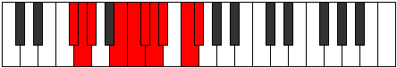 |
| [3047](https://ianring.com/musictheory/scales/3047) | [Panygic](ModeGFlatPanygic.md) | Gb | Gb, G, Ab, B, C, Db, D, Eb, F, Gb |  |
| [3051](https://ianring.com/musictheory/scales/3051) | [Stalygic](ModeGNaturalStalygic.md) | G | G, G#, A#, C, C#, D, D#, E, F#, G |  |
| [3051](https://ianring.com/musictheory/scales/3051) | [Stalygic](ModeCNaturalStalygic.md) | C | C, C#, D#, F, F#, G, G#, A, B, C |  |
| [3053](https://ianring.com/musictheory/scales/3053) | [Zycrygic](ModeCSharpZycrygic.md) | C# | C#, D#, E, F#, G, G#, A, A#, C, C# |  |
| [3053](https://ianring.com/musictheory/scales/3053) | [Zycrygic](ModeDFlatZycrygic.md) | Db | Db, Eb, E, Gb, G, Ab, A, Bb, C, Db |  |
| [3055](https://ianring.com/musictheory/scales/3055) | [Lyryllian](ModeCSharpLyryllian.md) | C# | C#, D, D#, E, F#, G, G#, A, A#, C, C# |  |
| [3055](https://ianring.com/musictheory/scales/3055) | [Lyryllian](ModeDFlatLyryllian.md) | Db | Db, D, Eb, E, Gb, G, Ab, A, Bb, C, Db |  |
| [3055](https://ianring.com/musictheory/scales/3055) | [Lyryllian](ModeGNaturalLyryllian.md) | G | G, G#, A, A#, C, C#, D, D#, E, F#, G |  |
| [3055](https://ianring.com/musictheory/scales/3055) | [Lyryllian](ModeCNaturalLyryllian.md) | C | C, C#, D, D#, F, F#, G, G#, A, B, C |  |
| [3055](https://ianring.com/musictheory/scales/3055) | [Lyryllian](ModeFSharpLyryllian.md) | F# | F#, G, G#, A, B, C, C#, D, D#, F, F# |  |
| [3055](https://ianring.com/musictheory/scales/3055) | [Lyryllian](ModeGFlatLyryllian.md) | Gb | Gb, G, Ab, A, B, C, Db, D, Eb, F, Gb |  |
| [3057](https://ianring.com/musictheory/scales/3057) | [Phroryllic](ModeGSharpPhroryllic.md) | G# | G#, C, C#, D, D#, E, F, G, G# |  |
| [3057](https://ianring.com/musictheory/scales/3057) | [Phroryllic](ModeAFlatPhroryllic.md) | Ab | Ab, C, Db, D, Eb, E, F, G, Ab |  |
| [3059](https://ianring.com/musictheory/scales/3059) | [Madygic](ModeGSharpMadygic.md) | G# | G#, A, C, C#, D, D#, E, F, G, G# |  |
| [3059](https://ianring.com/musictheory/scales/3059) | [Madygic](ModeAFlatMadygic.md) | Ab | Ab, A, C, Db, D, Eb, E, F, G, Ab |  |
| [3059](https://ianring.com/musictheory/scales/3059) | [Madygic](ModeGNaturalMadygic.md) | G | G, G#, B, C, C#, D, D#, E, F#, G |  |
| [3061](https://ianring.com/musictheory/scales/3061) | [Apinygic](ModeGSharpApinygic.md) | G# | G#, A#, C, C#, D, D#, E, F, G, G# |  |
| [3061](https://ianring.com/musictheory/scales/3061) | [Apinygic](ModeAFlatApinygic.md) | Ab | Ab, Bb, C, Db, D, Eb, E, F, G, Ab |  |
| [3061](https://ianring.com/musictheory/scales/3061) | [Apinygic](ModeCSharpApinygic.md) | C# | C#, D#, F, F#, G, G#, A, A#, C, C# |  |
| [3061](https://ianring.com/musictheory/scales/3061) | [Apinygic](ModeDFlatApinygic.md) | Db | Db, Eb, F, Gb, G, Ab, A, Bb, C, Db |  |
| [3063](https://ianring.com/musictheory/scales/3063) | [Solyllian](ModeGSharpSolyllian.md) | G# | G#, A, A#, C, C#, D, D#, E, F, G, G# |  |
| [3063](https://ianring.com/musictheory/scales/3063) | [Solyllian](ModeAFlatSolyllian.md) | Ab | Ab, A, Bb, C, Db, D, Eb, E, F, G, Ab |  |
| [3063](https://ianring.com/musictheory/scales/3063) | [Solyllian](ModeCSharpSolyllian.md) | C# | C#, D, D#, F, F#, G, G#, A, A#, C, C# |  |
| [3063](https://ianring.com/musictheory/scales/3063) | [Solyllian](ModeDFlatSolyllian.md) | Db | Db, D, Eb, F, Gb, G, Ab, A, Bb, C, Db |  |
| [3063](https://ianring.com/musictheory/scales/3063) | [Solyllian](ModeGNaturalSolyllian.md) | G | G, G#, A, B, C, C#, D, D#, E, F#, G |  |
| [3063](https://ianring.com/musictheory/scales/3063) | [Solyllian](ModeFSharpSolyllian.md) | F# | F#, G, G#, A#, B, C, C#, D, D#, F, F# |  |
| [3063](https://ianring.com/musictheory/scales/3063) | [Solyllian](ModeGFlatSolyllian.md) | Gb | Gb, G, Ab, Bb, B, C, Db, D, Eb, F, Gb |  |
| [3063](https://ianring.com/musictheory/scales/3063) | [Solyllian](ModeBNaturalSolyllian.md) | B | B, C, C#, D#, E, F, F#, G, G#, A#, B |  |
| [3065](https://ianring.com/musictheory/scales/3065) | [Zothygic](ModeGSharpZothygic.md) | G# | G#, B, C, C#, D, D#, E, F, G, G# |  |
| [3065](https://ianring.com/musictheory/scales/3065) | [Zothygic](ModeAFlatZothygic.md) | Ab | Ab, B, C, Db, D, Eb, E, F, G, Ab |  |
| [3065](https://ianring.com/musictheory/scales/3065) | [Zothygic](ModeENaturalZothygic.md) | E | E, G, G#, A, A#, B, C, C#, D#, E |  |
| [3067](https://ianring.com/musictheory/scales/3067) | [Goptyllian](ModeGSharpGoptyllian.md) | G# | G#, A, B, C, C#, D, D#, E, F, G, G# |  |
| [3067](https://ianring.com/musictheory/scales/3067) | [Goptyllian](ModeAFlatGoptyllian.md) | Ab | Ab, A, B, C, Db, D, Eb, E, F, G, Ab |  |
| [3067](https://ianring.com/musictheory/scales/3067) | [Goptyllian](ModeCNaturalGoptyllian.md) | C | C, C#, D#, E, F, F#, G, G#, A, B, C |  |
| [3067](https://ianring.com/musictheory/scales/3067) | [Goptyllian](ModeGNaturalGoptyllian.md) | G | G, G#, A#, B, C, C#, D, D#, E, F#, G |  |
| [3067](https://ianring.com/musictheory/scales/3067) | [Goptyllian](ModeENaturalGoptyllian.md) | E | E, F, G, G#, A, A#, B, C, C#, D#, E |  |
| [3069](https://ianring.com/musictheory/scales/3069) | [Bacryllian](ModeCSharpBacryllian.md) | C# | C#, D#, E, F, F#, G, G#, A, A#, C, C# |  |
| [3069](https://ianring.com/musictheory/scales/3069) | [Bacryllian](ModeDFlatBacryllian.md) | Db | Db, Eb, E, F, Gb, G, Ab, A, Bb, C, Db |  |
| [3069](https://ianring.com/musictheory/scales/3069) | [Bacryllian](ModeGSharpBacryllian.md) | G# | G#, A#, B, C, C#, D, D#, E, F, G, G# |  |
| [3069](https://ianring.com/musictheory/scales/3069) | [Bacryllian](ModeAFlatBacryllian.md) | Ab | Ab, Bb, B, C, Db, D, Eb, E, F, G, Ab |  |
| [3069](https://ianring.com/musictheory/scales/3069) | [Bacryllian](ModeENaturalBacryllian.md) | E | E, F#, G, G#, A, A#, B, C, C#, D#, E |  |
| [3071](https://ianring.com/musictheory/scales/3071) | [Solatic](ModeCSharpSolatic.md) | C# | C#, D, D#, E, F, F#, G, G#, A, A#, C, C# |  |
| [3071](https://ianring.com/musictheory/scales/3071) | [Solatic](ModeDFlatSolatic.md) | Db | Db, D, Eb, E, F, Gb, G, Ab, A, Bb, C, Db |  |
| [3071](https://ianring.com/musictheory/scales/3071) | [Solatic](ModeCNaturalSolatic.md) | C | C, C#, D, D#, E, F, F#, G, G#, A, B, C |  |
| [3071](https://ianring.com/musictheory/scales/3071) | [Solatic](ModeBNaturalSolatic.md) | B | B, C, C#, D, D#, E, F, F#, G, G#, A#, B |  |
| [3071](https://ianring.com/musictheory/scales/3071) | [Solatic](ModeGSharpSolatic.md) | G# | G#, A, A#, B, C, C#, D, D#, E, F, G, G# |  |
| [3071](https://ianring.com/musictheory/scales/3071) | [Solatic](ModeAFlatSolatic.md) | Ab | Ab, A, Bb, B, C, Db, D, Eb, E, F, G, Ab |  |
| [3071](https://ianring.com/musictheory/scales/3071) | [Solatic](ModeGNaturalSolatic.md) | G | G, G#, A, A#, B, C, C#, D, D#, E, F#, G |  |
| [3071](https://ianring.com/musictheory/scales/3071) | [Solatic](ModeFSharpSolatic.md) | F# | F#, G, G#, A, A#, B, C, C#, D, D#, F, F# |  |
| [3071](https://ianring.com/musictheory/scales/3071) | [Solatic](ModeGFlatSolatic.md) | Gb | Gb, G, Ab, A, Bb, B, C, Db, D, Eb, F, Gb |  |
| [3071](https://ianring.com/musictheory/scales/3071) | [Solatic](ModeENaturalSolatic.md) | E | E, F, F#, G, G#, A, A#, B, C, C#, D#, E |  |
| [3163](https://ianring.com/musictheory/scales/3163) | [Rogian](ModeANaturalRogian.md) | A | A, Bb, C, Db, Eb, F##, G#, A |  |
| [3165](https://ianring.com/musictheory/scales/3165) | [Mylian](ModeANaturalMylian.md) | A | A, B, C, Db, Eb, F##, G#, A |  |
| [3167](https://ianring.com/musictheory/scales/3167) | [Thynyllic](ModeANaturalThynyllic.md) | A | A, A#, B, C, C#, D#, G, G#, A |  |
| [3171](https://ianring.com/musictheory/scales/3171) | [Zythimic](ModeDNaturalZythimic.md) | D | D, Eb, F##, G#, A###, B##, D |  |
| [3175](https://ianring.com/musictheory/scales/3175) | [Eponian](ModeDNaturalEponian.md) | D | D, Eb, Fb, G, Ab, B#, C#, D |  |
| [3179](https://ianring.com/musictheory/scales/3179) | [Daptian](ModeDNaturalDaptian.md) | D | D, Eb, F, G, Ab, B#, C#, D | 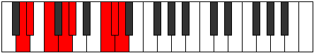 |
| [3183](https://ianring.com/musictheory/scales/3183) | [Mixonyllic](ModeDNaturalMixonyllic.md) | D | D, D#, E, F, G, G#, C, C#, D |  |
| [3187](https://ianring.com/musictheory/scales/3187) | [Koptian](ModeDNaturalKoptian.md) | D | D, Eb, F#, G, Ab, B#, C#, D |  |
| [3191](https://ianring.com/musictheory/scales/3191) | [Bynyllic](ModeDNaturalBynyllic.md) | D | D, D#, E, F#, G, G#, C, C#, D |  |
| [3193](https://ianring.com/musictheory/scales/3193) | [Zathian](ModeANaturalZathian.md) | A | A, B#, C#, D, Eb, F##, G#, A |  |
| [3195](https://ianring.com/musictheory/scales/3195) | [Raryllic](ModeDNaturalRaryllic.md) | D | D, D#, F, F#, G, G#, C, C#, D |  |
| [3195](https://ianring.com/musictheory/scales/3195) | [Raryllic](ModeANaturalRaryllic.md) | A | A, A#, C, C#, D, D#, G, G#, A |  |
| [3197](https://ianring.com/musictheory/scales/3197) | [Gylyllic](ModeANaturalGylyllic.md) | A | A, B, C, C#, D, D#, G, G#, A |  |
| [3199](https://ianring.com/musictheory/scales/3199) | [Thaptygic](ModeDNaturalThaptygic.md) | D | D, D#, E, F, F#, G, G#, C, C#, D |  |
| [3199](https://ianring.com/musictheory/scales/3199) | [Thaptygic](ModeANaturalThaptygic.md) | A | A, A#, B, C, C#, D, D#, G, G#, A |  |
| [3249](https://ianring.com/musictheory/scales/3249) | [Epygimic](ModeGSharpEpygimic.md) | G# | G#, A###, B##, C###, E##, F##, G# |  |
| [3249](https://ianring.com/musictheory/scales/3249) | [Epygimic](ModeAFlatEpygimic.md) | Ab | Ab, B#, C#, D#, E##, F##, Ab |  |
| [3251](https://ianring.com/musictheory/scales/3251) | [Zodian](ModeGSharpZodian.md) | G# | G#, A, B#, C#, D#, E##, F##, G# |  |
| [3251](https://ianring.com/musictheory/scales/3251) | [Zodian](ModeAFlatZodian.md) | Ab | Ab, Bbb, C, Db, Eb, F#, G, Ab |  |
| [3253](https://ianring.com/musictheory/scales/3253) | [Gonian](ModeGSharpGonian.md) | G# | G#, A#, B#, C#, D#, E##, F##, G# |  |
| [3253](https://ianring.com/musictheory/scales/3253) | [Gonian](ModeAFlatGonian.md) | Ab | Ab, Bb, C, Db, Eb, F#, G, Ab |  |
| [3255](https://ianring.com/musictheory/scales/3255) | [Daryllic](ModeGSharpDaryllic.md) | G# | G#, A, A#, C, C#, D#, F#, G, G# |  |
| [3255](https://ianring.com/musictheory/scales/3255) | [Daryllic](ModeAFlatDaryllic.md) | Ab | Ab, A, Bb, C, Db, Eb, Gb, G, Ab |  |
| [3257](https://ianring.com/musictheory/scales/3257) | [Ionacrian](ModeGSharpIonacrian.md) | G# | G#, A##, B#, C#, D#, E##, F##, G# |  |
| [3257](https://ianring.com/musictheory/scales/3257) | [Ionacrian](ModeAFlatIonacrian.md) | Ab | Ab, B, C, Db, Eb, F#, G, Ab |  |
| [3259](https://ianring.com/musictheory/scales/3259) | [Loptyllic](ModeGSharpLoptyllic.md) | G# | G#, A, B, C, C#, D#, F#, G, G# |  |
| [3259](https://ianring.com/musictheory/scales/3259) | [Loptyllic](ModeAFlatLoptyllic.md) | Ab | Ab, A, B, C, Db, Eb, Gb, G, Ab |  |
| [3261](https://ianring.com/musictheory/scales/3261) | [Dodyllic](ModeGSharpDodyllic.md) | G# | G#, A#, B, C, C#, D#, F#, G, G# |  |
| [3261](https://ianring.com/musictheory/scales/3261) | [Dodyllic](ModeAFlatDodyllic.md) | Ab | Ab, Bb, B, C, Db, Eb, Gb, G, Ab |  |
| [3263](https://ianring.com/musictheory/scales/3263) | [Pyrygic](ModeGSharpPyrygic.md) | G# | G#, A, A#, B, C, C#, D#, F#, G, G# |  |
| [3263](https://ianring.com/musictheory/scales/3263) | [Pyrygic](ModeAFlatPyrygic.md) | Ab | Ab, A, Bb, B, C, Db, Eb, Gb, G, Ab |  |
| [3269](https://ianring.com/musictheory/scales/3269) | [Lodimic](ModeDFlatLodimic.md) | Db | Db, Eb, F##, G#, A##, B#, Db |  |
| [3271](https://ianring.com/musictheory/scales/3271) | [Kolian](ModeCSharpKolian.md) | C# | C#, D, Eb, F##, G#, A##, B#, C# |  |
| [3271](https://ianring.com/musictheory/scales/3271) | [Kolian](ModeDFlatKolian.md) | Db | Db, Ebb, Fbb, G, Ab, B, C, Db |  |
| [3277](https://ianring.com/musictheory/scales/3277) | [Zycrian](ModeCSharpZycrian.md) | C# | C#, D#, E, F##, G#, A##, B#, C# |  |
| [3277](https://ianring.com/musictheory/scales/3277) | [Zycrian](ModeDFlatZycrian.md) | Db | Db, Eb, Fb, G, Ab, B, C, Db |  |
| [3279](https://ianring.com/musictheory/scales/3279) | [Pythyllic](ModeCSharpPythyllic.md) | C# | C#, D, D#, E, G, G#, B, C, C# |  |
| [3279](https://ianring.com/musictheory/scales/3279) | [Pythyllic](ModeDFlatPythyllic.md) | Db | Db, D, Eb, E, G, Ab, B, C, Db |  |
| [3285](https://ianring.com/musictheory/scales/3285) | [Zagian](ModeCSharpZagian.md) | C# | C#, D#, E#, F##, G#, A##, B#, C# |  |
| [3285](https://ianring.com/musictheory/scales/3285) | [Zagian](ModeDFlatZagian.md) | Db | Db, Eb, F, G, Ab, B, C, Db |  |
| [3287](https://ianring.com/musictheory/scales/3287) | [Phrathyllic](ModeCSharpPhrathyllic.md) | C# | C#, D, D#, F, G, G#, B, C, C# |  |
| [3287](https://ianring.com/musictheory/scales/3287) | [Phrathyllic](ModeDFlatPhrathyllic.md) | Db | Db, D, Eb, F, G, Ab, B, C, Db |  |
| [3289](https://ianring.com/musictheory/scales/3289) | [Loptian](ModeANaturalLoptian.md) | A | A, B#, C#, D#, E, F##, G#, A |  |
| [3291](https://ianring.com/musictheory/scales/3291) | [Kodyllic](ModeANaturalKodyllic.md) | A | A, A#, C, C#, D#, E, G, G#, A |  |
| [3293](https://ianring.com/musictheory/scales/3293) | [Saryllic](ModeCSharpSaryllic.md) | C# | C#, D#, E, F, G, G#, B, C, C# |  |
| [3293](https://ianring.com/musictheory/scales/3293) | [Saryllic](ModeDFlatSaryllic.md) | Db | Db, Eb, E, F, G, Ab, B, C, Db |  |
| [3293](https://ianring.com/musictheory/scales/3293) | [Saryllic](ModeANaturalSaryllic.md) | A | A, B, C, C#, D#, E, G, G#, A |  |
| [3295](https://ianring.com/musictheory/scales/3295) | [Phroptygic](ModeCSharpPhroptygic.md) | C# | C#, D, D#, E, F, G, G#, B, C, C# |  |
| [3295](https://ianring.com/musictheory/scales/3295) | [Phroptygic](ModeDFlatPhroptygic.md) | Db | Db, D, Eb, E, F, G, Ab, B, C, Db |  |
| [3295](https://ianring.com/musictheory/scales/3295) | [Phroptygic](ModeANaturalPhroptygic.md) | A | A, A#, B, C, C#, D#, E, G, G#, A |  |
| [3299](https://ianring.com/musictheory/scales/3299) | [Syptian](ModeDNaturalSyptian.md) | D | D, Eb, F##, G#, A, B#, C#, D |  |
| [3301](https://ianring.com/musictheory/scales/3301) | [Phrynian](ModeCSharpPhrynian.md) | C# | C#, D#, E##, F##, G#, A##, B#, C# |  |
| [3301](https://ianring.com/musictheory/scales/3301) | [Phrynian](ModeDFlatPhrynian.md) | Db | Db, Eb, F#, G, Ab, B, C, Db |  |
| [3303](https://ianring.com/musictheory/scales/3303) | [Soptyllic](ModeDNaturalSoptyllic.md) | D | D, D#, E, G, G#, A, C, C#, D |  |
| [3303](https://ianring.com/musictheory/scales/3303) | [Soptyllic](ModeCSharpSoptyllic.md) | C# | C#, D, D#, F#, G, G#, B, C, C# |  |
| [3303](https://ianring.com/musictheory/scales/3303) | [Soptyllic](ModeDFlatSoptyllic.md) | Db | Db, D, Eb, Gb, G, Ab, B, C, Db |  |
| [3307](https://ianring.com/musictheory/scales/3307) | [Boptyllic](ModeDNaturalBoptyllic.md) | D | D, D#, F, G, G#, A, C, C#, D |  |
| [3309](https://ianring.com/musictheory/scales/3309) | [Bycryllic](ModeCSharpBycryllic.md) | C# | C#, D#, E, F#, G, G#, B, C, C# |  |
| [3309](https://ianring.com/musictheory/scales/3309) | [Bycryllic](ModeDFlatBycryllic.md) | Db | Db, Eb, E, Gb, G, Ab, B, C, Db |  |
| [3311](https://ianring.com/musictheory/scales/3311) | [Mixodygic](ModeDNaturalMixodygic.md) | D | D, D#, E, F, G, G#, A, C, C#, D |  |
| [3311](https://ianring.com/musictheory/scales/3311) | [Mixodygic](ModeCSharpMixodygic.md) | C# | C#, D, D#, E, F#, G, G#, B, C, C# |  |
| [3311](https://ianring.com/musictheory/scales/3311) | [Mixodygic](ModeDFlatMixodygic.md) | Db | Db, D, Eb, E, Gb, G, Ab, B, C, Db |  |
| [3313](https://ianring.com/musictheory/scales/3313) | [Aeolacrian](ModeGSharpAeolacrian.md) | G# | G#, A###, B##, C##, D#, E##, F##, G# |  |
| [3313](https://ianring.com/musictheory/scales/3313) | [Aeolacrian](ModeAFlatAeolacrian.md) | Ab | Ab, B#, C#, D, Eb, F#, G, Ab |  |
| [3315](https://ianring.com/musictheory/scales/3315) | [Aeralyllic](ModeDNaturalAeralyllic.md) | D | D, D#, F#, G, G#, A, C, C#, D |  |
| [3315](https://ianring.com/musictheory/scales/3315) | [Aeralyllic](ModeGSharpAeralyllic.md) | G# | G#, A, C, C#, D, D#, F#, G, G# |  |
| [3315](https://ianring.com/musictheory/scales/3315) | [Aeralyllic](ModeAFlatAeralyllic.md) | Ab | Ab, A, C, Db, D, Eb, Gb, G, Ab |  |
| [3317](https://ianring.com/musictheory/scales/3317) | [Lanyllic](ModeGSharpLanyllic.md) | G# | G#, A#, C, C#, D, D#, F#, G, G# |  |
| [3317](https://ianring.com/musictheory/scales/3317) | [Lanyllic](ModeAFlatLanyllic.md) | Ab | Ab, Bb, C, Db, D, Eb, Gb, G, Ab |  |
| [3317](https://ianring.com/musictheory/scales/3317) | [Lanyllic](ModeCSharpLanyllic.md) | C# | C#, D#, F, F#, G, G#, B, C, C# |  |
| [3317](https://ianring.com/musictheory/scales/3317) | [Lanyllic](ModeDFlatLanyllic.md) | Db | Db, Eb, F, Gb, G, Ab, B, C, Db |  |
| [3319](https://ianring.com/musictheory/scales/3319) | [Tholygic](ModeDNaturalTholygic.md) | D | D, D#, E, F#, G, G#, A, C, C#, D | 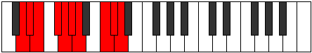 |
| [3319](https://ianring.com/musictheory/scales/3319) | [Tholygic](ModeGSharpTholygic.md) | G# | G#, A, A#, C, C#, D, D#, F#, G, G# |  |
| [3319](https://ianring.com/musictheory/scales/3319) | [Tholygic](ModeAFlatTholygic.md) | Ab | Ab, A, Bb, C, Db, D, Eb, Gb, G, Ab |  |
| [3319](https://ianring.com/musictheory/scales/3319) | [Tholygic](ModeCSharpTholygic.md) | C# | C#, D, D#, F, F#, G, G#, B, C, C# |  |
| [3319](https://ianring.com/musictheory/scales/3319) | [Tholygic](ModeDFlatTholygic.md) | Db | Db, D, Eb, F, Gb, G, Ab, B, C, Db |  |
| [3321](https://ianring.com/musictheory/scales/3321) | [Ionycryllic](ModeANaturalIonycryllic.md) | A | A, C, C#, D, D#, E, G, G#, A |  |
| [3321](https://ianring.com/musictheory/scales/3321) | [Ionycryllic](ModeGSharpIonycryllic.md) | G# | G#, B, C, C#, D, D#, F#, G, G# |  |
| [3321](https://ianring.com/musictheory/scales/3321) | [Ionycryllic](ModeAFlatIonycryllic.md) | Ab | Ab, B, C, Db, D, Eb, Gb, G, Ab |  |
| [3323](https://ianring.com/musictheory/scales/3323) | [Phrygygic](ModeDNaturalPhrygygic.md) | D | D, D#, F, F#, G, G#, A, C, C#, D |  |
| [3323](https://ianring.com/musictheory/scales/3323) | [Phrygygic](ModeANaturalPhrygygic.md) | A | A, A#, C, C#, D, D#, E, G, G#, A |  |
| [3323](https://ianring.com/musictheory/scales/3323) | [Phrygygic](ModeGSharpPhrygygic.md) | G# | G#, A, B, C, C#, D, D#, F#, G, G# |  |
| [3323](https://ianring.com/musictheory/scales/3323) | [Phrygygic](ModeAFlatPhrygygic.md) | Ab | Ab, A, B, C, Db, D, Eb, Gb, G, Ab |  |
| [3325](https://ianring.com/musictheory/scales/3325) | [Epygic](ModeCSharpEpygic.md) | C# | C#, D#, E, F, F#, G, G#, B, C, C# |  |
| [3325](https://ianring.com/musictheory/scales/3325) | [Epygic](ModeDFlatEpygic.md) | Db | Db, Eb, E, F, Gb, G, Ab, B, C, Db |  |
| [3325](https://ianring.com/musictheory/scales/3325) | [Epygic](ModeANaturalEpygic.md) | A | A, B, C, C#, D, D#, E, G, G#, A |  |
| [3325](https://ianring.com/musictheory/scales/3325) | [Epygic](ModeGSharpEpygic.md) | G# | G#, A#, B, C, C#, D, D#, F#, G, G# |  |
| [3325](https://ianring.com/musictheory/scales/3325) | [Epygic](ModeAFlatEpygic.md) | Ab | Ab, Bb, B, C, Db, D, Eb, Gb, G, Ab |  |
| [3327](https://ianring.com/musictheory/scales/3327) | [Madyllian](ModeDNaturalMadyllian.md) | D | D, D#, E, F, F#, G, G#, A, C, C#, D |  |
| [3327](https://ianring.com/musictheory/scales/3327) | [Madyllian](ModeCSharpMadyllian.md) | C# | C#, D, D#, E, F, F#, G, G#, B, C, C# |  |
| [3327](https://ianring.com/musictheory/scales/3327) | [Madyllian](ModeDFlatMadyllian.md) | Db | Db, D, Eb, E, F, Gb, G, Ab, B, C, Db |  |
| [3327](https://ianring.com/musictheory/scales/3327) | [Madyllian](ModeANaturalMadyllian.md) | A | A, A#, B, C, C#, D, D#, E, G, G#, A |  |
| [3327](https://ianring.com/musictheory/scales/3327) | [Madyllian](ModeGSharpMadyllian.md) | G# | G#, A, A#, B, C, C#, D, D#, F#, G, G# |  |
| [3327](https://ianring.com/musictheory/scales/3327) | [Madyllian](ModeAFlatMadyllian.md) | Ab | Ab, A, Bb, B, C, Db, D, Eb, Gb, G, Ab |  |
| [3417](https://ianring.com/musictheory/scales/3417) | [Golian](ModeANaturalGolian.md) | A | A, B#, C#, D#, E#, F##, G#, A |  |
| [3419](https://ianring.com/musictheory/scales/3419) | [Danyllic](ModeANaturalDanyllic.md) | A | A, A#, C, C#, D#, F, G, G#, A |  |
| [3421](https://ianring.com/musictheory/scales/3421) | [Aerothyllic](ModeANaturalAerothyllic.md) | A | A, B, C, C#, D#, F, G, G#, A |  |
| [3423](https://ianring.com/musictheory/scales/3423) | [Lothygic](ModeANaturalLothygic.md) | A | A, A#, B, C, C#, D#, F, G, G#, A |  |
| [3427](https://ianring.com/musictheory/scales/3427) | [Zacrian](ModeGNaturalZacrian.md) | G | G, Ab, B#, C#, D#, E#, F#, G |  |
| [3427](https://ianring.com/musictheory/scales/3427) | [Zacrian](ModeDNaturalZacrian.md) | D | D, Eb, F##, G#, A#, B#, C#, D |  |
| [3431](https://ianring.com/musictheory/scales/3431) | [Zyptyllic](ModeGNaturalZyptyllic.md) | G | G, G#, A, C, C#, D#, F, F#, G | 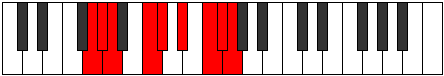 |
| [3431](https://ianring.com/musictheory/scales/3431) | [Zyptyllic](ModeDNaturalZyptyllic.md) | D | D, D#, E, G, G#, A#, C, C#, D |  |
| [3435](https://ianring.com/musictheory/scales/3435) | [Epiphyllic](ModeDNaturalEpiphyllic.md) | D | D, D#, F, G, G#, A#, C, C#, D |  |
| [3435](https://ianring.com/musictheory/scales/3435) | [Epiphyllic](ModeGNaturalEpiphyllic.md) | G | G, G#, A#, C, C#, D#, F, F#, G |  |
| [3439](https://ianring.com/musictheory/scales/3439) | [Lythygic](ModeDNaturalLythygic.md) | D | D, D#, E, F, G, G#, A#, C, C#, D |  |
| [3439](https://ianring.com/musictheory/scales/3439) | [Lythygic](ModeGNaturalLythygic.md) | G | G, G#, A, A#, C, C#, D#, F, F#, G |  |
| [3443](https://ianring.com/musictheory/scales/3443) | [Epathyllic](ModeDNaturalEpathyllic.md) | D | D, D#, F#, G, G#, A#, C, C#, D |  |
| [3443](https://ianring.com/musictheory/scales/3443) | [Epathyllic](ModeGNaturalEpathyllic.md) | G | G, G#, B, C, C#, D#, F, F#, G |  |
| [3447](https://ianring.com/musictheory/scales/3447) | [Kynygic](ModeDNaturalKynygic.md) | D | D, D#, E, F#, G, G#, A#, C, C#, D |  |
| [3447](https://ianring.com/musictheory/scales/3447) | [Kynygic](ModeGNaturalKynygic.md) | G | G, G#, A, B, C, C#, D#, F, F#, G | 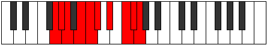 |
| [3449](https://ianring.com/musictheory/scales/3449) | [Bacryllic](ModeANaturalBacryllic.md) | A | A, C, C#, D, D#, F, G, G#, A |  |
| [3451](https://ianring.com/musictheory/scales/3451) | [Garygic](ModeDNaturalGarygic.md) | D | D, D#, F, F#, G, G#, A#, C, C#, D |  |
| [3451](https://ianring.com/musictheory/scales/3451) | [Garygic](ModeANaturalGarygic.md) | A | A, A#, C, C#, D, D#, F, G, G#, A |  |
| [3451](https://ianring.com/musictheory/scales/3451) | [Garygic](ModeGNaturalGarygic.md) | G | G, G#, A#, B, C, C#, D#, F, F#, G |  |
| [3453](https://ianring.com/musictheory/scales/3453) | [Katarygic](ModeANaturalKatarygic.md) | A | A, B, C, C#, D, D#, F, G, G#, A |  |
| [3455](https://ianring.com/musictheory/scales/3455) | [Ryptyllian](ModeDNaturalRyptyllian.md) | D | D, D#, E, F, F#, G, G#, A#, C, C#, D |  |
| [3455](https://ianring.com/musictheory/scales/3455) | [Ryptyllian](ModeANaturalRyptyllian.md) | A | A, A#, B, C, C#, D, D#, F, G, G#, A |  |
| [3455](https://ianring.com/musictheory/scales/3455) | [Ryptyllian](ModeGNaturalRyptyllian.md) | G | G, G#, A, A#, B, C, C#, D#, F, F#, G |  |
| [3467](https://ianring.com/musictheory/scales/3467) | [Katonian](ModeCNaturalKatonian.md) | C | C, Db, Eb, F##, G#, A#, B, C | 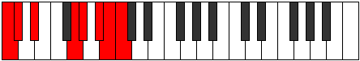 |
| [3469](https://ianring.com/musictheory/scales/3469) | [Monian](ModeFNaturalMonian.md) | F | F, G, Ab, B#, C#, D#, E, F |  |
| [3471](https://ianring.com/musictheory/scales/3471) | [Gyryllic](ModeFNaturalGyryllic.md) | F | F, F#, G, G#, C, C#, D#, E, F |  |
| [3471](https://ianring.com/musictheory/scales/3471) | [Gyryllic](ModeCNaturalGyryllic.md) | C | C, C#, D, D#, G, G#, A#, B, C |  |
| [3483](https://ianring.com/musictheory/scales/3483) | [Mixotharyllic](ModeCNaturalMixotharyllic.md) | C | C, C#, D#, E, G, G#, A#, B, C |  |
| [3485](https://ianring.com/musictheory/scales/3485) | [Kyptyllic](ModeFNaturalKyptyllic.md) | F | F, G, G#, A, C, C#, D#, E, F |  |
| [3487](https://ianring.com/musictheory/scales/3487) | [Byptygic](ModeFNaturalByptygic.md) | F | F, F#, G, G#, A, C, C#, D#, E, F |  |
| [3487](https://ianring.com/musictheory/scales/3487) | [Byptygic](ModeCNaturalByptygic.md) | C | C, C#, D, D#, E, G, G#, A#, B, C |  |
| [3499](https://ianring.com/musictheory/scales/3499) | [Lythyllic](ModeCNaturalLythyllic.md) | C | C, C#, D#, F, G, G#, A#, B, C |  |
| [3501](https://ianring.com/musictheory/scales/3501) | [Katodyllic](ModeFNaturalKatodyllic.md) | F | F, G, G#, A#, C, C#, D#, E, F |  |
| [3503](https://ianring.com/musictheory/scales/3503) | [Zyphygic](ModeFNaturalZyphygic.md) | F | F, F#, G, G#, A#, C, C#, D#, E, F |  |
| [3503](https://ianring.com/musictheory/scales/3503) | [Zyphygic](ModeCNaturalZyphygic.md) | C | C, C#, D, D#, F, G, G#, A#, B, C |  |
| [3505](https://ianring.com/musictheory/scales/3505) | [Stygian](ModeGSharpStygian.md) | G# | G#, A###, B##, C###, D##, E##, F##, G# |  |
| [3505](https://ianring.com/musictheory/scales/3505) | [Stygian](ModeAFlatStygian.md) | Ab | Ab, B#, C#, D#, E, F#, G, Ab |  |
| [3507](https://ianring.com/musictheory/scales/3507) | [Ponyllic](ModeGSharpPonyllic.md) | G# | G#, A, C, C#, D#, E, F#, G, G# |  |
| [3507](https://ianring.com/musictheory/scales/3507) | [Ponyllic](ModeAFlatPonyllic.md) | Ab | Ab, A, C, Db, Eb, E, Gb, G, Ab |  |
| [3509](https://ianring.com/musictheory/scales/3509) | [Stogyllic](ModeGSharpStogyllic.md) | G# | G#, A#, C, C#, D#, E, F#, G, G# |  |
| [3509](https://ianring.com/musictheory/scales/3509) | [Stogyllic](ModeAFlatStogyllic.md) | Ab | Ab, Bb, C, Db, Eb, E, Gb, G, Ab |  |
| [3511](https://ianring.com/musictheory/scales/3511) | [Epolygic](ModeGSharpEpolygic.md) | G# | G#, A, A#, C, C#, D#, E, F#, G, G# |  |
| [3511](https://ianring.com/musictheory/scales/3511) | [Epolygic](ModeAFlatEpolygic.md) | Ab | Ab, A, Bb, C, Db, Eb, E, Gb, G, Ab |  |
| [3513](https://ianring.com/musictheory/scales/3513) | [Dydyllic](ModeGSharpDydyllic.md) | G# | G#, B, C, C#, D#, E, F#, G, G# |  |
| [3513](https://ianring.com/musictheory/scales/3513) | [Dydyllic](ModeAFlatDydyllic.md) | Ab | Ab, B, C, Db, Eb, E, Gb, G, Ab |  |
| [3515](https://ianring.com/musictheory/scales/3515) | [Katodygic](ModeGSharpKatodygic.md) | G# | G#, A, B, C, C#, D#, E, F#, G, G# |  |
| [3515](https://ianring.com/musictheory/scales/3515) | [Katodygic](ModeAFlatKatodygic.md) | Ab | Ab, A, B, C, Db, Eb, E, Gb, G, Ab |  |
| [3515](https://ianring.com/musictheory/scales/3515) | [Katodygic](ModeCNaturalKatodygic.md) | C | C, C#, D#, E, F, G, G#, A#, B, C |  |
| [3517](https://ianring.com/musictheory/scales/3517) | [Epocrygic](ModeFNaturalEpocrygic.md) | F | F, G, G#, A, A#, C, C#, D#, E, F |  |
| [3517](https://ianring.com/musictheory/scales/3517) | [Epocrygic](ModeGSharpEpocrygic.md) | G# | G#, A#, B, C, C#, D#, E, F#, G, G# |  |
| [3517](https://ianring.com/musictheory/scales/3517) | [Epocrygic](ModeAFlatEpocrygic.md) | Ab | Ab, Bb, B, C, Db, Eb, E, Gb, G, Ab |  |
| [3519](https://ianring.com/musictheory/scales/3519) | [Boptyllian](ModeFNaturalBoptyllian.md) | F | F, F#, G, G#, A, A#, C, C#, D#, E, F |  |
| [3519](https://ianring.com/musictheory/scales/3519) | [Boptyllian](ModeCNaturalBoptyllian.md) | C | C, C#, D, D#, E, F, G, G#, A#, B, C |  |
| [3519](https://ianring.com/musictheory/scales/3519) | [Boptyllian](ModeGSharpBoptyllian.md) | G# | G#, A, A#, B, C, C#, D#, E, F#, G, G# |  |
| [3519](https://ianring.com/musictheory/scales/3519) | [Boptyllian](ModeAFlatBoptyllian.md) | Ab | Ab, A, Bb, B, C, Db, Eb, E, Gb, G, Ab |  |
| [3525](https://ianring.com/musictheory/scales/3525) | [Zocrian](ModeDFlatZocrian.md) | Db | Db, Eb, F##, G#, A, B, C, Db |  |
| [3527](https://ianring.com/musictheory/scales/3527) | [Ronyllic](ModeCSharpRonyllic.md) | C# | C#, D, D#, G, G#, A, B, C, C# |  |
| [3527](https://ianring.com/musictheory/scales/3527) | [Ronyllic](ModeDFlatRonyllic.md) | Db | Db, D, Eb, G, Ab, A, B, C, Db |  |
| [3531](https://ianring.com/musictheory/scales/3531) | [Dycryllic](ModeCNaturalDycryllic.md) | C | C, C#, D#, F#, G, G#, A#, B, C |  |
| [3533](https://ianring.com/musictheory/scales/3533) | [Thadyllic](ModeFNaturalThadyllic.md) | F | F, G, G#, B, C, C#, D#, E, F |  |
| [3533](https://ianring.com/musictheory/scales/3533) | [Thadyllic](ModeCSharpThadyllic.md) | C# | C#, D#, E, G, G#, A, B, C, C# |  |
| [3533](https://ianring.com/musictheory/scales/3533) | [Thadyllic](ModeDFlatThadyllic.md) | Db | Db, Eb, E, G, Ab, A, B, C, Db |  |
| [3535](https://ianring.com/musictheory/scales/3535) | [Aeroptygic](ModeFNaturalAeroptygic.md) | F | F, F#, G, G#, B, C, C#, D#, E, F |  |
| [3535](https://ianring.com/musictheory/scales/3535) | [Aeroptygic](ModeCSharpAeroptygic.md) | C# | C#, D, D#, E, G, G#, A, B, C, C# |  |
| [3535](https://ianring.com/musictheory/scales/3535) | [Aeroptygic](ModeDFlatAeroptygic.md) | Db | Db, D, Eb, E, G, Ab, A, B, C, Db |  |
| [3535](https://ianring.com/musictheory/scales/3535) | [Aeroptygic](ModeCNaturalAeroptygic.md) | C | C, C#, D, D#, F#, G, G#, A#, B, C |  |
| [3541](https://ianring.com/musictheory/scales/3541) | [Racryllic](ModeCSharpRacryllic.md) | C# | C#, D#, F, G, G#, A, B, C, C# |  |
| [3541](https://ianring.com/musictheory/scales/3541) | [Racryllic](ModeDFlatRacryllic.md) | Db | Db, Eb, F, G, Ab, A, B, C, Db |  |
| [3543](https://ianring.com/musictheory/scales/3543) | [Aeolonygic](ModeCSharpAeolonygic.md) | C# | C#, D, D#, F, G, G#, A, B, C, C# |  |
| [3543](https://ianring.com/musictheory/scales/3543) | [Aeolonygic](ModeDFlatAeolonygic.md) | Db | Db, D, Eb, F, G, Ab, A, B, C, Db |  |
| [3545](https://ianring.com/musictheory/scales/3545) | [Thyptyllic](ModeANaturalThyptyllic.md) | A | A, C, C#, D#, E, F, G, G#, A |  |
| [3547](https://ianring.com/musictheory/scales/3547) | [Sadygic](ModeANaturalSadygic.md) | A | A, A#, C, C#, D#, E, F, G, G#, A |  |
| [3547](https://ianring.com/musictheory/scales/3547) | [Sadygic](ModeCNaturalSadygic.md) | C | C, C#, D#, E, F#, G, G#, A#, B, C |  |
| [3549](https://ianring.com/musictheory/scales/3549) | [Phronygic](ModeCSharpPhronygic.md) | C# | C#, D#, E, F, G, G#, A, B, C, C# |  |
| [3549](https://ianring.com/musictheory/scales/3549) | [Phronygic](ModeDFlatPhronygic.md) | Db | Db, Eb, E, F, G, Ab, A, B, C, Db |  |
| [3549](https://ianring.com/musictheory/scales/3549) | [Phronygic](ModeFNaturalPhronygic.md) | F | F, G, G#, A, B, C, C#, D#, E, F |  |
| [3549](https://ianring.com/musictheory/scales/3549) | [Phronygic](ModeANaturalPhronygic.md) | A | A, B, C, C#, D#, E, F, G, G#, A |  |
| [3551](https://ianring.com/musictheory/scales/3551) | [Sagyllian](ModeCSharpSagyllian.md) | C# | C#, D, D#, E, F, G, G#, A, B, C, C# |  |
| [3551](https://ianring.com/musictheory/scales/3551) | [Sagyllian](ModeDFlatSagyllian.md) | Db | Db, D, Eb, E, F, G, Ab, A, B, C, Db |  |
| [3551](https://ianring.com/musictheory/scales/3551) | [Sagyllian](ModeFNaturalSagyllian.md) | F | F, F#, G, G#, A, B, C, C#, D#, E, F |  |
| [3551](https://ianring.com/musictheory/scales/3551) | [Sagyllian](ModeCNaturalSagyllian.md) | C | C, C#, D, D#, E, F#, G, G#, A#, B, C |  |
| [3551](https://ianring.com/musictheory/scales/3551) | [Sagyllian](ModeANaturalSagyllian.md) | A | A, A#, B, C, C#, D#, E, F, G, G#, A |  |
| [3555](https://ianring.com/musictheory/scales/3555) | [Pylyllic](ModeGNaturalPylyllic.md) | G | G, G#, C, C#, D, D#, F, F#, G |  |
| [3555](https://ianring.com/musictheory/scales/3555) | [Pylyllic](ModeDNaturalPylyllic.md) | D | D, D#, G, G#, A, A#, C, C#, D |  |
| [3557](https://ianring.com/musictheory/scales/3557) | [Thycryllic](ModeCSharpThycryllic.md) | C# | C#, D#, F#, G, G#, A, B, C, C# |  |
| [3557](https://ianring.com/musictheory/scales/3557) | [Thycryllic](ModeDFlatThycryllic.md) | Db | Db, Eb, Gb, G, Ab, A, B, C, Db |  |
| [3559](https://ianring.com/musictheory/scales/3559) | [Aerathygic](ModeGNaturalAerathygic.md) | G | G, G#, A, C, C#, D, D#, F, F#, G |  |
| [3559](https://ianring.com/musictheory/scales/3559) | [Aerathygic](ModeDNaturalAerathygic.md) | D | D, D#, E, G, G#, A, A#, C, C#, D |  |
| [3559](https://ianring.com/musictheory/scales/3559) | [Aerathygic](ModeCSharpAerathygic.md) | C# | C#, D, D#, F#, G, G#, A, B, C, C# |  |
| [3559](https://ianring.com/musictheory/scales/3559) | [Aerathygic](ModeDFlatAerathygic.md) | Db | Db, D, Eb, Gb, G, Ab, A, B, C, Db |  |
| [3563](https://ianring.com/musictheory/scales/3563) | [Ionoptygic](ModeGNaturalIonoptygic.md) | G | G, G#, A#, C, C#, D, D#, F, F#, G |  |
| [3563](https://ianring.com/musictheory/scales/3563) | [Ionoptygic](ModeDNaturalIonoptygic.md) | D | D, D#, F, G, G#, A, A#, C, C#, D |  |
| [3563](https://ianring.com/musictheory/scales/3563) | [Ionoptygic](ModeCNaturalIonoptygic.md) | C | C, C#, D#, F, F#, G, G#, A#, B, C |  |
| [3565](https://ianring.com/musictheory/scales/3565) | [Aeolorygic](ModeCSharpAeolorygic.md) | C# | C#, D#, E, F#, G, G#, A, B, C, C# |  |
| [3565](https://ianring.com/musictheory/scales/3565) | [Aeolorygic](ModeDFlatAeolorygic.md) | Db | Db, Eb, E, Gb, G, Ab, A, B, C, Db |  |
| [3565](https://ianring.com/musictheory/scales/3565) | [Aeolorygic](ModeFNaturalAeolorygic.md) | F | F, G, G#, A#, B, C, C#, D#, E, F |  |
| [3567](https://ianring.com/musictheory/scales/3567) | [Epityllian](ModeDNaturalEpityllian.md) | D | D, D#, E, F, G, G#, A, A#, C, C#, D |  |
| [3567](https://ianring.com/musictheory/scales/3567) | [Epityllian](ModeGNaturalEpityllian.md) | G | G, G#, A, A#, C, C#, D, D#, F, F#, G |  |
| [3567](https://ianring.com/musictheory/scales/3567) | [Epityllian](ModeCSharpEpityllian.md) | C# | C#, D, D#, E, F#, G, G#, A, B, C, C# |  |
| [3567](https://ianring.com/musictheory/scales/3567) | [Epityllian](ModeDFlatEpityllian.md) | Db | Db, D, Eb, E, Gb, G, Ab, A, B, C, Db |  |
| [3567](https://ianring.com/musictheory/scales/3567) | [Epityllian](ModeCNaturalEpityllian.md) | C | C, C#, D, D#, F, F#, G, G#, A#, B, C |  |
| [3567](https://ianring.com/musictheory/scales/3567) | [Epityllian](ModeFNaturalEpityllian.md) | F | F, F#, G, G#, A#, B, C, C#, D#, E, F |  |
| [3569](https://ianring.com/musictheory/scales/3569) | [Aeoladyllic](ModeGSharpAeoladyllic.md) | G# | G#, C, C#, D, D#, E, F#, G, G# |  |
| [3569](https://ianring.com/musictheory/scales/3569) | [Aeoladyllic](ModeAFlatAeoladyllic.md) | Ab | Ab, C, Db, D, Eb, E, Gb, G, Ab | 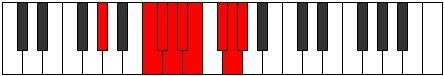 |
| [3571](https://ianring.com/musictheory/scales/3571) | [Dyrygic](ModeGSharpDyrygic.md) | G# | G#, A, C, C#, D, D#, E, F#, G, G# |  |
| [3571](https://ianring.com/musictheory/scales/3571) | [Dyrygic](ModeAFlatDyrygic.md) | Ab | Ab, A, C, Db, D, Eb, E, Gb, G, Ab |  |
| [3571](https://ianring.com/musictheory/scales/3571) | [Dyrygic](ModeDNaturalDyrygic.md) | D | D, D#, F#, G, G#, A, A#, C, C#, D |  |
| [3571](https://ianring.com/musictheory/scales/3571) | [Dyrygic](ModeGNaturalDyrygic.md) | G | G, G#, B, C, C#, D, D#, F, F#, G |  |
| [3573](https://ianring.com/musictheory/scales/3573) | [Kaptygic](ModeGSharpKaptygic.md) | G# | G#, A#, C, C#, D, D#, E, F#, G, G# |  |
| [3573](https://ianring.com/musictheory/scales/3573) | [Kaptygic](ModeAFlatKaptygic.md) | Ab | Ab, Bb, C, Db, D, Eb, E, Gb, G, Ab |  |
| [3573](https://ianring.com/musictheory/scales/3573) | [Kaptygic](ModeCSharpKaptygic.md) | C# | C#, D#, F, F#, G, G#, A, B, C, C# |  |
| [3573](https://ianring.com/musictheory/scales/3573) | [Kaptygic](ModeDFlatKaptygic.md) | Db | Db, Eb, F, Gb, G, Ab, A, B, C, Db |  |
| [3575](https://ianring.com/musictheory/scales/3575) | [Mogyllian](ModeDNaturalMogyllian.md) | D | D, D#, E, F#, G, G#, A, A#, C, C#, D |  |
| [3575](https://ianring.com/musictheory/scales/3575) | [Mogyllian](ModeGSharpMogyllian.md) | G# | G#, A, A#, C, C#, D, D#, E, F#, G, G# |  |
| [3575](https://ianring.com/musictheory/scales/3575) | [Mogyllian](ModeAFlatMogyllian.md) | Ab | Ab, A, Bb, C, Db, D, Eb, E, Gb, G, Ab |  |
| [3575](https://ianring.com/musictheory/scales/3575) | [Mogyllian](ModeCSharpMogyllian.md) | C# | C#, D, D#, F, F#, G, G#, A, B, C, C# |  |
| [3575](https://ianring.com/musictheory/scales/3575) | [Mogyllian](ModeDFlatMogyllian.md) | Db | Db, D, Eb, F, Gb, G, Ab, A, B, C, Db |  |
| [3575](https://ianring.com/musictheory/scales/3575) | [Mogyllian](ModeGNaturalMogyllian.md) | G | G, G#, A, B, C, C#, D, D#, F, F#, G |  |
| [3577](https://ianring.com/musictheory/scales/3577) | [Loptygic](ModeANaturalLoptygic.md) | A | A, C, C#, D, D#, E, F, G, G#, A |  |
| [3577](https://ianring.com/musictheory/scales/3577) | [Loptygic](ModeGSharpLoptygic.md) | G# | G#, B, C, C#, D, D#, E, F#, G, G# |  |
| [3577](https://ianring.com/musictheory/scales/3577) | [Loptygic](ModeAFlatLoptygic.md) | Ab | Ab, B, C, Db, D, Eb, E, Gb, G, Ab |  |
| [3579](https://ianring.com/musictheory/scales/3579) | [Zyphyllian](ModeANaturalZyphyllian.md) | A | A, A#, C, C#, D, D#, E, F, G, G#, A |  |
| [3579](https://ianring.com/musictheory/scales/3579) | [Zyphyllian](ModeDNaturalZyphyllian.md) | D | D, D#, F, F#, G, G#, A, A#, C, C#, D |  |
| [3579](https://ianring.com/musictheory/scales/3579) | [Zyphyllian](ModeGSharpZyphyllian.md) | G# | G#, A, B, C, C#, D, D#, E, F#, G, G# |  |
| [3579](https://ianring.com/musictheory/scales/3579) | [Zyphyllian](ModeAFlatZyphyllian.md) | Ab | Ab, A, B, C, Db, D, Eb, E, Gb, G, Ab |  |
| [3579](https://ianring.com/musictheory/scales/3579) | [Zyphyllian](ModeGNaturalZyphyllian.md) | G | G, G#, A#, B, C, C#, D, D#, F, F#, G |  |
| [3579](https://ianring.com/musictheory/scales/3579) | [Zyphyllian](ModeCNaturalZyphyllian.md) | C | C, C#, D#, E, F, F#, G, G#, A#, B, C |  |
| [3581](https://ianring.com/musictheory/scales/3581) | [Epocryllian](ModeANaturalEpocryllian.md) | A | A, B, C, C#, D, D#, E, F, G, G#, A |  |
| [3581](https://ianring.com/musictheory/scales/3581) | [Epocryllian](ModeCSharpEpocryllian.md) | C# | C#, D#, E, F, F#, G, G#, A, B, C, C# |  |
| [3581](https://ianring.com/musictheory/scales/3581) | [Epocryllian](ModeDFlatEpocryllian.md) | Db | Db, Eb, E, F, Gb, G, Ab, A, B, C, Db |  |
| [3581](https://ianring.com/musictheory/scales/3581) | [Epocryllian](ModeGSharpEpocryllian.md) | G# | G#, A#, B, C, C#, D, D#, E, F#, G, G# |  |
| [3581](https://ianring.com/musictheory/scales/3581) | [Epocryllian](ModeAFlatEpocryllian.md) | Ab | Ab, Bb, B, C, Db, D, Eb, E, Gb, G, Ab |  |
| [3581](https://ianring.com/musictheory/scales/3581) | [Epocryllian](ModeFNaturalEpocryllian.md) | F | F, G, G#, A, A#, B, C, C#, D#, E, F |  |
| [3583](https://ianring.com/musictheory/scales/3583) | [Zylatic](ModeDNaturalZylatic.md) | D | D, D#, E, F, F#, G, G#, A, A#, C, C#, D |  |
| [3583](https://ianring.com/musictheory/scales/3583) | [Zylatic](ModeCSharpZylatic.md) | C# | C#, D, D#, E, F, F#, G, G#, A, B, C, C# |  |
| [3583](https://ianring.com/musictheory/scales/3583) | [Zylatic](ModeDFlatZylatic.md) | Db | Db, D, Eb, E, F, Gb, G, Ab, A, B, C, Db |  |
| [3583](https://ianring.com/musictheory/scales/3583) | [Zylatic](ModeCNaturalZylatic.md) | C | C, C#, D, D#, E, F, F#, G, G#, A#, B, C |  |
| [3583](https://ianring.com/musictheory/scales/3583) | [Zylatic](ModeANaturalZylatic.md) | A | A, A#, B, C, C#, D, D#, E, F, G, G#, A |  |
| [3583](https://ianring.com/musictheory/scales/3583) | [Zylatic](ModeGSharpZylatic.md) | G# | G#, A, A#, B, C, C#, D, D#, E, F#, G, G# |  |
| [3583](https://ianring.com/musictheory/scales/3583) | [Zylatic](ModeAFlatZylatic.md) | Ab | Ab, A, Bb, B, C, Db, D, Eb, E, Gb, G, Ab |  |
| [3583](https://ianring.com/musictheory/scales/3583) | [Zylatic](ModeGNaturalZylatic.md) | G | G, G#, A, A#, B, C, C#, D, D#, F, F#, G |  |
| [3583](https://ianring.com/musictheory/scales/3583) | [Zylatic](ModeFNaturalZylatic.md) | F | F, F#, G, G#, A, A#, B, C, C#, D#, E, F |  |
| [3629](https://ianring.com/musictheory/scales/3629) | [Boptian](ModeBFlatBoptian.md) | Bb | Bb, C, Db, Eb, F##, G#, A, Bb |  |
| [3631](https://ianring.com/musictheory/scales/3631) | [Gydyllic](ModeASharpGydyllic.md) | A# | A#, B, C, C#, D#, G, G#, A, A# |  |
| [3631](https://ianring.com/musictheory/scales/3631) | [Gydyllic](ModeBFlatGydyllic.md) | Bb | Bb, B, C, Db, Eb, G, Ab, A, Bb |  |
| [3633](https://ianring.com/musictheory/scales/3633) | [Daptimic](ModeEFlatDaptimic.md) | Eb | Eb, F##, G#, A###, B##, C##, Eb |  |
| [3635](https://ianring.com/musictheory/scales/3635) | [Katygian](ModeDSharpKatygian.md) | D# | D#, E, F##, G#, A###, B##, C##, D# |  |
| [3635](https://ianring.com/musictheory/scales/3635) | [Katygian](ModeEFlatKatygian.md) | Eb | Eb, Fb, G, Ab, B#, C#, D, Eb |  |
| [3637](https://ianring.com/musictheory/scales/3637) | [Kygian](ModeDSharpKygian.md) | D# | D#, E#, F##, G#, A###, B##, C##, D# |  |
| [3637](https://ianring.com/musictheory/scales/3637) | [Kygian](ModeEFlatKygian.md) | Eb | Eb, F, G, Ab, B#, C#, D, Eb |  |
| [3639](https://ianring.com/musictheory/scales/3639) | [Paptyllic](ModeDSharpPaptyllic.md) | D# | D#, E, F, G, G#, C, C#, D, D# |  |
| [3639](https://ianring.com/musictheory/scales/3639) | [Paptyllic](ModeEFlatPaptyllic.md) | Eb | Eb, E, F, G, Ab, C, Db, D, Eb |  |
| [3641](https://ianring.com/musictheory/scales/3641) | [Thocrian](ModeDSharpThocrian.md) | D# | D#, E##, F##, G#, A###, B##, C##, D# |  |
| [3641](https://ianring.com/musictheory/scales/3641) | [Thocrian](ModeEFlatThocrian.md) | Eb | Eb, F#, G, Ab, B#, C#, D, Eb |  |
| [3643](https://ianring.com/musictheory/scales/3643) | [Kydyllic](ModeDSharpKydyllic.md) | D# | D#, E, F#, G, G#, C, C#, D, D# |  |
| [3643](https://ianring.com/musictheory/scales/3643) | [Kydyllic](ModeEFlatKydyllic.md) | Eb | Eb, E, Gb, G, Ab, C, Db, D, Eb |  |
| [3645](https://ianring.com/musictheory/scales/3645) | [Zycryllic](ModeDSharpZycryllic.md) | D# | D#, F, F#, G, G#, C, C#, D, D# |  |
| [3645](https://ianring.com/musictheory/scales/3645) | [Zycryllic](ModeEFlatZycryllic.md) | Eb | Eb, F, Gb, G, Ab, C, Db, D, Eb |  |
| [3645](https://ianring.com/musictheory/scales/3645) | [Zycryllic](ModeASharpZycryllic.md) | A# | A#, C, C#, D, D#, G, G#, A, A# |  |
| [3645](https://ianring.com/musictheory/scales/3645) | [Zycryllic](ModeBFlatZycryllic.md) | Bb | Bb, C, Db, D, Eb, G, Ab, A, Bb |  |
| [3647](https://ianring.com/musictheory/scales/3647) | [Eporygic](ModeDSharpEporygic.md) | D# | D#, E, F, F#, G, G#, C, C#, D, D# |  |
| [3647](https://ianring.com/musictheory/scales/3647) | [Eporygic](ModeEFlatEporygic.md) | Eb | Eb, E, F, Gb, G, Ab, C, Db, D, Eb |  |
| [3647](https://ianring.com/musictheory/scales/3647) | [Eporygic](ModeASharpEporygic.md) | A# | A#, B, C, C#, D, D#, G, G#, A, A# |  |
| [3647](https://ianring.com/musictheory/scales/3647) | [Eporygic](ModeBFlatEporygic.md) | Bb | Bb, B, C, Db, D, Eb, G, Ab, A, Bb |  |
| [3673](https://ianring.com/musictheory/scales/3673) | [Ranian](ModeANaturalRanian.md) | A | A, B#, C#, D#, E##, F##, G#, A |  |
| [3675](https://ianring.com/musictheory/scales/3675) | [Monyllic](ModeANaturalMonyllic.md) | A | A, A#, C, C#, D#, F#, G, G#, A |  |
| [3677](https://ianring.com/musictheory/scales/3677) | [Katylyllic](ModeANaturalKatylyllic.md) | A | A, B, C, C#, D#, F#, G, G#, A |  |
| [3679](https://ianring.com/musictheory/scales/3679) | [Rycrygic](ModeANaturalRycrygic.md) | A | A, A#, B, C, C#, D#, F#, G, G#, A |  |
| [3683](https://ianring.com/musictheory/scales/3683) | [Dycrian](ModeDNaturalDycrian.md) | D | D, Eb, F##, G#, A##, B#, C#, D |  |
| [3687](https://ianring.com/musictheory/scales/3687) | [Zonyllic](ModeDNaturalZonyllic.md) | D | D, D#, E, G, G#, B, C, C#, D |  |
| [3691](https://ianring.com/musictheory/scales/3691) | [Badyllic](ModeDNaturalBadyllic.md) | D | D, D#, F, G, G#, B, C, C#, D |  |
| [3693](https://ianring.com/musictheory/scales/3693) | [Epaptyllic](ModeASharpEpaptyllic.md) | A# | A#, C, C#, D#, E, G, G#, A, A# |  |
| [3693](https://ianring.com/musictheory/scales/3693) | [Epaptyllic](ModeBFlatEpaptyllic.md) | Bb | Bb, C, Db, Eb, E, G, Ab, A, Bb |  |
| [3695](https://ianring.com/musictheory/scales/3695) | [Kodygic](ModeDNaturalKodygic.md) | D | D, D#, E, F, G, G#, B, C, C#, D |  |
| [3695](https://ianring.com/musictheory/scales/3695) | [Kodygic](ModeASharpKodygic.md) | A# | A#, B, C, C#, D#, E, G, G#, A, A# |  |
| [3695](https://ianring.com/musictheory/scales/3695) | [Kodygic](ModeBFlatKodygic.md) | Bb | Bb, B, C, Db, Eb, E, G, Ab, A, Bb |  |
| [3697](https://ianring.com/musictheory/scales/3697) | [Ionarian](ModeEFlatIonarian.md) | Eb | Eb, F##, G#, A, B#, C#, D, Eb |  |
| [3699](https://ianring.com/musictheory/scales/3699) | [Aeolylyllic](ModeDSharpAeolylyllic.md) | D# | D#, E, G, G#, A, C, C#, D, D# |  |
| [3699](https://ianring.com/musictheory/scales/3699) | [Aeolylyllic](ModeEFlatAeolylyllic.md) | Eb | Eb, E, G, Ab, A, C, Db, D, Eb |  |
| [3699](https://ianring.com/musictheory/scales/3699) | [Aeolylyllic](ModeDNaturalAeolylyllic.md) | D | D, D#, F#, G, G#, B, C, C#, D |  |
| [3701](https://ianring.com/musictheory/scales/3701) | [Bagyllic](ModeDSharpBagyllic.md) | D# | D#, F, G, G#, A, C, C#, D, D# |  |
| [3701](https://ianring.com/musictheory/scales/3701) | [Bagyllic](ModeEFlatBagyllic.md) | Eb | Eb, F, G, Ab, A, C, Db, D, Eb |  |
| [3703](https://ianring.com/musictheory/scales/3703) | [Katalygic](ModeDSharpKatalygic.md) | D# | D#, E, F, G, G#, A, C, C#, D, D# |  |
| [3703](https://ianring.com/musictheory/scales/3703) | [Katalygic](ModeEFlatKatalygic.md) | Eb | Eb, E, F, G, Ab, A, C, Db, D, Eb |  |
| [3703](https://ianring.com/musictheory/scales/3703) | [Katalygic](ModeDNaturalKatalygic.md) | D | D, D#, E, F#, G, G#, B, C, C#, D |  |
| [3705](https://ianring.com/musictheory/scales/3705) | [Sydyllic](ModeDSharpSydyllic.md) | D# | D#, F#, G, G#, A, C, C#, D, D# |  |
| [3705](https://ianring.com/musictheory/scales/3705) | [Sydyllic](ModeEFlatSydyllic.md) | Eb | Eb, Gb, G, Ab, A, C, Db, D, Eb |  |
| [3705](https://ianring.com/musictheory/scales/3705) | [Sydyllic](ModeANaturalSydyllic.md) | A | A, C, C#, D, D#, F#, G, G#, A |  |
| [3707](https://ianring.com/musictheory/scales/3707) | [Rynygic](ModeDSharpRynygic.md) | D# | D#, E, F#, G, G#, A, C, C#, D, D# |  |
| [3707](https://ianring.com/musictheory/scales/3707) | [Rynygic](ModeEFlatRynygic.md) | Eb | Eb, E, Gb, G, Ab, A, C, Db, D, Eb |  |
| [3707](https://ianring.com/musictheory/scales/3707) | [Rynygic](ModeANaturalRynygic.md) | A | A, A#, C, C#, D, D#, F#, G, G#, A |  |
| [3707](https://ianring.com/musictheory/scales/3707) | [Rynygic](ModeDNaturalRynygic.md) | D | D, D#, F, F#, G, G#, B, C, C#, D |  |
| [3709](https://ianring.com/musictheory/scales/3709) | [Locrygic](ModeDSharpLocrygic.md) | D# | D#, F, F#, G, G#, A, C, C#, D, D# |  |
| [3709](https://ianring.com/musictheory/scales/3709) | [Locrygic](ModeEFlatLocrygic.md) | Eb | Eb, F, Gb, G, Ab, A, C, Db, D, Eb |  |
| [3709](https://ianring.com/musictheory/scales/3709) | [Locrygic](ModeASharpLocrygic.md) | A# | A#, C, C#, D, D#, E, G, G#, A, A# |  |
| [3709](https://ianring.com/musictheory/scales/3709) | [Locrygic](ModeBFlatLocrygic.md) | Bb | Bb, C, Db, D, Eb, E, G, Ab, A, Bb |  |
| [3709](https://ianring.com/musictheory/scales/3709) | [Locrygic](ModeANaturalLocrygic.md) | A | A, B, C, C#, D, D#, F#, G, G#, A |  |
| [3711](https://ianring.com/musictheory/scales/3711) | [Dycryllian](ModeDSharpDycryllian.md) | D# | D#, E, F, F#, G, G#, A, C, C#, D, D# |  |
| [3711](https://ianring.com/musictheory/scales/3711) | [Dycryllian](ModeEFlatDycryllian.md) | Eb | Eb, E, F, Gb, G, Ab, A, C, Db, D, Eb |  |
| [3711](https://ianring.com/musictheory/scales/3711) | [Dycryllian](ModeDNaturalDycryllian.md) | D | D, D#, E, F, F#, G, G#, B, C, C#, D |  |
| [3711](https://ianring.com/musictheory/scales/3711) | [Dycryllian](ModeASharpDycryllian.md) | A# | A#, B, C, C#, D, D#, E, G, G#, A, A# |  |
| [3711](https://ianring.com/musictheory/scales/3711) | [Dycryllian](ModeBFlatDycryllian.md) | Bb | Bb, B, C, Db, D, Eb, E, G, Ab, A, Bb |  |
| [3711](https://ianring.com/musictheory/scales/3711) | [Dycryllian](ModeANaturalDycryllian.md) | A | A, A#, B, C, C#, D, D#, F#, G, G#, A |  |
| [3757](https://ianring.com/musictheory/scales/3757) | [Goptyllic](ModeASharpGoptyllic.md) | A# | A#, C, C#, D#, F, G, G#, A, A# |  |
| [3757](https://ianring.com/musictheory/scales/3757) | [Goptyllic](ModeBFlatGoptyllic.md) | Bb | Bb, C, Db, Eb, F, G, Ab, A, Bb |  |
| [3759](https://ianring.com/musictheory/scales/3759) | [Darygic](ModeASharpDarygic.md) | A# | A#, B, C, C#, D#, F, G, G#, A, A# |  |
| [3759](https://ianring.com/musictheory/scales/3759) | [Darygic](ModeBFlatDarygic.md) | Bb | Bb, B, C, Db, Eb, F, G, Ab, A, Bb |  |
| [3761](https://ianring.com/musictheory/scales/3761) | [Ionythian](ModeGSharpIonythian.md) | G# | G#, A###, B##, C###, D###, E##, F##, G# |  |
| [3761](https://ianring.com/musictheory/scales/3761) | [Ionythian](ModeAFlatIonythian.md) | Ab | Ab, B#, C#, D#, E#, F#, G, Ab |  |
| [3761](https://ianring.com/musictheory/scales/3761) | [Ionythian](ModeEFlatIonythian.md) | Eb | Eb, F##, G#, A#, B#, C#, D, Eb |  |
| [3763](https://ianring.com/musictheory/scales/3763) | [Modyllic](ModeGSharpModyllic.md) | G# | G#, A, C, C#, D#, F, F#, G, G# |  |
| [3763](https://ianring.com/musictheory/scales/3763) | [Modyllic](ModeAFlatModyllic.md) | Ab | Ab, A, C, Db, Eb, F, Gb, G, Ab |  |
| [3763](https://ianring.com/musictheory/scales/3763) | [Modyllic](ModeDSharpModyllic.md) | D# | D#, E, G, G#, A#, C, C#, D, D# |  |
| [3763](https://ianring.com/musictheory/scales/3763) | [Modyllic](ModeEFlatModyllic.md) | Eb | Eb, E, G, Ab, Bb, C, Db, D, Eb |  |
| [3765](https://ianring.com/musictheory/scales/3765) | [Aerycryllic](ModeDSharpAerycryllic.md) | D# | D#, F, G, G#, A#, C, C#, D, D# |  |
| [3765](https://ianring.com/musictheory/scales/3765) | [Aerycryllic](ModeEFlatAerycryllic.md) | Eb | Eb, F, G, Ab, Bb, C, Db, D, Eb |  |
| [3765](https://ianring.com/musictheory/scales/3765) | [Aerycryllic](ModeGSharpAerycryllic.md) | G# | G#, A#, C, C#, D#, F, F#, G, G# |  |
| [3765](https://ianring.com/musictheory/scales/3765) | [Aerycryllic](ModeAFlatAerycryllic.md) | Ab | Ab, Bb, C, Db, Eb, F, Gb, G, Ab |  |
| [3767](https://ianring.com/musictheory/scales/3767) | [Bacrygic](ModeDSharpBacrygic.md) | D# | D#, E, F, G, G#, A#, C, C#, D, D# |  |
| [3767](https://ianring.com/musictheory/scales/3767) | [Bacrygic](ModeEFlatBacrygic.md) | Eb | Eb, E, F, G, Ab, Bb, C, Db, D, Eb |  |
| [3767](https://ianring.com/musictheory/scales/3767) | [Bacrygic](ModeGSharpBacrygic.md) | G# | G#, A, A#, C, C#, D#, F, F#, G, G# |  |
| [3767](https://ianring.com/musictheory/scales/3767) | [Bacrygic](ModeAFlatBacrygic.md) | Ab | Ab, A, Bb, C, Db, Eb, F, Gb, G, Ab |  |
| [3769](https://ianring.com/musictheory/scales/3769) | [Aeracryllic](ModeDSharpAeracryllic.md) | D# | D#, F#, G, G#, A#, C, C#, D, D# |  |
| [3769](https://ianring.com/musictheory/scales/3769) | [Aeracryllic](ModeEFlatAeracryllic.md) | Eb | Eb, Gb, G, Ab, Bb, C, Db, D, Eb |  |
| [3769](https://ianring.com/musictheory/scales/3769) | [Aeracryllic](ModeGSharpAeracryllic.md) | G# | G#, B, C, C#, D#, F, F#, G, G# |  |
| [3769](https://ianring.com/musictheory/scales/3769) | [Aeracryllic](ModeAFlatAeracryllic.md) | Ab | Ab, B, C, Db, Eb, F, Gb, G, Ab |  |
| [3771](https://ianring.com/musictheory/scales/3771) | [Stophygic](ModeDSharpStophygic.md) | D# | D#, E, F#, G, G#, A#, C, C#, D, D# |  |
| [3771](https://ianring.com/musictheory/scales/3771) | [Stophygic](ModeEFlatStophygic.md) | Eb | Eb, E, Gb, G, Ab, Bb, C, Db, D, Eb |  |
| [3771](https://ianring.com/musictheory/scales/3771) | [Stophygic](ModeGSharpStophygic.md) | G# | G#, A, B, C, C#, D#, F, F#, G, G# |  |
| [3771](https://ianring.com/musictheory/scales/3771) | [Stophygic](ModeAFlatStophygic.md) | Ab | Ab, A, B, C, Db, Eb, F, Gb, G, Ab |  |
| [3773](https://ianring.com/musictheory/scales/3773) | [Sorygic](ModeDSharpSorygic.md) | D# | D#, F, F#, G, G#, A#, C, C#, D, D# |  |
| [3773](https://ianring.com/musictheory/scales/3773) | [Sorygic](ModeEFlatSorygic.md) | Eb | Eb, F, Gb, G, Ab, Bb, C, Db, D, Eb |  |
| [3773](https://ianring.com/musictheory/scales/3773) | [Sorygic](ModeASharpSorygic.md) | A# | A#, C, C#, D, D#, F, G, G#, A, A# |  |
| [3773](https://ianring.com/musictheory/scales/3773) | [Sorygic](ModeBFlatSorygic.md) | Bb | Bb, C, Db, D, Eb, F, G, Ab, A, Bb |  |
| [3773](https://ianring.com/musictheory/scales/3773) | [Sorygic](ModeGSharpSorygic.md) | G# | G#, A#, B, C, C#, D#, F, F#, G, G# |  |
| [3773](https://ianring.com/musictheory/scales/3773) | [Sorygic](ModeAFlatSorygic.md) | Ab | Ab, Bb, B, C, Db, Eb, F, Gb, G, Ab |  |
| [3775](https://ianring.com/musictheory/scales/3775) | [Loptyllian](ModeDSharpLoptyllian.md) | D# | D#, E, F, F#, G, G#, A#, C, C#, D, D# |  |
| [3775](https://ianring.com/musictheory/scales/3775) | [Loptyllian](ModeEFlatLoptyllian.md) | Eb | Eb, E, F, Gb, G, Ab, Bb, C, Db, D, Eb |  |
| [3775](https://ianring.com/musictheory/scales/3775) | [Loptyllian](ModeASharpLoptyllian.md) | A# | A#, B, C, C#, D, D#, F, G, G#, A, A# |  |
| [3775](https://ianring.com/musictheory/scales/3775) | [Loptyllian](ModeBFlatLoptyllian.md) | Bb | Bb, B, C, Db, D, Eb, F, G, Ab, A, Bb |  |
| [3775](https://ianring.com/musictheory/scales/3775) | [Loptyllian](ModeGSharpLoptyllian.md) | G# | G#, A, A#, B, C, C#, D#, F, F#, G, G# |  |
| [3775](https://ianring.com/musictheory/scales/3775) | [Loptyllian](ModeAFlatLoptyllian.md) | Ab | Ab, A, Bb, B, C, Db, Eb, F, Gb, G, Ab |  |
| [3781](https://ianring.com/musictheory/scales/3781) | [Gyphian](ModeDFlatGyphian.md) | Db | Db, Eb, F##, G#, A#, B, C, Db |  |
| [3783](https://ianring.com/musictheory/scales/3783) | [Phrygyllic](ModeFSharpPhrygyllic.md) | F# | F#, G, G#, C, C#, D#, E, F, F# |  |
| [3783](https://ianring.com/musictheory/scales/3783) | [Phrygyllic](ModeGFlatPhrygyllic.md) | Gb | Gb, G, Ab, C, Db, Eb, E, F, Gb |  |
| [3783](https://ianring.com/musictheory/scales/3783) | [Phrygyllic](ModeCSharpPhrygyllic.md) | C# | C#, D, D#, G, G#, A#, B, C, C# |  |
| [3783](https://ianring.com/musictheory/scales/3783) | [Phrygyllic](ModeDFlatPhrygyllic.md) | Db | Db, D, Eb, G, Ab, Bb, B, C, Db |  |
| [3789](https://ianring.com/musictheory/scales/3789) | [Eporyllic](ModeCSharpEporyllic.md) | C# | C#, D#, E, G, G#, A#, B, C, C# |  |
| [3789](https://ianring.com/musictheory/scales/3789) | [Eporyllic](ModeDFlatEporyllic.md) | Db | Db, Eb, E, G, Ab, Bb, B, C, Db |  |
| [3791](https://ianring.com/musictheory/scales/3791) | [Stodygic](ModeFSharpStodygic.md) | F# | F#, G, G#, A, C, C#, D#, E, F, F# |  |
| [3791](https://ianring.com/musictheory/scales/3791) | [Stodygic](ModeGFlatStodygic.md) | Gb | Gb, G, Ab, A, C, Db, Eb, E, F, Gb |  |
| [3791](https://ianring.com/musictheory/scales/3791) | [Stodygic](ModeCSharpStodygic.md) | C# | C#, D, D#, E, G, G#, A#, B, C, C# |  |
| [3791](https://ianring.com/musictheory/scales/3791) | [Stodygic](ModeDFlatStodygic.md) | Db | Db, D, Eb, E, G, Ab, Bb, B, C, Db |  |
| [3797](https://ianring.com/musictheory/scales/3797) | [Rocryllic](ModeCSharpRocryllic.md) | C# | C#, D#, F, G, G#, A#, B, C, C# |  |
| [3797](https://ianring.com/musictheory/scales/3797) | [Rocryllic](ModeDFlatRocryllic.md) | Db | Db, Eb, F, G, Ab, Bb, B, C, Db |  |
| [3799](https://ianring.com/musictheory/scales/3799) | [Aeralygic](ModeFSharpAeralygic.md) | F# | F#, G, G#, A#, C, C#, D#, E, F, F# |  |
| [3799](https://ianring.com/musictheory/scales/3799) | [Aeralygic](ModeGFlatAeralygic.md) | Gb | Gb, G, Ab, Bb, C, Db, Eb, E, F, Gb |  |
| [3799](https://ianring.com/musictheory/scales/3799) | [Aeralygic](ModeCSharpAeralygic.md) | C# | C#, D, D#, F, G, G#, A#, B, C, C# |  |
| [3799](https://ianring.com/musictheory/scales/3799) | [Aeralygic](ModeDFlatAeralygic.md) | Db | Db, D, Eb, F, G, Ab, Bb, B, C, Db |  |
| [3801](https://ianring.com/musictheory/scales/3801) | [Maptyllic](ModeANaturalMaptyllic.md) | A | A, C, C#, D#, E, F#, G, G#, A |  |
| [3803](https://ianring.com/musictheory/scales/3803) | [Epidygic](ModeANaturalEpidygic.md) | A | A, A#, C, C#, D#, E, F#, G, G#, A |  |
| [3805](https://ianring.com/musictheory/scales/3805) | [Moptygic](ModeANaturalMoptygic.md) | A | A, B, C, C#, D#, E, F#, G, G#, A |  |
| [3805](https://ianring.com/musictheory/scales/3805) | [Moptygic](ModeCSharpMoptygic.md) | C# | C#, D#, E, F, G, G#, A#, B, C, C# |  |
| [3805](https://ianring.com/musictheory/scales/3805) | [Moptygic](ModeDFlatMoptygic.md) | Db | Db, Eb, E, F, G, Ab, Bb, B, C, Db |  |
| [3807](https://ianring.com/musictheory/scales/3807) | [Bagyllian](ModeFSharpBagyllian.md) | F# | F#, G, G#, A, A#, C, C#, D#, E, F, F# |  |
| [3807](https://ianring.com/musictheory/scales/3807) | [Bagyllian](ModeGFlatBagyllian.md) | Gb | Gb, G, Ab, A, Bb, C, Db, Eb, E, F, Gb |  |
| [3807](https://ianring.com/musictheory/scales/3807) | [Bagyllian](ModeCSharpBagyllian.md) | C# | C#, D, D#, E, F, G, G#, A#, B, C, C# |  |
| [3807](https://ianring.com/musictheory/scales/3807) | [Bagyllian](ModeDFlatBagyllian.md) | Db | Db, D, Eb, E, F, G, Ab, Bb, B, C, Db |  |
| [3807](https://ianring.com/musictheory/scales/3807) | [Bagyllian](ModeANaturalBagyllian.md) | A | A, A#, B, C, C#, D#, E, F#, G, G#, A |  |
| [3811](https://ianring.com/musictheory/scales/3811) | [Epogyllic](ModeDNaturalEpogyllic.md) | D | D, D#, G, G#, A, B, C, C#, D | 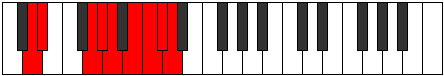 |
| [3813](https://ianring.com/musictheory/scales/3813) | [Aeologyllic](ModeCSharpAeologyllic.md) | C# | C#, D#, F#, G, G#, A#, B, C, C# |  |
| [3813](https://ianring.com/musictheory/scales/3813) | [Aeologyllic](ModeDFlatAeologyllic.md) | Db | Db, Eb, Gb, G, Ab, Bb, B, C, Db |  |
| [3815](https://ianring.com/musictheory/scales/3815) | [Mylygic](ModeFSharpMylygic.md) | F# | F#, G, G#, B, C, C#, D#, E, F, F# |  |
| [3815](https://ianring.com/musictheory/scales/3815) | [Mylygic](ModeGFlatMylygic.md) | Gb | Gb, G, Ab, B, C, Db, Eb, E, F, Gb |  |
| [3815](https://ianring.com/musictheory/scales/3815) | [Mylygic](ModeDNaturalMylygic.md) | D | D, D#, E, G, G#, A, B, C, C#, D |  |
| [3815](https://ianring.com/musictheory/scales/3815) | [Mylygic](ModeCSharpMylygic.md) | C# | C#, D, D#, F#, G, G#, A#, B, C, C# |  |
| [3815](https://ianring.com/musictheory/scales/3815) | [Mylygic](ModeDFlatMylygic.md) | Db | Db, D, Eb, Gb, G, Ab, Bb, B, C, Db |  |
| [3819](https://ianring.com/musictheory/scales/3819) | [Aeolanygic](ModeDNaturalAeolanygic.md) | D | D, D#, F, G, G#, A, B, C, C#, D |  |
| [3821](https://ianring.com/musictheory/scales/3821) | [Epyrygic](ModeASharpEpyrygic.md) | A# | A#, C, C#, D#, E, F, G, G#, A, A# |  |
| [3821](https://ianring.com/musictheory/scales/3821) | [Epyrygic](ModeBFlatEpyrygic.md) | Bb | Bb, C, Db, Eb, E, F, G, Ab, A, Bb |  |
| [3821](https://ianring.com/musictheory/scales/3821) | [Epyrygic](ModeCSharpEpyrygic.md) | C# | C#, D#, E, F#, G, G#, A#, B, C, C# |  |
| [3821](https://ianring.com/musictheory/scales/3821) | [Epyrygic](ModeDFlatEpyrygic.md) | Db | Db, Eb, E, Gb, G, Ab, Bb, B, C, Db |  |
| [3823](https://ianring.com/musictheory/scales/3823) | [Epinyllian](ModeDNaturalEpinyllian.md) | D | D, D#, E, F, G, G#, A, B, C, C#, D |  |
| [3823](https://ianring.com/musictheory/scales/3823) | [Epinyllian](ModeFSharpEpinyllian.md) | F# | F#, G, G#, A, B, C, C#, D#, E, F, F# |  |
| [3823](https://ianring.com/musictheory/scales/3823) | [Epinyllian](ModeGFlatEpinyllian.md) | Gb | Gb, G, Ab, A, B, C, Db, Eb, E, F, Gb |  |
| [3823](https://ianring.com/musictheory/scales/3823) | [Epinyllian](ModeCSharpEpinyllian.md) | C# | C#, D, D#, E, F#, G, G#, A#, B, C, C# |  |
| [3823](https://ianring.com/musictheory/scales/3823) | [Epinyllian](ModeDFlatEpinyllian.md) | Db | Db, D, Eb, E, Gb, G, Ab, Bb, B, C, Db |  |
| [3823](https://ianring.com/musictheory/scales/3823) | [Epinyllian](ModeASharpEpinyllian.md) | A# | A#, B, C, C#, D#, E, F, G, G#, A, A# |  |
| [3823](https://ianring.com/musictheory/scales/3823) | [Epinyllian](ModeBFlatEpinyllian.md) | Bb | Bb, B, C, Db, Eb, E, F, G, Ab, A, Bb |  |
| [3825](https://ianring.com/musictheory/scales/3825) | [Pynyllic](ModeGSharpPynyllic.md) | G# | G#, C, C#, D, D#, F, F#, G, G# |  |
| [3825](https://ianring.com/musictheory/scales/3825) | [Pynyllic](ModeAFlatPynyllic.md) | Ab | Ab, C, Db, D, Eb, F, Gb, G, Ab |  |
| [3825](https://ianring.com/musictheory/scales/3825) | [Pynyllic](ModeDSharpPynyllic.md) | D# | D#, G, G#, A, A#, C, C#, D, D# |  |
| [3825](https://ianring.com/musictheory/scales/3825) | [Pynyllic](ModeEFlatPynyllic.md) | Eb | Eb, G, Ab, A, Bb, C, Db, D, Eb |  |
| [3827](https://ianring.com/musictheory/scales/3827) | [Dorygic](ModeGSharpDorygic.md) | G# | G#, A, C, C#, D, D#, F, F#, G, G# |  |
| [3827](https://ianring.com/musictheory/scales/3827) | [Dorygic](ModeAFlatDorygic.md) | Ab | Ab, A, C, Db, D, Eb, F, Gb, G, Ab |  |
| [3827](https://ianring.com/musictheory/scales/3827) | [Dorygic](ModeDSharpDorygic.md) | D# | D#, E, G, G#, A, A#, C, C#, D, D# |  |
| [3827](https://ianring.com/musictheory/scales/3827) | [Dorygic](ModeEFlatDorygic.md) | Eb | Eb, E, G, Ab, A, Bb, C, Db, D, Eb |  |
| [3827](https://ianring.com/musictheory/scales/3827) | [Dorygic](ModeDNaturalDorygic.md) | D | D, D#, F#, G, G#, A, B, C, C#, D |  |
| [3829](https://ianring.com/musictheory/scales/3829) | [Aerycrygic](ModeGSharpAerycrygic.md) | G# | G#, A#, C, C#, D, D#, F, F#, G, G# |  |
| [3829](https://ianring.com/musictheory/scales/3829) | [Aerycrygic](ModeAFlatAerycrygic.md) | Ab | Ab, Bb, C, Db, D, Eb, F, Gb, G, Ab |  |
| [3829](https://ianring.com/musictheory/scales/3829) | [Aerycrygic](ModeDSharpAerycrygic.md) | D# | D#, F, G, G#, A, A#, C, C#, D, D# |  |
| [3829](https://ianring.com/musictheory/scales/3829) | [Aerycrygic](ModeEFlatAerycrygic.md) | Eb | Eb, F, G, Ab, A, Bb, C, Db, D, Eb |  |
| [3829](https://ianring.com/musictheory/scales/3829) | [Aerycrygic](ModeCSharpAerycrygic.md) | C# | C#, D#, F, F#, G, G#, A#, B, C, C# |  |
| [3829](https://ianring.com/musictheory/scales/3829) | [Aerycrygic](ModeDFlatAerycrygic.md) | Db | Db, Eb, F, Gb, G, Ab, Bb, B, C, Db |  |
| [3831](https://ianring.com/musictheory/scales/3831) | [Ionyllian](ModeDSharpIonyllian.md) | D# | D#, E, F, G, G#, A, A#, C, C#, D, D# |  |
| [3831](https://ianring.com/musictheory/scales/3831) | [Ionyllian](ModeEFlatIonyllian.md) | Eb | Eb, E, F, G, Ab, A, Bb, C, Db, D, Eb |  |
| [3831](https://ianring.com/musictheory/scales/3831) | [Ionyllian](ModeGSharpIonyllian.md) | G# | G#, A, A#, C, C#, D, D#, F, F#, G, G# |  |
| [3831](https://ianring.com/musictheory/scales/3831) | [Ionyllian](ModeAFlatIonyllian.md) | Ab | Ab, A, Bb, C, Db, D, Eb, F, Gb, G, Ab |  |
| [3831](https://ianring.com/musictheory/scales/3831) | [Ionyllian](ModeDNaturalIonyllian.md) | D | D, D#, E, F#, G, G#, A, B, C, C#, D |  |
| [3831](https://ianring.com/musictheory/scales/3831) | [Ionyllian](ModeCSharpIonyllian.md) | C# | C#, D, D#, F, F#, G, G#, A#, B, C, C# |  |
| [3831](https://ianring.com/musictheory/scales/3831) | [Ionyllian](ModeDFlatIonyllian.md) | Db | Db, D, Eb, F, Gb, G, Ab, Bb, B, C, Db |  |
| [3831](https://ianring.com/musictheory/scales/3831) | [Ionyllian](ModeFSharpIonyllian.md) | F# | F#, G, G#, A#, B, C, C#, D#, E, F, F# |  |
| [3831](https://ianring.com/musictheory/scales/3831) | [Ionyllian](ModeGFlatIonyllian.md) | Gb | Gb, G, Ab, Bb, B, C, Db, Eb, E, F, Gb |  |
| [3833](https://ianring.com/musictheory/scales/3833) | [Dycrygic](ModeANaturalDycrygic.md) | A | A, C, C#, D, D#, E, F#, G, G#, A |  |
| [3833](https://ianring.com/musictheory/scales/3833) | [Dycrygic](ModeDSharpDycrygic.md) | D# | D#, F#, G, G#, A, A#, C, C#, D, D# |  |
| [3833](https://ianring.com/musictheory/scales/3833) | [Dycrygic](ModeEFlatDycrygic.md) | Eb | Eb, Gb, G, Ab, A, Bb, C, Db, D, Eb |  |
| [3833](https://ianring.com/musictheory/scales/3833) | [Dycrygic](ModeGSharpDycrygic.md) | G# | G#, B, C, C#, D, D#, F, F#, G, G# |  |
| [3833](https://ianring.com/musictheory/scales/3833) | [Dycrygic](ModeAFlatDycrygic.md) | Ab | Ab, B, C, Db, D, Eb, F, Gb, G, Ab |  |
| [3835](https://ianring.com/musictheory/scales/3835) | [Katodyllian](ModeDSharpKatodyllian.md) | D# | D#, E, F#, G, G#, A, A#, C, C#, D, D# |  |
| [3835](https://ianring.com/musictheory/scales/3835) | [Katodyllian](ModeEFlatKatodyllian.md) | Eb | Eb, E, Gb, G, Ab, A, Bb, C, Db, D, Eb |  |
| [3835](https://ianring.com/musictheory/scales/3835) | [Katodyllian](ModeANaturalKatodyllian.md) | A | A, A#, C, C#, D, D#, E, F#, G, G#, A |  |
| [3835](https://ianring.com/musictheory/scales/3835) | [Katodyllian](ModeDNaturalKatodyllian.md) | D | D, D#, F, F#, G, G#, A, B, C, C#, D |  |
| [3835](https://ianring.com/musictheory/scales/3835) | [Katodyllian](ModeGSharpKatodyllian.md) | G# | G#, A, B, C, C#, D, D#, F, F#, G, G# |  |
| [3835](https://ianring.com/musictheory/scales/3835) | [Katodyllian](ModeAFlatKatodyllian.md) | Ab | Ab, A, B, C, Db, D, Eb, F, Gb, G, Ab |  |
| [3837](https://ianring.com/musictheory/scales/3837) | [Garyllian](ModeASharpGaryllian.md) | A# | A#, C, C#, D, D#, E, F, G, G#, A, A# |  |
| [3837](https://ianring.com/musictheory/scales/3837) | [Garyllian](ModeBFlatGaryllian.md) | Bb | Bb, C, Db, D, Eb, E, F, G, Ab, A, Bb |  |
| [3837](https://ianring.com/musictheory/scales/3837) | [Garyllian](ModeDSharpGaryllian.md) | D# | D#, F, F#, G, G#, A, A#, C, C#, D, D# |  |
| [3837](https://ianring.com/musictheory/scales/3837) | [Garyllian](ModeEFlatGaryllian.md) | Eb | Eb, F, Gb, G, Ab, A, Bb, C, Db, D, Eb |  |
| [3837](https://ianring.com/musictheory/scales/3837) | [Garyllian](ModeANaturalGaryllian.md) | A | A, B, C, C#, D, D#, E, F#, G, G#, A |  |
| [3837](https://ianring.com/musictheory/scales/3837) | [Garyllian](ModeGSharpGaryllian.md) | G# | G#, A#, B, C, C#, D, D#, F, F#, G, G# |  |
| [3837](https://ianring.com/musictheory/scales/3837) | [Garyllian](ModeAFlatGaryllian.md) | Ab | Ab, Bb, B, C, Db, D, Eb, F, Gb, G, Ab |  |
| [3837](https://ianring.com/musictheory/scales/3837) | [Garyllian](ModeCSharpGaryllian.md) | C# | C#, D#, E, F, F#, G, G#, A#, B, C, C# |  |
| [3837](https://ianring.com/musictheory/scales/3837) | [Garyllian](ModeDFlatGaryllian.md) | Db | Db, Eb, E, F, Gb, G, Ab, Bb, B, C, Db |  |
| [3839](https://ianring.com/musictheory/scales/3839) | [Mixolatic](ModeDSharpMixolatic.md) | D# | D#, E, F, F#, G, G#, A, A#, C, C#, D, D# |  |
| [3839](https://ianring.com/musictheory/scales/3839) | [Mixolatic](ModeEFlatMixolatic.md) | Eb | Eb, E, F, Gb, G, Ab, A, Bb, C, Db, D, Eb |  |
| [3839](https://ianring.com/musictheory/scales/3839) | [Mixolatic](ModeDNaturalMixolatic.md) | D | D, D#, E, F, F#, G, G#, A, B, C, C#, D |  |
| [3839](https://ianring.com/musictheory/scales/3839) | [Mixolatic](ModeCSharpMixolatic.md) | C# | C#, D, D#, E, F, F#, G, G#, A#, B, C, C# |  |
| [3839](https://ianring.com/musictheory/scales/3839) | [Mixolatic](ModeDFlatMixolatic.md) | Db | Db, D, Eb, E, F, Gb, G, Ab, Bb, B, C, Db |  |
| [3839](https://ianring.com/musictheory/scales/3839) | [Mixolatic](ModeASharpMixolatic.md) | A# | A#, B, C, C#, D, D#, E, F, G, G#, A, A# |  |
| [3839](https://ianring.com/musictheory/scales/3839) | [Mixolatic](ModeBFlatMixolatic.md) | Bb | Bb, B, C, Db, D, Eb, E, F, G, Ab, A, Bb |  |
| [3839](https://ianring.com/musictheory/scales/3839) | [Mixolatic](ModeANaturalMixolatic.md) | A | A, A#, B, C, C#, D, D#, E, F#, G, G#, A |  |
| [3839](https://ianring.com/musictheory/scales/3839) | [Mixolatic](ModeGSharpMixolatic.md) | G# | G#, A, A#, B, C, C#, D, D#, F, F#, G, G# |  |
| [3839](https://ianring.com/musictheory/scales/3839) | [Mixolatic](ModeAFlatMixolatic.md) | Ab | Ab, A, Bb, B, C, Db, D, Eb, F, Gb, G, Ab |  |
| [3839](https://ianring.com/musictheory/scales/3839) | [Mixolatic](ModeFSharpMixolatic.md) | F# | F#, G, G#, A, A#, B, C, C#, D#, E, F, F# |  |
| [3839](https://ianring.com/musictheory/scales/3839) | [Mixolatic](ModeGFlatMixolatic.md) | Gb | Gb, G, Ab, A, Bb, B, C, Db, Eb, E, F, Gb |  |
| [3863](https://ianring.com/musictheory/scales/3863) | [Eparyllic](ModeBNaturalEparyllic.md) | B | B, C, C#, D#, G, G#, A, A#, B |  |
| [3865](https://ianring.com/musictheory/scales/3865) | [Starian](ModeENaturalStarian.md) | E | E, F##, G#, A###, B##, C##, D#, E |  |
| [3867](https://ianring.com/musictheory/scales/3867) | [Storyllic](ModeENaturalStoryllic.md) | E | E, F, G, G#, C, C#, D, D#, E |  |
| [3869](https://ianring.com/musictheory/scales/3869) | [Bygyllic](ModeENaturalBygyllic.md) | E | E, F#, G, G#, C, C#, D, D#, E |  |
| [3871](https://ianring.com/musictheory/scales/3871) | [Aerynygic](ModeENaturalAerynygic.md) | E | E, F, F#, G, G#, C, C#, D, D#, E |  |
| [3871](https://ianring.com/musictheory/scales/3871) | [Aerynygic](ModeBNaturalAerynygic.md) | B | B, C, C#, D, D#, G, G#, A, A#, B |  |
| [3885](https://ianring.com/musictheory/scales/3885) | [Styryllic](ModeASharpStyryllic.md) | A# | A#, C, C#, D#, F#, G, G#, A, A# |  |
| [3885](https://ianring.com/musictheory/scales/3885) | [Styryllic](ModeBFlatStyryllic.md) | Bb | Bb, C, Db, Eb, Gb, G, Ab, A, Bb |  |
| [3887](https://ianring.com/musictheory/scales/3887) | [Phrathygic](ModeASharpPhrathygic.md) | A# | A#, B, C, C#, D#, F#, G, G#, A, A# |  |
| [3887](https://ianring.com/musictheory/scales/3887) | [Phrathygic](ModeBFlatPhrathygic.md) | Bb | Bb, B, C, Db, Eb, Gb, G, Ab, A, Bb |  |
| [3889](https://ianring.com/musictheory/scales/3889) | [Parian](ModeEFlatParian.md) | Eb | Eb, F##, G#, A##, B#, C#, D, Eb |  |
| [3891](https://ianring.com/musictheory/scales/3891) | [Ryryllic](ModeDSharpRyryllic.md) | D# | D#, E, G, G#, B, C, C#, D, D# |  |
| [3891](https://ianring.com/musictheory/scales/3891) | [Ryryllic](ModeEFlatRyryllic.md) | Eb | Eb, E, G, Ab, B, C, Db, D, Eb |  |
| [3893](https://ianring.com/musictheory/scales/3893) | [Phrocryllic](ModeDSharpPhrocryllic.md) | D# | D#, F, G, G#, B, C, C#, D, D# |  |
| [3893](https://ianring.com/musictheory/scales/3893) | [Phrocryllic](ModeEFlatPhrocryllic.md) | Eb | Eb, F, G, Ab, B, C, Db, D, Eb |  |
| [3895](https://ianring.com/musictheory/scales/3895) | [Eparygic](ModeDSharpEparygic.md) | D# | D#, E, F, G, G#, B, C, C#, D, D# |  |
| [3895](https://ianring.com/musictheory/scales/3895) | [Eparygic](ModeEFlatEparygic.md) | Eb | Eb, E, F, G, Ab, B, C, Db, D, Eb |  |
| [3895](https://ianring.com/musictheory/scales/3895) | [Eparygic](ModeBNaturalEparygic.md) | B | B, C, C#, D#, E, G, G#, A, A#, B |  |
| [3897](https://ianring.com/musictheory/scales/3897) | [Locryllic](ModeENaturalLocryllic.md) | E | E, G, G#, A, C, C#, D, D#, E |  |
| [3897](https://ianring.com/musictheory/scales/3897) | [Locryllic](ModeDSharpLocryllic.md) | D# | D#, F#, G, G#, B, C, C#, D, D# |  |
| [3897](https://ianring.com/musictheory/scales/3897) | [Locryllic](ModeEFlatLocryllic.md) | Eb | Eb, Gb, G, Ab, B, C, Db, D, Eb |  |
| [3899](https://ianring.com/musictheory/scales/3899) | [Katorygic](ModeENaturalKatorygic.md) | E | E, F, G, G#, A, C, C#, D, D#, E |  |
| [3899](https://ianring.com/musictheory/scales/3899) | [Katorygic](ModeDSharpKatorygic.md) | D# | D#, E, F#, G, G#, B, C, C#, D, D# |  |
| [3899](https://ianring.com/musictheory/scales/3899) | [Katorygic](ModeEFlatKatorygic.md) | Eb | Eb, E, Gb, G, Ab, B, C, Db, D, Eb |  |
| [3901](https://ianring.com/musictheory/scales/3901) | [Bycrygic](ModeENaturalBycrygic.md) | E | E, F#, G, G#, A, C, C#, D, D#, E |  |
| [3901](https://ianring.com/musictheory/scales/3901) | [Bycrygic](ModeASharpBycrygic.md) | A# | A#, C, C#, D, D#, F#, G, G#, A, A# |  |
| [3901](https://ianring.com/musictheory/scales/3901) | [Bycrygic](ModeBFlatBycrygic.md) | Bb | Bb, C, Db, D, Eb, Gb, G, Ab, A, Bb |  |
| [3901](https://ianring.com/musictheory/scales/3901) | [Bycrygic](ModeDSharpBycrygic.md) | D# | D#, F, F#, G, G#, B, C, C#, D, D# |  |
| [3901](https://ianring.com/musictheory/scales/3901) | [Bycrygic](ModeEFlatBycrygic.md) | Eb | Eb, F, Gb, G, Ab, B, C, Db, D, Eb |  |
| [3903](https://ianring.com/musictheory/scales/3903) | [Aeogyllian](ModeENaturalAeogyllian.md) | E | E, F, F#, G, G#, A, C, C#, D, D#, E |  |
| [3903](https://ianring.com/musictheory/scales/3903) | [Aeogyllian](ModeDSharpAeogyllian.md) | D# | D#, E, F, F#, G, G#, B, C, C#, D, D# |  |
| [3903](https://ianring.com/musictheory/scales/3903) | [Aeogyllian](ModeEFlatAeogyllian.md) | Eb | Eb, E, F, Gb, G, Ab, B, C, Db, D, Eb |  |
| [3903](https://ianring.com/musictheory/scales/3903) | [Aeogyllian](ModeBNaturalAeogyllian.md) | B | B, C, C#, D, D#, E, G, G#, A, A#, B |  |
| [3903](https://ianring.com/musictheory/scales/3903) | [Aeogyllian](ModeASharpAeogyllian.md) | A# | A#, B, C, C#, D, D#, F#, G, G#, A, A# |  |
| [3903](https://ianring.com/musictheory/scales/3903) | [Aeogyllian](ModeBFlatAeogyllian.md) | Bb | Bb, B, C, Db, D, Eb, Gb, G, Ab, A, Bb |  |
| [3927](https://ianring.com/musictheory/scales/3927) | [Monygic](ModeBNaturalMonygic.md) | B | B, C, C#, D#, F, G, G#, A, A#, B |  |
| [3929](https://ianring.com/musictheory/scales/3929) | [Aeolothyllic](ModeANaturalAeolothyllic.md) | A | A, C, C#, D#, F, F#, G, G#, A |  |
| [3929](https://ianring.com/musictheory/scales/3929) | [Aeolothyllic](ModeENaturalAeolothyllic.md) | E | E, G, G#, A#, C, C#, D, D#, E |  |
| [3931](https://ianring.com/musictheory/scales/3931) | [Aerygic](ModeENaturalAerygic.md) | E | E, F, G, G#, A#, C, C#, D, D#, E |  |
| [3931](https://ianring.com/musictheory/scales/3931) | [Aerygic](ModeANaturalAerygic.md) | A | A, A#, C, C#, D#, F, F#, G, G#, A |  |
| [3933](https://ianring.com/musictheory/scales/3933) | [Ionidygic](ModeENaturalIonidygic.md) | E | E, F#, G, G#, A#, C, C#, D, D#, E |  |
| [3933](https://ianring.com/musictheory/scales/3933) | [Ionidygic](ModeANaturalIonidygic.md) | A | A, B, C, C#, D#, F, F#, G, G#, A |  |
| [3935](https://ianring.com/musictheory/scales/3935) | [Kataphyllian](ModeENaturalKataphyllian.md) | E | E, F, F#, G, G#, A#, C, C#, D, D#, E |  |
| [3935](https://ianring.com/musictheory/scales/3935) | [Kataphyllian](ModeBNaturalKataphyllian.md) | B | B, C, C#, D, D#, F, G, G#, A, A#, B |  |
| [3935](https://ianring.com/musictheory/scales/3935) | [Kataphyllian](ModeANaturalKataphyllian.md) | A | A, A#, B, C, C#, D#, F, F#, G, G#, A |  |
| [3939](https://ianring.com/musictheory/scales/3939) | [Dogyllic](ModeGNaturalDogyllic.md) | G | G, G#, C, C#, D#, E, F, F#, G |  |
| [3939](https://ianring.com/musictheory/scales/3939) | [Dogyllic](ModeDNaturalDogyllic.md) | D | D, D#, G, G#, A#, B, C, C#, D |  |
| [3943](https://ianring.com/musictheory/scales/3943) | [Zynygic](ModeGNaturalZynygic.md) | G | G, G#, A, C, C#, D#, E, F, F#, G |  |
| [3943](https://ianring.com/musictheory/scales/3943) | [Zynygic](ModeDNaturalZynygic.md) | D | D, D#, E, G, G#, A#, B, C, C#, D |  |
| [3947](https://ianring.com/musictheory/scales/3947) | [Ryptygic](ModeGNaturalRyptygic.md) | G | G, G#, A#, C, C#, D#, E, F, F#, G |  |
| [3947](https://ianring.com/musictheory/scales/3947) | [Ryptygic](ModeDNaturalRyptygic.md) | D | D, D#, F, G, G#, A#, B, C, C#, D |  |
| [3949](https://ianring.com/musictheory/scales/3949) | [Koptygic](ModeASharpKoptygic.md) | A# | A#, C, C#, D#, E, F#, G, G#, A, A# |  |
| [3949](https://ianring.com/musictheory/scales/3949) | [Koptygic](ModeBFlatKoptygic.md) | Bb | Bb, C, Db, Eb, E, Gb, G, Ab, A, Bb |  |
| [3951](https://ianring.com/musictheory/scales/3951) | [Mathyllian](ModeGNaturalMathyllian.md) | G | G, G#, A, A#, C, C#, D#, E, F, F#, G |  |
| [3951](https://ianring.com/musictheory/scales/3951) | [Mathyllian](ModeDNaturalMathyllian.md) | D | D, D#, E, F, G, G#, A#, B, C, C#, D |  |
| [3951](https://ianring.com/musictheory/scales/3951) | [Mathyllian](ModeASharpMathyllian.md) | A# | A#, B, C, C#, D#, E, F#, G, G#, A, A# |  |
| [3951](https://ianring.com/musictheory/scales/3951) | [Mathyllian](ModeBFlatMathyllian.md) | Bb | Bb, B, C, Db, Eb, E, Gb, G, Ab, A, Bb |  |
| [3953](https://ianring.com/musictheory/scales/3953) | [Thagyllic](ModeDSharpThagyllic.md) | D# | D#, G, G#, A, B, C, C#, D, D# |  |
| [3953](https://ianring.com/musictheory/scales/3953) | [Thagyllic](ModeEFlatThagyllic.md) | Eb | Eb, G, Ab, A, B, C, Db, D, Eb |  |
| [3955](https://ianring.com/musictheory/scales/3955) | [Galygic](ModeGNaturalGalygic.md) | G | G, G#, B, C, C#, D#, E, F, F#, G |  |
| [3955](https://ianring.com/musictheory/scales/3955) | [Galygic](ModeDSharpGalygic.md) | D# | D#, E, G, G#, A, B, C, C#, D, D# |  |
| [3955](https://ianring.com/musictheory/scales/3955) | [Galygic](ModeEFlatGalygic.md) | Eb | Eb, E, G, Ab, A, B, C, Db, D, Eb |  |
| [3955](https://ianring.com/musictheory/scales/3955) | [Galygic](ModeDNaturalGalygic.md) | D | D, D#, F#, G, G#, A#, B, C, C#, D |  |
| [3957](https://ianring.com/musictheory/scales/3957) | [Porygic](ModeDSharpPorygic.md) | D# | D#, F, G, G#, A, B, C, C#, D, D# | 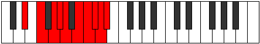 |
| [3957](https://ianring.com/musictheory/scales/3957) | [Porygic](ModeEFlatPorygic.md) | Eb | Eb, F, G, Ab, A, B, C, Db, D, Eb |  |
| [3959](https://ianring.com/musictheory/scales/3959) | [Katagyllian](ModeDSharpKatagyllian.md) | D# | D#, E, F, G, G#, A, B, C, C#, D, D# |  |
| [3959](https://ianring.com/musictheory/scales/3959) | [Katagyllian](ModeEFlatKatagyllian.md) | Eb | Eb, E, F, G, Ab, A, B, C, Db, D, Eb |  |
| [3959](https://ianring.com/musictheory/scales/3959) | [Katagyllian](ModeGNaturalKatagyllian.md) | G | G, G#, A, B, C, C#, D#, E, F, F#, G |  |
| [3959](https://ianring.com/musictheory/scales/3959) | [Katagyllian](ModeDNaturalKatagyllian.md) | D | D, D#, E, F#, G, G#, A#, B, C, C#, D |  |
| [3959](https://ianring.com/musictheory/scales/3959) | [Katagyllian](ModeBNaturalKatagyllian.md) | B | B, C, C#, D#, E, F, G, G#, A, A#, B |  |
| [3961](https://ianring.com/musictheory/scales/3961) | [Mixolydygic](ModeANaturalMixolydygic.md) | A | A, C, C#, D, D#, F, F#, G, G#, A |  |
| [3961](https://ianring.com/musictheory/scales/3961) | [Mixolydygic](ModeENaturalMixolydygic.md) | E | E, G, G#, A, A#, C, C#, D, D#, E |  |
| [3961](https://ianring.com/musictheory/scales/3961) | [Mixolydygic](ModeDSharpMixolydygic.md) | D# | D#, F#, G, G#, A, B, C, C#, D, D# |  |
| [3961](https://ianring.com/musictheory/scales/3961) | [Mixolydygic](ModeEFlatMixolydygic.md) | Eb | Eb, Gb, G, Ab, A, B, C, Db, D, Eb |  |
| [3963](https://ianring.com/musictheory/scales/3963) | [Aeoryllian](ModeENaturalAeoryllian.md) | E | E, F, G, G#, A, A#, C, C#, D, D#, E |  |
| [3963](https://ianring.com/musictheory/scales/3963) | [Aeoryllian](ModeANaturalAeoryllian.md) | A | A, A#, C, C#, D, D#, F, F#, G, G#, A |  |
| [3963](https://ianring.com/musictheory/scales/3963) | [Aeoryllian](ModeDSharpAeoryllian.md) | D# | D#, E, F#, G, G#, A, B, C, C#, D, D# |  |
| [3963](https://ianring.com/musictheory/scales/3963) | [Aeoryllian](ModeEFlatAeoryllian.md) | Eb | Eb, E, Gb, G, Ab, A, B, C, Db, D, Eb |  |
| [3963](https://ianring.com/musictheory/scales/3963) | [Aeoryllian](ModeDNaturalAeoryllian.md) | D | D, D#, F, F#, G, G#, A#, B, C, C#, D |  |
| [3963](https://ianring.com/musictheory/scales/3963) | [Aeoryllian](ModeGNaturalAeoryllian.md) | G | G, G#, A#, B, C, C#, D#, E, F, F#, G |  |
| [3965](https://ianring.com/musictheory/scales/3965) | [Thydyllian](ModeENaturalThydyllian.md) | E | E, F#, G, G#, A, A#, C, C#, D, D#, E |  |
| [3965](https://ianring.com/musictheory/scales/3965) | [Thydyllian](ModeASharpThydyllian.md) | A# | A#, C, C#, D, D#, E, F#, G, G#, A, A# |  |
| [3965](https://ianring.com/musictheory/scales/3965) | [Thydyllian](ModeBFlatThydyllian.md) | Bb | Bb, C, Db, D, Eb, E, Gb, G, Ab, A, Bb |  |
| [3965](https://ianring.com/musictheory/scales/3965) | [Thydyllian](ModeDSharpThydyllian.md) | D# | D#, F, F#, G, G#, A, B, C, C#, D, D# |  |
| [3965](https://ianring.com/musictheory/scales/3965) | [Thydyllian](ModeEFlatThydyllian.md) | Eb | Eb, F, Gb, G, Ab, A, B, C, Db, D, Eb |  |
| [3965](https://ianring.com/musictheory/scales/3965) | [Thydyllian](ModeANaturalThydyllian.md) | A | A, B, C, C#, D, D#, F, F#, G, G#, A |  |
| [3967](https://ianring.com/musictheory/scales/3967) | [Soratic](ModeENaturalSoratic.md) | E | E, F, F#, G, G#, A, A#, C, C#, D, D#, E |  |
| [3967](https://ianring.com/musictheory/scales/3967) | [Soratic](ModeDSharpSoratic.md) | D# | D#, E, F, F#, G, G#, A, B, C, C#, D, D# |  |
| [3967](https://ianring.com/musictheory/scales/3967) | [Soratic](ModeEFlatSoratic.md) | Eb | Eb, E, F, Gb, G, Ab, A, B, C, Db, D, Eb |  |
| [3967](https://ianring.com/musictheory/scales/3967) | [Soratic](ModeDNaturalSoratic.md) | D | D, D#, E, F, F#, G, G#, A#, B, C, C#, D |  |
| [3967](https://ianring.com/musictheory/scales/3967) | [Soratic](ModeBNaturalSoratic.md) | B | B, C, C#, D, D#, E, F, G, G#, A, A#, B |  |
| [3967](https://ianring.com/musictheory/scales/3967) | [Soratic](ModeASharpSoratic.md) | A# | A#, B, C, C#, D, D#, E, F#, G, G#, A, A# |  |
| [3967](https://ianring.com/musictheory/scales/3967) | [Soratic](ModeBFlatSoratic.md) | Bb | Bb, B, C, Db, D, Eb, E, Gb, G, Ab, A, Bb |  |
| [3967](https://ianring.com/musictheory/scales/3967) | [Soratic](ModeANaturalSoratic.md) | A | A, A#, B, C, C#, D, D#, F, F#, G, G#, A |  |
| [3967](https://ianring.com/musictheory/scales/3967) | [Soratic](ModeGNaturalSoratic.md) | G | G, G#, A, A#, B, C, C#, D#, E, F, F#, G |  |
| [3979](https://ianring.com/musictheory/scales/3979) | [Dynyllic](ModeCNaturalDynyllic.md) | C | C, C#, D#, G, G#, A, A#, B, C |  |
| [3981](https://ianring.com/musictheory/scales/3981) | [Phrycryllic](ModeFNaturalPhrycryllic.md) | F | F, G, G#, C, C#, D, D#, E, F |  |
| [3983](https://ianring.com/musictheory/scales/3983) | [Thyptygic](ModeFNaturalThyptygic.md) | F | F, F#, G, G#, C, C#, D, D#, E, F |  |
| [3983](https://ianring.com/musictheory/scales/3983) | [Thyptygic](ModeCNaturalThyptygic.md) | C | C, C#, D, D#, G, G#, A, A#, B, C |  |
| [3991](https://ianring.com/musictheory/scales/3991) | [Badygic](ModeBNaturalBadygic.md) | B | B, C, C#, D#, F#, G, G#, A, A#, B |  |
| [3993](https://ianring.com/musictheory/scales/3993) | [Ioniptyllic](ModeENaturalIoniptyllic.md) | E | E, G, G#, B, C, C#, D, D#, E |  |
| [3995](https://ianring.com/musictheory/scales/3995) | [Ionygic](ModeENaturalIonygic.md) | E | E, F, G, G#, B, C, C#, D, D#, E |  |
| [3995](https://ianring.com/musictheory/scales/3995) | [Ionygic](ModeCNaturalIonygic.md) | C | C, C#, D#, E, G, G#, A, A#, B, C |  |
| [3997](https://ianring.com/musictheory/scales/3997) | [Dogygic](ModeFNaturalDogygic.md) | F | F, G, G#, A, C, C#, D, D#, E, F |  |
| [3997](https://ianring.com/musictheory/scales/3997) | [Dogygic](ModeENaturalDogygic.md) | E | E, F#, G, G#, B, C, C#, D, D#, E |  |
| [3999](https://ianring.com/musictheory/scales/3999) | [Dydyllian](ModeFNaturalDydyllian.md) | F | F, F#, G, G#, A, C, C#, D, D#, E, F |  |
| [3999](https://ianring.com/musictheory/scales/3999) | [Dydyllian](ModeENaturalDydyllian.md) | E | E, F, F#, G, G#, B, C, C#, D, D#, E |  |
| [3999](https://ianring.com/musictheory/scales/3999) | [Dydyllian](ModeCNaturalDydyllian.md) | C | C, C#, D, D#, E, G, G#, A, A#, B, C |  |
| [3999](https://ianring.com/musictheory/scales/3999) | [Dydyllian](ModeBNaturalDydyllian.md) | B | B, C, C#, D, D#, F#, G, G#, A, A#, B |  |
| [4011](https://ianring.com/musictheory/scales/4011) | [Styrygic](ModeCNaturalStyrygic.md) | C | C, C#, D#, F, G, G#, A, A#, B, C |  |
| [4013](https://ianring.com/musictheory/scales/4013) | [Dathygic](ModeFNaturalDathygic.md) | F | F, G, G#, A#, C, C#, D, D#, E, F |  |
| [4013](https://ianring.com/musictheory/scales/4013) | [Dathygic](ModeASharpDathygic.md) | A# | A#, C, C#, D#, F, F#, G, G#, A, A# |  |
| [4013](https://ianring.com/musictheory/scales/4013) | [Dathygic](ModeBFlatDathygic.md) | Bb | Bb, C, Db, Eb, F, Gb, G, Ab, A, Bb |  |
| [4015](https://ianring.com/musictheory/scales/4015) | [Phradyllian](ModeFNaturalPhradyllian.md) | F | F, F#, G, G#, A#, C, C#, D, D#, E, F |  |
| [4015](https://ianring.com/musictheory/scales/4015) | [Phradyllian](ModeCNaturalPhradyllian.md) | C | C, C#, D, D#, F, G, G#, A, A#, B, C |  |
| [4015](https://ianring.com/musictheory/scales/4015) | [Phradyllian](ModeASharpPhradyllian.md) | A# | A#, B, C, C#, D#, F, F#, G, G#, A, A# |  |
| [4015](https://ianring.com/musictheory/scales/4015) | [Phradyllian](ModeBFlatPhradyllian.md) | Bb | Bb, B, C, Db, Eb, F, Gb, G, Ab, A, Bb |  |
| [4017](https://ianring.com/musictheory/scales/4017) | [Dolyllic](ModeGSharpDolyllic.md) | G# | G#, C, C#, D#, E, F, F#, G, G# |  |
| [4017](https://ianring.com/musictheory/scales/4017) | [Dolyllic](ModeAFlatDolyllic.md) | Ab | Ab, C, Db, Eb, E, F, Gb, G, Ab |  |
| [4017](https://ianring.com/musictheory/scales/4017) | [Dolyllic](ModeDSharpDolyllic.md) | D# | D#, G, G#, A#, B, C, C#, D, D# |  |
| [4017](https://ianring.com/musictheory/scales/4017) | [Dolyllic](ModeEFlatDolyllic.md) | Eb | Eb, G, Ab, Bb, B, C, Db, D, Eb |  |
| [4019](https://ianring.com/musictheory/scales/4019) | [Lonygic](ModeGSharpLonygic.md) | G# | G#, A, C, C#, D#, E, F, F#, G, G# |  |
| [4019](https://ianring.com/musictheory/scales/4019) | [Lonygic](ModeAFlatLonygic.md) | Ab | Ab, A, C, Db, Eb, E, F, Gb, G, Ab |  |
| [4019](https://ianring.com/musictheory/scales/4019) | [Lonygic](ModeDSharpLonygic.md) | D# | D#, E, G, G#, A#, B, C, C#, D, D# |  |
| [4019](https://ianring.com/musictheory/scales/4019) | [Lonygic](ModeEFlatLonygic.md) | Eb | Eb, E, G, Ab, Bb, B, C, Db, D, Eb |  |
| [4021](https://ianring.com/musictheory/scales/4021) | [Bagygic](ModeGSharpBagygic.md) | G# | G#, A#, C, C#, D#, E, F, F#, G, G# |  |
| [4021](https://ianring.com/musictheory/scales/4021) | [Bagygic](ModeAFlatBagygic.md) | Ab | Ab, Bb, C, Db, Eb, E, F, Gb, G, Ab |  |
| [4021](https://ianring.com/musictheory/scales/4021) | [Bagygic](ModeDSharpBagygic.md) | D# | D#, F, G, G#, A#, B, C, C#, D, D# |  |
| [4021](https://ianring.com/musictheory/scales/4021) | [Bagygic](ModeEFlatBagygic.md) | Eb | Eb, F, G, Ab, Bb, B, C, Db, D, Eb |  |
| [4023](https://ianring.com/musictheory/scales/4023) | [Styptyllian](ModeGSharpStyptyllian.md) | G# | G#, A, A#, C, C#, D#, E, F, F#, G, G# |  |
| [4023](https://ianring.com/musictheory/scales/4023) | [Styptyllian](ModeAFlatStyptyllian.md) | Ab | Ab, A, Bb, C, Db, Eb, E, F, Gb, G, Ab |  |
| [4023](https://ianring.com/musictheory/scales/4023) | [Styptyllian](ModeDSharpStyptyllian.md) | D# | D#, E, F, G, G#, A#, B, C, C#, D, D# |  |
| [4023](https://ianring.com/musictheory/scales/4023) | [Styptyllian](ModeEFlatStyptyllian.md) | Eb | Eb, E, F, G, Ab, Bb, B, C, Db, D, Eb |  |
| [4023](https://ianring.com/musictheory/scales/4023) | [Styptyllian](ModeBNaturalStyptyllian.md) | B | B, C, C#, D#, E, F#, G, G#, A, A#, B |  |
| [4025](https://ianring.com/musictheory/scales/4025) | [Kalygic](ModeGSharpKalygic.md) | G# | G#, B, C, C#, D#, E, F, F#, G, G# |  |
| [4025](https://ianring.com/musictheory/scales/4025) | [Kalygic](ModeAFlatKalygic.md) | Ab | Ab, B, C, Db, Eb, E, F, Gb, G, Ab |  |
| [4025](https://ianring.com/musictheory/scales/4025) | [Kalygic](ModeENaturalKalygic.md) | E | E, G, G#, A, B, C, C#, D, D#, E |  |
| [4025](https://ianring.com/musictheory/scales/4025) | [Kalygic](ModeDSharpKalygic.md) | D# | D#, F#, G, G#, A#, B, C, C#, D, D# |  |
| [4025](https://ianring.com/musictheory/scales/4025) | [Kalygic](ModeEFlatKalygic.md) | Eb | Eb, Gb, G, Ab, Bb, B, C, Db, D, Eb |  |
| [4027](https://ianring.com/musictheory/scales/4027) | [Ragyllian](ModeENaturalRagyllian.md) | E | E, F, G, G#, A, B, C, C#, D, D#, E |  |
| [4027](https://ianring.com/musictheory/scales/4027) | [Ragyllian](ModeGSharpRagyllian.md) | G# | G#, A, B, C, C#, D#, E, F, F#, G, G# |  |
| [4027](https://ianring.com/musictheory/scales/4027) | [Ragyllian](ModeAFlatRagyllian.md) | Ab | Ab, A, B, C, Db, Eb, E, F, Gb, G, Ab | 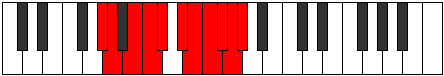 |
| [4027](https://ianring.com/musictheory/scales/4027) | [Ragyllian](ModeDSharpRagyllian.md) | D# | D#, E, F#, G, G#, A#, B, C, C#, D, D# |  |
| [4027](https://ianring.com/musictheory/scales/4027) | [Ragyllian](ModeEFlatRagyllian.md) | Eb | Eb, E, Gb, G, Ab, Bb, B, C, Db, D, Eb |  |
| [4027](https://ianring.com/musictheory/scales/4027) | [Ragyllian](ModeCNaturalRagyllian.md) | C | C, C#, D#, E, F, G, G#, A, A#, B, C |  |
| [4029](https://ianring.com/musictheory/scales/4029) | [Aerycryllian](ModeFNaturalAerycryllian.md) | F | F, G, G#, A, A#, C, C#, D, D#, E, F |  |
| [4029](https://ianring.com/musictheory/scales/4029) | [Aerycryllian](ModeASharpAerycryllian.md) | A# | A#, C, C#, D, D#, F, F#, G, G#, A, A# |  |
| [4029](https://ianring.com/musictheory/scales/4029) | [Aerycryllian](ModeBFlatAerycryllian.md) | Bb | Bb, C, Db, D, Eb, F, Gb, G, Ab, A, Bb |  |
| [4029](https://ianring.com/musictheory/scales/4029) | [Aerycryllian](ModeENaturalAerycryllian.md) | E | E, F#, G, G#, A, B, C, C#, D, D#, E |  |
| [4029](https://ianring.com/musictheory/scales/4029) | [Aerycryllian](ModeDSharpAerycryllian.md) | D# | D#, F, F#, G, G#, A#, B, C, C#, D, D# |  |
| [4029](https://ianring.com/musictheory/scales/4029) | [Aerycryllian](ModeEFlatAerycryllian.md) | Eb | Eb, F, Gb, G, Ab, Bb, B, C, Db, D, Eb |  |
| [4029](https://ianring.com/musictheory/scales/4029) | [Aerycryllian](ModeGSharpAerycryllian.md) | G# | G#, A#, B, C, C#, D#, E, F, F#, G, G# |  |
| [4029](https://ianring.com/musictheory/scales/4029) | [Aerycryllian](ModeAFlatAerycryllian.md) | Ab | Ab, Bb, B, C, Db, Eb, E, F, Gb, G, Ab |  |
| [4031](https://ianring.com/musictheory/scales/4031) | [Godatic](ModeFNaturalGodatic.md) | F | F, F#, G, G#, A, A#, C, C#, D, D#, E, F |  |
| [4031](https://ianring.com/musictheory/scales/4031) | [Godatic](ModeENaturalGodatic.md) | E | E, F, F#, G, G#, A, B, C, C#, D, D#, E |  |
| [4031](https://ianring.com/musictheory/scales/4031) | [Godatic](ModeDSharpGodatic.md) | D# | D#, E, F, F#, G, G#, A#, B, C, C#, D, D# |  |
| [4031](https://ianring.com/musictheory/scales/4031) | [Godatic](ModeEFlatGodatic.md) | Eb | Eb, E, F, Gb, G, Ab, Bb, B, C, Db, D, Eb |  |
| [4031](https://ianring.com/musictheory/scales/4031) | [Godatic](ModeCNaturalGodatic.md) | C | C, C#, D, D#, E, F, G, G#, A, A#, B, C |  |
| [4031](https://ianring.com/musictheory/scales/4031) | [Godatic](ModeBNaturalGodatic.md) | B | B, C, C#, D, D#, E, F#, G, G#, A, A#, B |  |
| [4031](https://ianring.com/musictheory/scales/4031) | [Godatic](ModeASharpGodatic.md) | A# | A#, B, C, C#, D, D#, F, F#, G, G#, A, A# |  |
| [4031](https://ianring.com/musictheory/scales/4031) | [Godatic](ModeBFlatGodatic.md) | Bb | Bb, B, C, Db, D, Eb, F, Gb, G, Ab, A, Bb |  |
| [4031](https://ianring.com/musictheory/scales/4031) | [Godatic](ModeGSharpGodatic.md) | G# | G#, A, A#, B, C, C#, D#, E, F, F#, G, G# |  |
| [4031](https://ianring.com/musictheory/scales/4031) | [Godatic](ModeAFlatGodatic.md) | Ab | Ab, A, Bb, B, C, Db, Eb, E, F, Gb, G, Ab |  |
| [4037](https://ianring.com/musictheory/scales/4037) | [Ionyllic](ModeCSharpIonyllic.md) | C# | C#, D#, G, G#, A, A#, B, C, C# |  |
| [4037](https://ianring.com/musictheory/scales/4037) | [Ionyllic](ModeDFlatIonyllic.md) | Db | Db, Eb, G, Ab, A, Bb, B, C, Db |  |
| [4039](https://ianring.com/musictheory/scales/4039) | [Ionogygic](ModeFSharpIonogygic.md) | F# | F#, G, G#, C, C#, D, D#, E, F, F# |  |
| [4039](https://ianring.com/musictheory/scales/4039) | [Ionogygic](ModeGFlatIonogygic.md) | Gb | Gb, G, Ab, C, Db, D, Eb, E, F, Gb |  |
| [4039](https://ianring.com/musictheory/scales/4039) | [Ionogygic](ModeCSharpIonogygic.md) | C# | C#, D, D#, G, G#, A, A#, B, C, C# |  |
| [4039](https://ianring.com/musictheory/scales/4039) | [Ionogygic](ModeDFlatIonogygic.md) | Db | Db, D, Eb, G, Ab, A, Bb, B, C, Db |  |
| [4043](https://ianring.com/musictheory/scales/4043) | [Phrocrygic](ModeCNaturalPhrocrygic.md) | C | C, C#, D#, F#, G, G#, A, A#, B, C |  |
| [4045](https://ianring.com/musictheory/scales/4045) | [Gyptygic](ModeFNaturalGyptygic.md) | F | F, G, G#, B, C, C#, D, D#, E, F |  |
| [4045](https://ianring.com/musictheory/scales/4045) | [Gyptygic](ModeCSharpGyptygic.md) | C# | C#, D#, E, G, G#, A, A#, B, C, C# |  |
| [4045](https://ianring.com/musictheory/scales/4045) | [Gyptygic](ModeDFlatGyptygic.md) | Db | Db, Eb, E, G, Ab, A, Bb, B, C, Db |  |
| [4047](https://ianring.com/musictheory/scales/4047) | [Thogyllian](ModeFSharpThogyllian.md) | F# | F#, G, G#, A, C, C#, D, D#, E, F, F# |  |
| [4047](https://ianring.com/musictheory/scales/4047) | [Thogyllian](ModeGFlatThogyllian.md) | Gb | Gb, G, Ab, A, C, Db, D, Eb, E, F, Gb |  |
| [4047](https://ianring.com/musictheory/scales/4047) | [Thogyllian](ModeFNaturalThogyllian.md) | F | F, F#, G, G#, B, C, C#, D, D#, E, F |  |
| [4047](https://ianring.com/musictheory/scales/4047) | [Thogyllian](ModeCSharpThogyllian.md) | C# | C#, D, D#, E, G, G#, A, A#, B, C, C# |  |
| [4047](https://ianring.com/musictheory/scales/4047) | [Thogyllian](ModeDFlatThogyllian.md) | Db | Db, D, Eb, E, G, Ab, A, Bb, B, C, Db |  |
| [4047](https://ianring.com/musictheory/scales/4047) | [Thogyllian](ModeCNaturalThogyllian.md) | C | C, C#, D, D#, F#, G, G#, A, A#, B, C |  |
| [4053](https://ianring.com/musictheory/scales/4053) | [Kyrygic](ModeCSharpKyrygic.md) | C# | C#, D#, F, G, G#, A, A#, B, C, C# |  |
| [4053](https://ianring.com/musictheory/scales/4053) | [Kyrygic](ModeDFlatKyrygic.md) | Db | Db, Eb, F, G, Ab, A, Bb, B, C, Db |  |
| [4055](https://ianring.com/musictheory/scales/4055) | [Dagyllian](ModeFSharpDagyllian.md) | F# | F#, G, G#, A#, C, C#, D, D#, E, F, F# |  |
| [4055](https://ianring.com/musictheory/scales/4055) | [Dagyllian](ModeGFlatDagyllian.md) | Gb | Gb, G, Ab, Bb, C, Db, D, Eb, E, F, Gb |  |
| [4055](https://ianring.com/musictheory/scales/4055) | [Dagyllian](ModeCSharpDagyllian.md) | C# | C#, D, D#, F, G, G#, A, A#, B, C, C# |  |
| [4055](https://ianring.com/musictheory/scales/4055) | [Dagyllian](ModeDFlatDagyllian.md) | Db | Db, D, Eb, F, G, Ab, A, Bb, B, C, Db |  |
| [4055](https://ianring.com/musictheory/scales/4055) | [Dagyllian](ModeBNaturalDagyllian.md) | B | B, C, C#, D#, F, F#, G, G#, A, A#, B |  |
| [4057](https://ianring.com/musictheory/scales/4057) | [Phrygic](ModeANaturalPhrygic.md) | A | A, C, C#, D#, E, F, F#, G, G#, A |  |
| [4057](https://ianring.com/musictheory/scales/4057) | [Phrygic](ModeENaturalPhrygic.md) | E | E, G, G#, A#, B, C, C#, D, D#, E |  |
| [4059](https://ianring.com/musictheory/scales/4059) | [Zolyllian](ModeANaturalZolyllian.md) | A | A, A#, C, C#, D#, E, F, F#, G, G#, A |  |
| [4059](https://ianring.com/musictheory/scales/4059) | [Zolyllian](ModeENaturalZolyllian.md) | E | E, F, G, G#, A#, B, C, C#, D, D#, E |  |
| [4059](https://ianring.com/musictheory/scales/4059) | [Zolyllian](ModeCNaturalZolyllian.md) | C | C, C#, D#, E, F#, G, G#, A, A#, B, C |  |
| [4061](https://ianring.com/musictheory/scales/4061) | [Staptyllian](ModeFNaturalStaptyllian.md) | F | F, G, G#, A, B, C, C#, D, D#, E, F |  |
| [4061](https://ianring.com/musictheory/scales/4061) | [Staptyllian](ModeANaturalStaptyllian.md) | A | A, B, C, C#, D#, E, F, F#, G, G#, A |  |
| [4061](https://ianring.com/musictheory/scales/4061) | [Staptyllian](ModeENaturalStaptyllian.md) | E | E, F#, G, G#, A#, B, C, C#, D, D#, E |  |
| [4061](https://ianring.com/musictheory/scales/4061) | [Staptyllian](ModeCSharpStaptyllian.md) | C# | C#, D#, E, F, G, G#, A, A#, B, C, C# |  |
| [4061](https://ianring.com/musictheory/scales/4061) | [Staptyllian](ModeDFlatStaptyllian.md) | Db | Db, Eb, E, F, G, Ab, A, Bb, B, C, Db |  |
| [4063](https://ianring.com/musictheory/scales/4063) | [Eptatic](ModeFSharpEptatic.md) | F# | F#, G, G#, A, A#, C, C#, D, D#, E, F, F# |  |
| [4063](https://ianring.com/musictheory/scales/4063) | [Eptatic](ModeGFlatEptatic.md) | Gb | Gb, G, Ab, A, Bb, C, Db, D, Eb, E, F, Gb |  |
| [4063](https://ianring.com/musictheory/scales/4063) | [Eptatic](ModeFNaturalEptatic.md) | F | F, F#, G, G#, A, B, C, C#, D, D#, E, F |  |
| [4063](https://ianring.com/musictheory/scales/4063) | [Eptatic](ModeENaturalEptatic.md) | E | E, F, F#, G, G#, A#, B, C, C#, D, D#, E |  |
| [4063](https://ianring.com/musictheory/scales/4063) | [Eptatic](ModeCSharpEptatic.md) | C# | C#, D, D#, E, F, G, G#, A, A#, B, C, C# |  |
| [4063](https://ianring.com/musictheory/scales/4063) | [Eptatic](ModeDFlatEptatic.md) | Db | Db, D, Eb, E, F, G, Ab, A, Bb, B, C, Db |  |
| [4063](https://ianring.com/musictheory/scales/4063) | [Eptatic](ModeCNaturalEptatic.md) | C | C, C#, D, D#, E, F#, G, G#, A, A#, B, C |  |
| [4063](https://ianring.com/musictheory/scales/4063) | [Eptatic](ModeBNaturalEptatic.md) | B | B, C, C#, D, D#, F, F#, G, G#, A, A#, B |  |
| [4063](https://ianring.com/musictheory/scales/4063) | [Eptatic](ModeANaturalEptatic.md) | A | A, A#, B, C, C#, D#, E, F, F#, G, G#, A |  |
| [4067](https://ianring.com/musictheory/scales/4067) | [Aeolarygic](ModeGNaturalAeolarygic.md) | G | G, G#, C, C#, D, D#, E, F, F#, G |  |
| [4067](https://ianring.com/musictheory/scales/4067) | [Aeolarygic](ModeDNaturalAeolarygic.md) | D | D, D#, G, G#, A, A#, B, C, C#, D |  |
| [4069](https://ianring.com/musictheory/scales/4069) | [Starygic](ModeCSharpStarygic.md) | C# | C#, D#, F#, G, G#, A, A#, B, C, C# |  |
| [4069](https://ianring.com/musictheory/scales/4069) | [Starygic](ModeDFlatStarygic.md) | Db | Db, Eb, Gb, G, Ab, A, Bb, B, C, Db |  |
| [4071](https://ianring.com/musictheory/scales/4071) | [Rygyllian](ModeGNaturalRygyllian.md) | G | G, G#, A, C, C#, D, D#, E, F, F#, G |  |
| [4071](https://ianring.com/musictheory/scales/4071) | [Rygyllian](ModeFSharpRygyllian.md) | F# | F#, G, G#, B, C, C#, D, D#, E, F, F# |  |
| [4071](https://ianring.com/musictheory/scales/4071) | [Rygyllian](ModeGFlatRygyllian.md) | Gb | Gb, G, Ab, B, C, Db, D, Eb, E, F, Gb |  |
| [4071](https://ianring.com/musictheory/scales/4071) | [Rygyllian](ModeDNaturalRygyllian.md) | D | D, D#, E, G, G#, A, A#, B, C, C#, D |  |
| [4071](https://ianring.com/musictheory/scales/4071) | [Rygyllian](ModeCSharpRygyllian.md) | C# | C#, D, D#, F#, G, G#, A, A#, B, C, C# |  |
| [4071](https://ianring.com/musictheory/scales/4071) | [Rygyllian](ModeDFlatRygyllian.md) | Db | Db, D, Eb, Gb, G, Ab, A, Bb, B, C, Db |  |
| [4075](https://ianring.com/musictheory/scales/4075) | [Katyllian](ModeGNaturalKatyllian.md) | G | G, G#, A#, C, C#, D, D#, E, F, F#, G |  |
| [4075](https://ianring.com/musictheory/scales/4075) | [Katyllian](ModeDNaturalKatyllian.md) | D | D, D#, F, G, G#, A, A#, B, C, C#, D |  |
| [4075](https://ianring.com/musictheory/scales/4075) | [Katyllian](ModeCNaturalKatyllian.md) | C | C, C#, D#, F, F#, G, G#, A, A#, B, C |  |
| [4077](https://ianring.com/musictheory/scales/4077) | [Gothyllian](ModeASharpGothyllian.md) | A# | A#, C, C#, D#, E, F, F#, G, G#, A, A# |  |
| [4077](https://ianring.com/musictheory/scales/4077) | [Gothyllian](ModeBFlatGothyllian.md) | Bb | Bb, C, Db, Eb, E, F, Gb, G, Ab, A, Bb |  |
| [4077](https://ianring.com/musictheory/scales/4077) | [Gothyllian](ModeFNaturalGothyllian.md) | F | F, G, G#, A#, B, C, C#, D, D#, E, F |  |
| [4077](https://ianring.com/musictheory/scales/4077) | [Gothyllian](ModeCSharpGothyllian.md) | C# | C#, D#, E, F#, G, G#, A, A#, B, C, C# |  |
| [4077](https://ianring.com/musictheory/scales/4077) | [Gothyllian](ModeDFlatGothyllian.md) | Db | Db, Eb, E, Gb, G, Ab, A, Bb, B, C, Db |  |
| [4079](https://ianring.com/musictheory/scales/4079) | [Ionatic](ModeGNaturalIonatic.md) | G | G, G#, A, A#, C, C#, D, D#, E, F, F#, G |  |
| [4079](https://ianring.com/musictheory/scales/4079) | [Ionatic](ModeFSharpIonatic.md) | F# | F#, G, G#, A, B, C, C#, D, D#, E, F, F# |  |
| [4079](https://ianring.com/musictheory/scales/4079) | [Ionatic](ModeGFlatIonatic.md) | Gb | Gb, G, Ab, A, B, C, Db, D, Eb, E, F, Gb |  |
| [4079](https://ianring.com/musictheory/scales/4079) | [Ionatic](ModeFNaturalIonatic.md) | F | F, F#, G, G#, A#, B, C, C#, D, D#, E, F |  |
| [4079](https://ianring.com/musictheory/scales/4079) | [Ionatic](ModeDNaturalIonatic.md) | D | D, D#, E, F, G, G#, A, A#, B, C, C#, D |  |
| [4079](https://ianring.com/musictheory/scales/4079) | [Ionatic](ModeCSharpIonatic.md) | C# | C#, D, D#, E, F#, G, G#, A, A#, B, C, C# |  |
| [4079](https://ianring.com/musictheory/scales/4079) | [Ionatic](ModeDFlatIonatic.md) | Db | Db, D, Eb, E, Gb, G, Ab, A, Bb, B, C, Db |  |
| [4079](https://ianring.com/musictheory/scales/4079) | [Ionatic](ModeCNaturalIonatic.md) | C | C, C#, D, D#, F, F#, G, G#, A, A#, B, C |  |
| [4079](https://ianring.com/musictheory/scales/4079) | [Ionatic](ModeASharpIonatic.md) | A# | A#, B, C, C#, D#, E, F, F#, G, G#, A, A# |  |
| [4079](https://ianring.com/musictheory/scales/4079) | [Ionatic](ModeBFlatIonatic.md) | Bb | Bb, B, C, Db, Eb, E, F, Gb, G, Ab, A, Bb |  |
| [4081](https://ianring.com/musictheory/scales/4081) | [Manygic](ModeGSharpManygic.md) | G# | G#, C, C#, D, D#, E, F, F#, G, G# |  |
| [4081](https://ianring.com/musictheory/scales/4081) | [Manygic](ModeAFlatManygic.md) | Ab | Ab, C, Db, D, Eb, E, F, Gb, G, Ab |  |
| [4081](https://ianring.com/musictheory/scales/4081) | [Manygic](ModeDSharpManygic.md) | D# | D#, G, G#, A, A#, B, C, C#, D, D# |  |
| [4081](https://ianring.com/musictheory/scales/4081) | [Manygic](ModeEFlatManygic.md) | Eb | Eb, G, Ab, A, Bb, B, C, Db, D, Eb |  |
| [4083](https://ianring.com/musictheory/scales/4083) | [Bathyllian](ModeGSharpBathyllian.md) | G# | G#, A, C, C#, D, D#, E, F, F#, G, G# |  |
| [4083](https://ianring.com/musictheory/scales/4083) | [Bathyllian](ModeAFlatBathyllian.md) | Ab | Ab, A, C, Db, D, Eb, E, F, Gb, G, Ab |  |
| [4083](https://ianring.com/musictheory/scales/4083) | [Bathyllian](ModeGNaturalBathyllian.md) | G | G, G#, B, C, C#, D, D#, E, F, F#, G |  |
| [4083](https://ianring.com/musictheory/scales/4083) | [Bathyllian](ModeDSharpBathyllian.md) | D# | D#, E, G, G#, A, A#, B, C, C#, D, D# |  |
| [4083](https://ianring.com/musictheory/scales/4083) | [Bathyllian](ModeEFlatBathyllian.md) | Eb | Eb, E, G, Ab, A, Bb, B, C, Db, D, Eb |  |
| [4083](https://ianring.com/musictheory/scales/4083) | [Bathyllian](ModeDNaturalBathyllian.md) | D | D, D#, F#, G, G#, A, A#, B, C, C#, D |  |
| [4085](https://ianring.com/musictheory/scales/4085) | [Sydyllian](ModeGSharpSydyllian.md) | G# | G#, A#, C, C#, D, D#, E, F, F#, G, G# |  |
| [4085](https://ianring.com/musictheory/scales/4085) | [Sydyllian](ModeAFlatSydyllian.md) | Ab | Ab, Bb, C, Db, D, Eb, E, F, Gb, G, Ab |  |
| [4085](https://ianring.com/musictheory/scales/4085) | [Sydyllian](ModeDSharpSydyllian.md) | D# | D#, F, G, G#, A, A#, B, C, C#, D, D# |  |
| [4085](https://ianring.com/musictheory/scales/4085) | [Sydyllian](ModeEFlatSydyllian.md) | Eb | Eb, F, G, Ab, A, Bb, B, C, Db, D, Eb |  |
| [4085](https://ianring.com/musictheory/scales/4085) | [Sydyllian](ModeCSharpSydyllian.md) | C# | C#, D#, F, F#, G, G#, A, A#, B, C, C# |  |
| [4085](https://ianring.com/musictheory/scales/4085) | [Sydyllian](ModeDFlatSydyllian.md) | Db | Db, Eb, F, Gb, G, Ab, A, Bb, B, C, Db |  |
| [4087](https://ianring.com/musictheory/scales/4087) | [Aeolatic](ModeGSharpAeolatic.md) | G# | G#, A, A#, C, C#, D, D#, E, F, F#, G, G# |  |
| [4087](https://ianring.com/musictheory/scales/4087) | [Aeolatic](ModeAFlatAeolatic.md) | Ab | Ab, A, Bb, C, Db, D, Eb, E, F, Gb, G, Ab |  |
| [4087](https://ianring.com/musictheory/scales/4087) | [Aeolatic](ModeGNaturalAeolatic.md) | G | G, G#, A, B, C, C#, D, D#, E, F, F#, G |  |
| [4087](https://ianring.com/musictheory/scales/4087) | [Aeolatic](ModeFSharpAeolatic.md) | F# | F#, G, G#, A#, B, C, C#, D, D#, E, F, F# |  |
| [4087](https://ianring.com/musictheory/scales/4087) | [Aeolatic](ModeGFlatAeolatic.md) | Gb | Gb, G, Ab, Bb, B, C, Db, D, Eb, E, F, Gb |  |
| [4087](https://ianring.com/musictheory/scales/4087) | [Aeolatic](ModeDSharpAeolatic.md) | D# | D#, E, F, G, G#, A, A#, B, C, C#, D, D# |  |
| [4087](https://ianring.com/musictheory/scales/4087) | [Aeolatic](ModeEFlatAeolatic.md) | Eb | Eb, E, F, G, Ab, A, Bb, B, C, Db, D, Eb |  |
| [4087](https://ianring.com/musictheory/scales/4087) | [Aeolatic](ModeDNaturalAeolatic.md) | D | D, D#, E, F#, G, G#, A, A#, B, C, C#, D |  |
| [4087](https://ianring.com/musictheory/scales/4087) | [Aeolatic](ModeCSharpAeolatic.md) | C# | C#, D, D#, F, F#, G, G#, A, A#, B, C, C# |  |
| [4087](https://ianring.com/musictheory/scales/4087) | [Aeolatic](ModeDFlatAeolatic.md) | Db | Db, D, Eb, F, Gb, G, Ab, A, Bb, B, C, Db |  |
| [4087](https://ianring.com/musictheory/scales/4087) | [Aeolatic](ModeBNaturalAeolatic.md) | B | B, C, C#, D#, E, F, F#, G, G#, A, A#, B |  |
| [4089](https://ianring.com/musictheory/scales/4089) | [Katoryllian](ModeANaturalKatoryllian.md) | A | A, C, C#, D, D#, E, F, F#, G, G#, A |  |
| [4089](https://ianring.com/musictheory/scales/4089) | [Katoryllian](ModeGSharpKatoryllian.md) | G# | G#, B, C, C#, D, D#, E, F, F#, G, G# |  |
| [4089](https://ianring.com/musictheory/scales/4089) | [Katoryllian](ModeAFlatKatoryllian.md) | Ab | Ab, B, C, Db, D, Eb, E, F, Gb, G, Ab |  |
| [4089](https://ianring.com/musictheory/scales/4089) | [Katoryllian](ModeENaturalKatoryllian.md) | E | E, G, G#, A, A#, B, C, C#, D, D#, E |  |
| [4089](https://ianring.com/musictheory/scales/4089) | [Katoryllian](ModeDSharpKatoryllian.md) | D# | D#, F#, G, G#, A, A#, B, C, C#, D, D# |  |
| [4089](https://ianring.com/musictheory/scales/4089) | [Katoryllian](ModeEFlatKatoryllian.md) | Eb | Eb, Gb, G, Ab, A, Bb, B, C, Db, D, Eb |  |
| [4091](https://ianring.com/musictheory/scales/4091) | [Thydatic](ModeANaturalThydatic.md) | A | A, A#, C, C#, D, D#, E, F, F#, G, G#, A |  |
| [4091](https://ianring.com/musictheory/scales/4091) | [Thydatic](ModeGSharpThydatic.md) | G# | G#, A, B, C, C#, D, D#, E, F, F#, G, G# |  |
| [4091](https://ianring.com/musictheory/scales/4091) | [Thydatic](ModeAFlatThydatic.md) | Ab | Ab, A, B, C, Db, D, Eb, E, F, Gb, G, Ab |  |
| [4091](https://ianring.com/musictheory/scales/4091) | [Thydatic](ModeGNaturalThydatic.md) | G | G, G#, A#, B, C, C#, D, D#, E, F, F#, G |  |
| [4091](https://ianring.com/musictheory/scales/4091) | [Thydatic](ModeENaturalThydatic.md) | E | E, F, G, G#, A, A#, B, C, C#, D, D#, E |  |
| [4091](https://ianring.com/musictheory/scales/4091) | [Thydatic](ModeDSharpThydatic.md) | D# | D#, E, F#, G, G#, A, A#, B, C, C#, D, D# |  |
| [4091](https://ianring.com/musictheory/scales/4091) | [Thydatic](ModeEFlatThydatic.md) | Eb | Eb, E, Gb, G, Ab, A, Bb, B, C, Db, D, Eb |  |
| [4091](https://ianring.com/musictheory/scales/4091) | [Thydatic](ModeDNaturalThydatic.md) | D | D, D#, F, F#, G, G#, A, A#, B, C, C#, D |  |
| [4091](https://ianring.com/musictheory/scales/4091) | [Thydatic](ModeCNaturalThydatic.md) | C | C, C#, D#, E, F, F#, G, G#, A, A#, B, C |  |
| [4093](https://ianring.com/musictheory/scales/4093) | [Aerycratic](ModeASharpAerycratic.md) | A# | A#, C, C#, D, D#, E, F, F#, G, G#, A, A# |  |
| [4093](https://ianring.com/musictheory/scales/4093) | [Aerycratic](ModeBFlatAerycratic.md) | Bb | Bb, C, Db, D, Eb, E, F, Gb, G, Ab, A, Bb |  |
| [4093](https://ianring.com/musictheory/scales/4093) | [Aerycratic](ModeANaturalAerycratic.md) | A | A, B, C, C#, D, D#, E, F, F#, G, G#, A |  |
| [4093](https://ianring.com/musictheory/scales/4093) | [Aerycratic](ModeGSharpAerycratic.md) | G# | G#, A#, B, C, C#, D, D#, E, F, F#, G, G# |  |
| [4093](https://ianring.com/musictheory/scales/4093) | [Aerycratic](ModeAFlatAerycratic.md) | Ab | Ab, Bb, B, C, Db, D, Eb, E, F, Gb, G, Ab |  |
| [4093](https://ianring.com/musictheory/scales/4093) | [Aerycratic](ModeFNaturalAerycratic.md) | F | F, G, G#, A, A#, B, C, C#, D, D#, E, F |  |
| [4093](https://ianring.com/musictheory/scales/4093) | [Aerycratic](ModeENaturalAerycratic.md) | E | E, F#, G, G#, A, A#, B, C, C#, D, D#, E |  |
| [4093](https://ianring.com/musictheory/scales/4093) | [Aerycratic](ModeDSharpAerycratic.md) | D# | D#, F, F#, G, G#, A, A#, B, C, C#, D, D# |  |
| [4093](https://ianring.com/musictheory/scales/4093) | [Aerycratic](ModeEFlatAerycratic.md) | Eb | Eb, F, Gb, G, Ab, A, Bb, B, C, Db, D, Eb |  |
| [4093](https://ianring.com/musictheory/scales/4093) | [Aerycratic](ModeCSharpAerycratic.md) | C# | C#, D#, E, F, F#, G, G#, A, A#, B, C, C# |  |
| [4093](https://ianring.com/musictheory/scales/4093) | [Aerycratic](ModeDFlatAerycratic.md) | Db | Db, Eb, E, F, Gb, G, Ab, A, Bb, B, C, Db |  |
| [4095](https://ianring.com/musictheory/scales/4095) | [Chromatic](ModeCNaturalChromatic.md) | C | C, C#, D, D#, E, F, F#, G, G#, A, A#, B, C |  |
| [4095](https://ianring.com/musictheory/scales/4095) | [Chromatic](ModeCSharpChromatic.md) | C# | C#, D, D#, E, F, F#, G, G#, A, A#, B, C, C# |  |
| [4095](https://ianring.com/musictheory/scales/4095) | [Chromatic](ModeDFlatChromatic.md) | Db | Db, D, Eb, E, F, Gb, G, Ab, A, Bb, B, C, Db |  |
| [4095](https://ianring.com/musictheory/scales/4095) | [Chromatic](ModeDNaturalChromatic.md) | D | D, D#, E, F, F#, G, G#, A, A#, B, C, C#, D |  |
| [4095](https://ianring.com/musictheory/scales/4095) | [Chromatic](ModeDSharpChromatic.md) | D# | D#, E, F, F#, G, G#, A, A#, B, C, C#, D, D# |  |
| [4095](https://ianring.com/musictheory/scales/4095) | [Chromatic](ModeEFlatChromatic.md) | Eb | Eb, E, F, Gb, G, Ab, A, Bb, B, C, Db, D, Eb |  |
| [4095](https://ianring.com/musictheory/scales/4095) | [Chromatic](ModeENaturalChromatic.md) | E | E, F, F#, G, G#, A, A#, B, C, C#, D, D#, E |  |
| [4095](https://ianring.com/musictheory/scales/4095) | [Chromatic](ModeFNaturalChromatic.md) | F | F, F#, G, G#, A, A#, B, C, C#, D, D#, E, F |  |
| [4095](https://ianring.com/musictheory/scales/4095) | [Chromatic](ModeFSharpChromatic.md) | F# | F#, G, G#, A, A#, B, C, C#, D, D#, E, F, F# |  |
| [4095](https://ianring.com/musictheory/scales/4095) | [Chromatic](ModeGFlatChromatic.md) | Gb | Gb, G, Ab, A, Bb, B, C, Db, D, Eb, E, F, Gb |  |
| [4095](https://ianring.com/musictheory/scales/4095) | [Chromatic](ModeGNaturalChromatic.md) | G | G, G#, A, A#, B, C, C#, D, D#, E, F, F#, G |  |
| [4095](https://ianring.com/musictheory/scales/4095) | [Chromatic](ModeGSharpChromatic.md) | G# | G#, A, A#, B, C, C#, D, D#, E, F, F#, G, G# |  |
| [4095](https://ianring.com/musictheory/scales/4095) | [Chromatic](ModeAFlatChromatic.md) | Ab | Ab, A, Bb, B, C, Db, D, Eb, E, F, Gb, G, Ab |  |
| [4095](https://ianring.com/musictheory/scales/4095) | [Chromatic](ModeANaturalChromatic.md) | A | A, A#, B, C, C#, D, D#, E, F, F#, G, G#, A |  |
| [4095](https://ianring.com/musictheory/scales/4095) | [Chromatic](ModeASharpChromatic.md) | A# | A#, B, C, C#, D, D#, E, F, F#, G, G#, A, A# |  |
| [4095](https://ianring.com/musictheory/scales/4095) | [Chromatic](ModeBFlatChromatic.md) | Bb | Bb, B, C, Db, D, Eb, E, F, Gb, G, Ab, A, Bb |  |
| [4095](https://ianring.com/musictheory/scales/4095) | [Chromatic](ModeBNaturalChromatic.md) | B | B, C, C#, D, D#, E, F, F#, G, G#, A, A#, B |  |
