# AFlatMajorSeventhDoubleSharpFifth

## Links

- [Documentation](README.md)
- [Scales Index](Scales.md)
- [Modes Index](Modes.md)
- [Chords Index](Chords.md)

## Root

Ab

## Notes

| Position | Notes | Illustration |
|----------|------|--------------|
| RootPosition | Ab,C,F,G |  |
| FirstInversion | C,F,G,Ab |  |
| SecondInversion | F,G,Ab,C | 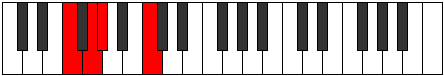 |
| ThirdInversion | G,Ab,C,F |  |
## Modes

| Number | Mode | Tonic | Notes | Illustration |
|--------|------|-------|-------|--------------|
| [283](https://ianring.com/musictheory/scales/283) | [Aerylitonic](ModeENaturalAerylitonic.md) | E | E, F, G, G#, C, E | 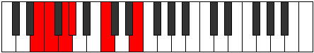 |
| [287](https://ianring.com/musictheory/scales/287) | [Gynimic](ModeENaturalGynimic.md) | E | E, F, Gb, Abb, Bbbb, C, E |  |
| [315](https://ianring.com/musictheory/scales/315) | [Stodimic](ModeENaturalStodimic.md) | E | E, F, G, Ab, Bbb, C, E | 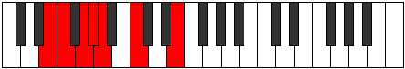 |
| [319](https://ianring.com/musictheory/scales/319) | [Epodian](ModeENaturalEpodian.md) | E | E, F, Gb, Abb, Bbbb, Cbbb, Dbb, E |  |
| [347](https://ianring.com/musictheory/scales/347) | [Barimic](ModeENaturalBarimic.md) | E | E, F, G, Ab, Bb, C, E |  |
| [351](https://ianring.com/musictheory/scales/351) | [Epanian](ModeENaturalEpanian.md) | E | E, F, Gb, Abb, Bbbb, Cbb, Dbb, E |  |
| [379](https://ianring.com/musictheory/scales/379) | [Aeragian](ModeENaturalAeragian.md) | E | E, F, G, Ab, Bbb, Cbb, Dbb, E |  |
| [383](https://ianring.com/musictheory/scales/383) | [Logyllic](ModeENaturalLogyllic.md) | E | E, F, F#, G, G#, A, A#, C, E |  |
| [397](https://ianring.com/musictheory/scales/397) | [Epogitonic](ModeFNaturalEpogitonic.md) | F | F, G, G#, C, C#, F |  |
| [399](https://ianring.com/musictheory/scales/399) | [Zynimic](ModeFNaturalZynimic.md) | F | F, Gb, Abb, Bbbb, C, Db, F |  |
| [411](https://ianring.com/musictheory/scales/411) | [Lygimic](ModeENaturalLygimic.md) | E | E, F, G, Ab, B, C, E |  |
| [413](https://ianring.com/musictheory/scales/413) | [Ganimic](ModeFNaturalGanimic.md) | F | F, G, Ab, Bbb, C, Db, F | 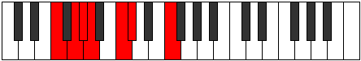 |
| [415](https://ianring.com/musictheory/scales/415) | [Aeoladian](ModeFNaturalAeoladian.md) | F | F, Gb, Abb, Bbbb, Cbbb, Dbb, Ebbb, F |  |
| [415](https://ianring.com/musictheory/scales/415) | [Aeoladian](ModeENaturalAeoladian.md) | E | E, F, Gb, Abb, Bbbb, Cb, Dbb, E |  |
| [419](https://ianring.com/musictheory/scales/419) | [Ionacritonic](ModeCNaturalIonacritonic.md) | C | C, C#, F, G, G#, C |  |
| [421](https://ianring.com/musictheory/scales/421) | [Ionitonic](ModeCNaturalIonitonic.md) | C | C, D, F, G, G#, C |  |
| [423](https://ianring.com/musictheory/scales/423) | [Sogimic](ModeCNaturalSogimic.md) | C | C, Db, Ebb, F, G, Ab, C |  |
| [425](https://ianring.com/musictheory/scales/425) | [Daditonic](ModeCNaturalDaditonic.md) | C | C, D#, F, G, G#, C |  |
| [427](https://ianring.com/musictheory/scales/427) | [Zothimic](ModeCNaturalZothimic.md) | C | C, Db, Eb, F, G, Ab, C |  |
| [429](https://ianring.com/musictheory/scales/429) | [Koptimic](ModeCNaturalKoptimic.md) | C | C, D, Eb, F, G, Ab, C |  |
| [429](https://ianring.com/musictheory/scales/429) | [Koptimic](ModeFNaturalKoptimic.md) | F | F, G, Ab, Bb, C, Db, F |  |
| [431](https://ianring.com/musictheory/scales/431) | [Epyrian](ModeCNaturalEpyrian.md) | C | C, Db, Ebb, Fbb, Gbb, Abb, Bbbb, C |  |
| [431](https://ianring.com/musictheory/scales/431) | [Epyrian](ModeFNaturalEpyrian.md) | F | F, Gb, Abb, Bbbb, Cbb, Dbb, Ebbb, F |  |
| [433](https://ianring.com/musictheory/scales/433) | [Poritonic](ModeCNaturalPoritonic.md) | C | C, E, F, G, G#, C |  |
| [435](https://ianring.com/musictheory/scales/435) | [Ionolimic](ModeCNaturalIonolimic.md) | C | C, Db, E, F, G, Ab, C |  |
| [437](https://ianring.com/musictheory/scales/437) | [Ronimic](ModeCNaturalRonimic.md) | C | C, D, E, F, G, Ab, C |  |
| [439](https://ianring.com/musictheory/scales/439) | [Bythian](ModeCNaturalBythian.md) | C | C, Db, Ebb, Fb, Gbb, Abb, Bbbb, C |  |
| [441](https://ianring.com/musictheory/scales/441) | [Thycrimic](ModeCNaturalThycrimic.md) | C | C, D#, E, F, G, Ab, C |  |
| [443](https://ianring.com/musictheory/scales/443) | [Kothian](ModeCNaturalKothian.md) | C | C, Db, Eb, Fb, Gbb, Abb, Bbbb, C |  |
| [443](https://ianring.com/musictheory/scales/443) | [Kothian](ModeENaturalKothian.md) | E | E, F, G, Ab, Bbb, Cb, Dbb, E |  |
| [445](https://ianring.com/musictheory/scales/445) | [Gocrian](ModeCNaturalGocrian.md) | C | C, D, Eb, Fb, Gbb, Abb, Bbbb, C |  |
| [445](https://ianring.com/musictheory/scales/445) | [Gocrian](ModeFNaturalGocrian.md) | F | F, G, Ab, Bbb, Cbb, Dbb, Ebbb, F |  |
| [447](https://ianring.com/musictheory/scales/447) | [Thyphyllic](ModeCNaturalThyphyllic.md) | C | C, C#, D, D#, E, F, G, G#, C |  |
| [447](https://ianring.com/musictheory/scales/447) | [Thyphyllic](ModeFNaturalThyphyllic.md) | F | F, F#, G, G#, A, A#, C, C#, F |  |
| [447](https://ianring.com/musictheory/scales/447) | [Thyphyllic](ModeENaturalThyphyllic.md) | E | E, F, F#, G, G#, A, B, C, E |  |
| [461](https://ianring.com/musictheory/scales/461) | [Madimic](ModeFNaturalMadimic.md) | F | F, G, Ab, B, C, Db, F |  |
| [463](https://ianring.com/musictheory/scales/463) | [Zythian](ModeFNaturalZythian.md) | F | F, Gb, Abb, Bbbb, Cb, Dbb, Ebbb, F |  |
| [475](https://ianring.com/musictheory/scales/475) | [Aeolygian](ModeENaturalAeolygian.md) | E | E, F, G, Ab, Bb, Cb, Dbb, E |  |
| [477](https://ianring.com/musictheory/scales/477) | [Stacrian](ModeFNaturalStacrian.md) | F | F, G, Ab, Bbb, Cb, Dbb, Ebbb, F |  |
| [479](https://ianring.com/musictheory/scales/479) | [Kocryllic](ModeFNaturalKocryllic.md) | F | F, F#, G, G#, A, B, C, C#, F |  |
| [479](https://ianring.com/musictheory/scales/479) | [Kocryllic](ModeENaturalKocryllic.md) | E | E, F, F#, G, G#, A#, B, C, E |  |
| [483](https://ianring.com/musictheory/scales/483) | [Kygimic](ModeCNaturalKygimic.md) | C | C, Db, E#, F#, G, Ab, C |  |
| [485](https://ianring.com/musictheory/scales/485) | [Stoptimic](ModeCNaturalStoptimic.md) | C | C, D, E#, F#, G, Ab, C |  |
| [487](https://ianring.com/musictheory/scales/487) | [Dynian](ModeCNaturalDynian.md) | C | C, Db, Ebb, F, Gb, Abb, Bbbb, C |  |
| [489](https://ianring.com/musictheory/scales/489) | [Phrathimic](ModeCNaturalPhrathimic.md) | C | C, D#, E#, F#, G, Ab, C |  |
| [491](https://ianring.com/musictheory/scales/491) | [Aeolyrian](ModeCNaturalAeolyrian.md) | C | C, Db, Eb, F, Gb, Abb, Bbbb, C |  |
| [493](https://ianring.com/musictheory/scales/493) | [Rygian](ModeCNaturalRygian.md) | C | C, D, Eb, F, Gb, Abb, Bbbb, C |  |
| [493](https://ianring.com/musictheory/scales/493) | [Rygian](ModeFNaturalRygian.md) | F | F, G, Ab, Bb, Cb, Dbb, Ebbb, F |  |
| [495](https://ianring.com/musictheory/scales/495) | [Bocryllic](ModeCNaturalBocryllic.md) | C | C, C#, D, D#, F, F#, G, G#, C |  |
| [495](https://ianring.com/musictheory/scales/495) | [Bocryllic](ModeFNaturalBocryllic.md) | F | F, F#, G, G#, A#, B, C, C#, F |  |
| [497](https://ianring.com/musictheory/scales/497) | [Kadimic](ModeCNaturalKadimic.md) | C | C, D##, E#, F#, G, Ab, C |  |
| [499](https://ianring.com/musictheory/scales/499) | [Ionaptian](ModeCNaturalIonaptian.md) | C | C, Db, E, F, Gb, Abb, Bbbb, C |  |
| [501](https://ianring.com/musictheory/scales/501) | [Katylian](ModeCNaturalKatylian.md) | C | C, D, E, F, Gb, Abb, Bbbb, C |  |
| [503](https://ianring.com/musictheory/scales/503) | [Thoptyllic](ModeCNaturalThoptyllic.md) | C | C, C#, D, E, F, F#, G, G#, C |  |
| [505](https://ianring.com/musictheory/scales/505) | [Sanian](ModeCNaturalSanian.md) | C | C, D#, E, F, Gb, Abb, Bbbb, C |  |
| [507](https://ianring.com/musictheory/scales/507) | [Moryllic](ModeCNaturalMoryllic.md) | C | C, C#, D#, E, F, F#, G, G#, C |  |
| [507](https://ianring.com/musictheory/scales/507) | [Moryllic](ModeENaturalMoryllic.md) | E | E, F, G, G#, A, A#, B, C, E |  |
| [509](https://ianring.com/musictheory/scales/509) | [Ionothyllic](ModeCNaturalIonothyllic.md) | C | C, D, D#, E, F, F#, G, G#, C |  |
| [509](https://ianring.com/musictheory/scales/509) | [Ionothyllic](ModeFNaturalIonothyllic.md) | F | F, G, G#, A, A#, B, C, C#, F |  |
| [511](https://ianring.com/musictheory/scales/511) | [Polygic](ModeCNaturalPolygic.md) | C | C, C#, D, D#, E, F, F#, G, G#, C |  |
| [511](https://ianring.com/musictheory/scales/511) | [Polygic](ModeFNaturalPolygic.md) | F | F, F#, G, G#, A, A#, B, C, C#, F |  |
| [511](https://ianring.com/musictheory/scales/511) | [Polygic](ModeENaturalPolygic.md) | E | E, F, F#, G, G#, A, A#, B, C, E |  |
| [565](https://ianring.com/musictheory/scales/565) | [Aeolyphritonic](ModeDSharpAeolyphritonic.md) | D# | D#, F, G, G#, C, D# |  |
| [565](https://ianring.com/musictheory/scales/565) | [Aeolyphritonic](ModeEFlatAeolyphritonic.md) | Eb | Eb, F, G, Ab, C, Eb |  |
| [567](https://ianring.com/musictheory/scales/567) | [Aeoladimic](ModeDSharpAeoladimic.md) | D# | D#, E, F, G, Ab, B#, D# |  |
| [567](https://ianring.com/musictheory/scales/567) | [Aeoladimic](ModeEFlatAeoladimic.md) | Eb | Eb, Fb, Gbb, Abb, Bbbb, C, Eb |  |
| [573](https://ianring.com/musictheory/scales/573) | [Saptimic](ModeDSharpSaptimic.md) | D# | D#, E#, F#, G, Ab, B#, D# | 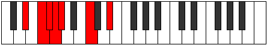 |
| [573](https://ianring.com/musictheory/scales/573) | [Saptimic](ModeEFlatSaptimic.md) | Eb | Eb, F, Gb, Abb, Bbbb, C, Eb |  |
| [575](https://ianring.com/musictheory/scales/575) | [Ionydian](ModeDSharpIonydian.md) | D# | D#, E, F, Gb, Abb, Bbbb, C, D# |  |
| [575](https://ianring.com/musictheory/scales/575) | [Ionydian](ModeEFlatIonydian.md) | Eb | Eb, Fb, Gbb, Abbb, E###, F###, Dbb, Eb |  |
| [629](https://ianring.com/musictheory/scales/629) | [Aeronimic](ModeDSharpAeronimic.md) | D# | D#, E#, F##, G#, A, B#, D# |  |
| [629](https://ianring.com/musictheory/scales/629) | [Aeronimic](ModeEFlatAeronimic.md) | Eb | Eb, F, G, Ab, Bbb, C, Eb |  |
| [631](https://ianring.com/musictheory/scales/631) | [Zygian](ModeDSharpZygian.md) | D# | D#, E, F, G, Ab, Bbb, C, D# |  |
| [631](https://ianring.com/musictheory/scales/631) | [Zygian](ModeEFlatZygian.md) | Eb | Eb, Fb, Gbb, Abb, Bbbb, Cbbb, Dbb, Eb |  |
| [637](https://ianring.com/musictheory/scales/637) | [Katodian](ModeDSharpKatodian.md) | D# | D#, E#, F#, G, Ab, Bbb, C, D# |  |
| [637](https://ianring.com/musictheory/scales/637) | [Katodian](ModeEFlatKatodian.md) | Eb | Eb, F, Gb, Abb, Bbbb, Cbbb, Dbb, Eb |  |
| [639](https://ianring.com/musictheory/scales/639) | [Ionaryllic](ModeDSharpIonaryllic.md) | D# | D#, E, F, F#, G, G#, A, C, D# |  |
| [639](https://ianring.com/musictheory/scales/639) | [Ionaryllic](ModeEFlatIonaryllic.md) | Eb | Eb, E, F, Gb, G, Ab, A, C, Eb |  |
| [653](https://ianring.com/musictheory/scales/653) | [Stathitonic](ModeFNaturalStathitonic.md) | F | F, G, G#, C, D, F |  |
| [655](https://ianring.com/musictheory/scales/655) | [Kataptimic](ModeFNaturalKataptimic.md) | F | F, Gb, Abb, Bbbb, C, D, F |  |
| [669](https://ianring.com/musictheory/scales/669) | [Gycrimic](ModeFNaturalGycrimic.md) | F | F, G, Ab, Bbb, C, D, F |  |
| [671](https://ianring.com/musictheory/scales/671) | [Stycrian](ModeFNaturalStycrian.md) | F | F, Gb, Abb, Bbbb, Cbbb, Dbb, Ebb, F |  |
| [685](https://ianring.com/musictheory/scales/685) | [Aerathimic](ModeFNaturalAerathimic.md) | F | F, G, Ab, Bb, C, D, F |  |
| [687](https://ianring.com/musictheory/scales/687) | [Aeolythian](ModeFNaturalAeolythian.md) | F | F, Gb, Abb, Bbbb, Cbb, Dbb, Ebb, F |  |
| [693](https://ianring.com/musictheory/scales/693) | [Mynimic](ModeDSharpMynimic.md) | D# | D#, E#, F##, G#, A#, B#, D# | 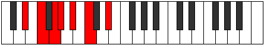 |
| [693](https://ianring.com/musictheory/scales/693) | [Mynimic](ModeEFlatMynimic.md) | Eb | Eb, F, G, Ab, Bb, C, Eb |  |
| [695](https://ianring.com/musictheory/scales/695) | [Sarian](ModeDSharpSarian.md) | D# | D#, E, F, G, Ab, Bb, C, D# |  |
| [695](https://ianring.com/musictheory/scales/695) | [Sarian](ModeEFlatSarian.md) | Eb | Eb, Fb, Gbb, Abb, Bbbb, Cbb, Dbb, Eb |  |
| [701](https://ianring.com/musictheory/scales/701) | [Mixonyphian](ModeDSharpMixonyphian.md) | D# | D#, E#, F#, G, Ab, Bb, C, D# |  |
| [701](https://ianring.com/musictheory/scales/701) | [Mixonyphian](ModeEFlatMixonyphian.md) | Eb | Eb, F, Gb, Abb, Bbbb, Cbb, Dbb, Eb |  |
| [701](https://ianring.com/musictheory/scales/701) | [Mixonyphian](ModeFNaturalMixonyphian.md) | F | F, G, Ab, Bbb, Cbb, Dbb, Ebb, F |  |
| [703](https://ianring.com/musictheory/scales/703) | [Aerocryllic](ModeDSharpAerocryllic.md) | D# | D#, E, F, F#, G, G#, A#, C, D# |  |
| [703](https://ianring.com/musictheory/scales/703) | [Aerocryllic](ModeEFlatAerocryllic.md) | Eb | Eb, E, F, Gb, G, Ab, Bb, C, Eb |  |
| [703](https://ianring.com/musictheory/scales/703) | [Aerocryllic](ModeFNaturalAerocryllic.md) | F | F, F#, G, G#, A, A#, C, D, F |  |
| [717](https://ianring.com/musictheory/scales/717) | [Gythimic](ModeFNaturalGythimic.md) | F | F, G, Ab, B, C, D, F |  |
| [719](https://ianring.com/musictheory/scales/719) | [Kanian](ModeFNaturalKanian.md) | F | F, Gb, Abb, Bbbb, Cb, Dbb, Ebb, F |  |
| [733](https://ianring.com/musictheory/scales/733) | [Donian](ModeFNaturalDonian.md) | F | F, G, Ab, Bbb, Cb, Dbb, Ebb, F |  |
| [735](https://ianring.com/musictheory/scales/735) | [Sylyllic](ModeFNaturalSylyllic.md) | F | F, F#, G, G#, A, B, C, D, F |  |
| [749](https://ianring.com/musictheory/scales/749) | [Aeologian](ModeFNaturalAeologian.md) | F | F, G, Ab, Bb, Cb, Dbb, Ebb, F |  |
| [751](https://ianring.com/musictheory/scales/751) | [Epacryllic](ModeFNaturalEpacryllic.md) | F | F, F#, G, G#, A#, B, C, D, F |  |
| [757](https://ianring.com/musictheory/scales/757) | [Ionyptian](ModeDSharpIonyptian.md) | D# | D#, E#, F##, G#, A, Bb, C, D# | 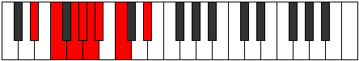 |
| [757](https://ianring.com/musictheory/scales/757) | [Ionyptian](ModeEFlatIonyptian.md) | Eb | Eb, F, G, Ab, Bbb, Cbb, Dbb, Eb |  |
| [759](https://ianring.com/musictheory/scales/759) | [Katalyllic](ModeDSharpKatalyllic.md) | D# | D#, E, F, G, G#, A, A#, C, D# |  |
| [759](https://ianring.com/musictheory/scales/759) | [Katalyllic](ModeEFlatKatalyllic.md) | Eb | Eb, E, F, G, Ab, A, Bb, C, Eb |  |
| [765](https://ianring.com/musictheory/scales/765) | [Mixonyphyllic](ModeDSharpMixonyphyllic.md) | D# | D#, F, F#, G, G#, A, A#, C, D# |  |
| [765](https://ianring.com/musictheory/scales/765) | [Mixonyphyllic](ModeEFlatMixonyphyllic.md) | Eb | Eb, F, Gb, G, Ab, A, Bb, C, Eb |  |
| [765](https://ianring.com/musictheory/scales/765) | [Mixonyphyllic](ModeFNaturalMixonyphyllic.md) | F | F, G, G#, A, A#, B, C, D, F |  |
| [767](https://ianring.com/musictheory/scales/767) | [Raptygic](ModeDSharpRaptygic.md) | D# | D#, E, F, F#, G, G#, A, A#, C, D# |  |
| [767](https://ianring.com/musictheory/scales/767) | [Raptygic](ModeEFlatRaptygic.md) | Eb | Eb, E, F, Gb, G, Ab, A, Bb, C, Eb |  |
| [767](https://ianring.com/musictheory/scales/767) | [Raptygic](ModeFNaturalRaptygic.md) | F | F, F#, G, G#, A, A#, B, C, D, F |  |
| [795](https://ianring.com/musictheory/scales/795) | [Aeologimic](ModeENaturalAeologimic.md) | E | E, F, G, Ab, B#, C#, E |  |
| [799](https://ianring.com/musictheory/scales/799) | [Lolian](ModeENaturalLolian.md) | E | E, F, Gb, Abb, Bbbb, C, Db, E |  |
| [821](https://ianring.com/musictheory/scales/821) | [Aeranimic](ModeDSharpAeranimic.md) | D# | D#, E#, F##, G#, A##, B#, D# |  |
| [821](https://ianring.com/musictheory/scales/821) | [Aeranimic](ModeEFlatAeranimic.md) | Eb | Eb, F, G, Ab, B, C, Eb |  |
| [823](https://ianring.com/musictheory/scales/823) | [Stodian](ModeDSharpStodian.md) | D# | D#, E, F, G, Ab, B, C, D# |  |
| [823](https://ianring.com/musictheory/scales/823) | [Stodian](ModeEFlatStodian.md) | Eb | Eb, Fb, Gbb, Abb, Bbbb, Cb, Dbb, Eb |  |
| [827](https://ianring.com/musictheory/scales/827) | [Mixolocrian](ModeENaturalMixolocrian.md) | E | E, F, G, Ab, Bbb, C, Db, E |  |
| [829](https://ianring.com/musictheory/scales/829) | [Lygian](ModeDSharpLygian.md) | D# | D#, E#, F#, G, Ab, B, C, D# |  |
| [829](https://ianring.com/musictheory/scales/829) | [Lygian](ModeEFlatLygian.md) | Eb | Eb, F, Gb, Abb, Bbbb, Cb, Dbb, Eb |  |
| [831](https://ianring.com/musictheory/scales/831) | [Rodyllic](ModeENaturalRodyllic.md) | E | E, F, F#, G, G#, A, C, C#, E | 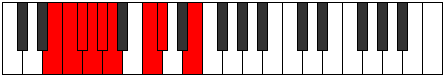 |
| [831](https://ianring.com/musictheory/scales/831) | [Rodyllic](ModeDSharpRodyllic.md) | D# | D#, E, F, F#, G, G#, B, C, D# |  |
| [831](https://ianring.com/musictheory/scales/831) | [Rodyllic](ModeEFlatRodyllic.md) | Eb | Eb, E, F, Gb, G, Ab, B, C, Eb |  |
| [839](https://ianring.com/musictheory/scales/839) | [Ionathimic](ModeBNaturalIonathimic.md) | B | B, C, Db, E#, F##, G#, B |  |
| [843](https://ianring.com/musictheory/scales/843) | [Molimic](ModeBNaturalMolimic.md) | B | B, C, D, E#, F##, G#, B | 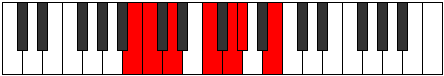 |
| [847](https://ianring.com/musictheory/scales/847) | [Ganian](ModeBNaturalGanian.md) | B | B, C, Db, Ebb, F, G, Ab, B |  |
| [851](https://ianring.com/musictheory/scales/851) | [Aerylimic](ModeBNaturalAerylimic.md) | B | B, C, D#, E#, F##, G#, B |  |
| [855](https://ianring.com/musictheory/scales/855) | [Porian](ModeBNaturalPorian.md) | B | B, C, Db, Eb, F, G, Ab, B |  |
| [859](https://ianring.com/musictheory/scales/859) | [Pathian](ModeENaturalPathian.md) | E | E, F, G, Ab, Bb, C, Db, E |  |
| [859](https://ianring.com/musictheory/scales/859) | [Pathian](ModeBNaturalPathian.md) | B | B, C, D, Eb, F, G, Ab, B |  |
| [863](https://ianring.com/musictheory/scales/863) | [Pyryllic](ModeENaturalPyryllic.md) | E | E, F, F#, G, G#, A#, C, C#, E |  |
| [863](https://ianring.com/musictheory/scales/863) | [Pyryllic](ModeBNaturalPyryllic.md) | B | B, C, C#, D, D#, F, G, G#, B |  |
| [867](https://ianring.com/musictheory/scales/867) | [Phrocrimic](ModeBNaturalPhrocrimic.md) | B | B, C, D##, E#, F##, G#, B |  |
| [871](https://ianring.com/musictheory/scales/871) | [Epadian](ModeBNaturalEpadian.md) | B | B, C, Db, E, F, G, Ab, B |  |
| [875](https://ianring.com/musictheory/scales/875) | [Stothian](ModeBNaturalStothian.md) | B | B, C, D, E, F, G, Ab, B |  |
| [879](https://ianring.com/musictheory/scales/879) | [Aeolocryllic](ModeBNaturalAeolocryllic.md) | B | B, C, C#, D, E, F, G, G#, B |  |
| [883](https://ianring.com/musictheory/scales/883) | [Ralian](ModeBNaturalRalian.md) | B | B, C, D#, E, F, G, Ab, B |  |
| [885](https://ianring.com/musictheory/scales/885) | [Sathian](ModeDSharpSathian.md) | D# | D#, E#, F##, G#, A, B, C, D# |  |
| [885](https://ianring.com/musictheory/scales/885) | [Sathian](ModeEFlatSathian.md) | Eb | Eb, F, G, Ab, Bbb, Cb, Dbb, Eb |  |
| [887](https://ianring.com/musictheory/scales/887) | [Sathyllic](ModeBNaturalSathyllic.md) | B | B, C, C#, D#, E, F, G, G#, B |  |
| [887](https://ianring.com/musictheory/scales/887) | [Sathyllic](ModeDSharpSathyllic.md) | D# | D#, E, F, G, G#, A, B, C, D# |  |
| [887](https://ianring.com/musictheory/scales/887) | [Sathyllic](ModeEFlatSathyllic.md) | Eb | Eb, E, F, G, Ab, A, B, C, Eb |  |
| [891](https://ianring.com/musictheory/scales/891) | [Ionilyllic](ModeENaturalIonilyllic.md) | E | E, F, G, G#, A, A#, C, C#, E |  |
| [891](https://ianring.com/musictheory/scales/891) | [Ionilyllic](ModeBNaturalIonilyllic.md) | B | B, C, D, D#, E, F, G, G#, B |  |
| [893](https://ianring.com/musictheory/scales/893) | [Pycryllic](ModeDSharpPycryllic.md) | D# | D#, F, F#, G, G#, A, B, C, D# |  |
| [893](https://ianring.com/musictheory/scales/893) | [Pycryllic](ModeEFlatPycryllic.md) | Eb | Eb, F, Gb, G, Ab, A, B, C, Eb |  |
| [895](https://ianring.com/musictheory/scales/895) | [Aeolathygic](ModeENaturalAeolathygic.md) | E | E, F, F#, G, G#, A, A#, C, C#, E |  |
| [895](https://ianring.com/musictheory/scales/895) | [Aeolathygic](ModeBNaturalAeolathygic.md) | B | B, C, C#, D, D#, E, F, G, G#, B |  |
| [895](https://ianring.com/musictheory/scales/895) | [Aeolathygic](ModeDSharpAeolathygic.md) | D# | D#, E, F, F#, G, G#, A, B, C, D# |  |
| [895](https://ianring.com/musictheory/scales/895) | [Aeolathygic](ModeEFlatAeolathygic.md) | Eb | Eb, E, F, Gb, G, Ab, A, B, C, Eb |  |
| [909](https://ianring.com/musictheory/scales/909) | [Katarimic](ModeFNaturalKatarimic.md) | F | F, G, Ab, B#, C#, D, F |  |
| [911](https://ianring.com/musictheory/scales/911) | [Radian](ModeFNaturalRadian.md) | F | F, Gb, Abb, Bbbb, C, Db, Ebb, F |  |
| [923](https://ianring.com/musictheory/scales/923) | [Ionodian](ModeENaturalIonodian.md) | E | E, F, G, Ab, B, C, Db, E |  |
| [925](https://ianring.com/musictheory/scales/925) | [Mythian](ModeFNaturalMythian.md) | F | F, G, Ab, Bbb, C, Db, Ebb, F |  |
| [927](https://ianring.com/musictheory/scales/927) | [Koptyllic](ModeFNaturalKoptyllic.md) | F | F, F#, G, G#, A, C, C#, D, F |  |
| [927](https://ianring.com/musictheory/scales/927) | [Koptyllic](ModeENaturalKoptyllic.md) | E | E, F, F#, G, G#, B, C, C#, E |  |
| [931](https://ianring.com/musictheory/scales/931) | [Bacrimic](ModeCNaturalBacrimic.md) | C | C, Db, E#, F##, G#, A, C |  |
| [933](https://ianring.com/musictheory/scales/933) | [Dadimic](ModeCNaturalDadimic.md) | C | C, D, E#, F##, G#, A, C | 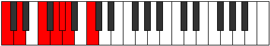 |
| [935](https://ianring.com/musictheory/scales/935) | [Katarian](ModeCNaturalKatarian.md) | C | C, Db, Ebb, F, G, Ab, Bbb, C |  |
| [937](https://ianring.com/musictheory/scales/937) | [Stothimic](ModeCNaturalStothimic.md) | C | C, D#, E#, F##, G#, A, C |  |
| [939](https://ianring.com/musictheory/scales/939) | [Dyptian](ModeCNaturalDyptian.md) | C | C, Db, Eb, F, G, Ab, Bbb, C |  |
| [941](https://ianring.com/musictheory/scales/941) | [Phrorian](ModeCNaturalPhrorian.md) | C | C, D, Eb, F, G, Ab, Bbb, C |  |
| [941](https://ianring.com/musictheory/scales/941) | [Phrorian](ModeFNaturalPhrorian.md) | F | F, G, Ab, Bb, C, Db, Ebb, F |  |
| [943](https://ianring.com/musictheory/scales/943) | [Aerygyllic](ModeCNaturalAerygyllic.md) | C | C, C#, D, D#, F, G, G#, A, C |  |
| [943](https://ianring.com/musictheory/scales/943) | [Aerygyllic](ModeFNaturalAerygyllic.md) | F | F, F#, G, G#, A#, C, C#, D, F |  |
| [945](https://ianring.com/musictheory/scales/945) | [Syrimic](ModeCNaturalSyrimic.md) | C | C, D##, E#, F##, G#, A, C |  |
| [947](https://ianring.com/musictheory/scales/947) | [Modian](ModeCNaturalModian.md) | C | C, Db, E, F, G, Ab, Bbb, C |  |
| [949](https://ianring.com/musictheory/scales/949) | [Ionagian](ModeCNaturalIonagian.md) | C | C, D, E, F, G, Ab, Bbb, C |  |
| [949](https://ianring.com/musictheory/scales/949) | [Ionagian](ModeDSharpIonagian.md) | D# | D#, E#, F##, G#, A#, B, C, D# |  |
| [949](https://ianring.com/musictheory/scales/949) | [Ionagian](ModeEFlatIonagian.md) | Eb | Eb, F, G, Ab, Bb, Cb, Dbb, Eb |  |
| [951](https://ianring.com/musictheory/scales/951) | [Thogyllic](ModeCNaturalThogyllic.md) | C | C, C#, D, E, F, G, G#, A, C |  |
| [951](https://ianring.com/musictheory/scales/951) | [Thogyllic](ModeDSharpThogyllic.md) | D# | D#, E, F, G, G#, A#, B, C, D# |  |
| [951](https://ianring.com/musictheory/scales/951) | [Thogyllic](ModeEFlatThogyllic.md) | Eb | Eb, E, F, G, Ab, Bb, B, C, Eb |  |
| [953](https://ianring.com/musictheory/scales/953) | [Stoptian](ModeCNaturalStoptian.md) | C | C, D#, E, F, G, Ab, Bbb, C |  |
| [955](https://ianring.com/musictheory/scales/955) | [Ionogyllic](ModeCNaturalIonogyllic.md) | C | C, C#, D#, E, F, G, G#, A, C |  |
| [955](https://ianring.com/musictheory/scales/955) | [Ionogyllic](ModeENaturalIonogyllic.md) | E | E, F, G, G#, A, B, C, C#, E |  |
| [957](https://ianring.com/musictheory/scales/957) | [Phronyllic](ModeCNaturalPhronyllic.md) | C | C, D, D#, E, F, G, G#, A, C |  |
| [957](https://ianring.com/musictheory/scales/957) | [Phronyllic](ModeFNaturalPhronyllic.md) | F | F, G, G#, A, A#, C, C#, D, F | 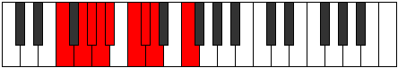 |
| [957](https://ianring.com/musictheory/scales/957) | [Phronyllic](ModeDSharpPhronyllic.md) | D# | D#, F, F#, G, G#, A#, B, C, D# |  |
| [957](https://ianring.com/musictheory/scales/957) | [Phronyllic](ModeEFlatPhronyllic.md) | Eb | Eb, F, Gb, G, Ab, Bb, B, C, Eb |  |
| [959](https://ianring.com/musictheory/scales/959) | [Katylygic](ModeCNaturalKatylygic.md) | C | C, C#, D, D#, E, F, G, G#, A, C |  |
| [959](https://ianring.com/musictheory/scales/959) | [Katylygic](ModeFNaturalKatylygic.md) | F | F, F#, G, G#, A, A#, C, C#, D, F |  |
| [959](https://ianring.com/musictheory/scales/959) | [Katylygic](ModeENaturalKatylygic.md) | E | E, F, F#, G, G#, A, B, C, C#, E |  |
| [959](https://ianring.com/musictheory/scales/959) | [Katylygic](ModeDSharpKatylygic.md) | D# | D#, E, F, F#, G, G#, A#, B, C, D# |  |
| [959](https://ianring.com/musictheory/scales/959) | [Katylygic](ModeEFlatKatylygic.md) | Eb | Eb, E, F, Gb, G, Ab, Bb, B, C, Eb |  |
| [967](https://ianring.com/musictheory/scales/967) | [Aeolanian](ModeBNaturalAeolanian.md) | B | B, C, Db, E#, F#, G, Ab, B |  |
| [971](https://ianring.com/musictheory/scales/971) | [Ladian](ModeBNaturalLadian.md) | B | B, C, D, E#, F#, G, Ab, B |  |
| [973](https://ianring.com/musictheory/scales/973) | [Phryptian](ModeFNaturalPhryptian.md) | F | F, G, Ab, B, C, Db, Ebb, F |  |
| [975](https://ianring.com/musictheory/scales/975) | [Katogyllic](ModeFNaturalKatogyllic.md) | F | F, F#, G, G#, B, C, C#, D, F |  |
| [975](https://ianring.com/musictheory/scales/975) | [Katogyllic](ModeBNaturalKatogyllic.md) | B | B, C, C#, D, F, F#, G, G#, B |  |
| [979](https://ianring.com/musictheory/scales/979) | [Thogian](ModeBNaturalThogian.md) | B | B, C, D#, E#, F#, G, Ab, B | 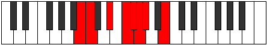 |
| [983](https://ianring.com/musictheory/scales/983) | [Epygyllic](ModeBNaturalEpygyllic.md) | B | B, C, C#, D#, F, F#, G, G#, B |  |
| [987](https://ianring.com/musictheory/scales/987) | [Aeraptyllic](ModeBNaturalAeraptyllic.md) | B | B, C, D, D#, F, F#, G, G#, B |  |
| [987](https://ianring.com/musictheory/scales/987) | [Aeraptyllic](ModeENaturalAeraptyllic.md) | E | E, F, G, G#, A#, B, C, C#, E |  |
| [989](https://ianring.com/musictheory/scales/989) | [Phrolyllic](ModeFNaturalPhrolyllic.md) | F | F, G, G#, A, B, C, C#, D, F |  |
| [991](https://ianring.com/musictheory/scales/991) | [Aeolygic](ModeBNaturalAeolygic.md) | B | B, C, C#, D, D#, F, F#, G, G#, B |  |
| [991](https://ianring.com/musictheory/scales/991) | [Aeolygic](ModeFNaturalAeolygic.md) | F | F, F#, G, G#, A, B, C, C#, D, F |  |
| [991](https://ianring.com/musictheory/scales/991) | [Aeolygic](ModeENaturalAeolygic.md) | E | E, F, F#, G, G#, A#, B, C, C#, E |  |
| [995](https://ianring.com/musictheory/scales/995) | [Phrathian](ModeCNaturalPhrathian.md) | C | C, Db, E#, F#, G, Ab, Bbb, C |  |
| [995](https://ianring.com/musictheory/scales/995) | [Phrathian](ModeBNaturalPhrathian.md) | B | B, C, D##, E#, F#, G, Ab, B |  |
| [997](https://ianring.com/musictheory/scales/997) | [Rycrian](ModeCNaturalRycrian.md) | C | C, D, E#, F#, G, Ab, Bbb, C |  |
| [999](https://ianring.com/musictheory/scales/999) | [Bylyllic](ModeCNaturalBylyllic.md) | C | C, C#, D, F, F#, G, G#, A, C |  |
| [999](https://ianring.com/musictheory/scales/999) | [Bylyllic](ModeBNaturalBylyllic.md) | B | B, C, C#, E, F, F#, G, G#, B |  |
| [1001](https://ianring.com/musictheory/scales/1001) | [Badian](ModeCNaturalBadian.md) | C | C, D#, E#, F#, G, Ab, Bbb, C |  |
| [1003](https://ianring.com/musictheory/scales/1003) | [Ionyryllic](ModeCNaturalIonyryllic.md) | C | C, C#, D#, F, F#, G, G#, A, C |  |
| [1003](https://ianring.com/musictheory/scales/1003) | [Ionyryllic](ModeBNaturalIonyryllic.md) | B | B, C, D, E, F, F#, G, G#, B |  |
| [1005](https://ianring.com/musictheory/scales/1005) | [Radyllic](ModeCNaturalRadyllic.md) | C | C, D, D#, F, F#, G, G#, A, C |  |
| [1005](https://ianring.com/musictheory/scales/1005) | [Radyllic](ModeFNaturalRadyllic.md) | F | F, G, G#, A#, B, C, C#, D, F |  |
| [1007](https://ianring.com/musictheory/scales/1007) | [Ionycrygic](ModeCNaturalIonycrygic.md) | C | C, C#, D, D#, F, F#, G, G#, A, C |  |
| [1007](https://ianring.com/musictheory/scales/1007) | [Ionycrygic](ModeBNaturalIonycrygic.md) | B | B, C, C#, D, E, F, F#, G, G#, B |  |
| [1007](https://ianring.com/musictheory/scales/1007) | [Ionycrygic](ModeFNaturalIonycrygic.md) | F | F, F#, G, G#, A#, B, C, C#, D, F |  |
| [1009](https://ianring.com/musictheory/scales/1009) | [Katyptian](ModeCNaturalKatyptian.md) | C | C, D##, E#, F#, G, Ab, Bbb, C |  |
| [1011](https://ianring.com/musictheory/scales/1011) | [Kycryllic](ModeCNaturalKycryllic.md) | C | C, C#, E, F, F#, G, G#, A, C |  |
| [1011](https://ianring.com/musictheory/scales/1011) | [Kycryllic](ModeBNaturalKycryllic.md) | B | B, C, D#, E, F, F#, G, G#, B |  |
| [1013](https://ianring.com/musictheory/scales/1013) | [Stydyllic](ModeCNaturalStydyllic.md) | C | C, D, E, F, F#, G, G#, A, C |  |
| [1013](https://ianring.com/musictheory/scales/1013) | [Stydyllic](ModeDSharpStydyllic.md) | D# | D#, F, G, G#, A, A#, B, C, D# |  |
| [1013](https://ianring.com/musictheory/scales/1013) | [Stydyllic](ModeEFlatStydyllic.md) | Eb | Eb, F, G, Ab, A, Bb, B, C, Eb |  |
| [1015](https://ianring.com/musictheory/scales/1015) | [Ionodygic](ModeCNaturalIonodygic.md) | C | C, C#, D, E, F, F#, G, G#, A, C |  |
| [1015](https://ianring.com/musictheory/scales/1015) | [Ionodygic](ModeBNaturalIonodygic.md) | B | B, C, C#, D#, E, F, F#, G, G#, B |  |
| [1015](https://ianring.com/musictheory/scales/1015) | [Ionodygic](ModeDSharpIonodygic.md) | D# | D#, E, F, G, G#, A, A#, B, C, D# |  |
| [1015](https://ianring.com/musictheory/scales/1015) | [Ionodygic](ModeEFlatIonodygic.md) | Eb | Eb, E, F, G, Ab, A, Bb, B, C, Eb |  |
| [1017](https://ianring.com/musictheory/scales/1017) | [Dythyllic](ModeCNaturalDythyllic.md) | C | C, D#, E, F, F#, G, G#, A, C |  |
| [1019](https://ianring.com/musictheory/scales/1019) | [Aeranygic](ModeCNaturalAeranygic.md) | C | C, C#, D#, E, F, F#, G, G#, A, C |  |
| [1019](https://ianring.com/musictheory/scales/1019) | [Aeranygic](ModeBNaturalAeranygic.md) | B | B, C, D, D#, E, F, F#, G, G#, B |  |
| [1019](https://ianring.com/musictheory/scales/1019) | [Aeranygic](ModeENaturalAeranygic.md) | E | E, F, G, G#, A, A#, B, C, C#, E |  |
| [1021](https://ianring.com/musictheory/scales/1021) | [Ladygic](ModeCNaturalLadygic.md) | C | C, D, D#, E, F, F#, G, G#, A, C |  |
| [1021](https://ianring.com/musictheory/scales/1021) | [Ladygic](ModeFNaturalLadygic.md) | F | F, G, G#, A, A#, B, C, C#, D, F |  |
| [1021](https://ianring.com/musictheory/scales/1021) | [Ladygic](ModeDSharpLadygic.md) | D# | D#, F, F#, G, G#, A, A#, B, C, D# |  |
| [1021](https://ianring.com/musictheory/scales/1021) | [Ladygic](ModeEFlatLadygic.md) | Eb | Eb, F, Gb, G, Ab, A, Bb, B, C, Eb |  |
| [1023](https://ianring.com/musictheory/scales/1023) | [Dodyllian](ModeCNaturalDodyllian.md) | C | C, C#, D, D#, E, F, F#, G, G#, A, C |  |
| [1023](https://ianring.com/musictheory/scales/1023) | [Dodyllian](ModeBNaturalDodyllian.md) | B | B, C, C#, D, D#, E, F, F#, G, G#, B |  |
| [1023](https://ianring.com/musictheory/scales/1023) | [Dodyllian](ModeFNaturalDodyllian.md) | F | F, F#, G, G#, A, A#, B, C, C#, D, F |  |
| [1023](https://ianring.com/musictheory/scales/1023) | [Dodyllian](ModeENaturalDodyllian.md) | E | E, F, F#, G, G#, A, A#, B, C, C#, E |  |
| [1023](https://ianring.com/musictheory/scales/1023) | [Dodyllian](ModeDSharpDodyllian.md) | D# | D#, E, F, F#, G, G#, A, A#, B, C, D# |  |
| [1023](https://ianring.com/musictheory/scales/1023) | [Dodyllian](ModeEFlatDodyllian.md) | Eb | Eb, E, F, Gb, G, Ab, A, Bb, B, C, Eb |  |
| [1123](https://ianring.com/musictheory/scales/1123) | [Lanitonic](ModeGNaturalLanitonic.md) | G | G, G#, C, C#, F, G |  |
| [1127](https://ianring.com/musictheory/scales/1127) | [Eparimic](ModeGNaturalEparimic.md) | G | G, Ab, Bbb, C, Db, E#, G |  |
| [1129](https://ianring.com/musictheory/scales/1129) | [Phrynitonic](ModeDNaturalPhrynitonic.md) | D | D, F, G, G#, C, D |  |
| [1131](https://ianring.com/musictheory/scales/1131) | [Thocrimic](ModeDNaturalThocrimic.md) | D | D, Eb, F, G, Ab, B#, D |  |
| [1131](https://ianring.com/musictheory/scales/1131) | [Thocrimic](ModeGNaturalThocrimic.md) | G | G, Ab, Bb, C, Db, E#, G |  |
| [1133](https://ianring.com/musictheory/scales/1133) | [Stycrimic](ModeDNaturalStycrimic.md) | D | D, E, F, G, Ab, B#, D |  |
| [1135](https://ianring.com/musictheory/scales/1135) | [Katolian](ModeDNaturalKatolian.md) | D | D, Eb, Fb, Gbb, Abb, Bbbb, C, D |  |
| [1135](https://ianring.com/musictheory/scales/1135) | [Katolian](ModeGNaturalKatolian.md) | G | G, Ab, Bbb, Cbb, Dbb, Ebbb, F, G |  |
| [1139](https://ianring.com/musictheory/scales/1139) | [Aerygimic](ModeGNaturalAerygimic.md) | G | G, Ab, B, C, Db, E#, G |  |
| [1143](https://ianring.com/musictheory/scales/1143) | [Styrian](ModeGNaturalStyrian.md) | G | G, Ab, Bbb, Cb, Dbb, Ebbb, F, G |  |
| [1145](https://ianring.com/musictheory/scales/1145) | [Zygimic](ModeDNaturalZygimic.md) | D | D, E#, F#, G, Ab, B#, D | 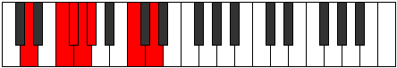 |
| [1147](https://ianring.com/musictheory/scales/1147) | [Epynian](ModeDNaturalEpynian.md) | D | D, Eb, F, Gb, Abb, Bbbb, C, D |  |
| [1147](https://ianring.com/musictheory/scales/1147) | [Epynian](ModeGNaturalEpynian.md) | G | G, Ab, Bb, Cb, Dbb, Ebbb, F, G |  |
| [1149](https://ianring.com/musictheory/scales/1149) | [Bydian](ModeDNaturalBydian.md) | D | D, E, F, Gb, Abb, Bbbb, C, D |  |
| [1151](https://ianring.com/musictheory/scales/1151) | [Mythyllic](ModeDNaturalMythyllic.md) | D | D, D#, E, F, F#, G, G#, C, D |  |
| [1151](https://ianring.com/musictheory/scales/1151) | [Mythyllic](ModeGNaturalMythyllic.md) | G | G, G#, A, A#, B, C, C#, F, G |  |
| [1165](https://ianring.com/musictheory/scales/1165) | [Gycritonic](ModeFNaturalGycritonic.md) | F | F, G, G#, C, D#, F |  |
| [1167](https://ianring.com/musictheory/scales/1167) | [Aerodimic](ModeFNaturalAerodimic.md) | F | F, Gb, Abb, Bbbb, C, D#, F |  |
| [1181](https://ianring.com/musictheory/scales/1181) | [Katagimic](ModeFNaturalKatagimic.md) | F | F, G, Ab, Bbb, C, D#, F |  |
| [1183](https://ianring.com/musictheory/scales/1183) | [Sadian](ModeFNaturalSadian.md) | F | F, Gb, Abb, Bbbb, Cbbb, Dbb, Eb, F |  |
| [1187](https://ianring.com/musictheory/scales/1187) | [Thalitonic](ModeGNaturalThalitonic.md) | G | G, G#, C, D, F, G |  |
| [1191](https://ianring.com/musictheory/scales/1191) | [Pyrimic](ModeGNaturalPyrimic.md) | G | G, Ab, Bbb, C, D, E#, G |  |
| [1195](https://ianring.com/musictheory/scales/1195) | [Sarimic](ModeGNaturalSarimic.md) | G | G, Ab, Bb, C, D, E#, G |  |
| [1197](https://ianring.com/musictheory/scales/1197) | [Rocrimic](ModeFNaturalRocrimic.md) | F | F, G, Ab, Bb, C, D#, F |  |
| [1199](https://ianring.com/musictheory/scales/1199) | [Magian](ModeFNaturalMagian.md) | F | F, Gb, Abb, Bbbb, Cbb, Dbb, Eb, F |  |
| [1199](https://ianring.com/musictheory/scales/1199) | [Magian](ModeGNaturalMagian.md) | G | G, Ab, Bbb, Cbb, Dbb, Ebb, F, G |  |
| [1203](https://ianring.com/musictheory/scales/1203) | [Pagimic](ModeGNaturalPagimic.md) | G | G, Ab, B, C, D, E#, G |  |
| [1207](https://ianring.com/musictheory/scales/1207) | [Aeoloptian](ModeGNaturalAeoloptian.md) | G | G, Ab, Bbb, Cb, Dbb, Ebb, F, G |  |
| [1211](https://ianring.com/musictheory/scales/1211) | [Zadian](ModeGNaturalZadian.md) | G | G, Ab, Bb, Cb, Dbb, Ebb, F, G |  |
| [1213](https://ianring.com/musictheory/scales/1213) | [Gyrian](ModeFNaturalGyrian.md) | F | F, G, Ab, Bbb, Cbb, Dbb, Eb, F |  |
| [1215](https://ianring.com/musictheory/scales/1215) | [Aeolanyllic](ModeFNaturalAeolanyllic.md) | F | F, F#, G, G#, A, A#, C, D#, F |  |
| [1215](https://ianring.com/musictheory/scales/1215) | [Aeolanyllic](ModeGNaturalAeolanyllic.md) | G | G, G#, A, A#, B, C, D, F, G |  |
| [1229](https://ianring.com/musictheory/scales/1229) | [Ragimic](ModeFNaturalRagimic.md) | F | F, G, Ab, B, C, D#, F |  |
| [1231](https://ianring.com/musictheory/scales/1231) | [Logian](ModeFNaturalLogian.md) | F | F, Gb, Abb, Bbbb, Cb, Dbb, Eb, F |  |
| [1245](https://ianring.com/musictheory/scales/1245) | [Lathian](ModeFNaturalLathian.md) | F | F, G, Ab, Bbb, Cb, Dbb, Eb, F |  |
| [1247](https://ianring.com/musictheory/scales/1247) | [Mygyllic](ModeFNaturalMygyllic.md) | F | F, F#, G, G#, A, B, C, D#, F |  |
| [1251](https://ianring.com/musictheory/scales/1251) | [Sylimic](ModeGNaturalSylimic.md) | G | G, Ab, B#, C#, D, E#, G |  |
| [1255](https://ianring.com/musictheory/scales/1255) | [Sogian](ModeGNaturalSogian.md) | G | G, Ab, Bbb, C, Db, Ebb, F, G |  |
| [1257](https://ianring.com/musictheory/scales/1257) | [Aeolyphimic](ModeDNaturalAeolyphimic.md) | D | D, E#, F##, G#, A, B#, D |  |
| [1259](https://ianring.com/musictheory/scales/1259) | [Stadian](ModeDNaturalStadian.md) | D | D, Eb, F, G, Ab, Bbb, C, D |  |
| [1259](https://ianring.com/musictheory/scales/1259) | [Stadian](ModeGNaturalStadian.md) | G | G, Ab, Bb, C, Db, Ebb, F, G | 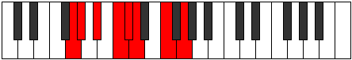 |
| [1261](https://ianring.com/musictheory/scales/1261) | [Aeodian](ModeDNaturalAeodian.md) | D | D, E, F, G, Ab, Bbb, C, D |  |
| [1261](https://ianring.com/musictheory/scales/1261) | [Aeodian](ModeFNaturalAeodian.md) | F | F, G, Ab, Bb, Cb, Dbb, Eb, F |  |
| [1263](https://ianring.com/musictheory/scales/1263) | [Stynyllic](ModeDNaturalStynyllic.md) | D | D, D#, E, F, G, G#, A, C, D |  |
| [1263](https://ianring.com/musictheory/scales/1263) | [Stynyllic](ModeGNaturalStynyllic.md) | G | G, G#, A, A#, C, C#, D, F, G |  |
| [1263](https://ianring.com/musictheory/scales/1263) | [Stynyllic](ModeFNaturalStynyllic.md) | F | F, F#, G, G#, A#, B, C, D#, F |  |
| [1267](https://ianring.com/musictheory/scales/1267) | [Katynian](ModeGNaturalKatynian.md) | G | G, Ab, B, C, Db, Ebb, F, G |  |
| [1271](https://ianring.com/musictheory/scales/1271) | [Kolyllic](ModeGNaturalKolyllic.md) | G | G, G#, A, B, C, C#, D, F, G |  |
| [1273](https://ianring.com/musictheory/scales/1273) | [Ronian](ModeDNaturalRonian.md) | D | D, E#, F#, G, Ab, Bbb, C, D |  |
| [1275](https://ianring.com/musictheory/scales/1275) | [Stagyllic](ModeDNaturalStagyllic.md) | D | D, D#, F, F#, G, G#, A, C, D |  |
| [1275](https://ianring.com/musictheory/scales/1275) | [Stagyllic](ModeGNaturalStagyllic.md) | G | G, G#, A#, B, C, C#, D, F, G |  |
| [1277](https://ianring.com/musictheory/scales/1277) | [Zadyllic](ModeDNaturalZadyllic.md) | D | D, E, F, F#, G, G#, A, C, D |  |
| [1277](https://ianring.com/musictheory/scales/1277) | [Zadyllic](ModeFNaturalZadyllic.md) | F | F, G, G#, A, A#, B, C, D#, F |  |
| [1279](https://ianring.com/musictheory/scales/1279) | [Sarygic](ModeDNaturalSarygic.md) | D | D, D#, E, F, F#, G, G#, A, C, D |  |
| [1279](https://ianring.com/musictheory/scales/1279) | [Sarygic](ModeGNaturalSarygic.md) | G | G, G#, A, A#, B, C, C#, D, F, G |  |
| [1279](https://ianring.com/musictheory/scales/1279) | [Sarygic](ModeFNaturalSarygic.md) | F | F, F#, G, G#, A, A#, B, C, D#, F |  |
| [1307](https://ianring.com/musictheory/scales/1307) | [Katorimic](ModeENaturalKatorimic.md) | E | E, F, G, Ab, B#, C##, E |  |
| [1311](https://ianring.com/musictheory/scales/1311) | [Bynian](ModeENaturalBynian.md) | E | E, F, Gb, Abb, Bbbb, C, D, E |  |
| [1315](https://ianring.com/musictheory/scales/1315) | [Pyritonic](ModeGNaturalPyritonic.md) | G | G, G#, C, D#, F, G |  |
| [1319](https://ianring.com/musictheory/scales/1319) | [Phronimic](ModeGNaturalPhronimic.md) | G | G, Ab, Bbb, C, D#, E#, G |  |
| [1323](https://ianring.com/musictheory/scales/1323) | [Eporimic](ModeGNaturalEporimic.md) | G | G, Ab, Bb, C, D#, E#, G |  |
| [1327](https://ianring.com/musictheory/scales/1327) | [Zalian](ModeGNaturalZalian.md) | G | G, Ab, Bbb, Cbb, Dbb, Eb, F, G |  |
| [1331](https://ianring.com/musictheory/scales/1331) | [Dolimic](ModeGNaturalDolimic.md) | G | G, Ab, B, C, D#, E#, G |  |
| [1335](https://ianring.com/musictheory/scales/1335) | [Aeralian](ModeGNaturalAeralian.md) | G | G, Ab, Bbb, Cb, Dbb, Eb, F, G |  |
| [1339](https://ianring.com/musictheory/scales/1339) | [Kycrian](ModeENaturalKycrian.md) | E | E, F, G, Ab, Bbb, C, D, E |  |
| [1339](https://ianring.com/musictheory/scales/1339) | [Kycrian](ModeGNaturalKycrian.md) | G | G, Ab, Bb, Cb, Dbb, Eb, F, G |  |
| [1343](https://ianring.com/musictheory/scales/1343) | [Zalyllic](ModeENaturalZalyllic.md) | E | E, F, F#, G, G#, A, C, D, E |  |
| [1343](https://ianring.com/musictheory/scales/1343) | [Zalyllic](ModeGNaturalZalyllic.md) | G | G, G#, A, A#, B, C, D#, F, G |  |
| [1371](https://ianring.com/musictheory/scales/1371) | [Ionadian](ModeENaturalIonadian.md) | E | E, F, G, Ab, Bb, C, D, E |  |
| [1375](https://ianring.com/musictheory/scales/1375) | [Bothyllic](ModeENaturalBothyllic.md) | E | E, F, F#, G, G#, A#, C, D, E |  |
| [1379](https://ianring.com/musictheory/scales/1379) | [Kycrimic](ModeGNaturalKycrimic.md) | G | G, Ab, B#, C#, D#, E#, G |  |
| [1383](https://ianring.com/musictheory/scales/1383) | [Pynian](ModeGNaturalPynian.md) | G | G, Ab, Bbb, C, Db, Eb, F, G |  |
| [1385](https://ianring.com/musictheory/scales/1385) | [Phracrimic](ModeDNaturalPhracrimic.md) | D | D, E#, F##, G#, A#, B#, D |  |
| [1387](https://ianring.com/musictheory/scales/1387) | [Locrian](ModeGNaturalLocrian.md) | G | G, Ab, Bb, C, Db, Eb, F, G |  |
| [1387](https://ianring.com/musictheory/scales/1387) | [Locrian](ModeDNaturalLocrian.md) | D | D, Eb, F, G, Ab, Bb, C, D |  |
| [1389](https://ianring.com/musictheory/scales/1389) | [Lorian](ModeDNaturalLorian.md) | D | D, E, F, G, Ab, Bb, C, D |  |
| [1391](https://ianring.com/musictheory/scales/1391) | [Aeradyllic](ModeDNaturalAeradyllic.md) | D | D, D#, E, F, G, G#, A#, C, D |  |
| [1391](https://ianring.com/musictheory/scales/1391) | [Aeradyllic](ModeGNaturalAeradyllic.md) | G | G, G#, A, A#, C, C#, D#, F, G | 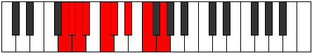 |
| [1395](https://ianring.com/musictheory/scales/1395) | [Mixonorian](ModeGNaturalMixonorian.md) | G | G, Ab, B, C, Db, Eb, F, G |  |
| [1399](https://ianring.com/musictheory/scales/1399) | [Syryllic](ModeGNaturalSyryllic.md) | G | G, G#, A, B, C, C#, D#, F, G |  |
| [1401](https://ianring.com/musictheory/scales/1401) | [Pagian](ModeDNaturalPagian.md) | D | D, E#, F#, G, Ab, Bb, C, D |  |
| [1403](https://ianring.com/musictheory/scales/1403) | [Epinyllic](ModeDNaturalEpinyllic.md) | D | D, D#, F, F#, G, G#, A#, C, D |  |
| [1403](https://ianring.com/musictheory/scales/1403) | [Epinyllic](ModeENaturalEpinyllic.md) | E | E, F, G, G#, A, A#, C, D, E |  |
| [1403](https://ianring.com/musictheory/scales/1403) | [Epinyllic](ModeGNaturalEpinyllic.md) | G | G, G#, A#, B, C, C#, D#, F, G |  |
| [1405](https://ianring.com/musictheory/scales/1405) | [Goryllic](ModeDNaturalGoryllic.md) | D | D, E, F, F#, G, G#, A#, C, D | 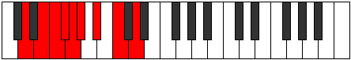 |
| [1407](https://ianring.com/musictheory/scales/1407) | [Tharygic](ModeDNaturalTharygic.md) | D | D, D#, E, F, F#, G, G#, A#, C, D |  |
| [1407](https://ianring.com/musictheory/scales/1407) | [Tharygic](ModeENaturalTharygic.md) | E | E, F, F#, G, G#, A, A#, C, D, E |  |
| [1407](https://ianring.com/musictheory/scales/1407) | [Tharygic](ModeGNaturalTharygic.md) | G | G, G#, A, A#, B, C, C#, D#, F, G |  |
| [1421](https://ianring.com/musictheory/scales/1421) | [Aeolaphimic](ModeFNaturalAeolaphimic.md) | F | F, G, Ab, B#, C#, D#, F |  |
| [1423](https://ianring.com/musictheory/scales/1423) | [Doptian](ModeFNaturalDoptian.md) | F | F, Gb, Abb, Bbbb, C, Db, Eb, F |  |
| [1435](https://ianring.com/musictheory/scales/1435) | [Phronian](ModeENaturalPhronian.md) | E | E, F, G, Ab, B, C, D, E |  |
| [1437](https://ianring.com/musictheory/scales/1437) | [Aeolycrian](ModeFNaturalAeolycrian.md) | F | F, G, Ab, Bbb, C, Db, Eb, F |  |
| [1439](https://ianring.com/musictheory/scales/1439) | [Rolyllic](ModeFNaturalRolyllic.md) | F | F, F#, G, G#, A, C, C#, D#, F |  |
| [1439](https://ianring.com/musictheory/scales/1439) | [Rolyllic](ModeENaturalRolyllic.md) | E | E, F, F#, G, G#, B, C, D, E |  |
| [1443](https://ianring.com/musictheory/scales/1443) | [Ionarimic](ModeGNaturalIonarimic.md) | G | G, Ab, B#, C##, D#, E#, G |  |
| [1443](https://ianring.com/musictheory/scales/1443) | [Ionarimic](ModeCNaturalIonarimic.md) | C | C, Db, E#, F##, G#, A#, C |  |
| [1445](https://ianring.com/musictheory/scales/1445) | [Byptimic](ModeCNaturalByptimic.md) | C | C, D, E#, F##, G#, A#, C |  |
| [1447](https://ianring.com/musictheory/scales/1447) | [Mixopyrian](ModeGNaturalMixopyrian.md) | G | G, Ab, Bbb, C, D, Eb, F, G |  |
| [1447](https://ianring.com/musictheory/scales/1447) | [Mixopyrian](ModeCNaturalMixopyrian.md) | C | C, Db, Ebb, F, G, Ab, Bb, C |  |
| [1449](https://ianring.com/musictheory/scales/1449) | [Epathimic](ModeCNaturalEpathimic.md) | C | C, D#, E#, F##, G#, A#, C |  |
| [1451](https://ianring.com/musictheory/scales/1451) | [Phrygian](ModeCNaturalPhrygian.md) | C | C, Db, Eb, F, G, Ab, Bb, C |  |
| [1451](https://ianring.com/musictheory/scales/1451) | [Phrygian](ModeGNaturalPhrygian.md) | G | G, Ab, Bb, C, D, Eb, F, G |  |
| [1453](https://ianring.com/musictheory/scales/1453) | [Aeolian](ModeFNaturalAeolian.md) | F | F, G, Ab, Bb, C, Db, Eb, F |  |
| [1453](https://ianring.com/musictheory/scales/1453) | [Aeolian](ModeCNaturalAeolian.md) | C | C, D, Eb, F, G, Ab, Bb, C |  |
| [1455](https://ianring.com/musictheory/scales/1455) | [Soryllic](ModeCNaturalSoryllic.md) | C | C, C#, D, D#, F, G, G#, A#, C |  |
| [1455](https://ianring.com/musictheory/scales/1455) | [Soryllic](ModeFNaturalSoryllic.md) | F | F, F#, G, G#, A#, C, C#, D#, F |  |
| [1455](https://ianring.com/musictheory/scales/1455) | [Soryllic](ModeGNaturalSoryllic.md) | G | G, G#, A, A#, C, D, D#, F, G |  |
| [1457](https://ianring.com/musictheory/scales/1457) | [Modimic](ModeCNaturalModimic.md) | C | C, D##, E#, F##, G#, A#, C |  |
| [1459](https://ianring.com/musictheory/scales/1459) | [Ionalian](ModeCNaturalIonalian.md) | C | C, Db, E, F, G, Ab, Bb, C |  |
| [1459](https://ianring.com/musictheory/scales/1459) | [Ionalian](ModeGNaturalIonalian.md) | G | G, Ab, B, C, D, Eb, F, G |  |
| [1461](https://ianring.com/musictheory/scales/1461) | [Stydian](ModeCNaturalStydian.md) | C | C, D, E, F, G, Ab, Bb, C |  |
| [1463](https://ianring.com/musictheory/scales/1463) | [Zaptyllic](ModeCNaturalZaptyllic.md) | C | C, C#, D, E, F, G, G#, A#, C |  |
| [1463](https://ianring.com/musictheory/scales/1463) | [Zaptyllic](ModeGNaturalZaptyllic.md) | G | G, G#, A, B, C, D, D#, F, G |  |
| [1465](https://ianring.com/musictheory/scales/1465) | [Aerathian](ModeCNaturalAerathian.md) | C | C, D#, E, F, G, Ab, Bb, C |  |
| [1467](https://ianring.com/musictheory/scales/1467) | [Thydyllic](ModeCNaturalThydyllic.md) | C | C, C#, D#, E, F, G, G#, A#, C |  |
| [1467](https://ianring.com/musictheory/scales/1467) | [Thydyllic](ModeENaturalThydyllic.md) | E | E, F, G, G#, A, B, C, D, E |  |
| [1467](https://ianring.com/musictheory/scales/1467) | [Thydyllic](ModeGNaturalThydyllic.md) | G | G, G#, A#, B, C, D, D#, F, G |  |
| [1469](https://ianring.com/musictheory/scales/1469) | [Epiryllic](ModeCNaturalEpiryllic.md) | C | C, D, D#, E, F, G, G#, A#, C |  |
| [1469](https://ianring.com/musictheory/scales/1469) | [Epiryllic](ModeFNaturalEpiryllic.md) | F | F, G, G#, A, A#, C, C#, D#, F |  |
| [1471](https://ianring.com/musictheory/scales/1471) | [Radygic](ModeCNaturalRadygic.md) | C | C, C#, D, D#, E, F, G, G#, A#, C |  |
| [1471](https://ianring.com/musictheory/scales/1471) | [Radygic](ModeFNaturalRadygic.md) | F | F, F#, G, G#, A, A#, C, C#, D#, F |  |
| [1471](https://ianring.com/musictheory/scales/1471) | [Radygic](ModeENaturalRadygic.md) | E | E, F, F#, G, G#, A, B, C, D, E |  |
| [1471](https://ianring.com/musictheory/scales/1471) | [Radygic](ModeGNaturalRadygic.md) | G | G, G#, A, A#, B, C, D, D#, F, G |  |
| [1485](https://ianring.com/musictheory/scales/1485) | [Tyrian](ModeFNaturalTyrian.md) | F | F, G, Ab, B, C, Db, Eb, F |  |
| [1487](https://ianring.com/musictheory/scales/1487) | [Lycryllic](ModeFNaturalLycryllic.md) | F | F, F#, G, G#, B, C, C#, D#, F |  |
| [1499](https://ianring.com/musictheory/scales/1499) | [Stonyllic](ModeENaturalStonyllic.md) | E | E, F, G, G#, A#, B, C, D, E |  |
| [1501](https://ianring.com/musictheory/scales/1501) | [Stygyllic](ModeFNaturalStygyllic.md) | F | F, G, G#, A, B, C, C#, D#, F |  |
| [1503](https://ianring.com/musictheory/scales/1503) | [Padygic](ModeFNaturalPadygic.md) | F | F, F#, G, G#, A, B, C, C#, D#, F |  |
| [1503](https://ianring.com/musictheory/scales/1503) | [Padygic](ModeENaturalPadygic.md) | E | E, F, F#, G, G#, A#, B, C, D, E |  |
| [1507](https://ianring.com/musictheory/scales/1507) | [Zynian](ModeGNaturalZynian.md) | G | G, Ab, B#, C#, D, Eb, F, G |  |
| [1507](https://ianring.com/musictheory/scales/1507) | [Zynian](ModeCNaturalZynian.md) | C | C, Db, E#, F#, G, Ab, Bb, C |  |
| [1509](https://ianring.com/musictheory/scales/1509) | [Ragian](ModeCNaturalRagian.md) | C | C, D, E#, F#, G, Ab, Bb, C |  |
| [1511](https://ianring.com/musictheory/scales/1511) | [Styptyllic](ModeGNaturalStyptyllic.md) | G | G, G#, A, C, C#, D, D#, F, G |  |
| [1511](https://ianring.com/musictheory/scales/1511) | [Styptyllic](ModeCNaturalStyptyllic.md) | C | C, C#, D, F, F#, G, G#, A#, C |  |
| [1513](https://ianring.com/musictheory/scales/1513) | [Stathian](ModeCNaturalStathian.md) | C | C, D#, E#, F#, G, Ab, Bb, C |  |
| [1513](https://ianring.com/musictheory/scales/1513) | [Stathian](ModeDNaturalStathian.md) | D | D, E#, F##, G#, A, Bb, C, D |  |
| [1515](https://ianring.com/musictheory/scales/1515) | [Solyllic](ModeGNaturalSolyllic.md) | G | G, G#, A#, C, C#, D, D#, F, G |  |
| [1515](https://ianring.com/musictheory/scales/1515) | [Solyllic](ModeCNaturalSolyllic.md) | C | C, C#, D#, F, F#, G, G#, A#, C |  |
| [1515](https://ianring.com/musictheory/scales/1515) | [Solyllic](ModeDNaturalSolyllic.md) | D | D, D#, F, G, G#, A, A#, C, D |  |
| [1517](https://ianring.com/musictheory/scales/1517) | [Sagyllic](ModeCNaturalSagyllic.md) | C | C, D, D#, F, F#, G, G#, A#, C |  |
| [1517](https://ianring.com/musictheory/scales/1517) | [Sagyllic](ModeDNaturalSagyllic.md) | D | D, E, F, G, G#, A, A#, C, D |  |
| [1517](https://ianring.com/musictheory/scales/1517) | [Sagyllic](ModeFNaturalSagyllic.md) | F | F, G, G#, A#, B, C, C#, D#, F |  |
| [1519](https://ianring.com/musictheory/scales/1519) | [Solygic](ModeCNaturalSolygic.md) | C | C, C#, D, D#, F, F#, G, G#, A#, C |  |
| [1519](https://ianring.com/musictheory/scales/1519) | [Solygic](ModeGNaturalSolygic.md) | G | G, G#, A, A#, C, C#, D, D#, F, G |  |
| [1519](https://ianring.com/musictheory/scales/1519) | [Solygic](ModeDNaturalSolygic.md) | D | D, D#, E, F, G, G#, A, A#, C, D |  |
| [1519](https://ianring.com/musictheory/scales/1519) | [Solygic](ModeFNaturalSolygic.md) | F | F, F#, G, G#, A#, B, C, C#, D#, F |  |
| [1521](https://ianring.com/musictheory/scales/1521) | [Stanian](ModeCNaturalStanian.md) | C | C, D##, E#, F#, G, Ab, Bb, C | 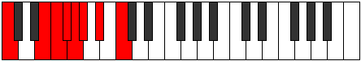 |
| [1523](https://ianring.com/musictheory/scales/1523) | [Zothyllic](ModeCNaturalZothyllic.md) | C | C, C#, E, F, F#, G, G#, A#, C |  |
| [1523](https://ianring.com/musictheory/scales/1523) | [Zothyllic](ModeGNaturalZothyllic.md) | G | G, G#, B, C, C#, D, D#, F, G |  |
| [1525](https://ianring.com/musictheory/scales/1525) | [Sodyllic](ModeCNaturalSodyllic.md) | C | C, D, E, F, F#, G, G#, A#, C |  |
| [1527](https://ianring.com/musictheory/scales/1527) | [Aeolyrygic](ModeCNaturalAeolyrygic.md) | C | C, C#, D, E, F, F#, G, G#, A#, C |  |
| [1527](https://ianring.com/musictheory/scales/1527) | [Aeolyrygic](ModeGNaturalAeolyrygic.md) | G | G, G#, A, B, C, C#, D, D#, F, G |  |
| [1529](https://ianring.com/musictheory/scales/1529) | [Kataryllic](ModeCNaturalKataryllic.md) | C | C, D#, E, F, F#, G, G#, A#, C |  |
| [1529](https://ianring.com/musictheory/scales/1529) | [Kataryllic](ModeDNaturalKataryllic.md) | D | D, F, F#, G, G#, A, A#, C, D |  |
| [1531](https://ianring.com/musictheory/scales/1531) | [Styptygic](ModeCNaturalStyptygic.md) | C | C, C#, D#, E, F, F#, G, G#, A#, C |  |
| [1531](https://ianring.com/musictheory/scales/1531) | [Styptygic](ModeDNaturalStyptygic.md) | D | D, D#, F, F#, G, G#, A, A#, C, D |  |
| [1531](https://ianring.com/musictheory/scales/1531) | [Styptygic](ModeGNaturalStyptygic.md) | G | G, G#, A#, B, C, C#, D, D#, F, G |  |
| [1531](https://ianring.com/musictheory/scales/1531) | [Styptygic](ModeENaturalStyptygic.md) | E | E, F, G, G#, A, A#, B, C, D, E |  |
| [1533](https://ianring.com/musictheory/scales/1533) | [Katycrygic](ModeCNaturalKatycrygic.md) | C | C, D, D#, E, F, F#, G, G#, A#, C |  |
| [1533](https://ianring.com/musictheory/scales/1533) | [Katycrygic](ModeDNaturalKatycrygic.md) | D | D, E, F, F#, G, G#, A, A#, C, D |  |
| [1533](https://ianring.com/musictheory/scales/1533) | [Katycrygic](ModeFNaturalKatycrygic.md) | F | F, G, G#, A, A#, B, C, C#, D#, F |  |
| [1535](https://ianring.com/musictheory/scales/1535) | [Mixodyllian](ModeCNaturalMixodyllian.md) | C | C, C#, D, D#, E, F, F#, G, G#, A#, C |  |
| [1535](https://ianring.com/musictheory/scales/1535) | [Mixodyllian](ModeDNaturalMixodyllian.md) | D | D, D#, E, F, F#, G, G#, A, A#, C, D |  |
| [1535](https://ianring.com/musictheory/scales/1535) | [Mixodyllian](ModeGNaturalMixodyllian.md) | G | G, G#, A, A#, B, C, C#, D, D#, F, G |  |
| [1535](https://ianring.com/musictheory/scales/1535) | [Mixodyllian](ModeFNaturalMixodyllian.md) | F | F, F#, G, G#, A, A#, B, C, C#, D#, F |  |
| [1535](https://ianring.com/musictheory/scales/1535) | [Mixodyllian](ModeENaturalMixodyllian.md) | E | E, F, F#, G, G#, A, A#, B, C, D, E |  |
| [1571](https://ianring.com/musictheory/scales/1571) | [Lagitonic](ModeGNaturalLagitonic.md) | G | G, G#, C, E, F, G |  |
| [1575](https://ianring.com/musictheory/scales/1575) | [Zycrimic](ModeGNaturalZycrimic.md) | G | G, Ab, Bbb, C, D##, E#, G |  |
| [1579](https://ianring.com/musictheory/scales/1579) | [Sagimic](ModeGNaturalSagimic.md) | G | G, Ab, Bb, C, D##, E#, G |  |
| [1583](https://ianring.com/musictheory/scales/1583) | [Salian](ModeGNaturalSalian.md) | G | G, Ab, Bbb, Cbb, Dbb, E, F, G |  |
| [1587](https://ianring.com/musictheory/scales/1587) | [Lalimic](ModeGNaturalLalimic.md) | G | G, Ab, B, C, D##, E#, G |  |
| [1589](https://ianring.com/musictheory/scales/1589) | [Ionagimic](ModeDSharpIonagimic.md) | D# | D#, E#, F##, G#, A###, B##, D# |  |
| [1589](https://ianring.com/musictheory/scales/1589) | [Ionagimic](ModeEFlatIonagimic.md) | Eb | Eb, F, G, Ab, B#, C#, Eb |  |
| [1591](https://ianring.com/musictheory/scales/1591) | [Rodian](ModeDSharpRodian.md) | D# | D#, E, F, G, Ab, B#, C#, D# |  |
| [1591](https://ianring.com/musictheory/scales/1591) | [Rodian](ModeEFlatRodian.md) | Eb | Eb, Fb, Gbb, Abb, Bbbb, C, Db, Eb |  |
| [1591](https://ianring.com/musictheory/scales/1591) | [Rodian](ModeGNaturalRodian.md) | G | G, Ab, Bbb, Cb, Dbb, E, F, G |  |
| [1595](https://ianring.com/musictheory/scales/1595) | [Dacrian](ModeGNaturalDacrian.md) | G | G, Ab, Bb, Cb, Dbb, E, F, G |  |
| [1597](https://ianring.com/musictheory/scales/1597) | [Aeolodian](ModeDSharpAeolodian.md) | D# | D#, E#, F#, G, Ab, B#, C#, D# |  |
| [1597](https://ianring.com/musictheory/scales/1597) | [Aeolodian](ModeEFlatAeolodian.md) | Eb | Eb, F, Gb, Abb, Bbbb, C, Db, Eb |  |
| [1599](https://ianring.com/musictheory/scales/1599) | [Pocryllic](ModeDSharpPocryllic.md) | D# | D#, E, F, F#, G, G#, C, C#, D# |  |
| [1599](https://ianring.com/musictheory/scales/1599) | [Pocryllic](ModeEFlatPocryllic.md) | Eb | Eb, E, F, Gb, G, Ab, C, Db, Eb |  |
| [1599](https://ianring.com/musictheory/scales/1599) | [Pocryllic](ModeGNaturalPocryllic.md) | G | G, G#, A, A#, B, C, E, F, G |  |
| [1635](https://ianring.com/musictheory/scales/1635) | [Sygimic](ModeGNaturalSygimic.md) | G | G, Ab, B#, C#, D##, E#, G |  |
| [1639](https://ianring.com/musictheory/scales/1639) | [Aeolothian](ModeGNaturalAeolothian.md) | G | G, Ab, Bbb, C, Db, E, F, G |  |
| [1641](https://ianring.com/musictheory/scales/1641) | [Bocrimic](ModeDNaturalBocrimic.md) | D | D, E#, F##, G#, A##, B#, D |  |
| [1643](https://ianring.com/musictheory/scales/1643) | [Thyptian](ModeGNaturalThyptian.md) | G | G, Ab, Bb, C, Db, E, F, G |  |
| [1643](https://ianring.com/musictheory/scales/1643) | [Thyptian](ModeDNaturalThyptian.md) | D | D, Eb, F, G, Ab, B, C, D |  |
| [1645](https://ianring.com/musictheory/scales/1645) | [Katagian](ModeDNaturalKatagian.md) | D | D, E, F, G, Ab, B, C, D |  |
| [1647](https://ianring.com/musictheory/scales/1647) | [Polyllic](ModeGNaturalPolyllic.md) | G | G, G#, A, A#, C, C#, E, F, G |  |
| [1647](https://ianring.com/musictheory/scales/1647) | [Polyllic](ModeDNaturalPolyllic.md) | D | D, D#, E, F, G, G#, B, C, D |  |
| [1651](https://ianring.com/musictheory/scales/1651) | [Mogian](ModeGNaturalMogian.md) | G | G, Ab, B, C, Db, E, F, G |  |
| [1653](https://ianring.com/musictheory/scales/1653) | [Gylian](ModeDSharpGylian.md) | D# | D#, E#, F##, G#, A, B#, C#, D# |  |
| [1653](https://ianring.com/musictheory/scales/1653) | [Gylian](ModeEFlatGylian.md) | Eb | Eb, F, G, Ab, Bbb, C, Db, Eb |  |
| [1655](https://ianring.com/musictheory/scales/1655) | [Katygyllic](ModeDSharpKatygyllic.md) | D# | D#, E, F, G, G#, A, C, C#, D# |  |
| [1655](https://ianring.com/musictheory/scales/1655) | [Katygyllic](ModeEFlatKatygyllic.md) | Eb | Eb, E, F, G, Ab, A, C, Db, Eb |  |
| [1655](https://ianring.com/musictheory/scales/1655) | [Katygyllic](ModeGNaturalKatygyllic.md) | G | G, G#, A, B, C, C#, E, F, G |  |
| [1657](https://ianring.com/musictheory/scales/1657) | [Ionothian](ModeDNaturalIonothian.md) | D | D, E#, F#, G, Ab, B, C, D |  |
| [1659](https://ianring.com/musictheory/scales/1659) | [Magyllic](ModeDNaturalMagyllic.md) | D | D, D#, F, F#, G, G#, B, C, D |  |
| [1659](https://ianring.com/musictheory/scales/1659) | [Magyllic](ModeGNaturalMagyllic.md) | G | G, G#, A#, B, C, C#, E, F, G |  |
| [1661](https://ianring.com/musictheory/scales/1661) | [Gonyllic](ModeDSharpGonyllic.md) | D# | D#, F, F#, G, G#, A, C, C#, D# |  |
| [1661](https://ianring.com/musictheory/scales/1661) | [Gonyllic](ModeEFlatGonyllic.md) | Eb | Eb, F, Gb, G, Ab, A, C, Db, Eb |  |
| [1661](https://ianring.com/musictheory/scales/1661) | [Gonyllic](ModeDNaturalGonyllic.md) | D | D, E, F, F#, G, G#, B, C, D |  |
| [1663](https://ianring.com/musictheory/scales/1663) | [Lydygic](ModeDSharpLydygic.md) | D# | D#, E, F, F#, G, G#, A, C, C#, D# |  |
| [1663](https://ianring.com/musictheory/scales/1663) | [Lydygic](ModeEFlatLydygic.md) | Eb | Eb, E, F, Gb, G, Ab, A, C, Db, Eb |  |
| [1663](https://ianring.com/musictheory/scales/1663) | [Lydygic](ModeDNaturalLydygic.md) | D | D, D#, E, F, F#, G, G#, B, C, D |  |
| [1663](https://ianring.com/musictheory/scales/1663) | [Lydygic](ModeGNaturalLydygic.md) | G | G, G#, A, A#, B, C, C#, E, F, G |  |
| [1677](https://ianring.com/musictheory/scales/1677) | [Danimic](ModeFNaturalDanimic.md) | F | F, G, Ab, B#, C##, D#, F |  |
| [1677](https://ianring.com/musictheory/scales/1677) | [Danimic](ModeASharpDanimic.md) | A# | A#, B#, C#, D###, E###, F###, A# |  |
| [1677](https://ianring.com/musictheory/scales/1677) | [Danimic](ModeBFlatDanimic.md) | Bb | Bb, C, Db, E#, F##, G#, Bb |  |
| [1679](https://ianring.com/musictheory/scales/1679) | [Kydian](ModeFNaturalKydian.md) | F | F, Gb, Abb, Bbbb, C, D, Eb, F |  |
| [1679](https://ianring.com/musictheory/scales/1679) | [Kydian](ModeASharpKydian.md) | A# | A#, B, C, Db, E#, F##, G#, A# |  |
| [1679](https://ianring.com/musictheory/scales/1679) | [Kydian](ModeBFlatKydian.md) | Bb | Bb, Cb, Dbb, Ebbb, F, G, Ab, Bb |  |
| [1685](https://ianring.com/musictheory/scales/1685) | [Zeracrimic](ModeASharpZeracrimic.md) | A# | A#, B#, C##, D###, E###, F###, A# |  |
| [1685](https://ianring.com/musictheory/scales/1685) | [Zeracrimic](ModeBFlatZeracrimic.md) | Bb | Bb, C, D, E#, F##, G#, Bb |  |
| [1687](https://ianring.com/musictheory/scales/1687) | [Phralian](ModeASharpPhralian.md) | A# | A#, B, C, D, E#, F##, G#, A# |  |
| [1687](https://ianring.com/musictheory/scales/1687) | [Phralian](ModeBFlatPhralian.md) | Bb | Bb, Cb, Dbb, Ebb, F, G, Ab, Bb |  |
| [1693](https://ianring.com/musictheory/scales/1693) | [Dogian](ModeFNaturalDogian.md) | F | F, G, Ab, Bbb, C, D, Eb, F |  |
| [1693](https://ianring.com/musictheory/scales/1693) | [Dogian](ModeASharpDogian.md) | A# | A#, B#, C#, D, E#, F##, G#, A# |  |
| [1693](https://ianring.com/musictheory/scales/1693) | [Dogian](ModeBFlatDogian.md) | Bb | Bb, C, Db, Ebb, F, G, Ab, Bb |  |
| [1695](https://ianring.com/musictheory/scales/1695) | [Phrodyllic](ModeFNaturalPhrodyllic.md) | F | F, F#, G, G#, A, C, D, D#, F |  |
| [1695](https://ianring.com/musictheory/scales/1695) | [Phrodyllic](ModeASharpPhrodyllic.md) | A# | A#, B, C, C#, D, F, G, G#, A# |  |
| [1695](https://ianring.com/musictheory/scales/1695) | [Phrodyllic](ModeBFlatPhrodyllic.md) | Bb | Bb, B, C, Db, D, F, G, Ab, Bb |  |
| [1699](https://ianring.com/musictheory/scales/1699) | [Kaptimic](ModeGNaturalKaptimic.md) | G | G, Ab, B#, C##, D##, E#, G |  |
| [1701](https://ianring.com/musictheory/scales/1701) | [Lothimic](ModeASharpLothimic.md) | A# | A#, B#, C###, D###, E###, F###, A# |  |
| [1701](https://ianring.com/musictheory/scales/1701) | [Lothimic](ModeBFlatLothimic.md) | Bb | Bb, C, D#, E#, F##, G#, Bb |  |
| [1703](https://ianring.com/musictheory/scales/1703) | [Zaptian](ModeGNaturalZaptian.md) | G | G, Ab, Bbb, C, D, E, F, G |  |
| [1703](https://ianring.com/musictheory/scales/1703) | [Zaptian](ModeASharpZaptian.md) | A# | A#, B, C, D#, E#, F##, G#, A# |  |
| [1703](https://ianring.com/musictheory/scales/1703) | [Zaptian](ModeBFlatZaptian.md) | Bb | Bb, Cb, Dbb, Eb, F, G, Ab, Bb |  |
| [1707](https://ianring.com/musictheory/scales/1707) | [Mixolythian](ModeGNaturalMixolythian.md) | G | G, Ab, Bb, C, D, E, F, G |  |
| [1709](https://ianring.com/musictheory/scales/1709) | [Dorian](ModeASharpDorian.md) | A# | A#, B#, C#, D#, E#, F##, G#, A# |  |
| [1709](https://ianring.com/musictheory/scales/1709) | [Dorian](ModeBFlatDorian.md) | Bb | Bb, C, Db, Eb, F, G, Ab, Bb |  |
| [1709](https://ianring.com/musictheory/scales/1709) | [Dorian](ModeFNaturalDorian.md) | F | F, G, Ab, Bb, C, D, Eb, F |  |
| [1711](https://ianring.com/musictheory/scales/1711) | [Ragyllic](ModeFNaturalRagyllic.md) | F | F, F#, G, G#, A#, C, D, D#, F |  |
| [1711](https://ianring.com/musictheory/scales/1711) | [Ragyllic](ModeGNaturalRagyllic.md) | G | G, G#, A, A#, C, D, E, F, G |  |
| [1711](https://ianring.com/musictheory/scales/1711) | [Ragyllic](ModeASharpRagyllic.md) | A# | A#, B, C, C#, D#, F, G, G#, A# |  |
| [1711](https://ianring.com/musictheory/scales/1711) | [Ragyllic](ModeBFlatRagyllic.md) | Bb | Bb, B, C, Db, Eb, F, G, Ab, Bb |  |
| [1715](https://ianring.com/musictheory/scales/1715) | [Aeronian](ModeGNaturalAeronian.md) | G | G, Ab, B, C, D, E, F, G |  |
| [1717](https://ianring.com/musictheory/scales/1717) | [Mixolydian](ModeDSharpMixolydian.md) | D# | D#, E#, F##, G#, A#, B#, C#, D# |  |
| [1717](https://ianring.com/musictheory/scales/1717) | [Mixolydian](ModeEFlatMixolydian.md) | Eb | Eb, F, G, Ab, Bb, C, Db, Eb |  |
| [1717](https://ianring.com/musictheory/scales/1717) | [Mixolydian](ModeASharpMixolydian.md) | A# | A#, B#, C##, D#, E#, F##, G#, A# |  |
| [1717](https://ianring.com/musictheory/scales/1717) | [Mixolydian](ModeBFlatMixolydian.md) | Bb | Bb, C, D, Eb, F, G, Ab, Bb |  |
| [1719](https://ianring.com/musictheory/scales/1719) | [Lyryllic](ModeDSharpLyryllic.md) | D# | D#, E, F, G, G#, A#, C, C#, D# |  |
| [1719](https://ianring.com/musictheory/scales/1719) | [Lyryllic](ModeEFlatLyryllic.md) | Eb | Eb, E, F, G, Ab, Bb, C, Db, Eb |  |
| [1719](https://ianring.com/musictheory/scales/1719) | [Lyryllic](ModeGNaturalLyryllic.md) | G | G, G#, A, B, C, D, E, F, G |  |
| [1719](https://ianring.com/musictheory/scales/1719) | [Lyryllic](ModeASharpLyryllic.md) | A# | A#, B, C, D, D#, F, G, G#, A# |  |
| [1719](https://ianring.com/musictheory/scales/1719) | [Lyryllic](ModeBFlatLyryllic.md) | Bb | Bb, B, C, D, Eb, F, G, Ab, Bb |  |
| [1723](https://ianring.com/musictheory/scales/1723) | [Poryllic](ModeGNaturalPoryllic.md) | G | G, G#, A#, B, C, D, E, F, G |  |
| [1725](https://ianring.com/musictheory/scales/1725) | [Mixodyllic](ModeASharpMixodyllic.md) | A# | A#, C, C#, D, D#, F, G, G#, A# |  |
| [1725](https://ianring.com/musictheory/scales/1725) | [Mixodyllic](ModeBFlatMixodyllic.md) | Bb | Bb, C, Db, D, Eb, F, G, Ab, Bb |  |
| [1725](https://ianring.com/musictheory/scales/1725) | [Mixodyllic](ModeDSharpMixodyllic.md) | D# | D#, F, F#, G, G#, A#, C, C#, D# |  |
| [1725](https://ianring.com/musictheory/scales/1725) | [Mixodyllic](ModeEFlatMixodyllic.md) | Eb | Eb, F, Gb, G, Ab, Bb, C, Db, Eb |  |
| [1725](https://ianring.com/musictheory/scales/1725) | [Mixodyllic](ModeFNaturalMixodyllic.md) | F | F, G, G#, A, A#, C, D, D#, F |  |
| [1727](https://ianring.com/musictheory/scales/1727) | [Sydygic](ModeDSharpSydygic.md) | D# | D#, E, F, F#, G, G#, A#, C, C#, D# |  |
| [1727](https://ianring.com/musictheory/scales/1727) | [Sydygic](ModeEFlatSydygic.md) | Eb | Eb, E, F, Gb, G, Ab, Bb, C, Db, Eb |  |
| [1727](https://ianring.com/musictheory/scales/1727) | [Sydygic](ModeFNaturalSydygic.md) | F | F, F#, G, G#, A, A#, C, D, D#, F |  |
| [1727](https://ianring.com/musictheory/scales/1727) | [Sydygic](ModeASharpSydygic.md) | A# | A#, B, C, C#, D, D#, F, G, G#, A# |  |
| [1727](https://ianring.com/musictheory/scales/1727) | [Sydygic](ModeBFlatSydygic.md) | Bb | Bb, B, C, Db, D, Eb, F, G, Ab, Bb |  |
| [1727](https://ianring.com/musictheory/scales/1727) | [Sydygic](ModeGNaturalSydygic.md) | G | G, G#, A, A#, B, C, D, E, F, G |  |
| [1733](https://ianring.com/musictheory/scales/1733) | [Socrimic](ModeASharpSocrimic.md) | A# | A#, B#, D##, E#, F##, G#, A# |  |
| [1733](https://ianring.com/musictheory/scales/1733) | [Socrimic](ModeBFlatSocrimic.md) | Bb | Bb, C, D##, E#, F##, G#, Bb |  |
| [1735](https://ianring.com/musictheory/scales/1735) | [Dagian](ModeASharpDagian.md) | A# | A#, B, C, D##, E#, F##, G#, A# |  |
| [1735](https://ianring.com/musictheory/scales/1735) | [Dagian](ModeBFlatDagian.md) | Bb | Bb, Cb, Dbb, E, F, G, Ab, Bb |  |
| [1741](https://ianring.com/musictheory/scales/1741) | [Katycrian](ModeASharpKatycrian.md) | A# | A#, B#, C#, D##, E#, F##, G#, A# |  |
| [1741](https://ianring.com/musictheory/scales/1741) | [Katycrian](ModeBFlatKatycrian.md) | Bb | Bb, C, Db, E, F, G, Ab, Bb |  |
| [1741](https://ianring.com/musictheory/scales/1741) | [Katycrian](ModeFNaturalKatycrian.md) | F | F, G, Ab, B, C, D, Eb, F |  |
| [1743](https://ianring.com/musictheory/scales/1743) | [Epigyllic](ModeFNaturalEpigyllic.md) | F | F, F#, G, G#, B, C, D, D#, F |  |
| [1743](https://ianring.com/musictheory/scales/1743) | [Epigyllic](ModeASharpEpigyllic.md) | A# | A#, B, C, C#, E, F, G, G#, A# |  |
| [1743](https://ianring.com/musictheory/scales/1743) | [Epigyllic](ModeBFlatEpigyllic.md) | Bb | Bb, B, C, Db, E, F, G, Ab, Bb |  |
| [1749](https://ianring.com/musictheory/scales/1749) | [Lythian](ModeASharpLythian.md) | A# | A#, B#, C##, D##, E#, F##, G#, A# |  |
| [1749](https://ianring.com/musictheory/scales/1749) | [Lythian](ModeBFlatLythian.md) | Bb | Bb, C, D, E, F, G, Ab, Bb |  |
| [1751](https://ianring.com/musictheory/scales/1751) | [Aeolyryllic](ModeASharpAeolyryllic.md) | A# | A#, B, C, D, E, F, G, G#, A# |  |
| [1751](https://ianring.com/musictheory/scales/1751) | [Aeolyryllic](ModeBFlatAeolyryllic.md) | Bb | Bb, B, C, D, E, F, G, Ab, Bb |  |
| [1757](https://ianring.com/musictheory/scales/1757) | [Ionyphyllic](ModeASharpIonyphyllic.md) | A# | A#, C, C#, D, E, F, G, G#, A# |  |
| [1757](https://ianring.com/musictheory/scales/1757) | [Ionyphyllic](ModeBFlatIonyphyllic.md) | Bb | Bb, C, Db, D, E, F, G, Ab, Bb |  |
| [1757](https://ianring.com/musictheory/scales/1757) | [Ionyphyllic](ModeFNaturalIonyphyllic.md) | F | F, G, G#, A, B, C, D, D#, F |  |
| [1759](https://ianring.com/musictheory/scales/1759) | [Pylygic](ModeFNaturalPylygic.md) | F | F, F#, G, G#, A, B, C, D, D#, F |  |
| [1759](https://ianring.com/musictheory/scales/1759) | [Pylygic](ModeASharpPylygic.md) | A# | A#, B, C, C#, D, E, F, G, G#, A# |  |
| [1759](https://ianring.com/musictheory/scales/1759) | [Pylygic](ModeBFlatPylygic.md) | Bb | Bb, B, C, Db, D, E, F, G, Ab, Bb |  |
| [1763](https://ianring.com/musictheory/scales/1763) | [Katalian](ModeGNaturalKatalian.md) | G | G, Ab, B#, C#, D, E, F, G |  |
| [1765](https://ianring.com/musictheory/scales/1765) | [Lonian](ModeASharpLonian.md) | A# | A#, B#, C###, D##, E#, F##, G#, A# | 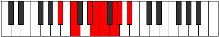 |
| [1765](https://ianring.com/musictheory/scales/1765) | [Lonian](ModeBFlatLonian.md) | Bb | Bb, C, D#, E, F, G, Ab, Bb |  |
| [1767](https://ianring.com/musictheory/scales/1767) | [Dyryllic](ModeGNaturalDyryllic.md) | G | G, G#, A, C, C#, D, E, F, G |  |
| [1767](https://ianring.com/musictheory/scales/1767) | [Dyryllic](ModeASharpDyryllic.md) | A# | A#, B, C, D#, E, F, G, G#, A# |  |
| [1767](https://ianring.com/musictheory/scales/1767) | [Dyryllic](ModeBFlatDyryllic.md) | Bb | Bb, B, C, Eb, E, F, G, Ab, Bb |  |
| [1769](https://ianring.com/musictheory/scales/1769) | [Rythian](ModeDNaturalRythian.md) | D | D, E#, F##, G#, A, B, C, D |  |
| [1771](https://ianring.com/musictheory/scales/1771) | [Stylyllic](ModeGNaturalStylyllic.md) | G | G, G#, A#, C, C#, D, E, F, G |  |
| [1771](https://ianring.com/musictheory/scales/1771) | [Stylyllic](ModeDNaturalStylyllic.md) | D | D, D#, F, G, G#, A, B, C, D |  |
| [1773](https://ianring.com/musictheory/scales/1773) | [Aeoloryllic](ModeASharpAeoloryllic.md) | A# | A#, C, C#, D#, E, F, G, G#, A# |  |
| [1773](https://ianring.com/musictheory/scales/1773) | [Aeoloryllic](ModeBFlatAeoloryllic.md) | Bb | Bb, C, Db, Eb, E, F, G, Ab, Bb |  |
| [1773](https://ianring.com/musictheory/scales/1773) | [Aeoloryllic](ModeDNaturalAeoloryllic.md) | D | D, E, F, G, G#, A, B, C, D |  |
| [1773](https://ianring.com/musictheory/scales/1773) | [Aeoloryllic](ModeFNaturalAeoloryllic.md) | F | F, G, G#, A#, B, C, D, D#, F |  |
| [1775](https://ianring.com/musictheory/scales/1775) | [Lyrygic](ModeGNaturalLyrygic.md) | G | G, G#, A, A#, C, C#, D, E, F, G |  |
| [1775](https://ianring.com/musictheory/scales/1775) | [Lyrygic](ModeDNaturalLyrygic.md) | D | D, D#, E, F, G, G#, A, B, C, D |  |
| [1775](https://ianring.com/musictheory/scales/1775) | [Lyrygic](ModeASharpLyrygic.md) | A# | A#, B, C, C#, D#, E, F, G, G#, A# |  |
| [1775](https://ianring.com/musictheory/scales/1775) | [Lyrygic](ModeBFlatLyrygic.md) | Bb | Bb, B, C, Db, Eb, E, F, G, Ab, Bb |  |
| [1775](https://ianring.com/musictheory/scales/1775) | [Lyrygic](ModeFNaturalLyrygic.md) | F | F, F#, G, G#, A#, B, C, D, D#, F |  |
| [1779](https://ianring.com/musictheory/scales/1779) | [Aerythyllic](ModeGNaturalAerythyllic.md) | G | G, G#, B, C, C#, D, E, F, G |  |
| [1781](https://ianring.com/musictheory/scales/1781) | [Gocryllic](ModeASharpGocryllic.md) | A# | A#, C, D, D#, E, F, G, G#, A# |  |
| [1781](https://ianring.com/musictheory/scales/1781) | [Gocryllic](ModeBFlatGocryllic.md) | Bb | Bb, C, D, Eb, E, F, G, Ab, Bb |  |
| [1781](https://ianring.com/musictheory/scales/1781) | [Gocryllic](ModeDSharpGocryllic.md) | D# | D#, F, G, G#, A, A#, C, C#, D# |  |
| [1781](https://ianring.com/musictheory/scales/1781) | [Gocryllic](ModeEFlatGocryllic.md) | Eb | Eb, F, G, Ab, A, Bb, C, Db, Eb |  |
| [1783](https://ianring.com/musictheory/scales/1783) | [Danygic](ModeDSharpDanygic.md) | D# | D#, E, F, G, G#, A, A#, C, C#, D# |  |
| [1783](https://ianring.com/musictheory/scales/1783) | [Danygic](ModeEFlatDanygic.md) | Eb | Eb, E, F, G, Ab, A, Bb, C, Db, Eb |  |
| [1783](https://ianring.com/musictheory/scales/1783) | [Danygic](ModeGNaturalDanygic.md) | G | G, G#, A, B, C, C#, D, E, F, G |  |
| [1783](https://ianring.com/musictheory/scales/1783) | [Danygic](ModeASharpDanygic.md) | A# | A#, B, C, D, D#, E, F, G, G#, A# |  |
| [1783](https://ianring.com/musictheory/scales/1783) | [Danygic](ModeBFlatDanygic.md) | Bb | Bb, B, C, D, Eb, E, F, G, Ab, Bb |  |
| [1785](https://ianring.com/musictheory/scales/1785) | [Tharyllic](ModeDNaturalTharyllic.md) | D | D, F, F#, G, G#, A, B, C, D |  |
| [1787](https://ianring.com/musictheory/scales/1787) | [Mycrygic](ModeDNaturalMycrygic.md) | D | D, D#, F, F#, G, G#, A, B, C, D |  |
| [1787](https://ianring.com/musictheory/scales/1787) | [Mycrygic](ModeGNaturalMycrygic.md) | G | G, G#, A#, B, C, C#, D, E, F, G |  |
| [1789](https://ianring.com/musictheory/scales/1789) | [Katagygic](ModeASharpKatagygic.md) | A# | A#, C, C#, D, D#, E, F, G, G#, A# |  |
| [1789](https://ianring.com/musictheory/scales/1789) | [Katagygic](ModeBFlatKatagygic.md) | Bb | Bb, C, Db, D, Eb, E, F, G, Ab, Bb |  |
| [1789](https://ianring.com/musictheory/scales/1789) | [Katagygic](ModeDSharpKatagygic.md) | D# | D#, F, F#, G, G#, A, A#, C, C#, D# |  |
| [1789](https://ianring.com/musictheory/scales/1789) | [Katagygic](ModeEFlatKatagygic.md) | Eb | Eb, F, Gb, G, Ab, A, Bb, C, Db, Eb |  |
| [1789](https://ianring.com/musictheory/scales/1789) | [Katagygic](ModeDNaturalKatagygic.md) | D | D, E, F, F#, G, G#, A, B, C, D |  |
| [1789](https://ianring.com/musictheory/scales/1789) | [Katagygic](ModeFNaturalKatagygic.md) | F | F, G, G#, A, A#, B, C, D, D#, F |  |
| [1791](https://ianring.com/musictheory/scales/1791) | [Aerygyllian](ModeDSharpAerygyllian.md) | D# | D#, E, F, F#, G, G#, A, A#, C, C#, D# |  |
| [1791](https://ianring.com/musictheory/scales/1791) | [Aerygyllian](ModeEFlatAerygyllian.md) | Eb | Eb, E, F, Gb, G, Ab, A, Bb, C, Db, Eb |  |
| [1791](https://ianring.com/musictheory/scales/1791) | [Aerygyllian](ModeDNaturalAerygyllian.md) | D | D, D#, E, F, F#, G, G#, A, B, C, D |  |
| [1791](https://ianring.com/musictheory/scales/1791) | [Aerygyllian](ModeASharpAerygyllian.md) | A# | A#, B, C, C#, D, D#, E, F, G, G#, A# |  |
| [1791](https://ianring.com/musictheory/scales/1791) | [Aerygyllian](ModeBFlatAerygyllian.md) | Bb | Bb, B, C, Db, D, Eb, E, F, G, Ab, Bb |  |
| [1791](https://ianring.com/musictheory/scales/1791) | [Aerygyllian](ModeGNaturalAerygyllian.md) | G | G, G#, A, A#, B, C, C#, D, E, F, G |  |
| [1791](https://ianring.com/musictheory/scales/1791) | [Aerygyllian](ModeFNaturalAerygyllian.md) | F | F, F#, G, G#, A, A#, B, C, D, D#, F |  |
| [1819](https://ianring.com/musictheory/scales/1819) | [Pydian](ModeENaturalPydian.md) | E | E, F, G, Ab, B#, C#, D, E |  |
| [1823](https://ianring.com/musictheory/scales/1823) | [Phralyllic](ModeENaturalPhralyllic.md) | E | E, F, F#, G, G#, C, C#, D, E |  |
| [1827](https://ianring.com/musictheory/scales/1827) | [Katygimic](ModeGNaturalKatygimic.md) | G | G, Ab, B#, C###, D##, E#, G |  |
| [1831](https://ianring.com/musictheory/scales/1831) | [Pothian](ModeGNaturalPothian.md) | G | G, Ab, Bbb, C, D#, E, F, G |  |
| [1835](https://ianring.com/musictheory/scales/1835) | [Byptian](ModeGNaturalByptian.md) | G | G, Ab, Bb, C, D#, E, F, G |  |
| [1839](https://ianring.com/musictheory/scales/1839) | [Zogyllic](ModeGNaturalZogyllic.md) | G | G, G#, A, A#, C, D#, E, F, G |  |
| [1843](https://ianring.com/musictheory/scales/1843) | [Ionygian](ModeGNaturalIonygian.md) | G | G, Ab, B, C, D#, E, F, G |  |
| [1845](https://ianring.com/musictheory/scales/1845) | [Lagian](ModeDSharpLagian.md) | D# | D#, E#, F##, G#, A##, B#, C#, D# |  |
| [1845](https://ianring.com/musictheory/scales/1845) | [Lagian](ModeEFlatLagian.md) | Eb | Eb, F, G, Ab, B, C, Db, Eb |  |
| [1847](https://ianring.com/musictheory/scales/1847) | [Thacryllic](ModeDSharpThacryllic.md) | D# | D#, E, F, G, G#, B, C, C#, D# |  |
| [1847](https://ianring.com/musictheory/scales/1847) | [Thacryllic](ModeEFlatThacryllic.md) | Eb | Eb, E, F, G, Ab, B, C, Db, Eb |  |
| [1847](https://ianring.com/musictheory/scales/1847) | [Thacryllic](ModeGNaturalThacryllic.md) | G | G, G#, A, B, C, D#, E, F, G |  |
| [1851](https://ianring.com/musictheory/scales/1851) | [Zacryllic](ModeENaturalZacryllic.md) | E | E, F, G, G#, A, C, C#, D, E |  |
| [1851](https://ianring.com/musictheory/scales/1851) | [Zacryllic](ModeGNaturalZacryllic.md) | G | G, G#, A#, B, C, D#, E, F, G |  |
| [1853](https://ianring.com/musictheory/scales/1853) | [Phrynyllic](ModeDSharpPhrynyllic.md) | D# | D#, F, F#, G, G#, B, C, C#, D# |  |
| [1853](https://ianring.com/musictheory/scales/1853) | [Phrynyllic](ModeEFlatPhrynyllic.md) | Eb | Eb, F, Gb, G, Ab, B, C, Db, Eb |  |
| [1855](https://ianring.com/musictheory/scales/1855) | [Marygic](ModeENaturalMarygic.md) | E | E, F, F#, G, G#, A, C, C#, D, E |  |
| [1855](https://ianring.com/musictheory/scales/1855) | [Marygic](ModeDSharpMarygic.md) | D# | D#, E, F, F#, G, G#, B, C, C#, D# |  |
| [1855](https://ianring.com/musictheory/scales/1855) | [Marygic](ModeEFlatMarygic.md) | Eb | Eb, E, F, Gb, G, Ab, B, C, Db, Eb |  |
| [1855](https://ianring.com/musictheory/scales/1855) | [Marygic](ModeGNaturalMarygic.md) | G | G, G#, A, A#, B, C, D#, E, F, G |  |
| [1863](https://ianring.com/musictheory/scales/1863) | [Pycrian](ModeBNaturalPycrian.md) | B | B, C, Db, E#, F##, G#, A, B |  |
| [1867](https://ianring.com/musictheory/scales/1867) | [Solian](ModeBNaturalSolian.md) | B | B, C, D, E#, F##, G#, A, B |  |
| [1871](https://ianring.com/musictheory/scales/1871) | [Aeolyllic](ModeBNaturalAeolyllic.md) | B | B, C, C#, D, F, G, G#, A, B |  |
| [1875](https://ianring.com/musictheory/scales/1875) | [Epyphian](ModeBNaturalEpyphian.md) | B | B, C, D#, E#, F##, G#, A, B |  |
| [1879](https://ianring.com/musictheory/scales/1879) | [Mixoryllic](ModeBNaturalMixoryllic.md) | B | B, C, C#, D#, F, G, G#, A, B |  |
| [1883](https://ianring.com/musictheory/scales/1883) | [Mixopyryllic](ModeENaturalMixopyryllic.md) | E | E, F, G, G#, A#, C, C#, D, E |  |
| [1883](https://ianring.com/musictheory/scales/1883) | [Mixopyryllic](ModeBNaturalMixopyryllic.md) | B | B, C, D, D#, F, G, G#, A, B |  |
| [1887](https://ianring.com/musictheory/scales/1887) | [Aerocrygic](ModeENaturalAerocrygic.md) | E | E, F, F#, G, G#, A#, C, C#, D, E |  |
| [1887](https://ianring.com/musictheory/scales/1887) | [Aerocrygic](ModeBNaturalAerocrygic.md) | B | B, C, C#, D, D#, F, G, G#, A, B |  |
| [1891](https://ianring.com/musictheory/scales/1891) | [Thalian](ModeGNaturalThalian.md) | G | G, Ab, B#, C#, D#, E, F, G |  |
| [1891](https://ianring.com/musictheory/scales/1891) | [Thalian](ModeBNaturalThalian.md) | B | B, C, D##, E#, F##, G#, A, B |  |
| [1895](https://ianring.com/musictheory/scales/1895) | [Salyllic](ModeGNaturalSalyllic.md) | G | G, G#, A, C, C#, D#, E, F, G |  |
| [1895](https://ianring.com/musictheory/scales/1895) | [Salyllic](ModeBNaturalSalyllic.md) | B | B, C, C#, E, F, G, G#, A, B |  |
| [1897](https://ianring.com/musictheory/scales/1897) | [Ionopian](ModeDNaturalIonopian.md) | D | D, E#, F##, G#, A#, B, C, D |  |
| [1899](https://ianring.com/musictheory/scales/1899) | [Moptyllic](ModeGNaturalMoptyllic.md) | G | G, G#, A#, C, C#, D#, E, F, G |  |
| [1899](https://ianring.com/musictheory/scales/1899) | [Moptyllic](ModeBNaturalMoptyllic.md) | B | B, C, D, E, F, G, G#, A, B |  |
| [1899](https://ianring.com/musictheory/scales/1899) | [Moptyllic](ModeDNaturalMoptyllic.md) | D | D, D#, F, G, G#, A#, B, C, D |  |
| [1901](https://ianring.com/musictheory/scales/1901) | [Ionidyllic](ModeDNaturalIonidyllic.md) | D | D, E, F, G, G#, A#, B, C, D |  |
| [1903](https://ianring.com/musictheory/scales/1903) | [Rocrygic](ModeGNaturalRocrygic.md) | G | G, G#, A, A#, C, C#, D#, E, F, G |  |
| [1903](https://ianring.com/musictheory/scales/1903) | [Rocrygic](ModeBNaturalRocrygic.md) | B | B, C, C#, D, E, F, G, G#, A, B |  |
| [1903](https://ianring.com/musictheory/scales/1903) | [Rocrygic](ModeDNaturalRocrygic.md) | D | D, D#, E, F, G, G#, A#, B, C, D |  |
| [1907](https://ianring.com/musictheory/scales/1907) | [Lynyllic](ModeGNaturalLynyllic.md) | G | G, G#, B, C, C#, D#, E, F, G |  |
| [1907](https://ianring.com/musictheory/scales/1907) | [Lynyllic](ModeBNaturalLynyllic.md) | B | B, C, D#, E, F, G, G#, A, B |  |
| [1909](https://ianring.com/musictheory/scales/1909) | [Epicryllic](ModeDSharpEpicryllic.md) | D# | D#, F, G, G#, A, B, C, C#, D# |  |
| [1909](https://ianring.com/musictheory/scales/1909) | [Epicryllic](ModeEFlatEpicryllic.md) | Eb | Eb, F, G, Ab, A, B, C, Db, Eb |  |
| [1911](https://ianring.com/musictheory/scales/1911) | [Stynygic](ModeDSharpStynygic.md) | D# | D#, E, F, G, G#, A, B, C, C#, D# |  |
| [1911](https://ianring.com/musictheory/scales/1911) | [Stynygic](ModeEFlatStynygic.md) | Eb | Eb, E, F, G, Ab, A, B, C, Db, Eb |  |
| [1911](https://ianring.com/musictheory/scales/1911) | [Stynygic](ModeGNaturalStynygic.md) | G | G, G#, A, B, C, C#, D#, E, F, G |  |
| [1911](https://ianring.com/musictheory/scales/1911) | [Stynygic](ModeBNaturalStynygic.md) | B | B, C, C#, D#, E, F, G, G#, A, B |  |
| [1913](https://ianring.com/musictheory/scales/1913) | [Zagyllic](ModeDNaturalZagyllic.md) | D | D, F, F#, G, G#, A#, B, C, D |  |
| [1915](https://ianring.com/musictheory/scales/1915) | [Thydygic](ModeENaturalThydygic.md) | E | E, F, G, G#, A, A#, C, C#, D, E |  |
| [1915](https://ianring.com/musictheory/scales/1915) | [Thydygic](ModeBNaturalThydygic.md) | B | B, C, D, D#, E, F, G, G#, A, B |  |
| [1915](https://ianring.com/musictheory/scales/1915) | [Thydygic](ModeGNaturalThydygic.md) | G | G, G#, A#, B, C, C#, D#, E, F, G |  |
| [1915](https://ianring.com/musictheory/scales/1915) | [Thydygic](ModeDNaturalThydygic.md) | D | D, D#, F, F#, G, G#, A#, B, C, D |  |
| [1917](https://ianring.com/musictheory/scales/1917) | [Sacrygic](ModeDSharpSacrygic.md) | D# | D#, F, F#, G, G#, A, B, C, C#, D# |  |
| [1917](https://ianring.com/musictheory/scales/1917) | [Sacrygic](ModeEFlatSacrygic.md) | Eb | Eb, F, Gb, G, Ab, A, B, C, Db, Eb |  |
| [1917](https://ianring.com/musictheory/scales/1917) | [Sacrygic](ModeDNaturalSacrygic.md) | D | D, E, F, F#, G, G#, A#, B, C, D | 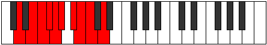 |
| [1919](https://ianring.com/musictheory/scales/1919) | [Rocryllian](ModeENaturalRocryllian.md) | E | E, F, F#, G, G#, A, A#, C, C#, D, E |  |
| [1919](https://ianring.com/musictheory/scales/1919) | [Rocryllian](ModeBNaturalRocryllian.md) | B | B, C, C#, D, D#, E, F, G, G#, A, B |  |
| [1919](https://ianring.com/musictheory/scales/1919) | [Rocryllian](ModeDSharpRocryllian.md) | D# | D#, E, F, F#, G, G#, A, B, C, C#, D# |  |
| [1919](https://ianring.com/musictheory/scales/1919) | [Rocryllian](ModeEFlatRocryllian.md) | Eb | Eb, E, F, Gb, G, Ab, A, B, C, Db, Eb |  |
| [1919](https://ianring.com/musictheory/scales/1919) | [Rocryllian](ModeDNaturalRocryllian.md) | D | D, D#, E, F, F#, G, G#, A#, B, C, D |  |
| [1919](https://ianring.com/musictheory/scales/1919) | [Rocryllian](ModeGNaturalRocryllian.md) | G | G, G#, A, A#, B, C, C#, D#, E, F, G |  |
| [1933](https://ianring.com/musictheory/scales/1933) | [Mocrian](ModeFNaturalMocrian.md) | F | F, G, Ab, B#, C#, D, Eb, F |  |
| [1933](https://ianring.com/musictheory/scales/1933) | [Mocrian](ModeASharpMocrian.md) | A# | A#, B#, C#, D###, E##, F##, G#, A# |  |
| [1933](https://ianring.com/musictheory/scales/1933) | [Mocrian](ModeBFlatMocrian.md) | Bb | Bb, C, Db, E#, F#, G, Ab, Bb |  |
| [1935](https://ianring.com/musictheory/scales/1935) | [Mycryllic](ModeFNaturalMycryllic.md) | F | F, F#, G, G#, C, C#, D, D#, F |  |
| [1935](https://ianring.com/musictheory/scales/1935) | [Mycryllic](ModeASharpMycryllic.md) | A# | A#, B, C, C#, F, F#, G, G#, A# |  |
| [1935](https://ianring.com/musictheory/scales/1935) | [Mycryllic](ModeBFlatMycryllic.md) | Bb | Bb, B, C, Db, F, Gb, G, Ab, Bb |  |
| [1941](https://ianring.com/musictheory/scales/1941) | [Aeranian](ModeASharpAeranian.md) | A# | A#, B#, C##, D###, E##, F##, G#, A# |  |
| [1941](https://ianring.com/musictheory/scales/1941) | [Aeranian](ModeBFlatAeranian.md) | Bb | Bb, C, D, E#, F#, G, Ab, Bb |  |
| [1943](https://ianring.com/musictheory/scales/1943) | [Malyllic](ModeASharpMalyllic.md) | A# | A#, B, C, D, F, F#, G, G#, A# |  |
| [1943](https://ianring.com/musictheory/scales/1943) | [Malyllic](ModeBFlatMalyllic.md) | Bb | Bb, B, C, D, F, Gb, G, Ab, Bb |  |
| [1947](https://ianring.com/musictheory/scales/1947) | [Ionoyllic](ModeENaturalIonoyllic.md) | E | E, F, G, G#, B, C, C#, D, E |  |
| [1949](https://ianring.com/musictheory/scales/1949) | [Mathyllic](ModeFNaturalMathyllic.md) | F | F, G, G#, A, C, C#, D, D#, F |  |
| [1949](https://ianring.com/musictheory/scales/1949) | [Mathyllic](ModeASharpMathyllic.md) | A# | A#, C, C#, D, F, F#, G, G#, A# |  |
| [1949](https://ianring.com/musictheory/scales/1949) | [Mathyllic](ModeBFlatMathyllic.md) | Bb | Bb, C, Db, D, F, Gb, G, Ab, Bb |  |
| [1951](https://ianring.com/musictheory/scales/1951) | [Gonygic](ModeFNaturalGonygic.md) | F | F, F#, G, G#, A, C, C#, D, D#, F |  |
| [1951](https://ianring.com/musictheory/scales/1951) | [Gonygic](ModeENaturalGonygic.md) | E | E, F, F#, G, G#, B, C, C#, D, E |  |
| [1951](https://ianring.com/musictheory/scales/1951) | [Gonygic](ModeASharpGonygic.md) | A# | A#, B, C, C#, D, F, F#, G, G#, A# |  |
| [1951](https://ianring.com/musictheory/scales/1951) | [Gonygic](ModeBFlatGonygic.md) | Bb | Bb, B, C, Db, D, F, Gb, G, Ab, Bb |  |
| [1955](https://ianring.com/musictheory/scales/1955) | [Sonian](ModeGNaturalSonian.md) | G | G, Ab, B#, C##, D#, E, F, G |  |
| [1955](https://ianring.com/musictheory/scales/1955) | [Sonian](ModeCNaturalSonian.md) | C | C, Db, E#, F##, G#, A, Bb, C |  |
| [1957](https://ianring.com/musictheory/scales/1957) | [Pyrian](ModeASharpPyrian.md) | A# | A#, B#, C###, D###, E##, F##, G#, A# |  |
| [1957](https://ianring.com/musictheory/scales/1957) | [Pyrian](ModeBFlatPyrian.md) | Bb | Bb, C, D#, E#, F#, G, Ab, Bb |  |
| [1957](https://ianring.com/musictheory/scales/1957) | [Pyrian](ModeCNaturalPyrian.md) | C | C, D, E#, F##, G#, A, Bb, C |  |
| [1959](https://ianring.com/musictheory/scales/1959) | [Katolyllic](ModeGNaturalKatolyllic.md) | G | G, G#, A, C, D, D#, E, F, G |  |
| [1959](https://ianring.com/musictheory/scales/1959) | [Katolyllic](ModeCNaturalKatolyllic.md) | C | C, C#, D, F, G, G#, A, A#, C |  |
| [1959](https://ianring.com/musictheory/scales/1959) | [Katolyllic](ModeASharpKatolyllic.md) | A# | A#, B, C, D#, F, F#, G, G#, A# |  |
| [1959](https://ianring.com/musictheory/scales/1959) | [Katolyllic](ModeBFlatKatolyllic.md) | Bb | Bb, B, C, Eb, F, Gb, G, Ab, Bb |  |
| [1961](https://ianring.com/musictheory/scales/1961) | [Soptian](ModeCNaturalSoptian.md) | C | C, D#, E#, F##, G#, A, Bb, C |  |
| [1963](https://ianring.com/musictheory/scales/1963) | [Epocryllic](ModeGNaturalEpocryllic.md) | G | G, G#, A#, C, D, D#, E, F, G |  |
| [1963](https://ianring.com/musictheory/scales/1963) | [Epocryllic](ModeCNaturalEpocryllic.md) | C | C, C#, D#, F, G, G#, A, A#, C |  |
| [1965](https://ianring.com/musictheory/scales/1965) | [Gadyllic](ModeFNaturalGadyllic.md) | F | F, G, G#, A#, C, C#, D, D#, F |  |
| [1965](https://ianring.com/musictheory/scales/1965) | [Gadyllic](ModeASharpGadyllic.md) | A# | A#, C, C#, D#, F, F#, G, G#, A# |  |
| [1965](https://ianring.com/musictheory/scales/1965) | [Gadyllic](ModeBFlatGadyllic.md) | Bb | Bb, C, Db, Eb, F, Gb, G, Ab, Bb |  |
| [1965](https://ianring.com/musictheory/scales/1965) | [Gadyllic](ModeCNaturalGadyllic.md) | C | C, D, D#, F, G, G#, A, A#, C |  |
| [1967](https://ianring.com/musictheory/scales/1967) | [Godygic](ModeFNaturalGodygic.md) | F | F, F#, G, G#, A#, C, C#, D, D#, F |  |
| [1967](https://ianring.com/musictheory/scales/1967) | [Godygic](ModeCNaturalGodygic.md) | C | C, C#, D, D#, F, G, G#, A, A#, C |  |
| [1967](https://ianring.com/musictheory/scales/1967) | [Godygic](ModeGNaturalGodygic.md) | G | G, G#, A, A#, C, D, D#, E, F, G |  |
| [1967](https://ianring.com/musictheory/scales/1967) | [Godygic](ModeASharpGodygic.md) | A# | A#, B, C, C#, D#, F, F#, G, G#, A# |  |
| [1967](https://ianring.com/musictheory/scales/1967) | [Godygic](ModeBFlatGodygic.md) | Bb | Bb, B, C, Db, Eb, F, Gb, G, Ab, Bb |  |
| [1969](https://ianring.com/musictheory/scales/1969) | [Zorian](ModeCNaturalZorian.md) | C | C, D##, E#, F##, G#, A, Bb, C |  |
| [1971](https://ianring.com/musictheory/scales/1971) | [Aerynyllic](ModeCNaturalAerynyllic.md) | C | C, C#, E, F, G, G#, A, A#, C |  |
| [1971](https://ianring.com/musictheory/scales/1971) | [Aerynyllic](ModeGNaturalAerynyllic.md) | G | G, G#, B, C, D, D#, E, F, G |  |
| [1973](https://ianring.com/musictheory/scales/1973) | [Zyryllic](ModeASharpZyryllic.md) | A# | A#, C, D, D#, F, F#, G, G#, A# |  |
| [1973](https://ianring.com/musictheory/scales/1973) | [Zyryllic](ModeBFlatZyryllic.md) | Bb | Bb, C, D, Eb, F, Gb, G, Ab, Bb |  |
| [1973](https://ianring.com/musictheory/scales/1973) | [Zyryllic](ModeCNaturalZyryllic.md) | C | C, D, E, F, G, G#, A, A#, C |  |
| [1973](https://ianring.com/musictheory/scales/1973) | [Zyryllic](ModeDSharpZyryllic.md) | D# | D#, F, G, G#, A#, B, C, C#, D# |  |
| [1973](https://ianring.com/musictheory/scales/1973) | [Zyryllic](ModeEFlatZyryllic.md) | Eb | Eb, F, G, Ab, Bb, B, C, Db, Eb |  |
| [1975](https://ianring.com/musictheory/scales/1975) | [Ionocrygic](ModeCNaturalIonocrygic.md) | C | C, C#, D, E, F, G, G#, A, A#, C |  |
| [1975](https://ianring.com/musictheory/scales/1975) | [Ionocrygic](ModeGNaturalIonocrygic.md) | G | G, G#, A, B, C, D, D#, E, F, G |  |
| [1975](https://ianring.com/musictheory/scales/1975) | [Ionocrygic](ModeDSharpIonocrygic.md) | D# | D#, E, F, G, G#, A#, B, C, C#, D# |  |
| [1975](https://ianring.com/musictheory/scales/1975) | [Ionocrygic](ModeEFlatIonocrygic.md) | Eb | Eb, E, F, G, Ab, Bb, B, C, Db, Eb |  |
| [1975](https://ianring.com/musictheory/scales/1975) | [Ionocrygic](ModeASharpIonocrygic.md) | A# | A#, B, C, D, D#, F, F#, G, G#, A# |  |
| [1975](https://ianring.com/musictheory/scales/1975) | [Ionocrygic](ModeBFlatIonocrygic.md) | Bb | Bb, B, C, D, Eb, F, Gb, G, Ab, Bb |  |
| [1977](https://ianring.com/musictheory/scales/1977) | [Dagyllic](ModeCNaturalDagyllic.md) | C | C, D#, E, F, G, G#, A, A#, C |  |
| [1979](https://ianring.com/musictheory/scales/1979) | [Aeradygic](ModeCNaturalAeradygic.md) | C | C, C#, D#, E, F, G, G#, A, A#, C |  |
| [1979](https://ianring.com/musictheory/scales/1979) | [Aeradygic](ModeENaturalAeradygic.md) | E | E, F, G, G#, A, B, C, C#, D, E | 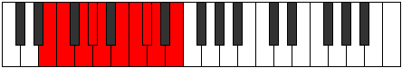 |
| [1979](https://ianring.com/musictheory/scales/1979) | [Aeradygic](ModeGNaturalAeradygic.md) | G | G, G#, A#, B, C, D, D#, E, F, G |  |
| [1981](https://ianring.com/musictheory/scales/1981) | [Gadygic](ModeASharpGadygic.md) | A# | A#, C, C#, D, D#, F, F#, G, G#, A# |  |
| [1981](https://ianring.com/musictheory/scales/1981) | [Gadygic](ModeBFlatGadygic.md) | Bb | Bb, C, Db, D, Eb, F, Gb, G, Ab, Bb |  |
| [1981](https://ianring.com/musictheory/scales/1981) | [Gadygic](ModeFNaturalGadygic.md) | F | F, G, G#, A, A#, C, C#, D, D#, F |  |
| [1981](https://ianring.com/musictheory/scales/1981) | [Gadygic](ModeCNaturalGadygic.md) | C | C, D, D#, E, F, G, G#, A, A#, C |  |
| [1981](https://ianring.com/musictheory/scales/1981) | [Gadygic](ModeDSharpGadygic.md) | D# | D#, F, F#, G, G#, A#, B, C, C#, D# |  |
| [1981](https://ianring.com/musictheory/scales/1981) | [Gadygic](ModeEFlatGadygic.md) | Eb | Eb, F, Gb, G, Ab, Bb, B, C, Db, Eb |  |
| [1983](https://ianring.com/musictheory/scales/1983) | [Soryllian](ModeCNaturalSoryllian.md) | C | C, C#, D, D#, E, F, G, G#, A, A#, C |  |
| [1983](https://ianring.com/musictheory/scales/1983) | [Soryllian](ModeFNaturalSoryllian.md) | F | F, F#, G, G#, A, A#, C, C#, D, D#, F |  |
| [1983](https://ianring.com/musictheory/scales/1983) | [Soryllian](ModeENaturalSoryllian.md) | E | E, F, F#, G, G#, A, B, C, C#, D, E |  |
| [1983](https://ianring.com/musictheory/scales/1983) | [Soryllian](ModeASharpSoryllian.md) | A# | A#, B, C, C#, D, D#, F, F#, G, G#, A# |  |
| [1983](https://ianring.com/musictheory/scales/1983) | [Soryllian](ModeBFlatSoryllian.md) | Bb | Bb, B, C, Db, D, Eb, F, Gb, G, Ab, Bb |  |
| [1983](https://ianring.com/musictheory/scales/1983) | [Soryllian](ModeDSharpSoryllian.md) | D# | D#, E, F, F#, G, G#, A#, B, C, C#, D# |  |
| [1983](https://ianring.com/musictheory/scales/1983) | [Soryllian](ModeEFlatSoryllian.md) | Eb | Eb, E, F, Gb, G, Ab, Bb, B, C, Db, Eb |  |
| [1983](https://ianring.com/musictheory/scales/1983) | [Soryllian](ModeGNaturalSoryllian.md) | G | G, G#, A, A#, B, C, D, D#, E, F, G |  |
| [1989](https://ianring.com/musictheory/scales/1989) | [Dydian](ModeASharpDydian.md) | A# | A#, B#, D##, E#, F#, G, Ab, A# |  |
| [1989](https://ianring.com/musictheory/scales/1989) | [Dydian](ModeBFlatDydian.md) | Bb | Bb, C, D##, E#, F#, G, Ab, Bb |  |
| [1991](https://ianring.com/musictheory/scales/1991) | [Phryptyllic](ModeBNaturalPhryptyllic.md) | B | B, C, C#, F, F#, G, G#, A, B |  |
| [1991](https://ianring.com/musictheory/scales/1991) | [Phryptyllic](ModeASharpPhryptyllic.md) | A# | A#, B, C, E, F, F#, G, G#, A# |  |
| [1991](https://ianring.com/musictheory/scales/1991) | [Phryptyllic](ModeBFlatPhryptyllic.md) | Bb | Bb, B, C, E, F, Gb, G, Ab, Bb |  |
| [1995](https://ianring.com/musictheory/scales/1995) | [Aeolacryllic](ModeBNaturalAeolacryllic.md) | B | B, C, D, F, F#, G, G#, A, B |  |
| [1997](https://ianring.com/musictheory/scales/1997) | [Staryllic](ModeASharpStaryllic.md) | A# | A#, C, C#, E, F, F#, G, G#, A# |  |
| [1997](https://ianring.com/musictheory/scales/1997) | [Staryllic](ModeBFlatStaryllic.md) | Bb | Bb, C, Db, E, F, Gb, G, Ab, Bb | 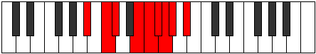 |
| [1997](https://ianring.com/musictheory/scales/1997) | [Staryllic](ModeFNaturalStaryllic.md) | F | F, G, G#, B, C, C#, D, D#, F |  |
| [1999](https://ianring.com/musictheory/scales/1999) | [Zacrygic](ModeFNaturalZacrygic.md) | F | F, F#, G, G#, B, C, C#, D, D#, F |  |
| [1999](https://ianring.com/musictheory/scales/1999) | [Zacrygic](ModeBNaturalZacrygic.md) | B | B, C, C#, D, F, F#, G, G#, A, B |  |
| [1999](https://ianring.com/musictheory/scales/1999) | [Zacrygic](ModeASharpZacrygic.md) | A# | A#, B, C, C#, E, F, F#, G, G#, A# |  |
| [1999](https://ianring.com/musictheory/scales/1999) | [Zacrygic](ModeBFlatZacrygic.md) | Bb | Bb, B, C, Db, E, F, Gb, G, Ab, Bb |  |
| [2003](https://ianring.com/musictheory/scales/2003) | [Lolyllic](ModeBNaturalLolyllic.md) | B | B, C, D#, F, F#, G, G#, A, B | 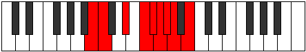 |
| [2005](https://ianring.com/musictheory/scales/2005) | [Gygyllic](ModeASharpGygyllic.md) | A# | A#, C, D, E, F, F#, G, G#, A# |  |
| [2005](https://ianring.com/musictheory/scales/2005) | [Gygyllic](ModeBFlatGygyllic.md) | Bb | Bb, C, D, E, F, Gb, G, Ab, Bb |  |
| [2007](https://ianring.com/musictheory/scales/2007) | [Stonygic](ModeBNaturalStonygic.md) | B | B, C, C#, D#, F, F#, G, G#, A, B |  |
| [2007](https://ianring.com/musictheory/scales/2007) | [Stonygic](ModeASharpStonygic.md) | A# | A#, B, C, D, E, F, F#, G, G#, A# |  |
| [2007](https://ianring.com/musictheory/scales/2007) | [Stonygic](ModeBFlatStonygic.md) | Bb | Bb, B, C, D, E, F, Gb, G, Ab, Bb |  |
| [2011](https://ianring.com/musictheory/scales/2011) | [Raphygic](ModeBNaturalRaphygic.md) | B | B, C, D, D#, F, F#, G, G#, A, B |  |
| [2011](https://ianring.com/musictheory/scales/2011) | [Raphygic](ModeENaturalRaphygic.md) | E | E, F, G, G#, A#, B, C, C#, D, E |  |
| [2013](https://ianring.com/musictheory/scales/2013) | [Mocrygic](ModeASharpMocrygic.md) | A# | A#, C, C#, D, E, F, F#, G, G#, A# |  |
| [2013](https://ianring.com/musictheory/scales/2013) | [Mocrygic](ModeBFlatMocrygic.md) | Bb | Bb, C, Db, D, E, F, Gb, G, Ab, Bb |  |
| [2013](https://ianring.com/musictheory/scales/2013) | [Mocrygic](ModeFNaturalMocrygic.md) | F | F, G, G#, A, B, C, C#, D, D#, F |  |
| [2015](https://ianring.com/musictheory/scales/2015) | [Epiryllian](ModeFNaturalEpiryllian.md) | F | F, F#, G, G#, A, B, C, C#, D, D#, F |  |
| [2015](https://ianring.com/musictheory/scales/2015) | [Epiryllian](ModeBNaturalEpiryllian.md) | B | B, C, C#, D, D#, F, F#, G, G#, A, B |  |
| [2015](https://ianring.com/musictheory/scales/2015) | [Epiryllian](ModeENaturalEpiryllian.md) | E | E, F, F#, G, G#, A#, B, C, C#, D, E |  |
| [2015](https://ianring.com/musictheory/scales/2015) | [Epiryllian](ModeASharpEpiryllian.md) | A# | A#, B, C, C#, D, E, F, F#, G, G#, A# |  |
| [2015](https://ianring.com/musictheory/scales/2015) | [Epiryllian](ModeBFlatEpiryllian.md) | Bb | Bb, B, C, Db, D, E, F, Gb, G, Ab, Bb |  |
| [2019](https://ianring.com/musictheory/scales/2019) | [Palyllic](ModeGNaturalPalyllic.md) | G | G, G#, C, C#, D, D#, E, F, G |  |
| [2019](https://ianring.com/musictheory/scales/2019) | [Palyllic](ModeCNaturalPalyllic.md) | C | C, C#, F, F#, G, G#, A, A#, C |  |
| [2019](https://ianring.com/musictheory/scales/2019) | [Palyllic](ModeBNaturalPalyllic.md) | B | B, C, E, F, F#, G, G#, A, B |  |
| [2021](https://ianring.com/musictheory/scales/2021) | [Katycryllic](ModeASharpKatycryllic.md) | A# | A#, C, D#, E, F, F#, G, G#, A# |  |
| [2021](https://ianring.com/musictheory/scales/2021) | [Katycryllic](ModeBFlatKatycryllic.md) | Bb | Bb, C, Eb, E, F, Gb, G, Ab, Bb |  |
| [2021](https://ianring.com/musictheory/scales/2021) | [Katycryllic](ModeCNaturalKatycryllic.md) | C | C, D, F, F#, G, G#, A, A#, C |  |
| [2023](https://ianring.com/musictheory/scales/2023) | [Zodygic](ModeGNaturalZodygic.md) | G | G, G#, A, C, C#, D, D#, E, F, G |  |
| [2023](https://ianring.com/musictheory/scales/2023) | [Zodygic](ModeCNaturalZodygic.md) | C | C, C#, D, F, F#, G, G#, A, A#, C |  |
| [2023](https://ianring.com/musictheory/scales/2023) | [Zodygic](ModeBNaturalZodygic.md) | B | B, C, C#, E, F, F#, G, G#, A, B |  |
| [2023](https://ianring.com/musictheory/scales/2023) | [Zodygic](ModeASharpZodygic.md) | A# | A#, B, C, D#, E, F, F#, G, G#, A# |  |
| [2023](https://ianring.com/musictheory/scales/2023) | [Zodygic](ModeBFlatZodygic.md) | Bb | Bb, B, C, Eb, E, F, Gb, G, Ab, Bb |  |
| [2025](https://ianring.com/musictheory/scales/2025) | [Mixolydyllic](ModeCNaturalMixolydyllic.md) | C | C, D#, F, F#, G, G#, A, A#, C |  |
| [2025](https://ianring.com/musictheory/scales/2025) | [Mixolydyllic](ModeDNaturalMixolydyllic.md) | D | D, F, G, G#, A, A#, B, C, D |  |
| [2027](https://ianring.com/musictheory/scales/2027) | [Boptygic](ModeGNaturalBoptygic.md) | G | G, G#, A#, C, C#, D, D#, E, F, G |  |
| [2027](https://ianring.com/musictheory/scales/2027) | [Boptygic](ModeCNaturalBoptygic.md) | C | C, C#, D#, F, F#, G, G#, A, A#, C |  |
| [2027](https://ianring.com/musictheory/scales/2027) | [Boptygic](ModeBNaturalBoptygic.md) | B | B, C, D, E, F, F#, G, G#, A, B |  |
| [2027](https://ianring.com/musictheory/scales/2027) | [Boptygic](ModeDNaturalBoptygic.md) | D | D, D#, F, G, G#, A, A#, B, C, D |  |
| [2029](https://ianring.com/musictheory/scales/2029) | [Mathygic](ModeASharpMathygic.md) | A# | A#, C, C#, D#, E, F, F#, G, G#, A# |  |
| [2029](https://ianring.com/musictheory/scales/2029) | [Mathygic](ModeBFlatMathygic.md) | Bb | Bb, C, Db, Eb, E, F, Gb, G, Ab, Bb |  |
| [2029](https://ianring.com/musictheory/scales/2029) | [Mathygic](ModeCNaturalMathygic.md) | C | C, D, D#, F, F#, G, G#, A, A#, C |  |
| [2029](https://ianring.com/musictheory/scales/2029) | [Mathygic](ModeFNaturalMathygic.md) | F | F, G, G#, A#, B, C, C#, D, D#, F |  |
| [2029](https://ianring.com/musictheory/scales/2029) | [Mathygic](ModeDNaturalMathygic.md) | D | D, E, F, G, G#, A, A#, B, C, D |  |
| [2031](https://ianring.com/musictheory/scales/2031) | [Gadyllian](ModeGNaturalGadyllian.md) | G | G, G#, A, A#, C, C#, D, D#, E, F, G |  |
| [2031](https://ianring.com/musictheory/scales/2031) | [Gadyllian](ModeCNaturalGadyllian.md) | C | C, C#, D, D#, F, F#, G, G#, A, A#, C |  |
| [2031](https://ianring.com/musictheory/scales/2031) | [Gadyllian](ModeBNaturalGadyllian.md) | B | B, C, C#, D, E, F, F#, G, G#, A, B |  |
| [2031](https://ianring.com/musictheory/scales/2031) | [Gadyllian](ModeFNaturalGadyllian.md) | F | F, F#, G, G#, A#, B, C, C#, D, D#, F |  |
| [2031](https://ianring.com/musictheory/scales/2031) | [Gadyllian](ModeASharpGadyllian.md) | A# | A#, B, C, C#, D#, E, F, F#, G, G#, A# |  |
| [2031](https://ianring.com/musictheory/scales/2031) | [Gadyllian](ModeBFlatGadyllian.md) | Bb | Bb, B, C, Db, Eb, E, F, Gb, G, Ab, Bb |  |
| [2031](https://ianring.com/musictheory/scales/2031) | [Gadyllian](ModeDNaturalGadyllian.md) | D | D, D#, E, F, G, G#, A, A#, B, C, D |  |
| [2033](https://ianring.com/musictheory/scales/2033) | [Stolyllic](ModeCNaturalStolyllic.md) | C | C, E, F, F#, G, G#, A, A#, C |  |
| [2035](https://ianring.com/musictheory/scales/2035) | [Aerythygic](ModeCNaturalAerythygic.md) | C | C, C#, E, F, F#, G, G#, A, A#, C |  |
| [2035](https://ianring.com/musictheory/scales/2035) | [Aerythygic](ModeGNaturalAerythygic.md) | G | G, G#, B, C, C#, D, D#, E, F, G |  |
| [2035](https://ianring.com/musictheory/scales/2035) | [Aerythygic](ModeBNaturalAerythygic.md) | B | B, C, D#, E, F, F#, G, G#, A, B |  |
| [2037](https://ianring.com/musictheory/scales/2037) | [Sythygic](ModeASharpSythygic.md) | A# | A#, C, D, D#, E, F, F#, G, G#, A# |  |
| [2037](https://ianring.com/musictheory/scales/2037) | [Sythygic](ModeBFlatSythygic.md) | Bb | Bb, C, D, Eb, E, F, Gb, G, Ab, Bb |  |
| [2037](https://ianring.com/musictheory/scales/2037) | [Sythygic](ModeCNaturalSythygic.md) | C | C, D, E, F, F#, G, G#, A, A#, C |  |
| [2037](https://ianring.com/musictheory/scales/2037) | [Sythygic](ModeDSharpSythygic.md) | D# | D#, F, G, G#, A, A#, B, C, C#, D# |  |
| [2037](https://ianring.com/musictheory/scales/2037) | [Sythygic](ModeEFlatSythygic.md) | Eb | Eb, F, G, Ab, A, Bb, B, C, Db, Eb |  |
| [2039](https://ianring.com/musictheory/scales/2039) | [Danyllian](ModeCNaturalDanyllian.md) | C | C, C#, D, E, F, F#, G, G#, A, A#, C |  |
| [2039](https://ianring.com/musictheory/scales/2039) | [Danyllian](ModeGNaturalDanyllian.md) | G | G, G#, A, B, C, C#, D, D#, E, F, G |  |
| [2039](https://ianring.com/musictheory/scales/2039) | [Danyllian](ModeBNaturalDanyllian.md) | B | B, C, C#, D#, E, F, F#, G, G#, A, B |  |
| [2039](https://ianring.com/musictheory/scales/2039) | [Danyllian](ModeASharpDanyllian.md) | A# | A#, B, C, D, D#, E, F, F#, G, G#, A# |  |
| [2039](https://ianring.com/musictheory/scales/2039) | [Danyllian](ModeBFlatDanyllian.md) | Bb | Bb, B, C, D, Eb, E, F, Gb, G, Ab, Bb |  |
| [2039](https://ianring.com/musictheory/scales/2039) | [Danyllian](ModeDSharpDanyllian.md) | D# | D#, E, F, G, G#, A, A#, B, C, C#, D# |  |
| [2039](https://ianring.com/musictheory/scales/2039) | [Danyllian](ModeEFlatDanyllian.md) | Eb | Eb, E, F, G, Ab, A, Bb, B, C, Db, Eb |  |
| [2041](https://ianring.com/musictheory/scales/2041) | [Aeolacrygic](ModeCNaturalAeolacrygic.md) | C | C, D#, E, F, F#, G, G#, A, A#, C |  |
| [2041](https://ianring.com/musictheory/scales/2041) | [Aeolacrygic](ModeDNaturalAeolacrygic.md) | D | D, F, F#, G, G#, A, A#, B, C, D |  |
| [2043](https://ianring.com/musictheory/scales/2043) | [Lythyllian](ModeCNaturalLythyllian.md) | C | C, C#, D#, E, F, F#, G, G#, A, A#, C |  |
| [2043](https://ianring.com/musictheory/scales/2043) | [Lythyllian](ModeBNaturalLythyllian.md) | B | B, C, D, D#, E, F, F#, G, G#, A, B |  |
| [2043](https://ianring.com/musictheory/scales/2043) | [Lythyllian](ModeGNaturalLythyllian.md) | G | G, G#, A#, B, C, C#, D, D#, E, F, G | 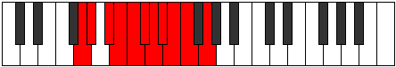 |
| [2043](https://ianring.com/musictheory/scales/2043) | [Lythyllian](ModeENaturalLythyllian.md) | E | E, F, G, G#, A, A#, B, C, C#, D, E |  |
| [2043](https://ianring.com/musictheory/scales/2043) | [Lythyllian](ModeDNaturalLythyllian.md) | D | D, D#, F, F#, G, G#, A, A#, B, C, D |  |
| [2045](https://ianring.com/musictheory/scales/2045) | [Katogyllian](ModeASharpKatogyllian.md) | A# | A#, C, C#, D, D#, E, F, F#, G, G#, A# |  |
| [2045](https://ianring.com/musictheory/scales/2045) | [Katogyllian](ModeBFlatKatogyllian.md) | Bb | Bb, C, Db, D, Eb, E, F, Gb, G, Ab, Bb |  |
| [2045](https://ianring.com/musictheory/scales/2045) | [Katogyllian](ModeCNaturalKatogyllian.md) | C | C, D, D#, E, F, F#, G, G#, A, A#, C |  |
| [2045](https://ianring.com/musictheory/scales/2045) | [Katogyllian](ModeFNaturalKatogyllian.md) | F | F, G, G#, A, A#, B, C, C#, D, D#, F |  |
| [2045](https://ianring.com/musictheory/scales/2045) | [Katogyllian](ModeDSharpKatogyllian.md) | D# | D#, F, F#, G, G#, A, A#, B, C, C#, D# |  |
| [2045](https://ianring.com/musictheory/scales/2045) | [Katogyllian](ModeEFlatKatogyllian.md) | Eb | Eb, F, Gb, G, Ab, A, Bb, B, C, Db, Eb |  |
| [2045](https://ianring.com/musictheory/scales/2045) | [Katogyllian](ModeDNaturalKatogyllian.md) | D | D, E, F, F#, G, G#, A, A#, B, C, D |  |
| [2047](https://ianring.com/musictheory/scales/2047) | [Monatic](ModeCNaturalMonatic.md) | C | C, C#, D, D#, E, F, F#, G, G#, A, A#, C |  |
| [2047](https://ianring.com/musictheory/scales/2047) | [Monatic](ModeBNaturalMonatic.md) | B | B, C, C#, D, D#, E, F, F#, G, G#, A, B |  |
| [2047](https://ianring.com/musictheory/scales/2047) | [Monatic](ModeASharpMonatic.md) | A# | A#, B, C, C#, D, D#, E, F, F#, G, G#, A# |  |
| [2047](https://ianring.com/musictheory/scales/2047) | [Monatic](ModeBFlatMonatic.md) | Bb | Bb, B, C, Db, D, Eb, E, F, Gb, G, Ab, Bb |  |
| [2047](https://ianring.com/musictheory/scales/2047) | [Monatic](ModeGNaturalMonatic.md) | G | G, G#, A, A#, B, C, C#, D, D#, E, F, G |  |
| [2047](https://ianring.com/musictheory/scales/2047) | [Monatic](ModeFNaturalMonatic.md) | F | F, F#, G, G#, A, A#, B, C, C#, D, D#, F |  |
| [2047](https://ianring.com/musictheory/scales/2047) | [Monatic](ModeENaturalMonatic.md) | E | E, F, F#, G, G#, A, A#, B, C, C#, D, E |  |
| [2047](https://ianring.com/musictheory/scales/2047) | [Monatic](ModeDSharpMonatic.md) | D# | D#, E, F, F#, G, G#, A, A#, B, C, C#, D# |  |
| [2047](https://ianring.com/musictheory/scales/2047) | [Monatic](ModeEFlatMonatic.md) | Eb | Eb, E, F, Gb, G, Ab, A, Bb, B, C, Db, Eb |  |
| [2047](https://ianring.com/musictheory/scales/2047) | [Monatic](ModeDNaturalMonatic.md) | D | D, D#, E, F, F#, G, G#, A, A#, B, C, D |  |
| [2189](https://ianring.com/musictheory/scales/2189) | [Zagitonic](ModeFNaturalZagitonic.md) | F | F, G, G#, C, E, F |  |
| [2191](https://ianring.com/musictheory/scales/2191) | [Thydimic](ModeFNaturalThydimic.md) | F | F, Gb, Abb, Bbbb, C, D##, F |  |
| [2205](https://ianring.com/musictheory/scales/2205) | [Ionocrimic](ModeFNaturalIonocrimic.md) | F | F, G, Ab, Bbb, C, D##, F |  |
| [2207](https://ianring.com/musictheory/scales/2207) | [Mygian](ModeFNaturalMygian.md) | F | F, Gb, Abb, Bbbb, Cbbb, Dbb, E, F |  |
| [2221](https://ianring.com/musictheory/scales/2221) | [Poptimic](ModeFNaturalPoptimic.md) | F | F, G, Ab, Bb, C, D##, F |  |
| [2223](https://ianring.com/musictheory/scales/2223) | [Konian](ModeFNaturalKonian.md) | F | F, Gb, Abb, Bbbb, Cbb, Dbb, E, F |  |
| [2237](https://ianring.com/musictheory/scales/2237) | [Epothian](ModeFNaturalEpothian.md) | F | F, G, Ab, Bbb, Cbb, Dbb, E, F |  |
| [2239](https://ianring.com/musictheory/scales/2239) | [Dacryllic](ModeFNaturalDacryllic.md) | F | F, F#, G, G#, A, A#, C, E, F |  |
| [2247](https://ianring.com/musictheory/scales/2247) | [Aeolimic](ModeFSharpAeolimic.md) | F# | F#, G, Ab, B#, C#, D###, F# |  |
| [2247](https://ianring.com/musictheory/scales/2247) | [Aeolimic](ModeGFlatAeolimic.md) | Gb | Gb, Abb, Bbbb, C, Db, E#, Gb |  |
| [2253](https://ianring.com/musictheory/scales/2253) | [Logimic](ModeFNaturalLogimic.md) | F | F, G, Ab, B, C, D##, F |  |
| [2255](https://ianring.com/musictheory/scales/2255) | [Dylian](ModeFSharpDylian.md) | F# | F#, G, Ab, Bbb, C, Db, E#, F# |  |
| [2255](https://ianring.com/musictheory/scales/2255) | [Dylian](ModeGFlatDylian.md) | Gb | Gb, Abb, Bbbb, Cbbb, Dbb, Ebbb, F, Gb |  |
| [2255](https://ianring.com/musictheory/scales/2255) | [Dylian](ModeFNaturalDylian.md) | F | F, Gb, Abb, Bbbb, Cb, Dbb, E, F |  |
| [2257](https://ianring.com/musictheory/scales/2257) | [Zolitonic](ModeCSharpZolitonic.md) | C# | C#, F, G, G#, C, C# |  |
| [2257](https://ianring.com/musictheory/scales/2257) | [Zolitonic](ModeDFlatZolitonic.md) | Db | Db, F, G, Ab, C, Db |  |
| [2259](https://ianring.com/musictheory/scales/2259) | [Gogimic](ModeCSharpGogimic.md) | C# | C#, D, E#, F##, G#, A###, C# |  |
| [2259](https://ianring.com/musictheory/scales/2259) | [Gogimic](ModeDFlatGogimic.md) | Db | Db, Ebb, F, G, Ab, B#, Db |  |
| [2261](https://ianring.com/musictheory/scales/2261) | [Phrolimic](ModeCSharpPhrolimic.md) | C# | C#, D#, E#, F##, G#, A###, C# |  |
| [2261](https://ianring.com/musictheory/scales/2261) | [Phrolimic](ModeDFlatPhrolimic.md) | Db | Db, Eb, F, G, Ab, B#, Db |  |
| [2263](https://ianring.com/musictheory/scales/2263) | [Lycrian](ModeCSharpLycrian.md) | C# | C#, D, Eb, F, G, Ab, B#, C# |  |
| [2263](https://ianring.com/musictheory/scales/2263) | [Lycrian](ModeDFlatLycrian.md) | Db | Db, Ebb, Fbb, Gbb, Abb, Bbbb, C, Db |  |
| [2263](https://ianring.com/musictheory/scales/2263) | [Lycrian](ModeFSharpLycrian.md) | F# | F#, G, Ab, Bb, C, Db, E#, F# |  |
| [2263](https://ianring.com/musictheory/scales/2263) | [Lycrian](ModeGFlatLycrian.md) | Gb | Gb, Abb, Bbbb, Cbb, Dbb, Ebbb, F, Gb |  |
| [2265](https://ianring.com/musictheory/scales/2265) | [Ionophimic](ModeCSharpIonophimic.md) | C# | C#, D##, E#, F##, G#, A###, C# |  |
| [2265](https://ianring.com/musictheory/scales/2265) | [Ionophimic](ModeDFlatIonophimic.md) | Db | Db, E, F, G, Ab, B#, Db |  |
| [2267](https://ianring.com/musictheory/scales/2267) | [Padian](ModeCSharpPadian.md) | C# | C#, D, E, F, G, Ab, B#, C# |  |
| [2267](https://ianring.com/musictheory/scales/2267) | [Padian](ModeDFlatPadian.md) | Db | Db, Ebb, Fb, Gbb, Abb, Bbbb, C, Db |  |
| [2269](https://ianring.com/musictheory/scales/2269) | [Pygian](ModeCSharpPygian.md) | C# | C#, D#, E, F, G, Ab, B#, C# |  |
| [2269](https://ianring.com/musictheory/scales/2269) | [Pygian](ModeDFlatPygian.md) | Db | Db, Eb, Fb, Gbb, Abb, Bbbb, C, Db |  |
| [2269](https://ianring.com/musictheory/scales/2269) | [Pygian](ModeFNaturalPygian.md) | F | F, G, Ab, Bbb, Cb, Dbb, E, F |  |
| [2271](https://ianring.com/musictheory/scales/2271) | [Poptyllic](ModeCSharpPoptyllic.md) | C# | C#, D, D#, E, F, G, G#, C, C# |  |
| [2271](https://ianring.com/musictheory/scales/2271) | [Poptyllic](ModeDFlatPoptyllic.md) | Db | Db, D, Eb, E, F, G, Ab, C, Db |  |
| [2271](https://ianring.com/musictheory/scales/2271) | [Poptyllic](ModeFSharpPoptyllic.md) | F# | F#, G, G#, A, A#, C, C#, F, F# |  |
| [2271](https://ianring.com/musictheory/scales/2271) | [Poptyllic](ModeGFlatPoptyllic.md) | Gb | Gb, G, Ab, A, Bb, C, Db, F, Gb |  |
| [2271](https://ianring.com/musictheory/scales/2271) | [Poptyllic](ModeFNaturalPoptyllic.md) | F | F, F#, G, G#, A, B, C, E, F |  |
| [2279](https://ianring.com/musictheory/scales/2279) | [Dyrian](ModeFSharpDyrian.md) | F# | F#, G, Ab, B, C, Db, E#, F# |  |
| [2279](https://ianring.com/musictheory/scales/2279) | [Dyrian](ModeGFlatDyrian.md) | Gb | Gb, Abb, Bbbb, Cb, Dbb, Ebbb, F, Gb |  |
| [2285](https://ianring.com/musictheory/scales/2285) | [Aerogian](ModeFNaturalAerogian.md) | F | F, G, Ab, Bb, Cb, Dbb, E, F |  |
| [2287](https://ianring.com/musictheory/scales/2287) | [Lodyllic](ModeFSharpLodyllic.md) | F# | F#, G, G#, A, B, C, C#, F, F# |  |
| [2287](https://ianring.com/musictheory/scales/2287) | [Lodyllic](ModeGFlatLodyllic.md) | Gb | Gb, G, Ab, A, B, C, Db, F, Gb |  |
| [2287](https://ianring.com/musictheory/scales/2287) | [Lodyllic](ModeFNaturalLodyllic.md) | F | F, F#, G, G#, A#, B, C, E, F | 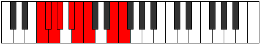 |
| [2289](https://ianring.com/musictheory/scales/2289) | [Mocrimic](ModeCSharpMocrimic.md) | C# | C#, D###, E##, F##, G#, A###, C# |  |
| [2289](https://ianring.com/musictheory/scales/2289) | [Mocrimic](ModeDFlatMocrimic.md) | Db | Db, E#, F#, G, Ab, B#, Db |  |
| [2291](https://ianring.com/musictheory/scales/2291) | [Zydian](ModeCSharpZydian.md) | C# | C#, D, E#, F#, G, Ab, B#, C# |  |
| [2291](https://ianring.com/musictheory/scales/2291) | [Zydian](ModeDFlatZydian.md) | Db | Db, Ebb, F, Gb, Abb, Bbbb, C, Db |  |
| [2293](https://ianring.com/musictheory/scales/2293) | [Gorian](ModeCSharpGorian.md) | C# | C#, D#, E#, F#, G, Ab, B#, C# |  |
| [2293](https://ianring.com/musictheory/scales/2293) | [Gorian](ModeDFlatGorian.md) | Db | Db, Eb, F, Gb, Abb, Bbbb, C, Db |  |
| [2295](https://ianring.com/musictheory/scales/2295) | [Kogyllic](ModeCSharpKogyllic.md) | C# | C#, D, D#, F, F#, G, G#, C, C# |  |
| [2295](https://ianring.com/musictheory/scales/2295) | [Kogyllic](ModeDFlatKogyllic.md) | Db | Db, D, Eb, F, Gb, G, Ab, C, Db |  |
| [2295](https://ianring.com/musictheory/scales/2295) | [Kogyllic](ModeFSharpKogyllic.md) | F# | F#, G, G#, A#, B, C, C#, F, F# |  |
| [2295](https://ianring.com/musictheory/scales/2295) | [Kogyllic](ModeGFlatKogyllic.md) | Gb | Gb, G, Ab, Bb, B, C, Db, F, Gb |  |
| [2297](https://ianring.com/musictheory/scales/2297) | [Thylian](ModeCSharpThylian.md) | C# | C#, D##, E#, F#, G, Ab, B#, C# |  |
| [2297](https://ianring.com/musictheory/scales/2297) | [Thylian](ModeDFlatThylian.md) | Db | Db, E, F, Gb, Abb, Bbbb, C, Db |  |
| [2299](https://ianring.com/musictheory/scales/2299) | [Phraptyllic](ModeCSharpPhraptyllic.md) | C# | C#, D, E, F, F#, G, G#, C, C# |  |
| [2299](https://ianring.com/musictheory/scales/2299) | [Phraptyllic](ModeDFlatPhraptyllic.md) | Db | Db, D, E, F, Gb, G, Ab, C, Db |  |
| [2301](https://ianring.com/musictheory/scales/2301) | [Bydyllic](ModeCSharpBydyllic.md) | C# | C#, D#, E, F, F#, G, G#, C, C# |  |
| [2301](https://ianring.com/musictheory/scales/2301) | [Bydyllic](ModeDFlatBydyllic.md) | Db | Db, Eb, E, F, Gb, G, Ab, C, Db |  |
| [2301](https://ianring.com/musictheory/scales/2301) | [Bydyllic](ModeFNaturalBydyllic.md) | F | F, G, G#, A, A#, B, C, E, F |  |
| [2303](https://ianring.com/musictheory/scales/2303) | [Stanygic](ModeCSharpStanygic.md) | C# | C#, D, D#, E, F, F#, G, G#, C, C# |  |
| [2303](https://ianring.com/musictheory/scales/2303) | [Stanygic](ModeDFlatStanygic.md) | Db | Db, D, Eb, E, F, Gb, G, Ab, C, Db |  |
| [2303](https://ianring.com/musictheory/scales/2303) | [Stanygic](ModeFSharpStanygic.md) | F# | F#, G, G#, A, A#, B, C, C#, F, F# |  |
| [2303](https://ianring.com/musictheory/scales/2303) | [Stanygic](ModeGFlatStanygic.md) | Gb | Gb, G, Ab, A, Bb, B, C, Db, F, Gb |  |
| [2303](https://ianring.com/musictheory/scales/2303) | [Stanygic](ModeFNaturalStanygic.md) | F | F, F#, G, G#, A, A#, B, C, E, F |  |
| [2331](https://ianring.com/musictheory/scales/2331) | [Dylimic](ModeENaturalDylimic.md) | E | E, F, G, Ab, B#, C###, E |  |
| [2335](https://ianring.com/musictheory/scales/2335) | [Epydian](ModeENaturalEpydian.md) | E | E, F, Gb, Abb, Bbbb, C, D#, E |  |
| [2363](https://ianring.com/musictheory/scales/2363) | [Kataptian](ModeENaturalKataptian.md) | E | E, F, G, Ab, Bbb, C, D#, E |  |
| [2367](https://ianring.com/musictheory/scales/2367) | [Laryllic](ModeENaturalLaryllic.md) | E | E, F, F#, G, G#, A, C, D#, E |  |
| [2375](https://ianring.com/musictheory/scales/2375) | [Aeolaptimic](ModeFSharpAeolaptimic.md) | F# | F#, G, Ab, B#, C##, D###, F# |  |
| [2375](https://ianring.com/musictheory/scales/2375) | [Aeolaptimic](ModeGFlatAeolaptimic.md) | Gb | Gb, Abb, Bbbb, C, D, E#, Gb |  |
| [2383](https://ianring.com/musictheory/scales/2383) | [Katorian](ModeFSharpKatorian.md) | F# | F#, G, Ab, Bbb, C, D, E#, F# |  |
| [2383](https://ianring.com/musictheory/scales/2383) | [Katorian](ModeGFlatKatorian.md) | Gb | Gb, Abb, Bbbb, Cbbb, Dbb, Ebb, F, Gb |  |
| [2391](https://ianring.com/musictheory/scales/2391) | [Molian](ModeFSharpMolian.md) | F# | F#, G, Ab, Bb, C, D, E#, F# |  |
| [2391](https://ianring.com/musictheory/scales/2391) | [Molian](ModeGFlatMolian.md) | Gb | Gb, Abb, Bbbb, Cbb, Dbb, Ebb, F, Gb |  |
| [2395](https://ianring.com/musictheory/scales/2395) | [Zoptian](ModeENaturalZoptian.md) | E | E, F, G, Ab, Bb, C, D#, E |  |
| [2399](https://ianring.com/musictheory/scales/2399) | [Zanyllic](ModeENaturalZanyllic.md) | E | E, F, F#, G, G#, A#, C, D#, E |  |
| [2399](https://ianring.com/musictheory/scales/2399) | [Zanyllic](ModeFSharpZanyllic.md) | F# | F#, G, G#, A, A#, C, D, F, F# |  |
| [2399](https://ianring.com/musictheory/scales/2399) | [Zanyllic](ModeGFlatZanyllic.md) | Gb | Gb, G, Ab, A, Bb, C, D, F, Gb |  |
| [2407](https://ianring.com/musictheory/scales/2407) | [Zylian](ModeFSharpZylian.md) | F# | F#, G, Ab, B, C, D, E#, F# |  |
| [2407](https://ianring.com/musictheory/scales/2407) | [Zylian](ModeGFlatZylian.md) | Gb | Gb, Abb, Bbbb, Cb, Dbb, Ebb, F, Gb |  |
| [2415](https://ianring.com/musictheory/scales/2415) | [Lothyllic](ModeFSharpLothyllic.md) | F# | F#, G, G#, A, B, C, D, F, F# | 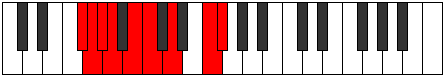 |
| [2415](https://ianring.com/musictheory/scales/2415) | [Lothyllic](ModeGFlatLothyllic.md) | Gb | Gb, G, Ab, A, B, C, D, F, Gb |  |
| [2423](https://ianring.com/musictheory/scales/2423) | [Thorcryllic](ModeFSharpThorcryllic.md) | F# | F#, G, G#, A#, B, C, D, F, F# | 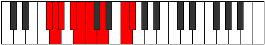 |
| [2423](https://ianring.com/musictheory/scales/2423) | [Thorcryllic](ModeGFlatThorcryllic.md) | Gb | Gb, G, Ab, Bb, B, C, D, F, Gb |  |
| [2427](https://ianring.com/musictheory/scales/2427) | [Katoryllic](ModeENaturalKatoryllic.md) | E | E, F, G, G#, A, A#, C, D#, E |  |
| [2431](https://ianring.com/musictheory/scales/2431) | [Gythygic](ModeENaturalGythygic.md) | E | E, F, F#, G, G#, A, A#, C, D#, E |  |
| [2431](https://ianring.com/musictheory/scales/2431) | [Gythygic](ModeFSharpGythygic.md) | F# | F#, G, G#, A, A#, B, C, D, F, F# |  |
| [2431](https://ianring.com/musictheory/scales/2431) | [Gythygic](ModeGFlatGythygic.md) | Gb | Gb, G, Ab, A, Bb, B, C, D, F, Gb |  |
| [2445](https://ianring.com/musictheory/scales/2445) | [Zadimic](ModeFNaturalZadimic.md) | F | F, G, Ab, B#, C#, D##, F |  |
| [2447](https://ianring.com/musictheory/scales/2447) | [Thagian](ModeFNaturalThagian.md) | F | F, Gb, Abb, Bbbb, C, Db, E, F |  |
| [2459](https://ianring.com/musictheory/scales/2459) | [Ionocrian](ModeENaturalIonocrian.md) | E | E, F, G, Ab, B, C, D#, E |  |
| [2461](https://ianring.com/musictheory/scales/2461) | [Sagian](ModeFNaturalSagian.md) | F | F, G, Ab, Bbb, C, Db, E, F |  |
| [2463](https://ianring.com/musictheory/scales/2463) | [Ionathyllic](ModeFNaturalIonathyllic.md) | F | F, F#, G, G#, A, C, C#, E, F |  |
| [2463](https://ianring.com/musictheory/scales/2463) | [Ionathyllic](ModeENaturalIonathyllic.md) | E | E, F, F#, G, G#, B, C, D#, E |  |
| [2467](https://ianring.com/musictheory/scales/2467) | [Morimic](ModeCNaturalMorimic.md) | C | C, Db, E#, F##, G#, A##, C |  |
| [2469](https://ianring.com/musictheory/scales/2469) | [Staptimic](ModeCNaturalStaptimic.md) | C | C, D, E#, F##, G#, A##, C |  |
| [2471](https://ianring.com/musictheory/scales/2471) | [Eparian](ModeCNaturalEparian.md) | C | C, Db, Ebb, F, G, Ab, B, C |  |
| [2473](https://ianring.com/musictheory/scales/2473) | [Mothimic](ModeCNaturalMothimic.md) | C | C, D#, E#, F##, G#, A##, C |  |
| [2475](https://ianring.com/musictheory/scales/2475) | [Aerylian](ModeCNaturalAerylian.md) | C | C, Db, Eb, F, G, Ab, B, C |  |
| [2477](https://ianring.com/musictheory/scales/2477) | [Mydian](ModeFNaturalMydian.md) | F | F, G, Ab, Bb, C, Db, E, F |  |
| [2477](https://ianring.com/musictheory/scales/2477) | [Mydian](ModeCNaturalMydian.md) | C | C, D, Eb, F, G, Ab, B, C |  |
| [2479](https://ianring.com/musictheory/scales/2479) | [Rycryllic](ModeFNaturalRycryllic.md) | F | F, F#, G, G#, A#, C, C#, E, F |  |
| [2479](https://ianring.com/musictheory/scales/2479) | [Rycryllic](ModeCNaturalRycryllic.md) | C | C, C#, D, D#, F, G, G#, B, C | 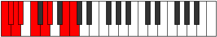 |
| [2481](https://ianring.com/musictheory/scales/2481) | [Laptimic](ModeCNaturalLaptimic.md) | C | C, D##, E#, F##, G#, A##, C |  |
| [2483](https://ianring.com/musictheory/scales/2483) | [Aerynian](ModeCNaturalAerynian.md) | C | C, Db, E, F, G, Ab, B, C |  |
| [2485](https://ianring.com/musictheory/scales/2485) | [Aerorian](ModeCNaturalAerorian.md) | C | C, D, E, F, G, Ab, B, C |  |
| [2487](https://ianring.com/musictheory/scales/2487) | [Phroptyllic](ModeCNaturalPhroptyllic.md) | C | C, C#, D, E, F, G, G#, B, C |  |
| [2489](https://ianring.com/musictheory/scales/2489) | [Syrian](ModeCNaturalSyrian.md) | C | C, D#, E, F, G, Ab, B, C | 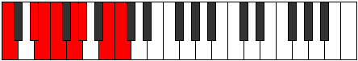 |
| [2491](https://ianring.com/musictheory/scales/2491) | [Layllic](ModeCNaturalLayllic.md) | C | C, C#, D#, E, F, G, G#, B, C |  |
| [2491](https://ianring.com/musictheory/scales/2491) | [Layllic](ModeENaturalLayllic.md) | E | E, F, G, G#, A, B, C, D#, E |  |
| [2493](https://ianring.com/musictheory/scales/2493) | [Manyllic](ModeFNaturalManyllic.md) | F | F, G, G#, A, A#, C, C#, E, F | 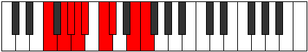 |
| [2493](https://ianring.com/musictheory/scales/2493) | [Manyllic](ModeCNaturalManyllic.md) | C | C, D, D#, E, F, G, G#, B, C |  |
| [2495](https://ianring.com/musictheory/scales/2495) | [Aeolocrygic](ModeFNaturalAeolocrygic.md) | F | F, F#, G, G#, A, A#, C, C#, E, F |  |
| [2495](https://ianring.com/musictheory/scales/2495) | [Aeolocrygic](ModeCNaturalAeolocrygic.md) | C | C, C#, D, D#, E, F, G, G#, B, C |  |
| [2495](https://ianring.com/musictheory/scales/2495) | [Aeolocrygic](ModeENaturalAeolocrygic.md) | E | E, F, F#, G, G#, A, B, C, D#, E |  |
| [2503](https://ianring.com/musictheory/scales/2503) | [Stonian](ModeFSharpStonian.md) | F# | F#, G, Ab, B#, C#, D, E#, F# |  |
| [2503](https://ianring.com/musictheory/scales/2503) | [Stonian](ModeGFlatStonian.md) | Gb | Gb, Abb, Bbbb, C, Db, Ebb, F, Gb |  |
| [2509](https://ianring.com/musictheory/scales/2509) | [Bogian](ModeFNaturalBogian.md) | F | F, G, Ab, B, C, Db, E, F |  |
| [2511](https://ianring.com/musictheory/scales/2511) | [Epyryllic](ModeFSharpEpyryllic.md) | F# | F#, G, G#, A, C, C#, D, F, F# |  |
| [2511](https://ianring.com/musictheory/scales/2511) | [Epyryllic](ModeGFlatEpyryllic.md) | Gb | Gb, G, Ab, A, C, Db, D, F, Gb |  |
| [2511](https://ianring.com/musictheory/scales/2511) | [Epyryllic](ModeFNaturalEpyryllic.md) | F | F, F#, G, G#, B, C, C#, E, F |  |
| [2513](https://ianring.com/musictheory/scales/2513) | [Aerycrimic](ModeCSharpAerycrimic.md) | C# | C#, D###, E###, F###, G##, A###, C# |  |
| [2513](https://ianring.com/musictheory/scales/2513) | [Aerycrimic](ModeDFlatAerycrimic.md) | Db | Db, E#, F##, G#, A, B#, Db |  |
| [2515](https://ianring.com/musictheory/scales/2515) | [Stylian](ModeCSharpStylian.md) | C# | C#, D, E#, F##, G#, A, B#, C# |  |
| [2515](https://ianring.com/musictheory/scales/2515) | [Stylian](ModeDFlatStylian.md) | Db | Db, Ebb, F, G, Ab, Bbb, C, Db |  |
| [2517](https://ianring.com/musictheory/scales/2517) | [Ryphian](ModeCSharpRyphian.md) | C# | C#, D#, E#, F##, G#, A, B#, C# |  |
| [2517](https://ianring.com/musictheory/scales/2517) | [Ryphian](ModeDFlatRyphian.md) | Db | Db, Eb, F, G, Ab, Bbb, C, Db |  |
| [2519](https://ianring.com/musictheory/scales/2519) | [Dathyllic](ModeCSharpDathyllic.md) | C# | C#, D, D#, F, G, G#, A, C, C# |  |
| [2519](https://ianring.com/musictheory/scales/2519) | [Dathyllic](ModeDFlatDathyllic.md) | Db | Db, D, Eb, F, G, Ab, A, C, Db |  |
| [2519](https://ianring.com/musictheory/scales/2519) | [Dathyllic](ModeFSharpDathyllic.md) | F# | F#, G, G#, A#, C, C#, D, F, F# |  |
| [2519](https://ianring.com/musictheory/scales/2519) | [Dathyllic](ModeGFlatDathyllic.md) | Gb | Gb, G, Ab, Bb, C, Db, D, F, Gb |  |
| [2521](https://ianring.com/musictheory/scales/2521) | [Barian](ModeCSharpBarian.md) | C# | C#, D##, E#, F##, G#, A, B#, C# |  |
| [2521](https://ianring.com/musictheory/scales/2521) | [Barian](ModeDFlatBarian.md) | Db | Db, E, F, G, Ab, Bbb, C, Db |  |
| [2523](https://ianring.com/musictheory/scales/2523) | [Rygyllic](ModeCSharpRygyllic.md) | C# | C#, D, E, F, G, G#, A, C, C# |  |
| [2523](https://ianring.com/musictheory/scales/2523) | [Rygyllic](ModeDFlatRygyllic.md) | Db | Db, D, E, F, G, Ab, A, C, Db |  |
| [2523](https://ianring.com/musictheory/scales/2523) | [Rygyllic](ModeENaturalRygyllic.md) | E | E, F, G, G#, A#, B, C, D#, E |  |
| [2525](https://ianring.com/musictheory/scales/2525) | [Aeolaryllic](ModeCSharpAeolaryllic.md) | C# | C#, D#, E, F, G, G#, A, C, C# |  |
| [2525](https://ianring.com/musictheory/scales/2525) | [Aeolaryllic](ModeDFlatAeolaryllic.md) | Db | Db, Eb, E, F, G, Ab, A, C, Db |  |
| [2525](https://ianring.com/musictheory/scales/2525) | [Aeolaryllic](ModeFNaturalAeolaryllic.md) | F | F, G, G#, A, B, C, C#, E, F |  |
| [2527](https://ianring.com/musictheory/scales/2527) | [Phradygic](ModeCSharpPhradygic.md) | C# | C#, D, D#, E, F, G, G#, A, C, C# |  |
| [2527](https://ianring.com/musictheory/scales/2527) | [Phradygic](ModeDFlatPhradygic.md) | Db | Db, D, Eb, E, F, G, Ab, A, C, Db |  |
| [2527](https://ianring.com/musictheory/scales/2527) | [Phradygic](ModeFSharpPhradygic.md) | F# | F#, G, G#, A, A#, C, C#, D, F, F# |  |
| [2527](https://ianring.com/musictheory/scales/2527) | [Phradygic](ModeGFlatPhradygic.md) | Gb | Gb, G, Ab, A, Bb, C, Db, D, F, Gb |  |
| [2527](https://ianring.com/musictheory/scales/2527) | [Phradygic](ModeFNaturalPhradygic.md) | F | F, F#, G, G#, A, B, C, C#, E, F |  |
| [2527](https://ianring.com/musictheory/scales/2527) | [Phradygic](ModeENaturalPhradygic.md) | E | E, F, F#, G, G#, A#, B, C, D#, E |  |
| [2531](https://ianring.com/musictheory/scales/2531) | [Danian](ModeCNaturalDanian.md) | C | C, Db, E#, F#, G, Ab, B, C |  |
| [2533](https://ianring.com/musictheory/scales/2533) | [Podian](ModeCNaturalPodian.md) | C | C, D, E#, F#, G, Ab, B, C |  |
| [2535](https://ianring.com/musictheory/scales/2535) | [Zygyllic](ModeCNaturalZygyllic.md) | C | C, C#, D, F, F#, G, G#, B, C |  |
| [2535](https://ianring.com/musictheory/scales/2535) | [Zygyllic](ModeFSharpZygyllic.md) | F# | F#, G, G#, B, C, C#, D, F, F# |  |
| [2535](https://ianring.com/musictheory/scales/2535) | [Zygyllic](ModeGFlatZygyllic.md) | Gb | Gb, G, Ab, B, C, Db, D, F, Gb |  |
| [2537](https://ianring.com/musictheory/scales/2537) | [Laptian](ModeCNaturalLaptian.md) | C | C, D#, E#, F#, G, Ab, B, C |  |
| [2539](https://ianring.com/musictheory/scales/2539) | [Thonyllic](ModeCNaturalThonyllic.md) | C | C, C#, D#, F, F#, G, G#, B, C |  |
| [2541](https://ianring.com/musictheory/scales/2541) | [Katadyllic](ModeCNaturalKatadyllic.md) | C | C, D, D#, F, F#, G, G#, B, C |  |
| [2541](https://ianring.com/musictheory/scales/2541) | [Katadyllic](ModeFNaturalKatadyllic.md) | F | F, G, G#, A#, B, C, C#, E, F |  |
| [2543](https://ianring.com/musictheory/scales/2543) | [Dydygic](ModeCNaturalDydygic.md) | C | C, C#, D, D#, F, F#, G, G#, B, C |  |
| [2543](https://ianring.com/musictheory/scales/2543) | [Dydygic](ModeFSharpDydygic.md) | F# | F#, G, G#, A, B, C, C#, D, F, F# |  |
| [2543](https://ianring.com/musictheory/scales/2543) | [Dydygic](ModeGFlatDydygic.md) | Gb | Gb, G, Ab, A, B, C, Db, D, F, Gb |  |
| [2543](https://ianring.com/musictheory/scales/2543) | [Dydygic](ModeFNaturalDydygic.md) | F | F, F#, G, G#, A#, B, C, C#, E, F |  |
| [2545](https://ianring.com/musictheory/scales/2545) | [Thycrian](ModeCSharpThycrian.md) | C# | C#, D###, E##, F##, G#, A, B#, C# |  |
| [2545](https://ianring.com/musictheory/scales/2545) | [Thycrian](ModeDFlatThycrian.md) | Db | Db, E#, F#, G, Ab, Bbb, C, Db |  |
| [2545](https://ianring.com/musictheory/scales/2545) | [Thycrian](ModeCNaturalThycrian.md) | C | C, D##, E#, F#, G, Ab, B, C |  |
| [2547](https://ianring.com/musictheory/scales/2547) | [Sogyllic](ModeCSharpSogyllic.md) | C# | C#, D, F, F#, G, G#, A, C, C# | 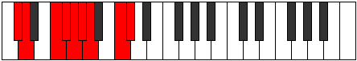 |
| [2547](https://ianring.com/musictheory/scales/2547) | [Sogyllic](ModeDFlatSogyllic.md) | Db | Db, D, F, Gb, G, Ab, A, C, Db |  |
| [2547](https://ianring.com/musictheory/scales/2547) | [Sogyllic](ModeCNaturalSogyllic.md) | C | C, C#, E, F, F#, G, G#, B, C |  |
| [2549](https://ianring.com/musictheory/scales/2549) | [Rydyllic](ModeCSharpRydyllic.md) | C# | C#, D#, F, F#, G, G#, A, C, C# |  |
| [2549](https://ianring.com/musictheory/scales/2549) | [Rydyllic](ModeDFlatRydyllic.md) | Db | Db, Eb, F, Gb, G, Ab, A, C, Db |  |
| [2549](https://ianring.com/musictheory/scales/2549) | [Rydyllic](ModeCNaturalRydyllic.md) | C | C, D, E, F, F#, G, G#, B, C |  |
| [2551](https://ianring.com/musictheory/scales/2551) | [Zoptygic](ModeCSharpZoptygic.md) | C# | C#, D, D#, F, F#, G, G#, A, C, C# |  |
| [2551](https://ianring.com/musictheory/scales/2551) | [Zoptygic](ModeDFlatZoptygic.md) | Db | Db, D, Eb, F, Gb, G, Ab, A, C, Db |  |
| [2551](https://ianring.com/musictheory/scales/2551) | [Zoptygic](ModeCNaturalZoptygic.md) | C | C, C#, D, E, F, F#, G, G#, B, C |  |
| [2551](https://ianring.com/musictheory/scales/2551) | [Zoptygic](ModeFSharpZoptygic.md) | F# | F#, G, G#, A#, B, C, C#, D, F, F# |  |
| [2551](https://ianring.com/musictheory/scales/2551) | [Zoptygic](ModeGFlatZoptygic.md) | Gb | Gb, G, Ab, Bb, B, C, Db, D, F, Gb |  |
| [2553](https://ianring.com/musictheory/scales/2553) | [Aeolaptyllic](ModeCSharpAeolaptyllic.md) | C# | C#, E, F, F#, G, G#, A, C, C# |  |
| [2553](https://ianring.com/musictheory/scales/2553) | [Aeolaptyllic](ModeDFlatAeolaptyllic.md) | Db | Db, E, F, Gb, G, Ab, A, C, Db |  |
| [2553](https://ianring.com/musictheory/scales/2553) | [Aeolaptyllic](ModeCNaturalAeolaptyllic.md) | C | C, D#, E, F, F#, G, G#, B, C |  |
| [2555](https://ianring.com/musictheory/scales/2555) | [Bythygic](ModeCSharpBythygic.md) | C# | C#, D, E, F, F#, G, G#, A, C, C# |  |
| [2555](https://ianring.com/musictheory/scales/2555) | [Bythygic](ModeDFlatBythygic.md) | Db | Db, D, E, F, Gb, G, Ab, A, C, Db |  |
| [2555](https://ianring.com/musictheory/scales/2555) | [Bythygic](ModeCNaturalBythygic.md) | C | C, C#, D#, E, F, F#, G, G#, B, C |  |
| [2555](https://ianring.com/musictheory/scales/2555) | [Bythygic](ModeENaturalBythygic.md) | E | E, F, G, G#, A, A#, B, C, D#, E |  |
| [2557](https://ianring.com/musictheory/scales/2557) | [Dothygic](ModeCSharpDothygic.md) | C# | C#, D#, E, F, F#, G, G#, A, C, C# |  |
| [2557](https://ianring.com/musictheory/scales/2557) | [Dothygic](ModeDFlatDothygic.md) | Db | Db, Eb, E, F, Gb, G, Ab, A, C, Db |  |
| [2557](https://ianring.com/musictheory/scales/2557) | [Dothygic](ModeCNaturalDothygic.md) | C | C, D, D#, E, F, F#, G, G#, B, C |  |
| [2557](https://ianring.com/musictheory/scales/2557) | [Dothygic](ModeFNaturalDothygic.md) | F | F, G, G#, A, A#, B, C, C#, E, F |  |
| [2559](https://ianring.com/musictheory/scales/2559) | [Zogyllian](ModeCSharpZogyllian.md) | C# | C#, D, D#, E, F, F#, G, G#, A, C, C# |  |
| [2559](https://ianring.com/musictheory/scales/2559) | [Zogyllian](ModeDFlatZogyllian.md) | Db | Db, D, Eb, E, F, Gb, G, Ab, A, C, Db |  |
| [2559](https://ianring.com/musictheory/scales/2559) | [Zogyllian](ModeCNaturalZogyllian.md) | C | C, C#, D, D#, E, F, F#, G, G#, B, C |  |
| [2559](https://ianring.com/musictheory/scales/2559) | [Zogyllian](ModeFSharpZogyllian.md) | F# | F#, G, G#, A, A#, B, C, C#, D, F, F# |  |
| [2559](https://ianring.com/musictheory/scales/2559) | [Zogyllian](ModeGFlatZogyllian.md) | Gb | Gb, G, Ab, A, Bb, B, C, Db, D, F, Gb |  |
| [2559](https://ianring.com/musictheory/scales/2559) | [Zogyllian](ModeFNaturalZogyllian.md) | F | F, F#, G, G#, A, A#, B, C, C#, E, F |  |
| [2559](https://ianring.com/musictheory/scales/2559) | [Zogyllian](ModeENaturalZogyllian.md) | E | E, F, F#, G, G#, A, A#, B, C, D#, E |  |
| [2609](https://ianring.com/musictheory/scales/2609) | [Paptitonic](ModeGSharpPaptitonic.md) | G# | G#, C, C#, F, G, G# |  |
| [2609](https://ianring.com/musictheory/scales/2609) | [Paptitonic](ModeAFlatPaptitonic.md) | Ab | Ab, C, Db, F, G, Ab |  |
| [2611](https://ianring.com/musictheory/scales/2611) | [Lyrimic](ModeGSharpLyrimic.md) | G# | G#, A, B#, C#, D###, E###, G# |  |
| [2611](https://ianring.com/musictheory/scales/2611) | [Lyrimic](ModeAFlatLyrimic.md) | Ab | Ab, Bbb, C, Db, E#, F##, Ab |  |
| [2613](https://ianring.com/musictheory/scales/2613) | [Aeolanimic](ModeDSharpAeolanimic.md) | D# | D#, E#, F##, G#, A###, B###, D# |  |
| [2613](https://ianring.com/musictheory/scales/2613) | [Aeolanimic](ModeEFlatAeolanimic.md) | Eb | Eb, F, G, Ab, B#, C##, Eb |  |
| [2613](https://ianring.com/musictheory/scales/2613) | [Aeolanimic](ModeGSharpAeolanimic.md) | G# | G#, A#, B#, C#, D###, E###, G# |  |
| [2613](https://ianring.com/musictheory/scales/2613) | [Aeolanimic](ModeAFlatAeolanimic.md) | Ab | Ab, Bb, C, Db, E#, F##, Ab |  |
| [2615](https://ianring.com/musictheory/scales/2615) | [Thoptian](ModeDSharpThoptian.md) | D# | D#, E, F, G, Ab, B#, C##, D# |  |
| [2615](https://ianring.com/musictheory/scales/2615) | [Thoptian](ModeEFlatThoptian.md) | Eb | Eb, Fb, Gbb, Abb, Bbbb, C, D, Eb |  |
| [2615](https://ianring.com/musictheory/scales/2615) | [Thoptian](ModeGSharpThoptian.md) | G# | G#, A, Bb, C, Db, E#, F##, G# |  |
| [2615](https://ianring.com/musictheory/scales/2615) | [Thoptian](ModeAFlatThoptian.md) | Ab | Ab, Bbb, Cbb, Dbb, Ebbb, F, G, Ab |  |
| [2617](https://ianring.com/musictheory/scales/2617) | [Pylimic](ModeGSharpPylimic.md) | G# | G#, A##, B#, C#, D###, E###, G# |  |
| [2617](https://ianring.com/musictheory/scales/2617) | [Pylimic](ModeAFlatPylimic.md) | Ab | Ab, B, C, Db, E#, F##, Ab |  |
| [2619](https://ianring.com/musictheory/scales/2619) | [Ionyrian](ModeGSharpIonyrian.md) | G# | G#, A, B, C, Db, E#, F##, G# |  |
| [2619](https://ianring.com/musictheory/scales/2619) | [Ionyrian](ModeAFlatIonyrian.md) | Ab | Ab, Bbb, Cb, Dbb, Ebbb, F, G, Ab |  |
| [2621](https://ianring.com/musictheory/scales/2621) | [Ionogian](ModeDSharpIonogian.md) | D# | D#, E#, F#, G, Ab, B#, C##, D# |  |
| [2621](https://ianring.com/musictheory/scales/2621) | [Ionogian](ModeEFlatIonogian.md) | Eb | Eb, F, Gb, Abb, Bbbb, C, D, Eb |  |
| [2621](https://ianring.com/musictheory/scales/2621) | [Ionogian](ModeGSharpIonogian.md) | G# | G#, A#, B, C, Db, E#, F##, G# |  |
| [2621](https://ianring.com/musictheory/scales/2621) | [Ionogian](ModeAFlatIonogian.md) | Ab | Ab, Bb, Cb, Dbb, Ebbb, F, G, Ab |  |
| [2623](https://ianring.com/musictheory/scales/2623) | [Aerylyllic](ModeDSharpAerylyllic.md) | D# | D#, E, F, F#, G, G#, C, D, D# |  |
| [2623](https://ianring.com/musictheory/scales/2623) | [Aerylyllic](ModeEFlatAerylyllic.md) | Eb | Eb, E, F, Gb, G, Ab, C, D, Eb |  |
| [2623](https://ianring.com/musictheory/scales/2623) | [Aerylyllic](ModeGSharpAerylyllic.md) | G# | G#, A, A#, B, C, C#, F, G, G# |  |
| [2623](https://ianring.com/musictheory/scales/2623) | [Aerylyllic](ModeAFlatAerylyllic.md) | Ab | Ab, A, Bb, B, C, Db, F, G, Ab |  |
| [2631](https://ianring.com/musictheory/scales/2631) | [Macrimic](ModeFSharpMacrimic.md) | F# | F#, G, Ab, B#, C###, D###, F# |  |
| [2631](https://ianring.com/musictheory/scales/2631) | [Macrimic](ModeGFlatMacrimic.md) | Gb | Gb, Abb, Bbbb, C, D#, E#, Gb |  |
| [2639](https://ianring.com/musictheory/scales/2639) | [Dothian](ModeFSharpDothian.md) | F# | F#, G, Ab, Bbb, C, D#, E#, F# |  |
| [2639](https://ianring.com/musictheory/scales/2639) | [Dothian](ModeGFlatDothian.md) | Gb | Gb, Abb, Bbbb, Cbbb, Dbb, Eb, F, Gb |  |
| [2641](https://ianring.com/musictheory/scales/2641) | [Gathitonic](ModeGSharpGathitonic.md) | G# | G#, C, D, F, G, G# |  |
| [2641](https://ianring.com/musictheory/scales/2641) | [Gathitonic](ModeAFlatGathitonic.md) | Ab | Ab, C, D, F, G, Ab |  |
| [2643](https://ianring.com/musictheory/scales/2643) | [Lydimic](ModeGSharpLydimic.md) | G# | G#, A, B#, C##, D###, E###, G# |  |
| [2643](https://ianring.com/musictheory/scales/2643) | [Lydimic](ModeAFlatLydimic.md) | Ab | Ab, Bbb, C, D, E#, F##, Ab | 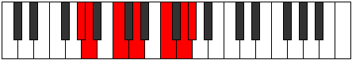 |
| [2645](https://ianring.com/musictheory/scales/2645) | [Zoptimic](ModeGSharpZoptimic.md) | G# | G#, A#, B#, C##, D###, E###, G# |  |
| [2645](https://ianring.com/musictheory/scales/2645) | [Zoptimic](ModeAFlatZoptimic.md) | Ab | Ab, Bb, C, D, E#, F##, Ab |  |
| [2647](https://ianring.com/musictheory/scales/2647) | [Dadian](ModeFSharpDadian.md) | F# | F#, G, Ab, Bb, C, D#, E#, F# |  |
| [2647](https://ianring.com/musictheory/scales/2647) | [Dadian](ModeGFlatDadian.md) | Gb | Gb, Abb, Bbbb, Cbb, Dbb, Eb, F, Gb |  |
| [2647](https://ianring.com/musictheory/scales/2647) | [Dadian](ModeGSharpDadian.md) | G# | G#, A, Bb, C, D, E#, F##, G# |  |
| [2647](https://ianring.com/musictheory/scales/2647) | [Dadian](ModeAFlatDadian.md) | Ab | Ab, Bbb, Cbb, Dbb, Ebb, F, G, Ab |  |
| [2649](https://ianring.com/musictheory/scales/2649) | [Aeolythimic](ModeGSharpAeolythimic.md) | G# | G#, A##, B#, C##, D###, E###, G# |  |
| [2649](https://ianring.com/musictheory/scales/2649) | [Aeolythimic](ModeAFlatAeolythimic.md) | Ab | Ab, B, C, D, E#, F##, Ab | 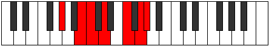 |
| [2651](https://ianring.com/musictheory/scales/2651) | [Panian](ModeGSharpPanian.md) | G# | G#, A, B, C, D, E#, F##, G# |  |
| [2651](https://ianring.com/musictheory/scales/2651) | [Panian](ModeAFlatPanian.md) | Ab | Ab, Bbb, Cb, Dbb, Ebb, F, G, Ab |  |
| [2653](https://ianring.com/musictheory/scales/2653) | [Sygian](ModeGSharpSygian.md) | G# | G#, A#, B, C, D, E#, F##, G# |  |
| [2653](https://ianring.com/musictheory/scales/2653) | [Sygian](ModeAFlatSygian.md) | Ab | Ab, Bb, Cb, Dbb, Ebb, F, G, Ab |  |
| [2655](https://ianring.com/musictheory/scales/2655) | [Thocryllic](ModeFSharpThocryllic.md) | F# | F#, G, G#, A, A#, C, D#, F, F# |  |
| [2655](https://ianring.com/musictheory/scales/2655) | [Thocryllic](ModeGFlatThocryllic.md) | Gb | Gb, G, Ab, A, Bb, C, Eb, F, Gb |  |
| [2655](https://ianring.com/musictheory/scales/2655) | [Thocryllic](ModeGSharpThocryllic.md) | G# | G#, A, A#, B, C, D, F, G, G# |  |
| [2655](https://ianring.com/musictheory/scales/2655) | [Thocryllic](ModeAFlatThocryllic.md) | Ab | Ab, A, Bb, B, C, D, F, G, Ab |  |
| [2663](https://ianring.com/musictheory/scales/2663) | [Lalian](ModeFSharpLalian.md) | F# | F#, G, Ab, B, C, D#, E#, F# | 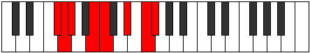 |
| [2663](https://ianring.com/musictheory/scales/2663) | [Lalian](ModeGFlatLalian.md) | Gb | Gb, Abb, Bbbb, Cb, Dbb, Eb, F, Gb |  |
| [2671](https://ianring.com/musictheory/scales/2671) | [Lylyllic](ModeFSharpLylyllic.md) | F# | F#, G, G#, A, B, C, D#, F, F# |  |
| [2671](https://ianring.com/musictheory/scales/2671) | [Lylyllic](ModeGFlatLylyllic.md) | Gb | Gb, G, Ab, A, B, C, Eb, F, Gb |  |
| [2673](https://ianring.com/musictheory/scales/2673) | [Mythimic](ModeGSharpMythimic.md) | G# | G#, A###, B##, C##, D###, E###, G# |  |
| [2673](https://ianring.com/musictheory/scales/2673) | [Mythimic](ModeAFlatMythimic.md) | Ab | Ab, B#, C#, D, E#, F##, Ab |  |
| [2675](https://ianring.com/musictheory/scales/2675) | [Gogian](ModeGSharpGogian.md) | G# | G#, A, B#, C#, D, E#, F##, G# |  |
| [2675](https://ianring.com/musictheory/scales/2675) | [Gogian](ModeAFlatGogian.md) | Ab | Ab, Bbb, C, Db, Ebb, F, G, Ab |  |
| [2677](https://ianring.com/musictheory/scales/2677) | [Thodian](ModeDSharpThodian.md) | D# | D#, E#, F##, G#, A, B#, C##, D# |  |
| [2677](https://ianring.com/musictheory/scales/2677) | [Thodian](ModeEFlatThodian.md) | Eb | Eb, F, G, Ab, Bbb, C, D, Eb |  |
| [2677](https://ianring.com/musictheory/scales/2677) | [Thodian](ModeGSharpThodian.md) | G# | G#, A#, B#, C#, D, E#, F##, G# |  |
| [2677](https://ianring.com/musictheory/scales/2677) | [Thodian](ModeAFlatThodian.md) | Ab | Ab, Bb, C, Db, Ebb, F, G, Ab |  |
| [2679](https://ianring.com/musictheory/scales/2679) | [Rathyllic](ModeDSharpRathyllic.md) | D# | D#, E, F, G, G#, A, C, D, D# |  |
| [2679](https://ianring.com/musictheory/scales/2679) | [Rathyllic](ModeEFlatRathyllic.md) | Eb | Eb, E, F, G, Ab, A, C, D, Eb |  |
| [2679](https://ianring.com/musictheory/scales/2679) | [Rathyllic](ModeGSharpRathyllic.md) | G# | G#, A, A#, C, C#, D, F, G, G# |  |
| [2679](https://ianring.com/musictheory/scales/2679) | [Rathyllic](ModeAFlatRathyllic.md) | Ab | Ab, A, Bb, C, Db, D, F, G, Ab |  |
| [2679](https://ianring.com/musictheory/scales/2679) | [Rathyllic](ModeFSharpRathyllic.md) | F# | F#, G, G#, A#, B, C, D#, F, F# |  |
| [2679](https://ianring.com/musictheory/scales/2679) | [Rathyllic](ModeGFlatRathyllic.md) | Gb | Gb, G, Ab, Bb, B, C, Eb, F, Gb |  |
| [2681](https://ianring.com/musictheory/scales/2681) | [Aerycrian](ModeGSharpAerycrian.md) | G# | G#, A##, B#, C#, D, E#, F##, G# |  |
| [2681](https://ianring.com/musictheory/scales/2681) | [Aerycrian](ModeAFlatAerycrian.md) | Ab | Ab, B, C, Db, Ebb, F, G, Ab |  |
| [2683](https://ianring.com/musictheory/scales/2683) | [Thodyllic](ModeGSharpThodyllic.md) | G# | G#, A, B, C, C#, D, F, G, G# |  |
| [2683](https://ianring.com/musictheory/scales/2683) | [Thodyllic](ModeAFlatThodyllic.md) | Ab | Ab, A, B, C, Db, D, F, G, Ab |  |
| [2685](https://ianring.com/musictheory/scales/2685) | [Ionoryllic](ModeDSharpIonoryllic.md) | D# | D#, F, F#, G, G#, A, C, D, D# |  |
| [2685](https://ianring.com/musictheory/scales/2685) | [Ionoryllic](ModeEFlatIonoryllic.md) | Eb | Eb, F, Gb, G, Ab, A, C, D, Eb |  |
| [2685](https://ianring.com/musictheory/scales/2685) | [Ionoryllic](ModeGSharpIonoryllic.md) | G# | G#, A#, B, C, C#, D, F, G, G# |  |
| [2685](https://ianring.com/musictheory/scales/2685) | [Ionoryllic](ModeAFlatIonoryllic.md) | Ab | Ab, Bb, B, C, Db, D, F, G, Ab |  |
| [2687](https://ianring.com/musictheory/scales/2687) | [Thacrygic](ModeDSharpThacrygic.md) | D# | D#, E, F, F#, G, G#, A, C, D, D# |  |
| [2687](https://ianring.com/musictheory/scales/2687) | [Thacrygic](ModeEFlatThacrygic.md) | Eb | Eb, E, F, Gb, G, Ab, A, C, D, Eb |  |
| [2687](https://ianring.com/musictheory/scales/2687) | [Thacrygic](ModeGSharpThacrygic.md) | G# | G#, A, A#, B, C, C#, D, F, G, G# |  |
| [2687](https://ianring.com/musictheory/scales/2687) | [Thacrygic](ModeAFlatThacrygic.md) | Ab | Ab, A, Bb, B, C, Db, D, F, G, Ab |  |
| [2687](https://ianring.com/musictheory/scales/2687) | [Thacrygic](ModeFSharpThacrygic.md) | F# | F#, G, G#, A, A#, B, C, D#, F, F# |  |
| [2687](https://ianring.com/musictheory/scales/2687) | [Thacrygic](ModeGFlatThacrygic.md) | Gb | Gb, G, Ab, A, Bb, B, C, Eb, F, Gb |  |
| [2701](https://ianring.com/musictheory/scales/2701) | [Epythimic](ModeFNaturalEpythimic.md) | F | F, G, Ab, B#, C##, D##, F |  |
| [2703](https://ianring.com/musictheory/scales/2703) | [Galian](ModeFNaturalGalian.md) | F | F, Gb, Abb, Bbbb, C, D, E, F |  |
| [2705](https://ianring.com/musictheory/scales/2705) | [Magitonic](ModeGSharpMagitonic.md) | G# | G#, C, D#, F, G, G# |  |
| [2705](https://ianring.com/musictheory/scales/2705) | [Magitonic](ModeAFlatMagitonic.md) | Ab | Ab, C, Eb, F, G, Ab |  |
| [2707](https://ianring.com/musictheory/scales/2707) | [Banimic](ModeGSharpBanimic.md) | G# | G#, A, B#, C###, D###, E###, G# |  |
| [2707](https://ianring.com/musictheory/scales/2707) | [Banimic](ModeAFlatBanimic.md) | Ab | Ab, Bbb, C, D#, E#, F##, Ab | 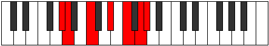 |
| [2709](https://ianring.com/musictheory/scales/2709) | [Thaptimic](ModeGSharpThaptimic.md) | G# | G#, A#, B#, C###, D###, E###, G# | 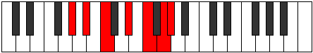 |
| [2709](https://ianring.com/musictheory/scales/2709) | [Thaptimic](ModeAFlatThaptimic.md) | Ab | Ab, Bb, C, D#, E#, F##, Ab |  |
| [2711](https://ianring.com/musictheory/scales/2711) | [Stolian](ModeGSharpStolian.md) | G# | G#, A, Bb, C, D#, E#, F##, G# |  |
| [2711](https://ianring.com/musictheory/scales/2711) | [Stolian](ModeAFlatStolian.md) | Ab | Ab, Bbb, Cbb, Dbb, Eb, F, G, Ab |  |
| [2713](https://ianring.com/musictheory/scales/2713) | [Porimic](ModeGSharpPorimic.md) | G# | G#, A##, B#, C###, D###, E###, G# |  |
| [2713](https://ianring.com/musictheory/scales/2713) | [Porimic](ModeAFlatPorimic.md) | Ab | Ab, B, C, D#, E#, F##, Ab |  |
| [2715](https://ianring.com/musictheory/scales/2715) | [Kynian](ModeGSharpKynian.md) | G# | G#, A, B, C, D#, E#, F##, G# |  |
| [2715](https://ianring.com/musictheory/scales/2715) | [Kynian](ModeAFlatKynian.md) | Ab | Ab, Bbb, Cb, Dbb, Eb, F, G, Ab |  |
| [2717](https://ianring.com/musictheory/scales/2717) | [Epygian](ModeFNaturalEpygian.md) | F | F, G, Ab, Bbb, C, D, E, F |  |
| [2717](https://ianring.com/musictheory/scales/2717) | [Epygian](ModeGSharpEpygian.md) | G# | G#, A#, B, C, D#, E#, F##, G# |  |
| [2717](https://ianring.com/musictheory/scales/2717) | [Epygian](ModeAFlatEpygian.md) | Ab | Ab, Bb, Cb, Dbb, Eb, F, G, Ab |  |
| [2719](https://ianring.com/musictheory/scales/2719) | [Zocryllic](ModeFNaturalZocryllic.md) | F | F, F#, G, G#, A, C, D, E, F |  |
| [2719](https://ianring.com/musictheory/scales/2719) | [Zocryllic](ModeGSharpZocryllic.md) | G# | G#, A, A#, B, C, D#, F, G, G# |  |
| [2719](https://ianring.com/musictheory/scales/2719) | [Zocryllic](ModeAFlatZocryllic.md) | Ab | Ab, A, Bb, B, C, Eb, F, G, Ab |  |
| [2733](https://ianring.com/musictheory/scales/2733) | [Bocrian](ModeFNaturalBocrian.md) | F | F, G, Ab, Bb, C, D, E, F |  |
| [2735](https://ianring.com/musictheory/scales/2735) | [Gynyllic](ModeFNaturalGynyllic.md) | F | F, F#, G, G#, A#, C, D, E, F |  |
| [2737](https://ianring.com/musictheory/scales/2737) | [Bylimic](ModeGSharpBylimic.md) | G# | G#, A###, B##, C###, D###, E###, G# |  |
| [2737](https://ianring.com/musictheory/scales/2737) | [Bylimic](ModeAFlatBylimic.md) | Ab | Ab, B#, C#, D#, E#, F##, Ab |  |
| [2739](https://ianring.com/musictheory/scales/2739) | [Zanian](ModeGSharpZanian.md) | G# | G#, A, B#, C#, D#, E#, F##, G# |  |
| [2739](https://ianring.com/musictheory/scales/2739) | [Zanian](ModeAFlatZanian.md) | Ab | Ab, Bbb, C, Db, Eb, F, G, Ab |  |
| [2741](https://ianring.com/musictheory/scales/2741) | [Ionian](ModeGSharpIonian.md) | G# | G#, A#, B#, C#, D#, E#, F##, G# |  |
| [2741](https://ianring.com/musictheory/scales/2741) | [Ionian](ModeAFlatIonian.md) | Ab | Ab, Bb, C, Db, Eb, F, G, Ab |  |
| [2741](https://ianring.com/musictheory/scales/2741) | [Ionian](ModeDSharpIonian.md) | D# | D#, E#, F##, G#, A#, B#, C##, D# |  |
| [2741](https://ianring.com/musictheory/scales/2741) | [Ionian](ModeEFlatIonian.md) | Eb | Eb, F, G, Ab, Bb, C, D, Eb |  |
| [2743](https://ianring.com/musictheory/scales/2743) | [Staptyllic](ModeDSharpStaptyllic.md) | D# | D#, E, F, G, G#, A#, C, D, D# |  |
| [2743](https://ianring.com/musictheory/scales/2743) | [Staptyllic](ModeEFlatStaptyllic.md) | Eb | Eb, E, F, G, Ab, Bb, C, D, Eb |  |
| [2743](https://ianring.com/musictheory/scales/2743) | [Staptyllic](ModeGSharpStaptyllic.md) | G# | G#, A, A#, C, C#, D#, F, G, G# |  |
| [2743](https://ianring.com/musictheory/scales/2743) | [Staptyllic](ModeAFlatStaptyllic.md) | Ab | Ab, A, Bb, C, Db, Eb, F, G, Ab |  |
| [2745](https://ianring.com/musictheory/scales/2745) | [Dolian](ModeGSharpDolian.md) | G# | G#, A##, B#, C#, D#, E#, F##, G# |  |
| [2745](https://ianring.com/musictheory/scales/2745) | [Dolian](ModeAFlatDolian.md) | Ab | Ab, B, C, Db, Eb, F, G, Ab |  |
| [2747](https://ianring.com/musictheory/scales/2747) | [Stythyllic](ModeGSharpStythyllic.md) | G# | G#, A, B, C, C#, D#, F, G, G# |  |
| [2747](https://ianring.com/musictheory/scales/2747) | [Stythyllic](ModeAFlatStythyllic.md) | Ab | Ab, A, B, C, Db, Eb, F, G, Ab |  |
| [2749](https://ianring.com/musictheory/scales/2749) | [Katagyllic](ModeDSharpKatagyllic.md) | D# | D#, F, F#, G, G#, A#, C, D, D# |  |
| [2749](https://ianring.com/musictheory/scales/2749) | [Katagyllic](ModeEFlatKatagyllic.md) | Eb | Eb, F, Gb, G, Ab, Bb, C, D, Eb |  |
| [2749](https://ianring.com/musictheory/scales/2749) | [Katagyllic](ModeFNaturalKatagyllic.md) | F | F, G, G#, A, A#, C, D, E, F |  |
| [2749](https://ianring.com/musictheory/scales/2749) | [Katagyllic](ModeGSharpKatagyllic.md) | G# | G#, A#, B, C, C#, D#, F, G, G# |  |
| [2749](https://ianring.com/musictheory/scales/2749) | [Katagyllic](ModeAFlatKatagyllic.md) | Ab | Ab, Bb, B, C, Db, Eb, F, G, Ab |  |
| [2751](https://ianring.com/musictheory/scales/2751) | [Sylygic](ModeDSharpSylygic.md) | D# | D#, E, F, F#, G, G#, A#, C, D, D# |  |
| [2751](https://ianring.com/musictheory/scales/2751) | [Sylygic](ModeEFlatSylygic.md) | Eb | Eb, E, F, Gb, G, Ab, Bb, C, D, Eb |  |
| [2751](https://ianring.com/musictheory/scales/2751) | [Sylygic](ModeFNaturalSylygic.md) | F | F, F#, G, G#, A, A#, C, D, E, F |  |
| [2751](https://ianring.com/musictheory/scales/2751) | [Sylygic](ModeGSharpSylygic.md) | G# | G#, A, A#, B, C, C#, D#, F, G, G# |  |
| [2751](https://ianring.com/musictheory/scales/2751) | [Sylygic](ModeAFlatSylygic.md) | Ab | Ab, A, Bb, B, C, Db, Eb, F, G, Ab |  |
| [2759](https://ianring.com/musictheory/scales/2759) | [Aeraphian](ModeFSharpAeraphian.md) | F# | F#, G, Ab, B#, C#, D#, E#, F# |  |
| [2759](https://ianring.com/musictheory/scales/2759) | [Aeraphian](ModeGFlatAeraphian.md) | Gb | Gb, Abb, Bbbb, C, Db, Eb, F, Gb |  |
| [2765](https://ianring.com/musictheory/scales/2765) | [Banian](ModeFNaturalBanian.md) | F | F, G, Ab, B, C, D, E, F |  |
| [2767](https://ianring.com/musictheory/scales/2767) | [Katydyllic](ModeFSharpKatydyllic.md) | F# | F#, G, G#, A, C, C#, D#, F, F# |  |
| [2767](https://ianring.com/musictheory/scales/2767) | [Katydyllic](ModeGFlatKatydyllic.md) | Gb | Gb, G, Ab, A, C, Db, Eb, F, Gb |  |
| [2767](https://ianring.com/musictheory/scales/2767) | [Katydyllic](ModeFNaturalKatydyllic.md) | F | F, F#, G, G#, B, C, D, E, F |  |
| [2769](https://ianring.com/musictheory/scales/2769) | [Dyrimic](ModeGSharpDyrimic.md) | G# | G#, A###, B###, C###, D###, E###, G# |  |
| [2769](https://ianring.com/musictheory/scales/2769) | [Dyrimic](ModeAFlatDyrimic.md) | Ab | Ab, B#, C##, D#, E#, F##, Ab |  |
| [2769](https://ianring.com/musictheory/scales/2769) | [Dyrimic](ModeCSharpDyrimic.md) | C# | C#, D###, E###, F###, G###, A###, C# |  |
| [2769](https://ianring.com/musictheory/scales/2769) | [Dyrimic](ModeDFlatDyrimic.md) | Db | Db, E#, F##, G#, A#, B#, Db |  |
| [2771](https://ianring.com/musictheory/scales/2771) | [Garian](ModeGSharpGarian.md) | G# | G#, A, B#, C##, D#, E#, F##, G# |  |
| [2771](https://ianring.com/musictheory/scales/2771) | [Garian](ModeAFlatGarian.md) | Ab | Ab, Bbb, C, D, Eb, F, G, Ab |  |
| [2771](https://ianring.com/musictheory/scales/2771) | [Garian](ModeCSharpGarian.md) | C# | C#, D, E#, F##, G#, A#, B#, C# |  |
| [2771](https://ianring.com/musictheory/scales/2771) | [Garian](ModeDFlatGarian.md) | Db | Db, Ebb, F, G, Ab, Bb, C, Db |  |
| [2773](https://ianring.com/musictheory/scales/2773) | [Lydian](ModeCSharpLydian.md) | C# | C#, D#, E#, F##, G#, A#, B#, C# |  |
| [2773](https://ianring.com/musictheory/scales/2773) | [Lydian](ModeDFlatLydian.md) | Db | Db, Eb, F, G, Ab, Bb, C, Db |  |
| [2773](https://ianring.com/musictheory/scales/2773) | [Lydian](ModeGSharpLydian.md) | G# | G#, A#, B#, C##, D#, E#, F##, G# |  |
| [2773](https://ianring.com/musictheory/scales/2773) | [Lydian](ModeAFlatLydian.md) | Ab | Ab, Bb, C, D, Eb, F, G, Ab |  |
| [2775](https://ianring.com/musictheory/scales/2775) | [Godyllic](ModeCSharpGodyllic.md) | C# | C#, D, D#, F, G, G#, A#, C, C# |  |
| [2775](https://ianring.com/musictheory/scales/2775) | [Godyllic](ModeDFlatGodyllic.md) | Db | Db, D, Eb, F, G, Ab, Bb, C, Db |  |
| [2775](https://ianring.com/musictheory/scales/2775) | [Godyllic](ModeFSharpGodyllic.md) | F# | F#, G, G#, A#, C, C#, D#, F, F# |  |
| [2775](https://ianring.com/musictheory/scales/2775) | [Godyllic](ModeGFlatGodyllic.md) | Gb | Gb, G, Ab, Bb, C, Db, Eb, F, Gb |  |
| [2775](https://ianring.com/musictheory/scales/2775) | [Godyllic](ModeGSharpGodyllic.md) | G# | G#, A, A#, C, D, D#, F, G, G# |  |
| [2775](https://ianring.com/musictheory/scales/2775) | [Godyllic](ModeAFlatGodyllic.md) | Ab | Ab, A, Bb, C, D, Eb, F, G, Ab |  |
| [2777](https://ianring.com/musictheory/scales/2777) | [Bycrian](ModeCSharpBycrian.md) | C# | C#, D##, E#, F##, G#, A#, B#, C# |  |
| [2777](https://ianring.com/musictheory/scales/2777) | [Bycrian](ModeDFlatBycrian.md) | Db | Db, E, F, G, Ab, Bb, C, Db |  |
| [2777](https://ianring.com/musictheory/scales/2777) | [Bycrian](ModeGSharpBycrian.md) | G# | G#, A##, B#, C##, D#, E#, F##, G# |  |
| [2777](https://ianring.com/musictheory/scales/2777) | [Bycrian](ModeAFlatBycrian.md) | Ab | Ab, B, C, D, Eb, F, G, Ab |  |
| [2779](https://ianring.com/musictheory/scales/2779) | [Garyllic](ModeCSharpGaryllic.md) | C# | C#, D, E, F, G, G#, A#, C, C# |  |
| [2779](https://ianring.com/musictheory/scales/2779) | [Garyllic](ModeDFlatGaryllic.md) | Db | Db, D, E, F, G, Ab, Bb, C, Db |  |
| [2779](https://ianring.com/musictheory/scales/2779) | [Garyllic](ModeGSharpGaryllic.md) | G# | G#, A, B, C, D, D#, F, G, G# |  |
| [2779](https://ianring.com/musictheory/scales/2779) | [Garyllic](ModeAFlatGaryllic.md) | Ab | Ab, A, B, C, D, Eb, F, G, Ab |  |
| [2781](https://ianring.com/musictheory/scales/2781) | [Gycryllic](ModeCSharpGycryllic.md) | C# | C#, D#, E, F, G, G#, A#, C, C# |  |
| [2781](https://ianring.com/musictheory/scales/2781) | [Gycryllic](ModeDFlatGycryllic.md) | Db | Db, Eb, E, F, G, Ab, Bb, C, Db |  |
| [2781](https://ianring.com/musictheory/scales/2781) | [Gycryllic](ModeFNaturalGycryllic.md) | F | F, G, G#, A, B, C, D, E, F |  |
| [2781](https://ianring.com/musictheory/scales/2781) | [Gycryllic](ModeGSharpGycryllic.md) | G# | G#, A#, B, C, D, D#, F, G, G# |  |
| [2781](https://ianring.com/musictheory/scales/2781) | [Gycryllic](ModeAFlatGycryllic.md) | Ab | Ab, Bb, B, C, D, Eb, F, G, Ab |  |
| [2783](https://ianring.com/musictheory/scales/2783) | [Gothygic](ModeCSharpGothygic.md) | C# | C#, D, D#, E, F, G, G#, A#, C, C# |  |
| [2783](https://ianring.com/musictheory/scales/2783) | [Gothygic](ModeDFlatGothygic.md) | Db | Db, D, Eb, E, F, G, Ab, Bb, C, Db |  |
| [2783](https://ianring.com/musictheory/scales/2783) | [Gothygic](ModeFSharpGothygic.md) | F# | F#, G, G#, A, A#, C, C#, D#, F, F# |  |
| [2783](https://ianring.com/musictheory/scales/2783) | [Gothygic](ModeGFlatGothygic.md) | Gb | Gb, G, Ab, A, Bb, C, Db, Eb, F, Gb |  |
| [2783](https://ianring.com/musictheory/scales/2783) | [Gothygic](ModeFNaturalGothygic.md) | F | F, F#, G, G#, A, B, C, D, E, F |  |
| [2783](https://ianring.com/musictheory/scales/2783) | [Gothygic](ModeGSharpGothygic.md) | G# | G#, A, A#, B, C, D, D#, F, G, G# |  |
| [2783](https://ianring.com/musictheory/scales/2783) | [Gothygic](ModeAFlatGothygic.md) | Ab | Ab, A, Bb, B, C, D, Eb, F, G, Ab |  |
| [2791](https://ianring.com/musictheory/scales/2791) | [Ionyptyllic](ModeFSharpIonyptyllic.md) | F# | F#, G, G#, B, C, C#, D#, F, F# |  |
| [2791](https://ianring.com/musictheory/scales/2791) | [Ionyptyllic](ModeGFlatIonyptyllic.md) | Gb | Gb, G, Ab, B, C, Db, Eb, F, Gb |  |
| [2797](https://ianring.com/musictheory/scales/2797) | [Stalyllic](ModeFNaturalStalyllic.md) | F | F, G, G#, A#, B, C, D, E, F |  |
| [2799](https://ianring.com/musictheory/scales/2799) | [Epilygic](ModeFSharpEpilygic.md) | F# | F#, G, G#, A, B, C, C#, D#, F, F# |  |
| [2799](https://ianring.com/musictheory/scales/2799) | [Epilygic](ModeGFlatEpilygic.md) | Gb | Gb, G, Ab, A, B, C, Db, Eb, F, Gb |  |
| [2799](https://ianring.com/musictheory/scales/2799) | [Epilygic](ModeFNaturalEpilygic.md) | F | F, F#, G, G#, A#, B, C, D, E, F |  |
| [2801](https://ianring.com/musictheory/scales/2801) | [Zogian](ModeGSharpZogian.md) | G# | G#, A###, B##, C##, D#, E#, F##, G# |  |
| [2801](https://ianring.com/musictheory/scales/2801) | [Zogian](ModeAFlatZogian.md) | Ab | Ab, B#, C#, D, Eb, F, G, Ab |  |
| [2801](https://ianring.com/musictheory/scales/2801) | [Zogian](ModeCSharpZogian.md) | C# | C#, D###, E##, F##, G#, A#, B#, C# |  |
| [2801](https://ianring.com/musictheory/scales/2801) | [Zogian](ModeDFlatZogian.md) | Db | Db, E#, F#, G, Ab, Bb, C, Db |  |
| [2803](https://ianring.com/musictheory/scales/2803) | [Zolyllic](ModeGSharpZolyllic.md) | G# | G#, A, C, C#, D, D#, F, G, G# |  |
| [2803](https://ianring.com/musictheory/scales/2803) | [Zolyllic](ModeAFlatZolyllic.md) | Ab | Ab, A, C, Db, D, Eb, F, G, Ab |  |
| [2803](https://ianring.com/musictheory/scales/2803) | [Zolyllic](ModeCSharpZolyllic.md) | C# | C#, D, F, F#, G, G#, A#, C, C# |  |
| [2803](https://ianring.com/musictheory/scales/2803) | [Zolyllic](ModeDFlatZolyllic.md) | Db | Db, D, F, Gb, G, Ab, Bb, C, Db |  |
| [2805](https://ianring.com/musictheory/scales/2805) | [Zylyllic](ModeGSharpZylyllic.md) | G# | G#, A#, C, C#, D, D#, F, G, G# |  |
| [2805](https://ianring.com/musictheory/scales/2805) | [Zylyllic](ModeAFlatZylyllic.md) | Ab | Ab, Bb, C, Db, D, Eb, F, G, Ab |  |
| [2805](https://ianring.com/musictheory/scales/2805) | [Zylyllic](ModeCSharpZylyllic.md) | C# | C#, D#, F, F#, G, G#, A#, C, C# |  |
| [2805](https://ianring.com/musictheory/scales/2805) | [Zylyllic](ModeDFlatZylyllic.md) | Db | Db, Eb, F, Gb, G, Ab, Bb, C, Db |  |
| [2805](https://ianring.com/musictheory/scales/2805) | [Zylyllic](ModeDSharpZylyllic.md) | D# | D#, F, G, G#, A, A#, C, D, D# |  |
| [2805](https://ianring.com/musictheory/scales/2805) | [Zylyllic](ModeEFlatZylyllic.md) | Eb | Eb, F, G, Ab, A, Bb, C, D, Eb |  |
| [2807](https://ianring.com/musictheory/scales/2807) | [Zylygic](ModeCSharpZylygic.md) | C# | C#, D, D#, F, F#, G, G#, A#, C, C# |  |
| [2807](https://ianring.com/musictheory/scales/2807) | [Zylygic](ModeDFlatZylygic.md) | Db | Db, D, Eb, F, Gb, G, Ab, Bb, C, Db |  |
| [2807](https://ianring.com/musictheory/scales/2807) | [Zylygic](ModeGSharpZylygic.md) | G# | G#, A, A#, C, C#, D, D#, F, G, G# |  |
| [2807](https://ianring.com/musictheory/scales/2807) | [Zylygic](ModeAFlatZylygic.md) | Ab | Ab, A, Bb, C, Db, D, Eb, F, G, Ab |  |
| [2807](https://ianring.com/musictheory/scales/2807) | [Zylygic](ModeDSharpZylygic.md) | D# | D#, E, F, G, G#, A, A#, C, D, D# |  |
| [2807](https://ianring.com/musictheory/scales/2807) | [Zylygic](ModeEFlatZylygic.md) | Eb | Eb, E, F, G, Ab, A, Bb, C, D, Eb |  |
| [2807](https://ianring.com/musictheory/scales/2807) | [Zylygic](ModeFSharpZylygic.md) | F# | F#, G, G#, A#, B, C, C#, D#, F, F# |  |
| [2807](https://ianring.com/musictheory/scales/2807) | [Zylygic](ModeGFlatZylygic.md) | Gb | Gb, G, Ab, Bb, B, C, Db, Eb, F, Gb |  |
| [2809](https://ianring.com/musictheory/scales/2809) | [Gythyllic](ModeCSharpGythyllic.md) | C# | C#, E, F, F#, G, G#, A#, C, C# |  |
| [2809](https://ianring.com/musictheory/scales/2809) | [Gythyllic](ModeDFlatGythyllic.md) | Db | Db, E, F, Gb, G, Ab, Bb, C, Db |  |
| [2809](https://ianring.com/musictheory/scales/2809) | [Gythyllic](ModeGSharpGythyllic.md) | G# | G#, B, C, C#, D, D#, F, G, G# |  |
| [2809](https://ianring.com/musictheory/scales/2809) | [Gythyllic](ModeAFlatGythyllic.md) | Ab | Ab, B, C, Db, D, Eb, F, G, Ab |  |
| [2811](https://ianring.com/musictheory/scales/2811) | [Barygic](ModeCSharpBarygic.md) | C# | C#, D, E, F, F#, G, G#, A#, C, C# |  |
| [2811](https://ianring.com/musictheory/scales/2811) | [Barygic](ModeDFlatBarygic.md) | Db | Db, D, E, F, Gb, G, Ab, Bb, C, Db |  |
| [2811](https://ianring.com/musictheory/scales/2811) | [Barygic](ModeGSharpBarygic.md) | G# | G#, A, B, C, C#, D, D#, F, G, G# |  |
| [2811](https://ianring.com/musictheory/scales/2811) | [Barygic](ModeAFlatBarygic.md) | Ab | Ab, A, B, C, Db, D, Eb, F, G, Ab |  |
| [2813](https://ianring.com/musictheory/scales/2813) | [Zolygic](ModeCSharpZolygic.md) | C# | C#, D#, E, F, F#, G, G#, A#, C, C# |  |
| [2813](https://ianring.com/musictheory/scales/2813) | [Zolygic](ModeDFlatZolygic.md) | Db | Db, Eb, E, F, Gb, G, Ab, Bb, C, Db |  |
| [2813](https://ianring.com/musictheory/scales/2813) | [Zolygic](ModeDSharpZolygic.md) | D# | D#, F, F#, G, G#, A, A#, C, D, D# |  |
| [2813](https://ianring.com/musictheory/scales/2813) | [Zolygic](ModeEFlatZolygic.md) | Eb | Eb, F, Gb, G, Ab, A, Bb, C, D, Eb |  |
| [2813](https://ianring.com/musictheory/scales/2813) | [Zolygic](ModeGSharpZolygic.md) | G# | G#, A#, B, C, C#, D, D#, F, G, G# |  |
| [2813](https://ianring.com/musictheory/scales/2813) | [Zolygic](ModeAFlatZolygic.md) | Ab | Ab, Bb, B, C, Db, D, Eb, F, G, Ab |  |
| [2813](https://ianring.com/musictheory/scales/2813) | [Zolygic](ModeFNaturalZolygic.md) | F | F, G, G#, A, A#, B, C, D, E, F |  |
| [2815](https://ianring.com/musictheory/scales/2815) | [Aeradyllian](ModeCSharpAeradyllian.md) | C# | C#, D, D#, E, F, F#, G, G#, A#, C, C# |  |
| [2815](https://ianring.com/musictheory/scales/2815) | [Aeradyllian](ModeDFlatAeradyllian.md) | Db | Db, D, Eb, E, F, Gb, G, Ab, Bb, C, Db |  |
| [2815](https://ianring.com/musictheory/scales/2815) | [Aeradyllian](ModeDSharpAeradyllian.md) | D# | D#, E, F, F#, G, G#, A, A#, C, D, D# |  |
| [2815](https://ianring.com/musictheory/scales/2815) | [Aeradyllian](ModeEFlatAeradyllian.md) | Eb | Eb, E, F, Gb, G, Ab, A, Bb, C, D, Eb |  |
| [2815](https://ianring.com/musictheory/scales/2815) | [Aeradyllian](ModeGSharpAeradyllian.md) | G# | G#, A, A#, B, C, C#, D, D#, F, G, G# |  |
| [2815](https://ianring.com/musictheory/scales/2815) | [Aeradyllian](ModeAFlatAeradyllian.md) | Ab | Ab, A, Bb, B, C, Db, D, Eb, F, G, Ab |  |
| [2815](https://ianring.com/musictheory/scales/2815) | [Aeradyllian](ModeFSharpAeradyllian.md) | F# | F#, G, G#, A, A#, B, C, C#, D#, F, F# |  |
| [2815](https://ianring.com/musictheory/scales/2815) | [Aeradyllian](ModeGFlatAeradyllian.md) | Gb | Gb, G, Ab, A, Bb, B, C, Db, Eb, F, Gb |  |
| [2815](https://ianring.com/musictheory/scales/2815) | [Aeradyllian](ModeFNaturalAeradyllian.md) | F | F, F#, G, G#, A, A#, B, C, D, E, F |  |
| [2833](https://ianring.com/musictheory/scales/2833) | [Dolitonic](ModeGSharpDolitonic.md) | G# | G#, C, E, F, G, G# |  |
| [2833](https://ianring.com/musictheory/scales/2833) | [Dolitonic](ModeAFlatDolitonic.md) | Ab | Ab, C, E, F, G, Ab |  |
| [2835](https://ianring.com/musictheory/scales/2835) | [Ionygimic](ModeGSharpIonygimic.md) | G# | G#, A, B#, D##, E#, F##, G# |  |
| [2835](https://ianring.com/musictheory/scales/2835) | [Ionygimic](ModeAFlatIonygimic.md) | Ab | Ab, Bbb, C, D##, E#, F##, Ab |  |
| [2837](https://ianring.com/musictheory/scales/2837) | [Aelothimic](ModeGSharpAelothimic.md) | G# | G#, A#, B#, D##, E#, F##, G# |  |
| [2837](https://ianring.com/musictheory/scales/2837) | [Aelothimic](ModeAFlatAelothimic.md) | Ab | Ab, Bb, C, D##, E#, F##, Ab |  |
| [2839](https://ianring.com/musictheory/scales/2839) | [Lyptian](ModeGSharpLyptian.md) | G# | G#, A, Bb, C, D##, E#, F##, G# |  |
| [2839](https://ianring.com/musictheory/scales/2839) | [Lyptian](ModeAFlatLyptian.md) | Ab | Ab, Bbb, Cbb, Dbb, E, F, G, Ab |  |
| [2841](https://ianring.com/musictheory/scales/2841) | [Sothimic](ModeGSharpSothimic.md) | G# | G#, A##, B#, D##, E#, F##, G# |  |
| [2841](https://ianring.com/musictheory/scales/2841) | [Sothimic](ModeAFlatSothimic.md) | Ab | Ab, B, C, D##, E#, F##, Ab |  |
| [2843](https://ianring.com/musictheory/scales/2843) | [Sorian](ModeENaturalSorian.md) | E | E, F, G, Ab, B#, C#, D#, E | 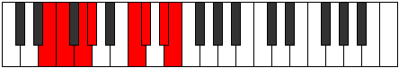 |
| [2843](https://ianring.com/musictheory/scales/2843) | [Sorian](ModeGSharpSorian.md) | G# | G#, A, B, C, D##, E#, F##, G# |  |
| [2843](https://ianring.com/musictheory/scales/2843) | [Sorian](ModeAFlatSorian.md) | Ab | Ab, Bbb, Cb, Dbb, E, F, G, Ab |  |
| [2845](https://ianring.com/musictheory/scales/2845) | [Baptian](ModeGSharpBaptian.md) | G# | G#, A#, B, C, D##, E#, F##, G# |  |
| [2845](https://ianring.com/musictheory/scales/2845) | [Baptian](ModeAFlatBaptian.md) | Ab | Ab, Bb, Cb, Dbb, E, F, G, Ab |  |
| [2847](https://ianring.com/musictheory/scales/2847) | [Phracryllic](ModeENaturalPhracryllic.md) | E | E, F, F#, G, G#, C, C#, D#, E |  |
| [2847](https://ianring.com/musictheory/scales/2847) | [Phracryllic](ModeGSharpPhracryllic.md) | G# | G#, A, A#, B, C, E, F, G, G# |  |
| [2847](https://ianring.com/musictheory/scales/2847) | [Phracryllic](ModeAFlatPhracryllic.md) | Ab | Ab, A, Bb, B, C, E, F, G, Ab |  |
| [2865](https://ianring.com/musictheory/scales/2865) | [Solimic](ModeGSharpSolimic.md) | G# | G#, A###, B##, D##, E#, F##, G# |  |
| [2865](https://ianring.com/musictheory/scales/2865) | [Solimic](ModeAFlatSolimic.md) | Ab | Ab, B#, C#, D##, E#, F##, Ab |  |
| [2867](https://ianring.com/musictheory/scales/2867) | [Socrian](ModeGSharpSocrian.md) | G# | G#, A, B#, C#, D##, E#, F##, G# |  |
| [2867](https://ianring.com/musictheory/scales/2867) | [Socrian](ModeAFlatSocrian.md) | Ab | Ab, Bbb, C, Db, E, F, G, Ab |  |
| [2869](https://ianring.com/musictheory/scales/2869) | [Phrothian](ModeGSharpPhrothian.md) | G# | G#, A#, B#, C#, D##, E#, F##, G# |  |
| [2869](https://ianring.com/musictheory/scales/2869) | [Phrothian](ModeAFlatPhrothian.md) | Ab | Ab, Bb, C, Db, E, F, G, Ab |  |
| [2869](https://ianring.com/musictheory/scales/2869) | [Phrothian](ModeDSharpPhrothian.md) | D# | D#, E#, F##, G#, A##, B#, C##, D# |  |
| [2869](https://ianring.com/musictheory/scales/2869) | [Phrothian](ModeEFlatPhrothian.md) | Eb | Eb, F, G, Ab, B, C, D, Eb |  |
| [2871](https://ianring.com/musictheory/scales/2871) | [Stanyllic](ModeGSharpStanyllic.md) | G# | G#, A, A#, C, C#, E, F, G, G# |  |
| [2871](https://ianring.com/musictheory/scales/2871) | [Stanyllic](ModeAFlatStanyllic.md) | Ab | Ab, A, Bb, C, Db, E, F, G, Ab |  |
| [2871](https://ianring.com/musictheory/scales/2871) | [Stanyllic](ModeDSharpStanyllic.md) | D# | D#, E, F, G, G#, B, C, D, D# |  |
| [2871](https://ianring.com/musictheory/scales/2871) | [Stanyllic](ModeEFlatStanyllic.md) | Eb | Eb, E, F, G, Ab, B, C, D, Eb |  |
| [2873](https://ianring.com/musictheory/scales/2873) | [Docrian](ModeGSharpDocrian.md) | G# | G#, A##, B#, C#, D##, E#, F##, G# |  |
| [2873](https://ianring.com/musictheory/scales/2873) | [Docrian](ModeAFlatDocrian.md) | Ab | Ab, B, C, Db, E, F, G, Ab |  |
| [2875](https://ianring.com/musictheory/scales/2875) | [Ganyllic](ModeENaturalGanyllic.md) | E | E, F, G, G#, A, C, C#, D#, E |  |
| [2875](https://ianring.com/musictheory/scales/2875) | [Ganyllic](ModeGSharpGanyllic.md) | G# | G#, A, B, C, C#, E, F, G, G# |  |
| [2875](https://ianring.com/musictheory/scales/2875) | [Ganyllic](ModeAFlatGanyllic.md) | Ab | Ab, A, B, C, Db, E, F, G, Ab |  |
| [2877](https://ianring.com/musictheory/scales/2877) | [Phrylyllic](ModeDSharpPhrylyllic.md) | D# | D#, F, F#, G, G#, B, C, D, D# |  |
| [2877](https://ianring.com/musictheory/scales/2877) | [Phrylyllic](ModeEFlatPhrylyllic.md) | Eb | Eb, F, Gb, G, Ab, B, C, D, Eb |  |
| [2877](https://ianring.com/musictheory/scales/2877) | [Phrylyllic](ModeGSharpPhrylyllic.md) | G# | G#, A#, B, C, C#, E, F, G, G# |  |
| [2877](https://ianring.com/musictheory/scales/2877) | [Phrylyllic](ModeAFlatPhrylyllic.md) | Ab | Ab, Bb, B, C, Db, E, F, G, Ab |  |
| [2879](https://ianring.com/musictheory/scales/2879) | [Stadygic](ModeENaturalStadygic.md) | E | E, F, F#, G, G#, A, C, C#, D#, E |  |
| [2879](https://ianring.com/musictheory/scales/2879) | [Stadygic](ModeDSharpStadygic.md) | D# | D#, E, F, F#, G, G#, B, C, D, D# |  |
| [2879](https://ianring.com/musictheory/scales/2879) | [Stadygic](ModeEFlatStadygic.md) | Eb | Eb, E, F, Gb, G, Ab, B, C, D, Eb |  |
| [2879](https://ianring.com/musictheory/scales/2879) | [Stadygic](ModeGSharpStadygic.md) | G# | G#, A, A#, B, C, C#, E, F, G, G# |  |
| [2879](https://ianring.com/musictheory/scales/2879) | [Stadygic](ModeAFlatStadygic.md) | Ab | Ab, A, Bb, B, C, Db, E, F, G, Ab |  |
| [2887](https://ianring.com/musictheory/scales/2887) | [Gaptian](ModeFSharpGaptian.md) | F# | F#, G, Ab, B#, C##, D#, E#, F# |  |
| [2887](https://ianring.com/musictheory/scales/2887) | [Gaptian](ModeGFlatGaptian.md) | Gb | Gb, Abb, Bbbb, C, D, Eb, F, Gb |  |
| [2887](https://ianring.com/musictheory/scales/2887) | [Gaptian](ModeBNaturalGaptian.md) | B | B, C, Db, E#, F##, G#, A#, B |  |
| [2891](https://ianring.com/musictheory/scales/2891) | [Phrogian](ModeBNaturalPhrogian.md) | B | B, C, D, E#, F##, G#, A#, B |  |
| [2895](https://ianring.com/musictheory/scales/2895) | [Aeragyllic](ModeFSharpAeragyllic.md) | F# | F#, G, G#, A, C, D, D#, F, F# |  |
| [2895](https://ianring.com/musictheory/scales/2895) | [Aeragyllic](ModeGFlatAeragyllic.md) | Gb | Gb, G, Ab, A, C, D, Eb, F, Gb |  |
| [2895](https://ianring.com/musictheory/scales/2895) | [Aeragyllic](ModeBNaturalAeragyllic.md) | B | B, C, C#, D, F, G, G#, A#, B |  |
| [2897](https://ianring.com/musictheory/scales/2897) | [Rycrimic](ModeGSharpRycrimic.md) | G# | G#, A###, B###, D##, E#, F##, G# |  |
| [2897](https://ianring.com/musictheory/scales/2897) | [Rycrimic](ModeAFlatRycrimic.md) | Ab | Ab, B#, C##, D##, E#, F##, Ab |  |
| [2899](https://ianring.com/musictheory/scales/2899) | [Kagian](ModeGSharpKagian.md) | G# | G#, A, B#, C##, D##, E#, F##, G# |  |
| [2899](https://ianring.com/musictheory/scales/2899) | [Kagian](ModeAFlatKagian.md) | Ab | Ab, Bbb, C, D, E, F, G, Ab |  |
| [2899](https://ianring.com/musictheory/scales/2899) | [Kagian](ModeBNaturalKagian.md) | B | B, C, D#, E#, F##, G#, A#, B |  |
| [2901](https://ianring.com/musictheory/scales/2901) | [Larian](ModeGSharpLarian.md) | G# | G#, A#, B#, C##, D##, E#, F##, G# |  |
| [2901](https://ianring.com/musictheory/scales/2901) | [Larian](ModeAFlatLarian.md) | Ab | Ab, Bb, C, D, E, F, G, Ab |  |
| [2903](https://ianring.com/musictheory/scales/2903) | [Gothyllic](ModeFSharpGothyllic.md) | F# | F#, G, G#, A#, C, D, D#, F, F# |  |
| [2903](https://ianring.com/musictheory/scales/2903) | [Gothyllic](ModeGFlatGothyllic.md) | Gb | Gb, G, Ab, Bb, C, D, Eb, F, Gb |  |
| [2903](https://ianring.com/musictheory/scales/2903) | [Gothyllic](ModeGSharpGothyllic.md) | G# | G#, A, A#, C, D, E, F, G, G# |  |
| [2903](https://ianring.com/musictheory/scales/2903) | [Gothyllic](ModeAFlatGothyllic.md) | Ab | Ab, A, Bb, C, D, E, F, G, Ab |  |
| [2903](https://ianring.com/musictheory/scales/2903) | [Gothyllic](ModeBNaturalGothyllic.md) | B | B, C, C#, D#, F, G, G#, A#, B |  |
| [2905](https://ianring.com/musictheory/scales/2905) | [Palian](ModeGSharpPalian.md) | G# | G#, A##, B#, C##, D##, E#, F##, G# |  |
| [2905](https://ianring.com/musictheory/scales/2905) | [Palian](ModeAFlatPalian.md) | Ab | Ab, B, C, D, E, F, G, Ab |  |
| [2907](https://ianring.com/musictheory/scales/2907) | [Mogyllic](ModeENaturalMogyllic.md) | E | E, F, G, G#, A#, C, C#, D#, E |  |
| [2907](https://ianring.com/musictheory/scales/2907) | [Mogyllic](ModeGSharpMogyllic.md) | G# | G#, A, B, C, D, E, F, G, G# |  |
| [2907](https://ianring.com/musictheory/scales/2907) | [Mogyllic](ModeAFlatMogyllic.md) | Ab | Ab, A, B, C, D, E, F, G, Ab |  |
| [2907](https://ianring.com/musictheory/scales/2907) | [Mogyllic](ModeBNaturalMogyllic.md) | B | B, C, D, D#, F, G, G#, A#, B |  |
| [2909](https://ianring.com/musictheory/scales/2909) | [Mocryllic](ModeGSharpMocryllic.md) | G# | G#, A#, B, C, D, E, F, G, G# |  |
| [2909](https://ianring.com/musictheory/scales/2909) | [Mocryllic](ModeAFlatMocryllic.md) | Ab | Ab, Bb, B, C, D, E, F, G, Ab |  |
| [2911](https://ianring.com/musictheory/scales/2911) | [Katygic](ModeENaturalKatygic.md) | E | E, F, F#, G, G#, A#, C, C#, D#, E |  |
| [2911](https://ianring.com/musictheory/scales/2911) | [Katygic](ModeFSharpKatygic.md) | F# | F#, G, G#, A, A#, C, D, D#, F, F# |  |
| [2911](https://ianring.com/musictheory/scales/2911) | [Katygic](ModeGFlatKatygic.md) | Gb | Gb, G, Ab, A, Bb, C, D, Eb, F, Gb |  |
| [2911](https://ianring.com/musictheory/scales/2911) | [Katygic](ModeBNaturalKatygic.md) | B | B, C, C#, D, D#, F, G, G#, A#, B |  |
| [2911](https://ianring.com/musictheory/scales/2911) | [Katygic](ModeGSharpKatygic.md) | G# | G#, A, A#, B, C, D, E, F, G, G# |  |
| [2911](https://ianring.com/musictheory/scales/2911) | [Katygic](ModeAFlatKatygic.md) | Ab | Ab, A, Bb, B, C, D, E, F, G, Ab |  |
| [2915](https://ianring.com/musictheory/scales/2915) | [Aeolydian](ModeBNaturalAeolydian.md) | B | B, C, D##, E#, F##, G#, A#, B |  |
| [2919](https://ianring.com/musictheory/scales/2919) | [Molyllic](ModeFSharpMolyllic.md) | F# | F#, G, G#, B, C, D, D#, F, F# |  |
| [2919](https://ianring.com/musictheory/scales/2919) | [Molyllic](ModeGFlatMolyllic.md) | Gb | Gb, G, Ab, B, C, D, Eb, F, Gb |  |
| [2919](https://ianring.com/musictheory/scales/2919) | [Molyllic](ModeBNaturalMolyllic.md) | B | B, C, C#, E, F, G, G#, A#, B |  |
| [2923](https://ianring.com/musictheory/scales/2923) | [Baryllic](ModeBNaturalBaryllic.md) | B | B, C, D, E, F, G, G#, A#, B |  |
| [2927](https://ianring.com/musictheory/scales/2927) | [Rodygic](ModeFSharpRodygic.md) | F# | F#, G, G#, A, B, C, D, D#, F, F# |  |
| [2927](https://ianring.com/musictheory/scales/2927) | [Rodygic](ModeGFlatRodygic.md) | Gb | Gb, G, Ab, A, B, C, D, Eb, F, Gb |  |
| [2927](https://ianring.com/musictheory/scales/2927) | [Rodygic](ModeBNaturalRodygic.md) | B | B, C, C#, D, E, F, G, G#, A#, B |  |
| [2929](https://ianring.com/musictheory/scales/2929) | [Aeolathian](ModeGSharpAeolathian.md) | G# | G#, A###, B##, C##, D##, E#, F##, G# | 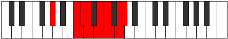 |
| [2929](https://ianring.com/musictheory/scales/2929) | [Aeolathian](ModeAFlatAeolathian.md) | Ab | Ab, B#, C#, D, E, F, G, Ab |  |
| [2931](https://ianring.com/musictheory/scales/2931) | [Zathyllic](ModeGSharpZathyllic.md) | G# | G#, A, C, C#, D, E, F, G, G# |  |
| [2931](https://ianring.com/musictheory/scales/2931) | [Zathyllic](ModeAFlatZathyllic.md) | Ab | Ab, A, C, Db, D, E, F, G, Ab |  |
| [2931](https://ianring.com/musictheory/scales/2931) | [Zathyllic](ModeBNaturalZathyllic.md) | B | B, C, D#, E, F, G, G#, A#, B |  |
| [2933](https://ianring.com/musictheory/scales/2933) | [Dalyllic](ModeGSharpDalyllic.md) | G# | G#, A#, C, C#, D, E, F, G, G# |  |
| [2933](https://ianring.com/musictheory/scales/2933) | [Dalyllic](ModeAFlatDalyllic.md) | Ab | Ab, Bb, C, Db, D, E, F, G, Ab |  |
| [2933](https://ianring.com/musictheory/scales/2933) | [Dalyllic](ModeDSharpDalyllic.md) | D# | D#, F, G, G#, A, B, C, D, D# |  |
| [2933](https://ianring.com/musictheory/scales/2933) | [Dalyllic](ModeEFlatDalyllic.md) | Eb | Eb, F, G, Ab, A, B, C, D, Eb |  |
| [2935](https://ianring.com/musictheory/scales/2935) | [Modygic](ModeGSharpModygic.md) | G# | G#, A, A#, C, C#, D, E, F, G, G# |  |
| [2935](https://ianring.com/musictheory/scales/2935) | [Modygic](ModeAFlatModygic.md) | Ab | Ab, A, Bb, C, Db, D, E, F, G, Ab |  |
| [2935](https://ianring.com/musictheory/scales/2935) | [Modygic](ModeDSharpModygic.md) | D# | D#, E, F, G, G#, A, B, C, D, D# |  |
| [2935](https://ianring.com/musictheory/scales/2935) | [Modygic](ModeEFlatModygic.md) | Eb | Eb, E, F, G, Ab, A, B, C, D, Eb |  |
| [2935](https://ianring.com/musictheory/scales/2935) | [Modygic](ModeBNaturalModygic.md) | B | B, C, C#, D#, E, F, G, G#, A#, B |  |
| [2935](https://ianring.com/musictheory/scales/2935) | [Modygic](ModeFSharpModygic.md) | F# | F#, G, G#, A#, B, C, D, D#, F, F# |  |
| [2935](https://ianring.com/musictheory/scales/2935) | [Modygic](ModeGFlatModygic.md) | Gb | Gb, G, Ab, Bb, B, C, D, Eb, F, Gb |  |
| [2937](https://ianring.com/musictheory/scales/2937) | [Aeolathyllic](ModeGSharpAeolathyllic.md) | G# | G#, B, C, C#, D, E, F, G, G# |  |
| [2937](https://ianring.com/musictheory/scales/2937) | [Aeolathyllic](ModeAFlatAeolathyllic.md) | Ab | Ab, B, C, Db, D, E, F, G, Ab |  |
| [2939](https://ianring.com/musictheory/scales/2939) | [Goptygic](ModeENaturalGoptygic.md) | E | E, F, G, G#, A, A#, C, C#, D#, E |  |
| [2939](https://ianring.com/musictheory/scales/2939) | [Goptygic](ModeGSharpGoptygic.md) | G# | G#, A, B, C, C#, D, E, F, G, G# |  |
| [2939](https://ianring.com/musictheory/scales/2939) | [Goptygic](ModeAFlatGoptygic.md) | Ab | Ab, A, B, C, Db, D, E, F, G, Ab |  |
| [2939](https://ianring.com/musictheory/scales/2939) | [Goptygic](ModeBNaturalGoptygic.md) | B | B, C, D, D#, E, F, G, G#, A#, B |  |
| [2941](https://ianring.com/musictheory/scales/2941) | [Laptygic](ModeDSharpLaptygic.md) | D# | D#, F, F#, G, G#, A, B, C, D, D# |  |
| [2941](https://ianring.com/musictheory/scales/2941) | [Laptygic](ModeEFlatLaptygic.md) | Eb | Eb, F, Gb, G, Ab, A, B, C, D, Eb |  |
| [2941](https://ianring.com/musictheory/scales/2941) | [Laptygic](ModeGSharpLaptygic.md) | G# | G#, A#, B, C, C#, D, E, F, G, G# |  |
| [2941](https://ianring.com/musictheory/scales/2941) | [Laptygic](ModeAFlatLaptygic.md) | Ab | Ab, Bb, B, C, Db, D, E, F, G, Ab |  |
| [2943](https://ianring.com/musictheory/scales/2943) | [Dathyllian](ModeENaturalDathyllian.md) | E | E, F, F#, G, G#, A, A#, C, C#, D#, E |  |
| [2943](https://ianring.com/musictheory/scales/2943) | [Dathyllian](ModeDSharpDathyllian.md) | D# | D#, E, F, F#, G, G#, A, B, C, D, D# |  |
| [2943](https://ianring.com/musictheory/scales/2943) | [Dathyllian](ModeEFlatDathyllian.md) | Eb | Eb, E, F, Gb, G, Ab, A, B, C, D, Eb |  |
| [2943](https://ianring.com/musictheory/scales/2943) | [Dathyllian](ModeBNaturalDathyllian.md) | B | B, C, C#, D, D#, E, F, G, G#, A#, B | 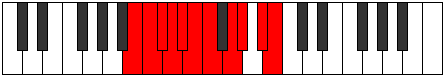 |
| [2943](https://ianring.com/musictheory/scales/2943) | [Dathyllian](ModeGSharpDathyllian.md) | G# | G#, A, A#, B, C, C#, D, E, F, G, G# |  |
| [2943](https://ianring.com/musictheory/scales/2943) | [Dathyllian](ModeAFlatDathyllian.md) | Ab | Ab, A, Bb, B, C, Db, D, E, F, G, Ab |  |
| [2943](https://ianring.com/musictheory/scales/2943) | [Dathyllian](ModeFSharpDathyllian.md) | F# | F#, G, G#, A, A#, B, C, D, D#, F, F# |  |
| [2943](https://ianring.com/musictheory/scales/2943) | [Dathyllian](ModeGFlatDathyllian.md) | Gb | Gb, G, Ab, A, Bb, B, C, D, Eb, F, Gb |  |
| [2957](https://ianring.com/musictheory/scales/2957) | [Thygian](ModeFNaturalThygian.md) | F | F, G, Ab, B#, C#, D, E, F |  |
| [2959](https://ianring.com/musictheory/scales/2959) | [Dygyllic](ModeFNaturalDygyllic.md) | F | F, F#, G, G#, C, C#, D, E, F |  |
| [2961](https://ianring.com/musictheory/scales/2961) | [Bygimic](ModeGSharpBygimic.md) | G# | G#, A###, C###, D##, E#, F##, G# |  |
| [2961](https://ianring.com/musictheory/scales/2961) | [Bygimic](ModeAFlatBygimic.md) | Ab | Ab, B#, C###, D##, E#, F##, Ab |  |
| [2963](https://ianring.com/musictheory/scales/2963) | [Bygian](ModeGSharpBygian.md) | G# | G#, A, B#, C###, D##, E#, F##, G# |  |
| [2963](https://ianring.com/musictheory/scales/2963) | [Bygian](ModeAFlatBygian.md) | Ab | Ab, Bbb, C, D#, E, F, G, Ab |  |
| [2965](https://ianring.com/musictheory/scales/2965) | [Darian](ModeGSharpDarian.md) | G# | G#, A#, B#, C###, D##, E#, F##, G# |  |
| [2965](https://ianring.com/musictheory/scales/2965) | [Darian](ModeAFlatDarian.md) | Ab | Ab, Bb, C, D#, E, F, G, Ab |  |
| [2967](https://ianring.com/musictheory/scales/2967) | [Madyllic](ModeGSharpMadyllic.md) | G# | G#, A, A#, C, D#, E, F, G, G# |  |
| [2967](https://ianring.com/musictheory/scales/2967) | [Madyllic](ModeAFlatMadyllic.md) | Ab | Ab, A, Bb, C, Eb, E, F, G, Ab |  |
| [2969](https://ianring.com/musictheory/scales/2969) | [Tholian](ModeGSharpTholian.md) | G# | G#, A##, B#, C###, D##, E#, F##, G# |  |
| [2969](https://ianring.com/musictheory/scales/2969) | [Tholian](ModeAFlatTholian.md) | Ab | Ab, B, C, D#, E, F, G, Ab |  |
| [2971](https://ianring.com/musictheory/scales/2971) | [Aeolynyllic](ModeENaturalAeolynyllic.md) | E | E, F, G, G#, B, C, C#, D#, E |  |
| [2971](https://ianring.com/musictheory/scales/2971) | [Aeolynyllic](ModeGSharpAeolynyllic.md) | G# | G#, A, B, C, D#, E, F, G, G# |  |
| [2971](https://ianring.com/musictheory/scales/2971) | [Aeolynyllic](ModeAFlatAeolynyllic.md) | Ab | Ab, A, B, C, Eb, E, F, G, Ab |  |
| [2973](https://ianring.com/musictheory/scales/2973) | [Panyllic](ModeFNaturalPanyllic.md) | F | F, G, G#, A, C, C#, D, E, F |  |
| [2973](https://ianring.com/musictheory/scales/2973) | [Panyllic](ModeGSharpPanyllic.md) | G# | G#, A#, B, C, D#, E, F, G, G# |  |
| [2973](https://ianring.com/musictheory/scales/2973) | [Panyllic](ModeAFlatPanyllic.md) | Ab | Ab, Bb, B, C, Eb, E, F, G, Ab |  |
| [2975](https://ianring.com/musictheory/scales/2975) | [Gaptygic](ModeFNaturalGaptygic.md) | F | F, F#, G, G#, A, C, C#, D, E, F |  |
| [2975](https://ianring.com/musictheory/scales/2975) | [Gaptygic](ModeENaturalGaptygic.md) | E | E, F, F#, G, G#, B, C, C#, D#, E |  |
| [2975](https://ianring.com/musictheory/scales/2975) | [Gaptygic](ModeGSharpGaptygic.md) | G# | G#, A, A#, B, C, D#, E, F, G, G# |  |
| [2975](https://ianring.com/musictheory/scales/2975) | [Gaptygic](ModeAFlatGaptygic.md) | Ab | Ab, A, Bb, B, C, Eb, E, F, G, Ab |  |
| [2979](https://ianring.com/musictheory/scales/2979) | [Gyptian](ModeCNaturalGyptian.md) | C | C, Db, E#, F##, G#, A, B, C |  |
| [2981](https://ianring.com/musictheory/scales/2981) | [Ionolian](ModeCNaturalIonolian.md) | C | C, D, E#, F##, G#, A, B, C |  |
| [2983](https://ianring.com/musictheory/scales/2983) | [Zythyllic](ModeCNaturalZythyllic.md) | C | C, C#, D, F, G, G#, A, B, C |  |
| [2985](https://ianring.com/musictheory/scales/2985) | [Epacrian](ModeCNaturalEpacrian.md) | C | C, D#, E#, F##, G#, A, B, C |  |
| [2987](https://ianring.com/musictheory/scales/2987) | [Thanyllic](ModeCNaturalThanyllic.md) | C | C, C#, D#, F, G, G#, A, B, C |  |
| [2989](https://ianring.com/musictheory/scales/2989) | [Ionacryllic](ModeFNaturalIonacryllic.md) | F | F, G, G#, A#, C, C#, D, E, F |  |
| [2989](https://ianring.com/musictheory/scales/2989) | [Ionacryllic](ModeCNaturalIonacryllic.md) | C | C, D, D#, F, G, G#, A, B, C |  |
| [2991](https://ianring.com/musictheory/scales/2991) | [Zanygic](ModeFNaturalZanygic.md) | F | F, F#, G, G#, A#, C, C#, D, E, F |  |
| [2991](https://ianring.com/musictheory/scales/2991) | [Zanygic](ModeCNaturalZanygic.md) | C | C, C#, D, D#, F, G, G#, A, B, C |  |
| [2993](https://ianring.com/musictheory/scales/2993) | [Stythian](ModeGSharpStythian.md) | G# | G#, A###, B##, C###, D##, E#, F##, G# |  |
| [2993](https://ianring.com/musictheory/scales/2993) | [Stythian](ModeAFlatStythian.md) | Ab | Ab, B#, C#, D#, E, F, G, Ab |  |
| [2993](https://ianring.com/musictheory/scales/2993) | [Stythian](ModeCNaturalStythian.md) | C | C, D##, E#, F##, G#, A, B, C |  |
| [2995](https://ianring.com/musictheory/scales/2995) | [Sanyllic](ModeGSharpSanyllic.md) | G# | G#, A, C, C#, D#, E, F, G, G# |  |
| [2995](https://ianring.com/musictheory/scales/2995) | [Sanyllic](ModeAFlatSanyllic.md) | Ab | Ab, A, C, Db, Eb, E, F, G, Ab |  |
| [2995](https://ianring.com/musictheory/scales/2995) | [Sanyllic](ModeCNaturalSanyllic.md) | C | C, C#, E, F, G, G#, A, B, C |  |
| [2997](https://ianring.com/musictheory/scales/2997) | [Ionoptyllic](ModeGSharpIonoptyllic.md) | G# | G#, A#, C, C#, D#, E, F, G, G# |  |
| [2997](https://ianring.com/musictheory/scales/2997) | [Ionoptyllic](ModeAFlatIonoptyllic.md) | Ab | Ab, Bb, C, Db, Eb, E, F, G, Ab |  |
| [2997](https://ianring.com/musictheory/scales/2997) | [Ionoptyllic](ModeCNaturalIonoptyllic.md) | C | C, D, E, F, G, G#, A, B, C |  |
| [2997](https://ianring.com/musictheory/scales/2997) | [Ionoptyllic](ModeDSharpIonoptyllic.md) | D# | D#, F, G, G#, A#, B, C, D, D# |  |
| [2997](https://ianring.com/musictheory/scales/2997) | [Ionoptyllic](ModeEFlatIonoptyllic.md) | Eb | Eb, F, G, Ab, Bb, B, C, D, Eb |  |
| [2999](https://ianring.com/musictheory/scales/2999) | [Zyrygic](ModeGSharpZyrygic.md) | G# | G#, A, A#, C, C#, D#, E, F, G, G# |  |
| [2999](https://ianring.com/musictheory/scales/2999) | [Zyrygic](ModeAFlatZyrygic.md) | Ab | Ab, A, Bb, C, Db, Eb, E, F, G, Ab |  |
| [2999](https://ianring.com/musictheory/scales/2999) | [Zyrygic](ModeCNaturalZyrygic.md) | C | C, C#, D, E, F, G, G#, A, B, C |  |
| [2999](https://ianring.com/musictheory/scales/2999) | [Zyrygic](ModeDSharpZyrygic.md) | D# | D#, E, F, G, G#, A#, B, C, D, D# |  |
| [2999](https://ianring.com/musictheory/scales/2999) | [Zyrygic](ModeEFlatZyrygic.md) | Eb | Eb, E, F, G, Ab, Bb, B, C, D, Eb |  |
| [3001](https://ianring.com/musictheory/scales/3001) | [Lonyllic](ModeGSharpLonyllic.md) | G# | G#, B, C, C#, D#, E, F, G, G# |  |
| [3001](https://ianring.com/musictheory/scales/3001) | [Lonyllic](ModeAFlatLonyllic.md) | Ab | Ab, B, C, Db, Eb, E, F, G, Ab |  |
| [3001](https://ianring.com/musictheory/scales/3001) | [Lonyllic](ModeCNaturalLonyllic.md) | C | C, D#, E, F, G, G#, A, B, C |  |
| [3003](https://ianring.com/musictheory/scales/3003) | [Zydygic](ModeCNaturalZydygic.md) | C | C, C#, D#, E, F, G, G#, A, B, C |  |
| [3003](https://ianring.com/musictheory/scales/3003) | [Zydygic](ModeENaturalZydygic.md) | E | E, F, G, G#, A, B, C, C#, D#, E |  |
| [3003](https://ianring.com/musictheory/scales/3003) | [Zydygic](ModeGSharpZydygic.md) | G# | G#, A, B, C, C#, D#, E, F, G, G# |  |
| [3003](https://ianring.com/musictheory/scales/3003) | [Zydygic](ModeAFlatZydygic.md) | Ab | Ab, A, B, C, Db, Eb, E, F, G, Ab |  |
| [3005](https://ianring.com/musictheory/scales/3005) | [Gycrygic](ModeFNaturalGycrygic.md) | F | F, G, G#, A, A#, C, C#, D, E, F |  |
| [3005](https://ianring.com/musictheory/scales/3005) | [Gycrygic](ModeCNaturalGycrygic.md) | C | C, D, D#, E, F, G, G#, A, B, C |  |
| [3005](https://ianring.com/musictheory/scales/3005) | [Gycrygic](ModeGSharpGycrygic.md) | G# | G#, A#, B, C, C#, D#, E, F, G, G# |  |
| [3005](https://ianring.com/musictheory/scales/3005) | [Gycrygic](ModeAFlatGycrygic.md) | Ab | Ab, Bb, B, C, Db, Eb, E, F, G, Ab |  |
| [3005](https://ianring.com/musictheory/scales/3005) | [Gycrygic](ModeDSharpGycrygic.md) | D# | D#, F, F#, G, G#, A#, B, C, D, D# |  |
| [3005](https://ianring.com/musictheory/scales/3005) | [Gycrygic](ModeEFlatGycrygic.md) | Eb | Eb, F, Gb, G, Ab, Bb, B, C, D, Eb |  |
| [3007](https://ianring.com/musictheory/scales/3007) | [Zyryllian](ModeFNaturalZyryllian.md) | F | F, F#, G, G#, A, A#, C, C#, D, E, F |  |
| [3007](https://ianring.com/musictheory/scales/3007) | [Zyryllian](ModeCNaturalZyryllian.md) | C | C, C#, D, D#, E, F, G, G#, A, B, C |  |
| [3007](https://ianring.com/musictheory/scales/3007) | [Zyryllian](ModeENaturalZyryllian.md) | E | E, F, F#, G, G#, A, B, C, C#, D#, E |  |
| [3007](https://ianring.com/musictheory/scales/3007) | [Zyryllian](ModeDSharpZyryllian.md) | D# | D#, E, F, F#, G, G#, A#, B, C, D, D# |  |
| [3007](https://ianring.com/musictheory/scales/3007) | [Zyryllian](ModeEFlatZyryllian.md) | Eb | Eb, E, F, Gb, G, Ab, Bb, B, C, D, Eb |  |
| [3007](https://ianring.com/musictheory/scales/3007) | [Zyryllian](ModeGSharpZyryllian.md) | G# | G#, A, A#, B, C, C#, D#, E, F, G, G# |  |
| [3007](https://ianring.com/musictheory/scales/3007) | [Zyryllian](ModeAFlatZyryllian.md) | Ab | Ab, A, Bb, B, C, Db, Eb, E, F, G, Ab |  |
| [3015](https://ianring.com/musictheory/scales/3015) | [Laptyllic](ModeFSharpLaptyllic.md) | F# | F#, G, G#, C, C#, D, D#, F, F# |  |
| [3015](https://ianring.com/musictheory/scales/3015) | [Laptyllic](ModeGFlatLaptyllic.md) | Gb | Gb, G, Ab, C, Db, D, Eb, F, Gb |  |
| [3015](https://ianring.com/musictheory/scales/3015) | [Laptyllic](ModeBNaturalLaptyllic.md) | B | B, C, C#, F, F#, G, G#, A#, B |  |
| [3019](https://ianring.com/musictheory/scales/3019) | [Mydyllic](ModeBNaturalMydyllic.md) | B | B, C, D, F, F#, G, G#, A#, B |  |
| [3021](https://ianring.com/musictheory/scales/3021) | [Gyptyllic](ModeFNaturalGyptyllic.md) | F | F, G, G#, B, C, C#, D, E, F |  |
| [3023](https://ianring.com/musictheory/scales/3023) | [Aeracrygic](ModeFSharpAeracrygic.md) | F# | F#, G, G#, A, C, C#, D, D#, F, F# |  |
| [3023](https://ianring.com/musictheory/scales/3023) | [Aeracrygic](ModeGFlatAeracrygic.md) | Gb | Gb, G, Ab, A, C, Db, D, Eb, F, Gb |  |
| [3023](https://ianring.com/musictheory/scales/3023) | [Aeracrygic](ModeFNaturalAeracrygic.md) | F | F, F#, G, G#, B, C, C#, D, E, F |  |
| [3023](https://ianring.com/musictheory/scales/3023) | [Aeracrygic](ModeBNaturalAeracrygic.md) | B | B, C, C#, D, F, F#, G, G#, A#, B |  |
| [3025](https://ianring.com/musictheory/scales/3025) | [Epycrian](ModeGSharpEpycrian.md) | G# | G#, A###, B###, C###, D##, E#, F##, G# |  |
| [3025](https://ianring.com/musictheory/scales/3025) | [Epycrian](ModeAFlatEpycrian.md) | Ab | Ab, B#, C##, D#, E, F, G, Ab |  |
| [3025](https://ianring.com/musictheory/scales/3025) | [Epycrian](ModeCSharpEpycrian.md) | C# | C#, D###, E###, F###, G##, A#, B#, C# |  |
| [3025](https://ianring.com/musictheory/scales/3025) | [Epycrian](ModeDFlatEpycrian.md) | Db | Db, E#, F##, G#, A, Bb, C, Db |  |
| [3027](https://ianring.com/musictheory/scales/3027) | [Rythyllic](ModeGSharpRythyllic.md) | G# | G#, A, C, D, D#, E, F, G, G# |  |
| [3027](https://ianring.com/musictheory/scales/3027) | [Rythyllic](ModeAFlatRythyllic.md) | Ab | Ab, A, C, D, Eb, E, F, G, Ab |  |
| [3027](https://ianring.com/musictheory/scales/3027) | [Rythyllic](ModeCSharpRythyllic.md) | C# | C#, D, F, G, G#, A, A#, C, C# |  |
| [3027](https://ianring.com/musictheory/scales/3027) | [Rythyllic](ModeDFlatRythyllic.md) | Db | Db, D, F, G, Ab, A, Bb, C, Db |  |
| [3027](https://ianring.com/musictheory/scales/3027) | [Rythyllic](ModeBNaturalRythyllic.md) | B | B, C, D#, F, F#, G, G#, A#, B |  |
| [3029](https://ianring.com/musictheory/scales/3029) | [Ionocryllic](ModeGSharpIonocryllic.md) | G# | G#, A#, C, D, D#, E, F, G, G# |  |
| [3029](https://ianring.com/musictheory/scales/3029) | [Ionocryllic](ModeAFlatIonocryllic.md) | Ab | Ab, Bb, C, D, Eb, E, F, G, Ab |  |
| [3029](https://ianring.com/musictheory/scales/3029) | [Ionocryllic](ModeCSharpIonocryllic.md) | C# | C#, D#, F, G, G#, A, A#, C, C# |  |
| [3029](https://ianring.com/musictheory/scales/3029) | [Ionocryllic](ModeDFlatIonocryllic.md) | Db | Db, Eb, F, G, Ab, A, Bb, C, Db |  |
| [3031](https://ianring.com/musictheory/scales/3031) | [Epithygic](ModeFSharpEpithygic.md) | F# | F#, G, G#, A#, C, C#, D, D#, F, F# |  |
| [3031](https://ianring.com/musictheory/scales/3031) | [Epithygic](ModeGFlatEpithygic.md) | Gb | Gb, G, Ab, Bb, C, Db, D, Eb, F, Gb |  |
| [3031](https://ianring.com/musictheory/scales/3031) | [Epithygic](ModeCSharpEpithygic.md) | C# | C#, D, D#, F, G, G#, A, A#, C, C# |  |
| [3031](https://ianring.com/musictheory/scales/3031) | [Epithygic](ModeDFlatEpithygic.md) | Db | Db, D, Eb, F, G, Ab, A, Bb, C, Db |  |
| [3031](https://ianring.com/musictheory/scales/3031) | [Epithygic](ModeGSharpEpithygic.md) | G# | G#, A, A#, C, D, D#, E, F, G, G# |  |
| [3031](https://ianring.com/musictheory/scales/3031) | [Epithygic](ModeAFlatEpithygic.md) | Ab | Ab, A, Bb, C, D, Eb, E, F, G, Ab |  |
| [3031](https://ianring.com/musictheory/scales/3031) | [Epithygic](ModeBNaturalEpithygic.md) | B | B, C, C#, D#, F, F#, G, G#, A#, B |  |
| [3033](https://ianring.com/musictheory/scales/3033) | [Doptyllic](ModeCSharpDoptyllic.md) | C# | C#, E, F, G, G#, A, A#, C, C# |  |
| [3033](https://ianring.com/musictheory/scales/3033) | [Doptyllic](ModeDFlatDoptyllic.md) | Db | Db, E, F, G, Ab, A, Bb, C, Db |  |
| [3033](https://ianring.com/musictheory/scales/3033) | [Doptyllic](ModeGSharpDoptyllic.md) | G# | G#, B, C, D, D#, E, F, G, G# |  |
| [3033](https://ianring.com/musictheory/scales/3033) | [Doptyllic](ModeAFlatDoptyllic.md) | Ab | Ab, B, C, D, Eb, E, F, G, Ab |  |
| [3035](https://ianring.com/musictheory/scales/3035) | [Gocrygic](ModeCSharpGocrygic.md) | C# | C#, D, E, F, G, G#, A, A#, C, C# |  |
| [3035](https://ianring.com/musictheory/scales/3035) | [Gocrygic](ModeDFlatGocrygic.md) | Db | Db, D, E, F, G, Ab, A, Bb, C, Db |  |
| [3035](https://ianring.com/musictheory/scales/3035) | [Gocrygic](ModeGSharpGocrygic.md) | G# | G#, A, B, C, D, D#, E, F, G, G# |  |
| [3035](https://ianring.com/musictheory/scales/3035) | [Gocrygic](ModeAFlatGocrygic.md) | Ab | Ab, A, B, C, D, Eb, E, F, G, Ab |  |
| [3035](https://ianring.com/musictheory/scales/3035) | [Gocrygic](ModeENaturalGocrygic.md) | E | E, F, G, G#, A#, B, C, C#, D#, E |  |
| [3035](https://ianring.com/musictheory/scales/3035) | [Gocrygic](ModeBNaturalGocrygic.md) | B | B, C, D, D#, F, F#, G, G#, A#, B |  |
| [3037](https://ianring.com/musictheory/scales/3037) | [Staptygic](ModeCSharpStaptygic.md) | C# | C#, D#, E, F, G, G#, A, A#, C, C# |  |
| [3037](https://ianring.com/musictheory/scales/3037) | [Staptygic](ModeDFlatStaptygic.md) | Db | Db, Eb, E, F, G, Ab, A, Bb, C, Db |  |
| [3037](https://ianring.com/musictheory/scales/3037) | [Staptygic](ModeFNaturalStaptygic.md) | F | F, G, G#, A, B, C, C#, D, E, F |  |
| [3037](https://ianring.com/musictheory/scales/3037) | [Staptygic](ModeGSharpStaptygic.md) | G# | G#, A#, B, C, D, D#, E, F, G, G# |  |
| [3037](https://ianring.com/musictheory/scales/3037) | [Staptygic](ModeAFlatStaptygic.md) | Ab | Ab, Bb, B, C, D, Eb, E, F, G, Ab |  |
| [3039](https://ianring.com/musictheory/scales/3039) | [Godyllian](ModeCSharpGodyllian.md) | C# | C#, D, D#, E, F, G, G#, A, A#, C, C# |  |
| [3039](https://ianring.com/musictheory/scales/3039) | [Godyllian](ModeDFlatGodyllian.md) | Db | Db, D, Eb, E, F, G, Ab, A, Bb, C, Db |  |
| [3039](https://ianring.com/musictheory/scales/3039) | [Godyllian](ModeFSharpGodyllian.md) | F# | F#, G, G#, A, A#, C, C#, D, D#, F, F# |  |
| [3039](https://ianring.com/musictheory/scales/3039) | [Godyllian](ModeGFlatGodyllian.md) | Gb | Gb, G, Ab, A, Bb, C, Db, D, Eb, F, Gb |  |
| [3039](https://ianring.com/musictheory/scales/3039) | [Godyllian](ModeFNaturalGodyllian.md) | F | F, F#, G, G#, A, B, C, C#, D, E, F |  |
| [3039](https://ianring.com/musictheory/scales/3039) | [Godyllian](ModeBNaturalGodyllian.md) | B | B, C, C#, D, D#, F, F#, G, G#, A#, B |  |
| [3039](https://ianring.com/musictheory/scales/3039) | [Godyllian](ModeENaturalGodyllian.md) | E | E, F, F#, G, G#, A#, B, C, C#, D#, E |  |
| [3039](https://ianring.com/musictheory/scales/3039) | [Godyllian](ModeGSharpGodyllian.md) | G# | G#, A, A#, B, C, D, D#, E, F, G, G# |  |
| [3039](https://ianring.com/musictheory/scales/3039) | [Godyllian](ModeAFlatGodyllian.md) | Ab | Ab, A, Bb, B, C, D, Eb, E, F, G, Ab |  |
| [3043](https://ianring.com/musictheory/scales/3043) | [Ionayllic](ModeCNaturalIonayllic.md) | C | C, C#, F, F#, G, G#, A, B, C |  |
| [3043](https://ianring.com/musictheory/scales/3043) | [Ionayllic](ModeBNaturalIonayllic.md) | B | B, C, E, F, F#, G, G#, A#, B |  |
| [3045](https://ianring.com/musictheory/scales/3045) | [Raptyllic](ModeCNaturalRaptyllic.md) | C | C, D, F, F#, G, G#, A, B, C |  |
| [3047](https://ianring.com/musictheory/scales/3047) | [Panygic](ModeFSharpPanygic.md) | F# | F#, G, G#, B, C, C#, D, D#, F, F# |  |
| [3047](https://ianring.com/musictheory/scales/3047) | [Panygic](ModeGFlatPanygic.md) | Gb | Gb, G, Ab, B, C, Db, D, Eb, F, Gb |  |
| [3047](https://ianring.com/musictheory/scales/3047) | [Panygic](ModeCNaturalPanygic.md) | C | C, C#, D, F, F#, G, G#, A, B, C |  |
| [3047](https://ianring.com/musictheory/scales/3047) | [Panygic](ModeBNaturalPanygic.md) | B | B, C, C#, E, F, F#, G, G#, A#, B |  |
| [3049](https://ianring.com/musictheory/scales/3049) | [Aeronyllic](ModeCNaturalAeronyllic.md) | C | C, D#, F, F#, G, G#, A, B, C |  |
| [3051](https://ianring.com/musictheory/scales/3051) | [Stalygic](ModeCNaturalStalygic.md) | C | C, C#, D#, F, F#, G, G#, A, B, C |  |
| [3051](https://ianring.com/musictheory/scales/3051) | [Stalygic](ModeBNaturalStalygic.md) | B | B, C, D, E, F, F#, G, G#, A#, B |  |
| [3053](https://ianring.com/musictheory/scales/3053) | [Zycrygic](ModeCNaturalZycrygic.md) | C | C, D, D#, F, F#, G, G#, A, B, C |  |
| [3053](https://ianring.com/musictheory/scales/3053) | [Zycrygic](ModeFNaturalZycrygic.md) | F | F, G, G#, A#, B, C, C#, D, E, F |  |
| [3055](https://ianring.com/musictheory/scales/3055) | [Lyryllian](ModeCNaturalLyryllian.md) | C | C, C#, D, D#, F, F#, G, G#, A, B, C |  |
| [3055](https://ianring.com/musictheory/scales/3055) | [Lyryllian](ModeFSharpLyryllian.md) | F# | F#, G, G#, A, B, C, C#, D, D#, F, F# |  |
| [3055](https://ianring.com/musictheory/scales/3055) | [Lyryllian](ModeGFlatLyryllian.md) | Gb | Gb, G, Ab, A, B, C, Db, D, Eb, F, Gb |  |
| [3055](https://ianring.com/musictheory/scales/3055) | [Lyryllian](ModeFNaturalLyryllian.md) | F | F, F#, G, G#, A#, B, C, C#, D, E, F |  |
| [3055](https://ianring.com/musictheory/scales/3055) | [Lyryllian](ModeBNaturalLyryllian.md) | B | B, C, C#, D, E, F, F#, G, G#, A#, B |  |
| [3057](https://ianring.com/musictheory/scales/3057) | [Phroryllic](ModeGSharpPhroryllic.md) | G# | G#, C, C#, D, D#, E, F, G, G# |  |
| [3057](https://ianring.com/musictheory/scales/3057) | [Phroryllic](ModeAFlatPhroryllic.md) | Ab | Ab, C, Db, D, Eb, E, F, G, Ab |  |
| [3057](https://ianring.com/musictheory/scales/3057) | [Phroryllic](ModeCSharpPhroryllic.md) | C# | C#, F, F#, G, G#, A, A#, C, C# |  |
| [3057](https://ianring.com/musictheory/scales/3057) | [Phroryllic](ModeDFlatPhroryllic.md) | Db | Db, F, Gb, G, Ab, A, Bb, C, Db |  |
| [3057](https://ianring.com/musictheory/scales/3057) | [Phroryllic](ModeCNaturalPhroryllic.md) | C | C, E, F, F#, G, G#, A, B, C |  |
| [3059](https://ianring.com/musictheory/scales/3059) | [Madygic](ModeGSharpMadygic.md) | G# | G#, A, C, C#, D, D#, E, F, G, G# |  |
| [3059](https://ianring.com/musictheory/scales/3059) | [Madygic](ModeAFlatMadygic.md) | Ab | Ab, A, C, Db, D, Eb, E, F, G, Ab |  |
| [3059](https://ianring.com/musictheory/scales/3059) | [Madygic](ModeCSharpMadygic.md) | C# | C#, D, F, F#, G, G#, A, A#, C, C# |  |
| [3059](https://ianring.com/musictheory/scales/3059) | [Madygic](ModeDFlatMadygic.md) | Db | Db, D, F, Gb, G, Ab, A, Bb, C, Db |  |
| [3059](https://ianring.com/musictheory/scales/3059) | [Madygic](ModeCNaturalMadygic.md) | C | C, C#, E, F, F#, G, G#, A, B, C |  |
| [3059](https://ianring.com/musictheory/scales/3059) | [Madygic](ModeBNaturalMadygic.md) | B | B, C, D#, E, F, F#, G, G#, A#, B |  |
| [3061](https://ianring.com/musictheory/scales/3061) | [Apinygic](ModeGSharpApinygic.md) | G# | G#, A#, C, C#, D, D#, E, F, G, G# |  |
| [3061](https://ianring.com/musictheory/scales/3061) | [Apinygic](ModeAFlatApinygic.md) | Ab | Ab, Bb, C, Db, D, Eb, E, F, G, Ab |  |
| [3061](https://ianring.com/musictheory/scales/3061) | [Apinygic](ModeCSharpApinygic.md) | C# | C#, D#, F, F#, G, G#, A, A#, C, C# |  |
| [3061](https://ianring.com/musictheory/scales/3061) | [Apinygic](ModeDFlatApinygic.md) | Db | Db, Eb, F, Gb, G, Ab, A, Bb, C, Db |  |
| [3061](https://ianring.com/musictheory/scales/3061) | [Apinygic](ModeCNaturalApinygic.md) | C | C, D, E, F, F#, G, G#, A, B, C |  |
| [3061](https://ianring.com/musictheory/scales/3061) | [Apinygic](ModeDSharpApinygic.md) | D# | D#, F, G, G#, A, A#, B, C, D, D# |  |
| [3061](https://ianring.com/musictheory/scales/3061) | [Apinygic](ModeEFlatApinygic.md) | Eb | Eb, F, G, Ab, A, Bb, B, C, D, Eb |  |
| [3063](https://ianring.com/musictheory/scales/3063) | [Solyllian](ModeGSharpSolyllian.md) | G# | G#, A, A#, C, C#, D, D#, E, F, G, G# |  |
| [3063](https://ianring.com/musictheory/scales/3063) | [Solyllian](ModeAFlatSolyllian.md) | Ab | Ab, A, Bb, C, Db, D, Eb, E, F, G, Ab |  |
| [3063](https://ianring.com/musictheory/scales/3063) | [Solyllian](ModeCSharpSolyllian.md) | C# | C#, D, D#, F, F#, G, G#, A, A#, C, C# |  |
| [3063](https://ianring.com/musictheory/scales/3063) | [Solyllian](ModeDFlatSolyllian.md) | Db | Db, D, Eb, F, Gb, G, Ab, A, Bb, C, Db |  |
| [3063](https://ianring.com/musictheory/scales/3063) | [Solyllian](ModeCNaturalSolyllian.md) | C | C, C#, D, E, F, F#, G, G#, A, B, C |  |
| [3063](https://ianring.com/musictheory/scales/3063) | [Solyllian](ModeFSharpSolyllian.md) | F# | F#, G, G#, A#, B, C, C#, D, D#, F, F# |  |
| [3063](https://ianring.com/musictheory/scales/3063) | [Solyllian](ModeGFlatSolyllian.md) | Gb | Gb, G, Ab, Bb, B, C, Db, D, Eb, F, Gb |  |
| [3063](https://ianring.com/musictheory/scales/3063) | [Solyllian](ModeBNaturalSolyllian.md) | B | B, C, C#, D#, E, F, F#, G, G#, A#, B |  |
| [3063](https://ianring.com/musictheory/scales/3063) | [Solyllian](ModeDSharpSolyllian.md) | D# | D#, E, F, G, G#, A, A#, B, C, D, D# |  |
| [3063](https://ianring.com/musictheory/scales/3063) | [Solyllian](ModeEFlatSolyllian.md) | Eb | Eb, E, F, G, Ab, A, Bb, B, C, D, Eb |  |
| [3065](https://ianring.com/musictheory/scales/3065) | [Zothygic](ModeCSharpZothygic.md) | C# | C#, E, F, F#, G, G#, A, A#, C, C# |  |
| [3065](https://ianring.com/musictheory/scales/3065) | [Zothygic](ModeDFlatZothygic.md) | Db | Db, E, F, Gb, G, Ab, A, Bb, C, Db |  |
| [3065](https://ianring.com/musictheory/scales/3065) | [Zothygic](ModeGSharpZothygic.md) | G# | G#, B, C, C#, D, D#, E, F, G, G# |  |
| [3065](https://ianring.com/musictheory/scales/3065) | [Zothygic](ModeAFlatZothygic.md) | Ab | Ab, B, C, Db, D, Eb, E, F, G, Ab |  |
| [3065](https://ianring.com/musictheory/scales/3065) | [Zothygic](ModeCNaturalZothygic.md) | C | C, D#, E, F, F#, G, G#, A, B, C |  |
| [3067](https://ianring.com/musictheory/scales/3067) | [Goptyllian](ModeCSharpGoptyllian.md) | C# | C#, D, E, F, F#, G, G#, A, A#, C, C# |  |
| [3067](https://ianring.com/musictheory/scales/3067) | [Goptyllian](ModeDFlatGoptyllian.md) | Db | Db, D, E, F, Gb, G, Ab, A, Bb, C, Db |  |
| [3067](https://ianring.com/musictheory/scales/3067) | [Goptyllian](ModeGSharpGoptyllian.md) | G# | G#, A, B, C, C#, D, D#, E, F, G, G# |  |
| [3067](https://ianring.com/musictheory/scales/3067) | [Goptyllian](ModeAFlatGoptyllian.md) | Ab | Ab, A, B, C, Db, D, Eb, E, F, G, Ab |  |
| [3067](https://ianring.com/musictheory/scales/3067) | [Goptyllian](ModeCNaturalGoptyllian.md) | C | C, C#, D#, E, F, F#, G, G#, A, B, C |  |
| [3067](https://ianring.com/musictheory/scales/3067) | [Goptyllian](ModeBNaturalGoptyllian.md) | B | B, C, D, D#, E, F, F#, G, G#, A#, B | 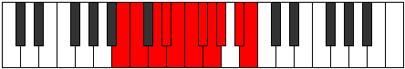 |
| [3067](https://ianring.com/musictheory/scales/3067) | [Goptyllian](ModeENaturalGoptyllian.md) | E | E, F, G, G#, A, A#, B, C, C#, D#, E |  |
| [3069](https://ianring.com/musictheory/scales/3069) | [Bacryllian](ModeCSharpBacryllian.md) | C# | C#, D#, E, F, F#, G, G#, A, A#, C, C# |  |
| [3069](https://ianring.com/musictheory/scales/3069) | [Bacryllian](ModeDFlatBacryllian.md) | Db | Db, Eb, E, F, Gb, G, Ab, A, Bb, C, Db |  |
| [3069](https://ianring.com/musictheory/scales/3069) | [Bacryllian](ModeCNaturalBacryllian.md) | C | C, D, D#, E, F, F#, G, G#, A, B, C |  |
| [3069](https://ianring.com/musictheory/scales/3069) | [Bacryllian](ModeGSharpBacryllian.md) | G# | G#, A#, B, C, C#, D, D#, E, F, G, G# |  |
| [3069](https://ianring.com/musictheory/scales/3069) | [Bacryllian](ModeAFlatBacryllian.md) | Ab | Ab, Bb, B, C, Db, D, Eb, E, F, G, Ab |  |
| [3069](https://ianring.com/musictheory/scales/3069) | [Bacryllian](ModeFNaturalBacryllian.md) | F | F, G, G#, A, A#, B, C, C#, D, E, F |  |
| [3069](https://ianring.com/musictheory/scales/3069) | [Bacryllian](ModeDSharpBacryllian.md) | D# | D#, F, F#, G, G#, A, A#, B, C, D, D# |  |
| [3069](https://ianring.com/musictheory/scales/3069) | [Bacryllian](ModeEFlatBacryllian.md) | Eb | Eb, F, Gb, G, Ab, A, Bb, B, C, D, Eb |  |
| [3071](https://ianring.com/musictheory/scales/3071) | [Solatic](ModeCSharpSolatic.md) | C# | C#, D, D#, E, F, F#, G, G#, A, A#, C, C# |  |
| [3071](https://ianring.com/musictheory/scales/3071) | [Solatic](ModeDFlatSolatic.md) | Db | Db, D, Eb, E, F, Gb, G, Ab, A, Bb, C, Db |  |
| [3071](https://ianring.com/musictheory/scales/3071) | [Solatic](ModeCNaturalSolatic.md) | C | C, C#, D, D#, E, F, F#, G, G#, A, B, C |  |
| [3071](https://ianring.com/musictheory/scales/3071) | [Solatic](ModeBNaturalSolatic.md) | B | B, C, C#, D, D#, E, F, F#, G, G#, A#, B |  |
| [3071](https://ianring.com/musictheory/scales/3071) | [Solatic](ModeGSharpSolatic.md) | G# | G#, A, A#, B, C, C#, D, D#, E, F, G, G# |  |
| [3071](https://ianring.com/musictheory/scales/3071) | [Solatic](ModeAFlatSolatic.md) | Ab | Ab, A, Bb, B, C, Db, D, Eb, E, F, G, Ab |  |
| [3071](https://ianring.com/musictheory/scales/3071) | [Solatic](ModeFSharpSolatic.md) | F# | F#, G, G#, A, A#, B, C, C#, D, D#, F, F# |  |
| [3071](https://ianring.com/musictheory/scales/3071) | [Solatic](ModeGFlatSolatic.md) | Gb | Gb, G, Ab, A, Bb, B, C, Db, D, Eb, F, Gb |  |
| [3071](https://ianring.com/musictheory/scales/3071) | [Solatic](ModeFNaturalSolatic.md) | F | F, F#, G, G#, A, A#, B, C, C#, D, E, F |  |
| [3071](https://ianring.com/musictheory/scales/3071) | [Solatic](ModeENaturalSolatic.md) | E | E, F, F#, G, G#, A, A#, B, C, C#, D#, E |  |
| [3071](https://ianring.com/musictheory/scales/3071) | [Solatic](ModeDSharpSolatic.md) | D# | D#, E, F, F#, G, G#, A, A#, B, C, D, D# |  |
| [3071](https://ianring.com/musictheory/scales/3071) | [Solatic](ModeEFlatSolatic.md) | Eb | Eb, E, F, Gb, G, Ab, A, Bb, B, C, D, Eb |  |
| [3143](https://ianring.com/musictheory/scales/3143) | [Polimic](ModeFSharpPolimic.md) | F# | F#, G, Ab, B#, D##, E#, F# |  |
| [3143](https://ianring.com/musictheory/scales/3143) | [Polimic](ModeGFlatPolimic.md) | Gb | Gb, Abb, Bbbb, C, D##, E#, Gb |  |
| [3151](https://ianring.com/musictheory/scales/3151) | [Pacrian](ModeFSharpPacrian.md) | F# | F#, G, Ab, Bbb, C, D##, E#, F# |  |
| [3151](https://ianring.com/musictheory/scales/3151) | [Pacrian](ModeGFlatPacrian.md) | Gb | Gb, Abb, Bbbb, Cbbb, Dbb, E, F, Gb |  |
| [3159](https://ianring.com/musictheory/scales/3159) | [Stocrian](ModeFSharpStocrian.md) | F# | F#, G, Ab, Bb, C, D##, E#, F# |  |
| [3159](https://ianring.com/musictheory/scales/3159) | [Stocrian](ModeGFlatStocrian.md) | Gb | Gb, Abb, Bbbb, Cbb, Dbb, E, F, Gb |  |
| [3167](https://ianring.com/musictheory/scales/3167) | [Thynyllic](ModeFSharpThynyllic.md) | F# | F#, G, G#, A, A#, C, E, F, F# |  |
| [3167](https://ianring.com/musictheory/scales/3167) | [Thynyllic](ModeGFlatThynyllic.md) | Gb | Gb, G, Ab, A, Bb, C, E, F, Gb |  |
| [3171](https://ianring.com/musictheory/scales/3171) | [Zythimic](ModeGNaturalZythimic.md) | G | G, Ab, B#, C#, D###, E##, G |  |
| [3175](https://ianring.com/musictheory/scales/3175) | [Eponian](ModeGNaturalEponian.md) | G | G, Ab, Bbb, C, Db, E#, F#, G |  |
| [3175](https://ianring.com/musictheory/scales/3175) | [Eponian](ModeFSharpEponian.md) | F# | F#, G, Ab, B, C, D##, E#, F# |  |
| [3175](https://ianring.com/musictheory/scales/3175) | [Eponian](ModeGFlatEponian.md) | Gb | Gb, Abb, Bbbb, Cb, Dbb, E, F, Gb |  |
| [3177](https://ianring.com/musictheory/scales/3177) | [Rothimic](ModeDNaturalRothimic.md) | D | D, E#, F##, G#, A###, B##, D |  |
| [3179](https://ianring.com/musictheory/scales/3179) | [Daptian](ModeDNaturalDaptian.md) | D | D, Eb, F, G, Ab, B#, C#, D |  |
| [3179](https://ianring.com/musictheory/scales/3179) | [Daptian](ModeGNaturalDaptian.md) | G | G, Ab, Bb, C, Db, E#, F#, G |  |
| [3181](https://ianring.com/musictheory/scales/3181) | [Rolian](ModeDNaturalRolian.md) | D | D, E, F, G, Ab, B#, C#, D |  |
| [3183](https://ianring.com/musictheory/scales/3183) | [Mixonyllic](ModeDNaturalMixonyllic.md) | D | D, D#, E, F, G, G#, C, C#, D |  |
| [3183](https://ianring.com/musictheory/scales/3183) | [Mixonyllic](ModeGNaturalMixonyllic.md) | G | G, G#, A, A#, C, C#, F, F#, G |  |
| [3183](https://ianring.com/musictheory/scales/3183) | [Mixonyllic](ModeFSharpMixonyllic.md) | F# | F#, G, G#, A, B, C, E, F, F# |  |
| [3183](https://ianring.com/musictheory/scales/3183) | [Mixonyllic](ModeGFlatMixonyllic.md) | Gb | Gb, G, Ab, A, B, C, E, F, Gb |  |
| [3187](https://ianring.com/musictheory/scales/3187) | [Koptian](ModeGNaturalKoptian.md) | G | G, Ab, B, C, Db, E#, F#, G |  |
| [3191](https://ianring.com/musictheory/scales/3191) | [Bynyllic](ModeGNaturalBynyllic.md) | G | G, G#, A, B, C, C#, F, F#, G |  |
| [3191](https://ianring.com/musictheory/scales/3191) | [Bynyllic](ModeFSharpBynyllic.md) | F# | F#, G, G#, A#, B, C, E, F, F# |  |
| [3191](https://ianring.com/musictheory/scales/3191) | [Bynyllic](ModeGFlatBynyllic.md) | Gb | Gb, G, Ab, Bb, B, C, E, F, Gb | 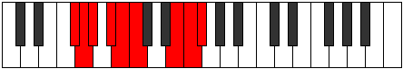 |
| [3193](https://ianring.com/musictheory/scales/3193) | [Zathian](ModeDNaturalZathian.md) | D | D, E#, F#, G, Ab, B#, C#, D |  |
| [3195](https://ianring.com/musictheory/scales/3195) | [Raryllic](ModeDNaturalRaryllic.md) | D | D, D#, F, F#, G, G#, C, C#, D |  |
| [3195](https://ianring.com/musictheory/scales/3195) | [Raryllic](ModeGNaturalRaryllic.md) | G | G, G#, A#, B, C, C#, F, F#, G |  |
| [3197](https://ianring.com/musictheory/scales/3197) | [Gylyllic](ModeDNaturalGylyllic.md) | D | D, E, F, F#, G, G#, C, C#, D |  |
| [3199](https://ianring.com/musictheory/scales/3199) | [Thaptygic](ModeDNaturalThaptygic.md) | D | D, D#, E, F, F#, G, G#, C, C#, D |  |
| [3199](https://ianring.com/musictheory/scales/3199) | [Thaptygic](ModeGNaturalThaptygic.md) | G | G, G#, A, A#, B, C, C#, F, F#, G |  |
| [3199](https://ianring.com/musictheory/scales/3199) | [Thaptygic](ModeFSharpThaptygic.md) | F# | F#, G, G#, A, A#, B, C, E, F, F# |  |
| [3199](https://ianring.com/musictheory/scales/3199) | [Thaptygic](ModeGFlatThaptygic.md) | Gb | Gb, G, Ab, A, Bb, B, C, E, F, Gb |  |
| [3213](https://ianring.com/musictheory/scales/3213) | [Eponimic](ModeFNaturalEponimic.md) | F | F, G, Ab, B#, C###, D##, F |  |
| [3215](https://ianring.com/musictheory/scales/3215) | [Katydian](ModeFNaturalKatydian.md) | F | F, Gb, Abb, Bbbb, C, D#, E, F |  |
| [3229](https://ianring.com/musictheory/scales/3229) | [Aeolaptian](ModeFNaturalAeolaptian.md) | F | F, G, Ab, Bbb, C, D#, E, F |  |
| [3231](https://ianring.com/musictheory/scales/3231) | [Kataptyllic](ModeFNaturalKataptyllic.md) | F | F, F#, G, G#, A, C, D#, E, F |  |
| [3235](https://ianring.com/musictheory/scales/3235) | [Pothimic](ModeGNaturalPothimic.md) | G | G, Ab, B#, C##, D###, E##, G |  |
| [3239](https://ianring.com/musictheory/scales/3239) | [Epythian](ModeGNaturalEpythian.md) | G | G, Ab, Bbb, C, D, E#, F#, G |  |
| [3243](https://ianring.com/musictheory/scales/3243) | [Staptian](ModeGNaturalStaptian.md) | G | G, Ab, Bb, C, D, E#, F#, G |  |
| [3245](https://ianring.com/musictheory/scales/3245) | [Aeracrian](ModeFNaturalAeracrian.md) | F | F, G, Ab, Bb, C, D#, E, F |  |
| [3247](https://ianring.com/musictheory/scales/3247) | [Aeolonyllic](ModeFNaturalAeolonyllic.md) | F | F, F#, G, G#, A#, C, D#, E, F |  |
| [3247](https://ianring.com/musictheory/scales/3247) | [Aeolonyllic](ModeGNaturalAeolonyllic.md) | G | G, G#, A, A#, C, D, F, F#, G |  |
| [3251](https://ianring.com/musictheory/scales/3251) | [Zodian](ModeGNaturalZodian.md) | G | G, Ab, B, C, D, E#, F#, G |  |
| [3255](https://ianring.com/musictheory/scales/3255) | [Daryllic](ModeGNaturalDaryllic.md) | G | G, G#, A, B, C, D, F, F#, G |  |
| [3259](https://ianring.com/musictheory/scales/3259) | [Loptyllic](ModeGNaturalLoptyllic.md) | G | G, G#, A#, B, C, D, F, F#, G |  |
| [3261](https://ianring.com/musictheory/scales/3261) | [Dodyllic](ModeFNaturalDodyllic.md) | F | F, G, G#, A, A#, C, D#, E, F |  |
| [3263](https://ianring.com/musictheory/scales/3263) | [Pyrygic](ModeFNaturalPyrygic.md) | F | F, F#, G, G#, A, A#, C, D#, E, F |  |
| [3263](https://ianring.com/musictheory/scales/3263) | [Pyrygic](ModeGNaturalPyrygic.md) | G | G, G#, A, A#, B, C, D, F, F#, G |  |
| [3271](https://ianring.com/musictheory/scales/3271) | [Kolian](ModeFSharpKolian.md) | F# | F#, G, Ab, B#, C#, D##, E#, F# |  |
| [3271](https://ianring.com/musictheory/scales/3271) | [Kolian](ModeGFlatKolian.md) | Gb | Gb, Abb, Bbbb, C, Db, E, F, Gb |  |
| [3277](https://ianring.com/musictheory/scales/3277) | [Zycrian](ModeFNaturalZycrian.md) | F | F, G, Ab, B, C, D#, E, F |  |
| [3279](https://ianring.com/musictheory/scales/3279) | [Pythyllic](ModeFSharpPythyllic.md) | F# | F#, G, G#, A, C, C#, E, F, F# |  |
| [3279](https://ianring.com/musictheory/scales/3279) | [Pythyllic](ModeGFlatPythyllic.md) | Gb | Gb, G, Ab, A, C, Db, E, F, Gb |  |
| [3279](https://ianring.com/musictheory/scales/3279) | [Pythyllic](ModeFNaturalPythyllic.md) | F | F, F#, G, G#, B, C, D#, E, F |  |
| [3281](https://ianring.com/musictheory/scales/3281) | [Katythimic](ModeCSharpKatythimic.md) | C# | C#, D###, E###, F###, Cb, Dbb, C# |  |
| [3281](https://ianring.com/musictheory/scales/3281) | [Katythimic](ModeDFlatKatythimic.md) | Db | Db, E#, F##, G#, A##, B#, Db |  |
| [3283](https://ianring.com/musictheory/scales/3283) | [Lyrian](ModeCSharpLyrian.md) | C# | C#, D, E#, F##, G#, A##, B#, C# |  |
| [3283](https://ianring.com/musictheory/scales/3283) | [Lyrian](ModeDFlatLyrian.md) | Db | Db, Ebb, F, G, Ab, B, C, Db |  |
| [3285](https://ianring.com/musictheory/scales/3285) | [Zagian](ModeCSharpZagian.md) | C# | C#, D#, E#, F##, G#, A##, B#, C# |  |
| [3285](https://ianring.com/musictheory/scales/3285) | [Zagian](ModeDFlatZagian.md) | Db | Db, Eb, F, G, Ab, B, C, Db |  |
| [3287](https://ianring.com/musictheory/scales/3287) | [Phrathyllic](ModeFSharpPhrathyllic.md) | F# | F#, G, G#, A#, C, C#, E, F, F# |  |
| [3287](https://ianring.com/musictheory/scales/3287) | [Phrathyllic](ModeGFlatPhrathyllic.md) | Gb | Gb, G, Ab, Bb, C, Db, E, F, Gb |  |
| [3287](https://ianring.com/musictheory/scales/3287) | [Phrathyllic](ModeCSharpPhrathyllic.md) | C# | C#, D, D#, F, G, G#, B, C, C# |  |
| [3287](https://ianring.com/musictheory/scales/3287) | [Phrathyllic](ModeDFlatPhrathyllic.md) | Db | Db, D, Eb, F, G, Ab, B, C, Db |  |
| [3289](https://ianring.com/musictheory/scales/3289) | [Loptian](ModeCSharpLoptian.md) | C# | C#, D##, E#, F##, G#, A##, B#, C# |  |
| [3289](https://ianring.com/musictheory/scales/3289) | [Loptian](ModeDFlatLoptian.md) | Db | Db, E, F, G, Ab, B, C, Db |  |
| [3291](https://ianring.com/musictheory/scales/3291) | [Kodyllic](ModeCSharpKodyllic.md) | C# | C#, D, E, F, G, G#, B, C, C# |  |
| [3291](https://ianring.com/musictheory/scales/3291) | [Kodyllic](ModeDFlatKodyllic.md) | Db | Db, D, E, F, G, Ab, B, C, Db |  |
| [3293](https://ianring.com/musictheory/scales/3293) | [Saryllic](ModeCSharpSaryllic.md) | C# | C#, D#, E, F, G, G#, B, C, C# |  |
| [3293](https://ianring.com/musictheory/scales/3293) | [Saryllic](ModeDFlatSaryllic.md) | Db | Db, Eb, E, F, G, Ab, B, C, Db |  |
| [3293](https://ianring.com/musictheory/scales/3293) | [Saryllic](ModeFNaturalSaryllic.md) | F | F, G, G#, A, B, C, D#, E, F |  |
| [3295](https://ianring.com/musictheory/scales/3295) | [Phroptygic](ModeFSharpPhroptygic.md) | F# | F#, G, G#, A, A#, C, C#, E, F, F# |  |
| [3295](https://ianring.com/musictheory/scales/3295) | [Phroptygic](ModeGFlatPhroptygic.md) | Gb | Gb, G, Ab, A, Bb, C, Db, E, F, Gb |  |
| [3295](https://ianring.com/musictheory/scales/3295) | [Phroptygic](ModeCSharpPhroptygic.md) | C# | C#, D, D#, E, F, G, G#, B, C, C# |  |
| [3295](https://ianring.com/musictheory/scales/3295) | [Phroptygic](ModeDFlatPhroptygic.md) | Db | Db, D, Eb, E, F, G, Ab, B, C, Db |  |
| [3295](https://ianring.com/musictheory/scales/3295) | [Phroptygic](ModeFNaturalPhroptygic.md) | F | F, F#, G, G#, A, B, C, D#, E, F |  |
| [3299](https://ianring.com/musictheory/scales/3299) | [Syptian](ModeGNaturalSyptian.md) | G | G, Ab, B#, C#, D, E#, F#, G |  |
| [3303](https://ianring.com/musictheory/scales/3303) | [Soptyllic](ModeGNaturalSoptyllic.md) | G | G, G#, A, C, C#, D, F, F#, G |  |
| [3303](https://ianring.com/musictheory/scales/3303) | [Soptyllic](ModeFSharpSoptyllic.md) | F# | F#, G, G#, B, C, C#, E, F, F# |  |
| [3303](https://ianring.com/musictheory/scales/3303) | [Soptyllic](ModeGFlatSoptyllic.md) | Gb | Gb, G, Ab, B, C, Db, E, F, Gb |  |
| [3305](https://ianring.com/musictheory/scales/3305) | [Epathian](ModeDNaturalEpathian.md) | D | D, E#, F##, G#, A, B#, C#, D |  |
| [3307](https://ianring.com/musictheory/scales/3307) | [Boptyllic](ModeDNaturalBoptyllic.md) | D | D, D#, F, G, G#, A, C, C#, D |  |
| [3307](https://ianring.com/musictheory/scales/3307) | [Boptyllic](ModeGNaturalBoptyllic.md) | G | G, G#, A#, C, C#, D, F, F#, G |  |
| [3309](https://ianring.com/musictheory/scales/3309) | [Bycryllic](ModeDNaturalBycryllic.md) | D | D, E, F, G, G#, A, C, C#, D |  |
| [3309](https://ianring.com/musictheory/scales/3309) | [Bycryllic](ModeFNaturalBycryllic.md) | F | F, G, G#, A#, B, C, D#, E, F |  |
| [3311](https://ianring.com/musictheory/scales/3311) | [Mixodygic](ModeDNaturalMixodygic.md) | D | D, D#, E, F, G, G#, A, C, C#, D |  |
| [3311](https://ianring.com/musictheory/scales/3311) | [Mixodygic](ModeGNaturalMixodygic.md) | G | G, G#, A, A#, C, C#, D, F, F#, G |  |
| [3311](https://ianring.com/musictheory/scales/3311) | [Mixodygic](ModeFSharpMixodygic.md) | F# | F#, G, G#, A, B, C, C#, E, F, F# |  |
| [3311](https://ianring.com/musictheory/scales/3311) | [Mixodygic](ModeGFlatMixodygic.md) | Gb | Gb, G, Ab, A, B, C, Db, E, F, Gb |  |
| [3311](https://ianring.com/musictheory/scales/3311) | [Mixodygic](ModeFNaturalMixodygic.md) | F | F, F#, G, G#, A#, B, C, D#, E, F |  |
| [3313](https://ianring.com/musictheory/scales/3313) | [Aeolacrian](ModeCSharpAeolacrian.md) | C# | C#, D###, E##, F##, G#, A##, B#, C# |  |
| [3313](https://ianring.com/musictheory/scales/3313) | [Aeolacrian](ModeDFlatAeolacrian.md) | Db | Db, E#, F#, G, Ab, B, C, Db |  |
| [3315](https://ianring.com/musictheory/scales/3315) | [Aeralyllic](ModeCSharpAeralyllic.md) | C# | C#, D, F, F#, G, G#, B, C, C# |  |
| [3315](https://ianring.com/musictheory/scales/3315) | [Aeralyllic](ModeDFlatAeralyllic.md) | Db | Db, D, F, Gb, G, Ab, B, C, Db |  |
| [3315](https://ianring.com/musictheory/scales/3315) | [Aeralyllic](ModeGNaturalAeralyllic.md) | G | G, G#, B, C, C#, D, F, F#, G |  |
| [3317](https://ianring.com/musictheory/scales/3317) | [Lanyllic](ModeCSharpLanyllic.md) | C# | C#, D#, F, F#, G, G#, B, C, C# |  |
| [3317](https://ianring.com/musictheory/scales/3317) | [Lanyllic](ModeDFlatLanyllic.md) | Db | Db, Eb, F, Gb, G, Ab, B, C, Db |  |
| [3319](https://ianring.com/musictheory/scales/3319) | [Tholygic](ModeCSharpTholygic.md) | C# | C#, D, D#, F, F#, G, G#, B, C, C# |  |
| [3319](https://ianring.com/musictheory/scales/3319) | [Tholygic](ModeDFlatTholygic.md) | Db | Db, D, Eb, F, Gb, G, Ab, B, C, Db |  |
| [3319](https://ianring.com/musictheory/scales/3319) | [Tholygic](ModeGNaturalTholygic.md) | G | G, G#, A, B, C, C#, D, F, F#, G |  |
| [3319](https://ianring.com/musictheory/scales/3319) | [Tholygic](ModeFSharpTholygic.md) | F# | F#, G, G#, A#, B, C, C#, E, F, F# |  |
| [3319](https://ianring.com/musictheory/scales/3319) | [Tholygic](ModeGFlatTholygic.md) | Gb | Gb, G, Ab, Bb, B, C, Db, E, F, Gb |  |
| [3321](https://ianring.com/musictheory/scales/3321) | [Ionycryllic](ModeDNaturalIonycryllic.md) | D | D, F, F#, G, G#, A, C, C#, D |  |
| [3321](https://ianring.com/musictheory/scales/3321) | [Ionycryllic](ModeCSharpIonycryllic.md) | C# | C#, E, F, F#, G, G#, B, C, C# |  |
| [3321](https://ianring.com/musictheory/scales/3321) | [Ionycryllic](ModeDFlatIonycryllic.md) | Db | Db, E, F, Gb, G, Ab, B, C, Db |  |
| [3323](https://ianring.com/musictheory/scales/3323) | [Phrygygic](ModeDNaturalPhrygygic.md) | D | D, D#, F, F#, G, G#, A, C, C#, D |  |
| [3323](https://ianring.com/musictheory/scales/3323) | [Phrygygic](ModeCSharpPhrygygic.md) | C# | C#, D, E, F, F#, G, G#, B, C, C# |  |
| [3323](https://ianring.com/musictheory/scales/3323) | [Phrygygic](ModeDFlatPhrygygic.md) | Db | Db, D, E, F, Gb, G, Ab, B, C, Db |  |
| [3323](https://ianring.com/musictheory/scales/3323) | [Phrygygic](ModeGNaturalPhrygygic.md) | G | G, G#, A#, B, C, C#, D, F, F#, G |  |
| [3325](https://ianring.com/musictheory/scales/3325) | [Epygic](ModeDNaturalEpygic.md) | D | D, E, F, F#, G, G#, A, C, C#, D |  |
| [3325](https://ianring.com/musictheory/scales/3325) | [Epygic](ModeCSharpEpygic.md) | C# | C#, D#, E, F, F#, G, G#, B, C, C# | 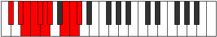 |
| [3325](https://ianring.com/musictheory/scales/3325) | [Epygic](ModeDFlatEpygic.md) | Db | Db, Eb, E, F, Gb, G, Ab, B, C, Db |  |
| [3325](https://ianring.com/musictheory/scales/3325) | [Epygic](ModeFNaturalEpygic.md) | F | F, G, G#, A, A#, B, C, D#, E, F |  |
| [3327](https://ianring.com/musictheory/scales/3327) | [Madyllian](ModeDNaturalMadyllian.md) | D | D, D#, E, F, F#, G, G#, A, C, C#, D |  |
| [3327](https://ianring.com/musictheory/scales/3327) | [Madyllian](ModeCSharpMadyllian.md) | C# | C#, D, D#, E, F, F#, G, G#, B, C, C# |  |
| [3327](https://ianring.com/musictheory/scales/3327) | [Madyllian](ModeDFlatMadyllian.md) | Db | Db, D, Eb, E, F, Gb, G, Ab, B, C, Db |  |
| [3327](https://ianring.com/musictheory/scales/3327) | [Madyllian](ModeGNaturalMadyllian.md) | G | G, G#, A, A#, B, C, C#, D, F, F#, G |  |
| [3327](https://ianring.com/musictheory/scales/3327) | [Madyllian](ModeFSharpMadyllian.md) | F# | F#, G, G#, A, A#, B, C, C#, E, F, F# |  |
| [3327](https://ianring.com/musictheory/scales/3327) | [Madyllian](ModeGFlatMadyllian.md) | Gb | Gb, G, Ab, A, Bb, B, C, Db, E, F, Gb |  |
| [3327](https://ianring.com/musictheory/scales/3327) | [Madyllian](ModeFNaturalMadyllian.md) | F | F, F#, G, G#, A, A#, B, C, D#, E, F |  |
| [3353](https://ianring.com/musictheory/scales/3353) | [Phraptimic](ModeANaturalPhraptimic.md) | A | A, B#, C#, D###, E###, F###, A |  |
| [3355](https://ianring.com/musictheory/scales/3355) | [Bagian](ModeENaturalBagian.md) | E | E, F, G, Ab, B#, C##, D#, E |  |
| [3355](https://ianring.com/musictheory/scales/3355) | [Bagian](ModeANaturalBagian.md) | A | A, Bb, C, Db, E#, F##, G#, A |  |
| [3357](https://ianring.com/musictheory/scales/3357) | [Phrodian](ModeANaturalPhrodian.md) | A | A, B, C, Db, E#, F##, G#, A |  |
| [3359](https://ianring.com/musictheory/scales/3359) | [Bonyllic](ModeENaturalBonyllic.md) | E | E, F, F#, G, G#, C, D, D#, E |  |
| [3359](https://ianring.com/musictheory/scales/3359) | [Bonyllic](ModeANaturalBonyllic.md) | A | A, A#, B, C, C#, F, G, G#, A |  |
| [3363](https://ianring.com/musictheory/scales/3363) | [Rogimic](ModeGNaturalRogimic.md) | G | G, Ab, B#, C###, D###, E##, G |  |
| [3367](https://ianring.com/musictheory/scales/3367) | [Moptian](ModeGNaturalMoptian.md) | G | G, Ab, Bbb, C, D#, E#, F#, G |  |
| [3369](https://ianring.com/musictheory/scales/3369) | [Mixolimic](ModeANaturalMixolimic.md) | A | A, B#, C##, D###, E###, F###, A |  |
| [3371](https://ianring.com/musictheory/scales/3371) | [Aeolylian](ModeGNaturalAeolylian.md) | G | G, Ab, Bb, C, D#, E#, F#, G | 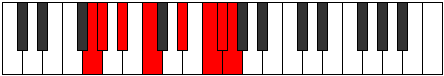 |
| [3371](https://ianring.com/musictheory/scales/3371) | [Aeolylian](ModeANaturalAeolylian.md) | A | A, Bb, C, D, E#, F##, G#, A |  |
| [3373](https://ianring.com/musictheory/scales/3373) | [Lodian](ModeANaturalLodian.md) | A | A, B, C, D, E#, F##, G#, A |  |
| [3375](https://ianring.com/musictheory/scales/3375) | [Kygyllic](ModeGNaturalKygyllic.md) | G | G, G#, A, A#, C, D#, F, F#, G |  |
| [3375](https://ianring.com/musictheory/scales/3375) | [Kygyllic](ModeANaturalKygyllic.md) | A | A, A#, B, C, D, F, G, G#, A |  |
| [3379](https://ianring.com/musictheory/scales/3379) | [Sothian](ModeGNaturalSothian.md) | G | G, Ab, B, C, D#, E#, F#, G |  |
| [3383](https://ianring.com/musictheory/scales/3383) | [Daptyllic](ModeGNaturalDaptyllic.md) | G | G, G#, A, B, C, D#, F, F#, G | 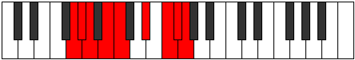 |
| [3385](https://ianring.com/musictheory/scales/3385) | [Rothian](ModeANaturalRothian.md) | A | A, B#, C#, D, E#, F##, G#, A |  |
| [3387](https://ianring.com/musictheory/scales/3387) | [Aeryptyllic](ModeENaturalAeryptyllic.md) | E | E, F, G, G#, A, C, D, D#, E |  |
| [3387](https://ianring.com/musictheory/scales/3387) | [Aeryptyllic](ModeANaturalAeryptyllic.md) | A | A, A#, C, C#, D, F, G, G#, A |  |
| [3387](https://ianring.com/musictheory/scales/3387) | [Aeryptyllic](ModeGNaturalAeryptyllic.md) | G | G, G#, A#, B, C, D#, F, F#, G | 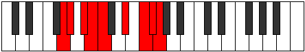 |
| [3389](https://ianring.com/musictheory/scales/3389) | [Socryllic](ModeANaturalSocryllic.md) | A | A, B, C, C#, D, F, G, G#, A |  |
| [3391](https://ianring.com/musictheory/scales/3391) | [Aeolynygic](ModeENaturalAeolynygic.md) | E | E, F, F#, G, G#, A, C, D, D#, E |  |
| [3391](https://ianring.com/musictheory/scales/3391) | [Aeolynygic](ModeANaturalAeolynygic.md) | A | A, A#, B, C, C#, D, F, G, G#, A |  |
| [3391](https://ianring.com/musictheory/scales/3391) | [Aeolynygic](ModeGNaturalAeolynygic.md) | G | G, G#, A, A#, B, C, D#, F, F#, G |  |
| [3399](https://ianring.com/musictheory/scales/3399) | [Zonian](ModeFSharpZonian.md) | F# | F#, G, Ab, B#, C##, D##, E#, F# |  |
| [3399](https://ianring.com/musictheory/scales/3399) | [Zonian](ModeGFlatZonian.md) | Gb | Gb, Abb, Bbbb, C, D, E, F, Gb |  |
| [3401](https://ianring.com/musictheory/scales/3401) | [Palimic](ModeANaturalPalimic.md) | A | A, B#, C###, D###, E###, F###, A |  |
| [3403](https://ianring.com/musictheory/scales/3403) | [Bylian](ModeANaturalBylian.md) | A | A, Bb, C, D#, E#, F##, G#, A |  |
| [3405](https://ianring.com/musictheory/scales/3405) | [Stynian](ModeANaturalStynian.md) | A | A, B, C, D#, E#, F##, G#, A |  |
| [3407](https://ianring.com/musictheory/scales/3407) | [Katocryllic](ModeFSharpKatocryllic.md) | F# | F#, G, G#, A, C, D, E, F, F# |  |
| [3407](https://ianring.com/musictheory/scales/3407) | [Katocryllic](ModeGFlatKatocryllic.md) | Gb | Gb, G, Ab, A, C, D, E, F, Gb |  |
| [3407](https://ianring.com/musictheory/scales/3407) | [Katocryllic](ModeANaturalKatocryllic.md) | A | A, A#, B, C, D#, F, G, G#, A |  |
| [3415](https://ianring.com/musictheory/scales/3415) | [Ionaptyllic](ModeFSharpIonaptyllic.md) | F# | F#, G, G#, A#, C, D, E, F, F# |  |
| [3415](https://ianring.com/musictheory/scales/3415) | [Ionaptyllic](ModeGFlatIonaptyllic.md) | Gb | Gb, G, Ab, Bb, C, D, E, F, Gb |  |
| [3417](https://ianring.com/musictheory/scales/3417) | [Golian](ModeANaturalGolian.md) | A | A, B#, C#, D#, E#, F##, G#, A |  |
| [3419](https://ianring.com/musictheory/scales/3419) | [Danyllic](ModeENaturalDanyllic.md) | E | E, F, G, G#, A#, C, D, D#, E |  |
| [3419](https://ianring.com/musictheory/scales/3419) | [Danyllic](ModeANaturalDanyllic.md) | A | A, A#, C, C#, D#, F, G, G#, A |  |
| [3421](https://ianring.com/musictheory/scales/3421) | [Aerothyllic](ModeANaturalAerothyllic.md) | A | A, B, C, C#, D#, F, G, G#, A |  |
| [3423](https://ianring.com/musictheory/scales/3423) | [Lothygic](ModeENaturalLothygic.md) | E | E, F, F#, G, G#, A#, C, D, D#, E |  |
| [3423](https://ianring.com/musictheory/scales/3423) | [Lothygic](ModeFSharpLothygic.md) | F# | F#, G, G#, A, A#, C, D, E, F, F# |  |
| [3423](https://ianring.com/musictheory/scales/3423) | [Lothygic](ModeGFlatLothygic.md) | Gb | Gb, G, Ab, A, Bb, C, D, E, F, Gb |  |
| [3423](https://ianring.com/musictheory/scales/3423) | [Lothygic](ModeANaturalLothygic.md) | A | A, A#, B, C, C#, D#, F, G, G#, A |  |
| [3427](https://ianring.com/musictheory/scales/3427) | [Zacrian](ModeGNaturalZacrian.md) | G | G, Ab, B#, C#, D#, E#, F#, G |  |
| [3431](https://ianring.com/musictheory/scales/3431) | [Zyptyllic](ModeGNaturalZyptyllic.md) | G | G, G#, A, C, C#, D#, F, F#, G |  |
| [3431](https://ianring.com/musictheory/scales/3431) | [Zyptyllic](ModeFSharpZyptyllic.md) | F# | F#, G, G#, B, C, D, E, F, F# |  |
| [3431](https://ianring.com/musictheory/scales/3431) | [Zyptyllic](ModeGFlatZyptyllic.md) | Gb | Gb, G, Ab, B, C, D, E, F, Gb |  |
| [3433](https://ianring.com/musictheory/scales/3433) | [Thonian](ModeANaturalThonian.md) | A | A, B#, C##, D#, E#, F##, G#, A |  |
| [3433](https://ianring.com/musictheory/scales/3433) | [Thonian](ModeDNaturalThonian.md) | D | D, E#, F##, G#, A#, B#, C#, D |  |
| [3435](https://ianring.com/musictheory/scales/3435) | [Epiphyllic](ModeDNaturalEpiphyllic.md) | D | D, D#, F, G, G#, A#, C, C#, D |  |
| [3435](https://ianring.com/musictheory/scales/3435) | [Epiphyllic](ModeGNaturalEpiphyllic.md) | G | G, G#, A#, C, C#, D#, F, F#, G |  |
| [3435](https://ianring.com/musictheory/scales/3435) | [Epiphyllic](ModeANaturalEpiphyllic.md) | A | A, A#, C, D, D#, F, G, G#, A |  |
| [3437](https://ianring.com/musictheory/scales/3437) | [Gathyllic](ModeDNaturalGathyllic.md) | D | D, E, F, G, G#, A#, C, C#, D |  |
| [3437](https://ianring.com/musictheory/scales/3437) | [Gathyllic](ModeANaturalGathyllic.md) | A | A, B, C, D, D#, F, G, G#, A |  |
| [3439](https://ianring.com/musictheory/scales/3439) | [Lythygic](ModeDNaturalLythygic.md) | D | D, D#, E, F, G, G#, A#, C, C#, D |  |
| [3439](https://ianring.com/musictheory/scales/3439) | [Lythygic](ModeGNaturalLythygic.md) | G | G, G#, A, A#, C, C#, D#, F, F#, G |  |
| [3439](https://ianring.com/musictheory/scales/3439) | [Lythygic](ModeFSharpLythygic.md) | F# | F#, G, G#, A, B, C, D, E, F, F# |  |
| [3439](https://ianring.com/musictheory/scales/3439) | [Lythygic](ModeGFlatLythygic.md) | Gb | Gb, G, Ab, A, B, C, D, E, F, Gb |  |
| [3439](https://ianring.com/musictheory/scales/3439) | [Lythygic](ModeANaturalLythygic.md) | A | A, A#, B, C, D, D#, F, G, G#, A |  |
| [3443](https://ianring.com/musictheory/scales/3443) | [Epathyllic](ModeGNaturalEpathyllic.md) | G | G, G#, B, C, C#, D#, F, F#, G |  |
| [3447](https://ianring.com/musictheory/scales/3447) | [Kynygic](ModeGNaturalKynygic.md) | G | G, G#, A, B, C, C#, D#, F, F#, G |  |
| [3447](https://ianring.com/musictheory/scales/3447) | [Kynygic](ModeFSharpKynygic.md) | F# | F#, G, G#, A#, B, C, D, E, F, F# |  |
| [3447](https://ianring.com/musictheory/scales/3447) | [Kynygic](ModeGFlatKynygic.md) | Gb | Gb, G, Ab, Bb, B, C, D, E, F, Gb |  |
| [3449](https://ianring.com/musictheory/scales/3449) | [Bacryllic](ModeANaturalBacryllic.md) | A | A, C, C#, D, D#, F, G, G#, A |  |
| [3449](https://ianring.com/musictheory/scales/3449) | [Bacryllic](ModeDNaturalBacryllic.md) | D | D, F, F#, G, G#, A#, C, C#, D |  |
| [3451](https://ianring.com/musictheory/scales/3451) | [Garygic](ModeDNaturalGarygic.md) | D | D, D#, F, F#, G, G#, A#, C, C#, D |  |
| [3451](https://ianring.com/musictheory/scales/3451) | [Garygic](ModeANaturalGarygic.md) | A | A, A#, C, C#, D, D#, F, G, G#, A |  |
| [3451](https://ianring.com/musictheory/scales/3451) | [Garygic](ModeENaturalGarygic.md) | E | E, F, G, G#, A, A#, C, D, D#, E |  |
| [3451](https://ianring.com/musictheory/scales/3451) | [Garygic](ModeGNaturalGarygic.md) | G | G, G#, A#, B, C, C#, D#, F, F#, G |  |
| [3453](https://ianring.com/musictheory/scales/3453) | [Katarygic](ModeDNaturalKatarygic.md) | D | D, E, F, F#, G, G#, A#, C, C#, D |  |
| [3453](https://ianring.com/musictheory/scales/3453) | [Katarygic](ModeANaturalKatarygic.md) | A | A, B, C, C#, D, D#, F, G, G#, A |  |
| [3455](https://ianring.com/musictheory/scales/3455) | [Ryptyllian](ModeDNaturalRyptyllian.md) | D | D, D#, E, F, F#, G, G#, A#, C, C#, D |  |
| [3455](https://ianring.com/musictheory/scales/3455) | [Ryptyllian](ModeENaturalRyptyllian.md) | E | E, F, F#, G, G#, A, A#, C, D, D#, E |  |
| [3455](https://ianring.com/musictheory/scales/3455) | [Ryptyllian](ModeANaturalRyptyllian.md) | A | A, A#, B, C, C#, D, D#, F, G, G#, A |  |
| [3455](https://ianring.com/musictheory/scales/3455) | [Ryptyllian](ModeGNaturalRyptyllian.md) | G | G, G#, A, A#, B, C, C#, D#, F, F#, G |  |
| [3455](https://ianring.com/musictheory/scales/3455) | [Ryptyllian](ModeFSharpRyptyllian.md) | F# | F#, G, G#, A, A#, B, C, D, E, F, F# |  |
| [3455](https://ianring.com/musictheory/scales/3455) | [Ryptyllian](ModeGFlatRyptyllian.md) | Gb | Gb, G, Ab, A, Bb, B, C, D, E, F, Gb |  |
| [3465](https://ianring.com/musictheory/scales/3465) | [Katathimic](ModeANaturalKatathimic.md) | A | A, B#, D##, E#, F##, G#, A |  |
| [3467](https://ianring.com/musictheory/scales/3467) | [Katonian](ModeANaturalKatonian.md) | A | A, Bb, C, D##, E#, F##, G#, A |  |
| [3469](https://ianring.com/musictheory/scales/3469) | [Monian](ModeFNaturalMonian.md) | F | F, G, Ab, B#, C#, D#, E, F |  |
| [3469](https://ianring.com/musictheory/scales/3469) | [Monian](ModeANaturalMonian.md) | A | A, B, C, D##, E#, F##, G#, A |  |
| [3471](https://ianring.com/musictheory/scales/3471) | [Gyryllic](ModeFNaturalGyryllic.md) | F | F, F#, G, G#, C, C#, D#, E, F |  |
| [3471](https://ianring.com/musictheory/scales/3471) | [Gyryllic](ModeANaturalGyryllic.md) | A | A, A#, B, C, E, F, G, G#, A |  |
| [3481](https://ianring.com/musictheory/scales/3481) | [Katathian](ModeANaturalKatathian.md) | A | A, B#, C#, D##, E#, F##, G#, A |  |
| [3483](https://ianring.com/musictheory/scales/3483) | [Mixotharyllic](ModeANaturalMixotharyllic.md) | A | A, A#, C, C#, E, F, G, G#, A |  |
| [3483](https://ianring.com/musictheory/scales/3483) | [Mixotharyllic](ModeENaturalMixotharyllic.md) | E | E, F, G, G#, B, C, D, D#, E |  |
| [3485](https://ianring.com/musictheory/scales/3485) | [Kyptyllic](ModeFNaturalKyptyllic.md) | F | F, G, G#, A, C, C#, D#, E, F |  |
| [3485](https://ianring.com/musictheory/scales/3485) | [Kyptyllic](ModeANaturalKyptyllic.md) | A | A, B, C, C#, E, F, G, G#, A |  |
| [3487](https://ianring.com/musictheory/scales/3487) | [Byptygic](ModeFNaturalByptygic.md) | F | F, F#, G, G#, A, C, C#, D#, E, F |  |
| [3487](https://ianring.com/musictheory/scales/3487) | [Byptygic](ModeENaturalByptygic.md) | E | E, F, F#, G, G#, B, C, D, D#, E |  |
| [3487](https://ianring.com/musictheory/scales/3487) | [Byptygic](ModeANaturalByptygic.md) | A | A, A#, B, C, C#, E, F, G, G#, A |  |
| [3491](https://ianring.com/musictheory/scales/3491) | [Tharian](ModeGNaturalTharian.md) | G | G, Ab, B#, C##, D#, E#, F#, G |  |
| [3491](https://ianring.com/musictheory/scales/3491) | [Tharian](ModeCNaturalTharian.md) | C | C, Db, E#, F##, G#, A#, B, C |  |
| [3493](https://ianring.com/musictheory/scales/3493) | [Rathian](ModeCNaturalRathian.md) | C | C, D, E#, F##, G#, A#, B, C |  |
| [3495](https://ianring.com/musictheory/scales/3495) | [Banyllic](ModeGNaturalBanyllic.md) | G | G, G#, A, C, D, D#, F, F#, G |  |
| [3495](https://ianring.com/musictheory/scales/3495) | [Banyllic](ModeCNaturalBanyllic.md) | C | C, C#, D, F, G, G#, A#, B, C |  |
| [3497](https://ianring.com/musictheory/scales/3497) | [Phrolian](ModeANaturalPhrolian.md) | A | A, B#, C##, D##, E#, F##, G#, A |  |
| [3497](https://ianring.com/musictheory/scales/3497) | [Phrolian](ModeCNaturalPhrolian.md) | C | C, D#, E#, F##, G#, A#, B, C | 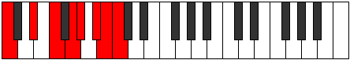 |
| [3499](https://ianring.com/musictheory/scales/3499) | [Lythyllic](ModeGNaturalLythyllic.md) | G | G, G#, A#, C, D, D#, F, F#, G |  |
| [3499](https://ianring.com/musictheory/scales/3499) | [Lythyllic](ModeANaturalLythyllic.md) | A | A, A#, C, D, E, F, G, G#, A |  |
| [3499](https://ianring.com/musictheory/scales/3499) | [Lythyllic](ModeCNaturalLythyllic.md) | C | C, C#, D#, F, G, G#, A#, B, C |  |
| [3501](https://ianring.com/musictheory/scales/3501) | [Katodyllic](ModeFNaturalKatodyllic.md) | F | F, G, G#, A#, C, C#, D#, E, F | 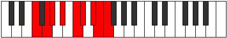 |
| [3501](https://ianring.com/musictheory/scales/3501) | [Katodyllic](ModeANaturalKatodyllic.md) | A | A, B, C, D, E, F, G, G#, A |  |
| [3501](https://ianring.com/musictheory/scales/3501) | [Katodyllic](ModeCNaturalKatodyllic.md) | C | C, D, D#, F, G, G#, A#, B, C |  |
| [3503](https://ianring.com/musictheory/scales/3503) | [Zyphygic](ModeFNaturalZyphygic.md) | F | F, F#, G, G#, A#, C, C#, D#, E, F |  |
| [3503](https://ianring.com/musictheory/scales/3503) | [Zyphygic](ModeGNaturalZyphygic.md) | G | G, G#, A, A#, C, D, D#, F, F#, G |  |
| [3503](https://ianring.com/musictheory/scales/3503) | [Zyphygic](ModeCNaturalZyphygic.md) | C | C, C#, D, D#, F, G, G#, A#, B, C |  |
| [3503](https://ianring.com/musictheory/scales/3503) | [Zyphygic](ModeANaturalZyphygic.md) | A | A, A#, B, C, D, E, F, G, G#, A |  |
| [3505](https://ianring.com/musictheory/scales/3505) | [Stygian](ModeCNaturalStygian.md) | C | C, D##, E#, F##, G#, A#, B, C |  |
| [3507](https://ianring.com/musictheory/scales/3507) | [Ponyllic](ModeGNaturalPonyllic.md) | G | G, G#, B, C, D, D#, F, F#, G |  |
| [3507](https://ianring.com/musictheory/scales/3507) | [Ponyllic](ModeCNaturalPonyllic.md) | C | C, C#, E, F, G, G#, A#, B, C |  |
| [3509](https://ianring.com/musictheory/scales/3509) | [Stogyllic](ModeCNaturalStogyllic.md) | C | C, D, E, F, G, G#, A#, B, C |  |
| [3511](https://ianring.com/musictheory/scales/3511) | [Epolygic](ModeGNaturalEpolygic.md) | G | G, G#, A, B, C, D, D#, F, F#, G |  |
| [3511](https://ianring.com/musictheory/scales/3511) | [Epolygic](ModeCNaturalEpolygic.md) | C | C, C#, D, E, F, G, G#, A#, B, C |  |
| [3513](https://ianring.com/musictheory/scales/3513) | [Dydyllic](ModeANaturalDydyllic.md) | A | A, C, C#, D, E, F, G, G#, A |  |
| [3513](https://ianring.com/musictheory/scales/3513) | [Dydyllic](ModeCNaturalDydyllic.md) | C | C, D#, E, F, G, G#, A#, B, C |  |
| [3515](https://ianring.com/musictheory/scales/3515) | [Katodygic](ModeANaturalKatodygic.md) | A | A, A#, C, C#, D, E, F, G, G#, A |  |
| [3515](https://ianring.com/musictheory/scales/3515) | [Katodygic](ModeENaturalKatodygic.md) | E | E, F, G, G#, A, B, C, D, D#, E |  |
| [3515](https://ianring.com/musictheory/scales/3515) | [Katodygic](ModeCNaturalKatodygic.md) | C | C, C#, D#, E, F, G, G#, A#, B, C |  |
| [3515](https://ianring.com/musictheory/scales/3515) | [Katodygic](ModeGNaturalKatodygic.md) | G | G, G#, A#, B, C, D, D#, F, F#, G |  |
| [3517](https://ianring.com/musictheory/scales/3517) | [Epocrygic](ModeFNaturalEpocrygic.md) | F | F, G, G#, A, A#, C, C#, D#, E, F |  |
| [3517](https://ianring.com/musictheory/scales/3517) | [Epocrygic](ModeANaturalEpocrygic.md) | A | A, B, C, C#, D, E, F, G, G#, A |  |
| [3517](https://ianring.com/musictheory/scales/3517) | [Epocrygic](ModeCNaturalEpocrygic.md) | C | C, D, D#, E, F, G, G#, A#, B, C |  |
| [3519](https://ianring.com/musictheory/scales/3519) | [Boptyllian](ModeFNaturalBoptyllian.md) | F | F, F#, G, G#, A, A#, C, C#, D#, E, F |  |
| [3519](https://ianring.com/musictheory/scales/3519) | [Boptyllian](ModeENaturalBoptyllian.md) | E | E, F, F#, G, G#, A, B, C, D, D#, E |  |
| [3519](https://ianring.com/musictheory/scales/3519) | [Boptyllian](ModeCNaturalBoptyllian.md) | C | C, C#, D, D#, E, F, G, G#, A#, B, C |  |
| [3519](https://ianring.com/musictheory/scales/3519) | [Boptyllian](ModeANaturalBoptyllian.md) | A | A, A#, B, C, C#, D, E, F, G, G#, A |  |
| [3519](https://ianring.com/musictheory/scales/3519) | [Boptyllian](ModeGNaturalBoptyllian.md) | G | G, G#, A, A#, B, C, D, D#, F, F#, G |  |
| [3527](https://ianring.com/musictheory/scales/3527) | [Ronyllic](ModeFSharpRonyllic.md) | F# | F#, G, G#, C, C#, D, E, F, F# |  |
| [3527](https://ianring.com/musictheory/scales/3527) | [Ronyllic](ModeGFlatRonyllic.md) | Gb | Gb, G, Ab, C, Db, D, E, F, Gb |  |
| [3529](https://ianring.com/musictheory/scales/3529) | [Stalian](ModeANaturalStalian.md) | A | A, B#, C###, D##, E#, F##, G#, A |  |
| [3531](https://ianring.com/musictheory/scales/3531) | [Dycryllic](ModeANaturalDycryllic.md) | A | A, A#, C, D#, E, F, G, G#, A |  |
| [3533](https://ianring.com/musictheory/scales/3533) | [Thadyllic](ModeFNaturalThadyllic.md) | F | F, G, G#, B, C, C#, D#, E, F |  |
| [3533](https://ianring.com/musictheory/scales/3533) | [Thadyllic](ModeANaturalThadyllic.md) | A | A, B, C, D#, E, F, G, G#, A |  |
| [3535](https://ianring.com/musictheory/scales/3535) | [Aeroptygic](ModeFSharpAeroptygic.md) | F# | F#, G, G#, A, C, C#, D, E, F, F# |  |
| [3535](https://ianring.com/musictheory/scales/3535) | [Aeroptygic](ModeGFlatAeroptygic.md) | Gb | Gb, G, Ab, A, C, Db, D, E, F, Gb |  |
| [3535](https://ianring.com/musictheory/scales/3535) | [Aeroptygic](ModeFNaturalAeroptygic.md) | F | F, F#, G, G#, B, C, C#, D#, E, F |  |
| [3535](https://ianring.com/musictheory/scales/3535) | [Aeroptygic](ModeANaturalAeroptygic.md) | A | A, A#, B, C, D#, E, F, G, G#, A |  |
| [3537](https://ianring.com/musictheory/scales/3537) | [Katogian](ModeCSharpKatogian.md) | C# | C#, D###, E###, F###, G##, A##, B#, C# |  |
| [3537](https://ianring.com/musictheory/scales/3537) | [Katogian](ModeDFlatKatogian.md) | Db | Db, E#, F##, G#, A, B, C, Db |  |
| [3539](https://ianring.com/musictheory/scales/3539) | [Aeoryllic](ModeCSharpAeoryllic.md) | C# | C#, D, F, G, G#, A, B, C, C# |  |
| [3539](https://ianring.com/musictheory/scales/3539) | [Aeoryllic](ModeDFlatAeoryllic.md) | Db | Db, D, F, G, Ab, A, B, C, Db | 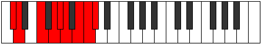 |
| [3541](https://ianring.com/musictheory/scales/3541) | [Racryllic](ModeCSharpRacryllic.md) | C# | C#, D#, F, G, G#, A, B, C, C# |  |
| [3541](https://ianring.com/musictheory/scales/3541) | [Racryllic](ModeDFlatRacryllic.md) | Db | Db, Eb, F, G, Ab, A, B, C, Db |  |
| [3543](https://ianring.com/musictheory/scales/3543) | [Aeolonygic](ModeFSharpAeolonygic.md) | F# | F#, G, G#, A#, C, C#, D, E, F, F# |  |
| [3543](https://ianring.com/musictheory/scales/3543) | [Aeolonygic](ModeGFlatAeolonygic.md) | Gb | Gb, G, Ab, Bb, C, Db, D, E, F, Gb |  |
| [3543](https://ianring.com/musictheory/scales/3543) | [Aeolonygic](ModeCSharpAeolonygic.md) | C# | C#, D, D#, F, G, G#, A, B, C, C# |  |
| [3543](https://ianring.com/musictheory/scales/3543) | [Aeolonygic](ModeDFlatAeolonygic.md) | Db | Db, D, Eb, F, G, Ab, A, B, C, Db |  |
| [3545](https://ianring.com/musictheory/scales/3545) | [Thyptyllic](ModeANaturalThyptyllic.md) | A | A, C, C#, D#, E, F, G, G#, A |  |
| [3545](https://ianring.com/musictheory/scales/3545) | [Thyptyllic](ModeCSharpThyptyllic.md) | C# | C#, E, F, G, G#, A, B, C, C# |  |
| [3545](https://ianring.com/musictheory/scales/3545) | [Thyptyllic](ModeDFlatThyptyllic.md) | Db | Db, E, F, G, Ab, A, B, C, Db |  |
| [3547](https://ianring.com/musictheory/scales/3547) | [Sadygic](ModeANaturalSadygic.md) | A | A, A#, C, C#, D#, E, F, G, G#, A |  |
| [3547](https://ianring.com/musictheory/scales/3547) | [Sadygic](ModeCSharpSadygic.md) | C# | C#, D, E, F, G, G#, A, B, C, C# |  |
| [3547](https://ianring.com/musictheory/scales/3547) | [Sadygic](ModeDFlatSadygic.md) | Db | Db, D, E, F, G, Ab, A, B, C, Db |  |
| [3547](https://ianring.com/musictheory/scales/3547) | [Sadygic](ModeENaturalSadygic.md) | E | E, F, G, G#, A#, B, C, D, D#, E |  |
| [3549](https://ianring.com/musictheory/scales/3549) | [Phronygic](ModeCSharpPhronygic.md) | C# | C#, D#, E, F, G, G#, A, B, C, C# |  |
| [3549](https://ianring.com/musictheory/scales/3549) | [Phronygic](ModeDFlatPhronygic.md) | Db | Db, Eb, E, F, G, Ab, A, B, C, Db |  |
| [3549](https://ianring.com/musictheory/scales/3549) | [Phronygic](ModeFNaturalPhronygic.md) | F | F, G, G#, A, B, C, C#, D#, E, F |  |
| [3549](https://ianring.com/musictheory/scales/3549) | [Phronygic](ModeANaturalPhronygic.md) | A | A, B, C, C#, D#, E, F, G, G#, A |  |
| [3551](https://ianring.com/musictheory/scales/3551) | [Sagyllian](ModeFSharpSagyllian.md) | F# | F#, G, G#, A, A#, C, C#, D, E, F, F# |  |
| [3551](https://ianring.com/musictheory/scales/3551) | [Sagyllian](ModeGFlatSagyllian.md) | Gb | Gb, G, Ab, A, Bb, C, Db, D, E, F, Gb |  |
| [3551](https://ianring.com/musictheory/scales/3551) | [Sagyllian](ModeCSharpSagyllian.md) | C# | C#, D, D#, E, F, G, G#, A, B, C, C# |  |
| [3551](https://ianring.com/musictheory/scales/3551) | [Sagyllian](ModeDFlatSagyllian.md) | Db | Db, D, Eb, E, F, G, Ab, A, B, C, Db |  |
| [3551](https://ianring.com/musictheory/scales/3551) | [Sagyllian](ModeFNaturalSagyllian.md) | F | F, F#, G, G#, A, B, C, C#, D#, E, F |  |
| [3551](https://ianring.com/musictheory/scales/3551) | [Sagyllian](ModeENaturalSagyllian.md) | E | E, F, F#, G, G#, A#, B, C, D, D#, E |  |
| [3551](https://ianring.com/musictheory/scales/3551) | [Sagyllian](ModeANaturalSagyllian.md) | A | A, A#, B, C, C#, D#, E, F, G, G#, A |  |
| [3555](https://ianring.com/musictheory/scales/3555) | [Pylyllic](ModeGNaturalPylyllic.md) | G | G, G#, C, C#, D, D#, F, F#, G |  |
| [3555](https://ianring.com/musictheory/scales/3555) | [Pylyllic](ModeCNaturalPylyllic.md) | C | C, C#, F, F#, G, G#, A#, B, C |  |
| [3557](https://ianring.com/musictheory/scales/3557) | [Thycryllic](ModeCNaturalThycryllic.md) | C | C, D, F, F#, G, G#, A#, B, C |  |
| [3559](https://ianring.com/musictheory/scales/3559) | [Aerathygic](ModeGNaturalAerathygic.md) | G | G, G#, A, C, C#, D, D#, F, F#, G |  |
| [3559](https://ianring.com/musictheory/scales/3559) | [Aerathygic](ModeFSharpAerathygic.md) | F# | F#, G, G#, B, C, C#, D, E, F, F# |  |
| [3559](https://ianring.com/musictheory/scales/3559) | [Aerathygic](ModeGFlatAerathygic.md) | Gb | Gb, G, Ab, B, C, Db, D, E, F, Gb |  |
| [3559](https://ianring.com/musictheory/scales/3559) | [Aerathygic](ModeCNaturalAerathygic.md) | C | C, C#, D, F, F#, G, G#, A#, B, C |  |
| [3561](https://ianring.com/musictheory/scales/3561) | [Pothyllic](ModeANaturalPothyllic.md) | A | A, C, D, D#, E, F, G, G#, A |  |
| [3561](https://ianring.com/musictheory/scales/3561) | [Pothyllic](ModeDNaturalPothyllic.md) | D | D, F, G, G#, A, A#, C, C#, D |  |
| [3561](https://ianring.com/musictheory/scales/3561) | [Pothyllic](ModeCNaturalPothyllic.md) | C | C, D#, F, F#, G, G#, A#, B, C |  |
| [3563](https://ianring.com/musictheory/scales/3563) | [Ionoptygic](ModeGNaturalIonoptygic.md) | G | G, G#, A#, C, C#, D, D#, F, F#, G |  |
| [3563](https://ianring.com/musictheory/scales/3563) | [Ionoptygic](ModeDNaturalIonoptygic.md) | D | D, D#, F, G, G#, A, A#, C, C#, D |  |
| [3563](https://ianring.com/musictheory/scales/3563) | [Ionoptygic](ModeANaturalIonoptygic.md) | A | A, A#, C, D, D#, E, F, G, G#, A |  |
| [3563](https://ianring.com/musictheory/scales/3563) | [Ionoptygic](ModeCNaturalIonoptygic.md) | C | C, C#, D#, F, F#, G, G#, A#, B, C |  |
| [3565](https://ianring.com/musictheory/scales/3565) | [Aeolorygic](ModeDNaturalAeolorygic.md) | D | D, E, F, G, G#, A, A#, C, C#, D |  |
| [3565](https://ianring.com/musictheory/scales/3565) | [Aeolorygic](ModeANaturalAeolorygic.md) | A | A, B, C, D, D#, E, F, G, G#, A |  |
| [3565](https://ianring.com/musictheory/scales/3565) | [Aeolorygic](ModeFNaturalAeolorygic.md) | F | F, G, G#, A#, B, C, C#, D#, E, F |  |
| [3565](https://ianring.com/musictheory/scales/3565) | [Aeolorygic](ModeCNaturalAeolorygic.md) | C | C, D, D#, F, F#, G, G#, A#, B, C |  |
| [3567](https://ianring.com/musictheory/scales/3567) | [Epityllian](ModeDNaturalEpityllian.md) | D | D, D#, E, F, G, G#, A, A#, C, C#, D |  |
| [3567](https://ianring.com/musictheory/scales/3567) | [Epityllian](ModeGNaturalEpityllian.md) | G | G, G#, A, A#, C, C#, D, D#, F, F#, G |  |
| [3567](https://ianring.com/musictheory/scales/3567) | [Epityllian](ModeFSharpEpityllian.md) | F# | F#, G, G#, A, B, C, C#, D, E, F, F# |  |
| [3567](https://ianring.com/musictheory/scales/3567) | [Epityllian](ModeGFlatEpityllian.md) | Gb | Gb, G, Ab, A, B, C, Db, D, E, F, Gb |  |
| [3567](https://ianring.com/musictheory/scales/3567) | [Epityllian](ModeCNaturalEpityllian.md) | C | C, C#, D, D#, F, F#, G, G#, A#, B, C |  |
| [3567](https://ianring.com/musictheory/scales/3567) | [Epityllian](ModeFNaturalEpityllian.md) | F | F, F#, G, G#, A#, B, C, C#, D#, E, F |  |
| [3567](https://ianring.com/musictheory/scales/3567) | [Epityllian](ModeANaturalEpityllian.md) | A | A, A#, B, C, D, D#, E, F, G, G#, A |  |
| [3569](https://ianring.com/musictheory/scales/3569) | [Aeoladyllic](ModeCSharpAeoladyllic.md) | C# | C#, F, F#, G, G#, A, B, C, C# |  |
| [3569](https://ianring.com/musictheory/scales/3569) | [Aeoladyllic](ModeDFlatAeoladyllic.md) | Db | Db, F, Gb, G, Ab, A, B, C, Db |  |
| [3569](https://ianring.com/musictheory/scales/3569) | [Aeoladyllic](ModeCNaturalAeoladyllic.md) | C | C, E, F, F#, G, G#, A#, B, C |  |
| [3571](https://ianring.com/musictheory/scales/3571) | [Dyrygic](ModeGNaturalDyrygic.md) | G | G, G#, B, C, C#, D, D#, F, F#, G |  |
| [3571](https://ianring.com/musictheory/scales/3571) | [Dyrygic](ModeCSharpDyrygic.md) | C# | C#, D, F, F#, G, G#, A, B, C, C# |  |
| [3571](https://ianring.com/musictheory/scales/3571) | [Dyrygic](ModeDFlatDyrygic.md) | Db | Db, D, F, Gb, G, Ab, A, B, C, Db |  |
| [3571](https://ianring.com/musictheory/scales/3571) | [Dyrygic](ModeCNaturalDyrygic.md) | C | C, C#, E, F, F#, G, G#, A#, B, C |  |
| [3573](https://ianring.com/musictheory/scales/3573) | [Kaptygic](ModeCSharpKaptygic.md) | C# | C#, D#, F, F#, G, G#, A, B, C, C# |  |
| [3573](https://ianring.com/musictheory/scales/3573) | [Kaptygic](ModeDFlatKaptygic.md) | Db | Db, Eb, F, Gb, G, Ab, A, B, C, Db |  |
| [3573](https://ianring.com/musictheory/scales/3573) | [Kaptygic](ModeCNaturalKaptygic.md) | C | C, D, E, F, F#, G, G#, A#, B, C |  |
| [3575](https://ianring.com/musictheory/scales/3575) | [Mogyllian](ModeCSharpMogyllian.md) | C# | C#, D, D#, F, F#, G, G#, A, B, C, C# |  |
| [3575](https://ianring.com/musictheory/scales/3575) | [Mogyllian](ModeDFlatMogyllian.md) | Db | Db, D, Eb, F, Gb, G, Ab, A, B, C, Db |  |
| [3575](https://ianring.com/musictheory/scales/3575) | [Mogyllian](ModeGNaturalMogyllian.md) | G | G, G#, A, B, C, C#, D, D#, F, F#, G |  |
| [3575](https://ianring.com/musictheory/scales/3575) | [Mogyllian](ModeCNaturalMogyllian.md) | C | C, C#, D, E, F, F#, G, G#, A#, B, C |  |
| [3575](https://ianring.com/musictheory/scales/3575) | [Mogyllian](ModeFSharpMogyllian.md) | F# | F#, G, G#, A#, B, C, C#, D, E, F, F# |  |
| [3575](https://ianring.com/musictheory/scales/3575) | [Mogyllian](ModeGFlatMogyllian.md) | Gb | Gb, G, Ab, Bb, B, C, Db, D, E, F, Gb |  |
| [3577](https://ianring.com/musictheory/scales/3577) | [Loptygic](ModeANaturalLoptygic.md) | A | A, C, C#, D, D#, E, F, G, G#, A |  |
| [3577](https://ianring.com/musictheory/scales/3577) | [Loptygic](ModeDNaturalLoptygic.md) | D | D, F, F#, G, G#, A, A#, C, C#, D |  |
| [3577](https://ianring.com/musictheory/scales/3577) | [Loptygic](ModeCSharpLoptygic.md) | C# | C#, E, F, F#, G, G#, A, B, C, C# |  |
| [3577](https://ianring.com/musictheory/scales/3577) | [Loptygic](ModeDFlatLoptygic.md) | Db | Db, E, F, Gb, G, Ab, A, B, C, Db |  |
| [3577](https://ianring.com/musictheory/scales/3577) | [Loptygic](ModeCNaturalLoptygic.md) | C | C, D#, E, F, F#, G, G#, A#, B, C |  |
| [3579](https://ianring.com/musictheory/scales/3579) | [Zyphyllian](ModeANaturalZyphyllian.md) | A | A, A#, C, C#, D, D#, E, F, G, G#, A |  |
| [3579](https://ianring.com/musictheory/scales/3579) | [Zyphyllian](ModeDNaturalZyphyllian.md) | D | D, D#, F, F#, G, G#, A, A#, C, C#, D |  |
| [3579](https://ianring.com/musictheory/scales/3579) | [Zyphyllian](ModeCSharpZyphyllian.md) | C# | C#, D, E, F, F#, G, G#, A, B, C, C# |  |
| [3579](https://ianring.com/musictheory/scales/3579) | [Zyphyllian](ModeDFlatZyphyllian.md) | Db | Db, D, E, F, Gb, G, Ab, A, B, C, Db |  |
| [3579](https://ianring.com/musictheory/scales/3579) | [Zyphyllian](ModeGNaturalZyphyllian.md) | G | G, G#, A#, B, C, C#, D, D#, F, F#, G |  |
| [3579](https://ianring.com/musictheory/scales/3579) | [Zyphyllian](ModeCNaturalZyphyllian.md) | C | C, C#, D#, E, F, F#, G, G#, A#, B, C |  |
| [3579](https://ianring.com/musictheory/scales/3579) | [Zyphyllian](ModeENaturalZyphyllian.md) | E | E, F, G, G#, A, A#, B, C, D, D#, E |  |
| [3581](https://ianring.com/musictheory/scales/3581) | [Epocryllian](ModeDNaturalEpocryllian.md) | D | D, E, F, F#, G, G#, A, A#, C, C#, D |  |
| [3581](https://ianring.com/musictheory/scales/3581) | [Epocryllian](ModeANaturalEpocryllian.md) | A | A, B, C, C#, D, D#, E, F, G, G#, A |  |
| [3581](https://ianring.com/musictheory/scales/3581) | [Epocryllian](ModeCSharpEpocryllian.md) | C# | C#, D#, E, F, F#, G, G#, A, B, C, C# |  |
| [3581](https://ianring.com/musictheory/scales/3581) | [Epocryllian](ModeDFlatEpocryllian.md) | Db | Db, Eb, E, F, Gb, G, Ab, A, B, C, Db |  |
| [3581](https://ianring.com/musictheory/scales/3581) | [Epocryllian](ModeCNaturalEpocryllian.md) | C | C, D, D#, E, F, F#, G, G#, A#, B, C |  |
| [3581](https://ianring.com/musictheory/scales/3581) | [Epocryllian](ModeFNaturalEpocryllian.md) | F | F, G, G#, A, A#, B, C, C#, D#, E, F |  |
| [3583](https://ianring.com/musictheory/scales/3583) | [Zylatic](ModeDNaturalZylatic.md) | D | D, D#, E, F, F#, G, G#, A, A#, C, C#, D |  |
| [3583](https://ianring.com/musictheory/scales/3583) | [Zylatic](ModeCSharpZylatic.md) | C# | C#, D, D#, E, F, F#, G, G#, A, B, C, C# |  |
| [3583](https://ianring.com/musictheory/scales/3583) | [Zylatic](ModeDFlatZylatic.md) | Db | Db, D, Eb, E, F, Gb, G, Ab, A, B, C, Db |  |
| [3583](https://ianring.com/musictheory/scales/3583) | [Zylatic](ModeCNaturalZylatic.md) | C | C, C#, D, D#, E, F, F#, G, G#, A#, B, C |  |
| [3583](https://ianring.com/musictheory/scales/3583) | [Zylatic](ModeANaturalZylatic.md) | A | A, A#, B, C, C#, D, D#, E, F, G, G#, A |  |
| [3583](https://ianring.com/musictheory/scales/3583) | [Zylatic](ModeGNaturalZylatic.md) | G | G, G#, A, A#, B, C, C#, D, D#, F, F#, G |  |
| [3583](https://ianring.com/musictheory/scales/3583) | [Zylatic](ModeFSharpZylatic.md) | F# | F#, G, G#, A, A#, B, C, C#, D, E, F, F# |  |
| [3583](https://ianring.com/musictheory/scales/3583) | [Zylatic](ModeGFlatZylatic.md) | Gb | Gb, G, Ab, A, Bb, B, C, Db, D, E, F, Gb |  |
| [3583](https://ianring.com/musictheory/scales/3583) | [Zylatic](ModeFNaturalZylatic.md) | F | F, F#, G, G#, A, A#, B, C, C#, D#, E, F |  |
| [3583](https://ianring.com/musictheory/scales/3583) | [Zylatic](ModeENaturalZylatic.md) | E | E, F, F#, G, G#, A, A#, B, C, D, D#, E |  |
| [3619](https://ianring.com/musictheory/scales/3619) | [Thanimic](ModeGNaturalThanimic.md) | G | G, Ab, B#, D##, E#, F#, G |  |
| [3623](https://ianring.com/musictheory/scales/3623) | [Aerocrian](ModeGNaturalAerocrian.md) | G | G, Ab, Bbb, C, D##, E#, F#, G |  |
| [3627](https://ianring.com/musictheory/scales/3627) | [Kalian](ModeGNaturalKalian.md) | G | G, Ab, Bb, C, D##, E#, F#, G |  |
| [3631](https://ianring.com/musictheory/scales/3631) | [Gydyllic](ModeGNaturalGydyllic.md) | G | G, G#, A, A#, C, E, F, F#, G |  |
| [3633](https://ianring.com/musictheory/scales/3633) | [Daptimic](ModeGSharpDaptimic.md) | G# | G#, A###, B##, D###, E##, F##, G# |  |
| [3633](https://ianring.com/musictheory/scales/3633) | [Daptimic](ModeAFlatDaptimic.md) | Ab | Ab, B#, C#, D###, E##, F##, Ab |  |
| [3635](https://ianring.com/musictheory/scales/3635) | [Katygian](ModeGSharpKatygian.md) | G# | G#, A, B#, C#, D###, E##, F##, G# |  |
| [3635](https://ianring.com/musictheory/scales/3635) | [Katygian](ModeAFlatKatygian.md) | Ab | Ab, Bbb, C, Db, E#, F#, G, Ab |  |
| [3635](https://ianring.com/musictheory/scales/3635) | [Katygian](ModeGNaturalKatygian.md) | G | G, Ab, B, C, D##, E#, F#, G |  |
| [3637](https://ianring.com/musictheory/scales/3637) | [Kygian](ModeDSharpKygian.md) | D# | D#, E#, F##, G#, A###, B##, C##, D# |  |
| [3637](https://ianring.com/musictheory/scales/3637) | [Kygian](ModeEFlatKygian.md) | Eb | Eb, F, G, Ab, B#, C#, D, Eb | 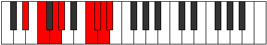 |
| [3637](https://ianring.com/musictheory/scales/3637) | [Kygian](ModeGSharpKygian.md) | G# | G#, A#, B#, C#, D###, E##, F##, G# |  |
| [3637](https://ianring.com/musictheory/scales/3637) | [Kygian](ModeAFlatKygian.md) | Ab | Ab, Bb, C, Db, E#, F#, G, Ab |  |
| [3639](https://ianring.com/musictheory/scales/3639) | [Paptyllic](ModeDSharpPaptyllic.md) | D# | D#, E, F, G, G#, C, C#, D, D# |  |
| [3639](https://ianring.com/musictheory/scales/3639) | [Paptyllic](ModeEFlatPaptyllic.md) | Eb | Eb, E, F, G, Ab, C, Db, D, Eb |  |
| [3639](https://ianring.com/musictheory/scales/3639) | [Paptyllic](ModeGSharpPaptyllic.md) | G# | G#, A, A#, C, C#, F, F#, G, G# |  |
| [3639](https://ianring.com/musictheory/scales/3639) | [Paptyllic](ModeAFlatPaptyllic.md) | Ab | Ab, A, Bb, C, Db, F, Gb, G, Ab |  |
| [3639](https://ianring.com/musictheory/scales/3639) | [Paptyllic](ModeGNaturalPaptyllic.md) | G | G, G#, A, B, C, E, F, F#, G |  |
| [3641](https://ianring.com/musictheory/scales/3641) | [Thocrian](ModeGSharpThocrian.md) | G# | G#, A##, B#, C#, D###, E##, F##, G# |  |
| [3641](https://ianring.com/musictheory/scales/3641) | [Thocrian](ModeAFlatThocrian.md) | Ab | Ab, B, C, Db, E#, F#, G, Ab |  |
| [3643](https://ianring.com/musictheory/scales/3643) | [Kydyllic](ModeGSharpKydyllic.md) | G# | G#, A, B, C, C#, F, F#, G, G# |  |
| [3643](https://ianring.com/musictheory/scales/3643) | [Kydyllic](ModeAFlatKydyllic.md) | Ab | Ab, A, B, C, Db, F, Gb, G, Ab |  |
| [3643](https://ianring.com/musictheory/scales/3643) | [Kydyllic](ModeGNaturalKydyllic.md) | G | G, G#, A#, B, C, E, F, F#, G |  |
| [3645](https://ianring.com/musictheory/scales/3645) | [Zycryllic](ModeDSharpZycryllic.md) | D# | D#, F, F#, G, G#, C, C#, D, D# |  |
| [3645](https://ianring.com/musictheory/scales/3645) | [Zycryllic](ModeEFlatZycryllic.md) | Eb | Eb, F, Gb, G, Ab, C, Db, D, Eb |  |
| [3645](https://ianring.com/musictheory/scales/3645) | [Zycryllic](ModeGSharpZycryllic.md) | G# | G#, A#, B, C, C#, F, F#, G, G# |  |
| [3645](https://ianring.com/musictheory/scales/3645) | [Zycryllic](ModeAFlatZycryllic.md) | Ab | Ab, Bb, B, C, Db, F, Gb, G, Ab |  |
| [3647](https://ianring.com/musictheory/scales/3647) | [Eporygic](ModeDSharpEporygic.md) | D# | D#, E, F, F#, G, G#, C, C#, D, D# |  |
| [3647](https://ianring.com/musictheory/scales/3647) | [Eporygic](ModeEFlatEporygic.md) | Eb | Eb, E, F, Gb, G, Ab, C, Db, D, Eb |  |
| [3647](https://ianring.com/musictheory/scales/3647) | [Eporygic](ModeGSharpEporygic.md) | G# | G#, A, A#, B, C, C#, F, F#, G, G# |  |
| [3647](https://ianring.com/musictheory/scales/3647) | [Eporygic](ModeAFlatEporygic.md) | Ab | Ab, A, Bb, B, C, Db, F, Gb, G, Ab |  |
| [3647](https://ianring.com/musictheory/scales/3647) | [Eporygic](ModeGNaturalEporygic.md) | G | G, G#, A, A#, B, C, E, F, F#, G |  |
| [3655](https://ianring.com/musictheory/scales/3655) | [Mathian](ModeFSharpMathian.md) | F# | F#, G, Ab, B#, C###, D##, E#, F# |  |
| [3655](https://ianring.com/musictheory/scales/3655) | [Mathian](ModeGFlatMathian.md) | Gb | Gb, Abb, Bbbb, C, D#, E, F, Gb |  |
| [3663](https://ianring.com/musictheory/scales/3663) | [Sonyllic](ModeFSharpSonyllic.md) | F# | F#, G, G#, A, C, D#, E, F, F# |  |
| [3663](https://ianring.com/musictheory/scales/3663) | [Sonyllic](ModeGFlatSonyllic.md) | Gb | Gb, G, Ab, A, C, Eb, E, F, Gb |  |
| [3665](https://ianring.com/musictheory/scales/3665) | [Stalimic](ModeGSharpStalimic.md) | G# | G#, A###, B###, D###, E##, F##, G# |  |
| [3665](https://ianring.com/musictheory/scales/3665) | [Stalimic](ModeAFlatStalimic.md) | Ab | Ab, B#, C##, D###, E##, F##, Ab |  |
| [3667](https://ianring.com/musictheory/scales/3667) | [Kaptian](ModeGSharpKaptian.md) | G# | G#, A, B#, C##, D###, E##, F##, G# |  |
| [3667](https://ianring.com/musictheory/scales/3667) | [Kaptian](ModeAFlatKaptian.md) | Ab | Ab, Bbb, C, D, E#, F#, G, Ab |  |
| [3669](https://ianring.com/musictheory/scales/3669) | [Mothian](ModeGSharpMothian.md) | G# | G#, A#, B#, C##, D###, E##, F##, G# |  |
| [3669](https://ianring.com/musictheory/scales/3669) | [Mothian](ModeAFlatMothian.md) | Ab | Ab, Bb, C, D, E#, F#, G, Ab |  |
| [3671](https://ianring.com/musictheory/scales/3671) | [Aeonyllic](ModeFSharpAeonyllic.md) | F# | F#, G, G#, A#, C, D#, E, F, F# |  |
| [3671](https://ianring.com/musictheory/scales/3671) | [Aeonyllic](ModeGFlatAeonyllic.md) | Gb | Gb, G, Ab, Bb, C, Eb, E, F, Gb |  |
| [3671](https://ianring.com/musictheory/scales/3671) | [Aeonyllic](ModeGSharpAeonyllic.md) | G# | G#, A, A#, C, D, F, F#, G, G# |  |
| [3671](https://ianring.com/musictheory/scales/3671) | [Aeonyllic](ModeAFlatAeonyllic.md) | Ab | Ab, A, Bb, C, D, F, Gb, G, Ab |  |
| [3673](https://ianring.com/musictheory/scales/3673) | [Ranian](ModeGSharpRanian.md) | G# | G#, A##, B#, C##, D###, E##, F##, G# |  |
| [3673](https://ianring.com/musictheory/scales/3673) | [Ranian](ModeAFlatRanian.md) | Ab | Ab, B, C, D, E#, F#, G, Ab |  |
| [3675](https://ianring.com/musictheory/scales/3675) | [Monyllic](ModeGSharpMonyllic.md) | G# | G#, A, B, C, D, F, F#, G, G# |  |
| [3675](https://ianring.com/musictheory/scales/3675) | [Monyllic](ModeAFlatMonyllic.md) | Ab | Ab, A, B, C, D, F, Gb, G, Ab |  |
| [3677](https://ianring.com/musictheory/scales/3677) | [Katylyllic](ModeGSharpKatylyllic.md) | G# | G#, A#, B, C, D, F, F#, G, G# |  |
| [3677](https://ianring.com/musictheory/scales/3677) | [Katylyllic](ModeAFlatKatylyllic.md) | Ab | Ab, Bb, B, C, D, F, Gb, G, Ab |  |
| [3679](https://ianring.com/musictheory/scales/3679) | [Rycrygic](ModeFSharpRycrygic.md) | F# | F#, G, G#, A, A#, C, D#, E, F, F# |  |
| [3679](https://ianring.com/musictheory/scales/3679) | [Rycrygic](ModeGFlatRycrygic.md) | Gb | Gb, G, Ab, A, Bb, C, Eb, E, F, Gb |  |
| [3679](https://ianring.com/musictheory/scales/3679) | [Rycrygic](ModeGSharpRycrygic.md) | G# | G#, A, A#, B, C, D, F, F#, G, G# |  |
| [3679](https://ianring.com/musictheory/scales/3679) | [Rycrygic](ModeAFlatRycrygic.md) | Ab | Ab, A, Bb, B, C, D, F, Gb, G, Ab |  |
| [3683](https://ianring.com/musictheory/scales/3683) | [Dycrian](ModeGNaturalDycrian.md) | G | G, Ab, B#, C#, D##, E#, F#, G |  |
| [3687](https://ianring.com/musictheory/scales/3687) | [Zonyllic](ModeGNaturalZonyllic.md) | G | G, G#, A, C, C#, E, F, F#, G |  |
| [3687](https://ianring.com/musictheory/scales/3687) | [Zonyllic](ModeFSharpZonyllic.md) | F# | F#, G, G#, B, C, D#, E, F, F# |  |
| [3687](https://ianring.com/musictheory/scales/3687) | [Zonyllic](ModeGFlatZonyllic.md) | Gb | Gb, G, Ab, B, C, Eb, E, F, Gb |  |
| [3689](https://ianring.com/musictheory/scales/3689) | [Katocrian](ModeDNaturalKatocrian.md) | D | D, E#, F##, G#, A##, B#, C#, D |  |
| [3691](https://ianring.com/musictheory/scales/3691) | [Badyllic](ModeGNaturalBadyllic.md) | G | G, G#, A#, C, C#, E, F, F#, G |  |
| [3691](https://ianring.com/musictheory/scales/3691) | [Badyllic](ModeDNaturalBadyllic.md) | D | D, D#, F, G, G#, B, C, C#, D |  |
| [3693](https://ianring.com/musictheory/scales/3693) | [Epaptyllic](ModeDNaturalEpaptyllic.md) | D | D, E, F, G, G#, B, C, C#, D |  |
| [3695](https://ianring.com/musictheory/scales/3695) | [Kodygic](ModeGNaturalKodygic.md) | G | G, G#, A, A#, C, C#, E, F, F#, G |  |
| [3695](https://ianring.com/musictheory/scales/3695) | [Kodygic](ModeDNaturalKodygic.md) | D | D, D#, E, F, G, G#, B, C, C#, D |  |
| [3695](https://ianring.com/musictheory/scales/3695) | [Kodygic](ModeFSharpKodygic.md) | F# | F#, G, G#, A, B, C, D#, E, F, F# |  |
| [3695](https://ianring.com/musictheory/scales/3695) | [Kodygic](ModeGFlatKodygic.md) | Gb | Gb, G, Ab, A, B, C, Eb, E, F, Gb |  |
| [3697](https://ianring.com/musictheory/scales/3697) | [Ionarian](ModeGSharpIonarian.md) | G# | G#, A###, B##, C##, D###, E##, F##, G# |  |
| [3697](https://ianring.com/musictheory/scales/3697) | [Ionarian](ModeAFlatIonarian.md) | Ab | Ab, B#, C#, D, E#, F#, G, Ab |  |
| [3699](https://ianring.com/musictheory/scales/3699) | [Aeolylyllic](ModeGSharpAeolylyllic.md) | G# | G#, A, C, C#, D, F, F#, G, G# |  |
| [3699](https://ianring.com/musictheory/scales/3699) | [Aeolylyllic](ModeAFlatAeolylyllic.md) | Ab | Ab, A, C, Db, D, F, Gb, G, Ab |  |
| [3699](https://ianring.com/musictheory/scales/3699) | [Aeolylyllic](ModeGNaturalAeolylyllic.md) | G | G, G#, B, C, C#, E, F, F#, G |  |
| [3701](https://ianring.com/musictheory/scales/3701) | [Bagyllic](ModeDSharpBagyllic.md) | D# | D#, F, G, G#, A, C, C#, D, D# |  |
| [3701](https://ianring.com/musictheory/scales/3701) | [Bagyllic](ModeEFlatBagyllic.md) | Eb | Eb, F, G, Ab, A, C, Db, D, Eb |  |
| [3701](https://ianring.com/musictheory/scales/3701) | [Bagyllic](ModeGSharpBagyllic.md) | G# | G#, A#, C, C#, D, F, F#, G, G# |  |
| [3701](https://ianring.com/musictheory/scales/3701) | [Bagyllic](ModeAFlatBagyllic.md) | Ab | Ab, Bb, C, Db, D, F, Gb, G, Ab |  |
| [3703](https://ianring.com/musictheory/scales/3703) | [Katalygic](ModeDSharpKatalygic.md) | D# | D#, E, F, G, G#, A, C, C#, D, D# |  |
| [3703](https://ianring.com/musictheory/scales/3703) | [Katalygic](ModeEFlatKatalygic.md) | Eb | Eb, E, F, G, Ab, A, C, Db, D, Eb | 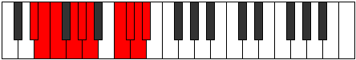 |
| [3703](https://ianring.com/musictheory/scales/3703) | [Katalygic](ModeGSharpKatalygic.md) | G# | G#, A, A#, C, C#, D, F, F#, G, G# |  |
| [3703](https://ianring.com/musictheory/scales/3703) | [Katalygic](ModeAFlatKatalygic.md) | Ab | Ab, A, Bb, C, Db, D, F, Gb, G, Ab |  |
| [3703](https://ianring.com/musictheory/scales/3703) | [Katalygic](ModeGNaturalKatalygic.md) | G | G, G#, A, B, C, C#, E, F, F#, G |  |
| [3703](https://ianring.com/musictheory/scales/3703) | [Katalygic](ModeFSharpKatalygic.md) | F# | F#, G, G#, A#, B, C, D#, E, F, F# |  |
| [3703](https://ianring.com/musictheory/scales/3703) | [Katalygic](ModeGFlatKatalygic.md) | Gb | Gb, G, Ab, Bb, B, C, Eb, E, F, Gb |  |
| [3705](https://ianring.com/musictheory/scales/3705) | [Sydyllic](ModeDNaturalSydyllic.md) | D | D, F, F#, G, G#, B, C, C#, D |  |
| [3705](https://ianring.com/musictheory/scales/3705) | [Sydyllic](ModeGSharpSydyllic.md) | G# | G#, B, C, C#, D, F, F#, G, G# |  |
| [3705](https://ianring.com/musictheory/scales/3705) | [Sydyllic](ModeAFlatSydyllic.md) | Ab | Ab, B, C, Db, D, F, Gb, G, Ab |  |
| [3707](https://ianring.com/musictheory/scales/3707) | [Rynygic](ModeDNaturalRynygic.md) | D | D, D#, F, F#, G, G#, B, C, C#, D |  |
| [3707](https://ianring.com/musictheory/scales/3707) | [Rynygic](ModeGSharpRynygic.md) | G# | G#, A, B, C, C#, D, F, F#, G, G# |  |
| [3707](https://ianring.com/musictheory/scales/3707) | [Rynygic](ModeAFlatRynygic.md) | Ab | Ab, A, B, C, Db, D, F, Gb, G, Ab |  |
| [3707](https://ianring.com/musictheory/scales/3707) | [Rynygic](ModeGNaturalRynygic.md) | G | G, G#, A#, B, C, C#, E, F, F#, G |  |
| [3709](https://ianring.com/musictheory/scales/3709) | [Locrygic](ModeDSharpLocrygic.md) | D# | D#, F, F#, G, G#, A, C, C#, D, D# |  |
| [3709](https://ianring.com/musictheory/scales/3709) | [Locrygic](ModeEFlatLocrygic.md) | Eb | Eb, F, Gb, G, Ab, A, C, Db, D, Eb |  |
| [3709](https://ianring.com/musictheory/scales/3709) | [Locrygic](ModeDNaturalLocrygic.md) | D | D, E, F, F#, G, G#, B, C, C#, D |  |
| [3709](https://ianring.com/musictheory/scales/3709) | [Locrygic](ModeGSharpLocrygic.md) | G# | G#, A#, B, C, C#, D, F, F#, G, G# |  |
| [3709](https://ianring.com/musictheory/scales/3709) | [Locrygic](ModeAFlatLocrygic.md) | Ab | Ab, Bb, B, C, Db, D, F, Gb, G, Ab | 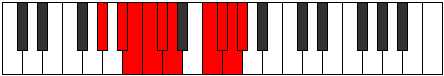 |
| [3711](https://ianring.com/musictheory/scales/3711) | [Dycryllian](ModeDSharpDycryllian.md) | D# | D#, E, F, F#, G, G#, A, C, C#, D, D# |  |
| [3711](https://ianring.com/musictheory/scales/3711) | [Dycryllian](ModeEFlatDycryllian.md) | Eb | Eb, E, F, Gb, G, Ab, A, C, Db, D, Eb |  |
| [3711](https://ianring.com/musictheory/scales/3711) | [Dycryllian](ModeDNaturalDycryllian.md) | D | D, D#, E, F, F#, G, G#, B, C, C#, D |  |
| [3711](https://ianring.com/musictheory/scales/3711) | [Dycryllian](ModeGSharpDycryllian.md) | G# | G#, A, A#, B, C, C#, D, F, F#, G, G# |  |
| [3711](https://ianring.com/musictheory/scales/3711) | [Dycryllian](ModeAFlatDycryllian.md) | Ab | Ab, A, Bb, B, C, Db, D, F, Gb, G, Ab |  |
| [3711](https://ianring.com/musictheory/scales/3711) | [Dycryllian](ModeGNaturalDycryllian.md) | G | G, G#, A, A#, B, C, C#, E, F, F#, G |  |
| [3711](https://ianring.com/musictheory/scales/3711) | [Dycryllian](ModeFSharpDycryllian.md) | F# | F#, G, G#, A, A#, B, C, D#, E, F, F# |  |
| [3711](https://ianring.com/musictheory/scales/3711) | [Dycryllian](ModeGFlatDycryllian.md) | Gb | Gb, G, Ab, A, Bb, B, C, Eb, E, F, Gb |  |
| [3725](https://ianring.com/musictheory/scales/3725) | [Kyrian](ModeFNaturalKyrian.md) | F | F, G, Ab, B#, C##, D#, E, F |  |
| [3725](https://ianring.com/musictheory/scales/3725) | [Kyrian](ModeASharpKyrian.md) | A# | A#, B#, C#, D###, E###, F###, G##, A# |  |
| [3725](https://ianring.com/musictheory/scales/3725) | [Kyrian](ModeBFlatKyrian.md) | Bb | Bb, C, Db, E#, F##, G#, A, Bb |  |
| [3727](https://ianring.com/musictheory/scales/3727) | [Tholyllic](ModeFNaturalTholyllic.md) | F | F, F#, G, G#, C, D, D#, E, F |  |
| [3727](https://ianring.com/musictheory/scales/3727) | [Tholyllic](ModeASharpTholyllic.md) | A# | A#, B, C, C#, F, G, G#, A, A# |  |
| [3727](https://ianring.com/musictheory/scales/3727) | [Tholyllic](ModeBFlatTholyllic.md) | Bb | Bb, B, C, Db, F, G, Ab, A, Bb |  |
| [3729](https://ianring.com/musictheory/scales/3729) | [Starimic](ModeGSharpStarimic.md) | G# | G#, A###, C###, D###, E##, F##, G# |  |
| [3729](https://ianring.com/musictheory/scales/3729) | [Starimic](ModeAFlatStarimic.md) | Ab | Ab, B#, C###, D###, E##, F##, Ab |  |
| [3731](https://ianring.com/musictheory/scales/3731) | [Aeryrian](ModeGSharpAeryrian.md) | G# | G#, A, B#, C###, D###, E##, F##, G# |  |
| [3731](https://ianring.com/musictheory/scales/3731) | [Aeryrian](ModeAFlatAeryrian.md) | Ab | Ab, Bbb, C, D#, E#, F#, G, Ab |  |
| [3733](https://ianring.com/musictheory/scales/3733) | [Gycrian](ModeGSharpGycrian.md) | G# | G#, A#, B#, C###, D###, E##, F##, G# |  |
| [3733](https://ianring.com/musictheory/scales/3733) | [Gycrian](ModeAFlatGycrian.md) | Ab | Ab, Bb, C, D#, E#, F#, G, Ab |  |
| [3733](https://ianring.com/musictheory/scales/3733) | [Gycrian](ModeASharpGycrian.md) | A# | A#, B#, C##, D###, E###, F###, G##, A# |  |
| [3733](https://ianring.com/musictheory/scales/3733) | [Gycrian](ModeBFlatGycrian.md) | Bb | Bb, C, D, E#, F##, G#, A, Bb |  |
| [3735](https://ianring.com/musictheory/scales/3735) | [Ionagyllic](ModeGSharpIonagyllic.md) | G# | G#, A, A#, C, D#, F, F#, G, G# |  |
| [3735](https://ianring.com/musictheory/scales/3735) | [Ionagyllic](ModeAFlatIonagyllic.md) | Ab | Ab, A, Bb, C, Eb, F, Gb, G, Ab |  |
| [3735](https://ianring.com/musictheory/scales/3735) | [Ionagyllic](ModeASharpIonagyllic.md) | A# | A#, B, C, D, F, G, G#, A, A# |  |
| [3735](https://ianring.com/musictheory/scales/3735) | [Ionagyllic](ModeBFlatIonagyllic.md) | Bb | Bb, B, C, D, F, G, Ab, A, Bb |  |
| [3737](https://ianring.com/musictheory/scales/3737) | [Phrocrian](ModeGSharpPhrocrian.md) | G# | G#, A##, B#, C###, D###, E##, F##, G# |  |
| [3737](https://ianring.com/musictheory/scales/3737) | [Phrocrian](ModeAFlatPhrocrian.md) | Ab | Ab, B, C, D#, E#, F#, G, Ab |  |
| [3739](https://ianring.com/musictheory/scales/3739) | [Ioninyllic](ModeGSharpIoninyllic.md) | G# | G#, A, B, C, D#, F, F#, G, G# |  |
| [3739](https://ianring.com/musictheory/scales/3739) | [Ioninyllic](ModeAFlatIoninyllic.md) | Ab | Ab, A, B, C, Eb, F, Gb, G, Ab |  |
| [3741](https://ianring.com/musictheory/scales/3741) | [Zydyllic](ModeFNaturalZydyllic.md) | F | F, G, G#, A, C, D, D#, E, F |  |
| [3741](https://ianring.com/musictheory/scales/3741) | [Zydyllic](ModeASharpZydyllic.md) | A# | A#, C, C#, D, F, G, G#, A, A# |  |
| [3741](https://ianring.com/musictheory/scales/3741) | [Zydyllic](ModeBFlatZydyllic.md) | Bb | Bb, C, Db, D, F, G, Ab, A, Bb |  |
| [3741](https://ianring.com/musictheory/scales/3741) | [Zydyllic](ModeGSharpZydyllic.md) | G# | G#, A#, B, C, D#, F, F#, G, G# |  |
| [3741](https://ianring.com/musictheory/scales/3741) | [Zydyllic](ModeAFlatZydyllic.md) | Ab | Ab, Bb, B, C, Eb, F, Gb, G, Ab |  |
| [3743](https://ianring.com/musictheory/scales/3743) | [Thadygic](ModeFNaturalThadygic.md) | F | F, F#, G, G#, A, C, D, D#, E, F |  |
| [3743](https://ianring.com/musictheory/scales/3743) | [Thadygic](ModeASharpThadygic.md) | A# | A#, B, C, C#, D, F, G, G#, A, A# |  |
| [3743](https://ianring.com/musictheory/scales/3743) | [Thadygic](ModeBFlatThadygic.md) | Bb | Bb, B, C, Db, D, F, G, Ab, A, Bb |  |
| [3743](https://ianring.com/musictheory/scales/3743) | [Thadygic](ModeGSharpThadygic.md) | G# | G#, A, A#, B, C, D#, F, F#, G, G# |  |
| [3743](https://ianring.com/musictheory/scales/3743) | [Thadygic](ModeAFlatThadygic.md) | Ab | Ab, A, Bb, B, C, Eb, F, Gb, G, Ab |  |
| [3747](https://ianring.com/musictheory/scales/3747) | [Myrian](ModeGNaturalMyrian.md) | G | G, Ab, B#, C##, D##, E#, F#, G |  |
| [3749](https://ianring.com/musictheory/scales/3749) | [Zothian](ModeASharpZothian.md) | A# | A#, B#, C###, D###, E###, F###, G##, A# |  |
| [3749](https://ianring.com/musictheory/scales/3749) | [Zothian](ModeBFlatZothian.md) | Bb | Bb, C, D#, E#, F##, G#, A, Bb |  |
| [3751](https://ianring.com/musictheory/scales/3751) | [Aerathyllic](ModeGNaturalAerathyllic.md) | G | G, G#, A, C, D, E, F, F#, G |  |
| [3751](https://ianring.com/musictheory/scales/3751) | [Aerathyllic](ModeASharpAerathyllic.md) | A# | A#, B, C, D#, F, G, G#, A, A# |  |
| [3751](https://ianring.com/musictheory/scales/3751) | [Aerathyllic](ModeBFlatAerathyllic.md) | Bb | Bb, B, C, Eb, F, G, Ab, A, Bb |  |
| [3755](https://ianring.com/musictheory/scales/3755) | [Phryryllic](ModeGNaturalPhryryllic.md) | G | G, G#, A#, C, D, E, F, F#, G |  |
| [3757](https://ianring.com/musictheory/scales/3757) | [Goptyllic](ModeFNaturalGoptyllic.md) | F | F, G, G#, A#, C, D, D#, E, F |  |
| [3757](https://ianring.com/musictheory/scales/3757) | [Goptyllic](ModeASharpGoptyllic.md) | A# | A#, C, C#, D#, F, G, G#, A, A# |  |
| [3757](https://ianring.com/musictheory/scales/3757) | [Goptyllic](ModeBFlatGoptyllic.md) | Bb | Bb, C, Db, Eb, F, G, Ab, A, Bb |  |
| [3759](https://ianring.com/musictheory/scales/3759) | [Darygic](ModeFNaturalDarygic.md) | F | F, F#, G, G#, A#, C, D, D#, E, F |  |
| [3759](https://ianring.com/musictheory/scales/3759) | [Darygic](ModeGNaturalDarygic.md) | G | G, G#, A, A#, C, D, E, F, F#, G |  |
| [3759](https://ianring.com/musictheory/scales/3759) | [Darygic](ModeASharpDarygic.md) | A# | A#, B, C, C#, D#, F, G, G#, A, A# |  |
| [3759](https://ianring.com/musictheory/scales/3759) | [Darygic](ModeBFlatDarygic.md) | Bb | Bb, B, C, Db, Eb, F, G, Ab, A, Bb |  |
| [3761](https://ianring.com/musictheory/scales/3761) | [Ionythian](ModeGSharpIonythian.md) | G# | G#, A###, B##, C###, D###, E##, F##, G# |  |
| [3761](https://ianring.com/musictheory/scales/3761) | [Ionythian](ModeAFlatIonythian.md) | Ab | Ab, B#, C#, D#, E#, F#, G, Ab |  |
| [3763](https://ianring.com/musictheory/scales/3763) | [Modyllic](ModeGSharpModyllic.md) | G# | G#, A, C, C#, D#, F, F#, G, G# |  |
| [3763](https://ianring.com/musictheory/scales/3763) | [Modyllic](ModeAFlatModyllic.md) | Ab | Ab, A, C, Db, Eb, F, Gb, G, Ab |  |
| [3763](https://ianring.com/musictheory/scales/3763) | [Modyllic](ModeGNaturalModyllic.md) | G | G, G#, B, C, D, E, F, F#, G |  |
| [3765](https://ianring.com/musictheory/scales/3765) | [Aerycryllic](ModeDSharpAerycryllic.md) | D# | D#, F, G, G#, A#, C, C#, D, D# |  |
| [3765](https://ianring.com/musictheory/scales/3765) | [Aerycryllic](ModeEFlatAerycryllic.md) | Eb | Eb, F, G, Ab, Bb, C, Db, D, Eb |  |
| [3765](https://ianring.com/musictheory/scales/3765) | [Aerycryllic](ModeGSharpAerycryllic.md) | G# | G#, A#, C, C#, D#, F, F#, G, G# |  |
| [3765](https://ianring.com/musictheory/scales/3765) | [Aerycryllic](ModeAFlatAerycryllic.md) | Ab | Ab, Bb, C, Db, Eb, F, Gb, G, Ab |  |
| [3765](https://ianring.com/musictheory/scales/3765) | [Aerycryllic](ModeASharpAerycryllic.md) | A# | A#, C, D, D#, F, G, G#, A, A# |  |
| [3765](https://ianring.com/musictheory/scales/3765) | [Aerycryllic](ModeBFlatAerycryllic.md) | Bb | Bb, C, D, Eb, F, G, Ab, A, Bb |  |
| [3767](https://ianring.com/musictheory/scales/3767) | [Bacrygic](ModeDSharpBacrygic.md) | D# | D#, E, F, G, G#, A#, C, C#, D, D# |  |
| [3767](https://ianring.com/musictheory/scales/3767) | [Bacrygic](ModeEFlatBacrygic.md) | Eb | Eb, E, F, G, Ab, Bb, C, Db, D, Eb |  |
| [3767](https://ianring.com/musictheory/scales/3767) | [Bacrygic](ModeGSharpBacrygic.md) | G# | G#, A, A#, C, C#, D#, F, F#, G, G# |  |
| [3767](https://ianring.com/musictheory/scales/3767) | [Bacrygic](ModeAFlatBacrygic.md) | Ab | Ab, A, Bb, C, Db, Eb, F, Gb, G, Ab |  |
| [3767](https://ianring.com/musictheory/scales/3767) | [Bacrygic](ModeGNaturalBacrygic.md) | G | G, G#, A, B, C, D, E, F, F#, G |  |
| [3767](https://ianring.com/musictheory/scales/3767) | [Bacrygic](ModeASharpBacrygic.md) | A# | A#, B, C, D, D#, F, G, G#, A, A# |  |
| [3767](https://ianring.com/musictheory/scales/3767) | [Bacrygic](ModeBFlatBacrygic.md) | Bb | Bb, B, C, D, Eb, F, G, Ab, A, Bb |  |
| [3769](https://ianring.com/musictheory/scales/3769) | [Aeracryllic](ModeGSharpAeracryllic.md) | G# | G#, B, C, C#, D#, F, F#, G, G# |  |
| [3769](https://ianring.com/musictheory/scales/3769) | [Aeracryllic](ModeAFlatAeracryllic.md) | Ab | Ab, B, C, Db, Eb, F, Gb, G, Ab |  |
| [3771](https://ianring.com/musictheory/scales/3771) | [Stophygic](ModeGSharpStophygic.md) | G# | G#, A, B, C, C#, D#, F, F#, G, G# |  |
| [3771](https://ianring.com/musictheory/scales/3771) | [Stophygic](ModeAFlatStophygic.md) | Ab | Ab, A, B, C, Db, Eb, F, Gb, G, Ab |  |
| [3771](https://ianring.com/musictheory/scales/3771) | [Stophygic](ModeGNaturalStophygic.md) | G | G, G#, A#, B, C, D, E, F, F#, G |  |
| [3773](https://ianring.com/musictheory/scales/3773) | [Sorygic](ModeDSharpSorygic.md) | D# | D#, F, F#, G, G#, A#, C, C#, D, D# |  |
| [3773](https://ianring.com/musictheory/scales/3773) | [Sorygic](ModeEFlatSorygic.md) | Eb | Eb, F, Gb, G, Ab, Bb, C, Db, D, Eb |  |
| [3773](https://ianring.com/musictheory/scales/3773) | [Sorygic](ModeASharpSorygic.md) | A# | A#, C, C#, D, D#, F, G, G#, A, A# |  |
| [3773](https://ianring.com/musictheory/scales/3773) | [Sorygic](ModeBFlatSorygic.md) | Bb | Bb, C, Db, D, Eb, F, G, Ab, A, Bb |  |
| [3773](https://ianring.com/musictheory/scales/3773) | [Sorygic](ModeFNaturalSorygic.md) | F | F, G, G#, A, A#, C, D, D#, E, F |  |
| [3773](https://ianring.com/musictheory/scales/3773) | [Sorygic](ModeGSharpSorygic.md) | G# | G#, A#, B, C, C#, D#, F, F#, G, G# |  |
| [3773](https://ianring.com/musictheory/scales/3773) | [Sorygic](ModeAFlatSorygic.md) | Ab | Ab, Bb, B, C, Db, Eb, F, Gb, G, Ab |  |
| [3775](https://ianring.com/musictheory/scales/3775) | [Loptyllian](ModeDSharpLoptyllian.md) | D# | D#, E, F, F#, G, G#, A#, C, C#, D, D# |  |
| [3775](https://ianring.com/musictheory/scales/3775) | [Loptyllian](ModeEFlatLoptyllian.md) | Eb | Eb, E, F, Gb, G, Ab, Bb, C, Db, D, Eb |  |
| [3775](https://ianring.com/musictheory/scales/3775) | [Loptyllian](ModeFNaturalLoptyllian.md) | F | F, F#, G, G#, A, A#, C, D, D#, E, F |  |
| [3775](https://ianring.com/musictheory/scales/3775) | [Loptyllian](ModeASharpLoptyllian.md) | A# | A#, B, C, C#, D, D#, F, G, G#, A, A# |  |
| [3775](https://ianring.com/musictheory/scales/3775) | [Loptyllian](ModeBFlatLoptyllian.md) | Bb | Bb, B, C, Db, D, Eb, F, G, Ab, A, Bb |  |
| [3775](https://ianring.com/musictheory/scales/3775) | [Loptyllian](ModeGSharpLoptyllian.md) | G# | G#, A, A#, B, C, C#, D#, F, F#, G, G# |  |
| [3775](https://ianring.com/musictheory/scales/3775) | [Loptyllian](ModeAFlatLoptyllian.md) | Ab | Ab, A, Bb, B, C, Db, Eb, F, Gb, G, Ab |  |
| [3775](https://ianring.com/musictheory/scales/3775) | [Loptyllian](ModeGNaturalLoptyllian.md) | G | G, G#, A, A#, B, C, D, E, F, F#, G |  |
| [3781](https://ianring.com/musictheory/scales/3781) | [Gyphian](ModeASharpGyphian.md) | A# | A#, B#, D##, E#, F##, G#, A, A# |  |
| [3781](https://ianring.com/musictheory/scales/3781) | [Gyphian](ModeBFlatGyphian.md) | Bb | Bb, C, D##, E#, F##, G#, A, Bb |  |
| [3783](https://ianring.com/musictheory/scales/3783) | [Phrygyllic](ModeFSharpPhrygyllic.md) | F# | F#, G, G#, C, C#, D#, E, F, F# |  |
| [3783](https://ianring.com/musictheory/scales/3783) | [Phrygyllic](ModeGFlatPhrygyllic.md) | Gb | Gb, G, Ab, C, Db, Eb, E, F, Gb |  |
| [3783](https://ianring.com/musictheory/scales/3783) | [Phrygyllic](ModeASharpPhrygyllic.md) | A# | A#, B, C, E, F, G, G#, A, A# |  |
| [3783](https://ianring.com/musictheory/scales/3783) | [Phrygyllic](ModeBFlatPhrygyllic.md) | Bb | Bb, B, C, E, F, G, Ab, A, Bb |  |
| [3789](https://ianring.com/musictheory/scales/3789) | [Eporyllic](ModeASharpEporyllic.md) | A# | A#, C, C#, E, F, G, G#, A, A# |  |
| [3789](https://ianring.com/musictheory/scales/3789) | [Eporyllic](ModeBFlatEporyllic.md) | Bb | Bb, C, Db, E, F, G, Ab, A, Bb |  |
| [3789](https://ianring.com/musictheory/scales/3789) | [Eporyllic](ModeFNaturalEporyllic.md) | F | F, G, G#, B, C, D, D#, E, F |  |
| [3791](https://ianring.com/musictheory/scales/3791) | [Stodygic](ModeFSharpStodygic.md) | F# | F#, G, G#, A, C, C#, D#, E, F, F# |  |
| [3791](https://ianring.com/musictheory/scales/3791) | [Stodygic](ModeGFlatStodygic.md) | Gb | Gb, G, Ab, A, C, Db, Eb, E, F, Gb |  |
| [3791](https://ianring.com/musictheory/scales/3791) | [Stodygic](ModeFNaturalStodygic.md) | F | F, F#, G, G#, B, C, D, D#, E, F |  |
| [3791](https://ianring.com/musictheory/scales/3791) | [Stodygic](ModeASharpStodygic.md) | A# | A#, B, C, C#, E, F, G, G#, A, A# |  |
| [3791](https://ianring.com/musictheory/scales/3791) | [Stodygic](ModeBFlatStodygic.md) | Bb | Bb, B, C, Db, E, F, G, Ab, A, Bb |  |
| [3793](https://ianring.com/musictheory/scales/3793) | [Aeopian](ModeGSharpAeopian.md) | G# | G#, A###, B###, C###, D###, E##, F##, G# |  |
| [3793](https://ianring.com/musictheory/scales/3793) | [Aeopian](ModeAFlatAeopian.md) | Ab | Ab, B#, C##, D#, E#, F#, G, Ab |  |
| [3793](https://ianring.com/musictheory/scales/3793) | [Aeopian](ModeCSharpAeopian.md) | C# | C#, D###, E###, F###, G###, A##, B#, C# |  |
| [3793](https://ianring.com/musictheory/scales/3793) | [Aeopian](ModeDFlatAeopian.md) | Db | Db, E#, F##, G#, A#, B, C, Db |  |
| [3795](https://ianring.com/musictheory/scales/3795) | [Epothyllic](ModeGSharpEpothyllic.md) | G# | G#, A, C, D, D#, F, F#, G, G# |  |
| [3795](https://ianring.com/musictheory/scales/3795) | [Epothyllic](ModeAFlatEpothyllic.md) | Ab | Ab, A, C, D, Eb, F, Gb, G, Ab |  |
| [3795](https://ianring.com/musictheory/scales/3795) | [Epothyllic](ModeCSharpEpothyllic.md) | C# | C#, D, F, G, G#, A#, B, C, C# |  |
| [3795](https://ianring.com/musictheory/scales/3795) | [Epothyllic](ModeDFlatEpothyllic.md) | Db | Db, D, F, G, Ab, Bb, B, C, Db |  |
| [3797](https://ianring.com/musictheory/scales/3797) | [Rocryllic](ModeGSharpRocryllic.md) | G# | G#, A#, C, D, D#, F, F#, G, G# |  |
| [3797](https://ianring.com/musictheory/scales/3797) | [Rocryllic](ModeAFlatRocryllic.md) | Ab | Ab, Bb, C, D, Eb, F, Gb, G, Ab |  |
| [3797](https://ianring.com/musictheory/scales/3797) | [Rocryllic](ModeASharpRocryllic.md) | A# | A#, C, D, E, F, G, G#, A, A# |  |
| [3797](https://ianring.com/musictheory/scales/3797) | [Rocryllic](ModeBFlatRocryllic.md) | Bb | Bb, C, D, E, F, G, Ab, A, Bb |  |
| [3797](https://ianring.com/musictheory/scales/3797) | [Rocryllic](ModeCSharpRocryllic.md) | C# | C#, D#, F, G, G#, A#, B, C, C# |  |
| [3797](https://ianring.com/musictheory/scales/3797) | [Rocryllic](ModeDFlatRocryllic.md) | Db | Db, Eb, F, G, Ab, Bb, B, C, Db |  |
| [3799](https://ianring.com/musictheory/scales/3799) | [Aeralygic](ModeFSharpAeralygic.md) | F# | F#, G, G#, A#, C, C#, D#, E, F, F# |  |
| [3799](https://ianring.com/musictheory/scales/3799) | [Aeralygic](ModeGFlatAeralygic.md) | Gb | Gb, G, Ab, Bb, C, Db, Eb, E, F, Gb |  |
| [3799](https://ianring.com/musictheory/scales/3799) | [Aeralygic](ModeGSharpAeralygic.md) | G# | G#, A, A#, C, D, D#, F, F#, G, G# |  |
| [3799](https://ianring.com/musictheory/scales/3799) | [Aeralygic](ModeAFlatAeralygic.md) | Ab | Ab, A, Bb, C, D, Eb, F, Gb, G, Ab |  |
| [3799](https://ianring.com/musictheory/scales/3799) | [Aeralygic](ModeCSharpAeralygic.md) | C# | C#, D, D#, F, G, G#, A#, B, C, C# |  |
| [3799](https://ianring.com/musictheory/scales/3799) | [Aeralygic](ModeDFlatAeralygic.md) | Db | Db, D, Eb, F, G, Ab, Bb, B, C, Db |  |
| [3799](https://ianring.com/musictheory/scales/3799) | [Aeralygic](ModeASharpAeralygic.md) | A# | A#, B, C, D, E, F, G, G#, A, A# |  |
| [3799](https://ianring.com/musictheory/scales/3799) | [Aeralygic](ModeBFlatAeralygic.md) | Bb | Bb, B, C, D, E, F, G, Ab, A, Bb |  |
| [3801](https://ianring.com/musictheory/scales/3801) | [Maptyllic](ModeGSharpMaptyllic.md) | G# | G#, B, C, D, D#, F, F#, G, G# |  |
| [3801](https://ianring.com/musictheory/scales/3801) | [Maptyllic](ModeAFlatMaptyllic.md) | Ab | Ab, B, C, D, Eb, F, Gb, G, Ab |  |
| [3801](https://ianring.com/musictheory/scales/3801) | [Maptyllic](ModeCSharpMaptyllic.md) | C# | C#, E, F, G, G#, A#, B, C, C# |  |
| [3801](https://ianring.com/musictheory/scales/3801) | [Maptyllic](ModeDFlatMaptyllic.md) | Db | Db, E, F, G, Ab, Bb, B, C, Db |  |
| [3803](https://ianring.com/musictheory/scales/3803) | [Epidygic](ModeGSharpEpidygic.md) | G# | G#, A, B, C, D, D#, F, F#, G, G# |  |
| [3803](https://ianring.com/musictheory/scales/3803) | [Epidygic](ModeAFlatEpidygic.md) | Ab | Ab, A, B, C, D, Eb, F, Gb, G, Ab |  |
| [3803](https://ianring.com/musictheory/scales/3803) | [Epidygic](ModeCSharpEpidygic.md) | C# | C#, D, E, F, G, G#, A#, B, C, C# |  |
| [3803](https://ianring.com/musictheory/scales/3803) | [Epidygic](ModeDFlatEpidygic.md) | Db | Db, D, E, F, G, Ab, Bb, B, C, Db |  |
| [3805](https://ianring.com/musictheory/scales/3805) | [Moptygic](ModeASharpMoptygic.md) | A# | A#, C, C#, D, E, F, G, G#, A, A# |  |
| [3805](https://ianring.com/musictheory/scales/3805) | [Moptygic](ModeBFlatMoptygic.md) | Bb | Bb, C, Db, D, E, F, G, Ab, A, Bb |  |
| [3805](https://ianring.com/musictheory/scales/3805) | [Moptygic](ModeFNaturalMoptygic.md) | F | F, G, G#, A, B, C, D, D#, E, F |  |
| [3805](https://ianring.com/musictheory/scales/3805) | [Moptygic](ModeCSharpMoptygic.md) | C# | C#, D#, E, F, G, G#, A#, B, C, C# |  |
| [3805](https://ianring.com/musictheory/scales/3805) | [Moptygic](ModeDFlatMoptygic.md) | Db | Db, Eb, E, F, G, Ab, Bb, B, C, Db |  |
| [3805](https://ianring.com/musictheory/scales/3805) | [Moptygic](ModeGSharpMoptygic.md) | G# | G#, A#, B, C, D, D#, F, F#, G, G# |  |
| [3805](https://ianring.com/musictheory/scales/3805) | [Moptygic](ModeAFlatMoptygic.md) | Ab | Ab, Bb, B, C, D, Eb, F, Gb, G, Ab |  |
| [3807](https://ianring.com/musictheory/scales/3807) | [Bagyllian](ModeFSharpBagyllian.md) | F# | F#, G, G#, A, A#, C, C#, D#, E, F, F# |  |
| [3807](https://ianring.com/musictheory/scales/3807) | [Bagyllian](ModeGFlatBagyllian.md) | Gb | Gb, G, Ab, A, Bb, C, Db, Eb, E, F, Gb |  |
| [3807](https://ianring.com/musictheory/scales/3807) | [Bagyllian](ModeFNaturalBagyllian.md) | F | F, F#, G, G#, A, B, C, D, D#, E, F |  |
| [3807](https://ianring.com/musictheory/scales/3807) | [Bagyllian](ModeCSharpBagyllian.md) | C# | C#, D, D#, E, F, G, G#, A#, B, C, C# |  |
| [3807](https://ianring.com/musictheory/scales/3807) | [Bagyllian](ModeDFlatBagyllian.md) | Db | Db, D, Eb, E, F, G, Ab, Bb, B, C, Db |  |
| [3807](https://ianring.com/musictheory/scales/3807) | [Bagyllian](ModeASharpBagyllian.md) | A# | A#, B, C, C#, D, E, F, G, G#, A, A# |  |
| [3807](https://ianring.com/musictheory/scales/3807) | [Bagyllian](ModeBFlatBagyllian.md) | Bb | Bb, B, C, Db, D, E, F, G, Ab, A, Bb |  |
| [3807](https://ianring.com/musictheory/scales/3807) | [Bagyllian](ModeGSharpBagyllian.md) | G# | G#, A, A#, B, C, D, D#, F, F#, G, G# |  |
| [3807](https://ianring.com/musictheory/scales/3807) | [Bagyllian](ModeAFlatBagyllian.md) | Ab | Ab, A, Bb, B, C, D, Eb, F, Gb, G, Ab |  |
| [3811](https://ianring.com/musictheory/scales/3811) | [Epogyllic](ModeGNaturalEpogyllic.md) | G | G, G#, C, C#, D, E, F, F#, G |  |
| [3813](https://ianring.com/musictheory/scales/3813) | [Aeologyllic](ModeASharpAeologyllic.md) | A# | A#, C, D#, E, F, G, G#, A, A# |  |
| [3813](https://ianring.com/musictheory/scales/3813) | [Aeologyllic](ModeBFlatAeologyllic.md) | Bb | Bb, C, Eb, E, F, G, Ab, A, Bb |  |
| [3815](https://ianring.com/musictheory/scales/3815) | [Mylygic](ModeGNaturalMylygic.md) | G | G, G#, A, C, C#, D, E, F, F#, G |  |
| [3815](https://ianring.com/musictheory/scales/3815) | [Mylygic](ModeFSharpMylygic.md) | F# | F#, G, G#, B, C, C#, D#, E, F, F# |  |
| [3815](https://ianring.com/musictheory/scales/3815) | [Mylygic](ModeGFlatMylygic.md) | Gb | Gb, G, Ab, B, C, Db, Eb, E, F, Gb |  |
| [3815](https://ianring.com/musictheory/scales/3815) | [Mylygic](ModeASharpMylygic.md) | A# | A#, B, C, D#, E, F, G, G#, A, A# |  |
| [3815](https://ianring.com/musictheory/scales/3815) | [Mylygic](ModeBFlatMylygic.md) | Bb | Bb, B, C, Eb, E, F, G, Ab, A, Bb |  |
| [3817](https://ianring.com/musictheory/scales/3817) | [Zoryllic](ModeDNaturalZoryllic.md) | D | D, F, G, G#, A, B, C, C#, D |  |
| [3819](https://ianring.com/musictheory/scales/3819) | [Aeolanygic](ModeGNaturalAeolanygic.md) | G | G, G#, A#, C, C#, D, E, F, F#, G |  |
| [3819](https://ianring.com/musictheory/scales/3819) | [Aeolanygic](ModeDNaturalAeolanygic.md) | D | D, D#, F, G, G#, A, B, C, C#, D |  |
| [3821](https://ianring.com/musictheory/scales/3821) | [Epyrygic](ModeASharpEpyrygic.md) | A# | A#, C, C#, D#, E, F, G, G#, A, A# |  |
| [3821](https://ianring.com/musictheory/scales/3821) | [Epyrygic](ModeBFlatEpyrygic.md) | Bb | Bb, C, Db, Eb, E, F, G, Ab, A, Bb |  |
| [3821](https://ianring.com/musictheory/scales/3821) | [Epyrygic](ModeDNaturalEpyrygic.md) | D | D, E, F, G, G#, A, B, C, C#, D |  |
| [3821](https://ianring.com/musictheory/scales/3821) | [Epyrygic](ModeFNaturalEpyrygic.md) | F | F, G, G#, A#, B, C, D, D#, E, F |  |
| [3823](https://ianring.com/musictheory/scales/3823) | [Epinyllian](ModeGNaturalEpinyllian.md) | G | G, G#, A, A#, C, C#, D, E, F, F#, G |  |
| [3823](https://ianring.com/musictheory/scales/3823) | [Epinyllian](ModeDNaturalEpinyllian.md) | D | D, D#, E, F, G, G#, A, B, C, C#, D |  |
| [3823](https://ianring.com/musictheory/scales/3823) | [Epinyllian](ModeFSharpEpinyllian.md) | F# | F#, G, G#, A, B, C, C#, D#, E, F, F# |  |
| [3823](https://ianring.com/musictheory/scales/3823) | [Epinyllian](ModeGFlatEpinyllian.md) | Gb | Gb, G, Ab, A, B, C, Db, Eb, E, F, Gb |  |
| [3823](https://ianring.com/musictheory/scales/3823) | [Epinyllian](ModeFNaturalEpinyllian.md) | F | F, F#, G, G#, A#, B, C, D, D#, E, F |  |
| [3823](https://ianring.com/musictheory/scales/3823) | [Epinyllian](ModeASharpEpinyllian.md) | A# | A#, B, C, C#, D#, E, F, G, G#, A, A# |  |
| [3823](https://ianring.com/musictheory/scales/3823) | [Epinyllian](ModeBFlatEpinyllian.md) | Bb | Bb, B, C, Db, Eb, E, F, G, Ab, A, Bb |  |
| [3825](https://ianring.com/musictheory/scales/3825) | [Pynyllic](ModeGSharpPynyllic.md) | G# | G#, C, C#, D, D#, F, F#, G, G# |  |
| [3825](https://ianring.com/musictheory/scales/3825) | [Pynyllic](ModeAFlatPynyllic.md) | Ab | Ab, C, Db, D, Eb, F, Gb, G, Ab |  |
| [3825](https://ianring.com/musictheory/scales/3825) | [Pynyllic](ModeCSharpPynyllic.md) | C# | C#, F, F#, G, G#, A#, B, C, C# |  |
| [3825](https://ianring.com/musictheory/scales/3825) | [Pynyllic](ModeDFlatPynyllic.md) | Db | Db, F, Gb, G, Ab, Bb, B, C, Db |  |
| [3827](https://ianring.com/musictheory/scales/3827) | [Dorygic](ModeGSharpDorygic.md) | G# | G#, A, C, C#, D, D#, F, F#, G, G# |  |
| [3827](https://ianring.com/musictheory/scales/3827) | [Dorygic](ModeAFlatDorygic.md) | Ab | Ab, A, C, Db, D, Eb, F, Gb, G, Ab |  |
| [3827](https://ianring.com/musictheory/scales/3827) | [Dorygic](ModeGNaturalDorygic.md) | G | G, G#, B, C, C#, D, E, F, F#, G |  |
| [3827](https://ianring.com/musictheory/scales/3827) | [Dorygic](ModeCSharpDorygic.md) | C# | C#, D, F, F#, G, G#, A#, B, C, C# |  |
| [3827](https://ianring.com/musictheory/scales/3827) | [Dorygic](ModeDFlatDorygic.md) | Db | Db, D, F, Gb, G, Ab, Bb, B, C, Db |  |
| [3829](https://ianring.com/musictheory/scales/3829) | [Aerycrygic](ModeGSharpAerycrygic.md) | G# | G#, A#, C, C#, D, D#, F, F#, G, G# |  |
| [3829](https://ianring.com/musictheory/scales/3829) | [Aerycrygic](ModeAFlatAerycrygic.md) | Ab | Ab, Bb, C, Db, D, Eb, F, Gb, G, Ab |  |
| [3829](https://ianring.com/musictheory/scales/3829) | [Aerycrygic](ModeDSharpAerycrygic.md) | D# | D#, F, G, G#, A, A#, C, C#, D, D# |  |
| [3829](https://ianring.com/musictheory/scales/3829) | [Aerycrygic](ModeEFlatAerycrygic.md) | Eb | Eb, F, G, Ab, A, Bb, C, Db, D, Eb |  |
| [3829](https://ianring.com/musictheory/scales/3829) | [Aerycrygic](ModeASharpAerycrygic.md) | A# | A#, C, D, D#, E, F, G, G#, A, A# |  |
| [3829](https://ianring.com/musictheory/scales/3829) | [Aerycrygic](ModeBFlatAerycrygic.md) | Bb | Bb, C, D, Eb, E, F, G, Ab, A, Bb |  |
| [3829](https://ianring.com/musictheory/scales/3829) | [Aerycrygic](ModeCSharpAerycrygic.md) | C# | C#, D#, F, F#, G, G#, A#, B, C, C# |  |
| [3829](https://ianring.com/musictheory/scales/3829) | [Aerycrygic](ModeDFlatAerycrygic.md) | Db | Db, Eb, F, Gb, G, Ab, Bb, B, C, Db |  |
| [3831](https://ianring.com/musictheory/scales/3831) | [Ionyllian](ModeDSharpIonyllian.md) | D# | D#, E, F, G, G#, A, A#, C, C#, D, D# |  |
| [3831](https://ianring.com/musictheory/scales/3831) | [Ionyllian](ModeEFlatIonyllian.md) | Eb | Eb, E, F, G, Ab, A, Bb, C, Db, D, Eb |  |
| [3831](https://ianring.com/musictheory/scales/3831) | [Ionyllian](ModeGSharpIonyllian.md) | G# | G#, A, A#, C, C#, D, D#, F, F#, G, G# |  |
| [3831](https://ianring.com/musictheory/scales/3831) | [Ionyllian](ModeAFlatIonyllian.md) | Ab | Ab, A, Bb, C, Db, D, Eb, F, Gb, G, Ab |  |
| [3831](https://ianring.com/musictheory/scales/3831) | [Ionyllian](ModeGNaturalIonyllian.md) | G | G, G#, A, B, C, C#, D, E, F, F#, G |  |
| [3831](https://ianring.com/musictheory/scales/3831) | [Ionyllian](ModeCSharpIonyllian.md) | C# | C#, D, D#, F, F#, G, G#, A#, B, C, C# |  |
| [3831](https://ianring.com/musictheory/scales/3831) | [Ionyllian](ModeDFlatIonyllian.md) | Db | Db, D, Eb, F, Gb, G, Ab, Bb, B, C, Db |  |
| [3831](https://ianring.com/musictheory/scales/3831) | [Ionyllian](ModeFSharpIonyllian.md) | F# | F#, G, G#, A#, B, C, C#, D#, E, F, F# |  |
| [3831](https://ianring.com/musictheory/scales/3831) | [Ionyllian](ModeGFlatIonyllian.md) | Gb | Gb, G, Ab, Bb, B, C, Db, Eb, E, F, Gb |  |
| [3831](https://ianring.com/musictheory/scales/3831) | [Ionyllian](ModeASharpIonyllian.md) | A# | A#, B, C, D, D#, E, F, G, G#, A, A# |  |
| [3831](https://ianring.com/musictheory/scales/3831) | [Ionyllian](ModeBFlatIonyllian.md) | Bb | Bb, B, C, D, Eb, E, F, G, Ab, A, Bb |  |
| [3833](https://ianring.com/musictheory/scales/3833) | [Dycrygic](ModeGSharpDycrygic.md) | G# | G#, B, C, C#, D, D#, F, F#, G, G# |  |
| [3833](https://ianring.com/musictheory/scales/3833) | [Dycrygic](ModeAFlatDycrygic.md) | Ab | Ab, B, C, Db, D, Eb, F, Gb, G, Ab |  |
| [3833](https://ianring.com/musictheory/scales/3833) | [Dycrygic](ModeDNaturalDycrygic.md) | D | D, F, F#, G, G#, A, B, C, C#, D |  |
| [3833](https://ianring.com/musictheory/scales/3833) | [Dycrygic](ModeCSharpDycrygic.md) | C# | C#, E, F, F#, G, G#, A#, B, C, C# |  |
| [3833](https://ianring.com/musictheory/scales/3833) | [Dycrygic](ModeDFlatDycrygic.md) | Db | Db, E, F, Gb, G, Ab, Bb, B, C, Db |  |
| [3835](https://ianring.com/musictheory/scales/3835) | [Katodyllian](ModeDNaturalKatodyllian.md) | D | D, D#, F, F#, G, G#, A, B, C, C#, D |  |
| [3835](https://ianring.com/musictheory/scales/3835) | [Katodyllian](ModeGSharpKatodyllian.md) | G# | G#, A, B, C, C#, D, D#, F, F#, G, G# |  |
| [3835](https://ianring.com/musictheory/scales/3835) | [Katodyllian](ModeAFlatKatodyllian.md) | Ab | Ab, A, B, C, Db, D, Eb, F, Gb, G, Ab |  |
| [3835](https://ianring.com/musictheory/scales/3835) | [Katodyllian](ModeCSharpKatodyllian.md) | C# | C#, D, E, F, F#, G, G#, A#, B, C, C# |  |
| [3835](https://ianring.com/musictheory/scales/3835) | [Katodyllian](ModeDFlatKatodyllian.md) | Db | Db, D, E, F, Gb, G, Ab, Bb, B, C, Db |  |
| [3835](https://ianring.com/musictheory/scales/3835) | [Katodyllian](ModeGNaturalKatodyllian.md) | G | G, G#, A#, B, C, C#, D, E, F, F#, G |  |
| [3837](https://ianring.com/musictheory/scales/3837) | [Garyllian](ModeASharpGaryllian.md) | A# | A#, C, C#, D, D#, E, F, G, G#, A, A# |  |
| [3837](https://ianring.com/musictheory/scales/3837) | [Garyllian](ModeBFlatGaryllian.md) | Bb | Bb, C, Db, D, Eb, E, F, G, Ab, A, Bb |  |
| [3837](https://ianring.com/musictheory/scales/3837) | [Garyllian](ModeDSharpGaryllian.md) | D# | D#, F, F#, G, G#, A, A#, C, C#, D, D# |  |
| [3837](https://ianring.com/musictheory/scales/3837) | [Garyllian](ModeEFlatGaryllian.md) | Eb | Eb, F, Gb, G, Ab, A, Bb, C, Db, D, Eb |  |
| [3837](https://ianring.com/musictheory/scales/3837) | [Garyllian](ModeDNaturalGaryllian.md) | D | D, E, F, F#, G, G#, A, B, C, C#, D |  |
| [3837](https://ianring.com/musictheory/scales/3837) | [Garyllian](ModeGSharpGaryllian.md) | G# | G#, A#, B, C, C#, D, D#, F, F#, G, G# |  |
| [3837](https://ianring.com/musictheory/scales/3837) | [Garyllian](ModeAFlatGaryllian.md) | Ab | Ab, Bb, B, C, Db, D, Eb, F, Gb, G, Ab |  |
| [3837](https://ianring.com/musictheory/scales/3837) | [Garyllian](ModeCSharpGaryllian.md) | C# | C#, D#, E, F, F#, G, G#, A#, B, C, C# |  |
| [3837](https://ianring.com/musictheory/scales/3837) | [Garyllian](ModeDFlatGaryllian.md) | Db | Db, Eb, E, F, Gb, G, Ab, Bb, B, C, Db |  |
| [3837](https://ianring.com/musictheory/scales/3837) | [Garyllian](ModeFNaturalGaryllian.md) | F | F, G, G#, A, A#, B, C, D, D#, E, F |  |
| [3839](https://ianring.com/musictheory/scales/3839) | [Mixolatic](ModeDSharpMixolatic.md) | D# | D#, E, F, F#, G, G#, A, A#, C, C#, D, D# |  |
| [3839](https://ianring.com/musictheory/scales/3839) | [Mixolatic](ModeEFlatMixolatic.md) | Eb | Eb, E, F, Gb, G, Ab, A, Bb, C, Db, D, Eb |  |
| [3839](https://ianring.com/musictheory/scales/3839) | [Mixolatic](ModeDNaturalMixolatic.md) | D | D, D#, E, F, F#, G, G#, A, B, C, C#, D |  |
| [3839](https://ianring.com/musictheory/scales/3839) | [Mixolatic](ModeCSharpMixolatic.md) | C# | C#, D, D#, E, F, F#, G, G#, A#, B, C, C# |  |
| [3839](https://ianring.com/musictheory/scales/3839) | [Mixolatic](ModeDFlatMixolatic.md) | Db | Db, D, Eb, E, F, Gb, G, Ab, Bb, B, C, Db |  |
| [3839](https://ianring.com/musictheory/scales/3839) | [Mixolatic](ModeASharpMixolatic.md) | A# | A#, B, C, C#, D, D#, E, F, G, G#, A, A# |  |
| [3839](https://ianring.com/musictheory/scales/3839) | [Mixolatic](ModeBFlatMixolatic.md) | Bb | Bb, B, C, Db, D, Eb, E, F, G, Ab, A, Bb |  |
| [3839](https://ianring.com/musictheory/scales/3839) | [Mixolatic](ModeGSharpMixolatic.md) | G# | G#, A, A#, B, C, C#, D, D#, F, F#, G, G# |  |
| [3839](https://ianring.com/musictheory/scales/3839) | [Mixolatic](ModeAFlatMixolatic.md) | Ab | Ab, A, Bb, B, C, Db, D, Eb, F, Gb, G, Ab |  |
| [3839](https://ianring.com/musictheory/scales/3839) | [Mixolatic](ModeGNaturalMixolatic.md) | G | G, G#, A, A#, B, C, C#, D, E, F, F#, G |  |
| [3839](https://ianring.com/musictheory/scales/3839) | [Mixolatic](ModeFSharpMixolatic.md) | F# | F#, G, G#, A, A#, B, C, C#, D#, E, F, F# |  |
| [3839](https://ianring.com/musictheory/scales/3839) | [Mixolatic](ModeGFlatMixolatic.md) | Gb | Gb, G, Ab, A, Bb, B, C, Db, Eb, E, F, Gb |  |
| [3839](https://ianring.com/musictheory/scales/3839) | [Mixolatic](ModeFNaturalMixolatic.md) | F | F, F#, G, G#, A, A#, B, C, D, D#, E, F |  |
| [3857](https://ianring.com/musictheory/scales/3857) | [Ponimic](ModeGSharpPonimic.md) | G# | G#, A###, D##, E#, F#, G, G# |  |
| [3857](https://ianring.com/musictheory/scales/3857) | [Ponimic](ModeAFlatPonimic.md) | Ab | Ab, B#, D##, E#, F#, G, Ab |  |
| [3859](https://ianring.com/musictheory/scales/3859) | [Aeolarian](ModeGSharpAeolarian.md) | G# | G#, A, B#, D##, E#, F#, G, G# |  |
| [3859](https://ianring.com/musictheory/scales/3859) | [Aeolarian](ModeAFlatAeolarian.md) | Ab | Ab, Bbb, C, D##, E#, F#, G, Ab |  |
| [3861](https://ianring.com/musictheory/scales/3861) | [Phroptian](ModeGSharpPhroptian.md) | G# | G#, A#, B#, D##, E#, F#, G, G# |  |
| [3861](https://ianring.com/musictheory/scales/3861) | [Phroptian](ModeAFlatPhroptian.md) | Ab | Ab, Bb, C, D##, E#, F#, G, Ab |  |
| [3863](https://ianring.com/musictheory/scales/3863) | [Eparyllic](ModeGSharpEparyllic.md) | G# | G#, A, A#, C, E, F, F#, G, G# |  |
| [3863](https://ianring.com/musictheory/scales/3863) | [Eparyllic](ModeAFlatEparyllic.md) | Ab | Ab, A, Bb, C, E, F, Gb, G, Ab |  |
| [3865](https://ianring.com/musictheory/scales/3865) | [Starian](ModeANaturalStarian.md) | A | A, B#, C#, D###, E##, F##, G#, A |  |
| [3865](https://ianring.com/musictheory/scales/3865) | [Starian](ModeGSharpStarian.md) | G# | G#, A##, B#, D##, E#, F#, G, G# |  |
| [3865](https://ianring.com/musictheory/scales/3865) | [Starian](ModeAFlatStarian.md) | Ab | Ab, B, C, D##, E#, F#, G, Ab |  |
| [3867](https://ianring.com/musictheory/scales/3867) | [Storyllic](ModeENaturalStoryllic.md) | E | E, F, G, G#, C, C#, D, D#, E |  |
| [3867](https://ianring.com/musictheory/scales/3867) | [Storyllic](ModeANaturalStoryllic.md) | A | A, A#, C, C#, F, F#, G, G#, A |  |
| [3867](https://ianring.com/musictheory/scales/3867) | [Storyllic](ModeGSharpStoryllic.md) | G# | G#, A, B, C, E, F, F#, G, G# |  |
| [3867](https://ianring.com/musictheory/scales/3867) | [Storyllic](ModeAFlatStoryllic.md) | Ab | Ab, A, B, C, E, F, Gb, G, Ab |  |
| [3869](https://ianring.com/musictheory/scales/3869) | [Bygyllic](ModeANaturalBygyllic.md) | A | A, B, C, C#, F, F#, G, G#, A |  |
| [3869](https://ianring.com/musictheory/scales/3869) | [Bygyllic](ModeGSharpBygyllic.md) | G# | G#, A#, B, C, E, F, F#, G, G# |  |
| [3869](https://ianring.com/musictheory/scales/3869) | [Bygyllic](ModeAFlatBygyllic.md) | Ab | Ab, Bb, B, C, E, F, Gb, G, Ab |  |
| [3871](https://ianring.com/musictheory/scales/3871) | [Aerynygic](ModeENaturalAerynygic.md) | E | E, F, F#, G, G#, C, C#, D, D#, E |  |
| [3871](https://ianring.com/musictheory/scales/3871) | [Aerynygic](ModeANaturalAerynygic.md) | A | A, A#, B, C, C#, F, F#, G, G#, A |  |
| [3871](https://ianring.com/musictheory/scales/3871) | [Aerynygic](ModeGSharpAerynygic.md) | G# | G#, A, A#, B, C, E, F, F#, G, G# |  |
| [3871](https://ianring.com/musictheory/scales/3871) | [Aerynygic](ModeAFlatAerynygic.md) | Ab | Ab, A, Bb, B, C, E, F, Gb, G, Ab |  |
| [3875](https://ianring.com/musictheory/scales/3875) | [Aeryptian](ModeGNaturalAeryptian.md) | G | G, Ab, B#, C###, D##, E#, F#, G |  |
| [3879](https://ianring.com/musictheory/scales/3879) | [Pathyllic](ModeGNaturalPathyllic.md) | G | G, G#, A, C, D#, E, F, F#, G |  |
| [3881](https://ianring.com/musictheory/scales/3881) | [Morian](ModeANaturalMorian.md) | A | A, B#, C##, D###, E##, F##, G#, A |  |
| [3883](https://ianring.com/musictheory/scales/3883) | [Kyryllic](ModeGNaturalKyryllic.md) | G | G, G#, A#, C, D#, E, F, F#, G |  |
| [3883](https://ianring.com/musictheory/scales/3883) | [Kyryllic](ModeANaturalKyryllic.md) | A | A, A#, C, D, F, F#, G, G#, A |  |
| [3885](https://ianring.com/musictheory/scales/3885) | [Styryllic](ModeANaturalStyryllic.md) | A | A, B, C, D, F, F#, G, G#, A |  |
| [3887](https://ianring.com/musictheory/scales/3887) | [Phrathygic](ModeGNaturalPhrathygic.md) | G | G, G#, A, A#, C, D#, E, F, F#, G |  |
| [3887](https://ianring.com/musictheory/scales/3887) | [Phrathygic](ModeANaturalPhrathygic.md) | A | A, A#, B, C, D, F, F#, G, G#, A |  |
| [3889](https://ianring.com/musictheory/scales/3889) | [Parian](ModeGSharpParian.md) | G# | G#, A###, B##, D##, E#, F#, G, G# |  |
| [3889](https://ianring.com/musictheory/scales/3889) | [Parian](ModeAFlatParian.md) | Ab | Ab, B#, C#, D##, E#, F#, G, Ab |  |
| [3891](https://ianring.com/musictheory/scales/3891) | [Ryryllic](ModeGSharpRyryllic.md) | G# | G#, A, C, C#, E, F, F#, G, G# |  |
| [3891](https://ianring.com/musictheory/scales/3891) | [Ryryllic](ModeAFlatRyryllic.md) | Ab | Ab, A, C, Db, E, F, Gb, G, Ab |  |
| [3891](https://ianring.com/musictheory/scales/3891) | [Ryryllic](ModeGNaturalRyryllic.md) | G | G, G#, B, C, D#, E, F, F#, G |  |
| [3893](https://ianring.com/musictheory/scales/3893) | [Phrocryllic](ModeGSharpPhrocryllic.md) | G# | G#, A#, C, C#, E, F, F#, G, G# |  |
| [3893](https://ianring.com/musictheory/scales/3893) | [Phrocryllic](ModeAFlatPhrocryllic.md) | Ab | Ab, Bb, C, Db, E, F, Gb, G, Ab |  |
| [3893](https://ianring.com/musictheory/scales/3893) | [Phrocryllic](ModeDSharpPhrocryllic.md) | D# | D#, F, G, G#, B, C, C#, D, D# |  |
| [3893](https://ianring.com/musictheory/scales/3893) | [Phrocryllic](ModeEFlatPhrocryllic.md) | Eb | Eb, F, G, Ab, B, C, Db, D, Eb |  |
| [3895](https://ianring.com/musictheory/scales/3895) | [Eparygic](ModeGSharpEparygic.md) | G# | G#, A, A#, C, C#, E, F, F#, G, G# |  |
| [3895](https://ianring.com/musictheory/scales/3895) | [Eparygic](ModeAFlatEparygic.md) | Ab | Ab, A, Bb, C, Db, E, F, Gb, G, Ab |  |
| [3895](https://ianring.com/musictheory/scales/3895) | [Eparygic](ModeDSharpEparygic.md) | D# | D#, E, F, G, G#, B, C, C#, D, D# |  |
| [3895](https://ianring.com/musictheory/scales/3895) | [Eparygic](ModeEFlatEparygic.md) | Eb | Eb, E, F, G, Ab, B, C, Db, D, Eb |  |
| [3895](https://ianring.com/musictheory/scales/3895) | [Eparygic](ModeGNaturalEparygic.md) | G | G, G#, A, B, C, D#, E, F, F#, G |  |
| [3897](https://ianring.com/musictheory/scales/3897) | [Locryllic](ModeANaturalLocryllic.md) | A | A, C, C#, D, F, F#, G, G#, A |  |
| [3897](https://ianring.com/musictheory/scales/3897) | [Locryllic](ModeGSharpLocryllic.md) | G# | G#, B, C, C#, E, F, F#, G, G# |  |
| [3897](https://ianring.com/musictheory/scales/3897) | [Locryllic](ModeAFlatLocryllic.md) | Ab | Ab, B, C, Db, E, F, Gb, G, Ab |  |
| [3899](https://ianring.com/musictheory/scales/3899) | [Katorygic](ModeENaturalKatorygic.md) | E | E, F, G, G#, A, C, C#, D, D#, E |  |
| [3899](https://ianring.com/musictheory/scales/3899) | [Katorygic](ModeANaturalKatorygic.md) | A | A, A#, C, C#, D, F, F#, G, G#, A |  |
| [3899](https://ianring.com/musictheory/scales/3899) | [Katorygic](ModeGSharpKatorygic.md) | G# | G#, A, B, C, C#, E, F, F#, G, G# |  |
| [3899](https://ianring.com/musictheory/scales/3899) | [Katorygic](ModeAFlatKatorygic.md) | Ab | Ab, A, B, C, Db, E, F, Gb, G, Ab |  |
| [3899](https://ianring.com/musictheory/scales/3899) | [Katorygic](ModeGNaturalKatorygic.md) | G | G, G#, A#, B, C, D#, E, F, F#, G |  |
| [3901](https://ianring.com/musictheory/scales/3901) | [Bycrygic](ModeDSharpBycrygic.md) | D# | D#, F, F#, G, G#, B, C, C#, D, D# |  |
| [3901](https://ianring.com/musictheory/scales/3901) | [Bycrygic](ModeEFlatBycrygic.md) | Eb | Eb, F, Gb, G, Ab, B, C, Db, D, Eb |  |
| [3901](https://ianring.com/musictheory/scales/3901) | [Bycrygic](ModeANaturalBycrygic.md) | A | A, B, C, C#, D, F, F#, G, G#, A |  |
| [3901](https://ianring.com/musictheory/scales/3901) | [Bycrygic](ModeGSharpBycrygic.md) | G# | G#, A#, B, C, C#, E, F, F#, G, G# |  |
| [3901](https://ianring.com/musictheory/scales/3901) | [Bycrygic](ModeAFlatBycrygic.md) | Ab | Ab, Bb, B, C, Db, E, F, Gb, G, Ab |  |
| [3903](https://ianring.com/musictheory/scales/3903) | [Aeogyllian](ModeENaturalAeogyllian.md) | E | E, F, F#, G, G#, A, C, C#, D, D#, E |  |
| [3903](https://ianring.com/musictheory/scales/3903) | [Aeogyllian](ModeDSharpAeogyllian.md) | D# | D#, E, F, F#, G, G#, B, C, C#, D, D# |  |
| [3903](https://ianring.com/musictheory/scales/3903) | [Aeogyllian](ModeEFlatAeogyllian.md) | Eb | Eb, E, F, Gb, G, Ab, B, C, Db, D, Eb |  |
| [3903](https://ianring.com/musictheory/scales/3903) | [Aeogyllian](ModeANaturalAeogyllian.md) | A | A, A#, B, C, C#, D, F, F#, G, G#, A |  |
| [3903](https://ianring.com/musictheory/scales/3903) | [Aeogyllian](ModeGSharpAeogyllian.md) | G# | G#, A, A#, B, C, C#, E, F, F#, G, G# |  |
| [3903](https://ianring.com/musictheory/scales/3903) | [Aeogyllian](ModeAFlatAeogyllian.md) | Ab | Ab, A, Bb, B, C, Db, E, F, Gb, G, Ab |  |
| [3903](https://ianring.com/musictheory/scales/3903) | [Aeogyllian](ModeGNaturalAeogyllian.md) | G | G, G#, A, A#, B, C, D#, E, F, F#, G |  |
| [3911](https://ianring.com/musictheory/scales/3911) | [Katyryllic](ModeFSharpKatyryllic.md) | F# | F#, G, G#, C, D, D#, E, F, F# |  |
| [3911](https://ianring.com/musictheory/scales/3911) | [Katyryllic](ModeGFlatKatyryllic.md) | Gb | Gb, G, Ab, C, D, Eb, E, F, Gb |  |
| [3911](https://ianring.com/musictheory/scales/3911) | [Katyryllic](ModeBNaturalKatyryllic.md) | B | B, C, C#, F, G, G#, A, A#, B |  |
| [3913](https://ianring.com/musictheory/scales/3913) | [Bonian](ModeANaturalBonian.md) | A | A, B#, C###, D###, E##, F##, G#, A |  |
| [3915](https://ianring.com/musictheory/scales/3915) | [Gogyllic](ModeANaturalGogyllic.md) | A | A, A#, C, D#, F, F#, G, G#, A |  |
| [3915](https://ianring.com/musictheory/scales/3915) | [Gogyllic](ModeBNaturalGogyllic.md) | B | B, C, D, F, G, G#, A, A#, B |  |
| [3917](https://ianring.com/musictheory/scales/3917) | [Epaphyllic](ModeANaturalEpaphyllic.md) | A | A, B, C, D#, F, F#, G, G#, A |  |
| [3919](https://ianring.com/musictheory/scales/3919) | [Lynygic](ModeFSharpLynygic.md) | F# | F#, G, G#, A, C, D, D#, E, F, F# |  |
| [3919](https://ianring.com/musictheory/scales/3919) | [Lynygic](ModeGFlatLynygic.md) | Gb | Gb, G, Ab, A, C, D, Eb, E, F, Gb |  |
| [3919](https://ianring.com/musictheory/scales/3919) | [Lynygic](ModeBNaturalLynygic.md) | B | B, C, C#, D, F, G, G#, A, A#, B |  |
| [3919](https://ianring.com/musictheory/scales/3919) | [Lynygic](ModeANaturalLynygic.md) | A | A, A#, B, C, D#, F, F#, G, G#, A |  |
| [3921](https://ianring.com/musictheory/scales/3921) | [Pythian](ModeGSharpPythian.md) | G# | G#, A###, B###, D##, E#, F#, G, G# |  |
| [3921](https://ianring.com/musictheory/scales/3921) | [Pythian](ModeAFlatPythian.md) | Ab | Ab, B#, C##, D##, E#, F#, G, Ab |  |
| [3923](https://ianring.com/musictheory/scales/3923) | [Stoptyllic](ModeGSharpStoptyllic.md) | G# | G#, A, C, D, E, F, F#, G, G# |  |
| [3923](https://ianring.com/musictheory/scales/3923) | [Stoptyllic](ModeAFlatStoptyllic.md) | Ab | Ab, A, C, D, E, F, Gb, G, Ab |  |
| [3923](https://ianring.com/musictheory/scales/3923) | [Stoptyllic](ModeBNaturalStoptyllic.md) | B | B, C, D#, F, G, G#, A, A#, B |  |
| [3925](https://ianring.com/musictheory/scales/3925) | [Thyryllic](ModeGSharpThyryllic.md) | G# | G#, A#, C, D, E, F, F#, G, G# |  |
| [3925](https://ianring.com/musictheory/scales/3925) | [Thyryllic](ModeAFlatThyryllic.md) | Ab | Ab, Bb, C, D, E, F, Gb, G, Ab |  |
| [3927](https://ianring.com/musictheory/scales/3927) | [Monygic](ModeFSharpMonygic.md) | F# | F#, G, G#, A#, C, D, D#, E, F, F# |  |
| [3927](https://ianring.com/musictheory/scales/3927) | [Monygic](ModeGFlatMonygic.md) | Gb | Gb, G, Ab, Bb, C, D, Eb, E, F, Gb |  |
| [3927](https://ianring.com/musictheory/scales/3927) | [Monygic](ModeGSharpMonygic.md) | G# | G#, A, A#, C, D, E, F, F#, G, G# |  |
| [3927](https://ianring.com/musictheory/scales/3927) | [Monygic](ModeAFlatMonygic.md) | Ab | Ab, A, Bb, C, D, E, F, Gb, G, Ab |  |
| [3927](https://ianring.com/musictheory/scales/3927) | [Monygic](ModeBNaturalMonygic.md) | B | B, C, C#, D#, F, G, G#, A, A#, B |  |
| [3929](https://ianring.com/musictheory/scales/3929) | [Aeolothyllic](ModeANaturalAeolothyllic.md) | A | A, C, C#, D#, F, F#, G, G#, A |  |
| [3929](https://ianring.com/musictheory/scales/3929) | [Aeolothyllic](ModeGSharpAeolothyllic.md) | G# | G#, B, C, D, E, F, F#, G, G# |  |
| [3929](https://ianring.com/musictheory/scales/3929) | [Aeolothyllic](ModeAFlatAeolothyllic.md) | Ab | Ab, B, C, D, E, F, Gb, G, Ab |  |
| [3931](https://ianring.com/musictheory/scales/3931) | [Aerygic](ModeENaturalAerygic.md) | E | E, F, G, G#, A#, C, C#, D, D#, E |  |
| [3931](https://ianring.com/musictheory/scales/3931) | [Aerygic](ModeANaturalAerygic.md) | A | A, A#, C, C#, D#, F, F#, G, G#, A |  |
| [3931](https://ianring.com/musictheory/scales/3931) | [Aerygic](ModeGSharpAerygic.md) | G# | G#, A, B, C, D, E, F, F#, G, G# |  |
| [3931](https://ianring.com/musictheory/scales/3931) | [Aerygic](ModeAFlatAerygic.md) | Ab | Ab, A, B, C, D, E, F, Gb, G, Ab |  |
| [3931](https://ianring.com/musictheory/scales/3931) | [Aerygic](ModeBNaturalAerygic.md) | B | B, C, D, D#, F, G, G#, A, A#, B |  |
| [3933](https://ianring.com/musictheory/scales/3933) | [Ionidygic](ModeANaturalIonidygic.md) | A | A, B, C, C#, D#, F, F#, G, G#, A |  |
| [3933](https://ianring.com/musictheory/scales/3933) | [Ionidygic](ModeGSharpIonidygic.md) | G# | G#, A#, B, C, D, E, F, F#, G, G# |  |
| [3933](https://ianring.com/musictheory/scales/3933) | [Ionidygic](ModeAFlatIonidygic.md) | Ab | Ab, Bb, B, C, D, E, F, Gb, G, Ab |  |
| [3935](https://ianring.com/musictheory/scales/3935) | [Kataphyllian](ModeENaturalKataphyllian.md) | E | E, F, F#, G, G#, A#, C, C#, D, D#, E |  |
| [3935](https://ianring.com/musictheory/scales/3935) | [Kataphyllian](ModeFSharpKataphyllian.md) | F# | F#, G, G#, A, A#, C, D, D#, E, F, F# |  |
| [3935](https://ianring.com/musictheory/scales/3935) | [Kataphyllian](ModeGFlatKataphyllian.md) | Gb | Gb, G, Ab, A, Bb, C, D, Eb, E, F, Gb |  |
| [3935](https://ianring.com/musictheory/scales/3935) | [Kataphyllian](ModeBNaturalKataphyllian.md) | B | B, C, C#, D, D#, F, G, G#, A, A#, B |  |
| [3935](https://ianring.com/musictheory/scales/3935) | [Kataphyllian](ModeANaturalKataphyllian.md) | A | A, A#, B, C, C#, D#, F, F#, G, G#, A |  |
| [3935](https://ianring.com/musictheory/scales/3935) | [Kataphyllian](ModeGSharpKataphyllian.md) | G# | G#, A, A#, B, C, D, E, F, F#, G, G# |  |
| [3935](https://ianring.com/musictheory/scales/3935) | [Kataphyllian](ModeAFlatKataphyllian.md) | Ab | Ab, A, Bb, B, C, D, E, F, Gb, G, Ab |  |
| [3939](https://ianring.com/musictheory/scales/3939) | [Dogyllic](ModeGNaturalDogyllic.md) | G | G, G#, C, C#, D#, E, F, F#, G |  |
| [3939](https://ianring.com/musictheory/scales/3939) | [Dogyllic](ModeBNaturalDogyllic.md) | B | B, C, E, F, G, G#, A, A#, B |  |
| [3943](https://ianring.com/musictheory/scales/3943) | [Zynygic](ModeGNaturalZynygic.md) | G | G, G#, A, C, C#, D#, E, F, F#, G |  |
| [3943](https://ianring.com/musictheory/scales/3943) | [Zynygic](ModeFSharpZynygic.md) | F# | F#, G, G#, B, C, D, D#, E, F, F# |  |
| [3943](https://ianring.com/musictheory/scales/3943) | [Zynygic](ModeGFlatZynygic.md) | Gb | Gb, G, Ab, B, C, D, Eb, E, F, Gb |  |
| [3943](https://ianring.com/musictheory/scales/3943) | [Zynygic](ModeBNaturalZynygic.md) | B | B, C, C#, E, F, G, G#, A, A#, B |  |
| [3945](https://ianring.com/musictheory/scales/3945) | [Lydyllic](ModeANaturalLydyllic.md) | A | A, C, D, D#, F, F#, G, G#, A |  |
| [3945](https://ianring.com/musictheory/scales/3945) | [Lydyllic](ModeDNaturalLydyllic.md) | D | D, F, G, G#, A#, B, C, C#, D |  |
| [3947](https://ianring.com/musictheory/scales/3947) | [Ryptygic](ModeGNaturalRyptygic.md) | G | G, G#, A#, C, C#, D#, E, F, F#, G |  |
| [3947](https://ianring.com/musictheory/scales/3947) | [Ryptygic](ModeANaturalRyptygic.md) | A | A, A#, C, D, D#, F, F#, G, G#, A |  |
| [3947](https://ianring.com/musictheory/scales/3947) | [Ryptygic](ModeDNaturalRyptygic.md) | D | D, D#, F, G, G#, A#, B, C, C#, D |  |
| [3947](https://ianring.com/musictheory/scales/3947) | [Ryptygic](ModeBNaturalRyptygic.md) | B | B, C, D, E, F, G, G#, A, A#, B |  |
| [3949](https://ianring.com/musictheory/scales/3949) | [Koptygic](ModeANaturalKoptygic.md) | A | A, B, C, D, D#, F, F#, G, G#, A |  |
| [3949](https://ianring.com/musictheory/scales/3949) | [Koptygic](ModeDNaturalKoptygic.md) | D | D, E, F, G, G#, A#, B, C, C#, D |  |
| [3951](https://ianring.com/musictheory/scales/3951) | [Mathyllian](ModeGNaturalMathyllian.md) | G | G, G#, A, A#, C, C#, D#, E, F, F#, G |  |
| [3951](https://ianring.com/musictheory/scales/3951) | [Mathyllian](ModeFSharpMathyllian.md) | F# | F#, G, G#, A, B, C, D, D#, E, F, F# |  |
| [3951](https://ianring.com/musictheory/scales/3951) | [Mathyllian](ModeGFlatMathyllian.md) | Gb | Gb, G, Ab, A, B, C, D, Eb, E, F, Gb |  |
| [3951](https://ianring.com/musictheory/scales/3951) | [Mathyllian](ModeDNaturalMathyllian.md) | D | D, D#, E, F, G, G#, A#, B, C, C#, D |  |
| [3951](https://ianring.com/musictheory/scales/3951) | [Mathyllian](ModeBNaturalMathyllian.md) | B | B, C, C#, D, E, F, G, G#, A, A#, B |  |
| [3951](https://ianring.com/musictheory/scales/3951) | [Mathyllian](ModeANaturalMathyllian.md) | A | A, A#, B, C, D, D#, F, F#, G, G#, A |  |
| [3953](https://ianring.com/musictheory/scales/3953) | [Thagyllic](ModeGSharpThagyllic.md) | G# | G#, C, C#, D, E, F, F#, G, G# |  |
| [3953](https://ianring.com/musictheory/scales/3953) | [Thagyllic](ModeAFlatThagyllic.md) | Ab | Ab, C, Db, D, E, F, Gb, G, Ab |  |
| [3955](https://ianring.com/musictheory/scales/3955) | [Galygic](ModeGSharpGalygic.md) | G# | G#, A, C, C#, D, E, F, F#, G, G# |  |
| [3955](https://ianring.com/musictheory/scales/3955) | [Galygic](ModeAFlatGalygic.md) | Ab | Ab, A, C, Db, D, E, F, Gb, G, Ab |  |
| [3955](https://ianring.com/musictheory/scales/3955) | [Galygic](ModeGNaturalGalygic.md) | G | G, G#, B, C, C#, D#, E, F, F#, G |  |
| [3955](https://ianring.com/musictheory/scales/3955) | [Galygic](ModeBNaturalGalygic.md) | B | B, C, D#, E, F, G, G#, A, A#, B |  |
| [3957](https://ianring.com/musictheory/scales/3957) | [Porygic](ModeGSharpPorygic.md) | G# | G#, A#, C, C#, D, E, F, F#, G, G# |  |
| [3957](https://ianring.com/musictheory/scales/3957) | [Porygic](ModeAFlatPorygic.md) | Ab | Ab, Bb, C, Db, D, E, F, Gb, G, Ab |  |
| [3957](https://ianring.com/musictheory/scales/3957) | [Porygic](ModeDSharpPorygic.md) | D# | D#, F, G, G#, A, B, C, C#, D, D# |  |
| [3957](https://ianring.com/musictheory/scales/3957) | [Porygic](ModeEFlatPorygic.md) | Eb | Eb, F, G, Ab, A, B, C, Db, D, Eb |  |
| [3959](https://ianring.com/musictheory/scales/3959) | [Katagyllian](ModeGSharpKatagyllian.md) | G# | G#, A, A#, C, C#, D, E, F, F#, G, G# |  |
| [3959](https://ianring.com/musictheory/scales/3959) | [Katagyllian](ModeAFlatKatagyllian.md) | Ab | Ab, A, Bb, C, Db, D, E, F, Gb, G, Ab |  |
| [3959](https://ianring.com/musictheory/scales/3959) | [Katagyllian](ModeDSharpKatagyllian.md) | D# | D#, E, F, G, G#, A, B, C, C#, D, D# |  |
| [3959](https://ianring.com/musictheory/scales/3959) | [Katagyllian](ModeEFlatKatagyllian.md) | Eb | Eb, E, F, G, Ab, A, B, C, Db, D, Eb |  |
| [3959](https://ianring.com/musictheory/scales/3959) | [Katagyllian](ModeGNaturalKatagyllian.md) | G | G, G#, A, B, C, C#, D#, E, F, F#, G |  |
| [3959](https://ianring.com/musictheory/scales/3959) | [Katagyllian](ModeFSharpKatagyllian.md) | F# | F#, G, G#, A#, B, C, D, D#, E, F, F# |  |
| [3959](https://ianring.com/musictheory/scales/3959) | [Katagyllian](ModeGFlatKatagyllian.md) | Gb | Gb, G, Ab, Bb, B, C, D, Eb, E, F, Gb |  |
| [3959](https://ianring.com/musictheory/scales/3959) | [Katagyllian](ModeBNaturalKatagyllian.md) | B | B, C, C#, D#, E, F, G, G#, A, A#, B |  |
| [3961](https://ianring.com/musictheory/scales/3961) | [Mixolydygic](ModeANaturalMixolydygic.md) | A | A, C, C#, D, D#, F, F#, G, G#, A |  |
| [3961](https://ianring.com/musictheory/scales/3961) | [Mixolydygic](ModeGSharpMixolydygic.md) | G# | G#, B, C, C#, D, E, F, F#, G, G# |  |
| [3961](https://ianring.com/musictheory/scales/3961) | [Mixolydygic](ModeAFlatMixolydygic.md) | Ab | Ab, B, C, Db, D, E, F, Gb, G, Ab |  |
| [3961](https://ianring.com/musictheory/scales/3961) | [Mixolydygic](ModeDNaturalMixolydygic.md) | D | D, F, F#, G, G#, A#, B, C, C#, D |  |
| [3963](https://ianring.com/musictheory/scales/3963) | [Aeoryllian](ModeENaturalAeoryllian.md) | E | E, F, G, G#, A, A#, C, C#, D, D#, E |  |
| [3963](https://ianring.com/musictheory/scales/3963) | [Aeoryllian](ModeANaturalAeoryllian.md) | A | A, A#, C, C#, D, D#, F, F#, G, G#, A |  |
| [3963](https://ianring.com/musictheory/scales/3963) | [Aeoryllian](ModeGSharpAeoryllian.md) | G# | G#, A, B, C, C#, D, E, F, F#, G, G# |  |
| [3963](https://ianring.com/musictheory/scales/3963) | [Aeoryllian](ModeAFlatAeoryllian.md) | Ab | Ab, A, B, C, Db, D, E, F, Gb, G, Ab |  |
| [3963](https://ianring.com/musictheory/scales/3963) | [Aeoryllian](ModeDNaturalAeoryllian.md) | D | D, D#, F, F#, G, G#, A#, B, C, C#, D |  |
| [3963](https://ianring.com/musictheory/scales/3963) | [Aeoryllian](ModeGNaturalAeoryllian.md) | G | G, G#, A#, B, C, C#, D#, E, F, F#, G |  |
| [3963](https://ianring.com/musictheory/scales/3963) | [Aeoryllian](ModeBNaturalAeoryllian.md) | B | B, C, D, D#, E, F, G, G#, A, A#, B |  |
| [3965](https://ianring.com/musictheory/scales/3965) | [Thydyllian](ModeDSharpThydyllian.md) | D# | D#, F, F#, G, G#, A, B, C, C#, D, D# |  |
| [3965](https://ianring.com/musictheory/scales/3965) | [Thydyllian](ModeEFlatThydyllian.md) | Eb | Eb, F, Gb, G, Ab, A, B, C, Db, D, Eb |  |
| [3965](https://ianring.com/musictheory/scales/3965) | [Thydyllian](ModeANaturalThydyllian.md) | A | A, B, C, C#, D, D#, F, F#, G, G#, A |  |
| [3965](https://ianring.com/musictheory/scales/3965) | [Thydyllian](ModeDNaturalThydyllian.md) | D | D, E, F, F#, G, G#, A#, B, C, C#, D |  |
| [3965](https://ianring.com/musictheory/scales/3965) | [Thydyllian](ModeGSharpThydyllian.md) | G# | G#, A#, B, C, C#, D, E, F, F#, G, G# |  |
| [3965](https://ianring.com/musictheory/scales/3965) | [Thydyllian](ModeAFlatThydyllian.md) | Ab | Ab, Bb, B, C, Db, D, E, F, Gb, G, Ab |  |
| [3967](https://ianring.com/musictheory/scales/3967) | [Soratic](ModeENaturalSoratic.md) | E | E, F, F#, G, G#, A, A#, C, C#, D, D#, E |  |
| [3967](https://ianring.com/musictheory/scales/3967) | [Soratic](ModeDSharpSoratic.md) | D# | D#, E, F, F#, G, G#, A, B, C, C#, D, D# |  |
| [3967](https://ianring.com/musictheory/scales/3967) | [Soratic](ModeEFlatSoratic.md) | Eb | Eb, E, F, Gb, G, Ab, A, B, C, Db, D, Eb |  |
| [3967](https://ianring.com/musictheory/scales/3967) | [Soratic](ModeDNaturalSoratic.md) | D | D, D#, E, F, F#, G, G#, A#, B, C, C#, D |  |
| [3967](https://ianring.com/musictheory/scales/3967) | [Soratic](ModeBNaturalSoratic.md) | B | B, C, C#, D, D#, E, F, G, G#, A, A#, B |  |
| [3967](https://ianring.com/musictheory/scales/3967) | [Soratic](ModeANaturalSoratic.md) | A | A, A#, B, C, C#, D, D#, F, F#, G, G#, A |  |
| [3967](https://ianring.com/musictheory/scales/3967) | [Soratic](ModeGSharpSoratic.md) | G# | G#, A, A#, B, C, C#, D, E, F, F#, G, G# |  |
| [3967](https://ianring.com/musictheory/scales/3967) | [Soratic](ModeAFlatSoratic.md) | Ab | Ab, A, Bb, B, C, Db, D, E, F, Gb, G, Ab |  |
| [3967](https://ianring.com/musictheory/scales/3967) | [Soratic](ModeGNaturalSoratic.md) | G | G, G#, A, A#, B, C, C#, D#, E, F, F#, G |  |
| [3967](https://ianring.com/musictheory/scales/3967) | [Soratic](ModeFSharpSoratic.md) | F# | F#, G, G#, A, A#, B, C, D, D#, E, F, F# |  |
| [3967](https://ianring.com/musictheory/scales/3967) | [Soratic](ModeGFlatSoratic.md) | Gb | Gb, G, Ab, A, Bb, B, C, D, Eb, E, F, Gb |  |
| [3977](https://ianring.com/musictheory/scales/3977) | [Kythian](ModeANaturalKythian.md) | A | A, B#, D##, E#, F#, G, Ab, A |  |
| [3979](https://ianring.com/musictheory/scales/3979) | [Dynyllic](ModeANaturalDynyllic.md) | A | A, A#, C, E, F, F#, G, G#, A |  |
| [3981](https://ianring.com/musictheory/scales/3981) | [Phrycryllic](ModeFNaturalPhrycryllic.md) | F | F, G, G#, C, C#, D, D#, E, F |  |
| [3981](https://ianring.com/musictheory/scales/3981) | [Phrycryllic](ModeASharpPhrycryllic.md) | A# | A#, C, C#, F, F#, G, G#, A, A# |  |
| [3981](https://ianring.com/musictheory/scales/3981) | [Phrycryllic](ModeBFlatPhrycryllic.md) | Bb | Bb, C, Db, F, Gb, G, Ab, A, Bb |  |
| [3981](https://ianring.com/musictheory/scales/3981) | [Phrycryllic](ModeANaturalPhrycryllic.md) | A | A, B, C, E, F, F#, G, G#, A |  |
| [3983](https://ianring.com/musictheory/scales/3983) | [Thyptygic](ModeFNaturalThyptygic.md) | F | F, F#, G, G#, C, C#, D, D#, E, F |  |
| [3983](https://ianring.com/musictheory/scales/3983) | [Thyptygic](ModeASharpThyptygic.md) | A# | A#, B, C, C#, F, F#, G, G#, A, A# |  |
| [3983](https://ianring.com/musictheory/scales/3983) | [Thyptygic](ModeBFlatThyptygic.md) | Bb | Bb, B, C, Db, F, Gb, G, Ab, A, Bb |  |
| [3983](https://ianring.com/musictheory/scales/3983) | [Thyptygic](ModeANaturalThyptygic.md) | A | A, A#, B, C, E, F, F#, G, G#, A |  |
| [3985](https://ianring.com/musictheory/scales/3985) | [Thadian](ModeGSharpThadian.md) | G# | G#, A###, C###, D##, E#, F#, G, G# |  |
| [3985](https://ianring.com/musictheory/scales/3985) | [Thadian](ModeAFlatThadian.md) | Ab | Ab, B#, C###, D##, E#, F#, G, Ab |  |
| [3987](https://ianring.com/musictheory/scales/3987) | [Loryllic](ModeGSharpLoryllic.md) | G# | G#, A, C, D#, E, F, F#, G, G# |  |
| [3987](https://ianring.com/musictheory/scales/3987) | [Loryllic](ModeAFlatLoryllic.md) | Ab | Ab, A, C, Eb, E, F, Gb, G, Ab |  |
| [3989](https://ianring.com/musictheory/scales/3989) | [Sythyllic](ModeGSharpSythyllic.md) | G# | G#, A#, C, D#, E, F, F#, G, G# |  |
| [3989](https://ianring.com/musictheory/scales/3989) | [Sythyllic](ModeAFlatSythyllic.md) | Ab | Ab, Bb, C, Eb, E, F, Gb, G, Ab |  |
| [3989](https://ianring.com/musictheory/scales/3989) | [Sythyllic](ModeASharpSythyllic.md) | A# | A#, C, D, F, F#, G, G#, A, A# |  |
| [3989](https://ianring.com/musictheory/scales/3989) | [Sythyllic](ModeBFlatSythyllic.md) | Bb | Bb, C, D, F, Gb, G, Ab, A, Bb |  |
| [3991](https://ianring.com/musictheory/scales/3991) | [Badygic](ModeGSharpBadygic.md) | G# | G#, A, A#, C, D#, E, F, F#, G, G# |  |
| [3991](https://ianring.com/musictheory/scales/3991) | [Badygic](ModeAFlatBadygic.md) | Ab | Ab, A, Bb, C, Eb, E, F, Gb, G, Ab |  |
| [3991](https://ianring.com/musictheory/scales/3991) | [Badygic](ModeASharpBadygic.md) | A# | A#, B, C, D, F, F#, G, G#, A, A# |  |
| [3991](https://ianring.com/musictheory/scales/3991) | [Badygic](ModeBFlatBadygic.md) | Bb | Bb, B, C, D, F, Gb, G, Ab, A, Bb |  |
| [3993](https://ianring.com/musictheory/scales/3993) | [Ioniptyllic](ModeANaturalIoniptyllic.md) | A | A, C, C#, E, F, F#, G, G#, A |  |
| [3993](https://ianring.com/musictheory/scales/3993) | [Ioniptyllic](ModeGSharpIoniptyllic.md) | G# | G#, B, C, D#, E, F, F#, G, G# |  |
| [3993](https://ianring.com/musictheory/scales/3993) | [Ioniptyllic](ModeAFlatIoniptyllic.md) | Ab | Ab, B, C, Eb, E, F, Gb, G, Ab |  |
| [3995](https://ianring.com/musictheory/scales/3995) | [Ionygic](ModeANaturalIonygic.md) | A | A, A#, C, C#, E, F, F#, G, G#, A |  |
| [3995](https://ianring.com/musictheory/scales/3995) | [Ionygic](ModeENaturalIonygic.md) | E | E, F, G, G#, B, C, C#, D, D#, E |  |
| [3995](https://ianring.com/musictheory/scales/3995) | [Ionygic](ModeGSharpIonygic.md) | G# | G#, A, B, C, D#, E, F, F#, G, G# |  |
| [3995](https://ianring.com/musictheory/scales/3995) | [Ionygic](ModeAFlatIonygic.md) | Ab | Ab, A, B, C, Eb, E, F, Gb, G, Ab |  |
| [3997](https://ianring.com/musictheory/scales/3997) | [Dogygic](ModeFNaturalDogygic.md) | F | F, G, G#, A, C, C#, D, D#, E, F |  |
| [3997](https://ianring.com/musictheory/scales/3997) | [Dogygic](ModeASharpDogygic.md) | A# | A#, C, C#, D, F, F#, G, G#, A, A# |  |
| [3997](https://ianring.com/musictheory/scales/3997) | [Dogygic](ModeBFlatDogygic.md) | Bb | Bb, C, Db, D, F, Gb, G, Ab, A, Bb |  |
| [3997](https://ianring.com/musictheory/scales/3997) | [Dogygic](ModeANaturalDogygic.md) | A | A, B, C, C#, E, F, F#, G, G#, A |  |
| [3997](https://ianring.com/musictheory/scales/3997) | [Dogygic](ModeGSharpDogygic.md) | G# | G#, A#, B, C, D#, E, F, F#, G, G# |  |
| [3997](https://ianring.com/musictheory/scales/3997) | [Dogygic](ModeAFlatDogygic.md) | Ab | Ab, Bb, B, C, Eb, E, F, Gb, G, Ab |  |
| [3999](https://ianring.com/musictheory/scales/3999) | [Dydyllian](ModeFNaturalDydyllian.md) | F | F, F#, G, G#, A, C, C#, D, D#, E, F |  |
| [3999](https://ianring.com/musictheory/scales/3999) | [Dydyllian](ModeENaturalDydyllian.md) | E | E, F, F#, G, G#, B, C, C#, D, D#, E |  |
| [3999](https://ianring.com/musictheory/scales/3999) | [Dydyllian](ModeASharpDydyllian.md) | A# | A#, B, C, C#, D, F, F#, G, G#, A, A# |  |
| [3999](https://ianring.com/musictheory/scales/3999) | [Dydyllian](ModeBFlatDydyllian.md) | Bb | Bb, B, C, Db, D, F, Gb, G, Ab, A, Bb |  |
| [3999](https://ianring.com/musictheory/scales/3999) | [Dydyllian](ModeANaturalDydyllian.md) | A | A, A#, B, C, C#, E, F, F#, G, G#, A |  |
| [3999](https://ianring.com/musictheory/scales/3999) | [Dydyllian](ModeGSharpDydyllian.md) | G# | G#, A, A#, B, C, D#, E, F, F#, G, G# |  |
| [3999](https://ianring.com/musictheory/scales/3999) | [Dydyllian](ModeAFlatDydyllian.md) | Ab | Ab, A, Bb, B, C, Eb, E, F, Gb, G, Ab |  |
| [4003](https://ianring.com/musictheory/scales/4003) | [Sadyllic](ModeGNaturalSadyllic.md) | G | G, G#, C, D, D#, E, F, F#, G |  |
| [4003](https://ianring.com/musictheory/scales/4003) | [Sadyllic](ModeCNaturalSadyllic.md) | C | C, C#, F, G, G#, A, A#, B, C |  |
| [4005](https://ianring.com/musictheory/scales/4005) | [Phradyllic](ModeASharpPhradyllic.md) | A# | A#, C, D#, F, F#, G, G#, A, A# |  |
| [4005](https://ianring.com/musictheory/scales/4005) | [Phradyllic](ModeBFlatPhradyllic.md) | Bb | Bb, C, Eb, F, Gb, G, Ab, A, Bb |  |
| [4005](https://ianring.com/musictheory/scales/4005) | [Phradyllic](ModeCNaturalPhradyllic.md) | C | C, D, F, G, G#, A, A#, B, C |  |
| [4007](https://ianring.com/musictheory/scales/4007) | [Doptygic](ModeGNaturalDoptygic.md) | G | G, G#, A, C, D, D#, E, F, F#, G |  |
| [4007](https://ianring.com/musictheory/scales/4007) | [Doptygic](ModeCNaturalDoptygic.md) | C | C, C#, D, F, G, G#, A, A#, B, C |  |
| [4007](https://ianring.com/musictheory/scales/4007) | [Doptygic](ModeASharpDoptygic.md) | A# | A#, B, C, D#, F, F#, G, G#, A, A# |  |
| [4007](https://ianring.com/musictheory/scales/4007) | [Doptygic](ModeBFlatDoptygic.md) | Bb | Bb, B, C, Eb, F, Gb, G, Ab, A, Bb |  |
| [4009](https://ianring.com/musictheory/scales/4009) | [Phranyllic](ModeANaturalPhranyllic.md) | A | A, C, D, E, F, F#, G, G#, A |  |
| [4009](https://ianring.com/musictheory/scales/4009) | [Phranyllic](ModeCNaturalPhranyllic.md) | C | C, D#, F, G, G#, A, A#, B, C |  |
| [4011](https://ianring.com/musictheory/scales/4011) | [Styrygic](ModeGNaturalStyrygic.md) | G | G, G#, A#, C, D, D#, E, F, F#, G |  |
| [4011](https://ianring.com/musictheory/scales/4011) | [Styrygic](ModeANaturalStyrygic.md) | A | A, A#, C, D, E, F, F#, G, G#, A |  |
| [4011](https://ianring.com/musictheory/scales/4011) | [Styrygic](ModeCNaturalStyrygic.md) | C | C, C#, D#, F, G, G#, A, A#, B, C |  |
| [4013](https://ianring.com/musictheory/scales/4013) | [Dathygic](ModeFNaturalDathygic.md) | F | F, G, G#, A#, C, C#, D, D#, E, F |  |
| [4013](https://ianring.com/musictheory/scales/4013) | [Dathygic](ModeASharpDathygic.md) | A# | A#, C, C#, D#, F, F#, G, G#, A, A# |  |
| [4013](https://ianring.com/musictheory/scales/4013) | [Dathygic](ModeBFlatDathygic.md) | Bb | Bb, C, Db, Eb, F, Gb, G, Ab, A, Bb |  |
| [4013](https://ianring.com/musictheory/scales/4013) | [Dathygic](ModeANaturalDathygic.md) | A | A, B, C, D, E, F, F#, G, G#, A |  |
| [4013](https://ianring.com/musictheory/scales/4013) | [Dathygic](ModeCNaturalDathygic.md) | C | C, D, D#, F, G, G#, A, A#, B, C |  |
| [4015](https://ianring.com/musictheory/scales/4015) | [Phradyllian](ModeFNaturalPhradyllian.md) | F | F, F#, G, G#, A#, C, C#, D, D#, E, F |  |
| [4015](https://ianring.com/musictheory/scales/4015) | [Phradyllian](ModeGNaturalPhradyllian.md) | G | G, G#, A, A#, C, D, D#, E, F, F#, G |  |
| [4015](https://ianring.com/musictheory/scales/4015) | [Phradyllian](ModeCNaturalPhradyllian.md) | C | C, C#, D, D#, F, G, G#, A, A#, B, C |  |
| [4015](https://ianring.com/musictheory/scales/4015) | [Phradyllian](ModeASharpPhradyllian.md) | A# | A#, B, C, C#, D#, F, F#, G, G#, A, A# |  |
| [4015](https://ianring.com/musictheory/scales/4015) | [Phradyllian](ModeBFlatPhradyllian.md) | Bb | Bb, B, C, Db, Eb, F, Gb, G, Ab, A, Bb |  |
| [4015](https://ianring.com/musictheory/scales/4015) | [Phradyllian](ModeANaturalPhradyllian.md) | A | A, A#, B, C, D, E, F, F#, G, G#, A |  |
| [4017](https://ianring.com/musictheory/scales/4017) | [Dolyllic](ModeGSharpDolyllic.md) | G# | G#, C, C#, D#, E, F, F#, G, G# |  |
| [4017](https://ianring.com/musictheory/scales/4017) | [Dolyllic](ModeAFlatDolyllic.md) | Ab | Ab, C, Db, Eb, E, F, Gb, G, Ab |  |
| [4017](https://ianring.com/musictheory/scales/4017) | [Dolyllic](ModeCNaturalDolyllic.md) | C | C, E, F, G, G#, A, A#, B, C |  |
| [4019](https://ianring.com/musictheory/scales/4019) | [Lonygic](ModeGSharpLonygic.md) | G# | G#, A, C, C#, D#, E, F, F#, G, G# |  |
| [4019](https://ianring.com/musictheory/scales/4019) | [Lonygic](ModeAFlatLonygic.md) | Ab | Ab, A, C, Db, Eb, E, F, Gb, G, Ab |  |
| [4019](https://ianring.com/musictheory/scales/4019) | [Lonygic](ModeGNaturalLonygic.md) | G | G, G#, B, C, D, D#, E, F, F#, G |  |
| [4019](https://ianring.com/musictheory/scales/4019) | [Lonygic](ModeCNaturalLonygic.md) | C | C, C#, E, F, G, G#, A, A#, B, C |  |
| [4021](https://ianring.com/musictheory/scales/4021) | [Bagygic](ModeGSharpBagygic.md) | G# | G#, A#, C, C#, D#, E, F, F#, G, G# |  |
| [4021](https://ianring.com/musictheory/scales/4021) | [Bagygic](ModeAFlatBagygic.md) | Ab | Ab, Bb, C, Db, Eb, E, F, Gb, G, Ab |  |
| [4021](https://ianring.com/musictheory/scales/4021) | [Bagygic](ModeASharpBagygic.md) | A# | A#, C, D, D#, F, F#, G, G#, A, A# |  |
| [4021](https://ianring.com/musictheory/scales/4021) | [Bagygic](ModeBFlatBagygic.md) | Bb | Bb, C, D, Eb, F, Gb, G, Ab, A, Bb |  |
| [4021](https://ianring.com/musictheory/scales/4021) | [Bagygic](ModeDSharpBagygic.md) | D# | D#, F, G, G#, A#, B, C, C#, D, D# |  |
| [4021](https://ianring.com/musictheory/scales/4021) | [Bagygic](ModeEFlatBagygic.md) | Eb | Eb, F, G, Ab, Bb, B, C, Db, D, Eb |  |
| [4021](https://ianring.com/musictheory/scales/4021) | [Bagygic](ModeCNaturalBagygic.md) | C | C, D, E, F, G, G#, A, A#, B, C |  |
| [4023](https://ianring.com/musictheory/scales/4023) | [Styptyllian](ModeGSharpStyptyllian.md) | G# | G#, A, A#, C, C#, D#, E, F, F#, G, G# |  |
| [4023](https://ianring.com/musictheory/scales/4023) | [Styptyllian](ModeAFlatStyptyllian.md) | Ab | Ab, A, Bb, C, Db, Eb, E, F, Gb, G, Ab |  |
| [4023](https://ianring.com/musictheory/scales/4023) | [Styptyllian](ModeGNaturalStyptyllian.md) | G | G, G#, A, B, C, D, D#, E, F, F#, G |  |
| [4023](https://ianring.com/musictheory/scales/4023) | [Styptyllian](ModeDSharpStyptyllian.md) | D# | D#, E, F, G, G#, A#, B, C, C#, D, D# |  |
| [4023](https://ianring.com/musictheory/scales/4023) | [Styptyllian](ModeEFlatStyptyllian.md) | Eb | Eb, E, F, G, Ab, Bb, B, C, Db, D, Eb |  |
| [4023](https://ianring.com/musictheory/scales/4023) | [Styptyllian](ModeCNaturalStyptyllian.md) | C | C, C#, D, E, F, G, G#, A, A#, B, C |  |
| [4023](https://ianring.com/musictheory/scales/4023) | [Styptyllian](ModeASharpStyptyllian.md) | A# | A#, B, C, D, D#, F, F#, G, G#, A, A# |  |
| [4023](https://ianring.com/musictheory/scales/4023) | [Styptyllian](ModeBFlatStyptyllian.md) | Bb | Bb, B, C, D, Eb, F, Gb, G, Ab, A, Bb |  |
| [4025](https://ianring.com/musictheory/scales/4025) | [Kalygic](ModeANaturalKalygic.md) | A | A, C, C#, D, E, F, F#, G, G#, A |  |
| [4025](https://ianring.com/musictheory/scales/4025) | [Kalygic](ModeGSharpKalygic.md) | G# | G#, B, C, C#, D#, E, F, F#, G, G# |  |
| [4025](https://ianring.com/musictheory/scales/4025) | [Kalygic](ModeAFlatKalygic.md) | Ab | Ab, B, C, Db, Eb, E, F, Gb, G, Ab |  |
| [4025](https://ianring.com/musictheory/scales/4025) | [Kalygic](ModeCNaturalKalygic.md) | C | C, D#, E, F, G, G#, A, A#, B, C |  |
| [4027](https://ianring.com/musictheory/scales/4027) | [Ragyllian](ModeANaturalRagyllian.md) | A | A, A#, C, C#, D, E, F, F#, G, G#, A |  |
| [4027](https://ianring.com/musictheory/scales/4027) | [Ragyllian](ModeENaturalRagyllian.md) | E | E, F, G, G#, A, B, C, C#, D, D#, E |  |
| [4027](https://ianring.com/musictheory/scales/4027) | [Ragyllian](ModeGSharpRagyllian.md) | G# | G#, A, B, C, C#, D#, E, F, F#, G, G# |  |
| [4027](https://ianring.com/musictheory/scales/4027) | [Ragyllian](ModeAFlatRagyllian.md) | Ab | Ab, A, B, C, Db, Eb, E, F, Gb, G, Ab |  |
| [4027](https://ianring.com/musictheory/scales/4027) | [Ragyllian](ModeGNaturalRagyllian.md) | G | G, G#, A#, B, C, D, D#, E, F, F#, G |  |
| [4027](https://ianring.com/musictheory/scales/4027) | [Ragyllian](ModeCNaturalRagyllian.md) | C | C, C#, D#, E, F, G, G#, A, A#, B, C |  |
| [4029](https://ianring.com/musictheory/scales/4029) | [Aerycryllian](ModeFNaturalAerycryllian.md) | F | F, G, G#, A, A#, C, C#, D, D#, E, F |  |
| [4029](https://ianring.com/musictheory/scales/4029) | [Aerycryllian](ModeASharpAerycryllian.md) | A# | A#, C, C#, D, D#, F, F#, G, G#, A, A# |  |
| [4029](https://ianring.com/musictheory/scales/4029) | [Aerycryllian](ModeBFlatAerycryllian.md) | Bb | Bb, C, Db, D, Eb, F, Gb, G, Ab, A, Bb |  |
| [4029](https://ianring.com/musictheory/scales/4029) | [Aerycryllian](ModeANaturalAerycryllian.md) | A | A, B, C, C#, D, E, F, F#, G, G#, A |  |
| [4029](https://ianring.com/musictheory/scales/4029) | [Aerycryllian](ModeDSharpAerycryllian.md) | D# | D#, F, F#, G, G#, A#, B, C, C#, D, D# |  |
| [4029](https://ianring.com/musictheory/scales/4029) | [Aerycryllian](ModeEFlatAerycryllian.md) | Eb | Eb, F, Gb, G, Ab, Bb, B, C, Db, D, Eb |  |
| [4029](https://ianring.com/musictheory/scales/4029) | [Aerycryllian](ModeGSharpAerycryllian.md) | G# | G#, A#, B, C, C#, D#, E, F, F#, G, G# |  |
| [4029](https://ianring.com/musictheory/scales/4029) | [Aerycryllian](ModeAFlatAerycryllian.md) | Ab | Ab, Bb, B, C, Db, Eb, E, F, Gb, G, Ab |  |
| [4029](https://ianring.com/musictheory/scales/4029) | [Aerycryllian](ModeCNaturalAerycryllian.md) | C | C, D, D#, E, F, G, G#, A, A#, B, C |  |
| [4031](https://ianring.com/musictheory/scales/4031) | [Godatic](ModeFNaturalGodatic.md) | F | F, F#, G, G#, A, A#, C, C#, D, D#, E, F |  |
| [4031](https://ianring.com/musictheory/scales/4031) | [Godatic](ModeENaturalGodatic.md) | E | E, F, F#, G, G#, A, B, C, C#, D, D#, E |  |
| [4031](https://ianring.com/musictheory/scales/4031) | [Godatic](ModeDSharpGodatic.md) | D# | D#, E, F, F#, G, G#, A#, B, C, C#, D, D# |  |
| [4031](https://ianring.com/musictheory/scales/4031) | [Godatic](ModeEFlatGodatic.md) | Eb | Eb, E, F, Gb, G, Ab, Bb, B, C, Db, D, Eb |  |
| [4031](https://ianring.com/musictheory/scales/4031) | [Godatic](ModeCNaturalGodatic.md) | C | C, C#, D, D#, E, F, G, G#, A, A#, B, C |  |
| [4031](https://ianring.com/musictheory/scales/4031) | [Godatic](ModeASharpGodatic.md) | A# | A#, B, C, C#, D, D#, F, F#, G, G#, A, A# |  |
| [4031](https://ianring.com/musictheory/scales/4031) | [Godatic](ModeBFlatGodatic.md) | Bb | Bb, B, C, Db, D, Eb, F, Gb, G, Ab, A, Bb |  |
| [4031](https://ianring.com/musictheory/scales/4031) | [Godatic](ModeANaturalGodatic.md) | A | A, A#, B, C, C#, D, E, F, F#, G, G#, A |  |
| [4031](https://ianring.com/musictheory/scales/4031) | [Godatic](ModeGSharpGodatic.md) | G# | G#, A, A#, B, C, C#, D#, E, F, F#, G, G# |  |
| [4031](https://ianring.com/musictheory/scales/4031) | [Godatic](ModeAFlatGodatic.md) | Ab | Ab, A, Bb, B, C, Db, Eb, E, F, Gb, G, Ab |  |
| [4031](https://ianring.com/musictheory/scales/4031) | [Godatic](ModeGNaturalGodatic.md) | G | G, G#, A, A#, B, C, D, D#, E, F, F#, G |  |
| [4037](https://ianring.com/musictheory/scales/4037) | [Ionyllic](ModeASharpIonyllic.md) | A# | A#, C, E, F, F#, G, G#, A, A# |  |
| [4037](https://ianring.com/musictheory/scales/4037) | [Ionyllic](ModeBFlatIonyllic.md) | Bb | Bb, C, E, F, Gb, G, Ab, A, Bb |  |
| [4039](https://ianring.com/musictheory/scales/4039) | [Ionogygic](ModeFSharpIonogygic.md) | F# | F#, G, G#, C, C#, D, D#, E, F, F# |  |
| [4039](https://ianring.com/musictheory/scales/4039) | [Ionogygic](ModeGFlatIonogygic.md) | Gb | Gb, G, Ab, C, Db, D, Eb, E, F, Gb |  |
| [4039](https://ianring.com/musictheory/scales/4039) | [Ionogygic](ModeBNaturalIonogygic.md) | B | B, C, C#, F, F#, G, G#, A, A#, B |  |
| [4039](https://ianring.com/musictheory/scales/4039) | [Ionogygic](ModeASharpIonogygic.md) | A# | A#, B, C, E, F, F#, G, G#, A, A# |  |
| [4039](https://ianring.com/musictheory/scales/4039) | [Ionogygic](ModeBFlatIonogygic.md) | Bb | Bb, B, C, E, F, Gb, G, Ab, A, Bb |  |
| [4041](https://ianring.com/musictheory/scales/4041) | [Zaryllic](ModeANaturalZaryllic.md) | A | A, C, D#, E, F, F#, G, G#, A |  |
| [4043](https://ianring.com/musictheory/scales/4043) | [Phrocrygic](ModeANaturalPhrocrygic.md) | A | A, A#, C, D#, E, F, F#, G, G#, A |  |
| [4043](https://ianring.com/musictheory/scales/4043) | [Phrocrygic](ModeBNaturalPhrocrygic.md) | B | B, C, D, F, F#, G, G#, A, A#, B |  |
| [4045](https://ianring.com/musictheory/scales/4045) | [Gyptygic](ModeASharpGyptygic.md) | A# | A#, C, C#, E, F, F#, G, G#, A, A# |  |
| [4045](https://ianring.com/musictheory/scales/4045) | [Gyptygic](ModeBFlatGyptygic.md) | Bb | Bb, C, Db, E, F, Gb, G, Ab, A, Bb |  |
| [4045](https://ianring.com/musictheory/scales/4045) | [Gyptygic](ModeFNaturalGyptygic.md) | F | F, G, G#, B, C, C#, D, D#, E, F |  |
| [4045](https://ianring.com/musictheory/scales/4045) | [Gyptygic](ModeANaturalGyptygic.md) | A | A, B, C, D#, E, F, F#, G, G#, A |  |
| [4047](https://ianring.com/musictheory/scales/4047) | [Thogyllian](ModeFSharpThogyllian.md) | F# | F#, G, G#, A, C, C#, D, D#, E, F, F# |  |
| [4047](https://ianring.com/musictheory/scales/4047) | [Thogyllian](ModeGFlatThogyllian.md) | Gb | Gb, G, Ab, A, C, Db, D, Eb, E, F, Gb |  |
| [4047](https://ianring.com/musictheory/scales/4047) | [Thogyllian](ModeFNaturalThogyllian.md) | F | F, F#, G, G#, B, C, C#, D, D#, E, F |  |
| [4047](https://ianring.com/musictheory/scales/4047) | [Thogyllian](ModeBNaturalThogyllian.md) | B | B, C, C#, D, F, F#, G, G#, A, A#, B |  |
| [4047](https://ianring.com/musictheory/scales/4047) | [Thogyllian](ModeASharpThogyllian.md) | A# | A#, B, C, C#, E, F, F#, G, G#, A, A# |  |
| [4047](https://ianring.com/musictheory/scales/4047) | [Thogyllian](ModeBFlatThogyllian.md) | Bb | Bb, B, C, Db, E, F, Gb, G, Ab, A, Bb |  |
| [4047](https://ianring.com/musictheory/scales/4047) | [Thogyllian](ModeANaturalThogyllian.md) | A | A, A#, B, C, D#, E, F, F#, G, G#, A |  |
| [4049](https://ianring.com/musictheory/scales/4049) | [Stycryllic](ModeGSharpStycryllic.md) | G# | G#, C, D, D#, E, F, F#, G, G# |  |
| [4049](https://ianring.com/musictheory/scales/4049) | [Stycryllic](ModeAFlatStycryllic.md) | Ab | Ab, C, D, Eb, E, F, Gb, G, Ab |  |
| [4049](https://ianring.com/musictheory/scales/4049) | [Stycryllic](ModeCSharpStycryllic.md) | C# | C#, F, G, G#, A, A#, B, C, C# |  |
| [4049](https://ianring.com/musictheory/scales/4049) | [Stycryllic](ModeDFlatStycryllic.md) | Db | Db, F, G, Ab, A, Bb, B, C, Db |  |
| [4051](https://ianring.com/musictheory/scales/4051) | [Ionilygic](ModeGSharpIonilygic.md) | G# | G#, A, C, D, D#, E, F, F#, G, G# |  |
| [4051](https://ianring.com/musictheory/scales/4051) | [Ionilygic](ModeAFlatIonilygic.md) | Ab | Ab, A, C, D, Eb, E, F, Gb, G, Ab |  |
| [4051](https://ianring.com/musictheory/scales/4051) | [Ionilygic](ModeCSharpIonilygic.md) | C# | C#, D, F, G, G#, A, A#, B, C, C# |  |
| [4051](https://ianring.com/musictheory/scales/4051) | [Ionilygic](ModeDFlatIonilygic.md) | Db | Db, D, F, G, Ab, A, Bb, B, C, Db |  |
| [4051](https://ianring.com/musictheory/scales/4051) | [Ionilygic](ModeBNaturalIonilygic.md) | B | B, C, D#, F, F#, G, G#, A, A#, B |  |
| [4053](https://ianring.com/musictheory/scales/4053) | [Kyrygic](ModeGSharpKyrygic.md) | G# | G#, A#, C, D, D#, E, F, F#, G, G# |  |
| [4053](https://ianring.com/musictheory/scales/4053) | [Kyrygic](ModeAFlatKyrygic.md) | Ab | Ab, Bb, C, D, Eb, E, F, Gb, G, Ab |  |
| [4053](https://ianring.com/musictheory/scales/4053) | [Kyrygic](ModeASharpKyrygic.md) | A# | A#, C, D, E, F, F#, G, G#, A, A# |  |
| [4053](https://ianring.com/musictheory/scales/4053) | [Kyrygic](ModeBFlatKyrygic.md) | Bb | Bb, C, D, E, F, Gb, G, Ab, A, Bb |  |
| [4053](https://ianring.com/musictheory/scales/4053) | [Kyrygic](ModeCSharpKyrygic.md) | C# | C#, D#, F, G, G#, A, A#, B, C, C# |  |
| [4053](https://ianring.com/musictheory/scales/4053) | [Kyrygic](ModeDFlatKyrygic.md) | Db | Db, Eb, F, G, Ab, A, Bb, B, C, Db |  |
| [4055](https://ianring.com/musictheory/scales/4055) | [Dagyllian](ModeFSharpDagyllian.md) | F# | F#, G, G#, A#, C, C#, D, D#, E, F, F# |  |
| [4055](https://ianring.com/musictheory/scales/4055) | [Dagyllian](ModeGFlatDagyllian.md) | Gb | Gb, G, Ab, Bb, C, Db, D, Eb, E, F, Gb |  |
| [4055](https://ianring.com/musictheory/scales/4055) | [Dagyllian](ModeGSharpDagyllian.md) | G# | G#, A, A#, C, D, D#, E, F, F#, G, G# |  |
| [4055](https://ianring.com/musictheory/scales/4055) | [Dagyllian](ModeAFlatDagyllian.md) | Ab | Ab, A, Bb, C, D, Eb, E, F, Gb, G, Ab |  |
| [4055](https://ianring.com/musictheory/scales/4055) | [Dagyllian](ModeCSharpDagyllian.md) | C# | C#, D, D#, F, G, G#, A, A#, B, C, C# |  |
| [4055](https://ianring.com/musictheory/scales/4055) | [Dagyllian](ModeDFlatDagyllian.md) | Db | Db, D, Eb, F, G, Ab, A, Bb, B, C, Db |  |
| [4055](https://ianring.com/musictheory/scales/4055) | [Dagyllian](ModeBNaturalDagyllian.md) | B | B, C, C#, D#, F, F#, G, G#, A, A#, B |  |
| [4055](https://ianring.com/musictheory/scales/4055) | [Dagyllian](ModeASharpDagyllian.md) | A# | A#, B, C, D, E, F, F#, G, G#, A, A# |  |
| [4055](https://ianring.com/musictheory/scales/4055) | [Dagyllian](ModeBFlatDagyllian.md) | Bb | Bb, B, C, D, E, F, Gb, G, Ab, A, Bb |  |
| [4057](https://ianring.com/musictheory/scales/4057) | [Phrygic](ModeANaturalPhrygic.md) | A | A, C, C#, D#, E, F, F#, G, G#, A |  |
| [4057](https://ianring.com/musictheory/scales/4057) | [Phrygic](ModeGSharpPhrygic.md) | G# | G#, B, C, D, D#, E, F, F#, G, G# |  |
| [4057](https://ianring.com/musictheory/scales/4057) | [Phrygic](ModeAFlatPhrygic.md) | Ab | Ab, B, C, D, Eb, E, F, Gb, G, Ab |  |
| [4057](https://ianring.com/musictheory/scales/4057) | [Phrygic](ModeCSharpPhrygic.md) | C# | C#, E, F, G, G#, A, A#, B, C, C# |  |
| [4057](https://ianring.com/musictheory/scales/4057) | [Phrygic](ModeDFlatPhrygic.md) | Db | Db, E, F, G, Ab, A, Bb, B, C, Db |  |
| [4059](https://ianring.com/musictheory/scales/4059) | [Zolyllian](ModeANaturalZolyllian.md) | A | A, A#, C, C#, D#, E, F, F#, G, G#, A |  |
| [4059](https://ianring.com/musictheory/scales/4059) | [Zolyllian](ModeGSharpZolyllian.md) | G# | G#, A, B, C, D, D#, E, F, F#, G, G# |  |
| [4059](https://ianring.com/musictheory/scales/4059) | [Zolyllian](ModeAFlatZolyllian.md) | Ab | Ab, A, B, C, D, Eb, E, F, Gb, G, Ab |  |
| [4059](https://ianring.com/musictheory/scales/4059) | [Zolyllian](ModeENaturalZolyllian.md) | E | E, F, G, G#, A#, B, C, C#, D, D#, E |  |
| [4059](https://ianring.com/musictheory/scales/4059) | [Zolyllian](ModeCSharpZolyllian.md) | C# | C#, D, E, F, G, G#, A, A#, B, C, C# |  |
| [4059](https://ianring.com/musictheory/scales/4059) | [Zolyllian](ModeDFlatZolyllian.md) | Db | Db, D, E, F, G, Ab, A, Bb, B, C, Db |  |
| [4059](https://ianring.com/musictheory/scales/4059) | [Zolyllian](ModeBNaturalZolyllian.md) | B | B, C, D, D#, F, F#, G, G#, A, A#, B |  |
| [4061](https://ianring.com/musictheory/scales/4061) | [Staptyllian](ModeASharpStaptyllian.md) | A# | A#, C, C#, D, E, F, F#, G, G#, A, A# |  |
| [4061](https://ianring.com/musictheory/scales/4061) | [Staptyllian](ModeBFlatStaptyllian.md) | Bb | Bb, C, Db, D, E, F, Gb, G, Ab, A, Bb |  |
| [4061](https://ianring.com/musictheory/scales/4061) | [Staptyllian](ModeFNaturalStaptyllian.md) | F | F, G, G#, A, B, C, C#, D, D#, E, F |  |
| [4061](https://ianring.com/musictheory/scales/4061) | [Staptyllian](ModeANaturalStaptyllian.md) | A | A, B, C, C#, D#, E, F, F#, G, G#, A |  |
| [4061](https://ianring.com/musictheory/scales/4061) | [Staptyllian](ModeGSharpStaptyllian.md) | G# | G#, A#, B, C, D, D#, E, F, F#, G, G# |  |
| [4061](https://ianring.com/musictheory/scales/4061) | [Staptyllian](ModeAFlatStaptyllian.md) | Ab | Ab, Bb, B, C, D, Eb, E, F, Gb, G, Ab |  |
| [4061](https://ianring.com/musictheory/scales/4061) | [Staptyllian](ModeCSharpStaptyllian.md) | C# | C#, D#, E, F, G, G#, A, A#, B, C, C# |  |
| [4061](https://ianring.com/musictheory/scales/4061) | [Staptyllian](ModeDFlatStaptyllian.md) | Db | Db, Eb, E, F, G, Ab, A, Bb, B, C, Db |  |
| [4063](https://ianring.com/musictheory/scales/4063) | [Eptatic](ModeFSharpEptatic.md) | F# | F#, G, G#, A, A#, C, C#, D, D#, E, F, F# |  |
| [4063](https://ianring.com/musictheory/scales/4063) | [Eptatic](ModeGFlatEptatic.md) | Gb | Gb, G, Ab, A, Bb, C, Db, D, Eb, E, F, Gb |  |
| [4063](https://ianring.com/musictheory/scales/4063) | [Eptatic](ModeFNaturalEptatic.md) | F | F, F#, G, G#, A, B, C, C#, D, D#, E, F |  |
| [4063](https://ianring.com/musictheory/scales/4063) | [Eptatic](ModeENaturalEptatic.md) | E | E, F, F#, G, G#, A#, B, C, C#, D, D#, E |  |
| [4063](https://ianring.com/musictheory/scales/4063) | [Eptatic](ModeCSharpEptatic.md) | C# | C#, D, D#, E, F, G, G#, A, A#, B, C, C# |  |
| [4063](https://ianring.com/musictheory/scales/4063) | [Eptatic](ModeDFlatEptatic.md) | Db | Db, D, Eb, E, F, G, Ab, A, Bb, B, C, Db |  |
| [4063](https://ianring.com/musictheory/scales/4063) | [Eptatic](ModeBNaturalEptatic.md) | B | B, C, C#, D, D#, F, F#, G, G#, A, A#, B |  |
| [4063](https://ianring.com/musictheory/scales/4063) | [Eptatic](ModeASharpEptatic.md) | A# | A#, B, C, C#, D, E, F, F#, G, G#, A, A# |  |
| [4063](https://ianring.com/musictheory/scales/4063) | [Eptatic](ModeBFlatEptatic.md) | Bb | Bb, B, C, Db, D, E, F, Gb, G, Ab, A, Bb |  |
| [4063](https://ianring.com/musictheory/scales/4063) | [Eptatic](ModeANaturalEptatic.md) | A | A, A#, B, C, C#, D#, E, F, F#, G, G#, A |  |
| [4063](https://ianring.com/musictheory/scales/4063) | [Eptatic](ModeGSharpEptatic.md) | G# | G#, A, A#, B, C, D, D#, E, F, F#, G, G# |  |
| [4063](https://ianring.com/musictheory/scales/4063) | [Eptatic](ModeAFlatEptatic.md) | Ab | Ab, A, Bb, B, C, D, Eb, E, F, Gb, G, Ab |  |
| [4067](https://ianring.com/musictheory/scales/4067) | [Aeolarygic](ModeGNaturalAeolarygic.md) | G | G, G#, C, C#, D, D#, E, F, F#, G |  |
| [4067](https://ianring.com/musictheory/scales/4067) | [Aeolarygic](ModeCNaturalAeolarygic.md) | C | C, C#, F, F#, G, G#, A, A#, B, C |  |
| [4067](https://ianring.com/musictheory/scales/4067) | [Aeolarygic](ModeBNaturalAeolarygic.md) | B | B, C, E, F, F#, G, G#, A, A#, B |  |
| [4069](https://ianring.com/musictheory/scales/4069) | [Starygic](ModeASharpStarygic.md) | A# | A#, C, D#, E, F, F#, G, G#, A, A# |  |
| [4069](https://ianring.com/musictheory/scales/4069) | [Starygic](ModeBFlatStarygic.md) | Bb | Bb, C, Eb, E, F, Gb, G, Ab, A, Bb |  |
| [4069](https://ianring.com/musictheory/scales/4069) | [Starygic](ModeCNaturalStarygic.md) | C | C, D, F, F#, G, G#, A, A#, B, C |  |
| [4071](https://ianring.com/musictheory/scales/4071) | [Rygyllian](ModeGNaturalRygyllian.md) | G | G, G#, A, C, C#, D, D#, E, F, F#, G |  |
| [4071](https://ianring.com/musictheory/scales/4071) | [Rygyllian](ModeFSharpRygyllian.md) | F# | F#, G, G#, B, C, C#, D, D#, E, F, F# |  |
| [4071](https://ianring.com/musictheory/scales/4071) | [Rygyllian](ModeGFlatRygyllian.md) | Gb | Gb, G, Ab, B, C, Db, D, Eb, E, F, Gb |  |
| [4071](https://ianring.com/musictheory/scales/4071) | [Rygyllian](ModeCNaturalRygyllian.md) | C | C, C#, D, F, F#, G, G#, A, A#, B, C |  |
| [4071](https://ianring.com/musictheory/scales/4071) | [Rygyllian](ModeBNaturalRygyllian.md) | B | B, C, C#, E, F, F#, G, G#, A, A#, B |  |
| [4071](https://ianring.com/musictheory/scales/4071) | [Rygyllian](ModeASharpRygyllian.md) | A# | A#, B, C, D#, E, F, F#, G, G#, A, A# |  |
| [4071](https://ianring.com/musictheory/scales/4071) | [Rygyllian](ModeBFlatRygyllian.md) | Bb | Bb, B, C, Eb, E, F, Gb, G, Ab, A, Bb |  |
| [4073](https://ianring.com/musictheory/scales/4073) | [Sathygic](ModeANaturalSathygic.md) | A | A, C, D, D#, E, F, F#, G, G#, A |  |
| [4073](https://ianring.com/musictheory/scales/4073) | [Sathygic](ModeDNaturalSathygic.md) | D | D, F, G, G#, A, A#, B, C, C#, D |  |
| [4073](https://ianring.com/musictheory/scales/4073) | [Sathygic](ModeCNaturalSathygic.md) | C | C, D#, F, F#, G, G#, A, A#, B, C |  |
| [4075](https://ianring.com/musictheory/scales/4075) | [Katyllian](ModeGNaturalKatyllian.md) | G | G, G#, A#, C, C#, D, D#, E, F, F#, G |  |
| [4075](https://ianring.com/musictheory/scales/4075) | [Katyllian](ModeANaturalKatyllian.md) | A | A, A#, C, D, D#, E, F, F#, G, G#, A |  |
| [4075](https://ianring.com/musictheory/scales/4075) | [Katyllian](ModeDNaturalKatyllian.md) | D | D, D#, F, G, G#, A, A#, B, C, C#, D |  |
| [4075](https://ianring.com/musictheory/scales/4075) | [Katyllian](ModeCNaturalKatyllian.md) | C | C, C#, D#, F, F#, G, G#, A, A#, B, C |  |
| [4075](https://ianring.com/musictheory/scales/4075) | [Katyllian](ModeBNaturalKatyllian.md) | B | B, C, D, E, F, F#, G, G#, A, A#, B |  |
| [4077](https://ianring.com/musictheory/scales/4077) | [Gothyllian](ModeASharpGothyllian.md) | A# | A#, C, C#, D#, E, F, F#, G, G#, A, A# |  |
| [4077](https://ianring.com/musictheory/scales/4077) | [Gothyllian](ModeBFlatGothyllian.md) | Bb | Bb, C, Db, Eb, E, F, Gb, G, Ab, A, Bb |  |
| [4077](https://ianring.com/musictheory/scales/4077) | [Gothyllian](ModeANaturalGothyllian.md) | A | A, B, C, D, D#, E, F, F#, G, G#, A |  |
| [4077](https://ianring.com/musictheory/scales/4077) | [Gothyllian](ModeFNaturalGothyllian.md) | F | F, G, G#, A#, B, C, C#, D, D#, E, F |  |
| [4077](https://ianring.com/musictheory/scales/4077) | [Gothyllian](ModeDNaturalGothyllian.md) | D | D, E, F, G, G#, A, A#, B, C, C#, D |  |
| [4077](https://ianring.com/musictheory/scales/4077) | [Gothyllian](ModeCNaturalGothyllian.md) | C | C, D, D#, F, F#, G, G#, A, A#, B, C |  |
| [4079](https://ianring.com/musictheory/scales/4079) | [Ionatic](ModeGNaturalIonatic.md) | G | G, G#, A, A#, C, C#, D, D#, E, F, F#, G |  |
| [4079](https://ianring.com/musictheory/scales/4079) | [Ionatic](ModeFSharpIonatic.md) | F# | F#, G, G#, A, B, C, C#, D, D#, E, F, F# |  |
| [4079](https://ianring.com/musictheory/scales/4079) | [Ionatic](ModeGFlatIonatic.md) | Gb | Gb, G, Ab, A, B, C, Db, D, Eb, E, F, Gb |  |
| [4079](https://ianring.com/musictheory/scales/4079) | [Ionatic](ModeFNaturalIonatic.md) | F | F, F#, G, G#, A#, B, C, C#, D, D#, E, F |  |
| [4079](https://ianring.com/musictheory/scales/4079) | [Ionatic](ModeDNaturalIonatic.md) | D | D, D#, E, F, G, G#, A, A#, B, C, C#, D |  |
| [4079](https://ianring.com/musictheory/scales/4079) | [Ionatic](ModeCNaturalIonatic.md) | C | C, C#, D, D#, F, F#, G, G#, A, A#, B, C |  |
| [4079](https://ianring.com/musictheory/scales/4079) | [Ionatic](ModeBNaturalIonatic.md) | B | B, C, C#, D, E, F, F#, G, G#, A, A#, B |  |
| [4079](https://ianring.com/musictheory/scales/4079) | [Ionatic](ModeASharpIonatic.md) | A# | A#, B, C, C#, D#, E, F, F#, G, G#, A, A# |  |
| [4079](https://ianring.com/musictheory/scales/4079) | [Ionatic](ModeBFlatIonatic.md) | Bb | Bb, B, C, Db, Eb, E, F, Gb, G, Ab, A, Bb |  |
| [4079](https://ianring.com/musictheory/scales/4079) | [Ionatic](ModeANaturalIonatic.md) | A | A, A#, B, C, D, D#, E, F, F#, G, G#, A |  |
| [4081](https://ianring.com/musictheory/scales/4081) | [Manygic](ModeGSharpManygic.md) | G# | G#, C, C#, D, D#, E, F, F#, G, G# |  |
| [4081](https://ianring.com/musictheory/scales/4081) | [Manygic](ModeAFlatManygic.md) | Ab | Ab, C, Db, D, Eb, E, F, Gb, G, Ab |  |
| [4081](https://ianring.com/musictheory/scales/4081) | [Manygic](ModeCSharpManygic.md) | C# | C#, F, F#, G, G#, A, A#, B, C, C# |  |
| [4081](https://ianring.com/musictheory/scales/4081) | [Manygic](ModeDFlatManygic.md) | Db | Db, F, Gb, G, Ab, A, Bb, B, C, Db |  |
| [4081](https://ianring.com/musictheory/scales/4081) | [Manygic](ModeCNaturalManygic.md) | C | C, E, F, F#, G, G#, A, A#, B, C |  |
| [4083](https://ianring.com/musictheory/scales/4083) | [Bathyllian](ModeGSharpBathyllian.md) | G# | G#, A, C, C#, D, D#, E, F, F#, G, G# |  |
| [4083](https://ianring.com/musictheory/scales/4083) | [Bathyllian](ModeAFlatBathyllian.md) | Ab | Ab, A, C, Db, D, Eb, E, F, Gb, G, Ab |  |
| [4083](https://ianring.com/musictheory/scales/4083) | [Bathyllian](ModeGNaturalBathyllian.md) | G | G, G#, B, C, C#, D, D#, E, F, F#, G |  |
| [4083](https://ianring.com/musictheory/scales/4083) | [Bathyllian](ModeCSharpBathyllian.md) | C# | C#, D, F, F#, G, G#, A, A#, B, C, C# |  |
| [4083](https://ianring.com/musictheory/scales/4083) | [Bathyllian](ModeDFlatBathyllian.md) | Db | Db, D, F, Gb, G, Ab, A, Bb, B, C, Db |  |
| [4083](https://ianring.com/musictheory/scales/4083) | [Bathyllian](ModeCNaturalBathyllian.md) | C | C, C#, E, F, F#, G, G#, A, A#, B, C |  |
| [4083](https://ianring.com/musictheory/scales/4083) | [Bathyllian](ModeBNaturalBathyllian.md) | B | B, C, D#, E, F, F#, G, G#, A, A#, B |  |
| [4085](https://ianring.com/musictheory/scales/4085) | [Sydyllian](ModeGSharpSydyllian.md) | G# | G#, A#, C, C#, D, D#, E, F, F#, G, G# |  |
| [4085](https://ianring.com/musictheory/scales/4085) | [Sydyllian](ModeAFlatSydyllian.md) | Ab | Ab, Bb, C, Db, D, Eb, E, F, Gb, G, Ab |  |
| [4085](https://ianring.com/musictheory/scales/4085) | [Sydyllian](ModeASharpSydyllian.md) | A# | A#, C, D, D#, E, F, F#, G, G#, A, A# |  |
| [4085](https://ianring.com/musictheory/scales/4085) | [Sydyllian](ModeBFlatSydyllian.md) | Bb | Bb, C, D, Eb, E, F, Gb, G, Ab, A, Bb |  |
| [4085](https://ianring.com/musictheory/scales/4085) | [Sydyllian](ModeDSharpSydyllian.md) | D# | D#, F, G, G#, A, A#, B, C, C#, D, D# |  |
| [4085](https://ianring.com/musictheory/scales/4085) | [Sydyllian](ModeEFlatSydyllian.md) | Eb | Eb, F, G, Ab, A, Bb, B, C, Db, D, Eb |  |
| [4085](https://ianring.com/musictheory/scales/4085) | [Sydyllian](ModeCSharpSydyllian.md) | C# | C#, D#, F, F#, G, G#, A, A#, B, C, C# |  |
| [4085](https://ianring.com/musictheory/scales/4085) | [Sydyllian](ModeDFlatSydyllian.md) | Db | Db, Eb, F, Gb, G, Ab, A, Bb, B, C, Db |  |
| [4085](https://ianring.com/musictheory/scales/4085) | [Sydyllian](ModeCNaturalSydyllian.md) | C | C, D, E, F, F#, G, G#, A, A#, B, C |  |
| [4087](https://ianring.com/musictheory/scales/4087) | [Aeolatic](ModeGSharpAeolatic.md) | G# | G#, A, A#, C, C#, D, D#, E, F, F#, G, G# |  |
| [4087](https://ianring.com/musictheory/scales/4087) | [Aeolatic](ModeAFlatAeolatic.md) | Ab | Ab, A, Bb, C, Db, D, Eb, E, F, Gb, G, Ab |  |
| [4087](https://ianring.com/musictheory/scales/4087) | [Aeolatic](ModeGNaturalAeolatic.md) | G | G, G#, A, B, C, C#, D, D#, E, F, F#, G |  |
| [4087](https://ianring.com/musictheory/scales/4087) | [Aeolatic](ModeFSharpAeolatic.md) | F# | F#, G, G#, A#, B, C, C#, D, D#, E, F, F# |  |
| [4087](https://ianring.com/musictheory/scales/4087) | [Aeolatic](ModeGFlatAeolatic.md) | Gb | Gb, G, Ab, Bb, B, C, Db, D, Eb, E, F, Gb |  |
| [4087](https://ianring.com/musictheory/scales/4087) | [Aeolatic](ModeDSharpAeolatic.md) | D# | D#, E, F, G, G#, A, A#, B, C, C#, D, D# |  |
| [4087](https://ianring.com/musictheory/scales/4087) | [Aeolatic](ModeEFlatAeolatic.md) | Eb | Eb, E, F, G, Ab, A, Bb, B, C, Db, D, Eb |  |
| [4087](https://ianring.com/musictheory/scales/4087) | [Aeolatic](ModeCSharpAeolatic.md) | C# | C#, D, D#, F, F#, G, G#, A, A#, B, C, C# |  |
| [4087](https://ianring.com/musictheory/scales/4087) | [Aeolatic](ModeDFlatAeolatic.md) | Db | Db, D, Eb, F, Gb, G, Ab, A, Bb, B, C, Db |  |
| [4087](https://ianring.com/musictheory/scales/4087) | [Aeolatic](ModeCNaturalAeolatic.md) | C | C, C#, D, E, F, F#, G, G#, A, A#, B, C |  |
| [4087](https://ianring.com/musictheory/scales/4087) | [Aeolatic](ModeBNaturalAeolatic.md) | B | B, C, C#, D#, E, F, F#, G, G#, A, A#, B |  |
| [4087](https://ianring.com/musictheory/scales/4087) | [Aeolatic](ModeASharpAeolatic.md) | A# | A#, B, C, D, D#, E, F, F#, G, G#, A, A# |  |
| [4087](https://ianring.com/musictheory/scales/4087) | [Aeolatic](ModeBFlatAeolatic.md) | Bb | Bb, B, C, D, Eb, E, F, Gb, G, Ab, A, Bb |  |
| [4089](https://ianring.com/musictheory/scales/4089) | [Katoryllian](ModeANaturalKatoryllian.md) | A | A, C, C#, D, D#, E, F, F#, G, G#, A |  |
| [4089](https://ianring.com/musictheory/scales/4089) | [Katoryllian](ModeGSharpKatoryllian.md) | G# | G#, B, C, C#, D, D#, E, F, F#, G, G# |  |
| [4089](https://ianring.com/musictheory/scales/4089) | [Katoryllian](ModeAFlatKatoryllian.md) | Ab | Ab, B, C, Db, D, Eb, E, F, Gb, G, Ab |  |
| [4089](https://ianring.com/musictheory/scales/4089) | [Katoryllian](ModeDNaturalKatoryllian.md) | D | D, F, F#, G, G#, A, A#, B, C, C#, D |  |
| [4089](https://ianring.com/musictheory/scales/4089) | [Katoryllian](ModeCSharpKatoryllian.md) | C# | C#, E, F, F#, G, G#, A, A#, B, C, C# |  |
| [4089](https://ianring.com/musictheory/scales/4089) | [Katoryllian](ModeDFlatKatoryllian.md) | Db | Db, E, F, Gb, G, Ab, A, Bb, B, C, Db |  |
| [4089](https://ianring.com/musictheory/scales/4089) | [Katoryllian](ModeCNaturalKatoryllian.md) | C | C, D#, E, F, F#, G, G#, A, A#, B, C |  |
| [4091](https://ianring.com/musictheory/scales/4091) | [Thydatic](ModeANaturalThydatic.md) | A | A, A#, C, C#, D, D#, E, F, F#, G, G#, A |  |
| [4091](https://ianring.com/musictheory/scales/4091) | [Thydatic](ModeGSharpThydatic.md) | G# | G#, A, B, C, C#, D, D#, E, F, F#, G, G# |  |
| [4091](https://ianring.com/musictheory/scales/4091) | [Thydatic](ModeAFlatThydatic.md) | Ab | Ab, A, B, C, Db, D, Eb, E, F, Gb, G, Ab |  |
| [4091](https://ianring.com/musictheory/scales/4091) | [Thydatic](ModeGNaturalThydatic.md) | G | G, G#, A#, B, C, C#, D, D#, E, F, F#, G |  |
| [4091](https://ianring.com/musictheory/scales/4091) | [Thydatic](ModeENaturalThydatic.md) | E | E, F, G, G#, A, A#, B, C, C#, D, D#, E |  |
| [4091](https://ianring.com/musictheory/scales/4091) | [Thydatic](ModeDNaturalThydatic.md) | D | D, D#, F, F#, G, G#, A, A#, B, C, C#, D |  |
| [4091](https://ianring.com/musictheory/scales/4091) | [Thydatic](ModeCSharpThydatic.md) | C# | C#, D, E, F, F#, G, G#, A, A#, B, C, C# |  |
| [4091](https://ianring.com/musictheory/scales/4091) | [Thydatic](ModeDFlatThydatic.md) | Db | Db, D, E, F, Gb, G, Ab, A, Bb, B, C, Db |  |
| [4091](https://ianring.com/musictheory/scales/4091) | [Thydatic](ModeCNaturalThydatic.md) | C | C, C#, D#, E, F, F#, G, G#, A, A#, B, C |  |
| [4091](https://ianring.com/musictheory/scales/4091) | [Thydatic](ModeBNaturalThydatic.md) | B | B, C, D, D#, E, F, F#, G, G#, A, A#, B |  |
| [4093](https://ianring.com/musictheory/scales/4093) | [Aerycratic](ModeASharpAerycratic.md) | A# | A#, C, C#, D, D#, E, F, F#, G, G#, A, A# |  |
| [4093](https://ianring.com/musictheory/scales/4093) | [Aerycratic](ModeBFlatAerycratic.md) | Bb | Bb, C, Db, D, Eb, E, F, Gb, G, Ab, A, Bb |  |
| [4093](https://ianring.com/musictheory/scales/4093) | [Aerycratic](ModeANaturalAerycratic.md) | A | A, B, C, C#, D, D#, E, F, F#, G, G#, A |  |
| [4093](https://ianring.com/musictheory/scales/4093) | [Aerycratic](ModeGSharpAerycratic.md) | G# | G#, A#, B, C, C#, D, D#, E, F, F#, G, G# |  |
| [4093](https://ianring.com/musictheory/scales/4093) | [Aerycratic](ModeAFlatAerycratic.md) | Ab | Ab, Bb, B, C, Db, D, Eb, E, F, Gb, G, Ab |  |
| [4093](https://ianring.com/musictheory/scales/4093) | [Aerycratic](ModeFNaturalAerycratic.md) | F | F, G, G#, A, A#, B, C, C#, D, D#, E, F |  |
| [4093](https://ianring.com/musictheory/scales/4093) | [Aerycratic](ModeDSharpAerycratic.md) | D# | D#, F, F#, G, G#, A, A#, B, C, C#, D, D# |  |
| [4093](https://ianring.com/musictheory/scales/4093) | [Aerycratic](ModeEFlatAerycratic.md) | Eb | Eb, F, Gb, G, Ab, A, Bb, B, C, Db, D, Eb |  |
| [4093](https://ianring.com/musictheory/scales/4093) | [Aerycratic](ModeDNaturalAerycratic.md) | D | D, E, F, F#, G, G#, A, A#, B, C, C#, D |  |
| [4093](https://ianring.com/musictheory/scales/4093) | [Aerycratic](ModeCSharpAerycratic.md) | C# | C#, D#, E, F, F#, G, G#, A, A#, B, C, C# |  |
| [4093](https://ianring.com/musictheory/scales/4093) | [Aerycratic](ModeDFlatAerycratic.md) | Db | Db, Eb, E, F, Gb, G, Ab, A, Bb, B, C, Db |  |
| [4093](https://ianring.com/musictheory/scales/4093) | [Aerycratic](ModeCNaturalAerycratic.md) | C | C, D, D#, E, F, F#, G, G#, A, A#, B, C |  |
| [4095](https://ianring.com/musictheory/scales/4095) | [Chromatic](ModeCNaturalChromatic.md) | C | C, C#, D, D#, E, F, F#, G, G#, A, A#, B, C |  |
| [4095](https://ianring.com/musictheory/scales/4095) | [Chromatic](ModeCSharpChromatic.md) | C# | C#, D, D#, E, F, F#, G, G#, A, A#, B, C, C# |  |
| [4095](https://ianring.com/musictheory/scales/4095) | [Chromatic](ModeDFlatChromatic.md) | Db | Db, D, Eb, E, F, Gb, G, Ab, A, Bb, B, C, Db |  |
| [4095](https://ianring.com/musictheory/scales/4095) | [Chromatic](ModeDNaturalChromatic.md) | D | D, D#, E, F, F#, G, G#, A, A#, B, C, C#, D |  |
| [4095](https://ianring.com/musictheory/scales/4095) | [Chromatic](ModeDSharpChromatic.md) | D# | D#, E, F, F#, G, G#, A, A#, B, C, C#, D, D# |  |
| [4095](https://ianring.com/musictheory/scales/4095) | [Chromatic](ModeEFlatChromatic.md) | Eb | Eb, E, F, Gb, G, Ab, A, Bb, B, C, Db, D, Eb |  |
| [4095](https://ianring.com/musictheory/scales/4095) | [Chromatic](ModeENaturalChromatic.md) | E | E, F, F#, G, G#, A, A#, B, C, C#, D, D#, E |  |
| [4095](https://ianring.com/musictheory/scales/4095) | [Chromatic](ModeFNaturalChromatic.md) | F | F, F#, G, G#, A, A#, B, C, C#, D, D#, E, F |  |
| [4095](https://ianring.com/musictheory/scales/4095) | [Chromatic](ModeFSharpChromatic.md) | F# | F#, G, G#, A, A#, B, C, C#, D, D#, E, F, F# |  |
| [4095](https://ianring.com/musictheory/scales/4095) | [Chromatic](ModeGFlatChromatic.md) | Gb | Gb, G, Ab, A, Bb, B, C, Db, D, Eb, E, F, Gb |  |
| [4095](https://ianring.com/musictheory/scales/4095) | [Chromatic](ModeGNaturalChromatic.md) | G | G, G#, A, A#, B, C, C#, D, D#, E, F, F#, G |  |
| [4095](https://ianring.com/musictheory/scales/4095) | [Chromatic](ModeGSharpChromatic.md) | G# | G#, A, A#, B, C, C#, D, D#, E, F, F#, G, G# |  |
| [4095](https://ianring.com/musictheory/scales/4095) | [Chromatic](ModeAFlatChromatic.md) | Ab | Ab, A, Bb, B, C, Db, D, Eb, E, F, Gb, G, Ab |  |
| [4095](https://ianring.com/musictheory/scales/4095) | [Chromatic](ModeANaturalChromatic.md) | A | A, A#, B, C, C#, D, D#, E, F, F#, G, G#, A |  |
| [4095](https://ianring.com/musictheory/scales/4095) | [Chromatic](ModeASharpChromatic.md) | A# | A#, B, C, C#, D, D#, E, F, F#, G, G#, A, A# |  |
| [4095](https://ianring.com/musictheory/scales/4095) | [Chromatic](ModeBFlatChromatic.md) | Bb | Bb, B, C, Db, D, Eb, E, F, Gb, G, Ab, A, Bb |  |
| [4095](https://ianring.com/musictheory/scales/4095) | [Chromatic](ModeBNaturalChromatic.md) | B | B, C, C#, D, D#, E, F, F#, G, G#, A, A#, B |  |
