# AFlatMinorMajorSeventhAddThirteenth

## Links

- [Documentation](README.md)
- [Scales Index](Scales.md)
- [Modes Index](Modes.md)
- [Chords Index](Chords.md)

## Root

Ab

## Diagram

## Notes

| Position | Notes | Illustration |
|----------|------|--------------|
| RootPosition | Ab,Cb,Eb,G,F |  |
| FirstInversion | Cb,Eb,G,F,Ab | 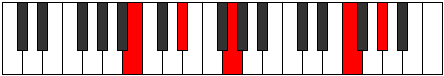 |
| SecondInversion | Eb,G,F,Ab,Cb |  |
| ThirdInversion | G,F,Ab,Cb,Eb |  |
| FourthInversion | F,Ab,Cb,Eb,G |  |
## Modes

| Number | Mode | Tonic | Notes | Illustration |
|--------|------|-------|-------|--------------|
| [309](https://ianring.com/musictheory/scales/309) | [Palitonic](ModeDSharpPalitonic.md) | D# | D#, F, G, G#, B, D# |  |
| [309](https://ianring.com/musictheory/scales/309) | [Palitonic](ModeEFlatPalitonic.md) | Eb | Eb, F, G, Ab, B, Eb |  |
| [311](https://ianring.com/musictheory/scales/311) | [Stagimic](ModeDSharpStagimic.md) | D# | D#, E, F, G, Ab, B, D# |  |
| [311](https://ianring.com/musictheory/scales/311) | [Stagimic](ModeEFlatStagimic.md) | Eb | Eb, Fb, Gbb, Abb, Bbbb, Cb, Eb |  |
| [317](https://ianring.com/musictheory/scales/317) | [Korimic](ModeDSharpKorimic.md) | D# | D#, E#, F#, G, Ab, B, D# | 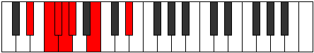 |
| [317](https://ianring.com/musictheory/scales/317) | [Korimic](ModeEFlatKorimic.md) | Eb | Eb, F, Gb, Abb, Bbbb, Cb, Eb |  |
| [319](https://ianring.com/musictheory/scales/319) | [Epodian](ModeDSharpEpodian.md) | D# | D#, E, F, Gb, Abb, Bbbb, Cb, D# |  |
| [319](https://ianring.com/musictheory/scales/319) | [Epodian](ModeEFlatEpodian.md) | Eb | Eb, Fb, Gbb, Abbb, E###, F###, Cb, Eb |  |
| [373](https://ianring.com/musictheory/scales/373) | [Epagimic](ModeDSharpEpagimic.md) | D# | D#, E#, F##, G#, A, B, D# |  |
| [373](https://ianring.com/musictheory/scales/373) | [Epagimic](ModeEFlatEpagimic.md) | Eb | Eb, F, G, Ab, Bbb, Cb, Eb | 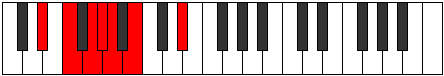 |
| [375](https://ianring.com/musictheory/scales/375) | [Sodian](ModeDSharpSodian.md) | D# | D#, E, F, G, Ab, Bbb, Cb, D# |  |
| [375](https://ianring.com/musictheory/scales/375) | [Sodian](ModeEFlatSodian.md) | Eb | Eb, Fb, Gbb, Abb, Bbbb, Cbbb, Dbbb, Eb |  |
| [381](https://ianring.com/musictheory/scales/381) | [Kogian](ModeDSharpKogian.md) | D# | D#, E#, F#, G, Ab, Bbb, Cb, D# |  |
| [381](https://ianring.com/musictheory/scales/381) | [Kogian](ModeEFlatKogian.md) | Eb | Eb, F, Gb, Abb, Bbbb, Cbbb, Dbbb, Eb |  |
| [383](https://ianring.com/musictheory/scales/383) | [Logyllic](ModeDSharpLogyllic.md) | D# | D#, E, F, F#, G, G#, A, B, D# |  |
| [383](https://ianring.com/musictheory/scales/383) | [Logyllic](ModeEFlatLogyllic.md) | Eb | Eb, E, F, Gb, G, Ab, A, B, Eb |  |
| [437](https://ianring.com/musictheory/scales/437) | [Ronimic](ModeDSharpRonimic.md) | D# | D#, E#, F##, G#, A#, B, D# |  |
| [437](https://ianring.com/musictheory/scales/437) | [Ronimic](ModeEFlatRonimic.md) | Eb | Eb, F, G, Ab, Bb, Cb, Eb | 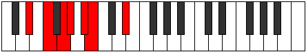 |
| [439](https://ianring.com/musictheory/scales/439) | [Bythian](ModeDSharpBythian.md) | D# | D#, E, F, G, Ab, Bb, Cb, D# |  |
| [439](https://ianring.com/musictheory/scales/439) | [Bythian](ModeEFlatBythian.md) | Eb | Eb, Fb, Gbb, Abb, Bbbb, Cbb, Dbbb, Eb |  |
| [445](https://ianring.com/musictheory/scales/445) | [Gocrian](ModeDSharpGocrian.md) | D# | D#, E#, F#, G, Ab, Bb, Cb, D# |  |
| [445](https://ianring.com/musictheory/scales/445) | [Gocrian](ModeEFlatGocrian.md) | Eb | Eb, F, Gb, Abb, Bbbb, Cbb, Dbbb, Eb |  |
| [447](https://ianring.com/musictheory/scales/447) | [Thyphyllic](ModeDSharpThyphyllic.md) | D# | D#, E, F, F#, G, G#, A#, B, D# |  |
| [447](https://ianring.com/musictheory/scales/447) | [Thyphyllic](ModeEFlatThyphyllic.md) | Eb | Eb, E, F, Gb, G, Ab, Bb, B, Eb |  |
| [501](https://ianring.com/musictheory/scales/501) | [Katylian](ModeDSharpKatylian.md) | D# | D#, E#, F##, G#, A, Bb, Cb, D# |  |
| [501](https://ianring.com/musictheory/scales/501) | [Katylian](ModeEFlatKatylian.md) | Eb | Eb, F, G, Ab, Bbb, Cbb, Dbbb, Eb |  |
| [503](https://ianring.com/musictheory/scales/503) | [Thoptyllic](ModeDSharpThoptyllic.md) | D# | D#, E, F, G, G#, A, A#, B, D# |  |
| [503](https://ianring.com/musictheory/scales/503) | [Thoptyllic](ModeEFlatThoptyllic.md) | Eb | Eb, E, F, G, Ab, A, Bb, B, Eb |  |
| [509](https://ianring.com/musictheory/scales/509) | [Ionothyllic](ModeDSharpIonothyllic.md) | D# | D#, F, F#, G, G#, A, A#, B, D# |  |
| [509](https://ianring.com/musictheory/scales/509) | [Ionothyllic](ModeEFlatIonothyllic.md) | Eb | Eb, F, Gb, G, Ab, A, Bb, B, Eb |  |
| [511](https://ianring.com/musictheory/scales/511) | [Polygic](ModeDSharpPolygic.md) | D# | D#, E, F, F#, G, G#, A, A#, B, D# |  |
| [511](https://ianring.com/musictheory/scales/511) | [Polygic](ModeEFlatPolygic.md) | Eb | Eb, E, F, Gb, G, Ab, A, Bb, B, Eb |  |
| [619](https://ianring.com/musictheory/scales/619) | [Parimic](ModeDNaturalParimic.md) | D | D, Eb, F, G, Ab, B, D |  |
| [623](https://ianring.com/musictheory/scales/623) | [Sycrian](ModeDNaturalSycrian.md) | D | D, Eb, Fb, Gbb, Abb, Bbbb, Cb, D |  |
| [635](https://ianring.com/musictheory/scales/635) | [Epolian](ModeDNaturalEpolian.md) | D | D, Eb, F, Gb, Abb, Bbbb, Cb, D |  |
| [639](https://ianring.com/musictheory/scales/639) | [Ionaryllic](ModeDNaturalIonaryllic.md) | D | D, D#, E, F, F#, G, G#, B, D |  |
| [747](https://ianring.com/musictheory/scales/747) | [Lynian](ModeDNaturalLynian.md) | D | D, Eb, F, G, Ab, Bbb, Cb, D | 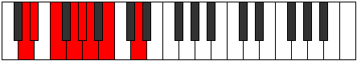 |
| [751](https://ianring.com/musictheory/scales/751) | [Epacryllic](ModeDNaturalEpacryllic.md) | D | D, D#, E, F, G, G#, A, B, D | 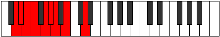 |
| [763](https://ianring.com/musictheory/scales/763) | [Doryllic](ModeDNaturalDoryllic.md) | D | D, D#, F, F#, G, G#, A, B, D |  |
| [767](https://ianring.com/musictheory/scales/767) | [Raptygic](ModeDNaturalRaptygic.md) | D | D, D#, E, F, F#, G, G#, A, B, D |  |
| [821](https://ianring.com/musictheory/scales/821) | [Aeranimic](ModeDSharpAeranimic.md) | D# | D#, E#, F##, G#, A##, B#, D# |  |
| [821](https://ianring.com/musictheory/scales/821) | [Aeranimic](ModeEFlatAeranimic.md) | Eb | Eb, F, G, Ab, B, C, Eb |  |
| [823](https://ianring.com/musictheory/scales/823) | [Stodian](ModeDSharpStodian.md) | D# | D#, E, F, G, Ab, B, C, D# |  |
| [823](https://ianring.com/musictheory/scales/823) | [Stodian](ModeEFlatStodian.md) | Eb | Eb, Fb, Gbb, Abb, Bbbb, Cb, Dbb, Eb |  |
| [829](https://ianring.com/musictheory/scales/829) | [Lygian](ModeDSharpLygian.md) | D# | D#, E#, F#, G, Ab, B, C, D# |  |
| [829](https://ianring.com/musictheory/scales/829) | [Lygian](ModeEFlatLygian.md) | Eb | Eb, F, Gb, Abb, Bbbb, Cb, Dbb, Eb |  |
| [831](https://ianring.com/musictheory/scales/831) | [Rodyllic](ModeDSharpRodyllic.md) | D# | D#, E, F, F#, G, G#, B, C, D# |  |
| [831](https://ianring.com/musictheory/scales/831) | [Rodyllic](ModeEFlatRodyllic.md) | Eb | Eb, E, F, Gb, G, Ab, B, C, Eb |  |
| [849](https://ianring.com/musictheory/scales/849) | [Aerynitonic](ModeBNaturalAerynitonic.md) | B | B, D#, F, G, G#, B |  |
| [851](https://ianring.com/musictheory/scales/851) | [Aerylimic](ModeBNaturalAerylimic.md) | B | B, C, D#, E#, F##, G#, B |  |
| [853](https://ianring.com/musictheory/scales/853) | [Epothimic](ModeBNaturalEpothimic.md) | B | B, C#, D#, E#, F##, G#, B |  |
| [855](https://ianring.com/musictheory/scales/855) | [Porian](ModeBNaturalPorian.md) | B | B, C, Db, Eb, F, G, Ab, B |  |
| [857](https://ianring.com/musictheory/scales/857) | [Aeolydimic](ModeBNaturalAeolydimic.md) | B | B, C##, D#, E#, F##, G#, B |  |
| [859](https://ianring.com/musictheory/scales/859) | [Pathian](ModeBNaturalPathian.md) | B | B, C, D, Eb, F, G, Ab, B |  |
| [861](https://ianring.com/musictheory/scales/861) | [Rylian](ModeBNaturalRylian.md) | B | B, C#, D, Eb, F, G, Ab, B |  |
| [863](https://ianring.com/musictheory/scales/863) | [Pyryllic](ModeBNaturalPyryllic.md) | B | B, C, C#, D, D#, F, G, G#, B |  |
| [875](https://ianring.com/musictheory/scales/875) | [Stothian](ModeDNaturalStothian.md) | D | D, Eb, F, G, Ab, Bb, Cb, D |  |
| [879](https://ianring.com/musictheory/scales/879) | [Aeolocryllic](ModeDNaturalAeolocryllic.md) | D | D, D#, E, F, G, G#, A#, B, D |  |
| [881](https://ianring.com/musictheory/scales/881) | [Aerothimic](ModeBNaturalAerothimic.md) | B | B, C###, D##, E#, F##, G#, B |  |
| [883](https://ianring.com/musictheory/scales/883) | [Ralian](ModeBNaturalRalian.md) | B | B, C, D#, E, F, G, Ab, B |  |
| [885](https://ianring.com/musictheory/scales/885) | [Sathian](ModeBNaturalSathian.md) | B | B, C#, D#, E, F, G, Ab, B |  |
| [885](https://ianring.com/musictheory/scales/885) | [Sathian](ModeDSharpSathian.md) | D# | D#, E#, F##, G#, A, B, C, D# |  |
| [885](https://ianring.com/musictheory/scales/885) | [Sathian](ModeEFlatSathian.md) | Eb | Eb, F, G, Ab, Bbb, Cb, Dbb, Eb |  |
| [887](https://ianring.com/musictheory/scales/887) | [Sathyllic](ModeBNaturalSathyllic.md) | B | B, C, C#, D#, E, F, G, G#, B |  |
| [887](https://ianring.com/musictheory/scales/887) | [Sathyllic](ModeDSharpSathyllic.md) | D# | D#, E, F, G, G#, A, B, C, D# |  |
| [887](https://ianring.com/musictheory/scales/887) | [Sathyllic](ModeEFlatSathyllic.md) | Eb | Eb, E, F, G, Ab, A, B, C, Eb |  |
| [889](https://ianring.com/musictheory/scales/889) | [Borian](ModeBNaturalBorian.md) | B | B, C##, D#, E, F, G, Ab, B |  |
| [891](https://ianring.com/musictheory/scales/891) | [Ionilyllic](ModeBNaturalIonilyllic.md) | B | B, C, D, D#, E, F, G, G#, B |  |
| [891](https://ianring.com/musictheory/scales/891) | [Ionilyllic](ModeDNaturalIonilyllic.md) | D | D, D#, F, F#, G, G#, A#, B, D |  |
| [893](https://ianring.com/musictheory/scales/893) | [Pycryllic](ModeBNaturalPycryllic.md) | B | B, C#, D, D#, E, F, G, G#, B |  |
| [893](https://ianring.com/musictheory/scales/893) | [Pycryllic](ModeDSharpPycryllic.md) | D# | D#, F, F#, G, G#, A, B, C, D# |  |
| [893](https://ianring.com/musictheory/scales/893) | [Pycryllic](ModeEFlatPycryllic.md) | Eb | Eb, F, Gb, G, Ab, A, B, C, Eb |  |
| [895](https://ianring.com/musictheory/scales/895) | [Aeolathygic](ModeBNaturalAeolathygic.md) | B | B, C, C#, D, D#, E, F, G, G#, B |  |
| [895](https://ianring.com/musictheory/scales/895) | [Aeolathygic](ModeDSharpAeolathygic.md) | D# | D#, E, F, F#, G, G#, A, B, C, D# |  |
| [895](https://ianring.com/musictheory/scales/895) | [Aeolathygic](ModeEFlatAeolathygic.md) | Eb | Eb, E, F, Gb, G, Ab, A, B, C, Eb |  |
| [895](https://ianring.com/musictheory/scales/895) | [Aeolathygic](ModeDNaturalAeolathygic.md) | D | D, D#, E, F, F#, G, G#, A#, B, D |  |
| [949](https://ianring.com/musictheory/scales/949) | [Ionagian](ModeDSharpIonagian.md) | D# | D#, E#, F##, G#, A#, B, C, D# |  |
| [949](https://ianring.com/musictheory/scales/949) | [Ionagian](ModeEFlatIonagian.md) | Eb | Eb, F, G, Ab, Bb, Cb, Dbb, Eb |  |
| [951](https://ianring.com/musictheory/scales/951) | [Thogyllic](ModeDSharpThogyllic.md) | D# | D#, E, F, G, G#, A#, B, C, D# |  |
| [951](https://ianring.com/musictheory/scales/951) | [Thogyllic](ModeEFlatThogyllic.md) | Eb | Eb, E, F, G, Ab, Bb, B, C, Eb |  |
| [957](https://ianring.com/musictheory/scales/957) | [Phronyllic](ModeDSharpPhronyllic.md) | D# | D#, F, F#, G, G#, A#, B, C, D# |  |
| [957](https://ianring.com/musictheory/scales/957) | [Phronyllic](ModeEFlatPhronyllic.md) | Eb | Eb, F, Gb, G, Ab, Bb, B, C, Eb |  |
| [959](https://ianring.com/musictheory/scales/959) | [Katylygic](ModeDSharpKatylygic.md) | D# | D#, E, F, F#, G, G#, A#, B, C, D# |  |
| [959](https://ianring.com/musictheory/scales/959) | [Katylygic](ModeEFlatKatylygic.md) | Eb | Eb, E, F, Gb, G, Ab, Bb, B, C, Eb |  |
| [977](https://ianring.com/musictheory/scales/977) | [Kocrimic](ModeBNaturalKocrimic.md) | B | B, C###, D###, E##, F##, G#, B |  |
| [979](https://ianring.com/musictheory/scales/979) | [Thogian](ModeBNaturalThogian.md) | B | B, C, D#, E#, F#, G, Ab, B |  |
| [981](https://ianring.com/musictheory/scales/981) | [Bacrian](ModeBNaturalBacrian.md) | B | B, C#, D#, E#, F#, G, Ab, B |  |
| [983](https://ianring.com/musictheory/scales/983) | [Epygyllic](ModeBNaturalEpygyllic.md) | B | B, C, C#, D#, F, F#, G, G#, B |  |
| [985](https://ianring.com/musictheory/scales/985) | [Raptian](ModeBNaturalRaptian.md) | B | B, C##, D#, E#, F#, G, Ab, B |  |
| [987](https://ianring.com/musictheory/scales/987) | [Aeraptyllic](ModeBNaturalAeraptyllic.md) | B | B, C, D, D#, F, F#, G, G#, B |  |
| [989](https://ianring.com/musictheory/scales/989) | [Phrolyllic](ModeBNaturalPhrolyllic.md) | B | B, C#, D, D#, F, F#, G, G#, B |  |
| [991](https://ianring.com/musictheory/scales/991) | [Aeolygic](ModeBNaturalAeolygic.md) | B | B, C, C#, D, D#, F, F#, G, G#, B |  |
| [1003](https://ianring.com/musictheory/scales/1003) | [Ionyryllic](ModeDNaturalIonyryllic.md) | D | D, D#, F, G, G#, A, A#, B, D |  |
| [1007](https://ianring.com/musictheory/scales/1007) | [Ionycrygic](ModeDNaturalIonycrygic.md) | D | D, D#, E, F, G, G#, A, A#, B, D |  |
| [1009](https://ianring.com/musictheory/scales/1009) | [Katyptian](ModeBNaturalKatyptian.md) | B | B, C###, D##, E#, F#, G, Ab, B |  |
| [1011](https://ianring.com/musictheory/scales/1011) | [Kycryllic](ModeBNaturalKycryllic.md) | B | B, C, D#, E, F, F#, G, G#, B |  |
| [1013](https://ianring.com/musictheory/scales/1013) | [Stydyllic](ModeBNaturalStydyllic.md) | B | B, C#, D#, E, F, F#, G, G#, B |  |
| [1013](https://ianring.com/musictheory/scales/1013) | [Stydyllic](ModeDSharpStydyllic.md) | D# | D#, F, G, G#, A, A#, B, C, D# |  |
| [1013](https://ianring.com/musictheory/scales/1013) | [Stydyllic](ModeEFlatStydyllic.md) | Eb | Eb, F, G, Ab, A, Bb, B, C, Eb |  |
| [1015](https://ianring.com/musictheory/scales/1015) | [Ionodygic](ModeBNaturalIonodygic.md) | B | B, C, C#, D#, E, F, F#, G, G#, B |  |
| [1015](https://ianring.com/musictheory/scales/1015) | [Ionodygic](ModeDSharpIonodygic.md) | D# | D#, E, F, G, G#, A, A#, B, C, D# |  |
| [1015](https://ianring.com/musictheory/scales/1015) | [Ionodygic](ModeEFlatIonodygic.md) | Eb | Eb, E, F, G, Ab, A, Bb, B, C, Eb |  |
| [1017](https://ianring.com/musictheory/scales/1017) | [Dythyllic](ModeBNaturalDythyllic.md) | B | B, D, D#, E, F, F#, G, G#, B |  |
| [1019](https://ianring.com/musictheory/scales/1019) | [Aeranygic](ModeBNaturalAeranygic.md) | B | B, C, D, D#, E, F, F#, G, G#, B |  |
| [1019](https://ianring.com/musictheory/scales/1019) | [Aeranygic](ModeDNaturalAeranygic.md) | D | D, D#, F, F#, G, G#, A, A#, B, D |  |
| [1021](https://ianring.com/musictheory/scales/1021) | [Ladygic](ModeBNaturalLadygic.md) | B | B, C#, D, D#, E, F, F#, G, G#, B |  |
| [1021](https://ianring.com/musictheory/scales/1021) | [Ladygic](ModeDSharpLadygic.md) | D# | D#, F, F#, G, G#, A, A#, B, C, D# |  |
| [1021](https://ianring.com/musictheory/scales/1021) | [Ladygic](ModeEFlatLadygic.md) | Eb | Eb, F, Gb, G, Ab, A, Bb, B, C, Eb | 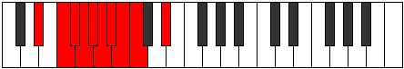 |
| [1023](https://ianring.com/musictheory/scales/1023) | [Dodyllian](ModeBNaturalDodyllian.md) | B | B, C, C#, D, D#, E, F, F#, G, G#, B |  |
| [1023](https://ianring.com/musictheory/scales/1023) | [Dodyllian](ModeDSharpDodyllian.md) | D# | D#, E, F, F#, G, G#, A, A#, B, C, D# |  |
| [1023](https://ianring.com/musictheory/scales/1023) | [Dodyllian](ModeEFlatDodyllian.md) | Eb | Eb, E, F, Gb, G, Ab, A, Bb, B, C, Eb |  |
| [1023](https://ianring.com/musictheory/scales/1023) | [Dodyllian](ModeDNaturalDodyllian.md) | D | D, D#, E, F, F#, G, G#, A, A#, B, D |  |
| [1101](https://ianring.com/musictheory/scales/1101) | [Stothitonic](ModeFNaturalStothitonic.md) | F | F, G, G#, B, D#, F |  |
| [1103](https://ianring.com/musictheory/scales/1103) | [Lynimic](ModeFNaturalLynimic.md) | F | F, Gb, Abb, Bbbb, Cb, D#, F |  |
| [1117](https://ianring.com/musictheory/scales/1117) | [Raptimic](ModeFNaturalRaptimic.md) | F | F, G, Ab, Bbb, Cb, D#, F |  |
| [1119](https://ianring.com/musictheory/scales/1119) | [Rarian](ModeFNaturalRarian.md) | F | F, Gb, Abb, Bbbb, Cbbb, Dbbb, Eb, F |  |
| [1133](https://ianring.com/musictheory/scales/1133) | [Stycrimic](ModeFNaturalStycrimic.md) | F | F, G, Ab, Bb, Cb, D#, F |  |
| [1135](https://ianring.com/musictheory/scales/1135) | [Katolian](ModeFNaturalKatolian.md) | F | F, Gb, Abb, Bbbb, Cbb, Dbbb, Eb, F |  |
| [1149](https://ianring.com/musictheory/scales/1149) | [Bydian](ModeFNaturalBydian.md) | F | F, G, Ab, Bbb, Cbb, Dbbb, Eb, F |  |
| [1151](https://ianring.com/musictheory/scales/1151) | [Mythyllic](ModeFNaturalMythyllic.md) | F | F, F#, G, G#, A, A#, B, D#, F |  |
| [1229](https://ianring.com/musictheory/scales/1229) | [Ragimic](ModeFNaturalRagimic.md) | F | F, G, Ab, B, C, D#, F |  |
| [1231](https://ianring.com/musictheory/scales/1231) | [Logian](ModeFNaturalLogian.md) | F | F, Gb, Abb, Bbbb, Cb, Dbb, Eb, F |  |
| [1237](https://ianring.com/musictheory/scales/1237) | [Salimic](ModeCSharpSalimic.md) | C# | C#, D#, E#, F##, G#, A##, C# |  |
| [1237](https://ianring.com/musictheory/scales/1237) | [Salimic](ModeDFlatSalimic.md) | Db | Db, Eb, F, G, Ab, B, Db |  |
| [1239](https://ianring.com/musictheory/scales/1239) | [Epaptian](ModeCSharpEpaptian.md) | C# | C#, D, Eb, F, G, Ab, B, C# |  |
| [1239](https://ianring.com/musictheory/scales/1239) | [Epaptian](ModeDFlatEpaptian.md) | Db | Db, Ebb, Fbb, Gbb, Abb, Bbbb, Cb, Db | 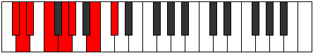 |
| [1245](https://ianring.com/musictheory/scales/1245) | [Lathian](ModeCSharpLathian.md) | C# | C#, D#, E, F, G, Ab, B, C# |  |
| [1245](https://ianring.com/musictheory/scales/1245) | [Lathian](ModeDFlatLathian.md) | Db | Db, Eb, Fb, Gbb, Abb, Bbbb, Cb, Db |  |
| [1245](https://ianring.com/musictheory/scales/1245) | [Lathian](ModeFNaturalLathian.md) | F | F, G, Ab, Bbb, Cb, Dbb, Eb, F |  |
| [1247](https://ianring.com/musictheory/scales/1247) | [Mygyllic](ModeCSharpMygyllic.md) | C# | C#, D, D#, E, F, G, G#, B, C# |  |
| [1247](https://ianring.com/musictheory/scales/1247) | [Mygyllic](ModeDFlatMygyllic.md) | Db | Db, D, Eb, E, F, G, Ab, B, Db |  |
| [1247](https://ianring.com/musictheory/scales/1247) | [Mygyllic](ModeFNaturalMygyllic.md) | F | F, F#, G, G#, A, B, C, D#, F |  |
| [1261](https://ianring.com/musictheory/scales/1261) | [Aeodian](ModeFNaturalAeodian.md) | F | F, G, Ab, Bb, Cb, Dbb, Eb, F |  |
| [1263](https://ianring.com/musictheory/scales/1263) | [Stynyllic](ModeFNaturalStynyllic.md) | F | F, F#, G, G#, A#, B, C, D#, F |  |
| [1269](https://ianring.com/musictheory/scales/1269) | [Katythian](ModeCSharpKatythian.md) | C# | C#, D#, E#, F#, G, Ab, B, C# |  |
| [1269](https://ianring.com/musictheory/scales/1269) | [Katythian](ModeDFlatKatythian.md) | Db | Db, Eb, F, Gb, Abb, Bbbb, Cb, Db |  |
| [1271](https://ianring.com/musictheory/scales/1271) | [Kolyllic](ModeCSharpKolyllic.md) | C# | C#, D, D#, F, F#, G, G#, B, C# |  |
| [1271](https://ianring.com/musictheory/scales/1271) | [Kolyllic](ModeDFlatKolyllic.md) | Db | Db, D, Eb, F, Gb, G, Ab, B, Db |  |
| [1277](https://ianring.com/musictheory/scales/1277) | [Zadyllic](ModeCSharpZadyllic.md) | C# | C#, D#, E, F, F#, G, G#, B, C# |  |
| [1277](https://ianring.com/musictheory/scales/1277) | [Zadyllic](ModeDFlatZadyllic.md) | Db | Db, Eb, E, F, Gb, G, Ab, B, Db |  |
| [1277](https://ianring.com/musictheory/scales/1277) | [Zadyllic](ModeFNaturalZadyllic.md) | F | F, G, G#, A, A#, B, C, D#, F |  |
| [1279](https://ianring.com/musictheory/scales/1279) | [Sarygic](ModeCSharpSarygic.md) | C# | C#, D, D#, E, F, F#, G, G#, B, C# |  |
| [1279](https://ianring.com/musictheory/scales/1279) | [Sarygic](ModeDFlatSarygic.md) | Db | Db, D, Eb, E, F, Gb, G, Ab, B, Db |  |
| [1279](https://ianring.com/musictheory/scales/1279) | [Sarygic](ModeFNaturalSarygic.md) | F | F, F#, G, G#, A, A#, B, C, D#, F |  |
| [1299](https://ianring.com/musictheory/scales/1299) | [Aerophitonic](ModeGNaturalAerophitonic.md) | G | G, G#, B, D#, F, G |  |
| [1303](https://ianring.com/musictheory/scales/1303) | [Epolimic](ModeGNaturalEpolimic.md) | G | G, Ab, Bbb, Cb, D#, E#, G |  |
| [1307](https://ianring.com/musictheory/scales/1307) | [Katorimic](ModeGNaturalKatorimic.md) | G | G, Ab, Bb, Cb, D#, E#, G |  |
| [1311](https://ianring.com/musictheory/scales/1311) | [Bynian](ModeGNaturalBynian.md) | G | G, Ab, Bbb, Cbb, Dbbb, Eb, F, G |  |
| [1331](https://ianring.com/musictheory/scales/1331) | [Dolimic](ModeGNaturalDolimic.md) | G | G, Ab, B, C, D#, E#, G | 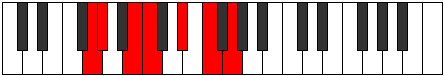 |
| [1333](https://ianring.com/musictheory/scales/1333) | [Lyptimic](ModeDSharpLyptimic.md) | D# | D#, E#, F##, G#, A##, B##, D# |  |
| [1333](https://ianring.com/musictheory/scales/1333) | [Lyptimic](ModeEFlatLyptimic.md) | Eb | Eb, F, G, Ab, B, C#, Eb | 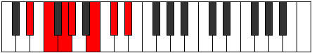 |
| [1335](https://ianring.com/musictheory/scales/1335) | [Aeralian](ModeDSharpAeralian.md) | D# | D#, E, F, G, Ab, B, C#, D# |  |
| [1335](https://ianring.com/musictheory/scales/1335) | [Aeralian](ModeEFlatAeralian.md) | Eb | Eb, Fb, Gbb, Abb, Bbbb, Cb, Db, Eb |  |
| [1335](https://ianring.com/musictheory/scales/1335) | [Aeralian](ModeGNaturalAeralian.md) | G | G, Ab, Bbb, Cb, Dbb, Eb, F, G |  |
| [1339](https://ianring.com/musictheory/scales/1339) | [Kycrian](ModeGNaturalKycrian.md) | G | G, Ab, Bb, Cb, Dbb, Eb, F, G | 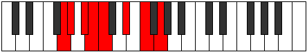 |
| [1341](https://ianring.com/musictheory/scales/1341) | [Madian](ModeDSharpMadian.md) | D# | D#, E#, F#, G, Ab, B, C#, D# |  |
| [1341](https://ianring.com/musictheory/scales/1341) | [Madian](ModeEFlatMadian.md) | Eb | Eb, F, Gb, Abb, Bbbb, Cb, Db, Eb |  |
| [1343](https://ianring.com/musictheory/scales/1343) | [Zalyllic](ModeDSharpZalyllic.md) | D# | D#, E, F, F#, G, G#, B, C#, D# | 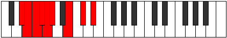 |
| [1343](https://ianring.com/musictheory/scales/1343) | [Zalyllic](ModeEFlatZalyllic.md) | Eb | Eb, E, F, Gb, G, Ab, B, Db, Eb |  |
| [1343](https://ianring.com/musictheory/scales/1343) | [Zalyllic](ModeGNaturalZalyllic.md) | G | G, G#, A, A#, B, C, D#, F, G |  |
| [1357](https://ianring.com/musictheory/scales/1357) | [Katonimic](ModeFNaturalKatonimic.md) | F | F, G, Ab, B, C#, D#, F |  |
| [1359](https://ianring.com/musictheory/scales/1359) | [Aerygian](ModeFNaturalAerygian.md) | F | F, Gb, Abb, Bbbb, Cb, Db, Eb, F |  |
| [1363](https://ianring.com/musictheory/scales/1363) | [Gygimic](ModeGNaturalGygimic.md) | G | G, Ab, B, C#, D#, E#, G |  |
| [1367](https://ianring.com/musictheory/scales/1367) | [Pyptian](ModeGNaturalPyptian.md) | G | G, Ab, Bbb, Cb, Db, Eb, F, G |  |
| [1371](https://ianring.com/musictheory/scales/1371) | [Ionadian](ModeGNaturalIonadian.md) | G | G, Ab, Bb, Cb, Db, Eb, F, G |  |
| [1373](https://ianring.com/musictheory/scales/1373) | [Storian](ModeFNaturalStorian.md) | F | F, G, Ab, Bbb, Cb, Db, Eb, F |  |
| [1375](https://ianring.com/musictheory/scales/1375) | [Bothyllic](ModeFNaturalBothyllic.md) | F | F, F#, G, G#, A, B, C#, D#, F |  |
| [1375](https://ianring.com/musictheory/scales/1375) | [Bothyllic](ModeGNaturalBothyllic.md) | G | G, G#, A, A#, B, C#, D#, F, G |  |
| [1389](https://ianring.com/musictheory/scales/1389) | [Lorian](ModeFNaturalLorian.md) | F | F, G, Ab, Bb, Cb, Db, Eb, F |  |
| [1391](https://ianring.com/musictheory/scales/1391) | [Aeradyllic](ModeFNaturalAeradyllic.md) | F | F, F#, G, G#, A#, B, C#, D#, F |  |
| [1395](https://ianring.com/musictheory/scales/1395) | [Mixonorian](ModeGNaturalMixonorian.md) | G | G, Ab, B, C, Db, Eb, F, G |  |
| [1397](https://ianring.com/musictheory/scales/1397) | [Gothian](ModeDSharpGothian.md) | D# | D#, E#, F##, G#, A, B, C#, D# |  |
| [1397](https://ianring.com/musictheory/scales/1397) | [Gothian](ModeEFlatGothian.md) | Eb | Eb, F, G, Ab, Bbb, Cb, Db, Eb |  |
| [1399](https://ianring.com/musictheory/scales/1399) | [Syryllic](ModeGNaturalSyryllic.md) | G | G, G#, A, B, C, C#, D#, F, G |  |
| [1399](https://ianring.com/musictheory/scales/1399) | [Syryllic](ModeDSharpSyryllic.md) | D# | D#, E, F, G, G#, A, B, C#, D# |  |
| [1399](https://ianring.com/musictheory/scales/1399) | [Syryllic](ModeEFlatSyryllic.md) | Eb | Eb, E, F, G, Ab, A, B, Db, Eb |  |
| [1403](https://ianring.com/musictheory/scales/1403) | [Epinyllic](ModeGNaturalEpinyllic.md) | G | G, G#, A#, B, C, C#, D#, F, G |  |
| [1405](https://ianring.com/musictheory/scales/1405) | [Goryllic](ModeDSharpGoryllic.md) | D# | D#, F, F#, G, G#, A, B, C#, D# |  |
| [1405](https://ianring.com/musictheory/scales/1405) | [Goryllic](ModeEFlatGoryllic.md) | Eb | Eb, F, Gb, G, Ab, A, B, Db, Eb |  |
| [1405](https://ianring.com/musictheory/scales/1405) | [Goryllic](ModeFNaturalGoryllic.md) | F | F, G, G#, A, A#, B, C#, D#, F | 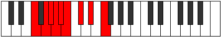 |
| [1407](https://ianring.com/musictheory/scales/1407) | [Tharygic](ModeDSharpTharygic.md) | D# | D#, E, F, F#, G, G#, A, B, C#, D# |  |
| [1407](https://ianring.com/musictheory/scales/1407) | [Tharygic](ModeEFlatTharygic.md) | Eb | Eb, E, F, Gb, G, Ab, A, B, Db, Eb |  |
| [1407](https://ianring.com/musictheory/scales/1407) | [Tharygic](ModeGNaturalTharygic.md) | G | G, G#, A, A#, B, C, C#, D#, F, G |  |
| [1407](https://ianring.com/musictheory/scales/1407) | [Tharygic](ModeFNaturalTharygic.md) | F | F, F#, G, G#, A, A#, B, C#, D#, F |  |
| [1427](https://ianring.com/musictheory/scales/1427) | [Lolimic](ModeGNaturalLolimic.md) | G | G, Ab, B, C##, D#, E#, G |  |
| [1431](https://ianring.com/musictheory/scales/1431) | [Phragian](ModeGNaturalPhragian.md) | G | G, Ab, Bbb, Cb, D, Eb, F, G |  |
| [1435](https://ianring.com/musictheory/scales/1435) | [Phronian](ModeGNaturalPhronian.md) | G | G, Ab, Bb, Cb, D, Eb, F, G |  |
| [1439](https://ianring.com/musictheory/scales/1439) | [Rolyllic](ModeGNaturalRolyllic.md) | G | G, G#, A, A#, B, D, D#, F, G |  |
| [1459](https://ianring.com/musictheory/scales/1459) | [Ionalian](ModeGNaturalIonalian.md) | G | G, Ab, B, C, D, Eb, F, G |  |
| [1461](https://ianring.com/musictheory/scales/1461) | [Stydian](ModeDSharpStydian.md) | D# | D#, E#, F##, G#, A#, B, C#, D# |  |
| [1461](https://ianring.com/musictheory/scales/1461) | [Stydian](ModeEFlatStydian.md) | Eb | Eb, F, G, Ab, Bb, Cb, Db, Eb |  |
| [1463](https://ianring.com/musictheory/scales/1463) | [Zaptyllic](ModeGNaturalZaptyllic.md) | G | G, G#, A, B, C, D, D#, F, G |  |
| [1463](https://ianring.com/musictheory/scales/1463) | [Zaptyllic](ModeDSharpZaptyllic.md) | D# | D#, E, F, G, G#, A#, B, C#, D# |  |
| [1463](https://ianring.com/musictheory/scales/1463) | [Zaptyllic](ModeEFlatZaptyllic.md) | Eb | Eb, E, F, G, Ab, Bb, B, Db, Eb |  |
| [1467](https://ianring.com/musictheory/scales/1467) | [Thydyllic](ModeGNaturalThydyllic.md) | G | G, G#, A#, B, C, D, D#, F, G |  |
| [1469](https://ianring.com/musictheory/scales/1469) | [Epiryllic](ModeDSharpEpiryllic.md) | D# | D#, F, F#, G, G#, A#, B, C#, D# |  |
| [1469](https://ianring.com/musictheory/scales/1469) | [Epiryllic](ModeEFlatEpiryllic.md) | Eb | Eb, F, Gb, G, Ab, Bb, B, Db, Eb |  |
| [1471](https://ianring.com/musictheory/scales/1471) | [Radygic](ModeDSharpRadygic.md) | D# | D#, E, F, F#, G, G#, A#, B, C#, D# |  |
| [1471](https://ianring.com/musictheory/scales/1471) | [Radygic](ModeEFlatRadygic.md) | Eb | Eb, E, F, Gb, G, Ab, Bb, B, Db, Eb |  |
| [1471](https://ianring.com/musictheory/scales/1471) | [Radygic](ModeGNaturalRadygic.md) | G | G, G#, A, A#, B, C, D, D#, F, G |  |
| [1485](https://ianring.com/musictheory/scales/1485) | [Tyrian](ModeFNaturalTyrian.md) | F | F, G, Ab, B, C, Db, Eb, F |  |
| [1487](https://ianring.com/musictheory/scales/1487) | [Lycryllic](ModeFNaturalLycryllic.md) | F | F, F#, G, G#, B, C, C#, D#, F |  |
| [1491](https://ianring.com/musictheory/scales/1491) | [Rynian](ModeGNaturalRynian.md) | G | G, Ab, B, C#, D, Eb, F, G |  |
| [1493](https://ianring.com/musictheory/scales/1493) | [Phryrian](ModeCSharpPhryrian.md) | C# | C#, D#, E#, F##, G#, A, B, C# |  |
| [1493](https://ianring.com/musictheory/scales/1493) | [Phryrian](ModeDFlatPhryrian.md) | Db | Db, Eb, F, G, Ab, Bbb, Cb, Db |  |
| [1495](https://ianring.com/musictheory/scales/1495) | [Kaptyllic](ModeCSharpKaptyllic.md) | C# | C#, D, D#, F, G, G#, A, B, C# |  |
| [1495](https://ianring.com/musictheory/scales/1495) | [Kaptyllic](ModeDFlatKaptyllic.md) | Db | Db, D, Eb, F, G, Ab, A, B, Db |  |
| [1495](https://ianring.com/musictheory/scales/1495) | [Kaptyllic](ModeGNaturalKaptyllic.md) | G | G, G#, A, B, C#, D, D#, F, G |  |
| [1499](https://ianring.com/musictheory/scales/1499) | [Stonyllic](ModeGNaturalStonyllic.md) | G | G, G#, A#, B, C#, D, D#, F, G |  |
| [1501](https://ianring.com/musictheory/scales/1501) | [Stygyllic](ModeFNaturalStygyllic.md) | F | F, G, G#, A, B, C, C#, D#, F |  |
| [1501](https://ianring.com/musictheory/scales/1501) | [Stygyllic](ModeCSharpStygyllic.md) | C# | C#, D#, E, F, G, G#, A, B, C# |  |
| [1501](https://ianring.com/musictheory/scales/1501) | [Stygyllic](ModeDFlatStygyllic.md) | Db | Db, Eb, E, F, G, Ab, A, B, Db |  |
| [1503](https://ianring.com/musictheory/scales/1503) | [Padygic](ModeCSharpPadygic.md) | C# | C#, D, D#, E, F, G, G#, A, B, C# |  |
| [1503](https://ianring.com/musictheory/scales/1503) | [Padygic](ModeDFlatPadygic.md) | Db | Db, D, Eb, E, F, G, Ab, A, B, Db |  |
| [1503](https://ianring.com/musictheory/scales/1503) | [Padygic](ModeFNaturalPadygic.md) | F | F, F#, G, G#, A, B, C, C#, D#, F |  |
| [1503](https://ianring.com/musictheory/scales/1503) | [Padygic](ModeGNaturalPadygic.md) | G | G, G#, A, A#, B, C#, D, D#, F, G |  |
| [1517](https://ianring.com/musictheory/scales/1517) | [Sagyllic](ModeFNaturalSagyllic.md) | F | F, G, G#, A#, B, C, C#, D#, F |  |
| [1519](https://ianring.com/musictheory/scales/1519) | [Solygic](ModeFNaturalSolygic.md) | F | F, F#, G, G#, A#, B, C, C#, D#, F |  |
| [1523](https://ianring.com/musictheory/scales/1523) | [Zothyllic](ModeGNaturalZothyllic.md) | G | G, G#, B, C, C#, D, D#, F, G |  |
| [1525](https://ianring.com/musictheory/scales/1525) | [Sodyllic](ModeCSharpSodyllic.md) | C# | C#, D#, F, F#, G, G#, A, B, C# |  |
| [1525](https://ianring.com/musictheory/scales/1525) | [Sodyllic](ModeDFlatSodyllic.md) | Db | Db, Eb, F, Gb, G, Ab, A, B, Db |  |
| [1525](https://ianring.com/musictheory/scales/1525) | [Sodyllic](ModeDSharpSodyllic.md) | D# | D#, F, G, G#, A, A#, B, C#, D# |  |
| [1525](https://ianring.com/musictheory/scales/1525) | [Sodyllic](ModeEFlatSodyllic.md) | Eb | Eb, F, G, Ab, A, Bb, B, Db, Eb |  |
| [1527](https://ianring.com/musictheory/scales/1527) | [Aeolyrygic](ModeGNaturalAeolyrygic.md) | G | G, G#, A, B, C, C#, D, D#, F, G |  |
| [1527](https://ianring.com/musictheory/scales/1527) | [Aeolyrygic](ModeCSharpAeolyrygic.md) | C# | C#, D, D#, F, F#, G, G#, A, B, C# |  |
| [1527](https://ianring.com/musictheory/scales/1527) | [Aeolyrygic](ModeDFlatAeolyrygic.md) | Db | Db, D, Eb, F, Gb, G, Ab, A, B, Db |  |
| [1527](https://ianring.com/musictheory/scales/1527) | [Aeolyrygic](ModeDSharpAeolyrygic.md) | D# | D#, E, F, G, G#, A, A#, B, C#, D# |  |
| [1527](https://ianring.com/musictheory/scales/1527) | [Aeolyrygic](ModeEFlatAeolyrygic.md) | Eb | Eb, E, F, G, Ab, A, Bb, B, Db, Eb |  |
| [1531](https://ianring.com/musictheory/scales/1531) | [Styptygic](ModeGNaturalStyptygic.md) | G | G, G#, A#, B, C, C#, D, D#, F, G |  |
| [1533](https://ianring.com/musictheory/scales/1533) | [Katycrygic](ModeCSharpKatycrygic.md) | C# | C#, D#, E, F, F#, G, G#, A, B, C# |  |
| [1533](https://ianring.com/musictheory/scales/1533) | [Katycrygic](ModeDFlatKatycrygic.md) | Db | Db, Eb, E, F, Gb, G, Ab, A, B, Db |  |
| [1533](https://ianring.com/musictheory/scales/1533) | [Katycrygic](ModeFNaturalKatycrygic.md) | F | F, G, G#, A, A#, B, C, C#, D#, F |  |
| [1533](https://ianring.com/musictheory/scales/1533) | [Katycrygic](ModeDSharpKatycrygic.md) | D# | D#, F, F#, G, G#, A, A#, B, C#, D# |  |
| [1533](https://ianring.com/musictheory/scales/1533) | [Katycrygic](ModeEFlatKatycrygic.md) | Eb | Eb, F, Gb, G, Ab, A, Bb, B, Db, Eb |  |
| [1535](https://ianring.com/musictheory/scales/1535) | [Mixodyllian](ModeCSharpMixodyllian.md) | C# | C#, D, D#, E, F, F#, G, G#, A, B, C# |  |
| [1535](https://ianring.com/musictheory/scales/1535) | [Mixodyllian](ModeDFlatMixodyllian.md) | Db | Db, D, Eb, E, F, Gb, G, Ab, A, B, Db |  |
| [1535](https://ianring.com/musictheory/scales/1535) | [Mixodyllian](ModeGNaturalMixodyllian.md) | G | G, G#, A, A#, B, C, C#, D, D#, F, G |  |
| [1535](https://ianring.com/musictheory/scales/1535) | [Mixodyllian](ModeFNaturalMixodyllian.md) | F | F, F#, G, G#, A, A#, B, C, C#, D#, F |  |
| [1535](https://ianring.com/musictheory/scales/1535) | [Mixodyllian](ModeDSharpMixodyllian.md) | D# | D#, E, F, F#, G, G#, A, A#, B, C#, D# |  |
| [1535](https://ianring.com/musictheory/scales/1535) | [Mixodyllian](ModeEFlatMixodyllian.md) | Eb | Eb, E, F, Gb, G, Ab, A, Bb, B, Db, Eb |  |
| [1613](https://ianring.com/musictheory/scales/1613) | [Thylimic](ModeFNaturalThylimic.md) | F | F, G, Ab, B, C##, D#, F |  |
| [1615](https://ianring.com/musictheory/scales/1615) | [Sydian](ModeFNaturalSydian.md) | F | F, Gb, Abb, Bbbb, Cb, D, Eb, F |  |
| [1629](https://ianring.com/musictheory/scales/1629) | [Synian](ModeFNaturalSynian.md) | F | F, G, Ab, Bbb, Cb, D, Eb, F |  |
| [1631](https://ianring.com/musictheory/scales/1631) | [Rynyllic](ModeFNaturalRynyllic.md) | F | F, F#, G, G#, A, B, D, D#, F |  |
| [1643](https://ianring.com/musictheory/scales/1643) | [Thyptian](ModeDNaturalThyptian.md) | D | D, Eb, F, G, Ab, B, C, D |  |
| [1645](https://ianring.com/musictheory/scales/1645) | [Katagian](ModeFNaturalKatagian.md) | F | F, G, Ab, Bb, Cb, D, Eb, F |  |
| [1647](https://ianring.com/musictheory/scales/1647) | [Polyllic](ModeDNaturalPolyllic.md) | D | D, D#, E, F, G, G#, B, C, D |  |
| [1647](https://ianring.com/musictheory/scales/1647) | [Polyllic](ModeFNaturalPolyllic.md) | F | F, F#, G, G#, A#, B, D, D#, F |  |
| [1659](https://ianring.com/musictheory/scales/1659) | [Magyllic](ModeDNaturalMagyllic.md) | D | D, D#, F, F#, G, G#, B, C, D |  |
| [1661](https://ianring.com/musictheory/scales/1661) | [Gonyllic](ModeFNaturalGonyllic.md) | F | F, G, G#, A, A#, B, D, D#, F |  |
| [1663](https://ianring.com/musictheory/scales/1663) | [Lydygic](ModeDNaturalLydygic.md) | D | D, D#, E, F, F#, G, G#, B, C, D |  |
| [1663](https://ianring.com/musictheory/scales/1663) | [Lydygic](ModeFNaturalLydygic.md) | F | F, F#, G, G#, A, A#, B, D, D#, F |  |
| [1699](https://ianring.com/musictheory/scales/1699) | [Kaptimic](ModeASharpKaptimic.md) | A# | A#, B, C###, D###, E###, F###, A# |  |
| [1699](https://ianring.com/musictheory/scales/1699) | [Kaptimic](ModeBFlatKaptimic.md) | Bb | Bb, Cb, D#, E#, F##, G#, Bb |  |
| [1703](https://ianring.com/musictheory/scales/1703) | [Zaptian](ModeASharpZaptian.md) | A# | A#, B, C, D#, E#, F##, G#, A# |  |
| [1703](https://ianring.com/musictheory/scales/1703) | [Zaptian](ModeBFlatZaptian.md) | Bb | Bb, Cb, Dbb, Eb, F, G, Ab, Bb |  |
| [1707](https://ianring.com/musictheory/scales/1707) | [Mixolythian](ModeASharpMixolythian.md) | A# | A#, B, C#, D#, E#, F##, G#, A# |  |
| [1707](https://ianring.com/musictheory/scales/1707) | [Mixolythian](ModeBFlatMixolythian.md) | Bb | Bb, Cb, Db, Eb, F, G, Ab, Bb |  |
| [1711](https://ianring.com/musictheory/scales/1711) | [Ragyllic](ModeASharpRagyllic.md) | A# | A#, B, C, C#, D#, F, G, G#, A# |  |
| [1711](https://ianring.com/musictheory/scales/1711) | [Ragyllic](ModeBFlatRagyllic.md) | Bb | Bb, B, C, Db, Eb, F, G, Ab, Bb |  |
| [1715](https://ianring.com/musictheory/scales/1715) | [Aeronian](ModeASharpAeronian.md) | A# | A#, B, C##, D#, E#, F##, G#, A# |  |
| [1715](https://ianring.com/musictheory/scales/1715) | [Aeronian](ModeBFlatAeronian.md) | Bb | Bb, Cb, D, Eb, F, G, Ab, Bb |  |
| [1719](https://ianring.com/musictheory/scales/1719) | [Lyryllic](ModeASharpLyryllic.md) | A# | A#, B, C, D, D#, F, G, G#, A# |  |
| [1719](https://ianring.com/musictheory/scales/1719) | [Lyryllic](ModeBFlatLyryllic.md) | Bb | Bb, B, C, D, Eb, F, G, Ab, Bb |  |
| [1723](https://ianring.com/musictheory/scales/1723) | [Poryllic](ModeASharpPoryllic.md) | A# | A#, B, C#, D, D#, F, G, G#, A# |  |
| [1723](https://ianring.com/musictheory/scales/1723) | [Poryllic](ModeBFlatPoryllic.md) | Bb | Bb, B, Db, D, Eb, F, G, Ab, Bb |  |
| [1727](https://ianring.com/musictheory/scales/1727) | [Sydygic](ModeASharpSydygic.md) | A# | A#, B, C, C#, D, D#, F, G, G#, A# |  |
| [1727](https://ianring.com/musictheory/scales/1727) | [Sydygic](ModeBFlatSydygic.md) | Bb | Bb, B, C, Db, D, Eb, F, G, Ab, Bb |  |
| [1741](https://ianring.com/musictheory/scales/1741) | [Katycrian](ModeFNaturalKatycrian.md) | F | F, G, Ab, B, C, D, Eb, F |  |
| [1743](https://ianring.com/musictheory/scales/1743) | [Epigyllic](ModeFNaturalEpigyllic.md) | F | F, F#, G, G#, B, C, D, D#, F |  |
| [1749](https://ianring.com/musictheory/scales/1749) | [Lythian](ModeCSharpLythian.md) | C# | C#, D#, E#, F##, G#, A#, B, C# |  |
| [1749](https://ianring.com/musictheory/scales/1749) | [Lythian](ModeDFlatLythian.md) | Db | Db, Eb, F, G, Ab, Bb, Cb, Db |  |
| [1751](https://ianring.com/musictheory/scales/1751) | [Aeolyryllic](ModeCSharpAeolyryllic.md) | C# | C#, D, D#, F, G, G#, A#, B, C# |  |
| [1751](https://ianring.com/musictheory/scales/1751) | [Aeolyryllic](ModeDFlatAeolyryllic.md) | Db | Db, D, Eb, F, G, Ab, Bb, B, Db |  |
| [1757](https://ianring.com/musictheory/scales/1757) | [Ionyphyllic](ModeFNaturalIonyphyllic.md) | F | F, G, G#, A, B, C, D, D#, F |  |
| [1757](https://ianring.com/musictheory/scales/1757) | [Ionyphyllic](ModeCSharpIonyphyllic.md) | C# | C#, D#, E, F, G, G#, A#, B, C# |  |
| [1757](https://ianring.com/musictheory/scales/1757) | [Ionyphyllic](ModeDFlatIonyphyllic.md) | Db | Db, Eb, E, F, G, Ab, Bb, B, Db |  |
| [1759](https://ianring.com/musictheory/scales/1759) | [Pylygic](ModeFNaturalPylygic.md) | F | F, F#, G, G#, A, B, C, D, D#, F |  |
| [1759](https://ianring.com/musictheory/scales/1759) | [Pylygic](ModeCSharpPylygic.md) | C# | C#, D, D#, E, F, G, G#, A#, B, C# |  |
| [1759](https://ianring.com/musictheory/scales/1759) | [Pylygic](ModeDFlatPylygic.md) | Db | Db, D, Eb, E, F, G, Ab, Bb, B, Db |  |
| [1763](https://ianring.com/musictheory/scales/1763) | [Katalian](ModeASharpKatalian.md) | A# | A#, B, C###, D##, E#, F##, G#, A# |  |
| [1763](https://ianring.com/musictheory/scales/1763) | [Katalian](ModeBFlatKatalian.md) | Bb | Bb, Cb, D#, E, F, G, Ab, Bb |  |
| [1767](https://ianring.com/musictheory/scales/1767) | [Dyryllic](ModeASharpDyryllic.md) | A# | A#, B, C, D#, E, F, G, G#, A# |  |
| [1767](https://ianring.com/musictheory/scales/1767) | [Dyryllic](ModeBFlatDyryllic.md) | Bb | Bb, B, C, Eb, E, F, G, Ab, Bb |  |
| [1771](https://ianring.com/musictheory/scales/1771) | [Stylyllic](ModeDNaturalStylyllic.md) | D | D, D#, F, G, G#, A, B, C, D |  |
| [1771](https://ianring.com/musictheory/scales/1771) | [Stylyllic](ModeASharpStylyllic.md) | A# | A#, B, C#, D#, E, F, G, G#, A# |  |
| [1771](https://ianring.com/musictheory/scales/1771) | [Stylyllic](ModeBFlatStylyllic.md) | Bb | Bb, B, Db, Eb, E, F, G, Ab, Bb |  |
| [1773](https://ianring.com/musictheory/scales/1773) | [Aeoloryllic](ModeFNaturalAeoloryllic.md) | F | F, G, G#, A#, B, C, D, D#, F |  |
| [1775](https://ianring.com/musictheory/scales/1775) | [Lyrygic](ModeDNaturalLyrygic.md) | D | D, D#, E, F, G, G#, A, B, C, D |  |
| [1775](https://ianring.com/musictheory/scales/1775) | [Lyrygic](ModeASharpLyrygic.md) | A# | A#, B, C, C#, D#, E, F, G, G#, A# |  |
| [1775](https://ianring.com/musictheory/scales/1775) | [Lyrygic](ModeBFlatLyrygic.md) | Bb | Bb, B, C, Db, Eb, E, F, G, Ab, Bb |  |
| [1775](https://ianring.com/musictheory/scales/1775) | [Lyrygic](ModeFNaturalLyrygic.md) | F | F, F#, G, G#, A#, B, C, D, D#, F |  |
| [1779](https://ianring.com/musictheory/scales/1779) | [Aerythyllic](ModeASharpAerythyllic.md) | A# | A#, B, D, D#, E, F, G, G#, A# |  |
| [1779](https://ianring.com/musictheory/scales/1779) | [Aerythyllic](ModeBFlatAerythyllic.md) | Bb | Bb, B, D, Eb, E, F, G, Ab, Bb |  |
| [1781](https://ianring.com/musictheory/scales/1781) | [Gocryllic](ModeCSharpGocryllic.md) | C# | C#, D#, F, F#, G, G#, A#, B, C# |  |
| [1781](https://ianring.com/musictheory/scales/1781) | [Gocryllic](ModeDFlatGocryllic.md) | Db | Db, Eb, F, Gb, G, Ab, Bb, B, Db |  |
| [1783](https://ianring.com/musictheory/scales/1783) | [Danygic](ModeASharpDanygic.md) | A# | A#, B, C, D, D#, E, F, G, G#, A# |  |
| [1783](https://ianring.com/musictheory/scales/1783) | [Danygic](ModeBFlatDanygic.md) | Bb | Bb, B, C, D, Eb, E, F, G, Ab, Bb |  |
| [1783](https://ianring.com/musictheory/scales/1783) | [Danygic](ModeCSharpDanygic.md) | C# | C#, D, D#, F, F#, G, G#, A#, B, C# |  |
| [1783](https://ianring.com/musictheory/scales/1783) | [Danygic](ModeDFlatDanygic.md) | Db | Db, D, Eb, F, Gb, G, Ab, Bb, B, Db |  |
| [1787](https://ianring.com/musictheory/scales/1787) | [Mycrygic](ModeDNaturalMycrygic.md) | D | D, D#, F, F#, G, G#, A, B, C, D |  |
| [1787](https://ianring.com/musictheory/scales/1787) | [Mycrygic](ModeASharpMycrygic.md) | A# | A#, B, C#, D, D#, E, F, G, G#, A# |  |
| [1787](https://ianring.com/musictheory/scales/1787) | [Mycrygic](ModeBFlatMycrygic.md) | Bb | Bb, B, Db, D, Eb, E, F, G, Ab, Bb |  |
| [1789](https://ianring.com/musictheory/scales/1789) | [Katagygic](ModeCSharpKatagygic.md) | C# | C#, D#, E, F, F#, G, G#, A#, B, C# |  |
| [1789](https://ianring.com/musictheory/scales/1789) | [Katagygic](ModeDFlatKatagygic.md) | Db | Db, Eb, E, F, Gb, G, Ab, Bb, B, Db |  |
| [1789](https://ianring.com/musictheory/scales/1789) | [Katagygic](ModeFNaturalKatagygic.md) | F | F, G, G#, A, A#, B, C, D, D#, F |  |
| [1791](https://ianring.com/musictheory/scales/1791) | [Aerygyllian](ModeDNaturalAerygyllian.md) | D | D, D#, E, F, F#, G, G#, A, B, C, D |  |
| [1791](https://ianring.com/musictheory/scales/1791) | [Aerygyllian](ModeASharpAerygyllian.md) | A# | A#, B, C, C#, D, D#, E, F, G, G#, A# |  |
| [1791](https://ianring.com/musictheory/scales/1791) | [Aerygyllian](ModeBFlatAerygyllian.md) | Bb | Bb, B, C, Db, D, Eb, E, F, G, Ab, Bb |  |
| [1791](https://ianring.com/musictheory/scales/1791) | [Aerygyllian](ModeCSharpAerygyllian.md) | C# | C#, D, D#, E, F, F#, G, G#, A#, B, C# |  |
| [1791](https://ianring.com/musictheory/scales/1791) | [Aerygyllian](ModeDFlatAerygyllian.md) | Db | Db, D, Eb, E, F, Gb, G, Ab, Bb, B, Db |  |
| [1791](https://ianring.com/musictheory/scales/1791) | [Aerygyllian](ModeFNaturalAerygyllian.md) | F | F, F#, G, G#, A, A#, B, C, D, D#, F |  |
| [1811](https://ianring.com/musictheory/scales/1811) | [Kyptimic](ModeGNaturalKyptimic.md) | G | G, Ab, B, C###, D##, E#, G |  |
| [1815](https://ianring.com/musictheory/scales/1815) | [Godian](ModeGNaturalGodian.md) | G | G, Ab, Bbb, Cb, D#, E, F, G |  |
| [1819](https://ianring.com/musictheory/scales/1819) | [Pydian](ModeGNaturalPydian.md) | G | G, Ab, Bb, Cb, D#, E, F, G |  |
| [1823](https://ianring.com/musictheory/scales/1823) | [Phralyllic](ModeGNaturalPhralyllic.md) | G | G, G#, A, A#, B, D#, E, F, G |  |
| [1843](https://ianring.com/musictheory/scales/1843) | [Ionygian](ModeGNaturalIonygian.md) | G | G, Ab, B, C, D#, E, F, G |  |
| [1845](https://ianring.com/musictheory/scales/1845) | [Lagian](ModeDSharpLagian.md) | D# | D#, E#, F##, G#, A##, B#, C#, D# |  |
| [1845](https://ianring.com/musictheory/scales/1845) | [Lagian](ModeEFlatLagian.md) | Eb | Eb, F, G, Ab, B, C, Db, Eb |  |
| [1847](https://ianring.com/musictheory/scales/1847) | [Thacryllic](ModeDSharpThacryllic.md) | D# | D#, E, F, G, G#, B, C, C#, D# |  |
| [1847](https://ianring.com/musictheory/scales/1847) | [Thacryllic](ModeEFlatThacryllic.md) | Eb | Eb, E, F, G, Ab, B, C, Db, Eb |  |
| [1847](https://ianring.com/musictheory/scales/1847) | [Thacryllic](ModeGNaturalThacryllic.md) | G | G, G#, A, B, C, D#, E, F, G |  |
| [1851](https://ianring.com/musictheory/scales/1851) | [Zacryllic](ModeGNaturalZacryllic.md) | G | G, G#, A#, B, C, D#, E, F, G |  |
| [1853](https://ianring.com/musictheory/scales/1853) | [Phrynyllic](ModeDSharpPhrynyllic.md) | D# | D#, F, F#, G, G#, B, C, C#, D# |  |
| [1853](https://ianring.com/musictheory/scales/1853) | [Phrynyllic](ModeEFlatPhrynyllic.md) | Eb | Eb, F, Gb, G, Ab, B, C, Db, Eb |  |
| [1855](https://ianring.com/musictheory/scales/1855) | [Marygic](ModeDSharpMarygic.md) | D# | D#, E, F, F#, G, G#, B, C, C#, D# |  |
| [1855](https://ianring.com/musictheory/scales/1855) | [Marygic](ModeEFlatMarygic.md) | Eb | Eb, E, F, Gb, G, Ab, B, C, Db, Eb |  |
| [1855](https://ianring.com/musictheory/scales/1855) | [Marygic](ModeGNaturalMarygic.md) | G | G, G#, A, A#, B, C, D#, E, F, G |  |
| [1869](https://ianring.com/musictheory/scales/1869) | [Katyrian](ModeFNaturalKatyrian.md) | F | F, G, Ab, B, C#, D, Eb, F |  |
| [1871](https://ianring.com/musictheory/scales/1871) | [Aeolyllic](ModeFNaturalAeolyllic.md) | F | F, F#, G, G#, B, C#, D, D#, F |  |
| [1873](https://ianring.com/musictheory/scales/1873) | [Dathimic](ModeBNaturalDathimic.md) | B | B, C###, D###, E###, F###, G##, B |  |
| [1875](https://ianring.com/musictheory/scales/1875) | [Epyphian](ModeGNaturalEpyphian.md) | G | G, Ab, B, C#, D#, E, F, G |  |
| [1875](https://ianring.com/musictheory/scales/1875) | [Epyphian](ModeBNaturalEpyphian.md) | B | B, C, D#, E#, F##, G#, A, B |  |
| [1877](https://ianring.com/musictheory/scales/1877) | [Aeroptian](ModeBNaturalAeroptian.md) | B | B, C#, D#, E#, F##, G#, A, B |  |
| [1879](https://ianring.com/musictheory/scales/1879) | [Mixoryllic](ModeBNaturalMixoryllic.md) | B | B, C, C#, D#, F, G, G#, A, B |  |
| [1879](https://ianring.com/musictheory/scales/1879) | [Mixoryllic](ModeGNaturalMixoryllic.md) | G | G, G#, A, B, C#, D#, E, F, G |  |
| [1881](https://ianring.com/musictheory/scales/1881) | [Korian](ModeBNaturalKorian.md) | B | B, C##, D#, E#, F##, G#, A, B |  |
| [1883](https://ianring.com/musictheory/scales/1883) | [Mixopyryllic](ModeBNaturalMixopyryllic.md) | B | B, C, D, D#, F, G, G#, A, B |  |
| [1883](https://ianring.com/musictheory/scales/1883) | [Mixopyryllic](ModeGNaturalMixopyryllic.md) | G | G, G#, A#, B, C#, D#, E, F, G |  |
| [1885](https://ianring.com/musictheory/scales/1885) | [Epidyllic](ModeFNaturalEpidyllic.md) | F | F, G, G#, A, B, C#, D, D#, F |  |
| [1885](https://ianring.com/musictheory/scales/1885) | [Epidyllic](ModeBNaturalEpidyllic.md) | B | B, C#, D, D#, F, G, G#, A, B |  |
| [1887](https://ianring.com/musictheory/scales/1887) | [Aerocrygic](ModeBNaturalAerocrygic.md) | B | B, C, C#, D, D#, F, G, G#, A, B |  |
| [1887](https://ianring.com/musictheory/scales/1887) | [Aerocrygic](ModeFNaturalAerocrygic.md) | F | F, F#, G, G#, A, B, C#, D, D#, F |  |
| [1887](https://ianring.com/musictheory/scales/1887) | [Aerocrygic](ModeGNaturalAerocrygic.md) | G | G, G#, A, A#, B, C#, D#, E, F, G |  |
| [1899](https://ianring.com/musictheory/scales/1899) | [Moptyllic](ModeDNaturalMoptyllic.md) | D | D, D#, F, G, G#, A#, B, C, D |  |
| [1901](https://ianring.com/musictheory/scales/1901) | [Ionidyllic](ModeFNaturalIonidyllic.md) | F | F, G, G#, A#, B, C#, D, D#, F |  |
| [1903](https://ianring.com/musictheory/scales/1903) | [Rocrygic](ModeDNaturalRocrygic.md) | D | D, D#, E, F, G, G#, A#, B, C, D |  |
| [1903](https://ianring.com/musictheory/scales/1903) | [Rocrygic](ModeFNaturalRocrygic.md) | F | F, F#, G, G#, A#, B, C#, D, D#, F |  |
| [1905](https://ianring.com/musictheory/scales/1905) | [Katacrian](ModeBNaturalKatacrian.md) | B | B, C###, D##, E#, F##, G#, A, B |  |
| [1907](https://ianring.com/musictheory/scales/1907) | [Lynyllic](ModeGNaturalLynyllic.md) | G | G, G#, B, C, C#, D#, E, F, G |  |
| [1907](https://ianring.com/musictheory/scales/1907) | [Lynyllic](ModeBNaturalLynyllic.md) | B | B, C, D#, E, F, G, G#, A, B |  |
| [1909](https://ianring.com/musictheory/scales/1909) | [Epicryllic](ModeDSharpEpicryllic.md) | D# | D#, F, G, G#, A, B, C, C#, D# |  |
| [1909](https://ianring.com/musictheory/scales/1909) | [Epicryllic](ModeEFlatEpicryllic.md) | Eb | Eb, F, G, Ab, A, B, C, Db, Eb |  |
| [1909](https://ianring.com/musictheory/scales/1909) | [Epicryllic](ModeBNaturalEpicryllic.md) | B | B, C#, D#, E, F, G, G#, A, B |  |
| [1911](https://ianring.com/musictheory/scales/1911) | [Stynygic](ModeDSharpStynygic.md) | D# | D#, E, F, G, G#, A, B, C, C#, D# |  |
| [1911](https://ianring.com/musictheory/scales/1911) | [Stynygic](ModeEFlatStynygic.md) | Eb | Eb, E, F, G, Ab, A, B, C, Db, Eb |  |
| [1911](https://ianring.com/musictheory/scales/1911) | [Stynygic](ModeGNaturalStynygic.md) | G | G, G#, A, B, C, C#, D#, E, F, G |  |
| [1911](https://ianring.com/musictheory/scales/1911) | [Stynygic](ModeBNaturalStynygic.md) | B | B, C, C#, D#, E, F, G, G#, A, B |  |
| [1913](https://ianring.com/musictheory/scales/1913) | [Zagyllic](ModeBNaturalZagyllic.md) | B | B, D, D#, E, F, G, G#, A, B |  |
| [1915](https://ianring.com/musictheory/scales/1915) | [Thydygic](ModeBNaturalThydygic.md) | B | B, C, D, D#, E, F, G, G#, A, B |  |
| [1915](https://ianring.com/musictheory/scales/1915) | [Thydygic](ModeGNaturalThydygic.md) | G | G, G#, A#, B, C, C#, D#, E, F, G |  |
| [1915](https://ianring.com/musictheory/scales/1915) | [Thydygic](ModeDNaturalThydygic.md) | D | D, D#, F, F#, G, G#, A#, B, C, D |  |
| [1917](https://ianring.com/musictheory/scales/1917) | [Sacrygic](ModeBNaturalSacrygic.md) | B | B, C#, D, D#, E, F, G, G#, A, B |  |
| [1917](https://ianring.com/musictheory/scales/1917) | [Sacrygic](ModeDSharpSacrygic.md) | D# | D#, F, F#, G, G#, A, B, C, C#, D# |  |
| [1917](https://ianring.com/musictheory/scales/1917) | [Sacrygic](ModeEFlatSacrygic.md) | Eb | Eb, F, Gb, G, Ab, A, B, C, Db, Eb |  |
| [1917](https://ianring.com/musictheory/scales/1917) | [Sacrygic](ModeFNaturalSacrygic.md) | F | F, G, G#, A, A#, B, C#, D, D#, F |  |
| [1919](https://ianring.com/musictheory/scales/1919) | [Rocryllian](ModeBNaturalRocryllian.md) | B | B, C, C#, D, D#, E, F, G, G#, A, B |  |
| [1919](https://ianring.com/musictheory/scales/1919) | [Rocryllian](ModeDSharpRocryllian.md) | D# | D#, E, F, F#, G, G#, A, B, C, C#, D# |  |
| [1919](https://ianring.com/musictheory/scales/1919) | [Rocryllian](ModeEFlatRocryllian.md) | Eb | Eb, E, F, Gb, G, Ab, A, B, C, Db, Eb |  |
| [1919](https://ianring.com/musictheory/scales/1919) | [Rocryllian](ModeDNaturalRocryllian.md) | D | D, D#, E, F, F#, G, G#, A#, B, C, D |  |
| [1919](https://ianring.com/musictheory/scales/1919) | [Rocryllian](ModeGNaturalRocryllian.md) | G | G, G#, A, A#, B, C, C#, D#, E, F, G |  |
| [1919](https://ianring.com/musictheory/scales/1919) | [Rocryllian](ModeFNaturalRocryllian.md) | F | F, F#, G, G#, A, A#, B, C#, D, D#, F |  |
| [1939](https://ianring.com/musictheory/scales/1939) | [Dathian](ModeGNaturalDathian.md) | G | G, Ab, B, C##, D#, E, F, G |  |
| [1943](https://ianring.com/musictheory/scales/1943) | [Malyllic](ModeGNaturalMalyllic.md) | G | G, G#, A, B, D, D#, E, F, G |  |
| [1947](https://ianring.com/musictheory/scales/1947) | [Ionoyllic](ModeGNaturalIonoyllic.md) | G | G, G#, A#, B, D, D#, E, F, G |  |
| [1951](https://ianring.com/musictheory/scales/1951) | [Gonygic](ModeGNaturalGonygic.md) | G | G, G#, A, A#, B, D, D#, E, F, G |  |
| [1955](https://ianring.com/musictheory/scales/1955) | [Sonian](ModeASharpSonian.md) | A# | A#, B, C###, D###, E##, F##, G#, A# |  |
| [1955](https://ianring.com/musictheory/scales/1955) | [Sonian](ModeBFlatSonian.md) | Bb | Bb, Cb, D#, E#, F#, G, Ab, Bb |  |
| [1959](https://ianring.com/musictheory/scales/1959) | [Katolyllic](ModeASharpKatolyllic.md) | A# | A#, B, C, D#, F, F#, G, G#, A# |  |
| [1959](https://ianring.com/musictheory/scales/1959) | [Katolyllic](ModeBFlatKatolyllic.md) | Bb | Bb, B, C, Eb, F, Gb, G, Ab, Bb |  |
| [1963](https://ianring.com/musictheory/scales/1963) | [Epocryllic](ModeASharpEpocryllic.md) | A# | A#, B, C#, D#, F, F#, G, G#, A# |  |
| [1963](https://ianring.com/musictheory/scales/1963) | [Epocryllic](ModeBFlatEpocryllic.md) | Bb | Bb, B, Db, Eb, F, Gb, G, Ab, Bb |  |
| [1967](https://ianring.com/musictheory/scales/1967) | [Godygic](ModeASharpGodygic.md) | A# | A#, B, C, C#, D#, F, F#, G, G#, A# |  |
| [1967](https://ianring.com/musictheory/scales/1967) | [Godygic](ModeBFlatGodygic.md) | Bb | Bb, B, C, Db, Eb, F, Gb, G, Ab, Bb |  |
| [1971](https://ianring.com/musictheory/scales/1971) | [Aerynyllic](ModeGNaturalAerynyllic.md) | G | G, G#, B, C, D, D#, E, F, G |  |
| [1971](https://ianring.com/musictheory/scales/1971) | [Aerynyllic](ModeASharpAerynyllic.md) | A# | A#, B, D, D#, F, F#, G, G#, A# |  |
| [1971](https://ianring.com/musictheory/scales/1971) | [Aerynyllic](ModeBFlatAerynyllic.md) | Bb | Bb, B, D, Eb, F, Gb, G, Ab, Bb |  |
| [1973](https://ianring.com/musictheory/scales/1973) | [Zyryllic](ModeDSharpZyryllic.md) | D# | D#, F, G, G#, A#, B, C, C#, D# |  |
| [1973](https://ianring.com/musictheory/scales/1973) | [Zyryllic](ModeEFlatZyryllic.md) | Eb | Eb, F, G, Ab, Bb, B, C, Db, Eb |  |
| [1975](https://ianring.com/musictheory/scales/1975) | [Ionocrygic](ModeGNaturalIonocrygic.md) | G | G, G#, A, B, C, D, D#, E, F, G |  |
| [1975](https://ianring.com/musictheory/scales/1975) | [Ionocrygic](ModeDSharpIonocrygic.md) | D# | D#, E, F, G, G#, A#, B, C, C#, D# |  |
| [1975](https://ianring.com/musictheory/scales/1975) | [Ionocrygic](ModeEFlatIonocrygic.md) | Eb | Eb, E, F, G, Ab, Bb, B, C, Db, Eb |  |
| [1975](https://ianring.com/musictheory/scales/1975) | [Ionocrygic](ModeASharpIonocrygic.md) | A# | A#, B, C, D, D#, F, F#, G, G#, A# |  |
| [1975](https://ianring.com/musictheory/scales/1975) | [Ionocrygic](ModeBFlatIonocrygic.md) | Bb | Bb, B, C, D, Eb, F, Gb, G, Ab, Bb |  |
| [1979](https://ianring.com/musictheory/scales/1979) | [Aeradygic](ModeGNaturalAeradygic.md) | G | G, G#, A#, B, C, D, D#, E, F, G |  |
| [1979](https://ianring.com/musictheory/scales/1979) | [Aeradygic](ModeASharpAeradygic.md) | A# | A#, B, C#, D, D#, F, F#, G, G#, A# |  |
| [1979](https://ianring.com/musictheory/scales/1979) | [Aeradygic](ModeBFlatAeradygic.md) | Bb | Bb, B, Db, D, Eb, F, Gb, G, Ab, Bb |  |
| [1981](https://ianring.com/musictheory/scales/1981) | [Gadygic](ModeDSharpGadygic.md) | D# | D#, F, F#, G, G#, A#, B, C, C#, D# |  |
| [1981](https://ianring.com/musictheory/scales/1981) | [Gadygic](ModeEFlatGadygic.md) | Eb | Eb, F, Gb, G, Ab, Bb, B, C, Db, Eb |  |
| [1983](https://ianring.com/musictheory/scales/1983) | [Soryllian](ModeASharpSoryllian.md) | A# | A#, B, C, C#, D, D#, F, F#, G, G#, A# |  |
| [1983](https://ianring.com/musictheory/scales/1983) | [Soryllian](ModeBFlatSoryllian.md) | Bb | Bb, B, C, Db, D, Eb, F, Gb, G, Ab, Bb |  |
| [1983](https://ianring.com/musictheory/scales/1983) | [Soryllian](ModeDSharpSoryllian.md) | D# | D#, E, F, F#, G, G#, A#, B, C, C#, D# |  |
| [1983](https://ianring.com/musictheory/scales/1983) | [Soryllian](ModeEFlatSoryllian.md) | Eb | Eb, E, F, Gb, G, Ab, Bb, B, C, Db, Eb |  |
| [1983](https://ianring.com/musictheory/scales/1983) | [Soryllian](ModeGNaturalSoryllian.md) | G | G, G#, A, A#, B, C, D, D#, E, F, G |  |
| [1997](https://ianring.com/musictheory/scales/1997) | [Staryllic](ModeFNaturalStaryllic.md) | F | F, G, G#, B, C, C#, D, D#, F |  |
| [1999](https://ianring.com/musictheory/scales/1999) | [Zacrygic](ModeFNaturalZacrygic.md) | F | F, F#, G, G#, B, C, C#, D, D#, F |  |
| [2001](https://ianring.com/musictheory/scales/2001) | [Gydian](ModeBNaturalGydian.md) | B | B, C###, D###, E##, F##, G#, A, B | 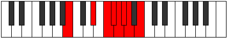 |
| [2003](https://ianring.com/musictheory/scales/2003) | [Lolyllic](ModeGNaturalLolyllic.md) | G | G, G#, B, C#, D, D#, E, F, G |  |
| [2003](https://ianring.com/musictheory/scales/2003) | [Lolyllic](ModeBNaturalLolyllic.md) | B | B, C, D#, F, F#, G, G#, A, B |  |
| [2005](https://ianring.com/musictheory/scales/2005) | [Gygyllic](ModeBNaturalGygyllic.md) | B | B, C#, D#, F, F#, G, G#, A, B |  |
| [2005](https://ianring.com/musictheory/scales/2005) | [Gygyllic](ModeCSharpGygyllic.md) | C# | C#, D#, F, G, G#, A, A#, B, C# |  |
| [2005](https://ianring.com/musictheory/scales/2005) | [Gygyllic](ModeDFlatGygyllic.md) | Db | Db, Eb, F, G, Ab, A, Bb, B, Db |  |
| [2007](https://ianring.com/musictheory/scales/2007) | [Stonygic](ModeGNaturalStonygic.md) | G | G, G#, A, B, C#, D, D#, E, F, G |  |
| [2007](https://ianring.com/musictheory/scales/2007) | [Stonygic](ModeBNaturalStonygic.md) | B | B, C, C#, D#, F, F#, G, G#, A, B |  |
| [2007](https://ianring.com/musictheory/scales/2007) | [Stonygic](ModeCSharpStonygic.md) | C# | C#, D, D#, F, G, G#, A, A#, B, C# |  |
| [2007](https://ianring.com/musictheory/scales/2007) | [Stonygic](ModeDFlatStonygic.md) | Db | Db, D, Eb, F, G, Ab, A, Bb, B, Db |  |
| [2009](https://ianring.com/musictheory/scales/2009) | [Stacryllic](ModeBNaturalStacryllic.md) | B | B, D, D#, F, F#, G, G#, A, B |  |
| [2011](https://ianring.com/musictheory/scales/2011) | [Raphygic](ModeBNaturalRaphygic.md) | B | B, C, D, D#, F, F#, G, G#, A, B |  |
| [2011](https://ianring.com/musictheory/scales/2011) | [Raphygic](ModeGNaturalRaphygic.md) | G | G, G#, A#, B, C#, D, D#, E, F, G |  |
| [2013](https://ianring.com/musictheory/scales/2013) | [Mocrygic](ModeFNaturalMocrygic.md) | F | F, G, G#, A, B, C, C#, D, D#, F |  |
| [2013](https://ianring.com/musictheory/scales/2013) | [Mocrygic](ModeBNaturalMocrygic.md) | B | B, C#, D, D#, F, F#, G, G#, A, B |  |
| [2013](https://ianring.com/musictheory/scales/2013) | [Mocrygic](ModeCSharpMocrygic.md) | C# | C#, D#, E, F, G, G#, A, A#, B, C# |  |
| [2013](https://ianring.com/musictheory/scales/2013) | [Mocrygic](ModeDFlatMocrygic.md) | Db | Db, Eb, E, F, G, Ab, A, Bb, B, Db |  |
| [2015](https://ianring.com/musictheory/scales/2015) | [Epiryllian](ModeFNaturalEpiryllian.md) | F | F, F#, G, G#, A, B, C, C#, D, D#, F |  |
| [2015](https://ianring.com/musictheory/scales/2015) | [Epiryllian](ModeBNaturalEpiryllian.md) | B | B, C, C#, D, D#, F, F#, G, G#, A, B |  |
| [2015](https://ianring.com/musictheory/scales/2015) | [Epiryllian](ModeCSharpEpiryllian.md) | C# | C#, D, D#, E, F, G, G#, A, A#, B, C# |  |
| [2015](https://ianring.com/musictheory/scales/2015) | [Epiryllian](ModeDFlatEpiryllian.md) | Db | Db, D, Eb, E, F, G, Ab, A, Bb, B, Db |  |
| [2015](https://ianring.com/musictheory/scales/2015) | [Epiryllian](ModeGNaturalEpiryllian.md) | G | G, G#, A, A#, B, C#, D, D#, E, F, G |  |
| [2019](https://ianring.com/musictheory/scales/2019) | [Palyllic](ModeASharpPalyllic.md) | A# | A#, B, D#, E, F, F#, G, G#, A# |  |
| [2019](https://ianring.com/musictheory/scales/2019) | [Palyllic](ModeBFlatPalyllic.md) | Bb | Bb, B, Eb, E, F, Gb, G, Ab, Bb |  |
| [2023](https://ianring.com/musictheory/scales/2023) | [Zodygic](ModeASharpZodygic.md) | A# | A#, B, C, D#, E, F, F#, G, G#, A# |  |
| [2023](https://ianring.com/musictheory/scales/2023) | [Zodygic](ModeBFlatZodygic.md) | Bb | Bb, B, C, Eb, E, F, Gb, G, Ab, Bb |  |
| [2027](https://ianring.com/musictheory/scales/2027) | [Boptygic](ModeASharpBoptygic.md) | A# | A#, B, C#, D#, E, F, F#, G, G#, A# |  |
| [2027](https://ianring.com/musictheory/scales/2027) | [Boptygic](ModeBFlatBoptygic.md) | Bb | Bb, B, Db, Eb, E, F, Gb, G, Ab, Bb |  |
| [2027](https://ianring.com/musictheory/scales/2027) | [Boptygic](ModeDNaturalBoptygic.md) | D | D, D#, F, G, G#, A, A#, B, C, D |  |
| [2029](https://ianring.com/musictheory/scales/2029) | [Mathygic](ModeFNaturalMathygic.md) | F | F, G, G#, A#, B, C, C#, D, D#, F |  |
| [2031](https://ianring.com/musictheory/scales/2031) | [Gadyllian](ModeFNaturalGadyllian.md) | F | F, F#, G, G#, A#, B, C, C#, D, D#, F |  |
| [2031](https://ianring.com/musictheory/scales/2031) | [Gadyllian](ModeASharpGadyllian.md) | A# | A#, B, C, C#, D#, E, F, F#, G, G#, A# |  |
| [2031](https://ianring.com/musictheory/scales/2031) | [Gadyllian](ModeBFlatGadyllian.md) | Bb | Bb, B, C, Db, Eb, E, F, Gb, G, Ab, Bb |  |
| [2031](https://ianring.com/musictheory/scales/2031) | [Gadyllian](ModeDNaturalGadyllian.md) | D | D, D#, E, F, G, G#, A, A#, B, C, D |  |
| [2033](https://ianring.com/musictheory/scales/2033) | [Stolyllic](ModeBNaturalStolyllic.md) | B | B, D#, E, F, F#, G, G#, A, B |  |
| [2035](https://ianring.com/musictheory/scales/2035) | [Aerythygic](ModeGNaturalAerythygic.md) | G | G, G#, B, C, C#, D, D#, E, F, G |  |
| [2035](https://ianring.com/musictheory/scales/2035) | [Aerythygic](ModeBNaturalAerythygic.md) | B | B, C, D#, E, F, F#, G, G#, A, B |  |
| [2035](https://ianring.com/musictheory/scales/2035) | [Aerythygic](ModeASharpAerythygic.md) | A# | A#, B, D, D#, E, F, F#, G, G#, A# |  |
| [2035](https://ianring.com/musictheory/scales/2035) | [Aerythygic](ModeBFlatAerythygic.md) | Bb | Bb, B, D, Eb, E, F, Gb, G, Ab, Bb |  |
| [2037](https://ianring.com/musictheory/scales/2037) | [Sythygic](ModeBNaturalSythygic.md) | B | B, C#, D#, E, F, F#, G, G#, A, B |  |
| [2037](https://ianring.com/musictheory/scales/2037) | [Sythygic](ModeDSharpSythygic.md) | D# | D#, F, G, G#, A, A#, B, C, C#, D# |  |
| [2037](https://ianring.com/musictheory/scales/2037) | [Sythygic](ModeEFlatSythygic.md) | Eb | Eb, F, G, Ab, A, Bb, B, C, Db, Eb |  |
| [2037](https://ianring.com/musictheory/scales/2037) | [Sythygic](ModeCSharpSythygic.md) | C# | C#, D#, F, F#, G, G#, A, A#, B, C# |  |
| [2037](https://ianring.com/musictheory/scales/2037) | [Sythygic](ModeDFlatSythygic.md) | Db | Db, Eb, F, Gb, G, Ab, A, Bb, B, Db |  |
| [2039](https://ianring.com/musictheory/scales/2039) | [Danyllian](ModeGNaturalDanyllian.md) | G | G, G#, A, B, C, C#, D, D#, E, F, G |  |
| [2039](https://ianring.com/musictheory/scales/2039) | [Danyllian](ModeBNaturalDanyllian.md) | B | B, C, C#, D#, E, F, F#, G, G#, A, B |  |
| [2039](https://ianring.com/musictheory/scales/2039) | [Danyllian](ModeASharpDanyllian.md) | A# | A#, B, C, D, D#, E, F, F#, G, G#, A# |  |
| [2039](https://ianring.com/musictheory/scales/2039) | [Danyllian](ModeBFlatDanyllian.md) | Bb | Bb, B, C, D, Eb, E, F, Gb, G, Ab, Bb |  |
| [2039](https://ianring.com/musictheory/scales/2039) | [Danyllian](ModeDSharpDanyllian.md) | D# | D#, E, F, G, G#, A, A#, B, C, C#, D# |  |
| [2039](https://ianring.com/musictheory/scales/2039) | [Danyllian](ModeEFlatDanyllian.md) | Eb | Eb, E, F, G, Ab, A, Bb, B, C, Db, Eb |  |
| [2039](https://ianring.com/musictheory/scales/2039) | [Danyllian](ModeCSharpDanyllian.md) | C# | C#, D, D#, F, F#, G, G#, A, A#, B, C# |  |
| [2039](https://ianring.com/musictheory/scales/2039) | [Danyllian](ModeDFlatDanyllian.md) | Db | Db, D, Eb, F, Gb, G, Ab, A, Bb, B, Db |  |
| [2041](https://ianring.com/musictheory/scales/2041) | [Aeolacrygic](ModeBNaturalAeolacrygic.md) | B | B, D, D#, E, F, F#, G, G#, A, B |  |
| [2043](https://ianring.com/musictheory/scales/2043) | [Lythyllian](ModeBNaturalLythyllian.md) | B | B, C, D, D#, E, F, F#, G, G#, A, B |  |
| [2043](https://ianring.com/musictheory/scales/2043) | [Lythyllian](ModeGNaturalLythyllian.md) | G | G, G#, A#, B, C, C#, D, D#, E, F, G |  |
| [2043](https://ianring.com/musictheory/scales/2043) | [Lythyllian](ModeASharpLythyllian.md) | A# | A#, B, C#, D, D#, E, F, F#, G, G#, A# |  |
| [2043](https://ianring.com/musictheory/scales/2043) | [Lythyllian](ModeBFlatLythyllian.md) | Bb | Bb, B, Db, D, Eb, E, F, Gb, G, Ab, Bb |  |
| [2043](https://ianring.com/musictheory/scales/2043) | [Lythyllian](ModeDNaturalLythyllian.md) | D | D, D#, F, F#, G, G#, A, A#, B, C, D |  |
| [2045](https://ianring.com/musictheory/scales/2045) | [Katogyllian](ModeBNaturalKatogyllian.md) | B | B, C#, D, D#, E, F, F#, G, G#, A, B |  |
| [2045](https://ianring.com/musictheory/scales/2045) | [Katogyllian](ModeFNaturalKatogyllian.md) | F | F, G, G#, A, A#, B, C, C#, D, D#, F |  |
| [2045](https://ianring.com/musictheory/scales/2045) | [Katogyllian](ModeDSharpKatogyllian.md) | D# | D#, F, F#, G, G#, A, A#, B, C, C#, D# |  |
| [2045](https://ianring.com/musictheory/scales/2045) | [Katogyllian](ModeEFlatKatogyllian.md) | Eb | Eb, F, Gb, G, Ab, A, Bb, B, C, Db, Eb |  |
| [2045](https://ianring.com/musictheory/scales/2045) | [Katogyllian](ModeCSharpKatogyllian.md) | C# | C#, D#, E, F, F#, G, G#, A, A#, B, C# |  |
| [2045](https://ianring.com/musictheory/scales/2045) | [Katogyllian](ModeDFlatKatogyllian.md) | Db | Db, Eb, E, F, Gb, G, Ab, A, Bb, B, Db |  |
| [2047](https://ianring.com/musictheory/scales/2047) | [Monatic](ModeBNaturalMonatic.md) | B | B, C, C#, D, D#, E, F, F#, G, G#, A, B |  |
| [2047](https://ianring.com/musictheory/scales/2047) | [Monatic](ModeASharpMonatic.md) | A# | A#, B, C, C#, D, D#, E, F, F#, G, G#, A# |  |
| [2047](https://ianring.com/musictheory/scales/2047) | [Monatic](ModeBFlatMonatic.md) | Bb | Bb, B, C, Db, D, Eb, E, F, Gb, G, Ab, Bb |  |
| [2047](https://ianring.com/musictheory/scales/2047) | [Monatic](ModeGNaturalMonatic.md) | G | G, G#, A, A#, B, C, C#, D, D#, E, F, G |  |
| [2047](https://ianring.com/musictheory/scales/2047) | [Monatic](ModeFNaturalMonatic.md) | F | F, F#, G, G#, A, A#, B, C, C#, D, D#, F |  |
| [2047](https://ianring.com/musictheory/scales/2047) | [Monatic](ModeDSharpMonatic.md) | D# | D#, E, F, F#, G, G#, A, A#, B, C, C#, D# |  |
| [2047](https://ianring.com/musictheory/scales/2047) | [Monatic](ModeEFlatMonatic.md) | Eb | Eb, E, F, Gb, G, Ab, A, Bb, B, C, Db, Eb |  |
| [2047](https://ianring.com/musictheory/scales/2047) | [Monatic](ModeDNaturalMonatic.md) | D | D, D#, E, F, F#, G, G#, A, A#, B, C, D |  |
| [2047](https://ianring.com/musictheory/scales/2047) | [Monatic](ModeCSharpMonatic.md) | C# | C#, D, D#, E, F, F#, G, G#, A, A#, B, C# |  |
| [2047](https://ianring.com/musictheory/scales/2047) | [Monatic](ModeDFlatMonatic.md) | Db | Db, D, Eb, E, F, Gb, G, Ab, A, Bb, B, Db |  |
| [2203](https://ianring.com/musictheory/scales/2203) | [Dorimic](ModeENaturalDorimic.md) | E | E, F, G, Ab, B, C###, E |  |
| [2207](https://ianring.com/musictheory/scales/2207) | [Mygian](ModeENaturalMygian.md) | E | E, F, Gb, Abb, Bbbb, Cb, D#, E |  |
| [2235](https://ianring.com/musictheory/scales/2235) | [Bathian](ModeENaturalBathian.md) | E | E, F, G, Ab, Bbb, Cb, D#, E |  |
| [2239](https://ianring.com/musictheory/scales/2239) | [Dacryllic](ModeENaturalDacryllic.md) | E | E, F, F#, G, G#, A, B, D#, E |  |
| [2267](https://ianring.com/musictheory/scales/2267) | [Padian](ModeENaturalPadian.md) | E | E, F, G, Ab, Bb, Cb, D#, E |  |
| [2271](https://ianring.com/musictheory/scales/2271) | [Poptyllic](ModeENaturalPoptyllic.md) | E | E, F, F#, G, G#, A#, B, D#, E |  |
| [2299](https://ianring.com/musictheory/scales/2299) | [Phraptyllic](ModeENaturalPhraptyllic.md) | E | E, F, G, G#, A, A#, B, D#, E |  |
| [2303](https://ianring.com/musictheory/scales/2303) | [Stanygic](ModeENaturalStanygic.md) | E | E, F, F#, G, G#, A, A#, B, D#, E |  |
| [2357](https://ianring.com/musictheory/scales/2357) | [Ionaptimic](ModeDSharpIonaptimic.md) | D# | D#, E#, F##, G#, A##, B###, D# |  |
| [2357](https://ianring.com/musictheory/scales/2357) | [Ionaptimic](ModeEFlatIonaptimic.md) | Eb | Eb, F, G, Ab, B, C##, Eb |  |
| [2359](https://ianring.com/musictheory/scales/2359) | [Gadian](ModeDSharpGadian.md) | D# | D#, E, F, G, Ab, B, C##, D# |  |
| [2359](https://ianring.com/musictheory/scales/2359) | [Gadian](ModeEFlatGadian.md) | Eb | Eb, Fb, Gbb, Abb, Bbbb, Cb, D, Eb |  |
| [2365](https://ianring.com/musictheory/scales/2365) | [Sythian](ModeDSharpSythian.md) | D# | D#, E#, F#, G, Ab, B, C##, D# |  |
| [2365](https://ianring.com/musictheory/scales/2365) | [Sythian](ModeEFlatSythian.md) | Eb | Eb, F, Gb, Abb, Bbbb, Cb, D, Eb |  |
| [2367](https://ianring.com/musictheory/scales/2367) | [Laryllic](ModeDSharpLaryllic.md) | D# | D#, E, F, F#, G, G#, B, D, D# |  |
| [2367](https://ianring.com/musictheory/scales/2367) | [Laryllic](ModeEFlatLaryllic.md) | Eb | Eb, E, F, Gb, G, Ab, B, D, Eb |  |
| [2421](https://ianring.com/musictheory/scales/2421) | [Malian](ModeDSharpMalian.md) | D# | D#, E#, F##, G#, A, B, C##, D# |  |
| [2421](https://ianring.com/musictheory/scales/2421) | [Malian](ModeEFlatMalian.md) | Eb | Eb, F, G, Ab, Bbb, Cb, D, Eb |  |
| [2423](https://ianring.com/musictheory/scales/2423) | [Thorcryllic](ModeDSharpThorcryllic.md) | D# | D#, E, F, G, G#, A, B, D, D# |  |
| [2423](https://ianring.com/musictheory/scales/2423) | [Thorcryllic](ModeEFlatThorcryllic.md) | Eb | Eb, E, F, G, Ab, A, B, D, Eb |  |
| [2429](https://ianring.com/musictheory/scales/2429) | [Kadyllic](ModeDSharpKadyllic.md) | D# | D#, F, F#, G, G#, A, B, D, D# |  |
| [2429](https://ianring.com/musictheory/scales/2429) | [Kadyllic](ModeEFlatKadyllic.md) | Eb | Eb, F, Gb, G, Ab, A, B, D, Eb |  |
| [2431](https://ianring.com/musictheory/scales/2431) | [Gythygic](ModeDSharpGythygic.md) | D# | D#, E, F, F#, G, G#, A, B, D, D# |  |
| [2431](https://ianring.com/musictheory/scales/2431) | [Gythygic](ModeEFlatGythygic.md) | Eb | Eb, E, F, Gb, G, Ab, A, B, D, Eb |  |
| [2459](https://ianring.com/musictheory/scales/2459) | [Ionocrian](ModeENaturalIonocrian.md) | E | E, F, G, Ab, B, C, D#, E | 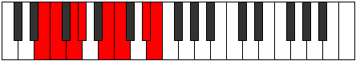 |
| [2463](https://ianring.com/musictheory/scales/2463) | [Ionathyllic](ModeENaturalIonathyllic.md) | E | E, F, F#, G, G#, B, C, D#, E |  |
| [2473](https://ianring.com/musictheory/scales/2473) | [Mothimic](ModeCNaturalMothimic.md) | C | C, D#, E#, F##, G#, A##, C |  |
| [2475](https://ianring.com/musictheory/scales/2475) | [Aerylian](ModeCNaturalAerylian.md) | C | C, Db, Eb, F, G, Ab, B, C |  |
| [2477](https://ianring.com/musictheory/scales/2477) | [Mydian](ModeCNaturalMydian.md) | C | C, D, Eb, F, G, Ab, B, C |  |
| [2479](https://ianring.com/musictheory/scales/2479) | [Rycryllic](ModeCNaturalRycryllic.md) | C | C, C#, D, D#, F, G, G#, B, C |  |
| [2485](https://ianring.com/musictheory/scales/2485) | [Aerorian](ModeDSharpAerorian.md) | D# | D#, E#, F##, G#, A#, B, C##, D# |  |
| [2485](https://ianring.com/musictheory/scales/2485) | [Aerorian](ModeEFlatAerorian.md) | Eb | Eb, F, G, Ab, Bb, Cb, D, Eb |  |
| [2487](https://ianring.com/musictheory/scales/2487) | [Phroptyllic](ModeDSharpPhroptyllic.md) | D# | D#, E, F, G, G#, A#, B, D, D# |  |
| [2487](https://ianring.com/musictheory/scales/2487) | [Phroptyllic](ModeEFlatPhroptyllic.md) | Eb | Eb, E, F, G, Ab, Bb, B, D, Eb |  |
| [2489](https://ianring.com/musictheory/scales/2489) | [Syrian](ModeCNaturalSyrian.md) | C | C, D#, E, F, G, Ab, B, C |  |
| [2491](https://ianring.com/musictheory/scales/2491) | [Layllic](ModeCNaturalLayllic.md) | C | C, C#, D#, E, F, G, G#, B, C |  |
| [2491](https://ianring.com/musictheory/scales/2491) | [Layllic](ModeENaturalLayllic.md) | E | E, F, G, G#, A, B, C, D#, E |  |
| [2493](https://ianring.com/musictheory/scales/2493) | [Manyllic](ModeCNaturalManyllic.md) | C | C, D, D#, E, F, G, G#, B, C |  |
| [2493](https://ianring.com/musictheory/scales/2493) | [Manyllic](ModeDSharpManyllic.md) | D# | D#, F, F#, G, G#, A#, B, D, D# |  |
| [2493](https://ianring.com/musictheory/scales/2493) | [Manyllic](ModeEFlatManyllic.md) | Eb | Eb, F, Gb, G, Ab, Bb, B, D, Eb |  |
| [2495](https://ianring.com/musictheory/scales/2495) | [Aeolocrygic](ModeCNaturalAeolocrygic.md) | C | C, C#, D, D#, E, F, G, G#, B, C |  |
| [2495](https://ianring.com/musictheory/scales/2495) | [Aeolocrygic](ModeENaturalAeolocrygic.md) | E | E, F, F#, G, G#, A, B, C, D#, E |  |
| [2495](https://ianring.com/musictheory/scales/2495) | [Aeolocrygic](ModeDSharpAeolocrygic.md) | D# | D#, E, F, F#, G, G#, A#, B, D, D# |  |
| [2495](https://ianring.com/musictheory/scales/2495) | [Aeolocrygic](ModeEFlatAeolocrygic.md) | Eb | Eb, E, F, Gb, G, Ab, Bb, B, D, Eb |  |
| [2523](https://ianring.com/musictheory/scales/2523) | [Rygyllic](ModeENaturalRygyllic.md) | E | E, F, G, G#, A#, B, C, D#, E |  |
| [2527](https://ianring.com/musictheory/scales/2527) | [Phradygic](ModeENaturalPhradygic.md) | E | E, F, F#, G, G#, A#, B, C, D#, E |  |
| [2537](https://ianring.com/musictheory/scales/2537) | [Laptian](ModeCNaturalLaptian.md) | C | C, D#, E#, F#, G, Ab, B, C |  |
| [2539](https://ianring.com/musictheory/scales/2539) | [Thonyllic](ModeCNaturalThonyllic.md) | C | C, C#, D#, F, F#, G, G#, B, C |  |
| [2541](https://ianring.com/musictheory/scales/2541) | [Katadyllic](ModeCNaturalKatadyllic.md) | C | C, D, D#, F, F#, G, G#, B, C |  |
| [2543](https://ianring.com/musictheory/scales/2543) | [Dydygic](ModeCNaturalDydygic.md) | C | C, C#, D, D#, F, F#, G, G#, B, C |  |
| [2549](https://ianring.com/musictheory/scales/2549) | [Rydyllic](ModeDSharpRydyllic.md) | D# | D#, F, G, G#, A, A#, B, D, D# |  |
| [2549](https://ianring.com/musictheory/scales/2549) | [Rydyllic](ModeEFlatRydyllic.md) | Eb | Eb, F, G, Ab, A, Bb, B, D, Eb |  |
| [2551](https://ianring.com/musictheory/scales/2551) | [Zoptygic](ModeDSharpZoptygic.md) | D# | D#, E, F, G, G#, A, A#, B, D, D# |  |
| [2551](https://ianring.com/musictheory/scales/2551) | [Zoptygic](ModeEFlatZoptygic.md) | Eb | Eb, E, F, G, Ab, A, Bb, B, D, Eb |  |
| [2553](https://ianring.com/musictheory/scales/2553) | [Aeolaptyllic](ModeCNaturalAeolaptyllic.md) | C | C, D#, E, F, F#, G, G#, B, C |  |
| [2555](https://ianring.com/musictheory/scales/2555) | [Bythygic](ModeCNaturalBythygic.md) | C | C, C#, D#, E, F, F#, G, G#, B, C |  |
| [2555](https://ianring.com/musictheory/scales/2555) | [Bythygic](ModeENaturalBythygic.md) | E | E, F, G, G#, A, A#, B, C, D#, E | 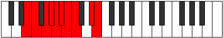 |
| [2557](https://ianring.com/musictheory/scales/2557) | [Dothygic](ModeCNaturalDothygic.md) | C | C, D, D#, E, F, F#, G, G#, B, C |  |
| [2557](https://ianring.com/musictheory/scales/2557) | [Dothygic](ModeDSharpDothygic.md) | D# | D#, F, F#, G, G#, A, A#, B, D, D# |  |
| [2557](https://ianring.com/musictheory/scales/2557) | [Dothygic](ModeEFlatDothygic.md) | Eb | Eb, F, Gb, G, Ab, A, Bb, B, D, Eb |  |
| [2559](https://ianring.com/musictheory/scales/2559) | [Zogyllian](ModeCNaturalZogyllian.md) | C | C, C#, D, D#, E, F, F#, G, G#, B, C |  |
| [2559](https://ianring.com/musictheory/scales/2559) | [Zogyllian](ModeENaturalZogyllian.md) | E | E, F, F#, G, G#, A, A#, B, C, D#, E |  |
| [2559](https://ianring.com/musictheory/scales/2559) | [Zogyllian](ModeDSharpZogyllian.md) | D# | D#, E, F, F#, G, G#, A, A#, B, D, D# |  |
| [2559](https://ianring.com/musictheory/scales/2559) | [Zogyllian](ModeEFlatZogyllian.md) | Eb | Eb, E, F, Gb, G, Ab, A, Bb, B, D, Eb |  |
| [2599](https://ianring.com/musictheory/scales/2599) | [Malimic](ModeFSharpMalimic.md) | F# | F#, G, Ab, B, C###, D###, F# |  |
| [2599](https://ianring.com/musictheory/scales/2599) | [Malimic](ModeGFlatMalimic.md) | Gb | Gb, Abb, Bbbb, Cb, D#, E#, Gb |  |
| [2607](https://ianring.com/musictheory/scales/2607) | [Aerolian](ModeFSharpAerolian.md) | F# | F#, G, Ab, Bbb, Cb, D#, E#, F# |  |
| [2607](https://ianring.com/musictheory/scales/2607) | [Aerolian](ModeGFlatAerolian.md) | Gb | Gb, Abb, Bbbb, Cbbb, Dbbb, Eb, F, Gb |  |
| [2615](https://ianring.com/musictheory/scales/2615) | [Thoptian](ModeFSharpThoptian.md) | F# | F#, G, Ab, Bb, Cb, D#, E#, F# |  |
| [2615](https://ianring.com/musictheory/scales/2615) | [Thoptian](ModeGFlatThoptian.md) | Gb | Gb, Abb, Bbbb, Cbb, Dbbb, Eb, F, Gb |  |
| [2623](https://ianring.com/musictheory/scales/2623) | [Aerylyllic](ModeFSharpAerylyllic.md) | F# | F#, G, G#, A, A#, B, D#, F, F# |  |
| [2623](https://ianring.com/musictheory/scales/2623) | [Aerylyllic](ModeGFlatAerylyllic.md) | Gb | Gb, G, Ab, A, Bb, B, Eb, F, Gb |  |
| [2663](https://ianring.com/musictheory/scales/2663) | [Lalian](ModeFSharpLalian.md) | F# | F#, G, Ab, B, C, D#, E#, F# |  |
| [2663](https://ianring.com/musictheory/scales/2663) | [Lalian](ModeGFlatLalian.md) | Gb | Gb, Abb, Bbbb, Cb, Dbb, Eb, F, Gb |  |
| [2667](https://ianring.com/musictheory/scales/2667) | [Byrian](ModeDNaturalByrian.md) | D | D, Eb, F, G, Ab, B, C#, D |  |
| [2671](https://ianring.com/musictheory/scales/2671) | [Lylyllic](ModeDNaturalLylyllic.md) | D | D, D#, E, F, G, G#, B, C#, D |  |
| [2671](https://ianring.com/musictheory/scales/2671) | [Lylyllic](ModeFSharpLylyllic.md) | F# | F#, G, G#, A, B, C, D#, F, F# |  |
| [2671](https://ianring.com/musictheory/scales/2671) | [Lylyllic](ModeGFlatLylyllic.md) | Gb | Gb, G, Ab, A, B, C, Eb, F, Gb |  |
| [2679](https://ianring.com/musictheory/scales/2679) | [Rathyllic](ModeFSharpRathyllic.md) | F# | F#, G, G#, A#, B, C, D#, F, F# |  |
| [2679](https://ianring.com/musictheory/scales/2679) | [Rathyllic](ModeGFlatRathyllic.md) | Gb | Gb, G, Ab, Bb, B, C, Eb, F, Gb |  |
| [2683](https://ianring.com/musictheory/scales/2683) | [Thodyllic](ModeDNaturalThodyllic.md) | D | D, D#, F, F#, G, G#, B, C#, D |  |
| [2687](https://ianring.com/musictheory/scales/2687) | [Thacrygic](ModeDNaturalThacrygic.md) | D | D, D#, E, F, F#, G, G#, B, C#, D |  |
| [2687](https://ianring.com/musictheory/scales/2687) | [Thacrygic](ModeFSharpThacrygic.md) | F# | F#, G, G#, A, A#, B, C, D#, F, F# |  |
| [2687](https://ianring.com/musictheory/scales/2687) | [Thacrygic](ModeGFlatThacrygic.md) | Gb | Gb, G, Ab, A, Bb, B, C, Eb, F, Gb |  |
| [2697](https://ianring.com/musictheory/scales/2697) | [Katagitonic](ModeGSharpKatagitonic.md) | G# | G#, B, D#, F, G, G# |  |
| [2697](https://ianring.com/musictheory/scales/2697) | [Katagitonic](ModeAFlatKatagitonic.md) | Ab | Ab, B, Eb, F, G, Ab |  |
| [2699](https://ianring.com/musictheory/scales/2699) | [Sythimic](ModeGSharpSythimic.md) | G# | G#, A, B, C###, D###, E###, G# |  |
| [2699](https://ianring.com/musictheory/scales/2699) | [Sythimic](ModeAFlatSythimic.md) | Ab | Ab, Bbb, Cb, D#, E#, F##, Ab |  |
| [2701](https://ianring.com/musictheory/scales/2701) | [Epythimic](ModeGSharpEpythimic.md) | G# | G#, A#, B, C###, D###, E###, G# |  |
| [2701](https://ianring.com/musictheory/scales/2701) | [Epythimic](ModeAFlatEpythimic.md) | Ab | Ab, Bb, Cb, D#, E#, F##, Ab |  |
| [2703](https://ianring.com/musictheory/scales/2703) | [Galian](ModeGSharpGalian.md) | G# | G#, A, Bb, Cb, D#, E#, F##, G# |  |
| [2703](https://ianring.com/musictheory/scales/2703) | [Galian](ModeAFlatGalian.md) | Ab | Ab, Bbb, Cbb, Dbbb, Eb, F, G, Ab | 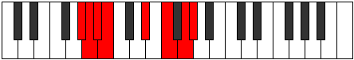 |
| [2713](https://ianring.com/musictheory/scales/2713) | [Porimic](ModeGSharpPorimic.md) | G# | G#, A##, B#, C###, D###, E###, G# | 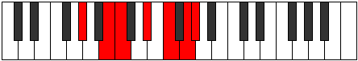 |
| [2713](https://ianring.com/musictheory/scales/2713) | [Porimic](ModeAFlatPorimic.md) | Ab | Ab, B, C, D#, E#, F##, Ab |  |
| [2715](https://ianring.com/musictheory/scales/2715) | [Kynian](ModeENaturalKynian.md) | E | E, F, G, Ab, B, C#, D#, E |  |
| [2715](https://ianring.com/musictheory/scales/2715) | [Kynian](ModeGSharpKynian.md) | G# | G#, A, B, C, D#, E#, F##, G# |  |
| [2715](https://ianring.com/musictheory/scales/2715) | [Kynian](ModeAFlatKynian.md) | Ab | Ab, Bbb, Cb, Dbb, Eb, F, G, Ab |  |
| [2717](https://ianring.com/musictheory/scales/2717) | [Epygian](ModeGSharpEpygian.md) | G# | G#, A#, B, C, D#, E#, F##, G# |  |
| [2717](https://ianring.com/musictheory/scales/2717) | [Epygian](ModeAFlatEpygian.md) | Ab | Ab, Bb, Cb, Dbb, Eb, F, G, Ab |  |
| [2719](https://ianring.com/musictheory/scales/2719) | [Zocryllic](ModeENaturalZocryllic.md) | E | E, F, F#, G, G#, B, C#, D#, E |  |
| [2719](https://ianring.com/musictheory/scales/2719) | [Zocryllic](ModeGSharpZocryllic.md) | G# | G#, A, A#, B, C, D#, F, G, G# |  |
| [2719](https://ianring.com/musictheory/scales/2719) | [Zocryllic](ModeAFlatZocryllic.md) | Ab | Ab, A, Bb, B, C, Eb, F, G, Ab |  |
| [2727](https://ianring.com/musictheory/scales/2727) | [Pylian](ModeFSharpPylian.md) | F# | F#, G, Ab, B, C#, D#, E#, F# |  |
| [2727](https://ianring.com/musictheory/scales/2727) | [Pylian](ModeGFlatPylian.md) | Gb | Gb, Abb, Bbbb, Cb, Db, Eb, F, Gb |  |
| [2729](https://ianring.com/musictheory/scales/2729) | [Aeragimic](ModeGSharpAeragimic.md) | G# | G#, A##, B##, C###, D###, E###, G# |  |
| [2729](https://ianring.com/musictheory/scales/2729) | [Aeragimic](ModeAFlatAeragimic.md) | Ab | Ab, B, C#, D#, E#, F##, Ab |  |
| [2731](https://ianring.com/musictheory/scales/2731) | [Thydian](ModeGSharpThydian.md) | G# | G#, A, B, C#, D#, E#, F##, G# |  |
| [2731](https://ianring.com/musictheory/scales/2731) | [Thydian](ModeAFlatThydian.md) | Ab | Ab, Bbb, Cb, Db, Eb, F, G, Ab |  |
| [2733](https://ianring.com/musictheory/scales/2733) | [Bocrian](ModeGSharpBocrian.md) | G# | G#, A#, B, C#, D#, E#, F##, G# |  |
| [2733](https://ianring.com/musictheory/scales/2733) | [Bocrian](ModeAFlatBocrian.md) | Ab | Ab, Bb, Cb, Db, Eb, F, G, Ab |  |
| [2735](https://ianring.com/musictheory/scales/2735) | [Gynyllic](ModeFSharpGynyllic.md) | F# | F#, G, G#, A, B, C#, D#, F, F# |  |
| [2735](https://ianring.com/musictheory/scales/2735) | [Gynyllic](ModeGFlatGynyllic.md) | Gb | Gb, G, Ab, A, B, Db, Eb, F, Gb |  |
| [2735](https://ianring.com/musictheory/scales/2735) | [Gynyllic](ModeGSharpGynyllic.md) | G# | G#, A, A#, B, C#, D#, F, G, G# |  |
| [2735](https://ianring.com/musictheory/scales/2735) | [Gynyllic](ModeAFlatGynyllic.md) | Ab | Ab, A, Bb, B, Db, Eb, F, G, Ab |  |
| [2743](https://ianring.com/musictheory/scales/2743) | [Staptyllic](ModeFSharpStaptyllic.md) | F# | F#, G, G#, A#, B, C#, D#, F, F# |  |
| [2743](https://ianring.com/musictheory/scales/2743) | [Staptyllic](ModeGFlatStaptyllic.md) | Gb | Gb, G, Ab, Bb, B, Db, Eb, F, Gb |  |
| [2745](https://ianring.com/musictheory/scales/2745) | [Dolian](ModeGSharpDolian.md) | G# | G#, A##, B#, C#, D#, E#, F##, G# |  |
| [2745](https://ianring.com/musictheory/scales/2745) | [Dolian](ModeAFlatDolian.md) | Ab | Ab, B, C, Db, Eb, F, G, Ab |  |
| [2747](https://ianring.com/musictheory/scales/2747) | [Stythyllic](ModeGSharpStythyllic.md) | G# | G#, A, B, C, C#, D#, F, G, G# |  |
| [2747](https://ianring.com/musictheory/scales/2747) | [Stythyllic](ModeAFlatStythyllic.md) | Ab | Ab, A, B, C, Db, Eb, F, G, Ab |  |
| [2747](https://ianring.com/musictheory/scales/2747) | [Stythyllic](ModeENaturalStythyllic.md) | E | E, F, G, G#, A, B, C#, D#, E |  |
| [2749](https://ianring.com/musictheory/scales/2749) | [Katagyllic](ModeGSharpKatagyllic.md) | G# | G#, A#, B, C, C#, D#, F, G, G# |  |
| [2749](https://ianring.com/musictheory/scales/2749) | [Katagyllic](ModeAFlatKatagyllic.md) | Ab | Ab, Bb, B, C, Db, Eb, F, G, Ab |  |
| [2751](https://ianring.com/musictheory/scales/2751) | [Sylygic](ModeENaturalSylygic.md) | E | E, F, F#, G, G#, A, B, C#, D#, E |  |
| [2751](https://ianring.com/musictheory/scales/2751) | [Sylygic](ModeGSharpSylygic.md) | G# | G#, A, A#, B, C, C#, D#, F, G, G# |  |
| [2751](https://ianring.com/musictheory/scales/2751) | [Sylygic](ModeAFlatSylygic.md) | Ab | Ab, A, Bb, B, C, Db, Eb, F, G, Ab |  |
| [2751](https://ianring.com/musictheory/scales/2751) | [Sylygic](ModeFSharpSylygic.md) | F# | F#, G, G#, A, A#, B, C#, D#, F, F# |  |
| [2751](https://ianring.com/musictheory/scales/2751) | [Sylygic](ModeGFlatSylygic.md) | Gb | Gb, G, Ab, A, Bb, B, Db, Eb, F, Gb |  |
| [2761](https://ianring.com/musictheory/scales/2761) | [Dagimic](ModeGSharpDagimic.md) | G# | G#, A##, B###, C###, D###, E###, G# |  |
| [2761](https://ianring.com/musictheory/scales/2761) | [Dagimic](ModeAFlatDagimic.md) | Ab | Ab, B, C##, D#, E#, F##, Ab |  |
| [2763](https://ianring.com/musictheory/scales/2763) | [Manian](ModeGSharpManian.md) | G# | G#, A, B, C##, D#, E#, F##, G# |  |
| [2763](https://ianring.com/musictheory/scales/2763) | [Manian](ModeAFlatManian.md) | Ab | Ab, Bbb, Cb, D, Eb, F, G, Ab |  |
| [2765](https://ianring.com/musictheory/scales/2765) | [Banian](ModeGSharpBanian.md) | G# | G#, A#, B, C##, D#, E#, F##, G# |  |
| [2765](https://ianring.com/musictheory/scales/2765) | [Banian](ModeAFlatBanian.md) | Ab | Ab, Bb, Cb, D, Eb, F, G, Ab |  |
| [2767](https://ianring.com/musictheory/scales/2767) | [Katydyllic](ModeGSharpKatydyllic.md) | G# | G#, A, A#, B, D, D#, F, G, G# |  |
| [2767](https://ianring.com/musictheory/scales/2767) | [Katydyllic](ModeAFlatKatydyllic.md) | Ab | Ab, A, Bb, B, D, Eb, F, G, Ab |  |
| [2777](https://ianring.com/musictheory/scales/2777) | [Bycrian](ModeGSharpBycrian.md) | G# | G#, A##, B#, C##, D#, E#, F##, G# |  |
| [2777](https://ianring.com/musictheory/scales/2777) | [Bycrian](ModeAFlatBycrian.md) | Ab | Ab, B, C, D, Eb, F, G, Ab |  |
| [2779](https://ianring.com/musictheory/scales/2779) | [Garyllic](ModeGSharpGaryllic.md) | G# | G#, A, B, C, D, D#, F, G, G# |  |
| [2779](https://ianring.com/musictheory/scales/2779) | [Garyllic](ModeAFlatGaryllic.md) | Ab | Ab, A, B, C, D, Eb, F, G, Ab |  |
| [2779](https://ianring.com/musictheory/scales/2779) | [Garyllic](ModeENaturalGaryllic.md) | E | E, F, G, G#, A#, B, C#, D#, E |  |
| [2781](https://ianring.com/musictheory/scales/2781) | [Gycryllic](ModeGSharpGycryllic.md) | G# | G#, A#, B, C, D, D#, F, G, G# |  |
| [2781](https://ianring.com/musictheory/scales/2781) | [Gycryllic](ModeAFlatGycryllic.md) | Ab | Ab, Bb, B, C, D, Eb, F, G, Ab |  |
| [2783](https://ianring.com/musictheory/scales/2783) | [Gothygic](ModeENaturalGothygic.md) | E | E, F, F#, G, G#, A#, B, C#, D#, E |  |
| [2783](https://ianring.com/musictheory/scales/2783) | [Gothygic](ModeGSharpGothygic.md) | G# | G#, A, A#, B, C, D, D#, F, G, G# |  |
| [2783](https://ianring.com/musictheory/scales/2783) | [Gothygic](ModeAFlatGothygic.md) | Ab | Ab, A, Bb, B, C, D, Eb, F, G, Ab |  |
| [2791](https://ianring.com/musictheory/scales/2791) | [Ionyptyllic](ModeFSharpIonyptyllic.md) | F# | F#, G, G#, B, C, C#, D#, F, F# |  |
| [2791](https://ianring.com/musictheory/scales/2791) | [Ionyptyllic](ModeGFlatIonyptyllic.md) | Gb | Gb, G, Ab, B, C, Db, Eb, F, Gb |  |
| [2793](https://ianring.com/musictheory/scales/2793) | [Eporian](ModeGSharpEporian.md) | G# | G#, A##, B##, C##, D#, E#, F##, G# |  |
| [2793](https://ianring.com/musictheory/scales/2793) | [Eporian](ModeAFlatEporian.md) | Ab | Ab, B, C#, D, Eb, F, G, Ab |  |
| [2797](https://ianring.com/musictheory/scales/2797) | [Stalyllic](ModeGSharpStalyllic.md) | G# | G#, A#, B, C#, D, D#, F, G, G# |  |
| [2797](https://ianring.com/musictheory/scales/2797) | [Stalyllic](ModeAFlatStalyllic.md) | Ab | Ab, Bb, B, Db, D, Eb, F, G, Ab |  |
| [2799](https://ianring.com/musictheory/scales/2799) | [Epilygic](ModeDNaturalEpilygic.md) | D | D, D#, E, F, G, G#, A, B, C#, D |  |
| [2799](https://ianring.com/musictheory/scales/2799) | [Epilygic](ModeFSharpEpilygic.md) | F# | F#, G, G#, A, B, C, C#, D#, F, F# |  |
| [2799](https://ianring.com/musictheory/scales/2799) | [Epilygic](ModeGFlatEpilygic.md) | Gb | Gb, G, Ab, A, B, C, Db, Eb, F, Gb |  |
| [2799](https://ianring.com/musictheory/scales/2799) | [Epilygic](ModeGSharpEpilygic.md) | G# | G#, A, A#, B, C#, D, D#, F, G, G# |  |
| [2799](https://ianring.com/musictheory/scales/2799) | [Epilygic](ModeAFlatEpilygic.md) | Ab | Ab, A, Bb, B, Db, D, Eb, F, G, Ab |  |
| [2807](https://ianring.com/musictheory/scales/2807) | [Zylygic](ModeFSharpZylygic.md) | F# | F#, G, G#, A#, B, C, C#, D#, F, F# |  |
| [2807](https://ianring.com/musictheory/scales/2807) | [Zylygic](ModeGFlatZylygic.md) | Gb | Gb, G, Ab, Bb, B, C, Db, Eb, F, Gb |  |
| [2809](https://ianring.com/musictheory/scales/2809) | [Gythyllic](ModeGSharpGythyllic.md) | G# | G#, B, C, C#, D, D#, F, G, G# |  |
| [2809](https://ianring.com/musictheory/scales/2809) | [Gythyllic](ModeAFlatGythyllic.md) | Ab | Ab, B, C, Db, D, Eb, F, G, Ab |  |
| [2811](https://ianring.com/musictheory/scales/2811) | [Barygic](ModeGSharpBarygic.md) | G# | G#, A, B, C, C#, D, D#, F, G, G# |  |
| [2811](https://ianring.com/musictheory/scales/2811) | [Barygic](ModeAFlatBarygic.md) | Ab | Ab, A, B, C, Db, D, Eb, F, G, Ab |  |
| [2811](https://ianring.com/musictheory/scales/2811) | [Barygic](ModeDNaturalBarygic.md) | D | D, D#, F, F#, G, G#, A, B, C#, D |  |
| [2811](https://ianring.com/musictheory/scales/2811) | [Barygic](ModeENaturalBarygic.md) | E | E, F, G, G#, A, A#, B, C#, D#, E |  |
| [2813](https://ianring.com/musictheory/scales/2813) | [Zolygic](ModeGSharpZolygic.md) | G# | G#, A#, B, C, C#, D, D#, F, G, G# |  |
| [2813](https://ianring.com/musictheory/scales/2813) | [Zolygic](ModeAFlatZolygic.md) | Ab | Ab, Bb, B, C, Db, D, Eb, F, G, Ab |  |
| [2815](https://ianring.com/musictheory/scales/2815) | [Aeradyllian](ModeDNaturalAeradyllian.md) | D | D, D#, E, F, F#, G, G#, A, B, C#, D |  |
| [2815](https://ianring.com/musictheory/scales/2815) | [Aeradyllian](ModeGSharpAeradyllian.md) | G# | G#, A, A#, B, C, C#, D, D#, F, G, G# |  |
| [2815](https://ianring.com/musictheory/scales/2815) | [Aeradyllian](ModeAFlatAeradyllian.md) | Ab | Ab, A, Bb, B, C, Db, D, Eb, F, G, Ab |  |
| [2815](https://ianring.com/musictheory/scales/2815) | [Aeradyllian](ModeFSharpAeradyllian.md) | F# | F#, G, G#, A, A#, B, C, C#, D#, F, F# |  |
| [2815](https://ianring.com/musictheory/scales/2815) | [Aeradyllian](ModeGFlatAeradyllian.md) | Gb | Gb, G, Ab, A, Bb, B, C, Db, Eb, F, Gb |  |
| [2815](https://ianring.com/musictheory/scales/2815) | [Aeradyllian](ModeENaturalAeradyllian.md) | E | E, F, F#, G, G#, A, A#, B, C#, D#, E |  |
| [2855](https://ianring.com/musictheory/scales/2855) | [Epocrian](ModeFSharpEpocrian.md) | F# | F#, G, Ab, B, C##, D#, E#, F# |  |
| [2855](https://ianring.com/musictheory/scales/2855) | [Epocrian](ModeGFlatEpocrian.md) | Gb | Gb, Abb, Bbbb, Cb, D, Eb, F, Gb |  |
| [2863](https://ianring.com/musictheory/scales/2863) | [Aerogyllic](ModeFSharpAerogyllic.md) | F# | F#, G, G#, A, B, D, D#, F, F# |  |
| [2863](https://ianring.com/musictheory/scales/2863) | [Aerogyllic](ModeGFlatAerogyllic.md) | Gb | Gb, G, Ab, A, B, D, Eb, F, Gb |  |
| [2869](https://ianring.com/musictheory/scales/2869) | [Phrothian](ModeDSharpPhrothian.md) | D# | D#, E#, F##, G#, A##, B#, C##, D# |  |
| [2869](https://ianring.com/musictheory/scales/2869) | [Phrothian](ModeEFlatPhrothian.md) | Eb | Eb, F, G, Ab, B, C, D, Eb |  |
| [2871](https://ianring.com/musictheory/scales/2871) | [Stanyllic](ModeDSharpStanyllic.md) | D# | D#, E, F, G, G#, B, C, D, D# |  |
| [2871](https://ianring.com/musictheory/scales/2871) | [Stanyllic](ModeEFlatStanyllic.md) | Eb | Eb, E, F, G, Ab, B, C, D, Eb |  |
| [2871](https://ianring.com/musictheory/scales/2871) | [Stanyllic](ModeFSharpStanyllic.md) | F# | F#, G, G#, A#, B, D, D#, F, F# |  |
| [2871](https://ianring.com/musictheory/scales/2871) | [Stanyllic](ModeGFlatStanyllic.md) | Gb | Gb, G, Ab, Bb, B, D, Eb, F, Gb |  |
| [2877](https://ianring.com/musictheory/scales/2877) | [Phrylyllic](ModeDSharpPhrylyllic.md) | D# | D#, F, F#, G, G#, B, C, D, D# | 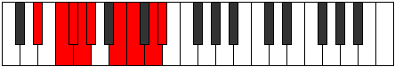 |
| [2877](https://ianring.com/musictheory/scales/2877) | [Phrylyllic](ModeEFlatPhrylyllic.md) | Eb | Eb, F, Gb, G, Ab, B, C, D, Eb |  |
| [2879](https://ianring.com/musictheory/scales/2879) | [Stadygic](ModeDSharpStadygic.md) | D# | D#, E, F, F#, G, G#, B, C, D, D# |  |
| [2879](https://ianring.com/musictheory/scales/2879) | [Stadygic](ModeEFlatStadygic.md) | Eb | Eb, E, F, Gb, G, Ab, B, C, D, Eb |  |
| [2879](https://ianring.com/musictheory/scales/2879) | [Stadygic](ModeFSharpStadygic.md) | F# | F#, G, G#, A, A#, B, D, D#, F, F# |  |
| [2879](https://ianring.com/musictheory/scales/2879) | [Stadygic](ModeGFlatStadygic.md) | Gb | Gb, G, Ab, A, Bb, B, D, Eb, F, Gb |  |
| [2897](https://ianring.com/musictheory/scales/2897) | [Rycrimic](ModeBNaturalRycrimic.md) | B | B, C###, D###, E###, F###, G###, B |  |
| [2899](https://ianring.com/musictheory/scales/2899) | [Kagian](ModeBNaturalKagian.md) | B | B, C, D#, E#, F##, G#, A#, B |  |
| [2901](https://ianring.com/musictheory/scales/2901) | [Larian](ModeBNaturalLarian.md) | B | B, C#, D#, E#, F##, G#, A#, B |  |
| [2903](https://ianring.com/musictheory/scales/2903) | [Gothyllic](ModeBNaturalGothyllic.md) | B | B, C, C#, D#, F, G, G#, A#, B |  |
| [2905](https://ianring.com/musictheory/scales/2905) | [Palian](ModeBNaturalPalian.md) | B | B, C##, D#, E#, F##, G#, A#, B |  |
| [2907](https://ianring.com/musictheory/scales/2907) | [Mogyllic](ModeBNaturalMogyllic.md) | B | B, C, D, D#, F, G, G#, A#, B |  |
| [2909](https://ianring.com/musictheory/scales/2909) | [Mocryllic](ModeBNaturalMocryllic.md) | B | B, C#, D, D#, F, G, G#, A#, B |  |
| [2911](https://ianring.com/musictheory/scales/2911) | [Katygic](ModeBNaturalKatygic.md) | B | B, C, C#, D, D#, F, G, G#, A#, B |  |
| [2919](https://ianring.com/musictheory/scales/2919) | [Molyllic](ModeFSharpMolyllic.md) | F# | F#, G, G#, B, C, D, D#, F, F# |  |
| [2919](https://ianring.com/musictheory/scales/2919) | [Molyllic](ModeGFlatMolyllic.md) | Gb | Gb, G, Ab, B, C, D, Eb, F, Gb |  |
| [2923](https://ianring.com/musictheory/scales/2923) | [Baryllic](ModeDNaturalBaryllic.md) | D | D, D#, F, G, G#, A#, B, C#, D |  |
| [2927](https://ianring.com/musictheory/scales/2927) | [Rodygic](ModeFSharpRodygic.md) | F# | F#, G, G#, A, B, C, D, D#, F, F# |  |
| [2927](https://ianring.com/musictheory/scales/2927) | [Rodygic](ModeGFlatRodygic.md) | Gb | Gb, G, Ab, A, B, C, D, Eb, F, Gb |  |
| [2927](https://ianring.com/musictheory/scales/2927) | [Rodygic](ModeDNaturalRodygic.md) | D | D, D#, E, F, G, G#, A#, B, C#, D |  |
| [2929](https://ianring.com/musictheory/scales/2929) | [Aeolathian](ModeBNaturalAeolathian.md) | B | B, C###, D##, E#, F##, G#, A#, B |  |
| [2931](https://ianring.com/musictheory/scales/2931) | [Zathyllic](ModeBNaturalZathyllic.md) | B | B, C, D#, E, F, G, G#, A#, B |  |
| [2933](https://ianring.com/musictheory/scales/2933) | [Dalyllic](ModeDSharpDalyllic.md) | D# | D#, F, G, G#, A, B, C, D, D# | 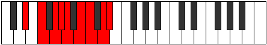 |
| [2933](https://ianring.com/musictheory/scales/2933) | [Dalyllic](ModeEFlatDalyllic.md) | Eb | Eb, F, G, Ab, A, B, C, D, Eb |  |
| [2933](https://ianring.com/musictheory/scales/2933) | [Dalyllic](ModeBNaturalDalyllic.md) | B | B, C#, D#, E, F, G, G#, A#, B |  |
| [2935](https://ianring.com/musictheory/scales/2935) | [Modygic](ModeDSharpModygic.md) | D# | D#, E, F, G, G#, A, B, C, D, D# |  |
| [2935](https://ianring.com/musictheory/scales/2935) | [Modygic](ModeEFlatModygic.md) | Eb | Eb, E, F, G, Ab, A, B, C, D, Eb |  |
| [2935](https://ianring.com/musictheory/scales/2935) | [Modygic](ModeBNaturalModygic.md) | B | B, C, C#, D#, E, F, G, G#, A#, B |  |
| [2935](https://ianring.com/musictheory/scales/2935) | [Modygic](ModeFSharpModygic.md) | F# | F#, G, G#, A#, B, C, D, D#, F, F# |  |
| [2935](https://ianring.com/musictheory/scales/2935) | [Modygic](ModeGFlatModygic.md) | Gb | Gb, G, Ab, Bb, B, C, D, Eb, F, Gb |  |
| [2937](https://ianring.com/musictheory/scales/2937) | [Aeolathyllic](ModeBNaturalAeolathyllic.md) | B | B, D, D#, E, F, G, G#, A#, B |  |
| [2939](https://ianring.com/musictheory/scales/2939) | [Goptygic](ModeBNaturalGoptygic.md) | B | B, C, D, D#, E, F, G, G#, A#, B |  |
| [2939](https://ianring.com/musictheory/scales/2939) | [Goptygic](ModeDNaturalGoptygic.md) | D | D, D#, F, F#, G, G#, A#, B, C#, D |  |
| [2941](https://ianring.com/musictheory/scales/2941) | [Laptygic](ModeDSharpLaptygic.md) | D# | D#, F, F#, G, G#, A, B, C, D, D# |  |
| [2941](https://ianring.com/musictheory/scales/2941) | [Laptygic](ModeEFlatLaptygic.md) | Eb | Eb, F, Gb, G, Ab, A, B, C, D, Eb |  |
| [2941](https://ianring.com/musictheory/scales/2941) | [Laptygic](ModeBNaturalLaptygic.md) | B | B, C#, D, D#, E, F, G, G#, A#, B |  |
| [2943](https://ianring.com/musictheory/scales/2943) | [Dathyllian](ModeDSharpDathyllian.md) | D# | D#, E, F, F#, G, G#, A, B, C, D, D# |  |
| [2943](https://ianring.com/musictheory/scales/2943) | [Dathyllian](ModeEFlatDathyllian.md) | Eb | Eb, E, F, Gb, G, Ab, A, B, C, D, Eb |  |
| [2943](https://ianring.com/musictheory/scales/2943) | [Dathyllian](ModeBNaturalDathyllian.md) | B | B, C, C#, D, D#, E, F, G, G#, A#, B |  |
| [2943](https://ianring.com/musictheory/scales/2943) | [Dathyllian](ModeDNaturalDathyllian.md) | D | D, D#, E, F, F#, G, G#, A#, B, C#, D |  |
| [2943](https://ianring.com/musictheory/scales/2943) | [Dathyllian](ModeFSharpDathyllian.md) | F# | F#, G, G#, A, A#, B, C, D, D#, F, F# |  |
| [2943](https://ianring.com/musictheory/scales/2943) | [Dathyllian](ModeGFlatDathyllian.md) | Gb | Gb, G, Ab, A, Bb, B, C, D, Eb, F, Gb |  |
| [2953](https://ianring.com/musictheory/scales/2953) | [Ionylimic](ModeGSharpIonylimic.md) | G# | G#, A##, C###, D##, E#, F##, G# |  |
| [2953](https://ianring.com/musictheory/scales/2953) | [Ionylimic](ModeAFlatIonylimic.md) | Ab | Ab, B, C###, D##, E#, F##, Ab |  |
| [2955](https://ianring.com/musictheory/scales/2955) | [Thorian](ModeGSharpThorian.md) | G# | G#, A, B, C###, D##, E#, F##, G# |  |
| [2955](https://ianring.com/musictheory/scales/2955) | [Thorian](ModeAFlatThorian.md) | Ab | Ab, Bbb, Cb, D#, E, F, G, Ab |  |
| [2957](https://ianring.com/musictheory/scales/2957) | [Thygian](ModeGSharpThygian.md) | G# | G#, A#, B, C###, D##, E#, F##, G# |  |
| [2957](https://ianring.com/musictheory/scales/2957) | [Thygian](ModeAFlatThygian.md) | Ab | Ab, Bb, Cb, D#, E, F, G, Ab |  |
| [2959](https://ianring.com/musictheory/scales/2959) | [Dygyllic](ModeGSharpDygyllic.md) | G# | G#, A, A#, B, D#, E, F, G, G# |  |
| [2959](https://ianring.com/musictheory/scales/2959) | [Dygyllic](ModeAFlatDygyllic.md) | Ab | Ab, A, Bb, B, Eb, E, F, G, Ab |  |
| [2969](https://ianring.com/musictheory/scales/2969) | [Tholian](ModeGSharpTholian.md) | G# | G#, A##, B#, C###, D##, E#, F##, G# |  |
| [2969](https://ianring.com/musictheory/scales/2969) | [Tholian](ModeAFlatTholian.md) | Ab | Ab, B, C, D#, E, F, G, Ab |  |
| [2971](https://ianring.com/musictheory/scales/2971) | [Aeolynyllic](ModeENaturalAeolynyllic.md) | E | E, F, G, G#, B, C, C#, D#, E |  |
| [2971](https://ianring.com/musictheory/scales/2971) | [Aeolynyllic](ModeGSharpAeolynyllic.md) | G# | G#, A, B, C, D#, E, F, G, G# |  |
| [2971](https://ianring.com/musictheory/scales/2971) | [Aeolynyllic](ModeAFlatAeolynyllic.md) | Ab | Ab, A, B, C, Eb, E, F, G, Ab |  |
| [2973](https://ianring.com/musictheory/scales/2973) | [Panyllic](ModeGSharpPanyllic.md) | G# | G#, A#, B, C, D#, E, F, G, G# |  |
| [2973](https://ianring.com/musictheory/scales/2973) | [Panyllic](ModeAFlatPanyllic.md) | Ab | Ab, Bb, B, C, Eb, E, F, G, Ab |  |
| [2975](https://ianring.com/musictheory/scales/2975) | [Gaptygic](ModeENaturalGaptygic.md) | E | E, F, F#, G, G#, B, C, C#, D#, E |  |
| [2975](https://ianring.com/musictheory/scales/2975) | [Gaptygic](ModeGSharpGaptygic.md) | G# | G#, A, A#, B, C, D#, E, F, G, G# |  |
| [2975](https://ianring.com/musictheory/scales/2975) | [Gaptygic](ModeAFlatGaptygic.md) | Ab | Ab, A, Bb, B, C, Eb, E, F, G, Ab |  |
| [2983](https://ianring.com/musictheory/scales/2983) | [Zythyllic](ModeFSharpZythyllic.md) | F# | F#, G, G#, B, C#, D, D#, F, F# |  |
| [2983](https://ianring.com/musictheory/scales/2983) | [Zythyllic](ModeGFlatZythyllic.md) | Gb | Gb, G, Ab, B, Db, D, Eb, F, Gb |  |
| [2985](https://ianring.com/musictheory/scales/2985) | [Epacrian](ModeGSharpEpacrian.md) | G# | G#, A##, B##, C###, D##, E#, F##, G# |  |
| [2985](https://ianring.com/musictheory/scales/2985) | [Epacrian](ModeAFlatEpacrian.md) | Ab | Ab, B, C#, D#, E, F, G, Ab |  |
| [2985](https://ianring.com/musictheory/scales/2985) | [Epacrian](ModeCNaturalEpacrian.md) | C | C, D#, E#, F##, G#, A, B, C |  |
| [2987](https://ianring.com/musictheory/scales/2987) | [Thanyllic](ModeCNaturalThanyllic.md) | C | C, C#, D#, F, G, G#, A, B, C |  |
| [2987](https://ianring.com/musictheory/scales/2987) | [Thanyllic](ModeGSharpThanyllic.md) | G# | G#, A, B, C#, D#, E, F, G, G# |  |
| [2987](https://ianring.com/musictheory/scales/2987) | [Thanyllic](ModeAFlatThanyllic.md) | Ab | Ab, A, B, Db, Eb, E, F, G, Ab |  |
| [2989](https://ianring.com/musictheory/scales/2989) | [Ionacryllic](ModeCNaturalIonacryllic.md) | C | C, D, D#, F, G, G#, A, B, C |  |
| [2989](https://ianring.com/musictheory/scales/2989) | [Ionacryllic](ModeGSharpIonacryllic.md) | G# | G#, A#, B, C#, D#, E, F, G, G# |  |
| [2989](https://ianring.com/musictheory/scales/2989) | [Ionacryllic](ModeAFlatIonacryllic.md) | Ab | Ab, Bb, B, Db, Eb, E, F, G, Ab |  |
| [2991](https://ianring.com/musictheory/scales/2991) | [Zanygic](ModeCNaturalZanygic.md) | C | C, C#, D, D#, F, G, G#, A, B, C |  |
| [2991](https://ianring.com/musictheory/scales/2991) | [Zanygic](ModeFSharpZanygic.md) | F# | F#, G, G#, A, B, C#, D, D#, F, F# |  |
| [2991](https://ianring.com/musictheory/scales/2991) | [Zanygic](ModeGFlatZanygic.md) | Gb | Gb, G, Ab, A, B, Db, D, Eb, F, Gb |  |
| [2991](https://ianring.com/musictheory/scales/2991) | [Zanygic](ModeGSharpZanygic.md) | G# | G#, A, A#, B, C#, D#, E, F, G, G# |  |
| [2991](https://ianring.com/musictheory/scales/2991) | [Zanygic](ModeAFlatZanygic.md) | Ab | Ab, A, Bb, B, Db, Eb, E, F, G, Ab |  |
| [2997](https://ianring.com/musictheory/scales/2997) | [Ionoptyllic](ModeDSharpIonoptyllic.md) | D# | D#, F, G, G#, A#, B, C, D, D# |  |
| [2997](https://ianring.com/musictheory/scales/2997) | [Ionoptyllic](ModeEFlatIonoptyllic.md) | Eb | Eb, F, G, Ab, Bb, B, C, D, Eb |  |
| [2999](https://ianring.com/musictheory/scales/2999) | [Zyrygic](ModeDSharpZyrygic.md) | D# | D#, E, F, G, G#, A#, B, C, D, D# |  |
| [2999](https://ianring.com/musictheory/scales/2999) | [Zyrygic](ModeEFlatZyrygic.md) | Eb | Eb, E, F, G, Ab, Bb, B, C, D, Eb |  |
| [2999](https://ianring.com/musictheory/scales/2999) | [Zyrygic](ModeFSharpZyrygic.md) | F# | F#, G, G#, A#, B, C#, D, D#, F, F# |  |
| [2999](https://ianring.com/musictheory/scales/2999) | [Zyrygic](ModeGFlatZyrygic.md) | Gb | Gb, G, Ab, Bb, B, Db, D, Eb, F, Gb |  |
| [3001](https://ianring.com/musictheory/scales/3001) | [Lonyllic](ModeGSharpLonyllic.md) | G# | G#, B, C, C#, D#, E, F, G, G# |  |
| [3001](https://ianring.com/musictheory/scales/3001) | [Lonyllic](ModeAFlatLonyllic.md) | Ab | Ab, B, C, Db, Eb, E, F, G, Ab |  |
| [3001](https://ianring.com/musictheory/scales/3001) | [Lonyllic](ModeCNaturalLonyllic.md) | C | C, D#, E, F, G, G#, A, B, C |  |
| [3003](https://ianring.com/musictheory/scales/3003) | [Zydygic](ModeCNaturalZydygic.md) | C | C, C#, D#, E, F, G, G#, A, B, C |  |
| [3003](https://ianring.com/musictheory/scales/3003) | [Zydygic](ModeENaturalZydygic.md) | E | E, F, G, G#, A, B, C, C#, D#, E |  |
| [3003](https://ianring.com/musictheory/scales/3003) | [Zydygic](ModeGSharpZydygic.md) | G# | G#, A, B, C, C#, D#, E, F, G, G# |  |
| [3003](https://ianring.com/musictheory/scales/3003) | [Zydygic](ModeAFlatZydygic.md) | Ab | Ab, A, B, C, Db, Eb, E, F, G, Ab | 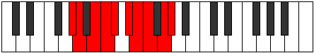 |
| [3005](https://ianring.com/musictheory/scales/3005) | [Gycrygic](ModeCNaturalGycrygic.md) | C | C, D, D#, E, F, G, G#, A, B, C |  |
| [3005](https://ianring.com/musictheory/scales/3005) | [Gycrygic](ModeGSharpGycrygic.md) | G# | G#, A#, B, C, C#, D#, E, F, G, G# |  |
| [3005](https://ianring.com/musictheory/scales/3005) | [Gycrygic](ModeAFlatGycrygic.md) | Ab | Ab, Bb, B, C, Db, Eb, E, F, G, Ab |  |
| [3005](https://ianring.com/musictheory/scales/3005) | [Gycrygic](ModeDSharpGycrygic.md) | D# | D#, F, F#, G, G#, A#, B, C, D, D# |  |
| [3005](https://ianring.com/musictheory/scales/3005) | [Gycrygic](ModeEFlatGycrygic.md) | Eb | Eb, F, Gb, G, Ab, Bb, B, C, D, Eb |  |
| [3007](https://ianring.com/musictheory/scales/3007) | [Zyryllian](ModeCNaturalZyryllian.md) | C | C, C#, D, D#, E, F, G, G#, A, B, C |  |
| [3007](https://ianring.com/musictheory/scales/3007) | [Zyryllian](ModeENaturalZyryllian.md) | E | E, F, F#, G, G#, A, B, C, C#, D#, E |  |
| [3007](https://ianring.com/musictheory/scales/3007) | [Zyryllian](ModeDSharpZyryllian.md) | D# | D#, E, F, F#, G, G#, A#, B, C, D, D# |  |
| [3007](https://ianring.com/musictheory/scales/3007) | [Zyryllian](ModeEFlatZyryllian.md) | Eb | Eb, E, F, Gb, G, Ab, Bb, B, C, D, Eb |  |
| [3007](https://ianring.com/musictheory/scales/3007) | [Zyryllian](ModeGSharpZyryllian.md) | G# | G#, A, A#, B, C, C#, D#, E, F, G, G# |  |
| [3007](https://ianring.com/musictheory/scales/3007) | [Zyryllian](ModeAFlatZyryllian.md) | Ab | Ab, A, Bb, B, C, Db, Eb, E, F, G, Ab |  |
| [3007](https://ianring.com/musictheory/scales/3007) | [Zyryllian](ModeFSharpZyryllian.md) | F# | F#, G, G#, A, A#, B, C#, D, D#, F, F# |  |
| [3007](https://ianring.com/musictheory/scales/3007) | [Zyryllian](ModeGFlatZyryllian.md) | Gb | Gb, G, Ab, A, Bb, B, Db, D, Eb, F, Gb |  |
| [3017](https://ianring.com/musictheory/scales/3017) | [Gacrian](ModeGSharpGacrian.md) | G# | G#, A##, B###, C###, D##, E#, F##, G# |  |
| [3017](https://ianring.com/musictheory/scales/3017) | [Gacrian](ModeAFlatGacrian.md) | Ab | Ab, B, C##, D#, E, F, G, Ab |  |
| [3019](https://ianring.com/musictheory/scales/3019) | [Mydyllic](ModeGSharpMydyllic.md) | G# | G#, A, B, D, D#, E, F, G, G# |  |
| [3019](https://ianring.com/musictheory/scales/3019) | [Mydyllic](ModeAFlatMydyllic.md) | Ab | Ab, A, B, D, Eb, E, F, G, Ab |  |
| [3021](https://ianring.com/musictheory/scales/3021) | [Gyptyllic](ModeGSharpGyptyllic.md) | G# | G#, A#, B, D, D#, E, F, G, G# |  |
| [3021](https://ianring.com/musictheory/scales/3021) | [Gyptyllic](ModeAFlatGyptyllic.md) | Ab | Ab, Bb, B, D, Eb, E, F, G, Ab |  |
| [3023](https://ianring.com/musictheory/scales/3023) | [Aeracrygic](ModeGSharpAeracrygic.md) | G# | G#, A, A#, B, D, D#, E, F, G, G# |  |
| [3023](https://ianring.com/musictheory/scales/3023) | [Aeracrygic](ModeAFlatAeracrygic.md) | Ab | Ab, A, Bb, B, D, Eb, E, F, G, Ab |  |
| [3025](https://ianring.com/musictheory/scales/3025) | [Epycrian](ModeBNaturalEpycrian.md) | B | B, C###, D###, E##, F##, G#, A#, B |  |
| [3027](https://ianring.com/musictheory/scales/3027) | [Rythyllic](ModeBNaturalRythyllic.md) | B | B, C, D#, F, F#, G, G#, A#, B |  |
| [3029](https://ianring.com/musictheory/scales/3029) | [Ionocryllic](ModeBNaturalIonocryllic.md) | B | B, C#, D#, F, F#, G, G#, A#, B |  |
| [3031](https://ianring.com/musictheory/scales/3031) | [Epithygic](ModeBNaturalEpithygic.md) | B | B, C, C#, D#, F, F#, G, G#, A#, B |  |
| [3033](https://ianring.com/musictheory/scales/3033) | [Doptyllic](ModeGSharpDoptyllic.md) | G# | G#, B, C, D, D#, E, F, G, G# |  |
| [3033](https://ianring.com/musictheory/scales/3033) | [Doptyllic](ModeAFlatDoptyllic.md) | Ab | Ab, B, C, D, Eb, E, F, G, Ab |  |
| [3033](https://ianring.com/musictheory/scales/3033) | [Doptyllic](ModeBNaturalDoptyllic.md) | B | B, D, D#, F, F#, G, G#, A#, B |  |
| [3035](https://ianring.com/musictheory/scales/3035) | [Gocrygic](ModeGSharpGocrygic.md) | G# | G#, A, B, C, D, D#, E, F, G, G# |  |
| [3035](https://ianring.com/musictheory/scales/3035) | [Gocrygic](ModeAFlatGocrygic.md) | Ab | Ab, A, B, C, D, Eb, E, F, G, Ab |  |
| [3035](https://ianring.com/musictheory/scales/3035) | [Gocrygic](ModeENaturalGocrygic.md) | E | E, F, G, G#, A#, B, C, C#, D#, E |  |
| [3035](https://ianring.com/musictheory/scales/3035) | [Gocrygic](ModeBNaturalGocrygic.md) | B | B, C, D, D#, F, F#, G, G#, A#, B |  |
| [3037](https://ianring.com/musictheory/scales/3037) | [Staptygic](ModeGSharpStaptygic.md) | G# | G#, A#, B, C, D, D#, E, F, G, G# |  |
| [3037](https://ianring.com/musictheory/scales/3037) | [Staptygic](ModeAFlatStaptygic.md) | Ab | Ab, Bb, B, C, D, Eb, E, F, G, Ab |  |
| [3037](https://ianring.com/musictheory/scales/3037) | [Staptygic](ModeBNaturalStaptygic.md) | B | B, C#, D, D#, F, F#, G, G#, A#, B |  |
| [3039](https://ianring.com/musictheory/scales/3039) | [Godyllian](ModeBNaturalGodyllian.md) | B | B, C, C#, D, D#, F, F#, G, G#, A#, B |  |
| [3039](https://ianring.com/musictheory/scales/3039) | [Godyllian](ModeENaturalGodyllian.md) | E | E, F, F#, G, G#, A#, B, C, C#, D#, E |  |
| [3039](https://ianring.com/musictheory/scales/3039) | [Godyllian](ModeGSharpGodyllian.md) | G# | G#, A, A#, B, C, D, D#, E, F, G, G# |  |
| [3039](https://ianring.com/musictheory/scales/3039) | [Godyllian](ModeAFlatGodyllian.md) | Ab | Ab, A, Bb, B, C, D, Eb, E, F, G, Ab |  |
| [3047](https://ianring.com/musictheory/scales/3047) | [Panygic](ModeFSharpPanygic.md) | F# | F#, G, G#, B, C, C#, D, D#, F, F# |  |
| [3047](https://ianring.com/musictheory/scales/3047) | [Panygic](ModeGFlatPanygic.md) | Gb | Gb, G, Ab, B, C, Db, D, Eb, F, Gb |  |
| [3049](https://ianring.com/musictheory/scales/3049) | [Aeronyllic](ModeGSharpAeronyllic.md) | G# | G#, B, C#, D, D#, E, F, G, G# |  |
| [3049](https://ianring.com/musictheory/scales/3049) | [Aeronyllic](ModeAFlatAeronyllic.md) | Ab | Ab, B, Db, D, Eb, E, F, G, Ab |  |
| [3049](https://ianring.com/musictheory/scales/3049) | [Aeronyllic](ModeCNaturalAeronyllic.md) | C | C, D#, F, F#, G, G#, A, B, C |  |
| [3051](https://ianring.com/musictheory/scales/3051) | [Stalygic](ModeGSharpStalygic.md) | G# | G#, A, B, C#, D, D#, E, F, G, G# |  |
| [3051](https://ianring.com/musictheory/scales/3051) | [Stalygic](ModeAFlatStalygic.md) | Ab | Ab, A, B, Db, D, Eb, E, F, G, Ab |  |
| [3051](https://ianring.com/musictheory/scales/3051) | [Stalygic](ModeCNaturalStalygic.md) | C | C, C#, D#, F, F#, G, G#, A, B, C |  |
| [3051](https://ianring.com/musictheory/scales/3051) | [Stalygic](ModeDNaturalStalygic.md) | D | D, D#, F, G, G#, A, A#, B, C#, D |  |
| [3053](https://ianring.com/musictheory/scales/3053) | [Zycrygic](ModeCNaturalZycrygic.md) | C | C, D, D#, F, F#, G, G#, A, B, C |  |
| [3053](https://ianring.com/musictheory/scales/3053) | [Zycrygic](ModeGSharpZycrygic.md) | G# | G#, A#, B, C#, D, D#, E, F, G, G# |  |
| [3053](https://ianring.com/musictheory/scales/3053) | [Zycrygic](ModeAFlatZycrygic.md) | Ab | Ab, Bb, B, Db, D, Eb, E, F, G, Ab |  |
| [3055](https://ianring.com/musictheory/scales/3055) | [Lyryllian](ModeCNaturalLyryllian.md) | C | C, C#, D, D#, F, F#, G, G#, A, B, C |  |
| [3055](https://ianring.com/musictheory/scales/3055) | [Lyryllian](ModeFSharpLyryllian.md) | F# | F#, G, G#, A, B, C, C#, D, D#, F, F# |  |
| [3055](https://ianring.com/musictheory/scales/3055) | [Lyryllian](ModeGFlatLyryllian.md) | Gb | Gb, G, Ab, A, B, C, Db, D, Eb, F, Gb |  |
| [3055](https://ianring.com/musictheory/scales/3055) | [Lyryllian](ModeDNaturalLyryllian.md) | D | D, D#, E, F, G, G#, A, A#, B, C#, D |  |
| [3055](https://ianring.com/musictheory/scales/3055) | [Lyryllian](ModeGSharpLyryllian.md) | G# | G#, A, A#, B, C#, D, D#, E, F, G, G# |  |
| [3055](https://ianring.com/musictheory/scales/3055) | [Lyryllian](ModeAFlatLyryllian.md) | Ab | Ab, A, Bb, B, Db, D, Eb, E, F, G, Ab |  |
| [3057](https://ianring.com/musictheory/scales/3057) | [Phroryllic](ModeBNaturalPhroryllic.md) | B | B, D#, E, F, F#, G, G#, A#, B |  |
| [3059](https://ianring.com/musictheory/scales/3059) | [Madygic](ModeBNaturalMadygic.md) | B | B, C, D#, E, F, F#, G, G#, A#, B |  |
| [3061](https://ianring.com/musictheory/scales/3061) | [Apinygic](ModeBNaturalApinygic.md) | B | B, C#, D#, E, F, F#, G, G#, A#, B |  |
| [3061](https://ianring.com/musictheory/scales/3061) | [Apinygic](ModeDSharpApinygic.md) | D# | D#, F, G, G#, A, A#, B, C, D, D# |  |
| [3061](https://ianring.com/musictheory/scales/3061) | [Apinygic](ModeEFlatApinygic.md) | Eb | Eb, F, G, Ab, A, Bb, B, C, D, Eb |  |
| [3063](https://ianring.com/musictheory/scales/3063) | [Solyllian](ModeFSharpSolyllian.md) | F# | F#, G, G#, A#, B, C, C#, D, D#, F, F# |  |
| [3063](https://ianring.com/musictheory/scales/3063) | [Solyllian](ModeGFlatSolyllian.md) | Gb | Gb, G, Ab, Bb, B, C, Db, D, Eb, F, Gb |  |
| [3063](https://ianring.com/musictheory/scales/3063) | [Solyllian](ModeBNaturalSolyllian.md) | B | B, C, C#, D#, E, F, F#, G, G#, A#, B |  |
| [3063](https://ianring.com/musictheory/scales/3063) | [Solyllian](ModeDSharpSolyllian.md) | D# | D#, E, F, G, G#, A, A#, B, C, D, D# |  |
| [3063](https://ianring.com/musictheory/scales/3063) | [Solyllian](ModeEFlatSolyllian.md) | Eb | Eb, E, F, G, Ab, A, Bb, B, C, D, Eb |  |
| [3065](https://ianring.com/musictheory/scales/3065) | [Zothygic](ModeGSharpZothygic.md) | G# | G#, B, C, C#, D, D#, E, F, G, G# |  |
| [3065](https://ianring.com/musictheory/scales/3065) | [Zothygic](ModeAFlatZothygic.md) | Ab | Ab, B, C, Db, D, Eb, E, F, G, Ab |  |
| [3065](https://ianring.com/musictheory/scales/3065) | [Zothygic](ModeCNaturalZothygic.md) | C | C, D#, E, F, F#, G, G#, A, B, C |  |
| [3065](https://ianring.com/musictheory/scales/3065) | [Zothygic](ModeBNaturalZothygic.md) | B | B, D, D#, E, F, F#, G, G#, A#, B |  |
| [3067](https://ianring.com/musictheory/scales/3067) | [Goptyllian](ModeGSharpGoptyllian.md) | G# | G#, A, B, C, C#, D, D#, E, F, G, G# |  |
| [3067](https://ianring.com/musictheory/scales/3067) | [Goptyllian](ModeAFlatGoptyllian.md) | Ab | Ab, A, B, C, Db, D, Eb, E, F, G, Ab |  |
| [3067](https://ianring.com/musictheory/scales/3067) | [Goptyllian](ModeCNaturalGoptyllian.md) | C | C, C#, D#, E, F, F#, G, G#, A, B, C |  |
| [3067](https://ianring.com/musictheory/scales/3067) | [Goptyllian](ModeBNaturalGoptyllian.md) | B | B, C, D, D#, E, F, F#, G, G#, A#, B |  |
| [3067](https://ianring.com/musictheory/scales/3067) | [Goptyllian](ModeENaturalGoptyllian.md) | E | E, F, G, G#, A, A#, B, C, C#, D#, E |  |
| [3067](https://ianring.com/musictheory/scales/3067) | [Goptyllian](ModeDNaturalGoptyllian.md) | D | D, D#, F, F#, G, G#, A, A#, B, C#, D |  |
| [3069](https://ianring.com/musictheory/scales/3069) | [Bacryllian](ModeCNaturalBacryllian.md) | C | C, D, D#, E, F, F#, G, G#, A, B, C |  |
| [3069](https://ianring.com/musictheory/scales/3069) | [Bacryllian](ModeGSharpBacryllian.md) | G# | G#, A#, B, C, C#, D, D#, E, F, G, G# |  |
| [3069](https://ianring.com/musictheory/scales/3069) | [Bacryllian](ModeAFlatBacryllian.md) | Ab | Ab, Bb, B, C, Db, D, Eb, E, F, G, Ab |  |
| [3069](https://ianring.com/musictheory/scales/3069) | [Bacryllian](ModeBNaturalBacryllian.md) | B | B, C#, D, D#, E, F, F#, G, G#, A#, B |  |
| [3069](https://ianring.com/musictheory/scales/3069) | [Bacryllian](ModeDSharpBacryllian.md) | D# | D#, F, F#, G, G#, A, A#, B, C, D, D# |  |
| [3069](https://ianring.com/musictheory/scales/3069) | [Bacryllian](ModeEFlatBacryllian.md) | Eb | Eb, F, Gb, G, Ab, A, Bb, B, C, D, Eb |  |
| [3071](https://ianring.com/musictheory/scales/3071) | [Solatic](ModeCNaturalSolatic.md) | C | C, C#, D, D#, E, F, F#, G, G#, A, B, C |  |
| [3071](https://ianring.com/musictheory/scales/3071) | [Solatic](ModeBNaturalSolatic.md) | B | B, C, C#, D, D#, E, F, F#, G, G#, A#, B |  |
| [3071](https://ianring.com/musictheory/scales/3071) | [Solatic](ModeGSharpSolatic.md) | G# | G#, A, A#, B, C, C#, D, D#, E, F, G, G# |  |
| [3071](https://ianring.com/musictheory/scales/3071) | [Solatic](ModeAFlatSolatic.md) | Ab | Ab, A, Bb, B, C, Db, D, Eb, E, F, G, Ab |  |
| [3071](https://ianring.com/musictheory/scales/3071) | [Solatic](ModeFSharpSolatic.md) | F# | F#, G, G#, A, A#, B, C, C#, D, D#, F, F# |  |
| [3071](https://ianring.com/musictheory/scales/3071) | [Solatic](ModeGFlatSolatic.md) | Gb | Gb, G, Ab, A, Bb, B, C, Db, D, Eb, F, Gb |  |
| [3071](https://ianring.com/musictheory/scales/3071) | [Solatic](ModeENaturalSolatic.md) | E | E, F, F#, G, G#, A, A#, B, C, C#, D#, E |  |
| [3071](https://ianring.com/musictheory/scales/3071) | [Solatic](ModeDSharpSolatic.md) | D# | D#, E, F, F#, G, G#, A, A#, B, C, D, D# |  |
| [3071](https://ianring.com/musictheory/scales/3071) | [Solatic](ModeEFlatSolatic.md) | Eb | Eb, E, F, Gb, G, Ab, A, Bb, B, C, D, Eb |  |
| [3071](https://ianring.com/musictheory/scales/3071) | [Solatic](ModeDNaturalSolatic.md) | D | D, D#, E, F, F#, G, G#, A, A#, B, C#, D |  |
| [3149](https://ianring.com/musictheory/scales/3149) | [Phrycrimic](ModeFNaturalPhrycrimic.md) | F | F, G, Ab, B, C###, D##, F |  |
| [3151](https://ianring.com/musictheory/scales/3151) | [Pacrian](ModeFNaturalPacrian.md) | F | F, Gb, Abb, Bbbb, Cb, D#, E, F |  |
| [3165](https://ianring.com/musictheory/scales/3165) | [Mylian](ModeFNaturalMylian.md) | F | F, G, Ab, Bbb, Cb, D#, E, F |  |
| [3167](https://ianring.com/musictheory/scales/3167) | [Thynyllic](ModeFNaturalThynyllic.md) | F | F, F#, G, G#, A, B, D#, E, F |  |
| [3181](https://ianring.com/musictheory/scales/3181) | [Rolian](ModeFNaturalRolian.md) | F | F, G, Ab, Bb, Cb, D#, E, F | 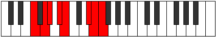 |
| [3183](https://ianring.com/musictheory/scales/3183) | [Mixonyllic](ModeFNaturalMixonyllic.md) | F | F, F#, G, G#, A#, B, D#, E, F |  |
| [3197](https://ianring.com/musictheory/scales/3197) | [Gylyllic](ModeFNaturalGylyllic.md) | F | F, G, G#, A, A#, B, D#, E, F |  |
| [3199](https://ianring.com/musictheory/scales/3199) | [Thaptygic](ModeFNaturalThaptygic.md) | F | F, F#, G, G#, A, A#, B, D#, E, F |  |
| [3227](https://ianring.com/musictheory/scales/3227) | [Aeolocrian](ModeENaturalAeolocrian.md) | E | E, F, G, Ab, B, C##, D#, E |  |
| [3231](https://ianring.com/musictheory/scales/3231) | [Kataptyllic](ModeENaturalKataptyllic.md) | E | E, F, F#, G, G#, B, D, D#, E |  |
| [3259](https://ianring.com/musictheory/scales/3259) | [Loptyllic](ModeENaturalLoptyllic.md) | E | E, F, G, G#, A, B, D, D#, E |  |
| [3263](https://ianring.com/musictheory/scales/3263) | [Pyrygic](ModeENaturalPyrygic.md) | E | E, F, F#, G, G#, A, B, D, D#, E |  |
| [3277](https://ianring.com/musictheory/scales/3277) | [Zycrian](ModeFNaturalZycrian.md) | F | F, G, Ab, B, C, D#, E, F |  |
| [3279](https://ianring.com/musictheory/scales/3279) | [Pythyllic](ModeFNaturalPythyllic.md) | F | F, F#, G, G#, B, C, D#, E, F |  |
| [3285](https://ianring.com/musictheory/scales/3285) | [Zagian](ModeCSharpZagian.md) | C# | C#, D#, E#, F##, G#, A##, B#, C# |  |
| [3285](https://ianring.com/musictheory/scales/3285) | [Zagian](ModeDFlatZagian.md) | Db | Db, Eb, F, G, Ab, B, C, Db |  |
| [3287](https://ianring.com/musictheory/scales/3287) | [Phrathyllic](ModeCSharpPhrathyllic.md) | C# | C#, D, D#, F, G, G#, B, C, C# |  |
| [3287](https://ianring.com/musictheory/scales/3287) | [Phrathyllic](ModeDFlatPhrathyllic.md) | Db | Db, D, Eb, F, G, Ab, B, C, Db |  |
| [3291](https://ianring.com/musictheory/scales/3291) | [Kodyllic](ModeENaturalKodyllic.md) | E | E, F, G, G#, A#, B, D, D#, E |  |
| [3293](https://ianring.com/musictheory/scales/3293) | [Saryllic](ModeCSharpSaryllic.md) | C# | C#, D#, E, F, G, G#, B, C, C# |  |
| [3293](https://ianring.com/musictheory/scales/3293) | [Saryllic](ModeDFlatSaryllic.md) | Db | Db, Eb, E, F, G, Ab, B, C, Db |  |
| [3293](https://ianring.com/musictheory/scales/3293) | [Saryllic](ModeFNaturalSaryllic.md) | F | F, G, G#, A, B, C, D#, E, F |  |
| [3295](https://ianring.com/musictheory/scales/3295) | [Phroptygic](ModeCSharpPhroptygic.md) | C# | C#, D, D#, E, F, G, G#, B, C, C# |  |
| [3295](https://ianring.com/musictheory/scales/3295) | [Phroptygic](ModeDFlatPhroptygic.md) | Db | Db, D, Eb, E, F, G, Ab, B, C, Db |  |
| [3295](https://ianring.com/musictheory/scales/3295) | [Phroptygic](ModeFNaturalPhroptygic.md) | F | F, F#, G, G#, A, B, C, D#, E, F |  |
| [3295](https://ianring.com/musictheory/scales/3295) | [Phroptygic](ModeENaturalPhroptygic.md) | E | E, F, F#, G, G#, A#, B, D, D#, E |  |
| [3309](https://ianring.com/musictheory/scales/3309) | [Bycryllic](ModeFNaturalBycryllic.md) | F | F, G, G#, A#, B, C, D#, E, F |  |
| [3311](https://ianring.com/musictheory/scales/3311) | [Mixodygic](ModeFNaturalMixodygic.md) | F | F, F#, G, G#, A#, B, C, D#, E, F |  |
| [3317](https://ianring.com/musictheory/scales/3317) | [Lanyllic](ModeCSharpLanyllic.md) | C# | C#, D#, F, F#, G, G#, B, C, C# |  |
| [3317](https://ianring.com/musictheory/scales/3317) | [Lanyllic](ModeDFlatLanyllic.md) | Db | Db, Eb, F, Gb, G, Ab, B, C, Db |  |
| [3319](https://ianring.com/musictheory/scales/3319) | [Tholygic](ModeCSharpTholygic.md) | C# | C#, D, D#, F, F#, G, G#, B, C, C# |  |
| [3319](https://ianring.com/musictheory/scales/3319) | [Tholygic](ModeDFlatTholygic.md) | Db | Db, D, Eb, F, Gb, G, Ab, B, C, Db |  |
| [3323](https://ianring.com/musictheory/scales/3323) | [Phrygygic](ModeENaturalPhrygygic.md) | E | E, F, G, G#, A, A#, B, D, D#, E |  |
| [3325](https://ianring.com/musictheory/scales/3325) | [Epygic](ModeCSharpEpygic.md) | C# | C#, D#, E, F, F#, G, G#, B, C, C# |  |
| [3325](https://ianring.com/musictheory/scales/3325) | [Epygic](ModeDFlatEpygic.md) | Db | Db, Eb, E, F, Gb, G, Ab, B, C, Db |  |
| [3325](https://ianring.com/musictheory/scales/3325) | [Epygic](ModeFNaturalEpygic.md) | F | F, G, G#, A, A#, B, C, D#, E, F |  |
| [3327](https://ianring.com/musictheory/scales/3327) | [Madyllian](ModeCSharpMadyllian.md) | C# | C#, D, D#, E, F, F#, G, G#, B, C, C# |  |
| [3327](https://ianring.com/musictheory/scales/3327) | [Madyllian](ModeDFlatMadyllian.md) | Db | Db, D, Eb, E, F, Gb, G, Ab, B, C, Db |  |
| [3327](https://ianring.com/musictheory/scales/3327) | [Madyllian](ModeFNaturalMadyllian.md) | F | F, F#, G, G#, A, A#, B, C, D#, E, F |  |
| [3327](https://ianring.com/musictheory/scales/3327) | [Madyllian](ModeENaturalMadyllian.md) | E | E, F, F#, G, G#, A, A#, B, D, D#, E |  |
| [3347](https://ianring.com/musictheory/scales/3347) | [Synimic](ModeGNaturalSynimic.md) | G | G, Ab, B, C###, D###, E##, G |  |
| [3351](https://ianring.com/musictheory/scales/3351) | [Karian](ModeGNaturalKarian.md) | G | G, Ab, Bbb, Cb, D#, E#, F#, G |  |
| [3355](https://ianring.com/musictheory/scales/3355) | [Bagian](ModeGNaturalBagian.md) | G | G, Ab, Bb, Cb, D#, E#, F#, G |  |
| [3359](https://ianring.com/musictheory/scales/3359) | [Bonyllic](ModeGNaturalBonyllic.md) | G | G, G#, A, A#, B, D#, F, F#, G |  |
| [3379](https://ianring.com/musictheory/scales/3379) | [Sothian](ModeGNaturalSothian.md) | G | G, Ab, B, C, D#, E#, F#, G |  |
| [3381](https://ianring.com/musictheory/scales/3381) | [Katanian](ModeDSharpKatanian.md) | D# | D#, E#, F##, G#, A##, B##, C##, D# |  |
| [3381](https://ianring.com/musictheory/scales/3381) | [Katanian](ModeEFlatKatanian.md) | Eb | Eb, F, G, Ab, B, C#, D, Eb |  |
| [3383](https://ianring.com/musictheory/scales/3383) | [Daptyllic](ModeDSharpDaptyllic.md) | D# | D#, E, F, G, G#, B, C#, D, D# |  |
| [3383](https://ianring.com/musictheory/scales/3383) | [Daptyllic](ModeEFlatDaptyllic.md) | Eb | Eb, E, F, G, Ab, B, Db, D, Eb |  |
| [3383](https://ianring.com/musictheory/scales/3383) | [Daptyllic](ModeGNaturalDaptyllic.md) | G | G, G#, A, B, C, D#, F, F#, G |  |
| [3387](https://ianring.com/musictheory/scales/3387) | [Aeryptyllic](ModeGNaturalAeryptyllic.md) | G | G, G#, A#, B, C, D#, F, F#, G |  |
| [3389](https://ianring.com/musictheory/scales/3389) | [Socryllic](ModeDSharpSocryllic.md) | D# | D#, F, F#, G, G#, B, C#, D, D# |  |
| [3389](https://ianring.com/musictheory/scales/3389) | [Socryllic](ModeEFlatSocryllic.md) | Eb | Eb, F, Gb, G, Ab, B, Db, D, Eb |  |
| [3391](https://ianring.com/musictheory/scales/3391) | [Aeolynygic](ModeDSharpAeolynygic.md) | D# | D#, E, F, F#, G, G#, B, C#, D, D# |  |
| [3391](https://ianring.com/musictheory/scales/3391) | [Aeolynygic](ModeEFlatAeolynygic.md) | Eb | Eb, E, F, Gb, G, Ab, B, Db, D, Eb |  |
| [3391](https://ianring.com/musictheory/scales/3391) | [Aeolynygic](ModeGNaturalAeolynygic.md) | G | G, G#, A, A#, B, C, D#, F, F#, G |  |
| [3397](https://ianring.com/musictheory/scales/3397) | [Sydimic](ModeANaturalSydimic.md) | A | A, B, C###, D###, E###, F###, A |  |
| [3399](https://ianring.com/musictheory/scales/3399) | [Zonian](ModeANaturalZonian.md) | A | A, Bb, Cb, D#, E#, F##, G#, A |  |
| [3405](https://ianring.com/musictheory/scales/3405) | [Stynian](ModeFNaturalStynian.md) | F | F, G, Ab, B, C#, D#, E, F |  |
| [3405](https://ianring.com/musictheory/scales/3405) | [Stynian](ModeANaturalStynian.md) | A | A, B, C, D#, E#, F##, G#, A | 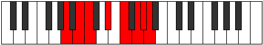 |
| [3407](https://ianring.com/musictheory/scales/3407) | [Katocryllic](ModeFNaturalKatocryllic.md) | F | F, F#, G, G#, B, C#, D#, E, F |  |
| [3407](https://ianring.com/musictheory/scales/3407) | [Katocryllic](ModeANaturalKatocryllic.md) | A | A, A#, B, C, D#, F, G, G#, A |  |
| [3411](https://ianring.com/musictheory/scales/3411) | [Ionathian](ModeGNaturalIonathian.md) | G | G, Ab, B, C#, D#, E#, F#, G |  |
| [3413](https://ianring.com/musictheory/scales/3413) | [Aeolynian](ModeANaturalAeolynian.md) | A | A, B, C#, D#, E#, F##, G#, A |  |
| [3415](https://ianring.com/musictheory/scales/3415) | [Ionaptyllic](ModeGNaturalIonaptyllic.md) | G | G, G#, A, B, C#, D#, F, F#, G |  |
| [3415](https://ianring.com/musictheory/scales/3415) | [Ionaptyllic](ModeANaturalIonaptyllic.md) | A | A, A#, B, C#, D#, F, G, G#, A |  |
| [3419](https://ianring.com/musictheory/scales/3419) | [Danyllic](ModeGNaturalDanyllic.md) | G | G, G#, A#, B, C#, D#, F, F#, G |  |
| [3421](https://ianring.com/musictheory/scales/3421) | [Aerothyllic](ModeANaturalAerothyllic.md) | A | A, B, C, C#, D#, F, G, G#, A |  |
| [3421](https://ianring.com/musictheory/scales/3421) | [Aerothyllic](ModeFNaturalAerothyllic.md) | F | F, G, G#, A, B, C#, D#, E, F |  |
| [3423](https://ianring.com/musictheory/scales/3423) | [Lothygic](ModeFNaturalLothygic.md) | F | F, F#, G, G#, A, B, C#, D#, E, F |  |
| [3423](https://ianring.com/musictheory/scales/3423) | [Lothygic](ModeANaturalLothygic.md) | A | A, A#, B, C, C#, D#, F, G, G#, A |  |
| [3423](https://ianring.com/musictheory/scales/3423) | [Lothygic](ModeGNaturalLothygic.md) | G | G, G#, A, A#, B, C#, D#, F, F#, G |  |
| [3429](https://ianring.com/musictheory/scales/3429) | [Marian](ModeANaturalMarian.md) | A | A, B, C##, D#, E#, F##, G#, A |  |
| [3431](https://ianring.com/musictheory/scales/3431) | [Zyptyllic](ModeANaturalZyptyllic.md) | A | A, A#, B, D, D#, F, G, G#, A |  |
| [3437](https://ianring.com/musictheory/scales/3437) | [Gathyllic](ModeANaturalGathyllic.md) | A | A, B, C, D, D#, F, G, G#, A |  |
| [3437](https://ianring.com/musictheory/scales/3437) | [Gathyllic](ModeFNaturalGathyllic.md) | F | F, G, G#, A#, B, C#, D#, E, F |  |
| [3439](https://ianring.com/musictheory/scales/3439) | [Lythygic](ModeFNaturalLythygic.md) | F | F, F#, G, G#, A#, B, C#, D#, E, F |  |
| [3439](https://ianring.com/musictheory/scales/3439) | [Lythygic](ModeANaturalLythygic.md) | A | A, A#, B, C, D, D#, F, G, G#, A |  |
| [3443](https://ianring.com/musictheory/scales/3443) | [Epathyllic](ModeGNaturalEpathyllic.md) | G | G, G#, B, C, C#, D#, F, F#, G |  |
| [3445](https://ianring.com/musictheory/scales/3445) | [Epotyllic](ModeDSharpEpotyllic.md) | D# | D#, F, G, G#, A, B, C#, D, D# |  |
| [3445](https://ianring.com/musictheory/scales/3445) | [Epotyllic](ModeEFlatEpotyllic.md) | Eb | Eb, F, G, Ab, A, B, Db, D, Eb |  |
| [3445](https://ianring.com/musictheory/scales/3445) | [Epotyllic](ModeANaturalEpotyllic.md) | A | A, B, C#, D, D#, F, G, G#, A |  |
| [3447](https://ianring.com/musictheory/scales/3447) | [Kynygic](ModeDSharpKynygic.md) | D# | D#, E, F, G, G#, A, B, C#, D, D# |  |
| [3447](https://ianring.com/musictheory/scales/3447) | [Kynygic](ModeEFlatKynygic.md) | Eb | Eb, E, F, G, Ab, A, B, Db, D, Eb |  |
| [3447](https://ianring.com/musictheory/scales/3447) | [Kynygic](ModeGNaturalKynygic.md) | G | G, G#, A, B, C, C#, D#, F, F#, G |  |
| [3447](https://ianring.com/musictheory/scales/3447) | [Kynygic](ModeANaturalKynygic.md) | A | A, A#, B, C#, D, D#, F, G, G#, A |  |
| [3451](https://ianring.com/musictheory/scales/3451) | [Garygic](ModeGNaturalGarygic.md) | G | G, G#, A#, B, C, C#, D#, F, F#, G |  |
| [3453](https://ianring.com/musictheory/scales/3453) | [Katarygic](ModeANaturalKatarygic.md) | A | A, B, C, C#, D, D#, F, G, G#, A |  |
| [3453](https://ianring.com/musictheory/scales/3453) | [Katarygic](ModeDSharpKatarygic.md) | D# | D#, F, F#, G, G#, A, B, C#, D, D# |  |
| [3453](https://ianring.com/musictheory/scales/3453) | [Katarygic](ModeEFlatKatarygic.md) | Eb | Eb, F, Gb, G, Ab, A, B, Db, D, Eb |  |
| [3453](https://ianring.com/musictheory/scales/3453) | [Katarygic](ModeFNaturalKatarygic.md) | F | F, G, G#, A, A#, B, C#, D#, E, F |  |
| [3455](https://ianring.com/musictheory/scales/3455) | [Ryptyllian](ModeDSharpRyptyllian.md) | D# | D#, E, F, F#, G, G#, A, B, C#, D, D# |  |
| [3455](https://ianring.com/musictheory/scales/3455) | [Ryptyllian](ModeEFlatRyptyllian.md) | Eb | Eb, E, F, Gb, G, Ab, A, B, Db, D, Eb |  |
| [3455](https://ianring.com/musictheory/scales/3455) | [Ryptyllian](ModeANaturalRyptyllian.md) | A | A, A#, B, C, C#, D, D#, F, G, G#, A |  |
| [3455](https://ianring.com/musictheory/scales/3455) | [Ryptyllian](ModeGNaturalRyptyllian.md) | G | G, G#, A, A#, B, C, C#, D#, F, F#, G |  |
| [3455](https://ianring.com/musictheory/scales/3455) | [Ryptyllian](ModeFNaturalRyptyllian.md) | F | F, F#, G, G#, A, A#, B, C#, D#, E, F |  |
| [3475](https://ianring.com/musictheory/scales/3475) | [Kylian](ModeGNaturalKylian.md) | G | G, Ab, B, C##, D#, E#, F#, G |  |
| [3479](https://ianring.com/musictheory/scales/3479) | [Rothyllic](ModeGNaturalRothyllic.md) | G | G, G#, A, B, D, D#, F, F#, G |  |
| [3483](https://ianring.com/musictheory/scales/3483) | [Mixotharyllic](ModeENaturalMixotharyllic.md) | E | E, F, G, G#, B, C, D, D#, E |  |
| [3483](https://ianring.com/musictheory/scales/3483) | [Mixotharyllic](ModeGNaturalMixotharyllic.md) | G | G, G#, A#, B, D, D#, F, F#, G |  |
| [3487](https://ianring.com/musictheory/scales/3487) | [Byptygic](ModeENaturalByptygic.md) | E | E, F, F#, G, G#, B, C, D, D#, E |  |
| [3487](https://ianring.com/musictheory/scales/3487) | [Byptygic](ModeGNaturalByptygic.md) | G | G, G#, A, A#, B, D, D#, F, F#, G |  |
| [3497](https://ianring.com/musictheory/scales/3497) | [Phrolian](ModeCNaturalPhrolian.md) | C | C, D#, E#, F##, G#, A#, B, C |  |
| [3499](https://ianring.com/musictheory/scales/3499) | [Lythyllic](ModeCNaturalLythyllic.md) | C | C, C#, D#, F, G, G#, A#, B, C |  |
| [3501](https://ianring.com/musictheory/scales/3501) | [Katodyllic](ModeCNaturalKatodyllic.md) | C | C, D, D#, F, G, G#, A#, B, C |  |
| [3503](https://ianring.com/musictheory/scales/3503) | [Zyphygic](ModeCNaturalZyphygic.md) | C | C, C#, D, D#, F, G, G#, A#, B, C |  |
| [3507](https://ianring.com/musictheory/scales/3507) | [Ponyllic](ModeGNaturalPonyllic.md) | G | G, G#, B, C, D, D#, F, F#, G |  |
| [3509](https://ianring.com/musictheory/scales/3509) | [Stogyllic](ModeDSharpStogyllic.md) | D# | D#, F, G, G#, A#, B, C#, D, D# |  |
| [3509](https://ianring.com/musictheory/scales/3509) | [Stogyllic](ModeEFlatStogyllic.md) | Eb | Eb, F, G, Ab, Bb, B, Db, D, Eb |  |
| [3511](https://ianring.com/musictheory/scales/3511) | [Epolygic](ModeGNaturalEpolygic.md) | G | G, G#, A, B, C, D, D#, F, F#, G |  |
| [3511](https://ianring.com/musictheory/scales/3511) | [Epolygic](ModeDSharpEpolygic.md) | D# | D#, E, F, G, G#, A#, B, C#, D, D# |  |
| [3511](https://ianring.com/musictheory/scales/3511) | [Epolygic](ModeEFlatEpolygic.md) | Eb | Eb, E, F, G, Ab, Bb, B, Db, D, Eb |  |
| [3513](https://ianring.com/musictheory/scales/3513) | [Dydyllic](ModeCNaturalDydyllic.md) | C | C, D#, E, F, G, G#, A#, B, C |  |
| [3515](https://ianring.com/musictheory/scales/3515) | [Katodygic](ModeENaturalKatodygic.md) | E | E, F, G, G#, A, B, C, D, D#, E |  |
| [3515](https://ianring.com/musictheory/scales/3515) | [Katodygic](ModeCNaturalKatodygic.md) | C | C, C#, D#, E, F, G, G#, A#, B, C |  |
| [3515](https://ianring.com/musictheory/scales/3515) | [Katodygic](ModeGNaturalKatodygic.md) | G | G, G#, A#, B, C, D, D#, F, F#, G |  |
| [3517](https://ianring.com/musictheory/scales/3517) | [Epocrygic](ModeCNaturalEpocrygic.md) | C | C, D, D#, E, F, G, G#, A#, B, C |  |
| [3517](https://ianring.com/musictheory/scales/3517) | [Epocrygic](ModeDSharpEpocrygic.md) | D# | D#, F, F#, G, G#, A#, B, C#, D, D# |  |
| [3517](https://ianring.com/musictheory/scales/3517) | [Epocrygic](ModeEFlatEpocrygic.md) | Eb | Eb, F, Gb, G, Ab, Bb, B, Db, D, Eb |  |
| [3519](https://ianring.com/musictheory/scales/3519) | [Boptyllian](ModeENaturalBoptyllian.md) | E | E, F, F#, G, G#, A, B, C, D, D#, E |  |
| [3519](https://ianring.com/musictheory/scales/3519) | [Boptyllian](ModeCNaturalBoptyllian.md) | C | C, C#, D, D#, E, F, G, G#, A#, B, C |  |
| [3519](https://ianring.com/musictheory/scales/3519) | [Boptyllian](ModeDSharpBoptyllian.md) | D# | D#, E, F, F#, G, G#, A#, B, C#, D, D# |  |
| [3519](https://ianring.com/musictheory/scales/3519) | [Boptyllian](ModeEFlatBoptyllian.md) | Eb | Eb, E, F, Gb, G, Ab, Bb, B, Db, D, Eb |  |
| [3519](https://ianring.com/musictheory/scales/3519) | [Boptyllian](ModeGNaturalBoptyllian.md) | G | G, G#, A, A#, B, C, D, D#, F, F#, G |  |
| [3525](https://ianring.com/musictheory/scales/3525) | [Zocrian](ModeANaturalZocrian.md) | A | A, B, C###, D##, E#, F##, G#, A |  |
| [3527](https://ianring.com/musictheory/scales/3527) | [Ronyllic](ModeANaturalRonyllic.md) | A | A, A#, B, D#, E, F, G, G#, A |  |
| [3533](https://ianring.com/musictheory/scales/3533) | [Thadyllic](ModeFNaturalThadyllic.md) | F | F, G, G#, B, C, C#, D#, E, F |  |
| [3533](https://ianring.com/musictheory/scales/3533) | [Thadyllic](ModeANaturalThadyllic.md) | A | A, B, C, D#, E, F, G, G#, A |  |
| [3535](https://ianring.com/musictheory/scales/3535) | [Aeroptygic](ModeFNaturalAeroptygic.md) | F | F, F#, G, G#, B, C, C#, D#, E, F |  |
| [3535](https://ianring.com/musictheory/scales/3535) | [Aeroptygic](ModeANaturalAeroptygic.md) | A | A, A#, B, C, D#, E, F, G, G#, A |  |
| [3539](https://ianring.com/musictheory/scales/3539) | [Aeoryllic](ModeGNaturalAeoryllic.md) | G | G, G#, B, C#, D, D#, F, F#, G |  |
| [3541](https://ianring.com/musictheory/scales/3541) | [Racryllic](ModeCSharpRacryllic.md) | C# | C#, D#, F, G, G#, A, B, C, C# |  |
| [3541](https://ianring.com/musictheory/scales/3541) | [Racryllic](ModeDFlatRacryllic.md) | Db | Db, Eb, F, G, Ab, A, B, C, Db |  |
| [3541](https://ianring.com/musictheory/scales/3541) | [Racryllic](ModeANaturalRacryllic.md) | A | A, B, C#, D#, E, F, G, G#, A |  |
| [3543](https://ianring.com/musictheory/scales/3543) | [Aeolonygic](ModeCSharpAeolonygic.md) | C# | C#, D, D#, F, G, G#, A, B, C, C# |  |
| [3543](https://ianring.com/musictheory/scales/3543) | [Aeolonygic](ModeDFlatAeolonygic.md) | Db | Db, D, Eb, F, G, Ab, A, B, C, Db |  |
| [3543](https://ianring.com/musictheory/scales/3543) | [Aeolonygic](ModeGNaturalAeolonygic.md) | G | G, G#, A, B, C#, D, D#, F, F#, G |  |
| [3543](https://ianring.com/musictheory/scales/3543) | [Aeolonygic](ModeANaturalAeolonygic.md) | A | A, A#, B, C#, D#, E, F, G, G#, A | 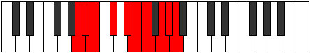 |
| [3547](https://ianring.com/musictheory/scales/3547) | [Sadygic](ModeENaturalSadygic.md) | E | E, F, G, G#, A#, B, C, D, D#, E |  |
| [3547](https://ianring.com/musictheory/scales/3547) | [Sadygic](ModeGNaturalSadygic.md) | G | G, G#, A#, B, C#, D, D#, F, F#, G |  |
| [3549](https://ianring.com/musictheory/scales/3549) | [Phronygic](ModeCSharpPhronygic.md) | C# | C#, D#, E, F, G, G#, A, B, C, C# |  |
| [3549](https://ianring.com/musictheory/scales/3549) | [Phronygic](ModeDFlatPhronygic.md) | Db | Db, Eb, E, F, G, Ab, A, B, C, Db |  |
| [3549](https://ianring.com/musictheory/scales/3549) | [Phronygic](ModeFNaturalPhronygic.md) | F | F, G, G#, A, B, C, C#, D#, E, F |  |
| [3549](https://ianring.com/musictheory/scales/3549) | [Phronygic](ModeANaturalPhronygic.md) | A | A, B, C, C#, D#, E, F, G, G#, A |  |
| [3551](https://ianring.com/musictheory/scales/3551) | [Sagyllian](ModeCSharpSagyllian.md) | C# | C#, D, D#, E, F, G, G#, A, B, C, C# |  |
| [3551](https://ianring.com/musictheory/scales/3551) | [Sagyllian](ModeDFlatSagyllian.md) | Db | Db, D, Eb, E, F, G, Ab, A, B, C, Db |  |
| [3551](https://ianring.com/musictheory/scales/3551) | [Sagyllian](ModeFNaturalSagyllian.md) | F | F, F#, G, G#, A, B, C, C#, D#, E, F |  |
| [3551](https://ianring.com/musictheory/scales/3551) | [Sagyllian](ModeENaturalSagyllian.md) | E | E, F, F#, G, G#, A#, B, C, D, D#, E |  |
| [3551](https://ianring.com/musictheory/scales/3551) | [Sagyllian](ModeANaturalSagyllian.md) | A | A, A#, B, C, C#, D#, E, F, G, G#, A |  |
| [3551](https://ianring.com/musictheory/scales/3551) | [Sagyllian](ModeGNaturalSagyllian.md) | G | G, G#, A, A#, B, C#, D, D#, F, F#, G |  |
| [3557](https://ianring.com/musictheory/scales/3557) | [Thycryllic](ModeANaturalThycryllic.md) | A | A, B, D, D#, E, F, G, G#, A |  |
| [3559](https://ianring.com/musictheory/scales/3559) | [Aerathygic](ModeANaturalAerathygic.md) | A | A, A#, B, D, D#, E, F, G, G#, A |  |
| [3561](https://ianring.com/musictheory/scales/3561) | [Pothyllic](ModeCNaturalPothyllic.md) | C | C, D#, F, F#, G, G#, A#, B, C |  |
| [3563](https://ianring.com/musictheory/scales/3563) | [Ionoptygic](ModeCNaturalIonoptygic.md) | C | C, C#, D#, F, F#, G, G#, A#, B, C |  |
| [3565](https://ianring.com/musictheory/scales/3565) | [Aeolorygic](ModeANaturalAeolorygic.md) | A | A, B, C, D, D#, E, F, G, G#, A |  |
| [3565](https://ianring.com/musictheory/scales/3565) | [Aeolorygic](ModeFNaturalAeolorygic.md) | F | F, G, G#, A#, B, C, C#, D#, E, F |  |
| [3565](https://ianring.com/musictheory/scales/3565) | [Aeolorygic](ModeCNaturalAeolorygic.md) | C | C, D, D#, F, F#, G, G#, A#, B, C |  |
| [3567](https://ianring.com/musictheory/scales/3567) | [Epityllian](ModeCNaturalEpityllian.md) | C | C, C#, D, D#, F, F#, G, G#, A#, B, C |  |
| [3567](https://ianring.com/musictheory/scales/3567) | [Epityllian](ModeFNaturalEpityllian.md) | F | F, F#, G, G#, A#, B, C, C#, D#, E, F |  |
| [3567](https://ianring.com/musictheory/scales/3567) | [Epityllian](ModeANaturalEpityllian.md) | A | A, A#, B, C, D, D#, E, F, G, G#, A |  |
| [3571](https://ianring.com/musictheory/scales/3571) | [Dyrygic](ModeGNaturalDyrygic.md) | G | G, G#, B, C, C#, D, D#, F, F#, G |  |
| [3573](https://ianring.com/musictheory/scales/3573) | [Kaptygic](ModeANaturalKaptygic.md) | A | A, B, C#, D, D#, E, F, G, G#, A |  |
| [3573](https://ianring.com/musictheory/scales/3573) | [Kaptygic](ModeCSharpKaptygic.md) | C# | C#, D#, F, F#, G, G#, A, B, C, C# |  |
| [3573](https://ianring.com/musictheory/scales/3573) | [Kaptygic](ModeDFlatKaptygic.md) | Db | Db, Eb, F, Gb, G, Ab, A, B, C, Db |  |
| [3573](https://ianring.com/musictheory/scales/3573) | [Kaptygic](ModeDSharpKaptygic.md) | D# | D#, F, G, G#, A, A#, B, C#, D, D# |  |
| [3573](https://ianring.com/musictheory/scales/3573) | [Kaptygic](ModeEFlatKaptygic.md) | Eb | Eb, F, G, Ab, A, Bb, B, Db, D, Eb |  |
| [3575](https://ianring.com/musictheory/scales/3575) | [Mogyllian](ModeCSharpMogyllian.md) | C# | C#, D, D#, F, F#, G, G#, A, B, C, C# |  |
| [3575](https://ianring.com/musictheory/scales/3575) | [Mogyllian](ModeDFlatMogyllian.md) | Db | Db, D, Eb, F, Gb, G, Ab, A, B, C, Db |  |
| [3575](https://ianring.com/musictheory/scales/3575) | [Mogyllian](ModeGNaturalMogyllian.md) | G | G, G#, A, B, C, C#, D, D#, F, F#, G |  |
| [3575](https://ianring.com/musictheory/scales/3575) | [Mogyllian](ModeDSharpMogyllian.md) | D# | D#, E, F, G, G#, A, A#, B, C#, D, D# |  |
| [3575](https://ianring.com/musictheory/scales/3575) | [Mogyllian](ModeEFlatMogyllian.md) | Eb | Eb, E, F, G, Ab, A, Bb, B, Db, D, Eb |  |
| [3575](https://ianring.com/musictheory/scales/3575) | [Mogyllian](ModeANaturalMogyllian.md) | A | A, A#, B, C#, D, D#, E, F, G, G#, A |  |
| [3577](https://ianring.com/musictheory/scales/3577) | [Loptygic](ModeCNaturalLoptygic.md) | C | C, D#, E, F, F#, G, G#, A#, B, C |  |
| [3579](https://ianring.com/musictheory/scales/3579) | [Zyphyllian](ModeGNaturalZyphyllian.md) | G | G, G#, A#, B, C, C#, D, D#, F, F#, G |  |
| [3579](https://ianring.com/musictheory/scales/3579) | [Zyphyllian](ModeCNaturalZyphyllian.md) | C | C, C#, D#, E, F, F#, G, G#, A#, B, C |  |
| [3579](https://ianring.com/musictheory/scales/3579) | [Zyphyllian](ModeENaturalZyphyllian.md) | E | E, F, G, G#, A, A#, B, C, D, D#, E |  |
| [3581](https://ianring.com/musictheory/scales/3581) | [Epocryllian](ModeANaturalEpocryllian.md) | A | A, B, C, C#, D, D#, E, F, G, G#, A |  |
| [3581](https://ianring.com/musictheory/scales/3581) | [Epocryllian](ModeCSharpEpocryllian.md) | C# | C#, D#, E, F, F#, G, G#, A, B, C, C# |  |
| [3581](https://ianring.com/musictheory/scales/3581) | [Epocryllian](ModeDFlatEpocryllian.md) | Db | Db, Eb, E, F, Gb, G, Ab, A, B, C, Db |  |
| [3581](https://ianring.com/musictheory/scales/3581) | [Epocryllian](ModeCNaturalEpocryllian.md) | C | C, D, D#, E, F, F#, G, G#, A#, B, C |  |
| [3581](https://ianring.com/musictheory/scales/3581) | [Epocryllian](ModeFNaturalEpocryllian.md) | F | F, G, G#, A, A#, B, C, C#, D#, E, F |  |
| [3581](https://ianring.com/musictheory/scales/3581) | [Epocryllian](ModeDSharpEpocryllian.md) | D# | D#, F, F#, G, G#, A, A#, B, C#, D, D# | 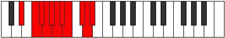 |
| [3581](https://ianring.com/musictheory/scales/3581) | [Epocryllian](ModeEFlatEpocryllian.md) | Eb | Eb, F, Gb, G, Ab, A, Bb, B, Db, D, Eb |  |
| [3583](https://ianring.com/musictheory/scales/3583) | [Zylatic](ModeCSharpZylatic.md) | C# | C#, D, D#, E, F, F#, G, G#, A, B, C, C# |  |
| [3583](https://ianring.com/musictheory/scales/3583) | [Zylatic](ModeDFlatZylatic.md) | Db | Db, D, Eb, E, F, Gb, G, Ab, A, B, C, Db |  |
| [3583](https://ianring.com/musictheory/scales/3583) | [Zylatic](ModeCNaturalZylatic.md) | C | C, C#, D, D#, E, F, F#, G, G#, A#, B, C |  |
| [3583](https://ianring.com/musictheory/scales/3583) | [Zylatic](ModeANaturalZylatic.md) | A | A, A#, B, C, C#, D, D#, E, F, G, G#, A |  |
| [3583](https://ianring.com/musictheory/scales/3583) | [Zylatic](ModeGNaturalZylatic.md) | G | G, G#, A, A#, B, C, C#, D, D#, F, F#, G |  |
| [3583](https://ianring.com/musictheory/scales/3583) | [Zylatic](ModeFNaturalZylatic.md) | F | F, F#, G, G#, A, A#, B, C, C#, D#, E, F |  |
| [3583](https://ianring.com/musictheory/scales/3583) | [Zylatic](ModeENaturalZylatic.md) | E | E, F, F#, G, G#, A, A#, B, C, D, D#, E |  |
| [3583](https://ianring.com/musictheory/scales/3583) | [Zylatic](ModeDSharpZylatic.md) | D# | D#, E, F, F#, G, G#, A, A#, B, C#, D, D# |  |
| [3583](https://ianring.com/musictheory/scales/3583) | [Zylatic](ModeEFlatZylatic.md) | Eb | Eb, E, F, Gb, G, Ab, A, Bb, B, Db, D, Eb |  |
| [3623](https://ianring.com/musictheory/scales/3623) | [Aerocrian](ModeFSharpAerocrian.md) | F# | F#, G, Ab, B, C###, D##, E#, F# |  |
| [3623](https://ianring.com/musictheory/scales/3623) | [Aerocrian](ModeGFlatAerocrian.md) | Gb | Gb, Abb, Bbbb, Cb, D#, E, F, Gb |  |
| [3631](https://ianring.com/musictheory/scales/3631) | [Gydyllic](ModeFSharpGydyllic.md) | F# | F#, G, G#, A, B, D#, E, F, F# |  |
| [3631](https://ianring.com/musictheory/scales/3631) | [Gydyllic](ModeGFlatGydyllic.md) | Gb | Gb, G, Ab, A, B, Eb, E, F, Gb |  |
| [3639](https://ianring.com/musictheory/scales/3639) | [Paptyllic](ModeFSharpPaptyllic.md) | F# | F#, G, G#, A#, B, D#, E, F, F# |  |
| [3639](https://ianring.com/musictheory/scales/3639) | [Paptyllic](ModeGFlatPaptyllic.md) | Gb | Gb, G, Ab, Bb, B, Eb, E, F, Gb |  |
| [3647](https://ianring.com/musictheory/scales/3647) | [Eporygic](ModeFSharpEporygic.md) | F# | F#, G, G#, A, A#, B, D#, E, F, F# |  |
| [3647](https://ianring.com/musictheory/scales/3647) | [Eporygic](ModeGFlatEporygic.md) | Gb | Gb, G, Ab, A, Bb, B, Eb, E, F, Gb |  |
| [3661](https://ianring.com/musictheory/scales/3661) | [Mixodorian](ModeFNaturalMixodorian.md) | F | F, G, Ab, B, C##, D#, E, F |  |
| [3663](https://ianring.com/musictheory/scales/3663) | [Sonyllic](ModeFNaturalSonyllic.md) | F | F, F#, G, G#, B, D, D#, E, F |  |
| [3677](https://ianring.com/musictheory/scales/3677) | [Katylyllic](ModeFNaturalKatylyllic.md) | F | F, G, G#, A, B, D, D#, E, F |  |
| [3679](https://ianring.com/musictheory/scales/3679) | [Rycrygic](ModeFNaturalRycrygic.md) | F | F, F#, G, G#, A, B, D, D#, E, F |  |
| [3687](https://ianring.com/musictheory/scales/3687) | [Zonyllic](ModeFSharpZonyllic.md) | F# | F#, G, G#, B, C, D#, E, F, F# |  |
| [3687](https://ianring.com/musictheory/scales/3687) | [Zonyllic](ModeGFlatZonyllic.md) | Gb | Gb, G, Ab, B, C, Eb, E, F, Gb |  |
| [3691](https://ianring.com/musictheory/scales/3691) | [Badyllic](ModeDNaturalBadyllic.md) | D | D, D#, F, G, G#, B, C, C#, D |  |
| [3693](https://ianring.com/musictheory/scales/3693) | [Epaptyllic](ModeFNaturalEpaptyllic.md) | F | F, G, G#, A#, B, D, D#, E, F |  |
| [3695](https://ianring.com/musictheory/scales/3695) | [Kodygic](ModeDNaturalKodygic.md) | D | D, D#, E, F, G, G#, B, C, C#, D |  |
| [3695](https://ianring.com/musictheory/scales/3695) | [Kodygic](ModeFSharpKodygic.md) | F# | F#, G, G#, A, B, C, D#, E, F, F# |  |
| [3695](https://ianring.com/musictheory/scales/3695) | [Kodygic](ModeGFlatKodygic.md) | Gb | Gb, G, Ab, A, B, C, Eb, E, F, Gb |  |
| [3695](https://ianring.com/musictheory/scales/3695) | [Kodygic](ModeFNaturalKodygic.md) | F | F, F#, G, G#, A#, B, D, D#, E, F |  |
| [3703](https://ianring.com/musictheory/scales/3703) | [Katalygic](ModeFSharpKatalygic.md) | F# | F#, G, G#, A#, B, C, D#, E, F, F# |  |
| [3703](https://ianring.com/musictheory/scales/3703) | [Katalygic](ModeGFlatKatalygic.md) | Gb | Gb, G, Ab, Bb, B, C, Eb, E, F, Gb |  |
| [3707](https://ianring.com/musictheory/scales/3707) | [Rynygic](ModeDNaturalRynygic.md) | D | D, D#, F, F#, G, G#, B, C, C#, D |  |
| [3709](https://ianring.com/musictheory/scales/3709) | [Locrygic](ModeFNaturalLocrygic.md) | F | F, G, G#, A, A#, B, D, D#, E, F |  |
| [3711](https://ianring.com/musictheory/scales/3711) | [Dycryllian](ModeDNaturalDycryllian.md) | D | D, D#, E, F, F#, G, G#, B, C, C#, D |  |
| [3711](https://ianring.com/musictheory/scales/3711) | [Dycryllian](ModeFSharpDycryllian.md) | F# | F#, G, G#, A, A#, B, C, D#, E, F, F# |  |
| [3711](https://ianring.com/musictheory/scales/3711) | [Dycryllian](ModeGFlatDycryllian.md) | Gb | Gb, G, Ab, A, Bb, B, C, Eb, E, F, Gb |  |
| [3711](https://ianring.com/musictheory/scales/3711) | [Dycryllian](ModeFNaturalDycryllian.md) | F | F, F#, G, G#, A, A#, B, D, D#, E, F |  |
| [3721](https://ianring.com/musictheory/scales/3721) | [Phragimic](ModeGSharpPhragimic.md) | G# | G#, A##, C###, D###, E##, F##, G# |  |
| [3721](https://ianring.com/musictheory/scales/3721) | [Phragimic](ModeAFlatPhragimic.md) | Ab | Ab, B, C###, D###, E##, F##, Ab |  |
| [3723](https://ianring.com/musictheory/scales/3723) | [Myptian](ModeGSharpMyptian.md) | G# | G#, A, B, C###, D###, E##, F##, G# | 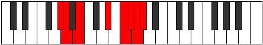 |
| [3723](https://ianring.com/musictheory/scales/3723) | [Myptian](ModeAFlatMyptian.md) | Ab | Ab, Bbb, Cb, D#, E#, F#, G, Ab |  |
| [3725](https://ianring.com/musictheory/scales/3725) | [Kyrian](ModeGSharpKyrian.md) | G# | G#, A#, B, C###, D###, E##, F##, G# |  |
| [3725](https://ianring.com/musictheory/scales/3725) | [Kyrian](ModeAFlatKyrian.md) | Ab | Ab, Bb, Cb, D#, E#, F#, G, Ab |  |
| [3727](https://ianring.com/musictheory/scales/3727) | [Tholyllic](ModeGSharpTholyllic.md) | G# | G#, A, A#, B, D#, F, F#, G, G# |  |
| [3727](https://ianring.com/musictheory/scales/3727) | [Tholyllic](ModeAFlatTholyllic.md) | Ab | Ab, A, Bb, B, Eb, F, Gb, G, Ab |  |
| [3737](https://ianring.com/musictheory/scales/3737) | [Phrocrian](ModeGSharpPhrocrian.md) | G# | G#, A##, B#, C###, D###, E##, F##, G# |  |
| [3737](https://ianring.com/musictheory/scales/3737) | [Phrocrian](ModeAFlatPhrocrian.md) | Ab | Ab, B, C, D#, E#, F#, G, Ab |  |
| [3739](https://ianring.com/musictheory/scales/3739) | [Ioninyllic](ModeENaturalIoninyllic.md) | E | E, F, G, G#, B, C#, D, D#, E |  |
| [3739](https://ianring.com/musictheory/scales/3739) | [Ioninyllic](ModeGSharpIoninyllic.md) | G# | G#, A, B, C, D#, F, F#, G, G# |  |
| [3739](https://ianring.com/musictheory/scales/3739) | [Ioninyllic](ModeAFlatIoninyllic.md) | Ab | Ab, A, B, C, Eb, F, Gb, G, Ab |  |
| [3741](https://ianring.com/musictheory/scales/3741) | [Zydyllic](ModeGSharpZydyllic.md) | G# | G#, A#, B, C, D#, F, F#, G, G# |  |
| [3741](https://ianring.com/musictheory/scales/3741) | [Zydyllic](ModeAFlatZydyllic.md) | Ab | Ab, Bb, B, C, Eb, F, Gb, G, Ab |  |
| [3743](https://ianring.com/musictheory/scales/3743) | [Thadygic](ModeENaturalThadygic.md) | E | E, F, F#, G, G#, B, C#, D, D#, E | 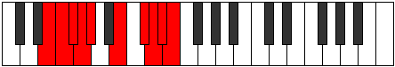 |
| [3743](https://ianring.com/musictheory/scales/3743) | [Thadygic](ModeGSharpThadygic.md) | G# | G#, A, A#, B, C, D#, F, F#, G, G# |  |
| [3743](https://ianring.com/musictheory/scales/3743) | [Thadygic](ModeAFlatThadygic.md) | Ab | Ab, A, Bb, B, C, Eb, F, Gb, G, Ab |  |
| [3747](https://ianring.com/musictheory/scales/3747) | [Myrian](ModeASharpMyrian.md) | A# | A#, B, C###, D###, E###, F###, G##, A# |  |
| [3747](https://ianring.com/musictheory/scales/3747) | [Myrian](ModeBFlatMyrian.md) | Bb | Bb, Cb, D#, E#, F##, G#, A, Bb |  |
| [3751](https://ianring.com/musictheory/scales/3751) | [Aerathyllic](ModeFSharpAerathyllic.md) | F# | F#, G, G#, B, C#, D#, E, F, F# |  |
| [3751](https://ianring.com/musictheory/scales/3751) | [Aerathyllic](ModeGFlatAerathyllic.md) | Gb | Gb, G, Ab, B, Db, Eb, E, F, Gb |  |
| [3751](https://ianring.com/musictheory/scales/3751) | [Aerathyllic](ModeASharpAerathyllic.md) | A# | A#, B, C, D#, F, G, G#, A, A# |  |
| [3751](https://ianring.com/musictheory/scales/3751) | [Aerathyllic](ModeBFlatAerathyllic.md) | Bb | Bb, B, C, Eb, F, G, Ab, A, Bb |  |
| [3753](https://ianring.com/musictheory/scales/3753) | [Phraptian](ModeGSharpPhraptian.md) | G# | G#, A##, B##, C###, D###, E##, F##, G# |  |
| [3753](https://ianring.com/musictheory/scales/3753) | [Phraptian](ModeAFlatPhraptian.md) | Ab | Ab, B, C#, D#, E#, F#, G, Ab |  |
| [3755](https://ianring.com/musictheory/scales/3755) | [Phryryllic](ModeGSharpPhryryllic.md) | G# | G#, A, B, C#, D#, F, F#, G, G# |  |
| [3755](https://ianring.com/musictheory/scales/3755) | [Phryryllic](ModeAFlatPhryryllic.md) | Ab | Ab, A, B, Db, Eb, F, Gb, G, Ab |  |
| [3755](https://ianring.com/musictheory/scales/3755) | [Phryryllic](ModeASharpPhryryllic.md) | A# | A#, B, C#, D#, F, G, G#, A, A# |  |
| [3755](https://ianring.com/musictheory/scales/3755) | [Phryryllic](ModeBFlatPhryryllic.md) | Bb | Bb, B, Db, Eb, F, G, Ab, A, Bb |  |
| [3757](https://ianring.com/musictheory/scales/3757) | [Goptyllic](ModeGSharpGoptyllic.md) | G# | G#, A#, B, C#, D#, F, F#, G, G# |  |
| [3757](https://ianring.com/musictheory/scales/3757) | [Goptyllic](ModeAFlatGoptyllic.md) | Ab | Ab, Bb, B, Db, Eb, F, Gb, G, Ab |  |
| [3759](https://ianring.com/musictheory/scales/3759) | [Darygic](ModeFSharpDarygic.md) | F# | F#, G, G#, A, B, C#, D#, E, F, F# |  |
| [3759](https://ianring.com/musictheory/scales/3759) | [Darygic](ModeGFlatDarygic.md) | Gb | Gb, G, Ab, A, B, Db, Eb, E, F, Gb | 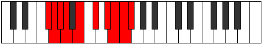 |
| [3759](https://ianring.com/musictheory/scales/3759) | [Darygic](ModeASharpDarygic.md) | A# | A#, B, C, C#, D#, F, G, G#, A, A# |  |
| [3759](https://ianring.com/musictheory/scales/3759) | [Darygic](ModeBFlatDarygic.md) | Bb | Bb, B, C, Db, Eb, F, G, Ab, A, Bb |  |
| [3759](https://ianring.com/musictheory/scales/3759) | [Darygic](ModeGSharpDarygic.md) | G# | G#, A, A#, B, C#, D#, F, F#, G, G# |  |
| [3759](https://ianring.com/musictheory/scales/3759) | [Darygic](ModeAFlatDarygic.md) | Ab | Ab, A, Bb, B, Db, Eb, F, Gb, G, Ab |  |
| [3763](https://ianring.com/musictheory/scales/3763) | [Modyllic](ModeASharpModyllic.md) | A# | A#, B, D, D#, F, G, G#, A, A# |  |
| [3763](https://ianring.com/musictheory/scales/3763) | [Modyllic](ModeBFlatModyllic.md) | Bb | Bb, B, D, Eb, F, G, Ab, A, Bb |  |
| [3767](https://ianring.com/musictheory/scales/3767) | [Bacrygic](ModeFSharpBacrygic.md) | F# | F#, G, G#, A#, B, C#, D#, E, F, F# |  |
| [3767](https://ianring.com/musictheory/scales/3767) | [Bacrygic](ModeGFlatBacrygic.md) | Gb | Gb, G, Ab, Bb, B, Db, Eb, E, F, Gb |  |
| [3767](https://ianring.com/musictheory/scales/3767) | [Bacrygic](ModeASharpBacrygic.md) | A# | A#, B, C, D, D#, F, G, G#, A, A# |  |
| [3767](https://ianring.com/musictheory/scales/3767) | [Bacrygic](ModeBFlatBacrygic.md) | Bb | Bb, B, C, D, Eb, F, G, Ab, A, Bb |  |
| [3769](https://ianring.com/musictheory/scales/3769) | [Aeracryllic](ModeGSharpAeracryllic.md) | G# | G#, B, C, C#, D#, F, F#, G, G# |  |
| [3769](https://ianring.com/musictheory/scales/3769) | [Aeracryllic](ModeAFlatAeracryllic.md) | Ab | Ab, B, C, Db, Eb, F, Gb, G, Ab |  |
| [3771](https://ianring.com/musictheory/scales/3771) | [Stophygic](ModeENaturalStophygic.md) | E | E, F, G, G#, A, B, C#, D, D#, E |  |
| [3771](https://ianring.com/musictheory/scales/3771) | [Stophygic](ModeGSharpStophygic.md) | G# | G#, A, B, C, C#, D#, F, F#, G, G# |  |
| [3771](https://ianring.com/musictheory/scales/3771) | [Stophygic](ModeAFlatStophygic.md) | Ab | Ab, A, B, C, Db, Eb, F, Gb, G, Ab |  |
| [3771](https://ianring.com/musictheory/scales/3771) | [Stophygic](ModeASharpStophygic.md) | A# | A#, B, C#, D, D#, F, G, G#, A, A# |  |
| [3771](https://ianring.com/musictheory/scales/3771) | [Stophygic](ModeBFlatStophygic.md) | Bb | Bb, B, Db, D, Eb, F, G, Ab, A, Bb |  |
| [3773](https://ianring.com/musictheory/scales/3773) | [Sorygic](ModeGSharpSorygic.md) | G# | G#, A#, B, C, C#, D#, F, F#, G, G# |  |
| [3773](https://ianring.com/musictheory/scales/3773) | [Sorygic](ModeAFlatSorygic.md) | Ab | Ab, Bb, B, C, Db, Eb, F, Gb, G, Ab |  |
| [3775](https://ianring.com/musictheory/scales/3775) | [Loptyllian](ModeENaturalLoptyllian.md) | E | E, F, F#, G, G#, A, B, C#, D, D#, E |  |
| [3775](https://ianring.com/musictheory/scales/3775) | [Loptyllian](ModeASharpLoptyllian.md) | A# | A#, B, C, C#, D, D#, F, G, G#, A, A# |  |
| [3775](https://ianring.com/musictheory/scales/3775) | [Loptyllian](ModeBFlatLoptyllian.md) | Bb | Bb, B, C, Db, D, Eb, F, G, Ab, A, Bb |  |
| [3775](https://ianring.com/musictheory/scales/3775) | [Loptyllian](ModeGSharpLoptyllian.md) | G# | G#, A, A#, B, C, C#, D#, F, F#, G, G# |  |
| [3775](https://ianring.com/musictheory/scales/3775) | [Loptyllian](ModeAFlatLoptyllian.md) | Ab | Ab, A, Bb, B, C, Db, Eb, F, Gb, G, Ab |  |
| [3775](https://ianring.com/musictheory/scales/3775) | [Loptyllian](ModeFSharpLoptyllian.md) | F# | F#, G, G#, A, A#, B, C#, D#, E, F, F# |  |
| [3775](https://ianring.com/musictheory/scales/3775) | [Loptyllian](ModeGFlatLoptyllian.md) | Gb | Gb, G, Ab, A, Bb, B, Db, Eb, E, F, Gb |  |
| [3785](https://ianring.com/musictheory/scales/3785) | [Epagian](ModeGSharpEpagian.md) | G# | G#, A##, B###, C###, D###, E##, F##, G# |  |
| [3785](https://ianring.com/musictheory/scales/3785) | [Epagian](ModeAFlatEpagian.md) | Ab | Ab, B, C##, D#, E#, F#, G, Ab |  |
| [3787](https://ianring.com/musictheory/scales/3787) | [Kagyllic](ModeGSharpKagyllic.md) | G# | G#, A, B, D, D#, F, F#, G, G# |  |
| [3787](https://ianring.com/musictheory/scales/3787) | [Kagyllic](ModeAFlatKagyllic.md) | Ab | Ab, A, B, D, Eb, F, Gb, G, Ab |  |
| [3789](https://ianring.com/musictheory/scales/3789) | [Eporyllic](ModeFNaturalEporyllic.md) | F | F, G, G#, B, C, D, D#, E, F |  |
| [3789](https://ianring.com/musictheory/scales/3789) | [Eporyllic](ModeGSharpEporyllic.md) | G# | G#, A#, B, D, D#, F, F#, G, G# |  |
| [3789](https://ianring.com/musictheory/scales/3789) | [Eporyllic](ModeAFlatEporyllic.md) | Ab | Ab, Bb, B, D, Eb, F, Gb, G, Ab |  |
| [3791](https://ianring.com/musictheory/scales/3791) | [Stodygic](ModeFNaturalStodygic.md) | F | F, F#, G, G#, B, C, D, D#, E, F |  |
| [3791](https://ianring.com/musictheory/scales/3791) | [Stodygic](ModeGSharpStodygic.md) | G# | G#, A, A#, B, D, D#, F, F#, G, G# |  |
| [3791](https://ianring.com/musictheory/scales/3791) | [Stodygic](ModeAFlatStodygic.md) | Ab | Ab, A, Bb, B, D, Eb, F, Gb, G, Ab |  |
| [3797](https://ianring.com/musictheory/scales/3797) | [Rocryllic](ModeCSharpRocryllic.md) | C# | C#, D#, F, G, G#, A#, B, C, C# |  |
| [3797](https://ianring.com/musictheory/scales/3797) | [Rocryllic](ModeDFlatRocryllic.md) | Db | Db, Eb, F, G, Ab, Bb, B, C, Db |  |
| [3799](https://ianring.com/musictheory/scales/3799) | [Aeralygic](ModeCSharpAeralygic.md) | C# | C#, D, D#, F, G, G#, A#, B, C, C# |  |
| [3799](https://ianring.com/musictheory/scales/3799) | [Aeralygic](ModeDFlatAeralygic.md) | Db | Db, D, Eb, F, G, Ab, Bb, B, C, Db |  |
| [3801](https://ianring.com/musictheory/scales/3801) | [Maptyllic](ModeGSharpMaptyllic.md) | G# | G#, B, C, D, D#, F, F#, G, G# |  |
| [3801](https://ianring.com/musictheory/scales/3801) | [Maptyllic](ModeAFlatMaptyllic.md) | Ab | Ab, B, C, D, Eb, F, Gb, G, Ab |  |
| [3803](https://ianring.com/musictheory/scales/3803) | [Epidygic](ModeGSharpEpidygic.md) | G# | G#, A, B, C, D, D#, F, F#, G, G# |  |
| [3803](https://ianring.com/musictheory/scales/3803) | [Epidygic](ModeAFlatEpidygic.md) | Ab | Ab, A, B, C, D, Eb, F, Gb, G, Ab |  |
| [3803](https://ianring.com/musictheory/scales/3803) | [Epidygic](ModeENaturalEpidygic.md) | E | E, F, G, G#, A#, B, C#, D, D#, E |  |
| [3805](https://ianring.com/musictheory/scales/3805) | [Moptygic](ModeFNaturalMoptygic.md) | F | F, G, G#, A, B, C, D, D#, E, F |  |
| [3805](https://ianring.com/musictheory/scales/3805) | [Moptygic](ModeCSharpMoptygic.md) | C# | C#, D#, E, F, G, G#, A#, B, C, C# |  |
| [3805](https://ianring.com/musictheory/scales/3805) | [Moptygic](ModeDFlatMoptygic.md) | Db | Db, Eb, E, F, G, Ab, Bb, B, C, Db |  |
| [3805](https://ianring.com/musictheory/scales/3805) | [Moptygic](ModeGSharpMoptygic.md) | G# | G#, A#, B, C, D, D#, F, F#, G, G# |  |
| [3805](https://ianring.com/musictheory/scales/3805) | [Moptygic](ModeAFlatMoptygic.md) | Ab | Ab, Bb, B, C, D, Eb, F, Gb, G, Ab |  |
| [3807](https://ianring.com/musictheory/scales/3807) | [Bagyllian](ModeFNaturalBagyllian.md) | F | F, F#, G, G#, A, B, C, D, D#, E, F |  |
| [3807](https://ianring.com/musictheory/scales/3807) | [Bagyllian](ModeCSharpBagyllian.md) | C# | C#, D, D#, E, F, G, G#, A#, B, C, C# |  |
| [3807](https://ianring.com/musictheory/scales/3807) | [Bagyllian](ModeDFlatBagyllian.md) | Db | Db, D, Eb, E, F, G, Ab, Bb, B, C, Db |  |
| [3807](https://ianring.com/musictheory/scales/3807) | [Bagyllian](ModeENaturalBagyllian.md) | E | E, F, F#, G, G#, A#, B, C#, D, D#, E |  |
| [3807](https://ianring.com/musictheory/scales/3807) | [Bagyllian](ModeGSharpBagyllian.md) | G# | G#, A, A#, B, C, D, D#, F, F#, G, G# |  |
| [3807](https://ianring.com/musictheory/scales/3807) | [Bagyllian](ModeAFlatBagyllian.md) | Ab | Ab, A, Bb, B, C, D, Eb, F, Gb, G, Ab |  |
| [3811](https://ianring.com/musictheory/scales/3811) | [Epogyllic](ModeASharpEpogyllic.md) | A# | A#, B, D#, E, F, G, G#, A, A# |  |
| [3811](https://ianring.com/musictheory/scales/3811) | [Epogyllic](ModeBFlatEpogyllic.md) | Bb | Bb, B, Eb, E, F, G, Ab, A, Bb |  |
| [3815](https://ianring.com/musictheory/scales/3815) | [Mylygic](ModeFSharpMylygic.md) | F# | F#, G, G#, B, C, C#, D#, E, F, F# |  |
| [3815](https://ianring.com/musictheory/scales/3815) | [Mylygic](ModeGFlatMylygic.md) | Gb | Gb, G, Ab, B, C, Db, Eb, E, F, Gb |  |
| [3815](https://ianring.com/musictheory/scales/3815) | [Mylygic](ModeASharpMylygic.md) | A# | A#, B, C, D#, E, F, G, G#, A, A# |  |
| [3815](https://ianring.com/musictheory/scales/3815) | [Mylygic](ModeBFlatMylygic.md) | Bb | Bb, B, C, Eb, E, F, G, Ab, A, Bb |  |
| [3817](https://ianring.com/musictheory/scales/3817) | [Zoryllic](ModeGSharpZoryllic.md) | G# | G#, B, C#, D, D#, F, F#, G, G# |  |
| [3817](https://ianring.com/musictheory/scales/3817) | [Zoryllic](ModeAFlatZoryllic.md) | Ab | Ab, B, Db, D, Eb, F, Gb, G, Ab |  |
| [3819](https://ianring.com/musictheory/scales/3819) | [Aeolanygic](ModeDNaturalAeolanygic.md) | D | D, D#, F, G, G#, A, B, C, C#, D |  |
| [3819](https://ianring.com/musictheory/scales/3819) | [Aeolanygic](ModeGSharpAeolanygic.md) | G# | G#, A, B, C#, D, D#, F, F#, G, G# |  |
| [3819](https://ianring.com/musictheory/scales/3819) | [Aeolanygic](ModeAFlatAeolanygic.md) | Ab | Ab, A, B, Db, D, Eb, F, Gb, G, Ab |  |
| [3819](https://ianring.com/musictheory/scales/3819) | [Aeolanygic](ModeASharpAeolanygic.md) | A# | A#, B, C#, D#, E, F, G, G#, A, A# |  |
| [3819](https://ianring.com/musictheory/scales/3819) | [Aeolanygic](ModeBFlatAeolanygic.md) | Bb | Bb, B, Db, Eb, E, F, G, Ab, A, Bb |  |
| [3821](https://ianring.com/musictheory/scales/3821) | [Epyrygic](ModeFNaturalEpyrygic.md) | F | F, G, G#, A#, B, C, D, D#, E, F |  |
| [3821](https://ianring.com/musictheory/scales/3821) | [Epyrygic](ModeGSharpEpyrygic.md) | G# | G#, A#, B, C#, D, D#, F, F#, G, G# |  |
| [3821](https://ianring.com/musictheory/scales/3821) | [Epyrygic](ModeAFlatEpyrygic.md) | Ab | Ab, Bb, B, Db, D, Eb, F, Gb, G, Ab |  |
| [3823](https://ianring.com/musictheory/scales/3823) | [Epinyllian](ModeDNaturalEpinyllian.md) | D | D, D#, E, F, G, G#, A, B, C, C#, D |  |
| [3823](https://ianring.com/musictheory/scales/3823) | [Epinyllian](ModeFSharpEpinyllian.md) | F# | F#, G, G#, A, B, C, C#, D#, E, F, F# |  |
| [3823](https://ianring.com/musictheory/scales/3823) | [Epinyllian](ModeGFlatEpinyllian.md) | Gb | Gb, G, Ab, A, B, C, Db, Eb, E, F, Gb |  |
| [3823](https://ianring.com/musictheory/scales/3823) | [Epinyllian](ModeFNaturalEpinyllian.md) | F | F, F#, G, G#, A#, B, C, D, D#, E, F |  |
| [3823](https://ianring.com/musictheory/scales/3823) | [Epinyllian](ModeASharpEpinyllian.md) | A# | A#, B, C, C#, D#, E, F, G, G#, A, A# |  |
| [3823](https://ianring.com/musictheory/scales/3823) | [Epinyllian](ModeBFlatEpinyllian.md) | Bb | Bb, B, C, Db, Eb, E, F, G, Ab, A, Bb |  |
| [3823](https://ianring.com/musictheory/scales/3823) | [Epinyllian](ModeGSharpEpinyllian.md) | G# | G#, A, A#, B, C#, D, D#, F, F#, G, G# |  |
| [3823](https://ianring.com/musictheory/scales/3823) | [Epinyllian](ModeAFlatEpinyllian.md) | Ab | Ab, A, Bb, B, Db, D, Eb, F, Gb, G, Ab |  |
| [3827](https://ianring.com/musictheory/scales/3827) | [Dorygic](ModeASharpDorygic.md) | A# | A#, B, D, D#, E, F, G, G#, A, A# |  |
| [3827](https://ianring.com/musictheory/scales/3827) | [Dorygic](ModeBFlatDorygic.md) | Bb | Bb, B, D, Eb, E, F, G, Ab, A, Bb |  |
| [3829](https://ianring.com/musictheory/scales/3829) | [Aerycrygic](ModeCSharpAerycrygic.md) | C# | C#, D#, F, F#, G, G#, A#, B, C, C# |  |
| [3829](https://ianring.com/musictheory/scales/3829) | [Aerycrygic](ModeDFlatAerycrygic.md) | Db | Db, Eb, F, Gb, G, Ab, Bb, B, C, Db |  |
| [3831](https://ianring.com/musictheory/scales/3831) | [Ionyllian](ModeCSharpIonyllian.md) | C# | C#, D, D#, F, F#, G, G#, A#, B, C, C# |  |
| [3831](https://ianring.com/musictheory/scales/3831) | [Ionyllian](ModeDFlatIonyllian.md) | Db | Db, D, Eb, F, Gb, G, Ab, Bb, B, C, Db |  |
| [3831](https://ianring.com/musictheory/scales/3831) | [Ionyllian](ModeFSharpIonyllian.md) | F# | F#, G, G#, A#, B, C, C#, D#, E, F, F# |  |
| [3831](https://ianring.com/musictheory/scales/3831) | [Ionyllian](ModeGFlatIonyllian.md) | Gb | Gb, G, Ab, Bb, B, C, Db, Eb, E, F, Gb |  |
| [3831](https://ianring.com/musictheory/scales/3831) | [Ionyllian](ModeASharpIonyllian.md) | A# | A#, B, C, D, D#, E, F, G, G#, A, A# |  |
| [3831](https://ianring.com/musictheory/scales/3831) | [Ionyllian](ModeBFlatIonyllian.md) | Bb | Bb, B, C, D, Eb, E, F, G, Ab, A, Bb |  |
| [3833](https://ianring.com/musictheory/scales/3833) | [Dycrygic](ModeGSharpDycrygic.md) | G# | G#, B, C, C#, D, D#, F, F#, G, G# |  |
| [3833](https://ianring.com/musictheory/scales/3833) | [Dycrygic](ModeAFlatDycrygic.md) | Ab | Ab, B, C, Db, D, Eb, F, Gb, G, Ab |  |
| [3835](https://ianring.com/musictheory/scales/3835) | [Katodyllian](ModeDNaturalKatodyllian.md) | D | D, D#, F, F#, G, G#, A, B, C, C#, D |  |
| [3835](https://ianring.com/musictheory/scales/3835) | [Katodyllian](ModeGSharpKatodyllian.md) | G# | G#, A, B, C, C#, D, D#, F, F#, G, G# |  |
| [3835](https://ianring.com/musictheory/scales/3835) | [Katodyllian](ModeAFlatKatodyllian.md) | Ab | Ab, A, B, C, Db, D, Eb, F, Gb, G, Ab |  |
| [3835](https://ianring.com/musictheory/scales/3835) | [Katodyllian](ModeENaturalKatodyllian.md) | E | E, F, G, G#, A, A#, B, C#, D, D#, E |  |
| [3835](https://ianring.com/musictheory/scales/3835) | [Katodyllian](ModeASharpKatodyllian.md) | A# | A#, B, C#, D, D#, E, F, G, G#, A, A# |  |
| [3835](https://ianring.com/musictheory/scales/3835) | [Katodyllian](ModeBFlatKatodyllian.md) | Bb | Bb, B, Db, D, Eb, E, F, G, Ab, A, Bb |  |
| [3837](https://ianring.com/musictheory/scales/3837) | [Garyllian](ModeGSharpGaryllian.md) | G# | G#, A#, B, C, C#, D, D#, F, F#, G, G# |  |
| [3837](https://ianring.com/musictheory/scales/3837) | [Garyllian](ModeAFlatGaryllian.md) | Ab | Ab, Bb, B, C, Db, D, Eb, F, Gb, G, Ab |  |
| [3837](https://ianring.com/musictheory/scales/3837) | [Garyllian](ModeCSharpGaryllian.md) | C# | C#, D#, E, F, F#, G, G#, A#, B, C, C# |  |
| [3837](https://ianring.com/musictheory/scales/3837) | [Garyllian](ModeDFlatGaryllian.md) | Db | Db, Eb, E, F, Gb, G, Ab, Bb, B, C, Db |  |
| [3837](https://ianring.com/musictheory/scales/3837) | [Garyllian](ModeFNaturalGaryllian.md) | F | F, G, G#, A, A#, B, C, D, D#, E, F |  |
| [3839](https://ianring.com/musictheory/scales/3839) | [Mixolatic](ModeDNaturalMixolatic.md) | D | D, D#, E, F, F#, G, G#, A, B, C, C#, D |  |
| [3839](https://ianring.com/musictheory/scales/3839) | [Mixolatic](ModeCSharpMixolatic.md) | C# | C#, D, D#, E, F, F#, G, G#, A#, B, C, C# |  |
| [3839](https://ianring.com/musictheory/scales/3839) | [Mixolatic](ModeDFlatMixolatic.md) | Db | Db, D, Eb, E, F, Gb, G, Ab, Bb, B, C, Db |  |
| [3839](https://ianring.com/musictheory/scales/3839) | [Mixolatic](ModeASharpMixolatic.md) | A# | A#, B, C, C#, D, D#, E, F, G, G#, A, A# |  |
| [3839](https://ianring.com/musictheory/scales/3839) | [Mixolatic](ModeBFlatMixolatic.md) | Bb | Bb, B, C, Db, D, Eb, E, F, G, Ab, A, Bb |  |
| [3839](https://ianring.com/musictheory/scales/3839) | [Mixolatic](ModeGSharpMixolatic.md) | G# | G#, A, A#, B, C, C#, D, D#, F, F#, G, G# |  |
| [3839](https://ianring.com/musictheory/scales/3839) | [Mixolatic](ModeAFlatMixolatic.md) | Ab | Ab, A, Bb, B, C, Db, D, Eb, F, Gb, G, Ab |  |
| [3839](https://ianring.com/musictheory/scales/3839) | [Mixolatic](ModeFSharpMixolatic.md) | F# | F#, G, G#, A, A#, B, C, C#, D#, E, F, F# |  |
| [3839](https://ianring.com/musictheory/scales/3839) | [Mixolatic](ModeGFlatMixolatic.md) | Gb | Gb, G, Ab, A, Bb, B, C, Db, Eb, E, F, Gb |  |
| [3839](https://ianring.com/musictheory/scales/3839) | [Mixolatic](ModeFNaturalMixolatic.md) | F | F, F#, G, G#, A, A#, B, C, D, D#, E, F |  |
| [3839](https://ianring.com/musictheory/scales/3839) | [Mixolatic](ModeENaturalMixolatic.md) | E | E, F, F#, G, G#, A, A#, B, C#, D, D#, E |  |
| [3859](https://ianring.com/musictheory/scales/3859) | [Aeolarian](ModeGNaturalAeolarian.md) | G | G, Ab, B, C###, D##, E#, F#, G |  |
| [3863](https://ianring.com/musictheory/scales/3863) | [Eparyllic](ModeGNaturalEparyllic.md) | G | G, G#, A, B, D#, E, F, F#, G |  |
| [3867](https://ianring.com/musictheory/scales/3867) | [Storyllic](ModeGNaturalStoryllic.md) | G | G, G#, A#, B, D#, E, F, F#, G |  |
| [3871](https://ianring.com/musictheory/scales/3871) | [Aerynygic](ModeGNaturalAerynygic.md) | G | G, G#, A, A#, B, D#, E, F, F#, G |  |
| [3879](https://ianring.com/musictheory/scales/3879) | [Pathyllic](ModeFSharpPathyllic.md) | F# | F#, G, G#, B, D, D#, E, F, F# |  |
| [3879](https://ianring.com/musictheory/scales/3879) | [Pathyllic](ModeGFlatPathyllic.md) | Gb | Gb, G, Ab, B, D, Eb, E, F, Gb |  |
| [3887](https://ianring.com/musictheory/scales/3887) | [Phrathygic](ModeFSharpPhrathygic.md) | F# | F#, G, G#, A, B, D, D#, E, F, F# |  |
| [3887](https://ianring.com/musictheory/scales/3887) | [Phrathygic](ModeGFlatPhrathygic.md) | Gb | Gb, G, Ab, A, B, D, Eb, E, F, Gb |  |
| [3891](https://ianring.com/musictheory/scales/3891) | [Ryryllic](ModeGNaturalRyryllic.md) | G | G, G#, B, C, D#, E, F, F#, G |  |
| [3893](https://ianring.com/musictheory/scales/3893) | [Phrocryllic](ModeDSharpPhrocryllic.md) | D# | D#, F, G, G#, B, C, C#, D, D# |  |
| [3893](https://ianring.com/musictheory/scales/3893) | [Phrocryllic](ModeEFlatPhrocryllic.md) | Eb | Eb, F, G, Ab, B, C, Db, D, Eb |  |
| [3895](https://ianring.com/musictheory/scales/3895) | [Eparygic](ModeDSharpEparygic.md) | D# | D#, E, F, G, G#, B, C, C#, D, D# |  |
| [3895](https://ianring.com/musictheory/scales/3895) | [Eparygic](ModeEFlatEparygic.md) | Eb | Eb, E, F, G, Ab, B, C, Db, D, Eb |  |
| [3895](https://ianring.com/musictheory/scales/3895) | [Eparygic](ModeGNaturalEparygic.md) | G | G, G#, A, B, C, D#, E, F, F#, G |  |
| [3895](https://ianring.com/musictheory/scales/3895) | [Eparygic](ModeFSharpEparygic.md) | F# | F#, G, G#, A#, B, D, D#, E, F, F# |  |
| [3895](https://ianring.com/musictheory/scales/3895) | [Eparygic](ModeGFlatEparygic.md) | Gb | Gb, G, Ab, Bb, B, D, Eb, E, F, Gb |  |
| [3899](https://ianring.com/musictheory/scales/3899) | [Katorygic](ModeGNaturalKatorygic.md) | G | G, G#, A#, B, C, D#, E, F, F#, G |  |
| [3901](https://ianring.com/musictheory/scales/3901) | [Bycrygic](ModeDSharpBycrygic.md) | D# | D#, F, F#, G, G#, B, C, C#, D, D# |  |
| [3901](https://ianring.com/musictheory/scales/3901) | [Bycrygic](ModeEFlatBycrygic.md) | Eb | Eb, F, Gb, G, Ab, B, C, Db, D, Eb |  |
| [3903](https://ianring.com/musictheory/scales/3903) | [Aeogyllian](ModeDSharpAeogyllian.md) | D# | D#, E, F, F#, G, G#, B, C, C#, D, D# |  |
| [3903](https://ianring.com/musictheory/scales/3903) | [Aeogyllian](ModeEFlatAeogyllian.md) | Eb | Eb, E, F, Gb, G, Ab, B, C, Db, D, Eb |  |
| [3903](https://ianring.com/musictheory/scales/3903) | [Aeogyllian](ModeGNaturalAeogyllian.md) | G | G, G#, A, A#, B, C, D#, E, F, F#, G |  |
| [3903](https://ianring.com/musictheory/scales/3903) | [Aeogyllian](ModeFSharpAeogyllian.md) | F# | F#, G, G#, A, A#, B, D, D#, E, F, F# |  |
| [3903](https://ianring.com/musictheory/scales/3903) | [Aeogyllian](ModeGFlatAeogyllian.md) | Gb | Gb, G, Ab, A, Bb, B, D, Eb, E, F, Gb | 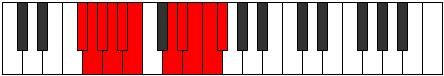 |
| [3909](https://ianring.com/musictheory/scales/3909) | [Rydian](ModeANaturalRydian.md) | A | A, B, C###, D###, E##, F##, G#, A |  |
| [3911](https://ianring.com/musictheory/scales/3911) | [Katyryllic](ModeANaturalKatyryllic.md) | A | A, A#, B, D#, F, F#, G, G#, A |  |
| [3917](https://ianring.com/musictheory/scales/3917) | [Epaphyllic](ModeFNaturalEpaphyllic.md) | F | F, G, G#, B, C#, D, D#, E, F |  |
| [3917](https://ianring.com/musictheory/scales/3917) | [Epaphyllic](ModeANaturalEpaphyllic.md) | A | A, B, C, D#, F, F#, G, G#, A |  |
| [3919](https://ianring.com/musictheory/scales/3919) | [Lynygic](ModeFNaturalLynygic.md) | F | F, F#, G, G#, B, C#, D, D#, E, F |  |
| [3919](https://ianring.com/musictheory/scales/3919) | [Lynygic](ModeANaturalLynygic.md) | A | A, A#, B, C, D#, F, F#, G, G#, A |  |
| [3921](https://ianring.com/musictheory/scales/3921) | [Pythian](ModeBNaturalPythian.md) | B | B, C###, D###, E###, F###, G##, A#, B |  |
| [3923](https://ianring.com/musictheory/scales/3923) | [Stoptyllic](ModeGNaturalStoptyllic.md) | G | G, G#, B, C#, D#, E, F, F#, G |  |
| [3923](https://ianring.com/musictheory/scales/3923) | [Stoptyllic](ModeBNaturalStoptyllic.md) | B | B, C, D#, F, G, G#, A, A#, B |  |
| [3925](https://ianring.com/musictheory/scales/3925) | [Thyryllic](ModeANaturalThyryllic.md) | A | A, B, C#, D#, F, F#, G, G#, A |  |
| [3925](https://ianring.com/musictheory/scales/3925) | [Thyryllic](ModeBNaturalThyryllic.md) | B | B, C#, D#, F, G, G#, A, A#, B |  |
| [3927](https://ianring.com/musictheory/scales/3927) | [Monygic](ModeGNaturalMonygic.md) | G | G, G#, A, B, C#, D#, E, F, F#, G |  |
| [3927](https://ianring.com/musictheory/scales/3927) | [Monygic](ModeBNaturalMonygic.md) | B | B, C, C#, D#, F, G, G#, A, A#, B |  |
| [3927](https://ianring.com/musictheory/scales/3927) | [Monygic](ModeANaturalMonygic.md) | A | A, A#, B, C#, D#, F, F#, G, G#, A |  |
| [3929](https://ianring.com/musictheory/scales/3929) | [Aeolothyllic](ModeBNaturalAeolothyllic.md) | B | B, D, D#, F, G, G#, A, A#, B |  |
| [3931](https://ianring.com/musictheory/scales/3931) | [Aerygic](ModeGNaturalAerygic.md) | G | G, G#, A#, B, C#, D#, E, F, F#, G |  |
| [3931](https://ianring.com/musictheory/scales/3931) | [Aerygic](ModeBNaturalAerygic.md) | B | B, C, D, D#, F, G, G#, A, A#, B |  |
| [3933](https://ianring.com/musictheory/scales/3933) | [Ionidygic](ModeFNaturalIonidygic.md) | F | F, G, G#, A, B, C#, D, D#, E, F |  |
| [3933](https://ianring.com/musictheory/scales/3933) | [Ionidygic](ModeANaturalIonidygic.md) | A | A, B, C, C#, D#, F, F#, G, G#, A |  |
| [3933](https://ianring.com/musictheory/scales/3933) | [Ionidygic](ModeBNaturalIonidygic.md) | B | B, C#, D, D#, F, G, G#, A, A#, B |  |
| [3935](https://ianring.com/musictheory/scales/3935) | [Kataphyllian](ModeFNaturalKataphyllian.md) | F | F, F#, G, G#, A, B, C#, D, D#, E, F |  |
| [3935](https://ianring.com/musictheory/scales/3935) | [Kataphyllian](ModeBNaturalKataphyllian.md) | B | B, C, C#, D, D#, F, G, G#, A, A#, B |  |
| [3935](https://ianring.com/musictheory/scales/3935) | [Kataphyllian](ModeANaturalKataphyllian.md) | A | A, A#, B, C, C#, D#, F, F#, G, G#, A |  |
| [3935](https://ianring.com/musictheory/scales/3935) | [Kataphyllian](ModeGNaturalKataphyllian.md) | G | G, G#, A, A#, B, C#, D#, E, F, F#, G |  |
| [3941](https://ianring.com/musictheory/scales/3941) | [Stathyllic](ModeANaturalStathyllic.md) | A | A, B, D, D#, F, F#, G, G#, A |  |
| [3943](https://ianring.com/musictheory/scales/3943) | [Zynygic](ModeFSharpZynygic.md) | F# | F#, G, G#, B, C, D, D#, E, F, F# |  |
| [3943](https://ianring.com/musictheory/scales/3943) | [Zynygic](ModeGFlatZynygic.md) | Gb | Gb, G, Ab, B, C, D, Eb, E, F, Gb |  |
| [3943](https://ianring.com/musictheory/scales/3943) | [Zynygic](ModeANaturalZynygic.md) | A | A, A#, B, D, D#, F, F#, G, G#, A |  |
| [3947](https://ianring.com/musictheory/scales/3947) | [Ryptygic](ModeDNaturalRyptygic.md) | D | D, D#, F, G, G#, A#, B, C, C#, D |  |
| [3949](https://ianring.com/musictheory/scales/3949) | [Koptygic](ModeANaturalKoptygic.md) | A | A, B, C, D, D#, F, F#, G, G#, A |  |
| [3949](https://ianring.com/musictheory/scales/3949) | [Koptygic](ModeFNaturalKoptygic.md) | F | F, G, G#, A#, B, C#, D, D#, E, F |  |
| [3951](https://ianring.com/musictheory/scales/3951) | [Mathyllian](ModeFSharpMathyllian.md) | F# | F#, G, G#, A, B, C, D, D#, E, F, F# |  |
| [3951](https://ianring.com/musictheory/scales/3951) | [Mathyllian](ModeGFlatMathyllian.md) | Gb | Gb, G, Ab, A, B, C, D, Eb, E, F, Gb |  |
| [3951](https://ianring.com/musictheory/scales/3951) | [Mathyllian](ModeDNaturalMathyllian.md) | D | D, D#, E, F, G, G#, A#, B, C, C#, D |  |
| [3951](https://ianring.com/musictheory/scales/3951) | [Mathyllian](ModeFNaturalMathyllian.md) | F | F, F#, G, G#, A#, B, C#, D, D#, E, F |  |
| [3951](https://ianring.com/musictheory/scales/3951) | [Mathyllian](ModeANaturalMathyllian.md) | A | A, A#, B, C, D, D#, F, F#, G, G#, A |  |
| [3953](https://ianring.com/musictheory/scales/3953) | [Thagyllic](ModeBNaturalThagyllic.md) | B | B, D#, E, F, G, G#, A, A#, B |  |
| [3955](https://ianring.com/musictheory/scales/3955) | [Galygic](ModeGNaturalGalygic.md) | G | G, G#, B, C, C#, D#, E, F, F#, G |  |
| [3955](https://ianring.com/musictheory/scales/3955) | [Galygic](ModeBNaturalGalygic.md) | B | B, C, D#, E, F, G, G#, A, A#, B |  |
| [3957](https://ianring.com/musictheory/scales/3957) | [Porygic](ModeDSharpPorygic.md) | D# | D#, F, G, G#, A, B, C, C#, D, D# |  |
| [3957](https://ianring.com/musictheory/scales/3957) | [Porygic](ModeEFlatPorygic.md) | Eb | Eb, F, G, Ab, A, B, C, Db, D, Eb |  |
| [3957](https://ianring.com/musictheory/scales/3957) | [Porygic](ModeANaturalPorygic.md) | A | A, B, C#, D, D#, F, F#, G, G#, A |  |
| [3957](https://ianring.com/musictheory/scales/3957) | [Porygic](ModeBNaturalPorygic.md) | B | B, C#, D#, E, F, G, G#, A, A#, B |  |
| [3959](https://ianring.com/musictheory/scales/3959) | [Katagyllian](ModeDSharpKatagyllian.md) | D# | D#, E, F, G, G#, A, B, C, C#, D, D# |  |
| [3959](https://ianring.com/musictheory/scales/3959) | [Katagyllian](ModeEFlatKatagyllian.md) | Eb | Eb, E, F, G, Ab, A, B, C, Db, D, Eb |  |
| [3959](https://ianring.com/musictheory/scales/3959) | [Katagyllian](ModeGNaturalKatagyllian.md) | G | G, G#, A, B, C, C#, D#, E, F, F#, G |  |
| [3959](https://ianring.com/musictheory/scales/3959) | [Katagyllian](ModeFSharpKatagyllian.md) | F# | F#, G, G#, A#, B, C, D, D#, E, F, F# |  |
| [3959](https://ianring.com/musictheory/scales/3959) | [Katagyllian](ModeGFlatKatagyllian.md) | Gb | Gb, G, Ab, Bb, B, C, D, Eb, E, F, Gb |  |
| [3959](https://ianring.com/musictheory/scales/3959) | [Katagyllian](ModeBNaturalKatagyllian.md) | B | B, C, C#, D#, E, F, G, G#, A, A#, B |  |
| [3959](https://ianring.com/musictheory/scales/3959) | [Katagyllian](ModeANaturalKatagyllian.md) | A | A, A#, B, C#, D, D#, F, F#, G, G#, A |  |
| [3961](https://ianring.com/musictheory/scales/3961) | [Mixolydygic](ModeBNaturalMixolydygic.md) | B | B, D, D#, E, F, G, G#, A, A#, B |  |
| [3963](https://ianring.com/musictheory/scales/3963) | [Aeoryllian](ModeDNaturalAeoryllian.md) | D | D, D#, F, F#, G, G#, A#, B, C, C#, D |  |
| [3963](https://ianring.com/musictheory/scales/3963) | [Aeoryllian](ModeGNaturalAeoryllian.md) | G | G, G#, A#, B, C, C#, D#, E, F, F#, G |  |
| [3963](https://ianring.com/musictheory/scales/3963) | [Aeoryllian](ModeBNaturalAeoryllian.md) | B | B, C, D, D#, E, F, G, G#, A, A#, B |  |
| [3965](https://ianring.com/musictheory/scales/3965) | [Thydyllian](ModeDSharpThydyllian.md) | D# | D#, F, F#, G, G#, A, B, C, C#, D, D# |  |
| [3965](https://ianring.com/musictheory/scales/3965) | [Thydyllian](ModeEFlatThydyllian.md) | Eb | Eb, F, Gb, G, Ab, A, B, C, Db, D, Eb |  |
| [3965](https://ianring.com/musictheory/scales/3965) | [Thydyllian](ModeANaturalThydyllian.md) | A | A, B, C, C#, D, D#, F, F#, G, G#, A |  |
| [3965](https://ianring.com/musictheory/scales/3965) | [Thydyllian](ModeFNaturalThydyllian.md) | F | F, G, G#, A, A#, B, C#, D, D#, E, F |  |
| [3965](https://ianring.com/musictheory/scales/3965) | [Thydyllian](ModeBNaturalThydyllian.md) | B | B, C#, D, D#, E, F, G, G#, A, A#, B |  |
| [3967](https://ianring.com/musictheory/scales/3967) | [Soratic](ModeDSharpSoratic.md) | D# | D#, E, F, F#, G, G#, A, B, C, C#, D, D# |  |
| [3967](https://ianring.com/musictheory/scales/3967) | [Soratic](ModeEFlatSoratic.md) | Eb | Eb, E, F, Gb, G, Ab, A, B, C, Db, D, Eb |  |
| [3967](https://ianring.com/musictheory/scales/3967) | [Soratic](ModeDNaturalSoratic.md) | D | D, D#, E, F, F#, G, G#, A#, B, C, C#, D |  |
| [3967](https://ianring.com/musictheory/scales/3967) | [Soratic](ModeBNaturalSoratic.md) | B | B, C, C#, D, D#, E, F, G, G#, A, A#, B |  |
| [3967](https://ianring.com/musictheory/scales/3967) | [Soratic](ModeANaturalSoratic.md) | A | A, A#, B, C, C#, D, D#, F, F#, G, G#, A |  |
| [3967](https://ianring.com/musictheory/scales/3967) | [Soratic](ModeGNaturalSoratic.md) | G | G, G#, A, A#, B, C, C#, D#, E, F, F#, G |  |
| [3967](https://ianring.com/musictheory/scales/3967) | [Soratic](ModeFSharpSoratic.md) | F# | F#, G, G#, A, A#, B, C, D, D#, E, F, F# |  |
| [3967](https://ianring.com/musictheory/scales/3967) | [Soratic](ModeGFlatSoratic.md) | Gb | Gb, G, Ab, A, Bb, B, C, D, Eb, E, F, Gb |  |
| [3967](https://ianring.com/musictheory/scales/3967) | [Soratic](ModeFNaturalSoratic.md) | F | F, F#, G, G#, A, A#, B, C#, D, D#, E, F |  |
| [3977](https://ianring.com/musictheory/scales/3977) | [Kythian](ModeGSharpKythian.md) | G# | G#, A##, C###, D##, E#, F#, G, G# |  |
| [3977](https://ianring.com/musictheory/scales/3977) | [Kythian](ModeAFlatKythian.md) | Ab | Ab, B, C###, D##, E#, F#, G, Ab |  |
| [3979](https://ianring.com/musictheory/scales/3979) | [Dynyllic](ModeGSharpDynyllic.md) | G# | G#, A, B, D#, E, F, F#, G, G# |  |
| [3979](https://ianring.com/musictheory/scales/3979) | [Dynyllic](ModeAFlatDynyllic.md) | Ab | Ab, A, B, Eb, E, F, Gb, G, Ab |  |
| [3981](https://ianring.com/musictheory/scales/3981) | [Phrycryllic](ModeGSharpPhrycryllic.md) | G# | G#, A#, B, D#, E, F, F#, G, G# |  |
| [3981](https://ianring.com/musictheory/scales/3981) | [Phrycryllic](ModeAFlatPhrycryllic.md) | Ab | Ab, Bb, B, Eb, E, F, Gb, G, Ab |  |
| [3983](https://ianring.com/musictheory/scales/3983) | [Thyptygic](ModeGSharpThyptygic.md) | G# | G#, A, A#, B, D#, E, F, F#, G, G# |  |
| [3983](https://ianring.com/musictheory/scales/3983) | [Thyptygic](ModeAFlatThyptygic.md) | Ab | Ab, A, Bb, B, Eb, E, F, Gb, G, Ab |  |
| [3987](https://ianring.com/musictheory/scales/3987) | [Loryllic](ModeGNaturalLoryllic.md) | G | G, G#, B, D, D#, E, F, F#, G |  |
| [3991](https://ianring.com/musictheory/scales/3991) | [Badygic](ModeGNaturalBadygic.md) | G | G, G#, A, B, D, D#, E, F, F#, G |  |
| [3993](https://ianring.com/musictheory/scales/3993) | [Ioniptyllic](ModeGSharpIoniptyllic.md) | G# | G#, B, C, D#, E, F, F#, G, G# |  |
| [3993](https://ianring.com/musictheory/scales/3993) | [Ioniptyllic](ModeAFlatIoniptyllic.md) | Ab | Ab, B, C, Eb, E, F, Gb, G, Ab |  |
| [3995](https://ianring.com/musictheory/scales/3995) | [Ionygic](ModeENaturalIonygic.md) | E | E, F, G, G#, B, C, C#, D, D#, E |  |
| [3995](https://ianring.com/musictheory/scales/3995) | [Ionygic](ModeGSharpIonygic.md) | G# | G#, A, B, C, D#, E, F, F#, G, G# |  |
| [3995](https://ianring.com/musictheory/scales/3995) | [Ionygic](ModeAFlatIonygic.md) | Ab | Ab, A, B, C, Eb, E, F, Gb, G, Ab |  |
| [3995](https://ianring.com/musictheory/scales/3995) | [Ionygic](ModeGNaturalIonygic.md) | G | G, G#, A#, B, D, D#, E, F, F#, G |  |
| [3997](https://ianring.com/musictheory/scales/3997) | [Dogygic](ModeGSharpDogygic.md) | G# | G#, A#, B, C, D#, E, F, F#, G, G# |  |
| [3997](https://ianring.com/musictheory/scales/3997) | [Dogygic](ModeAFlatDogygic.md) | Ab | Ab, Bb, B, C, Eb, E, F, Gb, G, Ab |  |
| [3999](https://ianring.com/musictheory/scales/3999) | [Dydyllian](ModeENaturalDydyllian.md) | E | E, F, F#, G, G#, B, C, C#, D, D#, E |  |
| [3999](https://ianring.com/musictheory/scales/3999) | [Dydyllian](ModeGSharpDydyllian.md) | G# | G#, A, A#, B, C, D#, E, F, F#, G, G# |  |
| [3999](https://ianring.com/musictheory/scales/3999) | [Dydyllian](ModeAFlatDydyllian.md) | Ab | Ab, A, Bb, B, C, Eb, E, F, Gb, G, Ab |  |
| [3999](https://ianring.com/musictheory/scales/3999) | [Dydyllian](ModeGNaturalDydyllian.md) | G | G, G#, A, A#, B, D, D#, E, F, F#, G |  |
| [4003](https://ianring.com/musictheory/scales/4003) | [Sadyllic](ModeASharpSadyllic.md) | A# | A#, B, D#, F, F#, G, G#, A, A# |  |
| [4003](https://ianring.com/musictheory/scales/4003) | [Sadyllic](ModeBFlatSadyllic.md) | Bb | Bb, B, Eb, F, Gb, G, Ab, A, Bb |  |
| [4007](https://ianring.com/musictheory/scales/4007) | [Doptygic](ModeFSharpDoptygic.md) | F# | F#, G, G#, B, C#, D, D#, E, F, F# |  |
| [4007](https://ianring.com/musictheory/scales/4007) | [Doptygic](ModeGFlatDoptygic.md) | Gb | Gb, G, Ab, B, Db, D, Eb, E, F, Gb |  |
| [4007](https://ianring.com/musictheory/scales/4007) | [Doptygic](ModeASharpDoptygic.md) | A# | A#, B, C, D#, F, F#, G, G#, A, A# |  |
| [4007](https://ianring.com/musictheory/scales/4007) | [Doptygic](ModeBFlatDoptygic.md) | Bb | Bb, B, C, Eb, F, Gb, G, Ab, A, Bb |  |
| [4009](https://ianring.com/musictheory/scales/4009) | [Phranyllic](ModeGSharpPhranyllic.md) | G# | G#, B, C#, D#, E, F, F#, G, G# |  |
| [4009](https://ianring.com/musictheory/scales/4009) | [Phranyllic](ModeAFlatPhranyllic.md) | Ab | Ab, B, Db, Eb, E, F, Gb, G, Ab |  |
| [4009](https://ianring.com/musictheory/scales/4009) | [Phranyllic](ModeCNaturalPhranyllic.md) | C | C, D#, F, G, G#, A, A#, B, C |  |
| [4011](https://ianring.com/musictheory/scales/4011) | [Styrygic](ModeGSharpStyrygic.md) | G# | G#, A, B, C#, D#, E, F, F#, G, G# |  |
| [4011](https://ianring.com/musictheory/scales/4011) | [Styrygic](ModeAFlatStyrygic.md) | Ab | Ab, A, B, Db, Eb, E, F, Gb, G, Ab |  |
| [4011](https://ianring.com/musictheory/scales/4011) | [Styrygic](ModeCNaturalStyrygic.md) | C | C, C#, D#, F, G, G#, A, A#, B, C |  |
| [4011](https://ianring.com/musictheory/scales/4011) | [Styrygic](ModeASharpStyrygic.md) | A# | A#, B, C#, D#, F, F#, G, G#, A, A# |  |
| [4011](https://ianring.com/musictheory/scales/4011) | [Styrygic](ModeBFlatStyrygic.md) | Bb | Bb, B, Db, Eb, F, Gb, G, Ab, A, Bb |  |
| [4013](https://ianring.com/musictheory/scales/4013) | [Dathygic](ModeGSharpDathygic.md) | G# | G#, A#, B, C#, D#, E, F, F#, G, G# |  |
| [4013](https://ianring.com/musictheory/scales/4013) | [Dathygic](ModeAFlatDathygic.md) | Ab | Ab, Bb, B, Db, Eb, E, F, Gb, G, Ab |  |
| [4013](https://ianring.com/musictheory/scales/4013) | [Dathygic](ModeCNaturalDathygic.md) | C | C, D, D#, F, G, G#, A, A#, B, C |  |
| [4015](https://ianring.com/musictheory/scales/4015) | [Phradyllian](ModeFSharpPhradyllian.md) | F# | F#, G, G#, A, B, C#, D, D#, E, F, F# |  |
| [4015](https://ianring.com/musictheory/scales/4015) | [Phradyllian](ModeGFlatPhradyllian.md) | Gb | Gb, G, Ab, A, B, Db, D, Eb, E, F, Gb |  |
| [4015](https://ianring.com/musictheory/scales/4015) | [Phradyllian](ModeCNaturalPhradyllian.md) | C | C, C#, D, D#, F, G, G#, A, A#, B, C |  |
| [4015](https://ianring.com/musictheory/scales/4015) | [Phradyllian](ModeASharpPhradyllian.md) | A# | A#, B, C, C#, D#, F, F#, G, G#, A, A# |  |
| [4015](https://ianring.com/musictheory/scales/4015) | [Phradyllian](ModeBFlatPhradyllian.md) | Bb | Bb, B, C, Db, Eb, F, Gb, G, Ab, A, Bb |  |
| [4015](https://ianring.com/musictheory/scales/4015) | [Phradyllian](ModeGSharpPhradyllian.md) | G# | G#, A, A#, B, C#, D#, E, F, F#, G, G# |  |
| [4015](https://ianring.com/musictheory/scales/4015) | [Phradyllian](ModeAFlatPhradyllian.md) | Ab | Ab, A, Bb, B, Db, Eb, E, F, Gb, G, Ab |  |
| [4019](https://ianring.com/musictheory/scales/4019) | [Lonygic](ModeGNaturalLonygic.md) | G | G, G#, B, C, D, D#, E, F, F#, G |  |
| [4019](https://ianring.com/musictheory/scales/4019) | [Lonygic](ModeASharpLonygic.md) | A# | A#, B, D, D#, F, F#, G, G#, A, A# |  |
| [4019](https://ianring.com/musictheory/scales/4019) | [Lonygic](ModeBFlatLonygic.md) | Bb | Bb, B, D, Eb, F, Gb, G, Ab, A, Bb |  |
| [4021](https://ianring.com/musictheory/scales/4021) | [Bagygic](ModeDSharpBagygic.md) | D# | D#, F, G, G#, A#, B, C, C#, D, D# |  |
| [4021](https://ianring.com/musictheory/scales/4021) | [Bagygic](ModeEFlatBagygic.md) | Eb | Eb, F, G, Ab, Bb, B, C, Db, D, Eb |  |
| [4023](https://ianring.com/musictheory/scales/4023) | [Styptyllian](ModeGNaturalStyptyllian.md) | G | G, G#, A, B, C, D, D#, E, F, F#, G |  |
| [4023](https://ianring.com/musictheory/scales/4023) | [Styptyllian](ModeDSharpStyptyllian.md) | D# | D#, E, F, G, G#, A#, B, C, C#, D, D# |  |
| [4023](https://ianring.com/musictheory/scales/4023) | [Styptyllian](ModeEFlatStyptyllian.md) | Eb | Eb, E, F, G, Ab, Bb, B, C, Db, D, Eb |  |
| [4023](https://ianring.com/musictheory/scales/4023) | [Styptyllian](ModeFSharpStyptyllian.md) | F# | F#, G, G#, A#, B, C#, D, D#, E, F, F# |  |
| [4023](https://ianring.com/musictheory/scales/4023) | [Styptyllian](ModeGFlatStyptyllian.md) | Gb | Gb, G, Ab, Bb, B, Db, D, Eb, E, F, Gb |  |
| [4023](https://ianring.com/musictheory/scales/4023) | [Styptyllian](ModeASharpStyptyllian.md) | A# | A#, B, C, D, D#, F, F#, G, G#, A, A# |  |
| [4023](https://ianring.com/musictheory/scales/4023) | [Styptyllian](ModeBFlatStyptyllian.md) | Bb | Bb, B, C, D, Eb, F, Gb, G, Ab, A, Bb |  |
| [4025](https://ianring.com/musictheory/scales/4025) | [Kalygic](ModeGSharpKalygic.md) | G# | G#, B, C, C#, D#, E, F, F#, G, G# |  |
| [4025](https://ianring.com/musictheory/scales/4025) | [Kalygic](ModeAFlatKalygic.md) | Ab | Ab, B, C, Db, Eb, E, F, Gb, G, Ab |  |
| [4025](https://ianring.com/musictheory/scales/4025) | [Kalygic](ModeCNaturalKalygic.md) | C | C, D#, E, F, G, G#, A, A#, B, C |  |
| [4027](https://ianring.com/musictheory/scales/4027) | [Ragyllian](ModeENaturalRagyllian.md) | E | E, F, G, G#, A, B, C, C#, D, D#, E |  |
| [4027](https://ianring.com/musictheory/scales/4027) | [Ragyllian](ModeGSharpRagyllian.md) | G# | G#, A, B, C, C#, D#, E, F, F#, G, G# |  |
| [4027](https://ianring.com/musictheory/scales/4027) | [Ragyllian](ModeAFlatRagyllian.md) | Ab | Ab, A, B, C, Db, Eb, E, F, Gb, G, Ab |  |
| [4027](https://ianring.com/musictheory/scales/4027) | [Ragyllian](ModeGNaturalRagyllian.md) | G | G, G#, A#, B, C, D, D#, E, F, F#, G |  |
| [4027](https://ianring.com/musictheory/scales/4027) | [Ragyllian](ModeCNaturalRagyllian.md) | C | C, C#, D#, E, F, G, G#, A, A#, B, C |  |
| [4027](https://ianring.com/musictheory/scales/4027) | [Ragyllian](ModeASharpRagyllian.md) | A# | A#, B, C#, D, D#, F, F#, G, G#, A, A# |  |
| [4027](https://ianring.com/musictheory/scales/4027) | [Ragyllian](ModeBFlatRagyllian.md) | Bb | Bb, B, Db, D, Eb, F, Gb, G, Ab, A, Bb |  |
| [4029](https://ianring.com/musictheory/scales/4029) | [Aerycryllian](ModeDSharpAerycryllian.md) | D# | D#, F, F#, G, G#, A#, B, C, C#, D, D# |  |
| [4029](https://ianring.com/musictheory/scales/4029) | [Aerycryllian](ModeEFlatAerycryllian.md) | Eb | Eb, F, Gb, G, Ab, Bb, B, C, Db, D, Eb |  |
| [4029](https://ianring.com/musictheory/scales/4029) | [Aerycryllian](ModeGSharpAerycryllian.md) | G# | G#, A#, B, C, C#, D#, E, F, F#, G, G# |  |
| [4029](https://ianring.com/musictheory/scales/4029) | [Aerycryllian](ModeAFlatAerycryllian.md) | Ab | Ab, Bb, B, C, Db, Eb, E, F, Gb, G, Ab |  |
| [4029](https://ianring.com/musictheory/scales/4029) | [Aerycryllian](ModeCNaturalAerycryllian.md) | C | C, D, D#, E, F, G, G#, A, A#, B, C |  |
| [4031](https://ianring.com/musictheory/scales/4031) | [Godatic](ModeENaturalGodatic.md) | E | E, F, F#, G, G#, A, B, C, C#, D, D#, E |  |
| [4031](https://ianring.com/musictheory/scales/4031) | [Godatic](ModeDSharpGodatic.md) | D# | D#, E, F, F#, G, G#, A#, B, C, C#, D, D# |  |
| [4031](https://ianring.com/musictheory/scales/4031) | [Godatic](ModeEFlatGodatic.md) | Eb | Eb, E, F, Gb, G, Ab, Bb, B, C, Db, D, Eb |  |
| [4031](https://ianring.com/musictheory/scales/4031) | [Godatic](ModeCNaturalGodatic.md) | C | C, C#, D, D#, E, F, G, G#, A, A#, B, C |  |
| [4031](https://ianring.com/musictheory/scales/4031) | [Godatic](ModeASharpGodatic.md) | A# | A#, B, C, C#, D, D#, F, F#, G, G#, A, A# |  |
| [4031](https://ianring.com/musictheory/scales/4031) | [Godatic](ModeBFlatGodatic.md) | Bb | Bb, B, C, Db, D, Eb, F, Gb, G, Ab, A, Bb |  |
| [4031](https://ianring.com/musictheory/scales/4031) | [Godatic](ModeGSharpGodatic.md) | G# | G#, A, A#, B, C, C#, D#, E, F, F#, G, G# |  |
| [4031](https://ianring.com/musictheory/scales/4031) | [Godatic](ModeAFlatGodatic.md) | Ab | Ab, A, Bb, B, C, Db, Eb, E, F, Gb, G, Ab |  |
| [4031](https://ianring.com/musictheory/scales/4031) | [Godatic](ModeGNaturalGodatic.md) | G | G, G#, A, A#, B, C, D, D#, E, F, F#, G |  |
| [4031](https://ianring.com/musictheory/scales/4031) | [Godatic](ModeFSharpGodatic.md) | F# | F#, G, G#, A, A#, B, C#, D, D#, E, F, F# |  |
| [4031](https://ianring.com/musictheory/scales/4031) | [Godatic](ModeGFlatGodatic.md) | Gb | Gb, G, Ab, A, Bb, B, Db, D, Eb, E, F, Gb |  |
| [4037](https://ianring.com/musictheory/scales/4037) | [Ionyllic](ModeANaturalIonyllic.md) | A | A, B, D#, E, F, F#, G, G#, A |  |
| [4039](https://ianring.com/musictheory/scales/4039) | [Ionogygic](ModeANaturalIonogygic.md) | A | A, A#, B, D#, E, F, F#, G, G#, A |  |
| [4041](https://ianring.com/musictheory/scales/4041) | [Zaryllic](ModeGSharpZaryllic.md) | G# | G#, B, D, D#, E, F, F#, G, G# |  |
| [4041](https://ianring.com/musictheory/scales/4041) | [Zaryllic](ModeAFlatZaryllic.md) | Ab | Ab, B, D, Eb, E, F, Gb, G, Ab |  |
| [4043](https://ianring.com/musictheory/scales/4043) | [Phrocrygic](ModeGSharpPhrocrygic.md) | G# | G#, A, B, D, D#, E, F, F#, G, G# |  |
| [4043](https://ianring.com/musictheory/scales/4043) | [Phrocrygic](ModeAFlatPhrocrygic.md) | Ab | Ab, A, B, D, Eb, E, F, Gb, G, Ab |  |
| [4045](https://ianring.com/musictheory/scales/4045) | [Gyptygic](ModeFNaturalGyptygic.md) | F | F, G, G#, B, C, C#, D, D#, E, F |  |
| [4045](https://ianring.com/musictheory/scales/4045) | [Gyptygic](ModeANaturalGyptygic.md) | A | A, B, C, D#, E, F, F#, G, G#, A |  |
| [4045](https://ianring.com/musictheory/scales/4045) | [Gyptygic](ModeGSharpGyptygic.md) | G# | G#, A#, B, D, D#, E, F, F#, G, G# |  |
| [4045](https://ianring.com/musictheory/scales/4045) | [Gyptygic](ModeAFlatGyptygic.md) | Ab | Ab, Bb, B, D, Eb, E, F, Gb, G, Ab |  |
| [4047](https://ianring.com/musictheory/scales/4047) | [Thogyllian](ModeFNaturalThogyllian.md) | F | F, F#, G, G#, B, C, C#, D, D#, E, F |  |
| [4047](https://ianring.com/musictheory/scales/4047) | [Thogyllian](ModeANaturalThogyllian.md) | A | A, A#, B, C, D#, E, F, F#, G, G#, A |  |
| [4047](https://ianring.com/musictheory/scales/4047) | [Thogyllian](ModeGSharpThogyllian.md) | G# | G#, A, A#, B, D, D#, E, F, F#, G, G# |  |
| [4047](https://ianring.com/musictheory/scales/4047) | [Thogyllian](ModeAFlatThogyllian.md) | Ab | Ab, A, Bb, B, D, Eb, E, F, Gb, G, Ab |  |
| [4049](https://ianring.com/musictheory/scales/4049) | [Stycryllic](ModeBNaturalStycryllic.md) | B | B, D#, F, F#, G, G#, A, A#, B |  |
| [4051](https://ianring.com/musictheory/scales/4051) | [Ionilygic](ModeGNaturalIonilygic.md) | G | G, G#, B, C#, D, D#, E, F, F#, G |  |
| [4051](https://ianring.com/musictheory/scales/4051) | [Ionilygic](ModeBNaturalIonilygic.md) | B | B, C, D#, F, F#, G, G#, A, A#, B |  |
| [4053](https://ianring.com/musictheory/scales/4053) | [Kyrygic](ModeANaturalKyrygic.md) | A | A, B, C#, D#, E, F, F#, G, G#, A |  |
| [4053](https://ianring.com/musictheory/scales/4053) | [Kyrygic](ModeCSharpKyrygic.md) | C# | C#, D#, F, G, G#, A, A#, B, C, C# |  |
| [4053](https://ianring.com/musictheory/scales/4053) | [Kyrygic](ModeDFlatKyrygic.md) | Db | Db, Eb, F, G, Ab, A, Bb, B, C, Db |  |
| [4053](https://ianring.com/musictheory/scales/4053) | [Kyrygic](ModeBNaturalKyrygic.md) | B | B, C#, D#, F, F#, G, G#, A, A#, B |  |
| [4055](https://ianring.com/musictheory/scales/4055) | [Dagyllian](ModeGNaturalDagyllian.md) | G | G, G#, A, B, C#, D, D#, E, F, F#, G |  |
| [4055](https://ianring.com/musictheory/scales/4055) | [Dagyllian](ModeCSharpDagyllian.md) | C# | C#, D, D#, F, G, G#, A, A#, B, C, C# |  |
| [4055](https://ianring.com/musictheory/scales/4055) | [Dagyllian](ModeDFlatDagyllian.md) | Db | Db, D, Eb, F, G, Ab, A, Bb, B, C, Db |  |
| [4055](https://ianring.com/musictheory/scales/4055) | [Dagyllian](ModeBNaturalDagyllian.md) | B | B, C, C#, D#, F, F#, G, G#, A, A#, B |  |
| [4055](https://ianring.com/musictheory/scales/4055) | [Dagyllian](ModeANaturalDagyllian.md) | A | A, A#, B, C#, D#, E, F, F#, G, G#, A |  |
| [4057](https://ianring.com/musictheory/scales/4057) | [Phrygic](ModeGSharpPhrygic.md) | G# | G#, B, C, D, D#, E, F, F#, G, G# |  |
| [4057](https://ianring.com/musictheory/scales/4057) | [Phrygic](ModeAFlatPhrygic.md) | Ab | Ab, B, C, D, Eb, E, F, Gb, G, Ab |  |
| [4057](https://ianring.com/musictheory/scales/4057) | [Phrygic](ModeBNaturalPhrygic.md) | B | B, D, D#, F, F#, G, G#, A, A#, B |  |
| [4059](https://ianring.com/musictheory/scales/4059) | [Zolyllian](ModeGSharpZolyllian.md) | G# | G#, A, B, C, D, D#, E, F, F#, G, G# |  |
| [4059](https://ianring.com/musictheory/scales/4059) | [Zolyllian](ModeAFlatZolyllian.md) | Ab | Ab, A, B, C, D, Eb, E, F, Gb, G, Ab |  |
| [4059](https://ianring.com/musictheory/scales/4059) | [Zolyllian](ModeENaturalZolyllian.md) | E | E, F, G, G#, A#, B, C, C#, D, D#, E |  |
| [4059](https://ianring.com/musictheory/scales/4059) | [Zolyllian](ModeGNaturalZolyllian.md) | G | G, G#, A#, B, C#, D, D#, E, F, F#, G |  |
| [4059](https://ianring.com/musictheory/scales/4059) | [Zolyllian](ModeBNaturalZolyllian.md) | B | B, C, D, D#, F, F#, G, G#, A, A#, B |  |
| [4061](https://ianring.com/musictheory/scales/4061) | [Staptyllian](ModeFNaturalStaptyllian.md) | F | F, G, G#, A, B, C, C#, D, D#, E, F |  |
| [4061](https://ianring.com/musictheory/scales/4061) | [Staptyllian](ModeANaturalStaptyllian.md) | A | A, B, C, C#, D#, E, F, F#, G, G#, A |  |
| [4061](https://ianring.com/musictheory/scales/4061) | [Staptyllian](ModeGSharpStaptyllian.md) | G# | G#, A#, B, C, D, D#, E, F, F#, G, G# |  |
| [4061](https://ianring.com/musictheory/scales/4061) | [Staptyllian](ModeAFlatStaptyllian.md) | Ab | Ab, Bb, B, C, D, Eb, E, F, Gb, G, Ab |  |
| [4061](https://ianring.com/musictheory/scales/4061) | [Staptyllian](ModeCSharpStaptyllian.md) | C# | C#, D#, E, F, G, G#, A, A#, B, C, C# |  |
| [4061](https://ianring.com/musictheory/scales/4061) | [Staptyllian](ModeDFlatStaptyllian.md) | Db | Db, Eb, E, F, G, Ab, A, Bb, B, C, Db |  |
| [4061](https://ianring.com/musictheory/scales/4061) | [Staptyllian](ModeBNaturalStaptyllian.md) | B | B, C#, D, D#, F, F#, G, G#, A, A#, B |  |
| [4063](https://ianring.com/musictheory/scales/4063) | [Eptatic](ModeFNaturalEptatic.md) | F | F, F#, G, G#, A, B, C, C#, D, D#, E, F |  |
| [4063](https://ianring.com/musictheory/scales/4063) | [Eptatic](ModeENaturalEptatic.md) | E | E, F, F#, G, G#, A#, B, C, C#, D, D#, E |  |
| [4063](https://ianring.com/musictheory/scales/4063) | [Eptatic](ModeCSharpEptatic.md) | C# | C#, D, D#, E, F, G, G#, A, A#, B, C, C# |  |
| [4063](https://ianring.com/musictheory/scales/4063) | [Eptatic](ModeDFlatEptatic.md) | Db | Db, D, Eb, E, F, G, Ab, A, Bb, B, C, Db |  |
| [4063](https://ianring.com/musictheory/scales/4063) | [Eptatic](ModeBNaturalEptatic.md) | B | B, C, C#, D, D#, F, F#, G, G#, A, A#, B |  |
| [4063](https://ianring.com/musictheory/scales/4063) | [Eptatic](ModeANaturalEptatic.md) | A | A, A#, B, C, C#, D#, E, F, F#, G, G#, A |  |
| [4063](https://ianring.com/musictheory/scales/4063) | [Eptatic](ModeGSharpEptatic.md) | G# | G#, A, A#, B, C, D, D#, E, F, F#, G, G# |  |
| [4063](https://ianring.com/musictheory/scales/4063) | [Eptatic](ModeAFlatEptatic.md) | Ab | Ab, A, Bb, B, C, D, Eb, E, F, Gb, G, Ab |  |
| [4063](https://ianring.com/musictheory/scales/4063) | [Eptatic](ModeGNaturalEptatic.md) | G | G, G#, A, A#, B, C#, D, D#, E, F, F#, G |  |
| [4067](https://ianring.com/musictheory/scales/4067) | [Aeolarygic](ModeASharpAeolarygic.md) | A# | A#, B, D#, E, F, F#, G, G#, A, A# |  |
| [4067](https://ianring.com/musictheory/scales/4067) | [Aeolarygic](ModeBFlatAeolarygic.md) | Bb | Bb, B, Eb, E, F, Gb, G, Ab, A, Bb |  |
| [4069](https://ianring.com/musictheory/scales/4069) | [Starygic](ModeANaturalStarygic.md) | A | A, B, D, D#, E, F, F#, G, G#, A |  |
| [4071](https://ianring.com/musictheory/scales/4071) | [Rygyllian](ModeFSharpRygyllian.md) | F# | F#, G, G#, B, C, C#, D, D#, E, F, F# |  |
| [4071](https://ianring.com/musictheory/scales/4071) | [Rygyllian](ModeGFlatRygyllian.md) | Gb | Gb, G, Ab, B, C, Db, D, Eb, E, F, Gb |  |
| [4071](https://ianring.com/musictheory/scales/4071) | [Rygyllian](ModeASharpRygyllian.md) | A# | A#, B, C, D#, E, F, F#, G, G#, A, A# |  |
| [4071](https://ianring.com/musictheory/scales/4071) | [Rygyllian](ModeBFlatRygyllian.md) | Bb | Bb, B, C, Eb, E, F, Gb, G, Ab, A, Bb |  |
| [4071](https://ianring.com/musictheory/scales/4071) | [Rygyllian](ModeANaturalRygyllian.md) | A | A, A#, B, D, D#, E, F, F#, G, G#, A |  |
| [4073](https://ianring.com/musictheory/scales/4073) | [Sathygic](ModeGSharpSathygic.md) | G# | G#, B, C#, D, D#, E, F, F#, G, G# |  |
| [4073](https://ianring.com/musictheory/scales/4073) | [Sathygic](ModeAFlatSathygic.md) | Ab | Ab, B, Db, D, Eb, E, F, Gb, G, Ab |  |
| [4073](https://ianring.com/musictheory/scales/4073) | [Sathygic](ModeCNaturalSathygic.md) | C | C, D#, F, F#, G, G#, A, A#, B, C |  |
| [4075](https://ianring.com/musictheory/scales/4075) | [Katyllian](ModeGSharpKatyllian.md) | G# | G#, A, B, C#, D, D#, E, F, F#, G, G# |  |
| [4075](https://ianring.com/musictheory/scales/4075) | [Katyllian](ModeAFlatKatyllian.md) | Ab | Ab, A, B, Db, D, Eb, E, F, Gb, G, Ab |  |
| [4075](https://ianring.com/musictheory/scales/4075) | [Katyllian](ModeDNaturalKatyllian.md) | D | D, D#, F, G, G#, A, A#, B, C, C#, D |  |
| [4075](https://ianring.com/musictheory/scales/4075) | [Katyllian](ModeCNaturalKatyllian.md) | C | C, C#, D#, F, F#, G, G#, A, A#, B, C |  |
| [4075](https://ianring.com/musictheory/scales/4075) | [Katyllian](ModeASharpKatyllian.md) | A# | A#, B, C#, D#, E, F, F#, G, G#, A, A# |  |
| [4075](https://ianring.com/musictheory/scales/4075) | [Katyllian](ModeBFlatKatyllian.md) | Bb | Bb, B, Db, Eb, E, F, Gb, G, Ab, A, Bb |  |
| [4077](https://ianring.com/musictheory/scales/4077) | [Gothyllian](ModeANaturalGothyllian.md) | A | A, B, C, D, D#, E, F, F#, G, G#, A |  |
| [4077](https://ianring.com/musictheory/scales/4077) | [Gothyllian](ModeFNaturalGothyllian.md) | F | F, G, G#, A#, B, C, C#, D, D#, E, F |  |
| [4077](https://ianring.com/musictheory/scales/4077) | [Gothyllian](ModeGSharpGothyllian.md) | G# | G#, A#, B, C#, D, D#, E, F, F#, G, G# |  |
| [4077](https://ianring.com/musictheory/scales/4077) | [Gothyllian](ModeAFlatGothyllian.md) | Ab | Ab, Bb, B, Db, D, Eb, E, F, Gb, G, Ab |  |
| [4077](https://ianring.com/musictheory/scales/4077) | [Gothyllian](ModeCNaturalGothyllian.md) | C | C, D, D#, F, F#, G, G#, A, A#, B, C |  |
| [4079](https://ianring.com/musictheory/scales/4079) | [Ionatic](ModeFSharpIonatic.md) | F# | F#, G, G#, A, B, C, C#, D, D#, E, F, F# |  |
| [4079](https://ianring.com/musictheory/scales/4079) | [Ionatic](ModeGFlatIonatic.md) | Gb | Gb, G, Ab, A, B, C, Db, D, Eb, E, F, Gb |  |
| [4079](https://ianring.com/musictheory/scales/4079) | [Ionatic](ModeFNaturalIonatic.md) | F | F, F#, G, G#, A#, B, C, C#, D, D#, E, F |  |
| [4079](https://ianring.com/musictheory/scales/4079) | [Ionatic](ModeDNaturalIonatic.md) | D | D, D#, E, F, G, G#, A, A#, B, C, C#, D |  |
| [4079](https://ianring.com/musictheory/scales/4079) | [Ionatic](ModeCNaturalIonatic.md) | C | C, C#, D, D#, F, F#, G, G#, A, A#, B, C |  |
| [4079](https://ianring.com/musictheory/scales/4079) | [Ionatic](ModeASharpIonatic.md) | A# | A#, B, C, C#, D#, E, F, F#, G, G#, A, A# |  |
| [4079](https://ianring.com/musictheory/scales/4079) | [Ionatic](ModeBFlatIonatic.md) | Bb | Bb, B, C, Db, Eb, E, F, Gb, G, Ab, A, Bb |  |
| [4079](https://ianring.com/musictheory/scales/4079) | [Ionatic](ModeANaturalIonatic.md) | A | A, A#, B, C, D, D#, E, F, F#, G, G#, A |  |
| [4079](https://ianring.com/musictheory/scales/4079) | [Ionatic](ModeGSharpIonatic.md) | G# | G#, A, A#, B, C#, D, D#, E, F, F#, G, G# |  |
| [4079](https://ianring.com/musictheory/scales/4079) | [Ionatic](ModeAFlatIonatic.md) | Ab | Ab, A, Bb, B, Db, D, Eb, E, F, Gb, G, Ab |  |
| [4081](https://ianring.com/musictheory/scales/4081) | [Manygic](ModeBNaturalManygic.md) | B | B, D#, E, F, F#, G, G#, A, A#, B |  |
| [4083](https://ianring.com/musictheory/scales/4083) | [Bathyllian](ModeGNaturalBathyllian.md) | G | G, G#, B, C, C#, D, D#, E, F, F#, G |  |
| [4083](https://ianring.com/musictheory/scales/4083) | [Bathyllian](ModeBNaturalBathyllian.md) | B | B, C, D#, E, F, F#, G, G#, A, A#, B |  |
| [4083](https://ianring.com/musictheory/scales/4083) | [Bathyllian](ModeASharpBathyllian.md) | A# | A#, B, D, D#, E, F, F#, G, G#, A, A# |  |
| [4083](https://ianring.com/musictheory/scales/4083) | [Bathyllian](ModeBFlatBathyllian.md) | Bb | Bb, B, D, Eb, E, F, Gb, G, Ab, A, Bb |  |
| [4085](https://ianring.com/musictheory/scales/4085) | [Sydyllian](ModeANaturalSydyllian.md) | A | A, B, C#, D, D#, E, F, F#, G, G#, A |  |
| [4085](https://ianring.com/musictheory/scales/4085) | [Sydyllian](ModeDSharpSydyllian.md) | D# | D#, F, G, G#, A, A#, B, C, C#, D, D# |  |
| [4085](https://ianring.com/musictheory/scales/4085) | [Sydyllian](ModeEFlatSydyllian.md) | Eb | Eb, F, G, Ab, A, Bb, B, C, Db, D, Eb |  |
| [4085](https://ianring.com/musictheory/scales/4085) | [Sydyllian](ModeCSharpSydyllian.md) | C# | C#, D#, F, F#, G, G#, A, A#, B, C, C# |  |
| [4085](https://ianring.com/musictheory/scales/4085) | [Sydyllian](ModeDFlatSydyllian.md) | Db | Db, Eb, F, Gb, G, Ab, A, Bb, B, C, Db | 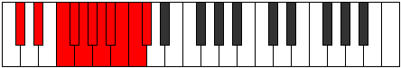 |
| [4085](https://ianring.com/musictheory/scales/4085) | [Sydyllian](ModeBNaturalSydyllian.md) | B | B, C#, D#, E, F, F#, G, G#, A, A#, B |  |
| [4087](https://ianring.com/musictheory/scales/4087) | [Aeolatic](ModeGNaturalAeolatic.md) | G | G, G#, A, B, C, C#, D, D#, E, F, F#, G |  |
| [4087](https://ianring.com/musictheory/scales/4087) | [Aeolatic](ModeFSharpAeolatic.md) | F# | F#, G, G#, A#, B, C, C#, D, D#, E, F, F# |  |
| [4087](https://ianring.com/musictheory/scales/4087) | [Aeolatic](ModeGFlatAeolatic.md) | Gb | Gb, G, Ab, Bb, B, C, Db, D, Eb, E, F, Gb |  |
| [4087](https://ianring.com/musictheory/scales/4087) | [Aeolatic](ModeDSharpAeolatic.md) | D# | D#, E, F, G, G#, A, A#, B, C, C#, D, D# |  |
| [4087](https://ianring.com/musictheory/scales/4087) | [Aeolatic](ModeEFlatAeolatic.md) | Eb | Eb, E, F, G, Ab, A, Bb, B, C, Db, D, Eb |  |
| [4087](https://ianring.com/musictheory/scales/4087) | [Aeolatic](ModeCSharpAeolatic.md) | C# | C#, D, D#, F, F#, G, G#, A, A#, B, C, C# |  |
| [4087](https://ianring.com/musictheory/scales/4087) | [Aeolatic](ModeDFlatAeolatic.md) | Db | Db, D, Eb, F, Gb, G, Ab, A, Bb, B, C, Db |  |
| [4087](https://ianring.com/musictheory/scales/4087) | [Aeolatic](ModeBNaturalAeolatic.md) | B | B, C, C#, D#, E, F, F#, G, G#, A, A#, B |  |
| [4087](https://ianring.com/musictheory/scales/4087) | [Aeolatic](ModeASharpAeolatic.md) | A# | A#, B, C, D, D#, E, F, F#, G, G#, A, A# |  |
| [4087](https://ianring.com/musictheory/scales/4087) | [Aeolatic](ModeBFlatAeolatic.md) | Bb | Bb, B, C, D, Eb, E, F, Gb, G, Ab, A, Bb |  |
| [4087](https://ianring.com/musictheory/scales/4087) | [Aeolatic](ModeANaturalAeolatic.md) | A | A, A#, B, C#, D, D#, E, F, F#, G, G#, A |  |
| [4089](https://ianring.com/musictheory/scales/4089) | [Katoryllian](ModeGSharpKatoryllian.md) | G# | G#, B, C, C#, D, D#, E, F, F#, G, G# |  |
| [4089](https://ianring.com/musictheory/scales/4089) | [Katoryllian](ModeAFlatKatoryllian.md) | Ab | Ab, B, C, Db, D, Eb, E, F, Gb, G, Ab |  |
| [4089](https://ianring.com/musictheory/scales/4089) | [Katoryllian](ModeCNaturalKatoryllian.md) | C | C, D#, E, F, F#, G, G#, A, A#, B, C |  |
| [4089](https://ianring.com/musictheory/scales/4089) | [Katoryllian](ModeBNaturalKatoryllian.md) | B | B, D, D#, E, F, F#, G, G#, A, A#, B |  |
| [4091](https://ianring.com/musictheory/scales/4091) | [Thydatic](ModeGSharpThydatic.md) | G# | G#, A, B, C, C#, D, D#, E, F, F#, G, G# |  |
| [4091](https://ianring.com/musictheory/scales/4091) | [Thydatic](ModeAFlatThydatic.md) | Ab | Ab, A, B, C, Db, D, Eb, E, F, Gb, G, Ab |  |
| [4091](https://ianring.com/musictheory/scales/4091) | [Thydatic](ModeGNaturalThydatic.md) | G | G, G#, A#, B, C, C#, D, D#, E, F, F#, G |  |
| [4091](https://ianring.com/musictheory/scales/4091) | [Thydatic](ModeENaturalThydatic.md) | E | E, F, G, G#, A, A#, B, C, C#, D, D#, E |  |
| [4091](https://ianring.com/musictheory/scales/4091) | [Thydatic](ModeDNaturalThydatic.md) | D | D, D#, F, F#, G, G#, A, A#, B, C, C#, D |  |
| [4091](https://ianring.com/musictheory/scales/4091) | [Thydatic](ModeCNaturalThydatic.md) | C | C, C#, D#, E, F, F#, G, G#, A, A#, B, C |  |
| [4091](https://ianring.com/musictheory/scales/4091) | [Thydatic](ModeBNaturalThydatic.md) | B | B, C, D, D#, E, F, F#, G, G#, A, A#, B |  |
| [4091](https://ianring.com/musictheory/scales/4091) | [Thydatic](ModeASharpThydatic.md) | A# | A#, B, C#, D, D#, E, F, F#, G, G#, A, A# |  |
| [4091](https://ianring.com/musictheory/scales/4091) | [Thydatic](ModeBFlatThydatic.md) | Bb | Bb, B, Db, D, Eb, E, F, Gb, G, Ab, A, Bb |  |
| [4093](https://ianring.com/musictheory/scales/4093) | [Aerycratic](ModeANaturalAerycratic.md) | A | A, B, C, C#, D, D#, E, F, F#, G, G#, A |  |
| [4093](https://ianring.com/musictheory/scales/4093) | [Aerycratic](ModeGSharpAerycratic.md) | G# | G#, A#, B, C, C#, D, D#, E, F, F#, G, G# |  |
| [4093](https://ianring.com/musictheory/scales/4093) | [Aerycratic](ModeAFlatAerycratic.md) | Ab | Ab, Bb, B, C, Db, D, Eb, E, F, Gb, G, Ab |  |
| [4093](https://ianring.com/musictheory/scales/4093) | [Aerycratic](ModeFNaturalAerycratic.md) | F | F, G, G#, A, A#, B, C, C#, D, D#, E, F |  |
| [4093](https://ianring.com/musictheory/scales/4093) | [Aerycratic](ModeDSharpAerycratic.md) | D# | D#, F, F#, G, G#, A, A#, B, C, C#, D, D# |  |
| [4093](https://ianring.com/musictheory/scales/4093) | [Aerycratic](ModeEFlatAerycratic.md) | Eb | Eb, F, Gb, G, Ab, A, Bb, B, C, Db, D, Eb |  |
| [4093](https://ianring.com/musictheory/scales/4093) | [Aerycratic](ModeCSharpAerycratic.md) | C# | C#, D#, E, F, F#, G, G#, A, A#, B, C, C# |  |
| [4093](https://ianring.com/musictheory/scales/4093) | [Aerycratic](ModeDFlatAerycratic.md) | Db | Db, Eb, E, F, Gb, G, Ab, A, Bb, B, C, Db |  |
| [4093](https://ianring.com/musictheory/scales/4093) | [Aerycratic](ModeCNaturalAerycratic.md) | C | C, D, D#, E, F, F#, G, G#, A, A#, B, C |  |
| [4093](https://ianring.com/musictheory/scales/4093) | [Aerycratic](ModeBNaturalAerycratic.md) | B | B, C#, D, D#, E, F, F#, G, G#, A, A#, B |  |
| [4095](https://ianring.com/musictheory/scales/4095) | [Chromatic](ModeCNaturalChromatic.md) | C | C, C#, D, D#, E, F, F#, G, G#, A, A#, B, C |  |
| [4095](https://ianring.com/musictheory/scales/4095) | [Chromatic](ModeCSharpChromatic.md) | C# | C#, D, D#, E, F, F#, G, G#, A, A#, B, C, C# |  |
| [4095](https://ianring.com/musictheory/scales/4095) | [Chromatic](ModeDFlatChromatic.md) | Db | Db, D, Eb, E, F, Gb, G, Ab, A, Bb, B, C, Db |  |
| [4095](https://ianring.com/musictheory/scales/4095) | [Chromatic](ModeDNaturalChromatic.md) | D | D, D#, E, F, F#, G, G#, A, A#, B, C, C#, D |  |
| [4095](https://ianring.com/musictheory/scales/4095) | [Chromatic](ModeDSharpChromatic.md) | D# | D#, E, F, F#, G, G#, A, A#, B, C, C#, D, D# |  |
| [4095](https://ianring.com/musictheory/scales/4095) | [Chromatic](ModeEFlatChromatic.md) | Eb | Eb, E, F, Gb, G, Ab, A, Bb, B, C, Db, D, Eb |  |
| [4095](https://ianring.com/musictheory/scales/4095) | [Chromatic](ModeENaturalChromatic.md) | E | E, F, F#, G, G#, A, A#, B, C, C#, D, D#, E |  |
| [4095](https://ianring.com/musictheory/scales/4095) | [Chromatic](ModeFNaturalChromatic.md) | F | F, F#, G, G#, A, A#, B, C, C#, D, D#, E, F |  |
| [4095](https://ianring.com/musictheory/scales/4095) | [Chromatic](ModeFSharpChromatic.md) | F# | F#, G, G#, A, A#, B, C, C#, D, D#, E, F, F# |  |
| [4095](https://ianring.com/musictheory/scales/4095) | [Chromatic](ModeGFlatChromatic.md) | Gb | Gb, G, Ab, A, Bb, B, C, Db, D, Eb, E, F, Gb |  |
| [4095](https://ianring.com/musictheory/scales/4095) | [Chromatic](ModeGNaturalChromatic.md) | G | G, G#, A, A#, B, C, C#, D, D#, E, F, F#, G |  |
| [4095](https://ianring.com/musictheory/scales/4095) | [Chromatic](ModeGSharpChromatic.md) | G# | G#, A, A#, B, C, C#, D, D#, E, F, F#, G, G# |  |
| [4095](https://ianring.com/musictheory/scales/4095) | [Chromatic](ModeAFlatChromatic.md) | Ab | Ab, A, Bb, B, C, Db, D, Eb, E, F, Gb, G, Ab |  |
| [4095](https://ianring.com/musictheory/scales/4095) | [Chromatic](ModeANaturalChromatic.md) | A | A, A#, B, C, C#, D, D#, E, F, F#, G, G#, A |  |
| [4095](https://ianring.com/musictheory/scales/4095) | [Chromatic](ModeASharpChromatic.md) | A# | A#, B, C, C#, D, D#, E, F, F#, G, G#, A, A# |  |
| [4095](https://ianring.com/musictheory/scales/4095) | [Chromatic](ModeBFlatChromatic.md) | Bb | Bb, B, C, Db, D, Eb, E, F, Gb, G, Ab, A, Bb |  |
| [4095](https://ianring.com/musictheory/scales/4095) | [Chromatic](ModeBNaturalChromatic.md) | B | B, C, C#, D, D#, E, F, F#, G, G#, A, A#, B |  |
