# AFlatMinorSeventhAddSharpEleventh

## Links

- [Documentation](README.md)
- [Scales Index](Scales.md)
- [Modes Index](Modes.md)
- [Chords Index](Chords.md)

## Root

Ab

## Diagram

## Notes

| Position | Notes | Illustration |
|----------|------|--------------|
| RootPosition | Ab,Cb,Eb,Gb,D |  |
| FirstInversion | Cb,Eb,Gb,D,Ab |  |
| SecondInversion | Eb,Gb,D,Ab,Cb | 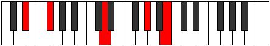 |
| ThirdInversion | Gb,D,Ab,Cb,Eb | 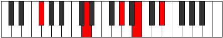 |
| FourthInversion | D,Ab,Cb,Eb,Gb | 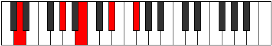 |
## Modes

| Number | Mode | Tonic | Notes | Illustration |
|--------|------|-------|-------|--------------|
| [595](https://ianring.com/musictheory/scales/595) | [Sogitonic](ModeDNaturalSogitonic.md) | D | D, D#, F#, G#, B, D |  |
| [599](https://ianring.com/musictheory/scales/599) | [Thyrimic](ModeDNaturalThyrimic.md) | D | D, Eb, Fb, Gb, Ab, B, D | 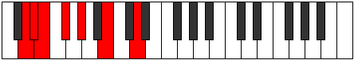 |
| [603](https://ianring.com/musictheory/scales/603) | [Aeolygimic](ModeDNaturalAeolygimic.md) | D | D, Eb, F, Gb, Ab, B, D |  |
| [607](https://ianring.com/musictheory/scales/607) | [Kadian](ModeDNaturalKadian.md) | D | D, Eb, Fb, Gbb, Abbb, Bbbb, Cb, D |  |
| [627](https://ianring.com/musictheory/scales/627) | [Mogimic](ModeDNaturalMogimic.md) | D | D, Eb, F#, G, Ab, B, D |  |
| [631](https://ianring.com/musictheory/scales/631) | [Zygian](ModeDNaturalZygian.md) | D | D, Eb, Fb, Gb, Abb, Bbbb, Cb, D |  |
| [635](https://ianring.com/musictheory/scales/635) | [Epolian](ModeDNaturalEpolian.md) | D | D, Eb, F, Gb, Abb, Bbbb, Cb, D |  |
| [639](https://ianring.com/musictheory/scales/639) | [Ionaryllic](ModeDNaturalIonaryllic.md) | D | D, D#, E, F, F#, G, G#, B, D |  |
| [665](https://ianring.com/musictheory/scales/665) | [Mythitonic](ModeBNaturalMythitonic.md) | B | B, D, D#, F#, G#, B |  |
| [667](https://ianring.com/musictheory/scales/667) | [Rodimic](ModeBNaturalRodimic.md) | B | B, C, D, Eb, F#, G#, B |  |
| [669](https://ianring.com/musictheory/scales/669) | [Gycrimic](ModeBNaturalGycrimic.md) | B | B, C#, D, Eb, F#, G#, B |  |
| [671](https://ianring.com/musictheory/scales/671) | [Stycrian](ModeBNaturalStycrian.md) | B | B, C, Db, Ebb, Fbb, Gb, Ab, B |  |
| [697](https://ianring.com/musictheory/scales/697) | [Lagimic](ModeBNaturalLagimic.md) | B | B, C##, D#, E, F#, G#, B |  |
| [699](https://ianring.com/musictheory/scales/699) | [Aerothian](ModeBNaturalAerothian.md) | B | B, C, D, Eb, Fb, Gb, Ab, B |  |
| [701](https://ianring.com/musictheory/scales/701) | [Mixonyphian](ModeBNaturalMixonyphian.md) | B | B, C#, D, Eb, Fb, Gb, Ab, B | 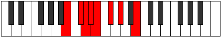 |
| [703](https://ianring.com/musictheory/scales/703) | [Aerocryllic](ModeBNaturalAerocryllic.md) | B | B, C, C#, D, D#, E, F#, G#, B |  |
| [723](https://ianring.com/musictheory/scales/723) | [Ionadimic](ModeDNaturalIonadimic.md) | D | D, Eb, F#, G#, A, B, D |  |
| [727](https://ianring.com/musictheory/scales/727) | [Phradian](ModeDNaturalPhradian.md) | D | D, Eb, Fb, Gb, Ab, Bbb, Cb, D |  |
| [729](https://ianring.com/musictheory/scales/729) | [Stygimic](ModeBNaturalStygimic.md) | B | B, C##, D#, E#, F#, G#, B |  |
| [731](https://ianring.com/musictheory/scales/731) | [Ionorian](ModeBNaturalIonorian.md) | B | B, C, D, Eb, F, Gb, Ab, B |  |
| [731](https://ianring.com/musictheory/scales/731) | [Ionorian](ModeDNaturalIonorian.md) | D | D, Eb, F, Gb, Ab, Bbb, Cb, D |  |
| [733](https://ianring.com/musictheory/scales/733) | [Donian](ModeBNaturalDonian.md) | B | B, C#, D, Eb, F, Gb, Ab, B | 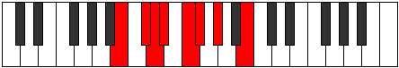 |
| [735](https://ianring.com/musictheory/scales/735) | [Sylyllic](ModeBNaturalSylyllic.md) | B | B, C, C#, D, D#, F, F#, G#, B |  |
| [735](https://ianring.com/musictheory/scales/735) | [Sylyllic](ModeDNaturalSylyllic.md) | D | D, D#, E, F, F#, G#, A, B, D |  |
| [755](https://ianring.com/musictheory/scales/755) | [Phrythian](ModeDNaturalPhrythian.md) | D | D, Eb, F#, G, Ab, Bbb, Cb, D |  |
| [759](https://ianring.com/musictheory/scales/759) | [Katalyllic](ModeDNaturalKatalyllic.md) | D | D, D#, E, F#, G, G#, A, B, D |  |
| [761](https://ianring.com/musictheory/scales/761) | [Ponian](ModeBNaturalPonian.md) | B | B, C##, D#, E, F, Gb, Ab, B |  |
| [763](https://ianring.com/musictheory/scales/763) | [Doryllic](ModeBNaturalDoryllic.md) | B | B, C, D, D#, E, F, F#, G#, B |  |
| [763](https://ianring.com/musictheory/scales/763) | [Doryllic](ModeDNaturalDoryllic.md) | D | D, D#, F, F#, G, G#, A, B, D |  |
| [765](https://ianring.com/musictheory/scales/765) | [Mixonyphyllic](ModeBNaturalMixonyphyllic.md) | B | B, C#, D, D#, E, F, F#, G#, B |  |
| [767](https://ianring.com/musictheory/scales/767) | [Raptygic](ModeBNaturalRaptygic.md) | B | B, C, C#, D, D#, E, F, F#, G#, B |  |
| [767](https://ianring.com/musictheory/scales/767) | [Raptygic](ModeDNaturalRaptygic.md) | D | D, D#, E, F, F#, G, G#, A, B, D |  |
| [805](https://ianring.com/musictheory/scales/805) | [Rothitonic](ModeFSharpRothitonic.md) | F# | F#, G#, B, D, D#, F# |  |
| [805](https://ianring.com/musictheory/scales/805) | [Rothitonic](ModeGFlatRothitonic.md) | Gb | Gb, Ab, B, D, Eb, Gb |  |
| [807](https://ianring.com/musictheory/scales/807) | [Epadimic](ModeFSharpEpadimic.md) | F# | F#, G, Ab, B, C##, D#, F# |  |
| [807](https://ianring.com/musictheory/scales/807) | [Epadimic](ModeGFlatEpadimic.md) | Gb | Gb, Abb, Bbbb, Cb, D, Eb, Gb |  |
| [813](https://ianring.com/musictheory/scales/813) | [Larimic](ModeFSharpLarimic.md) | F# | F#, G#, A, B, C##, D#, F# |  |
| [813](https://ianring.com/musictheory/scales/813) | [Larimic](ModeGFlatLarimic.md) | Gb | Gb, Ab, Bbb, Cb, D, Eb, Gb |  |
| [815](https://ianring.com/musictheory/scales/815) | [Bolian](ModeFSharpBolian.md) | F# | F#, G, Ab, Bbb, Cb, D, Eb, F# |  |
| [815](https://ianring.com/musictheory/scales/815) | [Bolian](ModeGFlatBolian.md) | Gb | Gb, Abb, Bbbb, Cbbb, Dbbb, Ebb, Fbb, Gb |  |
| [821](https://ianring.com/musictheory/scales/821) | [Aeranimic](ModeFSharpAeranimic.md) | F# | F#, G#, A#, B, C##, D#, F# |  |
| [821](https://ianring.com/musictheory/scales/821) | [Aeranimic](ModeGFlatAeranimic.md) | Gb | Gb, Ab, Bb, Cb, D, Eb, Gb |  |
| [823](https://ianring.com/musictheory/scales/823) | [Stodian](ModeFSharpStodian.md) | F# | F#, G, Ab, Bb, Cb, D, Eb, F# |  |
| [823](https://ianring.com/musictheory/scales/823) | [Stodian](ModeGFlatStodian.md) | Gb | Gb, Abb, Bbbb, Cbb, Dbbb, Ebb, Fbb, Gb | 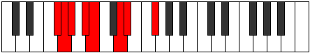 |
| [829](https://ianring.com/musictheory/scales/829) | [Lygian](ModeFSharpLygian.md) | F# | F#, G#, A, Bb, Cb, D, Eb, F# |  |
| [829](https://ianring.com/musictheory/scales/829) | [Lygian](ModeGFlatLygian.md) | Gb | Gb, Ab, Bbb, Cbb, Dbbb, Ebb, Fbb, Gb |  |
| [831](https://ianring.com/musictheory/scales/831) | [Rodyllic](ModeFSharpRodyllic.md) | F# | F#, G, G#, A, A#, B, D, D#, F# |  |
| [831](https://ianring.com/musictheory/scales/831) | [Rodyllic](ModeGFlatRodyllic.md) | Gb | Gb, G, Ab, A, Bb, B, D, Eb, Gb |  |
| [851](https://ianring.com/musictheory/scales/851) | [Aerylimic](ModeDNaturalAerylimic.md) | D | D, Eb, F#, G#, A#, B, D | 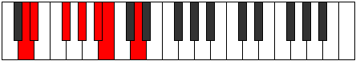 |
| [855](https://ianring.com/musictheory/scales/855) | [Porian](ModeDNaturalPorian.md) | D | D, Eb, Fb, Gb, Ab, Bb, Cb, D |  |
| [859](https://ianring.com/musictheory/scales/859) | [Pathian](ModeDNaturalPathian.md) | D | D, Eb, F, Gb, Ab, Bb, Cb, D |  |
| [863](https://ianring.com/musictheory/scales/863) | [Pyryllic](ModeDNaturalPyryllic.md) | D | D, D#, E, F, F#, G#, A#, B, D |  |
| [869](https://ianring.com/musictheory/scales/869) | [Kothimic](ModeFSharpKothimic.md) | F# | F#, G#, A##, B#, C##, D#, F# |  |
| [869](https://ianring.com/musictheory/scales/869) | [Kothimic](ModeGFlatKothimic.md) | Gb | Gb, Ab, B, C, D, Eb, Gb |  |
| [871](https://ianring.com/musictheory/scales/871) | [Epadian](ModeFSharpEpadian.md) | F# | F#, G, Ab, B, C, D, Eb, F# |  |
| [871](https://ianring.com/musictheory/scales/871) | [Epadian](ModeGFlatEpadian.md) | Gb | Gb, Abb, Bbbb, Cb, Dbb, Ebb, Fbb, Gb |  |
| [877](https://ianring.com/musictheory/scales/877) | [Aeraptian](ModeFSharpAeraptian.md) | F# | F#, G#, A, B, C, D, Eb, F# |  |
| [877](https://ianring.com/musictheory/scales/877) | [Aeraptian](ModeGFlatAeraptian.md) | Gb | Gb, Ab, Bbb, Cb, Dbb, Ebb, Fbb, Gb |  |
| [879](https://ianring.com/musictheory/scales/879) | [Aeolocryllic](ModeFSharpAeolocryllic.md) | F# | F#, G, G#, A, B, C, D, D#, F# |  |
| [879](https://ianring.com/musictheory/scales/879) | [Aeolocryllic](ModeGFlatAeolocryllic.md) | Gb | Gb, G, Ab, A, B, C, D, Eb, Gb |  |
| [883](https://ianring.com/musictheory/scales/883) | [Ralian](ModeDNaturalRalian.md) | D | D, Eb, F#, G, Ab, Bb, Cb, D |  |
| [885](https://ianring.com/musictheory/scales/885) | [Sathian](ModeFSharpSathian.md) | F# | F#, G#, A#, B, C, D, Eb, F# |  |
| [885](https://ianring.com/musictheory/scales/885) | [Sathian](ModeGFlatSathian.md) | Gb | Gb, Ab, Bb, Cb, Dbb, Ebb, Fbb, Gb |  |
| [887](https://ianring.com/musictheory/scales/887) | [Sathyllic](ModeFSharpSathyllic.md) | F# | F#, G, G#, A#, B, C, D, D#, F# |  |
| [887](https://ianring.com/musictheory/scales/887) | [Sathyllic](ModeGFlatSathyllic.md) | Gb | Gb, G, Ab, Bb, B, C, D, Eb, Gb |  |
| [887](https://ianring.com/musictheory/scales/887) | [Sathyllic](ModeDNaturalSathyllic.md) | D | D, D#, E, F#, G, G#, A#, B, D |  |
| [891](https://ianring.com/musictheory/scales/891) | [Ionilyllic](ModeDNaturalIonilyllic.md) | D | D, D#, F, F#, G, G#, A#, B, D |  |
| [893](https://ianring.com/musictheory/scales/893) | [Pycryllic](ModeFSharpPycryllic.md) | F# | F#, G#, A, A#, B, C, D, D#, F# |  |
| [893](https://ianring.com/musictheory/scales/893) | [Pycryllic](ModeGFlatPycryllic.md) | Gb | Gb, Ab, A, Bb, B, C, D, Eb, Gb |  |
| [895](https://ianring.com/musictheory/scales/895) | [Aeolathygic](ModeDNaturalAeolathygic.md) | D | D, D#, E, F, F#, G, G#, A#, B, D |  |
| [895](https://ianring.com/musictheory/scales/895) | [Aeolathygic](ModeFSharpAeolathygic.md) | F# | F#, G, G#, A, A#, B, C, D, D#, F# |  |
| [895](https://ianring.com/musictheory/scales/895) | [Aeolathygic](ModeGFlatAeolathygic.md) | Gb | Gb, G, Ab, A, Bb, B, C, D, Eb, Gb |  |
| [921](https://ianring.com/musictheory/scales/921) | [Bogimic](ModeBNaturalBogimic.md) | B | B, C##, D#, E##, F##, G#, B |  |
| [923](https://ianring.com/musictheory/scales/923) | [Ionodian](ModeBNaturalIonodian.md) | B | B, C, D, Eb, F#, G, Ab, B |  |
| [925](https://ianring.com/musictheory/scales/925) | [Mythian](ModeBNaturalMythian.md) | B | B, C#, D, Eb, F#, G, Ab, B |  |
| [927](https://ianring.com/musictheory/scales/927) | [Koptyllic](ModeBNaturalKoptyllic.md) | B | B, C, C#, D, D#, F#, G, G#, B |  |
| [933](https://ianring.com/musictheory/scales/933) | [Dadimic](ModeFSharpDadimic.md) | F# | F#, G#, A##, B##, C##, D#, F# |  |
| [933](https://ianring.com/musictheory/scales/933) | [Dadimic](ModeGFlatDadimic.md) | Gb | Gb, Ab, B, C#, D, Eb, Gb |  |
| [935](https://ianring.com/musictheory/scales/935) | [Katarian](ModeFSharpKatarian.md) | F# | F#, G, Ab, B, C#, D, Eb, F# |  |
| [935](https://ianring.com/musictheory/scales/935) | [Katarian](ModeGFlatKatarian.md) | Gb | Gb, Abb, Bbbb, Cb, Db, Ebb, Fbb, Gb |  |
| [941](https://ianring.com/musictheory/scales/941) | [Phrorian](ModeFSharpPhrorian.md) | F# | F#, G#, A, B, C#, D, Eb, F# |  |
| [941](https://ianring.com/musictheory/scales/941) | [Phrorian](ModeGFlatPhrorian.md) | Gb | Gb, Ab, Bbb, Cb, Db, Ebb, Fbb, Gb |  |
| [943](https://ianring.com/musictheory/scales/943) | [Aerygyllic](ModeFSharpAerygyllic.md) | F# | F#, G, G#, A, B, C#, D, D#, F# |  |
| [943](https://ianring.com/musictheory/scales/943) | [Aerygyllic](ModeGFlatAerygyllic.md) | Gb | Gb, G, Ab, A, B, Db, D, Eb, Gb |  |
| [949](https://ianring.com/musictheory/scales/949) | [Ionagian](ModeFSharpIonagian.md) | F# | F#, G#, A#, B, C#, D, Eb, F# |  |
| [949](https://ianring.com/musictheory/scales/949) | [Ionagian](ModeGFlatIonagian.md) | Gb | Gb, Ab, Bb, Cb, Db, Ebb, Fbb, Gb |  |
| [951](https://ianring.com/musictheory/scales/951) | [Thogyllic](ModeFSharpThogyllic.md) | F# | F#, G, G#, A#, B, C#, D, D#, F# |  |
| [951](https://ianring.com/musictheory/scales/951) | [Thogyllic](ModeGFlatThogyllic.md) | Gb | Gb, G, Ab, Bb, B, Db, D, Eb, Gb |  |
| [953](https://ianring.com/musictheory/scales/953) | [Stoptian](ModeBNaturalStoptian.md) | B | B, C##, D#, E, F#, G, Ab, B |  |
| [955](https://ianring.com/musictheory/scales/955) | [Ionogyllic](ModeBNaturalIonogyllic.md) | B | B, C, D, D#, E, F#, G, G#, B |  |
| [957](https://ianring.com/musictheory/scales/957) | [Phronyllic](ModeBNaturalPhronyllic.md) | B | B, C#, D, D#, E, F#, G, G#, B |  |
| [957](https://ianring.com/musictheory/scales/957) | [Phronyllic](ModeFSharpPhronyllic.md) | F# | F#, G#, A, A#, B, C#, D, D#, F# |  |
| [957](https://ianring.com/musictheory/scales/957) | [Phronyllic](ModeGFlatPhronyllic.md) | Gb | Gb, Ab, A, Bb, B, Db, D, Eb, Gb |  |
| [959](https://ianring.com/musictheory/scales/959) | [Katylygic](ModeBNaturalKatylygic.md) | B | B, C, C#, D, D#, E, F#, G, G#, B |  |
| [959](https://ianring.com/musictheory/scales/959) | [Katylygic](ModeFSharpKatylygic.md) | F# | F#, G, G#, A, A#, B, C#, D, D#, F# |  |
| [959](https://ianring.com/musictheory/scales/959) | [Katylygic](ModeGFlatKatylygic.md) | Gb | Gb, G, Ab, A, Bb, B, Db, D, Eb, Gb |  |
| [979](https://ianring.com/musictheory/scales/979) | [Thogian](ModeDNaturalThogian.md) | D | D, Eb, F#, G#, A, Bb, Cb, D |  |
| [983](https://ianring.com/musictheory/scales/983) | [Epygyllic](ModeDNaturalEpygyllic.md) | D | D, D#, E, F#, G#, A, A#, B, D |  |
| [985](https://ianring.com/musictheory/scales/985) | [Raptian](ModeBNaturalRaptian.md) | B | B, C##, D#, E#, F#, G, Ab, B |  |
| [987](https://ianring.com/musictheory/scales/987) | [Aeraptyllic](ModeBNaturalAeraptyllic.md) | B | B, C, D, D#, F, F#, G, G#, B |  |
| [987](https://ianring.com/musictheory/scales/987) | [Aeraptyllic](ModeDNaturalAeraptyllic.md) | D | D, D#, F, F#, G#, A, A#, B, D |  |
| [989](https://ianring.com/musictheory/scales/989) | [Phrolyllic](ModeBNaturalPhrolyllic.md) | B | B, C#, D, D#, F, F#, G, G#, B |  |
| [991](https://ianring.com/musictheory/scales/991) | [Aeolygic](ModeBNaturalAeolygic.md) | B | B, C, C#, D, D#, F, F#, G, G#, B |  |
| [991](https://ianring.com/musictheory/scales/991) | [Aeolygic](ModeDNaturalAeolygic.md) | D | D, D#, E, F, F#, G#, A, A#, B, D |  |
| [997](https://ianring.com/musictheory/scales/997) | [Rycrian](ModeFSharpRycrian.md) | F# | F#, G#, A##, B#, C#, D, Eb, F# |  |
| [997](https://ianring.com/musictheory/scales/997) | [Rycrian](ModeGFlatRycrian.md) | Gb | Gb, Ab, B, C, Db, Ebb, Fbb, Gb |  |
| [999](https://ianring.com/musictheory/scales/999) | [Bylyllic](ModeFSharpBylyllic.md) | F# | F#, G, G#, B, C, C#, D, D#, F# |  |
| [999](https://ianring.com/musictheory/scales/999) | [Bylyllic](ModeGFlatBylyllic.md) | Gb | Gb, G, Ab, B, C, Db, D, Eb, Gb |  |
| [1005](https://ianring.com/musictheory/scales/1005) | [Radyllic](ModeFSharpRadyllic.md) | F# | F#, G#, A, B, C, C#, D, D#, F# |  |
| [1005](https://ianring.com/musictheory/scales/1005) | [Radyllic](ModeGFlatRadyllic.md) | Gb | Gb, Ab, A, B, C, Db, D, Eb, Gb |  |
| [1007](https://ianring.com/musictheory/scales/1007) | [Ionycrygic](ModeFSharpIonycrygic.md) | F# | F#, G, G#, A, B, C, C#, D, D#, F# |  |
| [1007](https://ianring.com/musictheory/scales/1007) | [Ionycrygic](ModeGFlatIonycrygic.md) | Gb | Gb, G, Ab, A, B, C, Db, D, Eb, Gb |  |
| [1011](https://ianring.com/musictheory/scales/1011) | [Kycryllic](ModeDNaturalKycryllic.md) | D | D, D#, F#, G, G#, A, A#, B, D |  |
| [1013](https://ianring.com/musictheory/scales/1013) | [Stydyllic](ModeFSharpStydyllic.md) | F# | F#, G#, A#, B, C, C#, D, D#, F# |  |
| [1013](https://ianring.com/musictheory/scales/1013) | [Stydyllic](ModeGFlatStydyllic.md) | Gb | Gb, Ab, Bb, B, C, Db, D, Eb, Gb |  |
| [1015](https://ianring.com/musictheory/scales/1015) | [Ionodygic](ModeFSharpIonodygic.md) | F# | F#, G, G#, A#, B, C, C#, D, D#, F# |  |
| [1015](https://ianring.com/musictheory/scales/1015) | [Ionodygic](ModeGFlatIonodygic.md) | Gb | Gb, G, Ab, Bb, B, C, Db, D, Eb, Gb |  |
| [1015](https://ianring.com/musictheory/scales/1015) | [Ionodygic](ModeDNaturalIonodygic.md) | D | D, D#, E, F#, G, G#, A, A#, B, D |  |
| [1017](https://ianring.com/musictheory/scales/1017) | [Dythyllic](ModeBNaturalDythyllic.md) | B | B, D, D#, E, F, F#, G, G#, B |  |
| [1019](https://ianring.com/musictheory/scales/1019) | [Aeranygic](ModeBNaturalAeranygic.md) | B | B, C, D, D#, E, F, F#, G, G#, B |  |
| [1019](https://ianring.com/musictheory/scales/1019) | [Aeranygic](ModeDNaturalAeranygic.md) | D | D, D#, F, F#, G, G#, A, A#, B, D |  |
| [1021](https://ianring.com/musictheory/scales/1021) | [Ladygic](ModeBNaturalLadygic.md) | B | B, C#, D, D#, E, F, F#, G, G#, B |  |
| [1021](https://ianring.com/musictheory/scales/1021) | [Ladygic](ModeFSharpLadygic.md) | F# | F#, G#, A, A#, B, C, C#, D, D#, F# |  |
| [1021](https://ianring.com/musictheory/scales/1021) | [Ladygic](ModeGFlatLadygic.md) | Gb | Gb, Ab, A, Bb, B, C, Db, D, Eb, Gb |  |
| [1023](https://ianring.com/musictheory/scales/1023) | [Dodyllian](ModeBNaturalDodyllian.md) | B | B, C, C#, D, D#, E, F, F#, G, G#, B |  |
| [1023](https://ianring.com/musictheory/scales/1023) | [Dodyllian](ModeFSharpDodyllian.md) | F# | F#, G, G#, A, A#, B, C, C#, D, D#, F# |  |
| [1023](https://ianring.com/musictheory/scales/1023) | [Dodyllian](ModeGFlatDodyllian.md) | Gb | Gb, G, Ab, A, Bb, B, C, Db, D, Eb, Gb |  |
| [1023](https://ianring.com/musictheory/scales/1023) | [Dodyllian](ModeDNaturalDodyllian.md) | D | D, D#, E, F, F#, G, G#, A, A#, B, D |  |
| [1191](https://ianring.com/musictheory/scales/1191) | [Pyrimic](ModeCSharpPyrimic.md) | C# | C#, D, Eb, F#, G#, A##, C# |  |
| [1191](https://ianring.com/musictheory/scales/1191) | [Pyrimic](ModeDFlatPyrimic.md) | Db | Db, Ebb, Fbb, Gb, Ab, B, Db |  |
| [1199](https://ianring.com/musictheory/scales/1199) | [Magian](ModeCSharpMagian.md) | C# | C#, D, Eb, Fb, Gb, Ab, B, C# |  |
| [1199](https://ianring.com/musictheory/scales/1199) | [Magian](ModeDFlatMagian.md) | Db | Db, Ebb, Fbb, Gbbb, Abbb, Bbbb, Cb, Db |  |
| [1207](https://ianring.com/musictheory/scales/1207) | [Aeoloptian](ModeCSharpAeoloptian.md) | C# | C#, D, Eb, F, Gb, Ab, B, C# |  |
| [1207](https://ianring.com/musictheory/scales/1207) | [Aeoloptian](ModeDFlatAeoloptian.md) | Db | Db, Ebb, Fbb, Gbb, Abbb, Bbbb, Cb, Db |  |
| [1215](https://ianring.com/musictheory/scales/1215) | [Aeolanyllic](ModeCSharpAeolanyllic.md) | C# | C#, D, D#, E, F, F#, G#, B, C# |  |
| [1215](https://ianring.com/musictheory/scales/1215) | [Aeolanyllic](ModeDFlatAeolanyllic.md) | Db | Db, D, Eb, E, F, Gb, Ab, B, Db |  |
| [1225](https://ianring.com/musictheory/scales/1225) | [Lyditonic](ModeGSharpLyditonic.md) | G# | G#, B, D, D#, F#, G# |  |
| [1225](https://ianring.com/musictheory/scales/1225) | [Lyditonic](ModeAFlatLyditonic.md) | Ab | Ab, B, D, Eb, Gb, Ab |  |
| [1227](https://ianring.com/musictheory/scales/1227) | [Thacrimic](ModeGSharpThacrimic.md) | G# | G#, A, B, C##, D#, E##, G# |  |
| [1227](https://ianring.com/musictheory/scales/1227) | [Thacrimic](ModeAFlatThacrimic.md) | Ab | Ab, Bbb, Cb, D, Eb, F#, Ab |  |
| [1229](https://ianring.com/musictheory/scales/1229) | [Ragimic](ModeGSharpRagimic.md) | G# | G#, A#, B, C##, D#, E##, G# |  |
| [1229](https://ianring.com/musictheory/scales/1229) | [Ragimic](ModeAFlatRagimic.md) | Ab | Ab, Bb, Cb, D, Eb, F#, Ab |  |
| [1231](https://ianring.com/musictheory/scales/1231) | [Logian](ModeGSharpLogian.md) | G# | G#, A, Bb, Cb, D, Eb, F#, G# |  |
| [1231](https://ianring.com/musictheory/scales/1231) | [Logian](ModeAFlatLogian.md) | Ab | Ab, Bbb, Cbb, Dbbb, Ebb, Fbb, Gb, Ab |  |
| [1241](https://ianring.com/musictheory/scales/1241) | [Pygimic](ModeGSharpPygimic.md) | G# | G#, A##, B#, C##, D#, E##, G# |  |
| [1241](https://ianring.com/musictheory/scales/1241) | [Pygimic](ModeAFlatPygimic.md) | Ab | Ab, B, C, D, Eb, F#, Ab |  |
| [1243](https://ianring.com/musictheory/scales/1243) | [Epylian](ModeGSharpEpylian.md) | G# | G#, A, B, C, D, Eb, F#, G# |  |
| [1243](https://ianring.com/musictheory/scales/1243) | [Epylian](ModeAFlatEpylian.md) | Ab | Ab, Bbb, Cb, Dbb, Ebb, Fbb, Gb, Ab |  |
| [1245](https://ianring.com/musictheory/scales/1245) | [Lathian](ModeGSharpLathian.md) | G# | G#, A#, B, C, D, Eb, F#, G# |  |
| [1245](https://ianring.com/musictheory/scales/1245) | [Lathian](ModeAFlatLathian.md) | Ab | Ab, Bb, Cb, Dbb, Ebb, Fbb, Gb, Ab |  |
| [1247](https://ianring.com/musictheory/scales/1247) | [Mygyllic](ModeGSharpMygyllic.md) | G# | G#, A, A#, B, C, D, D#, F#, G# |  |
| [1247](https://ianring.com/musictheory/scales/1247) | [Mygyllic](ModeAFlatMygyllic.md) | Ab | Ab, A, Bb, B, C, D, Eb, Gb, Ab |  |
| [1255](https://ianring.com/musictheory/scales/1255) | [Sogian](ModeCSharpSogian.md) | C# | C#, D, Eb, F#, G, Ab, B, C# |  |
| [1255](https://ianring.com/musictheory/scales/1255) | [Sogian](ModeDFlatSogian.md) | Db | Db, Ebb, Fbb, Gb, Abb, Bbbb, Cb, Db |  |
| [1257](https://ianring.com/musictheory/scales/1257) | [Aeolyphimic](ModeGSharpAeolyphimic.md) | G# | G#, A##, B##, C##, D#, E##, G# | 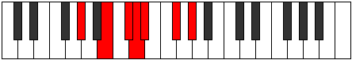 |
| [1257](https://ianring.com/musictheory/scales/1257) | [Aeolyphimic](ModeAFlatAeolyphimic.md) | Ab | Ab, B, C#, D, Eb, F#, Ab |  |
| [1259](https://ianring.com/musictheory/scales/1259) | [Stadian](ModeGSharpStadian.md) | G# | G#, A, B, C#, D, Eb, F#, G# |  |
| [1259](https://ianring.com/musictheory/scales/1259) | [Stadian](ModeAFlatStadian.md) | Ab | Ab, Bbb, Cb, Db, Ebb, Fbb, Gb, Ab |  |
| [1261](https://ianring.com/musictheory/scales/1261) | [Aeodian](ModeGSharpAeodian.md) | G# | G#, A#, B, C#, D, Eb, F#, G# |  |
| [1261](https://ianring.com/musictheory/scales/1261) | [Aeodian](ModeAFlatAeodian.md) | Ab | Ab, Bb, Cb, Db, Ebb, Fbb, Gb, Ab |  |
| [1263](https://ianring.com/musictheory/scales/1263) | [Stynyllic](ModeCSharpStynyllic.md) | C# | C#, D, D#, E, F#, G, G#, B, C# |  |
| [1263](https://ianring.com/musictheory/scales/1263) | [Stynyllic](ModeDFlatStynyllic.md) | Db | Db, D, Eb, E, Gb, G, Ab, B, Db |  |
| [1263](https://ianring.com/musictheory/scales/1263) | [Stynyllic](ModeGSharpStynyllic.md) | G# | G#, A, A#, B, C#, D, D#, F#, G# |  |
| [1263](https://ianring.com/musictheory/scales/1263) | [Stynyllic](ModeAFlatStynyllic.md) | Ab | Ab, A, Bb, B, Db, D, Eb, Gb, Ab |  |
| [1271](https://ianring.com/musictheory/scales/1271) | [Kolyllic](ModeCSharpKolyllic.md) | C# | C#, D, D#, F, F#, G, G#, B, C# |  |
| [1271](https://ianring.com/musictheory/scales/1271) | [Kolyllic](ModeDFlatKolyllic.md) | Db | Db, D, Eb, F, Gb, G, Ab, B, Db |  |
| [1273](https://ianring.com/musictheory/scales/1273) | [Ronian](ModeGSharpRonian.md) | G# | G#, A##, B#, C#, D, Eb, F#, G# |  |
| [1273](https://ianring.com/musictheory/scales/1273) | [Ronian](ModeAFlatRonian.md) | Ab | Ab, B, C, Db, Ebb, Fbb, Gb, Ab |  |
| [1275](https://ianring.com/musictheory/scales/1275) | [Stagyllic](ModeGSharpStagyllic.md) | G# | G#, A, B, C, C#, D, D#, F#, G# |  |
| [1275](https://ianring.com/musictheory/scales/1275) | [Stagyllic](ModeAFlatStagyllic.md) | Ab | Ab, A, B, C, Db, D, Eb, Gb, Ab |  |
| [1277](https://ianring.com/musictheory/scales/1277) | [Zadyllic](ModeGSharpZadyllic.md) | G# | G#, A#, B, C, C#, D, D#, F#, G# |  |
| [1277](https://ianring.com/musictheory/scales/1277) | [Zadyllic](ModeAFlatZadyllic.md) | Ab | Ab, Bb, B, C, Db, D, Eb, Gb, Ab |  |
| [1279](https://ianring.com/musictheory/scales/1279) | [Sarygic](ModeCSharpSarygic.md) | C# | C#, D, D#, E, F, F#, G, G#, B, C# |  |
| [1279](https://ianring.com/musictheory/scales/1279) | [Sarygic](ModeDFlatSarygic.md) | Db | Db, D, Eb, E, F, Gb, G, Ab, B, Db |  |
| [1279](https://ianring.com/musictheory/scales/1279) | [Sarygic](ModeGSharpSarygic.md) | G# | G#, A, A#, B, C, C#, D, D#, F#, G# |  |
| [1279](https://ianring.com/musictheory/scales/1279) | [Sarygic](ModeAFlatSarygic.md) | Ab | Ab, A, Bb, B, C, Db, D, Eb, Gb, Ab |  |
| [1331](https://ianring.com/musictheory/scales/1331) | [Dolimic](ModeASharpDolimic.md) | A# | A#, B, C##, D#, E##, F###, A# |  |
| [1331](https://ianring.com/musictheory/scales/1331) | [Dolimic](ModeBFlatDolimic.md) | Bb | Bb, Cb, D, Eb, F#, G#, Bb |  |
| [1335](https://ianring.com/musictheory/scales/1335) | [Aeralian](ModeASharpAeralian.md) | A# | A#, B, C, D, Eb, F#, G#, A# |  |
| [1335](https://ianring.com/musictheory/scales/1335) | [Aeralian](ModeBFlatAeralian.md) | Bb | Bb, Cb, Dbb, Ebb, Fbb, Gb, Ab, Bb |  |
| [1339](https://ianring.com/musictheory/scales/1339) | [Kycrian](ModeASharpKycrian.md) | A# | A#, B, C#, D, Eb, F#, G#, A# |  |
| [1339](https://ianring.com/musictheory/scales/1339) | [Kycrian](ModeBFlatKycrian.md) | Bb | Bb, Cb, Db, Ebb, Fbb, Gb, Ab, Bb |  |
| [1343](https://ianring.com/musictheory/scales/1343) | [Zalyllic](ModeASharpZalyllic.md) | A# | A#, B, C, C#, D, D#, F#, G#, A# |  |
| [1343](https://ianring.com/musictheory/scales/1343) | [Zalyllic](ModeBFlatZalyllic.md) | Bb | Bb, B, C, Db, D, Eb, Gb, Ab, Bb |  |
| [1395](https://ianring.com/musictheory/scales/1395) | [Mixonorian](ModeASharpMixonorian.md) | A# | A#, B, C##, D#, E, F#, G#, A# |  |
| [1395](https://ianring.com/musictheory/scales/1395) | [Mixonorian](ModeBFlatMixonorian.md) | Bb | Bb, Cb, D, Eb, Fb, Gb, Ab, Bb |  |
| [1399](https://ianring.com/musictheory/scales/1399) | [Syryllic](ModeASharpSyryllic.md) | A# | A#, B, C, D, D#, E, F#, G#, A# |  |
| [1399](https://ianring.com/musictheory/scales/1399) | [Syryllic](ModeBFlatSyryllic.md) | Bb | Bb, B, C, D, Eb, E, Gb, Ab, Bb |  |
| [1403](https://ianring.com/musictheory/scales/1403) | [Epinyllic](ModeASharpEpinyllic.md) | A# | A#, B, C#, D, D#, E, F#, G#, A# |  |
| [1403](https://ianring.com/musictheory/scales/1403) | [Epinyllic](ModeBFlatEpinyllic.md) | Bb | Bb, B, Db, D, Eb, E, Gb, Ab, Bb |  |
| [1407](https://ianring.com/musictheory/scales/1407) | [Tharygic](ModeASharpTharygic.md) | A# | A#, B, C, C#, D, D#, E, F#, G#, A# |  |
| [1407](https://ianring.com/musictheory/scales/1407) | [Tharygic](ModeBFlatTharygic.md) | Bb | Bb, B, C, Db, D, Eb, E, Gb, Ab, Bb |  |
| [1447](https://ianring.com/musictheory/scales/1447) | [Mixopyrian](ModeCSharpMixopyrian.md) | C# | C#, D, Eb, F#, G#, A, B, C# |  |
| [1447](https://ianring.com/musictheory/scales/1447) | [Mixopyrian](ModeDFlatMixopyrian.md) | Db | Db, Ebb, Fbb, Gb, Ab, Bbb, Cb, Db |  |
| [1455](https://ianring.com/musictheory/scales/1455) | [Soryllic](ModeCSharpSoryllic.md) | C# | C#, D, D#, E, F#, G#, A, B, C# |  |
| [1455](https://ianring.com/musictheory/scales/1455) | [Soryllic](ModeDFlatSoryllic.md) | Db | Db, D, Eb, E, Gb, Ab, A, B, Db |  |
| [1459](https://ianring.com/musictheory/scales/1459) | [Ionalian](ModeASharpIonalian.md) | A# | A#, B, C##, D#, E#, F#, G#, A# |  |
| [1459](https://ianring.com/musictheory/scales/1459) | [Ionalian](ModeBFlatIonalian.md) | Bb | Bb, Cb, D, Eb, F, Gb, Ab, Bb |  |
| [1463](https://ianring.com/musictheory/scales/1463) | [Zaptyllic](ModeCSharpZaptyllic.md) | C# | C#, D, D#, F, F#, G#, A, B, C# |  |
| [1463](https://ianring.com/musictheory/scales/1463) | [Zaptyllic](ModeDFlatZaptyllic.md) | Db | Db, D, Eb, F, Gb, Ab, A, B, Db |  |
| [1463](https://ianring.com/musictheory/scales/1463) | [Zaptyllic](ModeASharpZaptyllic.md) | A# | A#, B, C, D, D#, F, F#, G#, A# |  |
| [1463](https://ianring.com/musictheory/scales/1463) | [Zaptyllic](ModeBFlatZaptyllic.md) | Bb | Bb, B, C, D, Eb, F, Gb, Ab, Bb |  |
| [1467](https://ianring.com/musictheory/scales/1467) | [Thydyllic](ModeASharpThydyllic.md) | A# | A#, B, C#, D, D#, F, F#, G#, A# |  |
| [1467](https://ianring.com/musictheory/scales/1467) | [Thydyllic](ModeBFlatThydyllic.md) | Bb | Bb, B, Db, D, Eb, F, Gb, Ab, Bb | 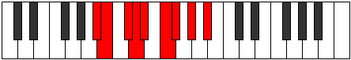 |
| [1471](https://ianring.com/musictheory/scales/1471) | [Radygic](ModeCSharpRadygic.md) | C# | C#, D, D#, E, F, F#, G#, A, B, C# |  |
| [1471](https://ianring.com/musictheory/scales/1471) | [Radygic](ModeDFlatRadygic.md) | Db | Db, D, Eb, E, F, Gb, Ab, A, B, Db |  |
| [1471](https://ianring.com/musictheory/scales/1471) | [Radygic](ModeASharpRadygic.md) | A# | A#, B, C, C#, D, D#, F, F#, G#, A# |  |
| [1471](https://ianring.com/musictheory/scales/1471) | [Radygic](ModeBFlatRadygic.md) | Bb | Bb, B, C, Db, D, Eb, F, Gb, Ab, Bb |  |
| [1481](https://ianring.com/musictheory/scales/1481) | [Zagimic](ModeGSharpZagimic.md) | G# | G#, A##, B###, C###, D##, E##, G# |  |
| [1481](https://ianring.com/musictheory/scales/1481) | [Zagimic](ModeAFlatZagimic.md) | Ab | Ab, B, C##, D#, E, F#, Ab |  |
| [1483](https://ianring.com/musictheory/scales/1483) | [Dygian](ModeGSharpDygian.md) | G# | G#, A, B, C##, D#, E, F#, G# |  |
| [1483](https://ianring.com/musictheory/scales/1483) | [Dygian](ModeAFlatDygian.md) | Ab | Ab, Bbb, Cb, D, Eb, Fb, Gb, Ab |  |
| [1485](https://ianring.com/musictheory/scales/1485) | [Tyrian](ModeGSharpTyrian.md) | G# | G#, A#, B, C##, D#, E, F#, G# |  |
| [1485](https://ianring.com/musictheory/scales/1485) | [Tyrian](ModeAFlatTyrian.md) | Ab | Ab, Bb, Cb, D, Eb, Fb, Gb, Ab |  |
| [1487](https://ianring.com/musictheory/scales/1487) | [Lycryllic](ModeGSharpLycryllic.md) | G# | G#, A, A#, B, D, D#, E, F#, G# |  |
| [1487](https://ianring.com/musictheory/scales/1487) | [Lycryllic](ModeAFlatLycryllic.md) | Ab | Ab, A, Bb, B, D, Eb, E, Gb, Ab |  |
| [1497](https://ianring.com/musictheory/scales/1497) | [Ionanian](ModeGSharpIonanian.md) | G# | G#, A##, B#, C##, D#, E, F#, G# |  |
| [1497](https://ianring.com/musictheory/scales/1497) | [Ionanian](ModeAFlatIonanian.md) | Ab | Ab, B, C, D, Eb, Fb, Gb, Ab |  |
| [1499](https://ianring.com/musictheory/scales/1499) | [Stonyllic](ModeGSharpStonyllic.md) | G# | G#, A, B, C, D, D#, E, F#, G# |  |
| [1499](https://ianring.com/musictheory/scales/1499) | [Stonyllic](ModeAFlatStonyllic.md) | Ab | Ab, A, B, C, D, Eb, E, Gb, Ab |  |
| [1501](https://ianring.com/musictheory/scales/1501) | [Stygyllic](ModeGSharpStygyllic.md) | G# | G#, A#, B, C, D, D#, E, F#, G# |  |
| [1501](https://ianring.com/musictheory/scales/1501) | [Stygyllic](ModeAFlatStygyllic.md) | Ab | Ab, Bb, B, C, D, Eb, E, Gb, Ab |  |
| [1503](https://ianring.com/musictheory/scales/1503) | [Padygic](ModeGSharpPadygic.md) | G# | G#, A, A#, B, C, D, D#, E, F#, G# |  |
| [1503](https://ianring.com/musictheory/scales/1503) | [Padygic](ModeAFlatPadygic.md) | Ab | Ab, A, Bb, B, C, D, Eb, E, Gb, Ab |  |
| [1511](https://ianring.com/musictheory/scales/1511) | [Styptyllic](ModeCSharpStyptyllic.md) | C# | C#, D, D#, F#, G, G#, A, B, C# |  |
| [1511](https://ianring.com/musictheory/scales/1511) | [Styptyllic](ModeDFlatStyptyllic.md) | Db | Db, D, Eb, Gb, G, Ab, A, B, Db |  |
| [1513](https://ianring.com/musictheory/scales/1513) | [Stathian](ModeGSharpStathian.md) | G# | G#, A##, B##, C##, D#, E, F#, G# | 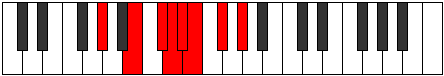 |
| [1513](https://ianring.com/musictheory/scales/1513) | [Stathian](ModeAFlatStathian.md) | Ab | Ab, B, C#, D, Eb, Fb, Gb, Ab |  |
| [1515](https://ianring.com/musictheory/scales/1515) | [Solyllic](ModeGSharpSolyllic.md) | G# | G#, A, B, C#, D, D#, E, F#, G# |  |
| [1515](https://ianring.com/musictheory/scales/1515) | [Solyllic](ModeAFlatSolyllic.md) | Ab | Ab, A, B, Db, D, Eb, E, Gb, Ab |  |
| [1517](https://ianring.com/musictheory/scales/1517) | [Sagyllic](ModeGSharpSagyllic.md) | G# | G#, A#, B, C#, D, D#, E, F#, G# |  |
| [1517](https://ianring.com/musictheory/scales/1517) | [Sagyllic](ModeAFlatSagyllic.md) | Ab | Ab, Bb, B, Db, D, Eb, E, Gb, Ab |  |
| [1519](https://ianring.com/musictheory/scales/1519) | [Solygic](ModeCSharpSolygic.md) | C# | C#, D, D#, E, F#, G, G#, A, B, C# |  |
| [1519](https://ianring.com/musictheory/scales/1519) | [Solygic](ModeDFlatSolygic.md) | Db | Db, D, Eb, E, Gb, G, Ab, A, B, Db |  |
| [1519](https://ianring.com/musictheory/scales/1519) | [Solygic](ModeGSharpSolygic.md) | G# | G#, A, A#, B, C#, D, D#, E, F#, G# |  |
| [1519](https://ianring.com/musictheory/scales/1519) | [Solygic](ModeAFlatSolygic.md) | Ab | Ab, A, Bb, B, Db, D, Eb, E, Gb, Ab |  |
| [1523](https://ianring.com/musictheory/scales/1523) | [Zothyllic](ModeASharpZothyllic.md) | A# | A#, B, D, D#, E, F, F#, G#, A# |  |
| [1523](https://ianring.com/musictheory/scales/1523) | [Zothyllic](ModeBFlatZothyllic.md) | Bb | Bb, B, D, Eb, E, F, Gb, Ab, Bb |  |
| [1527](https://ianring.com/musictheory/scales/1527) | [Aeolyrygic](ModeCSharpAeolyrygic.md) | C# | C#, D, D#, F, F#, G, G#, A, B, C# |  |
| [1527](https://ianring.com/musictheory/scales/1527) | [Aeolyrygic](ModeDFlatAeolyrygic.md) | Db | Db, D, Eb, F, Gb, G, Ab, A, B, Db |  |
| [1527](https://ianring.com/musictheory/scales/1527) | [Aeolyrygic](ModeASharpAeolyrygic.md) | A# | A#, B, C, D, D#, E, F, F#, G#, A# |  |
| [1527](https://ianring.com/musictheory/scales/1527) | [Aeolyrygic](ModeBFlatAeolyrygic.md) | Bb | Bb, B, C, D, Eb, E, F, Gb, Ab, Bb |  |
| [1529](https://ianring.com/musictheory/scales/1529) | [Kataryllic](ModeGSharpKataryllic.md) | G# | G#, B, C, C#, D, D#, E, F#, G# |  |
| [1529](https://ianring.com/musictheory/scales/1529) | [Kataryllic](ModeAFlatKataryllic.md) | Ab | Ab, B, C, Db, D, Eb, E, Gb, Ab |  |
| [1531](https://ianring.com/musictheory/scales/1531) | [Styptygic](ModeGSharpStyptygic.md) | G# | G#, A, B, C, C#, D, D#, E, F#, G# |  |
| [1531](https://ianring.com/musictheory/scales/1531) | [Styptygic](ModeAFlatStyptygic.md) | Ab | Ab, A, B, C, Db, D, Eb, E, Gb, Ab |  |
| [1531](https://ianring.com/musictheory/scales/1531) | [Styptygic](ModeASharpStyptygic.md) | A# | A#, B, C#, D, D#, E, F, F#, G#, A# |  |
| [1531](https://ianring.com/musictheory/scales/1531) | [Styptygic](ModeBFlatStyptygic.md) | Bb | Bb, B, Db, D, Eb, E, F, Gb, Ab, Bb |  |
| [1533](https://ianring.com/musictheory/scales/1533) | [Katycrygic](ModeGSharpKatycrygic.md) | G# | G#, A#, B, C, C#, D, D#, E, F#, G# |  |
| [1533](https://ianring.com/musictheory/scales/1533) | [Katycrygic](ModeAFlatKatycrygic.md) | Ab | Ab, Bb, B, C, Db, D, Eb, E, Gb, Ab |  |
| [1535](https://ianring.com/musictheory/scales/1535) | [Mixodyllian](ModeCSharpMixodyllian.md) | C# | C#, D, D#, E, F, F#, G, G#, A, B, C# |  |
| [1535](https://ianring.com/musictheory/scales/1535) | [Mixodyllian](ModeDFlatMixodyllian.md) | Db | Db, D, Eb, E, F, Gb, G, Ab, A, B, Db |  |
| [1535](https://ianring.com/musictheory/scales/1535) | [Mixodyllian](ModeASharpMixodyllian.md) | A# | A#, B, C, C#, D, D#, E, F, F#, G#, A# |  |
| [1535](https://ianring.com/musictheory/scales/1535) | [Mixodyllian](ModeBFlatMixodyllian.md) | Bb | Bb, B, C, Db, D, Eb, E, F, Gb, Ab, Bb |  |
| [1535](https://ianring.com/musictheory/scales/1535) | [Mixodyllian](ModeGSharpMixodyllian.md) | G# | G#, A, A#, B, C, C#, D, D#, E, F#, G# |  |
| [1535](https://ianring.com/musictheory/scales/1535) | [Mixodyllian](ModeAFlatMixodyllian.md) | Ab | Ab, A, Bb, B, C, Db, D, Eb, E, Gb, Ab |  |
| [1611](https://ianring.com/musictheory/scales/1611) | [Dacrimic](ModeFNaturalDacrimic.md) | F | F, Gb, Ab, B, C##, D#, F |  |
| [1615](https://ianring.com/musictheory/scales/1615) | [Sydian](ModeFNaturalSydian.md) | F | F, Gb, Abb, Bbbb, Cb, D, Eb, F |  |
| [1619](https://ianring.com/musictheory/scales/1619) | [Monimic](ModeDNaturalMonimic.md) | D | D, Eb, F#, G#, A##, B#, D |  |
| [1623](https://ianring.com/musictheory/scales/1623) | [Lothian](ModeDNaturalLothian.md) | D | D, Eb, Fb, Gb, Ab, B, C, D |  |
| [1627](https://ianring.com/musictheory/scales/1627) | [Zyptian](ModeDNaturalZyptian.md) | D | D, Eb, F, Gb, Ab, B, C, D |  |
| [1627](https://ianring.com/musictheory/scales/1627) | [Zyptian](ModeFNaturalZyptian.md) | F | F, Gb, Ab, Bbb, Cb, D, Eb, F |  |
| [1631](https://ianring.com/musictheory/scales/1631) | [Rynyllic](ModeDNaturalRynyllic.md) | D | D, D#, E, F, F#, G#, B, C, D |  |
| [1631](https://ianring.com/musictheory/scales/1631) | [Rynyllic](ModeFNaturalRynyllic.md) | F | F, F#, G, G#, A, B, D, D#, F |  |
| [1643](https://ianring.com/musictheory/scales/1643) | [Thyptian](ModeFNaturalThyptian.md) | F | F, Gb, Ab, Bb, Cb, D, Eb, F |  |
| [1647](https://ianring.com/musictheory/scales/1647) | [Polyllic](ModeFNaturalPolyllic.md) | F | F, F#, G, G#, A#, B, D, D#, F |  |
| [1651](https://ianring.com/musictheory/scales/1651) | [Mogian](ModeDNaturalMogian.md) | D | D, Eb, F#, G, Ab, B, C, D |  |
| [1655](https://ianring.com/musictheory/scales/1655) | [Katygyllic](ModeDNaturalKatygyllic.md) | D | D, D#, E, F#, G, G#, B, C, D |  |
| [1659](https://ianring.com/musictheory/scales/1659) | [Magyllic](ModeDNaturalMagyllic.md) | D | D, D#, F, F#, G, G#, B, C, D |  |
| [1659](https://ianring.com/musictheory/scales/1659) | [Magyllic](ModeFNaturalMagyllic.md) | F | F, F#, G#, A, A#, B, D, D#, F |  |
| [1663](https://ianring.com/musictheory/scales/1663) | [Lydygic](ModeDNaturalLydygic.md) | D | D, D#, E, F, F#, G, G#, B, C, D |  |
| [1663](https://ianring.com/musictheory/scales/1663) | [Lydygic](ModeFNaturalLydygic.md) | F | F, F#, G, G#, A, A#, B, D, D#, F |  |
| [1689](https://ianring.com/musictheory/scales/1689) | [Lorimic](ModeBNaturalLorimic.md) | B | B, C##, D#, E##, F###, G##, B |  |
| [1691](https://ianring.com/musictheory/scales/1691) | [Kathian](ModeBNaturalKathian.md) | B | B, C, D, Eb, F#, G#, A, B |  |
| [1693](https://ianring.com/musictheory/scales/1693) | [Dogian](ModeBNaturalDogian.md) | B | B, C#, D, Eb, F#, G#, A, B |  |
| [1695](https://ianring.com/musictheory/scales/1695) | [Phrodyllic](ModeBNaturalPhrodyllic.md) | B | B, C, C#, D, D#, F#, G#, A, B |  |
| [1703](https://ianring.com/musictheory/scales/1703) | [Zaptian](ModeCSharpZaptian.md) | C# | C#, D, Eb, F#, G#, A#, B, C# |  |
| [1703](https://ianring.com/musictheory/scales/1703) | [Zaptian](ModeDFlatZaptian.md) | Db | Db, Ebb, Fbb, Gb, Ab, Bb, Cb, Db |  |
| [1711](https://ianring.com/musictheory/scales/1711) | [Ragyllic](ModeCSharpRagyllic.md) | C# | C#, D, D#, E, F#, G#, A#, B, C# |  |
| [1711](https://ianring.com/musictheory/scales/1711) | [Ragyllic](ModeDFlatRagyllic.md) | Db | Db, D, Eb, E, Gb, Ab, Bb, B, Db |  |
| [1719](https://ianring.com/musictheory/scales/1719) | [Lyryllic](ModeCSharpLyryllic.md) | C# | C#, D, D#, F, F#, G#, A#, B, C# |  |
| [1719](https://ianring.com/musictheory/scales/1719) | [Lyryllic](ModeDFlatLyryllic.md) | Db | Db, D, Eb, F, Gb, Ab, Bb, B, Db |  |
| [1721](https://ianring.com/musictheory/scales/1721) | [Ionycrian](ModeBNaturalIonycrian.md) | B | B, C##, D#, E, F#, G#, A, B |  |
| [1723](https://ianring.com/musictheory/scales/1723) | [Poryllic](ModeBNaturalPoryllic.md) | B | B, C, D, D#, E, F#, G#, A, B |  |
| [1725](https://ianring.com/musictheory/scales/1725) | [Mixodyllic](ModeBNaturalMixodyllic.md) | B | B, C#, D, D#, E, F#, G#, A, B |  |
| [1727](https://ianring.com/musictheory/scales/1727) | [Sydygic](ModeBNaturalSydygic.md) | B | B, C, C#, D, D#, E, F#, G#, A, B |  |
| [1727](https://ianring.com/musictheory/scales/1727) | [Sydygic](ModeCSharpSydygic.md) | C# | C#, D, D#, E, F, F#, G#, A#, B, C# |  |
| [1727](https://ianring.com/musictheory/scales/1727) | [Sydygic](ModeDFlatSydygic.md) | Db | Db, D, Eb, E, F, Gb, Ab, Bb, B, Db |  |
| [1737](https://ianring.com/musictheory/scales/1737) | [Thalimic](ModeGSharpThalimic.md) | G# | G#, A##, B###, C###, D###, E##, G# |  |
| [1737](https://ianring.com/musictheory/scales/1737) | [Thalimic](ModeAFlatThalimic.md) | Ab | Ab, B, C##, D#, E#, F#, Ab |  |
| [1739](https://ianring.com/musictheory/scales/1739) | [Phrylian](ModeFNaturalPhrylian.md) | F | F, Gb, Ab, B, C, D, Eb, F |  |
| [1739](https://ianring.com/musictheory/scales/1739) | [Phrylian](ModeGSharpPhrylian.md) | G# | G#, A, B, C##, D#, E#, F#, G# |  |
| [1739](https://ianring.com/musictheory/scales/1739) | [Phrylian](ModeAFlatPhrylian.md) | Ab | Ab, Bbb, Cb, D, Eb, F, Gb, Ab |  |
| [1741](https://ianring.com/musictheory/scales/1741) | [Katycrian](ModeGSharpKatycrian.md) | G# | G#, A#, B, C##, D#, E#, F#, G# |  |
| [1741](https://ianring.com/musictheory/scales/1741) | [Katycrian](ModeAFlatKatycrian.md) | Ab | Ab, Bb, Cb, D, Eb, F, Gb, Ab |  |
| [1743](https://ianring.com/musictheory/scales/1743) | [Epigyllic](ModeFNaturalEpigyllic.md) | F | F, F#, G, G#, B, C, D, D#, F |  |
| [1743](https://ianring.com/musictheory/scales/1743) | [Epigyllic](ModeGSharpEpigyllic.md) | G# | G#, A, A#, B, D, D#, F, F#, G# |  |
| [1743](https://ianring.com/musictheory/scales/1743) | [Epigyllic](ModeAFlatEpigyllic.md) | Ab | Ab, A, Bb, B, D, Eb, F, Gb, Ab |  |
| [1747](https://ianring.com/musictheory/scales/1747) | [Epalian](ModeDNaturalEpalian.md) | D | D, Eb, F#, G#, A, B, C, D |  |
| [1751](https://ianring.com/musictheory/scales/1751) | [Aeolyryllic](ModeDNaturalAeolyryllic.md) | D | D, D#, E, F#, G#, A, B, C, D |  |
| [1753](https://ianring.com/musictheory/scales/1753) | [Mycrian](ModeGSharpMycrian.md) | G# | G#, A##, B#, C##, D#, E#, F#, G# |  |
| [1753](https://ianring.com/musictheory/scales/1753) | [Mycrian](ModeAFlatMycrian.md) | Ab | Ab, B, C, D, Eb, F, Gb, Ab |  |
| [1753](https://ianring.com/musictheory/scales/1753) | [Mycrian](ModeBNaturalMycrian.md) | B | B, C##, D#, E#, F#, G#, A, B |  |
| [1755](https://ianring.com/musictheory/scales/1755) | [MinorDiminished](ModeDNaturalMinorDiminished.md) | D | D, D#, F, F#, G#, A, B, C, D |  |
| [1755](https://ianring.com/musictheory/scales/1755) | [MinorDiminished](ModeFNaturalMinorDiminished.md) | F | F, F#, G#, A, B, C, D, D#, F |  |
| [1755](https://ianring.com/musictheory/scales/1755) | [MinorDiminished](ModeGSharpMinorDiminished.md) | G# | G#, A, B, C, D, D#, F, F#, G# |  |
| [1755](https://ianring.com/musictheory/scales/1755) | [MinorDiminished](ModeAFlatMinorDiminished.md) | Ab | Ab, A, B, C, D, Eb, F, Gb, Ab |  |
| [1755](https://ianring.com/musictheory/scales/1755) | [MinorDiminished](ModeBNaturalMinorDiminished.md) | B | B, C, D, D#, F, F#, G#, A, B |  |
| [1757](https://ianring.com/musictheory/scales/1757) | [Ionyphyllic](ModeBNaturalIonyphyllic.md) | B | B, C#, D, D#, F, F#, G#, A, B |  |
| [1757](https://ianring.com/musictheory/scales/1757) | [Ionyphyllic](ModeGSharpIonyphyllic.md) | G# | G#, A#, B, C, D, D#, F, F#, G# |  |
| [1757](https://ianring.com/musictheory/scales/1757) | [Ionyphyllic](ModeAFlatIonyphyllic.md) | Ab | Ab, Bb, B, C, D, Eb, F, Gb, Ab |  |
| [1759](https://ianring.com/musictheory/scales/1759) | [Pylygic](ModeBNaturalPylygic.md) | B | B, C, C#, D, D#, F, F#, G#, A, B |  |
| [1759](https://ianring.com/musictheory/scales/1759) | [Pylygic](ModeDNaturalPylygic.md) | D | D, D#, E, F, F#, G#, A, B, C, D |  |
| [1759](https://ianring.com/musictheory/scales/1759) | [Pylygic](ModeFNaturalPylygic.md) | F | F, F#, G, G#, A, B, C, D, D#, F |  |
| [1759](https://ianring.com/musictheory/scales/1759) | [Pylygic](ModeGSharpPylygic.md) | G# | G#, A, A#, B, C, D, D#, F, F#, G# | 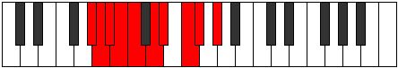 |
| [1759](https://ianring.com/musictheory/scales/1759) | [Pylygic](ModeAFlatPylygic.md) | Ab | Ab, A, Bb, B, C, D, Eb, F, Gb, Ab |  |
| [1767](https://ianring.com/musictheory/scales/1767) | [Dyryllic](ModeCSharpDyryllic.md) | C# | C#, D, D#, F#, G, G#, A#, B, C# |  |
| [1767](https://ianring.com/musictheory/scales/1767) | [Dyryllic](ModeDFlatDyryllic.md) | Db | Db, D, Eb, Gb, G, Ab, Bb, B, Db |  |
| [1769](https://ianring.com/musictheory/scales/1769) | [Rythian](ModeGSharpRythian.md) | G# | G#, A##, B##, C##, D#, E#, F#, G# |  |
| [1769](https://ianring.com/musictheory/scales/1769) | [Rythian](ModeAFlatRythian.md) | Ab | Ab, B, C#, D, Eb, F, Gb, Ab |  |
| [1771](https://ianring.com/musictheory/scales/1771) | [Stylyllic](ModeGSharpStylyllic.md) | G# | G#, A, B, C#, D, D#, F, F#, G# |  |
| [1771](https://ianring.com/musictheory/scales/1771) | [Stylyllic](ModeAFlatStylyllic.md) | Ab | Ab, A, B, Db, D, Eb, F, Gb, Ab |  |
| [1771](https://ianring.com/musictheory/scales/1771) | [Stylyllic](ModeFNaturalStylyllic.md) | F | F, F#, G#, A#, B, C, D, D#, F |  |
| [1773](https://ianring.com/musictheory/scales/1773) | [Aeoloryllic](ModeGSharpAeoloryllic.md) | G# | G#, A#, B, C#, D, D#, F, F#, G# |  |
| [1773](https://ianring.com/musictheory/scales/1773) | [Aeoloryllic](ModeAFlatAeoloryllic.md) | Ab | Ab, Bb, B, Db, D, Eb, F, Gb, Ab |  |
| [1775](https://ianring.com/musictheory/scales/1775) | [Lyrygic](ModeCSharpLyrygic.md) | C# | C#, D, D#, E, F#, G, G#, A#, B, C# |  |
| [1775](https://ianring.com/musictheory/scales/1775) | [Lyrygic](ModeDFlatLyrygic.md) | Db | Db, D, Eb, E, Gb, G, Ab, Bb, B, Db |  |
| [1775](https://ianring.com/musictheory/scales/1775) | [Lyrygic](ModeFNaturalLyrygic.md) | F | F, F#, G, G#, A#, B, C, D, D#, F |  |
| [1775](https://ianring.com/musictheory/scales/1775) | [Lyrygic](ModeGSharpLyrygic.md) | G# | G#, A, A#, B, C#, D, D#, F, F#, G# |  |
| [1775](https://ianring.com/musictheory/scales/1775) | [Lyrygic](ModeAFlatLyrygic.md) | Ab | Ab, A, Bb, B, Db, D, Eb, F, Gb, Ab |  |
| [1779](https://ianring.com/musictheory/scales/1779) | [Aerythyllic](ModeDNaturalAerythyllic.md) | D | D, D#, F#, G, G#, A, B, C, D |  |
| [1783](https://ianring.com/musictheory/scales/1783) | [Danygic](ModeDNaturalDanygic.md) | D | D, D#, E, F#, G, G#, A, B, C, D |  |
| [1783](https://ianring.com/musictheory/scales/1783) | [Danygic](ModeCSharpDanygic.md) | C# | C#, D, D#, F, F#, G, G#, A#, B, C# |  |
| [1783](https://ianring.com/musictheory/scales/1783) | [Danygic](ModeDFlatDanygic.md) | Db | Db, D, Eb, F, Gb, G, Ab, Bb, B, Db |  |
| [1785](https://ianring.com/musictheory/scales/1785) | [Tharyllic](ModeGSharpTharyllic.md) | G# | G#, B, C, C#, D, D#, F, F#, G# |  |
| [1785](https://ianring.com/musictheory/scales/1785) | [Tharyllic](ModeAFlatTharyllic.md) | Ab | Ab, B, C, Db, D, Eb, F, Gb, Ab |  |
| [1785](https://ianring.com/musictheory/scales/1785) | [Tharyllic](ModeBNaturalTharyllic.md) | B | B, D, D#, E, F, F#, G#, A, B |  |
| [1787](https://ianring.com/musictheory/scales/1787) | [Mycrygic](ModeGSharpMycrygic.md) | G# | G#, A, B, C, C#, D, D#, F, F#, G# |  |
| [1787](https://ianring.com/musictheory/scales/1787) | [Mycrygic](ModeAFlatMycrygic.md) | Ab | Ab, A, B, C, Db, D, Eb, F, Gb, Ab |  |
| [1787](https://ianring.com/musictheory/scales/1787) | [Mycrygic](ModeBNaturalMycrygic.md) | B | B, C, D, D#, E, F, F#, G#, A, B |  |
| [1787](https://ianring.com/musictheory/scales/1787) | [Mycrygic](ModeDNaturalMycrygic.md) | D | D, D#, F, F#, G, G#, A, B, C, D |  |
| [1787](https://ianring.com/musictheory/scales/1787) | [Mycrygic](ModeFNaturalMycrygic.md) | F | F, F#, G#, A, A#, B, C, D, D#, F |  |
| [1789](https://ianring.com/musictheory/scales/1789) | [Katagygic](ModeBNaturalKatagygic.md) | B | B, C#, D, D#, E, F, F#, G#, A, B |  |
| [1789](https://ianring.com/musictheory/scales/1789) | [Katagygic](ModeGSharpKatagygic.md) | G# | G#, A#, B, C, C#, D, D#, F, F#, G# |  |
| [1789](https://ianring.com/musictheory/scales/1789) | [Katagygic](ModeAFlatKatagygic.md) | Ab | Ab, Bb, B, C, Db, D, Eb, F, Gb, Ab |  |
| [1791](https://ianring.com/musictheory/scales/1791) | [Aerygyllian](ModeBNaturalAerygyllian.md) | B | B, C, C#, D, D#, E, F, F#, G#, A, B |  |
| [1791](https://ianring.com/musictheory/scales/1791) | [Aerygyllian](ModeDNaturalAerygyllian.md) | D | D, D#, E, F, F#, G, G#, A, B, C, D |  |
| [1791](https://ianring.com/musictheory/scales/1791) | [Aerygyllian](ModeCSharpAerygyllian.md) | C# | C#, D, D#, E, F, F#, G, G#, A#, B, C# |  |
| [1791](https://ianring.com/musictheory/scales/1791) | [Aerygyllian](ModeDFlatAerygyllian.md) | Db | Db, D, Eb, E, F, Gb, G, Ab, Bb, B, Db |  |
| [1791](https://ianring.com/musictheory/scales/1791) | [Aerygyllian](ModeGSharpAerygyllian.md) | G# | G#, A, A#, B, C, C#, D, D#, F, F#, G# |  |
| [1791](https://ianring.com/musictheory/scales/1791) | [Aerygyllian](ModeAFlatAerygyllian.md) | Ab | Ab, A, Bb, B, C, Db, D, Eb, F, Gb, Ab |  |
| [1791](https://ianring.com/musictheory/scales/1791) | [Aerygyllian](ModeFNaturalAerygyllian.md) | F | F, F#, G, G#, A, A#, B, C, D, D#, F |  |
| [1829](https://ianring.com/musictheory/scales/1829) | [Pathimic](ModeFSharpPathimic.md) | F# | F#, G#, A##, B###, C###, D##, F# |  |
| [1829](https://ianring.com/musictheory/scales/1829) | [Pathimic](ModeGFlatPathimic.md) | Gb | Gb, Ab, B, C##, D#, E, Gb |  |
| [1831](https://ianring.com/musictheory/scales/1831) | [Pothian](ModeFSharpPothian.md) | F# | F#, G, Ab, B, C##, D#, E, F# |  |
| [1831](https://ianring.com/musictheory/scales/1831) | [Pothian](ModeGFlatPothian.md) | Gb | Gb, Abb, Bbbb, Cb, D, Eb, Fb, Gb |  |
| [1837](https://ianring.com/musictheory/scales/1837) | [Dalian](ModeFSharpDalian.md) | F# | F#, G#, A, B, C##, D#, E, F# |  |
| [1837](https://ianring.com/musictheory/scales/1837) | [Dalian](ModeGFlatDalian.md) | Gb | Gb, Ab, Bbb, Cb, D, Eb, Fb, Gb |  |
| [1839](https://ianring.com/musictheory/scales/1839) | [Zogyllic](ModeFSharpZogyllic.md) | F# | F#, G, G#, A, B, D, D#, E, F# |  |
| [1839](https://ianring.com/musictheory/scales/1839) | [Zogyllic](ModeGFlatZogyllic.md) | Gb | Gb, G, Ab, A, B, D, Eb, E, Gb |  |
| [1843](https://ianring.com/musictheory/scales/1843) | [Ionygian](ModeASharpIonygian.md) | A# | A#, B, C##, D#, E##, F##, G#, A# |  |
| [1843](https://ianring.com/musictheory/scales/1843) | [Ionygian](ModeBFlatIonygian.md) | Bb | Bb, Cb, D, Eb, F#, G, Ab, Bb |  |
| [1845](https://ianring.com/musictheory/scales/1845) | [Lagian](ModeFSharpLagian.md) | F# | F#, G#, A#, B, C##, D#, E, F# |  |
| [1845](https://ianring.com/musictheory/scales/1845) | [Lagian](ModeGFlatLagian.md) | Gb | Gb, Ab, Bb, Cb, D, Eb, Fb, Gb |  |
| [1847](https://ianring.com/musictheory/scales/1847) | [Thacryllic](ModeASharpThacryllic.md) | A# | A#, B, C, D, D#, F#, G, G#, A# |  |
| [1847](https://ianring.com/musictheory/scales/1847) | [Thacryllic](ModeBFlatThacryllic.md) | Bb | Bb, B, C, D, Eb, Gb, G, Ab, Bb |  |
| [1847](https://ianring.com/musictheory/scales/1847) | [Thacryllic](ModeFSharpThacryllic.md) | F# | F#, G, G#, A#, B, D, D#, E, F# |  |
| [1847](https://ianring.com/musictheory/scales/1847) | [Thacryllic](ModeGFlatThacryllic.md) | Gb | Gb, G, Ab, Bb, B, D, Eb, E, Gb |  |
| [1851](https://ianring.com/musictheory/scales/1851) | [Zacryllic](ModeASharpZacryllic.md) | A# | A#, B, C#, D, D#, F#, G, G#, A# |  |
| [1851](https://ianring.com/musictheory/scales/1851) | [Zacryllic](ModeBFlatZacryllic.md) | Bb | Bb, B, Db, D, Eb, Gb, G, Ab, Bb |  |
| [1853](https://ianring.com/musictheory/scales/1853) | [Phrynyllic](ModeFSharpPhrynyllic.md) | F# | F#, G#, A, A#, B, D, D#, E, F# |  |
| [1853](https://ianring.com/musictheory/scales/1853) | [Phrynyllic](ModeGFlatPhrynyllic.md) | Gb | Gb, Ab, A, Bb, B, D, Eb, E, Gb |  |
| [1855](https://ianring.com/musictheory/scales/1855) | [Marygic](ModeASharpMarygic.md) | A# | A#, B, C, C#, D, D#, F#, G, G#, A# |  |
| [1855](https://ianring.com/musictheory/scales/1855) | [Marygic](ModeBFlatMarygic.md) | Bb | Bb, B, C, Db, D, Eb, Gb, G, Ab, Bb |  |
| [1855](https://ianring.com/musictheory/scales/1855) | [Marygic](ModeFSharpMarygic.md) | F# | F#, G, G#, A, A#, B, D, D#, E, F# |  |
| [1855](https://ianring.com/musictheory/scales/1855) | [Marygic](ModeGFlatMarygic.md) | Gb | Gb, G, Ab, A, Bb, B, D, Eb, E, Gb |  |
| [1867](https://ianring.com/musictheory/scales/1867) | [Solian](ModeFNaturalSolian.md) | F | F, Gb, Ab, B, C#, D, Eb, F |  |
| [1871](https://ianring.com/musictheory/scales/1871) | [Aeolyllic](ModeFNaturalAeolyllic.md) | F | F, F#, G, G#, B, C#, D, D#, F |  |
| [1875](https://ianring.com/musictheory/scales/1875) | [Epyphian](ModeDNaturalEpyphian.md) | D | D, Eb, F#, G#, A#, B, C, D |  |
| [1879](https://ianring.com/musictheory/scales/1879) | [Mixoryllic](ModeDNaturalMixoryllic.md) | D | D, D#, E, F#, G#, A#, B, C, D |  |
| [1883](https://ianring.com/musictheory/scales/1883) | [Mixopyryllic](ModeFNaturalMixopyryllic.md) | F | F, F#, G#, A, B, C#, D, D#, F |  |
| [1883](https://ianring.com/musictheory/scales/1883) | [Mixopyryllic](ModeDNaturalMixopyryllic.md) | D | D, D#, F, F#, G#, A#, B, C, D |  |
| [1887](https://ianring.com/musictheory/scales/1887) | [Aerocrygic](ModeFNaturalAerocrygic.md) | F | F, F#, G, G#, A, B, C#, D, D#, F |  |
| [1887](https://ianring.com/musictheory/scales/1887) | [Aerocrygic](ModeDNaturalAerocrygic.md) | D | D, D#, E, F, F#, G#, A#, B, C, D |  |
| [1893](https://ianring.com/musictheory/scales/1893) | [Ionylian](ModeFSharpIonylian.md) | F# | F#, G#, A##, B#, C##, D#, E, F# |  |
| [1893](https://ianring.com/musictheory/scales/1893) | [Ionylian](ModeGFlatIonylian.md) | Gb | Gb, Ab, B, C, D, Eb, Fb, Gb |  |
| [1895](https://ianring.com/musictheory/scales/1895) | [Salyllic](ModeFSharpSalyllic.md) | F# | F#, G, G#, B, C, D, D#, E, F# |  |
| [1895](https://ianring.com/musictheory/scales/1895) | [Salyllic](ModeGFlatSalyllic.md) | Gb | Gb, G, Ab, B, C, D, Eb, E, Gb |  |
| [1899](https://ianring.com/musictheory/scales/1899) | [Moptyllic](ModeFNaturalMoptyllic.md) | F | F, F#, G#, A#, B, C#, D, D#, F |  |
| [1901](https://ianring.com/musictheory/scales/1901) | [Ionidyllic](ModeFSharpIonidyllic.md) | F# | F#, G#, A, B, C, D, D#, E, F# |  |
| [1901](https://ianring.com/musictheory/scales/1901) | [Ionidyllic](ModeGFlatIonidyllic.md) | Gb | Gb, Ab, A, B, C, D, Eb, E, Gb |  |
| [1903](https://ianring.com/musictheory/scales/1903) | [Rocrygic](ModeFSharpRocrygic.md) | F# | F#, G, G#, A, B, C, D, D#, E, F# |  |
| [1903](https://ianring.com/musictheory/scales/1903) | [Rocrygic](ModeGFlatRocrygic.md) | Gb | Gb, G, Ab, A, B, C, D, Eb, E, Gb |  |
| [1903](https://ianring.com/musictheory/scales/1903) | [Rocrygic](ModeFNaturalRocrygic.md) | F | F, F#, G, G#, A#, B, C#, D, D#, F |  |
| [1907](https://ianring.com/musictheory/scales/1907) | [Lynyllic](ModeDNaturalLynyllic.md) | D | D, D#, F#, G, G#, A#, B, C, D |  |
| [1907](https://ianring.com/musictheory/scales/1907) | [Lynyllic](ModeASharpLynyllic.md) | A# | A#, B, D, D#, E, F#, G, G#, A# |  |
| [1907](https://ianring.com/musictheory/scales/1907) | [Lynyllic](ModeBFlatLynyllic.md) | Bb | Bb, B, D, Eb, E, Gb, G, Ab, Bb |  |
| [1909](https://ianring.com/musictheory/scales/1909) | [Epicryllic](ModeFSharpEpicryllic.md) | F# | F#, G#, A#, B, C, D, D#, E, F# |  |
| [1909](https://ianring.com/musictheory/scales/1909) | [Epicryllic](ModeGFlatEpicryllic.md) | Gb | Gb, Ab, Bb, B, C, D, Eb, E, Gb |  |
| [1911](https://ianring.com/musictheory/scales/1911) | [Stynygic](ModeDNaturalStynygic.md) | D | D, D#, E, F#, G, G#, A#, B, C, D | 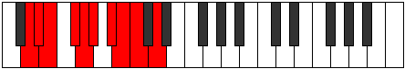 |
| [1911](https://ianring.com/musictheory/scales/1911) | [Stynygic](ModeFSharpStynygic.md) | F# | F#, G, G#, A#, B, C, D, D#, E, F# |  |
| [1911](https://ianring.com/musictheory/scales/1911) | [Stynygic](ModeGFlatStynygic.md) | Gb | Gb, G, Ab, Bb, B, C, D, Eb, E, Gb |  |
| [1911](https://ianring.com/musictheory/scales/1911) | [Stynygic](ModeASharpStynygic.md) | A# | A#, B, C, D, D#, E, F#, G, G#, A# |  |
| [1911](https://ianring.com/musictheory/scales/1911) | [Stynygic](ModeBFlatStynygic.md) | Bb | Bb, B, C, D, Eb, E, Gb, G, Ab, Bb |  |
| [1915](https://ianring.com/musictheory/scales/1915) | [Thydygic](ModeASharpThydygic.md) | A# | A#, B, C#, D, D#, E, F#, G, G#, A# |  |
| [1915](https://ianring.com/musictheory/scales/1915) | [Thydygic](ModeBFlatThydygic.md) | Bb | Bb, B, Db, D, Eb, E, Gb, G, Ab, Bb |  |
| [1915](https://ianring.com/musictheory/scales/1915) | [Thydygic](ModeDNaturalThydygic.md) | D | D, D#, F, F#, G, G#, A#, B, C, D |  |
| [1915](https://ianring.com/musictheory/scales/1915) | [Thydygic](ModeFNaturalThydygic.md) | F | F, F#, G#, A, A#, B, C#, D, D#, F |  |
| [1917](https://ianring.com/musictheory/scales/1917) | [Sacrygic](ModeFSharpSacrygic.md) | F# | F#, G#, A, A#, B, C, D, D#, E, F# |  |
| [1917](https://ianring.com/musictheory/scales/1917) | [Sacrygic](ModeGFlatSacrygic.md) | Gb | Gb, Ab, A, Bb, B, C, D, Eb, E, Gb |  |
| [1919](https://ianring.com/musictheory/scales/1919) | [Rocryllian](ModeASharpRocryllian.md) | A# | A#, B, C, C#, D, D#, E, F#, G, G#, A# | 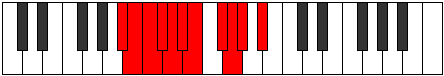 |
| [1919](https://ianring.com/musictheory/scales/1919) | [Rocryllian](ModeBFlatRocryllian.md) | Bb | Bb, B, C, Db, D, Eb, E, Gb, G, Ab, Bb |  |
| [1919](https://ianring.com/musictheory/scales/1919) | [Rocryllian](ModeDNaturalRocryllian.md) | D | D, D#, E, F, F#, G, G#, A#, B, C, D |  |
| [1919](https://ianring.com/musictheory/scales/1919) | [Rocryllian](ModeFSharpRocryllian.md) | F# | F#, G, G#, A, A#, B, C, D, D#, E, F# |  |
| [1919](https://ianring.com/musictheory/scales/1919) | [Rocryllian](ModeGFlatRocryllian.md) | Gb | Gb, G, Ab, A, Bb, B, C, D, Eb, E, Gb |  |
| [1919](https://ianring.com/musictheory/scales/1919) | [Rocryllian](ModeFNaturalRocryllian.md) | F | F, F#, G, G#, A, A#, B, C#, D, D#, F |  |
| [1945](https://ianring.com/musictheory/scales/1945) | [Zarian](ModeBNaturalZarian.md) | B | B, C##, D#, E##, F##, G#, A, B |  |
| [1947](https://ianring.com/musictheory/scales/1947) | [Ionoyllic](ModeBNaturalIonoyllic.md) | B | B, C, D, D#, F#, G, G#, A, B |  |
| [1949](https://ianring.com/musictheory/scales/1949) | [Mathyllic](ModeBNaturalMathyllic.md) | B | B, C#, D, D#, F#, G, G#, A, B |  |
| [1951](https://ianring.com/musictheory/scales/1951) | [Gonygic](ModeBNaturalGonygic.md) | B | B, C, C#, D, D#, F#, G, G#, A, B |  |
| [1957](https://ianring.com/musictheory/scales/1957) | [Pyrian](ModeFSharpPyrian.md) | F# | F#, G#, A##, B##, C##, D#, E, F# |  |
| [1957](https://ianring.com/musictheory/scales/1957) | [Pyrian](ModeGFlatPyrian.md) | Gb | Gb, Ab, B, C#, D, Eb, Fb, Gb |  |
| [1959](https://ianring.com/musictheory/scales/1959) | [Katolyllic](ModeFSharpKatolyllic.md) | F# | F#, G, G#, B, C#, D, D#, E, F# |  |
| [1959](https://ianring.com/musictheory/scales/1959) | [Katolyllic](ModeGFlatKatolyllic.md) | Gb | Gb, G, Ab, B, Db, D, Eb, E, Gb |  |
| [1959](https://ianring.com/musictheory/scales/1959) | [Katolyllic](ModeCSharpKatolyllic.md) | C# | C#, D, D#, F#, G#, A, A#, B, C# |  |
| [1959](https://ianring.com/musictheory/scales/1959) | [Katolyllic](ModeDFlatKatolyllic.md) | Db | Db, D, Eb, Gb, Ab, A, Bb, B, Db |  |
| [1965](https://ianring.com/musictheory/scales/1965) | [Gadyllic](ModeFSharpGadyllic.md) | F# | F#, G#, A, B, C#, D, D#, E, F# |  |
| [1965](https://ianring.com/musictheory/scales/1965) | [Gadyllic](ModeGFlatGadyllic.md) | Gb | Gb, Ab, A, B, Db, D, Eb, E, Gb |  |
| [1967](https://ianring.com/musictheory/scales/1967) | [Godygic](ModeFSharpGodygic.md) | F# | F#, G, G#, A, B, C#, D, D#, E, F# |  |
| [1967](https://ianring.com/musictheory/scales/1967) | [Godygic](ModeGFlatGodygic.md) | Gb | Gb, G, Ab, A, B, Db, D, Eb, E, Gb |  |
| [1967](https://ianring.com/musictheory/scales/1967) | [Godygic](ModeCSharpGodygic.md) | C# | C#, D, D#, E, F#, G#, A, A#, B, C# |  |
| [1967](https://ianring.com/musictheory/scales/1967) | [Godygic](ModeDFlatGodygic.md) | Db | Db, D, Eb, E, Gb, Ab, A, Bb, B, Db |  |
| [1971](https://ianring.com/musictheory/scales/1971) | [Aerynyllic](ModeASharpAerynyllic.md) | A# | A#, B, D, D#, F, F#, G, G#, A# |  |
| [1971](https://ianring.com/musictheory/scales/1971) | [Aerynyllic](ModeBFlatAerynyllic.md) | Bb | Bb, B, D, Eb, F, Gb, G, Ab, Bb |  |
| [1973](https://ianring.com/musictheory/scales/1973) | [Zyryllic](ModeFSharpZyryllic.md) | F# | F#, G#, A#, B, C#, D, D#, E, F# |  |
| [1973](https://ianring.com/musictheory/scales/1973) | [Zyryllic](ModeGFlatZyryllic.md) | Gb | Gb, Ab, Bb, B, Db, D, Eb, E, Gb |  |
| [1975](https://ianring.com/musictheory/scales/1975) | [Ionocrygic](ModeFSharpIonocrygic.md) | F# | F#, G, G#, A#, B, C#, D, D#, E, F# |  |
| [1975](https://ianring.com/musictheory/scales/1975) | [Ionocrygic](ModeGFlatIonocrygic.md) | Gb | Gb, G, Ab, Bb, B, Db, D, Eb, E, Gb |  |
| [1975](https://ianring.com/musictheory/scales/1975) | [Ionocrygic](ModeASharpIonocrygic.md) | A# | A#, B, C, D, D#, F, F#, G, G#, A# |  |
| [1975](https://ianring.com/musictheory/scales/1975) | [Ionocrygic](ModeBFlatIonocrygic.md) | Bb | Bb, B, C, D, Eb, F, Gb, G, Ab, Bb |  |
| [1975](https://ianring.com/musictheory/scales/1975) | [Ionocrygic](ModeCSharpIonocrygic.md) | C# | C#, D, D#, F, F#, G#, A, A#, B, C# |  |
| [1975](https://ianring.com/musictheory/scales/1975) | [Ionocrygic](ModeDFlatIonocrygic.md) | Db | Db, D, Eb, F, Gb, Ab, A, Bb, B, Db |  |
| [1977](https://ianring.com/musictheory/scales/1977) | [Dagyllic](ModeBNaturalDagyllic.md) | B | B, D, D#, E, F#, G, G#, A, B |  |
| [1979](https://ianring.com/musictheory/scales/1979) | [Aeradygic](ModeBNaturalAeradygic.md) | B | B, C, D, D#, E, F#, G, G#, A, B |  |
| [1979](https://ianring.com/musictheory/scales/1979) | [Aeradygic](ModeASharpAeradygic.md) | A# | A#, B, C#, D, D#, F, F#, G, G#, A# |  |
| [1979](https://ianring.com/musictheory/scales/1979) | [Aeradygic](ModeBFlatAeradygic.md) | Bb | Bb, B, Db, D, Eb, F, Gb, G, Ab, Bb |  |
| [1981](https://ianring.com/musictheory/scales/1981) | [Gadygic](ModeBNaturalGadygic.md) | B | B, C#, D, D#, E, F#, G, G#, A, B |  |
| [1981](https://ianring.com/musictheory/scales/1981) | [Gadygic](ModeFSharpGadygic.md) | F# | F#, G#, A, A#, B, C#, D, D#, E, F# |  |
| [1981](https://ianring.com/musictheory/scales/1981) | [Gadygic](ModeGFlatGadygic.md) | Gb | Gb, Ab, A, Bb, B, Db, D, Eb, E, Gb |  |
| [1983](https://ianring.com/musictheory/scales/1983) | [Soryllian](ModeBNaturalSoryllian.md) | B | B, C, C#, D, D#, E, F#, G, G#, A, B |  |
| [1983](https://ianring.com/musictheory/scales/1983) | [Soryllian](ModeASharpSoryllian.md) | A# | A#, B, C, C#, D, D#, F, F#, G, G#, A# |  |
| [1983](https://ianring.com/musictheory/scales/1983) | [Soryllian](ModeBFlatSoryllian.md) | Bb | Bb, B, C, Db, D, Eb, F, Gb, G, Ab, Bb |  |
| [1983](https://ianring.com/musictheory/scales/1983) | [Soryllian](ModeCSharpSoryllian.md) | C# | C#, D, D#, E, F, F#, G#, A, A#, B, C# |  |
| [1983](https://ianring.com/musictheory/scales/1983) | [Soryllian](ModeDFlatSoryllian.md) | Db | Db, D, Eb, E, F, Gb, Ab, A, Bb, B, Db |  |
| [1983](https://ianring.com/musictheory/scales/1983) | [Soryllian](ModeFSharpSoryllian.md) | F# | F#, G, G#, A, A#, B, C#, D, D#, E, F# |  |
| [1983](https://ianring.com/musictheory/scales/1983) | [Soryllian](ModeGFlatSoryllian.md) | Gb | Gb, G, Ab, A, Bb, B, Db, D, Eb, E, Gb |  |
| [1993](https://ianring.com/musictheory/scales/1993) | [Katoptian](ModeGSharpKatoptian.md) | G# | G#, A##, B###, C###, D##, E#, F#, G# |  |
| [1993](https://ianring.com/musictheory/scales/1993) | [Katoptian](ModeAFlatKatoptian.md) | Ab | Ab, B, C##, D#, E, F, Gb, Ab |  |
| [1995](https://ianring.com/musictheory/scales/1995) | [Aeolacryllic](ModeFNaturalAeolacryllic.md) | F | F, F#, G#, B, C, C#, D, D#, F |  |
| [1995](https://ianring.com/musictheory/scales/1995) | [Aeolacryllic](ModeGSharpAeolacryllic.md) | G# | G#, A, B, D, D#, E, F, F#, G# |  |
| [1995](https://ianring.com/musictheory/scales/1995) | [Aeolacryllic](ModeAFlatAeolacryllic.md) | Ab | Ab, A, B, D, Eb, E, F, Gb, Ab |  |
| [1997](https://ianring.com/musictheory/scales/1997) | [Staryllic](ModeGSharpStaryllic.md) | G# | G#, A#, B, D, D#, E, F, F#, G# |  |
| [1997](https://ianring.com/musictheory/scales/1997) | [Staryllic](ModeAFlatStaryllic.md) | Ab | Ab, Bb, B, D, Eb, E, F, Gb, Ab |  |
| [1999](https://ianring.com/musictheory/scales/1999) | [Zacrygic](ModeFNaturalZacrygic.md) | F | F, F#, G, G#, B, C, C#, D, D#, F |  |
| [1999](https://ianring.com/musictheory/scales/1999) | [Zacrygic](ModeGSharpZacrygic.md) | G# | G#, A, A#, B, D, D#, E, F, F#, G# |  |
| [1999](https://ianring.com/musictheory/scales/1999) | [Zacrygic](ModeAFlatZacrygic.md) | Ab | Ab, A, Bb, B, D, Eb, E, F, Gb, Ab | 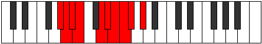 |
| [2003](https://ianring.com/musictheory/scales/2003) | [Lolyllic](ModeDNaturalLolyllic.md) | D | D, D#, F#, G#, A, A#, B, C, D |  |
| [2007](https://ianring.com/musictheory/scales/2007) | [Stonygic](ModeDNaturalStonygic.md) | D | D, D#, E, F#, G#, A, A#, B, C, D |  |
| [2009](https://ianring.com/musictheory/scales/2009) | [Stacryllic](ModeGSharpStacryllic.md) | G# | G#, B, C, D, D#, E, F, F#, G# |  |
| [2009](https://ianring.com/musictheory/scales/2009) | [Stacryllic](ModeAFlatStacryllic.md) | Ab | Ab, B, C, D, Eb, E, F, Gb, Ab |  |
| [2009](https://ianring.com/musictheory/scales/2009) | [Stacryllic](ModeBNaturalStacryllic.md) | B | B, D, D#, F, F#, G, G#, A, B |  |
| [2011](https://ianring.com/musictheory/scales/2011) | [Raphygic](ModeFNaturalRaphygic.md) | F | F, F#, G#, A, B, C, C#, D, D#, F |  |
| [2011](https://ianring.com/musictheory/scales/2011) | [Raphygic](ModeGSharpRaphygic.md) | G# | G#, A, B, C, D, D#, E, F, F#, G# |  |
| [2011](https://ianring.com/musictheory/scales/2011) | [Raphygic](ModeAFlatRaphygic.md) | Ab | Ab, A, B, C, D, Eb, E, F, Gb, Ab |  |
| [2011](https://ianring.com/musictheory/scales/2011) | [Raphygic](ModeBNaturalRaphygic.md) | B | B, C, D, D#, F, F#, G, G#, A, B |  |
| [2011](https://ianring.com/musictheory/scales/2011) | [Raphygic](ModeDNaturalRaphygic.md) | D | D, D#, F, F#, G#, A, A#, B, C, D |  |
| [2013](https://ianring.com/musictheory/scales/2013) | [Mocrygic](ModeBNaturalMocrygic.md) | B | B, C#, D, D#, F, F#, G, G#, A, B |  |
| [2013](https://ianring.com/musictheory/scales/2013) | [Mocrygic](ModeGSharpMocrygic.md) | G# | G#, A#, B, C, D, D#, E, F, F#, G# |  |
| [2013](https://ianring.com/musictheory/scales/2013) | [Mocrygic](ModeAFlatMocrygic.md) | Ab | Ab, Bb, B, C, D, Eb, E, F, Gb, Ab |  |
| [2015](https://ianring.com/musictheory/scales/2015) | [Epiryllian](ModeFNaturalEpiryllian.md) | F | F, F#, G, G#, A, B, C, C#, D, D#, F |  |
| [2015](https://ianring.com/musictheory/scales/2015) | [Epiryllian](ModeBNaturalEpiryllian.md) | B | B, C, C#, D, D#, F, F#, G, G#, A, B |  |
| [2015](https://ianring.com/musictheory/scales/2015) | [Epiryllian](ModeDNaturalEpiryllian.md) | D | D, D#, E, F, F#, G#, A, A#, B, C, D |  |
| [2015](https://ianring.com/musictheory/scales/2015) | [Epiryllian](ModeGSharpEpiryllian.md) | G# | G#, A, A#, B, C, D, D#, E, F, F#, G# |  |
| [2015](https://ianring.com/musictheory/scales/2015) | [Epiryllian](ModeAFlatEpiryllian.md) | Ab | Ab, A, Bb, B, C, D, Eb, E, F, Gb, Ab |  |
| [2021](https://ianring.com/musictheory/scales/2021) | [Katycryllic](ModeFSharpKatycryllic.md) | F# | F#, G#, B, C, C#, D, D#, E, F# |  |
| [2021](https://ianring.com/musictheory/scales/2021) | [Katycryllic](ModeGFlatKatycryllic.md) | Gb | Gb, Ab, B, C, Db, D, Eb, E, Gb |  |
| [2023](https://ianring.com/musictheory/scales/2023) | [Zodygic](ModeFSharpZodygic.md) | F# | F#, G, G#, B, C, C#, D, D#, E, F# |  |
| [2023](https://ianring.com/musictheory/scales/2023) | [Zodygic](ModeGFlatZodygic.md) | Gb | Gb, G, Ab, B, C, Db, D, Eb, E, Gb |  |
| [2023](https://ianring.com/musictheory/scales/2023) | [Zodygic](ModeCSharpZodygic.md) | C# | C#, D, D#, F#, G, G#, A, A#, B, C# |  |
| [2023](https://ianring.com/musictheory/scales/2023) | [Zodygic](ModeDFlatZodygic.md) | Db | Db, D, Eb, Gb, G, Ab, A, Bb, B, Db |  |
| [2025](https://ianring.com/musictheory/scales/2025) | [Mixolydyllic](ModeGSharpMixolydyllic.md) | G# | G#, B, C#, D, D#, E, F, F#, G# |  |
| [2025](https://ianring.com/musictheory/scales/2025) | [Mixolydyllic](ModeAFlatMixolydyllic.md) | Ab | Ab, B, Db, D, Eb, E, F, Gb, Ab |  |
| [2027](https://ianring.com/musictheory/scales/2027) | [Boptygic](ModeGSharpBoptygic.md) | G# | G#, A, B, C#, D, D#, E, F, F#, G# |  |
| [2027](https://ianring.com/musictheory/scales/2027) | [Boptygic](ModeAFlatBoptygic.md) | Ab | Ab, A, B, Db, D, Eb, E, F, Gb, Ab |  |
| [2027](https://ianring.com/musictheory/scales/2027) | [Boptygic](ModeFNaturalBoptygic.md) | F | F, F#, G#, A#, B, C, C#, D, D#, F |  |
| [2029](https://ianring.com/musictheory/scales/2029) | [Mathygic](ModeFSharpMathygic.md) | F# | F#, G#, A, B, C, C#, D, D#, E, F# |  |
| [2029](https://ianring.com/musictheory/scales/2029) | [Mathygic](ModeGFlatMathygic.md) | Gb | Gb, Ab, A, B, C, Db, D, Eb, E, Gb |  |
| [2029](https://ianring.com/musictheory/scales/2029) | [Mathygic](ModeGSharpMathygic.md) | G# | G#, A#, B, C#, D, D#, E, F, F#, G# |  |
| [2029](https://ianring.com/musictheory/scales/2029) | [Mathygic](ModeAFlatMathygic.md) | Ab | Ab, Bb, B, Db, D, Eb, E, F, Gb, Ab |  |
| [2031](https://ianring.com/musictheory/scales/2031) | [Gadyllian](ModeFSharpGadyllian.md) | F# | F#, G, G#, A, B, C, C#, D, D#, E, F# |  |
| [2031](https://ianring.com/musictheory/scales/2031) | [Gadyllian](ModeGFlatGadyllian.md) | Gb | Gb, G, Ab, A, B, C, Db, D, Eb, E, Gb |  |
| [2031](https://ianring.com/musictheory/scales/2031) | [Gadyllian](ModeFNaturalGadyllian.md) | F | F, F#, G, G#, A#, B, C, C#, D, D#, F |  |
| [2031](https://ianring.com/musictheory/scales/2031) | [Gadyllian](ModeGSharpGadyllian.md) | G# | G#, A, A#, B, C#, D, D#, E, F, F#, G# |  |
| [2031](https://ianring.com/musictheory/scales/2031) | [Gadyllian](ModeAFlatGadyllian.md) | Ab | Ab, A, Bb, B, Db, D, Eb, E, F, Gb, Ab |  |
| [2031](https://ianring.com/musictheory/scales/2031) | [Gadyllian](ModeCSharpGadyllian.md) | C# | C#, D, D#, E, F#, G, G#, A, A#, B, C# |  |
| [2031](https://ianring.com/musictheory/scales/2031) | [Gadyllian](ModeDFlatGadyllian.md) | Db | Db, D, Eb, E, Gb, G, Ab, A, Bb, B, Db |  |
| [2035](https://ianring.com/musictheory/scales/2035) | [Aerythygic](ModeASharpAerythygic.md) | A# | A#, B, D, D#, E, F, F#, G, G#, A# |  |
| [2035](https://ianring.com/musictheory/scales/2035) | [Aerythygic](ModeBFlatAerythygic.md) | Bb | Bb, B, D, Eb, E, F, Gb, G, Ab, Bb |  |
| [2035](https://ianring.com/musictheory/scales/2035) | [Aerythygic](ModeDNaturalAerythygic.md) | D | D, D#, F#, G, G#, A, A#, B, C, D |  |
| [2037](https://ianring.com/musictheory/scales/2037) | [Sythygic](ModeFSharpSythygic.md) | F# | F#, G#, A#, B, C, C#, D, D#, E, F# |  |
| [2037](https://ianring.com/musictheory/scales/2037) | [Sythygic](ModeGFlatSythygic.md) | Gb | Gb, Ab, Bb, B, C, Db, D, Eb, E, Gb |  |
| [2039](https://ianring.com/musictheory/scales/2039) | [Danyllian](ModeFSharpDanyllian.md) | F# | F#, G, G#, A#, B, C, C#, D, D#, E, F# |  |
| [2039](https://ianring.com/musictheory/scales/2039) | [Danyllian](ModeGFlatDanyllian.md) | Gb | Gb, G, Ab, Bb, B, C, Db, D, Eb, E, Gb |  |
| [2039](https://ianring.com/musictheory/scales/2039) | [Danyllian](ModeASharpDanyllian.md) | A# | A#, B, C, D, D#, E, F, F#, G, G#, A# |  |
| [2039](https://ianring.com/musictheory/scales/2039) | [Danyllian](ModeBFlatDanyllian.md) | Bb | Bb, B, C, D, Eb, E, F, Gb, G, Ab, Bb |  |
| [2039](https://ianring.com/musictheory/scales/2039) | [Danyllian](ModeDNaturalDanyllian.md) | D | D, D#, E, F#, G, G#, A, A#, B, C, D |  |
| [2039](https://ianring.com/musictheory/scales/2039) | [Danyllian](ModeCSharpDanyllian.md) | C# | C#, D, D#, F, F#, G, G#, A, A#, B, C# |  |
| [2039](https://ianring.com/musictheory/scales/2039) | [Danyllian](ModeDFlatDanyllian.md) | Db | Db, D, Eb, F, Gb, G, Ab, A, Bb, B, Db |  |
| [2041](https://ianring.com/musictheory/scales/2041) | [Aeolacrygic](ModeGSharpAeolacrygic.md) | G# | G#, B, C, C#, D, D#, E, F, F#, G# |  |
| [2041](https://ianring.com/musictheory/scales/2041) | [Aeolacrygic](ModeAFlatAeolacrygic.md) | Ab | Ab, B, C, Db, D, Eb, E, F, Gb, Ab |  |
| [2041](https://ianring.com/musictheory/scales/2041) | [Aeolacrygic](ModeBNaturalAeolacrygic.md) | B | B, D, D#, E, F, F#, G, G#, A, B |  |
| [2043](https://ianring.com/musictheory/scales/2043) | [Lythyllian](ModeGSharpLythyllian.md) | G# | G#, A, B, C, C#, D, D#, E, F, F#, G# |  |
| [2043](https://ianring.com/musictheory/scales/2043) | [Lythyllian](ModeAFlatLythyllian.md) | Ab | Ab, A, B, C, Db, D, Eb, E, F, Gb, Ab |  |
| [2043](https://ianring.com/musictheory/scales/2043) | [Lythyllian](ModeBNaturalLythyllian.md) | B | B, C, D, D#, E, F, F#, G, G#, A, B |  |
| [2043](https://ianring.com/musictheory/scales/2043) | [Lythyllian](ModeASharpLythyllian.md) | A# | A#, B, C#, D, D#, E, F, F#, G, G#, A# |  |
| [2043](https://ianring.com/musictheory/scales/2043) | [Lythyllian](ModeBFlatLythyllian.md) | Bb | Bb, B, Db, D, Eb, E, F, Gb, G, Ab, Bb |  |
| [2043](https://ianring.com/musictheory/scales/2043) | [Lythyllian](ModeFNaturalLythyllian.md) | F | F, F#, G#, A, A#, B, C, C#, D, D#, F |  |
| [2043](https://ianring.com/musictheory/scales/2043) | [Lythyllian](ModeDNaturalLythyllian.md) | D | D, D#, F, F#, G, G#, A, A#, B, C, D |  |
| [2045](https://ianring.com/musictheory/scales/2045) | [Katogyllian](ModeBNaturalKatogyllian.md) | B | B, C#, D, D#, E, F, F#, G, G#, A, B |  |
| [2045](https://ianring.com/musictheory/scales/2045) | [Katogyllian](ModeGSharpKatogyllian.md) | G# | G#, A#, B, C, C#, D, D#, E, F, F#, G# |  |
| [2045](https://ianring.com/musictheory/scales/2045) | [Katogyllian](ModeAFlatKatogyllian.md) | Ab | Ab, Bb, B, C, Db, D, Eb, E, F, Gb, Ab |  |
| [2045](https://ianring.com/musictheory/scales/2045) | [Katogyllian](ModeFSharpKatogyllian.md) | F# | F#, G#, A, A#, B, C, C#, D, D#, E, F# |  |
| [2045](https://ianring.com/musictheory/scales/2045) | [Katogyllian](ModeGFlatKatogyllian.md) | Gb | Gb, Ab, A, Bb, B, C, Db, D, Eb, E, Gb |  |
| [2047](https://ianring.com/musictheory/scales/2047) | [Monatic](ModeBNaturalMonatic.md) | B | B, C, C#, D, D#, E, F, F#, G, G#, A, B |  |
| [2047](https://ianring.com/musictheory/scales/2047) | [Monatic](ModeASharpMonatic.md) | A# | A#, B, C, C#, D, D#, E, F, F#, G, G#, A# |  |
| [2047](https://ianring.com/musictheory/scales/2047) | [Monatic](ModeBFlatMonatic.md) | Bb | Bb, B, C, Db, D, Eb, E, F, Gb, G, Ab, Bb |  |
| [2047](https://ianring.com/musictheory/scales/2047) | [Monatic](ModeGSharpMonatic.md) | G# | G#, A, A#, B, C, C#, D, D#, E, F, F#, G# |  |
| [2047](https://ianring.com/musictheory/scales/2047) | [Monatic](ModeAFlatMonatic.md) | Ab | Ab, A, Bb, B, C, Db, D, Eb, E, F, Gb, Ab |  |
| [2047](https://ianring.com/musictheory/scales/2047) | [Monatic](ModeFSharpMonatic.md) | F# | F#, G, G#, A, A#, B, C, C#, D, D#, E, F# |  |
| [2047](https://ianring.com/musictheory/scales/2047) | [Monatic](ModeGFlatMonatic.md) | Gb | Gb, G, Ab, A, Bb, B, C, Db, D, Eb, E, Gb |  |
| [2047](https://ianring.com/musictheory/scales/2047) | [Monatic](ModeFNaturalMonatic.md) | F | F, F#, G, G#, A, A#, B, C, C#, D, D#, F |  |
| [2047](https://ianring.com/musictheory/scales/2047) | [Monatic](ModeDNaturalMonatic.md) | D | D, D#, E, F, F#, G, G#, A, A#, B, C, D |  |
| [2047](https://ianring.com/musictheory/scales/2047) | [Monatic](ModeCSharpMonatic.md) | C# | C#, D, D#, E, F, F#, G, G#, A, A#, B, C# |  |
| [2047](https://ianring.com/musictheory/scales/2047) | [Monatic](ModeDFlatMonatic.md) | Db | Db, D, Eb, E, F, Gb, G, Ab, A, Bb, B, Db |  |
| [2345](https://ianring.com/musictheory/scales/2345) | [Gothitonic](ModeDSharpGothitonic.md) | D# | D#, F#, G#, B, D, D# |  |
| [2345](https://ianring.com/musictheory/scales/2345) | [Gothitonic](ModeEFlatGothitonic.md) | Eb | Eb, Gb, Ab, B, D, Eb |  |
| [2347](https://ianring.com/musictheory/scales/2347) | [Thothimic](ModeDSharpThothimic.md) | D# | D#, E, F#, G#, A##, B###, D# |  |
| [2347](https://ianring.com/musictheory/scales/2347) | [Thothimic](ModeEFlatThothimic.md) | Eb | Eb, Fb, Gb, Ab, B, C##, Eb |  |
| [2349](https://ianring.com/musictheory/scales/2349) | [Aerogimic](ModeDSharpAerogimic.md) | D# | D#, E#, F#, G#, A##, B###, D# |  |
| [2349](https://ianring.com/musictheory/scales/2349) | [Aerogimic](ModeEFlatAerogimic.md) | Eb | Eb, F, Gb, Ab, B, C##, Eb | 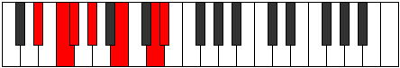 |
| [2351](https://ianring.com/musictheory/scales/2351) | [Gynian](ModeDSharpGynian.md) | D# | D#, E, F, Gb, Ab, B, C##, D# |  |
| [2351](https://ianring.com/musictheory/scales/2351) | [Gynian](ModeEFlatGynian.md) | Eb | Eb, Fb, Gbb, Abbb, Bbbb, Cb, D, Eb |  |
| [2361](https://ianring.com/musictheory/scales/2361) | [Docrimic](ModeDSharpDocrimic.md) | D# | D#, E##, F##, G#, A##, B###, D# |  |
| [2361](https://ianring.com/musictheory/scales/2361) | [Docrimic](ModeEFlatDocrimic.md) | Eb | Eb, F#, G, Ab, B, C##, Eb |  |
| [2363](https://ianring.com/musictheory/scales/2363) | [Kataptian](ModeDSharpKataptian.md) | D# | D#, E, F#, G, Ab, B, C##, D# |  |
| [2363](https://ianring.com/musictheory/scales/2363) | [Kataptian](ModeEFlatKataptian.md) | Eb | Eb, Fb, Gb, Abb, Bbbb, Cb, D, Eb |  |
| [2365](https://ianring.com/musictheory/scales/2365) | [Sythian](ModeDSharpSythian.md) | D# | D#, E#, F#, G, Ab, B, C##, D# |  |
| [2365](https://ianring.com/musictheory/scales/2365) | [Sythian](ModeEFlatSythian.md) | Eb | Eb, F, Gb, Abb, Bbbb, Cb, D, Eb |  |
| [2367](https://ianring.com/musictheory/scales/2367) | [Laryllic](ModeDSharpLaryllic.md) | D# | D#, E, F, F#, G, G#, B, D, D# |  |
| [2367](https://ianring.com/musictheory/scales/2367) | [Laryllic](ModeEFlatLaryllic.md) | Eb | Eb, E, F, Gb, G, Ab, B, D, Eb |  |
| [2381](https://ianring.com/musictheory/scales/2381) | [Sorimic](ModeCNaturalSorimic.md) | C | C, D, Eb, F#, G#, A##, C |  |
| [2383](https://ianring.com/musictheory/scales/2383) | [Katorian](ModeCNaturalKatorian.md) | C | C, Db, Ebb, Fbb, Gb, Ab, B, C |  |
| [2397](https://ianring.com/musictheory/scales/2397) | [Stagian](ModeCNaturalStagian.md) | C | C, D, Eb, Fb, Gb, Ab, B, C |  |
| [2399](https://ianring.com/musictheory/scales/2399) | [Zanyllic](ModeCNaturalZanyllic.md) | C | C, C#, D, D#, E, F#, G#, B, C |  |
| [2409](https://ianring.com/musictheory/scales/2409) | [Zacrimic](ModeDSharpZacrimic.md) | D# | D#, E##, F###, G##, A##, B###, D# |  |
| [2409](https://ianring.com/musictheory/scales/2409) | [Zacrimic](ModeEFlatZacrimic.md) | Eb | Eb, F#, G#, A, B, C##, Eb |  |
| [2411](https://ianring.com/musictheory/scales/2411) | [Aeolorian](ModeDSharpAeolorian.md) | D# | D#, E, F#, G#, A, B, C##, D# |  |
| [2411](https://ianring.com/musictheory/scales/2411) | [Aeolorian](ModeEFlatAeolorian.md) | Eb | Eb, Fb, Gb, Ab, Bbb, Cb, D, Eb |  |
| [2413](https://ianring.com/musictheory/scales/2413) | [Phrydian](ModeCNaturalPhrydian.md) | C | C, D, Eb, F, Gb, Ab, B, C |  |
| [2413](https://ianring.com/musictheory/scales/2413) | [Phrydian](ModeDSharpPhrydian.md) | D# | D#, E#, F#, G#, A, B, C##, D# |  |
| [2413](https://ianring.com/musictheory/scales/2413) | [Phrydian](ModeEFlatPhrydian.md) | Eb | Eb, F, Gb, Ab, Bbb, Cb, D, Eb |  |
| [2415](https://ianring.com/musictheory/scales/2415) | [Lothyllic](ModeCNaturalLothyllic.md) | C | C, C#, D, D#, F, F#, G#, B, C |  |
| [2415](https://ianring.com/musictheory/scales/2415) | [Lothyllic](ModeDSharpLothyllic.md) | D# | D#, E, F, F#, G#, A, B, D, D# |  |
| [2415](https://ianring.com/musictheory/scales/2415) | [Lothyllic](ModeEFlatLothyllic.md) | Eb | Eb, E, F, Gb, Ab, A, B, D, Eb |  |
| [2425](https://ianring.com/musictheory/scales/2425) | [Rorian](ModeDSharpRorian.md) | D# | D#, E##, F##, G#, A, B, C##, D# |  |
| [2425](https://ianring.com/musictheory/scales/2425) | [Rorian](ModeEFlatRorian.md) | Eb | Eb, F#, G, Ab, Bbb, Cb, D, Eb |  |
| [2427](https://ianring.com/musictheory/scales/2427) | [Katoryllic](ModeDSharpKatoryllic.md) | D# | D#, E, F#, G, G#, A, B, D, D# |  |
| [2427](https://ianring.com/musictheory/scales/2427) | [Katoryllic](ModeEFlatKatoryllic.md) | Eb | Eb, E, Gb, G, Ab, A, B, D, Eb |  |
| [2429](https://ianring.com/musictheory/scales/2429) | [Kadyllic](ModeCNaturalKadyllic.md) | C | C, D, D#, E, F, F#, G#, B, C |  |
| [2429](https://ianring.com/musictheory/scales/2429) | [Kadyllic](ModeDSharpKadyllic.md) | D# | D#, F, F#, G, G#, A, B, D, D# |  |
| [2429](https://ianring.com/musictheory/scales/2429) | [Kadyllic](ModeEFlatKadyllic.md) | Eb | Eb, F, Gb, G, Ab, A, B, D, Eb |  |
| [2431](https://ianring.com/musictheory/scales/2431) | [Gythygic](ModeCNaturalGythygic.md) | C | C, C#, D, D#, E, F, F#, G#, B, C |  |
| [2431](https://ianring.com/musictheory/scales/2431) | [Gythygic](ModeDSharpGythygic.md) | D# | D#, E, F, F#, G, G#, A, B, D, D# |  |
| [2431](https://ianring.com/musictheory/scales/2431) | [Gythygic](ModeEFlatGythygic.md) | Eb | Eb, E, F, Gb, G, Ab, A, B, D, Eb |  |
| [2451](https://ianring.com/musictheory/scales/2451) | [Aerynimic](ModeGNaturalAerynimic.md) | G | G, Ab, B, C##, D#, E##, G |  |
| [2455](https://ianring.com/musictheory/scales/2455) | [Bothian](ModeGNaturalBothian.md) | G | G, Ab, Bbb, Cb, D, Eb, F#, G |  |
| [2459](https://ianring.com/musictheory/scales/2459) | [Ionocrian](ModeGNaturalIonocrian.md) | G | G, Ab, Bb, Cb, D, Eb, F#, G |  |
| [2463](https://ianring.com/musictheory/scales/2463) | [Ionathyllic](ModeGNaturalIonathyllic.md) | G | G, G#, A, A#, B, D, D#, F#, G | 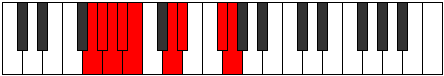 |
| [2473](https://ianring.com/musictheory/scales/2473) | [Mothimic](ModeDSharpMothimic.md) | D# | D#, E##, F###, G###, A##, B###, D# |  |
| [2473](https://ianring.com/musictheory/scales/2473) | [Mothimic](ModeEFlatMothimic.md) | Eb | Eb, F#, G#, A#, B, C##, Eb |  |
| [2475](https://ianring.com/musictheory/scales/2475) | [Aerylian](ModeDSharpAerylian.md) | D# | D#, E, F#, G#, A#, B, C##, D# |  |
| [2475](https://ianring.com/musictheory/scales/2475) | [Aerylian](ModeEFlatAerylian.md) | Eb | Eb, Fb, Gb, Ab, Bb, Cb, D, Eb |  |
| [2477](https://ianring.com/musictheory/scales/2477) | [Mydian](ModeDSharpMydian.md) | D# | D#, E#, F#, G#, A#, B, C##, D# |  |
| [2477](https://ianring.com/musictheory/scales/2477) | [Mydian](ModeEFlatMydian.md) | Eb | Eb, F, Gb, Ab, Bb, Cb, D, Eb |  |
| [2479](https://ianring.com/musictheory/scales/2479) | [Rycryllic](ModeDSharpRycryllic.md) | D# | D#, E, F, F#, G#, A#, B, D, D# |  |
| [2479](https://ianring.com/musictheory/scales/2479) | [Rycryllic](ModeEFlatRycryllic.md) | Eb | Eb, E, F, Gb, Ab, Bb, B, D, Eb |  |
| [2483](https://ianring.com/musictheory/scales/2483) | [Aerynian](ModeGNaturalAerynian.md) | G | G, Ab, B, C, D, Eb, F#, G |  |
| [2487](https://ianring.com/musictheory/scales/2487) | [Phroptyllic](ModeGNaturalPhroptyllic.md) | G | G, G#, A, B, C, D, D#, F#, G |  |
| [2489](https://ianring.com/musictheory/scales/2489) | [Syrian](ModeDSharpSyrian.md) | D# | D#, E##, F##, G#, A#, B, C##, D# |  |
| [2489](https://ianring.com/musictheory/scales/2489) | [Syrian](ModeEFlatSyrian.md) | Eb | Eb, F#, G, Ab, Bb, Cb, D, Eb |  |
| [2491](https://ianring.com/musictheory/scales/2491) | [Layllic](ModeGNaturalLayllic.md) | G | G, G#, A#, B, C, D, D#, F#, G |  |
| [2491](https://ianring.com/musictheory/scales/2491) | [Layllic](ModeDSharpLayllic.md) | D# | D#, E, F#, G, G#, A#, B, D, D# |  |
| [2491](https://ianring.com/musictheory/scales/2491) | [Layllic](ModeEFlatLayllic.md) | Eb | Eb, E, Gb, G, Ab, Bb, B, D, Eb |  |
| [2493](https://ianring.com/musictheory/scales/2493) | [Manyllic](ModeDSharpManyllic.md) | D# | D#, F, F#, G, G#, A#, B, D, D# |  |
| [2493](https://ianring.com/musictheory/scales/2493) | [Manyllic](ModeEFlatManyllic.md) | Eb | Eb, F, Gb, G, Ab, Bb, B, D, Eb |  |
| [2495](https://ianring.com/musictheory/scales/2495) | [Aeolocrygic](ModeDSharpAeolocrygic.md) | D# | D#, E, F, F#, G, G#, A#, B, D, D# |  |
| [2495](https://ianring.com/musictheory/scales/2495) | [Aeolocrygic](ModeEFlatAeolocrygic.md) | Eb | Eb, E, F, Gb, G, Ab, Bb, B, D, Eb |  |
| [2495](https://ianring.com/musictheory/scales/2495) | [Aeolocrygic](ModeGNaturalAeolocrygic.md) | G | G, G#, A, A#, B, C, D, D#, F#, G |  |
| [2509](https://ianring.com/musictheory/scales/2509) | [Bogian](ModeCNaturalBogian.md) | C | C, D, Eb, F#, G, Ab, B, C |  |
| [2511](https://ianring.com/musictheory/scales/2511) | [Epyryllic](ModeCNaturalEpyryllic.md) | C | C, C#, D, D#, F#, G, G#, B, C |  |
| [2515](https://ianring.com/musictheory/scales/2515) | [Stylian](ModeGNaturalStylian.md) | G | G, Ab, B, C#, D, Eb, F#, G |  |
| [2519](https://ianring.com/musictheory/scales/2519) | [Dathyllic](ModeGNaturalDathyllic.md) | G | G, G#, A, B, C#, D, D#, F#, G |  |
| [2523](https://ianring.com/musictheory/scales/2523) | [Rygyllic](ModeGNaturalRygyllic.md) | G | G, G#, A#, B, C#, D, D#, F#, G |  |
| [2525](https://ianring.com/musictheory/scales/2525) | [Aeolaryllic](ModeCNaturalAeolaryllic.md) | C | C, D, D#, E, F#, G, G#, B, C |  |
| [2527](https://ianring.com/musictheory/scales/2527) | [Phradygic](ModeCNaturalPhradygic.md) | C | C, C#, D, D#, E, F#, G, G#, B, C |  |
| [2527](https://ianring.com/musictheory/scales/2527) | [Phradygic](ModeGNaturalPhradygic.md) | G | G, G#, A, A#, B, C#, D, D#, F#, G |  |
| [2537](https://ianring.com/musictheory/scales/2537) | [Laptian](ModeDSharpLaptian.md) | D# | D#, E##, F###, G##, A#, B, C##, D# |  |
| [2537](https://ianring.com/musictheory/scales/2537) | [Laptian](ModeEFlatLaptian.md) | Eb | Eb, F#, G#, A, Bb, Cb, D, Eb |  |
| [2539](https://ianring.com/musictheory/scales/2539) | [Thonyllic](ModeDSharpThonyllic.md) | D# | D#, E, F#, G#, A, A#, B, D, D# |  |
| [2539](https://ianring.com/musictheory/scales/2539) | [Thonyllic](ModeEFlatThonyllic.md) | Eb | Eb, E, Gb, Ab, A, Bb, B, D, Eb |  |
| [2541](https://ianring.com/musictheory/scales/2541) | [Katadyllic](ModeCNaturalKatadyllic.md) | C | C, D, D#, F, F#, G, G#, B, C |  |
| [2541](https://ianring.com/musictheory/scales/2541) | [Katadyllic](ModeDSharpKatadyllic.md) | D# | D#, F, F#, G#, A, A#, B, D, D# |  |
| [2541](https://ianring.com/musictheory/scales/2541) | [Katadyllic](ModeEFlatKatadyllic.md) | Eb | Eb, F, Gb, Ab, A, Bb, B, D, Eb |  |
| [2543](https://ianring.com/musictheory/scales/2543) | [Dydygic](ModeCNaturalDydygic.md) | C | C, C#, D, D#, F, F#, G, G#, B, C |  |
| [2543](https://ianring.com/musictheory/scales/2543) | [Dydygic](ModeDSharpDydygic.md) | D# | D#, E, F, F#, G#, A, A#, B, D, D# |  |
| [2543](https://ianring.com/musictheory/scales/2543) | [Dydygic](ModeEFlatDydygic.md) | Eb | Eb, E, F, Gb, Ab, A, Bb, B, D, Eb |  |
| [2547](https://ianring.com/musictheory/scales/2547) | [Sogyllic](ModeGNaturalSogyllic.md) | G | G, G#, B, C, C#, D, D#, F#, G |  |
| [2551](https://ianring.com/musictheory/scales/2551) | [Zoptygic](ModeGNaturalZoptygic.md) | G | G, G#, A, B, C, C#, D, D#, F#, G |  |
| [2553](https://ianring.com/musictheory/scales/2553) | [Aeolaptyllic](ModeDSharpAeolaptyllic.md) | D# | D#, F#, G, G#, A, A#, B, D, D# |  |
| [2553](https://ianring.com/musictheory/scales/2553) | [Aeolaptyllic](ModeEFlatAeolaptyllic.md) | Eb | Eb, Gb, G, Ab, A, Bb, B, D, Eb |  |
| [2555](https://ianring.com/musictheory/scales/2555) | [Bythygic](ModeGNaturalBythygic.md) | G | G, G#, A#, B, C, C#, D, D#, F#, G |  |
| [2555](https://ianring.com/musictheory/scales/2555) | [Bythygic](ModeDSharpBythygic.md) | D# | D#, E, F#, G, G#, A, A#, B, D, D# |  |
| [2555](https://ianring.com/musictheory/scales/2555) | [Bythygic](ModeEFlatBythygic.md) | Eb | Eb, E, Gb, G, Ab, A, Bb, B, D, Eb |  |
| [2557](https://ianring.com/musictheory/scales/2557) | [Dothygic](ModeCNaturalDothygic.md) | C | C, D, D#, E, F, F#, G, G#, B, C |  |
| [2557](https://ianring.com/musictheory/scales/2557) | [Dothygic](ModeDSharpDothygic.md) | D# | D#, F, F#, G, G#, A, A#, B, D, D# |  |
| [2557](https://ianring.com/musictheory/scales/2557) | [Dothygic](ModeEFlatDothygic.md) | Eb | Eb, F, Gb, G, Ab, A, Bb, B, D, Eb |  |
| [2559](https://ianring.com/musictheory/scales/2559) | [Zogyllian](ModeCNaturalZogyllian.md) | C | C, C#, D, D#, E, F, F#, G, G#, B, C |  |
| [2559](https://ianring.com/musictheory/scales/2559) | [Zogyllian](ModeGNaturalZogyllian.md) | G | G, G#, A, A#, B, C, C#, D, D#, F#, G |  |
| [2559](https://ianring.com/musictheory/scales/2559) | [Zogyllian](ModeDSharpZogyllian.md) | D# | D#, E, F, F#, G, G#, A, A#, B, D, D# |  |
| [2559](https://ianring.com/musictheory/scales/2559) | [Zogyllian](ModeEFlatZogyllian.md) | Eb | Eb, E, F, Gb, G, Ab, A, Bb, B, D, Eb |  |
| [2643](https://ianring.com/musictheory/scales/2643) | [Lydimic](ModeDNaturalLydimic.md) | D | D, Eb, F#, G#, A##, B##, D |  |
| [2647](https://ianring.com/musictheory/scales/2647) | [Dadian](ModeDNaturalDadian.md) | D | D, Eb, Fb, Gb, Ab, B, C#, D |  |
| [2651](https://ianring.com/musictheory/scales/2651) | [Panian](ModeDNaturalPanian.md) | D | D, Eb, F, Gb, Ab, B, C#, D |  |
| [2655](https://ianring.com/musictheory/scales/2655) | [Thocryllic](ModeDNaturalThocryllic.md) | D | D, D#, E, F, F#, G#, B, C#, D |  |
| [2661](https://ianring.com/musictheory/scales/2661) | [Stydimic](ModeANaturalStydimic.md) | A | A, B, C##, D#, E##, F###, A |  |
| [2663](https://ianring.com/musictheory/scales/2663) | [Lalian](ModeANaturalLalian.md) | A | A, Bb, Cb, D, Eb, F#, G#, A |  |
| [2669](https://ianring.com/musictheory/scales/2669) | [Gamian](ModeANaturalGamian.md) | A | A, B, C, D, Eb, F#, G#, A |  |
| [2671](https://ianring.com/musictheory/scales/2671) | [Lylyllic](ModeANaturalLylyllic.md) | A | A, A#, B, C, D, D#, F#, G#, A |  |
| [2675](https://ianring.com/musictheory/scales/2675) | [Gogian](ModeDNaturalGogian.md) | D | D, Eb, F#, G, Ab, B, C#, D |  |
| [2677](https://ianring.com/musictheory/scales/2677) | [Thodian](ModeANaturalThodian.md) | A | A, B, C#, D, Eb, F#, G#, A |  |
| [2679](https://ianring.com/musictheory/scales/2679) | [Rathyllic](ModeDNaturalRathyllic.md) | D | D, D#, E, F#, G, G#, B, C#, D |  |
| [2679](https://ianring.com/musictheory/scales/2679) | [Rathyllic](ModeANaturalRathyllic.md) | A | A, A#, B, C#, D, D#, F#, G#, A |  |
| [2683](https://ianring.com/musictheory/scales/2683) | [Thodyllic](ModeDNaturalThodyllic.md) | D | D, D#, F, F#, G, G#, B, C#, D |  |
| [2685](https://ianring.com/musictheory/scales/2685) | [Ionoryllic](ModeANaturalIonoryllic.md) | A | A, B, C, C#, D, D#, F#, G#, A |  |
| [2687](https://ianring.com/musictheory/scales/2687) | [Thacrygic](ModeDNaturalThacrygic.md) | D | D, D#, E, F, F#, G, G#, B, C#, D |  |
| [2687](https://ianring.com/musictheory/scales/2687) | [Thacrygic](ModeANaturalThacrygic.md) | A | A, A#, B, C, C#, D, D#, F#, G#, A |  |
| [2713](https://ianring.com/musictheory/scales/2713) | [Porimic](ModeBNaturalPorimic.md) | B | B, C##, D#, E##, F###, G###, B |  |
| [2715](https://ianring.com/musictheory/scales/2715) | [Kynian](ModeBNaturalKynian.md) | B | B, C, D, Eb, F#, G#, A#, B |  |
| [2717](https://ianring.com/musictheory/scales/2717) | [Epygian](ModeBNaturalEpygian.md) | B | B, C#, D, Eb, F#, G#, A#, B |  |
| [2719](https://ianring.com/musictheory/scales/2719) | [Zocryllic](ModeBNaturalZocryllic.md) | B | B, C, C#, D, D#, F#, G#, A#, B |  |
| [2745](https://ianring.com/musictheory/scales/2745) | [Dolian](ModeBNaturalDolian.md) | B | B, C##, D#, E, F#, G#, A#, B |  |
| [2747](https://ianring.com/musictheory/scales/2747) | [Stythyllic](ModeBNaturalStythyllic.md) | B | B, C, D, D#, E, F#, G#, A#, B |  |
| [2749](https://ianring.com/musictheory/scales/2749) | [Katagyllic](ModeBNaturalKatagyllic.md) | B | B, C#, D, D#, E, F#, G#, A#, B |  |
| [2751](https://ianring.com/musictheory/scales/2751) | [Sylygic](ModeBNaturalSylygic.md) | B | B, C, C#, D, D#, E, F#, G#, A#, B |  |
| [2771](https://ianring.com/musictheory/scales/2771) | [Garian](ModeDNaturalGarian.md) | D | D, Eb, F#, G#, A, B, C#, D |  |
| [2775](https://ianring.com/musictheory/scales/2775) | [Godyllic](ModeDNaturalGodyllic.md) | D | D, D#, E, F#, G#, A, B, C#, D |  |
| [2777](https://ianring.com/musictheory/scales/2777) | [Bycrian](ModeBNaturalBycrian.md) | B | B, C##, D#, E#, F#, G#, A#, B |  |
| [2779](https://ianring.com/musictheory/scales/2779) | [Garyllic](ModeDNaturalGaryllic.md) | D | D, D#, F, F#, G#, A, B, C#, D |  |
| [2779](https://ianring.com/musictheory/scales/2779) | [Garyllic](ModeBNaturalGaryllic.md) | B | B, C, D, D#, F, F#, G#, A#, B |  |
| [2781](https://ianring.com/musictheory/scales/2781) | [Gycryllic](ModeBNaturalGycryllic.md) | B | B, C#, D, D#, F, F#, G#, A#, B |  |
| [2783](https://ianring.com/musictheory/scales/2783) | [Gothygic](ModeDNaturalGothygic.md) | D | D, D#, E, F, F#, G#, A, B, C#, D |  |
| [2783](https://ianring.com/musictheory/scales/2783) | [Gothygic](ModeBNaturalGothygic.md) | B | B, C, C#, D, D#, F, F#, G#, A#, B |  |
| [2789](https://ianring.com/musictheory/scales/2789) | [Zolian](ModeANaturalZolian.md) | A | A, B, C##, D#, E, F#, G#, A |  |
| [2791](https://ianring.com/musictheory/scales/2791) | [Ionyptyllic](ModeANaturalIonyptyllic.md) | A | A, A#, B, D, D#, E, F#, G#, A |  |
| [2797](https://ianring.com/musictheory/scales/2797) | [Stalyllic](ModeANaturalStalyllic.md) | A | A, B, C, D, D#, E, F#, G#, A |  |
| [2799](https://ianring.com/musictheory/scales/2799) | [Epilygic](ModeANaturalEpilygic.md) | A | A, A#, B, C, D, D#, E, F#, G#, A |  |
| [2803](https://ianring.com/musictheory/scales/2803) | [Zolyllic](ModeDNaturalZolyllic.md) | D | D, D#, F#, G, G#, A, B, C#, D |  |
| [2805](https://ianring.com/musictheory/scales/2805) | [Zylyllic](ModeANaturalZylyllic.md) | A | A, B, C#, D, D#, E, F#, G#, A |  |
| [2807](https://ianring.com/musictheory/scales/2807) | [Zylygic](ModeDNaturalZylygic.md) | D | D, D#, E, F#, G, G#, A, B, C#, D |  |
| [2807](https://ianring.com/musictheory/scales/2807) | [Zylygic](ModeANaturalZylygic.md) | A | A, A#, B, C#, D, D#, E, F#, G#, A |  |
| [2809](https://ianring.com/musictheory/scales/2809) | [Gythyllic](ModeBNaturalGythyllic.md) | B | B, D, D#, E, F, F#, G#, A#, B |  |
| [2811](https://ianring.com/musictheory/scales/2811) | [Barygic](ModeDNaturalBarygic.md) | D | D, D#, F, F#, G, G#, A, B, C#, D |  |
| [2811](https://ianring.com/musictheory/scales/2811) | [Barygic](ModeBNaturalBarygic.md) | B | B, C, D, D#, E, F, F#, G#, A#, B |  |
| [2813](https://ianring.com/musictheory/scales/2813) | [Zolygic](ModeANaturalZolygic.md) | A | A, B, C, C#, D, D#, E, F#, G#, A |  |
| [2813](https://ianring.com/musictheory/scales/2813) | [Zolygic](ModeBNaturalZolygic.md) | B | B, C#, D, D#, E, F, F#, G#, A#, B |  |
| [2815](https://ianring.com/musictheory/scales/2815) | [Aeradyllian](ModeDNaturalAeradyllian.md) | D | D, D#, E, F, F#, G, G#, A, B, C#, D |  |
| [2815](https://ianring.com/musictheory/scales/2815) | [Aeradyllian](ModeBNaturalAeradyllian.md) | B | B, C, C#, D, D#, E, F, F#, G#, A#, B |  |
| [2815](https://ianring.com/musictheory/scales/2815) | [Aeradyllian](ModeANaturalAeradyllian.md) | A | A, A#, B, C, C#, D, D#, E, F#, G#, A |  |
| [2853](https://ianring.com/musictheory/scales/2853) | [Baptimic](ModeFSharpBaptimic.md) | F# | F#, G#, A##, B###, C###, D###, F# |  |
| [2853](https://ianring.com/musictheory/scales/2853) | [Baptimic](ModeGFlatBaptimic.md) | Gb | Gb, Ab, B, C##, D#, E#, Gb |  |
| [2855](https://ianring.com/musictheory/scales/2855) | [Epocrian](ModeFSharpEpocrian.md) | F# | F#, G, Ab, B, C##, D#, E#, F# |  |
| [2855](https://ianring.com/musictheory/scales/2855) | [Epocrian](ModeGFlatEpocrian.md) | Gb | Gb, Abb, Bbbb, Cb, D, Eb, F, Gb |  |
| [2857](https://ianring.com/musictheory/scales/2857) | [Stythimic](ModeDSharpStythimic.md) | D# | D#, E##, F###, Cb, Dbb, Ebb, D# |  |
| [2857](https://ianring.com/musictheory/scales/2857) | [Stythimic](ModeEFlatStythimic.md) | Eb | Eb, F#, G#, A##, B#, C##, Eb |  |
| [2859](https://ianring.com/musictheory/scales/2859) | [Phrycrian](ModeDSharpPhrycrian.md) | D# | D#, E, F#, G#, A##, B#, C##, D# |  |
| [2859](https://ianring.com/musictheory/scales/2859) | [Phrycrian](ModeEFlatPhrycrian.md) | Eb | Eb, Fb, Gb, Ab, B, C, D, Eb |  |
| [2861](https://ianring.com/musictheory/scales/2861) | [Katothian](ModeDSharpKatothian.md) | D# | D#, E#, F#, G#, A##, B#, C##, D# |  |
| [2861](https://ianring.com/musictheory/scales/2861) | [Katothian](ModeEFlatKatothian.md) | Eb | Eb, F, Gb, Ab, B, C, D, Eb |  |
| [2861](https://ianring.com/musictheory/scales/2861) | [Katothian](ModeFSharpKatothian.md) | F# | F#, G#, A, B, C##, D#, E#, F# |  |
| [2861](https://ianring.com/musictheory/scales/2861) | [Katothian](ModeGFlatKatothian.md) | Gb | Gb, Ab, Bbb, Cb, D, Eb, F, Gb |  |
| [2863](https://ianring.com/musictheory/scales/2863) | [Aerogyllic](ModeDSharpAerogyllic.md) | D# | D#, E, F, F#, G#, B, C, D, D# |  |
| [2863](https://ianring.com/musictheory/scales/2863) | [Aerogyllic](ModeEFlatAerogyllic.md) | Eb | Eb, E, F, Gb, Ab, B, C, D, Eb |  |
| [2863](https://ianring.com/musictheory/scales/2863) | [Aerogyllic](ModeFSharpAerogyllic.md) | F# | F#, G, G#, A, B, D, D#, F, F# |  |
| [2863](https://ianring.com/musictheory/scales/2863) | [Aerogyllic](ModeGFlatAerogyllic.md) | Gb | Gb, G, Ab, A, B, D, Eb, F, Gb |  |
| [2869](https://ianring.com/musictheory/scales/2869) | [Phrothian](ModeFSharpPhrothian.md) | F# | F#, G#, A#, B, C##, D#, E#, F# |  |
| [2869](https://ianring.com/musictheory/scales/2869) | [Phrothian](ModeGFlatPhrothian.md) | Gb | Gb, Ab, Bb, Cb, D, Eb, F, Gb |  |
| [2871](https://ianring.com/musictheory/scales/2871) | [Stanyllic](ModeFSharpStanyllic.md) | F# | F#, G, G#, A#, B, D, D#, F, F# |  |
| [2871](https://ianring.com/musictheory/scales/2871) | [Stanyllic](ModeGFlatStanyllic.md) | Gb | Gb, G, Ab, Bb, B, D, Eb, F, Gb |  |
| [2873](https://ianring.com/musictheory/scales/2873) | [Docrian](ModeDSharpDocrian.md) | D# | D#, E##, F##, G#, A##, B#, C##, D# |  |
| [2873](https://ianring.com/musictheory/scales/2873) | [Docrian](ModeEFlatDocrian.md) | Eb | Eb, F#, G, Ab, B, C, D, Eb |  |
| [2875](https://ianring.com/musictheory/scales/2875) | [Ganyllic](ModeDSharpGanyllic.md) | D# | D#, E, F#, G, G#, B, C, D, D# |  |
| [2875](https://ianring.com/musictheory/scales/2875) | [Ganyllic](ModeEFlatGanyllic.md) | Eb | Eb, E, Gb, G, Ab, B, C, D, Eb |  |
| [2877](https://ianring.com/musictheory/scales/2877) | [Phrylyllic](ModeDSharpPhrylyllic.md) | D# | D#, F, F#, G, G#, B, C, D, D# |  |
| [2877](https://ianring.com/musictheory/scales/2877) | [Phrylyllic](ModeEFlatPhrylyllic.md) | Eb | Eb, F, Gb, G, Ab, B, C, D, Eb |  |
| [2877](https://ianring.com/musictheory/scales/2877) | [Phrylyllic](ModeFSharpPhrylyllic.md) | F# | F#, G#, A, A#, B, D, D#, F, F# |  |
| [2877](https://ianring.com/musictheory/scales/2877) | [Phrylyllic](ModeGFlatPhrylyllic.md) | Gb | Gb, Ab, A, Bb, B, D, Eb, F, Gb |  |
| [2879](https://ianring.com/musictheory/scales/2879) | [Stadygic](ModeDSharpStadygic.md) | D# | D#, E, F, F#, G, G#, B, C, D, D# |  |
| [2879](https://ianring.com/musictheory/scales/2879) | [Stadygic](ModeEFlatStadygic.md) | Eb | Eb, E, F, Gb, G, Ab, B, C, D, Eb |  |
| [2879](https://ianring.com/musictheory/scales/2879) | [Stadygic](ModeFSharpStadygic.md) | F# | F#, G, G#, A, A#, B, D, D#, F, F# |  |
| [2879](https://ianring.com/musictheory/scales/2879) | [Stadygic](ModeGFlatStadygic.md) | Gb | Gb, G, Ab, A, Bb, B, D, Eb, F, Gb |  |
| [2893](https://ianring.com/musictheory/scales/2893) | [Lylian](ModeCNaturalLylian.md) | C | C, D, Eb, F#, G#, A, B, C |  |
| [2895](https://ianring.com/musictheory/scales/2895) | [Aeragyllic](ModeCNaturalAeragyllic.md) | C | C, C#, D, D#, F#, G#, A, B, C |  |
| [2899](https://ianring.com/musictheory/scales/2899) | [Kagian](ModeDNaturalKagian.md) | D | D, Eb, F#, G#, A#, B, C#, D |  |
| [2903](https://ianring.com/musictheory/scales/2903) | [Gothyllic](ModeDNaturalGothyllic.md) | D | D, D#, E, F#, G#, A#, B, C#, D |  |
| [2907](https://ianring.com/musictheory/scales/2907) | [Mogyllic](ModeDNaturalMogyllic.md) | D | D, D#, F, F#, G#, A#, B, C#, D |  |
| [2909](https://ianring.com/musictheory/scales/2909) | [Mocryllic](ModeCNaturalMocryllic.md) | C | C, D, D#, E, F#, G#, A, B, C |  |
| [2911](https://ianring.com/musictheory/scales/2911) | [Katygic](ModeCNaturalKatygic.md) | C | C, C#, D, D#, E, F#, G#, A, B, C |  |
| [2911](https://ianring.com/musictheory/scales/2911) | [Katygic](ModeDNaturalKatygic.md) | D | D, D#, E, F, F#, G#, A#, B, C#, D |  |
| [2917](https://ianring.com/musictheory/scales/2917) | [Kocrian](ModeFSharpKocrian.md) | F# | F#, G#, A##, B#, C##, D#, E#, F# |  |
| [2917](https://ianring.com/musictheory/scales/2917) | [Kocrian](ModeGFlatKocrian.md) | Gb | Gb, Ab, B, C, D, Eb, F, Gb |  |
| [2917](https://ianring.com/musictheory/scales/2917) | [Kocrian](ModeANaturalKocrian.md) | A | A, B, C##, D#, E#, F#, G#, A |  |
| [2919](https://ianring.com/musictheory/scales/2919) | [Molyllic](ModeFSharpMolyllic.md) | F# | F#, G, G#, B, C, D, D#, F, F# |  |
| [2919](https://ianring.com/musictheory/scales/2919) | [Molyllic](ModeGFlatMolyllic.md) | Gb | Gb, G, Ab, B, C, D, Eb, F, Gb |  |
| [2919](https://ianring.com/musictheory/scales/2919) | [Molyllic](ModeANaturalMolyllic.md) | A | A, A#, B, D, D#, F, F#, G#, A |  |
| [2921](https://ianring.com/musictheory/scales/2921) | [Pogian](ModeDSharpPogian.md) | D# | D#, E##, F###, G##, A##, B#, C##, D# |  |
| [2921](https://ianring.com/musictheory/scales/2921) | [Pogian](ModeEFlatPogian.md) | Eb | Eb, F#, G#, A, B, C, D, Eb |  |
| [2923](https://ianring.com/musictheory/scales/2923) | [Baryllic](ModeDSharpBaryllic.md) | D# | D#, E, F#, G#, A, B, C, D, D# |  |
| [2923](https://ianring.com/musictheory/scales/2923) | [Baryllic](ModeEFlatBaryllic.md) | Eb | Eb, E, Gb, Ab, A, B, C, D, Eb |  |
| [2925](https://ianring.com/musictheory/scales/2925) | [MajorDiminished](ModeCNaturalMajorDiminished.md) | C | C, D, D#, F, F#, G#, A, B, C |  |
| [2925](https://ianring.com/musictheory/scales/2925) | [MajorDiminished](ModeDSharpMajorDiminished.md) | D# | D#, F, F#, G#, A, B, C, D, D# |  |
| [2925](https://ianring.com/musictheory/scales/2925) | [MajorDiminished](ModeEFlatMajorDiminished.md) | Eb | Eb, F, Gb, Ab, A, B, C, D, Eb |  |
| [2925](https://ianring.com/musictheory/scales/2925) | [MajorDiminished](ModeFSharpMajorDiminished.md) | F# | F#, G#, A, B, C, D, D#, F, F# |  |
| [2925](https://ianring.com/musictheory/scales/2925) | [MajorDiminished](ModeGFlatMajorDiminished.md) | Gb | Gb, Ab, A, B, C, D, Eb, F, Gb |  |
| [2925](https://ianring.com/musictheory/scales/2925) | [MajorDiminished](ModeANaturalMajorDiminished.md) | A | A, B, C, D, D#, F, F#, G#, A |  |
| [2927](https://ianring.com/musictheory/scales/2927) | [Rodygic](ModeCNaturalRodygic.md) | C | C, C#, D, D#, F, F#, G#, A, B, C |  |
| [2927](https://ianring.com/musictheory/scales/2927) | [Rodygic](ModeDSharpRodygic.md) | D# | D#, E, F, F#, G#, A, B, C, D, D# |  |
| [2927](https://ianring.com/musictheory/scales/2927) | [Rodygic](ModeEFlatRodygic.md) | Eb | Eb, E, F, Gb, Ab, A, B, C, D, Eb |  |
| [2927](https://ianring.com/musictheory/scales/2927) | [Rodygic](ModeFSharpRodygic.md) | F# | F#, G, G#, A, B, C, D, D#, F, F# |  |
| [2927](https://ianring.com/musictheory/scales/2927) | [Rodygic](ModeGFlatRodygic.md) | Gb | Gb, G, Ab, A, B, C, D, Eb, F, Gb |  |
| [2927](https://ianring.com/musictheory/scales/2927) | [Rodygic](ModeANaturalRodygic.md) | A | A, A#, B, C, D, D#, F, F#, G#, A |  |
| [2931](https://ianring.com/musictheory/scales/2931) | [Zathyllic](ModeDNaturalZathyllic.md) | D | D, D#, F#, G, G#, A#, B, C#, D |  |
| [2933](https://ianring.com/musictheory/scales/2933) | [Dalyllic](ModeANaturalDalyllic.md) | A | A, B, C#, D, D#, F, F#, G#, A |  |
| [2933](https://ianring.com/musictheory/scales/2933) | [Dalyllic](ModeFSharpDalyllic.md) | F# | F#, G#, A#, B, C, D, D#, F, F# |  |
| [2933](https://ianring.com/musictheory/scales/2933) | [Dalyllic](ModeGFlatDalyllic.md) | Gb | Gb, Ab, Bb, B, C, D, Eb, F, Gb |  |
| [2935](https://ianring.com/musictheory/scales/2935) | [Modygic](ModeDNaturalModygic.md) | D | D, D#, E, F#, G, G#, A#, B, C#, D |  |
| [2935](https://ianring.com/musictheory/scales/2935) | [Modygic](ModeFSharpModygic.md) | F# | F#, G, G#, A#, B, C, D, D#, F, F# |  |
| [2935](https://ianring.com/musictheory/scales/2935) | [Modygic](ModeGFlatModygic.md) | Gb | Gb, G, Ab, Bb, B, C, D, Eb, F, Gb |  |
| [2935](https://ianring.com/musictheory/scales/2935) | [Modygic](ModeANaturalModygic.md) | A | A, A#, B, C#, D, D#, F, F#, G#, A |  |
| [2937](https://ianring.com/musictheory/scales/2937) | [Aeolathyllic](ModeDSharpAeolathyllic.md) | D# | D#, F#, G, G#, A, B, C, D, D# |  |
| [2937](https://ianring.com/musictheory/scales/2937) | [Aeolathyllic](ModeEFlatAeolathyllic.md) | Eb | Eb, Gb, G, Ab, A, B, C, D, Eb |  |
| [2939](https://ianring.com/musictheory/scales/2939) | [Goptygic](ModeDSharpGoptygic.md) | D# | D#, E, F#, G, G#, A, B, C, D, D# |  |
| [2939](https://ianring.com/musictheory/scales/2939) | [Goptygic](ModeEFlatGoptygic.md) | Eb | Eb, E, Gb, G, Ab, A, B, C, D, Eb |  |
| [2939](https://ianring.com/musictheory/scales/2939) | [Goptygic](ModeDNaturalGoptygic.md) | D | D, D#, F, F#, G, G#, A#, B, C#, D |  |
| [2941](https://ianring.com/musictheory/scales/2941) | [Laptygic](ModeANaturalLaptygic.md) | A | A, B, C, C#, D, D#, F, F#, G#, A |  |
| [2941](https://ianring.com/musictheory/scales/2941) | [Laptygic](ModeCNaturalLaptygic.md) | C | C, D, D#, E, F, F#, G#, A, B, C |  |
| [2941](https://ianring.com/musictheory/scales/2941) | [Laptygic](ModeDSharpLaptygic.md) | D# | D#, F, F#, G, G#, A, B, C, D, D# |  |
| [2941](https://ianring.com/musictheory/scales/2941) | [Laptygic](ModeEFlatLaptygic.md) | Eb | Eb, F, Gb, G, Ab, A, B, C, D, Eb |  |
| [2941](https://ianring.com/musictheory/scales/2941) | [Laptygic](ModeFSharpLaptygic.md) | F# | F#, G#, A, A#, B, C, D, D#, F, F# |  |
| [2941](https://ianring.com/musictheory/scales/2941) | [Laptygic](ModeGFlatLaptygic.md) | Gb | Gb, Ab, A, Bb, B, C, D, Eb, F, Gb |  |
| [2943](https://ianring.com/musictheory/scales/2943) | [Dathyllian](ModeCNaturalDathyllian.md) | C | C, C#, D, D#, E, F, F#, G#, A, B, C |  |
| [2943](https://ianring.com/musictheory/scales/2943) | [Dathyllian](ModeDSharpDathyllian.md) | D# | D#, E, F, F#, G, G#, A, B, C, D, D# |  |
| [2943](https://ianring.com/musictheory/scales/2943) | [Dathyllian](ModeEFlatDathyllian.md) | Eb | Eb, E, F, Gb, G, Ab, A, B, C, D, Eb |  |
| [2943](https://ianring.com/musictheory/scales/2943) | [Dathyllian](ModeDNaturalDathyllian.md) | D | D, D#, E, F, F#, G, G#, A#, B, C#, D |  |
| [2943](https://ianring.com/musictheory/scales/2943) | [Dathyllian](ModeANaturalDathyllian.md) | A | A, A#, B, C, C#, D, D#, F, F#, G#, A |  |
| [2943](https://ianring.com/musictheory/scales/2943) | [Dathyllian](ModeFSharpDathyllian.md) | F# | F#, G, G#, A, A#, B, C, D, D#, F, F# |  |
| [2943](https://ianring.com/musictheory/scales/2943) | [Dathyllian](ModeGFlatDathyllian.md) | Gb | Gb, G, Ab, A, Bb, B, C, D, Eb, F, Gb |  |
| [2963](https://ianring.com/musictheory/scales/2963) | [Bygian](ModeGNaturalBygian.md) | G | G, Ab, B, C##, D#, E, F#, G |  |
| [2967](https://ianring.com/musictheory/scales/2967) | [Madyllic](ModeGNaturalMadyllic.md) | G | G, G#, A, B, D, D#, E, F#, G |  |
| [2969](https://ianring.com/musictheory/scales/2969) | [Tholian](ModeBNaturalTholian.md) | B | B, C##, D#, E##, F##, G#, A#, B | 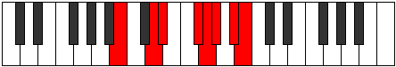 |
| [2971](https://ianring.com/musictheory/scales/2971) | [Aeolynyllic](ModeBNaturalAeolynyllic.md) | B | B, C, D, D#, F#, G, G#, A#, B |  |
| [2971](https://ianring.com/musictheory/scales/2971) | [Aeolynyllic](ModeGNaturalAeolynyllic.md) | G | G, G#, A#, B, D, D#, E, F#, G |  |
| [2973](https://ianring.com/musictheory/scales/2973) | [Panyllic](ModeBNaturalPanyllic.md) | B | B, C#, D, D#, F#, G, G#, A#, B |  |
| [2975](https://ianring.com/musictheory/scales/2975) | [Gaptygic](ModeBNaturalGaptygic.md) | B | B, C, C#, D, D#, F#, G, G#, A#, B |  |
| [2975](https://ianring.com/musictheory/scales/2975) | [Gaptygic](ModeGNaturalGaptygic.md) | G | G, G#, A, A#, B, D, D#, E, F#, G |  |
| [2981](https://ianring.com/musictheory/scales/2981) | [Ionolian](ModeFSharpIonolian.md) | F# | F#, G#, A##, B##, C##, D#, E#, F# |  |
| [2981](https://ianring.com/musictheory/scales/2981) | [Ionolian](ModeGFlatIonolian.md) | Gb | Gb, Ab, B, C#, D, Eb, F, Gb |  |
| [2983](https://ianring.com/musictheory/scales/2983) | [Zythyllic](ModeFSharpZythyllic.md) | F# | F#, G, G#, B, C#, D, D#, F, F# |  |
| [2983](https://ianring.com/musictheory/scales/2983) | [Zythyllic](ModeGFlatZythyllic.md) | Gb | Gb, G, Ab, B, Db, D, Eb, F, Gb |  |
| [2985](https://ianring.com/musictheory/scales/2985) | [Epacrian](ModeDSharpEpacrian.md) | D# | D#, E##, F###, G###, A##, B#, C##, D# |  |
| [2985](https://ianring.com/musictheory/scales/2985) | [Epacrian](ModeEFlatEpacrian.md) | Eb | Eb, F#, G#, A#, B, C, D, Eb |  |
| [2987](https://ianring.com/musictheory/scales/2987) | [Thanyllic](ModeDSharpThanyllic.md) | D# | D#, E, F#, G#, A#, B, C, D, D# |  |
| [2987](https://ianring.com/musictheory/scales/2987) | [Thanyllic](ModeEFlatThanyllic.md) | Eb | Eb, E, Gb, Ab, Bb, B, C, D, Eb |  |
| [2989](https://ianring.com/musictheory/scales/2989) | [Ionacryllic](ModeFSharpIonacryllic.md) | F# | F#, G#, A, B, C#, D, D#, F, F# |  |
| [2989](https://ianring.com/musictheory/scales/2989) | [Ionacryllic](ModeGFlatIonacryllic.md) | Gb | Gb, Ab, A, B, Db, D, Eb, F, Gb |  |
| [2989](https://ianring.com/musictheory/scales/2989) | [Ionacryllic](ModeDSharpIonacryllic.md) | D# | D#, F, F#, G#, A#, B, C, D, D# |  |
| [2989](https://ianring.com/musictheory/scales/2989) | [Ionacryllic](ModeEFlatIonacryllic.md) | Eb | Eb, F, Gb, Ab, Bb, B, C, D, Eb |  |
| [2991](https://ianring.com/musictheory/scales/2991) | [Zanygic](ModeFSharpZanygic.md) | F# | F#, G, G#, A, B, C#, D, D#, F, F# |  |
| [2991](https://ianring.com/musictheory/scales/2991) | [Zanygic](ModeGFlatZanygic.md) | Gb | Gb, G, Ab, A, B, Db, D, Eb, F, Gb |  |
| [2991](https://ianring.com/musictheory/scales/2991) | [Zanygic](ModeDSharpZanygic.md) | D# | D#, E, F, F#, G#, A#, B, C, D, D# |  |
| [2991](https://ianring.com/musictheory/scales/2991) | [Zanygic](ModeEFlatZanygic.md) | Eb | Eb, E, F, Gb, Ab, Bb, B, C, D, Eb |  |
| [2995](https://ianring.com/musictheory/scales/2995) | [Sanyllic](ModeGNaturalSanyllic.md) | G | G, G#, B, C, D, D#, E, F#, G |  |
| [2997](https://ianring.com/musictheory/scales/2997) | [Ionoptyllic](ModeFSharpIonoptyllic.md) | F# | F#, G#, A#, B, C#, D, D#, F, F# |  |
| [2997](https://ianring.com/musictheory/scales/2997) | [Ionoptyllic](ModeGFlatIonoptyllic.md) | Gb | Gb, Ab, Bb, B, Db, D, Eb, F, Gb |  |
| [2999](https://ianring.com/musictheory/scales/2999) | [Zyrygic](ModeGNaturalZyrygic.md) | G | G, G#, A, B, C, D, D#, E, F#, G |  |
| [2999](https://ianring.com/musictheory/scales/2999) | [Zyrygic](ModeFSharpZyrygic.md) | F# | F#, G, G#, A#, B, C#, D, D#, F, F# |  |
| [2999](https://ianring.com/musictheory/scales/2999) | [Zyrygic](ModeGFlatZyrygic.md) | Gb | Gb, G, Ab, Bb, B, Db, D, Eb, F, Gb |  |
| [3001](https://ianring.com/musictheory/scales/3001) | [Lonyllic](ModeDSharpLonyllic.md) | D# | D#, F#, G, G#, A#, B, C, D, D# |  |
| [3001](https://ianring.com/musictheory/scales/3001) | [Lonyllic](ModeEFlatLonyllic.md) | Eb | Eb, Gb, G, Ab, Bb, B, C, D, Eb |  |
| [3001](https://ianring.com/musictheory/scales/3001) | [Lonyllic](ModeBNaturalLonyllic.md) | B | B, D, D#, E, F#, G, G#, A#, B |  |
| [3003](https://ianring.com/musictheory/scales/3003) | [Zydygic](ModeDSharpZydygic.md) | D# | D#, E, F#, G, G#, A#, B, C, D, D# |  |
| [3003](https://ianring.com/musictheory/scales/3003) | [Zydygic](ModeEFlatZydygic.md) | Eb | Eb, E, Gb, G, Ab, Bb, B, C, D, Eb |  |
| [3003](https://ianring.com/musictheory/scales/3003) | [Zydygic](ModeGNaturalZydygic.md) | G | G, G#, A#, B, C, D, D#, E, F#, G |  |
| [3003](https://ianring.com/musictheory/scales/3003) | [Zydygic](ModeBNaturalZydygic.md) | B | B, C, D, D#, E, F#, G, G#, A#, B |  |
| [3005](https://ianring.com/musictheory/scales/3005) | [Gycrygic](ModeBNaturalGycrygic.md) | B | B, C#, D, D#, E, F#, G, G#, A#, B |  |
| [3005](https://ianring.com/musictheory/scales/3005) | [Gycrygic](ModeDSharpGycrygic.md) | D# | D#, F, F#, G, G#, A#, B, C, D, D# |  |
| [3005](https://ianring.com/musictheory/scales/3005) | [Gycrygic](ModeEFlatGycrygic.md) | Eb | Eb, F, Gb, G, Ab, Bb, B, C, D, Eb |  |
| [3005](https://ianring.com/musictheory/scales/3005) | [Gycrygic](ModeFSharpGycrygic.md) | F# | F#, G#, A, A#, B, C#, D, D#, F, F# |  |
| [3005](https://ianring.com/musictheory/scales/3005) | [Gycrygic](ModeGFlatGycrygic.md) | Gb | Gb, Ab, A, Bb, B, Db, D, Eb, F, Gb |  |
| [3007](https://ianring.com/musictheory/scales/3007) | [Zyryllian](ModeBNaturalZyryllian.md) | B | B, C, C#, D, D#, E, F#, G, G#, A#, B |  |
| [3007](https://ianring.com/musictheory/scales/3007) | [Zyryllian](ModeDSharpZyryllian.md) | D# | D#, E, F, F#, G, G#, A#, B, C, D, D# |  |
| [3007](https://ianring.com/musictheory/scales/3007) | [Zyryllian](ModeEFlatZyryllian.md) | Eb | Eb, E, F, Gb, G, Ab, Bb, B, C, D, Eb |  |
| [3007](https://ianring.com/musictheory/scales/3007) | [Zyryllian](ModeGNaturalZyryllian.md) | G | G, G#, A, A#, B, C, D, D#, E, F#, G |  |
| [3007](https://ianring.com/musictheory/scales/3007) | [Zyryllian](ModeFSharpZyryllian.md) | F# | F#, G, G#, A, A#, B, C#, D, D#, F, F# |  |
| [3007](https://ianring.com/musictheory/scales/3007) | [Zyryllian](ModeGFlatZyryllian.md) | Gb | Gb, G, Ab, A, Bb, B, Db, D, Eb, F, Gb |  |
| [3021](https://ianring.com/musictheory/scales/3021) | [Gyptyllic](ModeCNaturalGyptyllic.md) | C | C, D, D#, F#, G, G#, A, B, C |  |
| [3023](https://ianring.com/musictheory/scales/3023) | [Aeracrygic](ModeCNaturalAeracrygic.md) | C | C, C#, D, D#, F#, G, G#, A, B, C |  |
| [3027](https://ianring.com/musictheory/scales/3027) | [Rythyllic](ModeGNaturalRythyllic.md) | G | G, G#, B, C#, D, D#, E, F#, G |  |
| [3027](https://ianring.com/musictheory/scales/3027) | [Rythyllic](ModeDNaturalRythyllic.md) | D | D, D#, F#, G#, A, A#, B, C#, D |  |
| [3031](https://ianring.com/musictheory/scales/3031) | [Epithygic](ModeGNaturalEpithygic.md) | G | G, G#, A, B, C#, D, D#, E, F#, G |  |
| [3031](https://ianring.com/musictheory/scales/3031) | [Epithygic](ModeDNaturalEpithygic.md) | D | D, D#, E, F#, G#, A, A#, B, C#, D |  |
| [3033](https://ianring.com/musictheory/scales/3033) | [Doptyllic](ModeBNaturalDoptyllic.md) | B | B, D, D#, F, F#, G, G#, A#, B |  |
| [3035](https://ianring.com/musictheory/scales/3035) | [Gocrygic](ModeGNaturalGocrygic.md) | G | G, G#, A#, B, C#, D, D#, E, F#, G |  |
| [3035](https://ianring.com/musictheory/scales/3035) | [Gocrygic](ModeBNaturalGocrygic.md) | B | B, C, D, D#, F, F#, G, G#, A#, B |  |
| [3035](https://ianring.com/musictheory/scales/3035) | [Gocrygic](ModeDNaturalGocrygic.md) | D | D, D#, F, F#, G#, A, A#, B, C#, D |  |
| [3037](https://ianring.com/musictheory/scales/3037) | [Staptygic](ModeCNaturalStaptygic.md) | C | C, D, D#, E, F#, G, G#, A, B, C |  |
| [3037](https://ianring.com/musictheory/scales/3037) | [Staptygic](ModeBNaturalStaptygic.md) | B | B, C#, D, D#, F, F#, G, G#, A#, B |  |
| [3039](https://ianring.com/musictheory/scales/3039) | [Godyllian](ModeCNaturalGodyllian.md) | C | C, C#, D, D#, E, F#, G, G#, A, B, C |  |
| [3039](https://ianring.com/musictheory/scales/3039) | [Godyllian](ModeBNaturalGodyllian.md) | B | B, C, C#, D, D#, F, F#, G, G#, A#, B |  |
| [3039](https://ianring.com/musictheory/scales/3039) | [Godyllian](ModeDNaturalGodyllian.md) | D | D, D#, E, F, F#, G#, A, A#, B, C#, D |  |
| [3039](https://ianring.com/musictheory/scales/3039) | [Godyllian](ModeGNaturalGodyllian.md) | G | G, G#, A, A#, B, C#, D, D#, E, F#, G |  |
| [3045](https://ianring.com/musictheory/scales/3045) | [Raptyllic](ModeFSharpRaptyllic.md) | F# | F#, G#, B, C, C#, D, D#, F, F# |  |
| [3045](https://ianring.com/musictheory/scales/3045) | [Raptyllic](ModeGFlatRaptyllic.md) | Gb | Gb, Ab, B, C, Db, D, Eb, F, Gb |  |
| [3045](https://ianring.com/musictheory/scales/3045) | [Raptyllic](ModeANaturalRaptyllic.md) | A | A, B, D, D#, E, F, F#, G#, A |  |
| [3047](https://ianring.com/musictheory/scales/3047) | [Panygic](ModeFSharpPanygic.md) | F# | F#, G, G#, B, C, C#, D, D#, F, F# |  |
| [3047](https://ianring.com/musictheory/scales/3047) | [Panygic](ModeGFlatPanygic.md) | Gb | Gb, G, Ab, B, C, Db, D, Eb, F, Gb |  |
| [3047](https://ianring.com/musictheory/scales/3047) | [Panygic](ModeANaturalPanygic.md) | A | A, A#, B, D, D#, E, F, F#, G#, A |  |
| [3049](https://ianring.com/musictheory/scales/3049) | [Aeronyllic](ModeDSharpAeronyllic.md) | D# | D#, F#, G#, A, A#, B, C, D, D# |  |
| [3049](https://ianring.com/musictheory/scales/3049) | [Aeronyllic](ModeEFlatAeronyllic.md) | Eb | Eb, Gb, Ab, A, Bb, B, C, D, Eb |  |
| [3051](https://ianring.com/musictheory/scales/3051) | [Stalygic](ModeDSharpStalygic.md) | D# | D#, E, F#, G#, A, A#, B, C, D, D# |  |
| [3051](https://ianring.com/musictheory/scales/3051) | [Stalygic](ModeEFlatStalygic.md) | Eb | Eb, E, Gb, Ab, A, Bb, B, C, D, Eb |  |
| [3053](https://ianring.com/musictheory/scales/3053) | [Zycrygic](ModeFSharpZycrygic.md) | F# | F#, G#, A, B, C, C#, D, D#, F, F# |  |
| [3053](https://ianring.com/musictheory/scales/3053) | [Zycrygic](ModeGFlatZycrygic.md) | Gb | Gb, Ab, A, B, C, Db, D, Eb, F, Gb |  |
| [3053](https://ianring.com/musictheory/scales/3053) | [Zycrygic](ModeANaturalZycrygic.md) | A | A, B, C, D, D#, E, F, F#, G#, A |  |
| [3053](https://ianring.com/musictheory/scales/3053) | [Zycrygic](ModeCNaturalZycrygic.md) | C | C, D, D#, F, F#, G, G#, A, B, C |  |
| [3053](https://ianring.com/musictheory/scales/3053) | [Zycrygic](ModeDSharpZycrygic.md) | D# | D#, F, F#, G#, A, A#, B, C, D, D# |  |
| [3053](https://ianring.com/musictheory/scales/3053) | [Zycrygic](ModeEFlatZycrygic.md) | Eb | Eb, F, Gb, Ab, A, Bb, B, C, D, Eb |  |
| [3055](https://ianring.com/musictheory/scales/3055) | [Lyryllian](ModeCNaturalLyryllian.md) | C | C, C#, D, D#, F, F#, G, G#, A, B, C |  |
| [3055](https://ianring.com/musictheory/scales/3055) | [Lyryllian](ModeFSharpLyryllian.md) | F# | F#, G, G#, A, B, C, C#, D, D#, F, F# |  |
| [3055](https://ianring.com/musictheory/scales/3055) | [Lyryllian](ModeGFlatLyryllian.md) | Gb | Gb, G, Ab, A, B, C, Db, D, Eb, F, Gb |  |
| [3055](https://ianring.com/musictheory/scales/3055) | [Lyryllian](ModeDSharpLyryllian.md) | D# | D#, E, F, F#, G#, A, A#, B, C, D, D# |  |
| [3055](https://ianring.com/musictheory/scales/3055) | [Lyryllian](ModeEFlatLyryllian.md) | Eb | Eb, E, F, Gb, Ab, A, Bb, B, C, D, Eb |  |
| [3055](https://ianring.com/musictheory/scales/3055) | [Lyryllian](ModeANaturalLyryllian.md) | A | A, A#, B, C, D, D#, E, F, F#, G#, A |  |
| [3059](https://ianring.com/musictheory/scales/3059) | [Madygic](ModeGNaturalMadygic.md) | G | G, G#, B, C, C#, D, D#, E, F#, G |  |
| [3059](https://ianring.com/musictheory/scales/3059) | [Madygic](ModeDNaturalMadygic.md) | D | D, D#, F#, G, G#, A, A#, B, C#, D | 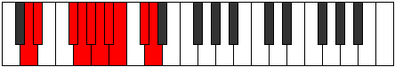 |
| [3061](https://ianring.com/musictheory/scales/3061) | [Apinygic](ModeANaturalApinygic.md) | A | A, B, C#, D, D#, E, F, F#, G#, A |  |
| [3061](https://ianring.com/musictheory/scales/3061) | [Apinygic](ModeFSharpApinygic.md) | F# | F#, G#, A#, B, C, C#, D, D#, F, F# |  |
| [3061](https://ianring.com/musictheory/scales/3061) | [Apinygic](ModeGFlatApinygic.md) | Gb | Gb, Ab, Bb, B, C, Db, D, Eb, F, Gb |  |
| [3063](https://ianring.com/musictheory/scales/3063) | [Solyllian](ModeGNaturalSolyllian.md) | G | G, G#, A, B, C, C#, D, D#, E, F#, G |  |
| [3063](https://ianring.com/musictheory/scales/3063) | [Solyllian](ModeFSharpSolyllian.md) | F# | F#, G, G#, A#, B, C, C#, D, D#, F, F# |  |
| [3063](https://ianring.com/musictheory/scales/3063) | [Solyllian](ModeGFlatSolyllian.md) | Gb | Gb, G, Ab, Bb, B, C, Db, D, Eb, F, Gb |  |
| [3063](https://ianring.com/musictheory/scales/3063) | [Solyllian](ModeANaturalSolyllian.md) | A | A, A#, B, C#, D, D#, E, F, F#, G#, A |  |
| [3063](https://ianring.com/musictheory/scales/3063) | [Solyllian](ModeDNaturalSolyllian.md) | D | D, D#, E, F#, G, G#, A, A#, B, C#, D |  |
| [3065](https://ianring.com/musictheory/scales/3065) | [Zothygic](ModeBNaturalZothygic.md) | B | B, D, D#, E, F, F#, G, G#, A#, B |  |
| [3065](https://ianring.com/musictheory/scales/3065) | [Zothygic](ModeDSharpZothygic.md) | D# | D#, F#, G, G#, A, A#, B, C, D, D# |  |
| [3065](https://ianring.com/musictheory/scales/3065) | [Zothygic](ModeEFlatZothygic.md) | Eb | Eb, Gb, G, Ab, A, Bb, B, C, D, Eb |  |
| [3067](https://ianring.com/musictheory/scales/3067) | [Goptyllian](ModeGNaturalGoptyllian.md) | G | G, G#, A#, B, C, C#, D, D#, E, F#, G |  |
| [3067](https://ianring.com/musictheory/scales/3067) | [Goptyllian](ModeBNaturalGoptyllian.md) | B | B, C, D, D#, E, F, F#, G, G#, A#, B |  |
| [3067](https://ianring.com/musictheory/scales/3067) | [Goptyllian](ModeDSharpGoptyllian.md) | D# | D#, E, F#, G, G#, A, A#, B, C, D, D# |  |
| [3067](https://ianring.com/musictheory/scales/3067) | [Goptyllian](ModeEFlatGoptyllian.md) | Eb | Eb, E, Gb, G, Ab, A, Bb, B, C, D, Eb |  |
| [3067](https://ianring.com/musictheory/scales/3067) | [Goptyllian](ModeDNaturalGoptyllian.md) | D | D, D#, F, F#, G, G#, A, A#, B, C#, D |  |
| [3069](https://ianring.com/musictheory/scales/3069) | [Bacryllian](ModeANaturalBacryllian.md) | A | A, B, C, C#, D, D#, E, F, F#, G#, A |  |
| [3069](https://ianring.com/musictheory/scales/3069) | [Bacryllian](ModeCNaturalBacryllian.md) | C | C, D, D#, E, F, F#, G, G#, A, B, C |  |
| [3069](https://ianring.com/musictheory/scales/3069) | [Bacryllian](ModeBNaturalBacryllian.md) | B | B, C#, D, D#, E, F, F#, G, G#, A#, B |  |
| [3069](https://ianring.com/musictheory/scales/3069) | [Bacryllian](ModeFSharpBacryllian.md) | F# | F#, G#, A, A#, B, C, C#, D, D#, F, F# |  |
| [3069](https://ianring.com/musictheory/scales/3069) | [Bacryllian](ModeGFlatBacryllian.md) | Gb | Gb, Ab, A, Bb, B, C, Db, D, Eb, F, Gb |  |
| [3069](https://ianring.com/musictheory/scales/3069) | [Bacryllian](ModeDSharpBacryllian.md) | D# | D#, F, F#, G, G#, A, A#, B, C, D, D# |  |
| [3069](https://ianring.com/musictheory/scales/3069) | [Bacryllian](ModeEFlatBacryllian.md) | Eb | Eb, F, Gb, G, Ab, A, Bb, B, C, D, Eb |  |
| [3071](https://ianring.com/musictheory/scales/3071) | [Solatic](ModeCNaturalSolatic.md) | C | C, C#, D, D#, E, F, F#, G, G#, A, B, C |  |
| [3071](https://ianring.com/musictheory/scales/3071) | [Solatic](ModeBNaturalSolatic.md) | B | B, C, C#, D, D#, E, F, F#, G, G#, A#, B |  |
| [3071](https://ianring.com/musictheory/scales/3071) | [Solatic](ModeANaturalSolatic.md) | A | A, A#, B, C, C#, D, D#, E, F, F#, G#, A |  |
| [3071](https://ianring.com/musictheory/scales/3071) | [Solatic](ModeGNaturalSolatic.md) | G | G, G#, A, A#, B, C, C#, D, D#, E, F#, G |  |
| [3071](https://ianring.com/musictheory/scales/3071) | [Solatic](ModeFSharpSolatic.md) | F# | F#, G, G#, A, A#, B, C, C#, D, D#, F, F# |  |
| [3071](https://ianring.com/musictheory/scales/3071) | [Solatic](ModeGFlatSolatic.md) | Gb | Gb, G, Ab, A, Bb, B, C, Db, D, Eb, F, Gb |  |
| [3071](https://ianring.com/musictheory/scales/3071) | [Solatic](ModeDSharpSolatic.md) | D# | D#, E, F, F#, G, G#, A, A#, B, C, D, D# |  |
| [3071](https://ianring.com/musictheory/scales/3071) | [Solatic](ModeEFlatSolatic.md) | Eb | Eb, E, F, Gb, G, Ab, A, Bb, B, C, D, Eb |  |
| [3071](https://ianring.com/musictheory/scales/3071) | [Solatic](ModeDNaturalSolatic.md) | D | D, D#, E, F, F#, G, G#, A, A#, B, C#, D |  |
| [3221](https://ianring.com/musictheory/scales/3221) | [Bycrimic](ModeENaturalBycrimic.md) | E | E, F#, G#, A##, B###, C###, E |  |
| [3223](https://ianring.com/musictheory/scales/3223) | [Thyphian](ModeENaturalThyphian.md) | E | E, F, Gb, Ab, B, C##, D#, E |  |
| [3229](https://ianring.com/musictheory/scales/3229) | [Aeolaptian](ModeENaturalAeolaptian.md) | E | E, F#, G, Ab, B, C##, D#, E |  |
| [3231](https://ianring.com/musictheory/scales/3231) | [Kataptyllic](ModeENaturalKataptyllic.md) | E | E, F, F#, G, G#, B, D, D#, E |  |
| [3239](https://ianring.com/musictheory/scales/3239) | [Epythian](ModeCSharpEpythian.md) | C# | C#, D, Eb, F#, G#, A##, B#, C# |  |
| [3239](https://ianring.com/musictheory/scales/3239) | [Epythian](ModeDFlatEpythian.md) | Db | Db, Ebb, Fbb, Gb, Ab, B, C, Db |  |
| [3247](https://ianring.com/musictheory/scales/3247) | [Aeolonyllic](ModeCSharpAeolonyllic.md) | C# | C#, D, D#, E, F#, G#, B, C, C# |  |
| [3247](https://ianring.com/musictheory/scales/3247) | [Aeolonyllic](ModeDFlatAeolonyllic.md) | Db | Db, D, Eb, E, Gb, Ab, B, C, Db | 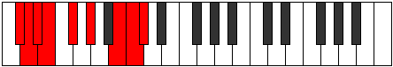 |
| [3253](https://ianring.com/musictheory/scales/3253) | [Gonian](ModeENaturalGonian.md) | E | E, F#, G#, A, B, C##, D#, E |  |
| [3255](https://ianring.com/musictheory/scales/3255) | [Daryllic](ModeCSharpDaryllic.md) | C# | C#, D, D#, F, F#, G#, B, C, C# |  |
| [3255](https://ianring.com/musictheory/scales/3255) | [Daryllic](ModeDFlatDaryllic.md) | Db | Db, D, Eb, F, Gb, Ab, B, C, Db |  |
| [3255](https://ianring.com/musictheory/scales/3255) | [Daryllic](ModeENaturalDaryllic.md) | E | E, F, F#, G#, A, B, D, D#, E |  |
| [3261](https://ianring.com/musictheory/scales/3261) | [Dodyllic](ModeENaturalDodyllic.md) | E | E, F#, G, G#, A, B, D, D#, E |  |
| [3263](https://ianring.com/musictheory/scales/3263) | [Pyrygic](ModeCSharpPyrygic.md) | C# | C#, D, D#, E, F, F#, G#, B, C, C# |  |
| [3263](https://ianring.com/musictheory/scales/3263) | [Pyrygic](ModeDFlatPyrygic.md) | Db | Db, D, Eb, E, F, Gb, Ab, B, C, Db |  |
| [3263](https://ianring.com/musictheory/scales/3263) | [Pyrygic](ModeENaturalPyrygic.md) | E | E, F, F#, G, G#, A, B, D, D#, E |  |
| [3273](https://ianring.com/musictheory/scales/3273) | [Ionodimic](ModeGSharpIonodimic.md) | G# | G#, A##, B###, C###, E##, F##, G# |  |
| [3273](https://ianring.com/musictheory/scales/3273) | [Ionodimic](ModeAFlatIonodimic.md) | Ab | Ab, B, C##, D#, E##, F##, Ab |  |
| [3275](https://ianring.com/musictheory/scales/3275) | [Katadian](ModeGSharpKatadian.md) | G# | G#, A, B, C##, D#, E##, F##, G# |  |
| [3275](https://ianring.com/musictheory/scales/3275) | [Katadian](ModeAFlatKatadian.md) | Ab | Ab, Bbb, Cb, D, Eb, F#, G, Ab |  |
| [3277](https://ianring.com/musictheory/scales/3277) | [Zycrian](ModeGSharpZycrian.md) | G# | G#, A#, B, C##, D#, E##, F##, G# |  |
| [3277](https://ianring.com/musictheory/scales/3277) | [Zycrian](ModeAFlatZycrian.md) | Ab | Ab, Bb, Cb, D, Eb, F#, G, Ab |  |
| [3279](https://ianring.com/musictheory/scales/3279) | [Pythyllic](ModeGSharpPythyllic.md) | G# | G#, A, A#, B, D, D#, F#, G, G# |  |
| [3279](https://ianring.com/musictheory/scales/3279) | [Pythyllic](ModeAFlatPythyllic.md) | Ab | Ab, A, Bb, B, D, Eb, Gb, G, Ab |  |
| [3285](https://ianring.com/musictheory/scales/3285) | [Zagian](ModeENaturalZagian.md) | E | E, F#, G#, A#, B, C##, D#, E |  |
| [3287](https://ianring.com/musictheory/scales/3287) | [Phrathyllic](ModeENaturalPhrathyllic.md) | E | E, F, F#, G#, A#, B, D, D#, E |  |
| [3289](https://ianring.com/musictheory/scales/3289) | [Loptian](ModeGSharpLoptian.md) | G# | G#, A##, B#, C##, D#, E##, F##, G# |  |
| [3289](https://ianring.com/musictheory/scales/3289) | [Loptian](ModeAFlatLoptian.md) | Ab | Ab, B, C, D, Eb, F#, G, Ab |  |
| [3291](https://ianring.com/musictheory/scales/3291) | [Kodyllic](ModeGSharpKodyllic.md) | G# | G#, A, B, C, D, D#, F#, G, G# |  |
| [3291](https://ianring.com/musictheory/scales/3291) | [Kodyllic](ModeAFlatKodyllic.md) | Ab | Ab, A, B, C, D, Eb, Gb, G, Ab |  |
| [3293](https://ianring.com/musictheory/scales/3293) | [Saryllic](ModeGSharpSaryllic.md) | G# | G#, A#, B, C, D, D#, F#, G, G# | 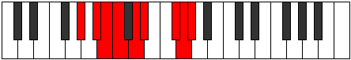 |
| [3293](https://ianring.com/musictheory/scales/3293) | [Saryllic](ModeAFlatSaryllic.md) | Ab | Ab, Bb, B, C, D, Eb, Gb, G, Ab |  |
| [3293](https://ianring.com/musictheory/scales/3293) | [Saryllic](ModeENaturalSaryllic.md) | E | E, F#, G, G#, A#, B, D, D#, E |  |
| [3295](https://ianring.com/musictheory/scales/3295) | [Phroptygic](ModeENaturalPhroptygic.md) | E | E, F, F#, G, G#, A#, B, D, D#, E |  |
| [3295](https://ianring.com/musictheory/scales/3295) | [Phroptygic](ModeGSharpPhroptygic.md) | G# | G#, A, A#, B, C, D, D#, F#, G, G# |  |
| [3295](https://ianring.com/musictheory/scales/3295) | [Phroptygic](ModeAFlatPhroptygic.md) | Ab | Ab, A, Bb, B, C, D, Eb, Gb, G, Ab |  |
| [3303](https://ianring.com/musictheory/scales/3303) | [Soptyllic](ModeCSharpSoptyllic.md) | C# | C#, D, D#, F#, G, G#, B, C, C# |  |
| [3303](https://ianring.com/musictheory/scales/3303) | [Soptyllic](ModeDFlatSoptyllic.md) | Db | Db, D, Eb, Gb, G, Ab, B, C, Db |  |
| [3305](https://ianring.com/musictheory/scales/3305) | [Epathian](ModeGSharpEpathian.md) | G# | G#, A##, B##, C##, D#, E##, F##, G# |  |
| [3305](https://ianring.com/musictheory/scales/3305) | [Epathian](ModeAFlatEpathian.md) | Ab | Ab, B, C#, D, Eb, F#, G, Ab |  |
| [3307](https://ianring.com/musictheory/scales/3307) | [Boptyllic](ModeGSharpBoptyllic.md) | G# | G#, A, B, C#, D, D#, F#, G, G# |  |
| [3307](https://ianring.com/musictheory/scales/3307) | [Boptyllic](ModeAFlatBoptyllic.md) | Ab | Ab, A, B, Db, D, Eb, Gb, G, Ab |  |
| [3309](https://ianring.com/musictheory/scales/3309) | [Bycryllic](ModeGSharpBycryllic.md) | G# | G#, A#, B, C#, D, D#, F#, G, G# |  |
| [3309](https://ianring.com/musictheory/scales/3309) | [Bycryllic](ModeAFlatBycryllic.md) | Ab | Ab, Bb, B, Db, D, Eb, Gb, G, Ab |  |
| [3311](https://ianring.com/musictheory/scales/3311) | [Mixodygic](ModeCSharpMixodygic.md) | C# | C#, D, D#, E, F#, G, G#, B, C, C# |  |
| [3311](https://ianring.com/musictheory/scales/3311) | [Mixodygic](ModeDFlatMixodygic.md) | Db | Db, D, Eb, E, Gb, G, Ab, B, C, Db |  |
| [3311](https://ianring.com/musictheory/scales/3311) | [Mixodygic](ModeGSharpMixodygic.md) | G# | G#, A, A#, B, C#, D, D#, F#, G, G# |  |
| [3311](https://ianring.com/musictheory/scales/3311) | [Mixodygic](ModeAFlatMixodygic.md) | Ab | Ab, A, Bb, B, Db, D, Eb, Gb, G, Ab |  |
| [3317](https://ianring.com/musictheory/scales/3317) | [Lanyllic](ModeENaturalLanyllic.md) | E | E, F#, G#, A, A#, B, D, D#, E |  |
| [3319](https://ianring.com/musictheory/scales/3319) | [Tholygic](ModeCSharpTholygic.md) | C# | C#, D, D#, F, F#, G, G#, B, C, C# |  |
| [3319](https://ianring.com/musictheory/scales/3319) | [Tholygic](ModeDFlatTholygic.md) | Db | Db, D, Eb, F, Gb, G, Ab, B, C, Db |  |
| [3319](https://ianring.com/musictheory/scales/3319) | [Tholygic](ModeENaturalTholygic.md) | E | E, F, F#, G#, A, A#, B, D, D#, E |  |
| [3321](https://ianring.com/musictheory/scales/3321) | [Ionycryllic](ModeGSharpIonycryllic.md) | G# | G#, B, C, C#, D, D#, F#, G, G# |  |
| [3321](https://ianring.com/musictheory/scales/3321) | [Ionycryllic](ModeAFlatIonycryllic.md) | Ab | Ab, B, C, Db, D, Eb, Gb, G, Ab |  |
| [3323](https://ianring.com/musictheory/scales/3323) | [Phrygygic](ModeGSharpPhrygygic.md) | G# | G#, A, B, C, C#, D, D#, F#, G, G# |  |
| [3323](https://ianring.com/musictheory/scales/3323) | [Phrygygic](ModeAFlatPhrygygic.md) | Ab | Ab, A, B, C, Db, D, Eb, Gb, G, Ab |  |
| [3325](https://ianring.com/musictheory/scales/3325) | [Epygic](ModeGSharpEpygic.md) | G# | G#, A#, B, C, C#, D, D#, F#, G, G# |  |
| [3325](https://ianring.com/musictheory/scales/3325) | [Epygic](ModeAFlatEpygic.md) | Ab | Ab, Bb, B, C, Db, D, Eb, Gb, G, Ab |  |
| [3325](https://ianring.com/musictheory/scales/3325) | [Epygic](ModeENaturalEpygic.md) | E | E, F#, G, G#, A, A#, B, D, D#, E |  |
| [3327](https://ianring.com/musictheory/scales/3327) | [Madyllian](ModeCSharpMadyllian.md) | C# | C#, D, D#, E, F, F#, G, G#, B, C, C# |  |
| [3327](https://ianring.com/musictheory/scales/3327) | [Madyllian](ModeDFlatMadyllian.md) | Db | Db, D, Eb, E, F, Gb, G, Ab, B, C, Db |  |
| [3327](https://ianring.com/musictheory/scales/3327) | [Madyllian](ModeGSharpMadyllian.md) | G# | G#, A, A#, B, C, C#, D, D#, F#, G, G# |  |
| [3327](https://ianring.com/musictheory/scales/3327) | [Madyllian](ModeAFlatMadyllian.md) | Ab | Ab, A, Bb, B, C, Db, D, Eb, Gb, G, Ab |  |
| [3327](https://ianring.com/musictheory/scales/3327) | [Madyllian](ModeENaturalMadyllian.md) | E | E, F, F#, G, G#, A, A#, B, D, D#, E |  |
| [3369](https://ianring.com/musictheory/scales/3369) | [Mixolimic](ModeDSharpMixolimic.md) | D# | D#, E##, F###, Cb, Db, Ebb, D# |  |
| [3369](https://ianring.com/musictheory/scales/3369) | [Mixolimic](ModeEFlatMixolimic.md) | Eb | Eb, F#, G#, A##, B##, C##, Eb |  |
| [3371](https://ianring.com/musictheory/scales/3371) | [Aeolylian](ModeDSharpAeolylian.md) | D# | D#, E, F#, G#, A##, B##, C##, D# |  |
| [3371](https://ianring.com/musictheory/scales/3371) | [Aeolylian](ModeEFlatAeolylian.md) | Eb | Eb, Fb, Gb, Ab, B, C#, D, Eb |  |
| [3373](https://ianring.com/musictheory/scales/3373) | [Lodian](ModeDSharpLodian.md) | D# | D#, E#, F#, G#, A##, B##, C##, D# |  |
| [3373](https://ianring.com/musictheory/scales/3373) | [Lodian](ModeEFlatLodian.md) | Eb | Eb, F, Gb, Ab, B, C#, D, Eb |  |
| [3375](https://ianring.com/musictheory/scales/3375) | [Kygyllic](ModeDSharpKygyllic.md) | D# | D#, E, F, F#, G#, B, C#, D, D# |  |
| [3375](https://ianring.com/musictheory/scales/3375) | [Kygyllic](ModeEFlatKygyllic.md) | Eb | Eb, E, F, Gb, Ab, B, Db, D, Eb |  |
| [3379](https://ianring.com/musictheory/scales/3379) | [Sothian](ModeASharpSothian.md) | A# | A#, B, C##, D#, E##, F###, G##, A# |  |
| [3379](https://ianring.com/musictheory/scales/3379) | [Sothian](ModeBFlatSothian.md) | Bb | Bb, Cb, D, Eb, F#, G#, A, Bb |  |
| [3383](https://ianring.com/musictheory/scales/3383) | [Daptyllic](ModeASharpDaptyllic.md) | A# | A#, B, C, D, D#, F#, G#, A, A# |  |
| [3383](https://ianring.com/musictheory/scales/3383) | [Daptyllic](ModeBFlatDaptyllic.md) | Bb | Bb, B, C, D, Eb, Gb, Ab, A, Bb |  |
| [3385](https://ianring.com/musictheory/scales/3385) | [Rothian](ModeDSharpRothian.md) | D# | D#, E##, F##, G#, A##, B##, C##, D# |  |
| [3385](https://ianring.com/musictheory/scales/3385) | [Rothian](ModeEFlatRothian.md) | Eb | Eb, F#, G, Ab, B, C#, D, Eb |  |
| [3387](https://ianring.com/musictheory/scales/3387) | [Aeryptyllic](ModeDSharpAeryptyllic.md) | D# | D#, E, F#, G, G#, B, C#, D, D# |  |
| [3387](https://ianring.com/musictheory/scales/3387) | [Aeryptyllic](ModeEFlatAeryptyllic.md) | Eb | Eb, E, Gb, G, Ab, B, Db, D, Eb |  |
| [3387](https://ianring.com/musictheory/scales/3387) | [Aeryptyllic](ModeASharpAeryptyllic.md) | A# | A#, B, C#, D, D#, F#, G#, A, A# |  |
| [3387](https://ianring.com/musictheory/scales/3387) | [Aeryptyllic](ModeBFlatAeryptyllic.md) | Bb | Bb, B, Db, D, Eb, Gb, Ab, A, Bb | 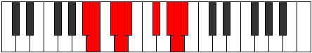 |
| [3389](https://ianring.com/musictheory/scales/3389) | [Socryllic](ModeDSharpSocryllic.md) | D# | D#, F, F#, G, G#, B, C#, D, D# |  |
| [3389](https://ianring.com/musictheory/scales/3389) | [Socryllic](ModeEFlatSocryllic.md) | Eb | Eb, F, Gb, G, Ab, B, Db, D, Eb |  |
| [3391](https://ianring.com/musictheory/scales/3391) | [Aeolynygic](ModeDSharpAeolynygic.md) | D# | D#, E, F, F#, G, G#, B, C#, D, D# |  |
| [3391](https://ianring.com/musictheory/scales/3391) | [Aeolynygic](ModeEFlatAeolynygic.md) | Eb | Eb, E, F, Gb, G, Ab, B, Db, D, Eb |  |
| [3391](https://ianring.com/musictheory/scales/3391) | [Aeolynygic](ModeASharpAeolynygic.md) | A# | A#, B, C, C#, D, D#, F#, G#, A, A# |  |
| [3391](https://ianring.com/musictheory/scales/3391) | [Aeolynygic](ModeBFlatAeolynygic.md) | Bb | Bb, B, C, Db, D, Eb, Gb, Ab, A, Bb |  |
| [3405](https://ianring.com/musictheory/scales/3405) | [Stynian](ModeCNaturalStynian.md) | C | C, D, Eb, F#, G#, A#, B, C | 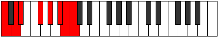 |
| [3407](https://ianring.com/musictheory/scales/3407) | [Katocryllic](ModeCNaturalKatocryllic.md) | C | C, C#, D, D#, F#, G#, A#, B, C |  |
| [3421](https://ianring.com/musictheory/scales/3421) | [Aerothyllic](ModeCNaturalAerothyllic.md) | C | C, D, D#, E, F#, G#, A#, B, C |  |
| [3423](https://ianring.com/musictheory/scales/3423) | [Lothygic](ModeCNaturalLothygic.md) | C | C, C#, D, D#, E, F#, G#, A#, B, C |  |
| [3433](https://ianring.com/musictheory/scales/3433) | [Thonian](ModeDSharpThonian.md) | D# | D#, E##, F###, G##, A##, B##, C##, D# |  |
| [3433](https://ianring.com/musictheory/scales/3433) | [Thonian](ModeEFlatThonian.md) | Eb | Eb, F#, G#, A, B, C#, D, Eb |  |
| [3435](https://ianring.com/musictheory/scales/3435) | [Epiphyllic](ModeDSharpEpiphyllic.md) | D# | D#, E, F#, G#, A, B, C#, D, D# |  |
| [3435](https://ianring.com/musictheory/scales/3435) | [Epiphyllic](ModeEFlatEpiphyllic.md) | Eb | Eb, E, Gb, Ab, A, B, Db, D, Eb |  |
| [3437](https://ianring.com/musictheory/scales/3437) | [Gathyllic](ModeDSharpGathyllic.md) | D# | D#, F, F#, G#, A, B, C#, D, D# |  |
| [3437](https://ianring.com/musictheory/scales/3437) | [Gathyllic](ModeEFlatGathyllic.md) | Eb | Eb, F, Gb, Ab, A, B, Db, D, Eb |  |
| [3437](https://ianring.com/musictheory/scales/3437) | [Gathyllic](ModeCNaturalGathyllic.md) | C | C, D, D#, F, F#, G#, A#, B, C |  |
| [3439](https://ianring.com/musictheory/scales/3439) | [Lythygic](ModeDSharpLythygic.md) | D# | D#, E, F, F#, G#, A, B, C#, D, D# |  |
| [3439](https://ianring.com/musictheory/scales/3439) | [Lythygic](ModeEFlatLythygic.md) | Eb | Eb, E, F, Gb, Ab, A, B, Db, D, Eb |  |
| [3439](https://ianring.com/musictheory/scales/3439) | [Lythygic](ModeCNaturalLythygic.md) | C | C, C#, D, D#, F, F#, G#, A#, B, C |  |
| [3443](https://ianring.com/musictheory/scales/3443) | [Epathyllic](ModeASharpEpathyllic.md) | A# | A#, B, D, D#, E, F#, G#, A, A# |  |
| [3443](https://ianring.com/musictheory/scales/3443) | [Epathyllic](ModeBFlatEpathyllic.md) | Bb | Bb, B, D, Eb, E, Gb, Ab, A, Bb |  |
| [3447](https://ianring.com/musictheory/scales/3447) | [Kynygic](ModeASharpKynygic.md) | A# | A#, B, C, D, D#, E, F#, G#, A, A# |  |
| [3447](https://ianring.com/musictheory/scales/3447) | [Kynygic](ModeBFlatKynygic.md) | Bb | Bb, B, C, D, Eb, E, Gb, Ab, A, Bb |  |
| [3449](https://ianring.com/musictheory/scales/3449) | [Bacryllic](ModeDSharpBacryllic.md) | D# | D#, F#, G, G#, A, B, C#, D, D# |  |
| [3449](https://ianring.com/musictheory/scales/3449) | [Bacryllic](ModeEFlatBacryllic.md) | Eb | Eb, Gb, G, Ab, A, B, Db, D, Eb |  |
| [3451](https://ianring.com/musictheory/scales/3451) | [Garygic](ModeDSharpGarygic.md) | D# | D#, E, F#, G, G#, A, B, C#, D, D# |  |
| [3451](https://ianring.com/musictheory/scales/3451) | [Garygic](ModeEFlatGarygic.md) | Eb | Eb, E, Gb, G, Ab, A, B, Db, D, Eb |  |
| [3451](https://ianring.com/musictheory/scales/3451) | [Garygic](ModeASharpGarygic.md) | A# | A#, B, C#, D, D#, E, F#, G#, A, A# |  |
| [3451](https://ianring.com/musictheory/scales/3451) | [Garygic](ModeBFlatGarygic.md) | Bb | Bb, B, Db, D, Eb, E, Gb, Ab, A, Bb |  |
| [3453](https://ianring.com/musictheory/scales/3453) | [Katarygic](ModeDSharpKatarygic.md) | D# | D#, F, F#, G, G#, A, B, C#, D, D# |  |
| [3453](https://ianring.com/musictheory/scales/3453) | [Katarygic](ModeEFlatKatarygic.md) | Eb | Eb, F, Gb, G, Ab, A, B, Db, D, Eb |  |
| [3453](https://ianring.com/musictheory/scales/3453) | [Katarygic](ModeCNaturalKatarygic.md) | C | C, D, D#, E, F, F#, G#, A#, B, C |  |
| [3455](https://ianring.com/musictheory/scales/3455) | [Ryptyllian](ModeDSharpRyptyllian.md) | D# | D#, E, F, F#, G, G#, A, B, C#, D, D# |  |
| [3455](https://ianring.com/musictheory/scales/3455) | [Ryptyllian](ModeEFlatRyptyllian.md) | Eb | Eb, E, F, Gb, G, Ab, A, B, Db, D, Eb |  |
| [3455](https://ianring.com/musictheory/scales/3455) | [Ryptyllian](ModeCNaturalRyptyllian.md) | C | C, C#, D, D#, E, F, F#, G#, A#, B, C |  |
| [3455](https://ianring.com/musictheory/scales/3455) | [Ryptyllian](ModeASharpRyptyllian.md) | A# | A#, B, C, C#, D, D#, E, F#, G#, A, A# |  |
| [3455](https://ianring.com/musictheory/scales/3455) | [Ryptyllian](ModeBFlatRyptyllian.md) | Bb | Bb, B, C, Db, D, Eb, E, Gb, Ab, A, Bb |  |
| [3475](https://ianring.com/musictheory/scales/3475) | [Kylian](ModeGNaturalKylian.md) | G | G, Ab, B, C##, D#, E#, F#, G |  |
| [3477](https://ianring.com/musictheory/scales/3477) | [Kyptian](ModeENaturalKyptian.md) | E | E, F#, G#, A##, B#, C##, D#, E |  |
| [3479](https://ianring.com/musictheory/scales/3479) | [Rothyllic](ModeENaturalRothyllic.md) | E | E, F, F#, G#, B, C, D, D#, E |  |
| [3479](https://ianring.com/musictheory/scales/3479) | [Rothyllic](ModeGNaturalRothyllic.md) | G | G, G#, A, B, D, D#, F, F#, G |  |
| [3483](https://ianring.com/musictheory/scales/3483) | [Mixotharyllic](ModeGNaturalMixotharyllic.md) | G | G, G#, A#, B, D, D#, F, F#, G |  |
| [3485](https://ianring.com/musictheory/scales/3485) | [Kyptyllic](ModeENaturalKyptyllic.md) | E | E, F#, G, G#, B, C, D, D#, E |  |
| [3487](https://ianring.com/musictheory/scales/3487) | [Byptygic](ModeENaturalByptygic.md) | E | E, F, F#, G, G#, B, C, D, D#, E |  |
| [3487](https://ianring.com/musictheory/scales/3487) | [Byptygic](ModeGNaturalByptygic.md) | G | G, G#, A, A#, B, D, D#, F, F#, G |  |
| [3495](https://ianring.com/musictheory/scales/3495) | [Banyllic](ModeCSharpBanyllic.md) | C# | C#, D, D#, F#, G#, A, B, C, C# |  |
| [3495](https://ianring.com/musictheory/scales/3495) | [Banyllic](ModeDFlatBanyllic.md) | Db | Db, D, Eb, Gb, Ab, A, B, C, Db |  |
| [3497](https://ianring.com/musictheory/scales/3497) | [Phrolian](ModeDSharpPhrolian.md) | D# | D#, E##, F###, G###, A##, B##, C##, D# |  |
| [3497](https://ianring.com/musictheory/scales/3497) | [Phrolian](ModeEFlatPhrolian.md) | Eb | Eb, F#, G#, A#, B, C#, D, Eb |  |
| [3499](https://ianring.com/musictheory/scales/3499) | [Lythyllic](ModeDSharpLythyllic.md) | D# | D#, E, F#, G#, A#, B, C#, D, D# |  |
| [3499](https://ianring.com/musictheory/scales/3499) | [Lythyllic](ModeEFlatLythyllic.md) | Eb | Eb, E, Gb, Ab, Bb, B, Db, D, Eb |  |
| [3501](https://ianring.com/musictheory/scales/3501) | [Katodyllic](ModeDSharpKatodyllic.md) | D# | D#, F, F#, G#, A#, B, C#, D, D# |  |
| [3501](https://ianring.com/musictheory/scales/3501) | [Katodyllic](ModeEFlatKatodyllic.md) | Eb | Eb, F, Gb, Ab, Bb, B, Db, D, Eb |  |
| [3503](https://ianring.com/musictheory/scales/3503) | [Zyphygic](ModeCSharpZyphygic.md) | C# | C#, D, D#, E, F#, G#, A, B, C, C# |  |
| [3503](https://ianring.com/musictheory/scales/3503) | [Zyphygic](ModeDFlatZyphygic.md) | Db | Db, D, Eb, E, Gb, Ab, A, B, C, Db |  |
| [3503](https://ianring.com/musictheory/scales/3503) | [Zyphygic](ModeDSharpZyphygic.md) | D# | D#, E, F, F#, G#, A#, B, C#, D, D# |  |
| [3503](https://ianring.com/musictheory/scales/3503) | [Zyphygic](ModeEFlatZyphygic.md) | Eb | Eb, E, F, Gb, Ab, Bb, B, Db, D, Eb |  |
| [3507](https://ianring.com/musictheory/scales/3507) | [Ponyllic](ModeGNaturalPonyllic.md) | G | G, G#, B, C, D, D#, F, F#, G |  |
| [3507](https://ianring.com/musictheory/scales/3507) | [Ponyllic](ModeASharpPonyllic.md) | A# | A#, B, D, D#, F, F#, G#, A, A# |  |
| [3507](https://ianring.com/musictheory/scales/3507) | [Ponyllic](ModeBFlatPonyllic.md) | Bb | Bb, B, D, Eb, F, Gb, Ab, A, Bb |  |
| [3509](https://ianring.com/musictheory/scales/3509) | [Stogyllic](ModeENaturalStogyllic.md) | E | E, F#, G#, A, B, C, D, D#, E |  |
| [3511](https://ianring.com/musictheory/scales/3511) | [Epolygic](ModeCSharpEpolygic.md) | C# | C#, D, D#, F, F#, G#, A, B, C, C# |  |
| [3511](https://ianring.com/musictheory/scales/3511) | [Epolygic](ModeDFlatEpolygic.md) | Db | Db, D, Eb, F, Gb, Ab, A, B, C, Db |  |
| [3511](https://ianring.com/musictheory/scales/3511) | [Epolygic](ModeENaturalEpolygic.md) | E | E, F, F#, G#, A, B, C, D, D#, E |  |
| [3511](https://ianring.com/musictheory/scales/3511) | [Epolygic](ModeGNaturalEpolygic.md) | G | G, G#, A, B, C, D, D#, F, F#, G |  |
| [3511](https://ianring.com/musictheory/scales/3511) | [Epolygic](ModeASharpEpolygic.md) | A# | A#, B, C, D, D#, F, F#, G#, A, A# |  |
| [3511](https://ianring.com/musictheory/scales/3511) | [Epolygic](ModeBFlatEpolygic.md) | Bb | Bb, B, C, D, Eb, F, Gb, Ab, A, Bb |  |
| [3513](https://ianring.com/musictheory/scales/3513) | [Dydyllic](ModeDSharpDydyllic.md) | D# | D#, F#, G, G#, A#, B, C#, D, D# |  |
| [3513](https://ianring.com/musictheory/scales/3513) | [Dydyllic](ModeEFlatDydyllic.md) | Eb | Eb, Gb, G, Ab, Bb, B, Db, D, Eb |  |
| [3515](https://ianring.com/musictheory/scales/3515) | [Katodygic](ModeDSharpKatodygic.md) | D# | D#, E, F#, G, G#, A#, B, C#, D, D# |  |
| [3515](https://ianring.com/musictheory/scales/3515) | [Katodygic](ModeEFlatKatodygic.md) | Eb | Eb, E, Gb, G, Ab, Bb, B, Db, D, Eb |  |
| [3515](https://ianring.com/musictheory/scales/3515) | [Katodygic](ModeGNaturalKatodygic.md) | G | G, G#, A#, B, C, D, D#, F, F#, G |  |
| [3515](https://ianring.com/musictheory/scales/3515) | [Katodygic](ModeASharpKatodygic.md) | A# | A#, B, C#, D, D#, F, F#, G#, A, A# |  |
| [3515](https://ianring.com/musictheory/scales/3515) | [Katodygic](ModeBFlatKatodygic.md) | Bb | Bb, B, Db, D, Eb, F, Gb, Ab, A, Bb |  |
| [3517](https://ianring.com/musictheory/scales/3517) | [Epocrygic](ModeENaturalEpocrygic.md) | E | E, F#, G, G#, A, B, C, D, D#, E |  |
| [3517](https://ianring.com/musictheory/scales/3517) | [Epocrygic](ModeDSharpEpocrygic.md) | D# | D#, F, F#, G, G#, A#, B, C#, D, D# |  |
| [3517](https://ianring.com/musictheory/scales/3517) | [Epocrygic](ModeEFlatEpocrygic.md) | Eb | Eb, F, Gb, G, Ab, Bb, B, Db, D, Eb |  |
| [3519](https://ianring.com/musictheory/scales/3519) | [Boptyllian](ModeCSharpBoptyllian.md) | C# | C#, D, D#, E, F, F#, G#, A, B, C, C# |  |
| [3519](https://ianring.com/musictheory/scales/3519) | [Boptyllian](ModeDFlatBoptyllian.md) | Db | Db, D, Eb, E, F, Gb, Ab, A, B, C, Db |  |
| [3519](https://ianring.com/musictheory/scales/3519) | [Boptyllian](ModeENaturalBoptyllian.md) | E | E, F, F#, G, G#, A, B, C, D, D#, E |  |
| [3519](https://ianring.com/musictheory/scales/3519) | [Boptyllian](ModeDSharpBoptyllian.md) | D# | D#, E, F, F#, G, G#, A#, B, C#, D, D# |  |
| [3519](https://ianring.com/musictheory/scales/3519) | [Boptyllian](ModeEFlatBoptyllian.md) | Eb | Eb, E, F, Gb, G, Ab, Bb, B, Db, D, Eb |  |
| [3519](https://ianring.com/musictheory/scales/3519) | [Boptyllian](ModeASharpBoptyllian.md) | A# | A#, B, C, C#, D, D#, F, F#, G#, A, A# |  |
| [3519](https://ianring.com/musictheory/scales/3519) | [Boptyllian](ModeBFlatBoptyllian.md) | Bb | Bb, B, C, Db, D, Eb, F, Gb, Ab, A, Bb |  |
| [3519](https://ianring.com/musictheory/scales/3519) | [Boptyllian](ModeGNaturalBoptyllian.md) | G | G, G#, A, A#, B, C, D, D#, F, F#, G |  |
| [3529](https://ianring.com/musictheory/scales/3529) | [Stalian](ModeGSharpStalian.md) | G# | G#, A##, B###, C###, D##, E##, F##, G# |  |
| [3529](https://ianring.com/musictheory/scales/3529) | [Stalian](ModeAFlatStalian.md) | Ab | Ab, B, C##, D#, E, F#, G, Ab |  |
| [3531](https://ianring.com/musictheory/scales/3531) | [Dycryllic](ModeGSharpDycryllic.md) | G# | G#, A, B, D, D#, E, F#, G, G# |  |
| [3531](https://ianring.com/musictheory/scales/3531) | [Dycryllic](ModeAFlatDycryllic.md) | Ab | Ab, A, B, D, Eb, E, Gb, G, Ab |  |
| [3533](https://ianring.com/musictheory/scales/3533) | [Thadyllic](ModeCNaturalThadyllic.md) | C | C, D, D#, F#, G, G#, A#, B, C |  |
| [3533](https://ianring.com/musictheory/scales/3533) | [Thadyllic](ModeGSharpThadyllic.md) | G# | G#, A#, B, D, D#, E, F#, G, G# |  |
| [3533](https://ianring.com/musictheory/scales/3533) | [Thadyllic](ModeAFlatThadyllic.md) | Ab | Ab, Bb, B, D, Eb, E, Gb, G, Ab |  |
| [3535](https://ianring.com/musictheory/scales/3535) | [Aeroptygic](ModeCNaturalAeroptygic.md) | C | C, C#, D, D#, F#, G, G#, A#, B, C |  |
| [3535](https://ianring.com/musictheory/scales/3535) | [Aeroptygic](ModeGSharpAeroptygic.md) | G# | G#, A, A#, B, D, D#, E, F#, G, G# |  |
| [3535](https://ianring.com/musictheory/scales/3535) | [Aeroptygic](ModeAFlatAeroptygic.md) | Ab | Ab, A, Bb, B, D, Eb, E, Gb, G, Ab |  |
| [3539](https://ianring.com/musictheory/scales/3539) | [Aeoryllic](ModeGNaturalAeoryllic.md) | G | G, G#, B, C#, D, D#, F, F#, G |  |
| [3541](https://ianring.com/musictheory/scales/3541) | [Racryllic](ModeENaturalRacryllic.md) | E | E, F#, G#, A#, B, C, D, D#, E |  |
| [3543](https://ianring.com/musictheory/scales/3543) | [Aeolonygic](ModeGNaturalAeolonygic.md) | G | G, G#, A, B, C#, D, D#, F, F#, G |  |
| [3543](https://ianring.com/musictheory/scales/3543) | [Aeolonygic](ModeENaturalAeolonygic.md) | E | E, F, F#, G#, A#, B, C, D, D#, E |  |
| [3545](https://ianring.com/musictheory/scales/3545) | [Thyptyllic](ModeGSharpThyptyllic.md) | G# | G#, B, C, D, D#, E, F#, G, G# |  |
| [3545](https://ianring.com/musictheory/scales/3545) | [Thyptyllic](ModeAFlatThyptyllic.md) | Ab | Ab, B, C, D, Eb, E, Gb, G, Ab |  |
| [3547](https://ianring.com/musictheory/scales/3547) | [Sadygic](ModeGSharpSadygic.md) | G# | G#, A, B, C, D, D#, E, F#, G, G# |  |
| [3547](https://ianring.com/musictheory/scales/3547) | [Sadygic](ModeAFlatSadygic.md) | Ab | Ab, A, B, C, D, Eb, E, Gb, G, Ab |  |
| [3547](https://ianring.com/musictheory/scales/3547) | [Sadygic](ModeGNaturalSadygic.md) | G | G, G#, A#, B, C#, D, D#, F, F#, G |  |
| [3549](https://ianring.com/musictheory/scales/3549) | [Phronygic](ModeCNaturalPhronygic.md) | C | C, D, D#, E, F#, G, G#, A#, B, C |  |
| [3549](https://ianring.com/musictheory/scales/3549) | [Phronygic](ModeENaturalPhronygic.md) | E | E, F#, G, G#, A#, B, C, D, D#, E |  |
| [3549](https://ianring.com/musictheory/scales/3549) | [Phronygic](ModeGSharpPhronygic.md) | G# | G#, A#, B, C, D, D#, E, F#, G, G# |  |
| [3549](https://ianring.com/musictheory/scales/3549) | [Phronygic](ModeAFlatPhronygic.md) | Ab | Ab, Bb, B, C, D, Eb, E, Gb, G, Ab |  |
| [3551](https://ianring.com/musictheory/scales/3551) | [Sagyllian](ModeCNaturalSagyllian.md) | C | C, C#, D, D#, E, F#, G, G#, A#, B, C |  |
| [3551](https://ianring.com/musictheory/scales/3551) | [Sagyllian](ModeENaturalSagyllian.md) | E | E, F, F#, G, G#, A#, B, C, D, D#, E |  |
| [3551](https://ianring.com/musictheory/scales/3551) | [Sagyllian](ModeGSharpSagyllian.md) | G# | G#, A, A#, B, C, D, D#, E, F#, G, G# |  |
| [3551](https://ianring.com/musictheory/scales/3551) | [Sagyllian](ModeAFlatSagyllian.md) | Ab | Ab, A, Bb, B, C, D, Eb, E, Gb, G, Ab |  |
| [3551](https://ianring.com/musictheory/scales/3551) | [Sagyllian](ModeGNaturalSagyllian.md) | G | G, G#, A, A#, B, C#, D, D#, F, F#, G |  |
| [3559](https://ianring.com/musictheory/scales/3559) | [Aerathygic](ModeCSharpAerathygic.md) | C# | C#, D, D#, F#, G, G#, A, B, C, C# |  |
| [3559](https://ianring.com/musictheory/scales/3559) | [Aerathygic](ModeDFlatAerathygic.md) | Db | Db, D, Eb, Gb, G, Ab, A, B, C, Db |  |
| [3561](https://ianring.com/musictheory/scales/3561) | [Pothyllic](ModeGSharpPothyllic.md) | G# | G#, B, C#, D, D#, E, F#, G, G# |  |
| [3561](https://ianring.com/musictheory/scales/3561) | [Pothyllic](ModeAFlatPothyllic.md) | Ab | Ab, B, Db, D, Eb, E, Gb, G, Ab | 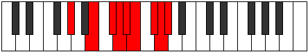 |
| [3561](https://ianring.com/musictheory/scales/3561) | [Pothyllic](ModeDSharpPothyllic.md) | D# | D#, F#, G#, A, A#, B, C#, D, D# |  |
| [3561](https://ianring.com/musictheory/scales/3561) | [Pothyllic](ModeEFlatPothyllic.md) | Eb | Eb, Gb, Ab, A, Bb, B, Db, D, Eb |  |
| [3563](https://ianring.com/musictheory/scales/3563) | [Ionoptygic](ModeGSharpIonoptygic.md) | G# | G#, A, B, C#, D, D#, E, F#, G, G# |  |
| [3563](https://ianring.com/musictheory/scales/3563) | [Ionoptygic](ModeAFlatIonoptygic.md) | Ab | Ab, A, B, Db, D, Eb, E, Gb, G, Ab |  |
| [3563](https://ianring.com/musictheory/scales/3563) | [Ionoptygic](ModeDSharpIonoptygic.md) | D# | D#, E, F#, G#, A, A#, B, C#, D, D# |  |
| [3563](https://ianring.com/musictheory/scales/3563) | [Ionoptygic](ModeEFlatIonoptygic.md) | Eb | Eb, E, Gb, Ab, A, Bb, B, Db, D, Eb |  |
| [3565](https://ianring.com/musictheory/scales/3565) | [Aeolorygic](ModeGSharpAeolorygic.md) | G# | G#, A#, B, C#, D, D#, E, F#, G, G# |  |
| [3565](https://ianring.com/musictheory/scales/3565) | [Aeolorygic](ModeAFlatAeolorygic.md) | Ab | Ab, Bb, B, Db, D, Eb, E, Gb, G, Ab |  |
| [3565](https://ianring.com/musictheory/scales/3565) | [Aeolorygic](ModeCNaturalAeolorygic.md) | C | C, D, D#, F, F#, G, G#, A#, B, C |  |
| [3565](https://ianring.com/musictheory/scales/3565) | [Aeolorygic](ModeDSharpAeolorygic.md) | D# | D#, F, F#, G#, A, A#, B, C#, D, D# |  |
| [3565](https://ianring.com/musictheory/scales/3565) | [Aeolorygic](ModeEFlatAeolorygic.md) | Eb | Eb, F, Gb, Ab, A, Bb, B, Db, D, Eb |  |
| [3567](https://ianring.com/musictheory/scales/3567) | [Epityllian](ModeCSharpEpityllian.md) | C# | C#, D, D#, E, F#, G, G#, A, B, C, C# |  |
| [3567](https://ianring.com/musictheory/scales/3567) | [Epityllian](ModeDFlatEpityllian.md) | Db | Db, D, Eb, E, Gb, G, Ab, A, B, C, Db |  |
| [3567](https://ianring.com/musictheory/scales/3567) | [Epityllian](ModeCNaturalEpityllian.md) | C | C, C#, D, D#, F, F#, G, G#, A#, B, C |  |
| [3567](https://ianring.com/musictheory/scales/3567) | [Epityllian](ModeDSharpEpityllian.md) | D# | D#, E, F, F#, G#, A, A#, B, C#, D, D# |  |
| [3567](https://ianring.com/musictheory/scales/3567) | [Epityllian](ModeEFlatEpityllian.md) | Eb | Eb, E, F, Gb, Ab, A, Bb, B, Db, D, Eb |  |
| [3567](https://ianring.com/musictheory/scales/3567) | [Epityllian](ModeGSharpEpityllian.md) | G# | G#, A, A#, B, C#, D, D#, E, F#, G, G# |  |
| [3567](https://ianring.com/musictheory/scales/3567) | [Epityllian](ModeAFlatEpityllian.md) | Ab | Ab, A, Bb, B, Db, D, Eb, E, Gb, G, Ab |  |
| [3571](https://ianring.com/musictheory/scales/3571) | [Dyrygic](ModeGNaturalDyrygic.md) | G | G, G#, B, C, C#, D, D#, F, F#, G |  |
| [3571](https://ianring.com/musictheory/scales/3571) | [Dyrygic](ModeASharpDyrygic.md) | A# | A#, B, D, D#, E, F, F#, G#, A, A# |  |
| [3571](https://ianring.com/musictheory/scales/3571) | [Dyrygic](ModeBFlatDyrygic.md) | Bb | Bb, B, D, Eb, E, F, Gb, Ab, A, Bb |  |
| [3573](https://ianring.com/musictheory/scales/3573) | [Kaptygic](ModeENaturalKaptygic.md) | E | E, F#, G#, A, A#, B, C, D, D#, E |  |
| [3575](https://ianring.com/musictheory/scales/3575) | [Mogyllian](ModeCSharpMogyllian.md) | C# | C#, D, D#, F, F#, G, G#, A, B, C, C# |  |
| [3575](https://ianring.com/musictheory/scales/3575) | [Mogyllian](ModeDFlatMogyllian.md) | Db | Db, D, Eb, F, Gb, G, Ab, A, B, C, Db |  |
| [3575](https://ianring.com/musictheory/scales/3575) | [Mogyllian](ModeGNaturalMogyllian.md) | G | G, G#, A, B, C, C#, D, D#, F, F#, G |  |
| [3575](https://ianring.com/musictheory/scales/3575) | [Mogyllian](ModeENaturalMogyllian.md) | E | E, F, F#, G#, A, A#, B, C, D, D#, E |  |
| [3575](https://ianring.com/musictheory/scales/3575) | [Mogyllian](ModeASharpMogyllian.md) | A# | A#, B, C, D, D#, E, F, F#, G#, A, A# |  |
| [3575](https://ianring.com/musictheory/scales/3575) | [Mogyllian](ModeBFlatMogyllian.md) | Bb | Bb, B, C, D, Eb, E, F, Gb, Ab, A, Bb |  |
| [3577](https://ianring.com/musictheory/scales/3577) | [Loptygic](ModeGSharpLoptygic.md) | G# | G#, B, C, C#, D, D#, E, F#, G, G# |  |
| [3577](https://ianring.com/musictheory/scales/3577) | [Loptygic](ModeAFlatLoptygic.md) | Ab | Ab, B, C, Db, D, Eb, E, Gb, G, Ab |  |
| [3577](https://ianring.com/musictheory/scales/3577) | [Loptygic](ModeDSharpLoptygic.md) | D# | D#, F#, G, G#, A, A#, B, C#, D, D# |  |
| [3577](https://ianring.com/musictheory/scales/3577) | [Loptygic](ModeEFlatLoptygic.md) | Eb | Eb, Gb, G, Ab, A, Bb, B, Db, D, Eb |  |
| [3579](https://ianring.com/musictheory/scales/3579) | [Zyphyllian](ModeGSharpZyphyllian.md) | G# | G#, A, B, C, C#, D, D#, E, F#, G, G# |  |
| [3579](https://ianring.com/musictheory/scales/3579) | [Zyphyllian](ModeAFlatZyphyllian.md) | Ab | Ab, A, B, C, Db, D, Eb, E, Gb, G, Ab |  |
| [3579](https://ianring.com/musictheory/scales/3579) | [Zyphyllian](ModeGNaturalZyphyllian.md) | G | G, G#, A#, B, C, C#, D, D#, F, F#, G |  |
| [3579](https://ianring.com/musictheory/scales/3579) | [Zyphyllian](ModeASharpZyphyllian.md) | A# | A#, B, C#, D, D#, E, F, F#, G#, A, A# |  |
| [3579](https://ianring.com/musictheory/scales/3579) | [Zyphyllian](ModeBFlatZyphyllian.md) | Bb | Bb, B, Db, D, Eb, E, F, Gb, Ab, A, Bb |  |
| [3579](https://ianring.com/musictheory/scales/3579) | [Zyphyllian](ModeDSharpZyphyllian.md) | D# | D#, E, F#, G, G#, A, A#, B, C#, D, D# |  |
| [3579](https://ianring.com/musictheory/scales/3579) | [Zyphyllian](ModeEFlatZyphyllian.md) | Eb | Eb, E, Gb, G, Ab, A, Bb, B, Db, D, Eb |  |
| [3581](https://ianring.com/musictheory/scales/3581) | [Epocryllian](ModeGSharpEpocryllian.md) | G# | G#, A#, B, C, C#, D, D#, E, F#, G, G# |  |
| [3581](https://ianring.com/musictheory/scales/3581) | [Epocryllian](ModeAFlatEpocryllian.md) | Ab | Ab, Bb, B, C, Db, D, Eb, E, Gb, G, Ab |  |
| [3581](https://ianring.com/musictheory/scales/3581) | [Epocryllian](ModeCNaturalEpocryllian.md) | C | C, D, D#, E, F, F#, G, G#, A#, B, C |  |
| [3581](https://ianring.com/musictheory/scales/3581) | [Epocryllian](ModeENaturalEpocryllian.md) | E | E, F#, G, G#, A, A#, B, C, D, D#, E |  |
| [3581](https://ianring.com/musictheory/scales/3581) | [Epocryllian](ModeDSharpEpocryllian.md) | D# | D#, F, F#, G, G#, A, A#, B, C#, D, D# |  |
| [3581](https://ianring.com/musictheory/scales/3581) | [Epocryllian](ModeEFlatEpocryllian.md) | Eb | Eb, F, Gb, G, Ab, A, Bb, B, Db, D, Eb |  |
| [3583](https://ianring.com/musictheory/scales/3583) | [Zylatic](ModeCSharpZylatic.md) | C# | C#, D, D#, E, F, F#, G, G#, A, B, C, C# |  |
| [3583](https://ianring.com/musictheory/scales/3583) | [Zylatic](ModeDFlatZylatic.md) | Db | Db, D, Eb, E, F, Gb, G, Ab, A, B, C, Db |  |
| [3583](https://ianring.com/musictheory/scales/3583) | [Zylatic](ModeCNaturalZylatic.md) | C | C, C#, D, D#, E, F, F#, G, G#, A#, B, C |  |
| [3583](https://ianring.com/musictheory/scales/3583) | [Zylatic](ModeASharpZylatic.md) | A# | A#, B, C, C#, D, D#, E, F, F#, G#, A, A# |  |
| [3583](https://ianring.com/musictheory/scales/3583) | [Zylatic](ModeBFlatZylatic.md) | Bb | Bb, B, C, Db, D, Eb, E, F, Gb, Ab, A, Bb |  |
| [3583](https://ianring.com/musictheory/scales/3583) | [Zylatic](ModeGSharpZylatic.md) | G# | G#, A, A#, B, C, C#, D, D#, E, F#, G, G# |  |
| [3583](https://ianring.com/musictheory/scales/3583) | [Zylatic](ModeAFlatZylatic.md) | Ab | Ab, A, Bb, B, C, Db, D, Eb, E, Gb, G, Ab |  |
| [3583](https://ianring.com/musictheory/scales/3583) | [Zylatic](ModeGNaturalZylatic.md) | G | G, G#, A, A#, B, C, C#, D, D#, F, F#, G |  |
| [3583](https://ianring.com/musictheory/scales/3583) | [Zylatic](ModeENaturalZylatic.md) | E | E, F, F#, G, G#, A, A#, B, C, D, D#, E |  |
| [3583](https://ianring.com/musictheory/scales/3583) | [Zylatic](ModeDSharpZylatic.md) | D# | D#, E, F, F#, G, G#, A, A#, B, C#, D, D# |  |
| [3583](https://ianring.com/musictheory/scales/3583) | [Zylatic](ModeEFlatZylatic.md) | Eb | Eb, E, F, Gb, G, Ab, A, Bb, B, Db, D, Eb |  |
| [3659](https://ianring.com/musictheory/scales/3659) | [Polian](ModeFNaturalPolian.md) | F | F, Gb, Ab, B, C##, D#, E, F |  |
| [3663](https://ianring.com/musictheory/scales/3663) | [Sonyllic](ModeFNaturalSonyllic.md) | F | F, F#, G, G#, B, D, D#, E, F |  |
| [3667](https://ianring.com/musictheory/scales/3667) | [Kaptian](ModeDNaturalKaptian.md) | D | D, Eb, F#, G#, A##, B#, C#, D |  |
| [3671](https://ianring.com/musictheory/scales/3671) | [Aeonyllic](ModeDNaturalAeonyllic.md) | D | D, D#, E, F#, G#, B, C, C#, D |  |
| [3675](https://ianring.com/musictheory/scales/3675) | [Monyllic](ModeDNaturalMonyllic.md) | D | D, D#, F, F#, G#, B, C, C#, D |  |
| [3675](https://ianring.com/musictheory/scales/3675) | [Monyllic](ModeFNaturalMonyllic.md) | F | F, F#, G#, A, B, D, D#, E, F |  |
| [3679](https://ianring.com/musictheory/scales/3679) | [Rycrygic](ModeDNaturalRycrygic.md) | D | D, D#, E, F, F#, G#, B, C, C#, D |  |
| [3679](https://ianring.com/musictheory/scales/3679) | [Rycrygic](ModeFNaturalRycrygic.md) | F | F, F#, G, G#, A, B, D, D#, E, F |  |
| [3685](https://ianring.com/musictheory/scales/3685) | [Kodian](ModeANaturalKodian.md) | A | A, B, C##, D#, E##, F##, G#, A |  |
| [3687](https://ianring.com/musictheory/scales/3687) | [Zonyllic](ModeANaturalZonyllic.md) | A | A, A#, B, D, D#, F#, G, G#, A |  |
| [3691](https://ianring.com/musictheory/scales/3691) | [Badyllic](ModeFNaturalBadyllic.md) | F | F, F#, G#, A#, B, D, D#, E, F |  |
| [3693](https://ianring.com/musictheory/scales/3693) | [Epaptyllic](ModeANaturalEpaptyllic.md) | A | A, B, C, D, D#, F#, G, G#, A |  |
| [3695](https://ianring.com/musictheory/scales/3695) | [Kodygic](ModeFNaturalKodygic.md) | F | F, F#, G, G#, A#, B, D, D#, E, F |  |
| [3695](https://ianring.com/musictheory/scales/3695) | [Kodygic](ModeANaturalKodygic.md) | A | A, A#, B, C, D, D#, F#, G, G#, A |  |
| [3699](https://ianring.com/musictheory/scales/3699) | [Aeolylyllic](ModeDNaturalAeolylyllic.md) | D | D, D#, F#, G, G#, B, C, C#, D |  |
| [3701](https://ianring.com/musictheory/scales/3701) | [Bagyllic](ModeANaturalBagyllic.md) | A | A, B, C#, D, D#, F#, G, G#, A |  |
| [3703](https://ianring.com/musictheory/scales/3703) | [Katalygic](ModeDNaturalKatalygic.md) | D | D, D#, E, F#, G, G#, B, C, C#, D |  |
| [3703](https://ianring.com/musictheory/scales/3703) | [Katalygic](ModeANaturalKatalygic.md) | A | A, A#, B, C#, D, D#, F#, G, G#, A | 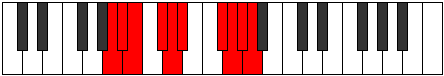 |
| [3707](https://ianring.com/musictheory/scales/3707) | [Rynygic](ModeDNaturalRynygic.md) | D | D, D#, F, F#, G, G#, B, C, C#, D |  |
| [3707](https://ianring.com/musictheory/scales/3707) | [Rynygic](ModeFNaturalRynygic.md) | F | F, F#, G#, A, A#, B, D, D#, E, F |  |
| [3709](https://ianring.com/musictheory/scales/3709) | [Locrygic](ModeANaturalLocrygic.md) | A | A, B, C, C#, D, D#, F#, G, G#, A |  |
| [3711](https://ianring.com/musictheory/scales/3711) | [Dycryllian](ModeDNaturalDycryllian.md) | D | D, D#, E, F, F#, G, G#, B, C, C#, D |  |
| [3711](https://ianring.com/musictheory/scales/3711) | [Dycryllian](ModeANaturalDycryllian.md) | A | A, A#, B, C, C#, D, D#, F#, G, G#, A |  |
| [3711](https://ianring.com/musictheory/scales/3711) | [Dycryllian](ModeFNaturalDycryllian.md) | F | F, F#, G, G#, A, A#, B, D, D#, E, F |  |
| [3733](https://ianring.com/musictheory/scales/3733) | [Gycrian](ModeENaturalGycrian.md) | E | E, F#, G#, A##, B##, C##, D#, E |  |
| [3735](https://ianring.com/musictheory/scales/3735) | [Ionagyllic](ModeENaturalIonagyllic.md) | E | E, F, F#, G#, B, C#, D, D#, E |  |
| [3737](https://ianring.com/musictheory/scales/3737) | [Phrocrian](ModeBNaturalPhrocrian.md) | B | B, C##, D#, E##, F###, G##, A#, B |  |
| [3739](https://ianring.com/musictheory/scales/3739) | [Ioninyllic](ModeBNaturalIoninyllic.md) | B | B, C, D, D#, F#, G#, A, A#, B |  |
| [3741](https://ianring.com/musictheory/scales/3741) | [Zydyllic](ModeENaturalZydyllic.md) | E | E, F#, G, G#, B, C#, D, D#, E |  |
| [3741](https://ianring.com/musictheory/scales/3741) | [Zydyllic](ModeBNaturalZydyllic.md) | B | B, C#, D, D#, F#, G#, A, A#, B |  |
| [3743](https://ianring.com/musictheory/scales/3743) | [Thadygic](ModeENaturalThadygic.md) | E | E, F, F#, G, G#, B, C#, D, D#, E |  |
| [3743](https://ianring.com/musictheory/scales/3743) | [Thadygic](ModeBNaturalThadygic.md) | B | B, C, C#, D, D#, F#, G#, A, A#, B |  |
| [3751](https://ianring.com/musictheory/scales/3751) | [Aerathyllic](ModeCSharpAerathyllic.md) | C# | C#, D, D#, F#, G#, A#, B, C, C# |  |
| [3751](https://ianring.com/musictheory/scales/3751) | [Aerathyllic](ModeDFlatAerathyllic.md) | Db | Db, D, Eb, Gb, Ab, Bb, B, C, Db |  |
| [3759](https://ianring.com/musictheory/scales/3759) | [Darygic](ModeCSharpDarygic.md) | C# | C#, D, D#, E, F#, G#, A#, B, C, C# |  |
| [3759](https://ianring.com/musictheory/scales/3759) | [Darygic](ModeDFlatDarygic.md) | Db | Db, D, Eb, E, Gb, Ab, Bb, B, C, Db |  |
| [3765](https://ianring.com/musictheory/scales/3765) | [Aerycryllic](ModeENaturalAerycryllic.md) | E | E, F#, G#, A, B, C#, D, D#, E |  |
| [3767](https://ianring.com/musictheory/scales/3767) | [Bacrygic](ModeENaturalBacrygic.md) | E | E, F, F#, G#, A, B, C#, D, D#, E |  |
| [3767](https://ianring.com/musictheory/scales/3767) | [Bacrygic](ModeCSharpBacrygic.md) | C# | C#, D, D#, F, F#, G#, A#, B, C, C# |  |
| [3767](https://ianring.com/musictheory/scales/3767) | [Bacrygic](ModeDFlatBacrygic.md) | Db | Db, D, Eb, F, Gb, Ab, Bb, B, C, Db |  |
| [3769](https://ianring.com/musictheory/scales/3769) | [Aeracryllic](ModeBNaturalAeracryllic.md) | B | B, D, D#, E, F#, G#, A, A#, B |  |
| [3771](https://ianring.com/musictheory/scales/3771) | [Stophygic](ModeBNaturalStophygic.md) | B | B, C, D, D#, E, F#, G#, A, A#, B |  |
| [3773](https://ianring.com/musictheory/scales/3773) | [Sorygic](ModeENaturalSorygic.md) | E | E, F#, G, G#, A, B, C#, D, D#, E |  |
| [3773](https://ianring.com/musictheory/scales/3773) | [Sorygic](ModeBNaturalSorygic.md) | B | B, C#, D, D#, E, F#, G#, A, A#, B |  |
| [3775](https://ianring.com/musictheory/scales/3775) | [Loptyllian](ModeENaturalLoptyllian.md) | E | E, F, F#, G, G#, A, B, C#, D, D#, E |  |
| [3775](https://ianring.com/musictheory/scales/3775) | [Loptyllian](ModeCSharpLoptyllian.md) | C# | C#, D, D#, E, F, F#, G#, A#, B, C, C# |  |
| [3775](https://ianring.com/musictheory/scales/3775) | [Loptyllian](ModeDFlatLoptyllian.md) | Db | Db, D, Eb, E, F, Gb, Ab, Bb, B, C, Db |  |
| [3775](https://ianring.com/musictheory/scales/3775) | [Loptyllian](ModeBNaturalLoptyllian.md) | B | B, C, C#, D, D#, E, F#, G#, A, A#, B |  |
| [3785](https://ianring.com/musictheory/scales/3785) | [Epagian](ModeGSharpEpagian.md) | G# | G#, A##, B###, C###, D###, E##, F##, G# |  |
| [3785](https://ianring.com/musictheory/scales/3785) | [Epagian](ModeAFlatEpagian.md) | Ab | Ab, B, C##, D#, E#, F#, G, Ab |  |
| [3787](https://ianring.com/musictheory/scales/3787) | [Kagyllic](ModeFNaturalKagyllic.md) | F | F, F#, G#, B, C, D, D#, E, F |  |
| [3787](https://ianring.com/musictheory/scales/3787) | [Kagyllic](ModeGSharpKagyllic.md) | G# | G#, A, B, D, D#, F, F#, G, G# | 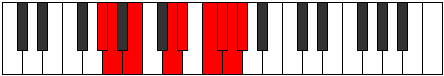 |
| [3787](https://ianring.com/musictheory/scales/3787) | [Kagyllic](ModeAFlatKagyllic.md) | Ab | Ab, A, B, D, Eb, F, Gb, G, Ab |  |
| [3789](https://ianring.com/musictheory/scales/3789) | [Eporyllic](ModeGSharpEporyllic.md) | G# | G#, A#, B, D, D#, F, F#, G, G# |  |
| [3789](https://ianring.com/musictheory/scales/3789) | [Eporyllic](ModeAFlatEporyllic.md) | Ab | Ab, Bb, B, D, Eb, F, Gb, G, Ab |  |
| [3791](https://ianring.com/musictheory/scales/3791) | [Stodygic](ModeFNaturalStodygic.md) | F | F, F#, G, G#, B, C, D, D#, E, F |  |
| [3791](https://ianring.com/musictheory/scales/3791) | [Stodygic](ModeGSharpStodygic.md) | G# | G#, A, A#, B, D, D#, F, F#, G, G# |  |
| [3791](https://ianring.com/musictheory/scales/3791) | [Stodygic](ModeAFlatStodygic.md) | Ab | Ab, A, Bb, B, D, Eb, F, Gb, G, Ab |  |
| [3795](https://ianring.com/musictheory/scales/3795) | [Epothyllic](ModeDNaturalEpothyllic.md) | D | D, D#, F#, G#, A, B, C, C#, D |  |
| [3797](https://ianring.com/musictheory/scales/3797) | [Rocryllic](ModeENaturalRocryllic.md) | E | E, F#, G#, A#, B, C#, D, D#, E |  |
| [3799](https://ianring.com/musictheory/scales/3799) | [Aeralygic](ModeDNaturalAeralygic.md) | D | D, D#, E, F#, G#, A, B, C, C#, D |  |
| [3799](https://ianring.com/musictheory/scales/3799) | [Aeralygic](ModeENaturalAeralygic.md) | E | E, F, F#, G#, A#, B, C#, D, D#, E |  |
| [3801](https://ianring.com/musictheory/scales/3801) | [Maptyllic](ModeGSharpMaptyllic.md) | G# | G#, B, C, D, D#, F, F#, G, G# |  |
| [3801](https://ianring.com/musictheory/scales/3801) | [Maptyllic](ModeAFlatMaptyllic.md) | Ab | Ab, B, C, D, Eb, F, Gb, G, Ab |  |
| [3801](https://ianring.com/musictheory/scales/3801) | [Maptyllic](ModeBNaturalMaptyllic.md) | B | B, D, D#, F, F#, G#, A, A#, B |  |
| [3803](https://ianring.com/musictheory/scales/3803) | [Epidygic](ModeDNaturalEpidygic.md) | D | D, D#, F, F#, G#, A, B, C, C#, D |  |
| [3803](https://ianring.com/musictheory/scales/3803) | [Epidygic](ModeFNaturalEpidygic.md) | F | F, F#, G#, A, B, C, D, D#, E, F |  |
| [3803](https://ianring.com/musictheory/scales/3803) | [Epidygic](ModeGSharpEpidygic.md) | G# | G#, A, B, C, D, D#, F, F#, G, G# |  |
| [3803](https://ianring.com/musictheory/scales/3803) | [Epidygic](ModeAFlatEpidygic.md) | Ab | Ab, A, B, C, D, Eb, F, Gb, G, Ab |  |
| [3803](https://ianring.com/musictheory/scales/3803) | [Epidygic](ModeBNaturalEpidygic.md) | B | B, C, D, D#, F, F#, G#, A, A#, B |  |
| [3805](https://ianring.com/musictheory/scales/3805) | [Moptygic](ModeENaturalMoptygic.md) | E | E, F#, G, G#, A#, B, C#, D, D#, E |  |
| [3805](https://ianring.com/musictheory/scales/3805) | [Moptygic](ModeGSharpMoptygic.md) | G# | G#, A#, B, C, D, D#, F, F#, G, G# |  |
| [3805](https://ianring.com/musictheory/scales/3805) | [Moptygic](ModeAFlatMoptygic.md) | Ab | Ab, Bb, B, C, D, Eb, F, Gb, G, Ab |  |
| [3805](https://ianring.com/musictheory/scales/3805) | [Moptygic](ModeBNaturalMoptygic.md) | B | B, C#, D, D#, F, F#, G#, A, A#, B |  |
| [3807](https://ianring.com/musictheory/scales/3807) | [Bagyllian](ModeDNaturalBagyllian.md) | D | D, D#, E, F, F#, G#, A, B, C, C#, D |  |
| [3807](https://ianring.com/musictheory/scales/3807) | [Bagyllian](ModeFNaturalBagyllian.md) | F | F, F#, G, G#, A, B, C, D, D#, E, F |  |
| [3807](https://ianring.com/musictheory/scales/3807) | [Bagyllian](ModeENaturalBagyllian.md) | E | E, F, F#, G, G#, A#, B, C#, D, D#, E |  |
| [3807](https://ianring.com/musictheory/scales/3807) | [Bagyllian](ModeBNaturalBagyllian.md) | B | B, C, C#, D, D#, F, F#, G#, A, A#, B |  |
| [3807](https://ianring.com/musictheory/scales/3807) | [Bagyllian](ModeGSharpBagyllian.md) | G# | G#, A, A#, B, C, D, D#, F, F#, G, G# |  |
| [3807](https://ianring.com/musictheory/scales/3807) | [Bagyllian](ModeAFlatBagyllian.md) | Ab | Ab, A, Bb, B, C, D, Eb, F, Gb, G, Ab |  |
| [3813](https://ianring.com/musictheory/scales/3813) | [Aeologyllic](ModeANaturalAeologyllic.md) | A | A, B, D, D#, E, F#, G, G#, A | 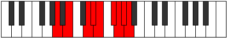 |
| [3815](https://ianring.com/musictheory/scales/3815) | [Mylygic](ModeCSharpMylygic.md) | C# | C#, D, D#, F#, G, G#, A#, B, C, C# |  |
| [3815](https://ianring.com/musictheory/scales/3815) | [Mylygic](ModeDFlatMylygic.md) | Db | Db, D, Eb, Gb, G, Ab, Bb, B, C, Db |  |
| [3815](https://ianring.com/musictheory/scales/3815) | [Mylygic](ModeANaturalMylygic.md) | A | A, A#, B, D, D#, E, F#, G, G#, A | 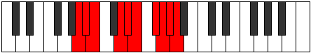 |
| [3817](https://ianring.com/musictheory/scales/3817) | [Zoryllic](ModeGSharpZoryllic.md) | G# | G#, B, C#, D, D#, F, F#, G, G# |  |
| [3817](https://ianring.com/musictheory/scales/3817) | [Zoryllic](ModeAFlatZoryllic.md) | Ab | Ab, B, Db, D, Eb, F, Gb, G, Ab |  |
| [3819](https://ianring.com/musictheory/scales/3819) | [Aeolanygic](ModeGSharpAeolanygic.md) | G# | G#, A, B, C#, D, D#, F, F#, G, G# |  |
| [3819](https://ianring.com/musictheory/scales/3819) | [Aeolanygic](ModeAFlatAeolanygic.md) | Ab | Ab, A, B, Db, D, Eb, F, Gb, G, Ab |  |
| [3819](https://ianring.com/musictheory/scales/3819) | [Aeolanygic](ModeFNaturalAeolanygic.md) | F | F, F#, G#, A#, B, C, D, D#, E, F |  |
| [3821](https://ianring.com/musictheory/scales/3821) | [Epyrygic](ModeANaturalEpyrygic.md) | A | A, B, C, D, D#, E, F#, G, G#, A |  |
| [3821](https://ianring.com/musictheory/scales/3821) | [Epyrygic](ModeGSharpEpyrygic.md) | G# | G#, A#, B, C#, D, D#, F, F#, G, G# |  |
| [3821](https://ianring.com/musictheory/scales/3821) | [Epyrygic](ModeAFlatEpyrygic.md) | Ab | Ab, Bb, B, Db, D, Eb, F, Gb, G, Ab |  |
| [3823](https://ianring.com/musictheory/scales/3823) | [Epinyllian](ModeCSharpEpinyllian.md) | C# | C#, D, D#, E, F#, G, G#, A#, B, C, C# |  |
| [3823](https://ianring.com/musictheory/scales/3823) | [Epinyllian](ModeDFlatEpinyllian.md) | Db | Db, D, Eb, E, Gb, G, Ab, Bb, B, C, Db |  |
| [3823](https://ianring.com/musictheory/scales/3823) | [Epinyllian](ModeFNaturalEpinyllian.md) | F | F, F#, G, G#, A#, B, C, D, D#, E, F |  |
| [3823](https://ianring.com/musictheory/scales/3823) | [Epinyllian](ModeANaturalEpinyllian.md) | A | A, A#, B, C, D, D#, E, F#, G, G#, A |  |
| [3823](https://ianring.com/musictheory/scales/3823) | [Epinyllian](ModeGSharpEpinyllian.md) | G# | G#, A, A#, B, C#, D, D#, F, F#, G, G# |  |
| [3823](https://ianring.com/musictheory/scales/3823) | [Epinyllian](ModeAFlatEpinyllian.md) | Ab | Ab, A, Bb, B, Db, D, Eb, F, Gb, G, Ab |  |
| [3827](https://ianring.com/musictheory/scales/3827) | [Dorygic](ModeDNaturalDorygic.md) | D | D, D#, F#, G, G#, A, B, C, C#, D |  |
| [3829](https://ianring.com/musictheory/scales/3829) | [Aerycrygic](ModeANaturalAerycrygic.md) | A | A, B, C#, D, D#, E, F#, G, G#, A |  |
| [3829](https://ianring.com/musictheory/scales/3829) | [Aerycrygic](ModeENaturalAerycrygic.md) | E | E, F#, G#, A, A#, B, C#, D, D#, E | 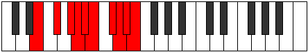 |
| [3831](https://ianring.com/musictheory/scales/3831) | [Ionyllian](ModeDNaturalIonyllian.md) | D | D, D#, E, F#, G, G#, A, B, C, C#, D |  |
| [3831](https://ianring.com/musictheory/scales/3831) | [Ionyllian](ModeCSharpIonyllian.md) | C# | C#, D, D#, F, F#, G, G#, A#, B, C, C# |  |
| [3831](https://ianring.com/musictheory/scales/3831) | [Ionyllian](ModeDFlatIonyllian.md) | Db | Db, D, Eb, F, Gb, G, Ab, Bb, B, C, Db |  |
| [3831](https://ianring.com/musictheory/scales/3831) | [Ionyllian](ModeENaturalIonyllian.md) | E | E, F, F#, G#, A, A#, B, C#, D, D#, E |  |
| [3831](https://ianring.com/musictheory/scales/3831) | [Ionyllian](ModeANaturalIonyllian.md) | A | A, A#, B, C#, D, D#, E, F#, G, G#, A |  |
| [3833](https://ianring.com/musictheory/scales/3833) | [Dycrygic](ModeGSharpDycrygic.md) | G# | G#, B, C, C#, D, D#, F, F#, G, G# |  |
| [3833](https://ianring.com/musictheory/scales/3833) | [Dycrygic](ModeAFlatDycrygic.md) | Ab | Ab, B, C, Db, D, Eb, F, Gb, G, Ab |  |
| [3833](https://ianring.com/musictheory/scales/3833) | [Dycrygic](ModeBNaturalDycrygic.md) | B | B, D, D#, E, F, F#, G#, A, A#, B |  |
| [3835](https://ianring.com/musictheory/scales/3835) | [Katodyllian](ModeDNaturalKatodyllian.md) | D | D, D#, F, F#, G, G#, A, B, C, C#, D |  |
| [3835](https://ianring.com/musictheory/scales/3835) | [Katodyllian](ModeGSharpKatodyllian.md) | G# | G#, A, B, C, C#, D, D#, F, F#, G, G# |  |
| [3835](https://ianring.com/musictheory/scales/3835) | [Katodyllian](ModeAFlatKatodyllian.md) | Ab | Ab, A, B, C, Db, D, Eb, F, Gb, G, Ab |  |
| [3835](https://ianring.com/musictheory/scales/3835) | [Katodyllian](ModeFNaturalKatodyllian.md) | F | F, F#, G#, A, A#, B, C, D, D#, E, F |  |
| [3835](https://ianring.com/musictheory/scales/3835) | [Katodyllian](ModeBNaturalKatodyllian.md) | B | B, C, D, D#, E, F, F#, G#, A, A#, B |  |
| [3837](https://ianring.com/musictheory/scales/3837) | [Garyllian](ModeANaturalGaryllian.md) | A | A, B, C, C#, D, D#, E, F#, G, G#, A |  |
| [3837](https://ianring.com/musictheory/scales/3837) | [Garyllian](ModeGSharpGaryllian.md) | G# | G#, A#, B, C, C#, D, D#, F, F#, G, G# |  |
| [3837](https://ianring.com/musictheory/scales/3837) | [Garyllian](ModeAFlatGaryllian.md) | Ab | Ab, Bb, B, C, Db, D, Eb, F, Gb, G, Ab |  |
| [3837](https://ianring.com/musictheory/scales/3837) | [Garyllian](ModeBNaturalGaryllian.md) | B | B, C#, D, D#, E, F, F#, G#, A, A#, B |  |
| [3837](https://ianring.com/musictheory/scales/3837) | [Garyllian](ModeENaturalGaryllian.md) | E | E, F#, G, G#, A, A#, B, C#, D, D#, E |  |
| [3839](https://ianring.com/musictheory/scales/3839) | [Mixolatic](ModeDNaturalMixolatic.md) | D | D, D#, E, F, F#, G, G#, A, B, C, C#, D |  |
| [3839](https://ianring.com/musictheory/scales/3839) | [Mixolatic](ModeCSharpMixolatic.md) | C# | C#, D, D#, E, F, F#, G, G#, A#, B, C, C# |  |
| [3839](https://ianring.com/musictheory/scales/3839) | [Mixolatic](ModeDFlatMixolatic.md) | Db | Db, D, Eb, E, F, Gb, G, Ab, Bb, B, C, Db |  |
| [3839](https://ianring.com/musictheory/scales/3839) | [Mixolatic](ModeBNaturalMixolatic.md) | B | B, C, C#, D, D#, E, F, F#, G#, A, A#, B |  |
| [3839](https://ianring.com/musictheory/scales/3839) | [Mixolatic](ModeANaturalMixolatic.md) | A | A, A#, B, C, C#, D, D#, E, F#, G, G#, A |  |
| [3839](https://ianring.com/musictheory/scales/3839) | [Mixolatic](ModeGSharpMixolatic.md) | G# | G#, A, A#, B, C, C#, D, D#, F, F#, G, G# |  |
| [3839](https://ianring.com/musictheory/scales/3839) | [Mixolatic](ModeAFlatMixolatic.md) | Ab | Ab, A, Bb, B, C, Db, D, Eb, F, Gb, G, Ab |  |
| [3839](https://ianring.com/musictheory/scales/3839) | [Mixolatic](ModeFNaturalMixolatic.md) | F | F, F#, G, G#, A, A#, B, C, D, D#, E, F |  |
| [3839](https://ianring.com/musictheory/scales/3839) | [Mixolatic](ModeENaturalMixolatic.md) | E | E, F, F#, G, G#, A, A#, B, C#, D, D#, E |  |
| [3877](https://ianring.com/musictheory/scales/3877) | [Thanian](ModeFSharpThanian.md) | F# | F#, G#, A##, B###, C###, D##, E#, F# |  |
| [3877](https://ianring.com/musictheory/scales/3877) | [Thanian](ModeGFlatThanian.md) | Gb | Gb, Ab, B, C##, D#, E, F, Gb |  |
| [3879](https://ianring.com/musictheory/scales/3879) | [Pathyllic](ModeFSharpPathyllic.md) | F# | F#, G, G#, B, D, D#, E, F, F# |  |
| [3879](https://ianring.com/musictheory/scales/3879) | [Pathyllic](ModeGFlatPathyllic.md) | Gb | Gb, G, Ab, B, D, Eb, E, F, Gb |  |
| [3881](https://ianring.com/musictheory/scales/3881) | [Morian](ModeDSharpMorian.md) | D# | D#, E##, F###, Cb, Dbb, Ebbb, Fbbb, D# |  |
| [3881](https://ianring.com/musictheory/scales/3881) | [Morian](ModeEFlatMorian.md) | Eb | Eb, F#, G#, A##, B#, C#, D, Eb |  |
| [3883](https://ianring.com/musictheory/scales/3883) | [Kyryllic](ModeDSharpKyryllic.md) | D# | D#, E, F#, G#, B, C, C#, D, D# |  |
| [3883](https://ianring.com/musictheory/scales/3883) | [Kyryllic](ModeEFlatKyryllic.md) | Eb | Eb, E, Gb, Ab, B, C, Db, D, Eb |  |
| [3885](https://ianring.com/musictheory/scales/3885) | [Styryllic](ModeDSharpStyryllic.md) | D# | D#, F, F#, G#, B, C, C#, D, D# |  |
| [3885](https://ianring.com/musictheory/scales/3885) | [Styryllic](ModeEFlatStyryllic.md) | Eb | Eb, F, Gb, Ab, B, C, Db, D, Eb |  |
| [3885](https://ianring.com/musictheory/scales/3885) | [Styryllic](ModeFSharpStyryllic.md) | F# | F#, G#, A, B, D, D#, E, F, F# |  |
| [3885](https://ianring.com/musictheory/scales/3885) | [Styryllic](ModeGFlatStyryllic.md) | Gb | Gb, Ab, A, B, D, Eb, E, F, Gb |  |
| [3887](https://ianring.com/musictheory/scales/3887) | [Phrathygic](ModeDSharpPhrathygic.md) | D# | D#, E, F, F#, G#, B, C, C#, D, D# |  |
| [3887](https://ianring.com/musictheory/scales/3887) | [Phrathygic](ModeEFlatPhrathygic.md) | Eb | Eb, E, F, Gb, Ab, B, C, Db, D, Eb |  |
| [3887](https://ianring.com/musictheory/scales/3887) | [Phrathygic](ModeFSharpPhrathygic.md) | F# | F#, G, G#, A, B, D, D#, E, F, F# |  |
| [3887](https://ianring.com/musictheory/scales/3887) | [Phrathygic](ModeGFlatPhrathygic.md) | Gb | Gb, G, Ab, A, B, D, Eb, E, F, Gb |  |
| [3891](https://ianring.com/musictheory/scales/3891) | [Ryryllic](ModeASharpRyryllic.md) | A# | A#, B, D, D#, F#, G, G#, A, A# |  |
| [3891](https://ianring.com/musictheory/scales/3891) | [Ryryllic](ModeBFlatRyryllic.md) | Bb | Bb, B, D, Eb, Gb, G, Ab, A, Bb |  |
| [3893](https://ianring.com/musictheory/scales/3893) | [Phrocryllic](ModeFSharpPhrocryllic.md) | F# | F#, G#, A#, B, D, D#, E, F, F# |  |
| [3893](https://ianring.com/musictheory/scales/3893) | [Phrocryllic](ModeGFlatPhrocryllic.md) | Gb | Gb, Ab, Bb, B, D, Eb, E, F, Gb |  |
| [3895](https://ianring.com/musictheory/scales/3895) | [Eparygic](ModeFSharpEparygic.md) | F# | F#, G, G#, A#, B, D, D#, E, F, F# |  |
| [3895](https://ianring.com/musictheory/scales/3895) | [Eparygic](ModeGFlatEparygic.md) | Gb | Gb, G, Ab, Bb, B, D, Eb, E, F, Gb |  |
| [3895](https://ianring.com/musictheory/scales/3895) | [Eparygic](ModeASharpEparygic.md) | A# | A#, B, C, D, D#, F#, G, G#, A, A# |  |
| [3895](https://ianring.com/musictheory/scales/3895) | [Eparygic](ModeBFlatEparygic.md) | Bb | Bb, B, C, D, Eb, Gb, G, Ab, A, Bb |  |
| [3897](https://ianring.com/musictheory/scales/3897) | [Locryllic](ModeDSharpLocryllic.md) | D# | D#, F#, G, G#, B, C, C#, D, D# |  |
| [3897](https://ianring.com/musictheory/scales/3897) | [Locryllic](ModeEFlatLocryllic.md) | Eb | Eb, Gb, G, Ab, B, C, Db, D, Eb |  |
| [3899](https://ianring.com/musictheory/scales/3899) | [Katorygic](ModeDSharpKatorygic.md) | D# | D#, E, F#, G, G#, B, C, C#, D, D# |  |
| [3899](https://ianring.com/musictheory/scales/3899) | [Katorygic](ModeEFlatKatorygic.md) | Eb | Eb, E, Gb, G, Ab, B, C, Db, D, Eb |  |
| [3899](https://ianring.com/musictheory/scales/3899) | [Katorygic](ModeASharpKatorygic.md) | A# | A#, B, C#, D, D#, F#, G, G#, A, A# |  |
| [3899](https://ianring.com/musictheory/scales/3899) | [Katorygic](ModeBFlatKatorygic.md) | Bb | Bb, B, Db, D, Eb, Gb, G, Ab, A, Bb |  |
| [3901](https://ianring.com/musictheory/scales/3901) | [Bycrygic](ModeDSharpBycrygic.md) | D# | D#, F, F#, G, G#, B, C, C#, D, D# |  |
| [3901](https://ianring.com/musictheory/scales/3901) | [Bycrygic](ModeEFlatBycrygic.md) | Eb | Eb, F, Gb, G, Ab, B, C, Db, D, Eb |  |
| [3901](https://ianring.com/musictheory/scales/3901) | [Bycrygic](ModeFSharpBycrygic.md) | F# | F#, G#, A, A#, B, D, D#, E, F, F# |  |
| [3901](https://ianring.com/musictheory/scales/3901) | [Bycrygic](ModeGFlatBycrygic.md) | Gb | Gb, Ab, A, Bb, B, D, Eb, E, F, Gb |  |
| [3903](https://ianring.com/musictheory/scales/3903) | [Aeogyllian](ModeDSharpAeogyllian.md) | D# | D#, E, F, F#, G, G#, B, C, C#, D, D# |  |
| [3903](https://ianring.com/musictheory/scales/3903) | [Aeogyllian](ModeEFlatAeogyllian.md) | Eb | Eb, E, F, Gb, G, Ab, B, C, Db, D, Eb |  |
| [3903](https://ianring.com/musictheory/scales/3903) | [Aeogyllian](ModeASharpAeogyllian.md) | A# | A#, B, C, C#, D, D#, F#, G, G#, A, A# |  |
| [3903](https://ianring.com/musictheory/scales/3903) | [Aeogyllian](ModeBFlatAeogyllian.md) | Bb | Bb, B, C, Db, D, Eb, Gb, G, Ab, A, Bb |  |
| [3903](https://ianring.com/musictheory/scales/3903) | [Aeogyllian](ModeFSharpAeogyllian.md) | F# | F#, G, G#, A, A#, B, D, D#, E, F, F# |  |
| [3903](https://ianring.com/musictheory/scales/3903) | [Aeogyllian](ModeGFlatAeogyllian.md) | Gb | Gb, G, Ab, A, Bb, B, D, Eb, E, F, Gb |  |
| [3915](https://ianring.com/musictheory/scales/3915) | [Gogyllic](ModeFNaturalGogyllic.md) | F | F, F#, G#, B, C#, D, D#, E, F |  |
| [3917](https://ianring.com/musictheory/scales/3917) | [Epaphyllic](ModeCNaturalEpaphyllic.md) | C | C, D, D#, F#, G#, A, A#, B, C |  |
| [3919](https://ianring.com/musictheory/scales/3919) | [Lynygic](ModeFNaturalLynygic.md) | F | F, F#, G, G#, B, C#, D, D#, E, F |  |
| [3919](https://ianring.com/musictheory/scales/3919) | [Lynygic](ModeCNaturalLynygic.md) | C | C, C#, D, D#, F#, G#, A, A#, B, C |  |
| [3923](https://ianring.com/musictheory/scales/3923) | [Stoptyllic](ModeDNaturalStoptyllic.md) | D | D, D#, F#, G#, A#, B, C, C#, D |  |
| [3927](https://ianring.com/musictheory/scales/3927) | [Monygic](ModeDNaturalMonygic.md) | D | D, D#, E, F#, G#, A#, B, C, C#, D |  |
| [3931](https://ianring.com/musictheory/scales/3931) | [Aerygic](ModeFNaturalAerygic.md) | F | F, F#, G#, A, B, C#, D, D#, E, F |  |
| [3931](https://ianring.com/musictheory/scales/3931) | [Aerygic](ModeDNaturalAerygic.md) | D | D, D#, F, F#, G#, A#, B, C, C#, D |  |
| [3933](https://ianring.com/musictheory/scales/3933) | [Ionidygic](ModeCNaturalIonidygic.md) | C | C, D, D#, E, F#, G#, A, A#, B, C |  |
| [3935](https://ianring.com/musictheory/scales/3935) | [Kataphyllian](ModeFNaturalKataphyllian.md) | F | F, F#, G, G#, A, B, C#, D, D#, E, F |  |
| [3935](https://ianring.com/musictheory/scales/3935) | [Kataphyllian](ModeDNaturalKataphyllian.md) | D | D, D#, E, F, F#, G#, A#, B, C, C#, D |  |
| [3935](https://ianring.com/musictheory/scales/3935) | [Kataphyllian](ModeCNaturalKataphyllian.md) | C | C, C#, D, D#, E, F#, G#, A, A#, B, C |  |
| [3941](https://ianring.com/musictheory/scales/3941) | [Stathyllic](ModeFSharpStathyllic.md) | F# | F#, G#, B, C, D, D#, E, F, F# |  |
| [3941](https://ianring.com/musictheory/scales/3941) | [Stathyllic](ModeGFlatStathyllic.md) | Gb | Gb, Ab, B, C, D, Eb, E, F, Gb |  |
| [3941](https://ianring.com/musictheory/scales/3941) | [Stathyllic](ModeANaturalStathyllic.md) | A | A, B, D, D#, F, F#, G, G#, A |  |
| [3943](https://ianring.com/musictheory/scales/3943) | [Zynygic](ModeFSharpZynygic.md) | F# | F#, G, G#, B, C, D, D#, E, F, F# |  |
| [3943](https://ianring.com/musictheory/scales/3943) | [Zynygic](ModeGFlatZynygic.md) | Gb | Gb, G, Ab, B, C, D, Eb, E, F, Gb |  |
| [3943](https://ianring.com/musictheory/scales/3943) | [Zynygic](ModeANaturalZynygic.md) | A | A, A#, B, D, D#, F, F#, G, G#, A |  |
| [3945](https://ianring.com/musictheory/scales/3945) | [Lydyllic](ModeDSharpLydyllic.md) | D# | D#, F#, G#, A, B, C, C#, D, D# |  |
| [3945](https://ianring.com/musictheory/scales/3945) | [Lydyllic](ModeEFlatLydyllic.md) | Eb | Eb, Gb, Ab, A, B, C, Db, D, Eb |  |
| [3947](https://ianring.com/musictheory/scales/3947) | [Ryptygic](ModeDSharpRyptygic.md) | D# | D#, E, F#, G#, A, B, C, C#, D, D# |  |
| [3947](https://ianring.com/musictheory/scales/3947) | [Ryptygic](ModeEFlatRyptygic.md) | Eb | Eb, E, Gb, Ab, A, B, C, Db, D, Eb |  |
| [3947](https://ianring.com/musictheory/scales/3947) | [Ryptygic](ModeFNaturalRyptygic.md) | F | F, F#, G#, A#, B, C#, D, D#, E, F |  |
| [3949](https://ianring.com/musictheory/scales/3949) | [Koptygic](ModeDSharpKoptygic.md) | D# | D#, F, F#, G#, A, B, C, C#, D, D# |  |
| [3949](https://ianring.com/musictheory/scales/3949) | [Koptygic](ModeEFlatKoptygic.md) | Eb | Eb, F, Gb, Ab, A, B, C, Db, D, Eb |  |
| [3949](https://ianring.com/musictheory/scales/3949) | [Koptygic](ModeFSharpKoptygic.md) | F# | F#, G#, A, B, C, D, D#, E, F, F# |  |
| [3949](https://ianring.com/musictheory/scales/3949) | [Koptygic](ModeGFlatKoptygic.md) | Gb | Gb, Ab, A, B, C, D, Eb, E, F, Gb |  |
| [3949](https://ianring.com/musictheory/scales/3949) | [Koptygic](ModeANaturalKoptygic.md) | A | A, B, C, D, D#, F, F#, G, G#, A |  |
| [3949](https://ianring.com/musictheory/scales/3949) | [Koptygic](ModeCNaturalKoptygic.md) | C | C, D, D#, F, F#, G#, A, A#, B, C |  |
| [3951](https://ianring.com/musictheory/scales/3951) | [Mathyllian](ModeDSharpMathyllian.md) | D# | D#, E, F, F#, G#, A, B, C, C#, D, D# |  |
| [3951](https://ianring.com/musictheory/scales/3951) | [Mathyllian](ModeEFlatMathyllian.md) | Eb | Eb, E, F, Gb, Ab, A, B, C, Db, D, Eb |  |
| [3951](https://ianring.com/musictheory/scales/3951) | [Mathyllian](ModeFSharpMathyllian.md) | F# | F#, G, G#, A, B, C, D, D#, E, F, F# |  |
| [3951](https://ianring.com/musictheory/scales/3951) | [Mathyllian](ModeGFlatMathyllian.md) | Gb | Gb, G, Ab, A, B, C, D, Eb, E, F, Gb |  |
| [3951](https://ianring.com/musictheory/scales/3951) | [Mathyllian](ModeFNaturalMathyllian.md) | F | F, F#, G, G#, A#, B, C#, D, D#, E, F |  |
| [3951](https://ianring.com/musictheory/scales/3951) | [Mathyllian](ModeCNaturalMathyllian.md) | C | C, C#, D, D#, F, F#, G#, A, A#, B, C |  |
| [3951](https://ianring.com/musictheory/scales/3951) | [Mathyllian](ModeANaturalMathyllian.md) | A | A, A#, B, C, D, D#, F, F#, G, G#, A |  |
| [3955](https://ianring.com/musictheory/scales/3955) | [Galygic](ModeDNaturalGalygic.md) | D | D, D#, F#, G, G#, A#, B, C, C#, D |  |
| [3955](https://ianring.com/musictheory/scales/3955) | [Galygic](ModeASharpGalygic.md) | A# | A#, B, D, D#, E, F#, G, G#, A, A# |  |
| [3955](https://ianring.com/musictheory/scales/3955) | [Galygic](ModeBFlatGalygic.md) | Bb | Bb, B, D, Eb, E, Gb, G, Ab, A, Bb |  |
| [3957](https://ianring.com/musictheory/scales/3957) | [Porygic](ModeANaturalPorygic.md) | A | A, B, C#, D, D#, F, F#, G, G#, A |  |
| [3957](https://ianring.com/musictheory/scales/3957) | [Porygic](ModeFSharpPorygic.md) | F# | F#, G#, A#, B, C, D, D#, E, F, F# |  |
| [3957](https://ianring.com/musictheory/scales/3957) | [Porygic](ModeGFlatPorygic.md) | Gb | Gb, Ab, Bb, B, C, D, Eb, E, F, Gb |  |
| [3959](https://ianring.com/musictheory/scales/3959) | [Katagyllian](ModeDNaturalKatagyllian.md) | D | D, D#, E, F#, G, G#, A#, B, C, C#, D |  |
| [3959](https://ianring.com/musictheory/scales/3959) | [Katagyllian](ModeFSharpKatagyllian.md) | F# | F#, G, G#, A#, B, C, D, D#, E, F, F# |  |
| [3959](https://ianring.com/musictheory/scales/3959) | [Katagyllian](ModeGFlatKatagyllian.md) | Gb | Gb, G, Ab, Bb, B, C, D, Eb, E, F, Gb |  |
| [3959](https://ianring.com/musictheory/scales/3959) | [Katagyllian](ModeASharpKatagyllian.md) | A# | A#, B, C, D, D#, E, F#, G, G#, A, A# |  |
| [3959](https://ianring.com/musictheory/scales/3959) | [Katagyllian](ModeBFlatKatagyllian.md) | Bb | Bb, B, C, D, Eb, E, Gb, G, Ab, A, Bb |  |
| [3959](https://ianring.com/musictheory/scales/3959) | [Katagyllian](ModeANaturalKatagyllian.md) | A | A, A#, B, C#, D, D#, F, F#, G, G#, A |  |
| [3961](https://ianring.com/musictheory/scales/3961) | [Mixolydygic](ModeDSharpMixolydygic.md) | D# | D#, F#, G, G#, A, B, C, C#, D, D# |  |
| [3961](https://ianring.com/musictheory/scales/3961) | [Mixolydygic](ModeEFlatMixolydygic.md) | Eb | Eb, Gb, G, Ab, A, B, C, Db, D, Eb |  |
| [3963](https://ianring.com/musictheory/scales/3963) | [Aeoryllian](ModeDSharpAeoryllian.md) | D# | D#, E, F#, G, G#, A, B, C, C#, D, D# |  |
| [3963](https://ianring.com/musictheory/scales/3963) | [Aeoryllian](ModeEFlatAeoryllian.md) | Eb | Eb, E, Gb, G, Ab, A, B, C, Db, D, Eb |  |
| [3963](https://ianring.com/musictheory/scales/3963) | [Aeoryllian](ModeDNaturalAeoryllian.md) | D | D, D#, F, F#, G, G#, A#, B, C, C#, D |  |
| [3963](https://ianring.com/musictheory/scales/3963) | [Aeoryllian](ModeFNaturalAeoryllian.md) | F | F, F#, G#, A, A#, B, C#, D, D#, E, F |  |
| [3963](https://ianring.com/musictheory/scales/3963) | [Aeoryllian](ModeASharpAeoryllian.md) | A# | A#, B, C#, D, D#, E, F#, G, G#, A, A# |  |
| [3963](https://ianring.com/musictheory/scales/3963) | [Aeoryllian](ModeBFlatAeoryllian.md) | Bb | Bb, B, Db, D, Eb, E, Gb, G, Ab, A, Bb |  |
| [3965](https://ianring.com/musictheory/scales/3965) | [Thydyllian](ModeDSharpThydyllian.md) | D# | D#, F, F#, G, G#, A, B, C, C#, D, D# |  |
| [3965](https://ianring.com/musictheory/scales/3965) | [Thydyllian](ModeEFlatThydyllian.md) | Eb | Eb, F, Gb, G, Ab, A, B, C, Db, D, Eb |  |
| [3965](https://ianring.com/musictheory/scales/3965) | [Thydyllian](ModeANaturalThydyllian.md) | A | A, B, C, C#, D, D#, F, F#, G, G#, A |  |
| [3965](https://ianring.com/musictheory/scales/3965) | [Thydyllian](ModeCNaturalThydyllian.md) | C | C, D, D#, E, F, F#, G#, A, A#, B, C |  |
| [3965](https://ianring.com/musictheory/scales/3965) | [Thydyllian](ModeFSharpThydyllian.md) | F# | F#, G#, A, A#, B, C, D, D#, E, F, F# |  |
| [3965](https://ianring.com/musictheory/scales/3965) | [Thydyllian](ModeGFlatThydyllian.md) | Gb | Gb, Ab, A, Bb, B, C, D, Eb, E, F, Gb |  |
| [3967](https://ianring.com/musictheory/scales/3967) | [Soratic](ModeDSharpSoratic.md) | D# | D#, E, F, F#, G, G#, A, B, C, C#, D, D# |  |
| [3967](https://ianring.com/musictheory/scales/3967) | [Soratic](ModeEFlatSoratic.md) | Eb | Eb, E, F, Gb, G, Ab, A, B, C, Db, D, Eb |  |
| [3967](https://ianring.com/musictheory/scales/3967) | [Soratic](ModeDNaturalSoratic.md) | D | D, D#, E, F, F#, G, G#, A#, B, C, C#, D |  |
| [3967](https://ianring.com/musictheory/scales/3967) | [Soratic](ModeCNaturalSoratic.md) | C | C, C#, D, D#, E, F, F#, G#, A, A#, B, C |  |
| [3967](https://ianring.com/musictheory/scales/3967) | [Soratic](ModeASharpSoratic.md) | A# | A#, B, C, C#, D, D#, E, F#, G, G#, A, A# |  |
| [3967](https://ianring.com/musictheory/scales/3967) | [Soratic](ModeBFlatSoratic.md) | Bb | Bb, B, C, Db, D, Eb, E, Gb, G, Ab, A, Bb |  |
| [3967](https://ianring.com/musictheory/scales/3967) | [Soratic](ModeANaturalSoratic.md) | A | A, A#, B, C, C#, D, D#, F, F#, G, G#, A |  |
| [3967](https://ianring.com/musictheory/scales/3967) | [Soratic](ModeFSharpSoratic.md) | F# | F#, G, G#, A, A#, B, C, D, D#, E, F, F# |  |
| [3967](https://ianring.com/musictheory/scales/3967) | [Soratic](ModeGFlatSoratic.md) | Gb | Gb, G, Ab, A, Bb, B, C, D, Eb, E, F, Gb |  |
| [3967](https://ianring.com/musictheory/scales/3967) | [Soratic](ModeFNaturalSoratic.md) | F | F, F#, G, G#, A, A#, B, C#, D, D#, E, F |  |
| [3987](https://ianring.com/musictheory/scales/3987) | [Loryllic](ModeGNaturalLoryllic.md) | G | G, G#, B, D, D#, E, F, F#, G |  |
| [3989](https://ianring.com/musictheory/scales/3989) | [Sythyllic](ModeENaturalSythyllic.md) | E | E, F#, G#, B, C, C#, D, D#, E |  |
| [3991](https://ianring.com/musictheory/scales/3991) | [Badygic](ModeENaturalBadygic.md) | E | E, F, F#, G#, B, C, C#, D, D#, E |  |
| [3991](https://ianring.com/musictheory/scales/3991) | [Badygic](ModeGNaturalBadygic.md) | G | G, G#, A, B, D, D#, E, F, F#, G |  |
| [3993](https://ianring.com/musictheory/scales/3993) | [Ioniptyllic](ModeBNaturalIoniptyllic.md) | B | B, D, D#, F#, G, G#, A, A#, B |  |
| [3995](https://ianring.com/musictheory/scales/3995) | [Ionygic](ModeGNaturalIonygic.md) | G | G, G#, A#, B, D, D#, E, F, F#, G |  |
| [3995](https://ianring.com/musictheory/scales/3995) | [Ionygic](ModeBNaturalIonygic.md) | B | B, C, D, D#, F#, G, G#, A, A#, B | 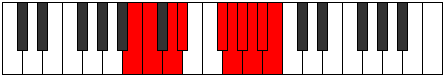 |
| [3997](https://ianring.com/musictheory/scales/3997) | [Dogygic](ModeENaturalDogygic.md) | E | E, F#, G, G#, B, C, C#, D, D#, E |  |
| [3997](https://ianring.com/musictheory/scales/3997) | [Dogygic](ModeBNaturalDogygic.md) | B | B, C#, D, D#, F#, G, G#, A, A#, B |  |
| [3999](https://ianring.com/musictheory/scales/3999) | [Dydyllian](ModeENaturalDydyllian.md) | E | E, F, F#, G, G#, B, C, C#, D, D#, E |  |
| [3999](https://ianring.com/musictheory/scales/3999) | [Dydyllian](ModeBNaturalDydyllian.md) | B | B, C, C#, D, D#, F#, G, G#, A, A#, B |  |
| [3999](https://ianring.com/musictheory/scales/3999) | [Dydyllian](ModeGNaturalDydyllian.md) | G | G, G#, A, A#, B, D, D#, E, F, F#, G |  |
| [4005](https://ianring.com/musictheory/scales/4005) | [Phradyllic](ModeFSharpPhradyllic.md) | F# | F#, G#, B, C#, D, D#, E, F, F# |  |
| [4005](https://ianring.com/musictheory/scales/4005) | [Phradyllic](ModeGFlatPhradyllic.md) | Gb | Gb, Ab, B, Db, D, Eb, E, F, Gb |  |
| [4007](https://ianring.com/musictheory/scales/4007) | [Doptygic](ModeFSharpDoptygic.md) | F# | F#, G, G#, B, C#, D, D#, E, F, F# |  |
| [4007](https://ianring.com/musictheory/scales/4007) | [Doptygic](ModeGFlatDoptygic.md) | Gb | Gb, G, Ab, B, Db, D, Eb, E, F, Gb |  |
| [4007](https://ianring.com/musictheory/scales/4007) | [Doptygic](ModeCSharpDoptygic.md) | C# | C#, D, D#, F#, G#, A, A#, B, C, C# |  |
| [4007](https://ianring.com/musictheory/scales/4007) | [Doptygic](ModeDFlatDoptygic.md) | Db | Db, D, Eb, Gb, Ab, A, Bb, B, C, Db |  |
| [4009](https://ianring.com/musictheory/scales/4009) | [Phranyllic](ModeDSharpPhranyllic.md) | D# | D#, F#, G#, A#, B, C, C#, D, D# |  |
| [4009](https://ianring.com/musictheory/scales/4009) | [Phranyllic](ModeEFlatPhranyllic.md) | Eb | Eb, Gb, Ab, Bb, B, C, Db, D, Eb |  |
| [4011](https://ianring.com/musictheory/scales/4011) | [Styrygic](ModeDSharpStyrygic.md) | D# | D#, E, F#, G#, A#, B, C, C#, D, D# |  |
| [4011](https://ianring.com/musictheory/scales/4011) | [Styrygic](ModeEFlatStyrygic.md) | Eb | Eb, E, Gb, Ab, Bb, B, C, Db, D, Eb |  |
| [4013](https://ianring.com/musictheory/scales/4013) | [Dathygic](ModeFSharpDathygic.md) | F# | F#, G#, A, B, C#, D, D#, E, F, F# |  |
| [4013](https://ianring.com/musictheory/scales/4013) | [Dathygic](ModeGFlatDathygic.md) | Gb | Gb, Ab, A, B, Db, D, Eb, E, F, Gb |  |
| [4013](https://ianring.com/musictheory/scales/4013) | [Dathygic](ModeDSharpDathygic.md) | D# | D#, F, F#, G#, A#, B, C, C#, D, D# |  |
| [4013](https://ianring.com/musictheory/scales/4013) | [Dathygic](ModeEFlatDathygic.md) | Eb | Eb, F, Gb, Ab, Bb, B, C, Db, D, Eb |  |
| [4015](https://ianring.com/musictheory/scales/4015) | [Phradyllian](ModeFSharpPhradyllian.md) | F# | F#, G, G#, A, B, C#, D, D#, E, F, F# |  |
| [4015](https://ianring.com/musictheory/scales/4015) | [Phradyllian](ModeGFlatPhradyllian.md) | Gb | Gb, G, Ab, A, B, Db, D, Eb, E, F, Gb |  |
| [4015](https://ianring.com/musictheory/scales/4015) | [Phradyllian](ModeDSharpPhradyllian.md) | D# | D#, E, F, F#, G#, A#, B, C, C#, D, D# |  |
| [4015](https://ianring.com/musictheory/scales/4015) | [Phradyllian](ModeEFlatPhradyllian.md) | Eb | Eb, E, F, Gb, Ab, Bb, B, C, Db, D, Eb |  |
| [4015](https://ianring.com/musictheory/scales/4015) | [Phradyllian](ModeCSharpPhradyllian.md) | C# | C#, D, D#, E, F#, G#, A, A#, B, C, C# |  |
| [4015](https://ianring.com/musictheory/scales/4015) | [Phradyllian](ModeDFlatPhradyllian.md) | Db | Db, D, Eb, E, Gb, Ab, A, Bb, B, C, Db |  |
| [4019](https://ianring.com/musictheory/scales/4019) | [Lonygic](ModeGNaturalLonygic.md) | G | G, G#, B, C, D, D#, E, F, F#, G |  |
| [4019](https://ianring.com/musictheory/scales/4019) | [Lonygic](ModeASharpLonygic.md) | A# | A#, B, D, D#, F, F#, G, G#, A, A# |  |
| [4019](https://ianring.com/musictheory/scales/4019) | [Lonygic](ModeBFlatLonygic.md) | Bb | Bb, B, D, Eb, F, Gb, G, Ab, A, Bb |  |
| [4021](https://ianring.com/musictheory/scales/4021) | [Bagygic](ModeENaturalBagygic.md) | E | E, F#, G#, A, B, C, C#, D, D#, E |  |
| [4021](https://ianring.com/musictheory/scales/4021) | [Bagygic](ModeFSharpBagygic.md) | F# | F#, G#, A#, B, C#, D, D#, E, F, F# |  |
| [4021](https://ianring.com/musictheory/scales/4021) | [Bagygic](ModeGFlatBagygic.md) | Gb | Gb, Ab, Bb, B, Db, D, Eb, E, F, Gb |  |
| [4023](https://ianring.com/musictheory/scales/4023) | [Styptyllian](ModeENaturalStyptyllian.md) | E | E, F, F#, G#, A, B, C, C#, D, D#, E |  |
| [4023](https://ianring.com/musictheory/scales/4023) | [Styptyllian](ModeGNaturalStyptyllian.md) | G | G, G#, A, B, C, D, D#, E, F, F#, G |  |
| [4023](https://ianring.com/musictheory/scales/4023) | [Styptyllian](ModeFSharpStyptyllian.md) | F# | F#, G, G#, A#, B, C#, D, D#, E, F, F# |  |
| [4023](https://ianring.com/musictheory/scales/4023) | [Styptyllian](ModeGFlatStyptyllian.md) | Gb | Gb, G, Ab, Bb, B, Db, D, Eb, E, F, Gb |  |
| [4023](https://ianring.com/musictheory/scales/4023) | [Styptyllian](ModeCSharpStyptyllian.md) | C# | C#, D, D#, F, F#, G#, A, A#, B, C, C# |  |
| [4023](https://ianring.com/musictheory/scales/4023) | [Styptyllian](ModeDFlatStyptyllian.md) | Db | Db, D, Eb, F, Gb, Ab, A, Bb, B, C, Db |  |
| [4023](https://ianring.com/musictheory/scales/4023) | [Styptyllian](ModeASharpStyptyllian.md) | A# | A#, B, C, D, D#, F, F#, G, G#, A, A# |  |
| [4023](https://ianring.com/musictheory/scales/4023) | [Styptyllian](ModeBFlatStyptyllian.md) | Bb | Bb, B, C, D, Eb, F, Gb, G, Ab, A, Bb |  |
| [4025](https://ianring.com/musictheory/scales/4025) | [Kalygic](ModeDSharpKalygic.md) | D# | D#, F#, G, G#, A#, B, C, C#, D, D# |  |
| [4025](https://ianring.com/musictheory/scales/4025) | [Kalygic](ModeEFlatKalygic.md) | Eb | Eb, Gb, G, Ab, Bb, B, C, Db, D, Eb |  |
| [4025](https://ianring.com/musictheory/scales/4025) | [Kalygic](ModeBNaturalKalygic.md) | B | B, D, D#, E, F#, G, G#, A, A#, B |  |
| [4027](https://ianring.com/musictheory/scales/4027) | [Ragyllian](ModeDSharpRagyllian.md) | D# | D#, E, F#, G, G#, A#, B, C, C#, D, D# |  |
| [4027](https://ianring.com/musictheory/scales/4027) | [Ragyllian](ModeEFlatRagyllian.md) | Eb | Eb, E, Gb, G, Ab, Bb, B, C, Db, D, Eb |  |
| [4027](https://ianring.com/musictheory/scales/4027) | [Ragyllian](ModeGNaturalRagyllian.md) | G | G, G#, A#, B, C, D, D#, E, F, F#, G |  |
| [4027](https://ianring.com/musictheory/scales/4027) | [Ragyllian](ModeBNaturalRagyllian.md) | B | B, C, D, D#, E, F#, G, G#, A, A#, B |  |
| [4027](https://ianring.com/musictheory/scales/4027) | [Ragyllian](ModeASharpRagyllian.md) | A# | A#, B, C#, D, D#, F, F#, G, G#, A, A# |  |
| [4027](https://ianring.com/musictheory/scales/4027) | [Ragyllian](ModeBFlatRagyllian.md) | Bb | Bb, B, Db, D, Eb, F, Gb, G, Ab, A, Bb |  |
| [4029](https://ianring.com/musictheory/scales/4029) | [Aerycryllian](ModeENaturalAerycryllian.md) | E | E, F#, G, G#, A, B, C, C#, D, D#, E |  |
| [4029](https://ianring.com/musictheory/scales/4029) | [Aerycryllian](ModeDSharpAerycryllian.md) | D# | D#, F, F#, G, G#, A#, B, C, C#, D, D# |  |
| [4029](https://ianring.com/musictheory/scales/4029) | [Aerycryllian](ModeEFlatAerycryllian.md) | Eb | Eb, F, Gb, G, Ab, Bb, B, C, Db, D, Eb |  |
| [4029](https://ianring.com/musictheory/scales/4029) | [Aerycryllian](ModeFSharpAerycryllian.md) | F# | F#, G#, A, A#, B, C#, D, D#, E, F, F# |  |
| [4029](https://ianring.com/musictheory/scales/4029) | [Aerycryllian](ModeGFlatAerycryllian.md) | Gb | Gb, Ab, A, Bb, B, Db, D, Eb, E, F, Gb |  |
| [4029](https://ianring.com/musictheory/scales/4029) | [Aerycryllian](ModeBNaturalAerycryllian.md) | B | B, C#, D, D#, E, F#, G, G#, A, A#, B |  |
| [4031](https://ianring.com/musictheory/scales/4031) | [Godatic](ModeENaturalGodatic.md) | E | E, F, F#, G, G#, A, B, C, C#, D, D#, E |  |
| [4031](https://ianring.com/musictheory/scales/4031) | [Godatic](ModeDSharpGodatic.md) | D# | D#, E, F, F#, G, G#, A#, B, C, C#, D, D# |  |
| [4031](https://ianring.com/musictheory/scales/4031) | [Godatic](ModeEFlatGodatic.md) | Eb | Eb, E, F, Gb, G, Ab, Bb, B, C, Db, D, Eb |  |
| [4031](https://ianring.com/musictheory/scales/4031) | [Godatic](ModeCSharpGodatic.md) | C# | C#, D, D#, E, F, F#, G#, A, A#, B, C, C# |  |
| [4031](https://ianring.com/musictheory/scales/4031) | [Godatic](ModeDFlatGodatic.md) | Db | Db, D, Eb, E, F, Gb, Ab, A, Bb, B, C, Db |  |
| [4031](https://ianring.com/musictheory/scales/4031) | [Godatic](ModeBNaturalGodatic.md) | B | B, C, C#, D, D#, E, F#, G, G#, A, A#, B |  |
| [4031](https://ianring.com/musictheory/scales/4031) | [Godatic](ModeASharpGodatic.md) | A# | A#, B, C, C#, D, D#, F, F#, G, G#, A, A# |  |
| [4031](https://ianring.com/musictheory/scales/4031) | [Godatic](ModeBFlatGodatic.md) | Bb | Bb, B, C, Db, D, Eb, F, Gb, G, Ab, A, Bb |  |
| [4031](https://ianring.com/musictheory/scales/4031) | [Godatic](ModeGNaturalGodatic.md) | G | G, G#, A, A#, B, C, D, D#, E, F, F#, G |  |
| [4031](https://ianring.com/musictheory/scales/4031) | [Godatic](ModeFSharpGodatic.md) | F# | F#, G, G#, A, A#, B, C#, D, D#, E, F, F# |  |
| [4031](https://ianring.com/musictheory/scales/4031) | [Godatic](ModeGFlatGodatic.md) | Gb | Gb, G, Ab, A, Bb, B, Db, D, Eb, E, F, Gb |  |
| [4041](https://ianring.com/musictheory/scales/4041) | [Zaryllic](ModeGSharpZaryllic.md) | G# | G#, B, D, D#, E, F, F#, G, G# |  |
| [4041](https://ianring.com/musictheory/scales/4041) | [Zaryllic](ModeAFlatZaryllic.md) | Ab | Ab, B, D, Eb, E, F, Gb, G, Ab |  |
| [4043](https://ianring.com/musictheory/scales/4043) | [Phrocrygic](ModeFNaturalPhrocrygic.md) | F | F, F#, G#, B, C, C#, D, D#, E, F |  |
| [4043](https://ianring.com/musictheory/scales/4043) | [Phrocrygic](ModeGSharpPhrocrygic.md) | G# | G#, A, B, D, D#, E, F, F#, G, G# |  |
| [4043](https://ianring.com/musictheory/scales/4043) | [Phrocrygic](ModeAFlatPhrocrygic.md) | Ab | Ab, A, B, D, Eb, E, F, Gb, G, Ab |  |
| [4045](https://ianring.com/musictheory/scales/4045) | [Gyptygic](ModeGSharpGyptygic.md) | G# | G#, A#, B, D, D#, E, F, F#, G, G# |  |
| [4045](https://ianring.com/musictheory/scales/4045) | [Gyptygic](ModeAFlatGyptygic.md) | Ab | Ab, Bb, B, D, Eb, E, F, Gb, G, Ab |  |
| [4045](https://ianring.com/musictheory/scales/4045) | [Gyptygic](ModeCNaturalGyptygic.md) | C | C, D, D#, F#, G, G#, A, A#, B, C |  |
| [4047](https://ianring.com/musictheory/scales/4047) | [Thogyllian](ModeFNaturalThogyllian.md) | F | F, F#, G, G#, B, C, C#, D, D#, E, F |  |
| [4047](https://ianring.com/musictheory/scales/4047) | [Thogyllian](ModeCNaturalThogyllian.md) | C | C, C#, D, D#, F#, G, G#, A, A#, B, C |  |
| [4047](https://ianring.com/musictheory/scales/4047) | [Thogyllian](ModeGSharpThogyllian.md) | G# | G#, A, A#, B, D, D#, E, F, F#, G, G# |  |
| [4047](https://ianring.com/musictheory/scales/4047) | [Thogyllian](ModeAFlatThogyllian.md) | Ab | Ab, A, Bb, B, D, Eb, E, F, Gb, G, Ab |  |
| [4051](https://ianring.com/musictheory/scales/4051) | [Ionilygic](ModeGNaturalIonilygic.md) | G | G, G#, B, C#, D, D#, E, F, F#, G |  |
| [4051](https://ianring.com/musictheory/scales/4051) | [Ionilygic](ModeDNaturalIonilygic.md) | D | D, D#, F#, G#, A, A#, B, C, C#, D |  |
| [4053](https://ianring.com/musictheory/scales/4053) | [Kyrygic](ModeENaturalKyrygic.md) | E | E, F#, G#, A#, B, C, C#, D, D#, E |  |
| [4055](https://ianring.com/musictheory/scales/4055) | [Dagyllian](ModeGNaturalDagyllian.md) | G | G, G#, A, B, C#, D, D#, E, F, F#, G |  |
| [4055](https://ianring.com/musictheory/scales/4055) | [Dagyllian](ModeENaturalDagyllian.md) | E | E, F, F#, G#, A#, B, C, C#, D, D#, E |  |
| [4055](https://ianring.com/musictheory/scales/4055) | [Dagyllian](ModeDNaturalDagyllian.md) | D | D, D#, E, F#, G#, A, A#, B, C, C#, D |  |
| [4057](https://ianring.com/musictheory/scales/4057) | [Phrygic](ModeGSharpPhrygic.md) | G# | G#, B, C, D, D#, E, F, F#, G, G# |  |
| [4057](https://ianring.com/musictheory/scales/4057) | [Phrygic](ModeAFlatPhrygic.md) | Ab | Ab, B, C, D, Eb, E, F, Gb, G, Ab |  |
| [4057](https://ianring.com/musictheory/scales/4057) | [Phrygic](ModeBNaturalPhrygic.md) | B | B, D, D#, F, F#, G, G#, A, A#, B |  |
| [4059](https://ianring.com/musictheory/scales/4059) | [Zolyllian](ModeFNaturalZolyllian.md) | F | F, F#, G#, A, B, C, C#, D, D#, E, F |  |
| [4059](https://ianring.com/musictheory/scales/4059) | [Zolyllian](ModeGSharpZolyllian.md) | G# | G#, A, B, C, D, D#, E, F, F#, G, G# |  |
| [4059](https://ianring.com/musictheory/scales/4059) | [Zolyllian](ModeAFlatZolyllian.md) | Ab | Ab, A, B, C, D, Eb, E, F, Gb, G, Ab |  |
| [4059](https://ianring.com/musictheory/scales/4059) | [Zolyllian](ModeGNaturalZolyllian.md) | G | G, G#, A#, B, C#, D, D#, E, F, F#, G |  |
| [4059](https://ianring.com/musictheory/scales/4059) | [Zolyllian](ModeDNaturalZolyllian.md) | D | D, D#, F, F#, G#, A, A#, B, C, C#, D |  |
| [4059](https://ianring.com/musictheory/scales/4059) | [Zolyllian](ModeBNaturalZolyllian.md) | B | B, C, D, D#, F, F#, G, G#, A, A#, B |  |
| [4061](https://ianring.com/musictheory/scales/4061) | [Staptyllian](ModeENaturalStaptyllian.md) | E | E, F#, G, G#, A#, B, C, C#, D, D#, E |  |
| [4061](https://ianring.com/musictheory/scales/4061) | [Staptyllian](ModeGSharpStaptyllian.md) | G# | G#, A#, B, C, D, D#, E, F, F#, G, G# |  |
| [4061](https://ianring.com/musictheory/scales/4061) | [Staptyllian](ModeAFlatStaptyllian.md) | Ab | Ab, Bb, B, C, D, Eb, E, F, Gb, G, Ab |  |
| [4061](https://ianring.com/musictheory/scales/4061) | [Staptyllian](ModeCNaturalStaptyllian.md) | C | C, D, D#, E, F#, G, G#, A, A#, B, C |  |
| [4061](https://ianring.com/musictheory/scales/4061) | [Staptyllian](ModeBNaturalStaptyllian.md) | B | B, C#, D, D#, F, F#, G, G#, A, A#, B |  |
| [4063](https://ianring.com/musictheory/scales/4063) | [Eptatic](ModeFNaturalEptatic.md) | F | F, F#, G, G#, A, B, C, C#, D, D#, E, F |  |
| [4063](https://ianring.com/musictheory/scales/4063) | [Eptatic](ModeENaturalEptatic.md) | E | E, F, F#, G, G#, A#, B, C, C#, D, D#, E |  |
| [4063](https://ianring.com/musictheory/scales/4063) | [Eptatic](ModeDNaturalEptatic.md) | D | D, D#, E, F, F#, G#, A, A#, B, C, C#, D |  |
| [4063](https://ianring.com/musictheory/scales/4063) | [Eptatic](ModeCNaturalEptatic.md) | C | C, C#, D, D#, E, F#, G, G#, A, A#, B, C |  |
| [4063](https://ianring.com/musictheory/scales/4063) | [Eptatic](ModeBNaturalEptatic.md) | B | B, C, C#, D, D#, F, F#, G, G#, A, A#, B |  |
| [4063](https://ianring.com/musictheory/scales/4063) | [Eptatic](ModeGSharpEptatic.md) | G# | G#, A, A#, B, C, D, D#, E, F, F#, G, G# |  |
| [4063](https://ianring.com/musictheory/scales/4063) | [Eptatic](ModeAFlatEptatic.md) | Ab | Ab, A, Bb, B, C, D, Eb, E, F, Gb, G, Ab |  |
| [4063](https://ianring.com/musictheory/scales/4063) | [Eptatic](ModeGNaturalEptatic.md) | G | G, G#, A, A#, B, C#, D, D#, E, F, F#, G |  |
| [4069](https://ianring.com/musictheory/scales/4069) | [Starygic](ModeFSharpStarygic.md) | F# | F#, G#, B, C, C#, D, D#, E, F, F# |  |
| [4069](https://ianring.com/musictheory/scales/4069) | [Starygic](ModeGFlatStarygic.md) | Gb | Gb, Ab, B, C, Db, D, Eb, E, F, Gb |  |
| [4069](https://ianring.com/musictheory/scales/4069) | [Starygic](ModeANaturalStarygic.md) | A | A, B, D, D#, E, F, F#, G, G#, A |  |
| [4071](https://ianring.com/musictheory/scales/4071) | [Rygyllian](ModeFSharpRygyllian.md) | F# | F#, G, G#, B, C, C#, D, D#, E, F, F# |  |
| [4071](https://ianring.com/musictheory/scales/4071) | [Rygyllian](ModeGFlatRygyllian.md) | Gb | Gb, G, Ab, B, C, Db, D, Eb, E, F, Gb |  |
| [4071](https://ianring.com/musictheory/scales/4071) | [Rygyllian](ModeCSharpRygyllian.md) | C# | C#, D, D#, F#, G, G#, A, A#, B, C, C# |  |
| [4071](https://ianring.com/musictheory/scales/4071) | [Rygyllian](ModeDFlatRygyllian.md) | Db | Db, D, Eb, Gb, G, Ab, A, Bb, B, C, Db |  |
| [4071](https://ianring.com/musictheory/scales/4071) | [Rygyllian](ModeANaturalRygyllian.md) | A | A, A#, B, D, D#, E, F, F#, G, G#, A |  |
| [4073](https://ianring.com/musictheory/scales/4073) | [Sathygic](ModeGSharpSathygic.md) | G# | G#, B, C#, D, D#, E, F, F#, G, G# |  |
| [4073](https://ianring.com/musictheory/scales/4073) | [Sathygic](ModeAFlatSathygic.md) | Ab | Ab, B, Db, D, Eb, E, F, Gb, G, Ab |  |
| [4073](https://ianring.com/musictheory/scales/4073) | [Sathygic](ModeDSharpSathygic.md) | D# | D#, F#, G#, A, A#, B, C, C#, D, D# |  |
| [4073](https://ianring.com/musictheory/scales/4073) | [Sathygic](ModeEFlatSathygic.md) | Eb | Eb, Gb, Ab, A, Bb, B, C, Db, D, Eb |  |
| [4075](https://ianring.com/musictheory/scales/4075) | [Katyllian](ModeGSharpKatyllian.md) | G# | G#, A, B, C#, D, D#, E, F, F#, G, G# |  |
| [4075](https://ianring.com/musictheory/scales/4075) | [Katyllian](ModeAFlatKatyllian.md) | Ab | Ab, A, B, Db, D, Eb, E, F, Gb, G, Ab |  |
| [4075](https://ianring.com/musictheory/scales/4075) | [Katyllian](ModeFNaturalKatyllian.md) | F | F, F#, G#, A#, B, C, C#, D, D#, E, F |  |
| [4075](https://ianring.com/musictheory/scales/4075) | [Katyllian](ModeDSharpKatyllian.md) | D# | D#, E, F#, G#, A, A#, B, C, C#, D, D# |  |
| [4075](https://ianring.com/musictheory/scales/4075) | [Katyllian](ModeEFlatKatyllian.md) | Eb | Eb, E, Gb, Ab, A, Bb, B, C, Db, D, Eb |  |
| [4077](https://ianring.com/musictheory/scales/4077) | [Gothyllian](ModeFSharpGothyllian.md) | F# | F#, G#, A, B, C, C#, D, D#, E, F, F# |  |
| [4077](https://ianring.com/musictheory/scales/4077) | [Gothyllian](ModeGFlatGothyllian.md) | Gb | Gb, Ab, A, B, C, Db, D, Eb, E, F, Gb |  |
| [4077](https://ianring.com/musictheory/scales/4077) | [Gothyllian](ModeANaturalGothyllian.md) | A | A, B, C, D, D#, E, F, F#, G, G#, A |  |
| [4077](https://ianring.com/musictheory/scales/4077) | [Gothyllian](ModeGSharpGothyllian.md) | G# | G#, A#, B, C#, D, D#, E, F, F#, G, G# |  |
| [4077](https://ianring.com/musictheory/scales/4077) | [Gothyllian](ModeAFlatGothyllian.md) | Ab | Ab, Bb, B, Db, D, Eb, E, F, Gb, G, Ab |  |
| [4077](https://ianring.com/musictheory/scales/4077) | [Gothyllian](ModeDSharpGothyllian.md) | D# | D#, F, F#, G#, A, A#, B, C, C#, D, D# |  |
| [4077](https://ianring.com/musictheory/scales/4077) | [Gothyllian](ModeEFlatGothyllian.md) | Eb | Eb, F, Gb, Ab, A, Bb, B, C, Db, D, Eb |  |
| [4077](https://ianring.com/musictheory/scales/4077) | [Gothyllian](ModeCNaturalGothyllian.md) | C | C, D, D#, F, F#, G, G#, A, A#, B, C |  |
| [4079](https://ianring.com/musictheory/scales/4079) | [Ionatic](ModeFSharpIonatic.md) | F# | F#, G, G#, A, B, C, C#, D, D#, E, F, F# |  |
| [4079](https://ianring.com/musictheory/scales/4079) | [Ionatic](ModeGFlatIonatic.md) | Gb | Gb, G, Ab, A, B, C, Db, D, Eb, E, F, Gb |  |
| [4079](https://ianring.com/musictheory/scales/4079) | [Ionatic](ModeFNaturalIonatic.md) | F | F, F#, G, G#, A#, B, C, C#, D, D#, E, F |  |
| [4079](https://ianring.com/musictheory/scales/4079) | [Ionatic](ModeDSharpIonatic.md) | D# | D#, E, F, F#, G#, A, A#, B, C, C#, D, D# |  |
| [4079](https://ianring.com/musictheory/scales/4079) | [Ionatic](ModeEFlatIonatic.md) | Eb | Eb, E, F, Gb, Ab, A, Bb, B, C, Db, D, Eb |  |
| [4079](https://ianring.com/musictheory/scales/4079) | [Ionatic](ModeCSharpIonatic.md) | C# | C#, D, D#, E, F#, G, G#, A, A#, B, C, C# |  |
| [4079](https://ianring.com/musictheory/scales/4079) | [Ionatic](ModeDFlatIonatic.md) | Db | Db, D, Eb, E, Gb, G, Ab, A, Bb, B, C, Db |  |
| [4079](https://ianring.com/musictheory/scales/4079) | [Ionatic](ModeCNaturalIonatic.md) | C | C, C#, D, D#, F, F#, G, G#, A, A#, B, C |  |
| [4079](https://ianring.com/musictheory/scales/4079) | [Ionatic](ModeANaturalIonatic.md) | A | A, A#, B, C, D, D#, E, F, F#, G, G#, A |  |
| [4079](https://ianring.com/musictheory/scales/4079) | [Ionatic](ModeGSharpIonatic.md) | G# | G#, A, A#, B, C#, D, D#, E, F, F#, G, G# |  |
| [4079](https://ianring.com/musictheory/scales/4079) | [Ionatic](ModeAFlatIonatic.md) | Ab | Ab, A, Bb, B, Db, D, Eb, E, F, Gb, G, Ab |  |
| [4083](https://ianring.com/musictheory/scales/4083) | [Bathyllian](ModeGNaturalBathyllian.md) | G | G, G#, B, C, C#, D, D#, E, F, F#, G |  |
| [4083](https://ianring.com/musictheory/scales/4083) | [Bathyllian](ModeDNaturalBathyllian.md) | D | D, D#, F#, G, G#, A, A#, B, C, C#, D |  |
| [4083](https://ianring.com/musictheory/scales/4083) | [Bathyllian](ModeASharpBathyllian.md) | A# | A#, B, D, D#, E, F, F#, G, G#, A, A# |  |
| [4083](https://ianring.com/musictheory/scales/4083) | [Bathyllian](ModeBFlatBathyllian.md) | Bb | Bb, B, D, Eb, E, F, Gb, G, Ab, A, Bb |  |
| [4085](https://ianring.com/musictheory/scales/4085) | [Sydyllian](ModeANaturalSydyllian.md) | A | A, B, C#, D, D#, E, F, F#, G, G#, A |  |
| [4085](https://ianring.com/musictheory/scales/4085) | [Sydyllian](ModeFSharpSydyllian.md) | F# | F#, G#, A#, B, C, C#, D, D#, E, F, F# |  |
| [4085](https://ianring.com/musictheory/scales/4085) | [Sydyllian](ModeGFlatSydyllian.md) | Gb | Gb, Ab, Bb, B, C, Db, D, Eb, E, F, Gb |  |
| [4085](https://ianring.com/musictheory/scales/4085) | [Sydyllian](ModeENaturalSydyllian.md) | E | E, F#, G#, A, A#, B, C, C#, D, D#, E |  |
| [4087](https://ianring.com/musictheory/scales/4087) | [Aeolatic](ModeGNaturalAeolatic.md) | G | G, G#, A, B, C, C#, D, D#, E, F, F#, G |  |
| [4087](https://ianring.com/musictheory/scales/4087) | [Aeolatic](ModeFSharpAeolatic.md) | F# | F#, G, G#, A#, B, C, C#, D, D#, E, F, F# |  |
| [4087](https://ianring.com/musictheory/scales/4087) | [Aeolatic](ModeGFlatAeolatic.md) | Gb | Gb, G, Ab, Bb, B, C, Db, D, Eb, E, F, Gb |  |
| [4087](https://ianring.com/musictheory/scales/4087) | [Aeolatic](ModeENaturalAeolatic.md) | E | E, F, F#, G#, A, A#, B, C, C#, D, D#, E |  |
| [4087](https://ianring.com/musictheory/scales/4087) | [Aeolatic](ModeDNaturalAeolatic.md) | D | D, D#, E, F#, G, G#, A, A#, B, C, C#, D |  |
| [4087](https://ianring.com/musictheory/scales/4087) | [Aeolatic](ModeCSharpAeolatic.md) | C# | C#, D, D#, F, F#, G, G#, A, A#, B, C, C# |  |
| [4087](https://ianring.com/musictheory/scales/4087) | [Aeolatic](ModeDFlatAeolatic.md) | Db | Db, D, Eb, F, Gb, G, Ab, A, Bb, B, C, Db |  |
| [4087](https://ianring.com/musictheory/scales/4087) | [Aeolatic](ModeASharpAeolatic.md) | A# | A#, B, C, D, D#, E, F, F#, G, G#, A, A# |  |
| [4087](https://ianring.com/musictheory/scales/4087) | [Aeolatic](ModeBFlatAeolatic.md) | Bb | Bb, B, C, D, Eb, E, F, Gb, G, Ab, A, Bb |  |
| [4087](https://ianring.com/musictheory/scales/4087) | [Aeolatic](ModeANaturalAeolatic.md) | A | A, A#, B, C#, D, D#, E, F, F#, G, G#, A |  |
| [4089](https://ianring.com/musictheory/scales/4089) | [Katoryllian](ModeGSharpKatoryllian.md) | G# | G#, B, C, C#, D, D#, E, F, F#, G, G# |  |
| [4089](https://ianring.com/musictheory/scales/4089) | [Katoryllian](ModeAFlatKatoryllian.md) | Ab | Ab, B, C, Db, D, Eb, E, F, Gb, G, Ab |  |
| [4089](https://ianring.com/musictheory/scales/4089) | [Katoryllian](ModeDSharpKatoryllian.md) | D# | D#, F#, G, G#, A, A#, B, C, C#, D, D# |  |
| [4089](https://ianring.com/musictheory/scales/4089) | [Katoryllian](ModeEFlatKatoryllian.md) | Eb | Eb, Gb, G, Ab, A, Bb, B, C, Db, D, Eb |  |
| [4089](https://ianring.com/musictheory/scales/4089) | [Katoryllian](ModeBNaturalKatoryllian.md) | B | B, D, D#, E, F, F#, G, G#, A, A#, B |  |
| [4091](https://ianring.com/musictheory/scales/4091) | [Thydatic](ModeGSharpThydatic.md) | G# | G#, A, B, C, C#, D, D#, E, F, F#, G, G# |  |
| [4091](https://ianring.com/musictheory/scales/4091) | [Thydatic](ModeAFlatThydatic.md) | Ab | Ab, A, B, C, Db, D, Eb, E, F, Gb, G, Ab |  |
| [4091](https://ianring.com/musictheory/scales/4091) | [Thydatic](ModeGNaturalThydatic.md) | G | G, G#, A#, B, C, C#, D, D#, E, F, F#, G |  |
| [4091](https://ianring.com/musictheory/scales/4091) | [Thydatic](ModeFNaturalThydatic.md) | F | F, F#, G#, A, A#, B, C, C#, D, D#, E, F |  |
| [4091](https://ianring.com/musictheory/scales/4091) | [Thydatic](ModeDSharpThydatic.md) | D# | D#, E, F#, G, G#, A, A#, B, C, C#, D, D# |  |
| [4091](https://ianring.com/musictheory/scales/4091) | [Thydatic](ModeEFlatThydatic.md) | Eb | Eb, E, Gb, G, Ab, A, Bb, B, C, Db, D, Eb |  |
| [4091](https://ianring.com/musictheory/scales/4091) | [Thydatic](ModeDNaturalThydatic.md) | D | D, D#, F, F#, G, G#, A, A#, B, C, C#, D |  |
| [4091](https://ianring.com/musictheory/scales/4091) | [Thydatic](ModeBNaturalThydatic.md) | B | B, C, D, D#, E, F, F#, G, G#, A, A#, B |  |
| [4091](https://ianring.com/musictheory/scales/4091) | [Thydatic](ModeASharpThydatic.md) | A# | A#, B, C#, D, D#, E, F, F#, G, G#, A, A# |  |
| [4091](https://ianring.com/musictheory/scales/4091) | [Thydatic](ModeBFlatThydatic.md) | Bb | Bb, B, Db, D, Eb, E, F, Gb, G, Ab, A, Bb |  |
| [4093](https://ianring.com/musictheory/scales/4093) | [Aerycratic](ModeANaturalAerycratic.md) | A | A, B, C, C#, D, D#, E, F, F#, G, G#, A |  |
| [4093](https://ianring.com/musictheory/scales/4093) | [Aerycratic](ModeGSharpAerycratic.md) | G# | G#, A#, B, C, C#, D, D#, E, F, F#, G, G# |  |
| [4093](https://ianring.com/musictheory/scales/4093) | [Aerycratic](ModeAFlatAerycratic.md) | Ab | Ab, Bb, B, C, Db, D, Eb, E, F, Gb, G, Ab |  |
| [4093](https://ianring.com/musictheory/scales/4093) | [Aerycratic](ModeFSharpAerycratic.md) | F# | F#, G#, A, A#, B, C, C#, D, D#, E, F, F# |  |
| [4093](https://ianring.com/musictheory/scales/4093) | [Aerycratic](ModeGFlatAerycratic.md) | Gb | Gb, Ab, A, Bb, B, C, Db, D, Eb, E, F, Gb |  |
| [4093](https://ianring.com/musictheory/scales/4093) | [Aerycratic](ModeENaturalAerycratic.md) | E | E, F#, G, G#, A, A#, B, C, C#, D, D#, E |  |
| [4093](https://ianring.com/musictheory/scales/4093) | [Aerycratic](ModeDSharpAerycratic.md) | D# | D#, F, F#, G, G#, A, A#, B, C, C#, D, D# |  |
| [4093](https://ianring.com/musictheory/scales/4093) | [Aerycratic](ModeEFlatAerycratic.md) | Eb | Eb, F, Gb, G, Ab, A, Bb, B, C, Db, D, Eb |  |
| [4093](https://ianring.com/musictheory/scales/4093) | [Aerycratic](ModeCNaturalAerycratic.md) | C | C, D, D#, E, F, F#, G, G#, A, A#, B, C |  |
| [4093](https://ianring.com/musictheory/scales/4093) | [Aerycratic](ModeBNaturalAerycratic.md) | B | B, C#, D, D#, E, F, F#, G, G#, A, A#, B |  |
| [4095](https://ianring.com/musictheory/scales/4095) | [Chromatic](ModeCNaturalChromatic.md) | C | C, C#, D, D#, E, F, F#, G, G#, A, A#, B, C |  |
| [4095](https://ianring.com/musictheory/scales/4095) | [Chromatic](ModeCSharpChromatic.md) | C# | C#, D, D#, E, F, F#, G, G#, A, A#, B, C, C# |  |
| [4095](https://ianring.com/musictheory/scales/4095) | [Chromatic](ModeDFlatChromatic.md) | Db | Db, D, Eb, E, F, Gb, G, Ab, A, Bb, B, C, Db |  |
| [4095](https://ianring.com/musictheory/scales/4095) | [Chromatic](ModeDNaturalChromatic.md) | D | D, D#, E, F, F#, G, G#, A, A#, B, C, C#, D |  |
| [4095](https://ianring.com/musictheory/scales/4095) | [Chromatic](ModeDSharpChromatic.md) | D# | D#, E, F, F#, G, G#, A, A#, B, C, C#, D, D# |  |
| [4095](https://ianring.com/musictheory/scales/4095) | [Chromatic](ModeEFlatChromatic.md) | Eb | Eb, E, F, Gb, G, Ab, A, Bb, B, C, Db, D, Eb |  |
| [4095](https://ianring.com/musictheory/scales/4095) | [Chromatic](ModeENaturalChromatic.md) | E | E, F, F#, G, G#, A, A#, B, C, C#, D, D#, E |  |
| [4095](https://ianring.com/musictheory/scales/4095) | [Chromatic](ModeFNaturalChromatic.md) | F | F, F#, G, G#, A, A#, B, C, C#, D, D#, E, F |  |
| [4095](https://ianring.com/musictheory/scales/4095) | [Chromatic](ModeFSharpChromatic.md) | F# | F#, G, G#, A, A#, B, C, C#, D, D#, E, F, F# |  |
| [4095](https://ianring.com/musictheory/scales/4095) | [Chromatic](ModeGFlatChromatic.md) | Gb | Gb, G, Ab, A, Bb, B, C, Db, D, Eb, E, F, Gb |  |
| [4095](https://ianring.com/musictheory/scales/4095) | [Chromatic](ModeGNaturalChromatic.md) | G | G, G#, A, A#, B, C, C#, D, D#, E, F, F#, G |  |
| [4095](https://ianring.com/musictheory/scales/4095) | [Chromatic](ModeGSharpChromatic.md) | G# | G#, A, A#, B, C, C#, D, D#, E, F, F#, G, G# |  |
| [4095](https://ianring.com/musictheory/scales/4095) | [Chromatic](ModeAFlatChromatic.md) | Ab | Ab, A, Bb, B, C, Db, D, Eb, E, F, Gb, G, Ab |  |
| [4095](https://ianring.com/musictheory/scales/4095) | [Chromatic](ModeANaturalChromatic.md) | A | A, A#, B, C, C#, D, D#, E, F, F#, G, G#, A |  |
| [4095](https://ianring.com/musictheory/scales/4095) | [Chromatic](ModeASharpChromatic.md) | A# | A#, B, C, C#, D, D#, E, F, F#, G, G#, A, A# |  |
| [4095](https://ianring.com/musictheory/scales/4095) | [Chromatic](ModeBFlatChromatic.md) | Bb | Bb, B, C, Db, D, Eb, E, F, Gb, G, Ab, A, Bb |  |
| [4095](https://ianring.com/musictheory/scales/4095) | [Chromatic](ModeBNaturalChromatic.md) | B | B, C, C#, D, D#, E, F, F#, G, G#, A, A#, B |  |
