# ANaturalDiminishedMajorSeventh

## Links

- [Documentation](README.md)
- [Scales Index](Scales.md)
- [Modes Index](Modes.md)
- [Chords Index](Chords.md)

## Root

A

## Diagram

## Notes

| Position | Notes | Illustration |
|----------|------|--------------|
| RootPosition | A,C,Eb,G# |  |
| FirstInversion | C,Eb,G#,A |  |
| SecondInversion | Eb,G#,A,C |  |
| ThirdInversion | G#,A,C,Eb |  |
## Modes

| Number | Mode | Tonic | Notes | Illustration |
|--------|------|-------|-------|--------------|
| [295](https://ianring.com/musictheory/scales/295) | [Gyritonic](ModeGNaturalGyritonic.md) | G | G, G#, A, C, D#, G |  |
| [303](https://ianring.com/musictheory/scales/303) | [Golimic](ModeGNaturalGolimic.md) | G | G, Ab, Bbb, Cbb, Dbb, Eb, G |  |
| [311](https://ianring.com/musictheory/scales/311) | [Stagimic](ModeGNaturalStagimic.md) | G | G, Ab, Bbb, Cb, Dbb, Eb, G |  |
| [319](https://ianring.com/musictheory/scales/319) | [Epodian](ModeGNaturalEpodian.md) | G | G, Ab, Bbb, Cbb, Dbbb, Dbb, Eb, G |  |
| [359](https://ianring.com/musictheory/scales/359) | [Bothimic](ModeGNaturalBothimic.md) | G | G, Ab, Bbb, C, Db, Eb, G |  |
| [367](https://ianring.com/musictheory/scales/367) | [Aerodian](ModeGNaturalAerodian.md) | G | G, Ab, Bbb, Cbb, Dbb, Ebbb, Fbb, G |  |
| [375](https://ianring.com/musictheory/scales/375) | [Sodian](ModeGNaturalSodian.md) | G | G, Ab, Bbb, Cb, Dbb, Ebbb, Fbb, G |  |
| [383](https://ianring.com/musictheory/scales/383) | [Logyllic](ModeGNaturalLogyllic.md) | G | G, G#, A, A#, B, C, C#, D#, G |  |
| [403](https://ianring.com/musictheory/scales/403) | [Daptitonic](ModeGSharpDaptitonic.md) | G# | G#, A, C, D#, E, G# |  |
| [403](https://ianring.com/musictheory/scales/403) | [Daptitonic](ModeAFlatDaptitonic.md) | Ab | Ab, A, C, Eb, E, Ab |  |
| [407](https://ianring.com/musictheory/scales/407) | [Zylimic](ModeGSharpZylimic.md) | G# | G#, A, Bb, C, D#, E, G# |  |
| [407](https://ianring.com/musictheory/scales/407) | [Zylimic](ModeAFlatZylimic.md) | Ab | Ab, Bbb, Cbb, Dbb, Eb, Fb, Ab |  |
| [411](https://ianring.com/musictheory/scales/411) | [Lygimic](ModeGSharpLygimic.md) | G# | G#, A, B, C, D#, E, G# |  |
| [411](https://ianring.com/musictheory/scales/411) | [Lygimic](ModeAFlatLygimic.md) | Ab | Ab, Bbb, Cb, Dbb, Eb, Fb, Ab |  |
| [415](https://ianring.com/musictheory/scales/415) | [Aeoladian](ModeGSharpAeoladian.md) | G# | G#, A, Bb, Cb, Dbb, Eb, Fb, G# |  |
| [415](https://ianring.com/musictheory/scales/415) | [Aeoladian](ModeAFlatAeoladian.md) | Ab | Ab, Bbb, Cbb, Dbbb, Dbb, Eb, Fb, Ab |  |
| [423](https://ianring.com/musictheory/scales/423) | [Sogimic](ModeGNaturalSogimic.md) | G | G, Ab, Bbb, C, D, Eb, G |  |
| [431](https://ianring.com/musictheory/scales/431) | [Epyrian](ModeGNaturalEpyrian.md) | G | G, Ab, Bbb, Cbb, Dbb, Ebb, Fbb, G |  |
| [435](https://ianring.com/musictheory/scales/435) | [Ionolimic](ModeGSharpIonolimic.md) | G# | G#, A, B#, C#, D#, E, G# |  |
| [435](https://ianring.com/musictheory/scales/435) | [Ionolimic](ModeAFlatIonolimic.md) | Ab | Ab, Bbb, C, Db, Eb, Fb, Ab |  |
| [439](https://ianring.com/musictheory/scales/439) | [Bythian](ModeGSharpBythian.md) | G# | G#, A, Bb, C, Db, Eb, Fb, G# |  |
| [439](https://ianring.com/musictheory/scales/439) | [Bythian](ModeAFlatBythian.md) | Ab | Ab, Bbb, Cbb, Dbb, Ebbb, Fbb, Gbbb, Ab |  |
| [439](https://ianring.com/musictheory/scales/439) | [Bythian](ModeGNaturalBythian.md) | G | G, Ab, Bbb, Cb, Dbb, Ebb, Fbb, G |  |
| [443](https://ianring.com/musictheory/scales/443) | [Kothian](ModeGSharpKothian.md) | G# | G#, A, B, C, Db, Eb, Fb, G# |  |
| [443](https://ianring.com/musictheory/scales/443) | [Kothian](ModeAFlatKothian.md) | Ab | Ab, Bbb, Cb, Dbb, Ebbb, Fbb, Gbbb, Ab |  |
| [447](https://ianring.com/musictheory/scales/447) | [Thyphyllic](ModeGSharpThyphyllic.md) | G# | G#, A, A#, B, C, C#, D#, E, G# |  |
| [447](https://ianring.com/musictheory/scales/447) | [Thyphyllic](ModeAFlatThyphyllic.md) | Ab | Ab, A, Bb, B, C, Db, Eb, E, Ab |  |
| [447](https://ianring.com/musictheory/scales/447) | [Thyphyllic](ModeGNaturalThyphyllic.md) | G | G, G#, A, A#, B, C, D, D#, G |  |
| [467](https://ianring.com/musictheory/scales/467) | [Phrogimic](ModeGSharpPhrogimic.md) | G# | G#, A, B#, C##, D#, E, G# |  |
| [467](https://ianring.com/musictheory/scales/467) | [Phrogimic](ModeAFlatPhrogimic.md) | Ab | Ab, Bbb, C, D, Eb, Fb, Ab |  |
| [471](https://ianring.com/musictheory/scales/471) | [Dodian](ModeGSharpDodian.md) | G# | G#, A, Bb, C, D, Eb, Fb, G# |  |
| [471](https://ianring.com/musictheory/scales/471) | [Dodian](ModeAFlatDodian.md) | Ab | Ab, Bbb, Cbb, Dbb, Ebb, Fbb, Gbbb, Ab |  |
| [475](https://ianring.com/musictheory/scales/475) | [Aeolygian](ModeGSharpAeolygian.md) | G# | G#, A, B, C, D, Eb, Fb, G# |  |
| [475](https://ianring.com/musictheory/scales/475) | [Aeolygian](ModeAFlatAeolygian.md) | Ab | Ab, Bbb, Cb, Dbb, Ebb, Fbb, Gbbb, Ab |  |
| [479](https://ianring.com/musictheory/scales/479) | [Kocryllic](ModeGSharpKocryllic.md) | G# | G#, A, A#, B, C, D, D#, E, G# |  |
| [479](https://ianring.com/musictheory/scales/479) | [Kocryllic](ModeAFlatKocryllic.md) | Ab | Ab, A, Bb, B, C, D, Eb, E, Ab |  |
| [487](https://ianring.com/musictheory/scales/487) | [Dynian](ModeGNaturalDynian.md) | G | G, Ab, Bbb, C, Db, Ebb, Fbb, G |  |
| [495](https://ianring.com/musictheory/scales/495) | [Bocryllic](ModeGNaturalBocryllic.md) | G | G, G#, A, A#, C, C#, D, D#, G |  |
| [499](https://ianring.com/musictheory/scales/499) | [Ionaptian](ModeGSharpIonaptian.md) | G# | G#, A, B#, C#, D, Eb, Fb, G# |  |
| [499](https://ianring.com/musictheory/scales/499) | [Ionaptian](ModeAFlatIonaptian.md) | Ab | Ab, Bbb, C, Db, Ebb, Fbb, Gbbb, Ab |  |
| [503](https://ianring.com/musictheory/scales/503) | [Thoptyllic](ModeGSharpThoptyllic.md) | G# | G#, A, A#, C, C#, D, D#, E, G# |  |
| [503](https://ianring.com/musictheory/scales/503) | [Thoptyllic](ModeAFlatThoptyllic.md) | Ab | Ab, A, Bb, C, Db, D, Eb, E, Ab |  |
| [503](https://ianring.com/musictheory/scales/503) | [Thoptyllic](ModeGNaturalThoptyllic.md) | G | G, G#, A, B, C, C#, D, D#, G |  |
| [507](https://ianring.com/musictheory/scales/507) | [Moryllic](ModeGSharpMoryllic.md) | G# | G#, A, B, C, C#, D, D#, E, G# |  |
| [507](https://ianring.com/musictheory/scales/507) | [Moryllic](ModeAFlatMoryllic.md) | Ab | Ab, A, B, C, Db, D, Eb, E, Ab |  |
| [511](https://ianring.com/musictheory/scales/511) | [Polygic](ModeGSharpPolygic.md) | G# | G#, A, A#, B, C, C#, D, D#, E, G# |  |
| [511](https://ianring.com/musictheory/scales/511) | [Polygic](ModeAFlatPolygic.md) | Ab | Ab, A, Bb, B, C, Db, D, Eb, E, Ab |  |
| [511](https://ianring.com/musictheory/scales/511) | [Polygic](ModeGNaturalPolygic.md) | G | G, G#, A, A#, B, C, C#, D, D#, G |  |
| [589](https://ianring.com/musictheory/scales/589) | [Ionalitonic](ModeFSharpIonalitonic.md) | F# | F#, G#, A, C, D#, F# |  |
| [589](https://ianring.com/musictheory/scales/589) | [Ionalitonic](ModeGFlatIonalitonic.md) | Gb | Gb, Ab, A, C, Eb, Gb |  |
| [591](https://ianring.com/musictheory/scales/591) | [Gaptimic](ModeFSharpGaptimic.md) | F# | F#, G, Ab, Bbb, C, D#, F# |  |
| [591](https://ianring.com/musictheory/scales/591) | [Gaptimic](ModeGFlatGaptimic.md) | Gb | Gb, Abb, Bbbb, Cbbb, Dbb, Eb, Gb |  |
| [605](https://ianring.com/musictheory/scales/605) | [Dycrimic](ModeFSharpDycrimic.md) | F# | F#, G#, A, Bb, C, D#, F# |  |
| [605](https://ianring.com/musictheory/scales/605) | [Dycrimic](ModeGFlatDycrimic.md) | Gb | Gb, Ab, Bbb, Cbb, Dbb, Eb, Gb |  |
| [607](https://ianring.com/musictheory/scales/607) | [Kadian](ModeFSharpKadian.md) | F# | F#, G, Ab, Bbb, Cbb, Dbb, Eb, F# |  |
| [607](https://ianring.com/musictheory/scales/607) | [Kadian](ModeGFlatKadian.md) | Gb | Gb, Abb, Bbbb, Cbbb, Cbb, Dbb, Eb, Gb |  |
| [611](https://ianring.com/musictheory/scales/611) | [Zynitonic](ModeDSharpZynitonic.md) | D# | D#, E, G#, A, C, D# | 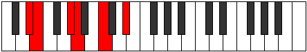 |
| [611](https://ianring.com/musictheory/scales/611) | [Zynitonic](ModeEFlatZynitonic.md) | Eb | Eb, E, Ab, A, C, Eb |  |
| [613](https://ianring.com/musictheory/scales/613) | [Phralitonic](ModeDSharpPhralitonic.md) | D# | D#, F, G#, A, C, D# |  |
| [613](https://ianring.com/musictheory/scales/613) | [Phralitonic](ModeEFlatPhralitonic.md) | Eb | Eb, F, Ab, A, C, Eb |  |
| [615](https://ianring.com/musictheory/scales/615) | [Phrothimic](ModeDSharpPhrothimic.md) | D# | D#, E, F, G#, A, B#, D# |  |
| [615](https://ianring.com/musictheory/scales/615) | [Phrothimic](ModeEFlatPhrothimic.md) | Eb | Eb, Fb, Gbb, Ab, Bbb, C, Eb |  |
| [617](https://ianring.com/musictheory/scales/617) | [Katycritonic](ModeDSharpKatycritonic.md) | D# | D#, F#, G#, A, C, D# |  |
| [617](https://ianring.com/musictheory/scales/617) | [Katycritonic](ModeEFlatKatycritonic.md) | Eb | Eb, Gb, Ab, A, C, Eb |  |
| [619](https://ianring.com/musictheory/scales/619) | [Parimic](ModeDSharpParimic.md) | D# | D#, E, F#, G#, A, B#, D# |  |
| [619](https://ianring.com/musictheory/scales/619) | [Parimic](ModeEFlatParimic.md) | Eb | Eb, Fb, Gb, Ab, Bbb, C, Eb |  |
| [621](https://ianring.com/musictheory/scales/621) | [Kyrimic](ModeDSharpKyrimic.md) | D# | D#, E#, F#, G#, A, B#, D# |  |
| [621](https://ianring.com/musictheory/scales/621) | [Kyrimic](ModeEFlatKyrimic.md) | Eb | Eb, F, Gb, Ab, Bbb, C, Eb |  |
| [621](https://ianring.com/musictheory/scales/621) | [Kyrimic](ModeFSharpKyrimic.md) | F# | F#, G#, A, B, C, D#, F# |  |
| [621](https://ianring.com/musictheory/scales/621) | [Kyrimic](ModeGFlatKyrimic.md) | Gb | Gb, Ab, Bbb, Cb, Dbb, Eb, Gb |  |
| [623](https://ianring.com/musictheory/scales/623) | [Sycrian](ModeDSharpSycrian.md) | D# | D#, E, F, Gb, Ab, Bbb, C, D# |  |
| [623](https://ianring.com/musictheory/scales/623) | [Sycrian](ModeEFlatSycrian.md) | Eb | Eb, Fb, Gbb, Abbb, Bbbb, Cbbb, Dbb, Eb |  |
| [623](https://ianring.com/musictheory/scales/623) | [Sycrian](ModeFSharpSycrian.md) | F# | F#, G, Ab, Bbb, Cb, Dbb, Eb, F# |  |
| [623](https://ianring.com/musictheory/scales/623) | [Sycrian](ModeGFlatSycrian.md) | Gb | Gb, Abb, Bbbb, Cbbb, Dbbb, Dbb, Eb, Gb |  |
| [625](https://ianring.com/musictheory/scales/625) | [Ionyptitonic](ModeDSharpIonyptitonic.md) | D# | D#, G, G#, A, C, D# |  |
| [625](https://ianring.com/musictheory/scales/625) | [Ionyptitonic](ModeEFlatIonyptitonic.md) | Eb | Eb, G, Ab, A, C, Eb |  |
| [627](https://ianring.com/musictheory/scales/627) | [Mogimic](ModeDSharpMogimic.md) | D# | D#, E, F##, G#, A, B#, D# |  |
| [627](https://ianring.com/musictheory/scales/627) | [Mogimic](ModeEFlatMogimic.md) | Eb | Eb, Fb, G, Ab, Bbb, C, Eb |  |
| [629](https://ianring.com/musictheory/scales/629) | [Aeronimic](ModeDSharpAeronimic.md) | D# | D#, E#, F##, G#, A, B#, D# |  |
| [629](https://ianring.com/musictheory/scales/629) | [Aeronimic](ModeEFlatAeronimic.md) | Eb | Eb, F, G, Ab, Bbb, C, Eb |  |
| [631](https://ianring.com/musictheory/scales/631) | [Zygian](ModeDSharpZygian.md) | D# | D#, E, F, G, Ab, Bbb, C, D# |  |
| [631](https://ianring.com/musictheory/scales/631) | [Zygian](ModeEFlatZygian.md) | Eb | Eb, Fb, Gbb, Abb, Bbbb, Cbbb, Dbb, Eb |  |
| [633](https://ianring.com/musictheory/scales/633) | [Kydimic](ModeDSharpKydimic.md) | D# | D#, E##, F##, G#, A, B#, D# |  |
| [633](https://ianring.com/musictheory/scales/633) | [Kydimic](ModeEFlatKydimic.md) | Eb | Eb, F#, G, Ab, Bbb, C, Eb |  |
| [635](https://ianring.com/musictheory/scales/635) | [Epolian](ModeDSharpEpolian.md) | D# | D#, E, F#, G, Ab, Bbb, C, D# |  |
| [635](https://ianring.com/musictheory/scales/635) | [Epolian](ModeEFlatEpolian.md) | Eb | Eb, Fb, Gb, Abb, Bbbb, Cbbb, Dbb, Eb |  |
| [637](https://ianring.com/musictheory/scales/637) | [Katodian](ModeDSharpKatodian.md) | D# | D#, E#, F#, G, Ab, Bbb, C, D# |  |
| [637](https://ianring.com/musictheory/scales/637) | [Katodian](ModeEFlatKatodian.md) | Eb | Eb, F, Gb, Abb, Bbbb, Cbbb, Dbb, Eb |  |
| [637](https://ianring.com/musictheory/scales/637) | [Katodian](ModeFSharpKatodian.md) | F# | F#, G#, A, Bb, Cb, Dbb, Eb, F# |  |
| [637](https://ianring.com/musictheory/scales/637) | [Katodian](ModeGFlatKatodian.md) | Gb | Gb, Ab, Bbb, Cbb, Dbbb, Dbb, Eb, Gb |  |
| [639](https://ianring.com/musictheory/scales/639) | [Ionaryllic](ModeDSharpIonaryllic.md) | D# | D#, E, F, F#, G, G#, A, C, D# |  |
| [639](https://ianring.com/musictheory/scales/639) | [Ionaryllic](ModeEFlatIonaryllic.md) | Eb | Eb, E, F, Gb, G, Ab, A, C, Eb |  |
| [639](https://ianring.com/musictheory/scales/639) | [Ionaryllic](ModeFSharpIonaryllic.md) | F# | F#, G, G#, A, A#, B, C, D#, F# |  |
| [639](https://ianring.com/musictheory/scales/639) | [Ionaryllic](ModeGFlatIonaryllic.md) | Gb | Gb, G, Ab, A, Bb, B, C, Eb, Gb |  |
| [659](https://ianring.com/musictheory/scales/659) | [Soptitonic](ModeGSharpSoptitonic.md) | G# | G#, A, C, D#, F, G# |  |
| [659](https://ianring.com/musictheory/scales/659) | [Soptitonic](ModeAFlatSoptitonic.md) | Ab | Ab, A, C, Eb, F, Ab |  |
| [663](https://ianring.com/musictheory/scales/663) | [Phrynimic](ModeGSharpPhrynimic.md) | G# | G#, A, Bb, C, D#, E#, G# |  |
| [663](https://ianring.com/musictheory/scales/663) | [Phrynimic](ModeAFlatPhrynimic.md) | Ab | Ab, Bbb, Cbb, Dbb, Eb, F, Ab |  |
| [667](https://ianring.com/musictheory/scales/667) | [Rodimic](ModeGSharpRodimic.md) | G# | G#, A, B, C, D#, E#, G# |  |
| [667](https://ianring.com/musictheory/scales/667) | [Rodimic](ModeAFlatRodimic.md) | Ab | Ab, Bbb, Cb, Dbb, Eb, F, Ab |  |
| [671](https://ianring.com/musictheory/scales/671) | [Stycrian](ModeGSharpStycrian.md) | G# | G#, A, Bb, Cb, Dbb, Eb, F, G# |  |
| [671](https://ianring.com/musictheory/scales/671) | [Stycrian](ModeAFlatStycrian.md) | Ab | Ab, Bbb, Cbb, Dbbb, Dbb, Eb, F, Ab |  |
| [691](https://ianring.com/musictheory/scales/691) | [Zydimic](ModeGSharpZydimic.md) | G# | G#, A, B#, C#, D#, E#, G# |  |
| [691](https://ianring.com/musictheory/scales/691) | [Zydimic](ModeAFlatZydimic.md) | Ab | Ab, Bbb, C, Db, Eb, F, Ab |  |
| [695](https://ianring.com/musictheory/scales/695) | [Sarian](ModeGSharpSarian.md) | G# | G#, A, Bb, C, Db, Eb, F, G# |  |
| [695](https://ianring.com/musictheory/scales/695) | [Sarian](ModeAFlatSarian.md) | Ab | Ab, Bbb, Cbb, Dbb, Ebbb, Fbb, Gbb, Ab |  |
| [699](https://ianring.com/musictheory/scales/699) | [Aerothian](ModeGSharpAerothian.md) | G# | G#, A, B, C, Db, Eb, F, G# |  |
| [699](https://ianring.com/musictheory/scales/699) | [Aerothian](ModeAFlatAerothian.md) | Ab | Ab, Bbb, Cb, Dbb, Ebbb, Fbb, Gbb, Ab |  |
| [703](https://ianring.com/musictheory/scales/703) | [Aerocryllic](ModeGSharpAerocryllic.md) | G# | G#, A, A#, B, C, C#, D#, F, G# |  |
| [703](https://ianring.com/musictheory/scales/703) | [Aerocryllic](ModeAFlatAerocryllic.md) | Ab | Ab, A, Bb, B, C, Db, Eb, F, Ab |  |
| [717](https://ianring.com/musictheory/scales/717) | [Gythimic](ModeFSharpGythimic.md) | F# | F#, G#, A, B#, C#, D#, F# |  |
| [717](https://ianring.com/musictheory/scales/717) | [Gythimic](ModeGFlatGythimic.md) | Gb | Gb, Ab, Bbb, C, Db, Eb, Gb |  |
| [719](https://ianring.com/musictheory/scales/719) | [Kanian](ModeFSharpKanian.md) | F# | F#, G, Ab, Bbb, C, Db, Eb, F# |  |
| [719](https://ianring.com/musictheory/scales/719) | [Kanian](ModeGFlatKanian.md) | Gb | Gb, Abb, Bbbb, Cbbb, Dbb, Ebbb, Fbb, Gb |  |
| [723](https://ianring.com/musictheory/scales/723) | [Ionadimic](ModeGSharpIonadimic.md) | G# | G#, A, B#, C##, D#, E#, G# |  |
| [723](https://ianring.com/musictheory/scales/723) | [Ionadimic](ModeAFlatIonadimic.md) | Ab | Ab, Bbb, C, D, Eb, F, Ab |  |
| [727](https://ianring.com/musictheory/scales/727) | [Phradian](ModeGSharpPhradian.md) | G# | G#, A, Bb, C, D, Eb, F, G# |  |
| [727](https://ianring.com/musictheory/scales/727) | [Phradian](ModeAFlatPhradian.md) | Ab | Ab, Bbb, Cbb, Dbb, Ebb, Fbb, Gbb, Ab |  |
| [731](https://ianring.com/musictheory/scales/731) | [Ionorian](ModeGSharpIonorian.md) | G# | G#, A, B, C, D, Eb, F, G# |  |
| [731](https://ianring.com/musictheory/scales/731) | [Ionorian](ModeAFlatIonorian.md) | Ab | Ab, Bbb, Cb, Dbb, Ebb, Fbb, Gbb, Ab |  |
| [733](https://ianring.com/musictheory/scales/733) | [Donian](ModeFSharpDonian.md) | F# | F#, G#, A, Bb, C, Db, Eb, F# |  |
| [733](https://ianring.com/musictheory/scales/733) | [Donian](ModeGFlatDonian.md) | Gb | Gb, Ab, Bbb, Cbb, Dbb, Ebbb, Fbb, Gb |  |
| [735](https://ianring.com/musictheory/scales/735) | [Sylyllic](ModeFSharpSylyllic.md) | F# | F#, G, G#, A, A#, C, C#, D#, F# |  |
| [735](https://ianring.com/musictheory/scales/735) | [Sylyllic](ModeGFlatSylyllic.md) | Gb | Gb, G, Ab, A, Bb, C, Db, Eb, Gb |  |
| [735](https://ianring.com/musictheory/scales/735) | [Sylyllic](ModeGSharpSylyllic.md) | G# | G#, A, A#, B, C, D, D#, F, G# |  |
| [735](https://ianring.com/musictheory/scales/735) | [Sylyllic](ModeAFlatSylyllic.md) | Ab | Ab, A, Bb, B, C, D, Eb, F, Ab |  |
| [739](https://ianring.com/musictheory/scales/739) | [Rorimic](ModeDSharpRorimic.md) | D# | D#, E, F###, G##, A#, B#, D# |  |
| [739](https://ianring.com/musictheory/scales/739) | [Rorimic](ModeEFlatRorimic.md) | Eb | Eb, Fb, G#, A, Bb, C, Eb |  |
| [741](https://ianring.com/musictheory/scales/741) | [Gathimic](ModeDSharpGathimic.md) | D# | D#, E#, F###, G##, A#, B#, D# |  |
| [741](https://ianring.com/musictheory/scales/741) | [Gathimic](ModeEFlatGathimic.md) | Eb | Eb, F, G#, A, Bb, C, Eb |  |
| [743](https://ianring.com/musictheory/scales/743) | [Lanian](ModeDSharpLanian.md) | D# | D#, E, F, G#, A, Bb, C, D# |  |
| [743](https://ianring.com/musictheory/scales/743) | [Lanian](ModeEFlatLanian.md) | Eb | Eb, Fb, Gbb, Ab, Bbb, Cbb, Dbb, Eb |  |
| [745](https://ianring.com/musictheory/scales/745) | [Kolimic](ModeDSharpKolimic.md) | D# | D#, E##, F###, G##, A#, B#, D# |  |
| [745](https://ianring.com/musictheory/scales/745) | [Kolimic](ModeEFlatKolimic.md) | Eb | Eb, F#, G#, A, Bb, C, Eb |  |
| [747](https://ianring.com/musictheory/scales/747) | [Lynian](ModeDSharpLynian.md) | D# | D#, E, F#, G#, A, Bb, C, D# |  |
| [747](https://ianring.com/musictheory/scales/747) | [Lynian](ModeEFlatLynian.md) | Eb | Eb, Fb, Gb, Ab, Bbb, Cbb, Dbb, Eb |  |
| [749](https://ianring.com/musictheory/scales/749) | [Aeologian](ModeDSharpAeologian.md) | D# | D#, E#, F#, G#, A, Bb, C, D# |  |
| [749](https://ianring.com/musictheory/scales/749) | [Aeologian](ModeEFlatAeologian.md) | Eb | Eb, F, Gb, Ab, Bbb, Cbb, Dbb, Eb |  |
| [749](https://ianring.com/musictheory/scales/749) | [Aeologian](ModeFSharpAeologian.md) | F# | F#, G#, A, B, C, Db, Eb, F# |  |
| [749](https://ianring.com/musictheory/scales/749) | [Aeologian](ModeGFlatAeologian.md) | Gb | Gb, Ab, Bbb, Cb, Dbb, Ebbb, Fbb, Gb |  |
| [751](https://ianring.com/musictheory/scales/751) | [Epacryllic](ModeDSharpEpacryllic.md) | D# | D#, E, F, F#, G#, A, A#, C, D# |  |
| [751](https://ianring.com/musictheory/scales/751) | [Epacryllic](ModeEFlatEpacryllic.md) | Eb | Eb, E, F, Gb, Ab, A, Bb, C, Eb |  |
| [751](https://ianring.com/musictheory/scales/751) | [Epacryllic](ModeFSharpEpacryllic.md) | F# | F#, G, G#, A, B, C, C#, D#, F# |  |
| [751](https://ianring.com/musictheory/scales/751) | [Epacryllic](ModeGFlatEpacryllic.md) | Gb | Gb, G, Ab, A, B, C, Db, Eb, Gb |  |
| [753](https://ianring.com/musictheory/scales/753) | [Kytrimic](ModeDSharpKytrimic.md) | D# | D#, E###, F###, G##, A#, B#, D# |  |
| [753](https://ianring.com/musictheory/scales/753) | [Kytrimic](ModeEFlatKytrimic.md) | Eb | Eb, F##, G#, A, Bb, C, Eb |  |
| [755](https://ianring.com/musictheory/scales/755) | [Phrythian](ModeGSharpPhrythian.md) | G# | G#, A, B#, C#, D, Eb, F, G# |  |
| [755](https://ianring.com/musictheory/scales/755) | [Phrythian](ModeAFlatPhrythian.md) | Ab | Ab, Bbb, C, Db, Ebb, Fbb, Gbb, Ab |  |
| [755](https://ianring.com/musictheory/scales/755) | [Phrythian](ModeDSharpPhrythian.md) | D# | D#, E, F##, G#, A, Bb, C, D# |  |
| [755](https://ianring.com/musictheory/scales/755) | [Phrythian](ModeEFlatPhrythian.md) | Eb | Eb, Fb, G, Ab, Bbb, Cbb, Dbb, Eb |  |
| [757](https://ianring.com/musictheory/scales/757) | [Ionyptian](ModeDSharpIonyptian.md) | D# | D#, E#, F##, G#, A, Bb, C, D# |  |
| [757](https://ianring.com/musictheory/scales/757) | [Ionyptian](ModeEFlatIonyptian.md) | Eb | Eb, F, G, Ab, Bbb, Cbb, Dbb, Eb |  |
| [759](https://ianring.com/musictheory/scales/759) | [Katalyllic](ModeGSharpKatalyllic.md) | G# | G#, A, A#, C, C#, D, D#, F, G# |  |
| [759](https://ianring.com/musictheory/scales/759) | [Katalyllic](ModeAFlatKatalyllic.md) | Ab | Ab, A, Bb, C, Db, D, Eb, F, Ab |  |
| [759](https://ianring.com/musictheory/scales/759) | [Katalyllic](ModeDSharpKatalyllic.md) | D# | D#, E, F, G, G#, A, A#, C, D# |  |
| [759](https://ianring.com/musictheory/scales/759) | [Katalyllic](ModeEFlatKatalyllic.md) | Eb | Eb, E, F, G, Ab, A, Bb, C, Eb |  |
| [761](https://ianring.com/musictheory/scales/761) | [Ponian](ModeDSharpPonian.md) | D# | D#, E##, F##, G#, A, Bb, C, D# |  |
| [761](https://ianring.com/musictheory/scales/761) | [Ponian](ModeEFlatPonian.md) | Eb | Eb, F#, G, Ab, Bbb, Cbb, Dbb, Eb |  |
| [763](https://ianring.com/musictheory/scales/763) | [Doryllic](ModeDSharpDoryllic.md) | D# | D#, E, F#, G, G#, A, A#, C, D# |  |
| [763](https://ianring.com/musictheory/scales/763) | [Doryllic](ModeEFlatDoryllic.md) | Eb | Eb, E, Gb, G, Ab, A, Bb, C, Eb |  |
| [763](https://ianring.com/musictheory/scales/763) | [Doryllic](ModeGSharpDoryllic.md) | G# | G#, A, B, C, C#, D, D#, F, G# |  |
| [763](https://ianring.com/musictheory/scales/763) | [Doryllic](ModeAFlatDoryllic.md) | Ab | Ab, A, B, C, Db, D, Eb, F, Ab |  |
| [765](https://ianring.com/musictheory/scales/765) | [Mixonyphyllic](ModeDSharpMixonyphyllic.md) | D# | D#, F, F#, G, G#, A, A#, C, D# |  |
| [765](https://ianring.com/musictheory/scales/765) | [Mixonyphyllic](ModeEFlatMixonyphyllic.md) | Eb | Eb, F, Gb, G, Ab, A, Bb, C, Eb | 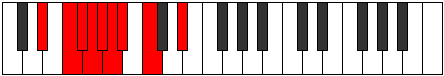 |
| [765](https://ianring.com/musictheory/scales/765) | [Mixonyphyllic](ModeFSharpMixonyphyllic.md) | F# | F#, G#, A, A#, B, C, C#, D#, F# |  |
| [765](https://ianring.com/musictheory/scales/765) | [Mixonyphyllic](ModeGFlatMixonyphyllic.md) | Gb | Gb, Ab, A, Bb, B, C, Db, Eb, Gb |  |
| [767](https://ianring.com/musictheory/scales/767) | [Raptygic](ModeDSharpRaptygic.md) | D# | D#, E, F, F#, G, G#, A, A#, C, D# |  |
| [767](https://ianring.com/musictheory/scales/767) | [Raptygic](ModeEFlatRaptygic.md) | Eb | Eb, E, F, Gb, G, Ab, A, Bb, C, Eb |  |
| [767](https://ianring.com/musictheory/scales/767) | [Raptygic](ModeGSharpRaptygic.md) | G# | G#, A, A#, B, C, C#, D, D#, F, G# |  |
| [767](https://ianring.com/musictheory/scales/767) | [Raptygic](ModeAFlatRaptygic.md) | Ab | Ab, A, Bb, B, C, Db, D, Eb, F, Ab |  |
| [767](https://ianring.com/musictheory/scales/767) | [Raptygic](ModeFSharpRaptygic.md) | F# | F#, G, G#, A, A#, B, C, C#, D#, F# |  |
| [767](https://ianring.com/musictheory/scales/767) | [Raptygic](ModeGFlatRaptygic.md) | Gb | Gb, G, Ab, A, Bb, B, C, Db, Eb, Gb |  |
| [793](https://ianring.com/musictheory/scales/793) | [Mocritonic](ModeCNaturalMocritonic.md) | C | C, D#, E, G#, A, C |  |
| [795](https://ianring.com/musictheory/scales/795) | [Aeologimic](ModeCNaturalAeologimic.md) | C | C, Db, Eb, Fb, G#, A, C |  |
| [797](https://ianring.com/musictheory/scales/797) | [Katocrimic](ModeCNaturalKatocrimic.md) | C | C, D, Eb, Fb, G#, A, C |  |
| [799](https://ianring.com/musictheory/scales/799) | [Lolian](ModeCNaturalLolian.md) | C | C, Db, Ebb, Fbb, Gbbb, Ab, Bbb, C |  |
| [807](https://ianring.com/musictheory/scales/807) | [Epadimic](ModeGNaturalEpadimic.md) | G | G, Ab, Bbb, C, D#, E, G |  |
| [809](https://ianring.com/musictheory/scales/809) | [Dogitonic](ModeCNaturalDogitonic.md) | C | C, D#, F, G#, A, C |  |
| [811](https://ianring.com/musictheory/scales/811) | [Radimic](ModeCNaturalRadimic.md) | C | C, Db, Eb, F, G#, A, C |  |
| [813](https://ianring.com/musictheory/scales/813) | [Larimic](ModeCNaturalLarimic.md) | C | C, D, Eb, F, G#, A, C |  |
| [815](https://ianring.com/musictheory/scales/815) | [Bolian](ModeCNaturalBolian.md) | C | C, Db, Ebb, Fbb, Gbb, Ab, Bbb, C |  |
| [815](https://ianring.com/musictheory/scales/815) | [Bolian](ModeGNaturalBolian.md) | G | G, Ab, Bbb, Cbb, Dbb, Eb, Fb, G |  |
| [823](https://ianring.com/musictheory/scales/823) | [Stodian](ModeGNaturalStodian.md) | G | G, Ab, Bbb, Cb, Dbb, Eb, Fb, G |  |
| [825](https://ianring.com/musictheory/scales/825) | [Thyptimic](ModeCNaturalThyptimic.md) | C | C, D#, E, F, G#, A, C | 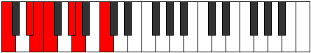 |
| [827](https://ianring.com/musictheory/scales/827) | [Mixolocrian](ModeCNaturalMixolocrian.md) | C | C, Db, Eb, Fb, Gbb, Ab, Bbb, C |  |
| [829](https://ianring.com/musictheory/scales/829) | [Lygian](ModeCNaturalLygian.md) | C | C, D, Eb, Fb, Gbb, Ab, Bbb, C |  |
| [831](https://ianring.com/musictheory/scales/831) | [Rodyllic](ModeCNaturalRodyllic.md) | C | C, C#, D, D#, E, F, G#, A, C |  |
| [831](https://ianring.com/musictheory/scales/831) | [Rodyllic](ModeGNaturalRodyllic.md) | G | G, G#, A, A#, B, C, D#, E, G |  |
| [841](https://ianring.com/musictheory/scales/841) | [Phrothitonic](ModeCNaturalPhrothitonic.md) | C | C, D#, F#, G#, A, C |  |
| [843](https://ianring.com/musictheory/scales/843) | [Molimic](ModeCNaturalMolimic.md) | C | C, Db, Eb, F#, G#, A, C |  |
| [845](https://ianring.com/musictheory/scales/845) | [Zyrimic](ModeCNaturalZyrimic.md) | C | C, D, Eb, F#, G#, A, C |  |
| [845](https://ianring.com/musictheory/scales/845) | [Zyrimic](ModeFSharpZyrimic.md) | F# | F#, G#, A, B#, C##, D#, F# |  |
| [845](https://ianring.com/musictheory/scales/845) | [Zyrimic](ModeGFlatZyrimic.md) | Gb | Gb, Ab, Bbb, C, D, Eb, Gb |  |
| [847](https://ianring.com/musictheory/scales/847) | [Ganian](ModeCNaturalGanian.md) | C | C, Db, Ebb, Fbb, Gb, Ab, Bbb, C |  |
| [847](https://ianring.com/musictheory/scales/847) | [Ganian](ModeFSharpGanian.md) | F# | F#, G, Ab, Bbb, C, D, Eb, F# |  |
| [847](https://ianring.com/musictheory/scales/847) | [Ganian](ModeGFlatGanian.md) | Gb | Gb, Abb, Bbbb, Cbbb, Dbb, Ebb, Fbb, Gb |  |
| [857](https://ianring.com/musictheory/scales/857) | [Aeolydimic](ModeCNaturalAeolydimic.md) | C | C, D#, E, F#, G#, A, C |  |
| [859](https://ianring.com/musictheory/scales/859) | [Pathian](ModeCNaturalPathian.md) | C | C, Db, Eb, Fb, Gb, Ab, Bbb, C |  |
| [861](https://ianring.com/musictheory/scales/861) | [Rylian](ModeCNaturalRylian.md) | C | C, D, Eb, Fb, Gb, Ab, Bbb, C |  |
| [861](https://ianring.com/musictheory/scales/861) | [Rylian](ModeFSharpRylian.md) | F# | F#, G#, A, Bb, C, D, Eb, F# |  |
| [861](https://ianring.com/musictheory/scales/861) | [Rylian](ModeGFlatRylian.md) | Gb | Gb, Ab, Bbb, Cbb, Dbb, Ebb, Fbb, Gb |  |
| [863](https://ianring.com/musictheory/scales/863) | [Pyryllic](ModeCNaturalPyryllic.md) | C | C, C#, D, D#, E, F#, G#, A, C |  |
| [863](https://ianring.com/musictheory/scales/863) | [Pyryllic](ModeFSharpPyryllic.md) | F# | F#, G, G#, A, A#, C, D, D#, F# |  |
| [863](https://ianring.com/musictheory/scales/863) | [Pyryllic](ModeGFlatPyryllic.md) | Gb | Gb, G, Ab, A, Bb, C, D, Eb, Gb |  |
| [867](https://ianring.com/musictheory/scales/867) | [Phrocrimic](ModeDSharpPhrocrimic.md) | D# | D#, E, F###, G##, A##, B#, D# |  |
| [867](https://ianring.com/musictheory/scales/867) | [Phrocrimic](ModeEFlatPhrocrimic.md) | Eb | Eb, Fb, G#, A, B, C, Eb |  |
| [869](https://ianring.com/musictheory/scales/869) | [Kothimic](ModeDSharpKothimic.md) | D# | D#, E#, F###, G##, A##, B#, D# |  |
| [869](https://ianring.com/musictheory/scales/869) | [Kothimic](ModeEFlatKothimic.md) | Eb | Eb, F, G#, A, B, C, Eb |  |
| [871](https://ianring.com/musictheory/scales/871) | [Epadian](ModeGNaturalEpadian.md) | G | G, Ab, Bbb, C, Db, Eb, Fb, G |  |
| [871](https://ianring.com/musictheory/scales/871) | [Epadian](ModeDSharpEpadian.md) | D# | D#, E, F, G#, A, B, C, D# |  |
| [871](https://ianring.com/musictheory/scales/871) | [Epadian](ModeEFlatEpadian.md) | Eb | Eb, Fb, Gbb, Ab, Bbb, Cb, Dbb, Eb |  |
| [873](https://ianring.com/musictheory/scales/873) | [Bagimic](ModeCNaturalBagimic.md) | C | C, D#, E#, F#, G#, A, C |  |
| [873](https://ianring.com/musictheory/scales/873) | [Bagimic](ModeDSharpBagimic.md) | D# | D#, E##, F###, G##, A##, B#, D# |  |
| [873](https://ianring.com/musictheory/scales/873) | [Bagimic](ModeEFlatBagimic.md) | Eb | Eb, F#, G#, A, B, C, Eb |  |
| [875](https://ianring.com/musictheory/scales/875) | [Stothian](ModeCNaturalStothian.md) | C | C, Db, Eb, F, Gb, Ab, Bbb, C |  |
| [875](https://ianring.com/musictheory/scales/875) | [Stothian](ModeDSharpStothian.md) | D# | D#, E, F#, G#, A, B, C, D# |  |
| [875](https://ianring.com/musictheory/scales/875) | [Stothian](ModeEFlatStothian.md) | Eb | Eb, Fb, Gb, Ab, Bbb, Cb, Dbb, Eb |  |
| [877](https://ianring.com/musictheory/scales/877) | [Aeraptian](ModeCNaturalAeraptian.md) | C | C, D, Eb, F, Gb, Ab, Bbb, C |  |
| [877](https://ianring.com/musictheory/scales/877) | [Aeraptian](ModeFSharpAeraptian.md) | F# | F#, G#, A, B, C, D, Eb, F# |  |
| [877](https://ianring.com/musictheory/scales/877) | [Aeraptian](ModeGFlatAeraptian.md) | Gb | Gb, Ab, Bbb, Cb, Dbb, Ebb, Fbb, Gb |  |
| [877](https://ianring.com/musictheory/scales/877) | [Aeraptian](ModeDSharpAeraptian.md) | D# | D#, E#, F#, G#, A, B, C, D# |  |
| [877](https://ianring.com/musictheory/scales/877) | [Aeraptian](ModeEFlatAeraptian.md) | Eb | Eb, F, Gb, Ab, Bbb, Cb, Dbb, Eb |  |
| [879](https://ianring.com/musictheory/scales/879) | [Aeolocryllic](ModeCNaturalAeolocryllic.md) | C | C, C#, D, D#, F, F#, G#, A, C |  |
| [879](https://ianring.com/musictheory/scales/879) | [Aeolocryllic](ModeGNaturalAeolocryllic.md) | G | G, G#, A, A#, C, C#, D#, E, G |  |
| [879](https://ianring.com/musictheory/scales/879) | [Aeolocryllic](ModeDSharpAeolocryllic.md) | D# | D#, E, F, F#, G#, A, B, C, D# |  |
| [879](https://ianring.com/musictheory/scales/879) | [Aeolocryllic](ModeEFlatAeolocryllic.md) | Eb | Eb, E, F, Gb, Ab, A, B, C, Eb |  |
| [879](https://ianring.com/musictheory/scales/879) | [Aeolocryllic](ModeFSharpAeolocryllic.md) | F# | F#, G, G#, A, B, C, D, D#, F# |  |
| [879](https://ianring.com/musictheory/scales/879) | [Aeolocryllic](ModeGFlatAeolocryllic.md) | Gb | Gb, G, Ab, A, B, C, D, Eb, Gb |  |
| [881](https://ianring.com/musictheory/scales/881) | [Aerothimic](ModeDSharpAerothimic.md) | D# | D#, E###, F###, G##, A##, B#, D# | 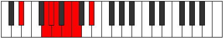 |
| [881](https://ianring.com/musictheory/scales/881) | [Aerothimic](ModeEFlatAerothimic.md) | Eb | Eb, F##, G#, A, B, C, Eb |  |
| [883](https://ianring.com/musictheory/scales/883) | [Ralian](ModeDSharpRalian.md) | D# | D#, E, F##, G#, A, B, C, D# |  |
| [883](https://ianring.com/musictheory/scales/883) | [Ralian](ModeEFlatRalian.md) | Eb | Eb, Fb, G, Ab, Bbb, Cb, Dbb, Eb |  |
| [885](https://ianring.com/musictheory/scales/885) | [Sathian](ModeDSharpSathian.md) | D# | D#, E#, F##, G#, A, B, C, D# |  |
| [885](https://ianring.com/musictheory/scales/885) | [Sathian](ModeEFlatSathian.md) | Eb | Eb, F, G, Ab, Bbb, Cb, Dbb, Eb |  |
| [887](https://ianring.com/musictheory/scales/887) | [Sathyllic](ModeGNaturalSathyllic.md) | G | G, G#, A, B, C, C#, D#, E, G |  |
| [887](https://ianring.com/musictheory/scales/887) | [Sathyllic](ModeDSharpSathyllic.md) | D# | D#, E, F, G, G#, A, B, C, D# |  |
| [887](https://ianring.com/musictheory/scales/887) | [Sathyllic](ModeEFlatSathyllic.md) | Eb | Eb, E, F, G, Ab, A, B, C, Eb |  |
| [889](https://ianring.com/musictheory/scales/889) | [Borian](ModeCNaturalBorian.md) | C | C, D#, E, F, Gb, Ab, Bbb, C |  |
| [889](https://ianring.com/musictheory/scales/889) | [Borian](ModeDSharpBorian.md) | D# | D#, E##, F##, G#, A, B, C, D# |  |
| [889](https://ianring.com/musictheory/scales/889) | [Borian](ModeEFlatBorian.md) | Eb | Eb, F#, G, Ab, Bbb, Cb, Dbb, Eb |  |
| [891](https://ianring.com/musictheory/scales/891) | [Ionilyllic](ModeCNaturalIonilyllic.md) | C | C, C#, D#, E, F, F#, G#, A, C |  |
| [891](https://ianring.com/musictheory/scales/891) | [Ionilyllic](ModeDSharpIonilyllic.md) | D# | D#, E, F#, G, G#, A, B, C, D# |  |
| [891](https://ianring.com/musictheory/scales/891) | [Ionilyllic](ModeEFlatIonilyllic.md) | Eb | Eb, E, Gb, G, Ab, A, B, C, Eb |  |
| [893](https://ianring.com/musictheory/scales/893) | [Pycryllic](ModeCNaturalPycryllic.md) | C | C, D, D#, E, F, F#, G#, A, C |  |
| [893](https://ianring.com/musictheory/scales/893) | [Pycryllic](ModeDSharpPycryllic.md) | D# | D#, F, F#, G, G#, A, B, C, D# |  |
| [893](https://ianring.com/musictheory/scales/893) | [Pycryllic](ModeEFlatPycryllic.md) | Eb | Eb, F, Gb, G, Ab, A, B, C, Eb |  |
| [893](https://ianring.com/musictheory/scales/893) | [Pycryllic](ModeFSharpPycryllic.md) | F# | F#, G#, A, A#, B, C, D, D#, F# |  |
| [893](https://ianring.com/musictheory/scales/893) | [Pycryllic](ModeGFlatPycryllic.md) | Gb | Gb, Ab, A, Bb, B, C, D, Eb, Gb |  |
| [895](https://ianring.com/musictheory/scales/895) | [Aeolathygic](ModeCNaturalAeolathygic.md) | C | C, C#, D, D#, E, F, F#, G#, A, C |  |
| [895](https://ianring.com/musictheory/scales/895) | [Aeolathygic](ModeDSharpAeolathygic.md) | D# | D#, E, F, F#, G, G#, A, B, C, D# |  |
| [895](https://ianring.com/musictheory/scales/895) | [Aeolathygic](ModeEFlatAeolathygic.md) | Eb | Eb, E, F, Gb, G, Ab, A, B, C, Eb |  |
| [895](https://ianring.com/musictheory/scales/895) | [Aeolathygic](ModeGNaturalAeolathygic.md) | G | G, G#, A, A#, B, C, C#, D#, E, G |  |
| [895](https://ianring.com/musictheory/scales/895) | [Aeolathygic](ModeFSharpAeolathygic.md) | F# | F#, G, G#, A, A#, B, C, D, D#, F# |  |
| [895](https://ianring.com/musictheory/scales/895) | [Aeolathygic](ModeGFlatAeolathygic.md) | Gb | Gb, G, Ab, A, Bb, B, C, D, Eb, Gb |  |
| [905](https://ianring.com/musictheory/scales/905) | [Bylitonic](ModeCNaturalBylitonic.md) | C | C, D#, G, G#, A, C |  |
| [907](https://ianring.com/musictheory/scales/907) | [Tholimic](ModeCNaturalTholimic.md) | C | C, Db, Eb, F##, G#, A, C |  |
| [909](https://ianring.com/musictheory/scales/909) | [Katarimic](ModeCNaturalKatarimic.md) | C | C, D, Eb, F##, G#, A, C |  |
| [911](https://ianring.com/musictheory/scales/911) | [Radian](ModeCNaturalRadian.md) | C | C, Db, Ebb, Fbb, G, Ab, Bbb, C |  |
| [915](https://ianring.com/musictheory/scales/915) | [Loptimic](ModeGSharpLoptimic.md) | G# | G#, A, B#, C###, D##, E#, G# |  |
| [915](https://ianring.com/musictheory/scales/915) | [Loptimic](ModeAFlatLoptimic.md) | Ab | Ab, Bbb, C, D#, E, F, Ab |  |
| [919](https://ianring.com/musictheory/scales/919) | [Gathian](ModeGSharpGathian.md) | G# | G#, A, Bb, C, D#, E, F, G# |  |
| [919](https://ianring.com/musictheory/scales/919) | [Gathian](ModeAFlatGathian.md) | Ab | Ab, Bbb, Cbb, Dbb, Eb, Fb, Gbb, Ab |  |
| [921](https://ianring.com/musictheory/scales/921) | [Bogimic](ModeCNaturalBogimic.md) | C | C, D#, E, F##, G#, A, C |  |
| [923](https://ianring.com/musictheory/scales/923) | [Ionodian](ModeCNaturalIonodian.md) | C | C, Db, Eb, Fb, G, Ab, Bbb, C |  |
| [923](https://ianring.com/musictheory/scales/923) | [Ionodian](ModeGSharpIonodian.md) | G# | G#, A, B, C, D#, E, F, G# |  |
| [923](https://ianring.com/musictheory/scales/923) | [Ionodian](ModeAFlatIonodian.md) | Ab | Ab, Bbb, Cb, Dbb, Eb, Fb, Gbb, Ab | 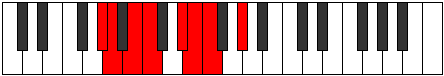 |
| [925](https://ianring.com/musictheory/scales/925) | [Mythian](ModeCNaturalMythian.md) | C | C, D, Eb, Fb, G, Ab, Bbb, C |  |
| [927](https://ianring.com/musictheory/scales/927) | [Koptyllic](ModeCNaturalKoptyllic.md) | C | C, C#, D, D#, E, G, G#, A, C |  |
| [927](https://ianring.com/musictheory/scales/927) | [Koptyllic](ModeGSharpKoptyllic.md) | G# | G#, A, A#, B, C, D#, E, F, G# |  |
| [927](https://ianring.com/musictheory/scales/927) | [Koptyllic](ModeAFlatKoptyllic.md) | Ab | Ab, A, Bb, B, C, Eb, E, F, Ab |  |
| [935](https://ianring.com/musictheory/scales/935) | [Katarian](ModeGNaturalKatarian.md) | G | G, Ab, Bbb, C, D, Eb, Fb, G |  |
| [937](https://ianring.com/musictheory/scales/937) | [Stothimic](ModeCNaturalStothimic.md) | C | C, D#, E#, F##, G#, A, C |  |
| [939](https://ianring.com/musictheory/scales/939) | [Dyptian](ModeCNaturalDyptian.md) | C | C, Db, Eb, F, G, Ab, Bbb, C |  |
| [941](https://ianring.com/musictheory/scales/941) | [Phrorian](ModeCNaturalPhrorian.md) | C | C, D, Eb, F, G, Ab, Bbb, C |  |
| [943](https://ianring.com/musictheory/scales/943) | [Aerygyllic](ModeCNaturalAerygyllic.md) | C | C, C#, D, D#, F, G, G#, A, C |  |
| [943](https://ianring.com/musictheory/scales/943) | [Aerygyllic](ModeGNaturalAerygyllic.md) | G | G, G#, A, A#, C, D, D#, E, G |  |
| [947](https://ianring.com/musictheory/scales/947) | [Modian](ModeGSharpModian.md) | G# | G#, A, B#, C#, D#, E, F, G# |  |
| [947](https://ianring.com/musictheory/scales/947) | [Modian](ModeAFlatModian.md) | Ab | Ab, Bbb, C, Db, Eb, Fb, Gbb, Ab |  |
| [951](https://ianring.com/musictheory/scales/951) | [Thogyllic](ModeGSharpThogyllic.md) | G# | G#, A, A#, C, C#, D#, E, F, G# |  |
| [951](https://ianring.com/musictheory/scales/951) | [Thogyllic](ModeAFlatThogyllic.md) | Ab | Ab, A, Bb, C, Db, Eb, E, F, Ab |  |
| [951](https://ianring.com/musictheory/scales/951) | [Thogyllic](ModeGNaturalThogyllic.md) | G | G, G#, A, B, C, D, D#, E, G |  |
| [953](https://ianring.com/musictheory/scales/953) | [Stoptian](ModeCNaturalStoptian.md) | C | C, D#, E, F, G, Ab, Bbb, C |  |
| [955](https://ianring.com/musictheory/scales/955) | [Ionogyllic](ModeCNaturalIonogyllic.md) | C | C, C#, D#, E, F, G, G#, A, C |  |
| [955](https://ianring.com/musictheory/scales/955) | [Ionogyllic](ModeGSharpIonogyllic.md) | G# | G#, A, B, C, C#, D#, E, F, G# |  |
| [955](https://ianring.com/musictheory/scales/955) | [Ionogyllic](ModeAFlatIonogyllic.md) | Ab | Ab, A, B, C, Db, Eb, E, F, Ab |  |
| [957](https://ianring.com/musictheory/scales/957) | [Phronyllic](ModeCNaturalPhronyllic.md) | C | C, D, D#, E, F, G, G#, A, C |  |
| [959](https://ianring.com/musictheory/scales/959) | [Katylygic](ModeCNaturalKatylygic.md) | C | C, C#, D, D#, E, F, G, G#, A, C |  |
| [959](https://ianring.com/musictheory/scales/959) | [Katylygic](ModeGSharpKatylygic.md) | G# | G#, A, A#, B, C, C#, D#, E, F, G# | 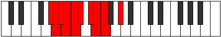 |
| [959](https://ianring.com/musictheory/scales/959) | [Katylygic](ModeAFlatKatylygic.md) | Ab | Ab, A, Bb, B, C, Db, Eb, E, F, Ab |  |
| [959](https://ianring.com/musictheory/scales/959) | [Katylygic](ModeGNaturalKatylygic.md) | G | G, G#, A, A#, B, C, D, D#, E, G |  |
| [969](https://ianring.com/musictheory/scales/969) | [Ionogimic](ModeCNaturalIonogimic.md) | C | C, D#, E##, F##, G#, A, C |  |
| [971](https://ianring.com/musictheory/scales/971) | [Ladian](ModeCNaturalLadian.md) | C | C, Db, Eb, F#, G, Ab, Bbb, C |  |
| [973](https://ianring.com/musictheory/scales/973) | [Phryptian](ModeFSharpPhryptian.md) | F# | F#, G#, A, B#, C#, D, Eb, F# |  |
| [973](https://ianring.com/musictheory/scales/973) | [Phryptian](ModeGFlatPhryptian.md) | Gb | Gb, Ab, Bbb, C, Db, Ebb, Fbb, Gb |  |
| [973](https://ianring.com/musictheory/scales/973) | [Phryptian](ModeCNaturalPhryptian.md) | C | C, D, Eb, F#, G, Ab, Bbb, C |  |
| [975](https://ianring.com/musictheory/scales/975) | [Katogyllic](ModeCNaturalKatogyllic.md) | C | C, C#, D, D#, F#, G, G#, A, C |  |
| [975](https://ianring.com/musictheory/scales/975) | [Katogyllic](ModeFSharpKatogyllic.md) | F# | F#, G, G#, A, C, C#, D, D#, F# |  |
| [975](https://ianring.com/musictheory/scales/975) | [Katogyllic](ModeGFlatKatogyllic.md) | Gb | Gb, G, Ab, A, C, Db, D, Eb, Gb |  |
| [979](https://ianring.com/musictheory/scales/979) | [Thogian](ModeGSharpThogian.md) | G# | G#, A, B#, C##, D#, E, F, G# |  |
| [979](https://ianring.com/musictheory/scales/979) | [Thogian](ModeAFlatThogian.md) | Ab | Ab, Bbb, C, D, Eb, Fb, Gbb, Ab |  |
| [983](https://ianring.com/musictheory/scales/983) | [Epygyllic](ModeGSharpEpygyllic.md) | G# | G#, A, A#, C, D, D#, E, F, G# |  |
| [983](https://ianring.com/musictheory/scales/983) | [Epygyllic](ModeAFlatEpygyllic.md) | Ab | Ab, A, Bb, C, D, Eb, E, F, Ab |  |
| [985](https://ianring.com/musictheory/scales/985) | [Raptian](ModeCNaturalRaptian.md) | C | C, D#, E, F#, G, Ab, Bbb, C |  |
| [987](https://ianring.com/musictheory/scales/987) | [Aeraptyllic](ModeCNaturalAeraptyllic.md) | C | C, C#, D#, E, F#, G, G#, A, C |  |
| [987](https://ianring.com/musictheory/scales/987) | [Aeraptyllic](ModeGSharpAeraptyllic.md) | G# | G#, A, B, C, D, D#, E, F, G# |  |
| [987](https://ianring.com/musictheory/scales/987) | [Aeraptyllic](ModeAFlatAeraptyllic.md) | Ab | Ab, A, B, C, D, Eb, E, F, Ab |  |
| [989](https://ianring.com/musictheory/scales/989) | [Phrolyllic](ModeCNaturalPhrolyllic.md) | C | C, D, D#, E, F#, G, G#, A, C |  |
| [989](https://ianring.com/musictheory/scales/989) | [Phrolyllic](ModeFSharpPhrolyllic.md) | F# | F#, G#, A, A#, C, C#, D, D#, F# |  |
| [989](https://ianring.com/musictheory/scales/989) | [Phrolyllic](ModeGFlatPhrolyllic.md) | Gb | Gb, Ab, A, Bb, C, Db, D, Eb, Gb |  |
| [991](https://ianring.com/musictheory/scales/991) | [Aeolygic](ModeCNaturalAeolygic.md) | C | C, C#, D, D#, E, F#, G, G#, A, C |  |
| [991](https://ianring.com/musictheory/scales/991) | [Aeolygic](ModeFSharpAeolygic.md) | F# | F#, G, G#, A, A#, C, C#, D, D#, F# |  |
| [991](https://ianring.com/musictheory/scales/991) | [Aeolygic](ModeGFlatAeolygic.md) | Gb | Gb, G, Ab, A, Bb, C, Db, D, Eb, Gb |  |
| [991](https://ianring.com/musictheory/scales/991) | [Aeolygic](ModeGSharpAeolygic.md) | G# | G#, A, A#, B, C, D, D#, E, F, G# |  |
| [991](https://ianring.com/musictheory/scales/991) | [Aeolygic](ModeAFlatAeolygic.md) | Ab | Ab, A, Bb, B, C, D, Eb, E, F, Ab |  |
| [995](https://ianring.com/musictheory/scales/995) | [Phrathian](ModeDSharpPhrathian.md) | D# | D#, E, F###, G##, A#, B, C, D# |  |
| [995](https://ianring.com/musictheory/scales/995) | [Phrathian](ModeEFlatPhrathian.md) | Eb | Eb, Fb, G#, A, Bb, Cb, Dbb, Eb |  |
| [997](https://ianring.com/musictheory/scales/997) | [Rycrian](ModeDSharpRycrian.md) | D# | D#, E#, F###, G##, A#, B, C, D# |  |
| [997](https://ianring.com/musictheory/scales/997) | [Rycrian](ModeEFlatRycrian.md) | Eb | Eb, F, G#, A, Bb, Cb, Dbb, Eb |  |
| [999](https://ianring.com/musictheory/scales/999) | [Bylyllic](ModeGNaturalBylyllic.md) | G | G, G#, A, C, C#, D, D#, E, G |  |
| [999](https://ianring.com/musictheory/scales/999) | [Bylyllic](ModeDSharpBylyllic.md) | D# | D#, E, F, G#, A, A#, B, C, D# |  |
| [999](https://ianring.com/musictheory/scales/999) | [Bylyllic](ModeEFlatBylyllic.md) | Eb | Eb, E, F, Ab, A, Bb, B, C, Eb |  |
| [1001](https://ianring.com/musictheory/scales/1001) | [Badian](ModeCNaturalBadian.md) | C | C, D#, E#, F#, G, Ab, Bbb, C |  |
| [1001](https://ianring.com/musictheory/scales/1001) | [Badian](ModeDSharpBadian.md) | D# | D#, E##, F###, G##, A#, B, C, D# | 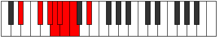 |
| [1001](https://ianring.com/musictheory/scales/1001) | [Badian](ModeEFlatBadian.md) | Eb | Eb, F#, G#, A, Bb, Cb, Dbb, Eb |  |
| [1003](https://ianring.com/musictheory/scales/1003) | [Ionyryllic](ModeCNaturalIonyryllic.md) | C | C, C#, D#, F, F#, G, G#, A, C |  |
| [1003](https://ianring.com/musictheory/scales/1003) | [Ionyryllic](ModeDSharpIonyryllic.md) | D# | D#, E, F#, G#, A, A#, B, C, D# |  |
| [1003](https://ianring.com/musictheory/scales/1003) | [Ionyryllic](ModeEFlatIonyryllic.md) | Eb | Eb, E, Gb, Ab, A, Bb, B, C, Eb |  |
| [1005](https://ianring.com/musictheory/scales/1005) | [Radyllic](ModeCNaturalRadyllic.md) | C | C, D, D#, F, F#, G, G#, A, C |  |
| [1005](https://ianring.com/musictheory/scales/1005) | [Radyllic](ModeFSharpRadyllic.md) | F# | F#, G#, A, B, C, C#, D, D#, F# |  |
| [1005](https://ianring.com/musictheory/scales/1005) | [Radyllic](ModeGFlatRadyllic.md) | Gb | Gb, Ab, A, B, C, Db, D, Eb, Gb |  |
| [1005](https://ianring.com/musictheory/scales/1005) | [Radyllic](ModeDSharpRadyllic.md) | D# | D#, F, F#, G#, A, A#, B, C, D# |  |
| [1005](https://ianring.com/musictheory/scales/1005) | [Radyllic](ModeEFlatRadyllic.md) | Eb | Eb, F, Gb, Ab, A, Bb, B, C, Eb |  |
| [1007](https://ianring.com/musictheory/scales/1007) | [Ionycrygic](ModeCNaturalIonycrygic.md) | C | C, C#, D, D#, F, F#, G, G#, A, C |  |
| [1007](https://ianring.com/musictheory/scales/1007) | [Ionycrygic](ModeGNaturalIonycrygic.md) | G | G, G#, A, A#, C, C#, D, D#, E, G |  |
| [1007](https://ianring.com/musictheory/scales/1007) | [Ionycrygic](ModeFSharpIonycrygic.md) | F# | F#, G, G#, A, B, C, C#, D, D#, F# |  |
| [1007](https://ianring.com/musictheory/scales/1007) | [Ionycrygic](ModeGFlatIonycrygic.md) | Gb | Gb, G, Ab, A, B, C, Db, D, Eb, Gb |  |
| [1007](https://ianring.com/musictheory/scales/1007) | [Ionycrygic](ModeDSharpIonycrygic.md) | D# | D#, E, F, F#, G#, A, A#, B, C, D# |  |
| [1007](https://ianring.com/musictheory/scales/1007) | [Ionycrygic](ModeEFlatIonycrygic.md) | Eb | Eb, E, F, Gb, Ab, A, Bb, B, C, Eb |  |
| [1009](https://ianring.com/musictheory/scales/1009) | [Katyptian](ModeDSharpKatyptian.md) | D# | D#, E###, F###, G##, A#, B, C, D# |  |
| [1009](https://ianring.com/musictheory/scales/1009) | [Katyptian](ModeEFlatKatyptian.md) | Eb | Eb, F##, G#, A, Bb, Cb, Dbb, Eb |  |
| [1011](https://ianring.com/musictheory/scales/1011) | [Kycryllic](ModeGSharpKycryllic.md) | G# | G#, A, C, C#, D, D#, E, F, G# |  |
| [1011](https://ianring.com/musictheory/scales/1011) | [Kycryllic](ModeAFlatKycryllic.md) | Ab | Ab, A, C, Db, D, Eb, E, F, Ab |  |
| [1011](https://ianring.com/musictheory/scales/1011) | [Kycryllic](ModeDSharpKycryllic.md) | D# | D#, E, G, G#, A, A#, B, C, D# |  |
| [1011](https://ianring.com/musictheory/scales/1011) | [Kycryllic](ModeEFlatKycryllic.md) | Eb | Eb, E, G, Ab, A, Bb, B, C, Eb |  |
| [1013](https://ianring.com/musictheory/scales/1013) | [Stydyllic](ModeDSharpStydyllic.md) | D# | D#, F, G, G#, A, A#, B, C, D# |  |
| [1013](https://ianring.com/musictheory/scales/1013) | [Stydyllic](ModeEFlatStydyllic.md) | Eb | Eb, F, G, Ab, A, Bb, B, C, Eb |  |
| [1015](https://ianring.com/musictheory/scales/1015) | [Ionodygic](ModeGSharpIonodygic.md) | G# | G#, A, A#, C, C#, D, D#, E, F, G# |  |
| [1015](https://ianring.com/musictheory/scales/1015) | [Ionodygic](ModeAFlatIonodygic.md) | Ab | Ab, A, Bb, C, Db, D, Eb, E, F, Ab |  |
| [1015](https://ianring.com/musictheory/scales/1015) | [Ionodygic](ModeGNaturalIonodygic.md) | G | G, G#, A, B, C, C#, D, D#, E, G |  |
| [1015](https://ianring.com/musictheory/scales/1015) | [Ionodygic](ModeDSharpIonodygic.md) | D# | D#, E, F, G, G#, A, A#, B, C, D# |  |
| [1015](https://ianring.com/musictheory/scales/1015) | [Ionodygic](ModeEFlatIonodygic.md) | Eb | Eb, E, F, G, Ab, A, Bb, B, C, Eb |  |
| [1017](https://ianring.com/musictheory/scales/1017) | [Dythyllic](ModeCNaturalDythyllic.md) | C | C, D#, E, F, F#, G, G#, A, C |  |
| [1017](https://ianring.com/musictheory/scales/1017) | [Dythyllic](ModeDSharpDythyllic.md) | D# | D#, F#, G, G#, A, A#, B, C, D# |  |
| [1017](https://ianring.com/musictheory/scales/1017) | [Dythyllic](ModeEFlatDythyllic.md) | Eb | Eb, Gb, G, Ab, A, Bb, B, C, Eb |  |
| [1019](https://ianring.com/musictheory/scales/1019) | [Aeranygic](ModeCNaturalAeranygic.md) | C | C, C#, D#, E, F, F#, G, G#, A, C |  |
| [1019](https://ianring.com/musictheory/scales/1019) | [Aeranygic](ModeGSharpAeranygic.md) | G# | G#, A, B, C, C#, D, D#, E, F, G# |  |
| [1019](https://ianring.com/musictheory/scales/1019) | [Aeranygic](ModeAFlatAeranygic.md) | Ab | Ab, A, B, C, Db, D, Eb, E, F, Ab |  |
| [1019](https://ianring.com/musictheory/scales/1019) | [Aeranygic](ModeDSharpAeranygic.md) | D# | D#, E, F#, G, G#, A, A#, B, C, D# |  |
| [1019](https://ianring.com/musictheory/scales/1019) | [Aeranygic](ModeEFlatAeranygic.md) | Eb | Eb, E, Gb, G, Ab, A, Bb, B, C, Eb |  |
| [1021](https://ianring.com/musictheory/scales/1021) | [Ladygic](ModeCNaturalLadygic.md) | C | C, D, D#, E, F, F#, G, G#, A, C |  |
| [1021](https://ianring.com/musictheory/scales/1021) | [Ladygic](ModeFSharpLadygic.md) | F# | F#, G#, A, A#, B, C, C#, D, D#, F# |  |
| [1021](https://ianring.com/musictheory/scales/1021) | [Ladygic](ModeGFlatLadygic.md) | Gb | Gb, Ab, A, Bb, B, C, Db, D, Eb, Gb |  |
| [1021](https://ianring.com/musictheory/scales/1021) | [Ladygic](ModeDSharpLadygic.md) | D# | D#, F, F#, G, G#, A, A#, B, C, D# |  |
| [1021](https://ianring.com/musictheory/scales/1021) | [Ladygic](ModeEFlatLadygic.md) | Eb | Eb, F, Gb, G, Ab, A, Bb, B, C, Eb |  |
| [1023](https://ianring.com/musictheory/scales/1023) | [Dodyllian](ModeCNaturalDodyllian.md) | C | C, C#, D, D#, E, F, F#, G, G#, A, C |  |
| [1023](https://ianring.com/musictheory/scales/1023) | [Dodyllian](ModeGSharpDodyllian.md) | G# | G#, A, A#, B, C, C#, D, D#, E, F, G# |  |
| [1023](https://ianring.com/musictheory/scales/1023) | [Dodyllian](ModeAFlatDodyllian.md) | Ab | Ab, A, Bb, B, C, Db, D, Eb, E, F, Ab |  |
| [1023](https://ianring.com/musictheory/scales/1023) | [Dodyllian](ModeGNaturalDodyllian.md) | G | G, G#, A, A#, B, C, C#, D, D#, E, G |  |
| [1023](https://ianring.com/musictheory/scales/1023) | [Dodyllian](ModeFSharpDodyllian.md) | F# | F#, G, G#, A, A#, B, C, C#, D, D#, F# |  |
| [1023](https://ianring.com/musictheory/scales/1023) | [Dodyllian](ModeGFlatDodyllian.md) | Gb | Gb, G, Ab, A, Bb, B, C, Db, D, Eb, Gb |  |
| [1023](https://ianring.com/musictheory/scales/1023) | [Dodyllian](ModeDSharpDodyllian.md) | D# | D#, E, F, F#, G, G#, A, A#, B, C, D# |  |
| [1023](https://ianring.com/musictheory/scales/1023) | [Dodyllian](ModeEFlatDodyllian.md) | Eb | Eb, E, F, Gb, G, Ab, A, Bb, B, C, Eb |  |
| [1171](https://ianring.com/musictheory/scales/1171) | [Loptitonic](ModeGSharpLoptitonic.md) | G# | G#, A, C, D#, F#, G# | 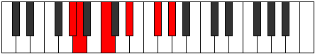 |
| [1171](https://ianring.com/musictheory/scales/1171) | [Loptitonic](ModeAFlatLoptitonic.md) | Ab | Ab, A, C, Eb, Gb, Ab |  |
| [1175](https://ianring.com/musictheory/scales/1175) | [Epycrimic](ModeGSharpEpycrimic.md) | G# | G#, A, Bb, C, D#, E##, G# |  |
| [1175](https://ianring.com/musictheory/scales/1175) | [Epycrimic](ModeAFlatEpycrimic.md) | Ab | Ab, Bbb, Cbb, Dbb, Eb, F#, Ab |  |
| [1177](https://ianring.com/musictheory/scales/1177) | [Garitonic](ModeFNaturalGaritonic.md) | F | F, G#, A, C, D#, F |  |
| [1179](https://ianring.com/musictheory/scales/1179) | [Sonimic](ModeFNaturalSonimic.md) | F | F, Gb, Ab, Bbb, C, D#, F |  |
| [1179](https://ianring.com/musictheory/scales/1179) | [Sonimic](ModeGSharpSonimic.md) | G# | G#, A, B, C, D#, E##, G# |  |
| [1179](https://ianring.com/musictheory/scales/1179) | [Sonimic](ModeAFlatSonimic.md) | Ab | Ab, Bbb, Cb, Dbb, Eb, F#, Ab |  |
| [1181](https://ianring.com/musictheory/scales/1181) | [Katagimic](ModeFNaturalKatagimic.md) | F | F, G, Ab, Bbb, C, D#, F |  |
| [1183](https://ianring.com/musictheory/scales/1183) | [Sadian](ModeFNaturalSadian.md) | F | F, Gb, Abb, Bbbb, Cbbb, Dbb, Eb, F |  |
| [1183](https://ianring.com/musictheory/scales/1183) | [Sadian](ModeGSharpSadian.md) | G# | G#, A, Bb, Cb, Dbb, Eb, F#, G# |  |
| [1183](https://ianring.com/musictheory/scales/1183) | [Sadian](ModeAFlatSadian.md) | Ab | Ab, Bbb, Cbb, Dbbb, Dbb, Eb, F#, Ab |  |
| [1203](https://ianring.com/musictheory/scales/1203) | [Pagimic](ModeGSharpPagimic.md) | G# | G#, A, B#, C#, D#, E##, G# |  |
| [1203](https://ianring.com/musictheory/scales/1203) | [Pagimic](ModeAFlatPagimic.md) | Ab | Ab, Bbb, C, Db, Eb, F#, Ab |  |
| [1207](https://ianring.com/musictheory/scales/1207) | [Aeoloptian](ModeGSharpAeoloptian.md) | G# | G#, A, Bb, C, Db, Eb, F#, G# |  |
| [1207](https://ianring.com/musictheory/scales/1207) | [Aeoloptian](ModeAFlatAeoloptian.md) | Ab | Ab, Bbb, Cbb, Dbb, Ebbb, Fbb, Gb, Ab |  |
| [1209](https://ianring.com/musictheory/scales/1209) | [Ionynimic](ModeFNaturalIonynimic.md) | F | F, G#, A, Bb, C, D#, F |  |
| [1211](https://ianring.com/musictheory/scales/1211) | [Zadian](ModeFNaturalZadian.md) | F | F, Gb, Ab, Bbb, Cbb, Dbb, Eb, F |  |
| [1211](https://ianring.com/musictheory/scales/1211) | [Zadian](ModeGSharpZadian.md) | G# | G#, A, B, C, Db, Eb, F#, G# |  |
| [1211](https://ianring.com/musictheory/scales/1211) | [Zadian](ModeAFlatZadian.md) | Ab | Ab, Bbb, Cb, Dbb, Ebbb, Fbb, Gb, Ab |  |
| [1213](https://ianring.com/musictheory/scales/1213) | [Gyrian](ModeFNaturalGyrian.md) | F | F, G, Ab, Bbb, Cbb, Dbb, Eb, F |  |
| [1215](https://ianring.com/musictheory/scales/1215) | [Aeolanyllic](ModeFNaturalAeolanyllic.md) | F | F, F#, G, G#, A, A#, C, D#, F |  |
| [1215](https://ianring.com/musictheory/scales/1215) | [Aeolanyllic](ModeGSharpAeolanyllic.md) | G# | G#, A, A#, B, C, C#, D#, F#, G# |  |
| [1215](https://ianring.com/musictheory/scales/1215) | [Aeolanyllic](ModeAFlatAeolanyllic.md) | Ab | Ab, A, Bb, B, C, Db, Eb, Gb, Ab |  |
| [1223](https://ianring.com/musictheory/scales/1223) | [Phryptimic](ModeDNaturalPhryptimic.md) | D | D, Eb, Fb, G#, A, B#, D |  |
| [1227](https://ianring.com/musictheory/scales/1227) | [Thacrimic](ModeDNaturalThacrimic.md) | D | D, Eb, F, G#, A, B#, D |  |
| [1231](https://ianring.com/musictheory/scales/1231) | [Logian](ModeDNaturalLogian.md) | D | D, Eb, Fb, Gbb, Ab, Bbb, C, D |  |
| [1235](https://ianring.com/musictheory/scales/1235) | [Stylimic](ModeDNaturalStylimic.md) | D | D, Eb, F#, G#, A, B#, D |  |
| [1235](https://ianring.com/musictheory/scales/1235) | [Stylimic](ModeGSharpStylimic.md) | G# | G#, A, B#, C##, D#, E##, G# |  |
| [1235](https://ianring.com/musictheory/scales/1235) | [Stylimic](ModeAFlatStylimic.md) | Ab | Ab, Bbb, C, D, Eb, F#, Ab |  |
| [1239](https://ianring.com/musictheory/scales/1239) | [Epaptian](ModeDNaturalEpaptian.md) | D | D, Eb, Fb, Gb, Ab, Bbb, C, D |  |
| [1239](https://ianring.com/musictheory/scales/1239) | [Epaptian](ModeGSharpEpaptian.md) | G# | G#, A, Bb, C, D, Eb, F#, G# |  |
| [1239](https://ianring.com/musictheory/scales/1239) | [Epaptian](ModeAFlatEpaptian.md) | Ab | Ab, Bbb, Cbb, Dbb, Ebb, Fbb, Gb, Ab |  |
| [1241](https://ianring.com/musictheory/scales/1241) | [Pygimic](ModeFNaturalPygimic.md) | F | F, G#, A, B, C, D#, F |  |
| [1243](https://ianring.com/musictheory/scales/1243) | [Epylian](ModeDNaturalEpylian.md) | D | D, Eb, F, Gb, Ab, Bbb, C, D |  |
| [1243](https://ianring.com/musictheory/scales/1243) | [Epylian](ModeGSharpEpylian.md) | G# | G#, A, B, C, D, Eb, F#, G# |  |
| [1243](https://ianring.com/musictheory/scales/1243) | [Epylian](ModeAFlatEpylian.md) | Ab | Ab, Bbb, Cb, Dbb, Ebb, Fbb, Gb, Ab |  |
| [1243](https://ianring.com/musictheory/scales/1243) | [Epylian](ModeFNaturalEpylian.md) | F | F, Gb, Ab, Bbb, Cb, Dbb, Eb, F |  |
| [1245](https://ianring.com/musictheory/scales/1245) | [Lathian](ModeFNaturalLathian.md) | F | F, G, Ab, Bbb, Cb, Dbb, Eb, F |  |
| [1247](https://ianring.com/musictheory/scales/1247) | [Mygyllic](ModeDNaturalMygyllic.md) | D | D, D#, E, F, F#, G#, A, C, D |  |
| [1247](https://ianring.com/musictheory/scales/1247) | [Mygyllic](ModeFNaturalMygyllic.md) | F | F, F#, G, G#, A, B, C, D#, F |  |
| [1247](https://ianring.com/musictheory/scales/1247) | [Mygyllic](ModeGSharpMygyllic.md) | G# | G#, A, A#, B, C, D, D#, F#, G# |  |
| [1247](https://ianring.com/musictheory/scales/1247) | [Mygyllic](ModeAFlatMygyllic.md) | Ab | Ab, A, Bb, B, C, D, Eb, Gb, Ab |  |
| [1251](https://ianring.com/musictheory/scales/1251) | [Sylimic](ModeDNaturalSylimic.md) | D | D, Eb, F##, G#, A, B#, D |  |
| [1255](https://ianring.com/musictheory/scales/1255) | [Sogian](ModeDNaturalSogian.md) | D | D, Eb, Fb, G, Ab, Bbb, C, D |  |
| [1259](https://ianring.com/musictheory/scales/1259) | [Stadian](ModeDNaturalStadian.md) | D | D, Eb, F, G, Ab, Bbb, C, D |  |
| [1263](https://ianring.com/musictheory/scales/1263) | [Stynyllic](ModeDNaturalStynyllic.md) | D | D, D#, E, F, G, G#, A, C, D |  |
| [1267](https://ianring.com/musictheory/scales/1267) | [Katynian](ModeGSharpKatynian.md) | G# | G#, A, B#, C#, D, Eb, F#, G# |  |
| [1267](https://ianring.com/musictheory/scales/1267) | [Katynian](ModeAFlatKatynian.md) | Ab | Ab, Bbb, C, Db, Ebb, Fbb, Gb, Ab |  |
| [1267](https://ianring.com/musictheory/scales/1267) | [Katynian](ModeDNaturalKatynian.md) | D | D, Eb, F#, G, Ab, Bbb, C, D |  |
| [1271](https://ianring.com/musictheory/scales/1271) | [Kolyllic](ModeDNaturalKolyllic.md) | D | D, D#, E, F#, G, G#, A, C, D |  |
| [1271](https://ianring.com/musictheory/scales/1271) | [Kolyllic](ModeGSharpKolyllic.md) | G# | G#, A, A#, C, C#, D, D#, F#, G# |  |
| [1271](https://ianring.com/musictheory/scales/1271) | [Kolyllic](ModeAFlatKolyllic.md) | Ab | Ab, A, Bb, C, Db, D, Eb, Gb, Ab |  |
| [1273](https://ianring.com/musictheory/scales/1273) | [Ronian](ModeFNaturalRonian.md) | F | F, G#, A, Bb, Cb, Dbb, Eb, F |  |
| [1275](https://ianring.com/musictheory/scales/1275) | [Stagyllic](ModeDNaturalStagyllic.md) | D | D, D#, F, F#, G, G#, A, C, D |  |
| [1275](https://ianring.com/musictheory/scales/1275) | [Stagyllic](ModeGSharpStagyllic.md) | G# | G#, A, B, C, C#, D, D#, F#, G# |  |
| [1275](https://ianring.com/musictheory/scales/1275) | [Stagyllic](ModeAFlatStagyllic.md) | Ab | Ab, A, B, C, Db, D, Eb, Gb, Ab |  |
| [1275](https://ianring.com/musictheory/scales/1275) | [Stagyllic](ModeFNaturalStagyllic.md) | F | F, F#, G#, A, A#, B, C, D#, F |  |
| [1277](https://ianring.com/musictheory/scales/1277) | [Zadyllic](ModeFNaturalZadyllic.md) | F | F, G, G#, A, A#, B, C, D#, F | 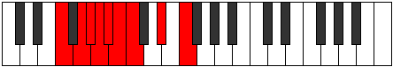 |
| [1279](https://ianring.com/musictheory/scales/1279) | [Sarygic](ModeDNaturalSarygic.md) | D | D, D#, E, F, F#, G, G#, A, C, D |  |
| [1279](https://ianring.com/musictheory/scales/1279) | [Sarygic](ModeGSharpSarygic.md) | G# | G#, A, A#, B, C, C#, D, D#, F#, G# |  |
| [1279](https://ianring.com/musictheory/scales/1279) | [Sarygic](ModeAFlatSarygic.md) | Ab | Ab, A, Bb, B, C, Db, D, Eb, Gb, Ab |  |
| [1279](https://ianring.com/musictheory/scales/1279) | [Sarygic](ModeFNaturalSarygic.md) | F | F, F#, G, G#, A, A#, B, C, D#, F |  |
| [1319](https://ianring.com/musictheory/scales/1319) | [Phronimic](ModeGNaturalPhronimic.md) | G | G, Ab, Bbb, C, D#, E#, G |  |
| [1327](https://ianring.com/musictheory/scales/1327) | [Zalian](ModeGNaturalZalian.md) | G | G, Ab, Bbb, Cbb, Dbb, Eb, F, G |  |
| [1335](https://ianring.com/musictheory/scales/1335) | [Aeralian](ModeGNaturalAeralian.md) | G | G, Ab, Bbb, Cb, Dbb, Eb, F, G |  |
| [1343](https://ianring.com/musictheory/scales/1343) | [Zalyllic](ModeGNaturalZalyllic.md) | G | G, G#, A, A#, B, C, D#, F, G |  |
| [1383](https://ianring.com/musictheory/scales/1383) | [Pynian](ModeGNaturalPynian.md) | G | G, Ab, Bbb, C, Db, Eb, F, G |  |
| [1391](https://ianring.com/musictheory/scales/1391) | [Aeradyllic](ModeGNaturalAeradyllic.md) | G | G, G#, A, A#, C, C#, D#, F, G |  |
| [1399](https://ianring.com/musictheory/scales/1399) | [Syryllic](ModeGNaturalSyryllic.md) | G | G, G#, A, B, C, C#, D#, F, G |  |
| [1407](https://ianring.com/musictheory/scales/1407) | [Tharygic](ModeGNaturalTharygic.md) | G | G, G#, A, A#, B, C, C#, D#, F, G |  |
| [1427](https://ianring.com/musictheory/scales/1427) | [Lolimic](ModeGSharpLolimic.md) | G# | G#, A, B#, C###, D##, E##, G# |  |
| [1427](https://ianring.com/musictheory/scales/1427) | [Lolimic](ModeAFlatLolimic.md) | Ab | Ab, Bbb, C, D#, E, F#, Ab |  |
| [1431](https://ianring.com/musictheory/scales/1431) | [Phragian](ModeGSharpPhragian.md) | G# | G#, A, Bb, C, D#, E, F#, G# |  |
| [1431](https://ianring.com/musictheory/scales/1431) | [Phragian](ModeAFlatPhragian.md) | Ab | Ab, Bbb, Cbb, Dbb, Eb, Fb, Gb, Ab |  |
| [1433](https://ianring.com/musictheory/scales/1433) | [Dynimic](ModeFNaturalDynimic.md) | F | F, G#, A, B#, C#, D#, F |  |
| [1435](https://ianring.com/musictheory/scales/1435) | [Phronian](ModeFNaturalPhronian.md) | F | F, Gb, Ab, Bbb, C, Db, Eb, F |  |
| [1435](https://ianring.com/musictheory/scales/1435) | [Phronian](ModeGSharpPhronian.md) | G# | G#, A, B, C, D#, E, F#, G# |  |
| [1435](https://ianring.com/musictheory/scales/1435) | [Phronian](ModeAFlatPhronian.md) | Ab | Ab, Bbb, Cb, Dbb, Eb, Fb, Gb, Ab |  |
| [1437](https://ianring.com/musictheory/scales/1437) | [Aeolycrian](ModeFNaturalAeolycrian.md) | F | F, G, Ab, Bbb, C, Db, Eb, F |  |
| [1439](https://ianring.com/musictheory/scales/1439) | [Rolyllic](ModeFNaturalRolyllic.md) | F | F, F#, G, G#, A, C, C#, D#, F |  |
| [1439](https://ianring.com/musictheory/scales/1439) | [Rolyllic](ModeGSharpRolyllic.md) | G# | G#, A, A#, B, C, D#, E, F#, G# |  |
| [1439](https://ianring.com/musictheory/scales/1439) | [Rolyllic](ModeAFlatRolyllic.md) | Ab | Ab, A, Bb, B, C, Eb, E, Gb, Ab |  |
| [1447](https://ianring.com/musictheory/scales/1447) | [Mixopyrian](ModeGNaturalMixopyrian.md) | G | G, Ab, Bbb, C, D, Eb, F, G |  |
| [1455](https://ianring.com/musictheory/scales/1455) | [Soryllic](ModeGNaturalSoryllic.md) | G | G, G#, A, A#, C, D, D#, F, G |  |
| [1459](https://ianring.com/musictheory/scales/1459) | [Ionalian](ModeGSharpIonalian.md) | G# | G#, A, B#, C#, D#, E, F#, G# |  |
| [1459](https://ianring.com/musictheory/scales/1459) | [Ionalian](ModeAFlatIonalian.md) | Ab | Ab, Bbb, C, Db, Eb, Fb, Gb, Ab |  |
| [1463](https://ianring.com/musictheory/scales/1463) | [Zaptyllic](ModeGSharpZaptyllic.md) | G# | G#, A, A#, C, C#, D#, E, F#, G# |  |
| [1463](https://ianring.com/musictheory/scales/1463) | [Zaptyllic](ModeAFlatZaptyllic.md) | Ab | Ab, A, Bb, C, Db, Eb, E, Gb, Ab |  |
| [1463](https://ianring.com/musictheory/scales/1463) | [Zaptyllic](ModeGNaturalZaptyllic.md) | G | G, G#, A, B, C, D, D#, F, G |  |
| [1465](https://ianring.com/musictheory/scales/1465) | [Aerathian](ModeFNaturalAerathian.md) | F | F, G#, A, Bb, C, Db, Eb, F | 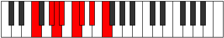 |
| [1467](https://ianring.com/musictheory/scales/1467) | [Thydyllic](ModeFNaturalThydyllic.md) | F | F, F#, G#, A, A#, C, C#, D#, F | 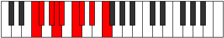 |
| [1467](https://ianring.com/musictheory/scales/1467) | [Thydyllic](ModeGSharpThydyllic.md) | G# | G#, A, B, C, C#, D#, E, F#, G# |  |
| [1467](https://ianring.com/musictheory/scales/1467) | [Thydyllic](ModeAFlatThydyllic.md) | Ab | Ab, A, B, C, Db, Eb, E, Gb, Ab |  |
| [1469](https://ianring.com/musictheory/scales/1469) | [Epiryllic](ModeFNaturalEpiryllic.md) | F | F, G, G#, A, A#, C, C#, D#, F |  |
| [1471](https://ianring.com/musictheory/scales/1471) | [Radygic](ModeFNaturalRadygic.md) | F | F, F#, G, G#, A, A#, C, C#, D#, F |  |
| [1471](https://ianring.com/musictheory/scales/1471) | [Radygic](ModeGSharpRadygic.md) | G# | G#, A, A#, B, C, C#, D#, E, F#, G# |  |
| [1471](https://ianring.com/musictheory/scales/1471) | [Radygic](ModeAFlatRadygic.md) | Ab | Ab, A, Bb, B, C, Db, Eb, E, Gb, Ab |  |
| [1471](https://ianring.com/musictheory/scales/1471) | [Radygic](ModeGNaturalRadygic.md) | G | G, G#, A, A#, B, C, D, D#, F, G |  |
| [1479](https://ianring.com/musictheory/scales/1479) | [Aeolagian](ModeDNaturalAeolagian.md) | D | D, Eb, Fb, G#, A, Bb, C, D |  |
| [1483](https://ianring.com/musictheory/scales/1483) | [Dygian](ModeDNaturalDygian.md) | D | D, Eb, F, G#, A, Bb, C, D |  |
| [1487](https://ianring.com/musictheory/scales/1487) | [Lycryllic](ModeDNaturalLycryllic.md) | D | D, D#, E, F, G#, A, A#, C, D |  |
| [1491](https://ianring.com/musictheory/scales/1491) | [Rynian](ModeGSharpRynian.md) | G# | G#, A, B#, C##, D#, E, F#, G# |  |
| [1491](https://ianring.com/musictheory/scales/1491) | [Rynian](ModeAFlatRynian.md) | Ab | Ab, Bbb, C, D, Eb, Fb, Gb, Ab |  |
| [1491](https://ianring.com/musictheory/scales/1491) | [Rynian](ModeDNaturalRynian.md) | D | D, Eb, F#, G#, A, Bb, C, D |  |
| [1495](https://ianring.com/musictheory/scales/1495) | [Kaptyllic](ModeDNaturalKaptyllic.md) | D | D, D#, E, F#, G#, A, A#, C, D |  |
| [1495](https://ianring.com/musictheory/scales/1495) | [Kaptyllic](ModeGSharpKaptyllic.md) | G# | G#, A, A#, C, D, D#, E, F#, G# |  |
| [1495](https://ianring.com/musictheory/scales/1495) | [Kaptyllic](ModeAFlatKaptyllic.md) | Ab | Ab, A, Bb, C, D, Eb, E, Gb, Ab |  |
| [1497](https://ianring.com/musictheory/scales/1497) | [Ionanian](ModeFNaturalIonanian.md) | F | F, G#, A, B, C, Db, Eb, F |  |
| [1499](https://ianring.com/musictheory/scales/1499) | [Stonyllic](ModeDNaturalStonyllic.md) | D | D, D#, F, F#, G#, A, A#, C, D |  |
| [1499](https://ianring.com/musictheory/scales/1499) | [Stonyllic](ModeGSharpStonyllic.md) | G# | G#, A, B, C, D, D#, E, F#, G# |  |
| [1499](https://ianring.com/musictheory/scales/1499) | [Stonyllic](ModeAFlatStonyllic.md) | Ab | Ab, A, B, C, D, Eb, E, Gb, Ab |  |
| [1499](https://ianring.com/musictheory/scales/1499) | [Stonyllic](ModeFNaturalStonyllic.md) | F | F, F#, G#, A, B, C, C#, D#, F |  |
| [1501](https://ianring.com/musictheory/scales/1501) | [Stygyllic](ModeFNaturalStygyllic.md) | F | F, G, G#, A, B, C, C#, D#, F |  |
| [1503](https://ianring.com/musictheory/scales/1503) | [Padygic](ModeDNaturalPadygic.md) | D | D, D#, E, F, F#, G#, A, A#, C, D |  |
| [1503](https://ianring.com/musictheory/scales/1503) | [Padygic](ModeFNaturalPadygic.md) | F | F, F#, G, G#, A, B, C, C#, D#, F |  |
| [1503](https://ianring.com/musictheory/scales/1503) | [Padygic](ModeGSharpPadygic.md) | G# | G#, A, A#, B, C, D, D#, E, F#, G# |  |
| [1503](https://ianring.com/musictheory/scales/1503) | [Padygic](ModeAFlatPadygic.md) | Ab | Ab, A, Bb, B, C, D, Eb, E, Gb, Ab |  |
| [1507](https://ianring.com/musictheory/scales/1507) | [Zynian](ModeDNaturalZynian.md) | D | D, Eb, F##, G#, A, Bb, C, D |  |
| [1511](https://ianring.com/musictheory/scales/1511) | [Styptyllic](ModeGNaturalStyptyllic.md) | G | G, G#, A, C, C#, D, D#, F, G |  |
| [1511](https://ianring.com/musictheory/scales/1511) | [Styptyllic](ModeDNaturalStyptyllic.md) | D | D, D#, E, G, G#, A, A#, C, D | 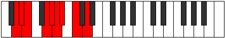 |
| [1515](https://ianring.com/musictheory/scales/1515) | [Solyllic](ModeDNaturalSolyllic.md) | D | D, D#, F, G, G#, A, A#, C, D |  |
| [1519](https://ianring.com/musictheory/scales/1519) | [Solygic](ModeGNaturalSolygic.md) | G | G, G#, A, A#, C, C#, D, D#, F, G |  |
| [1519](https://ianring.com/musictheory/scales/1519) | [Solygic](ModeDNaturalSolygic.md) | D | D, D#, E, F, G, G#, A, A#, C, D |  |
| [1523](https://ianring.com/musictheory/scales/1523) | [Zothyllic](ModeGSharpZothyllic.md) | G# | G#, A, C, C#, D, D#, E, F#, G# |  |
| [1523](https://ianring.com/musictheory/scales/1523) | [Zothyllic](ModeAFlatZothyllic.md) | Ab | Ab, A, C, Db, D, Eb, E, Gb, Ab |  |
| [1523](https://ianring.com/musictheory/scales/1523) | [Zothyllic](ModeDNaturalZothyllic.md) | D | D, D#, F#, G, G#, A, A#, C, D |  |
| [1527](https://ianring.com/musictheory/scales/1527) | [Aeolyrygic](ModeGSharpAeolyrygic.md) | G# | G#, A, A#, C, C#, D, D#, E, F#, G# |  |
| [1527](https://ianring.com/musictheory/scales/1527) | [Aeolyrygic](ModeAFlatAeolyrygic.md) | Ab | Ab, A, Bb, C, Db, D, Eb, E, Gb, Ab |  |
| [1527](https://ianring.com/musictheory/scales/1527) | [Aeolyrygic](ModeDNaturalAeolyrygic.md) | D | D, D#, E, F#, G, G#, A, A#, C, D |  |
| [1527](https://ianring.com/musictheory/scales/1527) | [Aeolyrygic](ModeGNaturalAeolyrygic.md) | G | G, G#, A, B, C, C#, D, D#, F, G |  |
| [1529](https://ianring.com/musictheory/scales/1529) | [Kataryllic](ModeFNaturalKataryllic.md) | F | F, G#, A, A#, B, C, C#, D#, F |  |
| [1531](https://ianring.com/musictheory/scales/1531) | [Styptygic](ModeDNaturalStyptygic.md) | D | D, D#, F, F#, G, G#, A, A#, C, D |  |
| [1531](https://ianring.com/musictheory/scales/1531) | [Styptygic](ModeGSharpStyptygic.md) | G# | G#, A, B, C, C#, D, D#, E, F#, G# |  |
| [1531](https://ianring.com/musictheory/scales/1531) | [Styptygic](ModeAFlatStyptygic.md) | Ab | Ab, A, B, C, Db, D, Eb, E, Gb, Ab |  |
| [1531](https://ianring.com/musictheory/scales/1531) | [Styptygic](ModeFNaturalStyptygic.md) | F | F, F#, G#, A, A#, B, C, C#, D#, F |  |
| [1533](https://ianring.com/musictheory/scales/1533) | [Katycrygic](ModeFNaturalKatycrygic.md) | F | F, G, G#, A, A#, B, C, C#, D#, F |  |
| [1535](https://ianring.com/musictheory/scales/1535) | [Mixodyllian](ModeDNaturalMixodyllian.md) | D | D, D#, E, F, F#, G, G#, A, A#, C, D |  |
| [1535](https://ianring.com/musictheory/scales/1535) | [Mixodyllian](ModeGSharpMixodyllian.md) | G# | G#, A, A#, B, C, C#, D, D#, E, F#, G# |  |
| [1535](https://ianring.com/musictheory/scales/1535) | [Mixodyllian](ModeAFlatMixodyllian.md) | Ab | Ab, A, Bb, B, C, Db, D, Eb, E, Gb, Ab |  |
| [1535](https://ianring.com/musictheory/scales/1535) | [Mixodyllian](ModeGNaturalMixodyllian.md) | G | G, G#, A, A#, B, C, C#, D, D#, F, G |  |
| [1535](https://ianring.com/musictheory/scales/1535) | [Mixodyllian](ModeFNaturalMixodyllian.md) | F | F, F#, G, G#, A, A#, B, C, C#, D#, F |  |
| [1587](https://ianring.com/musictheory/scales/1587) | [Lalimic](ModeBNaturalLalimic.md) | B | B, C, D#, E, F###, G##, B |  |
| [1591](https://ianring.com/musictheory/scales/1591) | [Rodian](ModeBNaturalRodian.md) | B | B, C, Db, Eb, Fb, G#, A, B |  |
| [1595](https://ianring.com/musictheory/scales/1595) | [Dacrian](ModeBNaturalDacrian.md) | B | B, C, D, Eb, Fb, G#, A, B |  |
| [1599](https://ianring.com/musictheory/scales/1599) | [Pocryllic](ModeBNaturalPocryllic.md) | B | B, C, C#, D, D#, E, G#, A, B |  |
| [1613](https://ianring.com/musictheory/scales/1613) | [Thylimic](ModeFSharpThylimic.md) | F# | F#, G#, A, B#, C###, D##, F# |  |
| [1613](https://ianring.com/musictheory/scales/1613) | [Thylimic](ModeGFlatThylimic.md) | Gb | Gb, Ab, Bbb, C, D#, E, Gb |  |
| [1615](https://ianring.com/musictheory/scales/1615) | [Sydian](ModeFSharpSydian.md) | F# | F#, G, Ab, Bbb, C, D#, E, F# |  |
| [1615](https://ianring.com/musictheory/scales/1615) | [Sydian](ModeGFlatSydian.md) | Gb | Gb, Abb, Bbbb, Cbbb, Dbb, Eb, Fb, Gb |  |
| [1619](https://ianring.com/musictheory/scales/1619) | [Monimic](ModeBNaturalMonimic.md) | B | B, C, D#, E#, F###, G##, B |  |
| [1623](https://ianring.com/musictheory/scales/1623) | [Lothian](ModeBNaturalLothian.md) | B | B, C, Db, Eb, F, G#, A, B |  |
| [1627](https://ianring.com/musictheory/scales/1627) | [Zyptian](ModeBNaturalZyptian.md) | B | B, C, D, Eb, F, G#, A, B |  |
| [1629](https://ianring.com/musictheory/scales/1629) | [Synian](ModeFSharpSynian.md) | F# | F#, G#, A, Bb, C, D#, E, F# | 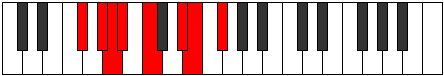 |
| [1629](https://ianring.com/musictheory/scales/1629) | [Synian](ModeGFlatSynian.md) | Gb | Gb, Ab, Bbb, Cbb, Dbb, Eb, Fb, Gb |  |
| [1631](https://ianring.com/musictheory/scales/1631) | [Rynyllic](ModeFSharpRynyllic.md) | F# | F#, G, G#, A, A#, C, D#, E, F# |  |
| [1631](https://ianring.com/musictheory/scales/1631) | [Rynyllic](ModeGFlatRynyllic.md) | Gb | Gb, G, Ab, A, Bb, C, Eb, E, Gb |  |
| [1631](https://ianring.com/musictheory/scales/1631) | [Rynyllic](ModeBNaturalRynyllic.md) | B | B, C, C#, D, D#, F, G#, A, B |  |
| [1635](https://ianring.com/musictheory/scales/1635) | [Sygimic](ModeDSharpSygimic.md) | D# | D#, E, F###, G##, A###, B##, D# |  |
| [1635](https://ianring.com/musictheory/scales/1635) | [Sygimic](ModeEFlatSygimic.md) | Eb | Eb, Fb, G#, A, B#, C#, Eb |  |
| [1637](https://ianring.com/musictheory/scales/1637) | [Syptimic](ModeDSharpSyptimic.md) | D# | D#, E#, F###, G##, A###, B##, D# |  |
| [1637](https://ianring.com/musictheory/scales/1637) | [Syptimic](ModeEFlatSyptimic.md) | Eb | Eb, F, G#, A, B#, C#, Eb |  |
| [1639](https://ianring.com/musictheory/scales/1639) | [Aeolothian](ModeDSharpAeolothian.md) | D# | D#, E, F, G#, A, B#, C#, D# |  |
| [1639](https://ianring.com/musictheory/scales/1639) | [Aeolothian](ModeEFlatAeolothian.md) | Eb | Eb, Fb, Gbb, Ab, Bbb, C, Db, Eb |  |
| [1641](https://ianring.com/musictheory/scales/1641) | [Bocrimic](ModeDSharpBocrimic.md) | D# | D#, E##, F###, G##, A###, B##, D# |  |
| [1641](https://ianring.com/musictheory/scales/1641) | [Bocrimic](ModeEFlatBocrimic.md) | Eb | Eb, F#, G#, A, B#, C#, Eb |  |
| [1643](https://ianring.com/musictheory/scales/1643) | [Thyptian](ModeDSharpThyptian.md) | D# | D#, E, F#, G#, A, B#, C#, D# |  |
| [1643](https://ianring.com/musictheory/scales/1643) | [Thyptian](ModeEFlatThyptian.md) | Eb | Eb, Fb, Gb, Ab, Bbb, C, Db, Eb |  |
| [1645](https://ianring.com/musictheory/scales/1645) | [Katagian](ModeDSharpKatagian.md) | D# | D#, E#, F#, G#, A, B#, C#, D# |  |
| [1645](https://ianring.com/musictheory/scales/1645) | [Katagian](ModeEFlatKatagian.md) | Eb | Eb, F, Gb, Ab, Bbb, C, Db, Eb |  |
| [1645](https://ianring.com/musictheory/scales/1645) | [Katagian](ModeFSharpKatagian.md) | F# | F#, G#, A, B, C, D#, E, F# |  |
| [1645](https://ianring.com/musictheory/scales/1645) | [Katagian](ModeGFlatKatagian.md) | Gb | Gb, Ab, Bbb, Cb, Dbb, Eb, Fb, Gb |  |
| [1647](https://ianring.com/musictheory/scales/1647) | [Polyllic](ModeDSharpPolyllic.md) | D# | D#, E, F, F#, G#, A, C, C#, D# |  |
| [1647](https://ianring.com/musictheory/scales/1647) | [Polyllic](ModeEFlatPolyllic.md) | Eb | Eb, E, F, Gb, Ab, A, C, Db, Eb |  |
| [1647](https://ianring.com/musictheory/scales/1647) | [Polyllic](ModeFSharpPolyllic.md) | F# | F#, G, G#, A, B, C, D#, E, F# |  |
| [1647](https://ianring.com/musictheory/scales/1647) | [Polyllic](ModeGFlatPolyllic.md) | Gb | Gb, G, Ab, A, B, C, Eb, E, Gb |  |
| [1649](https://ianring.com/musictheory/scales/1649) | [Bolimic](ModeDSharpBolimic.md) | D# | D#, E###, F###, G##, A###, B##, D# |  |
| [1649](https://ianring.com/musictheory/scales/1649) | [Bolimic](ModeEFlatBolimic.md) | Eb | Eb, F##, G#, A, B#, C#, Eb |  |
| [1651](https://ianring.com/musictheory/scales/1651) | [Mogian](ModeDSharpMogian.md) | D# | D#, E, F##, G#, A, B#, C#, D# |  |
| [1651](https://ianring.com/musictheory/scales/1651) | [Mogian](ModeEFlatMogian.md) | Eb | Eb, Fb, G, Ab, Bbb, C, Db, Eb |  |
| [1651](https://ianring.com/musictheory/scales/1651) | [Mogian](ModeBNaturalMogian.md) | B | B, C, D#, E, F, G#, A, B |  |
| [1653](https://ianring.com/musictheory/scales/1653) | [Gylian](ModeDSharpGylian.md) | D# | D#, E#, F##, G#, A, B#, C#, D# |  |
| [1653](https://ianring.com/musictheory/scales/1653) | [Gylian](ModeEFlatGylian.md) | Eb | Eb, F, G, Ab, Bbb, C, Db, Eb |  |
| [1655](https://ianring.com/musictheory/scales/1655) | [Katygyllic](ModeDSharpKatygyllic.md) | D# | D#, E, F, G, G#, A, C, C#, D# |  |
| [1655](https://ianring.com/musictheory/scales/1655) | [Katygyllic](ModeEFlatKatygyllic.md) | Eb | Eb, E, F, G, Ab, A, C, Db, Eb |  |
| [1655](https://ianring.com/musictheory/scales/1655) | [Katygyllic](ModeBNaturalKatygyllic.md) | B | B, C, C#, D#, E, F, G#, A, B |  |
| [1657](https://ianring.com/musictheory/scales/1657) | [Ionothian](ModeDSharpIonothian.md) | D# | D#, E##, F##, G#, A, B#, C#, D# |  |
| [1657](https://ianring.com/musictheory/scales/1657) | [Ionothian](ModeEFlatIonothian.md) | Eb | Eb, F#, G, Ab, Bbb, C, Db, Eb |  |
| [1659](https://ianring.com/musictheory/scales/1659) | [Magyllic](ModeDSharpMagyllic.md) | D# | D#, E, F#, G, G#, A, C, C#, D# |  |
| [1659](https://ianring.com/musictheory/scales/1659) | [Magyllic](ModeEFlatMagyllic.md) | Eb | Eb, E, Gb, G, Ab, A, C, Db, Eb |  |
| [1659](https://ianring.com/musictheory/scales/1659) | [Magyllic](ModeBNaturalMagyllic.md) | B | B, C, D, D#, E, F, G#, A, B |  |
| [1661](https://ianring.com/musictheory/scales/1661) | [Gonyllic](ModeDSharpGonyllic.md) | D# | D#, F, F#, G, G#, A, C, C#, D# |  |
| [1661](https://ianring.com/musictheory/scales/1661) | [Gonyllic](ModeEFlatGonyllic.md) | Eb | Eb, F, Gb, G, Ab, A, C, Db, Eb |  |
| [1661](https://ianring.com/musictheory/scales/1661) | [Gonyllic](ModeFSharpGonyllic.md) | F# | F#, G#, A, A#, B, C, D#, E, F# |  |
| [1661](https://ianring.com/musictheory/scales/1661) | [Gonyllic](ModeGFlatGonyllic.md) | Gb | Gb, Ab, A, Bb, B, C, Eb, E, Gb |  |
| [1663](https://ianring.com/musictheory/scales/1663) | [Lydygic](ModeDSharpLydygic.md) | D# | D#, E, F, F#, G, G#, A, C, C#, D# |  |
| [1663](https://ianring.com/musictheory/scales/1663) | [Lydygic](ModeEFlatLydygic.md) | Eb | Eb, E, F, Gb, G, Ab, A, C, Db, Eb |  |
| [1663](https://ianring.com/musictheory/scales/1663) | [Lydygic](ModeBNaturalLydygic.md) | B | B, C, C#, D, D#, E, F, G#, A, B |  |
| [1663](https://ianring.com/musictheory/scales/1663) | [Lydygic](ModeFSharpLydygic.md) | F# | F#, G, G#, A, A#, B, C, D#, E, F# |  |
| [1663](https://ianring.com/musictheory/scales/1663) | [Lydygic](ModeGFlatLydygic.md) | Gb | Gb, G, Ab, A, Bb, B, C, Eb, E, Gb |  |
| [1683](https://ianring.com/musictheory/scales/1683) | [Rygimic](ModeGSharpRygimic.md) | G# | G#, A, B#, C###, D###, E##, G# |  |
| [1683](https://ianring.com/musictheory/scales/1683) | [Rygimic](ModeAFlatRygimic.md) | Ab | Ab, Bbb, C, D#, E#, F#, Ab |  |
| [1683](https://ianring.com/musictheory/scales/1683) | [Rygimic](ModeBNaturalRygimic.md) | B | B, C, D#, E##, F###, G##, B |  |
| [1687](https://ianring.com/musictheory/scales/1687) | [Phralian](ModeGSharpPhralian.md) | G# | G#, A, Bb, C, D#, E#, F#, G# |  |
| [1687](https://ianring.com/musictheory/scales/1687) | [Phralian](ModeAFlatPhralian.md) | Ab | Ab, Bbb, Cbb, Dbb, Eb, F, Gb, Ab |  |
| [1687](https://ianring.com/musictheory/scales/1687) | [Phralian](ModeBNaturalPhralian.md) | B | B, C, Db, Eb, F#, G#, A, B |  |
| [1689](https://ianring.com/musictheory/scales/1689) | [Lorimic](ModeFNaturalLorimic.md) | F | F, G#, A, B#, C##, D#, F |  |
| [1691](https://ianring.com/musictheory/scales/1691) | [Kathian](ModeFNaturalKathian.md) | F | F, Gb, Ab, Bbb, C, D, Eb, F |  |
| [1691](https://ianring.com/musictheory/scales/1691) | [Kathian](ModeBNaturalKathian.md) | B | B, C, D, Eb, F#, G#, A, B |  |
| [1691](https://ianring.com/musictheory/scales/1691) | [Kathian](ModeGSharpKathian.md) | G# | G#, A, B, C, D#, E#, F#, G# |  |
| [1691](https://ianring.com/musictheory/scales/1691) | [Kathian](ModeAFlatKathian.md) | Ab | Ab, Bbb, Cb, Dbb, Eb, F, Gb, Ab |  |
| [1693](https://ianring.com/musictheory/scales/1693) | [Dogian](ModeFNaturalDogian.md) | F | F, G, Ab, Bbb, C, D, Eb, F |  |
| [1695](https://ianring.com/musictheory/scales/1695) | [Phrodyllic](ModeFNaturalPhrodyllic.md) | F | F, F#, G, G#, A, C, D, D#, F |  |
| [1695](https://ianring.com/musictheory/scales/1695) | [Phrodyllic](ModeBNaturalPhrodyllic.md) | B | B, C, C#, D, D#, F#, G#, A, B |  |
| [1695](https://ianring.com/musictheory/scales/1695) | [Phrodyllic](ModeGSharpPhrodyllic.md) | G# | G#, A, A#, B, C, D#, F, F#, G# |  |
| [1695](https://ianring.com/musictheory/scales/1695) | [Phrodyllic](ModeAFlatPhrodyllic.md) | Ab | Ab, A, Bb, B, C, Eb, F, Gb, Ab |  |
| [1715](https://ianring.com/musictheory/scales/1715) | [Aeronian](ModeGSharpAeronian.md) | G# | G#, A, B#, C#, D#, E#, F#, G# |  |
| [1715](https://ianring.com/musictheory/scales/1715) | [Aeronian](ModeAFlatAeronian.md) | Ab | Ab, Bbb, C, Db, Eb, F, Gb, Ab |  |
| [1715](https://ianring.com/musictheory/scales/1715) | [Aeronian](ModeBNaturalAeronian.md) | B | B, C, D#, E, F#, G#, A, B |  |
| [1719](https://ianring.com/musictheory/scales/1719) | [Lyryllic](ModeGSharpLyryllic.md) | G# | G#, A, A#, C, C#, D#, F, F#, G# |  |
| [1719](https://ianring.com/musictheory/scales/1719) | [Lyryllic](ModeAFlatLyryllic.md) | Ab | Ab, A, Bb, C, Db, Eb, F, Gb, Ab |  |
| [1719](https://ianring.com/musictheory/scales/1719) | [Lyryllic](ModeBNaturalLyryllic.md) | B | B, C, C#, D#, E, F#, G#, A, B |  |
| [1721](https://ianring.com/musictheory/scales/1721) | [Ionycrian](ModeFNaturalIonycrian.md) | F | F, G#, A, Bb, C, D, Eb, F |  |
| [1723](https://ianring.com/musictheory/scales/1723) | [Poryllic](ModeFNaturalPoryllic.md) | F | F, F#, G#, A, A#, C, D, D#, F |  |
| [1723](https://ianring.com/musictheory/scales/1723) | [Poryllic](ModeBNaturalPoryllic.md) | B | B, C, D, D#, E, F#, G#, A, B |  |
| [1723](https://ianring.com/musictheory/scales/1723) | [Poryllic](ModeGSharpPoryllic.md) | G# | G#, A, B, C, C#, D#, F, F#, G# |  |
| [1723](https://ianring.com/musictheory/scales/1723) | [Poryllic](ModeAFlatPoryllic.md) | Ab | Ab, A, B, C, Db, Eb, F, Gb, Ab |  |
| [1725](https://ianring.com/musictheory/scales/1725) | [Mixodyllic](ModeFNaturalMixodyllic.md) | F | F, G, G#, A, A#, C, D, D#, F |  |
| [1727](https://ianring.com/musictheory/scales/1727) | [Sydygic](ModeFNaturalSydygic.md) | F | F, F#, G, G#, A, A#, C, D, D#, F |  |
| [1727](https://ianring.com/musictheory/scales/1727) | [Sydygic](ModeBNaturalSydygic.md) | B | B, C, C#, D, D#, E, F#, G#, A, B |  |
| [1727](https://ianring.com/musictheory/scales/1727) | [Sydygic](ModeGSharpSydygic.md) | G# | G#, A, A#, B, C, C#, D#, F, F#, G# |  |
| [1727](https://ianring.com/musictheory/scales/1727) | [Sydygic](ModeAFlatSydygic.md) | Ab | Ab, A, Bb, B, C, Db, Eb, F, Gb, Ab |  |
| [1735](https://ianring.com/musictheory/scales/1735) | [Dagian](ModeDNaturalDagian.md) | D | D, Eb, Fb, G#, A, B, C, D | 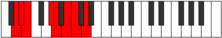 |
| [1739](https://ianring.com/musictheory/scales/1739) | [Phrylian](ModeDNaturalPhrylian.md) | D | D, Eb, F, G#, A, B, C, D |  |
| [1741](https://ianring.com/musictheory/scales/1741) | [Katycrian](ModeFSharpKatycrian.md) | F# | F#, G#, A, B#, C#, D#, E, F# |  |
| [1741](https://ianring.com/musictheory/scales/1741) | [Katycrian](ModeGFlatKatycrian.md) | Gb | Gb, Ab, Bbb, C, Db, Eb, Fb, Gb |  |
| [1743](https://ianring.com/musictheory/scales/1743) | [Epigyllic](ModeFSharpEpigyllic.md) | F# | F#, G, G#, A, C, C#, D#, E, F# |  |
| [1743](https://ianring.com/musictheory/scales/1743) | [Epigyllic](ModeGFlatEpigyllic.md) | Gb | Gb, G, Ab, A, C, Db, Eb, E, Gb |  |
| [1743](https://ianring.com/musictheory/scales/1743) | [Epigyllic](ModeDNaturalEpigyllic.md) | D | D, D#, E, F, G#, A, B, C, D |  |
| [1747](https://ianring.com/musictheory/scales/1747) | [Epalian](ModeGSharpEpalian.md) | G# | G#, A, B#, C##, D#, E#, F#, G# |  |
| [1747](https://ianring.com/musictheory/scales/1747) | [Epalian](ModeAFlatEpalian.md) | Ab | Ab, Bbb, C, D, Eb, F, Gb, Ab |  |
| [1747](https://ianring.com/musictheory/scales/1747) | [Epalian](ModeDNaturalEpalian.md) | D | D, Eb, F#, G#, A, B, C, D |  |
| [1747](https://ianring.com/musictheory/scales/1747) | [Epalian](ModeBNaturalEpalian.md) | B | B, C, D#, E#, F#, G#, A, B |  |
| [1751](https://ianring.com/musictheory/scales/1751) | [Aeolyryllic](ModeGSharpAeolyryllic.md) | G# | G#, A, A#, C, D, D#, F, F#, G# |  |
| [1751](https://ianring.com/musictheory/scales/1751) | [Aeolyryllic](ModeAFlatAeolyryllic.md) | Ab | Ab, A, Bb, C, D, Eb, F, Gb, Ab |  |
| [1751](https://ianring.com/musictheory/scales/1751) | [Aeolyryllic](ModeDNaturalAeolyryllic.md) | D | D, D#, E, F#, G#, A, B, C, D |  |
| [1751](https://ianring.com/musictheory/scales/1751) | [Aeolyryllic](ModeBNaturalAeolyryllic.md) | B | B, C, C#, D#, F, F#, G#, A, B |  |
| [1753](https://ianring.com/musictheory/scales/1753) | [Mycrian](ModeFNaturalMycrian.md) | F | F, G#, A, B, C, D, Eb, F |  |
| [1755](https://ianring.com/musictheory/scales/1755) | [MinorDiminished](ModeDNaturalMinorDiminished.md) | D | D, D#, F, F#, G#, A, B, C, D |  |
| [1755](https://ianring.com/musictheory/scales/1755) | [MinorDiminished](ModeFNaturalMinorDiminished.md) | F | F, F#, G#, A, B, C, D, D#, F |  |
| [1755](https://ianring.com/musictheory/scales/1755) | [MinorDiminished](ModeGSharpMinorDiminished.md) | G# | G#, A, B, C, D, D#, F, F#, G# |  |
| [1755](https://ianring.com/musictheory/scales/1755) | [MinorDiminished](ModeAFlatMinorDiminished.md) | Ab | Ab, A, B, C, D, Eb, F, Gb, Ab |  |
| [1755](https://ianring.com/musictheory/scales/1755) | [MinorDiminished](ModeBNaturalMinorDiminished.md) | B | B, C, D, D#, F, F#, G#, A, B |  |
| [1757](https://ianring.com/musictheory/scales/1757) | [Ionyphyllic](ModeFSharpIonyphyllic.md) | F# | F#, G#, A, A#, C, C#, D#, E, F# |  |
| [1757](https://ianring.com/musictheory/scales/1757) | [Ionyphyllic](ModeGFlatIonyphyllic.md) | Gb | Gb, Ab, A, Bb, C, Db, Eb, E, Gb |  |
| [1757](https://ianring.com/musictheory/scales/1757) | [Ionyphyllic](ModeFNaturalIonyphyllic.md) | F | F, G, G#, A, B, C, D, D#, F |  |
| [1759](https://ianring.com/musictheory/scales/1759) | [Pylygic](ModeFSharpPylygic.md) | F# | F#, G, G#, A, A#, C, C#, D#, E, F# |  |
| [1759](https://ianring.com/musictheory/scales/1759) | [Pylygic](ModeGFlatPylygic.md) | Gb | Gb, G, Ab, A, Bb, C, Db, Eb, E, Gb |  |
| [1759](https://ianring.com/musictheory/scales/1759) | [Pylygic](ModeBNaturalPylygic.md) | B | B, C, C#, D, D#, F, F#, G#, A, B |  |
| [1759](https://ianring.com/musictheory/scales/1759) | [Pylygic](ModeDNaturalPylygic.md) | D | D, D#, E, F, F#, G#, A, B, C, D |  |
| [1759](https://ianring.com/musictheory/scales/1759) | [Pylygic](ModeFNaturalPylygic.md) | F | F, F#, G, G#, A, B, C, D, D#, F |  |
| [1759](https://ianring.com/musictheory/scales/1759) | [Pylygic](ModeGSharpPylygic.md) | G# | G#, A, A#, B, C, D, D#, F, F#, G# |  |
| [1759](https://ianring.com/musictheory/scales/1759) | [Pylygic](ModeAFlatPylygic.md) | Ab | Ab, A, Bb, B, C, D, Eb, F, Gb, Ab |  |
| [1763](https://ianring.com/musictheory/scales/1763) | [Katalian](ModeDSharpKatalian.md) | D# | D#, E, F###, G##, A#, B#, C#, D# |  |
| [1763](https://ianring.com/musictheory/scales/1763) | [Katalian](ModeEFlatKatalian.md) | Eb | Eb, Fb, G#, A, Bb, C, Db, Eb |  |
| [1763](https://ianring.com/musictheory/scales/1763) | [Katalian](ModeDNaturalKatalian.md) | D | D, Eb, F##, G#, A, B, C, D |  |
| [1765](https://ianring.com/musictheory/scales/1765) | [Lonian](ModeDSharpLonian.md) | D# | D#, E#, F###, G##, A#, B#, C#, D# |  |
| [1765](https://ianring.com/musictheory/scales/1765) | [Lonian](ModeEFlatLonian.md) | Eb | Eb, F, G#, A, Bb, C, Db, Eb |  |
| [1767](https://ianring.com/musictheory/scales/1767) | [Dyryllic](ModeDSharpDyryllic.md) | D# | D#, E, F, G#, A, A#, C, C#, D# |  |
| [1767](https://ianring.com/musictheory/scales/1767) | [Dyryllic](ModeEFlatDyryllic.md) | Eb | Eb, E, F, Ab, A, Bb, C, Db, Eb |  |
| [1767](https://ianring.com/musictheory/scales/1767) | [Dyryllic](ModeDNaturalDyryllic.md) | D | D, D#, E, G, G#, A, B, C, D |  |
| [1769](https://ianring.com/musictheory/scales/1769) | [Rythian](ModeDSharpRythian.md) | D# | D#, E##, F###, G##, A#, B#, C#, D# |  |
| [1769](https://ianring.com/musictheory/scales/1769) | [Rythian](ModeEFlatRythian.md) | Eb | Eb, F#, G#, A, Bb, C, Db, Eb |  |
| [1771](https://ianring.com/musictheory/scales/1771) | [Stylyllic](ModeDSharpStylyllic.md) | D# | D#, E, F#, G#, A, A#, C, C#, D# |  |
| [1771](https://ianring.com/musictheory/scales/1771) | [Stylyllic](ModeEFlatStylyllic.md) | Eb | Eb, E, Gb, Ab, A, Bb, C, Db, Eb |  |
| [1771](https://ianring.com/musictheory/scales/1771) | [Stylyllic](ModeDNaturalStylyllic.md) | D | D, D#, F, G, G#, A, B, C, D |  |
| [1773](https://ianring.com/musictheory/scales/1773) | [Aeoloryllic](ModeDSharpAeoloryllic.md) | D# | D#, F, F#, G#, A, A#, C, C#, D# |  |
| [1773](https://ianring.com/musictheory/scales/1773) | [Aeoloryllic](ModeEFlatAeoloryllic.md) | Eb | Eb, F, Gb, Ab, A, Bb, C, Db, Eb |  |
| [1773](https://ianring.com/musictheory/scales/1773) | [Aeoloryllic](ModeFSharpAeoloryllic.md) | F# | F#, G#, A, B, C, C#, D#, E, F# |  |
| [1773](https://ianring.com/musictheory/scales/1773) | [Aeoloryllic](ModeGFlatAeoloryllic.md) | Gb | Gb, Ab, A, B, C, Db, Eb, E, Gb |  |
| [1775](https://ianring.com/musictheory/scales/1775) | [Lyrygic](ModeDSharpLyrygic.md) | D# | D#, E, F, F#, G#, A, A#, C, C#, D# |  |
| [1775](https://ianring.com/musictheory/scales/1775) | [Lyrygic](ModeEFlatLyrygic.md) | Eb | Eb, E, F, Gb, Ab, A, Bb, C, Db, Eb |  |
| [1775](https://ianring.com/musictheory/scales/1775) | [Lyrygic](ModeDNaturalLyrygic.md) | D | D, D#, E, F, G, G#, A, B, C, D |  |
| [1775](https://ianring.com/musictheory/scales/1775) | [Lyrygic](ModeFSharpLyrygic.md) | F# | F#, G, G#, A, B, C, C#, D#, E, F# |  |
| [1775](https://ianring.com/musictheory/scales/1775) | [Lyrygic](ModeGFlatLyrygic.md) | Gb | Gb, G, Ab, A, B, C, Db, Eb, E, Gb |  |
| [1777](https://ianring.com/musictheory/scales/1777) | [Saptian](ModeDSharpSaptian.md) | D# | D#, E###, F###, G##, A#, B#, C#, D# |  |
| [1777](https://ianring.com/musictheory/scales/1777) | [Saptian](ModeEFlatSaptian.md) | Eb | Eb, F##, G#, A, Bb, C, Db, Eb |  |
| [1779](https://ianring.com/musictheory/scales/1779) | [Aerythyllic](ModeGSharpAerythyllic.md) | G# | G#, A, C, C#, D, D#, F, F#, G# |  |
| [1779](https://ianring.com/musictheory/scales/1779) | [Aerythyllic](ModeAFlatAerythyllic.md) | Ab | Ab, A, C, Db, D, Eb, F, Gb, Ab |  |
| [1779](https://ianring.com/musictheory/scales/1779) | [Aerythyllic](ModeDSharpAerythyllic.md) | D# | D#, E, G, G#, A, A#, C, C#, D# |  |
| [1779](https://ianring.com/musictheory/scales/1779) | [Aerythyllic](ModeEFlatAerythyllic.md) | Eb | Eb, E, G, Ab, A, Bb, C, Db, Eb |  |
| [1779](https://ianring.com/musictheory/scales/1779) | [Aerythyllic](ModeBNaturalAerythyllic.md) | B | B, C, D#, E, F, F#, G#, A, B |  |
| [1779](https://ianring.com/musictheory/scales/1779) | [Aerythyllic](ModeDNaturalAerythyllic.md) | D | D, D#, F#, G, G#, A, B, C, D |  |
| [1781](https://ianring.com/musictheory/scales/1781) | [Gocryllic](ModeDSharpGocryllic.md) | D# | D#, F, G, G#, A, A#, C, C#, D# |  |
| [1781](https://ianring.com/musictheory/scales/1781) | [Gocryllic](ModeEFlatGocryllic.md) | Eb | Eb, F, G, Ab, A, Bb, C, Db, Eb |  |
| [1783](https://ianring.com/musictheory/scales/1783) | [Danygic](ModeGSharpDanygic.md) | G# | G#, A, A#, C, C#, D, D#, F, F#, G# |  |
| [1783](https://ianring.com/musictheory/scales/1783) | [Danygic](ModeAFlatDanygic.md) | Ab | Ab, A, Bb, C, Db, D, Eb, F, Gb, Ab |  |
| [1783](https://ianring.com/musictheory/scales/1783) | [Danygic](ModeDSharpDanygic.md) | D# | D#, E, F, G, G#, A, A#, C, C#, D# |  |
| [1783](https://ianring.com/musictheory/scales/1783) | [Danygic](ModeEFlatDanygic.md) | Eb | Eb, E, F, G, Ab, A, Bb, C, Db, Eb |  |
| [1783](https://ianring.com/musictheory/scales/1783) | [Danygic](ModeBNaturalDanygic.md) | B | B, C, C#, D#, E, F, F#, G#, A, B |  |
| [1783](https://ianring.com/musictheory/scales/1783) | [Danygic](ModeDNaturalDanygic.md) | D | D, D#, E, F#, G, G#, A, B, C, D |  |
| [1785](https://ianring.com/musictheory/scales/1785) | [Tharyllic](ModeDSharpTharyllic.md) | D# | D#, F#, G, G#, A, A#, C, C#, D# |  |
| [1785](https://ianring.com/musictheory/scales/1785) | [Tharyllic](ModeEFlatTharyllic.md) | Eb | Eb, Gb, G, Ab, A, Bb, C, Db, Eb |  |
| [1785](https://ianring.com/musictheory/scales/1785) | [Tharyllic](ModeFNaturalTharyllic.md) | F | F, G#, A, A#, B, C, D, D#, F |  |
| [1787](https://ianring.com/musictheory/scales/1787) | [Mycrygic](ModeDSharpMycrygic.md) | D# | D#, E, F#, G, G#, A, A#, C, C#, D# |  |
| [1787](https://ianring.com/musictheory/scales/1787) | [Mycrygic](ModeEFlatMycrygic.md) | Eb | Eb, E, Gb, G, Ab, A, Bb, C, Db, Eb |  |
| [1787](https://ianring.com/musictheory/scales/1787) | [Mycrygic](ModeGSharpMycrygic.md) | G# | G#, A, B, C, C#, D, D#, F, F#, G# |  |
| [1787](https://ianring.com/musictheory/scales/1787) | [Mycrygic](ModeAFlatMycrygic.md) | Ab | Ab, A, B, C, Db, D, Eb, F, Gb, Ab |  |
| [1787](https://ianring.com/musictheory/scales/1787) | [Mycrygic](ModeBNaturalMycrygic.md) | B | B, C, D, D#, E, F, F#, G#, A, B |  |
| [1787](https://ianring.com/musictheory/scales/1787) | [Mycrygic](ModeDNaturalMycrygic.md) | D | D, D#, F, F#, G, G#, A, B, C, D |  |
| [1787](https://ianring.com/musictheory/scales/1787) | [Mycrygic](ModeFNaturalMycrygic.md) | F | F, F#, G#, A, A#, B, C, D, D#, F |  |
| [1789](https://ianring.com/musictheory/scales/1789) | [Katagygic](ModeDSharpKatagygic.md) | D# | D#, F, F#, G, G#, A, A#, C, C#, D# |  |
| [1789](https://ianring.com/musictheory/scales/1789) | [Katagygic](ModeEFlatKatagygic.md) | Eb | Eb, F, Gb, G, Ab, A, Bb, C, Db, Eb |  |
| [1789](https://ianring.com/musictheory/scales/1789) | [Katagygic](ModeFSharpKatagygic.md) | F# | F#, G#, A, A#, B, C, C#, D#, E, F# |  |
| [1789](https://ianring.com/musictheory/scales/1789) | [Katagygic](ModeGFlatKatagygic.md) | Gb | Gb, Ab, A, Bb, B, C, Db, Eb, E, Gb |  |
| [1789](https://ianring.com/musictheory/scales/1789) | [Katagygic](ModeFNaturalKatagygic.md) | F | F, G, G#, A, A#, B, C, D, D#, F |  |
| [1791](https://ianring.com/musictheory/scales/1791) | [Aerygyllian](ModeDSharpAerygyllian.md) | D# | D#, E, F, F#, G, G#, A, A#, C, C#, D# |  |
| [1791](https://ianring.com/musictheory/scales/1791) | [Aerygyllian](ModeEFlatAerygyllian.md) | Eb | Eb, E, F, Gb, G, Ab, A, Bb, C, Db, Eb |  |
| [1791](https://ianring.com/musictheory/scales/1791) | [Aerygyllian](ModeBNaturalAerygyllian.md) | B | B, C, C#, D, D#, E, F, F#, G#, A, B |  |
| [1791](https://ianring.com/musictheory/scales/1791) | [Aerygyllian](ModeDNaturalAerygyllian.md) | D | D, D#, E, F, F#, G, G#, A, B, C, D |  |
| [1791](https://ianring.com/musictheory/scales/1791) | [Aerygyllian](ModeGSharpAerygyllian.md) | G# | G#, A, A#, B, C, C#, D, D#, F, F#, G# |  |
| [1791](https://ianring.com/musictheory/scales/1791) | [Aerygyllian](ModeAFlatAerygyllian.md) | Ab | Ab, A, Bb, B, C, Db, D, Eb, F, Gb, Ab |  |
| [1791](https://ianring.com/musictheory/scales/1791) | [Aerygyllian](ModeFSharpAerygyllian.md) | F# | F#, G, G#, A, A#, B, C, C#, D#, E, F# |  |
| [1791](https://ianring.com/musictheory/scales/1791) | [Aerygyllian](ModeGFlatAerygyllian.md) | Gb | Gb, G, Ab, A, Bb, B, C, Db, Eb, E, Gb |  |
| [1791](https://ianring.com/musictheory/scales/1791) | [Aerygyllian](ModeFNaturalAerygyllian.md) | F | F, F#, G, G#, A, A#, B, C, D, D#, F |  |
| [1811](https://ianring.com/musictheory/scales/1811) | [Kyptimic](ModeBNaturalKyptimic.md) | B | B, C, D#, E###, F###, G##, B |  |
| [1815](https://ianring.com/musictheory/scales/1815) | [Godian](ModeBNaturalGodian.md) | B | B, C, Db, Eb, F##, G#, A, B |  |
| [1817](https://ianring.com/musictheory/scales/1817) | [Phrythimic](ModeCNaturalPhrythimic.md) | C | C, D#, E, F###, G##, A#, C |  |
| [1819](https://ianring.com/musictheory/scales/1819) | [Pydian](ModeCNaturalPydian.md) | C | C, Db, Eb, Fb, G#, A, Bb, C |  |
| [1819](https://ianring.com/musictheory/scales/1819) | [Pydian](ModeBNaturalPydian.md) | B | B, C, D, Eb, F##, G#, A, B |  |
| [1821](https://ianring.com/musictheory/scales/1821) | [Aeradian](ModeCNaturalAeradian.md) | C | C, D, Eb, Fb, G#, A, Bb, C |  |
| [1823](https://ianring.com/musictheory/scales/1823) | [Phralyllic](ModeCNaturalPhralyllic.md) | C | C, C#, D, D#, E, G#, A, A#, C |  |
| [1823](https://ianring.com/musictheory/scales/1823) | [Phralyllic](ModeBNaturalPhralyllic.md) | B | B, C, C#, D, D#, G, G#, A, B |  |
| [1831](https://ianring.com/musictheory/scales/1831) | [Pothian](ModeGNaturalPothian.md) | G | G, Ab, Bbb, C, D#, E, F, G | 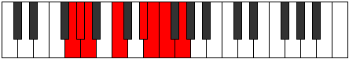 |
| [1833](https://ianring.com/musictheory/scales/1833) | [Ionacrimic](ModeCNaturalIonacrimic.md) | C | C, D#, E#, F###, G##, A#, C |  |
| [1835](https://ianring.com/musictheory/scales/1835) | [Byptian](ModeCNaturalByptian.md) | C | C, Db, Eb, F, G#, A, Bb, C |  |
| [1837](https://ianring.com/musictheory/scales/1837) | [Dalian](ModeCNaturalDalian.md) | C | C, D, Eb, F, G#, A, Bb, C |  |
| [1839](https://ianring.com/musictheory/scales/1839) | [Zogyllic](ModeCNaturalZogyllic.md) | C | C, C#, D, D#, F, G#, A, A#, C |  |
| [1839](https://ianring.com/musictheory/scales/1839) | [Zogyllic](ModeGNaturalZogyllic.md) | G | G, G#, A, A#, C, D#, E, F, G |  |
| [1843](https://ianring.com/musictheory/scales/1843) | [Ionygian](ModeBNaturalIonygian.md) | B | B, C, D#, E, F##, G#, A, B |  |
| [1847](https://ianring.com/musictheory/scales/1847) | [Thacryllic](ModeBNaturalThacryllic.md) | B | B, C, C#, D#, E, G, G#, A, B |  |
| [1847](https://ianring.com/musictheory/scales/1847) | [Thacryllic](ModeGNaturalThacryllic.md) | G | G, G#, A, B, C, D#, E, F, G |  |
| [1849](https://ianring.com/musictheory/scales/1849) | [Epogian](ModeCNaturalEpogian.md) | C | C, D#, E, F, G#, A, Bb, C |  |
| [1851](https://ianring.com/musictheory/scales/1851) | [Zacryllic](ModeCNaturalZacryllic.md) | C | C, C#, D#, E, F, G#, A, A#, C |  |
| [1851](https://ianring.com/musictheory/scales/1851) | [Zacryllic](ModeBNaturalZacryllic.md) | B | B, C, D, D#, E, G, G#, A, B |  |
| [1853](https://ianring.com/musictheory/scales/1853) | [Phrynyllic](ModeCNaturalPhrynyllic.md) | C | C, D, D#, E, F, G#, A, A#, C |  |
| [1855](https://ianring.com/musictheory/scales/1855) | [Marygic](ModeCNaturalMarygic.md) | C | C, C#, D, D#, E, F, G#, A, A#, C |  |
| [1855](https://ianring.com/musictheory/scales/1855) | [Marygic](ModeBNaturalMarygic.md) | B | B, C, C#, D, D#, E, G, G#, A, B |  |
| [1855](https://ianring.com/musictheory/scales/1855) | [Marygic](ModeGNaturalMarygic.md) | G | G, G#, A, A#, B, C, D#, E, F, G |  |
| [1865](https://ianring.com/musictheory/scales/1865) | [Thagimic](ModeCNaturalThagimic.md) | C | C, D#, E##, F###, G##, A#, C |  |
| [1867](https://ianring.com/musictheory/scales/1867) | [Solian](ModeCNaturalSolian.md) | C | C, Db, Eb, F#, G#, A, Bb, C |  |
| [1869](https://ianring.com/musictheory/scales/1869) | [Katyrian](ModeFSharpKatyrian.md) | F# | F#, G#, A, B#, C##, D#, E, F# |  |
| [1869](https://ianring.com/musictheory/scales/1869) | [Katyrian](ModeGFlatKatyrian.md) | Gb | Gb, Ab, Bbb, C, D, Eb, Fb, Gb |  |
| [1869](https://ianring.com/musictheory/scales/1869) | [Katyrian](ModeCNaturalKatyrian.md) | C | C, D, Eb, F#, G#, A, Bb, C |  |
| [1871](https://ianring.com/musictheory/scales/1871) | [Aeolyllic](ModeFSharpAeolyllic.md) | F# | F#, G, G#, A, C, D, D#, E, F# |  |
| [1871](https://ianring.com/musictheory/scales/1871) | [Aeolyllic](ModeGFlatAeolyllic.md) | Gb | Gb, G, Ab, A, C, D, Eb, E, Gb |  |
| [1871](https://ianring.com/musictheory/scales/1871) | [Aeolyllic](ModeCNaturalAeolyllic.md) | C | C, C#, D, D#, F#, G#, A, A#, C |  |
| [1875](https://ianring.com/musictheory/scales/1875) | [Epyphian](ModeBNaturalEpyphian.md) | B | B, C, D#, E#, F##, G#, A, B |  |
| [1879](https://ianring.com/musictheory/scales/1879) | [Mixoryllic](ModeBNaturalMixoryllic.md) | B | B, C, C#, D#, F, G, G#, A, B |  |
| [1881](https://ianring.com/musictheory/scales/1881) | [Korian](ModeCNaturalKorian.md) | C | C, D#, E, F#, G#, A, Bb, C |  |
| [1883](https://ianring.com/musictheory/scales/1883) | [Mixopyryllic](ModeCNaturalMixopyryllic.md) | C | C, C#, D#, E, F#, G#, A, A#, C |  |
| [1883](https://ianring.com/musictheory/scales/1883) | [Mixopyryllic](ModeBNaturalMixopyryllic.md) | B | B, C, D, D#, F, G, G#, A, B |  |
| [1885](https://ianring.com/musictheory/scales/1885) | [Epidyllic](ModeCNaturalEpidyllic.md) | C | C, D, D#, E, F#, G#, A, A#, C |  |
| [1885](https://ianring.com/musictheory/scales/1885) | [Epidyllic](ModeFSharpEpidyllic.md) | F# | F#, G#, A, A#, C, D, D#, E, F# |  |
| [1885](https://ianring.com/musictheory/scales/1885) | [Epidyllic](ModeGFlatEpidyllic.md) | Gb | Gb, Ab, A, Bb, C, D, Eb, E, Gb |  |
| [1887](https://ianring.com/musictheory/scales/1887) | [Aerocrygic](ModeCNaturalAerocrygic.md) | C | C, C#, D, D#, E, F#, G#, A, A#, C |  |
| [1887](https://ianring.com/musictheory/scales/1887) | [Aerocrygic](ModeFSharpAerocrygic.md) | F# | F#, G, G#, A, A#, C, D, D#, E, F# |  |
| [1887](https://ianring.com/musictheory/scales/1887) | [Aerocrygic](ModeGFlatAerocrygic.md) | Gb | Gb, G, Ab, A, Bb, C, D, Eb, E, Gb |  |
| [1887](https://ianring.com/musictheory/scales/1887) | [Aerocrygic](ModeBNaturalAerocrygic.md) | B | B, C, C#, D, D#, F, G, G#, A, B |  |
| [1891](https://ianring.com/musictheory/scales/1891) | [Thalian](ModeDSharpThalian.md) | D# | D#, E, F###, G##, A##, B#, C#, D# |  |
| [1891](https://ianring.com/musictheory/scales/1891) | [Thalian](ModeEFlatThalian.md) | Eb | Eb, Fb, G#, A, B, C, Db, Eb |  |
| [1893](https://ianring.com/musictheory/scales/1893) | [Ionylian](ModeDSharpIonylian.md) | D# | D#, E#, F###, G##, A##, B#, C#, D# |  |
| [1893](https://ianring.com/musictheory/scales/1893) | [Ionylian](ModeEFlatIonylian.md) | Eb | Eb, F, G#, A, B, C, Db, Eb | 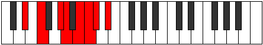 |
| [1895](https://ianring.com/musictheory/scales/1895) | [Salyllic](ModeGNaturalSalyllic.md) | G | G, G#, A, C, C#, D#, E, F, G |  |
| [1895](https://ianring.com/musictheory/scales/1895) | [Salyllic](ModeDSharpSalyllic.md) | D# | D#, E, F, G#, A, B, C, C#, D# |  |
| [1895](https://ianring.com/musictheory/scales/1895) | [Salyllic](ModeEFlatSalyllic.md) | Eb | Eb, E, F, Ab, A, B, C, Db, Eb |  |
| [1897](https://ianring.com/musictheory/scales/1897) | [Ionopian](ModeCNaturalIonopian.md) | C | C, D#, E#, F#, G#, A, Bb, C |  |
| [1897](https://ianring.com/musictheory/scales/1897) | [Ionopian](ModeDSharpIonopian.md) | D# | D#, E##, F###, G##, A##, B#, C#, D# |  |
| [1897](https://ianring.com/musictheory/scales/1897) | [Ionopian](ModeEFlatIonopian.md) | Eb | Eb, F#, G#, A, B, C, Db, Eb |  |
| [1899](https://ianring.com/musictheory/scales/1899) | [Moptyllic](ModeCNaturalMoptyllic.md) | C | C, C#, D#, F, F#, G#, A, A#, C |  |
| [1899](https://ianring.com/musictheory/scales/1899) | [Moptyllic](ModeDSharpMoptyllic.md) | D# | D#, E, F#, G#, A, B, C, C#, D# |  |
| [1899](https://ianring.com/musictheory/scales/1899) | [Moptyllic](ModeEFlatMoptyllic.md) | Eb | Eb, E, Gb, Ab, A, B, C, Db, Eb |  |
| [1901](https://ianring.com/musictheory/scales/1901) | [Ionidyllic](ModeCNaturalIonidyllic.md) | C | C, D, D#, F, F#, G#, A, A#, C |  |
| [1901](https://ianring.com/musictheory/scales/1901) | [Ionidyllic](ModeFSharpIonidyllic.md) | F# | F#, G#, A, B, C, D, D#, E, F# |  |
| [1901](https://ianring.com/musictheory/scales/1901) | [Ionidyllic](ModeGFlatIonidyllic.md) | Gb | Gb, Ab, A, B, C, D, Eb, E, Gb |  |
| [1901](https://ianring.com/musictheory/scales/1901) | [Ionidyllic](ModeDSharpIonidyllic.md) | D# | D#, F, F#, G#, A, B, C, C#, D# |  |
| [1901](https://ianring.com/musictheory/scales/1901) | [Ionidyllic](ModeEFlatIonidyllic.md) | Eb | Eb, F, Gb, Ab, A, B, C, Db, Eb |  |
| [1903](https://ianring.com/musictheory/scales/1903) | [Rocrygic](ModeCNaturalRocrygic.md) | C | C, C#, D, D#, F, F#, G#, A, A#, C |  |
| [1903](https://ianring.com/musictheory/scales/1903) | [Rocrygic](ModeGNaturalRocrygic.md) | G | G, G#, A, A#, C, C#, D#, E, F, G |  |
| [1903](https://ianring.com/musictheory/scales/1903) | [Rocrygic](ModeDSharpRocrygic.md) | D# | D#, E, F, F#, G#, A, B, C, C#, D# |  |
| [1903](https://ianring.com/musictheory/scales/1903) | [Rocrygic](ModeEFlatRocrygic.md) | Eb | Eb, E, F, Gb, Ab, A, B, C, Db, Eb |  |
| [1903](https://ianring.com/musictheory/scales/1903) | [Rocrygic](ModeFSharpRocrygic.md) | F# | F#, G, G#, A, B, C, D, D#, E, F# |  |
| [1903](https://ianring.com/musictheory/scales/1903) | [Rocrygic](ModeGFlatRocrygic.md) | Gb | Gb, G, Ab, A, B, C, D, Eb, E, Gb |  |
| [1905](https://ianring.com/musictheory/scales/1905) | [Katacrian](ModeDSharpKatacrian.md) | D# | D#, E###, F###, G##, A##, B#, C#, D# |  |
| [1905](https://ianring.com/musictheory/scales/1905) | [Katacrian](ModeEFlatKatacrian.md) | Eb | Eb, F##, G#, A, B, C, Db, Eb |  |
| [1907](https://ianring.com/musictheory/scales/1907) | [Lynyllic](ModeDSharpLynyllic.md) | D# | D#, E, G, G#, A, B, C, C#, D# |  |
| [1907](https://ianring.com/musictheory/scales/1907) | [Lynyllic](ModeEFlatLynyllic.md) | Eb | Eb, E, G, Ab, A, B, C, Db, Eb |  |
| [1907](https://ianring.com/musictheory/scales/1907) | [Lynyllic](ModeBNaturalLynyllic.md) | B | B, C, D#, E, F, G, G#, A, B |  |
| [1909](https://ianring.com/musictheory/scales/1909) | [Epicryllic](ModeDSharpEpicryllic.md) | D# | D#, F, G, G#, A, B, C, C#, D# |  |
| [1909](https://ianring.com/musictheory/scales/1909) | [Epicryllic](ModeEFlatEpicryllic.md) | Eb | Eb, F, G, Ab, A, B, C, Db, Eb |  |
| [1911](https://ianring.com/musictheory/scales/1911) | [Stynygic](ModeDSharpStynygic.md) | D# | D#, E, F, G, G#, A, B, C, C#, D# |  |
| [1911](https://ianring.com/musictheory/scales/1911) | [Stynygic](ModeEFlatStynygic.md) | Eb | Eb, E, F, G, Ab, A, B, C, Db, Eb |  |
| [1911](https://ianring.com/musictheory/scales/1911) | [Stynygic](ModeGNaturalStynygic.md) | G | G, G#, A, B, C, C#, D#, E, F, G |  |
| [1911](https://ianring.com/musictheory/scales/1911) | [Stynygic](ModeBNaturalStynygic.md) | B | B, C, C#, D#, E, F, G, G#, A, B |  |
| [1913](https://ianring.com/musictheory/scales/1913) | [Zagyllic](ModeCNaturalZagyllic.md) | C | C, D#, E, F, F#, G#, A, A#, C |  |
| [1913](https://ianring.com/musictheory/scales/1913) | [Zagyllic](ModeDSharpZagyllic.md) | D# | D#, F#, G, G#, A, B, C, C#, D# |  |
| [1913](https://ianring.com/musictheory/scales/1913) | [Zagyllic](ModeEFlatZagyllic.md) | Eb | Eb, Gb, G, Ab, A, B, C, Db, Eb |  |
| [1915](https://ianring.com/musictheory/scales/1915) | [Thydygic](ModeCNaturalThydygic.md) | C | C, C#, D#, E, F, F#, G#, A, A#, C |  |
| [1915](https://ianring.com/musictheory/scales/1915) | [Thydygic](ModeBNaturalThydygic.md) | B | B, C, D, D#, E, F, G, G#, A, B |  |
| [1915](https://ianring.com/musictheory/scales/1915) | [Thydygic](ModeDSharpThydygic.md) | D# | D#, E, F#, G, G#, A, B, C, C#, D# |  |
| [1915](https://ianring.com/musictheory/scales/1915) | [Thydygic](ModeEFlatThydygic.md) | Eb | Eb, E, Gb, G, Ab, A, B, C, Db, Eb |  |
| [1917](https://ianring.com/musictheory/scales/1917) | [Sacrygic](ModeCNaturalSacrygic.md) | C | C, D, D#, E, F, F#, G#, A, A#, C |  |
| [1917](https://ianring.com/musictheory/scales/1917) | [Sacrygic](ModeDSharpSacrygic.md) | D# | D#, F, F#, G, G#, A, B, C, C#, D# |  |
| [1917](https://ianring.com/musictheory/scales/1917) | [Sacrygic](ModeEFlatSacrygic.md) | Eb | Eb, F, Gb, G, Ab, A, B, C, Db, Eb |  |
| [1917](https://ianring.com/musictheory/scales/1917) | [Sacrygic](ModeFSharpSacrygic.md) | F# | F#, G#, A, A#, B, C, D, D#, E, F# |  |
| [1917](https://ianring.com/musictheory/scales/1917) | [Sacrygic](ModeGFlatSacrygic.md) | Gb | Gb, Ab, A, Bb, B, C, D, Eb, E, Gb |  |
| [1919](https://ianring.com/musictheory/scales/1919) | [Rocryllian](ModeCNaturalRocryllian.md) | C | C, C#, D, D#, E, F, F#, G#, A, A#, C |  |
| [1919](https://ianring.com/musictheory/scales/1919) | [Rocryllian](ModeBNaturalRocryllian.md) | B | B, C, C#, D, D#, E, F, G, G#, A, B |  |
| [1919](https://ianring.com/musictheory/scales/1919) | [Rocryllian](ModeDSharpRocryllian.md) | D# | D#, E, F, F#, G, G#, A, B, C, C#, D# |  |
| [1919](https://ianring.com/musictheory/scales/1919) | [Rocryllian](ModeEFlatRocryllian.md) | Eb | Eb, E, F, Gb, G, Ab, A, B, C, Db, Eb |  |
| [1919](https://ianring.com/musictheory/scales/1919) | [Rocryllian](ModeGNaturalRocryllian.md) | G | G, G#, A, A#, B, C, C#, D#, E, F, G |  |
| [1919](https://ianring.com/musictheory/scales/1919) | [Rocryllian](ModeFSharpRocryllian.md) | F# | F#, G, G#, A, A#, B, C, D, D#, E, F# |  |
| [1919](https://ianring.com/musictheory/scales/1919) | [Rocryllian](ModeGFlatRocryllian.md) | Gb | Gb, G, Ab, A, Bb, B, C, D, Eb, E, Gb |  |
| [1929](https://ianring.com/musictheory/scales/1929) | [Aeolycrimic](ModeCNaturalAeolycrimic.md) | C | C, D#, E###, F###, G##, A#, C |  |
| [1931](https://ianring.com/musictheory/scales/1931) | [Stogian](ModeCNaturalStogian.md) | C | C, Db, Eb, F##, G#, A, Bb, C |  |
| [1933](https://ianring.com/musictheory/scales/1933) | [Mocrian](ModeCNaturalMocrian.md) | C | C, D, Eb, F##, G#, A, Bb, C |  |
| [1935](https://ianring.com/musictheory/scales/1935) | [Mycryllic](ModeCNaturalMycryllic.md) | C | C, C#, D, D#, G, G#, A, A#, C |  |
| [1939](https://ianring.com/musictheory/scales/1939) | [Dathian](ModeGSharpDathian.md) | G# | G#, A, B#, C###, D##, E#, F#, G# |  |
| [1939](https://ianring.com/musictheory/scales/1939) | [Dathian](ModeAFlatDathian.md) | Ab | Ab, Bbb, C, D#, E, F, Gb, Ab |  |
| [1939](https://ianring.com/musictheory/scales/1939) | [Dathian](ModeBNaturalDathian.md) | B | B, C, D#, E##, F##, G#, A, B |  |
| [1943](https://ianring.com/musictheory/scales/1943) | [Malyllic](ModeGSharpMalyllic.md) | G# | G#, A, A#, C, D#, E, F, F#, G# |  |
| [1943](https://ianring.com/musictheory/scales/1943) | [Malyllic](ModeAFlatMalyllic.md) | Ab | Ab, A, Bb, C, Eb, E, F, Gb, Ab |  |
| [1943](https://ianring.com/musictheory/scales/1943) | [Malyllic](ModeBNaturalMalyllic.md) | B | B, C, C#, D#, F#, G, G#, A, B |  |
| [1945](https://ianring.com/musictheory/scales/1945) | [Zarian](ModeFNaturalZarian.md) | F | F, G#, A, B#, C#, D, Eb, F |  |
| [1945](https://ianring.com/musictheory/scales/1945) | [Zarian](ModeCNaturalZarian.md) | C | C, D#, E, F##, G#, A, Bb, C |  |
| [1947](https://ianring.com/musictheory/scales/1947) | [Ionoyllic](ModeFNaturalIonoyllic.md) | F | F, F#, G#, A, C, C#, D, D#, F |  |
| [1947](https://ianring.com/musictheory/scales/1947) | [Ionoyllic](ModeCNaturalIonoyllic.md) | C | C, C#, D#, E, G, G#, A, A#, C |  |
| [1947](https://ianring.com/musictheory/scales/1947) | [Ionoyllic](ModeGSharpIonoyllic.md) | G# | G#, A, B, C, D#, E, F, F#, G# |  |
| [1947](https://ianring.com/musictheory/scales/1947) | [Ionoyllic](ModeAFlatIonoyllic.md) | Ab | Ab, A, B, C, Eb, E, F, Gb, Ab |  |
| [1947](https://ianring.com/musictheory/scales/1947) | [Ionoyllic](ModeBNaturalIonoyllic.md) | B | B, C, D, D#, F#, G, G#, A, B |  |
| [1949](https://ianring.com/musictheory/scales/1949) | [Mathyllic](ModeFNaturalMathyllic.md) | F | F, G, G#, A, C, C#, D, D#, F |  |
| [1949](https://ianring.com/musictheory/scales/1949) | [Mathyllic](ModeCNaturalMathyllic.md) | C | C, D, D#, E, G, G#, A, A#, C |  |
| [1951](https://ianring.com/musictheory/scales/1951) | [Gonygic](ModeFNaturalGonygic.md) | F | F, F#, G, G#, A, C, C#, D, D#, F |  |
| [1951](https://ianring.com/musictheory/scales/1951) | [Gonygic](ModeCNaturalGonygic.md) | C | C, C#, D, D#, E, G, G#, A, A#, C |  |
| [1951](https://ianring.com/musictheory/scales/1951) | [Gonygic](ModeBNaturalGonygic.md) | B | B, C, C#, D, D#, F#, G, G#, A, B |  |
| [1951](https://ianring.com/musictheory/scales/1951) | [Gonygic](ModeGSharpGonygic.md) | G# | G#, A, A#, B, C, D#, E, F, F#, G# |  |
| [1951](https://ianring.com/musictheory/scales/1951) | [Gonygic](ModeAFlatGonygic.md) | Ab | Ab, A, Bb, B, C, Eb, E, F, Gb, Ab |  |
| [1959](https://ianring.com/musictheory/scales/1959) | [Katolyllic](ModeGNaturalKatolyllic.md) | G | G, G#, A, C, D, D#, E, F, G |  |
| [1961](https://ianring.com/musictheory/scales/1961) | [Soptian](ModeCNaturalSoptian.md) | C | C, D#, E#, F##, G#, A, Bb, C |  |
| [1963](https://ianring.com/musictheory/scales/1963) | [Epocryllic](ModeCNaturalEpocryllic.md) | C | C, C#, D#, F, G, G#, A, A#, C |  |
| [1965](https://ianring.com/musictheory/scales/1965) | [Gadyllic](ModeCNaturalGadyllic.md) | C | C, D, D#, F, G, G#, A, A#, C |  |
| [1967](https://ianring.com/musictheory/scales/1967) | [Godygic](ModeCNaturalGodygic.md) | C | C, C#, D, D#, F, G, G#, A, A#, C |  |
| [1967](https://ianring.com/musictheory/scales/1967) | [Godygic](ModeGNaturalGodygic.md) | G | G, G#, A, A#, C, D, D#, E, F, G |  |
| [1971](https://ianring.com/musictheory/scales/1971) | [Aerynyllic](ModeGSharpAerynyllic.md) | G# | G#, A, C, C#, D#, E, F, F#, G# |  |
| [1971](https://ianring.com/musictheory/scales/1971) | [Aerynyllic](ModeAFlatAerynyllic.md) | Ab | Ab, A, C, Db, Eb, E, F, Gb, Ab |  |
| [1971](https://ianring.com/musictheory/scales/1971) | [Aerynyllic](ModeBNaturalAerynyllic.md) | B | B, C, D#, E, F#, G, G#, A, B |  |
| [1975](https://ianring.com/musictheory/scales/1975) | [Ionocrygic](ModeGSharpIonocrygic.md) | G# | G#, A, A#, C, C#, D#, E, F, F#, G# |  |
| [1975](https://ianring.com/musictheory/scales/1975) | [Ionocrygic](ModeAFlatIonocrygic.md) | Ab | Ab, A, Bb, C, Db, Eb, E, F, Gb, Ab |  |
| [1975](https://ianring.com/musictheory/scales/1975) | [Ionocrygic](ModeGNaturalIonocrygic.md) | G | G, G#, A, B, C, D, D#, E, F, G |  |
| [1975](https://ianring.com/musictheory/scales/1975) | [Ionocrygic](ModeBNaturalIonocrygic.md) | B | B, C, C#, D#, E, F#, G, G#, A, B |  |
| [1977](https://ianring.com/musictheory/scales/1977) | [Dagyllic](ModeFNaturalDagyllic.md) | F | F, G#, A, A#, C, C#, D, D#, F |  |
| [1977](https://ianring.com/musictheory/scales/1977) | [Dagyllic](ModeCNaturalDagyllic.md) | C | C, D#, E, F, G, G#, A, A#, C | 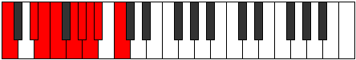 |
| [1979](https://ianring.com/musictheory/scales/1979) | [Aeradygic](ModeFNaturalAeradygic.md) | F | F, F#, G#, A, A#, C, C#, D, D#, F |  |
| [1979](https://ianring.com/musictheory/scales/1979) | [Aeradygic](ModeCNaturalAeradygic.md) | C | C, C#, D#, E, F, G, G#, A, A#, C |  |
| [1979](https://ianring.com/musictheory/scales/1979) | [Aeradygic](ModeGSharpAeradygic.md) | G# | G#, A, B, C, C#, D#, E, F, F#, G# |  |
| [1979](https://ianring.com/musictheory/scales/1979) | [Aeradygic](ModeAFlatAeradygic.md) | Ab | Ab, A, B, C, Db, Eb, E, F, Gb, Ab |  |
| [1979](https://ianring.com/musictheory/scales/1979) | [Aeradygic](ModeBNaturalAeradygic.md) | B | B, C, D, D#, E, F#, G, G#, A, B |  |
| [1981](https://ianring.com/musictheory/scales/1981) | [Gadygic](ModeFNaturalGadygic.md) | F | F, G, G#, A, A#, C, C#, D, D#, F |  |
| [1981](https://ianring.com/musictheory/scales/1981) | [Gadygic](ModeCNaturalGadygic.md) | C | C, D, D#, E, F, G, G#, A, A#, C |  |
| [1983](https://ianring.com/musictheory/scales/1983) | [Soryllian](ModeCNaturalSoryllian.md) | C | C, C#, D, D#, E, F, G, G#, A, A#, C |  |
| [1983](https://ianring.com/musictheory/scales/1983) | [Soryllian](ModeFNaturalSoryllian.md) | F | F, F#, G, G#, A, A#, C, C#, D, D#, F |  |
| [1983](https://ianring.com/musictheory/scales/1983) | [Soryllian](ModeBNaturalSoryllian.md) | B | B, C, C#, D, D#, E, F#, G, G#, A, B |  |
| [1983](https://ianring.com/musictheory/scales/1983) | [Soryllian](ModeGSharpSoryllian.md) | G# | G#, A, A#, B, C, C#, D#, E, F, F#, G# |  |
| [1983](https://ianring.com/musictheory/scales/1983) | [Soryllian](ModeAFlatSoryllian.md) | Ab | Ab, A, Bb, B, C, Db, Eb, E, F, Gb, Ab |  |
| [1983](https://ianring.com/musictheory/scales/1983) | [Soryllian](ModeGNaturalSoryllian.md) | G | G, G#, A, A#, B, C, D, D#, E, F, G |  |
| [1991](https://ianring.com/musictheory/scales/1991) | [Phryptyllic](ModeDNaturalPhryptyllic.md) | D | D, D#, E, G#, A, A#, B, C, D |  |
| [1993](https://ianring.com/musictheory/scales/1993) | [Katoptian](ModeCNaturalKatoptian.md) | C | C, D#, E##, F##, G#, A, Bb, C |  |
| [1995](https://ianring.com/musictheory/scales/1995) | [Aeolacryllic](ModeCNaturalAeolacryllic.md) | C | C, C#, D#, F#, G, G#, A, A#, C |  |
| [1995](https://ianring.com/musictheory/scales/1995) | [Aeolacryllic](ModeDNaturalAeolacryllic.md) | D | D, D#, F, G#, A, A#, B, C, D |  |
| [1997](https://ianring.com/musictheory/scales/1997) | [Staryllic](ModeFSharpStaryllic.md) | F# | F#, G#, A, C, C#, D, D#, E, F# |  |
| [1997](https://ianring.com/musictheory/scales/1997) | [Staryllic](ModeGFlatStaryllic.md) | Gb | Gb, Ab, A, C, Db, D, Eb, E, Gb |  |
| [1997](https://ianring.com/musictheory/scales/1997) | [Staryllic](ModeCNaturalStaryllic.md) | C | C, D, D#, F#, G, G#, A, A#, C |  |
| [1999](https://ianring.com/musictheory/scales/1999) | [Zacrygic](ModeFSharpZacrygic.md) | F# | F#, G, G#, A, C, C#, D, D#, E, F# |  |
| [1999](https://ianring.com/musictheory/scales/1999) | [Zacrygic](ModeGFlatZacrygic.md) | Gb | Gb, G, Ab, A, C, Db, D, Eb, E, Gb |  |
| [1999](https://ianring.com/musictheory/scales/1999) | [Zacrygic](ModeCNaturalZacrygic.md) | C | C, C#, D, D#, F#, G, G#, A, A#, C |  |
| [1999](https://ianring.com/musictheory/scales/1999) | [Zacrygic](ModeDNaturalZacrygic.md) | D | D, D#, E, F, G#, A, A#, B, C, D |  |
| [2003](https://ianring.com/musictheory/scales/2003) | [Lolyllic](ModeGSharpLolyllic.md) | G# | G#, A, C, D, D#, E, F, F#, G# |  |
| [2003](https://ianring.com/musictheory/scales/2003) | [Lolyllic](ModeAFlatLolyllic.md) | Ab | Ab, A, C, D, Eb, E, F, Gb, Ab |  |
| [2003](https://ianring.com/musictheory/scales/2003) | [Lolyllic](ModeBNaturalLolyllic.md) | B | B, C, D#, F, F#, G, G#, A, B |  |
| [2003](https://ianring.com/musictheory/scales/2003) | [Lolyllic](ModeDNaturalLolyllic.md) | D | D, D#, F#, G#, A, A#, B, C, D |  |
| [2007](https://ianring.com/musictheory/scales/2007) | [Stonygic](ModeGSharpStonygic.md) | G# | G#, A, A#, C, D, D#, E, F, F#, G# |  |
| [2007](https://ianring.com/musictheory/scales/2007) | [Stonygic](ModeAFlatStonygic.md) | Ab | Ab, A, Bb, C, D, Eb, E, F, Gb, Ab |  |
| [2007](https://ianring.com/musictheory/scales/2007) | [Stonygic](ModeBNaturalStonygic.md) | B | B, C, C#, D#, F, F#, G, G#, A, B |  |
| [2007](https://ianring.com/musictheory/scales/2007) | [Stonygic](ModeDNaturalStonygic.md) | D | D, D#, E, F#, G#, A, A#, B, C, D |  |
| [2009](https://ianring.com/musictheory/scales/2009) | [Stacryllic](ModeCNaturalStacryllic.md) | C | C, D#, E, F#, G, G#, A, A#, C |  |
| [2009](https://ianring.com/musictheory/scales/2009) | [Stacryllic](ModeFNaturalStacryllic.md) | F | F, G#, A, B, C, C#, D, D#, F |  |
| [2011](https://ianring.com/musictheory/scales/2011) | [Raphygic](ModeCNaturalRaphygic.md) | C | C, C#, D#, E, F#, G, G#, A, A#, C |  |
| [2011](https://ianring.com/musictheory/scales/2011) | [Raphygic](ModeFNaturalRaphygic.md) | F | F, F#, G#, A, B, C, C#, D, D#, F |  |
| [2011](https://ianring.com/musictheory/scales/2011) | [Raphygic](ModeGSharpRaphygic.md) | G# | G#, A, B, C, D, D#, E, F, F#, G# |  |
| [2011](https://ianring.com/musictheory/scales/2011) | [Raphygic](ModeAFlatRaphygic.md) | Ab | Ab, A, B, C, D, Eb, E, F, Gb, Ab |  |
| [2011](https://ianring.com/musictheory/scales/2011) | [Raphygic](ModeBNaturalRaphygic.md) | B | B, C, D, D#, F, F#, G, G#, A, B |  |
| [2011](https://ianring.com/musictheory/scales/2011) | [Raphygic](ModeDNaturalRaphygic.md) | D | D, D#, F, F#, G#, A, A#, B, C, D |  |
| [2013](https://ianring.com/musictheory/scales/2013) | [Mocrygic](ModeFSharpMocrygic.md) | F# | F#, G#, A, A#, C, C#, D, D#, E, F# |  |
| [2013](https://ianring.com/musictheory/scales/2013) | [Mocrygic](ModeGFlatMocrygic.md) | Gb | Gb, Ab, A, Bb, C, Db, D, Eb, E, Gb |  |
| [2013](https://ianring.com/musictheory/scales/2013) | [Mocrygic](ModeCNaturalMocrygic.md) | C | C, D, D#, E, F#, G, G#, A, A#, C |  |
| [2013](https://ianring.com/musictheory/scales/2013) | [Mocrygic](ModeFNaturalMocrygic.md) | F | F, G, G#, A, B, C, C#, D, D#, F |  |
| [2015](https://ianring.com/musictheory/scales/2015) | [Epiryllian](ModeCNaturalEpiryllian.md) | C | C, C#, D, D#, E, F#, G, G#, A, A#, C |  |
| [2015](https://ianring.com/musictheory/scales/2015) | [Epiryllian](ModeFSharpEpiryllian.md) | F# | F#, G, G#, A, A#, C, C#, D, D#, E, F# |  |
| [2015](https://ianring.com/musictheory/scales/2015) | [Epiryllian](ModeGFlatEpiryllian.md) | Gb | Gb, G, Ab, A, Bb, C, Db, D, Eb, E, Gb |  |
| [2015](https://ianring.com/musictheory/scales/2015) | [Epiryllian](ModeFNaturalEpiryllian.md) | F | F, F#, G, G#, A, B, C, C#, D, D#, F |  |
| [2015](https://ianring.com/musictheory/scales/2015) | [Epiryllian](ModeBNaturalEpiryllian.md) | B | B, C, C#, D, D#, F, F#, G, G#, A, B |  |
| [2015](https://ianring.com/musictheory/scales/2015) | [Epiryllian](ModeDNaturalEpiryllian.md) | D | D, D#, E, F, F#, G#, A, A#, B, C, D |  |
| [2015](https://ianring.com/musictheory/scales/2015) | [Epiryllian](ModeGSharpEpiryllian.md) | G# | G#, A, A#, B, C, D, D#, E, F, F#, G# |  |
| [2015](https://ianring.com/musictheory/scales/2015) | [Epiryllian](ModeAFlatEpiryllian.md) | Ab | Ab, A, Bb, B, C, D, Eb, E, F, Gb, Ab |  |
| [2019](https://ianring.com/musictheory/scales/2019) | [Palyllic](ModeDSharpPalyllic.md) | D# | D#, E, G#, A, A#, B, C, C#, D# |  |
| [2019](https://ianring.com/musictheory/scales/2019) | [Palyllic](ModeEFlatPalyllic.md) | Eb | Eb, E, Ab, A, Bb, B, C, Db, Eb |  |
| [2019](https://ianring.com/musictheory/scales/2019) | [Palyllic](ModeDNaturalPalyllic.md) | D | D, D#, G, G#, A, A#, B, C, D |  |
| [2021](https://ianring.com/musictheory/scales/2021) | [Katycryllic](ModeDSharpKatycryllic.md) | D# | D#, F, G#, A, A#, B, C, C#, D# |  |
| [2021](https://ianring.com/musictheory/scales/2021) | [Katycryllic](ModeEFlatKatycryllic.md) | Eb | Eb, F, Ab, A, Bb, B, C, Db, Eb |  |
| [2023](https://ianring.com/musictheory/scales/2023) | [Zodygic](ModeGNaturalZodygic.md) | G | G, G#, A, C, C#, D, D#, E, F, G |  |
| [2023](https://ianring.com/musictheory/scales/2023) | [Zodygic](ModeDSharpZodygic.md) | D# | D#, E, F, G#, A, A#, B, C, C#, D# |  |
| [2023](https://ianring.com/musictheory/scales/2023) | [Zodygic](ModeEFlatZodygic.md) | Eb | Eb, E, F, Ab, A, Bb, B, C, Db, Eb |  |
| [2023](https://ianring.com/musictheory/scales/2023) | [Zodygic](ModeDNaturalZodygic.md) | D | D, D#, E, G, G#, A, A#, B, C, D |  |
| [2025](https://ianring.com/musictheory/scales/2025) | [Mixolydyllic](ModeCNaturalMixolydyllic.md) | C | C, D#, F, F#, G, G#, A, A#, C |  |
| [2025](https://ianring.com/musictheory/scales/2025) | [Mixolydyllic](ModeDSharpMixolydyllic.md) | D# | D#, F#, G#, A, A#, B, C, C#, D# |  |
| [2025](https://ianring.com/musictheory/scales/2025) | [Mixolydyllic](ModeEFlatMixolydyllic.md) | Eb | Eb, Gb, Ab, A, Bb, B, C, Db, Eb |  |
| [2027](https://ianring.com/musictheory/scales/2027) | [Boptygic](ModeCNaturalBoptygic.md) | C | C, C#, D#, F, F#, G, G#, A, A#, C |  |
| [2027](https://ianring.com/musictheory/scales/2027) | [Boptygic](ModeDSharpBoptygic.md) | D# | D#, E, F#, G#, A, A#, B, C, C#, D# |  |
| [2027](https://ianring.com/musictheory/scales/2027) | [Boptygic](ModeEFlatBoptygic.md) | Eb | Eb, E, Gb, Ab, A, Bb, B, C, Db, Eb |  |
| [2027](https://ianring.com/musictheory/scales/2027) | [Boptygic](ModeDNaturalBoptygic.md) | D | D, D#, F, G, G#, A, A#, B, C, D |  |
| [2029](https://ianring.com/musictheory/scales/2029) | [Mathygic](ModeCNaturalMathygic.md) | C | C, D, D#, F, F#, G, G#, A, A#, C |  |
| [2029](https://ianring.com/musictheory/scales/2029) | [Mathygic](ModeFSharpMathygic.md) | F# | F#, G#, A, B, C, C#, D, D#, E, F# |  |
| [2029](https://ianring.com/musictheory/scales/2029) | [Mathygic](ModeGFlatMathygic.md) | Gb | Gb, Ab, A, B, C, Db, D, Eb, E, Gb |  |
| [2029](https://ianring.com/musictheory/scales/2029) | [Mathygic](ModeDSharpMathygic.md) | D# | D#, F, F#, G#, A, A#, B, C, C#, D# |  |
| [2029](https://ianring.com/musictheory/scales/2029) | [Mathygic](ModeEFlatMathygic.md) | Eb | Eb, F, Gb, Ab, A, Bb, B, C, Db, Eb |  |
| [2031](https://ianring.com/musictheory/scales/2031) | [Gadyllian](ModeGNaturalGadyllian.md) | G | G, G#, A, A#, C, C#, D, D#, E, F, G |  |
| [2031](https://ianring.com/musictheory/scales/2031) | [Gadyllian](ModeCNaturalGadyllian.md) | C | C, C#, D, D#, F, F#, G, G#, A, A#, C |  |
| [2031](https://ianring.com/musictheory/scales/2031) | [Gadyllian](ModeFSharpGadyllian.md) | F# | F#, G, G#, A, B, C, C#, D, D#, E, F# |  |
| [2031](https://ianring.com/musictheory/scales/2031) | [Gadyllian](ModeGFlatGadyllian.md) | Gb | Gb, G, Ab, A, B, C, Db, D, Eb, E, Gb |  |
| [2031](https://ianring.com/musictheory/scales/2031) | [Gadyllian](ModeDSharpGadyllian.md) | D# | D#, E, F, F#, G#, A, A#, B, C, C#, D# |  |
| [2031](https://ianring.com/musictheory/scales/2031) | [Gadyllian](ModeEFlatGadyllian.md) | Eb | Eb, E, F, Gb, Ab, A, Bb, B, C, Db, Eb |  |
| [2031](https://ianring.com/musictheory/scales/2031) | [Gadyllian](ModeDNaturalGadyllian.md) | D | D, D#, E, F, G, G#, A, A#, B, C, D |  |
| [2033](https://ianring.com/musictheory/scales/2033) | [Stolyllic](ModeDSharpStolyllic.md) | D# | D#, G, G#, A, A#, B, C, C#, D# |  |
| [2033](https://ianring.com/musictheory/scales/2033) | [Stolyllic](ModeEFlatStolyllic.md) | Eb | Eb, G, Ab, A, Bb, B, C, Db, Eb |  |
| [2035](https://ianring.com/musictheory/scales/2035) | [Aerythygic](ModeGSharpAerythygic.md) | G# | G#, A, C, C#, D, D#, E, F, F#, G# |  |
| [2035](https://ianring.com/musictheory/scales/2035) | [Aerythygic](ModeAFlatAerythygic.md) | Ab | Ab, A, C, Db, D, Eb, E, F, Gb, Ab |  |
| [2035](https://ianring.com/musictheory/scales/2035) | [Aerythygic](ModeBNaturalAerythygic.md) | B | B, C, D#, E, F, F#, G, G#, A, B |  |
| [2035](https://ianring.com/musictheory/scales/2035) | [Aerythygic](ModeDSharpAerythygic.md) | D# | D#, E, G, G#, A, A#, B, C, C#, D# |  |
| [2035](https://ianring.com/musictheory/scales/2035) | [Aerythygic](ModeEFlatAerythygic.md) | Eb | Eb, E, G, Ab, A, Bb, B, C, Db, Eb |  |
| [2035](https://ianring.com/musictheory/scales/2035) | [Aerythygic](ModeDNaturalAerythygic.md) | D | D, D#, F#, G, G#, A, A#, B, C, D |  |
| [2037](https://ianring.com/musictheory/scales/2037) | [Sythygic](ModeDSharpSythygic.md) | D# | D#, F, G, G#, A, A#, B, C, C#, D# |  |
| [2037](https://ianring.com/musictheory/scales/2037) | [Sythygic](ModeEFlatSythygic.md) | Eb | Eb, F, G, Ab, A, Bb, B, C, Db, Eb |  |
| [2039](https://ianring.com/musictheory/scales/2039) | [Danyllian](ModeGSharpDanyllian.md) | G# | G#, A, A#, C, C#, D, D#, E, F, F#, G# |  |
| [2039](https://ianring.com/musictheory/scales/2039) | [Danyllian](ModeAFlatDanyllian.md) | Ab | Ab, A, Bb, C, Db, D, Eb, E, F, Gb, Ab |  |
| [2039](https://ianring.com/musictheory/scales/2039) | [Danyllian](ModeGNaturalDanyllian.md) | G | G, G#, A, B, C, C#, D, D#, E, F, G |  |
| [2039](https://ianring.com/musictheory/scales/2039) | [Danyllian](ModeBNaturalDanyllian.md) | B | B, C, C#, D#, E, F, F#, G, G#, A, B |  |
| [2039](https://ianring.com/musictheory/scales/2039) | [Danyllian](ModeDSharpDanyllian.md) | D# | D#, E, F, G, G#, A, A#, B, C, C#, D# |  |
| [2039](https://ianring.com/musictheory/scales/2039) | [Danyllian](ModeEFlatDanyllian.md) | Eb | Eb, E, F, G, Ab, A, Bb, B, C, Db, Eb |  |
| [2039](https://ianring.com/musictheory/scales/2039) | [Danyllian](ModeDNaturalDanyllian.md) | D | D, D#, E, F#, G, G#, A, A#, B, C, D |  |
| [2041](https://ianring.com/musictheory/scales/2041) | [Aeolacrygic](ModeCNaturalAeolacrygic.md) | C | C, D#, E, F, F#, G, G#, A, A#, C |  |
| [2041](https://ianring.com/musictheory/scales/2041) | [Aeolacrygic](ModeFNaturalAeolacrygic.md) | F | F, G#, A, A#, B, C, C#, D, D#, F |  |
| [2041](https://ianring.com/musictheory/scales/2041) | [Aeolacrygic](ModeDSharpAeolacrygic.md) | D# | D#, F#, G, G#, A, A#, B, C, C#, D# |  |
| [2041](https://ianring.com/musictheory/scales/2041) | [Aeolacrygic](ModeEFlatAeolacrygic.md) | Eb | Eb, Gb, G, Ab, A, Bb, B, C, Db, Eb |  |
| [2043](https://ianring.com/musictheory/scales/2043) | [Lythyllian](ModeCNaturalLythyllian.md) | C | C, C#, D#, E, F, F#, G, G#, A, A#, C |  |
| [2043](https://ianring.com/musictheory/scales/2043) | [Lythyllian](ModeGSharpLythyllian.md) | G# | G#, A, B, C, C#, D, D#, E, F, F#, G# |  |
| [2043](https://ianring.com/musictheory/scales/2043) | [Lythyllian](ModeAFlatLythyllian.md) | Ab | Ab, A, B, C, Db, D, Eb, E, F, Gb, Ab |  |
| [2043](https://ianring.com/musictheory/scales/2043) | [Lythyllian](ModeBNaturalLythyllian.md) | B | B, C, D, D#, E, F, F#, G, G#, A, B |  |
| [2043](https://ianring.com/musictheory/scales/2043) | [Lythyllian](ModeFNaturalLythyllian.md) | F | F, F#, G#, A, A#, B, C, C#, D, D#, F |  |
| [2043](https://ianring.com/musictheory/scales/2043) | [Lythyllian](ModeDSharpLythyllian.md) | D# | D#, E, F#, G, G#, A, A#, B, C, C#, D# |  |
| [2043](https://ianring.com/musictheory/scales/2043) | [Lythyllian](ModeEFlatLythyllian.md) | Eb | Eb, E, Gb, G, Ab, A, Bb, B, C, Db, Eb |  |
| [2043](https://ianring.com/musictheory/scales/2043) | [Lythyllian](ModeDNaturalLythyllian.md) | D | D, D#, F, F#, G, G#, A, A#, B, C, D |  |
| [2045](https://ianring.com/musictheory/scales/2045) | [Katogyllian](ModeCNaturalKatogyllian.md) | C | C, D, D#, E, F, F#, G, G#, A, A#, C |  |
| [2045](https://ianring.com/musictheory/scales/2045) | [Katogyllian](ModeFSharpKatogyllian.md) | F# | F#, G#, A, A#, B, C, C#, D, D#, E, F# |  |
| [2045](https://ianring.com/musictheory/scales/2045) | [Katogyllian](ModeGFlatKatogyllian.md) | Gb | Gb, Ab, A, Bb, B, C, Db, D, Eb, E, Gb |  |
| [2045](https://ianring.com/musictheory/scales/2045) | [Katogyllian](ModeFNaturalKatogyllian.md) | F | F, G, G#, A, A#, B, C, C#, D, D#, F |  |
| [2045](https://ianring.com/musictheory/scales/2045) | [Katogyllian](ModeDSharpKatogyllian.md) | D# | D#, F, F#, G, G#, A, A#, B, C, C#, D# |  |
| [2045](https://ianring.com/musictheory/scales/2045) | [Katogyllian](ModeEFlatKatogyllian.md) | Eb | Eb, F, Gb, G, Ab, A, Bb, B, C, Db, Eb |  |
| [2047](https://ianring.com/musictheory/scales/2047) | [Monatic](ModeCNaturalMonatic.md) | C | C, C#, D, D#, E, F, F#, G, G#, A, A#, C |  |
| [2047](https://ianring.com/musictheory/scales/2047) | [Monatic](ModeBNaturalMonatic.md) | B | B, C, C#, D, D#, E, F, F#, G, G#, A, B |  |
| [2047](https://ianring.com/musictheory/scales/2047) | [Monatic](ModeGSharpMonatic.md) | G# | G#, A, A#, B, C, C#, D, D#, E, F, F#, G# |  |
| [2047](https://ianring.com/musictheory/scales/2047) | [Monatic](ModeAFlatMonatic.md) | Ab | Ab, A, Bb, B, C, Db, D, Eb, E, F, Gb, Ab |  |
| [2047](https://ianring.com/musictheory/scales/2047) | [Monatic](ModeGNaturalMonatic.md) | G | G, G#, A, A#, B, C, C#, D, D#, E, F, G |  |
| [2047](https://ianring.com/musictheory/scales/2047) | [Monatic](ModeFSharpMonatic.md) | F# | F#, G, G#, A, A#, B, C, C#, D, D#, E, F# |  |
| [2047](https://ianring.com/musictheory/scales/2047) | [Monatic](ModeGFlatMonatic.md) | Gb | Gb, G, Ab, A, Bb, B, C, Db, D, Eb, E, Gb |  |
| [2047](https://ianring.com/musictheory/scales/2047) | [Monatic](ModeFNaturalMonatic.md) | F | F, F#, G, G#, A, A#, B, C, C#, D, D#, F |  |
| [2047](https://ianring.com/musictheory/scales/2047) | [Monatic](ModeDSharpMonatic.md) | D# | D#, E, F, F#, G, G#, A, A#, B, C, C#, D# |  |
| [2047](https://ianring.com/musictheory/scales/2047) | [Monatic](ModeEFlatMonatic.md) | Eb | Eb, E, F, Gb, G, Ab, A, Bb, B, C, Db, Eb |  |
| [2047](https://ianring.com/musictheory/scales/2047) | [Monatic](ModeDNaturalMonatic.md) | D | D, D#, E, F, F#, G, G#, A, A#, B, C, D |  |
| [2195](https://ianring.com/musictheory/scales/2195) | [Zalitonic](ModeGSharpZalitonic.md) | G# | G#, A, C, D#, G, G# |  |
| [2195](https://ianring.com/musictheory/scales/2195) | [Zalitonic](ModeAFlatZalitonic.md) | Ab | Ab, A, C, Eb, G, Ab |  |
| [2199](https://ianring.com/musictheory/scales/2199) | [Dyptimic](ModeGSharpDyptimic.md) | G# | G#, A, Bb, C, D#, E###, G# |  |
| [2199](https://ianring.com/musictheory/scales/2199) | [Dyptimic](ModeAFlatDyptimic.md) | Ab | Ab, Bbb, Cbb, Dbb, Eb, F##, Ab |  |
| [2203](https://ianring.com/musictheory/scales/2203) | [Dorimic](ModeGSharpDorimic.md) | G# | G#, A, B, C, D#, E###, G# |  |
| [2203](https://ianring.com/musictheory/scales/2203) | [Dorimic](ModeAFlatDorimic.md) | Ab | Ab, Bbb, Cb, Dbb, Eb, F##, Ab |  |
| [2207](https://ianring.com/musictheory/scales/2207) | [Mygian](ModeGSharpMygian.md) | G# | G#, A, Bb, Cb, Dbb, Eb, F##, G# |  |
| [2207](https://ianring.com/musictheory/scales/2207) | [Mygian](ModeAFlatMygian.md) | Ab | Ab, Bbb, Cbb, Dbbb, Dbb, Eb, F##, Ab |  |
| [2227](https://ianring.com/musictheory/scales/2227) | [Katadimic](ModeGSharpKatadimic.md) | G# | G#, A, B#, C#, D#, E###, G# |  |
| [2227](https://ianring.com/musictheory/scales/2227) | [Katadimic](ModeAFlatKatadimic.md) | Ab | Ab, Bbb, C, Db, Eb, F##, Ab |  |
| [2231](https://ianring.com/musictheory/scales/2231) | [Macrian](ModeGSharpMacrian.md) | G# | G#, A, Bb, C, Db, Eb, F##, G# |  |
| [2231](https://ianring.com/musictheory/scales/2231) | [Macrian](ModeAFlatMacrian.md) | Ab | Ab, Bbb, Cbb, Dbb, Ebbb, Fbb, G, Ab |  |
| [2235](https://ianring.com/musictheory/scales/2235) | [Bathian](ModeGSharpBathian.md) | G# | G#, A, B, C, Db, Eb, F##, G# |  |
| [2235](https://ianring.com/musictheory/scales/2235) | [Bathian](ModeAFlatBathian.md) | Ab | Ab, Bbb, Cb, Dbb, Ebbb, Fbb, G, Ab |  |
| [2239](https://ianring.com/musictheory/scales/2239) | [Dacryllic](ModeGSharpDacryllic.md) | G# | G#, A, A#, B, C, C#, D#, G, G# |  |
| [2239](https://ianring.com/musictheory/scales/2239) | [Dacryllic](ModeAFlatDacryllic.md) | Ab | Ab, A, Bb, B, C, Db, Eb, G, Ab |  |
| [2249](https://ianring.com/musictheory/scales/2249) | [Kygitonic](ModeANaturalKygitonic.md) | A | A, C, D#, E, G#, A |  |
| [2251](https://ianring.com/musictheory/scales/2251) | [Zodimic](ModeANaturalZodimic.md) | A | A, Bb, C, D#, E, F###, A |  |
| [2253](https://ianring.com/musictheory/scales/2253) | [Logimic](ModeANaturalLogimic.md) | A | A, B, C, D#, E, F###, A |  |
| [2255](https://ianring.com/musictheory/scales/2255) | [Dylian](ModeANaturalDylian.md) | A | A, Bb, Cb, Dbb, Eb, Fb, G#, A |  |
| [2259](https://ianring.com/musictheory/scales/2259) | [Gogimic](ModeGSharpGogimic.md) | G# | G#, A, B#, C##, D#, E###, G# |  |
| [2259](https://ianring.com/musictheory/scales/2259) | [Gogimic](ModeAFlatGogimic.md) | Ab | Ab, Bbb, C, D, Eb, F##, Ab |  |
| [2263](https://ianring.com/musictheory/scales/2263) | [Lycrian](ModeGSharpLycrian.md) | G# | G#, A, Bb, C, D, Eb, F##, G# |  |
| [2263](https://ianring.com/musictheory/scales/2263) | [Lycrian](ModeAFlatLycrian.md) | Ab | Ab, Bbb, Cbb, Dbb, Ebb, Fbb, G, Ab |  |
| [2265](https://ianring.com/musictheory/scales/2265) | [Ionophimic](ModeANaturalIonophimic.md) | A | A, B#, C#, D#, E, F###, A |  |
| [2267](https://ianring.com/musictheory/scales/2267) | [Padian](ModeANaturalPadian.md) | A | A, Bb, C, Db, Eb, Fb, G#, A |  |
| [2267](https://ianring.com/musictheory/scales/2267) | [Padian](ModeGSharpPadian.md) | G# | G#, A, B, C, D, Eb, F##, G# |  |
| [2267](https://ianring.com/musictheory/scales/2267) | [Padian](ModeAFlatPadian.md) | Ab | Ab, Bbb, Cb, Dbb, Ebb, Fbb, G, Ab |  |
| [2269](https://ianring.com/musictheory/scales/2269) | [Pygian](ModeANaturalPygian.md) | A | A, B, C, Db, Eb, Fb, G#, A |  |
| [2271](https://ianring.com/musictheory/scales/2271) | [Poptyllic](ModeANaturalPoptyllic.md) | A | A, A#, B, C, C#, D#, E, G#, A |  |
| [2271](https://ianring.com/musictheory/scales/2271) | [Poptyllic](ModeGSharpPoptyllic.md) | G# | G#, A, A#, B, C, D, D#, G, G# |  |
| [2271](https://ianring.com/musictheory/scales/2271) | [Poptyllic](ModeAFlatPoptyllic.md) | Ab | Ab, A, Bb, B, C, D, Eb, G, Ab |  |
| [2281](https://ianring.com/musictheory/scales/2281) | [Rathimic](ModeANaturalRathimic.md) | A | A, B#, C##, D#, E, F###, A |  |
| [2283](https://ianring.com/musictheory/scales/2283) | [Aeolyptian](ModeANaturalAeolyptian.md) | A | A, Bb, C, D, Eb, Fb, G#, A |  |
| [2285](https://ianring.com/musictheory/scales/2285) | [Aerogian](ModeANaturalAerogian.md) | A | A, B, C, D, Eb, Fb, G#, A |  |
| [2287](https://ianring.com/musictheory/scales/2287) | [Lodyllic](ModeANaturalLodyllic.md) | A | A, A#, B, C, D, D#, E, G#, A |  |
| [2291](https://ianring.com/musictheory/scales/2291) | [Zydian](ModeGSharpZydian.md) | G# | G#, A, B#, C#, D, Eb, F##, G# |  |
| [2291](https://ianring.com/musictheory/scales/2291) | [Zydian](ModeAFlatZydian.md) | Ab | Ab, Bbb, C, Db, Ebb, Fbb, G, Ab |  |
| [2295](https://ianring.com/musictheory/scales/2295) | [Kogyllic](ModeGSharpKogyllic.md) | G# | G#, A, A#, C, C#, D, D#, G, G# |  |
| [2295](https://ianring.com/musictheory/scales/2295) | [Kogyllic](ModeAFlatKogyllic.md) | Ab | Ab, A, Bb, C, Db, D, Eb, G, Ab |  |
| [2297](https://ianring.com/musictheory/scales/2297) | [Thylian](ModeANaturalThylian.md) | A | A, B#, C#, D, Eb, Fb, G#, A |  |
| [2299](https://ianring.com/musictheory/scales/2299) | [Phraptyllic](ModeANaturalPhraptyllic.md) | A | A, A#, C, C#, D, D#, E, G#, A |  |
| [2299](https://ianring.com/musictheory/scales/2299) | [Phraptyllic](ModeGSharpPhraptyllic.md) | G# | G#, A, B, C, C#, D, D#, G, G# |  |
| [2299](https://ianring.com/musictheory/scales/2299) | [Phraptyllic](ModeAFlatPhraptyllic.md) | Ab | Ab, A, B, C, Db, D, Eb, G, Ab |  |
| [2301](https://ianring.com/musictheory/scales/2301) | [Bydyllic](ModeANaturalBydyllic.md) | A | A, B, C, C#, D, D#, E, G#, A |  |
| [2303](https://ianring.com/musictheory/scales/2303) | [Stanygic](ModeANaturalStanygic.md) | A | A, A#, B, C, C#, D, D#, E, G#, A |  |
| [2303](https://ianring.com/musictheory/scales/2303) | [Stanygic](ModeGSharpStanygic.md) | G# | G#, A, A#, B, C, C#, D, D#, G, G# |  |
| [2303](https://ianring.com/musictheory/scales/2303) | [Stanygic](ModeAFlatStanygic.md) | Ab | Ab, A, Bb, B, C, Db, D, Eb, G, Ab |  |
| [2343](https://ianring.com/musictheory/scales/2343) | [Tharimic](ModeGNaturalTharimic.md) | G | G, Ab, Bbb, C, D#, E##, G |  |
| [2351](https://ianring.com/musictheory/scales/2351) | [Gynian](ModeGNaturalGynian.md) | G | G, Ab, Bbb, Cbb, Dbb, Eb, F#, G | 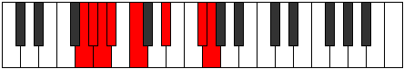 |
| [2353](https://ianring.com/musictheory/scales/2353) | [Lycritonic](ModeENaturalLycritonic.md) | E | E, G#, A, C, D#, E |  |
| [2355](https://ianring.com/musictheory/scales/2355) | [Katycrimic](ModeENaturalKatycrimic.md) | E | E, F, G#, A, B#, C###, E |  |
| [2357](https://ianring.com/musictheory/scales/2357) | [Ionaptimic](ModeENaturalIonaptimic.md) | E | E, F#, G#, A, B#, C###, E |  |
| [2359](https://ianring.com/musictheory/scales/2359) | [Gadian](ModeENaturalGadian.md) | E | E, F, Gb, Ab, Bbb, C, D#, E |  |
| [2359](https://ianring.com/musictheory/scales/2359) | [Gadian](ModeGNaturalGadian.md) | G | G, Ab, Bbb, Cb, Dbb, Eb, F#, G |  |
| [2361](https://ianring.com/musictheory/scales/2361) | [Docrimic](ModeENaturalDocrimic.md) | E | E, F##, G#, A, B#, C###, E |  |
| [2363](https://ianring.com/musictheory/scales/2363) | [Kataptian](ModeENaturalKataptian.md) | E | E, F, G, Ab, Bbb, C, D#, E |  |
| [2365](https://ianring.com/musictheory/scales/2365) | [Sythian](ModeENaturalSythian.md) | E | E, F#, G, Ab, Bbb, C, D#, E | 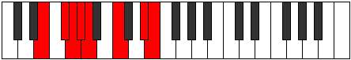 |
| [2367](https://ianring.com/musictheory/scales/2367) | [Laryllic](ModeENaturalLaryllic.md) | E | E, F, F#, G, G#, A, C, D#, E |  |
| [2367](https://ianring.com/musictheory/scales/2367) | [Laryllic](ModeGNaturalLaryllic.md) | G | G, G#, A, A#, B, C, D#, F#, G |  |
| [2377](https://ianring.com/musictheory/scales/2377) | [Thoditonic](ModeANaturalThoditonic.md) | A | A, C, D#, F, G#, A |  |
| [2379](https://ianring.com/musictheory/scales/2379) | [Stathimic](ModeANaturalStathimic.md) | A | A, Bb, C, D#, E#, F###, A |  |
| [2381](https://ianring.com/musictheory/scales/2381) | [Sorimic](ModeANaturalSorimic.md) | A | A, B, C, D#, E#, F###, A |  |
| [2383](https://ianring.com/musictheory/scales/2383) | [Katorian](ModeANaturalKatorian.md) | A | A, Bb, Cb, Dbb, Eb, F, G#, A |  |
| [2393](https://ianring.com/musictheory/scales/2393) | [Zathimic](ModeANaturalZathimic.md) | A | A, B#, C#, D#, E#, F###, A |  |
| [2395](https://ianring.com/musictheory/scales/2395) | [Zoptian](ModeANaturalZoptian.md) | A | A, Bb, C, Db, Eb, F, G#, A |  |
| [2397](https://ianring.com/musictheory/scales/2397) | [Stagian](ModeANaturalStagian.md) | A | A, B, C, Db, Eb, F, G#, A |  |
| [2399](https://ianring.com/musictheory/scales/2399) | [Zanyllic](ModeANaturalZanyllic.md) | A | A, A#, B, C, C#, D#, F, G#, A |  |
| [2407](https://ianring.com/musictheory/scales/2407) | [Zylian](ModeGNaturalZylian.md) | G | G, Ab, Bbb, C, Db, Eb, F#, G |  |
| [2409](https://ianring.com/musictheory/scales/2409) | [Zacrimic](ModeANaturalZacrimic.md) | A | A, B#, C##, D#, E#, F###, A |  |
| [2411](https://ianring.com/musictheory/scales/2411) | [Aeolorian](ModeANaturalAeolorian.md) | A | A, Bb, C, D, Eb, F, G#, A |  |
| [2413](https://ianring.com/musictheory/scales/2413) | [Phrydian](ModeANaturalPhrydian.md) | A | A, B, C, D, Eb, F, G#, A |  |
| [2415](https://ianring.com/musictheory/scales/2415) | [Lothyllic](ModeGNaturalLothyllic.md) | G | G, G#, A, A#, C, C#, D#, F#, G |  |
| [2415](https://ianring.com/musictheory/scales/2415) | [Lothyllic](ModeANaturalLothyllic.md) | A | A, A#, B, C, D, D#, F, G#, A |  |
| [2417](https://ianring.com/musictheory/scales/2417) | [Kanimic](ModeENaturalKanimic.md) | E | E, F###, G##, A#, B#, C###, E |  |
| [2419](https://ianring.com/musictheory/scales/2419) | [Paptian](ModeENaturalPaptian.md) | E | E, F, G#, A, Bb, C, D#, E |  |
| [2421](https://ianring.com/musictheory/scales/2421) | [Malian](ModeENaturalMalian.md) | E | E, F#, G#, A, Bb, C, D#, E |  |
| [2423](https://ianring.com/musictheory/scales/2423) | [Thorcryllic](ModeENaturalThorcryllic.md) | E | E, F, F#, G#, A, A#, C, D#, E |  |
| [2423](https://ianring.com/musictheory/scales/2423) | [Thorcryllic](ModeGNaturalThorcryllic.md) | G | G, G#, A, B, C, C#, D#, F#, G | 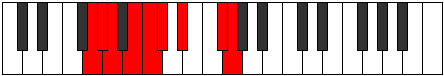 |
| [2425](https://ianring.com/musictheory/scales/2425) | [Rorian](ModeANaturalRorian.md) | A | A, B#, C#, D, Eb, F, G#, A |  |
| [2425](https://ianring.com/musictheory/scales/2425) | [Rorian](ModeENaturalRorian.md) | E | E, F##, G#, A, Bb, C, D#, E |  |
| [2427](https://ianring.com/musictheory/scales/2427) | [Katoryllic](ModeANaturalKatoryllic.md) | A | A, A#, C, C#, D, D#, F, G#, A | 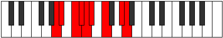 |
| [2427](https://ianring.com/musictheory/scales/2427) | [Katoryllic](ModeENaturalKatoryllic.md) | E | E, F, G, G#, A, A#, C, D#, E |  |
| [2429](https://ianring.com/musictheory/scales/2429) | [Kadyllic](ModeENaturalKadyllic.md) | E | E, F#, G, G#, A, A#, C, D#, E |  |
| [2429](https://ianring.com/musictheory/scales/2429) | [Kadyllic](ModeANaturalKadyllic.md) | A | A, B, C, C#, D, D#, F, G#, A |  |
| [2431](https://ianring.com/musictheory/scales/2431) | [Gythygic](ModeENaturalGythygic.md) | E | E, F, F#, G, G#, A, A#, C, D#, E |  |
| [2431](https://ianring.com/musictheory/scales/2431) | [Gythygic](ModeANaturalGythygic.md) | A | A, A#, B, C, C#, D, D#, F, G#, A |  |
| [2431](https://ianring.com/musictheory/scales/2431) | [Gythygic](ModeGNaturalGythygic.md) | G | G, G#, A, A#, B, C, C#, D#, F#, G |  |
| [2445](https://ianring.com/musictheory/scales/2445) | [Zadimic](ModeCSharpZadimic.md) | C# | C#, D#, E, F###, G##, A###, C# |  |
| [2445](https://ianring.com/musictheory/scales/2445) | [Zadimic](ModeDFlatZadimic.md) | Db | Db, Eb, Fb, G#, A, B#, Db |  |
| [2447](https://ianring.com/musictheory/scales/2447) | [Thagian](ModeCSharpThagian.md) | C# | C#, D, Eb, Fb, G#, A, B#, C# |  |
| [2447](https://ianring.com/musictheory/scales/2447) | [Thagian](ModeDFlatThagian.md) | Db | Db, Ebb, Fbb, Gbbb, Ab, Bbb, C, Db |  |
| [2451](https://ianring.com/musictheory/scales/2451) | [Aerynimic](ModeGSharpAerynimic.md) | G# | G#, A, B#, C###, D##, E###, G# |  |
| [2451](https://ianring.com/musictheory/scales/2451) | [Aerynimic](ModeAFlatAerynimic.md) | Ab | Ab, Bbb, C, D#, E, F##, Ab |  |
| [2453](https://ianring.com/musictheory/scales/2453) | [Stonimic](ModeCSharpStonimic.md) | C# | C#, D#, E#, F###, G##, A###, C# |  |
| [2453](https://ianring.com/musictheory/scales/2453) | [Stonimic](ModeDFlatStonimic.md) | Db | Db, Eb, F, G#, A, B#, Db |  |
| [2455](https://ianring.com/musictheory/scales/2455) | [Bothian](ModeCSharpBothian.md) | C# | C#, D, Eb, F, G#, A, B#, C# |  |
| [2455](https://ianring.com/musictheory/scales/2455) | [Bothian](ModeDFlatBothian.md) | Db | Db, Ebb, Fbb, Gbb, Ab, Bbb, C, Db |  |
| [2455](https://ianring.com/musictheory/scales/2455) | [Bothian](ModeGSharpBothian.md) | G# | G#, A, Bb, C, D#, E, F##, G# |  |
| [2455](https://ianring.com/musictheory/scales/2455) | [Bothian](ModeAFlatBothian.md) | Ab | Ab, Bbb, Cbb, Dbb, Eb, Fb, G, Ab |  |
| [2459](https://ianring.com/musictheory/scales/2459) | [Ionocrian](ModeGSharpIonocrian.md) | G# | G#, A, B, C, D#, E, F##, G# |  |
| [2459](https://ianring.com/musictheory/scales/2459) | [Ionocrian](ModeAFlatIonocrian.md) | Ab | Ab, Bbb, Cb, Dbb, Eb, Fb, G, Ab |  |
| [2461](https://ianring.com/musictheory/scales/2461) | [Sagian](ModeCSharpSagian.md) | C# | C#, D#, E, F, G#, A, B#, C# |  |
| [2461](https://ianring.com/musictheory/scales/2461) | [Sagian](ModeDFlatSagian.md) | Db | Db, Eb, Fb, Gbb, Ab, Bbb, C, Db |  |
| [2463](https://ianring.com/musictheory/scales/2463) | [Ionathyllic](ModeCSharpIonathyllic.md) | C# | C#, D, D#, E, F, G#, A, C, C# |  |
| [2463](https://ianring.com/musictheory/scales/2463) | [Ionathyllic](ModeDFlatIonathyllic.md) | Db | Db, D, Eb, E, F, Ab, A, C, Db |  |
| [2463](https://ianring.com/musictheory/scales/2463) | [Ionathyllic](ModeGSharpIonathyllic.md) | G# | G#, A, A#, B, C, D#, E, G, G# |  |
| [2463](https://ianring.com/musictheory/scales/2463) | [Ionathyllic](ModeAFlatIonathyllic.md) | Ab | Ab, A, Bb, B, C, Eb, E, G, Ab |  |
| [2469](https://ianring.com/musictheory/scales/2469) | [Staptimic](ModeCSharpStaptimic.md) | C# | C#, D#, E##, F###, G##, A###, C# |  |
| [2469](https://ianring.com/musictheory/scales/2469) | [Staptimic](ModeDFlatStaptimic.md) | Db | Db, Eb, F#, G#, A, B#, Db |  |
| [2471](https://ianring.com/musictheory/scales/2471) | [Eparian](ModeCSharpEparian.md) | C# | C#, D, Eb, F#, G#, A, B#, C# |  |
| [2471](https://ianring.com/musictheory/scales/2471) | [Eparian](ModeDFlatEparian.md) | Db | Db, Ebb, Fbb, Gb, Ab, Bbb, C, Db |  |
| [2471](https://ianring.com/musictheory/scales/2471) | [Eparian](ModeGNaturalEparian.md) | G | G, Ab, Bbb, C, D, Eb, F#, G |  |
| [2477](https://ianring.com/musictheory/scales/2477) | [Mydian](ModeCSharpMydian.md) | C# | C#, D#, E, F#, G#, A, B#, C# |  |
| [2477](https://ianring.com/musictheory/scales/2477) | [Mydian](ModeDFlatMydian.md) | Db | Db, Eb, Fb, Gb, Ab, Bbb, C, Db |  |
| [2479](https://ianring.com/musictheory/scales/2479) | [Rycryllic](ModeCSharpRycryllic.md) | C# | C#, D, D#, E, F#, G#, A, C, C# |  |
| [2479](https://ianring.com/musictheory/scales/2479) | [Rycryllic](ModeDFlatRycryllic.md) | Db | Db, D, Eb, E, Gb, Ab, A, C, Db |  |
| [2479](https://ianring.com/musictheory/scales/2479) | [Rycryllic](ModeGNaturalRycryllic.md) | G | G, G#, A, A#, C, D, D#, F#, G |  |
| [2481](https://ianring.com/musictheory/scales/2481) | [Laptimic](ModeENaturalLaptimic.md) | E | E, F###, G##, A##, B#, C###, E |  |
| [2483](https://ianring.com/musictheory/scales/2483) | [Aerynian](ModeGSharpAerynian.md) | G# | G#, A, B#, C#, D#, E, F##, G# |  |
| [2483](https://ianring.com/musictheory/scales/2483) | [Aerynian](ModeAFlatAerynian.md) | Ab | Ab, Bbb, C, Db, Eb, Fb, G, Ab |  |
| [2483](https://ianring.com/musictheory/scales/2483) | [Aerynian](ModeENaturalAerynian.md) | E | E, F, G#, A, B, C, D#, E |  |
| [2485](https://ianring.com/musictheory/scales/2485) | [Aerorian](ModeCSharpAerorian.md) | C# | C#, D#, E#, F#, G#, A, B#, C# |  |
| [2485](https://ianring.com/musictheory/scales/2485) | [Aerorian](ModeDFlatAerorian.md) | Db | Db, Eb, F, Gb, Ab, Bbb, C, Db |  |
| [2485](https://ianring.com/musictheory/scales/2485) | [Aerorian](ModeENaturalAerorian.md) | E | E, F#, G#, A, B, C, D#, E |  |
| [2487](https://ianring.com/musictheory/scales/2487) | [Phroptyllic](ModeCSharpPhroptyllic.md) | C# | C#, D, D#, F, F#, G#, A, C, C# |  |
| [2487](https://ianring.com/musictheory/scales/2487) | [Phroptyllic](ModeDFlatPhroptyllic.md) | Db | Db, D, Eb, F, Gb, Ab, A, C, Db |  |
| [2487](https://ianring.com/musictheory/scales/2487) | [Phroptyllic](ModeGSharpPhroptyllic.md) | G# | G#, A, A#, C, C#, D#, E, G, G# |  |
| [2487](https://ianring.com/musictheory/scales/2487) | [Phroptyllic](ModeAFlatPhroptyllic.md) | Ab | Ab, A, Bb, C, Db, Eb, E, G, Ab |  |
| [2487](https://ianring.com/musictheory/scales/2487) | [Phroptyllic](ModeENaturalPhroptyllic.md) | E | E, F, F#, G#, A, B, C, D#, E |  |
| [2487](https://ianring.com/musictheory/scales/2487) | [Phroptyllic](ModeGNaturalPhroptyllic.md) | G | G, G#, A, B, C, D, D#, F#, G |  |
| [2489](https://ianring.com/musictheory/scales/2489) | [Syrian](ModeENaturalSyrian.md) | E | E, F##, G#, A, B, C, D#, E |  |
| [2491](https://ianring.com/musictheory/scales/2491) | [Layllic](ModeGSharpLayllic.md) | G# | G#, A, B, C, C#, D#, E, G, G# |  |
| [2491](https://ianring.com/musictheory/scales/2491) | [Layllic](ModeAFlatLayllic.md) | Ab | Ab, A, B, C, Db, Eb, E, G, Ab |  |
| [2491](https://ianring.com/musictheory/scales/2491) | [Layllic](ModeENaturalLayllic.md) | E | E, F, G, G#, A, B, C, D#, E |  |
| [2493](https://ianring.com/musictheory/scales/2493) | [Manyllic](ModeCSharpManyllic.md) | C# | C#, D#, E, F, F#, G#, A, C, C# |  |
| [2493](https://ianring.com/musictheory/scales/2493) | [Manyllic](ModeDFlatManyllic.md) | Db | Db, Eb, E, F, Gb, Ab, A, C, Db |  |
| [2493](https://ianring.com/musictheory/scales/2493) | [Manyllic](ModeENaturalManyllic.md) | E | E, F#, G, G#, A, B, C, D#, E |  |
| [2495](https://ianring.com/musictheory/scales/2495) | [Aeolocrygic](ModeCSharpAeolocrygic.md) | C# | C#, D, D#, E, F, F#, G#, A, C, C# |  |
| [2495](https://ianring.com/musictheory/scales/2495) | [Aeolocrygic](ModeDFlatAeolocrygic.md) | Db | Db, D, Eb, E, F, Gb, Ab, A, C, Db |  |
| [2495](https://ianring.com/musictheory/scales/2495) | [Aeolocrygic](ModeENaturalAeolocrygic.md) | E | E, F, F#, G, G#, A, B, C, D#, E |  |
| [2495](https://ianring.com/musictheory/scales/2495) | [Aeolocrygic](ModeGSharpAeolocrygic.md) | G# | G#, A, A#, B, C, C#, D#, E, G, G# |  |
| [2495](https://ianring.com/musictheory/scales/2495) | [Aeolocrygic](ModeAFlatAeolocrygic.md) | Ab | Ab, A, Bb, B, C, Db, Eb, E, G, Ab | 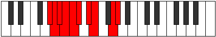 |
| [2495](https://ianring.com/musictheory/scales/2495) | [Aeolocrygic](ModeGNaturalAeolocrygic.md) | G | G, G#, A, A#, B, C, D, D#, F#, G |  |
| [2501](https://ianring.com/musictheory/scales/2501) | [Ralimic](ModeCSharpRalimic.md) | C# | C#, D#, E###, F###, G##, A###, C# |  |
| [2501](https://ianring.com/musictheory/scales/2501) | [Ralimic](ModeDFlatRalimic.md) | Db | Db, Eb, F##, G#, A, B#, Db |  |
| [2503](https://ianring.com/musictheory/scales/2503) | [Stonian](ModeCSharpStonian.md) | C# | C#, D, Eb, F##, G#, A, B#, C# |  |
| [2503](https://ianring.com/musictheory/scales/2503) | [Stonian](ModeDFlatStonian.md) | Db | Db, Ebb, Fbb, G, Ab, Bbb, C, Db |  |
| [2505](https://ianring.com/musictheory/scales/2505) | [Mydimic](ModeANaturalMydimic.md) | A | A, B#, C###, D##, E#, F###, A |  |
| [2507](https://ianring.com/musictheory/scales/2507) | [Ionyphian](ModeANaturalIonyphian.md) | A | A, Bb, C, D#, E, F, G#, A | 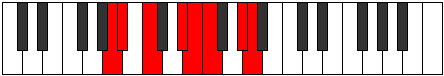 |
| [2509](https://ianring.com/musictheory/scales/2509) | [Bogian](ModeCSharpBogian.md) | C# | C#, D#, E, F##, G#, A, B#, C# |  |
| [2509](https://ianring.com/musictheory/scales/2509) | [Bogian](ModeDFlatBogian.md) | Db | Db, Eb, Fb, G, Ab, Bbb, C, Db |  |
| [2509](https://ianring.com/musictheory/scales/2509) | [Bogian](ModeANaturalBogian.md) | A | A, B, C, D#, E, F, G#, A |  |
| [2511](https://ianring.com/musictheory/scales/2511) | [Epyryllic](ModeCSharpEpyryllic.md) | C# | C#, D, D#, E, G, G#, A, C, C# |  |
| [2511](https://ianring.com/musictheory/scales/2511) | [Epyryllic](ModeDFlatEpyryllic.md) | Db | Db, D, Eb, E, G, Ab, A, C, Db |  |
| [2511](https://ianring.com/musictheory/scales/2511) | [Epyryllic](ModeANaturalEpyryllic.md) | A | A, A#, B, C, D#, E, F, G#, A |  |
| [2515](https://ianring.com/musictheory/scales/2515) | [Stylian](ModeGSharpStylian.md) | G# | G#, A, B#, C##, D#, E, F##, G# |  |
| [2515](https://ianring.com/musictheory/scales/2515) | [Stylian](ModeAFlatStylian.md) | Ab | Ab, Bbb, C, D, Eb, Fb, G, Ab |  |
| [2517](https://ianring.com/musictheory/scales/2517) | [Ryphian](ModeCSharpRyphian.md) | C# | C#, D#, E#, F##, G#, A, B#, C# |  |
| [2517](https://ianring.com/musictheory/scales/2517) | [Ryphian](ModeDFlatRyphian.md) | Db | Db, Eb, F, G, Ab, Bbb, C, Db |  |
| [2519](https://ianring.com/musictheory/scales/2519) | [Dathyllic](ModeCSharpDathyllic.md) | C# | C#, D, D#, F, G, G#, A, C, C# |  |
| [2519](https://ianring.com/musictheory/scales/2519) | [Dathyllic](ModeDFlatDathyllic.md) | Db | Db, D, Eb, F, G, Ab, A, C, Db |  |
| [2519](https://ianring.com/musictheory/scales/2519) | [Dathyllic](ModeGSharpDathyllic.md) | G# | G#, A, A#, C, D, D#, E, G, G# |  |
| [2519](https://ianring.com/musictheory/scales/2519) | [Dathyllic](ModeAFlatDathyllic.md) | Ab | Ab, A, Bb, C, D, Eb, E, G, Ab |  |
| [2521](https://ianring.com/musictheory/scales/2521) | [Barian](ModeANaturalBarian.md) | A | A, B#, C#, D#, E, F, G#, A |  |
| [2523](https://ianring.com/musictheory/scales/2523) | [Rygyllic](ModeANaturalRygyllic.md) | A | A, A#, C, C#, D#, E, F, G#, A |  |
| [2523](https://ianring.com/musictheory/scales/2523) | [Rygyllic](ModeGSharpRygyllic.md) | G# | G#, A, B, C, D, D#, E, G, G# |  |
| [2523](https://ianring.com/musictheory/scales/2523) | [Rygyllic](ModeAFlatRygyllic.md) | Ab | Ab, A, B, C, D, Eb, E, G, Ab |  |
| [2525](https://ianring.com/musictheory/scales/2525) | [Aeolaryllic](ModeCSharpAeolaryllic.md) | C# | C#, D#, E, F, G, G#, A, C, C# |  |
| [2525](https://ianring.com/musictheory/scales/2525) | [Aeolaryllic](ModeDFlatAeolaryllic.md) | Db | Db, Eb, E, F, G, Ab, A, C, Db |  |
| [2525](https://ianring.com/musictheory/scales/2525) | [Aeolaryllic](ModeANaturalAeolaryllic.md) | A | A, B, C, C#, D#, E, F, G#, A |  |
| [2527](https://ianring.com/musictheory/scales/2527) | [Phradygic](ModeCSharpPhradygic.md) | C# | C#, D, D#, E, F, G, G#, A, C, C# |  |
| [2527](https://ianring.com/musictheory/scales/2527) | [Phradygic](ModeDFlatPhradygic.md) | Db | Db, D, Eb, E, F, G, Ab, A, C, Db |  |
| [2527](https://ianring.com/musictheory/scales/2527) | [Phradygic](ModeANaturalPhradygic.md) | A | A, A#, B, C, C#, D#, E, F, G#, A |  |
| [2527](https://ianring.com/musictheory/scales/2527) | [Phradygic](ModeGSharpPhradygic.md) | G# | G#, A, A#, B, C, D, D#, E, G, G# |  |
| [2527](https://ianring.com/musictheory/scales/2527) | [Phradygic](ModeAFlatPhradygic.md) | Ab | Ab, A, Bb, B, C, D, Eb, E, G, Ab |  |
| [2533](https://ianring.com/musictheory/scales/2533) | [Podian](ModeCSharpPodian.md) | C# | C#, D#, E##, F##, G#, A, B#, C# | 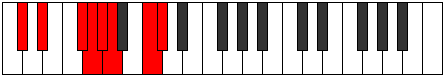 |
| [2533](https://ianring.com/musictheory/scales/2533) | [Podian](ModeDFlatPodian.md) | Db | Db, Eb, F#, G, Ab, Bbb, C, Db |  |
| [2535](https://ianring.com/musictheory/scales/2535) | [Zygyllic](ModeCSharpZygyllic.md) | C# | C#, D, D#, F#, G, G#, A, C, C# |  |
| [2535](https://ianring.com/musictheory/scales/2535) | [Zygyllic](ModeDFlatZygyllic.md) | Db | Db, D, Eb, Gb, G, Ab, A, C, Db |  |
| [2535](https://ianring.com/musictheory/scales/2535) | [Zygyllic](ModeGNaturalZygyllic.md) | G | G, G#, A, C, C#, D, D#, F#, G |  |
| [2537](https://ianring.com/musictheory/scales/2537) | [Laptian](ModeANaturalLaptian.md) | A | A, B#, C##, D#, E, F, G#, A | 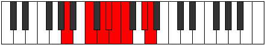 |
| [2539](https://ianring.com/musictheory/scales/2539) | [Thonyllic](ModeANaturalThonyllic.md) | A | A, A#, C, D, D#, E, F, G#, A |  |
| [2541](https://ianring.com/musictheory/scales/2541) | [Katadyllic](ModeCSharpKatadyllic.md) | C# | C#, D#, E, F#, G, G#, A, C, C# |  |
| [2541](https://ianring.com/musictheory/scales/2541) | [Katadyllic](ModeDFlatKatadyllic.md) | Db | Db, Eb, E, Gb, G, Ab, A, C, Db |  |
| [2541](https://ianring.com/musictheory/scales/2541) | [Katadyllic](ModeANaturalKatadyllic.md) | A | A, B, C, D, D#, E, F, G#, A |  |
| [2543](https://ianring.com/musictheory/scales/2543) | [Dydygic](ModeCSharpDydygic.md) | C# | C#, D, D#, E, F#, G, G#, A, C, C# |  |
| [2543](https://ianring.com/musictheory/scales/2543) | [Dydygic](ModeDFlatDydygic.md) | Db | Db, D, Eb, E, Gb, G, Ab, A, C, Db |  |
| [2543](https://ianring.com/musictheory/scales/2543) | [Dydygic](ModeGNaturalDydygic.md) | G | G, G#, A, A#, C, C#, D, D#, F#, G |  |
| [2543](https://ianring.com/musictheory/scales/2543) | [Dydygic](ModeANaturalDydygic.md) | A | A, A#, B, C, D, D#, E, F, G#, A |  |
| [2545](https://ianring.com/musictheory/scales/2545) | [Thycrian](ModeENaturalThycrian.md) | E | E, F###, G##, A#, B, C, D#, E |  |
| [2547](https://ianring.com/musictheory/scales/2547) | [Sogyllic](ModeGSharpSogyllic.md) | G# | G#, A, C, C#, D, D#, E, G, G# |  |
| [2547](https://ianring.com/musictheory/scales/2547) | [Sogyllic](ModeAFlatSogyllic.md) | Ab | Ab, A, C, Db, D, Eb, E, G, Ab |  |
| [2547](https://ianring.com/musictheory/scales/2547) | [Sogyllic](ModeENaturalSogyllic.md) | E | E, F, G#, A, A#, B, C, D#, E |  |
| [2549](https://ianring.com/musictheory/scales/2549) | [Rydyllic](ModeCSharpRydyllic.md) | C# | C#, D#, F, F#, G, G#, A, C, C# |  |
| [2549](https://ianring.com/musictheory/scales/2549) | [Rydyllic](ModeDFlatRydyllic.md) | Db | Db, Eb, F, Gb, G, Ab, A, C, Db |  |
| [2549](https://ianring.com/musictheory/scales/2549) | [Rydyllic](ModeENaturalRydyllic.md) | E | E, F#, G#, A, A#, B, C, D#, E |  |
| [2551](https://ianring.com/musictheory/scales/2551) | [Zoptygic](ModeCSharpZoptygic.md) | C# | C#, D, D#, F, F#, G, G#, A, C, C# |  |
| [2551](https://ianring.com/musictheory/scales/2551) | [Zoptygic](ModeDFlatZoptygic.md) | Db | Db, D, Eb, F, Gb, G, Ab, A, C, Db |  |
| [2551](https://ianring.com/musictheory/scales/2551) | [Zoptygic](ModeGSharpZoptygic.md) | G# | G#, A, A#, C, C#, D, D#, E, G, G# |  |
| [2551](https://ianring.com/musictheory/scales/2551) | [Zoptygic](ModeAFlatZoptygic.md) | Ab | Ab, A, Bb, C, Db, D, Eb, E, G, Ab |  |
| [2551](https://ianring.com/musictheory/scales/2551) | [Zoptygic](ModeGNaturalZoptygic.md) | G | G, G#, A, B, C, C#, D, D#, F#, G |  |
| [2551](https://ianring.com/musictheory/scales/2551) | [Zoptygic](ModeENaturalZoptygic.md) | E | E, F, F#, G#, A, A#, B, C, D#, E |  |
| [2553](https://ianring.com/musictheory/scales/2553) | [Aeolaptyllic](ModeANaturalAeolaptyllic.md) | A | A, C, C#, D, D#, E, F, G#, A |  |
| [2553](https://ianring.com/musictheory/scales/2553) | [Aeolaptyllic](ModeENaturalAeolaptyllic.md) | E | E, G, G#, A, A#, B, C, D#, E |  |
| [2555](https://ianring.com/musictheory/scales/2555) | [Bythygic](ModeANaturalBythygic.md) | A | A, A#, C, C#, D, D#, E, F, G#, A |  |
| [2555](https://ianring.com/musictheory/scales/2555) | [Bythygic](ModeGSharpBythygic.md) | G# | G#, A, B, C, C#, D, D#, E, G, G# |  |
| [2555](https://ianring.com/musictheory/scales/2555) | [Bythygic](ModeAFlatBythygic.md) | Ab | Ab, A, B, C, Db, D, Eb, E, G, Ab |  |
| [2555](https://ianring.com/musictheory/scales/2555) | [Bythygic](ModeENaturalBythygic.md) | E | E, F, G, G#, A, A#, B, C, D#, E |  |
| [2557](https://ianring.com/musictheory/scales/2557) | [Dothygic](ModeCSharpDothygic.md) | C# | C#, D#, E, F, F#, G, G#, A, C, C# |  |
| [2557](https://ianring.com/musictheory/scales/2557) | [Dothygic](ModeDFlatDothygic.md) | Db | Db, Eb, E, F, Gb, G, Ab, A, C, Db |  |
| [2557](https://ianring.com/musictheory/scales/2557) | [Dothygic](ModeANaturalDothygic.md) | A | A, B, C, C#, D, D#, E, F, G#, A |  |
| [2557](https://ianring.com/musictheory/scales/2557) | [Dothygic](ModeENaturalDothygic.md) | E | E, F#, G, G#, A, A#, B, C, D#, E |  |
| [2559](https://ianring.com/musictheory/scales/2559) | [Zogyllian](ModeCSharpZogyllian.md) | C# | C#, D, D#, E, F, F#, G, G#, A, C, C# |  |
| [2559](https://ianring.com/musictheory/scales/2559) | [Zogyllian](ModeDFlatZogyllian.md) | Db | Db, D, Eb, E, F, Gb, G, Ab, A, C, Db |  |
| [2559](https://ianring.com/musictheory/scales/2559) | [Zogyllian](ModeANaturalZogyllian.md) | A | A, A#, B, C, C#, D, D#, E, F, G#, A |  |
| [2559](https://ianring.com/musictheory/scales/2559) | [Zogyllian](ModeGSharpZogyllian.md) | G# | G#, A, A#, B, C, C#, D, D#, E, G, G# |  |
| [2559](https://ianring.com/musictheory/scales/2559) | [Zogyllian](ModeAFlatZogyllian.md) | Ab | Ab, A, Bb, B, C, Db, D, Eb, E, G, Ab |  |
| [2559](https://ianring.com/musictheory/scales/2559) | [Zogyllian](ModeGNaturalZogyllian.md) | G | G, G#, A, A#, B, C, C#, D, D#, F#, G |  |
| [2559](https://ianring.com/musictheory/scales/2559) | [Zogyllian](ModeENaturalZogyllian.md) | E | E, F, F#, G, G#, A, A#, B, C, D#, E |  |
| [2633](https://ianring.com/musictheory/scales/2633) | [Mixitonic](ModeANaturalMixitonic.md) | A | A, C, D#, F#, G#, A |  |
| [2635](https://ianring.com/musictheory/scales/2635) | [Gocrimic](ModeANaturalGocrimic.md) | A | A, Bb, C, D#, E##, F###, A |  |
| [2637](https://ianring.com/musictheory/scales/2637) | [Aeolonimic](ModeFSharpAeolonimic.md) | F# | F#, G#, A, B#, C###, D###, F# |  |
| [2637](https://ianring.com/musictheory/scales/2637) | [Aeolonimic](ModeGFlatAeolonimic.md) | Gb | Gb, Ab, Bbb, C, D#, E#, Gb |  |
| [2637](https://ianring.com/musictheory/scales/2637) | [Aeolonimic](ModeANaturalAeolonimic.md) | A | A, B, C, D#, E##, F###, A |  |
| [2639](https://ianring.com/musictheory/scales/2639) | [Dothian](ModeFSharpDothian.md) | F# | F#, G, Ab, Bbb, C, D#, E#, F# |  |
| [2639](https://ianring.com/musictheory/scales/2639) | [Dothian](ModeGFlatDothian.md) | Gb | Gb, Abb, Bbbb, Cbbb, Dbb, Eb, F, Gb | 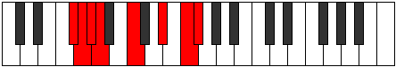 |
| [2639](https://ianring.com/musictheory/scales/2639) | [Dothian](ModeANaturalDothian.md) | A | A, Bb, Cb, Dbb, Eb, F#, G#, A |  |
| [2649](https://ianring.com/musictheory/scales/2649) | [Aeolythimic](ModeANaturalAeolythimic.md) | A | A, B#, C#, D#, E##, F###, A |  |
| [2651](https://ianring.com/musictheory/scales/2651) | [Panian](ModeANaturalPanian.md) | A | A, Bb, C, Db, Eb, F#, G#, A |  |
| [2653](https://ianring.com/musictheory/scales/2653) | [Sygian](ModeFSharpSygian.md) | F# | F#, G#, A, Bb, C, D#, E#, F# |  |
| [2653](https://ianring.com/musictheory/scales/2653) | [Sygian](ModeGFlatSygian.md) | Gb | Gb, Ab, Bbb, Cbb, Dbb, Eb, F, Gb |  |
| [2653](https://ianring.com/musictheory/scales/2653) | [Sygian](ModeANaturalSygian.md) | A | A, B, C, Db, Eb, F#, G#, A |  |
| [2655](https://ianring.com/musictheory/scales/2655) | [Thocryllic](ModeFSharpThocryllic.md) | F# | F#, G, G#, A, A#, C, D#, F, F# |  |
| [2655](https://ianring.com/musictheory/scales/2655) | [Thocryllic](ModeGFlatThocryllic.md) | Gb | Gb, G, Ab, A, Bb, C, Eb, F, Gb |  |
| [2655](https://ianring.com/musictheory/scales/2655) | [Thocryllic](ModeANaturalThocryllic.md) | A | A, A#, B, C, C#, D#, F#, G#, A |  |
| [2659](https://ianring.com/musictheory/scales/2659) | [Katynimic](ModeDSharpKatynimic.md) | D# | D#, E, F###, G##, A###, B###, D# |  |
| [2659](https://ianring.com/musictheory/scales/2659) | [Katynimic](ModeEFlatKatynimic.md) | Eb | Eb, Fb, G#, A, B#, C##, Eb |  |
| [2661](https://ianring.com/musictheory/scales/2661) | [Stydimic](ModeDSharpStydimic.md) | D# | D#, E#, F###, G##, A###, B###, D# |  |
| [2661](https://ianring.com/musictheory/scales/2661) | [Stydimic](ModeEFlatStydimic.md) | Eb | Eb, F, G#, A, B#, C##, Eb |  |
| [2663](https://ianring.com/musictheory/scales/2663) | [Lalian](ModeDSharpLalian.md) | D# | D#, E, F, G#, A, B#, C##, D# |  |
| [2663](https://ianring.com/musictheory/scales/2663) | [Lalian](ModeEFlatLalian.md) | Eb | Eb, Fb, Gbb, Ab, Bbb, C, D, Eb |  |
| [2665](https://ianring.com/musictheory/scales/2665) | [Aeradimic](ModeDSharpAeradimic.md) | D# | D#, E##, F###, G##, A###, B###, D# |  |
| [2665](https://ianring.com/musictheory/scales/2665) | [Aeradimic](ModeEFlatAeradimic.md) | Eb | Eb, F#, G#, A, B#, C##, Eb |  |
| [2665](https://ianring.com/musictheory/scales/2665) | [Aeradimic](ModeANaturalAeradimic.md) | A | A, B#, C##, D#, E##, F###, A |  |
| [2667](https://ianring.com/musictheory/scales/2667) | [Byrian](ModeDSharpByrian.md) | D# | D#, E, F#, G#, A, B#, C##, D# |  |
| [2667](https://ianring.com/musictheory/scales/2667) | [Byrian](ModeEFlatByrian.md) | Eb | Eb, Fb, Gb, Ab, Bbb, C, D, Eb |  |
| [2667](https://ianring.com/musictheory/scales/2667) | [Byrian](ModeANaturalByrian.md) | A | A, Bb, C, D, Eb, F#, G#, A |  |
| [2669](https://ianring.com/musictheory/scales/2669) | [Gamian](ModeDSharpGamian.md) | D# | D#, E#, F#, G#, A, B#, C##, D# |  |
| [2669](https://ianring.com/musictheory/scales/2669) | [Gamian](ModeEFlatGamian.md) | Eb | Eb, F, Gb, Ab, Bbb, C, D, Eb |  |
| [2669](https://ianring.com/musictheory/scales/2669) | [Gamian](ModeANaturalGamian.md) | A | A, B, C, D, Eb, F#, G#, A |  |
| [2669](https://ianring.com/musictheory/scales/2669) | [Gamian](ModeFSharpGamian.md) | F# | F#, G#, A, B, C, D#, E#, F# |  |
| [2669](https://ianring.com/musictheory/scales/2669) | [Gamian](ModeGFlatGamian.md) | Gb | Gb, Ab, Bbb, Cb, Dbb, Eb, F, Gb |  |
| [2671](https://ianring.com/musictheory/scales/2671) | [Lylyllic](ModeDSharpLylyllic.md) | D# | D#, E, F, F#, G#, A, C, D, D# |  |
| [2671](https://ianring.com/musictheory/scales/2671) | [Lylyllic](ModeEFlatLylyllic.md) | Eb | Eb, E, F, Gb, Ab, A, C, D, Eb |  |
| [2671](https://ianring.com/musictheory/scales/2671) | [Lylyllic](ModeFSharpLylyllic.md) | F# | F#, G, G#, A, B, C, D#, F, F# |  |
| [2671](https://ianring.com/musictheory/scales/2671) | [Lylyllic](ModeGFlatLylyllic.md) | Gb | Gb, G, Ab, A, B, C, Eb, F, Gb |  |
| [2671](https://ianring.com/musictheory/scales/2671) | [Lylyllic](ModeANaturalLylyllic.md) | A | A, A#, B, C, D, D#, F#, G#, A |  |
| [2673](https://ianring.com/musictheory/scales/2673) | [Mythimic](ModeDSharpMythimic.md) | D# | D#, E###, F###, G##, A###, B###, D# |  |
| [2673](https://ianring.com/musictheory/scales/2673) | [Mythimic](ModeEFlatMythimic.md) | Eb | Eb, F##, G#, A, B#, C##, Eb |  |
| [2675](https://ianring.com/musictheory/scales/2675) | [Gogian](ModeDSharpGogian.md) | D# | D#, E, F##, G#, A, B#, C##, D# |  |
| [2675](https://ianring.com/musictheory/scales/2675) | [Gogian](ModeEFlatGogian.md) | Eb | Eb, Fb, G, Ab, Bbb, C, D, Eb |  |
| [2677](https://ianring.com/musictheory/scales/2677) | [Thodian](ModeDSharpThodian.md) | D# | D#, E#, F##, G#, A, B#, C##, D# |  |
| [2677](https://ianring.com/musictheory/scales/2677) | [Thodian](ModeEFlatThodian.md) | Eb | Eb, F, G, Ab, Bbb, C, D, Eb |  |
| [2679](https://ianring.com/musictheory/scales/2679) | [Rathyllic](ModeDSharpRathyllic.md) | D# | D#, E, F, G, G#, A, C, D, D# |  |
| [2679](https://ianring.com/musictheory/scales/2679) | [Rathyllic](ModeEFlatRathyllic.md) | Eb | Eb, E, F, G, Ab, A, C, D, Eb |  |
| [2681](https://ianring.com/musictheory/scales/2681) | [Aerycrian](ModeANaturalAerycrian.md) | A | A, B#, C#, D, Eb, F#, G#, A |  |
| [2681](https://ianring.com/musictheory/scales/2681) | [Aerycrian](ModeDSharpAerycrian.md) | D# | D#, E##, F##, G#, A, B#, C##, D# |  |
| [2681](https://ianring.com/musictheory/scales/2681) | [Aerycrian](ModeEFlatAerycrian.md) | Eb | Eb, F#, G, Ab, Bbb, C, D, Eb |  |
| [2683](https://ianring.com/musictheory/scales/2683) | [Thodyllic](ModeDSharpThodyllic.md) | D# | D#, E, F#, G, G#, A, C, D, D# |  |
| [2683](https://ianring.com/musictheory/scales/2683) | [Thodyllic](ModeEFlatThodyllic.md) | Eb | Eb, E, Gb, G, Ab, A, C, D, Eb |  |
| [2683](https://ianring.com/musictheory/scales/2683) | [Thodyllic](ModeANaturalThodyllic.md) | A | A, A#, C, C#, D, D#, F#, G#, A |  |
| [2685](https://ianring.com/musictheory/scales/2685) | [Ionoryllic](ModeDSharpIonoryllic.md) | D# | D#, F, F#, G, G#, A, C, D, D# |  |
| [2685](https://ianring.com/musictheory/scales/2685) | [Ionoryllic](ModeEFlatIonoryllic.md) | Eb | Eb, F, Gb, G, Ab, A, C, D, Eb |  |
| [2685](https://ianring.com/musictheory/scales/2685) | [Ionoryllic](ModeANaturalIonoryllic.md) | A | A, B, C, C#, D, D#, F#, G#, A |  |
| [2685](https://ianring.com/musictheory/scales/2685) | [Ionoryllic](ModeFSharpIonoryllic.md) | F# | F#, G#, A, A#, B, C, D#, F, F# |  |
| [2685](https://ianring.com/musictheory/scales/2685) | [Ionoryllic](ModeGFlatIonoryllic.md) | Gb | Gb, Ab, A, Bb, B, C, Eb, F, Gb |  |
| [2687](https://ianring.com/musictheory/scales/2687) | [Thacrygic](ModeDSharpThacrygic.md) | D# | D#, E, F, F#, G, G#, A, C, D, D# |  |
| [2687](https://ianring.com/musictheory/scales/2687) | [Thacrygic](ModeEFlatThacrygic.md) | Eb | Eb, E, F, Gb, G, Ab, A, C, D, Eb |  |
| [2687](https://ianring.com/musictheory/scales/2687) | [Thacrygic](ModeANaturalThacrygic.md) | A | A, A#, B, C, C#, D, D#, F#, G#, A |  |
| [2687](https://ianring.com/musictheory/scales/2687) | [Thacrygic](ModeFSharpThacrygic.md) | F# | F#, G, G#, A, A#, B, C, D#, F, F# |  |
| [2687](https://ianring.com/musictheory/scales/2687) | [Thacrygic](ModeGFlatThacrygic.md) | Gb | Gb, G, Ab, A, Bb, B, C, Eb, F, Gb |  |
| [2707](https://ianring.com/musictheory/scales/2707) | [Banimic](ModeGSharpBanimic.md) | G# | G#, A, B#, C###, D###, E###, G# |  |
| [2707](https://ianring.com/musictheory/scales/2707) | [Banimic](ModeAFlatBanimic.md) | Ab | Ab, Bbb, C, D#, E#, F##, Ab |  |
| [2711](https://ianring.com/musictheory/scales/2711) | [Stolian](ModeGSharpStolian.md) | G# | G#, A, Bb, C, D#, E#, F##, G# |  |
| [2711](https://ianring.com/musictheory/scales/2711) | [Stolian](ModeAFlatStolian.md) | Ab | Ab, Bbb, Cbb, Dbb, Eb, F, G, Ab |  |
| [2715](https://ianring.com/musictheory/scales/2715) | [Kynian](ModeGSharpKynian.md) | G# | G#, A, B, C, D#, E#, F##, G# |  |
| [2715](https://ianring.com/musictheory/scales/2715) | [Kynian](ModeAFlatKynian.md) | Ab | Ab, Bbb, Cb, Dbb, Eb, F, G, Ab |  |
| [2719](https://ianring.com/musictheory/scales/2719) | [Zocryllic](ModeGSharpZocryllic.md) | G# | G#, A, A#, B, C, D#, F, G, G# |  |
| [2719](https://ianring.com/musictheory/scales/2719) | [Zocryllic](ModeAFlatZocryllic.md) | Ab | Ab, A, Bb, B, C, Eb, F, G, Ab |  |
| [2739](https://ianring.com/musictheory/scales/2739) | [Zanian](ModeGSharpZanian.md) | G# | G#, A, B#, C#, D#, E#, F##, G# |  |
| [2739](https://ianring.com/musictheory/scales/2739) | [Zanian](ModeAFlatZanian.md) | Ab | Ab, Bbb, C, Db, Eb, F, G, Ab |  |
| [2743](https://ianring.com/musictheory/scales/2743) | [Staptyllic](ModeGSharpStaptyllic.md) | G# | G#, A, A#, C, C#, D#, F, G, G# |  |
| [2743](https://ianring.com/musictheory/scales/2743) | [Staptyllic](ModeAFlatStaptyllic.md) | Ab | Ab, A, Bb, C, Db, Eb, F, G, Ab |  |
| [2747](https://ianring.com/musictheory/scales/2747) | [Stythyllic](ModeGSharpStythyllic.md) | G# | G#, A, B, C, C#, D#, F, G, G# |  |
| [2747](https://ianring.com/musictheory/scales/2747) | [Stythyllic](ModeAFlatStythyllic.md) | Ab | Ab, A, B, C, Db, Eb, F, G, Ab |  |
| [2751](https://ianring.com/musictheory/scales/2751) | [Sylygic](ModeGSharpSylygic.md) | G# | G#, A, A#, B, C, C#, D#, F, G, G# |  |
| [2751](https://ianring.com/musictheory/scales/2751) | [Sylygic](ModeAFlatSylygic.md) | Ab | Ab, A, Bb, B, C, Db, Eb, F, G, Ab |  |
| [2761](https://ianring.com/musictheory/scales/2761) | [Dagimic](ModeANaturalDagimic.md) | A | A, B#, C###, D##, E##, F###, A |  |
| [2763](https://ianring.com/musictheory/scales/2763) | [Manian](ModeANaturalManian.md) | A | A, Bb, C, D#, E, F#, G#, A |  |
| [2765](https://ianring.com/musictheory/scales/2765) | [Banian](ModeFSharpBanian.md) | F# | F#, G#, A, B#, C#, D#, E#, F# |  |
| [2765](https://ianring.com/musictheory/scales/2765) | [Banian](ModeGFlatBanian.md) | Gb | Gb, Ab, Bbb, C, Db, Eb, F, Gb |  |
| [2765](https://ianring.com/musictheory/scales/2765) | [Banian](ModeANaturalBanian.md) | A | A, B, C, D#, E, F#, G#, A |  |
| [2767](https://ianring.com/musictheory/scales/2767) | [Katydyllic](ModeFSharpKatydyllic.md) | F# | F#, G, G#, A, C, C#, D#, F, F# |  |
| [2767](https://ianring.com/musictheory/scales/2767) | [Katydyllic](ModeGFlatKatydyllic.md) | Gb | Gb, G, Ab, A, C, Db, Eb, F, Gb |  |
| [2767](https://ianring.com/musictheory/scales/2767) | [Katydyllic](ModeANaturalKatydyllic.md) | A | A, A#, B, C, D#, E, F#, G#, A |  |
| [2771](https://ianring.com/musictheory/scales/2771) | [Garian](ModeGSharpGarian.md) | G# | G#, A, B#, C##, D#, E#, F##, G# |  |
| [2771](https://ianring.com/musictheory/scales/2771) | [Garian](ModeAFlatGarian.md) | Ab | Ab, Bbb, C, D, Eb, F, G, Ab |  |
| [2775](https://ianring.com/musictheory/scales/2775) | [Godyllic](ModeGSharpGodyllic.md) | G# | G#, A, A#, C, D, D#, F, G, G# |  |
| [2775](https://ianring.com/musictheory/scales/2775) | [Godyllic](ModeAFlatGodyllic.md) | Ab | Ab, A, Bb, C, D, Eb, F, G, Ab |  |
| [2777](https://ianring.com/musictheory/scales/2777) | [Bycrian](ModeANaturalBycrian.md) | A | A, B#, C#, D#, E, F#, G#, A |  |
| [2779](https://ianring.com/musictheory/scales/2779) | [Garyllic](ModeANaturalGaryllic.md) | A | A, A#, C, C#, D#, E, F#, G#, A |  |
| [2779](https://ianring.com/musictheory/scales/2779) | [Garyllic](ModeGSharpGaryllic.md) | G# | G#, A, B, C, D, D#, F, G, G# |  |
| [2779](https://ianring.com/musictheory/scales/2779) | [Garyllic](ModeAFlatGaryllic.md) | Ab | Ab, A, B, C, D, Eb, F, G, Ab |  |
| [2781](https://ianring.com/musictheory/scales/2781) | [Gycryllic](ModeFSharpGycryllic.md) | F# | F#, G#, A, A#, C, C#, D#, F, F# |  |
| [2781](https://ianring.com/musictheory/scales/2781) | [Gycryllic](ModeGFlatGycryllic.md) | Gb | Gb, Ab, A, Bb, C, Db, Eb, F, Gb |  |
| [2781](https://ianring.com/musictheory/scales/2781) | [Gycryllic](ModeANaturalGycryllic.md) | A | A, B, C, C#, D#, E, F#, G#, A |  |
| [2783](https://ianring.com/musictheory/scales/2783) | [Gothygic](ModeFSharpGothygic.md) | F# | F#, G, G#, A, A#, C, C#, D#, F, F# |  |
| [2783](https://ianring.com/musictheory/scales/2783) | [Gothygic](ModeGFlatGothygic.md) | Gb | Gb, G, Ab, A, Bb, C, Db, Eb, F, Gb |  |
| [2783](https://ianring.com/musictheory/scales/2783) | [Gothygic](ModeANaturalGothygic.md) | A | A, A#, B, C, C#, D#, E, F#, G#, A |  |
| [2783](https://ianring.com/musictheory/scales/2783) | [Gothygic](ModeGSharpGothygic.md) | G# | G#, A, A#, B, C, D, D#, F, G, G# |  |
| [2783](https://ianring.com/musictheory/scales/2783) | [Gothygic](ModeAFlatGothygic.md) | Ab | Ab, A, Bb, B, C, D, Eb, F, G, Ab |  |
| [2787](https://ianring.com/musictheory/scales/2787) | [Zyrian](ModeDSharpZyrian.md) | D# | D#, E, F###, G##, A#, B#, C##, D# |  |
| [2787](https://ianring.com/musictheory/scales/2787) | [Zyrian](ModeEFlatZyrian.md) | Eb | Eb, Fb, G#, A, Bb, C, D, Eb |  |
| [2789](https://ianring.com/musictheory/scales/2789) | [Zolian](ModeDSharpZolian.md) | D# | D#, E#, F###, G##, A#, B#, C##, D# |  |
| [2789](https://ianring.com/musictheory/scales/2789) | [Zolian](ModeEFlatZolian.md) | Eb | Eb, F, G#, A, Bb, C, D, Eb |  |
| [2791](https://ianring.com/musictheory/scales/2791) | [Ionyptyllic](ModeDSharpIonyptyllic.md) | D# | D#, E, F, G#, A, A#, C, D, D# |  |
| [2791](https://ianring.com/musictheory/scales/2791) | [Ionyptyllic](ModeEFlatIonyptyllic.md) | Eb | Eb, E, F, Ab, A, Bb, C, D, Eb |  |
| [2793](https://ianring.com/musictheory/scales/2793) | [Eporian](ModeANaturalEporian.md) | A | A, B#, C##, D#, E, F#, G#, A |  |
| [2793](https://ianring.com/musictheory/scales/2793) | [Eporian](ModeDSharpEporian.md) | D# | D#, E##, F###, G##, A#, B#, C##, D# |  |
| [2793](https://ianring.com/musictheory/scales/2793) | [Eporian](ModeEFlatEporian.md) | Eb | Eb, F#, G#, A, Bb, C, D, Eb |  |
| [2797](https://ianring.com/musictheory/scales/2797) | [Stalyllic](ModeDSharpStalyllic.md) | D# | D#, F, F#, G#, A, A#, C, D, D# |  |
| [2797](https://ianring.com/musictheory/scales/2797) | [Stalyllic](ModeEFlatStalyllic.md) | Eb | Eb, F, Gb, Ab, A, Bb, C, D, Eb |  |
| [2797](https://ianring.com/musictheory/scales/2797) | [Stalyllic](ModeANaturalStalyllic.md) | A | A, B, C, D, D#, E, F#, G#, A |  |
| [2797](https://ianring.com/musictheory/scales/2797) | [Stalyllic](ModeFSharpStalyllic.md) | F# | F#, G#, A, B, C, C#, D#, F, F# |  |
| [2797](https://ianring.com/musictheory/scales/2797) | [Stalyllic](ModeGFlatStalyllic.md) | Gb | Gb, Ab, A, B, C, Db, Eb, F, Gb |  |
| [2799](https://ianring.com/musictheory/scales/2799) | [Epilygic](ModeDSharpEpilygic.md) | D# | D#, E, F, F#, G#, A, A#, C, D, D# |  |
| [2799](https://ianring.com/musictheory/scales/2799) | [Epilygic](ModeEFlatEpilygic.md) | Eb | Eb, E, F, Gb, Ab, A, Bb, C, D, Eb |  |
| [2799](https://ianring.com/musictheory/scales/2799) | [Epilygic](ModeFSharpEpilygic.md) | F# | F#, G, G#, A, B, C, C#, D#, F, F# |  |
| [2799](https://ianring.com/musictheory/scales/2799) | [Epilygic](ModeGFlatEpilygic.md) | Gb | Gb, G, Ab, A, B, C, Db, Eb, F, Gb |  |
| [2799](https://ianring.com/musictheory/scales/2799) | [Epilygic](ModeANaturalEpilygic.md) | A | A, A#, B, C, D, D#, E, F#, G#, A |  |
| [2801](https://ianring.com/musictheory/scales/2801) | [Zogian](ModeDSharpZogian.md) | D# | D#, E###, F###, G##, A#, B#, C##, D# |  |
| [2801](https://ianring.com/musictheory/scales/2801) | [Zogian](ModeEFlatZogian.md) | Eb | Eb, F##, G#, A, Bb, C, D, Eb |  |
| [2803](https://ianring.com/musictheory/scales/2803) | [Zolyllic](ModeGSharpZolyllic.md) | G# | G#, A, C, C#, D, D#, F, G, G# |  |
| [2803](https://ianring.com/musictheory/scales/2803) | [Zolyllic](ModeAFlatZolyllic.md) | Ab | Ab, A, C, Db, D, Eb, F, G, Ab |  |
| [2803](https://ianring.com/musictheory/scales/2803) | [Zolyllic](ModeDSharpZolyllic.md) | D# | D#, E, G, G#, A, A#, C, D, D# |  |
| [2803](https://ianring.com/musictheory/scales/2803) | [Zolyllic](ModeEFlatZolyllic.md) | Eb | Eb, E, G, Ab, A, Bb, C, D, Eb |  |
| [2805](https://ianring.com/musictheory/scales/2805) | [Zylyllic](ModeDSharpZylyllic.md) | D# | D#, F, G, G#, A, A#, C, D, D# |  |
| [2805](https://ianring.com/musictheory/scales/2805) | [Zylyllic](ModeEFlatZylyllic.md) | Eb | Eb, F, G, Ab, A, Bb, C, D, Eb |  |
| [2807](https://ianring.com/musictheory/scales/2807) | [Zylygic](ModeGSharpZylygic.md) | G# | G#, A, A#, C, C#, D, D#, F, G, G# |  |
| [2807](https://ianring.com/musictheory/scales/2807) | [Zylygic](ModeAFlatZylygic.md) | Ab | Ab, A, Bb, C, Db, D, Eb, F, G, Ab |  |
| [2807](https://ianring.com/musictheory/scales/2807) | [Zylygic](ModeDSharpZylygic.md) | D# | D#, E, F, G, G#, A, A#, C, D, D# |  |
| [2807](https://ianring.com/musictheory/scales/2807) | [Zylygic](ModeEFlatZylygic.md) | Eb | Eb, E, F, G, Ab, A, Bb, C, D, Eb |  |
| [2809](https://ianring.com/musictheory/scales/2809) | [Gythyllic](ModeANaturalGythyllic.md) | A | A, C, C#, D, D#, E, F#, G#, A |  |
| [2809](https://ianring.com/musictheory/scales/2809) | [Gythyllic](ModeDSharpGythyllic.md) | D# | D#, F#, G, G#, A, A#, C, D, D# |  |
| [2809](https://ianring.com/musictheory/scales/2809) | [Gythyllic](ModeEFlatGythyllic.md) | Eb | Eb, Gb, G, Ab, A, Bb, C, D, Eb |  |
| [2811](https://ianring.com/musictheory/scales/2811) | [Barygic](ModeANaturalBarygic.md) | A | A, A#, C, C#, D, D#, E, F#, G#, A |  |
| [2811](https://ianring.com/musictheory/scales/2811) | [Barygic](ModeDSharpBarygic.md) | D# | D#, E, F#, G, G#, A, A#, C, D, D# |  |
| [2811](https://ianring.com/musictheory/scales/2811) | [Barygic](ModeEFlatBarygic.md) | Eb | Eb, E, Gb, G, Ab, A, Bb, C, D, Eb |  |
| [2811](https://ianring.com/musictheory/scales/2811) | [Barygic](ModeGSharpBarygic.md) | G# | G#, A, B, C, C#, D, D#, F, G, G# |  |
| [2811](https://ianring.com/musictheory/scales/2811) | [Barygic](ModeAFlatBarygic.md) | Ab | Ab, A, B, C, Db, D, Eb, F, G, Ab |  |
| [2813](https://ianring.com/musictheory/scales/2813) | [Zolygic](ModeDSharpZolygic.md) | D# | D#, F, F#, G, G#, A, A#, C, D, D# |  |
| [2813](https://ianring.com/musictheory/scales/2813) | [Zolygic](ModeEFlatZolygic.md) | Eb | Eb, F, Gb, G, Ab, A, Bb, C, D, Eb |  |
| [2813](https://ianring.com/musictheory/scales/2813) | [Zolygic](ModeANaturalZolygic.md) | A | A, B, C, C#, D, D#, E, F#, G#, A |  |
| [2813](https://ianring.com/musictheory/scales/2813) | [Zolygic](ModeFSharpZolygic.md) | F# | F#, G#, A, A#, B, C, C#, D#, F, F# |  |
| [2813](https://ianring.com/musictheory/scales/2813) | [Zolygic](ModeGFlatZolygic.md) | Gb | Gb, Ab, A, Bb, B, C, Db, Eb, F, Gb |  |
| [2815](https://ianring.com/musictheory/scales/2815) | [Aeradyllian](ModeDSharpAeradyllian.md) | D# | D#, E, F, F#, G, G#, A, A#, C, D, D# |  |
| [2815](https://ianring.com/musictheory/scales/2815) | [Aeradyllian](ModeEFlatAeradyllian.md) | Eb | Eb, E, F, Gb, G, Ab, A, Bb, C, D, Eb |  |
| [2815](https://ianring.com/musictheory/scales/2815) | [Aeradyllian](ModeANaturalAeradyllian.md) | A | A, A#, B, C, C#, D, D#, E, F#, G#, A |  |
| [2815](https://ianring.com/musictheory/scales/2815) | [Aeradyllian](ModeGSharpAeradyllian.md) | G# | G#, A, A#, B, C, C#, D, D#, F, G, G# |  |
| [2815](https://ianring.com/musictheory/scales/2815) | [Aeradyllian](ModeAFlatAeradyllian.md) | Ab | Ab, A, Bb, B, C, Db, D, Eb, F, G, Ab |  |
| [2815](https://ianring.com/musictheory/scales/2815) | [Aeradyllian](ModeFSharpAeradyllian.md) | F# | F#, G, G#, A, A#, B, C, C#, D#, F, F# |  |
| [2815](https://ianring.com/musictheory/scales/2815) | [Aeradyllian](ModeGFlatAeradyllian.md) | Gb | Gb, G, Ab, A, Bb, B, C, Db, Eb, F, Gb |  |
| [2841](https://ianring.com/musictheory/scales/2841) | [Sothimic](ModeCNaturalSothimic.md) | C | C, D#, E, F###, G##, A##, C |  |
| [2843](https://ianring.com/musictheory/scales/2843) | [Sorian](ModeCNaturalSorian.md) | C | C, Db, Eb, Fb, G#, A, B, C |  |
| [2845](https://ianring.com/musictheory/scales/2845) | [Baptian](ModeCNaturalBaptian.md) | C | C, D, Eb, Fb, G#, A, B, C |  |
| [2847](https://ianring.com/musictheory/scales/2847) | [Phracryllic](ModeCNaturalPhracryllic.md) | C | C, C#, D, D#, E, G#, A, B, C |  |
| [2855](https://ianring.com/musictheory/scales/2855) | [Epocrian](ModeGNaturalEpocrian.md) | G | G, Ab, Bbb, C, D#, E, F#, G | 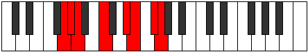 |
| [2857](https://ianring.com/musictheory/scales/2857) | [Stythimic](ModeCNaturalStythimic.md) | C | C, D#, E#, F###, G##, A##, C |  |
| [2859](https://ianring.com/musictheory/scales/2859) | [Phrycrian](ModeCNaturalPhrycrian.md) | C | C, Db, Eb, F, G#, A, B, C |  |
| [2861](https://ianring.com/musictheory/scales/2861) | [Katothian](ModeCNaturalKatothian.md) | C | C, D, Eb, F, G#, A, B, C |  |
| [2863](https://ianring.com/musictheory/scales/2863) | [Aerogyllic](ModeGNaturalAerogyllic.md) | G | G, G#, A, A#, C, D#, E, F#, G |  |
| [2863](https://ianring.com/musictheory/scales/2863) | [Aerogyllic](ModeCNaturalAerogyllic.md) | C | C, C#, D, D#, F, G#, A, B, C |  |
| [2865](https://ianring.com/musictheory/scales/2865) | [Solimic](ModeENaturalSolimic.md) | E | E, F###, G##, A###, B##, C###, E |  |
| [2867](https://ianring.com/musictheory/scales/2867) | [Socrian](ModeENaturalSocrian.md) | E | E, F, G#, A, B#, C#, D#, E |  |
| [2869](https://ianring.com/musictheory/scales/2869) | [Phrothian](ModeENaturalPhrothian.md) | E | E, F#, G#, A, B#, C#, D#, E |  |
| [2871](https://ianring.com/musictheory/scales/2871) | [Stanyllic](ModeENaturalStanyllic.md) | E | E, F, F#, G#, A, C, C#, D#, E |  |
| [2871](https://ianring.com/musictheory/scales/2871) | [Stanyllic](ModeGNaturalStanyllic.md) | G | G, G#, A, B, C, D#, E, F#, G |  |
| [2873](https://ianring.com/musictheory/scales/2873) | [Docrian](ModeENaturalDocrian.md) | E | E, F##, G#, A, B#, C#, D#, E | 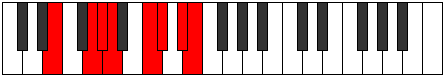 |
| [2873](https://ianring.com/musictheory/scales/2873) | [Docrian](ModeCNaturalDocrian.md) | C | C, D#, E, F, G#, A, B, C |  |
| [2875](https://ianring.com/musictheory/scales/2875) | [Ganyllic](ModeENaturalGanyllic.md) | E | E, F, G, G#, A, C, C#, D#, E |  |
| [2875](https://ianring.com/musictheory/scales/2875) | [Ganyllic](ModeCNaturalGanyllic.md) | C | C, C#, D#, E, F, G#, A, B, C |  |
| [2877](https://ianring.com/musictheory/scales/2877) | [Phrylyllic](ModeENaturalPhrylyllic.md) | E | E, F#, G, G#, A, C, C#, D#, E |  |
| [2877](https://ianring.com/musictheory/scales/2877) | [Phrylyllic](ModeCNaturalPhrylyllic.md) | C | C, D, D#, E, F, G#, A, B, C | 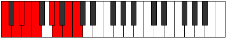 |
| [2879](https://ianring.com/musictheory/scales/2879) | [Stadygic](ModeENaturalStadygic.md) | E | E, F, F#, G, G#, A, C, C#, D#, E |  |
| [2879](https://ianring.com/musictheory/scales/2879) | [Stadygic](ModeCNaturalStadygic.md) | C | C, C#, D, D#, E, F, G#, A, B, C |  |
| [2879](https://ianring.com/musictheory/scales/2879) | [Stadygic](ModeGNaturalStadygic.md) | G | G, G#, A, A#, B, C, D#, E, F#, G |  |
| [2889](https://ianring.com/musictheory/scales/2889) | [Thoptimic](ModeANaturalThoptimic.md) | A | A, B#, C###, D###, E##, F###, A |  |
| [2889](https://ianring.com/musictheory/scales/2889) | [Thoptimic](ModeCNaturalThoptimic.md) | C | C, D#, E##, F###, G##, A##, C |  |
| [2891](https://ianring.com/musictheory/scales/2891) | [Phrogian](ModeANaturalPhrogian.md) | A | A, Bb, C, D#, E#, F#, G#, A | 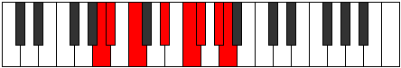 |
| [2891](https://ianring.com/musictheory/scales/2891) | [Phrogian](ModeCNaturalPhrogian.md) | C | C, Db, Eb, F#, G#, A, B, C | 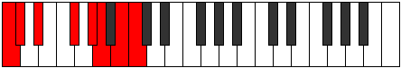 |
| [2893](https://ianring.com/musictheory/scales/2893) | [Lylian](ModeFSharpLylian.md) | F# | F#, G#, A, B#, C##, D#, E#, F# |  |
| [2893](https://ianring.com/musictheory/scales/2893) | [Lylian](ModeGFlatLylian.md) | Gb | Gb, Ab, Bbb, C, D, Eb, F, Gb |  |
| [2893](https://ianring.com/musictheory/scales/2893) | [Lylian](ModeCNaturalLylian.md) | C | C, D, Eb, F#, G#, A, B, C |  |
| [2893](https://ianring.com/musictheory/scales/2893) | [Lylian](ModeANaturalLylian.md) | A | A, B, C, D#, E#, F#, G#, A |  |
| [2895](https://ianring.com/musictheory/scales/2895) | [Aeragyllic](ModeFSharpAeragyllic.md) | F# | F#, G, G#, A, C, D, D#, F, F# |  |
| [2895](https://ianring.com/musictheory/scales/2895) | [Aeragyllic](ModeGFlatAeragyllic.md) | Gb | Gb, G, Ab, A, C, D, Eb, F, Gb |  |
| [2895](https://ianring.com/musictheory/scales/2895) | [Aeragyllic](ModeCNaturalAeragyllic.md) | C | C, C#, D, D#, F#, G#, A, B, C |  |
| [2895](https://ianring.com/musictheory/scales/2895) | [Aeragyllic](ModeANaturalAeragyllic.md) | A | A, A#, B, C, D#, F, F#, G#, A |  |
| [2905](https://ianring.com/musictheory/scales/2905) | [Palian](ModeANaturalPalian.md) | A | A, B#, C#, D#, E#, F#, G#, A |  |
| [2905](https://ianring.com/musictheory/scales/2905) | [Palian](ModeCNaturalPalian.md) | C | C, D#, E, F#, G#, A, B, C |  |
| [2907](https://ianring.com/musictheory/scales/2907) | [Mogyllic](ModeANaturalMogyllic.md) | A | A, A#, C, C#, D#, F, F#, G#, A |  |
| [2907](https://ianring.com/musictheory/scales/2907) | [Mogyllic](ModeCNaturalMogyllic.md) | C | C, C#, D#, E, F#, G#, A, B, C |  |
| [2909](https://ianring.com/musictheory/scales/2909) | [Mocryllic](ModeFSharpMocryllic.md) | F# | F#, G#, A, A#, C, D, D#, F, F# |  |
| [2909](https://ianring.com/musictheory/scales/2909) | [Mocryllic](ModeGFlatMocryllic.md) | Gb | Gb, Ab, A, Bb, C, D, Eb, F, Gb |  |
| [2909](https://ianring.com/musictheory/scales/2909) | [Mocryllic](ModeCNaturalMocryllic.md) | C | C, D, D#, E, F#, G#, A, B, C |  |
| [2909](https://ianring.com/musictheory/scales/2909) | [Mocryllic](ModeANaturalMocryllic.md) | A | A, B, C, C#, D#, F, F#, G#, A |  |
| [2911](https://ianring.com/musictheory/scales/2911) | [Katygic](ModeFSharpKatygic.md) | F# | F#, G, G#, A, A#, C, D, D#, F, F# |  |
| [2911](https://ianring.com/musictheory/scales/2911) | [Katygic](ModeGFlatKatygic.md) | Gb | Gb, G, Ab, A, Bb, C, D, Eb, F, Gb |  |
| [2911](https://ianring.com/musictheory/scales/2911) | [Katygic](ModeCNaturalKatygic.md) | C | C, C#, D, D#, E, F#, G#, A, B, C |  |
| [2911](https://ianring.com/musictheory/scales/2911) | [Katygic](ModeANaturalKatygic.md) | A | A, A#, B, C, C#, D#, F, F#, G#, A |  |
| [2915](https://ianring.com/musictheory/scales/2915) | [Aeolydian](ModeDSharpAeolydian.md) | D# | D#, E, F###, G##, A##, B#, C##, D# |  |
| [2915](https://ianring.com/musictheory/scales/2915) | [Aeolydian](ModeEFlatAeolydian.md) | Eb | Eb, Fb, G#, A, B, C, D, Eb |  |
| [2917](https://ianring.com/musictheory/scales/2917) | [Kocrian](ModeDSharpKocrian.md) | D# | D#, E#, F###, G##, A##, B#, C##, D# |  |
| [2917](https://ianring.com/musictheory/scales/2917) | [Kocrian](ModeEFlatKocrian.md) | Eb | Eb, F, G#, A, B, C, D, Eb | 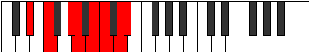 |
| [2919](https://ianring.com/musictheory/scales/2919) | [Molyllic](ModeGNaturalMolyllic.md) | G | G, G#, A, C, C#, D#, E, F#, G |  |
| [2919](https://ianring.com/musictheory/scales/2919) | [Molyllic](ModeDSharpMolyllic.md) | D# | D#, E, F, G#, A, B, C, D, D# |  |
| [2919](https://ianring.com/musictheory/scales/2919) | [Molyllic](ModeEFlatMolyllic.md) | Eb | Eb, E, F, Ab, A, B, C, D, Eb |  |
| [2921](https://ianring.com/musictheory/scales/2921) | [Pogian](ModeANaturalPogian.md) | A | A, B#, C##, D#, E#, F#, G#, A |  |
| [2921](https://ianring.com/musictheory/scales/2921) | [Pogian](ModeDSharpPogian.md) | D# | D#, E##, F###, G##, A##, B#, C##, D# |  |
| [2921](https://ianring.com/musictheory/scales/2921) | [Pogian](ModeEFlatPogian.md) | Eb | Eb, F#, G#, A, B, C, D, Eb |  |
| [2921](https://ianring.com/musictheory/scales/2921) | [Pogian](ModeCNaturalPogian.md) | C | C, D#, E#, F#, G#, A, B, C |  |
| [2923](https://ianring.com/musictheory/scales/2923) | [Baryllic](ModeANaturalBaryllic.md) | A | A, A#, C, D, D#, F, F#, G#, A |  |
| [2923](https://ianring.com/musictheory/scales/2923) | [Baryllic](ModeDSharpBaryllic.md) | D# | D#, E, F#, G#, A, B, C, D, D# |  |
| [2923](https://ianring.com/musictheory/scales/2923) | [Baryllic](ModeEFlatBaryllic.md) | Eb | Eb, E, Gb, Ab, A, B, C, D, Eb |  |
| [2923](https://ianring.com/musictheory/scales/2923) | [Baryllic](ModeCNaturalBaryllic.md) | C | C, C#, D#, F, F#, G#, A, B, C | 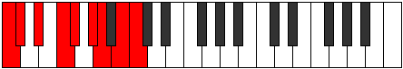 |
| [2925](https://ianring.com/musictheory/scales/2925) | [MajorDiminished](ModeCNaturalMajorDiminished.md) | C | C, D, D#, F, F#, G#, A, B, C |  |
| [2925](https://ianring.com/musictheory/scales/2925) | [MajorDiminished](ModeDSharpMajorDiminished.md) | D# | D#, F, F#, G#, A, B, C, D, D# |  |
| [2925](https://ianring.com/musictheory/scales/2925) | [MajorDiminished](ModeEFlatMajorDiminished.md) | Eb | Eb, F, Gb, Ab, A, B, C, D, Eb |  |
| [2925](https://ianring.com/musictheory/scales/2925) | [MajorDiminished](ModeFSharpMajorDiminished.md) | F# | F#, G#, A, B, C, D, D#, F, F# |  |
| [2925](https://ianring.com/musictheory/scales/2925) | [MajorDiminished](ModeGFlatMajorDiminished.md) | Gb | Gb, Ab, A, B, C, D, Eb, F, Gb |  |
| [2925](https://ianring.com/musictheory/scales/2925) | [MajorDiminished](ModeANaturalMajorDiminished.md) | A | A, B, C, D, D#, F, F#, G#, A |  |
| [2927](https://ianring.com/musictheory/scales/2927) | [Rodygic](ModeGNaturalRodygic.md) | G | G, G#, A, A#, C, C#, D#, E, F#, G |  |
| [2927](https://ianring.com/musictheory/scales/2927) | [Rodygic](ModeCNaturalRodygic.md) | C | C, C#, D, D#, F, F#, G#, A, B, C |  |
| [2927](https://ianring.com/musictheory/scales/2927) | [Rodygic](ModeDSharpRodygic.md) | D# | D#, E, F, F#, G#, A, B, C, D, D# |  |
| [2927](https://ianring.com/musictheory/scales/2927) | [Rodygic](ModeEFlatRodygic.md) | Eb | Eb, E, F, Gb, Ab, A, B, C, D, Eb |  |
| [2927](https://ianring.com/musictheory/scales/2927) | [Rodygic](ModeFSharpRodygic.md) | F# | F#, G, G#, A, B, C, D, D#, F, F# |  |
| [2927](https://ianring.com/musictheory/scales/2927) | [Rodygic](ModeGFlatRodygic.md) | Gb | Gb, G, Ab, A, B, C, D, Eb, F, Gb |  |
| [2927](https://ianring.com/musictheory/scales/2927) | [Rodygic](ModeANaturalRodygic.md) | A | A, A#, B, C, D, D#, F, F#, G#, A |  |
| [2929](https://ianring.com/musictheory/scales/2929) | [Aeolathian](ModeENaturalAeolathian.md) | E | E, F###, G##, A#, B#, C#, D#, E |  |
| [2929](https://ianring.com/musictheory/scales/2929) | [Aeolathian](ModeDSharpAeolathian.md) | D# | D#, E###, F###, G##, A##, B#, C##, D# |  |
| [2929](https://ianring.com/musictheory/scales/2929) | [Aeolathian](ModeEFlatAeolathian.md) | Eb | Eb, F##, G#, A, B, C, D, Eb |  |
| [2931](https://ianring.com/musictheory/scales/2931) | [Zathyllic](ModeENaturalZathyllic.md) | E | E, F, G#, A, A#, C, C#, D#, E |  |
| [2931](https://ianring.com/musictheory/scales/2931) | [Zathyllic](ModeDSharpZathyllic.md) | D# | D#, E, G, G#, A, B, C, D, D# |  |
| [2931](https://ianring.com/musictheory/scales/2931) | [Zathyllic](ModeEFlatZathyllic.md) | Eb | Eb, E, G, Ab, A, B, C, D, Eb |  |
| [2933](https://ianring.com/musictheory/scales/2933) | [Dalyllic](ModeENaturalDalyllic.md) | E | E, F#, G#, A, A#, C, C#, D#, E |  |
| [2933](https://ianring.com/musictheory/scales/2933) | [Dalyllic](ModeDSharpDalyllic.md) | D# | D#, F, G, G#, A, B, C, D, D# |  |
| [2933](https://ianring.com/musictheory/scales/2933) | [Dalyllic](ModeEFlatDalyllic.md) | Eb | Eb, F, G, Ab, A, B, C, D, Eb |  |
| [2935](https://ianring.com/musictheory/scales/2935) | [Modygic](ModeENaturalModygic.md) | E | E, F, F#, G#, A, A#, C, C#, D#, E |  |
| [2935](https://ianring.com/musictheory/scales/2935) | [Modygic](ModeDSharpModygic.md) | D# | D#, E, F, G, G#, A, B, C, D, D# |  |
| [2935](https://ianring.com/musictheory/scales/2935) | [Modygic](ModeEFlatModygic.md) | Eb | Eb, E, F, G, Ab, A, B, C, D, Eb |  |
| [2935](https://ianring.com/musictheory/scales/2935) | [Modygic](ModeGNaturalModygic.md) | G | G, G#, A, B, C, C#, D#, E, F#, G |  |
| [2937](https://ianring.com/musictheory/scales/2937) | [Aeolathyllic](ModeANaturalAeolathyllic.md) | A | A, C, C#, D, D#, F, F#, G#, A |  |
| [2937](https://ianring.com/musictheory/scales/2937) | [Aeolathyllic](ModeENaturalAeolathyllic.md) | E | E, G, G#, A, A#, C, C#, D#, E |  |
| [2937](https://ianring.com/musictheory/scales/2937) | [Aeolathyllic](ModeCNaturalAeolathyllic.md) | C | C, D#, E, F, F#, G#, A, B, C |  |
| [2937](https://ianring.com/musictheory/scales/2937) | [Aeolathyllic](ModeDSharpAeolathyllic.md) | D# | D#, F#, G, G#, A, B, C, D, D# |  |
| [2937](https://ianring.com/musictheory/scales/2937) | [Aeolathyllic](ModeEFlatAeolathyllic.md) | Eb | Eb, Gb, G, Ab, A, B, C, D, Eb |  |
| [2939](https://ianring.com/musictheory/scales/2939) | [Goptygic](ModeANaturalGoptygic.md) | A | A, A#, C, C#, D, D#, F, F#, G#, A |  |
| [2939](https://ianring.com/musictheory/scales/2939) | [Goptygic](ModeENaturalGoptygic.md) | E | E, F, G, G#, A, A#, C, C#, D#, E |  |
| [2939](https://ianring.com/musictheory/scales/2939) | [Goptygic](ModeCNaturalGoptygic.md) | C | C, C#, D#, E, F, F#, G#, A, B, C |  |
| [2939](https://ianring.com/musictheory/scales/2939) | [Goptygic](ModeDSharpGoptygic.md) | D# | D#, E, F#, G, G#, A, B, C, D, D# |  |
| [2939](https://ianring.com/musictheory/scales/2939) | [Goptygic](ModeEFlatGoptygic.md) | Eb | Eb, E, Gb, G, Ab, A, B, C, D, Eb |  |
| [2941](https://ianring.com/musictheory/scales/2941) | [Laptygic](ModeENaturalLaptygic.md) | E | E, F#, G, G#, A, A#, C, C#, D#, E |  |
| [2941](https://ianring.com/musictheory/scales/2941) | [Laptygic](ModeANaturalLaptygic.md) | A | A, B, C, C#, D, D#, F, F#, G#, A |  |
| [2941](https://ianring.com/musictheory/scales/2941) | [Laptygic](ModeCNaturalLaptygic.md) | C | C, D, D#, E, F, F#, G#, A, B, C |  |
| [2941](https://ianring.com/musictheory/scales/2941) | [Laptygic](ModeDSharpLaptygic.md) | D# | D#, F, F#, G, G#, A, B, C, D, D# |  |
| [2941](https://ianring.com/musictheory/scales/2941) | [Laptygic](ModeEFlatLaptygic.md) | Eb | Eb, F, Gb, G, Ab, A, B, C, D, Eb |  |
| [2941](https://ianring.com/musictheory/scales/2941) | [Laptygic](ModeFSharpLaptygic.md) | F# | F#, G#, A, A#, B, C, D, D#, F, F# |  |
| [2941](https://ianring.com/musictheory/scales/2941) | [Laptygic](ModeGFlatLaptygic.md) | Gb | Gb, Ab, A, Bb, B, C, D, Eb, F, Gb |  |
| [2943](https://ianring.com/musictheory/scales/2943) | [Dathyllian](ModeENaturalDathyllian.md) | E | E, F, F#, G, G#, A, A#, C, C#, D#, E |  |
| [2943](https://ianring.com/musictheory/scales/2943) | [Dathyllian](ModeCNaturalDathyllian.md) | C | C, C#, D, D#, E, F, F#, G#, A, B, C |  |
| [2943](https://ianring.com/musictheory/scales/2943) | [Dathyllian](ModeDSharpDathyllian.md) | D# | D#, E, F, F#, G, G#, A, B, C, D, D# |  |
| [2943](https://ianring.com/musictheory/scales/2943) | [Dathyllian](ModeEFlatDathyllian.md) | Eb | Eb, E, F, Gb, G, Ab, A, B, C, D, Eb |  |
| [2943](https://ianring.com/musictheory/scales/2943) | [Dathyllian](ModeANaturalDathyllian.md) | A | A, A#, B, C, C#, D, D#, F, F#, G#, A |  |
| [2943](https://ianring.com/musictheory/scales/2943) | [Dathyllian](ModeGNaturalDathyllian.md) | G | G, G#, A, A#, B, C, C#, D#, E, F#, G |  |
| [2943](https://ianring.com/musictheory/scales/2943) | [Dathyllian](ModeFSharpDathyllian.md) | F# | F#, G, G#, A, A#, B, C, D, D#, F, F# |  |
| [2943](https://ianring.com/musictheory/scales/2943) | [Dathyllian](ModeGFlatDathyllian.md) | Gb | Gb, G, Ab, A, Bb, B, C, D, Eb, F, Gb |  |
| [2953](https://ianring.com/musictheory/scales/2953) | [Ionylimic](ModeCNaturalIonylimic.md) | C | C, D#, E###, F###, G##, A##, C |  |
| [2955](https://ianring.com/musictheory/scales/2955) | [Thorian](ModeCNaturalThorian.md) | C | C, Db, Eb, F##, G#, A, B, C |  |
| [2957](https://ianring.com/musictheory/scales/2957) | [Thygian](ModeCSharpThygian.md) | C# | C#, D#, E, F###, G##, A#, B#, C# |  |
| [2957](https://ianring.com/musictheory/scales/2957) | [Thygian](ModeDFlatThygian.md) | Db | Db, Eb, Fb, G#, A, Bb, C, Db |  |
| [2957](https://ianring.com/musictheory/scales/2957) | [Thygian](ModeCNaturalThygian.md) | C | C, D, Eb, F##, G#, A, B, C |  |
| [2959](https://ianring.com/musictheory/scales/2959) | [Dygyllic](ModeCSharpDygyllic.md) | C# | C#, D, D#, E, G#, A, A#, C, C# |  |
| [2959](https://ianring.com/musictheory/scales/2959) | [Dygyllic](ModeDFlatDygyllic.md) | Db | Db, D, Eb, E, Ab, A, Bb, C, Db |  |
| [2959](https://ianring.com/musictheory/scales/2959) | [Dygyllic](ModeCNaturalDygyllic.md) | C | C, C#, D, D#, G, G#, A, B, C |  |
| [2963](https://ianring.com/musictheory/scales/2963) | [Bygian](ModeGSharpBygian.md) | G# | G#, A, B#, C###, D##, E#, F##, G# |  |
| [2963](https://ianring.com/musictheory/scales/2963) | [Bygian](ModeAFlatBygian.md) | Ab | Ab, Bbb, C, D#, E, F, G, Ab |  |
| [2965](https://ianring.com/musictheory/scales/2965) | [Darian](ModeCSharpDarian.md) | C# | C#, D#, E#, F###, G##, A#, B#, C# |  |
| [2965](https://ianring.com/musictheory/scales/2965) | [Darian](ModeDFlatDarian.md) | Db | Db, Eb, F, G#, A, Bb, C, Db |  |
| [2967](https://ianring.com/musictheory/scales/2967) | [Madyllic](ModeCSharpMadyllic.md) | C# | C#, D, D#, F, G#, A, A#, C, C# |  |
| [2967](https://ianring.com/musictheory/scales/2967) | [Madyllic](ModeDFlatMadyllic.md) | Db | Db, D, Eb, F, Ab, A, Bb, C, Db |  |
| [2967](https://ianring.com/musictheory/scales/2967) | [Madyllic](ModeGSharpMadyllic.md) | G# | G#, A, A#, C, D#, E, F, G, G# |  |
| [2967](https://ianring.com/musictheory/scales/2967) | [Madyllic](ModeAFlatMadyllic.md) | Ab | Ab, A, Bb, C, Eb, E, F, G, Ab |  |
| [2969](https://ianring.com/musictheory/scales/2969) | [Tholian](ModeCNaturalTholian.md) | C | C, D#, E, F##, G#, A, B, C |  |
| [2971](https://ianring.com/musictheory/scales/2971) | [Aeolynyllic](ModeCNaturalAeolynyllic.md) | C | C, C#, D#, E, G, G#, A, B, C |  |
| [2971](https://ianring.com/musictheory/scales/2971) | [Aeolynyllic](ModeGSharpAeolynyllic.md) | G# | G#, A, B, C, D#, E, F, G, G# |  |
| [2971](https://ianring.com/musictheory/scales/2971) | [Aeolynyllic](ModeAFlatAeolynyllic.md) | Ab | Ab, A, B, C, Eb, E, F, G, Ab |  |
| [2973](https://ianring.com/musictheory/scales/2973) | [Panyllic](ModeCSharpPanyllic.md) | C# | C#, D#, E, F, G#, A, A#, C, C# |  |
| [2973](https://ianring.com/musictheory/scales/2973) | [Panyllic](ModeDFlatPanyllic.md) | Db | Db, Eb, E, F, Ab, A, Bb, C, Db |  |
| [2973](https://ianring.com/musictheory/scales/2973) | [Panyllic](ModeCNaturalPanyllic.md) | C | C, D, D#, E, G, G#, A, B, C |  |
| [2975](https://ianring.com/musictheory/scales/2975) | [Gaptygic](ModeCSharpGaptygic.md) | C# | C#, D, D#, E, F, G#, A, A#, C, C# |  |
| [2975](https://ianring.com/musictheory/scales/2975) | [Gaptygic](ModeDFlatGaptygic.md) | Db | Db, D, Eb, E, F, Ab, A, Bb, C, Db |  |
| [2975](https://ianring.com/musictheory/scales/2975) | [Gaptygic](ModeCNaturalGaptygic.md) | C | C, C#, D, D#, E, G, G#, A, B, C |  |
| [2975](https://ianring.com/musictheory/scales/2975) | [Gaptygic](ModeGSharpGaptygic.md) | G# | G#, A, A#, B, C, D#, E, F, G, G# |  |
| [2975](https://ianring.com/musictheory/scales/2975) | [Gaptygic](ModeAFlatGaptygic.md) | Ab | Ab, A, Bb, B, C, Eb, E, F, G, Ab |  |
| [2981](https://ianring.com/musictheory/scales/2981) | [Ionolian](ModeCSharpIonolian.md) | C# | C#, D#, E##, F###, G##, A#, B#, C# |  |
| [2981](https://ianring.com/musictheory/scales/2981) | [Ionolian](ModeDFlatIonolian.md) | Db | Db, Eb, F#, G#, A, Bb, C, Db |  |
| [2983](https://ianring.com/musictheory/scales/2983) | [Zythyllic](ModeGNaturalZythyllic.md) | G | G, G#, A, C, D, D#, E, F#, G |  |
| [2983](https://ianring.com/musictheory/scales/2983) | [Zythyllic](ModeCSharpZythyllic.md) | C# | C#, D, D#, F#, G#, A, A#, C, C# |  |
| [2983](https://ianring.com/musictheory/scales/2983) | [Zythyllic](ModeDFlatZythyllic.md) | Db | Db, D, Eb, Gb, Ab, A, Bb, C, Db |  |
| [2985](https://ianring.com/musictheory/scales/2985) | [Epacrian](ModeCNaturalEpacrian.md) | C | C, D#, E#, F##, G#, A, B, C |  |
| [2987](https://ianring.com/musictheory/scales/2987) | [Thanyllic](ModeCNaturalThanyllic.md) | C | C, C#, D#, F, G, G#, A, B, C |  |
| [2989](https://ianring.com/musictheory/scales/2989) | [Ionacryllic](ModeCSharpIonacryllic.md) | C# | C#, D#, E, F#, G#, A, A#, C, C# |  |
| [2989](https://ianring.com/musictheory/scales/2989) | [Ionacryllic](ModeDFlatIonacryllic.md) | Db | Db, Eb, E, Gb, Ab, A, Bb, C, Db |  |
| [2989](https://ianring.com/musictheory/scales/2989) | [Ionacryllic](ModeCNaturalIonacryllic.md) | C | C, D, D#, F, G, G#, A, B, C |  |
| [2991](https://ianring.com/musictheory/scales/2991) | [Zanygic](ModeCSharpZanygic.md) | C# | C#, D, D#, E, F#, G#, A, A#, C, C# |  |
| [2991](https://ianring.com/musictheory/scales/2991) | [Zanygic](ModeDFlatZanygic.md) | Db | Db, D, Eb, E, Gb, Ab, A, Bb, C, Db | 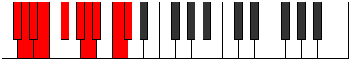 |
| [2991](https://ianring.com/musictheory/scales/2991) | [Zanygic](ModeGNaturalZanygic.md) | G | G, G#, A, A#, C, D, D#, E, F#, G |  |
| [2991](https://ianring.com/musictheory/scales/2991) | [Zanygic](ModeCNaturalZanygic.md) | C | C, C#, D, D#, F, G, G#, A, B, C |  |
| [2993](https://ianring.com/musictheory/scales/2993) | [Stythian](ModeENaturalStythian.md) | E | E, F###, G##, A##, B#, C#, D#, E |  |
| [2995](https://ianring.com/musictheory/scales/2995) | [Sanyllic](ModeGSharpSanyllic.md) | G# | G#, A, C, C#, D#, E, F, G, G# |  |
| [2995](https://ianring.com/musictheory/scales/2995) | [Sanyllic](ModeAFlatSanyllic.md) | Ab | Ab, A, C, Db, Eb, E, F, G, Ab |  |
| [2995](https://ianring.com/musictheory/scales/2995) | [Sanyllic](ModeENaturalSanyllic.md) | E | E, F, G#, A, B, C, C#, D#, E |  |
| [2997](https://ianring.com/musictheory/scales/2997) | [Ionoptyllic](ModeCSharpIonoptyllic.md) | C# | C#, D#, F, F#, G#, A, A#, C, C# |  |
| [2997](https://ianring.com/musictheory/scales/2997) | [Ionoptyllic](ModeDFlatIonoptyllic.md) | Db | Db, Eb, F, Gb, Ab, A, Bb, C, Db |  |
| [2997](https://ianring.com/musictheory/scales/2997) | [Ionoptyllic](ModeENaturalIonoptyllic.md) | E | E, F#, G#, A, B, C, C#, D#, E |  |
| [2999](https://ianring.com/musictheory/scales/2999) | [Zyrygic](ModeCSharpZyrygic.md) | C# | C#, D, D#, F, F#, G#, A, A#, C, C# |  |
| [2999](https://ianring.com/musictheory/scales/2999) | [Zyrygic](ModeDFlatZyrygic.md) | Db | Db, D, Eb, F, Gb, Ab, A, Bb, C, Db |  |
| [2999](https://ianring.com/musictheory/scales/2999) | [Zyrygic](ModeGSharpZyrygic.md) | G# | G#, A, A#, C, C#, D#, E, F, G, G# |  |
| [2999](https://ianring.com/musictheory/scales/2999) | [Zyrygic](ModeAFlatZyrygic.md) | Ab | Ab, A, Bb, C, Db, Eb, E, F, G, Ab |  |
| [2999](https://ianring.com/musictheory/scales/2999) | [Zyrygic](ModeENaturalZyrygic.md) | E | E, F, F#, G#, A, B, C, C#, D#, E |  |
| [2999](https://ianring.com/musictheory/scales/2999) | [Zyrygic](ModeGNaturalZyrygic.md) | G | G, G#, A, B, C, D, D#, E, F#, G |  |
| [3001](https://ianring.com/musictheory/scales/3001) | [Lonyllic](ModeENaturalLonyllic.md) | E | E, G, G#, A, B, C, C#, D#, E |  |
| [3001](https://ianring.com/musictheory/scales/3001) | [Lonyllic](ModeCNaturalLonyllic.md) | C | C, D#, E, F, G, G#, A, B, C |  |
| [3003](https://ianring.com/musictheory/scales/3003) | [Zydygic](ModeCNaturalZydygic.md) | C | C, C#, D#, E, F, G, G#, A, B, C |  |
| [3003](https://ianring.com/musictheory/scales/3003) | [Zydygic](ModeENaturalZydygic.md) | E | E, F, G, G#, A, B, C, C#, D#, E |  |
| [3003](https://ianring.com/musictheory/scales/3003) | [Zydygic](ModeGSharpZydygic.md) | G# | G#, A, B, C, C#, D#, E, F, G, G# |  |
| [3003](https://ianring.com/musictheory/scales/3003) | [Zydygic](ModeAFlatZydygic.md) | Ab | Ab, A, B, C, Db, Eb, E, F, G, Ab |  |
| [3005](https://ianring.com/musictheory/scales/3005) | [Gycrygic](ModeCSharpGycrygic.md) | C# | C#, D#, E, F, F#, G#, A, A#, C, C# |  |
| [3005](https://ianring.com/musictheory/scales/3005) | [Gycrygic](ModeDFlatGycrygic.md) | Db | Db, Eb, E, F, Gb, Ab, A, Bb, C, Db |  |
| [3005](https://ianring.com/musictheory/scales/3005) | [Gycrygic](ModeCNaturalGycrygic.md) | C | C, D, D#, E, F, G, G#, A, B, C |  |
| [3005](https://ianring.com/musictheory/scales/3005) | [Gycrygic](ModeENaturalGycrygic.md) | E | E, F#, G, G#, A, B, C, C#, D#, E |  |
| [3007](https://ianring.com/musictheory/scales/3007) | [Zyryllian](ModeCSharpZyryllian.md) | C# | C#, D, D#, E, F, F#, G#, A, A#, C, C# |  |
| [3007](https://ianring.com/musictheory/scales/3007) | [Zyryllian](ModeDFlatZyryllian.md) | Db | Db, D, Eb, E, F, Gb, Ab, A, Bb, C, Db |  |
| [3007](https://ianring.com/musictheory/scales/3007) | [Zyryllian](ModeCNaturalZyryllian.md) | C | C, C#, D, D#, E, F, G, G#, A, B, C |  |
| [3007](https://ianring.com/musictheory/scales/3007) | [Zyryllian](ModeENaturalZyryllian.md) | E | E, F, F#, G, G#, A, B, C, C#, D#, E |  |
| [3007](https://ianring.com/musictheory/scales/3007) | [Zyryllian](ModeGSharpZyryllian.md) | G# | G#, A, A#, B, C, C#, D#, E, F, G, G# |  |
| [3007](https://ianring.com/musictheory/scales/3007) | [Zyryllian](ModeAFlatZyryllian.md) | Ab | Ab, A, Bb, B, C, Db, Eb, E, F, G, Ab |  |
| [3007](https://ianring.com/musictheory/scales/3007) | [Zyryllian](ModeGNaturalZyryllian.md) | G | G, G#, A, A#, B, C, D, D#, E, F#, G |  |
| [3013](https://ianring.com/musictheory/scales/3013) | [Thynian](ModeCSharpThynian.md) | C# | C#, D#, E###, F###, G##, A#, B#, C# | 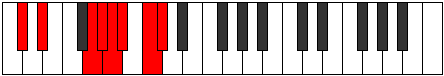 |
| [3013](https://ianring.com/musictheory/scales/3013) | [Thynian](ModeDFlatThynian.md) | Db | Db, Eb, F##, G#, A, Bb, C, Db |  |
| [3015](https://ianring.com/musictheory/scales/3015) | [Laptyllic](ModeCSharpLaptyllic.md) | C# | C#, D, D#, G, G#, A, A#, C, C# |  |
| [3015](https://ianring.com/musictheory/scales/3015) | [Laptyllic](ModeDFlatLaptyllic.md) | Db | Db, D, Eb, G, Ab, A, Bb, C, Db |  |
| [3017](https://ianring.com/musictheory/scales/3017) | [Gacrian](ModeANaturalGacrian.md) | A | A, B#, C###, D##, E#, F#, G#, A |  |
| [3017](https://ianring.com/musictheory/scales/3017) | [Gacrian](ModeCNaturalGacrian.md) | C | C, D#, E##, F##, G#, A, B, C |  |
| [3019](https://ianring.com/musictheory/scales/3019) | [Mydyllic](ModeANaturalMydyllic.md) | A | A, A#, C, D#, E, F, F#, G#, A |  |
| [3019](https://ianring.com/musictheory/scales/3019) | [Mydyllic](ModeCNaturalMydyllic.md) | C | C, C#, D#, F#, G, G#, A, B, C |  |
| [3021](https://ianring.com/musictheory/scales/3021) | [Gyptyllic](ModeFSharpGyptyllic.md) | F# | F#, G#, A, C, C#, D, D#, F, F# |  |
| [3021](https://ianring.com/musictheory/scales/3021) | [Gyptyllic](ModeGFlatGyptyllic.md) | Gb | Gb, Ab, A, C, Db, D, Eb, F, Gb |  |
| [3021](https://ianring.com/musictheory/scales/3021) | [Gyptyllic](ModeCSharpGyptyllic.md) | C# | C#, D#, E, G, G#, A, A#, C, C# |  |
| [3021](https://ianring.com/musictheory/scales/3021) | [Gyptyllic](ModeDFlatGyptyllic.md) | Db | Db, Eb, E, G, Ab, A, Bb, C, Db |  |
| [3021](https://ianring.com/musictheory/scales/3021) | [Gyptyllic](ModeANaturalGyptyllic.md) | A | A, B, C, D#, E, F, F#, G#, A |  |
| [3021](https://ianring.com/musictheory/scales/3021) | [Gyptyllic](ModeCNaturalGyptyllic.md) | C | C, D, D#, F#, G, G#, A, B, C |  |
| [3023](https://ianring.com/musictheory/scales/3023) | [Aeracrygic](ModeFSharpAeracrygic.md) | F# | F#, G, G#, A, C, C#, D, D#, F, F# |  |
| [3023](https://ianring.com/musictheory/scales/3023) | [Aeracrygic](ModeGFlatAeracrygic.md) | Gb | Gb, G, Ab, A, C, Db, D, Eb, F, Gb |  |
| [3023](https://ianring.com/musictheory/scales/3023) | [Aeracrygic](ModeCSharpAeracrygic.md) | C# | C#, D, D#, E, G, G#, A, A#, C, C# |  |
| [3023](https://ianring.com/musictheory/scales/3023) | [Aeracrygic](ModeDFlatAeracrygic.md) | Db | Db, D, Eb, E, G, Ab, A, Bb, C, Db |  |
| [3023](https://ianring.com/musictheory/scales/3023) | [Aeracrygic](ModeCNaturalAeracrygic.md) | C | C, C#, D, D#, F#, G, G#, A, B, C |  |
| [3023](https://ianring.com/musictheory/scales/3023) | [Aeracrygic](ModeANaturalAeracrygic.md) | A | A, A#, B, C, D#, E, F, F#, G#, A |  |
| [3027](https://ianring.com/musictheory/scales/3027) | [Rythyllic](ModeGSharpRythyllic.md) | G# | G#, A, C, D, D#, E, F, G, G# |  |
| [3027](https://ianring.com/musictheory/scales/3027) | [Rythyllic](ModeAFlatRythyllic.md) | Ab | Ab, A, C, D, Eb, E, F, G, Ab |  |
| [3029](https://ianring.com/musictheory/scales/3029) | [Ionocryllic](ModeCSharpIonocryllic.md) | C# | C#, D#, F, G, G#, A, A#, C, C# |  |
| [3029](https://ianring.com/musictheory/scales/3029) | [Ionocryllic](ModeDFlatIonocryllic.md) | Db | Db, Eb, F, G, Ab, A, Bb, C, Db |  |
| [3031](https://ianring.com/musictheory/scales/3031) | [Epithygic](ModeCSharpEpithygic.md) | C# | C#, D, D#, F, G, G#, A, A#, C, C# |  |
| [3031](https://ianring.com/musictheory/scales/3031) | [Epithygic](ModeDFlatEpithygic.md) | Db | Db, D, Eb, F, G, Ab, A, Bb, C, Db |  |
| [3031](https://ianring.com/musictheory/scales/3031) | [Epithygic](ModeGSharpEpithygic.md) | G# | G#, A, A#, C, D, D#, E, F, G, G# |  |
| [3031](https://ianring.com/musictheory/scales/3031) | [Epithygic](ModeAFlatEpithygic.md) | Ab | Ab, A, Bb, C, D, Eb, E, F, G, Ab |  |
| [3033](https://ianring.com/musictheory/scales/3033) | [Doptyllic](ModeANaturalDoptyllic.md) | A | A, C, C#, D#, E, F, F#, G#, A |  |
| [3033](https://ianring.com/musictheory/scales/3033) | [Doptyllic](ModeCNaturalDoptyllic.md) | C | C, D#, E, F#, G, G#, A, B, C |  |
| [3035](https://ianring.com/musictheory/scales/3035) | [Gocrygic](ModeANaturalGocrygic.md) | A | A, A#, C, C#, D#, E, F, F#, G#, A |  |
| [3035](https://ianring.com/musictheory/scales/3035) | [Gocrygic](ModeGSharpGocrygic.md) | G# | G#, A, B, C, D, D#, E, F, G, G# |  |
| [3035](https://ianring.com/musictheory/scales/3035) | [Gocrygic](ModeAFlatGocrygic.md) | Ab | Ab, A, B, C, D, Eb, E, F, G, Ab |  |
| [3035](https://ianring.com/musictheory/scales/3035) | [Gocrygic](ModeCNaturalGocrygic.md) | C | C, C#, D#, E, F#, G, G#, A, B, C |  |
| [3037](https://ianring.com/musictheory/scales/3037) | [Staptygic](ModeFSharpStaptygic.md) | F# | F#, G#, A, A#, C, C#, D, D#, F, F# |  |
| [3037](https://ianring.com/musictheory/scales/3037) | [Staptygic](ModeGFlatStaptygic.md) | Gb | Gb, Ab, A, Bb, C, Db, D, Eb, F, Gb |  |
| [3037](https://ianring.com/musictheory/scales/3037) | [Staptygic](ModeCSharpStaptygic.md) | C# | C#, D#, E, F, G, G#, A, A#, C, C# |  |
| [3037](https://ianring.com/musictheory/scales/3037) | [Staptygic](ModeDFlatStaptygic.md) | Db | Db, Eb, E, F, G, Ab, A, Bb, C, Db |  |
| [3037](https://ianring.com/musictheory/scales/3037) | [Staptygic](ModeANaturalStaptygic.md) | A | A, B, C, C#, D#, E, F, F#, G#, A |  |
| [3037](https://ianring.com/musictheory/scales/3037) | [Staptygic](ModeCNaturalStaptygic.md) | C | C, D, D#, E, F#, G, G#, A, B, C |  |
| [3039](https://ianring.com/musictheory/scales/3039) | [Godyllian](ModeCSharpGodyllian.md) | C# | C#, D, D#, E, F, G, G#, A, A#, C, C# |  |
| [3039](https://ianring.com/musictheory/scales/3039) | [Godyllian](ModeDFlatGodyllian.md) | Db | Db, D, Eb, E, F, G, Ab, A, Bb, C, Db |  |
| [3039](https://ianring.com/musictheory/scales/3039) | [Godyllian](ModeFSharpGodyllian.md) | F# | F#, G, G#, A, A#, C, C#, D, D#, F, F# |  |
| [3039](https://ianring.com/musictheory/scales/3039) | [Godyllian](ModeGFlatGodyllian.md) | Gb | Gb, G, Ab, A, Bb, C, Db, D, Eb, F, Gb |  |
| [3039](https://ianring.com/musictheory/scales/3039) | [Godyllian](ModeCNaturalGodyllian.md) | C | C, C#, D, D#, E, F#, G, G#, A, B, C |  |
| [3039](https://ianring.com/musictheory/scales/3039) | [Godyllian](ModeANaturalGodyllian.md) | A | A, A#, B, C, C#, D#, E, F, F#, G#, A |  |
| [3039](https://ianring.com/musictheory/scales/3039) | [Godyllian](ModeGSharpGodyllian.md) | G# | G#, A, A#, B, C, D, D#, E, F, G, G# |  |
| [3039](https://ianring.com/musictheory/scales/3039) | [Godyllian](ModeAFlatGodyllian.md) | Ab | Ab, A, Bb, B, C, D, Eb, E, F, G, Ab |  |
| [3043](https://ianring.com/musictheory/scales/3043) | [Ionayllic](ModeDSharpIonayllic.md) | D# | D#, E, G#, A, A#, B, C, D, D# |  |
| [3043](https://ianring.com/musictheory/scales/3043) | [Ionayllic](ModeEFlatIonayllic.md) | Eb | Eb, E, Ab, A, Bb, B, C, D, Eb |  |
| [3045](https://ianring.com/musictheory/scales/3045) | [Raptyllic](ModeCSharpRaptyllic.md) | C# | C#, D#, F#, G, G#, A, A#, C, C# |  |
| [3045](https://ianring.com/musictheory/scales/3045) | [Raptyllic](ModeDFlatRaptyllic.md) | Db | Db, Eb, Gb, G, Ab, A, Bb, C, Db |  |
| [3045](https://ianring.com/musictheory/scales/3045) | [Raptyllic](ModeDSharpRaptyllic.md) | D# | D#, F, G#, A, A#, B, C, D, D# |  |
| [3045](https://ianring.com/musictheory/scales/3045) | [Raptyllic](ModeEFlatRaptyllic.md) | Eb | Eb, F, Ab, A, Bb, B, C, D, Eb |  |
| [3047](https://ianring.com/musictheory/scales/3047) | [Panygic](ModeGNaturalPanygic.md) | G | G, G#, A, C, C#, D, D#, E, F#, G |  |
| [3047](https://ianring.com/musictheory/scales/3047) | [Panygic](ModeCSharpPanygic.md) | C# | C#, D, D#, F#, G, G#, A, A#, C, C# |  |
| [3047](https://ianring.com/musictheory/scales/3047) | [Panygic](ModeDFlatPanygic.md) | Db | Db, D, Eb, Gb, G, Ab, A, Bb, C, Db |  |
| [3047](https://ianring.com/musictheory/scales/3047) | [Panygic](ModeDSharpPanygic.md) | D# | D#, E, F, G#, A, A#, B, C, D, D# |  |
| [3047](https://ianring.com/musictheory/scales/3047) | [Panygic](ModeEFlatPanygic.md) | Eb | Eb, E, F, Ab, A, Bb, B, C, D, Eb |  |
| [3049](https://ianring.com/musictheory/scales/3049) | [Aeronyllic](ModeANaturalAeronyllic.md) | A | A, C, D, D#, E, F, F#, G#, A |  |
| [3049](https://ianring.com/musictheory/scales/3049) | [Aeronyllic](ModeCNaturalAeronyllic.md) | C | C, D#, F, F#, G, G#, A, B, C |  |
| [3049](https://ianring.com/musictheory/scales/3049) | [Aeronyllic](ModeDSharpAeronyllic.md) | D# | D#, F#, G#, A, A#, B, C, D, D# |  |
| [3049](https://ianring.com/musictheory/scales/3049) | [Aeronyllic](ModeEFlatAeronyllic.md) | Eb | Eb, Gb, Ab, A, Bb, B, C, D, Eb |  |
| [3051](https://ianring.com/musictheory/scales/3051) | [Stalygic](ModeANaturalStalygic.md) | A | A, A#, C, D, D#, E, F, F#, G#, A |  |
| [3051](https://ianring.com/musictheory/scales/3051) | [Stalygic](ModeCNaturalStalygic.md) | C | C, C#, D#, F, F#, G, G#, A, B, C |  |
| [3051](https://ianring.com/musictheory/scales/3051) | [Stalygic](ModeDSharpStalygic.md) | D# | D#, E, F#, G#, A, A#, B, C, D, D# |  |
| [3051](https://ianring.com/musictheory/scales/3051) | [Stalygic](ModeEFlatStalygic.md) | Eb | Eb, E, Gb, Ab, A, Bb, B, C, D, Eb |  |
| [3053](https://ianring.com/musictheory/scales/3053) | [Zycrygic](ModeCSharpZycrygic.md) | C# | C#, D#, E, F#, G, G#, A, A#, C, C# |  |
| [3053](https://ianring.com/musictheory/scales/3053) | [Zycrygic](ModeDFlatZycrygic.md) | Db | Db, Eb, E, Gb, G, Ab, A, Bb, C, Db |  |
| [3053](https://ianring.com/musictheory/scales/3053) | [Zycrygic](ModeFSharpZycrygic.md) | F# | F#, G#, A, B, C, C#, D, D#, F, F# |  |
| [3053](https://ianring.com/musictheory/scales/3053) | [Zycrygic](ModeGFlatZycrygic.md) | Gb | Gb, Ab, A, B, C, Db, D, Eb, F, Gb |  |
| [3053](https://ianring.com/musictheory/scales/3053) | [Zycrygic](ModeANaturalZycrygic.md) | A | A, B, C, D, D#, E, F, F#, G#, A |  |
| [3053](https://ianring.com/musictheory/scales/3053) | [Zycrygic](ModeCNaturalZycrygic.md) | C | C, D, D#, F, F#, G, G#, A, B, C |  |
| [3053](https://ianring.com/musictheory/scales/3053) | [Zycrygic](ModeDSharpZycrygic.md) | D# | D#, F, F#, G#, A, A#, B, C, D, D# |  |
| [3053](https://ianring.com/musictheory/scales/3053) | [Zycrygic](ModeEFlatZycrygic.md) | Eb | Eb, F, Gb, Ab, A, Bb, B, C, D, Eb |  |
| [3055](https://ianring.com/musictheory/scales/3055) | [Lyryllian](ModeCSharpLyryllian.md) | C# | C#, D, D#, E, F#, G, G#, A, A#, C, C# |  |
| [3055](https://ianring.com/musictheory/scales/3055) | [Lyryllian](ModeDFlatLyryllian.md) | Db | Db, D, Eb, E, Gb, G, Ab, A, Bb, C, Db |  |
| [3055](https://ianring.com/musictheory/scales/3055) | [Lyryllian](ModeGNaturalLyryllian.md) | G | G, G#, A, A#, C, C#, D, D#, E, F#, G |  |
| [3055](https://ianring.com/musictheory/scales/3055) | [Lyryllian](ModeCNaturalLyryllian.md) | C | C, C#, D, D#, F, F#, G, G#, A, B, C |  |
| [3055](https://ianring.com/musictheory/scales/3055) | [Lyryllian](ModeFSharpLyryllian.md) | F# | F#, G, G#, A, B, C, C#, D, D#, F, F# |  |
| [3055](https://ianring.com/musictheory/scales/3055) | [Lyryllian](ModeGFlatLyryllian.md) | Gb | Gb, G, Ab, A, B, C, Db, D, Eb, F, Gb |  |
| [3055](https://ianring.com/musictheory/scales/3055) | [Lyryllian](ModeDSharpLyryllian.md) | D# | D#, E, F, F#, G#, A, A#, B, C, D, D# |  |
| [3055](https://ianring.com/musictheory/scales/3055) | [Lyryllian](ModeEFlatLyryllian.md) | Eb | Eb, E, F, Gb, Ab, A, Bb, B, C, D, Eb |  |
| [3055](https://ianring.com/musictheory/scales/3055) | [Lyryllian](ModeANaturalLyryllian.md) | A | A, A#, B, C, D, D#, E, F, F#, G#, A |  |
| [3057](https://ianring.com/musictheory/scales/3057) | [Phroryllic](ModeENaturalPhroryllic.md) | E | E, G#, A, A#, B, C, C#, D#, E |  |
| [3057](https://ianring.com/musictheory/scales/3057) | [Phroryllic](ModeDSharpPhroryllic.md) | D# | D#, G, G#, A, A#, B, C, D, D# |  |
| [3057](https://ianring.com/musictheory/scales/3057) | [Phroryllic](ModeEFlatPhroryllic.md) | Eb | Eb, G, Ab, A, Bb, B, C, D, Eb |  |
| [3059](https://ianring.com/musictheory/scales/3059) | [Madygic](ModeGSharpMadygic.md) | G# | G#, A, C, C#, D, D#, E, F, G, G# |  |
| [3059](https://ianring.com/musictheory/scales/3059) | [Madygic](ModeAFlatMadygic.md) | Ab | Ab, A, C, Db, D, Eb, E, F, G, Ab |  |
| [3059](https://ianring.com/musictheory/scales/3059) | [Madygic](ModeENaturalMadygic.md) | E | E, F, G#, A, A#, B, C, C#, D#, E |  |
| [3059](https://ianring.com/musictheory/scales/3059) | [Madygic](ModeDSharpMadygic.md) | D# | D#, E, G, G#, A, A#, B, C, D, D# |  |
| [3059](https://ianring.com/musictheory/scales/3059) | [Madygic](ModeEFlatMadygic.md) | Eb | Eb, E, G, Ab, A, Bb, B, C, D, Eb |  |
| [3061](https://ianring.com/musictheory/scales/3061) | [Apinygic](ModeCSharpApinygic.md) | C# | C#, D#, F, F#, G, G#, A, A#, C, C# |  |
| [3061](https://ianring.com/musictheory/scales/3061) | [Apinygic](ModeDFlatApinygic.md) | Db | Db, Eb, F, Gb, G, Ab, A, Bb, C, Db |  |
| [3061](https://ianring.com/musictheory/scales/3061) | [Apinygic](ModeENaturalApinygic.md) | E | E, F#, G#, A, A#, B, C, C#, D#, E |  |
| [3061](https://ianring.com/musictheory/scales/3061) | [Apinygic](ModeDSharpApinygic.md) | D# | D#, F, G, G#, A, A#, B, C, D, D# |  |
| [3061](https://ianring.com/musictheory/scales/3061) | [Apinygic](ModeEFlatApinygic.md) | Eb | Eb, F, G, Ab, A, Bb, B, C, D, Eb |  |
| [3063](https://ianring.com/musictheory/scales/3063) | [Solyllian](ModeGSharpSolyllian.md) | G# | G#, A, A#, C, C#, D, D#, E, F, G, G# |  |
| [3063](https://ianring.com/musictheory/scales/3063) | [Solyllian](ModeAFlatSolyllian.md) | Ab | Ab, A, Bb, C, Db, D, Eb, E, F, G, Ab |  |
| [3063](https://ianring.com/musictheory/scales/3063) | [Solyllian](ModeCSharpSolyllian.md) | C# | C#, D, D#, F, F#, G, G#, A, A#, C, C# |  |
| [3063](https://ianring.com/musictheory/scales/3063) | [Solyllian](ModeDFlatSolyllian.md) | Db | Db, D, Eb, F, Gb, G, Ab, A, Bb, C, Db |  |
| [3063](https://ianring.com/musictheory/scales/3063) | [Solyllian](ModeGNaturalSolyllian.md) | G | G, G#, A, B, C, C#, D, D#, E, F#, G |  |
| [3063](https://ianring.com/musictheory/scales/3063) | [Solyllian](ModeENaturalSolyllian.md) | E | E, F, F#, G#, A, A#, B, C, C#, D#, E |  |
| [3063](https://ianring.com/musictheory/scales/3063) | [Solyllian](ModeDSharpSolyllian.md) | D# | D#, E, F, G, G#, A, A#, B, C, D, D# |  |
| [3063](https://ianring.com/musictheory/scales/3063) | [Solyllian](ModeEFlatSolyllian.md) | Eb | Eb, E, F, G, Ab, A, Bb, B, C, D, Eb |  |
| [3065](https://ianring.com/musictheory/scales/3065) | [Zothygic](ModeANaturalZothygic.md) | A | A, C, C#, D, D#, E, F, F#, G#, A |  |
| [3065](https://ianring.com/musictheory/scales/3065) | [Zothygic](ModeCNaturalZothygic.md) | C | C, D#, E, F, F#, G, G#, A, B, C |  |
| [3065](https://ianring.com/musictheory/scales/3065) | [Zothygic](ModeENaturalZothygic.md) | E | E, G, G#, A, A#, B, C, C#, D#, E |  |
| [3065](https://ianring.com/musictheory/scales/3065) | [Zothygic](ModeDSharpZothygic.md) | D# | D#, F#, G, G#, A, A#, B, C, D, D# |  |
| [3065](https://ianring.com/musictheory/scales/3065) | [Zothygic](ModeEFlatZothygic.md) | Eb | Eb, Gb, G, Ab, A, Bb, B, C, D, Eb |  |
| [3067](https://ianring.com/musictheory/scales/3067) | [Goptyllian](ModeANaturalGoptyllian.md) | A | A, A#, C, C#, D, D#, E, F, F#, G#, A |  |
| [3067](https://ianring.com/musictheory/scales/3067) | [Goptyllian](ModeGSharpGoptyllian.md) | G# | G#, A, B, C, C#, D, D#, E, F, G, G# |  |
| [3067](https://ianring.com/musictheory/scales/3067) | [Goptyllian](ModeAFlatGoptyllian.md) | Ab | Ab, A, B, C, Db, D, Eb, E, F, G, Ab |  |
| [3067](https://ianring.com/musictheory/scales/3067) | [Goptyllian](ModeCNaturalGoptyllian.md) | C | C, C#, D#, E, F, F#, G, G#, A, B, C | 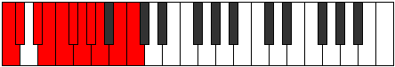 |
| [3067](https://ianring.com/musictheory/scales/3067) | [Goptyllian](ModeENaturalGoptyllian.md) | E | E, F, G, G#, A, A#, B, C, C#, D#, E |  |
| [3067](https://ianring.com/musictheory/scales/3067) | [Goptyllian](ModeDSharpGoptyllian.md) | D# | D#, E, F#, G, G#, A, A#, B, C, D, D# |  |
| [3067](https://ianring.com/musictheory/scales/3067) | [Goptyllian](ModeEFlatGoptyllian.md) | Eb | Eb, E, Gb, G, Ab, A, Bb, B, C, D, Eb |  |
| [3069](https://ianring.com/musictheory/scales/3069) | [Bacryllian](ModeCSharpBacryllian.md) | C# | C#, D#, E, F, F#, G, G#, A, A#, C, C# |  |
| [3069](https://ianring.com/musictheory/scales/3069) | [Bacryllian](ModeDFlatBacryllian.md) | Db | Db, Eb, E, F, Gb, G, Ab, A, Bb, C, Db |  |
| [3069](https://ianring.com/musictheory/scales/3069) | [Bacryllian](ModeANaturalBacryllian.md) | A | A, B, C, C#, D, D#, E, F, F#, G#, A |  |
| [3069](https://ianring.com/musictheory/scales/3069) | [Bacryllian](ModeCNaturalBacryllian.md) | C | C, D, D#, E, F, F#, G, G#, A, B, C |  |
| [3069](https://ianring.com/musictheory/scales/3069) | [Bacryllian](ModeFSharpBacryllian.md) | F# | F#, G#, A, A#, B, C, C#, D, D#, F, F# |  |
| [3069](https://ianring.com/musictheory/scales/3069) | [Bacryllian](ModeGFlatBacryllian.md) | Gb | Gb, Ab, A, Bb, B, C, Db, D, Eb, F, Gb |  |
| [3069](https://ianring.com/musictheory/scales/3069) | [Bacryllian](ModeENaturalBacryllian.md) | E | E, F#, G, G#, A, A#, B, C, C#, D#, E |  |
| [3069](https://ianring.com/musictheory/scales/3069) | [Bacryllian](ModeDSharpBacryllian.md) | D# | D#, F, F#, G, G#, A, A#, B, C, D, D# |  |
| [3069](https://ianring.com/musictheory/scales/3069) | [Bacryllian](ModeEFlatBacryllian.md) | Eb | Eb, F, Gb, G, Ab, A, Bb, B, C, D, Eb |  |
| [3071](https://ianring.com/musictheory/scales/3071) | [Solatic](ModeCSharpSolatic.md) | C# | C#, D, D#, E, F, F#, G, G#, A, A#, C, C# |  |
| [3071](https://ianring.com/musictheory/scales/3071) | [Solatic](ModeDFlatSolatic.md) | Db | Db, D, Eb, E, F, Gb, G, Ab, A, Bb, C, Db |  |
| [3071](https://ianring.com/musictheory/scales/3071) | [Solatic](ModeCNaturalSolatic.md) | C | C, C#, D, D#, E, F, F#, G, G#, A, B, C |  |
| [3071](https://ianring.com/musictheory/scales/3071) | [Solatic](ModeANaturalSolatic.md) | A | A, A#, B, C, C#, D, D#, E, F, F#, G#, A |  |
| [3071](https://ianring.com/musictheory/scales/3071) | [Solatic](ModeGSharpSolatic.md) | G# | G#, A, A#, B, C, C#, D, D#, E, F, G, G# |  |
| [3071](https://ianring.com/musictheory/scales/3071) | [Solatic](ModeAFlatSolatic.md) | Ab | Ab, A, Bb, B, C, Db, D, Eb, E, F, G, Ab |  |
| [3071](https://ianring.com/musictheory/scales/3071) | [Solatic](ModeGNaturalSolatic.md) | G | G, G#, A, A#, B, C, C#, D, D#, E, F#, G |  |
| [3071](https://ianring.com/musictheory/scales/3071) | [Solatic](ModeFSharpSolatic.md) | F# | F#, G, G#, A, A#, B, C, C#, D, D#, F, F# |  |
| [3071](https://ianring.com/musictheory/scales/3071) | [Solatic](ModeGFlatSolatic.md) | Gb | Gb, G, Ab, A, Bb, B, C, Db, D, Eb, F, Gb |  |
| [3071](https://ianring.com/musictheory/scales/3071) | [Solatic](ModeENaturalSolatic.md) | E | E, F, F#, G, G#, A, A#, B, C, C#, D#, E |  |
| [3071](https://ianring.com/musictheory/scales/3071) | [Solatic](ModeDSharpSolatic.md) | D# | D#, E, F, F#, G, G#, A, A#, B, C, D, D# |  |
| [3071](https://ianring.com/musictheory/scales/3071) | [Solatic](ModeEFlatSolatic.md) | Eb | Eb, E, F, Gb, G, Ab, A, Bb, B, C, D, Eb |  |
| [3145](https://ianring.com/musictheory/scales/3145) | [Stolitonic](ModeANaturalStolitonic.md) | A | A, C, D#, G, G#, A |  |
| [3147](https://ianring.com/musictheory/scales/3147) | [Ryrimic](ModeANaturalRyrimic.md) | A | A, Bb, C, D#, E###, F###, A |  |
| [3149](https://ianring.com/musictheory/scales/3149) | [Phrycrimic](ModeANaturalPhrycrimic.md) | A | A, B, C, D#, E###, F###, A |  |
| [3151](https://ianring.com/musictheory/scales/3151) | [Pacrian](ModeANaturalPacrian.md) | A | A, Bb, Cb, Dbb, Eb, F##, G#, A |  |
| [3161](https://ianring.com/musictheory/scales/3161) | [Kodimic](ModeANaturalKodimic.md) | A | A, B#, C#, D#, E###, F###, A |  |
| [3163](https://ianring.com/musictheory/scales/3163) | [Rogian](ModeANaturalRogian.md) | A | A, Bb, C, Db, Eb, F##, G#, A |  |
| [3165](https://ianring.com/musictheory/scales/3165) | [Mylian](ModeANaturalMylian.md) | A | A, B, C, Db, Eb, F##, G#, A |  |
| [3167](https://ianring.com/musictheory/scales/3167) | [Thynyllic](ModeANaturalThynyllic.md) | A | A, A#, B, C, C#, D#, G, G#, A |  |
| [3173](https://ianring.com/musictheory/scales/3173) | [Zarimic](ModeASharpZarimic.md) | A# | A#, B#, C###, D##, F###, G##, A# |  |
| [3173](https://ianring.com/musictheory/scales/3173) | [Zarimic](ModeBFlatZarimic.md) | Bb | Bb, C, D#, E, F###, G##, Bb |  |
| [3175](https://ianring.com/musictheory/scales/3175) | [Eponian](ModeASharpEponian.md) | A# | A#, B, C, D#, E, F###, G##, A# |  |
| [3175](https://ianring.com/musictheory/scales/3175) | [Eponian](ModeBFlatEponian.md) | Bb | Bb, Cb, Dbb, Eb, Fb, G#, A, Bb |  |
| [3177](https://ianring.com/musictheory/scales/3177) | [Rothimic](ModeANaturalRothimic.md) | A | A, B#, C##, D#, E###, F###, A |  |
| [3179](https://ianring.com/musictheory/scales/3179) | [Daptian](ModeANaturalDaptian.md) | A | A, Bb, C, D, Eb, F##, G#, A |  |
| [3181](https://ianring.com/musictheory/scales/3181) | [Rolian](ModeASharpRolian.md) | A# | A#, B#, C#, D#, E, F###, G##, A# |  |
| [3181](https://ianring.com/musictheory/scales/3181) | [Rolian](ModeBFlatRolian.md) | Bb | Bb, C, Db, Eb, Fb, G#, A, Bb |  |
| [3181](https://ianring.com/musictheory/scales/3181) | [Rolian](ModeANaturalRolian.md) | A | A, B, C, D, Eb, F##, G#, A |  |
| [3183](https://ianring.com/musictheory/scales/3183) | [Mixonyllic](ModeASharpMixonyllic.md) | A# | A#, B, C, C#, D#, E, G#, A, A# |  |
| [3183](https://ianring.com/musictheory/scales/3183) | [Mixonyllic](ModeBFlatMixonyllic.md) | Bb | Bb, B, C, Db, Eb, E, Ab, A, Bb |  |
| [3183](https://ianring.com/musictheory/scales/3183) | [Mixonyllic](ModeANaturalMixonyllic.md) | A | A, A#, B, C, D, D#, G, G#, A |  |
| [3189](https://ianring.com/musictheory/scales/3189) | [Aeolonian](ModeASharpAeolonian.md) | A# | A#, B#, C##, D#, E, F###, G##, A# |  |
| [3189](https://ianring.com/musictheory/scales/3189) | [Aeolonian](ModeBFlatAeolonian.md) | Bb | Bb, C, D, Eb, Fb, G#, A, Bb |  |
| [3191](https://ianring.com/musictheory/scales/3191) | [Bynyllic](ModeASharpBynyllic.md) | A# | A#, B, C, D, D#, E, G#, A, A# |  |
| [3191](https://ianring.com/musictheory/scales/3191) | [Bynyllic](ModeBFlatBynyllic.md) | Bb | Bb, B, C, D, Eb, E, Ab, A, Bb |  |
| [3193](https://ianring.com/musictheory/scales/3193) | [Zathian](ModeANaturalZathian.md) | A | A, B#, C#, D, Eb, F##, G#, A |  |
| [3195](https://ianring.com/musictheory/scales/3195) | [Raryllic](ModeANaturalRaryllic.md) | A | A, A#, C, C#, D, D#, G, G#, A |  |
| [3197](https://ianring.com/musictheory/scales/3197) | [Gylyllic](ModeASharpGylyllic.md) | A# | A#, C, C#, D, D#, E, G#, A, A# |  |
| [3197](https://ianring.com/musictheory/scales/3197) | [Gylyllic](ModeBFlatGylyllic.md) | Bb | Bb, C, Db, D, Eb, E, Ab, A, Bb |  |
| [3197](https://ianring.com/musictheory/scales/3197) | [Gylyllic](ModeANaturalGylyllic.md) | A | A, B, C, C#, D, D#, G, G#, A |  |
| [3199](https://ianring.com/musictheory/scales/3199) | [Thaptygic](ModeASharpThaptygic.md) | A# | A#, B, C, C#, D, D#, E, G#, A, A# |  |
| [3199](https://ianring.com/musictheory/scales/3199) | [Thaptygic](ModeBFlatThaptygic.md) | Bb | Bb, B, C, Db, D, Eb, E, Ab, A, Bb |  |
| [3199](https://ianring.com/musictheory/scales/3199) | [Thaptygic](ModeANaturalThaptygic.md) | A | A, A#, B, C, C#, D, D#, G, G#, A |  |
| [3219](https://ianring.com/musictheory/scales/3219) | [Ionaphimic](ModeGSharpIonaphimic.md) | G# | G#, A, B#, C###, E##, F##, G# |  |
| [3219](https://ianring.com/musictheory/scales/3219) | [Ionaphimic](ModeAFlatIonaphimic.md) | Ab | Ab, Bbb, C, D#, E##, F##, Ab |  |
| [3223](https://ianring.com/musictheory/scales/3223) | [Thyphian](ModeGSharpThyphian.md) | G# | G#, A, Bb, C, D#, E##, F##, G# |  |
| [3223](https://ianring.com/musictheory/scales/3223) | [Thyphian](ModeAFlatThyphian.md) | Ab | Ab, Bbb, Cbb, Dbb, Eb, F#, G, Ab |  |
| [3225](https://ianring.com/musictheory/scales/3225) | [Ionalimic](ModeFNaturalIonalimic.md) | F | F, G#, A, B#, C###, D##, F |  |
| [3227](https://ianring.com/musictheory/scales/3227) | [Aeolocrian](ModeFNaturalAeolocrian.md) | F | F, Gb, Ab, Bbb, C, D#, E, F |  |
| [3227](https://ianring.com/musictheory/scales/3227) | [Aeolocrian](ModeGSharpAeolocrian.md) | G# | G#, A, B, C, D#, E##, F##, G# |  |
| [3227](https://ianring.com/musictheory/scales/3227) | [Aeolocrian](ModeAFlatAeolocrian.md) | Ab | Ab, Bbb, Cb, Dbb, Eb, F#, G, Ab |  |
| [3229](https://ianring.com/musictheory/scales/3229) | [Aeolaptian](ModeFNaturalAeolaptian.md) | F | F, G, Ab, Bbb, C, D#, E, F |  |
| [3231](https://ianring.com/musictheory/scales/3231) | [Kataptyllic](ModeFNaturalKataptyllic.md) | F | F, F#, G, G#, A, C, D#, E, F |  |
| [3231](https://ianring.com/musictheory/scales/3231) | [Kataptyllic](ModeGSharpKataptyllic.md) | G# | G#, A, A#, B, C, D#, F#, G, G# |  |
| [3231](https://ianring.com/musictheory/scales/3231) | [Kataptyllic](ModeAFlatKataptyllic.md) | Ab | Ab, A, Bb, B, C, Eb, Gb, G, Ab | 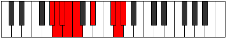 |
| [3237](https://ianring.com/musictheory/scales/3237) | [Thatimic](ModeASharpThatimic.md) | A# | A#, B#, C###, D###, F###, G##, A# |  |
| [3237](https://ianring.com/musictheory/scales/3237) | [Thatimic](ModeBFlatThatimic.md) | Bb | Bb, C, D#, E#, F###, G##, Bb |  |
| [3239](https://ianring.com/musictheory/scales/3239) | [Epythian](ModeASharpEpythian.md) | A# | A#, B, C, D#, E#, F###, G##, A# |  |
| [3239](https://ianring.com/musictheory/scales/3239) | [Epythian](ModeBFlatEpythian.md) | Bb | Bb, Cb, Dbb, Eb, F, G#, A, Bb |  |
| [3245](https://ianring.com/musictheory/scales/3245) | [Aeracrian](ModeASharpAeracrian.md) | A# | A#, B#, C#, D#, E#, F###, G##, A# |  |
| [3245](https://ianring.com/musictheory/scales/3245) | [Aeracrian](ModeBFlatAeracrian.md) | Bb | Bb, C, Db, Eb, F, G#, A, Bb |  |
| [3247](https://ianring.com/musictheory/scales/3247) | [Aeolonyllic](ModeASharpAeolonyllic.md) | A# | A#, B, C, C#, D#, F, G#, A, A# |  |
| [3247](https://ianring.com/musictheory/scales/3247) | [Aeolonyllic](ModeBFlatAeolonyllic.md) | Bb | Bb, B, C, Db, Eb, F, Ab, A, Bb |  |
| [3251](https://ianring.com/musictheory/scales/3251) | [Zodian](ModeGSharpZodian.md) | G# | G#, A, B#, C#, D#, E##, F##, G# | 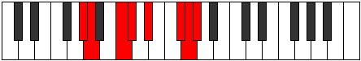 |
| [3251](https://ianring.com/musictheory/scales/3251) | [Zodian](ModeAFlatZodian.md) | Ab | Ab, Bbb, C, Db, Eb, F#, G, Ab |  |
| [3253](https://ianring.com/musictheory/scales/3253) | [Gonian](ModeASharpGonian.md) | A# | A#, B#, C##, D#, E#, F###, G##, A# |  |
| [3253](https://ianring.com/musictheory/scales/3253) | [Gonian](ModeBFlatGonian.md) | Bb | Bb, C, D, Eb, F, G#, A, Bb |  |
| [3255](https://ianring.com/musictheory/scales/3255) | [Daryllic](ModeGSharpDaryllic.md) | G# | G#, A, A#, C, C#, D#, F#, G, G# |  |
| [3255](https://ianring.com/musictheory/scales/3255) | [Daryllic](ModeAFlatDaryllic.md) | Ab | Ab, A, Bb, C, Db, Eb, Gb, G, Ab |  |
| [3255](https://ianring.com/musictheory/scales/3255) | [Daryllic](ModeASharpDaryllic.md) | A# | A#, B, C, D, D#, F, G#, A, A# |  |
| [3255](https://ianring.com/musictheory/scales/3255) | [Daryllic](ModeBFlatDaryllic.md) | Bb | Bb, B, C, D, Eb, F, Ab, A, Bb |  |
| [3257](https://ianring.com/musictheory/scales/3257) | [Ionacrian](ModeFNaturalIonacrian.md) | F | F, G#, A, Bb, C, D#, E, F |  |
| [3259](https://ianring.com/musictheory/scales/3259) | [Loptyllic](ModeFNaturalLoptyllic.md) | F | F, F#, G#, A, A#, C, D#, E, F |  |
| [3259](https://ianring.com/musictheory/scales/3259) | [Loptyllic](ModeGSharpLoptyllic.md) | G# | G#, A, B, C, C#, D#, F#, G, G# |  |
| [3259](https://ianring.com/musictheory/scales/3259) | [Loptyllic](ModeAFlatLoptyllic.md) | Ab | Ab, A, B, C, Db, Eb, Gb, G, Ab |  |
| [3261](https://ianring.com/musictheory/scales/3261) | [Dodyllic](ModeASharpDodyllic.md) | A# | A#, C, C#, D, D#, F, G#, A, A# |  |
| [3261](https://ianring.com/musictheory/scales/3261) | [Dodyllic](ModeBFlatDodyllic.md) | Bb | Bb, C, Db, D, Eb, F, Ab, A, Bb |  |
| [3261](https://ianring.com/musictheory/scales/3261) | [Dodyllic](ModeFNaturalDodyllic.md) | F | F, G, G#, A, A#, C, D#, E, F |  |
| [3263](https://ianring.com/musictheory/scales/3263) | [Pyrygic](ModeFNaturalPyrygic.md) | F | F, F#, G, G#, A, A#, C, D#, E, F |  |
| [3263](https://ianring.com/musictheory/scales/3263) | [Pyrygic](ModeASharpPyrygic.md) | A# | A#, B, C, C#, D, D#, F, G#, A, A# |  |
| [3263](https://ianring.com/musictheory/scales/3263) | [Pyrygic](ModeBFlatPyrygic.md) | Bb | Bb, B, C, Db, D, Eb, F, Ab, A, Bb |  |
| [3263](https://ianring.com/musictheory/scales/3263) | [Pyrygic](ModeGSharpPyrygic.md) | G# | G#, A, A#, B, C, C#, D#, F#, G, G# |  |
| [3263](https://ianring.com/musictheory/scales/3263) | [Pyrygic](ModeAFlatPyrygic.md) | Ab | Ab, A, Bb, B, C, Db, Eb, Gb, G, Ab |  |
| [3271](https://ianring.com/musictheory/scales/3271) | [Kolian](ModeDNaturalKolian.md) | D | D, Eb, Fb, G#, A, B#, C#, D |  |
| [3273](https://ianring.com/musictheory/scales/3273) | [Ionodimic](ModeANaturalIonodimic.md) | A | A, B#, C###, D##, E###, F###, A |  |
| [3275](https://ianring.com/musictheory/scales/3275) | [Katadian](ModeDNaturalKatadian.md) | D | D, Eb, F, G#, A, B#, C#, D |  |
| [3275](https://ianring.com/musictheory/scales/3275) | [Katadian](ModeANaturalKatadian.md) | A | A, Bb, C, D#, E, F##, G#, A |  |
| [3277](https://ianring.com/musictheory/scales/3277) | [Zycrian](ModeANaturalZycrian.md) | A | A, B, C, D#, E, F##, G#, A |  |
| [3279](https://ianring.com/musictheory/scales/3279) | [Pythyllic](ModeDNaturalPythyllic.md) | D | D, D#, E, F, G#, A, C, C#, D |  |
| [3279](https://ianring.com/musictheory/scales/3279) | [Pythyllic](ModeANaturalPythyllic.md) | A | A, A#, B, C, D#, E, G, G#, A |  |
| [3283](https://ianring.com/musictheory/scales/3283) | [Lyrian](ModeDNaturalLyrian.md) | D | D, Eb, F#, G#, A, B#, C#, D |  |
| [3283](https://ianring.com/musictheory/scales/3283) | [Lyrian](ModeGSharpLyrian.md) | G# | G#, A, B#, C##, D#, E##, F##, G# |  |
| [3283](https://ianring.com/musictheory/scales/3283) | [Lyrian](ModeAFlatLyrian.md) | Ab | Ab, Bbb, C, D, Eb, F#, G, Ab |  |
| [3287](https://ianring.com/musictheory/scales/3287) | [Phrathyllic](ModeDNaturalPhrathyllic.md) | D | D, D#, E, F#, G#, A, C, C#, D |  |
| [3287](https://ianring.com/musictheory/scales/3287) | [Phrathyllic](ModeGSharpPhrathyllic.md) | G# | G#, A, A#, C, D, D#, F#, G, G# |  |
| [3287](https://ianring.com/musictheory/scales/3287) | [Phrathyllic](ModeAFlatPhrathyllic.md) | Ab | Ab, A, Bb, C, D, Eb, Gb, G, Ab |  |
| [3289](https://ianring.com/musictheory/scales/3289) | [Loptian](ModeANaturalLoptian.md) | A | A, B#, C#, D#, E, F##, G#, A |  |
| [3289](https://ianring.com/musictheory/scales/3289) | [Loptian](ModeFNaturalLoptian.md) | F | F, G#, A, B, C, D#, E, F |  |
| [3291](https://ianring.com/musictheory/scales/3291) | [Kodyllic](ModeDNaturalKodyllic.md) | D | D, D#, F, F#, G#, A, C, C#, D |  |
| [3291](https://ianring.com/musictheory/scales/3291) | [Kodyllic](ModeANaturalKodyllic.md) | A | A, A#, C, C#, D#, E, G, G#, A |  |
| [3291](https://ianring.com/musictheory/scales/3291) | [Kodyllic](ModeFNaturalKodyllic.md) | F | F, F#, G#, A, B, C, D#, E, F |  |
| [3291](https://ianring.com/musictheory/scales/3291) | [Kodyllic](ModeGSharpKodyllic.md) | G# | G#, A, B, C, D, D#, F#, G, G# |  |
| [3291](https://ianring.com/musictheory/scales/3291) | [Kodyllic](ModeAFlatKodyllic.md) | Ab | Ab, A, B, C, D, Eb, Gb, G, Ab |  |
| [3293](https://ianring.com/musictheory/scales/3293) | [Saryllic](ModeANaturalSaryllic.md) | A | A, B, C, C#, D#, E, G, G#, A |  |
| [3293](https://ianring.com/musictheory/scales/3293) | [Saryllic](ModeFNaturalSaryllic.md) | F | F, G, G#, A, B, C, D#, E, F |  |
| [3295](https://ianring.com/musictheory/scales/3295) | [Phroptygic](ModeDNaturalPhroptygic.md) | D | D, D#, E, F, F#, G#, A, C, C#, D |  |
| [3295](https://ianring.com/musictheory/scales/3295) | [Phroptygic](ModeFNaturalPhroptygic.md) | F | F, F#, G, G#, A, B, C, D#, E, F |  |
| [3295](https://ianring.com/musictheory/scales/3295) | [Phroptygic](ModeANaturalPhroptygic.md) | A | A, A#, B, C, C#, D#, E, G, G#, A |  |
| [3295](https://ianring.com/musictheory/scales/3295) | [Phroptygic](ModeGSharpPhroptygic.md) | G# | G#, A, A#, B, C, D, D#, F#, G, G# |  |
| [3295](https://ianring.com/musictheory/scales/3295) | [Phroptygic](ModeAFlatPhroptygic.md) | Ab | Ab, A, Bb, B, C, D, Eb, Gb, G, Ab |  |
| [3299](https://ianring.com/musictheory/scales/3299) | [Syptian](ModeDNaturalSyptian.md) | D | D, Eb, F##, G#, A, B#, C#, D |  |
| [3301](https://ianring.com/musictheory/scales/3301) | [Phrynian](ModeASharpPhrynian.md) | A# | A#, B#, C###, D##, E#, F###, G##, A# |  |
| [3301](https://ianring.com/musictheory/scales/3301) | [Phrynian](ModeBFlatPhrynian.md) | Bb | Bb, C, D#, E, F, G#, A, Bb |  |
| [3303](https://ianring.com/musictheory/scales/3303) | [Soptyllic](ModeDNaturalSoptyllic.md) | D | D, D#, E, G, G#, A, C, C#, D |  |
| [3303](https://ianring.com/musictheory/scales/3303) | [Soptyllic](ModeASharpSoptyllic.md) | A# | A#, B, C, D#, E, F, G#, A, A# |  |
| [3303](https://ianring.com/musictheory/scales/3303) | [Soptyllic](ModeBFlatSoptyllic.md) | Bb | Bb, B, C, Eb, E, F, Ab, A, Bb |  |
| [3305](https://ianring.com/musictheory/scales/3305) | [Epathian](ModeANaturalEpathian.md) | A | A, B#, C##, D#, E, F##, G#, A |  |
| [3307](https://ianring.com/musictheory/scales/3307) | [Boptyllic](ModeDNaturalBoptyllic.md) | D | D, D#, F, G, G#, A, C, C#, D |  |
| [3307](https://ianring.com/musictheory/scales/3307) | [Boptyllic](ModeANaturalBoptyllic.md) | A | A, A#, C, D, D#, E, G, G#, A |  |
| [3309](https://ianring.com/musictheory/scales/3309) | [Bycryllic](ModeASharpBycryllic.md) | A# | A#, C, C#, D#, E, F, G#, A, A# |  |
| [3309](https://ianring.com/musictheory/scales/3309) | [Bycryllic](ModeBFlatBycryllic.md) | Bb | Bb, C, Db, Eb, E, F, Ab, A, Bb |  |
| [3309](https://ianring.com/musictheory/scales/3309) | [Bycryllic](ModeANaturalBycryllic.md) | A | A, B, C, D, D#, E, G, G#, A |  |
| [3311](https://ianring.com/musictheory/scales/3311) | [Mixodygic](ModeDNaturalMixodygic.md) | D | D, D#, E, F, G, G#, A, C, C#, D |  |
| [3311](https://ianring.com/musictheory/scales/3311) | [Mixodygic](ModeASharpMixodygic.md) | A# | A#, B, C, C#, D#, E, F, G#, A, A# |  |
| [3311](https://ianring.com/musictheory/scales/3311) | [Mixodygic](ModeBFlatMixodygic.md) | Bb | Bb, B, C, Db, Eb, E, F, Ab, A, Bb |  |
| [3311](https://ianring.com/musictheory/scales/3311) | [Mixodygic](ModeANaturalMixodygic.md) | A | A, A#, B, C, D, D#, E, G, G#, A |  |
| [3315](https://ianring.com/musictheory/scales/3315) | [Aeralyllic](ModeDNaturalAeralyllic.md) | D | D, D#, F#, G, G#, A, C, C#, D |  |
| [3315](https://ianring.com/musictheory/scales/3315) | [Aeralyllic](ModeGSharpAeralyllic.md) | G# | G#, A, C, C#, D, D#, F#, G, G# |  |
| [3315](https://ianring.com/musictheory/scales/3315) | [Aeralyllic](ModeAFlatAeralyllic.md) | Ab | Ab, A, C, Db, D, Eb, Gb, G, Ab |  |
| [3317](https://ianring.com/musictheory/scales/3317) | [Lanyllic](ModeASharpLanyllic.md) | A# | A#, C, D, D#, E, F, G#, A, A# |  |
| [3317](https://ianring.com/musictheory/scales/3317) | [Lanyllic](ModeBFlatLanyllic.md) | Bb | Bb, C, D, Eb, E, F, Ab, A, Bb |  |
| [3319](https://ianring.com/musictheory/scales/3319) | [Tholygic](ModeDNaturalTholygic.md) | D | D, D#, E, F#, G, G#, A, C, C#, D |  |
| [3319](https://ianring.com/musictheory/scales/3319) | [Tholygic](ModeGSharpTholygic.md) | G# | G#, A, A#, C, C#, D, D#, F#, G, G# |  |
| [3319](https://ianring.com/musictheory/scales/3319) | [Tholygic](ModeAFlatTholygic.md) | Ab | Ab, A, Bb, C, Db, D, Eb, Gb, G, Ab |  |
| [3319](https://ianring.com/musictheory/scales/3319) | [Tholygic](ModeASharpTholygic.md) | A# | A#, B, C, D, D#, E, F, G#, A, A# |  |
| [3319](https://ianring.com/musictheory/scales/3319) | [Tholygic](ModeBFlatTholygic.md) | Bb | Bb, B, C, D, Eb, E, F, Ab, A, Bb |  |
| [3321](https://ianring.com/musictheory/scales/3321) | [Ionycryllic](ModeANaturalIonycryllic.md) | A | A, C, C#, D, D#, E, G, G#, A |  |
| [3321](https://ianring.com/musictheory/scales/3321) | [Ionycryllic](ModeFNaturalIonycryllic.md) | F | F, G#, A, A#, B, C, D#, E, F |  |
| [3323](https://ianring.com/musictheory/scales/3323) | [Phrygygic](ModeDNaturalPhrygygic.md) | D | D, D#, F, F#, G, G#, A, C, C#, D |  |
| [3323](https://ianring.com/musictheory/scales/3323) | [Phrygygic](ModeANaturalPhrygygic.md) | A | A, A#, C, C#, D, D#, E, G, G#, A |  |
| [3323](https://ianring.com/musictheory/scales/3323) | [Phrygygic](ModeGSharpPhrygygic.md) | G# | G#, A, B, C, C#, D, D#, F#, G, G# |  |
| [3323](https://ianring.com/musictheory/scales/3323) | [Phrygygic](ModeAFlatPhrygygic.md) | Ab | Ab, A, B, C, Db, D, Eb, Gb, G, Ab |  |
| [3323](https://ianring.com/musictheory/scales/3323) | [Phrygygic](ModeFNaturalPhrygygic.md) | F | F, F#, G#, A, A#, B, C, D#, E, F |  |
| [3325](https://ianring.com/musictheory/scales/3325) | [Epygic](ModeASharpEpygic.md) | A# | A#, C, C#, D, D#, E, F, G#, A, A# |  |
| [3325](https://ianring.com/musictheory/scales/3325) | [Epygic](ModeBFlatEpygic.md) | Bb | Bb, C, Db, D, Eb, E, F, Ab, A, Bb |  |
| [3325](https://ianring.com/musictheory/scales/3325) | [Epygic](ModeANaturalEpygic.md) | A | A, B, C, C#, D, D#, E, G, G#, A |  |
| [3325](https://ianring.com/musictheory/scales/3325) | [Epygic](ModeFNaturalEpygic.md) | F | F, G, G#, A, A#, B, C, D#, E, F |  |
| [3327](https://ianring.com/musictheory/scales/3327) | [Madyllian](ModeDNaturalMadyllian.md) | D | D, D#, E, F, F#, G, G#, A, C, C#, D |  |
| [3327](https://ianring.com/musictheory/scales/3327) | [Madyllian](ModeASharpMadyllian.md) | A# | A#, B, C, C#, D, D#, E, F, G#, A, A# |  |
| [3327](https://ianring.com/musictheory/scales/3327) | [Madyllian](ModeBFlatMadyllian.md) | Bb | Bb, B, C, Db, D, Eb, E, F, Ab, A, Bb |  |
| [3327](https://ianring.com/musictheory/scales/3327) | [Madyllian](ModeANaturalMadyllian.md) | A | A, A#, B, C, C#, D, D#, E, G, G#, A |  |
| [3327](https://ianring.com/musictheory/scales/3327) | [Madyllian](ModeGSharpMadyllian.md) | G# | G#, A, A#, B, C, C#, D, D#, F#, G, G# |  |
| [3327](https://ianring.com/musictheory/scales/3327) | [Madyllian](ModeAFlatMadyllian.md) | Ab | Ab, A, Bb, B, C, Db, D, Eb, Gb, G, Ab |  |
| [3327](https://ianring.com/musictheory/scales/3327) | [Madyllian](ModeFNaturalMadyllian.md) | F | F, F#, G, G#, A, A#, B, C, D#, E, F |  |
| [3365](https://ianring.com/musictheory/scales/3365) | [Katolimic](ModeASharpKatolimic.md) | A# | A#, B#, C###, E##, F###, G##, A# |  |
| [3365](https://ianring.com/musictheory/scales/3365) | [Katolimic](ModeBFlatKatolimic.md) | Bb | Bb, C, D#, E##, F###, G##, Bb |  |
| [3367](https://ianring.com/musictheory/scales/3367) | [Moptian](ModeGNaturalMoptian.md) | G | G, Ab, Bbb, C, D#, E#, F#, G |  |
| [3367](https://ianring.com/musictheory/scales/3367) | [Moptian](ModeASharpMoptian.md) | A# | A#, B, C, D#, E##, F###, G##, A# |  |
| [3367](https://ianring.com/musictheory/scales/3367) | [Moptian](ModeBFlatMoptian.md) | Bb | Bb, Cb, Dbb, Eb, F#, G#, A, Bb |  |
| [3373](https://ianring.com/musictheory/scales/3373) | [Lodian](ModeASharpLodian.md) | A# | A#, B#, C#, D#, E##, F###, G##, A# |  |
| [3373](https://ianring.com/musictheory/scales/3373) | [Lodian](ModeBFlatLodian.md) | Bb | Bb, C, Db, Eb, F#, G#, A, Bb |  |
| [3375](https://ianring.com/musictheory/scales/3375) | [Kygyllic](ModeGNaturalKygyllic.md) | G | G, G#, A, A#, C, D#, F, F#, G |  |
| [3375](https://ianring.com/musictheory/scales/3375) | [Kygyllic](ModeASharpKygyllic.md) | A# | A#, B, C, C#, D#, F#, G#, A, A# |  |
| [3375](https://ianring.com/musictheory/scales/3375) | [Kygyllic](ModeBFlatKygyllic.md) | Bb | Bb, B, C, Db, Eb, Gb, Ab, A, Bb |  |
| [3377](https://ianring.com/musictheory/scales/3377) | [Phralimic](ModeENaturalPhralimic.md) | E | E, F###, G##, A###, B###, C###, E |  |
| [3379](https://ianring.com/musictheory/scales/3379) | [Sothian](ModeENaturalSothian.md) | E | E, F, G#, A, B#, C##, D#, E |  |
| [3381](https://ianring.com/musictheory/scales/3381) | [Katanian](ModeENaturalKatanian.md) | E | E, F#, G#, A, B#, C##, D#, E |  |
| [3381](https://ianring.com/musictheory/scales/3381) | [Katanian](ModeASharpKatanian.md) | A# | A#, B#, C##, D#, E##, F###, G##, A# |  |
| [3381](https://ianring.com/musictheory/scales/3381) | [Katanian](ModeBFlatKatanian.md) | Bb | Bb, C, D, Eb, F#, G#, A, Bb |  |
| [3383](https://ianring.com/musictheory/scales/3383) | [Daptyllic](ModeENaturalDaptyllic.md) | E | E, F, F#, G#, A, C, D, D#, E |  |
| [3383](https://ianring.com/musictheory/scales/3383) | [Daptyllic](ModeGNaturalDaptyllic.md) | G | G, G#, A, B, C, D#, F, F#, G |  |
| [3383](https://ianring.com/musictheory/scales/3383) | [Daptyllic](ModeASharpDaptyllic.md) | A# | A#, B, C, D, D#, F#, G#, A, A# |  |
| [3383](https://ianring.com/musictheory/scales/3383) | [Daptyllic](ModeBFlatDaptyllic.md) | Bb | Bb, B, C, D, Eb, Gb, Ab, A, Bb |  |
| [3385](https://ianring.com/musictheory/scales/3385) | [Rothian](ModeENaturalRothian.md) | E | E, F##, G#, A, B#, C##, D#, E |  |
| [3387](https://ianring.com/musictheory/scales/3387) | [Aeryptyllic](ModeENaturalAeryptyllic.md) | E | E, F, G, G#, A, C, D, D#, E |  |
| [3389](https://ianring.com/musictheory/scales/3389) | [Socryllic](ModeENaturalSocryllic.md) | E | E, F#, G, G#, A, C, D, D#, E |  |
| [3389](https://ianring.com/musictheory/scales/3389) | [Socryllic](ModeASharpSocryllic.md) | A# | A#, C, C#, D, D#, F#, G#, A, A# |  |
| [3389](https://ianring.com/musictheory/scales/3389) | [Socryllic](ModeBFlatSocryllic.md) | Bb | Bb, C, Db, D, Eb, Gb, Ab, A, Bb |  |
| [3391](https://ianring.com/musictheory/scales/3391) | [Aeolynygic](ModeENaturalAeolynygic.md) | E | E, F, F#, G, G#, A, C, D, D#, E |  |
| [3391](https://ianring.com/musictheory/scales/3391) | [Aeolynygic](ModeASharpAeolynygic.md) | A# | A#, B, C, C#, D, D#, F#, G#, A, A# |  |
| [3391](https://ianring.com/musictheory/scales/3391) | [Aeolynygic](ModeBFlatAeolynygic.md) | Bb | Bb, B, C, Db, D, Eb, Gb, Ab, A, Bb |  |
| [3391](https://ianring.com/musictheory/scales/3391) | [Aeolynygic](ModeGNaturalAeolynygic.md) | G | G, G#, A, A#, B, C, D#, F, F#, G |  |
| [3401](https://ianring.com/musictheory/scales/3401) | [Palimic](ModeANaturalPalimic.md) | A | A, B#, C###, D###, E###, F###, A |  |
| [3403](https://ianring.com/musictheory/scales/3403) | [Bylian](ModeANaturalBylian.md) | A | A, Bb, C, D#, E#, F##, G#, A |  |
| [3405](https://ianring.com/musictheory/scales/3405) | [Stynian](ModeANaturalStynian.md) | A | A, B, C, D#, E#, F##, G#, A |  |
| [3407](https://ianring.com/musictheory/scales/3407) | [Katocryllic](ModeANaturalKatocryllic.md) | A | A, A#, B, C, D#, F, G, G#, A |  |
| [3417](https://ianring.com/musictheory/scales/3417) | [Golian](ModeANaturalGolian.md) | A | A, B#, C#, D#, E#, F##, G#, A |  |
| [3419](https://ianring.com/musictheory/scales/3419) | [Danyllic](ModeANaturalDanyllic.md) | A | A, A#, C, C#, D#, F, G, G#, A |  |
| [3421](https://ianring.com/musictheory/scales/3421) | [Aerothyllic](ModeANaturalAerothyllic.md) | A | A, B, C, C#, D#, F, G, G#, A |  |
| [3423](https://ianring.com/musictheory/scales/3423) | [Lothygic](ModeANaturalLothygic.md) | A | A, A#, B, C, C#, D#, F, G, G#, A |  |
| [3429](https://ianring.com/musictheory/scales/3429) | [Marian](ModeASharpMarian.md) | A# | A#, B#, C###, D##, E##, F###, G##, A# |  |
| [3429](https://ianring.com/musictheory/scales/3429) | [Marian](ModeBFlatMarian.md) | Bb | Bb, C, D#, E, F#, G#, A, Bb |  |
| [3431](https://ianring.com/musictheory/scales/3431) | [Zyptyllic](ModeGNaturalZyptyllic.md) | G | G, G#, A, C, C#, D#, F, F#, G |  |
| [3431](https://ianring.com/musictheory/scales/3431) | [Zyptyllic](ModeASharpZyptyllic.md) | A# | A#, B, C, D#, E, F#, G#, A, A# |  |
| [3431](https://ianring.com/musictheory/scales/3431) | [Zyptyllic](ModeBFlatZyptyllic.md) | Bb | Bb, B, C, Eb, E, Gb, Ab, A, Bb |  |
| [3433](https://ianring.com/musictheory/scales/3433) | [Thonian](ModeANaturalThonian.md) | A | A, B#, C##, D#, E#, F##, G#, A |  |
| [3435](https://ianring.com/musictheory/scales/3435) | [Epiphyllic](ModeANaturalEpiphyllic.md) | A | A, A#, C, D, D#, F, G, G#, A |  |
| [3437](https://ianring.com/musictheory/scales/3437) | [Gathyllic](ModeASharpGathyllic.md) | A# | A#, C, C#, D#, E, F#, G#, A, A# |  |
| [3437](https://ianring.com/musictheory/scales/3437) | [Gathyllic](ModeBFlatGathyllic.md) | Bb | Bb, C, Db, Eb, E, Gb, Ab, A, Bb |  |
| [3437](https://ianring.com/musictheory/scales/3437) | [Gathyllic](ModeANaturalGathyllic.md) | A | A, B, C, D, D#, F, G, G#, A |  |
| [3439](https://ianring.com/musictheory/scales/3439) | [Lythygic](ModeGNaturalLythygic.md) | G | G, G#, A, A#, C, C#, D#, F, F#, G |  |
| [3439](https://ianring.com/musictheory/scales/3439) | [Lythygic](ModeASharpLythygic.md) | A# | A#, B, C, C#, D#, E, F#, G#, A, A# | 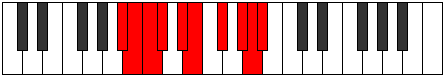 |
| [3439](https://ianring.com/musictheory/scales/3439) | [Lythygic](ModeBFlatLythygic.md) | Bb | Bb, B, C, Db, Eb, E, Gb, Ab, A, Bb |  |
| [3439](https://ianring.com/musictheory/scales/3439) | [Lythygic](ModeANaturalLythygic.md) | A | A, A#, B, C, D, D#, F, G, G#, A |  |
| [3441](https://ianring.com/musictheory/scales/3441) | [Thacrian](ModeENaturalThacrian.md) | E | E, F###, G##, A#, B#, C##, D#, E |  |
| [3443](https://ianring.com/musictheory/scales/3443) | [Epathyllic](ModeENaturalEpathyllic.md) | E | E, F, G#, A, A#, C, D, D#, E |  |
| [3445](https://ianring.com/musictheory/scales/3445) | [Epotyllic](ModeENaturalEpotyllic.md) | E | E, F#, G#, A, A#, C, D, D#, E |  |
| [3445](https://ianring.com/musictheory/scales/3445) | [Epotyllic](ModeASharpEpotyllic.md) | A# | A#, C, D, D#, E, F#, G#, A, A# |  |
| [3445](https://ianring.com/musictheory/scales/3445) | [Epotyllic](ModeBFlatEpotyllic.md) | Bb | Bb, C, D, Eb, E, Gb, Ab, A, Bb |  |
| [3447](https://ianring.com/musictheory/scales/3447) | [Kynygic](ModeENaturalKynygic.md) | E | E, F, F#, G#, A, A#, C, D, D#, E |  |
| [3447](https://ianring.com/musictheory/scales/3447) | [Kynygic](ModeGNaturalKynygic.md) | G | G, G#, A, B, C, C#, D#, F, F#, G |  |
| [3447](https://ianring.com/musictheory/scales/3447) | [Kynygic](ModeASharpKynygic.md) | A# | A#, B, C, D, D#, E, F#, G#, A, A# |  |
| [3447](https://ianring.com/musictheory/scales/3447) | [Kynygic](ModeBFlatKynygic.md) | Bb | Bb, B, C, D, Eb, E, Gb, Ab, A, Bb |  |
| [3449](https://ianring.com/musictheory/scales/3449) | [Bacryllic](ModeANaturalBacryllic.md) | A | A, C, C#, D, D#, F, G, G#, A |  |
| [3449](https://ianring.com/musictheory/scales/3449) | [Bacryllic](ModeENaturalBacryllic.md) | E | E, G, G#, A, A#, C, D, D#, E |  |
| [3451](https://ianring.com/musictheory/scales/3451) | [Garygic](ModeANaturalGarygic.md) | A | A, A#, C, C#, D, D#, F, G, G#, A |  |
| [3451](https://ianring.com/musictheory/scales/3451) | [Garygic](ModeENaturalGarygic.md) | E | E, F, G, G#, A, A#, C, D, D#, E |  |
| [3453](https://ianring.com/musictheory/scales/3453) | [Katarygic](ModeASharpKatarygic.md) | A# | A#, C, C#, D, D#, E, F#, G#, A, A# |  |
| [3453](https://ianring.com/musictheory/scales/3453) | [Katarygic](ModeBFlatKatarygic.md) | Bb | Bb, C, Db, D, Eb, E, Gb, Ab, A, Bb |  |
| [3453](https://ianring.com/musictheory/scales/3453) | [Katarygic](ModeENaturalKatarygic.md) | E | E, F#, G, G#, A, A#, C, D, D#, E |  |
| [3453](https://ianring.com/musictheory/scales/3453) | [Katarygic](ModeANaturalKatarygic.md) | A | A, B, C, C#, D, D#, F, G, G#, A |  |
| [3455](https://ianring.com/musictheory/scales/3455) | [Ryptyllian](ModeENaturalRyptyllian.md) | E | E, F, F#, G, G#, A, A#, C, D, D#, E |  |
| [3455](https://ianring.com/musictheory/scales/3455) | [Ryptyllian](ModeASharpRyptyllian.md) | A# | A#, B, C, C#, D, D#, E, F#, G#, A, A# |  |
| [3455](https://ianring.com/musictheory/scales/3455) | [Ryptyllian](ModeBFlatRyptyllian.md) | Bb | Bb, B, C, Db, D, Eb, E, Gb, Ab, A, Bb |  |
| [3455](https://ianring.com/musictheory/scales/3455) | [Ryptyllian](ModeANaturalRyptyllian.md) | A | A, A#, B, C, C#, D, D#, F, G, G#, A | 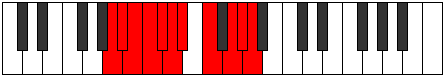 |
| [3455](https://ianring.com/musictheory/scales/3455) | [Ryptyllian](ModeGNaturalRyptyllian.md) | G | G, G#, A, A#, B, C, C#, D#, F, F#, G |  |
| [3469](https://ianring.com/musictheory/scales/3469) | [Monian](ModeCSharpMonian.md) | C# | C#, D#, E, F###, G##, A##, B#, C# |  |
| [3469](https://ianring.com/musictheory/scales/3469) | [Monian](ModeDFlatMonian.md) | Db | Db, Eb, Fb, G#, A, B, C, Db |  |
| [3471](https://ianring.com/musictheory/scales/3471) | [Gyryllic](ModeCSharpGyryllic.md) | C# | C#, D, D#, E, G#, A, B, C, C# |  |
| [3471](https://ianring.com/musictheory/scales/3471) | [Gyryllic](ModeDFlatGyryllic.md) | Db | Db, D, Eb, E, Ab, A, B, C, Db |  |
| [3475](https://ianring.com/musictheory/scales/3475) | [Kylian](ModeGSharpKylian.md) | G# | G#, A, B#, C###, D##, E##, F##, G# |  |
| [3475](https://ianring.com/musictheory/scales/3475) | [Kylian](ModeAFlatKylian.md) | Ab | Ab, Bbb, C, D#, E, F#, G, Ab |  |
| [3477](https://ianring.com/musictheory/scales/3477) | [Kyptian](ModeCSharpKyptian.md) | C# | C#, D#, E#, F###, G##, A##, B#, C# |  |
| [3477](https://ianring.com/musictheory/scales/3477) | [Kyptian](ModeDFlatKyptian.md) | Db | Db, Eb, F, G#, A, B, C, Db |  |
| [3479](https://ianring.com/musictheory/scales/3479) | [Rothyllic](ModeGSharpRothyllic.md) | G# | G#, A, A#, C, D#, E, F#, G, G# |  |
| [3479](https://ianring.com/musictheory/scales/3479) | [Rothyllic](ModeAFlatRothyllic.md) | Ab | Ab, A, Bb, C, Eb, E, Gb, G, Ab |  |
| [3479](https://ianring.com/musictheory/scales/3479) | [Rothyllic](ModeCSharpRothyllic.md) | C# | C#, D, D#, F, G#, A, B, C, C# |  |
| [3479](https://ianring.com/musictheory/scales/3479) | [Rothyllic](ModeDFlatRothyllic.md) | Db | Db, D, Eb, F, Ab, A, B, C, Db |  |
| [3481](https://ianring.com/musictheory/scales/3481) | [Katathian](ModeFNaturalKatathian.md) | F | F, G#, A, B#, C#, D#, E, F |  |
| [3483](https://ianring.com/musictheory/scales/3483) | [Mixotharyllic](ModeFNaturalMixotharyllic.md) | F | F, F#, G#, A, C, C#, D#, E, F |  |
| [3483](https://ianring.com/musictheory/scales/3483) | [Mixotharyllic](ModeGSharpMixotharyllic.md) | G# | G#, A, B, C, D#, E, F#, G, G# |  |
| [3483](https://ianring.com/musictheory/scales/3483) | [Mixotharyllic](ModeAFlatMixotharyllic.md) | Ab | Ab, A, B, C, Eb, E, Gb, G, Ab | 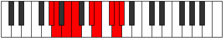 |
| [3485](https://ianring.com/musictheory/scales/3485) | [Kyptyllic](ModeFNaturalKyptyllic.md) | F | F, G, G#, A, C, C#, D#, E, F | 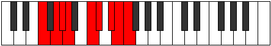 |
| [3485](https://ianring.com/musictheory/scales/3485) | [Kyptyllic](ModeCSharpKyptyllic.md) | C# | C#, D#, E, F, G#, A, B, C, C# |  |
| [3485](https://ianring.com/musictheory/scales/3485) | [Kyptyllic](ModeDFlatKyptyllic.md) | Db | Db, Eb, E, F, Ab, A, B, C, Db |  |
| [3487](https://ianring.com/musictheory/scales/3487) | [Byptygic](ModeFNaturalByptygic.md) | F | F, F#, G, G#, A, C, C#, D#, E, F |  |
| [3487](https://ianring.com/musictheory/scales/3487) | [Byptygic](ModeCSharpByptygic.md) | C# | C#, D, D#, E, F, G#, A, B, C, C# |  |
| [3487](https://ianring.com/musictheory/scales/3487) | [Byptygic](ModeDFlatByptygic.md) | Db | Db, D, Eb, E, F, Ab, A, B, C, Db |  |
| [3487](https://ianring.com/musictheory/scales/3487) | [Byptygic](ModeGSharpByptygic.md) | G# | G#, A, A#, B, C, D#, E, F#, G, G# |  |
| [3487](https://ianring.com/musictheory/scales/3487) | [Byptygic](ModeAFlatByptygic.md) | Ab | Ab, A, Bb, B, C, Eb, E, Gb, G, Ab |  |
| [3493](https://ianring.com/musictheory/scales/3493) | [Rathian](ModeASharpRathian.md) | A# | A#, B#, C###, D###, E##, F###, G##, A# |  |
| [3493](https://ianring.com/musictheory/scales/3493) | [Rathian](ModeBFlatRathian.md) | Bb | Bb, C, D#, E#, F#, G#, A, Bb |  |
| [3493](https://ianring.com/musictheory/scales/3493) | [Rathian](ModeCSharpRathian.md) | C# | C#, D#, E##, F###, G##, A##, B#, C# |  |
| [3493](https://ianring.com/musictheory/scales/3493) | [Rathian](ModeDFlatRathian.md) | Db | Db, Eb, F#, G#, A, B, C, Db |  |
| [3495](https://ianring.com/musictheory/scales/3495) | [Banyllic](ModeGNaturalBanyllic.md) | G | G, G#, A, C, D, D#, F, F#, G |  |
| [3495](https://ianring.com/musictheory/scales/3495) | [Banyllic](ModeCSharpBanyllic.md) | C# | C#, D, D#, F#, G#, A, B, C, C# |  |
| [3495](https://ianring.com/musictheory/scales/3495) | [Banyllic](ModeDFlatBanyllic.md) | Db | Db, D, Eb, Gb, Ab, A, B, C, Db |  |
| [3495](https://ianring.com/musictheory/scales/3495) | [Banyllic](ModeASharpBanyllic.md) | A# | A#, B, C, D#, F, F#, G#, A, A# |  |
| [3495](https://ianring.com/musictheory/scales/3495) | [Banyllic](ModeBFlatBanyllic.md) | Bb | Bb, B, C, Eb, F, Gb, Ab, A, Bb |  |
| [3501](https://ianring.com/musictheory/scales/3501) | [Katodyllic](ModeASharpKatodyllic.md) | A# | A#, C, C#, D#, F, F#, G#, A, A# |  |
| [3501](https://ianring.com/musictheory/scales/3501) | [Katodyllic](ModeBFlatKatodyllic.md) | Bb | Bb, C, Db, Eb, F, Gb, Ab, A, Bb |  |
| [3501](https://ianring.com/musictheory/scales/3501) | [Katodyllic](ModeCSharpKatodyllic.md) | C# | C#, D#, E, F#, G#, A, B, C, C# |  |
| [3501](https://ianring.com/musictheory/scales/3501) | [Katodyllic](ModeDFlatKatodyllic.md) | Db | Db, Eb, E, Gb, Ab, A, B, C, Db |  |
| [3503](https://ianring.com/musictheory/scales/3503) | [Zyphygic](ModeGNaturalZyphygic.md) | G | G, G#, A, A#, C, D, D#, F, F#, G |  |
| [3503](https://ianring.com/musictheory/scales/3503) | [Zyphygic](ModeCSharpZyphygic.md) | C# | C#, D, D#, E, F#, G#, A, B, C, C# |  |
| [3503](https://ianring.com/musictheory/scales/3503) | [Zyphygic](ModeDFlatZyphygic.md) | Db | Db, D, Eb, E, Gb, Ab, A, B, C, Db |  |
| [3503](https://ianring.com/musictheory/scales/3503) | [Zyphygic](ModeASharpZyphygic.md) | A# | A#, B, C, C#, D#, F, F#, G#, A, A# |  |
| [3503](https://ianring.com/musictheory/scales/3503) | [Zyphygic](ModeBFlatZyphygic.md) | Bb | Bb, B, C, Db, Eb, F, Gb, Ab, A, Bb |  |
| [3505](https://ianring.com/musictheory/scales/3505) | [Stygian](ModeENaturalStygian.md) | E | E, F###, G##, A##, B#, C##, D#, E | 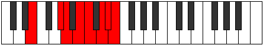 |
| [3507](https://ianring.com/musictheory/scales/3507) | [Ponyllic](ModeGSharpPonyllic.md) | G# | G#, A, C, C#, D#, E, F#, G, G# |  |
| [3507](https://ianring.com/musictheory/scales/3507) | [Ponyllic](ModeAFlatPonyllic.md) | Ab | Ab, A, C, Db, Eb, E, Gb, G, Ab |  |
| [3507](https://ianring.com/musictheory/scales/3507) | [Ponyllic](ModeENaturalPonyllic.md) | E | E, F, G#, A, B, C, D, D#, E |  |
| [3509](https://ianring.com/musictheory/scales/3509) | [Stogyllic](ModeASharpStogyllic.md) | A# | A#, C, D, D#, F, F#, G#, A, A# |  |
| [3509](https://ianring.com/musictheory/scales/3509) | [Stogyllic](ModeBFlatStogyllic.md) | Bb | Bb, C, D, Eb, F, Gb, Ab, A, Bb |  |
| [3509](https://ianring.com/musictheory/scales/3509) | [Stogyllic](ModeENaturalStogyllic.md) | E | E, F#, G#, A, B, C, D, D#, E |  |
| [3509](https://ianring.com/musictheory/scales/3509) | [Stogyllic](ModeCSharpStogyllic.md) | C# | C#, D#, F, F#, G#, A, B, C, C# |  |
| [3509](https://ianring.com/musictheory/scales/3509) | [Stogyllic](ModeDFlatStogyllic.md) | Db | Db, Eb, F, Gb, Ab, A, B, C, Db |  |
| [3511](https://ianring.com/musictheory/scales/3511) | [Epolygic](ModeGSharpEpolygic.md) | G# | G#, A, A#, C, C#, D#, E, F#, G, G# |  |
| [3511](https://ianring.com/musictheory/scales/3511) | [Epolygic](ModeAFlatEpolygic.md) | Ab | Ab, A, Bb, C, Db, Eb, E, Gb, G, Ab |  |
| [3511](https://ianring.com/musictheory/scales/3511) | [Epolygic](ModeCSharpEpolygic.md) | C# | C#, D, D#, F, F#, G#, A, B, C, C# | 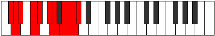 |
| [3511](https://ianring.com/musictheory/scales/3511) | [Epolygic](ModeDFlatEpolygic.md) | Db | Db, D, Eb, F, Gb, Ab, A, B, C, Db |  |
| [3511](https://ianring.com/musictheory/scales/3511) | [Epolygic](ModeENaturalEpolygic.md) | E | E, F, F#, G#, A, B, C, D, D#, E |  |
| [3511](https://ianring.com/musictheory/scales/3511) | [Epolygic](ModeGNaturalEpolygic.md) | G | G, G#, A, B, C, D, D#, F, F#, G |  |
| [3511](https://ianring.com/musictheory/scales/3511) | [Epolygic](ModeASharpEpolygic.md) | A# | A#, B, C, D, D#, F, F#, G#, A, A# |  |
| [3511](https://ianring.com/musictheory/scales/3511) | [Epolygic](ModeBFlatEpolygic.md) | Bb | Bb, B, C, D, Eb, F, Gb, Ab, A, Bb |  |
| [3513](https://ianring.com/musictheory/scales/3513) | [Dydyllic](ModeFNaturalDydyllic.md) | F | F, G#, A, A#, C, C#, D#, E, F | 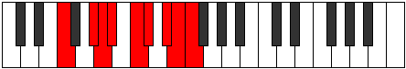 |
| [3513](https://ianring.com/musictheory/scales/3513) | [Dydyllic](ModeENaturalDydyllic.md) | E | E, G, G#, A, B, C, D, D#, E |  |
| [3515](https://ianring.com/musictheory/scales/3515) | [Katodygic](ModeFNaturalKatodygic.md) | F | F, F#, G#, A, A#, C, C#, D#, E, F |  |
| [3515](https://ianring.com/musictheory/scales/3515) | [Katodygic](ModeENaturalKatodygic.md) | E | E, F, G, G#, A, B, C, D, D#, E |  |
| [3515](https://ianring.com/musictheory/scales/3515) | [Katodygic](ModeGSharpKatodygic.md) | G# | G#, A, B, C, C#, D#, E, F#, G, G# |  |
| [3515](https://ianring.com/musictheory/scales/3515) | [Katodygic](ModeAFlatKatodygic.md) | Ab | Ab, A, B, C, Db, Eb, E, Gb, G, Ab |  |
| [3517](https://ianring.com/musictheory/scales/3517) | [Epocrygic](ModeASharpEpocrygic.md) | A# | A#, C, C#, D, D#, F, F#, G#, A, A# |  |
| [3517](https://ianring.com/musictheory/scales/3517) | [Epocrygic](ModeBFlatEpocrygic.md) | Bb | Bb, C, Db, D, Eb, F, Gb, Ab, A, Bb |  |
| [3517](https://ianring.com/musictheory/scales/3517) | [Epocrygic](ModeFNaturalEpocrygic.md) | F | F, G, G#, A, A#, C, C#, D#, E, F |  |
| [3517](https://ianring.com/musictheory/scales/3517) | [Epocrygic](ModeCSharpEpocrygic.md) | C# | C#, D#, E, F, F#, G#, A, B, C, C# |  |
| [3517](https://ianring.com/musictheory/scales/3517) | [Epocrygic](ModeDFlatEpocrygic.md) | Db | Db, Eb, E, F, Gb, Ab, A, B, C, Db |  |
| [3517](https://ianring.com/musictheory/scales/3517) | [Epocrygic](ModeENaturalEpocrygic.md) | E | E, F#, G, G#, A, B, C, D, D#, E |  |
| [3519](https://ianring.com/musictheory/scales/3519) | [Boptyllian](ModeFNaturalBoptyllian.md) | F | F, F#, G, G#, A, A#, C, C#, D#, E, F |  |
| [3519](https://ianring.com/musictheory/scales/3519) | [Boptyllian](ModeCSharpBoptyllian.md) | C# | C#, D, D#, E, F, F#, G#, A, B, C, C# |  |
| [3519](https://ianring.com/musictheory/scales/3519) | [Boptyllian](ModeDFlatBoptyllian.md) | Db | Db, D, Eb, E, F, Gb, Ab, A, B, C, Db |  |
| [3519](https://ianring.com/musictheory/scales/3519) | [Boptyllian](ModeENaturalBoptyllian.md) | E | E, F, F#, G, G#, A, B, C, D, D#, E |  |
| [3519](https://ianring.com/musictheory/scales/3519) | [Boptyllian](ModeASharpBoptyllian.md) | A# | A#, B, C, C#, D, D#, F, F#, G#, A, A# |  |
| [3519](https://ianring.com/musictheory/scales/3519) | [Boptyllian](ModeBFlatBoptyllian.md) | Bb | Bb, B, C, Db, D, Eb, F, Gb, Ab, A, Bb |  |
| [3519](https://ianring.com/musictheory/scales/3519) | [Boptyllian](ModeGSharpBoptyllian.md) | G# | G#, A, A#, B, C, C#, D#, E, F#, G, G# |  |
| [3519](https://ianring.com/musictheory/scales/3519) | [Boptyllian](ModeAFlatBoptyllian.md) | Ab | Ab, A, Bb, B, C, Db, Eb, E, Gb, G, Ab |  |
| [3519](https://ianring.com/musictheory/scales/3519) | [Boptyllian](ModeGNaturalBoptyllian.md) | G | G, G#, A, A#, B, C, D, D#, F, F#, G |  |
| [3525](https://ianring.com/musictheory/scales/3525) | [Zocrian](ModeCSharpZocrian.md) | C# | C#, D#, E###, F###, G##, A##, B#, C# | 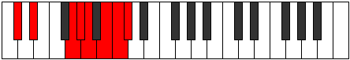 |
| [3525](https://ianring.com/musictheory/scales/3525) | [Zocrian](ModeDFlatZocrian.md) | Db | Db, Eb, F##, G#, A, B, C, Db |  |
| [3527](https://ianring.com/musictheory/scales/3527) | [Ronyllic](ModeDNaturalRonyllic.md) | D | D, D#, E, G#, A, A#, C, C#, D |  |
| [3527](https://ianring.com/musictheory/scales/3527) | [Ronyllic](ModeCSharpRonyllic.md) | C# | C#, D, D#, G, G#, A, B, C, C# |  |
| [3527](https://ianring.com/musictheory/scales/3527) | [Ronyllic](ModeDFlatRonyllic.md) | Db | Db, D, Eb, G, Ab, A, B, C, Db |  |
| [3529](https://ianring.com/musictheory/scales/3529) | [Stalian](ModeANaturalStalian.md) | A | A, B#, C###, D##, E#, F##, G#, A |  |
| [3531](https://ianring.com/musictheory/scales/3531) | [Dycryllic](ModeDNaturalDycryllic.md) | D | D, D#, F, G#, A, A#, C, C#, D |  |
| [3531](https://ianring.com/musictheory/scales/3531) | [Dycryllic](ModeANaturalDycryllic.md) | A | A, A#, C, D#, E, F, G, G#, A |  |
| [3533](https://ianring.com/musictheory/scales/3533) | [Thadyllic](ModeCSharpThadyllic.md) | C# | C#, D#, E, G, G#, A, B, C, C# |  |
| [3533](https://ianring.com/musictheory/scales/3533) | [Thadyllic](ModeDFlatThadyllic.md) | Db | Db, Eb, E, G, Ab, A, B, C, Db |  |
| [3533](https://ianring.com/musictheory/scales/3533) | [Thadyllic](ModeANaturalThadyllic.md) | A | A, B, C, D#, E, F, G, G#, A |  |
| [3535](https://ianring.com/musictheory/scales/3535) | [Aeroptygic](ModeDNaturalAeroptygic.md) | D | D, D#, E, F, G#, A, A#, C, C#, D |  |
| [3535](https://ianring.com/musictheory/scales/3535) | [Aeroptygic](ModeCSharpAeroptygic.md) | C# | C#, D, D#, E, G, G#, A, B, C, C# |  |
| [3535](https://ianring.com/musictheory/scales/3535) | [Aeroptygic](ModeDFlatAeroptygic.md) | Db | Db, D, Eb, E, G, Ab, A, B, C, Db |  |
| [3535](https://ianring.com/musictheory/scales/3535) | [Aeroptygic](ModeANaturalAeroptygic.md) | A | A, A#, B, C, D#, E, F, G, G#, A |  |
| [3539](https://ianring.com/musictheory/scales/3539) | [Aeoryllic](ModeGSharpAeoryllic.md) | G# | G#, A, C, D, D#, E, F#, G, G# |  |
| [3539](https://ianring.com/musictheory/scales/3539) | [Aeoryllic](ModeAFlatAeoryllic.md) | Ab | Ab, A, C, D, Eb, E, Gb, G, Ab |  |
| [3539](https://ianring.com/musictheory/scales/3539) | [Aeoryllic](ModeDNaturalAeoryllic.md) | D | D, D#, F#, G#, A, A#, C, C#, D |  |
| [3541](https://ianring.com/musictheory/scales/3541) | [Racryllic](ModeCSharpRacryllic.md) | C# | C#, D#, F, G, G#, A, B, C, C# |  |
| [3541](https://ianring.com/musictheory/scales/3541) | [Racryllic](ModeDFlatRacryllic.md) | Db | Db, Eb, F, G, Ab, A, B, C, Db |  |
| [3543](https://ianring.com/musictheory/scales/3543) | [Aeolonygic](ModeDNaturalAeolonygic.md) | D | D, D#, E, F#, G#, A, A#, C, C#, D |  |
| [3543](https://ianring.com/musictheory/scales/3543) | [Aeolonygic](ModeGSharpAeolonygic.md) | G# | G#, A, A#, C, D, D#, E, F#, G, G# |  |
| [3543](https://ianring.com/musictheory/scales/3543) | [Aeolonygic](ModeAFlatAeolonygic.md) | Ab | Ab, A, Bb, C, D, Eb, E, Gb, G, Ab |  |
| [3543](https://ianring.com/musictheory/scales/3543) | [Aeolonygic](ModeCSharpAeolonygic.md) | C# | C#, D, D#, F, G, G#, A, B, C, C# |  |
| [3543](https://ianring.com/musictheory/scales/3543) | [Aeolonygic](ModeDFlatAeolonygic.md) | Db | Db, D, Eb, F, G, Ab, A, B, C, Db |  |
| [3545](https://ianring.com/musictheory/scales/3545) | [Thyptyllic](ModeANaturalThyptyllic.md) | A | A, C, C#, D#, E, F, G, G#, A |  |
| [3545](https://ianring.com/musictheory/scales/3545) | [Thyptyllic](ModeFNaturalThyptyllic.md) | F | F, G#, A, B, C, C#, D#, E, F |  |
| [3547](https://ianring.com/musictheory/scales/3547) | [Sadygic](ModeDNaturalSadygic.md) | D | D, D#, F, F#, G#, A, A#, C, C#, D |  |
| [3547](https://ianring.com/musictheory/scales/3547) | [Sadygic](ModeANaturalSadygic.md) | A | A, A#, C, C#, D#, E, F, G, G#, A |  |
| [3547](https://ianring.com/musictheory/scales/3547) | [Sadygic](ModeFNaturalSadygic.md) | F | F, F#, G#, A, B, C, C#, D#, E, F |  |
| [3547](https://ianring.com/musictheory/scales/3547) | [Sadygic](ModeGSharpSadygic.md) | G# | G#, A, B, C, D, D#, E, F#, G, G# |  |
| [3547](https://ianring.com/musictheory/scales/3547) | [Sadygic](ModeAFlatSadygic.md) | Ab | Ab, A, B, C, D, Eb, E, Gb, G, Ab |  |
| [3549](https://ianring.com/musictheory/scales/3549) | [Phronygic](ModeCSharpPhronygic.md) | C# | C#, D#, E, F, G, G#, A, B, C, C# |  |
| [3549](https://ianring.com/musictheory/scales/3549) | [Phronygic](ModeDFlatPhronygic.md) | Db | Db, Eb, E, F, G, Ab, A, B, C, Db |  |
| [3549](https://ianring.com/musictheory/scales/3549) | [Phronygic](ModeFNaturalPhronygic.md) | F | F, G, G#, A, B, C, C#, D#, E, F |  |
| [3549](https://ianring.com/musictheory/scales/3549) | [Phronygic](ModeANaturalPhronygic.md) | A | A, B, C, C#, D#, E, F, G, G#, A |  |
| [3551](https://ianring.com/musictheory/scales/3551) | [Sagyllian](ModeDNaturalSagyllian.md) | D | D, D#, E, F, F#, G#, A, A#, C, C#, D |  |
| [3551](https://ianring.com/musictheory/scales/3551) | [Sagyllian](ModeCSharpSagyllian.md) | C# | C#, D, D#, E, F, G, G#, A, B, C, C# |  |
| [3551](https://ianring.com/musictheory/scales/3551) | [Sagyllian](ModeDFlatSagyllian.md) | Db | Db, D, Eb, E, F, G, Ab, A, B, C, Db |  |
| [3551](https://ianring.com/musictheory/scales/3551) | [Sagyllian](ModeFNaturalSagyllian.md) | F | F, F#, G, G#, A, B, C, C#, D#, E, F |  |
| [3551](https://ianring.com/musictheory/scales/3551) | [Sagyllian](ModeANaturalSagyllian.md) | A | A, A#, B, C, C#, D#, E, F, G, G#, A |  |
| [3551](https://ianring.com/musictheory/scales/3551) | [Sagyllian](ModeGSharpSagyllian.md) | G# | G#, A, A#, B, C, D, D#, E, F#, G, G# |  |
| [3551](https://ianring.com/musictheory/scales/3551) | [Sagyllian](ModeAFlatSagyllian.md) | Ab | Ab, A, Bb, B, C, D, Eb, E, Gb, G, Ab |  |
| [3555](https://ianring.com/musictheory/scales/3555) | [Pylyllic](ModeDNaturalPylyllic.md) | D | D, D#, G, G#, A, A#, C, C#, D |  |
| [3557](https://ianring.com/musictheory/scales/3557) | [Thycryllic](ModeASharpThycryllic.md) | A# | A#, C, D#, E, F, F#, G#, A, A# |  |
| [3557](https://ianring.com/musictheory/scales/3557) | [Thycryllic](ModeBFlatThycryllic.md) | Bb | Bb, C, Eb, E, F, Gb, Ab, A, Bb |  |
| [3557](https://ianring.com/musictheory/scales/3557) | [Thycryllic](ModeCSharpThycryllic.md) | C# | C#, D#, F#, G, G#, A, B, C, C# |  |
| [3557](https://ianring.com/musictheory/scales/3557) | [Thycryllic](ModeDFlatThycryllic.md) | Db | Db, Eb, Gb, G, Ab, A, B, C, Db |  |
| [3559](https://ianring.com/musictheory/scales/3559) | [Aerathygic](ModeGNaturalAerathygic.md) | G | G, G#, A, C, C#, D, D#, F, F#, G |  |
| [3559](https://ianring.com/musictheory/scales/3559) | [Aerathygic](ModeDNaturalAerathygic.md) | D | D, D#, E, G, G#, A, A#, C, C#, D |  |
| [3559](https://ianring.com/musictheory/scales/3559) | [Aerathygic](ModeCSharpAerathygic.md) | C# | C#, D, D#, F#, G, G#, A, B, C, C# |  |
| [3559](https://ianring.com/musictheory/scales/3559) | [Aerathygic](ModeDFlatAerathygic.md) | Db | Db, D, Eb, Gb, G, Ab, A, B, C, Db |  |
| [3559](https://ianring.com/musictheory/scales/3559) | [Aerathygic](ModeASharpAerathygic.md) | A# | A#, B, C, D#, E, F, F#, G#, A, A# |  |
| [3559](https://ianring.com/musictheory/scales/3559) | [Aerathygic](ModeBFlatAerathygic.md) | Bb | Bb, B, C, Eb, E, F, Gb, Ab, A, Bb |  |
| [3561](https://ianring.com/musictheory/scales/3561) | [Pothyllic](ModeANaturalPothyllic.md) | A | A, C, D, D#, E, F, G, G#, A |  |
| [3563](https://ianring.com/musictheory/scales/3563) | [Ionoptygic](ModeDNaturalIonoptygic.md) | D | D, D#, F, G, G#, A, A#, C, C#, D |  |
| [3563](https://ianring.com/musictheory/scales/3563) | [Ionoptygic](ModeANaturalIonoptygic.md) | A | A, A#, C, D, D#, E, F, G, G#, A |  |
| [3565](https://ianring.com/musictheory/scales/3565) | [Aeolorygic](ModeASharpAeolorygic.md) | A# | A#, C, C#, D#, E, F, F#, G#, A, A# |  |
| [3565](https://ianring.com/musictheory/scales/3565) | [Aeolorygic](ModeBFlatAeolorygic.md) | Bb | Bb, C, Db, Eb, E, F, Gb, Ab, A, Bb |  |
| [3565](https://ianring.com/musictheory/scales/3565) | [Aeolorygic](ModeANaturalAeolorygic.md) | A | A, B, C, D, D#, E, F, G, G#, A |  |
| [3565](https://ianring.com/musictheory/scales/3565) | [Aeolorygic](ModeCSharpAeolorygic.md) | C# | C#, D#, E, F#, G, G#, A, B, C, C# |  |
| [3565](https://ianring.com/musictheory/scales/3565) | [Aeolorygic](ModeDFlatAeolorygic.md) | Db | Db, Eb, E, Gb, G, Ab, A, B, C, Db |  |
| [3567](https://ianring.com/musictheory/scales/3567) | [Epityllian](ModeDNaturalEpityllian.md) | D | D, D#, E, F, G, G#, A, A#, C, C#, D |  |
| [3567](https://ianring.com/musictheory/scales/3567) | [Epityllian](ModeGNaturalEpityllian.md) | G | G, G#, A, A#, C, C#, D, D#, F, F#, G |  |
| [3567](https://ianring.com/musictheory/scales/3567) | [Epityllian](ModeCSharpEpityllian.md) | C# | C#, D, D#, E, F#, G, G#, A, B, C, C# |  |
| [3567](https://ianring.com/musictheory/scales/3567) | [Epityllian](ModeDFlatEpityllian.md) | Db | Db, D, Eb, E, Gb, G, Ab, A, B, C, Db |  |
| [3567](https://ianring.com/musictheory/scales/3567) | [Epityllian](ModeASharpEpityllian.md) | A# | A#, B, C, C#, D#, E, F, F#, G#, A, A# |  |
| [3567](https://ianring.com/musictheory/scales/3567) | [Epityllian](ModeBFlatEpityllian.md) | Bb | Bb, B, C, Db, Eb, E, F, Gb, Ab, A, Bb |  |
| [3567](https://ianring.com/musictheory/scales/3567) | [Epityllian](ModeANaturalEpityllian.md) | A | A, A#, B, C, D, D#, E, F, G, G#, A |  |
| [3569](https://ianring.com/musictheory/scales/3569) | [Aeoladyllic](ModeENaturalAeoladyllic.md) | E | E, G#, A, A#, B, C, D, D#, E |  |
| [3571](https://ianring.com/musictheory/scales/3571) | [Dyrygic](ModeGSharpDyrygic.md) | G# | G#, A, C, C#, D, D#, E, F#, G, G# |  |
| [3571](https://ianring.com/musictheory/scales/3571) | [Dyrygic](ModeAFlatDyrygic.md) | Ab | Ab, A, C, Db, D, Eb, E, Gb, G, Ab |  |
| [3571](https://ianring.com/musictheory/scales/3571) | [Dyrygic](ModeDNaturalDyrygic.md) | D | D, D#, F#, G, G#, A, A#, C, C#, D |  |
| [3571](https://ianring.com/musictheory/scales/3571) | [Dyrygic](ModeENaturalDyrygic.md) | E | E, F, G#, A, A#, B, C, D, D#, E |  |
| [3573](https://ianring.com/musictheory/scales/3573) | [Kaptygic](ModeASharpKaptygic.md) | A# | A#, C, D, D#, E, F, F#, G#, A, A# |  |
| [3573](https://ianring.com/musictheory/scales/3573) | [Kaptygic](ModeBFlatKaptygic.md) | Bb | Bb, C, D, Eb, E, F, Gb, Ab, A, Bb |  |
| [3573](https://ianring.com/musictheory/scales/3573) | [Kaptygic](ModeCSharpKaptygic.md) | C# | C#, D#, F, F#, G, G#, A, B, C, C# |  |
| [3573](https://ianring.com/musictheory/scales/3573) | [Kaptygic](ModeDFlatKaptygic.md) | Db | Db, Eb, F, Gb, G, Ab, A, B, C, Db |  |
| [3573](https://ianring.com/musictheory/scales/3573) | [Kaptygic](ModeENaturalKaptygic.md) | E | E, F#, G#, A, A#, B, C, D, D#, E |  |
| [3575](https://ianring.com/musictheory/scales/3575) | [Mogyllian](ModeDNaturalMogyllian.md) | D | D, D#, E, F#, G, G#, A, A#, C, C#, D |  |
| [3575](https://ianring.com/musictheory/scales/3575) | [Mogyllian](ModeGSharpMogyllian.md) | G# | G#, A, A#, C, C#, D, D#, E, F#, G, G# |  |
| [3575](https://ianring.com/musictheory/scales/3575) | [Mogyllian](ModeAFlatMogyllian.md) | Ab | Ab, A, Bb, C, Db, D, Eb, E, Gb, G, Ab |  |
| [3575](https://ianring.com/musictheory/scales/3575) | [Mogyllian](ModeCSharpMogyllian.md) | C# | C#, D, D#, F, F#, G, G#, A, B, C, C# |  |
| [3575](https://ianring.com/musictheory/scales/3575) | [Mogyllian](ModeDFlatMogyllian.md) | Db | Db, D, Eb, F, Gb, G, Ab, A, B, C, Db |  |
| [3575](https://ianring.com/musictheory/scales/3575) | [Mogyllian](ModeGNaturalMogyllian.md) | G | G, G#, A, B, C, C#, D, D#, F, F#, G |  |
| [3575](https://ianring.com/musictheory/scales/3575) | [Mogyllian](ModeENaturalMogyllian.md) | E | E, F, F#, G#, A, A#, B, C, D, D#, E |  |
| [3575](https://ianring.com/musictheory/scales/3575) | [Mogyllian](ModeASharpMogyllian.md) | A# | A#, B, C, D, D#, E, F, F#, G#, A, A# |  |
| [3575](https://ianring.com/musictheory/scales/3575) | [Mogyllian](ModeBFlatMogyllian.md) | Bb | Bb, B, C, D, Eb, E, F, Gb, Ab, A, Bb |  |
| [3577](https://ianring.com/musictheory/scales/3577) | [Loptygic](ModeANaturalLoptygic.md) | A | A, C, C#, D, D#, E, F, G, G#, A |  |
| [3577](https://ianring.com/musictheory/scales/3577) | [Loptygic](ModeFNaturalLoptygic.md) | F | F, G#, A, A#, B, C, C#, D#, E, F |  |
| [3577](https://ianring.com/musictheory/scales/3577) | [Loptygic](ModeENaturalLoptygic.md) | E | E, G, G#, A, A#, B, C, D, D#, E |  |
| [3579](https://ianring.com/musictheory/scales/3579) | [Zyphyllian](ModeANaturalZyphyllian.md) | A | A, A#, C, C#, D, D#, E, F, G, G#, A |  |
| [3579](https://ianring.com/musictheory/scales/3579) | [Zyphyllian](ModeDNaturalZyphyllian.md) | D | D, D#, F, F#, G, G#, A, A#, C, C#, D |  |
| [3579](https://ianring.com/musictheory/scales/3579) | [Zyphyllian](ModeGSharpZyphyllian.md) | G# | G#, A, B, C, C#, D, D#, E, F#, G, G# |  |
| [3579](https://ianring.com/musictheory/scales/3579) | [Zyphyllian](ModeAFlatZyphyllian.md) | Ab | Ab, A, B, C, Db, D, Eb, E, Gb, G, Ab |  |
| [3579](https://ianring.com/musictheory/scales/3579) | [Zyphyllian](ModeFNaturalZyphyllian.md) | F | F, F#, G#, A, A#, B, C, C#, D#, E, F |  |
| [3579](https://ianring.com/musictheory/scales/3579) | [Zyphyllian](ModeENaturalZyphyllian.md) | E | E, F, G, G#, A, A#, B, C, D, D#, E |  |
| [3581](https://ianring.com/musictheory/scales/3581) | [Epocryllian](ModeASharpEpocryllian.md) | A# | A#, C, C#, D, D#, E, F, F#, G#, A, A# |  |
| [3581](https://ianring.com/musictheory/scales/3581) | [Epocryllian](ModeBFlatEpocryllian.md) | Bb | Bb, C, Db, D, Eb, E, F, Gb, Ab, A, Bb |  |
| [3581](https://ianring.com/musictheory/scales/3581) | [Epocryllian](ModeANaturalEpocryllian.md) | A | A, B, C, C#, D, D#, E, F, G, G#, A |  |
| [3581](https://ianring.com/musictheory/scales/3581) | [Epocryllian](ModeCSharpEpocryllian.md) | C# | C#, D#, E, F, F#, G, G#, A, B, C, C# |  |
| [3581](https://ianring.com/musictheory/scales/3581) | [Epocryllian](ModeDFlatEpocryllian.md) | Db | Db, Eb, E, F, Gb, G, Ab, A, B, C, Db |  |
| [3581](https://ianring.com/musictheory/scales/3581) | [Epocryllian](ModeFNaturalEpocryllian.md) | F | F, G, G#, A, A#, B, C, C#, D#, E, F |  |
| [3581](https://ianring.com/musictheory/scales/3581) | [Epocryllian](ModeENaturalEpocryllian.md) | E | E, F#, G, G#, A, A#, B, C, D, D#, E |  |
| [3583](https://ianring.com/musictheory/scales/3583) | [Zylatic](ModeDNaturalZylatic.md) | D | D, D#, E, F, F#, G, G#, A, A#, C, C#, D |  |
| [3583](https://ianring.com/musictheory/scales/3583) | [Zylatic](ModeCSharpZylatic.md) | C# | C#, D, D#, E, F, F#, G, G#, A, B, C, C# |  |
| [3583](https://ianring.com/musictheory/scales/3583) | [Zylatic](ModeDFlatZylatic.md) | Db | Db, D, Eb, E, F, Gb, G, Ab, A, B, C, Db |  |
| [3583](https://ianring.com/musictheory/scales/3583) | [Zylatic](ModeASharpZylatic.md) | A# | A#, B, C, C#, D, D#, E, F, F#, G#, A, A# |  |
| [3583](https://ianring.com/musictheory/scales/3583) | [Zylatic](ModeBFlatZylatic.md) | Bb | Bb, B, C, Db, D, Eb, E, F, Gb, Ab, A, Bb |  |
| [3583](https://ianring.com/musictheory/scales/3583) | [Zylatic](ModeANaturalZylatic.md) | A | A, A#, B, C, C#, D, D#, E, F, G, G#, A |  |
| [3583](https://ianring.com/musictheory/scales/3583) | [Zylatic](ModeGSharpZylatic.md) | G# | G#, A, A#, B, C, C#, D, D#, E, F#, G, G# |  |
| [3583](https://ianring.com/musictheory/scales/3583) | [Zylatic](ModeAFlatZylatic.md) | Ab | Ab, A, Bb, B, C, Db, D, Eb, E, Gb, G, Ab |  |
| [3583](https://ianring.com/musictheory/scales/3583) | [Zylatic](ModeGNaturalZylatic.md) | G | G, G#, A, A#, B, C, C#, D, D#, F, F#, G |  |
| [3583](https://ianring.com/musictheory/scales/3583) | [Zylatic](ModeFNaturalZylatic.md) | F | F, F#, G, G#, A, A#, B, C, C#, D#, E, F |  |
| [3583](https://ianring.com/musictheory/scales/3583) | [Zylatic](ModeENaturalZylatic.md) | E | E, F, F#, G, G#, A, A#, B, C, D, D#, E |  |
| [3621](https://ianring.com/musictheory/scales/3621) | [Gylimic](ModeASharpGylimic.md) | A# | A#, B#, C###, E###, F###, G##, A# |  |
| [3621](https://ianring.com/musictheory/scales/3621) | [Gylimic](ModeBFlatGylimic.md) | Bb | Bb, C, D#, E###, F###, G##, Bb |  |
| [3623](https://ianring.com/musictheory/scales/3623) | [Aerocrian](ModeASharpAerocrian.md) | A# | A#, B, C, D#, E###, F###, G##, A# |  |
| [3623](https://ianring.com/musictheory/scales/3623) | [Aerocrian](ModeBFlatAerocrian.md) | Bb | Bb, Cb, Dbb, Eb, F##, G#, A, Bb |  |
| [3629](https://ianring.com/musictheory/scales/3629) | [Boptian](ModeASharpBoptian.md) | A# | A#, B#, C#, D#, E###, F###, G##, A# |  |
| [3629](https://ianring.com/musictheory/scales/3629) | [Boptian](ModeBFlatBoptian.md) | Bb | Bb, C, Db, Eb, F##, G#, A, Bb |  |
| [3631](https://ianring.com/musictheory/scales/3631) | [Gydyllic](ModeASharpGydyllic.md) | A# | A#, B, C, C#, D#, G, G#, A, A# |  |
| [3631](https://ianring.com/musictheory/scales/3631) | [Gydyllic](ModeBFlatGydyllic.md) | Bb | Bb, B, C, Db, Eb, G, Ab, A, Bb |  |
| [3635](https://ianring.com/musictheory/scales/3635) | [Katygian](ModeBNaturalKatygian.md) | B | B, C, D#, E, F###, G##, A#, B | 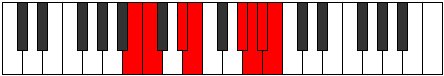 |
| [3637](https://ianring.com/musictheory/scales/3637) | [Kygian](ModeASharpKygian.md) | A# | A#, B#, C##, D#, E###, F###, G##, A# |  |
| [3637](https://ianring.com/musictheory/scales/3637) | [Kygian](ModeBFlatKygian.md) | Bb | Bb, C, D, Eb, F##, G#, A, Bb |  |
| [3639](https://ianring.com/musictheory/scales/3639) | [Paptyllic](ModeBNaturalPaptyllic.md) | B | B, C, C#, D#, E, G#, A, A#, B | 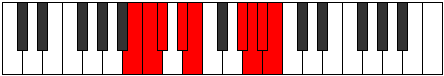 |
| [3639](https://ianring.com/musictheory/scales/3639) | [Paptyllic](ModeASharpPaptyllic.md) | A# | A#, B, C, D, D#, G, G#, A, A# |  |
| [3639](https://ianring.com/musictheory/scales/3639) | [Paptyllic](ModeBFlatPaptyllic.md) | Bb | Bb, B, C, D, Eb, G, Ab, A, Bb |  |
| [3643](https://ianring.com/musictheory/scales/3643) | [Kydyllic](ModeBNaturalKydyllic.md) | B | B, C, D, D#, E, G#, A, A#, B |  |
| [3645](https://ianring.com/musictheory/scales/3645) | [Zycryllic](ModeASharpZycryllic.md) | A# | A#, C, C#, D, D#, G, G#, A, A# |  |
| [3645](https://ianring.com/musictheory/scales/3645) | [Zycryllic](ModeBFlatZycryllic.md) | Bb | Bb, C, Db, D, Eb, G, Ab, A, Bb |  |
| [3647](https://ianring.com/musictheory/scales/3647) | [Eporygic](ModeBNaturalEporygic.md) | B | B, C, C#, D, D#, E, G#, A, A#, B |  |
| [3647](https://ianring.com/musictheory/scales/3647) | [Eporygic](ModeASharpEporygic.md) | A# | A#, B, C, C#, D, D#, G, G#, A, A# |  |
| [3647](https://ianring.com/musictheory/scales/3647) | [Eporygic](ModeBFlatEporygic.md) | Bb | Bb, B, C, Db, D, Eb, G, Ab, A, Bb |  |
| [3657](https://ianring.com/musictheory/scales/3657) | [Epynimic](ModeANaturalEpynimic.md) | A | A, B#, C###, E##, F##, G#, A |  |
| [3659](https://ianring.com/musictheory/scales/3659) | [Polian](ModeANaturalPolian.md) | A | A, Bb, C, D#, E##, F##, G#, A |  |
| [3661](https://ianring.com/musictheory/scales/3661) | [Mixodorian](ModeFSharpMixodorian.md) | F# | F#, G#, A, B#, C###, D##, E#, F# |  |
| [3661](https://ianring.com/musictheory/scales/3661) | [Mixodorian](ModeGFlatMixodorian.md) | Gb | Gb, Ab, Bbb, C, D#, E, F, Gb |  |
| [3661](https://ianring.com/musictheory/scales/3661) | [Mixodorian](ModeANaturalMixodorian.md) | A | A, B, C, D#, E##, F##, G#, A |  |
| [3663](https://ianring.com/musictheory/scales/3663) | [Sonyllic](ModeFSharpSonyllic.md) | F# | F#, G, G#, A, C, D#, E, F, F# |  |
| [3663](https://ianring.com/musictheory/scales/3663) | [Sonyllic](ModeGFlatSonyllic.md) | Gb | Gb, G, Ab, A, C, Eb, E, F, Gb |  |
| [3663](https://ianring.com/musictheory/scales/3663) | [Sonyllic](ModeANaturalSonyllic.md) | A | A, A#, B, C, D#, F#, G, G#, A |  |
| [3667](https://ianring.com/musictheory/scales/3667) | [Kaptian](ModeBNaturalKaptian.md) | B | B, C, D#, E#, F###, G##, A#, B |  |
| [3671](https://ianring.com/musictheory/scales/3671) | [Aeonyllic](ModeBNaturalAeonyllic.md) | B | B, C, C#, D#, F, G#, A, A#, B |  |
| [3673](https://ianring.com/musictheory/scales/3673) | [Ranian](ModeANaturalRanian.md) | A | A, B#, C#, D#, E##, F##, G#, A |  |
| [3675](https://ianring.com/musictheory/scales/3675) | [Monyllic](ModeANaturalMonyllic.md) | A | A, A#, C, C#, D#, F#, G, G#, A |  |
| [3675](https://ianring.com/musictheory/scales/3675) | [Monyllic](ModeBNaturalMonyllic.md) | B | B, C, D, D#, F, G#, A, A#, B |  |
| [3677](https://ianring.com/musictheory/scales/3677) | [Katylyllic](ModeFSharpKatylyllic.md) | F# | F#, G#, A, A#, C, D#, E, F, F# |  |
| [3677](https://ianring.com/musictheory/scales/3677) | [Katylyllic](ModeGFlatKatylyllic.md) | Gb | Gb, Ab, A, Bb, C, Eb, E, F, Gb |  |
| [3677](https://ianring.com/musictheory/scales/3677) | [Katylyllic](ModeANaturalKatylyllic.md) | A | A, B, C, C#, D#, F#, G, G#, A |  |
| [3679](https://ianring.com/musictheory/scales/3679) | [Rycrygic](ModeFSharpRycrygic.md) | F# | F#, G, G#, A, A#, C, D#, E, F, F# |  |
| [3679](https://ianring.com/musictheory/scales/3679) | [Rycrygic](ModeGFlatRycrygic.md) | Gb | Gb, G, Ab, A, Bb, C, Eb, E, F, Gb |  |
| [3679](https://ianring.com/musictheory/scales/3679) | [Rycrygic](ModeBNaturalRycrygic.md) | B | B, C, C#, D, D#, F, G#, A, A#, B |  |
| [3679](https://ianring.com/musictheory/scales/3679) | [Rycrygic](ModeANaturalRycrygic.md) | A | A, A#, B, C, C#, D#, F#, G, G#, A |  |
| [3683](https://ianring.com/musictheory/scales/3683) | [Dycrian](ModeDSharpDycrian.md) | D# | D#, E, F###, G##, A###, B##, C##, D# |  |
| [3683](https://ianring.com/musictheory/scales/3683) | [Dycrian](ModeEFlatDycrian.md) | Eb | Eb, Fb, G#, A, B#, C#, D, Eb |  |
| [3685](https://ianring.com/musictheory/scales/3685) | [Kodian](ModeDSharpKodian.md) | D# | D#, E#, F###, G##, A###, B##, C##, D# |  |
| [3685](https://ianring.com/musictheory/scales/3685) | [Kodian](ModeEFlatKodian.md) | Eb | Eb, F, G#, A, B#, C#, D, Eb |  |
| [3685](https://ianring.com/musictheory/scales/3685) | [Kodian](ModeASharpKodian.md) | A# | A#, B#, C###, D##, E###, F###, G##, A# |  |
| [3685](https://ianring.com/musictheory/scales/3685) | [Kodian](ModeBFlatKodian.md) | Bb | Bb, C, D#, E, F##, G#, A, Bb |  |
| [3687](https://ianring.com/musictheory/scales/3687) | [Zonyllic](ModeDSharpZonyllic.md) | D# | D#, E, F, G#, A, C, C#, D, D# |  |
| [3687](https://ianring.com/musictheory/scales/3687) | [Zonyllic](ModeEFlatZonyllic.md) | Eb | Eb, E, F, Ab, A, C, Db, D, Eb |  |
| [3687](https://ianring.com/musictheory/scales/3687) | [Zonyllic](ModeASharpZonyllic.md) | A# | A#, B, C, D#, E, G, G#, A, A# |  |
| [3687](https://ianring.com/musictheory/scales/3687) | [Zonyllic](ModeBFlatZonyllic.md) | Bb | Bb, B, C, Eb, E, G, Ab, A, Bb |  |
| [3689](https://ianring.com/musictheory/scales/3689) | [Katocrian](ModeDSharpKatocrian.md) | D# | D#, E##, F###, G##, A###, B##, C##, D# |  |
| [3689](https://ianring.com/musictheory/scales/3689) | [Katocrian](ModeEFlatKatocrian.md) | Eb | Eb, F#, G#, A, B#, C#, D, Eb |  |
| [3689](https://ianring.com/musictheory/scales/3689) | [Katocrian](ModeANaturalKatocrian.md) | A | A, B#, C##, D#, E##, F##, G#, A |  |
| [3691](https://ianring.com/musictheory/scales/3691) | [Badyllic](ModeDSharpBadyllic.md) | D# | D#, E, F#, G#, A, C, C#, D, D# |  |
| [3691](https://ianring.com/musictheory/scales/3691) | [Badyllic](ModeEFlatBadyllic.md) | Eb | Eb, E, Gb, Ab, A, C, Db, D, Eb |  |
| [3691](https://ianring.com/musictheory/scales/3691) | [Badyllic](ModeANaturalBadyllic.md) | A | A, A#, C, D, D#, F#, G, G#, A |  |
| [3693](https://ianring.com/musictheory/scales/3693) | [Epaptyllic](ModeDSharpEpaptyllic.md) | D# | D#, F, F#, G#, A, C, C#, D, D# |  |
| [3693](https://ianring.com/musictheory/scales/3693) | [Epaptyllic](ModeEFlatEpaptyllic.md) | Eb | Eb, F, Gb, Ab, A, C, Db, D, Eb |  |
| [3693](https://ianring.com/musictheory/scales/3693) | [Epaptyllic](ModeASharpEpaptyllic.md) | A# | A#, C, C#, D#, E, G, G#, A, A# |  |
| [3693](https://ianring.com/musictheory/scales/3693) | [Epaptyllic](ModeBFlatEpaptyllic.md) | Bb | Bb, C, Db, Eb, E, G, Ab, A, Bb |  |
| [3693](https://ianring.com/musictheory/scales/3693) | [Epaptyllic](ModeFSharpEpaptyllic.md) | F# | F#, G#, A, B, C, D#, E, F, F# |  |
| [3693](https://ianring.com/musictheory/scales/3693) | [Epaptyllic](ModeGFlatEpaptyllic.md) | Gb | Gb, Ab, A, B, C, Eb, E, F, Gb |  |
| [3693](https://ianring.com/musictheory/scales/3693) | [Epaptyllic](ModeANaturalEpaptyllic.md) | A | A, B, C, D, D#, F#, G, G#, A |  |
| [3695](https://ianring.com/musictheory/scales/3695) | [Kodygic](ModeDSharpKodygic.md) | D# | D#, E, F, F#, G#, A, C, C#, D, D# |  |
| [3695](https://ianring.com/musictheory/scales/3695) | [Kodygic](ModeEFlatKodygic.md) | Eb | Eb, E, F, Gb, Ab, A, C, Db, D, Eb |  |
| [3695](https://ianring.com/musictheory/scales/3695) | [Kodygic](ModeFSharpKodygic.md) | F# | F#, G, G#, A, B, C, D#, E, F, F# |  |
| [3695](https://ianring.com/musictheory/scales/3695) | [Kodygic](ModeGFlatKodygic.md) | Gb | Gb, G, Ab, A, B, C, Eb, E, F, Gb |  |
| [3695](https://ianring.com/musictheory/scales/3695) | [Kodygic](ModeASharpKodygic.md) | A# | A#, B, C, C#, D#, E, G, G#, A, A# |  |
| [3695](https://ianring.com/musictheory/scales/3695) | [Kodygic](ModeBFlatKodygic.md) | Bb | Bb, B, C, Db, Eb, E, G, Ab, A, Bb |  |
| [3695](https://ianring.com/musictheory/scales/3695) | [Kodygic](ModeANaturalKodygic.md) | A | A, A#, B, C, D, D#, F#, G, G#, A |  |
| [3697](https://ianring.com/musictheory/scales/3697) | [Ionarian](ModeDSharpIonarian.md) | D# | D#, E###, F###, G##, A###, B##, C##, D# |  |
| [3697](https://ianring.com/musictheory/scales/3697) | [Ionarian](ModeEFlatIonarian.md) | Eb | Eb, F##, G#, A, B#, C#, D, Eb |  |
| [3699](https://ianring.com/musictheory/scales/3699) | [Aeolylyllic](ModeDSharpAeolylyllic.md) | D# | D#, E, G, G#, A, C, C#, D, D# |  |
| [3699](https://ianring.com/musictheory/scales/3699) | [Aeolylyllic](ModeEFlatAeolylyllic.md) | Eb | Eb, E, G, Ab, A, C, Db, D, Eb |  |
| [3699](https://ianring.com/musictheory/scales/3699) | [Aeolylyllic](ModeBNaturalAeolylyllic.md) | B | B, C, D#, E, F, G#, A, A#, B |  |
| [3701](https://ianring.com/musictheory/scales/3701) | [Bagyllic](ModeDSharpBagyllic.md) | D# | D#, F, G, G#, A, C, C#, D, D# |  |
| [3701](https://ianring.com/musictheory/scales/3701) | [Bagyllic](ModeEFlatBagyllic.md) | Eb | Eb, F, G, Ab, A, C, Db, D, Eb |  |
| [3701](https://ianring.com/musictheory/scales/3701) | [Bagyllic](ModeASharpBagyllic.md) | A# | A#, C, D, D#, E, G, G#, A, A# |  |
| [3701](https://ianring.com/musictheory/scales/3701) | [Bagyllic](ModeBFlatBagyllic.md) | Bb | Bb, C, D, Eb, E, G, Ab, A, Bb |  |
| [3703](https://ianring.com/musictheory/scales/3703) | [Katalygic](ModeDSharpKatalygic.md) | D# | D#, E, F, G, G#, A, C, C#, D, D# |  |
| [3703](https://ianring.com/musictheory/scales/3703) | [Katalygic](ModeEFlatKatalygic.md) | Eb | Eb, E, F, G, Ab, A, C, Db, D, Eb |  |
| [3703](https://ianring.com/musictheory/scales/3703) | [Katalygic](ModeBNaturalKatalygic.md) | B | B, C, C#, D#, E, F, G#, A, A#, B |  |
| [3703](https://ianring.com/musictheory/scales/3703) | [Katalygic](ModeASharpKatalygic.md) | A# | A#, B, C, D, D#, E, G, G#, A, A# |  |
| [3703](https://ianring.com/musictheory/scales/3703) | [Katalygic](ModeBFlatKatalygic.md) | Bb | Bb, B, C, D, Eb, E, G, Ab, A, Bb |  |
| [3705](https://ianring.com/musictheory/scales/3705) | [Sydyllic](ModeDSharpSydyllic.md) | D# | D#, F#, G, G#, A, C, C#, D, D# |  |
| [3705](https://ianring.com/musictheory/scales/3705) | [Sydyllic](ModeEFlatSydyllic.md) | Eb | Eb, Gb, G, Ab, A, C, Db, D, Eb |  |
| [3705](https://ianring.com/musictheory/scales/3705) | [Sydyllic](ModeANaturalSydyllic.md) | A | A, C, C#, D, D#, F#, G, G#, A |  |
| [3707](https://ianring.com/musictheory/scales/3707) | [Rynygic](ModeDSharpRynygic.md) | D# | D#, E, F#, G, G#, A, C, C#, D, D# |  |
| [3707](https://ianring.com/musictheory/scales/3707) | [Rynygic](ModeEFlatRynygic.md) | Eb | Eb, E, Gb, G, Ab, A, C, Db, D, Eb |  |
| [3707](https://ianring.com/musictheory/scales/3707) | [Rynygic](ModeANaturalRynygic.md) | A | A, A#, C, C#, D, D#, F#, G, G#, A |  |
| [3707](https://ianring.com/musictheory/scales/3707) | [Rynygic](ModeBNaturalRynygic.md) | B | B, C, D, D#, E, F, G#, A, A#, B |  |
| [3709](https://ianring.com/musictheory/scales/3709) | [Locrygic](ModeDSharpLocrygic.md) | D# | D#, F, F#, G, G#, A, C, C#, D, D# |  |
| [3709](https://ianring.com/musictheory/scales/3709) | [Locrygic](ModeEFlatLocrygic.md) | Eb | Eb, F, Gb, G, Ab, A, C, Db, D, Eb |  |
| [3709](https://ianring.com/musictheory/scales/3709) | [Locrygic](ModeASharpLocrygic.md) | A# | A#, C, C#, D, D#, E, G, G#, A, A# |  |
| [3709](https://ianring.com/musictheory/scales/3709) | [Locrygic](ModeBFlatLocrygic.md) | Bb | Bb, C, Db, D, Eb, E, G, Ab, A, Bb |  |
| [3709](https://ianring.com/musictheory/scales/3709) | [Locrygic](ModeANaturalLocrygic.md) | A | A, B, C, C#, D, D#, F#, G, G#, A |  |
| [3709](https://ianring.com/musictheory/scales/3709) | [Locrygic](ModeFSharpLocrygic.md) | F# | F#, G#, A, A#, B, C, D#, E, F, F# |  |
| [3709](https://ianring.com/musictheory/scales/3709) | [Locrygic](ModeGFlatLocrygic.md) | Gb | Gb, Ab, A, Bb, B, C, Eb, E, F, Gb |  |
| [3711](https://ianring.com/musictheory/scales/3711) | [Dycryllian](ModeDSharpDycryllian.md) | D# | D#, E, F, F#, G, G#, A, C, C#, D, D# |  |
| [3711](https://ianring.com/musictheory/scales/3711) | [Dycryllian](ModeEFlatDycryllian.md) | Eb | Eb, E, F, Gb, G, Ab, A, C, Db, D, Eb |  |
| [3711](https://ianring.com/musictheory/scales/3711) | [Dycryllian](ModeBNaturalDycryllian.md) | B | B, C, C#, D, D#, E, F, G#, A, A#, B |  |
| [3711](https://ianring.com/musictheory/scales/3711) | [Dycryllian](ModeASharpDycryllian.md) | A# | A#, B, C, C#, D, D#, E, G, G#, A, A# |  |
| [3711](https://ianring.com/musictheory/scales/3711) | [Dycryllian](ModeBFlatDycryllian.md) | Bb | Bb, B, C, Db, D, Eb, E, G, Ab, A, Bb |  |
| [3711](https://ianring.com/musictheory/scales/3711) | [Dycryllian](ModeANaturalDycryllian.md) | A | A, A#, B, C, C#, D, D#, F#, G, G#, A |  |
| [3711](https://ianring.com/musictheory/scales/3711) | [Dycryllian](ModeFSharpDycryllian.md) | F# | F#, G, G#, A, A#, B, C, D#, E, F, F# |  |
| [3711](https://ianring.com/musictheory/scales/3711) | [Dycryllian](ModeGFlatDycryllian.md) | Gb | Gb, G, Ab, A, Bb, B, C, Eb, E, F, Gb |  |
| [3731](https://ianring.com/musictheory/scales/3731) | [Aeryrian](ModeGSharpAeryrian.md) | G# | G#, A, B#, C###, D###, E##, F##, G# |  |
| [3731](https://ianring.com/musictheory/scales/3731) | [Aeryrian](ModeAFlatAeryrian.md) | Ab | Ab, Bbb, C, D#, E#, F#, G, Ab |  |
| [3731](https://ianring.com/musictheory/scales/3731) | [Aeryrian](ModeBNaturalAeryrian.md) | B | B, C, D#, E##, F###, G##, A#, B |  |
| [3735](https://ianring.com/musictheory/scales/3735) | [Ionagyllic](ModeGSharpIonagyllic.md) | G# | G#, A, A#, C, D#, F, F#, G, G# |  |
| [3735](https://ianring.com/musictheory/scales/3735) | [Ionagyllic](ModeAFlatIonagyllic.md) | Ab | Ab, A, Bb, C, Eb, F, Gb, G, Ab |  |
| [3735](https://ianring.com/musictheory/scales/3735) | [Ionagyllic](ModeBNaturalIonagyllic.md) | B | B, C, C#, D#, F#, G#, A, A#, B |  |
| [3737](https://ianring.com/musictheory/scales/3737) | [Phrocrian](ModeFNaturalPhrocrian.md) | F | F, G#, A, B#, C##, D#, E, F |  |
| [3739](https://ianring.com/musictheory/scales/3739) | [Ioninyllic](ModeFNaturalIoninyllic.md) | F | F, F#, G#, A, C, D, D#, E, F |  |
| [3739](https://ianring.com/musictheory/scales/3739) | [Ioninyllic](ModeGSharpIoninyllic.md) | G# | G#, A, B, C, D#, F, F#, G, G# |  |
| [3739](https://ianring.com/musictheory/scales/3739) | [Ioninyllic](ModeAFlatIoninyllic.md) | Ab | Ab, A, B, C, Eb, F, Gb, G, Ab |  |
| [3739](https://ianring.com/musictheory/scales/3739) | [Ioninyllic](ModeBNaturalIoninyllic.md) | B | B, C, D, D#, F#, G#, A, A#, B |  |
| [3741](https://ianring.com/musictheory/scales/3741) | [Zydyllic](ModeFNaturalZydyllic.md) | F | F, G, G#, A, C, D, D#, E, F |  |
| [3743](https://ianring.com/musictheory/scales/3743) | [Thadygic](ModeFNaturalThadygic.md) | F | F, F#, G, G#, A, C, D, D#, E, F |  |
| [3743](https://ianring.com/musictheory/scales/3743) | [Thadygic](ModeBNaturalThadygic.md) | B | B, C, C#, D, D#, F#, G#, A, A#, B |  |
| [3743](https://ianring.com/musictheory/scales/3743) | [Thadygic](ModeGSharpThadygic.md) | G# | G#, A, A#, B, C, D#, F, F#, G, G# |  |
| [3743](https://ianring.com/musictheory/scales/3743) | [Thadygic](ModeAFlatThadygic.md) | Ab | Ab, A, Bb, B, C, Eb, F, Gb, G, Ab |  |
| [3749](https://ianring.com/musictheory/scales/3749) | [Zothian](ModeASharpZothian.md) | A# | A#, B#, C###, D###, E###, F###, G##, A# |  |
| [3749](https://ianring.com/musictheory/scales/3749) | [Zothian](ModeBFlatZothian.md) | Bb | Bb, C, D#, E#, F##, G#, A, Bb |  |
| [3751](https://ianring.com/musictheory/scales/3751) | [Aerathyllic](ModeASharpAerathyllic.md) | A# | A#, B, C, D#, F, G, G#, A, A# |  |
| [3751](https://ianring.com/musictheory/scales/3751) | [Aerathyllic](ModeBFlatAerathyllic.md) | Bb | Bb, B, C, Eb, F, G, Ab, A, Bb |  |
| [3757](https://ianring.com/musictheory/scales/3757) | [Goptyllic](ModeASharpGoptyllic.md) | A# | A#, C, C#, D#, F, G, G#, A, A# |  |
| [3757](https://ianring.com/musictheory/scales/3757) | [Goptyllic](ModeBFlatGoptyllic.md) | Bb | Bb, C, Db, Eb, F, G, Ab, A, Bb |  |
| [3759](https://ianring.com/musictheory/scales/3759) | [Darygic](ModeASharpDarygic.md) | A# | A#, B, C, C#, D#, F, G, G#, A, A# |  |
| [3759](https://ianring.com/musictheory/scales/3759) | [Darygic](ModeBFlatDarygic.md) | Bb | Bb, B, C, Db, Eb, F, G, Ab, A, Bb |  |
| [3763](https://ianring.com/musictheory/scales/3763) | [Modyllic](ModeGSharpModyllic.md) | G# | G#, A, C, C#, D#, F, F#, G, G# |  |
| [3763](https://ianring.com/musictheory/scales/3763) | [Modyllic](ModeAFlatModyllic.md) | Ab | Ab, A, C, Db, Eb, F, Gb, G, Ab |  |
| [3763](https://ianring.com/musictheory/scales/3763) | [Modyllic](ModeBNaturalModyllic.md) | B | B, C, D#, E, F#, G#, A, A#, B |  |
| [3765](https://ianring.com/musictheory/scales/3765) | [Aerycryllic](ModeASharpAerycryllic.md) | A# | A#, C, D, D#, F, G, G#, A, A# |  |
| [3765](https://ianring.com/musictheory/scales/3765) | [Aerycryllic](ModeBFlatAerycryllic.md) | Bb | Bb, C, D, Eb, F, G, Ab, A, Bb |  |
| [3767](https://ianring.com/musictheory/scales/3767) | [Bacrygic](ModeGSharpBacrygic.md) | G# | G#, A, A#, C, C#, D#, F, F#, G, G# |  |
| [3767](https://ianring.com/musictheory/scales/3767) | [Bacrygic](ModeAFlatBacrygic.md) | Ab | Ab, A, Bb, C, Db, Eb, F, Gb, G, Ab |  |
| [3767](https://ianring.com/musictheory/scales/3767) | [Bacrygic](ModeBNaturalBacrygic.md) | B | B, C, C#, D#, E, F#, G#, A, A#, B |  |
| [3767](https://ianring.com/musictheory/scales/3767) | [Bacrygic](ModeASharpBacrygic.md) | A# | A#, B, C, D, D#, F, G, G#, A, A# |  |
| [3767](https://ianring.com/musictheory/scales/3767) | [Bacrygic](ModeBFlatBacrygic.md) | Bb | Bb, B, C, D, Eb, F, G, Ab, A, Bb |  |
| [3769](https://ianring.com/musictheory/scales/3769) | [Aeracryllic](ModeFNaturalAeracryllic.md) | F | F, G#, A, A#, C, D, D#, E, F |  |
| [3771](https://ianring.com/musictheory/scales/3771) | [Stophygic](ModeFNaturalStophygic.md) | F | F, F#, G#, A, A#, C, D, D#, E, F |  |
| [3771](https://ianring.com/musictheory/scales/3771) | [Stophygic](ModeGSharpStophygic.md) | G# | G#, A, B, C, C#, D#, F, F#, G, G# |  |
| [3771](https://ianring.com/musictheory/scales/3771) | [Stophygic](ModeAFlatStophygic.md) | Ab | Ab, A, B, C, Db, Eb, F, Gb, G, Ab |  |
| [3771](https://ianring.com/musictheory/scales/3771) | [Stophygic](ModeBNaturalStophygic.md) | B | B, C, D, D#, E, F#, G#, A, A#, B | 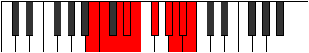 |
| [3773](https://ianring.com/musictheory/scales/3773) | [Sorygic](ModeASharpSorygic.md) | A# | A#, C, C#, D, D#, F, G, G#, A, A# |  |
| [3773](https://ianring.com/musictheory/scales/3773) | [Sorygic](ModeBFlatSorygic.md) | Bb | Bb, C, Db, D, Eb, F, G, Ab, A, Bb |  |
| [3773](https://ianring.com/musictheory/scales/3773) | [Sorygic](ModeFNaturalSorygic.md) | F | F, G, G#, A, A#, C, D, D#, E, F | 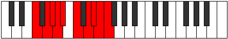 |
| [3775](https://ianring.com/musictheory/scales/3775) | [Loptyllian](ModeFNaturalLoptyllian.md) | F | F, F#, G, G#, A, A#, C, D, D#, E, F |  |
| [3775](https://ianring.com/musictheory/scales/3775) | [Loptyllian](ModeBNaturalLoptyllian.md) | B | B, C, C#, D, D#, E, F#, G#, A, A#, B |  |
| [3775](https://ianring.com/musictheory/scales/3775) | [Loptyllian](ModeASharpLoptyllian.md) | A# | A#, B, C, C#, D, D#, F, G, G#, A, A# |  |
| [3775](https://ianring.com/musictheory/scales/3775) | [Loptyllian](ModeBFlatLoptyllian.md) | Bb | Bb, B, C, Db, D, Eb, F, G, Ab, A, Bb |  |
| [3775](https://ianring.com/musictheory/scales/3775) | [Loptyllian](ModeGSharpLoptyllian.md) | G# | G#, A, A#, B, C, C#, D#, F, F#, G, G# |  |
| [3775](https://ianring.com/musictheory/scales/3775) | [Loptyllian](ModeAFlatLoptyllian.md) | Ab | Ab, A, Bb, B, C, Db, Eb, F, Gb, G, Ab |  |
| [3783](https://ianring.com/musictheory/scales/3783) | [Phrygyllic](ModeDNaturalPhrygyllic.md) | D | D, D#, E, G#, A, B, C, C#, D |  |
| [3785](https://ianring.com/musictheory/scales/3785) | [Epagian](ModeANaturalEpagian.md) | A | A, B#, C###, D##, E##, F##, G#, A |  |
| [3787](https://ianring.com/musictheory/scales/3787) | [Kagyllic](ModeANaturalKagyllic.md) | A | A, A#, C, D#, E, F#, G, G#, A |  |
| [3787](https://ianring.com/musictheory/scales/3787) | [Kagyllic](ModeDNaturalKagyllic.md) | D | D, D#, F, G#, A, B, C, C#, D |  |
| [3789](https://ianring.com/musictheory/scales/3789) | [Eporyllic](ModeFSharpEporyllic.md) | F# | F#, G#, A, C, C#, D#, E, F, F# |  |
| [3789](https://ianring.com/musictheory/scales/3789) | [Eporyllic](ModeGFlatEporyllic.md) | Gb | Gb, Ab, A, C, Db, Eb, E, F, Gb |  |
| [3789](https://ianring.com/musictheory/scales/3789) | [Eporyllic](ModeANaturalEporyllic.md) | A | A, B, C, D#, E, F#, G, G#, A |  |
| [3791](https://ianring.com/musictheory/scales/3791) | [Stodygic](ModeFSharpStodygic.md) | F# | F#, G, G#, A, C, C#, D#, E, F, F# |  |
| [3791](https://ianring.com/musictheory/scales/3791) | [Stodygic](ModeGFlatStodygic.md) | Gb | Gb, G, Ab, A, C, Db, Eb, E, F, Gb |  |
| [3791](https://ianring.com/musictheory/scales/3791) | [Stodygic](ModeDNaturalStodygic.md) | D | D, D#, E, F, G#, A, B, C, C#, D |  |
| [3791](https://ianring.com/musictheory/scales/3791) | [Stodygic](ModeANaturalStodygic.md) | A | A, A#, B, C, D#, E, F#, G, G#, A |  |
| [3795](https://ianring.com/musictheory/scales/3795) | [Epothyllic](ModeGSharpEpothyllic.md) | G# | G#, A, C, D, D#, F, F#, G, G# |  |
| [3795](https://ianring.com/musictheory/scales/3795) | [Epothyllic](ModeAFlatEpothyllic.md) | Ab | Ab, A, C, D, Eb, F, Gb, G, Ab |  |
| [3795](https://ianring.com/musictheory/scales/3795) | [Epothyllic](ModeDNaturalEpothyllic.md) | D | D, D#, F#, G#, A, B, C, C#, D |  |
| [3795](https://ianring.com/musictheory/scales/3795) | [Epothyllic](ModeBNaturalEpothyllic.md) | B | B, C, D#, F, F#, G#, A, A#, B |  |
| [3799](https://ianring.com/musictheory/scales/3799) | [Aeralygic](ModeGSharpAeralygic.md) | G# | G#, A, A#, C, D, D#, F, F#, G, G# |  |
| [3799](https://ianring.com/musictheory/scales/3799) | [Aeralygic](ModeAFlatAeralygic.md) | Ab | Ab, A, Bb, C, D, Eb, F, Gb, G, Ab |  |
| [3799](https://ianring.com/musictheory/scales/3799) | [Aeralygic](ModeDNaturalAeralygic.md) | D | D, D#, E, F#, G#, A, B, C, C#, D |  |
| [3799](https://ianring.com/musictheory/scales/3799) | [Aeralygic](ModeBNaturalAeralygic.md) | B | B, C, C#, D#, F, F#, G#, A, A#, B |  |
| [3801](https://ianring.com/musictheory/scales/3801) | [Maptyllic](ModeANaturalMaptyllic.md) | A | A, C, C#, D#, E, F#, G, G#, A |  |
| [3801](https://ianring.com/musictheory/scales/3801) | [Maptyllic](ModeFNaturalMaptyllic.md) | F | F, G#, A, B, C, D, D#, E, F |  |
| [3803](https://ianring.com/musictheory/scales/3803) | [Epidygic](ModeANaturalEpidygic.md) | A | A, A#, C, C#, D#, E, F#, G, G#, A |  |
| [3803](https://ianring.com/musictheory/scales/3803) | [Epidygic](ModeDNaturalEpidygic.md) | D | D, D#, F, F#, G#, A, B, C, C#, D |  |
| [3803](https://ianring.com/musictheory/scales/3803) | [Epidygic](ModeFNaturalEpidygic.md) | F | F, F#, G#, A, B, C, D, D#, E, F |  |
| [3803](https://ianring.com/musictheory/scales/3803) | [Epidygic](ModeGSharpEpidygic.md) | G# | G#, A, B, C, D, D#, F, F#, G, G# |  |
| [3803](https://ianring.com/musictheory/scales/3803) | [Epidygic](ModeAFlatEpidygic.md) | Ab | Ab, A, B, C, D, Eb, F, Gb, G, Ab |  |
| [3803](https://ianring.com/musictheory/scales/3803) | [Epidygic](ModeBNaturalEpidygic.md) | B | B, C, D, D#, F, F#, G#, A, A#, B |  |
| [3805](https://ianring.com/musictheory/scales/3805) | [Moptygic](ModeFSharpMoptygic.md) | F# | F#, G#, A, A#, C, C#, D#, E, F, F# |  |
| [3805](https://ianring.com/musictheory/scales/3805) | [Moptygic](ModeGFlatMoptygic.md) | Gb | Gb, Ab, A, Bb, C, Db, Eb, E, F, Gb |  |
| [3805](https://ianring.com/musictheory/scales/3805) | [Moptygic](ModeFNaturalMoptygic.md) | F | F, G, G#, A, B, C, D, D#, E, F |  |
| [3805](https://ianring.com/musictheory/scales/3805) | [Moptygic](ModeANaturalMoptygic.md) | A | A, B, C, C#, D#, E, F#, G, G#, A |  |
| [3807](https://ianring.com/musictheory/scales/3807) | [Bagyllian](ModeFSharpBagyllian.md) | F# | F#, G, G#, A, A#, C, C#, D#, E, F, F# |  |
| [3807](https://ianring.com/musictheory/scales/3807) | [Bagyllian](ModeGFlatBagyllian.md) | Gb | Gb, G, Ab, A, Bb, C, Db, Eb, E, F, Gb |  |
| [3807](https://ianring.com/musictheory/scales/3807) | [Bagyllian](ModeDNaturalBagyllian.md) | D | D, D#, E, F, F#, G#, A, B, C, C#, D |  |
| [3807](https://ianring.com/musictheory/scales/3807) | [Bagyllian](ModeFNaturalBagyllian.md) | F | F, F#, G, G#, A, B, C, D, D#, E, F |  |
| [3807](https://ianring.com/musictheory/scales/3807) | [Bagyllian](ModeBNaturalBagyllian.md) | B | B, C, C#, D, D#, F, F#, G#, A, A#, B |  |
| [3807](https://ianring.com/musictheory/scales/3807) | [Bagyllian](ModeANaturalBagyllian.md) | A | A, A#, B, C, C#, D#, E, F#, G, G#, A |  |
| [3807](https://ianring.com/musictheory/scales/3807) | [Bagyllian](ModeGSharpBagyllian.md) | G# | G#, A, A#, B, C, D, D#, F, F#, G, G# |  |
| [3807](https://ianring.com/musictheory/scales/3807) | [Bagyllian](ModeAFlatBagyllian.md) | Ab | Ab, A, Bb, B, C, D, Eb, F, Gb, G, Ab |  |
| [3811](https://ianring.com/musictheory/scales/3811) | [Epogyllic](ModeDSharpEpogyllic.md) | D# | D#, E, G#, A, A#, C, C#, D, D# |  |
| [3811](https://ianring.com/musictheory/scales/3811) | [Epogyllic](ModeEFlatEpogyllic.md) | Eb | Eb, E, Ab, A, Bb, C, Db, D, Eb |  |
| [3811](https://ianring.com/musictheory/scales/3811) | [Epogyllic](ModeDNaturalEpogyllic.md) | D | D, D#, G, G#, A, B, C, C#, D |  |
| [3813](https://ianring.com/musictheory/scales/3813) | [Aeologyllic](ModeDSharpAeologyllic.md) | D# | D#, F, G#, A, A#, C, C#, D, D# |  |
| [3813](https://ianring.com/musictheory/scales/3813) | [Aeologyllic](ModeEFlatAeologyllic.md) | Eb | Eb, F, Ab, A, Bb, C, Db, D, Eb |  |
| [3813](https://ianring.com/musictheory/scales/3813) | [Aeologyllic](ModeASharpAeologyllic.md) | A# | A#, C, D#, E, F, G, G#, A, A# |  |
| [3813](https://ianring.com/musictheory/scales/3813) | [Aeologyllic](ModeBFlatAeologyllic.md) | Bb | Bb, C, Eb, E, F, G, Ab, A, Bb |  |
| [3815](https://ianring.com/musictheory/scales/3815) | [Mylygic](ModeDSharpMylygic.md) | D# | D#, E, F, G#, A, A#, C, C#, D, D# |  |
| [3815](https://ianring.com/musictheory/scales/3815) | [Mylygic](ModeEFlatMylygic.md) | Eb | Eb, E, F, Ab, A, Bb, C, Db, D, Eb |  |
| [3815](https://ianring.com/musictheory/scales/3815) | [Mylygic](ModeDNaturalMylygic.md) | D | D, D#, E, G, G#, A, B, C, C#, D |  |
| [3815](https://ianring.com/musictheory/scales/3815) | [Mylygic](ModeASharpMylygic.md) | A# | A#, B, C, D#, E, F, G, G#, A, A# |  |
| [3815](https://ianring.com/musictheory/scales/3815) | [Mylygic](ModeBFlatMylygic.md) | Bb | Bb, B, C, Eb, E, F, G, Ab, A, Bb |  |
| [3817](https://ianring.com/musictheory/scales/3817) | [Zoryllic](ModeANaturalZoryllic.md) | A | A, C, D, D#, E, F#, G, G#, A |  |
| [3817](https://ianring.com/musictheory/scales/3817) | [Zoryllic](ModeDSharpZoryllic.md) | D# | D#, F#, G#, A, A#, C, C#, D, D# |  |
| [3817](https://ianring.com/musictheory/scales/3817) | [Zoryllic](ModeEFlatZoryllic.md) | Eb | Eb, Gb, Ab, A, Bb, C, Db, D, Eb |  |
| [3819](https://ianring.com/musictheory/scales/3819) | [Aeolanygic](ModeDSharpAeolanygic.md) | D# | D#, E, F#, G#, A, A#, C, C#, D, D# |  |
| [3819](https://ianring.com/musictheory/scales/3819) | [Aeolanygic](ModeEFlatAeolanygic.md) | Eb | Eb, E, Gb, Ab, A, Bb, C, Db, D, Eb |  |
| [3819](https://ianring.com/musictheory/scales/3819) | [Aeolanygic](ModeANaturalAeolanygic.md) | A | A, A#, C, D, D#, E, F#, G, G#, A |  |
| [3819](https://ianring.com/musictheory/scales/3819) | [Aeolanygic](ModeDNaturalAeolanygic.md) | D | D, D#, F, G, G#, A, B, C, C#, D |  |
| [3821](https://ianring.com/musictheory/scales/3821) | [Epyrygic](ModeDSharpEpyrygic.md) | D# | D#, F, F#, G#, A, A#, C, C#, D, D# |  |
| [3821](https://ianring.com/musictheory/scales/3821) | [Epyrygic](ModeEFlatEpyrygic.md) | Eb | Eb, F, Gb, Ab, A, Bb, C, Db, D, Eb |  |
| [3821](https://ianring.com/musictheory/scales/3821) | [Epyrygic](ModeASharpEpyrygic.md) | A# | A#, C, C#, D#, E, F, G, G#, A, A# |  |
| [3821](https://ianring.com/musictheory/scales/3821) | [Epyrygic](ModeBFlatEpyrygic.md) | Bb | Bb, C, Db, Eb, E, F, G, Ab, A, Bb |  |
| [3821](https://ianring.com/musictheory/scales/3821) | [Epyrygic](ModeFSharpEpyrygic.md) | F# | F#, G#, A, B, C, C#, D#, E, F, F# |  |
| [3821](https://ianring.com/musictheory/scales/3821) | [Epyrygic](ModeGFlatEpyrygic.md) | Gb | Gb, Ab, A, B, C, Db, Eb, E, F, Gb |  |
| [3821](https://ianring.com/musictheory/scales/3821) | [Epyrygic](ModeANaturalEpyrygic.md) | A | A, B, C, D, D#, E, F#, G, G#, A |  |
| [3823](https://ianring.com/musictheory/scales/3823) | [Epinyllian](ModeDSharpEpinyllian.md) | D# | D#, E, F, F#, G#, A, A#, C, C#, D, D# |  |
| [3823](https://ianring.com/musictheory/scales/3823) | [Epinyllian](ModeEFlatEpinyllian.md) | Eb | Eb, E, F, Gb, Ab, A, Bb, C, Db, D, Eb |  |
| [3823](https://ianring.com/musictheory/scales/3823) | [Epinyllian](ModeDNaturalEpinyllian.md) | D | D, D#, E, F, G, G#, A, B, C, C#, D |  |
| [3823](https://ianring.com/musictheory/scales/3823) | [Epinyllian](ModeFSharpEpinyllian.md) | F# | F#, G, G#, A, B, C, C#, D#, E, F, F# |  |
| [3823](https://ianring.com/musictheory/scales/3823) | [Epinyllian](ModeGFlatEpinyllian.md) | Gb | Gb, G, Ab, A, B, C, Db, Eb, E, F, Gb |  |
| [3823](https://ianring.com/musictheory/scales/3823) | [Epinyllian](ModeASharpEpinyllian.md) | A# | A#, B, C, C#, D#, E, F, G, G#, A, A# |  |
| [3823](https://ianring.com/musictheory/scales/3823) | [Epinyllian](ModeBFlatEpinyllian.md) | Bb | Bb, B, C, Db, Eb, E, F, G, Ab, A, Bb |  |
| [3823](https://ianring.com/musictheory/scales/3823) | [Epinyllian](ModeANaturalEpinyllian.md) | A | A, A#, B, C, D, D#, E, F#, G, G#, A |  |
| [3825](https://ianring.com/musictheory/scales/3825) | [Pynyllic](ModeDSharpPynyllic.md) | D# | D#, G, G#, A, A#, C, C#, D, D# |  |
| [3825](https://ianring.com/musictheory/scales/3825) | [Pynyllic](ModeEFlatPynyllic.md) | Eb | Eb, G, Ab, A, Bb, C, Db, D, Eb |  |
| [3827](https://ianring.com/musictheory/scales/3827) | [Dorygic](ModeGSharpDorygic.md) | G# | G#, A, C, C#, D, D#, F, F#, G, G# |  |
| [3827](https://ianring.com/musictheory/scales/3827) | [Dorygic](ModeAFlatDorygic.md) | Ab | Ab, A, C, Db, D, Eb, F, Gb, G, Ab |  |
| [3827](https://ianring.com/musictheory/scales/3827) | [Dorygic](ModeDSharpDorygic.md) | D# | D#, E, G, G#, A, A#, C, C#, D, D# |  |
| [3827](https://ianring.com/musictheory/scales/3827) | [Dorygic](ModeEFlatDorygic.md) | Eb | Eb, E, G, Ab, A, Bb, C, Db, D, Eb |  |
| [3827](https://ianring.com/musictheory/scales/3827) | [Dorygic](ModeDNaturalDorygic.md) | D | D, D#, F#, G, G#, A, B, C, C#, D |  |
| [3827](https://ianring.com/musictheory/scales/3827) | [Dorygic](ModeBNaturalDorygic.md) | B | B, C, D#, E, F, F#, G#, A, A#, B |  |
| [3829](https://ianring.com/musictheory/scales/3829) | [Aerycrygic](ModeDSharpAerycrygic.md) | D# | D#, F, G, G#, A, A#, C, C#, D, D# |  |
| [3829](https://ianring.com/musictheory/scales/3829) | [Aerycrygic](ModeEFlatAerycrygic.md) | Eb | Eb, F, G, Ab, A, Bb, C, Db, D, Eb |  |
| [3829](https://ianring.com/musictheory/scales/3829) | [Aerycrygic](ModeASharpAerycrygic.md) | A# | A#, C, D, D#, E, F, G, G#, A, A# |  |
| [3829](https://ianring.com/musictheory/scales/3829) | [Aerycrygic](ModeBFlatAerycrygic.md) | Bb | Bb, C, D, Eb, E, F, G, Ab, A, Bb |  |
| [3831](https://ianring.com/musictheory/scales/3831) | [Ionyllian](ModeDSharpIonyllian.md) | D# | D#, E, F, G, G#, A, A#, C, C#, D, D# |  |
| [3831](https://ianring.com/musictheory/scales/3831) | [Ionyllian](ModeEFlatIonyllian.md) | Eb | Eb, E, F, G, Ab, A, Bb, C, Db, D, Eb |  |
| [3831](https://ianring.com/musictheory/scales/3831) | [Ionyllian](ModeGSharpIonyllian.md) | G# | G#, A, A#, C, C#, D, D#, F, F#, G, G# |  |
| [3831](https://ianring.com/musictheory/scales/3831) | [Ionyllian](ModeAFlatIonyllian.md) | Ab | Ab, A, Bb, C, Db, D, Eb, F, Gb, G, Ab |  |
| [3831](https://ianring.com/musictheory/scales/3831) | [Ionyllian](ModeDNaturalIonyllian.md) | D | D, D#, E, F#, G, G#, A, B, C, C#, D |  |
| [3831](https://ianring.com/musictheory/scales/3831) | [Ionyllian](ModeBNaturalIonyllian.md) | B | B, C, C#, D#, E, F, F#, G#, A, A#, B |  |
| [3831](https://ianring.com/musictheory/scales/3831) | [Ionyllian](ModeASharpIonyllian.md) | A# | A#, B, C, D, D#, E, F, G, G#, A, A# |  |
| [3831](https://ianring.com/musictheory/scales/3831) | [Ionyllian](ModeBFlatIonyllian.md) | Bb | Bb, B, C, D, Eb, E, F, G, Ab, A, Bb |  |
| [3833](https://ianring.com/musictheory/scales/3833) | [Dycrygic](ModeANaturalDycrygic.md) | A | A, C, C#, D, D#, E, F#, G, G#, A |  |
| [3833](https://ianring.com/musictheory/scales/3833) | [Dycrygic](ModeDSharpDycrygic.md) | D# | D#, F#, G, G#, A, A#, C, C#, D, D# |  |
| [3833](https://ianring.com/musictheory/scales/3833) | [Dycrygic](ModeEFlatDycrygic.md) | Eb | Eb, Gb, G, Ab, A, Bb, C, Db, D, Eb |  |
| [3833](https://ianring.com/musictheory/scales/3833) | [Dycrygic](ModeFNaturalDycrygic.md) | F | F, G#, A, A#, B, C, D, D#, E, F |  |
| [3835](https://ianring.com/musictheory/scales/3835) | [Katodyllian](ModeDSharpKatodyllian.md) | D# | D#, E, F#, G, G#, A, A#, C, C#, D, D# |  |
| [3835](https://ianring.com/musictheory/scales/3835) | [Katodyllian](ModeEFlatKatodyllian.md) | Eb | Eb, E, Gb, G, Ab, A, Bb, C, Db, D, Eb |  |
| [3835](https://ianring.com/musictheory/scales/3835) | [Katodyllian](ModeANaturalKatodyllian.md) | A | A, A#, C, C#, D, D#, E, F#, G, G#, A |  |
| [3835](https://ianring.com/musictheory/scales/3835) | [Katodyllian](ModeDNaturalKatodyllian.md) | D | D, D#, F, F#, G, G#, A, B, C, C#, D |  |
| [3835](https://ianring.com/musictheory/scales/3835) | [Katodyllian](ModeGSharpKatodyllian.md) | G# | G#, A, B, C, C#, D, D#, F, F#, G, G# |  |
| [3835](https://ianring.com/musictheory/scales/3835) | [Katodyllian](ModeAFlatKatodyllian.md) | Ab | Ab, A, B, C, Db, D, Eb, F, Gb, G, Ab |  |
| [3835](https://ianring.com/musictheory/scales/3835) | [Katodyllian](ModeFNaturalKatodyllian.md) | F | F, F#, G#, A, A#, B, C, D, D#, E, F |  |
| [3835](https://ianring.com/musictheory/scales/3835) | [Katodyllian](ModeBNaturalKatodyllian.md) | B | B, C, D, D#, E, F, F#, G#, A, A#, B |  |
| [3837](https://ianring.com/musictheory/scales/3837) | [Garyllian](ModeASharpGaryllian.md) | A# | A#, C, C#, D, D#, E, F, G, G#, A, A# |  |
| [3837](https://ianring.com/musictheory/scales/3837) | [Garyllian](ModeBFlatGaryllian.md) | Bb | Bb, C, Db, D, Eb, E, F, G, Ab, A, Bb |  |
| [3837](https://ianring.com/musictheory/scales/3837) | [Garyllian](ModeDSharpGaryllian.md) | D# | D#, F, F#, G, G#, A, A#, C, C#, D, D# |  |
| [3837](https://ianring.com/musictheory/scales/3837) | [Garyllian](ModeEFlatGaryllian.md) | Eb | Eb, F, Gb, G, Ab, A, Bb, C, Db, D, Eb |  |
| [3837](https://ianring.com/musictheory/scales/3837) | [Garyllian](ModeANaturalGaryllian.md) | A | A, B, C, C#, D, D#, E, F#, G, G#, A |  |
| [3837](https://ianring.com/musictheory/scales/3837) | [Garyllian](ModeFSharpGaryllian.md) | F# | F#, G#, A, A#, B, C, C#, D#, E, F, F# |  |
| [3837](https://ianring.com/musictheory/scales/3837) | [Garyllian](ModeGFlatGaryllian.md) | Gb | Gb, Ab, A, Bb, B, C, Db, Eb, E, F, Gb |  |
| [3837](https://ianring.com/musictheory/scales/3837) | [Garyllian](ModeFNaturalGaryllian.md) | F | F, G, G#, A, A#, B, C, D, D#, E, F |  |
| [3839](https://ianring.com/musictheory/scales/3839) | [Mixolatic](ModeDSharpMixolatic.md) | D# | D#, E, F, F#, G, G#, A, A#, C, C#, D, D# |  |
| [3839](https://ianring.com/musictheory/scales/3839) | [Mixolatic](ModeEFlatMixolatic.md) | Eb | Eb, E, F, Gb, G, Ab, A, Bb, C, Db, D, Eb |  |
| [3839](https://ianring.com/musictheory/scales/3839) | [Mixolatic](ModeDNaturalMixolatic.md) | D | D, D#, E, F, F#, G, G#, A, B, C, C#, D |  |
| [3839](https://ianring.com/musictheory/scales/3839) | [Mixolatic](ModeBNaturalMixolatic.md) | B | B, C, C#, D, D#, E, F, F#, G#, A, A#, B |  |
| [3839](https://ianring.com/musictheory/scales/3839) | [Mixolatic](ModeASharpMixolatic.md) | A# | A#, B, C, C#, D, D#, E, F, G, G#, A, A# |  |
| [3839](https://ianring.com/musictheory/scales/3839) | [Mixolatic](ModeBFlatMixolatic.md) | Bb | Bb, B, C, Db, D, Eb, E, F, G, Ab, A, Bb |  |
| [3839](https://ianring.com/musictheory/scales/3839) | [Mixolatic](ModeANaturalMixolatic.md) | A | A, A#, B, C, C#, D, D#, E, F#, G, G#, A |  |
| [3839](https://ianring.com/musictheory/scales/3839) | [Mixolatic](ModeGSharpMixolatic.md) | G# | G#, A, A#, B, C, C#, D, D#, F, F#, G, G# |  |
| [3839](https://ianring.com/musictheory/scales/3839) | [Mixolatic](ModeAFlatMixolatic.md) | Ab | Ab, A, Bb, B, C, Db, D, Eb, F, Gb, G, Ab |  |
| [3839](https://ianring.com/musictheory/scales/3839) | [Mixolatic](ModeFSharpMixolatic.md) | F# | F#, G, G#, A, A#, B, C, C#, D#, E, F, F# |  |
| [3839](https://ianring.com/musictheory/scales/3839) | [Mixolatic](ModeGFlatMixolatic.md) | Gb | Gb, G, Ab, A, Bb, B, C, Db, Eb, E, F, Gb |  |
| [3839](https://ianring.com/musictheory/scales/3839) | [Mixolatic](ModeFNaturalMixolatic.md) | F | F, F#, G, G#, A, A#, B, C, D, D#, E, F |  |
| [3859](https://ianring.com/musictheory/scales/3859) | [Aeolarian](ModeBNaturalAeolarian.md) | B | B, C, D#, E###, F###, G##, A#, B |  |
| [3863](https://ianring.com/musictheory/scales/3863) | [Eparyllic](ModeBNaturalEparyllic.md) | B | B, C, C#, D#, G, G#, A, A#, B |  |
| [3865](https://ianring.com/musictheory/scales/3865) | [Starian](ModeCNaturalStarian.md) | C | C, D#, E, F###, G##, A#, B, C |  |
| [3867](https://ianring.com/musictheory/scales/3867) | [Storyllic](ModeCNaturalStoryllic.md) | C | C, C#, D#, E, G#, A, A#, B, C |  |
| [3867](https://ianring.com/musictheory/scales/3867) | [Storyllic](ModeBNaturalStoryllic.md) | B | B, C, D, D#, G, G#, A, A#, B |  |
| [3869](https://ianring.com/musictheory/scales/3869) | [Bygyllic](ModeCNaturalBygyllic.md) | C | C, D, D#, E, G#, A, A#, B, C |  |
| [3871](https://ianring.com/musictheory/scales/3871) | [Aerynygic](ModeCNaturalAerynygic.md) | C | C, C#, D, D#, E, G#, A, A#, B, C |  |
| [3871](https://ianring.com/musictheory/scales/3871) | [Aerynygic](ModeBNaturalAerynygic.md) | B | B, C, C#, D, D#, G, G#, A, A#, B |  |
| [3877](https://ianring.com/musictheory/scales/3877) | [Thanian](ModeASharpThanian.md) | A# | A#, B#, C###, E##, F##, G#, A, A# |  |
| [3877](https://ianring.com/musictheory/scales/3877) | [Thanian](ModeBFlatThanian.md) | Bb | Bb, C, D#, E##, F##, G#, A, Bb |  |
| [3879](https://ianring.com/musictheory/scales/3879) | [Pathyllic](ModeGNaturalPathyllic.md) | G | G, G#, A, C, D#, E, F, F#, G |  |
| [3879](https://ianring.com/musictheory/scales/3879) | [Pathyllic](ModeASharpPathyllic.md) | A# | A#, B, C, D#, F#, G, G#, A, A# |  |
| [3879](https://ianring.com/musictheory/scales/3879) | [Pathyllic](ModeBFlatPathyllic.md) | Bb | Bb, B, C, Eb, Gb, G, Ab, A, Bb |  |
| [3881](https://ianring.com/musictheory/scales/3881) | [Morian](ModeCNaturalMorian.md) | C | C, D#, E#, F###, G##, A#, B, C |  |
| [3883](https://ianring.com/musictheory/scales/3883) | [Kyryllic](ModeCNaturalKyryllic.md) | C | C, C#, D#, F, G#, A, A#, B, C |  |
| [3885](https://ianring.com/musictheory/scales/3885) | [Styryllic](ModeASharpStyryllic.md) | A# | A#, C, C#, D#, F#, G, G#, A, A# |  |
| [3885](https://ianring.com/musictheory/scales/3885) | [Styryllic](ModeBFlatStyryllic.md) | Bb | Bb, C, Db, Eb, Gb, G, Ab, A, Bb |  |
| [3885](https://ianring.com/musictheory/scales/3885) | [Styryllic](ModeCNaturalStyryllic.md) | C | C, D, D#, F, G#, A, A#, B, C |  |
| [3887](https://ianring.com/musictheory/scales/3887) | [Phrathygic](ModeGNaturalPhrathygic.md) | G | G, G#, A, A#, C, D#, E, F, F#, G |  |
| [3887](https://ianring.com/musictheory/scales/3887) | [Phrathygic](ModeCNaturalPhrathygic.md) | C | C, C#, D, D#, F, G#, A, A#, B, C |  |
| [3887](https://ianring.com/musictheory/scales/3887) | [Phrathygic](ModeASharpPhrathygic.md) | A# | A#, B, C, C#, D#, F#, G, G#, A, A# |  |
| [3887](https://ianring.com/musictheory/scales/3887) | [Phrathygic](ModeBFlatPhrathygic.md) | Bb | Bb, B, C, Db, Eb, Gb, G, Ab, A, Bb |  |
| [3889](https://ianring.com/musictheory/scales/3889) | [Parian](ModeENaturalParian.md) | E | E, F###, G##, A###, B##, C##, D#, E |  |
| [3891](https://ianring.com/musictheory/scales/3891) | [Ryryllic](ModeENaturalRyryllic.md) | E | E, F, G#, A, C, C#, D, D#, E |  |
| [3891](https://ianring.com/musictheory/scales/3891) | [Ryryllic](ModeBNaturalRyryllic.md) | B | B, C, D#, E, G, G#, A, A#, B |  |
| [3893](https://ianring.com/musictheory/scales/3893) | [Phrocryllic](ModeENaturalPhrocryllic.md) | E | E, F#, G#, A, C, C#, D, D#, E |  |
| [3893](https://ianring.com/musictheory/scales/3893) | [Phrocryllic](ModeASharpPhrocryllic.md) | A# | A#, C, D, D#, F#, G, G#, A, A# |  |
| [3893](https://ianring.com/musictheory/scales/3893) | [Phrocryllic](ModeBFlatPhrocryllic.md) | Bb | Bb, C, D, Eb, Gb, G, Ab, A, Bb |  |
| [3895](https://ianring.com/musictheory/scales/3895) | [Eparygic](ModeENaturalEparygic.md) | E | E, F, F#, G#, A, C, C#, D, D#, E |  |
| [3895](https://ianring.com/musictheory/scales/3895) | [Eparygic](ModeGNaturalEparygic.md) | G | G, G#, A, B, C, D#, E, F, F#, G |  |
| [3895](https://ianring.com/musictheory/scales/3895) | [Eparygic](ModeBNaturalEparygic.md) | B | B, C, C#, D#, E, G, G#, A, A#, B |  |
| [3895](https://ianring.com/musictheory/scales/3895) | [Eparygic](ModeASharpEparygic.md) | A# | A#, B, C, D, D#, F#, G, G#, A, A# |  |
| [3895](https://ianring.com/musictheory/scales/3895) | [Eparygic](ModeBFlatEparygic.md) | Bb | Bb, B, C, D, Eb, Gb, G, Ab, A, Bb |  |
| [3897](https://ianring.com/musictheory/scales/3897) | [Locryllic](ModeENaturalLocryllic.md) | E | E, G, G#, A, C, C#, D, D#, E |  |
| [3897](https://ianring.com/musictheory/scales/3897) | [Locryllic](ModeCNaturalLocryllic.md) | C | C, D#, E, F, G#, A, A#, B, C |  |
| [3899](https://ianring.com/musictheory/scales/3899) | [Katorygic](ModeENaturalKatorygic.md) | E | E, F, G, G#, A, C, C#, D, D#, E |  |
| [3899](https://ianring.com/musictheory/scales/3899) | [Katorygic](ModeCNaturalKatorygic.md) | C | C, C#, D#, E, F, G#, A, A#, B, C |  |
| [3899](https://ianring.com/musictheory/scales/3899) | [Katorygic](ModeBNaturalKatorygic.md) | B | B, C, D, D#, E, G, G#, A, A#, B |  |
| [3901](https://ianring.com/musictheory/scales/3901) | [Bycrygic](ModeENaturalBycrygic.md) | E | E, F#, G, G#, A, C, C#, D, D#, E |  |
| [3901](https://ianring.com/musictheory/scales/3901) | [Bycrygic](ModeASharpBycrygic.md) | A# | A#, C, C#, D, D#, F#, G, G#, A, A# |  |
| [3901](https://ianring.com/musictheory/scales/3901) | [Bycrygic](ModeBFlatBycrygic.md) | Bb | Bb, C, Db, D, Eb, Gb, G, Ab, A, Bb |  |
| [3901](https://ianring.com/musictheory/scales/3901) | [Bycrygic](ModeCNaturalBycrygic.md) | C | C, D, D#, E, F, G#, A, A#, B, C |  |
| [3903](https://ianring.com/musictheory/scales/3903) | [Aeogyllian](ModeENaturalAeogyllian.md) | E | E, F, F#, G, G#, A, C, C#, D, D#, E |  |
| [3903](https://ianring.com/musictheory/scales/3903) | [Aeogyllian](ModeCNaturalAeogyllian.md) | C | C, C#, D, D#, E, F, G#, A, A#, B, C |  |
| [3903](https://ianring.com/musictheory/scales/3903) | [Aeogyllian](ModeBNaturalAeogyllian.md) | B | B, C, C#, D, D#, E, G, G#, A, A#, B |  |
| [3903](https://ianring.com/musictheory/scales/3903) | [Aeogyllian](ModeASharpAeogyllian.md) | A# | A#, B, C, C#, D, D#, F#, G, G#, A, A# |  |
| [3903](https://ianring.com/musictheory/scales/3903) | [Aeogyllian](ModeBFlatAeogyllian.md) | Bb | Bb, B, C, Db, D, Eb, Gb, G, Ab, A, Bb |  |
| [3903](https://ianring.com/musictheory/scales/3903) | [Aeogyllian](ModeGNaturalAeogyllian.md) | G | G, G#, A, A#, B, C, D#, E, F, F#, G |  |
| [3913](https://ianring.com/musictheory/scales/3913) | [Bonian](ModeANaturalBonian.md) | A | A, B#, C###, D###, E##, F##, G#, A |  |
| [3913](https://ianring.com/musictheory/scales/3913) | [Bonian](ModeCNaturalBonian.md) | C | C, D#, E##, F###, G##, A#, B, C |  |
| [3915](https://ianring.com/musictheory/scales/3915) | [Gogyllic](ModeANaturalGogyllic.md) | A | A, A#, C, D#, F, F#, G, G#, A |  |
| [3915](https://ianring.com/musictheory/scales/3915) | [Gogyllic](ModeCNaturalGogyllic.md) | C | C, C#, D#, F#, G#, A, A#, B, C |  |
| [3917](https://ianring.com/musictheory/scales/3917) | [Epaphyllic](ModeFSharpEpaphyllic.md) | F# | F#, G#, A, C, D, D#, E, F, F# |  |
| [3917](https://ianring.com/musictheory/scales/3917) | [Epaphyllic](ModeGFlatEpaphyllic.md) | Gb | Gb, Ab, A, C, D, Eb, E, F, Gb |  |
| [3917](https://ianring.com/musictheory/scales/3917) | [Epaphyllic](ModeANaturalEpaphyllic.md) | A | A, B, C, D#, F, F#, G, G#, A |  |
| [3917](https://ianring.com/musictheory/scales/3917) | [Epaphyllic](ModeCNaturalEpaphyllic.md) | C | C, D, D#, F#, G#, A, A#, B, C |  |
| [3919](https://ianring.com/musictheory/scales/3919) | [Lynygic](ModeFSharpLynygic.md) | F# | F#, G, G#, A, C, D, D#, E, F, F# |  |
| [3919](https://ianring.com/musictheory/scales/3919) | [Lynygic](ModeGFlatLynygic.md) | Gb | Gb, G, Ab, A, C, D, Eb, E, F, Gb |  |
| [3919](https://ianring.com/musictheory/scales/3919) | [Lynygic](ModeCNaturalLynygic.md) | C | C, C#, D, D#, F#, G#, A, A#, B, C |  |
| [3919](https://ianring.com/musictheory/scales/3919) | [Lynygic](ModeANaturalLynygic.md) | A | A, A#, B, C, D#, F, F#, G, G#, A |  |
| [3923](https://ianring.com/musictheory/scales/3923) | [Stoptyllic](ModeBNaturalStoptyllic.md) | B | B, C, D#, F, G, G#, A, A#, B |  |
| [3927](https://ianring.com/musictheory/scales/3927) | [Monygic](ModeBNaturalMonygic.md) | B | B, C, C#, D#, F, G, G#, A, A#, B |  |
| [3929](https://ianring.com/musictheory/scales/3929) | [Aeolothyllic](ModeANaturalAeolothyllic.md) | A | A, C, C#, D#, F, F#, G, G#, A |  |
| [3929](https://ianring.com/musictheory/scales/3929) | [Aeolothyllic](ModeCNaturalAeolothyllic.md) | C | C, D#, E, F#, G#, A, A#, B, C |  |
| [3931](https://ianring.com/musictheory/scales/3931) | [Aerygic](ModeANaturalAerygic.md) | A | A, A#, C, C#, D#, F, F#, G, G#, A |  |
| [3931](https://ianring.com/musictheory/scales/3931) | [Aerygic](ModeCNaturalAerygic.md) | C | C, C#, D#, E, F#, G#, A, A#, B, C |  |
| [3931](https://ianring.com/musictheory/scales/3931) | [Aerygic](ModeBNaturalAerygic.md) | B | B, C, D, D#, F, G, G#, A, A#, B |  |
| [3933](https://ianring.com/musictheory/scales/3933) | [Ionidygic](ModeFSharpIonidygic.md) | F# | F#, G#, A, A#, C, D, D#, E, F, F# |  |
| [3933](https://ianring.com/musictheory/scales/3933) | [Ionidygic](ModeGFlatIonidygic.md) | Gb | Gb, Ab, A, Bb, C, D, Eb, E, F, Gb |  |
| [3933](https://ianring.com/musictheory/scales/3933) | [Ionidygic](ModeANaturalIonidygic.md) | A | A, B, C, C#, D#, F, F#, G, G#, A |  |
| [3933](https://ianring.com/musictheory/scales/3933) | [Ionidygic](ModeCNaturalIonidygic.md) | C | C, D, D#, E, F#, G#, A, A#, B, C |  |
| [3935](https://ianring.com/musictheory/scales/3935) | [Kataphyllian](ModeFSharpKataphyllian.md) | F# | F#, G, G#, A, A#, C, D, D#, E, F, F# |  |
| [3935](https://ianring.com/musictheory/scales/3935) | [Kataphyllian](ModeGFlatKataphyllian.md) | Gb | Gb, G, Ab, A, Bb, C, D, Eb, E, F, Gb |  |
| [3935](https://ianring.com/musictheory/scales/3935) | [Kataphyllian](ModeCNaturalKataphyllian.md) | C | C, C#, D, D#, E, F#, G#, A, A#, B, C |  |
| [3935](https://ianring.com/musictheory/scales/3935) | [Kataphyllian](ModeBNaturalKataphyllian.md) | B | B, C, C#, D, D#, F, G, G#, A, A#, B |  |
| [3935](https://ianring.com/musictheory/scales/3935) | [Kataphyllian](ModeANaturalKataphyllian.md) | A | A, A#, B, C, C#, D#, F, F#, G, G#, A |  |
| [3939](https://ianring.com/musictheory/scales/3939) | [Dogyllic](ModeDSharpDogyllic.md) | D# | D#, E, G#, A, B, C, C#, D, D# |  |
| [3939](https://ianring.com/musictheory/scales/3939) | [Dogyllic](ModeEFlatDogyllic.md) | Eb | Eb, E, Ab, A, B, C, Db, D, Eb |  |
| [3941](https://ianring.com/musictheory/scales/3941) | [Stathyllic](ModeASharpStathyllic.md) | A# | A#, C, D#, E, F#, G, G#, A, A# |  |
| [3941](https://ianring.com/musictheory/scales/3941) | [Stathyllic](ModeBFlatStathyllic.md) | Bb | Bb, C, Eb, E, Gb, G, Ab, A, Bb |  |
| [3941](https://ianring.com/musictheory/scales/3941) | [Stathyllic](ModeDSharpStathyllic.md) | D# | D#, F, G#, A, B, C, C#, D, D# |  |
| [3941](https://ianring.com/musictheory/scales/3941) | [Stathyllic](ModeEFlatStathyllic.md) | Eb | Eb, F, Ab, A, B, C, Db, D, Eb |  |
| [3943](https://ianring.com/musictheory/scales/3943) | [Zynygic](ModeGNaturalZynygic.md) | G | G, G#, A, C, C#, D#, E, F, F#, G |  |
| [3943](https://ianring.com/musictheory/scales/3943) | [Zynygic](ModeDSharpZynygic.md) | D# | D#, E, F, G#, A, B, C, C#, D, D# |  |
| [3943](https://ianring.com/musictheory/scales/3943) | [Zynygic](ModeEFlatZynygic.md) | Eb | Eb, E, F, Ab, A, B, C, Db, D, Eb |  |
| [3943](https://ianring.com/musictheory/scales/3943) | [Zynygic](ModeASharpZynygic.md) | A# | A#, B, C, D#, E, F#, G, G#, A, A# |  |
| [3943](https://ianring.com/musictheory/scales/3943) | [Zynygic](ModeBFlatZynygic.md) | Bb | Bb, B, C, Eb, E, Gb, G, Ab, A, Bb |  |
| [3945](https://ianring.com/musictheory/scales/3945) | [Lydyllic](ModeANaturalLydyllic.md) | A | A, C, D, D#, F, F#, G, G#, A |  |
| [3945](https://ianring.com/musictheory/scales/3945) | [Lydyllic](ModeDSharpLydyllic.md) | D# | D#, F#, G#, A, B, C, C#, D, D# |  |
| [3945](https://ianring.com/musictheory/scales/3945) | [Lydyllic](ModeEFlatLydyllic.md) | Eb | Eb, Gb, Ab, A, B, C, Db, D, Eb |  |
| [3945](https://ianring.com/musictheory/scales/3945) | [Lydyllic](ModeCNaturalLydyllic.md) | C | C, D#, F, F#, G#, A, A#, B, C |  |
| [3947](https://ianring.com/musictheory/scales/3947) | [Ryptygic](ModeANaturalRyptygic.md) | A | A, A#, C, D, D#, F, F#, G, G#, A |  |
| [3947](https://ianring.com/musictheory/scales/3947) | [Ryptygic](ModeDSharpRyptygic.md) | D# | D#, E, F#, G#, A, B, C, C#, D, D# |  |
| [3947](https://ianring.com/musictheory/scales/3947) | [Ryptygic](ModeEFlatRyptygic.md) | Eb | Eb, E, Gb, Ab, A, B, C, Db, D, Eb |  |
| [3947](https://ianring.com/musictheory/scales/3947) | [Ryptygic](ModeCNaturalRyptygic.md) | C | C, C#, D#, F, F#, G#, A, A#, B, C |  |
| [3949](https://ianring.com/musictheory/scales/3949) | [Koptygic](ModeASharpKoptygic.md) | A# | A#, C, C#, D#, E, F#, G, G#, A, A# |  |
| [3949](https://ianring.com/musictheory/scales/3949) | [Koptygic](ModeBFlatKoptygic.md) | Bb | Bb, C, Db, Eb, E, Gb, G, Ab, A, Bb |  |
| [3949](https://ianring.com/musictheory/scales/3949) | [Koptygic](ModeDSharpKoptygic.md) | D# | D#, F, F#, G#, A, B, C, C#, D, D# |  |
| [3949](https://ianring.com/musictheory/scales/3949) | [Koptygic](ModeEFlatKoptygic.md) | Eb | Eb, F, Gb, Ab, A, B, C, Db, D, Eb |  |
| [3949](https://ianring.com/musictheory/scales/3949) | [Koptygic](ModeFSharpKoptygic.md) | F# | F#, G#, A, B, C, D, D#, E, F, F# |  |
| [3949](https://ianring.com/musictheory/scales/3949) | [Koptygic](ModeGFlatKoptygic.md) | Gb | Gb, Ab, A, B, C, D, Eb, E, F, Gb |  |
| [3949](https://ianring.com/musictheory/scales/3949) | [Koptygic](ModeANaturalKoptygic.md) | A | A, B, C, D, D#, F, F#, G, G#, A |  |
| [3949](https://ianring.com/musictheory/scales/3949) | [Koptygic](ModeCNaturalKoptygic.md) | C | C, D, D#, F, F#, G#, A, A#, B, C |  |
| [3951](https://ianring.com/musictheory/scales/3951) | [Mathyllian](ModeGNaturalMathyllian.md) | G | G, G#, A, A#, C, C#, D#, E, F, F#, G |  |
| [3951](https://ianring.com/musictheory/scales/3951) | [Mathyllian](ModeDSharpMathyllian.md) | D# | D#, E, F, F#, G#, A, B, C, C#, D, D# |  |
| [3951](https://ianring.com/musictheory/scales/3951) | [Mathyllian](ModeEFlatMathyllian.md) | Eb | Eb, E, F, Gb, Ab, A, B, C, Db, D, Eb |  |
| [3951](https://ianring.com/musictheory/scales/3951) | [Mathyllian](ModeFSharpMathyllian.md) | F# | F#, G, G#, A, B, C, D, D#, E, F, F# |  |
| [3951](https://ianring.com/musictheory/scales/3951) | [Mathyllian](ModeGFlatMathyllian.md) | Gb | Gb, G, Ab, A, B, C, D, Eb, E, F, Gb |  |
| [3951](https://ianring.com/musictheory/scales/3951) | [Mathyllian](ModeCNaturalMathyllian.md) | C | C, C#, D, D#, F, F#, G#, A, A#, B, C |  |
| [3951](https://ianring.com/musictheory/scales/3951) | [Mathyllian](ModeASharpMathyllian.md) | A# | A#, B, C, C#, D#, E, F#, G, G#, A, A# |  |
| [3951](https://ianring.com/musictheory/scales/3951) | [Mathyllian](ModeBFlatMathyllian.md) | Bb | Bb, B, C, Db, Eb, E, Gb, G, Ab, A, Bb |  |
| [3951](https://ianring.com/musictheory/scales/3951) | [Mathyllian](ModeANaturalMathyllian.md) | A | A, A#, B, C, D, D#, F, F#, G, G#, A |  |
| [3953](https://ianring.com/musictheory/scales/3953) | [Thagyllic](ModeENaturalThagyllic.md) | E | E, G#, A, A#, C, C#, D, D#, E |  |
| [3953](https://ianring.com/musictheory/scales/3953) | [Thagyllic](ModeDSharpThagyllic.md) | D# | D#, G, G#, A, B, C, C#, D, D# |  |
| [3953](https://ianring.com/musictheory/scales/3953) | [Thagyllic](ModeEFlatThagyllic.md) | Eb | Eb, G, Ab, A, B, C, Db, D, Eb |  |
| [3955](https://ianring.com/musictheory/scales/3955) | [Galygic](ModeENaturalGalygic.md) | E | E, F, G#, A, A#, C, C#, D, D#, E |  |
| [3955](https://ianring.com/musictheory/scales/3955) | [Galygic](ModeDSharpGalygic.md) | D# | D#, E, G, G#, A, B, C, C#, D, D# |  |
| [3955](https://ianring.com/musictheory/scales/3955) | [Galygic](ModeEFlatGalygic.md) | Eb | Eb, E, G, Ab, A, B, C, Db, D, Eb |  |
| [3955](https://ianring.com/musictheory/scales/3955) | [Galygic](ModeBNaturalGalygic.md) | B | B, C, D#, E, F, G, G#, A, A#, B |  |
| [3957](https://ianring.com/musictheory/scales/3957) | [Porygic](ModeENaturalPorygic.md) | E | E, F#, G#, A, A#, C, C#, D, D#, E |  |
| [3957](https://ianring.com/musictheory/scales/3957) | [Porygic](ModeASharpPorygic.md) | A# | A#, C, D, D#, E, F#, G, G#, A, A# |  |
| [3957](https://ianring.com/musictheory/scales/3957) | [Porygic](ModeBFlatPorygic.md) | Bb | Bb, C, D, Eb, E, Gb, G, Ab, A, Bb |  |
| [3957](https://ianring.com/musictheory/scales/3957) | [Porygic](ModeDSharpPorygic.md) | D# | D#, F, G, G#, A, B, C, C#, D, D# |  |
| [3957](https://ianring.com/musictheory/scales/3957) | [Porygic](ModeEFlatPorygic.md) | Eb | Eb, F, G, Ab, A, B, C, Db, D, Eb |  |
| [3959](https://ianring.com/musictheory/scales/3959) | [Katagyllian](ModeENaturalKatagyllian.md) | E | E, F, F#, G#, A, A#, C, C#, D, D#, E |  |
| [3959](https://ianring.com/musictheory/scales/3959) | [Katagyllian](ModeDSharpKatagyllian.md) | D# | D#, E, F, G, G#, A, B, C, C#, D, D# |  |
| [3959](https://ianring.com/musictheory/scales/3959) | [Katagyllian](ModeEFlatKatagyllian.md) | Eb | Eb, E, F, G, Ab, A, B, C, Db, D, Eb |  |
| [3959](https://ianring.com/musictheory/scales/3959) | [Katagyllian](ModeGNaturalKatagyllian.md) | G | G, G#, A, B, C, C#, D#, E, F, F#, G |  |
| [3959](https://ianring.com/musictheory/scales/3959) | [Katagyllian](ModeBNaturalKatagyllian.md) | B | B, C, C#, D#, E, F, G, G#, A, A#, B |  |
| [3959](https://ianring.com/musictheory/scales/3959) | [Katagyllian](ModeASharpKatagyllian.md) | A# | A#, B, C, D, D#, E, F#, G, G#, A, A# |  |
| [3959](https://ianring.com/musictheory/scales/3959) | [Katagyllian](ModeBFlatKatagyllian.md) | Bb | Bb, B, C, D, Eb, E, Gb, G, Ab, A, Bb |  |
| [3961](https://ianring.com/musictheory/scales/3961) | [Mixolydygic](ModeANaturalMixolydygic.md) | A | A, C, C#, D, D#, F, F#, G, G#, A |  |
| [3961](https://ianring.com/musictheory/scales/3961) | [Mixolydygic](ModeENaturalMixolydygic.md) | E | E, G, G#, A, A#, C, C#, D, D#, E |  |
| [3961](https://ianring.com/musictheory/scales/3961) | [Mixolydygic](ModeDSharpMixolydygic.md) | D# | D#, F#, G, G#, A, B, C, C#, D, D# |  |
| [3961](https://ianring.com/musictheory/scales/3961) | [Mixolydygic](ModeEFlatMixolydygic.md) | Eb | Eb, Gb, G, Ab, A, B, C, Db, D, Eb |  |
| [3961](https://ianring.com/musictheory/scales/3961) | [Mixolydygic](ModeCNaturalMixolydygic.md) | C | C, D#, E, F, F#, G#, A, A#, B, C |  |
| [3963](https://ianring.com/musictheory/scales/3963) | [Aeoryllian](ModeENaturalAeoryllian.md) | E | E, F, G, G#, A, A#, C, C#, D, D#, E |  |
| [3963](https://ianring.com/musictheory/scales/3963) | [Aeoryllian](ModeANaturalAeoryllian.md) | A | A, A#, C, C#, D, D#, F, F#, G, G#, A |  |
| [3963](https://ianring.com/musictheory/scales/3963) | [Aeoryllian](ModeDSharpAeoryllian.md) | D# | D#, E, F#, G, G#, A, B, C, C#, D, D# |  |
| [3963](https://ianring.com/musictheory/scales/3963) | [Aeoryllian](ModeEFlatAeoryllian.md) | Eb | Eb, E, Gb, G, Ab, A, B, C, Db, D, Eb |  |
| [3963](https://ianring.com/musictheory/scales/3963) | [Aeoryllian](ModeCNaturalAeoryllian.md) | C | C, C#, D#, E, F, F#, G#, A, A#, B, C |  |
| [3963](https://ianring.com/musictheory/scales/3963) | [Aeoryllian](ModeBNaturalAeoryllian.md) | B | B, C, D, D#, E, F, G, G#, A, A#, B |  |
| [3965](https://ianring.com/musictheory/scales/3965) | [Thydyllian](ModeENaturalThydyllian.md) | E | E, F#, G, G#, A, A#, C, C#, D, D#, E |  |
| [3965](https://ianring.com/musictheory/scales/3965) | [Thydyllian](ModeASharpThydyllian.md) | A# | A#, C, C#, D, D#, E, F#, G, G#, A, A# |  |
| [3965](https://ianring.com/musictheory/scales/3965) | [Thydyllian](ModeBFlatThydyllian.md) | Bb | Bb, C, Db, D, Eb, E, Gb, G, Ab, A, Bb |  |
| [3965](https://ianring.com/musictheory/scales/3965) | [Thydyllian](ModeDSharpThydyllian.md) | D# | D#, F, F#, G, G#, A, B, C, C#, D, D# |  |
| [3965](https://ianring.com/musictheory/scales/3965) | [Thydyllian](ModeEFlatThydyllian.md) | Eb | Eb, F, Gb, G, Ab, A, B, C, Db, D, Eb |  |
| [3965](https://ianring.com/musictheory/scales/3965) | [Thydyllian](ModeANaturalThydyllian.md) | A | A, B, C, C#, D, D#, F, F#, G, G#, A |  |
| [3965](https://ianring.com/musictheory/scales/3965) | [Thydyllian](ModeCNaturalThydyllian.md) | C | C, D, D#, E, F, F#, G#, A, A#, B, C |  |
| [3965](https://ianring.com/musictheory/scales/3965) | [Thydyllian](ModeFSharpThydyllian.md) | F# | F#, G#, A, A#, B, C, D, D#, E, F, F# |  |
| [3965](https://ianring.com/musictheory/scales/3965) | [Thydyllian](ModeGFlatThydyllian.md) | Gb | Gb, Ab, A, Bb, B, C, D, Eb, E, F, Gb |  |
| [3967](https://ianring.com/musictheory/scales/3967) | [Soratic](ModeENaturalSoratic.md) | E | E, F, F#, G, G#, A, A#, C, C#, D, D#, E |  |
| [3967](https://ianring.com/musictheory/scales/3967) | [Soratic](ModeDSharpSoratic.md) | D# | D#, E, F, F#, G, G#, A, B, C, C#, D, D# |  |
| [3967](https://ianring.com/musictheory/scales/3967) | [Soratic](ModeEFlatSoratic.md) | Eb | Eb, E, F, Gb, G, Ab, A, B, C, Db, D, Eb |  |
| [3967](https://ianring.com/musictheory/scales/3967) | [Soratic](ModeCNaturalSoratic.md) | C | C, C#, D, D#, E, F, F#, G#, A, A#, B, C |  |
| [3967](https://ianring.com/musictheory/scales/3967) | [Soratic](ModeBNaturalSoratic.md) | B | B, C, C#, D, D#, E, F, G, G#, A, A#, B |  |
| [3967](https://ianring.com/musictheory/scales/3967) | [Soratic](ModeASharpSoratic.md) | A# | A#, B, C, C#, D, D#, E, F#, G, G#, A, A# |  |
| [3967](https://ianring.com/musictheory/scales/3967) | [Soratic](ModeBFlatSoratic.md) | Bb | Bb, B, C, Db, D, Eb, E, Gb, G, Ab, A, Bb |  |
| [3967](https://ianring.com/musictheory/scales/3967) | [Soratic](ModeANaturalSoratic.md) | A | A, A#, B, C, C#, D, D#, F, F#, G, G#, A |  |
| [3967](https://ianring.com/musictheory/scales/3967) | [Soratic](ModeGNaturalSoratic.md) | G | G, G#, A, A#, B, C, C#, D#, E, F, F#, G |  |
| [3967](https://ianring.com/musictheory/scales/3967) | [Soratic](ModeFSharpSoratic.md) | F# | F#, G, G#, A, A#, B, C, D, D#, E, F, F# |  |
| [3967](https://ianring.com/musictheory/scales/3967) | [Soratic](ModeGFlatSoratic.md) | Gb | Gb, G, Ab, A, Bb, B, C, D, Eb, E, F, Gb |  |
| [3977](https://ianring.com/musictheory/scales/3977) | [Kythian](ModeCNaturalKythian.md) | C | C, D#, E###, F###, G##, A#, B, C |  |
| [3979](https://ianring.com/musictheory/scales/3979) | [Dynyllic](ModeCNaturalDynyllic.md) | C | C, C#, D#, G, G#, A, A#, B, C |  |
| [3981](https://ianring.com/musictheory/scales/3981) | [Phrycryllic](ModeCSharpPhrycryllic.md) | C# | C#, D#, E, G#, A, A#, B, C, C# |  |
| [3981](https://ianring.com/musictheory/scales/3981) | [Phrycryllic](ModeDFlatPhrycryllic.md) | Db | Db, Eb, E, Ab, A, Bb, B, C, Db |  |
| [3981](https://ianring.com/musictheory/scales/3981) | [Phrycryllic](ModeCNaturalPhrycryllic.md) | C | C, D, D#, G, G#, A, A#, B, C |  |
| [3983](https://ianring.com/musictheory/scales/3983) | [Thyptygic](ModeCSharpThyptygic.md) | C# | C#, D, D#, E, G#, A, A#, B, C, C# |  |
| [3983](https://ianring.com/musictheory/scales/3983) | [Thyptygic](ModeDFlatThyptygic.md) | Db | Db, D, Eb, E, Ab, A, Bb, B, C, Db |  |
| [3983](https://ianring.com/musictheory/scales/3983) | [Thyptygic](ModeCNaturalThyptygic.md) | C | C, C#, D, D#, G, G#, A, A#, B, C |  |
| [3987](https://ianring.com/musictheory/scales/3987) | [Loryllic](ModeGSharpLoryllic.md) | G# | G#, A, C, D#, E, F, F#, G, G# |  |
| [3987](https://ianring.com/musictheory/scales/3987) | [Loryllic](ModeAFlatLoryllic.md) | Ab | Ab, A, C, Eb, E, F, Gb, G, Ab |  |
| [3987](https://ianring.com/musictheory/scales/3987) | [Loryllic](ModeBNaturalLoryllic.md) | B | B, C, D#, F#, G, G#, A, A#, B |  |
| [3989](https://ianring.com/musictheory/scales/3989) | [Sythyllic](ModeCSharpSythyllic.md) | C# | C#, D#, F, G#, A, A#, B, C, C# |  |
| [3989](https://ianring.com/musictheory/scales/3989) | [Sythyllic](ModeDFlatSythyllic.md) | Db | Db, Eb, F, Ab, A, Bb, B, C, Db |  |
| [3991](https://ianring.com/musictheory/scales/3991) | [Badygic](ModeGSharpBadygic.md) | G# | G#, A, A#, C, D#, E, F, F#, G, G# |  |
| [3991](https://ianring.com/musictheory/scales/3991) | [Badygic](ModeAFlatBadygic.md) | Ab | Ab, A, Bb, C, Eb, E, F, Gb, G, Ab |  |
| [3991](https://ianring.com/musictheory/scales/3991) | [Badygic](ModeCSharpBadygic.md) | C# | C#, D, D#, F, G#, A, A#, B, C, C# |  |
| [3991](https://ianring.com/musictheory/scales/3991) | [Badygic](ModeDFlatBadygic.md) | Db | Db, D, Eb, F, Ab, A, Bb, B, C, Db |  |
| [3991](https://ianring.com/musictheory/scales/3991) | [Badygic](ModeBNaturalBadygic.md) | B | B, C, C#, D#, F#, G, G#, A, A#, B |  |
| [3993](https://ianring.com/musictheory/scales/3993) | [Ioniptyllic](ModeFNaturalIoniptyllic.md) | F | F, G#, A, C, C#, D, D#, E, F |  |
| [3993](https://ianring.com/musictheory/scales/3993) | [Ioniptyllic](ModeCNaturalIoniptyllic.md) | C | C, D#, E, G, G#, A, A#, B, C |  |
| [3995](https://ianring.com/musictheory/scales/3995) | [Ionygic](ModeFNaturalIonygic.md) | F | F, F#, G#, A, C, C#, D, D#, E, F |  |
| [3995](https://ianring.com/musictheory/scales/3995) | [Ionygic](ModeGSharpIonygic.md) | G# | G#, A, B, C, D#, E, F, F#, G, G# |  |
| [3995](https://ianring.com/musictheory/scales/3995) | [Ionygic](ModeAFlatIonygic.md) | Ab | Ab, A, B, C, Eb, E, F, Gb, G, Ab |  |
| [3995](https://ianring.com/musictheory/scales/3995) | [Ionygic](ModeCNaturalIonygic.md) | C | C, C#, D#, E, G, G#, A, A#, B, C |  |
| [3995](https://ianring.com/musictheory/scales/3995) | [Ionygic](ModeBNaturalIonygic.md) | B | B, C, D, D#, F#, G, G#, A, A#, B |  |
| [3997](https://ianring.com/musictheory/scales/3997) | [Dogygic](ModeFNaturalDogygic.md) | F | F, G, G#, A, C, C#, D, D#, E, F |  |
| [3997](https://ianring.com/musictheory/scales/3997) | [Dogygic](ModeCSharpDogygic.md) | C# | C#, D#, E, F, G#, A, A#, B, C, C# |  |
| [3997](https://ianring.com/musictheory/scales/3997) | [Dogygic](ModeDFlatDogygic.md) | Db | Db, Eb, E, F, Ab, A, Bb, B, C, Db |  |
| [3997](https://ianring.com/musictheory/scales/3997) | [Dogygic](ModeCNaturalDogygic.md) | C | C, D, D#, E, G, G#, A, A#, B, C |  |
| [3999](https://ianring.com/musictheory/scales/3999) | [Dydyllian](ModeFNaturalDydyllian.md) | F | F, F#, G, G#, A, C, C#, D, D#, E, F |  |
| [3999](https://ianring.com/musictheory/scales/3999) | [Dydyllian](ModeCSharpDydyllian.md) | C# | C#, D, D#, E, F, G#, A, A#, B, C, C# |  |
| [3999](https://ianring.com/musictheory/scales/3999) | [Dydyllian](ModeDFlatDydyllian.md) | Db | Db, D, Eb, E, F, Ab, A, Bb, B, C, Db |  |
| [3999](https://ianring.com/musictheory/scales/3999) | [Dydyllian](ModeCNaturalDydyllian.md) | C | C, C#, D, D#, E, G, G#, A, A#, B, C |  |
| [3999](https://ianring.com/musictheory/scales/3999) | [Dydyllian](ModeBNaturalDydyllian.md) | B | B, C, C#, D, D#, F#, G, G#, A, A#, B |  |
| [3999](https://ianring.com/musictheory/scales/3999) | [Dydyllian](ModeGSharpDydyllian.md) | G# | G#, A, A#, B, C, D#, E, F, F#, G, G# |  |
| [3999](https://ianring.com/musictheory/scales/3999) | [Dydyllian](ModeAFlatDydyllian.md) | Ab | Ab, A, Bb, B, C, Eb, E, F, Gb, G, Ab |  |
| [4005](https://ianring.com/musictheory/scales/4005) | [Phradyllic](ModeASharpPhradyllic.md) | A# | A#, C, D#, F, F#, G, G#, A, A# |  |
| [4005](https://ianring.com/musictheory/scales/4005) | [Phradyllic](ModeBFlatPhradyllic.md) | Bb | Bb, C, Eb, F, Gb, G, Ab, A, Bb |  |
| [4005](https://ianring.com/musictheory/scales/4005) | [Phradyllic](ModeCSharpPhradyllic.md) | C# | C#, D#, F#, G#, A, A#, B, C, C# |  |
| [4005](https://ianring.com/musictheory/scales/4005) | [Phradyllic](ModeDFlatPhradyllic.md) | Db | Db, Eb, Gb, Ab, A, Bb, B, C, Db |  |
| [4007](https://ianring.com/musictheory/scales/4007) | [Doptygic](ModeGNaturalDoptygic.md) | G | G, G#, A, C, D, D#, E, F, F#, G |  |
| [4007](https://ianring.com/musictheory/scales/4007) | [Doptygic](ModeCSharpDoptygic.md) | C# | C#, D, D#, F#, G#, A, A#, B, C, C# |  |
| [4007](https://ianring.com/musictheory/scales/4007) | [Doptygic](ModeDFlatDoptygic.md) | Db | Db, D, Eb, Gb, Ab, A, Bb, B, C, Db |  |
| [4007](https://ianring.com/musictheory/scales/4007) | [Doptygic](ModeASharpDoptygic.md) | A# | A#, B, C, D#, F, F#, G, G#, A, A# |  |
| [4007](https://ianring.com/musictheory/scales/4007) | [Doptygic](ModeBFlatDoptygic.md) | Bb | Bb, B, C, Eb, F, Gb, G, Ab, A, Bb |  |
| [4009](https://ianring.com/musictheory/scales/4009) | [Phranyllic](ModeCNaturalPhranyllic.md) | C | C, D#, F, G, G#, A, A#, B, C |  |
| [4011](https://ianring.com/musictheory/scales/4011) | [Styrygic](ModeCNaturalStyrygic.md) | C | C, C#, D#, F, G, G#, A, A#, B, C |  |
| [4013](https://ianring.com/musictheory/scales/4013) | [Dathygic](ModeASharpDathygic.md) | A# | A#, C, C#, D#, F, F#, G, G#, A, A# |  |
| [4013](https://ianring.com/musictheory/scales/4013) | [Dathygic](ModeBFlatDathygic.md) | Bb | Bb, C, Db, Eb, F, Gb, G, Ab, A, Bb |  |
| [4013](https://ianring.com/musictheory/scales/4013) | [Dathygic](ModeCSharpDathygic.md) | C# | C#, D#, E, F#, G#, A, A#, B, C, C# |  |
| [4013](https://ianring.com/musictheory/scales/4013) | [Dathygic](ModeDFlatDathygic.md) | Db | Db, Eb, E, Gb, Ab, A, Bb, B, C, Db |  |
| [4013](https://ianring.com/musictheory/scales/4013) | [Dathygic](ModeCNaturalDathygic.md) | C | C, D, D#, F, G, G#, A, A#, B, C |  |
| [4015](https://ianring.com/musictheory/scales/4015) | [Phradyllian](ModeGNaturalPhradyllian.md) | G | G, G#, A, A#, C, D, D#, E, F, F#, G |  |
| [4015](https://ianring.com/musictheory/scales/4015) | [Phradyllian](ModeCSharpPhradyllian.md) | C# | C#, D, D#, E, F#, G#, A, A#, B, C, C# |  |
| [4015](https://ianring.com/musictheory/scales/4015) | [Phradyllian](ModeDFlatPhradyllian.md) | Db | Db, D, Eb, E, Gb, Ab, A, Bb, B, C, Db |  |
| [4015](https://ianring.com/musictheory/scales/4015) | [Phradyllian](ModeCNaturalPhradyllian.md) | C | C, C#, D, D#, F, G, G#, A, A#, B, C |  |
| [4015](https://ianring.com/musictheory/scales/4015) | [Phradyllian](ModeASharpPhradyllian.md) | A# | A#, B, C, C#, D#, F, F#, G, G#, A, A# |  |
| [4015](https://ianring.com/musictheory/scales/4015) | [Phradyllian](ModeBFlatPhradyllian.md) | Bb | Bb, B, C, Db, Eb, F, Gb, G, Ab, A, Bb |  |
| [4017](https://ianring.com/musictheory/scales/4017) | [Dolyllic](ModeENaturalDolyllic.md) | E | E, G#, A, B, C, C#, D, D#, E |  |
| [4019](https://ianring.com/musictheory/scales/4019) | [Lonygic](ModeGSharpLonygic.md) | G# | G#, A, C, C#, D#, E, F, F#, G, G# |  |
| [4019](https://ianring.com/musictheory/scales/4019) | [Lonygic](ModeAFlatLonygic.md) | Ab | Ab, A, C, Db, Eb, E, F, Gb, G, Ab |  |
| [4019](https://ianring.com/musictheory/scales/4019) | [Lonygic](ModeENaturalLonygic.md) | E | E, F, G#, A, B, C, C#, D, D#, E |  |
| [4019](https://ianring.com/musictheory/scales/4019) | [Lonygic](ModeBNaturalLonygic.md) | B | B, C, D#, E, F#, G, G#, A, A#, B |  |
| [4021](https://ianring.com/musictheory/scales/4021) | [Bagygic](ModeASharpBagygic.md) | A# | A#, C, D, D#, F, F#, G, G#, A, A# |  |
| [4021](https://ianring.com/musictheory/scales/4021) | [Bagygic](ModeBFlatBagygic.md) | Bb | Bb, C, D, Eb, F, Gb, G, Ab, A, Bb |  |
| [4021](https://ianring.com/musictheory/scales/4021) | [Bagygic](ModeENaturalBagygic.md) | E | E, F#, G#, A, B, C, C#, D, D#, E |  |
| [4021](https://ianring.com/musictheory/scales/4021) | [Bagygic](ModeCSharpBagygic.md) | C# | C#, D#, F, F#, G#, A, A#, B, C, C# |  |
| [4021](https://ianring.com/musictheory/scales/4021) | [Bagygic](ModeDFlatBagygic.md) | Db | Db, Eb, F, Gb, Ab, A, Bb, B, C, Db |  |
| [4023](https://ianring.com/musictheory/scales/4023) | [Styptyllian](ModeGSharpStyptyllian.md) | G# | G#, A, A#, C, C#, D#, E, F, F#, G, G# |  |
| [4023](https://ianring.com/musictheory/scales/4023) | [Styptyllian](ModeAFlatStyptyllian.md) | Ab | Ab, A, Bb, C, Db, Eb, E, F, Gb, G, Ab |  |
| [4023](https://ianring.com/musictheory/scales/4023) | [Styptyllian](ModeENaturalStyptyllian.md) | E | E, F, F#, G#, A, B, C, C#, D, D#, E |  |
| [4023](https://ianring.com/musictheory/scales/4023) | [Styptyllian](ModeGNaturalStyptyllian.md) | G | G, G#, A, B, C, D, D#, E, F, F#, G |  |
| [4023](https://ianring.com/musictheory/scales/4023) | [Styptyllian](ModeCSharpStyptyllian.md) | C# | C#, D, D#, F, F#, G#, A, A#, B, C, C# |  |
| [4023](https://ianring.com/musictheory/scales/4023) | [Styptyllian](ModeDFlatStyptyllian.md) | Db | Db, D, Eb, F, Gb, Ab, A, Bb, B, C, Db |  |
| [4023](https://ianring.com/musictheory/scales/4023) | [Styptyllian](ModeBNaturalStyptyllian.md) | B | B, C, C#, D#, E, F#, G, G#, A, A#, B |  |
| [4023](https://ianring.com/musictheory/scales/4023) | [Styptyllian](ModeASharpStyptyllian.md) | A# | A#, B, C, D, D#, F, F#, G, G#, A, A# |  |
| [4023](https://ianring.com/musictheory/scales/4023) | [Styptyllian](ModeBFlatStyptyllian.md) | Bb | Bb, B, C, D, Eb, F, Gb, G, Ab, A, Bb |  |
| [4025](https://ianring.com/musictheory/scales/4025) | [Kalygic](ModeFNaturalKalygic.md) | F | F, G#, A, A#, C, C#, D, D#, E, F |  |
| [4025](https://ianring.com/musictheory/scales/4025) | [Kalygic](ModeENaturalKalygic.md) | E | E, G, G#, A, B, C, C#, D, D#, E |  |
| [4025](https://ianring.com/musictheory/scales/4025) | [Kalygic](ModeCNaturalKalygic.md) | C | C, D#, E, F, G, G#, A, A#, B, C |  |
| [4027](https://ianring.com/musictheory/scales/4027) | [Ragyllian](ModeFNaturalRagyllian.md) | F | F, F#, G#, A, A#, C, C#, D, D#, E, F |  |
| [4027](https://ianring.com/musictheory/scales/4027) | [Ragyllian](ModeENaturalRagyllian.md) | E | E, F, G, G#, A, B, C, C#, D, D#, E |  |
| [4027](https://ianring.com/musictheory/scales/4027) | [Ragyllian](ModeGSharpRagyllian.md) | G# | G#, A, B, C, C#, D#, E, F, F#, G, G# |  |
| [4027](https://ianring.com/musictheory/scales/4027) | [Ragyllian](ModeAFlatRagyllian.md) | Ab | Ab, A, B, C, Db, Eb, E, F, Gb, G, Ab |  |
| [4027](https://ianring.com/musictheory/scales/4027) | [Ragyllian](ModeCNaturalRagyllian.md) | C | C, C#, D#, E, F, G, G#, A, A#, B, C |  |
| [4027](https://ianring.com/musictheory/scales/4027) | [Ragyllian](ModeBNaturalRagyllian.md) | B | B, C, D, D#, E, F#, G, G#, A, A#, B |  |
| [4029](https://ianring.com/musictheory/scales/4029) | [Aerycryllian](ModeFNaturalAerycryllian.md) | F | F, G, G#, A, A#, C, C#, D, D#, E, F |  |
| [4029](https://ianring.com/musictheory/scales/4029) | [Aerycryllian](ModeASharpAerycryllian.md) | A# | A#, C, C#, D, D#, F, F#, G, G#, A, A# |  |
| [4029](https://ianring.com/musictheory/scales/4029) | [Aerycryllian](ModeBFlatAerycryllian.md) | Bb | Bb, C, Db, D, Eb, F, Gb, G, Ab, A, Bb |  |
| [4029](https://ianring.com/musictheory/scales/4029) | [Aerycryllian](ModeENaturalAerycryllian.md) | E | E, F#, G, G#, A, B, C, C#, D, D#, E |  |
| [4029](https://ianring.com/musictheory/scales/4029) | [Aerycryllian](ModeCSharpAerycryllian.md) | C# | C#, D#, E, F, F#, G#, A, A#, B, C, C# |  |
| [4029](https://ianring.com/musictheory/scales/4029) | [Aerycryllian](ModeDFlatAerycryllian.md) | Db | Db, Eb, E, F, Gb, Ab, A, Bb, B, C, Db |  |
| [4029](https://ianring.com/musictheory/scales/4029) | [Aerycryllian](ModeCNaturalAerycryllian.md) | C | C, D, D#, E, F, G, G#, A, A#, B, C |  |
| [4031](https://ianring.com/musictheory/scales/4031) | [Godatic](ModeFNaturalGodatic.md) | F | F, F#, G, G#, A, A#, C, C#, D, D#, E, F |  |
| [4031](https://ianring.com/musictheory/scales/4031) | [Godatic](ModeENaturalGodatic.md) | E | E, F, F#, G, G#, A, B, C, C#, D, D#, E |  |
| [4031](https://ianring.com/musictheory/scales/4031) | [Godatic](ModeCSharpGodatic.md) | C# | C#, D, D#, E, F, F#, G#, A, A#, B, C, C# |  |
| [4031](https://ianring.com/musictheory/scales/4031) | [Godatic](ModeDFlatGodatic.md) | Db | Db, D, Eb, E, F, Gb, Ab, A, Bb, B, C, Db |  |
| [4031](https://ianring.com/musictheory/scales/4031) | [Godatic](ModeCNaturalGodatic.md) | C | C, C#, D, D#, E, F, G, G#, A, A#, B, C |  |
| [4031](https://ianring.com/musictheory/scales/4031) | [Godatic](ModeBNaturalGodatic.md) | B | B, C, C#, D, D#, E, F#, G, G#, A, A#, B |  |
| [4031](https://ianring.com/musictheory/scales/4031) | [Godatic](ModeASharpGodatic.md) | A# | A#, B, C, C#, D, D#, F, F#, G, G#, A, A# |  |
| [4031](https://ianring.com/musictheory/scales/4031) | [Godatic](ModeBFlatGodatic.md) | Bb | Bb, B, C, Db, D, Eb, F, Gb, G, Ab, A, Bb |  |
| [4031](https://ianring.com/musictheory/scales/4031) | [Godatic](ModeGSharpGodatic.md) | G# | G#, A, A#, B, C, C#, D#, E, F, F#, G, G# |  |
| [4031](https://ianring.com/musictheory/scales/4031) | [Godatic](ModeAFlatGodatic.md) | Ab | Ab, A, Bb, B, C, Db, Eb, E, F, Gb, G, Ab |  |
| [4031](https://ianring.com/musictheory/scales/4031) | [Godatic](ModeGNaturalGodatic.md) | G | G, G#, A, A#, B, C, D, D#, E, F, F#, G |  |
| [4037](https://ianring.com/musictheory/scales/4037) | [Ionyllic](ModeCSharpIonyllic.md) | C# | C#, D#, G, G#, A, A#, B, C, C# |  |
| [4037](https://ianring.com/musictheory/scales/4037) | [Ionyllic](ModeDFlatIonyllic.md) | Db | Db, Eb, G, Ab, A, Bb, B, C, Db |  |
| [4039](https://ianring.com/musictheory/scales/4039) | [Ionogygic](ModeDNaturalIonogygic.md) | D | D, D#, E, G#, A, A#, B, C, C#, D |  |
| [4039](https://ianring.com/musictheory/scales/4039) | [Ionogygic](ModeCSharpIonogygic.md) | C# | C#, D, D#, G, G#, A, A#, B, C, C# |  |
| [4039](https://ianring.com/musictheory/scales/4039) | [Ionogygic](ModeDFlatIonogygic.md) | Db | Db, D, Eb, G, Ab, A, Bb, B, C, Db |  |
| [4041](https://ianring.com/musictheory/scales/4041) | [Zaryllic](ModeANaturalZaryllic.md) | A | A, C, D#, E, F, F#, G, G#, A |  |
| [4041](https://ianring.com/musictheory/scales/4041) | [Zaryllic](ModeCNaturalZaryllic.md) | C | C, D#, F#, G, G#, A, A#, B, C |  |
| [4043](https://ianring.com/musictheory/scales/4043) | [Phrocrygic](ModeANaturalPhrocrygic.md) | A | A, A#, C, D#, E, F, F#, G, G#, A |  |
| [4043](https://ianring.com/musictheory/scales/4043) | [Phrocrygic](ModeDNaturalPhrocrygic.md) | D | D, D#, F, G#, A, A#, B, C, C#, D |  |
| [4043](https://ianring.com/musictheory/scales/4043) | [Phrocrygic](ModeCNaturalPhrocrygic.md) | C | C, C#, D#, F#, G, G#, A, A#, B, C |  |
| [4045](https://ianring.com/musictheory/scales/4045) | [Gyptygic](ModeFSharpGyptygic.md) | F# | F#, G#, A, C, C#, D, D#, E, F, F# |  |
| [4045](https://ianring.com/musictheory/scales/4045) | [Gyptygic](ModeGFlatGyptygic.md) | Gb | Gb, Ab, A, C, Db, D, Eb, E, F, Gb |  |
| [4045](https://ianring.com/musictheory/scales/4045) | [Gyptygic](ModeANaturalGyptygic.md) | A | A, B, C, D#, E, F, F#, G, G#, A |  |
| [4045](https://ianring.com/musictheory/scales/4045) | [Gyptygic](ModeCSharpGyptygic.md) | C# | C#, D#, E, G, G#, A, A#, B, C, C# |  |
| [4045](https://ianring.com/musictheory/scales/4045) | [Gyptygic](ModeDFlatGyptygic.md) | Db | Db, Eb, E, G, Ab, A, Bb, B, C, Db |  |
| [4045](https://ianring.com/musictheory/scales/4045) | [Gyptygic](ModeCNaturalGyptygic.md) | C | C, D, D#, F#, G, G#, A, A#, B, C |  |
| [4047](https://ianring.com/musictheory/scales/4047) | [Thogyllian](ModeFSharpThogyllian.md) | F# | F#, G, G#, A, C, C#, D, D#, E, F, F# |  |
| [4047](https://ianring.com/musictheory/scales/4047) | [Thogyllian](ModeGFlatThogyllian.md) | Gb | Gb, G, Ab, A, C, Db, D, Eb, E, F, Gb |  |
| [4047](https://ianring.com/musictheory/scales/4047) | [Thogyllian](ModeDNaturalThogyllian.md) | D | D, D#, E, F, G#, A, A#, B, C, C#, D |  |
| [4047](https://ianring.com/musictheory/scales/4047) | [Thogyllian](ModeCSharpThogyllian.md) | C# | C#, D, D#, E, G, G#, A, A#, B, C, C# |  |
| [4047](https://ianring.com/musictheory/scales/4047) | [Thogyllian](ModeDFlatThogyllian.md) | Db | Db, D, Eb, E, G, Ab, A, Bb, B, C, Db |  |
| [4047](https://ianring.com/musictheory/scales/4047) | [Thogyllian](ModeCNaturalThogyllian.md) | C | C, C#, D, D#, F#, G, G#, A, A#, B, C |  |
| [4047](https://ianring.com/musictheory/scales/4047) | [Thogyllian](ModeANaturalThogyllian.md) | A | A, A#, B, C, D#, E, F, F#, G, G#, A |  |
| [4051](https://ianring.com/musictheory/scales/4051) | [Ionilygic](ModeGSharpIonilygic.md) | G# | G#, A, C, D, D#, E, F, F#, G, G# |  |
| [4051](https://ianring.com/musictheory/scales/4051) | [Ionilygic](ModeAFlatIonilygic.md) | Ab | Ab, A, C, D, Eb, E, F, Gb, G, Ab |  |
| [4051](https://ianring.com/musictheory/scales/4051) | [Ionilygic](ModeDNaturalIonilygic.md) | D | D, D#, F#, G#, A, A#, B, C, C#, D |  |
| [4051](https://ianring.com/musictheory/scales/4051) | [Ionilygic](ModeBNaturalIonilygic.md) | B | B, C, D#, F, F#, G, G#, A, A#, B |  |
| [4053](https://ianring.com/musictheory/scales/4053) | [Kyrygic](ModeCSharpKyrygic.md) | C# | C#, D#, F, G, G#, A, A#, B, C, C# |  |
| [4053](https://ianring.com/musictheory/scales/4053) | [Kyrygic](ModeDFlatKyrygic.md) | Db | Db, Eb, F, G, Ab, A, Bb, B, C, Db |  |
| [4055](https://ianring.com/musictheory/scales/4055) | [Dagyllian](ModeGSharpDagyllian.md) | G# | G#, A, A#, C, D, D#, E, F, F#, G, G# |  |
| [4055](https://ianring.com/musictheory/scales/4055) | [Dagyllian](ModeAFlatDagyllian.md) | Ab | Ab, A, Bb, C, D, Eb, E, F, Gb, G, Ab |  |
| [4055](https://ianring.com/musictheory/scales/4055) | [Dagyllian](ModeDNaturalDagyllian.md) | D | D, D#, E, F#, G#, A, A#, B, C, C#, D |  |
| [4055](https://ianring.com/musictheory/scales/4055) | [Dagyllian](ModeCSharpDagyllian.md) | C# | C#, D, D#, F, G, G#, A, A#, B, C, C# |  |
| [4055](https://ianring.com/musictheory/scales/4055) | [Dagyllian](ModeDFlatDagyllian.md) | Db | Db, D, Eb, F, G, Ab, A, Bb, B, C, Db |  |
| [4055](https://ianring.com/musictheory/scales/4055) | [Dagyllian](ModeBNaturalDagyllian.md) | B | B, C, C#, D#, F, F#, G, G#, A, A#, B |  |
| [4057](https://ianring.com/musictheory/scales/4057) | [Phrygic](ModeANaturalPhrygic.md) | A | A, C, C#, D#, E, F, F#, G, G#, A |  |
| [4057](https://ianring.com/musictheory/scales/4057) | [Phrygic](ModeFNaturalPhrygic.md) | F | F, G#, A, B, C, C#, D, D#, E, F |  |
| [4057](https://ianring.com/musictheory/scales/4057) | [Phrygic](ModeCNaturalPhrygic.md) | C | C, D#, E, F#, G, G#, A, A#, B, C |  |
| [4059](https://ianring.com/musictheory/scales/4059) | [Zolyllian](ModeANaturalZolyllian.md) | A | A, A#, C, C#, D#, E, F, F#, G, G#, A |  |
| [4059](https://ianring.com/musictheory/scales/4059) | [Zolyllian](ModeFNaturalZolyllian.md) | F | F, F#, G#, A, B, C, C#, D, D#, E, F |  |
| [4059](https://ianring.com/musictheory/scales/4059) | [Zolyllian](ModeGSharpZolyllian.md) | G# | G#, A, B, C, D, D#, E, F, F#, G, G# |  |
| [4059](https://ianring.com/musictheory/scales/4059) | [Zolyllian](ModeAFlatZolyllian.md) | Ab | Ab, A, B, C, D, Eb, E, F, Gb, G, Ab |  |
| [4059](https://ianring.com/musictheory/scales/4059) | [Zolyllian](ModeDNaturalZolyllian.md) | D | D, D#, F, F#, G#, A, A#, B, C, C#, D |  |
| [4059](https://ianring.com/musictheory/scales/4059) | [Zolyllian](ModeCNaturalZolyllian.md) | C | C, C#, D#, E, F#, G, G#, A, A#, B, C |  |
| [4059](https://ianring.com/musictheory/scales/4059) | [Zolyllian](ModeBNaturalZolyllian.md) | B | B, C, D, D#, F, F#, G, G#, A, A#, B |  |
| [4061](https://ianring.com/musictheory/scales/4061) | [Staptyllian](ModeFSharpStaptyllian.md) | F# | F#, G#, A, A#, C, C#, D, D#, E, F, F# |  |
| [4061](https://ianring.com/musictheory/scales/4061) | [Staptyllian](ModeGFlatStaptyllian.md) | Gb | Gb, Ab, A, Bb, C, Db, D, Eb, E, F, Gb |  |
| [4061](https://ianring.com/musictheory/scales/4061) | [Staptyllian](ModeFNaturalStaptyllian.md) | F | F, G, G#, A, B, C, C#, D, D#, E, F |  |
| [4061](https://ianring.com/musictheory/scales/4061) | [Staptyllian](ModeANaturalStaptyllian.md) | A | A, B, C, C#, D#, E, F, F#, G, G#, A |  |
| [4061](https://ianring.com/musictheory/scales/4061) | [Staptyllian](ModeCSharpStaptyllian.md) | C# | C#, D#, E, F, G, G#, A, A#, B, C, C# |  |
| [4061](https://ianring.com/musictheory/scales/4061) | [Staptyllian](ModeDFlatStaptyllian.md) | Db | Db, Eb, E, F, G, Ab, A, Bb, B, C, Db |  |
| [4061](https://ianring.com/musictheory/scales/4061) | [Staptyllian](ModeCNaturalStaptyllian.md) | C | C, D, D#, E, F#, G, G#, A, A#, B, C |  |
| [4063](https://ianring.com/musictheory/scales/4063) | [Eptatic](ModeFSharpEptatic.md) | F# | F#, G, G#, A, A#, C, C#, D, D#, E, F, F# |  |
| [4063](https://ianring.com/musictheory/scales/4063) | [Eptatic](ModeGFlatEptatic.md) | Gb | Gb, G, Ab, A, Bb, C, Db, D, Eb, E, F, Gb |  |
| [4063](https://ianring.com/musictheory/scales/4063) | [Eptatic](ModeFNaturalEptatic.md) | F | F, F#, G, G#, A, B, C, C#, D, D#, E, F |  |
| [4063](https://ianring.com/musictheory/scales/4063) | [Eptatic](ModeDNaturalEptatic.md) | D | D, D#, E, F, F#, G#, A, A#, B, C, C#, D |  |
| [4063](https://ianring.com/musictheory/scales/4063) | [Eptatic](ModeCSharpEptatic.md) | C# | C#, D, D#, E, F, G, G#, A, A#, B, C, C# |  |
| [4063](https://ianring.com/musictheory/scales/4063) | [Eptatic](ModeDFlatEptatic.md) | Db | Db, D, Eb, E, F, G, Ab, A, Bb, B, C, Db |  |
| [4063](https://ianring.com/musictheory/scales/4063) | [Eptatic](ModeCNaturalEptatic.md) | C | C, C#, D, D#, E, F#, G, G#, A, A#, B, C |  |
| [4063](https://ianring.com/musictheory/scales/4063) | [Eptatic](ModeBNaturalEptatic.md) | B | B, C, C#, D, D#, F, F#, G, G#, A, A#, B |  |
| [4063](https://ianring.com/musictheory/scales/4063) | [Eptatic](ModeANaturalEptatic.md) | A | A, A#, B, C, C#, D#, E, F, F#, G, G#, A |  |
| [4063](https://ianring.com/musictheory/scales/4063) | [Eptatic](ModeGSharpEptatic.md) | G# | G#, A, A#, B, C, D, D#, E, F, F#, G, G# |  |
| [4063](https://ianring.com/musictheory/scales/4063) | [Eptatic](ModeAFlatEptatic.md) | Ab | Ab, A, Bb, B, C, D, Eb, E, F, Gb, G, Ab |  |
| [4067](https://ianring.com/musictheory/scales/4067) | [Aeolarygic](ModeDSharpAeolarygic.md) | D# | D#, E, G#, A, A#, B, C, C#, D, D# |  |
| [4067](https://ianring.com/musictheory/scales/4067) | [Aeolarygic](ModeEFlatAeolarygic.md) | Eb | Eb, E, Ab, A, Bb, B, C, Db, D, Eb |  |
| [4067](https://ianring.com/musictheory/scales/4067) | [Aeolarygic](ModeDNaturalAeolarygic.md) | D | D, D#, G, G#, A, A#, B, C, C#, D |  |
| [4069](https://ianring.com/musictheory/scales/4069) | [Starygic](ModeASharpStarygic.md) | A# | A#, C, D#, E, F, F#, G, G#, A, A# |  |
| [4069](https://ianring.com/musictheory/scales/4069) | [Starygic](ModeBFlatStarygic.md) | Bb | Bb, C, Eb, E, F, Gb, G, Ab, A, Bb |  |
| [4069](https://ianring.com/musictheory/scales/4069) | [Starygic](ModeDSharpStarygic.md) | D# | D#, F, G#, A, A#, B, C, C#, D, D# |  |
| [4069](https://ianring.com/musictheory/scales/4069) | [Starygic](ModeEFlatStarygic.md) | Eb | Eb, F, Ab, A, Bb, B, C, Db, D, Eb |  |
| [4069](https://ianring.com/musictheory/scales/4069) | [Starygic](ModeCSharpStarygic.md) | C# | C#, D#, F#, G, G#, A, A#, B, C, C# |  |
| [4069](https://ianring.com/musictheory/scales/4069) | [Starygic](ModeDFlatStarygic.md) | Db | Db, Eb, Gb, G, Ab, A, Bb, B, C, Db |  |
| [4071](https://ianring.com/musictheory/scales/4071) | [Rygyllian](ModeGNaturalRygyllian.md) | G | G, G#, A, C, C#, D, D#, E, F, F#, G |  |
| [4071](https://ianring.com/musictheory/scales/4071) | [Rygyllian](ModeDSharpRygyllian.md) | D# | D#, E, F, G#, A, A#, B, C, C#, D, D# |  |
| [4071](https://ianring.com/musictheory/scales/4071) | [Rygyllian](ModeEFlatRygyllian.md) | Eb | Eb, E, F, Ab, A, Bb, B, C, Db, D, Eb |  |
| [4071](https://ianring.com/musictheory/scales/4071) | [Rygyllian](ModeDNaturalRygyllian.md) | D | D, D#, E, G, G#, A, A#, B, C, C#, D |  |
| [4071](https://ianring.com/musictheory/scales/4071) | [Rygyllian](ModeCSharpRygyllian.md) | C# | C#, D, D#, F#, G, G#, A, A#, B, C, C# |  |
| [4071](https://ianring.com/musictheory/scales/4071) | [Rygyllian](ModeDFlatRygyllian.md) | Db | Db, D, Eb, Gb, G, Ab, A, Bb, B, C, Db |  |
| [4071](https://ianring.com/musictheory/scales/4071) | [Rygyllian](ModeASharpRygyllian.md) | A# | A#, B, C, D#, E, F, F#, G, G#, A, A# |  |
| [4071](https://ianring.com/musictheory/scales/4071) | [Rygyllian](ModeBFlatRygyllian.md) | Bb | Bb, B, C, Eb, E, F, Gb, G, Ab, A, Bb |  |
| [4073](https://ianring.com/musictheory/scales/4073) | [Sathygic](ModeANaturalSathygic.md) | A | A, C, D, D#, E, F, F#, G, G#, A |  |
| [4073](https://ianring.com/musictheory/scales/4073) | [Sathygic](ModeDSharpSathygic.md) | D# | D#, F#, G#, A, A#, B, C, C#, D, D# |  |
| [4073](https://ianring.com/musictheory/scales/4073) | [Sathygic](ModeEFlatSathygic.md) | Eb | Eb, Gb, Ab, A, Bb, B, C, Db, D, Eb |  |
| [4073](https://ianring.com/musictheory/scales/4073) | [Sathygic](ModeCNaturalSathygic.md) | C | C, D#, F, F#, G, G#, A, A#, B, C |  |
| [4075](https://ianring.com/musictheory/scales/4075) | [Katyllian](ModeANaturalKatyllian.md) | A | A, A#, C, D, D#, E, F, F#, G, G#, A |  |
| [4075](https://ianring.com/musictheory/scales/4075) | [Katyllian](ModeDSharpKatyllian.md) | D# | D#, E, F#, G#, A, A#, B, C, C#, D, D# |  |
| [4075](https://ianring.com/musictheory/scales/4075) | [Katyllian](ModeEFlatKatyllian.md) | Eb | Eb, E, Gb, Ab, A, Bb, B, C, Db, D, Eb |  |
| [4075](https://ianring.com/musictheory/scales/4075) | [Katyllian](ModeDNaturalKatyllian.md) | D | D, D#, F, G, G#, A, A#, B, C, C#, D |  |
| [4075](https://ianring.com/musictheory/scales/4075) | [Katyllian](ModeCNaturalKatyllian.md) | C | C, C#, D#, F, F#, G, G#, A, A#, B, C |  |
| [4077](https://ianring.com/musictheory/scales/4077) | [Gothyllian](ModeASharpGothyllian.md) | A# | A#, C, C#, D#, E, F, F#, G, G#, A, A# |  |
| [4077](https://ianring.com/musictheory/scales/4077) | [Gothyllian](ModeBFlatGothyllian.md) | Bb | Bb, C, Db, Eb, E, F, Gb, G, Ab, A, Bb |  |
| [4077](https://ianring.com/musictheory/scales/4077) | [Gothyllian](ModeFSharpGothyllian.md) | F# | F#, G#, A, B, C, C#, D, D#, E, F, F# |  |
| [4077](https://ianring.com/musictheory/scales/4077) | [Gothyllian](ModeGFlatGothyllian.md) | Gb | Gb, Ab, A, B, C, Db, D, Eb, E, F, Gb |  |
| [4077](https://ianring.com/musictheory/scales/4077) | [Gothyllian](ModeANaturalGothyllian.md) | A | A, B, C, D, D#, E, F, F#, G, G#, A |  |
| [4077](https://ianring.com/musictheory/scales/4077) | [Gothyllian](ModeDSharpGothyllian.md) | D# | D#, F, F#, G#, A, A#, B, C, C#, D, D# |  |
| [4077](https://ianring.com/musictheory/scales/4077) | [Gothyllian](ModeEFlatGothyllian.md) | Eb | Eb, F, Gb, Ab, A, Bb, B, C, Db, D, Eb |  |
| [4077](https://ianring.com/musictheory/scales/4077) | [Gothyllian](ModeCSharpGothyllian.md) | C# | C#, D#, E, F#, G, G#, A, A#, B, C, C# |  |
| [4077](https://ianring.com/musictheory/scales/4077) | [Gothyllian](ModeDFlatGothyllian.md) | Db | Db, Eb, E, Gb, G, Ab, A, Bb, B, C, Db |  |
| [4077](https://ianring.com/musictheory/scales/4077) | [Gothyllian](ModeCNaturalGothyllian.md) | C | C, D, D#, F, F#, G, G#, A, A#, B, C |  |
| [4079](https://ianring.com/musictheory/scales/4079) | [Ionatic](ModeGNaturalIonatic.md) | G | G, G#, A, A#, C, C#, D, D#, E, F, F#, G |  |
| [4079](https://ianring.com/musictheory/scales/4079) | [Ionatic](ModeFSharpIonatic.md) | F# | F#, G, G#, A, B, C, C#, D, D#, E, F, F# |  |
| [4079](https://ianring.com/musictheory/scales/4079) | [Ionatic](ModeGFlatIonatic.md) | Gb | Gb, G, Ab, A, B, C, Db, D, Eb, E, F, Gb |  |
| [4079](https://ianring.com/musictheory/scales/4079) | [Ionatic](ModeDSharpIonatic.md) | D# | D#, E, F, F#, G#, A, A#, B, C, C#, D, D# |  |
| [4079](https://ianring.com/musictheory/scales/4079) | [Ionatic](ModeEFlatIonatic.md) | Eb | Eb, E, F, Gb, Ab, A, Bb, B, C, Db, D, Eb |  |
| [4079](https://ianring.com/musictheory/scales/4079) | [Ionatic](ModeDNaturalIonatic.md) | D | D, D#, E, F, G, G#, A, A#, B, C, C#, D |  |
| [4079](https://ianring.com/musictheory/scales/4079) | [Ionatic](ModeCSharpIonatic.md) | C# | C#, D, D#, E, F#, G, G#, A, A#, B, C, C# |  |
| [4079](https://ianring.com/musictheory/scales/4079) | [Ionatic](ModeDFlatIonatic.md) | Db | Db, D, Eb, E, Gb, G, Ab, A, Bb, B, C, Db |  |
| [4079](https://ianring.com/musictheory/scales/4079) | [Ionatic](ModeCNaturalIonatic.md) | C | C, C#, D, D#, F, F#, G, G#, A, A#, B, C |  |
| [4079](https://ianring.com/musictheory/scales/4079) | [Ionatic](ModeASharpIonatic.md) | A# | A#, B, C, C#, D#, E, F, F#, G, G#, A, A# |  |
| [4079](https://ianring.com/musictheory/scales/4079) | [Ionatic](ModeBFlatIonatic.md) | Bb | Bb, B, C, Db, Eb, E, F, Gb, G, Ab, A, Bb |  |
| [4079](https://ianring.com/musictheory/scales/4079) | [Ionatic](ModeANaturalIonatic.md) | A | A, A#, B, C, D, D#, E, F, F#, G, G#, A |  |
| [4081](https://ianring.com/musictheory/scales/4081) | [Manygic](ModeENaturalManygic.md) | E | E, G#, A, A#, B, C, C#, D, D#, E |  |
| [4081](https://ianring.com/musictheory/scales/4081) | [Manygic](ModeDSharpManygic.md) | D# | D#, G, G#, A, A#, B, C, C#, D, D# |  |
| [4081](https://ianring.com/musictheory/scales/4081) | [Manygic](ModeEFlatManygic.md) | Eb | Eb, G, Ab, A, Bb, B, C, Db, D, Eb |  |
| [4083](https://ianring.com/musictheory/scales/4083) | [Bathyllian](ModeGSharpBathyllian.md) | G# | G#, A, C, C#, D, D#, E, F, F#, G, G# |  |
| [4083](https://ianring.com/musictheory/scales/4083) | [Bathyllian](ModeAFlatBathyllian.md) | Ab | Ab, A, C, Db, D, Eb, E, F, Gb, G, Ab |  |
| [4083](https://ianring.com/musictheory/scales/4083) | [Bathyllian](ModeENaturalBathyllian.md) | E | E, F, G#, A, A#, B, C, C#, D, D#, E |  |
| [4083](https://ianring.com/musictheory/scales/4083) | [Bathyllian](ModeDSharpBathyllian.md) | D# | D#, E, G, G#, A, A#, B, C, C#, D, D# |  |
| [4083](https://ianring.com/musictheory/scales/4083) | [Bathyllian](ModeEFlatBathyllian.md) | Eb | Eb, E, G, Ab, A, Bb, B, C, Db, D, Eb |  |
| [4083](https://ianring.com/musictheory/scales/4083) | [Bathyllian](ModeDNaturalBathyllian.md) | D | D, D#, F#, G, G#, A, A#, B, C, C#, D |  |
| [4083](https://ianring.com/musictheory/scales/4083) | [Bathyllian](ModeBNaturalBathyllian.md) | B | B, C, D#, E, F, F#, G, G#, A, A#, B |  |
| [4085](https://ianring.com/musictheory/scales/4085) | [Sydyllian](ModeASharpSydyllian.md) | A# | A#, C, D, D#, E, F, F#, G, G#, A, A# |  |
| [4085](https://ianring.com/musictheory/scales/4085) | [Sydyllian](ModeBFlatSydyllian.md) | Bb | Bb, C, D, Eb, E, F, Gb, G, Ab, A, Bb |  |
| [4085](https://ianring.com/musictheory/scales/4085) | [Sydyllian](ModeENaturalSydyllian.md) | E | E, F#, G#, A, A#, B, C, C#, D, D#, E |  |
| [4085](https://ianring.com/musictheory/scales/4085) | [Sydyllian](ModeDSharpSydyllian.md) | D# | D#, F, G, G#, A, A#, B, C, C#, D, D# |  |
| [4085](https://ianring.com/musictheory/scales/4085) | [Sydyllian](ModeEFlatSydyllian.md) | Eb | Eb, F, G, Ab, A, Bb, B, C, Db, D, Eb |  |
| [4085](https://ianring.com/musictheory/scales/4085) | [Sydyllian](ModeCSharpSydyllian.md) | C# | C#, D#, F, F#, G, G#, A, A#, B, C, C# |  |
| [4085](https://ianring.com/musictheory/scales/4085) | [Sydyllian](ModeDFlatSydyllian.md) | Db | Db, Eb, F, Gb, G, Ab, A, Bb, B, C, Db |  |
| [4087](https://ianring.com/musictheory/scales/4087) | [Aeolatic](ModeGSharpAeolatic.md) | G# | G#, A, A#, C, C#, D, D#, E, F, F#, G, G# |  |
| [4087](https://ianring.com/musictheory/scales/4087) | [Aeolatic](ModeAFlatAeolatic.md) | Ab | Ab, A, Bb, C, Db, D, Eb, E, F, Gb, G, Ab |  |
| [4087](https://ianring.com/musictheory/scales/4087) | [Aeolatic](ModeGNaturalAeolatic.md) | G | G, G#, A, B, C, C#, D, D#, E, F, F#, G |  |
| [4087](https://ianring.com/musictheory/scales/4087) | [Aeolatic](ModeENaturalAeolatic.md) | E | E, F, F#, G#, A, A#, B, C, C#, D, D#, E |  |
| [4087](https://ianring.com/musictheory/scales/4087) | [Aeolatic](ModeDSharpAeolatic.md) | D# | D#, E, F, G, G#, A, A#, B, C, C#, D, D# |  |
| [4087](https://ianring.com/musictheory/scales/4087) | [Aeolatic](ModeEFlatAeolatic.md) | Eb | Eb, E, F, G, Ab, A, Bb, B, C, Db, D, Eb |  |
| [4087](https://ianring.com/musictheory/scales/4087) | [Aeolatic](ModeDNaturalAeolatic.md) | D | D, D#, E, F#, G, G#, A, A#, B, C, C#, D |  |
| [4087](https://ianring.com/musictheory/scales/4087) | [Aeolatic](ModeCSharpAeolatic.md) | C# | C#, D, D#, F, F#, G, G#, A, A#, B, C, C# |  |
| [4087](https://ianring.com/musictheory/scales/4087) | [Aeolatic](ModeDFlatAeolatic.md) | Db | Db, D, Eb, F, Gb, G, Ab, A, Bb, B, C, Db |  |
| [4087](https://ianring.com/musictheory/scales/4087) | [Aeolatic](ModeBNaturalAeolatic.md) | B | B, C, C#, D#, E, F, F#, G, G#, A, A#, B |  |
| [4087](https://ianring.com/musictheory/scales/4087) | [Aeolatic](ModeASharpAeolatic.md) | A# | A#, B, C, D, D#, E, F, F#, G, G#, A, A# |  |
| [4087](https://ianring.com/musictheory/scales/4087) | [Aeolatic](ModeBFlatAeolatic.md) | Bb | Bb, B, C, D, Eb, E, F, Gb, G, Ab, A, Bb |  |
| [4089](https://ianring.com/musictheory/scales/4089) | [Katoryllian](ModeANaturalKatoryllian.md) | A | A, C, C#, D, D#, E, F, F#, G, G#, A |  |
| [4089](https://ianring.com/musictheory/scales/4089) | [Katoryllian](ModeFNaturalKatoryllian.md) | F | F, G#, A, A#, B, C, C#, D, D#, E, F |  |
| [4089](https://ianring.com/musictheory/scales/4089) | [Katoryllian](ModeENaturalKatoryllian.md) | E | E, G, G#, A, A#, B, C, C#, D, D#, E |  |
| [4089](https://ianring.com/musictheory/scales/4089) | [Katoryllian](ModeDSharpKatoryllian.md) | D# | D#, F#, G, G#, A, A#, B, C, C#, D, D# |  |
| [4089](https://ianring.com/musictheory/scales/4089) | [Katoryllian](ModeEFlatKatoryllian.md) | Eb | Eb, Gb, G, Ab, A, Bb, B, C, Db, D, Eb |  |
| [4089](https://ianring.com/musictheory/scales/4089) | [Katoryllian](ModeCNaturalKatoryllian.md) | C | C, D#, E, F, F#, G, G#, A, A#, B, C |  |
| [4091](https://ianring.com/musictheory/scales/4091) | [Thydatic](ModeANaturalThydatic.md) | A | A, A#, C, C#, D, D#, E, F, F#, G, G#, A |  |
| [4091](https://ianring.com/musictheory/scales/4091) | [Thydatic](ModeGSharpThydatic.md) | G# | G#, A, B, C, C#, D, D#, E, F, F#, G, G# |  |
| [4091](https://ianring.com/musictheory/scales/4091) | [Thydatic](ModeAFlatThydatic.md) | Ab | Ab, A, B, C, Db, D, Eb, E, F, Gb, G, Ab |  |
| [4091](https://ianring.com/musictheory/scales/4091) | [Thydatic](ModeFNaturalThydatic.md) | F | F, F#, G#, A, A#, B, C, C#, D, D#, E, F |  |
| [4091](https://ianring.com/musictheory/scales/4091) | [Thydatic](ModeENaturalThydatic.md) | E | E, F, G, G#, A, A#, B, C, C#, D, D#, E |  |
| [4091](https://ianring.com/musictheory/scales/4091) | [Thydatic](ModeDSharpThydatic.md) | D# | D#, E, F#, G, G#, A, A#, B, C, C#, D, D# |  |
| [4091](https://ianring.com/musictheory/scales/4091) | [Thydatic](ModeEFlatThydatic.md) | Eb | Eb, E, Gb, G, Ab, A, Bb, B, C, Db, D, Eb |  |
| [4091](https://ianring.com/musictheory/scales/4091) | [Thydatic](ModeDNaturalThydatic.md) | D | D, D#, F, F#, G, G#, A, A#, B, C, C#, D |  |
| [4091](https://ianring.com/musictheory/scales/4091) | [Thydatic](ModeCNaturalThydatic.md) | C | C, C#, D#, E, F, F#, G, G#, A, A#, B, C |  |
| [4091](https://ianring.com/musictheory/scales/4091) | [Thydatic](ModeBNaturalThydatic.md) | B | B, C, D, D#, E, F, F#, G, G#, A, A#, B |  |
| [4093](https://ianring.com/musictheory/scales/4093) | [Aerycratic](ModeASharpAerycratic.md) | A# | A#, C, C#, D, D#, E, F, F#, G, G#, A, A# |  |
| [4093](https://ianring.com/musictheory/scales/4093) | [Aerycratic](ModeBFlatAerycratic.md) | Bb | Bb, C, Db, D, Eb, E, F, Gb, G, Ab, A, Bb |  |
| [4093](https://ianring.com/musictheory/scales/4093) | [Aerycratic](ModeANaturalAerycratic.md) | A | A, B, C, C#, D, D#, E, F, F#, G, G#, A |  |
| [4093](https://ianring.com/musictheory/scales/4093) | [Aerycratic](ModeFSharpAerycratic.md) | F# | F#, G#, A, A#, B, C, C#, D, D#, E, F, F# |  |
| [4093](https://ianring.com/musictheory/scales/4093) | [Aerycratic](ModeGFlatAerycratic.md) | Gb | Gb, Ab, A, Bb, B, C, Db, D, Eb, E, F, Gb |  |
| [4093](https://ianring.com/musictheory/scales/4093) | [Aerycratic](ModeFNaturalAerycratic.md) | F | F, G, G#, A, A#, B, C, C#, D, D#, E, F |  |
| [4093](https://ianring.com/musictheory/scales/4093) | [Aerycratic](ModeENaturalAerycratic.md) | E | E, F#, G, G#, A, A#, B, C, C#, D, D#, E |  |
| [4093](https://ianring.com/musictheory/scales/4093) | [Aerycratic](ModeDSharpAerycratic.md) | D# | D#, F, F#, G, G#, A, A#, B, C, C#, D, D# |  |
| [4093](https://ianring.com/musictheory/scales/4093) | [Aerycratic](ModeEFlatAerycratic.md) | Eb | Eb, F, Gb, G, Ab, A, Bb, B, C, Db, D, Eb |  |
| [4093](https://ianring.com/musictheory/scales/4093) | [Aerycratic](ModeCSharpAerycratic.md) | C# | C#, D#, E, F, F#, G, G#, A, A#, B, C, C# |  |
| [4093](https://ianring.com/musictheory/scales/4093) | [Aerycratic](ModeDFlatAerycratic.md) | Db | Db, Eb, E, F, Gb, G, Ab, A, Bb, B, C, Db |  |
| [4093](https://ianring.com/musictheory/scales/4093) | [Aerycratic](ModeCNaturalAerycratic.md) | C | C, D, D#, E, F, F#, G, G#, A, A#, B, C |  |
| [4095](https://ianring.com/musictheory/scales/4095) | [Chromatic](ModeCNaturalChromatic.md) | C | C, C#, D, D#, E, F, F#, G, G#, A, A#, B, C |  |
| [4095](https://ianring.com/musictheory/scales/4095) | [Chromatic](ModeCSharpChromatic.md) | C# | C#, D, D#, E, F, F#, G, G#, A, A#, B, C, C# |  |
| [4095](https://ianring.com/musictheory/scales/4095) | [Chromatic](ModeDFlatChromatic.md) | Db | Db, D, Eb, E, F, Gb, G, Ab, A, Bb, B, C, Db |  |
| [4095](https://ianring.com/musictheory/scales/4095) | [Chromatic](ModeDNaturalChromatic.md) | D | D, D#, E, F, F#, G, G#, A, A#, B, C, C#, D |  |
| [4095](https://ianring.com/musictheory/scales/4095) | [Chromatic](ModeDSharpChromatic.md) | D# | D#, E, F, F#, G, G#, A, A#, B, C, C#, D, D# |  |
| [4095](https://ianring.com/musictheory/scales/4095) | [Chromatic](ModeEFlatChromatic.md) | Eb | Eb, E, F, Gb, G, Ab, A, Bb, B, C, Db, D, Eb |  |
| [4095](https://ianring.com/musictheory/scales/4095) | [Chromatic](ModeENaturalChromatic.md) | E | E, F, F#, G, G#, A, A#, B, C, C#, D, D#, E |  |
| [4095](https://ianring.com/musictheory/scales/4095) | [Chromatic](ModeFNaturalChromatic.md) | F | F, F#, G, G#, A, A#, B, C, C#, D, D#, E, F |  |
| [4095](https://ianring.com/musictheory/scales/4095) | [Chromatic](ModeFSharpChromatic.md) | F# | F#, G, G#, A, A#, B, C, C#, D, D#, E, F, F# |  |
| [4095](https://ianring.com/musictheory/scales/4095) | [Chromatic](ModeGFlatChromatic.md) | Gb | Gb, G, Ab, A, Bb, B, C, Db, D, Eb, E, F, Gb |  |
| [4095](https://ianring.com/musictheory/scales/4095) | [Chromatic](ModeGNaturalChromatic.md) | G | G, G#, A, A#, B, C, C#, D, D#, E, F, F#, G |  |
| [4095](https://ianring.com/musictheory/scales/4095) | [Chromatic](ModeGSharpChromatic.md) | G# | G#, A, A#, B, C, C#, D, D#, E, F, F#, G, G# |  |
| [4095](https://ianring.com/musictheory/scales/4095) | [Chromatic](ModeAFlatChromatic.md) | Ab | Ab, A, Bb, B, C, Db, D, Eb, E, F, Gb, G, Ab |  |
| [4095](https://ianring.com/musictheory/scales/4095) | [Chromatic](ModeANaturalChromatic.md) | A | A, A#, B, C, C#, D, D#, E, F, F#, G, G#, A |  |
| [4095](https://ianring.com/musictheory/scales/4095) | [Chromatic](ModeASharpChromatic.md) | A# | A#, B, C, C#, D, D#, E, F, F#, G, G#, A, A# |  |
| [4095](https://ianring.com/musictheory/scales/4095) | [Chromatic](ModeBFlatChromatic.md) | Bb | Bb, B, C, Db, D, Eb, E, F, Gb, G, Ab, A, Bb |  |
| [4095](https://ianring.com/musictheory/scales/4095) | [Chromatic](ModeBNaturalChromatic.md) | B | B, C, C#, D, D#, E, F, F#, G, G#, A, A#, B |  |
