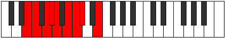
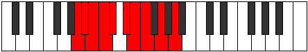
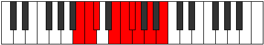
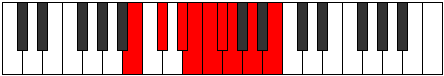
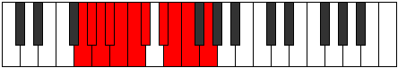
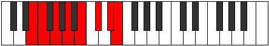
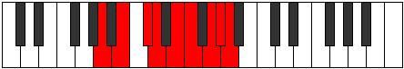
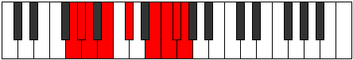
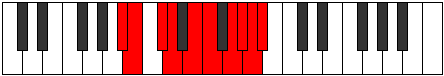

# ANaturalDominantNinthFlatThirteenth

## Links

- [Documentation](README.md)
- [Scales Index](Scales.md)
- [Modes Index](Modes.md)
- [Chords Index](Chords.md)

## Root

A

## Diagram

## Notes

| Position | Notes | Illustration |
|----------|------|--------------|
| RootPosition | A,C#,E,G,B,F |  |
| FirstInversion | C#,E,G,B,F,A |  |
| SecondInversion | E,G,B,F,A,C# |  |
| ThirdInversion | G,B,F,A,C#,E |  |
| FourthInversion | B,F,A,C#,E,G |  |
| FifthInversion | F,A,C#,E,G,B |  |
## Modes

| Number | Mode | Tonic | Notes | Illustration |
|--------|------|-------|-------|--------------|
| [683](https://ianring.com/musictheory/scales/683) | [Stogimic](ModeENaturalStogimic.md) | E | E, F, G, A, B, C#, E |  |
| [687](https://ianring.com/musictheory/scales/687) | [Aeolythian](ModeENaturalAeolythian.md) | E | E, F, Gb, Abb, Bbb, Cb, Db, E |  |
| [699](https://ianring.com/musictheory/scales/699) | [Aerothian](ModeENaturalAerothian.md) | E | E, F, G, Ab, Bbb, Cb, Db, E |  |
| [703](https://ianring.com/musictheory/scales/703) | [Aerocryllic](ModeENaturalAerocryllic.md) | E | E, F, F#, G, G#, A, B, C#, E |  |
| [747](https://ianring.com/musictheory/scales/747) | [Lynian](ModeENaturalLynian.md) | E | E, F, G, A, Bb, Cb, Db, E |  |
| [751](https://ianring.com/musictheory/scales/751) | [Epacryllic](ModeENaturalEpacryllic.md) | E | E, F, F#, G, A, A#, B, C#, E |  |
| [763](https://ianring.com/musictheory/scales/763) | [Doryllic](ModeENaturalDoryllic.md) | E | E, F, G, G#, A, A#, B, C#, E |  |
| [767](https://ianring.com/musictheory/scales/767) | [Raptygic](ModeENaturalRaptygic.md) | E | E, F, F#, G, G#, A, A#, B, C#, E |  |
| [939](https://ianring.com/musictheory/scales/939) | [Dyptian](ModeENaturalDyptian.md) | E | E, F, G, A, B, C, Db, E |  |
| [943](https://ianring.com/musictheory/scales/943) | [Aerygyllic](ModeENaturalAerygyllic.md) | E | E, F, F#, G, A, B, C, C#, E |  |
| [955](https://ianring.com/musictheory/scales/955) | [Ionogyllic](ModeENaturalIonogyllic.md) | E | E, F, G, G#, A, B, C, C#, E |  |
| [959](https://ianring.com/musictheory/scales/959) | [Katylygic](ModeENaturalKatylygic.md) | E | E, F, F#, G, G#, A, B, C, C#, E |  |
| [1003](https://ianring.com/musictheory/scales/1003) | [Ionyryllic](ModeENaturalIonyryllic.md) | E | E, F, G, A, A#, B, C, C#, E |  |
| [1007](https://ianring.com/musictheory/scales/1007) | [Ionycrygic](ModeENaturalIonycrygic.md) | E | E, F, F#, G, A, A#, B, C, C#, E |  |
| [1019](https://ianring.com/musictheory/scales/1019) | [Aeranygic](ModeENaturalAeranygic.md) | E | E, F, G, G#, A, A#, B, C, C#, E |  |
| [1023](https://ianring.com/musictheory/scales/1023) | [Dodyllian](ModeENaturalDodyllian.md) | E | E, F, F#, G, G#, A, A#, B, C, C#, E |  |
| [1367](https://ianring.com/musictheory/scales/1367) | [Pyptian](ModeDSharpPyptian.md) | D# | D#, E, F, G, A, B, C#, D# |  |
| [1367](https://ianring.com/musictheory/scales/1367) | [Pyptian](ModeEFlatPyptian.md) | Eb | Eb, Fb, Gbb, Abb, Bbb, Cb, Db, Eb |  |
| [1369](https://ianring.com/musictheory/scales/1369) | [Boptimic](ModeCSharpBoptimic.md) | C# | C#, D##, E#, F##, G##, A##, C# |  |
| [1369](https://ianring.com/musictheory/scales/1369) | [Boptimic](ModeDFlatBoptimic.md) | Db | Db, E, F, G, A, B, Db |  |
| [1371](https://ianring.com/musictheory/scales/1371) | [Ionadian](ModeCSharpIonadian.md) | C# | C#, D, E, F, G, A, B, C# |  |
| [1371](https://ianring.com/musictheory/scales/1371) | [Ionadian](ModeDFlatIonadian.md) | Db | Db, Ebb, Fb, Gbb, Abb, Bbb, Cb, Db |  |
| [1373](https://ianring.com/musictheory/scales/1373) | [Storian](ModeCSharpStorian.md) | C# | C#, D#, E, F, G, A, B, C# |  |
| [1373](https://ianring.com/musictheory/scales/1373) | [Storian](ModeDFlatStorian.md) | Db | Db, Eb, Fb, Gbb, Abb, Bbb, Cb, Db |  |
| [1375](https://ianring.com/musictheory/scales/1375) | [Bothyllic](ModeCSharpBothyllic.md) | C# | C#, D, D#, E, F, G, A, B, C# |  |
| [1375](https://ianring.com/musictheory/scales/1375) | [Bothyllic](ModeDFlatBothyllic.md) | Db | Db, D, Eb, E, F, G, A, B, Db |  |
| [1375](https://ianring.com/musictheory/scales/1375) | [Bothyllic](ModeDSharpBothyllic.md) | D# | D#, E, F, F#, G, A, B, C#, D# |  |
| [1375](https://ianring.com/musictheory/scales/1375) | [Bothyllic](ModeEFlatBothyllic.md) | Eb | Eb, E, F, Gb, G, A, B, Db, Eb |  |
| [1381](https://ianring.com/musictheory/scales/1381) | [Padimic](ModeBNaturalPadimic.md) | B | B, C#, D##, E#, F##, G##, B |  |
| [1383](https://ianring.com/musictheory/scales/1383) | [Pynian](ModeBNaturalPynian.md) | B | B, C, Db, E, F, G, A, B |  |
| [1389](https://ianring.com/musictheory/scales/1389) | [Lorian](ModeBNaturalLorian.md) | B | B, C#, D, E, F, G, A, B |  |
| [1391](https://ianring.com/musictheory/scales/1391) | [Aeradyllic](ModeBNaturalAeradyllic.md) | B | B, C, C#, D, E, F, G, A, B |  |
| [1397](https://ianring.com/musictheory/scales/1397) | [Gothian](ModeBNaturalGothian.md) | B | B, C#, D#, E, F, G, A, B |  |
| [1399](https://ianring.com/musictheory/scales/1399) | [Syryllic](ModeBNaturalSyryllic.md) | B | B, C, C#, D#, E, F, G, A, B |  |
| [1399](https://ianring.com/musictheory/scales/1399) | [Syryllic](ModeDSharpSyryllic.md) | D# | D#, E, F, G, G#, A, B, C#, D# |  |
| [1399](https://ianring.com/musictheory/scales/1399) | [Syryllic](ModeEFlatSyryllic.md) | Eb | Eb, E, F, G, Ab, A, B, Db, Eb |  |
| [1401](https://ianring.com/musictheory/scales/1401) | [Pagian](ModeCSharpPagian.md) | C# | C#, D##, E#, F#, G, A, B, C# |  |
| [1401](https://ianring.com/musictheory/scales/1401) | [Pagian](ModeDFlatPagian.md) | Db | Db, E, F, Gb, Abb, Bbb, Cb, Db |  |
| [1403](https://ianring.com/musictheory/scales/1403) | [Epinyllic](ModeCSharpEpinyllic.md) | C# | C#, D, E, F, F#, G, A, B, C# |  |
| [1403](https://ianring.com/musictheory/scales/1403) | [Epinyllic](ModeDFlatEpinyllic.md) | Db | Db, D, E, F, Gb, G, A, B, Db |  |
| [1405](https://ianring.com/musictheory/scales/1405) | [Goryllic](ModeBNaturalGoryllic.md) | B | B, C#, D, D#, E, F, G, A, B |  |
| [1405](https://ianring.com/musictheory/scales/1405) | [Goryllic](ModeCSharpGoryllic.md) | C# | C#, D#, E, F, F#, G, A, B, C# |  |
| [1405](https://ianring.com/musictheory/scales/1405) | [Goryllic](ModeDFlatGoryllic.md) | Db | Db, Eb, E, F, Gb, G, A, B, Db |  |
| [1407](https://ianring.com/musictheory/scales/1407) | [Tharygic](ModeBNaturalTharygic.md) | B | B, C, C#, D, D#, E, F, G, A, B |  |
| [1407](https://ianring.com/musictheory/scales/1407) | [Tharygic](ModeCSharpTharygic.md) | C# | C#, D, D#, E, F, F#, G, A, B, C# |  |
| [1407](https://ianring.com/musictheory/scales/1407) | [Tharygic](ModeDFlatTharygic.md) | Db | Db, D, Eb, E, F, Gb, G, A, B, Db |  |
| [1407](https://ianring.com/musictheory/scales/1407) | [Tharygic](ModeDSharpTharygic.md) | D# | D#, E, F, F#, G, G#, A, B, C#, D# |  |
| [1407](https://ianring.com/musictheory/scales/1407) | [Tharygic](ModeEFlatTharygic.md) | Eb | Eb, E, F, Gb, G, Ab, A, B, Db, Eb |  |
| [1429](https://ianring.com/musictheory/scales/1429) | [Bythimic](ModeANaturalBythimic.md) | A | A, B, C#, D##, E#, F##, A |  |
| [1431](https://ianring.com/musictheory/scales/1431) | [Phragian](ModeANaturalPhragian.md) | A | A, Bb, Cb, Db, E, F, G, A |  |
| [1437](https://ianring.com/musictheory/scales/1437) | [Aeolycrian](ModeANaturalAeolycrian.md) | A | A, B, C, Db, E, F, G, A |  |
| [1439](https://ianring.com/musictheory/scales/1439) | [Rolyllic](ModeANaturalRolyllic.md) | A | A, A#, B, C, C#, E, F, G, A |  |
| [1461](https://ianring.com/musictheory/scales/1461) | [Stydian](ModeANaturalStydian.md) | A | A, B, C#, D, E, F, G, A |  |
| [1463](https://ianring.com/musictheory/scales/1463) | [Zaptyllic](ModeANaturalZaptyllic.md) | A | A, A#, B, C#, D, E, F, G, A |  |
| [1469](https://ianring.com/musictheory/scales/1469) | [Epiryllic](ModeANaturalEpiryllic.md) | A | A, B, C, C#, D, E, F, G, A |  |
| [1471](https://ianring.com/musictheory/scales/1471) | [Radygic](ModeANaturalRadygic.md) | A | A, A#, B, C, C#, D, E, F, G, A |  |
| [1493](https://ianring.com/musictheory/scales/1493) | [Phryrian](ModeANaturalPhryrian.md) | A | A, B, C#, D#, E, F, G, A |  |
| [1495](https://ianring.com/musictheory/scales/1495) | [Kaptyllic](ModeDSharpKaptyllic.md) | D# | D#, E, F, G, A, A#, B, C#, D# |  |
| [1495](https://ianring.com/musictheory/scales/1495) | [Kaptyllic](ModeEFlatKaptyllic.md) | Eb | Eb, E, F, G, A, Bb, B, Db, Eb |  |
| [1495](https://ianring.com/musictheory/scales/1495) | [Kaptyllic](ModeANaturalKaptyllic.md) | A | A, A#, B, C#, D#, E, F, G, A |  |
| [1497](https://ianring.com/musictheory/scales/1497) | [Ionanian](ModeCSharpIonanian.md) | C# | C#, D##, E#, F##, G#, A, B, C# |  |
| [1497](https://ianring.com/musictheory/scales/1497) | [Ionanian](ModeDFlatIonanian.md) | Db | Db, E, F, G, Ab, Bbb, Cb, Db |  |
| [1499](https://ianring.com/musictheory/scales/1499) | [Stonyllic](ModeCSharpStonyllic.md) | C# | C#, D, E, F, G, G#, A, B, C# |  |
| [1499](https://ianring.com/musictheory/scales/1499) | [Stonyllic](ModeDFlatStonyllic.md) | Db | Db, D, E, F, G, Ab, A, B, Db |  |
| [1501](https://ianring.com/musictheory/scales/1501) | [Stygyllic](ModeANaturalStygyllic.md) | A | A, B, C, C#, D#, E, F, G, A |  |
| [1501](https://ianring.com/musictheory/scales/1501) | [Stygyllic](ModeCSharpStygyllic.md) | C# | C#, D#, E, F, G, G#, A, B, C# |  |
| [1501](https://ianring.com/musictheory/scales/1501) | [Stygyllic](ModeDFlatStygyllic.md) | Db | Db, Eb, E, F, G, Ab, A, B, Db |  |
| [1503](https://ianring.com/musictheory/scales/1503) | [Padygic](ModeCSharpPadygic.md) | C# | C#, D, D#, E, F, G, G#, A, B, C# |  |
| [1503](https://ianring.com/musictheory/scales/1503) | [Padygic](ModeDFlatPadygic.md) | Db | Db, D, Eb, E, F, G, Ab, A, B, Db |  |
| [1503](https://ianring.com/musictheory/scales/1503) | [Padygic](ModeANaturalPadygic.md) | A | A, A#, B, C, C#, D#, E, F, G, A |  |
| [1503](https://ianring.com/musictheory/scales/1503) | [Padygic](ModeDSharpPadygic.md) | D# | D#, E, F, F#, G, A, A#, B, C#, D# |  |
| [1503](https://ianring.com/musictheory/scales/1503) | [Padygic](ModeEFlatPadygic.md) | Eb | Eb, E, F, Gb, G, A, Bb, B, Db, Eb |  |
| [1509](https://ianring.com/musictheory/scales/1509) | [Ragian](ModeBNaturalRagian.md) | B | B, C#, D##, E#, F#, G, A, B |  |
| [1511](https://ianring.com/musictheory/scales/1511) | [Styptyllic](ModeBNaturalStyptyllic.md) | B | B, C, C#, E, F, F#, G, A, B |  |
| [1517](https://ianring.com/musictheory/scales/1517) | [Sagyllic](ModeBNaturalSagyllic.md) | B | B, C#, D, E, F, F#, G, A, B |  |
| [1519](https://ianring.com/musictheory/scales/1519) | [Solygic](ModeBNaturalSolygic.md) | B | B, C, C#, D, E, F, F#, G, A, B |  |
| [1525](https://ianring.com/musictheory/scales/1525) | [Sodyllic](ModeANaturalSodyllic.md) | A | A, B, C#, D, D#, E, F, G, A |  |
| [1525](https://ianring.com/musictheory/scales/1525) | [Sodyllic](ModeBNaturalSodyllic.md) | B | B, C#, D#, E, F, F#, G, A, B |  |
| [1527](https://ianring.com/musictheory/scales/1527) | [Aeolyrygic](ModeBNaturalAeolyrygic.md) | B | B, C, C#, D#, E, F, F#, G, A, B |  |
| [1527](https://ianring.com/musictheory/scales/1527) | [Aeolyrygic](ModeANaturalAeolyrygic.md) | A | A, A#, B, C#, D, D#, E, F, G, A |  |
| [1527](https://ianring.com/musictheory/scales/1527) | [Aeolyrygic](ModeDSharpAeolyrygic.md) | D# | D#, E, F, G, G#, A, A#, B, C#, D# |  |
| [1527](https://ianring.com/musictheory/scales/1527) | [Aeolyrygic](ModeEFlatAeolyrygic.md) | Eb | Eb, E, F, G, Ab, A, Bb, B, Db, Eb |  |
| [1529](https://ianring.com/musictheory/scales/1529) | [Kataryllic](ModeCSharpKataryllic.md) | C# | C#, E, F, F#, G, G#, A, B, C# |  |
| [1529](https://ianring.com/musictheory/scales/1529) | [Kataryllic](ModeDFlatKataryllic.md) | Db | Db, E, F, Gb, G, Ab, A, B, Db |  |
| [1531](https://ianring.com/musictheory/scales/1531) | [Styptygic](ModeCSharpStyptygic.md) | C# | C#, D, E, F, F#, G, G#, A, B, C# |  |
| [1531](https://ianring.com/musictheory/scales/1531) | [Styptygic](ModeDFlatStyptygic.md) | Db | Db, D, E, F, Gb, G, Ab, A, B, Db |  |
| [1533](https://ianring.com/musictheory/scales/1533) | [Katycrygic](ModeANaturalKatycrygic.md) | A | A, B, C, C#, D, D#, E, F, G, A |  |
| [1533](https://ianring.com/musictheory/scales/1533) | [Katycrygic](ModeBNaturalKatycrygic.md) | B | B, C#, D, D#, E, F, F#, G, A, B |  |
| [1533](https://ianring.com/musictheory/scales/1533) | [Katycrygic](ModeCSharpKatycrygic.md) | C# | C#, D#, E, F, F#, G, G#, A, B, C# |  |
| [1533](https://ianring.com/musictheory/scales/1533) | [Katycrygic](ModeDFlatKatycrygic.md) | Db | Db, Eb, E, F, Gb, G, Ab, A, B, Db |  |
| [1535](https://ianring.com/musictheory/scales/1535) | [Mixodyllian](ModeBNaturalMixodyllian.md) | B | B, C, C#, D, D#, E, F, F#, G, A, B |  |
| [1535](https://ianring.com/musictheory/scales/1535) | [Mixodyllian](ModeCSharpMixodyllian.md) | C# | C#, D, D#, E, F, F#, G, G#, A, B, C# |  |
| [1535](https://ianring.com/musictheory/scales/1535) | [Mixodyllian](ModeDFlatMixodyllian.md) | Db | Db, D, Eb, E, F, Gb, G, Ab, A, B, Db |  |
| [1535](https://ianring.com/musictheory/scales/1535) | [Mixodyllian](ModeANaturalMixodyllian.md) | A | A, A#, B, C, C#, D, D#, E, F, G, A |  |
| [1535](https://ianring.com/musictheory/scales/1535) | [Mixodyllian](ModeDSharpMixodyllian.md) | D# | D#, E, F, F#, G, G#, A, A#, B, C#, D# |  |
| [1535](https://ianring.com/musictheory/scales/1535) | [Mixodyllian](ModeEFlatMixodyllian.md) | Eb | Eb, E, F, Gb, G, Ab, A, Bb, B, Db, Eb |  |
| [1621](https://ianring.com/musictheory/scales/1621) | [Aeolathimic](ModeGNaturalAeolathimic.md) | G | G, A, B, C#, D##, E#, G |  |
| [1623](https://ianring.com/musictheory/scales/1623) | [Lothian](ModeGNaturalLothian.md) | G | G, Ab, Bbb, Cb, Db, E, F, G |  |
| [1629](https://ianring.com/musictheory/scales/1629) | [Synian](ModeGNaturalSynian.md) | G | G, A, Bb, Cb, Db, E, F, G |  |
| [1631](https://ianring.com/musictheory/scales/1631) | [Rynyllic](ModeGNaturalRynyllic.md) | G | G, G#, A, A#, B, C#, E, F, G |  |
| [1653](https://ianring.com/musictheory/scales/1653) | [Gylian](ModeGNaturalGylian.md) | G | G, A, B, C, Db, E, F, G |  |
| [1655](https://ianring.com/musictheory/scales/1655) | [Katygyllic](ModeGNaturalKatygyllic.md) | G | G, G#, A, B, C, C#, E, F, G |  |
| [1661](https://ianring.com/musictheory/scales/1661) | [Gonyllic](ModeGNaturalGonyllic.md) | G | G, A, A#, B, C, C#, E, F, G |  |
| [1663](https://ianring.com/musictheory/scales/1663) | [Lydygic](ModeGNaturalLydygic.md) | G | G, G#, A, A#, B, C, C#, E, F, G |  |
| [1707](https://ianring.com/musictheory/scales/1707) | [Mixolythian](ModeENaturalMixolythian.md) | E | E, F, G, A, B, C#, D, E |  |
| [1711](https://ianring.com/musictheory/scales/1711) | [Ragyllic](ModeENaturalRagyllic.md) | E | E, F, F#, G, A, B, C#, D, E |  |
| [1723](https://ianring.com/musictheory/scales/1723) | [Poryllic](ModeENaturalPoryllic.md) | E | E, F, G, G#, A, B, C#, D, E |  |
| [1727](https://ianring.com/musictheory/scales/1727) | [Sydygic](ModeENaturalSydygic.md) | E | E, F, F#, G, G#, A, B, C#, D, E |  |
| [1749](https://ianring.com/musictheory/scales/1749) | [Lythian](ModeGNaturalLythian.md) | G | G, A, B, C#, D, E, F, G |  |
| [1751](https://ianring.com/musictheory/scales/1751) | [Aeolyryllic](ModeGNaturalAeolyryllic.md) | G | G, G#, A, B, C#, D, E, F, G |  |
| [1757](https://ianring.com/musictheory/scales/1757) | [Ionyphyllic](ModeGNaturalIonyphyllic.md) | G | G, A, A#, B, C#, D, E, F, G |  |
| [1759](https://ianring.com/musictheory/scales/1759) | [Pylygic](ModeGNaturalPylygic.md) | G | G, G#, A, A#, B, C#, D, E, F, G |  |
| [1771](https://ianring.com/musictheory/scales/1771) | [Stylyllic](ModeENaturalStylyllic.md) | E | E, F, G, A, A#, B, C#, D, E |  |
| [1775](https://ianring.com/musictheory/scales/1775) | [Lyrygic](ModeENaturalLyrygic.md) | E | E, F, F#, G, A, A#, B, C#, D, E |  |
| [1781](https://ianring.com/musictheory/scales/1781) | [Gocryllic](ModeGNaturalGocryllic.md) | G | G, A, B, C, C#, D, E, F, G |  |
| [1783](https://ianring.com/musictheory/scales/1783) | [Danygic](ModeGNaturalDanygic.md) | G | G, G#, A, B, C, C#, D, E, F, G |  |
| [1787](https://ianring.com/musictheory/scales/1787) | [Mycrygic](ModeENaturalMycrygic.md) | E | E, F, G, G#, A, A#, B, C#, D, E |  |
| [1789](https://ianring.com/musictheory/scales/1789) | [Katagygic](ModeGNaturalKatagygic.md) | G | G, A, A#, B, C, C#, D, E, F, G |  |
| [1791](https://ianring.com/musictheory/scales/1791) | [Aerygyllian](ModeGNaturalAerygyllian.md) | G | G, G#, A, A#, B, C, C#, D, E, F, G |  |
| [1791](https://ianring.com/musictheory/scales/1791) | [Aerygyllian](ModeENaturalAerygyllian.md) | E | E, F, F#, G, G#, A, A#, B, C#, D, E |  |
| [1877](https://ianring.com/musictheory/scales/1877) | [Aeroptian](ModeGNaturalAeroptian.md) | G | G, A, B, C#, D#, E, F, G |  |
| [1879](https://ianring.com/musictheory/scales/1879) | [Mixoryllic](ModeDSharpMixoryllic.md) | D# | D#, E, F, G, A, B, C, C#, D# |  |
| [1879](https://ianring.com/musictheory/scales/1879) | [Mixoryllic](ModeEFlatMixoryllic.md) | Eb | Eb, E, F, G, A, B, C, Db, Eb |  |
| [1879](https://ianring.com/musictheory/scales/1879) | [Mixoryllic](ModeGNaturalMixoryllic.md) | G | G, G#, A, B, C#, D#, E, F, G |  |
| [1881](https://ianring.com/musictheory/scales/1881) | [Korian](ModeCSharpKorian.md) | C# | C#, D##, E#, F##, G##, A#, B, C# |  |
| [1881](https://ianring.com/musictheory/scales/1881) | [Korian](ModeDFlatKorian.md) | Db | Db, E, F, G, A, Bb, Cb, Db |  |
| [1883](https://ianring.com/musictheory/scales/1883) | [Mixopyryllic](ModeCSharpMixopyryllic.md) | C# | C#, D, E, F, G, A, A#, B, C# |  |
| [1883](https://ianring.com/musictheory/scales/1883) | [Mixopyryllic](ModeDFlatMixopyryllic.md) | Db | Db, D, E, F, G, A, Bb, B, Db |  |
| [1885](https://ianring.com/musictheory/scales/1885) | [Epidyllic](ModeCSharpEpidyllic.md) | C# | C#, D#, E, F, G, A, A#, B, C# |  |
| [1885](https://ianring.com/musictheory/scales/1885) | [Epidyllic](ModeDFlatEpidyllic.md) | Db | Db, Eb, E, F, G, A, Bb, B, Db |  |
| [1885](https://ianring.com/musictheory/scales/1885) | [Epidyllic](ModeGNaturalEpidyllic.md) | G | G, A, A#, B, C#, D#, E, F, G |  |
| [1887](https://ianring.com/musictheory/scales/1887) | [Aerocrygic](ModeDSharpAerocrygic.md) | D# | D#, E, F, F#, G, A, B, C, C#, D# |  |
| [1887](https://ianring.com/musictheory/scales/1887) | [Aerocrygic](ModeEFlatAerocrygic.md) | Eb | Eb, E, F, Gb, G, A, B, C, Db, Eb |  |
| [1887](https://ianring.com/musictheory/scales/1887) | [Aerocrygic](ModeCSharpAerocrygic.md) | C# | C#, D, D#, E, F, G, A, A#, B, C# |  |
| [1887](https://ianring.com/musictheory/scales/1887) | [Aerocrygic](ModeDFlatAerocrygic.md) | Db | Db, D, Eb, E, F, G, A, Bb, B, Db |  |
| [1887](https://ianring.com/musictheory/scales/1887) | [Aerocrygic](ModeGNaturalAerocrygic.md) | G | G, G#, A, A#, B, C#, D#, E, F, G |  |
| [1893](https://ianring.com/musictheory/scales/1893) | [Ionylian](ModeBNaturalIonylian.md) | B | B, C#, D##, E#, F##, G#, A, B |  |
| [1895](https://ianring.com/musictheory/scales/1895) | [Salyllic](ModeBNaturalSalyllic.md) | B | B, C, C#, E, F, G, G#, A, B |  |
| [1901](https://ianring.com/musictheory/scales/1901) | [Ionidyllic](ModeBNaturalIonidyllic.md) | B | B, C#, D, E, F, G, G#, A, B |  |
| [1903](https://ianring.com/musictheory/scales/1903) | [Rocrygic](ModeBNaturalRocrygic.md) | B | B, C, C#, D, E, F, G, G#, A, B |  |
| [1909](https://ianring.com/musictheory/scales/1909) | [Epicryllic](ModeGNaturalEpicryllic.md) | G | G, A, B, C, C#, D#, E, F, G |  |
| [1909](https://ianring.com/musictheory/scales/1909) | [Epicryllic](ModeBNaturalEpicryllic.md) | B | B, C#, D#, E, F, G, G#, A, B |  |
| [1911](https://ianring.com/musictheory/scales/1911) | [Stynygic](ModeDSharpStynygic.md) | D# | D#, E, F, G, G#, A, B, C, C#, D# |  |
| [1911](https://ianring.com/musictheory/scales/1911) | [Stynygic](ModeEFlatStynygic.md) | Eb | Eb, E, F, G, Ab, A, B, C, Db, Eb |  |
| [1911](https://ianring.com/musictheory/scales/1911) | [Stynygic](ModeGNaturalStynygic.md) | G | G, G#, A, B, C, C#, D#, E, F, G |  |
| [1911](https://ianring.com/musictheory/scales/1911) | [Stynygic](ModeBNaturalStynygic.md) | B | B, C, C#, D#, E, F, G, G#, A, B |  |
| [1913](https://ianring.com/musictheory/scales/1913) | [Zagyllic](ModeCSharpZagyllic.md) | C# | C#, E, F, F#, G, A, A#, B, C# |  |
| [1913](https://ianring.com/musictheory/scales/1913) | [Zagyllic](ModeDFlatZagyllic.md) | Db | Db, E, F, Gb, G, A, Bb, B, Db |  |
| [1915](https://ianring.com/musictheory/scales/1915) | [Thydygic](ModeCSharpThydygic.md) | C# | C#, D, E, F, F#, G, A, A#, B, C# |  |
| [1915](https://ianring.com/musictheory/scales/1915) | [Thydygic](ModeDFlatThydygic.md) | Db | Db, D, E, F, Gb, G, A, Bb, B, Db |  |
| [1917](https://ianring.com/musictheory/scales/1917) | [Sacrygic](ModeBNaturalSacrygic.md) | B | B, C#, D, D#, E, F, G, G#, A, B |  |
| [1917](https://ianring.com/musictheory/scales/1917) | [Sacrygic](ModeGNaturalSacrygic.md) | G | G, A, A#, B, C, C#, D#, E, F, G |  |
| [1917](https://ianring.com/musictheory/scales/1917) | [Sacrygic](ModeCSharpSacrygic.md) | C# | C#, D#, E, F, F#, G, A, A#, B, C# |  |
| [1917](https://ianring.com/musictheory/scales/1917) | [Sacrygic](ModeDFlatSacrygic.md) | Db | Db, Eb, E, F, Gb, G, A, Bb, B, Db |  |
| [1919](https://ianring.com/musictheory/scales/1919) | [Rocryllian](ModeBNaturalRocryllian.md) | B | B, C, C#, D, D#, E, F, G, G#, A, B |  |
| [1919](https://ianring.com/musictheory/scales/1919) | [Rocryllian](ModeDSharpRocryllian.md) | D# | D#, E, F, F#, G, G#, A, B, C, C#, D# |  |
| [1919](https://ianring.com/musictheory/scales/1919) | [Rocryllian](ModeEFlatRocryllian.md) | Eb | Eb, E, F, Gb, G, Ab, A, B, C, Db, Eb |  |
| [1919](https://ianring.com/musictheory/scales/1919) | [Rocryllian](ModeCSharpRocryllian.md) | C# | C#, D, D#, E, F, F#, G, A, A#, B, C# |  |
| [1919](https://ianring.com/musictheory/scales/1919) | [Rocryllian](ModeDFlatRocryllian.md) | Db | Db, D, Eb, E, F, Gb, G, A, Bb, B, Db |  |
| [1919](https://ianring.com/musictheory/scales/1919) | [Rocryllian](ModeGNaturalRocryllian.md) | G | G, G#, A, A#, B, C, C#, D#, E, F, G |  |
| [1941](https://ianring.com/musictheory/scales/1941) | [Aeranian](ModeANaturalAeranian.md) | A | A, B, C#, D##, E#, F#, G, A |  |
| [1943](https://ianring.com/musictheory/scales/1943) | [Malyllic](ModeANaturalMalyllic.md) | A | A, A#, B, C#, E, F, F#, G, A |  |
| [1949](https://ianring.com/musictheory/scales/1949) | [Mathyllic](ModeANaturalMathyllic.md) | A | A, B, C, C#, E, F, F#, G, A |  |
| [1951](https://ianring.com/musictheory/scales/1951) | [Gonygic](ModeANaturalGonygic.md) | A | A, A#, B, C, C#, E, F, F#, G, A |  |
| [1963](https://ianring.com/musictheory/scales/1963) | [Epocryllic](ModeENaturalEpocryllic.md) | E | E, F, G, A, B, C, C#, D, E |  |
| [1967](https://ianring.com/musictheory/scales/1967) | [Godygic](ModeENaturalGodygic.md) | E | E, F, F#, G, A, B, C, C#, D, E |  |
| [1973](https://ianring.com/musictheory/scales/1973) | [Zyryllic](ModeANaturalZyryllic.md) | A | A, B, C#, D, E, F, F#, G, A |  |
| [1975](https://ianring.com/musictheory/scales/1975) | [Ionocrygic](ModeANaturalIonocrygic.md) | A | A, A#, B, C#, D, E, F, F#, G, A |  |
| [1979](https://ianring.com/musictheory/scales/1979) | [Aeradygic](ModeENaturalAeradygic.md) | E | E, F, G, G#, A, B, C, C#, D, E |  |
| [1981](https://ianring.com/musictheory/scales/1981) | [Gadygic](ModeANaturalGadygic.md) | A | A, B, C, C#, D, E, F, F#, G, A |  |
| [1983](https://ianring.com/musictheory/scales/1983) | [Soryllian](ModeENaturalSoryllian.md) | E | E, F, F#, G, G#, A, B, C, C#, D, E |  |
| [1983](https://ianring.com/musictheory/scales/1983) | [Soryllian](ModeANaturalSoryllian.md) | A | A, A#, B, C, C#, D, E, F, F#, G, A |  |
| [2005](https://ianring.com/musictheory/scales/2005) | [Gygyllic](ModeGNaturalGygyllic.md) | G | G, A, B, C#, D, D#, E, F, G |  |
| [2005](https://ianring.com/musictheory/scales/2005) | [Gygyllic](ModeANaturalGygyllic.md) | A | A, B, C#, D#, E, F, F#, G, A |  |
| [2007](https://ianring.com/musictheory/scales/2007) | [Stonygic](ModeGNaturalStonygic.md) | G | G, G#, A, B, C#, D, D#, E, F, G |  |
| [2007](https://ianring.com/musictheory/scales/2007) | [Stonygic](ModeDSharpStonygic.md) | D# | D#, E, F, G, A, A#, B, C, C#, D# |  |
| [2007](https://ianring.com/musictheory/scales/2007) | [Stonygic](ModeEFlatStonygic.md) | Eb | Eb, E, F, G, A, Bb, B, C, Db, Eb |  |
| [2007](https://ianring.com/musictheory/scales/2007) | [Stonygic](ModeANaturalStonygic.md) | A | A, A#, B, C#, D#, E, F, F#, G, A |  |
| [2009](https://ianring.com/musictheory/scales/2009) | [Stacryllic](ModeCSharpStacryllic.md) | C# | C#, E, F, G, G#, A, A#, B, C# |  |
| [2009](https://ianring.com/musictheory/scales/2009) | [Stacryllic](ModeDFlatStacryllic.md) | Db | Db, E, F, G, Ab, A, Bb, B, Db |  |
| [2011](https://ianring.com/musictheory/scales/2011) | [Raphygic](ModeCSharpRaphygic.md) | C# | C#, D, E, F, G, G#, A, A#, B, C# |  |
| [2011](https://ianring.com/musictheory/scales/2011) | [Raphygic](ModeDFlatRaphygic.md) | Db | Db, D, E, F, G, Ab, A, Bb, B, Db |  |
| [2013](https://ianring.com/musictheory/scales/2013) | [Mocrygic](ModeANaturalMocrygic.md) | A | A, B, C, C#, D#, E, F, F#, G, A |  |
| [2013](https://ianring.com/musictheory/scales/2013) | [Mocrygic](ModeGNaturalMocrygic.md) | G | G, A, A#, B, C#, D, D#, E, F, G |  |
| [2013](https://ianring.com/musictheory/scales/2013) | [Mocrygic](ModeCSharpMocrygic.md) | C# | C#, D#, E, F, G, G#, A, A#, B, C# |  |
| [2013](https://ianring.com/musictheory/scales/2013) | [Mocrygic](ModeDFlatMocrygic.md) | Db | Db, Eb, E, F, G, Ab, A, Bb, B, Db |  |
| [2015](https://ianring.com/musictheory/scales/2015) | [Epiryllian](ModeDSharpEpiryllian.md) | D# | D#, E, F, F#, G, A, A#, B, C, C#, D# |  |
| [2015](https://ianring.com/musictheory/scales/2015) | [Epiryllian](ModeEFlatEpiryllian.md) | Eb | Eb, E, F, Gb, G, A, Bb, B, C, Db, Eb |  |
| [2015](https://ianring.com/musictheory/scales/2015) | [Epiryllian](ModeANaturalEpiryllian.md) | A | A, A#, B, C, C#, D#, E, F, F#, G, A |  |
| [2015](https://ianring.com/musictheory/scales/2015) | [Epiryllian](ModeCSharpEpiryllian.md) | C# | C#, D, D#, E, F, G, G#, A, A#, B, C# |  |
| [2015](https://ianring.com/musictheory/scales/2015) | [Epiryllian](ModeDFlatEpiryllian.md) | Db | Db, D, Eb, E, F, G, Ab, A, Bb, B, Db |  |
| [2015](https://ianring.com/musictheory/scales/2015) | [Epiryllian](ModeGNaturalEpiryllian.md) | G | G, G#, A, A#, B, C#, D, D#, E, F, G |  |
| [2021](https://ianring.com/musictheory/scales/2021) | [Katycryllic](ModeBNaturalKatycryllic.md) | B | B, C#, E, F, F#, G, G#, A, B |  |
| [2023](https://ianring.com/musictheory/scales/2023) | [Zodygic](ModeBNaturalZodygic.md) | B | B, C, C#, E, F, F#, G, G#, A, B |  |
| [2027](https://ianring.com/musictheory/scales/2027) | [Boptygic](ModeENaturalBoptygic.md) | E | E, F, G, A, A#, B, C, C#, D, E |  |
| [2029](https://ianring.com/musictheory/scales/2029) | [Mathygic](ModeBNaturalMathygic.md) | B | B, C#, D, E, F, F#, G, G#, A, B |  |
| [2031](https://ianring.com/musictheory/scales/2031) | [Gadyllian](ModeBNaturalGadyllian.md) | B | B, C, C#, D, E, F, F#, G, G#, A, B |  |
| [2031](https://ianring.com/musictheory/scales/2031) | [Gadyllian](ModeENaturalGadyllian.md) | E | E, F, F#, G, A, A#, B, C, C#, D, E |  |
| [2037](https://ianring.com/musictheory/scales/2037) | [Sythygic](ModeGNaturalSythygic.md) | G | G, A, B, C, C#, D, D#, E, F, G |  |
| [2037](https://ianring.com/musictheory/scales/2037) | [Sythygic](ModeANaturalSythygic.md) | A | A, B, C#, D, D#, E, F, F#, G, A |  |
| [2037](https://ianring.com/musictheory/scales/2037) | [Sythygic](ModeBNaturalSythygic.md) | B | B, C#, D#, E, F, F#, G, G#, A, B |  |
| [2039](https://ianring.com/musictheory/scales/2039) | [Danyllian](ModeGNaturalDanyllian.md) | G | G, G#, A, B, C, C#, D, D#, E, F, G |  |
| [2039](https://ianring.com/musictheory/scales/2039) | [Danyllian](ModeBNaturalDanyllian.md) | B | B, C, C#, D#, E, F, F#, G, G#, A, B |  |
| [2039](https://ianring.com/musictheory/scales/2039) | [Danyllian](ModeANaturalDanyllian.md) | A | A, A#, B, C#, D, D#, E, F, F#, G, A |  |
| [2039](https://ianring.com/musictheory/scales/2039) | [Danyllian](ModeDSharpDanyllian.md) | D# | D#, E, F, G, G#, A, A#, B, C, C#, D# |  |
| [2039](https://ianring.com/musictheory/scales/2039) | [Danyllian](ModeEFlatDanyllian.md) | Eb | Eb, E, F, G, Ab, A, Bb, B, C, Db, Eb |  |
| [2041](https://ianring.com/musictheory/scales/2041) | [Aeolacrygic](ModeCSharpAeolacrygic.md) | C# | C#, E, F, F#, G, G#, A, A#, B, C# |  |
| [2041](https://ianring.com/musictheory/scales/2041) | [Aeolacrygic](ModeDFlatAeolacrygic.md) | Db | Db, E, F, Gb, G, Ab, A, Bb, B, Db |  |
| [2043](https://ianring.com/musictheory/scales/2043) | [Lythyllian](ModeENaturalLythyllian.md) | E | E, F, G, G#, A, A#, B, C, C#, D, E |  |
| [2043](https://ianring.com/musictheory/scales/2043) | [Lythyllian](ModeCSharpLythyllian.md) | C# | C#, D, E, F, F#, G, G#, A, A#, B, C# |  |
| [2043](https://ianring.com/musictheory/scales/2043) | [Lythyllian](ModeDFlatLythyllian.md) | Db | Db, D, E, F, Gb, G, Ab, A, Bb, B, Db |  |
| [2045](https://ianring.com/musictheory/scales/2045) | [Katogyllian](ModeANaturalKatogyllian.md) | A | A, B, C, C#, D, D#, E, F, F#, G, A |  |
| [2045](https://ianring.com/musictheory/scales/2045) | [Katogyllian](ModeBNaturalKatogyllian.md) | B | B, C#, D, D#, E, F, F#, G, G#, A, B |  |
| [2045](https://ianring.com/musictheory/scales/2045) | [Katogyllian](ModeGNaturalKatogyllian.md) | G | G, A, A#, B, C, C#, D, D#, E, F, G |  |
| [2045](https://ianring.com/musictheory/scales/2045) | [Katogyllian](ModeCSharpKatogyllian.md) | C# | C#, D#, E, F, F#, G, G#, A, A#, B, C# |  |
| [2045](https://ianring.com/musictheory/scales/2045) | [Katogyllian](ModeDFlatKatogyllian.md) | Db | Db, Eb, E, F, Gb, G, Ab, A, Bb, B, Db |  |
| [2047](https://ianring.com/musictheory/scales/2047) | [Monatic](ModeBNaturalMonatic.md) | B | B, C, C#, D, D#, E, F, F#, G, G#, A, B |  |
| [2047](https://ianring.com/musictheory/scales/2047) | [Monatic](ModeANaturalMonatic.md) | A | A, A#, B, C, C#, D, D#, E, F, F#, G, A |  |
| [2047](https://ianring.com/musictheory/scales/2047) | [Monatic](ModeGNaturalMonatic.md) | G | G, G#, A, A#, B, C, C#, D, D#, E, F, G |  |
| [2047](https://ianring.com/musictheory/scales/2047) | [Monatic](ModeENaturalMonatic.md) | E | E, F, F#, G, G#, A, A#, B, C, C#, D, E |  |
| [2047](https://ianring.com/musictheory/scales/2047) | [Monatic](ModeDSharpMonatic.md) | D# | D#, E, F, F#, G, G#, A, A#, B, C, C#, D# |  |
| [2047](https://ianring.com/musictheory/scales/2047) | [Monatic](ModeEFlatMonatic.md) | Eb | Eb, E, F, Gb, G, Ab, A, Bb, B, C, Db, Eb |  |
| [2047](https://ianring.com/musictheory/scales/2047) | [Monatic](ModeCSharpMonatic.md) | C# | C#, D, D#, E, F, F#, G, G#, A, A#, B, C# |  |
| [2047](https://ianring.com/musictheory/scales/2047) | [Monatic](ModeDFlatMonatic.md) | Db | Db, D, Eb, E, F, Gb, G, Ab, A, Bb, B, Db |  |
| [2389](https://ianring.com/musictheory/scales/2389) | [Thynimic](ModeFNaturalThynimic.md) | F | F, G, A, B, C#, D##, F |  |
| [2391](https://ianring.com/musictheory/scales/2391) | [Molian](ModeFNaturalMolian.md) | F | F, Gb, Abb, Bbb, Cb, Db, E, F |  |
| [2397](https://ianring.com/musictheory/scales/2397) | [Stagian](ModeFNaturalStagian.md) | F | F, G, Ab, Bbb, Cb, Db, E, F |  |
| [2399](https://ianring.com/musictheory/scales/2399) | [Zanyllic](ModeFNaturalZanyllic.md) | F | F, F#, G, G#, A, B, C#, E, F |  |
| [2421](https://ianring.com/musictheory/scales/2421) | [Malian](ModeFNaturalMalian.md) | F | F, G, A, Bb, Cb, Db, E, F |  |
| [2423](https://ianring.com/musictheory/scales/2423) | [Thorcryllic](ModeFNaturalThorcryllic.md) | F | F, F#, G, A, A#, B, C#, E, F |  |
| [2429](https://ianring.com/musictheory/scales/2429) | [Kadyllic](ModeFNaturalKadyllic.md) | F | F, G, G#, A, A#, B, C#, E, F |  |
| [2431](https://ianring.com/musictheory/scales/2431) | [Gythygic](ModeFNaturalGythygic.md) | F | F, F#, G, G#, A, A#, B, C#, E, F |  |
| [2517](https://ianring.com/musictheory/scales/2517) | [Ryphian](ModeFNaturalRyphian.md) | F | F, G, A, B, C, Db, E, F |  |
| [2519](https://ianring.com/musictheory/scales/2519) | [Dathyllic](ModeFNaturalDathyllic.md) | F | F, F#, G, A, B, C, C#, E, F |  |
| [2525](https://ianring.com/musictheory/scales/2525) | [Aeolaryllic](ModeFNaturalAeolaryllic.md) | F | F, G, G#, A, B, C, C#, E, F |  |
| [2527](https://ianring.com/musictheory/scales/2527) | [Phradygic](ModeFNaturalPhradygic.md) | F | F, F#, G, G#, A, B, C, C#, E, F |  |
| [2549](https://ianring.com/musictheory/scales/2549) | [Rydyllic](ModeFNaturalRydyllic.md) | F | F, G, A, A#, B, C, C#, E, F |  |
| [2551](https://ianring.com/musictheory/scales/2551) | [Zoptygic](ModeFNaturalZoptygic.md) | F | F, F#, G, A, A#, B, C, C#, E, F |  |
| [2557](https://ianring.com/musictheory/scales/2557) | [Dothygic](ModeFNaturalDothygic.md) | F | F, G, G#, A, A#, B, C, C#, E, F |  |
| [2559](https://ianring.com/musictheory/scales/2559) | [Zogyllian](ModeFNaturalZogyllian.md) | F | F, F#, G, G#, A, A#, B, C, C#, E, F |  |
| [2731](https://ianring.com/musictheory/scales/2731) | [Thydian](ModeENaturalThydian.md) | E | E, F, G, A, B, C#, D#, E |  |
| [2733](https://ianring.com/musictheory/scales/2733) | [Bocrian](ModeDNaturalBocrian.md) | D | D, E, F, G, A, B, C#, D |  |
| [2735](https://ianring.com/musictheory/scales/2735) | [Gynyllic](ModeDNaturalGynyllic.md) | D | D, D#, E, F, G, A, B, C#, D |  |
| [2735](https://ianring.com/musictheory/scales/2735) | [Gynyllic](ModeENaturalGynyllic.md) | E | E, F, F#, G, A, B, C#, D#, E |  |
| [2739](https://ianring.com/musictheory/scales/2739) | [Zanian](ModeCNaturalZanian.md) | C | C, Db, E, F, G, A, B, C |  |
| [2743](https://ianring.com/musictheory/scales/2743) | [Staptyllic](ModeCNaturalStaptyllic.md) | C | C, C#, D, E, F, G, A, B, C |  |
| [2747](https://ianring.com/musictheory/scales/2747) | [Stythyllic](ModeCNaturalStythyllic.md) | C | C, C#, D#, E, F, G, A, B, C |  |
| [2747](https://ianring.com/musictheory/scales/2747) | [Stythyllic](ModeENaturalStythyllic.md) | E | E, F, G, G#, A, B, C#, D#, E |  |
| [2749](https://ianring.com/musictheory/scales/2749) | [Katagyllic](ModeDNaturalKatagyllic.md) | D | D, E, F, F#, G, A, B, C#, D |  |
| [2751](https://ianring.com/musictheory/scales/2751) | [Sylygic](ModeCNaturalSylygic.md) | C | C, C#, D, D#, E, F, G, A, B, C |  |
| [2751](https://ianring.com/musictheory/scales/2751) | [Sylygic](ModeDNaturalSylygic.md) | D | D, D#, E, F, F#, G, A, B, C#, D |  |
| [2751](https://ianring.com/musictheory/scales/2751) | [Sylygic](ModeENaturalSylygic.md) | E | E, F, F#, G, G#, A, B, C#, D#, E |  |
| [2763](https://ianring.com/musictheory/scales/2763) | [Manian](ModeASharpManian.md) | A# | A#, B, C#, D##, E#, F##, G##, A# |  |
| [2763](https://ianring.com/musictheory/scales/2763) | [Manian](ModeBFlatManian.md) | Bb | Bb, Cb, Db, E, F, G, A, Bb |  |
| [2767](https://ianring.com/musictheory/scales/2767) | [Katydyllic](ModeASharpKatydyllic.md) | A# | A#, B, C, C#, E, F, G, A, A# |  |
| [2767](https://ianring.com/musictheory/scales/2767) | [Katydyllic](ModeBFlatKatydyllic.md) | Bb | Bb, B, C, Db, E, F, G, A, Bb |  |
| [2779](https://ianring.com/musictheory/scales/2779) | [Garyllic](ModeASharpGaryllic.md) | A# | A#, B, C#, D, E, F, G, A, A# |  |
| [2779](https://ianring.com/musictheory/scales/2779) | [Garyllic](ModeBFlatGaryllic.md) | Bb | Bb, B, Db, D, E, F, G, A, Bb |  |
| [2783](https://ianring.com/musictheory/scales/2783) | [Gothygic](ModeASharpGothygic.md) | A# | A#, B, C, C#, D, E, F, G, A, A# |  |
| [2783](https://ianring.com/musictheory/scales/2783) | [Gothygic](ModeBFlatGothygic.md) | Bb | Bb, B, C, Db, D, E, F, G, A, Bb |  |
| [2797](https://ianring.com/musictheory/scales/2797) | [Stalyllic](ModeDNaturalStalyllic.md) | D | D, E, F, G, G#, A, B, C#, D |  |
| [2799](https://ianring.com/musictheory/scales/2799) | [Epilygic](ModeDNaturalEpilygic.md) | D | D, D#, E, F, G, G#, A, B, C#, D |  |
| [2799](https://ianring.com/musictheory/scales/2799) | [Epilygic](ModeASharpEpilygic.md) | A# | A#, B, C, C#, D#, E, F, G, A, A# |  |
| [2799](https://ianring.com/musictheory/scales/2799) | [Epilygic](ModeBFlatEpilygic.md) | Bb | Bb, B, C, Db, Eb, E, F, G, A, Bb |  |
| [2799](https://ianring.com/musictheory/scales/2799) | [Epilygic](ModeENaturalEpilygic.md) | E | E, F, F#, G, A, A#, B, C#, D#, E |  |
| [2803](https://ianring.com/musictheory/scales/2803) | [Zolyllic](ModeCNaturalZolyllic.md) | C | C, C#, E, F, F#, G, A, B, C |  |
| [2807](https://ianring.com/musictheory/scales/2807) | [Zylygic](ModeCNaturalZylygic.md) | C | C, C#, D, E, F, F#, G, A, B, C |  |
| [2811](https://ianring.com/musictheory/scales/2811) | [Barygic](ModeCNaturalBarygic.md) | C | C, C#, D#, E, F, F#, G, A, B, C |  |
| [2811](https://ianring.com/musictheory/scales/2811) | [Barygic](ModeASharpBarygic.md) | A# | A#, B, C#, D, D#, E, F, G, A, A# |  |
| [2811](https://ianring.com/musictheory/scales/2811) | [Barygic](ModeBFlatBarygic.md) | Bb | Bb, B, Db, D, Eb, E, F, G, A, Bb |  |
| [2811](https://ianring.com/musictheory/scales/2811) | [Barygic](ModeENaturalBarygic.md) | E | E, F, G, G#, A, A#, B, C#, D#, E |  |
| [2813](https://ianring.com/musictheory/scales/2813) | [Zolygic](ModeDNaturalZolygic.md) | D | D, E, F, F#, G, G#, A, B, C#, D |  |
| [2815](https://ianring.com/musictheory/scales/2815) | [Aeradyllian](ModeCNaturalAeradyllian.md) | C | C, C#, D, D#, E, F, F#, G, A, B, C |  |
| [2815](https://ianring.com/musictheory/scales/2815) | [Aeradyllian](ModeDNaturalAeradyllian.md) | D | D, D#, E, F, F#, G, G#, A, B, C#, D |  |
| [2815](https://ianring.com/musictheory/scales/2815) | [Aeradyllian](ModeASharpAeradyllian.md) | A# | A#, B, C, C#, D, D#, E, F, G, A, A# |  |
| [2815](https://ianring.com/musictheory/scales/2815) | [Aeradyllian](ModeBFlatAeradyllian.md) | Bb | Bb, B, C, Db, D, Eb, E, F, G, A, Bb |  |
| [2815](https://ianring.com/musictheory/scales/2815) | [Aeradyllian](ModeENaturalAeradyllian.md) | E | E, F, F#, G, G#, A, A#, B, C#, D#, E |  |
| [2859](https://ianring.com/musictheory/scales/2859) | [Phrycrian](ModeGSharpPhrycrian.md) | G# | G#, A, B, C#, D##, E#, F##, G# |  |
| [2859](https://ianring.com/musictheory/scales/2859) | [Phrycrian](ModeAFlatPhrycrian.md) | Ab | Ab, Bbb, Cb, Db, E, F, G, Ab |  |
| [2863](https://ianring.com/musictheory/scales/2863) | [Aerogyllic](ModeGSharpAerogyllic.md) | G# | G#, A, A#, B, C#, E, F, G, G# |  |
| [2863](https://ianring.com/musictheory/scales/2863) | [Aerogyllic](ModeAFlatAerogyllic.md) | Ab | Ab, A, Bb, B, Db, E, F, G, Ab |  |
| [2875](https://ianring.com/musictheory/scales/2875) | [Ganyllic](ModeGSharpGanyllic.md) | G# | G#, A, B, C, C#, E, F, G, G# |  |
| [2875](https://ianring.com/musictheory/scales/2875) | [Ganyllic](ModeAFlatGanyllic.md) | Ab | Ab, A, B, C, Db, E, F, G, Ab |  |
| [2879](https://ianring.com/musictheory/scales/2879) | [Stadygic](ModeGSharpStadygic.md) | G# | G#, A, A#, B, C, C#, E, F, G, G# |  |
| [2879](https://ianring.com/musictheory/scales/2879) | [Stadygic](ModeAFlatStadygic.md) | Ab | Ab, A, Bb, B, C, Db, E, F, G, Ab |  |
| [2901](https://ianring.com/musictheory/scales/2901) | [Larian](ModeFNaturalLarian.md) | F | F, G, A, B, C#, D, E, F |  |
| [2903](https://ianring.com/musictheory/scales/2903) | [Gothyllic](ModeFNaturalGothyllic.md) | F | F, F#, G, A, B, C#, D, E, F |  |
| [2909](https://ianring.com/musictheory/scales/2909) | [Mocryllic](ModeFNaturalMocryllic.md) | F | F, G, G#, A, B, C#, D, E, F |  |
| [2911](https://ianring.com/musictheory/scales/2911) | [Katygic](ModeFNaturalKatygic.md) | F | F, F#, G, G#, A, B, C#, D, E, F |  |
| [2923](https://ianring.com/musictheory/scales/2923) | [Baryllic](ModeGSharpBaryllic.md) | G# | G#, A, B, C#, D, E, F, G, G# |  |
| [2923](https://ianring.com/musictheory/scales/2923) | [Baryllic](ModeAFlatBaryllic.md) | Ab | Ab, A, B, Db, D, E, F, G, Ab |  |
| [2927](https://ianring.com/musictheory/scales/2927) | [Rodygic](ModeGSharpRodygic.md) | G# | G#, A, A#, B, C#, D, E, F, G, G# |  |
| [2927](https://ianring.com/musictheory/scales/2927) | [Rodygic](ModeAFlatRodygic.md) | Ab | Ab, A, Bb, B, Db, D, E, F, G, Ab |  |
| [2933](https://ianring.com/musictheory/scales/2933) | [Dalyllic](ModeFNaturalDalyllic.md) | F | F, G, A, A#, B, C#, D, E, F |  |
| [2935](https://ianring.com/musictheory/scales/2935) | [Modygic](ModeFNaturalModygic.md) | F | F, F#, G, A, A#, B, C#, D, E, F |  |
| [2939](https://ianring.com/musictheory/scales/2939) | [Goptygic](ModeGSharpGoptygic.md) | G# | G#, A, B, C, C#, D, E, F, G, G# |  |
| [2939](https://ianring.com/musictheory/scales/2939) | [Goptygic](ModeAFlatGoptygic.md) | Ab | Ab, A, B, C, Db, D, E, F, G, Ab |  |
| [2941](https://ianring.com/musictheory/scales/2941) | [Laptygic](ModeFNaturalLaptygic.md) | F | F, G, G#, A, A#, B, C#, D, E, F |  |
| [2943](https://ianring.com/musictheory/scales/2943) | [Dathyllian](ModeGSharpDathyllian.md) | G# | G#, A, A#, B, C, C#, D, E, F, G, G# |  |
| [2943](https://ianring.com/musictheory/scales/2943) | [Dathyllian](ModeAFlatDathyllian.md) | Ab | Ab, A, Bb, B, C, Db, D, E, F, G, Ab |  |
| [2943](https://ianring.com/musictheory/scales/2943) | [Dathyllian](ModeFNaturalDathyllian.md) | F | F, F#, G, G#, A, A#, B, C#, D, E, F |  |
| [2987](https://ianring.com/musictheory/scales/2987) | [Thanyllic](ModeENaturalThanyllic.md) | E | E, F, G, A, B, C, C#, D#, E |  |
| [2987](https://ianring.com/musictheory/scales/2987) | [Thanyllic](ModeGSharpThanyllic.md) | G# | G#, A, B, C#, D#, E, F, G, G# |  |
| [2987](https://ianring.com/musictheory/scales/2987) | [Thanyllic](ModeAFlatThanyllic.md) | Ab | Ab, A, B, Db, Eb, E, F, G, Ab |  |
| [2989](https://ianring.com/musictheory/scales/2989) | [Ionacryllic](ModeDNaturalIonacryllic.md) | D | D, E, F, G, A, A#, B, C#, D |  |
| [2991](https://ianring.com/musictheory/scales/2991) | [Zanygic](ModeENaturalZanygic.md) | E | E, F, F#, G, A, B, C, C#, D#, E |  |
| [2991](https://ianring.com/musictheory/scales/2991) | [Zanygic](ModeDNaturalZanygic.md) | D | D, D#, E, F, G, A, A#, B, C#, D |  |
| [2991](https://ianring.com/musictheory/scales/2991) | [Zanygic](ModeGSharpZanygic.md) | G# | G#, A, A#, B, C#, D#, E, F, G, G# |  |
| [2991](https://ianring.com/musictheory/scales/2991) | [Zanygic](ModeAFlatZanygic.md) | Ab | Ab, A, Bb, B, Db, Eb, E, F, G, Ab |  |
| [2995](https://ianring.com/musictheory/scales/2995) | [Sanyllic](ModeCNaturalSanyllic.md) | C | C, C#, E, F, G, G#, A, B, C |  |
| [2999](https://ianring.com/musictheory/scales/2999) | [Zyrygic](ModeCNaturalZyrygic.md) | C | C, C#, D, E, F, G, G#, A, B, C |  |
| [3003](https://ianring.com/musictheory/scales/3003) | [Zydygic](ModeCNaturalZydygic.md) | C | C, C#, D#, E, F, G, G#, A, B, C |  |
| [3003](https://ianring.com/musictheory/scales/3003) | [Zydygic](ModeENaturalZydygic.md) | E | E, F, G, G#, A, B, C, C#, D#, E |  |
| [3003](https://ianring.com/musictheory/scales/3003) | [Zydygic](ModeGSharpZydygic.md) | G# | G#, A, B, C, C#, D#, E, F, G, G# |  |
| [3003](https://ianring.com/musictheory/scales/3003) | [Zydygic](ModeAFlatZydygic.md) | Ab | Ab, A, B, C, Db, Eb, E, F, G, Ab |  |
| [3005](https://ianring.com/musictheory/scales/3005) | [Gycrygic](ModeDNaturalGycrygic.md) | D | D, E, F, F#, G, A, A#, B, C#, D |  |
| [3007](https://ianring.com/musictheory/scales/3007) | [Zyryllian](ModeCNaturalZyryllian.md) | C | C, C#, D, D#, E, F, G, G#, A, B, C |  |
| [3007](https://ianring.com/musictheory/scales/3007) | [Zyryllian](ModeENaturalZyryllian.md) | E | E, F, F#, G, G#, A, B, C, C#, D#, E |  |
| [3007](https://ianring.com/musictheory/scales/3007) | [Zyryllian](ModeDNaturalZyryllian.md) | D | D, D#, E, F, F#, G, A, A#, B, C#, D |  |
| [3007](https://ianring.com/musictheory/scales/3007) | [Zyryllian](ModeGSharpZyryllian.md) | G# | G#, A, A#, B, C, C#, D#, E, F, G, G# |  |
| [3007](https://ianring.com/musictheory/scales/3007) | [Zyryllian](ModeAFlatZyryllian.md) | Ab | Ab, A, Bb, B, C, Db, Eb, E, F, G, Ab |  |
| [3019](https://ianring.com/musictheory/scales/3019) | [Mydyllic](ModeASharpMydyllic.md) | A# | A#, B, C#, E, F, F#, G, A, A# |  |
| [3019](https://ianring.com/musictheory/scales/3019) | [Mydyllic](ModeBFlatMydyllic.md) | Bb | Bb, B, Db, E, F, Gb, G, A, Bb |  |
| [3023](https://ianring.com/musictheory/scales/3023) | [Aeracrygic](ModeASharpAeracrygic.md) | A# | A#, B, C, C#, E, F, F#, G, A, A# |  |
| [3023](https://ianring.com/musictheory/scales/3023) | [Aeracrygic](ModeBFlatAeracrygic.md) | Bb | Bb, B, C, Db, E, F, Gb, G, A, Bb |  |
| [3029](https://ianring.com/musictheory/scales/3029) | [Ionocryllic](ModeFNaturalIonocryllic.md) | F | F, G, A, B, C, C#, D, E, F |  |
| [3031](https://ianring.com/musictheory/scales/3031) | [Epithygic](ModeFNaturalEpithygic.md) | F | F, F#, G, A, B, C, C#, D, E, F |  |
| [3035](https://ianring.com/musictheory/scales/3035) | [Gocrygic](ModeASharpGocrygic.md) | A# | A#, B, C#, D, E, F, F#, G, A, A# |  |
| [3035](https://ianring.com/musictheory/scales/3035) | [Gocrygic](ModeBFlatGocrygic.md) | Bb | Bb, B, Db, D, E, F, Gb, G, A, Bb |  |
| [3037](https://ianring.com/musictheory/scales/3037) | [Staptygic](ModeFNaturalStaptygic.md) | F | F, G, G#, A, B, C, C#, D, E, F |  |
| [3039](https://ianring.com/musictheory/scales/3039) | [Godyllian](ModeFNaturalGodyllian.md) | F | F, F#, G, G#, A, B, C, C#, D, E, F |  |
| [3039](https://ianring.com/musictheory/scales/3039) | [Godyllian](ModeASharpGodyllian.md) | A# | A#, B, C, C#, D, E, F, F#, G, A, A# |  |
| [3039](https://ianring.com/musictheory/scales/3039) | [Godyllian](ModeBFlatGodyllian.md) | Bb | Bb, B, C, Db, D, E, F, Gb, G, A, Bb |  |
| [3051](https://ianring.com/musictheory/scales/3051) | [Stalygic](ModeGSharpStalygic.md) | G# | G#, A, B, C#, D, D#, E, F, G, G# |  |
| [3051](https://ianring.com/musictheory/scales/3051) | [Stalygic](ModeAFlatStalygic.md) | Ab | Ab, A, B, Db, D, Eb, E, F, G, Ab |  |
| [3051](https://ianring.com/musictheory/scales/3051) | [Stalygic](ModeENaturalStalygic.md) | E | E, F, G, A, A#, B, C, C#, D#, E |  |
| [3051](https://ianring.com/musictheory/scales/3051) | [Stalygic](ModeASharpStalygic.md) | A# | A#, B, C#, D#, E, F, F#, G, A, A# |  |
| [3051](https://ianring.com/musictheory/scales/3051) | [Stalygic](ModeBFlatStalygic.md) | Bb | Bb, B, Db, Eb, E, F, Gb, G, A, Bb |  |
| [3053](https://ianring.com/musictheory/scales/3053) | [Zycrygic](ModeDNaturalZycrygic.md) | D | D, E, F, G, G#, A, A#, B, C#, D |  |
| [3055](https://ianring.com/musictheory/scales/3055) | [Lyryllian](ModeENaturalLyryllian.md) | E | E, F, F#, G, A, A#, B, C, C#, D#, E |  |
| [3055](https://ianring.com/musictheory/scales/3055) | [Lyryllian](ModeASharpLyryllian.md) | A# | A#, B, C, C#, D#, E, F, F#, G, A, A# |  |
| [3055](https://ianring.com/musictheory/scales/3055) | [Lyryllian](ModeBFlatLyryllian.md) | Bb | Bb, B, C, Db, Eb, E, F, Gb, G, A, Bb |  |
| [3055](https://ianring.com/musictheory/scales/3055) | [Lyryllian](ModeDNaturalLyryllian.md) | D | D, D#, E, F, G, G#, A, A#, B, C#, D |  |
| [3055](https://ianring.com/musictheory/scales/3055) | [Lyryllian](ModeGSharpLyryllian.md) | G# | G#, A, A#, B, C#, D, D#, E, F, G, G# |  |
| [3055](https://ianring.com/musictheory/scales/3055) | [Lyryllian](ModeAFlatLyryllian.md) | Ab | Ab, A, Bb, B, Db, D, Eb, E, F, G, Ab |  |
| [3059](https://ianring.com/musictheory/scales/3059) | [Madygic](ModeCNaturalMadygic.md) | C | C, C#, E, F, F#, G, G#, A, B, C |  |
| [3061](https://ianring.com/musictheory/scales/3061) | [Apinygic](ModeFNaturalApinygic.md) | F | F, G, A, A#, B, C, C#, D, E, F |  |
| [3063](https://ianring.com/musictheory/scales/3063) | [Solyllian](ModeCNaturalSolyllian.md) | C | C, C#, D, E, F, F#, G, G#, A, B, C |  |
| [3063](https://ianring.com/musictheory/scales/3063) | [Solyllian](ModeFNaturalSolyllian.md) | F | F, F#, G, A, A#, B, C, C#, D, E, F |  |
| [3067](https://ianring.com/musictheory/scales/3067) | [Goptyllian](ModeGSharpGoptyllian.md) | G# | G#, A, B, C, C#, D, D#, E, F, G, G# |  |
| [3067](https://ianring.com/musictheory/scales/3067) | [Goptyllian](ModeAFlatGoptyllian.md) | Ab | Ab, A, B, C, Db, D, Eb, E, F, G, Ab |  |
| [3067](https://ianring.com/musictheory/scales/3067) | [Goptyllian](ModeCNaturalGoptyllian.md) | C | C, C#, D#, E, F, F#, G, G#, A, B, C |  |
| [3067](https://ianring.com/musictheory/scales/3067) | [Goptyllian](ModeASharpGoptyllian.md) | A# | A#, B, C#, D, D#, E, F, F#, G, A, A# |  |
| [3067](https://ianring.com/musictheory/scales/3067) | [Goptyllian](ModeBFlatGoptyllian.md) | Bb | Bb, B, Db, D, Eb, E, F, Gb, G, A, Bb |  |
| [3067](https://ianring.com/musictheory/scales/3067) | [Goptyllian](ModeENaturalGoptyllian.md) | E | E, F, G, G#, A, A#, B, C, C#, D#, E |  |
| [3069](https://ianring.com/musictheory/scales/3069) | [Bacryllian](ModeFNaturalBacryllian.md) | F | F, G, G#, A, A#, B, C, C#, D, E, F |  |
| [3069](https://ianring.com/musictheory/scales/3069) | [Bacryllian](ModeDNaturalBacryllian.md) | D | D, E, F, F#, G, G#, A, A#, B, C#, D |  |
| [3071](https://ianring.com/musictheory/scales/3071) | [Solatic](ModeCNaturalSolatic.md) | C | C, C#, D, D#, E, F, F#, G, G#, A, B, C |  |
| [3071](https://ianring.com/musictheory/scales/3071) | [Solatic](ModeASharpSolatic.md) | A# | A#, B, C, C#, D, D#, E, F, F#, G, A, A# |  |
| [3071](https://ianring.com/musictheory/scales/3071) | [Solatic](ModeBFlatSolatic.md) | Bb | Bb, B, C, Db, D, Eb, E, F, Gb, G, A, Bb |  |
| [3071](https://ianring.com/musictheory/scales/3071) | [Solatic](ModeGSharpSolatic.md) | G# | G#, A, A#, B, C, C#, D, D#, E, F, G, G# |  |
| [3071](https://ianring.com/musictheory/scales/3071) | [Solatic](ModeAFlatSolatic.md) | Ab | Ab, A, Bb, B, C, Db, D, Eb, E, F, G, Ab |  |
| [3071](https://ianring.com/musictheory/scales/3071) | [Solatic](ModeFNaturalSolatic.md) | F | F, F#, G, G#, A, A#, B, C, C#, D, E, F |  |
| [3071](https://ianring.com/musictheory/scales/3071) | [Solatic](ModeENaturalSolatic.md) | E | E, F, F#, G, G#, A, A#, B, C, C#, D#, E |  |
| [3071](https://ianring.com/musictheory/scales/3071) | [Solatic](ModeDNaturalSolatic.md) | D | D, D#, E, F, F#, G, G#, A, A#, B, C#, D |  |
| [3243](https://ianring.com/musictheory/scales/3243) | [Staptian](ModeFSharpStaptian.md) | F# | F#, G, A, B, C#, D##, E#, F# |  |
| [3243](https://ianring.com/musictheory/scales/3243) | [Staptian](ModeGFlatStaptian.md) | Gb | Gb, Abb, Bbb, Cb, Db, E, F, Gb |  |
| [3247](https://ianring.com/musictheory/scales/3247) | [Aeolonyllic](ModeFSharpAeolonyllic.md) | F# | F#, G, G#, A, B, C#, E, F, F# |  |
| [3247](https://ianring.com/musictheory/scales/3247) | [Aeolonyllic](ModeGFlatAeolonyllic.md) | Gb | Gb, G, Ab, A, B, Db, E, F, Gb |  |
| [3259](https://ianring.com/musictheory/scales/3259) | [Loptyllic](ModeFSharpLoptyllic.md) | F# | F#, G, A, A#, B, C#, E, F, F# |  |
| [3259](https://ianring.com/musictheory/scales/3259) | [Loptyllic](ModeGFlatLoptyllic.md) | Gb | Gb, G, A, Bb, B, Db, E, F, Gb |  |
| [3263](https://ianring.com/musictheory/scales/3263) | [Pyrygic](ModeFSharpPyrygic.md) | F# | F#, G, G#, A, A#, B, C#, E, F, F# |  |
| [3263](https://ianring.com/musictheory/scales/3263) | [Pyrygic](ModeGFlatPyrygic.md) | Gb | Gb, G, Ab, A, Bb, B, Db, E, F, Gb |  |
| [3307](https://ianring.com/musictheory/scales/3307) | [Boptyllic](ModeFSharpBoptyllic.md) | F# | F#, G, A, B, C, C#, E, F, F# |  |
| [3307](https://ianring.com/musictheory/scales/3307) | [Boptyllic](ModeGFlatBoptyllic.md) | Gb | Gb, G, A, B, C, Db, E, F, Gb |  |
| [3311](https://ianring.com/musictheory/scales/3311) | [Mixodygic](ModeFSharpMixodygic.md) | F# | F#, G, G#, A, B, C, C#, E, F, F# |  |
| [3311](https://ianring.com/musictheory/scales/3311) | [Mixodygic](ModeGFlatMixodygic.md) | Gb | Gb, G, Ab, A, B, C, Db, E, F, Gb |  |
| [3323](https://ianring.com/musictheory/scales/3323) | [Phrygygic](ModeFSharpPhrygygic.md) | F# | F#, G, A, A#, B, C, C#, E, F, F# |  |
| [3323](https://ianring.com/musictheory/scales/3323) | [Phrygygic](ModeGFlatPhrygygic.md) | Gb | Gb, G, A, Bb, B, C, Db, E, F, Gb |  |
| [3327](https://ianring.com/musictheory/scales/3327) | [Madyllian](ModeFSharpMadyllian.md) | F# | F#, G, G#, A, A#, B, C, C#, E, F, F# |  |
| [3327](https://ianring.com/musictheory/scales/3327) | [Madyllian](ModeGFlatMadyllian.md) | Gb | Gb, G, Ab, A, Bb, B, C, Db, E, F, Gb |  |
| [3413](https://ianring.com/musictheory/scales/3413) | [Aeolynian](ModeFNaturalAeolynian.md) | F | F, G, A, B, C#, D#, E, F |  |
| [3415](https://ianring.com/musictheory/scales/3415) | [Ionaptyllic](ModeDSharpIonaptyllic.md) | D# | D#, E, F, G, A, B, C#, D, D# |  |
| [3415](https://ianring.com/musictheory/scales/3415) | [Ionaptyllic](ModeEFlatIonaptyllic.md) | Eb | Eb, E, F, G, A, B, Db, D, Eb |  |
| [3415](https://ianring.com/musictheory/scales/3415) | [Ionaptyllic](ModeFNaturalIonaptyllic.md) | F | F, F#, G, A, B, C#, D#, E, F |  |
| [3417](https://ianring.com/musictheory/scales/3417) | [Golian](ModeCSharpGolian.md) | C# | C#, D##, E#, F##, G##, A##, B#, C# |  |
| [3417](https://ianring.com/musictheory/scales/3417) | [Golian](ModeDFlatGolian.md) | Db | Db, E, F, G, A, B, C, Db |  |
| [3419](https://ianring.com/musictheory/scales/3419) | [Danyllic](ModeCSharpDanyllic.md) | C# | C#, D, E, F, G, A, B, C, C# |  |
| [3419](https://ianring.com/musictheory/scales/3419) | [Danyllic](ModeDFlatDanyllic.md) | Db | Db, D, E, F, G, A, B, C, Db |  |
| [3421](https://ianring.com/musictheory/scales/3421) | [Aerothyllic](ModeCSharpAerothyllic.md) | C# | C#, D#, E, F, G, A, B, C, C# |  |
| [3421](https://ianring.com/musictheory/scales/3421) | [Aerothyllic](ModeDFlatAerothyllic.md) | Db | Db, Eb, E, F, G, A, B, C, Db |  |
| [3421](https://ianring.com/musictheory/scales/3421) | [Aerothyllic](ModeFNaturalAerothyllic.md) | F | F, G, G#, A, B, C#, D#, E, F |  |
| [3423](https://ianring.com/musictheory/scales/3423) | [Lothygic](ModeCSharpLothygic.md) | C# | C#, D, D#, E, F, G, A, B, C, C# |  |
| [3423](https://ianring.com/musictheory/scales/3423) | [Lothygic](ModeDFlatLothygic.md) | Db | Db, D, Eb, E, F, G, A, B, C, Db |  |
| [3423](https://ianring.com/musictheory/scales/3423) | [Lothygic](ModeDSharpLothygic.md) | D# | D#, E, F, F#, G, A, B, C#, D, D# |  |
| [3423](https://ianring.com/musictheory/scales/3423) | [Lothygic](ModeEFlatLothygic.md) | Eb | Eb, E, F, Gb, G, A, B, Db, D, Eb |  |
| [3423](https://ianring.com/musictheory/scales/3423) | [Lothygic](ModeFNaturalLothygic.md) | F | F, F#, G, G#, A, B, C#, D#, E, F |  |
| [3429](https://ianring.com/musictheory/scales/3429) | [Marian](ModeBNaturalMarian.md) | B | B, C#, D##, E#, F##, G##, A#, B |  |
| [3431](https://ianring.com/musictheory/scales/3431) | [Zyptyllic](ModeBNaturalZyptyllic.md) | B | B, C, C#, E, F, G, A, A#, B |  |
| [3437](https://ianring.com/musictheory/scales/3437) | [Gathyllic](ModeBNaturalGathyllic.md) | B | B, C#, D, E, F, G, A, A#, B |  |
| [3439](https://ianring.com/musictheory/scales/3439) | [Lythygic](ModeBNaturalLythygic.md) | B | B, C, C#, D, E, F, G, A, A#, B |  |
| [3445](https://ianring.com/musictheory/scales/3445) | [Epotyllic](ModeFNaturalEpotyllic.md) | F | F, G, A, A#, B, C#, D#, E, F |  |
| [3445](https://ianring.com/musictheory/scales/3445) | [Epotyllic](ModeBNaturalEpotyllic.md) | B | B, C#, D#, E, F, G, A, A#, B |  |
| [3447](https://ianring.com/musictheory/scales/3447) | [Kynygic](ModeDSharpKynygic.md) | D# | D#, E, F, G, G#, A, B, C#, D, D# |  |
| [3447](https://ianring.com/musictheory/scales/3447) | [Kynygic](ModeEFlatKynygic.md) | Eb | Eb, E, F, G, Ab, A, B, Db, D, Eb |  |
| [3447](https://ianring.com/musictheory/scales/3447) | [Kynygic](ModeBNaturalKynygic.md) | B | B, C, C#, D#, E, F, G, A, A#, B |  |
| [3447](https://ianring.com/musictheory/scales/3447) | [Kynygic](ModeFNaturalKynygic.md) | F | F, F#, G, A, A#, B, C#, D#, E, F |  |
| [3449](https://ianring.com/musictheory/scales/3449) | [Bacryllic](ModeCSharpBacryllic.md) | C# | C#, E, F, F#, G, A, B, C, C# |  |
| [3449](https://ianring.com/musictheory/scales/3449) | [Bacryllic](ModeDFlatBacryllic.md) | Db | Db, E, F, Gb, G, A, B, C, Db |  |
| [3451](https://ianring.com/musictheory/scales/3451) | [Garygic](ModeCSharpGarygic.md) | C# | C#, D, E, F, F#, G, A, B, C, C# |  |
| [3451](https://ianring.com/musictheory/scales/3451) | [Garygic](ModeDFlatGarygic.md) | Db | Db, D, E, F, Gb, G, A, B, C, Db |  |
| [3453](https://ianring.com/musictheory/scales/3453) | [Katarygic](ModeCSharpKatarygic.md) | C# | C#, D#, E, F, F#, G, A, B, C, C# |  |
| [3453](https://ianring.com/musictheory/scales/3453) | [Katarygic](ModeDFlatKatarygic.md) | Db | Db, Eb, E, F, Gb, G, A, B, C, Db |  |
| [3453](https://ianring.com/musictheory/scales/3453) | [Katarygic](ModeBNaturalKatarygic.md) | B | B, C#, D, D#, E, F, G, A, A#, B |  |
| [3453](https://ianring.com/musictheory/scales/3453) | [Katarygic](ModeFNaturalKatarygic.md) | F | F, G, G#, A, A#, B, C#, D#, E, F |  |
| [3455](https://ianring.com/musictheory/scales/3455) | [Ryptyllian](ModeCSharpRyptyllian.md) | C# | C#, D, D#, E, F, F#, G, A, B, C, C# |  |
| [3455](https://ianring.com/musictheory/scales/3455) | [Ryptyllian](ModeDFlatRyptyllian.md) | Db | Db, D, Eb, E, F, Gb, G, A, B, C, Db |  |
| [3455](https://ianring.com/musictheory/scales/3455) | [Ryptyllian](ModeDSharpRyptyllian.md) | D# | D#, E, F, F#, G, G#, A, B, C#, D, D# |  |
| [3455](https://ianring.com/musictheory/scales/3455) | [Ryptyllian](ModeEFlatRyptyllian.md) | Eb | Eb, E, F, Gb, G, Ab, A, B, Db, D, Eb |  |
| [3455](https://ianring.com/musictheory/scales/3455) | [Ryptyllian](ModeBNaturalRyptyllian.md) | B | B, C, C#, D, D#, E, F, G, A, A#, B |  |
| [3455](https://ianring.com/musictheory/scales/3455) | [Ryptyllian](ModeFNaturalRyptyllian.md) | F | F, F#, G, G#, A, A#, B, C#, D#, E, F |  |
| [3477](https://ianring.com/musictheory/scales/3477) | [Kyptian](ModeANaturalKyptian.md) | A | A, B, C#, D##, E#, F##, G#, A |  |
| [3479](https://ianring.com/musictheory/scales/3479) | [Rothyllic](ModeANaturalRothyllic.md) | A | A, A#, B, C#, E, F, G, G#, A |  |
| [3485](https://ianring.com/musictheory/scales/3485) | [Kyptyllic](ModeANaturalKyptyllic.md) | A | A, B, C, C#, E, F, G, G#, A |  |
| [3487](https://ianring.com/musictheory/scales/3487) | [Byptygic](ModeANaturalByptygic.md) | A | A, A#, B, C, C#, E, F, G, G#, A |  |
| [3499](https://ianring.com/musictheory/scales/3499) | [Lythyllic](ModeFSharpLythyllic.md) | F# | F#, G, A, B, C#, D, E, F, F# |  |
| [3499](https://ianring.com/musictheory/scales/3499) | [Lythyllic](ModeGFlatLythyllic.md) | Gb | Gb, G, A, B, Db, D, E, F, Gb |  |
| [3503](https://ianring.com/musictheory/scales/3503) | [Zyphygic](ModeFSharpZyphygic.md) | F# | F#, G, G#, A, B, C#, D, E, F, F# |  |
| [3503](https://ianring.com/musictheory/scales/3503) | [Zyphygic](ModeGFlatZyphygic.md) | Gb | Gb, G, Ab, A, B, Db, D, E, F, Gb |  |
| [3509](https://ianring.com/musictheory/scales/3509) | [Stogyllic](ModeANaturalStogyllic.md) | A | A, B, C#, D, E, F, G, G#, A |  |
| [3511](https://ianring.com/musictheory/scales/3511) | [Epolygic](ModeANaturalEpolygic.md) | A | A, A#, B, C#, D, E, F, G, G#, A |  |
| [3515](https://ianring.com/musictheory/scales/3515) | [Katodygic](ModeFSharpKatodygic.md) | F# | F#, G, A, A#, B, C#, D, E, F, F# |  |
| [3515](https://ianring.com/musictheory/scales/3515) | [Katodygic](ModeGFlatKatodygic.md) | Gb | Gb, G, A, Bb, B, Db, D, E, F, Gb |  |
| [3517](https://ianring.com/musictheory/scales/3517) | [Epocrygic](ModeANaturalEpocrygic.md) | A | A, B, C, C#, D, E, F, G, G#, A |  |
| [3519](https://ianring.com/musictheory/scales/3519) | [Boptyllian](ModeANaturalBoptyllian.md) | A | A, A#, B, C, C#, D, E, F, G, G#, A |  |
| [3519](https://ianring.com/musictheory/scales/3519) | [Boptyllian](ModeFSharpBoptyllian.md) | F# | F#, G, G#, A, A#, B, C#, D, E, F, F# |  |
| [3519](https://ianring.com/musictheory/scales/3519) | [Boptyllian](ModeGFlatBoptyllian.md) | Gb | Gb, G, Ab, A, Bb, B, Db, D, E, F, Gb |  |
| [3541](https://ianring.com/musictheory/scales/3541) | [Racryllic](ModeFNaturalRacryllic.md) | F | F, G, A, B, C, C#, D#, E, F |  |
| [3541](https://ianring.com/musictheory/scales/3541) | [Racryllic](ModeANaturalRacryllic.md) | A | A, B, C#, D#, E, F, G, G#, A |  |
| [3543](https://ianring.com/musictheory/scales/3543) | [Aeolonygic](ModeFNaturalAeolonygic.md) | F | F, F#, G, A, B, C, C#, D#, E, F |  |
| [3543](https://ianring.com/musictheory/scales/3543) | [Aeolonygic](ModeDSharpAeolonygic.md) | D# | D#, E, F, G, A, A#, B, C#, D, D# |  |
| [3543](https://ianring.com/musictheory/scales/3543) | [Aeolonygic](ModeEFlatAeolonygic.md) | Eb | Eb, E, F, G, A, Bb, B, Db, D, Eb |  |
| [3543](https://ianring.com/musictheory/scales/3543) | [Aeolonygic](ModeANaturalAeolonygic.md) | A | A, A#, B, C#, D#, E, F, G, G#, A |  |
| [3545](https://ianring.com/musictheory/scales/3545) | [Thyptyllic](ModeCSharpThyptyllic.md) | C# | C#, E, F, G, G#, A, B, C, C# |  |
| [3545](https://ianring.com/musictheory/scales/3545) | [Thyptyllic](ModeDFlatThyptyllic.md) | Db | Db, E, F, G, Ab, A, B, C, Db |  |
| [3547](https://ianring.com/musictheory/scales/3547) | [Sadygic](ModeCSharpSadygic.md) | C# | C#, D, E, F, G, G#, A, B, C, C# |  |
| [3547](https://ianring.com/musictheory/scales/3547) | [Sadygic](ModeDFlatSadygic.md) | Db | Db, D, E, F, G, Ab, A, B, C, Db |  |
| [3549](https://ianring.com/musictheory/scales/3549) | [Phronygic](ModeCSharpPhronygic.md) | C# | C#, D#, E, F, G, G#, A, B, C, C# |  |
| [3549](https://ianring.com/musictheory/scales/3549) | [Phronygic](ModeDFlatPhronygic.md) | Db | Db, Eb, E, F, G, Ab, A, B, C, Db |  |
| [3549](https://ianring.com/musictheory/scales/3549) | [Phronygic](ModeFNaturalPhronygic.md) | F | F, G, G#, A, B, C, C#, D#, E, F |  |
| [3549](https://ianring.com/musictheory/scales/3549) | [Phronygic](ModeANaturalPhronygic.md) | A | A, B, C, C#, D#, E, F, G, G#, A |  |
| [3551](https://ianring.com/musictheory/scales/3551) | [Sagyllian](ModeCSharpSagyllian.md) | C# | C#, D, D#, E, F, G, G#, A, B, C, C# |  |
| [3551](https://ianring.com/musictheory/scales/3551) | [Sagyllian](ModeDFlatSagyllian.md) | Db | Db, D, Eb, E, F, G, Ab, A, B, C, Db |  |
| [3551](https://ianring.com/musictheory/scales/3551) | [Sagyllian](ModeFNaturalSagyllian.md) | F | F, F#, G, G#, A, B, C, C#, D#, E, F |  |
| [3551](https://ianring.com/musictheory/scales/3551) | [Sagyllian](ModeDSharpSagyllian.md) | D# | D#, E, F, F#, G, A, A#, B, C#, D, D# |  |
| [3551](https://ianring.com/musictheory/scales/3551) | [Sagyllian](ModeEFlatSagyllian.md) | Eb | Eb, E, F, Gb, G, A, Bb, B, Db, D, Eb |  |
| [3551](https://ianring.com/musictheory/scales/3551) | [Sagyllian](ModeANaturalSagyllian.md) | A | A, A#, B, C, C#, D#, E, F, G, G#, A |  |
| [3557](https://ianring.com/musictheory/scales/3557) | [Thycryllic](ModeBNaturalThycryllic.md) | B | B, C#, E, F, F#, G, A, A#, B |  |
| [3559](https://ianring.com/musictheory/scales/3559) | [Aerathygic](ModeBNaturalAerathygic.md) | B | B, C, C#, E, F, F#, G, A, A#, B |  |
| [3563](https://ianring.com/musictheory/scales/3563) | [Ionoptygic](ModeFSharpIonoptygic.md) | F# | F#, G, A, B, C, C#, D, E, F, F# |  |
| [3563](https://ianring.com/musictheory/scales/3563) | [Ionoptygic](ModeGFlatIonoptygic.md) | Gb | Gb, G, A, B, C, Db, D, E, F, Gb |  |
| [3565](https://ianring.com/musictheory/scales/3565) | [Aeolorygic](ModeBNaturalAeolorygic.md) | B | B, C#, D, E, F, F#, G, A, A#, B |  |
| [3567](https://ianring.com/musictheory/scales/3567) | [Epityllian](ModeFSharpEpityllian.md) | F# | F#, G, G#, A, B, C, C#, D, E, F, F# |  |
| [3567](https://ianring.com/musictheory/scales/3567) | [Epityllian](ModeGFlatEpityllian.md) | Gb | Gb, G, Ab, A, B, C, Db, D, E, F, Gb |  |
| [3567](https://ianring.com/musictheory/scales/3567) | [Epityllian](ModeBNaturalEpityllian.md) | B | B, C, C#, D, E, F, F#, G, A, A#, B |  |
| [3573](https://ianring.com/musictheory/scales/3573) | [Kaptygic](ModeANaturalKaptygic.md) | A | A, B, C#, D, D#, E, F, G, G#, A |  |
| [3573](https://ianring.com/musictheory/scales/3573) | [Kaptygic](ModeFNaturalKaptygic.md) | F | F, G, A, A#, B, C, C#, D#, E, F |  |
| [3573](https://ianring.com/musictheory/scales/3573) | [Kaptygic](ModeBNaturalKaptygic.md) | B | B, C#, D#, E, F, F#, G, A, A#, B |  |
| [3575](https://ianring.com/musictheory/scales/3575) | [Mogyllian](ModeFNaturalMogyllian.md) | F | F, F#, G, A, A#, B, C, C#, D#, E, F |  |
| [3575](https://ianring.com/musictheory/scales/3575) | [Mogyllian](ModeBNaturalMogyllian.md) | B | B, C, C#, D#, E, F, F#, G, A, A#, B |  |
| [3575](https://ianring.com/musictheory/scales/3575) | [Mogyllian](ModeDSharpMogyllian.md) | D# | D#, E, F, G, G#, A, A#, B, C#, D, D# |  |
| [3575](https://ianring.com/musictheory/scales/3575) | [Mogyllian](ModeEFlatMogyllian.md) | Eb | Eb, E, F, G, Ab, A, Bb, B, Db, D, Eb |  |
| [3575](https://ianring.com/musictheory/scales/3575) | [Mogyllian](ModeANaturalMogyllian.md) | A | A, A#, B, C#, D, D#, E, F, G, G#, A |  |
| [3577](https://ianring.com/musictheory/scales/3577) | [Loptygic](ModeCSharpLoptygic.md) | C# | C#, E, F, F#, G, G#, A, B, C, C# |  |
| [3577](https://ianring.com/musictheory/scales/3577) | [Loptygic](ModeDFlatLoptygic.md) | Db | Db, E, F, Gb, G, Ab, A, B, C, Db |  |
| [3579](https://ianring.com/musictheory/scales/3579) | [Zyphyllian](ModeCSharpZyphyllian.md) | C# | C#, D, E, F, F#, G, G#, A, B, C, C# |  |
| [3579](https://ianring.com/musictheory/scales/3579) | [Zyphyllian](ModeDFlatZyphyllian.md) | Db | Db, D, E, F, Gb, G, Ab, A, B, C, Db |  |
| [3579](https://ianring.com/musictheory/scales/3579) | [Zyphyllian](ModeFSharpZyphyllian.md) | F# | F#, G, A, A#, B, C, C#, D, E, F, F# |  |
| [3579](https://ianring.com/musictheory/scales/3579) | [Zyphyllian](ModeGFlatZyphyllian.md) | Gb | Gb, G, A, Bb, B, C, Db, D, E, F, Gb |  |
| [3581](https://ianring.com/musictheory/scales/3581) | [Epocryllian](ModeANaturalEpocryllian.md) | A | A, B, C, C#, D, D#, E, F, G, G#, A |  |
| [3581](https://ianring.com/musictheory/scales/3581) | [Epocryllian](ModeCSharpEpocryllian.md) | C# | C#, D#, E, F, F#, G, G#, A, B, C, C# |  |
| [3581](https://ianring.com/musictheory/scales/3581) | [Epocryllian](ModeDFlatEpocryllian.md) | Db | Db, Eb, E, F, Gb, G, Ab, A, B, C, Db |  |
| [3581](https://ianring.com/musictheory/scales/3581) | [Epocryllian](ModeBNaturalEpocryllian.md) | B | B, C#, D, D#, E, F, F#, G, A, A#, B |  |
| [3581](https://ianring.com/musictheory/scales/3581) | [Epocryllian](ModeFNaturalEpocryllian.md) | F | F, G, G#, A, A#, B, C, C#, D#, E, F |  |
| [3583](https://ianring.com/musictheory/scales/3583) | [Zylatic](ModeCSharpZylatic.md) | C# | C#, D, D#, E, F, F#, G, G#, A, B, C, C# |  |
| [3583](https://ianring.com/musictheory/scales/3583) | [Zylatic](ModeDFlatZylatic.md) | Db | Db, D, Eb, E, F, Gb, G, Ab, A, B, C, Db |  |
| [3583](https://ianring.com/musictheory/scales/3583) | [Zylatic](ModeBNaturalZylatic.md) | B | B, C, C#, D, D#, E, F, F#, G, A, A#, B |  |
| [3583](https://ianring.com/musictheory/scales/3583) | [Zylatic](ModeANaturalZylatic.md) | A | A, A#, B, C, C#, D, D#, E, F, G, G#, A |  |
| [3583](https://ianring.com/musictheory/scales/3583) | [Zylatic](ModeFSharpZylatic.md) | F# | F#, G, G#, A, A#, B, C, C#, D, E, F, F# |  |
| [3583](https://ianring.com/musictheory/scales/3583) | [Zylatic](ModeGFlatZylatic.md) | Gb | Gb, G, Ab, A, Bb, B, C, Db, D, E, F, Gb |  |
| [3583](https://ianring.com/musictheory/scales/3583) | [Zylatic](ModeFNaturalZylatic.md) | F | F, F#, G, G#, A, A#, B, C, C#, D#, E, F |  |
| [3583](https://ianring.com/musictheory/scales/3583) | [Zylatic](ModeDSharpZylatic.md) | D# | D#, E, F, F#, G, G#, A, A#, B, C#, D, D# |  |
| [3583](https://ianring.com/musictheory/scales/3583) | [Zylatic](ModeEFlatZylatic.md) | Eb | Eb, E, F, Gb, G, Ab, A, Bb, B, Db, D, Eb |  |
| [3669](https://ianring.com/musictheory/scales/3669) | [Mothian](ModeGNaturalMothian.md) | G | G, A, B, C#, D##, E#, F#, G |  |
| [3671](https://ianring.com/musictheory/scales/3671) | [Aeonyllic](ModeGNaturalAeonyllic.md) | G | G, G#, A, B, C#, E, F, F#, G |  |
| [3677](https://ianring.com/musictheory/scales/3677) | [Katylyllic](ModeGNaturalKatylyllic.md) | G | G, A, A#, B, C#, E, F, F#, G |  |
| [3679](https://ianring.com/musictheory/scales/3679) | [Rycrygic](ModeGNaturalRycrygic.md) | G | G, G#, A, A#, B, C#, E, F, F#, G |  |
| [3701](https://ianring.com/musictheory/scales/3701) | [Bagyllic](ModeGNaturalBagyllic.md) | G | G, A, B, C, C#, E, F, F#, G |  |
| [3703](https://ianring.com/musictheory/scales/3703) | [Katalygic](ModeGNaturalKatalygic.md) | G | G, G#, A, B, C, C#, E, F, F#, G |  |
| [3709](https://ianring.com/musictheory/scales/3709) | [Locrygic](ModeGNaturalLocrygic.md) | G | G, A, A#, B, C, C#, E, F, F#, G |  |
| [3711](https://ianring.com/musictheory/scales/3711) | [Dycryllian](ModeGNaturalDycryllian.md) | G | G, G#, A, A#, B, C, C#, E, F, F#, G |  |
| [3755](https://ianring.com/musictheory/scales/3755) | [Phryryllic](ModeENaturalPhryryllic.md) | E | E, F, G, A, B, C#, D, D#, E |  |
| [3755](https://ianring.com/musictheory/scales/3755) | [Phryryllic](ModeFSharpPhryryllic.md) | F# | F#, G, A, B, C#, D#, E, F, F# |  |
| [3755](https://ianring.com/musictheory/scales/3755) | [Phryryllic](ModeGFlatPhryryllic.md) | Gb | Gb, G, A, B, Db, Eb, E, F, Gb |  |
| [3757](https://ianring.com/musictheory/scales/3757) | [Goptyllic](ModeDNaturalGoptyllic.md) | D | D, E, F, G, A, B, C, C#, D |  |
| [3759](https://ianring.com/musictheory/scales/3759) | [Darygic](ModeDNaturalDarygic.md) | D | D, D#, E, F, G, A, B, C, C#, D |  |
| [3759](https://ianring.com/musictheory/scales/3759) | [Darygic](ModeENaturalDarygic.md) | E | E, F, F#, G, A, B, C#, D, D#, E |  |
| [3759](https://ianring.com/musictheory/scales/3759) | [Darygic](ModeFSharpDarygic.md) | F# | F#, G, G#, A, B, C#, D#, E, F, F# |  |
| [3759](https://ianring.com/musictheory/scales/3759) | [Darygic](ModeGFlatDarygic.md) | Gb | Gb, G, Ab, A, B, Db, Eb, E, F, Gb |  |
| [3763](https://ianring.com/musictheory/scales/3763) | [Modyllic](ModeCNaturalModyllic.md) | C | C, C#, E, F, G, A, A#, B, C |  |
| [3767](https://ianring.com/musictheory/scales/3767) | [Bacrygic](ModeCNaturalBacrygic.md) | C | C, C#, D, E, F, G, A, A#, B, C |  |
| [3771](https://ianring.com/musictheory/scales/3771) | [Stophygic](ModeENaturalStophygic.md) | E | E, F, G, G#, A, B, C#, D, D#, E |  |
| [3771](https://ianring.com/musictheory/scales/3771) | [Stophygic](ModeCNaturalStophygic.md) | C | C, C#, D#, E, F, G, A, A#, B, C |  |
| [3771](https://ianring.com/musictheory/scales/3771) | [Stophygic](ModeFSharpStophygic.md) | F# | F#, G, A, A#, B, C#, D#, E, F, F# |  |
| [3771](https://ianring.com/musictheory/scales/3771) | [Stophygic](ModeGFlatStophygic.md) | Gb | Gb, G, A, Bb, B, Db, Eb, E, F, Gb |  |
| [3773](https://ianring.com/musictheory/scales/3773) | [Sorygic](ModeDNaturalSorygic.md) | D | D, E, F, F#, G, A, B, C, C#, D |  |
| [3775](https://ianring.com/musictheory/scales/3775) | [Loptyllian](ModeDNaturalLoptyllian.md) | D | D, D#, E, F, F#, G, A, B, C, C#, D |  |
| [3775](https://ianring.com/musictheory/scales/3775) | [Loptyllian](ModeENaturalLoptyllian.md) | E | E, F, F#, G, G#, A, B, C#, D, D#, E |  |
| [3775](https://ianring.com/musictheory/scales/3775) | [Loptyllian](ModeCNaturalLoptyllian.md) | C | C, C#, D, D#, E, F, G, A, A#, B, C |  |
| [3775](https://ianring.com/musictheory/scales/3775) | [Loptyllian](ModeFSharpLoptyllian.md) | F# | F#, G, G#, A, A#, B, C#, D#, E, F, F# |  |
| [3775](https://ianring.com/musictheory/scales/3775) | [Loptyllian](ModeGFlatLoptyllian.md) | Gb | Gb, G, Ab, A, Bb, B, Db, Eb, E, F, Gb |  |
| [3787](https://ianring.com/musictheory/scales/3787) | [Kagyllic](ModeASharpKagyllic.md) | A# | A#, B, C#, E, F, G, G#, A, A# |  |
| [3787](https://ianring.com/musictheory/scales/3787) | [Kagyllic](ModeBFlatKagyllic.md) | Bb | Bb, B, Db, E, F, G, Ab, A, Bb |  |
| [3791](https://ianring.com/musictheory/scales/3791) | [Stodygic](ModeASharpStodygic.md) | A# | A#, B, C, C#, E, F, G, G#, A, A# |  |
| [3791](https://ianring.com/musictheory/scales/3791) | [Stodygic](ModeBFlatStodygic.md) | Bb | Bb, B, C, Db, E, F, G, Ab, A, Bb |  |
| [3797](https://ianring.com/musictheory/scales/3797) | [Rocryllic](ModeGNaturalRocryllic.md) | G | G, A, B, C#, D, E, F, F#, G |  |
| [3799](https://ianring.com/musictheory/scales/3799) | [Aeralygic](ModeGNaturalAeralygic.md) | G | G, G#, A, B, C#, D, E, F, F#, G |  |
| [3803](https://ianring.com/musictheory/scales/3803) | [Epidygic](ModeASharpEpidygic.md) | A# | A#, B, C#, D, E, F, G, G#, A, A# |  |
| [3803](https://ianring.com/musictheory/scales/3803) | [Epidygic](ModeBFlatEpidygic.md) | Bb | Bb, B, Db, D, E, F, G, Ab, A, Bb |  |
| [3805](https://ianring.com/musictheory/scales/3805) | [Moptygic](ModeGNaturalMoptygic.md) | G | G, A, A#, B, C#, D, E, F, F#, G |  |
| [3807](https://ianring.com/musictheory/scales/3807) | [Bagyllian](ModeASharpBagyllian.md) | A# | A#, B, C, C#, D, E, F, G, G#, A, A# |  |
| [3807](https://ianring.com/musictheory/scales/3807) | [Bagyllian](ModeBFlatBagyllian.md) | Bb | Bb, B, C, Db, D, E, F, G, Ab, A, Bb |  |
| [3807](https://ianring.com/musictheory/scales/3807) | [Bagyllian](ModeGNaturalBagyllian.md) | G | G, G#, A, A#, B, C#, D, E, F, F#, G |  |
| [3819](https://ianring.com/musictheory/scales/3819) | [Aeolanygic](ModeFSharpAeolanygic.md) | F# | F#, G, A, B, C, C#, D#, E, F, F# |  |
| [3819](https://ianring.com/musictheory/scales/3819) | [Aeolanygic](ModeGFlatAeolanygic.md) | Gb | Gb, G, A, B, C, Db, Eb, E, F, Gb |  |
| [3819](https://ianring.com/musictheory/scales/3819) | [Aeolanygic](ModeENaturalAeolanygic.md) | E | E, F, G, A, A#, B, C#, D, D#, E |  |
| [3819](https://ianring.com/musictheory/scales/3819) | [Aeolanygic](ModeASharpAeolanygic.md) | A# | A#, B, C#, D#, E, F, G, G#, A, A# |  |
| [3819](https://ianring.com/musictheory/scales/3819) | [Aeolanygic](ModeBFlatAeolanygic.md) | Bb | Bb, B, Db, Eb, E, F, G, Ab, A, Bb |  |
| [3821](https://ianring.com/musictheory/scales/3821) | [Epyrygic](ModeDNaturalEpyrygic.md) | D | D, E, F, G, G#, A, B, C, C#, D |  |
| [3823](https://ianring.com/musictheory/scales/3823) | [Epinyllian](ModeDNaturalEpinyllian.md) | D | D, D#, E, F, G, G#, A, B, C, C#, D |  |
| [3823](https://ianring.com/musictheory/scales/3823) | [Epinyllian](ModeFSharpEpinyllian.md) | F# | F#, G, G#, A, B, C, C#, D#, E, F, F# |  |
| [3823](https://ianring.com/musictheory/scales/3823) | [Epinyllian](ModeGFlatEpinyllian.md) | Gb | Gb, G, Ab, A, B, C, Db, Eb, E, F, Gb |  |
| [3823](https://ianring.com/musictheory/scales/3823) | [Epinyllian](ModeENaturalEpinyllian.md) | E | E, F, F#, G, A, A#, B, C#, D, D#, E |  |
| [3823](https://ianring.com/musictheory/scales/3823) | [Epinyllian](ModeASharpEpinyllian.md) | A# | A#, B, C, C#, D#, E, F, G, G#, A, A# |  |
| [3823](https://ianring.com/musictheory/scales/3823) | [Epinyllian](ModeBFlatEpinyllian.md) | Bb | Bb, B, C, Db, Eb, E, F, G, Ab, A, Bb |  |
| [3827](https://ianring.com/musictheory/scales/3827) | [Dorygic](ModeCNaturalDorygic.md) | C | C, C#, E, F, F#, G, A, A#, B, C |  |
| [3829](https://ianring.com/musictheory/scales/3829) | [Aerycrygic](ModeGNaturalAerycrygic.md) | G | G, A, B, C, C#, D, E, F, F#, G |  |
| [3831](https://ianring.com/musictheory/scales/3831) | [Ionyllian](ModeGNaturalIonyllian.md) | G | G, G#, A, B, C, C#, D, E, F, F#, G |  |
| [3831](https://ianring.com/musictheory/scales/3831) | [Ionyllian](ModeCNaturalIonyllian.md) | C | C, C#, D, E, F, F#, G, A, A#, B, C |  |
| [3835](https://ianring.com/musictheory/scales/3835) | [Katodyllian](ModeCNaturalKatodyllian.md) | C | C, C#, D#, E, F, F#, G, A, A#, B, C |  |
| [3835](https://ianring.com/musictheory/scales/3835) | [Katodyllian](ModeFSharpKatodyllian.md) | F# | F#, G, A, A#, B, C, C#, D#, E, F, F# |  |
| [3835](https://ianring.com/musictheory/scales/3835) | [Katodyllian](ModeGFlatKatodyllian.md) | Gb | Gb, G, A, Bb, B, C, Db, Eb, E, F, Gb |  |
| [3835](https://ianring.com/musictheory/scales/3835) | [Katodyllian](ModeENaturalKatodyllian.md) | E | E, F, G, G#, A, A#, B, C#, D, D#, E |  |
| [3835](https://ianring.com/musictheory/scales/3835) | [Katodyllian](ModeASharpKatodyllian.md) | A# | A#, B, C#, D, D#, E, F, G, G#, A, A# |  |
| [3835](https://ianring.com/musictheory/scales/3835) | [Katodyllian](ModeBFlatKatodyllian.md) | Bb | Bb, B, Db, D, Eb, E, F, G, Ab, A, Bb |  |
| [3837](https://ianring.com/musictheory/scales/3837) | [Garyllian](ModeDNaturalGaryllian.md) | D | D, E, F, F#, G, G#, A, B, C, C#, D |  |
| [3837](https://ianring.com/musictheory/scales/3837) | [Garyllian](ModeGNaturalGaryllian.md) | G | G, A, A#, B, C, C#, D, E, F, F#, G |  |
| [3839](https://ianring.com/musictheory/scales/3839) | [Mixolatic](ModeDNaturalMixolatic.md) | D | D, D#, E, F, F#, G, G#, A, B, C, C#, D |  |
| [3839](https://ianring.com/musictheory/scales/3839) | [Mixolatic](ModeCNaturalMixolatic.md) | C | C, C#, D, D#, E, F, F#, G, A, A#, B, C |  |
| [3839](https://ianring.com/musictheory/scales/3839) | [Mixolatic](ModeASharpMixolatic.md) | A# | A#, B, C, C#, D, D#, E, F, G, G#, A, A# |  |
| [3839](https://ianring.com/musictheory/scales/3839) | [Mixolatic](ModeBFlatMixolatic.md) | Bb | Bb, B, C, Db, D, Eb, E, F, G, Ab, A, Bb |  |
| [3839](https://ianring.com/musictheory/scales/3839) | [Mixolatic](ModeGNaturalMixolatic.md) | G | G, G#, A, A#, B, C, C#, D, E, F, F#, G |  |
| [3839](https://ianring.com/musictheory/scales/3839) | [Mixolatic](ModeFSharpMixolatic.md) | F# | F#, G, G#, A, A#, B, C, C#, D#, E, F, F# |  |
| [3839](https://ianring.com/musictheory/scales/3839) | [Mixolatic](ModeGFlatMixolatic.md) | Gb | Gb, G, Ab, A, Bb, B, C, Db, Eb, E, F, Gb |  |
| [3839](https://ianring.com/musictheory/scales/3839) | [Mixolatic](ModeENaturalMixolatic.md) | E | E, F, F#, G, G#, A, A#, B, C#, D, D#, E |  |
| [3883](https://ianring.com/musictheory/scales/3883) | [Kyryllic](ModeGSharpKyryllic.md) | G# | G#, A, B, C#, E, F, F#, G, G# |  |
| [3883](https://ianring.com/musictheory/scales/3883) | [Kyryllic](ModeAFlatKyryllic.md) | Ab | Ab, A, B, Db, E, F, Gb, G, Ab |  |
| [3887](https://ianring.com/musictheory/scales/3887) | [Phrathygic](ModeGSharpPhrathygic.md) | G# | G#, A, A#, B, C#, E, F, F#, G, G# |  |
| [3887](https://ianring.com/musictheory/scales/3887) | [Phrathygic](ModeAFlatPhrathygic.md) | Ab | Ab, A, Bb, B, Db, E, F, Gb, G, Ab |  |
| [3899](https://ianring.com/musictheory/scales/3899) | [Katorygic](ModeGSharpKatorygic.md) | G# | G#, A, B, C, C#, E, F, F#, G, G# |  |
| [3899](https://ianring.com/musictheory/scales/3899) | [Katorygic](ModeAFlatKatorygic.md) | Ab | Ab, A, B, C, Db, E, F, Gb, G, Ab |  |
| [3903](https://ianring.com/musictheory/scales/3903) | [Aeogyllian](ModeGSharpAeogyllian.md) | G# | G#, A, A#, B, C, C#, E, F, F#, G, G# |  |
| [3903](https://ianring.com/musictheory/scales/3903) | [Aeogyllian](ModeAFlatAeogyllian.md) | Ab | Ab, A, Bb, B, C, Db, E, F, Gb, G, Ab |  |
| [3925](https://ianring.com/musictheory/scales/3925) | [Thyryllic](ModeFNaturalThyryllic.md) | F | F, G, A, B, C#, D, D#, E, F |  |
| [3925](https://ianring.com/musictheory/scales/3925) | [Thyryllic](ModeGNaturalThyryllic.md) | G | G, A, B, C#, D#, E, F, F#, G |  |
| [3927](https://ianring.com/musictheory/scales/3927) | [Monygic](ModeDSharpMonygic.md) | D# | D#, E, F, G, A, B, C, C#, D, D# |  |
| [3927](https://ianring.com/musictheory/scales/3927) | [Monygic](ModeEFlatMonygic.md) | Eb | Eb, E, F, G, A, B, C, Db, D, Eb |  |
| [3927](https://ianring.com/musictheory/scales/3927) | [Monygic](ModeFNaturalMonygic.md) | F | F, F#, G, A, B, C#, D, D#, E, F |  |
| [3927](https://ianring.com/musictheory/scales/3927) | [Monygic](ModeGNaturalMonygic.md) | G | G, G#, A, B, C#, D#, E, F, F#, G |  |
| [3929](https://ianring.com/musictheory/scales/3929) | [Aeolothyllic](ModeCSharpAeolothyllic.md) | C# | C#, E, F, G, A, A#, B, C, C# |  |
| [3929](https://ianring.com/musictheory/scales/3929) | [Aeolothyllic](ModeDFlatAeolothyllic.md) | Db | Db, E, F, G, A, Bb, B, C, Db |  |
| [3931](https://ianring.com/musictheory/scales/3931) | [Aerygic](ModeCSharpAerygic.md) | C# | C#, D, E, F, G, A, A#, B, C, C# |  |
| [3931](https://ianring.com/musictheory/scales/3931) | [Aerygic](ModeDFlatAerygic.md) | Db | Db, D, E, F, G, A, Bb, B, C, Db |  |
| [3933](https://ianring.com/musictheory/scales/3933) | [Ionidygic](ModeFNaturalIonidygic.md) | F | F, G, G#, A, B, C#, D, D#, E, F |  |
| [3933](https://ianring.com/musictheory/scales/3933) | [Ionidygic](ModeCSharpIonidygic.md) | C# | C#, D#, E, F, G, A, A#, B, C, C# |  |
| [3933](https://ianring.com/musictheory/scales/3933) | [Ionidygic](ModeDFlatIonidygic.md) | Db | Db, Eb, E, F, G, A, Bb, B, C, Db |  |
| [3933](https://ianring.com/musictheory/scales/3933) | [Ionidygic](ModeGNaturalIonidygic.md) | G | G, A, A#, B, C#, D#, E, F, F#, G |  |
| [3935](https://ianring.com/musictheory/scales/3935) | [Kataphyllian](ModeDSharpKataphyllian.md) | D# | D#, E, F, F#, G, A, B, C, C#, D, D# |  |
| [3935](https://ianring.com/musictheory/scales/3935) | [Kataphyllian](ModeEFlatKataphyllian.md) | Eb | Eb, E, F, Gb, G, A, B, C, Db, D, Eb |  |
| [3935](https://ianring.com/musictheory/scales/3935) | [Kataphyllian](ModeFNaturalKataphyllian.md) | F | F, F#, G, G#, A, B, C#, D, D#, E, F |  |
| [3935](https://ianring.com/musictheory/scales/3935) | [Kataphyllian](ModeCSharpKataphyllian.md) | C# | C#, D, D#, E, F, G, A, A#, B, C, C# |  |
| [3935](https://ianring.com/musictheory/scales/3935) | [Kataphyllian](ModeDFlatKataphyllian.md) | Db | Db, D, Eb, E, F, G, A, Bb, B, C, Db |  |
| [3935](https://ianring.com/musictheory/scales/3935) | [Kataphyllian](ModeGNaturalKataphyllian.md) | G | G, G#, A, A#, B, C#, D#, E, F, F#, G |  |
| [3941](https://ianring.com/musictheory/scales/3941) | [Stathyllic](ModeBNaturalStathyllic.md) | B | B, C#, E, F, G, G#, A, A#, B |  |
| [3943](https://ianring.com/musictheory/scales/3943) | [Zynygic](ModeBNaturalZynygic.md) | B | B, C, C#, E, F, G, G#, A, A#, B |  |
| [3947](https://ianring.com/musictheory/scales/3947) | [Ryptygic](ModeGSharpRyptygic.md) | G# | G#, A, B, C#, D, E, F, F#, G, G# |  |
| [3947](https://ianring.com/musictheory/scales/3947) | [Ryptygic](ModeAFlatRyptygic.md) | Ab | Ab, A, B, Db, D, E, F, Gb, G, Ab |  |
| [3949](https://ianring.com/musictheory/scales/3949) | [Koptygic](ModeBNaturalKoptygic.md) | B | B, C#, D, E, F, G, G#, A, A#, B |  |
| [3951](https://ianring.com/musictheory/scales/3951) | [Mathyllian](ModeBNaturalMathyllian.md) | B | B, C, C#, D, E, F, G, G#, A, A#, B |  |
| [3951](https://ianring.com/musictheory/scales/3951) | [Mathyllian](ModeGSharpMathyllian.md) | G# | G#, A, A#, B, C#, D, E, F, F#, G, G# |  |
| [3951](https://ianring.com/musictheory/scales/3951) | [Mathyllian](ModeAFlatMathyllian.md) | Ab | Ab, A, Bb, B, Db, D, E, F, Gb, G, Ab |  |
| [3957](https://ianring.com/musictheory/scales/3957) | [Porygic](ModeGNaturalPorygic.md) | G | G, A, B, C, C#, D#, E, F, F#, G |  |
| [3957](https://ianring.com/musictheory/scales/3957) | [Porygic](ModeFNaturalPorygic.md) | F | F, G, A, A#, B, C#, D, D#, E, F |  |
| [3957](https://ianring.com/musictheory/scales/3957) | [Porygic](ModeBNaturalPorygic.md) | B | B, C#, D#, E, F, G, G#, A, A#, B |  |
| [3959](https://ianring.com/musictheory/scales/3959) | [Katagyllian](ModeDSharpKatagyllian.md) | D# | D#, E, F, G, G#, A, B, C, C#, D, D# |  |
| [3959](https://ianring.com/musictheory/scales/3959) | [Katagyllian](ModeEFlatKatagyllian.md) | Eb | Eb, E, F, G, Ab, A, B, C, Db, D, Eb |  |
| [3959](https://ianring.com/musictheory/scales/3959) | [Katagyllian](ModeGNaturalKatagyllian.md) | G | G, G#, A, B, C, C#, D#, E, F, F#, G |  |
| [3959](https://ianring.com/musictheory/scales/3959) | [Katagyllian](ModeFNaturalKatagyllian.md) | F | F, F#, G, A, A#, B, C#, D, D#, E, F |  |
| [3959](https://ianring.com/musictheory/scales/3959) | [Katagyllian](ModeBNaturalKatagyllian.md) | B | B, C, C#, D#, E, F, G, G#, A, A#, B |  |
| [3961](https://ianring.com/musictheory/scales/3961) | [Mixolydygic](ModeCSharpMixolydygic.md) | C# | C#, E, F, F#, G, A, A#, B, C, C# |  |
| [3961](https://ianring.com/musictheory/scales/3961) | [Mixolydygic](ModeDFlatMixolydygic.md) | Db | Db, E, F, Gb, G, A, Bb, B, C, Db |  |
| [3963](https://ianring.com/musictheory/scales/3963) | [Aeoryllian](ModeGSharpAeoryllian.md) | G# | G#, A, B, C, C#, D, E, F, F#, G, G# |  |
| [3963](https://ianring.com/musictheory/scales/3963) | [Aeoryllian](ModeAFlatAeoryllian.md) | Ab | Ab, A, B, C, Db, D, E, F, Gb, G, Ab |  |
| [3963](https://ianring.com/musictheory/scales/3963) | [Aeoryllian](ModeCSharpAeoryllian.md) | C# | C#, D, E, F, F#, G, A, A#, B, C, C# |  |
| [3963](https://ianring.com/musictheory/scales/3963) | [Aeoryllian](ModeDFlatAeoryllian.md) | Db | Db, D, E, F, Gb, G, A, Bb, B, C, Db |  |
| [3965](https://ianring.com/musictheory/scales/3965) | [Thydyllian](ModeCSharpThydyllian.md) | C# | C#, D#, E, F, F#, G, A, A#, B, C, C# |  |
| [3965](https://ianring.com/musictheory/scales/3965) | [Thydyllian](ModeDFlatThydyllian.md) | Db | Db, Eb, E, F, Gb, G, A, Bb, B, C, Db |  |
| [3965](https://ianring.com/musictheory/scales/3965) | [Thydyllian](ModeGNaturalThydyllian.md) | G | G, A, A#, B, C, C#, D#, E, F, F#, G |  |
| [3965](https://ianring.com/musictheory/scales/3965) | [Thydyllian](ModeFNaturalThydyllian.md) | F | F, G, G#, A, A#, B, C#, D, D#, E, F |  |
| [3965](https://ianring.com/musictheory/scales/3965) | [Thydyllian](ModeBNaturalThydyllian.md) | B | B, C#, D, D#, E, F, G, G#, A, A#, B |  |
| [3967](https://ianring.com/musictheory/scales/3967) | [Soratic](ModeDSharpSoratic.md) | D# | D#, E, F, F#, G, G#, A, B, C, C#, D, D# |  |
| [3967](https://ianring.com/musictheory/scales/3967) | [Soratic](ModeEFlatSoratic.md) | Eb | Eb, E, F, Gb, G, Ab, A, B, C, Db, D, Eb |  |
| [3967](https://ianring.com/musictheory/scales/3967) | [Soratic](ModeCSharpSoratic.md) | C# | C#, D, D#, E, F, F#, G, A, A#, B, C, C# |  |
| [3967](https://ianring.com/musictheory/scales/3967) | [Soratic](ModeDFlatSoratic.md) | Db | Db, D, Eb, E, F, Gb, G, A, Bb, B, C, Db |  |
| [3967](https://ianring.com/musictheory/scales/3967) | [Soratic](ModeBNaturalSoratic.md) | B | B, C, C#, D, D#, E, F, G, G#, A, A#, B |  |
| [3967](https://ianring.com/musictheory/scales/3967) | [Soratic](ModeGSharpSoratic.md) | G# | G#, A, A#, B, C, C#, D, E, F, F#, G, G# |  |
| [3967](https://ianring.com/musictheory/scales/3967) | [Soratic](ModeAFlatSoratic.md) | Ab | Ab, A, Bb, B, C, Db, D, E, F, Gb, G, Ab |  |
| [3967](https://ianring.com/musictheory/scales/3967) | [Soratic](ModeGNaturalSoratic.md) | G | G, G#, A, A#, B, C, C#, D#, E, F, F#, G |  |
| [3967](https://ianring.com/musictheory/scales/3967) | [Soratic](ModeFNaturalSoratic.md) | F | F, F#, G, G#, A, A#, B, C#, D, D#, E, F |  |
| [3989](https://ianring.com/musictheory/scales/3989) | [Sythyllic](ModeANaturalSythyllic.md) | A | A, B, C#, E, F, F#, G, G#, A |  |
| [3991](https://ianring.com/musictheory/scales/3991) | [Badygic](ModeANaturalBadygic.md) | A | A, A#, B, C#, E, F, F#, G, G#, A |  |
| [3997](https://ianring.com/musictheory/scales/3997) | [Dogygic](ModeANaturalDogygic.md) | A | A, B, C, C#, E, F, F#, G, G#, A |  |
| [3999](https://ianring.com/musictheory/scales/3999) | [Dydyllian](ModeANaturalDydyllian.md) | A | A, A#, B, C, C#, E, F, F#, G, G#, A |  |
| [4011](https://ianring.com/musictheory/scales/4011) | [Styrygic](ModeENaturalStyrygic.md) | E | E, F, G, A, B, C, C#, D, D#, E |  |
| [4011](https://ianring.com/musictheory/scales/4011) | [Styrygic](ModeFSharpStyrygic.md) | F# | F#, G, A, B, C#, D, D#, E, F, F# |  |
| [4011](https://ianring.com/musictheory/scales/4011) | [Styrygic](ModeGFlatStyrygic.md) | Gb | Gb, G, A, B, Db, D, Eb, E, F, Gb |  |
| [4011](https://ianring.com/musictheory/scales/4011) | [Styrygic](ModeGSharpStyrygic.md) | G# | G#, A, B, C#, D#, E, F, F#, G, G# |  |
| [4011](https://ianring.com/musictheory/scales/4011) | [Styrygic](ModeAFlatStyrygic.md) | Ab | Ab, A, B, Db, Eb, E, F, Gb, G, Ab |  |
| [4013](https://ianring.com/musictheory/scales/4013) | [Dathygic](ModeDNaturalDathygic.md) | D | D, E, F, G, A, A#, B, C, C#, D |  |
| [4015](https://ianring.com/musictheory/scales/4015) | [Phradyllian](ModeENaturalPhradyllian.md) | E | E, F, F#, G, A, B, C, C#, D, D#, E |  |
| [4015](https://ianring.com/musictheory/scales/4015) | [Phradyllian](ModeFSharpPhradyllian.md) | F# | F#, G, G#, A, B, C#, D, D#, E, F, F# |  |
| [4015](https://ianring.com/musictheory/scales/4015) | [Phradyllian](ModeGFlatPhradyllian.md) | Gb | Gb, G, Ab, A, B, Db, D, Eb, E, F, Gb |  |
| [4015](https://ianring.com/musictheory/scales/4015) | [Phradyllian](ModeDNaturalPhradyllian.md) | D | D, D#, E, F, G, A, A#, B, C, C#, D |  |
| [4015](https://ianring.com/musictheory/scales/4015) | [Phradyllian](ModeGSharpPhradyllian.md) | G# | G#, A, A#, B, C#, D#, E, F, F#, G, G# |  |
| [4015](https://ianring.com/musictheory/scales/4015) | [Phradyllian](ModeAFlatPhradyllian.md) | Ab | Ab, A, Bb, B, Db, Eb, E, F, Gb, G, Ab |  |
| [4019](https://ianring.com/musictheory/scales/4019) | [Lonygic](ModeCNaturalLonygic.md) | C | C, C#, E, F, G, G#, A, A#, B, C |  |
| [4021](https://ianring.com/musictheory/scales/4021) | [Bagygic](ModeANaturalBagygic.md) | A | A, B, C#, D, E, F, F#, G, G#, A |  |
| [4023](https://ianring.com/musictheory/scales/4023) | [Styptyllian](ModeCNaturalStyptyllian.md) | C | C, C#, D, E, F, G, G#, A, A#, B, C |  |
| [4023](https://ianring.com/musictheory/scales/4023) | [Styptyllian](ModeANaturalStyptyllian.md) | A | A, A#, B, C#, D, E, F, F#, G, G#, A |  |
| [4027](https://ianring.com/musictheory/scales/4027) | [Ragyllian](ModeENaturalRagyllian.md) | E | E, F, G, G#, A, B, C, C#, D, D#, E |  |
| [4027](https://ianring.com/musictheory/scales/4027) | [Ragyllian](ModeGSharpRagyllian.md) | G# | G#, A, B, C, C#, D#, E, F, F#, G, G# |  |
| [4027](https://ianring.com/musictheory/scales/4027) | [Ragyllian](ModeAFlatRagyllian.md) | Ab | Ab, A, B, C, Db, Eb, E, F, Gb, G, Ab |  |
| [4027](https://ianring.com/musictheory/scales/4027) | [Ragyllian](ModeFSharpRagyllian.md) | F# | F#, G, A, A#, B, C#, D, D#, E, F, F# |  |
| [4027](https://ianring.com/musictheory/scales/4027) | [Ragyllian](ModeGFlatRagyllian.md) | Gb | Gb, G, A, Bb, B, Db, D, Eb, E, F, Gb |  |
| [4027](https://ianring.com/musictheory/scales/4027) | [Ragyllian](ModeCNaturalRagyllian.md) | C | C, C#, D#, E, F, G, G#, A, A#, B, C |  |
| [4029](https://ianring.com/musictheory/scales/4029) | [Aerycryllian](ModeANaturalAerycryllian.md) | A | A, B, C, C#, D, E, F, F#, G, G#, A |  |
| [4029](https://ianring.com/musictheory/scales/4029) | [Aerycryllian](ModeDNaturalAerycryllian.md) | D | D, E, F, F#, G, A, A#, B, C, C#, D |  |
| [4031](https://ianring.com/musictheory/scales/4031) | [Godatic](ModeENaturalGodatic.md) | E | E, F, F#, G, G#, A, B, C, C#, D, D#, E |  |
| [4031](https://ianring.com/musictheory/scales/4031) | [Godatic](ModeDNaturalGodatic.md) | D | D, D#, E, F, F#, G, A, A#, B, C, C#, D |  |
| [4031](https://ianring.com/musictheory/scales/4031) | [Godatic](ModeCNaturalGodatic.md) | C | C, C#, D, D#, E, F, G, G#, A, A#, B, C |  |
| [4031](https://ianring.com/musictheory/scales/4031) | [Godatic](ModeANaturalGodatic.md) | A | A, A#, B, C, C#, D, E, F, F#, G, G#, A |  |
| [4031](https://ianring.com/musictheory/scales/4031) | [Godatic](ModeGSharpGodatic.md) | G# | G#, A, A#, B, C, C#, D#, E, F, F#, G, G# |  |
| [4031](https://ianring.com/musictheory/scales/4031) | [Godatic](ModeAFlatGodatic.md) | Ab | Ab, A, Bb, B, C, Db, Eb, E, F, Gb, G, Ab |  |
| [4031](https://ianring.com/musictheory/scales/4031) | [Godatic](ModeFSharpGodatic.md) | F# | F#, G, G#, A, A#, B, C#, D, D#, E, F, F# |  |
| [4031](https://ianring.com/musictheory/scales/4031) | [Godatic](ModeGFlatGodatic.md) | Gb | Gb, G, Ab, A, Bb, B, Db, D, Eb, E, F, Gb |  |
| [4043](https://ianring.com/musictheory/scales/4043) | [Phrocrygic](ModeASharpPhrocrygic.md) | A# | A#, B, C#, E, F, F#, G, G#, A, A# |  |
| [4043](https://ianring.com/musictheory/scales/4043) | [Phrocrygic](ModeBFlatPhrocrygic.md) | Bb | Bb, B, Db, E, F, Gb, G, Ab, A, Bb |  |
| [4047](https://ianring.com/musictheory/scales/4047) | [Thogyllian](ModeASharpThogyllian.md) | A# | A#, B, C, C#, E, F, F#, G, G#, A, A# |  |
| [4047](https://ianring.com/musictheory/scales/4047) | [Thogyllian](ModeBFlatThogyllian.md) | Bb | Bb, B, C, Db, E, F, Gb, G, Ab, A, Bb |  |
| [4053](https://ianring.com/musictheory/scales/4053) | [Kyrygic](ModeFNaturalKyrygic.md) | F | F, G, A, B, C, C#, D, D#, E, F |  |
| [4053](https://ianring.com/musictheory/scales/4053) | [Kyrygic](ModeGNaturalKyrygic.md) | G | G, A, B, C#, D, D#, E, F, F#, G |  |
| [4053](https://ianring.com/musictheory/scales/4053) | [Kyrygic](ModeANaturalKyrygic.md) | A | A, B, C#, D#, E, F, F#, G, G#, A |  |
| [4055](https://ianring.com/musictheory/scales/4055) | [Dagyllian](ModeFNaturalDagyllian.md) | F | F, F#, G, A, B, C, C#, D, D#, E, F |  |
| [4055](https://ianring.com/musictheory/scales/4055) | [Dagyllian](ModeGNaturalDagyllian.md) | G | G, G#, A, B, C#, D, D#, E, F, F#, G |  |
| [4055](https://ianring.com/musictheory/scales/4055) | [Dagyllian](ModeDSharpDagyllian.md) | D# | D#, E, F, G, A, A#, B, C, C#, D, D# |  |
| [4055](https://ianring.com/musictheory/scales/4055) | [Dagyllian](ModeEFlatDagyllian.md) | Eb | Eb, E, F, G, A, Bb, B, C, Db, D, Eb |  |
| [4055](https://ianring.com/musictheory/scales/4055) | [Dagyllian](ModeANaturalDagyllian.md) | A | A, A#, B, C#, D#, E, F, F#, G, G#, A |  |
| [4057](https://ianring.com/musictheory/scales/4057) | [Phrygic](ModeCSharpPhrygic.md) | C# | C#, E, F, G, G#, A, A#, B, C, C# |  |
| [4057](https://ianring.com/musictheory/scales/4057) | [Phrygic](ModeDFlatPhrygic.md) | Db | Db, E, F, G, Ab, A, Bb, B, C, Db |  |
| [4059](https://ianring.com/musictheory/scales/4059) | [Zolyllian](ModeCSharpZolyllian.md) | C# | C#, D, E, F, G, G#, A, A#, B, C, C# |  |
| [4059](https://ianring.com/musictheory/scales/4059) | [Zolyllian](ModeDFlatZolyllian.md) | Db | Db, D, E, F, G, Ab, A, Bb, B, C, Db |  |
| [4059](https://ianring.com/musictheory/scales/4059) | [Zolyllian](ModeASharpZolyllian.md) | A# | A#, B, C#, D, E, F, F#, G, G#, A, A# |  |
| [4059](https://ianring.com/musictheory/scales/4059) | [Zolyllian](ModeBFlatZolyllian.md) | Bb | Bb, B, Db, D, E, F, Gb, G, Ab, A, Bb |  |
| [4061](https://ianring.com/musictheory/scales/4061) | [Staptyllian](ModeFNaturalStaptyllian.md) | F | F, G, G#, A, B, C, C#, D, D#, E, F |  |
| [4061](https://ianring.com/musictheory/scales/4061) | [Staptyllian](ModeANaturalStaptyllian.md) | A | A, B, C, C#, D#, E, F, F#, G, G#, A |  |
| [4061](https://ianring.com/musictheory/scales/4061) | [Staptyllian](ModeGNaturalStaptyllian.md) | G | G, A, A#, B, C#, D, D#, E, F, F#, G |  |
| [4061](https://ianring.com/musictheory/scales/4061) | [Staptyllian](ModeCSharpStaptyllian.md) | C# | C#, D#, E, F, G, G#, A, A#, B, C, C# |  |
| [4061](https://ianring.com/musictheory/scales/4061) | [Staptyllian](ModeDFlatStaptyllian.md) | Db | Db, Eb, E, F, G, Ab, A, Bb, B, C, Db |  |
| [4063](https://ianring.com/musictheory/scales/4063) | [Eptatic](ModeFNaturalEptatic.md) | F | F, F#, G, G#, A, B, C, C#, D, D#, E, F |  |
| [4063](https://ianring.com/musictheory/scales/4063) | [Eptatic](ModeDSharpEptatic.md) | D# | D#, E, F, F#, G, A, A#, B, C, C#, D, D# |  |
| [4063](https://ianring.com/musictheory/scales/4063) | [Eptatic](ModeEFlatEptatic.md) | Eb | Eb, E, F, Gb, G, A, Bb, B, C, Db, D, Eb |  |
| [4063](https://ianring.com/musictheory/scales/4063) | [Eptatic](ModeCSharpEptatic.md) | C# | C#, D, D#, E, F, G, G#, A, A#, B, C, C# |  |
| [4063](https://ianring.com/musictheory/scales/4063) | [Eptatic](ModeDFlatEptatic.md) | Db | Db, D, Eb, E, F, G, Ab, A, Bb, B, C, Db |  |
| [4063](https://ianring.com/musictheory/scales/4063) | [Eptatic](ModeASharpEptatic.md) | A# | A#, B, C, C#, D, E, F, F#, G, G#, A, A# |  |
| [4063](https://ianring.com/musictheory/scales/4063) | [Eptatic](ModeBFlatEptatic.md) | Bb | Bb, B, C, Db, D, E, F, Gb, G, Ab, A, Bb |  |
| [4063](https://ianring.com/musictheory/scales/4063) | [Eptatic](ModeANaturalEptatic.md) | A | A, A#, B, C, C#, D#, E, F, F#, G, G#, A |  |
| [4063](https://ianring.com/musictheory/scales/4063) | [Eptatic](ModeGNaturalEptatic.md) | G | G, G#, A, A#, B, C#, D, D#, E, F, F#, G |  |
| [4069](https://ianring.com/musictheory/scales/4069) | [Starygic](ModeBNaturalStarygic.md) | B | B, C#, E, F, F#, G, G#, A, A#, B |  |
| [4071](https://ianring.com/musictheory/scales/4071) | [Rygyllian](ModeBNaturalRygyllian.md) | B | B, C, C#, E, F, F#, G, G#, A, A#, B |  |
| [4075](https://ianring.com/musictheory/scales/4075) | [Katyllian](ModeFSharpKatyllian.md) | F# | F#, G, A, B, C, C#, D, D#, E, F, F# |  |
| [4075](https://ianring.com/musictheory/scales/4075) | [Katyllian](ModeGFlatKatyllian.md) | Gb | Gb, G, A, B, C, Db, D, Eb, E, F, Gb |  |
| [4075](https://ianring.com/musictheory/scales/4075) | [Katyllian](ModeGSharpKatyllian.md) | G# | G#, A, B, C#, D, D#, E, F, F#, G, G# |  |
| [4075](https://ianring.com/musictheory/scales/4075) | [Katyllian](ModeAFlatKatyllian.md) | Ab | Ab, A, B, Db, D, Eb, E, F, Gb, G, Ab |  |
| [4075](https://ianring.com/musictheory/scales/4075) | [Katyllian](ModeENaturalKatyllian.md) | E | E, F, G, A, A#, B, C, C#, D, D#, E |  |
| [4075](https://ianring.com/musictheory/scales/4075) | [Katyllian](ModeASharpKatyllian.md) | A# | A#, B, C#, D#, E, F, F#, G, G#, A, A# |  |
| [4075](https://ianring.com/musictheory/scales/4075) | [Katyllian](ModeBFlatKatyllian.md) | Bb | Bb, B, Db, Eb, E, F, Gb, G, Ab, A, Bb |  |
| [4077](https://ianring.com/musictheory/scales/4077) | [Gothyllian](ModeDNaturalGothyllian.md) | D | D, E, F, G, G#, A, A#, B, C, C#, D |  |
| [4077](https://ianring.com/musictheory/scales/4077) | [Gothyllian](ModeBNaturalGothyllian.md) | B | B, C#, D, E, F, F#, G, G#, A, A#, B |  |
| [4079](https://ianring.com/musictheory/scales/4079) | [Ionatic](ModeFSharpIonatic.md) | F# | F#, G, G#, A, B, C, C#, D, D#, E, F, F# |  |
| [4079](https://ianring.com/musictheory/scales/4079) | [Ionatic](ModeGFlatIonatic.md) | Gb | Gb, G, Ab, A, B, C, Db, D, Eb, E, F, Gb |  |
| [4079](https://ianring.com/musictheory/scales/4079) | [Ionatic](ModeENaturalIonatic.md) | E | E, F, F#, G, A, A#, B, C, C#, D, D#, E |  |
| [4079](https://ianring.com/musictheory/scales/4079) | [Ionatic](ModeDNaturalIonatic.md) | D | D, D#, E, F, G, G#, A, A#, B, C, C#, D |  |
| [4079](https://ianring.com/musictheory/scales/4079) | [Ionatic](ModeBNaturalIonatic.md) | B | B, C, C#, D, E, F, F#, G, G#, A, A#, B |  |
| [4079](https://ianring.com/musictheory/scales/4079) | [Ionatic](ModeASharpIonatic.md) | A# | A#, B, C, C#, D#, E, F, F#, G, G#, A, A# |  |
| [4079](https://ianring.com/musictheory/scales/4079) | [Ionatic](ModeBFlatIonatic.md) | Bb | Bb, B, C, Db, Eb, E, F, Gb, G, Ab, A, Bb |  |
| [4079](https://ianring.com/musictheory/scales/4079) | [Ionatic](ModeGSharpIonatic.md) | G# | G#, A, A#, B, C#, D, D#, E, F, F#, G, G# |  |
| [4079](https://ianring.com/musictheory/scales/4079) | [Ionatic](ModeAFlatIonatic.md) | Ab | Ab, A, Bb, B, Db, D, Eb, E, F, Gb, G, Ab |  |
| [4083](https://ianring.com/musictheory/scales/4083) | [Bathyllian](ModeCNaturalBathyllian.md) | C | C, C#, E, F, F#, G, G#, A, A#, B, C |  |
| [4085](https://ianring.com/musictheory/scales/4085) | [Sydyllian](ModeGNaturalSydyllian.md) | G | G, A, B, C, C#, D, D#, E, F, F#, G |  |
| [4085](https://ianring.com/musictheory/scales/4085) | [Sydyllian](ModeANaturalSydyllian.md) | A | A, B, C#, D, D#, E, F, F#, G, G#, A |  |
| [4085](https://ianring.com/musictheory/scales/4085) | [Sydyllian](ModeFNaturalSydyllian.md) | F | F, G, A, A#, B, C, C#, D, D#, E, F |  |
| [4085](https://ianring.com/musictheory/scales/4085) | [Sydyllian](ModeBNaturalSydyllian.md) | B | B, C#, D#, E, F, F#, G, G#, A, A#, B |  |
| [4087](https://ianring.com/musictheory/scales/4087) | [Aeolatic](ModeGNaturalAeolatic.md) | G | G, G#, A, B, C, C#, D, D#, E, F, F#, G |  |
| [4087](https://ianring.com/musictheory/scales/4087) | [Aeolatic](ModeFNaturalAeolatic.md) | F | F, F#, G, A, A#, B, C, C#, D, D#, E, F |  |
| [4087](https://ianring.com/musictheory/scales/4087) | [Aeolatic](ModeDSharpAeolatic.md) | D# | D#, E, F, G, G#, A, A#, B, C, C#, D, D# |  |
| [4087](https://ianring.com/musictheory/scales/4087) | [Aeolatic](ModeEFlatAeolatic.md) | Eb | Eb, E, F, G, Ab, A, Bb, B, C, Db, D, Eb |  |
| [4087](https://ianring.com/musictheory/scales/4087) | [Aeolatic](ModeCNaturalAeolatic.md) | C | C, C#, D, E, F, F#, G, G#, A, A#, B, C |  |
| [4087](https://ianring.com/musictheory/scales/4087) | [Aeolatic](ModeBNaturalAeolatic.md) | B | B, C, C#, D#, E, F, F#, G, G#, A, A#, B |  |
| [4087](https://ianring.com/musictheory/scales/4087) | [Aeolatic](ModeANaturalAeolatic.md) | A | A, A#, B, C#, D, D#, E, F, F#, G, G#, A |  |
| [4089](https://ianring.com/musictheory/scales/4089) | [Katoryllian](ModeCSharpKatoryllian.md) | C# | C#, E, F, F#, G, G#, A, A#, B, C, C# |  |
| [4089](https://ianring.com/musictheory/scales/4089) | [Katoryllian](ModeDFlatKatoryllian.md) | Db | Db, E, F, Gb, G, Ab, A, Bb, B, C, Db |  |
| [4091](https://ianring.com/musictheory/scales/4091) | [Thydatic](ModeGSharpThydatic.md) | G# | G#, A, B, C, C#, D, D#, E, F, F#, G, G# |  |
| [4091](https://ianring.com/musictheory/scales/4091) | [Thydatic](ModeAFlatThydatic.md) | Ab | Ab, A, B, C, Db, D, Eb, E, F, Gb, G, Ab |  |
| [4091](https://ianring.com/musictheory/scales/4091) | [Thydatic](ModeFSharpThydatic.md) | F# | F#, G, A, A#, B, C, C#, D, D#, E, F, F# |  |
| [4091](https://ianring.com/musictheory/scales/4091) | [Thydatic](ModeGFlatThydatic.md) | Gb | Gb, G, A, Bb, B, C, Db, D, Eb, E, F, Gb |  |
| [4091](https://ianring.com/musictheory/scales/4091) | [Thydatic](ModeENaturalThydatic.md) | E | E, F, G, G#, A, A#, B, C, C#, D, D#, E |  |
| [4091](https://ianring.com/musictheory/scales/4091) | [Thydatic](ModeCSharpThydatic.md) | C# | C#, D, E, F, F#, G, G#, A, A#, B, C, C# |  |
| [4091](https://ianring.com/musictheory/scales/4091) | [Thydatic](ModeDFlatThydatic.md) | Db | Db, D, E, F, Gb, G, Ab, A, Bb, B, C, Db |  |
| [4091](https://ianring.com/musictheory/scales/4091) | [Thydatic](ModeCNaturalThydatic.md) | C | C, C#, D#, E, F, F#, G, G#, A, A#, B, C |  |
| [4091](https://ianring.com/musictheory/scales/4091) | [Thydatic](ModeASharpThydatic.md) | A# | A#, B, C#, D, D#, E, F, F#, G, G#, A, A# |  |
| [4091](https://ianring.com/musictheory/scales/4091) | [Thydatic](ModeBFlatThydatic.md) | Bb | Bb, B, Db, D, Eb, E, F, Gb, G, Ab, A, Bb |  |
| [4093](https://ianring.com/musictheory/scales/4093) | [Aerycratic](ModeANaturalAerycratic.md) | A | A, B, C, C#, D, D#, E, F, F#, G, G#, A |  |
| [4093](https://ianring.com/musictheory/scales/4093) | [Aerycratic](ModeGNaturalAerycratic.md) | G | G, A, A#, B, C, C#, D, D#, E, F, F#, G |  |
| [4093](https://ianring.com/musictheory/scales/4093) | [Aerycratic](ModeFNaturalAerycratic.md) | F | F, G, G#, A, A#, B, C, C#, D, D#, E, F |  |
| [4093](https://ianring.com/musictheory/scales/4093) | [Aerycratic](ModeDNaturalAerycratic.md) | D | D, E, F, F#, G, G#, A, A#, B, C, C#, D |  |
| [4093](https://ianring.com/musictheory/scales/4093) | [Aerycratic](ModeCSharpAerycratic.md) | C# | C#, D#, E, F, F#, G, G#, A, A#, B, C, C# |  |
| [4093](https://ianring.com/musictheory/scales/4093) | [Aerycratic](ModeDFlatAerycratic.md) | Db | Db, Eb, E, F, Gb, G, Ab, A, Bb, B, C, Db |  |
| [4093](https://ianring.com/musictheory/scales/4093) | [Aerycratic](ModeBNaturalAerycratic.md) | B | B, C#, D, D#, E, F, F#, G, G#, A, A#, B |  |
| [4095](https://ianring.com/musictheory/scales/4095) | [Chromatic](ModeCNaturalChromatic.md) | C | C, C#, D, D#, E, F, F#, G, G#, A, A#, B, C |  |
| [4095](https://ianring.com/musictheory/scales/4095) | [Chromatic](ModeCSharpChromatic.md) | C# | C#, D, D#, E, F, F#, G, G#, A, A#, B, C, C# |  |
| [4095](https://ianring.com/musictheory/scales/4095) | [Chromatic](ModeDFlatChromatic.md) | Db | Db, D, Eb, E, F, Gb, G, Ab, A, Bb, B, C, Db |  |
| [4095](https://ianring.com/musictheory/scales/4095) | [Chromatic](ModeDNaturalChromatic.md) | D | D, D#, E, F, F#, G, G#, A, A#, B, C, C#, D |  |
| [4095](https://ianring.com/musictheory/scales/4095) | [Chromatic](ModeDSharpChromatic.md) | D# | D#, E, F, F#, G, G#, A, A#, B, C, C#, D, D# |  |
| [4095](https://ianring.com/musictheory/scales/4095) | [Chromatic](ModeEFlatChromatic.md) | Eb | Eb, E, F, Gb, G, Ab, A, Bb, B, C, Db, D, Eb |  |
| [4095](https://ianring.com/musictheory/scales/4095) | [Chromatic](ModeENaturalChromatic.md) | E | E, F, F#, G, G#, A, A#, B, C, C#, D, D#, E |  |
| [4095](https://ianring.com/musictheory/scales/4095) | [Chromatic](ModeFNaturalChromatic.md) | F | F, F#, G, G#, A, A#, B, C, C#, D, D#, E, F |  |
| [4095](https://ianring.com/musictheory/scales/4095) | [Chromatic](ModeFSharpChromatic.md) | F# | F#, G, G#, A, A#, B, C, C#, D, D#, E, F, F# |  |
| [4095](https://ianring.com/musictheory/scales/4095) | [Chromatic](ModeGFlatChromatic.md) | Gb | Gb, G, Ab, A, Bb, B, C, Db, D, Eb, E, F, Gb |  |
| [4095](https://ianring.com/musictheory/scales/4095) | [Chromatic](ModeGNaturalChromatic.md) | G | G, G#, A, A#, B, C, C#, D, D#, E, F, F#, G |  |
| [4095](https://ianring.com/musictheory/scales/4095) | [Chromatic](ModeGSharpChromatic.md) | G# | G#, A, A#, B, C, C#, D, D#, E, F, F#, G, G# |  |
| [4095](https://ianring.com/musictheory/scales/4095) | [Chromatic](ModeAFlatChromatic.md) | Ab | Ab, A, Bb, B, C, Db, D, Eb, E, F, Gb, G, Ab |  |
| [4095](https://ianring.com/musictheory/scales/4095) | [Chromatic](ModeANaturalChromatic.md) | A | A, A#, B, C, C#, D, D#, E, F, F#, G, G#, A |  |
| [4095](https://ianring.com/musictheory/scales/4095) | [Chromatic](ModeASharpChromatic.md) | A# | A#, B, C, C#, D, D#, E, F, F#, G, G#, A, A# |  |
| [4095](https://ianring.com/musictheory/scales/4095) | [Chromatic](ModeBFlatChromatic.md) | Bb | Bb, B, C, Db, D, Eb, E, F, Gb, G, Ab, A, Bb |  |
| [4095](https://ianring.com/musictheory/scales/4095) | [Chromatic](ModeBNaturalChromatic.md) | B | B, C, C#, D, D#, E, F, F#, G, G#, A, A#, B |  |
