# ANaturalDominantSeventhFlatNinth

## Links

- [Documentation](README.md)
- [Scales Index](Scales.md)
- [Modes Index](Modes.md)
- [Chords Index](Chords.md)

## Root

A

## Diagram

## Notes

| Position | Notes | Illustration |
|----------|------|--------------|
| RootPosition | A,C#,E,G,Bb |  |
| FirstInversion | C#,E,G,Bb,A |  |
| SecondInversion | E,G,Bb,A,C# |  |
| ThirdInversion | G,Bb,A,C#,E |  |
| FourthInversion | Bb,A,C#,E,G |  |
## Modes

| Number | Mode | Tonic | Notes | Illustration |
|--------|------|-------|-------|--------------|
| [589](https://ianring.com/musictheory/scales/589) | [Ionalitonic](ModeGNaturalIonalitonic.md) | G | G, A, A#, C#, E, G |  |
| [591](https://ianring.com/musictheory/scales/591) | [Gaptimic](ModeGNaturalGaptimic.md) | G | G, Ab, Bbb, Cbb, Db, E, G |  |
| [605](https://ianring.com/musictheory/scales/605) | [Dycrimic](ModeGNaturalDycrimic.md) | G | G, A, Bb, Cb, Db, E, G |  |
| [607](https://ianring.com/musictheory/scales/607) | [Kadian](ModeGNaturalKadian.md) | G | G, Ab, Bbb, Cbb, Dbbb, Ebbb, Fb, G |  |
| [617](https://ianring.com/musictheory/scales/617) | [Katycritonic](ModeENaturalKatycritonic.md) | E | E, G, A, A#, C#, E |  |
| [619](https://ianring.com/musictheory/scales/619) | [Parimic](ModeENaturalParimic.md) | E | E, F, G, A, Bb, C#, E |  |
| [621](https://ianring.com/musictheory/scales/621) | [Kyrimic](ModeGNaturalKyrimic.md) | G | G, A, Bb, C, Db, E, G |  |
| [621](https://ianring.com/musictheory/scales/621) | [Kyrimic](ModeENaturalKyrimic.md) | E | E, F#, G, A, Bb, C#, E |  |
| [623](https://ianring.com/musictheory/scales/623) | [Sycrian](ModeENaturalSycrian.md) | E | E, F, Gb, Abb, Bbb, Cbb, Db, E |  |
| [623](https://ianring.com/musictheory/scales/623) | [Sycrian](ModeGNaturalSycrian.md) | G | G, Ab, Bbb, Cbb, Dbb, Ebbb, Fb, G |  |
| [633](https://ianring.com/musictheory/scales/633) | [Kydimic](ModeENaturalKydimic.md) | E | E, F##, G#, A, Bb, C#, E |  |
| [635](https://ianring.com/musictheory/scales/635) | [Epolian](ModeENaturalEpolian.md) | E | E, F, G, Ab, Bbb, Cbb, Db, E |  |
| [637](https://ianring.com/musictheory/scales/637) | [Katodian](ModeENaturalKatodian.md) | E | E, F#, G, Ab, Bbb, Cbb, Db, E |  |
| [637](https://ianring.com/musictheory/scales/637) | [Katodian](ModeGNaturalKatodian.md) | G | G, A, Bb, Cb, Dbb, Ebbb, Fb, G |  |
| [639](https://ianring.com/musictheory/scales/639) | [Ionaryllic](ModeENaturalIonaryllic.md) | E | E, F, F#, G, G#, A, A#, C#, E |  |
| [639](https://ianring.com/musictheory/scales/639) | [Ionaryllic](ModeGNaturalIonaryllic.md) | G | G, G#, A, A#, B, C, C#, E, G |  |
| [717](https://ianring.com/musictheory/scales/717) | [Gythimic](ModeGNaturalGythimic.md) | G | G, A, Bb, C#, D, E, G |  |
| [719](https://ianring.com/musictheory/scales/719) | [Kanian](ModeGNaturalKanian.md) | G | G, Ab, Bbb, Cbb, Db, Ebb, Fb, G |  |
| [733](https://ianring.com/musictheory/scales/733) | [Donian](ModeGNaturalDonian.md) | G | G, A, Bb, Cb, Db, Ebb, Fb, G |  |
| [735](https://ianring.com/musictheory/scales/735) | [Sylyllic](ModeGNaturalSylyllic.md) | G | G, G#, A, A#, B, C#, D, E, G |  |
| [745](https://ianring.com/musictheory/scales/745) | [Kolimic](ModeENaturalKolimic.md) | E | E, F##, G##, A#, B, C#, E |  |
| [747](https://ianring.com/musictheory/scales/747) | [Lynian](ModeENaturalLynian.md) | E | E, F, G, A, Bb, Cb, Db, E |  |
| [749](https://ianring.com/musictheory/scales/749) | [Aeologian](ModeGNaturalAeologian.md) | G | G, A, Bb, C, Db, Ebb, Fb, G |  |
| [749](https://ianring.com/musictheory/scales/749) | [Aeologian](ModeENaturalAeologian.md) | E | E, F#, G, A, Bb, Cb, Db, E |  |
| [751](https://ianring.com/musictheory/scales/751) | [Epacryllic](ModeGNaturalEpacryllic.md) | G | G, G#, A, A#, C, C#, D, E, G |  |
| [751](https://ianring.com/musictheory/scales/751) | [Epacryllic](ModeENaturalEpacryllic.md) | E | E, F, F#, G, A, A#, B, C#, E |  |
| [761](https://ianring.com/musictheory/scales/761) | [Ponian](ModeENaturalPonian.md) | E | E, F##, G#, A, Bb, Cb, Db, E |  |
| [763](https://ianring.com/musictheory/scales/763) | [Doryllic](ModeENaturalDoryllic.md) | E | E, F, G, G#, A, A#, B, C#, E |  |
| [765](https://ianring.com/musictheory/scales/765) | [Mixonyphyllic](ModeGNaturalMixonyphyllic.md) | G | G, A, A#, B, C, C#, D, E, G |  |
| [765](https://ianring.com/musictheory/scales/765) | [Mixonyphyllic](ModeENaturalMixonyphyllic.md) | E | E, F#, G, G#, A, A#, B, C#, E |  |
| [767](https://ianring.com/musictheory/scales/767) | [Raptygic](ModeGNaturalRaptygic.md) | G | G, G#, A, A#, B, C, C#, D, E, G |  |
| [767](https://ianring.com/musictheory/scales/767) | [Raptygic](ModeENaturalRaptygic.md) | E | E, F, F#, G, G#, A, A#, B, C#, E |  |
| [841](https://ianring.com/musictheory/scales/841) | [Phrothitonic](ModeCSharpPhrothitonic.md) | C# | C#, E, G, A, A#, C# |  |
| [841](https://ianring.com/musictheory/scales/841) | [Phrothitonic](ModeDFlatPhrothitonic.md) | Db | Db, E, G, A, Bb, Db |  |
| [843](https://ianring.com/musictheory/scales/843) | [Molimic](ModeCSharpMolimic.md) | C# | C#, D, E, F##, G##, A#, C# |  |
| [843](https://ianring.com/musictheory/scales/843) | [Molimic](ModeDFlatMolimic.md) | Db | Db, Ebb, Fb, G, A, Bb, Db |  |
| [845](https://ianring.com/musictheory/scales/845) | [Zyrimic](ModeCSharpZyrimic.md) | C# | C#, D#, E, F##, G##, A#, C# |  |
| [845](https://ianring.com/musictheory/scales/845) | [Zyrimic](ModeDFlatZyrimic.md) | Db | Db, Eb, Fb, G, A, Bb, Db |  |
| [845](https://ianring.com/musictheory/scales/845) | [Zyrimic](ModeGNaturalZyrimic.md) | G | G, A, Bb, C#, D#, E, G |  |
| [847](https://ianring.com/musictheory/scales/847) | [Ganian](ModeCSharpGanian.md) | C# | C#, D, Eb, Fb, G, A, Bb, C# |  |
| [847](https://ianring.com/musictheory/scales/847) | [Ganian](ModeDFlatGanian.md) | Db | Db, Ebb, Fbb, Gbbb, Abb, Bbb, Cbb, Db |  |
| [847](https://ianring.com/musictheory/scales/847) | [Ganian](ModeGNaturalGanian.md) | G | G, Ab, Bbb, Cbb, Db, Eb, Fb, G |  |
| [857](https://ianring.com/musictheory/scales/857) | [Aeolydimic](ModeCSharpAeolydimic.md) | C# | C#, D##, E#, F##, G##, A#, C# | 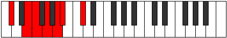 |
| [857](https://ianring.com/musictheory/scales/857) | [Aeolydimic](ModeDFlatAeolydimic.md) | Db | Db, E, F, G, A, Bb, Db |  |
| [859](https://ianring.com/musictheory/scales/859) | [Pathian](ModeCSharpPathian.md) | C# | C#, D, E, F, G, A, Bb, C# |  |
| [859](https://ianring.com/musictheory/scales/859) | [Pathian](ModeDFlatPathian.md) | Db | Db, Ebb, Fb, Gbb, Abb, Bbb, Cbb, Db |  |
| [861](https://ianring.com/musictheory/scales/861) | [Rylian](ModeCSharpRylian.md) | C# | C#, D#, E, F, G, A, Bb, C# |  |
| [861](https://ianring.com/musictheory/scales/861) | [Rylian](ModeDFlatRylian.md) | Db | Db, Eb, Fb, Gbb, Abb, Bbb, Cbb, Db |  |
| [861](https://ianring.com/musictheory/scales/861) | [Rylian](ModeGNaturalRylian.md) | G | G, A, Bb, Cb, Db, Eb, Fb, G |  |
| [863](https://ianring.com/musictheory/scales/863) | [Pyryllic](ModeCSharpPyryllic.md) | C# | C#, D, D#, E, F, G, A, A#, C# |  |
| [863](https://ianring.com/musictheory/scales/863) | [Pyryllic](ModeDFlatPyryllic.md) | Db | Db, D, Eb, E, F, G, A, Bb, Db |  |
| [863](https://ianring.com/musictheory/scales/863) | [Pyryllic](ModeGNaturalPyryllic.md) | G | G, G#, A, A#, B, C#, D#, E, G |  |
| [873](https://ianring.com/musictheory/scales/873) | [Bagimic](ModeENaturalBagimic.md) | E | E, F##, G##, A#, B#, C#, E |  |
| [873](https://ianring.com/musictheory/scales/873) | [Bagimic](ModeCSharpBagimic.md) | C# | C#, D##, E##, F##, G##, A#, C# |  |
| [873](https://ianring.com/musictheory/scales/873) | [Bagimic](ModeDFlatBagimic.md) | Db | Db, E, F#, G, A, Bb, Db |  |
| [875](https://ianring.com/musictheory/scales/875) | [Stothian](ModeENaturalStothian.md) | E | E, F, G, A, Bb, C, Db, E |  |
| [875](https://ianring.com/musictheory/scales/875) | [Stothian](ModeCSharpStothian.md) | C# | C#, D, E, F#, G, A, Bb, C# |  |
| [875](https://ianring.com/musictheory/scales/875) | [Stothian](ModeDFlatStothian.md) | Db | Db, Ebb, Fb, Gb, Abb, Bbb, Cbb, Db |  |
| [877](https://ianring.com/musictheory/scales/877) | [Aeraptian](ModeGNaturalAeraptian.md) | G | G, A, Bb, C, Db, Eb, Fb, G |  |
| [877](https://ianring.com/musictheory/scales/877) | [Aeraptian](ModeENaturalAeraptian.md) | E | E, F#, G, A, Bb, C, Db, E |  |
| [877](https://ianring.com/musictheory/scales/877) | [Aeraptian](ModeCSharpAeraptian.md) | C# | C#, D#, E, F#, G, A, Bb, C# |  |
| [877](https://ianring.com/musictheory/scales/877) | [Aeraptian](ModeDFlatAeraptian.md) | Db | Db, Eb, Fb, Gb, Abb, Bbb, Cbb, Db |  |
| [879](https://ianring.com/musictheory/scales/879) | [Aeolocryllic](ModeCSharpAeolocryllic.md) | C# | C#, D, D#, E, F#, G, A, A#, C# |  |
| [879](https://ianring.com/musictheory/scales/879) | [Aeolocryllic](ModeDFlatAeolocryllic.md) | Db | Db, D, Eb, E, Gb, G, A, Bb, Db |  |
| [879](https://ianring.com/musictheory/scales/879) | [Aeolocryllic](ModeENaturalAeolocryllic.md) | E | E, F, F#, G, A, A#, C, C#, E |  |
| [879](https://ianring.com/musictheory/scales/879) | [Aeolocryllic](ModeGNaturalAeolocryllic.md) | G | G, G#, A, A#, C, C#, D#, E, G |  |
| [889](https://ianring.com/musictheory/scales/889) | [Borian](ModeCSharpBorian.md) | C# | C#, D##, E#, F#, G, A, Bb, C# |  |
| [889](https://ianring.com/musictheory/scales/889) | [Borian](ModeDFlatBorian.md) | Db | Db, E, F, Gb, Abb, Bbb, Cbb, Db |  |
| [889](https://ianring.com/musictheory/scales/889) | [Borian](ModeENaturalBorian.md) | E | E, F##, G#, A, Bb, C, Db, E |  |
| [891](https://ianring.com/musictheory/scales/891) | [Ionilyllic](ModeCSharpIonilyllic.md) | C# | C#, D, E, F, F#, G, A, A#, C# |  |
| [891](https://ianring.com/musictheory/scales/891) | [Ionilyllic](ModeDFlatIonilyllic.md) | Db | Db, D, E, F, Gb, G, A, Bb, Db |  |
| [891](https://ianring.com/musictheory/scales/891) | [Ionilyllic](ModeENaturalIonilyllic.md) | E | E, F, G, G#, A, A#, C, C#, E |  |
| [893](https://ianring.com/musictheory/scales/893) | [Pycryllic](ModeCSharpPycryllic.md) | C# | C#, D#, E, F, F#, G, A, A#, C# |  |
| [893](https://ianring.com/musictheory/scales/893) | [Pycryllic](ModeDFlatPycryllic.md) | Db | Db, Eb, E, F, Gb, G, A, Bb, Db |  |
| [893](https://ianring.com/musictheory/scales/893) | [Pycryllic](ModeENaturalPycryllic.md) | E | E, F#, G, G#, A, A#, C, C#, E | 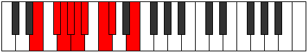 |
| [893](https://ianring.com/musictheory/scales/893) | [Pycryllic](ModeGNaturalPycryllic.md) | G | G, A, A#, B, C, C#, D#, E, G |  |
| [895](https://ianring.com/musictheory/scales/895) | [Aeolathygic](ModeCSharpAeolathygic.md) | C# | C#, D, D#, E, F, F#, G, A, A#, C# |  |
| [895](https://ianring.com/musictheory/scales/895) | [Aeolathygic](ModeDFlatAeolathygic.md) | Db | Db, D, Eb, E, F, Gb, G, A, Bb, Db |  |
| [895](https://ianring.com/musictheory/scales/895) | [Aeolathygic](ModeENaturalAeolathygic.md) | E | E, F, F#, G, G#, A, A#, C, C#, E |  |
| [895](https://ianring.com/musictheory/scales/895) | [Aeolathygic](ModeGNaturalAeolathygic.md) | G | G, G#, A, A#, B, C, C#, D#, E, G |  |
| [969](https://ianring.com/musictheory/scales/969) | [Ionogimic](ModeCSharpIonogimic.md) | C# | C#, D##, E###, F###, G##, A#, C# |  |
| [969](https://ianring.com/musictheory/scales/969) | [Ionogimic](ModeDFlatIonogimic.md) | Db | Db, E, F##, G#, A, Bb, Db |  |
| [971](https://ianring.com/musictheory/scales/971) | [Ladian](ModeCSharpLadian.md) | C# | C#, D, E, F##, G#, A, Bb, C# |  |
| [971](https://ianring.com/musictheory/scales/971) | [Ladian](ModeDFlatLadian.md) | Db | Db, Ebb, Fb, G, Ab, Bbb, Cbb, Db |  |
| [973](https://ianring.com/musictheory/scales/973) | [Phryptian](ModeGNaturalPhryptian.md) | G | G, A, Bb, C#, D, Eb, Fb, G |  |
| [973](https://ianring.com/musictheory/scales/973) | [Phryptian](ModeCSharpPhryptian.md) | C# | C#, D#, E, F##, G#, A, Bb, C# |  |
| [973](https://ianring.com/musictheory/scales/973) | [Phryptian](ModeDFlatPhryptian.md) | Db | Db, Eb, Fb, G, Ab, Bbb, Cbb, Db |  |
| [975](https://ianring.com/musictheory/scales/975) | [Katogyllic](ModeCSharpKatogyllic.md) | C# | C#, D, D#, E, G, G#, A, A#, C# |  |
| [975](https://ianring.com/musictheory/scales/975) | [Katogyllic](ModeDFlatKatogyllic.md) | Db | Db, D, Eb, E, G, Ab, A, Bb, Db |  |
| [975](https://ianring.com/musictheory/scales/975) | [Katogyllic](ModeGNaturalKatogyllic.md) | G | G, G#, A, A#, C#, D, D#, E, G |  |
| [985](https://ianring.com/musictheory/scales/985) | [Raptian](ModeCSharpRaptian.md) | C# | C#, D##, E#, F##, G#, A, Bb, C# |  |
| [985](https://ianring.com/musictheory/scales/985) | [Raptian](ModeDFlatRaptian.md) | Db | Db, E, F, G, Ab, Bbb, Cbb, Db |  |
| [987](https://ianring.com/musictheory/scales/987) | [Aeraptyllic](ModeCSharpAeraptyllic.md) | C# | C#, D, E, F, G, G#, A, A#, C# |  |
| [987](https://ianring.com/musictheory/scales/987) | [Aeraptyllic](ModeDFlatAeraptyllic.md) | Db | Db, D, E, F, G, Ab, A, Bb, Db |  |
| [989](https://ianring.com/musictheory/scales/989) | [Phrolyllic](ModeCSharpPhrolyllic.md) | C# | C#, D#, E, F, G, G#, A, A#, C# |  |
| [989](https://ianring.com/musictheory/scales/989) | [Phrolyllic](ModeDFlatPhrolyllic.md) | Db | Db, Eb, E, F, G, Ab, A, Bb, Db |  |
| [989](https://ianring.com/musictheory/scales/989) | [Phrolyllic](ModeGNaturalPhrolyllic.md) | G | G, A, A#, B, C#, D, D#, E, G |  |
| [991](https://ianring.com/musictheory/scales/991) | [Aeolygic](ModeCSharpAeolygic.md) | C# | C#, D, D#, E, F, G, G#, A, A#, C# |  |
| [991](https://ianring.com/musictheory/scales/991) | [Aeolygic](ModeDFlatAeolygic.md) | Db | Db, D, Eb, E, F, G, Ab, A, Bb, Db | 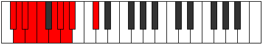 |
| [991](https://ianring.com/musictheory/scales/991) | [Aeolygic](ModeGNaturalAeolygic.md) | G | G, G#, A, A#, B, C#, D, D#, E, G |  |
| [1001](https://ianring.com/musictheory/scales/1001) | [Badian](ModeCSharpBadian.md) | C# | C#, D##, E##, F##, G#, A, Bb, C# |  |
| [1001](https://ianring.com/musictheory/scales/1001) | [Badian](ModeDFlatBadian.md) | Db | Db, E, F#, G, Ab, Bbb, Cbb, Db |  |
| [1001](https://ianring.com/musictheory/scales/1001) | [Badian](ModeENaturalBadian.md) | E | E, F##, G##, A#, B, C, Db, E |  |
| [1003](https://ianring.com/musictheory/scales/1003) | [Ionyryllic](ModeCSharpIonyryllic.md) | C# | C#, D, E, F#, G, G#, A, A#, C# |  |
| [1003](https://ianring.com/musictheory/scales/1003) | [Ionyryllic](ModeDFlatIonyryllic.md) | Db | Db, D, E, Gb, G, Ab, A, Bb, Db |  |
| [1003](https://ianring.com/musictheory/scales/1003) | [Ionyryllic](ModeENaturalIonyryllic.md) | E | E, F, G, A, A#, B, C, C#, E |  |
| [1005](https://ianring.com/musictheory/scales/1005) | [Radyllic](ModeGNaturalRadyllic.md) | G | G, A, A#, C, C#, D, D#, E, G |  |
| [1005](https://ianring.com/musictheory/scales/1005) | [Radyllic](ModeCSharpRadyllic.md) | C# | C#, D#, E, F#, G, G#, A, A#, C# |  |
| [1005](https://ianring.com/musictheory/scales/1005) | [Radyllic](ModeDFlatRadyllic.md) | Db | Db, Eb, E, Gb, G, Ab, A, Bb, Db |  |
| [1005](https://ianring.com/musictheory/scales/1005) | [Radyllic](ModeENaturalRadyllic.md) | E | E, F#, G, A, A#, B, C, C#, E |  |
| [1007](https://ianring.com/musictheory/scales/1007) | [Ionycrygic](ModeGNaturalIonycrygic.md) | G | G, G#, A, A#, C, C#, D, D#, E, G |  |
| [1007](https://ianring.com/musictheory/scales/1007) | [Ionycrygic](ModeCSharpIonycrygic.md) | C# | C#, D, D#, E, F#, G, G#, A, A#, C# |  |
| [1007](https://ianring.com/musictheory/scales/1007) | [Ionycrygic](ModeDFlatIonycrygic.md) | Db | Db, D, Eb, E, Gb, G, Ab, A, Bb, Db |  |
| [1007](https://ianring.com/musictheory/scales/1007) | [Ionycrygic](ModeENaturalIonycrygic.md) | E | E, F, F#, G, A, A#, B, C, C#, E |  |
| [1017](https://ianring.com/musictheory/scales/1017) | [Dythyllic](ModeCSharpDythyllic.md) | C# | C#, E, F, F#, G, G#, A, A#, C# |  |
| [1017](https://ianring.com/musictheory/scales/1017) | [Dythyllic](ModeDFlatDythyllic.md) | Db | Db, E, F, Gb, G, Ab, A, Bb, Db |  |
| [1017](https://ianring.com/musictheory/scales/1017) | [Dythyllic](ModeENaturalDythyllic.md) | E | E, G, G#, A, A#, B, C, C#, E |  |
| [1019](https://ianring.com/musictheory/scales/1019) | [Aeranygic](ModeCSharpAeranygic.md) | C# | C#, D, E, F, F#, G, G#, A, A#, C# |  |
| [1019](https://ianring.com/musictheory/scales/1019) | [Aeranygic](ModeDFlatAeranygic.md) | Db | Db, D, E, F, Gb, G, Ab, A, Bb, Db |  |
| [1019](https://ianring.com/musictheory/scales/1019) | [Aeranygic](ModeENaturalAeranygic.md) | E | E, F, G, G#, A, A#, B, C, C#, E |  |
| [1021](https://ianring.com/musictheory/scales/1021) | [Ladygic](ModeCSharpLadygic.md) | C# | C#, D#, E, F, F#, G, G#, A, A#, C# |  |
| [1021](https://ianring.com/musictheory/scales/1021) | [Ladygic](ModeDFlatLadygic.md) | Db | Db, Eb, E, F, Gb, G, Ab, A, Bb, Db |  |
| [1021](https://ianring.com/musictheory/scales/1021) | [Ladygic](ModeGNaturalLadygic.md) | G | G, A, A#, B, C, C#, D, D#, E, G |  |
| [1021](https://ianring.com/musictheory/scales/1021) | [Ladygic](ModeENaturalLadygic.md) | E | E, F#, G, G#, A, A#, B, C, C#, E |  |
| [1023](https://ianring.com/musictheory/scales/1023) | [Dodyllian](ModeCSharpDodyllian.md) | C# | C#, D, D#, E, F, F#, G, G#, A, A#, C# |  |
| [1023](https://ianring.com/musictheory/scales/1023) | [Dodyllian](ModeDFlatDodyllian.md) | Db | Db, D, Eb, E, F, Gb, G, Ab, A, Bb, Db |  |
| [1023](https://ianring.com/musictheory/scales/1023) | [Dodyllian](ModeGNaturalDodyllian.md) | G | G, G#, A, A#, B, C, C#, D, D#, E, G |  |
| [1023](https://ianring.com/musictheory/scales/1023) | [Dodyllian](ModeENaturalDodyllian.md) | E | E, F, F#, G, G#, A, A#, B, C, C#, E |  |
| [1171](https://ianring.com/musictheory/scales/1171) | [Loptitonic](ModeANaturalLoptitonic.md) | A | A, A#, C#, E, G, A |  |
| [1175](https://ianring.com/musictheory/scales/1175) | [Epycrimic](ModeANaturalEpycrimic.md) | A | A, Bb, Cb, Db, E, F##, A |  |
| [1179](https://ianring.com/musictheory/scales/1179) | [Sonimic](ModeANaturalSonimic.md) | A | A, Bb, C, Db, E, F##, A |  |
| [1179](https://ianring.com/musictheory/scales/1179) | [Sonimic](ModeFSharpSonimic.md) | F# | F#, G, A, Bb, C#, D##, F# |  |
| [1179](https://ianring.com/musictheory/scales/1179) | [Sonimic](ModeGFlatSonimic.md) | Gb | Gb, Abb, Bbb, Cbb, Db, E, Gb |  |
| [1183](https://ianring.com/musictheory/scales/1183) | [Sadian](ModeFSharpSadian.md) | F# | F#, G, Ab, Bbb, Cbb, Db, E, F# |  |
| [1183](https://ianring.com/musictheory/scales/1183) | [Sadian](ModeGFlatSadian.md) | Gb | Gb, Abb, Bbbb, Cbbb, Cbb, Db, E, Gb |  |
| [1183](https://ianring.com/musictheory/scales/1183) | [Sadian](ModeANaturalSadian.md) | A | A, Bb, Cb, Dbb, Ebbb, Fb, G, A |  |
| [1203](https://ianring.com/musictheory/scales/1203) | [Pagimic](ModeANaturalPagimic.md) | A | A, Bb, C#, D, E, F##, A |  |
| [1207](https://ianring.com/musictheory/scales/1207) | [Aeoloptian](ModeANaturalAeoloptian.md) | A | A, Bb, Cb, Db, Ebb, Fb, G, A |  |
| [1211](https://ianring.com/musictheory/scales/1211) | [Zadian](ModeANaturalZadian.md) | A | A, Bb, C, Db, Ebb, Fb, G, A |  |
| [1211](https://ianring.com/musictheory/scales/1211) | [Zadian](ModeFSharpZadian.md) | F# | F#, G, A, Bb, Cb, Db, E, F# |  |
| [1211](https://ianring.com/musictheory/scales/1211) | [Zadian](ModeGFlatZadian.md) | Gb | Gb, Abb, Bbb, Cbb, Dbbb, Ebbb, Fb, Gb |  |
| [1215](https://ianring.com/musictheory/scales/1215) | [Aeolanyllic](ModeANaturalAeolanyllic.md) | A | A, A#, B, C, C#, D, E, G, A |  |
| [1215](https://ianring.com/musictheory/scales/1215) | [Aeolanyllic](ModeFSharpAeolanyllic.md) | F# | F#, G, G#, A, A#, B, C#, E, F# |  |
| [1215](https://ianring.com/musictheory/scales/1215) | [Aeolanyllic](ModeGFlatAeolanyllic.md) | Gb | Gb, G, Ab, A, Bb, B, Db, E, Gb |  |
| [1235](https://ianring.com/musictheory/scales/1235) | [Stylimic](ModeDSharpStylimic.md) | D# | D#, E, F##, G##, A#, B##, D# |  |
| [1235](https://ianring.com/musictheory/scales/1235) | [Stylimic](ModeEFlatStylimic.md) | Eb | Eb, Fb, G, A, Bb, C#, Eb |  |
| [1235](https://ianring.com/musictheory/scales/1235) | [Stylimic](ModeANaturalStylimic.md) | A | A, Bb, C#, D#, E, F##, A |  |
| [1239](https://ianring.com/musictheory/scales/1239) | [Epaptian](ModeDSharpEpaptian.md) | D# | D#, E, F, G, A, Bb, C#, D# |  |
| [1239](https://ianring.com/musictheory/scales/1239) | [Epaptian](ModeEFlatEpaptian.md) | Eb | Eb, Fb, Gbb, Abb, Bbb, Cbb, Db, Eb |  |
| [1239](https://ianring.com/musictheory/scales/1239) | [Epaptian](ModeANaturalEpaptian.md) | A | A, Bb, Cb, Db, Eb, Fb, G, A |  |
| [1243](https://ianring.com/musictheory/scales/1243) | [Epylian](ModeANaturalEpylian.md) | A | A, Bb, C, Db, Eb, Fb, G, A |  |
| [1243](https://ianring.com/musictheory/scales/1243) | [Epylian](ModeFSharpEpylian.md) | F# | F#, G, A, Bb, C, Db, E, F# |  |
| [1243](https://ianring.com/musictheory/scales/1243) | [Epylian](ModeGFlatEpylian.md) | Gb | Gb, Abb, Bbb, Cbb, Dbb, Ebbb, Fb, Gb |  |
| [1243](https://ianring.com/musictheory/scales/1243) | [Epylian](ModeDSharpEpylian.md) | D# | D#, E, F#, G, A, Bb, C#, D# |  |
| [1243](https://ianring.com/musictheory/scales/1243) | [Epylian](ModeEFlatEpylian.md) | Eb | Eb, Fb, Gb, Abb, Bbb, Cbb, Db, Eb |  |
| [1247](https://ianring.com/musictheory/scales/1247) | [Mygyllic](ModeDSharpMygyllic.md) | D# | D#, E, F, F#, G, A, A#, C#, D# |  |
| [1247](https://ianring.com/musictheory/scales/1247) | [Mygyllic](ModeEFlatMygyllic.md) | Eb | Eb, E, F, Gb, G, A, Bb, Db, Eb |  |
| [1247](https://ianring.com/musictheory/scales/1247) | [Mygyllic](ModeFSharpMygyllic.md) | F# | F#, G, G#, A, A#, C, C#, E, F# |  |
| [1247](https://ianring.com/musictheory/scales/1247) | [Mygyllic](ModeGFlatMygyllic.md) | Gb | Gb, G, Ab, A, Bb, C, Db, E, Gb |  |
| [1247](https://ianring.com/musictheory/scales/1247) | [Mygyllic](ModeANaturalMygyllic.md) | A | A, A#, B, C, C#, D#, E, G, A |  |
| [1267](https://ianring.com/musictheory/scales/1267) | [Katynian](ModeANaturalKatynian.md) | A | A, Bb, C#, D, Eb, Fb, G, A |  |
| [1267](https://ianring.com/musictheory/scales/1267) | [Katynian](ModeDSharpKatynian.md) | D# | D#, E, F##, G#, A, Bb, C#, D# |  |
| [1267](https://ianring.com/musictheory/scales/1267) | [Katynian](ModeEFlatKatynian.md) | Eb | Eb, Fb, G, Ab, Bbb, Cbb, Db, Eb |  |
| [1271](https://ianring.com/musictheory/scales/1271) | [Kolyllic](ModeDSharpKolyllic.md) | D# | D#, E, F, G, G#, A, A#, C#, D# |  |
| [1271](https://ianring.com/musictheory/scales/1271) | [Kolyllic](ModeEFlatKolyllic.md) | Eb | Eb, E, F, G, Ab, A, Bb, Db, Eb |  |
| [1271](https://ianring.com/musictheory/scales/1271) | [Kolyllic](ModeANaturalKolyllic.md) | A | A, A#, B, C#, D, D#, E, G, A |  |
| [1275](https://ianring.com/musictheory/scales/1275) | [Stagyllic](ModeANaturalStagyllic.md) | A | A, A#, C, C#, D, D#, E, G, A |  |
| [1275](https://ianring.com/musictheory/scales/1275) | [Stagyllic](ModeDSharpStagyllic.md) | D# | D#, E, F#, G, G#, A, A#, C#, D# |  |
| [1275](https://ianring.com/musictheory/scales/1275) | [Stagyllic](ModeEFlatStagyllic.md) | Eb | Eb, E, Gb, G, Ab, A, Bb, Db, Eb |  |
| [1275](https://ianring.com/musictheory/scales/1275) | [Stagyllic](ModeFSharpStagyllic.md) | F# | F#, G, A, A#, B, C, C#, E, F# |  |
| [1275](https://ianring.com/musictheory/scales/1275) | [Stagyllic](ModeGFlatStagyllic.md) | Gb | Gb, G, A, Bb, B, C, Db, E, Gb |  |
| [1279](https://ianring.com/musictheory/scales/1279) | [Sarygic](ModeDSharpSarygic.md) | D# | D#, E, F, F#, G, G#, A, A#, C#, D# |  |
| [1279](https://ianring.com/musictheory/scales/1279) | [Sarygic](ModeEFlatSarygic.md) | Eb | Eb, E, F, Gb, G, Ab, A, Bb, Db, Eb |  |
| [1279](https://ianring.com/musictheory/scales/1279) | [Sarygic](ModeANaturalSarygic.md) | A | A, A#, B, C, C#, D, D#, E, G, A |  |
| [1279](https://ianring.com/musictheory/scales/1279) | [Sarygic](ModeFSharpSarygic.md) | F# | F#, G, G#, A, A#, B, C, C#, E, F# |  |
| [1279](https://ianring.com/musictheory/scales/1279) | [Sarygic](ModeGFlatSarygic.md) | Gb | Gb, G, Ab, A, Bb, B, C, Db, E, Gb |  |
| [1427](https://ianring.com/musictheory/scales/1427) | [Lolimic](ModeANaturalLolimic.md) | A | A, Bb, C#, D##, E#, F##, A |  |
| [1431](https://ianring.com/musictheory/scales/1431) | [Phragian](ModeANaturalPhragian.md) | A | A, Bb, Cb, Db, E, F, G, A |  |
| [1435](https://ianring.com/musictheory/scales/1435) | [Phronian](ModeANaturalPhronian.md) | A | A, Bb, C, Db, E, F, G, A |  |
| [1435](https://ianring.com/musictheory/scales/1435) | [Phronian](ModeFSharpPhronian.md) | F# | F#, G, A, Bb, C#, D, E, F# |  |
| [1435](https://ianring.com/musictheory/scales/1435) | [Phronian](ModeGFlatPhronian.md) | Gb | Gb, Abb, Bbb, Cbb, Db, Ebb, Fb, Gb |  |
| [1439](https://ianring.com/musictheory/scales/1439) | [Rolyllic](ModeFSharpRolyllic.md) | F# | F#, G, G#, A, A#, C#, D, E, F# |  |
| [1439](https://ianring.com/musictheory/scales/1439) | [Rolyllic](ModeGFlatRolyllic.md) | Gb | Gb, G, Ab, A, Bb, Db, D, E, Gb |  |
| [1439](https://ianring.com/musictheory/scales/1439) | [Rolyllic](ModeANaturalRolyllic.md) | A | A, A#, B, C, C#, E, F, G, A |  |
| [1459](https://ianring.com/musictheory/scales/1459) | [Ionalian](ModeANaturalIonalian.md) | A | A, Bb, C#, D, E, F, G, A |  |
| [1463](https://ianring.com/musictheory/scales/1463) | [Zaptyllic](ModeANaturalZaptyllic.md) | A | A, A#, B, C#, D, E, F, G, A |  |
| [1467](https://ianring.com/musictheory/scales/1467) | [Thydyllic](ModeANaturalThydyllic.md) | A | A, A#, C, C#, D, E, F, G, A |  |
| [1467](https://ianring.com/musictheory/scales/1467) | [Thydyllic](ModeFSharpThydyllic.md) | F# | F#, G, A, A#, B, C#, D, E, F# |  |
| [1467](https://ianring.com/musictheory/scales/1467) | [Thydyllic](ModeGFlatThydyllic.md) | Gb | Gb, G, A, Bb, B, Db, D, E, Gb |  |
| [1471](https://ianring.com/musictheory/scales/1471) | [Radygic](ModeANaturalRadygic.md) | A | A, A#, B, C, C#, D, E, F, G, A |  |
| [1471](https://ianring.com/musictheory/scales/1471) | [Radygic](ModeFSharpRadygic.md) | F# | F#, G, G#, A, A#, B, C#, D, E, F# |  |
| [1471](https://ianring.com/musictheory/scales/1471) | [Radygic](ModeGFlatRadygic.md) | Gb | Gb, G, Ab, A, Bb, B, Db, D, E, Gb |  |
| [1491](https://ianring.com/musictheory/scales/1491) | [Rynian](ModeANaturalRynian.md) | A | A, Bb, C#, D#, E, F, G, A |  |
| [1491](https://ianring.com/musictheory/scales/1491) | [Rynian](ModeDSharpRynian.md) | D# | D#, E, F##, G##, A#, B, C#, D# |  |
| [1491](https://ianring.com/musictheory/scales/1491) | [Rynian](ModeEFlatRynian.md) | Eb | Eb, Fb, G, A, Bb, Cb, Db, Eb |  |
| [1495](https://ianring.com/musictheory/scales/1495) | [Kaptyllic](ModeDSharpKaptyllic.md) | D# | D#, E, F, G, A, A#, B, C#, D# |  |
| [1495](https://ianring.com/musictheory/scales/1495) | [Kaptyllic](ModeEFlatKaptyllic.md) | Eb | Eb, E, F, G, A, Bb, B, Db, Eb |  |
| [1495](https://ianring.com/musictheory/scales/1495) | [Kaptyllic](ModeANaturalKaptyllic.md) | A | A, A#, B, C#, D#, E, F, G, A |  |
| [1499](https://ianring.com/musictheory/scales/1499) | [Stonyllic](ModeANaturalStonyllic.md) | A | A, A#, C, C#, D#, E, F, G, A |  |
| [1499](https://ianring.com/musictheory/scales/1499) | [Stonyllic](ModeFSharpStonyllic.md) | F# | F#, G, A, A#, C, C#, D, E, F# |  |
| [1499](https://ianring.com/musictheory/scales/1499) | [Stonyllic](ModeGFlatStonyllic.md) | Gb | Gb, G, A, Bb, C, Db, D, E, Gb |  |
| [1499](https://ianring.com/musictheory/scales/1499) | [Stonyllic](ModeDSharpStonyllic.md) | D# | D#, E, F#, G, A, A#, B, C#, D# |  |
| [1499](https://ianring.com/musictheory/scales/1499) | [Stonyllic](ModeEFlatStonyllic.md) | Eb | Eb, E, Gb, G, A, Bb, B, Db, Eb |  |
| [1503](https://ianring.com/musictheory/scales/1503) | [Padygic](ModeFSharpPadygic.md) | F# | F#, G, G#, A, A#, C, C#, D, E, F# |  |
| [1503](https://ianring.com/musictheory/scales/1503) | [Padygic](ModeGFlatPadygic.md) | Gb | Gb, G, Ab, A, Bb, C, Db, D, E, Gb |  |
| [1503](https://ianring.com/musictheory/scales/1503) | [Padygic](ModeANaturalPadygic.md) | A | A, A#, B, C, C#, D#, E, F, G, A |  |
| [1503](https://ianring.com/musictheory/scales/1503) | [Padygic](ModeDSharpPadygic.md) | D# | D#, E, F, F#, G, A, A#, B, C#, D# |  |
| [1503](https://ianring.com/musictheory/scales/1503) | [Padygic](ModeEFlatPadygic.md) | Eb | Eb, E, F, Gb, G, A, Bb, B, Db, Eb |  |
| [1523](https://ianring.com/musictheory/scales/1523) | [Zothyllic](ModeANaturalZothyllic.md) | A | A, A#, C#, D, D#, E, F, G, A |  |
| [1523](https://ianring.com/musictheory/scales/1523) | [Zothyllic](ModeDSharpZothyllic.md) | D# | D#, E, G, G#, A, A#, B, C#, D# |  |
| [1523](https://ianring.com/musictheory/scales/1523) | [Zothyllic](ModeEFlatZothyllic.md) | Eb | Eb, E, G, Ab, A, Bb, B, Db, Eb |  |
| [1527](https://ianring.com/musictheory/scales/1527) | [Aeolyrygic](ModeANaturalAeolyrygic.md) | A | A, A#, B, C#, D, D#, E, F, G, A |  |
| [1527](https://ianring.com/musictheory/scales/1527) | [Aeolyrygic](ModeDSharpAeolyrygic.md) | D# | D#, E, F, G, G#, A, A#, B, C#, D# |  |
| [1527](https://ianring.com/musictheory/scales/1527) | [Aeolyrygic](ModeEFlatAeolyrygic.md) | Eb | Eb, E, F, G, Ab, A, Bb, B, Db, Eb |  |
| [1531](https://ianring.com/musictheory/scales/1531) | [Styptygic](ModeANaturalStyptygic.md) | A | A, A#, C, C#, D, D#, E, F, G, A |  |
| [1531](https://ianring.com/musictheory/scales/1531) | [Styptygic](ModeFSharpStyptygic.md) | F# | F#, G, A, A#, B, C, C#, D, E, F# |  |
| [1531](https://ianring.com/musictheory/scales/1531) | [Styptygic](ModeGFlatStyptygic.md) | Gb | Gb, G, A, Bb, B, C, Db, D, E, Gb |  |
| [1531](https://ianring.com/musictheory/scales/1531) | [Styptygic](ModeDSharpStyptygic.md) | D# | D#, E, F#, G, G#, A, A#, B, C#, D# |  |
| [1531](https://ianring.com/musictheory/scales/1531) | [Styptygic](ModeEFlatStyptygic.md) | Eb | Eb, E, Gb, G, Ab, A, Bb, B, Db, Eb |  |
| [1535](https://ianring.com/musictheory/scales/1535) | [Mixodyllian](ModeANaturalMixodyllian.md) | A | A, A#, B, C, C#, D, D#, E, F, G, A |  |
| [1535](https://ianring.com/musictheory/scales/1535) | [Mixodyllian](ModeFSharpMixodyllian.md) | F# | F#, G, G#, A, A#, B, C, C#, D, E, F# |  |
| [1535](https://ianring.com/musictheory/scales/1535) | [Mixodyllian](ModeGFlatMixodyllian.md) | Gb | Gb, G, Ab, A, Bb, B, C, Db, D, E, Gb |  |
| [1535](https://ianring.com/musictheory/scales/1535) | [Mixodyllian](ModeDSharpMixodyllian.md) | D# | D#, E, F, F#, G, G#, A, A#, B, C#, D# |  |
| [1535](https://ianring.com/musictheory/scales/1535) | [Mixodyllian](ModeEFlatMixodyllian.md) | Eb | Eb, E, F, Gb, G, Ab, A, Bb, B, Db, Eb |  |
| [1613](https://ianring.com/musictheory/scales/1613) | [Thylimic](ModeGNaturalThylimic.md) | G | G, A, Bb, C#, D##, E#, G |  |
| [1615](https://ianring.com/musictheory/scales/1615) | [Sydian](ModeGNaturalSydian.md) | G | G, Ab, Bbb, Cbb, Db, E, F, G |  |
| [1629](https://ianring.com/musictheory/scales/1629) | [Synian](ModeGNaturalSynian.md) | G | G, A, Bb, Cb, Db, E, F, G |  |
| [1631](https://ianring.com/musictheory/scales/1631) | [Rynyllic](ModeGNaturalRynyllic.md) | G | G, G#, A, A#, B, C#, E, F, G |  |
| [1641](https://ianring.com/musictheory/scales/1641) | [Bocrimic](ModeENaturalBocrimic.md) | E | E, F##, G##, A#, B##, C##, E |  |
| [1643](https://ianring.com/musictheory/scales/1643) | [Thyptian](ModeENaturalThyptian.md) | E | E, F, G, A, Bb, C#, D, E |  |
| [1645](https://ianring.com/musictheory/scales/1645) | [Katagian](ModeGNaturalKatagian.md) | G | G, A, Bb, C, Db, E, F, G |  |
| [1645](https://ianring.com/musictheory/scales/1645) | [Katagian](ModeENaturalKatagian.md) | E | E, F#, G, A, Bb, C#, D, E |  |
| [1647](https://ianring.com/musictheory/scales/1647) | [Polyllic](ModeENaturalPolyllic.md) | E | E, F, F#, G, A, A#, C#, D, E |  |
| [1647](https://ianring.com/musictheory/scales/1647) | [Polyllic](ModeGNaturalPolyllic.md) | G | G, G#, A, A#, C, C#, E, F, G |  |
| [1657](https://ianring.com/musictheory/scales/1657) | [Ionothian](ModeENaturalIonothian.md) | E | E, F##, G#, A, Bb, C#, D, E |  |
| [1659](https://ianring.com/musictheory/scales/1659) | [Magyllic](ModeENaturalMagyllic.md) | E | E, F, G, G#, A, A#, C#, D, E |  |
| [1661](https://ianring.com/musictheory/scales/1661) | [Gonyllic](ModeENaturalGonyllic.md) | E | E, F#, G, G#, A, A#, C#, D, E |  |
| [1661](https://ianring.com/musictheory/scales/1661) | [Gonyllic](ModeGNaturalGonyllic.md) | G | G, A, A#, B, C, C#, E, F, G |  |
| [1663](https://ianring.com/musictheory/scales/1663) | [Lydygic](ModeENaturalLydygic.md) | E | E, F, F#, G, G#, A, A#, C#, D, E |  |
| [1663](https://ianring.com/musictheory/scales/1663) | [Lydygic](ModeGNaturalLydygic.md) | G | G, G#, A, A#, B, C, C#, E, F, G |  |
| [1683](https://ianring.com/musictheory/scales/1683) | [Rygimic](ModeCNaturalRygimic.md) | C | C, Db, E, F##, G##, A#, C |  |
| [1683](https://ianring.com/musictheory/scales/1683) | [Rygimic](ModeANaturalRygimic.md) | A | A, Bb, C#, D##, E##, F##, A |  |
| [1687](https://ianring.com/musictheory/scales/1687) | [Phralian](ModeCNaturalPhralian.md) | C | C, Db, Ebb, Fb, G, A, Bb, C |  |
| [1687](https://ianring.com/musictheory/scales/1687) | [Phralian](ModeANaturalPhralian.md) | A | A, Bb, Cb, Db, E, F#, G, A |  |
| [1691](https://ianring.com/musictheory/scales/1691) | [Kathian](ModeCNaturalKathian.md) | C | C, Db, Eb, Fb, G, A, Bb, C |  |
| [1691](https://ianring.com/musictheory/scales/1691) | [Kathian](ModeANaturalKathian.md) | A | A, Bb, C, Db, E, F#, G, A |  |
| [1691](https://ianring.com/musictheory/scales/1691) | [Kathian](ModeFSharpKathian.md) | F# | F#, G, A, Bb, C#, D#, E, F# |  |
| [1691](https://ianring.com/musictheory/scales/1691) | [Kathian](ModeGFlatKathian.md) | Gb | Gb, Abb, Bbb, Cbb, Db, Eb, Fb, Gb |  |
| [1695](https://ianring.com/musictheory/scales/1695) | [Phrodyllic](ModeCNaturalPhrodyllic.md) | C | C, C#, D, D#, E, G, A, A#, C |  |
| [1695](https://ianring.com/musictheory/scales/1695) | [Phrodyllic](ModeFSharpPhrodyllic.md) | F# | F#, G, G#, A, A#, C#, D#, E, F# |  |
| [1695](https://ianring.com/musictheory/scales/1695) | [Phrodyllic](ModeGFlatPhrodyllic.md) | Gb | Gb, G, Ab, A, Bb, Db, Eb, E, Gb |  |
| [1695](https://ianring.com/musictheory/scales/1695) | [Phrodyllic](ModeANaturalPhrodyllic.md) | A | A, A#, B, C, C#, E, F#, G, A |  |
| [1715](https://ianring.com/musictheory/scales/1715) | [Aeronian](ModeCNaturalAeronian.md) | C | C, Db, E, F, G, A, Bb, C |  |
| [1715](https://ianring.com/musictheory/scales/1715) | [Aeronian](ModeANaturalAeronian.md) | A | A, Bb, C#, D, E, F#, G, A |  |
| [1719](https://ianring.com/musictheory/scales/1719) | [Lyryllic](ModeCNaturalLyryllic.md) | C | C, C#, D, E, F, G, A, A#, C |  |
| [1719](https://ianring.com/musictheory/scales/1719) | [Lyryllic](ModeANaturalLyryllic.md) | A | A, A#, B, C#, D, E, F#, G, A |  |
| [1723](https://ianring.com/musictheory/scales/1723) | [Poryllic](ModeCNaturalPoryllic.md) | C | C, C#, D#, E, F, G, A, A#, C |  |
| [1723](https://ianring.com/musictheory/scales/1723) | [Poryllic](ModeANaturalPoryllic.md) | A | A, A#, C, C#, D, E, F#, G, A |  |
| [1723](https://ianring.com/musictheory/scales/1723) | [Poryllic](ModeFSharpPoryllic.md) | F# | F#, G, A, A#, B, C#, D#, E, F# |  |
| [1723](https://ianring.com/musictheory/scales/1723) | [Poryllic](ModeGFlatPoryllic.md) | Gb | Gb, G, A, Bb, B, Db, Eb, E, Gb |  |
| [1727](https://ianring.com/musictheory/scales/1727) | [Sydygic](ModeCNaturalSydygic.md) | C | C, C#, D, D#, E, F, G, A, A#, C |  |
| [1727](https://ianring.com/musictheory/scales/1727) | [Sydygic](ModeANaturalSydygic.md) | A | A, A#, B, C, C#, D, E, F#, G, A |  |
| [1727](https://ianring.com/musictheory/scales/1727) | [Sydygic](ModeFSharpSydygic.md) | F# | F#, G, G#, A, A#, B, C#, D#, E, F# |  |
| [1727](https://ianring.com/musictheory/scales/1727) | [Sydygic](ModeGFlatSydygic.md) | Gb | Gb, G, Ab, A, Bb, B, Db, Eb, E, Gb |  |
| [1741](https://ianring.com/musictheory/scales/1741) | [Katycrian](ModeGNaturalKatycrian.md) | G | G, A, Bb, C#, D, E, F, G |  |
| [1743](https://ianring.com/musictheory/scales/1743) | [Epigyllic](ModeGNaturalEpigyllic.md) | G | G, G#, A, A#, C#, D, E, F, G |  |
| [1747](https://ianring.com/musictheory/scales/1747) | [Epalian](ModeDSharpEpalian.md) | D# | D#, E, F##, G##, A#, B#, C#, D# |  |
| [1747](https://ianring.com/musictheory/scales/1747) | [Epalian](ModeEFlatEpalian.md) | Eb | Eb, Fb, G, A, Bb, C, Db, Eb |  |
| [1747](https://ianring.com/musictheory/scales/1747) | [Epalian](ModeCNaturalEpalian.md) | C | C, Db, E, F#, G, A, Bb, C |  |
| [1747](https://ianring.com/musictheory/scales/1747) | [Epalian](ModeANaturalEpalian.md) | A | A, Bb, C#, D#, E, F#, G, A |  |
| [1751](https://ianring.com/musictheory/scales/1751) | [Aeolyryllic](ModeDSharpAeolyryllic.md) | D# | D#, E, F, G, A, A#, C, C#, D# |  |
| [1751](https://ianring.com/musictheory/scales/1751) | [Aeolyryllic](ModeEFlatAeolyryllic.md) | Eb | Eb, E, F, G, A, Bb, C, Db, Eb |  |
| [1751](https://ianring.com/musictheory/scales/1751) | [Aeolyryllic](ModeCNaturalAeolyryllic.md) | C | C, C#, D, E, F#, G, A, A#, C |  |
| [1751](https://ianring.com/musictheory/scales/1751) | [Aeolyryllic](ModeANaturalAeolyryllic.md) | A | A, A#, B, C#, D#, E, F#, G, A |  |
| [1755](https://ianring.com/musictheory/scales/1755) | [MinorDiminished](ModeCNaturalMinorDiminished.md) | C | C, C#, D#, E, F#, G, A, A#, C |  |
| [1755](https://ianring.com/musictheory/scales/1755) | [MinorDiminished](ModeDSharpMinorDiminished.md) | D# | D#, E, F#, G, A, A#, C, C#, D# |  |
| [1755](https://ianring.com/musictheory/scales/1755) | [MinorDiminished](ModeEFlatMinorDiminished.md) | Eb | Eb, E, Gb, G, A, Bb, C, Db, Eb |  |
| [1755](https://ianring.com/musictheory/scales/1755) | [MinorDiminished](ModeFSharpMinorDiminished.md) | F# | F#, G, A, A#, C, C#, D#, E, F# |  |
| [1755](https://ianring.com/musictheory/scales/1755) | [MinorDiminished](ModeGFlatMinorDiminished.md) | Gb | Gb, G, A, Bb, C, Db, Eb, E, Gb |  |
| [1755](https://ianring.com/musictheory/scales/1755) | [MinorDiminished](ModeANaturalMinorDiminished.md) | A | A, A#, C, C#, D#, E, F#, G, A |  |
| [1757](https://ianring.com/musictheory/scales/1757) | [Ionyphyllic](ModeGNaturalIonyphyllic.md) | G | G, A, A#, B, C#, D, E, F, G |  |
| [1759](https://ianring.com/musictheory/scales/1759) | [Pylygic](ModeCNaturalPylygic.md) | C | C, C#, D, D#, E, F#, G, A, A#, C |  |
| [1759](https://ianring.com/musictheory/scales/1759) | [Pylygic](ModeDSharpPylygic.md) | D# | D#, E, F, F#, G, A, A#, C, C#, D# |  |
| [1759](https://ianring.com/musictheory/scales/1759) | [Pylygic](ModeEFlatPylygic.md) | Eb | Eb, E, F, Gb, G, A, Bb, C, Db, Eb |  |
| [1759](https://ianring.com/musictheory/scales/1759) | [Pylygic](ModeFSharpPylygic.md) | F# | F#, G, G#, A, A#, C, C#, D#, E, F# |  |
| [1759](https://ianring.com/musictheory/scales/1759) | [Pylygic](ModeGFlatPylygic.md) | Gb | Gb, G, Ab, A, Bb, C, Db, Eb, E, Gb |  |
| [1759](https://ianring.com/musictheory/scales/1759) | [Pylygic](ModeANaturalPylygic.md) | A | A, A#, B, C, C#, D#, E, F#, G, A |  |
| [1759](https://ianring.com/musictheory/scales/1759) | [Pylygic](ModeGNaturalPylygic.md) | G | G, G#, A, A#, B, C#, D, E, F, G |  |
| [1769](https://ianring.com/musictheory/scales/1769) | [Rythian](ModeENaturalRythian.md) | E | E, F##, G##, A#, B, C#, D, E |  |
| [1771](https://ianring.com/musictheory/scales/1771) | [Stylyllic](ModeENaturalStylyllic.md) | E | E, F, G, A, A#, B, C#, D, E |  |
| [1773](https://ianring.com/musictheory/scales/1773) | [Aeoloryllic](ModeGNaturalAeoloryllic.md) | G | G, A, A#, C, C#, D, E, F, G |  |
| [1773](https://ianring.com/musictheory/scales/1773) | [Aeoloryllic](ModeENaturalAeoloryllic.md) | E | E, F#, G, A, A#, B, C#, D, E |  |
| [1775](https://ianring.com/musictheory/scales/1775) | [Lyrygic](ModeGNaturalLyrygic.md) | G | G, G#, A, A#, C, C#, D, E, F, G |  |
| [1775](https://ianring.com/musictheory/scales/1775) | [Lyrygic](ModeENaturalLyrygic.md) | E | E, F, F#, G, A, A#, B, C#, D, E |  |
| [1779](https://ianring.com/musictheory/scales/1779) | [Aerythyllic](ModeANaturalAerythyllic.md) | A | A, A#, C#, D, D#, E, F#, G, A |  |
| [1779](https://ianring.com/musictheory/scales/1779) | [Aerythyllic](ModeCNaturalAerythyllic.md) | C | C, C#, E, F, F#, G, A, A#, C |  |
| [1779](https://ianring.com/musictheory/scales/1779) | [Aerythyllic](ModeDSharpAerythyllic.md) | D# | D#, E, G, G#, A, A#, C, C#, D# |  |
| [1779](https://ianring.com/musictheory/scales/1779) | [Aerythyllic](ModeEFlatAerythyllic.md) | Eb | Eb, E, G, Ab, A, Bb, C, Db, Eb |  |
| [1783](https://ianring.com/musictheory/scales/1783) | [Danygic](ModeCNaturalDanygic.md) | C | C, C#, D, E, F, F#, G, A, A#, C |  |
| [1783](https://ianring.com/musictheory/scales/1783) | [Danygic](ModeDSharpDanygic.md) | D# | D#, E, F, G, G#, A, A#, C, C#, D# |  |
| [1783](https://ianring.com/musictheory/scales/1783) | [Danygic](ModeEFlatDanygic.md) | Eb | Eb, E, F, G, Ab, A, Bb, C, Db, Eb |  |
| [1783](https://ianring.com/musictheory/scales/1783) | [Danygic](ModeANaturalDanygic.md) | A | A, A#, B, C#, D, D#, E, F#, G, A |  |
| [1785](https://ianring.com/musictheory/scales/1785) | [Tharyllic](ModeENaturalTharyllic.md) | E | E, G, G#, A, A#, B, C#, D, E |  |
| [1787](https://ianring.com/musictheory/scales/1787) | [Mycrygic](ModeANaturalMycrygic.md) | A | A, A#, C, C#, D, D#, E, F#, G, A | 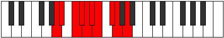 |
| [1787](https://ianring.com/musictheory/scales/1787) | [Mycrygic](ModeCNaturalMycrygic.md) | C | C, C#, D#, E, F, F#, G, A, A#, C |  |
| [1787](https://ianring.com/musictheory/scales/1787) | [Mycrygic](ModeDSharpMycrygic.md) | D# | D#, E, F#, G, G#, A, A#, C, C#, D# |  |
| [1787](https://ianring.com/musictheory/scales/1787) | [Mycrygic](ModeEFlatMycrygic.md) | Eb | Eb, E, Gb, G, Ab, A, Bb, C, Db, Eb |  |
| [1787](https://ianring.com/musictheory/scales/1787) | [Mycrygic](ModeFSharpMycrygic.md) | F# | F#, G, A, A#, B, C, C#, D#, E, F# |  |
| [1787](https://ianring.com/musictheory/scales/1787) | [Mycrygic](ModeGFlatMycrygic.md) | Gb | Gb, G, A, Bb, B, C, Db, Eb, E, Gb |  |
| [1787](https://ianring.com/musictheory/scales/1787) | [Mycrygic](ModeENaturalMycrygic.md) | E | E, F, G, G#, A, A#, B, C#, D, E |  |
| [1789](https://ianring.com/musictheory/scales/1789) | [Katagygic](ModeGNaturalKatagygic.md) | G | G, A, A#, B, C, C#, D, E, F, G |  |
| [1789](https://ianring.com/musictheory/scales/1789) | [Katagygic](ModeENaturalKatagygic.md) | E | E, F#, G, G#, A, A#, B, C#, D, E |  |
| [1791](https://ianring.com/musictheory/scales/1791) | [Aerygyllian](ModeCNaturalAerygyllian.md) | C | C, C#, D, D#, E, F, F#, G, A, A#, C |  |
| [1791](https://ianring.com/musictheory/scales/1791) | [Aerygyllian](ModeDSharpAerygyllian.md) | D# | D#, E, F, F#, G, G#, A, A#, C, C#, D# |  |
| [1791](https://ianring.com/musictheory/scales/1791) | [Aerygyllian](ModeEFlatAerygyllian.md) | Eb | Eb, E, F, Gb, G, Ab, A, Bb, C, Db, Eb |  |
| [1791](https://ianring.com/musictheory/scales/1791) | [Aerygyllian](ModeANaturalAerygyllian.md) | A | A, A#, B, C, C#, D, D#, E, F#, G, A |  |
| [1791](https://ianring.com/musictheory/scales/1791) | [Aerygyllian](ModeGNaturalAerygyllian.md) | G | G, G#, A, A#, B, C, C#, D, E, F, G |  |
| [1791](https://ianring.com/musictheory/scales/1791) | [Aerygyllian](ModeFSharpAerygyllian.md) | F# | F#, G, G#, A, A#, B, C, C#, D#, E, F# |  |
| [1791](https://ianring.com/musictheory/scales/1791) | [Aerygyllian](ModeGFlatAerygyllian.md) | Gb | Gb, G, Ab, A, Bb, B, C, Db, Eb, E, Gb |  |
| [1791](https://ianring.com/musictheory/scales/1791) | [Aerygyllian](ModeENaturalAerygyllian.md) | E | E, F, F#, G, G#, A, A#, B, C#, D, E |  |
| [1865](https://ianring.com/musictheory/scales/1865) | [Thagimic](ModeCSharpThagimic.md) | C# | C#, D##, E###, Cbbb, Cbb, Dbbb, C# |  |
| [1865](https://ianring.com/musictheory/scales/1865) | [Thagimic](ModeDFlatThagimic.md) | Db | Db, E, F##, G##, A#, B, Db |  |
| [1867](https://ianring.com/musictheory/scales/1867) | [Solian](ModeCSharpSolian.md) | C# | C#, D, E, F##, G##, A#, B, C# |  |
| [1867](https://ianring.com/musictheory/scales/1867) | [Solian](ModeDFlatSolian.md) | Db | Db, Ebb, Fb, G, A, Bb, Cb, Db |  |
| [1869](https://ianring.com/musictheory/scales/1869) | [Katyrian](ModeGNaturalKatyrian.md) | G | G, A, Bb, C#, D#, E, F, G |  |
| [1869](https://ianring.com/musictheory/scales/1869) | [Katyrian](ModeCSharpKatyrian.md) | C# | C#, D#, E, F##, G##, A#, B, C# |  |
| [1869](https://ianring.com/musictheory/scales/1869) | [Katyrian](ModeDFlatKatyrian.md) | Db | Db, Eb, Fb, G, A, Bb, Cb, Db |  |
| [1871](https://ianring.com/musictheory/scales/1871) | [Aeolyllic](ModeGNaturalAeolyllic.md) | G | G, G#, A, A#, C#, D#, E, F, G |  |
| [1871](https://ianring.com/musictheory/scales/1871) | [Aeolyllic](ModeCSharpAeolyllic.md) | C# | C#, D, D#, E, G, A, A#, B, C# |  |
| [1871](https://ianring.com/musictheory/scales/1871) | [Aeolyllic](ModeDFlatAeolyllic.md) | Db | Db, D, Eb, E, G, A, Bb, B, Db |  |
| [1881](https://ianring.com/musictheory/scales/1881) | [Korian](ModeCSharpKorian.md) | C# | C#, D##, E#, F##, G##, A#, B, C# |  |
| [1881](https://ianring.com/musictheory/scales/1881) | [Korian](ModeDFlatKorian.md) | Db | Db, E, F, G, A, Bb, Cb, Db |  |
| [1883](https://ianring.com/musictheory/scales/1883) | [Mixopyryllic](ModeCSharpMixopyryllic.md) | C# | C#, D, E, F, G, A, A#, B, C# |  |
| [1883](https://ianring.com/musictheory/scales/1883) | [Mixopyryllic](ModeDFlatMixopyryllic.md) | Db | Db, D, E, F, G, A, Bb, B, Db |  |
| [1885](https://ianring.com/musictheory/scales/1885) | [Epidyllic](ModeCSharpEpidyllic.md) | C# | C#, D#, E, F, G, A, A#, B, C# |  |
| [1885](https://ianring.com/musictheory/scales/1885) | [Epidyllic](ModeDFlatEpidyllic.md) | Db | Db, Eb, E, F, G, A, Bb, B, Db |  |
| [1885](https://ianring.com/musictheory/scales/1885) | [Epidyllic](ModeGNaturalEpidyllic.md) | G | G, A, A#, B, C#, D#, E, F, G |  |
| [1887](https://ianring.com/musictheory/scales/1887) | [Aerocrygic](ModeCSharpAerocrygic.md) | C# | C#, D, D#, E, F, G, A, A#, B, C# |  |
| [1887](https://ianring.com/musictheory/scales/1887) | [Aerocrygic](ModeDFlatAerocrygic.md) | Db | Db, D, Eb, E, F, G, A, Bb, B, Db |  |
| [1887](https://ianring.com/musictheory/scales/1887) | [Aerocrygic](ModeGNaturalAerocrygic.md) | G | G, G#, A, A#, B, C#, D#, E, F, G | 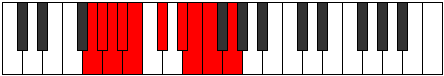 |
| [1897](https://ianring.com/musictheory/scales/1897) | [Ionopian](ModeENaturalIonopian.md) | E | E, F##, G##, A#, B#, C#, D, E |  |
| [1897](https://ianring.com/musictheory/scales/1897) | [Ionopian](ModeCSharpIonopian.md) | C# | C#, D##, E##, F##, G##, A#, B, C# |  |
| [1897](https://ianring.com/musictheory/scales/1897) | [Ionopian](ModeDFlatIonopian.md) | Db | Db, E, F#, G, A, Bb, Cb, Db |  |
| [1899](https://ianring.com/musictheory/scales/1899) | [Moptyllic](ModeENaturalMoptyllic.md) | E | E, F, G, A, A#, C, C#, D, E |  |
| [1899](https://ianring.com/musictheory/scales/1899) | [Moptyllic](ModeCSharpMoptyllic.md) | C# | C#, D, E, F#, G, A, A#, B, C# |  |
| [1899](https://ianring.com/musictheory/scales/1899) | [Moptyllic](ModeDFlatMoptyllic.md) | Db | Db, D, E, Gb, G, A, Bb, B, Db |  |
| [1901](https://ianring.com/musictheory/scales/1901) | [Ionidyllic](ModeGNaturalIonidyllic.md) | G | G, A, A#, C, C#, D#, E, F, G |  |
| [1901](https://ianring.com/musictheory/scales/1901) | [Ionidyllic](ModeENaturalIonidyllic.md) | E | E, F#, G, A, A#, C, C#, D, E | 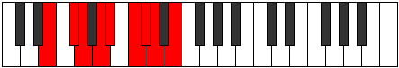 |
| [1901](https://ianring.com/musictheory/scales/1901) | [Ionidyllic](ModeCSharpIonidyllic.md) | C# | C#, D#, E, F#, G, A, A#, B, C# |  |
| [1901](https://ianring.com/musictheory/scales/1901) | [Ionidyllic](ModeDFlatIonidyllic.md) | Db | Db, Eb, E, Gb, G, A, Bb, B, Db |  |
| [1903](https://ianring.com/musictheory/scales/1903) | [Rocrygic](ModeENaturalRocrygic.md) | E | E, F, F#, G, A, A#, C, C#, D, E |  |
| [1903](https://ianring.com/musictheory/scales/1903) | [Rocrygic](ModeGNaturalRocrygic.md) | G | G, G#, A, A#, C, C#, D#, E, F, G |  |
| [1903](https://ianring.com/musictheory/scales/1903) | [Rocrygic](ModeCSharpRocrygic.md) | C# | C#, D, D#, E, F#, G, A, A#, B, C# |  |
| [1903](https://ianring.com/musictheory/scales/1903) | [Rocrygic](ModeDFlatRocrygic.md) | Db | Db, D, Eb, E, Gb, G, A, Bb, B, Db |  |
| [1913](https://ianring.com/musictheory/scales/1913) | [Zagyllic](ModeENaturalZagyllic.md) | E | E, G, G#, A, A#, C, C#, D, E |  |
| [1913](https://ianring.com/musictheory/scales/1913) | [Zagyllic](ModeCSharpZagyllic.md) | C# | C#, E, F, F#, G, A, A#, B, C# |  |
| [1913](https://ianring.com/musictheory/scales/1913) | [Zagyllic](ModeDFlatZagyllic.md) | Db | Db, E, F, Gb, G, A, Bb, B, Db |  |
| [1915](https://ianring.com/musictheory/scales/1915) | [Thydygic](ModeENaturalThydygic.md) | E | E, F, G, G#, A, A#, C, C#, D, E |  |
| [1915](https://ianring.com/musictheory/scales/1915) | [Thydygic](ModeCSharpThydygic.md) | C# | C#, D, E, F, F#, G, A, A#, B, C# |  |
| [1915](https://ianring.com/musictheory/scales/1915) | [Thydygic](ModeDFlatThydygic.md) | Db | Db, D, E, F, Gb, G, A, Bb, B, Db |  |
| [1917](https://ianring.com/musictheory/scales/1917) | [Sacrygic](ModeENaturalSacrygic.md) | E | E, F#, G, G#, A, A#, C, C#, D, E |  |
| [1917](https://ianring.com/musictheory/scales/1917) | [Sacrygic](ModeGNaturalSacrygic.md) | G | G, A, A#, B, C, C#, D#, E, F, G |  |
| [1917](https://ianring.com/musictheory/scales/1917) | [Sacrygic](ModeCSharpSacrygic.md) | C# | C#, D#, E, F, F#, G, A, A#, B, C# |  |
| [1917](https://ianring.com/musictheory/scales/1917) | [Sacrygic](ModeDFlatSacrygic.md) | Db | Db, Eb, E, F, Gb, G, A, Bb, B, Db |  |
| [1919](https://ianring.com/musictheory/scales/1919) | [Rocryllian](ModeENaturalRocryllian.md) | E | E, F, F#, G, G#, A, A#, C, C#, D, E |  |
| [1919](https://ianring.com/musictheory/scales/1919) | [Rocryllian](ModeCSharpRocryllian.md) | C# | C#, D, D#, E, F, F#, G, A, A#, B, C# |  |
| [1919](https://ianring.com/musictheory/scales/1919) | [Rocryllian](ModeDFlatRocryllian.md) | Db | Db, D, Eb, E, F, Gb, G, A, Bb, B, Db |  |
| [1919](https://ianring.com/musictheory/scales/1919) | [Rocryllian](ModeGNaturalRocryllian.md) | G | G, G#, A, A#, B, C, C#, D#, E, F, G |  |
| [1939](https://ianring.com/musictheory/scales/1939) | [Dathian](ModeANaturalDathian.md) | A | A, Bb, C#, D##, E#, F#, G, A |  |
| [1939](https://ianring.com/musictheory/scales/1939) | [Dathian](ModeCNaturalDathian.md) | C | C, Db, E, F##, G#, A, Bb, C |  |
| [1943](https://ianring.com/musictheory/scales/1943) | [Malyllic](ModeCNaturalMalyllic.md) | C | C, C#, D, E, G, G#, A, A#, C |  |
| [1943](https://ianring.com/musictheory/scales/1943) | [Malyllic](ModeANaturalMalyllic.md) | A | A, A#, B, C#, E, F, F#, G, A |  |
| [1947](https://ianring.com/musictheory/scales/1947) | [Ionoyllic](ModeFSharpIonoyllic.md) | F# | F#, G, A, A#, C#, D, D#, E, F# |  |
| [1947](https://ianring.com/musictheory/scales/1947) | [Ionoyllic](ModeGFlatIonoyllic.md) | Gb | Gb, G, A, Bb, Db, D, Eb, E, Gb |  |
| [1947](https://ianring.com/musictheory/scales/1947) | [Ionoyllic](ModeANaturalIonoyllic.md) | A | A, A#, C, C#, E, F, F#, G, A |  |
| [1947](https://ianring.com/musictheory/scales/1947) | [Ionoyllic](ModeCNaturalIonoyllic.md) | C | C, C#, D#, E, G, G#, A, A#, C |  |
| [1951](https://ianring.com/musictheory/scales/1951) | [Gonygic](ModeCNaturalGonygic.md) | C | C, C#, D, D#, E, G, G#, A, A#, C |  |
| [1951](https://ianring.com/musictheory/scales/1951) | [Gonygic](ModeFSharpGonygic.md) | F# | F#, G, G#, A, A#, C#, D, D#, E, F# |  |
| [1951](https://ianring.com/musictheory/scales/1951) | [Gonygic](ModeGFlatGonygic.md) | Gb | Gb, G, Ab, A, Bb, Db, D, Eb, E, Gb |  |
| [1951](https://ianring.com/musictheory/scales/1951) | [Gonygic](ModeANaturalGonygic.md) | A | A, A#, B, C, C#, E, F, F#, G, A |  |
| [1971](https://ianring.com/musictheory/scales/1971) | [Aerynyllic](ModeANaturalAerynyllic.md) | A | A, A#, C#, D, E, F, F#, G, A |  |
| [1971](https://ianring.com/musictheory/scales/1971) | [Aerynyllic](ModeCNaturalAerynyllic.md) | C | C, C#, E, F, G, G#, A, A#, C |  |
| [1975](https://ianring.com/musictheory/scales/1975) | [Ionocrygic](ModeCNaturalIonocrygic.md) | C | C, C#, D, E, F, G, G#, A, A#, C |  |
| [1975](https://ianring.com/musictheory/scales/1975) | [Ionocrygic](ModeANaturalIonocrygic.md) | A | A, A#, B, C#, D, E, F, F#, G, A |  |
| [1979](https://ianring.com/musictheory/scales/1979) | [Aeradygic](ModeANaturalAeradygic.md) | A | A, A#, C, C#, D, E, F, F#, G, A |  |
| [1979](https://ianring.com/musictheory/scales/1979) | [Aeradygic](ModeCNaturalAeradygic.md) | C | C, C#, D#, E, F, G, G#, A, A#, C |  |
| [1979](https://ianring.com/musictheory/scales/1979) | [Aeradygic](ModeFSharpAeradygic.md) | F# | F#, G, A, A#, B, C#, D, D#, E, F# |  |
| [1979](https://ianring.com/musictheory/scales/1979) | [Aeradygic](ModeGFlatAeradygic.md) | Gb | Gb, G, A, Bb, B, Db, D, Eb, E, Gb |  |
| [1983](https://ianring.com/musictheory/scales/1983) | [Soryllian](ModeCNaturalSoryllian.md) | C | C, C#, D, D#, E, F, G, G#, A, A#, C |  |
| [1983](https://ianring.com/musictheory/scales/1983) | [Soryllian](ModeANaturalSoryllian.md) | A | A, A#, B, C, C#, D, E, F, F#, G, A |  |
| [1983](https://ianring.com/musictheory/scales/1983) | [Soryllian](ModeFSharpSoryllian.md) | F# | F#, G, G#, A, A#, B, C#, D, D#, E, F# |  |
| [1983](https://ianring.com/musictheory/scales/1983) | [Soryllian](ModeGFlatSoryllian.md) | Gb | Gb, G, Ab, A, Bb, B, Db, D, Eb, E, Gb |  |
| [1993](https://ianring.com/musictheory/scales/1993) | [Katoptian](ModeCSharpKatoptian.md) | C# | C#, D##, E###, F###, G##, A#, B, C# |  |
| [1993](https://ianring.com/musictheory/scales/1993) | [Katoptian](ModeDFlatKatoptian.md) | Db | Db, E, F##, G#, A, Bb, Cb, Db |  |
| [1995](https://ianring.com/musictheory/scales/1995) | [Aeolacryllic](ModeCSharpAeolacryllic.md) | C# | C#, D, E, G, G#, A, A#, B, C# |  |
| [1995](https://ianring.com/musictheory/scales/1995) | [Aeolacryllic](ModeDFlatAeolacryllic.md) | Db | Db, D, E, G, Ab, A, Bb, B, Db |  |
| [1997](https://ianring.com/musictheory/scales/1997) | [Staryllic](ModeGNaturalStaryllic.md) | G | G, A, A#, C#, D, D#, E, F, G |  |
| [1997](https://ianring.com/musictheory/scales/1997) | [Staryllic](ModeCSharpStaryllic.md) | C# | C#, D#, E, G, G#, A, A#, B, C# |  |
| [1997](https://ianring.com/musictheory/scales/1997) | [Staryllic](ModeDFlatStaryllic.md) | Db | Db, Eb, E, G, Ab, A, Bb, B, Db |  |
| [1999](https://ianring.com/musictheory/scales/1999) | [Zacrygic](ModeGNaturalZacrygic.md) | G | G, G#, A, A#, C#, D, D#, E, F, G |  |
| [1999](https://ianring.com/musictheory/scales/1999) | [Zacrygic](ModeCSharpZacrygic.md) | C# | C#, D, D#, E, G, G#, A, A#, B, C# |  |
| [1999](https://ianring.com/musictheory/scales/1999) | [Zacrygic](ModeDFlatZacrygic.md) | Db | Db, D, Eb, E, G, Ab, A, Bb, B, Db |  |
| [2003](https://ianring.com/musictheory/scales/2003) | [Lolyllic](ModeANaturalLolyllic.md) | A | A, A#, C#, D#, E, F, F#, G, A |  |
| [2003](https://ianring.com/musictheory/scales/2003) | [Lolyllic](ModeCNaturalLolyllic.md) | C | C, C#, E, F#, G, G#, A, A#, C |  |
| [2003](https://ianring.com/musictheory/scales/2003) | [Lolyllic](ModeDSharpLolyllic.md) | D# | D#, E, G, A, A#, B, C, C#, D# |  |
| [2003](https://ianring.com/musictheory/scales/2003) | [Lolyllic](ModeEFlatLolyllic.md) | Eb | Eb, E, G, A, Bb, B, C, Db, Eb |  |
| [2007](https://ianring.com/musictheory/scales/2007) | [Stonygic](ModeCNaturalStonygic.md) | C | C, C#, D, E, F#, G, G#, A, A#, C |  |
| [2007](https://ianring.com/musictheory/scales/2007) | [Stonygic](ModeDSharpStonygic.md) | D# | D#, E, F, G, A, A#, B, C, C#, D# |  |
| [2007](https://ianring.com/musictheory/scales/2007) | [Stonygic](ModeEFlatStonygic.md) | Eb | Eb, E, F, G, A, Bb, B, C, Db, Eb |  |
| [2007](https://ianring.com/musictheory/scales/2007) | [Stonygic](ModeANaturalStonygic.md) | A | A, A#, B, C#, D#, E, F, F#, G, A |  |
| [2009](https://ianring.com/musictheory/scales/2009) | [Stacryllic](ModeCSharpStacryllic.md) | C# | C#, E, F, G, G#, A, A#, B, C# |  |
| [2009](https://ianring.com/musictheory/scales/2009) | [Stacryllic](ModeDFlatStacryllic.md) | Db | Db, E, F, G, Ab, A, Bb, B, Db |  |
| [2011](https://ianring.com/musictheory/scales/2011) | [Raphygic](ModeFSharpRaphygic.md) | F# | F#, G, A, A#, C, C#, D, D#, E, F# |  |
| [2011](https://ianring.com/musictheory/scales/2011) | [Raphygic](ModeGFlatRaphygic.md) | Gb | Gb, G, A, Bb, C, Db, D, Eb, E, Gb |  |
| [2011](https://ianring.com/musictheory/scales/2011) | [Raphygic](ModeANaturalRaphygic.md) | A | A, A#, C, C#, D#, E, F, F#, G, A |  |
| [2011](https://ianring.com/musictheory/scales/2011) | [Raphygic](ModeCNaturalRaphygic.md) | C | C, C#, D#, E, F#, G, G#, A, A#, C |  |
| [2011](https://ianring.com/musictheory/scales/2011) | [Raphygic](ModeDSharpRaphygic.md) | D# | D#, E, F#, G, A, A#, B, C, C#, D# |  |
| [2011](https://ianring.com/musictheory/scales/2011) | [Raphygic](ModeEFlatRaphygic.md) | Eb | Eb, E, Gb, G, A, Bb, B, C, Db, Eb |  |
| [2011](https://ianring.com/musictheory/scales/2011) | [Raphygic](ModeCSharpRaphygic.md) | C# | C#, D, E, F, G, G#, A, A#, B, C# |  |
| [2011](https://ianring.com/musictheory/scales/2011) | [Raphygic](ModeDFlatRaphygic.md) | Db | Db, D, E, F, G, Ab, A, Bb, B, Db |  |
| [2013](https://ianring.com/musictheory/scales/2013) | [Mocrygic](ModeGNaturalMocrygic.md) | G | G, A, A#, B, C#, D, D#, E, F, G |  |
| [2013](https://ianring.com/musictheory/scales/2013) | [Mocrygic](ModeCSharpMocrygic.md) | C# | C#, D#, E, F, G, G#, A, A#, B, C# | 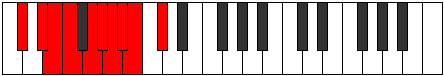 |
| [2013](https://ianring.com/musictheory/scales/2013) | [Mocrygic](ModeDFlatMocrygic.md) | Db | Db, Eb, E, F, G, Ab, A, Bb, B, Db |  |
| [2015](https://ianring.com/musictheory/scales/2015) | [Epiryllian](ModeCNaturalEpiryllian.md) | C | C, C#, D, D#, E, F#, G, G#, A, A#, C |  |
| [2015](https://ianring.com/musictheory/scales/2015) | [Epiryllian](ModeFSharpEpiryllian.md) | F# | F#, G, G#, A, A#, C, C#, D, D#, E, F# |  |
| [2015](https://ianring.com/musictheory/scales/2015) | [Epiryllian](ModeGFlatEpiryllian.md) | Gb | Gb, G, Ab, A, Bb, C, Db, D, Eb, E, Gb |  |
| [2015](https://ianring.com/musictheory/scales/2015) | [Epiryllian](ModeDSharpEpiryllian.md) | D# | D#, E, F, F#, G, A, A#, B, C, C#, D# |  |
| [2015](https://ianring.com/musictheory/scales/2015) | [Epiryllian](ModeEFlatEpiryllian.md) | Eb | Eb, E, F, Gb, G, A, Bb, B, C, Db, Eb |  |
| [2015](https://ianring.com/musictheory/scales/2015) | [Epiryllian](ModeANaturalEpiryllian.md) | A | A, A#, B, C, C#, D#, E, F, F#, G, A |  |
| [2015](https://ianring.com/musictheory/scales/2015) | [Epiryllian](ModeCSharpEpiryllian.md) | C# | C#, D, D#, E, F, G, G#, A, A#, B, C# |  |
| [2015](https://ianring.com/musictheory/scales/2015) | [Epiryllian](ModeDFlatEpiryllian.md) | Db | Db, D, Eb, E, F, G, Ab, A, Bb, B, Db |  |
| [2015](https://ianring.com/musictheory/scales/2015) | [Epiryllian](ModeGNaturalEpiryllian.md) | G | G, G#, A, A#, B, C#, D, D#, E, F, G |  |
| [2025](https://ianring.com/musictheory/scales/2025) | [Mixolydyllic](ModeENaturalMixolydyllic.md) | E | E, G, A, A#, B, C, C#, D, E |  |
| [2025](https://ianring.com/musictheory/scales/2025) | [Mixolydyllic](ModeCSharpMixolydyllic.md) | C# | C#, E, F#, G, G#, A, A#, B, C# |  |
| [2025](https://ianring.com/musictheory/scales/2025) | [Mixolydyllic](ModeDFlatMixolydyllic.md) | Db | Db, E, Gb, G, Ab, A, Bb, B, Db |  |
| [2027](https://ianring.com/musictheory/scales/2027) | [Boptygic](ModeENaturalBoptygic.md) | E | E, F, G, A, A#, B, C, C#, D, E |  |
| [2027](https://ianring.com/musictheory/scales/2027) | [Boptygic](ModeCSharpBoptygic.md) | C# | C#, D, E, F#, G, G#, A, A#, B, C# |  |
| [2027](https://ianring.com/musictheory/scales/2027) | [Boptygic](ModeDFlatBoptygic.md) | Db | Db, D, E, Gb, G, Ab, A, Bb, B, Db |  |
| [2029](https://ianring.com/musictheory/scales/2029) | [Mathygic](ModeGNaturalMathygic.md) | G | G, A, A#, C, C#, D, D#, E, F, G |  |
| [2029](https://ianring.com/musictheory/scales/2029) | [Mathygic](ModeENaturalMathygic.md) | E | E, F#, G, A, A#, B, C, C#, D, E |  |
| [2029](https://ianring.com/musictheory/scales/2029) | [Mathygic](ModeCSharpMathygic.md) | C# | C#, D#, E, F#, G, G#, A, A#, B, C# |  |
| [2029](https://ianring.com/musictheory/scales/2029) | [Mathygic](ModeDFlatMathygic.md) | Db | Db, Eb, E, Gb, G, Ab, A, Bb, B, Db |  |
| [2031](https://ianring.com/musictheory/scales/2031) | [Gadyllian](ModeGNaturalGadyllian.md) | G | G, G#, A, A#, C, C#, D, D#, E, F, G |  |
| [2031](https://ianring.com/musictheory/scales/2031) | [Gadyllian](ModeENaturalGadyllian.md) | E | E, F, F#, G, A, A#, B, C, C#, D, E |  |
| [2031](https://ianring.com/musictheory/scales/2031) | [Gadyllian](ModeCSharpGadyllian.md) | C# | C#, D, D#, E, F#, G, G#, A, A#, B, C# |  |
| [2031](https://ianring.com/musictheory/scales/2031) | [Gadyllian](ModeDFlatGadyllian.md) | Db | Db, D, Eb, E, Gb, G, Ab, A, Bb, B, Db |  |
| [2035](https://ianring.com/musictheory/scales/2035) | [Aerythygic](ModeANaturalAerythygic.md) | A | A, A#, C#, D, D#, E, F, F#, G, A | 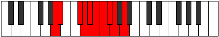 |
| [2035](https://ianring.com/musictheory/scales/2035) | [Aerythygic](ModeCNaturalAerythygic.md) | C | C, C#, E, F, F#, G, G#, A, A#, C |  |
| [2035](https://ianring.com/musictheory/scales/2035) | [Aerythygic](ModeDSharpAerythygic.md) | D# | D#, E, G, G#, A, A#, B, C, C#, D# |  |
| [2035](https://ianring.com/musictheory/scales/2035) | [Aerythygic](ModeEFlatAerythygic.md) | Eb | Eb, E, G, Ab, A, Bb, B, C, Db, Eb |  |
| [2039](https://ianring.com/musictheory/scales/2039) | [Danyllian](ModeCNaturalDanyllian.md) | C | C, C#, D, E, F, F#, G, G#, A, A#, C |  |
| [2039](https://ianring.com/musictheory/scales/2039) | [Danyllian](ModeANaturalDanyllian.md) | A | A, A#, B, C#, D, D#, E, F, F#, G, A |  |
| [2039](https://ianring.com/musictheory/scales/2039) | [Danyllian](ModeDSharpDanyllian.md) | D# | D#, E, F, G, G#, A, A#, B, C, C#, D# |  |
| [2039](https://ianring.com/musictheory/scales/2039) | [Danyllian](ModeEFlatDanyllian.md) | Eb | Eb, E, F, G, Ab, A, Bb, B, C, Db, Eb |  |
| [2041](https://ianring.com/musictheory/scales/2041) | [Aeolacrygic](ModeENaturalAeolacrygic.md) | E | E, G, G#, A, A#, B, C, C#, D, E |  |
| [2041](https://ianring.com/musictheory/scales/2041) | [Aeolacrygic](ModeCSharpAeolacrygic.md) | C# | C#, E, F, F#, G, G#, A, A#, B, C# |  |
| [2041](https://ianring.com/musictheory/scales/2041) | [Aeolacrygic](ModeDFlatAeolacrygic.md) | Db | Db, E, F, Gb, G, Ab, A, Bb, B, Db |  |
| [2043](https://ianring.com/musictheory/scales/2043) | [Lythyllian](ModeANaturalLythyllian.md) | A | A, A#, C, C#, D, D#, E, F, F#, G, A |  |
| [2043](https://ianring.com/musictheory/scales/2043) | [Lythyllian](ModeCNaturalLythyllian.md) | C | C, C#, D#, E, F, F#, G, G#, A, A#, C |  |
| [2043](https://ianring.com/musictheory/scales/2043) | [Lythyllian](ModeFSharpLythyllian.md) | F# | F#, G, A, A#, B, C, C#, D, D#, E, F# |  |
| [2043](https://ianring.com/musictheory/scales/2043) | [Lythyllian](ModeGFlatLythyllian.md) | Gb | Gb, G, A, Bb, B, C, Db, D, Eb, E, Gb |  |
| [2043](https://ianring.com/musictheory/scales/2043) | [Lythyllian](ModeENaturalLythyllian.md) | E | E, F, G, G#, A, A#, B, C, C#, D, E |  |
| [2043](https://ianring.com/musictheory/scales/2043) | [Lythyllian](ModeDSharpLythyllian.md) | D# | D#, E, F#, G, G#, A, A#, B, C, C#, D# |  |
| [2043](https://ianring.com/musictheory/scales/2043) | [Lythyllian](ModeEFlatLythyllian.md) | Eb | Eb, E, Gb, G, Ab, A, Bb, B, C, Db, Eb |  |
| [2043](https://ianring.com/musictheory/scales/2043) | [Lythyllian](ModeCSharpLythyllian.md) | C# | C#, D, E, F, F#, G, G#, A, A#, B, C# |  |
| [2043](https://ianring.com/musictheory/scales/2043) | [Lythyllian](ModeDFlatLythyllian.md) | Db | Db, D, E, F, Gb, G, Ab, A, Bb, B, Db |  |
| [2045](https://ianring.com/musictheory/scales/2045) | [Katogyllian](ModeGNaturalKatogyllian.md) | G | G, A, A#, B, C, C#, D, D#, E, F, G |  |
| [2045](https://ianring.com/musictheory/scales/2045) | [Katogyllian](ModeENaturalKatogyllian.md) | E | E, F#, G, G#, A, A#, B, C, C#, D, E |  |
| [2045](https://ianring.com/musictheory/scales/2045) | [Katogyllian](ModeCSharpKatogyllian.md) | C# | C#, D#, E, F, F#, G, G#, A, A#, B, C# |  |
| [2045](https://ianring.com/musictheory/scales/2045) | [Katogyllian](ModeDFlatKatogyllian.md) | Db | Db, Eb, E, F, Gb, G, Ab, A, Bb, B, Db |  |
| [2047](https://ianring.com/musictheory/scales/2047) | [Monatic](ModeCNaturalMonatic.md) | C | C, C#, D, D#, E, F, F#, G, G#, A, A#, C |  |
| [2047](https://ianring.com/musictheory/scales/2047) | [Monatic](ModeANaturalMonatic.md) | A | A, A#, B, C, C#, D, D#, E, F, F#, G, A |  |
| [2047](https://ianring.com/musictheory/scales/2047) | [Monatic](ModeGNaturalMonatic.md) | G | G, G#, A, A#, B, C, C#, D, D#, E, F, G |  |
| [2047](https://ianring.com/musictheory/scales/2047) | [Monatic](ModeFSharpMonatic.md) | F# | F#, G, G#, A, A#, B, C, C#, D, D#, E, F# |  |
| [2047](https://ianring.com/musictheory/scales/2047) | [Monatic](ModeGFlatMonatic.md) | Gb | Gb, G, Ab, A, Bb, B, C, Db, D, Eb, E, Gb |  |
| [2047](https://ianring.com/musictheory/scales/2047) | [Monatic](ModeENaturalMonatic.md) | E | E, F, F#, G, G#, A, A#, B, C, C#, D, E |  |
| [2047](https://ianring.com/musictheory/scales/2047) | [Monatic](ModeDSharpMonatic.md) | D# | D#, E, F, F#, G, G#, A, A#, B, C, C#, D# |  |
| [2047](https://ianring.com/musictheory/scales/2047) | [Monatic](ModeEFlatMonatic.md) | Eb | Eb, E, F, Gb, G, Ab, A, Bb, B, C, Db, Eb |  |
| [2047](https://ianring.com/musictheory/scales/2047) | [Monatic](ModeCSharpMonatic.md) | C# | C#, D, D#, E, F, F#, G, G#, A, A#, B, C# |  |
| [2047](https://ianring.com/musictheory/scales/2047) | [Monatic](ModeDFlatMonatic.md) | Db | Db, D, Eb, E, F, Gb, G, Ab, A, Bb, B, Db |  |
| [2343](https://ianring.com/musictheory/scales/2343) | [Tharimic](ModeGSharpTharimic.md) | G# | G#, A, Bb, C#, D##, E###, G# |  |
| [2343](https://ianring.com/musictheory/scales/2343) | [Tharimic](ModeAFlatTharimic.md) | Ab | Ab, Bbb, Cbb, Db, E, F##, Ab |  |
| [2351](https://ianring.com/musictheory/scales/2351) | [Gynian](ModeGSharpGynian.md) | G# | G#, A, Bb, Cb, Db, E, F##, G# |  |
| [2351](https://ianring.com/musictheory/scales/2351) | [Gynian](ModeAFlatGynian.md) | Ab | Ab, Bbb, Cbb, Dbbb, Ebbb, Fb, G, Ab |  |
| [2357](https://ianring.com/musictheory/scales/2357) | [Ionaptimic](ModeFNaturalIonaptimic.md) | F | F, G, A, Bb, C#, D##, F |  |
| [2359](https://ianring.com/musictheory/scales/2359) | [Gadian](ModeFNaturalGadian.md) | F | F, Gb, Abb, Bbb, Cbb, Db, E, F |  |
| [2359](https://ianring.com/musictheory/scales/2359) | [Gadian](ModeGSharpGadian.md) | G# | G#, A, Bb, C, Db, E, F##, G# |  |
| [2359](https://ianring.com/musictheory/scales/2359) | [Gadian](ModeAFlatGadian.md) | Ab | Ab, Bbb, Cbb, Dbb, Ebbb, Fb, G, Ab |  |
| [2365](https://ianring.com/musictheory/scales/2365) | [Sythian](ModeFNaturalSythian.md) | F | F, G, Ab, Bbb, Cbb, Db, E, F |  |
| [2367](https://ianring.com/musictheory/scales/2367) | [Laryllic](ModeFNaturalLaryllic.md) | F | F, F#, G, G#, A, A#, C#, E, F |  |
| [2367](https://ianring.com/musictheory/scales/2367) | [Laryllic](ModeGSharpLaryllic.md) | G# | G#, A, A#, B, C, C#, E, G, G# |  |
| [2367](https://ianring.com/musictheory/scales/2367) | [Laryllic](ModeAFlatLaryllic.md) | Ab | Ab, A, Bb, B, C, Db, E, G, Ab |  |
| [2407](https://ianring.com/musictheory/scales/2407) | [Zylian](ModeGSharpZylian.md) | G# | G#, A, Bb, C#, D, E, F##, G# |  |
| [2407](https://ianring.com/musictheory/scales/2407) | [Zylian](ModeAFlatZylian.md) | Ab | Ab, Bbb, Cbb, Db, Ebb, Fb, G, Ab |  |
| [2415](https://ianring.com/musictheory/scales/2415) | [Lothyllic](ModeGSharpLothyllic.md) | G# | G#, A, A#, B, C#, D, E, G, G# |  |
| [2415](https://ianring.com/musictheory/scales/2415) | [Lothyllic](ModeAFlatLothyllic.md) | Ab | Ab, A, Bb, B, Db, D, E, G, Ab |  |
| [2421](https://ianring.com/musictheory/scales/2421) | [Malian](ModeFNaturalMalian.md) | F | F, G, A, Bb, Cb, Db, E, F |  |
| [2423](https://ianring.com/musictheory/scales/2423) | [Thorcryllic](ModeGSharpThorcryllic.md) | G# | G#, A, A#, C, C#, D, E, G, G# |  |
| [2423](https://ianring.com/musictheory/scales/2423) | [Thorcryllic](ModeAFlatThorcryllic.md) | Ab | Ab, A, Bb, C, Db, D, E, G, Ab |  |
| [2423](https://ianring.com/musictheory/scales/2423) | [Thorcryllic](ModeFNaturalThorcryllic.md) | F | F, F#, G, A, A#, B, C#, E, F |  |
| [2429](https://ianring.com/musictheory/scales/2429) | [Kadyllic](ModeFNaturalKadyllic.md) | F | F, G, G#, A, A#, B, C#, E, F |  |
| [2431](https://ianring.com/musictheory/scales/2431) | [Gythygic](ModeGSharpGythygic.md) | G# | G#, A, A#, B, C, C#, D, E, G, G# |  |
| [2431](https://ianring.com/musictheory/scales/2431) | [Gythygic](ModeAFlatGythygic.md) | Ab | Ab, A, Bb, B, C, Db, D, E, G, Ab |  |
| [2431](https://ianring.com/musictheory/scales/2431) | [Gythygic](ModeFNaturalGythygic.md) | F | F, F#, G, G#, A, A#, B, C#, E, F |  |
| [2469](https://ianring.com/musictheory/scales/2469) | [Staptimic](ModeDNaturalStaptimic.md) | D | D, E, F##, G##, A#, B##, D |  |
| [2471](https://ianring.com/musictheory/scales/2471) | [Eparian](ModeDNaturalEparian.md) | D | D, Eb, Fb, G, A, Bb, C#, D |  |
| [2471](https://ianring.com/musictheory/scales/2471) | [Eparian](ModeGSharpEparian.md) | G# | G#, A, Bb, C#, D#, E, F##, G# |  |
| [2471](https://ianring.com/musictheory/scales/2471) | [Eparian](ModeAFlatEparian.md) | Ab | Ab, Bbb, Cbb, Db, Eb, Fb, G, Ab |  |
| [2477](https://ianring.com/musictheory/scales/2477) | [Mydian](ModeDNaturalMydian.md) | D | D, E, F, G, A, Bb, C#, D |  |
| [2479](https://ianring.com/musictheory/scales/2479) | [Rycryllic](ModeDNaturalRycryllic.md) | D | D, D#, E, F, G, A, A#, C#, D |  |
| [2479](https://ianring.com/musictheory/scales/2479) | [Rycryllic](ModeGSharpRycryllic.md) | G# | G#, A, A#, B, C#, D#, E, G, G# |  |
| [2479](https://ianring.com/musictheory/scales/2479) | [Rycryllic](ModeAFlatRycryllic.md) | Ab | Ab, A, Bb, B, Db, Eb, E, G, Ab |  |
| [2485](https://ianring.com/musictheory/scales/2485) | [Aerorian](ModeFNaturalAerorian.md) | F | F, G, A, Bb, C, Db, E, F |  |
| [2485](https://ianring.com/musictheory/scales/2485) | [Aerorian](ModeDNaturalAerorian.md) | D | D, E, F#, G, A, Bb, C#, D |  |
| [2487](https://ianring.com/musictheory/scales/2487) | [Phroptyllic](ModeDNaturalPhroptyllic.md) | D | D, D#, E, F#, G, A, A#, C#, D |  |
| [2487](https://ianring.com/musictheory/scales/2487) | [Phroptyllic](ModeFNaturalPhroptyllic.md) | F | F, F#, G, A, A#, C, C#, E, F |  |
| [2487](https://ianring.com/musictheory/scales/2487) | [Phroptyllic](ModeGSharpPhroptyllic.md) | G# | G#, A, A#, C, C#, D#, E, G, G# |  |
| [2487](https://ianring.com/musictheory/scales/2487) | [Phroptyllic](ModeAFlatPhroptyllic.md) | Ab | Ab, A, Bb, C, Db, Eb, E, G, Ab |  |
| [2493](https://ianring.com/musictheory/scales/2493) | [Manyllic](ModeDNaturalManyllic.md) | D | D, E, F, F#, G, A, A#, C#, D |  |
| [2493](https://ianring.com/musictheory/scales/2493) | [Manyllic](ModeFNaturalManyllic.md) | F | F, G, G#, A, A#, C, C#, E, F |  |
| [2495](https://ianring.com/musictheory/scales/2495) | [Aeolocrygic](ModeDNaturalAeolocrygic.md) | D | D, D#, E, F, F#, G, A, A#, C#, D |  |
| [2495](https://ianring.com/musictheory/scales/2495) | [Aeolocrygic](ModeFNaturalAeolocrygic.md) | F | F, F#, G, G#, A, A#, C, C#, E, F |  |
| [2495](https://ianring.com/musictheory/scales/2495) | [Aeolocrygic](ModeGSharpAeolocrygic.md) | G# | G#, A, A#, B, C, C#, D#, E, G, G# |  |
| [2495](https://ianring.com/musictheory/scales/2495) | [Aeolocrygic](ModeAFlatAeolocrygic.md) | Ab | Ab, A, Bb, B, C, Db, Eb, E, G, Ab |  |
| [2533](https://ianring.com/musictheory/scales/2533) | [Podian](ModeDNaturalPodian.md) | D | D, E, F##, G#, A, Bb, C#, D |  |
| [2535](https://ianring.com/musictheory/scales/2535) | [Zygyllic](ModeDNaturalZygyllic.md) | D | D, D#, E, G, G#, A, A#, C#, D |  |
| [2535](https://ianring.com/musictheory/scales/2535) | [Zygyllic](ModeGSharpZygyllic.md) | G# | G#, A, A#, C#, D, D#, E, G, G# |  |
| [2535](https://ianring.com/musictheory/scales/2535) | [Zygyllic](ModeAFlatZygyllic.md) | Ab | Ab, A, Bb, Db, D, Eb, E, G, Ab |  |
| [2541](https://ianring.com/musictheory/scales/2541) | [Katadyllic](ModeDNaturalKatadyllic.md) | D | D, E, F, G, G#, A, A#, C#, D |  |
| [2543](https://ianring.com/musictheory/scales/2543) | [Dydygic](ModeDNaturalDydygic.md) | D | D, D#, E, F, G, G#, A, A#, C#, D |  |
| [2543](https://ianring.com/musictheory/scales/2543) | [Dydygic](ModeGSharpDydygic.md) | G# | G#, A, A#, B, C#, D, D#, E, G, G# |  |
| [2543](https://ianring.com/musictheory/scales/2543) | [Dydygic](ModeAFlatDydygic.md) | Ab | Ab, A, Bb, B, Db, D, Eb, E, G, Ab |  |
| [2549](https://ianring.com/musictheory/scales/2549) | [Rydyllic](ModeDNaturalRydyllic.md) | D | D, E, F#, G, G#, A, A#, C#, D |  |
| [2549](https://ianring.com/musictheory/scales/2549) | [Rydyllic](ModeFNaturalRydyllic.md) | F | F, G, A, A#, B, C, C#, E, F |  |
| [2551](https://ianring.com/musictheory/scales/2551) | [Zoptygic](ModeGSharpZoptygic.md) | G# | G#, A, A#, C, C#, D, D#, E, G, G# |  |
| [2551](https://ianring.com/musictheory/scales/2551) | [Zoptygic](ModeAFlatZoptygic.md) | Ab | Ab, A, Bb, C, Db, D, Eb, E, G, Ab |  |
| [2551](https://ianring.com/musictheory/scales/2551) | [Zoptygic](ModeDNaturalZoptygic.md) | D | D, D#, E, F#, G, G#, A, A#, C#, D |  |
| [2551](https://ianring.com/musictheory/scales/2551) | [Zoptygic](ModeFNaturalZoptygic.md) | F | F, F#, G, A, A#, B, C, C#, E, F |  |
| [2557](https://ianring.com/musictheory/scales/2557) | [Dothygic](ModeDNaturalDothygic.md) | D | D, E, F, F#, G, G#, A, A#, C#, D |  |
| [2557](https://ianring.com/musictheory/scales/2557) | [Dothygic](ModeFNaturalDothygic.md) | F | F, G, G#, A, A#, B, C, C#, E, F |  |
| [2559](https://ianring.com/musictheory/scales/2559) | [Zogyllian](ModeDNaturalZogyllian.md) | D | D, D#, E, F, F#, G, G#, A, A#, C#, D |  |
| [2559](https://ianring.com/musictheory/scales/2559) | [Zogyllian](ModeGSharpZogyllian.md) | G# | G#, A, A#, B, C, C#, D, D#, E, G, G# |  |
| [2559](https://ianring.com/musictheory/scales/2559) | [Zogyllian](ModeAFlatZogyllian.md) | Ab | Ab, A, Bb, B, C, Db, D, Eb, E, G, Ab |  |
| [2559](https://ianring.com/musictheory/scales/2559) | [Zogyllian](ModeFNaturalZogyllian.md) | F | F, F#, G, G#, A, A#, B, C, C#, E, F |  |
| [2633](https://ianring.com/musictheory/scales/2633) | [Mixitonic](ModeASharpMixitonic.md) | A# | A#, C#, E, G, A, A# |  |
| [2633](https://ianring.com/musictheory/scales/2633) | [Mixitonic](ModeBFlatMixitonic.md) | Bb | Bb, Db, E, G, A, Bb |  |
| [2635](https://ianring.com/musictheory/scales/2635) | [Gocrimic](ModeASharpGocrimic.md) | A# | A#, B, C#, D##, E###, Cbbb, A# |  |
| [2635](https://ianring.com/musictheory/scales/2635) | [Gocrimic](ModeBFlatGocrimic.md) | Bb | Bb, Cb, Db, E, F##, G##, Bb |  |
| [2637](https://ianring.com/musictheory/scales/2637) | [Aeolonimic](ModeASharpAeolonimic.md) | A# | A#, B#, C#, D##, E###, Cbbb, A# |  |
| [2637](https://ianring.com/musictheory/scales/2637) | [Aeolonimic](ModeBFlatAeolonimic.md) | Bb | Bb, C, Db, E, F##, G##, Bb |  |
| [2637](https://ianring.com/musictheory/scales/2637) | [Aeolonimic](ModeGNaturalAeolonimic.md) | G | G, A, Bb, C#, D##, E##, G |  |
| [2639](https://ianring.com/musictheory/scales/2639) | [Dothian](ModeGNaturalDothian.md) | G | G, Ab, Bbb, Cbb, Db, E, F#, G |  |
| [2639](https://ianring.com/musictheory/scales/2639) | [Dothian](ModeASharpDothian.md) | A# | A#, B, C, Db, E, F##, G##, A# |  |
| [2639](https://ianring.com/musictheory/scales/2639) | [Dothian](ModeBFlatDothian.md) | Bb | Bb, Cb, Dbb, Ebbb, Fb, G, A, Bb |  |
| [2649](https://ianring.com/musictheory/scales/2649) | [Aeolythimic](ModeASharpAeolythimic.md) | A# | A#, B##, C##, D##, E###, Cbbb, A# |  |
| [2649](https://ianring.com/musictheory/scales/2649) | [Aeolythimic](ModeBFlatAeolythimic.md) | Bb | Bb, C#, D, E, F##, G##, Bb |  |
| [2651](https://ianring.com/musictheory/scales/2651) | [Panian](ModeASharpPanian.md) | A# | A#, B, C#, D, E, F##, G##, A# |  |
| [2651](https://ianring.com/musictheory/scales/2651) | [Panian](ModeBFlatPanian.md) | Bb | Bb, Cb, Db, Ebb, Fb, G, A, Bb |  |
| [2653](https://ianring.com/musictheory/scales/2653) | [Sygian](ModeASharpSygian.md) | A# | A#, B#, C#, D, E, F##, G##, A# |  |
| [2653](https://ianring.com/musictheory/scales/2653) | [Sygian](ModeBFlatSygian.md) | Bb | Bb, C, Db, Ebb, Fb, G, A, Bb |  |
| [2653](https://ianring.com/musictheory/scales/2653) | [Sygian](ModeGNaturalSygian.md) | G | G, A, Bb, Cb, Db, E, F#, G |  |
| [2655](https://ianring.com/musictheory/scales/2655) | [Thocryllic](ModeASharpThocryllic.md) | A# | A#, B, C, C#, D, E, G, A, A# |  |
| [2655](https://ianring.com/musictheory/scales/2655) | [Thocryllic](ModeBFlatThocryllic.md) | Bb | Bb, B, C, Db, D, E, G, A, Bb |  |
| [2655](https://ianring.com/musictheory/scales/2655) | [Thocryllic](ModeGNaturalThocryllic.md) | G | G, G#, A, A#, B, C#, E, F#, G |  |
| [2665](https://ianring.com/musictheory/scales/2665) | [Aeradimic](ModeENaturalAeradimic.md) | E | E, F##, G##, A#, B##, C###, E |  |
| [2665](https://ianring.com/musictheory/scales/2665) | [Aeradimic](ModeASharpAeradimic.md) | A# | A#, B##, C###, D##, E###, Cbbb, A# |  |
| [2665](https://ianring.com/musictheory/scales/2665) | [Aeradimic](ModeBFlatAeradimic.md) | Bb | Bb, C#, D#, E, F##, G##, Bb |  |
| [2667](https://ianring.com/musictheory/scales/2667) | [Byrian](ModeENaturalByrian.md) | E | E, F, G, A, Bb, C#, D#, E |  |
| [2667](https://ianring.com/musictheory/scales/2667) | [Byrian](ModeASharpByrian.md) | A# | A#, B, C#, D#, E, F##, G##, A# |  |
| [2667](https://ianring.com/musictheory/scales/2667) | [Byrian](ModeBFlatByrian.md) | Bb | Bb, Cb, Db, Eb, Fb, G, A, Bb |  |
| [2669](https://ianring.com/musictheory/scales/2669) | [Gamian](ModeASharpGamian.md) | A# | A#, B#, C#, D#, E, F##, G##, A# |  |
| [2669](https://ianring.com/musictheory/scales/2669) | [Gamian](ModeBFlatGamian.md) | Bb | Bb, C, Db, Eb, Fb, G, A, Bb |  |
| [2669](https://ianring.com/musictheory/scales/2669) | [Gamian](ModeGNaturalGamian.md) | G | G, A, Bb, C, Db, E, F#, G | 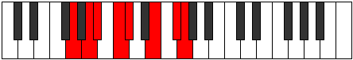 |
| [2669](https://ianring.com/musictheory/scales/2669) | [Gamian](ModeENaturalGamian.md) | E | E, F#, G, A, Bb, C#, D#, E |  |
| [2671](https://ianring.com/musictheory/scales/2671) | [Lylyllic](ModeENaturalLylyllic.md) | E | E, F, F#, G, A, A#, C#, D#, E |  |
| [2671](https://ianring.com/musictheory/scales/2671) | [Lylyllic](ModeGNaturalLylyllic.md) | G | G, G#, A, A#, C, C#, E, F#, G |  |
| [2671](https://ianring.com/musictheory/scales/2671) | [Lylyllic](ModeASharpLylyllic.md) | A# | A#, B, C, C#, D#, E, G, A, A# |  |
| [2671](https://ianring.com/musictheory/scales/2671) | [Lylyllic](ModeBFlatLylyllic.md) | Bb | Bb, B, C, Db, Eb, E, G, A, Bb |  |
| [2681](https://ianring.com/musictheory/scales/2681) | [Aerycrian](ModeASharpAerycrian.md) | A# | A#, B##, C##, D#, E, F##, G##, A# |  |
| [2681](https://ianring.com/musictheory/scales/2681) | [Aerycrian](ModeBFlatAerycrian.md) | Bb | Bb, C#, D, Eb, Fb, G, A, Bb |  |
| [2681](https://ianring.com/musictheory/scales/2681) | [Aerycrian](ModeENaturalAerycrian.md) | E | E, F##, G#, A, Bb, C#, D#, E |  |
| [2683](https://ianring.com/musictheory/scales/2683) | [Thodyllic](ModeENaturalThodyllic.md) | E | E, F, G, G#, A, A#, C#, D#, E | 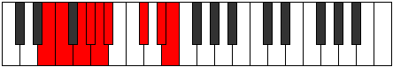 |
| [2683](https://ianring.com/musictheory/scales/2683) | [Thodyllic](ModeASharpThodyllic.md) | A# | A#, B, C#, D, D#, E, G, A, A# |  |
| [2683](https://ianring.com/musictheory/scales/2683) | [Thodyllic](ModeBFlatThodyllic.md) | Bb | Bb, B, Db, D, Eb, E, G, A, Bb |  |
| [2685](https://ianring.com/musictheory/scales/2685) | [Ionoryllic](ModeASharpIonoryllic.md) | A# | A#, C, C#, D, D#, E, G, A, A# |  |
| [2685](https://ianring.com/musictheory/scales/2685) | [Ionoryllic](ModeBFlatIonoryllic.md) | Bb | Bb, C, Db, D, Eb, E, G, A, Bb |  |
| [2685](https://ianring.com/musictheory/scales/2685) | [Ionoryllic](ModeENaturalIonoryllic.md) | E | E, F#, G, G#, A, A#, C#, D#, E |  |
| [2685](https://ianring.com/musictheory/scales/2685) | [Ionoryllic](ModeGNaturalIonoryllic.md) | G | G, A, A#, B, C, C#, E, F#, G |  |
| [2687](https://ianring.com/musictheory/scales/2687) | [Thacrygic](ModeENaturalThacrygic.md) | E | E, F, F#, G, G#, A, A#, C#, D#, E |  |
| [2687](https://ianring.com/musictheory/scales/2687) | [Thacrygic](ModeASharpThacrygic.md) | A# | A#, B, C, C#, D, D#, E, G, A, A# |  |
| [2687](https://ianring.com/musictheory/scales/2687) | [Thacrygic](ModeBFlatThacrygic.md) | Bb | Bb, B, C, Db, D, Eb, E, G, A, Bb |  |
| [2687](https://ianring.com/musictheory/scales/2687) | [Thacrygic](ModeGNaturalThacrygic.md) | G | G, G#, A, A#, B, C, C#, E, F#, G |  |
| [2761](https://ianring.com/musictheory/scales/2761) | [Dagimic](ModeASharpDagimic.md) | A# | A#, B##, D##, E#, F##, G##, A# |  |
| [2761](https://ianring.com/musictheory/scales/2761) | [Dagimic](ModeBFlatDagimic.md) | Bb | Bb, C#, D##, E#, F##, G##, Bb |  |
| [2763](https://ianring.com/musictheory/scales/2763) | [Manian](ModeASharpManian.md) | A# | A#, B, C#, D##, E#, F##, G##, A# |  |
| [2763](https://ianring.com/musictheory/scales/2763) | [Manian](ModeBFlatManian.md) | Bb | Bb, Cb, Db, E, F, G, A, Bb |  |
| [2765](https://ianring.com/musictheory/scales/2765) | [Banian](ModeASharpBanian.md) | A# | A#, B#, C#, D##, E#, F##, G##, A# |  |
| [2765](https://ianring.com/musictheory/scales/2765) | [Banian](ModeBFlatBanian.md) | Bb | Bb, C, Db, E, F, G, A, Bb |  |
| [2765](https://ianring.com/musictheory/scales/2765) | [Banian](ModeGNaturalBanian.md) | G | G, A, Bb, C#, D, E, F#, G |  |
| [2767](https://ianring.com/musictheory/scales/2767) | [Katydyllic](ModeGNaturalKatydyllic.md) | G | G, G#, A, A#, C#, D, E, F#, G |  |
| [2767](https://ianring.com/musictheory/scales/2767) | [Katydyllic](ModeASharpKatydyllic.md) | A# | A#, B, C, C#, E, F, G, A, A# |  |
| [2767](https://ianring.com/musictheory/scales/2767) | [Katydyllic](ModeBFlatKatydyllic.md) | Bb | Bb, B, C, Db, E, F, G, A, Bb |  |
| [2777](https://ianring.com/musictheory/scales/2777) | [Bycrian](ModeASharpBycrian.md) | A# | A#, B##, C##, D##, E#, F##, G##, A# |  |
| [2777](https://ianring.com/musictheory/scales/2777) | [Bycrian](ModeBFlatBycrian.md) | Bb | Bb, C#, D, E, F, G, A, Bb |  |
| [2779](https://ianring.com/musictheory/scales/2779) | [Garyllic](ModeASharpGaryllic.md) | A# | A#, B, C#, D, E, F, G, A, A# |  |
| [2779](https://ianring.com/musictheory/scales/2779) | [Garyllic](ModeBFlatGaryllic.md) | Bb | Bb, B, Db, D, E, F, G, A, Bb |  |
| [2781](https://ianring.com/musictheory/scales/2781) | [Gycryllic](ModeASharpGycryllic.md) | A# | A#, C, C#, D, E, F, G, A, A# |  |
| [2781](https://ianring.com/musictheory/scales/2781) | [Gycryllic](ModeBFlatGycryllic.md) | Bb | Bb, C, Db, D, E, F, G, A, Bb |  |
| [2781](https://ianring.com/musictheory/scales/2781) | [Gycryllic](ModeGNaturalGycryllic.md) | G | G, A, A#, B, C#, D, E, F#, G |  |
| [2783](https://ianring.com/musictheory/scales/2783) | [Gothygic](ModeASharpGothygic.md) | A# | A#, B, C, C#, D, E, F, G, A, A# |  |
| [2783](https://ianring.com/musictheory/scales/2783) | [Gothygic](ModeBFlatGothygic.md) | Bb | Bb, B, C, Db, D, E, F, G, A, Bb |  |
| [2783](https://ianring.com/musictheory/scales/2783) | [Gothygic](ModeGNaturalGothygic.md) | G | G, G#, A, A#, B, C#, D, E, F#, G |  |
| [2793](https://ianring.com/musictheory/scales/2793) | [Eporian](ModeASharpEporian.md) | A# | A#, B##, C###, D##, E#, F##, G##, A# |  |
| [2793](https://ianring.com/musictheory/scales/2793) | [Eporian](ModeBFlatEporian.md) | Bb | Bb, C#, D#, E, F, G, A, Bb |  |
| [2793](https://ianring.com/musictheory/scales/2793) | [Eporian](ModeENaturalEporian.md) | E | E, F##, G##, A#, B, C#, D#, E |  |
| [2797](https://ianring.com/musictheory/scales/2797) | [Stalyllic](ModeASharpStalyllic.md) | A# | A#, C, C#, D#, E, F, G, A, A# |  |
| [2797](https://ianring.com/musictheory/scales/2797) | [Stalyllic](ModeBFlatStalyllic.md) | Bb | Bb, C, Db, Eb, E, F, G, A, Bb |  |
| [2797](https://ianring.com/musictheory/scales/2797) | [Stalyllic](ModeGNaturalStalyllic.md) | G | G, A, A#, C, C#, D, E, F#, G |  |
| [2797](https://ianring.com/musictheory/scales/2797) | [Stalyllic](ModeENaturalStalyllic.md) | E | E, F#, G, A, A#, B, C#, D#, E |  |
| [2799](https://ianring.com/musictheory/scales/2799) | [Epilygic](ModeGNaturalEpilygic.md) | G | G, G#, A, A#, C, C#, D, E, F#, G |  |
| [2799](https://ianring.com/musictheory/scales/2799) | [Epilygic](ModeASharpEpilygic.md) | A# | A#, B, C, C#, D#, E, F, G, A, A# |  |
| [2799](https://ianring.com/musictheory/scales/2799) | [Epilygic](ModeBFlatEpilygic.md) | Bb | Bb, B, C, Db, Eb, E, F, G, A, Bb |  |
| [2799](https://ianring.com/musictheory/scales/2799) | [Epilygic](ModeENaturalEpilygic.md) | E | E, F, F#, G, A, A#, B, C#, D#, E |  |
| [2809](https://ianring.com/musictheory/scales/2809) | [Gythyllic](ModeASharpGythyllic.md) | A# | A#, C#, D, D#, E, F, G, A, A# |  |
| [2809](https://ianring.com/musictheory/scales/2809) | [Gythyllic](ModeBFlatGythyllic.md) | Bb | Bb, Db, D, Eb, E, F, G, A, Bb |  |
| [2809](https://ianring.com/musictheory/scales/2809) | [Gythyllic](ModeENaturalGythyllic.md) | E | E, G, G#, A, A#, B, C#, D#, E |  |
| [2811](https://ianring.com/musictheory/scales/2811) | [Barygic](ModeASharpBarygic.md) | A# | A#, B, C#, D, D#, E, F, G, A, A# |  |
| [2811](https://ianring.com/musictheory/scales/2811) | [Barygic](ModeBFlatBarygic.md) | Bb | Bb, B, Db, D, Eb, E, F, G, A, Bb |  |
| [2811](https://ianring.com/musictheory/scales/2811) | [Barygic](ModeENaturalBarygic.md) | E | E, F, G, G#, A, A#, B, C#, D#, E |  |
| [2813](https://ianring.com/musictheory/scales/2813) | [Zolygic](ModeASharpZolygic.md) | A# | A#, C, C#, D, D#, E, F, G, A, A# |  |
| [2813](https://ianring.com/musictheory/scales/2813) | [Zolygic](ModeBFlatZolygic.md) | Bb | Bb, C, Db, D, Eb, E, F, G, A, Bb |  |
| [2813](https://ianring.com/musictheory/scales/2813) | [Zolygic](ModeGNaturalZolygic.md) | G | G, A, A#, B, C, C#, D, E, F#, G |  |
| [2813](https://ianring.com/musictheory/scales/2813) | [Zolygic](ModeENaturalZolygic.md) | E | E, F#, G, G#, A, A#, B, C#, D#, E |  |
| [2815](https://ianring.com/musictheory/scales/2815) | [Aeradyllian](ModeASharpAeradyllian.md) | A# | A#, B, C, C#, D, D#, E, F, G, A, A# |  |
| [2815](https://ianring.com/musictheory/scales/2815) | [Aeradyllian](ModeBFlatAeradyllian.md) | Bb | Bb, B, C, Db, D, Eb, E, F, G, A, Bb |  |
| [2815](https://ianring.com/musictheory/scales/2815) | [Aeradyllian](ModeGNaturalAeradyllian.md) | G | G, G#, A, A#, B, C, C#, D, E, F#, G |  |
| [2815](https://ianring.com/musictheory/scales/2815) | [Aeradyllian](ModeENaturalAeradyllian.md) | E | E, F, F#, G, G#, A, A#, B, C#, D#, E |  |
| [2855](https://ianring.com/musictheory/scales/2855) | [Epocrian](ModeGSharpEpocrian.md) | G# | G#, A, Bb, C#, D##, E#, F##, G# |  |
| [2855](https://ianring.com/musictheory/scales/2855) | [Epocrian](ModeAFlatEpocrian.md) | Ab | Ab, Bbb, Cbb, Db, E, F, G, Ab |  |
| [2863](https://ianring.com/musictheory/scales/2863) | [Aerogyllic](ModeGSharpAerogyllic.md) | G# | G#, A, A#, B, C#, E, F, G, G# |  |
| [2863](https://ianring.com/musictheory/scales/2863) | [Aerogyllic](ModeAFlatAerogyllic.md) | Ab | Ab, A, Bb, B, Db, E, F, G, Ab |  |
| [2869](https://ianring.com/musictheory/scales/2869) | [Phrothian](ModeFNaturalPhrothian.md) | F | F, G, A, Bb, C#, D, E, F |  |
| [2871](https://ianring.com/musictheory/scales/2871) | [Stanyllic](ModeFNaturalStanyllic.md) | F | F, F#, G, A, A#, C#, D, E, F |  |
| [2871](https://ianring.com/musictheory/scales/2871) | [Stanyllic](ModeGSharpStanyllic.md) | G# | G#, A, A#, C, C#, E, F, G, G# |  |
| [2871](https://ianring.com/musictheory/scales/2871) | [Stanyllic](ModeAFlatStanyllic.md) | Ab | Ab, A, Bb, C, Db, E, F, G, Ab |  |
| [2877](https://ianring.com/musictheory/scales/2877) | [Phrylyllic](ModeFNaturalPhrylyllic.md) | F | F, G, G#, A, A#, C#, D, E, F |  |
| [2879](https://ianring.com/musictheory/scales/2879) | [Stadygic](ModeFNaturalStadygic.md) | F | F, F#, G, G#, A, A#, C#, D, E, F |  |
| [2879](https://ianring.com/musictheory/scales/2879) | [Stadygic](ModeGSharpStadygic.md) | G# | G#, A, A#, B, C, C#, E, F, G, G# |  |
| [2879](https://ianring.com/musictheory/scales/2879) | [Stadygic](ModeAFlatStadygic.md) | Ab | Ab, A, Bb, B, C, Db, E, F, G, Ab |  |
| [2889](https://ianring.com/musictheory/scales/2889) | [Thoptimic](ModeCSharpThoptimic.md) | C# | C#, D##, E###, Cbbb, Cbb, Dbb, C# |  |
| [2889](https://ianring.com/musictheory/scales/2889) | [Thoptimic](ModeDFlatThoptimic.md) | Db | Db, E, F##, G##, A#, B#, Db |  |
| [2889](https://ianring.com/musictheory/scales/2889) | [Thoptimic](ModeASharpThoptimic.md) | A# | A#, B##, D##, E##, F##, G##, A# |  |
| [2889](https://ianring.com/musictheory/scales/2889) | [Thoptimic](ModeBFlatThoptimic.md) | Bb | Bb, C#, D##, E##, F##, G##, Bb |  |
| [2891](https://ianring.com/musictheory/scales/2891) | [Phrogian](ModeCSharpPhrogian.md) | C# | C#, D, E, F##, G##, A#, B#, C# |  |
| [2891](https://ianring.com/musictheory/scales/2891) | [Phrogian](ModeDFlatPhrogian.md) | Db | Db, Ebb, Fb, G, A, Bb, C, Db |  |
| [2891](https://ianring.com/musictheory/scales/2891) | [Phrogian](ModeASharpPhrogian.md) | A# | A#, B, C#, D##, E##, F##, G##, A# |  |
| [2891](https://ianring.com/musictheory/scales/2891) | [Phrogian](ModeBFlatPhrogian.md) | Bb | Bb, Cb, Db, E, F#, G, A, Bb |  |
| [2893](https://ianring.com/musictheory/scales/2893) | [Lylian](ModeCSharpLylian.md) | C# | C#, D#, E, F##, G##, A#, B#, C# |  |
| [2893](https://ianring.com/musictheory/scales/2893) | [Lylian](ModeDFlatLylian.md) | Db | Db, Eb, Fb, G, A, Bb, C, Db |  |
| [2893](https://ianring.com/musictheory/scales/2893) | [Lylian](ModeASharpLylian.md) | A# | A#, B#, C#, D##, E##, F##, G##, A# |  |
| [2893](https://ianring.com/musictheory/scales/2893) | [Lylian](ModeBFlatLylian.md) | Bb | Bb, C, Db, E, F#, G, A, Bb |  |
| [2893](https://ianring.com/musictheory/scales/2893) | [Lylian](ModeGNaturalLylian.md) | G | G, A, Bb, C#, D#, E, F#, G |  |
| [2895](https://ianring.com/musictheory/scales/2895) | [Aeragyllic](ModeCSharpAeragyllic.md) | C# | C#, D, D#, E, G, A, A#, C, C# |  |
| [2895](https://ianring.com/musictheory/scales/2895) | [Aeragyllic](ModeDFlatAeragyllic.md) | Db | Db, D, Eb, E, G, A, Bb, C, Db |  |
| [2895](https://ianring.com/musictheory/scales/2895) | [Aeragyllic](ModeGNaturalAeragyllic.md) | G | G, G#, A, A#, C#, D#, E, F#, G |  |
| [2895](https://ianring.com/musictheory/scales/2895) | [Aeragyllic](ModeASharpAeragyllic.md) | A# | A#, B, C, C#, E, F#, G, A, A# |  |
| [2895](https://ianring.com/musictheory/scales/2895) | [Aeragyllic](ModeBFlatAeragyllic.md) | Bb | Bb, B, C, Db, E, Gb, G, A, Bb |  |
| [2905](https://ianring.com/musictheory/scales/2905) | [Palian](ModeCSharpPalian.md) | C# | C#, D##, E#, F##, G##, A#, B#, C# |  |
| [2905](https://ianring.com/musictheory/scales/2905) | [Palian](ModeDFlatPalian.md) | Db | Db, E, F, G, A, Bb, C, Db |  |
| [2905](https://ianring.com/musictheory/scales/2905) | [Palian](ModeASharpPalian.md) | A# | A#, B##, C##, D##, E##, F##, G##, A# |  |
| [2905](https://ianring.com/musictheory/scales/2905) | [Palian](ModeBFlatPalian.md) | Bb | Bb, C#, D, E, F#, G, A, Bb |  |
| [2907](https://ianring.com/musictheory/scales/2907) | [Mogyllic](ModeCSharpMogyllic.md) | C# | C#, D, E, F, G, A, A#, C, C# |  |
| [2907](https://ianring.com/musictheory/scales/2907) | [Mogyllic](ModeDFlatMogyllic.md) | Db | Db, D, E, F, G, A, Bb, C, Db |  |
| [2907](https://ianring.com/musictheory/scales/2907) | [Mogyllic](ModeASharpMogyllic.md) | A# | A#, B, C#, D, E, F#, G, A, A# |  |
| [2907](https://ianring.com/musictheory/scales/2907) | [Mogyllic](ModeBFlatMogyllic.md) | Bb | Bb, B, Db, D, E, Gb, G, A, Bb |  |
| [2909](https://ianring.com/musictheory/scales/2909) | [Mocryllic](ModeCSharpMocryllic.md) | C# | C#, D#, E, F, G, A, A#, C, C# |  |
| [2909](https://ianring.com/musictheory/scales/2909) | [Mocryllic](ModeDFlatMocryllic.md) | Db | Db, Eb, E, F, G, A, Bb, C, Db |  |
| [2909](https://ianring.com/musictheory/scales/2909) | [Mocryllic](ModeASharpMocryllic.md) | A# | A#, C, C#, D, E, F#, G, A, A# |  |
| [2909](https://ianring.com/musictheory/scales/2909) | [Mocryllic](ModeBFlatMocryllic.md) | Bb | Bb, C, Db, D, E, Gb, G, A, Bb |  |
| [2909](https://ianring.com/musictheory/scales/2909) | [Mocryllic](ModeGNaturalMocryllic.md) | G | G, A, A#, B, C#, D#, E, F#, G |  |
| [2911](https://ianring.com/musictheory/scales/2911) | [Katygic](ModeCSharpKatygic.md) | C# | C#, D, D#, E, F, G, A, A#, C, C# |  |
| [2911](https://ianring.com/musictheory/scales/2911) | [Katygic](ModeDFlatKatygic.md) | Db | Db, D, Eb, E, F, G, A, Bb, C, Db |  |
| [2911](https://ianring.com/musictheory/scales/2911) | [Katygic](ModeASharpKatygic.md) | A# | A#, B, C, C#, D, E, F#, G, A, A# |  |
| [2911](https://ianring.com/musictheory/scales/2911) | [Katygic](ModeBFlatKatygic.md) | Bb | Bb, B, C, Db, D, E, Gb, G, A, Bb |  |
| [2911](https://ianring.com/musictheory/scales/2911) | [Katygic](ModeGNaturalKatygic.md) | G | G, G#, A, A#, B, C#, D#, E, F#, G |  |
| [2919](https://ianring.com/musictheory/scales/2919) | [Molyllic](ModeGSharpMolyllic.md) | G# | G#, A, A#, C#, D, E, F, G, G# |  |
| [2919](https://ianring.com/musictheory/scales/2919) | [Molyllic](ModeAFlatMolyllic.md) | Ab | Ab, A, Bb, Db, D, E, F, G, Ab |  |
| [2921](https://ianring.com/musictheory/scales/2921) | [Pogian](ModeENaturalPogian.md) | E | E, F##, G##, A#, B#, C#, D#, E |  |
| [2921](https://ianring.com/musictheory/scales/2921) | [Pogian](ModeCSharpPogian.md) | C# | C#, D##, E##, F##, G##, A#, B#, C# |  |
| [2921](https://ianring.com/musictheory/scales/2921) | [Pogian](ModeDFlatPogian.md) | Db | Db, E, F#, G, A, Bb, C, Db |  |
| [2921](https://ianring.com/musictheory/scales/2921) | [Pogian](ModeASharpPogian.md) | A# | A#, B##, C###, D##, E##, F##, G##, A# |  |
| [2921](https://ianring.com/musictheory/scales/2921) | [Pogian](ModeBFlatPogian.md) | Bb | Bb, C#, D#, E, F#, G, A, Bb |  |
| [2923](https://ianring.com/musictheory/scales/2923) | [Baryllic](ModeENaturalBaryllic.md) | E | E, F, G, A, A#, C, C#, D#, E |  |
| [2923](https://ianring.com/musictheory/scales/2923) | [Baryllic](ModeCSharpBaryllic.md) | C# | C#, D, E, F#, G, A, A#, C, C# |  |
| [2923](https://ianring.com/musictheory/scales/2923) | [Baryllic](ModeDFlatBaryllic.md) | Db | Db, D, E, Gb, G, A, Bb, C, Db |  |
| [2923](https://ianring.com/musictheory/scales/2923) | [Baryllic](ModeASharpBaryllic.md) | A# | A#, B, C#, D#, E, F#, G, A, A# |  |
| [2923](https://ianring.com/musictheory/scales/2923) | [Baryllic](ModeBFlatBaryllic.md) | Bb | Bb, B, Db, Eb, E, Gb, G, A, Bb |  |
| [2925](https://ianring.com/musictheory/scales/2925) | [MajorDiminished](ModeCSharpMajorDiminished.md) | C# | C#, D#, E, F#, G, A, A#, C, C# |  |
| [2925](https://ianring.com/musictheory/scales/2925) | [MajorDiminished](ModeDFlatMajorDiminished.md) | Db | Db, Eb, E, Gb, G, A, Bb, C, Db |  |
| [2925](https://ianring.com/musictheory/scales/2925) | [MajorDiminished](ModeENaturalMajorDiminished.md) | E | E, F#, G, A, A#, C, C#, D#, E |  |
| [2925](https://ianring.com/musictheory/scales/2925) | [MajorDiminished](ModeGNaturalMajorDiminished.md) | G | G, A, A#, C, C#, D#, E, F#, G |  |
| [2925](https://ianring.com/musictheory/scales/2925) | [MajorDiminished](ModeASharpMajorDiminished.md) | A# | A#, C, C#, D#, E, F#, G, A, A# |  |
| [2925](https://ianring.com/musictheory/scales/2925) | [MajorDiminished](ModeBFlatMajorDiminished.md) | Bb | Bb, C, Db, Eb, E, Gb, G, A, Bb |  |
| [2927](https://ianring.com/musictheory/scales/2927) | [Rodygic](ModeCSharpRodygic.md) | C# | C#, D, D#, E, F#, G, A, A#, C, C# |  |
| [2927](https://ianring.com/musictheory/scales/2927) | [Rodygic](ModeDFlatRodygic.md) | Db | Db, D, Eb, E, Gb, G, A, Bb, C, Db |  |
| [2927](https://ianring.com/musictheory/scales/2927) | [Rodygic](ModeENaturalRodygic.md) | E | E, F, F#, G, A, A#, C, C#, D#, E |  |
| [2927](https://ianring.com/musictheory/scales/2927) | [Rodygic](ModeGNaturalRodygic.md) | G | G, G#, A, A#, C, C#, D#, E, F#, G |  |
| [2927](https://ianring.com/musictheory/scales/2927) | [Rodygic](ModeASharpRodygic.md) | A# | A#, B, C, C#, D#, E, F#, G, A, A# |  |
| [2927](https://ianring.com/musictheory/scales/2927) | [Rodygic](ModeBFlatRodygic.md) | Bb | Bb, B, C, Db, Eb, E, Gb, G, A, Bb |  |
| [2927](https://ianring.com/musictheory/scales/2927) | [Rodygic](ModeGSharpRodygic.md) | G# | G#, A, A#, B, C#, D, E, F, G, G# |  |
| [2927](https://ianring.com/musictheory/scales/2927) | [Rodygic](ModeAFlatRodygic.md) | Ab | Ab, A, Bb, B, Db, D, E, F, G, Ab |  |
| [2933](https://ianring.com/musictheory/scales/2933) | [Dalyllic](ModeFNaturalDalyllic.md) | F | F, G, A, A#, B, C#, D, E, F |  |
| [2935](https://ianring.com/musictheory/scales/2935) | [Modygic](ModeGSharpModygic.md) | G# | G#, A, A#, C, C#, D, E, F, G, G# | 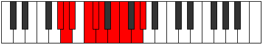 |
| [2935](https://ianring.com/musictheory/scales/2935) | [Modygic](ModeAFlatModygic.md) | Ab | Ab, A, Bb, C, Db, D, E, F, G, Ab |  |
| [2935](https://ianring.com/musictheory/scales/2935) | [Modygic](ModeFNaturalModygic.md) | F | F, F#, G, A, A#, B, C#, D, E, F |  |
| [2937](https://ianring.com/musictheory/scales/2937) | [Aeolathyllic](ModeASharpAeolathyllic.md) | A# | A#, C#, D, D#, E, F#, G, A, A# |  |
| [2937](https://ianring.com/musictheory/scales/2937) | [Aeolathyllic](ModeBFlatAeolathyllic.md) | Bb | Bb, Db, D, Eb, E, Gb, G, A, Bb |  |
| [2937](https://ianring.com/musictheory/scales/2937) | [Aeolathyllic](ModeCSharpAeolathyllic.md) | C# | C#, E, F, F#, G, A, A#, C, C# |  |
| [2937](https://ianring.com/musictheory/scales/2937) | [Aeolathyllic](ModeDFlatAeolathyllic.md) | Db | Db, E, F, Gb, G, A, Bb, C, Db |  |
| [2937](https://ianring.com/musictheory/scales/2937) | [Aeolathyllic](ModeENaturalAeolathyllic.md) | E | E, G, G#, A, A#, C, C#, D#, E |  |
| [2939](https://ianring.com/musictheory/scales/2939) | [Goptygic](ModeCSharpGoptygic.md) | C# | C#, D, E, F, F#, G, A, A#, C, C# |  |
| [2939](https://ianring.com/musictheory/scales/2939) | [Goptygic](ModeDFlatGoptygic.md) | Db | Db, D, E, F, Gb, G, A, Bb, C, Db |  |
| [2939](https://ianring.com/musictheory/scales/2939) | [Goptygic](ModeENaturalGoptygic.md) | E | E, F, G, G#, A, A#, C, C#, D#, E |  |
| [2939](https://ianring.com/musictheory/scales/2939) | [Goptygic](ModeASharpGoptygic.md) | A# | A#, B, C#, D, D#, E, F#, G, A, A# |  |
| [2939](https://ianring.com/musictheory/scales/2939) | [Goptygic](ModeBFlatGoptygic.md) | Bb | Bb, B, Db, D, Eb, E, Gb, G, A, Bb |  |
| [2941](https://ianring.com/musictheory/scales/2941) | [Laptygic](ModeASharpLaptygic.md) | A# | A#, C, C#, D, D#, E, F#, G, A, A# |  |
| [2941](https://ianring.com/musictheory/scales/2941) | [Laptygic](ModeBFlatLaptygic.md) | Bb | Bb, C, Db, D, Eb, E, Gb, G, A, Bb |  |
| [2941](https://ianring.com/musictheory/scales/2941) | [Laptygic](ModeCSharpLaptygic.md) | C# | C#, D#, E, F, F#, G, A, A#, C, C# |  |
| [2941](https://ianring.com/musictheory/scales/2941) | [Laptygic](ModeDFlatLaptygic.md) | Db | Db, Eb, E, F, Gb, G, A, Bb, C, Db |  |
| [2941](https://ianring.com/musictheory/scales/2941) | [Laptygic](ModeENaturalLaptygic.md) | E | E, F#, G, G#, A, A#, C, C#, D#, E |  |
| [2941](https://ianring.com/musictheory/scales/2941) | [Laptygic](ModeGNaturalLaptygic.md) | G | G, A, A#, B, C, C#, D#, E, F#, G |  |
| [2941](https://ianring.com/musictheory/scales/2941) | [Laptygic](ModeFNaturalLaptygic.md) | F | F, G, G#, A, A#, B, C#, D, E, F |  |
| [2943](https://ianring.com/musictheory/scales/2943) | [Dathyllian](ModeCSharpDathyllian.md) | C# | C#, D, D#, E, F, F#, G, A, A#, C, C# |  |
| [2943](https://ianring.com/musictheory/scales/2943) | [Dathyllian](ModeDFlatDathyllian.md) | Db | Db, D, Eb, E, F, Gb, G, A, Bb, C, Db |  |
| [2943](https://ianring.com/musictheory/scales/2943) | [Dathyllian](ModeENaturalDathyllian.md) | E | E, F, F#, G, G#, A, A#, C, C#, D#, E |  |
| [2943](https://ianring.com/musictheory/scales/2943) | [Dathyllian](ModeASharpDathyllian.md) | A# | A#, B, C, C#, D, D#, E, F#, G, A, A# |  |
| [2943](https://ianring.com/musictheory/scales/2943) | [Dathyllian](ModeBFlatDathyllian.md) | Bb | Bb, B, C, Db, D, Eb, E, Gb, G, A, Bb |  |
| [2943](https://ianring.com/musictheory/scales/2943) | [Dathyllian](ModeGSharpDathyllian.md) | G# | G#, A, A#, B, C, C#, D, E, F, G, G# |  |
| [2943](https://ianring.com/musictheory/scales/2943) | [Dathyllian](ModeAFlatDathyllian.md) | Ab | Ab, A, Bb, B, C, Db, D, E, F, G, Ab |  |
| [2943](https://ianring.com/musictheory/scales/2943) | [Dathyllian](ModeGNaturalDathyllian.md) | G | G, G#, A, A#, B, C, C#, D#, E, F#, G |  |
| [2943](https://ianring.com/musictheory/scales/2943) | [Dathyllian](ModeFNaturalDathyllian.md) | F | F, F#, G, G#, A, A#, B, C#, D, E, F |  |
| [2981](https://ianring.com/musictheory/scales/2981) | [Ionolian](ModeDNaturalIonolian.md) | D | D, E, F##, G##, A#, B, C#, D |  |
| [2983](https://ianring.com/musictheory/scales/2983) | [Zythyllic](ModeGSharpZythyllic.md) | G# | G#, A, A#, C#, D#, E, F, G, G# |  |
| [2983](https://ianring.com/musictheory/scales/2983) | [Zythyllic](ModeAFlatZythyllic.md) | Ab | Ab, A, Bb, Db, Eb, E, F, G, Ab |  |
| [2983](https://ianring.com/musictheory/scales/2983) | [Zythyllic](ModeDNaturalZythyllic.md) | D | D, D#, E, G, A, A#, B, C#, D |  |
| [2989](https://ianring.com/musictheory/scales/2989) | [Ionacryllic](ModeDNaturalIonacryllic.md) | D | D, E, F, G, A, A#, B, C#, D |  |
| [2991](https://ianring.com/musictheory/scales/2991) | [Zanygic](ModeDNaturalZanygic.md) | D | D, D#, E, F, G, A, A#, B, C#, D |  |
| [2991](https://ianring.com/musictheory/scales/2991) | [Zanygic](ModeGSharpZanygic.md) | G# | G#, A, A#, B, C#, D#, E, F, G, G# |  |
| [2991](https://ianring.com/musictheory/scales/2991) | [Zanygic](ModeAFlatZanygic.md) | Ab | Ab, A, Bb, B, Db, Eb, E, F, G, Ab |  |
| [2997](https://ianring.com/musictheory/scales/2997) | [Ionoptyllic](ModeFNaturalIonoptyllic.md) | F | F, G, A, A#, C, C#, D, E, F |  |
| [2997](https://ianring.com/musictheory/scales/2997) | [Ionoptyllic](ModeDNaturalIonoptyllic.md) | D | D, E, F#, G, A, A#, B, C#, D |  |
| [2999](https://ianring.com/musictheory/scales/2999) | [Zyrygic](ModeFNaturalZyrygic.md) | F | F, F#, G, A, A#, C, C#, D, E, F |  |
| [2999](https://ianring.com/musictheory/scales/2999) | [Zyrygic](ModeGSharpZyrygic.md) | G# | G#, A, A#, C, C#, D#, E, F, G, G# |  |
| [2999](https://ianring.com/musictheory/scales/2999) | [Zyrygic](ModeAFlatZyrygic.md) | Ab | Ab, A, Bb, C, Db, Eb, E, F, G, Ab |  |
| [2999](https://ianring.com/musictheory/scales/2999) | [Zyrygic](ModeDNaturalZyrygic.md) | D | D, D#, E, F#, G, A, A#, B, C#, D |  |
| [3005](https://ianring.com/musictheory/scales/3005) | [Gycrygic](ModeFNaturalGycrygic.md) | F | F, G, G#, A, A#, C, C#, D, E, F |  |
| [3005](https://ianring.com/musictheory/scales/3005) | [Gycrygic](ModeDNaturalGycrygic.md) | D | D, E, F, F#, G, A, A#, B, C#, D |  |
| [3007](https://ianring.com/musictheory/scales/3007) | [Zyryllian](ModeFNaturalZyryllian.md) | F | F, F#, G, G#, A, A#, C, C#, D, E, F |  |
| [3007](https://ianring.com/musictheory/scales/3007) | [Zyryllian](ModeDNaturalZyryllian.md) | D | D, D#, E, F, F#, G, A, A#, B, C#, D |  |
| [3007](https://ianring.com/musictheory/scales/3007) | [Zyryllian](ModeGSharpZyryllian.md) | G# | G#, A, A#, B, C, C#, D#, E, F, G, G# |  |
| [3007](https://ianring.com/musictheory/scales/3007) | [Zyryllian](ModeAFlatZyryllian.md) | Ab | Ab, A, Bb, B, C, Db, Eb, E, F, G, Ab |  |
| [3017](https://ianring.com/musictheory/scales/3017) | [Gacrian](ModeASharpGacrian.md) | A# | A#, B##, D##, E#, F#, G, A, A# |  |
| [3017](https://ianring.com/musictheory/scales/3017) | [Gacrian](ModeBFlatGacrian.md) | Bb | Bb, C#, D##, E#, F#, G, A, Bb |  |
| [3017](https://ianring.com/musictheory/scales/3017) | [Gacrian](ModeCSharpGacrian.md) | C# | C#, D##, E###, F###, G##, A#, B#, C# |  |
| [3017](https://ianring.com/musictheory/scales/3017) | [Gacrian](ModeDFlatGacrian.md) | Db | Db, E, F##, G#, A, Bb, C, Db |  |
| [3019](https://ianring.com/musictheory/scales/3019) | [Mydyllic](ModeCSharpMydyllic.md) | C# | C#, D, E, G, G#, A, A#, C, C# |  |
| [3019](https://ianring.com/musictheory/scales/3019) | [Mydyllic](ModeDFlatMydyllic.md) | Db | Db, D, E, G, Ab, A, Bb, C, Db |  |
| [3019](https://ianring.com/musictheory/scales/3019) | [Mydyllic](ModeASharpMydyllic.md) | A# | A#, B, C#, E, F, F#, G, A, A# |  |
| [3019](https://ianring.com/musictheory/scales/3019) | [Mydyllic](ModeBFlatMydyllic.md) | Bb | Bb, B, Db, E, F, Gb, G, A, Bb |  |
| [3021](https://ianring.com/musictheory/scales/3021) | [Gyptyllic](ModeGNaturalGyptyllic.md) | G | G, A, A#, C#, D, D#, E, F#, G |  |
| [3021](https://ianring.com/musictheory/scales/3021) | [Gyptyllic](ModeASharpGyptyllic.md) | A# | A#, C, C#, E, F, F#, G, A, A# |  |
| [3021](https://ianring.com/musictheory/scales/3021) | [Gyptyllic](ModeBFlatGyptyllic.md) | Bb | Bb, C, Db, E, F, Gb, G, A, Bb |  |
| [3021](https://ianring.com/musictheory/scales/3021) | [Gyptyllic](ModeCSharpGyptyllic.md) | C# | C#, D#, E, G, G#, A, A#, C, C# |  |
| [3021](https://ianring.com/musictheory/scales/3021) | [Gyptyllic](ModeDFlatGyptyllic.md) | Db | Db, Eb, E, G, Ab, A, Bb, C, Db |  |
| [3023](https://ianring.com/musictheory/scales/3023) | [Aeracrygic](ModeCSharpAeracrygic.md) | C# | C#, D, D#, E, G, G#, A, A#, C, C# |  |
| [3023](https://ianring.com/musictheory/scales/3023) | [Aeracrygic](ModeDFlatAeracrygic.md) | Db | Db, D, Eb, E, G, Ab, A, Bb, C, Db |  |
| [3023](https://ianring.com/musictheory/scales/3023) | [Aeracrygic](ModeGNaturalAeracrygic.md) | G | G, G#, A, A#, C#, D, D#, E, F#, G |  |
| [3023](https://ianring.com/musictheory/scales/3023) | [Aeracrygic](ModeASharpAeracrygic.md) | A# | A#, B, C, C#, E, F, F#, G, A, A# |  |
| [3023](https://ianring.com/musictheory/scales/3023) | [Aeracrygic](ModeBFlatAeracrygic.md) | Bb | Bb, B, C, Db, E, F, Gb, G, A, Bb |  |
| [3033](https://ianring.com/musictheory/scales/3033) | [Doptyllic](ModeASharpDoptyllic.md) | A# | A#, C#, D, E, F, F#, G, A, A# |  |
| [3033](https://ianring.com/musictheory/scales/3033) | [Doptyllic](ModeBFlatDoptyllic.md) | Bb | Bb, Db, D, E, F, Gb, G, A, Bb |  |
| [3033](https://ianring.com/musictheory/scales/3033) | [Doptyllic](ModeCSharpDoptyllic.md) | C# | C#, E, F, G, G#, A, A#, C, C# |  |
| [3033](https://ianring.com/musictheory/scales/3033) | [Doptyllic](ModeDFlatDoptyllic.md) | Db | Db, E, F, G, Ab, A, Bb, C, Db |  |
| [3035](https://ianring.com/musictheory/scales/3035) | [Gocrygic](ModeCSharpGocrygic.md) | C# | C#, D, E, F, G, G#, A, A#, C, C# |  |
| [3035](https://ianring.com/musictheory/scales/3035) | [Gocrygic](ModeDFlatGocrygic.md) | Db | Db, D, E, F, G, Ab, A, Bb, C, Db |  |
| [3035](https://ianring.com/musictheory/scales/3035) | [Gocrygic](ModeASharpGocrygic.md) | A# | A#, B, C#, D, E, F, F#, G, A, A# |  |
| [3035](https://ianring.com/musictheory/scales/3035) | [Gocrygic](ModeBFlatGocrygic.md) | Bb | Bb, B, Db, D, E, F, Gb, G, A, Bb |  |
| [3037](https://ianring.com/musictheory/scales/3037) | [Staptygic](ModeASharpStaptygic.md) | A# | A#, C, C#, D, E, F, F#, G, A, A# |  |
| [3037](https://ianring.com/musictheory/scales/3037) | [Staptygic](ModeBFlatStaptygic.md) | Bb | Bb, C, Db, D, E, F, Gb, G, A, Bb |  |
| [3037](https://ianring.com/musictheory/scales/3037) | [Staptygic](ModeCSharpStaptygic.md) | C# | C#, D#, E, F, G, G#, A, A#, C, C# |  |
| [3037](https://ianring.com/musictheory/scales/3037) | [Staptygic](ModeDFlatStaptygic.md) | Db | Db, Eb, E, F, G, Ab, A, Bb, C, Db |  |
| [3037](https://ianring.com/musictheory/scales/3037) | [Staptygic](ModeGNaturalStaptygic.md) | G | G, A, A#, B, C#, D, D#, E, F#, G |  |
| [3039](https://ianring.com/musictheory/scales/3039) | [Godyllian](ModeCSharpGodyllian.md) | C# | C#, D, D#, E, F, G, G#, A, A#, C, C# |  |
| [3039](https://ianring.com/musictheory/scales/3039) | [Godyllian](ModeDFlatGodyllian.md) | Db | Db, D, Eb, E, F, G, Ab, A, Bb, C, Db |  |
| [3039](https://ianring.com/musictheory/scales/3039) | [Godyllian](ModeASharpGodyllian.md) | A# | A#, B, C, C#, D, E, F, F#, G, A, A# |  |
| [3039](https://ianring.com/musictheory/scales/3039) | [Godyllian](ModeBFlatGodyllian.md) | Bb | Bb, B, C, Db, D, E, F, Gb, G, A, Bb |  |
| [3039](https://ianring.com/musictheory/scales/3039) | [Godyllian](ModeGNaturalGodyllian.md) | G | G, G#, A, A#, B, C#, D, D#, E, F#, G |  |
| [3045](https://ianring.com/musictheory/scales/3045) | [Raptyllic](ModeDNaturalRaptyllic.md) | D | D, E, G, G#, A, A#, B, C#, D |  |
| [3047](https://ianring.com/musictheory/scales/3047) | [Panygic](ModeGSharpPanygic.md) | G# | G#, A, A#, C#, D, D#, E, F, G, G# |  |
| [3047](https://ianring.com/musictheory/scales/3047) | [Panygic](ModeAFlatPanygic.md) | Ab | Ab, A, Bb, Db, D, Eb, E, F, G, Ab |  |
| [3047](https://ianring.com/musictheory/scales/3047) | [Panygic](ModeDNaturalPanygic.md) | D | D, D#, E, G, G#, A, A#, B, C#, D |  |
| [3049](https://ianring.com/musictheory/scales/3049) | [Aeronyllic](ModeASharpAeronyllic.md) | A# | A#, C#, D#, E, F, F#, G, A, A# |  |
| [3049](https://ianring.com/musictheory/scales/3049) | [Aeronyllic](ModeBFlatAeronyllic.md) | Bb | Bb, Db, Eb, E, F, Gb, G, A, Bb |  |
| [3049](https://ianring.com/musictheory/scales/3049) | [Aeronyllic](ModeCSharpAeronyllic.md) | C# | C#, E, F#, G, G#, A, A#, C, C# |  |
| [3049](https://ianring.com/musictheory/scales/3049) | [Aeronyllic](ModeDFlatAeronyllic.md) | Db | Db, E, Gb, G, Ab, A, Bb, C, Db |  |
| [3049](https://ianring.com/musictheory/scales/3049) | [Aeronyllic](ModeENaturalAeronyllic.md) | E | E, G, A, A#, B, C, C#, D#, E |  |
| [3051](https://ianring.com/musictheory/scales/3051) | [Stalygic](ModeCSharpStalygic.md) | C# | C#, D, E, F#, G, G#, A, A#, C, C# |  |
| [3051](https://ianring.com/musictheory/scales/3051) | [Stalygic](ModeDFlatStalygic.md) | Db | Db, D, E, Gb, G, Ab, A, Bb, C, Db |  |
| [3051](https://ianring.com/musictheory/scales/3051) | [Stalygic](ModeENaturalStalygic.md) | E | E, F, G, A, A#, B, C, C#, D#, E |  |
| [3051](https://ianring.com/musictheory/scales/3051) | [Stalygic](ModeASharpStalygic.md) | A# | A#, B, C#, D#, E, F, F#, G, A, A# |  |
| [3051](https://ianring.com/musictheory/scales/3051) | [Stalygic](ModeBFlatStalygic.md) | Bb | Bb, B, Db, Eb, E, F, Gb, G, A, Bb |  |
| [3053](https://ianring.com/musictheory/scales/3053) | [Zycrygic](ModeGNaturalZycrygic.md) | G | G, A, A#, C, C#, D, D#, E, F#, G |  |
| [3053](https://ianring.com/musictheory/scales/3053) | [Zycrygic](ModeASharpZycrygic.md) | A# | A#, C, C#, D#, E, F, F#, G, A, A# |  |
| [3053](https://ianring.com/musictheory/scales/3053) | [Zycrygic](ModeBFlatZycrygic.md) | Bb | Bb, C, Db, Eb, E, F, Gb, G, A, Bb |  |
| [3053](https://ianring.com/musictheory/scales/3053) | [Zycrygic](ModeCSharpZycrygic.md) | C# | C#, D#, E, F#, G, G#, A, A#, C, C# |  |
| [3053](https://ianring.com/musictheory/scales/3053) | [Zycrygic](ModeDFlatZycrygic.md) | Db | Db, Eb, E, Gb, G, Ab, A, Bb, C, Db |  |
| [3053](https://ianring.com/musictheory/scales/3053) | [Zycrygic](ModeENaturalZycrygic.md) | E | E, F#, G, A, A#, B, C, C#, D#, E |  |
| [3053](https://ianring.com/musictheory/scales/3053) | [Zycrygic](ModeDNaturalZycrygic.md) | D | D, E, F, G, G#, A, A#, B, C#, D |  |
| [3055](https://ianring.com/musictheory/scales/3055) | [Lyryllian](ModeCSharpLyryllian.md) | C# | C#, D, D#, E, F#, G, G#, A, A#, C, C# |  |
| [3055](https://ianring.com/musictheory/scales/3055) | [Lyryllian](ModeDFlatLyryllian.md) | Db | Db, D, Eb, E, Gb, G, Ab, A, Bb, C, Db |  |
| [3055](https://ianring.com/musictheory/scales/3055) | [Lyryllian](ModeGNaturalLyryllian.md) | G | G, G#, A, A#, C, C#, D, D#, E, F#, G |  |
| [3055](https://ianring.com/musictheory/scales/3055) | [Lyryllian](ModeENaturalLyryllian.md) | E | E, F, F#, G, A, A#, B, C, C#, D#, E |  |
| [3055](https://ianring.com/musictheory/scales/3055) | [Lyryllian](ModeASharpLyryllian.md) | A# | A#, B, C, C#, D#, E, F, F#, G, A, A# |  |
| [3055](https://ianring.com/musictheory/scales/3055) | [Lyryllian](ModeBFlatLyryllian.md) | Bb | Bb, B, C, Db, Eb, E, F, Gb, G, A, Bb |  |
| [3055](https://ianring.com/musictheory/scales/3055) | [Lyryllian](ModeDNaturalLyryllian.md) | D | D, D#, E, F, G, G#, A, A#, B, C#, D |  |
| [3055](https://ianring.com/musictheory/scales/3055) | [Lyryllian](ModeGSharpLyryllian.md) | G# | G#, A, A#, B, C#, D, D#, E, F, G, G# |  |
| [3055](https://ianring.com/musictheory/scales/3055) | [Lyryllian](ModeAFlatLyryllian.md) | Ab | Ab, A, Bb, B, Db, D, Eb, E, F, G, Ab |  |
| [3061](https://ianring.com/musictheory/scales/3061) | [Apinygic](ModeFNaturalApinygic.md) | F | F, G, A, A#, B, C, C#, D, E, F |  |
| [3061](https://ianring.com/musictheory/scales/3061) | [Apinygic](ModeDNaturalApinygic.md) | D | D, E, F#, G, G#, A, A#, B, C#, D |  |
| [3063](https://ianring.com/musictheory/scales/3063) | [Solyllian](ModeGSharpSolyllian.md) | G# | G#, A, A#, C, C#, D, D#, E, F, G, G# |  |
| [3063](https://ianring.com/musictheory/scales/3063) | [Solyllian](ModeAFlatSolyllian.md) | Ab | Ab, A, Bb, C, Db, D, Eb, E, F, G, Ab |  |
| [3063](https://ianring.com/musictheory/scales/3063) | [Solyllian](ModeFNaturalSolyllian.md) | F | F, F#, G, A, A#, B, C, C#, D, E, F |  |
| [3063](https://ianring.com/musictheory/scales/3063) | [Solyllian](ModeDNaturalSolyllian.md) | D | D, D#, E, F#, G, G#, A, A#, B, C#, D |  |
| [3065](https://ianring.com/musictheory/scales/3065) | [Zothygic](ModeASharpZothygic.md) | A# | A#, C#, D, D#, E, F, F#, G, A, A# |  |
| [3065](https://ianring.com/musictheory/scales/3065) | [Zothygic](ModeBFlatZothygic.md) | Bb | Bb, Db, D, Eb, E, F, Gb, G, A, Bb |  |
| [3065](https://ianring.com/musictheory/scales/3065) | [Zothygic](ModeCSharpZothygic.md) | C# | C#, E, F, F#, G, G#, A, A#, C, C# |  |
| [3065](https://ianring.com/musictheory/scales/3065) | [Zothygic](ModeDFlatZothygic.md) | Db | Db, E, F, Gb, G, Ab, A, Bb, C, Db |  |
| [3065](https://ianring.com/musictheory/scales/3065) | [Zothygic](ModeENaturalZothygic.md) | E | E, G, G#, A, A#, B, C, C#, D#, E |  |
| [3067](https://ianring.com/musictheory/scales/3067) | [Goptyllian](ModeCSharpGoptyllian.md) | C# | C#, D, E, F, F#, G, G#, A, A#, C, C# |  |
| [3067](https://ianring.com/musictheory/scales/3067) | [Goptyllian](ModeDFlatGoptyllian.md) | Db | Db, D, E, F, Gb, G, Ab, A, Bb, C, Db |  |
| [3067](https://ianring.com/musictheory/scales/3067) | [Goptyllian](ModeASharpGoptyllian.md) | A# | A#, B, C#, D, D#, E, F, F#, G, A, A# |  |
| [3067](https://ianring.com/musictheory/scales/3067) | [Goptyllian](ModeBFlatGoptyllian.md) | Bb | Bb, B, Db, D, Eb, E, F, Gb, G, A, Bb |  |
| [3067](https://ianring.com/musictheory/scales/3067) | [Goptyllian](ModeENaturalGoptyllian.md) | E | E, F, G, G#, A, A#, B, C, C#, D#, E |  |
| [3069](https://ianring.com/musictheory/scales/3069) | [Bacryllian](ModeASharpBacryllian.md) | A# | A#, C, C#, D, D#, E, F, F#, G, A, A# |  |
| [3069](https://ianring.com/musictheory/scales/3069) | [Bacryllian](ModeBFlatBacryllian.md) | Bb | Bb, C, Db, D, Eb, E, F, Gb, G, A, Bb |  |
| [3069](https://ianring.com/musictheory/scales/3069) | [Bacryllian](ModeCSharpBacryllian.md) | C# | C#, D#, E, F, F#, G, G#, A, A#, C, C# |  |
| [3069](https://ianring.com/musictheory/scales/3069) | [Bacryllian](ModeDFlatBacryllian.md) | Db | Db, Eb, E, F, Gb, G, Ab, A, Bb, C, Db |  |
| [3069](https://ianring.com/musictheory/scales/3069) | [Bacryllian](ModeGNaturalBacryllian.md) | G | G, A, A#, B, C, C#, D, D#, E, F#, G |  |
| [3069](https://ianring.com/musictheory/scales/3069) | [Bacryllian](ModeFNaturalBacryllian.md) | F | F, G, G#, A, A#, B, C, C#, D, E, F |  |
| [3069](https://ianring.com/musictheory/scales/3069) | [Bacryllian](ModeENaturalBacryllian.md) | E | E, F#, G, G#, A, A#, B, C, C#, D#, E |  |
| [3069](https://ianring.com/musictheory/scales/3069) | [Bacryllian](ModeDNaturalBacryllian.md) | D | D, E, F, F#, G, G#, A, A#, B, C#, D |  |
| [3071](https://ianring.com/musictheory/scales/3071) | [Solatic](ModeCSharpSolatic.md) | C# | C#, D, D#, E, F, F#, G, G#, A, A#, C, C# |  |
| [3071](https://ianring.com/musictheory/scales/3071) | [Solatic](ModeDFlatSolatic.md) | Db | Db, D, Eb, E, F, Gb, G, Ab, A, Bb, C, Db |  |
| [3071](https://ianring.com/musictheory/scales/3071) | [Solatic](ModeASharpSolatic.md) | A# | A#, B, C, C#, D, D#, E, F, F#, G, A, A# |  |
| [3071](https://ianring.com/musictheory/scales/3071) | [Solatic](ModeBFlatSolatic.md) | Bb | Bb, B, C, Db, D, Eb, E, F, Gb, G, A, Bb |  |
| [3071](https://ianring.com/musictheory/scales/3071) | [Solatic](ModeGSharpSolatic.md) | G# | G#, A, A#, B, C, C#, D, D#, E, F, G, G# |  |
| [3071](https://ianring.com/musictheory/scales/3071) | [Solatic](ModeAFlatSolatic.md) | Ab | Ab, A, Bb, B, C, Db, D, Eb, E, F, G, Ab |  |
| [3071](https://ianring.com/musictheory/scales/3071) | [Solatic](ModeGNaturalSolatic.md) | G | G, G#, A, A#, B, C, C#, D, D#, E, F#, G |  |
| [3071](https://ianring.com/musictheory/scales/3071) | [Solatic](ModeFNaturalSolatic.md) | F | F, F#, G, G#, A, A#, B, C, C#, D, E, F |  |
| [3071](https://ianring.com/musictheory/scales/3071) | [Solatic](ModeENaturalSolatic.md) | E | E, F, F#, G, G#, A, A#, B, C, C#, D#, E |  |
| [3071](https://ianring.com/musictheory/scales/3071) | [Solatic](ModeDNaturalSolatic.md) | D | D, D#, E, F, F#, G, G#, A, A#, B, C#, D |  |
| [3219](https://ianring.com/musictheory/scales/3219) | [Ionaphimic](ModeANaturalIonaphimic.md) | A | A, Bb, C#, D##, E###, F###, A |  |
| [3223](https://ianring.com/musictheory/scales/3223) | [Thyphian](ModeANaturalThyphian.md) | A | A, Bb, Cb, Db, E, F##, G#, A |  |
| [3227](https://ianring.com/musictheory/scales/3227) | [Aeolocrian](ModeFSharpAeolocrian.md) | F# | F#, G, A, Bb, C#, D##, E#, F# |  |
| [3227](https://ianring.com/musictheory/scales/3227) | [Aeolocrian](ModeGFlatAeolocrian.md) | Gb | Gb, Abb, Bbb, Cbb, Db, E, F, Gb |  |
| [3227](https://ianring.com/musictheory/scales/3227) | [Aeolocrian](ModeANaturalAeolocrian.md) | A | A, Bb, C, Db, E, F##, G#, A |  |
| [3231](https://ianring.com/musictheory/scales/3231) | [Kataptyllic](ModeFSharpKataptyllic.md) | F# | F#, G, G#, A, A#, C#, E, F, F# |  |
| [3231](https://ianring.com/musictheory/scales/3231) | [Kataptyllic](ModeGFlatKataptyllic.md) | Gb | Gb, G, Ab, A, Bb, Db, E, F, Gb |  |
| [3231](https://ianring.com/musictheory/scales/3231) | [Kataptyllic](ModeANaturalKataptyllic.md) | A | A, A#, B, C, C#, E, G, G#, A |  |
| [3251](https://ianring.com/musictheory/scales/3251) | [Zodian](ModeANaturalZodian.md) | A | A, Bb, C#, D, E, F##, G#, A |  |
| [3255](https://ianring.com/musictheory/scales/3255) | [Daryllic](ModeANaturalDaryllic.md) | A | A, A#, B, C#, D, E, G, G#, A |  |
| [3259](https://ianring.com/musictheory/scales/3259) | [Loptyllic](ModeANaturalLoptyllic.md) | A | A, A#, C, C#, D, E, G, G#, A |  |
| [3259](https://ianring.com/musictheory/scales/3259) | [Loptyllic](ModeFSharpLoptyllic.md) | F# | F#, G, A, A#, B, C#, E, F, F# |  |
| [3259](https://ianring.com/musictheory/scales/3259) | [Loptyllic](ModeGFlatLoptyllic.md) | Gb | Gb, G, A, Bb, B, Db, E, F, Gb |  |
| [3263](https://ianring.com/musictheory/scales/3263) | [Pyrygic](ModeANaturalPyrygic.md) | A | A, A#, B, C, C#, D, E, G, G#, A |  |
| [3263](https://ianring.com/musictheory/scales/3263) | [Pyrygic](ModeFSharpPyrygic.md) | F# | F#, G, G#, A, A#, B, C#, E, F, F# |  |
| [3263](https://ianring.com/musictheory/scales/3263) | [Pyrygic](ModeGFlatPyrygic.md) | Gb | Gb, G, Ab, A, Bb, B, Db, E, F, Gb |  |
| [3283](https://ianring.com/musictheory/scales/3283) | [Lyrian](ModeDSharpLyrian.md) | D# | D#, E, F##, G##, A#, B##, C##, D# |  |
| [3283](https://ianring.com/musictheory/scales/3283) | [Lyrian](ModeEFlatLyrian.md) | Eb | Eb, Fb, G, A, Bb, C#, D, Eb |  |
| [3283](https://ianring.com/musictheory/scales/3283) | [Lyrian](ModeANaturalLyrian.md) | A | A, Bb, C#, D#, E, F##, G#, A |  |
| [3287](https://ianring.com/musictheory/scales/3287) | [Phrathyllic](ModeDSharpPhrathyllic.md) | D# | D#, E, F, G, A, A#, C#, D, D# |  |
| [3287](https://ianring.com/musictheory/scales/3287) | [Phrathyllic](ModeEFlatPhrathyllic.md) | Eb | Eb, E, F, G, A, Bb, Db, D, Eb |  |
| [3287](https://ianring.com/musictheory/scales/3287) | [Phrathyllic](ModeANaturalPhrathyllic.md) | A | A, A#, B, C#, D#, E, G, G#, A |  |
| [3291](https://ianring.com/musictheory/scales/3291) | [Kodyllic](ModeDSharpKodyllic.md) | D# | D#, E, F#, G, A, A#, C#, D, D# |  |
| [3291](https://ianring.com/musictheory/scales/3291) | [Kodyllic](ModeEFlatKodyllic.md) | Eb | Eb, E, Gb, G, A, Bb, Db, D, Eb |  |
| [3291](https://ianring.com/musictheory/scales/3291) | [Kodyllic](ModeFSharpKodyllic.md) | F# | F#, G, A, A#, C, C#, E, F, F# |  |
| [3291](https://ianring.com/musictheory/scales/3291) | [Kodyllic](ModeGFlatKodyllic.md) | Gb | Gb, G, A, Bb, C, Db, E, F, Gb |  |
| [3291](https://ianring.com/musictheory/scales/3291) | [Kodyllic](ModeANaturalKodyllic.md) | A | A, A#, C, C#, D#, E, G, G#, A |  |
| [3295](https://ianring.com/musictheory/scales/3295) | [Phroptygic](ModeDSharpPhroptygic.md) | D# | D#, E, F, F#, G, A, A#, C#, D, D# |  |
| [3295](https://ianring.com/musictheory/scales/3295) | [Phroptygic](ModeEFlatPhroptygic.md) | Eb | Eb, E, F, Gb, G, A, Bb, Db, D, Eb |  |
| [3295](https://ianring.com/musictheory/scales/3295) | [Phroptygic](ModeFSharpPhroptygic.md) | F# | F#, G, G#, A, A#, C, C#, E, F, F# |  |
| [3295](https://ianring.com/musictheory/scales/3295) | [Phroptygic](ModeGFlatPhroptygic.md) | Gb | Gb, G, Ab, A, Bb, C, Db, E, F, Gb |  |
| [3295](https://ianring.com/musictheory/scales/3295) | [Phroptygic](ModeANaturalPhroptygic.md) | A | A, A#, B, C, C#, D#, E, G, G#, A |  |
| [3315](https://ianring.com/musictheory/scales/3315) | [Aeralyllic](ModeDSharpAeralyllic.md) | D# | D#, E, G, G#, A, A#, C#, D, D# |  |
| [3315](https://ianring.com/musictheory/scales/3315) | [Aeralyllic](ModeEFlatAeralyllic.md) | Eb | Eb, E, G, Ab, A, Bb, Db, D, Eb |  |
| [3315](https://ianring.com/musictheory/scales/3315) | [Aeralyllic](ModeANaturalAeralyllic.md) | A | A, A#, C#, D, D#, E, G, G#, A |  |
| [3319](https://ianring.com/musictheory/scales/3319) | [Tholygic](ModeDSharpTholygic.md) | D# | D#, E, F, G, G#, A, A#, C#, D, D# |  |
| [3319](https://ianring.com/musictheory/scales/3319) | [Tholygic](ModeEFlatTholygic.md) | Eb | Eb, E, F, G, Ab, A, Bb, Db, D, Eb |  |
| [3319](https://ianring.com/musictheory/scales/3319) | [Tholygic](ModeANaturalTholygic.md) | A | A, A#, B, C#, D, D#, E, G, G#, A |  |
| [3323](https://ianring.com/musictheory/scales/3323) | [Phrygygic](ModeANaturalPhrygygic.md) | A | A, A#, C, C#, D, D#, E, G, G#, A |  |
| [3323](https://ianring.com/musictheory/scales/3323) | [Phrygygic](ModeDSharpPhrygygic.md) | D# | D#, E, F#, G, G#, A, A#, C#, D, D# |  |
| [3323](https://ianring.com/musictheory/scales/3323) | [Phrygygic](ModeEFlatPhrygygic.md) | Eb | Eb, E, Gb, G, Ab, A, Bb, Db, D, Eb |  |
| [3323](https://ianring.com/musictheory/scales/3323) | [Phrygygic](ModeFSharpPhrygygic.md) | F# | F#, G, A, A#, B, C, C#, E, F, F# |  |
| [3323](https://ianring.com/musictheory/scales/3323) | [Phrygygic](ModeGFlatPhrygygic.md) | Gb | Gb, G, A, Bb, B, C, Db, E, F, Gb |  |
| [3327](https://ianring.com/musictheory/scales/3327) | [Madyllian](ModeDSharpMadyllian.md) | D# | D#, E, F, F#, G, G#, A, A#, C#, D, D# |  |
| [3327](https://ianring.com/musictheory/scales/3327) | [Madyllian](ModeEFlatMadyllian.md) | Eb | Eb, E, F, Gb, G, Ab, A, Bb, Db, D, Eb |  |
| [3327](https://ianring.com/musictheory/scales/3327) | [Madyllian](ModeANaturalMadyllian.md) | A | A, A#, B, C, C#, D, D#, E, G, G#, A |  |
| [3327](https://ianring.com/musictheory/scales/3327) | [Madyllian](ModeFSharpMadyllian.md) | F# | F#, G, G#, A, A#, B, C, C#, E, F, F# |  |
| [3327](https://ianring.com/musictheory/scales/3327) | [Madyllian](ModeGFlatMadyllian.md) | Gb | Gb, G, Ab, A, Bb, B, C, Db, E, F, Gb |  |
| [3365](https://ianring.com/musictheory/scales/3365) | [Katolimic](ModeBNaturalKatolimic.md) | B | B, C#, D##, E###, Cbbb, Cbb, B |  |
| [3367](https://ianring.com/musictheory/scales/3367) | [Moptian](ModeGSharpMoptian.md) | G# | G#, A, Bb, C#, D##, E##, F##, G# |  |
| [3367](https://ianring.com/musictheory/scales/3367) | [Moptian](ModeAFlatMoptian.md) | Ab | Ab, Bbb, Cbb, Db, E, F#, G, Ab |  |
| [3367](https://ianring.com/musictheory/scales/3367) | [Moptian](ModeBNaturalMoptian.md) | B | B, C, Db, E, F##, G##, A#, B |  |
| [3373](https://ianring.com/musictheory/scales/3373) | [Lodian](ModeBNaturalLodian.md) | B | B, C#, D, E, F##, G##, A#, B |  |
| [3375](https://ianring.com/musictheory/scales/3375) | [Kygyllic](ModeBNaturalKygyllic.md) | B | B, C, C#, D, E, G, A, A#, B |  |
| [3375](https://ianring.com/musictheory/scales/3375) | [Kygyllic](ModeGSharpKygyllic.md) | G# | G#, A, A#, B, C#, E, F#, G, G# |  |
| [3375](https://ianring.com/musictheory/scales/3375) | [Kygyllic](ModeAFlatKygyllic.md) | Ab | Ab, A, Bb, B, Db, E, Gb, G, Ab |  |
| [3381](https://ianring.com/musictheory/scales/3381) | [Katanian](ModeFNaturalKatanian.md) | F | F, G, A, Bb, C#, D#, E, F |  |
| [3381](https://ianring.com/musictheory/scales/3381) | [Katanian](ModeBNaturalKatanian.md) | B | B, C#, D#, E, F##, G##, A#, B |  |
| [3383](https://ianring.com/musictheory/scales/3383) | [Daptyllic](ModeFNaturalDaptyllic.md) | F | F, F#, G, A, A#, C#, D#, E, F |  |
| [3383](https://ianring.com/musictheory/scales/3383) | [Daptyllic](ModeGSharpDaptyllic.md) | G# | G#, A, A#, C, C#, E, F#, G, G# |  |
| [3383](https://ianring.com/musictheory/scales/3383) | [Daptyllic](ModeAFlatDaptyllic.md) | Ab | Ab, A, Bb, C, Db, E, Gb, G, Ab |  |
| [3383](https://ianring.com/musictheory/scales/3383) | [Daptyllic](ModeBNaturalDaptyllic.md) | B | B, C, C#, D#, E, G, A, A#, B |  |
| [3389](https://ianring.com/musictheory/scales/3389) | [Socryllic](ModeFNaturalSocryllic.md) | F | F, G, G#, A, A#, C#, D#, E, F |  |
| [3389](https://ianring.com/musictheory/scales/3389) | [Socryllic](ModeBNaturalSocryllic.md) | B | B, C#, D, D#, E, G, A, A#, B |  |
| [3391](https://ianring.com/musictheory/scales/3391) | [Aeolynygic](ModeFNaturalAeolynygic.md) | F | F, F#, G, G#, A, A#, C#, D#, E, F |  |
| [3391](https://ianring.com/musictheory/scales/3391) | [Aeolynygic](ModeBNaturalAeolynygic.md) | B | B, C, C#, D, D#, E, G, A, A#, B |  |
| [3391](https://ianring.com/musictheory/scales/3391) | [Aeolynygic](ModeGSharpAeolynygic.md) | G# | G#, A, A#, B, C, C#, E, F#, G, G# |  |
| [3391](https://ianring.com/musictheory/scales/3391) | [Aeolynygic](ModeAFlatAeolynygic.md) | Ab | Ab, A, Bb, B, C, Db, E, Gb, G, Ab |  |
| [3429](https://ianring.com/musictheory/scales/3429) | [Marian](ModeBNaturalMarian.md) | B | B, C#, D##, E#, F##, G##, A#, B |  |
| [3431](https://ianring.com/musictheory/scales/3431) | [Zyptyllic](ModeGSharpZyptyllic.md) | G# | G#, A, A#, C#, D, E, F#, G, G# |  |
| [3431](https://ianring.com/musictheory/scales/3431) | [Zyptyllic](ModeAFlatZyptyllic.md) | Ab | Ab, A, Bb, Db, D, E, Gb, G, Ab |  |
| [3431](https://ianring.com/musictheory/scales/3431) | [Zyptyllic](ModeBNaturalZyptyllic.md) | B | B, C, C#, E, F, G, A, A#, B |  |
| [3437](https://ianring.com/musictheory/scales/3437) | [Gathyllic](ModeBNaturalGathyllic.md) | B | B, C#, D, E, F, G, A, A#, B |  |
| [3439](https://ianring.com/musictheory/scales/3439) | [Lythygic](ModeBNaturalLythygic.md) | B | B, C, C#, D, E, F, G, A, A#, B |  |
| [3439](https://ianring.com/musictheory/scales/3439) | [Lythygic](ModeGSharpLythygic.md) | G# | G#, A, A#, B, C#, D, E, F#, G, G# |  |
| [3439](https://ianring.com/musictheory/scales/3439) | [Lythygic](ModeAFlatLythygic.md) | Ab | Ab, A, Bb, B, Db, D, E, Gb, G, Ab |  |
| [3445](https://ianring.com/musictheory/scales/3445) | [Epotyllic](ModeFNaturalEpotyllic.md) | F | F, G, A, A#, B, C#, D#, E, F |  |
| [3445](https://ianring.com/musictheory/scales/3445) | [Epotyllic](ModeBNaturalEpotyllic.md) | B | B, C#, D#, E, F, G, A, A#, B |  |
| [3447](https://ianring.com/musictheory/scales/3447) | [Kynygic](ModeGSharpKynygic.md) | G# | G#, A, A#, C, C#, D, E, F#, G, G# |  |
| [3447](https://ianring.com/musictheory/scales/3447) | [Kynygic](ModeAFlatKynygic.md) | Ab | Ab, A, Bb, C, Db, D, E, Gb, G, Ab |  |
| [3447](https://ianring.com/musictheory/scales/3447) | [Kynygic](ModeBNaturalKynygic.md) | B | B, C, C#, D#, E, F, G, A, A#, B |  |
| [3447](https://ianring.com/musictheory/scales/3447) | [Kynygic](ModeFNaturalKynygic.md) | F | F, F#, G, A, A#, B, C#, D#, E, F |  |
| [3453](https://ianring.com/musictheory/scales/3453) | [Katarygic](ModeBNaturalKatarygic.md) | B | B, C#, D, D#, E, F, G, A, A#, B |  |
| [3453](https://ianring.com/musictheory/scales/3453) | [Katarygic](ModeFNaturalKatarygic.md) | F | F, G, G#, A, A#, B, C#, D#, E, F |  |
| [3455](https://ianring.com/musictheory/scales/3455) | [Ryptyllian](ModeBNaturalRyptyllian.md) | B | B, C, C#, D, D#, E, F, G, A, A#, B |  |
| [3455](https://ianring.com/musictheory/scales/3455) | [Ryptyllian](ModeGSharpRyptyllian.md) | G# | G#, A, A#, B, C, C#, D, E, F#, G, G# |  |
| [3455](https://ianring.com/musictheory/scales/3455) | [Ryptyllian](ModeAFlatRyptyllian.md) | Ab | Ab, A, Bb, B, C, Db, D, E, Gb, G, Ab |  |
| [3455](https://ianring.com/musictheory/scales/3455) | [Ryptyllian](ModeFNaturalRyptyllian.md) | F | F, F#, G, G#, A, A#, B, C#, D#, E, F |  |
| [3475](https://ianring.com/musictheory/scales/3475) | [Kylian](ModeANaturalKylian.md) | A | A, Bb, C#, D##, E#, F##, G#, A | 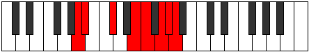 |
| [3479](https://ianring.com/musictheory/scales/3479) | [Rothyllic](ModeANaturalRothyllic.md) | A | A, A#, B, C#, E, F, G, G#, A |  |
| [3483](https://ianring.com/musictheory/scales/3483) | [Mixotharyllic](ModeFSharpMixotharyllic.md) | F# | F#, G, A, A#, C#, D, E, F, F# |  |
| [3483](https://ianring.com/musictheory/scales/3483) | [Mixotharyllic](ModeGFlatMixotharyllic.md) | Gb | Gb, G, A, Bb, Db, D, E, F, Gb |  |
| [3483](https://ianring.com/musictheory/scales/3483) | [Mixotharyllic](ModeANaturalMixotharyllic.md) | A | A, A#, C, C#, E, F, G, G#, A |  |
| [3487](https://ianring.com/musictheory/scales/3487) | [Byptygic](ModeFSharpByptygic.md) | F# | F#, G, G#, A, A#, C#, D, E, F, F# |  |
| [3487](https://ianring.com/musictheory/scales/3487) | [Byptygic](ModeGFlatByptygic.md) | Gb | Gb, G, Ab, A, Bb, Db, D, E, F, Gb |  |
| [3487](https://ianring.com/musictheory/scales/3487) | [Byptygic](ModeANaturalByptygic.md) | A | A, A#, B, C, C#, E, F, G, G#, A |  |
| [3493](https://ianring.com/musictheory/scales/3493) | [Rathian](ModeDNaturalRathian.md) | D | D, E, F##, G##, A#, B#, C#, D | 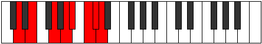 |
| [3493](https://ianring.com/musictheory/scales/3493) | [Rathian](ModeBNaturalRathian.md) | B | B, C#, D##, E##, F##, G##, A#, B |  |
| [3495](https://ianring.com/musictheory/scales/3495) | [Banyllic](ModeDNaturalBanyllic.md) | D | D, D#, E, G, A, A#, C, C#, D |  |
| [3495](https://ianring.com/musictheory/scales/3495) | [Banyllic](ModeGSharpBanyllic.md) | G# | G#, A, A#, C#, D#, E, F#, G, G# |  |
| [3495](https://ianring.com/musictheory/scales/3495) | [Banyllic](ModeAFlatBanyllic.md) | Ab | Ab, A, Bb, Db, Eb, E, Gb, G, Ab |  |
| [3495](https://ianring.com/musictheory/scales/3495) | [Banyllic](ModeBNaturalBanyllic.md) | B | B, C, C#, E, F#, G, A, A#, B |  |
| [3501](https://ianring.com/musictheory/scales/3501) | [Katodyllic](ModeDNaturalKatodyllic.md) | D | D, E, F, G, A, A#, C, C#, D |  |
| [3501](https://ianring.com/musictheory/scales/3501) | [Katodyllic](ModeBNaturalKatodyllic.md) | B | B, C#, D, E, F#, G, A, A#, B |  |
| [3503](https://ianring.com/musictheory/scales/3503) | [Zyphygic](ModeDNaturalZyphygic.md) | D | D, D#, E, F, G, A, A#, C, C#, D |  |
| [3503](https://ianring.com/musictheory/scales/3503) | [Zyphygic](ModeBNaturalZyphygic.md) | B | B, C, C#, D, E, F#, G, A, A#, B |  |
| [3503](https://ianring.com/musictheory/scales/3503) | [Zyphygic](ModeGSharpZyphygic.md) | G# | G#, A, A#, B, C#, D#, E, F#, G, G# |  |
| [3503](https://ianring.com/musictheory/scales/3503) | [Zyphygic](ModeAFlatZyphygic.md) | Ab | Ab, A, Bb, B, Db, Eb, E, Gb, G, Ab |  |
| [3507](https://ianring.com/musictheory/scales/3507) | [Ponyllic](ModeANaturalPonyllic.md) | A | A, A#, C#, D, E, F, G, G#, A |  |
| [3509](https://ianring.com/musictheory/scales/3509) | [Stogyllic](ModeFNaturalStogyllic.md) | F | F, G, A, A#, C, C#, D#, E, F |  |
| [3509](https://ianring.com/musictheory/scales/3509) | [Stogyllic](ModeDNaturalStogyllic.md) | D | D, E, F#, G, A, A#, C, C#, D |  |
| [3509](https://ianring.com/musictheory/scales/3509) | [Stogyllic](ModeBNaturalStogyllic.md) | B | B, C#, D#, E, F#, G, A, A#, B |  |
| [3511](https://ianring.com/musictheory/scales/3511) | [Epolygic](ModeDNaturalEpolygic.md) | D | D, D#, E, F#, G, A, A#, C, C#, D |  |
| [3511](https://ianring.com/musictheory/scales/3511) | [Epolygic](ModeFNaturalEpolygic.md) | F | F, F#, G, A, A#, C, C#, D#, E, F |  |
| [3511](https://ianring.com/musictheory/scales/3511) | [Epolygic](ModeGSharpEpolygic.md) | G# | G#, A, A#, C, C#, D#, E, F#, G, G# |  |
| [3511](https://ianring.com/musictheory/scales/3511) | [Epolygic](ModeAFlatEpolygic.md) | Ab | Ab, A, Bb, C, Db, Eb, E, Gb, G, Ab |  |
| [3511](https://ianring.com/musictheory/scales/3511) | [Epolygic](ModeBNaturalEpolygic.md) | B | B, C, C#, D#, E, F#, G, A, A#, B |  |
| [3511](https://ianring.com/musictheory/scales/3511) | [Epolygic](ModeANaturalEpolygic.md) | A | A, A#, B, C#, D, E, F, G, G#, A |  |
| [3515](https://ianring.com/musictheory/scales/3515) | [Katodygic](ModeANaturalKatodygic.md) | A | A, A#, C, C#, D, E, F, G, G#, A |  |
| [3515](https://ianring.com/musictheory/scales/3515) | [Katodygic](ModeFSharpKatodygic.md) | F# | F#, G, A, A#, B, C#, D, E, F, F# |  |
| [3515](https://ianring.com/musictheory/scales/3515) | [Katodygic](ModeGFlatKatodygic.md) | Gb | Gb, G, A, Bb, B, Db, D, E, F, Gb |  |
| [3517](https://ianring.com/musictheory/scales/3517) | [Epocrygic](ModeDNaturalEpocrygic.md) | D | D, E, F, F#, G, A, A#, C, C#, D |  |
| [3517](https://ianring.com/musictheory/scales/3517) | [Epocrygic](ModeFNaturalEpocrygic.md) | F | F, G, G#, A, A#, C, C#, D#, E, F |  |
| [3517](https://ianring.com/musictheory/scales/3517) | [Epocrygic](ModeBNaturalEpocrygic.md) | B | B, C#, D, D#, E, F#, G, A, A#, B |  |
| [3519](https://ianring.com/musictheory/scales/3519) | [Boptyllian](ModeDNaturalBoptyllian.md) | D | D, D#, E, F, F#, G, A, A#, C, C#, D |  |
| [3519](https://ianring.com/musictheory/scales/3519) | [Boptyllian](ModeFNaturalBoptyllian.md) | F | F, F#, G, G#, A, A#, C, C#, D#, E, F |  |
| [3519](https://ianring.com/musictheory/scales/3519) | [Boptyllian](ModeBNaturalBoptyllian.md) | B | B, C, C#, D, D#, E, F#, G, A, A#, B |  |
| [3519](https://ianring.com/musictheory/scales/3519) | [Boptyllian](ModeANaturalBoptyllian.md) | A | A, A#, B, C, C#, D, E, F, G, G#, A |  |
| [3519](https://ianring.com/musictheory/scales/3519) | [Boptyllian](ModeGSharpBoptyllian.md) | G# | G#, A, A#, B, C, C#, D#, E, F#, G, G# |  |
| [3519](https://ianring.com/musictheory/scales/3519) | [Boptyllian](ModeAFlatBoptyllian.md) | Ab | Ab, A, Bb, B, C, Db, Eb, E, Gb, G, Ab |  |
| [3519](https://ianring.com/musictheory/scales/3519) | [Boptyllian](ModeFSharpBoptyllian.md) | F# | F#, G, G#, A, A#, B, C#, D, E, F, F# |  |
| [3519](https://ianring.com/musictheory/scales/3519) | [Boptyllian](ModeGFlatBoptyllian.md) | Gb | Gb, G, Ab, A, Bb, B, Db, D, E, F, Gb |  |
| [3539](https://ianring.com/musictheory/scales/3539) | [Aeoryllic](ModeANaturalAeoryllic.md) | A | A, A#, C#, D#, E, F, G, G#, A |  |
| [3539](https://ianring.com/musictheory/scales/3539) | [Aeoryllic](ModeDSharpAeoryllic.md) | D# | D#, E, G, A, A#, B, C#, D, D# |  |
| [3539](https://ianring.com/musictheory/scales/3539) | [Aeoryllic](ModeEFlatAeoryllic.md) | Eb | Eb, E, G, A, Bb, B, Db, D, Eb |  |
| [3543](https://ianring.com/musictheory/scales/3543) | [Aeolonygic](ModeDSharpAeolonygic.md) | D# | D#, E, F, G, A, A#, B, C#, D, D# |  |
| [3543](https://ianring.com/musictheory/scales/3543) | [Aeolonygic](ModeEFlatAeolonygic.md) | Eb | Eb, E, F, G, A, Bb, B, Db, D, Eb |  |
| [3543](https://ianring.com/musictheory/scales/3543) | [Aeolonygic](ModeANaturalAeolonygic.md) | A | A, A#, B, C#, D#, E, F, G, G#, A |  |
| [3547](https://ianring.com/musictheory/scales/3547) | [Sadygic](ModeFSharpSadygic.md) | F# | F#, G, A, A#, C, C#, D, E, F, F# |  |
| [3547](https://ianring.com/musictheory/scales/3547) | [Sadygic](ModeGFlatSadygic.md) | Gb | Gb, G, A, Bb, C, Db, D, E, F, Gb |  |
| [3547](https://ianring.com/musictheory/scales/3547) | [Sadygic](ModeANaturalSadygic.md) | A | A, A#, C, C#, D#, E, F, G, G#, A |  |
| [3547](https://ianring.com/musictheory/scales/3547) | [Sadygic](ModeDSharpSadygic.md) | D# | D#, E, F#, G, A, A#, B, C#, D, D# |  |
| [3547](https://ianring.com/musictheory/scales/3547) | [Sadygic](ModeEFlatSadygic.md) | Eb | Eb, E, Gb, G, A, Bb, B, Db, D, Eb |  |
| [3551](https://ianring.com/musictheory/scales/3551) | [Sagyllian](ModeFSharpSagyllian.md) | F# | F#, G, G#, A, A#, C, C#, D, E, F, F# |  |
| [3551](https://ianring.com/musictheory/scales/3551) | [Sagyllian](ModeGFlatSagyllian.md) | Gb | Gb, G, Ab, A, Bb, C, Db, D, E, F, Gb |  |
| [3551](https://ianring.com/musictheory/scales/3551) | [Sagyllian](ModeDSharpSagyllian.md) | D# | D#, E, F, F#, G, A, A#, B, C#, D, D# |  |
| [3551](https://ianring.com/musictheory/scales/3551) | [Sagyllian](ModeEFlatSagyllian.md) | Eb | Eb, E, F, Gb, G, A, Bb, B, Db, D, Eb |  |
| [3551](https://ianring.com/musictheory/scales/3551) | [Sagyllian](ModeANaturalSagyllian.md) | A | A, A#, B, C, C#, D#, E, F, G, G#, A |  |
| [3557](https://ianring.com/musictheory/scales/3557) | [Thycryllic](ModeDNaturalThycryllic.md) | D | D, E, G, G#, A, A#, C, C#, D |  |
| [3557](https://ianring.com/musictheory/scales/3557) | [Thycryllic](ModeBNaturalThycryllic.md) | B | B, C#, E, F, F#, G, A, A#, B |  |
| [3559](https://ianring.com/musictheory/scales/3559) | [Aerathygic](ModeDNaturalAerathygic.md) | D | D, D#, E, G, G#, A, A#, C, C#, D |  |
| [3559](https://ianring.com/musictheory/scales/3559) | [Aerathygic](ModeGSharpAerathygic.md) | G# | G#, A, A#, C#, D, D#, E, F#, G, G# |  |
| [3559](https://ianring.com/musictheory/scales/3559) | [Aerathygic](ModeAFlatAerathygic.md) | Ab | Ab, A, Bb, Db, D, Eb, E, Gb, G, Ab |  |
| [3559](https://ianring.com/musictheory/scales/3559) | [Aerathygic](ModeBNaturalAerathygic.md) | B | B, C, C#, E, F, F#, G, A, A#, B |  |
| [3565](https://ianring.com/musictheory/scales/3565) | [Aeolorygic](ModeDNaturalAeolorygic.md) | D | D, E, F, G, G#, A, A#, C, C#, D |  |
| [3565](https://ianring.com/musictheory/scales/3565) | [Aeolorygic](ModeBNaturalAeolorygic.md) | B | B, C#, D, E, F, F#, G, A, A#, B |  |
| [3567](https://ianring.com/musictheory/scales/3567) | [Epityllian](ModeDNaturalEpityllian.md) | D | D, D#, E, F, G, G#, A, A#, C, C#, D |  |
| [3567](https://ianring.com/musictheory/scales/3567) | [Epityllian](ModeBNaturalEpityllian.md) | B | B, C, C#, D, E, F, F#, G, A, A#, B |  |
| [3567](https://ianring.com/musictheory/scales/3567) | [Epityllian](ModeGSharpEpityllian.md) | G# | G#, A, A#, B, C#, D, D#, E, F#, G, G# |  |
| [3567](https://ianring.com/musictheory/scales/3567) | [Epityllian](ModeAFlatEpityllian.md) | Ab | Ab, A, Bb, B, Db, D, Eb, E, Gb, G, Ab |  |
| [3571](https://ianring.com/musictheory/scales/3571) | [Dyrygic](ModeANaturalDyrygic.md) | A | A, A#, C#, D, D#, E, F, G, G#, A |  |
| [3571](https://ianring.com/musictheory/scales/3571) | [Dyrygic](ModeDSharpDyrygic.md) | D# | D#, E, G, G#, A, A#, B, C#, D, D# |  |
| [3571](https://ianring.com/musictheory/scales/3571) | [Dyrygic](ModeEFlatDyrygic.md) | Eb | Eb, E, G, Ab, A, Bb, B, Db, D, Eb |  |
| [3573](https://ianring.com/musictheory/scales/3573) | [Kaptygic](ModeDNaturalKaptygic.md) | D | D, E, F#, G, G#, A, A#, C, C#, D |  |
| [3573](https://ianring.com/musictheory/scales/3573) | [Kaptygic](ModeFNaturalKaptygic.md) | F | F, G, A, A#, B, C, C#, D#, E, F |  |
| [3573](https://ianring.com/musictheory/scales/3573) | [Kaptygic](ModeBNaturalKaptygic.md) | B | B, C#, D#, E, F, F#, G, A, A#, B |  |
| [3575](https://ianring.com/musictheory/scales/3575) | [Mogyllian](ModeDNaturalMogyllian.md) | D | D, D#, E, F#, G, G#, A, A#, C, C#, D |  |
| [3575](https://ianring.com/musictheory/scales/3575) | [Mogyllian](ModeGSharpMogyllian.md) | G# | G#, A, A#, C, C#, D, D#, E, F#, G, G# |  |
| [3575](https://ianring.com/musictheory/scales/3575) | [Mogyllian](ModeAFlatMogyllian.md) | Ab | Ab, A, Bb, C, Db, D, Eb, E, Gb, G, Ab |  |
| [3575](https://ianring.com/musictheory/scales/3575) | [Mogyllian](ModeFNaturalMogyllian.md) | F | F, F#, G, A, A#, B, C, C#, D#, E, F |  |
| [3575](https://ianring.com/musictheory/scales/3575) | [Mogyllian](ModeBNaturalMogyllian.md) | B | B, C, C#, D#, E, F, F#, G, A, A#, B |  |
| [3575](https://ianring.com/musictheory/scales/3575) | [Mogyllian](ModeDSharpMogyllian.md) | D# | D#, E, F, G, G#, A, A#, B, C#, D, D# |  |
| [3575](https://ianring.com/musictheory/scales/3575) | [Mogyllian](ModeEFlatMogyllian.md) | Eb | Eb, E, F, G, Ab, A, Bb, B, Db, D, Eb |  |
| [3575](https://ianring.com/musictheory/scales/3575) | [Mogyllian](ModeANaturalMogyllian.md) | A | A, A#, B, C#, D, D#, E, F, G, G#, A |  |
| [3579](https://ianring.com/musictheory/scales/3579) | [Zyphyllian](ModeANaturalZyphyllian.md) | A | A, A#, C, C#, D, D#, E, F, G, G#, A |  |
| [3579](https://ianring.com/musictheory/scales/3579) | [Zyphyllian](ModeFSharpZyphyllian.md) | F# | F#, G, A, A#, B, C, C#, D, E, F, F# |  |
| [3579](https://ianring.com/musictheory/scales/3579) | [Zyphyllian](ModeGFlatZyphyllian.md) | Gb | Gb, G, A, Bb, B, C, Db, D, E, F, Gb |  |
| [3579](https://ianring.com/musictheory/scales/3579) | [Zyphyllian](ModeDSharpZyphyllian.md) | D# | D#, E, F#, G, G#, A, A#, B, C#, D, D# |  |
| [3579](https://ianring.com/musictheory/scales/3579) | [Zyphyllian](ModeEFlatZyphyllian.md) | Eb | Eb, E, Gb, G, Ab, A, Bb, B, Db, D, Eb |  |
| [3581](https://ianring.com/musictheory/scales/3581) | [Epocryllian](ModeDNaturalEpocryllian.md) | D | D, E, F, F#, G, G#, A, A#, C, C#, D |  |
| [3581](https://ianring.com/musictheory/scales/3581) | [Epocryllian](ModeBNaturalEpocryllian.md) | B | B, C#, D, D#, E, F, F#, G, A, A#, B |  |
| [3581](https://ianring.com/musictheory/scales/3581) | [Epocryllian](ModeFNaturalEpocryllian.md) | F | F, G, G#, A, A#, B, C, C#, D#, E, F |  |
| [3583](https://ianring.com/musictheory/scales/3583) | [Zylatic](ModeDNaturalZylatic.md) | D | D, D#, E, F, F#, G, G#, A, A#, C, C#, D |  |
| [3583](https://ianring.com/musictheory/scales/3583) | [Zylatic](ModeBNaturalZylatic.md) | B | B, C, C#, D, D#, E, F, F#, G, A, A#, B |  |
| [3583](https://ianring.com/musictheory/scales/3583) | [Zylatic](ModeANaturalZylatic.md) | A | A, A#, B, C, C#, D, D#, E, F, G, G#, A |  |
| [3583](https://ianring.com/musictheory/scales/3583) | [Zylatic](ModeGSharpZylatic.md) | G# | G#, A, A#, B, C, C#, D, D#, E, F#, G, G# |  |
| [3583](https://ianring.com/musictheory/scales/3583) | [Zylatic](ModeAFlatZylatic.md) | Ab | Ab, A, Bb, B, C, Db, D, Eb, E, Gb, G, Ab |  |
| [3583](https://ianring.com/musictheory/scales/3583) | [Zylatic](ModeFSharpZylatic.md) | F# | F#, G, G#, A, A#, B, C, C#, D, E, F, F# |  |
| [3583](https://ianring.com/musictheory/scales/3583) | [Zylatic](ModeGFlatZylatic.md) | Gb | Gb, G, Ab, A, Bb, B, C, Db, D, E, F, Gb |  |
| [3583](https://ianring.com/musictheory/scales/3583) | [Zylatic](ModeFNaturalZylatic.md) | F | F, F#, G, G#, A, A#, B, C, C#, D#, E, F |  |
| [3583](https://ianring.com/musictheory/scales/3583) | [Zylatic](ModeDSharpZylatic.md) | D# | D#, E, F, F#, G, G#, A, A#, B, C#, D, D# |  |
| [3583](https://ianring.com/musictheory/scales/3583) | [Zylatic](ModeEFlatZylatic.md) | Eb | Eb, E, F, Gb, G, Ab, A, Bb, B, Db, D, Eb |  |
| [3657](https://ianring.com/musictheory/scales/3657) | [Epynimic](ModeASharpEpynimic.md) | A# | A#, B##, D##, E###, F###, G##, A# |  |
| [3657](https://ianring.com/musictheory/scales/3657) | [Epynimic](ModeBFlatEpynimic.md) | Bb | Bb, C#, D##, E###, F###, G##, Bb |  |
| [3659](https://ianring.com/musictheory/scales/3659) | [Polian](ModeASharpPolian.md) | A# | A#, B, C#, D##, E###, F###, G##, A# |  |
| [3659](https://ianring.com/musictheory/scales/3659) | [Polian](ModeBFlatPolian.md) | Bb | Bb, Cb, Db, E, F##, G#, A, Bb |  |
| [3661](https://ianring.com/musictheory/scales/3661) | [Mixodorian](ModeGNaturalMixodorian.md) | G | G, A, Bb, C#, D##, E#, F#, G |  |
| [3661](https://ianring.com/musictheory/scales/3661) | [Mixodorian](ModeASharpMixodorian.md) | A# | A#, B#, C#, D##, E###, F###, G##, A# |  |
| [3661](https://ianring.com/musictheory/scales/3661) | [Mixodorian](ModeBFlatMixodorian.md) | Bb | Bb, C, Db, E, F##, G#, A, Bb |  |
| [3663](https://ianring.com/musictheory/scales/3663) | [Sonyllic](ModeGNaturalSonyllic.md) | G | G, G#, A, A#, C#, E, F, F#, G |  |
| [3663](https://ianring.com/musictheory/scales/3663) | [Sonyllic](ModeASharpSonyllic.md) | A# | A#, B, C, C#, E, G, G#, A, A# |  |
| [3663](https://ianring.com/musictheory/scales/3663) | [Sonyllic](ModeBFlatSonyllic.md) | Bb | Bb, B, C, Db, E, G, Ab, A, Bb |  |
| [3673](https://ianring.com/musictheory/scales/3673) | [Ranian](ModeASharpRanian.md) | A# | A#, B##, C##, D##, E###, F###, G##, A# |  |
| [3673](https://ianring.com/musictheory/scales/3673) | [Ranian](ModeBFlatRanian.md) | Bb | Bb, C#, D, E, F##, G#, A, Bb |  |
| [3675](https://ianring.com/musictheory/scales/3675) | [Monyllic](ModeASharpMonyllic.md) | A# | A#, B, C#, D, E, G, G#, A, A# |  |
| [3675](https://ianring.com/musictheory/scales/3675) | [Monyllic](ModeBFlatMonyllic.md) | Bb | Bb, B, Db, D, E, G, Ab, A, Bb |  |
| [3677](https://ianring.com/musictheory/scales/3677) | [Katylyllic](ModeASharpKatylyllic.md) | A# | A#, C, C#, D, E, G, G#, A, A# |  |
| [3677](https://ianring.com/musictheory/scales/3677) | [Katylyllic](ModeBFlatKatylyllic.md) | Bb | Bb, C, Db, D, E, G, Ab, A, Bb |  |
| [3677](https://ianring.com/musictheory/scales/3677) | [Katylyllic](ModeGNaturalKatylyllic.md) | G | G, A, A#, B, C#, E, F, F#, G |  |
| [3679](https://ianring.com/musictheory/scales/3679) | [Rycrygic](ModeASharpRycrygic.md) | A# | A#, B, C, C#, D, E, G, G#, A, A# |  |
| [3679](https://ianring.com/musictheory/scales/3679) | [Rycrygic](ModeBFlatRycrygic.md) | Bb | Bb, B, C, Db, D, E, G, Ab, A, Bb |  |
| [3679](https://ianring.com/musictheory/scales/3679) | [Rycrygic](ModeGNaturalRycrygic.md) | G | G, G#, A, A#, B, C#, E, F, F#, G |  |
| [3689](https://ianring.com/musictheory/scales/3689) | [Katocrian](ModeENaturalKatocrian.md) | E | E, F##, G##, A#, B##, C##, D#, E |  |
| [3689](https://ianring.com/musictheory/scales/3689) | [Katocrian](ModeASharpKatocrian.md) | A# | A#, B##, C###, D##, E###, F###, G##, A# |  |
| [3689](https://ianring.com/musictheory/scales/3689) | [Katocrian](ModeBFlatKatocrian.md) | Bb | Bb, C#, D#, E, F##, G#, A, Bb |  |
| [3691](https://ianring.com/musictheory/scales/3691) | [Badyllic](ModeENaturalBadyllic.md) | E | E, F, G, A, A#, C#, D, D#, E |  |
| [3691](https://ianring.com/musictheory/scales/3691) | [Badyllic](ModeASharpBadyllic.md) | A# | A#, B, C#, D#, E, G, G#, A, A# |  |
| [3691](https://ianring.com/musictheory/scales/3691) | [Badyllic](ModeBFlatBadyllic.md) | Bb | Bb, B, Db, Eb, E, G, Ab, A, Bb |  |
| [3693](https://ianring.com/musictheory/scales/3693) | [Epaptyllic](ModeENaturalEpaptyllic.md) | E | E, F#, G, A, A#, C#, D, D#, E |  |
| [3693](https://ianring.com/musictheory/scales/3693) | [Epaptyllic](ModeGNaturalEpaptyllic.md) | G | G, A, A#, C, C#, E, F, F#, G |  |
| [3693](https://ianring.com/musictheory/scales/3693) | [Epaptyllic](ModeASharpEpaptyllic.md) | A# | A#, C, C#, D#, E, G, G#, A, A# |  |
| [3693](https://ianring.com/musictheory/scales/3693) | [Epaptyllic](ModeBFlatEpaptyllic.md) | Bb | Bb, C, Db, Eb, E, G, Ab, A, Bb |  |
| [3695](https://ianring.com/musictheory/scales/3695) | [Kodygic](ModeENaturalKodygic.md) | E | E, F, F#, G, A, A#, C#, D, D#, E |  |
| [3695](https://ianring.com/musictheory/scales/3695) | [Kodygic](ModeGNaturalKodygic.md) | G | G, G#, A, A#, C, C#, E, F, F#, G |  |
| [3695](https://ianring.com/musictheory/scales/3695) | [Kodygic](ModeASharpKodygic.md) | A# | A#, B, C, C#, D#, E, G, G#, A, A# |  |
| [3695](https://ianring.com/musictheory/scales/3695) | [Kodygic](ModeBFlatKodygic.md) | Bb | Bb, B, C, Db, Eb, E, G, Ab, A, Bb |  |
| [3705](https://ianring.com/musictheory/scales/3705) | [Sydyllic](ModeENaturalSydyllic.md) | E | E, G, G#, A, A#, C#, D, D#, E |  |
| [3705](https://ianring.com/musictheory/scales/3705) | [Sydyllic](ModeASharpSydyllic.md) | A# | A#, C#, D, D#, E, G, G#, A, A# |  |
| [3705](https://ianring.com/musictheory/scales/3705) | [Sydyllic](ModeBFlatSydyllic.md) | Bb | Bb, Db, D, Eb, E, G, Ab, A, Bb |  |
| [3707](https://ianring.com/musictheory/scales/3707) | [Rynygic](ModeENaturalRynygic.md) | E | E, F, G, G#, A, A#, C#, D, D#, E |  |
| [3707](https://ianring.com/musictheory/scales/3707) | [Rynygic](ModeASharpRynygic.md) | A# | A#, B, C#, D, D#, E, G, G#, A, A# |  |
| [3707](https://ianring.com/musictheory/scales/3707) | [Rynygic](ModeBFlatRynygic.md) | Bb | Bb, B, Db, D, Eb, E, G, Ab, A, Bb |  |
| [3709](https://ianring.com/musictheory/scales/3709) | [Locrygic](ModeASharpLocrygic.md) | A# | A#, C, C#, D, D#, E, G, G#, A, A# |  |
| [3709](https://ianring.com/musictheory/scales/3709) | [Locrygic](ModeBFlatLocrygic.md) | Bb | Bb, C, Db, D, Eb, E, G, Ab, A, Bb |  |
| [3709](https://ianring.com/musictheory/scales/3709) | [Locrygic](ModeENaturalLocrygic.md) | E | E, F#, G, G#, A, A#, C#, D, D#, E |  |
| [3709](https://ianring.com/musictheory/scales/3709) | [Locrygic](ModeGNaturalLocrygic.md) | G | G, A, A#, B, C, C#, E, F, F#, G | 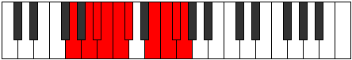 |
| [3711](https://ianring.com/musictheory/scales/3711) | [Dycryllian](ModeENaturalDycryllian.md) | E | E, F, F#, G, G#, A, A#, C#, D, D#, E |  |
| [3711](https://ianring.com/musictheory/scales/3711) | [Dycryllian](ModeASharpDycryllian.md) | A# | A#, B, C, C#, D, D#, E, G, G#, A, A# |  |
| [3711](https://ianring.com/musictheory/scales/3711) | [Dycryllian](ModeBFlatDycryllian.md) | Bb | Bb, B, C, Db, D, Eb, E, G, Ab, A, Bb |  |
| [3711](https://ianring.com/musictheory/scales/3711) | [Dycryllian](ModeGNaturalDycryllian.md) | G | G, G#, A, A#, B, C, C#, E, F, F#, G |  |
| [3731](https://ianring.com/musictheory/scales/3731) | [Aeryrian](ModeANaturalAeryrian.md) | A | A, Bb, C#, D##, E##, F##, G#, A |  |
| [3731](https://ianring.com/musictheory/scales/3731) | [Aeryrian](ModeCNaturalAeryrian.md) | C | C, Db, E, F##, G##, A#, B, C |  |
| [3735](https://ianring.com/musictheory/scales/3735) | [Ionagyllic](ModeCNaturalIonagyllic.md) | C | C, C#, D, E, G, A, A#, B, C |  |
| [3735](https://ianring.com/musictheory/scales/3735) | [Ionagyllic](ModeANaturalIonagyllic.md) | A | A, A#, B, C#, E, F#, G, G#, A |  |
| [3739](https://ianring.com/musictheory/scales/3739) | [Ioninyllic](ModeFSharpIoninyllic.md) | F# | F#, G, A, A#, C#, D#, E, F, F# |  |
| [3739](https://ianring.com/musictheory/scales/3739) | [Ioninyllic](ModeGFlatIoninyllic.md) | Gb | Gb, G, A, Bb, Db, Eb, E, F, Gb |  |
| [3739](https://ianring.com/musictheory/scales/3739) | [Ioninyllic](ModeANaturalIoninyllic.md) | A | A, A#, C, C#, E, F#, G, G#, A |  |
| [3739](https://ianring.com/musictheory/scales/3739) | [Ioninyllic](ModeCNaturalIoninyllic.md) | C | C, C#, D#, E, G, A, A#, B, C |  |
| [3743](https://ianring.com/musictheory/scales/3743) | [Thadygic](ModeFSharpThadygic.md) | F# | F#, G, G#, A, A#, C#, D#, E, F, F# |  |
| [3743](https://ianring.com/musictheory/scales/3743) | [Thadygic](ModeGFlatThadygic.md) | Gb | Gb, G, Ab, A, Bb, Db, Eb, E, F, Gb |  |
| [3743](https://ianring.com/musictheory/scales/3743) | [Thadygic](ModeCNaturalThadygic.md) | C | C, C#, D, D#, E, G, A, A#, B, C |  |
| [3743](https://ianring.com/musictheory/scales/3743) | [Thadygic](ModeANaturalThadygic.md) | A | A, A#, B, C, C#, E, F#, G, G#, A |  |
| [3763](https://ianring.com/musictheory/scales/3763) | [Modyllic](ModeANaturalModyllic.md) | A | A, A#, C#, D, E, F#, G, G#, A |  |
| [3763](https://ianring.com/musictheory/scales/3763) | [Modyllic](ModeCNaturalModyllic.md) | C | C, C#, E, F, G, A, A#, B, C |  |
| [3767](https://ianring.com/musictheory/scales/3767) | [Bacrygic](ModeCNaturalBacrygic.md) | C | C, C#, D, E, F, G, A, A#, B, C |  |
| [3767](https://ianring.com/musictheory/scales/3767) | [Bacrygic](ModeANaturalBacrygic.md) | A | A, A#, B, C#, D, E, F#, G, G#, A |  |
| [3771](https://ianring.com/musictheory/scales/3771) | [Stophygic](ModeANaturalStophygic.md) | A | A, A#, C, C#, D, E, F#, G, G#, A |  |
| [3771](https://ianring.com/musictheory/scales/3771) | [Stophygic](ModeCNaturalStophygic.md) | C | C, C#, D#, E, F, G, A, A#, B, C |  |
| [3771](https://ianring.com/musictheory/scales/3771) | [Stophygic](ModeFSharpStophygic.md) | F# | F#, G, A, A#, B, C#, D#, E, F, F# |  |
| [3771](https://ianring.com/musictheory/scales/3771) | [Stophygic](ModeGFlatStophygic.md) | Gb | Gb, G, A, Bb, B, Db, Eb, E, F, Gb |  |
| [3775](https://ianring.com/musictheory/scales/3775) | [Loptyllian](ModeCNaturalLoptyllian.md) | C | C, C#, D, D#, E, F, G, A, A#, B, C |  |
| [3775](https://ianring.com/musictheory/scales/3775) | [Loptyllian](ModeANaturalLoptyllian.md) | A | A, A#, B, C, C#, D, E, F#, G, G#, A |  |
| [3775](https://ianring.com/musictheory/scales/3775) | [Loptyllian](ModeFSharpLoptyllian.md) | F# | F#, G, G#, A, A#, B, C#, D#, E, F, F# |  |
| [3775](https://ianring.com/musictheory/scales/3775) | [Loptyllian](ModeGFlatLoptyllian.md) | Gb | Gb, G, Ab, A, Bb, B, Db, Eb, E, F, Gb |  |
| [3785](https://ianring.com/musictheory/scales/3785) | [Epagian](ModeASharpEpagian.md) | A# | A#, B##, D##, E#, F##, G#, A, A# |  |
| [3785](https://ianring.com/musictheory/scales/3785) | [Epagian](ModeBFlatEpagian.md) | Bb | Bb, C#, D##, E#, F##, G#, A, Bb |  |
| [3787](https://ianring.com/musictheory/scales/3787) | [Kagyllic](ModeASharpKagyllic.md) | A# | A#, B, C#, E, F, G, G#, A, A# |  |
| [3787](https://ianring.com/musictheory/scales/3787) | [Kagyllic](ModeBFlatKagyllic.md) | Bb | Bb, B, Db, E, F, G, Ab, A, Bb |  |
| [3789](https://ianring.com/musictheory/scales/3789) | [Eporyllic](ModeGNaturalEporyllic.md) | G | G, A, A#, C#, D, E, F, F#, G |  |
| [3789](https://ianring.com/musictheory/scales/3789) | [Eporyllic](ModeASharpEporyllic.md) | A# | A#, C, C#, E, F, G, G#, A, A# |  |
| [3789](https://ianring.com/musictheory/scales/3789) | [Eporyllic](ModeBFlatEporyllic.md) | Bb | Bb, C, Db, E, F, G, Ab, A, Bb |  |
| [3791](https://ianring.com/musictheory/scales/3791) | [Stodygic](ModeGNaturalStodygic.md) | G | G, G#, A, A#, C#, D, E, F, F#, G |  |
| [3791](https://ianring.com/musictheory/scales/3791) | [Stodygic](ModeASharpStodygic.md) | A# | A#, B, C, C#, E, F, G, G#, A, A# |  |
| [3791](https://ianring.com/musictheory/scales/3791) | [Stodygic](ModeBFlatStodygic.md) | Bb | Bb, B, C, Db, E, F, G, Ab, A, Bb |  |
| [3795](https://ianring.com/musictheory/scales/3795) | [Epothyllic](ModeDSharpEpothyllic.md) | D# | D#, E, G, A, A#, C, C#, D, D# |  |
| [3795](https://ianring.com/musictheory/scales/3795) | [Epothyllic](ModeEFlatEpothyllic.md) | Eb | Eb, E, G, A, Bb, C, Db, D, Eb |  |
| [3795](https://ianring.com/musictheory/scales/3795) | [Epothyllic](ModeANaturalEpothyllic.md) | A | A, A#, C#, D#, E, F#, G, G#, A |  |
| [3795](https://ianring.com/musictheory/scales/3795) | [Epothyllic](ModeCNaturalEpothyllic.md) | C | C, C#, E, F#, G, A, A#, B, C |  |
| [3799](https://ianring.com/musictheory/scales/3799) | [Aeralygic](ModeDSharpAeralygic.md) | D# | D#, E, F, G, A, A#, C, C#, D, D# |  |
| [3799](https://ianring.com/musictheory/scales/3799) | [Aeralygic](ModeEFlatAeralygic.md) | Eb | Eb, E, F, G, A, Bb, C, Db, D, Eb |  |
| [3799](https://ianring.com/musictheory/scales/3799) | [Aeralygic](ModeCNaturalAeralygic.md) | C | C, C#, D, E, F#, G, A, A#, B, C |  |
| [3799](https://ianring.com/musictheory/scales/3799) | [Aeralygic](ModeANaturalAeralygic.md) | A | A, A#, B, C#, D#, E, F#, G, G#, A |  |
| [3801](https://ianring.com/musictheory/scales/3801) | [Maptyllic](ModeASharpMaptyllic.md) | A# | A#, C#, D, E, F, G, G#, A, A# |  |
| [3801](https://ianring.com/musictheory/scales/3801) | [Maptyllic](ModeBFlatMaptyllic.md) | Bb | Bb, Db, D, E, F, G, Ab, A, Bb |  |
| [3803](https://ianring.com/musictheory/scales/3803) | [Epidygic](ModeDSharpEpidygic.md) | D# | D#, E, F#, G, A, A#, C, C#, D, D# |  |
| [3803](https://ianring.com/musictheory/scales/3803) | [Epidygic](ModeEFlatEpidygic.md) | Eb | Eb, E, Gb, G, A, Bb, C, Db, D, Eb |  |
| [3803](https://ianring.com/musictheory/scales/3803) | [Epidygic](ModeFSharpEpidygic.md) | F# | F#, G, A, A#, C, C#, D#, E, F, F# |  |
| [3803](https://ianring.com/musictheory/scales/3803) | [Epidygic](ModeGFlatEpidygic.md) | Gb | Gb, G, A, Bb, C, Db, Eb, E, F, Gb |  |
| [3803](https://ianring.com/musictheory/scales/3803) | [Epidygic](ModeANaturalEpidygic.md) | A | A, A#, C, C#, D#, E, F#, G, G#, A |  |
| [3803](https://ianring.com/musictheory/scales/3803) | [Epidygic](ModeCNaturalEpidygic.md) | C | C, C#, D#, E, F#, G, A, A#, B, C |  |
| [3803](https://ianring.com/musictheory/scales/3803) | [Epidygic](ModeASharpEpidygic.md) | A# | A#, B, C#, D, E, F, G, G#, A, A# |  |
| [3803](https://ianring.com/musictheory/scales/3803) | [Epidygic](ModeBFlatEpidygic.md) | Bb | Bb, B, Db, D, E, F, G, Ab, A, Bb |  |
| [3805](https://ianring.com/musictheory/scales/3805) | [Moptygic](ModeASharpMoptygic.md) | A# | A#, C, C#, D, E, F, G, G#, A, A# |  |
| [3805](https://ianring.com/musictheory/scales/3805) | [Moptygic](ModeBFlatMoptygic.md) | Bb | Bb, C, Db, D, E, F, G, Ab, A, Bb |  |
| [3805](https://ianring.com/musictheory/scales/3805) | [Moptygic](ModeGNaturalMoptygic.md) | G | G, A, A#, B, C#, D, E, F, F#, G |  |
| [3807](https://ianring.com/musictheory/scales/3807) | [Bagyllian](ModeDSharpBagyllian.md) | D# | D#, E, F, F#, G, A, A#, C, C#, D, D# |  |
| [3807](https://ianring.com/musictheory/scales/3807) | [Bagyllian](ModeEFlatBagyllian.md) | Eb | Eb, E, F, Gb, G, A, Bb, C, Db, D, Eb |  |
| [3807](https://ianring.com/musictheory/scales/3807) | [Bagyllian](ModeFSharpBagyllian.md) | F# | F#, G, G#, A, A#, C, C#, D#, E, F, F# |  |
| [3807](https://ianring.com/musictheory/scales/3807) | [Bagyllian](ModeGFlatBagyllian.md) | Gb | Gb, G, Ab, A, Bb, C, Db, Eb, E, F, Gb |  |
| [3807](https://ianring.com/musictheory/scales/3807) | [Bagyllian](ModeCNaturalBagyllian.md) | C | C, C#, D, D#, E, F#, G, A, A#, B, C |  |
| [3807](https://ianring.com/musictheory/scales/3807) | [Bagyllian](ModeASharpBagyllian.md) | A# | A#, B, C, C#, D, E, F, G, G#, A, A# |  |
| [3807](https://ianring.com/musictheory/scales/3807) | [Bagyllian](ModeBFlatBagyllian.md) | Bb | Bb, B, C, Db, D, E, F, G, Ab, A, Bb |  |
| [3807](https://ianring.com/musictheory/scales/3807) | [Bagyllian](ModeANaturalBagyllian.md) | A | A, A#, B, C, C#, D#, E, F#, G, G#, A |  |
| [3807](https://ianring.com/musictheory/scales/3807) | [Bagyllian](ModeGNaturalBagyllian.md) | G | G, G#, A, A#, B, C#, D, E, F, F#, G |  |
| [3817](https://ianring.com/musictheory/scales/3817) | [Zoryllic](ModeASharpZoryllic.md) | A# | A#, C#, D#, E, F, G, G#, A, A# |  |
| [3817](https://ianring.com/musictheory/scales/3817) | [Zoryllic](ModeBFlatZoryllic.md) | Bb | Bb, Db, Eb, E, F, G, Ab, A, Bb |  |
| [3817](https://ianring.com/musictheory/scales/3817) | [Zoryllic](ModeENaturalZoryllic.md) | E | E, G, A, A#, B, C#, D, D#, E |  |
| [3819](https://ianring.com/musictheory/scales/3819) | [Aeolanygic](ModeENaturalAeolanygic.md) | E | E, F, G, A, A#, B, C#, D, D#, E |  |
| [3819](https://ianring.com/musictheory/scales/3819) | [Aeolanygic](ModeASharpAeolanygic.md) | A# | A#, B, C#, D#, E, F, G, G#, A, A# |  |
| [3819](https://ianring.com/musictheory/scales/3819) | [Aeolanygic](ModeBFlatAeolanygic.md) | Bb | Bb, B, Db, Eb, E, F, G, Ab, A, Bb |  |
| [3821](https://ianring.com/musictheory/scales/3821) | [Epyrygic](ModeGNaturalEpyrygic.md) | G | G, A, A#, C, C#, D, E, F, F#, G |  |
| [3821](https://ianring.com/musictheory/scales/3821) | [Epyrygic](ModeASharpEpyrygic.md) | A# | A#, C, C#, D#, E, F, G, G#, A, A# |  |
| [3821](https://ianring.com/musictheory/scales/3821) | [Epyrygic](ModeBFlatEpyrygic.md) | Bb | Bb, C, Db, Eb, E, F, G, Ab, A, Bb |  |
| [3821](https://ianring.com/musictheory/scales/3821) | [Epyrygic](ModeENaturalEpyrygic.md) | E | E, F#, G, A, A#, B, C#, D, D#, E |  |
| [3823](https://ianring.com/musictheory/scales/3823) | [Epinyllian](ModeGNaturalEpinyllian.md) | G | G, G#, A, A#, C, C#, D, E, F, F#, G |  |
| [3823](https://ianring.com/musictheory/scales/3823) | [Epinyllian](ModeENaturalEpinyllian.md) | E | E, F, F#, G, A, A#, B, C#, D, D#, E |  |
| [3823](https://ianring.com/musictheory/scales/3823) | [Epinyllian](ModeASharpEpinyllian.md) | A# | A#, B, C, C#, D#, E, F, G, G#, A, A# |  |
| [3823](https://ianring.com/musictheory/scales/3823) | [Epinyllian](ModeBFlatEpinyllian.md) | Bb | Bb, B, C, Db, Eb, E, F, G, Ab, A, Bb |  |
| [3827](https://ianring.com/musictheory/scales/3827) | [Dorygic](ModeDSharpDorygic.md) | D# | D#, E, G, G#, A, A#, C, C#, D, D# |  |
| [3827](https://ianring.com/musictheory/scales/3827) | [Dorygic](ModeEFlatDorygic.md) | Eb | Eb, E, G, Ab, A, Bb, C, Db, D, Eb |  |
| [3827](https://ianring.com/musictheory/scales/3827) | [Dorygic](ModeANaturalDorygic.md) | A | A, A#, C#, D, D#, E, F#, G, G#, A |  |
| [3827](https://ianring.com/musictheory/scales/3827) | [Dorygic](ModeCNaturalDorygic.md) | C | C, C#, E, F, F#, G, A, A#, B, C |  |
| [3831](https://ianring.com/musictheory/scales/3831) | [Ionyllian](ModeDSharpIonyllian.md) | D# | D#, E, F, G, G#, A, A#, C, C#, D, D# |  |
| [3831](https://ianring.com/musictheory/scales/3831) | [Ionyllian](ModeEFlatIonyllian.md) | Eb | Eb, E, F, G, Ab, A, Bb, C, Db, D, Eb |  |
| [3831](https://ianring.com/musictheory/scales/3831) | [Ionyllian](ModeCNaturalIonyllian.md) | C | C, C#, D, E, F, F#, G, A, A#, B, C |  |
| [3831](https://ianring.com/musictheory/scales/3831) | [Ionyllian](ModeANaturalIonyllian.md) | A | A, A#, B, C#, D, D#, E, F#, G, G#, A |  |
| [3833](https://ianring.com/musictheory/scales/3833) | [Dycrygic](ModeASharpDycrygic.md) | A# | A#, C#, D, D#, E, F, G, G#, A, A# |  |
| [3833](https://ianring.com/musictheory/scales/3833) | [Dycrygic](ModeBFlatDycrygic.md) | Bb | Bb, Db, D, Eb, E, F, G, Ab, A, Bb |  |
| [3833](https://ianring.com/musictheory/scales/3833) | [Dycrygic](ModeENaturalDycrygic.md) | E | E, G, G#, A, A#, B, C#, D, D#, E |  |
| [3835](https://ianring.com/musictheory/scales/3835) | [Katodyllian](ModeDSharpKatodyllian.md) | D# | D#, E, F#, G, G#, A, A#, C, C#, D, D# |  |
| [3835](https://ianring.com/musictheory/scales/3835) | [Katodyllian](ModeEFlatKatodyllian.md) | Eb | Eb, E, Gb, G, Ab, A, Bb, C, Db, D, Eb |  |
| [3835](https://ianring.com/musictheory/scales/3835) | [Katodyllian](ModeANaturalKatodyllian.md) | A | A, A#, C, C#, D, D#, E, F#, G, G#, A |  |
| [3835](https://ianring.com/musictheory/scales/3835) | [Katodyllian](ModeCNaturalKatodyllian.md) | C | C, C#, D#, E, F, F#, G, A, A#, B, C |  |
| [3835](https://ianring.com/musictheory/scales/3835) | [Katodyllian](ModeFSharpKatodyllian.md) | F# | F#, G, A, A#, B, C, C#, D#, E, F, F# |  |
| [3835](https://ianring.com/musictheory/scales/3835) | [Katodyllian](ModeGFlatKatodyllian.md) | Gb | Gb, G, A, Bb, B, C, Db, Eb, E, F, Gb |  |
| [3835](https://ianring.com/musictheory/scales/3835) | [Katodyllian](ModeENaturalKatodyllian.md) | E | E, F, G, G#, A, A#, B, C#, D, D#, E |  |
| [3835](https://ianring.com/musictheory/scales/3835) | [Katodyllian](ModeASharpKatodyllian.md) | A# | A#, B, C#, D, D#, E, F, G, G#, A, A# |  |
| [3835](https://ianring.com/musictheory/scales/3835) | [Katodyllian](ModeBFlatKatodyllian.md) | Bb | Bb, B, Db, D, Eb, E, F, G, Ab, A, Bb |  |
| [3837](https://ianring.com/musictheory/scales/3837) | [Garyllian](ModeASharpGaryllian.md) | A# | A#, C, C#, D, D#, E, F, G, G#, A, A# |  |
| [3837](https://ianring.com/musictheory/scales/3837) | [Garyllian](ModeBFlatGaryllian.md) | Bb | Bb, C, Db, D, Eb, E, F, G, Ab, A, Bb |  |
| [3837](https://ianring.com/musictheory/scales/3837) | [Garyllian](ModeGNaturalGaryllian.md) | G | G, A, A#, B, C, C#, D, E, F, F#, G |  |
| [3837](https://ianring.com/musictheory/scales/3837) | [Garyllian](ModeENaturalGaryllian.md) | E | E, F#, G, G#, A, A#, B, C#, D, D#, E |  |
| [3839](https://ianring.com/musictheory/scales/3839) | [Mixolatic](ModeDSharpMixolatic.md) | D# | D#, E, F, F#, G, G#, A, A#, C, C#, D, D# |  |
| [3839](https://ianring.com/musictheory/scales/3839) | [Mixolatic](ModeEFlatMixolatic.md) | Eb | Eb, E, F, Gb, G, Ab, A, Bb, C, Db, D, Eb |  |
| [3839](https://ianring.com/musictheory/scales/3839) | [Mixolatic](ModeCNaturalMixolatic.md) | C | C, C#, D, D#, E, F, F#, G, A, A#, B, C |  |
| [3839](https://ianring.com/musictheory/scales/3839) | [Mixolatic](ModeASharpMixolatic.md) | A# | A#, B, C, C#, D, D#, E, F, G, G#, A, A# |  |
| [3839](https://ianring.com/musictheory/scales/3839) | [Mixolatic](ModeBFlatMixolatic.md) | Bb | Bb, B, C, Db, D, Eb, E, F, G, Ab, A, Bb |  |
| [3839](https://ianring.com/musictheory/scales/3839) | [Mixolatic](ModeANaturalMixolatic.md) | A | A, A#, B, C, C#, D, D#, E, F#, G, G#, A |  |
| [3839](https://ianring.com/musictheory/scales/3839) | [Mixolatic](ModeGNaturalMixolatic.md) | G | G, G#, A, A#, B, C, C#, D, E, F, F#, G |  |
| [3839](https://ianring.com/musictheory/scales/3839) | [Mixolatic](ModeFSharpMixolatic.md) | F# | F#, G, G#, A, A#, B, C, C#, D#, E, F, F# |  |
| [3839](https://ianring.com/musictheory/scales/3839) | [Mixolatic](ModeGFlatMixolatic.md) | Gb | Gb, G, Ab, A, Bb, B, C, Db, Eb, E, F, Gb |  |
| [3839](https://ianring.com/musictheory/scales/3839) | [Mixolatic](ModeENaturalMixolatic.md) | E | E, F, F#, G, G#, A, A#, B, C#, D, D#, E |  |
| [3877](https://ianring.com/musictheory/scales/3877) | [Thanian](ModeBNaturalThanian.md) | B | B, C#, D##, E###, F###, G##, A#, B | 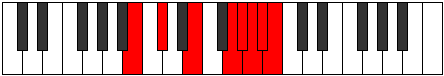 |
| [3879](https://ianring.com/musictheory/scales/3879) | [Pathyllic](ModeGSharpPathyllic.md) | G# | G#, A, A#, C#, E, F, F#, G, G# |  |
| [3879](https://ianring.com/musictheory/scales/3879) | [Pathyllic](ModeAFlatPathyllic.md) | Ab | Ab, A, Bb, Db, E, F, Gb, G, Ab |  |
| [3879](https://ianring.com/musictheory/scales/3879) | [Pathyllic](ModeBNaturalPathyllic.md) | B | B, C, C#, E, G, G#, A, A#, B |  |
| [3885](https://ianring.com/musictheory/scales/3885) | [Styryllic](ModeBNaturalStyryllic.md) | B | B, C#, D, E, G, G#, A, A#, B |  |
| [3887](https://ianring.com/musictheory/scales/3887) | [Phrathygic](ModeBNaturalPhrathygic.md) | B | B, C, C#, D, E, G, G#, A, A#, B |  |
| [3887](https://ianring.com/musictheory/scales/3887) | [Phrathygic](ModeGSharpPhrathygic.md) | G# | G#, A, A#, B, C#, E, F, F#, G, G# |  |
| [3887](https://ianring.com/musictheory/scales/3887) | [Phrathygic](ModeAFlatPhrathygic.md) | Ab | Ab, A, Bb, B, Db, E, F, Gb, G, Ab |  |
| [3893](https://ianring.com/musictheory/scales/3893) | [Phrocryllic](ModeFNaturalPhrocryllic.md) | F | F, G, A, A#, C#, D, D#, E, F | 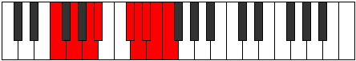 |
| [3893](https://ianring.com/musictheory/scales/3893) | [Phrocryllic](ModeBNaturalPhrocryllic.md) | B | B, C#, D#, E, G, G#, A, A#, B |  |
| [3895](https://ianring.com/musictheory/scales/3895) | [Eparygic](ModeFNaturalEparygic.md) | F | F, F#, G, A, A#, C#, D, D#, E, F |  |
| [3895](https://ianring.com/musictheory/scales/3895) | [Eparygic](ModeGSharpEparygic.md) | G# | G#, A, A#, C, C#, E, F, F#, G, G# |  |
| [3895](https://ianring.com/musictheory/scales/3895) | [Eparygic](ModeAFlatEparygic.md) | Ab | Ab, A, Bb, C, Db, E, F, Gb, G, Ab |  |
| [3895](https://ianring.com/musictheory/scales/3895) | [Eparygic](ModeBNaturalEparygic.md) | B | B, C, C#, D#, E, G, G#, A, A#, B |  |
| [3901](https://ianring.com/musictheory/scales/3901) | [Bycrygic](ModeFNaturalBycrygic.md) | F | F, G, G#, A, A#, C#, D, D#, E, F |  |
| [3901](https://ianring.com/musictheory/scales/3901) | [Bycrygic](ModeBNaturalBycrygic.md) | B | B, C#, D, D#, E, G, G#, A, A#, B |  |
| [3903](https://ianring.com/musictheory/scales/3903) | [Aeogyllian](ModeFNaturalAeogyllian.md) | F | F, F#, G, G#, A, A#, C#, D, D#, E, F |  |
| [3903](https://ianring.com/musictheory/scales/3903) | [Aeogyllian](ModeBNaturalAeogyllian.md) | B | B, C, C#, D, D#, E, G, G#, A, A#, B |  |
| [3903](https://ianring.com/musictheory/scales/3903) | [Aeogyllian](ModeGSharpAeogyllian.md) | G# | G#, A, A#, B, C, C#, E, F, F#, G, G# |  |
| [3903](https://ianring.com/musictheory/scales/3903) | [Aeogyllian](ModeAFlatAeogyllian.md) | Ab | Ab, A, Bb, B, C, Db, E, F, Gb, G, Ab |  |
| [3913](https://ianring.com/musictheory/scales/3913) | [Bonian](ModeASharpBonian.md) | A# | A#, B##, D##, E##, F##, G#, A, A# |  |
| [3913](https://ianring.com/musictheory/scales/3913) | [Bonian](ModeBFlatBonian.md) | Bb | Bb, C#, D##, E##, F##, G#, A, Bb |  |
| [3913](https://ianring.com/musictheory/scales/3913) | [Bonian](ModeCSharpBonian.md) | C# | C#, D##, E###, Cbbb, Cbb, Dbbb, Dbb, C# |  |
| [3913](https://ianring.com/musictheory/scales/3913) | [Bonian](ModeDFlatBonian.md) | Db | Db, E, F##, G##, A#, B, C, Db |  |
| [3915](https://ianring.com/musictheory/scales/3915) | [Gogyllic](ModeCSharpGogyllic.md) | C# | C#, D, E, G, A, A#, B, C, C# |  |
| [3915](https://ianring.com/musictheory/scales/3915) | [Gogyllic](ModeDFlatGogyllic.md) | Db | Db, D, E, G, A, Bb, B, C, Db |  |
| [3915](https://ianring.com/musictheory/scales/3915) | [Gogyllic](ModeASharpGogyllic.md) | A# | A#, B, C#, E, F#, G, G#, A, A# |  |
| [3915](https://ianring.com/musictheory/scales/3915) | [Gogyllic](ModeBFlatGogyllic.md) | Bb | Bb, B, Db, E, Gb, G, Ab, A, Bb |  |
| [3917](https://ianring.com/musictheory/scales/3917) | [Epaphyllic](ModeGNaturalEpaphyllic.md) | G | G, A, A#, C#, D#, E, F, F#, G |  |
| [3917](https://ianring.com/musictheory/scales/3917) | [Epaphyllic](ModeASharpEpaphyllic.md) | A# | A#, C, C#, E, F#, G, G#, A, A# |  |
| [3917](https://ianring.com/musictheory/scales/3917) | [Epaphyllic](ModeBFlatEpaphyllic.md) | Bb | Bb, C, Db, E, Gb, G, Ab, A, Bb |  |
| [3917](https://ianring.com/musictheory/scales/3917) | [Epaphyllic](ModeCSharpEpaphyllic.md) | C# | C#, D#, E, G, A, A#, B, C, C# |  |
| [3917](https://ianring.com/musictheory/scales/3917) | [Epaphyllic](ModeDFlatEpaphyllic.md) | Db | Db, Eb, E, G, A, Bb, B, C, Db |  |
| [3919](https://ianring.com/musictheory/scales/3919) | [Lynygic](ModeGNaturalLynygic.md) | G | G, G#, A, A#, C#, D#, E, F, F#, G |  |
| [3919](https://ianring.com/musictheory/scales/3919) | [Lynygic](ModeCSharpLynygic.md) | C# | C#, D, D#, E, G, A, A#, B, C, C# |  |
| [3919](https://ianring.com/musictheory/scales/3919) | [Lynygic](ModeDFlatLynygic.md) | Db | Db, D, Eb, E, G, A, Bb, B, C, Db |  |
| [3919](https://ianring.com/musictheory/scales/3919) | [Lynygic](ModeASharpLynygic.md) | A# | A#, B, C, C#, E, F#, G, G#, A, A# |  |
| [3919](https://ianring.com/musictheory/scales/3919) | [Lynygic](ModeBFlatLynygic.md) | Bb | Bb, B, C, Db, E, Gb, G, Ab, A, Bb |  |
| [3929](https://ianring.com/musictheory/scales/3929) | [Aeolothyllic](ModeASharpAeolothyllic.md) | A# | A#, C#, D, E, F#, G, G#, A, A# |  |
| [3929](https://ianring.com/musictheory/scales/3929) | [Aeolothyllic](ModeBFlatAeolothyllic.md) | Bb | Bb, Db, D, E, Gb, G, Ab, A, Bb |  |
| [3929](https://ianring.com/musictheory/scales/3929) | [Aeolothyllic](ModeCSharpAeolothyllic.md) | C# | C#, E, F, G, A, A#, B, C, C# |  |
| [3929](https://ianring.com/musictheory/scales/3929) | [Aeolothyllic](ModeDFlatAeolothyllic.md) | Db | Db, E, F, G, A, Bb, B, C, Db |  |
| [3931](https://ianring.com/musictheory/scales/3931) | [Aerygic](ModeCSharpAerygic.md) | C# | C#, D, E, F, G, A, A#, B, C, C# |  |
| [3931](https://ianring.com/musictheory/scales/3931) | [Aerygic](ModeDFlatAerygic.md) | Db | Db, D, E, F, G, A, Bb, B, C, Db |  |
| [3931](https://ianring.com/musictheory/scales/3931) | [Aerygic](ModeASharpAerygic.md) | A# | A#, B, C#, D, E, F#, G, G#, A, A# |  |
| [3931](https://ianring.com/musictheory/scales/3931) | [Aerygic](ModeBFlatAerygic.md) | Bb | Bb, B, Db, D, E, Gb, G, Ab, A, Bb |  |
| [3933](https://ianring.com/musictheory/scales/3933) | [Ionidygic](ModeASharpIonidygic.md) | A# | A#, C, C#, D, E, F#, G, G#, A, A# |  |
| [3933](https://ianring.com/musictheory/scales/3933) | [Ionidygic](ModeBFlatIonidygic.md) | Bb | Bb, C, Db, D, E, Gb, G, Ab, A, Bb |  |
| [3933](https://ianring.com/musictheory/scales/3933) | [Ionidygic](ModeCSharpIonidygic.md) | C# | C#, D#, E, F, G, A, A#, B, C, C# |  |
| [3933](https://ianring.com/musictheory/scales/3933) | [Ionidygic](ModeDFlatIonidygic.md) | Db | Db, Eb, E, F, G, A, Bb, B, C, Db |  |
| [3933](https://ianring.com/musictheory/scales/3933) | [Ionidygic](ModeGNaturalIonidygic.md) | G | G, A, A#, B, C#, D#, E, F, F#, G |  |
| [3935](https://ianring.com/musictheory/scales/3935) | [Kataphyllian](ModeCSharpKataphyllian.md) | C# | C#, D, D#, E, F, G, A, A#, B, C, C# |  |
| [3935](https://ianring.com/musictheory/scales/3935) | [Kataphyllian](ModeDFlatKataphyllian.md) | Db | Db, D, Eb, E, F, G, A, Bb, B, C, Db |  |
| [3935](https://ianring.com/musictheory/scales/3935) | [Kataphyllian](ModeASharpKataphyllian.md) | A# | A#, B, C, C#, D, E, F#, G, G#, A, A# |  |
| [3935](https://ianring.com/musictheory/scales/3935) | [Kataphyllian](ModeBFlatKataphyllian.md) | Bb | Bb, B, C, Db, D, E, Gb, G, Ab, A, Bb |  |
| [3935](https://ianring.com/musictheory/scales/3935) | [Kataphyllian](ModeGNaturalKataphyllian.md) | G | G, G#, A, A#, B, C#, D#, E, F, F#, G |  |
| [3941](https://ianring.com/musictheory/scales/3941) | [Stathyllic](ModeBNaturalStathyllic.md) | B | B, C#, E, F, G, G#, A, A#, B |  |
| [3943](https://ianring.com/musictheory/scales/3943) | [Zynygic](ModeGSharpZynygic.md) | G# | G#, A, A#, C#, D, E, F, F#, G, G# |  |
| [3943](https://ianring.com/musictheory/scales/3943) | [Zynygic](ModeAFlatZynygic.md) | Ab | Ab, A, Bb, Db, D, E, F, Gb, G, Ab |  |
| [3943](https://ianring.com/musictheory/scales/3943) | [Zynygic](ModeBNaturalZynygic.md) | B | B, C, C#, E, F, G, G#, A, A#, B |  |
| [3945](https://ianring.com/musictheory/scales/3945) | [Lydyllic](ModeENaturalLydyllic.md) | E | E, G, A, A#, C, C#, D, D#, E |  |
| [3945](https://ianring.com/musictheory/scales/3945) | [Lydyllic](ModeASharpLydyllic.md) | A# | A#, C#, D#, E, F#, G, G#, A, A# |  |
| [3945](https://ianring.com/musictheory/scales/3945) | [Lydyllic](ModeBFlatLydyllic.md) | Bb | Bb, Db, Eb, E, Gb, G, Ab, A, Bb |  |
| [3945](https://ianring.com/musictheory/scales/3945) | [Lydyllic](ModeCSharpLydyllic.md) | C# | C#, E, F#, G, A, A#, B, C, C# |  |
| [3945](https://ianring.com/musictheory/scales/3945) | [Lydyllic](ModeDFlatLydyllic.md) | Db | Db, E, Gb, G, A, Bb, B, C, Db |  |
| [3947](https://ianring.com/musictheory/scales/3947) | [Ryptygic](ModeENaturalRyptygic.md) | E | E, F, G, A, A#, C, C#, D, D#, E |  |
| [3947](https://ianring.com/musictheory/scales/3947) | [Ryptygic](ModeCSharpRyptygic.md) | C# | C#, D, E, F#, G, A, A#, B, C, C# |  |
| [3947](https://ianring.com/musictheory/scales/3947) | [Ryptygic](ModeDFlatRyptygic.md) | Db | Db, D, E, Gb, G, A, Bb, B, C, Db |  |
| [3947](https://ianring.com/musictheory/scales/3947) | [Ryptygic](ModeASharpRyptygic.md) | A# | A#, B, C#, D#, E, F#, G, G#, A, A# |  |
| [3947](https://ianring.com/musictheory/scales/3947) | [Ryptygic](ModeBFlatRyptygic.md) | Bb | Bb, B, Db, Eb, E, Gb, G, Ab, A, Bb |  |
| [3949](https://ianring.com/musictheory/scales/3949) | [Koptygic](ModeENaturalKoptygic.md) | E | E, F#, G, A, A#, C, C#, D, D#, E |  |
| [3949](https://ianring.com/musictheory/scales/3949) | [Koptygic](ModeGNaturalKoptygic.md) | G | G, A, A#, C, C#, D#, E, F, F#, G |  |
| [3949](https://ianring.com/musictheory/scales/3949) | [Koptygic](ModeASharpKoptygic.md) | A# | A#, C, C#, D#, E, F#, G, G#, A, A# |  |
| [3949](https://ianring.com/musictheory/scales/3949) | [Koptygic](ModeBFlatKoptygic.md) | Bb | Bb, C, Db, Eb, E, Gb, G, Ab, A, Bb |  |
| [3949](https://ianring.com/musictheory/scales/3949) | [Koptygic](ModeCSharpKoptygic.md) | C# | C#, D#, E, F#, G, A, A#, B, C, C# |  |
| [3949](https://ianring.com/musictheory/scales/3949) | [Koptygic](ModeDFlatKoptygic.md) | Db | Db, Eb, E, Gb, G, A, Bb, B, C, Db |  |
| [3949](https://ianring.com/musictheory/scales/3949) | [Koptygic](ModeBNaturalKoptygic.md) | B | B, C#, D, E, F, G, G#, A, A#, B | 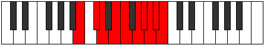 |
| [3951](https://ianring.com/musictheory/scales/3951) | [Mathyllian](ModeENaturalMathyllian.md) | E | E, F, F#, G, A, A#, C, C#, D, D#, E |  |
| [3951](https://ianring.com/musictheory/scales/3951) | [Mathyllian](ModeGNaturalMathyllian.md) | G | G, G#, A, A#, C, C#, D#, E, F, F#, G |  |
| [3951](https://ianring.com/musictheory/scales/3951) | [Mathyllian](ModeCSharpMathyllian.md) | C# | C#, D, D#, E, F#, G, A, A#, B, C, C# |  |
| [3951](https://ianring.com/musictheory/scales/3951) | [Mathyllian](ModeDFlatMathyllian.md) | Db | Db, D, Eb, E, Gb, G, A, Bb, B, C, Db |  |
| [3951](https://ianring.com/musictheory/scales/3951) | [Mathyllian](ModeBNaturalMathyllian.md) | B | B, C, C#, D, E, F, G, G#, A, A#, B |  |
| [3951](https://ianring.com/musictheory/scales/3951) | [Mathyllian](ModeASharpMathyllian.md) | A# | A#, B, C, C#, D#, E, F#, G, G#, A, A# |  |
| [3951](https://ianring.com/musictheory/scales/3951) | [Mathyllian](ModeBFlatMathyllian.md) | Bb | Bb, B, C, Db, Eb, E, Gb, G, Ab, A, Bb |  |
| [3951](https://ianring.com/musictheory/scales/3951) | [Mathyllian](ModeGSharpMathyllian.md) | G# | G#, A, A#, B, C#, D, E, F, F#, G, G# |  |
| [3951](https://ianring.com/musictheory/scales/3951) | [Mathyllian](ModeAFlatMathyllian.md) | Ab | Ab, A, Bb, B, Db, D, E, F, Gb, G, Ab |  |
| [3957](https://ianring.com/musictheory/scales/3957) | [Porygic](ModeFNaturalPorygic.md) | F | F, G, A, A#, B, C#, D, D#, E, F |  |
| [3957](https://ianring.com/musictheory/scales/3957) | [Porygic](ModeBNaturalPorygic.md) | B | B, C#, D#, E, F, G, G#, A, A#, B |  |
| [3959](https://ianring.com/musictheory/scales/3959) | [Katagyllian](ModeGSharpKatagyllian.md) | G# | G#, A, A#, C, C#, D, E, F, F#, G, G# |  |
| [3959](https://ianring.com/musictheory/scales/3959) | [Katagyllian](ModeAFlatKatagyllian.md) | Ab | Ab, A, Bb, C, Db, D, E, F, Gb, G, Ab |  |
| [3959](https://ianring.com/musictheory/scales/3959) | [Katagyllian](ModeFNaturalKatagyllian.md) | F | F, F#, G, A, A#, B, C#, D, D#, E, F |  |
| [3959](https://ianring.com/musictheory/scales/3959) | [Katagyllian](ModeBNaturalKatagyllian.md) | B | B, C, C#, D#, E, F, G, G#, A, A#, B |  |
| [3961](https://ianring.com/musictheory/scales/3961) | [Mixolydygic](ModeENaturalMixolydygic.md) | E | E, G, G#, A, A#, C, C#, D, D#, E |  |
| [3961](https://ianring.com/musictheory/scales/3961) | [Mixolydygic](ModeASharpMixolydygic.md) | A# | A#, C#, D, D#, E, F#, G, G#, A, A# |  |
| [3961](https://ianring.com/musictheory/scales/3961) | [Mixolydygic](ModeBFlatMixolydygic.md) | Bb | Bb, Db, D, Eb, E, Gb, G, Ab, A, Bb |  |
| [3961](https://ianring.com/musictheory/scales/3961) | [Mixolydygic](ModeCSharpMixolydygic.md) | C# | C#, E, F, F#, G, A, A#, B, C, C# |  |
| [3961](https://ianring.com/musictheory/scales/3961) | [Mixolydygic](ModeDFlatMixolydygic.md) | Db | Db, E, F, Gb, G, A, Bb, B, C, Db |  |
| [3963](https://ianring.com/musictheory/scales/3963) | [Aeoryllian](ModeENaturalAeoryllian.md) | E | E, F, G, G#, A, A#, C, C#, D, D#, E |  |
| [3963](https://ianring.com/musictheory/scales/3963) | [Aeoryllian](ModeCSharpAeoryllian.md) | C# | C#, D, E, F, F#, G, A, A#, B, C, C# |  |
| [3963](https://ianring.com/musictheory/scales/3963) | [Aeoryllian](ModeDFlatAeoryllian.md) | Db | Db, D, E, F, Gb, G, A, Bb, B, C, Db |  |
| [3963](https://ianring.com/musictheory/scales/3963) | [Aeoryllian](ModeASharpAeoryllian.md) | A# | A#, B, C#, D, D#, E, F#, G, G#, A, A# |  |
| [3963](https://ianring.com/musictheory/scales/3963) | [Aeoryllian](ModeBFlatAeoryllian.md) | Bb | Bb, B, Db, D, Eb, E, Gb, G, Ab, A, Bb |  |
| [3965](https://ianring.com/musictheory/scales/3965) | [Thydyllian](ModeENaturalThydyllian.md) | E | E, F#, G, G#, A, A#, C, C#, D, D#, E |  |
| [3965](https://ianring.com/musictheory/scales/3965) | [Thydyllian](ModeASharpThydyllian.md) | A# | A#, C, C#, D, D#, E, F#, G, G#, A, A# |  |
| [3965](https://ianring.com/musictheory/scales/3965) | [Thydyllian](ModeBFlatThydyllian.md) | Bb | Bb, C, Db, D, Eb, E, Gb, G, Ab, A, Bb |  |
| [3965](https://ianring.com/musictheory/scales/3965) | [Thydyllian](ModeCSharpThydyllian.md) | C# | C#, D#, E, F, F#, G, A, A#, B, C, C# |  |
| [3965](https://ianring.com/musictheory/scales/3965) | [Thydyllian](ModeDFlatThydyllian.md) | Db | Db, Eb, E, F, Gb, G, A, Bb, B, C, Db |  |
| [3965](https://ianring.com/musictheory/scales/3965) | [Thydyllian](ModeGNaturalThydyllian.md) | G | G, A, A#, B, C, C#, D#, E, F, F#, G |  |
| [3965](https://ianring.com/musictheory/scales/3965) | [Thydyllian](ModeFNaturalThydyllian.md) | F | F, G, G#, A, A#, B, C#, D, D#, E, F |  |
| [3965](https://ianring.com/musictheory/scales/3965) | [Thydyllian](ModeBNaturalThydyllian.md) | B | B, C#, D, D#, E, F, G, G#, A, A#, B |  |
| [3967](https://ianring.com/musictheory/scales/3967) | [Soratic](ModeENaturalSoratic.md) | E | E, F, F#, G, G#, A, A#, C, C#, D, D#, E |  |
| [3967](https://ianring.com/musictheory/scales/3967) | [Soratic](ModeCSharpSoratic.md) | C# | C#, D, D#, E, F, F#, G, A, A#, B, C, C# |  |
| [3967](https://ianring.com/musictheory/scales/3967) | [Soratic](ModeDFlatSoratic.md) | Db | Db, D, Eb, E, F, Gb, G, A, Bb, B, C, Db |  |
| [3967](https://ianring.com/musictheory/scales/3967) | [Soratic](ModeBNaturalSoratic.md) | B | B, C, C#, D, D#, E, F, G, G#, A, A#, B |  |
| [3967](https://ianring.com/musictheory/scales/3967) | [Soratic](ModeASharpSoratic.md) | A# | A#, B, C, C#, D, D#, E, F#, G, G#, A, A# |  |
| [3967](https://ianring.com/musictheory/scales/3967) | [Soratic](ModeBFlatSoratic.md) | Bb | Bb, B, C, Db, D, Eb, E, Gb, G, Ab, A, Bb |  |
| [3967](https://ianring.com/musictheory/scales/3967) | [Soratic](ModeGSharpSoratic.md) | G# | G#, A, A#, B, C, C#, D, E, F, F#, G, G# |  |
| [3967](https://ianring.com/musictheory/scales/3967) | [Soratic](ModeAFlatSoratic.md) | Ab | Ab, A, Bb, B, C, Db, D, E, F, Gb, G, Ab |  |
| [3967](https://ianring.com/musictheory/scales/3967) | [Soratic](ModeGNaturalSoratic.md) | G | G, G#, A, A#, B, C, C#, D#, E, F, F#, G |  |
| [3967](https://ianring.com/musictheory/scales/3967) | [Soratic](ModeFNaturalSoratic.md) | F | F, F#, G, G#, A, A#, B, C#, D, D#, E, F |  |
| [3987](https://ianring.com/musictheory/scales/3987) | [Loryllic](ModeANaturalLoryllic.md) | A | A, A#, C#, E, F, F#, G, G#, A |  |
| [3987](https://ianring.com/musictheory/scales/3987) | [Loryllic](ModeCNaturalLoryllic.md) | C | C, C#, E, G, G#, A, A#, B, C |  |
| [3991](https://ianring.com/musictheory/scales/3991) | [Badygic](ModeCNaturalBadygic.md) | C | C, C#, D, E, G, G#, A, A#, B, C |  |
| [3991](https://ianring.com/musictheory/scales/3991) | [Badygic](ModeANaturalBadygic.md) | A | A, A#, B, C#, E, F, F#, G, G#, A |  |
| [3995](https://ianring.com/musictheory/scales/3995) | [Ionygic](ModeFSharpIonygic.md) | F# | F#, G, A, A#, C#, D, D#, E, F, F# |  |
| [3995](https://ianring.com/musictheory/scales/3995) | [Ionygic](ModeGFlatIonygic.md) | Gb | Gb, G, A, Bb, Db, D, Eb, E, F, Gb |  |
| [3995](https://ianring.com/musictheory/scales/3995) | [Ionygic](ModeANaturalIonygic.md) | A | A, A#, C, C#, E, F, F#, G, G#, A |  |
| [3995](https://ianring.com/musictheory/scales/3995) | [Ionygic](ModeCNaturalIonygic.md) | C | C, C#, D#, E, G, G#, A, A#, B, C |  |
| [3999](https://ianring.com/musictheory/scales/3999) | [Dydyllian](ModeFSharpDydyllian.md) | F# | F#, G, G#, A, A#, C#, D, D#, E, F, F# |  |
| [3999](https://ianring.com/musictheory/scales/3999) | [Dydyllian](ModeGFlatDydyllian.md) | Gb | Gb, G, Ab, A, Bb, Db, D, Eb, E, F, Gb |  |
| [3999](https://ianring.com/musictheory/scales/3999) | [Dydyllian](ModeCNaturalDydyllian.md) | C | C, C#, D, D#, E, G, G#, A, A#, B, C |  |
| [3999](https://ianring.com/musictheory/scales/3999) | [Dydyllian](ModeANaturalDydyllian.md) | A | A, A#, B, C, C#, E, F, F#, G, G#, A |  |
| [4005](https://ianring.com/musictheory/scales/4005) | [Phradyllic](ModeDNaturalPhradyllic.md) | D | D, E, G, A, A#, B, C, C#, D |  |
| [4005](https://ianring.com/musictheory/scales/4005) | [Phradyllic](ModeBNaturalPhradyllic.md) | B | B, C#, E, F#, G, G#, A, A#, B |  |
| [4007](https://ianring.com/musictheory/scales/4007) | [Doptygic](ModeGSharpDoptygic.md) | G# | G#, A, A#, C#, D#, E, F, F#, G, G# |  |
| [4007](https://ianring.com/musictheory/scales/4007) | [Doptygic](ModeAFlatDoptygic.md) | Ab | Ab, A, Bb, Db, Eb, E, F, Gb, G, Ab |  |
| [4007](https://ianring.com/musictheory/scales/4007) | [Doptygic](ModeDNaturalDoptygic.md) | D | D, D#, E, G, A, A#, B, C, C#, D |  |
| [4007](https://ianring.com/musictheory/scales/4007) | [Doptygic](ModeBNaturalDoptygic.md) | B | B, C, C#, E, F#, G, G#, A, A#, B |  |
| [4013](https://ianring.com/musictheory/scales/4013) | [Dathygic](ModeDNaturalDathygic.md) | D | D, E, F, G, A, A#, B, C, C#, D |  |
| [4013](https://ianring.com/musictheory/scales/4013) | [Dathygic](ModeBNaturalDathygic.md) | B | B, C#, D, E, F#, G, G#, A, A#, B |  |
| [4015](https://ianring.com/musictheory/scales/4015) | [Phradyllian](ModeDNaturalPhradyllian.md) | D | D, D#, E, F, G, A, A#, B, C, C#, D |  |
| [4015](https://ianring.com/musictheory/scales/4015) | [Phradyllian](ModeBNaturalPhradyllian.md) | B | B, C, C#, D, E, F#, G, G#, A, A#, B |  |
| [4015](https://ianring.com/musictheory/scales/4015) | [Phradyllian](ModeGSharpPhradyllian.md) | G# | G#, A, A#, B, C#, D#, E, F, F#, G, G# |  |
| [4015](https://ianring.com/musictheory/scales/4015) | [Phradyllian](ModeAFlatPhradyllian.md) | Ab | Ab, A, Bb, B, Db, Eb, E, F, Gb, G, Ab |  |
| [4019](https://ianring.com/musictheory/scales/4019) | [Lonygic](ModeANaturalLonygic.md) | A | A, A#, C#, D, E, F, F#, G, G#, A |  |
| [4019](https://ianring.com/musictheory/scales/4019) | [Lonygic](ModeCNaturalLonygic.md) | C | C, C#, E, F, G, G#, A, A#, B, C |  |
| [4021](https://ianring.com/musictheory/scales/4021) | [Bagygic](ModeFNaturalBagygic.md) | F | F, G, A, A#, C, C#, D, D#, E, F |  |
| [4021](https://ianring.com/musictheory/scales/4021) | [Bagygic](ModeDNaturalBagygic.md) | D | D, E, F#, G, A, A#, B, C, C#, D |  |
| [4021](https://ianring.com/musictheory/scales/4021) | [Bagygic](ModeBNaturalBagygic.md) | B | B, C#, D#, E, F#, G, G#, A, A#, B |  |
| [4023](https://ianring.com/musictheory/scales/4023) | [Styptyllian](ModeFNaturalStyptyllian.md) | F | F, F#, G, A, A#, C, C#, D, D#, E, F |  |
| [4023](https://ianring.com/musictheory/scales/4023) | [Styptyllian](ModeGSharpStyptyllian.md) | G# | G#, A, A#, C, C#, D#, E, F, F#, G, G# |  |
| [4023](https://ianring.com/musictheory/scales/4023) | [Styptyllian](ModeAFlatStyptyllian.md) | Ab | Ab, A, Bb, C, Db, Eb, E, F, Gb, G, Ab |  |
| [4023](https://ianring.com/musictheory/scales/4023) | [Styptyllian](ModeDNaturalStyptyllian.md) | D | D, D#, E, F#, G, A, A#, B, C, C#, D |  |
| [4023](https://ianring.com/musictheory/scales/4023) | [Styptyllian](ModeCNaturalStyptyllian.md) | C | C, C#, D, E, F, G, G#, A, A#, B, C |  |
| [4023](https://ianring.com/musictheory/scales/4023) | [Styptyllian](ModeBNaturalStyptyllian.md) | B | B, C, C#, D#, E, F#, G, G#, A, A#, B |  |
| [4023](https://ianring.com/musictheory/scales/4023) | [Styptyllian](ModeANaturalStyptyllian.md) | A | A, A#, B, C#, D, E, F, F#, G, G#, A |  |
| [4027](https://ianring.com/musictheory/scales/4027) | [Ragyllian](ModeANaturalRagyllian.md) | A | A, A#, C, C#, D, E, F, F#, G, G#, A |  |
| [4027](https://ianring.com/musictheory/scales/4027) | [Ragyllian](ModeFSharpRagyllian.md) | F# | F#, G, A, A#, B, C#, D, D#, E, F, F# | 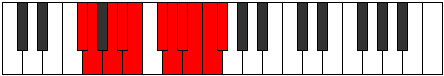 |
| [4027](https://ianring.com/musictheory/scales/4027) | [Ragyllian](ModeGFlatRagyllian.md) | Gb | Gb, G, A, Bb, B, Db, D, Eb, E, F, Gb |  |
| [4027](https://ianring.com/musictheory/scales/4027) | [Ragyllian](ModeCNaturalRagyllian.md) | C | C, C#, D#, E, F, G, G#, A, A#, B, C |  |
| [4029](https://ianring.com/musictheory/scales/4029) | [Aerycryllian](ModeFNaturalAerycryllian.md) | F | F, G, G#, A, A#, C, C#, D, D#, E, F |  |
| [4029](https://ianring.com/musictheory/scales/4029) | [Aerycryllian](ModeDNaturalAerycryllian.md) | D | D, E, F, F#, G, A, A#, B, C, C#, D |  |
| [4029](https://ianring.com/musictheory/scales/4029) | [Aerycryllian](ModeBNaturalAerycryllian.md) | B | B, C#, D, D#, E, F#, G, G#, A, A#, B |  |
| [4031](https://ianring.com/musictheory/scales/4031) | [Godatic](ModeFNaturalGodatic.md) | F | F, F#, G, G#, A, A#, C, C#, D, D#, E, F |  |
| [4031](https://ianring.com/musictheory/scales/4031) | [Godatic](ModeDNaturalGodatic.md) | D | D, D#, E, F, F#, G, A, A#, B, C, C#, D |  |
| [4031](https://ianring.com/musictheory/scales/4031) | [Godatic](ModeCNaturalGodatic.md) | C | C, C#, D, D#, E, F, G, G#, A, A#, B, C |  |
| [4031](https://ianring.com/musictheory/scales/4031) | [Godatic](ModeBNaturalGodatic.md) | B | B, C, C#, D, D#, E, F#, G, G#, A, A#, B |  |
| [4031](https://ianring.com/musictheory/scales/4031) | [Godatic](ModeANaturalGodatic.md) | A | A, A#, B, C, C#, D, E, F, F#, G, G#, A |  |
| [4031](https://ianring.com/musictheory/scales/4031) | [Godatic](ModeGSharpGodatic.md) | G# | G#, A, A#, B, C, C#, D#, E, F, F#, G, G# |  |
| [4031](https://ianring.com/musictheory/scales/4031) | [Godatic](ModeAFlatGodatic.md) | Ab | Ab, A, Bb, B, C, Db, Eb, E, F, Gb, G, Ab |  |
| [4031](https://ianring.com/musictheory/scales/4031) | [Godatic](ModeFSharpGodatic.md) | F# | F#, G, G#, A, A#, B, C#, D, D#, E, F, F# |  |
| [4031](https://ianring.com/musictheory/scales/4031) | [Godatic](ModeGFlatGodatic.md) | Gb | Gb, G, Ab, A, Bb, B, Db, D, Eb, E, F, Gb |  |
| [4041](https://ianring.com/musictheory/scales/4041) | [Zaryllic](ModeASharpZaryllic.md) | A# | A#, C#, E, F, F#, G, G#, A, A# |  |
| [4041](https://ianring.com/musictheory/scales/4041) | [Zaryllic](ModeBFlatZaryllic.md) | Bb | Bb, Db, E, F, Gb, G, Ab, A, Bb |  |
| [4041](https://ianring.com/musictheory/scales/4041) | [Zaryllic](ModeCSharpZaryllic.md) | C# | C#, E, G, G#, A, A#, B, C, C# |  |
| [4041](https://ianring.com/musictheory/scales/4041) | [Zaryllic](ModeDFlatZaryllic.md) | Db | Db, E, G, Ab, A, Bb, B, C, Db |  |
| [4043](https://ianring.com/musictheory/scales/4043) | [Phrocrygic](ModeCSharpPhrocrygic.md) | C# | C#, D, E, G, G#, A, A#, B, C, C# |  |
| [4043](https://ianring.com/musictheory/scales/4043) | [Phrocrygic](ModeDFlatPhrocrygic.md) | Db | Db, D, E, G, Ab, A, Bb, B, C, Db |  |
| [4043](https://ianring.com/musictheory/scales/4043) | [Phrocrygic](ModeASharpPhrocrygic.md) | A# | A#, B, C#, E, F, F#, G, G#, A, A# |  |
| [4043](https://ianring.com/musictheory/scales/4043) | [Phrocrygic](ModeBFlatPhrocrygic.md) | Bb | Bb, B, Db, E, F, Gb, G, Ab, A, Bb |  |
| [4045](https://ianring.com/musictheory/scales/4045) | [Gyptygic](ModeGNaturalGyptygic.md) | G | G, A, A#, C#, D, D#, E, F, F#, G |  |
| [4045](https://ianring.com/musictheory/scales/4045) | [Gyptygic](ModeASharpGyptygic.md) | A# | A#, C, C#, E, F, F#, G, G#, A, A# |  |
| [4045](https://ianring.com/musictheory/scales/4045) | [Gyptygic](ModeBFlatGyptygic.md) | Bb | Bb, C, Db, E, F, Gb, G, Ab, A, Bb |  |
| [4045](https://ianring.com/musictheory/scales/4045) | [Gyptygic](ModeCSharpGyptygic.md) | C# | C#, D#, E, G, G#, A, A#, B, C, C# |  |
| [4045](https://ianring.com/musictheory/scales/4045) | [Gyptygic](ModeDFlatGyptygic.md) | Db | Db, Eb, E, G, Ab, A, Bb, B, C, Db |  |
| [4047](https://ianring.com/musictheory/scales/4047) | [Thogyllian](ModeGNaturalThogyllian.md) | G | G, G#, A, A#, C#, D, D#, E, F, F#, G |  |
| [4047](https://ianring.com/musictheory/scales/4047) | [Thogyllian](ModeCSharpThogyllian.md) | C# | C#, D, D#, E, G, G#, A, A#, B, C, C# |  |
| [4047](https://ianring.com/musictheory/scales/4047) | [Thogyllian](ModeDFlatThogyllian.md) | Db | Db, D, Eb, E, G, Ab, A, Bb, B, C, Db |  |
| [4047](https://ianring.com/musictheory/scales/4047) | [Thogyllian](ModeASharpThogyllian.md) | A# | A#, B, C, C#, E, F, F#, G, G#, A, A# |  |
| [4047](https://ianring.com/musictheory/scales/4047) | [Thogyllian](ModeBFlatThogyllian.md) | Bb | Bb, B, C, Db, E, F, Gb, G, Ab, A, Bb |  |
| [4051](https://ianring.com/musictheory/scales/4051) | [Ionilygic](ModeANaturalIonilygic.md) | A | A, A#, C#, D#, E, F, F#, G, G#, A |  |
| [4051](https://ianring.com/musictheory/scales/4051) | [Ionilygic](ModeDSharpIonilygic.md) | D# | D#, E, G, A, A#, B, C, C#, D, D# |  |
| [4051](https://ianring.com/musictheory/scales/4051) | [Ionilygic](ModeEFlatIonilygic.md) | Eb | Eb, E, G, A, Bb, B, C, Db, D, Eb |  |
| [4051](https://ianring.com/musictheory/scales/4051) | [Ionilygic](ModeCNaturalIonilygic.md) | C | C, C#, E, F#, G, G#, A, A#, B, C |  |
| [4055](https://ianring.com/musictheory/scales/4055) | [Dagyllian](ModeDSharpDagyllian.md) | D# | D#, E, F, G, A, A#, B, C, C#, D, D# |  |
| [4055](https://ianring.com/musictheory/scales/4055) | [Dagyllian](ModeEFlatDagyllian.md) | Eb | Eb, E, F, G, A, Bb, B, C, Db, D, Eb |  |
| [4055](https://ianring.com/musictheory/scales/4055) | [Dagyllian](ModeCNaturalDagyllian.md) | C | C, C#, D, E, F#, G, G#, A, A#, B, C |  |
| [4055](https://ianring.com/musictheory/scales/4055) | [Dagyllian](ModeANaturalDagyllian.md) | A | A, A#, B, C#, D#, E, F, F#, G, G#, A |  |
| [4057](https://ianring.com/musictheory/scales/4057) | [Phrygic](ModeASharpPhrygic.md) | A# | A#, C#, D, E, F, F#, G, G#, A, A# |  |
| [4057](https://ianring.com/musictheory/scales/4057) | [Phrygic](ModeBFlatPhrygic.md) | Bb | Bb, Db, D, E, F, Gb, G, Ab, A, Bb |  |
| [4057](https://ianring.com/musictheory/scales/4057) | [Phrygic](ModeCSharpPhrygic.md) | C# | C#, E, F, G, G#, A, A#, B, C, C# |  |
| [4057](https://ianring.com/musictheory/scales/4057) | [Phrygic](ModeDFlatPhrygic.md) | Db | Db, E, F, G, Ab, A, Bb, B, C, Db |  |
| [4059](https://ianring.com/musictheory/scales/4059) | [Zolyllian](ModeFSharpZolyllian.md) | F# | F#, G, A, A#, C, C#, D, D#, E, F, F# |  |
| [4059](https://ianring.com/musictheory/scales/4059) | [Zolyllian](ModeGFlatZolyllian.md) | Gb | Gb, G, A, Bb, C, Db, D, Eb, E, F, Gb |  |
| [4059](https://ianring.com/musictheory/scales/4059) | [Zolyllian](ModeANaturalZolyllian.md) | A | A, A#, C, C#, D#, E, F, F#, G, G#, A |  |
| [4059](https://ianring.com/musictheory/scales/4059) | [Zolyllian](ModeDSharpZolyllian.md) | D# | D#, E, F#, G, A, A#, B, C, C#, D, D# |  |
| [4059](https://ianring.com/musictheory/scales/4059) | [Zolyllian](ModeEFlatZolyllian.md) | Eb | Eb, E, Gb, G, A, Bb, B, C, Db, D, Eb |  |
| [4059](https://ianring.com/musictheory/scales/4059) | [Zolyllian](ModeCSharpZolyllian.md) | C# | C#, D, E, F, G, G#, A, A#, B, C, C# |  |
| [4059](https://ianring.com/musictheory/scales/4059) | [Zolyllian](ModeDFlatZolyllian.md) | Db | Db, D, E, F, G, Ab, A, Bb, B, C, Db |  |
| [4059](https://ianring.com/musictheory/scales/4059) | [Zolyllian](ModeCNaturalZolyllian.md) | C | C, C#, D#, E, F#, G, G#, A, A#, B, C |  |
| [4059](https://ianring.com/musictheory/scales/4059) | [Zolyllian](ModeASharpZolyllian.md) | A# | A#, B, C#, D, E, F, F#, G, G#, A, A# |  |
| [4059](https://ianring.com/musictheory/scales/4059) | [Zolyllian](ModeBFlatZolyllian.md) | Bb | Bb, B, Db, D, E, F, Gb, G, Ab, A, Bb |  |
| [4061](https://ianring.com/musictheory/scales/4061) | [Staptyllian](ModeASharpStaptyllian.md) | A# | A#, C, C#, D, E, F, F#, G, G#, A, A# |  |
| [4061](https://ianring.com/musictheory/scales/4061) | [Staptyllian](ModeBFlatStaptyllian.md) | Bb | Bb, C, Db, D, E, F, Gb, G, Ab, A, Bb |  |
| [4061](https://ianring.com/musictheory/scales/4061) | [Staptyllian](ModeGNaturalStaptyllian.md) | G | G, A, A#, B, C#, D, D#, E, F, F#, G |  |
| [4061](https://ianring.com/musictheory/scales/4061) | [Staptyllian](ModeCSharpStaptyllian.md) | C# | C#, D#, E, F, G, G#, A, A#, B, C, C# |  |
| [4061](https://ianring.com/musictheory/scales/4061) | [Staptyllian](ModeDFlatStaptyllian.md) | Db | Db, Eb, E, F, G, Ab, A, Bb, B, C, Db |  |
| [4063](https://ianring.com/musictheory/scales/4063) | [Eptatic](ModeFSharpEptatic.md) | F# | F#, G, G#, A, A#, C, C#, D, D#, E, F, F# |  |
| [4063](https://ianring.com/musictheory/scales/4063) | [Eptatic](ModeGFlatEptatic.md) | Gb | Gb, G, Ab, A, Bb, C, Db, D, Eb, E, F, Gb |  |
| [4063](https://ianring.com/musictheory/scales/4063) | [Eptatic](ModeDSharpEptatic.md) | D# | D#, E, F, F#, G, A, A#, B, C, C#, D, D# |  |
| [4063](https://ianring.com/musictheory/scales/4063) | [Eptatic](ModeEFlatEptatic.md) | Eb | Eb, E, F, Gb, G, A, Bb, B, C, Db, D, Eb |  |
| [4063](https://ianring.com/musictheory/scales/4063) | [Eptatic](ModeCSharpEptatic.md) | C# | C#, D, D#, E, F, G, G#, A, A#, B, C, C# |  |
| [4063](https://ianring.com/musictheory/scales/4063) | [Eptatic](ModeDFlatEptatic.md) | Db | Db, D, Eb, E, F, G, Ab, A, Bb, B, C, Db |  |
| [4063](https://ianring.com/musictheory/scales/4063) | [Eptatic](ModeCNaturalEptatic.md) | C | C, C#, D, D#, E, F#, G, G#, A, A#, B, C |  |
| [4063](https://ianring.com/musictheory/scales/4063) | [Eptatic](ModeASharpEptatic.md) | A# | A#, B, C, C#, D, E, F, F#, G, G#, A, A# |  |
| [4063](https://ianring.com/musictheory/scales/4063) | [Eptatic](ModeBFlatEptatic.md) | Bb | Bb, B, C, Db, D, E, F, Gb, G, Ab, A, Bb |  |
| [4063](https://ianring.com/musictheory/scales/4063) | [Eptatic](ModeANaturalEptatic.md) | A | A, A#, B, C, C#, D#, E, F, F#, G, G#, A |  |
| [4063](https://ianring.com/musictheory/scales/4063) | [Eptatic](ModeGNaturalEptatic.md) | G | G, G#, A, A#, B, C#, D, D#, E, F, F#, G |  |
| [4069](https://ianring.com/musictheory/scales/4069) | [Starygic](ModeDNaturalStarygic.md) | D | D, E, G, G#, A, A#, B, C, C#, D |  |
| [4069](https://ianring.com/musictheory/scales/4069) | [Starygic](ModeBNaturalStarygic.md) | B | B, C#, E, F, F#, G, G#, A, A#, B |  |
| [4071](https://ianring.com/musictheory/scales/4071) | [Rygyllian](ModeGSharpRygyllian.md) | G# | G#, A, A#, C#, D, D#, E, F, F#, G, G# |  |
| [4071](https://ianring.com/musictheory/scales/4071) | [Rygyllian](ModeAFlatRygyllian.md) | Ab | Ab, A, Bb, Db, D, Eb, E, F, Gb, G, Ab |  |
| [4071](https://ianring.com/musictheory/scales/4071) | [Rygyllian](ModeDNaturalRygyllian.md) | D | D, D#, E, G, G#, A, A#, B, C, C#, D |  |
| [4071](https://ianring.com/musictheory/scales/4071) | [Rygyllian](ModeBNaturalRygyllian.md) | B | B, C, C#, E, F, F#, G, G#, A, A#, B |  |
| [4073](https://ianring.com/musictheory/scales/4073) | [Sathygic](ModeASharpSathygic.md) | A# | A#, C#, D#, E, F, F#, G, G#, A, A# |  |
| [4073](https://ianring.com/musictheory/scales/4073) | [Sathygic](ModeBFlatSathygic.md) | Bb | Bb, Db, Eb, E, F, Gb, G, Ab, A, Bb |  |
| [4073](https://ianring.com/musictheory/scales/4073) | [Sathygic](ModeENaturalSathygic.md) | E | E, G, A, A#, B, C, C#, D, D#, E | 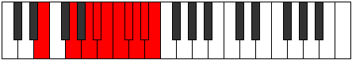 |
| [4073](https://ianring.com/musictheory/scales/4073) | [Sathygic](ModeCSharpSathygic.md) | C# | C#, E, F#, G, G#, A, A#, B, C, C# |  |
| [4073](https://ianring.com/musictheory/scales/4073) | [Sathygic](ModeDFlatSathygic.md) | Db | Db, E, Gb, G, Ab, A, Bb, B, C, Db |  |
| [4075](https://ianring.com/musictheory/scales/4075) | [Katyllian](ModeENaturalKatyllian.md) | E | E, F, G, A, A#, B, C, C#, D, D#, E |  |
| [4075](https://ianring.com/musictheory/scales/4075) | [Katyllian](ModeCSharpKatyllian.md) | C# | C#, D, E, F#, G, G#, A, A#, B, C, C# |  |
| [4075](https://ianring.com/musictheory/scales/4075) | [Katyllian](ModeDFlatKatyllian.md) | Db | Db, D, E, Gb, G, Ab, A, Bb, B, C, Db |  |
| [4075](https://ianring.com/musictheory/scales/4075) | [Katyllian](ModeASharpKatyllian.md) | A# | A#, B, C#, D#, E, F, F#, G, G#, A, A# |  |
| [4075](https://ianring.com/musictheory/scales/4075) | [Katyllian](ModeBFlatKatyllian.md) | Bb | Bb, B, Db, Eb, E, F, Gb, G, Ab, A, Bb |  |
| [4077](https://ianring.com/musictheory/scales/4077) | [Gothyllian](ModeGNaturalGothyllian.md) | G | G, A, A#, C, C#, D, D#, E, F, F#, G |  |
| [4077](https://ianring.com/musictheory/scales/4077) | [Gothyllian](ModeASharpGothyllian.md) | A# | A#, C, C#, D#, E, F, F#, G, G#, A, A# |  |
| [4077](https://ianring.com/musictheory/scales/4077) | [Gothyllian](ModeBFlatGothyllian.md) | Bb | Bb, C, Db, Eb, E, F, Gb, G, Ab, A, Bb |  |
| [4077](https://ianring.com/musictheory/scales/4077) | [Gothyllian](ModeENaturalGothyllian.md) | E | E, F#, G, A, A#, B, C, C#, D, D#, E |  |
| [4077](https://ianring.com/musictheory/scales/4077) | [Gothyllian](ModeDNaturalGothyllian.md) | D | D, E, F, G, G#, A, A#, B, C, C#, D | 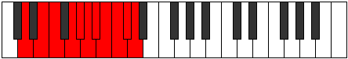 |
| [4077](https://ianring.com/musictheory/scales/4077) | [Gothyllian](ModeCSharpGothyllian.md) | C# | C#, D#, E, F#, G, G#, A, A#, B, C, C# |  |
| [4077](https://ianring.com/musictheory/scales/4077) | [Gothyllian](ModeDFlatGothyllian.md) | Db | Db, Eb, E, Gb, G, Ab, A, Bb, B, C, Db |  |
| [4077](https://ianring.com/musictheory/scales/4077) | [Gothyllian](ModeBNaturalGothyllian.md) | B | B, C#, D, E, F, F#, G, G#, A, A#, B |  |
| [4079](https://ianring.com/musictheory/scales/4079) | [Ionatic](ModeGNaturalIonatic.md) | G | G, G#, A, A#, C, C#, D, D#, E, F, F#, G |  |
| [4079](https://ianring.com/musictheory/scales/4079) | [Ionatic](ModeENaturalIonatic.md) | E | E, F, F#, G, A, A#, B, C, C#, D, D#, E |  |
| [4079](https://ianring.com/musictheory/scales/4079) | [Ionatic](ModeDNaturalIonatic.md) | D | D, D#, E, F, G, G#, A, A#, B, C, C#, D |  |
| [4079](https://ianring.com/musictheory/scales/4079) | [Ionatic](ModeCSharpIonatic.md) | C# | C#, D, D#, E, F#, G, G#, A, A#, B, C, C# |  |
| [4079](https://ianring.com/musictheory/scales/4079) | [Ionatic](ModeDFlatIonatic.md) | Db | Db, D, Eb, E, Gb, G, Ab, A, Bb, B, C, Db |  |
| [4079](https://ianring.com/musictheory/scales/4079) | [Ionatic](ModeBNaturalIonatic.md) | B | B, C, C#, D, E, F, F#, G, G#, A, A#, B |  |
| [4079](https://ianring.com/musictheory/scales/4079) | [Ionatic](ModeASharpIonatic.md) | A# | A#, B, C, C#, D#, E, F, F#, G, G#, A, A# |  |
| [4079](https://ianring.com/musictheory/scales/4079) | [Ionatic](ModeBFlatIonatic.md) | Bb | Bb, B, C, Db, Eb, E, F, Gb, G, Ab, A, Bb |  |
| [4079](https://ianring.com/musictheory/scales/4079) | [Ionatic](ModeGSharpIonatic.md) | G# | G#, A, A#, B, C#, D, D#, E, F, F#, G, G# |  |
| [4079](https://ianring.com/musictheory/scales/4079) | [Ionatic](ModeAFlatIonatic.md) | Ab | Ab, A, Bb, B, Db, D, Eb, E, F, Gb, G, Ab |  |
| [4083](https://ianring.com/musictheory/scales/4083) | [Bathyllian](ModeANaturalBathyllian.md) | A | A, A#, C#, D, D#, E, F, F#, G, G#, A |  |
| [4083](https://ianring.com/musictheory/scales/4083) | [Bathyllian](ModeDSharpBathyllian.md) | D# | D#, E, G, G#, A, A#, B, C, C#, D, D# |  |
| [4083](https://ianring.com/musictheory/scales/4083) | [Bathyllian](ModeEFlatBathyllian.md) | Eb | Eb, E, G, Ab, A, Bb, B, C, Db, D, Eb |  |
| [4083](https://ianring.com/musictheory/scales/4083) | [Bathyllian](ModeCNaturalBathyllian.md) | C | C, C#, E, F, F#, G, G#, A, A#, B, C |  |
| [4085](https://ianring.com/musictheory/scales/4085) | [Sydyllian](ModeFNaturalSydyllian.md) | F | F, G, A, A#, B, C, C#, D, D#, E, F |  |
| [4085](https://ianring.com/musictheory/scales/4085) | [Sydyllian](ModeDNaturalSydyllian.md) | D | D, E, F#, G, G#, A, A#, B, C, C#, D |  |
| [4085](https://ianring.com/musictheory/scales/4085) | [Sydyllian](ModeBNaturalSydyllian.md) | B | B, C#, D#, E, F, F#, G, G#, A, A#, B |  |
| [4087](https://ianring.com/musictheory/scales/4087) | [Aeolatic](ModeGSharpAeolatic.md) | G# | G#, A, A#, C, C#, D, D#, E, F, F#, G, G# |  |
| [4087](https://ianring.com/musictheory/scales/4087) | [Aeolatic](ModeAFlatAeolatic.md) | Ab | Ab, A, Bb, C, Db, D, Eb, E, F, Gb, G, Ab |  |
| [4087](https://ianring.com/musictheory/scales/4087) | [Aeolatic](ModeFNaturalAeolatic.md) | F | F, F#, G, A, A#, B, C, C#, D, D#, E, F |  |
| [4087](https://ianring.com/musictheory/scales/4087) | [Aeolatic](ModeDSharpAeolatic.md) | D# | D#, E, F, G, G#, A, A#, B, C, C#, D, D# |  |
| [4087](https://ianring.com/musictheory/scales/4087) | [Aeolatic](ModeEFlatAeolatic.md) | Eb | Eb, E, F, G, Ab, A, Bb, B, C, Db, D, Eb |  |
| [4087](https://ianring.com/musictheory/scales/4087) | [Aeolatic](ModeDNaturalAeolatic.md) | D | D, D#, E, F#, G, G#, A, A#, B, C, C#, D |  |
| [4087](https://ianring.com/musictheory/scales/4087) | [Aeolatic](ModeCNaturalAeolatic.md) | C | C, C#, D, E, F, F#, G, G#, A, A#, B, C |  |
| [4087](https://ianring.com/musictheory/scales/4087) | [Aeolatic](ModeBNaturalAeolatic.md) | B | B, C, C#, D#, E, F, F#, G, G#, A, A#, B |  |
| [4087](https://ianring.com/musictheory/scales/4087) | [Aeolatic](ModeANaturalAeolatic.md) | A | A, A#, B, C#, D, D#, E, F, F#, G, G#, A |  |
| [4089](https://ianring.com/musictheory/scales/4089) | [Katoryllian](ModeASharpKatoryllian.md) | A# | A#, C#, D, D#, E, F, F#, G, G#, A, A# |  |
| [4089](https://ianring.com/musictheory/scales/4089) | [Katoryllian](ModeBFlatKatoryllian.md) | Bb | Bb, Db, D, Eb, E, F, Gb, G, Ab, A, Bb |  |
| [4089](https://ianring.com/musictheory/scales/4089) | [Katoryllian](ModeENaturalKatoryllian.md) | E | E, G, G#, A, A#, B, C, C#, D, D#, E |  |
| [4089](https://ianring.com/musictheory/scales/4089) | [Katoryllian](ModeCSharpKatoryllian.md) | C# | C#, E, F, F#, G, G#, A, A#, B, C, C# |  |
| [4089](https://ianring.com/musictheory/scales/4089) | [Katoryllian](ModeDFlatKatoryllian.md) | Db | Db, E, F, Gb, G, Ab, A, Bb, B, C, Db |  |
| [4091](https://ianring.com/musictheory/scales/4091) | [Thydatic](ModeANaturalThydatic.md) | A | A, A#, C, C#, D, D#, E, F, F#, G, G#, A |  |
| [4091](https://ianring.com/musictheory/scales/4091) | [Thydatic](ModeFSharpThydatic.md) | F# | F#, G, A, A#, B, C, C#, D, D#, E, F, F# |  |
| [4091](https://ianring.com/musictheory/scales/4091) | [Thydatic](ModeGFlatThydatic.md) | Gb | Gb, G, A, Bb, B, C, Db, D, Eb, E, F, Gb |  |
| [4091](https://ianring.com/musictheory/scales/4091) | [Thydatic](ModeENaturalThydatic.md) | E | E, F, G, G#, A, A#, B, C, C#, D, D#, E |  |
| [4091](https://ianring.com/musictheory/scales/4091) | [Thydatic](ModeDSharpThydatic.md) | D# | D#, E, F#, G, G#, A, A#, B, C, C#, D, D# |  |
| [4091](https://ianring.com/musictheory/scales/4091) | [Thydatic](ModeEFlatThydatic.md) | Eb | Eb, E, Gb, G, Ab, A, Bb, B, C, Db, D, Eb |  |
| [4091](https://ianring.com/musictheory/scales/4091) | [Thydatic](ModeCSharpThydatic.md) | C# | C#, D, E, F, F#, G, G#, A, A#, B, C, C# |  |
| [4091](https://ianring.com/musictheory/scales/4091) | [Thydatic](ModeDFlatThydatic.md) | Db | Db, D, E, F, Gb, G, Ab, A, Bb, B, C, Db |  |
| [4091](https://ianring.com/musictheory/scales/4091) | [Thydatic](ModeCNaturalThydatic.md) | C | C, C#, D#, E, F, F#, G, G#, A, A#, B, C | 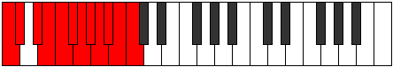 |
| [4091](https://ianring.com/musictheory/scales/4091) | [Thydatic](ModeASharpThydatic.md) | A# | A#, B, C#, D, D#, E, F, F#, G, G#, A, A# |  |
| [4091](https://ianring.com/musictheory/scales/4091) | [Thydatic](ModeBFlatThydatic.md) | Bb | Bb, B, Db, D, Eb, E, F, Gb, G, Ab, A, Bb |  |
| [4093](https://ianring.com/musictheory/scales/4093) | [Aerycratic](ModeASharpAerycratic.md) | A# | A#, C, C#, D, D#, E, F, F#, G, G#, A, A# |  |
| [4093](https://ianring.com/musictheory/scales/4093) | [Aerycratic](ModeBFlatAerycratic.md) | Bb | Bb, C, Db, D, Eb, E, F, Gb, G, Ab, A, Bb |  |
| [4093](https://ianring.com/musictheory/scales/4093) | [Aerycratic](ModeGNaturalAerycratic.md) | G | G, A, A#, B, C, C#, D, D#, E, F, F#, G |  |
| [4093](https://ianring.com/musictheory/scales/4093) | [Aerycratic](ModeFNaturalAerycratic.md) | F | F, G, G#, A, A#, B, C, C#, D, D#, E, F |  |
| [4093](https://ianring.com/musictheory/scales/4093) | [Aerycratic](ModeENaturalAerycratic.md) | E | E, F#, G, G#, A, A#, B, C, C#, D, D#, E |  |
| [4093](https://ianring.com/musictheory/scales/4093) | [Aerycratic](ModeDNaturalAerycratic.md) | D | D, E, F, F#, G, G#, A, A#, B, C, C#, D |  |
| [4093](https://ianring.com/musictheory/scales/4093) | [Aerycratic](ModeCSharpAerycratic.md) | C# | C#, D#, E, F, F#, G, G#, A, A#, B, C, C# |  |
| [4093](https://ianring.com/musictheory/scales/4093) | [Aerycratic](ModeDFlatAerycratic.md) | Db | Db, Eb, E, F, Gb, G, Ab, A, Bb, B, C, Db |  |
| [4093](https://ianring.com/musictheory/scales/4093) | [Aerycratic](ModeBNaturalAerycratic.md) | B | B, C#, D, D#, E, F, F#, G, G#, A, A#, B |  |
| [4095](https://ianring.com/musictheory/scales/4095) | [Chromatic](ModeCNaturalChromatic.md) | C | C, C#, D, D#, E, F, F#, G, G#, A, A#, B, C |  |
| [4095](https://ianring.com/musictheory/scales/4095) | [Chromatic](ModeCSharpChromatic.md) | C# | C#, D, D#, E, F, F#, G, G#, A, A#, B, C, C# |  |
| [4095](https://ianring.com/musictheory/scales/4095) | [Chromatic](ModeDFlatChromatic.md) | Db | Db, D, Eb, E, F, Gb, G, Ab, A, Bb, B, C, Db |  |
| [4095](https://ianring.com/musictheory/scales/4095) | [Chromatic](ModeDNaturalChromatic.md) | D | D, D#, E, F, F#, G, G#, A, A#, B, C, C#, D |  |
| [4095](https://ianring.com/musictheory/scales/4095) | [Chromatic](ModeDSharpChromatic.md) | D# | D#, E, F, F#, G, G#, A, A#, B, C, C#, D, D# |  |
| [4095](https://ianring.com/musictheory/scales/4095) | [Chromatic](ModeEFlatChromatic.md) | Eb | Eb, E, F, Gb, G, Ab, A, Bb, B, C, Db, D, Eb |  |
| [4095](https://ianring.com/musictheory/scales/4095) | [Chromatic](ModeENaturalChromatic.md) | E | E, F, F#, G, G#, A, A#, B, C, C#, D, D#, E |  |
| [4095](https://ianring.com/musictheory/scales/4095) | [Chromatic](ModeFNaturalChromatic.md) | F | F, F#, G, G#, A, A#, B, C, C#, D, D#, E, F |  |
| [4095](https://ianring.com/musictheory/scales/4095) | [Chromatic](ModeFSharpChromatic.md) | F# | F#, G, G#, A, A#, B, C, C#, D, D#, E, F, F# |  |
| [4095](https://ianring.com/musictheory/scales/4095) | [Chromatic](ModeGFlatChromatic.md) | Gb | Gb, G, Ab, A, Bb, B, C, Db, D, Eb, E, F, Gb |  |
| [4095](https://ianring.com/musictheory/scales/4095) | [Chromatic](ModeGNaturalChromatic.md) | G | G, G#, A, A#, B, C, C#, D, D#, E, F, F#, G |  |
| [4095](https://ianring.com/musictheory/scales/4095) | [Chromatic](ModeGSharpChromatic.md) | G# | G#, A, A#, B, C, C#, D, D#, E, F, F#, G, G# |  |
| [4095](https://ianring.com/musictheory/scales/4095) | [Chromatic](ModeAFlatChromatic.md) | Ab | Ab, A, Bb, B, C, Db, D, Eb, E, F, Gb, G, Ab |  |
| [4095](https://ianring.com/musictheory/scales/4095) | [Chromatic](ModeANaturalChromatic.md) | A | A, A#, B, C, C#, D, D#, E, F, F#, G, G#, A |  |
| [4095](https://ianring.com/musictheory/scales/4095) | [Chromatic](ModeASharpChromatic.md) | A# | A#, B, C, C#, D, D#, E, F, F#, G, G#, A, A# |  |
| [4095](https://ianring.com/musictheory/scales/4095) | [Chromatic](ModeBFlatChromatic.md) | Bb | Bb, B, C, Db, D, Eb, E, F, Gb, G, Ab, A, Bb |  |
| [4095](https://ianring.com/musictheory/scales/4095) | [Chromatic](ModeBNaturalChromatic.md) | B | B, C, C#, D, D#, E, F, F#, G, G#, A, A#, B |  |
