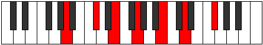
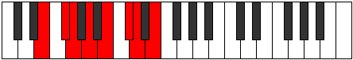
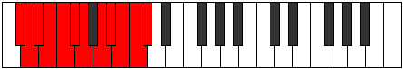

# ANaturalDominantThirteenth

## Links

- [Documentation](README.md)
- [Scales Index](Scales.md)
- [Modes Index](Modes.md)
- [Chords Index](Chords.md)

## Root

A

## Diagram

## Notes

| Position | Notes | Illustration |
|----------|------|--------------|
| RootPosition | A,C#,E,G,B,D,F# |  |
| FirstInversion | C#,E,G,B,D,F#,A |  |
| SecondInversion | E,G,B,D,F#,A,C# |  |
| ThirdInversion | G,B,D,F#,A,C#,E |  |
| FourthInversion | B,D,F#,A,C#,E,G |  |
| FifthInversion | D,F#,A,C#,E,G,B |  |
| SixthInversion | F#,A,C#,E,G,B,D |  |
## Modes

| Number | Mode | Tonic | Notes | Illustration |
|--------|------|-------|-------|--------------|
| [1387](https://ianring.com/musictheory/scales/1387) | [Locrian](ModeCSharpLocrian.md) | C# | C#, D, E, F#, G, A, B, C# |  |
| [1387](https://ianring.com/musictheory/scales/1387) | [Locrian](ModeDFlatLocrian.md) | Db | Db, Ebb, Fb, Gb, Abb, Bbb, Cb, Db |  |
| [1391](https://ianring.com/musictheory/scales/1391) | [Aeradyllic](ModeCSharpAeradyllic.md) | C# | C#, D, D#, E, F#, G, A, B, C# |  |
| [1391](https://ianring.com/musictheory/scales/1391) | [Aeradyllic](ModeDFlatAeradyllic.md) | Db | Db, D, Eb, E, Gb, G, A, B, Db |  |
| [1403](https://ianring.com/musictheory/scales/1403) | [Epinyllic](ModeCSharpEpinyllic.md) | C# | C#, D, E, F, F#, G, A, B, C# |  |
| [1403](https://ianring.com/musictheory/scales/1403) | [Epinyllic](ModeDFlatEpinyllic.md) | Db | Db, D, E, F, Gb, G, A, B, Db |  |
| [1407](https://ianring.com/musictheory/scales/1407) | [Tharygic](ModeCSharpTharygic.md) | C# | C#, D, D#, E, F, F#, G, A, B, C# |  |
| [1407](https://ianring.com/musictheory/scales/1407) | [Tharygic](ModeDFlatTharygic.md) | Db | Db, D, Eb, E, F, Gb, G, A, B, Db |  |
| [1451](https://ianring.com/musictheory/scales/1451) | [Phrygian](ModeFSharpPhrygian.md) | F# | F#, G, A, B, C#, D, E, F# |  |
| [1451](https://ianring.com/musictheory/scales/1451) | [Phrygian](ModeGFlatPhrygian.md) | Gb | Gb, Abb, Bbb, Cb, Db, Ebb, Fb, Gb |  |
| [1453](https://ianring.com/musictheory/scales/1453) | [Aeolian](ModeBNaturalAeolian.md) | B | B, C#, D, E, F#, G, A, B |  |
| [1455](https://ianring.com/musictheory/scales/1455) | [Soryllic](ModeBNaturalSoryllic.md) | B | B, C, C#, D, E, F#, G, A, B |  |
| [1455](https://ianring.com/musictheory/scales/1455) | [Soryllic](ModeFSharpSoryllic.md) | F# | F#, G, G#, A, B, C#, D, E, F# |  |
| [1455](https://ianring.com/musictheory/scales/1455) | [Soryllic](ModeGFlatSoryllic.md) | Gb | Gb, G, Ab, A, B, Db, D, E, Gb |  |
| [1467](https://ianring.com/musictheory/scales/1467) | [Thydyllic](ModeFSharpThydyllic.md) | F# | F#, G, A, A#, B, C#, D, E, F# |  |
| [1467](https://ianring.com/musictheory/scales/1467) | [Thydyllic](ModeGFlatThydyllic.md) | Gb | Gb, G, A, Bb, B, Db, D, E, Gb |  |
| [1469](https://ianring.com/musictheory/scales/1469) | [Epiryllic](ModeBNaturalEpiryllic.md) | B | B, C#, D, D#, E, F#, G, A, B |  |
| [1471](https://ianring.com/musictheory/scales/1471) | [Radygic](ModeBNaturalRadygic.md) | B | B, C, C#, D, D#, E, F#, G, A, B |  |
| [1471](https://ianring.com/musictheory/scales/1471) | [Radygic](ModeFSharpRadygic.md) | F# | F#, G, G#, A, A#, B, C#, D, E, F# |  |
| [1471](https://ianring.com/musictheory/scales/1471) | [Radygic](ModeGFlatRadygic.md) | Gb | Gb, G, Ab, A, Bb, B, Db, D, E, Gb |  |
| [1515](https://ianring.com/musictheory/scales/1515) | [Solyllic](ModeFSharpSolyllic.md) | F# | F#, G, A, B, C, C#, D, E, F# |  |
| [1515](https://ianring.com/musictheory/scales/1515) | [Solyllic](ModeGFlatSolyllic.md) | Gb | Gb, G, A, B, C, Db, D, E, Gb |  |
| [1515](https://ianring.com/musictheory/scales/1515) | [Solyllic](ModeCSharpSolyllic.md) | C# | C#, D, E, F#, G, G#, A, B, C# |  |
| [1515](https://ianring.com/musictheory/scales/1515) | [Solyllic](ModeDFlatSolyllic.md) | Db | Db, D, E, Gb, G, Ab, A, B, Db |  |
| [1517](https://ianring.com/musictheory/scales/1517) | [Sagyllic](ModeBNaturalSagyllic.md) | B | B, C#, D, E, F, F#, G, A, B |  |
| [1519](https://ianring.com/musictheory/scales/1519) | [Solygic](ModeBNaturalSolygic.md) | B | B, C, C#, D, E, F, F#, G, A, B |  |
| [1519](https://ianring.com/musictheory/scales/1519) | [Solygic](ModeFSharpSolygic.md) | F# | F#, G, G#, A, B, C, C#, D, E, F# |  |
| [1519](https://ianring.com/musictheory/scales/1519) | [Solygic](ModeGFlatSolygic.md) | Gb | Gb, G, Ab, A, B, C, Db, D, E, Gb |  |
| [1519](https://ianring.com/musictheory/scales/1519) | [Solygic](ModeCSharpSolygic.md) | C# | C#, D, D#, E, F#, G, G#, A, B, C# |  |
| [1519](https://ianring.com/musictheory/scales/1519) | [Solygic](ModeDFlatSolygic.md) | Db | Db, D, Eb, E, Gb, G, Ab, A, B, Db |  |
| [1531](https://ianring.com/musictheory/scales/1531) | [Styptygic](ModeCSharpStyptygic.md) | C# | C#, D, E, F, F#, G, G#, A, B, C# |  |
| [1531](https://ianring.com/musictheory/scales/1531) | [Styptygic](ModeDFlatStyptygic.md) | Db | Db, D, E, F, Gb, G, Ab, A, B, Db |  |
| [1531](https://ianring.com/musictheory/scales/1531) | [Styptygic](ModeFSharpStyptygic.md) | F# | F#, G, A, A#, B, C, C#, D, E, F# |  |
| [1531](https://ianring.com/musictheory/scales/1531) | [Styptygic](ModeGFlatStyptygic.md) | Gb | Gb, G, A, Bb, B, C, Db, D, E, Gb |  |
| [1533](https://ianring.com/musictheory/scales/1533) | [Katycrygic](ModeBNaturalKatycrygic.md) | B | B, C#, D, D#, E, F, F#, G, A, B |  |
| [1535](https://ianring.com/musictheory/scales/1535) | [Mixodyllian](ModeBNaturalMixodyllian.md) | B | B, C, C#, D, D#, E, F, F#, G, A, B |  |
| [1535](https://ianring.com/musictheory/scales/1535) | [Mixodyllian](ModeCSharpMixodyllian.md) | C# | C#, D, D#, E, F, F#, G, G#, A, B, C# |  |
| [1535](https://ianring.com/musictheory/scales/1535) | [Mixodyllian](ModeDFlatMixodyllian.md) | Db | Db, D, Eb, E, F, Gb, G, Ab, A, B, Db |  |
| [1535](https://ianring.com/musictheory/scales/1535) | [Mixodyllian](ModeFSharpMixodyllian.md) | F# | F#, G, G#, A, A#, B, C, C#, D, E, F# |  |
| [1535](https://ianring.com/musictheory/scales/1535) | [Mixodyllian](ModeGFlatMixodyllian.md) | Gb | Gb, G, Ab, A, Bb, B, C, Db, D, E, Gb |  |
| [1709](https://ianring.com/musictheory/scales/1709) | [Dorian](ModeENaturalDorian.md) | E | E, F#, G, A, B, C#, D, E |  |
| [1711](https://ianring.com/musictheory/scales/1711) | [Ragyllic](ModeENaturalRagyllic.md) | E | E, F, F#, G, A, B, C#, D, E |  |
| [1717](https://ianring.com/musictheory/scales/1717) | [Mixolydian](ModeANaturalMixolydian.md) | A | A, B, C#, D, E, F#, G, A |  |
| [1719](https://ianring.com/musictheory/scales/1719) | [Lyryllic](ModeANaturalLyryllic.md) | A | A, A#, B, C#, D, E, F#, G, A |  |
| [1725](https://ianring.com/musictheory/scales/1725) | [Mixodyllic](ModeANaturalMixodyllic.md) | A | A, B, C, C#, D, E, F#, G, A |  |
| [1725](https://ianring.com/musictheory/scales/1725) | [Mixodyllic](ModeENaturalMixodyllic.md) | E | E, F#, G, G#, A, B, C#, D, E |  |
| [1727](https://ianring.com/musictheory/scales/1727) | [Sydygic](ModeENaturalSydygic.md) | E | E, F, F#, G, G#, A, B, C#, D, E |  |
| [1727](https://ianring.com/musictheory/scales/1727) | [Sydygic](ModeANaturalSydygic.md) | A | A, A#, B, C, C#, D, E, F#, G, A |  |
| [1773](https://ianring.com/musictheory/scales/1773) | [Aeoloryllic](ModeENaturalAeoloryllic.md) | E | E, F#, G, A, A#, B, C#, D, E |  |
| [1775](https://ianring.com/musictheory/scales/1775) | [Lyrygic](ModeENaturalLyrygic.md) | E | E, F, F#, G, A, A#, B, C#, D, E |  |
| [1781](https://ianring.com/musictheory/scales/1781) | [Gocryllic](ModeANaturalGocryllic.md) | A | A, B, C#, D, D#, E, F#, G, A |  |
| [1783](https://ianring.com/musictheory/scales/1783) | [Danygic](ModeANaturalDanygic.md) | A | A, A#, B, C#, D, D#, E, F#, G, A |  |
| [1789](https://ianring.com/musictheory/scales/1789) | [Katagygic](ModeANaturalKatagygic.md) | A | A, B, C, C#, D, D#, E, F#, G, A |  |
| [1789](https://ianring.com/musictheory/scales/1789) | [Katagygic](ModeENaturalKatagygic.md) | E | E, F#, G, G#, A, A#, B, C#, D, E |  |
| [1791](https://ianring.com/musictheory/scales/1791) | [Aerygyllian](ModeANaturalAerygyllian.md) | A | A, A#, B, C, C#, D, D#, E, F#, G, A |  |
| [1791](https://ianring.com/musictheory/scales/1791) | [Aerygyllian](ModeENaturalAerygyllian.md) | E | E, F, F#, G, G#, A, A#, B, C#, D, E |  |
| [1899](https://ianring.com/musictheory/scales/1899) | [Moptyllic](ModeCSharpMoptyllic.md) | C# | C#, D, E, F#, G, A, A#, B, C# |  |
| [1899](https://ianring.com/musictheory/scales/1899) | [Moptyllic](ModeDFlatMoptyllic.md) | Db | Db, D, E, Gb, G, A, Bb, B, Db |  |
| [1903](https://ianring.com/musictheory/scales/1903) | [Rocrygic](ModeCSharpRocrygic.md) | C# | C#, D, D#, E, F#, G, A, A#, B, C# |  |
| [1903](https://ianring.com/musictheory/scales/1903) | [Rocrygic](ModeDFlatRocrygic.md) | Db | Db, D, Eb, E, Gb, G, A, Bb, B, Db |  |
| [1915](https://ianring.com/musictheory/scales/1915) | [Thydygic](ModeCSharpThydygic.md) | C# | C#, D, E, F, F#, G, A, A#, B, C# |  |
| [1915](https://ianring.com/musictheory/scales/1915) | [Thydygic](ModeDFlatThydygic.md) | Db | Db, D, E, F, Gb, G, A, Bb, B, Db |  |
| [1919](https://ianring.com/musictheory/scales/1919) | [Rocryllian](ModeCSharpRocryllian.md) | C# | C#, D, D#, E, F, F#, G, A, A#, B, C# |  |
| [1919](https://ianring.com/musictheory/scales/1919) | [Rocryllian](ModeDFlatRocryllian.md) | Db | Db, D, Eb, E, F, Gb, G, A, Bb, B, Db |  |
| [1963](https://ianring.com/musictheory/scales/1963) | [Epocryllic](ModeFSharpEpocryllic.md) | F# | F#, G, A, B, C#, D, D#, E, F# |  |
| [1963](https://ianring.com/musictheory/scales/1963) | [Epocryllic](ModeGFlatEpocryllic.md) | Gb | Gb, G, A, B, Db, D, Eb, E, Gb |  |
| [1965](https://ianring.com/musictheory/scales/1965) | [Gadyllic](ModeENaturalGadyllic.md) | E | E, F#, G, A, B, C, C#, D, E |  |
| [1965](https://ianring.com/musictheory/scales/1965) | [Gadyllic](ModeBNaturalGadyllic.md) | B | B, C#, D, E, F#, G, G#, A, B |  |
| [1967](https://ianring.com/musictheory/scales/1967) | [Godygic](ModeENaturalGodygic.md) | E | E, F, F#, G, A, B, C, C#, D, E |  |
| [1967](https://ianring.com/musictheory/scales/1967) | [Godygic](ModeBNaturalGodygic.md) | B | B, C, C#, D, E, F#, G, G#, A, B |  |
| [1967](https://ianring.com/musictheory/scales/1967) | [Godygic](ModeFSharpGodygic.md) | F# | F#, G, G#, A, B, C#, D, D#, E, F# |  |
| [1967](https://ianring.com/musictheory/scales/1967) | [Godygic](ModeGFlatGodygic.md) | Gb | Gb, G, Ab, A, B, Db, D, Eb, E, Gb |  |
| [1973](https://ianring.com/musictheory/scales/1973) | [Zyryllic](ModeANaturalZyryllic.md) | A | A, B, C#, D, E, F, F#, G, A |  |
| [1975](https://ianring.com/musictheory/scales/1975) | [Ionocrygic](ModeANaturalIonocrygic.md) | A | A, A#, B, C#, D, E, F, F#, G, A |  |
| [1979](https://ianring.com/musictheory/scales/1979) | [Aeradygic](ModeFSharpAeradygic.md) | F# | F#, G, A, A#, B, C#, D, D#, E, F# |  |
| [1979](https://ianring.com/musictheory/scales/1979) | [Aeradygic](ModeGFlatAeradygic.md) | Gb | Gb, G, A, Bb, B, Db, D, Eb, E, Gb |  |
| [1981](https://ianring.com/musictheory/scales/1981) | [Gadygic](ModeANaturalGadygic.md) | A | A, B, C, C#, D, E, F, F#, G, A |  |
| [1981](https://ianring.com/musictheory/scales/1981) | [Gadygic](ModeENaturalGadygic.md) | E | E, F#, G, G#, A, B, C, C#, D, E |  |
| [1981](https://ianring.com/musictheory/scales/1981) | [Gadygic](ModeBNaturalGadygic.md) | B | B, C#, D, D#, E, F#, G, G#, A, B |  |
| [1983](https://ianring.com/musictheory/scales/1983) | [Soryllian](ModeBNaturalSoryllian.md) | B | B, C, C#, D, D#, E, F#, G, G#, A, B |  |
| [1983](https://ianring.com/musictheory/scales/1983) | [Soryllian](ModeENaturalSoryllian.md) | E | E, F, F#, G, G#, A, B, C, C#, D, E |  |
| [1983](https://ianring.com/musictheory/scales/1983) | [Soryllian](ModeANaturalSoryllian.md) | A | A, A#, B, C, C#, D, E, F, F#, G, A |  |
| [1983](https://ianring.com/musictheory/scales/1983) | [Soryllian](ModeFSharpSoryllian.md) | F# | F#, G, G#, A, A#, B, C#, D, D#, E, F# |  |
| [1983](https://ianring.com/musictheory/scales/1983) | [Soryllian](ModeGFlatSoryllian.md) | Gb | Gb, G, Ab, A, Bb, B, Db, D, Eb, E, Gb |  |
| [2027](https://ianring.com/musictheory/scales/2027) | [Boptygic](ModeFSharpBoptygic.md) | F# | F#, G, A, B, C, C#, D, D#, E, F# |  |
| [2027](https://ianring.com/musictheory/scales/2027) | [Boptygic](ModeGFlatBoptygic.md) | Gb | Gb, G, A, B, C, Db, D, Eb, E, Gb |  |
| [2027](https://ianring.com/musictheory/scales/2027) | [Boptygic](ModeCSharpBoptygic.md) | C# | C#, D, E, F#, G, G#, A, A#, B, C# |  |
| [2027](https://ianring.com/musictheory/scales/2027) | [Boptygic](ModeDFlatBoptygic.md) | Db | Db, D, E, Gb, G, Ab, A, Bb, B, Db |  |
| [2029](https://ianring.com/musictheory/scales/2029) | [Mathygic](ModeBNaturalMathygic.md) | B | B, C#, D, E, F, F#, G, G#, A, B |  |
| [2029](https://ianring.com/musictheory/scales/2029) | [Mathygic](ModeENaturalMathygic.md) | E | E, F#, G, A, A#, B, C, C#, D, E |  |
| [2031](https://ianring.com/musictheory/scales/2031) | [Gadyllian](ModeFSharpGadyllian.md) | F# | F#, G, G#, A, B, C, C#, D, D#, E, F# |  |
| [2031](https://ianring.com/musictheory/scales/2031) | [Gadyllian](ModeGFlatGadyllian.md) | Gb | Gb, G, Ab, A, B, C, Db, D, Eb, E, Gb |  |
| [2031](https://ianring.com/musictheory/scales/2031) | [Gadyllian](ModeBNaturalGadyllian.md) | B | B, C, C#, D, E, F, F#, G, G#, A, B |  |
| [2031](https://ianring.com/musictheory/scales/2031) | [Gadyllian](ModeENaturalGadyllian.md) | E | E, F, F#, G, A, A#, B, C, C#, D, E |  |
| [2031](https://ianring.com/musictheory/scales/2031) | [Gadyllian](ModeCSharpGadyllian.md) | C# | C#, D, D#, E, F#, G, G#, A, A#, B, C# |  |
| [2031](https://ianring.com/musictheory/scales/2031) | [Gadyllian](ModeDFlatGadyllian.md) | Db | Db, D, Eb, E, Gb, G, Ab, A, Bb, B, Db |  |
| [2037](https://ianring.com/musictheory/scales/2037) | [Sythygic](ModeANaturalSythygic.md) | A | A, B, C#, D, D#, E, F, F#, G, A |  |
| [2039](https://ianring.com/musictheory/scales/2039) | [Danyllian](ModeANaturalDanyllian.md) | A | A, A#, B, C#, D, D#, E, F, F#, G, A |  |
| [2043](https://ianring.com/musictheory/scales/2043) | [Lythyllian](ModeFSharpLythyllian.md) | F# | F#, G, A, A#, B, C, C#, D, D#, E, F# |  |
| [2043](https://ianring.com/musictheory/scales/2043) | [Lythyllian](ModeGFlatLythyllian.md) | Gb | Gb, G, A, Bb, B, C, Db, D, Eb, E, Gb |  |
| [2043](https://ianring.com/musictheory/scales/2043) | [Lythyllian](ModeCSharpLythyllian.md) | C# | C#, D, E, F, F#, G, G#, A, A#, B, C# |  |
| [2043](https://ianring.com/musictheory/scales/2043) | [Lythyllian](ModeDFlatLythyllian.md) | Db | Db, D, E, F, Gb, G, Ab, A, Bb, B, Db |  |
| [2045](https://ianring.com/musictheory/scales/2045) | [Katogyllian](ModeANaturalKatogyllian.md) | A | A, B, C, C#, D, D#, E, F, F#, G, A |  |
| [2045](https://ianring.com/musictheory/scales/2045) | [Katogyllian](ModeBNaturalKatogyllian.md) | B | B, C#, D, D#, E, F, F#, G, G#, A, B |  |
| [2045](https://ianring.com/musictheory/scales/2045) | [Katogyllian](ModeENaturalKatogyllian.md) | E | E, F#, G, G#, A, A#, B, C, C#, D, E |  |
| [2047](https://ianring.com/musictheory/scales/2047) | [Monatic](ModeBNaturalMonatic.md) | B | B, C, C#, D, D#, E, F, F#, G, G#, A, B |  |
| [2047](https://ianring.com/musictheory/scales/2047) | [Monatic](ModeANaturalMonatic.md) | A | A, A#, B, C, C#, D, D#, E, F, F#, G, A |  |
| [2047](https://ianring.com/musictheory/scales/2047) | [Monatic](ModeFSharpMonatic.md) | F# | F#, G, G#, A, A#, B, C, C#, D, D#, E, F# |  |
| [2047](https://ianring.com/musictheory/scales/2047) | [Monatic](ModeGFlatMonatic.md) | Gb | Gb, G, Ab, A, Bb, B, C, Db, D, Eb, E, Gb |  |
| [2047](https://ianring.com/musictheory/scales/2047) | [Monatic](ModeENaturalMonatic.md) | E | E, F, F#, G, G#, A, A#, B, C, C#, D, E |  |
| [2047](https://ianring.com/musictheory/scales/2047) | [Monatic](ModeCSharpMonatic.md) | C# | C#, D, D#, E, F, F#, G, G#, A, A#, B, C# |  |
| [2047](https://ianring.com/musictheory/scales/2047) | [Monatic](ModeDFlatMonatic.md) | Db | Db, D, Eb, E, F, Gb, G, Ab, A, Bb, B, Db |  |
| [2741](https://ianring.com/musictheory/scales/2741) | [Ionian](ModeDNaturalIonian.md) | D | D, E, F#, G, A, B, C#, D |  |
| [2743](https://ianring.com/musictheory/scales/2743) | [Staptyllic](ModeDNaturalStaptyllic.md) | D | D, D#, E, F#, G, A, B, C#, D |  |
| [2749](https://ianring.com/musictheory/scales/2749) | [Katagyllic](ModeDNaturalKatagyllic.md) | D | D, E, F, F#, G, A, B, C#, D |  |
| [2751](https://ianring.com/musictheory/scales/2751) | [Sylygic](ModeDNaturalSylygic.md) | D | D, D#, E, F, F#, G, A, B, C#, D |  |
| [2773](https://ianring.com/musictheory/scales/2773) | [Lydian](ModeGNaturalLydian.md) | G | G, A, B, C#, D, E, F#, G |  |
| [2775](https://ianring.com/musictheory/scales/2775) | [Godyllic](ModeCNaturalGodyllic.md) | C | C, C#, D, E, F#, G, A, B, C |  |
| [2775](https://ianring.com/musictheory/scales/2775) | [Godyllic](ModeGNaturalGodyllic.md) | G | G, G#, A, B, C#, D, E, F#, G |  |
| [2781](https://ianring.com/musictheory/scales/2781) | [Gycryllic](ModeGNaturalGycryllic.md) | G | G, A, A#, B, C#, D, E, F#, G |  |
| [2783](https://ianring.com/musictheory/scales/2783) | [Gothygic](ModeCNaturalGothygic.md) | C | C, C#, D, D#, E, F#, G, A, B, C |  |
| [2783](https://ianring.com/musictheory/scales/2783) | [Gothygic](ModeGNaturalGothygic.md) | G | G, G#, A, A#, B, C#, D, E, F#, G |  |
| [2805](https://ianring.com/musictheory/scales/2805) | [Zylyllic](ModeGNaturalZylyllic.md) | G | G, A, B, C, C#, D, E, F#, G |  |
| [2805](https://ianring.com/musictheory/scales/2805) | [Zylyllic](ModeDNaturalZylyllic.md) | D | D, E, F#, G, G#, A, B, C#, D |  |
| [2807](https://ianring.com/musictheory/scales/2807) | [Zylygic](ModeCNaturalZylygic.md) | C | C, C#, D, E, F, F#, G, A, B, C |  |
| [2807](https://ianring.com/musictheory/scales/2807) | [Zylygic](ModeGNaturalZylygic.md) | G | G, G#, A, B, C, C#, D, E, F#, G |  |
| [2807](https://ianring.com/musictheory/scales/2807) | [Zylygic](ModeDNaturalZylygic.md) | D | D, D#, E, F#, G, G#, A, B, C#, D |  |
| [2813](https://ianring.com/musictheory/scales/2813) | [Zolygic](ModeDNaturalZolygic.md) | D | D, E, F, F#, G, G#, A, B, C#, D |  |
| [2813](https://ianring.com/musictheory/scales/2813) | [Zolygic](ModeGNaturalZolygic.md) | G | G, A, A#, B, C, C#, D, E, F#, G |  |
| [2815](https://ianring.com/musictheory/scales/2815) | [Aeradyllian](ModeCNaturalAeradyllian.md) | C | C, C#, D, D#, E, F, F#, G, A, B, C |  |
| [2815](https://ianring.com/musictheory/scales/2815) | [Aeradyllian](ModeDNaturalAeradyllian.md) | D | D, D#, E, F, F#, G, G#, A, B, C#, D |  |
| [2815](https://ianring.com/musictheory/scales/2815) | [Aeradyllian](ModeGNaturalAeradyllian.md) | G | G, G#, A, A#, B, C, C#, D, E, F#, G |  |
| [2903](https://ianring.com/musictheory/scales/2903) | [Gothyllic](ModeFNaturalGothyllic.md) | F | F, F#, G, A, B, C#, D, E, F |  |
| [2907](https://ianring.com/musictheory/scales/2907) | [Mogyllic](ModeASharpMogyllic.md) | A# | A#, B, C#, D, E, F#, G, A, A# |  |
| [2907](https://ianring.com/musictheory/scales/2907) | [Mogyllic](ModeBFlatMogyllic.md) | Bb | Bb, B, Db, D, E, Gb, G, A, Bb |  |
| [2911](https://ianring.com/musictheory/scales/2911) | [Katygic](ModeFNaturalKatygic.md) | F | F, F#, G, G#, A, B, C#, D, E, F |  |
| [2911](https://ianring.com/musictheory/scales/2911) | [Katygic](ModeASharpKatygic.md) | A# | A#, B, C, C#, D, E, F#, G, A, A# |  |
| [2911](https://ianring.com/musictheory/scales/2911) | [Katygic](ModeBFlatKatygic.md) | Bb | Bb, B, C, Db, D, E, Gb, G, A, Bb |  |
| [2935](https://ianring.com/musictheory/scales/2935) | [Modygic](ModeFNaturalModygic.md) | F | F, F#, G, A, A#, B, C#, D, E, F |  |
| [2939](https://ianring.com/musictheory/scales/2939) | [Goptygic](ModeASharpGoptygic.md) | A# | A#, B, C#, D, D#, E, F#, G, A, A# |  |
| [2939](https://ianring.com/musictheory/scales/2939) | [Goptygic](ModeBFlatGoptygic.md) | Bb | Bb, B, Db, D, Eb, E, Gb, G, A, Bb |  |
| [2943](https://ianring.com/musictheory/scales/2943) | [Dathyllian](ModeASharpDathyllian.md) | A# | A#, B, C, C#, D, D#, E, F#, G, A, A# |  |
| [2943](https://ianring.com/musictheory/scales/2943) | [Dathyllian](ModeBFlatDathyllian.md) | Bb | Bb, B, C, Db, D, Eb, E, Gb, G, A, Bb |  |
| [2943](https://ianring.com/musictheory/scales/2943) | [Dathyllian](ModeFNaturalDathyllian.md) | F | F, F#, G, G#, A, A#, B, C#, D, E, F |  |
| [2997](https://ianring.com/musictheory/scales/2997) | [Ionoptyllic](ModeDNaturalIonoptyllic.md) | D | D, E, F#, G, A, A#, B, C#, D |  |
| [2999](https://ianring.com/musictheory/scales/2999) | [Zyrygic](ModeDNaturalZyrygic.md) | D | D, D#, E, F#, G, A, A#, B, C#, D |  |
| [3005](https://ianring.com/musictheory/scales/3005) | [Gycrygic](ModeDNaturalGycrygic.md) | D | D, E, F, F#, G, A, A#, B, C#, D |  |
| [3007](https://ianring.com/musictheory/scales/3007) | [Zyryllian](ModeDNaturalZyryllian.md) | D | D, D#, E, F, F#, G, A, A#, B, C#, D |  |
| [3029](https://ianring.com/musictheory/scales/3029) | [Ionocryllic](ModeGNaturalIonocryllic.md) | G | G, A, B, C#, D, D#, E, F#, G |  |
| [3031](https://ianring.com/musictheory/scales/3031) | [Epithygic](ModeFNaturalEpithygic.md) | F | F, F#, G, A, B, C, C#, D, E, F |  |
| [3031](https://ianring.com/musictheory/scales/3031) | [Epithygic](ModeCNaturalEpithygic.md) | C | C, C#, D, E, F#, G, G#, A, B, C |  |
| [3031](https://ianring.com/musictheory/scales/3031) | [Epithygic](ModeGNaturalEpithygic.md) | G | G, G#, A, B, C#, D, D#, E, F#, G |  |
| [3035](https://ianring.com/musictheory/scales/3035) | [Gocrygic](ModeASharpGocrygic.md) | A# | A#, B, C#, D, E, F, F#, G, A, A# |  |
| [3035](https://ianring.com/musictheory/scales/3035) | [Gocrygic](ModeBFlatGocrygic.md) | Bb | Bb, B, Db, D, E, F, Gb, G, A, Bb |  |
| [3037](https://ianring.com/musictheory/scales/3037) | [Staptygic](ModeGNaturalStaptygic.md) | G | G, A, A#, B, C#, D, D#, E, F#, G |  |
| [3039](https://ianring.com/musictheory/scales/3039) | [Godyllian](ModeCNaturalGodyllian.md) | C | C, C#, D, D#, E, F#, G, G#, A, B, C |  |
| [3039](https://ianring.com/musictheory/scales/3039) | [Godyllian](ModeFNaturalGodyllian.md) | F | F, F#, G, G#, A, B, C, C#, D, E, F |  |
| [3039](https://ianring.com/musictheory/scales/3039) | [Godyllian](ModeASharpGodyllian.md) | A# | A#, B, C, C#, D, E, F, F#, G, A, A# |  |
| [3039](https://ianring.com/musictheory/scales/3039) | [Godyllian](ModeBFlatGodyllian.md) | Bb | Bb, B, C, Db, D, E, F, Gb, G, A, Bb |  |
| [3039](https://ianring.com/musictheory/scales/3039) | [Godyllian](ModeGNaturalGodyllian.md) | G | G, G#, A, A#, B, C#, D, D#, E, F#, G |  |
| [3061](https://ianring.com/musictheory/scales/3061) | [Apinygic](ModeGNaturalApinygic.md) | G | G, A, B, C, C#, D, D#, E, F#, G |  |
| [3061](https://ianring.com/musictheory/scales/3061) | [Apinygic](ModeDNaturalApinygic.md) | D | D, E, F#, G, G#, A, A#, B, C#, D |  |
| [3063](https://ianring.com/musictheory/scales/3063) | [Solyllian](ModeGNaturalSolyllian.md) | G | G, G#, A, B, C, C#, D, D#, E, F#, G |  |
| [3063](https://ianring.com/musictheory/scales/3063) | [Solyllian](ModeCNaturalSolyllian.md) | C | C, C#, D, E, F, F#, G, G#, A, B, C |  |
| [3063](https://ianring.com/musictheory/scales/3063) | [Solyllian](ModeFNaturalSolyllian.md) | F | F, F#, G, A, A#, B, C, C#, D, E, F |  |
| [3063](https://ianring.com/musictheory/scales/3063) | [Solyllian](ModeDNaturalSolyllian.md) | D | D, D#, E, F#, G, G#, A, A#, B, C#, D |  |
| [3067](https://ianring.com/musictheory/scales/3067) | [Goptyllian](ModeASharpGoptyllian.md) | A# | A#, B, C#, D, D#, E, F, F#, G, A, A# |  |
| [3067](https://ianring.com/musictheory/scales/3067) | [Goptyllian](ModeBFlatGoptyllian.md) | Bb | Bb, B, Db, D, Eb, E, F, Gb, G, A, Bb |  |
| [3069](https://ianring.com/musictheory/scales/3069) | [Bacryllian](ModeGNaturalBacryllian.md) | G | G, A, A#, B, C, C#, D, D#, E, F#, G |  |
| [3069](https://ianring.com/musictheory/scales/3069) | [Bacryllian](ModeDNaturalBacryllian.md) | D | D, E, F, F#, G, G#, A, A#, B, C#, D |  |
| [3071](https://ianring.com/musictheory/scales/3071) | [Solatic](ModeCNaturalSolatic.md) | C | C, C#, D, D#, E, F, F#, G, G#, A, B, C |  |
| [3071](https://ianring.com/musictheory/scales/3071) | [Solatic](ModeASharpSolatic.md) | A# | A#, B, C, C#, D, D#, E, F, F#, G, A, A# |  |
| [3071](https://ianring.com/musictheory/scales/3071) | [Solatic](ModeBFlatSolatic.md) | Bb | Bb, B, C, Db, D, Eb, E, F, Gb, G, A, Bb |  |
| [3071](https://ianring.com/musictheory/scales/3071) | [Solatic](ModeGNaturalSolatic.md) | G | G, G#, A, A#, B, C, C#, D, D#, E, F#, G |  |
| [3071](https://ianring.com/musictheory/scales/3071) | [Solatic](ModeFNaturalSolatic.md) | F | F, F#, G, G#, A, A#, B, C, C#, D, E, F |  |
| [3071](https://ianring.com/musictheory/scales/3071) | [Solatic](ModeDNaturalSolatic.md) | D | D, D#, E, F, F#, G, G#, A, A#, B, C#, D |  |
| [3419](https://ianring.com/musictheory/scales/3419) | [Danyllic](ModeDSharpDanyllic.md) | D# | D#, E, F#, G, A, B, C#, D, D# |  |
| [3419](https://ianring.com/musictheory/scales/3419) | [Danyllic](ModeEFlatDanyllic.md) | Eb | Eb, E, Gb, G, A, B, Db, D, Eb |  |
| [3423](https://ianring.com/musictheory/scales/3423) | [Lothygic](ModeDSharpLothygic.md) | D# | D#, E, F, F#, G, A, B, C#, D, D# |  |
| [3423](https://ianring.com/musictheory/scales/3423) | [Lothygic](ModeEFlatLothygic.md) | Eb | Eb, E, F, Gb, G, A, B, Db, D, Eb |  |
| [3435](https://ianring.com/musictheory/scales/3435) | [Epiphyllic](ModeCSharpEpiphyllic.md) | C# | C#, D, E, F#, G, A, B, C, C# |  |
| [3435](https://ianring.com/musictheory/scales/3435) | [Epiphyllic](ModeDFlatEpiphyllic.md) | Db | Db, D, E, Gb, G, A, B, C, Db |  |
| [3435](https://ianring.com/musictheory/scales/3435) | [Epiphyllic](ModeGSharpEpiphyllic.md) | G# | G#, A, B, C#, D, E, F#, G, G# |  |
| [3435](https://ianring.com/musictheory/scales/3435) | [Epiphyllic](ModeAFlatEpiphyllic.md) | Ab | Ab, A, B, Db, D, E, Gb, G, Ab |  |
| [3439](https://ianring.com/musictheory/scales/3439) | [Lythygic](ModeCSharpLythygic.md) | C# | C#, D, D#, E, F#, G, A, B, C, C# |  |
| [3439](https://ianring.com/musictheory/scales/3439) | [Lythygic](ModeDFlatLythygic.md) | Db | Db, D, Eb, E, Gb, G, A, B, C, Db |  |
| [3439](https://ianring.com/musictheory/scales/3439) | [Lythygic](ModeGSharpLythygic.md) | G# | G#, A, A#, B, C#, D, E, F#, G, G# |  |
| [3439](https://ianring.com/musictheory/scales/3439) | [Lythygic](ModeAFlatLythygic.md) | Ab | Ab, A, Bb, B, Db, D, E, Gb, G, Ab |  |
| [3451](https://ianring.com/musictheory/scales/3451) | [Garygic](ModeCSharpGarygic.md) | C# | C#, D, E, F, F#, G, A, B, C, C# |  |
| [3451](https://ianring.com/musictheory/scales/3451) | [Garygic](ModeDFlatGarygic.md) | Db | Db, D, E, F, Gb, G, A, B, C, Db |  |
| [3451](https://ianring.com/musictheory/scales/3451) | [Garygic](ModeGSharpGarygic.md) | G# | G#, A, B, C, C#, D, E, F#, G, G# |  |
| [3451](https://ianring.com/musictheory/scales/3451) | [Garygic](ModeAFlatGarygic.md) | Ab | Ab, A, B, C, Db, D, E, Gb, G, Ab |  |
| [3451](https://ianring.com/musictheory/scales/3451) | [Garygic](ModeDSharpGarygic.md) | D# | D#, E, F#, G, G#, A, B, C#, D, D# |  |
| [3451](https://ianring.com/musictheory/scales/3451) | [Garygic](ModeEFlatGarygic.md) | Eb | Eb, E, Gb, G, Ab, A, B, Db, D, Eb |  |
| [3455](https://ianring.com/musictheory/scales/3455) | [Ryptyllian](ModeCSharpRyptyllian.md) | C# | C#, D, D#, E, F, F#, G, A, B, C, C# |  |
| [3455](https://ianring.com/musictheory/scales/3455) | [Ryptyllian](ModeDFlatRyptyllian.md) | Db | Db, D, Eb, E, F, Gb, G, A, B, C, Db |  |
| [3455](https://ianring.com/musictheory/scales/3455) | [Ryptyllian](ModeDSharpRyptyllian.md) | D# | D#, E, F, F#, G, G#, A, B, C#, D, D# |  |
| [3455](https://ianring.com/musictheory/scales/3455) | [Ryptyllian](ModeEFlatRyptyllian.md) | Eb | Eb, E, F, Gb, G, Ab, A, B, Db, D, Eb |  |
| [3455](https://ianring.com/musictheory/scales/3455) | [Ryptyllian](ModeGSharpRyptyllian.md) | G# | G#, A, A#, B, C, C#, D, E, F#, G, G# |  |
| [3455](https://ianring.com/musictheory/scales/3455) | [Ryptyllian](ModeAFlatRyptyllian.md) | Ab | Ab, A, Bb, B, C, Db, D, E, Gb, G, Ab |  |
| [3499](https://ianring.com/musictheory/scales/3499) | [Lythyllic](ModeFSharpLythyllic.md) | F# | F#, G, A, B, C#, D, E, F, F# |  |
| [3499](https://ianring.com/musictheory/scales/3499) | [Lythyllic](ModeGFlatLythyllic.md) | Gb | Gb, G, A, B, Db, D, E, F, Gb |  |
| [3501](https://ianring.com/musictheory/scales/3501) | [Katodyllic](ModeBNaturalKatodyllic.md) | B | B, C#, D, E, F#, G, A, A#, B |  |
| [3503](https://ianring.com/musictheory/scales/3503) | [Zyphygic](ModeFSharpZyphygic.md) | F# | F#, G, G#, A, B, C#, D, E, F, F# |  |
| [3503](https://ianring.com/musictheory/scales/3503) | [Zyphygic](ModeGFlatZyphygic.md) | Gb | Gb, G, Ab, A, B, Db, D, E, F, Gb |  |
| [3503](https://ianring.com/musictheory/scales/3503) | [Zyphygic](ModeBNaturalZyphygic.md) | B | B, C, C#, D, E, F#, G, A, A#, B |  |
| [3515](https://ianring.com/musictheory/scales/3515) | [Katodygic](ModeFSharpKatodygic.md) | F# | F#, G, A, A#, B, C#, D, E, F, F# |  |
| [3515](https://ianring.com/musictheory/scales/3515) | [Katodygic](ModeGFlatKatodygic.md) | Gb | Gb, G, A, Bb, B, Db, D, E, F, Gb |  |
| [3517](https://ianring.com/musictheory/scales/3517) | [Epocrygic](ModeBNaturalEpocrygic.md) | B | B, C#, D, D#, E, F#, G, A, A#, B |  |
| [3519](https://ianring.com/musictheory/scales/3519) | [Boptyllian](ModeBNaturalBoptyllian.md) | B | B, C, C#, D, D#, E, F#, G, A, A#, B |  |
| [3519](https://ianring.com/musictheory/scales/3519) | [Boptyllian](ModeFSharpBoptyllian.md) | F# | F#, G, G#, A, A#, B, C#, D, E, F, F# |  |
| [3519](https://ianring.com/musictheory/scales/3519) | [Boptyllian](ModeGFlatBoptyllian.md) | Gb | Gb, G, Ab, A, Bb, B, Db, D, E, F, Gb |  |
| [3547](https://ianring.com/musictheory/scales/3547) | [Sadygic](ModeDSharpSadygic.md) | D# | D#, E, F#, G, A, A#, B, C#, D, D# |  |
| [3547](https://ianring.com/musictheory/scales/3547) | [Sadygic](ModeEFlatSadygic.md) | Eb | Eb, E, Gb, G, A, Bb, B, Db, D, Eb |  |
| [3551](https://ianring.com/musictheory/scales/3551) | [Sagyllian](ModeDSharpSagyllian.md) | D# | D#, E, F, F#, G, A, A#, B, C#, D, D# |  |
| [3551](https://ianring.com/musictheory/scales/3551) | [Sagyllian](ModeEFlatSagyllian.md) | Eb | Eb, E, F, Gb, G, A, Bb, B, Db, D, Eb |  |
| [3563](https://ianring.com/musictheory/scales/3563) | [Ionoptygic](ModeFSharpIonoptygic.md) | F# | F#, G, A, B, C, C#, D, E, F, F# |  |
| [3563](https://ianring.com/musictheory/scales/3563) | [Ionoptygic](ModeGFlatIonoptygic.md) | Gb | Gb, G, A, B, C, Db, D, E, F, Gb |  |
| [3563](https://ianring.com/musictheory/scales/3563) | [Ionoptygic](ModeCSharpIonoptygic.md) | C# | C#, D, E, F#, G, G#, A, B, C, C# |  |
| [3563](https://ianring.com/musictheory/scales/3563) | [Ionoptygic](ModeDFlatIonoptygic.md) | Db | Db, D, E, Gb, G, Ab, A, B, C, Db |  |
| [3563](https://ianring.com/musictheory/scales/3563) | [Ionoptygic](ModeGSharpIonoptygic.md) | G# | G#, A, B, C#, D, D#, E, F#, G, G# |  |
| [3563](https://ianring.com/musictheory/scales/3563) | [Ionoptygic](ModeAFlatIonoptygic.md) | Ab | Ab, A, B, Db, D, Eb, E, Gb, G, Ab |  |
| [3565](https://ianring.com/musictheory/scales/3565) | [Aeolorygic](ModeBNaturalAeolorygic.md) | B | B, C#, D, E, F, F#, G, A, A#, B |  |
| [3567](https://ianring.com/musictheory/scales/3567) | [Epityllian](ModeCSharpEpityllian.md) | C# | C#, D, D#, E, F#, G, G#, A, B, C, C# |  |
| [3567](https://ianring.com/musictheory/scales/3567) | [Epityllian](ModeDFlatEpityllian.md) | Db | Db, D, Eb, E, Gb, G, Ab, A, B, C, Db |  |
| [3567](https://ianring.com/musictheory/scales/3567) | [Epityllian](ModeFSharpEpityllian.md) | F# | F#, G, G#, A, B, C, C#, D, E, F, F# |  |
| [3567](https://ianring.com/musictheory/scales/3567) | [Epityllian](ModeGFlatEpityllian.md) | Gb | Gb, G, Ab, A, B, C, Db, D, E, F, Gb |  |
| [3567](https://ianring.com/musictheory/scales/3567) | [Epityllian](ModeBNaturalEpityllian.md) | B | B, C, C#, D, E, F, F#, G, A, A#, B |  |
| [3567](https://ianring.com/musictheory/scales/3567) | [Epityllian](ModeGSharpEpityllian.md) | G# | G#, A, A#, B, C#, D, D#, E, F#, G, G# |  |
| [3567](https://ianring.com/musictheory/scales/3567) | [Epityllian](ModeAFlatEpityllian.md) | Ab | Ab, A, Bb, B, Db, D, Eb, E, Gb, G, Ab |  |
| [3579](https://ianring.com/musictheory/scales/3579) | [Zyphyllian](ModeGSharpZyphyllian.md) | G# | G#, A, B, C, C#, D, D#, E, F#, G, G# |  |
| [3579](https://ianring.com/musictheory/scales/3579) | [Zyphyllian](ModeAFlatZyphyllian.md) | Ab | Ab, A, B, C, Db, D, Eb, E, Gb, G, Ab |  |
| [3579](https://ianring.com/musictheory/scales/3579) | [Zyphyllian](ModeCSharpZyphyllian.md) | C# | C#, D, E, F, F#, G, G#, A, B, C, C# |  |
| [3579](https://ianring.com/musictheory/scales/3579) | [Zyphyllian](ModeDFlatZyphyllian.md) | Db | Db, D, E, F, Gb, G, Ab, A, B, C, Db |  |
| [3579](https://ianring.com/musictheory/scales/3579) | [Zyphyllian](ModeFSharpZyphyllian.md) | F# | F#, G, A, A#, B, C, C#, D, E, F, F# |  |
| [3579](https://ianring.com/musictheory/scales/3579) | [Zyphyllian](ModeGFlatZyphyllian.md) | Gb | Gb, G, A, Bb, B, C, Db, D, E, F, Gb |  |
| [3579](https://ianring.com/musictheory/scales/3579) | [Zyphyllian](ModeDSharpZyphyllian.md) | D# | D#, E, F#, G, G#, A, A#, B, C#, D, D# |  |
| [3579](https://ianring.com/musictheory/scales/3579) | [Zyphyllian](ModeEFlatZyphyllian.md) | Eb | Eb, E, Gb, G, Ab, A, Bb, B, Db, D, Eb |  |
| [3581](https://ianring.com/musictheory/scales/3581) | [Epocryllian](ModeBNaturalEpocryllian.md) | B | B, C#, D, D#, E, F, F#, G, A, A#, B |  |
| [3583](https://ianring.com/musictheory/scales/3583) | [Zylatic](ModeCSharpZylatic.md) | C# | C#, D, D#, E, F, F#, G, G#, A, B, C, C# |  |
| [3583](https://ianring.com/musictheory/scales/3583) | [Zylatic](ModeDFlatZylatic.md) | Db | Db, D, Eb, E, F, Gb, G, Ab, A, B, C, Db |  |
| [3583](https://ianring.com/musictheory/scales/3583) | [Zylatic](ModeBNaturalZylatic.md) | B | B, C, C#, D, D#, E, F, F#, G, A, A#, B |  |
| [3583](https://ianring.com/musictheory/scales/3583) | [Zylatic](ModeGSharpZylatic.md) | G# | G#, A, A#, B, C, C#, D, D#, E, F#, G, G# |  |
| [3583](https://ianring.com/musictheory/scales/3583) | [Zylatic](ModeAFlatZylatic.md) | Ab | Ab, A, Bb, B, C, Db, D, Eb, E, Gb, G, Ab |  |
| [3583](https://ianring.com/musictheory/scales/3583) | [Zylatic](ModeFSharpZylatic.md) | F# | F#, G, G#, A, A#, B, C, C#, D, E, F, F# |  |
| [3583](https://ianring.com/musictheory/scales/3583) | [Zylatic](ModeGFlatZylatic.md) | Gb | Gb, G, Ab, A, Bb, B, C, Db, D, E, F, Gb |  |
| [3583](https://ianring.com/musictheory/scales/3583) | [Zylatic](ModeDSharpZylatic.md) | D# | D#, E, F, F#, G, G#, A, A#, B, C#, D, D# |  |
| [3583](https://ianring.com/musictheory/scales/3583) | [Zylatic](ModeEFlatZylatic.md) | Eb | Eb, E, F, Gb, G, Ab, A, Bb, B, Db, D, Eb |  |
| [3757](https://ianring.com/musictheory/scales/3757) | [Goptyllic](ModeENaturalGoptyllic.md) | E | E, F#, G, A, B, C#, D, D#, E |  |
| [3759](https://ianring.com/musictheory/scales/3759) | [Darygic](ModeENaturalDarygic.md) | E | E, F, F#, G, A, B, C#, D, D#, E |  |
| [3765](https://ianring.com/musictheory/scales/3765) | [Aerycryllic](ModeDNaturalAerycryllic.md) | D | D, E, F#, G, A, B, C, C#, D |  |
| [3765](https://ianring.com/musictheory/scales/3765) | [Aerycryllic](ModeANaturalAerycryllic.md) | A | A, B, C#, D, E, F#, G, G#, A |  |
| [3767](https://ianring.com/musictheory/scales/3767) | [Bacrygic](ModeDNaturalBacrygic.md) | D | D, D#, E, F#, G, A, B, C, C#, D |  |
| [3767](https://ianring.com/musictheory/scales/3767) | [Bacrygic](ModeANaturalBacrygic.md) | A | A, A#, B, C#, D, E, F#, G, G#, A |  |
| [3773](https://ianring.com/musictheory/scales/3773) | [Sorygic](ModeDNaturalSorygic.md) | D | D, E, F, F#, G, A, B, C, C#, D |  |
| [3773](https://ianring.com/musictheory/scales/3773) | [Sorygic](ModeANaturalSorygic.md) | A | A, B, C, C#, D, E, F#, G, G#, A |  |
| [3773](https://ianring.com/musictheory/scales/3773) | [Sorygic](ModeENaturalSorygic.md) | E | E, F#, G, G#, A, B, C#, D, D#, E |  |
| [3775](https://ianring.com/musictheory/scales/3775) | [Loptyllian](ModeDNaturalLoptyllian.md) | D | D, D#, E, F, F#, G, A, B, C, C#, D |  |
| [3775](https://ianring.com/musictheory/scales/3775) | [Loptyllian](ModeENaturalLoptyllian.md) | E | E, F, F#, G, G#, A, B, C#, D, D#, E |  |
| [3775](https://ianring.com/musictheory/scales/3775) | [Loptyllian](ModeANaturalLoptyllian.md) | A | A, A#, B, C, C#, D, E, F#, G, G#, A |  |
| [3797](https://ianring.com/musictheory/scales/3797) | [Rocryllic](ModeGNaturalRocryllic.md) | G | G, A, B, C#, D, E, F, F#, G |  |
| [3799](https://ianring.com/musictheory/scales/3799) | [Aeralygic](ModeGNaturalAeralygic.md) | G | G, G#, A, B, C#, D, E, F, F#, G |  |
| [3799](https://ianring.com/musictheory/scales/3799) | [Aeralygic](ModeCNaturalAeralygic.md) | C | C, C#, D, E, F#, G, A, A#, B, C |  |
| [3805](https://ianring.com/musictheory/scales/3805) | [Moptygic](ModeGNaturalMoptygic.md) | G | G, A, A#, B, C#, D, E, F, F#, G |  |
| [3807](https://ianring.com/musictheory/scales/3807) | [Bagyllian](ModeCNaturalBagyllian.md) | C | C, C#, D, D#, E, F#, G, A, A#, B, C |  |
| [3807](https://ianring.com/musictheory/scales/3807) | [Bagyllian](ModeGNaturalBagyllian.md) | G | G, G#, A, A#, B, C#, D, E, F, F#, G |  |
| [3821](https://ianring.com/musictheory/scales/3821) | [Epyrygic](ModeENaturalEpyrygic.md) | E | E, F#, G, A, A#, B, C#, D, D#, E |  |
| [3823](https://ianring.com/musictheory/scales/3823) | [Epinyllian](ModeENaturalEpinyllian.md) | E | E, F, F#, G, A, A#, B, C#, D, D#, E |  |
| [3829](https://ianring.com/musictheory/scales/3829) | [Aerycrygic](ModeGNaturalAerycrygic.md) | G | G, A, B, C, C#, D, E, F, F#, G |  |
| [3829](https://ianring.com/musictheory/scales/3829) | [Aerycrygic](ModeDNaturalAerycrygic.md) | D | D, E, F#, G, G#, A, B, C, C#, D |  |
| [3829](https://ianring.com/musictheory/scales/3829) | [Aerycrygic](ModeANaturalAerycrygic.md) | A | A, B, C#, D, D#, E, F#, G, G#, A |  |
| [3831](https://ianring.com/musictheory/scales/3831) | [Ionyllian](ModeDNaturalIonyllian.md) | D | D, D#, E, F#, G, G#, A, B, C, C#, D |  |
| [3831](https://ianring.com/musictheory/scales/3831) | [Ionyllian](ModeGNaturalIonyllian.md) | G | G, G#, A, B, C, C#, D, E, F, F#, G |  |
| [3831](https://ianring.com/musictheory/scales/3831) | [Ionyllian](ModeCNaturalIonyllian.md) | C | C, C#, D, E, F, F#, G, A, A#, B, C |  |
| [3831](https://ianring.com/musictheory/scales/3831) | [Ionyllian](ModeANaturalIonyllian.md) | A | A, A#, B, C#, D, D#, E, F#, G, G#, A |  |
| [3837](https://ianring.com/musictheory/scales/3837) | [Garyllian](ModeANaturalGaryllian.md) | A | A, B, C, C#, D, D#, E, F#, G, G#, A |  |
| [3837](https://ianring.com/musictheory/scales/3837) | [Garyllian](ModeDNaturalGaryllian.md) | D | D, E, F, F#, G, G#, A, B, C, C#, D |  |
| [3837](https://ianring.com/musictheory/scales/3837) | [Garyllian](ModeGNaturalGaryllian.md) | G | G, A, A#, B, C, C#, D, E, F, F#, G |  |
| [3837](https://ianring.com/musictheory/scales/3837) | [Garyllian](ModeENaturalGaryllian.md) | E | E, F#, G, G#, A, A#, B, C#, D, D#, E |  |
| [3839](https://ianring.com/musictheory/scales/3839) | [Mixolatic](ModeDNaturalMixolatic.md) | D | D, D#, E, F, F#, G, G#, A, B, C, C#, D |  |
| [3839](https://ianring.com/musictheory/scales/3839) | [Mixolatic](ModeCNaturalMixolatic.md) | C | C, C#, D, D#, E, F, F#, G, A, A#, B, C |  |
| [3839](https://ianring.com/musictheory/scales/3839) | [Mixolatic](ModeANaturalMixolatic.md) | A | A, A#, B, C, C#, D, D#, E, F#, G, G#, A |  |
| [3839](https://ianring.com/musictheory/scales/3839) | [Mixolatic](ModeGNaturalMixolatic.md) | G | G, G#, A, A#, B, C, C#, D, E, F, F#, G |  |
| [3839](https://ianring.com/musictheory/scales/3839) | [Mixolatic](ModeENaturalMixolatic.md) | E | E, F, F#, G, G#, A, A#, B, C#, D, D#, E |  |
| [3927](https://ianring.com/musictheory/scales/3927) | [Monygic](ModeFNaturalMonygic.md) | F | F, F#, G, A, B, C#, D, D#, E, F |  |
| [3931](https://ianring.com/musictheory/scales/3931) | [Aerygic](ModeDSharpAerygic.md) | D# | D#, E, F#, G, A, B, C, C#, D, D# |  |
| [3931](https://ianring.com/musictheory/scales/3931) | [Aerygic](ModeEFlatAerygic.md) | Eb | Eb, E, Gb, G, A, B, C, Db, D, Eb |  |
| [3931](https://ianring.com/musictheory/scales/3931) | [Aerygic](ModeASharpAerygic.md) | A# | A#, B, C#, D, E, F#, G, G#, A, A# |  |
| [3931](https://ianring.com/musictheory/scales/3931) | [Aerygic](ModeBFlatAerygic.md) | Bb | Bb, B, Db, D, E, Gb, G, Ab, A, Bb |  |
| [3935](https://ianring.com/musictheory/scales/3935) | [Kataphyllian](ModeDSharpKataphyllian.md) | D# | D#, E, F, F#, G, A, B, C, C#, D, D# |  |
| [3935](https://ianring.com/musictheory/scales/3935) | [Kataphyllian](ModeEFlatKataphyllian.md) | Eb | Eb, E, F, Gb, G, A, B, C, Db, D, Eb |  |
| [3935](https://ianring.com/musictheory/scales/3935) | [Kataphyllian](ModeFNaturalKataphyllian.md) | F | F, F#, G, G#, A, B, C#, D, D#, E, F |  |
| [3935](https://ianring.com/musictheory/scales/3935) | [Kataphyllian](ModeASharpKataphyllian.md) | A# | A#, B, C, C#, D, E, F#, G, G#, A, A# |  |
| [3935](https://ianring.com/musictheory/scales/3935) | [Kataphyllian](ModeBFlatKataphyllian.md) | Bb | Bb, B, C, Db, D, E, Gb, G, Ab, A, Bb |  |
| [3947](https://ianring.com/musictheory/scales/3947) | [Ryptygic](ModeGSharpRyptygic.md) | G# | G#, A, B, C#, D, E, F, F#, G, G# |  |
| [3947](https://ianring.com/musictheory/scales/3947) | [Ryptygic](ModeAFlatRyptygic.md) | Ab | Ab, A, B, Db, D, E, F, Gb, G, Ab |  |
| [3947](https://ianring.com/musictheory/scales/3947) | [Ryptygic](ModeCSharpRyptygic.md) | C# | C#, D, E, F#, G, A, A#, B, C, C# |  |
| [3947](https://ianring.com/musictheory/scales/3947) | [Ryptygic](ModeDFlatRyptygic.md) | Db | Db, D, E, Gb, G, A, Bb, B, C, Db |  |
| [3951](https://ianring.com/musictheory/scales/3951) | [Mathyllian](ModeCSharpMathyllian.md) | C# | C#, D, D#, E, F#, G, A, A#, B, C, C# |  |
| [3951](https://ianring.com/musictheory/scales/3951) | [Mathyllian](ModeDFlatMathyllian.md) | Db | Db, D, Eb, E, Gb, G, A, Bb, B, C, Db |  |
| [3951](https://ianring.com/musictheory/scales/3951) | [Mathyllian](ModeGSharpMathyllian.md) | G# | G#, A, A#, B, C#, D, E, F, F#, G, G# |  |
| [3951](https://ianring.com/musictheory/scales/3951) | [Mathyllian](ModeAFlatMathyllian.md) | Ab | Ab, A, Bb, B, Db, D, E, F, Gb, G, Ab |  |
| [3959](https://ianring.com/musictheory/scales/3959) | [Katagyllian](ModeFNaturalKatagyllian.md) | F | F, F#, G, A, A#, B, C#, D, D#, E, F |  |
| [3963](https://ianring.com/musictheory/scales/3963) | [Aeoryllian](ModeDSharpAeoryllian.md) | D# | D#, E, F#, G, G#, A, B, C, C#, D, D# |  |
| [3963](https://ianring.com/musictheory/scales/3963) | [Aeoryllian](ModeEFlatAeoryllian.md) | Eb | Eb, E, Gb, G, Ab, A, B, C, Db, D, Eb |  |
| [3963](https://ianring.com/musictheory/scales/3963) | [Aeoryllian](ModeGSharpAeoryllian.md) | G# | G#, A, B, C, C#, D, E, F, F#, G, G# |  |
| [3963](https://ianring.com/musictheory/scales/3963) | [Aeoryllian](ModeAFlatAeoryllian.md) | Ab | Ab, A, B, C, Db, D, E, F, Gb, G, Ab |  |
| [3963](https://ianring.com/musictheory/scales/3963) | [Aeoryllian](ModeCSharpAeoryllian.md) | C# | C#, D, E, F, F#, G, A, A#, B, C, C# |  |
| [3963](https://ianring.com/musictheory/scales/3963) | [Aeoryllian](ModeDFlatAeoryllian.md) | Db | Db, D, E, F, Gb, G, A, Bb, B, C, Db |  |
| [3963](https://ianring.com/musictheory/scales/3963) | [Aeoryllian](ModeASharpAeoryllian.md) | A# | A#, B, C#, D, D#, E, F#, G, G#, A, A# |  |
| [3963](https://ianring.com/musictheory/scales/3963) | [Aeoryllian](ModeBFlatAeoryllian.md) | Bb | Bb, B, Db, D, Eb, E, Gb, G, Ab, A, Bb |  |
| [3967](https://ianring.com/musictheory/scales/3967) | [Soratic](ModeDSharpSoratic.md) | D# | D#, E, F, F#, G, G#, A, B, C, C#, D, D# |  |
| [3967](https://ianring.com/musictheory/scales/3967) | [Soratic](ModeEFlatSoratic.md) | Eb | Eb, E, F, Gb, G, Ab, A, B, C, Db, D, Eb |  |
| [3967](https://ianring.com/musictheory/scales/3967) | [Soratic](ModeCSharpSoratic.md) | C# | C#, D, D#, E, F, F#, G, A, A#, B, C, C# |  |
| [3967](https://ianring.com/musictheory/scales/3967) | [Soratic](ModeDFlatSoratic.md) | Db | Db, D, Eb, E, F, Gb, G, A, Bb, B, C, Db |  |
| [3967](https://ianring.com/musictheory/scales/3967) | [Soratic](ModeASharpSoratic.md) | A# | A#, B, C, C#, D, D#, E, F#, G, G#, A, A# |  |
| [3967](https://ianring.com/musictheory/scales/3967) | [Soratic](ModeBFlatSoratic.md) | Bb | Bb, B, C, Db, D, Eb, E, Gb, G, Ab, A, Bb |  |
| [3967](https://ianring.com/musictheory/scales/3967) | [Soratic](ModeGSharpSoratic.md) | G# | G#, A, A#, B, C, C#, D, E, F, F#, G, G# |  |
| [3967](https://ianring.com/musictheory/scales/3967) | [Soratic](ModeAFlatSoratic.md) | Ab | Ab, A, Bb, B, C, Db, D, E, F, Gb, G, Ab |  |
| [3967](https://ianring.com/musictheory/scales/3967) | [Soratic](ModeFNaturalSoratic.md) | F | F, F#, G, G#, A, A#, B, C#, D, D#, E, F |  |
| [4011](https://ianring.com/musictheory/scales/4011) | [Styrygic](ModeFSharpStyrygic.md) | F# | F#, G, A, B, C#, D, D#, E, F, F# |  |
| [4011](https://ianring.com/musictheory/scales/4011) | [Styrygic](ModeGFlatStyrygic.md) | Gb | Gb, G, A, B, Db, D, Eb, E, F, Gb |  |
| [4013](https://ianring.com/musictheory/scales/4013) | [Dathygic](ModeENaturalDathygic.md) | E | E, F#, G, A, B, C, C#, D, D#, E |  |
| [4013](https://ianring.com/musictheory/scales/4013) | [Dathygic](ModeBNaturalDathygic.md) | B | B, C#, D, E, F#, G, G#, A, A#, B |  |
| [4015](https://ianring.com/musictheory/scales/4015) | [Phradyllian](ModeENaturalPhradyllian.md) | E | E, F, F#, G, A, B, C, C#, D, D#, E |  |
| [4015](https://ianring.com/musictheory/scales/4015) | [Phradyllian](ModeFSharpPhradyllian.md) | F# | F#, G, G#, A, B, C#, D, D#, E, F, F# |  |
| [4015](https://ianring.com/musictheory/scales/4015) | [Phradyllian](ModeGFlatPhradyllian.md) | Gb | Gb, G, Ab, A, B, Db, D, Eb, E, F, Gb |  |
| [4015](https://ianring.com/musictheory/scales/4015) | [Phradyllian](ModeBNaturalPhradyllian.md) | B | B, C, C#, D, E, F#, G, G#, A, A#, B |  |
| [4021](https://ianring.com/musictheory/scales/4021) | [Bagygic](ModeANaturalBagygic.md) | A | A, B, C#, D, E, F, F#, G, G#, A |  |
| [4021](https://ianring.com/musictheory/scales/4021) | [Bagygic](ModeDNaturalBagygic.md) | D | D, E, F#, G, A, A#, B, C, C#, D |  |
| [4023](https://ianring.com/musictheory/scales/4023) | [Styptyllian](ModeDNaturalStyptyllian.md) | D | D, D#, E, F#, G, A, A#, B, C, C#, D |  |
| [4023](https://ianring.com/musictheory/scales/4023) | [Styptyllian](ModeANaturalStyptyllian.md) | A | A, A#, B, C#, D, E, F, F#, G, G#, A |  |
| [4027](https://ianring.com/musictheory/scales/4027) | [Ragyllian](ModeFSharpRagyllian.md) | F# | F#, G, A, A#, B, C#, D, D#, E, F, F# |  |
| [4027](https://ianring.com/musictheory/scales/4027) | [Ragyllian](ModeGFlatRagyllian.md) | Gb | Gb, G, A, Bb, B, Db, D, Eb, E, F, Gb |  |
| [4029](https://ianring.com/musictheory/scales/4029) | [Aerycryllian](ModeENaturalAerycryllian.md) | E | E, F#, G, G#, A, B, C, C#, D, D#, E |  |
| [4029](https://ianring.com/musictheory/scales/4029) | [Aerycryllian](ModeANaturalAerycryllian.md) | A | A, B, C, C#, D, E, F, F#, G, G#, A |  |
| [4029](https://ianring.com/musictheory/scales/4029) | [Aerycryllian](ModeDNaturalAerycryllian.md) | D | D, E, F, F#, G, A, A#, B, C, C#, D |  |
| [4029](https://ianring.com/musictheory/scales/4029) | [Aerycryllian](ModeBNaturalAerycryllian.md) | B | B, C#, D, D#, E, F#, G, G#, A, A#, B |  |
| [4031](https://ianring.com/musictheory/scales/4031) | [Godatic](ModeENaturalGodatic.md) | E | E, F, F#, G, G#, A, B, C, C#, D, D#, E |  |
| [4031](https://ianring.com/musictheory/scales/4031) | [Godatic](ModeDNaturalGodatic.md) | D | D, D#, E, F, F#, G, A, A#, B, C, C#, D |  |
| [4031](https://ianring.com/musictheory/scales/4031) | [Godatic](ModeBNaturalGodatic.md) | B | B, C, C#, D, D#, E, F#, G, G#, A, A#, B |  |
| [4031](https://ianring.com/musictheory/scales/4031) | [Godatic](ModeANaturalGodatic.md) | A | A, A#, B, C, C#, D, E, F, F#, G, G#, A |  |
| [4031](https://ianring.com/musictheory/scales/4031) | [Godatic](ModeFSharpGodatic.md) | F# | F#, G, G#, A, A#, B, C#, D, D#, E, F, F# |  |
| [4031](https://ianring.com/musictheory/scales/4031) | [Godatic](ModeGFlatGodatic.md) | Gb | Gb, G, Ab, A, Bb, B, Db, D, Eb, E, F, Gb |  |
| [4053](https://ianring.com/musictheory/scales/4053) | [Kyrygic](ModeGNaturalKyrygic.md) | G | G, A, B, C#, D, D#, E, F, F#, G |  |
| [4055](https://ianring.com/musictheory/scales/4055) | [Dagyllian](ModeFNaturalDagyllian.md) | F | F, F#, G, A, B, C, C#, D, D#, E, F |  |
| [4055](https://ianring.com/musictheory/scales/4055) | [Dagyllian](ModeGNaturalDagyllian.md) | G | G, G#, A, B, C#, D, D#, E, F, F#, G |  |
| [4055](https://ianring.com/musictheory/scales/4055) | [Dagyllian](ModeCNaturalDagyllian.md) | C | C, C#, D, E, F#, G, G#, A, A#, B, C |  |
| [4059](https://ianring.com/musictheory/scales/4059) | [Zolyllian](ModeDSharpZolyllian.md) | D# | D#, E, F#, G, A, A#, B, C, C#, D, D# |  |
| [4059](https://ianring.com/musictheory/scales/4059) | [Zolyllian](ModeEFlatZolyllian.md) | Eb | Eb, E, Gb, G, A, Bb, B, C, Db, D, Eb |  |
| [4059](https://ianring.com/musictheory/scales/4059) | [Zolyllian](ModeASharpZolyllian.md) | A# | A#, B, C#, D, E, F, F#, G, G#, A, A# |  |
| [4059](https://ianring.com/musictheory/scales/4059) | [Zolyllian](ModeBFlatZolyllian.md) | Bb | Bb, B, Db, D, E, F, Gb, G, Ab, A, Bb |  |
| [4061](https://ianring.com/musictheory/scales/4061) | [Staptyllian](ModeGNaturalStaptyllian.md) | G | G, A, A#, B, C#, D, D#, E, F, F#, G |  |
| [4063](https://ianring.com/musictheory/scales/4063) | [Eptatic](ModeFNaturalEptatic.md) | F | F, F#, G, G#, A, B, C, C#, D, D#, E, F |  |
| [4063](https://ianring.com/musictheory/scales/4063) | [Eptatic](ModeDSharpEptatic.md) | D# | D#, E, F, F#, G, A, A#, B, C, C#, D, D# |  |
| [4063](https://ianring.com/musictheory/scales/4063) | [Eptatic](ModeEFlatEptatic.md) | Eb | Eb, E, F, Gb, G, A, Bb, B, C, Db, D, Eb |  |
| [4063](https://ianring.com/musictheory/scales/4063) | [Eptatic](ModeCNaturalEptatic.md) | C | C, C#, D, D#, E, F#, G, G#, A, A#, B, C |  |
| [4063](https://ianring.com/musictheory/scales/4063) | [Eptatic](ModeASharpEptatic.md) | A# | A#, B, C, C#, D, E, F, F#, G, G#, A, A# |  |
| [4063](https://ianring.com/musictheory/scales/4063) | [Eptatic](ModeBFlatEptatic.md) | Bb | Bb, B, C, Db, D, E, F, Gb, G, Ab, A, Bb |  |
| [4063](https://ianring.com/musictheory/scales/4063) | [Eptatic](ModeGNaturalEptatic.md) | G | G, G#, A, A#, B, C#, D, D#, E, F, F#, G |  |
| [4075](https://ianring.com/musictheory/scales/4075) | [Katyllian](ModeFSharpKatyllian.md) | F# | F#, G, A, B, C, C#, D, D#, E, F, F# |  |
| [4075](https://ianring.com/musictheory/scales/4075) | [Katyllian](ModeGFlatKatyllian.md) | Gb | Gb, G, A, B, C, Db, D, Eb, E, F, Gb |  |
| [4075](https://ianring.com/musictheory/scales/4075) | [Katyllian](ModeGSharpKatyllian.md) | G# | G#, A, B, C#, D, D#, E, F, F#, G, G# |  |
| [4075](https://ianring.com/musictheory/scales/4075) | [Katyllian](ModeAFlatKatyllian.md) | Ab | Ab, A, B, Db, D, Eb, E, F, Gb, G, Ab |  |
| [4075](https://ianring.com/musictheory/scales/4075) | [Katyllian](ModeCSharpKatyllian.md) | C# | C#, D, E, F#, G, G#, A, A#, B, C, C# |  |
| [4075](https://ianring.com/musictheory/scales/4075) | [Katyllian](ModeDFlatKatyllian.md) | Db | Db, D, E, Gb, G, Ab, A, Bb, B, C, Db |  |
| [4077](https://ianring.com/musictheory/scales/4077) | [Gothyllian](ModeENaturalGothyllian.md) | E | E, F#, G, A, A#, B, C, C#, D, D#, E |  |
| [4077](https://ianring.com/musictheory/scales/4077) | [Gothyllian](ModeBNaturalGothyllian.md) | B | B, C#, D, E, F, F#, G, G#, A, A#, B |  |
| [4079](https://ianring.com/musictheory/scales/4079) | [Ionatic](ModeFSharpIonatic.md) | F# | F#, G, G#, A, B, C, C#, D, D#, E, F, F# |  |
| [4079](https://ianring.com/musictheory/scales/4079) | [Ionatic](ModeGFlatIonatic.md) | Gb | Gb, G, Ab, A, B, C, Db, D, Eb, E, F, Gb |  |
| [4079](https://ianring.com/musictheory/scales/4079) | [Ionatic](ModeENaturalIonatic.md) | E | E, F, F#, G, A, A#, B, C, C#, D, D#, E |  |
| [4079](https://ianring.com/musictheory/scales/4079) | [Ionatic](ModeCSharpIonatic.md) | C# | C#, D, D#, E, F#, G, G#, A, A#, B, C, C# |  |
| [4079](https://ianring.com/musictheory/scales/4079) | [Ionatic](ModeDFlatIonatic.md) | Db | Db, D, Eb, E, Gb, G, Ab, A, Bb, B, C, Db |  |
| [4079](https://ianring.com/musictheory/scales/4079) | [Ionatic](ModeBNaturalIonatic.md) | B | B, C, C#, D, E, F, F#, G, G#, A, A#, B |  |
| [4079](https://ianring.com/musictheory/scales/4079) | [Ionatic](ModeGSharpIonatic.md) | G# | G#, A, A#, B, C#, D, D#, E, F, F#, G, G# |  |
| [4079](https://ianring.com/musictheory/scales/4079) | [Ionatic](ModeAFlatIonatic.md) | Ab | Ab, A, Bb, B, Db, D, Eb, E, F, Gb, G, Ab |  |
| [4085](https://ianring.com/musictheory/scales/4085) | [Sydyllian](ModeGNaturalSydyllian.md) | G | G, A, B, C, C#, D, D#, E, F, F#, G |  |
| [4085](https://ianring.com/musictheory/scales/4085) | [Sydyllian](ModeANaturalSydyllian.md) | A | A, B, C#, D, D#, E, F, F#, G, G#, A |  |
| [4085](https://ianring.com/musictheory/scales/4085) | [Sydyllian](ModeDNaturalSydyllian.md) | D | D, E, F#, G, G#, A, A#, B, C, C#, D |  |
| [4087](https://ianring.com/musictheory/scales/4087) | [Aeolatic](ModeGNaturalAeolatic.md) | G | G, G#, A, B, C, C#, D, D#, E, F, F#, G |  |
| [4087](https://ianring.com/musictheory/scales/4087) | [Aeolatic](ModeFNaturalAeolatic.md) | F | F, F#, G, A, A#, B, C, C#, D, D#, E, F |  |
| [4087](https://ianring.com/musictheory/scales/4087) | [Aeolatic](ModeDNaturalAeolatic.md) | D | D, D#, E, F#, G, G#, A, A#, B, C, C#, D |  |
| [4087](https://ianring.com/musictheory/scales/4087) | [Aeolatic](ModeCNaturalAeolatic.md) | C | C, C#, D, E, F, F#, G, G#, A, A#, B, C |  |
| [4087](https://ianring.com/musictheory/scales/4087) | [Aeolatic](ModeANaturalAeolatic.md) | A | A, A#, B, C#, D, D#, E, F, F#, G, G#, A |  |
| [4091](https://ianring.com/musictheory/scales/4091) | [Thydatic](ModeGSharpThydatic.md) | G# | G#, A, B, C, C#, D, D#, E, F, F#, G, G# |  |
| [4091](https://ianring.com/musictheory/scales/4091) | [Thydatic](ModeAFlatThydatic.md) | Ab | Ab, A, B, C, Db, D, Eb, E, F, Gb, G, Ab |  |
| [4091](https://ianring.com/musictheory/scales/4091) | [Thydatic](ModeFSharpThydatic.md) | F# | F#, G, A, A#, B, C, C#, D, D#, E, F, F# |  |
| [4091](https://ianring.com/musictheory/scales/4091) | [Thydatic](ModeGFlatThydatic.md) | Gb | Gb, G, A, Bb, B, C, Db, D, Eb, E, F, Gb |  |
| [4091](https://ianring.com/musictheory/scales/4091) | [Thydatic](ModeDSharpThydatic.md) | D# | D#, E, F#, G, G#, A, A#, B, C, C#, D, D# |  |
| [4091](https://ianring.com/musictheory/scales/4091) | [Thydatic](ModeEFlatThydatic.md) | Eb | Eb, E, Gb, G, Ab, A, Bb, B, C, Db, D, Eb |  |
| [4091](https://ianring.com/musictheory/scales/4091) | [Thydatic](ModeCSharpThydatic.md) | C# | C#, D, E, F, F#, G, G#, A, A#, B, C, C# |  |
| [4091](https://ianring.com/musictheory/scales/4091) | [Thydatic](ModeDFlatThydatic.md) | Db | Db, D, E, F, Gb, G, Ab, A, Bb, B, C, Db |  |
| [4091](https://ianring.com/musictheory/scales/4091) | [Thydatic](ModeASharpThydatic.md) | A# | A#, B, C#, D, D#, E, F, F#, G, G#, A, A# |  |
| [4091](https://ianring.com/musictheory/scales/4091) | [Thydatic](ModeBFlatThydatic.md) | Bb | Bb, B, Db, D, Eb, E, F, Gb, G, Ab, A, Bb |  |
| [4093](https://ianring.com/musictheory/scales/4093) | [Aerycratic](ModeANaturalAerycratic.md) | A | A, B, C, C#, D, D#, E, F, F#, G, G#, A |  |
| [4093](https://ianring.com/musictheory/scales/4093) | [Aerycratic](ModeGNaturalAerycratic.md) | G | G, A, A#, B, C, C#, D, D#, E, F, F#, G |  |
| [4093](https://ianring.com/musictheory/scales/4093) | [Aerycratic](ModeENaturalAerycratic.md) | E | E, F#, G, G#, A, A#, B, C, C#, D, D#, E |  |
| [4093](https://ianring.com/musictheory/scales/4093) | [Aerycratic](ModeDNaturalAerycratic.md) | D | D, E, F, F#, G, G#, A, A#, B, C, C#, D |  |
| [4093](https://ianring.com/musictheory/scales/4093) | [Aerycratic](ModeBNaturalAerycratic.md) | B | B, C#, D, D#, E, F, F#, G, G#, A, A#, B |  |
| [4095](https://ianring.com/musictheory/scales/4095) | [Chromatic](ModeCNaturalChromatic.md) | C | C, C#, D, D#, E, F, F#, G, G#, A, A#, B, C |  |
| [4095](https://ianring.com/musictheory/scales/4095) | [Chromatic](ModeCSharpChromatic.md) | C# | C#, D, D#, E, F, F#, G, G#, A, A#, B, C, C# |  |
| [4095](https://ianring.com/musictheory/scales/4095) | [Chromatic](ModeDFlatChromatic.md) | Db | Db, D, Eb, E, F, Gb, G, Ab, A, Bb, B, C, Db |  |
| [4095](https://ianring.com/musictheory/scales/4095) | [Chromatic](ModeDNaturalChromatic.md) | D | D, D#, E, F, F#, G, G#, A, A#, B, C, C#, D |  |
| [4095](https://ianring.com/musictheory/scales/4095) | [Chromatic](ModeDSharpChromatic.md) | D# | D#, E, F, F#, G, G#, A, A#, B, C, C#, D, D# |  |
| [4095](https://ianring.com/musictheory/scales/4095) | [Chromatic](ModeEFlatChromatic.md) | Eb | Eb, E, F, Gb, G, Ab, A, Bb, B, C, Db, D, Eb |  |
| [4095](https://ianring.com/musictheory/scales/4095) | [Chromatic](ModeENaturalChromatic.md) | E | E, F, F#, G, G#, A, A#, B, C, C#, D, D#, E |  |
| [4095](https://ianring.com/musictheory/scales/4095) | [Chromatic](ModeFNaturalChromatic.md) | F | F, F#, G, G#, A, A#, B, C, C#, D, D#, E, F |  |
| [4095](https://ianring.com/musictheory/scales/4095) | [Chromatic](ModeFSharpChromatic.md) | F# | F#, G, G#, A, A#, B, C, C#, D, D#, E, F, F# |  |
| [4095](https://ianring.com/musictheory/scales/4095) | [Chromatic](ModeGFlatChromatic.md) | Gb | Gb, G, Ab, A, Bb, B, C, Db, D, Eb, E, F, Gb |  |
| [4095](https://ianring.com/musictheory/scales/4095) | [Chromatic](ModeGNaturalChromatic.md) | G | G, G#, A, A#, B, C, C#, D, D#, E, F, F#, G |  |
| [4095](https://ianring.com/musictheory/scales/4095) | [Chromatic](ModeGSharpChromatic.md) | G# | G#, A, A#, B, C, C#, D, D#, E, F, F#, G, G# |  |
| [4095](https://ianring.com/musictheory/scales/4095) | [Chromatic](ModeAFlatChromatic.md) | Ab | Ab, A, Bb, B, C, Db, D, Eb, E, F, Gb, G, Ab |  |
| [4095](https://ianring.com/musictheory/scales/4095) | [Chromatic](ModeANaturalChromatic.md) | A | A, A#, B, C, C#, D, D#, E, F, F#, G, G#, A |  |
| [4095](https://ianring.com/musictheory/scales/4095) | [Chromatic](ModeASharpChromatic.md) | A# | A#, B, C, C#, D, D#, E, F, F#, G, G#, A, A# |  |
| [4095](https://ianring.com/musictheory/scales/4095) | [Chromatic](ModeBFlatChromatic.md) | Bb | Bb, B, C, Db, D, Eb, E, F, Gb, G, Ab, A, Bb |  |
| [4095](https://ianring.com/musictheory/scales/4095) | [Chromatic](ModeBNaturalChromatic.md) | B | B, C, C#, D, D#, E, F, F#, G, G#, A, A#, B |  |
