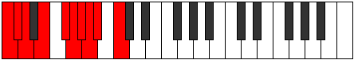

# ANaturalDominantThirteenthFlatNinth

## Links

- [Documentation](index.md)
- [Scales Index](Scales.md)
- [Modes Index](Modes.md)
- [Chords Index](Chords.md)

## Root

A

## Notes

| Position | Notes | Illustration |
|----------|------|--------------|
| RootPosition | A,C#,E,G,Bb,D,F# |  |
| FirstInversion | C#,E,G,Bb,D,F#,A |  |
| SecondInversion | E,G,Bb,D,F#,A,C# |  |
| ThirdInversion | G,Bb,D,F#,A,C#,E |  |
| FourthInversion | Bb,D,F#,A,C#,E,G |  |
| FifthInversion | D,F#,A,C#,E,G,Bb |  |
| SixthInversion | F#,A,C#,E,G,Bb,D |  |
## Modes

| Number | Mode | Tonic | Notes | Illustration |
|--------|------|-------|-------|--------------|
| [875](https://ianring.com/musictheory/scales/875) | [Stothian](ModeCSharpStothian.md) | C# | C#, D, E, F#, G, A, Bb, C# |  |
| [879](https://ianring.com/musictheory/scales/879) | [Aeolocryllic](ModeCSharpAeolocryllic.md) | C# | C#, D, D#, E, F#, G, A, A#, C# |  |
| [879](https://ianring.com/musictheory/scales/879) | [Aeolocryllic](ModeDFlatAeolocryllic.md) | Db | Db, D, Eb, E, Gb, G, A, Bb, Db |  |
| [891](https://ianring.com/musictheory/scales/891) | [Ionilyllic](ModeCSharpIonilyllic.md) | C# | C#, D, E, F, F#, G, A, A#, C# |  |
| [891](https://ianring.com/musictheory/scales/891) | [Ionilyllic](ModeDFlatIonilyllic.md) | Db | Db, D, E, F, Gb, G, A, Bb, Db |  |
| [895](https://ianring.com/musictheory/scales/895) | [Aeolathygic](ModeCSharpAeolathygic.md) | C# | C#, D, D#, E, F, F#, G, A, A#, C# |  |
| [895](https://ianring.com/musictheory/scales/895) | [Aeolathygic](ModeDFlatAeolathygic.md) | Db | Db, D, Eb, E, F, Gb, G, A, Bb, Db |  |
| [1003](https://ianring.com/musictheory/scales/1003) | [Ionyryllic](ModeCSharpIonyryllic.md) | C# | C#, D, E, F#, G, G#, A, A#, C# |  |
| [1003](https://ianring.com/musictheory/scales/1003) | [Ionyryllic](ModeDFlatIonyryllic.md) | Db | Db, D, E, Gb, G, Ab, A, Bb, Db |  |
| [1007](https://ianring.com/musictheory/scales/1007) | [Ionycrygic](ModeCSharpIonycrygic.md) | C# | C#, D, D#, E, F#, G, G#, A, A#, C# |  |
| [1007](https://ianring.com/musictheory/scales/1007) | [Ionycrygic](ModeDFlatIonycrygic.md) | Db | Db, D, Eb, E, Gb, G, Ab, A, Bb, Db |  |
| [1019](https://ianring.com/musictheory/scales/1019) | [Aeranygic](ModeCSharpAeranygic.md) | C# | C#, D, E, F, F#, G, G#, A, A#, C# |  |
| [1019](https://ianring.com/musictheory/scales/1019) | [Aeranygic](ModeDFlatAeranygic.md) | Db | Db, D, E, F, Gb, G, Ab, A, Bb, Db |  |
| [1023](https://ianring.com/musictheory/scales/1023) | [Dodyllian](ModeCSharpDodyllian.md) | C# | C#, D, D#, E, F, F#, G, G#, A, A#, C# |  |
| [1023](https://ianring.com/musictheory/scales/1023) | [Dodyllian](ModeDFlatDodyllian.md) | Db | Db, D, Eb, E, F, Gb, G, Ab, A, Bb, Db |  |
| [1435](https://ianring.com/musictheory/scales/1435) | [Phronian](ModeFSharpPhronian.md) | F# | F#, G, A, Bb, C#, D, E, F# |  |
| [1439](https://ianring.com/musictheory/scales/1439) | [Rolyllic](ModeFSharpRolyllic.md) | F# | F#, G, G#, A, A#, C#, D, E, F# |  |
| [1439](https://ianring.com/musictheory/scales/1439) | [Rolyllic](ModeGFlatRolyllic.md) | Gb | Gb, G, Ab, A, Bb, Db, D, E, Gb |  |
| [1467](https://ianring.com/musictheory/scales/1467) | [Thydyllic](ModeFSharpThydyllic.md) | F# | F#, G, A, A#, B, C#, D, E, F# |  |
| [1467](https://ianring.com/musictheory/scales/1467) | [Thydyllic](ModeGFlatThydyllic.md) | Gb | Gb, G, A, Bb, B, Db, D, E, Gb |  |
| [1471](https://ianring.com/musictheory/scales/1471) | [Radygic](ModeFSharpRadygic.md) | F# | F#, G, G#, A, A#, B, C#, D, E, F# |  |
| [1471](https://ianring.com/musictheory/scales/1471) | [Radygic](ModeGFlatRadygic.md) | Gb | Gb, G, Ab, A, Bb, B, Db, D, E, Gb |  |
| [1499](https://ianring.com/musictheory/scales/1499) | [Stonyllic](ModeFSharpStonyllic.md) | F# | F#, G, A, A#, C, C#, D, E, F# |  |
| [1499](https://ianring.com/musictheory/scales/1499) | [Stonyllic](ModeGFlatStonyllic.md) | Gb | Gb, G, A, Bb, C, Db, D, E, Gb |  |
| [1503](https://ianring.com/musictheory/scales/1503) | [Padygic](ModeFSharpPadygic.md) | F# | F#, G, G#, A, A#, C, C#, D, E, F# |  |
| [1503](https://ianring.com/musictheory/scales/1503) | [Padygic](ModeGFlatPadygic.md) | Gb | Gb, G, Ab, A, Bb, C, Db, D, E, Gb |  |
| [1531](https://ianring.com/musictheory/scales/1531) | [Styptygic](ModeFSharpStyptygic.md) | F# | F#, G, A, A#, B, C, C#, D, E, F# |  |
| [1531](https://ianring.com/musictheory/scales/1531) | [Styptygic](ModeGFlatStyptygic.md) | Gb | Gb, G, A, Bb, B, C, Db, D, E, Gb |  |
| [1535](https://ianring.com/musictheory/scales/1535) | [Mixodyllian](ModeFSharpMixodyllian.md) | F# | F#, G, G#, A, A#, B, C, C#, D, E, F# |  |
| [1535](https://ianring.com/musictheory/scales/1535) | [Mixodyllian](ModeGFlatMixodyllian.md) | Gb | Gb, G, Ab, A, Bb, B, C, Db, D, E, Gb |  |
| [1645](https://ianring.com/musictheory/scales/1645) | [Katagian](ModeENaturalKatagian.md) | E | E, F#, G, A, Bb, C#, D, E |  |
| [1647](https://ianring.com/musictheory/scales/1647) | [Polyllic](ModeENaturalPolyllic.md) | E | E, F, F#, G, A, A#, C#, D, E |  |
| [1661](https://ianring.com/musictheory/scales/1661) | [Gonyllic](ModeENaturalGonyllic.md) | E | E, F#, G, G#, A, A#, C#, D, E |  |
| [1663](https://ianring.com/musictheory/scales/1663) | [Lydygic](ModeENaturalLydygic.md) | E | E, F, F#, G, G#, A, A#, C#, D, E |  |
| [1715](https://ianring.com/musictheory/scales/1715) | [Aeronian](ModeANaturalAeronian.md) | A | A, Bb, C#, D, E, F#, G, A |  |
| [1719](https://ianring.com/musictheory/scales/1719) | [Lyryllic](ModeANaturalLyryllic.md) | A | A, A#, B, C#, D, E, F#, G, A |  |
| [1723](https://ianring.com/musictheory/scales/1723) | [Poryllic](ModeANaturalPoryllic.md) | A | A, A#, C, C#, D, E, F#, G, A |  |
| [1727](https://ianring.com/musictheory/scales/1727) | [Sydygic](ModeANaturalSydygic.md) | A | A, A#, B, C, C#, D, E, F#, G, A |  |
| [1751](https://ianring.com/musictheory/scales/1751) | [Aeolyryllic](ModeCNaturalAeolyryllic.md) | C | C, C#, D, E, F#, G, A, A#, C |  |
| [1759](https://ianring.com/musictheory/scales/1759) | [Pylygic](ModeCNaturalPylygic.md) | C | C, C#, D, D#, E, F#, G, A, A#, C |  |
| [1773](https://ianring.com/musictheory/scales/1773) | [Aeoloryllic](ModeENaturalAeoloryllic.md) | E | E, F#, G, A, A#, B, C#, D, E |  |
| [1775](https://ianring.com/musictheory/scales/1775) | [Lyrygic](ModeENaturalLyrygic.md) | E | E, F, F#, G, A, A#, B, C#, D, E |  |
| [1779](https://ianring.com/musictheory/scales/1779) | [Aerythyllic](ModeANaturalAerythyllic.md) | A | A, A#, C#, D, D#, E, F#, G, A |  |
| [1783](https://ianring.com/musictheory/scales/1783) | [Danygic](ModeCNaturalDanygic.md) | C | C, C#, D, E, F, F#, G, A, A#, C |  |
| [1783](https://ianring.com/musictheory/scales/1783) | [Danygic](ModeANaturalDanygic.md) | A | A, A#, B, C#, D, D#, E, F#, G, A |  |
| [1787](https://ianring.com/musictheory/scales/1787) | [Mycrygic](ModeANaturalMycrygic.md) | A | A, A#, C, C#, D, D#, E, F#, G, A |  |
| [1789](https://ianring.com/musictheory/scales/1789) | [Katagygic](ModeENaturalKatagygic.md) | E | E, F#, G, G#, A, A#, B, C#, D, E |  |
| [1791](https://ianring.com/musictheory/scales/1791) | [Aerygyllian](ModeCNaturalAerygyllian.md) | C | C, C#, D, D#, E, F, F#, G, A, A#, C |  |
| [1791](https://ianring.com/musictheory/scales/1791) | [Aerygyllian](ModeANaturalAerygyllian.md) | A | A, A#, B, C, C#, D, D#, E, F#, G, A |  |
| [1791](https://ianring.com/musictheory/scales/1791) | [Aerygyllian](ModeENaturalAerygyllian.md) | E | E, F, F#, G, G#, A, A#, B, C#, D, E |  |
| [1899](https://ianring.com/musictheory/scales/1899) | [Moptyllic](ModeCSharpMoptyllic.md) | C# | C#, D, E, F#, G, A, A#, B, C# |  |
| [1899](https://ianring.com/musictheory/scales/1899) | [Moptyllic](ModeDFlatMoptyllic.md) | Db | Db, D, E, Gb, G, A, Bb, B, Db |  |
| [1901](https://ianring.com/musictheory/scales/1901) | [Ionidyllic](ModeENaturalIonidyllic.md) | E | E, F#, G, A, A#, C, C#, D, E |  |
| [1903](https://ianring.com/musictheory/scales/1903) | [Rocrygic](ModeENaturalRocrygic.md) | E | E, F, F#, G, A, A#, C, C#, D, E |  |
| [1903](https://ianring.com/musictheory/scales/1903) | [Rocrygic](ModeCSharpRocrygic.md) | C# | C#, D, D#, E, F#, G, A, A#, B, C# |  |
| [1903](https://ianring.com/musictheory/scales/1903) | [Rocrygic](ModeDFlatRocrygic.md) | Db | Db, D, Eb, E, Gb, G, A, Bb, B, Db |  |
| [1915](https://ianring.com/musictheory/scales/1915) | [Thydygic](ModeCSharpThydygic.md) | C# | C#, D, E, F, F#, G, A, A#, B, C# |  |
| [1915](https://ianring.com/musictheory/scales/1915) | [Thydygic](ModeDFlatThydygic.md) | Db | Db, D, E, F, Gb, G, A, Bb, B, Db |  |
| [1917](https://ianring.com/musictheory/scales/1917) | [Sacrygic](ModeENaturalSacrygic.md) | E | E, F#, G, G#, A, A#, C, C#, D, E |  |
| [1919](https://ianring.com/musictheory/scales/1919) | [Rocryllian](ModeENaturalRocryllian.md) | E | E, F, F#, G, G#, A, A#, C, C#, D, E |  |
| [1919](https://ianring.com/musictheory/scales/1919) | [Rocryllian](ModeCSharpRocryllian.md) | C# | C#, D, D#, E, F, F#, G, A, A#, B, C# |  |
| [1919](https://ianring.com/musictheory/scales/1919) | [Rocryllian](ModeDFlatRocryllian.md) | Db | Db, D, Eb, E, F, Gb, G, A, Bb, B, Db |  |
| [1947](https://ianring.com/musictheory/scales/1947) | [Ionoyllic](ModeFSharpIonoyllic.md) | F# | F#, G, A, A#, C#, D, D#, E, F# |  |
| [1947](https://ianring.com/musictheory/scales/1947) | [Ionoyllic](ModeGFlatIonoyllic.md) | Gb | Gb, G, A, Bb, Db, D, Eb, E, Gb |  |
| [1951](https://ianring.com/musictheory/scales/1951) | [Gonygic](ModeFSharpGonygic.md) | F# | F#, G, G#, A, A#, C#, D, D#, E, F# |  |
| [1951](https://ianring.com/musictheory/scales/1951) | [Gonygic](ModeGFlatGonygic.md) | Gb | Gb, G, Ab, A, Bb, Db, D, Eb, E, Gb |  |
| [1971](https://ianring.com/musictheory/scales/1971) | [Aerynyllic](ModeANaturalAerynyllic.md) | A | A, A#, C#, D, E, F, F#, G, A |  |
| [1975](https://ianring.com/musictheory/scales/1975) | [Ionocrygic](ModeANaturalIonocrygic.md) | A | A, A#, B, C#, D, E, F, F#, G, A |  |
| [1979](https://ianring.com/musictheory/scales/1979) | [Aeradygic](ModeANaturalAeradygic.md) | A | A, A#, C, C#, D, E, F, F#, G, A |  |
| [1979](https://ianring.com/musictheory/scales/1979) | [Aeradygic](ModeFSharpAeradygic.md) | F# | F#, G, A, A#, B, C#, D, D#, E, F# |  |
| [1979](https://ianring.com/musictheory/scales/1979) | [Aeradygic](ModeGFlatAeradygic.md) | Gb | Gb, G, A, Bb, B, Db, D, Eb, E, Gb |  |
| [1983](https://ianring.com/musictheory/scales/1983) | [Soryllian](ModeANaturalSoryllian.md) | A | A, A#, B, C, C#, D, E, F, F#, G, A |  |
| [1983](https://ianring.com/musictheory/scales/1983) | [Soryllian](ModeFSharpSoryllian.md) | F# | F#, G, G#, A, A#, B, C#, D, D#, E, F# |  |
| [1983](https://ianring.com/musictheory/scales/1983) | [Soryllian](ModeGFlatSoryllian.md) | Gb | Gb, G, Ab, A, Bb, B, Db, D, Eb, E, Gb |  |
| [2007](https://ianring.com/musictheory/scales/2007) | [Stonygic](ModeCNaturalStonygic.md) | C | C, C#, D, E, F#, G, G#, A, A#, C |  |
| [2011](https://ianring.com/musictheory/scales/2011) | [Raphygic](ModeFSharpRaphygic.md) | F# | F#, G, A, A#, C, C#, D, D#, E, F# |  |
| [2011](https://ianring.com/musictheory/scales/2011) | [Raphygic](ModeGFlatRaphygic.md) | Gb | Gb, G, A, Bb, C, Db, D, Eb, E, Gb |  |
| [2015](https://ianring.com/musictheory/scales/2015) | [Epiryllian](ModeCNaturalEpiryllian.md) | C | C, C#, D, D#, E, F#, G, G#, A, A#, C |  |
| [2015](https://ianring.com/musictheory/scales/2015) | [Epiryllian](ModeFSharpEpiryllian.md) | F# | F#, G, G#, A, A#, C, C#, D, D#, E, F# |  |
| [2015](https://ianring.com/musictheory/scales/2015) | [Epiryllian](ModeGFlatEpiryllian.md) | Gb | Gb, G, Ab, A, Bb, C, Db, D, Eb, E, Gb |  |
| [2027](https://ianring.com/musictheory/scales/2027) | [Boptygic](ModeCSharpBoptygic.md) | C# | C#, D, E, F#, G, G#, A, A#, B, C# |  |
| [2027](https://ianring.com/musictheory/scales/2027) | [Boptygic](ModeDFlatBoptygic.md) | Db | Db, D, E, Gb, G, Ab, A, Bb, B, Db |  |
| [2029](https://ianring.com/musictheory/scales/2029) | [Mathygic](ModeENaturalMathygic.md) | E | E, F#, G, A, A#, B, C, C#, D, E |  |
| [2031](https://ianring.com/musictheory/scales/2031) | [Gadyllian](ModeENaturalGadyllian.md) | E | E, F, F#, G, A, A#, B, C, C#, D, E |  |
| [2031](https://ianring.com/musictheory/scales/2031) | [Gadyllian](ModeCSharpGadyllian.md) | C# | C#, D, D#, E, F#, G, G#, A, A#, B, C# |  |
| [2031](https://ianring.com/musictheory/scales/2031) | [Gadyllian](ModeDFlatGadyllian.md) | Db | Db, D, Eb, E, Gb, G, Ab, A, Bb, B, Db |  |
| [2035](https://ianring.com/musictheory/scales/2035) | [Aerythygic](ModeANaturalAerythygic.md) | A | A, A#, C#, D, D#, E, F, F#, G, A |  |
| [2039](https://ianring.com/musictheory/scales/2039) | [Danyllian](ModeCNaturalDanyllian.md) | C | C, C#, D, E, F, F#, G, G#, A, A#, C |  |
| [2039](https://ianring.com/musictheory/scales/2039) | [Danyllian](ModeANaturalDanyllian.md) | A | A, A#, B, C#, D, D#, E, F, F#, G, A |  |
| [2043](https://ianring.com/musictheory/scales/2043) | [Lythyllian](ModeANaturalLythyllian.md) | A | A, A#, C, C#, D, D#, E, F, F#, G, A |  |
| [2043](https://ianring.com/musictheory/scales/2043) | [Lythyllian](ModeFSharpLythyllian.md) | F# | F#, G, A, A#, B, C, C#, D, D#, E, F# |  |
| [2043](https://ianring.com/musictheory/scales/2043) | [Lythyllian](ModeGFlatLythyllian.md) | Gb | Gb, G, A, Bb, B, C, Db, D, Eb, E, Gb |  |
| [2043](https://ianring.com/musictheory/scales/2043) | [Lythyllian](ModeCSharpLythyllian.md) | C# | C#, D, E, F, F#, G, G#, A, A#, B, C# |  |
| [2043](https://ianring.com/musictheory/scales/2043) | [Lythyllian](ModeDFlatLythyllian.md) | Db | Db, D, E, F, Gb, G, Ab, A, Bb, B, Db |  |
| [2045](https://ianring.com/musictheory/scales/2045) | [Katogyllian](ModeENaturalKatogyllian.md) | E | E, F#, G, G#, A, A#, B, C, C#, D, E |  |
| [2047](https://ianring.com/musictheory/scales/2047) | [Monatic](ModeCNaturalMonatic.md) | C | C, C#, D, D#, E, F, F#, G, G#, A, A#, C |  |
| [2047](https://ianring.com/musictheory/scales/2047) | [Monatic](ModeANaturalMonatic.md) | A | A, A#, B, C, C#, D, D#, E, F, F#, G, A |  |
| [2047](https://ianring.com/musictheory/scales/2047) | [Monatic](ModeFSharpMonatic.md) | F# | F#, G, G#, A, A#, B, C, C#, D, D#, E, F# |  |
| [2047](https://ianring.com/musictheory/scales/2047) | [Monatic](ModeGFlatMonatic.md) | Gb | Gb, G, Ab, A, Bb, B, C, Db, D, Eb, E, Gb |  |
| [2047](https://ianring.com/musictheory/scales/2047) | [Monatic](ModeENaturalMonatic.md) | E | E, F, F#, G, G#, A, A#, B, C, C#, D, E |  |
| [2047](https://ianring.com/musictheory/scales/2047) | [Monatic](ModeCSharpMonatic.md) | C# | C#, D, D#, E, F, F#, G, G#, A, A#, B, C# |  |
| [2047](https://ianring.com/musictheory/scales/2047) | [Monatic](ModeDFlatMonatic.md) | Db | Db, D, Eb, E, F, Gb, G, Ab, A, Bb, B, Db |  |
| [2485](https://ianring.com/musictheory/scales/2485) | [Aerorian](ModeDNaturalAerorian.md) | D | D, E, F#, G, A, Bb, C#, D |  |
| [2487](https://ianring.com/musictheory/scales/2487) | [Phroptyllic](ModeDNaturalPhroptyllic.md) | D | D, D#, E, F#, G, A, A#, C#, D |  |
| [2493](https://ianring.com/musictheory/scales/2493) | [Manyllic](ModeDNaturalManyllic.md) | D | D, E, F, F#, G, A, A#, C#, D |  |
| [2495](https://ianring.com/musictheory/scales/2495) | [Aeolocrygic](ModeDNaturalAeolocrygic.md) | D | D, D#, E, F, F#, G, A, A#, C#, D |  |
| [2549](https://ianring.com/musictheory/scales/2549) | [Rydyllic](ModeDNaturalRydyllic.md) | D | D, E, F#, G, G#, A, A#, C#, D |  |
| [2551](https://ianring.com/musictheory/scales/2551) | [Zoptygic](ModeDNaturalZoptygic.md) | D | D, D#, E, F#, G, G#, A, A#, C#, D |  |
| [2557](https://ianring.com/musictheory/scales/2557) | [Dothygic](ModeDNaturalDothygic.md) | D | D, E, F, F#, G, G#, A, A#, C#, D |  |
| [2559](https://ianring.com/musictheory/scales/2559) | [Zogyllian](ModeDNaturalZogyllian.md) | D | D, D#, E, F, F#, G, G#, A, A#, C#, D |  |
| [2765](https://ianring.com/musictheory/scales/2765) | [Banian](ModeGNaturalBanian.md) | G | G, A, Bb, C#, D, E, F#, G |  |
| [2767](https://ianring.com/musictheory/scales/2767) | [Katydyllic](ModeGNaturalKatydyllic.md) | G | G, G#, A, A#, C#, D, E, F#, G |  |
| [2781](https://ianring.com/musictheory/scales/2781) | [Gycryllic](ModeGNaturalGycryllic.md) | G | G, A, A#, B, C#, D, E, F#, G |  |
| [2783](https://ianring.com/musictheory/scales/2783) | [Gothygic](ModeGNaturalGothygic.md) | G | G, G#, A, A#, B, C#, D, E, F#, G |  |
| [2797](https://ianring.com/musictheory/scales/2797) | [Stalyllic](ModeGNaturalStalyllic.md) | G | G, A, A#, C, C#, D, E, F#, G |  |
| [2799](https://ianring.com/musictheory/scales/2799) | [Epilygic](ModeGNaturalEpilygic.md) | G | G, G#, A, A#, C, C#, D, E, F#, G |  |
| [2813](https://ianring.com/musictheory/scales/2813) | [Zolygic](ModeGNaturalZolygic.md) | G | G, A, A#, B, C, C#, D, E, F#, G |  |
| [2815](https://ianring.com/musictheory/scales/2815) | [Aeradyllian](ModeGNaturalAeradyllian.md) | G | G, G#, A, A#, B, C, C#, D, E, F#, G |  |
| [2871](https://ianring.com/musictheory/scales/2871) | [Stanyllic](ModeFNaturalStanyllic.md) | F | F, F#, G, A, A#, C#, D, E, F |  |
| [2879](https://ianring.com/musictheory/scales/2879) | [Stadygic](ModeFNaturalStadygic.md) | F | F, F#, G, G#, A, A#, C#, D, E, F |  |
| [2905](https://ianring.com/musictheory/scales/2905) | [Palian](ModeBFlatPalian.md) | Bb | Bb, C#, D, E, F#, G, A, Bb |  |
| [2907](https://ianring.com/musictheory/scales/2907) | [Mogyllic](ModeASharpMogyllic.md) | A# | A#, B, C#, D, E, F#, G, A, A# |  |
| [2907](https://ianring.com/musictheory/scales/2907) | [Mogyllic](ModeBFlatMogyllic.md) | Bb | Bb, B, Db, D, E, Gb, G, A, Bb |  |
| [2909](https://ianring.com/musictheory/scales/2909) | [Mocryllic](ModeASharpMocryllic.md) | A# | A#, C, C#, D, E, F#, G, A, A# |  |
| [2909](https://ianring.com/musictheory/scales/2909) | [Mocryllic](ModeBFlatMocryllic.md) | Bb | Bb, C, Db, D, E, Gb, G, A, Bb |  |
| [2911](https://ianring.com/musictheory/scales/2911) | [Katygic](ModeASharpKatygic.md) | A# | A#, B, C, C#, D, E, F#, G, A, A# |  |
| [2911](https://ianring.com/musictheory/scales/2911) | [Katygic](ModeBFlatKatygic.md) | Bb | Bb, B, C, Db, D, E, Gb, G, A, Bb |  |
| [2923](https://ianring.com/musictheory/scales/2923) | [Baryllic](ModeCSharpBaryllic.md) | C# | C#, D, E, F#, G, A, A#, C, C# |  |
| [2923](https://ianring.com/musictheory/scales/2923) | [Baryllic](ModeDFlatBaryllic.md) | Db | Db, D, E, Gb, G, A, Bb, C, Db |  |
| [2927](https://ianring.com/musictheory/scales/2927) | [Rodygic](ModeCSharpRodygic.md) | C# | C#, D, D#, E, F#, G, A, A#, C, C# |  |
| [2927](https://ianring.com/musictheory/scales/2927) | [Rodygic](ModeDFlatRodygic.md) | Db | Db, D, Eb, E, Gb, G, A, Bb, C, Db |  |
| [2935](https://ianring.com/musictheory/scales/2935) | [Modygic](ModeFNaturalModygic.md) | F | F, F#, G, A, A#, B, C#, D, E, F |  |
| [2937](https://ianring.com/musictheory/scales/2937) | [Aeolathyllic](ModeASharpAeolathyllic.md) | A# | A#, C#, D, D#, E, F#, G, A, A# |  |
| [2937](https://ianring.com/musictheory/scales/2937) | [Aeolathyllic](ModeBFlatAeolathyllic.md) | Bb | Bb, Db, D, Eb, E, Gb, G, A, Bb |  |
| [2939](https://ianring.com/musictheory/scales/2939) | [Goptygic](ModeCSharpGoptygic.md) | C# | C#, D, E, F, F#, G, A, A#, C, C# |  |
| [2939](https://ianring.com/musictheory/scales/2939) | [Goptygic](ModeDFlatGoptygic.md) | Db | Db, D, E, F, Gb, G, A, Bb, C, Db |  |
| [2939](https://ianring.com/musictheory/scales/2939) | [Goptygic](ModeASharpGoptygic.md) | A# | A#, B, C#, D, D#, E, F#, G, A, A# |  |
| [2939](https://ianring.com/musictheory/scales/2939) | [Goptygic](ModeBFlatGoptygic.md) | Bb | Bb, B, Db, D, Eb, E, Gb, G, A, Bb |  |
| [2941](https://ianring.com/musictheory/scales/2941) | [Laptygic](ModeASharpLaptygic.md) | A# | A#, C, C#, D, D#, E, F#, G, A, A# |  |
| [2941](https://ianring.com/musictheory/scales/2941) | [Laptygic](ModeBFlatLaptygic.md) | Bb | Bb, C, Db, D, Eb, E, Gb, G, A, Bb |  |
| [2943](https://ianring.com/musictheory/scales/2943) | [Dathyllian](ModeCSharpDathyllian.md) | C# | C#, D, D#, E, F, F#, G, A, A#, C, C# |  |
| [2943](https://ianring.com/musictheory/scales/2943) | [Dathyllian](ModeDFlatDathyllian.md) | Db | Db, D, Eb, E, F, Gb, G, A, Bb, C, Db |  |
| [2943](https://ianring.com/musictheory/scales/2943) | [Dathyllian](ModeASharpDathyllian.md) | A# | A#, B, C, C#, D, D#, E, F#, G, A, A# |  |
| [2943](https://ianring.com/musictheory/scales/2943) | [Dathyllian](ModeBFlatDathyllian.md) | Bb | Bb, B, C, Db, D, Eb, E, Gb, G, A, Bb |  |
| [2943](https://ianring.com/musictheory/scales/2943) | [Dathyllian](ModeFNaturalDathyllian.md) | F | F, F#, G, G#, A, A#, B, C#, D, E, F |  |
| [2997](https://ianring.com/musictheory/scales/2997) | [Ionoptyllic](ModeDNaturalIonoptyllic.md) | D | D, E, F#, G, A, A#, B, C#, D |  |
| [2999](https://ianring.com/musictheory/scales/2999) | [Zyrygic](ModeFNaturalZyrygic.md) | F | F, F#, G, A, A#, C, C#, D, E, F |  |
| [2999](https://ianring.com/musictheory/scales/2999) | [Zyrygic](ModeDNaturalZyrygic.md) | D | D, D#, E, F#, G, A, A#, B, C#, D |  |
| [3005](https://ianring.com/musictheory/scales/3005) | [Gycrygic](ModeDNaturalGycrygic.md) | D | D, E, F, F#, G, A, A#, B, C#, D |  |
| [3007](https://ianring.com/musictheory/scales/3007) | [Zyryllian](ModeFNaturalZyryllian.md) | F | F, F#, G, G#, A, A#, C, C#, D, E, F |  |
| [3007](https://ianring.com/musictheory/scales/3007) | [Zyryllian](ModeDNaturalZyryllian.md) | D | D, D#, E, F, F#, G, A, A#, B, C#, D |  |
| [3021](https://ianring.com/musictheory/scales/3021) | [Gyptyllic](ModeGNaturalGyptyllic.md) | G | G, A, A#, C#, D, D#, E, F#, G |  |
| [3023](https://ianring.com/musictheory/scales/3023) | [Aeracrygic](ModeGNaturalAeracrygic.md) | G | G, G#, A, A#, C#, D, D#, E, F#, G |  |
| [3033](https://ianring.com/musictheory/scales/3033) | [Doptyllic](ModeASharpDoptyllic.md) | A# | A#, C#, D, E, F, F#, G, A, A# |  |
| [3033](https://ianring.com/musictheory/scales/3033) | [Doptyllic](ModeBFlatDoptyllic.md) | Bb | Bb, Db, D, E, F, Gb, G, A, Bb |  |
| [3035](https://ianring.com/musictheory/scales/3035) | [Gocrygic](ModeASharpGocrygic.md) | A# | A#, B, C#, D, E, F, F#, G, A, A# |  |
| [3035](https://ianring.com/musictheory/scales/3035) | [Gocrygic](ModeBFlatGocrygic.md) | Bb | Bb, B, Db, D, E, F, Gb, G, A, Bb |  |
| [3037](https://ianring.com/musictheory/scales/3037) | [Staptygic](ModeASharpStaptygic.md) | A# | A#, C, C#, D, E, F, F#, G, A, A# |  |
| [3037](https://ianring.com/musictheory/scales/3037) | [Staptygic](ModeBFlatStaptygic.md) | Bb | Bb, C, Db, D, E, F, Gb, G, A, Bb |  |
| [3037](https://ianring.com/musictheory/scales/3037) | [Staptygic](ModeGNaturalStaptygic.md) | G | G, A, A#, B, C#, D, D#, E, F#, G |  |
| [3039](https://ianring.com/musictheory/scales/3039) | [Godyllian](ModeASharpGodyllian.md) | A# | A#, B, C, C#, D, E, F, F#, G, A, A# |  |
| [3039](https://ianring.com/musictheory/scales/3039) | [Godyllian](ModeBFlatGodyllian.md) | Bb | Bb, B, C, Db, D, E, F, Gb, G, A, Bb |  |
| [3039](https://ianring.com/musictheory/scales/3039) | [Godyllian](ModeGNaturalGodyllian.md) | G | G, G#, A, A#, B, C#, D, D#, E, F#, G |  |
| [3051](https://ianring.com/musictheory/scales/3051) | [Stalygic](ModeCSharpStalygic.md) | C# | C#, D, E, F#, G, G#, A, A#, C, C# |  |
| [3051](https://ianring.com/musictheory/scales/3051) | [Stalygic](ModeDFlatStalygic.md) | Db | Db, D, E, Gb, G, Ab, A, Bb, C, Db |  |
| [3053](https://ianring.com/musictheory/scales/3053) | [Zycrygic](ModeGNaturalZycrygic.md) | G | G, A, A#, C, C#, D, D#, E, F#, G |  |
| [3055](https://ianring.com/musictheory/scales/3055) | [Lyryllian](ModeCSharpLyryllian.md) | C# | C#, D, D#, E, F#, G, G#, A, A#, C, C# |  |
| [3055](https://ianring.com/musictheory/scales/3055) | [Lyryllian](ModeDFlatLyryllian.md) | Db | Db, D, Eb, E, Gb, G, Ab, A, Bb, C, Db |  |
| [3055](https://ianring.com/musictheory/scales/3055) | [Lyryllian](ModeGNaturalLyryllian.md) | G | G, G#, A, A#, C, C#, D, D#, E, F#, G |  |
| [3061](https://ianring.com/musictheory/scales/3061) | [Apinygic](ModeDNaturalApinygic.md) | D | D, E, F#, G, G#, A, A#, B, C#, D |  |
| [3063](https://ianring.com/musictheory/scales/3063) | [Solyllian](ModeFNaturalSolyllian.md) | F | F, F#, G, A, A#, B, C, C#, D, E, F |  |
| [3063](https://ianring.com/musictheory/scales/3063) | [Solyllian](ModeDNaturalSolyllian.md) | D | D, D#, E, F#, G, G#, A, A#, B, C#, D |  |
| [3065](https://ianring.com/musictheory/scales/3065) | [Zothygic](ModeASharpZothygic.md) | A# | A#, C#, D, D#, E, F, F#, G, A, A# |  |
| [3065](https://ianring.com/musictheory/scales/3065) | [Zothygic](ModeBFlatZothygic.md) | Bb | Bb, Db, D, Eb, E, F, Gb, G, A, Bb |  |
| [3067](https://ianring.com/musictheory/scales/3067) | [Goptyllian](ModeCSharpGoptyllian.md) | C# | C#, D, E, F, F#, G, G#, A, A#, C, C# |  |
| [3067](https://ianring.com/musictheory/scales/3067) | [Goptyllian](ModeDFlatGoptyllian.md) | Db | Db, D, E, F, Gb, G, Ab, A, Bb, C, Db |  |
| [3067](https://ianring.com/musictheory/scales/3067) | [Goptyllian](ModeASharpGoptyllian.md) | A# | A#, B, C#, D, D#, E, F, F#, G, A, A# |  |
| [3067](https://ianring.com/musictheory/scales/3067) | [Goptyllian](ModeBFlatGoptyllian.md) | Bb | Bb, B, Db, D, Eb, E, F, Gb, G, A, Bb |  |
| [3069](https://ianring.com/musictheory/scales/3069) | [Bacryllian](ModeASharpBacryllian.md) | A# | A#, C, C#, D, D#, E, F, F#, G, A, A# |  |
| [3069](https://ianring.com/musictheory/scales/3069) | [Bacryllian](ModeBFlatBacryllian.md) | Bb | Bb, C, Db, D, Eb, E, F, Gb, G, A, Bb |  |
| [3069](https://ianring.com/musictheory/scales/3069) | [Bacryllian](ModeGNaturalBacryllian.md) | G | G, A, A#, B, C, C#, D, D#, E, F#, G |  |
| [3069](https://ianring.com/musictheory/scales/3069) | [Bacryllian](ModeDNaturalBacryllian.md) | D | D, E, F, F#, G, G#, A, A#, B, C#, D |  |
| [3071](https://ianring.com/musictheory/scales/3071) | [Solatic](ModeCSharpSolatic.md) | C# | C#, D, D#, E, F, F#, G, G#, A, A#, C, C# |  |
| [3071](https://ianring.com/musictheory/scales/3071) | [Solatic](ModeDFlatSolatic.md) | Db | Db, D, Eb, E, F, Gb, G, Ab, A, Bb, C, Db |  |
| [3071](https://ianring.com/musictheory/scales/3071) | [Solatic](ModeASharpSolatic.md) | A# | A#, B, C, C#, D, D#, E, F, F#, G, A, A# |  |
| [3071](https://ianring.com/musictheory/scales/3071) | [Solatic](ModeBFlatSolatic.md) | Bb | Bb, B, C, Db, D, Eb, E, F, Gb, G, A, Bb |  |
| [3071](https://ianring.com/musictheory/scales/3071) | [Solatic](ModeGNaturalSolatic.md) | G | G, G#, A, A#, B, C, C#, D, D#, E, F#, G |  |
| [3071](https://ianring.com/musictheory/scales/3071) | [Solatic](ModeFNaturalSolatic.md) | F | F, F#, G, G#, A, A#, B, C, C#, D, E, F |  |
| [3071](https://ianring.com/musictheory/scales/3071) | [Solatic](ModeDNaturalSolatic.md) | D | D, D#, E, F, F#, G, G#, A, A#, B, C#, D |  |
| [3291](https://ianring.com/musictheory/scales/3291) | [Kodyllic](ModeDSharpKodyllic.md) | D# | D#, E, F#, G, A, A#, C#, D, D# |  |
| [3291](https://ianring.com/musictheory/scales/3291) | [Kodyllic](ModeEFlatKodyllic.md) | Eb | Eb, E, Gb, G, A, Bb, Db, D, Eb |  |
| [3295](https://ianring.com/musictheory/scales/3295) | [Phroptygic](ModeDSharpPhroptygic.md) | D# | D#, E, F, F#, G, A, A#, C#, D, D# |  |
| [3295](https://ianring.com/musictheory/scales/3295) | [Phroptygic](ModeEFlatPhroptygic.md) | Eb | Eb, E, F, Gb, G, A, Bb, Db, D, Eb |  |
| [3323](https://ianring.com/musictheory/scales/3323) | [Phrygygic](ModeDSharpPhrygygic.md) | D# | D#, E, F#, G, G#, A, A#, C#, D, D# |  |
| [3323](https://ianring.com/musictheory/scales/3323) | [Phrygygic](ModeEFlatPhrygygic.md) | Eb | Eb, E, Gb, G, Ab, A, Bb, Db, D, Eb |  |
| [3327](https://ianring.com/musictheory/scales/3327) | [Madyllian](ModeDSharpMadyllian.md) | D# | D#, E, F, F#, G, G#, A, A#, C#, D, D# |  |
| [3327](https://ianring.com/musictheory/scales/3327) | [Madyllian](ModeEFlatMadyllian.md) | Eb | Eb, E, F, Gb, G, Ab, A, Bb, Db, D, Eb |  |
| [3431](https://ianring.com/musictheory/scales/3431) | [Zyptyllic](ModeGSharpZyptyllic.md) | G# | G#, A, A#, C#, D, E, F#, G, G# |  |
| [3431](https://ianring.com/musictheory/scales/3431) | [Zyptyllic](ModeAFlatZyptyllic.md) | Ab | Ab, A, Bb, Db, D, E, Gb, G, Ab |  |
| [3439](https://ianring.com/musictheory/scales/3439) | [Lythygic](ModeGSharpLythygic.md) | G# | G#, A, A#, B, C#, D, E, F#, G, G# |  |
| [3439](https://ianring.com/musictheory/scales/3439) | [Lythygic](ModeAFlatLythygic.md) | Ab | Ab, A, Bb, B, Db, D, E, Gb, G, Ab |  |
| [3447](https://ianring.com/musictheory/scales/3447) | [Kynygic](ModeGSharpKynygic.md) | G# | G#, A, A#, C, C#, D, E, F#, G, G# |  |
| [3447](https://ianring.com/musictheory/scales/3447) | [Kynygic](ModeAFlatKynygic.md) | Ab | Ab, A, Bb, C, Db, D, E, Gb, G, Ab |  |
| [3455](https://ianring.com/musictheory/scales/3455) | [Ryptyllian](ModeGSharpRyptyllian.md) | G# | G#, A, A#, B, C, C#, D, E, F#, G, G# |  |
| [3455](https://ianring.com/musictheory/scales/3455) | [Ryptyllian](ModeAFlatRyptyllian.md) | Ab | Ab, A, Bb, B, C, Db, D, E, Gb, G, Ab |  |
| [3483](https://ianring.com/musictheory/scales/3483) | [Mixotharyllic](ModeFSharpMixotharyllic.md) | F# | F#, G, A, A#, C#, D, E, F, F# |  |
| [3483](https://ianring.com/musictheory/scales/3483) | [Mixotharyllic](ModeGFlatMixotharyllic.md) | Gb | Gb, G, A, Bb, Db, D, E, F, Gb |  |
| [3487](https://ianring.com/musictheory/scales/3487) | [Byptygic](ModeFSharpByptygic.md) | F# | F#, G, G#, A, A#, C#, D, E, F, F# |  |
| [3487](https://ianring.com/musictheory/scales/3487) | [Byptygic](ModeGFlatByptygic.md) | Gb | Gb, G, Ab, A, Bb, Db, D, E, F, Gb |  |
| [3501](https://ianring.com/musictheory/scales/3501) | [Katodyllic](ModeBNaturalKatodyllic.md) | B | B, C#, D, E, F#, G, A, A#, B |  |
| [3503](https://ianring.com/musictheory/scales/3503) | [Zyphygic](ModeBNaturalZyphygic.md) | B | B, C, C#, D, E, F#, G, A, A#, B |  |
| [3509](https://ianring.com/musictheory/scales/3509) | [Stogyllic](ModeDNaturalStogyllic.md) | D | D, E, F#, G, A, A#, C, C#, D |  |
| [3511](https://ianring.com/musictheory/scales/3511) | [Epolygic](ModeDNaturalEpolygic.md) | D | D, D#, E, F#, G, A, A#, C, C#, D |  |
| [3515](https://ianring.com/musictheory/scales/3515) | [Katodygic](ModeFSharpKatodygic.md) | F# | F#, G, A, A#, B, C#, D, E, F, F# |  |
| [3515](https://ianring.com/musictheory/scales/3515) | [Katodygic](ModeGFlatKatodygic.md) | Gb | Gb, G, A, Bb, B, Db, D, E, F, Gb |  |
| [3517](https://ianring.com/musictheory/scales/3517) | [Epocrygic](ModeDNaturalEpocrygic.md) | D | D, E, F, F#, G, A, A#, C, C#, D |  |
| [3517](https://ianring.com/musictheory/scales/3517) | [Epocrygic](ModeBNaturalEpocrygic.md) | B | B, C#, D, D#, E, F#, G, A, A#, B |  |
| [3519](https://ianring.com/musictheory/scales/3519) | [Boptyllian](ModeDNaturalBoptyllian.md) | D | D, D#, E, F, F#, G, A, A#, C, C#, D |  |
| [3519](https://ianring.com/musictheory/scales/3519) | [Boptyllian](ModeBNaturalBoptyllian.md) | B | B, C, C#, D, D#, E, F#, G, A, A#, B |  |
| [3519](https://ianring.com/musictheory/scales/3519) | [Boptyllian](ModeFSharpBoptyllian.md) | F# | F#, G, G#, A, A#, B, C#, D, E, F, F# |  |
| [3519](https://ianring.com/musictheory/scales/3519) | [Boptyllian](ModeGFlatBoptyllian.md) | Gb | Gb, G, Ab, A, Bb, B, Db, D, E, F, Gb |  |
| [3547](https://ianring.com/musictheory/scales/3547) | [Sadygic](ModeFSharpSadygic.md) | F# | F#, G, A, A#, C, C#, D, E, F, F# |  |
| [3547](https://ianring.com/musictheory/scales/3547) | [Sadygic](ModeGFlatSadygic.md) | Gb | Gb, G, A, Bb, C, Db, D, E, F, Gb |  |
| [3547](https://ianring.com/musictheory/scales/3547) | [Sadygic](ModeDSharpSadygic.md) | D# | D#, E, F#, G, A, A#, B, C#, D, D# |  |
| [3547](https://ianring.com/musictheory/scales/3547) | [Sadygic](ModeEFlatSadygic.md) | Eb | Eb, E, Gb, G, A, Bb, B, Db, D, Eb |  |
| [3551](https://ianring.com/musictheory/scales/3551) | [Sagyllian](ModeFSharpSagyllian.md) | F# | F#, G, G#, A, A#, C, C#, D, E, F, F# |  |
| [3551](https://ianring.com/musictheory/scales/3551) | [Sagyllian](ModeGFlatSagyllian.md) | Gb | Gb, G, Ab, A, Bb, C, Db, D, E, F, Gb |  |
| [3551](https://ianring.com/musictheory/scales/3551) | [Sagyllian](ModeDSharpSagyllian.md) | D# | D#, E, F, F#, G, A, A#, B, C#, D, D# |  |
| [3551](https://ianring.com/musictheory/scales/3551) | [Sagyllian](ModeEFlatSagyllian.md) | Eb | Eb, E, F, Gb, G, A, Bb, B, Db, D, Eb |  |
| [3559](https://ianring.com/musictheory/scales/3559) | [Aerathygic](ModeGSharpAerathygic.md) | G# | G#, A, A#, C#, D, D#, E, F#, G, G# |  |
| [3559](https://ianring.com/musictheory/scales/3559) | [Aerathygic](ModeAFlatAerathygic.md) | Ab | Ab, A, Bb, Db, D, Eb, E, Gb, G, Ab |  |
| [3565](https://ianring.com/musictheory/scales/3565) | [Aeolorygic](ModeBNaturalAeolorygic.md) | B | B, C#, D, E, F, F#, G, A, A#, B |  |
| [3567](https://ianring.com/musictheory/scales/3567) | [Epityllian](ModeBNaturalEpityllian.md) | B | B, C, C#, D, E, F, F#, G, A, A#, B |  |
| [3567](https://ianring.com/musictheory/scales/3567) | [Epityllian](ModeGSharpEpityllian.md) | G# | G#, A, A#, B, C#, D, D#, E, F#, G, G# |  |
| [3567](https://ianring.com/musictheory/scales/3567) | [Epityllian](ModeAFlatEpityllian.md) | Ab | Ab, A, Bb, B, Db, D, Eb, E, Gb, G, Ab |  |
| [3573](https://ianring.com/musictheory/scales/3573) | [Kaptygic](ModeDNaturalKaptygic.md) | D | D, E, F#, G, G#, A, A#, C, C#, D |  |
| [3575](https://ianring.com/musictheory/scales/3575) | [Mogyllian](ModeDNaturalMogyllian.md) | D | D, D#, E, F#, G, G#, A, A#, C, C#, D |  |
| [3575](https://ianring.com/musictheory/scales/3575) | [Mogyllian](ModeGSharpMogyllian.md) | G# | G#, A, A#, C, C#, D, D#, E, F#, G, G# |  |
| [3575](https://ianring.com/musictheory/scales/3575) | [Mogyllian](ModeAFlatMogyllian.md) | Ab | Ab, A, Bb, C, Db, D, Eb, E, Gb, G, Ab |  |
| [3579](https://ianring.com/musictheory/scales/3579) | [Zyphyllian](ModeFSharpZyphyllian.md) | F# | F#, G, A, A#, B, C, C#, D, E, F, F# |  |
| [3579](https://ianring.com/musictheory/scales/3579) | [Zyphyllian](ModeGFlatZyphyllian.md) | Gb | Gb, G, A, Bb, B, C, Db, D, E, F, Gb |  |
| [3579](https://ianring.com/musictheory/scales/3579) | [Zyphyllian](ModeDSharpZyphyllian.md) | D# | D#, E, F#, G, G#, A, A#, B, C#, D, D# |  |
| [3579](https://ianring.com/musictheory/scales/3579) | [Zyphyllian](ModeEFlatZyphyllian.md) | Eb | Eb, E, Gb, G, Ab, A, Bb, B, Db, D, Eb |  |
| [3581](https://ianring.com/musictheory/scales/3581) | [Epocryllian](ModeDNaturalEpocryllian.md) | D | D, E, F, F#, G, G#, A, A#, C, C#, D |  |
| [3581](https://ianring.com/musictheory/scales/3581) | [Epocryllian](ModeBNaturalEpocryllian.md) | B | B, C#, D, D#, E, F, F#, G, A, A#, B |  |
| [3583](https://ianring.com/musictheory/scales/3583) | [Zylatic](ModeDNaturalZylatic.md) | D | D, D#, E, F, F#, G, G#, A, A#, C, C#, D |  |
| [3583](https://ianring.com/musictheory/scales/3583) | [Zylatic](ModeBNaturalZylatic.md) | B | B, C, C#, D, D#, E, F, F#, G, A, A#, B |  |
| [3583](https://ianring.com/musictheory/scales/3583) | [Zylatic](ModeGSharpZylatic.md) | G# | G#, A, A#, B, C, C#, D, D#, E, F#, G, G# |  |
| [3583](https://ianring.com/musictheory/scales/3583) | [Zylatic](ModeAFlatZylatic.md) | Ab | Ab, A, Bb, B, C, Db, D, Eb, E, Gb, G, Ab |  |
| [3583](https://ianring.com/musictheory/scales/3583) | [Zylatic](ModeFSharpZylatic.md) | F# | F#, G, G#, A, A#, B, C, C#, D, E, F, F# |  |
| [3583](https://ianring.com/musictheory/scales/3583) | [Zylatic](ModeGFlatZylatic.md) | Gb | Gb, G, Ab, A, Bb, B, C, Db, D, E, F, Gb |  |
| [3583](https://ianring.com/musictheory/scales/3583) | [Zylatic](ModeDSharpZylatic.md) | D# | D#, E, F, F#, G, G#, A, A#, B, C#, D, D# |  |
| [3583](https://ianring.com/musictheory/scales/3583) | [Zylatic](ModeEFlatZylatic.md) | Eb | Eb, E, F, Gb, G, Ab, A, Bb, B, Db, D, Eb |  |
| [3693](https://ianring.com/musictheory/scales/3693) | [Epaptyllic](ModeENaturalEpaptyllic.md) | E | E, F#, G, A, A#, C#, D, D#, E |  |
| [3695](https://ianring.com/musictheory/scales/3695) | [Kodygic](ModeENaturalKodygic.md) | E | E, F, F#, G, A, A#, C#, D, D#, E |  |
| [3709](https://ianring.com/musictheory/scales/3709) | [Locrygic](ModeENaturalLocrygic.md) | E | E, F#, G, G#, A, A#, C#, D, D#, E |  |
| [3711](https://ianring.com/musictheory/scales/3711) | [Dycryllian](ModeENaturalDycryllian.md) | E | E, F, F#, G, G#, A, A#, C#, D, D#, E |  |
| [3763](https://ianring.com/musictheory/scales/3763) | [Modyllic](ModeANaturalModyllic.md) | A | A, A#, C#, D, E, F#, G, G#, A |  |
| [3767](https://ianring.com/musictheory/scales/3767) | [Bacrygic](ModeANaturalBacrygic.md) | A | A, A#, B, C#, D, E, F#, G, G#, A |  |
| [3771](https://ianring.com/musictheory/scales/3771) | [Stophygic](ModeANaturalStophygic.md) | A | A, A#, C, C#, D, E, F#, G, G#, A |  |
| [3775](https://ianring.com/musictheory/scales/3775) | [Loptyllian](ModeANaturalLoptyllian.md) | A | A, A#, B, C, C#, D, E, F#, G, G#, A |  |
| [3789](https://ianring.com/musictheory/scales/3789) | [Eporyllic](ModeGNaturalEporyllic.md) | G | G, A, A#, C#, D, E, F, F#, G |  |
| [3791](https://ianring.com/musictheory/scales/3791) | [Stodygic](ModeGNaturalStodygic.md) | G | G, G#, A, A#, C#, D, E, F, F#, G |  |
| [3799](https://ianring.com/musictheory/scales/3799) | [Aeralygic](ModeCNaturalAeralygic.md) | C | C, C#, D, E, F#, G, A, A#, B, C |  |
| [3803](https://ianring.com/musictheory/scales/3803) | [Epidygic](ModeDSharpEpidygic.md) | D# | D#, E, F#, G, A, A#, C, C#, D, D# |  |
| [3803](https://ianring.com/musictheory/scales/3803) | [Epidygic](ModeEFlatEpidygic.md) | Eb | Eb, E, Gb, G, A, Bb, C, Db, D, Eb |  |
| [3805](https://ianring.com/musictheory/scales/3805) | [Moptygic](ModeGNaturalMoptygic.md) | G | G, A, A#, B, C#, D, E, F, F#, G |  |
| [3807](https://ianring.com/musictheory/scales/3807) | [Bagyllian](ModeDSharpBagyllian.md) | D# | D#, E, F, F#, G, A, A#, C, C#, D, D# |  |
| [3807](https://ianring.com/musictheory/scales/3807) | [Bagyllian](ModeEFlatBagyllian.md) | Eb | Eb, E, F, Gb, G, A, Bb, C, Db, D, Eb |  |
| [3807](https://ianring.com/musictheory/scales/3807) | [Bagyllian](ModeCNaturalBagyllian.md) | C | C, C#, D, D#, E, F#, G, A, A#, B, C |  |
| [3807](https://ianring.com/musictheory/scales/3807) | [Bagyllian](ModeGNaturalBagyllian.md) | G | G, G#, A, A#, B, C#, D, E, F, F#, G |  |
| [3821](https://ianring.com/musictheory/scales/3821) | [Epyrygic](ModeGNaturalEpyrygic.md) | G | G, A, A#, C, C#, D, E, F, F#, G |  |
| [3821](https://ianring.com/musictheory/scales/3821) | [Epyrygic](ModeENaturalEpyrygic.md) | E | E, F#, G, A, A#, B, C#, D, D#, E |  |
| [3823](https://ianring.com/musictheory/scales/3823) | [Epinyllian](ModeGNaturalEpinyllian.md) | G | G, G#, A, A#, C, C#, D, E, F, F#, G |  |
| [3823](https://ianring.com/musictheory/scales/3823) | [Epinyllian](ModeENaturalEpinyllian.md) | E | E, F, F#, G, A, A#, B, C#, D, D#, E |  |
| [3827](https://ianring.com/musictheory/scales/3827) | [Dorygic](ModeANaturalDorygic.md) | A | A, A#, C#, D, D#, E, F#, G, G#, A |  |
| [3831](https://ianring.com/musictheory/scales/3831) | [Ionyllian](ModeCNaturalIonyllian.md) | C | C, C#, D, E, F, F#, G, A, A#, B, C |  |
| [3831](https://ianring.com/musictheory/scales/3831) | [Ionyllian](ModeANaturalIonyllian.md) | A | A, A#, B, C#, D, D#, E, F#, G, G#, A |  |
| [3835](https://ianring.com/musictheory/scales/3835) | [Katodyllian](ModeDSharpKatodyllian.md) | D# | D#, E, F#, G, G#, A, A#, C, C#, D, D# |  |
| [3835](https://ianring.com/musictheory/scales/3835) | [Katodyllian](ModeEFlatKatodyllian.md) | Eb | Eb, E, Gb, G, Ab, A, Bb, C, Db, D, Eb |  |
| [3835](https://ianring.com/musictheory/scales/3835) | [Katodyllian](ModeANaturalKatodyllian.md) | A | A, A#, C, C#, D, D#, E, F#, G, G#, A |  |
| [3837](https://ianring.com/musictheory/scales/3837) | [Garyllian](ModeGNaturalGaryllian.md) | G | G, A, A#, B, C, C#, D, E, F, F#, G |  |
| [3837](https://ianring.com/musictheory/scales/3837) | [Garyllian](ModeENaturalGaryllian.md) | E | E, F#, G, G#, A, A#, B, C#, D, D#, E |  |
| [3839](https://ianring.com/musictheory/scales/3839) | [Mixolatic](ModeDSharpMixolatic.md) | D# | D#, E, F, F#, G, G#, A, A#, C, C#, D, D# |  |
| [3839](https://ianring.com/musictheory/scales/3839) | [Mixolatic](ModeEFlatMixolatic.md) | Eb | Eb, E, F, Gb, G, Ab, A, Bb, C, Db, D, Eb |  |
| [3839](https://ianring.com/musictheory/scales/3839) | [Mixolatic](ModeCNaturalMixolatic.md) | C | C, C#, D, D#, E, F, F#, G, A, A#, B, C |  |
| [3839](https://ianring.com/musictheory/scales/3839) | [Mixolatic](ModeANaturalMixolatic.md) | A | A, A#, B, C, C#, D, D#, E, F#, G, G#, A |  |
| [3839](https://ianring.com/musictheory/scales/3839) | [Mixolatic](ModeGNaturalMixolatic.md) | G | G, G#, A, A#, B, C, C#, D, E, F, F#, G |  |
| [3839](https://ianring.com/musictheory/scales/3839) | [Mixolatic](ModeENaturalMixolatic.md) | E | E, F, F#, G, G#, A, A#, B, C#, D, D#, E |  |
| [3895](https://ianring.com/musictheory/scales/3895) | [Eparygic](ModeFNaturalEparygic.md) | F | F, F#, G, A, A#, C#, D, D#, E, F |  |
| [3903](https://ianring.com/musictheory/scales/3903) | [Aeogyllian](ModeFNaturalAeogyllian.md) | F | F, F#, G, G#, A, A#, C#, D, D#, E, F |  |
| [3929](https://ianring.com/musictheory/scales/3929) | [Aeolothyllic](ModeASharpAeolothyllic.md) | A# | A#, C#, D, E, F#, G, G#, A, A# |  |
| [3929](https://ianring.com/musictheory/scales/3929) | [Aeolothyllic](ModeBFlatAeolothyllic.md) | Bb | Bb, Db, D, E, Gb, G, Ab, A, Bb |  |
| [3931](https://ianring.com/musictheory/scales/3931) | [Aerygic](ModeASharpAerygic.md) | A# | A#, B, C#, D, E, F#, G, G#, A, A# |  |
| [3931](https://ianring.com/musictheory/scales/3931) | [Aerygic](ModeBFlatAerygic.md) | Bb | Bb, B, Db, D, E, Gb, G, Ab, A, Bb |  |
| [3933](https://ianring.com/musictheory/scales/3933) | [Ionidygic](ModeASharpIonidygic.md) | A# | A#, C, C#, D, E, F#, G, G#, A, A# |  |
| [3933](https://ianring.com/musictheory/scales/3933) | [Ionidygic](ModeBFlatIonidygic.md) | Bb | Bb, C, Db, D, E, Gb, G, Ab, A, Bb |  |
| [3935](https://ianring.com/musictheory/scales/3935) | [Kataphyllian](ModeASharpKataphyllian.md) | A# | A#, B, C, C#, D, E, F#, G, G#, A, A# |  |
| [3935](https://ianring.com/musictheory/scales/3935) | [Kataphyllian](ModeBFlatKataphyllian.md) | Bb | Bb, B, C, Db, D, E, Gb, G, Ab, A, Bb |  |
| [3943](https://ianring.com/musictheory/scales/3943) | [Zynygic](ModeGSharpZynygic.md) | G# | G#, A, A#, C#, D, E, F, F#, G, G# |  |
| [3943](https://ianring.com/musictheory/scales/3943) | [Zynygic](ModeAFlatZynygic.md) | Ab | Ab, A, Bb, Db, D, E, F, Gb, G, Ab |  |
| [3947](https://ianring.com/musictheory/scales/3947) | [Ryptygic](ModeCSharpRyptygic.md) | C# | C#, D, E, F#, G, A, A#, B, C, C# |  |
| [3947](https://ianring.com/musictheory/scales/3947) | [Ryptygic](ModeDFlatRyptygic.md) | Db | Db, D, E, Gb, G, A, Bb, B, C, Db |  |
| [3949](https://ianring.com/musictheory/scales/3949) | [Koptygic](ModeENaturalKoptygic.md) | E | E, F#, G, A, A#, C, C#, D, D#, E |  |
| [3951](https://ianring.com/musictheory/scales/3951) | [Mathyllian](ModeENaturalMathyllian.md) | E | E, F, F#, G, A, A#, C, C#, D, D#, E |  |
| [3951](https://ianring.com/musictheory/scales/3951) | [Mathyllian](ModeCSharpMathyllian.md) | C# | C#, D, D#, E, F#, G, A, A#, B, C, C# |  |
| [3951](https://ianring.com/musictheory/scales/3951) | [Mathyllian](ModeDFlatMathyllian.md) | Db | Db, D, Eb, E, Gb, G, A, Bb, B, C, Db |  |
| [3951](https://ianring.com/musictheory/scales/3951) | [Mathyllian](ModeGSharpMathyllian.md) | G# | G#, A, A#, B, C#, D, E, F, F#, G, G# |  |
| [3951](https://ianring.com/musictheory/scales/3951) | [Mathyllian](ModeAFlatMathyllian.md) | Ab | Ab, A, Bb, B, Db, D, E, F, Gb, G, Ab |  |
| [3959](https://ianring.com/musictheory/scales/3959) | [Katagyllian](ModeGSharpKatagyllian.md) | G# | G#, A, A#, C, C#, D, E, F, F#, G, G# |  |
| [3959](https://ianring.com/musictheory/scales/3959) | [Katagyllian](ModeAFlatKatagyllian.md) | Ab | Ab, A, Bb, C, Db, D, E, F, Gb, G, Ab |  |
| [3959](https://ianring.com/musictheory/scales/3959) | [Katagyllian](ModeFNaturalKatagyllian.md) | F | F, F#, G, A, A#, B, C#, D, D#, E, F |  |
| [3961](https://ianring.com/musictheory/scales/3961) | [Mixolydygic](ModeASharpMixolydygic.md) | A# | A#, C#, D, D#, E, F#, G, G#, A, A# |  |
| [3961](https://ianring.com/musictheory/scales/3961) | [Mixolydygic](ModeBFlatMixolydygic.md) | Bb | Bb, Db, D, Eb, E, Gb, G, Ab, A, Bb |  |
| [3963](https://ianring.com/musictheory/scales/3963) | [Aeoryllian](ModeCSharpAeoryllian.md) | C# | C#, D, E, F, F#, G, A, A#, B, C, C# |  |
| [3963](https://ianring.com/musictheory/scales/3963) | [Aeoryllian](ModeDFlatAeoryllian.md) | Db | Db, D, E, F, Gb, G, A, Bb, B, C, Db |  |
| [3963](https://ianring.com/musictheory/scales/3963) | [Aeoryllian](ModeASharpAeoryllian.md) | A# | A#, B, C#, D, D#, E, F#, G, G#, A, A# |  |
| [3963](https://ianring.com/musictheory/scales/3963) | [Aeoryllian](ModeBFlatAeoryllian.md) | Bb | Bb, B, Db, D, Eb, E, Gb, G, Ab, A, Bb |  |
| [3965](https://ianring.com/musictheory/scales/3965) | [Thydyllian](ModeENaturalThydyllian.md) | E | E, F#, G, G#, A, A#, C, C#, D, D#, E |  |
| [3965](https://ianring.com/musictheory/scales/3965) | [Thydyllian](ModeASharpThydyllian.md) | A# | A#, C, C#, D, D#, E, F#, G, G#, A, A# |  |
| [3965](https://ianring.com/musictheory/scales/3965) | [Thydyllian](ModeBFlatThydyllian.md) | Bb | Bb, C, Db, D, Eb, E, Gb, G, Ab, A, Bb |  |
| [3967](https://ianring.com/musictheory/scales/3967) | [Soratic](ModeENaturalSoratic.md) | E | E, F, F#, G, G#, A, A#, C, C#, D, D#, E |  |
| [3967](https://ianring.com/musictheory/scales/3967) | [Soratic](ModeCSharpSoratic.md) | C# | C#, D, D#, E, F, F#, G, A, A#, B, C, C# |  |
| [3967](https://ianring.com/musictheory/scales/3967) | [Soratic](ModeDFlatSoratic.md) | Db | Db, D, Eb, E, F, Gb, G, A, Bb, B, C, Db |  |
| [3967](https://ianring.com/musictheory/scales/3967) | [Soratic](ModeASharpSoratic.md) | A# | A#, B, C, C#, D, D#, E, F#, G, G#, A, A# |  |
| [3967](https://ianring.com/musictheory/scales/3967) | [Soratic](ModeBFlatSoratic.md) | Bb | Bb, B, C, Db, D, Eb, E, Gb, G, Ab, A, Bb |  |
| [3967](https://ianring.com/musictheory/scales/3967) | [Soratic](ModeGSharpSoratic.md) | G# | G#, A, A#, B, C, C#, D, E, F, F#, G, G# |  |
| [3967](https://ianring.com/musictheory/scales/3967) | [Soratic](ModeAFlatSoratic.md) | Ab | Ab, A, Bb, B, C, Db, D, E, F, Gb, G, Ab |  |
| [3967](https://ianring.com/musictheory/scales/3967) | [Soratic](ModeFNaturalSoratic.md) | F | F, F#, G, G#, A, A#, B, C#, D, D#, E, F |  |
| [3995](https://ianring.com/musictheory/scales/3995) | [Ionygic](ModeFSharpIonygic.md) | F# | F#, G, A, A#, C#, D, D#, E, F, F# |  |
| [3995](https://ianring.com/musictheory/scales/3995) | [Ionygic](ModeGFlatIonygic.md) | Gb | Gb, G, A, Bb, Db, D, Eb, E, F, Gb |  |
| [3999](https://ianring.com/musictheory/scales/3999) | [Dydyllian](ModeFSharpDydyllian.md) | F# | F#, G, G#, A, A#, C#, D, D#, E, F, F# |  |
| [3999](https://ianring.com/musictheory/scales/3999) | [Dydyllian](ModeGFlatDydyllian.md) | Gb | Gb, G, Ab, A, Bb, Db, D, Eb, E, F, Gb |  |
| [4013](https://ianring.com/musictheory/scales/4013) | [Dathygic](ModeBNaturalDathygic.md) | B | B, C#, D, E, F#, G, G#, A, A#, B |  |
| [4015](https://ianring.com/musictheory/scales/4015) | [Phradyllian](ModeBNaturalPhradyllian.md) | B | B, C, C#, D, E, F#, G, G#, A, A#, B |  |
| [4019](https://ianring.com/musictheory/scales/4019) | [Lonygic](ModeANaturalLonygic.md) | A | A, A#, C#, D, E, F, F#, G, G#, A |  |
| [4021](https://ianring.com/musictheory/scales/4021) | [Bagygic](ModeDNaturalBagygic.md) | D | D, E, F#, G, A, A#, B, C, C#, D |  |
| [4023](https://ianring.com/musictheory/scales/4023) | [Styptyllian](ModeFNaturalStyptyllian.md) | F | F, F#, G, A, A#, C, C#, D, D#, E, F |  |
| [4023](https://ianring.com/musictheory/scales/4023) | [Styptyllian](ModeDNaturalStyptyllian.md) | D | D, D#, E, F#, G, A, A#, B, C, C#, D |  |
| [4023](https://ianring.com/musictheory/scales/4023) | [Styptyllian](ModeANaturalStyptyllian.md) | A | A, A#, B, C#, D, E, F, F#, G, G#, A |  |
| [4027](https://ianring.com/musictheory/scales/4027) | [Ragyllian](ModeANaturalRagyllian.md) | A | A, A#, C, C#, D, E, F, F#, G, G#, A |  |
| [4027](https://ianring.com/musictheory/scales/4027) | [Ragyllian](ModeFSharpRagyllian.md) | F# | F#, G, A, A#, B, C#, D, D#, E, F, F# |  |
| [4027](https://ianring.com/musictheory/scales/4027) | [Ragyllian](ModeGFlatRagyllian.md) | Gb | Gb, G, A, Bb, B, Db, D, Eb, E, F, Gb |  |
| [4029](https://ianring.com/musictheory/scales/4029) | [Aerycryllian](ModeDNaturalAerycryllian.md) | D | D, E, F, F#, G, A, A#, B, C, C#, D |  |
| [4029](https://ianring.com/musictheory/scales/4029) | [Aerycryllian](ModeBNaturalAerycryllian.md) | B | B, C#, D, D#, E, F#, G, G#, A, A#, B |  |
| [4031](https://ianring.com/musictheory/scales/4031) | [Godatic](ModeFNaturalGodatic.md) | F | F, F#, G, G#, A, A#, C, C#, D, D#, E, F |  |
| [4031](https://ianring.com/musictheory/scales/4031) | [Godatic](ModeDNaturalGodatic.md) | D | D, D#, E, F, F#, G, A, A#, B, C, C#, D |  |
| [4031](https://ianring.com/musictheory/scales/4031) | [Godatic](ModeBNaturalGodatic.md) | B | B, C, C#, D, D#, E, F#, G, G#, A, A#, B |  |
| [4031](https://ianring.com/musictheory/scales/4031) | [Godatic](ModeANaturalGodatic.md) | A | A, A#, B, C, C#, D, E, F, F#, G, G#, A |  |
| [4031](https://ianring.com/musictheory/scales/4031) | [Godatic](ModeFSharpGodatic.md) | F# | F#, G, G#, A, A#, B, C#, D, D#, E, F, F# |  |
| [4031](https://ianring.com/musictheory/scales/4031) | [Godatic](ModeGFlatGodatic.md) | Gb | Gb, G, Ab, A, Bb, B, Db, D, Eb, E, F, Gb |  |
| [4045](https://ianring.com/musictheory/scales/4045) | [Gyptygic](ModeGNaturalGyptygic.md) | G | G, A, A#, C#, D, D#, E, F, F#, G |  |
| [4047](https://ianring.com/musictheory/scales/4047) | [Thogyllian](ModeGNaturalThogyllian.md) | G | G, G#, A, A#, C#, D, D#, E, F, F#, G |  |
| [4055](https://ianring.com/musictheory/scales/4055) | [Dagyllian](ModeCNaturalDagyllian.md) | C | C, C#, D, E, F#, G, G#, A, A#, B, C |  |
| [4057](https://ianring.com/musictheory/scales/4057) | [Phrygic](ModeASharpPhrygic.md) | A# | A#, C#, D, E, F, F#, G, G#, A, A# |  |
| [4057](https://ianring.com/musictheory/scales/4057) | [Phrygic](ModeBFlatPhrygic.md) | Bb | Bb, Db, D, E, F, Gb, G, Ab, A, Bb |  |
| [4059](https://ianring.com/musictheory/scales/4059) | [Zolyllian](ModeFSharpZolyllian.md) | F# | F#, G, A, A#, C, C#, D, D#, E, F, F# |  |
| [4059](https://ianring.com/musictheory/scales/4059) | [Zolyllian](ModeGFlatZolyllian.md) | Gb | Gb, G, A, Bb, C, Db, D, Eb, E, F, Gb |  |
| [4059](https://ianring.com/musictheory/scales/4059) | [Zolyllian](ModeDSharpZolyllian.md) | D# | D#, E, F#, G, A, A#, B, C, C#, D, D# |  |
| [4059](https://ianring.com/musictheory/scales/4059) | [Zolyllian](ModeEFlatZolyllian.md) | Eb | Eb, E, Gb, G, A, Bb, B, C, Db, D, Eb |  |
| [4059](https://ianring.com/musictheory/scales/4059) | [Zolyllian](ModeASharpZolyllian.md) | A# | A#, B, C#, D, E, F, F#, G, G#, A, A# |  |
| [4059](https://ianring.com/musictheory/scales/4059) | [Zolyllian](ModeBFlatZolyllian.md) | Bb | Bb, B, Db, D, E, F, Gb, G, Ab, A, Bb |  |
| [4061](https://ianring.com/musictheory/scales/4061) | [Staptyllian](ModeASharpStaptyllian.md) | A# | A#, C, C#, D, E, F, F#, G, G#, A, A# |  |
| [4061](https://ianring.com/musictheory/scales/4061) | [Staptyllian](ModeBFlatStaptyllian.md) | Bb | Bb, C, Db, D, E, F, Gb, G, Ab, A, Bb |  |
| [4061](https://ianring.com/musictheory/scales/4061) | [Staptyllian](ModeGNaturalStaptyllian.md) | G | G, A, A#, B, C#, D, D#, E, F, F#, G |  |
| [4063](https://ianring.com/musictheory/scales/4063) | [Eptatic](ModeFSharpEptatic.md) | F# | F#, G, G#, A, A#, C, C#, D, D#, E, F, F# |  |
| [4063](https://ianring.com/musictheory/scales/4063) | [Eptatic](ModeGFlatEptatic.md) | Gb | Gb, G, Ab, A, Bb, C, Db, D, Eb, E, F, Gb |  |
| [4063](https://ianring.com/musictheory/scales/4063) | [Eptatic](ModeDSharpEptatic.md) | D# | D#, E, F, F#, G, A, A#, B, C, C#, D, D# |  |
| [4063](https://ianring.com/musictheory/scales/4063) | [Eptatic](ModeEFlatEptatic.md) | Eb | Eb, E, F, Gb, G, A, Bb, B, C, Db, D, Eb |  |
| [4063](https://ianring.com/musictheory/scales/4063) | [Eptatic](ModeCNaturalEptatic.md) | C | C, C#, D, D#, E, F#, G, G#, A, A#, B, C |  |
| [4063](https://ianring.com/musictheory/scales/4063) | [Eptatic](ModeASharpEptatic.md) | A# | A#, B, C, C#, D, E, F, F#, G, G#, A, A# |  |
| [4063](https://ianring.com/musictheory/scales/4063) | [Eptatic](ModeBFlatEptatic.md) | Bb | Bb, B, C, Db, D, E, F, Gb, G, Ab, A, Bb |  |
| [4063](https://ianring.com/musictheory/scales/4063) | [Eptatic](ModeGNaturalEptatic.md) | G | G, G#, A, A#, B, C#, D, D#, E, F, F#, G |  |
| [4071](https://ianring.com/musictheory/scales/4071) | [Rygyllian](ModeGSharpRygyllian.md) | G# | G#, A, A#, C#, D, D#, E, F, F#, G, G# |  |
| [4071](https://ianring.com/musictheory/scales/4071) | [Rygyllian](ModeAFlatRygyllian.md) | Ab | Ab, A, Bb, Db, D, Eb, E, F, Gb, G, Ab |  |
| [4075](https://ianring.com/musictheory/scales/4075) | [Katyllian](ModeCSharpKatyllian.md) | C# | C#, D, E, F#, G, G#, A, A#, B, C, C# |  |
| [4075](https://ianring.com/musictheory/scales/4075) | [Katyllian](ModeDFlatKatyllian.md) | Db | Db, D, E, Gb, G, Ab, A, Bb, B, C, Db |  |
| [4077](https://ianring.com/musictheory/scales/4077) | [Gothyllian](ModeGNaturalGothyllian.md) | G | G, A, A#, C, C#, D, D#, E, F, F#, G |  |
| [4077](https://ianring.com/musictheory/scales/4077) | [Gothyllian](ModeENaturalGothyllian.md) | E | E, F#, G, A, A#, B, C, C#, D, D#, E |  |
| [4077](https://ianring.com/musictheory/scales/4077) | [Gothyllian](ModeBNaturalGothyllian.md) | B | B, C#, D, E, F, F#, G, G#, A, A#, B |  |
| [4079](https://ianring.com/musictheory/scales/4079) | [Ionatic](ModeGNaturalIonatic.md) | G | G, G#, A, A#, C, C#, D, D#, E, F, F#, G |  |
| [4079](https://ianring.com/musictheory/scales/4079) | [Ionatic](ModeENaturalIonatic.md) | E | E, F, F#, G, A, A#, B, C, C#, D, D#, E |  |
| [4079](https://ianring.com/musictheory/scales/4079) | [Ionatic](ModeCSharpIonatic.md) | C# | C#, D, D#, E, F#, G, G#, A, A#, B, C, C# |  |
| [4079](https://ianring.com/musictheory/scales/4079) | [Ionatic](ModeDFlatIonatic.md) | Db | Db, D, Eb, E, Gb, G, Ab, A, Bb, B, C, Db |  |
| [4079](https://ianring.com/musictheory/scales/4079) | [Ionatic](ModeBNaturalIonatic.md) | B | B, C, C#, D, E, F, F#, G, G#, A, A#, B |  |
| [4079](https://ianring.com/musictheory/scales/4079) | [Ionatic](ModeGSharpIonatic.md) | G# | G#, A, A#, B, C#, D, D#, E, F, F#, G, G# |  |
| [4079](https://ianring.com/musictheory/scales/4079) | [Ionatic](ModeAFlatIonatic.md) | Ab | Ab, A, Bb, B, Db, D, Eb, E, F, Gb, G, Ab |  |
| [4083](https://ianring.com/musictheory/scales/4083) | [Bathyllian](ModeANaturalBathyllian.md) | A | A, A#, C#, D, D#, E, F, F#, G, G#, A |  |
| [4085](https://ianring.com/musictheory/scales/4085) | [Sydyllian](ModeDNaturalSydyllian.md) | D | D, E, F#, G, G#, A, A#, B, C, C#, D |  |
| [4087](https://ianring.com/musictheory/scales/4087) | [Aeolatic](ModeGSharpAeolatic.md) | G# | G#, A, A#, C, C#, D, D#, E, F, F#, G, G# |  |
| [4087](https://ianring.com/musictheory/scales/4087) | [Aeolatic](ModeAFlatAeolatic.md) | Ab | Ab, A, Bb, C, Db, D, Eb, E, F, Gb, G, Ab |  |
| [4087](https://ianring.com/musictheory/scales/4087) | [Aeolatic](ModeFNaturalAeolatic.md) | F | F, F#, G, A, A#, B, C, C#, D, D#, E, F |  |
| [4087](https://ianring.com/musictheory/scales/4087) | [Aeolatic](ModeDNaturalAeolatic.md) | D | D, D#, E, F#, G, G#, A, A#, B, C, C#, D |  |
| [4087](https://ianring.com/musictheory/scales/4087) | [Aeolatic](ModeCNaturalAeolatic.md) | C | C, C#, D, E, F, F#, G, G#, A, A#, B, C |  |
| [4087](https://ianring.com/musictheory/scales/4087) | [Aeolatic](ModeANaturalAeolatic.md) | A | A, A#, B, C#, D, D#, E, F, F#, G, G#, A |  |
| [4089](https://ianring.com/musictheory/scales/4089) | [Katoryllian](ModeASharpKatoryllian.md) | A# | A#, C#, D, D#, E, F, F#, G, G#, A, A# |  |
| [4089](https://ianring.com/musictheory/scales/4089) | [Katoryllian](ModeBFlatKatoryllian.md) | Bb | Bb, Db, D, Eb, E, F, Gb, G, Ab, A, Bb |  |
| [4091](https://ianring.com/musictheory/scales/4091) | [Thydatic](ModeANaturalThydatic.md) | A | A, A#, C, C#, D, D#, E, F, F#, G, G#, A |  |
| [4091](https://ianring.com/musictheory/scales/4091) | [Thydatic](ModeFSharpThydatic.md) | F# | F#, G, A, A#, B, C, C#, D, D#, E, F, F# |  |
| [4091](https://ianring.com/musictheory/scales/4091) | [Thydatic](ModeGFlatThydatic.md) | Gb | Gb, G, A, Bb, B, C, Db, D, Eb, E, F, Gb |  |
| [4091](https://ianring.com/musictheory/scales/4091) | [Thydatic](ModeDSharpThydatic.md) | D# | D#, E, F#, G, G#, A, A#, B, C, C#, D, D# |  |
| [4091](https://ianring.com/musictheory/scales/4091) | [Thydatic](ModeEFlatThydatic.md) | Eb | Eb, E, Gb, G, Ab, A, Bb, B, C, Db, D, Eb |  |
| [4091](https://ianring.com/musictheory/scales/4091) | [Thydatic](ModeCSharpThydatic.md) | C# | C#, D, E, F, F#, G, G#, A, A#, B, C, C# |  |
| [4091](https://ianring.com/musictheory/scales/4091) | [Thydatic](ModeDFlatThydatic.md) | Db | Db, D, E, F, Gb, G, Ab, A, Bb, B, C, Db |  |
| [4091](https://ianring.com/musictheory/scales/4091) | [Thydatic](ModeASharpThydatic.md) | A# | A#, B, C#, D, D#, E, F, F#, G, G#, A, A# |  |
| [4091](https://ianring.com/musictheory/scales/4091) | [Thydatic](ModeBFlatThydatic.md) | Bb | Bb, B, Db, D, Eb, E, F, Gb, G, Ab, A, Bb |  |
| [4093](https://ianring.com/musictheory/scales/4093) | [Aerycratic](ModeASharpAerycratic.md) | A# | A#, C, C#, D, D#, E, F, F#, G, G#, A, A# |  |
| [4093](https://ianring.com/musictheory/scales/4093) | [Aerycratic](ModeBFlatAerycratic.md) | Bb | Bb, C, Db, D, Eb, E, F, Gb, G, Ab, A, Bb |  |
| [4093](https://ianring.com/musictheory/scales/4093) | [Aerycratic](ModeGNaturalAerycratic.md) | G | G, A, A#, B, C, C#, D, D#, E, F, F#, G |  |
| [4093](https://ianring.com/musictheory/scales/4093) | [Aerycratic](ModeENaturalAerycratic.md) | E | E, F#, G, G#, A, A#, B, C, C#, D, D#, E |  |
| [4093](https://ianring.com/musictheory/scales/4093) | [Aerycratic](ModeDNaturalAerycratic.md) | D | D, E, F, F#, G, G#, A, A#, B, C, C#, D |  |
| [4093](https://ianring.com/musictheory/scales/4093) | [Aerycratic](ModeBNaturalAerycratic.md) | B | B, C#, D, D#, E, F, F#, G, G#, A, A#, B |  |
| [4095](https://ianring.com/musictheory/scales/4095) | [Chromatic](ModeCNaturalChromatic.md) | C | C, C#, D, D#, E, F, F#, G, G#, A, A#, B, C |  |
| [4095](https://ianring.com/musictheory/scales/4095) | [Chromatic](ModeCSharpChromatic.md) | C# | C#, D, D#, E, F, F#, G, G#, A, A#, B, C, C# |  |
| [4095](https://ianring.com/musictheory/scales/4095) | [Chromatic](ModeDFlatChromatic.md) | Db | Db, D, Eb, E, F, Gb, G, Ab, A, Bb, B, C, Db |  |
| [4095](https://ianring.com/musictheory/scales/4095) | [Chromatic](ModeDNaturalChromatic.md) | D | D, D#, E, F, F#, G, G#, A, A#, B, C, C#, D |  |
| [4095](https://ianring.com/musictheory/scales/4095) | [Chromatic](ModeDSharpChromatic.md) | D# | D#, E, F, F#, G, G#, A, A#, B, C, C#, D, D# |  |
| [4095](https://ianring.com/musictheory/scales/4095) | [Chromatic](ModeEFlatChromatic.md) | Eb | Eb, E, F, Gb, G, Ab, A, Bb, B, C, Db, D, Eb |  |
| [4095](https://ianring.com/musictheory/scales/4095) | [Chromatic](ModeENaturalChromatic.md) | E | E, F, F#, G, G#, A, A#, B, C, C#, D, D#, E |  |
| [4095](https://ianring.com/musictheory/scales/4095) | [Chromatic](ModeFNaturalChromatic.md) | F | F, F#, G, G#, A, A#, B, C, C#, D, D#, E, F |  |
| [4095](https://ianring.com/musictheory/scales/4095) | [Chromatic](ModeFSharpChromatic.md) | F# | F#, G, G#, A, A#, B, C, C#, D, D#, E, F, F# |  |
| [4095](https://ianring.com/musictheory/scales/4095) | [Chromatic](ModeGFlatChromatic.md) | Gb | Gb, G, Ab, A, Bb, B, C, Db, D, Eb, E, F, Gb |  |
| [4095](https://ianring.com/musictheory/scales/4095) | [Chromatic](ModeGNaturalChromatic.md) | G | G, G#, A, A#, B, C, C#, D, D#, E, F, F#, G |  |
| [4095](https://ianring.com/musictheory/scales/4095) | [Chromatic](ModeGSharpChromatic.md) | G# | G#, A, A#, B, C, C#, D, D#, E, F, F#, G, G# |  |
| [4095](https://ianring.com/musictheory/scales/4095) | [Chromatic](ModeAFlatChromatic.md) | Ab | Ab, A, Bb, B, C, Db, D, Eb, E, F, Gb, G, Ab |  |
| [4095](https://ianring.com/musictheory/scales/4095) | [Chromatic](ModeANaturalChromatic.md) | A | A, A#, B, C, C#, D, D#, E, F, F#, G, G#, A |  |
| [4095](https://ianring.com/musictheory/scales/4095) | [Chromatic](ModeASharpChromatic.md) | A# | A#, B, C, C#, D, D#, E, F, F#, G, G#, A, A# |  |
| [4095](https://ianring.com/musictheory/scales/4095) | [Chromatic](ModeBFlatChromatic.md) | Bb | Bb, B, C, Db, D, Eb, E, F, Gb, G, Ab, A, Bb |  |
| [4095](https://ianring.com/musictheory/scales/4095) | [Chromatic](ModeBNaturalChromatic.md) | B | B, C, C#, D, D#, E, F, F#, G, G#, A, A#, B |  |
