# ANaturalMajor

## Links

- [Documentation](index.md)
- [Scales Index](Scales.md)
- [Modes Index](Modes.md)
- [Chords Index](Chords.md)

## Root

A

## Notes

| Position | Notes | Illustration |
|----------|------|--------------|
| RootPosition | A,C#,E |  |
| FirstInversion | C#,E,A |  |
| SecondInversion | E,A,C# |  |
## Modes

| Number | Mode | Tonic | Notes | Illustration |
|--------|------|-------|-------|--------------|
| [281](https://ianring.com/musictheory/scales/281) | [Lanic](ModeCSharpLanic.md) | C# | C#, E, F, A, C# |  |
| [281](https://ianring.com/musictheory/scales/281) | [Lanic](ModeDFlatLanic.md) | Db | Db, E, F, A, Db |  |
| [283](https://ianring.com/musictheory/scales/283) | [Aerylitonic](ModeCSharpAerylitonic.md) | C# | C#, D, E, F, A, C# |  |
| [283](https://ianring.com/musictheory/scales/283) | [Aerylitonic](ModeDFlatAerylitonic.md) | Db | Db, D, E, F, A, Db |  |
| [285](https://ianring.com/musictheory/scales/285) | [Zaritonic](ModeCSharpZaritonic.md) | C# | C#, D#, E, F, A, C# |  |
| [285](https://ianring.com/musictheory/scales/285) | [Zaritonic](ModeDFlatZaritonic.md) | Db | Db, Eb, E, F, A, Db |  |
| [287](https://ianring.com/musictheory/scales/287) | [Gynimic](ModeCSharpGynimic.md) | C# | C#, D, Eb, Fb, Gbb, A, C# | 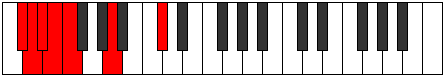 |
| [287](https://ianring.com/musictheory/scales/287) | [Gynimic](ModeDFlatGynimic.md) | Db | Db, Ebb, Fbb, Gbbb, D###, Cbbb, Db |  |
| [291](https://ianring.com/musictheory/scales/291) | [Aerathic](ModeGSharpAerathic.md) | G# | G#, A, C#, E, G# |  |
| [291](https://ianring.com/musictheory/scales/291) | [Aerathic](ModeAFlatAerathic.md) | Ab | Ab, A, Db, E, Ab |  |
| [295](https://ianring.com/musictheory/scales/295) | [Gyritonic](ModeGSharpGyritonic.md) | G# | G#, A, A#, C#, E, G# |  |
| [295](https://ianring.com/musictheory/scales/295) | [Gyritonic](ModeAFlatGyritonic.md) | Ab | Ab, A, Bb, Db, E, Ab |  |
| [297](https://ianring.com/musictheory/scales/297) | [Mynic](ModeCSharpMynic.md) | C# | C#, E, F#, A, C# |  |
| [297](https://ianring.com/musictheory/scales/297) | [Mynic](ModeDFlatMynic.md) | Db | Db, E, Gb, A, Db |  |
| [299](https://ianring.com/musictheory/scales/299) | [Phratonic](ModeCSharpPhratonic.md) | C# | C#, D, E, F#, A, C# |  |
| [299](https://ianring.com/musictheory/scales/299) | [Phratonic](ModeDFlatPhratonic.md) | Db | Db, D, E, Gb, A, Db |  |
| [299](https://ianring.com/musictheory/scales/299) | [Phratonic](ModeGSharpPhratonic.md) | G# | G#, A, B, C#, E, G# |  |
| [299](https://ianring.com/musictheory/scales/299) | [Phratonic](ModeAFlatPhratonic.md) | Ab | Ab, A, B, Db, E, Ab |  |
| [301](https://ianring.com/musictheory/scales/301) | [Zythitonic](ModeCSharpZythitonic.md) | C# | C#, D#, E, F#, A, C# |  |
| [301](https://ianring.com/musictheory/scales/301) | [Zythitonic](ModeDFlatZythitonic.md) | Db | Db, Eb, E, Gb, A, Db |  |
| [303](https://ianring.com/musictheory/scales/303) | [Golimic](ModeCSharpGolimic.md) | C# | C#, D, Eb, Fb, Gb, A, C# |  |
| [303](https://ianring.com/musictheory/scales/303) | [Golimic](ModeDFlatGolimic.md) | Db | Db, Ebb, Fbb, Gbbb, Abbb, Bbb, Db |  |
| [303](https://ianring.com/musictheory/scales/303) | [Golimic](ModeGSharpGolimic.md) | G# | G#, A, Bb, Cb, Db, E, G# |  |
| [307](https://ianring.com/musictheory/scales/307) | [Phrolitonic](ModeGSharpPhrolitonic.md) | G# | G#, A, C, C#, E, G# |  |
| [307](https://ianring.com/musictheory/scales/307) | [Phrolitonic](ModeAFlatPhrolitonic.md) | Ab | Ab, A, C, Db, E, Ab |  |
| [311](https://ianring.com/musictheory/scales/311) | [Stagimic](ModeGSharpStagimic.md) | G# | G#, A, Bb, C, Db, E, G# |  |
| [313](https://ianring.com/musictheory/scales/313) | [Goritonic](ModeCSharpGoritonic.md) | C# | C#, E, F, F#, A, C# |  |
| [313](https://ianring.com/musictheory/scales/313) | [Goritonic](ModeDFlatGoritonic.md) | Db | Db, E, F, Gb, A, Db |  |
| [315](https://ianring.com/musictheory/scales/315) | [Stodimic](ModeCSharpStodimic.md) | C# | C#, D, E, F, Gb, A, C# |  |
| [315](https://ianring.com/musictheory/scales/315) | [Stodimic](ModeDFlatStodimic.md) | Db | Db, Ebb, Fb, Gbb, Abbb, Bbb, Db |  |
| [315](https://ianring.com/musictheory/scales/315) | [Stodimic](ModeGSharpStodimic.md) | G# | G#, A, B, C, Db, E, G# |  |
| [317](https://ianring.com/musictheory/scales/317) | [Korimic](ModeCSharpKorimic.md) | C# | C#, D#, E, F, Gb, A, C# |  |
| [317](https://ianring.com/musictheory/scales/317) | [Korimic](ModeDFlatKorimic.md) | Db | Db, Eb, Fb, Gbb, Abbb, Bbb, Db |  |
| [319](https://ianring.com/musictheory/scales/319) | [Epodian](ModeCSharpEpodian.md) | C# | C#, D, Eb, Fb, Gbb, Abbb, Bbb, C# |  |
| [319](https://ianring.com/musictheory/scales/319) | [Epodian](ModeDFlatEpodian.md) | Db | Db, Ebb, Fbb, Gbbb, D###, E##, Cbbb, Db |  |
| [319](https://ianring.com/musictheory/scales/319) | [Epodian](ModeGSharpEpodian.md) | G# | G#, A, Bb, Cb, Dbb, Ebbb, Fb, G# |  |
| [329](https://ianring.com/musictheory/scales/329) | [Lonic](ModeCSharpLonic.md) | C# | C#, E, G, A, C# |  |
| [329](https://ianring.com/musictheory/scales/329) | [Lonic](ModeDFlatLonic.md) | Db | Db, E, G, A, Db |  |
| [331](https://ianring.com/musictheory/scales/331) | [Byptitonic](ModeCSharpByptitonic.md) | C# | C#, D, E, G, A, C# | 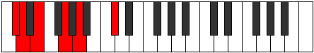 |
| [331](https://ianring.com/musictheory/scales/331) | [Byptitonic](ModeDFlatByptitonic.md) | Db | Db, D, E, G, A, Db |  |
| [333](https://ianring.com/musictheory/scales/333) | [Bogitonic](ModeCSharpBogitonic.md) | C# | C#, D#, E, G, A, C# |  |
| [333](https://ianring.com/musictheory/scales/333) | [Bogitonic](ModeDFlatBogitonic.md) | Db | Db, Eb, E, G, A, Db |  |
| [335](https://ianring.com/musictheory/scales/335) | [Zanimic](ModeCSharpZanimic.md) | C# | C#, D, Eb, Fb, G, A, C# |  |
| [335](https://ianring.com/musictheory/scales/335) | [Zanimic](ModeDFlatZanimic.md) | Db | Db, Ebb, Fbb, Gbbb, Abb, Bbb, Db |  |
| [345](https://ianring.com/musictheory/scales/345) | [Gylitonic](ModeCSharpGylitonic.md) | C# | C#, E, F, G, A, C# |  |
| [345](https://ianring.com/musictheory/scales/345) | [Gylitonic](ModeDFlatGylitonic.md) | Db | Db, E, F, G, A, Db |  |
| [347](https://ianring.com/musictheory/scales/347) | [Barimic](ModeCSharpBarimic.md) | C# | C#, D, E, F, G, A, C# |  |
| [347](https://ianring.com/musictheory/scales/347) | [Barimic](ModeDFlatBarimic.md) | Db | Db, Ebb, Fb, Gbb, Abb, Bbb, Db |  |
| [349](https://ianring.com/musictheory/scales/349) | [Borimic](ModeCSharpBorimic.md) | C# | C#, D#, E, F, G, A, C# |  |
| [349](https://ianring.com/musictheory/scales/349) | [Borimic](ModeDFlatBorimic.md) | Db | Db, Eb, Fb, Gbb, Abb, Bbb, Db |  |
| [351](https://ianring.com/musictheory/scales/351) | [Epanian](ModeCSharpEpanian.md) | C# | C#, D, Eb, Fb, Gbb, Abb, Bbb, C# |  |
| [351](https://ianring.com/musictheory/scales/351) | [Epanian](ModeDFlatEpanian.md) | Db | Db, Ebb, Fbb, Gbbb, D###, E###, Cbbb, Db |  |
| [355](https://ianring.com/musictheory/scales/355) | [Aeoloritonic](ModeGSharpAeoloritonic.md) | G# | G#, A, C#, D, E, G# |  |
| [355](https://ianring.com/musictheory/scales/355) | [Aeoloritonic](ModeAFlatAeoloritonic.md) | Ab | Ab, A, Db, D, E, Ab |  |
| [359](https://ianring.com/musictheory/scales/359) | [Bothimic](ModeGSharpBothimic.md) | G# | G#, A, Bb, C#, D, E, G# |  |
| [359](https://ianring.com/musictheory/scales/359) | [Bothimic](ModeAFlatBothimic.md) | Ab | Ab, Bbb, Cbb, Db, Ebb, Fb, Ab |  |
| [361](https://ianring.com/musictheory/scales/361) | [Bocritonic](ModeCSharpBocritonic.md) | C# | C#, E, F#, G, A, C# |  |
| [361](https://ianring.com/musictheory/scales/361) | [Bocritonic](ModeDFlatBocritonic.md) | Db | Db, E, Gb, G, A, Db |  |
| [363](https://ianring.com/musictheory/scales/363) | [Soptimic](ModeCSharpSoptimic.md) | C# | C#, D, E, F#, G, A, C# |  |
| [363](https://ianring.com/musictheory/scales/363) | [Soptimic](ModeDFlatSoptimic.md) | Db | Db, Ebb, Fb, Gb, Abb, Bbb, Db |  |
| [363](https://ianring.com/musictheory/scales/363) | [Soptimic](ModeGSharpSoptimic.md) | G# | G#, A, B, C#, D, E, G# |  |
| [363](https://ianring.com/musictheory/scales/363) | [Soptimic](ModeAFlatSoptimic.md) | Ab | Ab, Bbb, Cb, Db, Ebb, Fb, Ab |  |
| [365](https://ianring.com/musictheory/scales/365) | [Marimic](ModeCSharpMarimic.md) | C# | C#, D#, E, F#, G, A, C# |  |
| [365](https://ianring.com/musictheory/scales/365) | [Marimic](ModeDFlatMarimic.md) | Db | Db, Eb, Fb, Gb, Abb, Bbb, Db |  |
| [367](https://ianring.com/musictheory/scales/367) | [Aerodian](ModeCSharpAerodian.md) | C# | C#, D, Eb, Fb, Gb, Abb, Bbb, C# |  |
| [367](https://ianring.com/musictheory/scales/367) | [Aerodian](ModeDFlatAerodian.md) | Db | Db, Ebb, Fbb, Gbbb, Abbb, E###, Cbbb, Db | 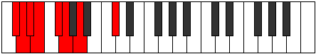 |
| [367](https://ianring.com/musictheory/scales/367) | [Aerodian](ModeGSharpAerodian.md) | G# | G#, A, Bb, Cb, Db, Ebb, Fb, G# |  |
| [371](https://ianring.com/musictheory/scales/371) | [Rythimic](ModeGSharpRythimic.md) | G# | G#, A, B#, C#, D, E, G# |  |
| [371](https://ianring.com/musictheory/scales/371) | [Rythimic](ModeAFlatRythimic.md) | Ab | Ab, Bbb, C, Db, Ebb, Fb, Ab |  |
| [375](https://ianring.com/musictheory/scales/375) | [Sodian](ModeGSharpSodian.md) | G# | G#, A, Bb, C, Db, Ebb, Fb, G# |  |
| [377](https://ianring.com/musictheory/scales/377) | [Kathimic](ModeCSharpKathimic.md) | C# | C#, D##, E#, F#, G, A, C# |  |
| [377](https://ianring.com/musictheory/scales/377) | [Kathimic](ModeDFlatKathimic.md) | Db | Db, E, F, Gb, Abb, Bbb, Db |  |
| [379](https://ianring.com/musictheory/scales/379) | [Aeragian](ModeCSharpAeragian.md) | C# | C#, D, E, F, Gb, Abb, Bbb, C# |  |
| [379](https://ianring.com/musictheory/scales/379) | [Aeragian](ModeDFlatAeragian.md) | Db | Db, Ebb, Fb, Gbb, Abbb, E###, Cbbb, Db |  |
| [379](https://ianring.com/musictheory/scales/379) | [Aeragian](ModeGSharpAeragian.md) | G# | G#, A, B, C, Db, Ebb, Fb, G# |  |
| [381](https://ianring.com/musictheory/scales/381) | [Kogian](ModeCSharpKogian.md) | C# | C#, D#, E, F, Gb, Abb, Bbb, C# |  |
| [381](https://ianring.com/musictheory/scales/381) | [Kogian](ModeDFlatKogian.md) | Db | Db, Eb, Fb, Gbb, Abbb, E###, Cbbb, Db |  |
| [383](https://ianring.com/musictheory/scales/383) | [Logyllic](ModeCSharpLogyllic.md) | C# | C#, D, D#, E, F, F#, G, A, C# |  |
| [383](https://ianring.com/musictheory/scales/383) | [Logyllic](ModeDFlatLogyllic.md) | Db | Db, D, Eb, E, F, Gb, G, A, Db |  |
| [383](https://ianring.com/musictheory/scales/383) | [Logyllic](ModeGSharpLogyllic.md) | G# | G#, A, A#, B, C, C#, D, E, G# |  |
| [383](https://ianring.com/musictheory/scales/383) | [Logyllic](ModeAFlatLogyllic.md) | Ab | Ab, A, Bb, B, C, Db, D, E, Ab |  |
| [393](https://ianring.com/musictheory/scales/393) | [Lothic](ModeCSharpLothic.md) | C# | C#, E, G#, A, C# |  |
| [393](https://ianring.com/musictheory/scales/393) | [Lothic](ModeDFlatLothic.md) | Db | Db, E, Ab, A, Db |  |
| [395](https://ianring.com/musictheory/scales/395) | [Dalitonic](ModeCSharpDalitonic.md) | C# | C#, D, E, G#, A, C# | 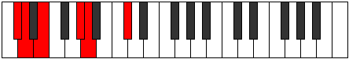 |
| [395](https://ianring.com/musictheory/scales/395) | [Dalitonic](ModeDFlatDalitonic.md) | Db | Db, D, E, Ab, A, Db |  |
| [397](https://ianring.com/musictheory/scales/397) | [Epogitonic](ModeCSharpEpogitonic.md) | C# | C#, D#, E, G#, A, C# |  |
| [397](https://ianring.com/musictheory/scales/397) | [Epogitonic](ModeDFlatEpogitonic.md) | Db | Db, Eb, E, Ab, A, Db |  |
| [399](https://ianring.com/musictheory/scales/399) | [Zynimic](ModeCSharpZynimic.md) | C# | C#, D, Eb, Fb, G#, A, C# |  |
| [399](https://ianring.com/musictheory/scales/399) | [Zynimic](ModeDFlatZynimic.md) | Db | Db, Ebb, Fbb, Gbbb, Ab, Bbb, Db |  |
| [401](https://ianring.com/musictheory/scales/401) | [Epogic](ModeANaturalEpogic.md) | A | A, C#, E, F, A |  |
| [403](https://ianring.com/musictheory/scales/403) | [Daptitonic](ModeANaturalDaptitonic.md) | A | A, A#, C#, E, F, A |  |
| [405](https://ianring.com/musictheory/scales/405) | [Danitonic](ModeANaturalDanitonic.md) | A | A, B, C#, E, F, A | 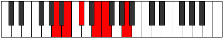 |
| [407](https://ianring.com/musictheory/scales/407) | [Zylimic](ModeANaturalZylimic.md) | A | A, Bb, Cb, Db, E, F, A |  |
| [409](https://ianring.com/musictheory/scales/409) | [Laritonic](ModeANaturalLaritonic.md) | A | A, C, C#, E, F, A |  |
| [409](https://ianring.com/musictheory/scales/409) | [Laritonic](ModeCSharpLaritonic.md) | C# | C#, E, F, G#, A, C# |  |
| [409](https://ianring.com/musictheory/scales/409) | [Laritonic](ModeDFlatLaritonic.md) | Db | Db, E, F, Ab, A, Db |  |
| [411](https://ianring.com/musictheory/scales/411) | [Lygimic](ModeCSharpLygimic.md) | C# | C#, D, E, F, G#, A, C# |  |
| [411](https://ianring.com/musictheory/scales/411) | [Lygimic](ModeDFlatLygimic.md) | Db | Db, Ebb, Fb, Gbb, Ab, Bbb, Db |  |
| [411](https://ianring.com/musictheory/scales/411) | [Lygimic](ModeANaturalLygimic.md) | A | A, Bb, C, Db, E, F, A |  |
| [413](https://ianring.com/musictheory/scales/413) | [Ganimic](ModeCSharpGanimic.md) | C# | C#, D#, E, F, G#, A, C# |  |
| [413](https://ianring.com/musictheory/scales/413) | [Ganimic](ModeDFlatGanimic.md) | Db | Db, Eb, Fb, Gbb, Ab, Bbb, Db |  |
| [413](https://ianring.com/musictheory/scales/413) | [Ganimic](ModeANaturalGanimic.md) | A | A, B, C, Db, E, F, A |  |
| [415](https://ianring.com/musictheory/scales/415) | [Aeoladian](ModeCSharpAeoladian.md) | C# | C#, D, Eb, Fb, Gbb, Ab, Bbb, C# |  |
| [415](https://ianring.com/musictheory/scales/415) | [Aeoladian](ModeDFlatAeoladian.md) | Db | Db, Ebb, Fbb, Gbbb, D###, F###, G##, Db |  |
| [415](https://ianring.com/musictheory/scales/415) | [Aeoladian](ModeANaturalAeoladian.md) | A | A, Bb, Cb, Dbb, Ebbb, Fb, Gbb, A |  |
| [419](https://ianring.com/musictheory/scales/419) | [Ionacritonic](ModeGSharpIonacritonic.md) | G# | G#, A, C#, D#, E, G# |  |
| [419](https://ianring.com/musictheory/scales/419) | [Ionacritonic](ModeAFlatIonacritonic.md) | Ab | Ab, A, Db, Eb, E, Ab |  |
| [423](https://ianring.com/musictheory/scales/423) | [Sogimic](ModeGSharpSogimic.md) | G# | G#, A, Bb, C#, D#, E, G# |  |
| [423](https://ianring.com/musictheory/scales/423) | [Sogimic](ModeAFlatSogimic.md) | Ab | Ab, Bbb, Cbb, Db, Eb, Fb, Ab |  |
| [425](https://ianring.com/musictheory/scales/425) | [Daditonic](ModeCSharpDaditonic.md) | C# | C#, E, F#, G#, A, C# |  |
| [425](https://ianring.com/musictheory/scales/425) | [Daditonic](ModeDFlatDaditonic.md) | Db | Db, E, Gb, Ab, A, Db |  |
| [427](https://ianring.com/musictheory/scales/427) | [Zothimic](ModeCSharpZothimic.md) | C# | C#, D, E, F#, G#, A, C# |  |
| [427](https://ianring.com/musictheory/scales/427) | [Zothimic](ModeDFlatZothimic.md) | Db | Db, Ebb, Fb, Gb, Ab, Bbb, Db |  |
| [427](https://ianring.com/musictheory/scales/427) | [Zothimic](ModeGSharpZothimic.md) | G# | G#, A, B, C#, D#, E, G# |  |
| [427](https://ianring.com/musictheory/scales/427) | [Zothimic](ModeAFlatZothimic.md) | Ab | Ab, Bbb, Cb, Db, Eb, Fb, Ab |  |
| [429](https://ianring.com/musictheory/scales/429) | [Koptimic](ModeCSharpKoptimic.md) | C# | C#, D#, E, F#, G#, A, C# |  |
| [429](https://ianring.com/musictheory/scales/429) | [Koptimic](ModeDFlatKoptimic.md) | Db | Db, Eb, Fb, Gb, Ab, Bbb, Db |  |
| [431](https://ianring.com/musictheory/scales/431) | [Epyrian](ModeCSharpEpyrian.md) | C# | C#, D, Eb, Fb, Gb, Ab, Bbb, C# |  |
| [431](https://ianring.com/musictheory/scales/431) | [Epyrian](ModeDFlatEpyrian.md) | Db | Db, Ebb, Fbb, Gbbb, Abbb, Bbbb, Cbbb, Db |  |
| [431](https://ianring.com/musictheory/scales/431) | [Epyrian](ModeGSharpEpyrian.md) | G# | G#, A, Bb, Cb, Db, Eb, Fb, G# |  |
| [433](https://ianring.com/musictheory/scales/433) | [Poritonic](ModeANaturalPoritonic.md) | A | A, C#, D, E, F, A | 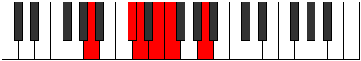 |
| [435](https://ianring.com/musictheory/scales/435) | [Ionolimic](ModeGSharpIonolimic.md) | G# | G#, A, B#, C#, D#, E, G# |  |
| [435](https://ianring.com/musictheory/scales/435) | [Ionolimic](ModeAFlatIonolimic.md) | Ab | Ab, Bbb, C, Db, Eb, Fb, Ab |  |
| [435](https://ianring.com/musictheory/scales/435) | [Ionolimic](ModeANaturalIonolimic.md) | A | A, Bb, C#, D, E, F, A |  |
| [437](https://ianring.com/musictheory/scales/437) | [Ronimic](ModeANaturalRonimic.md) | A | A, B, C#, D, E, F, A |  |
| [439](https://ianring.com/musictheory/scales/439) | [Bythian](ModeGSharpBythian.md) | G# | G#, A, Bb, C, Db, Eb, Fb, G# |  |
| [439](https://ianring.com/musictheory/scales/439) | [Bythian](ModeANaturalBythian.md) | A | A, Bb, Cb, Db, Ebb, Fb, Gbb, A |  |
| [441](https://ianring.com/musictheory/scales/441) | [Thycrimic](ModeANaturalThycrimic.md) | A | A, B#, C#, D, E, F, A |  |
| [441](https://ianring.com/musictheory/scales/441) | [Thycrimic](ModeCSharpThycrimic.md) | C# | C#, D##, E#, F#, G#, A, C# |  |
| [441](https://ianring.com/musictheory/scales/441) | [Thycrimic](ModeDFlatThycrimic.md) | Db | Db, E, F, Gb, Ab, Bbb, Db |  |
| [443](https://ianring.com/musictheory/scales/443) | [Kothian](ModeCSharpKothian.md) | C# | C#, D, E, F, Gb, Ab, Bbb, C# |  |
| [443](https://ianring.com/musictheory/scales/443) | [Kothian](ModeDFlatKothian.md) | Db | Db, Ebb, Fb, Gbb, Abbb, Bbbb, Cbbb, Db |  |
| [443](https://ianring.com/musictheory/scales/443) | [Kothian](ModeANaturalKothian.md) | A | A, Bb, C, Db, Ebb, Fb, Gbb, A |  |
| [443](https://ianring.com/musictheory/scales/443) | [Kothian](ModeGSharpKothian.md) | G# | G#, A, B, C, Db, Eb, Fb, G# |  |
| [445](https://ianring.com/musictheory/scales/445) | [Gocrian](ModeCSharpGocrian.md) | C# | C#, D#, E, F, Gb, Ab, Bbb, C# |  |
| [445](https://ianring.com/musictheory/scales/445) | [Gocrian](ModeDFlatGocrian.md) | Db | Db, Eb, Fb, Gbb, Abbb, Bbbb, Cbbb, Db |  |
| [445](https://ianring.com/musictheory/scales/445) | [Gocrian](ModeANaturalGocrian.md) | A | A, B, C, Db, Ebb, Fb, Gbb, A |  |
| [447](https://ianring.com/musictheory/scales/447) | [Thyphyllic](ModeCSharpThyphyllic.md) | C# | C#, D, D#, E, F, F#, G#, A, C# |  |
| [447](https://ianring.com/musictheory/scales/447) | [Thyphyllic](ModeDFlatThyphyllic.md) | Db | Db, D, Eb, E, F, Gb, Ab, A, Db |  |
| [447](https://ianring.com/musictheory/scales/447) | [Thyphyllic](ModeANaturalThyphyllic.md) | A | A, A#, B, C, C#, D, E, F, A |  |
| [447](https://ianring.com/musictheory/scales/447) | [Thyphyllic](ModeGSharpThyphyllic.md) | G# | G#, A, A#, B, C, C#, D#, E, G# | 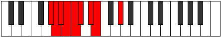 |
| [447](https://ianring.com/musictheory/scales/447) | [Thyphyllic](ModeAFlatThyphyllic.md) | Ab | Ab, A, Bb, B, C, Db, Eb, E, Ab |  |
| [457](https://ianring.com/musictheory/scales/457) | [Staptitonic](ModeCSharpStaptitonic.md) | C# | C#, E, G, G#, A, C# |  |
| [457](https://ianring.com/musictheory/scales/457) | [Staptitonic](ModeDFlatStaptitonic.md) | Db | Db, E, G, Ab, A, Db |  |
| [459](https://ianring.com/musictheory/scales/459) | [Zaptimic](ModeCSharpZaptimic.md) | C# | C#, D, E, F##, G#, A, C# |  |
| [459](https://ianring.com/musictheory/scales/459) | [Zaptimic](ModeDFlatZaptimic.md) | Db | Db, Ebb, Fb, G, Ab, Bbb, Db |  |
| [461](https://ianring.com/musictheory/scales/461) | [Madimic](ModeCSharpMadimic.md) | C# | C#, D#, E, F##, G#, A, C# |  |
| [461](https://ianring.com/musictheory/scales/461) | [Madimic](ModeDFlatMadimic.md) | Db | Db, Eb, Fb, G, Ab, Bbb, Db |  |
| [463](https://ianring.com/musictheory/scales/463) | [Zythian](ModeCSharpZythian.md) | C# | C#, D, Eb, Fb, G, Ab, Bbb, C# |  |
| [463](https://ianring.com/musictheory/scales/463) | [Zythian](ModeDFlatZythian.md) | Db | Db, Ebb, Fbb, Gbbb, Abb, Bbbb, Cbbb, Db |  |
| [465](https://ianring.com/musictheory/scales/465) | [Zoditonic](ModeANaturalZoditonic.md) | A | A, C#, D#, E, F, A |  |
| [467](https://ianring.com/musictheory/scales/467) | [Phrogimic](ModeANaturalPhrogimic.md) | A | A, Bb, C#, D#, E, F, A |  |
| [469](https://ianring.com/musictheory/scales/469) | [Katyrimic](ModeANaturalKatyrimic.md) | A | A, B, C#, D#, E, F, A |  |
| [471](https://ianring.com/musictheory/scales/471) | [Dodian](ModeANaturalDodian.md) | A | A, Bb, Cb, Db, Eb, Fb, Gbb, A |  |
| [473](https://ianring.com/musictheory/scales/473) | [Aeralimic](ModeANaturalAeralimic.md) | A | A, B#, C#, D#, E, F, A |  |
| [473](https://ianring.com/musictheory/scales/473) | [Aeralimic](ModeCSharpAeralimic.md) | C# | C#, D##, E#, F##, G#, A, C# |  |
| [473](https://ianring.com/musictheory/scales/473) | [Aeralimic](ModeDFlatAeralimic.md) | Db | Db, E, F, G, Ab, Bbb, Db |  |
| [475](https://ianring.com/musictheory/scales/475) | [Aeolygian](ModeCSharpAeolygian.md) | C# | C#, D, E, F, G, Ab, Bbb, C# |  |
| [475](https://ianring.com/musictheory/scales/475) | [Aeolygian](ModeDFlatAeolygian.md) | Db | Db, Ebb, Fb, Gbb, Abb, Bbbb, Cbbb, Db |  |
| [475](https://ianring.com/musictheory/scales/475) | [Aeolygian](ModeANaturalAeolygian.md) | A | A, Bb, C, Db, Eb, Fb, Gbb, A |  |
| [477](https://ianring.com/musictheory/scales/477) | [Stacrian](ModeCSharpStacrian.md) | C# | C#, D#, E, F, G, Ab, Bbb, C# |  |
| [477](https://ianring.com/musictheory/scales/477) | [Stacrian](ModeDFlatStacrian.md) | Db | Db, Eb, Fb, Gbb, Abb, Bbbb, Cbbb, Db |  |
| [477](https://ianring.com/musictheory/scales/477) | [Stacrian](ModeANaturalStacrian.md) | A | A, B, C, Db, Eb, Fb, Gbb, A |  |
| [479](https://ianring.com/musictheory/scales/479) | [Kocryllic](ModeCSharpKocryllic.md) | C# | C#, D, D#, E, F, G, G#, A, C# |  |
| [479](https://ianring.com/musictheory/scales/479) | [Kocryllic](ModeDFlatKocryllic.md) | Db | Db, D, Eb, E, F, G, Ab, A, Db |  |
| [479](https://ianring.com/musictheory/scales/479) | [Kocryllic](ModeANaturalKocryllic.md) | A | A, A#, B, C, C#, D#, E, F, A |  |
| [483](https://ianring.com/musictheory/scales/483) | [Kygimic](ModeGSharpKygimic.md) | G# | G#, A, B##, C##, D#, E, G# | 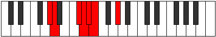 |
| [483](https://ianring.com/musictheory/scales/483) | [Kygimic](ModeAFlatKygimic.md) | Ab | Ab, Bbb, C#, D, Eb, Fb, Ab |  |
| [487](https://ianring.com/musictheory/scales/487) | [Dynian](ModeGSharpDynian.md) | G# | G#, A, Bb, C#, D, Eb, Fb, G# |  |
| [487](https://ianring.com/musictheory/scales/487) | [Dynian](ModeAFlatDynian.md) | Ab | Ab, Bbb, Cbb, Db, Ebb, Fbb, Gbbb, Ab |  |
| [489](https://ianring.com/musictheory/scales/489) | [Phrathimic](ModeCSharpPhrathimic.md) | C# | C#, D##, E##, F##, G#, A, C# |  |
| [489](https://ianring.com/musictheory/scales/489) | [Phrathimic](ModeDFlatPhrathimic.md) | Db | Db, E, F#, G, Ab, Bbb, Db |  |
| [491](https://ianring.com/musictheory/scales/491) | [Aeolyrian](ModeCSharpAeolyrian.md) | C# | C#, D, E, F#, G, Ab, Bbb, C# |  |
| [491](https://ianring.com/musictheory/scales/491) | [Aeolyrian](ModeDFlatAeolyrian.md) | Db | Db, Ebb, Fb, Gb, Abb, Bbbb, Cbbb, Db |  |
| [491](https://ianring.com/musictheory/scales/491) | [Aeolyrian](ModeGSharpAeolyrian.md) | G# | G#, A, B, C#, D, Eb, Fb, G# |  |
| [491](https://ianring.com/musictheory/scales/491) | [Aeolyrian](ModeAFlatAeolyrian.md) | Ab | Ab, Bbb, Cb, Db, Ebb, Fbb, Gbbb, Ab |  |
| [493](https://ianring.com/musictheory/scales/493) | [Rygian](ModeCSharpRygian.md) | C# | C#, D#, E, F#, G, Ab, Bbb, C# |  |
| [493](https://ianring.com/musictheory/scales/493) | [Rygian](ModeDFlatRygian.md) | Db | Db, Eb, Fb, Gb, Abb, Bbbb, Cbbb, Db |  |
| [495](https://ianring.com/musictheory/scales/495) | [Bocryllic](ModeCSharpBocryllic.md) | C# | C#, D, D#, E, F#, G, G#, A, C# |  |
| [495](https://ianring.com/musictheory/scales/495) | [Bocryllic](ModeDFlatBocryllic.md) | Db | Db, D, Eb, E, Gb, G, Ab, A, Db |  |
| [495](https://ianring.com/musictheory/scales/495) | [Bocryllic](ModeGSharpBocryllic.md) | G# | G#, A, A#, B, C#, D, D#, E, G# |  |
| [495](https://ianring.com/musictheory/scales/495) | [Bocryllic](ModeAFlatBocryllic.md) | Ab | Ab, A, Bb, B, Db, D, Eb, E, Ab |  |
| [497](https://ianring.com/musictheory/scales/497) | [Kadimic](ModeANaturalKadimic.md) | A | A, B##, C##, D#, E, F, A |  |
| [499](https://ianring.com/musictheory/scales/499) | [Ionaptian](ModeGSharpIonaptian.md) | G# | G#, A, B#, C#, D, Eb, Fb, G# |  |
| [499](https://ianring.com/musictheory/scales/499) | [Ionaptian](ModeAFlatIonaptian.md) | Ab | Ab, Bbb, C, Db, Ebb, Fbb, Gbbb, Ab |  |
| [499](https://ianring.com/musictheory/scales/499) | [Ionaptian](ModeANaturalIonaptian.md) | A | A, Bb, C#, D, Eb, Fb, Gbb, A |  |
| [501](https://ianring.com/musictheory/scales/501) | [Katylian](ModeANaturalKatylian.md) | A | A, B, C#, D, Eb, Fb, Gbb, A |  |
| [503](https://ianring.com/musictheory/scales/503) | [Thoptyllic](ModeGSharpThoptyllic.md) | G# | G#, A, A#, C, C#, D, D#, E, G# |  |
| [503](https://ianring.com/musictheory/scales/503) | [Thoptyllic](ModeAFlatThoptyllic.md) | Ab | Ab, A, Bb, C, Db, D, Eb, E, Ab |  |
| [503](https://ianring.com/musictheory/scales/503) | [Thoptyllic](ModeANaturalThoptyllic.md) | A | A, A#, B, C#, D, D#, E, F, A |  |
| [505](https://ianring.com/musictheory/scales/505) | [Sanian](ModeANaturalSanian.md) | A | A, B#, C#, D, Eb, Fb, Gbb, A |  |
| [505](https://ianring.com/musictheory/scales/505) | [Sanian](ModeCSharpSanian.md) | C# | C#, D##, E#, F#, G, Ab, Bbb, C# |  |
| [505](https://ianring.com/musictheory/scales/505) | [Sanian](ModeDFlatSanian.md) | Db | Db, E, F, Gb, Abb, Bbbb, Cbbb, Db |  |
| [507](https://ianring.com/musictheory/scales/507) | [Moryllic](ModeCSharpMoryllic.md) | C# | C#, D, E, F, F#, G, G#, A, C# |  |
| [507](https://ianring.com/musictheory/scales/507) | [Moryllic](ModeDFlatMoryllic.md) | Db | Db, D, E, F, Gb, G, Ab, A, Db |  |
| [507](https://ianring.com/musictheory/scales/507) | [Moryllic](ModeANaturalMoryllic.md) | A | A, A#, C, C#, D, D#, E, F, A |  |
| [507](https://ianring.com/musictheory/scales/507) | [Moryllic](ModeGSharpMoryllic.md) | G# | G#, A, B, C, C#, D, D#, E, G# |  |
| [507](https://ianring.com/musictheory/scales/507) | [Moryllic](ModeAFlatMoryllic.md) | Ab | Ab, A, B, C, Db, D, Eb, E, Ab |  |
| [509](https://ianring.com/musictheory/scales/509) | [Ionothyllic](ModeCSharpIonothyllic.md) | C# | C#, D#, E, F, F#, G, G#, A, C# |  |
| [509](https://ianring.com/musictheory/scales/509) | [Ionothyllic](ModeDFlatIonothyllic.md) | Db | Db, Eb, E, F, Gb, G, Ab, A, Db |  |
| [509](https://ianring.com/musictheory/scales/509) | [Ionothyllic](ModeANaturalIonothyllic.md) | A | A, B, C, C#, D, D#, E, F, A |  |
| [511](https://ianring.com/musictheory/scales/511) | [Polygic](ModeCSharpPolygic.md) | C# | C#, D, D#, E, F, F#, G, G#, A, C# |  |
| [511](https://ianring.com/musictheory/scales/511) | [Polygic](ModeDFlatPolygic.md) | Db | Db, D, Eb, E, F, Gb, G, Ab, A, Db |  |
| [511](https://ianring.com/musictheory/scales/511) | [Polygic](ModeANaturalPolygic.md) | A | A, A#, B, C, C#, D, D#, E, F, A |  |
| [511](https://ianring.com/musictheory/scales/511) | [Polygic](ModeGSharpPolygic.md) | G# | G#, A, A#, B, C, C#, D, D#, E, G# |  |
| [511](https://ianring.com/musictheory/scales/511) | [Polygic](ModeAFlatPolygic.md) | Ab | Ab, A, Bb, B, C, Db, D, Eb, E, Ab |  |
| [547](https://ianring.com/musictheory/scales/547) | [Pyrric](ModeENaturalPyrric.md) | E | E, F, A, C#, E |  |
| [549](https://ianring.com/musictheory/scales/549) | [Rothic](ModeENaturalRothic.md) | E | E, F#, A, C#, E |  |
| [551](https://ianring.com/musictheory/scales/551) | [Aeoloditonic](ModeENaturalAeoloditonic.md) | E | E, F, F#, A, C#, E |  |
| [553](https://ianring.com/musictheory/scales/553) | [Phradic](ModeENaturalPhradic.md) | E | E, G, A, C#, E |  |
| [555](https://ianring.com/musictheory/scales/555) | [Aeolycritonic](ModeENaturalAeolycritonic.md) | E | E, F, G, A, C#, E |  |
| [557](https://ianring.com/musictheory/scales/557) | [Gythitonic](ModeENaturalGythitonic.md) | E | E, F#, G, A, C#, E |  |
| [559](https://ianring.com/musictheory/scales/559) | [Lylimic](ModeENaturalLylimic.md) | E | E, F, Gb, Abb, Bbb, C#, E |  |
| [561](https://ianring.com/musictheory/scales/561) | [Phratic](ModeENaturalPhratic.md) | E | E, G#, A, C#, E |  |
| [563](https://ianring.com/musictheory/scales/563) | [Thacritonic](ModeCNaturalThacritonic.md) | C | C, C#, E, F, A, C |  |
| [563](https://ianring.com/musictheory/scales/563) | [Thacritonic](ModeENaturalThacritonic.md) | E | E, F, G#, A, C#, E | 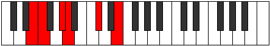 |
| [565](https://ianring.com/musictheory/scales/565) | [Aeolyphritonic](ModeENaturalAeolyphritonic.md) | E | E, F#, G#, A, C#, E | 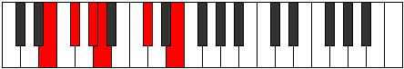 |
| [567](https://ianring.com/musictheory/scales/567) | [Aeoladimic](ModeCNaturalAeoladimic.md) | C | C, Db, Ebb, Fb, Gbb, A, C |  |
| [567](https://ianring.com/musictheory/scales/567) | [Aeoladimic](ModeENaturalAeoladimic.md) | E | E, F, Gb, Ab, Bbb, C#, E |  |
| [569](https://ianring.com/musictheory/scales/569) | [Mothitonic](ModeENaturalMothitonic.md) | E | E, G, G#, A, C#, E |  |
| [571](https://ianring.com/musictheory/scales/571) | [Kynimic](ModeCNaturalKynimic.md) | C | C, Db, Eb, Fb, Gbb, A, C |  |
| [571](https://ianring.com/musictheory/scales/571) | [Kynimic](ModeENaturalKynimic.md) | E | E, F, G, Ab, Bbb, C#, E |  |
| [573](https://ianring.com/musictheory/scales/573) | [Saptimic](ModeENaturalSaptimic.md) | E | E, F#, G, Ab, Bbb, C#, E |  |
| [575](https://ianring.com/musictheory/scales/575) | [Ionydian](ModeCNaturalIonydian.md) | C | C, Db, Ebb, Fbb, Gbbb, D###, Cbbb, C |  |
| [575](https://ianring.com/musictheory/scales/575) | [Ionydian](ModeENaturalIonydian.md) | E | E, F, Gb, Abb, Bbbb, Cbbb, Db, E |  |
| [581](https://ianring.com/musictheory/scales/581) | [Bolic](ModeGNaturalBolic.md) | G | G, A, C#, E, G |  |
| [583](https://ianring.com/musictheory/scales/583) | [Aeritonic](ModeGNaturalAeritonic.md) | G | G, G#, A, C#, E, G |  |
| [589](https://ianring.com/musictheory/scales/589) | [Ionalitonic](ModeGNaturalIonalitonic.md) | G | G, A, A#, C#, E, G |  |
| [591](https://ianring.com/musictheory/scales/591) | [Gaptimic](ModeGNaturalGaptimic.md) | G | G, Ab, Bbb, Cbb, Db, E, G |  |
| [595](https://ianring.com/musictheory/scales/595) | [Sogitonic](ModeCNaturalSogitonic.md) | C | C, C#, E, F#, A, C |  |
| [597](https://ianring.com/musictheory/scales/597) | [Thonitonic](ModeGNaturalThonitonic.md) | G | G, A, B, C#, E, G |  |
| [599](https://ianring.com/musictheory/scales/599) | [Thyrimic](ModeCNaturalThyrimic.md) | C | C, Db, Ebb, Fb, Gb, A, C |  |
| [599](https://ianring.com/musictheory/scales/599) | [Thyrimic](ModeGNaturalThyrimic.md) | G | G, Ab, Bbb, Cb, Db, E, G |  |
| [603](https://ianring.com/musictheory/scales/603) | [Aeolygimic](ModeCNaturalAeolygimic.md) | C | C, Db, Eb, Fb, Gb, A, C |  |
| [605](https://ianring.com/musictheory/scales/605) | [Dycrimic](ModeGNaturalDycrimic.md) | G | G, A, Bb, Cb, Db, E, G |  |
| [607](https://ianring.com/musictheory/scales/607) | [Kadian](ModeCNaturalKadian.md) | C | C, Db, Ebb, Fbb, Gbbb, Abbb, Bbb, C |  |
| [611](https://ianring.com/musictheory/scales/611) | [Zynitonic](ModeENaturalZynitonic.md) | E | E, F, A, A#, C#, E | 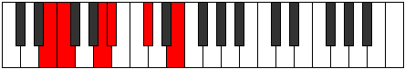 |
| [613](https://ianring.com/musictheory/scales/613) | [Phralitonic](ModeGNaturalPhralitonic.md) | G | G, A, C, C#, E, G |  |
| [613](https://ianring.com/musictheory/scales/613) | [Phralitonic](ModeENaturalPhralitonic.md) | E | E, F#, A, A#, C#, E |  |
| [615](https://ianring.com/musictheory/scales/615) | [Phrothimic](ModeGNaturalPhrothimic.md) | G | G, Ab, Bbb, C, Db, E, G |  |
| [615](https://ianring.com/musictheory/scales/615) | [Phrothimic](ModeENaturalPhrothimic.md) | E | E, F, Gb, A, Bb, C#, E |  |
| [617](https://ianring.com/musictheory/scales/617) | [Katycritonic](ModeENaturalKatycritonic.md) | E | E, G, A, A#, C#, E |  |
| [619](https://ianring.com/musictheory/scales/619) | [Parimic](ModeENaturalParimic.md) | E | E, F, G, A, Bb, C#, E |  |
| [621](https://ianring.com/musictheory/scales/621) | [Kyrimic](ModeGNaturalKyrimic.md) | G | G, A, Bb, C, Db, E, G |  |
| [621](https://ianring.com/musictheory/scales/621) | [Kyrimic](ModeENaturalKyrimic.md) | E | E, F#, G, A, Bb, C#, E |  |
| [623](https://ianring.com/musictheory/scales/623) | [Sycrian](ModeENaturalSycrian.md) | E | E, F, Gb, Abb, Bbb, Cbb, Db, E |  |
| [625](https://ianring.com/musictheory/scales/625) | [Ionyptitonic](ModeENaturalIonyptitonic.md) | E | E, G#, A, A#, C#, E |  |
| [627](https://ianring.com/musictheory/scales/627) | [Mogimic](ModeCNaturalMogimic.md) | C | C, Db, E, F, Gb, A, C |  |
| [627](https://ianring.com/musictheory/scales/627) | [Mogimic](ModeENaturalMogimic.md) | E | E, F, G#, A, Bb, C#, E | 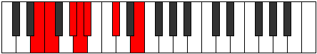 |
| [629](https://ianring.com/musictheory/scales/629) | [Aeronimic](ModeENaturalAeronimic.md) | E | E, F#, G#, A, Bb, C#, E |  |
| [629](https://ianring.com/musictheory/scales/629) | [Aeronimic](ModeGNaturalAeronimic.md) | G | G, A, B, C, Db, E, G |  |
| [631](https://ianring.com/musictheory/scales/631) | [Zygian](ModeCNaturalZygian.md) | C | C, Db, Ebb, Fb, Gbb, Abbb, Bbb, C |  |
| [631](https://ianring.com/musictheory/scales/631) | [Zygian](ModeENaturalZygian.md) | E | E, F, Gb, Ab, Bbb, Cbb, Db, E |  |
| [633](https://ianring.com/musictheory/scales/633) | [Kydimic](ModeENaturalKydimic.md) | E | E, F##, G#, A, Bb, C#, E |  |
| [635](https://ianring.com/musictheory/scales/635) | [Epolian](ModeCNaturalEpolian.md) | C | C, Db, Eb, Fb, Gbb, Abbb, Bbb, C |  |
| [635](https://ianring.com/musictheory/scales/635) | [Epolian](ModeENaturalEpolian.md) | E | E, F, G, Ab, Bbb, Cbb, Db, E |  |
| [637](https://ianring.com/musictheory/scales/637) | [Katodian](ModeENaturalKatodian.md) | E | E, F#, G, Ab, Bbb, Cbb, Db, E |  |
| [637](https://ianring.com/musictheory/scales/637) | [Katodian](ModeGNaturalKatodian.md) | G | G, A, Bb, Cb, Dbb, Ebbb, Fb, G | 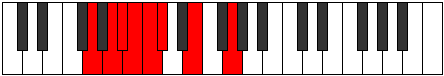 |
| [639](https://ianring.com/musictheory/scales/639) | [Ionaryllic](ModeCNaturalIonaryllic.md) | C | C, C#, D, D#, E, F, F#, A, C |  |
| [639](https://ianring.com/musictheory/scales/639) | [Ionaryllic](ModeENaturalIonaryllic.md) | E | E, F, F#, G, G#, A, A#, C#, E |  |
| [639](https://ianring.com/musictheory/scales/639) | [Ionaryllic](ModeGNaturalIonaryllic.md) | G | G, G#, A, A#, B, C, C#, E, G |  |
| [657](https://ianring.com/musictheory/scales/657) | [Epathic](ModeANaturalEpathic.md) | A | A, C#, E, F#, A |  |
| [659](https://ianring.com/musictheory/scales/659) | [Soptitonic](ModeCNaturalSoptitonic.md) | C | C, C#, E, G, A, C |  |
| [659](https://ianring.com/musictheory/scales/659) | [Soptitonic](ModeANaturalSoptitonic.md) | A | A, A#, C#, E, F#, A |  |
| [661](https://ianring.com/musictheory/scales/661) | [Pentatonic](ModeANaturalPentatonic.md) | A | A, B, C#, E, F#, A |  |
| [663](https://ianring.com/musictheory/scales/663) | [Phrynimic](ModeCNaturalPhrynimic.md) | C | C, Db, Ebb, Fb, G, A, C |  |
| [663](https://ianring.com/musictheory/scales/663) | [Phrynimic](ModeANaturalPhrynimic.md) | A | A, Bb, Cb, Db, E, F#, A |  |
| [665](https://ianring.com/musictheory/scales/665) | [Mythitonic](ModeANaturalMythitonic.md) | A | A, C, C#, E, F#, A |  |
| [667](https://ianring.com/musictheory/scales/667) | [Rodimic](ModeCNaturalRodimic.md) | C | C, Db, Eb, Fb, G, A, C |  |
| [667](https://ianring.com/musictheory/scales/667) | [Rodimic](ModeANaturalRodimic.md) | A | A, Bb, C, Db, E, F#, A |  |
| [669](https://ianring.com/musictheory/scales/669) | [Gycrimic](ModeANaturalGycrimic.md) | A | A, B, C, Db, E, F#, A |  |
| [671](https://ianring.com/musictheory/scales/671) | [Stycrian](ModeCNaturalStycrian.md) | C | C, Db, Ebb, Fbb, Gbbb, Abb, Bbb, C |  |
| [671](https://ianring.com/musictheory/scales/671) | [Stycrian](ModeANaturalStycrian.md) | A | A, Bb, Cb, Dbb, Ebbb, Fb, Gb, A |  |
| [675](https://ianring.com/musictheory/scales/675) | [Zyditonic](ModeENaturalZyditonic.md) | E | E, F, A, B, C#, E |  |
| [677](https://ianring.com/musictheory/scales/677) | [Mynitonic](ModeENaturalMynitonic.md) | E | E, F#, A, B, C#, E |  |
| [679](https://ianring.com/musictheory/scales/679) | [Lanimic](ModeENaturalLanimic.md) | E | E, F, Gb, A, B, C#, E |  |
| [681](https://ianring.com/musictheory/scales/681) | [Sylitonic](ModeENaturalSylitonic.md) | E | E, G, A, B, C#, E |  |
| [683](https://ianring.com/musictheory/scales/683) | [Stogimic](ModeENaturalStogimic.md) | E | E, F, G, A, B, C#, E | 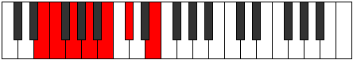 |
| [685](https://ianring.com/musictheory/scales/685) | [Aerathimic](ModeENaturalAerathimic.md) | E | E, F#, G, A, B, C#, E |  |
| [687](https://ianring.com/musictheory/scales/687) | [Aeolythian](ModeENaturalAeolythian.md) | E | E, F, Gb, Abb, Bbb, Cb, Db, E |  |
| [689](https://ianring.com/musictheory/scales/689) | [Lothitonic](ModeANaturalLothitonic.md) | A | A, C#, D, E, F#, A | 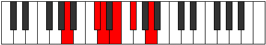 |
| [689](https://ianring.com/musictheory/scales/689) | [Lothitonic](ModeENaturalLothitonic.md) | E | E, G#, A, B, C#, E |  |
| [691](https://ianring.com/musictheory/scales/691) | [Zydimic](ModeCNaturalZydimic.md) | C | C, Db, E, F, G, A, C |  |
| [691](https://ianring.com/musictheory/scales/691) | [Zydimic](ModeANaturalZydimic.md) | A | A, Bb, C#, D, E, F#, A |  |
| [691](https://ianring.com/musictheory/scales/691) | [Zydimic](ModeENaturalZydimic.md) | E | E, F, G#, A, B, C#, E |  |
| [693](https://ianring.com/musictheory/scales/693) | [Mynimic](ModeANaturalMynimic.md) | A | A, B, C#, D, E, F#, A |  |
| [693](https://ianring.com/musictheory/scales/693) | [Mynimic](ModeENaturalMynimic.md) | E | E, F#, G#, A, B, C#, E |  |
| [695](https://ianring.com/musictheory/scales/695) | [Sarian](ModeCNaturalSarian.md) | C | C, Db, Ebb, Fb, Gbb, Abb, Bbb, C |  |
| [695](https://ianring.com/musictheory/scales/695) | [Sarian](ModeENaturalSarian.md) | E | E, F, Gb, Ab, Bbb, Cb, Db, E |  |
| [695](https://ianring.com/musictheory/scales/695) | [Sarian](ModeANaturalSarian.md) | A | A, Bb, Cb, Db, Ebb, Fb, Gb, A |  |
| [697](https://ianring.com/musictheory/scales/697) | [Lagimic](ModeANaturalLagimic.md) | A | A, B#, C#, D, E, F#, A |  |
| [697](https://ianring.com/musictheory/scales/697) | [Lagimic](ModeENaturalLagimic.md) | E | E, F##, G#, A, B, C#, E |  |
| [699](https://ianring.com/musictheory/scales/699) | [Aerothian](ModeCNaturalAerothian.md) | C | C, Db, Eb, Fb, Gbb, Abb, Bbb, C |  |
| [699](https://ianring.com/musictheory/scales/699) | [Aerothian](ModeANaturalAerothian.md) | A | A, Bb, C, Db, Ebb, Fb, Gb, A |  |
| [699](https://ianring.com/musictheory/scales/699) | [Aerothian](ModeENaturalAerothian.md) | E | E, F, G, Ab, Bbb, Cb, Db, E |  |
| [701](https://ianring.com/musictheory/scales/701) | [Mixonyphian](ModeANaturalMixonyphian.md) | A | A, B, C, Db, Ebb, Fb, Gb, A |  |
| [701](https://ianring.com/musictheory/scales/701) | [Mixonyphian](ModeENaturalMixonyphian.md) | E | E, F#, G, Ab, Bbb, Cb, Db, E |  |
| [703](https://ianring.com/musictheory/scales/703) | [Aerocryllic](ModeCNaturalAerocryllic.md) | C | C, C#, D, D#, E, F, G, A, C |  |
| [703](https://ianring.com/musictheory/scales/703) | [Aerocryllic](ModeENaturalAerocryllic.md) | E | E, F, F#, G, G#, A, B, C#, E |  |
| [703](https://ianring.com/musictheory/scales/703) | [Aerocryllic](ModeANaturalAerocryllic.md) | A | A, A#, B, C, C#, D, E, F#, A |  |
| [709](https://ianring.com/musictheory/scales/709) | [Ionycritonic](ModeGNaturalIonycritonic.md) | G | G, A, C#, D, E, G |  |
| [711](https://ianring.com/musictheory/scales/711) | [Epyrimic](ModeGNaturalEpyrimic.md) | G | G, Ab, Bbb, C#, D, E, G |  |
| [717](https://ianring.com/musictheory/scales/717) | [Gythimic](ModeGNaturalGythimic.md) | G | G, A, Bb, C#, D, E, G |  |
| [719](https://ianring.com/musictheory/scales/719) | [Kanian](ModeGNaturalKanian.md) | G | G, Ab, Bbb, Cbb, Db, Ebb, Fb, G |  |
| [721](https://ianring.com/musictheory/scales/721) | [Aeolacritonic](ModeANaturalAeolacritonic.md) | A | A, C#, D#, E, F#, A |  |
| [723](https://ianring.com/musictheory/scales/723) | [Ionadimic](ModeCNaturalIonadimic.md) | C | C, Db, E, F#, G, A, C |  |
| [723](https://ianring.com/musictheory/scales/723) | [Ionadimic](ModeANaturalIonadimic.md) | A | A, Bb, C#, D#, E, F#, A |  |
| [725](https://ianring.com/musictheory/scales/725) | [Lonimic](ModeANaturalLonimic.md) | A | A, B, C#, D#, E, F#, A |  |
| [725](https://ianring.com/musictheory/scales/725) | [Lonimic](ModeGNaturalLonimic.md) | G | G, A, B, C#, D, E, G |  |
| [727](https://ianring.com/musictheory/scales/727) | [Phradian](ModeCNaturalPhradian.md) | C | C, Db, Ebb, Fb, Gb, Abb, Bbb, C |  |
| [727](https://ianring.com/musictheory/scales/727) | [Phradian](ModeGNaturalPhradian.md) | G | G, Ab, Bbb, Cb, Db, Ebb, Fb, G |  |
| [727](https://ianring.com/musictheory/scales/727) | [Phradian](ModeANaturalPhradian.md) | A | A, Bb, Cb, Db, Eb, Fb, Gb, A |  |
| [729](https://ianring.com/musictheory/scales/729) | [Stygimic](ModeANaturalStygimic.md) | A | A, B#, C#, D#, E, F#, A |  |
| [731](https://ianring.com/musictheory/scales/731) | [Ionorian](ModeCNaturalIonorian.md) | C | C, Db, Eb, Fb, Gb, Abb, Bbb, C |  |
| [731](https://ianring.com/musictheory/scales/731) | [Ionorian](ModeANaturalIonorian.md) | A | A, Bb, C, Db, Eb, Fb, Gb, A |  |
| [733](https://ianring.com/musictheory/scales/733) | [Donian](ModeANaturalDonian.md) | A | A, B, C, Db, Eb, Fb, Gb, A |  |
| [733](https://ianring.com/musictheory/scales/733) | [Donian](ModeGNaturalDonian.md) | G | G, A, Bb, Cb, Db, Ebb, Fb, G |  |
| [735](https://ianring.com/musictheory/scales/735) | [Sylyllic](ModeCNaturalSylyllic.md) | C | C, C#, D, D#, E, F#, G, A, C |  |
| [735](https://ianring.com/musictheory/scales/735) | [Sylyllic](ModeANaturalSylyllic.md) | A | A, A#, B, C, C#, D#, E, F#, A |  |
| [735](https://ianring.com/musictheory/scales/735) | [Sylyllic](ModeGNaturalSylyllic.md) | G | G, G#, A, A#, B, C#, D, E, G |  |
| [739](https://ianring.com/musictheory/scales/739) | [Rorimic](ModeENaturalRorimic.md) | E | E, F, G##, A#, B, C#, E |  |
| [741](https://ianring.com/musictheory/scales/741) | [Gathimic](ModeGNaturalGathimic.md) | G | G, A, B#, C#, D, E, G |  |
| [741](https://ianring.com/musictheory/scales/741) | [Gathimic](ModeENaturalGathimic.md) | E | E, F#, G##, A#, B, C#, E |  |
| [743](https://ianring.com/musictheory/scales/743) | [Lanian](ModeGNaturalLanian.md) | G | G, Ab, Bbb, C, Db, Ebb, Fb, G |  |
| [743](https://ianring.com/musictheory/scales/743) | [Lanian](ModeENaturalLanian.md) | E | E, F, Gb, A, Bb, Cb, Db, E |  |
| [745](https://ianring.com/musictheory/scales/745) | [Kolimic](ModeENaturalKolimic.md) | E | E, F##, G##, A#, B, C#, E |  |
| [747](https://ianring.com/musictheory/scales/747) | [Lynian](ModeENaturalLynian.md) | E | E, F, G, A, Bb, Cb, Db, E |  |
| [749](https://ianring.com/musictheory/scales/749) | [Aeologian](ModeGNaturalAeologian.md) | G | G, A, Bb, C, Db, Ebb, Fb, G |  |
| [749](https://ianring.com/musictheory/scales/749) | [Aeologian](ModeENaturalAeologian.md) | E | E, F#, G, A, Bb, Cb, Db, E |  |
| [751](https://ianring.com/musictheory/scales/751) | [Epacryllic](ModeGNaturalEpacryllic.md) | G | G, G#, A, A#, C, C#, D, E, G |  |
| [751](https://ianring.com/musictheory/scales/751) | [Epacryllic](ModeENaturalEpacryllic.md) | E | E, F, F#, G, A, A#, B, C#, E |  |
| [753](https://ianring.com/musictheory/scales/753) | [Kytrimic](ModeANaturalKytrimic.md) | A | A, B##, C##, D#, E, F#, A |  |
| [753](https://ianring.com/musictheory/scales/753) | [Kytrimic](ModeENaturalKytrimic.md) | E | E, F###, G##, A#, B, C#, E |  |
| [755](https://ianring.com/musictheory/scales/755) | [Phrythian](ModeCNaturalPhrythian.md) | C | C, Db, E, F, Gb, Abb, Bbb, C |  |
| [755](https://ianring.com/musictheory/scales/755) | [Phrythian](ModeANaturalPhrythian.md) | A | A, Bb, C#, D, Eb, Fb, Gb, A |  |
| [755](https://ianring.com/musictheory/scales/755) | [Phrythian](ModeENaturalPhrythian.md) | E | E, F, G#, A, Bb, Cb, Db, E |  |
| [757](https://ianring.com/musictheory/scales/757) | [Ionyptian](ModeANaturalIonyptian.md) | A | A, B, C#, D, Eb, Fb, Gb, A |  |
| [757](https://ianring.com/musictheory/scales/757) | [Ionyptian](ModeGNaturalIonyptian.md) | G | G, A, B, C, Db, Ebb, Fb, G |  |
| [757](https://ianring.com/musictheory/scales/757) | [Ionyptian](ModeENaturalIonyptian.md) | E | E, F#, G#, A, Bb, Cb, Db, E |  |
| [759](https://ianring.com/musictheory/scales/759) | [Katalyllic](ModeCNaturalKatalyllic.md) | C | C, C#, D, E, F, F#, G, A, C |  |
| [759](https://ianring.com/musictheory/scales/759) | [Katalyllic](ModeGNaturalKatalyllic.md) | G | G, G#, A, B, C, C#, D, E, G |  |
| [759](https://ianring.com/musictheory/scales/759) | [Katalyllic](ModeANaturalKatalyllic.md) | A | A, A#, B, C#, D, D#, E, F#, A |  |
| [759](https://ianring.com/musictheory/scales/759) | [Katalyllic](ModeENaturalKatalyllic.md) | E | E, F, F#, G#, A, A#, B, C#, E |  |
| [761](https://ianring.com/musictheory/scales/761) | [Ponian](ModeANaturalPonian.md) | A | A, B#, C#, D, Eb, Fb, Gb, A |  |
| [761](https://ianring.com/musictheory/scales/761) | [Ponian](ModeENaturalPonian.md) | E | E, F##, G#, A, Bb, Cb, Db, E |  |
| [763](https://ianring.com/musictheory/scales/763) | [Doryllic](ModeCNaturalDoryllic.md) | C | C, C#, D#, E, F, F#, G, A, C |  |
| [763](https://ianring.com/musictheory/scales/763) | [Doryllic](ModeANaturalDoryllic.md) | A | A, A#, C, C#, D, D#, E, F#, A |  |
| [763](https://ianring.com/musictheory/scales/763) | [Doryllic](ModeENaturalDoryllic.md) | E | E, F, G, G#, A, A#, B, C#, E |  |
| [765](https://ianring.com/musictheory/scales/765) | [Mixonyphyllic](ModeANaturalMixonyphyllic.md) | A | A, B, C, C#, D, D#, E, F#, A |  |
| [765](https://ianring.com/musictheory/scales/765) | [Mixonyphyllic](ModeGNaturalMixonyphyllic.md) | G | G, A, A#, B, C, C#, D, E, G |  |
| [765](https://ianring.com/musictheory/scales/765) | [Mixonyphyllic](ModeENaturalMixonyphyllic.md) | E | E, F#, G, G#, A, A#, B, C#, E |  |
| [767](https://ianring.com/musictheory/scales/767) | [Raptygic](ModeCNaturalRaptygic.md) | C | C, C#, D, D#, E, F, F#, G, A, C |  |
| [767](https://ianring.com/musictheory/scales/767) | [Raptygic](ModeANaturalRaptygic.md) | A | A, A#, B, C, C#, D, D#, E, F#, A |  |
| [767](https://ianring.com/musictheory/scales/767) | [Raptygic](ModeGNaturalRaptygic.md) | G | G, G#, A, A#, B, C, C#, D, E, G |  |
| [767](https://ianring.com/musictheory/scales/767) | [Raptygic](ModeENaturalRaptygic.md) | E | E, F, F#, G, G#, A, A#, B, C#, E |  |
| [787](https://ianring.com/musictheory/scales/787) | [Aeolapritonic](ModeCNaturalAeolapritonic.md) | C | C, C#, E, G#, A, C |  |
| [791](https://ianring.com/musictheory/scales/791) | [Aeoloptimic](ModeCNaturalAeoloptimic.md) | C | C, Db, Ebb, Fb, G#, A, C |  |
| [793](https://ianring.com/musictheory/scales/793) | [Mocritonic](ModeCSharpMocritonic.md) | C# | C#, E, F, A, A#, C# |  |
| [793](https://ianring.com/musictheory/scales/793) | [Mocritonic](ModeDFlatMocritonic.md) | Db | Db, E, F, A, Bb, Db |  |
| [795](https://ianring.com/musictheory/scales/795) | [Aeologimic](ModeCNaturalAeologimic.md) | C | C, Db, Eb, Fb, G#, A, C |  |
| [795](https://ianring.com/musictheory/scales/795) | [Aeologimic](ModeCSharpAeologimic.md) | C# | C#, D, E, F, G##, A#, C# |  |
| [795](https://ianring.com/musictheory/scales/795) | [Aeologimic](ModeDFlatAeologimic.md) | Db | Db, Ebb, Fb, Gbb, A, Bb, Db |  |
| [797](https://ianring.com/musictheory/scales/797) | [Katocrimic](ModeCSharpKatocrimic.md) | C# | C#, D#, E, F, G##, A#, C# |  |
| [797](https://ianring.com/musictheory/scales/797) | [Katocrimic](ModeDFlatKatocrimic.md) | Db | Db, Eb, Fb, Gbb, A, Bb, Db |  |
| [799](https://ianring.com/musictheory/scales/799) | [Lolian](ModeCNaturalLolian.md) | C | C, Db, Ebb, Fbb, Gbbb, Ab, Bbb, C |  |
| [799](https://ianring.com/musictheory/scales/799) | [Lolian](ModeCSharpLolian.md) | C# | C#, D, Eb, Fb, Gbb, A, Bb, C# |  |
| [799](https://ianring.com/musictheory/scales/799) | [Lolian](ModeDFlatLolian.md) | Db | Db, Ebb, Fbb, Gbbb, D###, Cbbb, Cbb, Db |  |
| [803](https://ianring.com/musictheory/scales/803) | [Loritonic](ModeENaturalLoritonic.md) | E | E, F, A, C, C#, E | 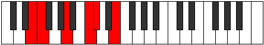 |
| [803](https://ianring.com/musictheory/scales/803) | [Loritonic](ModeGSharpLoritonic.md) | G# | G#, A, C#, E, F, G# |  |
| [803](https://ianring.com/musictheory/scales/803) | [Loritonic](ModeAFlatLoritonic.md) | Ab | Ab, A, Db, E, F, Ab |  |
| [805](https://ianring.com/musictheory/scales/805) | [Rothitonic](ModeENaturalRothitonic.md) | E | E, F#, A, C, C#, E |  |
| [807](https://ianring.com/musictheory/scales/807) | [Epadimic](ModeENaturalEpadimic.md) | E | E, F, Gb, A, B#, C#, E |  |
| [807](https://ianring.com/musictheory/scales/807) | [Epadimic](ModeGSharpEpadimic.md) | G# | G#, A, Bb, C#, D##, E#, G# |  |
| [807](https://ianring.com/musictheory/scales/807) | [Epadimic](ModeAFlatEpadimic.md) | Ab | Ab, Bbb, Cbb, Db, E, F, Ab |  |
| [809](https://ianring.com/musictheory/scales/809) | [Dogitonic](ModeENaturalDogitonic.md) | E | E, G, A, C, C#, E |  |
| [809](https://ianring.com/musictheory/scales/809) | [Dogitonic](ModeCSharpDogitonic.md) | C# | C#, E, F#, A, A#, C# |  |
| [809](https://ianring.com/musictheory/scales/809) | [Dogitonic](ModeDFlatDogitonic.md) | Db | Db, E, Gb, A, Bb, Db |  |
| [811](https://ianring.com/musictheory/scales/811) | [Radimic](ModeENaturalRadimic.md) | E | E, F, G, A, B#, C#, E |  |
| [811](https://ianring.com/musictheory/scales/811) | [Radimic](ModeCSharpRadimic.md) | C# | C#, D, E, F#, G##, A#, C# |  |
| [811](https://ianring.com/musictheory/scales/811) | [Radimic](ModeDFlatRadimic.md) | Db | Db, Ebb, Fb, Gb, A, Bb, Db | 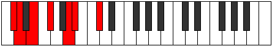 |
| [811](https://ianring.com/musictheory/scales/811) | [Radimic](ModeGSharpRadimic.md) | G# | G#, A, B, C#, D##, E#, G# |  |
| [811](https://ianring.com/musictheory/scales/811) | [Radimic](ModeAFlatRadimic.md) | Ab | Ab, Bbb, Cb, Db, E, F, Ab |  |
| [813](https://ianring.com/musictheory/scales/813) | [Larimic](ModeENaturalLarimic.md) | E | E, F#, G, A, B#, C#, E |  |
| [813](https://ianring.com/musictheory/scales/813) | [Larimic](ModeCSharpLarimic.md) | C# | C#, D#, E, F#, G##, A#, C# |  |
| [813](https://ianring.com/musictheory/scales/813) | [Larimic](ModeDFlatLarimic.md) | Db | Db, Eb, Fb, Gb, A, Bb, Db |  |
| [815](https://ianring.com/musictheory/scales/815) | [Bolian](ModeENaturalBolian.md) | E | E, F, Gb, Abb, Bbb, C, Db, E |  |
| [815](https://ianring.com/musictheory/scales/815) | [Bolian](ModeCSharpBolian.md) | C# | C#, D, Eb, Fb, Gb, A, Bb, C# |  |
| [815](https://ianring.com/musictheory/scales/815) | [Bolian](ModeDFlatBolian.md) | Db | Db, Ebb, Fbb, Gbbb, Abbb, Bbb, Cbb, Db |  |
| [815](https://ianring.com/musictheory/scales/815) | [Bolian](ModeGSharpBolian.md) | G# | G#, A, Bb, Cb, Db, E, F, G# |  |
| [817](https://ianring.com/musictheory/scales/817) | [Zothitonic](ModeENaturalZothitonic.md) | E | E, G#, A, C, C#, E |  |
| [819](https://ianring.com/musictheory/scales/819) | [Aerythimic](ModeCNaturalAerythimic.md) | C | C, Db, E, F, G#, A, C |  |
| [819](https://ianring.com/musictheory/scales/819) | [Aerythimic](ModeENaturalAerythimic.md) | E | E, F, G#, A, B#, C#, E |  |
| [819](https://ianring.com/musictheory/scales/819) | [Aerythimic](ModeGSharpAerythimic.md) | G# | G#, A, B#, C#, D##, E#, G# |  |
| [819](https://ianring.com/musictheory/scales/819) | [Aerythimic](ModeAFlatAerythimic.md) | Ab | Ab, Bbb, C, Db, E, F, Ab |  |
| [821](https://ianring.com/musictheory/scales/821) | [Aeranimic](ModeENaturalAeranimic.md) | E | E, F#, G#, A, B#, C#, E | 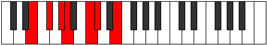 |
| [823](https://ianring.com/musictheory/scales/823) | [Stodian](ModeCNaturalStodian.md) | C | C, Db, Ebb, Fb, Gbb, Ab, Bbb, C |  |
| [823](https://ianring.com/musictheory/scales/823) | [Stodian](ModeENaturalStodian.md) | E | E, F, Gb, Ab, Bbb, C, Db, E |  |
| [823](https://ianring.com/musictheory/scales/823) | [Stodian](ModeGSharpStodian.md) | G# | G#, A, Bb, C, Db, E, F, G# |  |
| [825](https://ianring.com/musictheory/scales/825) | [Thyptimic](ModeENaturalThyptimic.md) | E | E, F##, G#, A, B#, C#, E |  |
| [825](https://ianring.com/musictheory/scales/825) | [Thyptimic](ModeCSharpThyptimic.md) | C# | C#, D##, E#, F#, G##, A#, C# | 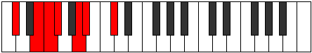 |
| [825](https://ianring.com/musictheory/scales/825) | [Thyptimic](ModeDFlatThyptimic.md) | Db | Db, E, F, Gb, A, Bb, Db |  |
| [827](https://ianring.com/musictheory/scales/827) | [Mixolocrian](ModeCNaturalMixolocrian.md) | C | C, Db, Eb, Fb, Gbb, Ab, Bbb, C |  |
| [827](https://ianring.com/musictheory/scales/827) | [Mixolocrian](ModeENaturalMixolocrian.md) | E | E, F, G, Ab, Bbb, C, Db, E |  |
| [827](https://ianring.com/musictheory/scales/827) | [Mixolocrian](ModeCSharpMixolocrian.md) | C# | C#, D, E, F, Gb, A, Bb, C# |  |
| [827](https://ianring.com/musictheory/scales/827) | [Mixolocrian](ModeDFlatMixolocrian.md) | Db | Db, Ebb, Fb, Gbb, Abbb, Bbb, Cbb, Db |  |
| [827](https://ianring.com/musictheory/scales/827) | [Mixolocrian](ModeGSharpMixolocrian.md) | G# | G#, A, B, C, Db, E, F, G# |  |
| [829](https://ianring.com/musictheory/scales/829) | [Lygian](ModeENaturalLygian.md) | E | E, F#, G, Ab, Bbb, C, Db, E |  |
| [829](https://ianring.com/musictheory/scales/829) | [Lygian](ModeCSharpLygian.md) | C# | C#, D#, E, F, Gb, A, Bb, C# |  |
| [829](https://ianring.com/musictheory/scales/829) | [Lygian](ModeDFlatLygian.md) | Db | Db, Eb, Fb, Gbb, Abbb, Bbb, Cbb, Db |  |
| [831](https://ianring.com/musictheory/scales/831) | [Rodyllic](ModeCNaturalRodyllic.md) | C | C, C#, D, D#, E, F, G#, A, C |  |
| [831](https://ianring.com/musictheory/scales/831) | [Rodyllic](ModeENaturalRodyllic.md) | E | E, F, F#, G, G#, A, C, C#, E |  |
| [831](https://ianring.com/musictheory/scales/831) | [Rodyllic](ModeCSharpRodyllic.md) | C# | C#, D, D#, E, F, F#, A, A#, C# |  |
| [831](https://ianring.com/musictheory/scales/831) | [Rodyllic](ModeDFlatRodyllic.md) | Db | Db, D, Eb, E, F, Gb, A, Bb, Db |  |
| [831](https://ianring.com/musictheory/scales/831) | [Rodyllic](ModeGSharpRodyllic.md) | G# | G#, A, A#, B, C, C#, E, F, G# |  |
| [831](https://ianring.com/musictheory/scales/831) | [Rodyllic](ModeAFlatRodyllic.md) | Ab | Ab, A, Bb, B, C, Db, E, F, Ab |  |
| [837](https://ianring.com/musictheory/scales/837) | [Epaditonic](ModeGNaturalEpaditonic.md) | G | G, A, C#, D#, E, G | 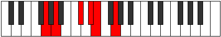 |
| [839](https://ianring.com/musictheory/scales/839) | [Ionathimic](ModeGNaturalIonathimic.md) | G | G, Ab, Bbb, C#, D#, E, G |  |
| [841](https://ianring.com/musictheory/scales/841) | [Phrothitonic](ModeCSharpPhrothitonic.md) | C# | C#, E, G, A, A#, C# |  |
| [841](https://ianring.com/musictheory/scales/841) | [Phrothitonic](ModeDFlatPhrothitonic.md) | Db | Db, E, G, A, Bb, Db |  |
| [843](https://ianring.com/musictheory/scales/843) | [Molimic](ModeCSharpMolimic.md) | C# | C#, D, E, F##, G##, A#, C# |  |
| [843](https://ianring.com/musictheory/scales/843) | [Molimic](ModeDFlatMolimic.md) | Db | Db, Ebb, Fb, G, A, Bb, Db |  |
| [845](https://ianring.com/musictheory/scales/845) | [Zyrimic](ModeCSharpZyrimic.md) | C# | C#, D#, E, F##, G##, A#, C# |  |
| [845](https://ianring.com/musictheory/scales/845) | [Zyrimic](ModeDFlatZyrimic.md) | Db | Db, Eb, Fb, G, A, Bb, Db | 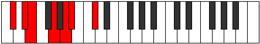 |
| [845](https://ianring.com/musictheory/scales/845) | [Zyrimic](ModeGNaturalZyrimic.md) | G | G, A, Bb, C#, D#, E, G |  |
| [847](https://ianring.com/musictheory/scales/847) | [Ganian](ModeCSharpGanian.md) | C# | C#, D, Eb, Fb, G, A, Bb, C# |  |
| [847](https://ianring.com/musictheory/scales/847) | [Ganian](ModeDFlatGanian.md) | Db | Db, Ebb, Fbb, Gbbb, Abb, Bbb, Cbb, Db |  |
| [847](https://ianring.com/musictheory/scales/847) | [Ganian](ModeGNaturalGanian.md) | G | G, Ab, Bbb, Cbb, Db, Eb, Fb, G |  |
| [851](https://ianring.com/musictheory/scales/851) | [Aerylimic](ModeCNaturalAerylimic.md) | C | C, Db, E, F#, G#, A, C |  |
| [853](https://ianring.com/musictheory/scales/853) | [Epothimic](ModeGNaturalEpothimic.md) | G | G, A, B, C#, D#, E, G |  |
| [855](https://ianring.com/musictheory/scales/855) | [Porian](ModeCNaturalPorian.md) | C | C, Db, Ebb, Fb, Gb, Ab, Bbb, C |  |
| [855](https://ianring.com/musictheory/scales/855) | [Porian](ModeGNaturalPorian.md) | G | G, Ab, Bbb, Cb, Db, Eb, Fb, G |  |
| [857](https://ianring.com/musictheory/scales/857) | [Aeolydimic](ModeCSharpAeolydimic.md) | C# | C#, D##, E#, F##, G##, A#, C# |  |
| [857](https://ianring.com/musictheory/scales/857) | [Aeolydimic](ModeDFlatAeolydimic.md) | Db | Db, E, F, G, A, Bb, Db |  |
| [859](https://ianring.com/musictheory/scales/859) | [Pathian](ModeCNaturalPathian.md) | C | C, Db, Eb, Fb, Gb, Ab, Bbb, C |  |
| [859](https://ianring.com/musictheory/scales/859) | [Pathian](ModeCSharpPathian.md) | C# | C#, D, E, F, G, A, Bb, C# |  |
| [859](https://ianring.com/musictheory/scales/859) | [Pathian](ModeDFlatPathian.md) | Db | Db, Ebb, Fb, Gbb, Abb, Bbb, Cbb, Db |  |
| [861](https://ianring.com/musictheory/scales/861) | [Rylian](ModeCSharpRylian.md) | C# | C#, D#, E, F, G, A, Bb, C# |  |
| [861](https://ianring.com/musictheory/scales/861) | [Rylian](ModeDFlatRylian.md) | Db | Db, Eb, Fb, Gbb, Abb, Bbb, Cbb, Db |  |
| [861](https://ianring.com/musictheory/scales/861) | [Rylian](ModeGNaturalRylian.md) | G | G, A, Bb, Cb, Db, Eb, Fb, G |  |
| [863](https://ianring.com/musictheory/scales/863) | [Pyryllic](ModeCNaturalPyryllic.md) | C | C, C#, D, D#, E, F#, G#, A, C |  |
| [863](https://ianring.com/musictheory/scales/863) | [Pyryllic](ModeCSharpPyryllic.md) | C# | C#, D, D#, E, F, G, A, A#, C# |  |
| [863](https://ianring.com/musictheory/scales/863) | [Pyryllic](ModeDFlatPyryllic.md) | Db | Db, D, Eb, E, F, G, A, Bb, Db |  |
| [863](https://ianring.com/musictheory/scales/863) | [Pyryllic](ModeGNaturalPyryllic.md) | G | G, G#, A, A#, B, C#, D#, E, G |  |
| [867](https://ianring.com/musictheory/scales/867) | [Phrocrimic](ModeGSharpPhrocrimic.md) | G# | G#, A, B##, C##, D##, E#, G# |  |
| [867](https://ianring.com/musictheory/scales/867) | [Phrocrimic](ModeAFlatPhrocrimic.md) | Ab | Ab, Bbb, C#, D, E, F, Ab |  |
| [867](https://ianring.com/musictheory/scales/867) | [Phrocrimic](ModeENaturalPhrocrimic.md) | E | E, F, G##, A#, B#, C#, E |  |
| [869](https://ianring.com/musictheory/scales/869) | [Kothimic](ModeGNaturalKothimic.md) | G | G, A, B#, C#, D#, E, G |  |
| [869](https://ianring.com/musictheory/scales/869) | [Kothimic](ModeENaturalKothimic.md) | E | E, F#, G##, A#, B#, C#, E |  |
| [871](https://ianring.com/musictheory/scales/871) | [Epadian](ModeGNaturalEpadian.md) | G | G, Ab, Bbb, C, Db, Eb, Fb, G |  |
| [871](https://ianring.com/musictheory/scales/871) | [Epadian](ModeENaturalEpadian.md) | E | E, F, Gb, A, Bb, C, Db, E |  |
| [871](https://ianring.com/musictheory/scales/871) | [Epadian](ModeGSharpEpadian.md) | G# | G#, A, Bb, C#, D, E, F, G# |  |
| [871](https://ianring.com/musictheory/scales/871) | [Epadian](ModeAFlatEpadian.md) | Ab | Ab, Bbb, Cbb, Db, Ebb, Fb, Gbb, Ab |  |
| [873](https://ianring.com/musictheory/scales/873) | [Bagimic](ModeENaturalBagimic.md) | E | E, F##, G##, A#, B#, C#, E |  |
| [873](https://ianring.com/musictheory/scales/873) | [Bagimic](ModeCSharpBagimic.md) | C# | C#, D##, E##, F##, G##, A#, C# |  |
| [873](https://ianring.com/musictheory/scales/873) | [Bagimic](ModeDFlatBagimic.md) | Db | Db, E, F#, G, A, Bb, Db |  |
| [875](https://ianring.com/musictheory/scales/875) | [Stothian](ModeENaturalStothian.md) | E | E, F, G, A, Bb, C, Db, E |  |
| [875](https://ianring.com/musictheory/scales/875) | [Stothian](ModeCSharpStothian.md) | C# | C#, D, E, F#, G, A, Bb, C# |  |
| [875](https://ianring.com/musictheory/scales/875) | [Stothian](ModeDFlatStothian.md) | Db | Db, Ebb, Fb, Gb, Abb, Bbb, Cbb, Db |  |
| [875](https://ianring.com/musictheory/scales/875) | [Stothian](ModeGSharpStothian.md) | G# | G#, A, B, C#, D, E, F, G# |  |
| [875](https://ianring.com/musictheory/scales/875) | [Stothian](ModeAFlatStothian.md) | Ab | Ab, Bbb, Cb, Db, Ebb, Fb, Gbb, Ab |  |
| [877](https://ianring.com/musictheory/scales/877) | [Aeraptian](ModeGNaturalAeraptian.md) | G | G, A, Bb, C, Db, Eb, Fb, G |  |
| [877](https://ianring.com/musictheory/scales/877) | [Aeraptian](ModeENaturalAeraptian.md) | E | E, F#, G, A, Bb, C, Db, E |  |
| [877](https://ianring.com/musictheory/scales/877) | [Aeraptian](ModeCSharpAeraptian.md) | C# | C#, D#, E, F#, G, A, Bb, C# |  |
| [877](https://ianring.com/musictheory/scales/877) | [Aeraptian](ModeDFlatAeraptian.md) | Db | Db, Eb, Fb, Gb, Abb, Bbb, Cbb, Db |  |
| [879](https://ianring.com/musictheory/scales/879) | [Aeolocryllic](ModeCSharpAeolocryllic.md) | C# | C#, D, D#, E, F#, G, A, A#, C# |  |
| [879](https://ianring.com/musictheory/scales/879) | [Aeolocryllic](ModeDFlatAeolocryllic.md) | Db | Db, D, Eb, E, Gb, G, A, Bb, Db |  |
| [879](https://ianring.com/musictheory/scales/879) | [Aeolocryllic](ModeENaturalAeolocryllic.md) | E | E, F, F#, G, A, A#, C, C#, E |  |
| [879](https://ianring.com/musictheory/scales/879) | [Aeolocryllic](ModeGNaturalAeolocryllic.md) | G | G, G#, A, A#, C, C#, D#, E, G |  |
| [879](https://ianring.com/musictheory/scales/879) | [Aeolocryllic](ModeGSharpAeolocryllic.md) | G# | G#, A, A#, B, C#, D, E, F, G# |  |
| [879](https://ianring.com/musictheory/scales/879) | [Aeolocryllic](ModeAFlatAeolocryllic.md) | Ab | Ab, A, Bb, B, Db, D, E, F, Ab |  |
| [881](https://ianring.com/musictheory/scales/881) | [Aerothimic](ModeENaturalAerothimic.md) | E | E, F###, G##, A#, B#, C#, E |  |
| [883](https://ianring.com/musictheory/scales/883) | [Ralian](ModeGSharpRalian.md) | G# | G#, A, B#, C#, D, E, F, G# |  |
| [883](https://ianring.com/musictheory/scales/883) | [Ralian](ModeAFlatRalian.md) | Ab | Ab, Bbb, C, Db, Ebb, Fb, Gbb, Ab |  |
| [883](https://ianring.com/musictheory/scales/883) | [Ralian](ModeCNaturalRalian.md) | C | C, Db, E, F, Gb, Ab, Bbb, C |  |
| [883](https://ianring.com/musictheory/scales/883) | [Ralian](ModeENaturalRalian.md) | E | E, F, G#, A, Bb, C, Db, E |  |
| [885](https://ianring.com/musictheory/scales/885) | [Sathian](ModeENaturalSathian.md) | E | E, F#, G#, A, Bb, C, Db, E |  |
| [885](https://ianring.com/musictheory/scales/885) | [Sathian](ModeGNaturalSathian.md) | G | G, A, B, C, Db, Eb, Fb, G |  |
| [887](https://ianring.com/musictheory/scales/887) | [Sathyllic](ModeCNaturalSathyllic.md) | C | C, C#, D, E, F, F#, G#, A, C |  |
| [887](https://ianring.com/musictheory/scales/887) | [Sathyllic](ModeGSharpSathyllic.md) | G# | G#, A, A#, C, C#, D, E, F, G# |  |
| [887](https://ianring.com/musictheory/scales/887) | [Sathyllic](ModeAFlatSathyllic.md) | Ab | Ab, A, Bb, C, Db, D, E, F, Ab |  |
| [887](https://ianring.com/musictheory/scales/887) | [Sathyllic](ModeENaturalSathyllic.md) | E | E, F, F#, G#, A, A#, C, C#, E |  |
| [887](https://ianring.com/musictheory/scales/887) | [Sathyllic](ModeGNaturalSathyllic.md) | G | G, G#, A, B, C, C#, D#, E, G |  |
| [889](https://ianring.com/musictheory/scales/889) | [Borian](ModeCSharpBorian.md) | C# | C#, D##, E#, F#, G, A, Bb, C# |  |
| [889](https://ianring.com/musictheory/scales/889) | [Borian](ModeDFlatBorian.md) | Db | Db, E, F, Gb, Abb, Bbb, Cbb, Db |  |
| [889](https://ianring.com/musictheory/scales/889) | [Borian](ModeENaturalBorian.md) | E | E, F##, G#, A, Bb, C, Db, E |  |
| [891](https://ianring.com/musictheory/scales/891) | [Ionilyllic](ModeCNaturalIonilyllic.md) | C | C, C#, D#, E, F, F#, G#, A, C |  |
| [891](https://ianring.com/musictheory/scales/891) | [Ionilyllic](ModeCSharpIonilyllic.md) | C# | C#, D, E, F, F#, G, A, A#, C# |  |
| [891](https://ianring.com/musictheory/scales/891) | [Ionilyllic](ModeDFlatIonilyllic.md) | Db | Db, D, E, F, Gb, G, A, Bb, Db |  |
| [891](https://ianring.com/musictheory/scales/891) | [Ionilyllic](ModeENaturalIonilyllic.md) | E | E, F, G, G#, A, A#, C, C#, E |  |
| [891](https://ianring.com/musictheory/scales/891) | [Ionilyllic](ModeGSharpIonilyllic.md) | G# | G#, A, B, C, C#, D, E, F, G# |  |
| [891](https://ianring.com/musictheory/scales/891) | [Ionilyllic](ModeAFlatIonilyllic.md) | Ab | Ab, A, B, C, Db, D, E, F, Ab |  |
| [893](https://ianring.com/musictheory/scales/893) | [Pycryllic](ModeCSharpPycryllic.md) | C# | C#, D#, E, F, F#, G, A, A#, C# |  |
| [893](https://ianring.com/musictheory/scales/893) | [Pycryllic](ModeDFlatPycryllic.md) | Db | Db, Eb, E, F, Gb, G, A, Bb, Db |  |
| [893](https://ianring.com/musictheory/scales/893) | [Pycryllic](ModeENaturalPycryllic.md) | E | E, F#, G, G#, A, A#, C, C#, E |  |
| [893](https://ianring.com/musictheory/scales/893) | [Pycryllic](ModeGNaturalPycryllic.md) | G | G, A, A#, B, C, C#, D#, E, G |  |
| [895](https://ianring.com/musictheory/scales/895) | [Aeolathygic](ModeCNaturalAeolathygic.md) | C | C, C#, D, D#, E, F, F#, G#, A, C |  |
| [895](https://ianring.com/musictheory/scales/895) | [Aeolathygic](ModeCSharpAeolathygic.md) | C# | C#, D, D#, E, F, F#, G, A, A#, C# |  |
| [895](https://ianring.com/musictheory/scales/895) | [Aeolathygic](ModeDFlatAeolathygic.md) | Db | Db, D, Eb, E, F, Gb, G, A, Bb, Db |  |
| [895](https://ianring.com/musictheory/scales/895) | [Aeolathygic](ModeENaturalAeolathygic.md) | E | E, F, F#, G, G#, A, A#, C, C#, E |  |
| [895](https://ianring.com/musictheory/scales/895) | [Aeolathygic](ModeGSharpAeolathygic.md) | G# | G#, A, A#, B, C, C#, D, E, F, G# |  |
| [895](https://ianring.com/musictheory/scales/895) | [Aeolathygic](ModeAFlatAeolathygic.md) | Ab | Ab, A, Bb, B, C, Db, D, E, F, Ab |  |
| [895](https://ianring.com/musictheory/scales/895) | [Aeolathygic](ModeGNaturalAeolathygic.md) | G | G, G#, A, A#, B, C, C#, D#, E, G |  |
| [905](https://ianring.com/musictheory/scales/905) | [Bylitonic](ModeCSharpBylitonic.md) | C# | C#, E, G#, A, A#, C# |  |
| [905](https://ianring.com/musictheory/scales/905) | [Bylitonic](ModeDFlatBylitonic.md) | Db | Db, E, Ab, A, Bb, Db |  |
| [907](https://ianring.com/musictheory/scales/907) | [Tholimic](ModeCSharpTholimic.md) | C# | C#, D, E, F###, G##, A#, C# |  |
| [907](https://ianring.com/musictheory/scales/907) | [Tholimic](ModeDFlatTholimic.md) | Db | Db, Ebb, Fb, G#, A, Bb, Db |  |
| [909](https://ianring.com/musictheory/scales/909) | [Katarimic](ModeCSharpKatarimic.md) | C# | C#, D#, E, F###, G##, A#, C# |  |
| [909](https://ianring.com/musictheory/scales/909) | [Katarimic](ModeDFlatKatarimic.md) | Db | Db, Eb, Fb, G#, A, Bb, Db |  |
| [911](https://ianring.com/musictheory/scales/911) | [Radian](ModeCSharpRadian.md) | C# | C#, D, Eb, Fb, G#, A, Bb, C# |  |
| [911](https://ianring.com/musictheory/scales/911) | [Radian](ModeDFlatRadian.md) | Db | Db, Ebb, Fbb, Gbbb, Ab, Bbb, Cbb, Db |  |
| [913](https://ianring.com/musictheory/scales/913) | [Aeolyritonic](ModeANaturalAeolyritonic.md) | A | A, C#, E, F, F#, A |  |
| [915](https://ianring.com/musictheory/scales/915) | [Loptimic](ModeCNaturalLoptimic.md) | C | C, Db, E, F##, G#, A, C | 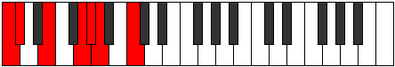 |
| [915](https://ianring.com/musictheory/scales/915) | [Loptimic](ModeANaturalLoptimic.md) | A | A, Bb, C#, D##, E#, F#, A |  |
| [917](https://ianring.com/musictheory/scales/917) | [Dygimic](ModeANaturalDygimic.md) | A | A, B, C#, D##, E#, F#, A |  |
| [919](https://ianring.com/musictheory/scales/919) | [Gathian](ModeCNaturalGathian.md) | C | C, Db, Ebb, Fb, G, Ab, Bbb, C |  |
| [919](https://ianring.com/musictheory/scales/919) | [Gathian](ModeANaturalGathian.md) | A | A, Bb, Cb, Db, E, F, Gb, A |  |
| [921](https://ianring.com/musictheory/scales/921) | [Bogimic](ModeANaturalBogimic.md) | A | A, B#, C#, D##, E#, F#, A |  |
| [921](https://ianring.com/musictheory/scales/921) | [Bogimic](ModeCSharpBogimic.md) | C# | C#, D##, E#, F###, G##, A#, C# |  |
| [921](https://ianring.com/musictheory/scales/921) | [Bogimic](ModeDFlatBogimic.md) | Db | Db, E, F, G#, A, Bb, Db |  |
| [923](https://ianring.com/musictheory/scales/923) | [Ionodian](ModeCNaturalIonodian.md) | C | C, Db, Eb, Fb, G, Ab, Bbb, C |  |
| [923](https://ianring.com/musictheory/scales/923) | [Ionodian](ModeANaturalIonodian.md) | A | A, Bb, C, Db, E, F, Gb, A |  |
| [923](https://ianring.com/musictheory/scales/923) | [Ionodian](ModeCSharpIonodian.md) | C# | C#, D, E, F, G#, A, Bb, C# |  |
| [923](https://ianring.com/musictheory/scales/923) | [Ionodian](ModeDFlatIonodian.md) | Db | Db, Ebb, Fb, Gbb, Ab, Bbb, Cbb, Db |  |
| [925](https://ianring.com/musictheory/scales/925) | [Mythian](ModeCSharpMythian.md) | C# | C#, D#, E, F, G#, A, Bb, C# |  |
| [925](https://ianring.com/musictheory/scales/925) | [Mythian](ModeDFlatMythian.md) | Db | Db, Eb, Fb, Gbb, Ab, Bbb, Cbb, Db |  |
| [925](https://ianring.com/musictheory/scales/925) | [Mythian](ModeANaturalMythian.md) | A | A, B, C, Db, E, F, Gb, A |  |
| [927](https://ianring.com/musictheory/scales/927) | [Koptyllic](ModeCNaturalKoptyllic.md) | C | C, C#, D, D#, E, G, G#, A, C |  |
| [927](https://ianring.com/musictheory/scales/927) | [Koptyllic](ModeCSharpKoptyllic.md) | C# | C#, D, D#, E, F, G#, A, A#, C# |  |
| [927](https://ianring.com/musictheory/scales/927) | [Koptyllic](ModeDFlatKoptyllic.md) | Db | Db, D, Eb, E, F, Ab, A, Bb, Db |  |
| [927](https://ianring.com/musictheory/scales/927) | [Koptyllic](ModeANaturalKoptyllic.md) | A | A, A#, B, C, C#, E, F, F#, A |  |
| [931](https://ianring.com/musictheory/scales/931) | [Bacrimic](ModeGSharpBacrimic.md) | G# | G#, A, B##, C###, D##, E#, G# |  |
| [931](https://ianring.com/musictheory/scales/931) | [Bacrimic](ModeAFlatBacrimic.md) | Ab | Ab, Bbb, C#, D#, E, F, Ab |  |
| [931](https://ianring.com/musictheory/scales/931) | [Bacrimic](ModeENaturalBacrimic.md) | E | E, F, G##, A##, B#, C#, E |  |
| [933](https://ianring.com/musictheory/scales/933) | [Dadimic](ModeENaturalDadimic.md) | E | E, F#, G##, A##, B#, C#, E |  |
| [935](https://ianring.com/musictheory/scales/935) | [Katarian](ModeGSharpKatarian.md) | G# | G#, A, Bb, C#, D#, E, F, G# |  |
| [935](https://ianring.com/musictheory/scales/935) | [Katarian](ModeAFlatKatarian.md) | Ab | Ab, Bbb, Cbb, Db, Eb, Fb, Gbb, Ab |  |
| [935](https://ianring.com/musictheory/scales/935) | [Katarian](ModeENaturalKatarian.md) | E | E, F, Gb, A, B, C, Db, E |  |
| [937](https://ianring.com/musictheory/scales/937) | [Stothimic](ModeCSharpStothimic.md) | C# | C#, D##, E##, F###, G##, A#, C# |  |
| [937](https://ianring.com/musictheory/scales/937) | [Stothimic](ModeDFlatStothimic.md) | Db | Db, E, F#, G#, A, Bb, Db |  |
| [937](https://ianring.com/musictheory/scales/937) | [Stothimic](ModeENaturalStothimic.md) | E | E, F##, G##, A##, B#, C#, E |  |
| [939](https://ianring.com/musictheory/scales/939) | [Dyptian](ModeCSharpDyptian.md) | C# | C#, D, E, F#, G#, A, Bb, C# |  |
| [939](https://ianring.com/musictheory/scales/939) | [Dyptian](ModeDFlatDyptian.md) | Db | Db, Ebb, Fb, Gb, Ab, Bbb, Cbb, Db |  |
| [939](https://ianring.com/musictheory/scales/939) | [Dyptian](ModeENaturalDyptian.md) | E | E, F, G, A, B, C, Db, E |  |
| [939](https://ianring.com/musictheory/scales/939) | [Dyptian](ModeGSharpDyptian.md) | G# | G#, A, B, C#, D#, E, F, G# |  |
| [939](https://ianring.com/musictheory/scales/939) | [Dyptian](ModeAFlatDyptian.md) | Ab | Ab, Bbb, Cb, Db, Eb, Fb, Gbb, Ab |  |
| [941](https://ianring.com/musictheory/scales/941) | [Phrorian](ModeCSharpPhrorian.md) | C# | C#, D#, E, F#, G#, A, Bb, C# |  |
| [941](https://ianring.com/musictheory/scales/941) | [Phrorian](ModeDFlatPhrorian.md) | Db | Db, Eb, Fb, Gb, Ab, Bbb, Cbb, Db |  |
| [941](https://ianring.com/musictheory/scales/941) | [Phrorian](ModeENaturalPhrorian.md) | E | E, F#, G, A, B, C, Db, E |  |
| [943](https://ianring.com/musictheory/scales/943) | [Aerygyllic](ModeCSharpAerygyllic.md) | C# | C#, D, D#, E, F#, G#, A, A#, C# |  |
| [943](https://ianring.com/musictheory/scales/943) | [Aerygyllic](ModeDFlatAerygyllic.md) | Db | Db, D, Eb, E, Gb, Ab, A, Bb, Db |  |
| [943](https://ianring.com/musictheory/scales/943) | [Aerygyllic](ModeENaturalAerygyllic.md) | E | E, F, F#, G, A, B, C, C#, E |  |
| [943](https://ianring.com/musictheory/scales/943) | [Aerygyllic](ModeGSharpAerygyllic.md) | G# | G#, A, A#, B, C#, D#, E, F, G# |  |
| [943](https://ianring.com/musictheory/scales/943) | [Aerygyllic](ModeAFlatAerygyllic.md) | Ab | Ab, A, Bb, B, Db, Eb, E, F, Ab |  |
| [945](https://ianring.com/musictheory/scales/945) | [Syrimic](ModeANaturalSyrimic.md) | A | A, B##, C##, D##, E#, F#, A |  |
| [945](https://ianring.com/musictheory/scales/945) | [Syrimic](ModeENaturalSyrimic.md) | E | E, F###, G##, A##, B#, C#, E |  |
| [947](https://ianring.com/musictheory/scales/947) | [Modian](ModeGSharpModian.md) | G# | G#, A, B#, C#, D#, E, F, G# |  |
| [947](https://ianring.com/musictheory/scales/947) | [Modian](ModeAFlatModian.md) | Ab | Ab, Bbb, C, Db, Eb, Fb, Gbb, Ab |  |
| [947](https://ianring.com/musictheory/scales/947) | [Modian](ModeCNaturalModian.md) | C | C, Db, E, F, G, Ab, Bbb, C |  |
| [947](https://ianring.com/musictheory/scales/947) | [Modian](ModeANaturalModian.md) | A | A, Bb, C#, D, E, F, Gb, A |  |
| [947](https://ianring.com/musictheory/scales/947) | [Modian](ModeENaturalModian.md) | E | E, F, G#, A, B, C, Db, E |  |
| [949](https://ianring.com/musictheory/scales/949) | [Ionagian](ModeANaturalIonagian.md) | A | A, B, C#, D, E, F, Gb, A |  |
| [949](https://ianring.com/musictheory/scales/949) | [Ionagian](ModeENaturalIonagian.md) | E | E, F#, G#, A, B, C, Db, E |  |
| [951](https://ianring.com/musictheory/scales/951) | [Thogyllic](ModeCNaturalThogyllic.md) | C | C, C#, D, E, F, G, G#, A, C |  |
| [951](https://ianring.com/musictheory/scales/951) | [Thogyllic](ModeGSharpThogyllic.md) | G# | G#, A, A#, C, C#, D#, E, F, G# |  |
| [951](https://ianring.com/musictheory/scales/951) | [Thogyllic](ModeAFlatThogyllic.md) | Ab | Ab, A, Bb, C, Db, Eb, E, F, Ab |  |
| [951](https://ianring.com/musictheory/scales/951) | [Thogyllic](ModeENaturalThogyllic.md) | E | E, F, F#, G#, A, B, C, C#, E |  |
| [951](https://ianring.com/musictheory/scales/951) | [Thogyllic](ModeANaturalThogyllic.md) | A | A, A#, B, C#, D, E, F, F#, A |  |
| [953](https://ianring.com/musictheory/scales/953) | [Stoptian](ModeANaturalStoptian.md) | A | A, B#, C#, D, E, F, Gb, A |  |
| [953](https://ianring.com/musictheory/scales/953) | [Stoptian](ModeCSharpStoptian.md) | C# | C#, D##, E#, F#, G#, A, Bb, C# |  |
| [953](https://ianring.com/musictheory/scales/953) | [Stoptian](ModeDFlatStoptian.md) | Db | Db, E, F, Gb, Ab, Bbb, Cbb, Db |  |
| [953](https://ianring.com/musictheory/scales/953) | [Stoptian](ModeENaturalStoptian.md) | E | E, F##, G#, A, B, C, Db, E |  |
| [955](https://ianring.com/musictheory/scales/955) | [Ionogyllic](ModeCNaturalIonogyllic.md) | C | C, C#, D#, E, F, G, G#, A, C |  |
| [955](https://ianring.com/musictheory/scales/955) | [Ionogyllic](ModeANaturalIonogyllic.md) | A | A, A#, C, C#, D, E, F, F#, A |  |
| [955](https://ianring.com/musictheory/scales/955) | [Ionogyllic](ModeCSharpIonogyllic.md) | C# | C#, D, E, F, F#, G#, A, A#, C# |  |
| [955](https://ianring.com/musictheory/scales/955) | [Ionogyllic](ModeDFlatIonogyllic.md) | Db | Db, D, E, F, Gb, Ab, A, Bb, Db |  |
| [955](https://ianring.com/musictheory/scales/955) | [Ionogyllic](ModeGSharpIonogyllic.md) | G# | G#, A, B, C, C#, D#, E, F, G# |  |
| [955](https://ianring.com/musictheory/scales/955) | [Ionogyllic](ModeAFlatIonogyllic.md) | Ab | Ab, A, B, C, Db, Eb, E, F, Ab |  |
| [955](https://ianring.com/musictheory/scales/955) | [Ionogyllic](ModeENaturalIonogyllic.md) | E | E, F, G, G#, A, B, C, C#, E |  |
| [957](https://ianring.com/musictheory/scales/957) | [Phronyllic](ModeCSharpPhronyllic.md) | C# | C#, D#, E, F, F#, G#, A, A#, C# |  |
| [957](https://ianring.com/musictheory/scales/957) | [Phronyllic](ModeDFlatPhronyllic.md) | Db | Db, Eb, E, F, Gb, Ab, A, Bb, Db |  |
| [957](https://ianring.com/musictheory/scales/957) | [Phronyllic](ModeANaturalPhronyllic.md) | A | A, B, C, C#, D, E, F, F#, A |  |
| [957](https://ianring.com/musictheory/scales/957) | [Phronyllic](ModeENaturalPhronyllic.md) | E | E, F#, G, G#, A, B, C, C#, E |  |
| [959](https://ianring.com/musictheory/scales/959) | [Katylygic](ModeCNaturalKatylygic.md) | C | C, C#, D, D#, E, F, G, G#, A, C |  |
| [959](https://ianring.com/musictheory/scales/959) | [Katylygic](ModeCSharpKatylygic.md) | C# | C#, D, D#, E, F, F#, G#, A, A#, C# |  |
| [959](https://ianring.com/musictheory/scales/959) | [Katylygic](ModeDFlatKatylygic.md) | Db | Db, D, Eb, E, F, Gb, Ab, A, Bb, Db |  |
| [959](https://ianring.com/musictheory/scales/959) | [Katylygic](ModeENaturalKatylygic.md) | E | E, F, F#, G, G#, A, B, C, C#, E |  |
| [959](https://ianring.com/musictheory/scales/959) | [Katylygic](ModeANaturalKatylygic.md) | A | A, A#, B, C, C#, D, E, F, F#, A |  |
| [959](https://ianring.com/musictheory/scales/959) | [Katylygic](ModeGSharpKatylygic.md) | G# | G#, A, A#, B, C, C#, D#, E, F, G# |  |
| [959](https://ianring.com/musictheory/scales/959) | [Katylygic](ModeAFlatKatylygic.md) | Ab | Ab, A, Bb, B, C, Db, Eb, E, F, Ab |  |
| [965](https://ianring.com/musictheory/scales/965) | [Ionothimic](ModeGNaturalIonothimic.md) | G | G, A, B##, C##, D#, E, G |  |
| [967](https://ianring.com/musictheory/scales/967) | [Aeolanian](ModeGNaturalAeolanian.md) | G | G, Ab, Bbb, C#, D, Eb, Fb, G |  |
| [969](https://ianring.com/musictheory/scales/969) | [Ionogimic](ModeCSharpIonogimic.md) | C# | C#, D##, E###, F###, G##, A#, C# |  |
| [969](https://ianring.com/musictheory/scales/969) | [Ionogimic](ModeDFlatIonogimic.md) | Db | Db, E, F##, G#, A, Bb, Db |  |
| [971](https://ianring.com/musictheory/scales/971) | [Ladian](ModeCSharpLadian.md) | C# | C#, D, E, F##, G#, A, Bb, C# |  |
| [971](https://ianring.com/musictheory/scales/971) | [Ladian](ModeDFlatLadian.md) | Db | Db, Ebb, Fb, G, Ab, Bbb, Cbb, Db |  |
| [973](https://ianring.com/musictheory/scales/973) | [Phryptian](ModeGNaturalPhryptian.md) | G | G, A, Bb, C#, D, Eb, Fb, G |  |
| [973](https://ianring.com/musictheory/scales/973) | [Phryptian](ModeCSharpPhryptian.md) | C# | C#, D#, E, F##, G#, A, Bb, C# |  |
| [973](https://ianring.com/musictheory/scales/973) | [Phryptian](ModeDFlatPhryptian.md) | Db | Db, Eb, Fb, G, Ab, Bbb, Cbb, Db |  |
| [975](https://ianring.com/musictheory/scales/975) | [Katogyllic](ModeCSharpKatogyllic.md) | C# | C#, D, D#, E, G, G#, A, A#, C# |  |
| [975](https://ianring.com/musictheory/scales/975) | [Katogyllic](ModeDFlatKatogyllic.md) | Db | Db, D, Eb, E, G, Ab, A, Bb, Db |  |
| [975](https://ianring.com/musictheory/scales/975) | [Katogyllic](ModeGNaturalKatogyllic.md) | G | G, G#, A, A#, C#, D, D#, E, G |  |
| [977](https://ianring.com/musictheory/scales/977) | [Kocrimic](ModeANaturalKocrimic.md) | A | A, B##, C###, D##, E#, F#, A |  |
| [979](https://ianring.com/musictheory/scales/979) | [Thogian](ModeCNaturalThogian.md) | C | C, Db, E, F#, G, Ab, Bbb, C |  |
| [979](https://ianring.com/musictheory/scales/979) | [Thogian](ModeANaturalThogian.md) | A | A, Bb, C#, D#, E, F, Gb, A |  |
| [981](https://ianring.com/musictheory/scales/981) | [Bacrian](ModeANaturalBacrian.md) | A | A, B, C#, D#, E, F, Gb, A |  |
| [981](https://ianring.com/musictheory/scales/981) | [Bacrian](ModeGNaturalBacrian.md) | G | G, A, B, C#, D, Eb, Fb, G |  |
| [983](https://ianring.com/musictheory/scales/983) | [Epygyllic](ModeCNaturalEpygyllic.md) | C | C, C#, D, E, F#, G, G#, A, C |  |
| [983](https://ianring.com/musictheory/scales/983) | [Epygyllic](ModeGNaturalEpygyllic.md) | G | G, G#, A, B, C#, D, D#, E, G |  |
| [983](https://ianring.com/musictheory/scales/983) | [Epygyllic](ModeANaturalEpygyllic.md) | A | A, A#, B, C#, D#, E, F, F#, A |  |
| [985](https://ianring.com/musictheory/scales/985) | [Raptian](ModeANaturalRaptian.md) | A | A, B#, C#, D#, E, F, Gb, A |  |
| [985](https://ianring.com/musictheory/scales/985) | [Raptian](ModeCSharpRaptian.md) | C# | C#, D##, E#, F##, G#, A, Bb, C# |  |
| [985](https://ianring.com/musictheory/scales/985) | [Raptian](ModeDFlatRaptian.md) | Db | Db, E, F, G, Ab, Bbb, Cbb, Db |  |
| [987](https://ianring.com/musictheory/scales/987) | [Aeraptyllic](ModeCNaturalAeraptyllic.md) | C | C, C#, D#, E, F#, G, G#, A, C |  |
| [987](https://ianring.com/musictheory/scales/987) | [Aeraptyllic](ModeANaturalAeraptyllic.md) | A | A, A#, C, C#, D#, E, F, F#, A |  |
| [987](https://ianring.com/musictheory/scales/987) | [Aeraptyllic](ModeCSharpAeraptyllic.md) | C# | C#, D, E, F, G, G#, A, A#, C# |  |
| [987](https://ianring.com/musictheory/scales/987) | [Aeraptyllic](ModeDFlatAeraptyllic.md) | Db | Db, D, E, F, G, Ab, A, Bb, Db |  |
| [989](https://ianring.com/musictheory/scales/989) | [Phrolyllic](ModeCSharpPhrolyllic.md) | C# | C#, D#, E, F, G, G#, A, A#, C# |  |
| [989](https://ianring.com/musictheory/scales/989) | [Phrolyllic](ModeDFlatPhrolyllic.md) | Db | Db, Eb, E, F, G, Ab, A, Bb, Db |  |
| [989](https://ianring.com/musictheory/scales/989) | [Phrolyllic](ModeANaturalPhrolyllic.md) | A | A, B, C, C#, D#, E, F, F#, A |  |
| [989](https://ianring.com/musictheory/scales/989) | [Phrolyllic](ModeGNaturalPhrolyllic.md) | G | G, A, A#, B, C#, D, D#, E, G |  |
| [991](https://ianring.com/musictheory/scales/991) | [Aeolygic](ModeCNaturalAeolygic.md) | C | C, C#, D, D#, E, F#, G, G#, A, C |  |
| [991](https://ianring.com/musictheory/scales/991) | [Aeolygic](ModeCSharpAeolygic.md) | C# | C#, D, D#, E, F, G, G#, A, A#, C# |  |
| [991](https://ianring.com/musictheory/scales/991) | [Aeolygic](ModeDFlatAeolygic.md) | Db | Db, D, Eb, E, F, G, Ab, A, Bb, Db |  |
| [991](https://ianring.com/musictheory/scales/991) | [Aeolygic](ModeANaturalAeolygic.md) | A | A, A#, B, C, C#, D#, E, F, F#, A |  |
| [991](https://ianring.com/musictheory/scales/991) | [Aeolygic](ModeGNaturalAeolygic.md) | G | G, G#, A, A#, B, C#, D, D#, E, G |  |
| [995](https://ianring.com/musictheory/scales/995) | [Phrathian](ModeGSharpPhrathian.md) | G# | G#, A, B##, C##, D#, E, F, G# |  |
| [995](https://ianring.com/musictheory/scales/995) | [Phrathian](ModeAFlatPhrathian.md) | Ab | Ab, Bbb, C#, D, Eb, Fb, Gbb, Ab |  |
| [995](https://ianring.com/musictheory/scales/995) | [Phrathian](ModeENaturalPhrathian.md) | E | E, F, G##, A#, B, C, Db, E |  |
| [997](https://ianring.com/musictheory/scales/997) | [Rycrian](ModeGNaturalRycrian.md) | G | G, A, B#, C#, D, Eb, Fb, G |  |
| [997](https://ianring.com/musictheory/scales/997) | [Rycrian](ModeENaturalRycrian.md) | E | E, F#, G##, A#, B, C, Db, E |  |
| [999](https://ianring.com/musictheory/scales/999) | [Bylyllic](ModeGNaturalBylyllic.md) | G | G, G#, A, C, C#, D, D#, E, G |  |
| [999](https://ianring.com/musictheory/scales/999) | [Bylyllic](ModeGSharpBylyllic.md) | G# | G#, A, A#, C#, D, D#, E, F, G# |  |
| [999](https://ianring.com/musictheory/scales/999) | [Bylyllic](ModeAFlatBylyllic.md) | Ab | Ab, A, Bb, Db, D, Eb, E, F, Ab |  |
| [999](https://ianring.com/musictheory/scales/999) | [Bylyllic](ModeENaturalBylyllic.md) | E | E, F, F#, A, A#, B, C, C#, E |  |
| [1001](https://ianring.com/musictheory/scales/1001) | [Badian](ModeCSharpBadian.md) | C# | C#, D##, E##, F##, G#, A, Bb, C# |  |
| [1001](https://ianring.com/musictheory/scales/1001) | [Badian](ModeDFlatBadian.md) | Db | Db, E, F#, G, Ab, Bbb, Cbb, Db |  |
| [1001](https://ianring.com/musictheory/scales/1001) | [Badian](ModeENaturalBadian.md) | E | E, F##, G##, A#, B, C, Db, E |  |
| [1003](https://ianring.com/musictheory/scales/1003) | [Ionyryllic](ModeCSharpIonyryllic.md) | C# | C#, D, E, F#, G, G#, A, A#, C# |  |
| [1003](https://ianring.com/musictheory/scales/1003) | [Ionyryllic](ModeDFlatIonyryllic.md) | Db | Db, D, E, Gb, G, Ab, A, Bb, Db |  |
| [1003](https://ianring.com/musictheory/scales/1003) | [Ionyryllic](ModeGSharpIonyryllic.md) | G# | G#, A, B, C#, D, D#, E, F, G# |  |
| [1003](https://ianring.com/musictheory/scales/1003) | [Ionyryllic](ModeAFlatIonyryllic.md) | Ab | Ab, A, B, Db, D, Eb, E, F, Ab |  |
| [1003](https://ianring.com/musictheory/scales/1003) | [Ionyryllic](ModeENaturalIonyryllic.md) | E | E, F, G, A, A#, B, C, C#, E |  |
| [1005](https://ianring.com/musictheory/scales/1005) | [Radyllic](ModeGNaturalRadyllic.md) | G | G, A, A#, C, C#, D, D#, E, G |  |
| [1005](https://ianring.com/musictheory/scales/1005) | [Radyllic](ModeCSharpRadyllic.md) | C# | C#, D#, E, F#, G, G#, A, A#, C# |  |
| [1005](https://ianring.com/musictheory/scales/1005) | [Radyllic](ModeDFlatRadyllic.md) | Db | Db, Eb, E, Gb, G, Ab, A, Bb, Db |  |
| [1005](https://ianring.com/musictheory/scales/1005) | [Radyllic](ModeENaturalRadyllic.md) | E | E, F#, G, A, A#, B, C, C#, E | 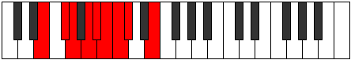 |
| [1007](https://ianring.com/musictheory/scales/1007) | [Ionycrygic](ModeGNaturalIonycrygic.md) | G | G, G#, A, A#, C, C#, D, D#, E, G |  |
| [1007](https://ianring.com/musictheory/scales/1007) | [Ionycrygic](ModeCSharpIonycrygic.md) | C# | C#, D, D#, E, F#, G, G#, A, A#, C# |  |
| [1007](https://ianring.com/musictheory/scales/1007) | [Ionycrygic](ModeDFlatIonycrygic.md) | Db | Db, D, Eb, E, Gb, G, Ab, A, Bb, Db |  |
| [1007](https://ianring.com/musictheory/scales/1007) | [Ionycrygic](ModeENaturalIonycrygic.md) | E | E, F, F#, G, A, A#, B, C, C#, E |  |
| [1007](https://ianring.com/musictheory/scales/1007) | [Ionycrygic](ModeGSharpIonycrygic.md) | G# | G#, A, A#, B, C#, D, D#, E, F, G# |  |
| [1007](https://ianring.com/musictheory/scales/1007) | [Ionycrygic](ModeAFlatIonycrygic.md) | Ab | Ab, A, Bb, B, Db, D, Eb, E, F, Ab |  |
| [1009](https://ianring.com/musictheory/scales/1009) | [Katyptian](ModeANaturalKatyptian.md) | A | A, B##, C##, D#, E, F, Gb, A |  |
| [1009](https://ianring.com/musictheory/scales/1009) | [Katyptian](ModeENaturalKatyptian.md) | E | E, F###, G##, A#, B, C, Db, E |  |
| [1011](https://ianring.com/musictheory/scales/1011) | [Kycryllic](ModeGSharpKycryllic.md) | G# | G#, A, C, C#, D, D#, E, F, G# |  |
| [1011](https://ianring.com/musictheory/scales/1011) | [Kycryllic](ModeAFlatKycryllic.md) | Ab | Ab, A, C, Db, D, Eb, E, F, Ab |  |
| [1011](https://ianring.com/musictheory/scales/1011) | [Kycryllic](ModeCNaturalKycryllic.md) | C | C, C#, E, F, F#, G, G#, A, C |  |
| [1011](https://ianring.com/musictheory/scales/1011) | [Kycryllic](ModeANaturalKycryllic.md) | A | A, A#, C#, D, D#, E, F, F#, A |  |
| [1011](https://ianring.com/musictheory/scales/1011) | [Kycryllic](ModeENaturalKycryllic.md) | E | E, F, G#, A, A#, B, C, C#, E |  |
| [1013](https://ianring.com/musictheory/scales/1013) | [Stydyllic](ModeANaturalStydyllic.md) | A | A, B, C#, D, D#, E, F, F#, A |  |
| [1013](https://ianring.com/musictheory/scales/1013) | [Stydyllic](ModeGNaturalStydyllic.md) | G | G, A, B, C, C#, D, D#, E, G |  |
| [1013](https://ianring.com/musictheory/scales/1013) | [Stydyllic](ModeENaturalStydyllic.md) | E | E, F#, G#, A, A#, B, C, C#, E |  |
| [1015](https://ianring.com/musictheory/scales/1015) | [Ionodygic](ModeCNaturalIonodygic.md) | C | C, C#, D, E, F, F#, G, G#, A, C |  |
| [1015](https://ianring.com/musictheory/scales/1015) | [Ionodygic](ModeGSharpIonodygic.md) | G# | G#, A, A#, C, C#, D, D#, E, F, G# |  |
| [1015](https://ianring.com/musictheory/scales/1015) | [Ionodygic](ModeAFlatIonodygic.md) | Ab | Ab, A, Bb, C, Db, D, Eb, E, F, Ab |  |
| [1015](https://ianring.com/musictheory/scales/1015) | [Ionodygic](ModeGNaturalIonodygic.md) | G | G, G#, A, B, C, C#, D, D#, E, G |  |
| [1015](https://ianring.com/musictheory/scales/1015) | [Ionodygic](ModeANaturalIonodygic.md) | A | A, A#, B, C#, D, D#, E, F, F#, A |  |
| [1015](https://ianring.com/musictheory/scales/1015) | [Ionodygic](ModeENaturalIonodygic.md) | E | E, F, F#, G#, A, A#, B, C, C#, E |  |
| [1017](https://ianring.com/musictheory/scales/1017) | [Dythyllic](ModeANaturalDythyllic.md) | A | A, C, C#, D, D#, E, F, F#, A |  |
| [1017](https://ianring.com/musictheory/scales/1017) | [Dythyllic](ModeCSharpDythyllic.md) | C# | C#, E, F, F#, G, G#, A, A#, C# |  |
| [1017](https://ianring.com/musictheory/scales/1017) | [Dythyllic](ModeDFlatDythyllic.md) | Db | Db, E, F, Gb, G, Ab, A, Bb, Db |  |
| [1017](https://ianring.com/musictheory/scales/1017) | [Dythyllic](ModeENaturalDythyllic.md) | E | E, G, G#, A, A#, B, C, C#, E |  |
| [1019](https://ianring.com/musictheory/scales/1019) | [Aeranygic](ModeCNaturalAeranygic.md) | C | C, C#, D#, E, F, F#, G, G#, A, C |  |
| [1019](https://ianring.com/musictheory/scales/1019) | [Aeranygic](ModeANaturalAeranygic.md) | A | A, A#, C, C#, D, D#, E, F, F#, A |  |
| [1019](https://ianring.com/musictheory/scales/1019) | [Aeranygic](ModeCSharpAeranygic.md) | C# | C#, D, E, F, F#, G, G#, A, A#, C# |  |
| [1019](https://ianring.com/musictheory/scales/1019) | [Aeranygic](ModeDFlatAeranygic.md) | Db | Db, D, E, F, Gb, G, Ab, A, Bb, Db |  |
| [1019](https://ianring.com/musictheory/scales/1019) | [Aeranygic](ModeGSharpAeranygic.md) | G# | G#, A, B, C, C#, D, D#, E, F, G# |  |
| [1019](https://ianring.com/musictheory/scales/1019) | [Aeranygic](ModeAFlatAeranygic.md) | Ab | Ab, A, B, C, Db, D, Eb, E, F, Ab |  |
| [1019](https://ianring.com/musictheory/scales/1019) | [Aeranygic](ModeENaturalAeranygic.md) | E | E, F, G, G#, A, A#, B, C, C#, E |  |
| [1021](https://ianring.com/musictheory/scales/1021) | [Ladygic](ModeCSharpLadygic.md) | C# | C#, D#, E, F, F#, G, G#, A, A#, C# |  |
| [1021](https://ianring.com/musictheory/scales/1021) | [Ladygic](ModeDFlatLadygic.md) | Db | Db, Eb, E, F, Gb, G, Ab, A, Bb, Db |  |
| [1021](https://ianring.com/musictheory/scales/1021) | [Ladygic](ModeANaturalLadygic.md) | A | A, B, C, C#, D, D#, E, F, F#, A |  |
| [1021](https://ianring.com/musictheory/scales/1021) | [Ladygic](ModeGNaturalLadygic.md) | G | G, A, A#, B, C, C#, D, D#, E, G |  |
| [1021](https://ianring.com/musictheory/scales/1021) | [Ladygic](ModeENaturalLadygic.md) | E | E, F#, G, G#, A, A#, B, C, C#, E |  |
| [1023](https://ianring.com/musictheory/scales/1023) | [Dodyllian](ModeCNaturalDodyllian.md) | C | C, C#, D, D#, E, F, F#, G, G#, A, C |  |
| [1023](https://ianring.com/musictheory/scales/1023) | [Dodyllian](ModeCSharpDodyllian.md) | C# | C#, D, D#, E, F, F#, G, G#, A, A#, C# |  |
| [1023](https://ianring.com/musictheory/scales/1023) | [Dodyllian](ModeDFlatDodyllian.md) | Db | Db, D, Eb, E, F, Gb, G, Ab, A, Bb, Db |  |
| [1023](https://ianring.com/musictheory/scales/1023) | [Dodyllian](ModeANaturalDodyllian.md) | A | A, A#, B, C, C#, D, D#, E, F, F#, A |  |
| [1023](https://ianring.com/musictheory/scales/1023) | [Dodyllian](ModeGSharpDodyllian.md) | G# | G#, A, A#, B, C, C#, D, D#, E, F, G# |  |
| [1023](https://ianring.com/musictheory/scales/1023) | [Dodyllian](ModeAFlatDodyllian.md) | Ab | Ab, A, Bb, B, C, Db, D, Eb, E, F, Ab |  |
| [1023](https://ianring.com/musictheory/scales/1023) | [Dodyllian](ModeGNaturalDodyllian.md) | G | G, G#, A, A#, B, C, C#, D, D#, E, G |  |
| [1023](https://ianring.com/musictheory/scales/1023) | [Dodyllian](ModeENaturalDodyllian.md) | E | E, F, F#, G, G#, A, A#, B, C, C#, E |  |
| [1095](https://ianring.com/musictheory/scales/1095) | [Phrythitonic](ModeDSharpPhrythitonic.md) | D# | D#, E, F, A, C#, D# |  |
| [1095](https://ianring.com/musictheory/scales/1095) | [Phrythitonic](ModeEFlatPhrythitonic.md) | Eb | Eb, E, F, A, Db, Eb | 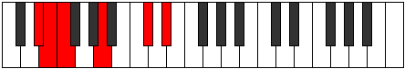 |
| [1099](https://ianring.com/musictheory/scales/1099) | [Dyritonic](ModeDSharpDyritonic.md) | D# | D#, E, F#, A, C#, D# |  |
| [1099](https://ianring.com/musictheory/scales/1099) | [Dyritonic](ModeEFlatDyritonic.md) | Eb | Eb, E, Gb, A, Db, Eb |  |
| [1103](https://ianring.com/musictheory/scales/1103) | [Lynimic](ModeDSharpLynimic.md) | D# | D#, E, F, Gb, A, B##, D# |  |
| [1103](https://ianring.com/musictheory/scales/1103) | [Lynimic](ModeEFlatLynimic.md) | Eb | Eb, Fb, Gbb, Abbb, Bbb, C#, Eb |  |
| [1107](https://ianring.com/musictheory/scales/1107) | [Mogitonic](ModeDSharpMogitonic.md) | D# | D#, E, G, A, C#, D# |  |
| [1107](https://ianring.com/musictheory/scales/1107) | [Mogitonic](ModeEFlatMogitonic.md) | Eb | Eb, E, G, A, Db, Eb |  |
| [1111](https://ianring.com/musictheory/scales/1111) | [Sycrimic](ModeDSharpSycrimic.md) | D# | D#, E, F, G, A, B##, D# |  |
| [1111](https://ianring.com/musictheory/scales/1111) | [Sycrimic](ModeEFlatSycrimic.md) | Eb | Eb, Fb, Gbb, Abb, Bbb, C#, Eb |  |
| [1115](https://ianring.com/musictheory/scales/1115) | [Locrimic](ModeDSharpLocrimic.md) | D# | D#, E, F#, G, A, B##, D# |  |
| [1115](https://ianring.com/musictheory/scales/1115) | [Locrimic](ModeEFlatLocrimic.md) | Eb | Eb, Fb, Gb, Abb, Bbb, C#, Eb |  |
| [1119](https://ianring.com/musictheory/scales/1119) | [Rarian](ModeDSharpRarian.md) | D# | D#, E, F, Gb, Abb, Bbb, C#, D# |  |
| [1119](https://ianring.com/musictheory/scales/1119) | [Rarian](ModeEFlatRarian.md) | Eb | Eb, Fb, Gbb, Abbb, E###, Cbbb, Db, Eb |  |
| [1123](https://ianring.com/musictheory/scales/1123) | [Lanitonic](ModeDSharpLanitonic.md) | D# | D#, E, G#, A, C#, D# |  |
| [1123](https://ianring.com/musictheory/scales/1123) | [Lanitonic](ModeEFlatLanitonic.md) | Eb | Eb, E, Ab, A, Db, Eb |  |
| [1125](https://ianring.com/musictheory/scales/1125) | [Ionaritonic](ModeBNaturalIonaritonic.md) | B | B, C#, E, F, A, B |  |
| [1127](https://ianring.com/musictheory/scales/1127) | [Eparimic](ModeDSharpEparimic.md) | D# | D#, E, F, G#, A, B##, D# |  |
| [1127](https://ianring.com/musictheory/scales/1127) | [Eparimic](ModeEFlatEparimic.md) | Eb | Eb, Fb, Gbb, Ab, Bbb, C#, Eb |  |
| [1127](https://ianring.com/musictheory/scales/1127) | [Eparimic](ModeBNaturalEparimic.md) | B | B, C, Db, E, F, G##, B |  |
| [1131](https://ianring.com/musictheory/scales/1131) | [Thocrimic](ModeDSharpThocrimic.md) | D# | D#, E, F#, G#, A, B##, D# |  |
| [1131](https://ianring.com/musictheory/scales/1131) | [Thocrimic](ModeEFlatThocrimic.md) | Eb | Eb, Fb, Gb, Ab, Bbb, C#, Eb |  |
| [1133](https://ianring.com/musictheory/scales/1133) | [Stycrimic](ModeBNaturalStycrimic.md) | B | B, C#, D, E, F, G##, B |  |
| [1135](https://ianring.com/musictheory/scales/1135) | [Katolian](ModeDSharpKatolian.md) | D# | D#, E, F, Gb, Ab, Bbb, C#, D# |  |
| [1135](https://ianring.com/musictheory/scales/1135) | [Katolian](ModeEFlatKatolian.md) | Eb | Eb, Fb, Gbb, Abbb, Bbbb, Cbbb, Db, Eb | 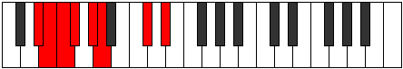 |
| [1135](https://ianring.com/musictheory/scales/1135) | [Katolian](ModeBNaturalKatolian.md) | B | B, C, Db, Ebb, Fb, Gbb, A, B |  |
| [1139](https://ianring.com/musictheory/scales/1139) | [Aerygimic](ModeDSharpAerygimic.md) | D# | D#, E, F##, G#, A, B##, D# |  |
| [1139](https://ianring.com/musictheory/scales/1139) | [Aerygimic](ModeEFlatAerygimic.md) | Eb | Eb, Fb, G, Ab, Bbb, C#, Eb |  |
| [1141](https://ianring.com/musictheory/scales/1141) | [Rynimic](ModeBNaturalRynimic.md) | B | B, C#, D#, E, F, G##, B |  |
| [1143](https://ianring.com/musictheory/scales/1143) | [Styrian](ModeDSharpStyrian.md) | D# | D#, E, F, G, Ab, Bbb, C#, D# |  |
| [1143](https://ianring.com/musictheory/scales/1143) | [Styrian](ModeEFlatStyrian.md) | Eb | Eb, Fb, Gbb, Abb, Bbbb, Cbbb, Db, Eb |  |
| [1143](https://ianring.com/musictheory/scales/1143) | [Styrian](ModeBNaturalStyrian.md) | B | B, C, Db, Eb, Fb, Gbb, A, B |  |
| [1147](https://ianring.com/musictheory/scales/1147) | [Epynian](ModeDSharpEpynian.md) | D# | D#, E, F#, G, Ab, Bbb, C#, D# |  |
| [1147](https://ianring.com/musictheory/scales/1147) | [Epynian](ModeEFlatEpynian.md) | Eb | Eb, Fb, Gb, Abb, Bbbb, Cbbb, Db, Eb |  |
| [1149](https://ianring.com/musictheory/scales/1149) | [Bydian](ModeBNaturalBydian.md) | B | B, C#, D, Eb, Fb, Gbb, A, B |  |
| [1151](https://ianring.com/musictheory/scales/1151) | [Mythyllic](ModeDSharpMythyllic.md) | D# | D#, E, F, F#, G, G#, A, C#, D# |  |
| [1151](https://ianring.com/musictheory/scales/1151) | [Mythyllic](ModeEFlatMythyllic.md) | Eb | Eb, E, F, Gb, G, Ab, A, Db, Eb |  |
| [1151](https://ianring.com/musictheory/scales/1151) | [Mythyllic](ModeBNaturalMythyllic.md) | B | B, C, C#, D, D#, E, F, A, B |  |
| [1161](https://ianring.com/musictheory/scales/1161) | [Eporic](ModeFSharpEporic.md) | F# | F#, A, C#, E, F# |  |
| [1161](https://ianring.com/musictheory/scales/1161) | [Eporic](ModeGFlatEporic.md) | Gb | Gb, A, Db, E, Gb |  |
| [1163](https://ianring.com/musictheory/scales/1163) | [Pagitonic](ModeFSharpPagitonic.md) | F# | F#, G, A, C#, E, F# |  |
| [1163](https://ianring.com/musictheory/scales/1163) | [Pagitonic](ModeGFlatPagitonic.md) | Gb | Gb, G, A, Db, E, Gb | 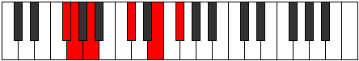 |
| [1165](https://ianring.com/musictheory/scales/1165) | [Gycritonic](ModeFSharpGycritonic.md) | F# | F#, G#, A, C#, E, F# |  |
| [1165](https://ianring.com/musictheory/scales/1165) | [Gycritonic](ModeGFlatGycritonic.md) | Gb | Gb, Ab, A, Db, E, Gb |  |
| [1167](https://ianring.com/musictheory/scales/1167) | [Aerodimic](ModeFSharpAerodimic.md) | F# | F#, G, Ab, Bbb, C#, D##, F# |  |
| [1167](https://ianring.com/musictheory/scales/1167) | [Aerodimic](ModeGFlatAerodimic.md) | Gb | Gb, Abb, Bbbb, Cbbb, Db, E, Gb |  |
| [1169](https://ianring.com/musictheory/scales/1169) | [Daric](ModeANaturalDaric.md) | A | A, C#, E, G, A |  |
| [1171](https://ianring.com/musictheory/scales/1171) | [Loptitonic](ModeANaturalLoptitonic.md) | A | A, A#, C#, E, G, A | 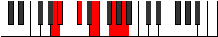 |
| [1173](https://ianring.com/musictheory/scales/1173) | [Phropitonic](ModeANaturalPhropitonic.md) | A | A, B, C#, E, G, A |  |
| [1175](https://ianring.com/musictheory/scales/1175) | [Epycrimic](ModeANaturalEpycrimic.md) | A | A, Bb, Cb, Db, E, F##, A |  |
| [1177](https://ianring.com/musictheory/scales/1177) | [Garitonic](ModeANaturalGaritonic.md) | A | A, C, C#, E, G, A |  |
| [1177](https://ianring.com/musictheory/scales/1177) | [Garitonic](ModeFSharpGaritonic.md) | F# | F#, A, A#, C#, E, F# |  |
| [1177](https://ianring.com/musictheory/scales/1177) | [Garitonic](ModeGFlatGaritonic.md) | Gb | Gb, A, Bb, Db, E, Gb |  |
| [1179](https://ianring.com/musictheory/scales/1179) | [Sonimic](ModeANaturalSonimic.md) | A | A, Bb, C, Db, E, F##, A |  |
| [1179](https://ianring.com/musictheory/scales/1179) | [Sonimic](ModeFSharpSonimic.md) | F# | F#, G, A, Bb, C#, D##, F# |  |
| [1179](https://ianring.com/musictheory/scales/1179) | [Sonimic](ModeGFlatSonimic.md) | Gb | Gb, Abb, Bbb, Cbb, Db, E, Gb |  |
| [1181](https://ianring.com/musictheory/scales/1181) | [Katagimic](ModeFSharpKatagimic.md) | F# | F#, G#, A, Bb, C#, D##, F# |  |
| [1181](https://ianring.com/musictheory/scales/1181) | [Katagimic](ModeGFlatKatagimic.md) | Gb | Gb, Ab, Bbb, Cbb, Db, E, Gb | 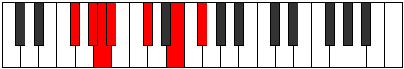 |
| [1181](https://ianring.com/musictheory/scales/1181) | [Katagimic](ModeANaturalKatagimic.md) | A | A, B, C, Db, E, F##, A |  |
| [1183](https://ianring.com/musictheory/scales/1183) | [Sadian](ModeFSharpSadian.md) | F# | F#, G, Ab, Bbb, Cbb, Db, E, F# |  |
| [1183](https://ianring.com/musictheory/scales/1183) | [Sadian](ModeGFlatSadian.md) | Gb | Gb, Abb, Bbbb, Cbbb, Cbb, Db, E, Gb |  |
| [1183](https://ianring.com/musictheory/scales/1183) | [Sadian](ModeANaturalSadian.md) | A | A, Bb, Cb, Dbb, Ebbb, Fb, G, A |  |
| [1189](https://ianring.com/musictheory/scales/1189) | [Thaptitonic](ModeBNaturalThaptitonic.md) | B | B, C#, E, F#, A, B |  |
| [1191](https://ianring.com/musictheory/scales/1191) | [Pyrimic](ModeBNaturalPyrimic.md) | B | B, C, Db, E, F#, G##, B |  |
| [1193](https://ianring.com/musictheory/scales/1193) | [Rocritonic](ModeFSharpRocritonic.md) | F# | F#, A, B, C#, E, F# |  |
| [1193](https://ianring.com/musictheory/scales/1193) | [Rocritonic](ModeGFlatRocritonic.md) | Gb | Gb, A, B, Db, E, Gb |  |
| [1195](https://ianring.com/musictheory/scales/1195) | [Sarimic](ModeFSharpSarimic.md) | F# | F#, G, A, B, C#, D##, F# |  |
| [1195](https://ianring.com/musictheory/scales/1195) | [Sarimic](ModeGFlatSarimic.md) | Gb | Gb, Abb, Bbb, Cb, Db, E, Gb | 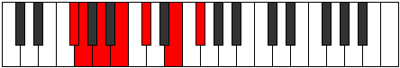 |
| [1197](https://ianring.com/musictheory/scales/1197) | [Rocrimic](ModeBNaturalRocrimic.md) | B | B, C#, D, E, F#, G##, B |  |
| [1197](https://ianring.com/musictheory/scales/1197) | [Rocrimic](ModeFSharpRocrimic.md) | F# | F#, G#, A, B, C#, D##, F# |  |
| [1197](https://ianring.com/musictheory/scales/1197) | [Rocrimic](ModeGFlatRocrimic.md) | Gb | Gb, Ab, Bbb, Cb, Db, E, Gb |  |
| [1199](https://ianring.com/musictheory/scales/1199) | [Magian](ModeBNaturalMagian.md) | B | B, C, Db, Ebb, Fb, Gb, A, B |  |
| [1199](https://ianring.com/musictheory/scales/1199) | [Magian](ModeFSharpMagian.md) | F# | F#, G, Ab, Bbb, Cb, Db, E, F# |  |
| [1201](https://ianring.com/musictheory/scales/1201) | [Aeracritonic](ModeANaturalAeracritonic.md) | A | A, C#, D, E, G, A | 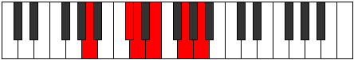 |
| [1203](https://ianring.com/musictheory/scales/1203) | [Pagimic](ModeANaturalPagimic.md) | A | A, Bb, C#, D, E, F##, A |  |
| [1205](https://ianring.com/musictheory/scales/1205) | [Ionycrimic](ModeBNaturalIonycrimic.md) | B | B, C#, D#, E, F#, G##, B |  |
| [1205](https://ianring.com/musictheory/scales/1205) | [Ionycrimic](ModeANaturalIonycrimic.md) | A | A, B, C#, D, E, F##, A |  |
| [1207](https://ianring.com/musictheory/scales/1207) | [Aeoloptian](ModeBNaturalAeoloptian.md) | B | B, C, Db, Eb, Fb, Gb, A, B |  |
| [1207](https://ianring.com/musictheory/scales/1207) | [Aeoloptian](ModeANaturalAeoloptian.md) | A | A, Bb, Cb, Db, Ebb, Fb, G, A |  |
| [1209](https://ianring.com/musictheory/scales/1209) | [Ionynimic](ModeANaturalIonynimic.md) | A | A, B#, C#, D, E, F##, A |  |
| [1209](https://ianring.com/musictheory/scales/1209) | [Ionynimic](ModeFSharpIonynimic.md) | F# | F#, G##, A#, B, C#, D##, F# |  |
| [1209](https://ianring.com/musictheory/scales/1209) | [Ionynimic](ModeGFlatIonynimic.md) | Gb | Gb, A, Bb, Cb, Db, E, Gb |  |
| [1211](https://ianring.com/musictheory/scales/1211) | [Zadian](ModeANaturalZadian.md) | A | A, Bb, C, Db, Ebb, Fb, G, A |  |
| [1211](https://ianring.com/musictheory/scales/1211) | [Zadian](ModeFSharpZadian.md) | F# | F#, G, A, Bb, Cb, Db, E, F# |  |
| [1213](https://ianring.com/musictheory/scales/1213) | [Gyrian](ModeBNaturalGyrian.md) | B | B, C#, D, Eb, Fb, Gb, A, B |  |
| [1213](https://ianring.com/musictheory/scales/1213) | [Gyrian](ModeANaturalGyrian.md) | A | A, B, C, Db, Ebb, Fb, G, A |  |
| [1213](https://ianring.com/musictheory/scales/1213) | [Gyrian](ModeFSharpGyrian.md) | F# | F#, G#, A, Bb, Cb, Db, E, F# |  |
| [1215](https://ianring.com/musictheory/scales/1215) | [Aeolanyllic](ModeBNaturalAeolanyllic.md) | B | B, C, C#, D, D#, E, F#, A, B |  |
| [1215](https://ianring.com/musictheory/scales/1215) | [Aeolanyllic](ModeANaturalAeolanyllic.md) | A | A, A#, B, C, C#, D, E, G, A |  |
| [1215](https://ianring.com/musictheory/scales/1215) | [Aeolanyllic](ModeFSharpAeolanyllic.md) | F# | F#, G, G#, A, A#, B, C#, E, F# |  |
| [1215](https://ianring.com/musictheory/scales/1215) | [Aeolanyllic](ModeGFlatAeolanyllic.md) | Gb | Gb, G, Ab, A, Bb, B, Db, E, Gb |  |
| [1223](https://ianring.com/musictheory/scales/1223) | [Phryptimic](ModeDSharpPhryptimic.md) | D# | D#, E, F, G##, A#, B##, D# |  |
| [1223](https://ianring.com/musictheory/scales/1223) | [Phryptimic](ModeEFlatPhryptimic.md) | Eb | Eb, Fb, Gbb, A, Bb, C#, Eb |  |
| [1225](https://ianring.com/musictheory/scales/1225) | [Lyditonic](ModeFSharpLyditonic.md) | F# | F#, A, C, C#, E, F# |  |
| [1225](https://ianring.com/musictheory/scales/1225) | [Lyditonic](ModeGFlatLyditonic.md) | Gb | Gb, A, C, Db, E, Gb |  |
| [1227](https://ianring.com/musictheory/scales/1227) | [Thacrimic](ModeFSharpThacrimic.md) | F# | F#, G, A, B#, C#, D##, F# |  |
| [1227](https://ianring.com/musictheory/scales/1227) | [Thacrimic](ModeGFlatThacrimic.md) | Gb | Gb, Abb, Bbb, C, Db, E, Gb |  |
| [1227](https://ianring.com/musictheory/scales/1227) | [Thacrimic](ModeDSharpThacrimic.md) | D# | D#, E, F#, G##, A#, B##, D# |  |
| [1227](https://ianring.com/musictheory/scales/1227) | [Thacrimic](ModeEFlatThacrimic.md) | Eb | Eb, Fb, Gb, A, Bb, C#, Eb |  |
| [1229](https://ianring.com/musictheory/scales/1229) | [Ragimic](ModeFSharpRagimic.md) | F# | F#, G#, A, B#, C#, D##, F# |  |
| [1229](https://ianring.com/musictheory/scales/1229) | [Ragimic](ModeGFlatRagimic.md) | Gb | Gb, Ab, Bbb, C, Db, E, Gb |  |
| [1231](https://ianring.com/musictheory/scales/1231) | [Logian](ModeFSharpLogian.md) | F# | F#, G, Ab, Bbb, C, Db, E, F# |  |
| [1231](https://ianring.com/musictheory/scales/1231) | [Logian](ModeDSharpLogian.md) | D# | D#, E, F, Gb, A, Bb, C#, D# |  |
| [1231](https://ianring.com/musictheory/scales/1231) | [Logian](ModeEFlatLogian.md) | Eb | Eb, Fb, Gbb, Abbb, Bbb, Cbb, Db, Eb |  |
| [1233](https://ianring.com/musictheory/scales/1233) | [Ionoditonic](ModeANaturalIonoditonic.md) | A | A, C#, D#, E, G, A |  |
| [1235](https://ianring.com/musictheory/scales/1235) | [Stylimic](ModeDSharpStylimic.md) | D# | D#, E, F##, G##, A#, B##, D# |  |
| [1235](https://ianring.com/musictheory/scales/1235) | [Stylimic](ModeEFlatStylimic.md) | Eb | Eb, Fb, G, A, Bb, C#, Eb |  |
| [1235](https://ianring.com/musictheory/scales/1235) | [Stylimic](ModeANaturalStylimic.md) | A | A, Bb, C#, D#, E, F##, A | 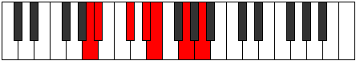 |
| [1237](https://ianring.com/musictheory/scales/1237) | [Salimic](ModeANaturalSalimic.md) | A | A, B, C#, D#, E, F##, A |  |
| [1239](https://ianring.com/musictheory/scales/1239) | [Epaptian](ModeDSharpEpaptian.md) | D# | D#, E, F, G, A, Bb, C#, D# |  |
| [1239](https://ianring.com/musictheory/scales/1239) | [Epaptian](ModeEFlatEpaptian.md) | Eb | Eb, Fb, Gbb, Abb, Bbb, Cbb, Db, Eb |  |
| [1239](https://ianring.com/musictheory/scales/1239) | [Epaptian](ModeANaturalEpaptian.md) | A | A, Bb, Cb, Db, Eb, Fb, G, A |  |
| [1241](https://ianring.com/musictheory/scales/1241) | [Pygimic](ModeANaturalPygimic.md) | A | A, B#, C#, D#, E, F##, A |  |
| [1241](https://ianring.com/musictheory/scales/1241) | [Pygimic](ModeFSharpPygimic.md) | F# | F#, G##, A#, B#, C#, D##, F# |  |
| [1241](https://ianring.com/musictheory/scales/1241) | [Pygimic](ModeGFlatPygimic.md) | Gb | Gb, A, Bb, C, Db, E, Gb |  |
| [1243](https://ianring.com/musictheory/scales/1243) | [Epylian](ModeANaturalEpylian.md) | A | A, Bb, C, Db, Eb, Fb, G, A |  |
| [1243](https://ianring.com/musictheory/scales/1243) | [Epylian](ModeFSharpEpylian.md) | F# | F#, G, A, Bb, C, Db, E, F# |  |
| [1243](https://ianring.com/musictheory/scales/1243) | [Epylian](ModeDSharpEpylian.md) | D# | D#, E, F#, G, A, Bb, C#, D# |  |
| [1243](https://ianring.com/musictheory/scales/1243) | [Epylian](ModeEFlatEpylian.md) | Eb | Eb, Fb, Gb, Abb, Bbb, Cbb, Db, Eb |  |
| [1245](https://ianring.com/musictheory/scales/1245) | [Lathian](ModeFSharpLathian.md) | F# | F#, G#, A, Bb, C, Db, E, F# |  |
| [1245](https://ianring.com/musictheory/scales/1245) | [Lathian](ModeANaturalLathian.md) | A | A, B, C, Db, Eb, Fb, G, A |  |
| [1247](https://ianring.com/musictheory/scales/1247) | [Mygyllic](ModeDSharpMygyllic.md) | D# | D#, E, F, F#, G, A, A#, C#, D# |  |
| [1247](https://ianring.com/musictheory/scales/1247) | [Mygyllic](ModeEFlatMygyllic.md) | Eb | Eb, E, F, Gb, G, A, Bb, Db, Eb |  |
| [1247](https://ianring.com/musictheory/scales/1247) | [Mygyllic](ModeFSharpMygyllic.md) | F# | F#, G, G#, A, A#, C, C#, E, F# |  |
| [1247](https://ianring.com/musictheory/scales/1247) | [Mygyllic](ModeGFlatMygyllic.md) | Gb | Gb, G, Ab, A, Bb, C, Db, E, Gb |  |
| [1247](https://ianring.com/musictheory/scales/1247) | [Mygyllic](ModeANaturalMygyllic.md) | A | A, A#, B, C, C#, D#, E, G, A |  |
| [1251](https://ianring.com/musictheory/scales/1251) | [Sylimic](ModeDSharpSylimic.md) | D# | D#, E, F###, G##, A#, B##, D# |  |
| [1251](https://ianring.com/musictheory/scales/1251) | [Sylimic](ModeEFlatSylimic.md) | Eb | Eb, Fb, G#, A, Bb, C#, Eb |  |
| [1253](https://ianring.com/musictheory/scales/1253) | [Zolimic](ModeBNaturalZolimic.md) | B | B, C#, D##, E#, F#, G##, B |  |
| [1255](https://ianring.com/musictheory/scales/1255) | [Sogian](ModeDSharpSogian.md) | D# | D#, E, F, G#, A, Bb, C#, D# |  |
| [1255](https://ianring.com/musictheory/scales/1255) | [Sogian](ModeEFlatSogian.md) | Eb | Eb, Fb, Gbb, Ab, Bbb, Cbb, Db, Eb |  |
| [1255](https://ianring.com/musictheory/scales/1255) | [Sogian](ModeBNaturalSogian.md) | B | B, C, Db, E, F, Gb, A, B |  |
| [1257](https://ianring.com/musictheory/scales/1257) | [Aeolyphimic](ModeFSharpAeolyphimic.md) | F# | F#, G##, A##, B#, C#, D##, F# |  |
| [1257](https://ianring.com/musictheory/scales/1257) | [Aeolyphimic](ModeGFlatAeolyphimic.md) | Gb | Gb, A, B, C, Db, E, Gb |  |
| [1259](https://ianring.com/musictheory/scales/1259) | [Stadian](ModeDSharpStadian.md) | D# | D#, E, F#, G#, A, Bb, C#, D# |  |
| [1259](https://ianring.com/musictheory/scales/1259) | [Stadian](ModeEFlatStadian.md) | Eb | Eb, Fb, Gb, Ab, Bbb, Cbb, Db, Eb |  |
| [1259](https://ianring.com/musictheory/scales/1259) | [Stadian](ModeFSharpStadian.md) | F# | F#, G, A, B, C, Db, E, F# |  |
| [1261](https://ianring.com/musictheory/scales/1261) | [Aeodian](ModeBNaturalAeodian.md) | B | B, C#, D, E, F, Gb, A, B |  |
| [1261](https://ianring.com/musictheory/scales/1261) | [Aeodian](ModeFSharpAeodian.md) | F# | F#, G#, A, B, C, Db, E, F# |  |
| [1263](https://ianring.com/musictheory/scales/1263) | [Stynyllic](ModeDSharpStynyllic.md) | D# | D#, E, F, F#, G#, A, A#, C#, D# |  |
| [1263](https://ianring.com/musictheory/scales/1263) | [Stynyllic](ModeEFlatStynyllic.md) | Eb | Eb, E, F, Gb, Ab, A, Bb, Db, Eb |  |
| [1263](https://ianring.com/musictheory/scales/1263) | [Stynyllic](ModeBNaturalStynyllic.md) | B | B, C, C#, D, E, F, F#, A, B |  |
| [1263](https://ianring.com/musictheory/scales/1263) | [Stynyllic](ModeFSharpStynyllic.md) | F# | F#, G, G#, A, B, C, C#, E, F# |  |
| [1263](https://ianring.com/musictheory/scales/1263) | [Stynyllic](ModeGFlatStynyllic.md) | Gb | Gb, G, Ab, A, B, C, Db, E, Gb |  |
| [1265](https://ianring.com/musictheory/scales/1265) | [Pynimic](ModeANaturalPynimic.md) | A | A, B##, C##, D#, E, F##, A |  |
| [1267](https://ianring.com/musictheory/scales/1267) | [Katynian](ModeANaturalKatynian.md) | A | A, Bb, C#, D, Eb, Fb, G, A |  |
| [1267](https://ianring.com/musictheory/scales/1267) | [Katynian](ModeDSharpKatynian.md) | D# | D#, E, F##, G#, A, Bb, C#, D# |  |
| [1267](https://ianring.com/musictheory/scales/1267) | [Katynian](ModeEFlatKatynian.md) | Eb | Eb, Fb, G, Ab, Bbb, Cbb, Db, Eb |  |
| [1269](https://ianring.com/musictheory/scales/1269) | [Katythian](ModeBNaturalKatythian.md) | B | B, C#, D#, E, F, Gb, A, B |  |
| [1269](https://ianring.com/musictheory/scales/1269) | [Katythian](ModeANaturalKatythian.md) | A | A, B, C#, D, Eb, Fb, G, A |  |
| [1271](https://ianring.com/musictheory/scales/1271) | [Kolyllic](ModeDSharpKolyllic.md) | D# | D#, E, F, G, G#, A, A#, C#, D# |  |
| [1271](https://ianring.com/musictheory/scales/1271) | [Kolyllic](ModeEFlatKolyllic.md) | Eb | Eb, E, F, G, Ab, A, Bb, Db, Eb |  |
| [1271](https://ianring.com/musictheory/scales/1271) | [Kolyllic](ModeBNaturalKolyllic.md) | B | B, C, C#, D#, E, F, F#, A, B |  |
| [1271](https://ianring.com/musictheory/scales/1271) | [Kolyllic](ModeANaturalKolyllic.md) | A | A, A#, B, C#, D, D#, E, G, A |  |
| [1273](https://ianring.com/musictheory/scales/1273) | [Ronian](ModeANaturalRonian.md) | A | A, B#, C#, D, Eb, Fb, G, A |  |
| [1273](https://ianring.com/musictheory/scales/1273) | [Ronian](ModeFSharpRonian.md) | F# | F#, G##, A#, B, C, Db, E, F# |  |
| [1273](https://ianring.com/musictheory/scales/1273) | [Ronian](ModeGFlatRonian.md) | Gb | Gb, A, Bb, Cb, Dbb, Ebbb, Fb, Gb |  |
| [1275](https://ianring.com/musictheory/scales/1275) | [Stagyllic](ModeANaturalStagyllic.md) | A | A, A#, C, C#, D, D#, E, G, A |  |
| [1275](https://ianring.com/musictheory/scales/1275) | [Stagyllic](ModeDSharpStagyllic.md) | D# | D#, E, F#, G, G#, A, A#, C#, D# |  |
| [1275](https://ianring.com/musictheory/scales/1275) | [Stagyllic](ModeEFlatStagyllic.md) | Eb | Eb, E, Gb, G, Ab, A, Bb, Db, Eb |  |
| [1275](https://ianring.com/musictheory/scales/1275) | [Stagyllic](ModeFSharpStagyllic.md) | F# | F#, G, A, A#, B, C, C#, E, F# |  |
| [1275](https://ianring.com/musictheory/scales/1275) | [Stagyllic](ModeGFlatStagyllic.md) | Gb | Gb, G, A, Bb, B, C, Db, E, Gb |  |
| [1277](https://ianring.com/musictheory/scales/1277) | [Zadyllic](ModeBNaturalZadyllic.md) | B | B, C#, D, D#, E, F, F#, A, B |  |
| [1277](https://ianring.com/musictheory/scales/1277) | [Zadyllic](ModeANaturalZadyllic.md) | A | A, B, C, C#, D, D#, E, G, A |  |
| [1277](https://ianring.com/musictheory/scales/1277) | [Zadyllic](ModeFSharpZadyllic.md) | F# | F#, G#, A, A#, B, C, C#, E, F# |  |
| [1277](https://ianring.com/musictheory/scales/1277) | [Zadyllic](ModeGFlatZadyllic.md) | Gb | Gb, Ab, A, Bb, B, C, Db, E, Gb |  |
| [1279](https://ianring.com/musictheory/scales/1279) | [Sarygic](ModeDSharpSarygic.md) | D# | D#, E, F, F#, G, G#, A, A#, C#, D# |  |
| [1279](https://ianring.com/musictheory/scales/1279) | [Sarygic](ModeEFlatSarygic.md) | Eb | Eb, E, F, Gb, G, Ab, A, Bb, Db, Eb |  |
| [1279](https://ianring.com/musictheory/scales/1279) | [Sarygic](ModeBNaturalSarygic.md) | B | B, C, C#, D, D#, E, F, F#, A, B |  |
| [1279](https://ianring.com/musictheory/scales/1279) | [Sarygic](ModeANaturalSarygic.md) | A | A, A#, B, C, C#, D, D#, E, G, A | 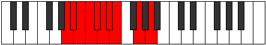 |
| [1279](https://ianring.com/musictheory/scales/1279) | [Sarygic](ModeFSharpSarygic.md) | F# | F#, G, G#, A, A#, B, C, C#, E, F# |  |
| [1279](https://ianring.com/musictheory/scales/1279) | [Sarygic](ModeGFlatSarygic.md) | Gb | Gb, G, Ab, A, Bb, B, C, Db, E, Gb |  |
| [1305](https://ianring.com/musictheory/scales/1305) | [Dynitonic](ModeCSharpDynitonic.md) | C# | C#, E, F, A, B, C# |  |
| [1305](https://ianring.com/musictheory/scales/1305) | [Dynitonic](ModeDFlatDynitonic.md) | Db | Db, E, F, A, B, Db | 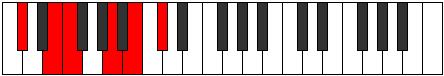 |
| [1307](https://ianring.com/musictheory/scales/1307) | [Katorimic](ModeCSharpKatorimic.md) | C# | C#, D, E, F, G##, A##, C# |  |
| [1307](https://ianring.com/musictheory/scales/1307) | [Katorimic](ModeDFlatKatorimic.md) | Db | Db, Ebb, Fb, Gbb, A, B, Db |  |
| [1309](https://ianring.com/musictheory/scales/1309) | [Pogimic](ModeCSharpPogimic.md) | C# | C#, D#, E, F, G##, A##, C# |  |
| [1309](https://ianring.com/musictheory/scales/1309) | [Pogimic](ModeDFlatPogimic.md) | Db | Db, Eb, Fb, Gbb, A, B, Db |  |
| [1311](https://ianring.com/musictheory/scales/1311) | [Bynian](ModeCSharpBynian.md) | C# | C#, D, Eb, Fb, Gbb, A, B, C# |  |
| [1311](https://ianring.com/musictheory/scales/1311) | [Bynian](ModeDFlatBynian.md) | Db | Db, Ebb, Fbb, Gbbb, D###, Cbbb, Dbbb, Db |  |
| [1315](https://ianring.com/musictheory/scales/1315) | [Pyritonic](ModeGSharpPyritonic.md) | G# | G#, A, C#, E, F#, G# |  |
| [1315](https://ianring.com/musictheory/scales/1315) | [Pyritonic](ModeAFlatPyritonic.md) | Ab | Ab, A, Db, E, Gb, Ab |  |
| [1317](https://ianring.com/musictheory/scales/1317) | [Staditonic](ModeBNaturalStaditonic.md) | B | B, C#, E, G, A, B |  |
| [1319](https://ianring.com/musictheory/scales/1319) | [Phronimic](ModeGSharpPhronimic.md) | G# | G#, A, Bb, C#, D##, E##, G# |  |
| [1319](https://ianring.com/musictheory/scales/1319) | [Phronimic](ModeAFlatPhronimic.md) | Ab | Ab, Bbb, Cbb, Db, E, F#, Ab |  |
| [1319](https://ianring.com/musictheory/scales/1319) | [Phronimic](ModeBNaturalPhronimic.md) | B | B, C, Db, E, F##, G##, B |  |
| [1321](https://ianring.com/musictheory/scales/1321) | [Epathitonic](ModeCSharpEpathitonic.md) | C# | C#, E, F#, A, B, C# |  |
| [1321](https://ianring.com/musictheory/scales/1321) | [Epathitonic](ModeDFlatEpathitonic.md) | Db | Db, E, Gb, A, B, Db |  |
| [1323](https://ianring.com/musictheory/scales/1323) | [Eporimic](ModeCSharpEporimic.md) | C# | C#, D, E, F#, G##, A##, C# |  |
| [1323](https://ianring.com/musictheory/scales/1323) | [Eporimic](ModeDFlatEporimic.md) | Db | Db, Ebb, Fb, Gb, A, B, Db |  |
| [1323](https://ianring.com/musictheory/scales/1323) | [Eporimic](ModeGSharpEporimic.md) | G# | G#, A, B, C#, D##, E##, G# |  |
| [1323](https://ianring.com/musictheory/scales/1323) | [Eporimic](ModeAFlatEporimic.md) | Ab | Ab, Bbb, Cb, Db, E, F#, Ab |  |
| [1325](https://ianring.com/musictheory/scales/1325) | [Phradimic](ModeCSharpPhradimic.md) | C# | C#, D#, E, F#, G##, A##, C# |  |
| [1325](https://ianring.com/musictheory/scales/1325) | [Phradimic](ModeDFlatPhradimic.md) | Db | Db, Eb, Fb, Gb, A, B, Db |  |
| [1325](https://ianring.com/musictheory/scales/1325) | [Phradimic](ModeBNaturalPhradimic.md) | B | B, C#, D, E, F##, G##, B |  |
| [1327](https://ianring.com/musictheory/scales/1327) | [Zalian](ModeCSharpZalian.md) | C# | C#, D, Eb, Fb, Gb, A, B, C# |  |
| [1327](https://ianring.com/musictheory/scales/1327) | [Zalian](ModeDFlatZalian.md) | Db | Db, Ebb, Fbb, Gbbb, Abbb, Bbb, Cb, Db |  |
| [1327](https://ianring.com/musictheory/scales/1327) | [Zalian](ModeBNaturalZalian.md) | B | B, C, Db, Ebb, Fb, G, A, B |  |
| [1327](https://ianring.com/musictheory/scales/1327) | [Zalian](ModeGSharpZalian.md) | G# | G#, A, Bb, Cb, Db, E, F#, G# |  |
| [1331](https://ianring.com/musictheory/scales/1331) | [Dolimic](ModeGSharpDolimic.md) | G# | G#, A, B#, C#, D##, E##, G# |  |
| [1331](https://ianring.com/musictheory/scales/1331) | [Dolimic](ModeAFlatDolimic.md) | Ab | Ab, Bbb, C, Db, E, F#, Ab |  |
| [1333](https://ianring.com/musictheory/scales/1333) | [Lyptimic](ModeBNaturalLyptimic.md) | B | B, C#, D#, E, F##, G##, B |  |
| [1335](https://ianring.com/musictheory/scales/1335) | [Aeralian](ModeGSharpAeralian.md) | G# | G#, A, Bb, C, Db, E, F#, G# |  |
| [1335](https://ianring.com/musictheory/scales/1335) | [Aeralian](ModeBNaturalAeralian.md) | B | B, C, Db, Eb, Fb, G, A, B |  |
| [1337](https://ianring.com/musictheory/scales/1337) | [Epogimic](ModeCSharpEpogimic.md) | C# | C#, D##, E#, F#, G##, A##, C# |  |
| [1337](https://ianring.com/musictheory/scales/1337) | [Epogimic](ModeDFlatEpogimic.md) | Db | Db, E, F, Gb, A, B, Db | 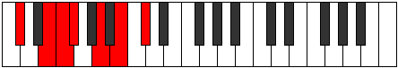 |
| [1339](https://ianring.com/musictheory/scales/1339) | [Kycrian](ModeCSharpKycrian.md) | C# | C#, D, E, F, Gb, A, B, C# |  |
| [1339](https://ianring.com/musictheory/scales/1339) | [Kycrian](ModeDFlatKycrian.md) | Db | Db, Ebb, Fb, Gbb, Abbb, Bbb, Cb, Db |  |
| [1339](https://ianring.com/musictheory/scales/1339) | [Kycrian](ModeGSharpKycrian.md) | G# | G#, A, B, C, Db, E, F#, G# |  |
| [1341](https://ianring.com/musictheory/scales/1341) | [Madian](ModeCSharpMadian.md) | C# | C#, D#, E, F, Gb, A, B, C# |  |
| [1341](https://ianring.com/musictheory/scales/1341) | [Madian](ModeDFlatMadian.md) | Db | Db, Eb, Fb, Gbb, Abbb, Bbb, Cb, Db |  |
| [1341](https://ianring.com/musictheory/scales/1341) | [Madian](ModeBNaturalMadian.md) | B | B, C#, D, Eb, Fb, G, A, B |  |
| [1343](https://ianring.com/musictheory/scales/1343) | [Zalyllic](ModeCSharpZalyllic.md) | C# | C#, D, D#, E, F, F#, A, B, C# |  |
| [1343](https://ianring.com/musictheory/scales/1343) | [Zalyllic](ModeDFlatZalyllic.md) | Db | Db, D, Eb, E, F, Gb, A, B, Db |  |
| [1343](https://ianring.com/musictheory/scales/1343) | [Zalyllic](ModeBNaturalZalyllic.md) | B | B, C, C#, D, D#, E, G, A, B |  |
| [1343](https://ianring.com/musictheory/scales/1343) | [Zalyllic](ModeGSharpZalyllic.md) | G# | G#, A, A#, B, C, C#, E, F#, G# |  |
| [1343](https://ianring.com/musictheory/scales/1343) | [Zalyllic](ModeAFlatZalyllic.md) | Ab | Ab, A, Bb, B, C, Db, E, Gb, Ab |  |
| [1351](https://ianring.com/musictheory/scales/1351) | [Aeraptimic](ModeDSharpAeraptimic.md) | D# | D#, E, F, G##, A##, B##, D# |  |
| [1351](https://ianring.com/musictheory/scales/1351) | [Aeraptimic](ModeEFlatAeraptimic.md) | Eb | Eb, Fb, Gbb, A, B, C#, Eb |  |
| [1353](https://ianring.com/musictheory/scales/1353) | [Kataritonic](ModeCSharpKataritonic.md) | C# | C#, E, G, A, B, C# |  |
| [1353](https://ianring.com/musictheory/scales/1353) | [Kataritonic](ModeDFlatKataritonic.md) | Db | Db, E, G, A, B, Db |  |
| [1355](https://ianring.com/musictheory/scales/1355) | [Aeolorimic](ModeDSharpAeolorimic.md) | D# | D#, E, F#, G##, A##, B##, D# |  |
| [1355](https://ianring.com/musictheory/scales/1355) | [Aeolorimic](ModeEFlatAeolorimic.md) | Eb | Eb, Fb, Gb, A, B, C#, Eb |  |
| [1355](https://ianring.com/musictheory/scales/1355) | [Aeolorimic](ModeCSharpAeolorimic.md) | C# | C#, D, E, F##, G##, A##, C# |  |
| [1355](https://ianring.com/musictheory/scales/1355) | [Aeolorimic](ModeDFlatAeolorimic.md) | Db | Db, Ebb, Fb, G, A, B, Db |  |
| [1357](https://ianring.com/musictheory/scales/1357) | [Katonimic](ModeCSharpKatonimic.md) | C# | C#, D#, E, F##, G##, A##, C# |  |
| [1357](https://ianring.com/musictheory/scales/1357) | [Katonimic](ModeDFlatKatonimic.md) | Db | Db, Eb, Fb, G, A, B, Db |  |
| [1359](https://ianring.com/musictheory/scales/1359) | [Aerygian](ModeDSharpAerygian.md) | D# | D#, E, F, Gb, A, B, C#, D# |  |
| [1359](https://ianring.com/musictheory/scales/1359) | [Aerygian](ModeEFlatAerygian.md) | Eb | Eb, Fb, Gbb, Abbb, Bbb, Cb, Db, Eb |  |
| [1359](https://ianring.com/musictheory/scales/1359) | [Aerygian](ModeCSharpAerygian.md) | C# | C#, D, Eb, Fb, G, A, B, C# |  |
| [1359](https://ianring.com/musictheory/scales/1359) | [Aerygian](ModeDFlatAerygian.md) | Db | Db, Ebb, Fbb, Gbbb, Abb, Bbb, Cb, Db |  |
| [1363](https://ianring.com/musictheory/scales/1363) | [Gygimic](ModeDSharpGygimic.md) | D# | D#, E, F##, G##, A##, B##, D# |  |
| [1363](https://ianring.com/musictheory/scales/1363) | [Gygimic](ModeEFlatGygimic.md) | Eb | Eb, Fb, G, A, B, C#, Eb |  |
| [1367](https://ianring.com/musictheory/scales/1367) | [Pyptian](ModeDSharpPyptian.md) | D# | D#, E, F, G, A, B, C#, D# |  |
| [1367](https://ianring.com/musictheory/scales/1367) | [Pyptian](ModeEFlatPyptian.md) | Eb | Eb, Fb, Gbb, Abb, Bbb, Cb, Db, Eb |  |
| [1369](https://ianring.com/musictheory/scales/1369) | [Boptimic](ModeCSharpBoptimic.md) | C# | C#, D##, E#, F##, G##, A##, C# |  |
| [1369](https://ianring.com/musictheory/scales/1369) | [Boptimic](ModeDFlatBoptimic.md) | Db | Db, E, F, G, A, B, Db |  |
| [1371](https://ianring.com/musictheory/scales/1371) | [Ionadian](ModeCSharpIonadian.md) | C# | C#, D, E, F, G, A, B, C# |  |
| [1371](https://ianring.com/musictheory/scales/1371) | [Ionadian](ModeDFlatIonadian.md) | Db | Db, Ebb, Fb, Gbb, Abb, Bbb, Cb, Db |  |
| [1371](https://ianring.com/musictheory/scales/1371) | [Ionadian](ModeDSharpIonadian.md) | D# | D#, E, F#, G, A, B, C#, D# |  |
| [1371](https://ianring.com/musictheory/scales/1371) | [Ionadian](ModeEFlatIonadian.md) | Eb | Eb, Fb, Gb, Abb, Bbb, Cb, Db, Eb |  |
| [1373](https://ianring.com/musictheory/scales/1373) | [Storian](ModeCSharpStorian.md) | C# | C#, D#, E, F, G, A, B, C# |  |
| [1373](https://ianring.com/musictheory/scales/1373) | [Storian](ModeDFlatStorian.md) | Db | Db, Eb, Fb, Gbb, Abb, Bbb, Cb, Db |  |
| [1375](https://ianring.com/musictheory/scales/1375) | [Bothyllic](ModeCSharpBothyllic.md) | C# | C#, D, D#, E, F, G, A, B, C# |  |
| [1375](https://ianring.com/musictheory/scales/1375) | [Bothyllic](ModeDFlatBothyllic.md) | Db | Db, D, Eb, E, F, G, A, B, Db |  |
| [1375](https://ianring.com/musictheory/scales/1375) | [Bothyllic](ModeDSharpBothyllic.md) | D# | D#, E, F, F#, G, A, B, C#, D# |  |
| [1375](https://ianring.com/musictheory/scales/1375) | [Bothyllic](ModeEFlatBothyllic.md) | Eb | Eb, E, F, Gb, G, A, B, Db, Eb |  |
| [1379](https://ianring.com/musictheory/scales/1379) | [Kycrimic](ModeGSharpKycrimic.md) | G# | G#, A, B##, C##, D##, E##, G# |  |
| [1379](https://ianring.com/musictheory/scales/1379) | [Kycrimic](ModeAFlatKycrimic.md) | Ab | Ab, Bbb, C#, D, E, F#, Ab |  |
| [1379](https://ianring.com/musictheory/scales/1379) | [Kycrimic](ModeDSharpKycrimic.md) | D# | D#, E, F###, G##, A##, B##, D# |  |
| [1379](https://ianring.com/musictheory/scales/1379) | [Kycrimic](ModeEFlatKycrimic.md) | Eb | Eb, Fb, G#, A, B, C#, Eb |  |
| [1381](https://ianring.com/musictheory/scales/1381) | [Padimic](ModeBNaturalPadimic.md) | B | B, C#, D##, E#, F##, G##, B |  |
| [1383](https://ianring.com/musictheory/scales/1383) | [Pynian](ModeGSharpPynian.md) | G# | G#, A, Bb, C#, D, E, F#, G# |  |
| [1383](https://ianring.com/musictheory/scales/1383) | [Pynian](ModeAFlatPynian.md) | Ab | Ab, Bbb, Cbb, Db, Ebb, Fb, Gb, Ab |  |
| [1383](https://ianring.com/musictheory/scales/1383) | [Pynian](ModeBNaturalPynian.md) | B | B, C, Db, E, F, G, A, B |  |
| [1383](https://ianring.com/musictheory/scales/1383) | [Pynian](ModeDSharpPynian.md) | D# | D#, E, F, G#, A, B, C#, D# |  |
| [1383](https://ianring.com/musictheory/scales/1383) | [Pynian](ModeEFlatPynian.md) | Eb | Eb, Fb, Gbb, Ab, Bbb, Cb, Db, Eb |  |
| [1385](https://ianring.com/musictheory/scales/1385) | [Phracrimic](ModeCSharpPhracrimic.md) | C# | C#, D##, E##, F##, G##, A##, C# |  |
| [1385](https://ianring.com/musictheory/scales/1385) | [Phracrimic](ModeDFlatPhracrimic.md) | Db | Db, E, F#, G, A, B, Db |  |
| [1387](https://ianring.com/musictheory/scales/1387) | [Locrian](ModeCSharpLocrian.md) | C# | C#, D, E, F#, G, A, B, C# |  |
| [1387](https://ianring.com/musictheory/scales/1387) | [Locrian](ModeDFlatLocrian.md) | Db | Db, Ebb, Fb, Gb, Abb, Bbb, Cb, Db |  |
| [1387](https://ianring.com/musictheory/scales/1387) | [Locrian](ModeGSharpLocrian.md) | G# | G#, A, B, C#, D, E, F#, G# |  |
| [1387](https://ianring.com/musictheory/scales/1387) | [Locrian](ModeAFlatLocrian.md) | Ab | Ab, Bbb, Cb, Db, Ebb, Fb, Gb, Ab |  |
| [1387](https://ianring.com/musictheory/scales/1387) | [Locrian](ModeDSharpLocrian.md) | D# | D#, E, F#, G#, A, B, C#, D# |  |
| [1387](https://ianring.com/musictheory/scales/1387) | [Locrian](ModeEFlatLocrian.md) | Eb | Eb, Fb, Gb, Ab, Bbb, Cb, Db, Eb |  |
| [1389](https://ianring.com/musictheory/scales/1389) | [Lorian](ModeBNaturalLorian.md) | B | B, C#, D, E, F, G, A, B |  |
| [1389](https://ianring.com/musictheory/scales/1389) | [Lorian](ModeCSharpLorian.md) | C# | C#, D#, E, F#, G, A, B, C# |  |
| [1389](https://ianring.com/musictheory/scales/1389) | [Lorian](ModeDFlatLorian.md) | Db | Db, Eb, Fb, Gb, Abb, Bbb, Cb, Db |  |
| [1391](https://ianring.com/musictheory/scales/1391) | [Aeradyllic](ModeBNaturalAeradyllic.md) | B | B, C, C#, D, E, F, G, A, B |  |
| [1391](https://ianring.com/musictheory/scales/1391) | [Aeradyllic](ModeCSharpAeradyllic.md) | C# | C#, D, D#, E, F#, G, A, B, C# |  |
| [1391](https://ianring.com/musictheory/scales/1391) | [Aeradyllic](ModeDFlatAeradyllic.md) | Db | Db, D, Eb, E, Gb, G, A, B, Db |  |
| [1391](https://ianring.com/musictheory/scales/1391) | [Aeradyllic](ModeDSharpAeradyllic.md) | D# | D#, E, F, F#, G#, A, B, C#, D# |  |
| [1391](https://ianring.com/musictheory/scales/1391) | [Aeradyllic](ModeEFlatAeradyllic.md) | Eb | Eb, E, F, Gb, Ab, A, B, Db, Eb |  |
| [1391](https://ianring.com/musictheory/scales/1391) | [Aeradyllic](ModeGSharpAeradyllic.md) | G# | G#, A, A#, B, C#, D, E, F#, G# |  |
| [1391](https://ianring.com/musictheory/scales/1391) | [Aeradyllic](ModeAFlatAeradyllic.md) | Ab | Ab, A, Bb, B, Db, D, E, Gb, Ab |  |
| [1395](https://ianring.com/musictheory/scales/1395) | [Mixonorian](ModeGSharpMixonorian.md) | G# | G#, A, B#, C#, D, E, F#, G# |  |
| [1395](https://ianring.com/musictheory/scales/1395) | [Mixonorian](ModeAFlatMixonorian.md) | Ab | Ab, Bbb, C, Db, Ebb, Fb, Gb, Ab |  |
| [1395](https://ianring.com/musictheory/scales/1395) | [Mixonorian](ModeDSharpMixonorian.md) | D# | D#, E, F##, G#, A, B, C#, D# |  |
| [1395](https://ianring.com/musictheory/scales/1395) | [Mixonorian](ModeEFlatMixonorian.md) | Eb | Eb, Fb, G, Ab, Bbb, Cb, Db, Eb |  |
| [1397](https://ianring.com/musictheory/scales/1397) | [Gothian](ModeBNaturalGothian.md) | B | B, C#, D#, E, F, G, A, B |  |
| [1399](https://ianring.com/musictheory/scales/1399) | [Syryllic](ModeGSharpSyryllic.md) | G# | G#, A, A#, C, C#, D, E, F#, G# |  |
| [1399](https://ianring.com/musictheory/scales/1399) | [Syryllic](ModeAFlatSyryllic.md) | Ab | Ab, A, Bb, C, Db, D, E, Gb, Ab |  |
| [1399](https://ianring.com/musictheory/scales/1399) | [Syryllic](ModeBNaturalSyryllic.md) | B | B, C, C#, D#, E, F, G, A, B |  |
| [1399](https://ianring.com/musictheory/scales/1399) | [Syryllic](ModeDSharpSyryllic.md) | D# | D#, E, F, G, G#, A, B, C#, D# |  |
| [1399](https://ianring.com/musictheory/scales/1399) | [Syryllic](ModeEFlatSyryllic.md) | Eb | Eb, E, F, G, Ab, A, B, Db, Eb |  |
| [1401](https://ianring.com/musictheory/scales/1401) | [Pagian](ModeCSharpPagian.md) | C# | C#, D##, E#, F#, G, A, B, C# |  |
| [1401](https://ianring.com/musictheory/scales/1401) | [Pagian](ModeDFlatPagian.md) | Db | Db, E, F, Gb, Abb, Bbb, Cb, Db |  |
| [1403](https://ianring.com/musictheory/scales/1403) | [Epinyllic](ModeCSharpEpinyllic.md) | C# | C#, D, E, F, F#, G, A, B, C# |  |
| [1403](https://ianring.com/musictheory/scales/1403) | [Epinyllic](ModeDFlatEpinyllic.md) | Db | Db, D, E, F, Gb, G, A, B, Db |  |
| [1403](https://ianring.com/musictheory/scales/1403) | [Epinyllic](ModeGSharpEpinyllic.md) | G# | G#, A, B, C, C#, D, E, F#, G# |  |
| [1403](https://ianring.com/musictheory/scales/1403) | [Epinyllic](ModeAFlatEpinyllic.md) | Ab | Ab, A, B, C, Db, D, E, Gb, Ab |  |
| [1403](https://ianring.com/musictheory/scales/1403) | [Epinyllic](ModeDSharpEpinyllic.md) | D# | D#, E, F#, G, G#, A, B, C#, D# |  |
| [1403](https://ianring.com/musictheory/scales/1403) | [Epinyllic](ModeEFlatEpinyllic.md) | Eb | Eb, E, Gb, G, Ab, A, B, Db, Eb |  |
| [1405](https://ianring.com/musictheory/scales/1405) | [Goryllic](ModeBNaturalGoryllic.md) | B | B, C#, D, D#, E, F, G, A, B |  |
| [1405](https://ianring.com/musictheory/scales/1405) | [Goryllic](ModeCSharpGoryllic.md) | C# | C#, D#, E, F, F#, G, A, B, C# |  |
| [1405](https://ianring.com/musictheory/scales/1405) | [Goryllic](ModeDFlatGoryllic.md) | Db | Db, Eb, E, F, Gb, G, A, B, Db |  |
| [1407](https://ianring.com/musictheory/scales/1407) | [Tharygic](ModeBNaturalTharygic.md) | B | B, C, C#, D, D#, E, F, G, A, B |  |
| [1407](https://ianring.com/musictheory/scales/1407) | [Tharygic](ModeCSharpTharygic.md) | C# | C#, D, D#, E, F, F#, G, A, B, C# |  |
| [1407](https://ianring.com/musictheory/scales/1407) | [Tharygic](ModeDFlatTharygic.md) | Db | Db, D, Eb, E, F, Gb, G, A, B, Db |  |
| [1407](https://ianring.com/musictheory/scales/1407) | [Tharygic](ModeDSharpTharygic.md) | D# | D#, E, F, F#, G, G#, A, B, C#, D# |  |
| [1407](https://ianring.com/musictheory/scales/1407) | [Tharygic](ModeEFlatTharygic.md) | Eb | Eb, E, F, Gb, G, Ab, A, B, Db, Eb |  |
| [1407](https://ianring.com/musictheory/scales/1407) | [Tharygic](ModeGSharpTharygic.md) | G# | G#, A, A#, B, C, C#, D, E, F#, G# |  |
| [1407](https://ianring.com/musictheory/scales/1407) | [Tharygic](ModeAFlatTharygic.md) | Ab | Ab, A, Bb, B, C, Db, D, E, Gb, Ab |  |
| [1417](https://ianring.com/musictheory/scales/1417) | [Zoptitonic](ModeFSharpZoptitonic.md) | F# | F#, A, C#, D, E, F# |  |
| [1417](https://ianring.com/musictheory/scales/1417) | [Zoptitonic](ModeGFlatZoptitonic.md) | Gb | Gb, A, Db, D, E, Gb |  |
| [1417](https://ianring.com/musictheory/scales/1417) | [Zoptitonic](ModeCSharpZoptitonic.md) | C# | C#, E, G#, A, B, C# |  |
| [1417](https://ianring.com/musictheory/scales/1417) | [Zoptitonic](ModeDFlatZoptitonic.md) | Db | Db, E, Ab, A, B, Db |  |
| [1419](https://ianring.com/musictheory/scales/1419) | [Zalimic](ModeFSharpZalimic.md) | F# | F#, G, A, B##, C##, D##, F# |  |
| [1419](https://ianring.com/musictheory/scales/1419) | [Zalimic](ModeGFlatZalimic.md) | Gb | Gb, Abb, Bbb, C#, D, E, Gb |  |
| [1419](https://ianring.com/musictheory/scales/1419) | [Zalimic](ModeCSharpZalimic.md) | C# | C#, D, E, F###, G##, A##, C# |  |
| [1419](https://ianring.com/musictheory/scales/1419) | [Zalimic](ModeDFlatZalimic.md) | Db | Db, Ebb, Fb, G#, A, B, Db |  |
| [1421](https://ianring.com/musictheory/scales/1421) | [Aeolaphimic](ModeFSharpAeolaphimic.md) | F# | F#, G#, A, B##, C##, D##, F# |  |
| [1421](https://ianring.com/musictheory/scales/1421) | [Aeolaphimic](ModeGFlatAeolaphimic.md) | Gb | Gb, Ab, Bbb, C#, D, E, Gb |  |
| [1421](https://ianring.com/musictheory/scales/1421) | [Aeolaphimic](ModeCSharpAeolaphimic.md) | C# | C#, D#, E, F###, G##, A##, C# |  |
| [1421](https://ianring.com/musictheory/scales/1421) | [Aeolaphimic](ModeDFlatAeolaphimic.md) | Db | Db, Eb, Fb, G#, A, B, Db |  |
| [1423](https://ianring.com/musictheory/scales/1423) | [Doptian](ModeFSharpDoptian.md) | F# | F#, G, Ab, Bbb, C#, D, E, F# |  |
| [1423](https://ianring.com/musictheory/scales/1423) | [Doptian](ModeGFlatDoptian.md) | Gb | Gb, Abb, Bbbb, Cbbb, Db, Ebb, Fb, Gb |  |
| [1423](https://ianring.com/musictheory/scales/1423) | [Doptian](ModeCSharpDoptian.md) | C# | C#, D, Eb, Fb, G#, A, B, C# |  |
| [1423](https://ianring.com/musictheory/scales/1423) | [Doptian](ModeDFlatDoptian.md) | Db | Db, Ebb, Fbb, Gbbb, Ab, Bbb, Cb, Db |  |
| [1425](https://ianring.com/musictheory/scales/1425) | [Ryphitonic](ModeANaturalRyphitonic.md) | A | A, C#, E, F, G, A |  |
| [1427](https://ianring.com/musictheory/scales/1427) | [Lolimic](ModeANaturalLolimic.md) | A | A, Bb, C#, D##, E#, F##, A |  |
| [1429](https://ianring.com/musictheory/scales/1429) | [Bythimic](ModeANaturalBythimic.md) | A | A, B, C#, D##, E#, F##, A |  |
| [1431](https://ianring.com/musictheory/scales/1431) | [Phragian](ModeANaturalPhragian.md) | A | A, Bb, Cb, Db, E, F, G, A |  |
| [1433](https://ianring.com/musictheory/scales/1433) | [Dynimic](ModeANaturalDynimic.md) | A | A, B#, C#, D##, E#, F##, A |  |
| [1433](https://ianring.com/musictheory/scales/1433) | [Dynimic](ModeGFlatDynimic.md) | Gb | Gb, A, Bb, C#, D, E, Gb |  |
| [1433](https://ianring.com/musictheory/scales/1433) | [Dynimic](ModeCSharpDynimic.md) | C# | C#, D##, E#, F###, G##, A##, C# |  |
| [1433](https://ianring.com/musictheory/scales/1433) | [Dynimic](ModeDFlatDynimic.md) | Db | Db, E, F, G#, A, B, Db |  |
| [1435](https://ianring.com/musictheory/scales/1435) | [Phronian](ModeANaturalPhronian.md) | A | A, Bb, C, Db, E, F, G, A |  |
| [1435](https://ianring.com/musictheory/scales/1435) | [Phronian](ModeFSharpPhronian.md) | F# | F#, G, A, Bb, C#, D, E, F# |  |
| [1435](https://ianring.com/musictheory/scales/1435) | [Phronian](ModeGFlatPhronian.md) | Gb | Gb, Abb, Bbb, Cbb, Db, Ebb, Fb, Gb |  |
| [1435](https://ianring.com/musictheory/scales/1435) | [Phronian](ModeCSharpPhronian.md) | C# | C#, D, E, F, G#, A, B, C# |  |
| [1435](https://ianring.com/musictheory/scales/1435) | [Phronian](ModeDFlatPhronian.md) | Db | Db, Ebb, Fb, Gbb, Ab, Bbb, Cb, Db |  |
| [1437](https://ianring.com/musictheory/scales/1437) | [Aeolycrian](ModeFSharpAeolycrian.md) | F# | F#, G#, A, Bb, C#, D, E, F# |  |
| [1437](https://ianring.com/musictheory/scales/1437) | [Aeolycrian](ModeGFlatAeolycrian.md) | Gb | Gb, Ab, Bbb, Cbb, Db, Ebb, Fb, Gb |  |
| [1437](https://ianring.com/musictheory/scales/1437) | [Aeolycrian](ModeANaturalAeolycrian.md) | A | A, B, C, Db, E, F, G, A |  |
| [1437](https://ianring.com/musictheory/scales/1437) | [Aeolycrian](ModeCSharpAeolycrian.md) | C# | C#, D#, E, F, G#, A, B, C# |  |
| [1437](https://ianring.com/musictheory/scales/1437) | [Aeolycrian](ModeDFlatAeolycrian.md) | Db | Db, Eb, Fb, Gbb, Ab, Bbb, Cb, Db |  |
| [1439](https://ianring.com/musictheory/scales/1439) | [Rolyllic](ModeFSharpRolyllic.md) | F# | F#, G, G#, A, A#, C#, D, E, F# |  |
| [1439](https://ianring.com/musictheory/scales/1439) | [Rolyllic](ModeGFlatRolyllic.md) | Gb | Gb, G, Ab, A, Bb, Db, D, E, Gb |  |
| [1439](https://ianring.com/musictheory/scales/1439) | [Rolyllic](ModeCSharpRolyllic.md) | C# | C#, D, D#, E, F, G#, A, B, C# |  |
| [1439](https://ianring.com/musictheory/scales/1439) | [Rolyllic](ModeDFlatRolyllic.md) | Db | Db, D, Eb, E, F, Ab, A, B, Db |  |
| [1439](https://ianring.com/musictheory/scales/1439) | [Rolyllic](ModeANaturalRolyllic.md) | A | A, A#, B, C, C#, E, F, G, A |  |
| [1443](https://ianring.com/musictheory/scales/1443) | [Ionarimic](ModeGSharpIonarimic.md) | G# | G#, A, B##, C###, D##, E##, G# |  |
| [1443](https://ianring.com/musictheory/scales/1443) | [Ionarimic](ModeAFlatIonarimic.md) | Ab | Ab, Bbb, C#, D#, E, F#, Ab |  |
| [1445](https://ianring.com/musictheory/scales/1445) | [Byptimic](ModeBNaturalByptimic.md) | B | B, C#, D##, E##, F##, G##, B |  |
| [1447](https://ianring.com/musictheory/scales/1447) | [Mixopyrian](ModeGSharpMixopyrian.md) | G# | G#, A, Bb, C#, D#, E, F#, G# |  |
| [1447](https://ianring.com/musictheory/scales/1447) | [Mixopyrian](ModeAFlatMixopyrian.md) | Ab | Ab, Bbb, Cbb, Db, Eb, Fb, Gb, Ab |  |
| [1447](https://ianring.com/musictheory/scales/1447) | [Mixopyrian](ModeBNaturalMixopyrian.md) | B | B, C, Db, E, F#, G, A, B | 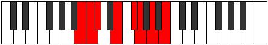 |
| [1449](https://ianring.com/musictheory/scales/1449) | [Epathimic](ModeGFlatEpathimic.md) | Gb | Gb, A, B, C#, D, E, Gb |  |
| [1449](https://ianring.com/musictheory/scales/1449) | [Epathimic](ModeCSharpEpathimic.md) | C# | C#, D##, E##, F###, G##, A##, C# |  |
| [1449](https://ianring.com/musictheory/scales/1449) | [Epathimic](ModeDFlatEpathimic.md) | Db | Db, E, F#, G#, A, B, Db |  |
| [1451](https://ianring.com/musictheory/scales/1451) | [Phrygian](ModeFSharpPhrygian.md) | F# | F#, G, A, B, C#, D, E, F# |  |
| [1451](https://ianring.com/musictheory/scales/1451) | [Phrygian](ModeGFlatPhrygian.md) | Gb | Gb, Abb, Bbb, Cb, Db, Ebb, Fb, Gb |  |
| [1451](https://ianring.com/musictheory/scales/1451) | [Phrygian](ModeCSharpPhrygian.md) | C# | C#, D, E, F#, G#, A, B, C# |  |
| [1451](https://ianring.com/musictheory/scales/1451) | [Phrygian](ModeDFlatPhrygian.md) | Db | Db, Ebb, Fb, Gb, Ab, Bbb, Cb, Db |  |
| [1451](https://ianring.com/musictheory/scales/1451) | [Phrygian](ModeGSharpPhrygian.md) | G# | G#, A, B, C#, D#, E, F#, G# |  |
| [1451](https://ianring.com/musictheory/scales/1451) | [Phrygian](ModeAFlatPhrygian.md) | Ab | Ab, Bbb, Cb, Db, Eb, Fb, Gb, Ab |  |
| [1453](https://ianring.com/musictheory/scales/1453) | [Aeolian](ModeBNaturalAeolian.md) | B | B, C#, D, E, F#, G, A, B |  |
| [1453](https://ianring.com/musictheory/scales/1453) | [Aeolian](ModeFSharpAeolian.md) | F# | F#, G#, A, B, C#, D, E, F# |  |
| [1453](https://ianring.com/musictheory/scales/1453) | [Aeolian](ModeGFlatAeolian.md) | Gb | Gb, Ab, Bbb, Cb, Db, Ebb, Fb, Gb |  |
| [1453](https://ianring.com/musictheory/scales/1453) | [Aeolian](ModeCSharpAeolian.md) | C# | C#, D#, E, F#, G#, A, B, C# |  |
| [1453](https://ianring.com/musictheory/scales/1453) | [Aeolian](ModeDFlatAeolian.md) | Db | Db, Eb, Fb, Gb, Ab, Bbb, Cb, Db |  |
| [1455](https://ianring.com/musictheory/scales/1455) | [Soryllic](ModeBNaturalSoryllic.md) | B | B, C, C#, D, E, F#, G, A, B |  |
| [1455](https://ianring.com/musictheory/scales/1455) | [Soryllic](ModeCSharpSoryllic.md) | C# | C#, D, D#, E, F#, G#, A, B, C# |  |
| [1455](https://ianring.com/musictheory/scales/1455) | [Soryllic](ModeDFlatSoryllic.md) | Db | Db, D, Eb, E, Gb, Ab, A, B, Db |  |
| [1455](https://ianring.com/musictheory/scales/1455) | [Soryllic](ModeFSharpSoryllic.md) | F# | F#, G, G#, A, B, C#, D, E, F# |  |
| [1455](https://ianring.com/musictheory/scales/1455) | [Soryllic](ModeGFlatSoryllic.md) | Gb | Gb, G, Ab, A, B, Db, D, E, Gb |  |
| [1455](https://ianring.com/musictheory/scales/1455) | [Soryllic](ModeGSharpSoryllic.md) | G# | G#, A, A#, B, C#, D#, E, F#, G# |  |
| [1455](https://ianring.com/musictheory/scales/1455) | [Soryllic](ModeAFlatSoryllic.md) | Ab | Ab, A, Bb, B, Db, Eb, E, Gb, Ab |  |
| [1457](https://ianring.com/musictheory/scales/1457) | [Modimic](ModeANaturalModimic.md) | A | A, B##, C##, D##, E#, F##, A |  |
| [1459](https://ianring.com/musictheory/scales/1459) | [Ionalian](ModeGSharpIonalian.md) | G# | G#, A, B#, C#, D#, E, F#, G# |  |
| [1459](https://ianring.com/musictheory/scales/1459) | [Ionalian](ModeAFlatIonalian.md) | Ab | Ab, Bbb, C, Db, Eb, Fb, Gb, Ab |  |
| [1459](https://ianring.com/musictheory/scales/1459) | [Ionalian](ModeANaturalIonalian.md) | A | A, Bb, C#, D, E, F, G, A |  |
| [1461](https://ianring.com/musictheory/scales/1461) | [Stydian](ModeANaturalStydian.md) | A | A, B, C#, D, E, F, G, A |  |
| [1461](https://ianring.com/musictheory/scales/1461) | [Stydian](ModeBNaturalStydian.md) | B | B, C#, D#, E, F#, G, A, B |  |
| [1463](https://ianring.com/musictheory/scales/1463) | [Zaptyllic](ModeGSharpZaptyllic.md) | G# | G#, A, A#, C, C#, D#, E, F#, G# |  |
| [1463](https://ianring.com/musictheory/scales/1463) | [Zaptyllic](ModeAFlatZaptyllic.md) | Ab | Ab, A, Bb, C, Db, Eb, E, Gb, Ab |  |
| [1463](https://ianring.com/musictheory/scales/1463) | [Zaptyllic](ModeBNaturalZaptyllic.md) | B | B, C, C#, D#, E, F#, G, A, B |  |
| [1463](https://ianring.com/musictheory/scales/1463) | [Zaptyllic](ModeANaturalZaptyllic.md) | A | A, A#, B, C#, D, E, F, G, A |  |
| [1465](https://ianring.com/musictheory/scales/1465) | [Aerathian](ModeANaturalAerathian.md) | A | A, B#, C#, D, E, F, G, A |  |
| [1465](https://ianring.com/musictheory/scales/1465) | [Aerathian](ModeCSharpAerathian.md) | C# | C#, D##, E#, F#, G#, A, B, C# |  |
| [1465](https://ianring.com/musictheory/scales/1465) | [Aerathian](ModeDFlatAerathian.md) | Db | Db, E, F, Gb, Ab, Bbb, Cb, Db |  |
| [1465](https://ianring.com/musictheory/scales/1465) | [Aerathian](ModeFSharpAerathian.md) | F# | F#, G##, A#, B, C#, D, E, F# |  |
| [1465](https://ianring.com/musictheory/scales/1465) | [Aerathian](ModeGFlatAerathian.md) | Gb | Gb, A, Bb, Cb, Db, Ebb, Fb, Gb |  |
| [1467](https://ianring.com/musictheory/scales/1467) | [Thydyllic](ModeANaturalThydyllic.md) | A | A, A#, C, C#, D, E, F, G, A |  |
| [1467](https://ianring.com/musictheory/scales/1467) | [Thydyllic](ModeGSharpThydyllic.md) | G# | G#, A, B, C, C#, D#, E, F#, G# |  |
| [1467](https://ianring.com/musictheory/scales/1467) | [Thydyllic](ModeAFlatThydyllic.md) | Ab | Ab, A, B, C, Db, Eb, E, Gb, Ab |  |
| [1467](https://ianring.com/musictheory/scales/1467) | [Thydyllic](ModeCSharpThydyllic.md) | C# | C#, D, E, F, F#, G#, A, B, C# |  |
| [1467](https://ianring.com/musictheory/scales/1467) | [Thydyllic](ModeDFlatThydyllic.md) | Db | Db, D, E, F, Gb, Ab, A, B, Db |  |
| [1467](https://ianring.com/musictheory/scales/1467) | [Thydyllic](ModeFSharpThydyllic.md) | F# | F#, G, A, A#, B, C#, D, E, F# |  |
| [1467](https://ianring.com/musictheory/scales/1467) | [Thydyllic](ModeGFlatThydyllic.md) | Gb | Gb, G, A, Bb, B, Db, D, E, Gb |  |
| [1469](https://ianring.com/musictheory/scales/1469) | [Epiryllic](ModeANaturalEpiryllic.md) | A | A, B, C, C#, D, E, F, G, A |  |
| [1469](https://ianring.com/musictheory/scales/1469) | [Epiryllic](ModeBNaturalEpiryllic.md) | B | B, C#, D, D#, E, F#, G, A, B |  |
| [1469](https://ianring.com/musictheory/scales/1469) | [Epiryllic](ModeCSharpEpiryllic.md) | C# | C#, D#, E, F, F#, G#, A, B, C# |  |
| [1469](https://ianring.com/musictheory/scales/1469) | [Epiryllic](ModeDFlatEpiryllic.md) | Db | Db, Eb, E, F, Gb, Ab, A, B, Db |  |
| [1469](https://ianring.com/musictheory/scales/1469) | [Epiryllic](ModeFSharpEpiryllic.md) | F# | F#, G#, A, A#, B, C#, D, E, F# |  |
| [1469](https://ianring.com/musictheory/scales/1469) | [Epiryllic](ModeGFlatEpiryllic.md) | Gb | Gb, Ab, A, Bb, B, Db, D, E, Gb |  |
| [1471](https://ianring.com/musictheory/scales/1471) | [Radygic](ModeBNaturalRadygic.md) | B | B, C, C#, D, D#, E, F#, G, A, B |  |
| [1471](https://ianring.com/musictheory/scales/1471) | [Radygic](ModeCSharpRadygic.md) | C# | C#, D, D#, E, F, F#, G#, A, B, C# |  |
| [1471](https://ianring.com/musictheory/scales/1471) | [Radygic](ModeDFlatRadygic.md) | Db | Db, D, Eb, E, F, Gb, Ab, A, B, Db |  |
| [1471](https://ianring.com/musictheory/scales/1471) | [Radygic](ModeANaturalRadygic.md) | A | A, A#, B, C, C#, D, E, F, G, A |  |
| [1471](https://ianring.com/musictheory/scales/1471) | [Radygic](ModeGSharpRadygic.md) | G# | G#, A, A#, B, C, C#, D#, E, F#, G# |  |
| [1471](https://ianring.com/musictheory/scales/1471) | [Radygic](ModeAFlatRadygic.md) | Ab | Ab, A, Bb, B, C, Db, Eb, E, Gb, Ab |  |
| [1471](https://ianring.com/musictheory/scales/1471) | [Radygic](ModeFSharpRadygic.md) | F# | F#, G, G#, A, A#, B, C#, D, E, F# |  |
| [1471](https://ianring.com/musictheory/scales/1471) | [Radygic](ModeGFlatRadygic.md) | Gb | Gb, G, Ab, A, Bb, B, Db, D, E, Gb |  |
| [1479](https://ianring.com/musictheory/scales/1479) | [Aeolagian](ModeDSharpAeolagian.md) | D# | D#, E, F, G##, A#, B, C#, D# |  |
| [1479](https://ianring.com/musictheory/scales/1479) | [Aeolagian](ModeEFlatAeolagian.md) | Eb | Eb, Fb, Gbb, A, Bb, Cb, Db, Eb |  |
| [1481](https://ianring.com/musictheory/scales/1481) | [Zagimic](ModeGFlatZagimic.md) | Gb | Gb, A, B#, C#, D, E, Gb |  |
| [1481](https://ianring.com/musictheory/scales/1481) | [Zagimic](ModeCSharpZagimic.md) | C# | C#, D##, E###, F###, G##, A##, C# |  |
| [1481](https://ianring.com/musictheory/scales/1481) | [Zagimic](ModeDFlatZagimic.md) | Db | Db, E, F##, G#, A, B, Db |  |
| [1483](https://ianring.com/musictheory/scales/1483) | [Dygian](ModeFSharpDygian.md) | F# | F#, G, A, B#, C#, D, E, F# |  |
| [1483](https://ianring.com/musictheory/scales/1483) | [Dygian](ModeGFlatDygian.md) | Gb | Gb, Abb, Bbb, C, Db, Ebb, Fb, Gb |  |
| [1483](https://ianring.com/musictheory/scales/1483) | [Dygian](ModeCSharpDygian.md) | C# | C#, D, E, F##, G#, A, B, C# |  |
| [1483](https://ianring.com/musictheory/scales/1483) | [Dygian](ModeDFlatDygian.md) | Db | Db, Ebb, Fb, G, Ab, Bbb, Cb, Db |  |
| [1483](https://ianring.com/musictheory/scales/1483) | [Dygian](ModeDSharpDygian.md) | D# | D#, E, F#, G##, A#, B, C#, D# |  |
| [1483](https://ianring.com/musictheory/scales/1483) | [Dygian](ModeEFlatDygian.md) | Eb | Eb, Fb, Gb, A, Bb, Cb, Db, Eb |  |
| [1485](https://ianring.com/musictheory/scales/1485) | [Tyrian](ModeFSharpTyrian.md) | F# | F#, G#, A, B#, C#, D, E, F# |  |
| [1485](https://ianring.com/musictheory/scales/1485) | [Tyrian](ModeGFlatTyrian.md) | Gb | Gb, Ab, Bbb, C, Db, Ebb, Fb, Gb |  |
| [1485](https://ianring.com/musictheory/scales/1485) | [Tyrian](ModeCSharpTyrian.md) | C# | C#, D#, E, F##, G#, A, B, C# |  |
| [1485](https://ianring.com/musictheory/scales/1485) | [Tyrian](ModeDFlatTyrian.md) | Db | Db, Eb, Fb, G, Ab, Bbb, Cb, Db |  |
| [1487](https://ianring.com/musictheory/scales/1487) | [Lycryllic](ModeFSharpLycryllic.md) | F# | F#, G, G#, A, C, C#, D, E, F# |  |
| [1487](https://ianring.com/musictheory/scales/1487) | [Lycryllic](ModeGFlatLycryllic.md) | Gb | Gb, G, Ab, A, C, Db, D, E, Gb |  |
| [1487](https://ianring.com/musictheory/scales/1487) | [Lycryllic](ModeCSharpLycryllic.md) | C# | C#, D, D#, E, G, G#, A, B, C# |  |
| [1487](https://ianring.com/musictheory/scales/1487) | [Lycryllic](ModeDFlatLycryllic.md) | Db | Db, D, Eb, E, G, Ab, A, B, Db |  |
| [1487](https://ianring.com/musictheory/scales/1487) | [Lycryllic](ModeDSharpLycryllic.md) | D# | D#, E, F, F#, A, A#, B, C#, D# |  |
| [1487](https://ianring.com/musictheory/scales/1487) | [Lycryllic](ModeEFlatLycryllic.md) | Eb | Eb, E, F, Gb, A, Bb, B, Db, Eb |  |
| [1489](https://ianring.com/musictheory/scales/1489) | [Gacrimic](ModeANaturalGacrimic.md) | A | A, B##, C###, D##, E#, F##, A |  |
| [1491](https://ianring.com/musictheory/scales/1491) | [Rynian](ModeANaturalRynian.md) | A | A, Bb, C#, D#, E, F, G, A |  |
| [1491](https://ianring.com/musictheory/scales/1491) | [Rynian](ModeDSharpRynian.md) | D# | D#, E, F##, G##, A#, B, C#, D# |  |
| [1491](https://ianring.com/musictheory/scales/1491) | [Rynian](ModeEFlatRynian.md) | Eb | Eb, Fb, G, A, Bb, Cb, Db, Eb |  |
| [1493](https://ianring.com/musictheory/scales/1493) | [Phryrian](ModeANaturalPhryrian.md) | A | A, B, C#, D#, E, F, G, A |  |
| [1495](https://ianring.com/musictheory/scales/1495) | [Kaptyllic](ModeDSharpKaptyllic.md) | D# | D#, E, F, G, A, A#, B, C#, D# |  |
| [1495](https://ianring.com/musictheory/scales/1495) | [Kaptyllic](ModeEFlatKaptyllic.md) | Eb | Eb, E, F, G, A, Bb, B, Db, Eb |  |
| [1495](https://ianring.com/musictheory/scales/1495) | [Kaptyllic](ModeANaturalKaptyllic.md) | A | A, A#, B, C#, D#, E, F, G, A |  |
| [1497](https://ianring.com/musictheory/scales/1497) | [Ionanian](ModeANaturalIonanian.md) | A | A, B#, C#, D#, E, F, G, A |  |
| [1497](https://ianring.com/musictheory/scales/1497) | [Ionanian](ModeFSharpIonanian.md) | F# | F#, G##, A#, B#, C#, D, E, F# |  |
| [1497](https://ianring.com/musictheory/scales/1497) | [Ionanian](ModeGFlatIonanian.md) | Gb | Gb, A, Bb, C, Db, Ebb, Fb, Gb |  |
| [1497](https://ianring.com/musictheory/scales/1497) | [Ionanian](ModeCSharpIonanian.md) | C# | C#, D##, E#, F##, G#, A, B, C# |  |
| [1497](https://ianring.com/musictheory/scales/1497) | [Ionanian](ModeDFlatIonanian.md) | Db | Db, E, F, G, Ab, Bbb, Cb, Db |  |
| [1499](https://ianring.com/musictheory/scales/1499) | [Stonyllic](ModeANaturalStonyllic.md) | A | A, A#, C, C#, D#, E, F, G, A |  |
| [1499](https://ianring.com/musictheory/scales/1499) | [Stonyllic](ModeFSharpStonyllic.md) | F# | F#, G, A, A#, C, C#, D, E, F# |  |
| [1499](https://ianring.com/musictheory/scales/1499) | [Stonyllic](ModeGFlatStonyllic.md) | Gb | Gb, G, A, Bb, C, Db, D, E, Gb |  |
| [1499](https://ianring.com/musictheory/scales/1499) | [Stonyllic](ModeCSharpStonyllic.md) | C# | C#, D, E, F, G, G#, A, B, C# |  |
| [1499](https://ianring.com/musictheory/scales/1499) | [Stonyllic](ModeDFlatStonyllic.md) | Db | Db, D, E, F, G, Ab, A, B, Db |  |
| [1499](https://ianring.com/musictheory/scales/1499) | [Stonyllic](ModeDSharpStonyllic.md) | D# | D#, E, F#, G, A, A#, B, C#, D# |  |
| [1499](https://ianring.com/musictheory/scales/1499) | [Stonyllic](ModeEFlatStonyllic.md) | Eb | Eb, E, Gb, G, A, Bb, B, Db, Eb |  |
| [1501](https://ianring.com/musictheory/scales/1501) | [Stygyllic](ModeFSharpStygyllic.md) | F# | F#, G#, A, A#, C, C#, D, E, F# |  |
| [1501](https://ianring.com/musictheory/scales/1501) | [Stygyllic](ModeGFlatStygyllic.md) | Gb | Gb, Ab, A, Bb, C, Db, D, E, Gb |  |
| [1501](https://ianring.com/musictheory/scales/1501) | [Stygyllic](ModeANaturalStygyllic.md) | A | A, B, C, C#, D#, E, F, G, A |  |
| [1501](https://ianring.com/musictheory/scales/1501) | [Stygyllic](ModeCSharpStygyllic.md) | C# | C#, D#, E, F, G, G#, A, B, C# |  |
| [1501](https://ianring.com/musictheory/scales/1501) | [Stygyllic](ModeDFlatStygyllic.md) | Db | Db, Eb, E, F, G, Ab, A, B, Db |  |
| [1503](https://ianring.com/musictheory/scales/1503) | [Padygic](ModeFSharpPadygic.md) | F# | F#, G, G#, A, A#, C, C#, D, E, F# |  |
| [1503](https://ianring.com/musictheory/scales/1503) | [Padygic](ModeGFlatPadygic.md) | Gb | Gb, G, Ab, A, Bb, C, Db, D, E, Gb |  |
| [1503](https://ianring.com/musictheory/scales/1503) | [Padygic](ModeCSharpPadygic.md) | C# | C#, D, D#, E, F, G, G#, A, B, C# |  |
| [1503](https://ianring.com/musictheory/scales/1503) | [Padygic](ModeDFlatPadygic.md) | Db | Db, D, Eb, E, F, G, Ab, A, B, Db |  |
| [1503](https://ianring.com/musictheory/scales/1503) | [Padygic](ModeANaturalPadygic.md) | A | A, A#, B, C, C#, D#, E, F, G, A |  |
| [1503](https://ianring.com/musictheory/scales/1503) | [Padygic](ModeDSharpPadygic.md) | D# | D#, E, F, F#, G, A, A#, B, C#, D# |  |
| [1503](https://ianring.com/musictheory/scales/1503) | [Padygic](ModeEFlatPadygic.md) | Eb | Eb, E, F, Gb, G, A, Bb, B, Db, Eb |  |
| [1507](https://ianring.com/musictheory/scales/1507) | [Zynian](ModeGSharpZynian.md) | G# | G#, A, B##, C##, D#, E, F#, G# |  |
| [1507](https://ianring.com/musictheory/scales/1507) | [Zynian](ModeAFlatZynian.md) | Ab | Ab, Bbb, C#, D, Eb, Fb, Gb, Ab |  |
| [1507](https://ianring.com/musictheory/scales/1507) | [Zynian](ModeDSharpZynian.md) | D# | D#, E, F###, G##, A#, B, C#, D# | 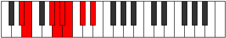 |
| [1507](https://ianring.com/musictheory/scales/1507) | [Zynian](ModeEFlatZynian.md) | Eb | Eb, Fb, G#, A, Bb, Cb, Db, Eb |  |
| [1509](https://ianring.com/musictheory/scales/1509) | [Ragian](ModeBNaturalRagian.md) | B | B, C#, D##, E#, F#, G, A, B |  |
| [1511](https://ianring.com/musictheory/scales/1511) | [Styptyllic](ModeGSharpStyptyllic.md) | G# | G#, A, A#, C#, D, D#, E, F#, G# |  |
| [1511](https://ianring.com/musictheory/scales/1511) | [Styptyllic](ModeAFlatStyptyllic.md) | Ab | Ab, A, Bb, Db, D, Eb, E, Gb, Ab |  |
| [1511](https://ianring.com/musictheory/scales/1511) | [Styptyllic](ModeBNaturalStyptyllic.md) | B | B, C, C#, E, F, F#, G, A, B |  |
| [1511](https://ianring.com/musictheory/scales/1511) | [Styptyllic](ModeDSharpStyptyllic.md) | D# | D#, E, F, G#, A, A#, B, C#, D# |  |
| [1511](https://ianring.com/musictheory/scales/1511) | [Styptyllic](ModeEFlatStyptyllic.md) | Eb | Eb, E, F, Ab, A, Bb, B, Db, Eb |  |
| [1513](https://ianring.com/musictheory/scales/1513) | [Stathian](ModeFSharpStathian.md) | F# | F#, G##, A##, B#, C#, D, E, F# |  |
| [1513](https://ianring.com/musictheory/scales/1513) | [Stathian](ModeGFlatStathian.md) | Gb | Gb, A, B, C, Db, Ebb, Fb, Gb |  |
| [1513](https://ianring.com/musictheory/scales/1513) | [Stathian](ModeCSharpStathian.md) | C# | C#, D##, E##, F##, G#, A, B, C# |  |
| [1513](https://ianring.com/musictheory/scales/1513) | [Stathian](ModeDFlatStathian.md) | Db | Db, E, F#, G, Ab, Bbb, Cb, Db |  |
| [1515](https://ianring.com/musictheory/scales/1515) | [Solyllic](ModeFSharpSolyllic.md) | F# | F#, G, A, B, C, C#, D, E, F# |  |
| [1515](https://ianring.com/musictheory/scales/1515) | [Solyllic](ModeGFlatSolyllic.md) | Gb | Gb, G, A, B, C, Db, D, E, Gb |  |
| [1515](https://ianring.com/musictheory/scales/1515) | [Solyllic](ModeGSharpSolyllic.md) | G# | G#, A, B, C#, D, D#, E, F#, G# |  |
| [1515](https://ianring.com/musictheory/scales/1515) | [Solyllic](ModeAFlatSolyllic.md) | Ab | Ab, A, B, Db, D, Eb, E, Gb, Ab |  |
| [1515](https://ianring.com/musictheory/scales/1515) | [Solyllic](ModeCSharpSolyllic.md) | C# | C#, D, E, F#, G, G#, A, B, C# |  |
| [1515](https://ianring.com/musictheory/scales/1515) | [Solyllic](ModeDFlatSolyllic.md) | Db | Db, D, E, Gb, G, Ab, A, B, Db |  |
| [1515](https://ianring.com/musictheory/scales/1515) | [Solyllic](ModeDSharpSolyllic.md) | D# | D#, E, F#, G#, A, A#, B, C#, D# |  |
| [1515](https://ianring.com/musictheory/scales/1515) | [Solyllic](ModeEFlatSolyllic.md) | Eb | Eb, E, Gb, Ab, A, Bb, B, Db, Eb |  |
| [1517](https://ianring.com/musictheory/scales/1517) | [Sagyllic](ModeBNaturalSagyllic.md) | B | B, C#, D, E, F, F#, G, A, B |  |
| [1517](https://ianring.com/musictheory/scales/1517) | [Sagyllic](ModeFSharpSagyllic.md) | F# | F#, G#, A, B, C, C#, D, E, F# |  |
| [1517](https://ianring.com/musictheory/scales/1517) | [Sagyllic](ModeGFlatSagyllic.md) | Gb | Gb, Ab, A, B, C, Db, D, E, Gb |  |
| [1517](https://ianring.com/musictheory/scales/1517) | [Sagyllic](ModeCSharpSagyllic.md) | C# | C#, D#, E, F#, G, G#, A, B, C# |  |
| [1517](https://ianring.com/musictheory/scales/1517) | [Sagyllic](ModeDFlatSagyllic.md) | Db | Db, Eb, E, Gb, G, Ab, A, B, Db |  |
| [1519](https://ianring.com/musictheory/scales/1519) | [Solygic](ModeBNaturalSolygic.md) | B | B, C, C#, D, E, F, F#, G, A, B |  |
| [1519](https://ianring.com/musictheory/scales/1519) | [Solygic](ModeFSharpSolygic.md) | F# | F#, G, G#, A, B, C, C#, D, E, F# |  |
| [1519](https://ianring.com/musictheory/scales/1519) | [Solygic](ModeGFlatSolygic.md) | Gb | Gb, G, Ab, A, B, C, Db, D, E, Gb |  |
| [1519](https://ianring.com/musictheory/scales/1519) | [Solygic](ModeCSharpSolygic.md) | C# | C#, D, D#, E, F#, G, G#, A, B, C# |  |
| [1519](https://ianring.com/musictheory/scales/1519) | [Solygic](ModeDFlatSolygic.md) | Db | Db, D, Eb, E, Gb, G, Ab, A, B, Db |  |
| [1519](https://ianring.com/musictheory/scales/1519) | [Solygic](ModeGSharpSolygic.md) | G# | G#, A, A#, B, C#, D, D#, E, F#, G# |  |
| [1519](https://ianring.com/musictheory/scales/1519) | [Solygic](ModeAFlatSolygic.md) | Ab | Ab, A, Bb, B, Db, D, Eb, E, Gb, Ab |  |
| [1519](https://ianring.com/musictheory/scales/1519) | [Solygic](ModeDSharpSolygic.md) | D# | D#, E, F, F#, G#, A, A#, B, C#, D# |  |
| [1519](https://ianring.com/musictheory/scales/1519) | [Solygic](ModeEFlatSolygic.md) | Eb | Eb, E, F, Gb, Ab, A, Bb, B, Db, Eb |  |
| [1521](https://ianring.com/musictheory/scales/1521) | [Stanian](ModeANaturalStanian.md) | A | A, B##, C##, D#, E, F, G, A |  |
| [1523](https://ianring.com/musictheory/scales/1523) | [Zothyllic](ModeGSharpZothyllic.md) | G# | G#, A, C, C#, D, D#, E, F#, G# |  |
| [1523](https://ianring.com/musictheory/scales/1523) | [Zothyllic](ModeAFlatZothyllic.md) | Ab | Ab, A, C, Db, D, Eb, E, Gb, Ab |  |
| [1523](https://ianring.com/musictheory/scales/1523) | [Zothyllic](ModeANaturalZothyllic.md) | A | A, A#, C#, D, D#, E, F, G, A |  |
| [1523](https://ianring.com/musictheory/scales/1523) | [Zothyllic](ModeDSharpZothyllic.md) | D# | D#, E, G, G#, A, A#, B, C#, D# |  |
| [1523](https://ianring.com/musictheory/scales/1523) | [Zothyllic](ModeEFlatZothyllic.md) | Eb | Eb, E, G, Ab, A, Bb, B, Db, Eb |  |
| [1525](https://ianring.com/musictheory/scales/1525) | [Sodyllic](ModeANaturalSodyllic.md) | A | A, B, C#, D, D#, E, F, G, A |  |
| [1525](https://ianring.com/musictheory/scales/1525) | [Sodyllic](ModeBNaturalSodyllic.md) | B | B, C#, D#, E, F, F#, G, A, B |  |
| [1527](https://ianring.com/musictheory/scales/1527) | [Aeolyrygic](ModeGSharpAeolyrygic.md) | G# | G#, A, A#, C, C#, D, D#, E, F#, G# |  |
| [1527](https://ianring.com/musictheory/scales/1527) | [Aeolyrygic](ModeAFlatAeolyrygic.md) | Ab | Ab, A, Bb, C, Db, D, Eb, E, Gb, Ab |  |
| [1527](https://ianring.com/musictheory/scales/1527) | [Aeolyrygic](ModeBNaturalAeolyrygic.md) | B | B, C, C#, D#, E, F, F#, G, A, B |  |
| [1527](https://ianring.com/musictheory/scales/1527) | [Aeolyrygic](ModeANaturalAeolyrygic.md) | A | A, A#, B, C#, D, D#, E, F, G, A |  |
| [1527](https://ianring.com/musictheory/scales/1527) | [Aeolyrygic](ModeDSharpAeolyrygic.md) | D# | D#, E, F, G, G#, A, A#, B, C#, D# |  |
| [1527](https://ianring.com/musictheory/scales/1527) | [Aeolyrygic](ModeEFlatAeolyrygic.md) | Eb | Eb, E, F, G, Ab, A, Bb, B, Db, Eb |  |
| [1529](https://ianring.com/musictheory/scales/1529) | [Kataryllic](ModeANaturalKataryllic.md) | A | A, C, C#, D, D#, E, F, G, A |  |
| [1529](https://ianring.com/musictheory/scales/1529) | [Kataryllic](ModeCSharpKataryllic.md) | C# | C#, E, F, F#, G, G#, A, B, C# |  |
| [1529](https://ianring.com/musictheory/scales/1529) | [Kataryllic](ModeDFlatKataryllic.md) | Db | Db, E, F, Gb, G, Ab, A, B, Db |  |
| [1529](https://ianring.com/musictheory/scales/1529) | [Kataryllic](ModeFSharpKataryllic.md) | F# | F#, A, A#, B, C, C#, D, E, F# |  |
| [1529](https://ianring.com/musictheory/scales/1529) | [Kataryllic](ModeGFlatKataryllic.md) | Gb | Gb, A, Bb, B, C, Db, D, E, Gb |  |
| [1531](https://ianring.com/musictheory/scales/1531) | [Styptygic](ModeANaturalStyptygic.md) | A | A, A#, C, C#, D, D#, E, F, G, A |  |
| [1531](https://ianring.com/musictheory/scales/1531) | [Styptygic](ModeGSharpStyptygic.md) | G# | G#, A, B, C, C#, D, D#, E, F#, G# |  |
| [1531](https://ianring.com/musictheory/scales/1531) | [Styptygic](ModeAFlatStyptygic.md) | Ab | Ab, A, B, C, Db, D, Eb, E, Gb, Ab |  |
| [1531](https://ianring.com/musictheory/scales/1531) | [Styptygic](ModeCSharpStyptygic.md) | C# | C#, D, E, F, F#, G, G#, A, B, C# |  |
| [1531](https://ianring.com/musictheory/scales/1531) | [Styptygic](ModeDFlatStyptygic.md) | Db | Db, D, E, F, Gb, G, Ab, A, B, Db |  |
| [1531](https://ianring.com/musictheory/scales/1531) | [Styptygic](ModeFSharpStyptygic.md) | F# | F#, G, A, A#, B, C, C#, D, E, F# |  |
| [1531](https://ianring.com/musictheory/scales/1531) | [Styptygic](ModeGFlatStyptygic.md) | Gb | Gb, G, A, Bb, B, C, Db, D, E, Gb |  |
| [1531](https://ianring.com/musictheory/scales/1531) | [Styptygic](ModeDSharpStyptygic.md) | D# | D#, E, F#, G, G#, A, A#, B, C#, D# |  |
| [1531](https://ianring.com/musictheory/scales/1531) | [Styptygic](ModeEFlatStyptygic.md) | Eb | Eb, E, Gb, G, Ab, A, Bb, B, Db, Eb |  |
| [1533](https://ianring.com/musictheory/scales/1533) | [Katycrygic](ModeANaturalKatycrygic.md) | A | A, B, C, C#, D, D#, E, F, G, A |  |
| [1533](https://ianring.com/musictheory/scales/1533) | [Katycrygic](ModeBNaturalKatycrygic.md) | B | B, C#, D, D#, E, F, F#, G, A, B |  |
| [1533](https://ianring.com/musictheory/scales/1533) | [Katycrygic](ModeCSharpKatycrygic.md) | C# | C#, D#, E, F, F#, G, G#, A, B, C# |  |
| [1533](https://ianring.com/musictheory/scales/1533) | [Katycrygic](ModeDFlatKatycrygic.md) | Db | Db, Eb, E, F, Gb, G, Ab, A, B, Db |  |
| [1533](https://ianring.com/musictheory/scales/1533) | [Katycrygic](ModeFSharpKatycrygic.md) | F# | F#, G#, A, A#, B, C, C#, D, E, F# |  |
| [1533](https://ianring.com/musictheory/scales/1533) | [Katycrygic](ModeGFlatKatycrygic.md) | Gb | Gb, Ab, A, Bb, B, C, Db, D, E, Gb |  |
| [1535](https://ianring.com/musictheory/scales/1535) | [Mixodyllian](ModeBNaturalMixodyllian.md) | B | B, C, C#, D, D#, E, F, F#, G, A, B |  |
| [1535](https://ianring.com/musictheory/scales/1535) | [Mixodyllian](ModeCSharpMixodyllian.md) | C# | C#, D, D#, E, F, F#, G, G#, A, B, C# |  |
| [1535](https://ianring.com/musictheory/scales/1535) | [Mixodyllian](ModeDFlatMixodyllian.md) | Db | Db, D, Eb, E, F, Gb, G, Ab, A, B, Db |  |
| [1535](https://ianring.com/musictheory/scales/1535) | [Mixodyllian](ModeANaturalMixodyllian.md) | A | A, A#, B, C, C#, D, D#, E, F, G, A |  |
| [1535](https://ianring.com/musictheory/scales/1535) | [Mixodyllian](ModeGSharpMixodyllian.md) | G# | G#, A, A#, B, C, C#, D, D#, E, F#, G# |  |
| [1535](https://ianring.com/musictheory/scales/1535) | [Mixodyllian](ModeAFlatMixodyllian.md) | Ab | Ab, A, Bb, B, C, Db, D, Eb, E, Gb, Ab |  |
| [1535](https://ianring.com/musictheory/scales/1535) | [Mixodyllian](ModeFSharpMixodyllian.md) | F# | F#, G, G#, A, A#, B, C, C#, D, E, F# |  |
| [1535](https://ianring.com/musictheory/scales/1535) | [Mixodyllian](ModeGFlatMixodyllian.md) | Gb | Gb, G, Ab, A, Bb, B, C, Db, D, E, Gb |  |
| [1535](https://ianring.com/musictheory/scales/1535) | [Mixodyllian](ModeDSharpMixodyllian.md) | D# | D#, E, F, F#, G, G#, A, A#, B, C#, D# |  |
| [1535](https://ianring.com/musictheory/scales/1535) | [Mixodyllian](ModeEFlatMixodyllian.md) | Eb | Eb, E, F, Gb, G, Ab, A, Bb, B, Db, Eb |  |
| [1571](https://ianring.com/musictheory/scales/1571) | [Lagitonic](ModeENaturalLagitonic.md) | E | E, F, A, C#, D, E | 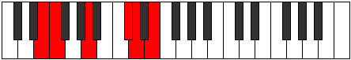 |
| [1573](https://ianring.com/musictheory/scales/1573) | [Saritonic](ModeENaturalSaritonic.md) | E | E, F#, A, C#, D, E |  |
| [1573](https://ianring.com/musictheory/scales/1573) | [Saritonic](ModeBNaturalSaritonic.md) | B | B, C#, E, G#, A, B |  |
| [1575](https://ianring.com/musictheory/scales/1575) | [Zycrimic](ModeENaturalZycrimic.md) | E | E, F, Gb, A, B##, C##, E |  |
| [1575](https://ianring.com/musictheory/scales/1575) | [Zycrimic](ModeBNaturalZycrimic.md) | B | B, C, Db, E, F###, G##, B |  |
| [1577](https://ianring.com/musictheory/scales/1577) | [Lonitonic](ModeENaturalLonitonic.md) | E | E, G, A, C#, D, E |  |
| [1579](https://ianring.com/musictheory/scales/1579) | [Sagimic](ModeENaturalSagimic.md) | E | E, F, G, A, B##, C##, E |  |
| [1581](https://ianring.com/musictheory/scales/1581) | [Gyrimic](ModeENaturalGyrimic.md) | E | E, F#, G, A, B##, C##, E |  |
| [1581](https://ianring.com/musictheory/scales/1581) | [Gyrimic](ModeBNaturalGyrimic.md) | B | B, C#, D, E, F###, G##, B |  |
| [1583](https://ianring.com/musictheory/scales/1583) | [Salian](ModeENaturalSalian.md) | E | E, F, Gb, Abb, Bbb, C#, D, E |  |
| [1583](https://ianring.com/musictheory/scales/1583) | [Salian](ModeBNaturalSalian.md) | B | B, C, Db, Ebb, Fb, G#, A, B |  |
| [1585](https://ianring.com/musictheory/scales/1585) | [Phraditonic](ModeENaturalPhraditonic.md) | E | E, G#, A, C#, D, E |  |
| [1587](https://ianring.com/musictheory/scales/1587) | [Lalimic](ModeENaturalLalimic.md) | E | E, F, G#, A, B##, C##, E |  |
| [1587](https://ianring.com/musictheory/scales/1587) | [Lalimic](ModeCNaturalLalimic.md) | C | C, Db, E, F, G##, A#, C |  |
| [1589](https://ianring.com/musictheory/scales/1589) | [Ionagimic](ModeENaturalIonagimic.md) | E | E, F#, G#, A, B##, C##, E |  |
| [1589](https://ianring.com/musictheory/scales/1589) | [Ionagimic](ModeBNaturalIonagimic.md) | B | B, C#, D#, E, F###, G##, B |  |
| [1591](https://ianring.com/musictheory/scales/1591) | [Rodian](ModeENaturalRodian.md) | E | E, F, Gb, Ab, Bbb, C#, D, E |  |
| [1591](https://ianring.com/musictheory/scales/1591) | [Rodian](ModeCNaturalRodian.md) | C | C, Db, Ebb, Fb, Gbb, A, Bb, C |  |
| [1591](https://ianring.com/musictheory/scales/1591) | [Rodian](ModeBNaturalRodian.md) | B | B, C, Db, Eb, Fb, G#, A, B |  |
| [1593](https://ianring.com/musictheory/scales/1593) | [Zogimic](ModeENaturalZogimic.md) | E | E, F##, G#, A, B##, C##, E |  |
| [1595](https://ianring.com/musictheory/scales/1595) | [Dacrian](ModeENaturalDacrian.md) | E | E, F, G, Ab, Bbb, C#, D, E |  |
| [1595](https://ianring.com/musictheory/scales/1595) | [Dacrian](ModeCNaturalDacrian.md) | C | C, Db, Eb, Fb, Gbb, A, Bb, C |  |
| [1597](https://ianring.com/musictheory/scales/1597) | [Aeolodian](ModeENaturalAeolodian.md) | E | E, F#, G, Ab, Bbb, C#, D, E |  |
| [1597](https://ianring.com/musictheory/scales/1597) | [Aeolodian](ModeBNaturalAeolodian.md) | B | B, C#, D, Eb, Fb, G#, A, B |  |
| [1599](https://ianring.com/musictheory/scales/1599) | [Pocryllic](ModeENaturalPocryllic.md) | E | E, F, F#, G, G#, A, C#, D, E |  |
| [1599](https://ianring.com/musictheory/scales/1599) | [Pocryllic](ModeCNaturalPocryllic.md) | C | C, C#, D, D#, E, F, A, A#, C |  |
| [1599](https://ianring.com/musictheory/scales/1599) | [Pocryllic](ModeBNaturalPocryllic.md) | B | B, C, C#, D, D#, E, G#, A, B |  |
| [1605](https://ianring.com/musictheory/scales/1605) | [Zanitonic](ModeGNaturalZanitonic.md) | G | G, A, C#, E, F, G |  |
| [1607](https://ianring.com/musictheory/scales/1607) | [Epytimic](ModeDSharpEpytimic.md) | D# | D#, E, F, G##, A###, B##, D# |  |
| [1607](https://ianring.com/musictheory/scales/1607) | [Epytimic](ModeEFlatEpytimic.md) | Eb | Eb, Fb, Gbb, A, B#, C#, Eb |  |
| [1607](https://ianring.com/musictheory/scales/1607) | [Epytimic](ModeGNaturalEpytimic.md) | G | G, Ab, Bbb, C#, D##, E#, G |  |
| [1611](https://ianring.com/musictheory/scales/1611) | [Dacrimic](ModeDSharpDacrimic.md) | D# | D#, E, F#, G##, A###, B##, D# |  |
| [1611](https://ianring.com/musictheory/scales/1611) | [Dacrimic](ModeEFlatDacrimic.md) | Eb | Eb, Fb, Gb, A, B#, C#, Eb |  |
| [1613](https://ianring.com/musictheory/scales/1613) | [Thylimic](ModeGNaturalThylimic.md) | G | G, A, Bb, C#, D##, E#, G |  |
| [1615](https://ianring.com/musictheory/scales/1615) | [Sydian](ModeDSharpSydian.md) | D# | D#, E, F, Gb, A, B#, C#, D# |  |
| [1615](https://ianring.com/musictheory/scales/1615) | [Sydian](ModeEFlatSydian.md) | Eb | Eb, Fb, Gbb, Abbb, Bbb, C, Db, Eb |  |
| [1615](https://ianring.com/musictheory/scales/1615) | [Sydian](ModeGNaturalSydian.md) | G | G, Ab, Bbb, Cbb, Db, E, F, G |  |
| [1619](https://ianring.com/musictheory/scales/1619) | [Monimic](ModeDSharpMonimic.md) | D# | D#, E, F##, G##, A###, B##, D# |  |
| [1619](https://ianring.com/musictheory/scales/1619) | [Monimic](ModeEFlatMonimic.md) | Eb | Eb, Fb, G, A, B#, C#, Eb |  |
| [1619](https://ianring.com/musictheory/scales/1619) | [Monimic](ModeCNaturalMonimic.md) | C | C, Db, E, F#, G##, A#, C |  |
| [1621](https://ianring.com/musictheory/scales/1621) | [Aeolathimic](ModeGNaturalAeolathimic.md) | G | G, A, B, C#, D##, E#, G | 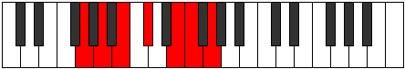 |
| [1623](https://ianring.com/musictheory/scales/1623) | [Lothian](ModeDSharpLothian.md) | D# | D#, E, F, G, A, B#, C#, D# |  |
| [1623](https://ianring.com/musictheory/scales/1623) | [Lothian](ModeEFlatLothian.md) | Eb | Eb, Fb, Gbb, Abb, Bbb, C, Db, Eb |  |
| [1623](https://ianring.com/musictheory/scales/1623) | [Lothian](ModeCNaturalLothian.md) | C | C, Db, Ebb, Fb, Gb, A, Bb, C |  |
| [1623](https://ianring.com/musictheory/scales/1623) | [Lothian](ModeGNaturalLothian.md) | G | G, Ab, Bbb, Cb, Db, E, F, G |  |
| [1627](https://ianring.com/musictheory/scales/1627) | [Zyptian](ModeDSharpZyptian.md) | D# | D#, E, F#, G, A, B#, C#, D# |  |
| [1627](https://ianring.com/musictheory/scales/1627) | [Zyptian](ModeEFlatZyptian.md) | Eb | Eb, Fb, Gb, Abb, Bbb, C, Db, Eb |  |
| [1627](https://ianring.com/musictheory/scales/1627) | [Zyptian](ModeCNaturalZyptian.md) | C | C, Db, Eb, Fb, Gb, A, Bb, C |  |
| [1629](https://ianring.com/musictheory/scales/1629) | [Synian](ModeGNaturalSynian.md) | G | G, A, Bb, Cb, Db, E, F, G |  |
| [1631](https://ianring.com/musictheory/scales/1631) | [Rynyllic](ModeDSharpRynyllic.md) | D# | D#, E, F, F#, G, A, C, C#, D# |  |
| [1631](https://ianring.com/musictheory/scales/1631) | [Rynyllic](ModeEFlatRynyllic.md) | Eb | Eb, E, F, Gb, G, A, C, Db, Eb |  |
| [1631](https://ianring.com/musictheory/scales/1631) | [Rynyllic](ModeCNaturalRynyllic.md) | C | C, C#, D, D#, E, F#, A, A#, C |  |
| [1631](https://ianring.com/musictheory/scales/1631) | [Rynyllic](ModeGNaturalRynyllic.md) | G | G, G#, A, A#, B, C#, E, F, G |  |
| [1635](https://ianring.com/musictheory/scales/1635) | [Sygimic](ModeDSharpSygimic.md) | D# | D#, E, F###, G##, A###, B##, D# |  |
| [1635](https://ianring.com/musictheory/scales/1635) | [Sygimic](ModeEFlatSygimic.md) | Eb | Eb, Fb, G#, A, B#, C#, Eb |  |
| [1635](https://ianring.com/musictheory/scales/1635) | [Sygimic](ModeENaturalSygimic.md) | E | E, F, G##, A#, B##, C##, E |  |
| [1637](https://ianring.com/musictheory/scales/1637) | [Syptimic](ModeGNaturalSyptimic.md) | G | G, A, B#, C#, D##, E#, G |  |
| [1637](https://ianring.com/musictheory/scales/1637) | [Syptimic](ModeENaturalSyptimic.md) | E | E, F#, G##, A#, B##, C##, E |  |
| [1637](https://ianring.com/musictheory/scales/1637) | [Syptimic](ModeBNaturalSyptimic.md) | B | B, C#, D##, E#, F###, G##, B |  |
| [1639](https://ianring.com/musictheory/scales/1639) | [Aeolothian](ModeDSharpAeolothian.md) | D# | D#, E, F, G#, A, B#, C#, D# |  |
| [1639](https://ianring.com/musictheory/scales/1639) | [Aeolothian](ModeEFlatAeolothian.md) | Eb | Eb, Fb, Gbb, Ab, Bbb, C, Db, Eb |  |
| [1639](https://ianring.com/musictheory/scales/1639) | [Aeolothian](ModeGNaturalAeolothian.md) | G | G, Ab, Bbb, C, Db, E, F, G |  |
| [1639](https://ianring.com/musictheory/scales/1639) | [Aeolothian](ModeENaturalAeolothian.md) | E | E, F, Gb, A, Bb, C#, D, E |  |
| [1639](https://ianring.com/musictheory/scales/1639) | [Aeolothian](ModeBNaturalAeolothian.md) | B | B, C, Db, E, F, G#, A, B |  |
| [1641](https://ianring.com/musictheory/scales/1641) | [Bocrimic](ModeENaturalBocrimic.md) | E | E, F##, G##, A#, B##, C##, E |  |
| [1643](https://ianring.com/musictheory/scales/1643) | [Thyptian](ModeDSharpThyptian.md) | D# | D#, E, F#, G#, A, B#, C#, D# |  |
| [1643](https://ianring.com/musictheory/scales/1643) | [Thyptian](ModeEFlatThyptian.md) | Eb | Eb, Fb, Gb, Ab, Bbb, C, Db, Eb |  |
| [1643](https://ianring.com/musictheory/scales/1643) | [Thyptian](ModeENaturalThyptian.md) | E | E, F, G, A, Bb, C#, D, E |  |
| [1645](https://ianring.com/musictheory/scales/1645) | [Katagian](ModeGNaturalKatagian.md) | G | G, A, Bb, C, Db, E, F, G |  |
| [1645](https://ianring.com/musictheory/scales/1645) | [Katagian](ModeENaturalKatagian.md) | E | E, F#, G, A, Bb, C#, D, E |  |
| [1645](https://ianring.com/musictheory/scales/1645) | [Katagian](ModeBNaturalKatagian.md) | B | B, C#, D, E, F, G#, A, B |  |
| [1647](https://ianring.com/musictheory/scales/1647) | [Polyllic](ModeDSharpPolyllic.md) | D# | D#, E, F, F#, G#, A, C, C#, D# |  |
| [1647](https://ianring.com/musictheory/scales/1647) | [Polyllic](ModeEFlatPolyllic.md) | Eb | Eb, E, F, Gb, Ab, A, C, Db, Eb |  |
| [1647](https://ianring.com/musictheory/scales/1647) | [Polyllic](ModeENaturalPolyllic.md) | E | E, F, F#, G, A, A#, C#, D, E |  |
| [1647](https://ianring.com/musictheory/scales/1647) | [Polyllic](ModeGNaturalPolyllic.md) | G | G, G#, A, A#, C, C#, E, F, G |  |
| [1647](https://ianring.com/musictheory/scales/1647) | [Polyllic](ModeBNaturalPolyllic.md) | B | B, C, C#, D, E, F, G#, A, B |  |
| [1649](https://ianring.com/musictheory/scales/1649) | [Bolimic](ModeENaturalBolimic.md) | E | E, F###, G##, A#, B##, C##, E |  |
| [1651](https://ianring.com/musictheory/scales/1651) | [Mogian](ModeDSharpMogian.md) | D# | D#, E, F##, G#, A, B#, C#, D# |  |
| [1651](https://ianring.com/musictheory/scales/1651) | [Mogian](ModeEFlatMogian.md) | Eb | Eb, Fb, G, Ab, Bbb, C, Db, Eb |  |
| [1651](https://ianring.com/musictheory/scales/1651) | [Mogian](ModeCNaturalMogian.md) | C | C, Db, E, F, Gb, A, Bb, C |  |
| [1651](https://ianring.com/musictheory/scales/1651) | [Mogian](ModeENaturalMogian.md) | E | E, F, G#, A, Bb, C#, D, E |  |
| [1653](https://ianring.com/musictheory/scales/1653) | [Gylian](ModeENaturalGylian.md) | E | E, F#, G#, A, Bb, C#, D, E |  |
| [1653](https://ianring.com/musictheory/scales/1653) | [Gylian](ModeGNaturalGylian.md) | G | G, A, B, C, Db, E, F, G |  |
| [1653](https://ianring.com/musictheory/scales/1653) | [Gylian](ModeBNaturalGylian.md) | B | B, C#, D#, E, F, G#, A, B |  |
| [1655](https://ianring.com/musictheory/scales/1655) | [Katygyllic](ModeDSharpKatygyllic.md) | D# | D#, E, F, G, G#, A, C, C#, D# |  |
| [1655](https://ianring.com/musictheory/scales/1655) | [Katygyllic](ModeEFlatKatygyllic.md) | Eb | Eb, E, F, G, Ab, A, C, Db, Eb |  |
| [1655](https://ianring.com/musictheory/scales/1655) | [Katygyllic](ModeCNaturalKatygyllic.md) | C | C, C#, D, E, F, F#, A, A#, C |  |
| [1655](https://ianring.com/musictheory/scales/1655) | [Katygyllic](ModeENaturalKatygyllic.md) | E | E, F, F#, G#, A, A#, C#, D, E |  |
| [1655](https://ianring.com/musictheory/scales/1655) | [Katygyllic](ModeBNaturalKatygyllic.md) | B | B, C, C#, D#, E, F, G#, A, B |  |
| [1655](https://ianring.com/musictheory/scales/1655) | [Katygyllic](ModeGNaturalKatygyllic.md) | G | G, G#, A, B, C, C#, E, F, G |  |
| [1657](https://ianring.com/musictheory/scales/1657) | [Ionothian](ModeENaturalIonothian.md) | E | E, F##, G#, A, Bb, C#, D, E |  |
| [1659](https://ianring.com/musictheory/scales/1659) | [Magyllic](ModeDSharpMagyllic.md) | D# | D#, E, F#, G, G#, A, C, C#, D# |  |
| [1659](https://ianring.com/musictheory/scales/1659) | [Magyllic](ModeEFlatMagyllic.md) | Eb | Eb, E, Gb, G, Ab, A, C, Db, Eb |  |
| [1659](https://ianring.com/musictheory/scales/1659) | [Magyllic](ModeCNaturalMagyllic.md) | C | C, C#, D#, E, F, F#, A, A#, C |  |
| [1659](https://ianring.com/musictheory/scales/1659) | [Magyllic](ModeENaturalMagyllic.md) | E | E, F, G, G#, A, A#, C#, D, E |  |
| [1661](https://ianring.com/musictheory/scales/1661) | [Gonyllic](ModeENaturalGonyllic.md) | E | E, F#, G, G#, A, A#, C#, D, E |  |
| [1661](https://ianring.com/musictheory/scales/1661) | [Gonyllic](ModeBNaturalGonyllic.md) | B | B, C#, D, D#, E, F, G#, A, B |  |
| [1661](https://ianring.com/musictheory/scales/1661) | [Gonyllic](ModeGNaturalGonyllic.md) | G | G, A, A#, B, C, C#, E, F, G |  |
| [1663](https://ianring.com/musictheory/scales/1663) | [Lydygic](ModeDSharpLydygic.md) | D# | D#, E, F, F#, G, G#, A, C, C#, D# |  |
| [1663](https://ianring.com/musictheory/scales/1663) | [Lydygic](ModeEFlatLydygic.md) | Eb | Eb, E, F, Gb, G, Ab, A, C, Db, Eb |  |
| [1663](https://ianring.com/musictheory/scales/1663) | [Lydygic](ModeCNaturalLydygic.md) | C | C, C#, D, D#, E, F, F#, A, A#, C |  |
| [1663](https://ianring.com/musictheory/scales/1663) | [Lydygic](ModeENaturalLydygic.md) | E | E, F, F#, G, G#, A, A#, C#, D, E |  |
| [1663](https://ianring.com/musictheory/scales/1663) | [Lydygic](ModeBNaturalLydygic.md) | B | B, C, C#, D, D#, E, F, G#, A, B |  |
| [1663](https://ianring.com/musictheory/scales/1663) | [Lydygic](ModeGNaturalLydygic.md) | G | G, G#, A, A#, B, C, C#, E, F, G |  |
| [1673](https://ianring.com/musictheory/scales/1673) | [Thocritonic](ModeFSharpThocritonic.md) | F# | F#, A, C#, D#, E, F# |  |
| [1673](https://ianring.com/musictheory/scales/1673) | [Thocritonic](ModeGFlatThocritonic.md) | Gb | Gb, A, Db, Eb, E, Gb |  |
| [1675](https://ianring.com/musictheory/scales/1675) | [Epatimic](ModeFSharpEpatimic.md) | F# | F#, G, A, B##, C###, D##, F# |  |
| [1675](https://ianring.com/musictheory/scales/1675) | [Epatimic](ModeGFlatEpatimic.md) | Gb | Gb, Abb, Bbb, C#, D#, E, Gb |  |
| [1677](https://ianring.com/musictheory/scales/1677) | [Danimic](ModeFSharpDanimic.md) | F# | F#, G#, A, B##, C###, D##, F# |  |
| [1677](https://ianring.com/musictheory/scales/1677) | [Danimic](ModeGFlatDanimic.md) | Gb | Gb, Ab, Bbb, C#, D#, E, Gb |  |
| [1679](https://ianring.com/musictheory/scales/1679) | [Kydian](ModeFSharpKydian.md) | F# | F#, G, Ab, Bbb, C#, D#, E, F# |  |
| [1679](https://ianring.com/musictheory/scales/1679) | [Kydian](ModeGFlatKydian.md) | Gb | Gb, Abb, Bbbb, Cbbb, Db, Eb, Fb, Gb |  |
| [1681](https://ianring.com/musictheory/scales/1681) | [Ionaditonic](ModeANaturalIonaditonic.md) | A | A, C#, E, F#, G, A |  |
| [1683](https://ianring.com/musictheory/scales/1683) | [Rygimic](ModeCNaturalRygimic.md) | C | C, Db, E, F##, G##, A#, C |  |
| [1683](https://ianring.com/musictheory/scales/1683) | [Rygimic](ModeANaturalRygimic.md) | A | A, Bb, C#, D##, E##, F##, A |  |
| [1685](https://ianring.com/musictheory/scales/1685) | [Zeracrimic](ModeANaturalZeracrimic.md) | A | A, B, C#, D##, E##, F##, A |  |
| [1687](https://ianring.com/musictheory/scales/1687) | [Phralian](ModeCNaturalPhralian.md) | C | C, Db, Ebb, Fb, G, A, Bb, C |  |
| [1687](https://ianring.com/musictheory/scales/1687) | [Phralian](ModeANaturalPhralian.md) | A | A, Bb, Cb, Db, E, F#, G, A |  |
| [1689](https://ianring.com/musictheory/scales/1689) | [Lorimic](ModeANaturalLorimic.md) | A | A, B#, C#, D##, E##, F##, A |  |
| [1689](https://ianring.com/musictheory/scales/1689) | [Lorimic](ModeGFlatLorimic.md) | Gb | Gb, A, Bb, C#, D#, E, Gb |  |
| [1691](https://ianring.com/musictheory/scales/1691) | [Kathian](ModeCNaturalKathian.md) | C | C, Db, Eb, Fb, G, A, Bb, C |  |
| [1691](https://ianring.com/musictheory/scales/1691) | [Kathian](ModeANaturalKathian.md) | A | A, Bb, C, Db, E, F#, G, A |  |
| [1691](https://ianring.com/musictheory/scales/1691) | [Kathian](ModeFSharpKathian.md) | F# | F#, G, A, Bb, C#, D#, E, F# |  |
| [1691](https://ianring.com/musictheory/scales/1691) | [Kathian](ModeGFlatKathian.md) | Gb | Gb, Abb, Bbb, Cbb, Db, Eb, Fb, Gb |  |
| [1693](https://ianring.com/musictheory/scales/1693) | [Dogian](ModeFSharpDogian.md) | F# | F#, G#, A, Bb, C#, D#, E, F# |  |
| [1693](https://ianring.com/musictheory/scales/1693) | [Dogian](ModeGFlatDogian.md) | Gb | Gb, Ab, Bbb, Cbb, Db, Eb, Fb, Gb |  |
| [1693](https://ianring.com/musictheory/scales/1693) | [Dogian](ModeANaturalDogian.md) | A | A, B, C, Db, E, F#, G, A |  |
| [1695](https://ianring.com/musictheory/scales/1695) | [Phrodyllic](ModeCNaturalPhrodyllic.md) | C | C, C#, D, D#, E, G, A, A#, C |  |
| [1695](https://ianring.com/musictheory/scales/1695) | [Phrodyllic](ModeFSharpPhrodyllic.md) | F# | F#, G, G#, A, A#, C#, D#, E, F# |  |
| [1695](https://ianring.com/musictheory/scales/1695) | [Phrodyllic](ModeGFlatPhrodyllic.md) | Gb | Gb, G, Ab, A, Bb, Db, Eb, E, Gb |  |
| [1695](https://ianring.com/musictheory/scales/1695) | [Phrodyllic](ModeANaturalPhrodyllic.md) | A | A, A#, B, C, C#, E, F#, G, A |  |
| [1699](https://ianring.com/musictheory/scales/1699) | [Kaptimic](ModeENaturalKaptimic.md) | E | E, F, G##, A##, B##, C##, E |  |
| [1701](https://ianring.com/musictheory/scales/1701) | [Lothimic](ModeENaturalLothimic.md) | E | E, F#, G##, A##, B##, C##, E |  |
| [1701](https://ianring.com/musictheory/scales/1701) | [Lothimic](ModeBNaturalLothimic.md) | B | B, C#, D##, E##, F###, G##, B |  |
| [1703](https://ianring.com/musictheory/scales/1703) | [Zaptian](ModeENaturalZaptian.md) | E | E, F, Gb, A, B, C#, D, E |  |
| [1703](https://ianring.com/musictheory/scales/1703) | [Zaptian](ModeBNaturalZaptian.md) | B | B, C, Db, E, F#, G#, A, B |  |
| [1705](https://ianring.com/musictheory/scales/1705) | [Darmic](ModeGFlatDarmic.md) | Gb | Gb, A, B, C#, D#, E, Gb |  |
| [1705](https://ianring.com/musictheory/scales/1705) | [Darmic](ModeENaturalDarmic.md) | E | E, F##, G##, A##, B##, C##, E |  |
| [1707](https://ianring.com/musictheory/scales/1707) | [Mixolythian](ModeENaturalMixolythian.md) | E | E, F, G, A, B, C#, D, E |  |
| [1707](https://ianring.com/musictheory/scales/1707) | [Mixolythian](ModeFSharpMixolythian.md) | F# | F#, G, A, B, C#, D#, E, F# |  |
| [1707](https://ianring.com/musictheory/scales/1707) | [Mixolythian](ModeGFlatMixolythian.md) | Gb | Gb, Abb, Bbb, Cb, Db, Eb, Fb, Gb |  |
| [1709](https://ianring.com/musictheory/scales/1709) | [Dorian](ModeENaturalDorian.md) | E | E, F#, G, A, B, C#, D, E |  |
| [1709](https://ianring.com/musictheory/scales/1709) | [Dorian](ModeBNaturalDorian.md) | B | B, C#, D, E, F#, G#, A, B | 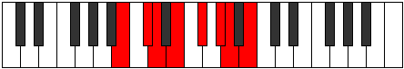 |
| [1709](https://ianring.com/musictheory/scales/1709) | [Dorian](ModeFSharpDorian.md) | F# | F#, G#, A, B, C#, D#, E, F# |  |
| [1709](https://ianring.com/musictheory/scales/1709) | [Dorian](ModeGFlatDorian.md) | Gb | Gb, Ab, Bbb, Cb, Db, Eb, Fb, Gb |  |
| [1711](https://ianring.com/musictheory/scales/1711) | [Ragyllic](ModeENaturalRagyllic.md) | E | E, F, F#, G, A, B, C#, D, E |  |
| [1711](https://ianring.com/musictheory/scales/1711) | [Ragyllic](ModeBNaturalRagyllic.md) | B | B, C, C#, D, E, F#, G#, A, B |  |
| [1711](https://ianring.com/musictheory/scales/1711) | [Ragyllic](ModeFSharpRagyllic.md) | F# | F#, G, G#, A, B, C#, D#, E, F# |  |
| [1711](https://ianring.com/musictheory/scales/1711) | [Ragyllic](ModeGFlatRagyllic.md) | Gb | Gb, G, Ab, A, B, Db, Eb, E, Gb |  |
| [1713](https://ianring.com/musictheory/scales/1713) | [Garimic](ModeANaturalGarimic.md) | A | A, B##, C##, D##, E##, F##, A |  |
| [1713](https://ianring.com/musictheory/scales/1713) | [Garimic](ModeENaturalGarimic.md) | E | E, F###, G##, A##, B##, C##, E |  |
| [1715](https://ianring.com/musictheory/scales/1715) | [Aeronian](ModeCNaturalAeronian.md) | C | C, Db, E, F, G, A, Bb, C |  |
| [1715](https://ianring.com/musictheory/scales/1715) | [Aeronian](ModeANaturalAeronian.md) | A | A, Bb, C#, D, E, F#, G, A |  |
| [1715](https://ianring.com/musictheory/scales/1715) | [Aeronian](ModeENaturalAeronian.md) | E | E, F, G#, A, B, C#, D, E |  |
| [1717](https://ianring.com/musictheory/scales/1717) | [Mixolydian](ModeANaturalMixolydian.md) | A | A, B, C#, D, E, F#, G, A |  |
| [1717](https://ianring.com/musictheory/scales/1717) | [Mixolydian](ModeENaturalMixolydian.md) | E | E, F#, G#, A, B, C#, D, E |  |
| [1717](https://ianring.com/musictheory/scales/1717) | [Mixolydian](ModeBNaturalMixolydian.md) | B | B, C#, D#, E, F#, G#, A, B |  |
| [1719](https://ianring.com/musictheory/scales/1719) | [Lyryllic](ModeCNaturalLyryllic.md) | C | C, C#, D, E, F, G, A, A#, C |  |
| [1719](https://ianring.com/musictheory/scales/1719) | [Lyryllic](ModeBNaturalLyryllic.md) | B | B, C, C#, D#, E, F#, G#, A, B | 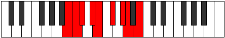 |
| [1719](https://ianring.com/musictheory/scales/1719) | [Lyryllic](ModeENaturalLyryllic.md) | E | E, F, F#, G#, A, B, C#, D, E |  |
| [1719](https://ianring.com/musictheory/scales/1719) | [Lyryllic](ModeANaturalLyryllic.md) | A | A, A#, B, C#, D, E, F#, G, A |  |
| [1721](https://ianring.com/musictheory/scales/1721) | [Ionycrian](ModeANaturalIonycrian.md) | A | A, B#, C#, D, E, F#, G, A |  |
| [1721](https://ianring.com/musictheory/scales/1721) | [Ionycrian](ModeENaturalIonycrian.md) | E | E, F##, G#, A, B, C#, D, E |  |
| [1721](https://ianring.com/musictheory/scales/1721) | [Ionycrian](ModeFSharpIonycrian.md) | F# | F#, G##, A#, B, C#, D#, E, F# |  |
| [1721](https://ianring.com/musictheory/scales/1721) | [Ionycrian](ModeGFlatIonycrian.md) | Gb | Gb, A, Bb, Cb, Db, Eb, Fb, Gb |  |
| [1723](https://ianring.com/musictheory/scales/1723) | [Poryllic](ModeCNaturalPoryllic.md) | C | C, C#, D#, E, F, G, A, A#, C | 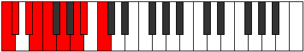 |
| [1723](https://ianring.com/musictheory/scales/1723) | [Poryllic](ModeANaturalPoryllic.md) | A | A, A#, C, C#, D, E, F#, G, A |  |
| [1723](https://ianring.com/musictheory/scales/1723) | [Poryllic](ModeENaturalPoryllic.md) | E | E, F, G, G#, A, B, C#, D, E |  |
| [1723](https://ianring.com/musictheory/scales/1723) | [Poryllic](ModeFSharpPoryllic.md) | F# | F#, G, A, A#, B, C#, D#, E, F# |  |
| [1723](https://ianring.com/musictheory/scales/1723) | [Poryllic](ModeGFlatPoryllic.md) | Gb | Gb, G, A, Bb, B, Db, Eb, E, Gb |  |
| [1725](https://ianring.com/musictheory/scales/1725) | [Mixodyllic](ModeANaturalMixodyllic.md) | A | A, B, C, C#, D, E, F#, G, A |  |
| [1725](https://ianring.com/musictheory/scales/1725) | [Mixodyllic](ModeBNaturalMixodyllic.md) | B | B, C#, D, D#, E, F#, G#, A, B |  |
| [1725](https://ianring.com/musictheory/scales/1725) | [Mixodyllic](ModeENaturalMixodyllic.md) | E | E, F#, G, G#, A, B, C#, D, E |  |
| [1725](https://ianring.com/musictheory/scales/1725) | [Mixodyllic](ModeFSharpMixodyllic.md) | F# | F#, G#, A, A#, B, C#, D#, E, F# |  |
| [1725](https://ianring.com/musictheory/scales/1725) | [Mixodyllic](ModeGFlatMixodyllic.md) | Gb | Gb, Ab, A, Bb, B, Db, Eb, E, Gb |  |
| [1727](https://ianring.com/musictheory/scales/1727) | [Sydygic](ModeCNaturalSydygic.md) | C | C, C#, D, D#, E, F, G, A, A#, C |  |
| [1727](https://ianring.com/musictheory/scales/1727) | [Sydygic](ModeBNaturalSydygic.md) | B | B, C, C#, D, D#, E, F#, G#, A, B |  |
| [1727](https://ianring.com/musictheory/scales/1727) | [Sydygic](ModeENaturalSydygic.md) | E | E, F, F#, G, G#, A, B, C#, D, E |  |
| [1727](https://ianring.com/musictheory/scales/1727) | [Sydygic](ModeANaturalSydygic.md) | A | A, A#, B, C, C#, D, E, F#, G, A |  |
| [1727](https://ianring.com/musictheory/scales/1727) | [Sydygic](ModeFSharpSydygic.md) | F# | F#, G, G#, A, A#, B, C#, D#, E, F# |  |
| [1727](https://ianring.com/musictheory/scales/1727) | [Sydygic](ModeGFlatSydygic.md) | Gb | Gb, G, Ab, A, Bb, B, Db, Eb, E, Gb |  |
| [1733](https://ianring.com/musictheory/scales/1733) | [Socrimic](ModeGNaturalSocrimic.md) | G | G, A, B##, C##, D##, E#, G |  |
| [1735](https://ianring.com/musictheory/scales/1735) | [Dagian](ModeGNaturalDagian.md) | G | G, Ab, Bbb, C#, D, E, F, G |  |
| [1735](https://ianring.com/musictheory/scales/1735) | [Dagian](ModeDSharpDagian.md) | D# | D#, E, F, G##, A#, B#, C#, D# |  |
| [1735](https://ianring.com/musictheory/scales/1735) | [Dagian](ModeEFlatDagian.md) | Eb | Eb, Fb, Gbb, A, Bb, C, Db, Eb |  |
| [1737](https://ianring.com/musictheory/scales/1737) | [Thalimic](ModeGFlatThalimic.md) | Gb | Gb, A, B#, C#, D#, E, Gb |  |
| [1739](https://ianring.com/musictheory/scales/1739) | [Phrylian](ModeFSharpPhrylian.md) | F# | F#, G, A, B#, C#, D#, E, F# |  |
| [1739](https://ianring.com/musictheory/scales/1739) | [Phrylian](ModeGFlatPhrylian.md) | Gb | Gb, Abb, Bbb, C, Db, Eb, Fb, Gb |  |
| [1739](https://ianring.com/musictheory/scales/1739) | [Phrylian](ModeDSharpPhrylian.md) | D# | D#, E, F#, G##, A#, B#, C#, D# |  |
| [1739](https://ianring.com/musictheory/scales/1739) | [Phrylian](ModeEFlatPhrylian.md) | Eb | Eb, Fb, Gb, A, Bb, C, Db, Eb |  |
| [1741](https://ianring.com/musictheory/scales/1741) | [Katycrian](ModeFSharpKatycrian.md) | F# | F#, G#, A, B#, C#, D#, E, F# |  |
| [1741](https://ianring.com/musictheory/scales/1741) | [Katycrian](ModeGFlatKatycrian.md) | Gb | Gb, Ab, Bbb, C, Db, Eb, Fb, Gb |  |
| [1741](https://ianring.com/musictheory/scales/1741) | [Katycrian](ModeGNaturalKatycrian.md) | G | G, A, Bb, C#, D, E, F, G |  |
| [1743](https://ianring.com/musictheory/scales/1743) | [Epigyllic](ModeFSharpEpigyllic.md) | F# | F#, G, G#, A, C, C#, D#, E, F# |  |
| [1743](https://ianring.com/musictheory/scales/1743) | [Epigyllic](ModeGFlatEpigyllic.md) | Gb | Gb, G, Ab, A, C, Db, Eb, E, Gb |  |
| [1743](https://ianring.com/musictheory/scales/1743) | [Epigyllic](ModeDSharpEpigyllic.md) | D# | D#, E, F, F#, A, A#, C, C#, D# |  |
| [1743](https://ianring.com/musictheory/scales/1743) | [Epigyllic](ModeEFlatEpigyllic.md) | Eb | Eb, E, F, Gb, A, Bb, C, Db, Eb |  |
| [1743](https://ianring.com/musictheory/scales/1743) | [Epigyllic](ModeGNaturalEpigyllic.md) | G | G, G#, A, A#, C#, D, E, F, G |  |
| [1745](https://ianring.com/musictheory/scales/1745) | [Manimic](ModeANaturalManimic.md) | A | A, B##, C###, D##, E##, F##, A |  |
| [1747](https://ianring.com/musictheory/scales/1747) | [Epalian](ModeDSharpEpalian.md) | D# | D#, E, F##, G##, A#, B#, C#, D# |  |
| [1747](https://ianring.com/musictheory/scales/1747) | [Epalian](ModeEFlatEpalian.md) | Eb | Eb, Fb, G, A, Bb, C, Db, Eb |  |
| [1747](https://ianring.com/musictheory/scales/1747) | [Epalian](ModeCNaturalEpalian.md) | C | C, Db, E, F#, G, A, Bb, C |  |
| [1747](https://ianring.com/musictheory/scales/1747) | [Epalian](ModeANaturalEpalian.md) | A | A, Bb, C#, D#, E, F#, G, A |  |
| [1749](https://ianring.com/musictheory/scales/1749) | [Lythian](ModeGNaturalLythian.md) | G | G, A, B, C#, D, E, F, G |  |
| [1749](https://ianring.com/musictheory/scales/1749) | [Lythian](ModeANaturalLythian.md) | A | A, B, C#, D#, E, F#, G, A |  |
| [1751](https://ianring.com/musictheory/scales/1751) | [Aeolyryllic](ModeDSharpAeolyryllic.md) | D# | D#, E, F, G, A, A#, C, C#, D# |  |
| [1751](https://ianring.com/musictheory/scales/1751) | [Aeolyryllic](ModeEFlatAeolyryllic.md) | Eb | Eb, E, F, G, A, Bb, C, Db, Eb |  |
| [1751](https://ianring.com/musictheory/scales/1751) | [Aeolyryllic](ModeCNaturalAeolyryllic.md) | C | C, C#, D, E, F#, G, A, A#, C |  |
| [1751](https://ianring.com/musictheory/scales/1751) | [Aeolyryllic](ModeGNaturalAeolyryllic.md) | G | G, G#, A, B, C#, D, E, F, G |  |
| [1751](https://ianring.com/musictheory/scales/1751) | [Aeolyryllic](ModeANaturalAeolyryllic.md) | A | A, A#, B, C#, D#, E, F#, G, A |  |
| [1753](https://ianring.com/musictheory/scales/1753) | [Mycrian](ModeANaturalMycrian.md) | A | A, B#, C#, D#, E, F#, G, A |  |
| [1753](https://ianring.com/musictheory/scales/1753) | [Mycrian](ModeFSharpMycrian.md) | F# | F#, G##, A#, B#, C#, D#, E, F# | 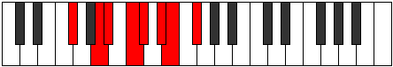 |
| [1753](https://ianring.com/musictheory/scales/1753) | [Mycrian](ModeGFlatMycrian.md) | Gb | Gb, A, Bb, C, Db, Eb, Fb, Gb |  |
| [1755](https://ianring.com/musictheory/scales/1755) | [MinorDiminished](ModeCNaturalMinorDiminished.md) | C | C, C#, D#, E, F#, G, A, A#, C |  |
| [1755](https://ianring.com/musictheory/scales/1755) | [MinorDiminished](ModeDSharpMinorDiminished.md) | D# | D#, E, F#, G, A, A#, C, C#, D# |  |
| [1755](https://ianring.com/musictheory/scales/1755) | [MinorDiminished](ModeEFlatMinorDiminished.md) | Eb | Eb, E, Gb, G, A, Bb, C, Db, Eb |  |
| [1755](https://ianring.com/musictheory/scales/1755) | [MinorDiminished](ModeFSharpMinorDiminished.md) | F# | F#, G, A, A#, C, C#, D#, E, F# |  |
| [1755](https://ianring.com/musictheory/scales/1755) | [MinorDiminished](ModeGFlatMinorDiminished.md) | Gb | Gb, G, A, Bb, C, Db, Eb, E, Gb |  |
| [1755](https://ianring.com/musictheory/scales/1755) | [MinorDiminished](ModeANaturalMinorDiminished.md) | A | A, A#, C, C#, D#, E, F#, G, A |  |
| [1757](https://ianring.com/musictheory/scales/1757) | [Ionyphyllic](ModeFSharpIonyphyllic.md) | F# | F#, G#, A, A#, C, C#, D#, E, F# |  |
| [1757](https://ianring.com/musictheory/scales/1757) | [Ionyphyllic](ModeGFlatIonyphyllic.md) | Gb | Gb, Ab, A, Bb, C, Db, Eb, E, Gb |  |
| [1757](https://ianring.com/musictheory/scales/1757) | [Ionyphyllic](ModeANaturalIonyphyllic.md) | A | A, B, C, C#, D#, E, F#, G, A |  |
| [1757](https://ianring.com/musictheory/scales/1757) | [Ionyphyllic](ModeGNaturalIonyphyllic.md) | G | G, A, A#, B, C#, D, E, F, G |  |
| [1759](https://ianring.com/musictheory/scales/1759) | [Pylygic](ModeCNaturalPylygic.md) | C | C, C#, D, D#, E, F#, G, A, A#, C |  |
| [1759](https://ianring.com/musictheory/scales/1759) | [Pylygic](ModeDSharpPylygic.md) | D# | D#, E, F, F#, G, A, A#, C, C#, D# |  |
| [1759](https://ianring.com/musictheory/scales/1759) | [Pylygic](ModeEFlatPylygic.md) | Eb | Eb, E, F, Gb, G, A, Bb, C, Db, Eb |  |
| [1759](https://ianring.com/musictheory/scales/1759) | [Pylygic](ModeFSharpPylygic.md) | F# | F#, G, G#, A, A#, C, C#, D#, E, F# |  |
| [1759](https://ianring.com/musictheory/scales/1759) | [Pylygic](ModeGFlatPylygic.md) | Gb | Gb, G, Ab, A, Bb, C, Db, Eb, E, Gb |  |
| [1759](https://ianring.com/musictheory/scales/1759) | [Pylygic](ModeANaturalPylygic.md) | A | A, A#, B, C, C#, D#, E, F#, G, A |  |
| [1759](https://ianring.com/musictheory/scales/1759) | [Pylygic](ModeGNaturalPylygic.md) | G | G, G#, A, A#, B, C#, D, E, F, G |  |
| [1763](https://ianring.com/musictheory/scales/1763) | [Katalian](ModeDSharpKatalian.md) | D# | D#, E, F###, G##, A#, B#, C#, D# |  |
| [1763](https://ianring.com/musictheory/scales/1763) | [Katalian](ModeEFlatKatalian.md) | Eb | Eb, Fb, G#, A, Bb, C, Db, Eb |  |
| [1763](https://ianring.com/musictheory/scales/1763) | [Katalian](ModeENaturalKatalian.md) | E | E, F, G##, A#, B, C#, D, E |  |
| [1765](https://ianring.com/musictheory/scales/1765) | [Lonian](ModeGNaturalLonian.md) | G | G, A, B#, C#, D, E, F, G |  |
| [1765](https://ianring.com/musictheory/scales/1765) | [Lonian](ModeBNaturalLonian.md) | B | B, C#, D##, E#, F#, G#, A, B | 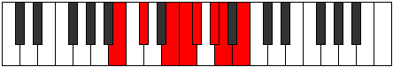 |
| [1765](https://ianring.com/musictheory/scales/1765) | [Lonian](ModeENaturalLonian.md) | E | E, F#, G##, A#, B, C#, D, E |  |
| [1767](https://ianring.com/musictheory/scales/1767) | [Dyryllic](ModeGNaturalDyryllic.md) | G | G, G#, A, C, C#, D, E, F, G |  |
| [1767](https://ianring.com/musictheory/scales/1767) | [Dyryllic](ModeDSharpDyryllic.md) | D# | D#, E, F, G#, A, A#, C, C#, D# |  |
| [1767](https://ianring.com/musictheory/scales/1767) | [Dyryllic](ModeEFlatDyryllic.md) | Eb | Eb, E, F, Ab, A, Bb, C, Db, Eb |  |
| [1767](https://ianring.com/musictheory/scales/1767) | [Dyryllic](ModeBNaturalDyryllic.md) | B | B, C, C#, E, F, F#, G#, A, B |  |
| [1767](https://ianring.com/musictheory/scales/1767) | [Dyryllic](ModeENaturalDyryllic.md) | E | E, F, F#, A, A#, B, C#, D, E |  |
| [1769](https://ianring.com/musictheory/scales/1769) | [Rythian](ModeFSharpRythian.md) | F# | F#, G##, A##, B#, C#, D#, E, F# |  |
| [1769](https://ianring.com/musictheory/scales/1769) | [Rythian](ModeGFlatRythian.md) | Gb | Gb, A, B, C, Db, Eb, Fb, Gb |  |
| [1769](https://ianring.com/musictheory/scales/1769) | [Rythian](ModeENaturalRythian.md) | E | E, F##, G##, A#, B, C#, D, E |  |
| [1771](https://ianring.com/musictheory/scales/1771) | [Stylyllic](ModeDSharpStylyllic.md) | D# | D#, E, F#, G#, A, A#, C, C#, D# |  |
| [1771](https://ianring.com/musictheory/scales/1771) | [Stylyllic](ModeEFlatStylyllic.md) | Eb | Eb, E, Gb, Ab, A, Bb, C, Db, Eb |  |
| [1771](https://ianring.com/musictheory/scales/1771) | [Stylyllic](ModeFSharpStylyllic.md) | F# | F#, G, A, B, C, C#, D#, E, F# |  |
| [1771](https://ianring.com/musictheory/scales/1771) | [Stylyllic](ModeGFlatStylyllic.md) | Gb | Gb, G, A, B, C, Db, Eb, E, Gb |  |
| [1771](https://ianring.com/musictheory/scales/1771) | [Stylyllic](ModeENaturalStylyllic.md) | E | E, F, G, A, A#, B, C#, D, E |  |
| [1773](https://ianring.com/musictheory/scales/1773) | [Aeoloryllic](ModeGNaturalAeoloryllic.md) | G | G, A, A#, C, C#, D, E, F, G |  |
| [1773](https://ianring.com/musictheory/scales/1773) | [Aeoloryllic](ModeFSharpAeoloryllic.md) | F# | F#, G#, A, B, C, C#, D#, E, F# |  |
| [1773](https://ianring.com/musictheory/scales/1773) | [Aeoloryllic](ModeGFlatAeoloryllic.md) | Gb | Gb, Ab, A, B, C, Db, Eb, E, Gb |  |
| [1773](https://ianring.com/musictheory/scales/1773) | [Aeoloryllic](ModeBNaturalAeoloryllic.md) | B | B, C#, D, E, F, F#, G#, A, B |  |
| [1773](https://ianring.com/musictheory/scales/1773) | [Aeoloryllic](ModeENaturalAeoloryllic.md) | E | E, F#, G, A, A#, B, C#, D, E |  |
| [1775](https://ianring.com/musictheory/scales/1775) | [Lyrygic](ModeDSharpLyrygic.md) | D# | D#, E, F, F#, G#, A, A#, C, C#, D# |  |
| [1775](https://ianring.com/musictheory/scales/1775) | [Lyrygic](ModeEFlatLyrygic.md) | Eb | Eb, E, F, Gb, Ab, A, Bb, C, Db, Eb |  |
| [1775](https://ianring.com/musictheory/scales/1775) | [Lyrygic](ModeGNaturalLyrygic.md) | G | G, G#, A, A#, C, C#, D, E, F, G |  |
| [1775](https://ianring.com/musictheory/scales/1775) | [Lyrygic](ModeBNaturalLyrygic.md) | B | B, C, C#, D, E, F, F#, G#, A, B |  |
| [1775](https://ianring.com/musictheory/scales/1775) | [Lyrygic](ModeFSharpLyrygic.md) | F# | F#, G, G#, A, B, C, C#, D#, E, F# |  |
| [1775](https://ianring.com/musictheory/scales/1775) | [Lyrygic](ModeGFlatLyrygic.md) | Gb | Gb, G, Ab, A, B, C, Db, Eb, E, Gb |  |
| [1775](https://ianring.com/musictheory/scales/1775) | [Lyrygic](ModeENaturalLyrygic.md) | E | E, F, F#, G, A, A#, B, C#, D, E |  |
| [1777](https://ianring.com/musictheory/scales/1777) | [Saptian](ModeANaturalSaptian.md) | A | A, B##, C##, D#, E, F#, G, A |  |
| [1777](https://ianring.com/musictheory/scales/1777) | [Saptian](ModeENaturalSaptian.md) | E | E, F###, G##, A#, B, C#, D, E |  |
| [1779](https://ianring.com/musictheory/scales/1779) | [Aerythyllic](ModeANaturalAerythyllic.md) | A | A, A#, C#, D, D#, E, F#, G, A |  |
| [1779](https://ianring.com/musictheory/scales/1779) | [Aerythyllic](ModeCNaturalAerythyllic.md) | C | C, C#, E, F, F#, G, A, A#, C |  |
| [1779](https://ianring.com/musictheory/scales/1779) | [Aerythyllic](ModeDSharpAerythyllic.md) | D# | D#, E, G, G#, A, A#, C, C#, D# |  |
| [1779](https://ianring.com/musictheory/scales/1779) | [Aerythyllic](ModeEFlatAerythyllic.md) | Eb | Eb, E, G, Ab, A, Bb, C, Db, Eb |  |
| [1779](https://ianring.com/musictheory/scales/1779) | [Aerythyllic](ModeENaturalAerythyllic.md) | E | E, F, G#, A, A#, B, C#, D, E |  |
| [1781](https://ianring.com/musictheory/scales/1781) | [Gocryllic](ModeGNaturalGocryllic.md) | G | G, A, B, C, C#, D, E, F, G |  |
| [1781](https://ianring.com/musictheory/scales/1781) | [Gocryllic](ModeANaturalGocryllic.md) | A | A, B, C#, D, D#, E, F#, G, A |  |
| [1781](https://ianring.com/musictheory/scales/1781) | [Gocryllic](ModeBNaturalGocryllic.md) | B | B, C#, D#, E, F, F#, G#, A, B |  |
| [1781](https://ianring.com/musictheory/scales/1781) | [Gocryllic](ModeENaturalGocryllic.md) | E | E, F#, G#, A, A#, B, C#, D, E |  |
| [1783](https://ianring.com/musictheory/scales/1783) | [Danygic](ModeCNaturalDanygic.md) | C | C, C#, D, E, F, F#, G, A, A#, C |  |
| [1783](https://ianring.com/musictheory/scales/1783) | [Danygic](ModeDSharpDanygic.md) | D# | D#, E, F, G, G#, A, A#, C, C#, D# |  |
| [1783](https://ianring.com/musictheory/scales/1783) | [Danygic](ModeEFlatDanygic.md) | Eb | Eb, E, F, G, Ab, A, Bb, C, Db, Eb |  |
| [1783](https://ianring.com/musictheory/scales/1783) | [Danygic](ModeBNaturalDanygic.md) | B | B, C, C#, D#, E, F, F#, G#, A, B |  |
| [1783](https://ianring.com/musictheory/scales/1783) | [Danygic](ModeGNaturalDanygic.md) | G | G, G#, A, B, C, C#, D, E, F, G |  |
| [1783](https://ianring.com/musictheory/scales/1783) | [Danygic](ModeANaturalDanygic.md) | A | A, A#, B, C#, D, D#, E, F#, G, A |  |
| [1783](https://ianring.com/musictheory/scales/1783) | [Danygic](ModeENaturalDanygic.md) | E | E, F, F#, G#, A, A#, B, C#, D, E |  |
| [1785](https://ianring.com/musictheory/scales/1785) | [Tharyllic](ModeANaturalTharyllic.md) | A | A, C, C#, D, D#, E, F#, G, A |  |
| [1785](https://ianring.com/musictheory/scales/1785) | [Tharyllic](ModeFSharpTharyllic.md) | F# | F#, A, A#, B, C, C#, D#, E, F# |  |
| [1785](https://ianring.com/musictheory/scales/1785) | [Tharyllic](ModeGFlatTharyllic.md) | Gb | Gb, A, Bb, B, C, Db, Eb, E, Gb |  |
| [1785](https://ianring.com/musictheory/scales/1785) | [Tharyllic](ModeENaturalTharyllic.md) | E | E, G, G#, A, A#, B, C#, D, E |  |
| [1787](https://ianring.com/musictheory/scales/1787) | [Mycrygic](ModeANaturalMycrygic.md) | A | A, A#, C, C#, D, D#, E, F#, G, A |  |
| [1787](https://ianring.com/musictheory/scales/1787) | [Mycrygic](ModeCNaturalMycrygic.md) | C | C, C#, D#, E, F, F#, G, A, A#, C |  |
| [1787](https://ianring.com/musictheory/scales/1787) | [Mycrygic](ModeDSharpMycrygic.md) | D# | D#, E, F#, G, G#, A, A#, C, C#, D# |  |
| [1787](https://ianring.com/musictheory/scales/1787) | [Mycrygic](ModeEFlatMycrygic.md) | Eb | Eb, E, Gb, G, Ab, A, Bb, C, Db, Eb |  |
| [1787](https://ianring.com/musictheory/scales/1787) | [Mycrygic](ModeFSharpMycrygic.md) | F# | F#, G, A, A#, B, C, C#, D#, E, F# |  |
| [1787](https://ianring.com/musictheory/scales/1787) | [Mycrygic](ModeGFlatMycrygic.md) | Gb | Gb, G, A, Bb, B, C, Db, Eb, E, Gb |  |
| [1787](https://ianring.com/musictheory/scales/1787) | [Mycrygic](ModeENaturalMycrygic.md) | E | E, F, G, G#, A, A#, B, C#, D, E |  |
| [1789](https://ianring.com/musictheory/scales/1789) | [Katagygic](ModeANaturalKatagygic.md) | A | A, B, C, C#, D, D#, E, F#, G, A |  |
| [1789](https://ianring.com/musictheory/scales/1789) | [Katagygic](ModeBNaturalKatagygic.md) | B | B, C#, D, D#, E, F, F#, G#, A, B |  |
| [1789](https://ianring.com/musictheory/scales/1789) | [Katagygic](ModeGNaturalKatagygic.md) | G | G, A, A#, B, C, C#, D, E, F, G |  |
| [1789](https://ianring.com/musictheory/scales/1789) | [Katagygic](ModeFSharpKatagygic.md) | F# | F#, G#, A, A#, B, C, C#, D#, E, F# |  |
| [1789](https://ianring.com/musictheory/scales/1789) | [Katagygic](ModeGFlatKatagygic.md) | Gb | Gb, Ab, A, Bb, B, C, Db, Eb, E, Gb |  |
| [1789](https://ianring.com/musictheory/scales/1789) | [Katagygic](ModeENaturalKatagygic.md) | E | E, F#, G, G#, A, A#, B, C#, D, E |  |
| [1791](https://ianring.com/musictheory/scales/1791) | [Aerygyllian](ModeCNaturalAerygyllian.md) | C | C, C#, D, D#, E, F, F#, G, A, A#, C |  |
| [1791](https://ianring.com/musictheory/scales/1791) | [Aerygyllian](ModeDSharpAerygyllian.md) | D# | D#, E, F, F#, G, G#, A, A#, C, C#, D# |  |
| [1791](https://ianring.com/musictheory/scales/1791) | [Aerygyllian](ModeEFlatAerygyllian.md) | Eb | Eb, E, F, Gb, G, Ab, A, Bb, C, Db, Eb |  |
| [1791](https://ianring.com/musictheory/scales/1791) | [Aerygyllian](ModeBNaturalAerygyllian.md) | B | B, C, C#, D, D#, E, F, F#, G#, A, B |  |
| [1791](https://ianring.com/musictheory/scales/1791) | [Aerygyllian](ModeANaturalAerygyllian.md) | A | A, A#, B, C, C#, D, D#, E, F#, G, A |  |
| [1791](https://ianring.com/musictheory/scales/1791) | [Aerygyllian](ModeGNaturalAerygyllian.md) | G | G, G#, A, A#, B, C, C#, D, E, F, G |  |
| [1791](https://ianring.com/musictheory/scales/1791) | [Aerygyllian](ModeFSharpAerygyllian.md) | F# | F#, G, G#, A, A#, B, C, C#, D#, E, F# |  |
| [1791](https://ianring.com/musictheory/scales/1791) | [Aerygyllian](ModeGFlatAerygyllian.md) | Gb | Gb, G, Ab, A, Bb, B, C, Db, Eb, E, Gb |  |
| [1791](https://ianring.com/musictheory/scales/1791) | [Aerygyllian](ModeENaturalAerygyllian.md) | E | E, F, F#, G, G#, A, A#, B, C#, D, E |  |
| [1811](https://ianring.com/musictheory/scales/1811) | [Kyptimic](ModeCNaturalKyptimic.md) | C | C, Db, E, F###, G##, A#, C |  |
| [1815](https://ianring.com/musictheory/scales/1815) | [Godian](ModeCNaturalGodian.md) | C | C, Db, Ebb, Fb, G#, A, Bb, C |  |
| [1817](https://ianring.com/musictheory/scales/1817) | [Phrythimic](ModeCSharpPhrythimic.md) | C# | C#, D##, E#, Cbbb, Cbb, Dbbb, C# |  |
| [1817](https://ianring.com/musictheory/scales/1817) | [Phrythimic](ModeDFlatPhrythimic.md) | Db | Db, E, F, G##, A#, B, Db |  |
| [1819](https://ianring.com/musictheory/scales/1819) | [Pydian](ModeCNaturalPydian.md) | C | C, Db, Eb, Fb, G#, A, Bb, C |  |
| [1819](https://ianring.com/musictheory/scales/1819) | [Pydian](ModeCSharpPydian.md) | C# | C#, D, E, F, G##, A#, B, C# |  |
| [1819](https://ianring.com/musictheory/scales/1819) | [Pydian](ModeDFlatPydian.md) | Db | Db, Ebb, Fb, Gbb, A, Bb, Cb, Db |  |
| [1821](https://ianring.com/musictheory/scales/1821) | [Aeradian](ModeCSharpAeradian.md) | C# | C#, D#, E, F, G##, A#, B, C# |  |
| [1821](https://ianring.com/musictheory/scales/1821) | [Aeradian](ModeDFlatAeradian.md) | Db | Db, Eb, Fb, Gbb, A, Bb, Cb, Db |  |
| [1823](https://ianring.com/musictheory/scales/1823) | [Phralyllic](ModeCNaturalPhralyllic.md) | C | C, C#, D, D#, E, G#, A, A#, C |  |
| [1823](https://ianring.com/musictheory/scales/1823) | [Phralyllic](ModeCSharpPhralyllic.md) | C# | C#, D, D#, E, F, A, A#, B, C# |  |
| [1823](https://ianring.com/musictheory/scales/1823) | [Phralyllic](ModeDFlatPhralyllic.md) | Db | Db, D, Eb, E, F, A, Bb, B, Db |  |
| [1827](https://ianring.com/musictheory/scales/1827) | [Katygimic](ModeENaturalKatygimic.md) | E | E, F, G##, A###, B##, C##, E |  |
| [1827](https://ianring.com/musictheory/scales/1827) | [Katygimic](ModeGSharpKatygimic.md) | G# | G#, A, B##, D##, E#, F#, G# |  |
| [1827](https://ianring.com/musictheory/scales/1827) | [Katygimic](ModeAFlatKatygimic.md) | Ab | Ab, Bbb, C#, D##, E#, F#, Ab |  |
| [1829](https://ianring.com/musictheory/scales/1829) | [Pathimic](ModeENaturalPathimic.md) | E | E, F#, G##, A###, B##, C##, E |  |
| [1829](https://ianring.com/musictheory/scales/1829) | [Pathimic](ModeBNaturalPathimic.md) | B | B, C#, D##, E###, F###, G##, B |  |
| [1831](https://ianring.com/musictheory/scales/1831) | [Pothian](ModeENaturalPothian.md) | E | E, F, Gb, A, B#, C#, D, E |  |
| [1831](https://ianring.com/musictheory/scales/1831) | [Pothian](ModeGSharpPothian.md) | G# | G#, A, Bb, C#, D##, E#, F#, G# |  |
| [1831](https://ianring.com/musictheory/scales/1831) | [Pothian](ModeAFlatPothian.md) | Ab | Ab, Bbb, Cbb, Db, E, F, Gb, Ab |  |
| [1831](https://ianring.com/musictheory/scales/1831) | [Pothian](ModeBNaturalPothian.md) | B | B, C, Db, E, F##, G#, A, B |  |
| [1833](https://ianring.com/musictheory/scales/1833) | [Ionacrimic](ModeENaturalIonacrimic.md) | E | E, F##, G##, A###, B##, C##, E |  |
| [1833](https://ianring.com/musictheory/scales/1833) | [Ionacrimic](ModeCSharpIonacrimic.md) | C# | C#, D##, E##, Cbbb, Cbb, Dbbb, C# | 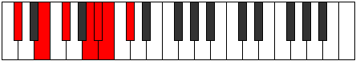 |
| [1833](https://ianring.com/musictheory/scales/1833) | [Ionacrimic](ModeDFlatIonacrimic.md) | Db | Db, E, F#, G##, A#, B, Db |  |
| [1835](https://ianring.com/musictheory/scales/1835) | [Byptian](ModeENaturalByptian.md) | E | E, F, G, A, B#, C#, D, E |  |
| [1835](https://ianring.com/musictheory/scales/1835) | [Byptian](ModeGSharpByptian.md) | G# | G#, A, B, C#, D##, E#, F#, G# |  |
| [1835](https://ianring.com/musictheory/scales/1835) | [Byptian](ModeAFlatByptian.md) | Ab | Ab, Bbb, Cb, Db, E, F, Gb, Ab |  |
| [1835](https://ianring.com/musictheory/scales/1835) | [Byptian](ModeCSharpByptian.md) | C# | C#, D, E, F#, G##, A#, B, C# |  |
| [1835](https://ianring.com/musictheory/scales/1835) | [Byptian](ModeDFlatByptian.md) | Db | Db, Ebb, Fb, Gb, A, Bb, Cb, Db |  |
| [1837](https://ianring.com/musictheory/scales/1837) | [Dalian](ModeENaturalDalian.md) | E | E, F#, G, A, B#, C#, D, E |  |
| [1837](https://ianring.com/musictheory/scales/1837) | [Dalian](ModeBNaturalDalian.md) | B | B, C#, D, E, F##, G#, A, B |  |
| [1837](https://ianring.com/musictheory/scales/1837) | [Dalian](ModeCSharpDalian.md) | C# | C#, D#, E, F#, G##, A#, B, C# |  |
| [1837](https://ianring.com/musictheory/scales/1837) | [Dalian](ModeDFlatDalian.md) | Db | Db, Eb, Fb, Gb, A, Bb, Cb, Db |  |
| [1839](https://ianring.com/musictheory/scales/1839) | [Zogyllic](ModeENaturalZogyllic.md) | E | E, F, F#, G, A, C, C#, D, E |  |
| [1839](https://ianring.com/musictheory/scales/1839) | [Zogyllic](ModeBNaturalZogyllic.md) | B | B, C, C#, D, E, G, G#, A, B |  |
| [1839](https://ianring.com/musictheory/scales/1839) | [Zogyllic](ModeCSharpZogyllic.md) | C# | C#, D, D#, E, F#, A, A#, B, C# |  |
| [1839](https://ianring.com/musictheory/scales/1839) | [Zogyllic](ModeDFlatZogyllic.md) | Db | Db, D, Eb, E, Gb, A, Bb, B, Db |  |
| [1839](https://ianring.com/musictheory/scales/1839) | [Zogyllic](ModeGSharpZogyllic.md) | G# | G#, A, A#, B, C#, E, F, F#, G# |  |
| [1839](https://ianring.com/musictheory/scales/1839) | [Zogyllic](ModeAFlatZogyllic.md) | Ab | Ab, A, Bb, B, Db, E, F, Gb, Ab |  |
| [1841](https://ianring.com/musictheory/scales/1841) | [Thogimic](ModeENaturalThogimic.md) | E | E, F###, G##, A###, B##, C##, E |  |
| [1843](https://ianring.com/musictheory/scales/1843) | [Ionygian](ModeENaturalIonygian.md) | E | E, F, G#, A, B#, C#, D, E |  |
| [1843](https://ianring.com/musictheory/scales/1843) | [Ionygian](ModeGSharpIonygian.md) | G# | G#, A, B#, C#, D##, E#, F#, G# |  |
| [1843](https://ianring.com/musictheory/scales/1843) | [Ionygian](ModeAFlatIonygian.md) | Ab | Ab, Bbb, C, Db, E, F, Gb, Ab |  |
| [1843](https://ianring.com/musictheory/scales/1843) | [Ionygian](ModeCNaturalIonygian.md) | C | C, Db, E, F, G#, A, Bb, C |  |
| [1845](https://ianring.com/musictheory/scales/1845) | [Lagian](ModeENaturalLagian.md) | E | E, F#, G#, A, B#, C#, D, E |  |
| [1845](https://ianring.com/musictheory/scales/1845) | [Lagian](ModeBNaturalLagian.md) | B | B, C#, D#, E, F##, G#, A, B |  |
| [1847](https://ianring.com/musictheory/scales/1847) | [Thacryllic](ModeENaturalThacryllic.md) | E | E, F, F#, G#, A, C, C#, D, E |  |
| [1847](https://ianring.com/musictheory/scales/1847) | [Thacryllic](ModeCNaturalThacryllic.md) | C | C, C#, D, E, F, G#, A, A#, C |  |
| [1847](https://ianring.com/musictheory/scales/1847) | [Thacryllic](ModeGSharpThacryllic.md) | G# | G#, A, A#, C, C#, E, F, F#, G# |  |
| [1847](https://ianring.com/musictheory/scales/1847) | [Thacryllic](ModeAFlatThacryllic.md) | Ab | Ab, A, Bb, C, Db, E, F, Gb, Ab |  |
| [1847](https://ianring.com/musictheory/scales/1847) | [Thacryllic](ModeBNaturalThacryllic.md) | B | B, C, C#, D#, E, G, G#, A, B |  |
| [1849](https://ianring.com/musictheory/scales/1849) | [Epogian](ModeENaturalEpogian.md) | E | E, F##, G#, A, B#, C#, D, E |  |
| [1849](https://ianring.com/musictheory/scales/1849) | [Epogian](ModeCSharpEpogian.md) | C# | C#, D##, E#, F#, G##, A#, B, C# |  |
| [1849](https://ianring.com/musictheory/scales/1849) | [Epogian](ModeDFlatEpogian.md) | Db | Db, E, F, Gb, A, Bb, Cb, Db |  |
| [1851](https://ianring.com/musictheory/scales/1851) | [Zacryllic](ModeENaturalZacryllic.md) | E | E, F, G, G#, A, C, C#, D, E |  |
| [1851](https://ianring.com/musictheory/scales/1851) | [Zacryllic](ModeCNaturalZacryllic.md) | C | C, C#, D#, E, F, G#, A, A#, C |  |
| [1851](https://ianring.com/musictheory/scales/1851) | [Zacryllic](ModeGSharpZacryllic.md) | G# | G#, A, B, C, C#, E, F, F#, G# |  |
| [1851](https://ianring.com/musictheory/scales/1851) | [Zacryllic](ModeAFlatZacryllic.md) | Ab | Ab, A, B, C, Db, E, F, Gb, Ab |  |
| [1851](https://ianring.com/musictheory/scales/1851) | [Zacryllic](ModeCSharpZacryllic.md) | C# | C#, D, E, F, F#, A, A#, B, C# |  |
| [1851](https://ianring.com/musictheory/scales/1851) | [Zacryllic](ModeDFlatZacryllic.md) | Db | Db, D, E, F, Gb, A, Bb, B, Db |  |
| [1853](https://ianring.com/musictheory/scales/1853) | [Phrynyllic](ModeENaturalPhrynyllic.md) | E | E, F#, G, G#, A, C, C#, D, E |  |
| [1853](https://ianring.com/musictheory/scales/1853) | [Phrynyllic](ModeBNaturalPhrynyllic.md) | B | B, C#, D, D#, E, G, G#, A, B |  |
| [1853](https://ianring.com/musictheory/scales/1853) | [Phrynyllic](ModeCSharpPhrynyllic.md) | C# | C#, D#, E, F, F#, A, A#, B, C# |  |
| [1853](https://ianring.com/musictheory/scales/1853) | [Phrynyllic](ModeDFlatPhrynyllic.md) | Db | Db, Eb, E, F, Gb, A, Bb, B, Db |  |
| [1855](https://ianring.com/musictheory/scales/1855) | [Marygic](ModeENaturalMarygic.md) | E | E, F, F#, G, G#, A, C, C#, D, E |  |
| [1855](https://ianring.com/musictheory/scales/1855) | [Marygic](ModeCNaturalMarygic.md) | C | C, C#, D, D#, E, F, G#, A, A#, C |  |
| [1855](https://ianring.com/musictheory/scales/1855) | [Marygic](ModeBNaturalMarygic.md) | B | B, C, C#, D, D#, E, G, G#, A, B |  |
| [1855](https://ianring.com/musictheory/scales/1855) | [Marygic](ModeCSharpMarygic.md) | C# | C#, D, D#, E, F, F#, A, A#, B, C# |  |
| [1855](https://ianring.com/musictheory/scales/1855) | [Marygic](ModeDFlatMarygic.md) | Db | Db, D, Eb, E, F, Gb, A, Bb, B, Db |  |
| [1855](https://ianring.com/musictheory/scales/1855) | [Marygic](ModeGSharpMarygic.md) | G# | G#, A, A#, B, C, C#, E, F, F#, G# |  |
| [1855](https://ianring.com/musictheory/scales/1855) | [Marygic](ModeAFlatMarygic.md) | Ab | Ab, A, Bb, B, C, Db, E, F, Gb, Ab |  |
| [1861](https://ianring.com/musictheory/scales/1861) | [Phrygimic](ModeGNaturalPhrygimic.md) | G | G, A, B##, C###, D##, E#, G |  |
| [1863](https://ianring.com/musictheory/scales/1863) | [Pycrian](ModeGNaturalPycrian.md) | G | G, Ab, Bbb, C#, D#, E, F, G |  |
| [1863](https://ianring.com/musictheory/scales/1863) | [Pycrian](ModeDSharpPycrian.md) | D# | D#, E, F, G##, A##, B#, C#, D# |  |
| [1863](https://ianring.com/musictheory/scales/1863) | [Pycrian](ModeEFlatPycrian.md) | Eb | Eb, Fb, Gbb, A, B, C, Db, Eb |  |
| [1865](https://ianring.com/musictheory/scales/1865) | [Thagimic](ModeCSharpThagimic.md) | C# | C#, D##, E###, Cbbb, Cbb, Dbbb, C# |  |
| [1865](https://ianring.com/musictheory/scales/1865) | [Thagimic](ModeDFlatThagimic.md) | Db | Db, E, F##, G##, A#, B, Db |  |
| [1867](https://ianring.com/musictheory/scales/1867) | [Solian](ModeDSharpSolian.md) | D# | D#, E, F#, G##, A##, B#, C#, D# |  |
| [1867](https://ianring.com/musictheory/scales/1867) | [Solian](ModeEFlatSolian.md) | Eb | Eb, Fb, Gb, A, B, C, Db, Eb |  |
| [1867](https://ianring.com/musictheory/scales/1867) | [Solian](ModeCSharpSolian.md) | C# | C#, D, E, F##, G##, A#, B, C# |  |
| [1867](https://ianring.com/musictheory/scales/1867) | [Solian](ModeDFlatSolian.md) | Db | Db, Ebb, Fb, G, A, Bb, Cb, Db | 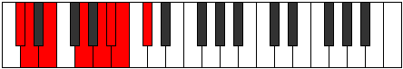 |
| [1869](https://ianring.com/musictheory/scales/1869) | [Katyrian](ModeGNaturalKatyrian.md) | G | G, A, Bb, C#, D#, E, F, G |  |
| [1869](https://ianring.com/musictheory/scales/1869) | [Katyrian](ModeCSharpKatyrian.md) | C# | C#, D#, E, F##, G##, A#, B, C# |  |
| [1869](https://ianring.com/musictheory/scales/1869) | [Katyrian](ModeDFlatKatyrian.md) | Db | Db, Eb, Fb, G, A, Bb, Cb, Db |  |
| [1871](https://ianring.com/musictheory/scales/1871) | [Aeolyllic](ModeGNaturalAeolyllic.md) | G | G, G#, A, A#, C#, D#, E, F, G |  |
| [1871](https://ianring.com/musictheory/scales/1871) | [Aeolyllic](ModeDSharpAeolyllic.md) | D# | D#, E, F, F#, A, B, C, C#, D# |  |
| [1871](https://ianring.com/musictheory/scales/1871) | [Aeolyllic](ModeEFlatAeolyllic.md) | Eb | Eb, E, F, Gb, A, B, C, Db, Eb |  |
| [1871](https://ianring.com/musictheory/scales/1871) | [Aeolyllic](ModeCSharpAeolyllic.md) | C# | C#, D, D#, E, G, A, A#, B, C# |  |
| [1871](https://ianring.com/musictheory/scales/1871) | [Aeolyllic](ModeDFlatAeolyllic.md) | Db | Db, D, Eb, E, G, A, Bb, B, Db |  |
| [1875](https://ianring.com/musictheory/scales/1875) | [Epyphian](ModeCNaturalEpyphian.md) | C | C, Db, E, F#, G#, A, Bb, C |  |
| [1875](https://ianring.com/musictheory/scales/1875) | [Epyphian](ModeDSharpEpyphian.md) | D# | D#, E, F##, G##, A##, B#, C#, D# |  |
| [1875](https://ianring.com/musictheory/scales/1875) | [Epyphian](ModeEFlatEpyphian.md) | Eb | Eb, Fb, G, A, B, C, Db, Eb |  |
| [1877](https://ianring.com/musictheory/scales/1877) | [Aeroptian](ModeGNaturalAeroptian.md) | G | G, A, B, C#, D#, E, F, G |  |
| [1879](https://ianring.com/musictheory/scales/1879) | [Mixoryllic](ModeCNaturalMixoryllic.md) | C | C, C#, D, E, F#, G#, A, A#, C |  |
| [1879](https://ianring.com/musictheory/scales/1879) | [Mixoryllic](ModeDSharpMixoryllic.md) | D# | D#, E, F, G, A, B, C, C#, D# |  |
| [1879](https://ianring.com/musictheory/scales/1879) | [Mixoryllic](ModeEFlatMixoryllic.md) | Eb | Eb, E, F, G, A, B, C, Db, Eb |  |
| [1879](https://ianring.com/musictheory/scales/1879) | [Mixoryllic](ModeGNaturalMixoryllic.md) | G | G, G#, A, B, C#, D#, E, F, G |  |
| [1881](https://ianring.com/musictheory/scales/1881) | [Korian](ModeCSharpKorian.md) | C# | C#, D##, E#, F##, G##, A#, B, C# |  |
| [1881](https://ianring.com/musictheory/scales/1881) | [Korian](ModeDFlatKorian.md) | Db | Db, E, F, G, A, Bb, Cb, Db |  |
| [1883](https://ianring.com/musictheory/scales/1883) | [Mixopyryllic](ModeCNaturalMixopyryllic.md) | C | C, C#, D#, E, F#, G#, A, A#, C |  |
| [1883](https://ianring.com/musictheory/scales/1883) | [Mixopyryllic](ModeDSharpMixopyryllic.md) | D# | D#, E, F#, G, A, B, C, C#, D# |  |
| [1883](https://ianring.com/musictheory/scales/1883) | [Mixopyryllic](ModeEFlatMixopyryllic.md) | Eb | Eb, E, Gb, G, A, B, C, Db, Eb |  |
| [1883](https://ianring.com/musictheory/scales/1883) | [Mixopyryllic](ModeCSharpMixopyryllic.md) | C# | C#, D, E, F, G, A, A#, B, C# |  |
| [1883](https://ianring.com/musictheory/scales/1883) | [Mixopyryllic](ModeDFlatMixopyryllic.md) | Db | Db, D, E, F, G, A, Bb, B, Db |  |
| [1885](https://ianring.com/musictheory/scales/1885) | [Epidyllic](ModeCSharpEpidyllic.md) | C# | C#, D#, E, F, G, A, A#, B, C# |  |
| [1885](https://ianring.com/musictheory/scales/1885) | [Epidyllic](ModeDFlatEpidyllic.md) | Db | Db, Eb, E, F, G, A, Bb, B, Db |  |
| [1885](https://ianring.com/musictheory/scales/1885) | [Epidyllic](ModeGNaturalEpidyllic.md) | G | G, A, A#, B, C#, D#, E, F, G |  |
| [1887](https://ianring.com/musictheory/scales/1887) | [Aerocrygic](ModeCNaturalAerocrygic.md) | C | C, C#, D, D#, E, F#, G#, A, A#, C |  |
| [1887](https://ianring.com/musictheory/scales/1887) | [Aerocrygic](ModeDSharpAerocrygic.md) | D# | D#, E, F, F#, G, A, B, C, C#, D# |  |
| [1887](https://ianring.com/musictheory/scales/1887) | [Aerocrygic](ModeEFlatAerocrygic.md) | Eb | Eb, E, F, Gb, G, A, B, C, Db, Eb |  |
| [1887](https://ianring.com/musictheory/scales/1887) | [Aerocrygic](ModeCSharpAerocrygic.md) | C# | C#, D, D#, E, F, G, A, A#, B, C# |  |
| [1887](https://ianring.com/musictheory/scales/1887) | [Aerocrygic](ModeDFlatAerocrygic.md) | Db | Db, D, Eb, E, F, G, A, Bb, B, Db |  |
| [1887](https://ianring.com/musictheory/scales/1887) | [Aerocrygic](ModeGNaturalAerocrygic.md) | G | G, G#, A, A#, B, C#, D#, E, F, G |  |
| [1891](https://ianring.com/musictheory/scales/1891) | [Thalian](ModeGSharpThalian.md) | G# | G#, A, B##, C##, D##, E#, F#, G# |  |
| [1891](https://ianring.com/musictheory/scales/1891) | [Thalian](ModeAFlatThalian.md) | Ab | Ab, Bbb, C#, D, E, F, Gb, Ab |  |
| [1891](https://ianring.com/musictheory/scales/1891) | [Thalian](ModeENaturalThalian.md) | E | E, F, G##, A#, B#, C#, D, E |  |
| [1891](https://ianring.com/musictheory/scales/1891) | [Thalian](ModeDSharpThalian.md) | D# | D#, E, F###, G##, A##, B#, C#, D# |  |
| [1891](https://ianring.com/musictheory/scales/1891) | [Thalian](ModeEFlatThalian.md) | Eb | Eb, Fb, G#, A, B, C, Db, Eb |  |
| [1893](https://ianring.com/musictheory/scales/1893) | [Ionylian](ModeGNaturalIonylian.md) | G | G, A, B#, C#, D#, E, F, G | 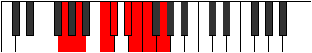 |
| [1893](https://ianring.com/musictheory/scales/1893) | [Ionylian](ModeENaturalIonylian.md) | E | E, F#, G##, A#, B#, C#, D, E |  |
| [1893](https://ianring.com/musictheory/scales/1893) | [Ionylian](ModeBNaturalIonylian.md) | B | B, C#, D##, E#, F##, G#, A, B |  |
| [1895](https://ianring.com/musictheory/scales/1895) | [Salyllic](ModeGNaturalSalyllic.md) | G | G, G#, A, C, C#, D#, E, F, G |  |
| [1895](https://ianring.com/musictheory/scales/1895) | [Salyllic](ModeENaturalSalyllic.md) | E | E, F, F#, A, A#, C, C#, D, E | 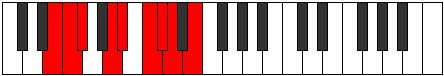 |
| [1895](https://ianring.com/musictheory/scales/1895) | [Salyllic](ModeGSharpSalyllic.md) | G# | G#, A, A#, C#, D, E, F, F#, G# | 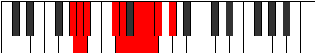 |
| [1895](https://ianring.com/musictheory/scales/1895) | [Salyllic](ModeAFlatSalyllic.md) | Ab | Ab, A, Bb, Db, D, E, F, Gb, Ab |  |
| [1895](https://ianring.com/musictheory/scales/1895) | [Salyllic](ModeDSharpSalyllic.md) | D# | D#, E, F, G#, A, B, C, C#, D# |  |
| [1895](https://ianring.com/musictheory/scales/1895) | [Salyllic](ModeEFlatSalyllic.md) | Eb | Eb, E, F, Ab, A, B, C, Db, Eb |  |
| [1895](https://ianring.com/musictheory/scales/1895) | [Salyllic](ModeBNaturalSalyllic.md) | B | B, C, C#, E, F, G, G#, A, B |  |
| [1897](https://ianring.com/musictheory/scales/1897) | [Ionopian](ModeENaturalIonopian.md) | E | E, F##, G##, A#, B#, C#, D, E |  |
| [1897](https://ianring.com/musictheory/scales/1897) | [Ionopian](ModeCSharpIonopian.md) | C# | C#, D##, E##, F##, G##, A#, B, C# |  |
| [1897](https://ianring.com/musictheory/scales/1897) | [Ionopian](ModeDFlatIonopian.md) | Db | Db, E, F#, G, A, Bb, Cb, Db |  |
| [1899](https://ianring.com/musictheory/scales/1899) | [Moptyllic](ModeENaturalMoptyllic.md) | E | E, F, G, A, A#, C, C#, D, E |  |
| [1899](https://ianring.com/musictheory/scales/1899) | [Moptyllic](ModeDSharpMoptyllic.md) | D# | D#, E, F#, G#, A, B, C, C#, D# |  |
| [1899](https://ianring.com/musictheory/scales/1899) | [Moptyllic](ModeEFlatMoptyllic.md) | Eb | Eb, E, Gb, Ab, A, B, C, Db, Eb |  |
| [1899](https://ianring.com/musictheory/scales/1899) | [Moptyllic](ModeGSharpMoptyllic.md) | G# | G#, A, B, C#, D, E, F, F#, G# |  |
| [1899](https://ianring.com/musictheory/scales/1899) | [Moptyllic](ModeAFlatMoptyllic.md) | Ab | Ab, A, B, Db, D, E, F, Gb, Ab |  |
| [1899](https://ianring.com/musictheory/scales/1899) | [Moptyllic](ModeCSharpMoptyllic.md) | C# | C#, D, E, F#, G, A, A#, B, C# |  |
| [1899](https://ianring.com/musictheory/scales/1899) | [Moptyllic](ModeDFlatMoptyllic.md) | Db | Db, D, E, Gb, G, A, Bb, B, Db |  |
| [1901](https://ianring.com/musictheory/scales/1901) | [Ionidyllic](ModeGNaturalIonidyllic.md) | G | G, A, A#, C, C#, D#, E, F, G |  |
| [1901](https://ianring.com/musictheory/scales/1901) | [Ionidyllic](ModeENaturalIonidyllic.md) | E | E, F#, G, A, A#, C, C#, D, E |  |
| [1901](https://ianring.com/musictheory/scales/1901) | [Ionidyllic](ModeBNaturalIonidyllic.md) | B | B, C#, D, E, F, G, G#, A, B |  |
| [1901](https://ianring.com/musictheory/scales/1901) | [Ionidyllic](ModeCSharpIonidyllic.md) | C# | C#, D#, E, F#, G, A, A#, B, C# |  |
| [1901](https://ianring.com/musictheory/scales/1901) | [Ionidyllic](ModeDFlatIonidyllic.md) | Db | Db, Eb, E, Gb, G, A, Bb, B, Db |  |
| [1903](https://ianring.com/musictheory/scales/1903) | [Rocrygic](ModeENaturalRocrygic.md) | E | E, F, F#, G, A, A#, C, C#, D, E |  |
| [1903](https://ianring.com/musictheory/scales/1903) | [Rocrygic](ModeGNaturalRocrygic.md) | G | G, G#, A, A#, C, C#, D#, E, F, G |  |
| [1903](https://ianring.com/musictheory/scales/1903) | [Rocrygic](ModeDSharpRocrygic.md) | D# | D#, E, F, F#, G#, A, B, C, C#, D# |  |
| [1903](https://ianring.com/musictheory/scales/1903) | [Rocrygic](ModeEFlatRocrygic.md) | Eb | Eb, E, F, Gb, Ab, A, B, C, Db, Eb |  |
| [1903](https://ianring.com/musictheory/scales/1903) | [Rocrygic](ModeBNaturalRocrygic.md) | B | B, C, C#, D, E, F, G, G#, A, B |  |
| [1903](https://ianring.com/musictheory/scales/1903) | [Rocrygic](ModeCSharpRocrygic.md) | C# | C#, D, D#, E, F#, G, A, A#, B, C# |  |
| [1903](https://ianring.com/musictheory/scales/1903) | [Rocrygic](ModeDFlatRocrygic.md) | Db | Db, D, Eb, E, Gb, G, A, Bb, B, Db |  |
| [1903](https://ianring.com/musictheory/scales/1903) | [Rocrygic](ModeGSharpRocrygic.md) | G# | G#, A, A#, B, C#, D, E, F, F#, G# |  |
| [1903](https://ianring.com/musictheory/scales/1903) | [Rocrygic](ModeAFlatRocrygic.md) | Ab | Ab, A, Bb, B, Db, D, E, F, Gb, Ab |  |
| [1905](https://ianring.com/musictheory/scales/1905) | [Katacrian](ModeENaturalKatacrian.md) | E | E, F###, G##, A#, B#, C#, D, E |  |
| [1907](https://ianring.com/musictheory/scales/1907) | [Lynyllic](ModeGSharpLynyllic.md) | G# | G#, A, C, C#, D, E, F, F#, G# |  |
| [1907](https://ianring.com/musictheory/scales/1907) | [Lynyllic](ModeAFlatLynyllic.md) | Ab | Ab, A, C, Db, D, E, F, Gb, Ab |  |
| [1907](https://ianring.com/musictheory/scales/1907) | [Lynyllic](ModeENaturalLynyllic.md) | E | E, F, G#, A, A#, C, C#, D, E |  |
| [1907](https://ianring.com/musictheory/scales/1907) | [Lynyllic](ModeCNaturalLynyllic.md) | C | C, C#, E, F, F#, G#, A, A#, C |  |
| [1907](https://ianring.com/musictheory/scales/1907) | [Lynyllic](ModeDSharpLynyllic.md) | D# | D#, E, G, G#, A, B, C, C#, D# |  |
| [1907](https://ianring.com/musictheory/scales/1907) | [Lynyllic](ModeEFlatLynyllic.md) | Eb | Eb, E, G, Ab, A, B, C, Db, Eb |  |
| [1909](https://ianring.com/musictheory/scales/1909) | [Epicryllic](ModeENaturalEpicryllic.md) | E | E, F#, G#, A, A#, C, C#, D, E |  |
| [1909](https://ianring.com/musictheory/scales/1909) | [Epicryllic](ModeGNaturalEpicryllic.md) | G | G, A, B, C, C#, D#, E, F, G |  |
| [1909](https://ianring.com/musictheory/scales/1909) | [Epicryllic](ModeBNaturalEpicryllic.md) | B | B, C#, D#, E, F, G, G#, A, B |  |
| [1911](https://ianring.com/musictheory/scales/1911) | [Stynygic](ModeCNaturalStynygic.md) | C | C, C#, D, E, F, F#, G#, A, A#, C |  |
| [1911](https://ianring.com/musictheory/scales/1911) | [Stynygic](ModeENaturalStynygic.md) | E | E, F, F#, G#, A, A#, C, C#, D, E |  |
| [1911](https://ianring.com/musictheory/scales/1911) | [Stynygic](ModeGSharpStynygic.md) | G# | G#, A, A#, C, C#, D, E, F, F#, G# |  |
| [1911](https://ianring.com/musictheory/scales/1911) | [Stynygic](ModeAFlatStynygic.md) | Ab | Ab, A, Bb, C, Db, D, E, F, Gb, Ab |  |
| [1911](https://ianring.com/musictheory/scales/1911) | [Stynygic](ModeDSharpStynygic.md) | D# | D#, E, F, G, G#, A, B, C, C#, D# |  |
| [1911](https://ianring.com/musictheory/scales/1911) | [Stynygic](ModeEFlatStynygic.md) | Eb | Eb, E, F, G, Ab, A, B, C, Db, Eb |  |
| [1911](https://ianring.com/musictheory/scales/1911) | [Stynygic](ModeGNaturalStynygic.md) | G | G, G#, A, B, C, C#, D#, E, F, G |  |
| [1911](https://ianring.com/musictheory/scales/1911) | [Stynygic](ModeBNaturalStynygic.md) | B | B, C, C#, D#, E, F, G, G#, A, B |  |
| [1913](https://ianring.com/musictheory/scales/1913) | [Zagyllic](ModeENaturalZagyllic.md) | E | E, G, G#, A, A#, C, C#, D, E |  |
| [1913](https://ianring.com/musictheory/scales/1913) | [Zagyllic](ModeCSharpZagyllic.md) | C# | C#, E, F, F#, G, A, A#, B, C# |  |
| [1913](https://ianring.com/musictheory/scales/1913) | [Zagyllic](ModeDFlatZagyllic.md) | Db | Db, E, F, Gb, G, A, Bb, B, Db |  |
| [1915](https://ianring.com/musictheory/scales/1915) | [Thydygic](ModeCNaturalThydygic.md) | C | C, C#, D#, E, F, F#, G#, A, A#, C |  |
| [1915](https://ianring.com/musictheory/scales/1915) | [Thydygic](ModeENaturalThydygic.md) | E | E, F, G, G#, A, A#, C, C#, D, E |  |
| [1915](https://ianring.com/musictheory/scales/1915) | [Thydygic](ModeGSharpThydygic.md) | G# | G#, A, B, C, C#, D, E, F, F#, G# |  |
| [1915](https://ianring.com/musictheory/scales/1915) | [Thydygic](ModeAFlatThydygic.md) | Ab | Ab, A, B, C, Db, D, E, F, Gb, Ab |  |
| [1915](https://ianring.com/musictheory/scales/1915) | [Thydygic](ModeDSharpThydygic.md) | D# | D#, E, F#, G, G#, A, B, C, C#, D# |  |
| [1915](https://ianring.com/musictheory/scales/1915) | [Thydygic](ModeEFlatThydygic.md) | Eb | Eb, E, Gb, G, Ab, A, B, C, Db, Eb |  |
| [1915](https://ianring.com/musictheory/scales/1915) | [Thydygic](ModeCSharpThydygic.md) | C# | C#, D, E, F, F#, G, A, A#, B, C# |  |
| [1915](https://ianring.com/musictheory/scales/1915) | [Thydygic](ModeDFlatThydygic.md) | Db | Db, D, E, F, Gb, G, A, Bb, B, Db |  |
| [1917](https://ianring.com/musictheory/scales/1917) | [Sacrygic](ModeENaturalSacrygic.md) | E | E, F#, G, G#, A, A#, C, C#, D, E |  |
| [1917](https://ianring.com/musictheory/scales/1917) | [Sacrygic](ModeBNaturalSacrygic.md) | B | B, C#, D, D#, E, F, G, G#, A, B |  |
| [1917](https://ianring.com/musictheory/scales/1917) | [Sacrygic](ModeGNaturalSacrygic.md) | G | G, A, A#, B, C, C#, D#, E, F, G |  |
| [1917](https://ianring.com/musictheory/scales/1917) | [Sacrygic](ModeCSharpSacrygic.md) | C# | C#, D#, E, F, F#, G, A, A#, B, C# |  |
| [1917](https://ianring.com/musictheory/scales/1917) | [Sacrygic](ModeDFlatSacrygic.md) | Db | Db, Eb, E, F, Gb, G, A, Bb, B, Db |  |
| [1919](https://ianring.com/musictheory/scales/1919) | [Rocryllian](ModeCNaturalRocryllian.md) | C | C, C#, D, D#, E, F, F#, G#, A, A#, C |  |
| [1919](https://ianring.com/musictheory/scales/1919) | [Rocryllian](ModeENaturalRocryllian.md) | E | E, F, F#, G, G#, A, A#, C, C#, D, E |  |
| [1919](https://ianring.com/musictheory/scales/1919) | [Rocryllian](ModeBNaturalRocryllian.md) | B | B, C, C#, D, D#, E, F, G, G#, A, B |  |
| [1919](https://ianring.com/musictheory/scales/1919) | [Rocryllian](ModeDSharpRocryllian.md) | D# | D#, E, F, F#, G, G#, A, B, C, C#, D# |  |
| [1919](https://ianring.com/musictheory/scales/1919) | [Rocryllian](ModeEFlatRocryllian.md) | Eb | Eb, E, F, Gb, G, Ab, A, B, C, Db, Eb |  |
| [1919](https://ianring.com/musictheory/scales/1919) | [Rocryllian](ModeCSharpRocryllian.md) | C# | C#, D, D#, E, F, F#, G, A, A#, B, C# |  |
| [1919](https://ianring.com/musictheory/scales/1919) | [Rocryllian](ModeDFlatRocryllian.md) | Db | Db, D, Eb, E, F, Gb, G, A, Bb, B, Db |  |
| [1919](https://ianring.com/musictheory/scales/1919) | [Rocryllian](ModeGSharpRocryllian.md) | G# | G#, A, A#, B, C, C#, D, E, F, F#, G# |  |
| [1919](https://ianring.com/musictheory/scales/1919) | [Rocryllian](ModeAFlatRocryllian.md) | Ab | Ab, A, Bb, B, C, Db, D, E, F, Gb, Ab |  |
| [1919](https://ianring.com/musictheory/scales/1919) | [Rocryllian](ModeGNaturalRocryllian.md) | G | G, G#, A, A#, B, C, C#, D#, E, F, G |  |
| [1929](https://ianring.com/musictheory/scales/1929) | [Aeolycrimic](ModeFSharpAeolycrimic.md) | F# | F#, G##, Db, Ebb, Fbb, Gbbb, F# |  |
| [1929](https://ianring.com/musictheory/scales/1929) | [Aeolycrimic](ModeGFlatAeolycrimic.md) | Gb | Gb, A, B##, C##, D#, E, Gb |  |
| [1929](https://ianring.com/musictheory/scales/1929) | [Aeolycrimic](ModeCSharpAeolycrimic.md) | C# | C#, D##, F###, G##, A#, B, C# |  |
| [1929](https://ianring.com/musictheory/scales/1929) | [Aeolycrimic](ModeDFlatAeolycrimic.md) | Db | Db, E, F###, G##, A#, B, Db |  |
| [1931](https://ianring.com/musictheory/scales/1931) | [Stogian](ModeFSharpStogian.md) | F# | F#, G, A, B##, C##, D#, E, F# |  |
| [1931](https://ianring.com/musictheory/scales/1931) | [Stogian](ModeGFlatStogian.md) | Gb | Gb, Abb, Bbb, C#, D, Eb, Fb, Gb |  |
| [1931](https://ianring.com/musictheory/scales/1931) | [Stogian](ModeCSharpStogian.md) | C# | C#, D, E, F###, G##, A#, B, C# |  |
| [1931](https://ianring.com/musictheory/scales/1931) | [Stogian](ModeDFlatStogian.md) | Db | Db, Ebb, Fb, G#, A, Bb, Cb, Db |  |
| [1933](https://ianring.com/musictheory/scales/1933) | [Mocrian](ModeFSharpMocrian.md) | F# | F#, G#, A, B##, C##, D#, E, F# |  |
| [1933](https://ianring.com/musictheory/scales/1933) | [Mocrian](ModeGFlatMocrian.md) | Gb | Gb, Ab, Bbb, C#, D, Eb, Fb, Gb |  |
| [1933](https://ianring.com/musictheory/scales/1933) | [Mocrian](ModeCSharpMocrian.md) | C# | C#, D#, E, F###, G##, A#, B, C# |  |
| [1933](https://ianring.com/musictheory/scales/1933) | [Mocrian](ModeDFlatMocrian.md) | Db | Db, Eb, Fb, G#, A, Bb, Cb, Db |  |
| [1935](https://ianring.com/musictheory/scales/1935) | [Mycryllic](ModeFSharpMycryllic.md) | F# | F#, G, G#, A, C#, D, D#, E, F# |  |
| [1935](https://ianring.com/musictheory/scales/1935) | [Mycryllic](ModeGFlatMycryllic.md) | Gb | Gb, G, Ab, A, Db, D, Eb, E, Gb |  |
| [1935](https://ianring.com/musictheory/scales/1935) | [Mycryllic](ModeCSharpMycryllic.md) | C# | C#, D, D#, E, G#, A, A#, B, C# |  |
| [1935](https://ianring.com/musictheory/scales/1935) | [Mycryllic](ModeDFlatMycryllic.md) | Db | Db, D, Eb, E, Ab, A, Bb, B, Db |  |
| [1937](https://ianring.com/musictheory/scales/1937) | [Galimic](ModeANaturalGalimic.md) | A | A, B##, D##, E#, F#, G, A |  |
| [1939](https://ianring.com/musictheory/scales/1939) | [Dathian](ModeANaturalDathian.md) | A | A, Bb, C#, D##, E#, F#, G, A |  |
| [1939](https://ianring.com/musictheory/scales/1939) | [Dathian](ModeCNaturalDathian.md) | C | C, Db, E, F##, G#, A, Bb, C |  |
| [1941](https://ianring.com/musictheory/scales/1941) | [Aeranian](ModeANaturalAeranian.md) | A | A, B, C#, D##, E#, F#, G, A |  |
| [1943](https://ianring.com/musictheory/scales/1943) | [Malyllic](ModeCNaturalMalyllic.md) | C | C, C#, D, E, G, G#, A, A#, C |  |
| [1943](https://ianring.com/musictheory/scales/1943) | [Malyllic](ModeANaturalMalyllic.md) | A | A, A#, B, C#, E, F, F#, G, A |  |
| [1945](https://ianring.com/musictheory/scales/1945) | [Zarian](ModeANaturalZarian.md) | A | A, B#, C#, D##, E#, F#, G, A |  |
| [1945](https://ianring.com/musictheory/scales/1945) | [Zarian](ModeFSharpZarian.md) | F# | F#, G##, A#, B##, C##, D#, E, F# |  |
| [1945](https://ianring.com/musictheory/scales/1945) | [Zarian](ModeGFlatZarian.md) | Gb | Gb, A, Bb, C#, D, Eb, Fb, Gb |  |
| [1945](https://ianring.com/musictheory/scales/1945) | [Zarian](ModeCSharpZarian.md) | C# | C#, D##, E#, F###, G##, A#, B, C# |  |
| [1945](https://ianring.com/musictheory/scales/1945) | [Zarian](ModeDFlatZarian.md) | Db | Db, E, F, G#, A, Bb, Cb, Db |  |
| [1947](https://ianring.com/musictheory/scales/1947) | [Ionoyllic](ModeFSharpIonoyllic.md) | F# | F#, G, A, A#, C#, D, D#, E, F# |  |
| [1947](https://ianring.com/musictheory/scales/1947) | [Ionoyllic](ModeGFlatIonoyllic.md) | Gb | Gb, G, A, Bb, Db, D, Eb, E, Gb |  |
| [1947](https://ianring.com/musictheory/scales/1947) | [Ionoyllic](ModeANaturalIonoyllic.md) | A | A, A#, C, C#, E, F, F#, G, A |  |
| [1947](https://ianring.com/musictheory/scales/1947) | [Ionoyllic](ModeCNaturalIonoyllic.md) | C | C, C#, D#, E, G, G#, A, A#, C |  |
| [1947](https://ianring.com/musictheory/scales/1947) | [Ionoyllic](ModeCSharpIonoyllic.md) | C# | C#, D, E, F, G#, A, A#, B, C# |  |
| [1947](https://ianring.com/musictheory/scales/1947) | [Ionoyllic](ModeDFlatIonoyllic.md) | Db | Db, D, E, F, Ab, A, Bb, B, Db |  |
| [1949](https://ianring.com/musictheory/scales/1949) | [Mathyllic](ModeFSharpMathyllic.md) | F# | F#, G#, A, A#, C#, D, D#, E, F# |  |
| [1949](https://ianring.com/musictheory/scales/1949) | [Mathyllic](ModeGFlatMathyllic.md) | Gb | Gb, Ab, A, Bb, Db, D, Eb, E, Gb |  |
| [1949](https://ianring.com/musictheory/scales/1949) | [Mathyllic](ModeANaturalMathyllic.md) | A | A, B, C, C#, E, F, F#, G, A |  |
| [1949](https://ianring.com/musictheory/scales/1949) | [Mathyllic](ModeCSharpMathyllic.md) | C# | C#, D#, E, F, G#, A, A#, B, C# |  |
| [1949](https://ianring.com/musictheory/scales/1949) | [Mathyllic](ModeDFlatMathyllic.md) | Db | Db, Eb, E, F, Ab, A, Bb, B, Db |  |
| [1951](https://ianring.com/musictheory/scales/1951) | [Gonygic](ModeCNaturalGonygic.md) | C | C, C#, D, D#, E, G, G#, A, A#, C |  |
| [1951](https://ianring.com/musictheory/scales/1951) | [Gonygic](ModeFSharpGonygic.md) | F# | F#, G, G#, A, A#, C#, D, D#, E, F# |  |
| [1951](https://ianring.com/musictheory/scales/1951) | [Gonygic](ModeGFlatGonygic.md) | Gb | Gb, G, Ab, A, Bb, Db, D, Eb, E, Gb |  |
| [1951](https://ianring.com/musictheory/scales/1951) | [Gonygic](ModeANaturalGonygic.md) | A | A, A#, B, C, C#, E, F, F#, G, A |  |
| [1951](https://ianring.com/musictheory/scales/1951) | [Gonygic](ModeCSharpGonygic.md) | C# | C#, D, D#, E, F, G#, A, A#, B, C# |  |
| [1951](https://ianring.com/musictheory/scales/1951) | [Gonygic](ModeDFlatGonygic.md) | Db | Db, D, Eb, E, F, Ab, A, Bb, B, Db |  |
| [1955](https://ianring.com/musictheory/scales/1955) | [Sonian](ModeGSharpSonian.md) | G# | G#, A, B##, C###, D##, E#, F#, G# |  |
| [1955](https://ianring.com/musictheory/scales/1955) | [Sonian](ModeAFlatSonian.md) | Ab | Ab, Bbb, C#, D#, E, F, Gb, Ab |  |
| [1955](https://ianring.com/musictheory/scales/1955) | [Sonian](ModeENaturalSonian.md) | E | E, F, G##, A##, B#, C#, D, E |  |
| [1957](https://ianring.com/musictheory/scales/1957) | [Pyrian](ModeENaturalPyrian.md) | E | E, F#, G##, A##, B#, C#, D, E |  |
| [1957](https://ianring.com/musictheory/scales/1957) | [Pyrian](ModeBNaturalPyrian.md) | B | B, C#, D##, E##, F##, G#, A, B |  |
| [1959](https://ianring.com/musictheory/scales/1959) | [Katolyllic](ModeGSharpKatolyllic.md) | G# | G#, A, A#, C#, D#, E, F, F#, G# |  |
| [1959](https://ianring.com/musictheory/scales/1959) | [Katolyllic](ModeAFlatKatolyllic.md) | Ab | Ab, A, Bb, Db, Eb, E, F, Gb, Ab | 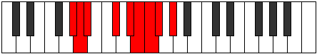 |
| [1959](https://ianring.com/musictheory/scales/1959) | [Katolyllic](ModeENaturalKatolyllic.md) | E | E, F, F#, A, B, C, C#, D, E |  |
| [1959](https://ianring.com/musictheory/scales/1959) | [Katolyllic](ModeBNaturalKatolyllic.md) | B | B, C, C#, E, F#, G, G#, A, B |  |
| [1961](https://ianring.com/musictheory/scales/1961) | [Soptian](ModeFSharpSoptian.md) | F# | F#, G##, A##, B##, C##, D#, E, F# |  |
| [1961](https://ianring.com/musictheory/scales/1961) | [Soptian](ModeGFlatSoptian.md) | Gb | Gb, A, B, C#, D, Eb, Fb, Gb |  |
| [1961](https://ianring.com/musictheory/scales/1961) | [Soptian](ModeENaturalSoptian.md) | E | E, F##, G##, A##, B#, C#, D, E |  |
| [1961](https://ianring.com/musictheory/scales/1961) | [Soptian](ModeCSharpSoptian.md) | C# | C#, D##, E##, F###, G##, A#, B, C# |  |
| [1961](https://ianring.com/musictheory/scales/1961) | [Soptian](ModeDFlatSoptian.md) | Db | Db, E, F#, G#, A, Bb, Cb, Db |  |
| [1963](https://ianring.com/musictheory/scales/1963) | [Epocryllic](ModeENaturalEpocryllic.md) | E | E, F, G, A, B, C, C#, D, E |  |
| [1963](https://ianring.com/musictheory/scales/1963) | [Epocryllic](ModeFSharpEpocryllic.md) | F# | F#, G, A, B, C#, D, D#, E, F# |  |
| [1963](https://ianring.com/musictheory/scales/1963) | [Epocryllic](ModeGFlatEpocryllic.md) | Gb | Gb, G, A, B, Db, D, Eb, E, Gb |  |
| [1963](https://ianring.com/musictheory/scales/1963) | [Epocryllic](ModeGSharpEpocryllic.md) | G# | G#, A, B, C#, D#, E, F, F#, G# |  |
| [1963](https://ianring.com/musictheory/scales/1963) | [Epocryllic](ModeAFlatEpocryllic.md) | Ab | Ab, A, B, Db, Eb, E, F, Gb, Ab |  |
| [1963](https://ianring.com/musictheory/scales/1963) | [Epocryllic](ModeCSharpEpocryllic.md) | C# | C#, D, E, F#, G#, A, A#, B, C# |  |
| [1963](https://ianring.com/musictheory/scales/1963) | [Epocryllic](ModeDFlatEpocryllic.md) | Db | Db, D, E, Gb, Ab, A, Bb, B, Db |  |
| [1965](https://ianring.com/musictheory/scales/1965) | [Gadyllic](ModeENaturalGadyllic.md) | E | E, F#, G, A, B, C, C#, D, E |  |
| [1965](https://ianring.com/musictheory/scales/1965) | [Gadyllic](ModeFSharpGadyllic.md) | F# | F#, G#, A, B, C#, D, D#, E, F# |  |
| [1965](https://ianring.com/musictheory/scales/1965) | [Gadyllic](ModeGFlatGadyllic.md) | Gb | Gb, Ab, A, B, Db, D, Eb, E, Gb |  |
| [1965](https://ianring.com/musictheory/scales/1965) | [Gadyllic](ModeBNaturalGadyllic.md) | B | B, C#, D, E, F#, G, G#, A, B |  |
| [1965](https://ianring.com/musictheory/scales/1965) | [Gadyllic](ModeCSharpGadyllic.md) | C# | C#, D#, E, F#, G#, A, A#, B, C# |  |
| [1965](https://ianring.com/musictheory/scales/1965) | [Gadyllic](ModeDFlatGadyllic.md) | Db | Db, Eb, E, Gb, Ab, A, Bb, B, Db |  |
| [1967](https://ianring.com/musictheory/scales/1967) | [Godygic](ModeENaturalGodygic.md) | E | E, F, F#, G, A, B, C, C#, D, E |  |
| [1967](https://ianring.com/musictheory/scales/1967) | [Godygic](ModeBNaturalGodygic.md) | B | B, C, C#, D, E, F#, G, G#, A, B | 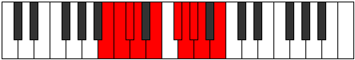 |
| [1967](https://ianring.com/musictheory/scales/1967) | [Godygic](ModeFSharpGodygic.md) | F# | F#, G, G#, A, B, C#, D, D#, E, F# |  |
| [1967](https://ianring.com/musictheory/scales/1967) | [Godygic](ModeGFlatGodygic.md) | Gb | Gb, G, Ab, A, B, Db, D, Eb, E, Gb |  |
| [1967](https://ianring.com/musictheory/scales/1967) | [Godygic](ModeCSharpGodygic.md) | C# | C#, D, D#, E, F#, G#, A, A#, B, C# |  |
| [1967](https://ianring.com/musictheory/scales/1967) | [Godygic](ModeDFlatGodygic.md) | Db | Db, D, Eb, E, Gb, Ab, A, Bb, B, Db |  |
| [1967](https://ianring.com/musictheory/scales/1967) | [Godygic](ModeGSharpGodygic.md) | G# | G#, A, A#, B, C#, D#, E, F, F#, G# |  |
| [1967](https://ianring.com/musictheory/scales/1967) | [Godygic](ModeAFlatGodygic.md) | Ab | Ab, A, Bb, B, Db, Eb, E, F, Gb, Ab |  |
| [1969](https://ianring.com/musictheory/scales/1969) | [Zorian](ModeANaturalZorian.md) | A | A, B##, C##, D##, E#, F#, G, A |  |
| [1969](https://ianring.com/musictheory/scales/1969) | [Zorian](ModeENaturalZorian.md) | E | E, F###, G##, A##, B#, C#, D, E |  |
| [1971](https://ianring.com/musictheory/scales/1971) | [Aerynyllic](ModeGSharpAerynyllic.md) | G# | G#, A, C, C#, D#, E, F, F#, G# |  |
| [1971](https://ianring.com/musictheory/scales/1971) | [Aerynyllic](ModeAFlatAerynyllic.md) | Ab | Ab, A, C, Db, Eb, E, F, Gb, Ab |  |
| [1971](https://ianring.com/musictheory/scales/1971) | [Aerynyllic](ModeANaturalAerynyllic.md) | A | A, A#, C#, D, E, F, F#, G, A |  |
| [1971](https://ianring.com/musictheory/scales/1971) | [Aerynyllic](ModeCNaturalAerynyllic.md) | C | C, C#, E, F, G, G#, A, A#, C |  |
| [1971](https://ianring.com/musictheory/scales/1971) | [Aerynyllic](ModeENaturalAerynyllic.md) | E | E, F, G#, A, B, C, C#, D, E |  |
| [1973](https://ianring.com/musictheory/scales/1973) | [Zyryllic](ModeANaturalZyryllic.md) | A | A, B, C#, D, E, F, F#, G, A |  |
| [1973](https://ianring.com/musictheory/scales/1973) | [Zyryllic](ModeENaturalZyryllic.md) | E | E, F#, G#, A, B, C, C#, D, E |  |
| [1973](https://ianring.com/musictheory/scales/1973) | [Zyryllic](ModeBNaturalZyryllic.md) | B | B, C#, D#, E, F#, G, G#, A, B |  |
| [1975](https://ianring.com/musictheory/scales/1975) | [Ionocrygic](ModeGSharpIonocrygic.md) | G# | G#, A, A#, C, C#, D#, E, F, F#, G# |  |
| [1975](https://ianring.com/musictheory/scales/1975) | [Ionocrygic](ModeAFlatIonocrygic.md) | Ab | Ab, A, Bb, C, Db, Eb, E, F, Gb, Ab |  |
| [1975](https://ianring.com/musictheory/scales/1975) | [Ionocrygic](ModeCNaturalIonocrygic.md) | C | C, C#, D, E, F, G, G#, A, A#, C |  |
| [1975](https://ianring.com/musictheory/scales/1975) | [Ionocrygic](ModeENaturalIonocrygic.md) | E | E, F, F#, G#, A, B, C, C#, D, E |  |
| [1975](https://ianring.com/musictheory/scales/1975) | [Ionocrygic](ModeBNaturalIonocrygic.md) | B | B, C, C#, D#, E, F#, G, G#, A, B |  |
| [1975](https://ianring.com/musictheory/scales/1975) | [Ionocrygic](ModeANaturalIonocrygic.md) | A | A, A#, B, C#, D, E, F, F#, G, A |  |
| [1977](https://ianring.com/musictheory/scales/1977) | [Dagyllic](ModeANaturalDagyllic.md) | A | A, C, C#, D, E, F, F#, G, A |  |
| [1977](https://ianring.com/musictheory/scales/1977) | [Dagyllic](ModeENaturalDagyllic.md) | E | E, G, G#, A, B, C, C#, D, E |  |
| [1977](https://ianring.com/musictheory/scales/1977) | [Dagyllic](ModeFSharpDagyllic.md) | F# | F#, A, A#, B, C#, D, D#, E, F# |  |
| [1977](https://ianring.com/musictheory/scales/1977) | [Dagyllic](ModeGFlatDagyllic.md) | Gb | Gb, A, Bb, B, Db, D, Eb, E, Gb |  |
| [1977](https://ianring.com/musictheory/scales/1977) | [Dagyllic](ModeCSharpDagyllic.md) | C# | C#, E, F, F#, G#, A, A#, B, C# |  |
| [1977](https://ianring.com/musictheory/scales/1977) | [Dagyllic](ModeDFlatDagyllic.md) | Db | Db, E, F, Gb, Ab, A, Bb, B, Db |  |
| [1979](https://ianring.com/musictheory/scales/1979) | [Aeradygic](ModeANaturalAeradygic.md) | A | A, A#, C, C#, D, E, F, F#, G, A |  |
| [1979](https://ianring.com/musictheory/scales/1979) | [Aeradygic](ModeCNaturalAeradygic.md) | C | C, C#, D#, E, F, G, G#, A, A#, C |  |
| [1979](https://ianring.com/musictheory/scales/1979) | [Aeradygic](ModeGSharpAeradygic.md) | G# | G#, A, B, C, C#, D#, E, F, F#, G# |  |
| [1979](https://ianring.com/musictheory/scales/1979) | [Aeradygic](ModeAFlatAeradygic.md) | Ab | Ab, A, B, C, Db, Eb, E, F, Gb, Ab |  |
| [1979](https://ianring.com/musictheory/scales/1979) | [Aeradygic](ModeENaturalAeradygic.md) | E | E, F, G, G#, A, B, C, C#, D, E |  |
| [1979](https://ianring.com/musictheory/scales/1979) | [Aeradygic](ModeFSharpAeradygic.md) | F# | F#, G, A, A#, B, C#, D, D#, E, F# |  |
| [1979](https://ianring.com/musictheory/scales/1979) | [Aeradygic](ModeGFlatAeradygic.md) | Gb | Gb, G, A, Bb, B, Db, D, Eb, E, Gb |  |
| [1979](https://ianring.com/musictheory/scales/1979) | [Aeradygic](ModeCSharpAeradygic.md) | C# | C#, D, E, F, F#, G#, A, A#, B, C# |  |
| [1979](https://ianring.com/musictheory/scales/1979) | [Aeradygic](ModeDFlatAeradygic.md) | Db | Db, D, E, F, Gb, Ab, A, Bb, B, Db |  |
| [1981](https://ianring.com/musictheory/scales/1981) | [Gadygic](ModeANaturalGadygic.md) | A | A, B, C, C#, D, E, F, F#, G, A |  |
| [1981](https://ianring.com/musictheory/scales/1981) | [Gadygic](ModeENaturalGadygic.md) | E | E, F#, G, G#, A, B, C, C#, D, E |  |
| [1981](https://ianring.com/musictheory/scales/1981) | [Gadygic](ModeBNaturalGadygic.md) | B | B, C#, D, D#, E, F#, G, G#, A, B |  |
| [1981](https://ianring.com/musictheory/scales/1981) | [Gadygic](ModeFSharpGadygic.md) | F# | F#, G#, A, A#, B, C#, D, D#, E, F# |  |
| [1981](https://ianring.com/musictheory/scales/1981) | [Gadygic](ModeGFlatGadygic.md) | Gb | Gb, Ab, A, Bb, B, Db, D, Eb, E, Gb |  |
| [1981](https://ianring.com/musictheory/scales/1981) | [Gadygic](ModeCSharpGadygic.md) | C# | C#, D#, E, F, F#, G#, A, A#, B, C# |  |
| [1981](https://ianring.com/musictheory/scales/1981) | [Gadygic](ModeDFlatGadygic.md) | Db | Db, Eb, E, F, Gb, Ab, A, Bb, B, Db |  |
| [1983](https://ianring.com/musictheory/scales/1983) | [Soryllian](ModeCNaturalSoryllian.md) | C | C, C#, D, D#, E, F, G, G#, A, A#, C |  |
| [1983](https://ianring.com/musictheory/scales/1983) | [Soryllian](ModeBNaturalSoryllian.md) | B | B, C, C#, D, D#, E, F#, G, G#, A, B |  |
| [1983](https://ianring.com/musictheory/scales/1983) | [Soryllian](ModeENaturalSoryllian.md) | E | E, F, F#, G, G#, A, B, C, C#, D, E |  |
| [1983](https://ianring.com/musictheory/scales/1983) | [Soryllian](ModeANaturalSoryllian.md) | A | A, A#, B, C, C#, D, E, F, F#, G, A |  |
| [1983](https://ianring.com/musictheory/scales/1983) | [Soryllian](ModeGSharpSoryllian.md) | G# | G#, A, A#, B, C, C#, D#, E, F, F#, G# |  |
| [1983](https://ianring.com/musictheory/scales/1983) | [Soryllian](ModeAFlatSoryllian.md) | Ab | Ab, A, Bb, B, C, Db, Eb, E, F, Gb, Ab |  |
| [1983](https://ianring.com/musictheory/scales/1983) | [Soryllian](ModeCSharpSoryllian.md) | C# | C#, D, D#, E, F, F#, G#, A, A#, B, C# |  |
| [1983](https://ianring.com/musictheory/scales/1983) | [Soryllian](ModeDFlatSoryllian.md) | Db | Db, D, Eb, E, F, Gb, Ab, A, Bb, B, Db |  |
| [1983](https://ianring.com/musictheory/scales/1983) | [Soryllian](ModeFSharpSoryllian.md) | F# | F#, G, G#, A, A#, B, C#, D, D#, E, F# |  |
| [1983](https://ianring.com/musictheory/scales/1983) | [Soryllian](ModeGFlatSoryllian.md) | Gb | Gb, G, Ab, A, Bb, B, Db, D, Eb, E, Gb |  |
| [1989](https://ianring.com/musictheory/scales/1989) | [Dydian](ModeGNaturalDydian.md) | G | G, A, B##, C##, D#, E, F, G |  |
| [1991](https://ianring.com/musictheory/scales/1991) | [Phryptyllic](ModeGNaturalPhryptyllic.md) | G | G, G#, A, C#, D, D#, E, F, G |  |
| [1991](https://ianring.com/musictheory/scales/1991) | [Phryptyllic](ModeDSharpPhryptyllic.md) | D# | D#, E, F, A, A#, B, C, C#, D# |  |
| [1991](https://ianring.com/musictheory/scales/1991) | [Phryptyllic](ModeEFlatPhryptyllic.md) | Eb | Eb, E, F, A, Bb, B, C, Db, Eb |  |
| [1993](https://ianring.com/musictheory/scales/1993) | [Katoptian](ModeFSharpKatoptian.md) | F# | F#, G##, A###, B##, C##, D#, E, F# |  |
| [1993](https://ianring.com/musictheory/scales/1993) | [Katoptian](ModeGFlatKatoptian.md) | Gb | Gb, A, B#, C#, D, Eb, Fb, Gb |  |
| [1993](https://ianring.com/musictheory/scales/1993) | [Katoptian](ModeCSharpKatoptian.md) | C# | C#, D##, E###, F###, G##, A#, B, C# |  |
| [1993](https://ianring.com/musictheory/scales/1993) | [Katoptian](ModeDFlatKatoptian.md) | Db | Db, E, F##, G#, A, Bb, Cb, Db |  |
| [1995](https://ianring.com/musictheory/scales/1995) | [Aeolacryllic](ModeFSharpAeolacryllic.md) | F# | F#, G, A, C, C#, D, D#, E, F# |  |
| [1995](https://ianring.com/musictheory/scales/1995) | [Aeolacryllic](ModeGFlatAeolacryllic.md) | Gb | Gb, G, A, C, Db, D, Eb, E, Gb |  |
| [1995](https://ianring.com/musictheory/scales/1995) | [Aeolacryllic](ModeDSharpAeolacryllic.md) | D# | D#, E, F#, A, A#, B, C, C#, D# |  |
| [1995](https://ianring.com/musictheory/scales/1995) | [Aeolacryllic](ModeEFlatAeolacryllic.md) | Eb | Eb, E, Gb, A, Bb, B, C, Db, Eb |  |
| [1995](https://ianring.com/musictheory/scales/1995) | [Aeolacryllic](ModeCSharpAeolacryllic.md) | C# | C#, D, E, G, G#, A, A#, B, C# |  |
| [1995](https://ianring.com/musictheory/scales/1995) | [Aeolacryllic](ModeDFlatAeolacryllic.md) | Db | Db, D, E, G, Ab, A, Bb, B, Db |  |
| [1997](https://ianring.com/musictheory/scales/1997) | [Staryllic](ModeFSharpStaryllic.md) | F# | F#, G#, A, C, C#, D, D#, E, F# |  |
| [1997](https://ianring.com/musictheory/scales/1997) | [Staryllic](ModeGFlatStaryllic.md) | Gb | Gb, Ab, A, C, Db, D, Eb, E, Gb |  |
| [1997](https://ianring.com/musictheory/scales/1997) | [Staryllic](ModeGNaturalStaryllic.md) | G | G, A, A#, C#, D, D#, E, F, G |  |
| [1997](https://ianring.com/musictheory/scales/1997) | [Staryllic](ModeCSharpStaryllic.md) | C# | C#, D#, E, G, G#, A, A#, B, C# |  |
| [1997](https://ianring.com/musictheory/scales/1997) | [Staryllic](ModeDFlatStaryllic.md) | Db | Db, Eb, E, G, Ab, A, Bb, B, Db |  |
| [1999](https://ianring.com/musictheory/scales/1999) | [Zacrygic](ModeFSharpZacrygic.md) | F# | F#, G, G#, A, C, C#, D, D#, E, F# |  |
| [1999](https://ianring.com/musictheory/scales/1999) | [Zacrygic](ModeGFlatZacrygic.md) | Gb | Gb, G, Ab, A, C, Db, D, Eb, E, Gb |  |
| [1999](https://ianring.com/musictheory/scales/1999) | [Zacrygic](ModeGNaturalZacrygic.md) | G | G, G#, A, A#, C#, D, D#, E, F, G |  |
| [1999](https://ianring.com/musictheory/scales/1999) | [Zacrygic](ModeDSharpZacrygic.md) | D# | D#, E, F, F#, A, A#, B, C, C#, D# |  |
| [1999](https://ianring.com/musictheory/scales/1999) | [Zacrygic](ModeEFlatZacrygic.md) | Eb | Eb, E, F, Gb, A, Bb, B, C, Db, Eb |  |
| [1999](https://ianring.com/musictheory/scales/1999) | [Zacrygic](ModeCSharpZacrygic.md) | C# | C#, D, D#, E, G, G#, A, A#, B, C# |  |
| [1999](https://ianring.com/musictheory/scales/1999) | [Zacrygic](ModeDFlatZacrygic.md) | Db | Db, D, Eb, E, G, Ab, A, Bb, B, Db |  |
| [2001](https://ianring.com/musictheory/scales/2001) | [Gydian](ModeANaturalGydian.md) | A | A, B##, C###, D##, E#, F#, G, A |  |
| [2003](https://ianring.com/musictheory/scales/2003) | [Lolyllic](ModeANaturalLolyllic.md) | A | A, A#, C#, D#, E, F, F#, G, A |  |
| [2003](https://ianring.com/musictheory/scales/2003) | [Lolyllic](ModeCNaturalLolyllic.md) | C | C, C#, E, F#, G, G#, A, A#, C |  |
| [2003](https://ianring.com/musictheory/scales/2003) | [Lolyllic](ModeDSharpLolyllic.md) | D# | D#, E, G, A, A#, B, C, C#, D# |  |
| [2003](https://ianring.com/musictheory/scales/2003) | [Lolyllic](ModeEFlatLolyllic.md) | Eb | Eb, E, G, A, Bb, B, C, Db, Eb |  |
| [2005](https://ianring.com/musictheory/scales/2005) | [Gygyllic](ModeGNaturalGygyllic.md) | G | G, A, B, C#, D, D#, E, F, G |  |
| [2005](https://ianring.com/musictheory/scales/2005) | [Gygyllic](ModeANaturalGygyllic.md) | A | A, B, C#, D#, E, F, F#, G, A |  |
| [2007](https://ianring.com/musictheory/scales/2007) | [Stonygic](ModeCNaturalStonygic.md) | C | C, C#, D, E, F#, G, G#, A, A#, C |  |
| [2007](https://ianring.com/musictheory/scales/2007) | [Stonygic](ModeGNaturalStonygic.md) | G | G, G#, A, B, C#, D, D#, E, F, G |  |
| [2007](https://ianring.com/musictheory/scales/2007) | [Stonygic](ModeDSharpStonygic.md) | D# | D#, E, F, G, A, A#, B, C, C#, D# |  |
| [2007](https://ianring.com/musictheory/scales/2007) | [Stonygic](ModeEFlatStonygic.md) | Eb | Eb, E, F, G, A, Bb, B, C, Db, Eb |  |
| [2007](https://ianring.com/musictheory/scales/2007) | [Stonygic](ModeANaturalStonygic.md) | A | A, A#, B, C#, D#, E, F, F#, G, A |  |
| [2009](https://ianring.com/musictheory/scales/2009) | [Stacryllic](ModeANaturalStacryllic.md) | A | A, C, C#, D#, E, F, F#, G, A |  |
| [2009](https://ianring.com/musictheory/scales/2009) | [Stacryllic](ModeFSharpStacryllic.md) | F# | F#, A, A#, C, C#, D, D#, E, F# |  |
| [2009](https://ianring.com/musictheory/scales/2009) | [Stacryllic](ModeGFlatStacryllic.md) | Gb | Gb, A, Bb, C, Db, D, Eb, E, Gb |  |
| [2009](https://ianring.com/musictheory/scales/2009) | [Stacryllic](ModeCSharpStacryllic.md) | C# | C#, E, F, G, G#, A, A#, B, C# |  |
| [2009](https://ianring.com/musictheory/scales/2009) | [Stacryllic](ModeDFlatStacryllic.md) | Db | Db, E, F, G, Ab, A, Bb, B, Db |  |
| [2011](https://ianring.com/musictheory/scales/2011) | [Raphygic](ModeFSharpRaphygic.md) | F# | F#, G, A, A#, C, C#, D, D#, E, F# |  |
| [2011](https://ianring.com/musictheory/scales/2011) | [Raphygic](ModeGFlatRaphygic.md) | Gb | Gb, G, A, Bb, C, Db, D, Eb, E, Gb |  |
| [2011](https://ianring.com/musictheory/scales/2011) | [Raphygic](ModeANaturalRaphygic.md) | A | A, A#, C, C#, D#, E, F, F#, G, A |  |
| [2011](https://ianring.com/musictheory/scales/2011) | [Raphygic](ModeCNaturalRaphygic.md) | C | C, C#, D#, E, F#, G, G#, A, A#, C |  |
| [2011](https://ianring.com/musictheory/scales/2011) | [Raphygic](ModeDSharpRaphygic.md) | D# | D#, E, F#, G, A, A#, B, C, C#, D# |  |
| [2011](https://ianring.com/musictheory/scales/2011) | [Raphygic](ModeEFlatRaphygic.md) | Eb | Eb, E, Gb, G, A, Bb, B, C, Db, Eb |  |
| [2011](https://ianring.com/musictheory/scales/2011) | [Raphygic](ModeCSharpRaphygic.md) | C# | C#, D, E, F, G, G#, A, A#, B, C# |  |
| [2011](https://ianring.com/musictheory/scales/2011) | [Raphygic](ModeDFlatRaphygic.md) | Db | Db, D, E, F, G, Ab, A, Bb, B, Db |  |
| [2013](https://ianring.com/musictheory/scales/2013) | [Mocrygic](ModeFSharpMocrygic.md) | F# | F#, G#, A, A#, C, C#, D, D#, E, F# |  |
| [2013](https://ianring.com/musictheory/scales/2013) | [Mocrygic](ModeGFlatMocrygic.md) | Gb | Gb, Ab, A, Bb, C, Db, D, Eb, E, Gb |  |
| [2013](https://ianring.com/musictheory/scales/2013) | [Mocrygic](ModeANaturalMocrygic.md) | A | A, B, C, C#, D#, E, F, F#, G, A |  |
| [2013](https://ianring.com/musictheory/scales/2013) | [Mocrygic](ModeGNaturalMocrygic.md) | G | G, A, A#, B, C#, D, D#, E, F, G |  |
| [2013](https://ianring.com/musictheory/scales/2013) | [Mocrygic](ModeCSharpMocrygic.md) | C# | C#, D#, E, F, G, G#, A, A#, B, C# |  |
| [2013](https://ianring.com/musictheory/scales/2013) | [Mocrygic](ModeDFlatMocrygic.md) | Db | Db, Eb, E, F, G, Ab, A, Bb, B, Db |  |
| [2015](https://ianring.com/musictheory/scales/2015) | [Epiryllian](ModeCNaturalEpiryllian.md) | C | C, C#, D, D#, E, F#, G, G#, A, A#, C |  |
| [2015](https://ianring.com/musictheory/scales/2015) | [Epiryllian](ModeFSharpEpiryllian.md) | F# | F#, G, G#, A, A#, C, C#, D, D#, E, F# |  |
| [2015](https://ianring.com/musictheory/scales/2015) | [Epiryllian](ModeGFlatEpiryllian.md) | Gb | Gb, G, Ab, A, Bb, C, Db, D, Eb, E, Gb |  |
| [2015](https://ianring.com/musictheory/scales/2015) | [Epiryllian](ModeDSharpEpiryllian.md) | D# | D#, E, F, F#, G, A, A#, B, C, C#, D# |  |
| [2015](https://ianring.com/musictheory/scales/2015) | [Epiryllian](ModeEFlatEpiryllian.md) | Eb | Eb, E, F, Gb, G, A, Bb, B, C, Db, Eb |  |
| [2015](https://ianring.com/musictheory/scales/2015) | [Epiryllian](ModeANaturalEpiryllian.md) | A | A, A#, B, C, C#, D#, E, F, F#, G, A |  |
| [2015](https://ianring.com/musictheory/scales/2015) | [Epiryllian](ModeCSharpEpiryllian.md) | C# | C#, D, D#, E, F, G, G#, A, A#, B, C# |  |
| [2015](https://ianring.com/musictheory/scales/2015) | [Epiryllian](ModeDFlatEpiryllian.md) | Db | Db, D, Eb, E, F, G, Ab, A, Bb, B, Db |  |
| [2015](https://ianring.com/musictheory/scales/2015) | [Epiryllian](ModeGNaturalEpiryllian.md) | G | G, G#, A, A#, B, C#, D, D#, E, F, G |  |
| [2019](https://ianring.com/musictheory/scales/2019) | [Palyllic](ModeGSharpPalyllic.md) | G# | G#, A, C#, D, D#, E, F, F#, G# |  |
| [2019](https://ianring.com/musictheory/scales/2019) | [Palyllic](ModeAFlatPalyllic.md) | Ab | Ab, A, Db, D, Eb, E, F, Gb, Ab |  |
| [2019](https://ianring.com/musictheory/scales/2019) | [Palyllic](ModeENaturalPalyllic.md) | E | E, F, A, A#, B, C, C#, D, E |  |
| [2019](https://ianring.com/musictheory/scales/2019) | [Palyllic](ModeDSharpPalyllic.md) | D# | D#, E, G#, A, A#, B, C, C#, D# |  |
| [2019](https://ianring.com/musictheory/scales/2019) | [Palyllic](ModeEFlatPalyllic.md) | Eb | Eb, E, Ab, A, Bb, B, C, Db, Eb |  |
| [2021](https://ianring.com/musictheory/scales/2021) | [Katycryllic](ModeGNaturalKatycryllic.md) | G | G, A, C, C#, D, D#, E, F, G |  |
| [2021](https://ianring.com/musictheory/scales/2021) | [Katycryllic](ModeBNaturalKatycryllic.md) | B | B, C#, E, F, F#, G, G#, A, B |  |
| [2021](https://ianring.com/musictheory/scales/2021) | [Katycryllic](ModeENaturalKatycryllic.md) | E | E, F#, A, A#, B, C, C#, D, E |  |
| [2023](https://ianring.com/musictheory/scales/2023) | [Zodygic](ModeGNaturalZodygic.md) | G | G, G#, A, C, C#, D, D#, E, F, G |  |
| [2023](https://ianring.com/musictheory/scales/2023) | [Zodygic](ModeGSharpZodygic.md) | G# | G#, A, A#, C#, D, D#, E, F, F#, G# |  |
| [2023](https://ianring.com/musictheory/scales/2023) | [Zodygic](ModeAFlatZodygic.md) | Ab | Ab, A, Bb, Db, D, Eb, E, F, Gb, Ab |  |
| [2023](https://ianring.com/musictheory/scales/2023) | [Zodygic](ModeBNaturalZodygic.md) | B | B, C, C#, E, F, F#, G, G#, A, B |  |
| [2023](https://ianring.com/musictheory/scales/2023) | [Zodygic](ModeENaturalZodygic.md) | E | E, F, F#, A, A#, B, C, C#, D, E |  |
| [2023](https://ianring.com/musictheory/scales/2023) | [Zodygic](ModeDSharpZodygic.md) | D# | D#, E, F, G#, A, A#, B, C, C#, D# |  |
| [2023](https://ianring.com/musictheory/scales/2023) | [Zodygic](ModeEFlatZodygic.md) | Eb | Eb, E, F, Ab, A, Bb, B, C, Db, Eb |  |
| [2025](https://ianring.com/musictheory/scales/2025) | [Mixolydyllic](ModeFSharpMixolydyllic.md) | F# | F#, A, B, C, C#, D, D#, E, F# |  |
| [2025](https://ianring.com/musictheory/scales/2025) | [Mixolydyllic](ModeGFlatMixolydyllic.md) | Gb | Gb, A, B, C, Db, D, Eb, E, Gb |  |
| [2025](https://ianring.com/musictheory/scales/2025) | [Mixolydyllic](ModeENaturalMixolydyllic.md) | E | E, G, A, A#, B, C, C#, D, E |  |
| [2025](https://ianring.com/musictheory/scales/2025) | [Mixolydyllic](ModeCSharpMixolydyllic.md) | C# | C#, E, F#, G, G#, A, A#, B, C# |  |
| [2025](https://ianring.com/musictheory/scales/2025) | [Mixolydyllic](ModeDFlatMixolydyllic.md) | Db | Db, E, Gb, G, Ab, A, Bb, B, Db |  |
| [2027](https://ianring.com/musictheory/scales/2027) | [Boptygic](ModeFSharpBoptygic.md) | F# | F#, G, A, B, C, C#, D, D#, E, F# |  |
| [2027](https://ianring.com/musictheory/scales/2027) | [Boptygic](ModeGFlatBoptygic.md) | Gb | Gb, G, A, B, C, Db, D, Eb, E, Gb |  |
| [2027](https://ianring.com/musictheory/scales/2027) | [Boptygic](ModeGSharpBoptygic.md) | G# | G#, A, B, C#, D, D#, E, F, F#, G# |  |
| [2027](https://ianring.com/musictheory/scales/2027) | [Boptygic](ModeAFlatBoptygic.md) | Ab | Ab, A, B, Db, D, Eb, E, F, Gb, Ab |  |
| [2027](https://ianring.com/musictheory/scales/2027) | [Boptygic](ModeENaturalBoptygic.md) | E | E, F, G, A, A#, B, C, C#, D, E |  |
| [2027](https://ianring.com/musictheory/scales/2027) | [Boptygic](ModeDSharpBoptygic.md) | D# | D#, E, F#, G#, A, A#, B, C, C#, D# |  |
| [2027](https://ianring.com/musictheory/scales/2027) | [Boptygic](ModeEFlatBoptygic.md) | Eb | Eb, E, Gb, Ab, A, Bb, B, C, Db, Eb |  |
| [2027](https://ianring.com/musictheory/scales/2027) | [Boptygic](ModeCSharpBoptygic.md) | C# | C#, D, E, F#, G, G#, A, A#, B, C# |  |
| [2027](https://ianring.com/musictheory/scales/2027) | [Boptygic](ModeDFlatBoptygic.md) | Db | Db, D, E, Gb, G, Ab, A, Bb, B, Db |  |
| [2029](https://ianring.com/musictheory/scales/2029) | [Mathygic](ModeGNaturalMathygic.md) | G | G, A, A#, C, C#, D, D#, E, F, G |  |
| [2029](https://ianring.com/musictheory/scales/2029) | [Mathygic](ModeFSharpMathygic.md) | F# | F#, G#, A, B, C, C#, D, D#, E, F# |  |
| [2029](https://ianring.com/musictheory/scales/2029) | [Mathygic](ModeGFlatMathygic.md) | Gb | Gb, Ab, A, B, C, Db, D, Eb, E, Gb |  |
| [2029](https://ianring.com/musictheory/scales/2029) | [Mathygic](ModeBNaturalMathygic.md) | B | B, C#, D, E, F, F#, G, G#, A, B |  |
| [2029](https://ianring.com/musictheory/scales/2029) | [Mathygic](ModeENaturalMathygic.md) | E | E, F#, G, A, A#, B, C, C#, D, E |  |
| [2029](https://ianring.com/musictheory/scales/2029) | [Mathygic](ModeCSharpMathygic.md) | C# | C#, D#, E, F#, G, G#, A, A#, B, C# |  |
| [2029](https://ianring.com/musictheory/scales/2029) | [Mathygic](ModeDFlatMathygic.md) | Db | Db, Eb, E, Gb, G, Ab, A, Bb, B, Db |  |
| [2031](https://ianring.com/musictheory/scales/2031) | [Gadyllian](ModeGNaturalGadyllian.md) | G | G, G#, A, A#, C, C#, D, D#, E, F, G |  |
| [2031](https://ianring.com/musictheory/scales/2031) | [Gadyllian](ModeFSharpGadyllian.md) | F# | F#, G, G#, A, B, C, C#, D, D#, E, F# |  |
| [2031](https://ianring.com/musictheory/scales/2031) | [Gadyllian](ModeGFlatGadyllian.md) | Gb | Gb, G, Ab, A, B, C, Db, D, Eb, E, Gb |  |
| [2031](https://ianring.com/musictheory/scales/2031) | [Gadyllian](ModeBNaturalGadyllian.md) | B | B, C, C#, D, E, F, F#, G, G#, A, B |  |
| [2031](https://ianring.com/musictheory/scales/2031) | [Gadyllian](ModeENaturalGadyllian.md) | E | E, F, F#, G, A, A#, B, C, C#, D, E |  |
| [2031](https://ianring.com/musictheory/scales/2031) | [Gadyllian](ModeDSharpGadyllian.md) | D# | D#, E, F, F#, G#, A, A#, B, C, C#, D# |  |
| [2031](https://ianring.com/musictheory/scales/2031) | [Gadyllian](ModeEFlatGadyllian.md) | Eb | Eb, E, F, Gb, Ab, A, Bb, B, C, Db, Eb |  |
| [2031](https://ianring.com/musictheory/scales/2031) | [Gadyllian](ModeGSharpGadyllian.md) | G# | G#, A, A#, B, C#, D, D#, E, F, F#, G# |  |
| [2031](https://ianring.com/musictheory/scales/2031) | [Gadyllian](ModeAFlatGadyllian.md) | Ab | Ab, A, Bb, B, Db, D, Eb, E, F, Gb, Ab |  |
| [2031](https://ianring.com/musictheory/scales/2031) | [Gadyllian](ModeCSharpGadyllian.md) | C# | C#, D, D#, E, F#, G, G#, A, A#, B, C# |  |
| [2031](https://ianring.com/musictheory/scales/2031) | [Gadyllian](ModeDFlatGadyllian.md) | Db | Db, D, Eb, E, Gb, G, Ab, A, Bb, B, Db |  |
| [2033](https://ianring.com/musictheory/scales/2033) | [Stolyllic](ModeANaturalStolyllic.md) | A | A, C#, D, D#, E, F, F#, G, A |  |
| [2033](https://ianring.com/musictheory/scales/2033) | [Stolyllic](ModeENaturalStolyllic.md) | E | E, G#, A, A#, B, C, C#, D, E |  |
| [2035](https://ianring.com/musictheory/scales/2035) | [Aerythygic](ModeGSharpAerythygic.md) | G# | G#, A, C, C#, D, D#, E, F, F#, G# |  |
| [2035](https://ianring.com/musictheory/scales/2035) | [Aerythygic](ModeAFlatAerythygic.md) | Ab | Ab, A, C, Db, D, Eb, E, F, Gb, Ab |  |
| [2035](https://ianring.com/musictheory/scales/2035) | [Aerythygic](ModeANaturalAerythygic.md) | A | A, A#, C#, D, D#, E, F, F#, G, A |  |
| [2035](https://ianring.com/musictheory/scales/2035) | [Aerythygic](ModeCNaturalAerythygic.md) | C | C, C#, E, F, F#, G, G#, A, A#, C |  |
| [2035](https://ianring.com/musictheory/scales/2035) | [Aerythygic](ModeENaturalAerythygic.md) | E | E, F, G#, A, A#, B, C, C#, D, E |  |
| [2035](https://ianring.com/musictheory/scales/2035) | [Aerythygic](ModeDSharpAerythygic.md) | D# | D#, E, G, G#, A, A#, B, C, C#, D# |  |
| [2035](https://ianring.com/musictheory/scales/2035) | [Aerythygic](ModeEFlatAerythygic.md) | Eb | Eb, E, G, Ab, A, Bb, B, C, Db, Eb |  |
| [2037](https://ianring.com/musictheory/scales/2037) | [Sythygic](ModeGNaturalSythygic.md) | G | G, A, B, C, C#, D, D#, E, F, G |  |
| [2037](https://ianring.com/musictheory/scales/2037) | [Sythygic](ModeANaturalSythygic.md) | A | A, B, C#, D, D#, E, F, F#, G, A |  |
| [2037](https://ianring.com/musictheory/scales/2037) | [Sythygic](ModeBNaturalSythygic.md) | B | B, C#, D#, E, F, F#, G, G#, A, B |  |
| [2037](https://ianring.com/musictheory/scales/2037) | [Sythygic](ModeENaturalSythygic.md) | E | E, F#, G#, A, A#, B, C, C#, D, E |  |
| [2039](https://ianring.com/musictheory/scales/2039) | [Danyllian](ModeGSharpDanyllian.md) | G# | G#, A, A#, C, C#, D, D#, E, F, F#, G# |  |
| [2039](https://ianring.com/musictheory/scales/2039) | [Danyllian](ModeAFlatDanyllian.md) | Ab | Ab, A, Bb, C, Db, D, Eb, E, F, Gb, Ab |  |
| [2039](https://ianring.com/musictheory/scales/2039) | [Danyllian](ModeCNaturalDanyllian.md) | C | C, C#, D, E, F, F#, G, G#, A, A#, C |  |
| [2039](https://ianring.com/musictheory/scales/2039) | [Danyllian](ModeGNaturalDanyllian.md) | G | G, G#, A, B, C, C#, D, D#, E, F, G |  |
| [2039](https://ianring.com/musictheory/scales/2039) | [Danyllian](ModeBNaturalDanyllian.md) | B | B, C, C#, D#, E, F, F#, G, G#, A, B |  |
| [2039](https://ianring.com/musictheory/scales/2039) | [Danyllian](ModeANaturalDanyllian.md) | A | A, A#, B, C#, D, D#, E, F, F#, G, A |  |
| [2039](https://ianring.com/musictheory/scales/2039) | [Danyllian](ModeENaturalDanyllian.md) | E | E, F, F#, G#, A, A#, B, C, C#, D, E |  |
| [2039](https://ianring.com/musictheory/scales/2039) | [Danyllian](ModeDSharpDanyllian.md) | D# | D#, E, F, G, G#, A, A#, B, C, C#, D# |  |
| [2039](https://ianring.com/musictheory/scales/2039) | [Danyllian](ModeEFlatDanyllian.md) | Eb | Eb, E, F, G, Ab, A, Bb, B, C, Db, Eb |  |
| [2041](https://ianring.com/musictheory/scales/2041) | [Aeolacrygic](ModeANaturalAeolacrygic.md) | A | A, C, C#, D, D#, E, F, F#, G, A |  |
| [2041](https://ianring.com/musictheory/scales/2041) | [Aeolacrygic](ModeFSharpAeolacrygic.md) | F# | F#, A, A#, B, C, C#, D, D#, E, F# |  |
| [2041](https://ianring.com/musictheory/scales/2041) | [Aeolacrygic](ModeGFlatAeolacrygic.md) | Gb | Gb, A, Bb, B, C, Db, D, Eb, E, Gb |  |
| [2041](https://ianring.com/musictheory/scales/2041) | [Aeolacrygic](ModeENaturalAeolacrygic.md) | E | E, G, G#, A, A#, B, C, C#, D, E |  |
| [2041](https://ianring.com/musictheory/scales/2041) | [Aeolacrygic](ModeCSharpAeolacrygic.md) | C# | C#, E, F, F#, G, G#, A, A#, B, C# |  |
| [2041](https://ianring.com/musictheory/scales/2041) | [Aeolacrygic](ModeDFlatAeolacrygic.md) | Db | Db, E, F, Gb, G, Ab, A, Bb, B, Db |  |
| [2043](https://ianring.com/musictheory/scales/2043) | [Lythyllian](ModeANaturalLythyllian.md) | A | A, A#, C, C#, D, D#, E, F, F#, G, A |  |
| [2043](https://ianring.com/musictheory/scales/2043) | [Lythyllian](ModeCNaturalLythyllian.md) | C | C, C#, D#, E, F, F#, G, G#, A, A#, C |  |
| [2043](https://ianring.com/musictheory/scales/2043) | [Lythyllian](ModeGSharpLythyllian.md) | G# | G#, A, B, C, C#, D, D#, E, F, F#, G# |  |
| [2043](https://ianring.com/musictheory/scales/2043) | [Lythyllian](ModeAFlatLythyllian.md) | Ab | Ab, A, B, C, Db, D, Eb, E, F, Gb, Ab |  |
| [2043](https://ianring.com/musictheory/scales/2043) | [Lythyllian](ModeFSharpLythyllian.md) | F# | F#, G, A, A#, B, C, C#, D, D#, E, F# |  |
| [2043](https://ianring.com/musictheory/scales/2043) | [Lythyllian](ModeGFlatLythyllian.md) | Gb | Gb, G, A, Bb, B, C, Db, D, Eb, E, Gb |  |
| [2043](https://ianring.com/musictheory/scales/2043) | [Lythyllian](ModeENaturalLythyllian.md) | E | E, F, G, G#, A, A#, B, C, C#, D, E |  |
| [2043](https://ianring.com/musictheory/scales/2043) | [Lythyllian](ModeDSharpLythyllian.md) | D# | D#, E, F#, G, G#, A, A#, B, C, C#, D# |  |
| [2043](https://ianring.com/musictheory/scales/2043) | [Lythyllian](ModeEFlatLythyllian.md) | Eb | Eb, E, Gb, G, Ab, A, Bb, B, C, Db, Eb |  |
| [2043](https://ianring.com/musictheory/scales/2043) | [Lythyllian](ModeCSharpLythyllian.md) | C# | C#, D, E, F, F#, G, G#, A, A#, B, C# |  |
| [2043](https://ianring.com/musictheory/scales/2043) | [Lythyllian](ModeDFlatLythyllian.md) | Db | Db, D, E, F, Gb, G, Ab, A, Bb, B, Db |  |
| [2045](https://ianring.com/musictheory/scales/2045) | [Katogyllian](ModeANaturalKatogyllian.md) | A | A, B, C, C#, D, D#, E, F, F#, G, A |  |
| [2045](https://ianring.com/musictheory/scales/2045) | [Katogyllian](ModeBNaturalKatogyllian.md) | B | B, C#, D, D#, E, F, F#, G, G#, A, B |  |
| [2045](https://ianring.com/musictheory/scales/2045) | [Katogyllian](ModeGNaturalKatogyllian.md) | G | G, A, A#, B, C, C#, D, D#, E, F, G |  |
| [2045](https://ianring.com/musictheory/scales/2045) | [Katogyllian](ModeFSharpKatogyllian.md) | F# | F#, G#, A, A#, B, C, C#, D, D#, E, F# |  |
| [2045](https://ianring.com/musictheory/scales/2045) | [Katogyllian](ModeGFlatKatogyllian.md) | Gb | Gb, Ab, A, Bb, B, C, Db, D, Eb, E, Gb |  |
| [2045](https://ianring.com/musictheory/scales/2045) | [Katogyllian](ModeENaturalKatogyllian.md) | E | E, F#, G, G#, A, A#, B, C, C#, D, E |  |
| [2045](https://ianring.com/musictheory/scales/2045) | [Katogyllian](ModeCSharpKatogyllian.md) | C# | C#, D#, E, F, F#, G, G#, A, A#, B, C# |  |
| [2045](https://ianring.com/musictheory/scales/2045) | [Katogyllian](ModeDFlatKatogyllian.md) | Db | Db, Eb, E, F, Gb, G, Ab, A, Bb, B, Db |  |
| [2047](https://ianring.com/musictheory/scales/2047) | [Monatic](ModeCNaturalMonatic.md) | C | C, C#, D, D#, E, F, F#, G, G#, A, A#, C |  |
| [2047](https://ianring.com/musictheory/scales/2047) | [Monatic](ModeBNaturalMonatic.md) | B | B, C, C#, D, D#, E, F, F#, G, G#, A, B |  |
| [2047](https://ianring.com/musictheory/scales/2047) | [Monatic](ModeANaturalMonatic.md) | A | A, A#, B, C, C#, D, D#, E, F, F#, G, A |  |
| [2047](https://ianring.com/musictheory/scales/2047) | [Monatic](ModeGSharpMonatic.md) | G# | G#, A, A#, B, C, C#, D, D#, E, F, F#, G# |  |
| [2047](https://ianring.com/musictheory/scales/2047) | [Monatic](ModeAFlatMonatic.md) | Ab | Ab, A, Bb, B, C, Db, D, Eb, E, F, Gb, Ab |  |
| [2047](https://ianring.com/musictheory/scales/2047) | [Monatic](ModeGNaturalMonatic.md) | G | G, G#, A, A#, B, C, C#, D, D#, E, F, G |  |
| [2047](https://ianring.com/musictheory/scales/2047) | [Monatic](ModeFSharpMonatic.md) | F# | F#, G, G#, A, A#, B, C, C#, D, D#, E, F# |  |
| [2047](https://ianring.com/musictheory/scales/2047) | [Monatic](ModeGFlatMonatic.md) | Gb | Gb, G, Ab, A, Bb, B, C, Db, D, Eb, E, Gb |  |
| [2047](https://ianring.com/musictheory/scales/2047) | [Monatic](ModeENaturalMonatic.md) | E | E, F, F#, G, G#, A, A#, B, C, C#, D, E |  |
| [2047](https://ianring.com/musictheory/scales/2047) | [Monatic](ModeDSharpMonatic.md) | D# | D#, E, F, F#, G, G#, A, A#, B, C, C#, D# |  |
| [2047](https://ianring.com/musictheory/scales/2047) | [Monatic](ModeEFlatMonatic.md) | Eb | Eb, E, F, Gb, G, Ab, A, Bb, B, C, Db, Eb |  |
| [2047](https://ianring.com/musictheory/scales/2047) | [Monatic](ModeCSharpMonatic.md) | C# | C#, D, D#, E, F, F#, G, G#, A, A#, B, C# |  |
| [2047](https://ianring.com/musictheory/scales/2047) | [Monatic](ModeDFlatMonatic.md) | Db | Db, D, Eb, E, F, Gb, G, Ab, A, Bb, B, Db |  |
| [2189](https://ianring.com/musictheory/scales/2189) | [Zagitonic](ModeDNaturalZagitonic.md) | D | D, E, F, A, C#, D |  |
| [2191](https://ianring.com/musictheory/scales/2191) | [Thydimic](ModeDNaturalThydimic.md) | D | D, Eb, Fb, Gbb, A, B##, D |  |
| [2193](https://ianring.com/musictheory/scales/2193) | [Thaptic](ModeANaturalThaptic.md) | A | A, C#, E, G#, A |  |
| [2195](https://ianring.com/musictheory/scales/2195) | [Zalitonic](ModeANaturalZalitonic.md) | A | A, A#, C#, E, G#, A |  |
| [2197](https://ianring.com/musictheory/scales/2197) | [Aerathitonic](ModeDNaturalAerathitonic.md) | D | D, E, F#, A, C#, D |  |
| [2197](https://ianring.com/musictheory/scales/2197) | [Aerathitonic](ModeANaturalAerathitonic.md) | A | A, B, C#, E, G#, A |  |
| [2199](https://ianring.com/musictheory/scales/2199) | [Dyptimic](ModeDNaturalDyptimic.md) | D | D, Eb, Fb, Gb, A, B##, D |  |
| [2199](https://ianring.com/musictheory/scales/2199) | [Dyptimic](ModeANaturalDyptimic.md) | A | A, Bb, Cb, Db, E, F###, A |  |
| [2201](https://ianring.com/musictheory/scales/2201) | [Ionagitonic](ModeANaturalIonagitonic.md) | A | A, C, C#, E, G#, A |  |
| [2203](https://ianring.com/musictheory/scales/2203) | [Dorimic](ModeANaturalDorimic.md) | A | A, Bb, C, Db, E, F###, A |  |
| [2205](https://ianring.com/musictheory/scales/2205) | [Ionocrimic](ModeDNaturalIonocrimic.md) | D | D, E, F, Gb, A, B##, D |  |
| [2205](https://ianring.com/musictheory/scales/2205) | [Ionocrimic](ModeANaturalIonocrimic.md) | A | A, B, C, Db, E, F###, A |  |
| [2207](https://ianring.com/musictheory/scales/2207) | [Mygian](ModeDNaturalMygian.md) | D | D, Eb, Fb, Gbb, Abbb, Bbb, C#, D |  |
| [2207](https://ianring.com/musictheory/scales/2207) | [Mygian](ModeANaturalMygian.md) | A | A, Bb, Cb, Dbb, Ebbb, Fb, G#, A |  |
| [2213](https://ianring.com/musictheory/scales/2213) | [Daritonic](ModeDNaturalDaritonic.md) | D | D, E, G, A, C#, D |  |
| [2215](https://ianring.com/musictheory/scales/2215) | [Ranimic](ModeDNaturalRanimic.md) | D | D, Eb, Fb, G, A, B##, D |  |
| [2221](https://ianring.com/musictheory/scales/2221) | [Poptimic](ModeDNaturalPoptimic.md) | D | D, E, F, G, A, B##, D |  |
| [2223](https://ianring.com/musictheory/scales/2223) | [Konian](ModeDNaturalKonian.md) | D | D, Eb, Fb, Gbb, Abb, Bbb, C#, D |  |
| [2225](https://ianring.com/musictheory/scales/2225) | [Gonitonic](ModeANaturalGonitonic.md) | A | A, C#, D, E, G#, A |  |
| [2227](https://ianring.com/musictheory/scales/2227) | [Katadimic](ModeANaturalKatadimic.md) | A | A, Bb, C#, D, E, F###, A |  |
| [2229](https://ianring.com/musictheory/scales/2229) | [Ionyptimic](ModeDNaturalIonyptimic.md) | D | D, E, F#, G, A, B##, D |  |
| [2229](https://ianring.com/musictheory/scales/2229) | [Ionyptimic](ModeANaturalIonyptimic.md) | A | A, B, C#, D, E, F###, A |  |
| [2231](https://ianring.com/musictheory/scales/2231) | [Macrian](ModeDNaturalMacrian.md) | D | D, Eb, Fb, Gb, Abb, Bbb, C#, D |  |
| [2231](https://ianring.com/musictheory/scales/2231) | [Macrian](ModeANaturalMacrian.md) | A | A, Bb, Cb, Db, Ebb, Fb, G#, A |  |
| [2233](https://ianring.com/musictheory/scales/2233) | [Donimic](ModeANaturalDonimic.md) | A | A, B#, C#, D, E, F###, A |  |
| [2235](https://ianring.com/musictheory/scales/2235) | [Bathian](ModeANaturalBathian.md) | A | A, Bb, C, Db, Ebb, Fb, G#, A |  |
| [2237](https://ianring.com/musictheory/scales/2237) | [Epothian](ModeDNaturalEpothian.md) | D | D, E, F, Gb, Abb, Bbb, C#, D |  |
| [2237](https://ianring.com/musictheory/scales/2237) | [Epothian](ModeANaturalEpothian.md) | A | A, B, C, Db, Ebb, Fb, G#, A |  |
| [2239](https://ianring.com/musictheory/scales/2239) | [Dacryllic](ModeDNaturalDacryllic.md) | D | D, D#, E, F, F#, G, A, C#, D |  |
| [2239](https://ianring.com/musictheory/scales/2239) | [Dacryllic](ModeANaturalDacryllic.md) | A | A, A#, B, C, C#, D, E, G#, A |  |
| [2245](https://ianring.com/musictheory/scales/2245) | [Dygitonic](ModeDNaturalDygitonic.md) | D | D, E, G#, A, C#, D |  |
| [2247](https://ianring.com/musictheory/scales/2247) | [Aeolimic](ModeDNaturalAeolimic.md) | D | D, Eb, Fb, G#, A, B##, D |  |
| [2249](https://ianring.com/musictheory/scales/2249) | [Kygitonic](ModeASharpKygitonic.md) | A# | A#, C#, E, F, A, A# |  |
| [2249](https://ianring.com/musictheory/scales/2249) | [Kygitonic](ModeBFlatKygitonic.md) | Bb | Bb, Db, E, F, A, Bb |  |
| [2251](https://ianring.com/musictheory/scales/2251) | [Zodimic](ModeASharpZodimic.md) | A# | A#, B, C#, D##, E#, Cbbb, A# |  |
| [2251](https://ianring.com/musictheory/scales/2251) | [Zodimic](ModeBFlatZodimic.md) | Bb | Bb, Cb, Db, E, F, G##, Bb |  |
| [2253](https://ianring.com/musictheory/scales/2253) | [Logimic](ModeDNaturalLogimic.md) | D | D, E, F, G#, A, B##, D |  |
| [2253](https://ianring.com/musictheory/scales/2253) | [Logimic](ModeASharpLogimic.md) | A# | A#, B#, C#, D##, E#, Cbbb, A# |  |
| [2253](https://ianring.com/musictheory/scales/2253) | [Logimic](ModeBFlatLogimic.md) | Bb | Bb, C, Db, E, F, G##, Bb |  |
| [2255](https://ianring.com/musictheory/scales/2255) | [Dylian](ModeDNaturalDylian.md) | D | D, Eb, Fb, Gbb, Ab, Bbb, C#, D |  |
| [2255](https://ianring.com/musictheory/scales/2255) | [Dylian](ModeASharpDylian.md) | A# | A#, B, C, Db, E, F, G##, A# |  |
| [2255](https://ianring.com/musictheory/scales/2255) | [Dylian](ModeBFlatDylian.md) | Bb | Bb, Cb, Dbb, Ebbb, Fb, Gbb, A, Bb |  |
| [2257](https://ianring.com/musictheory/scales/2257) | [Zolitonic](ModeANaturalZolitonic.md) | A | A, C#, D#, E, G#, A |  |
| [2259](https://ianring.com/musictheory/scales/2259) | [Gogimic](ModeANaturalGogimic.md) | A | A, Bb, C#, D#, E, F###, A |  |
| [2261](https://ianring.com/musictheory/scales/2261) | [Phrolimic](ModeDNaturalPhrolimic.md) | D | D, E, F#, G#, A, B##, D |  |
| [2261](https://ianring.com/musictheory/scales/2261) | [Phrolimic](ModeANaturalPhrolimic.md) | A | A, B, C#, D#, E, F###, A |  |
| [2263](https://ianring.com/musictheory/scales/2263) | [Lycrian](ModeDNaturalLycrian.md) | D | D, Eb, Fb, Gb, Ab, Bbb, C#, D |  |
| [2263](https://ianring.com/musictheory/scales/2263) | [Lycrian](ModeANaturalLycrian.md) | A | A, Bb, Cb, Db, Eb, Fb, G#, A |  |
| [2265](https://ianring.com/musictheory/scales/2265) | [Ionophimic](ModeANaturalIonophimic.md) | A | A, B#, C#, D#, E, F###, A |  |
| [2265](https://ianring.com/musictheory/scales/2265) | [Ionophimic](ModeBFlatIonophimic.md) | Bb | Bb, C#, D, E, F, G##, Bb |  |
| [2267](https://ianring.com/musictheory/scales/2267) | [Padian](ModeANaturalPadian.md) | A | A, Bb, C, Db, Eb, Fb, G#, A |  |
| [2267](https://ianring.com/musictheory/scales/2267) | [Padian](ModeASharpPadian.md) | A# | A#, B, C#, D, E, F, G##, A# |  |
| [2267](https://ianring.com/musictheory/scales/2267) | [Padian](ModeBFlatPadian.md) | Bb | Bb, Cb, Db, Ebb, Fb, Gbb, A, Bb |  |
| [2269](https://ianring.com/musictheory/scales/2269) | [Pygian](ModeDNaturalPygian.md) | D | D, E, F, Gb, Ab, Bbb, C#, D |  |
| [2269](https://ianring.com/musictheory/scales/2269) | [Pygian](ModeASharpPygian.md) | A# | A#, B#, C#, D, E, F, G##, A# |  |
| [2269](https://ianring.com/musictheory/scales/2269) | [Pygian](ModeBFlatPygian.md) | Bb | Bb, C, Db, Ebb, Fb, Gbb, A, Bb |  |
| [2269](https://ianring.com/musictheory/scales/2269) | [Pygian](ModeANaturalPygian.md) | A | A, B, C, Db, Eb, Fb, G#, A |  |
| [2271](https://ianring.com/musictheory/scales/2271) | [Poptyllic](ModeDNaturalPoptyllic.md) | D | D, D#, E, F, F#, G#, A, C#, D |  |
| [2271](https://ianring.com/musictheory/scales/2271) | [Poptyllic](ModeASharpPoptyllic.md) | A# | A#, B, C, C#, D, E, F, A, A# |  |
| [2271](https://ianring.com/musictheory/scales/2271) | [Poptyllic](ModeBFlatPoptyllic.md) | Bb | Bb, B, C, Db, D, E, F, A, Bb |  |
| [2271](https://ianring.com/musictheory/scales/2271) | [Poptyllic](ModeANaturalPoptyllic.md) | A | A, A#, B, C, C#, D#, E, G#, A |  |
| [2277](https://ianring.com/musictheory/scales/2277) | [Kagimic](ModeDNaturalKagimic.md) | D | D, E, F##, G#, A, B##, D |  |
| [2279](https://ianring.com/musictheory/scales/2279) | [Dyrian](ModeDNaturalDyrian.md) | D | D, Eb, Fb, G, Ab, Bbb, C#, D |  |
| [2281](https://ianring.com/musictheory/scales/2281) | [Rathimic](ModeBFlatRathimic.md) | Bb | Bb, C#, D#, E, F, G##, Bb |  |
| [2283](https://ianring.com/musictheory/scales/2283) | [Aeolyptian](ModeASharpAeolyptian.md) | A# | A#, B, C#, D#, E, F, G##, A# |  |
| [2283](https://ianring.com/musictheory/scales/2283) | [Aeolyptian](ModeBFlatAeolyptian.md) | Bb | Bb, Cb, Db, Eb, Fb, Gbb, A, Bb |  |
| [2285](https://ianring.com/musictheory/scales/2285) | [Aerogian](ModeDNaturalAerogian.md) | D | D, E, F, G, Ab, Bbb, C#, D |  |
| [2285](https://ianring.com/musictheory/scales/2285) | [Aerogian](ModeASharpAerogian.md) | A# | A#, B#, C#, D#, E, F, G##, A# |  |
| [2285](https://ianring.com/musictheory/scales/2285) | [Aerogian](ModeBFlatAerogian.md) | Bb | Bb, C, Db, Eb, Fb, Gbb, A, Bb |  |
| [2287](https://ianring.com/musictheory/scales/2287) | [Lodyllic](ModeDNaturalLodyllic.md) | D | D, D#, E, F, G, G#, A, C#, D |  |
| [2287](https://ianring.com/musictheory/scales/2287) | [Lodyllic](ModeASharpLodyllic.md) | A# | A#, B, C, C#, D#, E, F, A, A# |  |
| [2287](https://ianring.com/musictheory/scales/2287) | [Lodyllic](ModeBFlatLodyllic.md) | Bb | Bb, B, C, Db, Eb, E, F, A, Bb |  |
| [2289](https://ianring.com/musictheory/scales/2289) | [Mocrimic](ModeANaturalMocrimic.md) | A | A, B##, C##, D#, E, F###, A |  |
| [2291](https://ianring.com/musictheory/scales/2291) | [Zydian](ModeANaturalZydian.md) | A | A, Bb, C#, D, Eb, Fb, G#, A |  |
| [2293](https://ianring.com/musictheory/scales/2293) | [Gorian](ModeDNaturalGorian.md) | D | D, E, F#, G, Ab, Bbb, C#, D |  |
| [2293](https://ianring.com/musictheory/scales/2293) | [Gorian](ModeANaturalGorian.md) | A | A, B, C#, D, Eb, Fb, G#, A |  |
| [2295](https://ianring.com/musictheory/scales/2295) | [Kogyllic](ModeDNaturalKogyllic.md) | D | D, D#, E, F#, G, G#, A, C#, D |  |
| [2295](https://ianring.com/musictheory/scales/2295) | [Kogyllic](ModeANaturalKogyllic.md) | A | A, A#, B, C#, D, D#, E, G#, A |  |
| [2297](https://ianring.com/musictheory/scales/2297) | [Thylian](ModeANaturalThylian.md) | A | A, B#, C#, D, Eb, Fb, G#, A |  |
| [2297](https://ianring.com/musictheory/scales/2297) | [Thylian](ModeASharpThylian.md) | A# | A#, B##, C##, D#, E, F, G##, A# |  |
| [2297](https://ianring.com/musictheory/scales/2297) | [Thylian](ModeBFlatThylian.md) | Bb | Bb, C#, D, Eb, Fb, Gbb, A, Bb |  |
| [2299](https://ianring.com/musictheory/scales/2299) | [Phraptyllic](ModeANaturalPhraptyllic.md) | A | A, A#, C, C#, D, D#, E, G#, A |  |
| [2299](https://ianring.com/musictheory/scales/2299) | [Phraptyllic](ModeASharpPhraptyllic.md) | A# | A#, B, C#, D, D#, E, F, A, A# |  |
| [2299](https://ianring.com/musictheory/scales/2299) | [Phraptyllic](ModeBFlatPhraptyllic.md) | Bb | Bb, B, Db, D, Eb, E, F, A, Bb |  |
| [2301](https://ianring.com/musictheory/scales/2301) | [Bydyllic](ModeDNaturalBydyllic.md) | D | D, E, F, F#, G, G#, A, C#, D |  |
| [2301](https://ianring.com/musictheory/scales/2301) | [Bydyllic](ModeASharpBydyllic.md) | A# | A#, C, C#, D, D#, E, F, A, A# |  |
| [2301](https://ianring.com/musictheory/scales/2301) | [Bydyllic](ModeBFlatBydyllic.md) | Bb | Bb, C, Db, D, Eb, E, F, A, Bb |  |
| [2301](https://ianring.com/musictheory/scales/2301) | [Bydyllic](ModeANaturalBydyllic.md) | A | A, B, C, C#, D, D#, E, G#, A |  |
| [2303](https://ianring.com/musictheory/scales/2303) | [Stanygic](ModeDNaturalStanygic.md) | D | D, D#, E, F, F#, G, G#, A, C#, D |  |
| [2303](https://ianring.com/musictheory/scales/2303) | [Stanygic](ModeASharpStanygic.md) | A# | A#, B, C, C#, D, D#, E, F, A, A# |  |
| [2303](https://ianring.com/musictheory/scales/2303) | [Stanygic](ModeBFlatStanygic.md) | Bb | Bb, B, C, Db, D, Eb, E, F, A, Bb |  |
| [2303](https://ianring.com/musictheory/scales/2303) | [Stanygic](ModeANaturalStanygic.md) | A | A, A#, B, C, C#, D, D#, E, G#, A |  |
| [2321](https://ianring.com/musictheory/scales/2321) | [Zyphic](ModeFNaturalZyphic.md) | F | F, A, C#, E, F |  |
| [2323](https://ianring.com/musictheory/scales/2323) | [Doptitonic](ModeFNaturalDoptitonic.md) | F | F, F#, A, C#, E, F |  |
| [2325](https://ianring.com/musictheory/scales/2325) | [Pynitonic](ModeFNaturalPynitonic.md) | F | F, G, A, C#, E, F |  |
| [2327](https://ianring.com/musictheory/scales/2327) | [Epalimic](ModeFNaturalEpalimic.md) | F | F, Gb, Abb, Bbb, C#, D##, F |  |
| [2329](https://ianring.com/musictheory/scales/2329) | [Styditonic](ModeCSharpStyditonic.md) | C# | C#, E, F, A, C, C# |  |
| [2329](https://ianring.com/musictheory/scales/2329) | [Styditonic](ModeDFlatStyditonic.md) | Db | Db, E, F, A, C, Db |  |
| [2329](https://ianring.com/musictheory/scales/2329) | [Styditonic](ModeFNaturalStyditonic.md) | F | F, G#, A, C#, E, F |  |
| [2331](https://ianring.com/musictheory/scales/2331) | [Dylimic](ModeCSharpDylimic.md) | C# | C#, D, E, F, G##, A###, C# |  |
| [2331](https://ianring.com/musictheory/scales/2331) | [Dylimic](ModeDFlatDylimic.md) | Db | Db, Ebb, Fb, Gbb, A, B#, Db |  |
| [2331](https://ianring.com/musictheory/scales/2331) | [Dylimic](ModeFNaturalDylimic.md) | F | F, Gb, Ab, Bbb, C#, D##, F |  |
| [2333](https://ianring.com/musictheory/scales/2333) | [Stynimic](ModeCSharpStynimic.md) | C# | C#, D#, E, F, G##, A###, C# |  |
| [2333](https://ianring.com/musictheory/scales/2333) | [Stynimic](ModeDFlatStynimic.md) | Db | Db, Eb, Fb, Gbb, A, B#, Db |  |
| [2333](https://ianring.com/musictheory/scales/2333) | [Stynimic](ModeFNaturalStynimic.md) | F | F, G, Ab, Bbb, C#, D##, F |  |
| [2335](https://ianring.com/musictheory/scales/2335) | [Epydian](ModeCSharpEpydian.md) | C# | C#, D, Eb, Fb, Gbb, A, B#, C# |  |
| [2335](https://ianring.com/musictheory/scales/2335) | [Epydian](ModeDFlatEpydian.md) | Db | Db, Ebb, Fbb, Gbbb, D###, Cbbb, Dbb, Db |  |
| [2335](https://ianring.com/musictheory/scales/2335) | [Epydian](ModeFNaturalEpydian.md) | F | F, Gb, Abb, Bbbb, Cbbb, Db, E, F |  |
| [2339](https://ianring.com/musictheory/scales/2339) | [Ragitonic](ModeGSharpRagitonic.md) | G# | G#, A, C#, E, G, G# |  |
| [2339](https://ianring.com/musictheory/scales/2339) | [Ragitonic](ModeAFlatRagitonic.md) | Ab | Ab, A, Db, E, G, Ab |  |
| [2343](https://ianring.com/musictheory/scales/2343) | [Tharimic](ModeGSharpTharimic.md) | G# | G#, A, Bb, C#, D##, E###, G# |  |
| [2343](https://ianring.com/musictheory/scales/2343) | [Tharimic](ModeAFlatTharimic.md) | Ab | Ab, Bbb, Cbb, Db, E, F##, Ab |  |
| [2345](https://ianring.com/musictheory/scales/2345) | [Gothitonic](ModeCSharpGothitonic.md) | C# | C#, E, F#, A, C, C# |  |
| [2345](https://ianring.com/musictheory/scales/2345) | [Gothitonic](ModeDFlatGothitonic.md) | Db | Db, E, Gb, A, C, Db |  |
| [2347](https://ianring.com/musictheory/scales/2347) | [Thothimic](ModeCSharpThothimic.md) | C# | C#, D, E, F#, G##, A###, C# |  |
| [2347](https://ianring.com/musictheory/scales/2347) | [Thothimic](ModeDFlatThothimic.md) | Db | Db, Ebb, Fb, Gb, A, B#, Db |  |
| [2347](https://ianring.com/musictheory/scales/2347) | [Thothimic](ModeGSharpThothimic.md) | G# | G#, A, B, C#, D##, E###, G# |  |
| [2347](https://ianring.com/musictheory/scales/2347) | [Thothimic](ModeAFlatThothimic.md) | Ab | Ab, Bbb, Cb, Db, E, F##, Ab |  |
| [2349](https://ianring.com/musictheory/scales/2349) | [Aerogimic](ModeCSharpAerogimic.md) | C# | C#, D#, E, F#, G##, A###, C# |  |
| [2349](https://ianring.com/musictheory/scales/2349) | [Aerogimic](ModeDFlatAerogimic.md) | Db | Db, Eb, Fb, Gb, A, B#, Db |  |
| [2351](https://ianring.com/musictheory/scales/2351) | [Gynian](ModeCSharpGynian.md) | C# | C#, D, Eb, Fb, Gb, A, B#, C# |  |
| [2351](https://ianring.com/musictheory/scales/2351) | [Gynian](ModeDFlatGynian.md) | Db | Db, Ebb, Fbb, Gbbb, Abbb, Bbb, C, Db |  |
| [2351](https://ianring.com/musictheory/scales/2351) | [Gynian](ModeGSharpGynian.md) | G# | G#, A, Bb, Cb, Db, E, F##, G# |  |
| [2353](https://ianring.com/musictheory/scales/2353) | [Lycritonic](ModeFNaturalLycritonic.md) | F | F, A, A#, C#, E, F |  |
| [2355](https://ianring.com/musictheory/scales/2355) | [Katycrimic](ModeGSharpKatycrimic.md) | G# | G#, A, B#, C#, D##, E###, G# |  |
| [2355](https://ianring.com/musictheory/scales/2355) | [Katycrimic](ModeAFlatKatycrimic.md) | Ab | Ab, Bbb, C, Db, E, F##, Ab |  |
| [2355](https://ianring.com/musictheory/scales/2355) | [Katycrimic](ModeFNaturalKatycrimic.md) | F | F, Gb, A, Bb, C#, D##, F |  |
| [2357](https://ianring.com/musictheory/scales/2357) | [Ionaptimic](ModeFNaturalIonaptimic.md) | F | F, G, A, Bb, C#, D##, F |  |
| [2359](https://ianring.com/musictheory/scales/2359) | [Gadian](ModeFNaturalGadian.md) | F | F, Gb, Abb, Bbb, Cbb, Db, E, F |  |
| [2359](https://ianring.com/musictheory/scales/2359) | [Gadian](ModeGSharpGadian.md) | G# | G#, A, Bb, C, Db, E, F##, G# |  |
| [2361](https://ianring.com/musictheory/scales/2361) | [Docrimic](ModeCSharpDocrimic.md) | C# | C#, D##, E#, F#, G##, A###, C# |  |
| [2361](https://ianring.com/musictheory/scales/2361) | [Docrimic](ModeDFlatDocrimic.md) | Db | Db, E, F, Gb, A, B#, Db |  |
| [2361](https://ianring.com/musictheory/scales/2361) | [Docrimic](ModeFNaturalDocrimic.md) | F | F, G#, A, Bb, C#, D##, F |  |
| [2363](https://ianring.com/musictheory/scales/2363) | [Kataptian](ModeCSharpKataptian.md) | C# | C#, D, E, F, Gb, A, B#, C# |  |
| [2363](https://ianring.com/musictheory/scales/2363) | [Kataptian](ModeDFlatKataptian.md) | Db | Db, Ebb, Fb, Gbb, Abbb, Bbb, C, Db |  |
| [2363](https://ianring.com/musictheory/scales/2363) | [Kataptian](ModeFNaturalKataptian.md) | F | F, Gb, Ab, Bbb, Cbb, Db, E, F |  |
| [2363](https://ianring.com/musictheory/scales/2363) | [Kataptian](ModeGSharpKataptian.md) | G# | G#, A, B, C, Db, E, F##, G# |  |
| [2365](https://ianring.com/musictheory/scales/2365) | [Sythian](ModeCSharpSythian.md) | C# | C#, D#, E, F, Gb, A, B#, C# |  |
| [2365](https://ianring.com/musictheory/scales/2365) | [Sythian](ModeDFlatSythian.md) | Db | Db, Eb, Fb, Gbb, Abbb, Bbb, C, Db |  |
| [2365](https://ianring.com/musictheory/scales/2365) | [Sythian](ModeFNaturalSythian.md) | F | F, G, Ab, Bbb, Cbb, Db, E, F |  |
| [2367](https://ianring.com/musictheory/scales/2367) | [Laryllic](ModeCSharpLaryllic.md) | C# | C#, D, D#, E, F, F#, A, C, C# |  |
| [2367](https://ianring.com/musictheory/scales/2367) | [Laryllic](ModeDFlatLaryllic.md) | Db | Db, D, Eb, E, F, Gb, A, C, Db |  |
| [2367](https://ianring.com/musictheory/scales/2367) | [Laryllic](ModeFNaturalLaryllic.md) | F | F, F#, G, G#, A, A#, C#, E, F |  |
| [2367](https://ianring.com/musictheory/scales/2367) | [Laryllic](ModeGSharpLaryllic.md) | G# | G#, A, A#, B, C, C#, E, G, G# |  |
| [2367](https://ianring.com/musictheory/scales/2367) | [Laryllic](ModeAFlatLaryllic.md) | Ab | Ab, A, Bb, B, C, Db, E, G, Ab |  |
| [2377](https://ianring.com/musictheory/scales/2377) | [Thoditonic](ModeCSharpThoditonic.md) | C# | C#, E, G, A, C, C# |  |
| [2377](https://ianring.com/musictheory/scales/2377) | [Thoditonic](ModeDFlatThoditonic.md) | Db | Db, E, G, A, C, Db |  |
| [2377](https://ianring.com/musictheory/scales/2377) | [Thoditonic](ModeASharpThoditonic.md) | A# | A#, C#, E, F#, A, A# |  |
| [2377](https://ianring.com/musictheory/scales/2377) | [Thoditonic](ModeBFlatThoditonic.md) | Bb | Bb, Db, E, Gb, A, Bb |  |
| [2379](https://ianring.com/musictheory/scales/2379) | [Stathimic](ModeCSharpStathimic.md) | C# | C#, D, E, F##, G##, A###, C# |  |
| [2379](https://ianring.com/musictheory/scales/2379) | [Stathimic](ModeDFlatStathimic.md) | Db | Db, Ebb, Fb, G, A, B#, Db |  |
| [2379](https://ianring.com/musictheory/scales/2379) | [Stathimic](ModeASharpStathimic.md) | A# | A#, B, C#, D##, E##, Cbbb, A# |  |
| [2379](https://ianring.com/musictheory/scales/2379) | [Stathimic](ModeBFlatStathimic.md) | Bb | Bb, Cb, Db, E, F#, G##, Bb |  |
| [2381](https://ianring.com/musictheory/scales/2381) | [Sorimic](ModeCSharpSorimic.md) | C# | C#, D#, E, F##, G##, A###, C# |  |
| [2381](https://ianring.com/musictheory/scales/2381) | [Sorimic](ModeDFlatSorimic.md) | Db | Db, Eb, Fb, G, A, B#, Db |  |
| [2381](https://ianring.com/musictheory/scales/2381) | [Sorimic](ModeASharpSorimic.md) | A# | A#, B#, C#, D##, E##, Cbbb, A# |  |
| [2381](https://ianring.com/musictheory/scales/2381) | [Sorimic](ModeBFlatSorimic.md) | Bb | Bb, C, Db, E, F#, G##, Bb |  |
| [2383](https://ianring.com/musictheory/scales/2383) | [Katorian](ModeCSharpKatorian.md) | C# | C#, D, Eb, Fb, G, A, B#, C# |  |
| [2383](https://ianring.com/musictheory/scales/2383) | [Katorian](ModeDFlatKatorian.md) | Db | Db, Ebb, Fbb, Gbbb, Abb, Bbb, C, Db |  |
| [2383](https://ianring.com/musictheory/scales/2383) | [Katorian](ModeASharpKatorian.md) | A# | A#, B, C, Db, E, F#, G##, A# |  |
| [2383](https://ianring.com/musictheory/scales/2383) | [Katorian](ModeBFlatKatorian.md) | Bb | Bb, Cb, Dbb, Ebbb, Fb, Gb, A, Bb |  |
| [2385](https://ianring.com/musictheory/scales/2385) | [Aeolanitonic](ModeFNaturalAeolanitonic.md) | F | F, A, B, C#, E, F |  |
| [2387](https://ianring.com/musictheory/scales/2387) | [Paptimic](ModeFNaturalPaptimic.md) | F | F, Gb, A, B, C#, D##, F |  |
| [2389](https://ianring.com/musictheory/scales/2389) | [Thynimic](ModeFNaturalThynimic.md) | F | F, G, A, B, C#, D##, F |  |
| [2391](https://ianring.com/musictheory/scales/2391) | [Molian](ModeFNaturalMolian.md) | F | F, Gb, Abb, Bbb, Cb, Db, E, F |  |
| [2393](https://ianring.com/musictheory/scales/2393) | [Zathimic](ModeCSharpZathimic.md) | C# | C#, D##, E#, F##, G##, A###, C# |  |
| [2393](https://ianring.com/musictheory/scales/2393) | [Zathimic](ModeDFlatZathimic.md) | Db | Db, E, F, G, A, B#, Db |  |
| [2393](https://ianring.com/musictheory/scales/2393) | [Zathimic](ModeBFlatZathimic.md) | Bb | Bb, C#, D, E, F#, G##, Bb |  |
| [2393](https://ianring.com/musictheory/scales/2393) | [Zathimic](ModeFNaturalZathimic.md) | F | F, G#, A, B, C#, D##, F |  |
| [2395](https://ianring.com/musictheory/scales/2395) | [Zoptian](ModeCSharpZoptian.md) | C# | C#, D, E, F, G, A, B#, C# |  |
| [2395](https://ianring.com/musictheory/scales/2395) | [Zoptian](ModeDFlatZoptian.md) | Db | Db, Ebb, Fb, Gbb, Abb, Bbb, C, Db |  |
| [2395](https://ianring.com/musictheory/scales/2395) | [Zoptian](ModeFNaturalZoptian.md) | F | F, Gb, Ab, Bbb, Cb, Db, E, F |  |
| [2395](https://ianring.com/musictheory/scales/2395) | [Zoptian](ModeASharpZoptian.md) | A# | A#, B, C#, D, E, F#, G##, A# |  |
| [2395](https://ianring.com/musictheory/scales/2395) | [Zoptian](ModeBFlatZoptian.md) | Bb | Bb, Cb, Db, Ebb, Fb, Gb, A, Bb |  |
| [2397](https://ianring.com/musictheory/scales/2397) | [Stagian](ModeCSharpStagian.md) | C# | C#, D#, E, F, G, A, B#, C# |  |
| [2397](https://ianring.com/musictheory/scales/2397) | [Stagian](ModeDFlatStagian.md) | Db | Db, Eb, Fb, Gbb, Abb, Bbb, C, Db |  |
| [2397](https://ianring.com/musictheory/scales/2397) | [Stagian](ModeASharpStagian.md) | A# | A#, B#, C#, D, E, F#, G##, A# |  |
| [2397](https://ianring.com/musictheory/scales/2397) | [Stagian](ModeBFlatStagian.md) | Bb | Bb, C, Db, Ebb, Fb, Gb, A, Bb |  |
| [2397](https://ianring.com/musictheory/scales/2397) | [Stagian](ModeFNaturalStagian.md) | F | F, G, Ab, Bbb, Cb, Db, E, F |  |
| [2399](https://ianring.com/musictheory/scales/2399) | [Zanyllic](ModeCSharpZanyllic.md) | C# | C#, D, D#, E, F, G, A, C, C# |  |
| [2399](https://ianring.com/musictheory/scales/2399) | [Zanyllic](ModeDFlatZanyllic.md) | Db | Db, D, Eb, E, F, G, A, C, Db |  |
| [2399](https://ianring.com/musictheory/scales/2399) | [Zanyllic](ModeFNaturalZanyllic.md) | F | F, F#, G, G#, A, B, C#, E, F |  |
| [2399](https://ianring.com/musictheory/scales/2399) | [Zanyllic](ModeASharpZanyllic.md) | A# | A#, B, C, C#, D, E, F#, A, A# |  |
| [2399](https://ianring.com/musictheory/scales/2399) | [Zanyllic](ModeBFlatZanyllic.md) | Bb | Bb, B, C, Db, D, E, Gb, A, Bb |  |
| [2403](https://ianring.com/musictheory/scales/2403) | [Lycrimic](ModeGSharpLycrimic.md) | G# | G#, A, B##, C##, D##, E###, G# |  |
| [2403](https://ianring.com/musictheory/scales/2403) | [Lycrimic](ModeAFlatLycrimic.md) | Ab | Ab, Bbb, C#, D, E, F##, Ab |  |
| [2407](https://ianring.com/musictheory/scales/2407) | [Zylian](ModeGSharpZylian.md) | G# | G#, A, Bb, C#, D, E, F##, G# |  |
| [2407](https://ianring.com/musictheory/scales/2407) | [Zylian](ModeAFlatZylian.md) | Ab | Ab, Bbb, Cbb, Db, Ebb, Fb, G, Ab |  |
| [2409](https://ianring.com/musictheory/scales/2409) | [Zacrimic](ModeCSharpZacrimic.md) | C# | C#, D##, E##, F##, G##, A###, C# |  |
| [2409](https://ianring.com/musictheory/scales/2409) | [Zacrimic](ModeDFlatZacrimic.md) | Db | Db, E, F#, G, A, B#, Db |  |
| [2409](https://ianring.com/musictheory/scales/2409) | [Zacrimic](ModeBFlatZacrimic.md) | Bb | Bb, C#, D#, E, F#, G##, Bb |  |
| [2411](https://ianring.com/musictheory/scales/2411) | [Aeolorian](ModeCSharpAeolorian.md) | C# | C#, D, E, F#, G, A, B#, C# |  |
| [2411](https://ianring.com/musictheory/scales/2411) | [Aeolorian](ModeDFlatAeolorian.md) | Db | Db, Ebb, Fb, Gb, Abb, Bbb, C, Db |  |
| [2411](https://ianring.com/musictheory/scales/2411) | [Aeolorian](ModeGSharpAeolorian.md) | G# | G#, A, B, C#, D, E, F##, G# |  |
| [2411](https://ianring.com/musictheory/scales/2411) | [Aeolorian](ModeAFlatAeolorian.md) | Ab | Ab, Bbb, Cb, Db, Ebb, Fb, G, Ab |  |
| [2411](https://ianring.com/musictheory/scales/2411) | [Aeolorian](ModeASharpAeolorian.md) | A# | A#, B, C#, D#, E, F#, G##, A# |  |
| [2411](https://ianring.com/musictheory/scales/2411) | [Aeolorian](ModeBFlatAeolorian.md) | Bb | Bb, Cb, Db, Eb, Fb, Gb, A, Bb |  |
| [2413](https://ianring.com/musictheory/scales/2413) | [Phrydian](ModeCSharpPhrydian.md) | C# | C#, D#, E, F#, G, A, B#, C# |  |
| [2413](https://ianring.com/musictheory/scales/2413) | [Phrydian](ModeDFlatPhrydian.md) | Db | Db, Eb, Fb, Gb, Abb, Bbb, C, Db |  |
| [2413](https://ianring.com/musictheory/scales/2413) | [Phrydian](ModeASharpPhrydian.md) | A# | A#, B#, C#, D#, E, F#, G##, A# |  |
| [2413](https://ianring.com/musictheory/scales/2413) | [Phrydian](ModeBFlatPhrydian.md) | Bb | Bb, C, Db, Eb, Fb, Gb, A, Bb |  |
| [2415](https://ianring.com/musictheory/scales/2415) | [Lothyllic](ModeCSharpLothyllic.md) | C# | C#, D, D#, E, F#, G, A, C, C# |  |
| [2415](https://ianring.com/musictheory/scales/2415) | [Lothyllic](ModeDFlatLothyllic.md) | Db | Db, D, Eb, E, Gb, G, A, C, Db |  |
| [2415](https://ianring.com/musictheory/scales/2415) | [Lothyllic](ModeASharpLothyllic.md) | A# | A#, B, C, C#, D#, E, F#, A, A# |  |
| [2415](https://ianring.com/musictheory/scales/2415) | [Lothyllic](ModeBFlatLothyllic.md) | Bb | Bb, B, C, Db, Eb, E, Gb, A, Bb |  |
| [2415](https://ianring.com/musictheory/scales/2415) | [Lothyllic](ModeGSharpLothyllic.md) | G# | G#, A, A#, B, C#, D, E, G, G# |  |
| [2415](https://ianring.com/musictheory/scales/2415) | [Lothyllic](ModeAFlatLothyllic.md) | Ab | Ab, A, Bb, B, Db, D, E, G, Ab |  |
| [2417](https://ianring.com/musictheory/scales/2417) | [Kanimic](ModeFNaturalKanimic.md) | F | F, G##, A#, B, C#, D##, F |  |
| [2419](https://ianring.com/musictheory/scales/2419) | [Paptian](ModeGSharpPaptian.md) | G# | G#, A, B#, C#, D, E, F##, G# |  |
| [2419](https://ianring.com/musictheory/scales/2419) | [Paptian](ModeAFlatPaptian.md) | Ab | Ab, Bbb, C, Db, Ebb, Fb, G, Ab |  |
| [2419](https://ianring.com/musictheory/scales/2419) | [Paptian](ModeFNaturalPaptian.md) | F | F, Gb, A, Bb, Cb, Db, E, F |  |
| [2421](https://ianring.com/musictheory/scales/2421) | [Malian](ModeFNaturalMalian.md) | F | F, G, A, Bb, Cb, Db, E, F |  |
| [2423](https://ianring.com/musictheory/scales/2423) | [Thorcryllic](ModeGSharpThorcryllic.md) | G# | G#, A, A#, C, C#, D, E, G, G# |  |
| [2423](https://ianring.com/musictheory/scales/2423) | [Thorcryllic](ModeAFlatThorcryllic.md) | Ab | Ab, A, Bb, C, Db, D, E, G, Ab |  |
| [2423](https://ianring.com/musictheory/scales/2423) | [Thorcryllic](ModeFNaturalThorcryllic.md) | F | F, F#, G, A, A#, B, C#, E, F |  |
| [2425](https://ianring.com/musictheory/scales/2425) | [Rorian](ModeCSharpRorian.md) | C# | C#, D##, E#, F#, G, A, B#, C# |  |
| [2425](https://ianring.com/musictheory/scales/2425) | [Rorian](ModeDFlatRorian.md) | Db | Db, E, F, Gb, Abb, Bbb, C, Db |  |
| [2425](https://ianring.com/musictheory/scales/2425) | [Rorian](ModeASharpRorian.md) | A# | A#, B##, C##, D#, E, F#, G##, A# |  |
| [2425](https://ianring.com/musictheory/scales/2425) | [Rorian](ModeBFlatRorian.md) | Bb | Bb, C#, D, Eb, Fb, Gb, A, Bb |  |
| [2425](https://ianring.com/musictheory/scales/2425) | [Rorian](ModeFNaturalRorian.md) | F | F, G#, A, Bb, Cb, Db, E, F |  |
| [2427](https://ianring.com/musictheory/scales/2427) | [Katoryllic](ModeCSharpKatoryllic.md) | C# | C#, D, E, F, F#, G, A, C, C# |  |
| [2427](https://ianring.com/musictheory/scales/2427) | [Katoryllic](ModeDFlatKatoryllic.md) | Db | Db, D, E, F, Gb, G, A, C, Db |  |
| [2427](https://ianring.com/musictheory/scales/2427) | [Katoryllic](ModeGSharpKatoryllic.md) | G# | G#, A, B, C, C#, D, E, G, G# |  |
| [2427](https://ianring.com/musictheory/scales/2427) | [Katoryllic](ModeAFlatKatoryllic.md) | Ab | Ab, A, B, C, Db, D, E, G, Ab |  |
| [2427](https://ianring.com/musictheory/scales/2427) | [Katoryllic](ModeASharpKatoryllic.md) | A# | A#, B, C#, D, D#, E, F#, A, A# |  |
| [2427](https://ianring.com/musictheory/scales/2427) | [Katoryllic](ModeBFlatKatoryllic.md) | Bb | Bb, B, Db, D, Eb, E, Gb, A, Bb |  |
| [2427](https://ianring.com/musictheory/scales/2427) | [Katoryllic](ModeFNaturalKatoryllic.md) | F | F, F#, G#, A, A#, B, C#, E, F |  |
| [2429](https://ianring.com/musictheory/scales/2429) | [Kadyllic](ModeCSharpKadyllic.md) | C# | C#, D#, E, F, F#, G, A, C, C# |  |
| [2429](https://ianring.com/musictheory/scales/2429) | [Kadyllic](ModeDFlatKadyllic.md) | Db | Db, Eb, E, F, Gb, G, A, C, Db |  |
| [2429](https://ianring.com/musictheory/scales/2429) | [Kadyllic](ModeASharpKadyllic.md) | A# | A#, C, C#, D, D#, E, F#, A, A# |  |
| [2429](https://ianring.com/musictheory/scales/2429) | [Kadyllic](ModeBFlatKadyllic.md) | Bb | Bb, C, Db, D, Eb, E, Gb, A, Bb |  |
| [2429](https://ianring.com/musictheory/scales/2429) | [Kadyllic](ModeFNaturalKadyllic.md) | F | F, G, G#, A, A#, B, C#, E, F |  |
| [2431](https://ianring.com/musictheory/scales/2431) | [Gythygic](ModeCSharpGythygic.md) | C# | C#, D, D#, E, F, F#, G, A, C, C# |  |
| [2431](https://ianring.com/musictheory/scales/2431) | [Gythygic](ModeDFlatGythygic.md) | Db | Db, D, Eb, E, F, Gb, G, A, C, Db |  |
| [2431](https://ianring.com/musictheory/scales/2431) | [Gythygic](ModeASharpGythygic.md) | A# | A#, B, C, C#, D, D#, E, F#, A, A# |  |
| [2431](https://ianring.com/musictheory/scales/2431) | [Gythygic](ModeBFlatGythygic.md) | Bb | Bb, B, C, Db, D, Eb, E, Gb, A, Bb |  |
| [2431](https://ianring.com/musictheory/scales/2431) | [Gythygic](ModeGSharpGythygic.md) | G# | G#, A, A#, B, C, C#, D, E, G, G# |  |
| [2431](https://ianring.com/musictheory/scales/2431) | [Gythygic](ModeAFlatGythygic.md) | Ab | Ab, A, Bb, B, C, Db, D, E, G, Ab |  |
| [2431](https://ianring.com/musictheory/scales/2431) | [Gythygic](ModeFNaturalGythygic.md) | F | F, F#, G, G#, A, A#, B, C#, E, F |  |
| [2441](https://ianring.com/musictheory/scales/2441) | [Kyritonic](ModeCSharpKyritonic.md) | C# | C#, E, G#, A, C, C# |  |
| [2441](https://ianring.com/musictheory/scales/2441) | [Kyritonic](ModeDFlatKyritonic.md) | Db | Db, E, Ab, A, C, Db |  |
| [2443](https://ianring.com/musictheory/scales/2443) | [Panimic](ModeCSharpPanimic.md) | C# | C#, D, E, F###, G##, A###, C# |  |
| [2443](https://ianring.com/musictheory/scales/2443) | [Panimic](ModeDFlatPanimic.md) | Db | Db, Ebb, Fb, G#, A, B#, Db |  |
| [2445](https://ianring.com/musictheory/scales/2445) | [Zadimic](ModeCSharpZadimic.md) | C# | C#, D#, E, F###, G##, A###, C# |  |
| [2445](https://ianring.com/musictheory/scales/2445) | [Zadimic](ModeDFlatZadimic.md) | Db | Db, Eb, Fb, G#, A, B#, Db |  |
| [2445](https://ianring.com/musictheory/scales/2445) | [Zadimic](ModeDNaturalZadimic.md) | D | D, E, F, G##, A#, B##, D |  |
| [2447](https://ianring.com/musictheory/scales/2447) | [Thagian](ModeCSharpThagian.md) | C# | C#, D, Eb, Fb, G#, A, B#, C# |  |
| [2447](https://ianring.com/musictheory/scales/2447) | [Thagian](ModeDFlatThagian.md) | Db | Db, Ebb, Fbb, Gbbb, Ab, Bbb, C, Db |  |
| [2447](https://ianring.com/musictheory/scales/2447) | [Thagian](ModeDNaturalThagian.md) | D | D, Eb, Fb, Gbb, A, Bb, C#, D |  |
| [2449](https://ianring.com/musictheory/scales/2449) | [Zacritonic](ModeFNaturalZacritonic.md) | F | F, A, C, C#, E, F |  |
| [2449](https://ianring.com/musictheory/scales/2449) | [Zacritonic](ModeANaturalZacritonic.md) | A | A, C#, E, F, G#, A |  |
| [2451](https://ianring.com/musictheory/scales/2451) | [Aerynimic](ModeFNaturalAerynimic.md) | F | F, Gb, A, B#, C#, D##, F |  |
| [2451](https://ianring.com/musictheory/scales/2451) | [Aerynimic](ModeANaturalAerynimic.md) | A | A, Bb, C#, D##, E#, F###, A |  |
| [2453](https://ianring.com/musictheory/scales/2453) | [Stonimic](ModeFNaturalStonimic.md) | F | F, G, A, B#, C#, D##, F |  |
| [2453](https://ianring.com/musictheory/scales/2453) | [Stonimic](ModeDNaturalStonimic.md) | D | D, E, F#, G##, A#, B##, D |  |
| [2453](https://ianring.com/musictheory/scales/2453) | [Stonimic](ModeANaturalStonimic.md) | A | A, B, C#, D##, E#, F###, A |  |
| [2455](https://ianring.com/musictheory/scales/2455) | [Bothian](ModeFNaturalBothian.md) | F | F, Gb, Abb, Bbb, C, Db, E, F |  |
| [2455](https://ianring.com/musictheory/scales/2455) | [Bothian](ModeDNaturalBothian.md) | D | D, Eb, Fb, Gb, A, Bb, C#, D |  |
| [2455](https://ianring.com/musictheory/scales/2455) | [Bothian](ModeANaturalBothian.md) | A | A, Bb, Cb, Db, E, F, G#, A |  |
| [2457](https://ianring.com/musictheory/scales/2457) | [Ionythimic](ModeCSharpIonythimic.md) | C# | C#, D##, E#, F###, G##, A###, C# |  |
| [2457](https://ianring.com/musictheory/scales/2457) | [Ionythimic](ModeDFlatIonythimic.md) | Db | Db, E, F, G#, A, B#, Db |  |
| [2457](https://ianring.com/musictheory/scales/2457) | [Ionythimic](ModeFNaturalIonythimic.md) | F | F, G#, A, B#, C#, D##, F |  |
| [2457](https://ianring.com/musictheory/scales/2457) | [Ionythimic](ModeANaturalIonythimic.md) | A | A, B#, C#, D##, E#, F###, A |  |
| [2459](https://ianring.com/musictheory/scales/2459) | [Ionocrian](ModeCSharpIonocrian.md) | C# | C#, D, E, F, G#, A, B#, C# |  |
| [2459](https://ianring.com/musictheory/scales/2459) | [Ionocrian](ModeDFlatIonocrian.md) | Db | Db, Ebb, Fb, Gbb, Ab, Bbb, C, Db |  |
| [2459](https://ianring.com/musictheory/scales/2459) | [Ionocrian](ModeFNaturalIonocrian.md) | F | F, Gb, Ab, Bbb, C, Db, E, F |  |
| [2459](https://ianring.com/musictheory/scales/2459) | [Ionocrian](ModeANaturalIonocrian.md) | A | A, Bb, C, Db, E, F, G#, A |  |
| [2461](https://ianring.com/musictheory/scales/2461) | [Sagian](ModeCSharpSagian.md) | C# | C#, D#, E, F, G#, A, B#, C# |  |
| [2461](https://ianring.com/musictheory/scales/2461) | [Sagian](ModeDFlatSagian.md) | Db | Db, Eb, Fb, Gbb, Ab, Bbb, C, Db |  |
| [2461](https://ianring.com/musictheory/scales/2461) | [Sagian](ModeFNaturalSagian.md) | F | F, G, Ab, Bbb, C, Db, E, F |  |
| [2461](https://ianring.com/musictheory/scales/2461) | [Sagian](ModeDNaturalSagian.md) | D | D, E, F, Gb, A, Bb, C#, D |  |
| [2461](https://ianring.com/musictheory/scales/2461) | [Sagian](ModeANaturalSagian.md) | A | A, B, C, Db, E, F, G#, A |  |
| [2463](https://ianring.com/musictheory/scales/2463) | [Ionathyllic](ModeCSharpIonathyllic.md) | C# | C#, D, D#, E, F, G#, A, C, C# |  |
| [2463](https://ianring.com/musictheory/scales/2463) | [Ionathyllic](ModeDFlatIonathyllic.md) | Db | Db, D, Eb, E, F, Ab, A, C, Db |  |
| [2463](https://ianring.com/musictheory/scales/2463) | [Ionathyllic](ModeFNaturalIonathyllic.md) | F | F, F#, G, G#, A, C, C#, E, F |  |
| [2463](https://ianring.com/musictheory/scales/2463) | [Ionathyllic](ModeDNaturalIonathyllic.md) | D | D, D#, E, F, F#, A, A#, C#, D |  |
| [2463](https://ianring.com/musictheory/scales/2463) | [Ionathyllic](ModeANaturalIonathyllic.md) | A | A, A#, B, C, C#, E, F, G#, A |  |
| [2467](https://ianring.com/musictheory/scales/2467) | [Morimic](ModeGSharpMorimic.md) | G# | G#, A, B##, C###, D##, E###, G# |  |
| [2467](https://ianring.com/musictheory/scales/2467) | [Morimic](ModeAFlatMorimic.md) | Ab | Ab, Bbb, C#, D#, E, F##, Ab |  |
| [2469](https://ianring.com/musictheory/scales/2469) | [Staptimic](ModeDNaturalStaptimic.md) | D | D, E, F##, G##, A#, B##, D |  |
| [2471](https://ianring.com/musictheory/scales/2471) | [Eparian](ModeDNaturalEparian.md) | D | D, Eb, Fb, G, A, Bb, C#, D |  |
| [2471](https://ianring.com/musictheory/scales/2471) | [Eparian](ModeGSharpEparian.md) | G# | G#, A, Bb, C#, D#, E, F##, G# |  |
| [2471](https://ianring.com/musictheory/scales/2471) | [Eparian](ModeAFlatEparian.md) | Ab | Ab, Bbb, Cbb, Db, Eb, Fb, G, Ab |  |
| [2473](https://ianring.com/musictheory/scales/2473) | [Mothimic](ModeCSharpMothimic.md) | C# | C#, D##, E##, F###, G##, A###, C# |  |
| [2473](https://ianring.com/musictheory/scales/2473) | [Mothimic](ModeDFlatMothimic.md) | Db | Db, E, F#, G#, A, B#, Db |  |
| [2475](https://ianring.com/musictheory/scales/2475) | [Aerylian](ModeCSharpAerylian.md) | C# | C#, D, E, F#, G#, A, B#, C# |  |
| [2475](https://ianring.com/musictheory/scales/2475) | [Aerylian](ModeDFlatAerylian.md) | Db | Db, Ebb, Fb, Gb, Ab, Bbb, C, Db |  |
| [2475](https://ianring.com/musictheory/scales/2475) | [Aerylian](ModeGSharpAerylian.md) | G# | G#, A, B, C#, D#, E, F##, G# |  |
| [2475](https://ianring.com/musictheory/scales/2475) | [Aerylian](ModeAFlatAerylian.md) | Ab | Ab, Bbb, Cb, Db, Eb, Fb, G, Ab |  |
| [2477](https://ianring.com/musictheory/scales/2477) | [Mydian](ModeCSharpMydian.md) | C# | C#, D#, E, F#, G#, A, B#, C# |  |
| [2477](https://ianring.com/musictheory/scales/2477) | [Mydian](ModeDFlatMydian.md) | Db | Db, Eb, Fb, Gb, Ab, Bbb, C, Db |  |
| [2477](https://ianring.com/musictheory/scales/2477) | [Mydian](ModeDNaturalMydian.md) | D | D, E, F, G, A, Bb, C#, D |  |
| [2479](https://ianring.com/musictheory/scales/2479) | [Rycryllic](ModeCSharpRycryllic.md) | C# | C#, D, D#, E, F#, G#, A, C, C# |  |
| [2479](https://ianring.com/musictheory/scales/2479) | [Rycryllic](ModeDFlatRycryllic.md) | Db | Db, D, Eb, E, Gb, Ab, A, C, Db |  |
| [2479](https://ianring.com/musictheory/scales/2479) | [Rycryllic](ModeDNaturalRycryllic.md) | D | D, D#, E, F, G, A, A#, C#, D |  |
| [2479](https://ianring.com/musictheory/scales/2479) | [Rycryllic](ModeGSharpRycryllic.md) | G# | G#, A, A#, B, C#, D#, E, G, G# |  |
| [2479](https://ianring.com/musictheory/scales/2479) | [Rycryllic](ModeAFlatRycryllic.md) | Ab | Ab, A, Bb, B, Db, Eb, E, G, Ab |  |
| [2481](https://ianring.com/musictheory/scales/2481) | [Laptimic](ModeANaturalLaptimic.md) | A | A, B##, C##, D##, E#, F###, A |  |
| [2481](https://ianring.com/musictheory/scales/2481) | [Laptimic](ModeFNaturalLaptimic.md) | F | F, G##, A#, B#, C#, D##, F |  |
| [2483](https://ianring.com/musictheory/scales/2483) | [Aerynian](ModeGSharpAerynian.md) | G# | G#, A, B#, C#, D#, E, F##, G# |  |
| [2483](https://ianring.com/musictheory/scales/2483) | [Aerynian](ModeAFlatAerynian.md) | Ab | Ab, Bbb, C, Db, Eb, Fb, G, Ab |  |
| [2483](https://ianring.com/musictheory/scales/2483) | [Aerynian](ModeFNaturalAerynian.md) | F | F, Gb, A, Bb, C, Db, E, F |  |
| [2483](https://ianring.com/musictheory/scales/2483) | [Aerynian](ModeANaturalAerynian.md) | A | A, Bb, C#, D, E, F, G#, A |  |
| [2485](https://ianring.com/musictheory/scales/2485) | [Aerorian](ModeFNaturalAerorian.md) | F | F, G, A, Bb, C, Db, E, F |  |
| [2485](https://ianring.com/musictheory/scales/2485) | [Aerorian](ModeDNaturalAerorian.md) | D | D, E, F#, G, A, Bb, C#, D |  |
| [2485](https://ianring.com/musictheory/scales/2485) | [Aerorian](ModeANaturalAerorian.md) | A | A, B, C#, D, E, F, G#, A |  |
| [2487](https://ianring.com/musictheory/scales/2487) | [Phroptyllic](ModeDNaturalPhroptyllic.md) | D | D, D#, E, F#, G, A, A#, C#, D |  |
| [2487](https://ianring.com/musictheory/scales/2487) | [Phroptyllic](ModeFNaturalPhroptyllic.md) | F | F, F#, G, A, A#, C, C#, E, F |  |
| [2487](https://ianring.com/musictheory/scales/2487) | [Phroptyllic](ModeGSharpPhroptyllic.md) | G# | G#, A, A#, C, C#, D#, E, G, G# |  |
| [2487](https://ianring.com/musictheory/scales/2487) | [Phroptyllic](ModeAFlatPhroptyllic.md) | Ab | Ab, A, Bb, C, Db, Eb, E, G, Ab |  |
| [2487](https://ianring.com/musictheory/scales/2487) | [Phroptyllic](ModeANaturalPhroptyllic.md) | A | A, A#, B, C#, D, E, F, G#, A |  |
| [2489](https://ianring.com/musictheory/scales/2489) | [Syrian](ModeANaturalSyrian.md) | A | A, B#, C#, D, E, F, G#, A |  |
| [2489](https://ianring.com/musictheory/scales/2489) | [Syrian](ModeCSharpSyrian.md) | C# | C#, D##, E#, F#, G#, A, B#, C# |  |
| [2489](https://ianring.com/musictheory/scales/2489) | [Syrian](ModeDFlatSyrian.md) | Db | Db, E, F, Gb, Ab, Bbb, C, Db |  |
| [2489](https://ianring.com/musictheory/scales/2489) | [Syrian](ModeFNaturalSyrian.md) | F | F, G#, A, Bb, C, Db, E, F |  |
| [2491](https://ianring.com/musictheory/scales/2491) | [Layllic](ModeCSharpLayllic.md) | C# | C#, D, E, F, F#, G#, A, C, C# |  |
| [2491](https://ianring.com/musictheory/scales/2491) | [Layllic](ModeDFlatLayllic.md) | Db | Db, D, E, F, Gb, Ab, A, C, Db |  |
| [2491](https://ianring.com/musictheory/scales/2491) | [Layllic](ModeANaturalLayllic.md) | A | A, A#, C, C#, D, E, F, G#, A |  |
| [2491](https://ianring.com/musictheory/scales/2491) | [Layllic](ModeFNaturalLayllic.md) | F | F, F#, G#, A, A#, C, C#, E, F |  |
| [2491](https://ianring.com/musictheory/scales/2491) | [Layllic](ModeGSharpLayllic.md) | G# | G#, A, B, C, C#, D#, E, G, G# |  |
| [2491](https://ianring.com/musictheory/scales/2491) | [Layllic](ModeAFlatLayllic.md) | Ab | Ab, A, B, C, Db, Eb, E, G, Ab |  |
| [2493](https://ianring.com/musictheory/scales/2493) | [Manyllic](ModeCSharpManyllic.md) | C# | C#, D#, E, F, F#, G#, A, C, C# |  |
| [2493](https://ianring.com/musictheory/scales/2493) | [Manyllic](ModeDFlatManyllic.md) | Db | Db, Eb, E, F, Gb, Ab, A, C, Db |  |
| [2493](https://ianring.com/musictheory/scales/2493) | [Manyllic](ModeDNaturalManyllic.md) | D | D, E, F, F#, G, A, A#, C#, D |  |
| [2493](https://ianring.com/musictheory/scales/2493) | [Manyllic](ModeFNaturalManyllic.md) | F | F, G, G#, A, A#, C, C#, E, F |  |
| [2493](https://ianring.com/musictheory/scales/2493) | [Manyllic](ModeANaturalManyllic.md) | A | A, B, C, C#, D, E, F, G#, A |  |
| [2495](https://ianring.com/musictheory/scales/2495) | [Aeolocrygic](ModeCSharpAeolocrygic.md) | C# | C#, D, D#, E, F, F#, G#, A, C, C# |  |
| [2495](https://ianring.com/musictheory/scales/2495) | [Aeolocrygic](ModeDFlatAeolocrygic.md) | Db | Db, D, Eb, E, F, Gb, Ab, A, C, Db |  |
| [2495](https://ianring.com/musictheory/scales/2495) | [Aeolocrygic](ModeDNaturalAeolocrygic.md) | D | D, D#, E, F, F#, G, A, A#, C#, D |  |
| [2495](https://ianring.com/musictheory/scales/2495) | [Aeolocrygic](ModeFNaturalAeolocrygic.md) | F | F, F#, G, G#, A, A#, C, C#, E, F |  |
| [2495](https://ianring.com/musictheory/scales/2495) | [Aeolocrygic](ModeANaturalAeolocrygic.md) | A | A, A#, B, C, C#, D, E, F, G#, A |  |
| [2495](https://ianring.com/musictheory/scales/2495) | [Aeolocrygic](ModeGSharpAeolocrygic.md) | G# | G#, A, A#, B, C, C#, D#, E, G, G# |  |
| [2495](https://ianring.com/musictheory/scales/2495) | [Aeolocrygic](ModeAFlatAeolocrygic.md) | Ab | Ab, A, Bb, B, C, Db, Eb, E, G, Ab |  |
| [2501](https://ianring.com/musictheory/scales/2501) | [Ralimic](ModeDNaturalRalimic.md) | D | D, E, F###, G##, A#, B##, D |  |
| [2503](https://ianring.com/musictheory/scales/2503) | [Stonian](ModeDNaturalStonian.md) | D | D, Eb, Fb, G#, A, Bb, C#, D |  |
| [2505](https://ianring.com/musictheory/scales/2505) | [Mydimic](ModeCSharpMydimic.md) | C# | C#, D##, E###, F###, G##, A###, C# |  |
| [2505](https://ianring.com/musictheory/scales/2505) | [Mydimic](ModeDFlatMydimic.md) | Db | Db, E, F##, G#, A, B#, Db |  |
| [2505](https://ianring.com/musictheory/scales/2505) | [Mydimic](ModeBFlatMydimic.md) | Bb | Bb, C#, D##, E#, F#, G##, Bb |  |
| [2507](https://ianring.com/musictheory/scales/2507) | [Ionyphian](ModeCSharpIonyphian.md) | C# | C#, D, E, F##, G#, A, B#, C# |  |
| [2507](https://ianring.com/musictheory/scales/2507) | [Ionyphian](ModeDFlatIonyphian.md) | Db | Db, Ebb, Fb, G, Ab, Bbb, C, Db |  |
| [2507](https://ianring.com/musictheory/scales/2507) | [Ionyphian](ModeASharpIonyphian.md) | A# | A#, B, C#, D##, E#, F#, G##, A# |  |
| [2507](https://ianring.com/musictheory/scales/2507) | [Ionyphian](ModeBFlatIonyphian.md) | Bb | Bb, Cb, Db, E, F, Gb, A, Bb |  |
| [2509](https://ianring.com/musictheory/scales/2509) | [Bogian](ModeCSharpBogian.md) | C# | C#, D#, E, F##, G#, A, B#, C# |  |
| [2509](https://ianring.com/musictheory/scales/2509) | [Bogian](ModeDFlatBogian.md) | Db | Db, Eb, Fb, G, Ab, Bbb, C, Db |  |
| [2509](https://ianring.com/musictheory/scales/2509) | [Bogian](ModeASharpBogian.md) | A# | A#, B#, C#, D##, E#, F#, G##, A# |  |
| [2509](https://ianring.com/musictheory/scales/2509) | [Bogian](ModeBFlatBogian.md) | Bb | Bb, C, Db, E, F, Gb, A, Bb |  |
| [2509](https://ianring.com/musictheory/scales/2509) | [Bogian](ModeDNaturalBogian.md) | D | D, E, F, G#, A, Bb, C#, D |  |
| [2511](https://ianring.com/musictheory/scales/2511) | [Epyryllic](ModeCSharpEpyryllic.md) | C# | C#, D, D#, E, G, G#, A, C, C# |  |
| [2511](https://ianring.com/musictheory/scales/2511) | [Epyryllic](ModeDFlatEpyryllic.md) | Db | Db, D, Eb, E, G, Ab, A, C, Db |  |
| [2511](https://ianring.com/musictheory/scales/2511) | [Epyryllic](ModeDNaturalEpyryllic.md) | D | D, D#, E, F, G#, A, A#, C#, D |  |
| [2511](https://ianring.com/musictheory/scales/2511) | [Epyryllic](ModeASharpEpyryllic.md) | A# | A#, B, C, C#, E, F, F#, A, A# |  |
| [2511](https://ianring.com/musictheory/scales/2511) | [Epyryllic](ModeBFlatEpyryllic.md) | Bb | Bb, B, C, Db, E, F, Gb, A, Bb |  |
| [2513](https://ianring.com/musictheory/scales/2513) | [Aerycrimic](ModeANaturalAerycrimic.md) | A | A, B##, C###, D##, E#, F###, A |  |
| [2513](https://ianring.com/musictheory/scales/2513) | [Aerycrimic](ModeFNaturalAerycrimic.md) | F | F, G##, A##, B#, C#, D##, F |  |
| [2515](https://ianring.com/musictheory/scales/2515) | [Stylian](ModeANaturalStylian.md) | A | A, Bb, C#, D#, E, F, G#, A |  |
| [2515](https://ianring.com/musictheory/scales/2515) | [Stylian](ModeFNaturalStylian.md) | F | F, Gb, A, B, C, Db, E, F |  |
| [2517](https://ianring.com/musictheory/scales/2517) | [Ryphian](ModeDNaturalRyphian.md) | D | D, E, F#, G#, A, Bb, C#, D |  |
| [2517](https://ianring.com/musictheory/scales/2517) | [Ryphian](ModeFNaturalRyphian.md) | F | F, G, A, B, C, Db, E, F |  |
| [2517](https://ianring.com/musictheory/scales/2517) | [Ryphian](ModeANaturalRyphian.md) | A | A, B, C#, D#, E, F, G#, A |  |
| [2519](https://ianring.com/musictheory/scales/2519) | [Dathyllic](ModeDNaturalDathyllic.md) | D | D, D#, E, F#, G#, A, A#, C#, D |  |
| [2519](https://ianring.com/musictheory/scales/2519) | [Dathyllic](ModeFNaturalDathyllic.md) | F | F, F#, G, A, B, C, C#, E, F |  |
| [2519](https://ianring.com/musictheory/scales/2519) | [Dathyllic](ModeANaturalDathyllic.md) | A | A, A#, B, C#, D#, E, F, G#, A |  |
| [2521](https://ianring.com/musictheory/scales/2521) | [Barian](ModeANaturalBarian.md) | A | A, B#, C#, D#, E, F, G#, A |  |
| [2521](https://ianring.com/musictheory/scales/2521) | [Barian](ModeCSharpBarian.md) | C# | C#, D##, E#, F##, G#, A, B#, C# |  |
| [2521](https://ianring.com/musictheory/scales/2521) | [Barian](ModeDFlatBarian.md) | Db | Db, E, F, G, Ab, Bbb, C, Db |  |
| [2521](https://ianring.com/musictheory/scales/2521) | [Barian](ModeBFlatBarian.md) | Bb | Bb, C#, D, E, F, Gb, A, Bb |  |
| [2521](https://ianring.com/musictheory/scales/2521) | [Barian](ModeFNaturalBarian.md) | F | F, G#, A, B, C, Db, E, F |  |
| [2523](https://ianring.com/musictheory/scales/2523) | [Rygyllic](ModeCSharpRygyllic.md) | C# | C#, D, E, F, G, G#, A, C, C# |  |
| [2523](https://ianring.com/musictheory/scales/2523) | [Rygyllic](ModeDFlatRygyllic.md) | Db | Db, D, E, F, G, Ab, A, C, Db |  |
| [2523](https://ianring.com/musictheory/scales/2523) | [Rygyllic](ModeANaturalRygyllic.md) | A | A, A#, C, C#, D#, E, F, G#, A |  |
| [2523](https://ianring.com/musictheory/scales/2523) | [Rygyllic](ModeFNaturalRygyllic.md) | F | F, F#, G#, A, B, C, C#, E, F |  |
| [2523](https://ianring.com/musictheory/scales/2523) | [Rygyllic](ModeASharpRygyllic.md) | A# | A#, B, C#, D, E, F, F#, A, A# |  |
| [2523](https://ianring.com/musictheory/scales/2523) | [Rygyllic](ModeBFlatRygyllic.md) | Bb | Bb, B, Db, D, E, F, Gb, A, Bb |  |
| [2525](https://ianring.com/musictheory/scales/2525) | [Aeolaryllic](ModeCSharpAeolaryllic.md) | C# | C#, D#, E, F, G, G#, A, C, C# |  |
| [2525](https://ianring.com/musictheory/scales/2525) | [Aeolaryllic](ModeDFlatAeolaryllic.md) | Db | Db, Eb, E, F, G, Ab, A, C, Db |  |
| [2525](https://ianring.com/musictheory/scales/2525) | [Aeolaryllic](ModeASharpAeolaryllic.md) | A# | A#, C, C#, D, E, F, F#, A, A# |  |
| [2525](https://ianring.com/musictheory/scales/2525) | [Aeolaryllic](ModeBFlatAeolaryllic.md) | Bb | Bb, C, Db, D, E, F, Gb, A, Bb |  |
| [2525](https://ianring.com/musictheory/scales/2525) | [Aeolaryllic](ModeDNaturalAeolaryllic.md) | D | D, E, F, F#, G#, A, A#, C#, D |  |
| [2525](https://ianring.com/musictheory/scales/2525) | [Aeolaryllic](ModeANaturalAeolaryllic.md) | A | A, B, C, C#, D#, E, F, G#, A |  |
| [2525](https://ianring.com/musictheory/scales/2525) | [Aeolaryllic](ModeFNaturalAeolaryllic.md) | F | F, G, G#, A, B, C, C#, E, F |  |
| [2527](https://ianring.com/musictheory/scales/2527) | [Phradygic](ModeCSharpPhradygic.md) | C# | C#, D, D#, E, F, G, G#, A, C, C# |  |
| [2527](https://ianring.com/musictheory/scales/2527) | [Phradygic](ModeDFlatPhradygic.md) | Db | Db, D, Eb, E, F, G, Ab, A, C, Db |  |
| [2527](https://ianring.com/musictheory/scales/2527) | [Phradygic](ModeDNaturalPhradygic.md) | D | D, D#, E, F, F#, G#, A, A#, C#, D |  |
| [2527](https://ianring.com/musictheory/scales/2527) | [Phradygic](ModeFNaturalPhradygic.md) | F | F, F#, G, G#, A, B, C, C#, E, F |  |
| [2527](https://ianring.com/musictheory/scales/2527) | [Phradygic](ModeASharpPhradygic.md) | A# | A#, B, C, C#, D, E, F, F#, A, A# |  |
| [2527](https://ianring.com/musictheory/scales/2527) | [Phradygic](ModeBFlatPhradygic.md) | Bb | Bb, B, C, Db, D, E, F, Gb, A, Bb |  |
| [2527](https://ianring.com/musictheory/scales/2527) | [Phradygic](ModeANaturalPhradygic.md) | A | A, A#, B, C, C#, D#, E, F, G#, A |  |
| [2531](https://ianring.com/musictheory/scales/2531) | [Danian](ModeGSharpDanian.md) | G# | G#, A, B##, C##, D#, E, F##, G# |  |
| [2531](https://ianring.com/musictheory/scales/2531) | [Danian](ModeAFlatDanian.md) | Ab | Ab, Bbb, C#, D, Eb, Fb, G, Ab |  |
| [2533](https://ianring.com/musictheory/scales/2533) | [Podian](ModeDNaturalPodian.md) | D | D, E, F##, G#, A, Bb, C#, D |  |
| [2535](https://ianring.com/musictheory/scales/2535) | [Zygyllic](ModeDNaturalZygyllic.md) | D | D, D#, E, G, G#, A, A#, C#, D |  |
| [2535](https://ianring.com/musictheory/scales/2535) | [Zygyllic](ModeGSharpZygyllic.md) | G# | G#, A, A#, C#, D, D#, E, G, G# |  |
| [2535](https://ianring.com/musictheory/scales/2535) | [Zygyllic](ModeAFlatZygyllic.md) | Ab | Ab, A, Bb, Db, D, Eb, E, G, Ab |  |
| [2537](https://ianring.com/musictheory/scales/2537) | [Laptian](ModeCSharpLaptian.md) | C# | C#, D##, E##, F##, G#, A, B#, C# |  |
| [2537](https://ianring.com/musictheory/scales/2537) | [Laptian](ModeDFlatLaptian.md) | Db | Db, E, F#, G, Ab, Bbb, C, Db |  |
| [2537](https://ianring.com/musictheory/scales/2537) | [Laptian](ModeBFlatLaptian.md) | Bb | Bb, C#, D#, E, F, Gb, A, Bb |  |
| [2539](https://ianring.com/musictheory/scales/2539) | [Thonyllic](ModeCSharpThonyllic.md) | C# | C#, D, E, F#, G, G#, A, C, C# |  |
| [2539](https://ianring.com/musictheory/scales/2539) | [Thonyllic](ModeDFlatThonyllic.md) | Db | Db, D, E, Gb, G, Ab, A, C, Db |  |
| [2539](https://ianring.com/musictheory/scales/2539) | [Thonyllic](ModeGSharpThonyllic.md) | G# | G#, A, B, C#, D, D#, E, G, G# |  |
| [2539](https://ianring.com/musictheory/scales/2539) | [Thonyllic](ModeAFlatThonyllic.md) | Ab | Ab, A, B, Db, D, Eb, E, G, Ab |  |
| [2539](https://ianring.com/musictheory/scales/2539) | [Thonyllic](ModeASharpThonyllic.md) | A# | A#, B, C#, D#, E, F, F#, A, A# |  |
| [2539](https://ianring.com/musictheory/scales/2539) | [Thonyllic](ModeBFlatThonyllic.md) | Bb | Bb, B, Db, Eb, E, F, Gb, A, Bb |  |
| [2541](https://ianring.com/musictheory/scales/2541) | [Katadyllic](ModeCSharpKatadyllic.md) | C# | C#, D#, E, F#, G, G#, A, C, C# |  |
| [2541](https://ianring.com/musictheory/scales/2541) | [Katadyllic](ModeDFlatKatadyllic.md) | Db | Db, Eb, E, Gb, G, Ab, A, C, Db |  |
| [2541](https://ianring.com/musictheory/scales/2541) | [Katadyllic](ModeASharpKatadyllic.md) | A# | A#, C, C#, D#, E, F, F#, A, A# |  |
| [2541](https://ianring.com/musictheory/scales/2541) | [Katadyllic](ModeBFlatKatadyllic.md) | Bb | Bb, C, Db, Eb, E, F, Gb, A, Bb |  |
| [2541](https://ianring.com/musictheory/scales/2541) | [Katadyllic](ModeDNaturalKatadyllic.md) | D | D, E, F, G, G#, A, A#, C#, D |  |
| [2543](https://ianring.com/musictheory/scales/2543) | [Dydygic](ModeCSharpDydygic.md) | C# | C#, D, D#, E, F#, G, G#, A, C, C# |  |
| [2543](https://ianring.com/musictheory/scales/2543) | [Dydygic](ModeDFlatDydygic.md) | Db | Db, D, Eb, E, Gb, G, Ab, A, C, Db |  |
| [2543](https://ianring.com/musictheory/scales/2543) | [Dydygic](ModeDNaturalDydygic.md) | D | D, D#, E, F, G, G#, A, A#, C#, D |  |
| [2543](https://ianring.com/musictheory/scales/2543) | [Dydygic](ModeASharpDydygic.md) | A# | A#, B, C, C#, D#, E, F, F#, A, A# |  |
| [2543](https://ianring.com/musictheory/scales/2543) | [Dydygic](ModeBFlatDydygic.md) | Bb | Bb, B, C, Db, Eb, E, F, Gb, A, Bb |  |
| [2543](https://ianring.com/musictheory/scales/2543) | [Dydygic](ModeGSharpDydygic.md) | G# | G#, A, A#, B, C#, D, D#, E, G, G# |  |
| [2543](https://ianring.com/musictheory/scales/2543) | [Dydygic](ModeAFlatDydygic.md) | Ab | Ab, A, Bb, B, Db, D, Eb, E, G, Ab |  |
| [2545](https://ianring.com/musictheory/scales/2545) | [Thycrian](ModeANaturalThycrian.md) | A | A, B##, C##, D#, E, F, G#, A |  |
| [2545](https://ianring.com/musictheory/scales/2545) | [Thycrian](ModeFNaturalThycrian.md) | F | F, G##, A#, B, C, Db, E, F |  |
| [2547](https://ianring.com/musictheory/scales/2547) | [Sogyllic](ModeGSharpSogyllic.md) | G# | G#, A, C, C#, D, D#, E, G, G# |  |
| [2547](https://ianring.com/musictheory/scales/2547) | [Sogyllic](ModeAFlatSogyllic.md) | Ab | Ab, A, C, Db, D, Eb, E, G, Ab |  |
| [2547](https://ianring.com/musictheory/scales/2547) | [Sogyllic](ModeANaturalSogyllic.md) | A | A, A#, C#, D, D#, E, F, G#, A |  |
| [2547](https://ianring.com/musictheory/scales/2547) | [Sogyllic](ModeFNaturalSogyllic.md) | F | F, F#, A, A#, B, C, C#, E, F |  |
| [2549](https://ianring.com/musictheory/scales/2549) | [Rydyllic](ModeDNaturalRydyllic.md) | D | D, E, F#, G, G#, A, A#, C#, D |  |
| [2549](https://ianring.com/musictheory/scales/2549) | [Rydyllic](ModeANaturalRydyllic.md) | A | A, B, C#, D, D#, E, F, G#, A |  |
| [2549](https://ianring.com/musictheory/scales/2549) | [Rydyllic](ModeFNaturalRydyllic.md) | F | F, G, A, A#, B, C, C#, E, F |  |
| [2551](https://ianring.com/musictheory/scales/2551) | [Zoptygic](ModeGSharpZoptygic.md) | G# | G#, A, A#, C, C#, D, D#, E, G, G# |  |
| [2551](https://ianring.com/musictheory/scales/2551) | [Zoptygic](ModeAFlatZoptygic.md) | Ab | Ab, A, Bb, C, Db, D, Eb, E, G, Ab |  |
| [2551](https://ianring.com/musictheory/scales/2551) | [Zoptygic](ModeDNaturalZoptygic.md) | D | D, D#, E, F#, G, G#, A, A#, C#, D |  |
| [2551](https://ianring.com/musictheory/scales/2551) | [Zoptygic](ModeFNaturalZoptygic.md) | F | F, F#, G, A, A#, B, C, C#, E, F |  |
| [2551](https://ianring.com/musictheory/scales/2551) | [Zoptygic](ModeANaturalZoptygic.md) | A | A, A#, B, C#, D, D#, E, F, G#, A |  |
| [2553](https://ianring.com/musictheory/scales/2553) | [Aeolaptyllic](ModeANaturalAeolaptyllic.md) | A | A, C, C#, D, D#, E, F, G#, A |  |
| [2553](https://ianring.com/musictheory/scales/2553) | [Aeolaptyllic](ModeCSharpAeolaptyllic.md) | C# | C#, E, F, F#, G, G#, A, C, C# |  |
| [2553](https://ianring.com/musictheory/scales/2553) | [Aeolaptyllic](ModeDFlatAeolaptyllic.md) | Db | Db, E, F, Gb, G, Ab, A, C, Db |  |
| [2553](https://ianring.com/musictheory/scales/2553) | [Aeolaptyllic](ModeASharpAeolaptyllic.md) | A# | A#, C#, D, D#, E, F, F#, A, A# |  |
| [2553](https://ianring.com/musictheory/scales/2553) | [Aeolaptyllic](ModeBFlatAeolaptyllic.md) | Bb | Bb, Db, D, Eb, E, F, Gb, A, Bb |  |
| [2553](https://ianring.com/musictheory/scales/2553) | [Aeolaptyllic](ModeFNaturalAeolaptyllic.md) | F | F, G#, A, A#, B, C, C#, E, F |  |
| [2555](https://ianring.com/musictheory/scales/2555) | [Bythygic](ModeCSharpBythygic.md) | C# | C#, D, E, F, F#, G, G#, A, C, C# |  |
| [2555](https://ianring.com/musictheory/scales/2555) | [Bythygic](ModeDFlatBythygic.md) | Db | Db, D, E, F, Gb, G, Ab, A, C, Db |  |
| [2555](https://ianring.com/musictheory/scales/2555) | [Bythygic](ModeANaturalBythygic.md) | A | A, A#, C, C#, D, D#, E, F, G#, A |  |
| [2555](https://ianring.com/musictheory/scales/2555) | [Bythygic](ModeGSharpBythygic.md) | G# | G#, A, B, C, C#, D, D#, E, G, G# |  |
| [2555](https://ianring.com/musictheory/scales/2555) | [Bythygic](ModeAFlatBythygic.md) | Ab | Ab, A, B, C, Db, D, Eb, E, G, Ab |  |
| [2555](https://ianring.com/musictheory/scales/2555) | [Bythygic](ModeASharpBythygic.md) | A# | A#, B, C#, D, D#, E, F, F#, A, A# |  |
| [2555](https://ianring.com/musictheory/scales/2555) | [Bythygic](ModeBFlatBythygic.md) | Bb | Bb, B, Db, D, Eb, E, F, Gb, A, Bb |  |
| [2555](https://ianring.com/musictheory/scales/2555) | [Bythygic](ModeFNaturalBythygic.md) | F | F, F#, G#, A, A#, B, C, C#, E, F |  |
| [2557](https://ianring.com/musictheory/scales/2557) | [Dothygic](ModeCSharpDothygic.md) | C# | C#, D#, E, F, F#, G, G#, A, C, C# |  |
| [2557](https://ianring.com/musictheory/scales/2557) | [Dothygic](ModeDFlatDothygic.md) | Db | Db, Eb, E, F, Gb, G, Ab, A, C, Db |  |
| [2557](https://ianring.com/musictheory/scales/2557) | [Dothygic](ModeASharpDothygic.md) | A# | A#, C, C#, D, D#, E, F, F#, A, A# |  |
| [2557](https://ianring.com/musictheory/scales/2557) | [Dothygic](ModeBFlatDothygic.md) | Bb | Bb, C, Db, D, Eb, E, F, Gb, A, Bb |  |
| [2557](https://ianring.com/musictheory/scales/2557) | [Dothygic](ModeDNaturalDothygic.md) | D | D, E, F, F#, G, G#, A, A#, C#, D |  |
| [2557](https://ianring.com/musictheory/scales/2557) | [Dothygic](ModeANaturalDothygic.md) | A | A, B, C, C#, D, D#, E, F, G#, A |  |
| [2557](https://ianring.com/musictheory/scales/2557) | [Dothygic](ModeFNaturalDothygic.md) | F | F, G, G#, A, A#, B, C, C#, E, F |  |
| [2559](https://ianring.com/musictheory/scales/2559) | [Zogyllian](ModeCSharpZogyllian.md) | C# | C#, D, D#, E, F, F#, G, G#, A, C, C# |  |
| [2559](https://ianring.com/musictheory/scales/2559) | [Zogyllian](ModeDFlatZogyllian.md) | Db | Db, D, Eb, E, F, Gb, G, Ab, A, C, Db |  |
| [2559](https://ianring.com/musictheory/scales/2559) | [Zogyllian](ModeDNaturalZogyllian.md) | D | D, D#, E, F, F#, G, G#, A, A#, C#, D |  |
| [2559](https://ianring.com/musictheory/scales/2559) | [Zogyllian](ModeASharpZogyllian.md) | A# | A#, B, C, C#, D, D#, E, F, F#, A, A# |  |
| [2559](https://ianring.com/musictheory/scales/2559) | [Zogyllian](ModeBFlatZogyllian.md) | Bb | Bb, B, C, Db, D, Eb, E, F, Gb, A, Bb |  |
| [2559](https://ianring.com/musictheory/scales/2559) | [Zogyllian](ModeANaturalZogyllian.md) | A | A, A#, B, C, C#, D, D#, E, F, G#, A |  |
| [2559](https://ianring.com/musictheory/scales/2559) | [Zogyllian](ModeGSharpZogyllian.md) | G# | G#, A, A#, B, C, C#, D, D#, E, G, G# |  |
| [2559](https://ianring.com/musictheory/scales/2559) | [Zogyllian](ModeAFlatZogyllian.md) | Ab | Ab, A, Bb, B, C, Db, D, Eb, E, G, Ab |  |
| [2559](https://ianring.com/musictheory/scales/2559) | [Zogyllian](ModeFNaturalZogyllian.md) | F | F, F#, G, G#, A, A#, B, C, C#, E, F |  |
| [2595](https://ianring.com/musictheory/scales/2595) | [Rolitonic](ModeENaturalRolitonic.md) | E | E, F, A, C#, D#, E |  |
| [2597](https://ianring.com/musictheory/scales/2597) | [Koptitonic](ModeENaturalKoptitonic.md) | E | E, F#, A, C#, D#, E |  |
| [2599](https://ianring.com/musictheory/scales/2599) | [Malimic](ModeENaturalMalimic.md) | E | E, F, Gb, A, B##, C###, E |  |
| [2601](https://ianring.com/musictheory/scales/2601) | [Docritonic](ModeENaturalDocritonic.md) | E | E, G, A, C#, D#, E |  |
| [2603](https://ianring.com/musictheory/scales/2603) | [Gadimic](ModeENaturalGadimic.md) | E | E, F, G, A, B##, C###, E |  |
| [2605](https://ianring.com/musictheory/scales/2605) | [Rylimic](ModeENaturalRylimic.md) | E | E, F#, G, A, B##, C###, E |  |
| [2607](https://ianring.com/musictheory/scales/2607) | [Aerolian](ModeENaturalAerolian.md) | E | E, F, Gb, Abb, Bbb, C#, D#, E |  |
| [2609](https://ianring.com/musictheory/scales/2609) | [Paptitonic](ModeENaturalPaptitonic.md) | E | E, G#, A, C#, D#, E |  |
| [2611](https://ianring.com/musictheory/scales/2611) | [Lyrimic](ModeENaturalLyrimic.md) | E | E, F, G#, A, B##, C###, E |  |
| [2611](https://ianring.com/musictheory/scales/2611) | [Lyrimic](ModeCNaturalLyrimic.md) | C | C, Db, E, F, G##, A##, C |  |
| [2613](https://ianring.com/musictheory/scales/2613) | [Aeolanimic](ModeENaturalAeolanimic.md) | E | E, F#, G#, A, B##, C###, E |  |
| [2615](https://ianring.com/musictheory/scales/2615) | [Thoptian](ModeENaturalThoptian.md) | E | E, F, Gb, Ab, Bbb, C#, D#, E |  |
| [2615](https://ianring.com/musictheory/scales/2615) | [Thoptian](ModeCNaturalThoptian.md) | C | C, Db, Ebb, Fb, Gbb, A, B, C |  |
| [2617](https://ianring.com/musictheory/scales/2617) | [Pylimic](ModeENaturalPylimic.md) | E | E, F##, G#, A, B##, C###, E |  |
| [2619](https://ianring.com/musictheory/scales/2619) | [Ionyrian](ModeENaturalIonyrian.md) | E | E, F, G, Ab, Bbb, C#, D#, E |  |
| [2619](https://ianring.com/musictheory/scales/2619) | [Ionyrian](ModeCNaturalIonyrian.md) | C | C, Db, Eb, Fb, Gbb, A, B, C |  |
| [2621](https://ianring.com/musictheory/scales/2621) | [Ionogian](ModeENaturalIonogian.md) | E | E, F#, G, Ab, Bbb, C#, D#, E |  |
| [2623](https://ianring.com/musictheory/scales/2623) | [Aerylyllic](ModeENaturalAerylyllic.md) | E | E, F, F#, G, G#, A, C#, D#, E |  |
| [2623](https://ianring.com/musictheory/scales/2623) | [Aerylyllic](ModeCNaturalAerylyllic.md) | C | C, C#, D, D#, E, F, A, B, C |  |
| [2629](https://ianring.com/musictheory/scales/2629) | [Aeolythitonic](ModeGNaturalAeolythitonic.md) | G | G, A, C#, E, F#, G |  |
| [2631](https://ianring.com/musictheory/scales/2631) | [Macrimic](ModeGNaturalMacrimic.md) | G | G, Ab, Bbb, C#, D##, E##, G |  |
| [2633](https://ianring.com/musictheory/scales/2633) | [Mixitonic](ModeASharpMixitonic.md) | A# | A#, C#, E, G, A, A# |  |
| [2633](https://ianring.com/musictheory/scales/2633) | [Mixitonic](ModeBFlatMixitonic.md) | Bb | Bb, Db, E, G, A, Bb |  |
| [2635](https://ianring.com/musictheory/scales/2635) | [Gocrimic](ModeASharpGocrimic.md) | A# | A#, B, C#, D##, E###, Cbbb, A# |  |
| [2635](https://ianring.com/musictheory/scales/2635) | [Gocrimic](ModeBFlatGocrimic.md) | Bb | Bb, Cb, Db, E, F##, G##, Bb |  |
| [2637](https://ianring.com/musictheory/scales/2637) | [Aeolonimic](ModeASharpAeolonimic.md) | A# | A#, B#, C#, D##, E###, Cbbb, A# |  |
| [2637](https://ianring.com/musictheory/scales/2637) | [Aeolonimic](ModeBFlatAeolonimic.md) | Bb | Bb, C, Db, E, F##, G##, Bb |  |
| [2637](https://ianring.com/musictheory/scales/2637) | [Aeolonimic](ModeGNaturalAeolonimic.md) | G | G, A, Bb, C#, D##, E##, G |  |
| [2639](https://ianring.com/musictheory/scales/2639) | [Dothian](ModeGNaturalDothian.md) | G | G, Ab, Bbb, Cbb, Db, E, F#, G |  |
| [2639](https://ianring.com/musictheory/scales/2639) | [Dothian](ModeASharpDothian.md) | A# | A#, B, C, Db, E, F##, G##, A# |  |
| [2639](https://ianring.com/musictheory/scales/2639) | [Dothian](ModeBFlatDothian.md) | Bb | Bb, Cb, Dbb, Ebbb, Fb, G, A, Bb |  |
| [2643](https://ianring.com/musictheory/scales/2643) | [Lydimic](ModeCNaturalLydimic.md) | C | C, Db, E, F#, G##, A##, C |  |
| [2645](https://ianring.com/musictheory/scales/2645) | [Zoptimic](ModeGNaturalZoptimic.md) | G | G, A, B, C#, D##, E##, G |  |
| [2647](https://ianring.com/musictheory/scales/2647) | [Dadian](ModeCNaturalDadian.md) | C | C, Db, Ebb, Fb, Gb, A, B, C |  |
| [2647](https://ianring.com/musictheory/scales/2647) | [Dadian](ModeGNaturalDadian.md) | G | G, Ab, Bbb, Cb, Db, E, F#, G |  |
| [2649](https://ianring.com/musictheory/scales/2649) | [Aeolythimic](ModeBFlatAeolythimic.md) | Bb | Bb, C#, D, E, F##, G##, Bb |  |
| [2651](https://ianring.com/musictheory/scales/2651) | [Panian](ModeCNaturalPanian.md) | C | C, Db, Eb, Fb, Gb, A, B, C |  |
| [2651](https://ianring.com/musictheory/scales/2651) | [Panian](ModeASharpPanian.md) | A# | A#, B, C#, D, E, F##, G##, A# |  |
| [2651](https://ianring.com/musictheory/scales/2651) | [Panian](ModeBFlatPanian.md) | Bb | Bb, Cb, Db, Ebb, Fb, G, A, Bb |  |
| [2653](https://ianring.com/musictheory/scales/2653) | [Sygian](ModeASharpSygian.md) | A# | A#, B#, C#, D, E, F##, G##, A# |  |
| [2653](https://ianring.com/musictheory/scales/2653) | [Sygian](ModeBFlatSygian.md) | Bb | Bb, C, Db, Ebb, Fb, G, A, Bb |  |
| [2653](https://ianring.com/musictheory/scales/2653) | [Sygian](ModeGNaturalSygian.md) | G | G, A, Bb, Cb, Db, E, F#, G |  |
| [2655](https://ianring.com/musictheory/scales/2655) | [Thocryllic](ModeCNaturalThocryllic.md) | C | C, C#, D, D#, E, F#, A, B, C |  |
| [2655](https://ianring.com/musictheory/scales/2655) | [Thocryllic](ModeASharpThocryllic.md) | A# | A#, B, C, C#, D, E, G, A, A# |  |
| [2655](https://ianring.com/musictheory/scales/2655) | [Thocryllic](ModeBFlatThocryllic.md) | Bb | Bb, B, C, Db, D, E, G, A, Bb |  |
| [2655](https://ianring.com/musictheory/scales/2655) | [Thocryllic](ModeGNaturalThocryllic.md) | G | G, G#, A, A#, B, C#, E, F#, G |  |
| [2659](https://ianring.com/musictheory/scales/2659) | [Katynimic](ModeENaturalKatynimic.md) | E | E, F, G##, A#, B##, C###, E |  |
| [2661](https://ianring.com/musictheory/scales/2661) | [Stydimic](ModeGNaturalStydimic.md) | G | G, A, B#, C#, D##, E##, G |  |
| [2661](https://ianring.com/musictheory/scales/2661) | [Stydimic](ModeENaturalStydimic.md) | E | E, F#, G##, A#, B##, C###, E |  |
| [2663](https://ianring.com/musictheory/scales/2663) | [Lalian](ModeGNaturalLalian.md) | G | G, Ab, Bbb, C, Db, E, F#, G |  |
| [2663](https://ianring.com/musictheory/scales/2663) | [Lalian](ModeENaturalLalian.md) | E | E, F, Gb, A, Bb, C#, D#, E |  |
| [2665](https://ianring.com/musictheory/scales/2665) | [Aeradimic](ModeENaturalAeradimic.md) | E | E, F##, G##, A#, B##, C###, E |  |
| [2665](https://ianring.com/musictheory/scales/2665) | [Aeradimic](ModeBFlatAeradimic.md) | Bb | Bb, C#, D#, E, F##, G##, Bb |  |
| [2667](https://ianring.com/musictheory/scales/2667) | [Byrian](ModeENaturalByrian.md) | E | E, F, G, A, Bb, C#, D#, E |  |
| [2667](https://ianring.com/musictheory/scales/2667) | [Byrian](ModeASharpByrian.md) | A# | A#, B, C#, D#, E, F##, G##, A# |  |
| [2667](https://ianring.com/musictheory/scales/2667) | [Byrian](ModeBFlatByrian.md) | Bb | Bb, Cb, Db, Eb, Fb, G, A, Bb |  |
| [2669](https://ianring.com/musictheory/scales/2669) | [Gamian](ModeASharpGamian.md) | A# | A#, B#, C#, D#, E, F##, G##, A# |  |
| [2669](https://ianring.com/musictheory/scales/2669) | [Gamian](ModeBFlatGamian.md) | Bb | Bb, C, Db, Eb, Fb, G, A, Bb |  |
| [2669](https://ianring.com/musictheory/scales/2669) | [Gamian](ModeGNaturalGamian.md) | G | G, A, Bb, C, Db, E, F#, G |  |
| [2669](https://ianring.com/musictheory/scales/2669) | [Gamian](ModeENaturalGamian.md) | E | E, F#, G, A, Bb, C#, D#, E |  |
| [2671](https://ianring.com/musictheory/scales/2671) | [Lylyllic](ModeENaturalLylyllic.md) | E | E, F, F#, G, A, A#, C#, D#, E |  |
| [2671](https://ianring.com/musictheory/scales/2671) | [Lylyllic](ModeGNaturalLylyllic.md) | G | G, G#, A, A#, C, C#, E, F#, G |  |
| [2671](https://ianring.com/musictheory/scales/2671) | [Lylyllic](ModeASharpLylyllic.md) | A# | A#, B, C, C#, D#, E, G, A, A# |  |
| [2671](https://ianring.com/musictheory/scales/2671) | [Lylyllic](ModeBFlatLylyllic.md) | Bb | Bb, B, C, Db, Eb, E, G, A, Bb |  |
| [2673](https://ianring.com/musictheory/scales/2673) | [Mythimic](ModeENaturalMythimic.md) | E | E, F###, G##, A#, B##, C###, E |  |
| [2675](https://ianring.com/musictheory/scales/2675) | [Gogian](ModeENaturalGogian.md) | E | E, F, G#, A, Bb, C#, D#, E |  |
| [2675](https://ianring.com/musictheory/scales/2675) | [Gogian](ModeCNaturalGogian.md) | C | C, Db, E, F, Gb, A, B, C |  |
| [2677](https://ianring.com/musictheory/scales/2677) | [Thodian](ModeENaturalThodian.md) | E | E, F#, G#, A, Bb, C#, D#, E |  |
| [2677](https://ianring.com/musictheory/scales/2677) | [Thodian](ModeGNaturalThodian.md) | G | G, A, B, C, Db, E, F#, G |  |
| [2679](https://ianring.com/musictheory/scales/2679) | [Rathyllic](ModeENaturalRathyllic.md) | E | E, F, F#, G#, A, A#, C#, D#, E |  |
| [2679](https://ianring.com/musictheory/scales/2679) | [Rathyllic](ModeCNaturalRathyllic.md) | C | C, C#, D, E, F, F#, A, B, C |  |
| [2679](https://ianring.com/musictheory/scales/2679) | [Rathyllic](ModeGNaturalRathyllic.md) | G | G, G#, A, B, C, C#, E, F#, G |  |
| [2681](https://ianring.com/musictheory/scales/2681) | [Aerycrian](ModeASharpAerycrian.md) | A# | A#, B##, C##, D#, E, F##, G##, A# |  |
| [2681](https://ianring.com/musictheory/scales/2681) | [Aerycrian](ModeBFlatAerycrian.md) | Bb | Bb, C#, D, Eb, Fb, G, A, Bb |  |
| [2681](https://ianring.com/musictheory/scales/2681) | [Aerycrian](ModeENaturalAerycrian.md) | E | E, F##, G#, A, Bb, C#, D#, E |  |
| [2683](https://ianring.com/musictheory/scales/2683) | [Thodyllic](ModeENaturalThodyllic.md) | E | E, F, G, G#, A, A#, C#, D#, E |  |
| [2683](https://ianring.com/musictheory/scales/2683) | [Thodyllic](ModeCNaturalThodyllic.md) | C | C, C#, D#, E, F, F#, A, B, C |  |
| [2683](https://ianring.com/musictheory/scales/2683) | [Thodyllic](ModeASharpThodyllic.md) | A# | A#, B, C#, D, D#, E, G, A, A# |  |
| [2683](https://ianring.com/musictheory/scales/2683) | [Thodyllic](ModeBFlatThodyllic.md) | Bb | Bb, B, Db, D, Eb, E, G, A, Bb |  |
| [2685](https://ianring.com/musictheory/scales/2685) | [Ionoryllic](ModeASharpIonoryllic.md) | A# | A#, C, C#, D, D#, E, G, A, A# |  |
| [2685](https://ianring.com/musictheory/scales/2685) | [Ionoryllic](ModeBFlatIonoryllic.md) | Bb | Bb, C, Db, D, Eb, E, G, A, Bb |  |
| [2685](https://ianring.com/musictheory/scales/2685) | [Ionoryllic](ModeENaturalIonoryllic.md) | E | E, F#, G, G#, A, A#, C#, D#, E |  |
| [2685](https://ianring.com/musictheory/scales/2685) | [Ionoryllic](ModeGNaturalIonoryllic.md) | G | G, A, A#, B, C, C#, E, F#, G |  |
| [2687](https://ianring.com/musictheory/scales/2687) | [Thacrygic](ModeENaturalThacrygic.md) | E | E, F, F#, G, G#, A, A#, C#, D#, E |  |
| [2687](https://ianring.com/musictheory/scales/2687) | [Thacrygic](ModeCNaturalThacrygic.md) | C | C, C#, D, D#, E, F, F#, A, B, C |  |
| [2687](https://ianring.com/musictheory/scales/2687) | [Thacrygic](ModeASharpThacrygic.md) | A# | A#, B, C, C#, D, D#, E, G, A, A# |  |
| [2687](https://ianring.com/musictheory/scales/2687) | [Thacrygic](ModeBFlatThacrygic.md) | Bb | Bb, B, C, Db, D, Eb, E, G, A, Bb |  |
| [2687](https://ianring.com/musictheory/scales/2687) | [Thacrygic](ModeGNaturalThacrygic.md) | G | G, G#, A, A#, B, C, C#, E, F#, G |  |
| [2701](https://ianring.com/musictheory/scales/2701) | [Epythimic](ModeDNaturalEpythimic.md) | D | D, E, F, G##, A##, B##, D |  |
| [2703](https://ianring.com/musictheory/scales/2703) | [Galian](ModeDNaturalGalian.md) | D | D, Eb, Fb, Gbb, A, B, C#, D |  |
| [2705](https://ianring.com/musictheory/scales/2705) | [Magitonic](ModeANaturalMagitonic.md) | A | A, C#, E, F#, G#, A |  |
| [2707](https://ianring.com/musictheory/scales/2707) | [Banimic](ModeANaturalBanimic.md) | A | A, Bb, C#, D##, E##, F###, A |  |
| [2707](https://ianring.com/musictheory/scales/2707) | [Banimic](ModeCNaturalBanimic.md) | C | C, Db, E, F##, G##, A##, C |  |
| [2709](https://ianring.com/musictheory/scales/2709) | [Thaptimic](ModeDNaturalThaptimic.md) | D | D, E, F#, G##, A##, B##, D |  |
| [2709](https://ianring.com/musictheory/scales/2709) | [Thaptimic](ModeANaturalThaptimic.md) | A | A, B, C#, D##, E##, F###, A |  |
| [2711](https://ianring.com/musictheory/scales/2711) | [Stolian](ModeDNaturalStolian.md) | D | D, Eb, Fb, Gb, A, B, C#, D |  |
| [2711](https://ianring.com/musictheory/scales/2711) | [Stolian](ModeCNaturalStolian.md) | C | C, Db, Ebb, Fb, G, A, B, C |  |
| [2711](https://ianring.com/musictheory/scales/2711) | [Stolian](ModeANaturalStolian.md) | A | A, Bb, Cb, Db, E, F#, G#, A |  |
| [2713](https://ianring.com/musictheory/scales/2713) | [Porimic](ModeANaturalPorimic.md) | A | A, B#, C#, D##, E##, F###, A |  |
| [2715](https://ianring.com/musictheory/scales/2715) | [Kynian](ModeANaturalKynian.md) | A | A, Bb, C, Db, E, F#, G#, A |  |
| [2715](https://ianring.com/musictheory/scales/2715) | [Kynian](ModeCNaturalKynian.md) | C | C, Db, Eb, Fb, G, A, B, C |  |
| [2717](https://ianring.com/musictheory/scales/2717) | [Epygian](ModeDNaturalEpygian.md) | D | D, E, F, Gb, A, B, C#, D |  |
| [2717](https://ianring.com/musictheory/scales/2717) | [Epygian](ModeANaturalEpygian.md) | A | A, B, C, Db, E, F#, G#, A |  |
| [2719](https://ianring.com/musictheory/scales/2719) | [Zocryllic](ModeDNaturalZocryllic.md) | D | D, D#, E, F, F#, A, B, C#, D |  |
| [2719](https://ianring.com/musictheory/scales/2719) | [Zocryllic](ModeCNaturalZocryllic.md) | C | C, C#, D, D#, E, G, A, B, C |  |
| [2719](https://ianring.com/musictheory/scales/2719) | [Zocryllic](ModeANaturalZocryllic.md) | A | A, A#, B, C, C#, E, F#, G#, A |  |
| [2723](https://ianring.com/musictheory/scales/2723) | [Epylimic](ModeENaturalEpylimic.md) | E | E, F, G##, A##, B##, C###, E |  |
| [2725](https://ianring.com/musictheory/scales/2725) | [Gonimic](ModeENaturalGonimic.md) | E | E, F#, G##, A##, B##, C###, E |  |
| [2725](https://ianring.com/musictheory/scales/2725) | [Gonimic](ModeDNaturalGonimic.md) | D | D, E, F##, G##, A##, B##, D |  |
| [2727](https://ianring.com/musictheory/scales/2727) | [Pylian](ModeENaturalPylian.md) | E | E, F, Gb, A, B, C#, D#, E |  |
| [2727](https://ianring.com/musictheory/scales/2727) | [Pylian](ModeDNaturalPylian.md) | D | D, Eb, Fb, G, A, B, C#, D |  |
| [2729](https://ianring.com/musictheory/scales/2729) | [Aeragimic](ModeENaturalAeragimic.md) | E | E, F##, G##, A##, B##, C###, E |  |
| [2731](https://ianring.com/musictheory/scales/2731) | [Thydian](ModeENaturalThydian.md) | E | E, F, G, A, B, C#, D#, E |  |
| [2733](https://ianring.com/musictheory/scales/2733) | [Bocrian](ModeDNaturalBocrian.md) | D | D, E, F, G, A, B, C#, D |  |
| [2733](https://ianring.com/musictheory/scales/2733) | [Bocrian](ModeENaturalBocrian.md) | E | E, F#, G, A, B, C#, D#, E |  |
| [2735](https://ianring.com/musictheory/scales/2735) | [Gynyllic](ModeDNaturalGynyllic.md) | D | D, D#, E, F, G, A, B, C#, D |  |
| [2735](https://ianring.com/musictheory/scales/2735) | [Gynyllic](ModeENaturalGynyllic.md) | E | E, F, F#, G, A, B, C#, D#, E |  |
| [2737](https://ianring.com/musictheory/scales/2737) | [Bylimic](ModeANaturalBylimic.md) | A | A, B##, C##, D##, E##, F###, A |  |
| [2737](https://ianring.com/musictheory/scales/2737) | [Bylimic](ModeENaturalBylimic.md) | E | E, F###, G##, A##, B##, C###, E |  |
| [2739](https://ianring.com/musictheory/scales/2739) | [Zanian](ModeANaturalZanian.md) | A | A, Bb, C#, D, E, F#, G#, A |  |
| [2739](https://ianring.com/musictheory/scales/2739) | [Zanian](ModeCNaturalZanian.md) | C | C, Db, E, F, G, A, B, C |  |
| [2739](https://ianring.com/musictheory/scales/2739) | [Zanian](ModeENaturalZanian.md) | E | E, F, G#, A, B, C#, D#, E |  |
| [2741](https://ianring.com/musictheory/scales/2741) | [Ionian](ModeDNaturalIonian.md) | D | D, E, F#, G, A, B, C#, D |  |
| [2741](https://ianring.com/musictheory/scales/2741) | [Ionian](ModeANaturalIonian.md) | A | A, B, C#, D, E, F#, G#, A |  |
| [2741](https://ianring.com/musictheory/scales/2741) | [Ionian](ModeENaturalIonian.md) | E | E, F#, G#, A, B, C#, D#, E |  |
| [2743](https://ianring.com/musictheory/scales/2743) | [Staptyllic](ModeCNaturalStaptyllic.md) | C | C, C#, D, E, F, G, A, B, C |  |
| [2743](https://ianring.com/musictheory/scales/2743) | [Staptyllic](ModeDNaturalStaptyllic.md) | D | D, D#, E, F#, G, A, B, C#, D |  |
| [2743](https://ianring.com/musictheory/scales/2743) | [Staptyllic](ModeENaturalStaptyllic.md) | E | E, F, F#, G#, A, B, C#, D#, E |  |
| [2743](https://ianring.com/musictheory/scales/2743) | [Staptyllic](ModeANaturalStaptyllic.md) | A | A, A#, B, C#, D, E, F#, G#, A |  |
| [2745](https://ianring.com/musictheory/scales/2745) | [Dolian](ModeANaturalDolian.md) | A | A, B#, C#, D, E, F#, G#, A |  |
| [2745](https://ianring.com/musictheory/scales/2745) | [Dolian](ModeENaturalDolian.md) | E | E, F##, G#, A, B, C#, D#, E |  |
| [2747](https://ianring.com/musictheory/scales/2747) | [Stythyllic](ModeANaturalStythyllic.md) | A | A, A#, C, C#, D, E, F#, G#, A |  |
| [2747](https://ianring.com/musictheory/scales/2747) | [Stythyllic](ModeCNaturalStythyllic.md) | C | C, C#, D#, E, F, G, A, B, C |  |
| [2747](https://ianring.com/musictheory/scales/2747) | [Stythyllic](ModeENaturalStythyllic.md) | E | E, F, G, G#, A, B, C#, D#, E |  |
| [2749](https://ianring.com/musictheory/scales/2749) | [Katagyllic](ModeDNaturalKatagyllic.md) | D | D, E, F, F#, G, A, B, C#, D |  |
| [2749](https://ianring.com/musictheory/scales/2749) | [Katagyllic](ModeANaturalKatagyllic.md) | A | A, B, C, C#, D, E, F#, G#, A |  |
| [2749](https://ianring.com/musictheory/scales/2749) | [Katagyllic](ModeENaturalKatagyllic.md) | E | E, F#, G, G#, A, B, C#, D#, E |  |
| [2751](https://ianring.com/musictheory/scales/2751) | [Sylygic](ModeCNaturalSylygic.md) | C | C, C#, D, D#, E, F, G, A, B, C |  |
| [2751](https://ianring.com/musictheory/scales/2751) | [Sylygic](ModeDNaturalSylygic.md) | D | D, D#, E, F, F#, G, A, B, C#, D |  |
| [2751](https://ianring.com/musictheory/scales/2751) | [Sylygic](ModeENaturalSylygic.md) | E | E, F, F#, G, G#, A, B, C#, D#, E |  |
| [2751](https://ianring.com/musictheory/scales/2751) | [Sylygic](ModeANaturalSylygic.md) | A | A, A#, B, C, C#, D, E, F#, G#, A |  |
| [2757](https://ianring.com/musictheory/scales/2757) | [Stolimic](ModeGNaturalStolimic.md) | G | G, A, B##, C##, D##, E##, G |  |
| [2757](https://ianring.com/musictheory/scales/2757) | [Stolimic](ModeDNaturalStolimic.md) | D | D, E, F###, G##, A##, B##, D |  |
| [2759](https://ianring.com/musictheory/scales/2759) | [Aeraphian](ModeGNaturalAeraphian.md) | G | G, Ab, Bbb, C#, D, E, F#, G |  |
| [2759](https://ianring.com/musictheory/scales/2759) | [Aeraphian](ModeDNaturalAeraphian.md) | D | D, Eb, Fb, G#, A, B, C#, D |  |
| [2761](https://ianring.com/musictheory/scales/2761) | [Dagimic](ModeBFlatDagimic.md) | Bb | Bb, C#, D##, E#, F##, G##, Bb |  |
| [2763](https://ianring.com/musictheory/scales/2763) | [Manian](ModeASharpManian.md) | A# | A#, B, C#, D##, E#, F##, G##, A# |  |
| [2763](https://ianring.com/musictheory/scales/2763) | [Manian](ModeBFlatManian.md) | Bb | Bb, Cb, Db, E, F, G, A, Bb |  |
| [2765](https://ianring.com/musictheory/scales/2765) | [Banian](ModeASharpBanian.md) | A# | A#, B#, C#, D##, E#, F##, G##, A# |  |
| [2765](https://ianring.com/musictheory/scales/2765) | [Banian](ModeBFlatBanian.md) | Bb | Bb, C, Db, E, F, G, A, Bb |  |
| [2765](https://ianring.com/musictheory/scales/2765) | [Banian](ModeGNaturalBanian.md) | G | G, A, Bb, C#, D, E, F#, G |  |
| [2765](https://ianring.com/musictheory/scales/2765) | [Banian](ModeDNaturalBanian.md) | D | D, E, F, G#, A, B, C#, D |  |
| [2767](https://ianring.com/musictheory/scales/2767) | [Katydyllic](ModeGNaturalKatydyllic.md) | G | G, G#, A, A#, C#, D, E, F#, G |  |
| [2767](https://ianring.com/musictheory/scales/2767) | [Katydyllic](ModeDNaturalKatydyllic.md) | D | D, D#, E, F, G#, A, B, C#, D |  |
| [2767](https://ianring.com/musictheory/scales/2767) | [Katydyllic](ModeASharpKatydyllic.md) | A# | A#, B, C, C#, E, F, G, A, A# |  |
| [2767](https://ianring.com/musictheory/scales/2767) | [Katydyllic](ModeBFlatKatydyllic.md) | Bb | Bb, B, C, Db, E, F, G, A, Bb |  |
| [2769](https://ianring.com/musictheory/scales/2769) | [Dyrimic](ModeANaturalDyrimic.md) | A | A, B##, C###, D##, E##, F###, A |  |
| [2771](https://ianring.com/musictheory/scales/2771) | [Garian](ModeANaturalGarian.md) | A | A, Bb, C#, D#, E, F#, G#, A |  |
| [2771](https://ianring.com/musictheory/scales/2771) | [Garian](ModeCNaturalGarian.md) | C | C, Db, E, F#, G, A, B, C |  |
| [2773](https://ianring.com/musictheory/scales/2773) | [Lydian](ModeGNaturalLydian.md) | G | G, A, B, C#, D, E, F#, G |  |
| [2773](https://ianring.com/musictheory/scales/2773) | [Lydian](ModeDNaturalLydian.md) | D | D, E, F#, G#, A, B, C#, D |  |
| [2773](https://ianring.com/musictheory/scales/2773) | [Lydian](ModeANaturalLydian.md) | A | A, B, C#, D#, E, F#, G#, A |  |
| [2775](https://ianring.com/musictheory/scales/2775) | [Godyllic](ModeCNaturalGodyllic.md) | C | C, C#, D, E, F#, G, A, B, C |  |
| [2775](https://ianring.com/musictheory/scales/2775) | [Godyllic](ModeDNaturalGodyllic.md) | D | D, D#, E, F#, G#, A, B, C#, D |  |
| [2775](https://ianring.com/musictheory/scales/2775) | [Godyllic](ModeGNaturalGodyllic.md) | G | G, G#, A, B, C#, D, E, F#, G |  |
| [2775](https://ianring.com/musictheory/scales/2775) | [Godyllic](ModeANaturalGodyllic.md) | A | A, A#, B, C#, D#, E, F#, G#, A |  |
| [2777](https://ianring.com/musictheory/scales/2777) | [Bycrian](ModeANaturalBycrian.md) | A | A, B#, C#, D#, E, F#, G#, A |  |
| [2777](https://ianring.com/musictheory/scales/2777) | [Bycrian](ModeBFlatBycrian.md) | Bb | Bb, C#, D, E, F, G, A, Bb |  |
| [2779](https://ianring.com/musictheory/scales/2779) | [Garyllic](ModeANaturalGaryllic.md) | A | A, A#, C, C#, D#, E, F#, G#, A |  |
| [2779](https://ianring.com/musictheory/scales/2779) | [Garyllic](ModeCNaturalGaryllic.md) | C | C, C#, D#, E, F#, G, A, B, C |  |
| [2779](https://ianring.com/musictheory/scales/2779) | [Garyllic](ModeASharpGaryllic.md) | A# | A#, B, C#, D, E, F, G, A, A# |  |
| [2779](https://ianring.com/musictheory/scales/2779) | [Garyllic](ModeBFlatGaryllic.md) | Bb | Bb, B, Db, D, E, F, G, A, Bb |  |
| [2781](https://ianring.com/musictheory/scales/2781) | [Gycryllic](ModeASharpGycryllic.md) | A# | A#, C, C#, D, E, F, G, A, A# |  |
| [2781](https://ianring.com/musictheory/scales/2781) | [Gycryllic](ModeBFlatGycryllic.md) | Bb | Bb, C, Db, D, E, F, G, A, Bb |  |
| [2781](https://ianring.com/musictheory/scales/2781) | [Gycryllic](ModeANaturalGycryllic.md) | A | A, B, C, C#, D#, E, F#, G#, A |  |
| [2781](https://ianring.com/musictheory/scales/2781) | [Gycryllic](ModeDNaturalGycryllic.md) | D | D, E, F, F#, G#, A, B, C#, D |  |
| [2781](https://ianring.com/musictheory/scales/2781) | [Gycryllic](ModeGNaturalGycryllic.md) | G | G, A, A#, B, C#, D, E, F#, G |  |
| [2783](https://ianring.com/musictheory/scales/2783) | [Gothygic](ModeCNaturalGothygic.md) | C | C, C#, D, D#, E, F#, G, A, B, C |  |
| [2783](https://ianring.com/musictheory/scales/2783) | [Gothygic](ModeDNaturalGothygic.md) | D | D, D#, E, F, F#, G#, A, B, C#, D |  |
| [2783](https://ianring.com/musictheory/scales/2783) | [Gothygic](ModeASharpGothygic.md) | A# | A#, B, C, C#, D, E, F, G, A, A# |  |
| [2783](https://ianring.com/musictheory/scales/2783) | [Gothygic](ModeBFlatGothygic.md) | Bb | Bb, B, C, Db, D, E, F, G, A, Bb |  |
| [2783](https://ianring.com/musictheory/scales/2783) | [Gothygic](ModeANaturalGothygic.md) | A | A, A#, B, C, C#, D#, E, F#, G#, A |  |
| [2783](https://ianring.com/musictheory/scales/2783) | [Gothygic](ModeGNaturalGothygic.md) | G | G, G#, A, A#, B, C#, D, E, F#, G |  |
| [2787](https://ianring.com/musictheory/scales/2787) | [Zyrian](ModeENaturalZyrian.md) | E | E, F, G##, A#, B, C#, D#, E |  |
| [2789](https://ianring.com/musictheory/scales/2789) | [Zolian](ModeGNaturalZolian.md) | G | G, A, B#, C#, D, E, F#, G |  |
| [2789](https://ianring.com/musictheory/scales/2789) | [Zolian](ModeDNaturalZolian.md) | D | D, E, F##, G#, A, B, C#, D |  |
| [2789](https://ianring.com/musictheory/scales/2789) | [Zolian](ModeENaturalZolian.md) | E | E, F#, G##, A#, B, C#, D#, E |  |
| [2791](https://ianring.com/musictheory/scales/2791) | [Ionyptyllic](ModeGNaturalIonyptyllic.md) | G | G, G#, A, C, C#, D, E, F#, G |  |
| [2791](https://ianring.com/musictheory/scales/2791) | [Ionyptyllic](ModeDNaturalIonyptyllic.md) | D | D, D#, E, G, G#, A, B, C#, D |  |
| [2791](https://ianring.com/musictheory/scales/2791) | [Ionyptyllic](ModeENaturalIonyptyllic.md) | E | E, F, F#, A, A#, B, C#, D#, E |  |
| [2793](https://ianring.com/musictheory/scales/2793) | [Eporian](ModeBFlatEporian.md) | Bb | Bb, C#, D#, E, F, G, A, Bb |  |
| [2793](https://ianring.com/musictheory/scales/2793) | [Eporian](ModeENaturalEporian.md) | E | E, F##, G##, A#, B, C#, D#, E |  |
| [2797](https://ianring.com/musictheory/scales/2797) | [Stalyllic](ModeASharpStalyllic.md) | A# | A#, C, C#, D#, E, F, G, A, A# |  |
| [2797](https://ianring.com/musictheory/scales/2797) | [Stalyllic](ModeBFlatStalyllic.md) | Bb | Bb, C, Db, Eb, E, F, G, A, Bb |  |
| [2797](https://ianring.com/musictheory/scales/2797) | [Stalyllic](ModeGNaturalStalyllic.md) | G | G, A, A#, C, C#, D, E, F#, G |  |
| [2797](https://ianring.com/musictheory/scales/2797) | [Stalyllic](ModeDNaturalStalyllic.md) | D | D, E, F, G, G#, A, B, C#, D |  |
| [2797](https://ianring.com/musictheory/scales/2797) | [Stalyllic](ModeENaturalStalyllic.md) | E | E, F#, G, A, A#, B, C#, D#, E |  |
| [2799](https://ianring.com/musictheory/scales/2799) | [Epilygic](ModeGNaturalEpilygic.md) | G | G, G#, A, A#, C, C#, D, E, F#, G |  |
| [2799](https://ianring.com/musictheory/scales/2799) | [Epilygic](ModeDNaturalEpilygic.md) | D | D, D#, E, F, G, G#, A, B, C#, D |  |
| [2799](https://ianring.com/musictheory/scales/2799) | [Epilygic](ModeASharpEpilygic.md) | A# | A#, B, C, C#, D#, E, F, G, A, A# |  |
| [2799](https://ianring.com/musictheory/scales/2799) | [Epilygic](ModeBFlatEpilygic.md) | Bb | Bb, B, C, Db, Eb, E, F, G, A, Bb |  |
| [2799](https://ianring.com/musictheory/scales/2799) | [Epilygic](ModeENaturalEpilygic.md) | E | E, F, F#, G, A, A#, B, C#, D#, E |  |
| [2801](https://ianring.com/musictheory/scales/2801) | [Zogian](ModeANaturalZogian.md) | A | A, B##, C##, D#, E, F#, G#, A |  |
| [2801](https://ianring.com/musictheory/scales/2801) | [Zogian](ModeENaturalZogian.md) | E | E, F###, G##, A#, B, C#, D#, E |  |
| [2803](https://ianring.com/musictheory/scales/2803) | [Zolyllic](ModeANaturalZolyllic.md) | A | A, A#, C#, D, D#, E, F#, G#, A |  |
| [2803](https://ianring.com/musictheory/scales/2803) | [Zolyllic](ModeCNaturalZolyllic.md) | C | C, C#, E, F, F#, G, A, B, C |  |
| [2803](https://ianring.com/musictheory/scales/2803) | [Zolyllic](ModeENaturalZolyllic.md) | E | E, F, G#, A, A#, B, C#, D#, E |  |
| [2805](https://ianring.com/musictheory/scales/2805) | [Zylyllic](ModeGNaturalZylyllic.md) | G | G, A, B, C, C#, D, E, F#, G |  |
| [2805](https://ianring.com/musictheory/scales/2805) | [Zylyllic](ModeANaturalZylyllic.md) | A | A, B, C#, D, D#, E, F#, G#, A |  |
| [2805](https://ianring.com/musictheory/scales/2805) | [Zylyllic](ModeDNaturalZylyllic.md) | D | D, E, F#, G, G#, A, B, C#, D |  |
| [2805](https://ianring.com/musictheory/scales/2805) | [Zylyllic](ModeENaturalZylyllic.md) | E | E, F#, G#, A, A#, B, C#, D#, E |  |
| [2807](https://ianring.com/musictheory/scales/2807) | [Zylygic](ModeCNaturalZylygic.md) | C | C, C#, D, E, F, F#, G, A, B, C |  |
| [2807](https://ianring.com/musictheory/scales/2807) | [Zylygic](ModeGNaturalZylygic.md) | G | G, G#, A, B, C, C#, D, E, F#, G |  |
| [2807](https://ianring.com/musictheory/scales/2807) | [Zylygic](ModeDNaturalZylygic.md) | D | D, D#, E, F#, G, G#, A, B, C#, D |  |
| [2807](https://ianring.com/musictheory/scales/2807) | [Zylygic](ModeANaturalZylygic.md) | A | A, A#, B, C#, D, D#, E, F#, G#, A |  |
| [2807](https://ianring.com/musictheory/scales/2807) | [Zylygic](ModeENaturalZylygic.md) | E | E, F, F#, G#, A, A#, B, C#, D#, E |  |
| [2809](https://ianring.com/musictheory/scales/2809) | [Gythyllic](ModeANaturalGythyllic.md) | A | A, C, C#, D, D#, E, F#, G#, A |  |
| [2809](https://ianring.com/musictheory/scales/2809) | [Gythyllic](ModeASharpGythyllic.md) | A# | A#, C#, D, D#, E, F, G, A, A# |  |
| [2809](https://ianring.com/musictheory/scales/2809) | [Gythyllic](ModeBFlatGythyllic.md) | Bb | Bb, Db, D, Eb, E, F, G, A, Bb |  |
| [2809](https://ianring.com/musictheory/scales/2809) | [Gythyllic](ModeENaturalGythyllic.md) | E | E, G, G#, A, A#, B, C#, D#, E |  |
| [2811](https://ianring.com/musictheory/scales/2811) | [Barygic](ModeANaturalBarygic.md) | A | A, A#, C, C#, D, D#, E, F#, G#, A |  |
| [2811](https://ianring.com/musictheory/scales/2811) | [Barygic](ModeCNaturalBarygic.md) | C | C, C#, D#, E, F, F#, G, A, B, C |  |
| [2811](https://ianring.com/musictheory/scales/2811) | [Barygic](ModeASharpBarygic.md) | A# | A#, B, C#, D, D#, E, F, G, A, A# |  |
| [2811](https://ianring.com/musictheory/scales/2811) | [Barygic](ModeBFlatBarygic.md) | Bb | Bb, B, Db, D, Eb, E, F, G, A, Bb |  |
| [2811](https://ianring.com/musictheory/scales/2811) | [Barygic](ModeENaturalBarygic.md) | E | E, F, G, G#, A, A#, B, C#, D#, E |  |
| [2813](https://ianring.com/musictheory/scales/2813) | [Zolygic](ModeASharpZolygic.md) | A# | A#, C, C#, D, D#, E, F, G, A, A# |  |
| [2813](https://ianring.com/musictheory/scales/2813) | [Zolygic](ModeBFlatZolygic.md) | Bb | Bb, C, Db, D, Eb, E, F, G, A, Bb |  |
| [2813](https://ianring.com/musictheory/scales/2813) | [Zolygic](ModeANaturalZolygic.md) | A | A, B, C, C#, D, D#, E, F#, G#, A |  |
| [2813](https://ianring.com/musictheory/scales/2813) | [Zolygic](ModeDNaturalZolygic.md) | D | D, E, F, F#, G, G#, A, B, C#, D |  |
| [2813](https://ianring.com/musictheory/scales/2813) | [Zolygic](ModeGNaturalZolygic.md) | G | G, A, A#, B, C, C#, D, E, F#, G |  |
| [2813](https://ianring.com/musictheory/scales/2813) | [Zolygic](ModeENaturalZolygic.md) | E | E, F#, G, G#, A, A#, B, C#, D#, E |  |
| [2815](https://ianring.com/musictheory/scales/2815) | [Aeradyllian](ModeCNaturalAeradyllian.md) | C | C, C#, D, D#, E, F, F#, G, A, B, C |  |
| [2815](https://ianring.com/musictheory/scales/2815) | [Aeradyllian](ModeDNaturalAeradyllian.md) | D | D, D#, E, F, F#, G, G#, A, B, C#, D |  |
| [2815](https://ianring.com/musictheory/scales/2815) | [Aeradyllian](ModeASharpAeradyllian.md) | A# | A#, B, C, C#, D, D#, E, F, G, A, A# |  |
| [2815](https://ianring.com/musictheory/scales/2815) | [Aeradyllian](ModeBFlatAeradyllian.md) | Bb | Bb, B, C, Db, D, Eb, E, F, G, A, Bb |  |
| [2815](https://ianring.com/musictheory/scales/2815) | [Aeradyllian](ModeANaturalAeradyllian.md) | A | A, A#, B, C, C#, D, D#, E, F#, G#, A |  |
| [2815](https://ianring.com/musictheory/scales/2815) | [Aeradyllian](ModeGNaturalAeradyllian.md) | G | G, G#, A, A#, B, C, C#, D, E, F#, G |  |
| [2815](https://ianring.com/musictheory/scales/2815) | [Aeradyllian](ModeENaturalAeradyllian.md) | E | E, F, F#, G, G#, A, A#, B, C#, D#, E |  |
| [2833](https://ianring.com/musictheory/scales/2833) | [Dolitonic](ModeFNaturalDolitonic.md) | F | F, A, C#, D, E, F |  |
| [2835](https://ianring.com/musictheory/scales/2835) | [Ionygimic](ModeFNaturalIonygimic.md) | F | F, Gb, A, B##, C##, D##, F |  |
| [2835](https://ianring.com/musictheory/scales/2835) | [Ionygimic](ModeCNaturalIonygimic.md) | C | C, Db, E, F###, G##, A##, C |  |
| [2837](https://ianring.com/musictheory/scales/2837) | [Aelothimic](ModeFNaturalAelothimic.md) | F | F, G, A, B##, C##, D##, F |  |
| [2839](https://ianring.com/musictheory/scales/2839) | [Lyptian](ModeFNaturalLyptian.md) | F | F, Gb, Abb, Bbb, C#, D, E, F |  |
| [2839](https://ianring.com/musictheory/scales/2839) | [Lyptian](ModeCNaturalLyptian.md) | C | C, Db, Ebb, Fb, G#, A, B, C |  |
| [2841](https://ianring.com/musictheory/scales/2841) | [Sothimic](ModeFNaturalSothimic.md) | F | F, G#, A, B##, C##, D##, F |  |
| [2841](https://ianring.com/musictheory/scales/2841) | [Sothimic](ModeCSharpSothimic.md) | C# | C#, D##, E#, Cbbb, Cbb, Dbb, C# |  |
| [2841](https://ianring.com/musictheory/scales/2841) | [Sothimic](ModeDFlatSothimic.md) | Db | Db, E, F, G##, A#, B#, Db |  |
| [2843](https://ianring.com/musictheory/scales/2843) | [Sorian](ModeFNaturalSorian.md) | F | F, Gb, Ab, Bbb, C#, D, E, F |  |
| [2843](https://ianring.com/musictheory/scales/2843) | [Sorian](ModeCSharpSorian.md) | C# | C#, D, E, F, G##, A#, B#, C# |  |
| [2843](https://ianring.com/musictheory/scales/2843) | [Sorian](ModeDFlatSorian.md) | Db | Db, Ebb, Fb, Gbb, A, Bb, C, Db |  |
| [2843](https://ianring.com/musictheory/scales/2843) | [Sorian](ModeCNaturalSorian.md) | C | C, Db, Eb, Fb, G#, A, B, C |  |
| [2845](https://ianring.com/musictheory/scales/2845) | [Baptian](ModeFNaturalBaptian.md) | F | F, G, Ab, Bbb, C#, D, E, F |  |
| [2845](https://ianring.com/musictheory/scales/2845) | [Baptian](ModeCSharpBaptian.md) | C# | C#, D#, E, F, G##, A#, B#, C# |  |
| [2845](https://ianring.com/musictheory/scales/2845) | [Baptian](ModeDFlatBaptian.md) | Db | Db, Eb, Fb, Gbb, A, Bb, C, Db |  |
| [2847](https://ianring.com/musictheory/scales/2847) | [Phracryllic](ModeFNaturalPhracryllic.md) | F | F, F#, G, G#, A, C#, D, E, F |  |
| [2847](https://ianring.com/musictheory/scales/2847) | [Phracryllic](ModeCSharpPhracryllic.md) | C# | C#, D, D#, E, F, A, A#, C, C# |  |
| [2847](https://ianring.com/musictheory/scales/2847) | [Phracryllic](ModeDFlatPhracryllic.md) | Db | Db, D, Eb, E, F, A, Bb, C, Db |  |
| [2847](https://ianring.com/musictheory/scales/2847) | [Phracryllic](ModeCNaturalPhracryllic.md) | C | C, C#, D, D#, E, G#, A, B, C |  |
| [2851](https://ianring.com/musictheory/scales/2851) | [Katoptimic](ModeENaturalKatoptimic.md) | E | E, F, G##, A###, B##, C###, E |  |
| [2851](https://ianring.com/musictheory/scales/2851) | [Katoptimic](ModeGSharpKatoptimic.md) | G# | G#, A, B##, D##, E#, F##, G# |  |
| [2851](https://ianring.com/musictheory/scales/2851) | [Katoptimic](ModeAFlatKatoptimic.md) | Ab | Ab, Bbb, C#, D##, E#, F##, Ab |  |
| [2853](https://ianring.com/musictheory/scales/2853) | [Baptimic](ModeENaturalBaptimic.md) | E | E, F#, G##, A###, B##, C###, E |  |
| [2855](https://ianring.com/musictheory/scales/2855) | [Epocrian](ModeENaturalEpocrian.md) | E | E, F, Gb, A, B#, C#, D#, E |  |
| [2855](https://ianring.com/musictheory/scales/2855) | [Epocrian](ModeGSharpEpocrian.md) | G# | G#, A, Bb, C#, D##, E#, F##, G# |  |
| [2855](https://ianring.com/musictheory/scales/2855) | [Epocrian](ModeAFlatEpocrian.md) | Ab | Ab, Bbb, Cbb, Db, E, F, G, Ab |  |
| [2857](https://ianring.com/musictheory/scales/2857) | [Stythimic](ModeENaturalStythimic.md) | E | E, F##, G##, A###, B##, C###, E |  |
| [2857](https://ianring.com/musictheory/scales/2857) | [Stythimic](ModeCSharpStythimic.md) | C# | C#, D##, E##, Cbbb, Cbb, Dbb, C# |  |
| [2857](https://ianring.com/musictheory/scales/2857) | [Stythimic](ModeDFlatStythimic.md) | Db | Db, E, F#, G##, A#, B#, Db |  |
| [2859](https://ianring.com/musictheory/scales/2859) | [Phrycrian](ModeENaturalPhrycrian.md) | E | E, F, G, A, B#, C#, D#, E |  |
| [2859](https://ianring.com/musictheory/scales/2859) | [Phrycrian](ModeCSharpPhrycrian.md) | C# | C#, D, E, F#, G##, A#, B#, C# |  |
| [2859](https://ianring.com/musictheory/scales/2859) | [Phrycrian](ModeDFlatPhrycrian.md) | Db | Db, Ebb, Fb, Gb, A, Bb, C, Db |  |
| [2859](https://ianring.com/musictheory/scales/2859) | [Phrycrian](ModeGSharpPhrycrian.md) | G# | G#, A, B, C#, D##, E#, F##, G# |  |
| [2859](https://ianring.com/musictheory/scales/2859) | [Phrycrian](ModeAFlatPhrycrian.md) | Ab | Ab, Bbb, Cb, Db, E, F, G, Ab |  |
| [2861](https://ianring.com/musictheory/scales/2861) | [Katothian](ModeENaturalKatothian.md) | E | E, F#, G, A, B#, C#, D#, E |  |
| [2861](https://ianring.com/musictheory/scales/2861) | [Katothian](ModeCSharpKatothian.md) | C# | C#, D#, E, F#, G##, A#, B#, C# |  |
| [2861](https://ianring.com/musictheory/scales/2861) | [Katothian](ModeDFlatKatothian.md) | Db | Db, Eb, Fb, Gb, A, Bb, C, Db |  |
| [2863](https://ianring.com/musictheory/scales/2863) | [Aerogyllic](ModeENaturalAerogyllic.md) | E | E, F, F#, G, A, C, C#, D#, E |  |
| [2863](https://ianring.com/musictheory/scales/2863) | [Aerogyllic](ModeCSharpAerogyllic.md) | C# | C#, D, D#, E, F#, A, A#, C, C# |  |
| [2863](https://ianring.com/musictheory/scales/2863) | [Aerogyllic](ModeDFlatAerogyllic.md) | Db | Db, D, Eb, E, Gb, A, Bb, C, Db |  |
| [2863](https://ianring.com/musictheory/scales/2863) | [Aerogyllic](ModeGSharpAerogyllic.md) | G# | G#, A, A#, B, C#, E, F, G, G# |  |
| [2863](https://ianring.com/musictheory/scales/2863) | [Aerogyllic](ModeAFlatAerogyllic.md) | Ab | Ab, A, Bb, B, Db, E, F, G, Ab |  |
| [2865](https://ianring.com/musictheory/scales/2865) | [Solimic](ModeENaturalSolimic.md) | E | E, F###, G##, A###, B##, C###, E |  |
| [2867](https://ianring.com/musictheory/scales/2867) | [Socrian](ModeENaturalSocrian.md) | E | E, F, G#, A, B#, C#, D#, E |  |
| [2867](https://ianring.com/musictheory/scales/2867) | [Socrian](ModeGSharpSocrian.md) | G# | G#, A, B#, C#, D##, E#, F##, G# |  |
| [2867](https://ianring.com/musictheory/scales/2867) | [Socrian](ModeAFlatSocrian.md) | Ab | Ab, Bbb, C, Db, E, F, G, Ab |  |
| [2867](https://ianring.com/musictheory/scales/2867) | [Socrian](ModeFNaturalSocrian.md) | F | F, Gb, A, Bb, C#, D, E, F |  |
| [2867](https://ianring.com/musictheory/scales/2867) | [Socrian](ModeCNaturalSocrian.md) | C | C, Db, E, F, G#, A, B, C |  |
| [2869](https://ianring.com/musictheory/scales/2869) | [Phrothian](ModeENaturalPhrothian.md) | E | E, F#, G#, A, B#, C#, D#, E |  |
| [2869](https://ianring.com/musictheory/scales/2869) | [Phrothian](ModeFNaturalPhrothian.md) | F | F, G, A, Bb, C#, D, E, F |  |
| [2871](https://ianring.com/musictheory/scales/2871) | [Stanyllic](ModeENaturalStanyllic.md) | E | E, F, F#, G#, A, C, C#, D#, E |  |
| [2871](https://ianring.com/musictheory/scales/2871) | [Stanyllic](ModeFNaturalStanyllic.md) | F | F, F#, G, A, A#, C#, D, E, F |  |
| [2871](https://ianring.com/musictheory/scales/2871) | [Stanyllic](ModeGSharpStanyllic.md) | G# | G#, A, A#, C, C#, E, F, G, G# |  |
| [2871](https://ianring.com/musictheory/scales/2871) | [Stanyllic](ModeAFlatStanyllic.md) | Ab | Ab, A, Bb, C, Db, E, F, G, Ab |  |
| [2871](https://ianring.com/musictheory/scales/2871) | [Stanyllic](ModeCNaturalStanyllic.md) | C | C, C#, D, E, F, G#, A, B, C |  |
| [2873](https://ianring.com/musictheory/scales/2873) | [Docrian](ModeENaturalDocrian.md) | E | E, F##, G#, A, B#, C#, D#, E |  |
| [2873](https://ianring.com/musictheory/scales/2873) | [Docrian](ModeCSharpDocrian.md) | C# | C#, D##, E#, F#, G##, A#, B#, C# |  |
| [2873](https://ianring.com/musictheory/scales/2873) | [Docrian](ModeDFlatDocrian.md) | Db | Db, E, F, Gb, A, Bb, C, Db |  |
| [2873](https://ianring.com/musictheory/scales/2873) | [Docrian](ModeFNaturalDocrian.md) | F | F, G#, A, Bb, C#, D, E, F |  |
| [2875](https://ianring.com/musictheory/scales/2875) | [Ganyllic](ModeENaturalGanyllic.md) | E | E, F, G, G#, A, C, C#, D#, E |  |
| [2875](https://ianring.com/musictheory/scales/2875) | [Ganyllic](ModeCSharpGanyllic.md) | C# | C#, D, E, F, F#, A, A#, C, C# |  |
| [2875](https://ianring.com/musictheory/scales/2875) | [Ganyllic](ModeDFlatGanyllic.md) | Db | Db, D, E, F, Gb, A, Bb, C, Db |  |
| [2875](https://ianring.com/musictheory/scales/2875) | [Ganyllic](ModeFNaturalGanyllic.md) | F | F, F#, G#, A, A#, C#, D, E, F |  |
| [2875](https://ianring.com/musictheory/scales/2875) | [Ganyllic](ModeCNaturalGanyllic.md) | C | C, C#, D#, E, F, G#, A, B, C |  |
| [2875](https://ianring.com/musictheory/scales/2875) | [Ganyllic](ModeGSharpGanyllic.md) | G# | G#, A, B, C, C#, E, F, G, G# |  |
| [2875](https://ianring.com/musictheory/scales/2875) | [Ganyllic](ModeAFlatGanyllic.md) | Ab | Ab, A, B, C, Db, E, F, G, Ab |  |
| [2877](https://ianring.com/musictheory/scales/2877) | [Phrylyllic](ModeENaturalPhrylyllic.md) | E | E, F#, G, G#, A, C, C#, D#, E |  |
| [2877](https://ianring.com/musictheory/scales/2877) | [Phrylyllic](ModeCSharpPhrylyllic.md) | C# | C#, D#, E, F, F#, A, A#, C, C# |  |
| [2877](https://ianring.com/musictheory/scales/2877) | [Phrylyllic](ModeDFlatPhrylyllic.md) | Db | Db, Eb, E, F, Gb, A, Bb, C, Db |  |
| [2877](https://ianring.com/musictheory/scales/2877) | [Phrylyllic](ModeFNaturalPhrylyllic.md) | F | F, G, G#, A, A#, C#, D, E, F |  |
| [2879](https://ianring.com/musictheory/scales/2879) | [Stadygic](ModeENaturalStadygic.md) | E | E, F, F#, G, G#, A, C, C#, D#, E |  |
| [2879](https://ianring.com/musictheory/scales/2879) | [Stadygic](ModeCSharpStadygic.md) | C# | C#, D, D#, E, F, F#, A, A#, C, C# |  |
| [2879](https://ianring.com/musictheory/scales/2879) | [Stadygic](ModeDFlatStadygic.md) | Db | Db, D, Eb, E, F, Gb, A, Bb, C, Db |  |
| [2879](https://ianring.com/musictheory/scales/2879) | [Stadygic](ModeFNaturalStadygic.md) | F | F, F#, G, G#, A, A#, C#, D, E, F |  |
| [2879](https://ianring.com/musictheory/scales/2879) | [Stadygic](ModeCNaturalStadygic.md) | C | C, C#, D, D#, E, F, G#, A, B, C |  |
| [2879](https://ianring.com/musictheory/scales/2879) | [Stadygic](ModeGSharpStadygic.md) | G# | G#, A, A#, B, C, C#, E, F, G, G# |  |
| [2879](https://ianring.com/musictheory/scales/2879) | [Stadygic](ModeAFlatStadygic.md) | Ab | Ab, A, Bb, B, C, Db, E, F, G, Ab |  |
| [2885](https://ianring.com/musictheory/scales/2885) | [Byrimic](ModeGNaturalByrimic.md) | G | G, A, B##, C###, D##, E##, G |  |
| [2887](https://ianring.com/musictheory/scales/2887) | [Gaptian](ModeGNaturalGaptian.md) | G | G, Ab, Bbb, C#, D#, E, F#, G |  |
| [2889](https://ianring.com/musictheory/scales/2889) | [Thoptimic](ModeCSharpThoptimic.md) | C# | C#, D##, E###, Cbbb, Cbb, Dbb, C# |  |
| [2889](https://ianring.com/musictheory/scales/2889) | [Thoptimic](ModeDFlatThoptimic.md) | Db | Db, E, F##, G##, A#, B#, Db |  |
| [2889](https://ianring.com/musictheory/scales/2889) | [Thoptimic](ModeBFlatThoptimic.md) | Bb | Bb, C#, D##, E##, F##, G##, Bb |  |
| [2891](https://ianring.com/musictheory/scales/2891) | [Phrogian](ModeCSharpPhrogian.md) | C# | C#, D, E, F##, G##, A#, B#, C# |  |
| [2891](https://ianring.com/musictheory/scales/2891) | [Phrogian](ModeDFlatPhrogian.md) | Db | Db, Ebb, Fb, G, A, Bb, C, Db |  |
| [2891](https://ianring.com/musictheory/scales/2891) | [Phrogian](ModeASharpPhrogian.md) | A# | A#, B, C#, D##, E##, F##, G##, A# |  |
| [2891](https://ianring.com/musictheory/scales/2891) | [Phrogian](ModeBFlatPhrogian.md) | Bb | Bb, Cb, Db, E, F#, G, A, Bb |  |
| [2893](https://ianring.com/musictheory/scales/2893) | [Lylian](ModeCSharpLylian.md) | C# | C#, D#, E, F##, G##, A#, B#, C# |  |
| [2893](https://ianring.com/musictheory/scales/2893) | [Lylian](ModeDFlatLylian.md) | Db | Db, Eb, Fb, G, A, Bb, C, Db |  |
| [2893](https://ianring.com/musictheory/scales/2893) | [Lylian](ModeASharpLylian.md) | A# | A#, B#, C#, D##, E##, F##, G##, A# |  |
| [2893](https://ianring.com/musictheory/scales/2893) | [Lylian](ModeBFlatLylian.md) | Bb | Bb, C, Db, E, F#, G, A, Bb |  |
| [2893](https://ianring.com/musictheory/scales/2893) | [Lylian](ModeGNaturalLylian.md) | G | G, A, Bb, C#, D#, E, F#, G |  |
| [2895](https://ianring.com/musictheory/scales/2895) | [Aeragyllic](ModeCSharpAeragyllic.md) | C# | C#, D, D#, E, G, A, A#, C, C# |  |
| [2895](https://ianring.com/musictheory/scales/2895) | [Aeragyllic](ModeDFlatAeragyllic.md) | Db | Db, D, Eb, E, G, A, Bb, C, Db |  |
| [2895](https://ianring.com/musictheory/scales/2895) | [Aeragyllic](ModeGNaturalAeragyllic.md) | G | G, G#, A, A#, C#, D#, E, F#, G |  |
| [2895](https://ianring.com/musictheory/scales/2895) | [Aeragyllic](ModeASharpAeragyllic.md) | A# | A#, B, C, C#, E, F#, G, A, A# |  |
| [2895](https://ianring.com/musictheory/scales/2895) | [Aeragyllic](ModeBFlatAeragyllic.md) | Bb | Bb, B, C, Db, E, Gb, G, A, Bb |  |
| [2899](https://ianring.com/musictheory/scales/2899) | [Kagian](ModeFNaturalKagian.md) | F | F, Gb, A, B, C#, D, E, F |  |
| [2899](https://ianring.com/musictheory/scales/2899) | [Kagian](ModeCNaturalKagian.md) | C | C, Db, E, F#, G#, A, B, C |  |
| [2901](https://ianring.com/musictheory/scales/2901) | [Larian](ModeFNaturalLarian.md) | F | F, G, A, B, C#, D, E, F |  |
| [2901](https://ianring.com/musictheory/scales/2901) | [Larian](ModeGNaturalLarian.md) | G | G, A, B, C#, D#, E, F#, G |  |
| [2903](https://ianring.com/musictheory/scales/2903) | [Gothyllic](ModeFNaturalGothyllic.md) | F | F, F#, G, A, B, C#, D, E, F |  |
| [2903](https://ianring.com/musictheory/scales/2903) | [Gothyllic](ModeCNaturalGothyllic.md) | C | C, C#, D, E, F#, G#, A, B, C |  |
| [2903](https://ianring.com/musictheory/scales/2903) | [Gothyllic](ModeGNaturalGothyllic.md) | G | G, G#, A, B, C#, D#, E, F#, G |  |
| [2905](https://ianring.com/musictheory/scales/2905) | [Palian](ModeCSharpPalian.md) | C# | C#, D##, E#, F##, G##, A#, B#, C# |  |
| [2905](https://ianring.com/musictheory/scales/2905) | [Palian](ModeDFlatPalian.md) | Db | Db, E, F, G, A, Bb, C, Db |  |
| [2905](https://ianring.com/musictheory/scales/2905) | [Palian](ModeBFlatPalian.md) | Bb | Bb, C#, D, E, F#, G, A, Bb |  |
| [2905](https://ianring.com/musictheory/scales/2905) | [Palian](ModeFNaturalPalian.md) | F | F, G#, A, B, C#, D, E, F |  |
| [2907](https://ianring.com/musictheory/scales/2907) | [Mogyllic](ModeCSharpMogyllic.md) | C# | C#, D, E, F, G, A, A#, C, C# |  |
| [2907](https://ianring.com/musictheory/scales/2907) | [Mogyllic](ModeDFlatMogyllic.md) | Db | Db, D, E, F, G, A, Bb, C, Db |  |
| [2907](https://ianring.com/musictheory/scales/2907) | [Mogyllic](ModeCNaturalMogyllic.md) | C | C, C#, D#, E, F#, G#, A, B, C |  |
| [2907](https://ianring.com/musictheory/scales/2907) | [Mogyllic](ModeFNaturalMogyllic.md) | F | F, F#, G#, A, B, C#, D, E, F |  |
| [2907](https://ianring.com/musictheory/scales/2907) | [Mogyllic](ModeASharpMogyllic.md) | A# | A#, B, C#, D, E, F#, G, A, A# |  |
| [2907](https://ianring.com/musictheory/scales/2907) | [Mogyllic](ModeBFlatMogyllic.md) | Bb | Bb, B, Db, D, E, Gb, G, A, Bb |  |
| [2909](https://ianring.com/musictheory/scales/2909) | [Mocryllic](ModeCSharpMocryllic.md) | C# | C#, D#, E, F, G, A, A#, C, C# |  |
| [2909](https://ianring.com/musictheory/scales/2909) | [Mocryllic](ModeDFlatMocryllic.md) | Db | Db, Eb, E, F, G, A, Bb, C, Db |  |
| [2909](https://ianring.com/musictheory/scales/2909) | [Mocryllic](ModeASharpMocryllic.md) | A# | A#, C, C#, D, E, F#, G, A, A# |  |
| [2909](https://ianring.com/musictheory/scales/2909) | [Mocryllic](ModeBFlatMocryllic.md) | Bb | Bb, C, Db, D, E, Gb, G, A, Bb |  |
| [2909](https://ianring.com/musictheory/scales/2909) | [Mocryllic](ModeFNaturalMocryllic.md) | F | F, G, G#, A, B, C#, D, E, F |  |
| [2909](https://ianring.com/musictheory/scales/2909) | [Mocryllic](ModeGNaturalMocryllic.md) | G | G, A, A#, B, C#, D#, E, F#, G |  |
| [2911](https://ianring.com/musictheory/scales/2911) | [Katygic](ModeCSharpKatygic.md) | C# | C#, D, D#, E, F, G, A, A#, C, C# |  |
| [2911](https://ianring.com/musictheory/scales/2911) | [Katygic](ModeDFlatKatygic.md) | Db | Db, D, Eb, E, F, G, A, Bb, C, Db |  |
| [2911](https://ianring.com/musictheory/scales/2911) | [Katygic](ModeCNaturalKatygic.md) | C | C, C#, D, D#, E, F#, G#, A, B, C |  |
| [2911](https://ianring.com/musictheory/scales/2911) | [Katygic](ModeFNaturalKatygic.md) | F | F, F#, G, G#, A, B, C#, D, E, F |  |
| [2911](https://ianring.com/musictheory/scales/2911) | [Katygic](ModeASharpKatygic.md) | A# | A#, B, C, C#, D, E, F#, G, A, A# |  |
| [2911](https://ianring.com/musictheory/scales/2911) | [Katygic](ModeBFlatKatygic.md) | Bb | Bb, B, C, Db, D, E, Gb, G, A, Bb |  |
| [2911](https://ianring.com/musictheory/scales/2911) | [Katygic](ModeGNaturalKatygic.md) | G | G, G#, A, A#, B, C#, D#, E, F#, G |  |
| [2915](https://ianring.com/musictheory/scales/2915) | [Aeolydian](ModeGSharpAeolydian.md) | G# | G#, A, B##, C##, D##, E#, F##, G# |  |
| [2915](https://ianring.com/musictheory/scales/2915) | [Aeolydian](ModeAFlatAeolydian.md) | Ab | Ab, Bbb, C#, D, E, F, G, Ab |  |
| [2915](https://ianring.com/musictheory/scales/2915) | [Aeolydian](ModeENaturalAeolydian.md) | E | E, F, G##, A#, B#, C#, D#, E |  |
| [2917](https://ianring.com/musictheory/scales/2917) | [Kocrian](ModeGNaturalKocrian.md) | G | G, A, B#, C#, D#, E, F#, G |  |
| [2917](https://ianring.com/musictheory/scales/2917) | [Kocrian](ModeENaturalKocrian.md) | E | E, F#, G##, A#, B#, C#, D#, E |  |
| [2919](https://ianring.com/musictheory/scales/2919) | [Molyllic](ModeGNaturalMolyllic.md) | G | G, G#, A, C, C#, D#, E, F#, G |  |
| [2919](https://ianring.com/musictheory/scales/2919) | [Molyllic](ModeENaturalMolyllic.md) | E | E, F, F#, A, A#, C, C#, D#, E |  |
| [2919](https://ianring.com/musictheory/scales/2919) | [Molyllic](ModeGSharpMolyllic.md) | G# | G#, A, A#, C#, D, E, F, G, G# |  |
| [2919](https://ianring.com/musictheory/scales/2919) | [Molyllic](ModeAFlatMolyllic.md) | Ab | Ab, A, Bb, Db, D, E, F, G, Ab |  |
| [2921](https://ianring.com/musictheory/scales/2921) | [Pogian](ModeENaturalPogian.md) | E | E, F##, G##, A#, B#, C#, D#, E |  |
| [2921](https://ianring.com/musictheory/scales/2921) | [Pogian](ModeCSharpPogian.md) | C# | C#, D##, E##, F##, G##, A#, B#, C# |  |
| [2921](https://ianring.com/musictheory/scales/2921) | [Pogian](ModeDFlatPogian.md) | Db | Db, E, F#, G, A, Bb, C, Db |  |
| [2921](https://ianring.com/musictheory/scales/2921) | [Pogian](ModeBFlatPogian.md) | Bb | Bb, C#, D#, E, F#, G, A, Bb |  |
| [2923](https://ianring.com/musictheory/scales/2923) | [Baryllic](ModeENaturalBaryllic.md) | E | E, F, G, A, A#, C, C#, D#, E |  |
| [2923](https://ianring.com/musictheory/scales/2923) | [Baryllic](ModeCSharpBaryllic.md) | C# | C#, D, E, F#, G, A, A#, C, C# |  |
| [2923](https://ianring.com/musictheory/scales/2923) | [Baryllic](ModeDFlatBaryllic.md) | Db | Db, D, E, Gb, G, A, Bb, C, Db |  |
| [2923](https://ianring.com/musictheory/scales/2923) | [Baryllic](ModeGSharpBaryllic.md) | G# | G#, A, B, C#, D, E, F, G, G# |  |
| [2923](https://ianring.com/musictheory/scales/2923) | [Baryllic](ModeAFlatBaryllic.md) | Ab | Ab, A, B, Db, D, E, F, G, Ab |  |
| [2923](https://ianring.com/musictheory/scales/2923) | [Baryllic](ModeASharpBaryllic.md) | A# | A#, B, C#, D#, E, F#, G, A, A# |  |
| [2923](https://ianring.com/musictheory/scales/2923) | [Baryllic](ModeBFlatBaryllic.md) | Bb | Bb, B, Db, Eb, E, Gb, G, A, Bb |  |
| [2925](https://ianring.com/musictheory/scales/2925) | [MajorDiminished](ModeCSharpMajorDiminished.md) | C# | C#, D#, E, F#, G, A, A#, C, C# |  |
| [2925](https://ianring.com/musictheory/scales/2925) | [MajorDiminished](ModeDFlatMajorDiminished.md) | Db | Db, Eb, E, Gb, G, A, Bb, C, Db |  |
| [2925](https://ianring.com/musictheory/scales/2925) | [MajorDiminished](ModeENaturalMajorDiminished.md) | E | E, F#, G, A, A#, C, C#, D#, E |  |
| [2925](https://ianring.com/musictheory/scales/2925) | [MajorDiminished](ModeGNaturalMajorDiminished.md) | G | G, A, A#, C, C#, D#, E, F#, G |  |
| [2925](https://ianring.com/musictheory/scales/2925) | [MajorDiminished](ModeASharpMajorDiminished.md) | A# | A#, C, C#, D#, E, F#, G, A, A# |  |
| [2925](https://ianring.com/musictheory/scales/2925) | [MajorDiminished](ModeBFlatMajorDiminished.md) | Bb | Bb, C, Db, Eb, E, Gb, G, A, Bb |  |
| [2927](https://ianring.com/musictheory/scales/2927) | [Rodygic](ModeCSharpRodygic.md) | C# | C#, D, D#, E, F#, G, A, A#, C, C# |  |
| [2927](https://ianring.com/musictheory/scales/2927) | [Rodygic](ModeDFlatRodygic.md) | Db | Db, D, Eb, E, Gb, G, A, Bb, C, Db |  |
| [2927](https://ianring.com/musictheory/scales/2927) | [Rodygic](ModeENaturalRodygic.md) | E | E, F, F#, G, A, A#, C, C#, D#, E |  |
| [2927](https://ianring.com/musictheory/scales/2927) | [Rodygic](ModeGNaturalRodygic.md) | G | G, G#, A, A#, C, C#, D#, E, F#, G |  |
| [2927](https://ianring.com/musictheory/scales/2927) | [Rodygic](ModeASharpRodygic.md) | A# | A#, B, C, C#, D#, E, F#, G, A, A# |  |
| [2927](https://ianring.com/musictheory/scales/2927) | [Rodygic](ModeBFlatRodygic.md) | Bb | Bb, B, C, Db, Eb, E, Gb, G, A, Bb |  |
| [2927](https://ianring.com/musictheory/scales/2927) | [Rodygic](ModeGSharpRodygic.md) | G# | G#, A, A#, B, C#, D, E, F, G, G# |  |
| [2927](https://ianring.com/musictheory/scales/2927) | [Rodygic](ModeAFlatRodygic.md) | Ab | Ab, A, Bb, B, Db, D, E, F, G, Ab |  |
| [2929](https://ianring.com/musictheory/scales/2929) | [Aeolathian](ModeENaturalAeolathian.md) | E | E, F###, G##, A#, B#, C#, D#, E |  |
| [2929](https://ianring.com/musictheory/scales/2929) | [Aeolathian](ModeFNaturalAeolathian.md) | F | F, G##, A#, B, C#, D, E, F |  |
| [2931](https://ianring.com/musictheory/scales/2931) | [Zathyllic](ModeGSharpZathyllic.md) | G# | G#, A, C, C#, D, E, F, G, G# |  |
| [2931](https://ianring.com/musictheory/scales/2931) | [Zathyllic](ModeAFlatZathyllic.md) | Ab | Ab, A, C, Db, D, E, F, G, Ab |  |
| [2931](https://ianring.com/musictheory/scales/2931) | [Zathyllic](ModeENaturalZathyllic.md) | E | E, F, G#, A, A#, C, C#, D#, E |  |
| [2931](https://ianring.com/musictheory/scales/2931) | [Zathyllic](ModeCNaturalZathyllic.md) | C | C, C#, E, F, F#, G#, A, B, C |  |
| [2931](https://ianring.com/musictheory/scales/2931) | [Zathyllic](ModeFNaturalZathyllic.md) | F | F, F#, A, A#, B, C#, D, E, F |  |
| [2933](https://ianring.com/musictheory/scales/2933) | [Dalyllic](ModeENaturalDalyllic.md) | E | E, F#, G#, A, A#, C, C#, D#, E |  |
| [2933](https://ianring.com/musictheory/scales/2933) | [Dalyllic](ModeGNaturalDalyllic.md) | G | G, A, B, C, C#, D#, E, F#, G |  |
| [2933](https://ianring.com/musictheory/scales/2933) | [Dalyllic](ModeFNaturalDalyllic.md) | F | F, G, A, A#, B, C#, D, E, F |  |
| [2935](https://ianring.com/musictheory/scales/2935) | [Modygic](ModeENaturalModygic.md) | E | E, F, F#, G#, A, A#, C, C#, D#, E |  |
| [2935](https://ianring.com/musictheory/scales/2935) | [Modygic](ModeGSharpModygic.md) | G# | G#, A, A#, C, C#, D, E, F, G, G# |  |
| [2935](https://ianring.com/musictheory/scales/2935) | [Modygic](ModeAFlatModygic.md) | Ab | Ab, A, Bb, C, Db, D, E, F, G, Ab |  |
| [2935](https://ianring.com/musictheory/scales/2935) | [Modygic](ModeCNaturalModygic.md) | C | C, C#, D, E, F, F#, G#, A, B, C |  |
| [2935](https://ianring.com/musictheory/scales/2935) | [Modygic](ModeGNaturalModygic.md) | G | G, G#, A, B, C, C#, D#, E, F#, G |  |
| [2935](https://ianring.com/musictheory/scales/2935) | [Modygic](ModeFNaturalModygic.md) | F | F, F#, G, A, A#, B, C#, D, E, F |  |
| [2937](https://ianring.com/musictheory/scales/2937) | [Aeolathyllic](ModeASharpAeolathyllic.md) | A# | A#, C#, D, D#, E, F#, G, A, A# |  |
| [2937](https://ianring.com/musictheory/scales/2937) | [Aeolathyllic](ModeBFlatAeolathyllic.md) | Bb | Bb, Db, D, Eb, E, Gb, G, A, Bb |  |
| [2937](https://ianring.com/musictheory/scales/2937) | [Aeolathyllic](ModeCSharpAeolathyllic.md) | C# | C#, E, F, F#, G, A, A#, C, C# |  |
| [2937](https://ianring.com/musictheory/scales/2937) | [Aeolathyllic](ModeDFlatAeolathyllic.md) | Db | Db, E, F, Gb, G, A, Bb, C, Db |  |
| [2937](https://ianring.com/musictheory/scales/2937) | [Aeolathyllic](ModeENaturalAeolathyllic.md) | E | E, G, G#, A, A#, C, C#, D#, E |  |
| [2937](https://ianring.com/musictheory/scales/2937) | [Aeolathyllic](ModeFNaturalAeolathyllic.md) | F | F, G#, A, A#, B, C#, D, E, F |  |
| [2939](https://ianring.com/musictheory/scales/2939) | [Goptygic](ModeCSharpGoptygic.md) | C# | C#, D, E, F, F#, G, A, A#, C, C# |  |
| [2939](https://ianring.com/musictheory/scales/2939) | [Goptygic](ModeDFlatGoptygic.md) | Db | Db, D, E, F, Gb, G, A, Bb, C, Db |  |
| [2939](https://ianring.com/musictheory/scales/2939) | [Goptygic](ModeENaturalGoptygic.md) | E | E, F, G, G#, A, A#, C, C#, D#, E |  |
| [2939](https://ianring.com/musictheory/scales/2939) | [Goptygic](ModeCNaturalGoptygic.md) | C | C, C#, D#, E, F, F#, G#, A, B, C |  |
| [2939](https://ianring.com/musictheory/scales/2939) | [Goptygic](ModeGSharpGoptygic.md) | G# | G#, A, B, C, C#, D, E, F, G, G# |  |
| [2939](https://ianring.com/musictheory/scales/2939) | [Goptygic](ModeAFlatGoptygic.md) | Ab | Ab, A, B, C, Db, D, E, F, G, Ab |  |
| [2939](https://ianring.com/musictheory/scales/2939) | [Goptygic](ModeASharpGoptygic.md) | A# | A#, B, C#, D, D#, E, F#, G, A, A# |  |
| [2939](https://ianring.com/musictheory/scales/2939) | [Goptygic](ModeBFlatGoptygic.md) | Bb | Bb, B, Db, D, Eb, E, Gb, G, A, Bb |  |
| [2939](https://ianring.com/musictheory/scales/2939) | [Goptygic](ModeFNaturalGoptygic.md) | F | F, F#, G#, A, A#, B, C#, D, E, F |  |
| [2941](https://ianring.com/musictheory/scales/2941) | [Laptygic](ModeASharpLaptygic.md) | A# | A#, C, C#, D, D#, E, F#, G, A, A# |  |
| [2941](https://ianring.com/musictheory/scales/2941) | [Laptygic](ModeBFlatLaptygic.md) | Bb | Bb, C, Db, D, Eb, E, Gb, G, A, Bb |  |
| [2941](https://ianring.com/musictheory/scales/2941) | [Laptygic](ModeCSharpLaptygic.md) | C# | C#, D#, E, F, F#, G, A, A#, C, C# |  |
| [2941](https://ianring.com/musictheory/scales/2941) | [Laptygic](ModeDFlatLaptygic.md) | Db | Db, Eb, E, F, Gb, G, A, Bb, C, Db |  |
| [2941](https://ianring.com/musictheory/scales/2941) | [Laptygic](ModeENaturalLaptygic.md) | E | E, F#, G, G#, A, A#, C, C#, D#, E |  |
| [2941](https://ianring.com/musictheory/scales/2941) | [Laptygic](ModeGNaturalLaptygic.md) | G | G, A, A#, B, C, C#, D#, E, F#, G |  |
| [2941](https://ianring.com/musictheory/scales/2941) | [Laptygic](ModeFNaturalLaptygic.md) | F | F, G, G#, A, A#, B, C#, D, E, F |  |
| [2943](https://ianring.com/musictheory/scales/2943) | [Dathyllian](ModeCSharpDathyllian.md) | C# | C#, D, D#, E, F, F#, G, A, A#, C, C# |  |
| [2943](https://ianring.com/musictheory/scales/2943) | [Dathyllian](ModeDFlatDathyllian.md) | Db | Db, D, Eb, E, F, Gb, G, A, Bb, C, Db |  |
| [2943](https://ianring.com/musictheory/scales/2943) | [Dathyllian](ModeENaturalDathyllian.md) | E | E, F, F#, G, G#, A, A#, C, C#, D#, E |  |
| [2943](https://ianring.com/musictheory/scales/2943) | [Dathyllian](ModeCNaturalDathyllian.md) | C | C, C#, D, D#, E, F, F#, G#, A, B, C |  |
| [2943](https://ianring.com/musictheory/scales/2943) | [Dathyllian](ModeASharpDathyllian.md) | A# | A#, B, C, C#, D, D#, E, F#, G, A, A# |  |
| [2943](https://ianring.com/musictheory/scales/2943) | [Dathyllian](ModeBFlatDathyllian.md) | Bb | Bb, B, C, Db, D, Eb, E, Gb, G, A, Bb |  |
| [2943](https://ianring.com/musictheory/scales/2943) | [Dathyllian](ModeGSharpDathyllian.md) | G# | G#, A, A#, B, C, C#, D, E, F, G, G# |  |
| [2943](https://ianring.com/musictheory/scales/2943) | [Dathyllian](ModeAFlatDathyllian.md) | Ab | Ab, A, Bb, B, C, Db, D, E, F, G, Ab |  |
| [2943](https://ianring.com/musictheory/scales/2943) | [Dathyllian](ModeGNaturalDathyllian.md) | G | G, G#, A, A#, B, C, C#, D#, E, F#, G |  |
| [2943](https://ianring.com/musictheory/scales/2943) | [Dathyllian](ModeFNaturalDathyllian.md) | F | F, F#, G, G#, A, A#, B, C#, D, E, F |  |
| [2953](https://ianring.com/musictheory/scales/2953) | [Ionylimic](ModeCSharpIonylimic.md) | C# | C#, D##, F###, G##, A#, B#, C# |  |
| [2953](https://ianring.com/musictheory/scales/2953) | [Ionylimic](ModeDFlatIonylimic.md) | Db | Db, E, F###, G##, A#, B#, Db |  |
| [2955](https://ianring.com/musictheory/scales/2955) | [Thorian](ModeCSharpThorian.md) | C# | C#, D, E, F###, G##, A#, B#, C# |  |
| [2955](https://ianring.com/musictheory/scales/2955) | [Thorian](ModeDFlatThorian.md) | Db | Db, Ebb, Fb, G#, A, Bb, C, Db |  |
| [2957](https://ianring.com/musictheory/scales/2957) | [Thygian](ModeCSharpThygian.md) | C# | C#, D#, E, F###, G##, A#, B#, C# |  |
| [2957](https://ianring.com/musictheory/scales/2957) | [Thygian](ModeDFlatThygian.md) | Db | Db, Eb, Fb, G#, A, Bb, C, Db |  |
| [2957](https://ianring.com/musictheory/scales/2957) | [Thygian](ModeDNaturalThygian.md) | D | D, E, F, G##, A#, B, C#, D |  |
| [2959](https://ianring.com/musictheory/scales/2959) | [Dygyllic](ModeCSharpDygyllic.md) | C# | C#, D, D#, E, G#, A, A#, C, C# |  |
| [2959](https://ianring.com/musictheory/scales/2959) | [Dygyllic](ModeDFlatDygyllic.md) | Db | Db, D, Eb, E, Ab, A, Bb, C, Db |  |
| [2959](https://ianring.com/musictheory/scales/2959) | [Dygyllic](ModeDNaturalDygyllic.md) | D | D, D#, E, F, A, A#, B, C#, D |  |
| [2961](https://ianring.com/musictheory/scales/2961) | [Bygimic](ModeANaturalBygimic.md) | A | A, B##, D##, E#, F#, G#, A |  |
| [2963](https://ianring.com/musictheory/scales/2963) | [Bygian](ModeFNaturalBygian.md) | F | F, Gb, A, B#, C#, D, E, F |  |
| [2963](https://ianring.com/musictheory/scales/2963) | [Bygian](ModeANaturalBygian.md) | A | A, Bb, C#, D##, E#, F#, G#, A |  |
| [2963](https://ianring.com/musictheory/scales/2963) | [Bygian](ModeCNaturalBygian.md) | C | C, Db, E, F##, G#, A, B, C |  |
| [2965](https://ianring.com/musictheory/scales/2965) | [Darian](ModeFNaturalDarian.md) | F | F, G, A, B#, C#, D, E, F |  |
| [2965](https://ianring.com/musictheory/scales/2965) | [Darian](ModeANaturalDarian.md) | A | A, B, C#, D##, E#, F#, G#, A |  |
| [2965](https://ianring.com/musictheory/scales/2965) | [Darian](ModeDNaturalDarian.md) | D | D, E, F#, G##, A#, B, C#, D |  |
| [2967](https://ianring.com/musictheory/scales/2967) | [Madyllic](ModeFNaturalMadyllic.md) | F | F, F#, G, A, C, C#, D, E, F |  |
| [2967](https://ianring.com/musictheory/scales/2967) | [Madyllic](ModeCNaturalMadyllic.md) | C | C, C#, D, E, G, G#, A, B, C |  |
| [2967](https://ianring.com/musictheory/scales/2967) | [Madyllic](ModeDNaturalMadyllic.md) | D | D, D#, E, F#, A, A#, B, C#, D |  |
| [2967](https://ianring.com/musictheory/scales/2967) | [Madyllic](ModeANaturalMadyllic.md) | A | A, A#, B, C#, E, F, F#, G#, A |  |
| [2969](https://ianring.com/musictheory/scales/2969) | [Tholian](ModeFNaturalTholian.md) | F | F, G#, A, B#, C#, D, E, F |  |
| [2969](https://ianring.com/musictheory/scales/2969) | [Tholian](ModeANaturalTholian.md) | A | A, B#, C#, D##, E#, F#, G#, A |  |
| [2969](https://ianring.com/musictheory/scales/2969) | [Tholian](ModeCSharpTholian.md) | C# | C#, D##, E#, F###, G##, A#, B#, C# |  |
| [2969](https://ianring.com/musictheory/scales/2969) | [Tholian](ModeDFlatTholian.md) | Db | Db, E, F, G#, A, Bb, C, Db |  |
| [2971](https://ianring.com/musictheory/scales/2971) | [Aeolynyllic](ModeFNaturalAeolynyllic.md) | F | F, F#, G#, A, C, C#, D, E, F |  |
| [2971](https://ianring.com/musictheory/scales/2971) | [Aeolynyllic](ModeCSharpAeolynyllic.md) | C# | C#, D, E, F, G#, A, A#, C, C# |  |
| [2971](https://ianring.com/musictheory/scales/2971) | [Aeolynyllic](ModeDFlatAeolynyllic.md) | Db | Db, D, E, F, Ab, A, Bb, C, Db |  |
| [2971](https://ianring.com/musictheory/scales/2971) | [Aeolynyllic](ModeANaturalAeolynyllic.md) | A | A, A#, C, C#, E, F, F#, G#, A |  |
| [2971](https://ianring.com/musictheory/scales/2971) | [Aeolynyllic](ModeCNaturalAeolynyllic.md) | C | C, C#, D#, E, G, G#, A, B, C |  |
| [2973](https://ianring.com/musictheory/scales/2973) | [Panyllic](ModeFNaturalPanyllic.md) | F | F, G, G#, A, C, C#, D, E, F |  |
| [2973](https://ianring.com/musictheory/scales/2973) | [Panyllic](ModeCSharpPanyllic.md) | C# | C#, D#, E, F, G#, A, A#, C, C# |  |
| [2973](https://ianring.com/musictheory/scales/2973) | [Panyllic](ModeDFlatPanyllic.md) | Db | Db, Eb, E, F, Ab, A, Bb, C, Db |  |
| [2973](https://ianring.com/musictheory/scales/2973) | [Panyllic](ModeANaturalPanyllic.md) | A | A, B, C, C#, E, F, F#, G#, A |  |
| [2973](https://ianring.com/musictheory/scales/2973) | [Panyllic](ModeDNaturalPanyllic.md) | D | D, E, F, F#, A, A#, B, C#, D |  |
| [2975](https://ianring.com/musictheory/scales/2975) | [Gaptygic](ModeFNaturalGaptygic.md) | F | F, F#, G, G#, A, C, C#, D, E, F |  |
| [2975](https://ianring.com/musictheory/scales/2975) | [Gaptygic](ModeCSharpGaptygic.md) | C# | C#, D, D#, E, F, G#, A, A#, C, C# |  |
| [2975](https://ianring.com/musictheory/scales/2975) | [Gaptygic](ModeDFlatGaptygic.md) | Db | Db, D, Eb, E, F, Ab, A, Bb, C, Db |  |
| [2975](https://ianring.com/musictheory/scales/2975) | [Gaptygic](ModeCNaturalGaptygic.md) | C | C, C#, D, D#, E, G, G#, A, B, C |  |
| [2975](https://ianring.com/musictheory/scales/2975) | [Gaptygic](ModeDNaturalGaptygic.md) | D | D, D#, E, F, F#, A, A#, B, C#, D |  |
| [2975](https://ianring.com/musictheory/scales/2975) | [Gaptygic](ModeANaturalGaptygic.md) | A | A, A#, B, C, C#, E, F, F#, G#, A |  |
| [2979](https://ianring.com/musictheory/scales/2979) | [Gyptian](ModeGSharpGyptian.md) | G# | G#, A, B##, C###, D##, E#, F##, G# |  |
| [2979](https://ianring.com/musictheory/scales/2979) | [Gyptian](ModeAFlatGyptian.md) | Ab | Ab, Bbb, C#, D#, E, F, G, Ab |  |
| [2979](https://ianring.com/musictheory/scales/2979) | [Gyptian](ModeENaturalGyptian.md) | E | E, F, G##, A##, B#, C#, D#, E |  |
| [2981](https://ianring.com/musictheory/scales/2981) | [Ionolian](ModeENaturalIonolian.md) | E | E, F#, G##, A##, B#, C#, D#, E |  |
| [2981](https://ianring.com/musictheory/scales/2981) | [Ionolian](ModeDNaturalIonolian.md) | D | D, E, F##, G##, A#, B, C#, D |  |
| [2983](https://ianring.com/musictheory/scales/2983) | [Zythyllic](ModeGSharpZythyllic.md) | G# | G#, A, A#, C#, D#, E, F, G, G# |  |
| [2983](https://ianring.com/musictheory/scales/2983) | [Zythyllic](ModeAFlatZythyllic.md) | Ab | Ab, A, Bb, Db, Eb, E, F, G, Ab |  |
| [2983](https://ianring.com/musictheory/scales/2983) | [Zythyllic](ModeENaturalZythyllic.md) | E | E, F, F#, A, B, C, C#, D#, E |  |
| [2983](https://ianring.com/musictheory/scales/2983) | [Zythyllic](ModeDNaturalZythyllic.md) | D | D, D#, E, G, A, A#, B, C#, D |  |
| [2985](https://ianring.com/musictheory/scales/2985) | [Epacrian](ModeCSharpEpacrian.md) | C# | C#, D##, E##, F###, G##, A#, B#, C# |  |
| [2985](https://ianring.com/musictheory/scales/2985) | [Epacrian](ModeDFlatEpacrian.md) | Db | Db, E, F#, G#, A, Bb, C, Db |  |
| [2985](https://ianring.com/musictheory/scales/2985) | [Epacrian](ModeENaturalEpacrian.md) | E | E, F##, G##, A##, B#, C#, D#, E |  |
| [2987](https://ianring.com/musictheory/scales/2987) | [Thanyllic](ModeCSharpThanyllic.md) | C# | C#, D, E, F#, G#, A, A#, C, C# |  |
| [2987](https://ianring.com/musictheory/scales/2987) | [Thanyllic](ModeDFlatThanyllic.md) | Db | Db, D, E, Gb, Ab, A, Bb, C, Db |  |
| [2987](https://ianring.com/musictheory/scales/2987) | [Thanyllic](ModeENaturalThanyllic.md) | E | E, F, G, A, B, C, C#, D#, E |  |
| [2987](https://ianring.com/musictheory/scales/2987) | [Thanyllic](ModeGSharpThanyllic.md) | G# | G#, A, B, C#, D#, E, F, G, G# |  |
| [2987](https://ianring.com/musictheory/scales/2987) | [Thanyllic](ModeAFlatThanyllic.md) | Ab | Ab, A, B, Db, Eb, E, F, G, Ab |  |
| [2989](https://ianring.com/musictheory/scales/2989) | [Ionacryllic](ModeCSharpIonacryllic.md) | C# | C#, D#, E, F#, G#, A, A#, C, C# |  |
| [2989](https://ianring.com/musictheory/scales/2989) | [Ionacryllic](ModeDFlatIonacryllic.md) | Db | Db, Eb, E, Gb, Ab, A, Bb, C, Db |  |
| [2989](https://ianring.com/musictheory/scales/2989) | [Ionacryllic](ModeENaturalIonacryllic.md) | E | E, F#, G, A, B, C, C#, D#, E |  |
| [2989](https://ianring.com/musictheory/scales/2989) | [Ionacryllic](ModeDNaturalIonacryllic.md) | D | D, E, F, G, A, A#, B, C#, D |  |
| [2991](https://ianring.com/musictheory/scales/2991) | [Zanygic](ModeCSharpZanygic.md) | C# | C#, D, D#, E, F#, G#, A, A#, C, C# |  |
| [2991](https://ianring.com/musictheory/scales/2991) | [Zanygic](ModeDFlatZanygic.md) | Db | Db, D, Eb, E, Gb, Ab, A, Bb, C, Db |  |
| [2991](https://ianring.com/musictheory/scales/2991) | [Zanygic](ModeENaturalZanygic.md) | E | E, F, F#, G, A, B, C, C#, D#, E |  |
| [2991](https://ianring.com/musictheory/scales/2991) | [Zanygic](ModeDNaturalZanygic.md) | D | D, D#, E, F, G, A, A#, B, C#, D |  |
| [2991](https://ianring.com/musictheory/scales/2991) | [Zanygic](ModeGSharpZanygic.md) | G# | G#, A, A#, B, C#, D#, E, F, G, G# |  |
| [2991](https://ianring.com/musictheory/scales/2991) | [Zanygic](ModeAFlatZanygic.md) | Ab | Ab, A, Bb, B, Db, Eb, E, F, G, Ab |  |
| [2993](https://ianring.com/musictheory/scales/2993) | [Stythian](ModeANaturalStythian.md) | A | A, B##, C##, D##, E#, F#, G#, A |  |
| [2993](https://ianring.com/musictheory/scales/2993) | [Stythian](ModeFNaturalStythian.md) | F | F, G##, A#, B#, C#, D, E, F |  |
| [2993](https://ianring.com/musictheory/scales/2993) | [Stythian](ModeENaturalStythian.md) | E | E, F###, G##, A##, B#, C#, D#, E |  |
| [2995](https://ianring.com/musictheory/scales/2995) | [Sanyllic](ModeGSharpSanyllic.md) | G# | G#, A, C, C#, D#, E, F, G, G# |  |
| [2995](https://ianring.com/musictheory/scales/2995) | [Sanyllic](ModeAFlatSanyllic.md) | Ab | Ab, A, C, Db, Eb, E, F, G, Ab |  |
| [2995](https://ianring.com/musictheory/scales/2995) | [Sanyllic](ModeFNaturalSanyllic.md) | F | F, F#, A, A#, C, C#, D, E, F |  |
| [2995](https://ianring.com/musictheory/scales/2995) | [Sanyllic](ModeANaturalSanyllic.md) | A | A, A#, C#, D, E, F, F#, G#, A |  |
| [2995](https://ianring.com/musictheory/scales/2995) | [Sanyllic](ModeENaturalSanyllic.md) | E | E, F, G#, A, B, C, C#, D#, E |  |
| [2995](https://ianring.com/musictheory/scales/2995) | [Sanyllic](ModeCNaturalSanyllic.md) | C | C, C#, E, F, G, G#, A, B, C |  |
| [2997](https://ianring.com/musictheory/scales/2997) | [Ionoptyllic](ModeFNaturalIonoptyllic.md) | F | F, G, A, A#, C, C#, D, E, F |  |
| [2997](https://ianring.com/musictheory/scales/2997) | [Ionoptyllic](ModeENaturalIonoptyllic.md) | E | E, F#, G#, A, B, C, C#, D#, E |  |
| [2997](https://ianring.com/musictheory/scales/2997) | [Ionoptyllic](ModeANaturalIonoptyllic.md) | A | A, B, C#, D, E, F, F#, G#, A |  |
| [2997](https://ianring.com/musictheory/scales/2997) | [Ionoptyllic](ModeDNaturalIonoptyllic.md) | D | D, E, F#, G, A, A#, B, C#, D |  |
| [2999](https://ianring.com/musictheory/scales/2999) | [Zyrygic](ModeFNaturalZyrygic.md) | F | F, F#, G, A, A#, C, C#, D, E, F |  |
| [2999](https://ianring.com/musictheory/scales/2999) | [Zyrygic](ModeGSharpZyrygic.md) | G# | G#, A, A#, C, C#, D#, E, F, G, G# |  |
| [2999](https://ianring.com/musictheory/scales/2999) | [Zyrygic](ModeAFlatZyrygic.md) | Ab | Ab, A, Bb, C, Db, Eb, E, F, G, Ab |  |
| [2999](https://ianring.com/musictheory/scales/2999) | [Zyrygic](ModeENaturalZyrygic.md) | E | E, F, F#, G#, A, B, C, C#, D#, E |  |
| [2999](https://ianring.com/musictheory/scales/2999) | [Zyrygic](ModeCNaturalZyrygic.md) | C | C, C#, D, E, F, G, G#, A, B, C |  |
| [2999](https://ianring.com/musictheory/scales/2999) | [Zyrygic](ModeDNaturalZyrygic.md) | D | D, D#, E, F#, G, A, A#, B, C#, D |  |
| [2999](https://ianring.com/musictheory/scales/2999) | [Zyrygic](ModeANaturalZyrygic.md) | A | A, A#, B, C#, D, E, F, F#, G#, A |  |
| [3001](https://ianring.com/musictheory/scales/3001) | [Lonyllic](ModeANaturalLonyllic.md) | A | A, C, C#, D, E, F, F#, G#, A |  |
| [3001](https://ianring.com/musictheory/scales/3001) | [Lonyllic](ModeFNaturalLonyllic.md) | F | F, G#, A, A#, C, C#, D, E, F |  |
| [3001](https://ianring.com/musictheory/scales/3001) | [Lonyllic](ModeCSharpLonyllic.md) | C# | C#, E, F, F#, G#, A, A#, C, C# |  |
| [3001](https://ianring.com/musictheory/scales/3001) | [Lonyllic](ModeDFlatLonyllic.md) | Db | Db, E, F, Gb, Ab, A, Bb, C, Db |  |
| [3001](https://ianring.com/musictheory/scales/3001) | [Lonyllic](ModeENaturalLonyllic.md) | E | E, G, G#, A, B, C, C#, D#, E |  |
| [3003](https://ianring.com/musictheory/scales/3003) | [Zydygic](ModeCSharpZydygic.md) | C# | C#, D, E, F, F#, G#, A, A#, C, C# |  |
| [3003](https://ianring.com/musictheory/scales/3003) | [Zydygic](ModeDFlatZydygic.md) | Db | Db, D, E, F, Gb, Ab, A, Bb, C, Db |  |
| [3003](https://ianring.com/musictheory/scales/3003) | [Zydygic](ModeFNaturalZydygic.md) | F | F, F#, G#, A, A#, C, C#, D, E, F |  |
| [3003](https://ianring.com/musictheory/scales/3003) | [Zydygic](ModeANaturalZydygic.md) | A | A, A#, C, C#, D, E, F, F#, G#, A |  |
| [3003](https://ianring.com/musictheory/scales/3003) | [Zydygic](ModeCNaturalZydygic.md) | C | C, C#, D#, E, F, G, G#, A, B, C |  |
| [3003](https://ianring.com/musictheory/scales/3003) | [Zydygic](ModeENaturalZydygic.md) | E | E, F, G, G#, A, B, C, C#, D#, E |  |
| [3003](https://ianring.com/musictheory/scales/3003) | [Zydygic](ModeGSharpZydygic.md) | G# | G#, A, B, C, C#, D#, E, F, G, G# |  |
| [3003](https://ianring.com/musictheory/scales/3003) | [Zydygic](ModeAFlatZydygic.md) | Ab | Ab, A, B, C, Db, Eb, E, F, G, Ab |  |
| [3005](https://ianring.com/musictheory/scales/3005) | [Gycrygic](ModeCSharpGycrygic.md) | C# | C#, D#, E, F, F#, G#, A, A#, C, C# |  |
| [3005](https://ianring.com/musictheory/scales/3005) | [Gycrygic](ModeDFlatGycrygic.md) | Db | Db, Eb, E, F, Gb, Ab, A, Bb, C, Db |  |
| [3005](https://ianring.com/musictheory/scales/3005) | [Gycrygic](ModeFNaturalGycrygic.md) | F | F, G, G#, A, A#, C, C#, D, E, F |  |
| [3005](https://ianring.com/musictheory/scales/3005) | [Gycrygic](ModeANaturalGycrygic.md) | A | A, B, C, C#, D, E, F, F#, G#, A |  |
| [3005](https://ianring.com/musictheory/scales/3005) | [Gycrygic](ModeENaturalGycrygic.md) | E | E, F#, G, G#, A, B, C, C#, D#, E |  |
| [3005](https://ianring.com/musictheory/scales/3005) | [Gycrygic](ModeDNaturalGycrygic.md) | D | D, E, F, F#, G, A, A#, B, C#, D |  |
| [3007](https://ianring.com/musictheory/scales/3007) | [Zyryllian](ModeCSharpZyryllian.md) | C# | C#, D, D#, E, F, F#, G#, A, A#, C, C# |  |
| [3007](https://ianring.com/musictheory/scales/3007) | [Zyryllian](ModeDFlatZyryllian.md) | Db | Db, D, Eb, E, F, Gb, Ab, A, Bb, C, Db |  |
| [3007](https://ianring.com/musictheory/scales/3007) | [Zyryllian](ModeFNaturalZyryllian.md) | F | F, F#, G, G#, A, A#, C, C#, D, E, F |  |
| [3007](https://ianring.com/musictheory/scales/3007) | [Zyryllian](ModeCNaturalZyryllian.md) | C | C, C#, D, D#, E, F, G, G#, A, B, C |  |
| [3007](https://ianring.com/musictheory/scales/3007) | [Zyryllian](ModeENaturalZyryllian.md) | E | E, F, F#, G, G#, A, B, C, C#, D#, E |  |
| [3007](https://ianring.com/musictheory/scales/3007) | [Zyryllian](ModeDNaturalZyryllian.md) | D | D, D#, E, F, F#, G, A, A#, B, C#, D |  |
| [3007](https://ianring.com/musictheory/scales/3007) | [Zyryllian](ModeANaturalZyryllian.md) | A | A, A#, B, C, C#, D, E, F, F#, G#, A |  |
| [3007](https://ianring.com/musictheory/scales/3007) | [Zyryllian](ModeGSharpZyryllian.md) | G# | G#, A, A#, B, C, C#, D#, E, F, G, G# |  |
| [3007](https://ianring.com/musictheory/scales/3007) | [Zyryllian](ModeAFlatZyryllian.md) | Ab | Ab, A, Bb, B, C, Db, Eb, E, F, G, Ab |  |
| [3013](https://ianring.com/musictheory/scales/3013) | [Thynian](ModeGNaturalThynian.md) | G | G, A, B##, C##, D#, E, F#, G |  |
| [3013](https://ianring.com/musictheory/scales/3013) | [Thynian](ModeDNaturalThynian.md) | D | D, E, F###, G##, A#, B, C#, D |  |
| [3015](https://ianring.com/musictheory/scales/3015) | [Laptyllic](ModeGNaturalLaptyllic.md) | G | G, G#, A, C#, D, D#, E, F#, G |  |
| [3015](https://ianring.com/musictheory/scales/3015) | [Laptyllic](ModeDNaturalLaptyllic.md) | D | D, D#, E, G#, A, A#, B, C#, D |  |
| [3017](https://ianring.com/musictheory/scales/3017) | [Gacrian](ModeASharpGacrian.md) | A# | A#, B##, D##, E#, F#, G, A, A# |  |
| [3017](https://ianring.com/musictheory/scales/3017) | [Gacrian](ModeBFlatGacrian.md) | Bb | Bb, C#, D##, E#, F#, G, A, Bb |  |
| [3017](https://ianring.com/musictheory/scales/3017) | [Gacrian](ModeCSharpGacrian.md) | C# | C#, D##, E###, F###, G##, A#, B#, C# |  |
| [3017](https://ianring.com/musictheory/scales/3017) | [Gacrian](ModeDFlatGacrian.md) | Db | Db, E, F##, G#, A, Bb, C, Db |  |
| [3019](https://ianring.com/musictheory/scales/3019) | [Mydyllic](ModeCSharpMydyllic.md) | C# | C#, D, E, G, G#, A, A#, C, C# |  |
| [3019](https://ianring.com/musictheory/scales/3019) | [Mydyllic](ModeDFlatMydyllic.md) | Db | Db, D, E, G, Ab, A, Bb, C, Db |  |
| [3019](https://ianring.com/musictheory/scales/3019) | [Mydyllic](ModeASharpMydyllic.md) | A# | A#, B, C#, E, F, F#, G, A, A# |  |
| [3019](https://ianring.com/musictheory/scales/3019) | [Mydyllic](ModeBFlatMydyllic.md) | Bb | Bb, B, Db, E, F, Gb, G, A, Bb |  |
| [3021](https://ianring.com/musictheory/scales/3021) | [Gyptyllic](ModeGNaturalGyptyllic.md) | G | G, A, A#, C#, D, D#, E, F#, G |  |
| [3021](https://ianring.com/musictheory/scales/3021) | [Gyptyllic](ModeASharpGyptyllic.md) | A# | A#, C, C#, E, F, F#, G, A, A# |  |
| [3021](https://ianring.com/musictheory/scales/3021) | [Gyptyllic](ModeBFlatGyptyllic.md) | Bb | Bb, C, Db, E, F, Gb, G, A, Bb |  |
| [3021](https://ianring.com/musictheory/scales/3021) | [Gyptyllic](ModeCSharpGyptyllic.md) | C# | C#, D#, E, G, G#, A, A#, C, C# |  |
| [3021](https://ianring.com/musictheory/scales/3021) | [Gyptyllic](ModeDFlatGyptyllic.md) | Db | Db, Eb, E, G, Ab, A, Bb, C, Db |  |
| [3021](https://ianring.com/musictheory/scales/3021) | [Gyptyllic](ModeDNaturalGyptyllic.md) | D | D, E, F, G#, A, A#, B, C#, D |  |
| [3023](https://ianring.com/musictheory/scales/3023) | [Aeracrygic](ModeCSharpAeracrygic.md) | C# | C#, D, D#, E, G, G#, A, A#, C, C# |  |
| [3023](https://ianring.com/musictheory/scales/3023) | [Aeracrygic](ModeDFlatAeracrygic.md) | Db | Db, D, Eb, E, G, Ab, A, Bb, C, Db |  |
| [3023](https://ianring.com/musictheory/scales/3023) | [Aeracrygic](ModeGNaturalAeracrygic.md) | G | G, G#, A, A#, C#, D, D#, E, F#, G |  |
| [3023](https://ianring.com/musictheory/scales/3023) | [Aeracrygic](ModeASharpAeracrygic.md) | A# | A#, B, C, C#, E, F, F#, G, A, A# |  |
| [3023](https://ianring.com/musictheory/scales/3023) | [Aeracrygic](ModeBFlatAeracrygic.md) | Bb | Bb, B, C, Db, E, F, Gb, G, A, Bb |  |
| [3023](https://ianring.com/musictheory/scales/3023) | [Aeracrygic](ModeDNaturalAeracrygic.md) | D | D, D#, E, F, G#, A, A#, B, C#, D |  |
| [3025](https://ianring.com/musictheory/scales/3025) | [Epycrian](ModeANaturalEpycrian.md) | A | A, B##, C###, D##, E#, F#, G#, A |  |
| [3025](https://ianring.com/musictheory/scales/3025) | [Epycrian](ModeFNaturalEpycrian.md) | F | F, G##, A##, B#, C#, D, E, F |  |
| [3027](https://ianring.com/musictheory/scales/3027) | [Rythyllic](ModeANaturalRythyllic.md) | A | A, A#, C#, D#, E, F, F#, G#, A |  |
| [3027](https://ianring.com/musictheory/scales/3027) | [Rythyllic](ModeFNaturalRythyllic.md) | F | F, F#, A, B, C, C#, D, E, F |  |
| [3027](https://ianring.com/musictheory/scales/3027) | [Rythyllic](ModeCNaturalRythyllic.md) | C | C, C#, E, F#, G, G#, A, B, C |  |
| [3029](https://ianring.com/musictheory/scales/3029) | [Ionocryllic](ModeFNaturalIonocryllic.md) | F | F, G, A, B, C, C#, D, E, F |  |
| [3029](https://ianring.com/musictheory/scales/3029) | [Ionocryllic](ModeGNaturalIonocryllic.md) | G | G, A, B, C#, D, D#, E, F#, G |  |
| [3029](https://ianring.com/musictheory/scales/3029) | [Ionocryllic](ModeANaturalIonocryllic.md) | A | A, B, C#, D#, E, F, F#, G#, A |  |
| [3029](https://ianring.com/musictheory/scales/3029) | [Ionocryllic](ModeDNaturalIonocryllic.md) | D | D, E, F#, G#, A, A#, B, C#, D |  |
| [3031](https://ianring.com/musictheory/scales/3031) | [Epithygic](ModeFNaturalEpithygic.md) | F | F, F#, G, A, B, C, C#, D, E, F |  |
| [3031](https://ianring.com/musictheory/scales/3031) | [Epithygic](ModeCNaturalEpithygic.md) | C | C, C#, D, E, F#, G, G#, A, B, C |  |
| [3031](https://ianring.com/musictheory/scales/3031) | [Epithygic](ModeGNaturalEpithygic.md) | G | G, G#, A, B, C#, D, D#, E, F#, G |  |
| [3031](https://ianring.com/musictheory/scales/3031) | [Epithygic](ModeDNaturalEpithygic.md) | D | D, D#, E, F#, G#, A, A#, B, C#, D |  |
| [3031](https://ianring.com/musictheory/scales/3031) | [Epithygic](ModeANaturalEpithygic.md) | A | A, A#, B, C#, D#, E, F, F#, G#, A |  |
| [3033](https://ianring.com/musictheory/scales/3033) | [Doptyllic](ModeANaturalDoptyllic.md) | A | A, C, C#, D#, E, F, F#, G#, A |  |
| [3033](https://ianring.com/musictheory/scales/3033) | [Doptyllic](ModeASharpDoptyllic.md) | A# | A#, C#, D, E, F, F#, G, A, A# |  |
| [3033](https://ianring.com/musictheory/scales/3033) | [Doptyllic](ModeBFlatDoptyllic.md) | Bb | Bb, Db, D, E, F, Gb, G, A, Bb |  |
| [3033](https://ianring.com/musictheory/scales/3033) | [Doptyllic](ModeCSharpDoptyllic.md) | C# | C#, E, F, G, G#, A, A#, C, C# |  |
| [3033](https://ianring.com/musictheory/scales/3033) | [Doptyllic](ModeDFlatDoptyllic.md) | Db | Db, E, F, G, Ab, A, Bb, C, Db |  |
| [3033](https://ianring.com/musictheory/scales/3033) | [Doptyllic](ModeFNaturalDoptyllic.md) | F | F, G#, A, B, C, C#, D, E, F |  |
| [3035](https://ianring.com/musictheory/scales/3035) | [Gocrygic](ModeANaturalGocrygic.md) | A | A, A#, C, C#, D#, E, F, F#, G#, A |  |
| [3035](https://ianring.com/musictheory/scales/3035) | [Gocrygic](ModeCSharpGocrygic.md) | C# | C#, D, E, F, G, G#, A, A#, C, C# |  |
| [3035](https://ianring.com/musictheory/scales/3035) | [Gocrygic](ModeDFlatGocrygic.md) | Db | Db, D, E, F, G, Ab, A, Bb, C, Db |  |
| [3035](https://ianring.com/musictheory/scales/3035) | [Gocrygic](ModeFNaturalGocrygic.md) | F | F, F#, G#, A, B, C, C#, D, E, F |  |
| [3035](https://ianring.com/musictheory/scales/3035) | [Gocrygic](ModeCNaturalGocrygic.md) | C | C, C#, D#, E, F#, G, G#, A, B, C |  |
| [3035](https://ianring.com/musictheory/scales/3035) | [Gocrygic](ModeASharpGocrygic.md) | A# | A#, B, C#, D, E, F, F#, G, A, A# |  |
| [3035](https://ianring.com/musictheory/scales/3035) | [Gocrygic](ModeBFlatGocrygic.md) | Bb | Bb, B, Db, D, E, F, Gb, G, A, Bb |  |
| [3037](https://ianring.com/musictheory/scales/3037) | [Staptygic](ModeASharpStaptygic.md) | A# | A#, C, C#, D, E, F, F#, G, A, A# |  |
| [3037](https://ianring.com/musictheory/scales/3037) | [Staptygic](ModeBFlatStaptygic.md) | Bb | Bb, C, Db, D, E, F, Gb, G, A, Bb |  |
| [3037](https://ianring.com/musictheory/scales/3037) | [Staptygic](ModeCSharpStaptygic.md) | C# | C#, D#, E, F, G, G#, A, A#, C, C# |  |
| [3037](https://ianring.com/musictheory/scales/3037) | [Staptygic](ModeDFlatStaptygic.md) | Db | Db, Eb, E, F, G, Ab, A, Bb, C, Db |  |
| [3037](https://ianring.com/musictheory/scales/3037) | [Staptygic](ModeANaturalStaptygic.md) | A | A, B, C, C#, D#, E, F, F#, G#, A |  |
| [3037](https://ianring.com/musictheory/scales/3037) | [Staptygic](ModeFNaturalStaptygic.md) | F | F, G, G#, A, B, C, C#, D, E, F |  |
| [3037](https://ianring.com/musictheory/scales/3037) | [Staptygic](ModeGNaturalStaptygic.md) | G | G, A, A#, B, C#, D, D#, E, F#, G |  |
| [3037](https://ianring.com/musictheory/scales/3037) | [Staptygic](ModeDNaturalStaptygic.md) | D | D, E, F, F#, G#, A, A#, B, C#, D |  |
| [3039](https://ianring.com/musictheory/scales/3039) | [Godyllian](ModeCSharpGodyllian.md) | C# | C#, D, D#, E, F, G, G#, A, A#, C, C# |  |
| [3039](https://ianring.com/musictheory/scales/3039) | [Godyllian](ModeDFlatGodyllian.md) | Db | Db, D, Eb, E, F, G, Ab, A, Bb, C, Db |  |
| [3039](https://ianring.com/musictheory/scales/3039) | [Godyllian](ModeCNaturalGodyllian.md) | C | C, C#, D, D#, E, F#, G, G#, A, B, C |  |
| [3039](https://ianring.com/musictheory/scales/3039) | [Godyllian](ModeFNaturalGodyllian.md) | F | F, F#, G, G#, A, B, C, C#, D, E, F |  |
| [3039](https://ianring.com/musictheory/scales/3039) | [Godyllian](ModeASharpGodyllian.md) | A# | A#, B, C, C#, D, E, F, F#, G, A, A# |  |
| [3039](https://ianring.com/musictheory/scales/3039) | [Godyllian](ModeBFlatGodyllian.md) | Bb | Bb, B, C, Db, D, E, F, Gb, G, A, Bb |  |
| [3039](https://ianring.com/musictheory/scales/3039) | [Godyllian](ModeANaturalGodyllian.md) | A | A, A#, B, C, C#, D#, E, F, F#, G#, A |  |
| [3039](https://ianring.com/musictheory/scales/3039) | [Godyllian](ModeDNaturalGodyllian.md) | D | D, D#, E, F, F#, G#, A, A#, B, C#, D |  |
| [3039](https://ianring.com/musictheory/scales/3039) | [Godyllian](ModeGNaturalGodyllian.md) | G | G, G#, A, A#, B, C#, D, D#, E, F#, G |  |
| [3043](https://ianring.com/musictheory/scales/3043) | [Ionayllic](ModeGSharpIonayllic.md) | G# | G#, A, C#, D, D#, E, F, G, G# |  |
| [3043](https://ianring.com/musictheory/scales/3043) | [Ionayllic](ModeAFlatIonayllic.md) | Ab | Ab, A, Db, D, Eb, E, F, G, Ab |  |
| [3043](https://ianring.com/musictheory/scales/3043) | [Ionayllic](ModeENaturalIonayllic.md) | E | E, F, A, A#, B, C, C#, D#, E |  |
| [3045](https://ianring.com/musictheory/scales/3045) | [Raptyllic](ModeGNaturalRaptyllic.md) | G | G, A, C, C#, D, D#, E, F#, G |  |
| [3045](https://ianring.com/musictheory/scales/3045) | [Raptyllic](ModeENaturalRaptyllic.md) | E | E, F#, A, A#, B, C, C#, D#, E |  |
| [3045](https://ianring.com/musictheory/scales/3045) | [Raptyllic](ModeDNaturalRaptyllic.md) | D | D, E, G, G#, A, A#, B, C#, D |  |
| [3047](https://ianring.com/musictheory/scales/3047) | [Panygic](ModeGNaturalPanygic.md) | G | G, G#, A, C, C#, D, D#, E, F#, G |  |
| [3047](https://ianring.com/musictheory/scales/3047) | [Panygic](ModeGSharpPanygic.md) | G# | G#, A, A#, C#, D, D#, E, F, G, G# |  |
| [3047](https://ianring.com/musictheory/scales/3047) | [Panygic](ModeAFlatPanygic.md) | Ab | Ab, A, Bb, Db, D, Eb, E, F, G, Ab |  |
| [3047](https://ianring.com/musictheory/scales/3047) | [Panygic](ModeENaturalPanygic.md) | E | E, F, F#, A, A#, B, C, C#, D#, E |  |
| [3047](https://ianring.com/musictheory/scales/3047) | [Panygic](ModeDNaturalPanygic.md) | D | D, D#, E, G, G#, A, A#, B, C#, D |  |
| [3049](https://ianring.com/musictheory/scales/3049) | [Aeronyllic](ModeASharpAeronyllic.md) | A# | A#, C#, D#, E, F, F#, G, A, A# |  |
| [3049](https://ianring.com/musictheory/scales/3049) | [Aeronyllic](ModeBFlatAeronyllic.md) | Bb | Bb, Db, Eb, E, F, Gb, G, A, Bb |  |
| [3049](https://ianring.com/musictheory/scales/3049) | [Aeronyllic](ModeCSharpAeronyllic.md) | C# | C#, E, F#, G, G#, A, A#, C, C# |  |
| [3049](https://ianring.com/musictheory/scales/3049) | [Aeronyllic](ModeDFlatAeronyllic.md) | Db | Db, E, Gb, G, Ab, A, Bb, C, Db |  |
| [3049](https://ianring.com/musictheory/scales/3049) | [Aeronyllic](ModeENaturalAeronyllic.md) | E | E, G, A, A#, B, C, C#, D#, E |  |
| [3051](https://ianring.com/musictheory/scales/3051) | [Stalygic](ModeCSharpStalygic.md) | C# | C#, D, E, F#, G, G#, A, A#, C, C# |  |
| [3051](https://ianring.com/musictheory/scales/3051) | [Stalygic](ModeDFlatStalygic.md) | Db | Db, D, E, Gb, G, Ab, A, Bb, C, Db |  |
| [3051](https://ianring.com/musictheory/scales/3051) | [Stalygic](ModeGSharpStalygic.md) | G# | G#, A, B, C#, D, D#, E, F, G, G# |  |
| [3051](https://ianring.com/musictheory/scales/3051) | [Stalygic](ModeAFlatStalygic.md) | Ab | Ab, A, B, Db, D, Eb, E, F, G, Ab |  |
| [3051](https://ianring.com/musictheory/scales/3051) | [Stalygic](ModeENaturalStalygic.md) | E | E, F, G, A, A#, B, C, C#, D#, E |  |
| [3051](https://ianring.com/musictheory/scales/3051) | [Stalygic](ModeASharpStalygic.md) | A# | A#, B, C#, D#, E, F, F#, G, A, A# |  |
| [3051](https://ianring.com/musictheory/scales/3051) | [Stalygic](ModeBFlatStalygic.md) | Bb | Bb, B, Db, Eb, E, F, Gb, G, A, Bb |  |
| [3053](https://ianring.com/musictheory/scales/3053) | [Zycrygic](ModeGNaturalZycrygic.md) | G | G, A, A#, C, C#, D, D#, E, F#, G |  |
| [3053](https://ianring.com/musictheory/scales/3053) | [Zycrygic](ModeASharpZycrygic.md) | A# | A#, C, C#, D#, E, F, F#, G, A, A# |  |
| [3053](https://ianring.com/musictheory/scales/3053) | [Zycrygic](ModeBFlatZycrygic.md) | Bb | Bb, C, Db, Eb, E, F, Gb, G, A, Bb |  |
| [3053](https://ianring.com/musictheory/scales/3053) | [Zycrygic](ModeCSharpZycrygic.md) | C# | C#, D#, E, F#, G, G#, A, A#, C, C# |  |
| [3053](https://ianring.com/musictheory/scales/3053) | [Zycrygic](ModeDFlatZycrygic.md) | Db | Db, Eb, E, Gb, G, Ab, A, Bb, C, Db |  |
| [3053](https://ianring.com/musictheory/scales/3053) | [Zycrygic](ModeENaturalZycrygic.md) | E | E, F#, G, A, A#, B, C, C#, D#, E |  |
| [3053](https://ianring.com/musictheory/scales/3053) | [Zycrygic](ModeDNaturalZycrygic.md) | D | D, E, F, G, G#, A, A#, B, C#, D |  |
| [3055](https://ianring.com/musictheory/scales/3055) | [Lyryllian](ModeCSharpLyryllian.md) | C# | C#, D, D#, E, F#, G, G#, A, A#, C, C# |  |
| [3055](https://ianring.com/musictheory/scales/3055) | [Lyryllian](ModeDFlatLyryllian.md) | Db | Db, D, Eb, E, Gb, G, Ab, A, Bb, C, Db |  |
| [3055](https://ianring.com/musictheory/scales/3055) | [Lyryllian](ModeGNaturalLyryllian.md) | G | G, G#, A, A#, C, C#, D, D#, E, F#, G |  |
| [3055](https://ianring.com/musictheory/scales/3055) | [Lyryllian](ModeENaturalLyryllian.md) | E | E, F, F#, G, A, A#, B, C, C#, D#, E |  |
| [3055](https://ianring.com/musictheory/scales/3055) | [Lyryllian](ModeASharpLyryllian.md) | A# | A#, B, C, C#, D#, E, F, F#, G, A, A# |  |
| [3055](https://ianring.com/musictheory/scales/3055) | [Lyryllian](ModeBFlatLyryllian.md) | Bb | Bb, B, C, Db, Eb, E, F, Gb, G, A, Bb |  |
| [3055](https://ianring.com/musictheory/scales/3055) | [Lyryllian](ModeDNaturalLyryllian.md) | D | D, D#, E, F, G, G#, A, A#, B, C#, D |  |
| [3055](https://ianring.com/musictheory/scales/3055) | [Lyryllian](ModeGSharpLyryllian.md) | G# | G#, A, A#, B, C#, D, D#, E, F, G, G# |  |
| [3055](https://ianring.com/musictheory/scales/3055) | [Lyryllian](ModeAFlatLyryllian.md) | Ab | Ab, A, Bb, B, Db, D, Eb, E, F, G, Ab |  |
| [3057](https://ianring.com/musictheory/scales/3057) | [Phroryllic](ModeANaturalPhroryllic.md) | A | A, C#, D, D#, E, F, F#, G#, A |  |
| [3057](https://ianring.com/musictheory/scales/3057) | [Phroryllic](ModeFNaturalPhroryllic.md) | F | F, A, A#, B, C, C#, D, E, F |  |
| [3057](https://ianring.com/musictheory/scales/3057) | [Phroryllic](ModeENaturalPhroryllic.md) | E | E, G#, A, A#, B, C, C#, D#, E |  |
| [3059](https://ianring.com/musictheory/scales/3059) | [Madygic](ModeGSharpMadygic.md) | G# | G#, A, C, C#, D, D#, E, F, G, G# |  |
| [3059](https://ianring.com/musictheory/scales/3059) | [Madygic](ModeAFlatMadygic.md) | Ab | Ab, A, C, Db, D, Eb, E, F, G, Ab |  |
| [3059](https://ianring.com/musictheory/scales/3059) | [Madygic](ModeANaturalMadygic.md) | A | A, A#, C#, D, D#, E, F, F#, G#, A |  |
| [3059](https://ianring.com/musictheory/scales/3059) | [Madygic](ModeCNaturalMadygic.md) | C | C, C#, E, F, F#, G, G#, A, B, C |  |
| [3059](https://ianring.com/musictheory/scales/3059) | [Madygic](ModeFNaturalMadygic.md) | F | F, F#, A, A#, B, C, C#, D, E, F |  |
| [3059](https://ianring.com/musictheory/scales/3059) | [Madygic](ModeENaturalMadygic.md) | E | E, F, G#, A, A#, B, C, C#, D#, E |  |
| [3061](https://ianring.com/musictheory/scales/3061) | [Apinygic](ModeGNaturalApinygic.md) | G | G, A, B, C, C#, D, D#, E, F#, G |  |
| [3061](https://ianring.com/musictheory/scales/3061) | [Apinygic](ModeANaturalApinygic.md) | A | A, B, C#, D, D#, E, F, F#, G#, A |  |
| [3061](https://ianring.com/musictheory/scales/3061) | [Apinygic](ModeFNaturalApinygic.md) | F | F, G, A, A#, B, C, C#, D, E, F |  |
| [3061](https://ianring.com/musictheory/scales/3061) | [Apinygic](ModeENaturalApinygic.md) | E | E, F#, G#, A, A#, B, C, C#, D#, E |  |
| [3061](https://ianring.com/musictheory/scales/3061) | [Apinygic](ModeDNaturalApinygic.md) | D | D, E, F#, G, G#, A, A#, B, C#, D |  |
| [3063](https://ianring.com/musictheory/scales/3063) | [Solyllian](ModeGSharpSolyllian.md) | G# | G#, A, A#, C, C#, D, D#, E, F, G, G# |  |
| [3063](https://ianring.com/musictheory/scales/3063) | [Solyllian](ModeAFlatSolyllian.md) | Ab | Ab, A, Bb, C, Db, D, Eb, E, F, G, Ab |  |
| [3063](https://ianring.com/musictheory/scales/3063) | [Solyllian](ModeGNaturalSolyllian.md) | G | G, G#, A, B, C, C#, D, D#, E, F#, G |  |
| [3063](https://ianring.com/musictheory/scales/3063) | [Solyllian](ModeCNaturalSolyllian.md) | C | C, C#, D, E, F, F#, G, G#, A, B, C |  |
| [3063](https://ianring.com/musictheory/scales/3063) | [Solyllian](ModeFNaturalSolyllian.md) | F | F, F#, G, A, A#, B, C, C#, D, E, F |  |
| [3063](https://ianring.com/musictheory/scales/3063) | [Solyllian](ModeENaturalSolyllian.md) | E | E, F, F#, G#, A, A#, B, C, C#, D#, E |  |
| [3063](https://ianring.com/musictheory/scales/3063) | [Solyllian](ModeANaturalSolyllian.md) | A | A, A#, B, C#, D, D#, E, F, F#, G#, A |  |
| [3063](https://ianring.com/musictheory/scales/3063) | [Solyllian](ModeDNaturalSolyllian.md) | D | D, D#, E, F#, G, G#, A, A#, B, C#, D |  |
| [3065](https://ianring.com/musictheory/scales/3065) | [Zothygic](ModeANaturalZothygic.md) | A | A, C, C#, D, D#, E, F, F#, G#, A |  |
| [3065](https://ianring.com/musictheory/scales/3065) | [Zothygic](ModeASharpZothygic.md) | A# | A#, C#, D, D#, E, F, F#, G, A, A# |  |
| [3065](https://ianring.com/musictheory/scales/3065) | [Zothygic](ModeBFlatZothygic.md) | Bb | Bb, Db, D, Eb, E, F, Gb, G, A, Bb |  |
| [3065](https://ianring.com/musictheory/scales/3065) | [Zothygic](ModeCSharpZothygic.md) | C# | C#, E, F, F#, G, G#, A, A#, C, C# |  |
| [3065](https://ianring.com/musictheory/scales/3065) | [Zothygic](ModeDFlatZothygic.md) | Db | Db, E, F, Gb, G, Ab, A, Bb, C, Db |  |
| [3065](https://ianring.com/musictheory/scales/3065) | [Zothygic](ModeFNaturalZothygic.md) | F | F, G#, A, A#, B, C, C#, D, E, F |  |
| [3065](https://ianring.com/musictheory/scales/3065) | [Zothygic](ModeENaturalZothygic.md) | E | E, G, G#, A, A#, B, C, C#, D#, E |  |
| [3067](https://ianring.com/musictheory/scales/3067) | [Goptyllian](ModeANaturalGoptyllian.md) | A | A, A#, C, C#, D, D#, E, F, F#, G#, A |  |
| [3067](https://ianring.com/musictheory/scales/3067) | [Goptyllian](ModeCSharpGoptyllian.md) | C# | C#, D, E, F, F#, G, G#, A, A#, C, C# |  |
| [3067](https://ianring.com/musictheory/scales/3067) | [Goptyllian](ModeDFlatGoptyllian.md) | Db | Db, D, E, F, Gb, G, Ab, A, Bb, C, Db |  |
| [3067](https://ianring.com/musictheory/scales/3067) | [Goptyllian](ModeGSharpGoptyllian.md) | G# | G#, A, B, C, C#, D, D#, E, F, G, G# |  |
| [3067](https://ianring.com/musictheory/scales/3067) | [Goptyllian](ModeAFlatGoptyllian.md) | Ab | Ab, A, B, C, Db, D, Eb, E, F, G, Ab |  |
| [3067](https://ianring.com/musictheory/scales/3067) | [Goptyllian](ModeCNaturalGoptyllian.md) | C | C, C#, D#, E, F, F#, G, G#, A, B, C |  |
| [3067](https://ianring.com/musictheory/scales/3067) | [Goptyllian](ModeASharpGoptyllian.md) | A# | A#, B, C#, D, D#, E, F, F#, G, A, A# |  |
| [3067](https://ianring.com/musictheory/scales/3067) | [Goptyllian](ModeBFlatGoptyllian.md) | Bb | Bb, B, Db, D, Eb, E, F, Gb, G, A, Bb |  |
| [3067](https://ianring.com/musictheory/scales/3067) | [Goptyllian](ModeFNaturalGoptyllian.md) | F | F, F#, G#, A, A#, B, C, C#, D, E, F |  |
| [3067](https://ianring.com/musictheory/scales/3067) | [Goptyllian](ModeENaturalGoptyllian.md) | E | E, F, G, G#, A, A#, B, C, C#, D#, E |  |
| [3069](https://ianring.com/musictheory/scales/3069) | [Bacryllian](ModeASharpBacryllian.md) | A# | A#, C, C#, D, D#, E, F, F#, G, A, A# |  |
| [3069](https://ianring.com/musictheory/scales/3069) | [Bacryllian](ModeBFlatBacryllian.md) | Bb | Bb, C, Db, D, Eb, E, F, Gb, G, A, Bb |  |
| [3069](https://ianring.com/musictheory/scales/3069) | [Bacryllian](ModeCSharpBacryllian.md) | C# | C#, D#, E, F, F#, G, G#, A, A#, C, C# |  |
| [3069](https://ianring.com/musictheory/scales/3069) | [Bacryllian](ModeDFlatBacryllian.md) | Db | Db, Eb, E, F, Gb, G, Ab, A, Bb, C, Db |  |
| [3069](https://ianring.com/musictheory/scales/3069) | [Bacryllian](ModeANaturalBacryllian.md) | A | A, B, C, C#, D, D#, E, F, F#, G#, A |  |
| [3069](https://ianring.com/musictheory/scales/3069) | [Bacryllian](ModeGNaturalBacryllian.md) | G | G, A, A#, B, C, C#, D, D#, E, F#, G |  |
| [3069](https://ianring.com/musictheory/scales/3069) | [Bacryllian](ModeFNaturalBacryllian.md) | F | F, G, G#, A, A#, B, C, C#, D, E, F |  |
| [3069](https://ianring.com/musictheory/scales/3069) | [Bacryllian](ModeENaturalBacryllian.md) | E | E, F#, G, G#, A, A#, B, C, C#, D#, E |  |
| [3069](https://ianring.com/musictheory/scales/3069) | [Bacryllian](ModeDNaturalBacryllian.md) | D | D, E, F, F#, G, G#, A, A#, B, C#, D |  |
| [3071](https://ianring.com/musictheory/scales/3071) | [Solatic](ModeCSharpSolatic.md) | C# | C#, D, D#, E, F, F#, G, G#, A, A#, C, C# |  |
| [3071](https://ianring.com/musictheory/scales/3071) | [Solatic](ModeDFlatSolatic.md) | Db | Db, D, Eb, E, F, Gb, G, Ab, A, Bb, C, Db |  |
| [3071](https://ianring.com/musictheory/scales/3071) | [Solatic](ModeCNaturalSolatic.md) | C | C, C#, D, D#, E, F, F#, G, G#, A, B, C |  |
| [3071](https://ianring.com/musictheory/scales/3071) | [Solatic](ModeASharpSolatic.md) | A# | A#, B, C, C#, D, D#, E, F, F#, G, A, A# |  |
| [3071](https://ianring.com/musictheory/scales/3071) | [Solatic](ModeBFlatSolatic.md) | Bb | Bb, B, C, Db, D, Eb, E, F, Gb, G, A, Bb |  |
| [3071](https://ianring.com/musictheory/scales/3071) | [Solatic](ModeANaturalSolatic.md) | A | A, A#, B, C, C#, D, D#, E, F, F#, G#, A |  |
| [3071](https://ianring.com/musictheory/scales/3071) | [Solatic](ModeGSharpSolatic.md) | G# | G#, A, A#, B, C, C#, D, D#, E, F, G, G# |  |
| [3071](https://ianring.com/musictheory/scales/3071) | [Solatic](ModeAFlatSolatic.md) | Ab | Ab, A, Bb, B, C, Db, D, Eb, E, F, G, Ab |  |
| [3071](https://ianring.com/musictheory/scales/3071) | [Solatic](ModeGNaturalSolatic.md) | G | G, G#, A, A#, B, C, C#, D, D#, E, F#, G |  |
| [3071](https://ianring.com/musictheory/scales/3071) | [Solatic](ModeFNaturalSolatic.md) | F | F, F#, G, G#, A, A#, B, C, C#, D, E, F |  |
| [3071](https://ianring.com/musictheory/scales/3071) | [Solatic](ModeENaturalSolatic.md) | E | E, F, F#, G, G#, A, A#, B, C, C#, D#, E |  |
| [3071](https://ianring.com/musictheory/scales/3071) | [Solatic](ModeDNaturalSolatic.md) | D | D, D#, E, F, F#, G, G#, A, A#, B, C#, D |  |
| [3143](https://ianring.com/musictheory/scales/3143) | [Polimic](ModeDSharpPolimic.md) | D# | D#, E, F, G##, Db, Ebb, D# |  |
| [3143](https://ianring.com/musictheory/scales/3143) | [Polimic](ModeEFlatPolimic.md) | Eb | Eb, Fb, Gbb, A, B##, C##, Eb |  |
| [3145](https://ianring.com/musictheory/scales/3145) | [Stolitonic](ModeASharpStolitonic.md) | A# | A#, C#, E, G#, A, A# |  |
| [3145](https://ianring.com/musictheory/scales/3145) | [Stolitonic](ModeBFlatStolitonic.md) | Bb | Bb, Db, E, Ab, A, Bb |  |
| [3147](https://ianring.com/musictheory/scales/3147) | [Ryrimic](ModeDSharpRyrimic.md) | D# | D#, E, F#, G##, Db, Ebb, D# |  |
| [3147](https://ianring.com/musictheory/scales/3147) | [Ryrimic](ModeEFlatRyrimic.md) | Eb | Eb, Fb, Gb, A, B##, C##, Eb |  |
| [3147](https://ianring.com/musictheory/scales/3147) | [Ryrimic](ModeASharpRyrimic.md) | A# | A#, B, C#, D##, F###, G##, A# |  |
| [3147](https://ianring.com/musictheory/scales/3147) | [Ryrimic](ModeBFlatRyrimic.md) | Bb | Bb, Cb, Db, E, F###, G##, Bb |  |
| [3149](https://ianring.com/musictheory/scales/3149) | [Phrycrimic](ModeASharpPhrycrimic.md) | A# | A#, B#, C#, D##, F###, G##, A# |  |
| [3149](https://ianring.com/musictheory/scales/3149) | [Phrycrimic](ModeBFlatPhrycrimic.md) | Bb | Bb, C, Db, E, F###, G##, Bb |  |
| [3151](https://ianring.com/musictheory/scales/3151) | [Pacrian](ModeDSharpPacrian.md) | D# | D#, E, F, Gb, A, B##, C##, D# |  |
| [3151](https://ianring.com/musictheory/scales/3151) | [Pacrian](ModeEFlatPacrian.md) | Eb | Eb, Fb, Gbb, Abbb, Bbb, C#, D, Eb |  |
| [3151](https://ianring.com/musictheory/scales/3151) | [Pacrian](ModeASharpPacrian.md) | A# | A#, B, C, Db, E, F###, G##, A# |  |
| [3151](https://ianring.com/musictheory/scales/3151) | [Pacrian](ModeBFlatPacrian.md) | Bb | Bb, Cb, Dbb, Ebbb, Fb, G#, A, Bb |  |
| [3155](https://ianring.com/musictheory/scales/3155) | [Ladimic](ModeDSharpLadimic.md) | D# | D#, E, F##, G##, Db, Ebb, D# |  |
| [3155](https://ianring.com/musictheory/scales/3155) | [Ladimic](ModeEFlatLadimic.md) | Eb | Eb, Fb, G, A, B##, C##, Eb |  |
| [3159](https://ianring.com/musictheory/scales/3159) | [Stocrian](ModeDSharpStocrian.md) | D# | D#, E, F, G, A, B##, C##, D# |  |
| [3159](https://ianring.com/musictheory/scales/3159) | [Stocrian](ModeEFlatStocrian.md) | Eb | Eb, Fb, Gbb, Abb, Bbb, C#, D, Eb |  |
| [3161](https://ianring.com/musictheory/scales/3161) | [Kodimic](ModeBFlatKodimic.md) | Bb | Bb, C#, D, E, F###, G##, Bb |  |
| [3163](https://ianring.com/musictheory/scales/3163) | [Rogian](ModeDSharpRogian.md) | D# | D#, E, F#, G, A, B##, C##, D# |  |
| [3163](https://ianring.com/musictheory/scales/3163) | [Rogian](ModeEFlatRogian.md) | Eb | Eb, Fb, Gb, Abb, Bbb, C#, D, Eb |  |
| [3163](https://ianring.com/musictheory/scales/3163) | [Rogian](ModeASharpRogian.md) | A# | A#, B, C#, D, E, F###, G##, A# |  |
| [3163](https://ianring.com/musictheory/scales/3163) | [Rogian](ModeBFlatRogian.md) | Bb | Bb, Cb, Db, Ebb, Fb, G#, A, Bb |  |
| [3165](https://ianring.com/musictheory/scales/3165) | [Mylian](ModeASharpMylian.md) | A# | A#, B#, C#, D, E, F###, G##, A# |  |
| [3165](https://ianring.com/musictheory/scales/3165) | [Mylian](ModeBFlatMylian.md) | Bb | Bb, C, Db, Ebb, Fb, G#, A, Bb |  |
| [3167](https://ianring.com/musictheory/scales/3167) | [Thynyllic](ModeDSharpThynyllic.md) | D# | D#, E, F, F#, G, A, C#, D, D# |  |
| [3167](https://ianring.com/musictheory/scales/3167) | [Thynyllic](ModeEFlatThynyllic.md) | Eb | Eb, E, F, Gb, G, A, Db, D, Eb |  |
| [3167](https://ianring.com/musictheory/scales/3167) | [Thynyllic](ModeASharpThynyllic.md) | A# | A#, B, C, C#, D, E, G#, A, A# |  |
| [3167](https://ianring.com/musictheory/scales/3167) | [Thynyllic](ModeBFlatThynyllic.md) | Bb | Bb, B, C, Db, D, E, Ab, A, Bb |  |
| [3171](https://ianring.com/musictheory/scales/3171) | [Zythimic](ModeDSharpZythimic.md) | D# | D#, E, F###, G##, Db, Ebb, D# |  |
| [3171](https://ianring.com/musictheory/scales/3171) | [Zythimic](ModeEFlatZythimic.md) | Eb | Eb, Fb, G#, A, B##, C##, Eb |  |
| [3173](https://ianring.com/musictheory/scales/3173) | [Zarimic](ModeBNaturalZarimic.md) | B | B, C#, D##, E#, Cbbb, Cbb, B |  |
| [3175](https://ianring.com/musictheory/scales/3175) | [Eponian](ModeDSharpEponian.md) | D# | D#, E, F, G#, A, B##, C##, D# |  |
| [3175](https://ianring.com/musictheory/scales/3175) | [Eponian](ModeEFlatEponian.md) | Eb | Eb, Fb, Gbb, Ab, Bbb, C#, D, Eb |  |
| [3175](https://ianring.com/musictheory/scales/3175) | [Eponian](ModeBNaturalEponian.md) | B | B, C, Db, E, F, G##, A#, B |  |
| [3177](https://ianring.com/musictheory/scales/3177) | [Rothimic](ModeBFlatRothimic.md) | Bb | Bb, C#, D#, E, F###, G##, Bb |  |
| [3179](https://ianring.com/musictheory/scales/3179) | [Daptian](ModeDSharpDaptian.md) | D# | D#, E, F#, G#, A, B##, C##, D# |  |
| [3179](https://ianring.com/musictheory/scales/3179) | [Daptian](ModeEFlatDaptian.md) | Eb | Eb, Fb, Gb, Ab, Bbb, C#, D, Eb |  |
| [3179](https://ianring.com/musictheory/scales/3179) | [Daptian](ModeASharpDaptian.md) | A# | A#, B, C#, D#, E, F###, G##, A# |  |
| [3179](https://ianring.com/musictheory/scales/3179) | [Daptian](ModeBFlatDaptian.md) | Bb | Bb, Cb, Db, Eb, Fb, G#, A, Bb |  |
| [3181](https://ianring.com/musictheory/scales/3181) | [Rolian](ModeASharpRolian.md) | A# | A#, B#, C#, D#, E, F###, G##, A# |  |
| [3181](https://ianring.com/musictheory/scales/3181) | [Rolian](ModeBFlatRolian.md) | Bb | Bb, C, Db, Eb, Fb, G#, A, Bb |  |
| [3181](https://ianring.com/musictheory/scales/3181) | [Rolian](ModeBNaturalRolian.md) | B | B, C#, D, E, F, G##, A#, B |  |
| [3183](https://ianring.com/musictheory/scales/3183) | [Mixonyllic](ModeDSharpMixonyllic.md) | D# | D#, E, F, F#, G#, A, C#, D, D# |  |
| [3183](https://ianring.com/musictheory/scales/3183) | [Mixonyllic](ModeEFlatMixonyllic.md) | Eb | Eb, E, F, Gb, Ab, A, Db, D, Eb |  |
| [3183](https://ianring.com/musictheory/scales/3183) | [Mixonyllic](ModeBNaturalMixonyllic.md) | B | B, C, C#, D, E, F, A, A#, B |  |
| [3183](https://ianring.com/musictheory/scales/3183) | [Mixonyllic](ModeASharpMixonyllic.md) | A# | A#, B, C, C#, D#, E, G#, A, A# |  |
| [3183](https://ianring.com/musictheory/scales/3183) | [Mixonyllic](ModeBFlatMixonyllic.md) | Bb | Bb, B, C, Db, Eb, E, Ab, A, Bb |  |
| [3187](https://ianring.com/musictheory/scales/3187) | [Koptian](ModeDSharpKoptian.md) | D# | D#, E, F##, G#, A, B##, C##, D# |  |
| [3187](https://ianring.com/musictheory/scales/3187) | [Koptian](ModeEFlatKoptian.md) | Eb | Eb, Fb, G, Ab, Bbb, C#, D, Eb |  |
| [3189](https://ianring.com/musictheory/scales/3189) | [Aeolonian](ModeBNaturalAeolonian.md) | B | B, C#, D#, E, F, G##, A#, B |  |
| [3191](https://ianring.com/musictheory/scales/3191) | [Bynyllic](ModeDSharpBynyllic.md) | D# | D#, E, F, G, G#, A, C#, D, D# |  |
| [3191](https://ianring.com/musictheory/scales/3191) | [Bynyllic](ModeEFlatBynyllic.md) | Eb | Eb, E, F, G, Ab, A, Db, D, Eb |  |
| [3191](https://ianring.com/musictheory/scales/3191) | [Bynyllic](ModeBNaturalBynyllic.md) | B | B, C, C#, D#, E, F, A, A#, B |  |
| [3193](https://ianring.com/musictheory/scales/3193) | [Zathian](ModeASharpZathian.md) | A# | A#, B##, C##, D#, E, F###, G##, A# |  |
| [3193](https://ianring.com/musictheory/scales/3193) | [Zathian](ModeBFlatZathian.md) | Bb | Bb, C#, D, Eb, Fb, G#, A, Bb |  |
| [3195](https://ianring.com/musictheory/scales/3195) | [Raryllic](ModeDSharpRaryllic.md) | D# | D#, E, F#, G, G#, A, C#, D, D# |  |
| [3195](https://ianring.com/musictheory/scales/3195) | [Raryllic](ModeEFlatRaryllic.md) | Eb | Eb, E, Gb, G, Ab, A, Db, D, Eb |  |
| [3195](https://ianring.com/musictheory/scales/3195) | [Raryllic](ModeASharpRaryllic.md) | A# | A#, B, C#, D, D#, E, G#, A, A# |  |
| [3195](https://ianring.com/musictheory/scales/3195) | [Raryllic](ModeBFlatRaryllic.md) | Bb | Bb, B, Db, D, Eb, E, Ab, A, Bb |  |
| [3197](https://ianring.com/musictheory/scales/3197) | [Gylyllic](ModeASharpGylyllic.md) | A# | A#, C, C#, D, D#, E, G#, A, A# |  |
| [3197](https://ianring.com/musictheory/scales/3197) | [Gylyllic](ModeBFlatGylyllic.md) | Bb | Bb, C, Db, D, Eb, E, Ab, A, Bb |  |
| [3197](https://ianring.com/musictheory/scales/3197) | [Gylyllic](ModeBNaturalGylyllic.md) | B | B, C#, D, D#, E, F, A, A#, B |  |
| [3199](https://ianring.com/musictheory/scales/3199) | [Thaptygic](ModeDSharpThaptygic.md) | D# | D#, E, F, F#, G, G#, A, C#, D, D# |  |
| [3199](https://ianring.com/musictheory/scales/3199) | [Thaptygic](ModeEFlatThaptygic.md) | Eb | Eb, E, F, Gb, G, Ab, A, Db, D, Eb |  |
| [3199](https://ianring.com/musictheory/scales/3199) | [Thaptygic](ModeBNaturalThaptygic.md) | B | B, C, C#, D, D#, E, F, A, A#, B |  |
| [3199](https://ianring.com/musictheory/scales/3199) | [Thaptygic](ModeASharpThaptygic.md) | A# | A#, B, C, C#, D, D#, E, G#, A, A# |  |
| [3199](https://ianring.com/musictheory/scales/3199) | [Thaptygic](ModeBFlatThaptygic.md) | Bb | Bb, B, C, Db, D, Eb, E, Ab, A, Bb |  |
| [3209](https://ianring.com/musictheory/scales/3209) | [Aeraphitonic](ModeFSharpAeraphitonic.md) | F# | F#, A, C#, E, F, F# |  |
| [3209](https://ianring.com/musictheory/scales/3209) | [Aeraphitonic](ModeGFlatAeraphitonic.md) | Gb | Gb, A, Db, E, F, Gb |  |
| [3211](https://ianring.com/musictheory/scales/3211) | [Epacrimic](ModeFSharpEpacrimic.md) | F# | F#, G, A, B##, D##, E#, F# |  |
| [3211](https://ianring.com/musictheory/scales/3211) | [Epacrimic](ModeGFlatEpacrimic.md) | Gb | Gb, Abb, Bbb, C#, D##, E#, Gb |  |
| [3213](https://ianring.com/musictheory/scales/3213) | [Eponimic](ModeDNaturalEponimic.md) | D | D, E, F, G##, A###, B##, D |  |
| [3213](https://ianring.com/musictheory/scales/3213) | [Eponimic](ModeFSharpEponimic.md) | F# | F#, G#, A, B##, D##, E#, F# |  |
| [3213](https://ianring.com/musictheory/scales/3213) | [Eponimic](ModeGFlatEponimic.md) | Gb | Gb, Ab, Bbb, C#, D##, E#, Gb |  |
| [3215](https://ianring.com/musictheory/scales/3215) | [Katydian](ModeDNaturalKatydian.md) | D | D, Eb, Fb, Gbb, A, B#, C#, D |  |
| [3215](https://ianring.com/musictheory/scales/3215) | [Katydian](ModeFSharpKatydian.md) | F# | F#, G, Ab, Bbb, C#, D##, E#, F# |  |
| [3215](https://ianring.com/musictheory/scales/3215) | [Katydian](ModeGFlatKatydian.md) | Gb | Gb, Abb, Bbbb, Cbbb, Db, E, F, Gb |  |
| [3217](https://ianring.com/musictheory/scales/3217) | [Molitonic](ModeANaturalMolitonic.md) | A | A, C#, E, G, G#, A |  |
| [3219](https://ianring.com/musictheory/scales/3219) | [Ionaphimic](ModeANaturalIonaphimic.md) | A | A, Bb, C#, D##, E###, F###, A |  |
| [3221](https://ianring.com/musictheory/scales/3221) | [Bycrimic](ModeDNaturalBycrimic.md) | D | D, E, F#, G##, A###, B##, D |  |
| [3221](https://ianring.com/musictheory/scales/3221) | [Bycrimic](ModeANaturalBycrimic.md) | A | A, B, C#, D##, E###, F###, A |  |
| [3223](https://ianring.com/musictheory/scales/3223) | [Thyphian](ModeDNaturalThyphian.md) | D | D, Eb, Fb, Gb, A, B#, C#, D |  |
| [3223](https://ianring.com/musictheory/scales/3223) | [Thyphian](ModeANaturalThyphian.md) | A | A, Bb, Cb, Db, E, F##, G#, A |  |
| [3225](https://ianring.com/musictheory/scales/3225) | [Ionalimic](ModeANaturalIonalimic.md) | A | A, B#, C#, D##, E###, F###, A |  |
| [3225](https://ianring.com/musictheory/scales/3225) | [Ionalimic](ModeGFlatIonalimic.md) | Gb | Gb, A, Bb, C#, D##, E#, Gb |  |
| [3227](https://ianring.com/musictheory/scales/3227) | [Aeolocrian](ModeFSharpAeolocrian.md) | F# | F#, G, A, Bb, C#, D##, E#, F# |  |
| [3227](https://ianring.com/musictheory/scales/3227) | [Aeolocrian](ModeGFlatAeolocrian.md) | Gb | Gb, Abb, Bbb, Cbb, Db, E, F, Gb |  |
| [3227](https://ianring.com/musictheory/scales/3227) | [Aeolocrian](ModeANaturalAeolocrian.md) | A | A, Bb, C, Db, E, F##, G#, A |  |
| [3229](https://ianring.com/musictheory/scales/3229) | [Aeolaptian](ModeDNaturalAeolaptian.md) | D | D, E, F, Gb, A, B#, C#, D |  |
| [3229](https://ianring.com/musictheory/scales/3229) | [Aeolaptian](ModeFSharpAeolaptian.md) | F# | F#, G#, A, Bb, C#, D##, E#, F# |  |
| [3229](https://ianring.com/musictheory/scales/3229) | [Aeolaptian](ModeGFlatAeolaptian.md) | Gb | Gb, Ab, Bbb, Cbb, Db, E, F, Gb |  |
| [3229](https://ianring.com/musictheory/scales/3229) | [Aeolaptian](ModeANaturalAeolaptian.md) | A | A, B, C, Db, E, F##, G#, A |  |
| [3231](https://ianring.com/musictheory/scales/3231) | [Kataptyllic](ModeDNaturalKataptyllic.md) | D | D, D#, E, F, F#, A, C, C#, D |  |
| [3231](https://ianring.com/musictheory/scales/3231) | [Kataptyllic](ModeFSharpKataptyllic.md) | F# | F#, G, G#, A, A#, C#, E, F, F# |  |
| [3231](https://ianring.com/musictheory/scales/3231) | [Kataptyllic](ModeGFlatKataptyllic.md) | Gb | Gb, G, Ab, A, Bb, Db, E, F, Gb |  |
| [3231](https://ianring.com/musictheory/scales/3231) | [Kataptyllic](ModeANaturalKataptyllic.md) | A | A, A#, B, C, C#, E, G, G#, A |  |
| [3237](https://ianring.com/musictheory/scales/3237) | [Thatimic](ModeDNaturalThatimic.md) | D | D, E, F##, G##, A###, B##, D |  |
| [3237](https://ianring.com/musictheory/scales/3237) | [Thatimic](ModeBNaturalThatimic.md) | B | B, C#, D##, E##, Cbbb, Cbb, B |  |
| [3239](https://ianring.com/musictheory/scales/3239) | [Epythian](ModeDNaturalEpythian.md) | D | D, Eb, Fb, G, A, B#, C#, D |  |
| [3239](https://ianring.com/musictheory/scales/3239) | [Epythian](ModeBNaturalEpythian.md) | B | B, C, Db, E, F#, G##, A#, B |  |
| [3241](https://ianring.com/musictheory/scales/3241) | [Dalimic](ModeGFlatDalimic.md) | Gb | Gb, A, B, C#, D##, E#, Gb |  |
| [3243](https://ianring.com/musictheory/scales/3243) | [Staptian](ModeFSharpStaptian.md) | F# | F#, G, A, B, C#, D##, E#, F# |  |
| [3243](https://ianring.com/musictheory/scales/3243) | [Staptian](ModeGFlatStaptian.md) | Gb | Gb, Abb, Bbb, Cb, Db, E, F, Gb |  |
| [3245](https://ianring.com/musictheory/scales/3245) | [Aeracrian](ModeDNaturalAeracrian.md) | D | D, E, F, G, A, B#, C#, D |  |
| [3245](https://ianring.com/musictheory/scales/3245) | [Aeracrian](ModeFSharpAeracrian.md) | F# | F#, G#, A, B, C#, D##, E#, F# |  |
| [3245](https://ianring.com/musictheory/scales/3245) | [Aeracrian](ModeGFlatAeracrian.md) | Gb | Gb, Ab, Bbb, Cb, Db, E, F, Gb |  |
| [3245](https://ianring.com/musictheory/scales/3245) | [Aeracrian](ModeBNaturalAeracrian.md) | B | B, C#, D, E, F#, G##, A#, B |  |
| [3247](https://ianring.com/musictheory/scales/3247) | [Aeolonyllic](ModeDNaturalAeolonyllic.md) | D | D, D#, E, F, G, A, C, C#, D |  |
| [3247](https://ianring.com/musictheory/scales/3247) | [Aeolonyllic](ModeFSharpAeolonyllic.md) | F# | F#, G, G#, A, B, C#, E, F, F# |  |
| [3247](https://ianring.com/musictheory/scales/3247) | [Aeolonyllic](ModeGFlatAeolonyllic.md) | Gb | Gb, G, Ab, A, B, Db, E, F, Gb |  |
| [3247](https://ianring.com/musictheory/scales/3247) | [Aeolonyllic](ModeBNaturalAeolonyllic.md) | B | B, C, C#, D, E, F#, A, A#, B |  |
| [3249](https://ianring.com/musictheory/scales/3249) | [Epygimic](ModeANaturalEpygimic.md) | A | A, B##, C##, D##, E###, F###, A |  |
| [3251](https://ianring.com/musictheory/scales/3251) | [Zodian](ModeANaturalZodian.md) | A | A, Bb, C#, D, E, F##, G#, A |  |
| [3253](https://ianring.com/musictheory/scales/3253) | [Gonian](ModeDNaturalGonian.md) | D | D, E, F#, G, A, B#, C#, D |  |
| [3253](https://ianring.com/musictheory/scales/3253) | [Gonian](ModeANaturalGonian.md) | A | A, B, C#, D, E, F##, G#, A |  |
| [3253](https://ianring.com/musictheory/scales/3253) | [Gonian](ModeBNaturalGonian.md) | B | B, C#, D#, E, F#, G##, A#, B |  |
| [3255](https://ianring.com/musictheory/scales/3255) | [Daryllic](ModeDNaturalDaryllic.md) | D | D, D#, E, F#, G, A, C, C#, D |  |
| [3255](https://ianring.com/musictheory/scales/3255) | [Daryllic](ModeBNaturalDaryllic.md) | B | B, C, C#, D#, E, F#, A, A#, B |  |
| [3255](https://ianring.com/musictheory/scales/3255) | [Daryllic](ModeANaturalDaryllic.md) | A | A, A#, B, C#, D, E, G, G#, A |  |
| [3257](https://ianring.com/musictheory/scales/3257) | [Ionacrian](ModeANaturalIonacrian.md) | A | A, B#, C#, D, E, F##, G#, A |  |
| [3257](https://ianring.com/musictheory/scales/3257) | [Ionacrian](ModeFSharpIonacrian.md) | F# | F#, G##, A#, B, C#, D##, E#, F# |  |
| [3257](https://ianring.com/musictheory/scales/3257) | [Ionacrian](ModeGFlatIonacrian.md) | Gb | Gb, A, Bb, Cb, Db, E, F, Gb |  |
| [3259](https://ianring.com/musictheory/scales/3259) | [Loptyllic](ModeANaturalLoptyllic.md) | A | A, A#, C, C#, D, E, G, G#, A |  |
| [3259](https://ianring.com/musictheory/scales/3259) | [Loptyllic](ModeFSharpLoptyllic.md) | F# | F#, G, A, A#, B, C#, E, F, F# |  |
| [3259](https://ianring.com/musictheory/scales/3259) | [Loptyllic](ModeGFlatLoptyllic.md) | Gb | Gb, G, A, Bb, B, Db, E, F, Gb |  |
| [3261](https://ianring.com/musictheory/scales/3261) | [Dodyllic](ModeDNaturalDodyllic.md) | D | D, E, F, F#, G, A, C, C#, D |  |
| [3261](https://ianring.com/musictheory/scales/3261) | [Dodyllic](ModeANaturalDodyllic.md) | A | A, B, C, C#, D, E, G, G#, A |  |
| [3261](https://ianring.com/musictheory/scales/3261) | [Dodyllic](ModeBNaturalDodyllic.md) | B | B, C#, D, D#, E, F#, A, A#, B |  |
| [3261](https://ianring.com/musictheory/scales/3261) | [Dodyllic](ModeFSharpDodyllic.md) | F# | F#, G#, A, A#, B, C#, E, F, F# |  |
| [3261](https://ianring.com/musictheory/scales/3261) | [Dodyllic](ModeGFlatDodyllic.md) | Gb | Gb, Ab, A, Bb, B, Db, E, F, Gb |  |
| [3263](https://ianring.com/musictheory/scales/3263) | [Pyrygic](ModeDNaturalPyrygic.md) | D | D, D#, E, F, F#, G, A, C, C#, D |  |
| [3263](https://ianring.com/musictheory/scales/3263) | [Pyrygic](ModeBNaturalPyrygic.md) | B | B, C, C#, D, D#, E, F#, A, A#, B |  |
| [3263](https://ianring.com/musictheory/scales/3263) | [Pyrygic](ModeANaturalPyrygic.md) | A | A, A#, B, C, C#, D, E, G, G#, A |  |
| [3263](https://ianring.com/musictheory/scales/3263) | [Pyrygic](ModeFSharpPyrygic.md) | F# | F#, G, G#, A, A#, B, C#, E, F, F# |  |
| [3263](https://ianring.com/musictheory/scales/3263) | [Pyrygic](ModeGFlatPyrygic.md) | Gb | Gb, G, Ab, A, Bb, B, Db, E, F, Gb |  |
| [3269](https://ianring.com/musictheory/scales/3269) | [Lodimic](ModeDNaturalLodimic.md) | D | D, E, F###, G##, A###, B##, D |  |
| [3271](https://ianring.com/musictheory/scales/3271) | [Kolian](ModeDNaturalKolian.md) | D | D, Eb, Fb, G#, A, B#, C#, D |  |
| [3271](https://ianring.com/musictheory/scales/3271) | [Kolian](ModeDSharpKolian.md) | D# | D#, E, F, G##, A#, B##, C##, D# |  |
| [3271](https://ianring.com/musictheory/scales/3271) | [Kolian](ModeEFlatKolian.md) | Eb | Eb, Fb, Gbb, A, Bb, C#, D, Eb |  |
| [3273](https://ianring.com/musictheory/scales/3273) | [Ionodimic](ModeGFlatIonodimic.md) | Gb | Gb, A, B#, C#, D##, E#, Gb |  |
| [3273](https://ianring.com/musictheory/scales/3273) | [Ionodimic](ModeBFlatIonodimic.md) | Bb | Bb, C#, D##, E#, F###, G##, Bb |  |
| [3275](https://ianring.com/musictheory/scales/3275) | [Katadian](ModeFSharpKatadian.md) | F# | F#, G, A, B#, C#, D##, E#, F# |  |
| [3275](https://ianring.com/musictheory/scales/3275) | [Katadian](ModeGFlatKatadian.md) | Gb | Gb, Abb, Bbb, C, Db, E, F, Gb |  |
| [3275](https://ianring.com/musictheory/scales/3275) | [Katadian](ModeDSharpKatadian.md) | D# | D#, E, F#, G##, A#, B##, C##, D# |  |
| [3275](https://ianring.com/musictheory/scales/3275) | [Katadian](ModeEFlatKatadian.md) | Eb | Eb, Fb, Gb, A, Bb, C#, D, Eb |  |
| [3275](https://ianring.com/musictheory/scales/3275) | [Katadian](ModeASharpKatadian.md) | A# | A#, B, C#, D##, E#, F###, G##, A# |  |
| [3275](https://ianring.com/musictheory/scales/3275) | [Katadian](ModeBFlatKatadian.md) | Bb | Bb, Cb, Db, E, F, G#, A, Bb |  |
| [3277](https://ianring.com/musictheory/scales/3277) | [Zycrian](ModeDNaturalZycrian.md) | D | D, E, F, G#, A, B#, C#, D |  |
| [3277](https://ianring.com/musictheory/scales/3277) | [Zycrian](ModeFSharpZycrian.md) | F# | F#, G#, A, B#, C#, D##, E#, F# |  |
| [3277](https://ianring.com/musictheory/scales/3277) | [Zycrian](ModeGFlatZycrian.md) | Gb | Gb, Ab, Bbb, C, Db, E, F, Gb |  |
| [3277](https://ianring.com/musictheory/scales/3277) | [Zycrian](ModeASharpZycrian.md) | A# | A#, B#, C#, D##, E#, F###, G##, A# |  |
| [3277](https://ianring.com/musictheory/scales/3277) | [Zycrian](ModeBFlatZycrian.md) | Bb | Bb, C, Db, E, F, G#, A, Bb |  |
| [3279](https://ianring.com/musictheory/scales/3279) | [Pythyllic](ModeDNaturalPythyllic.md) | D | D, D#, E, F, G#, A, C, C#, D |  |
| [3279](https://ianring.com/musictheory/scales/3279) | [Pythyllic](ModeFSharpPythyllic.md) | F# | F#, G, G#, A, C, C#, E, F, F# |  |
| [3279](https://ianring.com/musictheory/scales/3279) | [Pythyllic](ModeGFlatPythyllic.md) | Gb | Gb, G, Ab, A, C, Db, E, F, Gb |  |
| [3279](https://ianring.com/musictheory/scales/3279) | [Pythyllic](ModeDSharpPythyllic.md) | D# | D#, E, F, F#, A, A#, C#, D, D# |  |
| [3279](https://ianring.com/musictheory/scales/3279) | [Pythyllic](ModeEFlatPythyllic.md) | Eb | Eb, E, F, Gb, A, Bb, Db, D, Eb |  |
| [3279](https://ianring.com/musictheory/scales/3279) | [Pythyllic](ModeASharpPythyllic.md) | A# | A#, B, C, C#, E, F, G#, A, A# |  |
| [3279](https://ianring.com/musictheory/scales/3279) | [Pythyllic](ModeBFlatPythyllic.md) | Bb | Bb, B, C, Db, E, F, Ab, A, Bb |  |
| [3281](https://ianring.com/musictheory/scales/3281) | [Katythimic](ModeANaturalKatythimic.md) | A | A, B##, C###, D##, E###, F###, A |  |
| [3283](https://ianring.com/musictheory/scales/3283) | [Lyrian](ModeDSharpLyrian.md) | D# | D#, E, F##, G##, A#, B##, C##, D# |  |
| [3283](https://ianring.com/musictheory/scales/3283) | [Lyrian](ModeEFlatLyrian.md) | Eb | Eb, Fb, G, A, Bb, C#, D, Eb |  |
| [3283](https://ianring.com/musictheory/scales/3283) | [Lyrian](ModeANaturalLyrian.md) | A | A, Bb, C#, D#, E, F##, G#, A |  |
| [3285](https://ianring.com/musictheory/scales/3285) | [Zagian](ModeDNaturalZagian.md) | D | D, E, F#, G#, A, B#, C#, D |  |
| [3285](https://ianring.com/musictheory/scales/3285) | [Zagian](ModeANaturalZagian.md) | A | A, B, C#, D#, E, F##, G#, A |  |
| [3287](https://ianring.com/musictheory/scales/3287) | [Phrathyllic](ModeDNaturalPhrathyllic.md) | D | D, D#, E, F#, G#, A, C, C#, D |  |
| [3287](https://ianring.com/musictheory/scales/3287) | [Phrathyllic](ModeDSharpPhrathyllic.md) | D# | D#, E, F, G, A, A#, C#, D, D# |  |
| [3287](https://ianring.com/musictheory/scales/3287) | [Phrathyllic](ModeEFlatPhrathyllic.md) | Eb | Eb, E, F, G, A, Bb, Db, D, Eb |  |
| [3287](https://ianring.com/musictheory/scales/3287) | [Phrathyllic](ModeANaturalPhrathyllic.md) | A | A, A#, B, C#, D#, E, G, G#, A |  |
| [3289](https://ianring.com/musictheory/scales/3289) | [Loptian](ModeANaturalLoptian.md) | A | A, B#, C#, D#, E, F##, G#, A |  |
| [3289](https://ianring.com/musictheory/scales/3289) | [Loptian](ModeFSharpLoptian.md) | F# | F#, G##, A#, B#, C#, D##, E#, F# |  |
| [3289](https://ianring.com/musictheory/scales/3289) | [Loptian](ModeGFlatLoptian.md) | Gb | Gb, A, Bb, C, Db, E, F, Gb |  |
| [3289](https://ianring.com/musictheory/scales/3289) | [Loptian](ModeBFlatLoptian.md) | Bb | Bb, C#, D, E, F, G#, A, Bb |  |
| [3291](https://ianring.com/musictheory/scales/3291) | [Kodyllic](ModeDSharpKodyllic.md) | D# | D#, E, F#, G, A, A#, C#, D, D# |  |
| [3291](https://ianring.com/musictheory/scales/3291) | [Kodyllic](ModeEFlatKodyllic.md) | Eb | Eb, E, Gb, G, A, Bb, Db, D, Eb |  |
| [3291](https://ianring.com/musictheory/scales/3291) | [Kodyllic](ModeFSharpKodyllic.md) | F# | F#, G, A, A#, C, C#, E, F, F# |  |
| [3291](https://ianring.com/musictheory/scales/3291) | [Kodyllic](ModeGFlatKodyllic.md) | Gb | Gb, G, A, Bb, C, Db, E, F, Gb |  |
| [3291](https://ianring.com/musictheory/scales/3291) | [Kodyllic](ModeANaturalKodyllic.md) | A | A, A#, C, C#, D#, E, G, G#, A |  |
| [3291](https://ianring.com/musictheory/scales/3291) | [Kodyllic](ModeASharpKodyllic.md) | A# | A#, B, C#, D, E, F, G#, A, A# |  |
| [3291](https://ianring.com/musictheory/scales/3291) | [Kodyllic](ModeBFlatKodyllic.md) | Bb | Bb, B, Db, D, E, F, Ab, A, Bb |  |
| [3293](https://ianring.com/musictheory/scales/3293) | [Saryllic](ModeDNaturalSaryllic.md) | D | D, E, F, F#, G#, A, C, C#, D |  |
| [3293](https://ianring.com/musictheory/scales/3293) | [Saryllic](ModeASharpSaryllic.md) | A# | A#, C, C#, D, E, F, G#, A, A# |  |
| [3293](https://ianring.com/musictheory/scales/3293) | [Saryllic](ModeBFlatSaryllic.md) | Bb | Bb, C, Db, D, E, F, Ab, A, Bb |  |
| [3293](https://ianring.com/musictheory/scales/3293) | [Saryllic](ModeFSharpSaryllic.md) | F# | F#, G#, A, A#, C, C#, E, F, F# |  |
| [3293](https://ianring.com/musictheory/scales/3293) | [Saryllic](ModeGFlatSaryllic.md) | Gb | Gb, Ab, A, Bb, C, Db, E, F, Gb |  |
| [3293](https://ianring.com/musictheory/scales/3293) | [Saryllic](ModeANaturalSaryllic.md) | A | A, B, C, C#, D#, E, G, G#, A |  |
| [3295](https://ianring.com/musictheory/scales/3295) | [Phroptygic](ModeDNaturalPhroptygic.md) | D | D, D#, E, F, F#, G#, A, C, C#, D |  |
| [3295](https://ianring.com/musictheory/scales/3295) | [Phroptygic](ModeDSharpPhroptygic.md) | D# | D#, E, F, F#, G, A, A#, C#, D, D# |  |
| [3295](https://ianring.com/musictheory/scales/3295) | [Phroptygic](ModeEFlatPhroptygic.md) | Eb | Eb, E, F, Gb, G, A, Bb, Db, D, Eb |  |
| [3295](https://ianring.com/musictheory/scales/3295) | [Phroptygic](ModeFSharpPhroptygic.md) | F# | F#, G, G#, A, A#, C, C#, E, F, F# |  |
| [3295](https://ianring.com/musictheory/scales/3295) | [Phroptygic](ModeGFlatPhroptygic.md) | Gb | Gb, G, Ab, A, Bb, C, Db, E, F, Gb |  |
| [3295](https://ianring.com/musictheory/scales/3295) | [Phroptygic](ModeASharpPhroptygic.md) | A# | A#, B, C, C#, D, E, F, G#, A, A# |  |
| [3295](https://ianring.com/musictheory/scales/3295) | [Phroptygic](ModeBFlatPhroptygic.md) | Bb | Bb, B, C, Db, D, E, F, Ab, A, Bb |  |
| [3295](https://ianring.com/musictheory/scales/3295) | [Phroptygic](ModeANaturalPhroptygic.md) | A | A, A#, B, C, C#, D#, E, G, G#, A |  |
| [3299](https://ianring.com/musictheory/scales/3299) | [Syptian](ModeDSharpSyptian.md) | D# | D#, E, F###, G##, A#, B##, C##, D# |  |
| [3299](https://ianring.com/musictheory/scales/3299) | [Syptian](ModeEFlatSyptian.md) | Eb | Eb, Fb, G#, A, Bb, C#, D, Eb |  |
| [3301](https://ianring.com/musictheory/scales/3301) | [Phrynian](ModeDNaturalPhrynian.md) | D | D, E, F##, G#, A, B#, C#, D |  |
| [3301](https://ianring.com/musictheory/scales/3301) | [Phrynian](ModeBNaturalPhrynian.md) | B | B, C#, D##, E#, F#, G##, A#, B |  |
| [3303](https://ianring.com/musictheory/scales/3303) | [Soptyllic](ModeDNaturalSoptyllic.md) | D | D, D#, E, G, G#, A, C, C#, D |  |
| [3303](https://ianring.com/musictheory/scales/3303) | [Soptyllic](ModeDSharpSoptyllic.md) | D# | D#, E, F, G#, A, A#, C#, D, D# |  |
| [3303](https://ianring.com/musictheory/scales/3303) | [Soptyllic](ModeEFlatSoptyllic.md) | Eb | Eb, E, F, Ab, A, Bb, Db, D, Eb |  |
| [3303](https://ianring.com/musictheory/scales/3303) | [Soptyllic](ModeBNaturalSoptyllic.md) | B | B, C, C#, E, F, F#, A, A#, B |  |
| [3305](https://ianring.com/musictheory/scales/3305) | [Epathian](ModeBFlatEpathian.md) | Bb | Bb, C#, D#, E, F, G#, A, Bb |  |
| [3305](https://ianring.com/musictheory/scales/3305) | [Epathian](ModeFSharpEpathian.md) | F# | F#, G##, A##, B#, C#, D##, E#, F# |  |
| [3305](https://ianring.com/musictheory/scales/3305) | [Epathian](ModeGFlatEpathian.md) | Gb | Gb, A, B, C, Db, E, F, Gb |  |
| [3307](https://ianring.com/musictheory/scales/3307) | [Boptyllic](ModeDSharpBoptyllic.md) | D# | D#, E, F#, G#, A, A#, C#, D, D# |  |
| [3307](https://ianring.com/musictheory/scales/3307) | [Boptyllic](ModeEFlatBoptyllic.md) | Eb | Eb, E, Gb, Ab, A, Bb, Db, D, Eb |  |
| [3307](https://ianring.com/musictheory/scales/3307) | [Boptyllic](ModeFSharpBoptyllic.md) | F# | F#, G, A, B, C, C#, E, F, F# |  |
| [3307](https://ianring.com/musictheory/scales/3307) | [Boptyllic](ModeGFlatBoptyllic.md) | Gb | Gb, G, A, B, C, Db, E, F, Gb |  |
| [3307](https://ianring.com/musictheory/scales/3307) | [Boptyllic](ModeASharpBoptyllic.md) | A# | A#, B, C#, D#, E, F, G#, A, A# |  |
| [3307](https://ianring.com/musictheory/scales/3307) | [Boptyllic](ModeBFlatBoptyllic.md) | Bb | Bb, B, Db, Eb, E, F, Ab, A, Bb |  |
| [3309](https://ianring.com/musictheory/scales/3309) | [Bycryllic](ModeDNaturalBycryllic.md) | D | D, E, F, G, G#, A, C, C#, D |  |
| [3309](https://ianring.com/musictheory/scales/3309) | [Bycryllic](ModeASharpBycryllic.md) | A# | A#, C, C#, D#, E, F, G#, A, A# |  |
| [3309](https://ianring.com/musictheory/scales/3309) | [Bycryllic](ModeBFlatBycryllic.md) | Bb | Bb, C, Db, Eb, E, F, Ab, A, Bb |  |
| [3309](https://ianring.com/musictheory/scales/3309) | [Bycryllic](ModeFSharpBycryllic.md) | F# | F#, G#, A, B, C, C#, E, F, F# |  |
| [3309](https://ianring.com/musictheory/scales/3309) | [Bycryllic](ModeGFlatBycryllic.md) | Gb | Gb, Ab, A, B, C, Db, E, F, Gb |  |
| [3309](https://ianring.com/musictheory/scales/3309) | [Bycryllic](ModeBNaturalBycryllic.md) | B | B, C#, D, E, F, F#, A, A#, B |  |
| [3311](https://ianring.com/musictheory/scales/3311) | [Mixodygic](ModeDNaturalMixodygic.md) | D | D, D#, E, F, G, G#, A, C, C#, D |  |
| [3311](https://ianring.com/musictheory/scales/3311) | [Mixodygic](ModeDSharpMixodygic.md) | D# | D#, E, F, F#, G#, A, A#, C#, D, D# |  |
| [3311](https://ianring.com/musictheory/scales/3311) | [Mixodygic](ModeEFlatMixodygic.md) | Eb | Eb, E, F, Gb, Ab, A, Bb, Db, D, Eb |  |
| [3311](https://ianring.com/musictheory/scales/3311) | [Mixodygic](ModeFSharpMixodygic.md) | F# | F#, G, G#, A, B, C, C#, E, F, F# |  |
| [3311](https://ianring.com/musictheory/scales/3311) | [Mixodygic](ModeGFlatMixodygic.md) | Gb | Gb, G, Ab, A, B, C, Db, E, F, Gb |  |
| [3311](https://ianring.com/musictheory/scales/3311) | [Mixodygic](ModeBNaturalMixodygic.md) | B | B, C, C#, D, E, F, F#, A, A#, B |  |
| [3311](https://ianring.com/musictheory/scales/3311) | [Mixodygic](ModeASharpMixodygic.md) | A# | A#, B, C, C#, D#, E, F, G#, A, A# |  |
| [3311](https://ianring.com/musictheory/scales/3311) | [Mixodygic](ModeBFlatMixodygic.md) | Bb | Bb, B, C, Db, Eb, E, F, Ab, A, Bb |  |
| [3313](https://ianring.com/musictheory/scales/3313) | [Aeolacrian](ModeANaturalAeolacrian.md) | A | A, B##, C##, D#, E, F##, G#, A |  |
| [3315](https://ianring.com/musictheory/scales/3315) | [Aeralyllic](ModeDSharpAeralyllic.md) | D# | D#, E, G, G#, A, A#, C#, D, D# |  |
| [3315](https://ianring.com/musictheory/scales/3315) | [Aeralyllic](ModeEFlatAeralyllic.md) | Eb | Eb, E, G, Ab, A, Bb, Db, D, Eb |  |
| [3315](https://ianring.com/musictheory/scales/3315) | [Aeralyllic](ModeANaturalAeralyllic.md) | A | A, A#, C#, D, D#, E, G, G#, A |  |
| [3317](https://ianring.com/musictheory/scales/3317) | [Lanyllic](ModeDNaturalLanyllic.md) | D | D, E, F#, G, G#, A, C, C#, D |  |
| [3317](https://ianring.com/musictheory/scales/3317) | [Lanyllic](ModeANaturalLanyllic.md) | A | A, B, C#, D, D#, E, G, G#, A |  |
| [3317](https://ianring.com/musictheory/scales/3317) | [Lanyllic](ModeBNaturalLanyllic.md) | B | B, C#, D#, E, F, F#, A, A#, B |  |
| [3319](https://ianring.com/musictheory/scales/3319) | [Tholygic](ModeDNaturalTholygic.md) | D | D, D#, E, F#, G, G#, A, C, C#, D |  |
| [3319](https://ianring.com/musictheory/scales/3319) | [Tholygic](ModeDSharpTholygic.md) | D# | D#, E, F, G, G#, A, A#, C#, D, D# |  |
| [3319](https://ianring.com/musictheory/scales/3319) | [Tholygic](ModeEFlatTholygic.md) | Eb | Eb, E, F, G, Ab, A, Bb, Db, D, Eb |  |
| [3319](https://ianring.com/musictheory/scales/3319) | [Tholygic](ModeBNaturalTholygic.md) | B | B, C, C#, D#, E, F, F#, A, A#, B |  |
| [3319](https://ianring.com/musictheory/scales/3319) | [Tholygic](ModeANaturalTholygic.md) | A | A, A#, B, C#, D, D#, E, G, G#, A |  |
| [3321](https://ianring.com/musictheory/scales/3321) | [Ionycryllic](ModeANaturalIonycryllic.md) | A | A, C, C#, D, D#, E, G, G#, A |  |
| [3321](https://ianring.com/musictheory/scales/3321) | [Ionycryllic](ModeASharpIonycryllic.md) | A# | A#, C#, D, D#, E, F, G#, A, A# |  |
| [3321](https://ianring.com/musictheory/scales/3321) | [Ionycryllic](ModeBFlatIonycryllic.md) | Bb | Bb, Db, D, Eb, E, F, Ab, A, Bb |  |
| [3321](https://ianring.com/musictheory/scales/3321) | [Ionycryllic](ModeFSharpIonycryllic.md) | F# | F#, A, A#, B, C, C#, E, F, F# |  |
| [3321](https://ianring.com/musictheory/scales/3321) | [Ionycryllic](ModeGFlatIonycryllic.md) | Gb | Gb, A, Bb, B, C, Db, E, F, Gb |  |
| [3323](https://ianring.com/musictheory/scales/3323) | [Phrygygic](ModeANaturalPhrygygic.md) | A | A, A#, C, C#, D, D#, E, G, G#, A |  |
| [3323](https://ianring.com/musictheory/scales/3323) | [Phrygygic](ModeDSharpPhrygygic.md) | D# | D#, E, F#, G, G#, A, A#, C#, D, D# |  |
| [3323](https://ianring.com/musictheory/scales/3323) | [Phrygygic](ModeEFlatPhrygygic.md) | Eb | Eb, E, Gb, G, Ab, A, Bb, Db, D, Eb |  |
| [3323](https://ianring.com/musictheory/scales/3323) | [Phrygygic](ModeFSharpPhrygygic.md) | F# | F#, G, A, A#, B, C, C#, E, F, F# |  |
| [3323](https://ianring.com/musictheory/scales/3323) | [Phrygygic](ModeGFlatPhrygygic.md) | Gb | Gb, G, A, Bb, B, C, Db, E, F, Gb |  |
| [3323](https://ianring.com/musictheory/scales/3323) | [Phrygygic](ModeASharpPhrygygic.md) | A# | A#, B, C#, D, D#, E, F, G#, A, A# |  |
| [3323](https://ianring.com/musictheory/scales/3323) | [Phrygygic](ModeBFlatPhrygygic.md) | Bb | Bb, B, Db, D, Eb, E, F, Ab, A, Bb |  |
| [3325](https://ianring.com/musictheory/scales/3325) | [Epygic](ModeDNaturalEpygic.md) | D | D, E, F, F#, G, G#, A, C, C#, D |  |
| [3325](https://ianring.com/musictheory/scales/3325) | [Epygic](ModeASharpEpygic.md) | A# | A#, C, C#, D, D#, E, F, G#, A, A# |  |
| [3325](https://ianring.com/musictheory/scales/3325) | [Epygic](ModeBFlatEpygic.md) | Bb | Bb, C, Db, D, Eb, E, F, Ab, A, Bb |  |
| [3325](https://ianring.com/musictheory/scales/3325) | [Epygic](ModeANaturalEpygic.md) | A | A, B, C, C#, D, D#, E, G, G#, A |  |
| [3325](https://ianring.com/musictheory/scales/3325) | [Epygic](ModeBNaturalEpygic.md) | B | B, C#, D, D#, E, F, F#, A, A#, B |  |
| [3325](https://ianring.com/musictheory/scales/3325) | [Epygic](ModeFSharpEpygic.md) | F# | F#, G#, A, A#, B, C, C#, E, F, F# |  |
| [3325](https://ianring.com/musictheory/scales/3325) | [Epygic](ModeGFlatEpygic.md) | Gb | Gb, Ab, A, Bb, B, C, Db, E, F, Gb |  |
| [3327](https://ianring.com/musictheory/scales/3327) | [Madyllian](ModeDNaturalMadyllian.md) | D | D, D#, E, F, F#, G, G#, A, C, C#, D |  |
| [3327](https://ianring.com/musictheory/scales/3327) | [Madyllian](ModeDSharpMadyllian.md) | D# | D#, E, F, F#, G, G#, A, A#, C#, D, D# |  |
| [3327](https://ianring.com/musictheory/scales/3327) | [Madyllian](ModeEFlatMadyllian.md) | Eb | Eb, E, F, Gb, G, Ab, A, Bb, Db, D, Eb |  |
| [3327](https://ianring.com/musictheory/scales/3327) | [Madyllian](ModeBNaturalMadyllian.md) | B | B, C, C#, D, D#, E, F, F#, A, A#, B |  |
| [3327](https://ianring.com/musictheory/scales/3327) | [Madyllian](ModeASharpMadyllian.md) | A# | A#, B, C, C#, D, D#, E, F, G#, A, A# |  |
| [3327](https://ianring.com/musictheory/scales/3327) | [Madyllian](ModeBFlatMadyllian.md) | Bb | Bb, B, C, Db, D, Eb, E, F, Ab, A, Bb |  |
| [3327](https://ianring.com/musictheory/scales/3327) | [Madyllian](ModeANaturalMadyllian.md) | A | A, A#, B, C, C#, D, D#, E, G, G#, A |  |
| [3327](https://ianring.com/musictheory/scales/3327) | [Madyllian](ModeFSharpMadyllian.md) | F# | F#, G, G#, A, A#, B, C, C#, E, F, F# |  |
| [3327](https://ianring.com/musictheory/scales/3327) | [Madyllian](ModeGFlatMadyllian.md) | Gb | Gb, G, Ab, A, Bb, B, C, Db, E, F, Gb |  |
| [3345](https://ianring.com/musictheory/scales/3345) | [Zylitonic](ModeFNaturalZylitonic.md) | F | F, A, C#, D#, E, F |  |
| [3347](https://ianring.com/musictheory/scales/3347) | [Synimic](ModeFNaturalSynimic.md) | F | F, Gb, A, B##, C###, D##, F |  |
| [3349](https://ianring.com/musictheory/scales/3349) | [Aeolocrimic](ModeFNaturalAeolocrimic.md) | F | F, G, A, B##, C###, D##, F |  |
| [3351](https://ianring.com/musictheory/scales/3351) | [Karian](ModeFNaturalKarian.md) | F | F, Gb, Abb, Bbb, C#, D#, E, F |  |
| [3353](https://ianring.com/musictheory/scales/3353) | [Phraptimic](ModeFNaturalPhraptimic.md) | F | F, G#, A, B##, C###, D##, F |  |
| [3353](https://ianring.com/musictheory/scales/3353) | [Phraptimic](ModeCSharpPhraptimic.md) | C# | C#, D##, E#, Cbbb, Dbbb, Dbb, C# |  |
| [3353](https://ianring.com/musictheory/scales/3353) | [Phraptimic](ModeDFlatPhraptimic.md) | Db | Db, E, F, G##, A##, B#, Db |  |
| [3355](https://ianring.com/musictheory/scales/3355) | [Bagian](ModeFNaturalBagian.md) | F | F, Gb, Ab, Bbb, C#, D#, E, F |  |
| [3355](https://ianring.com/musictheory/scales/3355) | [Bagian](ModeCSharpBagian.md) | C# | C#, D, E, F, G##, A##, B#, C# |  |
| [3355](https://ianring.com/musictheory/scales/3355) | [Bagian](ModeDFlatBagian.md) | Db | Db, Ebb, Fb, Gbb, A, B, C, Db |  |
| [3357](https://ianring.com/musictheory/scales/3357) | [Phrodian](ModeFNaturalPhrodian.md) | F | F, G, Ab, Bbb, C#, D#, E, F |  |
| [3357](https://ianring.com/musictheory/scales/3357) | [Phrodian](ModeCSharpPhrodian.md) | C# | C#, D#, E, F, G##, A##, B#, C# |  |
| [3357](https://ianring.com/musictheory/scales/3357) | [Phrodian](ModeDFlatPhrodian.md) | Db | Db, Eb, Fb, Gbb, A, B, C, Db |  |
| [3359](https://ianring.com/musictheory/scales/3359) | [Bonyllic](ModeFNaturalBonyllic.md) | F | F, F#, G, G#, A, C#, D#, E, F |  |
| [3359](https://ianring.com/musictheory/scales/3359) | [Bonyllic](ModeCSharpBonyllic.md) | C# | C#, D, D#, E, F, A, B, C, C# |  |
| [3359](https://ianring.com/musictheory/scales/3359) | [Bonyllic](ModeDFlatBonyllic.md) | Db | Db, D, Eb, E, F, A, B, C, Db |  |
| [3363](https://ianring.com/musictheory/scales/3363) | [Rogimic](ModeGSharpRogimic.md) | G# | G#, A, B##, D##, E##, F##, G# |  |
| [3363](https://ianring.com/musictheory/scales/3363) | [Rogimic](ModeAFlatRogimic.md) | Ab | Ab, Bbb, C#, D##, E##, F##, Ab |  |
| [3365](https://ianring.com/musictheory/scales/3365) | [Katolimic](ModeBNaturalKatolimic.md) | B | B, C#, D##, E###, Cbbb, Cbb, B |  |
| [3367](https://ianring.com/musictheory/scales/3367) | [Moptian](ModeGSharpMoptian.md) | G# | G#, A, Bb, C#, D##, E##, F##, G# |  |
| [3367](https://ianring.com/musictheory/scales/3367) | [Moptian](ModeAFlatMoptian.md) | Ab | Ab, Bbb, Cbb, Db, E, F#, G, Ab |  |
| [3367](https://ianring.com/musictheory/scales/3367) | [Moptian](ModeBNaturalMoptian.md) | B | B, C, Db, E, F##, G##, A#, B |  |
| [3369](https://ianring.com/musictheory/scales/3369) | [Mixolimic](ModeCSharpMixolimic.md) | C# | C#, D##, E##, Cbbb, Dbbb, Dbb, C# |  |
| [3369](https://ianring.com/musictheory/scales/3369) | [Mixolimic](ModeDFlatMixolimic.md) | Db | Db, E, F#, G##, A##, B#, Db |  |
| [3371](https://ianring.com/musictheory/scales/3371) | [Aeolylian](ModeCSharpAeolylian.md) | C# | C#, D, E, F#, G##, A##, B#, C# |  |
| [3371](https://ianring.com/musictheory/scales/3371) | [Aeolylian](ModeDFlatAeolylian.md) | Db | Db, Ebb, Fb, Gb, A, B, C, Db |  |
| [3371](https://ianring.com/musictheory/scales/3371) | [Aeolylian](ModeGSharpAeolylian.md) | G# | G#, A, B, C#, D##, E##, F##, G# |  |
| [3371](https://ianring.com/musictheory/scales/3371) | [Aeolylian](ModeAFlatAeolylian.md) | Ab | Ab, Bbb, Cb, Db, E, F#, G, Ab |  |
| [3373](https://ianring.com/musictheory/scales/3373) | [Lodian](ModeCSharpLodian.md) | C# | C#, D#, E, F#, G##, A##, B#, C# |  |
| [3373](https://ianring.com/musictheory/scales/3373) | [Lodian](ModeDFlatLodian.md) | Db | Db, Eb, Fb, Gb, A, B, C, Db |  |
| [3373](https://ianring.com/musictheory/scales/3373) | [Lodian](ModeBNaturalLodian.md) | B | B, C#, D, E, F##, G##, A#, B |  |
| [3375](https://ianring.com/musictheory/scales/3375) | [Kygyllic](ModeCSharpKygyllic.md) | C# | C#, D, D#, E, F#, A, B, C, C# |  |
| [3375](https://ianring.com/musictheory/scales/3375) | [Kygyllic](ModeDFlatKygyllic.md) | Db | Db, D, Eb, E, Gb, A, B, C, Db |  |
| [3375](https://ianring.com/musictheory/scales/3375) | [Kygyllic](ModeBNaturalKygyllic.md) | B | B, C, C#, D, E, G, A, A#, B |  |
| [3375](https://ianring.com/musictheory/scales/3375) | [Kygyllic](ModeGSharpKygyllic.md) | G# | G#, A, A#, B, C#, E, F#, G, G# |  |
| [3375](https://ianring.com/musictheory/scales/3375) | [Kygyllic](ModeAFlatKygyllic.md) | Ab | Ab, A, Bb, B, Db, E, Gb, G, Ab |  |
| [3379](https://ianring.com/musictheory/scales/3379) | [Sothian](ModeGSharpSothian.md) | G# | G#, A, B#, C#, D##, E##, F##, G# |  |
| [3379](https://ianring.com/musictheory/scales/3379) | [Sothian](ModeAFlatSothian.md) | Ab | Ab, Bbb, C, Db, E, F#, G, Ab |  |
| [3379](https://ianring.com/musictheory/scales/3379) | [Sothian](ModeFNaturalSothian.md) | F | F, Gb, A, Bb, C#, D#, E, F |  |
| [3381](https://ianring.com/musictheory/scales/3381) | [Katanian](ModeFNaturalKatanian.md) | F | F, G, A, Bb, C#, D#, E, F |  |
| [3381](https://ianring.com/musictheory/scales/3381) | [Katanian](ModeBNaturalKatanian.md) | B | B, C#, D#, E, F##, G##, A#, B |  |
| [3383](https://ianring.com/musictheory/scales/3383) | [Daptyllic](ModeFNaturalDaptyllic.md) | F | F, F#, G, A, A#, C#, D#, E, F |  |
| [3383](https://ianring.com/musictheory/scales/3383) | [Daptyllic](ModeGSharpDaptyllic.md) | G# | G#, A, A#, C, C#, E, F#, G, G# |  |
| [3383](https://ianring.com/musictheory/scales/3383) | [Daptyllic](ModeAFlatDaptyllic.md) | Ab | Ab, A, Bb, C, Db, E, Gb, G, Ab |  |
| [3383](https://ianring.com/musictheory/scales/3383) | [Daptyllic](ModeBNaturalDaptyllic.md) | B | B, C, C#, D#, E, G, A, A#, B |  |
| [3385](https://ianring.com/musictheory/scales/3385) | [Rothian](ModeFNaturalRothian.md) | F | F, G#, A, Bb, C#, D#, E, F |  |
| [3385](https://ianring.com/musictheory/scales/3385) | [Rothian](ModeCSharpRothian.md) | C# | C#, D##, E#, F#, G##, A##, B#, C# |  |
| [3385](https://ianring.com/musictheory/scales/3385) | [Rothian](ModeDFlatRothian.md) | Db | Db, E, F, Gb, A, B, C, Db |  |
| [3387](https://ianring.com/musictheory/scales/3387) | [Aeryptyllic](ModeFNaturalAeryptyllic.md) | F | F, F#, G#, A, A#, C#, D#, E, F |  |
| [3387](https://ianring.com/musictheory/scales/3387) | [Aeryptyllic](ModeCSharpAeryptyllic.md) | C# | C#, D, E, F, F#, A, B, C, C# |  |
| [3387](https://ianring.com/musictheory/scales/3387) | [Aeryptyllic](ModeDFlatAeryptyllic.md) | Db | Db, D, E, F, Gb, A, B, C, Db |  |
| [3387](https://ianring.com/musictheory/scales/3387) | [Aeryptyllic](ModeGSharpAeryptyllic.md) | G# | G#, A, B, C, C#, E, F#, G, G# |  |
| [3387](https://ianring.com/musictheory/scales/3387) | [Aeryptyllic](ModeAFlatAeryptyllic.md) | Ab | Ab, A, B, C, Db, E, Gb, G, Ab |  |
| [3389](https://ianring.com/musictheory/scales/3389) | [Socryllic](ModeFNaturalSocryllic.md) | F | F, G, G#, A, A#, C#, D#, E, F |  |
| [3389](https://ianring.com/musictheory/scales/3389) | [Socryllic](ModeCSharpSocryllic.md) | C# | C#, D#, E, F, F#, A, B, C, C# |  |
| [3389](https://ianring.com/musictheory/scales/3389) | [Socryllic](ModeDFlatSocryllic.md) | Db | Db, Eb, E, F, Gb, A, B, C, Db |  |
| [3389](https://ianring.com/musictheory/scales/3389) | [Socryllic](ModeBNaturalSocryllic.md) | B | B, C#, D, D#, E, G, A, A#, B |  |
| [3391](https://ianring.com/musictheory/scales/3391) | [Aeolynygic](ModeFNaturalAeolynygic.md) | F | F, F#, G, G#, A, A#, C#, D#, E, F |  |
| [3391](https://ianring.com/musictheory/scales/3391) | [Aeolynygic](ModeCSharpAeolynygic.md) | C# | C#, D, D#, E, F, F#, A, B, C, C# |  |
| [3391](https://ianring.com/musictheory/scales/3391) | [Aeolynygic](ModeDFlatAeolynygic.md) | Db | Db, D, Eb, E, F, Gb, A, B, C, Db |  |
| [3391](https://ianring.com/musictheory/scales/3391) | [Aeolynygic](ModeBNaturalAeolynygic.md) | B | B, C, C#, D, D#, E, G, A, A#, B |  |
| [3391](https://ianring.com/musictheory/scales/3391) | [Aeolynygic](ModeGSharpAeolynygic.md) | G# | G#, A, A#, B, C, C#, E, F#, G, G# |  |
| [3391](https://ianring.com/musictheory/scales/3391) | [Aeolynygic](ModeAFlatAeolynygic.md) | Ab | Ab, A, Bb, B, C, Db, E, Gb, G, Ab |  |
| [3399](https://ianring.com/musictheory/scales/3399) | [Zonian](ModeDSharpZonian.md) | D# | D#, E, F, G##, A##, B##, C##, D# |  |
| [3399](https://ianring.com/musictheory/scales/3399) | [Zonian](ModeEFlatZonian.md) | Eb | Eb, Fb, Gbb, A, B, C#, D, Eb |  |
| [3401](https://ianring.com/musictheory/scales/3401) | [Palimic](ModeBFlatPalimic.md) | Bb | Bb, C#, D##, E##, F###, G##, Bb |  |
| [3401](https://ianring.com/musictheory/scales/3401) | [Palimic](ModeCSharpPalimic.md) | C# | C#, D##, E###, Cbbb, Dbbb, Dbb, C# |  |
| [3401](https://ianring.com/musictheory/scales/3401) | [Palimic](ModeDFlatPalimic.md) | Db | Db, E, F##, G##, A##, B#, Db |  |
| [3403](https://ianring.com/musictheory/scales/3403) | [Bylian](ModeDSharpBylian.md) | D# | D#, E, F#, G##, A##, B##, C##, D# |  |
| [3403](https://ianring.com/musictheory/scales/3403) | [Bylian](ModeEFlatBylian.md) | Eb | Eb, Fb, Gb, A, B, C#, D, Eb |  |
| [3403](https://ianring.com/musictheory/scales/3403) | [Bylian](ModeCSharpBylian.md) | C# | C#, D, E, F##, G##, A##, B#, C# |  |
| [3403](https://ianring.com/musictheory/scales/3403) | [Bylian](ModeDFlatBylian.md) | Db | Db, Ebb, Fb, G, A, B, C, Db |  |
| [3403](https://ianring.com/musictheory/scales/3403) | [Bylian](ModeASharpBylian.md) | A# | A#, B, C#, D##, E##, F###, G##, A# |  |
| [3403](https://ianring.com/musictheory/scales/3403) | [Bylian](ModeBFlatBylian.md) | Bb | Bb, Cb, Db, E, F#, G#, A, Bb |  |
| [3405](https://ianring.com/musictheory/scales/3405) | [Stynian](ModeASharpStynian.md) | A# | A#, B#, C#, D##, E##, F###, G##, A# |  |
| [3405](https://ianring.com/musictheory/scales/3405) | [Stynian](ModeBFlatStynian.md) | Bb | Bb, C, Db, E, F#, G#, A, Bb |  |
| [3405](https://ianring.com/musictheory/scales/3405) | [Stynian](ModeCSharpStynian.md) | C# | C#, D#, E, F##, G##, A##, B#, C# |  |
| [3405](https://ianring.com/musictheory/scales/3405) | [Stynian](ModeDFlatStynian.md) | Db | Db, Eb, Fb, G, A, B, C, Db |  |
| [3407](https://ianring.com/musictheory/scales/3407) | [Katocryllic](ModeDSharpKatocryllic.md) | D# | D#, E, F, F#, A, B, C#, D, D# |  |
| [3407](https://ianring.com/musictheory/scales/3407) | [Katocryllic](ModeEFlatKatocryllic.md) | Eb | Eb, E, F, Gb, A, B, Db, D, Eb |  |
| [3407](https://ianring.com/musictheory/scales/3407) | [Katocryllic](ModeCSharpKatocryllic.md) | C# | C#, D, D#, E, G, A, B, C, C# |  |
| [3407](https://ianring.com/musictheory/scales/3407) | [Katocryllic](ModeDFlatKatocryllic.md) | Db | Db, D, Eb, E, G, A, B, C, Db |  |
| [3407](https://ianring.com/musictheory/scales/3407) | [Katocryllic](ModeASharpKatocryllic.md) | A# | A#, B, C, C#, E, F#, G#, A, A# |  |
| [3407](https://ianring.com/musictheory/scales/3407) | [Katocryllic](ModeBFlatKatocryllic.md) | Bb | Bb, B, C, Db, E, Gb, Ab, A, Bb |  |
| [3411](https://ianring.com/musictheory/scales/3411) | [Ionathian](ModeFNaturalIonathian.md) | F | F, Gb, A, B, C#, D#, E, F |  |
| [3411](https://ianring.com/musictheory/scales/3411) | [Ionathian](ModeDSharpIonathian.md) | D# | D#, E, F##, G##, A##, B##, C##, D# |  |
| [3411](https://ianring.com/musictheory/scales/3411) | [Ionathian](ModeEFlatIonathian.md) | Eb | Eb, Fb, G, A, B, C#, D, Eb |  |
| [3413](https://ianring.com/musictheory/scales/3413) | [Aeolynian](ModeFNaturalAeolynian.md) | F | F, G, A, B, C#, D#, E, F |  |
| [3415](https://ianring.com/musictheory/scales/3415) | [Ionaptyllic](ModeDSharpIonaptyllic.md) | D# | D#, E, F, G, A, B, C#, D, D# |  |
| [3415](https://ianring.com/musictheory/scales/3415) | [Ionaptyllic](ModeEFlatIonaptyllic.md) | Eb | Eb, E, F, G, A, B, Db, D, Eb |  |
| [3415](https://ianring.com/musictheory/scales/3415) | [Ionaptyllic](ModeFNaturalIonaptyllic.md) | F | F, F#, G, A, B, C#, D#, E, F |  |
| [3417](https://ianring.com/musictheory/scales/3417) | [Golian](ModeBFlatGolian.md) | Bb | Bb, C#, D, E, F#, G#, A, Bb |  |
| [3417](https://ianring.com/musictheory/scales/3417) | [Golian](ModeCSharpGolian.md) | C# | C#, D##, E#, F##, G##, A##, B#, C# |  |
| [3417](https://ianring.com/musictheory/scales/3417) | [Golian](ModeDFlatGolian.md) | Db | Db, E, F, G, A, B, C, Db |  |
| [3417](https://ianring.com/musictheory/scales/3417) | [Golian](ModeFNaturalGolian.md) | F | F, G#, A, B, C#, D#, E, F |  |
| [3419](https://ianring.com/musictheory/scales/3419) | [Danyllic](ModeCSharpDanyllic.md) | C# | C#, D, E, F, G, A, B, C, C# |  |
| [3419](https://ianring.com/musictheory/scales/3419) | [Danyllic](ModeDFlatDanyllic.md) | Db | Db, D, E, F, G, A, B, C, Db |  |
| [3419](https://ianring.com/musictheory/scales/3419) | [Danyllic](ModeDSharpDanyllic.md) | D# | D#, E, F#, G, A, B, C#, D, D# |  |
| [3419](https://ianring.com/musictheory/scales/3419) | [Danyllic](ModeEFlatDanyllic.md) | Eb | Eb, E, Gb, G, A, B, Db, D, Eb |  |
| [3419](https://ianring.com/musictheory/scales/3419) | [Danyllic](ModeFNaturalDanyllic.md) | F | F, F#, G#, A, B, C#, D#, E, F |  |
| [3419](https://ianring.com/musictheory/scales/3419) | [Danyllic](ModeASharpDanyllic.md) | A# | A#, B, C#, D, E, F#, G#, A, A# |  |
| [3419](https://ianring.com/musictheory/scales/3419) | [Danyllic](ModeBFlatDanyllic.md) | Bb | Bb, B, Db, D, E, Gb, Ab, A, Bb |  |
| [3421](https://ianring.com/musictheory/scales/3421) | [Aerothyllic](ModeASharpAerothyllic.md) | A# | A#, C, C#, D, E, F#, G#, A, A# |  |
| [3421](https://ianring.com/musictheory/scales/3421) | [Aerothyllic](ModeBFlatAerothyllic.md) | Bb | Bb, C, Db, D, E, Gb, Ab, A, Bb |  |
| [3421](https://ianring.com/musictheory/scales/3421) | [Aerothyllic](ModeCSharpAerothyllic.md) | C# | C#, D#, E, F, G, A, B, C, C# |  |
| [3421](https://ianring.com/musictheory/scales/3421) | [Aerothyllic](ModeDFlatAerothyllic.md) | Db | Db, Eb, E, F, G, A, B, C, Db |  |
| [3421](https://ianring.com/musictheory/scales/3421) | [Aerothyllic](ModeFNaturalAerothyllic.md) | F | F, G, G#, A, B, C#, D#, E, F |  |
| [3423](https://ianring.com/musictheory/scales/3423) | [Lothygic](ModeCSharpLothygic.md) | C# | C#, D, D#, E, F, G, A, B, C, C# |  |
| [3423](https://ianring.com/musictheory/scales/3423) | [Lothygic](ModeDFlatLothygic.md) | Db | Db, D, Eb, E, F, G, A, B, C, Db |  |
| [3423](https://ianring.com/musictheory/scales/3423) | [Lothygic](ModeDSharpLothygic.md) | D# | D#, E, F, F#, G, A, B, C#, D, D# |  |
| [3423](https://ianring.com/musictheory/scales/3423) | [Lothygic](ModeEFlatLothygic.md) | Eb | Eb, E, F, Gb, G, A, B, Db, D, Eb |  |
| [3423](https://ianring.com/musictheory/scales/3423) | [Lothygic](ModeFNaturalLothygic.md) | F | F, F#, G, G#, A, B, C#, D#, E, F |  |
| [3423](https://ianring.com/musictheory/scales/3423) | [Lothygic](ModeASharpLothygic.md) | A# | A#, B, C, C#, D, E, F#, G#, A, A# |  |
| [3423](https://ianring.com/musictheory/scales/3423) | [Lothygic](ModeBFlatLothygic.md) | Bb | Bb, B, C, Db, D, E, Gb, Ab, A, Bb |  |
| [3427](https://ianring.com/musictheory/scales/3427) | [Zacrian](ModeGSharpZacrian.md) | G# | G#, A, B##, C##, D##, E##, F##, G# |  |
| [3427](https://ianring.com/musictheory/scales/3427) | [Zacrian](ModeAFlatZacrian.md) | Ab | Ab, Bbb, C#, D, E, F#, G, Ab |  |
| [3427](https://ianring.com/musictheory/scales/3427) | [Zacrian](ModeDSharpZacrian.md) | D# | D#, E, F###, G##, A##, B##, C##, D# |  |
| [3427](https://ianring.com/musictheory/scales/3427) | [Zacrian](ModeEFlatZacrian.md) | Eb | Eb, Fb, G#, A, B, C#, D, Eb |  |
| [3429](https://ianring.com/musictheory/scales/3429) | [Marian](ModeBNaturalMarian.md) | B | B, C#, D##, E#, F##, G##, A#, B |  |
| [3431](https://ianring.com/musictheory/scales/3431) | [Zyptyllic](ModeGSharpZyptyllic.md) | G# | G#, A, A#, C#, D, E, F#, G, G# |  |
| [3431](https://ianring.com/musictheory/scales/3431) | [Zyptyllic](ModeAFlatZyptyllic.md) | Ab | Ab, A, Bb, Db, D, E, Gb, G, Ab |  |
| [3431](https://ianring.com/musictheory/scales/3431) | [Zyptyllic](ModeDSharpZyptyllic.md) | D# | D#, E, F, G#, A, B, C#, D, D# |  |
| [3431](https://ianring.com/musictheory/scales/3431) | [Zyptyllic](ModeEFlatZyptyllic.md) | Eb | Eb, E, F, Ab, A, B, Db, D, Eb |  |
| [3431](https://ianring.com/musictheory/scales/3431) | [Zyptyllic](ModeBNaturalZyptyllic.md) | B | B, C, C#, E, F, G, A, A#, B |  |
| [3433](https://ianring.com/musictheory/scales/3433) | [Thonian](ModeBFlatThonian.md) | Bb | Bb, C#, D#, E, F#, G#, A, Bb |  |
| [3433](https://ianring.com/musictheory/scales/3433) | [Thonian](ModeCSharpThonian.md) | C# | C#, D##, E##, F##, G##, A##, B#, C# |  |
| [3433](https://ianring.com/musictheory/scales/3433) | [Thonian](ModeDFlatThonian.md) | Db | Db, E, F#, G, A, B, C, Db |  |
| [3435](https://ianring.com/musictheory/scales/3435) | [Epiphyllic](ModeCSharpEpiphyllic.md) | C# | C#, D, E, F#, G, A, B, C, C# |  |
| [3435](https://ianring.com/musictheory/scales/3435) | [Epiphyllic](ModeDFlatEpiphyllic.md) | Db | Db, D, E, Gb, G, A, B, C, Db |  |
| [3435](https://ianring.com/musictheory/scales/3435) | [Epiphyllic](ModeDSharpEpiphyllic.md) | D# | D#, E, F#, G#, A, B, C#, D, D# |  |
| [3435](https://ianring.com/musictheory/scales/3435) | [Epiphyllic](ModeEFlatEpiphyllic.md) | Eb | Eb, E, Gb, Ab, A, B, Db, D, Eb |  |
| [3435](https://ianring.com/musictheory/scales/3435) | [Epiphyllic](ModeGSharpEpiphyllic.md) | G# | G#, A, B, C#, D, E, F#, G, G# |  |
| [3435](https://ianring.com/musictheory/scales/3435) | [Epiphyllic](ModeAFlatEpiphyllic.md) | Ab | Ab, A, B, Db, D, E, Gb, G, Ab |  |
| [3435](https://ianring.com/musictheory/scales/3435) | [Epiphyllic](ModeASharpEpiphyllic.md) | A# | A#, B, C#, D#, E, F#, G#, A, A# |  |
| [3435](https://ianring.com/musictheory/scales/3435) | [Epiphyllic](ModeBFlatEpiphyllic.md) | Bb | Bb, B, Db, Eb, E, Gb, Ab, A, Bb |  |
| [3437](https://ianring.com/musictheory/scales/3437) | [Gathyllic](ModeASharpGathyllic.md) | A# | A#, C, C#, D#, E, F#, G#, A, A# |  |
| [3437](https://ianring.com/musictheory/scales/3437) | [Gathyllic](ModeBFlatGathyllic.md) | Bb | Bb, C, Db, Eb, E, Gb, Ab, A, Bb |  |
| [3437](https://ianring.com/musictheory/scales/3437) | [Gathyllic](ModeCSharpGathyllic.md) | C# | C#, D#, E, F#, G, A, B, C, C# |  |
| [3437](https://ianring.com/musictheory/scales/3437) | [Gathyllic](ModeDFlatGathyllic.md) | Db | Db, Eb, E, Gb, G, A, B, C, Db |  |
| [3437](https://ianring.com/musictheory/scales/3437) | [Gathyllic](ModeBNaturalGathyllic.md) | B | B, C#, D, E, F, G, A, A#, B |  |
| [3439](https://ianring.com/musictheory/scales/3439) | [Lythygic](ModeCSharpLythygic.md) | C# | C#, D, D#, E, F#, G, A, B, C, C# |  |
| [3439](https://ianring.com/musictheory/scales/3439) | [Lythygic](ModeDFlatLythygic.md) | Db | Db, D, Eb, E, Gb, G, A, B, C, Db |  |
| [3439](https://ianring.com/musictheory/scales/3439) | [Lythygic](ModeDSharpLythygic.md) | D# | D#, E, F, F#, G#, A, B, C#, D, D# |  |
| [3439](https://ianring.com/musictheory/scales/3439) | [Lythygic](ModeEFlatLythygic.md) | Eb | Eb, E, F, Gb, Ab, A, B, Db, D, Eb |  |
| [3439](https://ianring.com/musictheory/scales/3439) | [Lythygic](ModeBNaturalLythygic.md) | B | B, C, C#, D, E, F, G, A, A#, B |  |
| [3439](https://ianring.com/musictheory/scales/3439) | [Lythygic](ModeASharpLythygic.md) | A# | A#, B, C, C#, D#, E, F#, G#, A, A# |  |
| [3439](https://ianring.com/musictheory/scales/3439) | [Lythygic](ModeBFlatLythygic.md) | Bb | Bb, B, C, Db, Eb, E, Gb, Ab, A, Bb |  |
| [3439](https://ianring.com/musictheory/scales/3439) | [Lythygic](ModeGSharpLythygic.md) | G# | G#, A, A#, B, C#, D, E, F#, G, G# |  |
| [3439](https://ianring.com/musictheory/scales/3439) | [Lythygic](ModeAFlatLythygic.md) | Ab | Ab, A, Bb, B, Db, D, E, Gb, G, Ab |  |
| [3441](https://ianring.com/musictheory/scales/3441) | [Thacrian](ModeFNaturalThacrian.md) | F | F, G##, A#, B, C#, D#, E, F |  |
| [3443](https://ianring.com/musictheory/scales/3443) | [Epathyllic](ModeGSharpEpathyllic.md) | G# | G#, A, C, C#, D, E, F#, G, G# |  |
| [3443](https://ianring.com/musictheory/scales/3443) | [Epathyllic](ModeAFlatEpathyllic.md) | Ab | Ab, A, C, Db, D, E, Gb, G, Ab |  |
| [3443](https://ianring.com/musictheory/scales/3443) | [Epathyllic](ModeDSharpEpathyllic.md) | D# | D#, E, G, G#, A, B, C#, D, D# |  |
| [3443](https://ianring.com/musictheory/scales/3443) | [Epathyllic](ModeEFlatEpathyllic.md) | Eb | Eb, E, G, Ab, A, B, Db, D, Eb |  |
| [3443](https://ianring.com/musictheory/scales/3443) | [Epathyllic](ModeFNaturalEpathyllic.md) | F | F, F#, A, A#, B, C#, D#, E, F |  |
| [3445](https://ianring.com/musictheory/scales/3445) | [Epotyllic](ModeFNaturalEpotyllic.md) | F | F, G, A, A#, B, C#, D#, E, F |  |
| [3445](https://ianring.com/musictheory/scales/3445) | [Epotyllic](ModeBNaturalEpotyllic.md) | B | B, C#, D#, E, F, G, A, A#, B |  |
| [3447](https://ianring.com/musictheory/scales/3447) | [Kynygic](ModeGSharpKynygic.md) | G# | G#, A, A#, C, C#, D, E, F#, G, G# |  |
| [3447](https://ianring.com/musictheory/scales/3447) | [Kynygic](ModeAFlatKynygic.md) | Ab | Ab, A, Bb, C, Db, D, E, Gb, G, Ab |  |
| [3447](https://ianring.com/musictheory/scales/3447) | [Kynygic](ModeDSharpKynygic.md) | D# | D#, E, F, G, G#, A, B, C#, D, D# |  |
| [3447](https://ianring.com/musictheory/scales/3447) | [Kynygic](ModeEFlatKynygic.md) | Eb | Eb, E, F, G, Ab, A, B, Db, D, Eb |  |
| [3447](https://ianring.com/musictheory/scales/3447) | [Kynygic](ModeBNaturalKynygic.md) | B | B, C, C#, D#, E, F, G, A, A#, B |  |
| [3447](https://ianring.com/musictheory/scales/3447) | [Kynygic](ModeFNaturalKynygic.md) | F | F, F#, G, A, A#, B, C#, D#, E, F |  |
| [3449](https://ianring.com/musictheory/scales/3449) | [Bacryllic](ModeASharpBacryllic.md) | A# | A#, C#, D, D#, E, F#, G#, A, A# |  |
| [3449](https://ianring.com/musictheory/scales/3449) | [Bacryllic](ModeBFlatBacryllic.md) | Bb | Bb, Db, D, Eb, E, Gb, Ab, A, Bb |  |
| [3449](https://ianring.com/musictheory/scales/3449) | [Bacryllic](ModeCSharpBacryllic.md) | C# | C#, E, F, F#, G, A, B, C, C# |  |
| [3449](https://ianring.com/musictheory/scales/3449) | [Bacryllic](ModeDFlatBacryllic.md) | Db | Db, E, F, Gb, G, A, B, C, Db |  |
| [3449](https://ianring.com/musictheory/scales/3449) | [Bacryllic](ModeFNaturalBacryllic.md) | F | F, G#, A, A#, B, C#, D#, E, F |  |
| [3451](https://ianring.com/musictheory/scales/3451) | [Garygic](ModeCSharpGarygic.md) | C# | C#, D, E, F, F#, G, A, B, C, C# |  |
| [3451](https://ianring.com/musictheory/scales/3451) | [Garygic](ModeDFlatGarygic.md) | Db | Db, D, E, F, Gb, G, A, B, C, Db |  |
| [3451](https://ianring.com/musictheory/scales/3451) | [Garygic](ModeGSharpGarygic.md) | G# | G#, A, B, C, C#, D, E, F#, G, G# |  |
| [3451](https://ianring.com/musictheory/scales/3451) | [Garygic](ModeAFlatGarygic.md) | Ab | Ab, A, B, C, Db, D, E, Gb, G, Ab |  |
| [3451](https://ianring.com/musictheory/scales/3451) | [Garygic](ModeDSharpGarygic.md) | D# | D#, E, F#, G, G#, A, B, C#, D, D# |  |
| [3451](https://ianring.com/musictheory/scales/3451) | [Garygic](ModeEFlatGarygic.md) | Eb | Eb, E, Gb, G, Ab, A, B, Db, D, Eb |  |
| [3451](https://ianring.com/musictheory/scales/3451) | [Garygic](ModeASharpGarygic.md) | A# | A#, B, C#, D, D#, E, F#, G#, A, A# |  |
| [3451](https://ianring.com/musictheory/scales/3451) | [Garygic](ModeBFlatGarygic.md) | Bb | Bb, B, Db, D, Eb, E, Gb, Ab, A, Bb |  |
| [3451](https://ianring.com/musictheory/scales/3451) | [Garygic](ModeFNaturalGarygic.md) | F | F, F#, G#, A, A#, B, C#, D#, E, F |  |
| [3453](https://ianring.com/musictheory/scales/3453) | [Katarygic](ModeASharpKatarygic.md) | A# | A#, C, C#, D, D#, E, F#, G#, A, A# |  |
| [3453](https://ianring.com/musictheory/scales/3453) | [Katarygic](ModeBFlatKatarygic.md) | Bb | Bb, C, Db, D, Eb, E, Gb, Ab, A, Bb |  |
| [3453](https://ianring.com/musictheory/scales/3453) | [Katarygic](ModeCSharpKatarygic.md) | C# | C#, D#, E, F, F#, G, A, B, C, C# |  |
| [3453](https://ianring.com/musictheory/scales/3453) | [Katarygic](ModeDFlatKatarygic.md) | Db | Db, Eb, E, F, Gb, G, A, B, C, Db |  |
| [3453](https://ianring.com/musictheory/scales/3453) | [Katarygic](ModeBNaturalKatarygic.md) | B | B, C#, D, D#, E, F, G, A, A#, B |  |
| [3453](https://ianring.com/musictheory/scales/3453) | [Katarygic](ModeFNaturalKatarygic.md) | F | F, G, G#, A, A#, B, C#, D#, E, F |  |
| [3455](https://ianring.com/musictheory/scales/3455) | [Ryptyllian](ModeCSharpRyptyllian.md) | C# | C#, D, D#, E, F, F#, G, A, B, C, C# |  |
| [3455](https://ianring.com/musictheory/scales/3455) | [Ryptyllian](ModeDFlatRyptyllian.md) | Db | Db, D, Eb, E, F, Gb, G, A, B, C, Db |  |
| [3455](https://ianring.com/musictheory/scales/3455) | [Ryptyllian](ModeDSharpRyptyllian.md) | D# | D#, E, F, F#, G, G#, A, B, C#, D, D# |  |
| [3455](https://ianring.com/musictheory/scales/3455) | [Ryptyllian](ModeEFlatRyptyllian.md) | Eb | Eb, E, F, Gb, G, Ab, A, B, Db, D, Eb |  |
| [3455](https://ianring.com/musictheory/scales/3455) | [Ryptyllian](ModeBNaturalRyptyllian.md) | B | B, C, C#, D, D#, E, F, G, A, A#, B |  |
| [3455](https://ianring.com/musictheory/scales/3455) | [Ryptyllian](ModeASharpRyptyllian.md) | A# | A#, B, C, C#, D, D#, E, F#, G#, A, A# |  |
| [3455](https://ianring.com/musictheory/scales/3455) | [Ryptyllian](ModeBFlatRyptyllian.md) | Bb | Bb, B, C, Db, D, Eb, E, Gb, Ab, A, Bb |  |
| [3455](https://ianring.com/musictheory/scales/3455) | [Ryptyllian](ModeGSharpRyptyllian.md) | G# | G#, A, A#, B, C, C#, D, E, F#, G, G# |  |
| [3455](https://ianring.com/musictheory/scales/3455) | [Ryptyllian](ModeAFlatRyptyllian.md) | Ab | Ab, A, Bb, B, C, Db, D, E, Gb, G, Ab |  |
| [3455](https://ianring.com/musictheory/scales/3455) | [Ryptyllian](ModeFNaturalRyptyllian.md) | F | F, F#, G, G#, A, A#, B, C#, D#, E, F |  |
| [3465](https://ianring.com/musictheory/scales/3465) | [Katathimic](ModeFSharpKatathimic.md) | F# | F#, G##, Db, Ebb, Fb, Gbb, F# |  |
| [3465](https://ianring.com/musictheory/scales/3465) | [Katathimic](ModeGFlatKatathimic.md) | Gb | Gb, A, B##, C##, D##, E#, Gb |  |
| [3465](https://ianring.com/musictheory/scales/3465) | [Katathimic](ModeCSharpKatathimic.md) | C# | C#, D##, F###, G##, A##, B#, C# |  |
| [3465](https://ianring.com/musictheory/scales/3465) | [Katathimic](ModeDFlatKatathimic.md) | Db | Db, E, F###, G##, A##, B#, Db |  |
| [3467](https://ianring.com/musictheory/scales/3467) | [Katonian](ModeFSharpKatonian.md) | F# | F#, G, A, B##, C##, D##, E#, F# |  |
| [3467](https://ianring.com/musictheory/scales/3467) | [Katonian](ModeGFlatKatonian.md) | Gb | Gb, Abb, Bbb, C#, D, E, F, Gb |  |
| [3467](https://ianring.com/musictheory/scales/3467) | [Katonian](ModeCSharpKatonian.md) | C# | C#, D, E, F###, G##, A##, B#, C# |  |
| [3467](https://ianring.com/musictheory/scales/3467) | [Katonian](ModeDFlatKatonian.md) | Db | Db, Ebb, Fb, G#, A, B, C, Db |  |
| [3469](https://ianring.com/musictheory/scales/3469) | [Monian](ModeFSharpMonian.md) | F# | F#, G#, A, B##, C##, D##, E#, F# |  |
| [3469](https://ianring.com/musictheory/scales/3469) | [Monian](ModeGFlatMonian.md) | Gb | Gb, Ab, Bbb, C#, D, E, F, Gb |  |
| [3469](https://ianring.com/musictheory/scales/3469) | [Monian](ModeDNaturalMonian.md) | D | D, E, F, G##, A#, B#, C#, D |  |
| [3469](https://ianring.com/musictheory/scales/3469) | [Monian](ModeCSharpMonian.md) | C# | C#, D#, E, F###, G##, A##, B#, C# |  |
| [3469](https://ianring.com/musictheory/scales/3469) | [Monian](ModeDFlatMonian.md) | Db | Db, Eb, Fb, G#, A, B, C, Db |  |
| [3471](https://ianring.com/musictheory/scales/3471) | [Gyryllic](ModeFSharpGyryllic.md) | F# | F#, G, G#, A, C#, D, E, F, F# |  |
| [3471](https://ianring.com/musictheory/scales/3471) | [Gyryllic](ModeGFlatGyryllic.md) | Gb | Gb, G, Ab, A, Db, D, E, F, Gb |  |
| [3471](https://ianring.com/musictheory/scales/3471) | [Gyryllic](ModeDNaturalGyryllic.md) | D | D, D#, E, F, A, A#, C, C#, D |  |
| [3471](https://ianring.com/musictheory/scales/3471) | [Gyryllic](ModeCSharpGyryllic.md) | C# | C#, D, D#, E, G#, A, B, C, C# |  |
| [3471](https://ianring.com/musictheory/scales/3471) | [Gyryllic](ModeDFlatGyryllic.md) | Db | Db, D, Eb, E, Ab, A, B, C, Db |  |
| [3473](https://ianring.com/musictheory/scales/3473) | [Lathimic](ModeANaturalLathimic.md) | A | A, B##, D##, E#, F##, G#, A |  |
| [3475](https://ianring.com/musictheory/scales/3475) | [Kylian](ModeFNaturalKylian.md) | F | F, Gb, A, B#, C#, D#, E, F |  |
| [3475](https://ianring.com/musictheory/scales/3475) | [Kylian](ModeANaturalKylian.md) | A | A, Bb, C#, D##, E#, F##, G#, A |  |
| [3477](https://ianring.com/musictheory/scales/3477) | [Kyptian](ModeFNaturalKyptian.md) | F | F, G, A, B#, C#, D#, E, F |  |
| [3477](https://ianring.com/musictheory/scales/3477) | [Kyptian](ModeDNaturalKyptian.md) | D | D, E, F#, G##, A#, B#, C#, D |  |
| [3477](https://ianring.com/musictheory/scales/3477) | [Kyptian](ModeANaturalKyptian.md) | A | A, B, C#, D##, E#, F##, G#, A |  |
| [3479](https://ianring.com/musictheory/scales/3479) | [Rothyllic](ModeFNaturalRothyllic.md) | F | F, F#, G, A, C, C#, D#, E, F |  |
| [3479](https://ianring.com/musictheory/scales/3479) | [Rothyllic](ModeDNaturalRothyllic.md) | D | D, D#, E, F#, A, A#, C, C#, D |  |
| [3479](https://ianring.com/musictheory/scales/3479) | [Rothyllic](ModeANaturalRothyllic.md) | A | A, A#, B, C#, E, F, G, G#, A |  |
| [3481](https://ianring.com/musictheory/scales/3481) | [Katathian](ModeFNaturalKatathian.md) | F | F, G#, A, B#, C#, D#, E, F |  |
| [3481](https://ianring.com/musictheory/scales/3481) | [Katathian](ModeANaturalKatathian.md) | A | A, B#, C#, D##, E#, F##, G#, A |  |
| [3481](https://ianring.com/musictheory/scales/3481) | [Katathian](ModeGFlatKatathian.md) | Gb | Gb, A, Bb, C#, D, E, F, Gb |  |
| [3481](https://ianring.com/musictheory/scales/3481) | [Katathian](ModeCSharpKatathian.md) | C# | C#, D##, E#, F###, G##, A##, B#, C# |  |
| [3481](https://ianring.com/musictheory/scales/3481) | [Katathian](ModeDFlatKatathian.md) | Db | Db, E, F, G#, A, B, C, Db |  |
| [3483](https://ianring.com/musictheory/scales/3483) | [Mixotharyllic](ModeFNaturalMixotharyllic.md) | F | F, F#, G#, A, C, C#, D#, E, F |  |
| [3483](https://ianring.com/musictheory/scales/3483) | [Mixotharyllic](ModeFSharpMixotharyllic.md) | F# | F#, G, A, A#, C#, D, E, F, F# |  |
| [3483](https://ianring.com/musictheory/scales/3483) | [Mixotharyllic](ModeGFlatMixotharyllic.md) | Gb | Gb, G, A, Bb, Db, D, E, F, Gb |  |
| [3483](https://ianring.com/musictheory/scales/3483) | [Mixotharyllic](ModeANaturalMixotharyllic.md) | A | A, A#, C, C#, E, F, G, G#, A |  |
| [3483](https://ianring.com/musictheory/scales/3483) | [Mixotharyllic](ModeCSharpMixotharyllic.md) | C# | C#, D, E, F, G#, A, B, C, C# |  |
| [3483](https://ianring.com/musictheory/scales/3483) | [Mixotharyllic](ModeDFlatMixotharyllic.md) | Db | Db, D, E, F, Ab, A, B, C, Db |  |
| [3485](https://ianring.com/musictheory/scales/3485) | [Kyptyllic](ModeFNaturalKyptyllic.md) | F | F, G, G#, A, C, C#, D#, E, F |  |
| [3485](https://ianring.com/musictheory/scales/3485) | [Kyptyllic](ModeDNaturalKyptyllic.md) | D | D, E, F, F#, A, A#, C, C#, D |  |
| [3485](https://ianring.com/musictheory/scales/3485) | [Kyptyllic](ModeFSharpKyptyllic.md) | F# | F#, G#, A, A#, C#, D, E, F, F# |  |
| [3485](https://ianring.com/musictheory/scales/3485) | [Kyptyllic](ModeGFlatKyptyllic.md) | Gb | Gb, Ab, A, Bb, Db, D, E, F, Gb |  |
| [3485](https://ianring.com/musictheory/scales/3485) | [Kyptyllic](ModeCSharpKyptyllic.md) | C# | C#, D#, E, F, G#, A, B, C, C# |  |
| [3485](https://ianring.com/musictheory/scales/3485) | [Kyptyllic](ModeDFlatKyptyllic.md) | Db | Db, Eb, E, F, Ab, A, B, C, Db |  |
| [3485](https://ianring.com/musictheory/scales/3485) | [Kyptyllic](ModeANaturalKyptyllic.md) | A | A, B, C, C#, E, F, G, G#, A |  |
| [3487](https://ianring.com/musictheory/scales/3487) | [Byptygic](ModeFNaturalByptygic.md) | F | F, F#, G, G#, A, C, C#, D#, E, F |  |
| [3487](https://ianring.com/musictheory/scales/3487) | [Byptygic](ModeDNaturalByptygic.md) | D | D, D#, E, F, F#, A, A#, C, C#, D |  |
| [3487](https://ianring.com/musictheory/scales/3487) | [Byptygic](ModeFSharpByptygic.md) | F# | F#, G, G#, A, A#, C#, D, E, F, F# |  |
| [3487](https://ianring.com/musictheory/scales/3487) | [Byptygic](ModeGFlatByptygic.md) | Gb | Gb, G, Ab, A, Bb, Db, D, E, F, Gb |  |
| [3487](https://ianring.com/musictheory/scales/3487) | [Byptygic](ModeCSharpByptygic.md) | C# | C#, D, D#, E, F, G#, A, B, C, C# |  |
| [3487](https://ianring.com/musictheory/scales/3487) | [Byptygic](ModeDFlatByptygic.md) | Db | Db, D, Eb, E, F, Ab, A, B, C, Db |  |
| [3487](https://ianring.com/musictheory/scales/3487) | [Byptygic](ModeANaturalByptygic.md) | A | A, A#, B, C, C#, E, F, G, G#, A |  |
| [3491](https://ianring.com/musictheory/scales/3491) | [Tharian](ModeGSharpTharian.md) | G# | G#, A, B##, C###, D##, E##, F##, G# |  |
| [3491](https://ianring.com/musictheory/scales/3491) | [Tharian](ModeAFlatTharian.md) | Ab | Ab, Bbb, C#, D#, E, F#, G, Ab |  |
| [3493](https://ianring.com/musictheory/scales/3493) | [Rathian](ModeDNaturalRathian.md) | D | D, E, F##, G##, A#, B#, C#, D |  |
| [3493](https://ianring.com/musictheory/scales/3493) | [Rathian](ModeBNaturalRathian.md) | B | B, C#, D##, E##, F##, G##, A#, B |  |
| [3495](https://ianring.com/musictheory/scales/3495) | [Banyllic](ModeDNaturalBanyllic.md) | D | D, D#, E, G, A, A#, C, C#, D |  |
| [3495](https://ianring.com/musictheory/scales/3495) | [Banyllic](ModeGSharpBanyllic.md) | G# | G#, A, A#, C#, D#, E, F#, G, G# |  |
| [3495](https://ianring.com/musictheory/scales/3495) | [Banyllic](ModeAFlatBanyllic.md) | Ab | Ab, A, Bb, Db, Eb, E, Gb, G, Ab |  |
| [3495](https://ianring.com/musictheory/scales/3495) | [Banyllic](ModeBNaturalBanyllic.md) | B | B, C, C#, E, F#, G, A, A#, B |  |
| [3497](https://ianring.com/musictheory/scales/3497) | [Phrolian](ModeGFlatPhrolian.md) | Gb | Gb, A, B, C#, D, E, F, Gb |  |
| [3497](https://ianring.com/musictheory/scales/3497) | [Phrolian](ModeCSharpPhrolian.md) | C# | C#, D##, E##, F###, G##, A##, B#, C# |  |
| [3497](https://ianring.com/musictheory/scales/3497) | [Phrolian](ModeDFlatPhrolian.md) | Db | Db, E, F#, G#, A, B, C, Db |  |
| [3499](https://ianring.com/musictheory/scales/3499) | [Lythyllic](ModeFSharpLythyllic.md) | F# | F#, G, A, B, C#, D, E, F, F# |  |
| [3499](https://ianring.com/musictheory/scales/3499) | [Lythyllic](ModeGFlatLythyllic.md) | Gb | Gb, G, A, B, Db, D, E, F, Gb |  |
| [3499](https://ianring.com/musictheory/scales/3499) | [Lythyllic](ModeCSharpLythyllic.md) | C# | C#, D, E, F#, G#, A, B, C, C# |  |
| [3499](https://ianring.com/musictheory/scales/3499) | [Lythyllic](ModeDFlatLythyllic.md) | Db | Db, D, E, Gb, Ab, A, B, C, Db |  |
| [3499](https://ianring.com/musictheory/scales/3499) | [Lythyllic](ModeGSharpLythyllic.md) | G# | G#, A, B, C#, D#, E, F#, G, G# |  |
| [3499](https://ianring.com/musictheory/scales/3499) | [Lythyllic](ModeAFlatLythyllic.md) | Ab | Ab, A, B, Db, Eb, E, Gb, G, Ab |  |
| [3501](https://ianring.com/musictheory/scales/3501) | [Katodyllic](ModeDNaturalKatodyllic.md) | D | D, E, F, G, A, A#, C, C#, D |  |
| [3501](https://ianring.com/musictheory/scales/3501) | [Katodyllic](ModeCSharpKatodyllic.md) | C# | C#, D#, E, F#, G#, A, B, C, C# |  |
| [3501](https://ianring.com/musictheory/scales/3501) | [Katodyllic](ModeDFlatKatodyllic.md) | Db | Db, Eb, E, Gb, Ab, A, B, C, Db |  |
| [3501](https://ianring.com/musictheory/scales/3501) | [Katodyllic](ModeFSharpKatodyllic.md) | F# | F#, G#, A, B, C#, D, E, F, F# |  |
| [3501](https://ianring.com/musictheory/scales/3501) | [Katodyllic](ModeGFlatKatodyllic.md) | Gb | Gb, Ab, A, B, Db, D, E, F, Gb |  |
| [3501](https://ianring.com/musictheory/scales/3501) | [Katodyllic](ModeBNaturalKatodyllic.md) | B | B, C#, D, E, F#, G, A, A#, B |  |
| [3503](https://ianring.com/musictheory/scales/3503) | [Zyphygic](ModeDNaturalZyphygic.md) | D | D, D#, E, F, G, A, A#, C, C#, D |  |
| [3503](https://ianring.com/musictheory/scales/3503) | [Zyphygic](ModeCSharpZyphygic.md) | C# | C#, D, D#, E, F#, G#, A, B, C, C# |  |
| [3503](https://ianring.com/musictheory/scales/3503) | [Zyphygic](ModeDFlatZyphygic.md) | Db | Db, D, Eb, E, Gb, Ab, A, B, C, Db |  |
| [3503](https://ianring.com/musictheory/scales/3503) | [Zyphygic](ModeFSharpZyphygic.md) | F# | F#, G, G#, A, B, C#, D, E, F, F# |  |
| [3503](https://ianring.com/musictheory/scales/3503) | [Zyphygic](ModeGFlatZyphygic.md) | Gb | Gb, G, Ab, A, B, Db, D, E, F, Gb |  |
| [3503](https://ianring.com/musictheory/scales/3503) | [Zyphygic](ModeBNaturalZyphygic.md) | B | B, C, C#, D, E, F#, G, A, A#, B |  |
| [3503](https://ianring.com/musictheory/scales/3503) | [Zyphygic](ModeGSharpZyphygic.md) | G# | G#, A, A#, B, C#, D#, E, F#, G, G# |  |
| [3503](https://ianring.com/musictheory/scales/3503) | [Zyphygic](ModeAFlatZyphygic.md) | Ab | Ab, A, Bb, B, Db, Eb, E, Gb, G, Ab |  |
| [3505](https://ianring.com/musictheory/scales/3505) | [Stygian](ModeANaturalStygian.md) | A | A, B##, C##, D##, E#, F##, G#, A |  |
| [3505](https://ianring.com/musictheory/scales/3505) | [Stygian](ModeFNaturalStygian.md) | F | F, G##, A#, B#, C#, D#, E, F |  |
| [3507](https://ianring.com/musictheory/scales/3507) | [Ponyllic](ModeGSharpPonyllic.md) | G# | G#, A, C, C#, D#, E, F#, G, G# |  |
| [3507](https://ianring.com/musictheory/scales/3507) | [Ponyllic](ModeAFlatPonyllic.md) | Ab | Ab, A, C, Db, Eb, E, Gb, G, Ab |  |
| [3507](https://ianring.com/musictheory/scales/3507) | [Ponyllic](ModeFNaturalPonyllic.md) | F | F, F#, A, A#, C, C#, D#, E, F |  |
| [3507](https://ianring.com/musictheory/scales/3507) | [Ponyllic](ModeANaturalPonyllic.md) | A | A, A#, C#, D, E, F, G, G#, A |  |
| [3509](https://ianring.com/musictheory/scales/3509) | [Stogyllic](ModeFNaturalStogyllic.md) | F | F, G, A, A#, C, C#, D#, E, F |  |
| [3509](https://ianring.com/musictheory/scales/3509) | [Stogyllic](ModeDNaturalStogyllic.md) | D | D, E, F#, G, A, A#, C, C#, D |  |
| [3509](https://ianring.com/musictheory/scales/3509) | [Stogyllic](ModeANaturalStogyllic.md) | A | A, B, C#, D, E, F, G, G#, A |  |
| [3509](https://ianring.com/musictheory/scales/3509) | [Stogyllic](ModeBNaturalStogyllic.md) | B | B, C#, D#, E, F#, G, A, A#, B |  |
| [3511](https://ianring.com/musictheory/scales/3511) | [Epolygic](ModeDNaturalEpolygic.md) | D | D, D#, E, F#, G, A, A#, C, C#, D |  |
| [3511](https://ianring.com/musictheory/scales/3511) | [Epolygic](ModeFNaturalEpolygic.md) | F | F, F#, G, A, A#, C, C#, D#, E, F |  |
| [3511](https://ianring.com/musictheory/scales/3511) | [Epolygic](ModeGSharpEpolygic.md) | G# | G#, A, A#, C, C#, D#, E, F#, G, G# |  |
| [3511](https://ianring.com/musictheory/scales/3511) | [Epolygic](ModeAFlatEpolygic.md) | Ab | Ab, A, Bb, C, Db, Eb, E, Gb, G, Ab |  |
| [3511](https://ianring.com/musictheory/scales/3511) | [Epolygic](ModeBNaturalEpolygic.md) | B | B, C, C#, D#, E, F#, G, A, A#, B |  |
| [3511](https://ianring.com/musictheory/scales/3511) | [Epolygic](ModeANaturalEpolygic.md) | A | A, A#, B, C#, D, E, F, G, G#, A |  |
| [3513](https://ianring.com/musictheory/scales/3513) | [Dydyllic](ModeANaturalDydyllic.md) | A | A, C, C#, D, E, F, G, G#, A |  |
| [3513](https://ianring.com/musictheory/scales/3513) | [Dydyllic](ModeFNaturalDydyllic.md) | F | F, G#, A, A#, C, C#, D#, E, F |  |
| [3513](https://ianring.com/musictheory/scales/3513) | [Dydyllic](ModeCSharpDydyllic.md) | C# | C#, E, F, F#, G#, A, B, C, C# |  |
| [3513](https://ianring.com/musictheory/scales/3513) | [Dydyllic](ModeDFlatDydyllic.md) | Db | Db, E, F, Gb, Ab, A, B, C, Db |  |
| [3513](https://ianring.com/musictheory/scales/3513) | [Dydyllic](ModeFSharpDydyllic.md) | F# | F#, A, A#, B, C#, D, E, F, F# |  |
| [3513](https://ianring.com/musictheory/scales/3513) | [Dydyllic](ModeGFlatDydyllic.md) | Gb | Gb, A, Bb, B, Db, D, E, F, Gb |  |
| [3515](https://ianring.com/musictheory/scales/3515) | [Katodygic](ModeFNaturalKatodygic.md) | F | F, F#, G#, A, A#, C, C#, D#, E, F |  |
| [3515](https://ianring.com/musictheory/scales/3515) | [Katodygic](ModeANaturalKatodygic.md) | A | A, A#, C, C#, D, E, F, G, G#, A |  |
| [3515](https://ianring.com/musictheory/scales/3515) | [Katodygic](ModeCSharpKatodygic.md) | C# | C#, D, E, F, F#, G#, A, B, C, C# |  |
| [3515](https://ianring.com/musictheory/scales/3515) | [Katodygic](ModeDFlatKatodygic.md) | Db | Db, D, E, F, Gb, Ab, A, B, C, Db |  |
| [3515](https://ianring.com/musictheory/scales/3515) | [Katodygic](ModeGSharpKatodygic.md) | G# | G#, A, B, C, C#, D#, E, F#, G, G# |  |
| [3515](https://ianring.com/musictheory/scales/3515) | [Katodygic](ModeAFlatKatodygic.md) | Ab | Ab, A, B, C, Db, Eb, E, Gb, G, Ab |  |
| [3515](https://ianring.com/musictheory/scales/3515) | [Katodygic](ModeFSharpKatodygic.md) | F# | F#, G, A, A#, B, C#, D, E, F, F# |  |
| [3515](https://ianring.com/musictheory/scales/3515) | [Katodygic](ModeGFlatKatodygic.md) | Gb | Gb, G, A, Bb, B, Db, D, E, F, Gb |  |
| [3517](https://ianring.com/musictheory/scales/3517) | [Epocrygic](ModeDNaturalEpocrygic.md) | D | D, E, F, F#, G, A, A#, C, C#, D |  |
| [3517](https://ianring.com/musictheory/scales/3517) | [Epocrygic](ModeFNaturalEpocrygic.md) | F | F, G, G#, A, A#, C, C#, D#, E, F |  |
| [3517](https://ianring.com/musictheory/scales/3517) | [Epocrygic](ModeCSharpEpocrygic.md) | C# | C#, D#, E, F, F#, G#, A, B, C, C# |  |
| [3517](https://ianring.com/musictheory/scales/3517) | [Epocrygic](ModeDFlatEpocrygic.md) | Db | Db, Eb, E, F, Gb, Ab, A, B, C, Db |  |
| [3517](https://ianring.com/musictheory/scales/3517) | [Epocrygic](ModeANaturalEpocrygic.md) | A | A, B, C, C#, D, E, F, G, G#, A |  |
| [3517](https://ianring.com/musictheory/scales/3517) | [Epocrygic](ModeBNaturalEpocrygic.md) | B | B, C#, D, D#, E, F#, G, A, A#, B |  |
| [3517](https://ianring.com/musictheory/scales/3517) | [Epocrygic](ModeFSharpEpocrygic.md) | F# | F#, G#, A, A#, B, C#, D, E, F, F# |  |
| [3517](https://ianring.com/musictheory/scales/3517) | [Epocrygic](ModeGFlatEpocrygic.md) | Gb | Gb, Ab, A, Bb, B, Db, D, E, F, Gb |  |
| [3519](https://ianring.com/musictheory/scales/3519) | [Boptyllian](ModeDNaturalBoptyllian.md) | D | D, D#, E, F, F#, G, A, A#, C, C#, D |  |
| [3519](https://ianring.com/musictheory/scales/3519) | [Boptyllian](ModeFNaturalBoptyllian.md) | F | F, F#, G, G#, A, A#, C, C#, D#, E, F |  |
| [3519](https://ianring.com/musictheory/scales/3519) | [Boptyllian](ModeCSharpBoptyllian.md) | C# | C#, D, D#, E, F, F#, G#, A, B, C, C# |  |
| [3519](https://ianring.com/musictheory/scales/3519) | [Boptyllian](ModeDFlatBoptyllian.md) | Db | Db, D, Eb, E, F, Gb, Ab, A, B, C, Db |  |
| [3519](https://ianring.com/musictheory/scales/3519) | [Boptyllian](ModeBNaturalBoptyllian.md) | B | B, C, C#, D, D#, E, F#, G, A, A#, B |  |
| [3519](https://ianring.com/musictheory/scales/3519) | [Boptyllian](ModeANaturalBoptyllian.md) | A | A, A#, B, C, C#, D, E, F, G, G#, A |  |
| [3519](https://ianring.com/musictheory/scales/3519) | [Boptyllian](ModeGSharpBoptyllian.md) | G# | G#, A, A#, B, C, C#, D#, E, F#, G, G# |  |
| [3519](https://ianring.com/musictheory/scales/3519) | [Boptyllian](ModeAFlatBoptyllian.md) | Ab | Ab, A, Bb, B, C, Db, Eb, E, Gb, G, Ab |  |
| [3519](https://ianring.com/musictheory/scales/3519) | [Boptyllian](ModeFSharpBoptyllian.md) | F# | F#, G, G#, A, A#, B, C#, D, E, F, F# |  |
| [3519](https://ianring.com/musictheory/scales/3519) | [Boptyllian](ModeGFlatBoptyllian.md) | Gb | Gb, G, Ab, A, Bb, B, Db, D, E, F, Gb |  |
| [3525](https://ianring.com/musictheory/scales/3525) | [Zocrian](ModeDNaturalZocrian.md) | D | D, E, F###, G##, A#, B#, C#, D |  |
| [3527](https://ianring.com/musictheory/scales/3527) | [Ronyllic](ModeDNaturalRonyllic.md) | D | D, D#, E, G#, A, A#, C, C#, D |  |
| [3527](https://ianring.com/musictheory/scales/3527) | [Ronyllic](ModeDSharpRonyllic.md) | D# | D#, E, F, A, A#, B, C#, D, D# |  |
| [3527](https://ianring.com/musictheory/scales/3527) | [Ronyllic](ModeEFlatRonyllic.md) | Eb | Eb, E, F, A, Bb, B, Db, D, Eb |  |
| [3529](https://ianring.com/musictheory/scales/3529) | [Stalian](ModeGFlatStalian.md) | Gb | Gb, A, B#, C#, D, E, F, Gb |  |
| [3529](https://ianring.com/musictheory/scales/3529) | [Stalian](ModeASharpStalian.md) | A# | A#, B##, D##, E#, F#, G#, A, A# |  |
| [3529](https://ianring.com/musictheory/scales/3529) | [Stalian](ModeBFlatStalian.md) | Bb | Bb, C#, D##, E#, F#, G#, A, Bb |  |
| [3529](https://ianring.com/musictheory/scales/3529) | [Stalian](ModeCSharpStalian.md) | C# | C#, D##, E###, F###, G##, A##, B#, C# |  |
| [3529](https://ianring.com/musictheory/scales/3529) | [Stalian](ModeDFlatStalian.md) | Db | Db, E, F##, G#, A, B, C, Db |  |
| [3531](https://ianring.com/musictheory/scales/3531) | [Dycryllic](ModeFSharpDycryllic.md) | F# | F#, G, A, C, C#, D, E, F, F# |  |
| [3531](https://ianring.com/musictheory/scales/3531) | [Dycryllic](ModeGFlatDycryllic.md) | Gb | Gb, G, A, C, Db, D, E, F, Gb |  |
| [3531](https://ianring.com/musictheory/scales/3531) | [Dycryllic](ModeCSharpDycryllic.md) | C# | C#, D, E, G, G#, A, B, C, C# |  |
| [3531](https://ianring.com/musictheory/scales/3531) | [Dycryllic](ModeDFlatDycryllic.md) | Db | Db, D, E, G, Ab, A, B, C, Db |  |
| [3531](https://ianring.com/musictheory/scales/3531) | [Dycryllic](ModeDSharpDycryllic.md) | D# | D#, E, F#, A, A#, B, C#, D, D# |  |
| [3531](https://ianring.com/musictheory/scales/3531) | [Dycryllic](ModeEFlatDycryllic.md) | Eb | Eb, E, Gb, A, Bb, B, Db, D, Eb |  |
| [3531](https://ianring.com/musictheory/scales/3531) | [Dycryllic](ModeASharpDycryllic.md) | A# | A#, B, C#, E, F, F#, G#, A, A# |  |
| [3531](https://ianring.com/musictheory/scales/3531) | [Dycryllic](ModeBFlatDycryllic.md) | Bb | Bb, B, Db, E, F, Gb, Ab, A, Bb |  |
| [3533](https://ianring.com/musictheory/scales/3533) | [Thadyllic](ModeFSharpThadyllic.md) | F# | F#, G#, A, C, C#, D, E, F, F# |  |
| [3533](https://ianring.com/musictheory/scales/3533) | [Thadyllic](ModeGFlatThadyllic.md) | Gb | Gb, Ab, A, C, Db, D, E, F, Gb |  |
| [3533](https://ianring.com/musictheory/scales/3533) | [Thadyllic](ModeDNaturalThadyllic.md) | D | D, E, F, G#, A, A#, C, C#, D |  |
| [3533](https://ianring.com/musictheory/scales/3533) | [Thadyllic](ModeASharpThadyllic.md) | A# | A#, C, C#, E, F, F#, G#, A, A# |  |
| [3533](https://ianring.com/musictheory/scales/3533) | [Thadyllic](ModeBFlatThadyllic.md) | Bb | Bb, C, Db, E, F, Gb, Ab, A, Bb |  |
| [3533](https://ianring.com/musictheory/scales/3533) | [Thadyllic](ModeCSharpThadyllic.md) | C# | C#, D#, E, G, G#, A, B, C, C# |  |
| [3533](https://ianring.com/musictheory/scales/3533) | [Thadyllic](ModeDFlatThadyllic.md) | Db | Db, Eb, E, G, Ab, A, B, C, Db |  |
| [3535](https://ianring.com/musictheory/scales/3535) | [Aeroptygic](ModeFSharpAeroptygic.md) | F# | F#, G, G#, A, C, C#, D, E, F, F# |  |
| [3535](https://ianring.com/musictheory/scales/3535) | [Aeroptygic](ModeGFlatAeroptygic.md) | Gb | Gb, G, Ab, A, C, Db, D, E, F, Gb |  |
| [3535](https://ianring.com/musictheory/scales/3535) | [Aeroptygic](ModeDNaturalAeroptygic.md) | D | D, D#, E, F, G#, A, A#, C, C#, D |  |
| [3535](https://ianring.com/musictheory/scales/3535) | [Aeroptygic](ModeCSharpAeroptygic.md) | C# | C#, D, D#, E, G, G#, A, B, C, C# |  |
| [3535](https://ianring.com/musictheory/scales/3535) | [Aeroptygic](ModeDFlatAeroptygic.md) | Db | Db, D, Eb, E, G, Ab, A, B, C, Db |  |
| [3535](https://ianring.com/musictheory/scales/3535) | [Aeroptygic](ModeDSharpAeroptygic.md) | D# | D#, E, F, F#, A, A#, B, C#, D, D# |  |
| [3535](https://ianring.com/musictheory/scales/3535) | [Aeroptygic](ModeEFlatAeroptygic.md) | Eb | Eb, E, F, Gb, A, Bb, B, Db, D, Eb |  |
| [3535](https://ianring.com/musictheory/scales/3535) | [Aeroptygic](ModeASharpAeroptygic.md) | A# | A#, B, C, C#, E, F, F#, G#, A, A# |  |
| [3535](https://ianring.com/musictheory/scales/3535) | [Aeroptygic](ModeBFlatAeroptygic.md) | Bb | Bb, B, C, Db, E, F, Gb, Ab, A, Bb |  |
| [3537](https://ianring.com/musictheory/scales/3537) | [Katogian](ModeANaturalKatogian.md) | A | A, B##, C###, D##, E#, F##, G#, A |  |
| [3537](https://ianring.com/musictheory/scales/3537) | [Katogian](ModeFNaturalKatogian.md) | F | F, G##, A##, B#, C#, D#, E, F |  |
| [3539](https://ianring.com/musictheory/scales/3539) | [Aeoryllic](ModeANaturalAeoryllic.md) | A | A, A#, C#, D#, E, F, G, G#, A |  |
| [3539](https://ianring.com/musictheory/scales/3539) | [Aeoryllic](ModeFNaturalAeoryllic.md) | F | F, F#, A, B, C, C#, D#, E, F |  |
| [3539](https://ianring.com/musictheory/scales/3539) | [Aeoryllic](ModeDSharpAeoryllic.md) | D# | D#, E, G, A, A#, B, C#, D, D# |  |
| [3539](https://ianring.com/musictheory/scales/3539) | [Aeoryllic](ModeEFlatAeoryllic.md) | Eb | Eb, E, G, A, Bb, B, Db, D, Eb |  |
| [3541](https://ianring.com/musictheory/scales/3541) | [Racryllic](ModeDNaturalRacryllic.md) | D | D, E, F#, G#, A, A#, C, C#, D |  |
| [3541](https://ianring.com/musictheory/scales/3541) | [Racryllic](ModeFNaturalRacryllic.md) | F | F, G, A, B, C, C#, D#, E, F |  |
| [3541](https://ianring.com/musictheory/scales/3541) | [Racryllic](ModeANaturalRacryllic.md) | A | A, B, C#, D#, E, F, G, G#, A |  |
| [3543](https://ianring.com/musictheory/scales/3543) | [Aeolonygic](ModeDNaturalAeolonygic.md) | D | D, D#, E, F#, G#, A, A#, C, C#, D |  |
| [3543](https://ianring.com/musictheory/scales/3543) | [Aeolonygic](ModeFNaturalAeolonygic.md) | F | F, F#, G, A, B, C, C#, D#, E, F |  |
| [3543](https://ianring.com/musictheory/scales/3543) | [Aeolonygic](ModeDSharpAeolonygic.md) | D# | D#, E, F, G, A, A#, B, C#, D, D# |  |
| [3543](https://ianring.com/musictheory/scales/3543) | [Aeolonygic](ModeEFlatAeolonygic.md) | Eb | Eb, E, F, G, A, Bb, B, Db, D, Eb |  |
| [3543](https://ianring.com/musictheory/scales/3543) | [Aeolonygic](ModeANaturalAeolonygic.md) | A | A, A#, B, C#, D#, E, F, G, G#, A |  |
| [3545](https://ianring.com/musictheory/scales/3545) | [Thyptyllic](ModeANaturalThyptyllic.md) | A | A, C, C#, D#, E, F, G, G#, A |  |
| [3545](https://ianring.com/musictheory/scales/3545) | [Thyptyllic](ModeFSharpThyptyllic.md) | F# | F#, A, A#, C, C#, D, E, F, F# |  |
| [3545](https://ianring.com/musictheory/scales/3545) | [Thyptyllic](ModeGFlatThyptyllic.md) | Gb | Gb, A, Bb, C, Db, D, E, F, Gb |  |
| [3545](https://ianring.com/musictheory/scales/3545) | [Thyptyllic](ModeASharpThyptyllic.md) | A# | A#, C#, D, E, F, F#, G#, A, A# |  |
| [3545](https://ianring.com/musictheory/scales/3545) | [Thyptyllic](ModeBFlatThyptyllic.md) | Bb | Bb, Db, D, E, F, Gb, Ab, A, Bb |  |
| [3545](https://ianring.com/musictheory/scales/3545) | [Thyptyllic](ModeFNaturalThyptyllic.md) | F | F, G#, A, B, C, C#, D#, E, F |  |
| [3545](https://ianring.com/musictheory/scales/3545) | [Thyptyllic](ModeCSharpThyptyllic.md) | C# | C#, E, F, G, G#, A, B, C, C# |  |
| [3545](https://ianring.com/musictheory/scales/3545) | [Thyptyllic](ModeDFlatThyptyllic.md) | Db | Db, E, F, G, Ab, A, B, C, Db |  |
| [3547](https://ianring.com/musictheory/scales/3547) | [Sadygic](ModeFSharpSadygic.md) | F# | F#, G, A, A#, C, C#, D, E, F, F# |  |
| [3547](https://ianring.com/musictheory/scales/3547) | [Sadygic](ModeGFlatSadygic.md) | Gb | Gb, G, A, Bb, C, Db, D, E, F, Gb |  |
| [3547](https://ianring.com/musictheory/scales/3547) | [Sadygic](ModeANaturalSadygic.md) | A | A, A#, C, C#, D#, E, F, G, G#, A |  |
| [3547](https://ianring.com/musictheory/scales/3547) | [Sadygic](ModeFNaturalSadygic.md) | F | F, F#, G#, A, B, C, C#, D#, E, F |  |
| [3547](https://ianring.com/musictheory/scales/3547) | [Sadygic](ModeCSharpSadygic.md) | C# | C#, D, E, F, G, G#, A, B, C, C# |  |
| [3547](https://ianring.com/musictheory/scales/3547) | [Sadygic](ModeDFlatSadygic.md) | Db | Db, D, E, F, G, Ab, A, B, C, Db |  |
| [3547](https://ianring.com/musictheory/scales/3547) | [Sadygic](ModeDSharpSadygic.md) | D# | D#, E, F#, G, A, A#, B, C#, D, D# |  |
| [3547](https://ianring.com/musictheory/scales/3547) | [Sadygic](ModeEFlatSadygic.md) | Eb | Eb, E, Gb, G, A, Bb, B, Db, D, Eb |  |
| [3547](https://ianring.com/musictheory/scales/3547) | [Sadygic](ModeASharpSadygic.md) | A# | A#, B, C#, D, E, F, F#, G#, A, A# |  |
| [3547](https://ianring.com/musictheory/scales/3547) | [Sadygic](ModeBFlatSadygic.md) | Bb | Bb, B, Db, D, E, F, Gb, Ab, A, Bb |  |
| [3549](https://ianring.com/musictheory/scales/3549) | [Phronygic](ModeDNaturalPhronygic.md) | D | D, E, F, F#, G#, A, A#, C, C#, D |  |
| [3549](https://ianring.com/musictheory/scales/3549) | [Phronygic](ModeFSharpPhronygic.md) | F# | F#, G#, A, A#, C, C#, D, E, F, F# |  |
| [3549](https://ianring.com/musictheory/scales/3549) | [Phronygic](ModeGFlatPhronygic.md) | Gb | Gb, Ab, A, Bb, C, Db, D, E, F, Gb |  |
| [3549](https://ianring.com/musictheory/scales/3549) | [Phronygic](ModeASharpPhronygic.md) | A# | A#, C, C#, D, E, F, F#, G#, A, A# |  |
| [3549](https://ianring.com/musictheory/scales/3549) | [Phronygic](ModeBFlatPhronygic.md) | Bb | Bb, C, Db, D, E, F, Gb, Ab, A, Bb |  |
| [3549](https://ianring.com/musictheory/scales/3549) | [Phronygic](ModeCSharpPhronygic.md) | C# | C#, D#, E, F, G, G#, A, B, C, C# |  |
| [3549](https://ianring.com/musictheory/scales/3549) | [Phronygic](ModeDFlatPhronygic.md) | Db | Db, Eb, E, F, G, Ab, A, B, C, Db |  |
| [3549](https://ianring.com/musictheory/scales/3549) | [Phronygic](ModeFNaturalPhronygic.md) | F | F, G, G#, A, B, C, C#, D#, E, F |  |
| [3549](https://ianring.com/musictheory/scales/3549) | [Phronygic](ModeANaturalPhronygic.md) | A | A, B, C, C#, D#, E, F, G, G#, A |  |
| [3551](https://ianring.com/musictheory/scales/3551) | [Sagyllian](ModeDNaturalSagyllian.md) | D | D, D#, E, F, F#, G#, A, A#, C, C#, D |  |
| [3551](https://ianring.com/musictheory/scales/3551) | [Sagyllian](ModeFSharpSagyllian.md) | F# | F#, G, G#, A, A#, C, C#, D, E, F, F# |  |
| [3551](https://ianring.com/musictheory/scales/3551) | [Sagyllian](ModeGFlatSagyllian.md) | Gb | Gb, G, Ab, A, Bb, C, Db, D, E, F, Gb |  |
| [3551](https://ianring.com/musictheory/scales/3551) | [Sagyllian](ModeCSharpSagyllian.md) | C# | C#, D, D#, E, F, G, G#, A, B, C, C# |  |
| [3551](https://ianring.com/musictheory/scales/3551) | [Sagyllian](ModeDFlatSagyllian.md) | Db | Db, D, Eb, E, F, G, Ab, A, B, C, Db |  |
| [3551](https://ianring.com/musictheory/scales/3551) | [Sagyllian](ModeFNaturalSagyllian.md) | F | F, F#, G, G#, A, B, C, C#, D#, E, F |  |
| [3551](https://ianring.com/musictheory/scales/3551) | [Sagyllian](ModeDSharpSagyllian.md) | D# | D#, E, F, F#, G, A, A#, B, C#, D, D# |  |
| [3551](https://ianring.com/musictheory/scales/3551) | [Sagyllian](ModeEFlatSagyllian.md) | Eb | Eb, E, F, Gb, G, A, Bb, B, Db, D, Eb |  |
| [3551](https://ianring.com/musictheory/scales/3551) | [Sagyllian](ModeASharpSagyllian.md) | A# | A#, B, C, C#, D, E, F, F#, G#, A, A# |  |
| [3551](https://ianring.com/musictheory/scales/3551) | [Sagyllian](ModeBFlatSagyllian.md) | Bb | Bb, B, C, Db, D, E, F, Gb, Ab, A, Bb |  |
| [3551](https://ianring.com/musictheory/scales/3551) | [Sagyllian](ModeANaturalSagyllian.md) | A | A, A#, B, C, C#, D#, E, F, G, G#, A |  |
| [3555](https://ianring.com/musictheory/scales/3555) | [Pylyllic](ModeGSharpPylyllic.md) | G# | G#, A, C#, D, D#, E, F#, G, G# |  |
| [3555](https://ianring.com/musictheory/scales/3555) | [Pylyllic](ModeAFlatPylyllic.md) | Ab | Ab, A, Db, D, Eb, E, Gb, G, Ab |  |
| [3555](https://ianring.com/musictheory/scales/3555) | [Pylyllic](ModeDSharpPylyllic.md) | D# | D#, E, G#, A, A#, B, C#, D, D# |  |
| [3555](https://ianring.com/musictheory/scales/3555) | [Pylyllic](ModeEFlatPylyllic.md) | Eb | Eb, E, Ab, A, Bb, B, Db, D, Eb |  |
| [3557](https://ianring.com/musictheory/scales/3557) | [Thycryllic](ModeDNaturalThycryllic.md) | D | D, E, G, G#, A, A#, C, C#, D |  |
| [3557](https://ianring.com/musictheory/scales/3557) | [Thycryllic](ModeBNaturalThycryllic.md) | B | B, C#, E, F, F#, G, A, A#, B |  |
| [3559](https://ianring.com/musictheory/scales/3559) | [Aerathygic](ModeDNaturalAerathygic.md) | D | D, D#, E, G, G#, A, A#, C, C#, D |  |
| [3559](https://ianring.com/musictheory/scales/3559) | [Aerathygic](ModeGSharpAerathygic.md) | G# | G#, A, A#, C#, D, D#, E, F#, G, G# |  |
| [3559](https://ianring.com/musictheory/scales/3559) | [Aerathygic](ModeAFlatAerathygic.md) | Ab | Ab, A, Bb, Db, D, Eb, E, Gb, G, Ab |  |
| [3559](https://ianring.com/musictheory/scales/3559) | [Aerathygic](ModeBNaturalAerathygic.md) | B | B, C, C#, E, F, F#, G, A, A#, B |  |
| [3559](https://ianring.com/musictheory/scales/3559) | [Aerathygic](ModeDSharpAerathygic.md) | D# | D#, E, F, G#, A, A#, B, C#, D, D# |  |
| [3559](https://ianring.com/musictheory/scales/3559) | [Aerathygic](ModeEFlatAerathygic.md) | Eb | Eb, E, F, Ab, A, Bb, B, Db, D, Eb |  |
| [3561](https://ianring.com/musictheory/scales/3561) | [Pothyllic](ModeASharpPothyllic.md) | A# | A#, C#, D#, E, F, F#, G#, A, A# |  |
| [3561](https://ianring.com/musictheory/scales/3561) | [Pothyllic](ModeBFlatPothyllic.md) | Bb | Bb, Db, Eb, E, F, Gb, Ab, A, Bb |  |
| [3561](https://ianring.com/musictheory/scales/3561) | [Pothyllic](ModeFSharpPothyllic.md) | F# | F#, A, B, C, C#, D, E, F, F# |  |
| [3561](https://ianring.com/musictheory/scales/3561) | [Pothyllic](ModeGFlatPothyllic.md) | Gb | Gb, A, B, C, Db, D, E, F, Gb |  |
| [3561](https://ianring.com/musictheory/scales/3561) | [Pothyllic](ModeCSharpPothyllic.md) | C# | C#, E, F#, G, G#, A, B, C, C# |  |
| [3561](https://ianring.com/musictheory/scales/3561) | [Pothyllic](ModeDFlatPothyllic.md) | Db | Db, E, Gb, G, Ab, A, B, C, Db |  |
| [3563](https://ianring.com/musictheory/scales/3563) | [Ionoptygic](ModeFSharpIonoptygic.md) | F# | F#, G, A, B, C, C#, D, E, F, F# |  |
| [3563](https://ianring.com/musictheory/scales/3563) | [Ionoptygic](ModeGFlatIonoptygic.md) | Gb | Gb, G, A, B, C, Db, D, E, F, Gb |  |
| [3563](https://ianring.com/musictheory/scales/3563) | [Ionoptygic](ModeCSharpIonoptygic.md) | C# | C#, D, E, F#, G, G#, A, B, C, C# |  |
| [3563](https://ianring.com/musictheory/scales/3563) | [Ionoptygic](ModeDFlatIonoptygic.md) | Db | Db, D, E, Gb, G, Ab, A, B, C, Db |  |
| [3563](https://ianring.com/musictheory/scales/3563) | [Ionoptygic](ModeGSharpIonoptygic.md) | G# | G#, A, B, C#, D, D#, E, F#, G, G# |  |
| [3563](https://ianring.com/musictheory/scales/3563) | [Ionoptygic](ModeAFlatIonoptygic.md) | Ab | Ab, A, B, Db, D, Eb, E, Gb, G, Ab |  |
| [3563](https://ianring.com/musictheory/scales/3563) | [Ionoptygic](ModeDSharpIonoptygic.md) | D# | D#, E, F#, G#, A, A#, B, C#, D, D# |  |
| [3563](https://ianring.com/musictheory/scales/3563) | [Ionoptygic](ModeEFlatIonoptygic.md) | Eb | Eb, E, Gb, Ab, A, Bb, B, Db, D, Eb |  |
| [3563](https://ianring.com/musictheory/scales/3563) | [Ionoptygic](ModeASharpIonoptygic.md) | A# | A#, B, C#, D#, E, F, F#, G#, A, A# |  |
| [3563](https://ianring.com/musictheory/scales/3563) | [Ionoptygic](ModeBFlatIonoptygic.md) | Bb | Bb, B, Db, Eb, E, F, Gb, Ab, A, Bb |  |
| [3565](https://ianring.com/musictheory/scales/3565) | [Aeolorygic](ModeASharpAeolorygic.md) | A# | A#, C, C#, D#, E, F, F#, G#, A, A# |  |
| [3565](https://ianring.com/musictheory/scales/3565) | [Aeolorygic](ModeBFlatAeolorygic.md) | Bb | Bb, C, Db, Eb, E, F, Gb, Ab, A, Bb |  |
| [3565](https://ianring.com/musictheory/scales/3565) | [Aeolorygic](ModeDNaturalAeolorygic.md) | D | D, E, F, G, G#, A, A#, C, C#, D |  |
| [3565](https://ianring.com/musictheory/scales/3565) | [Aeolorygic](ModeFSharpAeolorygic.md) | F# | F#, G#, A, B, C, C#, D, E, F, F# |  |
| [3565](https://ianring.com/musictheory/scales/3565) | [Aeolorygic](ModeGFlatAeolorygic.md) | Gb | Gb, Ab, A, B, C, Db, D, E, F, Gb |  |
| [3565](https://ianring.com/musictheory/scales/3565) | [Aeolorygic](ModeCSharpAeolorygic.md) | C# | C#, D#, E, F#, G, G#, A, B, C, C# |  |
| [3565](https://ianring.com/musictheory/scales/3565) | [Aeolorygic](ModeDFlatAeolorygic.md) | Db | Db, Eb, E, Gb, G, Ab, A, B, C, Db |  |
| [3565](https://ianring.com/musictheory/scales/3565) | [Aeolorygic](ModeBNaturalAeolorygic.md) | B | B, C#, D, E, F, F#, G, A, A#, B |  |
| [3567](https://ianring.com/musictheory/scales/3567) | [Epityllian](ModeDNaturalEpityllian.md) | D | D, D#, E, F, G, G#, A, A#, C, C#, D |  |
| [3567](https://ianring.com/musictheory/scales/3567) | [Epityllian](ModeCSharpEpityllian.md) | C# | C#, D, D#, E, F#, G, G#, A, B, C, C# |  |
| [3567](https://ianring.com/musictheory/scales/3567) | [Epityllian](ModeDFlatEpityllian.md) | Db | Db, D, Eb, E, Gb, G, Ab, A, B, C, Db |  |
| [3567](https://ianring.com/musictheory/scales/3567) | [Epityllian](ModeFSharpEpityllian.md) | F# | F#, G, G#, A, B, C, C#, D, E, F, F# |  |
| [3567](https://ianring.com/musictheory/scales/3567) | [Epityllian](ModeGFlatEpityllian.md) | Gb | Gb, G, Ab, A, B, C, Db, D, E, F, Gb |  |
| [3567](https://ianring.com/musictheory/scales/3567) | [Epityllian](ModeBNaturalEpityllian.md) | B | B, C, C#, D, E, F, F#, G, A, A#, B |  |
| [3567](https://ianring.com/musictheory/scales/3567) | [Epityllian](ModeASharpEpityllian.md) | A# | A#, B, C, C#, D#, E, F, F#, G#, A, A# |  |
| [3567](https://ianring.com/musictheory/scales/3567) | [Epityllian](ModeBFlatEpityllian.md) | Bb | Bb, B, C, Db, Eb, E, F, Gb, Ab, A, Bb |  |
| [3567](https://ianring.com/musictheory/scales/3567) | [Epityllian](ModeDSharpEpityllian.md) | D# | D#, E, F, F#, G#, A, A#, B, C#, D, D# |  |
| [3567](https://ianring.com/musictheory/scales/3567) | [Epityllian](ModeEFlatEpityllian.md) | Eb | Eb, E, F, Gb, Ab, A, Bb, B, Db, D, Eb |  |
| [3567](https://ianring.com/musictheory/scales/3567) | [Epityllian](ModeGSharpEpityllian.md) | G# | G#, A, A#, B, C#, D, D#, E, F#, G, G# |  |
| [3567](https://ianring.com/musictheory/scales/3567) | [Epityllian](ModeAFlatEpityllian.md) | Ab | Ab, A, Bb, B, Db, D, Eb, E, Gb, G, Ab |  |
| [3569](https://ianring.com/musictheory/scales/3569) | [Aeoladyllic](ModeANaturalAeoladyllic.md) | A | A, C#, D, D#, E, F, G, G#, A |  |
| [3569](https://ianring.com/musictheory/scales/3569) | [Aeoladyllic](ModeFNaturalAeoladyllic.md) | F | F, A, A#, B, C, C#, D#, E, F |  |
| [3571](https://ianring.com/musictheory/scales/3571) | [Dyrygic](ModeGSharpDyrygic.md) | G# | G#, A, C, C#, D, D#, E, F#, G, G# |  |
| [3571](https://ianring.com/musictheory/scales/3571) | [Dyrygic](ModeAFlatDyrygic.md) | Ab | Ab, A, C, Db, D, Eb, E, Gb, G, Ab |  |
| [3571](https://ianring.com/musictheory/scales/3571) | [Dyrygic](ModeANaturalDyrygic.md) | A | A, A#, C#, D, D#, E, F, G, G#, A |  |
| [3571](https://ianring.com/musictheory/scales/3571) | [Dyrygic](ModeFNaturalDyrygic.md) | F | F, F#, A, A#, B, C, C#, D#, E, F |  |
| [3571](https://ianring.com/musictheory/scales/3571) | [Dyrygic](ModeDSharpDyrygic.md) | D# | D#, E, G, G#, A, A#, B, C#, D, D# |  |
| [3571](https://ianring.com/musictheory/scales/3571) | [Dyrygic](ModeEFlatDyrygic.md) | Eb | Eb, E, G, Ab, A, Bb, B, Db, D, Eb |  |
| [3573](https://ianring.com/musictheory/scales/3573) | [Kaptygic](ModeDNaturalKaptygic.md) | D | D, E, F#, G, G#, A, A#, C, C#, D |  |
| [3573](https://ianring.com/musictheory/scales/3573) | [Kaptygic](ModeANaturalKaptygic.md) | A | A, B, C#, D, D#, E, F, G, G#, A |  |
| [3573](https://ianring.com/musictheory/scales/3573) | [Kaptygic](ModeFNaturalKaptygic.md) | F | F, G, A, A#, B, C, C#, D#, E, F |  |
| [3573](https://ianring.com/musictheory/scales/3573) | [Kaptygic](ModeBNaturalKaptygic.md) | B | B, C#, D#, E, F, F#, G, A, A#, B |  |
| [3575](https://ianring.com/musictheory/scales/3575) | [Mogyllian](ModeDNaturalMogyllian.md) | D | D, D#, E, F#, G, G#, A, A#, C, C#, D |  |
| [3575](https://ianring.com/musictheory/scales/3575) | [Mogyllian](ModeGSharpMogyllian.md) | G# | G#, A, A#, C, C#, D, D#, E, F#, G, G# |  |
| [3575](https://ianring.com/musictheory/scales/3575) | [Mogyllian](ModeAFlatMogyllian.md) | Ab | Ab, A, Bb, C, Db, D, Eb, E, Gb, G, Ab |  |
| [3575](https://ianring.com/musictheory/scales/3575) | [Mogyllian](ModeFNaturalMogyllian.md) | F | F, F#, G, A, A#, B, C, C#, D#, E, F |  |
| [3575](https://ianring.com/musictheory/scales/3575) | [Mogyllian](ModeBNaturalMogyllian.md) | B | B, C, C#, D#, E, F, F#, G, A, A#, B |  |
| [3575](https://ianring.com/musictheory/scales/3575) | [Mogyllian](ModeDSharpMogyllian.md) | D# | D#, E, F, G, G#, A, A#, B, C#, D, D# |  |
| [3575](https://ianring.com/musictheory/scales/3575) | [Mogyllian](ModeEFlatMogyllian.md) | Eb | Eb, E, F, G, Ab, A, Bb, B, Db, D, Eb |  |
| [3575](https://ianring.com/musictheory/scales/3575) | [Mogyllian](ModeANaturalMogyllian.md) | A | A, A#, B, C#, D, D#, E, F, G, G#, A |  |
| [3577](https://ianring.com/musictheory/scales/3577) | [Loptygic](ModeANaturalLoptygic.md) | A | A, C, C#, D, D#, E, F, G, G#, A |  |
| [3577](https://ianring.com/musictheory/scales/3577) | [Loptygic](ModeASharpLoptygic.md) | A# | A#, C#, D, D#, E, F, F#, G#, A, A# |  |
| [3577](https://ianring.com/musictheory/scales/3577) | [Loptygic](ModeBFlatLoptygic.md) | Bb | Bb, Db, D, Eb, E, F, Gb, Ab, A, Bb |  |
| [3577](https://ianring.com/musictheory/scales/3577) | [Loptygic](ModeCSharpLoptygic.md) | C# | C#, E, F, F#, G, G#, A, B, C, C# |  |
| [3577](https://ianring.com/musictheory/scales/3577) | [Loptygic](ModeDFlatLoptygic.md) | Db | Db, E, F, Gb, G, Ab, A, B, C, Db |  |
| [3577](https://ianring.com/musictheory/scales/3577) | [Loptygic](ModeFSharpLoptygic.md) | F# | F#, A, A#, B, C, C#, D, E, F, F# |  |
| [3577](https://ianring.com/musictheory/scales/3577) | [Loptygic](ModeGFlatLoptygic.md) | Gb | Gb, A, Bb, B, C, Db, D, E, F, Gb |  |
| [3577](https://ianring.com/musictheory/scales/3577) | [Loptygic](ModeFNaturalLoptygic.md) | F | F, G#, A, A#, B, C, C#, D#, E, F |  |
| [3579](https://ianring.com/musictheory/scales/3579) | [Zyphyllian](ModeANaturalZyphyllian.md) | A | A, A#, C, C#, D, D#, E, F, G, G#, A |  |
| [3579](https://ianring.com/musictheory/scales/3579) | [Zyphyllian](ModeGSharpZyphyllian.md) | G# | G#, A, B, C, C#, D, D#, E, F#, G, G# |  |
| [3579](https://ianring.com/musictheory/scales/3579) | [Zyphyllian](ModeAFlatZyphyllian.md) | Ab | Ab, A, B, C, Db, D, Eb, E, Gb, G, Ab |  |
| [3579](https://ianring.com/musictheory/scales/3579) | [Zyphyllian](ModeCSharpZyphyllian.md) | C# | C#, D, E, F, F#, G, G#, A, B, C, C# |  |
| [3579](https://ianring.com/musictheory/scales/3579) | [Zyphyllian](ModeDFlatZyphyllian.md) | Db | Db, D, E, F, Gb, G, Ab, A, B, C, Db |  |
| [3579](https://ianring.com/musictheory/scales/3579) | [Zyphyllian](ModeFSharpZyphyllian.md) | F# | F#, G, A, A#, B, C, C#, D, E, F, F# |  |
| [3579](https://ianring.com/musictheory/scales/3579) | [Zyphyllian](ModeGFlatZyphyllian.md) | Gb | Gb, G, A, Bb, B, C, Db, D, E, F, Gb |  |
| [3579](https://ianring.com/musictheory/scales/3579) | [Zyphyllian](ModeFNaturalZyphyllian.md) | F | F, F#, G#, A, A#, B, C, C#, D#, E, F |  |
| [3579](https://ianring.com/musictheory/scales/3579) | [Zyphyllian](ModeASharpZyphyllian.md) | A# | A#, B, C#, D, D#, E, F, F#, G#, A, A# |  |
| [3579](https://ianring.com/musictheory/scales/3579) | [Zyphyllian](ModeBFlatZyphyllian.md) | Bb | Bb, B, Db, D, Eb, E, F, Gb, Ab, A, Bb |  |
| [3579](https://ianring.com/musictheory/scales/3579) | [Zyphyllian](ModeDSharpZyphyllian.md) | D# | D#, E, F#, G, G#, A, A#, B, C#, D, D# |  |
| [3579](https://ianring.com/musictheory/scales/3579) | [Zyphyllian](ModeEFlatZyphyllian.md) | Eb | Eb, E, Gb, G, Ab, A, Bb, B, Db, D, Eb |  |
| [3581](https://ianring.com/musictheory/scales/3581) | [Epocryllian](ModeASharpEpocryllian.md) | A# | A#, C, C#, D, D#, E, F, F#, G#, A, A# |  |
| [3581](https://ianring.com/musictheory/scales/3581) | [Epocryllian](ModeBFlatEpocryllian.md) | Bb | Bb, C, Db, D, Eb, E, F, Gb, Ab, A, Bb |  |
| [3581](https://ianring.com/musictheory/scales/3581) | [Epocryllian](ModeDNaturalEpocryllian.md) | D | D, E, F, F#, G, G#, A, A#, C, C#, D |  |
| [3581](https://ianring.com/musictheory/scales/3581) | [Epocryllian](ModeANaturalEpocryllian.md) | A | A, B, C, C#, D, D#, E, F, G, G#, A |  |
| [3581](https://ianring.com/musictheory/scales/3581) | [Epocryllian](ModeCSharpEpocryllian.md) | C# | C#, D#, E, F, F#, G, G#, A, B, C, C# |  |
| [3581](https://ianring.com/musictheory/scales/3581) | [Epocryllian](ModeDFlatEpocryllian.md) | Db | Db, Eb, E, F, Gb, G, Ab, A, B, C, Db |  |
| [3581](https://ianring.com/musictheory/scales/3581) | [Epocryllian](ModeBNaturalEpocryllian.md) | B | B, C#, D, D#, E, F, F#, G, A, A#, B |  |
| [3581](https://ianring.com/musictheory/scales/3581) | [Epocryllian](ModeFSharpEpocryllian.md) | F# | F#, G#, A, A#, B, C, C#, D, E, F, F# |  |
| [3581](https://ianring.com/musictheory/scales/3581) | [Epocryllian](ModeGFlatEpocryllian.md) | Gb | Gb, Ab, A, Bb, B, C, Db, D, E, F, Gb |  |
| [3581](https://ianring.com/musictheory/scales/3581) | [Epocryllian](ModeFNaturalEpocryllian.md) | F | F, G, G#, A, A#, B, C, C#, D#, E, F |  |
| [3583](https://ianring.com/musictheory/scales/3583) | [Zylatic](ModeDNaturalZylatic.md) | D | D, D#, E, F, F#, G, G#, A, A#, C, C#, D |  |
| [3583](https://ianring.com/musictheory/scales/3583) | [Zylatic](ModeCSharpZylatic.md) | C# | C#, D, D#, E, F, F#, G, G#, A, B, C, C# |  |
| [3583](https://ianring.com/musictheory/scales/3583) | [Zylatic](ModeDFlatZylatic.md) | Db | Db, D, Eb, E, F, Gb, G, Ab, A, B, C, Db |  |
| [3583](https://ianring.com/musictheory/scales/3583) | [Zylatic](ModeBNaturalZylatic.md) | B | B, C, C#, D, D#, E, F, F#, G, A, A#, B |  |
| [3583](https://ianring.com/musictheory/scales/3583) | [Zylatic](ModeASharpZylatic.md) | A# | A#, B, C, C#, D, D#, E, F, F#, G#, A, A# |  |
| [3583](https://ianring.com/musictheory/scales/3583) | [Zylatic](ModeBFlatZylatic.md) | Bb | Bb, B, C, Db, D, Eb, E, F, Gb, Ab, A, Bb |  |
| [3583](https://ianring.com/musictheory/scales/3583) | [Zylatic](ModeANaturalZylatic.md) | A | A, A#, B, C, C#, D, D#, E, F, G, G#, A |  |
| [3583](https://ianring.com/musictheory/scales/3583) | [Zylatic](ModeGSharpZylatic.md) | G# | G#, A, A#, B, C, C#, D, D#, E, F#, G, G# |  |
| [3583](https://ianring.com/musictheory/scales/3583) | [Zylatic](ModeAFlatZylatic.md) | Ab | Ab, A, Bb, B, C, Db, D, Eb, E, Gb, G, Ab |  |
| [3583](https://ianring.com/musictheory/scales/3583) | [Zylatic](ModeFSharpZylatic.md) | F# | F#, G, G#, A, A#, B, C, C#, D, E, F, F# |  |
| [3583](https://ianring.com/musictheory/scales/3583) | [Zylatic](ModeGFlatZylatic.md) | Gb | Gb, G, Ab, A, Bb, B, C, Db, D, E, F, Gb |  |
| [3583](https://ianring.com/musictheory/scales/3583) | [Zylatic](ModeFNaturalZylatic.md) | F | F, F#, G, G#, A, A#, B, C, C#, D#, E, F |  |
| [3583](https://ianring.com/musictheory/scales/3583) | [Zylatic](ModeDSharpZylatic.md) | D# | D#, E, F, F#, G, G#, A, A#, B, C#, D, D# |  |
| [3583](https://ianring.com/musictheory/scales/3583) | [Zylatic](ModeEFlatZylatic.md) | Eb | Eb, E, F, Gb, G, Ab, A, Bb, B, Db, D, Eb |  |
| [3619](https://ianring.com/musictheory/scales/3619) | [Thanimic](ModeENaturalThanimic.md) | E | E, F, G##, Db, Ebb, Fbb, E |  |
| [3621](https://ianring.com/musictheory/scales/3621) | [Gylimic](ModeENaturalGylimic.md) | E | E, F#, G##, Db, Ebb, Fbb, E |  |
| [3621](https://ianring.com/musictheory/scales/3621) | [Gylimic](ModeBNaturalGylimic.md) | B | B, C#, D##, F###, G##, A#, B |  |
| [3623](https://ianring.com/musictheory/scales/3623) | [Aerocrian](ModeENaturalAerocrian.md) | E | E, F, Gb, A, B##, C##, D#, E |  |
| [3623](https://ianring.com/musictheory/scales/3623) | [Aerocrian](ModeBNaturalAerocrian.md) | B | B, C, Db, E, F###, G##, A#, B |  |
| [3625](https://ianring.com/musictheory/scales/3625) | [Podimic](ModeENaturalPodimic.md) | E | E, F##, G##, Db, Ebb, Fbb, E |  |
| [3627](https://ianring.com/musictheory/scales/3627) | [Kalian](ModeENaturalKalian.md) | E | E, F, G, A, B##, C##, D#, E |  |
| [3629](https://ianring.com/musictheory/scales/3629) | [Boptian](ModeENaturalBoptian.md) | E | E, F#, G, A, B##, C##, D#, E |  |
| [3629](https://ianring.com/musictheory/scales/3629) | [Boptian](ModeBNaturalBoptian.md) | B | B, C#, D, E, F###, G##, A#, B |  |
| [3631](https://ianring.com/musictheory/scales/3631) | [Gydyllic](ModeENaturalGydyllic.md) | E | E, F, F#, G, A, C#, D, D#, E |  |
| [3631](https://ianring.com/musictheory/scales/3631) | [Gydyllic](ModeBNaturalGydyllic.md) | B | B, C, C#, D, E, G#, A, A#, B |  |
| [3633](https://ianring.com/musictheory/scales/3633) | [Daptimic](ModeENaturalDaptimic.md) | E | E, F###, G##, Db, Ebb, Fbb, E |  |
| [3635](https://ianring.com/musictheory/scales/3635) | [Katygian](ModeENaturalKatygian.md) | E | E, F, G#, A, B##, C##, D#, E |  |
| [3635](https://ianring.com/musictheory/scales/3635) | [Katygian](ModeCNaturalKatygian.md) | C | C, Db, E, F, G##, A#, B, C |  |
| [3637](https://ianring.com/musictheory/scales/3637) | [Kygian](ModeENaturalKygian.md) | E | E, F#, G#, A, B##, C##, D#, E |  |
| [3637](https://ianring.com/musictheory/scales/3637) | [Kygian](ModeBNaturalKygian.md) | B | B, C#, D#, E, F###, G##, A#, B |  |
| [3639](https://ianring.com/musictheory/scales/3639) | [Paptyllic](ModeENaturalPaptyllic.md) | E | E, F, F#, G#, A, C#, D, D#, E |  |
| [3639](https://ianring.com/musictheory/scales/3639) | [Paptyllic](ModeCNaturalPaptyllic.md) | C | C, C#, D, E, F, A, A#, B, C |  |
| [3639](https://ianring.com/musictheory/scales/3639) | [Paptyllic](ModeBNaturalPaptyllic.md) | B | B, C, C#, D#, E, G#, A, A#, B |  |
| [3641](https://ianring.com/musictheory/scales/3641) | [Thocrian](ModeENaturalThocrian.md) | E | E, F##, G#, A, B##, C##, D#, E |  |
| [3643](https://ianring.com/musictheory/scales/3643) | [Kydyllic](ModeENaturalKydyllic.md) | E | E, F, G, G#, A, C#, D, D#, E |  |
| [3643](https://ianring.com/musictheory/scales/3643) | [Kydyllic](ModeCNaturalKydyllic.md) | C | C, C#, D#, E, F, A, A#, B, C |  |
| [3645](https://ianring.com/musictheory/scales/3645) | [Zycryllic](ModeENaturalZycryllic.md) | E | E, F#, G, G#, A, C#, D, D#, E |  |
| [3645](https://ianring.com/musictheory/scales/3645) | [Zycryllic](ModeBNaturalZycryllic.md) | B | B, C#, D, D#, E, G#, A, A#, B |  |
| [3647](https://ianring.com/musictheory/scales/3647) | [Eporygic](ModeENaturalEporygic.md) | E | E, F, F#, G, G#, A, C#, D, D#, E |  |
| [3647](https://ianring.com/musictheory/scales/3647) | [Eporygic](ModeCNaturalEporygic.md) | C | C, C#, D, D#, E, F, A, A#, B, C |  |
| [3647](https://ianring.com/musictheory/scales/3647) | [Eporygic](ModeBNaturalEporygic.md) | B | B, C, C#, D, D#, E, G#, A, A#, B |  |
| [3653](https://ianring.com/musictheory/scales/3653) | [Sathimic](ModeGNaturalSathimic.md) | G | G, A, B##, D##, E#, F#, G |  |
| [3655](https://ianring.com/musictheory/scales/3655) | [Mathian](ModeDSharpMathian.md) | D# | D#, E, F, G##, A###, B##, C##, D# |  |
| [3655](https://ianring.com/musictheory/scales/3655) | [Mathian](ModeEFlatMathian.md) | Eb | Eb, Fb, Gbb, A, B#, C#, D, Eb |  |
| [3655](https://ianring.com/musictheory/scales/3655) | [Mathian](ModeGNaturalMathian.md) | G | G, Ab, Bbb, C#, D##, E#, F#, G |  |
| [3657](https://ianring.com/musictheory/scales/3657) | [Epynimic](ModeBFlatEpynimic.md) | Bb | Bb, C#, D##, E###, F###, G##, Bb |  |
| [3659](https://ianring.com/musictheory/scales/3659) | [Polian](ModeDSharpPolian.md) | D# | D#, E, F#, G##, A###, B##, C##, D# |  |
| [3659](https://ianring.com/musictheory/scales/3659) | [Polian](ModeEFlatPolian.md) | Eb | Eb, Fb, Gb, A, B#, C#, D, Eb |  |
| [3659](https://ianring.com/musictheory/scales/3659) | [Polian](ModeASharpPolian.md) | A# | A#, B, C#, D##, E###, F###, G##, A# |  |
| [3659](https://ianring.com/musictheory/scales/3659) | [Polian](ModeBFlatPolian.md) | Bb | Bb, Cb, Db, E, F##, G#, A, Bb |  |
| [3661](https://ianring.com/musictheory/scales/3661) | [Mixodorian](ModeGNaturalMixodorian.md) | G | G, A, Bb, C#, D##, E#, F#, G |  |
| [3661](https://ianring.com/musictheory/scales/3661) | [Mixodorian](ModeASharpMixodorian.md) | A# | A#, B#, C#, D##, E###, F###, G##, A# |  |
| [3661](https://ianring.com/musictheory/scales/3661) | [Mixodorian](ModeBFlatMixodorian.md) | Bb | Bb, C, Db, E, F##, G#, A, Bb |  |
| [3663](https://ianring.com/musictheory/scales/3663) | [Sonyllic](ModeDSharpSonyllic.md) | D# | D#, E, F, F#, A, C, C#, D, D# |  |
| [3663](https://ianring.com/musictheory/scales/3663) | [Sonyllic](ModeEFlatSonyllic.md) | Eb | Eb, E, F, Gb, A, C, Db, D, Eb |  |
| [3663](https://ianring.com/musictheory/scales/3663) | [Sonyllic](ModeGNaturalSonyllic.md) | G | G, G#, A, A#, C#, E, F, F#, G |  |
| [3663](https://ianring.com/musictheory/scales/3663) | [Sonyllic](ModeASharpSonyllic.md) | A# | A#, B, C, C#, E, G, G#, A, A# |  |
| [3663](https://ianring.com/musictheory/scales/3663) | [Sonyllic](ModeBFlatSonyllic.md) | Bb | Bb, B, C, Db, E, G, Ab, A, Bb |  |
| [3667](https://ianring.com/musictheory/scales/3667) | [Kaptian](ModeDSharpKaptian.md) | D# | D#, E, F##, G##, A###, B##, C##, D# |  |
| [3667](https://ianring.com/musictheory/scales/3667) | [Kaptian](ModeEFlatKaptian.md) | Eb | Eb, Fb, G, A, B#, C#, D, Eb |  |
| [3667](https://ianring.com/musictheory/scales/3667) | [Kaptian](ModeCNaturalKaptian.md) | C | C, Db, E, F#, G##, A#, B, C |  |
| [3669](https://ianring.com/musictheory/scales/3669) | [Mothian](ModeGNaturalMothian.md) | G | G, A, B, C#, D##, E#, F#, G |  |
| [3671](https://ianring.com/musictheory/scales/3671) | [Aeonyllic](ModeDSharpAeonyllic.md) | D# | D#, E, F, G, A, C, C#, D, D# |  |
| [3671](https://ianring.com/musictheory/scales/3671) | [Aeonyllic](ModeEFlatAeonyllic.md) | Eb | Eb, E, F, G, A, C, Db, D, Eb |  |
| [3671](https://ianring.com/musictheory/scales/3671) | [Aeonyllic](ModeGNaturalAeonyllic.md) | G | G, G#, A, B, C#, E, F, F#, G |  |
| [3671](https://ianring.com/musictheory/scales/3671) | [Aeonyllic](ModeCNaturalAeonyllic.md) | C | C, C#, D, E, F#, A, A#, B, C |  |
| [3673](https://ianring.com/musictheory/scales/3673) | [Ranian](ModeBFlatRanian.md) | Bb | Bb, C#, D, E, F##, G#, A, Bb |  |
| [3675](https://ianring.com/musictheory/scales/3675) | [Monyllic](ModeDSharpMonyllic.md) | D# | D#, E, F#, G, A, C, C#, D, D# |  |
| [3675](https://ianring.com/musictheory/scales/3675) | [Monyllic](ModeEFlatMonyllic.md) | Eb | Eb, E, Gb, G, A, C, Db, D, Eb |  |
| [3675](https://ianring.com/musictheory/scales/3675) | [Monyllic](ModeCNaturalMonyllic.md) | C | C, C#, D#, E, F#, A, A#, B, C |  |
| [3675](https://ianring.com/musictheory/scales/3675) | [Monyllic](ModeASharpMonyllic.md) | A# | A#, B, C#, D, E, G, G#, A, A# |  |
| [3675](https://ianring.com/musictheory/scales/3675) | [Monyllic](ModeBFlatMonyllic.md) | Bb | Bb, B, Db, D, E, G, Ab, A, Bb |  |
| [3677](https://ianring.com/musictheory/scales/3677) | [Katylyllic](ModeASharpKatylyllic.md) | A# | A#, C, C#, D, E, G, G#, A, A# |  |
| [3677](https://ianring.com/musictheory/scales/3677) | [Katylyllic](ModeBFlatKatylyllic.md) | Bb | Bb, C, Db, D, E, G, Ab, A, Bb |  |
| [3677](https://ianring.com/musictheory/scales/3677) | [Katylyllic](ModeGNaturalKatylyllic.md) | G | G, A, A#, B, C#, E, F, F#, G |  |
| [3679](https://ianring.com/musictheory/scales/3679) | [Rycrygic](ModeDSharpRycrygic.md) | D# | D#, E, F, F#, G, A, C, C#, D, D# |  |
| [3679](https://ianring.com/musictheory/scales/3679) | [Rycrygic](ModeEFlatRycrygic.md) | Eb | Eb, E, F, Gb, G, A, C, Db, D, Eb |  |
| [3679](https://ianring.com/musictheory/scales/3679) | [Rycrygic](ModeCNaturalRycrygic.md) | C | C, C#, D, D#, E, F#, A, A#, B, C |  |
| [3679](https://ianring.com/musictheory/scales/3679) | [Rycrygic](ModeASharpRycrygic.md) | A# | A#, B, C, C#, D, E, G, G#, A, A# |  |
| [3679](https://ianring.com/musictheory/scales/3679) | [Rycrygic](ModeBFlatRycrygic.md) | Bb | Bb, B, C, Db, D, E, G, Ab, A, Bb |  |
| [3679](https://ianring.com/musictheory/scales/3679) | [Rycrygic](ModeGNaturalRycrygic.md) | G | G, G#, A, A#, B, C#, E, F, F#, G |  |
| [3683](https://ianring.com/musictheory/scales/3683) | [Dycrian](ModeDSharpDycrian.md) | D# | D#, E, F###, G##, A###, B##, C##, D# |  |
| [3683](https://ianring.com/musictheory/scales/3683) | [Dycrian](ModeEFlatDycrian.md) | Eb | Eb, Fb, G#, A, B#, C#, D, Eb |  |
| [3683](https://ianring.com/musictheory/scales/3683) | [Dycrian](ModeENaturalDycrian.md) | E | E, F, G##, A#, B##, C##, D#, E |  |
| [3685](https://ianring.com/musictheory/scales/3685) | [Kodian](ModeGNaturalKodian.md) | G | G, A, B#, C#, D##, E#, F#, G |  |
| [3685](https://ianring.com/musictheory/scales/3685) | [Kodian](ModeENaturalKodian.md) | E | E, F#, G##, A#, B##, C##, D#, E |  |
| [3685](https://ianring.com/musictheory/scales/3685) | [Kodian](ModeBNaturalKodian.md) | B | B, C#, D##, E#, F###, G##, A#, B |  |
| [3687](https://ianring.com/musictheory/scales/3687) | [Zonyllic](ModeDSharpZonyllic.md) | D# | D#, E, F, G#, A, C, C#, D, D# |  |
| [3687](https://ianring.com/musictheory/scales/3687) | [Zonyllic](ModeEFlatZonyllic.md) | Eb | Eb, E, F, Ab, A, C, Db, D, Eb |  |
| [3687](https://ianring.com/musictheory/scales/3687) | [Zonyllic](ModeGNaturalZonyllic.md) | G | G, G#, A, C, C#, E, F, F#, G |  |
| [3687](https://ianring.com/musictheory/scales/3687) | [Zonyllic](ModeENaturalZonyllic.md) | E | E, F, F#, A, A#, C#, D, D#, E |  |
| [3687](https://ianring.com/musictheory/scales/3687) | [Zonyllic](ModeBNaturalZonyllic.md) | B | B, C, C#, E, F, G#, A, A#, B |  |
| [3689](https://ianring.com/musictheory/scales/3689) | [Katocrian](ModeENaturalKatocrian.md) | E | E, F##, G##, A#, B##, C##, D#, E |  |
| [3689](https://ianring.com/musictheory/scales/3689) | [Katocrian](ModeBFlatKatocrian.md) | Bb | Bb, C#, D#, E, F##, G#, A, Bb |  |
| [3691](https://ianring.com/musictheory/scales/3691) | [Badyllic](ModeDSharpBadyllic.md) | D# | D#, E, F#, G#, A, C, C#, D, D# |  |
| [3691](https://ianring.com/musictheory/scales/3691) | [Badyllic](ModeEFlatBadyllic.md) | Eb | Eb, E, Gb, Ab, A, C, Db, D, Eb |  |
| [3691](https://ianring.com/musictheory/scales/3691) | [Badyllic](ModeENaturalBadyllic.md) | E | E, F, G, A, A#, C#, D, D#, E |  |
| [3691](https://ianring.com/musictheory/scales/3691) | [Badyllic](ModeASharpBadyllic.md) | A# | A#, B, C#, D#, E, G, G#, A, A# |  |
| [3691](https://ianring.com/musictheory/scales/3691) | [Badyllic](ModeBFlatBadyllic.md) | Bb | Bb, B, Db, Eb, E, G, Ab, A, Bb |  |
| [3693](https://ianring.com/musictheory/scales/3693) | [Epaptyllic](ModeENaturalEpaptyllic.md) | E | E, F#, G, A, A#, C#, D, D#, E |  |
| [3693](https://ianring.com/musictheory/scales/3693) | [Epaptyllic](ModeGNaturalEpaptyllic.md) | G | G, A, A#, C, C#, E, F, F#, G |  |
| [3693](https://ianring.com/musictheory/scales/3693) | [Epaptyllic](ModeASharpEpaptyllic.md) | A# | A#, C, C#, D#, E, G, G#, A, A# |  |
| [3693](https://ianring.com/musictheory/scales/3693) | [Epaptyllic](ModeBFlatEpaptyllic.md) | Bb | Bb, C, Db, Eb, E, G, Ab, A, Bb |  |
| [3693](https://ianring.com/musictheory/scales/3693) | [Epaptyllic](ModeBNaturalEpaptyllic.md) | B | B, C#, D, E, F, G#, A, A#, B |  |
| [3695](https://ianring.com/musictheory/scales/3695) | [Kodygic](ModeDSharpKodygic.md) | D# | D#, E, F, F#, G#, A, C, C#, D, D# |  |
| [3695](https://ianring.com/musictheory/scales/3695) | [Kodygic](ModeEFlatKodygic.md) | Eb | Eb, E, F, Gb, Ab, A, C, Db, D, Eb |  |
| [3695](https://ianring.com/musictheory/scales/3695) | [Kodygic](ModeENaturalKodygic.md) | E | E, F, F#, G, A, A#, C#, D, D#, E |  |
| [3695](https://ianring.com/musictheory/scales/3695) | [Kodygic](ModeGNaturalKodygic.md) | G | G, G#, A, A#, C, C#, E, F, F#, G |  |
| [3695](https://ianring.com/musictheory/scales/3695) | [Kodygic](ModeBNaturalKodygic.md) | B | B, C, C#, D, E, F, G#, A, A#, B |  |
| [3695](https://ianring.com/musictheory/scales/3695) | [Kodygic](ModeASharpKodygic.md) | A# | A#, B, C, C#, D#, E, G, G#, A, A# |  |
| [3695](https://ianring.com/musictheory/scales/3695) | [Kodygic](ModeBFlatKodygic.md) | Bb | Bb, B, C, Db, Eb, E, G, Ab, A, Bb |  |
| [3697](https://ianring.com/musictheory/scales/3697) | [Ionarian](ModeENaturalIonarian.md) | E | E, F###, G##, A#, B##, C##, D#, E |  |
| [3699](https://ianring.com/musictheory/scales/3699) | [Aeolylyllic](ModeDSharpAeolylyllic.md) | D# | D#, E, G, G#, A, C, C#, D, D# |  |
| [3699](https://ianring.com/musictheory/scales/3699) | [Aeolylyllic](ModeEFlatAeolylyllic.md) | Eb | Eb, E, G, Ab, A, C, Db, D, Eb |  |
| [3699](https://ianring.com/musictheory/scales/3699) | [Aeolylyllic](ModeENaturalAeolylyllic.md) | E | E, F, G#, A, A#, C#, D, D#, E |  |
| [3699](https://ianring.com/musictheory/scales/3699) | [Aeolylyllic](ModeCNaturalAeolylyllic.md) | C | C, C#, E, F, F#, A, A#, B, C |  |
| [3701](https://ianring.com/musictheory/scales/3701) | [Bagyllic](ModeENaturalBagyllic.md) | E | E, F#, G#, A, A#, C#, D, D#, E |  |
| [3701](https://ianring.com/musictheory/scales/3701) | [Bagyllic](ModeGNaturalBagyllic.md) | G | G, A, B, C, C#, E, F, F#, G |  |
| [3701](https://ianring.com/musictheory/scales/3701) | [Bagyllic](ModeBNaturalBagyllic.md) | B | B, C#, D#, E, F, G#, A, A#, B |  |
| [3703](https://ianring.com/musictheory/scales/3703) | [Katalygic](ModeDSharpKatalygic.md) | D# | D#, E, F, G, G#, A, C, C#, D, D# |  |
| [3703](https://ianring.com/musictheory/scales/3703) | [Katalygic](ModeEFlatKatalygic.md) | Eb | Eb, E, F, G, Ab, A, C, Db, D, Eb |  |
| [3703](https://ianring.com/musictheory/scales/3703) | [Katalygic](ModeENaturalKatalygic.md) | E | E, F, F#, G#, A, A#, C#, D, D#, E |  |
| [3703](https://ianring.com/musictheory/scales/3703) | [Katalygic](ModeGNaturalKatalygic.md) | G | G, G#, A, B, C, C#, E, F, F#, G |  |
| [3703](https://ianring.com/musictheory/scales/3703) | [Katalygic](ModeCNaturalKatalygic.md) | C | C, C#, D, E, F, F#, A, A#, B, C |  |
| [3703](https://ianring.com/musictheory/scales/3703) | [Katalygic](ModeBNaturalKatalygic.md) | B | B, C, C#, D#, E, F, G#, A, A#, B |  |
| [3705](https://ianring.com/musictheory/scales/3705) | [Sydyllic](ModeENaturalSydyllic.md) | E | E, G, G#, A, A#, C#, D, D#, E |  |
| [3705](https://ianring.com/musictheory/scales/3705) | [Sydyllic](ModeASharpSydyllic.md) | A# | A#, C#, D, D#, E, G, G#, A, A# |  |
| [3705](https://ianring.com/musictheory/scales/3705) | [Sydyllic](ModeBFlatSydyllic.md) | Bb | Bb, Db, D, Eb, E, G, Ab, A, Bb |  |
| [3707](https://ianring.com/musictheory/scales/3707) | [Rynygic](ModeDSharpRynygic.md) | D# | D#, E, F#, G, G#, A, C, C#, D, D# |  |
| [3707](https://ianring.com/musictheory/scales/3707) | [Rynygic](ModeEFlatRynygic.md) | Eb | Eb, E, Gb, G, Ab, A, C, Db, D, Eb |  |
| [3707](https://ianring.com/musictheory/scales/3707) | [Rynygic](ModeENaturalRynygic.md) | E | E, F, G, G#, A, A#, C#, D, D#, E |  |
| [3707](https://ianring.com/musictheory/scales/3707) | [Rynygic](ModeCNaturalRynygic.md) | C | C, C#, D#, E, F, F#, A, A#, B, C |  |
| [3707](https://ianring.com/musictheory/scales/3707) | [Rynygic](ModeASharpRynygic.md) | A# | A#, B, C#, D, D#, E, G, G#, A, A# |  |
| [3707](https://ianring.com/musictheory/scales/3707) | [Rynygic](ModeBFlatRynygic.md) | Bb | Bb, B, Db, D, Eb, E, G, Ab, A, Bb |  |
| [3709](https://ianring.com/musictheory/scales/3709) | [Locrygic](ModeASharpLocrygic.md) | A# | A#, C, C#, D, D#, E, G, G#, A, A# |  |
| [3709](https://ianring.com/musictheory/scales/3709) | [Locrygic](ModeBFlatLocrygic.md) | Bb | Bb, C, Db, D, Eb, E, G, Ab, A, Bb |  |
| [3709](https://ianring.com/musictheory/scales/3709) | [Locrygic](ModeENaturalLocrygic.md) | E | E, F#, G, G#, A, A#, C#, D, D#, E |  |
| [3709](https://ianring.com/musictheory/scales/3709) | [Locrygic](ModeGNaturalLocrygic.md) | G | G, A, A#, B, C, C#, E, F, F#, G |  |
| [3709](https://ianring.com/musictheory/scales/3709) | [Locrygic](ModeBNaturalLocrygic.md) | B | B, C#, D, D#, E, F, G#, A, A#, B |  |
| [3711](https://ianring.com/musictheory/scales/3711) | [Dycryllian](ModeDSharpDycryllian.md) | D# | D#, E, F, F#, G, G#, A, C, C#, D, D# |  |
| [3711](https://ianring.com/musictheory/scales/3711) | [Dycryllian](ModeEFlatDycryllian.md) | Eb | Eb, E, F, Gb, G, Ab, A, C, Db, D, Eb |  |
| [3711](https://ianring.com/musictheory/scales/3711) | [Dycryllian](ModeENaturalDycryllian.md) | E | E, F, F#, G, G#, A, A#, C#, D, D#, E |  |
| [3711](https://ianring.com/musictheory/scales/3711) | [Dycryllian](ModeCNaturalDycryllian.md) | C | C, C#, D, D#, E, F, F#, A, A#, B, C |  |
| [3711](https://ianring.com/musictheory/scales/3711) | [Dycryllian](ModeBNaturalDycryllian.md) | B | B, C, C#, D, D#, E, F, G#, A, A#, B |  |
| [3711](https://ianring.com/musictheory/scales/3711) | [Dycryllian](ModeASharpDycryllian.md) | A# | A#, B, C, C#, D, D#, E, G, G#, A, A# |  |
| [3711](https://ianring.com/musictheory/scales/3711) | [Dycryllian](ModeBFlatDycryllian.md) | Bb | Bb, B, C, Db, D, Eb, E, G, Ab, A, Bb |  |
| [3711](https://ianring.com/musictheory/scales/3711) | [Dycryllian](ModeGNaturalDycryllian.md) | G | G, G#, A, A#, B, C, C#, E, F, F#, G |  |
| [3721](https://ianring.com/musictheory/scales/3721) | [Phragimic](ModeFSharpPhragimic.md) | F# | F#, G##, Db, Eb, Fb, Gbb, F# |  |
| [3721](https://ianring.com/musictheory/scales/3721) | [Phragimic](ModeGFlatPhragimic.md) | Gb | Gb, A, B##, C###, D##, E#, Gb |  |
| [3723](https://ianring.com/musictheory/scales/3723) | [Myptian](ModeFSharpMyptian.md) | F# | F#, G, A, B##, C###, D##, E#, F# |  |
| [3723](https://ianring.com/musictheory/scales/3723) | [Myptian](ModeGFlatMyptian.md) | Gb | Gb, Abb, Bbb, C#, D#, E, F, Gb |  |
| [3725](https://ianring.com/musictheory/scales/3725) | [Kyrian](ModeFSharpKyrian.md) | F# | F#, G#, A, B##, C###, D##, E#, F# |  |
| [3725](https://ianring.com/musictheory/scales/3725) | [Kyrian](ModeGFlatKyrian.md) | Gb | Gb, Ab, Bbb, C#, D#, E, F, Gb |  |
| [3725](https://ianring.com/musictheory/scales/3725) | [Kyrian](ModeDNaturalKyrian.md) | D | D, E, F, G##, A##, B#, C#, D |  |
| [3727](https://ianring.com/musictheory/scales/3727) | [Tholyllic](ModeFSharpTholyllic.md) | F# | F#, G, G#, A, C#, D#, E, F, F# |  |
| [3727](https://ianring.com/musictheory/scales/3727) | [Tholyllic](ModeGFlatTholyllic.md) | Gb | Gb, G, Ab, A, Db, Eb, E, F, Gb |  |
| [3727](https://ianring.com/musictheory/scales/3727) | [Tholyllic](ModeDNaturalTholyllic.md) | D | D, D#, E, F, A, B, C, C#, D |  |
| [3729](https://ianring.com/musictheory/scales/3729) | [Starimic](ModeANaturalStarimic.md) | A | A, B##, D##, E##, F##, G#, A |  |
| [3731](https://ianring.com/musictheory/scales/3731) | [Aeryrian](ModeANaturalAeryrian.md) | A | A, Bb, C#, D##, E##, F##, G#, A |  |
| [3731](https://ianring.com/musictheory/scales/3731) | [Aeryrian](ModeCNaturalAeryrian.md) | C | C, Db, E, F##, G##, A#, B, C |  |
| [3733](https://ianring.com/musictheory/scales/3733) | [Gycrian](ModeDNaturalGycrian.md) | D | D, E, F#, G##, A##, B#, C#, D |  |
| [3733](https://ianring.com/musictheory/scales/3733) | [Gycrian](ModeANaturalGycrian.md) | A | A, B, C#, D##, E##, F##, G#, A |  |
| [3735](https://ianring.com/musictheory/scales/3735) | [Ionagyllic](ModeDNaturalIonagyllic.md) | D | D, D#, E, F#, A, B, C, C#, D |  |
| [3735](https://ianring.com/musictheory/scales/3735) | [Ionagyllic](ModeCNaturalIonagyllic.md) | C | C, C#, D, E, G, A, A#, B, C |  |
| [3735](https://ianring.com/musictheory/scales/3735) | [Ionagyllic](ModeANaturalIonagyllic.md) | A | A, A#, B, C#, E, F#, G, G#, A |  |
| [3737](https://ianring.com/musictheory/scales/3737) | [Phrocrian](ModeANaturalPhrocrian.md) | A | A, B#, C#, D##, E##, F##, G#, A |  |
| [3737](https://ianring.com/musictheory/scales/3737) | [Phrocrian](ModeGFlatPhrocrian.md) | Gb | Gb, A, Bb, C#, D#, E, F, Gb |  |
| [3739](https://ianring.com/musictheory/scales/3739) | [Ioninyllic](ModeFSharpIoninyllic.md) | F# | F#, G, A, A#, C#, D#, E, F, F# |  |
| [3739](https://ianring.com/musictheory/scales/3739) | [Ioninyllic](ModeGFlatIoninyllic.md) | Gb | Gb, G, A, Bb, Db, Eb, E, F, Gb |  |
| [3739](https://ianring.com/musictheory/scales/3739) | [Ioninyllic](ModeANaturalIoninyllic.md) | A | A, A#, C, C#, E, F#, G, G#, A |  |
| [3739](https://ianring.com/musictheory/scales/3739) | [Ioninyllic](ModeCNaturalIoninyllic.md) | C | C, C#, D#, E, G, A, A#, B, C |  |
| [3741](https://ianring.com/musictheory/scales/3741) | [Zydyllic](ModeFSharpZydyllic.md) | F# | F#, G#, A, A#, C#, D#, E, F, F# |  |
| [3741](https://ianring.com/musictheory/scales/3741) | [Zydyllic](ModeGFlatZydyllic.md) | Gb | Gb, Ab, A, Bb, Db, Eb, E, F, Gb |  |
| [3741](https://ianring.com/musictheory/scales/3741) | [Zydyllic](ModeDNaturalZydyllic.md) | D | D, E, F, F#, A, B, C, C#, D |  |
| [3741](https://ianring.com/musictheory/scales/3741) | [Zydyllic](ModeANaturalZydyllic.md) | A | A, B, C, C#, E, F#, G, G#, A |  |
| [3743](https://ianring.com/musictheory/scales/3743) | [Thadygic](ModeFSharpThadygic.md) | F# | F#, G, G#, A, A#, C#, D#, E, F, F# |  |
| [3743](https://ianring.com/musictheory/scales/3743) | [Thadygic](ModeGFlatThadygic.md) | Gb | Gb, G, Ab, A, Bb, Db, Eb, E, F, Gb |  |
| [3743](https://ianring.com/musictheory/scales/3743) | [Thadygic](ModeDNaturalThadygic.md) | D | D, D#, E, F, F#, A, B, C, C#, D |  |
| [3743](https://ianring.com/musictheory/scales/3743) | [Thadygic](ModeCNaturalThadygic.md) | C | C, C#, D, D#, E, G, A, A#, B, C |  |
| [3743](https://ianring.com/musictheory/scales/3743) | [Thadygic](ModeANaturalThadygic.md) | A | A, A#, B, C, C#, E, F#, G, G#, A |  |
| [3747](https://ianring.com/musictheory/scales/3747) | [Myrian](ModeENaturalMyrian.md) | E | E, F, G##, A##, B##, C##, D#, E |  |
| [3749](https://ianring.com/musictheory/scales/3749) | [Zothian](ModeENaturalZothian.md) | E | E, F#, G##, A##, B##, C##, D#, E |  |
| [3749](https://ianring.com/musictheory/scales/3749) | [Zothian](ModeDNaturalZothian.md) | D | D, E, F##, G##, A##, B#, C#, D |  |
| [3749](https://ianring.com/musictheory/scales/3749) | [Zothian](ModeBNaturalZothian.md) | B | B, C#, D##, E##, F###, G##, A#, B |  |
| [3751](https://ianring.com/musictheory/scales/3751) | [Aerathyllic](ModeENaturalAerathyllic.md) | E | E, F, F#, A, B, C#, D, D#, E |  |
| [3751](https://ianring.com/musictheory/scales/3751) | [Aerathyllic](ModeDNaturalAerathyllic.md) | D | D, D#, E, G, A, B, C, C#, D |  |
| [3751](https://ianring.com/musictheory/scales/3751) | [Aerathyllic](ModeBNaturalAerathyllic.md) | B | B, C, C#, E, F#, G#, A, A#, B |  |
| [3753](https://ianring.com/musictheory/scales/3753) | [Phraptian](ModeGFlatPhraptian.md) | Gb | Gb, A, B, C#, D#, E, F, Gb |  |
| [3753](https://ianring.com/musictheory/scales/3753) | [Phraptian](ModeENaturalPhraptian.md) | E | E, F##, G##, A##, B##, C##, D#, E |  |
| [3755](https://ianring.com/musictheory/scales/3755) | [Phryryllic](ModeENaturalPhryryllic.md) | E | E, F, G, A, B, C#, D, D#, E |  |
| [3755](https://ianring.com/musictheory/scales/3755) | [Phryryllic](ModeFSharpPhryryllic.md) | F# | F#, G, A, B, C#, D#, E, F, F# |  |
| [3755](https://ianring.com/musictheory/scales/3755) | [Phryryllic](ModeGFlatPhryryllic.md) | Gb | Gb, G, A, B, Db, Eb, E, F, Gb |  |
| [3757](https://ianring.com/musictheory/scales/3757) | [Goptyllic](ModeDNaturalGoptyllic.md) | D | D, E, F, G, A, B, C, C#, D |  |
| [3757](https://ianring.com/musictheory/scales/3757) | [Goptyllic](ModeENaturalGoptyllic.md) | E | E, F#, G, A, B, C#, D, D#, E |  |
| [3757](https://ianring.com/musictheory/scales/3757) | [Goptyllic](ModeFSharpGoptyllic.md) | F# | F#, G#, A, B, C#, D#, E, F, F# |  |
| [3757](https://ianring.com/musictheory/scales/3757) | [Goptyllic](ModeGFlatGoptyllic.md) | Gb | Gb, Ab, A, B, Db, Eb, E, F, Gb |  |
| [3757](https://ianring.com/musictheory/scales/3757) | [Goptyllic](ModeBNaturalGoptyllic.md) | B | B, C#, D, E, F#, G#, A, A#, B |  |
| [3759](https://ianring.com/musictheory/scales/3759) | [Darygic](ModeDNaturalDarygic.md) | D | D, D#, E, F, G, A, B, C, C#, D |  |
| [3759](https://ianring.com/musictheory/scales/3759) | [Darygic](ModeENaturalDarygic.md) | E | E, F, F#, G, A, B, C#, D, D#, E |  |
| [3759](https://ianring.com/musictheory/scales/3759) | [Darygic](ModeFSharpDarygic.md) | F# | F#, G, G#, A, B, C#, D#, E, F, F# |  |
| [3759](https://ianring.com/musictheory/scales/3759) | [Darygic](ModeGFlatDarygic.md) | Gb | Gb, G, Ab, A, B, Db, Eb, E, F, Gb |  |
| [3759](https://ianring.com/musictheory/scales/3759) | [Darygic](ModeBNaturalDarygic.md) | B | B, C, C#, D, E, F#, G#, A, A#, B |  |
| [3761](https://ianring.com/musictheory/scales/3761) | [Ionythian](ModeANaturalIonythian.md) | A | A, B##, C##, D##, E##, F##, G#, A |  |
| [3761](https://ianring.com/musictheory/scales/3761) | [Ionythian](ModeENaturalIonythian.md) | E | E, F###, G##, A##, B##, C##, D#, E |  |
| [3763](https://ianring.com/musictheory/scales/3763) | [Modyllic](ModeANaturalModyllic.md) | A | A, A#, C#, D, E, F#, G, G#, A |  |
| [3763](https://ianring.com/musictheory/scales/3763) | [Modyllic](ModeENaturalModyllic.md) | E | E, F, G#, A, B, C#, D, D#, E |  |
| [3763](https://ianring.com/musictheory/scales/3763) | [Modyllic](ModeCNaturalModyllic.md) | C | C, C#, E, F, G, A, A#, B, C |  |
| [3765](https://ianring.com/musictheory/scales/3765) | [Aerycryllic](ModeDNaturalAerycryllic.md) | D | D, E, F#, G, A, B, C, C#, D |  |
| [3765](https://ianring.com/musictheory/scales/3765) | [Aerycryllic](ModeENaturalAerycryllic.md) | E | E, F#, G#, A, B, C#, D, D#, E |  |
| [3765](https://ianring.com/musictheory/scales/3765) | [Aerycryllic](ModeANaturalAerycryllic.md) | A | A, B, C#, D, E, F#, G, G#, A |  |
| [3765](https://ianring.com/musictheory/scales/3765) | [Aerycryllic](ModeBNaturalAerycryllic.md) | B | B, C#, D#, E, F#, G#, A, A#, B |  |
| [3767](https://ianring.com/musictheory/scales/3767) | [Bacrygic](ModeDNaturalBacrygic.md) | D | D, D#, E, F#, G, A, B, C, C#, D |  |
| [3767](https://ianring.com/musictheory/scales/3767) | [Bacrygic](ModeENaturalBacrygic.md) | E | E, F, F#, G#, A, B, C#, D, D#, E |  |
| [3767](https://ianring.com/musictheory/scales/3767) | [Bacrygic](ModeCNaturalBacrygic.md) | C | C, C#, D, E, F, G, A, A#, B, C |  |
| [3767](https://ianring.com/musictheory/scales/3767) | [Bacrygic](ModeBNaturalBacrygic.md) | B | B, C, C#, D#, E, F#, G#, A, A#, B |  |
| [3767](https://ianring.com/musictheory/scales/3767) | [Bacrygic](ModeANaturalBacrygic.md) | A | A, A#, B, C#, D, E, F#, G, G#, A |  |
| [3769](https://ianring.com/musictheory/scales/3769) | [Aeracryllic](ModeANaturalAeracryllic.md) | A | A, C, C#, D, E, F#, G, G#, A |  |
| [3769](https://ianring.com/musictheory/scales/3769) | [Aeracryllic](ModeENaturalAeracryllic.md) | E | E, G, G#, A, B, C#, D, D#, E |  |
| [3769](https://ianring.com/musictheory/scales/3769) | [Aeracryllic](ModeFSharpAeracryllic.md) | F# | F#, A, A#, B, C#, D#, E, F, F# |  |
| [3769](https://ianring.com/musictheory/scales/3769) | [Aeracryllic](ModeGFlatAeracryllic.md) | Gb | Gb, A, Bb, B, Db, Eb, E, F, Gb |  |
| [3771](https://ianring.com/musictheory/scales/3771) | [Stophygic](ModeANaturalStophygic.md) | A | A, A#, C, C#, D, E, F#, G, G#, A |  |
| [3771](https://ianring.com/musictheory/scales/3771) | [Stophygic](ModeENaturalStophygic.md) | E | E, F, G, G#, A, B, C#, D, D#, E |  |
| [3771](https://ianring.com/musictheory/scales/3771) | [Stophygic](ModeCNaturalStophygic.md) | C | C, C#, D#, E, F, G, A, A#, B, C |  |
| [3771](https://ianring.com/musictheory/scales/3771) | [Stophygic](ModeFSharpStophygic.md) | F# | F#, G, A, A#, B, C#, D#, E, F, F# |  |
| [3771](https://ianring.com/musictheory/scales/3771) | [Stophygic](ModeGFlatStophygic.md) | Gb | Gb, G, A, Bb, B, Db, Eb, E, F, Gb |  |
| [3773](https://ianring.com/musictheory/scales/3773) | [Sorygic](ModeDNaturalSorygic.md) | D | D, E, F, F#, G, A, B, C, C#, D |  |
| [3773](https://ianring.com/musictheory/scales/3773) | [Sorygic](ModeANaturalSorygic.md) | A | A, B, C, C#, D, E, F#, G, G#, A |  |
| [3773](https://ianring.com/musictheory/scales/3773) | [Sorygic](ModeENaturalSorygic.md) | E | E, F#, G, G#, A, B, C#, D, D#, E |  |
| [3773](https://ianring.com/musictheory/scales/3773) | [Sorygic](ModeBNaturalSorygic.md) | B | B, C#, D, D#, E, F#, G#, A, A#, B |  |
| [3773](https://ianring.com/musictheory/scales/3773) | [Sorygic](ModeFSharpSorygic.md) | F# | F#, G#, A, A#, B, C#, D#, E, F, F# |  |
| [3773](https://ianring.com/musictheory/scales/3773) | [Sorygic](ModeGFlatSorygic.md) | Gb | Gb, Ab, A, Bb, B, Db, Eb, E, F, Gb |  |
| [3775](https://ianring.com/musictheory/scales/3775) | [Loptyllian](ModeDNaturalLoptyllian.md) | D | D, D#, E, F, F#, G, A, B, C, C#, D |  |
| [3775](https://ianring.com/musictheory/scales/3775) | [Loptyllian](ModeENaturalLoptyllian.md) | E | E, F, F#, G, G#, A, B, C#, D, D#, E |  |
| [3775](https://ianring.com/musictheory/scales/3775) | [Loptyllian](ModeCNaturalLoptyllian.md) | C | C, C#, D, D#, E, F, G, A, A#, B, C |  |
| [3775](https://ianring.com/musictheory/scales/3775) | [Loptyllian](ModeBNaturalLoptyllian.md) | B | B, C, C#, D, D#, E, F#, G#, A, A#, B |  |
| [3775](https://ianring.com/musictheory/scales/3775) | [Loptyllian](ModeANaturalLoptyllian.md) | A | A, A#, B, C, C#, D, E, F#, G, G#, A |  |
| [3775](https://ianring.com/musictheory/scales/3775) | [Loptyllian](ModeFSharpLoptyllian.md) | F# | F#, G, G#, A, A#, B, C#, D#, E, F, F# |  |
| [3775](https://ianring.com/musictheory/scales/3775) | [Loptyllian](ModeGFlatLoptyllian.md) | Gb | Gb, G, Ab, A, Bb, B, Db, Eb, E, F, Gb |  |
| [3781](https://ianring.com/musictheory/scales/3781) | [Gyphian](ModeGNaturalGyphian.md) | G | G, A, B##, C##, D##, E#, F#, G |  |
| [3781](https://ianring.com/musictheory/scales/3781) | [Gyphian](ModeDNaturalGyphian.md) | D | D, E, F###, G##, A##, B#, C#, D |  |
| [3783](https://ianring.com/musictheory/scales/3783) | [Phrygyllic](ModeGNaturalPhrygyllic.md) | G | G, G#, A, C#, D, E, F, F#, G |  |
| [3783](https://ianring.com/musictheory/scales/3783) | [Phrygyllic](ModeDSharpPhrygyllic.md) | D# | D#, E, F, A, A#, C, C#, D, D# |  |
| [3783](https://ianring.com/musictheory/scales/3783) | [Phrygyllic](ModeEFlatPhrygyllic.md) | Eb | Eb, E, F, A, Bb, C, Db, D, Eb |  |
| [3783](https://ianring.com/musictheory/scales/3783) | [Phrygyllic](ModeDNaturalPhrygyllic.md) | D | D, D#, E, G#, A, B, C, C#, D |  |
| [3785](https://ianring.com/musictheory/scales/3785) | [Epagian](ModeGFlatEpagian.md) | Gb | Gb, A, B#, C#, D#, E, F, Gb |  |
| [3785](https://ianring.com/musictheory/scales/3785) | [Epagian](ModeASharpEpagian.md) | A# | A#, B##, D##, E#, F##, G#, A, A# |  |
| [3785](https://ianring.com/musictheory/scales/3785) | [Epagian](ModeBFlatEpagian.md) | Bb | Bb, C#, D##, E#, F##, G#, A, Bb |  |
| [3787](https://ianring.com/musictheory/scales/3787) | [Kagyllic](ModeFSharpKagyllic.md) | F# | F#, G, A, C, C#, D#, E, F, F# |  |
| [3787](https://ianring.com/musictheory/scales/3787) | [Kagyllic](ModeGFlatKagyllic.md) | Gb | Gb, G, A, C, Db, Eb, E, F, Gb |  |
| [3787](https://ianring.com/musictheory/scales/3787) | [Kagyllic](ModeDSharpKagyllic.md) | D# | D#, E, F#, A, A#, C, C#, D, D# |  |
| [3787](https://ianring.com/musictheory/scales/3787) | [Kagyllic](ModeEFlatKagyllic.md) | Eb | Eb, E, Gb, A, Bb, C, Db, D, Eb |  |
| [3787](https://ianring.com/musictheory/scales/3787) | [Kagyllic](ModeASharpKagyllic.md) | A# | A#, B, C#, E, F, G, G#, A, A# |  |
| [3787](https://ianring.com/musictheory/scales/3787) | [Kagyllic](ModeBFlatKagyllic.md) | Bb | Bb, B, Db, E, F, G, Ab, A, Bb |  |
| [3789](https://ianring.com/musictheory/scales/3789) | [Eporyllic](ModeFSharpEporyllic.md) | F# | F#, G#, A, C, C#, D#, E, F, F# |  |
| [3789](https://ianring.com/musictheory/scales/3789) | [Eporyllic](ModeGFlatEporyllic.md) | Gb | Gb, Ab, A, C, Db, Eb, E, F, Gb |  |
| [3789](https://ianring.com/musictheory/scales/3789) | [Eporyllic](ModeGNaturalEporyllic.md) | G | G, A, A#, C#, D, E, F, F#, G |  |
| [3789](https://ianring.com/musictheory/scales/3789) | [Eporyllic](ModeASharpEporyllic.md) | A# | A#, C, C#, E, F, G, G#, A, A# |  |
| [3789](https://ianring.com/musictheory/scales/3789) | [Eporyllic](ModeBFlatEporyllic.md) | Bb | Bb, C, Db, E, F, G, Ab, A, Bb |  |
| [3789](https://ianring.com/musictheory/scales/3789) | [Eporyllic](ModeDNaturalEporyllic.md) | D | D, E, F, G#, A, B, C, C#, D |  |
| [3791](https://ianring.com/musictheory/scales/3791) | [Stodygic](ModeFSharpStodygic.md) | F# | F#, G, G#, A, C, C#, D#, E, F, F# |  |
| [3791](https://ianring.com/musictheory/scales/3791) | [Stodygic](ModeGFlatStodygic.md) | Gb | Gb, G, Ab, A, C, Db, Eb, E, F, Gb |  |
| [3791](https://ianring.com/musictheory/scales/3791) | [Stodygic](ModeDSharpStodygic.md) | D# | D#, E, F, F#, A, A#, C, C#, D, D# |  |
| [3791](https://ianring.com/musictheory/scales/3791) | [Stodygic](ModeEFlatStodygic.md) | Eb | Eb, E, F, Gb, A, Bb, C, Db, D, Eb |  |
| [3791](https://ianring.com/musictheory/scales/3791) | [Stodygic](ModeGNaturalStodygic.md) | G | G, G#, A, A#, C#, D, E, F, F#, G |  |
| [3791](https://ianring.com/musictheory/scales/3791) | [Stodygic](ModeDNaturalStodygic.md) | D | D, D#, E, F, G#, A, B, C, C#, D |  |
| [3791](https://ianring.com/musictheory/scales/3791) | [Stodygic](ModeASharpStodygic.md) | A# | A#, B, C, C#, E, F, G, G#, A, A# |  |
| [3791](https://ianring.com/musictheory/scales/3791) | [Stodygic](ModeBFlatStodygic.md) | Bb | Bb, B, C, Db, E, F, G, Ab, A, Bb |  |
| [3793](https://ianring.com/musictheory/scales/3793) | [Aeopian](ModeANaturalAeopian.md) | A | A, B##, C###, D##, E##, F##, G#, A |  |
| [3795](https://ianring.com/musictheory/scales/3795) | [Epothyllic](ModeDSharpEpothyllic.md) | D# | D#, E, G, A, A#, C, C#, D, D# |  |
| [3795](https://ianring.com/musictheory/scales/3795) | [Epothyllic](ModeEFlatEpothyllic.md) | Eb | Eb, E, G, A, Bb, C, Db, D, Eb |  |
| [3795](https://ianring.com/musictheory/scales/3795) | [Epothyllic](ModeANaturalEpothyllic.md) | A | A, A#, C#, D#, E, F#, G, G#, A |  |
| [3795](https://ianring.com/musictheory/scales/3795) | [Epothyllic](ModeCNaturalEpothyllic.md) | C | C, C#, E, F#, G, A, A#, B, C |  |
| [3797](https://ianring.com/musictheory/scales/3797) | [Rocryllic](ModeGNaturalRocryllic.md) | G | G, A, B, C#, D, E, F, F#, G |  |
| [3797](https://ianring.com/musictheory/scales/3797) | [Rocryllic](ModeDNaturalRocryllic.md) | D | D, E, F#, G#, A, B, C, C#, D |  |
| [3797](https://ianring.com/musictheory/scales/3797) | [Rocryllic](ModeANaturalRocryllic.md) | A | A, B, C#, D#, E, F#, G, G#, A |  |
| [3799](https://ianring.com/musictheory/scales/3799) | [Aeralygic](ModeDSharpAeralygic.md) | D# | D#, E, F, G, A, A#, C, C#, D, D# |  |
| [3799](https://ianring.com/musictheory/scales/3799) | [Aeralygic](ModeEFlatAeralygic.md) | Eb | Eb, E, F, G, A, Bb, C, Db, D, Eb |  |
| [3799](https://ianring.com/musictheory/scales/3799) | [Aeralygic](ModeDNaturalAeralygic.md) | D | D, D#, E, F#, G#, A, B, C, C#, D |  |
| [3799](https://ianring.com/musictheory/scales/3799) | [Aeralygic](ModeGNaturalAeralygic.md) | G | G, G#, A, B, C#, D, E, F, F#, G |  |
| [3799](https://ianring.com/musictheory/scales/3799) | [Aeralygic](ModeCNaturalAeralygic.md) | C | C, C#, D, E, F#, G, A, A#, B, C |  |
| [3799](https://ianring.com/musictheory/scales/3799) | [Aeralygic](ModeANaturalAeralygic.md) | A | A, A#, B, C#, D#, E, F#, G, G#, A |  |
| [3801](https://ianring.com/musictheory/scales/3801) | [Maptyllic](ModeANaturalMaptyllic.md) | A | A, C, C#, D#, E, F#, G, G#, A |  |
| [3801](https://ianring.com/musictheory/scales/3801) | [Maptyllic](ModeFSharpMaptyllic.md) | F# | F#, A, A#, C, C#, D#, E, F, F# |  |
| [3801](https://ianring.com/musictheory/scales/3801) | [Maptyllic](ModeGFlatMaptyllic.md) | Gb | Gb, A, Bb, C, Db, Eb, E, F, Gb |  |
| [3801](https://ianring.com/musictheory/scales/3801) | [Maptyllic](ModeASharpMaptyllic.md) | A# | A#, C#, D, E, F, G, G#, A, A# |  |
| [3801](https://ianring.com/musictheory/scales/3801) | [Maptyllic](ModeBFlatMaptyllic.md) | Bb | Bb, Db, D, E, F, G, Ab, A, Bb |  |
| [3803](https://ianring.com/musictheory/scales/3803) | [Epidygic](ModeDSharpEpidygic.md) | D# | D#, E, F#, G, A, A#, C, C#, D, D# |  |
| [3803](https://ianring.com/musictheory/scales/3803) | [Epidygic](ModeEFlatEpidygic.md) | Eb | Eb, E, Gb, G, A, Bb, C, Db, D, Eb |  |
| [3803](https://ianring.com/musictheory/scales/3803) | [Epidygic](ModeFSharpEpidygic.md) | F# | F#, G, A, A#, C, C#, D#, E, F, F# |  |
| [3803](https://ianring.com/musictheory/scales/3803) | [Epidygic](ModeGFlatEpidygic.md) | Gb | Gb, G, A, Bb, C, Db, Eb, E, F, Gb |  |
| [3803](https://ianring.com/musictheory/scales/3803) | [Epidygic](ModeANaturalEpidygic.md) | A | A, A#, C, C#, D#, E, F#, G, G#, A |  |
| [3803](https://ianring.com/musictheory/scales/3803) | [Epidygic](ModeCNaturalEpidygic.md) | C | C, C#, D#, E, F#, G, A, A#, B, C |  |
| [3803](https://ianring.com/musictheory/scales/3803) | [Epidygic](ModeASharpEpidygic.md) | A# | A#, B, C#, D, E, F, G, G#, A, A# |  |
| [3803](https://ianring.com/musictheory/scales/3803) | [Epidygic](ModeBFlatEpidygic.md) | Bb | Bb, B, Db, D, E, F, G, Ab, A, Bb |  |
| [3805](https://ianring.com/musictheory/scales/3805) | [Moptygic](ModeFSharpMoptygic.md) | F# | F#, G#, A, A#, C, C#, D#, E, F, F# |  |
| [3805](https://ianring.com/musictheory/scales/3805) | [Moptygic](ModeGFlatMoptygic.md) | Gb | Gb, Ab, A, Bb, C, Db, Eb, E, F, Gb |  |
| [3805](https://ianring.com/musictheory/scales/3805) | [Moptygic](ModeASharpMoptygic.md) | A# | A#, C, C#, D, E, F, G, G#, A, A# |  |
| [3805](https://ianring.com/musictheory/scales/3805) | [Moptygic](ModeBFlatMoptygic.md) | Bb | Bb, C, Db, D, E, F, G, Ab, A, Bb |  |
| [3805](https://ianring.com/musictheory/scales/3805) | [Moptygic](ModeDNaturalMoptygic.md) | D | D, E, F, F#, G#, A, B, C, C#, D |  |
| [3805](https://ianring.com/musictheory/scales/3805) | [Moptygic](ModeANaturalMoptygic.md) | A | A, B, C, C#, D#, E, F#, G, G#, A |  |
| [3805](https://ianring.com/musictheory/scales/3805) | [Moptygic](ModeGNaturalMoptygic.md) | G | G, A, A#, B, C#, D, E, F, F#, G |  |
| [3807](https://ianring.com/musictheory/scales/3807) | [Bagyllian](ModeDSharpBagyllian.md) | D# | D#, E, F, F#, G, A, A#, C, C#, D, D# |  |
| [3807](https://ianring.com/musictheory/scales/3807) | [Bagyllian](ModeEFlatBagyllian.md) | Eb | Eb, E, F, Gb, G, A, Bb, C, Db, D, Eb |  |
| [3807](https://ianring.com/musictheory/scales/3807) | [Bagyllian](ModeFSharpBagyllian.md) | F# | F#, G, G#, A, A#, C, C#, D#, E, F, F# |  |
| [3807](https://ianring.com/musictheory/scales/3807) | [Bagyllian](ModeGFlatBagyllian.md) | Gb | Gb, G, Ab, A, Bb, C, Db, Eb, E, F, Gb |  |
| [3807](https://ianring.com/musictheory/scales/3807) | [Bagyllian](ModeDNaturalBagyllian.md) | D | D, D#, E, F, F#, G#, A, B, C, C#, D |  |
| [3807](https://ianring.com/musictheory/scales/3807) | [Bagyllian](ModeCNaturalBagyllian.md) | C | C, C#, D, D#, E, F#, G, A, A#, B, C |  |
| [3807](https://ianring.com/musictheory/scales/3807) | [Bagyllian](ModeASharpBagyllian.md) | A# | A#, B, C, C#, D, E, F, G, G#, A, A# |  |
| [3807](https://ianring.com/musictheory/scales/3807) | [Bagyllian](ModeBFlatBagyllian.md) | Bb | Bb, B, C, Db, D, E, F, G, Ab, A, Bb |  |
| [3807](https://ianring.com/musictheory/scales/3807) | [Bagyllian](ModeANaturalBagyllian.md) | A | A, A#, B, C, C#, D#, E, F#, G, G#, A |  |
| [3807](https://ianring.com/musictheory/scales/3807) | [Bagyllian](ModeGNaturalBagyllian.md) | G | G, G#, A, A#, B, C#, D, E, F, F#, G |  |
| [3811](https://ianring.com/musictheory/scales/3811) | [Epogyllic](ModeDSharpEpogyllic.md) | D# | D#, E, G#, A, A#, C, C#, D, D# |  |
| [3811](https://ianring.com/musictheory/scales/3811) | [Epogyllic](ModeEFlatEpogyllic.md) | Eb | Eb, E, Ab, A, Bb, C, Db, D, Eb |  |
| [3811](https://ianring.com/musictheory/scales/3811) | [Epogyllic](ModeENaturalEpogyllic.md) | E | E, F, A, A#, B, C#, D, D#, E |  |
| [3813](https://ianring.com/musictheory/scales/3813) | [Aeologyllic](ModeGNaturalAeologyllic.md) | G | G, A, C, C#, D, E, F, F#, G |  |
| [3813](https://ianring.com/musictheory/scales/3813) | [Aeologyllic](ModeDNaturalAeologyllic.md) | D | D, E, G, G#, A, B, C, C#, D |  |
| [3813](https://ianring.com/musictheory/scales/3813) | [Aeologyllic](ModeENaturalAeologyllic.md) | E | E, F#, A, A#, B, C#, D, D#, E |  |
| [3813](https://ianring.com/musictheory/scales/3813) | [Aeologyllic](ModeBNaturalAeologyllic.md) | B | B, C#, E, F, F#, G#, A, A#, B |  |
| [3815](https://ianring.com/musictheory/scales/3815) | [Mylygic](ModeGNaturalMylygic.md) | G | G, G#, A, C, C#, D, E, F, F#, G |  |
| [3815](https://ianring.com/musictheory/scales/3815) | [Mylygic](ModeDSharpMylygic.md) | D# | D#, E, F, G#, A, A#, C, C#, D, D# |  |
| [3815](https://ianring.com/musictheory/scales/3815) | [Mylygic](ModeEFlatMylygic.md) | Eb | Eb, E, F, Ab, A, Bb, C, Db, D, Eb |  |
| [3815](https://ianring.com/musictheory/scales/3815) | [Mylygic](ModeDNaturalMylygic.md) | D | D, D#, E, G, G#, A, B, C, C#, D |  |
| [3815](https://ianring.com/musictheory/scales/3815) | [Mylygic](ModeENaturalMylygic.md) | E | E, F, F#, A, A#, B, C#, D, D#, E |  |
| [3815](https://ianring.com/musictheory/scales/3815) | [Mylygic](ModeBNaturalMylygic.md) | B | B, C, C#, E, F, F#, G#, A, A#, B |  |
| [3817](https://ianring.com/musictheory/scales/3817) | [Zoryllic](ModeASharpZoryllic.md) | A# | A#, C#, D#, E, F, G, G#, A, A# |  |
| [3817](https://ianring.com/musictheory/scales/3817) | [Zoryllic](ModeBFlatZoryllic.md) | Bb | Bb, Db, Eb, E, F, G, Ab, A, Bb |  |
| [3817](https://ianring.com/musictheory/scales/3817) | [Zoryllic](ModeFSharpZoryllic.md) | F# | F#, A, B, C, C#, D#, E, F, F# |  |
| [3817](https://ianring.com/musictheory/scales/3817) | [Zoryllic](ModeGFlatZoryllic.md) | Gb | Gb, A, B, C, Db, Eb, E, F, Gb |  |
| [3817](https://ianring.com/musictheory/scales/3817) | [Zoryllic](ModeENaturalZoryllic.md) | E | E, G, A, A#, B, C#, D, D#, E |  |
| [3819](https://ianring.com/musictheory/scales/3819) | [Aeolanygic](ModeDSharpAeolanygic.md) | D# | D#, E, F#, G#, A, A#, C, C#, D, D# |  |
| [3819](https://ianring.com/musictheory/scales/3819) | [Aeolanygic](ModeEFlatAeolanygic.md) | Eb | Eb, E, Gb, Ab, A, Bb, C, Db, D, Eb |  |
| [3819](https://ianring.com/musictheory/scales/3819) | [Aeolanygic](ModeFSharpAeolanygic.md) | F# | F#, G, A, B, C, C#, D#, E, F, F# |  |
| [3819](https://ianring.com/musictheory/scales/3819) | [Aeolanygic](ModeGFlatAeolanygic.md) | Gb | Gb, G, A, B, C, Db, Eb, E, F, Gb |  |
| [3819](https://ianring.com/musictheory/scales/3819) | [Aeolanygic](ModeENaturalAeolanygic.md) | E | E, F, G, A, A#, B, C#, D, D#, E |  |
| [3819](https://ianring.com/musictheory/scales/3819) | [Aeolanygic](ModeASharpAeolanygic.md) | A# | A#, B, C#, D#, E, F, G, G#, A, A# |  |
| [3819](https://ianring.com/musictheory/scales/3819) | [Aeolanygic](ModeBFlatAeolanygic.md) | Bb | Bb, B, Db, Eb, E, F, G, Ab, A, Bb |  |
| [3821](https://ianring.com/musictheory/scales/3821) | [Epyrygic](ModeGNaturalEpyrygic.md) | G | G, A, A#, C, C#, D, E, F, F#, G |  |
| [3821](https://ianring.com/musictheory/scales/3821) | [Epyrygic](ModeASharpEpyrygic.md) | A# | A#, C, C#, D#, E, F, G, G#, A, A# |  |
| [3821](https://ianring.com/musictheory/scales/3821) | [Epyrygic](ModeBFlatEpyrygic.md) | Bb | Bb, C, Db, Eb, E, F, G, Ab, A, Bb |  |
| [3821](https://ianring.com/musictheory/scales/3821) | [Epyrygic](ModeFSharpEpyrygic.md) | F# | F#, G#, A, B, C, C#, D#, E, F, F# |  |
| [3821](https://ianring.com/musictheory/scales/3821) | [Epyrygic](ModeGFlatEpyrygic.md) | Gb | Gb, Ab, A, B, C, Db, Eb, E, F, Gb |  |
| [3821](https://ianring.com/musictheory/scales/3821) | [Epyrygic](ModeDNaturalEpyrygic.md) | D | D, E, F, G, G#, A, B, C, C#, D |  |
| [3821](https://ianring.com/musictheory/scales/3821) | [Epyrygic](ModeENaturalEpyrygic.md) | E | E, F#, G, A, A#, B, C#, D, D#, E |  |
| [3821](https://ianring.com/musictheory/scales/3821) | [Epyrygic](ModeBNaturalEpyrygic.md) | B | B, C#, D, E, F, F#, G#, A, A#, B |  |
| [3823](https://ianring.com/musictheory/scales/3823) | [Epinyllian](ModeDSharpEpinyllian.md) | D# | D#, E, F, F#, G#, A, A#, C, C#, D, D# |  |
| [3823](https://ianring.com/musictheory/scales/3823) | [Epinyllian](ModeEFlatEpinyllian.md) | Eb | Eb, E, F, Gb, Ab, A, Bb, C, Db, D, Eb |  |
| [3823](https://ianring.com/musictheory/scales/3823) | [Epinyllian](ModeGNaturalEpinyllian.md) | G | G, G#, A, A#, C, C#, D, E, F, F#, G |  |
| [3823](https://ianring.com/musictheory/scales/3823) | [Epinyllian](ModeDNaturalEpinyllian.md) | D | D, D#, E, F, G, G#, A, B, C, C#, D |  |
| [3823](https://ianring.com/musictheory/scales/3823) | [Epinyllian](ModeFSharpEpinyllian.md) | F# | F#, G, G#, A, B, C, C#, D#, E, F, F# |  |
| [3823](https://ianring.com/musictheory/scales/3823) | [Epinyllian](ModeGFlatEpinyllian.md) | Gb | Gb, G, Ab, A, B, C, Db, Eb, E, F, Gb |  |
| [3823](https://ianring.com/musictheory/scales/3823) | [Epinyllian](ModeENaturalEpinyllian.md) | E | E, F, F#, G, A, A#, B, C#, D, D#, E |  |
| [3823](https://ianring.com/musictheory/scales/3823) | [Epinyllian](ModeBNaturalEpinyllian.md) | B | B, C, C#, D, E, F, F#, G#, A, A#, B |  |
| [3823](https://ianring.com/musictheory/scales/3823) | [Epinyllian](ModeASharpEpinyllian.md) | A# | A#, B, C, C#, D#, E, F, G, G#, A, A# |  |
| [3823](https://ianring.com/musictheory/scales/3823) | [Epinyllian](ModeBFlatEpinyllian.md) | Bb | Bb, B, C, Db, Eb, E, F, G, Ab, A, Bb |  |
| [3825](https://ianring.com/musictheory/scales/3825) | [Pynyllic](ModeANaturalPynyllic.md) | A | A, C#, D, D#, E, F#, G, G#, A |  |
| [3825](https://ianring.com/musictheory/scales/3825) | [Pynyllic](ModeENaturalPynyllic.md) | E | E, G#, A, A#, B, C#, D, D#, E |  |
| [3827](https://ianring.com/musictheory/scales/3827) | [Dorygic](ModeDSharpDorygic.md) | D# | D#, E, G, G#, A, A#, C, C#, D, D# |  |
| [3827](https://ianring.com/musictheory/scales/3827) | [Dorygic](ModeEFlatDorygic.md) | Eb | Eb, E, G, Ab, A, Bb, C, Db, D, Eb |  |
| [3827](https://ianring.com/musictheory/scales/3827) | [Dorygic](ModeANaturalDorygic.md) | A | A, A#, C#, D, D#, E, F#, G, G#, A |  |
| [3827](https://ianring.com/musictheory/scales/3827) | [Dorygic](ModeCNaturalDorygic.md) | C | C, C#, E, F, F#, G, A, A#, B, C |  |
| [3827](https://ianring.com/musictheory/scales/3827) | [Dorygic](ModeENaturalDorygic.md) | E | E, F, G#, A, A#, B, C#, D, D#, E |  |
| [3829](https://ianring.com/musictheory/scales/3829) | [Aerycrygic](ModeGNaturalAerycrygic.md) | G | G, A, B, C, C#, D, E, F, F#, G |  |
| [3829](https://ianring.com/musictheory/scales/3829) | [Aerycrygic](ModeDNaturalAerycrygic.md) | D | D, E, F#, G, G#, A, B, C, C#, D |  |
| [3829](https://ianring.com/musictheory/scales/3829) | [Aerycrygic](ModeANaturalAerycrygic.md) | A | A, B, C#, D, D#, E, F#, G, G#, A |  |
| [3829](https://ianring.com/musictheory/scales/3829) | [Aerycrygic](ModeENaturalAerycrygic.md) | E | E, F#, G#, A, A#, B, C#, D, D#, E |  |
| [3829](https://ianring.com/musictheory/scales/3829) | [Aerycrygic](ModeBNaturalAerycrygic.md) | B | B, C#, D#, E, F, F#, G#, A, A#, B |  |
| [3831](https://ianring.com/musictheory/scales/3831) | [Ionyllian](ModeDSharpIonyllian.md) | D# | D#, E, F, G, G#, A, A#, C, C#, D, D# |  |
| [3831](https://ianring.com/musictheory/scales/3831) | [Ionyllian](ModeEFlatIonyllian.md) | Eb | Eb, E, F, G, Ab, A, Bb, C, Db, D, Eb |  |
| [3831](https://ianring.com/musictheory/scales/3831) | [Ionyllian](ModeDNaturalIonyllian.md) | D | D, D#, E, F#, G, G#, A, B, C, C#, D |  |
| [3831](https://ianring.com/musictheory/scales/3831) | [Ionyllian](ModeGNaturalIonyllian.md) | G | G, G#, A, B, C, C#, D, E, F, F#, G |  |
| [3831](https://ianring.com/musictheory/scales/3831) | [Ionyllian](ModeCNaturalIonyllian.md) | C | C, C#, D, E, F, F#, G, A, A#, B, C |  |
| [3831](https://ianring.com/musictheory/scales/3831) | [Ionyllian](ModeBNaturalIonyllian.md) | B | B, C, C#, D#, E, F, F#, G#, A, A#, B |  |
| [3831](https://ianring.com/musictheory/scales/3831) | [Ionyllian](ModeENaturalIonyllian.md) | E | E, F, F#, G#, A, A#, B, C#, D, D#, E |  |
| [3831](https://ianring.com/musictheory/scales/3831) | [Ionyllian](ModeANaturalIonyllian.md) | A | A, A#, B, C#, D, D#, E, F#, G, G#, A |  |
| [3833](https://ianring.com/musictheory/scales/3833) | [Dycrygic](ModeANaturalDycrygic.md) | A | A, C, C#, D, D#, E, F#, G, G#, A |  |
| [3833](https://ianring.com/musictheory/scales/3833) | [Dycrygic](ModeASharpDycrygic.md) | A# | A#, C#, D, D#, E, F, G, G#, A, A# |  |
| [3833](https://ianring.com/musictheory/scales/3833) | [Dycrygic](ModeBFlatDycrygic.md) | Bb | Bb, Db, D, Eb, E, F, G, Ab, A, Bb |  |
| [3833](https://ianring.com/musictheory/scales/3833) | [Dycrygic](ModeFSharpDycrygic.md) | F# | F#, A, A#, B, C, C#, D#, E, F, F# |  |
| [3833](https://ianring.com/musictheory/scales/3833) | [Dycrygic](ModeGFlatDycrygic.md) | Gb | Gb, A, Bb, B, C, Db, Eb, E, F, Gb |  |
| [3833](https://ianring.com/musictheory/scales/3833) | [Dycrygic](ModeENaturalDycrygic.md) | E | E, G, G#, A, A#, B, C#, D, D#, E |  |
| [3835](https://ianring.com/musictheory/scales/3835) | [Katodyllian](ModeDSharpKatodyllian.md) | D# | D#, E, F#, G, G#, A, A#, C, C#, D, D# |  |
| [3835](https://ianring.com/musictheory/scales/3835) | [Katodyllian](ModeEFlatKatodyllian.md) | Eb | Eb, E, Gb, G, Ab, A, Bb, C, Db, D, Eb |  |
| [3835](https://ianring.com/musictheory/scales/3835) | [Katodyllian](ModeANaturalKatodyllian.md) | A | A, A#, C, C#, D, D#, E, F#, G, G#, A |  |
| [3835](https://ianring.com/musictheory/scales/3835) | [Katodyllian](ModeCNaturalKatodyllian.md) | C | C, C#, D#, E, F, F#, G, A, A#, B, C |  |
| [3835](https://ianring.com/musictheory/scales/3835) | [Katodyllian](ModeFSharpKatodyllian.md) | F# | F#, G, A, A#, B, C, C#, D#, E, F, F# |  |
| [3835](https://ianring.com/musictheory/scales/3835) | [Katodyllian](ModeGFlatKatodyllian.md) | Gb | Gb, G, A, Bb, B, C, Db, Eb, E, F, Gb |  |
| [3835](https://ianring.com/musictheory/scales/3835) | [Katodyllian](ModeENaturalKatodyllian.md) | E | E, F, G, G#, A, A#, B, C#, D, D#, E |  |
| [3835](https://ianring.com/musictheory/scales/3835) | [Katodyllian](ModeASharpKatodyllian.md) | A# | A#, B, C#, D, D#, E, F, G, G#, A, A# |  |
| [3835](https://ianring.com/musictheory/scales/3835) | [Katodyllian](ModeBFlatKatodyllian.md) | Bb | Bb, B, Db, D, Eb, E, F, G, Ab, A, Bb |  |
| [3837](https://ianring.com/musictheory/scales/3837) | [Garyllian](ModeASharpGaryllian.md) | A# | A#, C, C#, D, D#, E, F, G, G#, A, A# |  |
| [3837](https://ianring.com/musictheory/scales/3837) | [Garyllian](ModeBFlatGaryllian.md) | Bb | Bb, C, Db, D, Eb, E, F, G, Ab, A, Bb |  |
| [3837](https://ianring.com/musictheory/scales/3837) | [Garyllian](ModeANaturalGaryllian.md) | A | A, B, C, C#, D, D#, E, F#, G, G#, A |  |
| [3837](https://ianring.com/musictheory/scales/3837) | [Garyllian](ModeDNaturalGaryllian.md) | D | D, E, F, F#, G, G#, A, B, C, C#, D |  |
| [3837](https://ianring.com/musictheory/scales/3837) | [Garyllian](ModeGNaturalGaryllian.md) | G | G, A, A#, B, C, C#, D, E, F, F#, G |  |
| [3837](https://ianring.com/musictheory/scales/3837) | [Garyllian](ModeFSharpGaryllian.md) | F# | F#, G#, A, A#, B, C, C#, D#, E, F, F# |  |
| [3837](https://ianring.com/musictheory/scales/3837) | [Garyllian](ModeGFlatGaryllian.md) | Gb | Gb, Ab, A, Bb, B, C, Db, Eb, E, F, Gb |  |
| [3837](https://ianring.com/musictheory/scales/3837) | [Garyllian](ModeBNaturalGaryllian.md) | B | B, C#, D, D#, E, F, F#, G#, A, A#, B |  |
| [3837](https://ianring.com/musictheory/scales/3837) | [Garyllian](ModeENaturalGaryllian.md) | E | E, F#, G, G#, A, A#, B, C#, D, D#, E |  |
| [3839](https://ianring.com/musictheory/scales/3839) | [Mixolatic](ModeDSharpMixolatic.md) | D# | D#, E, F, F#, G, G#, A, A#, C, C#, D, D# |  |
| [3839](https://ianring.com/musictheory/scales/3839) | [Mixolatic](ModeEFlatMixolatic.md) | Eb | Eb, E, F, Gb, G, Ab, A, Bb, C, Db, D, Eb |  |
| [3839](https://ianring.com/musictheory/scales/3839) | [Mixolatic](ModeDNaturalMixolatic.md) | D | D, D#, E, F, F#, G, G#, A, B, C, C#, D |  |
| [3839](https://ianring.com/musictheory/scales/3839) | [Mixolatic](ModeCNaturalMixolatic.md) | C | C, C#, D, D#, E, F, F#, G, A, A#, B, C |  |
| [3839](https://ianring.com/musictheory/scales/3839) | [Mixolatic](ModeBNaturalMixolatic.md) | B | B, C, C#, D, D#, E, F, F#, G#, A, A#, B |  |
| [3839](https://ianring.com/musictheory/scales/3839) | [Mixolatic](ModeASharpMixolatic.md) | A# | A#, B, C, C#, D, D#, E, F, G, G#, A, A# |  |
| [3839](https://ianring.com/musictheory/scales/3839) | [Mixolatic](ModeBFlatMixolatic.md) | Bb | Bb, B, C, Db, D, Eb, E, F, G, Ab, A, Bb |  |
| [3839](https://ianring.com/musictheory/scales/3839) | [Mixolatic](ModeANaturalMixolatic.md) | A | A, A#, B, C, C#, D, D#, E, F#, G, G#, A |  |
| [3839](https://ianring.com/musictheory/scales/3839) | [Mixolatic](ModeGNaturalMixolatic.md) | G | G, G#, A, A#, B, C, C#, D, E, F, F#, G |  |
| [3839](https://ianring.com/musictheory/scales/3839) | [Mixolatic](ModeFSharpMixolatic.md) | F# | F#, G, G#, A, A#, B, C, C#, D#, E, F, F# |  |
| [3839](https://ianring.com/musictheory/scales/3839) | [Mixolatic](ModeGFlatMixolatic.md) | Gb | Gb, G, Ab, A, Bb, B, C, Db, Eb, E, F, Gb |  |
| [3839](https://ianring.com/musictheory/scales/3839) | [Mixolatic](ModeENaturalMixolatic.md) | E | E, F, F#, G, G#, A, A#, B, C#, D, D#, E |  |
| [3857](https://ianring.com/musictheory/scales/3857) | [Ponimic](ModeFNaturalPonimic.md) | F | F, G##, Db, Ebb, Fbb, Gbbb, F |  |
| [3859](https://ianring.com/musictheory/scales/3859) | [Aeolarian](ModeFNaturalAeolarian.md) | F | F, Gb, A, B##, C##, D#, E, F |  |
| [3859](https://ianring.com/musictheory/scales/3859) | [Aeolarian](ModeCNaturalAeolarian.md) | C | C, Db, E, F###, G##, A#, B, C |  |
| [3861](https://ianring.com/musictheory/scales/3861) | [Phroptian](ModeFNaturalPhroptian.md) | F | F, G, A, B##, C##, D#, E, F |  |
| [3863](https://ianring.com/musictheory/scales/3863) | [Eparyllic](ModeFNaturalEparyllic.md) | F | F, F#, G, A, C#, D, D#, E, F |  |
| [3863](https://ianring.com/musictheory/scales/3863) | [Eparyllic](ModeCNaturalEparyllic.md) | C | C, C#, D, E, G#, A, A#, B, C |  |
| [3865](https://ianring.com/musictheory/scales/3865) | [Starian](ModeFNaturalStarian.md) | F | F, G#, A, B##, C##, D#, E, F |  |
| [3865](https://ianring.com/musictheory/scales/3865) | [Starian](ModeCSharpStarian.md) | C# | C#, D##, E#, Cbbb, Cbb, Dbbb, Dbb, C# |  |
| [3865](https://ianring.com/musictheory/scales/3865) | [Starian](ModeDFlatStarian.md) | Db | Db, E, F, G##, A#, B, C, Db |  |
| [3867](https://ianring.com/musictheory/scales/3867) | [Storyllic](ModeFNaturalStoryllic.md) | F | F, F#, G#, A, C#, D, D#, E, F |  |
| [3867](https://ianring.com/musictheory/scales/3867) | [Storyllic](ModeCSharpStoryllic.md) | C# | C#, D, E, F, A, A#, B, C, C# |  |
| [3867](https://ianring.com/musictheory/scales/3867) | [Storyllic](ModeDFlatStoryllic.md) | Db | Db, D, E, F, A, Bb, B, C, Db |  |
| [3867](https://ianring.com/musictheory/scales/3867) | [Storyllic](ModeCNaturalStoryllic.md) | C | C, C#, D#, E, G#, A, A#, B, C |  |
| [3869](https://ianring.com/musictheory/scales/3869) | [Bygyllic](ModeFNaturalBygyllic.md) | F | F, G, G#, A, C#, D, D#, E, F |  |
| [3869](https://ianring.com/musictheory/scales/3869) | [Bygyllic](ModeCSharpBygyllic.md) | C# | C#, D#, E, F, A, A#, B, C, C# |  |
| [3869](https://ianring.com/musictheory/scales/3869) | [Bygyllic](ModeDFlatBygyllic.md) | Db | Db, Eb, E, F, A, Bb, B, C, Db |  |
| [3871](https://ianring.com/musictheory/scales/3871) | [Aerynygic](ModeFNaturalAerynygic.md) | F | F, F#, G, G#, A, C#, D, D#, E, F |  |
| [3871](https://ianring.com/musictheory/scales/3871) | [Aerynygic](ModeCSharpAerynygic.md) | C# | C#, D, D#, E, F, A, A#, B, C, C# |  |
| [3871](https://ianring.com/musictheory/scales/3871) | [Aerynygic](ModeDFlatAerynygic.md) | Db | Db, D, Eb, E, F, A, Bb, B, C, Db |  |
| [3871](https://ianring.com/musictheory/scales/3871) | [Aerynygic](ModeCNaturalAerynygic.md) | C | C, C#, D, D#, E, G#, A, A#, B, C |  |
| [3875](https://ianring.com/musictheory/scales/3875) | [Aeryptian](ModeENaturalAeryptian.md) | E | E, F, G##, A###, B##, C##, D#, E |  |
| [3875](https://ianring.com/musictheory/scales/3875) | [Aeryptian](ModeGSharpAeryptian.md) | G# | G#, A, B##, D##, E#, F#, G, G# |  |
| [3875](https://ianring.com/musictheory/scales/3875) | [Aeryptian](ModeAFlatAeryptian.md) | Ab | Ab, Bbb, C#, D##, E#, F#, G, Ab |  |
| [3877](https://ianring.com/musictheory/scales/3877) | [Thanian](ModeENaturalThanian.md) | E | E, F#, G##, A###, B##, C##, D#, E |  |
| [3877](https://ianring.com/musictheory/scales/3877) | [Thanian](ModeBNaturalThanian.md) | B | B, C#, D##, E###, F###, G##, A#, B |  |
| [3879](https://ianring.com/musictheory/scales/3879) | [Pathyllic](ModeENaturalPathyllic.md) | E | E, F, F#, A, C, C#, D, D#, E |  |
| [3879](https://ianring.com/musictheory/scales/3879) | [Pathyllic](ModeGSharpPathyllic.md) | G# | G#, A, A#, C#, E, F, F#, G, G# |  |
| [3879](https://ianring.com/musictheory/scales/3879) | [Pathyllic](ModeAFlatPathyllic.md) | Ab | Ab, A, Bb, Db, E, F, Gb, G, Ab |  |
| [3879](https://ianring.com/musictheory/scales/3879) | [Pathyllic](ModeBNaturalPathyllic.md) | B | B, C, C#, E, G, G#, A, A#, B |  |
| [3881](https://ianring.com/musictheory/scales/3881) | [Morian](ModeENaturalMorian.md) | E | E, F##, G##, A###, B##, C##, D#, E |  |
| [3881](https://ianring.com/musictheory/scales/3881) | [Morian](ModeCSharpMorian.md) | C# | C#, D##, E##, Cbbb, Cbb, Dbbb, Dbb, C# |  |
| [3881](https://ianring.com/musictheory/scales/3881) | [Morian](ModeDFlatMorian.md) | Db | Db, E, F#, G##, A#, B, C, Db |  |
| [3883](https://ianring.com/musictheory/scales/3883) | [Kyryllic](ModeENaturalKyryllic.md) | E | E, F, G, A, C, C#, D, D#, E |  |
| [3883](https://ianring.com/musictheory/scales/3883) | [Kyryllic](ModeGSharpKyryllic.md) | G# | G#, A, B, C#, E, F, F#, G, G# |  |
| [3883](https://ianring.com/musictheory/scales/3883) | [Kyryllic](ModeAFlatKyryllic.md) | Ab | Ab, A, B, Db, E, F, Gb, G, Ab |  |
| [3883](https://ianring.com/musictheory/scales/3883) | [Kyryllic](ModeCSharpKyryllic.md) | C# | C#, D, E, F#, A, A#, B, C, C# |  |
| [3883](https://ianring.com/musictheory/scales/3883) | [Kyryllic](ModeDFlatKyryllic.md) | Db | Db, D, E, Gb, A, Bb, B, C, Db |  |
| [3885](https://ianring.com/musictheory/scales/3885) | [Styryllic](ModeENaturalStyryllic.md) | E | E, F#, G, A, C, C#, D, D#, E |  |
| [3885](https://ianring.com/musictheory/scales/3885) | [Styryllic](ModeCSharpStyryllic.md) | C# | C#, D#, E, F#, A, A#, B, C, C# |  |
| [3885](https://ianring.com/musictheory/scales/3885) | [Styryllic](ModeDFlatStyryllic.md) | Db | Db, Eb, E, Gb, A, Bb, B, C, Db |  |
| [3885](https://ianring.com/musictheory/scales/3885) | [Styryllic](ModeBNaturalStyryllic.md) | B | B, C#, D, E, G, G#, A, A#, B |  |
| [3887](https://ianring.com/musictheory/scales/3887) | [Phrathygic](ModeENaturalPhrathygic.md) | E | E, F, F#, G, A, C, C#, D, D#, E |  |
| [3887](https://ianring.com/musictheory/scales/3887) | [Phrathygic](ModeCSharpPhrathygic.md) | C# | C#, D, D#, E, F#, A, A#, B, C, C# |  |
| [3887](https://ianring.com/musictheory/scales/3887) | [Phrathygic](ModeDFlatPhrathygic.md) | Db | Db, D, Eb, E, Gb, A, Bb, B, C, Db |  |
| [3887](https://ianring.com/musictheory/scales/3887) | [Phrathygic](ModeBNaturalPhrathygic.md) | B | B, C, C#, D, E, G, G#, A, A#, B |  |
| [3887](https://ianring.com/musictheory/scales/3887) | [Phrathygic](ModeGSharpPhrathygic.md) | G# | G#, A, A#, B, C#, E, F, F#, G, G# |  |
| [3887](https://ianring.com/musictheory/scales/3887) | [Phrathygic](ModeAFlatPhrathygic.md) | Ab | Ab, A, Bb, B, Db, E, F, Gb, G, Ab |  |
| [3889](https://ianring.com/musictheory/scales/3889) | [Parian](ModeENaturalParian.md) | E | E, F###, G##, A###, B##, C##, D#, E |  |
| [3889](https://ianring.com/musictheory/scales/3889) | [Parian](ModeFNaturalParian.md) | F | F, G##, A#, B##, C##, D#, E, F |  |
| [3891](https://ianring.com/musictheory/scales/3891) | [Ryryllic](ModeENaturalRyryllic.md) | E | E, F, G#, A, C, C#, D, D#, E |  |
| [3891](https://ianring.com/musictheory/scales/3891) | [Ryryllic](ModeGSharpRyryllic.md) | G# | G#, A, C, C#, E, F, F#, G, G# |  |
| [3891](https://ianring.com/musictheory/scales/3891) | [Ryryllic](ModeAFlatRyryllic.md) | Ab | Ab, A, C, Db, E, F, Gb, G, Ab |  |
| [3891](https://ianring.com/musictheory/scales/3891) | [Ryryllic](ModeFNaturalRyryllic.md) | F | F, F#, A, A#, C#, D, D#, E, F |  |
| [3891](https://ianring.com/musictheory/scales/3891) | [Ryryllic](ModeCNaturalRyryllic.md) | C | C, C#, E, F, G#, A, A#, B, C |  |
| [3893](https://ianring.com/musictheory/scales/3893) | [Phrocryllic](ModeENaturalPhrocryllic.md) | E | E, F#, G#, A, C, C#, D, D#, E |  |
| [3893](https://ianring.com/musictheory/scales/3893) | [Phrocryllic](ModeFNaturalPhrocryllic.md) | F | F, G, A, A#, C#, D, D#, E, F |  |
| [3893](https://ianring.com/musictheory/scales/3893) | [Phrocryllic](ModeBNaturalPhrocryllic.md) | B | B, C#, D#, E, G, G#, A, A#, B |  |
| [3895](https://ianring.com/musictheory/scales/3895) | [Eparygic](ModeENaturalEparygic.md) | E | E, F, F#, G#, A, C, C#, D, D#, E |  |
| [3895](https://ianring.com/musictheory/scales/3895) | [Eparygic](ModeFNaturalEparygic.md) | F | F, F#, G, A, A#, C#, D, D#, E, F |  |
| [3895](https://ianring.com/musictheory/scales/3895) | [Eparygic](ModeGSharpEparygic.md) | G# | G#, A, A#, C, C#, E, F, F#, G, G# |  |
| [3895](https://ianring.com/musictheory/scales/3895) | [Eparygic](ModeAFlatEparygic.md) | Ab | Ab, A, Bb, C, Db, E, F, Gb, G, Ab |  |
| [3895](https://ianring.com/musictheory/scales/3895) | [Eparygic](ModeCNaturalEparygic.md) | C | C, C#, D, E, F, G#, A, A#, B, C |  |
| [3895](https://ianring.com/musictheory/scales/3895) | [Eparygic](ModeBNaturalEparygic.md) | B | B, C, C#, D#, E, G, G#, A, A#, B |  |
| [3897](https://ianring.com/musictheory/scales/3897) | [Locryllic](ModeENaturalLocryllic.md) | E | E, G, G#, A, C, C#, D, D#, E |  |
| [3897](https://ianring.com/musictheory/scales/3897) | [Locryllic](ModeFNaturalLocryllic.md) | F | F, G#, A, A#, C#, D, D#, E, F |  |
| [3897](https://ianring.com/musictheory/scales/3897) | [Locryllic](ModeCSharpLocryllic.md) | C# | C#, E, F, F#, A, A#, B, C, C# |  |
| [3897](https://ianring.com/musictheory/scales/3897) | [Locryllic](ModeDFlatLocryllic.md) | Db | Db, E, F, Gb, A, Bb, B, C, Db |  |
| [3899](https://ianring.com/musictheory/scales/3899) | [Katorygic](ModeENaturalKatorygic.md) | E | E, F, G, G#, A, C, C#, D, D#, E |  |
| [3899](https://ianring.com/musictheory/scales/3899) | [Katorygic](ModeFNaturalKatorygic.md) | F | F, F#, G#, A, A#, C#, D, D#, E, F |  |
| [3899](https://ianring.com/musictheory/scales/3899) | [Katorygic](ModeGSharpKatorygic.md) | G# | G#, A, B, C, C#, E, F, F#, G, G# |  |
| [3899](https://ianring.com/musictheory/scales/3899) | [Katorygic](ModeAFlatKatorygic.md) | Ab | Ab, A, B, C, Db, E, F, Gb, G, Ab |  |
| [3899](https://ianring.com/musictheory/scales/3899) | [Katorygic](ModeCSharpKatorygic.md) | C# | C#, D, E, F, F#, A, A#, B, C, C# |  |
| [3899](https://ianring.com/musictheory/scales/3899) | [Katorygic](ModeDFlatKatorygic.md) | Db | Db, D, E, F, Gb, A, Bb, B, C, Db |  |
| [3899](https://ianring.com/musictheory/scales/3899) | [Katorygic](ModeCNaturalKatorygic.md) | C | C, C#, D#, E, F, G#, A, A#, B, C |  |
| [3901](https://ianring.com/musictheory/scales/3901) | [Bycrygic](ModeENaturalBycrygic.md) | E | E, F#, G, G#, A, C, C#, D, D#, E |  |
| [3901](https://ianring.com/musictheory/scales/3901) | [Bycrygic](ModeFNaturalBycrygic.md) | F | F, G, G#, A, A#, C#, D, D#, E, F |  |
| [3901](https://ianring.com/musictheory/scales/3901) | [Bycrygic](ModeCSharpBycrygic.md) | C# | C#, D#, E, F, F#, A, A#, B, C, C# |  |
| [3901](https://ianring.com/musictheory/scales/3901) | [Bycrygic](ModeDFlatBycrygic.md) | Db | Db, Eb, E, F, Gb, A, Bb, B, C, Db |  |
| [3901](https://ianring.com/musictheory/scales/3901) | [Bycrygic](ModeBNaturalBycrygic.md) | B | B, C#, D, D#, E, G, G#, A, A#, B |  |
| [3903](https://ianring.com/musictheory/scales/3903) | [Aeogyllian](ModeENaturalAeogyllian.md) | E | E, F, F#, G, G#, A, C, C#, D, D#, E |  |
| [3903](https://ianring.com/musictheory/scales/3903) | [Aeogyllian](ModeFNaturalAeogyllian.md) | F | F, F#, G, G#, A, A#, C#, D, D#, E, F |  |
| [3903](https://ianring.com/musictheory/scales/3903) | [Aeogyllian](ModeCSharpAeogyllian.md) | C# | C#, D, D#, E, F, F#, A, A#, B, C, C# |  |
| [3903](https://ianring.com/musictheory/scales/3903) | [Aeogyllian](ModeDFlatAeogyllian.md) | Db | Db, D, Eb, E, F, Gb, A, Bb, B, C, Db |  |
| [3903](https://ianring.com/musictheory/scales/3903) | [Aeogyllian](ModeCNaturalAeogyllian.md) | C | C, C#, D, D#, E, F, G#, A, A#, B, C |  |
| [3903](https://ianring.com/musictheory/scales/3903) | [Aeogyllian](ModeBNaturalAeogyllian.md) | B | B, C, C#, D, D#, E, G, G#, A, A#, B |  |
| [3903](https://ianring.com/musictheory/scales/3903) | [Aeogyllian](ModeGSharpAeogyllian.md) | G# | G#, A, A#, B, C, C#, E, F, F#, G, G# |  |
| [3903](https://ianring.com/musictheory/scales/3903) | [Aeogyllian](ModeAFlatAeogyllian.md) | Ab | Ab, A, Bb, B, C, Db, E, F, Gb, G, Ab |  |
| [3909](https://ianring.com/musictheory/scales/3909) | [Rydian](ModeGNaturalRydian.md) | G | G, A, B##, C###, D##, E#, F#, G |  |
| [3911](https://ianring.com/musictheory/scales/3911) | [Katyryllic](ModeGNaturalKatyryllic.md) | G | G, G#, A, C#, D#, E, F, F#, G |  |
| [3911](https://ianring.com/musictheory/scales/3911) | [Katyryllic](ModeDSharpKatyryllic.md) | D# | D#, E, F, A, B, C, C#, D, D# |  |
| [3911](https://ianring.com/musictheory/scales/3911) | [Katyryllic](ModeEFlatKatyryllic.md) | Eb | Eb, E, F, A, B, C, Db, D, Eb |  |
| [3913](https://ianring.com/musictheory/scales/3913) | [Bonian](ModeASharpBonian.md) | A# | A#, B##, D##, E##, F##, G#, A, A# |  |
| [3913](https://ianring.com/musictheory/scales/3913) | [Bonian](ModeBFlatBonian.md) | Bb | Bb, C#, D##, E##, F##, G#, A, Bb |  |
| [3913](https://ianring.com/musictheory/scales/3913) | [Bonian](ModeCSharpBonian.md) | C# | C#, D##, E###, Cbbb, Cbb, Dbbb, Dbb, C# |  |
| [3913](https://ianring.com/musictheory/scales/3913) | [Bonian](ModeDFlatBonian.md) | Db | Db, E, F##, G##, A#, B, C, Db |  |
| [3915](https://ianring.com/musictheory/scales/3915) | [Gogyllic](ModeDSharpGogyllic.md) | D# | D#, E, F#, A, B, C, C#, D, D# |  |
| [3915](https://ianring.com/musictheory/scales/3915) | [Gogyllic](ModeEFlatGogyllic.md) | Eb | Eb, E, Gb, A, B, C, Db, D, Eb |  |
| [3915](https://ianring.com/musictheory/scales/3915) | [Gogyllic](ModeCSharpGogyllic.md) | C# | C#, D, E, G, A, A#, B, C, C# |  |
| [3915](https://ianring.com/musictheory/scales/3915) | [Gogyllic](ModeDFlatGogyllic.md) | Db | Db, D, E, G, A, Bb, B, C, Db |  |
| [3915](https://ianring.com/musictheory/scales/3915) | [Gogyllic](ModeASharpGogyllic.md) | A# | A#, B, C#, E, F#, G, G#, A, A# |  |
| [3915](https://ianring.com/musictheory/scales/3915) | [Gogyllic](ModeBFlatGogyllic.md) | Bb | Bb, B, Db, E, Gb, G, Ab, A, Bb |  |
| [3917](https://ianring.com/musictheory/scales/3917) | [Epaphyllic](ModeGNaturalEpaphyllic.md) | G | G, A, A#, C#, D#, E, F, F#, G |  |
| [3917](https://ianring.com/musictheory/scales/3917) | [Epaphyllic](ModeASharpEpaphyllic.md) | A# | A#, C, C#, E, F#, G, G#, A, A# |  |
| [3917](https://ianring.com/musictheory/scales/3917) | [Epaphyllic](ModeBFlatEpaphyllic.md) | Bb | Bb, C, Db, E, Gb, G, Ab, A, Bb |  |
| [3917](https://ianring.com/musictheory/scales/3917) | [Epaphyllic](ModeCSharpEpaphyllic.md) | C# | C#, D#, E, G, A, A#, B, C, C# |  |
| [3917](https://ianring.com/musictheory/scales/3917) | [Epaphyllic](ModeDFlatEpaphyllic.md) | Db | Db, Eb, E, G, A, Bb, B, C, Db |  |
| [3919](https://ianring.com/musictheory/scales/3919) | [Lynygic](ModeGNaturalLynygic.md) | G | G, G#, A, A#, C#, D#, E, F, F#, G |  |
| [3919](https://ianring.com/musictheory/scales/3919) | [Lynygic](ModeDSharpLynygic.md) | D# | D#, E, F, F#, A, B, C, C#, D, D# |  |
| [3919](https://ianring.com/musictheory/scales/3919) | [Lynygic](ModeEFlatLynygic.md) | Eb | Eb, E, F, Gb, A, B, C, Db, D, Eb |  |
| [3919](https://ianring.com/musictheory/scales/3919) | [Lynygic](ModeCSharpLynygic.md) | C# | C#, D, D#, E, G, A, A#, B, C, C# |  |
| [3919](https://ianring.com/musictheory/scales/3919) | [Lynygic](ModeDFlatLynygic.md) | Db | Db, D, Eb, E, G, A, Bb, B, C, Db |  |
| [3919](https://ianring.com/musictheory/scales/3919) | [Lynygic](ModeASharpLynygic.md) | A# | A#, B, C, C#, E, F#, G, G#, A, A# |  |
| [3919](https://ianring.com/musictheory/scales/3919) | [Lynygic](ModeBFlatLynygic.md) | Bb | Bb, B, C, Db, E, Gb, G, Ab, A, Bb |  |
| [3921](https://ianring.com/musictheory/scales/3921) | [Pythian](ModeFNaturalPythian.md) | F | F, G##, A##, B##, C##, D#, E, F |  |
| [3923](https://ianring.com/musictheory/scales/3923) | [Stoptyllic](ModeFNaturalStoptyllic.md) | F | F, F#, A, B, C#, D, D#, E, F |  |
| [3923](https://ianring.com/musictheory/scales/3923) | [Stoptyllic](ModeDSharpStoptyllic.md) | D# | D#, E, G, A, B, C, C#, D, D# |  |
| [3923](https://ianring.com/musictheory/scales/3923) | [Stoptyllic](ModeEFlatStoptyllic.md) | Eb | Eb, E, G, A, B, C, Db, D, Eb |  |
| [3923](https://ianring.com/musictheory/scales/3923) | [Stoptyllic](ModeCNaturalStoptyllic.md) | C | C, C#, E, F#, G#, A, A#, B, C |  |
| [3925](https://ianring.com/musictheory/scales/3925) | [Thyryllic](ModeFNaturalThyryllic.md) | F | F, G, A, B, C#, D, D#, E, F |  |
| [3925](https://ianring.com/musictheory/scales/3925) | [Thyryllic](ModeGNaturalThyryllic.md) | G | G, A, B, C#, D#, E, F, F#, G |  |
| [3927](https://ianring.com/musictheory/scales/3927) | [Monygic](ModeDSharpMonygic.md) | D# | D#, E, F, G, A, B, C, C#, D, D# |  |
| [3927](https://ianring.com/musictheory/scales/3927) | [Monygic](ModeEFlatMonygic.md) | Eb | Eb, E, F, G, A, B, C, Db, D, Eb |  |
| [3927](https://ianring.com/musictheory/scales/3927) | [Monygic](ModeFNaturalMonygic.md) | F | F, F#, G, A, B, C#, D, D#, E, F |  |
| [3927](https://ianring.com/musictheory/scales/3927) | [Monygic](ModeGNaturalMonygic.md) | G | G, G#, A, B, C#, D#, E, F, F#, G |  |
| [3927](https://ianring.com/musictheory/scales/3927) | [Monygic](ModeCNaturalMonygic.md) | C | C, C#, D, E, F#, G#, A, A#, B, C |  |
| [3929](https://ianring.com/musictheory/scales/3929) | [Aeolothyllic](ModeASharpAeolothyllic.md) | A# | A#, C#, D, E, F#, G, G#, A, A# |  |
| [3929](https://ianring.com/musictheory/scales/3929) | [Aeolothyllic](ModeBFlatAeolothyllic.md) | Bb | Bb, Db, D, E, Gb, G, Ab, A, Bb |  |
| [3929](https://ianring.com/musictheory/scales/3929) | [Aeolothyllic](ModeFNaturalAeolothyllic.md) | F | F, G#, A, B, C#, D, D#, E, F |  |
| [3929](https://ianring.com/musictheory/scales/3929) | [Aeolothyllic](ModeCSharpAeolothyllic.md) | C# | C#, E, F, G, A, A#, B, C, C# |  |
| [3929](https://ianring.com/musictheory/scales/3929) | [Aeolothyllic](ModeDFlatAeolothyllic.md) | Db | Db, E, F, G, A, Bb, B, C, Db |  |
| [3931](https://ianring.com/musictheory/scales/3931) | [Aerygic](ModeDSharpAerygic.md) | D# | D#, E, F#, G, A, B, C, C#, D, D# |  |
| [3931](https://ianring.com/musictheory/scales/3931) | [Aerygic](ModeEFlatAerygic.md) | Eb | Eb, E, Gb, G, A, B, C, Db, D, Eb |  |
| [3931](https://ianring.com/musictheory/scales/3931) | [Aerygic](ModeFNaturalAerygic.md) | F | F, F#, G#, A, B, C#, D, D#, E, F |  |
| [3931](https://ianring.com/musictheory/scales/3931) | [Aerygic](ModeCSharpAerygic.md) | C# | C#, D, E, F, G, A, A#, B, C, C# |  |
| [3931](https://ianring.com/musictheory/scales/3931) | [Aerygic](ModeDFlatAerygic.md) | Db | Db, D, E, F, G, A, Bb, B, C, Db |  |
| [3931](https://ianring.com/musictheory/scales/3931) | [Aerygic](ModeCNaturalAerygic.md) | C | C, C#, D#, E, F#, G#, A, A#, B, C |  |
| [3931](https://ianring.com/musictheory/scales/3931) | [Aerygic](ModeASharpAerygic.md) | A# | A#, B, C#, D, E, F#, G, G#, A, A# |  |
| [3931](https://ianring.com/musictheory/scales/3931) | [Aerygic](ModeBFlatAerygic.md) | Bb | Bb, B, Db, D, E, Gb, G, Ab, A, Bb |  |
| [3933](https://ianring.com/musictheory/scales/3933) | [Ionidygic](ModeASharpIonidygic.md) | A# | A#, C, C#, D, E, F#, G, G#, A, A# |  |
| [3933](https://ianring.com/musictheory/scales/3933) | [Ionidygic](ModeBFlatIonidygic.md) | Bb | Bb, C, Db, D, E, Gb, G, Ab, A, Bb |  |
| [3933](https://ianring.com/musictheory/scales/3933) | [Ionidygic](ModeFNaturalIonidygic.md) | F | F, G, G#, A, B, C#, D, D#, E, F |  |
| [3933](https://ianring.com/musictheory/scales/3933) | [Ionidygic](ModeCSharpIonidygic.md) | C# | C#, D#, E, F, G, A, A#, B, C, C# |  |
| [3933](https://ianring.com/musictheory/scales/3933) | [Ionidygic](ModeDFlatIonidygic.md) | Db | Db, Eb, E, F, G, A, Bb, B, C, Db |  |
| [3933](https://ianring.com/musictheory/scales/3933) | [Ionidygic](ModeGNaturalIonidygic.md) | G | G, A, A#, B, C#, D#, E, F, F#, G |  |
| [3935](https://ianring.com/musictheory/scales/3935) | [Kataphyllian](ModeDSharpKataphyllian.md) | D# | D#, E, F, F#, G, A, B, C, C#, D, D# |  |
| [3935](https://ianring.com/musictheory/scales/3935) | [Kataphyllian](ModeEFlatKataphyllian.md) | Eb | Eb, E, F, Gb, G, A, B, C, Db, D, Eb |  |
| [3935](https://ianring.com/musictheory/scales/3935) | [Kataphyllian](ModeFNaturalKataphyllian.md) | F | F, F#, G, G#, A, B, C#, D, D#, E, F |  |
| [3935](https://ianring.com/musictheory/scales/3935) | [Kataphyllian](ModeCSharpKataphyllian.md) | C# | C#, D, D#, E, F, G, A, A#, B, C, C# |  |
| [3935](https://ianring.com/musictheory/scales/3935) | [Kataphyllian](ModeDFlatKataphyllian.md) | Db | Db, D, Eb, E, F, G, A, Bb, B, C, Db |  |
| [3935](https://ianring.com/musictheory/scales/3935) | [Kataphyllian](ModeCNaturalKataphyllian.md) | C | C, C#, D, D#, E, F#, G#, A, A#, B, C |  |
| [3935](https://ianring.com/musictheory/scales/3935) | [Kataphyllian](ModeASharpKataphyllian.md) | A# | A#, B, C, C#, D, E, F#, G, G#, A, A# |  |
| [3935](https://ianring.com/musictheory/scales/3935) | [Kataphyllian](ModeBFlatKataphyllian.md) | Bb | Bb, B, C, Db, D, E, Gb, G, Ab, A, Bb |  |
| [3935](https://ianring.com/musictheory/scales/3935) | [Kataphyllian](ModeGNaturalKataphyllian.md) | G | G, G#, A, A#, B, C#, D#, E, F, F#, G |  |
| [3939](https://ianring.com/musictheory/scales/3939) | [Dogyllic](ModeGSharpDogyllic.md) | G# | G#, A, C#, D, E, F, F#, G, G# |  |
| [3939](https://ianring.com/musictheory/scales/3939) | [Dogyllic](ModeAFlatDogyllic.md) | Ab | Ab, A, Db, D, E, F, Gb, G, Ab |  |
| [3939](https://ianring.com/musictheory/scales/3939) | [Dogyllic](ModeENaturalDogyllic.md) | E | E, F, A, A#, C, C#, D, D#, E |  |
| [3939](https://ianring.com/musictheory/scales/3939) | [Dogyllic](ModeDSharpDogyllic.md) | D# | D#, E, G#, A, B, C, C#, D, D# |  |
| [3939](https://ianring.com/musictheory/scales/3939) | [Dogyllic](ModeEFlatDogyllic.md) | Eb | Eb, E, Ab, A, B, C, Db, D, Eb |  |
| [3941](https://ianring.com/musictheory/scales/3941) | [Stathyllic](ModeGNaturalStathyllic.md) | G | G, A, C, C#, D#, E, F, F#, G |  |
| [3941](https://ianring.com/musictheory/scales/3941) | [Stathyllic](ModeENaturalStathyllic.md) | E | E, F#, A, A#, C, C#, D, D#, E |  |
| [3941](https://ianring.com/musictheory/scales/3941) | [Stathyllic](ModeBNaturalStathyllic.md) | B | B, C#, E, F, G, G#, A, A#, B |  |
| [3943](https://ianring.com/musictheory/scales/3943) | [Zynygic](ModeGNaturalZynygic.md) | G | G, G#, A, C, C#, D#, E, F, F#, G |  |
| [3943](https://ianring.com/musictheory/scales/3943) | [Zynygic](ModeENaturalZynygic.md) | E | E, F, F#, A, A#, C, C#, D, D#, E |  |
| [3943](https://ianring.com/musictheory/scales/3943) | [Zynygic](ModeGSharpZynygic.md) | G# | G#, A, A#, C#, D, E, F, F#, G, G# |  |
| [3943](https://ianring.com/musictheory/scales/3943) | [Zynygic](ModeAFlatZynygic.md) | Ab | Ab, A, Bb, Db, D, E, F, Gb, G, Ab |  |
| [3943](https://ianring.com/musictheory/scales/3943) | [Zynygic](ModeDSharpZynygic.md) | D# | D#, E, F, G#, A, B, C, C#, D, D# |  |
| [3943](https://ianring.com/musictheory/scales/3943) | [Zynygic](ModeEFlatZynygic.md) | Eb | Eb, E, F, Ab, A, B, C, Db, D, Eb |  |
| [3943](https://ianring.com/musictheory/scales/3943) | [Zynygic](ModeBNaturalZynygic.md) | B | B, C, C#, E, F, G, G#, A, A#, B |  |
| [3945](https://ianring.com/musictheory/scales/3945) | [Lydyllic](ModeENaturalLydyllic.md) | E | E, G, A, A#, C, C#, D, D#, E |  |
| [3945](https://ianring.com/musictheory/scales/3945) | [Lydyllic](ModeASharpLydyllic.md) | A# | A#, C#, D#, E, F#, G, G#, A, A# |  |
| [3945](https://ianring.com/musictheory/scales/3945) | [Lydyllic](ModeBFlatLydyllic.md) | Bb | Bb, Db, Eb, E, Gb, G, Ab, A, Bb |  |
| [3945](https://ianring.com/musictheory/scales/3945) | [Lydyllic](ModeCSharpLydyllic.md) | C# | C#, E, F#, G, A, A#, B, C, C# |  |
| [3945](https://ianring.com/musictheory/scales/3945) | [Lydyllic](ModeDFlatLydyllic.md) | Db | Db, E, Gb, G, A, Bb, B, C, Db |  |
| [3947](https://ianring.com/musictheory/scales/3947) | [Ryptygic](ModeENaturalRyptygic.md) | E | E, F, G, A, A#, C, C#, D, D#, E |  |
| [3947](https://ianring.com/musictheory/scales/3947) | [Ryptygic](ModeDSharpRyptygic.md) | D# | D#, E, F#, G#, A, B, C, C#, D, D# |  |
| [3947](https://ianring.com/musictheory/scales/3947) | [Ryptygic](ModeEFlatRyptygic.md) | Eb | Eb, E, Gb, Ab, A, B, C, Db, D, Eb |  |
| [3947](https://ianring.com/musictheory/scales/3947) | [Ryptygic](ModeGSharpRyptygic.md) | G# | G#, A, B, C#, D, E, F, F#, G, G# |  |
| [3947](https://ianring.com/musictheory/scales/3947) | [Ryptygic](ModeAFlatRyptygic.md) | Ab | Ab, A, B, Db, D, E, F, Gb, G, Ab |  |
| [3947](https://ianring.com/musictheory/scales/3947) | [Ryptygic](ModeCSharpRyptygic.md) | C# | C#, D, E, F#, G, A, A#, B, C, C# |  |
| [3947](https://ianring.com/musictheory/scales/3947) | [Ryptygic](ModeDFlatRyptygic.md) | Db | Db, D, E, Gb, G, A, Bb, B, C, Db |  |
| [3947](https://ianring.com/musictheory/scales/3947) | [Ryptygic](ModeASharpRyptygic.md) | A# | A#, B, C#, D#, E, F#, G, G#, A, A# |  |
| [3947](https://ianring.com/musictheory/scales/3947) | [Ryptygic](ModeBFlatRyptygic.md) | Bb | Bb, B, Db, Eb, E, Gb, G, Ab, A, Bb |  |
| [3949](https://ianring.com/musictheory/scales/3949) | [Koptygic](ModeENaturalKoptygic.md) | E | E, F#, G, A, A#, C, C#, D, D#, E |  |
| [3949](https://ianring.com/musictheory/scales/3949) | [Koptygic](ModeGNaturalKoptygic.md) | G | G, A, A#, C, C#, D#, E, F, F#, G |  |
| [3949](https://ianring.com/musictheory/scales/3949) | [Koptygic](ModeASharpKoptygic.md) | A# | A#, C, C#, D#, E, F#, G, G#, A, A# |  |
| [3949](https://ianring.com/musictheory/scales/3949) | [Koptygic](ModeBFlatKoptygic.md) | Bb | Bb, C, Db, Eb, E, Gb, G, Ab, A, Bb |  |
| [3949](https://ianring.com/musictheory/scales/3949) | [Koptygic](ModeCSharpKoptygic.md) | C# | C#, D#, E, F#, G, A, A#, B, C, C# |  |
| [3949](https://ianring.com/musictheory/scales/3949) | [Koptygic](ModeDFlatKoptygic.md) | Db | Db, Eb, E, Gb, G, A, Bb, B, C, Db |  |
| [3949](https://ianring.com/musictheory/scales/3949) | [Koptygic](ModeBNaturalKoptygic.md) | B | B, C#, D, E, F, G, G#, A, A#, B |  |
| [3951](https://ianring.com/musictheory/scales/3951) | [Mathyllian](ModeENaturalMathyllian.md) | E | E, F, F#, G, A, A#, C, C#, D, D#, E |  |
| [3951](https://ianring.com/musictheory/scales/3951) | [Mathyllian](ModeGNaturalMathyllian.md) | G | G, G#, A, A#, C, C#, D#, E, F, F#, G |  |
| [3951](https://ianring.com/musictheory/scales/3951) | [Mathyllian](ModeDSharpMathyllian.md) | D# | D#, E, F, F#, G#, A, B, C, C#, D, D# |  |
| [3951](https://ianring.com/musictheory/scales/3951) | [Mathyllian](ModeEFlatMathyllian.md) | Eb | Eb, E, F, Gb, Ab, A, B, C, Db, D, Eb |  |
| [3951](https://ianring.com/musictheory/scales/3951) | [Mathyllian](ModeCSharpMathyllian.md) | C# | C#, D, D#, E, F#, G, A, A#, B, C, C# |  |
| [3951](https://ianring.com/musictheory/scales/3951) | [Mathyllian](ModeDFlatMathyllian.md) | Db | Db, D, Eb, E, Gb, G, A, Bb, B, C, Db |  |
| [3951](https://ianring.com/musictheory/scales/3951) | [Mathyllian](ModeBNaturalMathyllian.md) | B | B, C, C#, D, E, F, G, G#, A, A#, B |  |
| [3951](https://ianring.com/musictheory/scales/3951) | [Mathyllian](ModeASharpMathyllian.md) | A# | A#, B, C, C#, D#, E, F#, G, G#, A, A# |  |
| [3951](https://ianring.com/musictheory/scales/3951) | [Mathyllian](ModeBFlatMathyllian.md) | Bb | Bb, B, C, Db, Eb, E, Gb, G, Ab, A, Bb |  |
| [3951](https://ianring.com/musictheory/scales/3951) | [Mathyllian](ModeGSharpMathyllian.md) | G# | G#, A, A#, B, C#, D, E, F, F#, G, G# |  |
| [3951](https://ianring.com/musictheory/scales/3951) | [Mathyllian](ModeAFlatMathyllian.md) | Ab | Ab, A, Bb, B, Db, D, E, F, Gb, G, Ab |  |
| [3953](https://ianring.com/musictheory/scales/3953) | [Thagyllic](ModeENaturalThagyllic.md) | E | E, G#, A, A#, C, C#, D, D#, E |  |
| [3953](https://ianring.com/musictheory/scales/3953) | [Thagyllic](ModeFNaturalThagyllic.md) | F | F, A, A#, B, C#, D, D#, E, F |  |
| [3955](https://ianring.com/musictheory/scales/3955) | [Galygic](ModeGSharpGalygic.md) | G# | G#, A, C, C#, D, E, F, F#, G, G# |  |
| [3955](https://ianring.com/musictheory/scales/3955) | [Galygic](ModeAFlatGalygic.md) | Ab | Ab, A, C, Db, D, E, F, Gb, G, Ab |  |
| [3955](https://ianring.com/musictheory/scales/3955) | [Galygic](ModeENaturalGalygic.md) | E | E, F, G#, A, A#, C, C#, D, D#, E |  |
| [3955](https://ianring.com/musictheory/scales/3955) | [Galygic](ModeDSharpGalygic.md) | D# | D#, E, G, G#, A, B, C, C#, D, D# |  |
| [3955](https://ianring.com/musictheory/scales/3955) | [Galygic](ModeEFlatGalygic.md) | Eb | Eb, E, G, Ab, A, B, C, Db, D, Eb |  |
| [3955](https://ianring.com/musictheory/scales/3955) | [Galygic](ModeFNaturalGalygic.md) | F | F, F#, A, A#, B, C#, D, D#, E, F |  |
| [3955](https://ianring.com/musictheory/scales/3955) | [Galygic](ModeCNaturalGalygic.md) | C | C, C#, E, F, F#, G#, A, A#, B, C |  |
| [3957](https://ianring.com/musictheory/scales/3957) | [Porygic](ModeENaturalPorygic.md) | E | E, F#, G#, A, A#, C, C#, D, D#, E |  |
| [3957](https://ianring.com/musictheory/scales/3957) | [Porygic](ModeGNaturalPorygic.md) | G | G, A, B, C, C#, D#, E, F, F#, G |  |
| [3957](https://ianring.com/musictheory/scales/3957) | [Porygic](ModeFNaturalPorygic.md) | F | F, G, A, A#, B, C#, D, D#, E, F |  |
| [3957](https://ianring.com/musictheory/scales/3957) | [Porygic](ModeBNaturalPorygic.md) | B | B, C#, D#, E, F, G, G#, A, A#, B |  |
| [3959](https://ianring.com/musictheory/scales/3959) | [Katagyllian](ModeENaturalKatagyllian.md) | E | E, F, F#, G#, A, A#, C, C#, D, D#, E |  |
| [3959](https://ianring.com/musictheory/scales/3959) | [Katagyllian](ModeGSharpKatagyllian.md) | G# | G#, A, A#, C, C#, D, E, F, F#, G, G# |  |
| [3959](https://ianring.com/musictheory/scales/3959) | [Katagyllian](ModeAFlatKatagyllian.md) | Ab | Ab, A, Bb, C, Db, D, E, F, Gb, G, Ab |  |
| [3959](https://ianring.com/musictheory/scales/3959) | [Katagyllian](ModeDSharpKatagyllian.md) | D# | D#, E, F, G, G#, A, B, C, C#, D, D# |  |
| [3959](https://ianring.com/musictheory/scales/3959) | [Katagyllian](ModeEFlatKatagyllian.md) | Eb | Eb, E, F, G, Ab, A, B, C, Db, D, Eb |  |
| [3959](https://ianring.com/musictheory/scales/3959) | [Katagyllian](ModeGNaturalKatagyllian.md) | G | G, G#, A, B, C, C#, D#, E, F, F#, G |  |
| [3959](https://ianring.com/musictheory/scales/3959) | [Katagyllian](ModeFNaturalKatagyllian.md) | F | F, F#, G, A, A#, B, C#, D, D#, E, F |  |
| [3959](https://ianring.com/musictheory/scales/3959) | [Katagyllian](ModeCNaturalKatagyllian.md) | C | C, C#, D, E, F, F#, G#, A, A#, B, C |  |
| [3959](https://ianring.com/musictheory/scales/3959) | [Katagyllian](ModeBNaturalKatagyllian.md) | B | B, C, C#, D#, E, F, G, G#, A, A#, B |  |
| [3961](https://ianring.com/musictheory/scales/3961) | [Mixolydygic](ModeENaturalMixolydygic.md) | E | E, G, G#, A, A#, C, C#, D, D#, E |  |
| [3961](https://ianring.com/musictheory/scales/3961) | [Mixolydygic](ModeASharpMixolydygic.md) | A# | A#, C#, D, D#, E, F#, G, G#, A, A# |  |
| [3961](https://ianring.com/musictheory/scales/3961) | [Mixolydygic](ModeBFlatMixolydygic.md) | Bb | Bb, Db, D, Eb, E, Gb, G, Ab, A, Bb |  |
| [3961](https://ianring.com/musictheory/scales/3961) | [Mixolydygic](ModeCSharpMixolydygic.md) | C# | C#, E, F, F#, G, A, A#, B, C, C# |  |
| [3961](https://ianring.com/musictheory/scales/3961) | [Mixolydygic](ModeDFlatMixolydygic.md) | Db | Db, E, F, Gb, G, A, Bb, B, C, Db |  |
| [3961](https://ianring.com/musictheory/scales/3961) | [Mixolydygic](ModeFNaturalMixolydygic.md) | F | F, G#, A, A#, B, C#, D, D#, E, F |  |
| [3963](https://ianring.com/musictheory/scales/3963) | [Aeoryllian](ModeENaturalAeoryllian.md) | E | E, F, G, G#, A, A#, C, C#, D, D#, E |  |
| [3963](https://ianring.com/musictheory/scales/3963) | [Aeoryllian](ModeDSharpAeoryllian.md) | D# | D#, E, F#, G, G#, A, B, C, C#, D, D# |  |
| [3963](https://ianring.com/musictheory/scales/3963) | [Aeoryllian](ModeEFlatAeoryllian.md) | Eb | Eb, E, Gb, G, Ab, A, B, C, Db, D, Eb |  |
| [3963](https://ianring.com/musictheory/scales/3963) | [Aeoryllian](ModeGSharpAeoryllian.md) | G# | G#, A, B, C, C#, D, E, F, F#, G, G# |  |
| [3963](https://ianring.com/musictheory/scales/3963) | [Aeoryllian](ModeAFlatAeoryllian.md) | Ab | Ab, A, B, C, Db, D, E, F, Gb, G, Ab |  |
| [3963](https://ianring.com/musictheory/scales/3963) | [Aeoryllian](ModeCSharpAeoryllian.md) | C# | C#, D, E, F, F#, G, A, A#, B, C, C# |  |
| [3963](https://ianring.com/musictheory/scales/3963) | [Aeoryllian](ModeDFlatAeoryllian.md) | Db | Db, D, E, F, Gb, G, A, Bb, B, C, Db |  |
| [3963](https://ianring.com/musictheory/scales/3963) | [Aeoryllian](ModeCNaturalAeoryllian.md) | C | C, C#, D#, E, F, F#, G#, A, A#, B, C |  |
| [3963](https://ianring.com/musictheory/scales/3963) | [Aeoryllian](ModeFNaturalAeoryllian.md) | F | F, F#, G#, A, A#, B, C#, D, D#, E, F |  |
| [3963](https://ianring.com/musictheory/scales/3963) | [Aeoryllian](ModeASharpAeoryllian.md) | A# | A#, B, C#, D, D#, E, F#, G, G#, A, A# |  |
| [3963](https://ianring.com/musictheory/scales/3963) | [Aeoryllian](ModeBFlatAeoryllian.md) | Bb | Bb, B, Db, D, Eb, E, Gb, G, Ab, A, Bb |  |
| [3965](https://ianring.com/musictheory/scales/3965) | [Thydyllian](ModeENaturalThydyllian.md) | E | E, F#, G, G#, A, A#, C, C#, D, D#, E |  |
| [3965](https://ianring.com/musictheory/scales/3965) | [Thydyllian](ModeASharpThydyllian.md) | A# | A#, C, C#, D, D#, E, F#, G, G#, A, A# |  |
| [3965](https://ianring.com/musictheory/scales/3965) | [Thydyllian](ModeBFlatThydyllian.md) | Bb | Bb, C, Db, D, Eb, E, Gb, G, Ab, A, Bb |  |
| [3965](https://ianring.com/musictheory/scales/3965) | [Thydyllian](ModeCSharpThydyllian.md) | C# | C#, D#, E, F, F#, G, A, A#, B, C, C# |  |
| [3965](https://ianring.com/musictheory/scales/3965) | [Thydyllian](ModeDFlatThydyllian.md) | Db | Db, Eb, E, F, Gb, G, A, Bb, B, C, Db |  |
| [3965](https://ianring.com/musictheory/scales/3965) | [Thydyllian](ModeGNaturalThydyllian.md) | G | G, A, A#, B, C, C#, D#, E, F, F#, G |  |
| [3965](https://ianring.com/musictheory/scales/3965) | [Thydyllian](ModeFNaturalThydyllian.md) | F | F, G, G#, A, A#, B, C#, D, D#, E, F |  |
| [3965](https://ianring.com/musictheory/scales/3965) | [Thydyllian](ModeBNaturalThydyllian.md) | B | B, C#, D, D#, E, F, G, G#, A, A#, B |  |
| [3967](https://ianring.com/musictheory/scales/3967) | [Soratic](ModeENaturalSoratic.md) | E | E, F, F#, G, G#, A, A#, C, C#, D, D#, E |  |
| [3967](https://ianring.com/musictheory/scales/3967) | [Soratic](ModeDSharpSoratic.md) | D# | D#, E, F, F#, G, G#, A, B, C, C#, D, D# |  |
| [3967](https://ianring.com/musictheory/scales/3967) | [Soratic](ModeEFlatSoratic.md) | Eb | Eb, E, F, Gb, G, Ab, A, B, C, Db, D, Eb |  |
| [3967](https://ianring.com/musictheory/scales/3967) | [Soratic](ModeCSharpSoratic.md) | C# | C#, D, D#, E, F, F#, G, A, A#, B, C, C# |  |
| [3967](https://ianring.com/musictheory/scales/3967) | [Soratic](ModeDFlatSoratic.md) | Db | Db, D, Eb, E, F, Gb, G, A, Bb, B, C, Db |  |
| [3967](https://ianring.com/musictheory/scales/3967) | [Soratic](ModeCNaturalSoratic.md) | C | C, C#, D, D#, E, F, F#, G#, A, A#, B, C |  |
| [3967](https://ianring.com/musictheory/scales/3967) | [Soratic](ModeBNaturalSoratic.md) | B | B, C, C#, D, D#, E, F, G, G#, A, A#, B |  |
| [3967](https://ianring.com/musictheory/scales/3967) | [Soratic](ModeASharpSoratic.md) | A# | A#, B, C, C#, D, D#, E, F#, G, G#, A, A# |  |
| [3967](https://ianring.com/musictheory/scales/3967) | [Soratic](ModeBFlatSoratic.md) | Bb | Bb, B, C, Db, D, Eb, E, Gb, G, Ab, A, Bb |  |
| [3967](https://ianring.com/musictheory/scales/3967) | [Soratic](ModeGSharpSoratic.md) | G# | G#, A, A#, B, C, C#, D, E, F, F#, G, G# |  |
| [3967](https://ianring.com/musictheory/scales/3967) | [Soratic](ModeAFlatSoratic.md) | Ab | Ab, A, Bb, B, C, Db, D, E, F, Gb, G, Ab |  |
| [3967](https://ianring.com/musictheory/scales/3967) | [Soratic](ModeGNaturalSoratic.md) | G | G, G#, A, A#, B, C, C#, D#, E, F, F#, G |  |
| [3967](https://ianring.com/musictheory/scales/3967) | [Soratic](ModeFNaturalSoratic.md) | F | F, F#, G, G#, A, A#, B, C#, D, D#, E, F |  |
| [3977](https://ianring.com/musictheory/scales/3977) | [Kythian](ModeFSharpKythian.md) | F# | F#, G##, Db, Ebb, Fbb, Gbbb, D###, F# |  |
| [3977](https://ianring.com/musictheory/scales/3977) | [Kythian](ModeGFlatKythian.md) | Gb | Gb, A, B##, C##, D#, E, F, Gb |  |
| [3977](https://ianring.com/musictheory/scales/3977) | [Kythian](ModeCSharpKythian.md) | C# | C#, D##, F###, G##, A#, B, C, C# |  |
| [3977](https://ianring.com/musictheory/scales/3977) | [Kythian](ModeDFlatKythian.md) | Db | Db, E, F###, G##, A#, B, C, Db |  |
| [3979](https://ianring.com/musictheory/scales/3979) | [Dynyllic](ModeFSharpDynyllic.md) | F# | F#, G, A, C#, D, D#, E, F, F# |  |
| [3979](https://ianring.com/musictheory/scales/3979) | [Dynyllic](ModeGFlatDynyllic.md) | Gb | Gb, G, A, Db, D, Eb, E, F, Gb |  |
| [3979](https://ianring.com/musictheory/scales/3979) | [Dynyllic](ModeCSharpDynyllic.md) | C# | C#, D, E, G#, A, A#, B, C, C# |  |
| [3979](https://ianring.com/musictheory/scales/3979) | [Dynyllic](ModeDFlatDynyllic.md) | Db | Db, D, E, Ab, A, Bb, B, C, Db |  |
| [3981](https://ianring.com/musictheory/scales/3981) | [Phrycryllic](ModeFSharpPhrycryllic.md) | F# | F#, G#, A, C#, D, D#, E, F, F# |  |
| [3981](https://ianring.com/musictheory/scales/3981) | [Phrycryllic](ModeGFlatPhrycryllic.md) | Gb | Gb, Ab, A, Db, D, Eb, E, F, Gb |  |
| [3981](https://ianring.com/musictheory/scales/3981) | [Phrycryllic](ModeDNaturalPhrycryllic.md) | D | D, E, F, A, A#, B, C, C#, D |  |
| [3981](https://ianring.com/musictheory/scales/3981) | [Phrycryllic](ModeCSharpPhrycryllic.md) | C# | C#, D#, E, G#, A, A#, B, C, C# |  |
| [3981](https://ianring.com/musictheory/scales/3981) | [Phrycryllic](ModeDFlatPhrycryllic.md) | Db | Db, Eb, E, Ab, A, Bb, B, C, Db |  |
| [3983](https://ianring.com/musictheory/scales/3983) | [Thyptygic](ModeFSharpThyptygic.md) | F# | F#, G, G#, A, C#, D, D#, E, F, F# |  |
| [3983](https://ianring.com/musictheory/scales/3983) | [Thyptygic](ModeGFlatThyptygic.md) | Gb | Gb, G, Ab, A, Db, D, Eb, E, F, Gb |  |
| [3983](https://ianring.com/musictheory/scales/3983) | [Thyptygic](ModeDNaturalThyptygic.md) | D | D, D#, E, F, A, A#, B, C, C#, D |  |
| [3983](https://ianring.com/musictheory/scales/3983) | [Thyptygic](ModeCSharpThyptygic.md) | C# | C#, D, D#, E, G#, A, A#, B, C, C# |  |
| [3983](https://ianring.com/musictheory/scales/3983) | [Thyptygic](ModeDFlatThyptygic.md) | Db | Db, D, Eb, E, Ab, A, Bb, B, C, Db |  |
| [3985](https://ianring.com/musictheory/scales/3985) | [Thadian](ModeFNaturalThadian.md) | F | F, G##, A###, B##, C##, D#, E, F |  |
| [3985](https://ianring.com/musictheory/scales/3985) | [Thadian](ModeANaturalThadian.md) | A | A, B##, D##, E#, F#, G, Ab, A |  |
| [3987](https://ianring.com/musictheory/scales/3987) | [Loryllic](ModeFNaturalLoryllic.md) | F | F, F#, A, C, C#, D, D#, E, F |  |
| [3987](https://ianring.com/musictheory/scales/3987) | [Loryllic](ModeANaturalLoryllic.md) | A | A, A#, C#, E, F, F#, G, G#, A |  |
| [3987](https://ianring.com/musictheory/scales/3987) | [Loryllic](ModeCNaturalLoryllic.md) | C | C, C#, E, G, G#, A, A#, B, C |  |
| [3989](https://ianring.com/musictheory/scales/3989) | [Sythyllic](ModeFNaturalSythyllic.md) | F | F, G, A, C, C#, D, D#, E, F |  |
| [3989](https://ianring.com/musictheory/scales/3989) | [Sythyllic](ModeANaturalSythyllic.md) | A | A, B, C#, E, F, F#, G, G#, A |  |
| [3989](https://ianring.com/musictheory/scales/3989) | [Sythyllic](ModeDNaturalSythyllic.md) | D | D, E, F#, A, A#, B, C, C#, D |  |
| [3991](https://ianring.com/musictheory/scales/3991) | [Badygic](ModeFNaturalBadygic.md) | F | F, F#, G, A, C, C#, D, D#, E, F |  |
| [3991](https://ianring.com/musictheory/scales/3991) | [Badygic](ModeDNaturalBadygic.md) | D | D, D#, E, F#, A, A#, B, C, C#, D |  |
| [3991](https://ianring.com/musictheory/scales/3991) | [Badygic](ModeCNaturalBadygic.md) | C | C, C#, D, E, G, G#, A, A#, B, C |  |
| [3991](https://ianring.com/musictheory/scales/3991) | [Badygic](ModeANaturalBadygic.md) | A | A, A#, B, C#, E, F, F#, G, G#, A |  |
| [3993](https://ianring.com/musictheory/scales/3993) | [Ioniptyllic](ModeFNaturalIoniptyllic.md) | F | F, G#, A, C, C#, D, D#, E, F |  |
| [3993](https://ianring.com/musictheory/scales/3993) | [Ioniptyllic](ModeANaturalIoniptyllic.md) | A | A, C, C#, E, F, F#, G, G#, A |  |
| [3993](https://ianring.com/musictheory/scales/3993) | [Ioniptyllic](ModeFSharpIoniptyllic.md) | F# | F#, A, A#, C#, D, D#, E, F, F# |  |
| [3993](https://ianring.com/musictheory/scales/3993) | [Ioniptyllic](ModeGFlatIoniptyllic.md) | Gb | Gb, A, Bb, Db, D, Eb, E, F, Gb |  |
| [3993](https://ianring.com/musictheory/scales/3993) | [Ioniptyllic](ModeCSharpIoniptyllic.md) | C# | C#, E, F, G#, A, A#, B, C, C# |  |
| [3993](https://ianring.com/musictheory/scales/3993) | [Ioniptyllic](ModeDFlatIoniptyllic.md) | Db | Db, E, F, Ab, A, Bb, B, C, Db |  |
| [3995](https://ianring.com/musictheory/scales/3995) | [Ionygic](ModeFNaturalIonygic.md) | F | F, F#, G#, A, C, C#, D, D#, E, F |  |
| [3995](https://ianring.com/musictheory/scales/3995) | [Ionygic](ModeFSharpIonygic.md) | F# | F#, G, A, A#, C#, D, D#, E, F, F# |  |
| [3995](https://ianring.com/musictheory/scales/3995) | [Ionygic](ModeGFlatIonygic.md) | Gb | Gb, G, A, Bb, Db, D, Eb, E, F, Gb |  |
| [3995](https://ianring.com/musictheory/scales/3995) | [Ionygic](ModeANaturalIonygic.md) | A | A, A#, C, C#, E, F, F#, G, G#, A |  |
| [3995](https://ianring.com/musictheory/scales/3995) | [Ionygic](ModeCSharpIonygic.md) | C# | C#, D, E, F, G#, A, A#, B, C, C# |  |
| [3995](https://ianring.com/musictheory/scales/3995) | [Ionygic](ModeDFlatIonygic.md) | Db | Db, D, E, F, Ab, A, Bb, B, C, Db |  |
| [3995](https://ianring.com/musictheory/scales/3995) | [Ionygic](ModeCNaturalIonygic.md) | C | C, C#, D#, E, G, G#, A, A#, B, C |  |
| [3997](https://ianring.com/musictheory/scales/3997) | [Dogygic](ModeFNaturalDogygic.md) | F | F, G, G#, A, C, C#, D, D#, E, F |  |
| [3997](https://ianring.com/musictheory/scales/3997) | [Dogygic](ModeFSharpDogygic.md) | F# | F#, G#, A, A#, C#, D, D#, E, F, F# |  |
| [3997](https://ianring.com/musictheory/scales/3997) | [Dogygic](ModeGFlatDogygic.md) | Gb | Gb, Ab, A, Bb, Db, D, Eb, E, F, Gb |  |
| [3997](https://ianring.com/musictheory/scales/3997) | [Dogygic](ModeANaturalDogygic.md) | A | A, B, C, C#, E, F, F#, G, G#, A |  |
| [3997](https://ianring.com/musictheory/scales/3997) | [Dogygic](ModeDNaturalDogygic.md) | D | D, E, F, F#, A, A#, B, C, C#, D |  |
| [3997](https://ianring.com/musictheory/scales/3997) | [Dogygic](ModeCSharpDogygic.md) | C# | C#, D#, E, F, G#, A, A#, B, C, C# |  |
| [3997](https://ianring.com/musictheory/scales/3997) | [Dogygic](ModeDFlatDogygic.md) | Db | Db, Eb, E, F, Ab, A, Bb, B, C, Db |  |
| [3999](https://ianring.com/musictheory/scales/3999) | [Dydyllian](ModeFNaturalDydyllian.md) | F | F, F#, G, G#, A, C, C#, D, D#, E, F |  |
| [3999](https://ianring.com/musictheory/scales/3999) | [Dydyllian](ModeFSharpDydyllian.md) | F# | F#, G, G#, A, A#, C#, D, D#, E, F, F# |  |
| [3999](https://ianring.com/musictheory/scales/3999) | [Dydyllian](ModeGFlatDydyllian.md) | Gb | Gb, G, Ab, A, Bb, Db, D, Eb, E, F, Gb |  |
| [3999](https://ianring.com/musictheory/scales/3999) | [Dydyllian](ModeDNaturalDydyllian.md) | D | D, D#, E, F, F#, A, A#, B, C, C#, D |  |
| [3999](https://ianring.com/musictheory/scales/3999) | [Dydyllian](ModeCSharpDydyllian.md) | C# | C#, D, D#, E, F, G#, A, A#, B, C, C# |  |
| [3999](https://ianring.com/musictheory/scales/3999) | [Dydyllian](ModeDFlatDydyllian.md) | Db | Db, D, Eb, E, F, Ab, A, Bb, B, C, Db |  |
| [3999](https://ianring.com/musictheory/scales/3999) | [Dydyllian](ModeCNaturalDydyllian.md) | C | C, C#, D, D#, E, G, G#, A, A#, B, C |  |
| [3999](https://ianring.com/musictheory/scales/3999) | [Dydyllian](ModeANaturalDydyllian.md) | A | A, A#, B, C, C#, E, F, F#, G, G#, A |  |
| [4003](https://ianring.com/musictheory/scales/4003) | [Sadyllic](ModeGSharpSadyllic.md) | G# | G#, A, C#, D#, E, F, F#, G, G# |  |
| [4003](https://ianring.com/musictheory/scales/4003) | [Sadyllic](ModeAFlatSadyllic.md) | Ab | Ab, A, Db, Eb, E, F, Gb, G, Ab |  |
| [4003](https://ianring.com/musictheory/scales/4003) | [Sadyllic](ModeENaturalSadyllic.md) | E | E, F, A, B, C, C#, D, D#, E |  |
| [4005](https://ianring.com/musictheory/scales/4005) | [Phradyllic](ModeENaturalPhradyllic.md) | E | E, F#, A, B, C, C#, D, D#, E |  |
| [4005](https://ianring.com/musictheory/scales/4005) | [Phradyllic](ModeDNaturalPhradyllic.md) | D | D, E, G, A, A#, B, C, C#, D |  |
| [4005](https://ianring.com/musictheory/scales/4005) | [Phradyllic](ModeBNaturalPhradyllic.md) | B | B, C#, E, F#, G, G#, A, A#, B |  |
| [4007](https://ianring.com/musictheory/scales/4007) | [Doptygic](ModeGSharpDoptygic.md) | G# | G#, A, A#, C#, D#, E, F, F#, G, G# |  |
| [4007](https://ianring.com/musictheory/scales/4007) | [Doptygic](ModeAFlatDoptygic.md) | Ab | Ab, A, Bb, Db, Eb, E, F, Gb, G, Ab |  |
| [4007](https://ianring.com/musictheory/scales/4007) | [Doptygic](ModeENaturalDoptygic.md) | E | E, F, F#, A, B, C, C#, D, D#, E |  |
| [4007](https://ianring.com/musictheory/scales/4007) | [Doptygic](ModeDNaturalDoptygic.md) | D | D, D#, E, G, A, A#, B, C, C#, D |  |
| [4007](https://ianring.com/musictheory/scales/4007) | [Doptygic](ModeBNaturalDoptygic.md) | B | B, C, C#, E, F#, G, G#, A, A#, B |  |
| [4009](https://ianring.com/musictheory/scales/4009) | [Phranyllic](ModeFSharpPhranyllic.md) | F# | F#, A, B, C#, D, D#, E, F, F# |  |
| [4009](https://ianring.com/musictheory/scales/4009) | [Phranyllic](ModeGFlatPhranyllic.md) | Gb | Gb, A, B, Db, D, Eb, E, F, Gb |  |
| [4009](https://ianring.com/musictheory/scales/4009) | [Phranyllic](ModeENaturalPhranyllic.md) | E | E, G, A, B, C, C#, D, D#, E |  |
| [4009](https://ianring.com/musictheory/scales/4009) | [Phranyllic](ModeCSharpPhranyllic.md) | C# | C#, E, F#, G#, A, A#, B, C, C# |  |
| [4009](https://ianring.com/musictheory/scales/4009) | [Phranyllic](ModeDFlatPhranyllic.md) | Db | Db, E, Gb, Ab, A, Bb, B, C, Db |  |
| [4011](https://ianring.com/musictheory/scales/4011) | [Styrygic](ModeENaturalStyrygic.md) | E | E, F, G, A, B, C, C#, D, D#, E |  |
| [4011](https://ianring.com/musictheory/scales/4011) | [Styrygic](ModeFSharpStyrygic.md) | F# | F#, G, A, B, C#, D, D#, E, F, F# |  |
| [4011](https://ianring.com/musictheory/scales/4011) | [Styrygic](ModeGFlatStyrygic.md) | Gb | Gb, G, A, B, Db, D, Eb, E, F, Gb |  |
| [4011](https://ianring.com/musictheory/scales/4011) | [Styrygic](ModeGSharpStyrygic.md) | G# | G#, A, B, C#, D#, E, F, F#, G, G# |  |
| [4011](https://ianring.com/musictheory/scales/4011) | [Styrygic](ModeAFlatStyrygic.md) | Ab | Ab, A, B, Db, Eb, E, F, Gb, G, Ab |  |
| [4011](https://ianring.com/musictheory/scales/4011) | [Styrygic](ModeCSharpStyrygic.md) | C# | C#, D, E, F#, G#, A, A#, B, C, C# |  |
| [4011](https://ianring.com/musictheory/scales/4011) | [Styrygic](ModeDFlatStyrygic.md) | Db | Db, D, E, Gb, Ab, A, Bb, B, C, Db |  |
| [4013](https://ianring.com/musictheory/scales/4013) | [Dathygic](ModeENaturalDathygic.md) | E | E, F#, G, A, B, C, C#, D, D#, E |  |
| [4013](https://ianring.com/musictheory/scales/4013) | [Dathygic](ModeFSharpDathygic.md) | F# | F#, G#, A, B, C#, D, D#, E, F, F# |  |
| [4013](https://ianring.com/musictheory/scales/4013) | [Dathygic](ModeGFlatDathygic.md) | Gb | Gb, Ab, A, B, Db, D, Eb, E, F, Gb |  |
| [4013](https://ianring.com/musictheory/scales/4013) | [Dathygic](ModeDNaturalDathygic.md) | D | D, E, F, G, A, A#, B, C, C#, D |  |
| [4013](https://ianring.com/musictheory/scales/4013) | [Dathygic](ModeCSharpDathygic.md) | C# | C#, D#, E, F#, G#, A, A#, B, C, C# |  |
| [4013](https://ianring.com/musictheory/scales/4013) | [Dathygic](ModeDFlatDathygic.md) | Db | Db, Eb, E, Gb, Ab, A, Bb, B, C, Db |  |
| [4013](https://ianring.com/musictheory/scales/4013) | [Dathygic](ModeBNaturalDathygic.md) | B | B, C#, D, E, F#, G, G#, A, A#, B |  |
| [4015](https://ianring.com/musictheory/scales/4015) | [Phradyllian](ModeENaturalPhradyllian.md) | E | E, F, F#, G, A, B, C, C#, D, D#, E |  |
| [4015](https://ianring.com/musictheory/scales/4015) | [Phradyllian](ModeFSharpPhradyllian.md) | F# | F#, G, G#, A, B, C#, D, D#, E, F, F# |  |
| [4015](https://ianring.com/musictheory/scales/4015) | [Phradyllian](ModeGFlatPhradyllian.md) | Gb | Gb, G, Ab, A, B, Db, D, Eb, E, F, Gb |  |
| [4015](https://ianring.com/musictheory/scales/4015) | [Phradyllian](ModeDNaturalPhradyllian.md) | D | D, D#, E, F, G, A, A#, B, C, C#, D |  |
| [4015](https://ianring.com/musictheory/scales/4015) | [Phradyllian](ModeCSharpPhradyllian.md) | C# | C#, D, D#, E, F#, G#, A, A#, B, C, C# |  |
| [4015](https://ianring.com/musictheory/scales/4015) | [Phradyllian](ModeDFlatPhradyllian.md) | Db | Db, D, Eb, E, Gb, Ab, A, Bb, B, C, Db |  |
| [4015](https://ianring.com/musictheory/scales/4015) | [Phradyllian](ModeBNaturalPhradyllian.md) | B | B, C, C#, D, E, F#, G, G#, A, A#, B |  |
| [4015](https://ianring.com/musictheory/scales/4015) | [Phradyllian](ModeGSharpPhradyllian.md) | G# | G#, A, A#, B, C#, D#, E, F, F#, G, G# |  |
| [4015](https://ianring.com/musictheory/scales/4015) | [Phradyllian](ModeAFlatPhradyllian.md) | Ab | Ab, A, Bb, B, Db, Eb, E, F, Gb, G, Ab |  |
| [4017](https://ianring.com/musictheory/scales/4017) | [Dolyllic](ModeANaturalDolyllic.md) | A | A, C#, D, E, F, F#, G, G#, A |  |
| [4017](https://ianring.com/musictheory/scales/4017) | [Dolyllic](ModeFNaturalDolyllic.md) | F | F, A, A#, C, C#, D, D#, E, F |  |
| [4017](https://ianring.com/musictheory/scales/4017) | [Dolyllic](ModeENaturalDolyllic.md) | E | E, G#, A, B, C, C#, D, D#, E |  |
| [4019](https://ianring.com/musictheory/scales/4019) | [Lonygic](ModeGSharpLonygic.md) | G# | G#, A, C, C#, D#, E, F, F#, G, G# |  |
| [4019](https://ianring.com/musictheory/scales/4019) | [Lonygic](ModeAFlatLonygic.md) | Ab | Ab, A, C, Db, Eb, E, F, Gb, G, Ab |  |
| [4019](https://ianring.com/musictheory/scales/4019) | [Lonygic](ModeFNaturalLonygic.md) | F | F, F#, A, A#, C, C#, D, D#, E, F |  |
| [4019](https://ianring.com/musictheory/scales/4019) | [Lonygic](ModeANaturalLonygic.md) | A | A, A#, C#, D, E, F, F#, G, G#, A |  |
| [4019](https://ianring.com/musictheory/scales/4019) | [Lonygic](ModeENaturalLonygic.md) | E | E, F, G#, A, B, C, C#, D, D#, E |  |
| [4019](https://ianring.com/musictheory/scales/4019) | [Lonygic](ModeCNaturalLonygic.md) | C | C, C#, E, F, G, G#, A, A#, B, C |  |
| [4021](https://ianring.com/musictheory/scales/4021) | [Bagygic](ModeFNaturalBagygic.md) | F | F, G, A, A#, C, C#, D, D#, E, F |  |
| [4021](https://ianring.com/musictheory/scales/4021) | [Bagygic](ModeENaturalBagygic.md) | E | E, F#, G#, A, B, C, C#, D, D#, E |  |
| [4021](https://ianring.com/musictheory/scales/4021) | [Bagygic](ModeANaturalBagygic.md) | A | A, B, C#, D, E, F, F#, G, G#, A |  |
| [4021](https://ianring.com/musictheory/scales/4021) | [Bagygic](ModeDNaturalBagygic.md) | D | D, E, F#, G, A, A#, B, C, C#, D |  |
| [4021](https://ianring.com/musictheory/scales/4021) | [Bagygic](ModeBNaturalBagygic.md) | B | B, C#, D#, E, F#, G, G#, A, A#, B |  |
| [4023](https://ianring.com/musictheory/scales/4023) | [Styptyllian](ModeFNaturalStyptyllian.md) | F | F, F#, G, A, A#, C, C#, D, D#, E, F |  |
| [4023](https://ianring.com/musictheory/scales/4023) | [Styptyllian](ModeGSharpStyptyllian.md) | G# | G#, A, A#, C, C#, D#, E, F, F#, G, G# |  |
| [4023](https://ianring.com/musictheory/scales/4023) | [Styptyllian](ModeAFlatStyptyllian.md) | Ab | Ab, A, Bb, C, Db, Eb, E, F, Gb, G, Ab |  |
| [4023](https://ianring.com/musictheory/scales/4023) | [Styptyllian](ModeENaturalStyptyllian.md) | E | E, F, F#, G#, A, B, C, C#, D, D#, E |  |
| [4023](https://ianring.com/musictheory/scales/4023) | [Styptyllian](ModeDNaturalStyptyllian.md) | D | D, D#, E, F#, G, A, A#, B, C, C#, D |  |
| [4023](https://ianring.com/musictheory/scales/4023) | [Styptyllian](ModeCNaturalStyptyllian.md) | C | C, C#, D, E, F, G, G#, A, A#, B, C |  |
| [4023](https://ianring.com/musictheory/scales/4023) | [Styptyllian](ModeBNaturalStyptyllian.md) | B | B, C, C#, D#, E, F#, G, G#, A, A#, B |  |
| [4023](https://ianring.com/musictheory/scales/4023) | [Styptyllian](ModeANaturalStyptyllian.md) | A | A, A#, B, C#, D, E, F, F#, G, G#, A |  |
| [4025](https://ianring.com/musictheory/scales/4025) | [Kalygic](ModeANaturalKalygic.md) | A | A, C, C#, D, E, F, F#, G, G#, A |  |
| [4025](https://ianring.com/musictheory/scales/4025) | [Kalygic](ModeFNaturalKalygic.md) | F | F, G#, A, A#, C, C#, D, D#, E, F |  |
| [4025](https://ianring.com/musictheory/scales/4025) | [Kalygic](ModeENaturalKalygic.md) | E | E, G, G#, A, B, C, C#, D, D#, E |  |
| [4025](https://ianring.com/musictheory/scales/4025) | [Kalygic](ModeFSharpKalygic.md) | F# | F#, A, A#, B, C#, D, D#, E, F, F# |  |
| [4025](https://ianring.com/musictheory/scales/4025) | [Kalygic](ModeGFlatKalygic.md) | Gb | Gb, A, Bb, B, Db, D, Eb, E, F, Gb |  |
| [4025](https://ianring.com/musictheory/scales/4025) | [Kalygic](ModeCSharpKalygic.md) | C# | C#, E, F, F#, G#, A, A#, B, C, C# |  |
| [4025](https://ianring.com/musictheory/scales/4025) | [Kalygic](ModeDFlatKalygic.md) | Db | Db, E, F, Gb, Ab, A, Bb, B, C, Db |  |
| [4027](https://ianring.com/musictheory/scales/4027) | [Ragyllian](ModeFNaturalRagyllian.md) | F | F, F#, G#, A, A#, C, C#, D, D#, E, F |  |
| [4027](https://ianring.com/musictheory/scales/4027) | [Ragyllian](ModeANaturalRagyllian.md) | A | A, A#, C, C#, D, E, F, F#, G, G#, A |  |
| [4027](https://ianring.com/musictheory/scales/4027) | [Ragyllian](ModeENaturalRagyllian.md) | E | E, F, G, G#, A, B, C, C#, D, D#, E |  |
| [4027](https://ianring.com/musictheory/scales/4027) | [Ragyllian](ModeGSharpRagyllian.md) | G# | G#, A, B, C, C#, D#, E, F, F#, G, G# |  |
| [4027](https://ianring.com/musictheory/scales/4027) | [Ragyllian](ModeAFlatRagyllian.md) | Ab | Ab, A, B, C, Db, Eb, E, F, Gb, G, Ab |  |
| [4027](https://ianring.com/musictheory/scales/4027) | [Ragyllian](ModeFSharpRagyllian.md) | F# | F#, G, A, A#, B, C#, D, D#, E, F, F# |  |
| [4027](https://ianring.com/musictheory/scales/4027) | [Ragyllian](ModeGFlatRagyllian.md) | Gb | Gb, G, A, Bb, B, Db, D, Eb, E, F, Gb |  |
| [4027](https://ianring.com/musictheory/scales/4027) | [Ragyllian](ModeCSharpRagyllian.md) | C# | C#, D, E, F, F#, G#, A, A#, B, C, C# |  |
| [4027](https://ianring.com/musictheory/scales/4027) | [Ragyllian](ModeDFlatRagyllian.md) | Db | Db, D, E, F, Gb, Ab, A, Bb, B, C, Db |  |
| [4027](https://ianring.com/musictheory/scales/4027) | [Ragyllian](ModeCNaturalRagyllian.md) | C | C, C#, D#, E, F, G, G#, A, A#, B, C |  |
| [4029](https://ianring.com/musictheory/scales/4029) | [Aerycryllian](ModeFNaturalAerycryllian.md) | F | F, G, G#, A, A#, C, C#, D, D#, E, F |  |
| [4029](https://ianring.com/musictheory/scales/4029) | [Aerycryllian](ModeENaturalAerycryllian.md) | E | E, F#, G, G#, A, B, C, C#, D, D#, E |  |
| [4029](https://ianring.com/musictheory/scales/4029) | [Aerycryllian](ModeANaturalAerycryllian.md) | A | A, B, C, C#, D, E, F, F#, G, G#, A |  |
| [4029](https://ianring.com/musictheory/scales/4029) | [Aerycryllian](ModeDNaturalAerycryllian.md) | D | D, E, F, F#, G, A, A#, B, C, C#, D |  |
| [4029](https://ianring.com/musictheory/scales/4029) | [Aerycryllian](ModeCSharpAerycryllian.md) | C# | C#, D#, E, F, F#, G#, A, A#, B, C, C# |  |
| [4029](https://ianring.com/musictheory/scales/4029) | [Aerycryllian](ModeDFlatAerycryllian.md) | Db | Db, Eb, E, F, Gb, Ab, A, Bb, B, C, Db |  |
| [4029](https://ianring.com/musictheory/scales/4029) | [Aerycryllian](ModeFSharpAerycryllian.md) | F# | F#, G#, A, A#, B, C#, D, D#, E, F, F# |  |
| [4029](https://ianring.com/musictheory/scales/4029) | [Aerycryllian](ModeGFlatAerycryllian.md) | Gb | Gb, Ab, A, Bb, B, Db, D, Eb, E, F, Gb |  |
| [4029](https://ianring.com/musictheory/scales/4029) | [Aerycryllian](ModeBNaturalAerycryllian.md) | B | B, C#, D, D#, E, F#, G, G#, A, A#, B |  |
| [4031](https://ianring.com/musictheory/scales/4031) | [Godatic](ModeFNaturalGodatic.md) | F | F, F#, G, G#, A, A#, C, C#, D, D#, E, F |  |
| [4031](https://ianring.com/musictheory/scales/4031) | [Godatic](ModeENaturalGodatic.md) | E | E, F, F#, G, G#, A, B, C, C#, D, D#, E |  |
| [4031](https://ianring.com/musictheory/scales/4031) | [Godatic](ModeDNaturalGodatic.md) | D | D, D#, E, F, F#, G, A, A#, B, C, C#, D |  |
| [4031](https://ianring.com/musictheory/scales/4031) | [Godatic](ModeCSharpGodatic.md) | C# | C#, D, D#, E, F, F#, G#, A, A#, B, C, C# |  |
| [4031](https://ianring.com/musictheory/scales/4031) | [Godatic](ModeDFlatGodatic.md) | Db | Db, D, Eb, E, F, Gb, Ab, A, Bb, B, C, Db |  |
| [4031](https://ianring.com/musictheory/scales/4031) | [Godatic](ModeCNaturalGodatic.md) | C | C, C#, D, D#, E, F, G, G#, A, A#, B, C |  |
| [4031](https://ianring.com/musictheory/scales/4031) | [Godatic](ModeBNaturalGodatic.md) | B | B, C, C#, D, D#, E, F#, G, G#, A, A#, B |  |
| [4031](https://ianring.com/musictheory/scales/4031) | [Godatic](ModeANaturalGodatic.md) | A | A, A#, B, C, C#, D, E, F, F#, G, G#, A |  |
| [4031](https://ianring.com/musictheory/scales/4031) | [Godatic](ModeGSharpGodatic.md) | G# | G#, A, A#, B, C, C#, D#, E, F, F#, G, G# |  |
| [4031](https://ianring.com/musictheory/scales/4031) | [Godatic](ModeAFlatGodatic.md) | Ab | Ab, A, Bb, B, C, Db, Eb, E, F, Gb, G, Ab |  |
| [4031](https://ianring.com/musictheory/scales/4031) | [Godatic](ModeFSharpGodatic.md) | F# | F#, G, G#, A, A#, B, C#, D, D#, E, F, F# |  |
| [4031](https://ianring.com/musictheory/scales/4031) | [Godatic](ModeGFlatGodatic.md) | Gb | Gb, G, Ab, A, Bb, B, Db, D, Eb, E, F, Gb |  |
| [4037](https://ianring.com/musictheory/scales/4037) | [Ionyllic](ModeGNaturalIonyllic.md) | G | G, A, C#, D, D#, E, F, F#, G |  |
| [4037](https://ianring.com/musictheory/scales/4037) | [Ionyllic](ModeDNaturalIonyllic.md) | D | D, E, G#, A, A#, B, C, C#, D |  |
| [4039](https://ianring.com/musictheory/scales/4039) | [Ionogygic](ModeGNaturalIonogygic.md) | G | G, G#, A, C#, D, D#, E, F, F#, G |  |
| [4039](https://ianring.com/musictheory/scales/4039) | [Ionogygic](ModeDSharpIonogygic.md) | D# | D#, E, F, A, A#, B, C, C#, D, D# |  |
| [4039](https://ianring.com/musictheory/scales/4039) | [Ionogygic](ModeEFlatIonogygic.md) | Eb | Eb, E, F, A, Bb, B, C, Db, D, Eb |  |
| [4039](https://ianring.com/musictheory/scales/4039) | [Ionogygic](ModeDNaturalIonogygic.md) | D | D, D#, E, G#, A, A#, B, C, C#, D |  |
| [4041](https://ianring.com/musictheory/scales/4041) | [Zaryllic](ModeFSharpZaryllic.md) | F# | F#, A, C, C#, D, D#, E, F, F# |  |
| [4041](https://ianring.com/musictheory/scales/4041) | [Zaryllic](ModeGFlatZaryllic.md) | Gb | Gb, A, C, Db, D, Eb, E, F, Gb |  |
| [4041](https://ianring.com/musictheory/scales/4041) | [Zaryllic](ModeASharpZaryllic.md) | A# | A#, C#, E, F, F#, G, G#, A, A# |  |
| [4041](https://ianring.com/musictheory/scales/4041) | [Zaryllic](ModeBFlatZaryllic.md) | Bb | Bb, Db, E, F, Gb, G, Ab, A, Bb |  |
| [4041](https://ianring.com/musictheory/scales/4041) | [Zaryllic](ModeCSharpZaryllic.md) | C# | C#, E, G, G#, A, A#, B, C, C# |  |
| [4041](https://ianring.com/musictheory/scales/4041) | [Zaryllic](ModeDFlatZaryllic.md) | Db | Db, E, G, Ab, A, Bb, B, C, Db |  |
| [4043](https://ianring.com/musictheory/scales/4043) | [Phrocrygic](ModeFSharpPhrocrygic.md) | F# | F#, G, A, C, C#, D, D#, E, F, F# |  |
| [4043](https://ianring.com/musictheory/scales/4043) | [Phrocrygic](ModeGFlatPhrocrygic.md) | Gb | Gb, G, A, C, Db, D, Eb, E, F, Gb |  |
| [4043](https://ianring.com/musictheory/scales/4043) | [Phrocrygic](ModeDSharpPhrocrygic.md) | D# | D#, E, F#, A, A#, B, C, C#, D, D# |  |
| [4043](https://ianring.com/musictheory/scales/4043) | [Phrocrygic](ModeEFlatPhrocrygic.md) | Eb | Eb, E, Gb, A, Bb, B, C, Db, D, Eb |  |
| [4043](https://ianring.com/musictheory/scales/4043) | [Phrocrygic](ModeCSharpPhrocrygic.md) | C# | C#, D, E, G, G#, A, A#, B, C, C# |  |
| [4043](https://ianring.com/musictheory/scales/4043) | [Phrocrygic](ModeDFlatPhrocrygic.md) | Db | Db, D, E, G, Ab, A, Bb, B, C, Db |  |
| [4043](https://ianring.com/musictheory/scales/4043) | [Phrocrygic](ModeASharpPhrocrygic.md) | A# | A#, B, C#, E, F, F#, G, G#, A, A# |  |
| [4043](https://ianring.com/musictheory/scales/4043) | [Phrocrygic](ModeBFlatPhrocrygic.md) | Bb | Bb, B, Db, E, F, Gb, G, Ab, A, Bb |  |
| [4045](https://ianring.com/musictheory/scales/4045) | [Gyptygic](ModeFSharpGyptygic.md) | F# | F#, G#, A, C, C#, D, D#, E, F, F# |  |
| [4045](https://ianring.com/musictheory/scales/4045) | [Gyptygic](ModeGFlatGyptygic.md) | Gb | Gb, Ab, A, C, Db, D, Eb, E, F, Gb |  |
| [4045](https://ianring.com/musictheory/scales/4045) | [Gyptygic](ModeGNaturalGyptygic.md) | G | G, A, A#, C#, D, D#, E, F, F#, G |  |
| [4045](https://ianring.com/musictheory/scales/4045) | [Gyptygic](ModeASharpGyptygic.md) | A# | A#, C, C#, E, F, F#, G, G#, A, A# |  |
| [4045](https://ianring.com/musictheory/scales/4045) | [Gyptygic](ModeBFlatGyptygic.md) | Bb | Bb, C, Db, E, F, Gb, G, Ab, A, Bb |  |
| [4045](https://ianring.com/musictheory/scales/4045) | [Gyptygic](ModeDNaturalGyptygic.md) | D | D, E, F, G#, A, A#, B, C, C#, D |  |
| [4045](https://ianring.com/musictheory/scales/4045) | [Gyptygic](ModeCSharpGyptygic.md) | C# | C#, D#, E, G, G#, A, A#, B, C, C# |  |
| [4045](https://ianring.com/musictheory/scales/4045) | [Gyptygic](ModeDFlatGyptygic.md) | Db | Db, Eb, E, G, Ab, A, Bb, B, C, Db |  |
| [4047](https://ianring.com/musictheory/scales/4047) | [Thogyllian](ModeFSharpThogyllian.md) | F# | F#, G, G#, A, C, C#, D, D#, E, F, F# |  |
| [4047](https://ianring.com/musictheory/scales/4047) | [Thogyllian](ModeGFlatThogyllian.md) | Gb | Gb, G, Ab, A, C, Db, D, Eb, E, F, Gb |  |
| [4047](https://ianring.com/musictheory/scales/4047) | [Thogyllian](ModeGNaturalThogyllian.md) | G | G, G#, A, A#, C#, D, D#, E, F, F#, G |  |
| [4047](https://ianring.com/musictheory/scales/4047) | [Thogyllian](ModeDSharpThogyllian.md) | D# | D#, E, F, F#, A, A#, B, C, C#, D, D# |  |
| [4047](https://ianring.com/musictheory/scales/4047) | [Thogyllian](ModeEFlatThogyllian.md) | Eb | Eb, E, F, Gb, A, Bb, B, C, Db, D, Eb |  |
| [4047](https://ianring.com/musictheory/scales/4047) | [Thogyllian](ModeDNaturalThogyllian.md) | D | D, D#, E, F, G#, A, A#, B, C, C#, D |  |
| [4047](https://ianring.com/musictheory/scales/4047) | [Thogyllian](ModeCSharpThogyllian.md) | C# | C#, D, D#, E, G, G#, A, A#, B, C, C# |  |
| [4047](https://ianring.com/musictheory/scales/4047) | [Thogyllian](ModeDFlatThogyllian.md) | Db | Db, D, Eb, E, G, Ab, A, Bb, B, C, Db |  |
| [4047](https://ianring.com/musictheory/scales/4047) | [Thogyllian](ModeASharpThogyllian.md) | A# | A#, B, C, C#, E, F, F#, G, G#, A, A# |  |
| [4047](https://ianring.com/musictheory/scales/4047) | [Thogyllian](ModeBFlatThogyllian.md) | Bb | Bb, B, C, Db, E, F, Gb, G, Ab, A, Bb |  |
| [4049](https://ianring.com/musictheory/scales/4049) | [Stycryllic](ModeANaturalStycryllic.md) | A | A, C#, D#, E, F, F#, G, G#, A |  |
| [4049](https://ianring.com/musictheory/scales/4049) | [Stycryllic](ModeFNaturalStycryllic.md) | F | F, A, B, C, C#, D, D#, E, F |  |
| [4051](https://ianring.com/musictheory/scales/4051) | [Ionilygic](ModeANaturalIonilygic.md) | A | A, A#, C#, D#, E, F, F#, G, G#, A |  |
| [4051](https://ianring.com/musictheory/scales/4051) | [Ionilygic](ModeFNaturalIonilygic.md) | F | F, F#, A, B, C, C#, D, D#, E, F |  |
| [4051](https://ianring.com/musictheory/scales/4051) | [Ionilygic](ModeDSharpIonilygic.md) | D# | D#, E, G, A, A#, B, C, C#, D, D# |  |
| [4051](https://ianring.com/musictheory/scales/4051) | [Ionilygic](ModeEFlatIonilygic.md) | Eb | Eb, E, G, A, Bb, B, C, Db, D, Eb |  |
| [4051](https://ianring.com/musictheory/scales/4051) | [Ionilygic](ModeCNaturalIonilygic.md) | C | C, C#, E, F#, G, G#, A, A#, B, C |  |
| [4053](https://ianring.com/musictheory/scales/4053) | [Kyrygic](ModeFNaturalKyrygic.md) | F | F, G, A, B, C, C#, D, D#, E, F |  |
| [4053](https://ianring.com/musictheory/scales/4053) | [Kyrygic](ModeGNaturalKyrygic.md) | G | G, A, B, C#, D, D#, E, F, F#, G |  |
| [4053](https://ianring.com/musictheory/scales/4053) | [Kyrygic](ModeANaturalKyrygic.md) | A | A, B, C#, D#, E, F, F#, G, G#, A |  |
| [4053](https://ianring.com/musictheory/scales/4053) | [Kyrygic](ModeDNaturalKyrygic.md) | D | D, E, F#, G#, A, A#, B, C, C#, D |  |
| [4055](https://ianring.com/musictheory/scales/4055) | [Dagyllian](ModeFNaturalDagyllian.md) | F | F, F#, G, A, B, C, C#, D, D#, E, F |  |
| [4055](https://ianring.com/musictheory/scales/4055) | [Dagyllian](ModeGNaturalDagyllian.md) | G | G, G#, A, B, C#, D, D#, E, F, F#, G |  |
| [4055](https://ianring.com/musictheory/scales/4055) | [Dagyllian](ModeDSharpDagyllian.md) | D# | D#, E, F, G, A, A#, B, C, C#, D, D# |  |
| [4055](https://ianring.com/musictheory/scales/4055) | [Dagyllian](ModeEFlatDagyllian.md) | Eb | Eb, E, F, G, A, Bb, B, C, Db, D, Eb |  |
| [4055](https://ianring.com/musictheory/scales/4055) | [Dagyllian](ModeDNaturalDagyllian.md) | D | D, D#, E, F#, G#, A, A#, B, C, C#, D |  |
| [4055](https://ianring.com/musictheory/scales/4055) | [Dagyllian](ModeCNaturalDagyllian.md) | C | C, C#, D, E, F#, G, G#, A, A#, B, C |  |
| [4055](https://ianring.com/musictheory/scales/4055) | [Dagyllian](ModeANaturalDagyllian.md) | A | A, A#, B, C#, D#, E, F, F#, G, G#, A |  |
| [4057](https://ianring.com/musictheory/scales/4057) | [Phrygic](ModeANaturalPhrygic.md) | A | A, C, C#, D#, E, F, F#, G, G#, A |  |
| [4057](https://ianring.com/musictheory/scales/4057) | [Phrygic](ModeFSharpPhrygic.md) | F# | F#, A, A#, C, C#, D, D#, E, F, F# |  |
| [4057](https://ianring.com/musictheory/scales/4057) | [Phrygic](ModeGFlatPhrygic.md) | Gb | Gb, A, Bb, C, Db, D, Eb, E, F, Gb |  |
| [4057](https://ianring.com/musictheory/scales/4057) | [Phrygic](ModeASharpPhrygic.md) | A# | A#, C#, D, E, F, F#, G, G#, A, A# |  |
| [4057](https://ianring.com/musictheory/scales/4057) | [Phrygic](ModeBFlatPhrygic.md) | Bb | Bb, Db, D, E, F, Gb, G, Ab, A, Bb |  |
| [4057](https://ianring.com/musictheory/scales/4057) | [Phrygic](ModeFNaturalPhrygic.md) | F | F, G#, A, B, C, C#, D, D#, E, F |  |
| [4057](https://ianring.com/musictheory/scales/4057) | [Phrygic](ModeCSharpPhrygic.md) | C# | C#, E, F, G, G#, A, A#, B, C, C# |  |
| [4057](https://ianring.com/musictheory/scales/4057) | [Phrygic](ModeDFlatPhrygic.md) | Db | Db, E, F, G, Ab, A, Bb, B, C, Db |  |
| [4059](https://ianring.com/musictheory/scales/4059) | [Zolyllian](ModeFSharpZolyllian.md) | F# | F#, G, A, A#, C, C#, D, D#, E, F, F# |  |
| [4059](https://ianring.com/musictheory/scales/4059) | [Zolyllian](ModeGFlatZolyllian.md) | Gb | Gb, G, A, Bb, C, Db, D, Eb, E, F, Gb |  |
| [4059](https://ianring.com/musictheory/scales/4059) | [Zolyllian](ModeANaturalZolyllian.md) | A | A, A#, C, C#, D#, E, F, F#, G, G#, A |  |
| [4059](https://ianring.com/musictheory/scales/4059) | [Zolyllian](ModeFNaturalZolyllian.md) | F | F, F#, G#, A, B, C, C#, D, D#, E, F |  |
| [4059](https://ianring.com/musictheory/scales/4059) | [Zolyllian](ModeDSharpZolyllian.md) | D# | D#, E, F#, G, A, A#, B, C, C#, D, D# |  |
| [4059](https://ianring.com/musictheory/scales/4059) | [Zolyllian](ModeEFlatZolyllian.md) | Eb | Eb, E, Gb, G, A, Bb, B, C, Db, D, Eb |  |
| [4059](https://ianring.com/musictheory/scales/4059) | [Zolyllian](ModeCSharpZolyllian.md) | C# | C#, D, E, F, G, G#, A, A#, B, C, C# |  |
| [4059](https://ianring.com/musictheory/scales/4059) | [Zolyllian](ModeDFlatZolyllian.md) | Db | Db, D, E, F, G, Ab, A, Bb, B, C, Db |  |
| [4059](https://ianring.com/musictheory/scales/4059) | [Zolyllian](ModeCNaturalZolyllian.md) | C | C, C#, D#, E, F#, G, G#, A, A#, B, C |  |
| [4059](https://ianring.com/musictheory/scales/4059) | [Zolyllian](ModeASharpZolyllian.md) | A# | A#, B, C#, D, E, F, F#, G, G#, A, A# |  |
| [4059](https://ianring.com/musictheory/scales/4059) | [Zolyllian](ModeBFlatZolyllian.md) | Bb | Bb, B, Db, D, E, F, Gb, G, Ab, A, Bb |  |
| [4061](https://ianring.com/musictheory/scales/4061) | [Staptyllian](ModeFSharpStaptyllian.md) | F# | F#, G#, A, A#, C, C#, D, D#, E, F, F# |  |
| [4061](https://ianring.com/musictheory/scales/4061) | [Staptyllian](ModeGFlatStaptyllian.md) | Gb | Gb, Ab, A, Bb, C, Db, D, Eb, E, F, Gb |  |
| [4061](https://ianring.com/musictheory/scales/4061) | [Staptyllian](ModeASharpStaptyllian.md) | A# | A#, C, C#, D, E, F, F#, G, G#, A, A# |  |
| [4061](https://ianring.com/musictheory/scales/4061) | [Staptyllian](ModeBFlatStaptyllian.md) | Bb | Bb, C, Db, D, E, F, Gb, G, Ab, A, Bb |  |
| [4061](https://ianring.com/musictheory/scales/4061) | [Staptyllian](ModeFNaturalStaptyllian.md) | F | F, G, G#, A, B, C, C#, D, D#, E, F |  |
| [4061](https://ianring.com/musictheory/scales/4061) | [Staptyllian](ModeANaturalStaptyllian.md) | A | A, B, C, C#, D#, E, F, F#, G, G#, A |  |
| [4061](https://ianring.com/musictheory/scales/4061) | [Staptyllian](ModeGNaturalStaptyllian.md) | G | G, A, A#, B, C#, D, D#, E, F, F#, G |  |
| [4061](https://ianring.com/musictheory/scales/4061) | [Staptyllian](ModeDNaturalStaptyllian.md) | D | D, E, F, F#, G#, A, A#, B, C, C#, D |  |
| [4061](https://ianring.com/musictheory/scales/4061) | [Staptyllian](ModeCSharpStaptyllian.md) | C# | C#, D#, E, F, G, G#, A, A#, B, C, C# |  |
| [4061](https://ianring.com/musictheory/scales/4061) | [Staptyllian](ModeDFlatStaptyllian.md) | Db | Db, Eb, E, F, G, Ab, A, Bb, B, C, Db |  |
| [4063](https://ianring.com/musictheory/scales/4063) | [Eptatic](ModeFSharpEptatic.md) | F# | F#, G, G#, A, A#, C, C#, D, D#, E, F, F# |  |
| [4063](https://ianring.com/musictheory/scales/4063) | [Eptatic](ModeGFlatEptatic.md) | Gb | Gb, G, Ab, A, Bb, C, Db, D, Eb, E, F, Gb |  |
| [4063](https://ianring.com/musictheory/scales/4063) | [Eptatic](ModeFNaturalEptatic.md) | F | F, F#, G, G#, A, B, C, C#, D, D#, E, F |  |
| [4063](https://ianring.com/musictheory/scales/4063) | [Eptatic](ModeDSharpEptatic.md) | D# | D#, E, F, F#, G, A, A#, B, C, C#, D, D# |  |
| [4063](https://ianring.com/musictheory/scales/4063) | [Eptatic](ModeEFlatEptatic.md) | Eb | Eb, E, F, Gb, G, A, Bb, B, C, Db, D, Eb |  |
| [4063](https://ianring.com/musictheory/scales/4063) | [Eptatic](ModeDNaturalEptatic.md) | D | D, D#, E, F, F#, G#, A, A#, B, C, C#, D |  |
| [4063](https://ianring.com/musictheory/scales/4063) | [Eptatic](ModeCSharpEptatic.md) | C# | C#, D, D#, E, F, G, G#, A, A#, B, C, C# |  |
| [4063](https://ianring.com/musictheory/scales/4063) | [Eptatic](ModeDFlatEptatic.md) | Db | Db, D, Eb, E, F, G, Ab, A, Bb, B, C, Db |  |
| [4063](https://ianring.com/musictheory/scales/4063) | [Eptatic](ModeCNaturalEptatic.md) | C | C, C#, D, D#, E, F#, G, G#, A, A#, B, C |  |
| [4063](https://ianring.com/musictheory/scales/4063) | [Eptatic](ModeASharpEptatic.md) | A# | A#, B, C, C#, D, E, F, F#, G, G#, A, A# |  |
| [4063](https://ianring.com/musictheory/scales/4063) | [Eptatic](ModeBFlatEptatic.md) | Bb | Bb, B, C, Db, D, E, F, Gb, G, Ab, A, Bb |  |
| [4063](https://ianring.com/musictheory/scales/4063) | [Eptatic](ModeANaturalEptatic.md) | A | A, A#, B, C, C#, D#, E, F, F#, G, G#, A |  |
| [4063](https://ianring.com/musictheory/scales/4063) | [Eptatic](ModeGNaturalEptatic.md) | G | G, G#, A, A#, B, C#, D, D#, E, F, F#, G |  |
| [4067](https://ianring.com/musictheory/scales/4067) | [Aeolarygic](ModeGSharpAeolarygic.md) | G# | G#, A, C#, D, D#, E, F, F#, G, G# |  |
| [4067](https://ianring.com/musictheory/scales/4067) | [Aeolarygic](ModeAFlatAeolarygic.md) | Ab | Ab, A, Db, D, Eb, E, F, Gb, G, Ab |  |
| [4067](https://ianring.com/musictheory/scales/4067) | [Aeolarygic](ModeENaturalAeolarygic.md) | E | E, F, A, A#, B, C, C#, D, D#, E |  |
| [4067](https://ianring.com/musictheory/scales/4067) | [Aeolarygic](ModeDSharpAeolarygic.md) | D# | D#, E, G#, A, A#, B, C, C#, D, D# |  |
| [4067](https://ianring.com/musictheory/scales/4067) | [Aeolarygic](ModeEFlatAeolarygic.md) | Eb | Eb, E, Ab, A, Bb, B, C, Db, D, Eb |  |
| [4069](https://ianring.com/musictheory/scales/4069) | [Starygic](ModeGNaturalStarygic.md) | G | G, A, C, C#, D, D#, E, F, F#, G |  |
| [4069](https://ianring.com/musictheory/scales/4069) | [Starygic](ModeENaturalStarygic.md) | E | E, F#, A, A#, B, C, C#, D, D#, E |  |
| [4069](https://ianring.com/musictheory/scales/4069) | [Starygic](ModeDNaturalStarygic.md) | D | D, E, G, G#, A, A#, B, C, C#, D |  |
| [4069](https://ianring.com/musictheory/scales/4069) | [Starygic](ModeBNaturalStarygic.md) | B | B, C#, E, F, F#, G, G#, A, A#, B |  |
| [4071](https://ianring.com/musictheory/scales/4071) | [Rygyllian](ModeGNaturalRygyllian.md) | G | G, G#, A, C, C#, D, D#, E, F, F#, G |  |
| [4071](https://ianring.com/musictheory/scales/4071) | [Rygyllian](ModeGSharpRygyllian.md) | G# | G#, A, A#, C#, D, D#, E, F, F#, G, G# |  |
| [4071](https://ianring.com/musictheory/scales/4071) | [Rygyllian](ModeAFlatRygyllian.md) | Ab | Ab, A, Bb, Db, D, Eb, E, F, Gb, G, Ab |  |
| [4071](https://ianring.com/musictheory/scales/4071) | [Rygyllian](ModeENaturalRygyllian.md) | E | E, F, F#, A, A#, B, C, C#, D, D#, E |  |
| [4071](https://ianring.com/musictheory/scales/4071) | [Rygyllian](ModeDSharpRygyllian.md) | D# | D#, E, F, G#, A, A#, B, C, C#, D, D# |  |
| [4071](https://ianring.com/musictheory/scales/4071) | [Rygyllian](ModeEFlatRygyllian.md) | Eb | Eb, E, F, Ab, A, Bb, B, C, Db, D, Eb |  |
| [4071](https://ianring.com/musictheory/scales/4071) | [Rygyllian](ModeDNaturalRygyllian.md) | D | D, D#, E, G, G#, A, A#, B, C, C#, D |  |
| [4071](https://ianring.com/musictheory/scales/4071) | [Rygyllian](ModeBNaturalRygyllian.md) | B | B, C, C#, E, F, F#, G, G#, A, A#, B |  |
| [4073](https://ianring.com/musictheory/scales/4073) | [Sathygic](ModeASharpSathygic.md) | A# | A#, C#, D#, E, F, F#, G, G#, A, A# |  |
| [4073](https://ianring.com/musictheory/scales/4073) | [Sathygic](ModeBFlatSathygic.md) | Bb | Bb, Db, Eb, E, F, Gb, G, Ab, A, Bb |  |
| [4073](https://ianring.com/musictheory/scales/4073) | [Sathygic](ModeFSharpSathygic.md) | F# | F#, A, B, C, C#, D, D#, E, F, F# |  |
| [4073](https://ianring.com/musictheory/scales/4073) | [Sathygic](ModeGFlatSathygic.md) | Gb | Gb, A, B, C, Db, D, Eb, E, F, Gb |  |
| [4073](https://ianring.com/musictheory/scales/4073) | [Sathygic](ModeENaturalSathygic.md) | E | E, G, A, A#, B, C, C#, D, D#, E |  |
| [4073](https://ianring.com/musictheory/scales/4073) | [Sathygic](ModeCSharpSathygic.md) | C# | C#, E, F#, G, G#, A, A#, B, C, C# |  |
| [4073](https://ianring.com/musictheory/scales/4073) | [Sathygic](ModeDFlatSathygic.md) | Db | Db, E, Gb, G, Ab, A, Bb, B, C, Db |  |
| [4075](https://ianring.com/musictheory/scales/4075) | [Katyllian](ModeFSharpKatyllian.md) | F# | F#, G, A, B, C, C#, D, D#, E, F, F# |  |
| [4075](https://ianring.com/musictheory/scales/4075) | [Katyllian](ModeGFlatKatyllian.md) | Gb | Gb, G, A, B, C, Db, D, Eb, E, F, Gb |  |
| [4075](https://ianring.com/musictheory/scales/4075) | [Katyllian](ModeGSharpKatyllian.md) | G# | G#, A, B, C#, D, D#, E, F, F#, G, G# |  |
| [4075](https://ianring.com/musictheory/scales/4075) | [Katyllian](ModeAFlatKatyllian.md) | Ab | Ab, A, B, Db, D, Eb, E, F, Gb, G, Ab |  |
| [4075](https://ianring.com/musictheory/scales/4075) | [Katyllian](ModeENaturalKatyllian.md) | E | E, F, G, A, A#, B, C, C#, D, D#, E |  |
| [4075](https://ianring.com/musictheory/scales/4075) | [Katyllian](ModeDSharpKatyllian.md) | D# | D#, E, F#, G#, A, A#, B, C, C#, D, D# |  |
| [4075](https://ianring.com/musictheory/scales/4075) | [Katyllian](ModeEFlatKatyllian.md) | Eb | Eb, E, Gb, Ab, A, Bb, B, C, Db, D, Eb |  |
| [4075](https://ianring.com/musictheory/scales/4075) | [Katyllian](ModeCSharpKatyllian.md) | C# | C#, D, E, F#, G, G#, A, A#, B, C, C# |  |
| [4075](https://ianring.com/musictheory/scales/4075) | [Katyllian](ModeDFlatKatyllian.md) | Db | Db, D, E, Gb, G, Ab, A, Bb, B, C, Db |  |
| [4075](https://ianring.com/musictheory/scales/4075) | [Katyllian](ModeASharpKatyllian.md) | A# | A#, B, C#, D#, E, F, F#, G, G#, A, A# |  |
| [4075](https://ianring.com/musictheory/scales/4075) | [Katyllian](ModeBFlatKatyllian.md) | Bb | Bb, B, Db, Eb, E, F, Gb, G, Ab, A, Bb |  |
| [4077](https://ianring.com/musictheory/scales/4077) | [Gothyllian](ModeGNaturalGothyllian.md) | G | G, A, A#, C, C#, D, D#, E, F, F#, G |  |
| [4077](https://ianring.com/musictheory/scales/4077) | [Gothyllian](ModeASharpGothyllian.md) | A# | A#, C, C#, D#, E, F, F#, G, G#, A, A# |  |
| [4077](https://ianring.com/musictheory/scales/4077) | [Gothyllian](ModeBFlatGothyllian.md) | Bb | Bb, C, Db, Eb, E, F, Gb, G, Ab, A, Bb |  |
| [4077](https://ianring.com/musictheory/scales/4077) | [Gothyllian](ModeFSharpGothyllian.md) | F# | F#, G#, A, B, C, C#, D, D#, E, F, F# |  |
| [4077](https://ianring.com/musictheory/scales/4077) | [Gothyllian](ModeGFlatGothyllian.md) | Gb | Gb, Ab, A, B, C, Db, D, Eb, E, F, Gb |  |
| [4077](https://ianring.com/musictheory/scales/4077) | [Gothyllian](ModeENaturalGothyllian.md) | E | E, F#, G, A, A#, B, C, C#, D, D#, E |  |
| [4077](https://ianring.com/musictheory/scales/4077) | [Gothyllian](ModeDNaturalGothyllian.md) | D | D, E, F, G, G#, A, A#, B, C, C#, D |  |
| [4077](https://ianring.com/musictheory/scales/4077) | [Gothyllian](ModeCSharpGothyllian.md) | C# | C#, D#, E, F#, G, G#, A, A#, B, C, C# |  |
| [4077](https://ianring.com/musictheory/scales/4077) | [Gothyllian](ModeDFlatGothyllian.md) | Db | Db, Eb, E, Gb, G, Ab, A, Bb, B, C, Db |  |
| [4077](https://ianring.com/musictheory/scales/4077) | [Gothyllian](ModeBNaturalGothyllian.md) | B | B, C#, D, E, F, F#, G, G#, A, A#, B |  |
| [4079](https://ianring.com/musictheory/scales/4079) | [Ionatic](ModeGNaturalIonatic.md) | G | G, G#, A, A#, C, C#, D, D#, E, F, F#, G |  |
| [4079](https://ianring.com/musictheory/scales/4079) | [Ionatic](ModeFSharpIonatic.md) | F# | F#, G, G#, A, B, C, C#, D, D#, E, F, F# |  |
| [4079](https://ianring.com/musictheory/scales/4079) | [Ionatic](ModeGFlatIonatic.md) | Gb | Gb, G, Ab, A, B, C, Db, D, Eb, E, F, Gb |  |
| [4079](https://ianring.com/musictheory/scales/4079) | [Ionatic](ModeENaturalIonatic.md) | E | E, F, F#, G, A, A#, B, C, C#, D, D#, E |  |
| [4079](https://ianring.com/musictheory/scales/4079) | [Ionatic](ModeDSharpIonatic.md) | D# | D#, E, F, F#, G#, A, A#, B, C, C#, D, D# |  |
| [4079](https://ianring.com/musictheory/scales/4079) | [Ionatic](ModeEFlatIonatic.md) | Eb | Eb, E, F, Gb, Ab, A, Bb, B, C, Db, D, Eb |  |
| [4079](https://ianring.com/musictheory/scales/4079) | [Ionatic](ModeDNaturalIonatic.md) | D | D, D#, E, F, G, G#, A, A#, B, C, C#, D |  |
| [4079](https://ianring.com/musictheory/scales/4079) | [Ionatic](ModeCSharpIonatic.md) | C# | C#, D, D#, E, F#, G, G#, A, A#, B, C, C# |  |
| [4079](https://ianring.com/musictheory/scales/4079) | [Ionatic](ModeDFlatIonatic.md) | Db | Db, D, Eb, E, Gb, G, Ab, A, Bb, B, C, Db |  |
| [4079](https://ianring.com/musictheory/scales/4079) | [Ionatic](ModeBNaturalIonatic.md) | B | B, C, C#, D, E, F, F#, G, G#, A, A#, B |  |
| [4079](https://ianring.com/musictheory/scales/4079) | [Ionatic](ModeASharpIonatic.md) | A# | A#, B, C, C#, D#, E, F, F#, G, G#, A, A# |  |
| [4079](https://ianring.com/musictheory/scales/4079) | [Ionatic](ModeBFlatIonatic.md) | Bb | Bb, B, C, Db, Eb, E, F, Gb, G, Ab, A, Bb |  |
| [4079](https://ianring.com/musictheory/scales/4079) | [Ionatic](ModeGSharpIonatic.md) | G# | G#, A, A#, B, C#, D, D#, E, F, F#, G, G# |  |
| [4079](https://ianring.com/musictheory/scales/4079) | [Ionatic](ModeAFlatIonatic.md) | Ab | Ab, A, Bb, B, Db, D, Eb, E, F, Gb, G, Ab |  |
| [4081](https://ianring.com/musictheory/scales/4081) | [Manygic](ModeANaturalManygic.md) | A | A, C#, D, D#, E, F, F#, G, G#, A |  |
| [4081](https://ianring.com/musictheory/scales/4081) | [Manygic](ModeFNaturalManygic.md) | F | F, A, A#, B, C, C#, D, D#, E, F |  |
| [4081](https://ianring.com/musictheory/scales/4081) | [Manygic](ModeENaturalManygic.md) | E | E, G#, A, A#, B, C, C#, D, D#, E |  |
| [4083](https://ianring.com/musictheory/scales/4083) | [Bathyllian](ModeGSharpBathyllian.md) | G# | G#, A, C, C#, D, D#, E, F, F#, G, G# |  |
| [4083](https://ianring.com/musictheory/scales/4083) | [Bathyllian](ModeAFlatBathyllian.md) | Ab | Ab, A, C, Db, D, Eb, E, F, Gb, G, Ab |  |
| [4083](https://ianring.com/musictheory/scales/4083) | [Bathyllian](ModeANaturalBathyllian.md) | A | A, A#, C#, D, D#, E, F, F#, G, G#, A |  |
| [4083](https://ianring.com/musictheory/scales/4083) | [Bathyllian](ModeFNaturalBathyllian.md) | F | F, F#, A, A#, B, C, C#, D, D#, E, F |  |
| [4083](https://ianring.com/musictheory/scales/4083) | [Bathyllian](ModeENaturalBathyllian.md) | E | E, F, G#, A, A#, B, C, C#, D, D#, E |  |
| [4083](https://ianring.com/musictheory/scales/4083) | [Bathyllian](ModeDSharpBathyllian.md) | D# | D#, E, G, G#, A, A#, B, C, C#, D, D# |  |
| [4083](https://ianring.com/musictheory/scales/4083) | [Bathyllian](ModeEFlatBathyllian.md) | Eb | Eb, E, G, Ab, A, Bb, B, C, Db, D, Eb |  |
| [4083](https://ianring.com/musictheory/scales/4083) | [Bathyllian](ModeCNaturalBathyllian.md) | C | C, C#, E, F, F#, G, G#, A, A#, B, C |  |
| [4085](https://ianring.com/musictheory/scales/4085) | [Sydyllian](ModeGNaturalSydyllian.md) | G | G, A, B, C, C#, D, D#, E, F, F#, G |  |
| [4085](https://ianring.com/musictheory/scales/4085) | [Sydyllian](ModeANaturalSydyllian.md) | A | A, B, C#, D, D#, E, F, F#, G, G#, A |  |
| [4085](https://ianring.com/musictheory/scales/4085) | [Sydyllian](ModeFNaturalSydyllian.md) | F | F, G, A, A#, B, C, C#, D, D#, E, F |  |
| [4085](https://ianring.com/musictheory/scales/4085) | [Sydyllian](ModeENaturalSydyllian.md) | E | E, F#, G#, A, A#, B, C, C#, D, D#, E |  |
| [4085](https://ianring.com/musictheory/scales/4085) | [Sydyllian](ModeDNaturalSydyllian.md) | D | D, E, F#, G, G#, A, A#, B, C, C#, D |  |
| [4085](https://ianring.com/musictheory/scales/4085) | [Sydyllian](ModeBNaturalSydyllian.md) | B | B, C#, D#, E, F, F#, G, G#, A, A#, B |  |
| [4087](https://ianring.com/musictheory/scales/4087) | [Aeolatic](ModeGSharpAeolatic.md) | G# | G#, A, A#, C, C#, D, D#, E, F, F#, G, G# |  |
| [4087](https://ianring.com/musictheory/scales/4087) | [Aeolatic](ModeAFlatAeolatic.md) | Ab | Ab, A, Bb, C, Db, D, Eb, E, F, Gb, G, Ab |  |
| [4087](https://ianring.com/musictheory/scales/4087) | [Aeolatic](ModeGNaturalAeolatic.md) | G | G, G#, A, B, C, C#, D, D#, E, F, F#, G |  |
| [4087](https://ianring.com/musictheory/scales/4087) | [Aeolatic](ModeFNaturalAeolatic.md) | F | F, F#, G, A, A#, B, C, C#, D, D#, E, F |  |
| [4087](https://ianring.com/musictheory/scales/4087) | [Aeolatic](ModeENaturalAeolatic.md) | E | E, F, F#, G#, A, A#, B, C, C#, D, D#, E |  |
| [4087](https://ianring.com/musictheory/scales/4087) | [Aeolatic](ModeDSharpAeolatic.md) | D# | D#, E, F, G, G#, A, A#, B, C, C#, D, D# |  |
| [4087](https://ianring.com/musictheory/scales/4087) | [Aeolatic](ModeEFlatAeolatic.md) | Eb | Eb, E, F, G, Ab, A, Bb, B, C, Db, D, Eb |  |
| [4087](https://ianring.com/musictheory/scales/4087) | [Aeolatic](ModeDNaturalAeolatic.md) | D | D, D#, E, F#, G, G#, A, A#, B, C, C#, D |  |
| [4087](https://ianring.com/musictheory/scales/4087) | [Aeolatic](ModeCNaturalAeolatic.md) | C | C, C#, D, E, F, F#, G, G#, A, A#, B, C |  |
| [4087](https://ianring.com/musictheory/scales/4087) | [Aeolatic](ModeBNaturalAeolatic.md) | B | B, C, C#, D#, E, F, F#, G, G#, A, A#, B |  |
| [4087](https://ianring.com/musictheory/scales/4087) | [Aeolatic](ModeANaturalAeolatic.md) | A | A, A#, B, C#, D, D#, E, F, F#, G, G#, A |  |
| [4089](https://ianring.com/musictheory/scales/4089) | [Katoryllian](ModeANaturalKatoryllian.md) | A | A, C, C#, D, D#, E, F, F#, G, G#, A |  |
| [4089](https://ianring.com/musictheory/scales/4089) | [Katoryllian](ModeASharpKatoryllian.md) | A# | A#, C#, D, D#, E, F, F#, G, G#, A, A# |  |
| [4089](https://ianring.com/musictheory/scales/4089) | [Katoryllian](ModeBFlatKatoryllian.md) | Bb | Bb, Db, D, Eb, E, F, Gb, G, Ab, A, Bb |  |
| [4089](https://ianring.com/musictheory/scales/4089) | [Katoryllian](ModeFSharpKatoryllian.md) | F# | F#, A, A#, B, C, C#, D, D#, E, F, F# |  |
| [4089](https://ianring.com/musictheory/scales/4089) | [Katoryllian](ModeGFlatKatoryllian.md) | Gb | Gb, A, Bb, B, C, Db, D, Eb, E, F, Gb |  |
| [4089](https://ianring.com/musictheory/scales/4089) | [Katoryllian](ModeFNaturalKatoryllian.md) | F | F, G#, A, A#, B, C, C#, D, D#, E, F |  |
| [4089](https://ianring.com/musictheory/scales/4089) | [Katoryllian](ModeENaturalKatoryllian.md) | E | E, G, G#, A, A#, B, C, C#, D, D#, E |  |
| [4089](https://ianring.com/musictheory/scales/4089) | [Katoryllian](ModeCSharpKatoryllian.md) | C# | C#, E, F, F#, G, G#, A, A#, B, C, C# |  |
| [4089](https://ianring.com/musictheory/scales/4089) | [Katoryllian](ModeDFlatKatoryllian.md) | Db | Db, E, F, Gb, G, Ab, A, Bb, B, C, Db |  |
| [4091](https://ianring.com/musictheory/scales/4091) | [Thydatic](ModeANaturalThydatic.md) | A | A, A#, C, C#, D, D#, E, F, F#, G, G#, A |  |
| [4091](https://ianring.com/musictheory/scales/4091) | [Thydatic](ModeGSharpThydatic.md) | G# | G#, A, B, C, C#, D, D#, E, F, F#, G, G# |  |
| [4091](https://ianring.com/musictheory/scales/4091) | [Thydatic](ModeAFlatThydatic.md) | Ab | Ab, A, B, C, Db, D, Eb, E, F, Gb, G, Ab |  |
| [4091](https://ianring.com/musictheory/scales/4091) | [Thydatic](ModeFSharpThydatic.md) | F# | F#, G, A, A#, B, C, C#, D, D#, E, F, F# |  |
| [4091](https://ianring.com/musictheory/scales/4091) | [Thydatic](ModeGFlatThydatic.md) | Gb | Gb, G, A, Bb, B, C, Db, D, Eb, E, F, Gb |  |
| [4091](https://ianring.com/musictheory/scales/4091) | [Thydatic](ModeFNaturalThydatic.md) | F | F, F#, G#, A, A#, B, C, C#, D, D#, E, F |  |
| [4091](https://ianring.com/musictheory/scales/4091) | [Thydatic](ModeENaturalThydatic.md) | E | E, F, G, G#, A, A#, B, C, C#, D, D#, E |  |
| [4091](https://ianring.com/musictheory/scales/4091) | [Thydatic](ModeDSharpThydatic.md) | D# | D#, E, F#, G, G#, A, A#, B, C, C#, D, D# |  |
| [4091](https://ianring.com/musictheory/scales/4091) | [Thydatic](ModeEFlatThydatic.md) | Eb | Eb, E, Gb, G, Ab, A, Bb, B, C, Db, D, Eb |  |
| [4091](https://ianring.com/musictheory/scales/4091) | [Thydatic](ModeCSharpThydatic.md) | C# | C#, D, E, F, F#, G, G#, A, A#, B, C, C# |  |
| [4091](https://ianring.com/musictheory/scales/4091) | [Thydatic](ModeDFlatThydatic.md) | Db | Db, D, E, F, Gb, G, Ab, A, Bb, B, C, Db |  |
| [4091](https://ianring.com/musictheory/scales/4091) | [Thydatic](ModeCNaturalThydatic.md) | C | C, C#, D#, E, F, F#, G, G#, A, A#, B, C |  |
| [4091](https://ianring.com/musictheory/scales/4091) | [Thydatic](ModeASharpThydatic.md) | A# | A#, B, C#, D, D#, E, F, F#, G, G#, A, A# |  |
| [4091](https://ianring.com/musictheory/scales/4091) | [Thydatic](ModeBFlatThydatic.md) | Bb | Bb, B, Db, D, Eb, E, F, Gb, G, Ab, A, Bb |  |
| [4093](https://ianring.com/musictheory/scales/4093) | [Aerycratic](ModeASharpAerycratic.md) | A# | A#, C, C#, D, D#, E, F, F#, G, G#, A, A# |  |
| [4093](https://ianring.com/musictheory/scales/4093) | [Aerycratic](ModeBFlatAerycratic.md) | Bb | Bb, C, Db, D, Eb, E, F, Gb, G, Ab, A, Bb |  |
| [4093](https://ianring.com/musictheory/scales/4093) | [Aerycratic](ModeANaturalAerycratic.md) | A | A, B, C, C#, D, D#, E, F, F#, G, G#, A |  |
| [4093](https://ianring.com/musictheory/scales/4093) | [Aerycratic](ModeGNaturalAerycratic.md) | G | G, A, A#, B, C, C#, D, D#, E, F, F#, G |  |
| [4093](https://ianring.com/musictheory/scales/4093) | [Aerycratic](ModeFSharpAerycratic.md) | F# | F#, G#, A, A#, B, C, C#, D, D#, E, F, F# |  |
| [4093](https://ianring.com/musictheory/scales/4093) | [Aerycratic](ModeGFlatAerycratic.md) | Gb | Gb, Ab, A, Bb, B, C, Db, D, Eb, E, F, Gb |  |
| [4093](https://ianring.com/musictheory/scales/4093) | [Aerycratic](ModeFNaturalAerycratic.md) | F | F, G, G#, A, A#, B, C, C#, D, D#, E, F |  |
| [4093](https://ianring.com/musictheory/scales/4093) | [Aerycratic](ModeENaturalAerycratic.md) | E | E, F#, G, G#, A, A#, B, C, C#, D, D#, E |  |
| [4093](https://ianring.com/musictheory/scales/4093) | [Aerycratic](ModeDNaturalAerycratic.md) | D | D, E, F, F#, G, G#, A, A#, B, C, C#, D |  |
| [4093](https://ianring.com/musictheory/scales/4093) | [Aerycratic](ModeCSharpAerycratic.md) | C# | C#, D#, E, F, F#, G, G#, A, A#, B, C, C# |  |
| [4093](https://ianring.com/musictheory/scales/4093) | [Aerycratic](ModeDFlatAerycratic.md) | Db | Db, Eb, E, F, Gb, G, Ab, A, Bb, B, C, Db |  |
| [4093](https://ianring.com/musictheory/scales/4093) | [Aerycratic](ModeBNaturalAerycratic.md) | B | B, C#, D, D#, E, F, F#, G, G#, A, A#, B |  |
| [4095](https://ianring.com/musictheory/scales/4095) | [Chromatic](ModeCNaturalChromatic.md) | C | C, C#, D, D#, E, F, F#, G, G#, A, A#, B, C |  |
| [4095](https://ianring.com/musictheory/scales/4095) | [Chromatic](ModeCSharpChromatic.md) | C# | C#, D, D#, E, F, F#, G, G#, A, A#, B, C, C# |  |
| [4095](https://ianring.com/musictheory/scales/4095) | [Chromatic](ModeDFlatChromatic.md) | Db | Db, D, Eb, E, F, Gb, G, Ab, A, Bb, B, C, Db |  |
| [4095](https://ianring.com/musictheory/scales/4095) | [Chromatic](ModeDNaturalChromatic.md) | D | D, D#, E, F, F#, G, G#, A, A#, B, C, C#, D |  |
| [4095](https://ianring.com/musictheory/scales/4095) | [Chromatic](ModeDSharpChromatic.md) | D# | D#, E, F, F#, G, G#, A, A#, B, C, C#, D, D# |  |
| [4095](https://ianring.com/musictheory/scales/4095) | [Chromatic](ModeEFlatChromatic.md) | Eb | Eb, E, F, Gb, G, Ab, A, Bb, B, C, Db, D, Eb |  |
| [4095](https://ianring.com/musictheory/scales/4095) | [Chromatic](ModeENaturalChromatic.md) | E | E, F, F#, G, G#, A, A#, B, C, C#, D, D#, E |  |
| [4095](https://ianring.com/musictheory/scales/4095) | [Chromatic](ModeFNaturalChromatic.md) | F | F, F#, G, G#, A, A#, B, C, C#, D, D#, E, F |  |
| [4095](https://ianring.com/musictheory/scales/4095) | [Chromatic](ModeFSharpChromatic.md) | F# | F#, G, G#, A, A#, B, C, C#, D, D#, E, F, F# |  |
| [4095](https://ianring.com/musictheory/scales/4095) | [Chromatic](ModeGFlatChromatic.md) | Gb | Gb, G, Ab, A, Bb, B, C, Db, D, Eb, E, F, Gb |  |
| [4095](https://ianring.com/musictheory/scales/4095) | [Chromatic](ModeGNaturalChromatic.md) | G | G, G#, A, A#, B, C, C#, D, D#, E, F, F#, G |  |
| [4095](https://ianring.com/musictheory/scales/4095) | [Chromatic](ModeGSharpChromatic.md) | G# | G#, A, A#, B, C, C#, D, D#, E, F, F#, G, G# |  |
| [4095](https://ianring.com/musictheory/scales/4095) | [Chromatic](ModeAFlatChromatic.md) | Ab | Ab, A, Bb, B, C, Db, D, Eb, E, F, Gb, G, Ab |  |
| [4095](https://ianring.com/musictheory/scales/4095) | [Chromatic](ModeANaturalChromatic.md) | A | A, A#, B, C, C#, D, D#, E, F, F#, G, G#, A |  |
| [4095](https://ianring.com/musictheory/scales/4095) | [Chromatic](ModeASharpChromatic.md) | A# | A#, B, C, C#, D, D#, E, F, F#, G, G#, A, A# |  |
| [4095](https://ianring.com/musictheory/scales/4095) | [Chromatic](ModeBFlatChromatic.md) | Bb | Bb, B, C, Db, D, Eb, E, F, Gb, G, Ab, A, Bb |  |
| [4095](https://ianring.com/musictheory/scales/4095) | [Chromatic](ModeBNaturalChromatic.md) | B | B, C, C#, D, D#, E, F, F#, G, G#, A, A#, B |  |
