# ANaturalMajorSeventhAddFourth

## Links

- [Documentation](README.md)
- [Scales Index](Scales.md)
- [Modes Index](Modes.md)
- [Chords Index](Chords.md)

## Root

A

## Notes

| Position | Notes | Illustration |
|----------|------|--------------|
| RootPosition | A,C#,D,E,G# |  |
| FirstInversion | C#,D,E,G#,A | 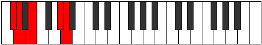 |
| SecondInversion | D,E,G#,A,C# |  |
| ThirdInversion | E,G#,A,C#,D |  |
| FourthInversion | G#,A,C#,D,E |  |
## Modes

| Number | Mode | Tonic | Notes | Illustration |
|--------|------|-------|-------|--------------|
| [355](https://ianring.com/musictheory/scales/355) | [Aeoloritonic](ModeGSharpAeoloritonic.md) | G# | G#, A, C#, D, E, G# |  |
| [355](https://ianring.com/musictheory/scales/355) | [Aeoloritonic](ModeAFlatAeoloritonic.md) | Ab | Ab, A, Db, D, E, Ab |  |
| [359](https://ianring.com/musictheory/scales/359) | [Bothimic](ModeGSharpBothimic.md) | G# | G#, A, Bb, C#, D, E, G# |  |
| [363](https://ianring.com/musictheory/scales/363) | [Soptimic](ModeGSharpSoptimic.md) | G# | G#, A, B, C#, D, E, G# |  |
| [367](https://ianring.com/musictheory/scales/367) | [Aerodian](ModeGSharpAerodian.md) | G# | G#, A, Bb, Cb, Db, Ebb, Fb, G# |  |
| [371](https://ianring.com/musictheory/scales/371) | [Rythimic](ModeGSharpRythimic.md) | G# | G#, A, B#, C#, D, E, G# |  |
| [375](https://ianring.com/musictheory/scales/375) | [Sodian](ModeGSharpSodian.md) | G# | G#, A, Bb, C, Db, Ebb, Fb, G# |  |
| [379](https://ianring.com/musictheory/scales/379) | [Aeragian](ModeGSharpAeragian.md) | G# | G#, A, B, C, Db, Ebb, Fb, G# |  |
| [383](https://ianring.com/musictheory/scales/383) | [Logyllic](ModeGSharpLogyllic.md) | G# | G#, A, A#, B, C, C#, D, E, G# |  |
| [383](https://ianring.com/musictheory/scales/383) | [Logyllic](ModeAFlatLogyllic.md) | Ab | Ab, A, Bb, B, C, Db, D, E, Ab |  |
| [395](https://ianring.com/musictheory/scales/395) | [Dalitonic](ModeCSharpDalitonic.md) | C# | C#, D, E, G#, A, C# |  |
| [395](https://ianring.com/musictheory/scales/395) | [Dalitonic](ModeDFlatDalitonic.md) | Db | Db, D, E, Ab, A, Db |  |
| [399](https://ianring.com/musictheory/scales/399) | [Zynimic](ModeCSharpZynimic.md) | C# | C#, D, Eb, Fb, G#, A, C# |  |
| [411](https://ianring.com/musictheory/scales/411) | [Lygimic](ModeCSharpLygimic.md) | C# | C#, D, E, F, G#, A, C# |  |
| [427](https://ianring.com/musictheory/scales/427) | [Zothimic](ModeCSharpZothimic.md) | C# | C#, D, E, F#, G#, A, C# |  |
| [447](https://ianring.com/musictheory/scales/447) | [Thyphyllic](ModeCSharpThyphyllic.md) | C# | C#, D, D#, E, F, F#, G#, A, C# |  |
| [447](https://ianring.com/musictheory/scales/447) | [Thyphyllic](ModeDFlatThyphyllic.md) | Db | Db, D, Eb, E, F, Gb, Ab, A, Db |  |
| [459](https://ianring.com/musictheory/scales/459) | [Zaptimic](ModeCSharpZaptimic.md) | C# | C#, D, E, F##, G#, A, C# |  |
| [479](https://ianring.com/musictheory/scales/479) | [Kocryllic](ModeCSharpKocryllic.md) | C# | C#, D, D#, E, F, G, G#, A, C# |  |
| [479](https://ianring.com/musictheory/scales/479) | [Kocryllic](ModeDFlatKocryllic.md) | Db | Db, D, Eb, E, F, G, Ab, A, Db |  |
| [483](https://ianring.com/musictheory/scales/483) | [Kygimic](ModeGSharpKygimic.md) | G# | G#, A, B##, C##, D#, E, G# |  |
| [487](https://ianring.com/musictheory/scales/487) | [Dynian](ModeGSharpDynian.md) | G# | G#, A, Bb, C#, D, Eb, Fb, G# |  |
| [491](https://ianring.com/musictheory/scales/491) | [Aeolyrian](ModeGSharpAeolyrian.md) | G# | G#, A, B, C#, D, Eb, Fb, G# |  |
| [495](https://ianring.com/musictheory/scales/495) | [Bocryllic](ModeCSharpBocryllic.md) | C# | C#, D, D#, E, F#, G, G#, A, C# |  |
| [495](https://ianring.com/musictheory/scales/495) | [Bocryllic](ModeDFlatBocryllic.md) | Db | Db, D, Eb, E, Gb, G, Ab, A, Db |  |
| [495](https://ianring.com/musictheory/scales/495) | [Bocryllic](ModeGSharpBocryllic.md) | G# | G#, A, A#, B, C#, D, D#, E, G# |  |
| [495](https://ianring.com/musictheory/scales/495) | [Bocryllic](ModeAFlatBocryllic.md) | Ab | Ab, A, Bb, B, Db, D, Eb, E, Ab |  |
| [499](https://ianring.com/musictheory/scales/499) | [Ionaptian](ModeGSharpIonaptian.md) | G# | G#, A, B#, C#, D, Eb, Fb, G# |  |
| [503](https://ianring.com/musictheory/scales/503) | [Thoptyllic](ModeGSharpThoptyllic.md) | G# | G#, A, A#, C, C#, D, D#, E, G# |  |
| [503](https://ianring.com/musictheory/scales/503) | [Thoptyllic](ModeAFlatThoptyllic.md) | Ab | Ab, A, Bb, C, Db, D, Eb, E, Ab |  |
| [507](https://ianring.com/musictheory/scales/507) | [Moryllic](ModeCSharpMoryllic.md) | C# | C#, D, E, F, F#, G, G#, A, C# |  |
| [507](https://ianring.com/musictheory/scales/507) | [Moryllic](ModeDFlatMoryllic.md) | Db | Db, D, E, F, Gb, G, Ab, A, Db |  |
| [507](https://ianring.com/musictheory/scales/507) | [Moryllic](ModeGSharpMoryllic.md) | G# | G#, A, B, C, C#, D, D#, E, G# |  |
| [507](https://ianring.com/musictheory/scales/507) | [Moryllic](ModeAFlatMoryllic.md) | Ab | Ab, A, B, C, Db, D, Eb, E, Ab |  |
| [511](https://ianring.com/musictheory/scales/511) | [Polygic](ModeCSharpPolygic.md) | C# | C#, D, D#, E, F, F#, G, G#, A, C# |  |
| [511](https://ianring.com/musictheory/scales/511) | [Polygic](ModeDFlatPolygic.md) | Db | Db, D, Eb, E, F, Gb, G, Ab, A, Db |  |
| [511](https://ianring.com/musictheory/scales/511) | [Polygic](ModeGSharpPolygic.md) | G# | G#, A, A#, B, C, C#, D, D#, E, G# |  |
| [511](https://ianring.com/musictheory/scales/511) | [Polygic](ModeAFlatPolygic.md) | Ab | Ab, A, Bb, B, C, Db, D, Eb, E, Ab |  |
| [735](https://ianring.com/musictheory/scales/735) | [Sylyllic](ModeGNaturalSylyllic.md) | G | G, G#, A, A#, B, C#, D, E, G |  |
| [751](https://ianring.com/musictheory/scales/751) | [Epacryllic](ModeGNaturalEpacryllic.md) | G | G, G#, A, A#, C, C#, D, E, G |  |
| [759](https://ianring.com/musictheory/scales/759) | [Katalyllic](ModeGNaturalKatalyllic.md) | G | G, G#, A, B, C, C#, D, E, G |  |
| [767](https://ianring.com/musictheory/scales/767) | [Raptygic](ModeGNaturalRaptygic.md) | G | G, G#, A, A#, B, C, C#, D, E, G |  |
| [791](https://ianring.com/musictheory/scales/791) | [Aeoloptimic](ModeCNaturalAeoloptimic.md) | C | C, Db, Ebb, Fb, G#, A, C |  |
| [831](https://ianring.com/musictheory/scales/831) | [Rodyllic](ModeCNaturalRodyllic.md) | C | C, C#, D, D#, E, F, G#, A, C |  |
| [863](https://ianring.com/musictheory/scales/863) | [Pyryllic](ModeCNaturalPyryllic.md) | C | C, C#, D, D#, E, F#, G#, A, C |  |
| [867](https://ianring.com/musictheory/scales/867) | [Phrocrimic](ModeGSharpPhrocrimic.md) | G# | G#, A, B##, C##, D##, E#, G# |  |
| [871](https://ianring.com/musictheory/scales/871) | [Epadian](ModeGSharpEpadian.md) | G# | G#, A, Bb, C#, D, E, F, G# |  |
| [875](https://ianring.com/musictheory/scales/875) | [Stothian](ModeGSharpStothian.md) | G# | G#, A, B, C#, D, E, F, G# |  |
| [879](https://ianring.com/musictheory/scales/879) | [Aeolocryllic](ModeGSharpAeolocryllic.md) | G# | G#, A, A#, B, C#, D, E, F, G# |  |
| [879](https://ianring.com/musictheory/scales/879) | [Aeolocryllic](ModeAFlatAeolocryllic.md) | Ab | Ab, A, Bb, B, Db, D, E, F, Ab |  |
| [883](https://ianring.com/musictheory/scales/883) | [Ralian](ModeGSharpRalian.md) | G# | G#, A, B#, C#, D, E, F, G# |  |
| [887](https://ianring.com/musictheory/scales/887) | [Sathyllic](ModeCNaturalSathyllic.md) | C | C, C#, D, E, F, F#, G#, A, C |  |
| [887](https://ianring.com/musictheory/scales/887) | [Sathyllic](ModeGSharpSathyllic.md) | G# | G#, A, A#, C, C#, D, E, F, G# |  |
| [887](https://ianring.com/musictheory/scales/887) | [Sathyllic](ModeAFlatSathyllic.md) | Ab | Ab, A, Bb, C, Db, D, E, F, Ab |  |
| [891](https://ianring.com/musictheory/scales/891) | [Ionilyllic](ModeGSharpIonilyllic.md) | G# | G#, A, B, C, C#, D, E, F, G# |  |
| [891](https://ianring.com/musictheory/scales/891) | [Ionilyllic](ModeAFlatIonilyllic.md) | Ab | Ab, A, B, C, Db, D, E, F, Ab |  |
| [895](https://ianring.com/musictheory/scales/895) | [Aeolathygic](ModeCNaturalAeolathygic.md) | C | C, C#, D, D#, E, F, F#, G#, A, C |  |
| [895](https://ianring.com/musictheory/scales/895) | [Aeolathygic](ModeGSharpAeolathygic.md) | G# | G#, A, A#, B, C, C#, D, E, F, G# |  |
| [895](https://ianring.com/musictheory/scales/895) | [Aeolathygic](ModeAFlatAeolathygic.md) | Ab | Ab, A, Bb, B, C, Db, D, E, F, Ab |  |
| [907](https://ianring.com/musictheory/scales/907) | [Tholimic](ModeDFlatTholimic.md) | Db | Db, Ebb, Fb, G#, A, Bb, Db |  |
| [911](https://ianring.com/musictheory/scales/911) | [Radian](ModeCSharpRadian.md) | C# | C#, D, Eb, Fb, G#, A, Bb, C# |  |
| [923](https://ianring.com/musictheory/scales/923) | [Ionodian](ModeCSharpIonodian.md) | C# | C#, D, E, F, G#, A, Bb, C# | 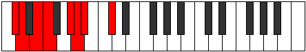 |
| [927](https://ianring.com/musictheory/scales/927) | [Koptyllic](ModeCNaturalKoptyllic.md) | C | C, C#, D, D#, E, G, G#, A, C |  |
| [927](https://ianring.com/musictheory/scales/927) | [Koptyllic](ModeCSharpKoptyllic.md) | C# | C#, D, D#, E, F, G#, A, A#, C# |  |
| [927](https://ianring.com/musictheory/scales/927) | [Koptyllic](ModeDFlatKoptyllic.md) | Db | Db, D, Eb, E, F, Ab, A, Bb, Db |  |
| [939](https://ianring.com/musictheory/scales/939) | [Dyptian](ModeCSharpDyptian.md) | C# | C#, D, E, F#, G#, A, Bb, C# |  |
| [943](https://ianring.com/musictheory/scales/943) | [Aerygyllic](ModeCSharpAerygyllic.md) | C# | C#, D, D#, E, F#, G#, A, A#, C# |  |
| [943](https://ianring.com/musictheory/scales/943) | [Aerygyllic](ModeDFlatAerygyllic.md) | Db | Db, D, Eb, E, Gb, Ab, A, Bb, Db |  |
| [951](https://ianring.com/musictheory/scales/951) | [Thogyllic](ModeCNaturalThogyllic.md) | C | C, C#, D, E, F, G, G#, A, C |  |
| [955](https://ianring.com/musictheory/scales/955) | [Ionogyllic](ModeCSharpIonogyllic.md) | C# | C#, D, E, F, F#, G#, A, A#, C# |  |
| [955](https://ianring.com/musictheory/scales/955) | [Ionogyllic](ModeDFlatIonogyllic.md) | Db | Db, D, E, F, Gb, Ab, A, Bb, Db |  |
| [959](https://ianring.com/musictheory/scales/959) | [Katylygic](ModeCNaturalKatylygic.md) | C | C, C#, D, D#, E, F, G, G#, A, C |  |
| [959](https://ianring.com/musictheory/scales/959) | [Katylygic](ModeCSharpKatylygic.md) | C# | C#, D, D#, E, F, F#, G#, A, A#, C# |  |
| [959](https://ianring.com/musictheory/scales/959) | [Katylygic](ModeDFlatKatylygic.md) | Db | Db, D, Eb, E, F, Gb, Ab, A, Bb, Db |  |
| [971](https://ianring.com/musictheory/scales/971) | [Ladian](ModeCSharpLadian.md) | C# | C#, D, E, F##, G#, A, Bb, C# | 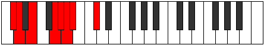 |
| [975](https://ianring.com/musictheory/scales/975) | [Katogyllic](ModeCSharpKatogyllic.md) | C# | C#, D, D#, E, G, G#, A, A#, C# |  |
| [975](https://ianring.com/musictheory/scales/975) | [Katogyllic](ModeDFlatKatogyllic.md) | Db | Db, D, Eb, E, G, Ab, A, Bb, Db |  |
| [975](https://ianring.com/musictheory/scales/975) | [Katogyllic](ModeGNaturalKatogyllic.md) | G | G, G#, A, A#, C#, D, D#, E, G |  |
| [983](https://ianring.com/musictheory/scales/983) | [Epygyllic](ModeCNaturalEpygyllic.md) | C | C, C#, D, E, F#, G, G#, A, C |  |
| [983](https://ianring.com/musictheory/scales/983) | [Epygyllic](ModeGNaturalEpygyllic.md) | G | G, G#, A, B, C#, D, D#, E, G |  |
| [987](https://ianring.com/musictheory/scales/987) | [Aeraptyllic](ModeCSharpAeraptyllic.md) | C# | C#, D, E, F, G, G#, A, A#, C# |  |
| [987](https://ianring.com/musictheory/scales/987) | [Aeraptyllic](ModeDFlatAeraptyllic.md) | Db | Db, D, E, F, G, Ab, A, Bb, Db |  |
| [991](https://ianring.com/musictheory/scales/991) | [Aeolygic](ModeCNaturalAeolygic.md) | C | C, C#, D, D#, E, F#, G, G#, A, C | 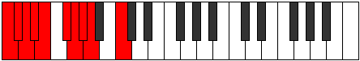 |
| [991](https://ianring.com/musictheory/scales/991) | [Aeolygic](ModeCSharpAeolygic.md) | C# | C#, D, D#, E, F, G, G#, A, A#, C# |  |
| [991](https://ianring.com/musictheory/scales/991) | [Aeolygic](ModeDFlatAeolygic.md) | Db | Db, D, Eb, E, F, G, Ab, A, Bb, Db |  |
| [991](https://ianring.com/musictheory/scales/991) | [Aeolygic](ModeGNaturalAeolygic.md) | G | G, G#, A, A#, B, C#, D, D#, E, G |  |
| [995](https://ianring.com/musictheory/scales/995) | [Phrathian](ModeGSharpPhrathian.md) | G# | G#, A, B##, C##, D#, E, F, G# |  |
| [999](https://ianring.com/musictheory/scales/999) | [Bylyllic](ModeGNaturalBylyllic.md) | G | G, G#, A, C, C#, D, D#, E, G |  |
| [999](https://ianring.com/musictheory/scales/999) | [Bylyllic](ModeGSharpBylyllic.md) | G# | G#, A, A#, C#, D, D#, E, F, G# |  |
| [999](https://ianring.com/musictheory/scales/999) | [Bylyllic](ModeAFlatBylyllic.md) | Ab | Ab, A, Bb, Db, D, Eb, E, F, Ab |  |
| [1003](https://ianring.com/musictheory/scales/1003) | [Ionyryllic](ModeCSharpIonyryllic.md) | C# | C#, D, E, F#, G, G#, A, A#, C# |  |
| [1003](https://ianring.com/musictheory/scales/1003) | [Ionyryllic](ModeDFlatIonyryllic.md) | Db | Db, D, E, Gb, G, Ab, A, Bb, Db |  |
| [1003](https://ianring.com/musictheory/scales/1003) | [Ionyryllic](ModeGSharpIonyryllic.md) | G# | G#, A, B, C#, D, D#, E, F, G# |  |
| [1003](https://ianring.com/musictheory/scales/1003) | [Ionyryllic](ModeAFlatIonyryllic.md) | Ab | Ab, A, B, Db, D, Eb, E, F, Ab |  |
| [1007](https://ianring.com/musictheory/scales/1007) | [Ionycrygic](ModeGNaturalIonycrygic.md) | G | G, G#, A, A#, C, C#, D, D#, E, G |  |
| [1007](https://ianring.com/musictheory/scales/1007) | [Ionycrygic](ModeCSharpIonycrygic.md) | C# | C#, D, D#, E, F#, G, G#, A, A#, C# |  |
| [1007](https://ianring.com/musictheory/scales/1007) | [Ionycrygic](ModeDFlatIonycrygic.md) | Db | Db, D, Eb, E, Gb, G, Ab, A, Bb, Db |  |
| [1007](https://ianring.com/musictheory/scales/1007) | [Ionycrygic](ModeGSharpIonycrygic.md) | G# | G#, A, A#, B, C#, D, D#, E, F, G# |  |
| [1007](https://ianring.com/musictheory/scales/1007) | [Ionycrygic](ModeAFlatIonycrygic.md) | Ab | Ab, A, Bb, B, Db, D, Eb, E, F, Ab |  |
| [1011](https://ianring.com/musictheory/scales/1011) | [Kycryllic](ModeGSharpKycryllic.md) | G# | G#, A, C, C#, D, D#, E, F, G# |  |
| [1011](https://ianring.com/musictheory/scales/1011) | [Kycryllic](ModeAFlatKycryllic.md) | Ab | Ab, A, C, Db, D, Eb, E, F, Ab |  |
| [1015](https://ianring.com/musictheory/scales/1015) | [Ionodygic](ModeCNaturalIonodygic.md) | C | C, C#, D, E, F, F#, G, G#, A, C |  |
| [1015](https://ianring.com/musictheory/scales/1015) | [Ionodygic](ModeGSharpIonodygic.md) | G# | G#, A, A#, C, C#, D, D#, E, F, G# |  |
| [1015](https://ianring.com/musictheory/scales/1015) | [Ionodygic](ModeAFlatIonodygic.md) | Ab | Ab, A, Bb, C, Db, D, Eb, E, F, Ab |  |
| [1015](https://ianring.com/musictheory/scales/1015) | [Ionodygic](ModeGNaturalIonodygic.md) | G | G, G#, A, B, C, C#, D, D#, E, G |  |
| [1019](https://ianring.com/musictheory/scales/1019) | [Aeranygic](ModeCSharpAeranygic.md) | C# | C#, D, E, F, F#, G, G#, A, A#, C# |  |
| [1019](https://ianring.com/musictheory/scales/1019) | [Aeranygic](ModeDFlatAeranygic.md) | Db | Db, D, E, F, Gb, G, Ab, A, Bb, Db |  |
| [1019](https://ianring.com/musictheory/scales/1019) | [Aeranygic](ModeGSharpAeranygic.md) | G# | G#, A, B, C, C#, D, D#, E, F, G# |  |
| [1019](https://ianring.com/musictheory/scales/1019) | [Aeranygic](ModeAFlatAeranygic.md) | Ab | Ab, A, B, C, Db, D, Eb, E, F, Ab |  |
| [1023](https://ianring.com/musictheory/scales/1023) | [Dodyllian](ModeCNaturalDodyllian.md) | C | C, C#, D, D#, E, F, F#, G, G#, A, C |  |
| [1023](https://ianring.com/musictheory/scales/1023) | [Dodyllian](ModeCSharpDodyllian.md) | C# | C#, D, D#, E, F, F#, G, G#, A, A#, C# |  |
| [1023](https://ianring.com/musictheory/scales/1023) | [Dodyllian](ModeDFlatDodyllian.md) | Db | Db, D, Eb, E, F, Gb, G, Ab, A, Bb, Db |  |
| [1023](https://ianring.com/musictheory/scales/1023) | [Dodyllian](ModeGSharpDodyllian.md) | G# | G#, A, A#, B, C, C#, D, D#, E, F, G# |  |
| [1023](https://ianring.com/musictheory/scales/1023) | [Dodyllian](ModeAFlatDodyllian.md) | Ab | Ab, A, Bb, B, C, Db, D, Eb, E, F, Ab |  |
| [1023](https://ianring.com/musictheory/scales/1023) | [Dodyllian](ModeGNaturalDodyllian.md) | G | G, G#, A, A#, B, C, C#, D, D#, E, G |  |
| [1379](https://ianring.com/musictheory/scales/1379) | [Kycrimic](ModeGSharpKycrimic.md) | G# | G#, A, B##, C##, D##, E##, G# |  |
| [1383](https://ianring.com/musictheory/scales/1383) | [Pynian](ModeGSharpPynian.md) | G# | G#, A, Bb, C#, D, E, F#, G# |  |
| [1387](https://ianring.com/musictheory/scales/1387) | [Locrian](ModeGSharpLocrian.md) | G# | G#, A, B, C#, D, E, F#, G# |  |
| [1391](https://ianring.com/musictheory/scales/1391) | [Aeradyllic](ModeGSharpAeradyllic.md) | G# | G#, A, A#, B, C#, D, E, F#, G# |  |
| [1391](https://ianring.com/musictheory/scales/1391) | [Aeradyllic](ModeAFlatAeradyllic.md) | Ab | Ab, A, Bb, B, Db, D, E, Gb, Ab |  |
| [1395](https://ianring.com/musictheory/scales/1395) | [Mixonorian](ModeGSharpMixonorian.md) | G# | G#, A, B#, C#, D, E, F#, G# |  |
| [1399](https://ianring.com/musictheory/scales/1399) | [Syryllic](ModeGSharpSyryllic.md) | G# | G#, A, A#, C, C#, D, E, F#, G# |  |
| [1399](https://ianring.com/musictheory/scales/1399) | [Syryllic](ModeAFlatSyryllic.md) | Ab | Ab, A, Bb, C, Db, D, E, Gb, Ab |  |
| [1403](https://ianring.com/musictheory/scales/1403) | [Epinyllic](ModeGSharpEpinyllic.md) | G# | G#, A, B, C, C#, D, E, F#, G# |  |
| [1403](https://ianring.com/musictheory/scales/1403) | [Epinyllic](ModeAFlatEpinyllic.md) | Ab | Ab, A, B, C, Db, D, E, Gb, Ab |  |
| [1407](https://ianring.com/musictheory/scales/1407) | [Tharygic](ModeGSharpTharygic.md) | G# | G#, A, A#, B, C, C#, D, E, F#, G# |  |
| [1407](https://ianring.com/musictheory/scales/1407) | [Tharygic](ModeAFlatTharygic.md) | Ab | Ab, A, Bb, B, C, Db, D, E, Gb, Ab |  |
| [1419](https://ianring.com/musictheory/scales/1419) | [Zalimic](ModeDFlatZalimic.md) | Db | Db, Ebb, Fb, G#, A, B, Db |  |
| [1421](https://ianring.com/musictheory/scales/1421) | [Aeolaphimic](ModeFSharpAeolaphimic.md) | F# | F#, G#, A, B##, C##, D##, F# |  |
| [1423](https://ianring.com/musictheory/scales/1423) | [Doptian](ModeCSharpDoptian.md) | C# | C#, D, Eb, Fb, G#, A, B, C# |  |
| [1435](https://ianring.com/musictheory/scales/1435) | [Phronian](ModeCSharpPhronian.md) | C# | C#, D, E, F, G#, A, B, C# |  |
| [1437](https://ianring.com/musictheory/scales/1437) | [Aeolycrian](ModeFSharpAeolycrian.md) | F# | F#, G#, A, Bb, C#, D, E, F# |  |
| [1439](https://ianring.com/musictheory/scales/1439) | [Rolyllic](ModeFSharpRolyllic.md) | F# | F#, G, G#, A, A#, C#, D, E, F# |  |
| [1439](https://ianring.com/musictheory/scales/1439) | [Rolyllic](ModeGFlatRolyllic.md) | Gb | Gb, G, Ab, A, Bb, Db, D, E, Gb |  |
| [1439](https://ianring.com/musictheory/scales/1439) | [Rolyllic](ModeCSharpRolyllic.md) | C# | C#, D, D#, E, F, G#, A, B, C# |  |
| [1439](https://ianring.com/musictheory/scales/1439) | [Rolyllic](ModeDFlatRolyllic.md) | Db | Db, D, Eb, E, F, Ab, A, B, Db |  |
| [1451](https://ianring.com/musictheory/scales/1451) | [Phrygian](ModeCSharpPhrygian.md) | C# | C#, D, E, F#, G#, A, B, C# |  |
| [1453](https://ianring.com/musictheory/scales/1453) | [Aeolian](ModeFSharpAeolian.md) | F# | F#, G#, A, B, C#, D, E, F# |  |
| [1455](https://ianring.com/musictheory/scales/1455) | [Soryllic](ModeCSharpSoryllic.md) | C# | C#, D, D#, E, F#, G#, A, B, C# |  |
| [1455](https://ianring.com/musictheory/scales/1455) | [Soryllic](ModeDFlatSoryllic.md) | Db | Db, D, Eb, E, Gb, Ab, A, B, Db |  |
| [1455](https://ianring.com/musictheory/scales/1455) | [Soryllic](ModeFSharpSoryllic.md) | F# | F#, G, G#, A, B, C#, D, E, F# |  |
| [1455](https://ianring.com/musictheory/scales/1455) | [Soryllic](ModeGFlatSoryllic.md) | Gb | Gb, G, Ab, A, B, Db, D, E, Gb |  |
| [1467](https://ianring.com/musictheory/scales/1467) | [Thydyllic](ModeCSharpThydyllic.md) | C# | C#, D, E, F, F#, G#, A, B, C# |  |
| [1467](https://ianring.com/musictheory/scales/1467) | [Thydyllic](ModeDFlatThydyllic.md) | Db | Db, D, E, F, Gb, Ab, A, B, Db |  |
| [1469](https://ianring.com/musictheory/scales/1469) | [Epiryllic](ModeFSharpEpiryllic.md) | F# | F#, G#, A, A#, B, C#, D, E, F# |  |
| [1469](https://ianring.com/musictheory/scales/1469) | [Epiryllic](ModeGFlatEpiryllic.md) | Gb | Gb, Ab, A, Bb, B, Db, D, E, Gb |  |
| [1471](https://ianring.com/musictheory/scales/1471) | [Radygic](ModeCSharpRadygic.md) | C# | C#, D, D#, E, F, F#, G#, A, B, C# |  |
| [1471](https://ianring.com/musictheory/scales/1471) | [Radygic](ModeDFlatRadygic.md) | Db | Db, D, Eb, E, F, Gb, Ab, A, B, Db |  |
| [1471](https://ianring.com/musictheory/scales/1471) | [Radygic](ModeFSharpRadygic.md) | F# | F#, G, G#, A, A#, B, C#, D, E, F# |  |
| [1471](https://ianring.com/musictheory/scales/1471) | [Radygic](ModeGFlatRadygic.md) | Gb | Gb, G, Ab, A, Bb, B, Db, D, E, Gb |  |
| [1483](https://ianring.com/musictheory/scales/1483) | [Dygian](ModeCSharpDygian.md) | C# | C#, D, E, F##, G#, A, B, C# |  |
| [1485](https://ianring.com/musictheory/scales/1485) | [Tyrian](ModeFSharpTyrian.md) | F# | F#, G#, A, B#, C#, D, E, F# |  |
| [1487](https://ianring.com/musictheory/scales/1487) | [Lycryllic](ModeFSharpLycryllic.md) | F# | F#, G, G#, A, C, C#, D, E, F# |  |
| [1487](https://ianring.com/musictheory/scales/1487) | [Lycryllic](ModeGFlatLycryllic.md) | Gb | Gb, G, Ab, A, C, Db, D, E, Gb |  |
| [1487](https://ianring.com/musictheory/scales/1487) | [Lycryllic](ModeCSharpLycryllic.md) | C# | C#, D, D#, E, G, G#, A, B, C# |  |
| [1487](https://ianring.com/musictheory/scales/1487) | [Lycryllic](ModeDFlatLycryllic.md) | Db | Db, D, Eb, E, G, Ab, A, B, Db |  |
| [1499](https://ianring.com/musictheory/scales/1499) | [Stonyllic](ModeCSharpStonyllic.md) | C# | C#, D, E, F, G, G#, A, B, C# |  |
| [1499](https://ianring.com/musictheory/scales/1499) | [Stonyllic](ModeDFlatStonyllic.md) | Db | Db, D, E, F, G, Ab, A, B, Db |  |
| [1501](https://ianring.com/musictheory/scales/1501) | [Stygyllic](ModeFSharpStygyllic.md) | F# | F#, G#, A, A#, C, C#, D, E, F# |  |
| [1501](https://ianring.com/musictheory/scales/1501) | [Stygyllic](ModeGFlatStygyllic.md) | Gb | Gb, Ab, A, Bb, C, Db, D, E, Gb |  |
| [1503](https://ianring.com/musictheory/scales/1503) | [Padygic](ModeFSharpPadygic.md) | F# | F#, G, G#, A, A#, C, C#, D, E, F# |  |
| [1503](https://ianring.com/musictheory/scales/1503) | [Padygic](ModeGFlatPadygic.md) | Gb | Gb, G, Ab, A, Bb, C, Db, D, E, Gb |  |
| [1503](https://ianring.com/musictheory/scales/1503) | [Padygic](ModeCSharpPadygic.md) | C# | C#, D, D#, E, F, G, G#, A, B, C# |  |
| [1503](https://ianring.com/musictheory/scales/1503) | [Padygic](ModeDFlatPadygic.md) | Db | Db, D, Eb, E, F, G, Ab, A, B, Db |  |
| [1507](https://ianring.com/musictheory/scales/1507) | [Zynian](ModeGSharpZynian.md) | G# | G#, A, B##, C##, D#, E, F#, G# |  |
| [1511](https://ianring.com/musictheory/scales/1511) | [Styptyllic](ModeGSharpStyptyllic.md) | G# | G#, A, A#, C#, D, D#, E, F#, G# |  |
| [1511](https://ianring.com/musictheory/scales/1511) | [Styptyllic](ModeAFlatStyptyllic.md) | Ab | Ab, A, Bb, Db, D, Eb, E, Gb, Ab |  |
| [1515](https://ianring.com/musictheory/scales/1515) | [Solyllic](ModeGSharpSolyllic.md) | G# | G#, A, B, C#, D, D#, E, F#, G# |  |
| [1515](https://ianring.com/musictheory/scales/1515) | [Solyllic](ModeAFlatSolyllic.md) | Ab | Ab, A, B, Db, D, Eb, E, Gb, Ab |  |
| [1515](https://ianring.com/musictheory/scales/1515) | [Solyllic](ModeCSharpSolyllic.md) | C# | C#, D, E, F#, G, G#, A, B, C# |  |
| [1515](https://ianring.com/musictheory/scales/1515) | [Solyllic](ModeDFlatSolyllic.md) | Db | Db, D, E, Gb, G, Ab, A, B, Db |  |
| [1517](https://ianring.com/musictheory/scales/1517) | [Sagyllic](ModeFSharpSagyllic.md) | F# | F#, G#, A, B, C, C#, D, E, F# |  |
| [1517](https://ianring.com/musictheory/scales/1517) | [Sagyllic](ModeGFlatSagyllic.md) | Gb | Gb, Ab, A, B, C, Db, D, E, Gb |  |
| [1519](https://ianring.com/musictheory/scales/1519) | [Solygic](ModeFSharpSolygic.md) | F# | F#, G, G#, A, B, C, C#, D, E, F# |  |
| [1519](https://ianring.com/musictheory/scales/1519) | [Solygic](ModeGFlatSolygic.md) | Gb | Gb, G, Ab, A, B, C, Db, D, E, Gb |  |
| [1519](https://ianring.com/musictheory/scales/1519) | [Solygic](ModeCSharpSolygic.md) | C# | C#, D, D#, E, F#, G, G#, A, B, C# |  |
| [1519](https://ianring.com/musictheory/scales/1519) | [Solygic](ModeDFlatSolygic.md) | Db | Db, D, Eb, E, Gb, G, Ab, A, B, Db |  |
| [1519](https://ianring.com/musictheory/scales/1519) | [Solygic](ModeGSharpSolygic.md) | G# | G#, A, A#, B, C#, D, D#, E, F#, G# |  |
| [1519](https://ianring.com/musictheory/scales/1519) | [Solygic](ModeAFlatSolygic.md) | Ab | Ab, A, Bb, B, Db, D, Eb, E, Gb, Ab |  |
| [1523](https://ianring.com/musictheory/scales/1523) | [Zothyllic](ModeGSharpZothyllic.md) | G# | G#, A, C, C#, D, D#, E, F#, G# |  |
| [1523](https://ianring.com/musictheory/scales/1523) | [Zothyllic](ModeAFlatZothyllic.md) | Ab | Ab, A, C, Db, D, Eb, E, Gb, Ab |  |
| [1527](https://ianring.com/musictheory/scales/1527) | [Aeolyrygic](ModeGSharpAeolyrygic.md) | G# | G#, A, A#, C, C#, D, D#, E, F#, G# |  |
| [1527](https://ianring.com/musictheory/scales/1527) | [Aeolyrygic](ModeAFlatAeolyrygic.md) | Ab | Ab, A, Bb, C, Db, D, Eb, E, Gb, Ab |  |
| [1531](https://ianring.com/musictheory/scales/1531) | [Styptygic](ModeGSharpStyptygic.md) | G# | G#, A, B, C, C#, D, D#, E, F#, G# |  |
| [1531](https://ianring.com/musictheory/scales/1531) | [Styptygic](ModeAFlatStyptygic.md) | Ab | Ab, A, B, C, Db, D, Eb, E, Gb, Ab |  |
| [1531](https://ianring.com/musictheory/scales/1531) | [Styptygic](ModeCSharpStyptygic.md) | C# | C#, D, E, F, F#, G, G#, A, B, C# |  |
| [1531](https://ianring.com/musictheory/scales/1531) | [Styptygic](ModeDFlatStyptygic.md) | Db | Db, D, E, F, Gb, G, Ab, A, B, Db |  |
| [1533](https://ianring.com/musictheory/scales/1533) | [Katycrygic](ModeFSharpKatycrygic.md) | F# | F#, G#, A, A#, B, C, C#, D, E, F# |  |
| [1533](https://ianring.com/musictheory/scales/1533) | [Katycrygic](ModeGFlatKatycrygic.md) | Gb | Gb, Ab, A, Bb, B, C, Db, D, E, Gb |  |
| [1535](https://ianring.com/musictheory/scales/1535) | [Mixodyllian](ModeCSharpMixodyllian.md) | C# | C#, D, D#, E, F, F#, G, G#, A, B, C# |  |
| [1535](https://ianring.com/musictheory/scales/1535) | [Mixodyllian](ModeDFlatMixodyllian.md) | Db | Db, D, Eb, E, F, Gb, G, Ab, A, B, Db |  |
| [1535](https://ianring.com/musictheory/scales/1535) | [Mixodyllian](ModeGSharpMixodyllian.md) | G# | G#, A, A#, B, C, C#, D, D#, E, F#, G# |  |
| [1535](https://ianring.com/musictheory/scales/1535) | [Mixodyllian](ModeAFlatMixodyllian.md) | Ab | Ab, A, Bb, B, C, Db, D, Eb, E, Gb, Ab |  |
| [1535](https://ianring.com/musictheory/scales/1535) | [Mixodyllian](ModeFSharpMixodyllian.md) | F# | F#, G, G#, A, A#, B, C, C#, D, E, F# |  |
| [1535](https://ianring.com/musictheory/scales/1535) | [Mixodyllian](ModeGFlatMixodyllian.md) | Gb | Gb, G, Ab, A, Bb, B, C, Db, D, E, Gb |  |
| [1583](https://ianring.com/musictheory/scales/1583) | [Salian](ModeBNaturalSalian.md) | B | B, C, Db, Ebb, Fb, G#, A, B |  |
| [1585](https://ianring.com/musictheory/scales/1585) | [Phraditonic](ModeENaturalPhraditonic.md) | E | E, G#, A, C#, D, E |  |
| [1587](https://ianring.com/musictheory/scales/1587) | [Lalimic](ModeENaturalLalimic.md) | E | E, F, G#, A, B##, C##, E |  |
| [1589](https://ianring.com/musictheory/scales/1589) | [Ionagimic](ModeENaturalIonagimic.md) | E | E, F#, G#, A, B##, C##, E |  |
| [1593](https://ianring.com/musictheory/scales/1593) | [Zogimic](ModeENaturalZogimic.md) | E | E, F##, G#, A, B##, C##, E |  |
| [1597](https://ianring.com/musictheory/scales/1597) | [Aeolodian](ModeBNaturalAeolodian.md) | B | B, C#, D, Eb, Fb, G#, A, B | 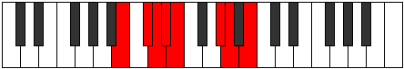 |
| [1599](https://ianring.com/musictheory/scales/1599) | [Pocryllic](ModeENaturalPocryllic.md) | E | E, F, F#, G, G#, A, C#, D, E |  |
| [1599](https://ianring.com/musictheory/scales/1599) | [Pocryllic](ModeBNaturalPocryllic.md) | B | B, C, C#, D, D#, E, G#, A, B |  |
| [1645](https://ianring.com/musictheory/scales/1645) | [Katagian](ModeBNaturalKatagian.md) | B | B, C#, D, E, F, G#, A, B |  |
| [1647](https://ianring.com/musictheory/scales/1647) | [Polyllic](ModeBNaturalPolyllic.md) | B | B, C, C#, D, E, F, G#, A, B |  |
| [1651](https://ianring.com/musictheory/scales/1651) | [Mogian](ModeENaturalMogian.md) | E | E, F, G#, A, Bb, C#, D, E | 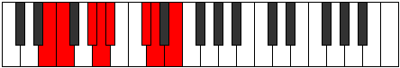 |
| [1653](https://ianring.com/musictheory/scales/1653) | [Gylian](ModeENaturalGylian.md) | E | E, F#, G#, A, Bb, C#, D, E |  |
| [1655](https://ianring.com/musictheory/scales/1655) | [Katygyllic](ModeENaturalKatygyllic.md) | E | E, F, F#, G#, A, A#, C#, D, E |  |
| [1657](https://ianring.com/musictheory/scales/1657) | [Ionothian](ModeENaturalIonothian.md) | E | E, F##, G#, A, Bb, C#, D, E |  |
| [1659](https://ianring.com/musictheory/scales/1659) | [Magyllic](ModeENaturalMagyllic.md) | E | E, F, G, G#, A, A#, C#, D, E |  |
| [1661](https://ianring.com/musictheory/scales/1661) | [Gonyllic](ModeENaturalGonyllic.md) | E | E, F#, G, G#, A, A#, C#, D, E |  |
| [1661](https://ianring.com/musictheory/scales/1661) | [Gonyllic](ModeBNaturalGonyllic.md) | B | B, C#, D, D#, E, F, G#, A, B | 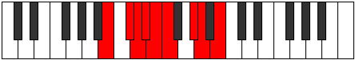 |
| [1663](https://ianring.com/musictheory/scales/1663) | [Lydygic](ModeENaturalLydygic.md) | E | E, F, F#, G, G#, A, A#, C#, D, E |  |
| [1663](https://ianring.com/musictheory/scales/1663) | [Lydygic](ModeBNaturalLydygic.md) | B | B, C, C#, D, D#, E, F, G#, A, B |  |
| [1709](https://ianring.com/musictheory/scales/1709) | [Dorian](ModeBNaturalDorian.md) | B | B, C#, D, E, F#, G#, A, B |  |
| [1711](https://ianring.com/musictheory/scales/1711) | [Ragyllic](ModeBNaturalRagyllic.md) | B | B, C, C#, D, E, F#, G#, A, B |  |
| [1715](https://ianring.com/musictheory/scales/1715) | [Aeronian](ModeENaturalAeronian.md) | E | E, F, G#, A, B, C#, D, E |  |
| [1717](https://ianring.com/musictheory/scales/1717) | [Mixolydian](ModeENaturalMixolydian.md) | E | E, F#, G#, A, B, C#, D, E |  |
| [1719](https://ianring.com/musictheory/scales/1719) | [Lyryllic](ModeENaturalLyryllic.md) | E | E, F, F#, G#, A, B, C#, D, E |  |
| [1721](https://ianring.com/musictheory/scales/1721) | [Ionycrian](ModeENaturalIonycrian.md) | E | E, F##, G#, A, B, C#, D, E |  |
| [1723](https://ianring.com/musictheory/scales/1723) | [Poryllic](ModeENaturalPoryllic.md) | E | E, F, G, G#, A, B, C#, D, E |  |
| [1725](https://ianring.com/musictheory/scales/1725) | [Mixodyllic](ModeBNaturalMixodyllic.md) | B | B, C#, D, D#, E, F#, G#, A, B |  |
| [1725](https://ianring.com/musictheory/scales/1725) | [Mixodyllic](ModeENaturalMixodyllic.md) | E | E, F#, G, G#, A, B, C#, D, E |  |
| [1727](https://ianring.com/musictheory/scales/1727) | [Sydygic](ModeBNaturalSydygic.md) | B | B, C, C#, D, D#, E, F#, G#, A, B |  |
| [1727](https://ianring.com/musictheory/scales/1727) | [Sydygic](ModeENaturalSydygic.md) | E | E, F, F#, G, G#, A, B, C#, D, E |  |
| [1743](https://ianring.com/musictheory/scales/1743) | [Epigyllic](ModeGNaturalEpigyllic.md) | G | G, G#, A, A#, C#, D, E, F, G |  |
| [1751](https://ianring.com/musictheory/scales/1751) | [Aeolyryllic](ModeGNaturalAeolyryllic.md) | G | G, G#, A, B, C#, D, E, F, G |  |
| [1759](https://ianring.com/musictheory/scales/1759) | [Pylygic](ModeGNaturalPylygic.md) | G | G, G#, A, A#, B, C#, D, E, F, G |  |
| [1767](https://ianring.com/musictheory/scales/1767) | [Dyryllic](ModeGNaturalDyryllic.md) | G | G, G#, A, C, C#, D, E, F, G |  |
| [1773](https://ianring.com/musictheory/scales/1773) | [Aeoloryllic](ModeBNaturalAeoloryllic.md) | B | B, C#, D, E, F, F#, G#, A, B |  |
| [1775](https://ianring.com/musictheory/scales/1775) | [Lyrygic](ModeGNaturalLyrygic.md) | G | G, G#, A, A#, C, C#, D, E, F, G |  |
| [1775](https://ianring.com/musictheory/scales/1775) | [Lyrygic](ModeBNaturalLyrygic.md) | B | B, C, C#, D, E, F, F#, G#, A, B |  |
| [1779](https://ianring.com/musictheory/scales/1779) | [Aerythyllic](ModeENaturalAerythyllic.md) | E | E, F, G#, A, A#, B, C#, D, E |  |
| [1781](https://ianring.com/musictheory/scales/1781) | [Gocryllic](ModeENaturalGocryllic.md) | E | E, F#, G#, A, A#, B, C#, D, E |  |
| [1783](https://ianring.com/musictheory/scales/1783) | [Danygic](ModeGNaturalDanygic.md) | G | G, G#, A, B, C, C#, D, E, F, G |  |
| [1783](https://ianring.com/musictheory/scales/1783) | [Danygic](ModeENaturalDanygic.md) | E | E, F, F#, G#, A, A#, B, C#, D, E |  |
| [1785](https://ianring.com/musictheory/scales/1785) | [Tharyllic](ModeENaturalTharyllic.md) | E | E, G, G#, A, A#, B, C#, D, E |  |
| [1787](https://ianring.com/musictheory/scales/1787) | [Mycrygic](ModeENaturalMycrygic.md) | E | E, F, G, G#, A, A#, B, C#, D, E |  |
| [1789](https://ianring.com/musictheory/scales/1789) | [Katagygic](ModeBNaturalKatagygic.md) | B | B, C#, D, D#, E, F, F#, G#, A, B |  |
| [1789](https://ianring.com/musictheory/scales/1789) | [Katagygic](ModeENaturalKatagygic.md) | E | E, F#, G, G#, A, A#, B, C#, D, E |  |
| [1791](https://ianring.com/musictheory/scales/1791) | [Aerygyllian](ModeBNaturalAerygyllian.md) | B | B, C, C#, D, D#, E, F, F#, G#, A, B |  |
| [1791](https://ianring.com/musictheory/scales/1791) | [Aerygyllian](ModeGNaturalAerygyllian.md) | G | G, G#, A, A#, B, C, C#, D, E, F, G |  |
| [1791](https://ianring.com/musictheory/scales/1791) | [Aerygyllian](ModeENaturalAerygyllian.md) | E | E, F, F#, G, G#, A, A#, B, C#, D, E |  |
| [1815](https://ianring.com/musictheory/scales/1815) | [Godian](ModeCNaturalGodian.md) | C | C, Db, Ebb, Fb, G#, A, Bb, C | 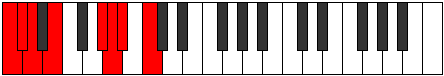 |
| [1823](https://ianring.com/musictheory/scales/1823) | [Phralyllic](ModeCNaturalPhralyllic.md) | C | C, C#, D, D#, E, G#, A, A#, C |  |
| [1837](https://ianring.com/musictheory/scales/1837) | [Dalian](ModeBNaturalDalian.md) | B | B, C#, D, E, F##, G#, A, B |  |
| [1839](https://ianring.com/musictheory/scales/1839) | [Zogyllic](ModeBNaturalZogyllic.md) | B | B, C, C#, D, E, G, G#, A, B |  |
| [1843](https://ianring.com/musictheory/scales/1843) | [Ionygian](ModeENaturalIonygian.md) | E | E, F, G#, A, B#, C#, D, E |  |
| [1845](https://ianring.com/musictheory/scales/1845) | [Lagian](ModeENaturalLagian.md) | E | E, F#, G#, A, B#, C#, D, E |  |
| [1847](https://ianring.com/musictheory/scales/1847) | [Thacryllic](ModeENaturalThacryllic.md) | E | E, F, F#, G#, A, C, C#, D, E |  |
| [1847](https://ianring.com/musictheory/scales/1847) | [Thacryllic](ModeCNaturalThacryllic.md) | C | C, C#, D, E, F, G#, A, A#, C |  |
| [1849](https://ianring.com/musictheory/scales/1849) | [Epogian](ModeENaturalEpogian.md) | E | E, F##, G#, A, B#, C#, D, E |  |
| [1851](https://ianring.com/musictheory/scales/1851) | [Zacryllic](ModeENaturalZacryllic.md) | E | E, F, G, G#, A, C, C#, D, E |  |
| [1853](https://ianring.com/musictheory/scales/1853) | [Phrynyllic](ModeENaturalPhrynyllic.md) | E | E, F#, G, G#, A, C, C#, D, E |  |
| [1853](https://ianring.com/musictheory/scales/1853) | [Phrynyllic](ModeBNaturalPhrynyllic.md) | B | B, C#, D, D#, E, G, G#, A, B |  |
| [1855](https://ianring.com/musictheory/scales/1855) | [Marygic](ModeENaturalMarygic.md) | E | E, F, F#, G, G#, A, C, C#, D, E |  |
| [1855](https://ianring.com/musictheory/scales/1855) | [Marygic](ModeCNaturalMarygic.md) | C | C, C#, D, D#, E, F, G#, A, A#, C |  |
| [1855](https://ianring.com/musictheory/scales/1855) | [Marygic](ModeBNaturalMarygic.md) | B | B, C, C#, D, D#, E, G, G#, A, B |  |
| [1879](https://ianring.com/musictheory/scales/1879) | [Mixoryllic](ModeCNaturalMixoryllic.md) | C | C, C#, D, E, F#, G#, A, A#, C |  |
| [1887](https://ianring.com/musictheory/scales/1887) | [Aerocrygic](ModeCNaturalAerocrygic.md) | C | C, C#, D, D#, E, F#, G#, A, A#, C |  |
| [1891](https://ianring.com/musictheory/scales/1891) | [Thalian](ModeGSharpThalian.md) | G# | G#, A, B##, C##, D##, E#, F#, G# |  |
| [1895](https://ianring.com/musictheory/scales/1895) | [Salyllic](ModeGSharpSalyllic.md) | G# | G#, A, A#, C#, D, E, F, F#, G# |  |
| [1895](https://ianring.com/musictheory/scales/1895) | [Salyllic](ModeAFlatSalyllic.md) | Ab | Ab, A, Bb, Db, D, E, F, Gb, Ab |  |
| [1899](https://ianring.com/musictheory/scales/1899) | [Moptyllic](ModeGSharpMoptyllic.md) | G# | G#, A, B, C#, D, E, F, F#, G# |  |
| [1899](https://ianring.com/musictheory/scales/1899) | [Moptyllic](ModeAFlatMoptyllic.md) | Ab | Ab, A, B, Db, D, E, F, Gb, Ab |  |
| [1901](https://ianring.com/musictheory/scales/1901) | [Ionidyllic](ModeBNaturalIonidyllic.md) | B | B, C#, D, E, F, G, G#, A, B |  |
| [1903](https://ianring.com/musictheory/scales/1903) | [Rocrygic](ModeBNaturalRocrygic.md) | B | B, C, C#, D, E, F, G, G#, A, B |  |
| [1903](https://ianring.com/musictheory/scales/1903) | [Rocrygic](ModeGSharpRocrygic.md) | G# | G#, A, A#, B, C#, D, E, F, F#, G# |  |
| [1903](https://ianring.com/musictheory/scales/1903) | [Rocrygic](ModeAFlatRocrygic.md) | Ab | Ab, A, Bb, B, Db, D, E, F, Gb, Ab |  |
| [1907](https://ianring.com/musictheory/scales/1907) | [Lynyllic](ModeGSharpLynyllic.md) | G# | G#, A, C, C#, D, E, F, F#, G# |  |
| [1907](https://ianring.com/musictheory/scales/1907) | [Lynyllic](ModeAFlatLynyllic.md) | Ab | Ab, A, C, Db, D, E, F, Gb, Ab |  |
| [1907](https://ianring.com/musictheory/scales/1907) | [Lynyllic](ModeENaturalLynyllic.md) | E | E, F, G#, A, A#, C, C#, D, E |  |
| [1909](https://ianring.com/musictheory/scales/1909) | [Epicryllic](ModeENaturalEpicryllic.md) | E | E, F#, G#, A, A#, C, C#, D, E |  |
| [1911](https://ianring.com/musictheory/scales/1911) | [Stynygic](ModeCNaturalStynygic.md) | C | C, C#, D, E, F, F#, G#, A, A#, C |  |
| [1911](https://ianring.com/musictheory/scales/1911) | [Stynygic](ModeENaturalStynygic.md) | E | E, F, F#, G#, A, A#, C, C#, D, E |  |
| [1911](https://ianring.com/musictheory/scales/1911) | [Stynygic](ModeGSharpStynygic.md) | G# | G#, A, A#, C, C#, D, E, F, F#, G# |  |
| [1911](https://ianring.com/musictheory/scales/1911) | [Stynygic](ModeAFlatStynygic.md) | Ab | Ab, A, Bb, C, Db, D, E, F, Gb, Ab |  |
| [1913](https://ianring.com/musictheory/scales/1913) | [Zagyllic](ModeENaturalZagyllic.md) | E | E, G, G#, A, A#, C, C#, D, E |  |
| [1915](https://ianring.com/musictheory/scales/1915) | [Thydygic](ModeENaturalThydygic.md) | E | E, F, G, G#, A, A#, C, C#, D, E |  |
| [1915](https://ianring.com/musictheory/scales/1915) | [Thydygic](ModeGSharpThydygic.md) | G# | G#, A, B, C, C#, D, E, F, F#, G# |  |
| [1915](https://ianring.com/musictheory/scales/1915) | [Thydygic](ModeAFlatThydygic.md) | Ab | Ab, A, B, C, Db, D, E, F, Gb, Ab |  |
| [1917](https://ianring.com/musictheory/scales/1917) | [Sacrygic](ModeENaturalSacrygic.md) | E | E, F#, G, G#, A, A#, C, C#, D, E |  |
| [1917](https://ianring.com/musictheory/scales/1917) | [Sacrygic](ModeBNaturalSacrygic.md) | B | B, C#, D, D#, E, F, G, G#, A, B |  |
| [1919](https://ianring.com/musictheory/scales/1919) | [Rocryllian](ModeCNaturalRocryllian.md) | C | C, C#, D, D#, E, F, F#, G#, A, A#, C |  |
| [1919](https://ianring.com/musictheory/scales/1919) | [Rocryllian](ModeENaturalRocryllian.md) | E | E, F, F#, G, G#, A, A#, C, C#, D, E |  |
| [1919](https://ianring.com/musictheory/scales/1919) | [Rocryllian](ModeBNaturalRocryllian.md) | B | B, C, C#, D, D#, E, F, G, G#, A, B |  |
| [1919](https://ianring.com/musictheory/scales/1919) | [Rocryllian](ModeGSharpRocryllian.md) | G# | G#, A, A#, B, C, C#, D, E, F, F#, G# |  |
| [1919](https://ianring.com/musictheory/scales/1919) | [Rocryllian](ModeAFlatRocryllian.md) | Ab | Ab, A, Bb, B, C, Db, D, E, F, Gb, Ab |  |
| [1931](https://ianring.com/musictheory/scales/1931) | [Stogian](ModeDFlatStogian.md) | Db | Db, Ebb, Fb, G#, A, Bb, Cb, Db |  |
| [1933](https://ianring.com/musictheory/scales/1933) | [Mocrian](ModeFSharpMocrian.md) | F# | F#, G#, A, B##, C##, D#, E, F# |  |
| [1935](https://ianring.com/musictheory/scales/1935) | [Mycryllic](ModeFSharpMycryllic.md) | F# | F#, G, G#, A, C#, D, D#, E, F# | 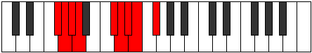 |
| [1935](https://ianring.com/musictheory/scales/1935) | [Mycryllic](ModeGFlatMycryllic.md) | Gb | Gb, G, Ab, A, Db, D, Eb, E, Gb |  |
| [1935](https://ianring.com/musictheory/scales/1935) | [Mycryllic](ModeCSharpMycryllic.md) | C# | C#, D, D#, E, G#, A, A#, B, C# |  |
| [1935](https://ianring.com/musictheory/scales/1935) | [Mycryllic](ModeDFlatMycryllic.md) | Db | Db, D, Eb, E, Ab, A, Bb, B, Db |  |
| [1943](https://ianring.com/musictheory/scales/1943) | [Malyllic](ModeCNaturalMalyllic.md) | C | C, C#, D, E, G, G#, A, A#, C |  |
| [1947](https://ianring.com/musictheory/scales/1947) | [Ionoyllic](ModeCSharpIonoyllic.md) | C# | C#, D, E, F, G#, A, A#, B, C# |  |
| [1947](https://ianring.com/musictheory/scales/1947) | [Ionoyllic](ModeDFlatIonoyllic.md) | Db | Db, D, E, F, Ab, A, Bb, B, Db |  |
| [1949](https://ianring.com/musictheory/scales/1949) | [Mathyllic](ModeFSharpMathyllic.md) | F# | F#, G#, A, A#, C#, D, D#, E, F# |  |
| [1949](https://ianring.com/musictheory/scales/1949) | [Mathyllic](ModeGFlatMathyllic.md) | Gb | Gb, Ab, A, Bb, Db, D, Eb, E, Gb |  |
| [1951](https://ianring.com/musictheory/scales/1951) | [Gonygic](ModeCNaturalGonygic.md) | C | C, C#, D, D#, E, G, G#, A, A#, C |  |
| [1951](https://ianring.com/musictheory/scales/1951) | [Gonygic](ModeFSharpGonygic.md) | F# | F#, G, G#, A, A#, C#, D, D#, E, F# |  |
| [1951](https://ianring.com/musictheory/scales/1951) | [Gonygic](ModeGFlatGonygic.md) | Gb | Gb, G, Ab, A, Bb, Db, D, Eb, E, Gb |  |
| [1951](https://ianring.com/musictheory/scales/1951) | [Gonygic](ModeCSharpGonygic.md) | C# | C#, D, D#, E, F, G#, A, A#, B, C# |  |
| [1951](https://ianring.com/musictheory/scales/1951) | [Gonygic](ModeDFlatGonygic.md) | Db | Db, D, Eb, E, F, Ab, A, Bb, B, Db |  |
| [1963](https://ianring.com/musictheory/scales/1963) | [Epocryllic](ModeCSharpEpocryllic.md) | C# | C#, D, E, F#, G#, A, A#, B, C# |  |
| [1963](https://ianring.com/musictheory/scales/1963) | [Epocryllic](ModeDFlatEpocryllic.md) | Db | Db, D, E, Gb, Ab, A, Bb, B, Db |  |
| [1965](https://ianring.com/musictheory/scales/1965) | [Gadyllic](ModeFSharpGadyllic.md) | F# | F#, G#, A, B, C#, D, D#, E, F# |  |
| [1965](https://ianring.com/musictheory/scales/1965) | [Gadyllic](ModeGFlatGadyllic.md) | Gb | Gb, Ab, A, B, Db, D, Eb, E, Gb |  |
| [1965](https://ianring.com/musictheory/scales/1965) | [Gadyllic](ModeBNaturalGadyllic.md) | B | B, C#, D, E, F#, G, G#, A, B |  |
| [1967](https://ianring.com/musictheory/scales/1967) | [Godygic](ModeBNaturalGodygic.md) | B | B, C, C#, D, E, F#, G, G#, A, B |  |
| [1967](https://ianring.com/musictheory/scales/1967) | [Godygic](ModeFSharpGodygic.md) | F# | F#, G, G#, A, B, C#, D, D#, E, F# |  |
| [1967](https://ianring.com/musictheory/scales/1967) | [Godygic](ModeGFlatGodygic.md) | Gb | Gb, G, Ab, A, B, Db, D, Eb, E, Gb |  |
| [1967](https://ianring.com/musictheory/scales/1967) | [Godygic](ModeCSharpGodygic.md) | C# | C#, D, D#, E, F#, G#, A, A#, B, C# |  |
| [1967](https://ianring.com/musictheory/scales/1967) | [Godygic](ModeDFlatGodygic.md) | Db | Db, D, Eb, E, Gb, Ab, A, Bb, B, Db |  |
| [1971](https://ianring.com/musictheory/scales/1971) | [Aerynyllic](ModeENaturalAerynyllic.md) | E | E, F, G#, A, B, C, C#, D, E |  |
| [1973](https://ianring.com/musictheory/scales/1973) | [Zyryllic](ModeENaturalZyryllic.md) | E | E, F#, G#, A, B, C, C#, D, E |  |
| [1975](https://ianring.com/musictheory/scales/1975) | [Ionocrygic](ModeCNaturalIonocrygic.md) | C | C, C#, D, E, F, G, G#, A, A#, C |  |
| [1975](https://ianring.com/musictheory/scales/1975) | [Ionocrygic](ModeENaturalIonocrygic.md) | E | E, F, F#, G#, A, B, C, C#, D, E |  |
| [1977](https://ianring.com/musictheory/scales/1977) | [Dagyllic](ModeENaturalDagyllic.md) | E | E, G, G#, A, B, C, C#, D, E |  |
| [1979](https://ianring.com/musictheory/scales/1979) | [Aeradygic](ModeENaturalAeradygic.md) | E | E, F, G, G#, A, B, C, C#, D, E |  |
| [1979](https://ianring.com/musictheory/scales/1979) | [Aeradygic](ModeCSharpAeradygic.md) | C# | C#, D, E, F, F#, G#, A, A#, B, C# |  |
| [1979](https://ianring.com/musictheory/scales/1979) | [Aeradygic](ModeDFlatAeradygic.md) | Db | Db, D, E, F, Gb, Ab, A, Bb, B, Db |  |
| [1981](https://ianring.com/musictheory/scales/1981) | [Gadygic](ModeENaturalGadygic.md) | E | E, F#, G, G#, A, B, C, C#, D, E |  |
| [1981](https://ianring.com/musictheory/scales/1981) | [Gadygic](ModeBNaturalGadygic.md) | B | B, C#, D, D#, E, F#, G, G#, A, B |  |
| [1981](https://ianring.com/musictheory/scales/1981) | [Gadygic](ModeFSharpGadygic.md) | F# | F#, G#, A, A#, B, C#, D, D#, E, F# |  |
| [1981](https://ianring.com/musictheory/scales/1981) | [Gadygic](ModeGFlatGadygic.md) | Gb | Gb, Ab, A, Bb, B, Db, D, Eb, E, Gb |  |
| [1983](https://ianring.com/musictheory/scales/1983) | [Soryllian](ModeCNaturalSoryllian.md) | C | C, C#, D, D#, E, F, G, G#, A, A#, C |  |
| [1983](https://ianring.com/musictheory/scales/1983) | [Soryllian](ModeBNaturalSoryllian.md) | B | B, C, C#, D, D#, E, F#, G, G#, A, B |  |
| [1983](https://ianring.com/musictheory/scales/1983) | [Soryllian](ModeENaturalSoryllian.md) | E | E, F, F#, G, G#, A, B, C, C#, D, E |  |
| [1983](https://ianring.com/musictheory/scales/1983) | [Soryllian](ModeCSharpSoryllian.md) | C# | C#, D, D#, E, F, F#, G#, A, A#, B, C# |  |
| [1983](https://ianring.com/musictheory/scales/1983) | [Soryllian](ModeDFlatSoryllian.md) | Db | Db, D, Eb, E, F, Gb, Ab, A, Bb, B, Db |  |
| [1983](https://ianring.com/musictheory/scales/1983) | [Soryllian](ModeFSharpSoryllian.md) | F# | F#, G, G#, A, A#, B, C#, D, D#, E, F# |  |
| [1983](https://ianring.com/musictheory/scales/1983) | [Soryllian](ModeGFlatSoryllian.md) | Gb | Gb, G, Ab, A, Bb, B, Db, D, Eb, E, Gb |  |
| [1991](https://ianring.com/musictheory/scales/1991) | [Phryptyllic](ModeGNaturalPhryptyllic.md) | G | G, G#, A, C#, D, D#, E, F, G |  |
| [1995](https://ianring.com/musictheory/scales/1995) | [Aeolacryllic](ModeCSharpAeolacryllic.md) | C# | C#, D, E, G, G#, A, A#, B, C# |  |
| [1995](https://ianring.com/musictheory/scales/1995) | [Aeolacryllic](ModeDFlatAeolacryllic.md) | Db | Db, D, E, G, Ab, A, Bb, B, Db |  |
| [1997](https://ianring.com/musictheory/scales/1997) | [Staryllic](ModeFSharpStaryllic.md) | F# | F#, G#, A, C, C#, D, D#, E, F# |  |
| [1997](https://ianring.com/musictheory/scales/1997) | [Staryllic](ModeGFlatStaryllic.md) | Gb | Gb, Ab, A, C, Db, D, Eb, E, Gb |  |
| [1999](https://ianring.com/musictheory/scales/1999) | [Zacrygic](ModeFSharpZacrygic.md) | F# | F#, G, G#, A, C, C#, D, D#, E, F# |  |
| [1999](https://ianring.com/musictheory/scales/1999) | [Zacrygic](ModeGFlatZacrygic.md) | Gb | Gb, G, Ab, A, C, Db, D, Eb, E, Gb |  |
| [1999](https://ianring.com/musictheory/scales/1999) | [Zacrygic](ModeGNaturalZacrygic.md) | G | G, G#, A, A#, C#, D, D#, E, F, G |  |
| [1999](https://ianring.com/musictheory/scales/1999) | [Zacrygic](ModeCSharpZacrygic.md) | C# | C#, D, D#, E, G, G#, A, A#, B, C# |  |
| [1999](https://ianring.com/musictheory/scales/1999) | [Zacrygic](ModeDFlatZacrygic.md) | Db | Db, D, Eb, E, G, Ab, A, Bb, B, Db |  |
| [2007](https://ianring.com/musictheory/scales/2007) | [Stonygic](ModeCNaturalStonygic.md) | C | C, C#, D, E, F#, G, G#, A, A#, C |  |
| [2007](https://ianring.com/musictheory/scales/2007) | [Stonygic](ModeGNaturalStonygic.md) | G | G, G#, A, B, C#, D, D#, E, F, G |  |
| [2011](https://ianring.com/musictheory/scales/2011) | [Raphygic](ModeCSharpRaphygic.md) | C# | C#, D, E, F, G, G#, A, A#, B, C# |  |
| [2011](https://ianring.com/musictheory/scales/2011) | [Raphygic](ModeDFlatRaphygic.md) | Db | Db, D, E, F, G, Ab, A, Bb, B, Db |  |
| [2013](https://ianring.com/musictheory/scales/2013) | [Mocrygic](ModeFSharpMocrygic.md) | F# | F#, G#, A, A#, C, C#, D, D#, E, F# |  |
| [2013](https://ianring.com/musictheory/scales/2013) | [Mocrygic](ModeGFlatMocrygic.md) | Gb | Gb, Ab, A, Bb, C, Db, D, Eb, E, Gb |  |
| [2015](https://ianring.com/musictheory/scales/2015) | [Epiryllian](ModeCNaturalEpiryllian.md) | C | C, C#, D, D#, E, F#, G, G#, A, A#, C |  |
| [2015](https://ianring.com/musictheory/scales/2015) | [Epiryllian](ModeFSharpEpiryllian.md) | F# | F#, G, G#, A, A#, C, C#, D, D#, E, F# |  |
| [2015](https://ianring.com/musictheory/scales/2015) | [Epiryllian](ModeGFlatEpiryllian.md) | Gb | Gb, G, Ab, A, Bb, C, Db, D, Eb, E, Gb |  |
| [2015](https://ianring.com/musictheory/scales/2015) | [Epiryllian](ModeCSharpEpiryllian.md) | C# | C#, D, D#, E, F, G, G#, A, A#, B, C# |  |
| [2015](https://ianring.com/musictheory/scales/2015) | [Epiryllian](ModeDFlatEpiryllian.md) | Db | Db, D, Eb, E, F, G, Ab, A, Bb, B, Db |  |
| [2015](https://ianring.com/musictheory/scales/2015) | [Epiryllian](ModeGNaturalEpiryllian.md) | G | G, G#, A, A#, B, C#, D, D#, E, F, G |  |
| [2019](https://ianring.com/musictheory/scales/2019) | [Palyllic](ModeGSharpPalyllic.md) | G# | G#, A, C#, D, D#, E, F, F#, G# |  |
| [2019](https://ianring.com/musictheory/scales/2019) | [Palyllic](ModeAFlatPalyllic.md) | Ab | Ab, A, Db, D, Eb, E, F, Gb, Ab |  |
| [2023](https://ianring.com/musictheory/scales/2023) | [Zodygic](ModeGNaturalZodygic.md) | G | G, G#, A, C, C#, D, D#, E, F, G |  |
| [2023](https://ianring.com/musictheory/scales/2023) | [Zodygic](ModeGSharpZodygic.md) | G# | G#, A, A#, C#, D, D#, E, F, F#, G# |  |
| [2023](https://ianring.com/musictheory/scales/2023) | [Zodygic](ModeAFlatZodygic.md) | Ab | Ab, A, Bb, Db, D, Eb, E, F, Gb, Ab |  |
| [2027](https://ianring.com/musictheory/scales/2027) | [Boptygic](ModeGSharpBoptygic.md) | G# | G#, A, B, C#, D, D#, E, F, F#, G# |  |
| [2027](https://ianring.com/musictheory/scales/2027) | [Boptygic](ModeAFlatBoptygic.md) | Ab | Ab, A, B, Db, D, Eb, E, F, Gb, Ab |  |
| [2027](https://ianring.com/musictheory/scales/2027) | [Boptygic](ModeCSharpBoptygic.md) | C# | C#, D, E, F#, G, G#, A, A#, B, C# |  |
| [2027](https://ianring.com/musictheory/scales/2027) | [Boptygic](ModeDFlatBoptygic.md) | Db | Db, D, E, Gb, G, Ab, A, Bb, B, Db |  |
| [2029](https://ianring.com/musictheory/scales/2029) | [Mathygic](ModeFSharpMathygic.md) | F# | F#, G#, A, B, C, C#, D, D#, E, F# |  |
| [2029](https://ianring.com/musictheory/scales/2029) | [Mathygic](ModeGFlatMathygic.md) | Gb | Gb, Ab, A, B, C, Db, D, Eb, E, Gb |  |
| [2029](https://ianring.com/musictheory/scales/2029) | [Mathygic](ModeBNaturalMathygic.md) | B | B, C#, D, E, F, F#, G, G#, A, B |  |
| [2031](https://ianring.com/musictheory/scales/2031) | [Gadyllian](ModeGNaturalGadyllian.md) | G | G, G#, A, A#, C, C#, D, D#, E, F, G |  |
| [2031](https://ianring.com/musictheory/scales/2031) | [Gadyllian](ModeFSharpGadyllian.md) | F# | F#, G, G#, A, B, C, C#, D, D#, E, F# |  |
| [2031](https://ianring.com/musictheory/scales/2031) | [Gadyllian](ModeGFlatGadyllian.md) | Gb | Gb, G, Ab, A, B, C, Db, D, Eb, E, Gb |  |
| [2031](https://ianring.com/musictheory/scales/2031) | [Gadyllian](ModeBNaturalGadyllian.md) | B | B, C, C#, D, E, F, F#, G, G#, A, B |  |
| [2031](https://ianring.com/musictheory/scales/2031) | [Gadyllian](ModeGSharpGadyllian.md) | G# | G#, A, A#, B, C#, D, D#, E, F, F#, G# |  |
| [2031](https://ianring.com/musictheory/scales/2031) | [Gadyllian](ModeAFlatGadyllian.md) | Ab | Ab, A, Bb, B, Db, D, Eb, E, F, Gb, Ab |  |
| [2031](https://ianring.com/musictheory/scales/2031) | [Gadyllian](ModeCSharpGadyllian.md) | C# | C#, D, D#, E, F#, G, G#, A, A#, B, C# |  |
| [2031](https://ianring.com/musictheory/scales/2031) | [Gadyllian](ModeDFlatGadyllian.md) | Db | Db, D, Eb, E, Gb, G, Ab, A, Bb, B, Db |  |
| [2033](https://ianring.com/musictheory/scales/2033) | [Stolyllic](ModeENaturalStolyllic.md) | E | E, G#, A, A#, B, C, C#, D, E |  |
| [2035](https://ianring.com/musictheory/scales/2035) | [Aerythygic](ModeGSharpAerythygic.md) | G# | G#, A, C, C#, D, D#, E, F, F#, G# |  |
| [2035](https://ianring.com/musictheory/scales/2035) | [Aerythygic](ModeAFlatAerythygic.md) | Ab | Ab, A, C, Db, D, Eb, E, F, Gb, Ab |  |
| [2035](https://ianring.com/musictheory/scales/2035) | [Aerythygic](ModeENaturalAerythygic.md) | E | E, F, G#, A, A#, B, C, C#, D, E |  |
| [2037](https://ianring.com/musictheory/scales/2037) | [Sythygic](ModeENaturalSythygic.md) | E | E, F#, G#, A, A#, B, C, C#, D, E |  |
| [2039](https://ianring.com/musictheory/scales/2039) | [Danyllian](ModeGSharpDanyllian.md) | G# | G#, A, A#, C, C#, D, D#, E, F, F#, G# |  |
| [2039](https://ianring.com/musictheory/scales/2039) | [Danyllian](ModeAFlatDanyllian.md) | Ab | Ab, A, Bb, C, Db, D, Eb, E, F, Gb, Ab |  |
| [2039](https://ianring.com/musictheory/scales/2039) | [Danyllian](ModeCNaturalDanyllian.md) | C | C, C#, D, E, F, F#, G, G#, A, A#, C |  |
| [2039](https://ianring.com/musictheory/scales/2039) | [Danyllian](ModeGNaturalDanyllian.md) | G | G, G#, A, B, C, C#, D, D#, E, F, G |  |
| [2039](https://ianring.com/musictheory/scales/2039) | [Danyllian](ModeENaturalDanyllian.md) | E | E, F, F#, G#, A, A#, B, C, C#, D, E |  |
| [2041](https://ianring.com/musictheory/scales/2041) | [Aeolacrygic](ModeENaturalAeolacrygic.md) | E | E, G, G#, A, A#, B, C, C#, D, E |  |
| [2043](https://ianring.com/musictheory/scales/2043) | [Lythyllian](ModeGSharpLythyllian.md) | G# | G#, A, B, C, C#, D, D#, E, F, F#, G# |  |
| [2043](https://ianring.com/musictheory/scales/2043) | [Lythyllian](ModeAFlatLythyllian.md) | Ab | Ab, A, B, C, Db, D, Eb, E, F, Gb, Ab |  |
| [2043](https://ianring.com/musictheory/scales/2043) | [Lythyllian](ModeENaturalLythyllian.md) | E | E, F, G, G#, A, A#, B, C, C#, D, E |  |
| [2043](https://ianring.com/musictheory/scales/2043) | [Lythyllian](ModeCSharpLythyllian.md) | C# | C#, D, E, F, F#, G, G#, A, A#, B, C# |  |
| [2043](https://ianring.com/musictheory/scales/2043) | [Lythyllian](ModeDFlatLythyllian.md) | Db | Db, D, E, F, Gb, G, Ab, A, Bb, B, Db |  |
| [2045](https://ianring.com/musictheory/scales/2045) | [Katogyllian](ModeBNaturalKatogyllian.md) | B | B, C#, D, D#, E, F, F#, G, G#, A, B |  |
| [2045](https://ianring.com/musictheory/scales/2045) | [Katogyllian](ModeFSharpKatogyllian.md) | F# | F#, G#, A, A#, B, C, C#, D, D#, E, F# |  |
| [2045](https://ianring.com/musictheory/scales/2045) | [Katogyllian](ModeGFlatKatogyllian.md) | Gb | Gb, Ab, A, Bb, B, C, Db, D, Eb, E, Gb |  |
| [2045](https://ianring.com/musictheory/scales/2045) | [Katogyllian](ModeENaturalKatogyllian.md) | E | E, F#, G, G#, A, A#, B, C, C#, D, E |  |
| [2047](https://ianring.com/musictheory/scales/2047) | [Monatic](ModeCNaturalMonatic.md) | C | C, C#, D, D#, E, F, F#, G, G#, A, A#, C |  |
| [2047](https://ianring.com/musictheory/scales/2047) | [Monatic](ModeBNaturalMonatic.md) | B | B, C, C#, D, D#, E, F, F#, G, G#, A, B |  |
| [2047](https://ianring.com/musictheory/scales/2047) | [Monatic](ModeGSharpMonatic.md) | G# | G#, A, A#, B, C, C#, D, D#, E, F, F#, G# |  |
| [2047](https://ianring.com/musictheory/scales/2047) | [Monatic](ModeAFlatMonatic.md) | Ab | Ab, A, Bb, B, C, Db, D, Eb, E, F, Gb, Ab |  |
| [2047](https://ianring.com/musictheory/scales/2047) | [Monatic](ModeGNaturalMonatic.md) | G | G, G#, A, A#, B, C, C#, D, D#, E, F, G |  |
| [2047](https://ianring.com/musictheory/scales/2047) | [Monatic](ModeFSharpMonatic.md) | F# | F#, G, G#, A, A#, B, C, C#, D, D#, E, F# |  |
| [2047](https://ianring.com/musictheory/scales/2047) | [Monatic](ModeGFlatMonatic.md) | Gb | Gb, G, Ab, A, Bb, B, C, Db, D, Eb, E, Gb |  |
| [2047](https://ianring.com/musictheory/scales/2047) | [Monatic](ModeENaturalMonatic.md) | E | E, F, F#, G, G#, A, A#, B, C, C#, D, E |  |
| [2047](https://ianring.com/musictheory/scales/2047) | [Monatic](ModeCSharpMonatic.md) | C# | C#, D, D#, E, F, F#, G, G#, A, A#, B, C# |  |
| [2047](https://ianring.com/musictheory/scales/2047) | [Monatic](ModeDFlatMonatic.md) | Db | Db, D, Eb, E, F, Gb, G, Ab, A, Bb, B, Db |  |
| [2225](https://ianring.com/musictheory/scales/2225) | [Gonitonic](ModeANaturalGonitonic.md) | A | A, C#, D, E, G#, A |  |
| [2227](https://ianring.com/musictheory/scales/2227) | [Katadimic](ModeANaturalKatadimic.md) | A | A, Bb, C#, D, E, F###, A |  |
| [2229](https://ianring.com/musictheory/scales/2229) | [Ionyptimic](ModeANaturalIonyptimic.md) | A | A, B, C#, D, E, F###, A |  |
| [2231](https://ianring.com/musictheory/scales/2231) | [Macrian](ModeANaturalMacrian.md) | A | A, Bb, Cb, Db, Ebb, Fb, G#, A |  |
| [2233](https://ianring.com/musictheory/scales/2233) | [Donimic](ModeANaturalDonimic.md) | A | A, B#, C#, D, E, F###, A |  |
| [2235](https://ianring.com/musictheory/scales/2235) | [Bathian](ModeANaturalBathian.md) | A | A, Bb, C, Db, Ebb, Fb, G#, A |  |
| [2237](https://ianring.com/musictheory/scales/2237) | [Epothian](ModeANaturalEpothian.md) | A | A, B, C, Db, Ebb, Fb, G#, A |  |
| [2239](https://ianring.com/musictheory/scales/2239) | [Dacryllic](ModeANaturalDacryllic.md) | A | A, A#, B, C, C#, D, E, G#, A |  |
| [2245](https://ianring.com/musictheory/scales/2245) | [Dygitonic](ModeDNaturalDygitonic.md) | D | D, E, G#, A, C#, D |  |
| [2247](https://ianring.com/musictheory/scales/2247) | [Aeolimic](ModeDNaturalAeolimic.md) | D | D, Eb, Fb, G#, A, B##, D |  |
| [2253](https://ianring.com/musictheory/scales/2253) | [Logimic](ModeDNaturalLogimic.md) | D | D, E, F, G#, A, B##, D |  |
| [2261](https://ianring.com/musictheory/scales/2261) | [Phrolimic](ModeDNaturalPhrolimic.md) | D | D, E, F#, G#, A, B##, D |  |
| [2271](https://ianring.com/musictheory/scales/2271) | [Poptyllic](ModeDNaturalPoptyllic.md) | D | D, D#, E, F, F#, G#, A, C#, D |  |
| [2277](https://ianring.com/musictheory/scales/2277) | [Kagimic](ModeDNaturalKagimic.md) | D | D, E, F##, G#, A, B##, D |  |
| [2287](https://ianring.com/musictheory/scales/2287) | [Lodyllic](ModeDNaturalLodyllic.md) | D | D, D#, E, F, G, G#, A, C#, D |  |
| [2289](https://ianring.com/musictheory/scales/2289) | [Mocrimic](ModeANaturalMocrimic.md) | A | A, B##, C##, D#, E, F###, A | 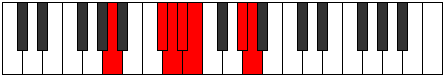 |
| [2291](https://ianring.com/musictheory/scales/2291) | [Zydian](ModeANaturalZydian.md) | A | A, Bb, C#, D, Eb, Fb, G#, A |  |
| [2293](https://ianring.com/musictheory/scales/2293) | [Gorian](ModeANaturalGorian.md) | A | A, B, C#, D, Eb, Fb, G#, A |  |
| [2295](https://ianring.com/musictheory/scales/2295) | [Kogyllic](ModeDNaturalKogyllic.md) | D | D, D#, E, F#, G, G#, A, C#, D |  |
| [2295](https://ianring.com/musictheory/scales/2295) | [Kogyllic](ModeANaturalKogyllic.md) | A | A, A#, B, C#, D, D#, E, G#, A |  |
| [2297](https://ianring.com/musictheory/scales/2297) | [Thylian](ModeANaturalThylian.md) | A | A, B#, C#, D, Eb, Fb, G#, A |  |
| [2299](https://ianring.com/musictheory/scales/2299) | [Phraptyllic](ModeANaturalPhraptyllic.md) | A | A, A#, C, C#, D, D#, E, G#, A |  |
| [2301](https://ianring.com/musictheory/scales/2301) | [Bydyllic](ModeDNaturalBydyllic.md) | D | D, E, F, F#, G, G#, A, C#, D |  |
| [2301](https://ianring.com/musictheory/scales/2301) | [Bydyllic](ModeANaturalBydyllic.md) | A | A, B, C, C#, D, D#, E, G#, A |  |
| [2303](https://ianring.com/musictheory/scales/2303) | [Stanygic](ModeDNaturalStanygic.md) | D | D, D#, E, F, F#, G, G#, A, C#, D |  |
| [2303](https://ianring.com/musictheory/scales/2303) | [Stanygic](ModeANaturalStanygic.md) | A | A, A#, B, C, C#, D, D#, E, G#, A |  |
| [2403](https://ianring.com/musictheory/scales/2403) | [Lycrimic](ModeGSharpLycrimic.md) | G# | G#, A, B##, C##, D##, E###, G# |  |
| [2407](https://ianring.com/musictheory/scales/2407) | [Zylian](ModeGSharpZylian.md) | G# | G#, A, Bb, C#, D, E, F##, G# |  |
| [2411](https://ianring.com/musictheory/scales/2411) | [Aeolorian](ModeGSharpAeolorian.md) | G# | G#, A, B, C#, D, E, F##, G# |  |
| [2415](https://ianring.com/musictheory/scales/2415) | [Lothyllic](ModeGSharpLothyllic.md) | G# | G#, A, A#, B, C#, D, E, G, G# |  |
| [2415](https://ianring.com/musictheory/scales/2415) | [Lothyllic](ModeAFlatLothyllic.md) | Ab | Ab, A, Bb, B, Db, D, E, G, Ab |  |
| [2419](https://ianring.com/musictheory/scales/2419) | [Paptian](ModeGSharpPaptian.md) | G# | G#, A, B#, C#, D, E, F##, G# |  |
| [2423](https://ianring.com/musictheory/scales/2423) | [Thorcryllic](ModeGSharpThorcryllic.md) | G# | G#, A, A#, C, C#, D, E, G, G# |  |
| [2423](https://ianring.com/musictheory/scales/2423) | [Thorcryllic](ModeAFlatThorcryllic.md) | Ab | Ab, A, Bb, C, Db, D, E, G, Ab |  |
| [2427](https://ianring.com/musictheory/scales/2427) | [Katoryllic](ModeGSharpKatoryllic.md) | G# | G#, A, B, C, C#, D, E, G, G# |  |
| [2427](https://ianring.com/musictheory/scales/2427) | [Katoryllic](ModeAFlatKatoryllic.md) | Ab | Ab, A, B, C, Db, D, E, G, Ab |  |
| [2431](https://ianring.com/musictheory/scales/2431) | [Gythygic](ModeGSharpGythygic.md) | G# | G#, A, A#, B, C, C#, D, E, G, G# |  |
| [2431](https://ianring.com/musictheory/scales/2431) | [Gythygic](ModeAFlatGythygic.md) | Ab | Ab, A, Bb, B, C, Db, D, E, G, Ab |  |
| [2443](https://ianring.com/musictheory/scales/2443) | [Panimic](ModeDFlatPanimic.md) | Db | Db, Ebb, Fb, G#, A, B#, Db |  |
| [2447](https://ianring.com/musictheory/scales/2447) | [Thagian](ModeCSharpThagian.md) | C# | C#, D, Eb, Fb, G#, A, B#, C# |  |
| [2459](https://ianring.com/musictheory/scales/2459) | [Ionocrian](ModeCSharpIonocrian.md) | C# | C#, D, E, F, G#, A, B#, C# |  |
| [2463](https://ianring.com/musictheory/scales/2463) | [Ionathyllic](ModeCSharpIonathyllic.md) | C# | C#, D, D#, E, F, G#, A, C, C# | 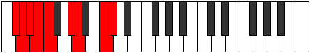 |
| [2463](https://ianring.com/musictheory/scales/2463) | [Ionathyllic](ModeDFlatIonathyllic.md) | Db | Db, D, Eb, E, F, Ab, A, C, Db |  |
| [2475](https://ianring.com/musictheory/scales/2475) | [Aerylian](ModeCSharpAerylian.md) | C# | C#, D, E, F#, G#, A, B#, C# |  |
| [2479](https://ianring.com/musictheory/scales/2479) | [Rycryllic](ModeCSharpRycryllic.md) | C# | C#, D, D#, E, F#, G#, A, C, C# |  |
| [2479](https://ianring.com/musictheory/scales/2479) | [Rycryllic](ModeDFlatRycryllic.md) | Db | Db, D, Eb, E, Gb, Ab, A, C, Db |  |
| [2481](https://ianring.com/musictheory/scales/2481) | [Laptimic](ModeANaturalLaptimic.md) | A | A, B##, C##, D##, E#, F###, A |  |
| [2483](https://ianring.com/musictheory/scales/2483) | [Aerynian](ModeANaturalAerynian.md) | A | A, Bb, C#, D, E, F, G#, A |  |
| [2485](https://ianring.com/musictheory/scales/2485) | [Aerorian](ModeANaturalAerorian.md) | A | A, B, C#, D, E, F, G#, A |  |
| [2487](https://ianring.com/musictheory/scales/2487) | [Phroptyllic](ModeANaturalPhroptyllic.md) | A | A, A#, B, C#, D, E, F, G#, A |  |
| [2489](https://ianring.com/musictheory/scales/2489) | [Syrian](ModeANaturalSyrian.md) | A | A, B#, C#, D, E, F, G#, A |  |
| [2491](https://ianring.com/musictheory/scales/2491) | [Layllic](ModeCSharpLayllic.md) | C# | C#, D, E, F, F#, G#, A, C, C# |  |
| [2491](https://ianring.com/musictheory/scales/2491) | [Layllic](ModeDFlatLayllic.md) | Db | Db, D, E, F, Gb, Ab, A, C, Db |  |
| [2491](https://ianring.com/musictheory/scales/2491) | [Layllic](ModeANaturalLayllic.md) | A | A, A#, C, C#, D, E, F, G#, A |  |
| [2493](https://ianring.com/musictheory/scales/2493) | [Manyllic](ModeANaturalManyllic.md) | A | A, B, C, C#, D, E, F, G#, A |  |
| [2495](https://ianring.com/musictheory/scales/2495) | [Aeolocrygic](ModeCSharpAeolocrygic.md) | C# | C#, D, D#, E, F, F#, G#, A, C, C# |  |
| [2495](https://ianring.com/musictheory/scales/2495) | [Aeolocrygic](ModeDFlatAeolocrygic.md) | Db | Db, D, Eb, E, F, Gb, Ab, A, C, Db |  |
| [2495](https://ianring.com/musictheory/scales/2495) | [Aeolocrygic](ModeANaturalAeolocrygic.md) | A | A, A#, B, C, C#, D, E, F, G#, A |  |
| [2503](https://ianring.com/musictheory/scales/2503) | [Stonian](ModeDNaturalStonian.md) | D | D, Eb, Fb, G#, A, Bb, C#, D |  |
| [2507](https://ianring.com/musictheory/scales/2507) | [Ionyphian](ModeCSharpIonyphian.md) | C# | C#, D, E, F##, G#, A, B#, C# |  |
| [2509](https://ianring.com/musictheory/scales/2509) | [Bogian](ModeDNaturalBogian.md) | D | D, E, F, G#, A, Bb, C#, D |  |
| [2511](https://ianring.com/musictheory/scales/2511) | [Epyryllic](ModeCSharpEpyryllic.md) | C# | C#, D, D#, E, G, G#, A, C, C# |  |
| [2511](https://ianring.com/musictheory/scales/2511) | [Epyryllic](ModeDFlatEpyryllic.md) | Db | Db, D, Eb, E, G, Ab, A, C, Db |  |
| [2511](https://ianring.com/musictheory/scales/2511) | [Epyryllic](ModeDNaturalEpyryllic.md) | D | D, D#, E, F, G#, A, A#, C#, D |  |
| [2517](https://ianring.com/musictheory/scales/2517) | [Ryphian](ModeDNaturalRyphian.md) | D | D, E, F#, G#, A, Bb, C#, D |  |
| [2519](https://ianring.com/musictheory/scales/2519) | [Dathyllic](ModeDNaturalDathyllic.md) | D | D, D#, E, F#, G#, A, A#, C#, D |  |
| [2523](https://ianring.com/musictheory/scales/2523) | [Rygyllic](ModeCSharpRygyllic.md) | C# | C#, D, E, F, G, G#, A, C, C# |  |
| [2523](https://ianring.com/musictheory/scales/2523) | [Rygyllic](ModeDFlatRygyllic.md) | Db | Db, D, E, F, G, Ab, A, C, Db |  |
| [2525](https://ianring.com/musictheory/scales/2525) | [Aeolaryllic](ModeDNaturalAeolaryllic.md) | D | D, E, F, F#, G#, A, A#, C#, D |  |
| [2527](https://ianring.com/musictheory/scales/2527) | [Phradygic](ModeCSharpPhradygic.md) | C# | C#, D, D#, E, F, G, G#, A, C, C# |  |
| [2527](https://ianring.com/musictheory/scales/2527) | [Phradygic](ModeDFlatPhradygic.md) | Db | Db, D, Eb, E, F, G, Ab, A, C, Db |  |
| [2527](https://ianring.com/musictheory/scales/2527) | [Phradygic](ModeDNaturalPhradygic.md) | D | D, D#, E, F, F#, G#, A, A#, C#, D |  |
| [2531](https://ianring.com/musictheory/scales/2531) | [Danian](ModeGSharpDanian.md) | G# | G#, A, B##, C##, D#, E, F##, G# |  |
| [2533](https://ianring.com/musictheory/scales/2533) | [Podian](ModeDNaturalPodian.md) | D | D, E, F##, G#, A, Bb, C#, D | 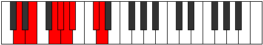 |
| [2535](https://ianring.com/musictheory/scales/2535) | [Zygyllic](ModeDNaturalZygyllic.md) | D | D, D#, E, G, G#, A, A#, C#, D |  |
| [2535](https://ianring.com/musictheory/scales/2535) | [Zygyllic](ModeGSharpZygyllic.md) | G# | G#, A, A#, C#, D, D#, E, G, G# |  |
| [2535](https://ianring.com/musictheory/scales/2535) | [Zygyllic](ModeAFlatZygyllic.md) | Ab | Ab, A, Bb, Db, D, Eb, E, G, Ab |  |
| [2539](https://ianring.com/musictheory/scales/2539) | [Thonyllic](ModeCSharpThonyllic.md) | C# | C#, D, E, F#, G, G#, A, C, C# |  |
| [2539](https://ianring.com/musictheory/scales/2539) | [Thonyllic](ModeDFlatThonyllic.md) | Db | Db, D, E, Gb, G, Ab, A, C, Db |  |
| [2539](https://ianring.com/musictheory/scales/2539) | [Thonyllic](ModeGSharpThonyllic.md) | G# | G#, A, B, C#, D, D#, E, G, G# |  |
| [2539](https://ianring.com/musictheory/scales/2539) | [Thonyllic](ModeAFlatThonyllic.md) | Ab | Ab, A, B, Db, D, Eb, E, G, Ab |  |
| [2541](https://ianring.com/musictheory/scales/2541) | [Katadyllic](ModeDNaturalKatadyllic.md) | D | D, E, F, G, G#, A, A#, C#, D |  |
| [2543](https://ianring.com/musictheory/scales/2543) | [Dydygic](ModeCSharpDydygic.md) | C# | C#, D, D#, E, F#, G, G#, A, C, C# |  |
| [2543](https://ianring.com/musictheory/scales/2543) | [Dydygic](ModeDFlatDydygic.md) | Db | Db, D, Eb, E, Gb, G, Ab, A, C, Db |  |
| [2543](https://ianring.com/musictheory/scales/2543) | [Dydygic](ModeDNaturalDydygic.md) | D | D, D#, E, F, G, G#, A, A#, C#, D |  |
| [2543](https://ianring.com/musictheory/scales/2543) | [Dydygic](ModeGSharpDydygic.md) | G# | G#, A, A#, B, C#, D, D#, E, G, G# |  |
| [2543](https://ianring.com/musictheory/scales/2543) | [Dydygic](ModeAFlatDydygic.md) | Ab | Ab, A, Bb, B, Db, D, Eb, E, G, Ab |  |
| [2545](https://ianring.com/musictheory/scales/2545) | [Thycrian](ModeANaturalThycrian.md) | A | A, B##, C##, D#, E, F, G#, A |  |
| [2547](https://ianring.com/musictheory/scales/2547) | [Sogyllic](ModeGSharpSogyllic.md) | G# | G#, A, C, C#, D, D#, E, G, G# |  |
| [2547](https://ianring.com/musictheory/scales/2547) | [Sogyllic](ModeAFlatSogyllic.md) | Ab | Ab, A, C, Db, D, Eb, E, G, Ab |  |
| [2547](https://ianring.com/musictheory/scales/2547) | [Sogyllic](ModeANaturalSogyllic.md) | A | A, A#, C#, D, D#, E, F, G#, A |  |
| [2549](https://ianring.com/musictheory/scales/2549) | [Rydyllic](ModeDNaturalRydyllic.md) | D | D, E, F#, G, G#, A, A#, C#, D |  |
| [2549](https://ianring.com/musictheory/scales/2549) | [Rydyllic](ModeANaturalRydyllic.md) | A | A, B, C#, D, D#, E, F, G#, A |  |
| [2551](https://ianring.com/musictheory/scales/2551) | [Zoptygic](ModeGSharpZoptygic.md) | G# | G#, A, A#, C, C#, D, D#, E, G, G# |  |
| [2551](https://ianring.com/musictheory/scales/2551) | [Zoptygic](ModeAFlatZoptygic.md) | Ab | Ab, A, Bb, C, Db, D, Eb, E, G, Ab |  |
| [2551](https://ianring.com/musictheory/scales/2551) | [Zoptygic](ModeDNaturalZoptygic.md) | D | D, D#, E, F#, G, G#, A, A#, C#, D |  |
| [2551](https://ianring.com/musictheory/scales/2551) | [Zoptygic](ModeANaturalZoptygic.md) | A | A, A#, B, C#, D, D#, E, F, G#, A |  |
| [2553](https://ianring.com/musictheory/scales/2553) | [Aeolaptyllic](ModeANaturalAeolaptyllic.md) | A | A, C, C#, D, D#, E, F, G#, A |  |
| [2555](https://ianring.com/musictheory/scales/2555) | [Bythygic](ModeCSharpBythygic.md) | C# | C#, D, E, F, F#, G, G#, A, C, C# |  |
| [2555](https://ianring.com/musictheory/scales/2555) | [Bythygic](ModeDFlatBythygic.md) | Db | Db, D, E, F, Gb, G, Ab, A, C, Db |  |
| [2555](https://ianring.com/musictheory/scales/2555) | [Bythygic](ModeANaturalBythygic.md) | A | A, A#, C, C#, D, D#, E, F, G#, A |  |
| [2555](https://ianring.com/musictheory/scales/2555) | [Bythygic](ModeGSharpBythygic.md) | G# | G#, A, B, C, C#, D, D#, E, G, G# |  |
| [2555](https://ianring.com/musictheory/scales/2555) | [Bythygic](ModeAFlatBythygic.md) | Ab | Ab, A, B, C, Db, D, Eb, E, G, Ab |  |
| [2557](https://ianring.com/musictheory/scales/2557) | [Dothygic](ModeDNaturalDothygic.md) | D | D, E, F, F#, G, G#, A, A#, C#, D |  |
| [2557](https://ianring.com/musictheory/scales/2557) | [Dothygic](ModeANaturalDothygic.md) | A | A, B, C, C#, D, D#, E, F, G#, A |  |
| [2559](https://ianring.com/musictheory/scales/2559) | [Zogyllian](ModeCSharpZogyllian.md) | C# | C#, D, D#, E, F, F#, G, G#, A, C, C# |  |
| [2559](https://ianring.com/musictheory/scales/2559) | [Zogyllian](ModeDFlatZogyllian.md) | Db | Db, D, Eb, E, F, Gb, G, Ab, A, C, Db |  |
| [2559](https://ianring.com/musictheory/scales/2559) | [Zogyllian](ModeDNaturalZogyllian.md) | D | D, D#, E, F, F#, G, G#, A, A#, C#, D |  |
| [2559](https://ianring.com/musictheory/scales/2559) | [Zogyllian](ModeANaturalZogyllian.md) | A | A, A#, B, C, C#, D, D#, E, F, G#, A |  |
| [2559](https://ianring.com/musictheory/scales/2559) | [Zogyllian](ModeGSharpZogyllian.md) | G# | G#, A, A#, B, C, C#, D, D#, E, G, G# |  |
| [2559](https://ianring.com/musictheory/scales/2559) | [Zogyllian](ModeAFlatZogyllian.md) | Ab | Ab, A, Bb, B, C, Db, D, Eb, E, G, Ab |  |
| [2737](https://ianring.com/musictheory/scales/2737) | [Bylimic](ModeANaturalBylimic.md) | A | A, B##, C##, D##, E##, F###, A |  |
| [2739](https://ianring.com/musictheory/scales/2739) | [Zanian](ModeANaturalZanian.md) | A | A, Bb, C#, D, E, F#, G#, A |  |
| [2741](https://ianring.com/musictheory/scales/2741) | [Ionian](ModeANaturalIonian.md) | A | A, B, C#, D, E, F#, G#, A |  |
| [2743](https://ianring.com/musictheory/scales/2743) | [Staptyllic](ModeANaturalStaptyllic.md) | A | A, A#, B, C#, D, E, F#, G#, A |  |
| [2745](https://ianring.com/musictheory/scales/2745) | [Dolian](ModeANaturalDolian.md) | A | A, B#, C#, D, E, F#, G#, A |  |
| [2747](https://ianring.com/musictheory/scales/2747) | [Stythyllic](ModeANaturalStythyllic.md) | A | A, A#, C, C#, D, E, F#, G#, A |  |
| [2749](https://ianring.com/musictheory/scales/2749) | [Katagyllic](ModeANaturalKatagyllic.md) | A | A, B, C, C#, D, E, F#, G#, A | 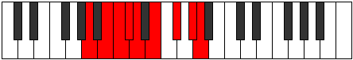 |
| [2751](https://ianring.com/musictheory/scales/2751) | [Sylygic](ModeANaturalSylygic.md) | A | A, A#, B, C, C#, D, E, F#, G#, A |  |
| [2759](https://ianring.com/musictheory/scales/2759) | [Aeraphian](ModeDNaturalAeraphian.md) | D | D, Eb, Fb, G#, A, B, C#, D |  |
| [2765](https://ianring.com/musictheory/scales/2765) | [Banian](ModeDNaturalBanian.md) | D | D, E, F, G#, A, B, C#, D |  |
| [2767](https://ianring.com/musictheory/scales/2767) | [Katydyllic](ModeGNaturalKatydyllic.md) | G | G, G#, A, A#, C#, D, E, F#, G |  |
| [2767](https://ianring.com/musictheory/scales/2767) | [Katydyllic](ModeDNaturalKatydyllic.md) | D | D, D#, E, F, G#, A, B, C#, D |  |
| [2773](https://ianring.com/musictheory/scales/2773) | [Lydian](ModeDNaturalLydian.md) | D | D, E, F#, G#, A, B, C#, D | 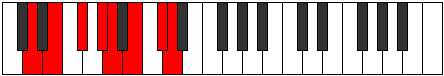 |
| [2775](https://ianring.com/musictheory/scales/2775) | [Godyllic](ModeDNaturalGodyllic.md) | D | D, D#, E, F#, G#, A, B, C#, D |  |
| [2775](https://ianring.com/musictheory/scales/2775) | [Godyllic](ModeGNaturalGodyllic.md) | G | G, G#, A, B, C#, D, E, F#, G |  |
| [2781](https://ianring.com/musictheory/scales/2781) | [Gycryllic](ModeDNaturalGycryllic.md) | D | D, E, F, F#, G#, A, B, C#, D |  |
| [2783](https://ianring.com/musictheory/scales/2783) | [Gothygic](ModeDNaturalGothygic.md) | D | D, D#, E, F, F#, G#, A, B, C#, D |  |
| [2783](https://ianring.com/musictheory/scales/2783) | [Gothygic](ModeGNaturalGothygic.md) | G | G, G#, A, A#, B, C#, D, E, F#, G |  |
| [2789](https://ianring.com/musictheory/scales/2789) | [Zolian](ModeDNaturalZolian.md) | D | D, E, F##, G#, A, B, C#, D |  |
| [2791](https://ianring.com/musictheory/scales/2791) | [Ionyptyllic](ModeGNaturalIonyptyllic.md) | G | G, G#, A, C, C#, D, E, F#, G |  |
| [2791](https://ianring.com/musictheory/scales/2791) | [Ionyptyllic](ModeDNaturalIonyptyllic.md) | D | D, D#, E, G, G#, A, B, C#, D |  |
| [2797](https://ianring.com/musictheory/scales/2797) | [Stalyllic](ModeDNaturalStalyllic.md) | D | D, E, F, G, G#, A, B, C#, D |  |
| [2799](https://ianring.com/musictheory/scales/2799) | [Epilygic](ModeGNaturalEpilygic.md) | G | G, G#, A, A#, C, C#, D, E, F#, G |  |
| [2799](https://ianring.com/musictheory/scales/2799) | [Epilygic](ModeDNaturalEpilygic.md) | D | D, D#, E, F, G, G#, A, B, C#, D |  |
| [2801](https://ianring.com/musictheory/scales/2801) | [Zogian](ModeANaturalZogian.md) | A | A, B##, C##, D#, E, F#, G#, A |  |
| [2803](https://ianring.com/musictheory/scales/2803) | [Zolyllic](ModeANaturalZolyllic.md) | A | A, A#, C#, D, D#, E, F#, G#, A |  |
| [2805](https://ianring.com/musictheory/scales/2805) | [Zylyllic](ModeANaturalZylyllic.md) | A | A, B, C#, D, D#, E, F#, G#, A |  |
| [2805](https://ianring.com/musictheory/scales/2805) | [Zylyllic](ModeDNaturalZylyllic.md) | D | D, E, F#, G, G#, A, B, C#, D |  |
| [2807](https://ianring.com/musictheory/scales/2807) | [Zylygic](ModeGNaturalZylygic.md) | G | G, G#, A, B, C, C#, D, E, F#, G |  |
| [2807](https://ianring.com/musictheory/scales/2807) | [Zylygic](ModeDNaturalZylygic.md) | D | D, D#, E, F#, G, G#, A, B, C#, D |  |
| [2807](https://ianring.com/musictheory/scales/2807) | [Zylygic](ModeANaturalZylygic.md) | A | A, A#, B, C#, D, D#, E, F#, G#, A |  |
| [2809](https://ianring.com/musictheory/scales/2809) | [Gythyllic](ModeANaturalGythyllic.md) | A | A, C, C#, D, D#, E, F#, G#, A |  |
| [2811](https://ianring.com/musictheory/scales/2811) | [Barygic](ModeANaturalBarygic.md) | A | A, A#, C, C#, D, D#, E, F#, G#, A |  |
| [2813](https://ianring.com/musictheory/scales/2813) | [Zolygic](ModeANaturalZolygic.md) | A | A, B, C, C#, D, D#, E, F#, G#, A |  |
| [2813](https://ianring.com/musictheory/scales/2813) | [Zolygic](ModeDNaturalZolygic.md) | D | D, E, F, F#, G, G#, A, B, C#, D |  |
| [2815](https://ianring.com/musictheory/scales/2815) | [Aeradyllian](ModeDNaturalAeradyllian.md) | D | D, D#, E, F, F#, G, G#, A, B, C#, D |  |
| [2815](https://ianring.com/musictheory/scales/2815) | [Aeradyllian](ModeANaturalAeradyllian.md) | A | A, A#, B, C, C#, D, D#, E, F#, G#, A |  |
| [2815](https://ianring.com/musictheory/scales/2815) | [Aeradyllian](ModeGNaturalAeradyllian.md) | G | G, G#, A, A#, B, C, C#, D, E, F#, G |  |
| [2839](https://ianring.com/musictheory/scales/2839) | [Lyptian](ModeCNaturalLyptian.md) | C | C, Db, Ebb, Fb, G#, A, B, C |  |
| [2841](https://ianring.com/musictheory/scales/2841) | [Sothimic](ModeFNaturalSothimic.md) | F | F, G#, A, B##, C##, D##, F |  |
| [2847](https://ianring.com/musictheory/scales/2847) | [Phracryllic](ModeFNaturalPhracryllic.md) | F | F, F#, G, G#, A, C#, D, E, F |  |
| [2847](https://ianring.com/musictheory/scales/2847) | [Phracryllic](ModeCNaturalPhracryllic.md) | C | C, C#, D, D#, E, G#, A, B, C |  |
| [2871](https://ianring.com/musictheory/scales/2871) | [Stanyllic](ModeCNaturalStanyllic.md) | C | C, C#, D, E, F, G#, A, B, C |  |
| [2873](https://ianring.com/musictheory/scales/2873) | [Docrian](ModeFNaturalDocrian.md) | F | F, G#, A, Bb, C#, D, E, F |  |
| [2875](https://ianring.com/musictheory/scales/2875) | [Ganyllic](ModeFNaturalGanyllic.md) | F | F, F#, G#, A, A#, C#, D, E, F |  |
| [2877](https://ianring.com/musictheory/scales/2877) | [Phrylyllic](ModeFNaturalPhrylyllic.md) | F | F, G, G#, A, A#, C#, D, E, F |  |
| [2879](https://ianring.com/musictheory/scales/2879) | [Stadygic](ModeFNaturalStadygic.md) | F | F, F#, G, G#, A, A#, C#, D, E, F |  |
| [2879](https://ianring.com/musictheory/scales/2879) | [Stadygic](ModeCNaturalStadygic.md) | C | C, C#, D, D#, E, F, G#, A, B, C |  |
| [2903](https://ianring.com/musictheory/scales/2903) | [Gothyllic](ModeCNaturalGothyllic.md) | C | C, C#, D, E, F#, G#, A, B, C |  |
| [2905](https://ianring.com/musictheory/scales/2905) | [Palian](ModeFNaturalPalian.md) | F | F, G#, A, B, C#, D, E, F |  |
| [2907](https://ianring.com/musictheory/scales/2907) | [Mogyllic](ModeFNaturalMogyllic.md) | F | F, F#, G#, A, B, C#, D, E, F |  |
| [2909](https://ianring.com/musictheory/scales/2909) | [Mocryllic](ModeFNaturalMocryllic.md) | F | F, G, G#, A, B, C#, D, E, F |  |
| [2911](https://ianring.com/musictheory/scales/2911) | [Katygic](ModeCNaturalKatygic.md) | C | C, C#, D, D#, E, F#, G#, A, B, C |  |
| [2911](https://ianring.com/musictheory/scales/2911) | [Katygic](ModeFNaturalKatygic.md) | F | F, F#, G, G#, A, B, C#, D, E, F |  |
| [2915](https://ianring.com/musictheory/scales/2915) | [Aeolydian](ModeGSharpAeolydian.md) | G# | G#, A, B##, C##, D##, E#, F##, G# |  |
| [2919](https://ianring.com/musictheory/scales/2919) | [Molyllic](ModeGSharpMolyllic.md) | G# | G#, A, A#, C#, D, E, F, G, G# |  |
| [2919](https://ianring.com/musictheory/scales/2919) | [Molyllic](ModeAFlatMolyllic.md) | Ab | Ab, A, Bb, Db, D, E, F, G, Ab |  |
| [2923](https://ianring.com/musictheory/scales/2923) | [Baryllic](ModeGSharpBaryllic.md) | G# | G#, A, B, C#, D, E, F, G, G# |  |
| [2923](https://ianring.com/musictheory/scales/2923) | [Baryllic](ModeAFlatBaryllic.md) | Ab | Ab, A, B, Db, D, E, F, G, Ab |  |
| [2927](https://ianring.com/musictheory/scales/2927) | [Rodygic](ModeGSharpRodygic.md) | G# | G#, A, A#, B, C#, D, E, F, G, G# |  |
| [2927](https://ianring.com/musictheory/scales/2927) | [Rodygic](ModeAFlatRodygic.md) | Ab | Ab, A, Bb, B, Db, D, E, F, G, Ab |  |
| [2931](https://ianring.com/musictheory/scales/2931) | [Zathyllic](ModeGSharpZathyllic.md) | G# | G#, A, C, C#, D, E, F, G, G# |  |
| [2931](https://ianring.com/musictheory/scales/2931) | [Zathyllic](ModeAFlatZathyllic.md) | Ab | Ab, A, C, Db, D, E, F, G, Ab |  |
| [2935](https://ianring.com/musictheory/scales/2935) | [Modygic](ModeGSharpModygic.md) | G# | G#, A, A#, C, C#, D, E, F, G, G# |  |
| [2935](https://ianring.com/musictheory/scales/2935) | [Modygic](ModeAFlatModygic.md) | Ab | Ab, A, Bb, C, Db, D, E, F, G, Ab |  |
| [2935](https://ianring.com/musictheory/scales/2935) | [Modygic](ModeCNaturalModygic.md) | C | C, C#, D, E, F, F#, G#, A, B, C |  |
| [2937](https://ianring.com/musictheory/scales/2937) | [Aeolathyllic](ModeFNaturalAeolathyllic.md) | F | F, G#, A, A#, B, C#, D, E, F |  |
| [2939](https://ianring.com/musictheory/scales/2939) | [Goptygic](ModeGSharpGoptygic.md) | G# | G#, A, B, C, C#, D, E, F, G, G# |  |
| [2939](https://ianring.com/musictheory/scales/2939) | [Goptygic](ModeAFlatGoptygic.md) | Ab | Ab, A, B, C, Db, D, E, F, G, Ab |  |
| [2939](https://ianring.com/musictheory/scales/2939) | [Goptygic](ModeFNaturalGoptygic.md) | F | F, F#, G#, A, A#, B, C#, D, E, F |  |
| [2941](https://ianring.com/musictheory/scales/2941) | [Laptygic](ModeFNaturalLaptygic.md) | F | F, G, G#, A, A#, B, C#, D, E, F |  |
| [2943](https://ianring.com/musictheory/scales/2943) | [Dathyllian](ModeCNaturalDathyllian.md) | C | C, C#, D, D#, E, F, F#, G#, A, B, C |  |
| [2943](https://ianring.com/musictheory/scales/2943) | [Dathyllian](ModeGSharpDathyllian.md) | G# | G#, A, A#, B, C, C#, D, E, F, G, G# |  |
| [2943](https://ianring.com/musictheory/scales/2943) | [Dathyllian](ModeAFlatDathyllian.md) | Ab | Ab, A, Bb, B, C, Db, D, E, F, G, Ab |  |
| [2943](https://ianring.com/musictheory/scales/2943) | [Dathyllian](ModeFNaturalDathyllian.md) | F | F, F#, G, G#, A, A#, B, C#, D, E, F |  |
| [2955](https://ianring.com/musictheory/scales/2955) | [Thorian](ModeDFlatThorian.md) | Db | Db, Ebb, Fb, G#, A, Bb, C, Db |  |
| [2959](https://ianring.com/musictheory/scales/2959) | [Dygyllic](ModeCSharpDygyllic.md) | C# | C#, D, D#, E, G#, A, A#, C, C# |  |
| [2959](https://ianring.com/musictheory/scales/2959) | [Dygyllic](ModeDFlatDygyllic.md) | Db | Db, D, Eb, E, Ab, A, Bb, C, Db |  |
| [2967](https://ianring.com/musictheory/scales/2967) | [Madyllic](ModeCNaturalMadyllic.md) | C | C, C#, D, E, G, G#, A, B, C |  |
| [2969](https://ianring.com/musictheory/scales/2969) | [Tholian](ModeFNaturalTholian.md) | F | F, G#, A, B#, C#, D, E, F |  |
| [2971](https://ianring.com/musictheory/scales/2971) | [Aeolynyllic](ModeFNaturalAeolynyllic.md) | F | F, F#, G#, A, C, C#, D, E, F |  |
| [2971](https://ianring.com/musictheory/scales/2971) | [Aeolynyllic](ModeCSharpAeolynyllic.md) | C# | C#, D, E, F, G#, A, A#, C, C# |  |
| [2971](https://ianring.com/musictheory/scales/2971) | [Aeolynyllic](ModeDFlatAeolynyllic.md) | Db | Db, D, E, F, Ab, A, Bb, C, Db |  |
| [2973](https://ianring.com/musictheory/scales/2973) | [Panyllic](ModeFNaturalPanyllic.md) | F | F, G, G#, A, C, C#, D, E, F |  |
| [2975](https://ianring.com/musictheory/scales/2975) | [Gaptygic](ModeFNaturalGaptygic.md) | F | F, F#, G, G#, A, C, C#, D, E, F |  |
| [2975](https://ianring.com/musictheory/scales/2975) | [Gaptygic](ModeCSharpGaptygic.md) | C# | C#, D, D#, E, F, G#, A, A#, C, C# |  |
| [2975](https://ianring.com/musictheory/scales/2975) | [Gaptygic](ModeDFlatGaptygic.md) | Db | Db, D, Eb, E, F, Ab, A, Bb, C, Db |  |
| [2975](https://ianring.com/musictheory/scales/2975) | [Gaptygic](ModeCNaturalGaptygic.md) | C | C, C#, D, D#, E, G, G#, A, B, C |  |
| [2987](https://ianring.com/musictheory/scales/2987) | [Thanyllic](ModeCSharpThanyllic.md) | C# | C#, D, E, F#, G#, A, A#, C, C# |  |
| [2987](https://ianring.com/musictheory/scales/2987) | [Thanyllic](ModeDFlatThanyllic.md) | Db | Db, D, E, Gb, Ab, A, Bb, C, Db |  |
| [2991](https://ianring.com/musictheory/scales/2991) | [Zanygic](ModeCSharpZanygic.md) | C# | C#, D, D#, E, F#, G#, A, A#, C, C# |  |
| [2991](https://ianring.com/musictheory/scales/2991) | [Zanygic](ModeDFlatZanygic.md) | Db | Db, D, Eb, E, Gb, Ab, A, Bb, C, Db |  |
| [2993](https://ianring.com/musictheory/scales/2993) | [Stythian](ModeANaturalStythian.md) | A | A, B##, C##, D##, E#, F#, G#, A |  |
| [2995](https://ianring.com/musictheory/scales/2995) | [Sanyllic](ModeANaturalSanyllic.md) | A | A, A#, C#, D, E, F, F#, G#, A |  |
| [2997](https://ianring.com/musictheory/scales/2997) | [Ionoptyllic](ModeANaturalIonoptyllic.md) | A | A, B, C#, D, E, F, F#, G#, A |  |
| [2999](https://ianring.com/musictheory/scales/2999) | [Zyrygic](ModeCNaturalZyrygic.md) | C | C, C#, D, E, F, G, G#, A, B, C |  |
| [2999](https://ianring.com/musictheory/scales/2999) | [Zyrygic](ModeANaturalZyrygic.md) | A | A, A#, B, C#, D, E, F, F#, G#, A |  |
| [3001](https://ianring.com/musictheory/scales/3001) | [Lonyllic](ModeANaturalLonyllic.md) | A | A, C, C#, D, E, F, F#, G#, A |  |
| [3001](https://ianring.com/musictheory/scales/3001) | [Lonyllic](ModeFNaturalLonyllic.md) | F | F, G#, A, A#, C, C#, D, E, F |  |
| [3003](https://ianring.com/musictheory/scales/3003) | [Zydygic](ModeCSharpZydygic.md) | C# | C#, D, E, F, F#, G#, A, A#, C, C# |  |
| [3003](https://ianring.com/musictheory/scales/3003) | [Zydygic](ModeDFlatZydygic.md) | Db | Db, D, E, F, Gb, Ab, A, Bb, C, Db |  |
| [3003](https://ianring.com/musictheory/scales/3003) | [Zydygic](ModeFNaturalZydygic.md) | F | F, F#, G#, A, A#, C, C#, D, E, F |  |
| [3003](https://ianring.com/musictheory/scales/3003) | [Zydygic](ModeANaturalZydygic.md) | A | A, A#, C, C#, D, E, F, F#, G#, A |  |
| [3005](https://ianring.com/musictheory/scales/3005) | [Gycrygic](ModeFNaturalGycrygic.md) | F | F, G, G#, A, A#, C, C#, D, E, F |  |
| [3005](https://ianring.com/musictheory/scales/3005) | [Gycrygic](ModeANaturalGycrygic.md) | A | A, B, C, C#, D, E, F, F#, G#, A |  |
| [3007](https://ianring.com/musictheory/scales/3007) | [Zyryllian](ModeCSharpZyryllian.md) | C# | C#, D, D#, E, F, F#, G#, A, A#, C, C# |  |
| [3007](https://ianring.com/musictheory/scales/3007) | [Zyryllian](ModeDFlatZyryllian.md) | Db | Db, D, Eb, E, F, Gb, Ab, A, Bb, C, Db |  |
| [3007](https://ianring.com/musictheory/scales/3007) | [Zyryllian](ModeFNaturalZyryllian.md) | F | F, F#, G, G#, A, A#, C, C#, D, E, F |  |
| [3007](https://ianring.com/musictheory/scales/3007) | [Zyryllian](ModeCNaturalZyryllian.md) | C | C, C#, D, D#, E, F, G, G#, A, B, C |  |
| [3007](https://ianring.com/musictheory/scales/3007) | [Zyryllian](ModeANaturalZyryllian.md) | A | A, A#, B, C, C#, D, E, F, F#, G#, A |  |
| [3015](https://ianring.com/musictheory/scales/3015) | [Laptyllic](ModeGNaturalLaptyllic.md) | G | G, G#, A, C#, D, D#, E, F#, G |  |
| [3015](https://ianring.com/musictheory/scales/3015) | [Laptyllic](ModeDNaturalLaptyllic.md) | D | D, D#, E, G#, A, A#, B, C#, D |  |
| [3019](https://ianring.com/musictheory/scales/3019) | [Mydyllic](ModeCSharpMydyllic.md) | C# | C#, D, E, G, G#, A, A#, C, C# |  |
| [3019](https://ianring.com/musictheory/scales/3019) | [Mydyllic](ModeDFlatMydyllic.md) | Db | Db, D, E, G, Ab, A, Bb, C, Db |  |
| [3021](https://ianring.com/musictheory/scales/3021) | [Gyptyllic](ModeDNaturalGyptyllic.md) | D | D, E, F, G#, A, A#, B, C#, D |  |
| [3023](https://ianring.com/musictheory/scales/3023) | [Aeracrygic](ModeCSharpAeracrygic.md) | C# | C#, D, D#, E, G, G#, A, A#, C, C# |  |
| [3023](https://ianring.com/musictheory/scales/3023) | [Aeracrygic](ModeDFlatAeracrygic.md) | Db | Db, D, Eb, E, G, Ab, A, Bb, C, Db |  |
| [3023](https://ianring.com/musictheory/scales/3023) | [Aeracrygic](ModeGNaturalAeracrygic.md) | G | G, G#, A, A#, C#, D, D#, E, F#, G |  |
| [3023](https://ianring.com/musictheory/scales/3023) | [Aeracrygic](ModeDNaturalAeracrygic.md) | D | D, D#, E, F, G#, A, A#, B, C#, D |  |
| [3029](https://ianring.com/musictheory/scales/3029) | [Ionocryllic](ModeDNaturalIonocryllic.md) | D | D, E, F#, G#, A, A#, B, C#, D |  |
| [3031](https://ianring.com/musictheory/scales/3031) | [Epithygic](ModeCNaturalEpithygic.md) | C | C, C#, D, E, F#, G, G#, A, B, C |  |
| [3031](https://ianring.com/musictheory/scales/3031) | [Epithygic](ModeGNaturalEpithygic.md) | G | G, G#, A, B, C#, D, D#, E, F#, G | 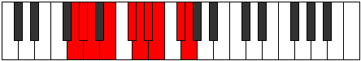 |
| [3031](https://ianring.com/musictheory/scales/3031) | [Epithygic](ModeDNaturalEpithygic.md) | D | D, D#, E, F#, G#, A, A#, B, C#, D |  |
| [3033](https://ianring.com/musictheory/scales/3033) | [Doptyllic](ModeFNaturalDoptyllic.md) | F | F, G#, A, B, C, C#, D, E, F |  |
| [3035](https://ianring.com/musictheory/scales/3035) | [Gocrygic](ModeCSharpGocrygic.md) | C# | C#, D, E, F, G, G#, A, A#, C, C# |  |
| [3035](https://ianring.com/musictheory/scales/3035) | [Gocrygic](ModeDFlatGocrygic.md) | Db | Db, D, E, F, G, Ab, A, Bb, C, Db |  |
| [3035](https://ianring.com/musictheory/scales/3035) | [Gocrygic](ModeFNaturalGocrygic.md) | F | F, F#, G#, A, B, C, C#, D, E, F |  |
| [3037](https://ianring.com/musictheory/scales/3037) | [Staptygic](ModeFNaturalStaptygic.md) | F | F, G, G#, A, B, C, C#, D, E, F |  |
| [3037](https://ianring.com/musictheory/scales/3037) | [Staptygic](ModeDNaturalStaptygic.md) | D | D, E, F, F#, G#, A, A#, B, C#, D |  |
| [3039](https://ianring.com/musictheory/scales/3039) | [Godyllian](ModeCSharpGodyllian.md) | C# | C#, D, D#, E, F, G, G#, A, A#, C, C# |  |
| [3039](https://ianring.com/musictheory/scales/3039) | [Godyllian](ModeDFlatGodyllian.md) | Db | Db, D, Eb, E, F, G, Ab, A, Bb, C, Db |  |
| [3039](https://ianring.com/musictheory/scales/3039) | [Godyllian](ModeCNaturalGodyllian.md) | C | C, C#, D, D#, E, F#, G, G#, A, B, C |  |
| [3039](https://ianring.com/musictheory/scales/3039) | [Godyllian](ModeFNaturalGodyllian.md) | F | F, F#, G, G#, A, B, C, C#, D, E, F |  |
| [3039](https://ianring.com/musictheory/scales/3039) | [Godyllian](ModeDNaturalGodyllian.md) | D | D, D#, E, F, F#, G#, A, A#, B, C#, D |  |
| [3039](https://ianring.com/musictheory/scales/3039) | [Godyllian](ModeGNaturalGodyllian.md) | G | G, G#, A, A#, B, C#, D, D#, E, F#, G |  |
| [3043](https://ianring.com/musictheory/scales/3043) | [Ionayllic](ModeGSharpIonayllic.md) | G# | G#, A, C#, D, D#, E, F, G, G# |  |
| [3043](https://ianring.com/musictheory/scales/3043) | [Ionayllic](ModeAFlatIonayllic.md) | Ab | Ab, A, Db, D, Eb, E, F, G, Ab |  |
| [3045](https://ianring.com/musictheory/scales/3045) | [Raptyllic](ModeDNaturalRaptyllic.md) | D | D, E, G, G#, A, A#, B, C#, D |  |
| [3047](https://ianring.com/musictheory/scales/3047) | [Panygic](ModeGNaturalPanygic.md) | G | G, G#, A, C, C#, D, D#, E, F#, G |  |
| [3047](https://ianring.com/musictheory/scales/3047) | [Panygic](ModeGSharpPanygic.md) | G# | G#, A, A#, C#, D, D#, E, F, G, G# |  |
| [3047](https://ianring.com/musictheory/scales/3047) | [Panygic](ModeAFlatPanygic.md) | Ab | Ab, A, Bb, Db, D, Eb, E, F, G, Ab |  |
| [3047](https://ianring.com/musictheory/scales/3047) | [Panygic](ModeDNaturalPanygic.md) | D | D, D#, E, G, G#, A, A#, B, C#, D |  |
| [3051](https://ianring.com/musictheory/scales/3051) | [Stalygic](ModeCSharpStalygic.md) | C# | C#, D, E, F#, G, G#, A, A#, C, C# |  |
| [3051](https://ianring.com/musictheory/scales/3051) | [Stalygic](ModeDFlatStalygic.md) | Db | Db, D, E, Gb, G, Ab, A, Bb, C, Db |  |
| [3051](https://ianring.com/musictheory/scales/3051) | [Stalygic](ModeGSharpStalygic.md) | G# | G#, A, B, C#, D, D#, E, F, G, G# |  |
| [3051](https://ianring.com/musictheory/scales/3051) | [Stalygic](ModeAFlatStalygic.md) | Ab | Ab, A, B, Db, D, Eb, E, F, G, Ab |  |
| [3053](https://ianring.com/musictheory/scales/3053) | [Zycrygic](ModeDNaturalZycrygic.md) | D | D, E, F, G, G#, A, A#, B, C#, D |  |
| [3055](https://ianring.com/musictheory/scales/3055) | [Lyryllian](ModeCSharpLyryllian.md) | C# | C#, D, D#, E, F#, G, G#, A, A#, C, C# |  |
| [3055](https://ianring.com/musictheory/scales/3055) | [Lyryllian](ModeDFlatLyryllian.md) | Db | Db, D, Eb, E, Gb, G, Ab, A, Bb, C, Db |  |
| [3055](https://ianring.com/musictheory/scales/3055) | [Lyryllian](ModeGNaturalLyryllian.md) | G | G, G#, A, A#, C, C#, D, D#, E, F#, G |  |
| [3055](https://ianring.com/musictheory/scales/3055) | [Lyryllian](ModeDNaturalLyryllian.md) | D | D, D#, E, F, G, G#, A, A#, B, C#, D |  |
| [3055](https://ianring.com/musictheory/scales/3055) | [Lyryllian](ModeGSharpLyryllian.md) | G# | G#, A, A#, B, C#, D, D#, E, F, G, G# |  |
| [3055](https://ianring.com/musictheory/scales/3055) | [Lyryllian](ModeAFlatLyryllian.md) | Ab | Ab, A, Bb, B, Db, D, Eb, E, F, G, Ab |  |
| [3057](https://ianring.com/musictheory/scales/3057) | [Phroryllic](ModeANaturalPhroryllic.md) | A | A, C#, D, D#, E, F, F#, G#, A |  |
| [3059](https://ianring.com/musictheory/scales/3059) | [Madygic](ModeGSharpMadygic.md) | G# | G#, A, C, C#, D, D#, E, F, G, G# |  |
| [3059](https://ianring.com/musictheory/scales/3059) | [Madygic](ModeAFlatMadygic.md) | Ab | Ab, A, C, Db, D, Eb, E, F, G, Ab |  |
| [3059](https://ianring.com/musictheory/scales/3059) | [Madygic](ModeANaturalMadygic.md) | A | A, A#, C#, D, D#, E, F, F#, G#, A |  |
| [3061](https://ianring.com/musictheory/scales/3061) | [Apinygic](ModeANaturalApinygic.md) | A | A, B, C#, D, D#, E, F, F#, G#, A |  |
| [3061](https://ianring.com/musictheory/scales/3061) | [Apinygic](ModeDNaturalApinygic.md) | D | D, E, F#, G, G#, A, A#, B, C#, D |  |
| [3063](https://ianring.com/musictheory/scales/3063) | [Solyllian](ModeGSharpSolyllian.md) | G# | G#, A, A#, C, C#, D, D#, E, F, G, G# |  |
| [3063](https://ianring.com/musictheory/scales/3063) | [Solyllian](ModeAFlatSolyllian.md) | Ab | Ab, A, Bb, C, Db, D, Eb, E, F, G, Ab |  |
| [3063](https://ianring.com/musictheory/scales/3063) | [Solyllian](ModeGNaturalSolyllian.md) | G | G, G#, A, B, C, C#, D, D#, E, F#, G |  |
| [3063](https://ianring.com/musictheory/scales/3063) | [Solyllian](ModeCNaturalSolyllian.md) | C | C, C#, D, E, F, F#, G, G#, A, B, C |  |
| [3063](https://ianring.com/musictheory/scales/3063) | [Solyllian](ModeANaturalSolyllian.md) | A | A, A#, B, C#, D, D#, E, F, F#, G#, A |  |
| [3063](https://ianring.com/musictheory/scales/3063) | [Solyllian](ModeDNaturalSolyllian.md) | D | D, D#, E, F#, G, G#, A, A#, B, C#, D |  |
| [3065](https://ianring.com/musictheory/scales/3065) | [Zothygic](ModeANaturalZothygic.md) | A | A, C, C#, D, D#, E, F, F#, G#, A |  |
| [3065](https://ianring.com/musictheory/scales/3065) | [Zothygic](ModeFNaturalZothygic.md) | F | F, G#, A, A#, B, C, C#, D, E, F |  |
| [3067](https://ianring.com/musictheory/scales/3067) | [Goptyllian](ModeANaturalGoptyllian.md) | A | A, A#, C, C#, D, D#, E, F, F#, G#, A |  |
| [3067](https://ianring.com/musictheory/scales/3067) | [Goptyllian](ModeCSharpGoptyllian.md) | C# | C#, D, E, F, F#, G, G#, A, A#, C, C# |  |
| [3067](https://ianring.com/musictheory/scales/3067) | [Goptyllian](ModeDFlatGoptyllian.md) | Db | Db, D, E, F, Gb, G, Ab, A, Bb, C, Db |  |
| [3067](https://ianring.com/musictheory/scales/3067) | [Goptyllian](ModeGSharpGoptyllian.md) | G# | G#, A, B, C, C#, D, D#, E, F, G, G# |  |
| [3067](https://ianring.com/musictheory/scales/3067) | [Goptyllian](ModeAFlatGoptyllian.md) | Ab | Ab, A, B, C, Db, D, Eb, E, F, G, Ab |  |
| [3067](https://ianring.com/musictheory/scales/3067) | [Goptyllian](ModeFNaturalGoptyllian.md) | F | F, F#, G#, A, A#, B, C, C#, D, E, F |  |
| [3069](https://ianring.com/musictheory/scales/3069) | [Bacryllian](ModeANaturalBacryllian.md) | A | A, B, C, C#, D, D#, E, F, F#, G#, A |  |
| [3069](https://ianring.com/musictheory/scales/3069) | [Bacryllian](ModeFNaturalBacryllian.md) | F | F, G, G#, A, A#, B, C, C#, D, E, F |  |
| [3069](https://ianring.com/musictheory/scales/3069) | [Bacryllian](ModeDNaturalBacryllian.md) | D | D, E, F, F#, G, G#, A, A#, B, C#, D |  |
| [3071](https://ianring.com/musictheory/scales/3071) | [Solatic](ModeCSharpSolatic.md) | C# | C#, D, D#, E, F, F#, G, G#, A, A#, C, C# |  |
| [3071](https://ianring.com/musictheory/scales/3071) | [Solatic](ModeDFlatSolatic.md) | Db | Db, D, Eb, E, F, Gb, G, Ab, A, Bb, C, Db |  |
| [3071](https://ianring.com/musictheory/scales/3071) | [Solatic](ModeCNaturalSolatic.md) | C | C, C#, D, D#, E, F, F#, G, G#, A, B, C |  |
| [3071](https://ianring.com/musictheory/scales/3071) | [Solatic](ModeANaturalSolatic.md) | A | A, A#, B, C, C#, D, D#, E, F, F#, G#, A |  |
| [3071](https://ianring.com/musictheory/scales/3071) | [Solatic](ModeGSharpSolatic.md) | G# | G#, A, A#, B, C, C#, D, D#, E, F, G, G# |  |
| [3071](https://ianring.com/musictheory/scales/3071) | [Solatic](ModeAFlatSolatic.md) | Ab | Ab, A, Bb, B, C, Db, D, Eb, E, F, G, Ab |  |
| [3071](https://ianring.com/musictheory/scales/3071) | [Solatic](ModeGNaturalSolatic.md) | G | G, G#, A, A#, B, C, C#, D, D#, E, F#, G |  |
| [3071](https://ianring.com/musictheory/scales/3071) | [Solatic](ModeFNaturalSolatic.md) | F | F, F#, G, G#, A, A#, B, C, C#, D, E, F |  |
| [3071](https://ianring.com/musictheory/scales/3071) | [Solatic](ModeDNaturalSolatic.md) | D | D, D#, E, F, F#, G, G#, A, A#, B, C#, D |  |
| [3163](https://ianring.com/musictheory/scales/3163) | [Rogian](ModeBFlatRogian.md) | Bb | Bb, Cb, Db, Ebb, Fb, G#, A, Bb |  |
| [3165](https://ianring.com/musictheory/scales/3165) | [Mylian](ModeBFlatMylian.md) | Bb | Bb, C, Db, Ebb, Fb, G#, A, Bb |  |
| [3167](https://ianring.com/musictheory/scales/3167) | [Thynyllic](ModeASharpThynyllic.md) | A# | A#, B, C, C#, D, E, G#, A, A# |  |
| [3167](https://ianring.com/musictheory/scales/3167) | [Thynyllic](ModeBFlatThynyllic.md) | Bb | Bb, B, C, Db, D, E, Ab, A, Bb |  |
| [3171](https://ianring.com/musictheory/scales/3171) | [Zythimic](ModeEFlatZythimic.md) | Eb | Eb, Fb, G#, A, B##, C##, Eb |  |
| [3175](https://ianring.com/musictheory/scales/3175) | [Eponian](ModeDSharpEponian.md) | D# | D#, E, F, G#, A, B##, C##, D# |  |
| [3179](https://ianring.com/musictheory/scales/3179) | [Daptian](ModeDSharpDaptian.md) | D# | D#, E, F#, G#, A, B##, C##, D# |  |
| [3183](https://ianring.com/musictheory/scales/3183) | [Mixonyllic](ModeDSharpMixonyllic.md) | D# | D#, E, F, F#, G#, A, C#, D, D# |  |
| [3183](https://ianring.com/musictheory/scales/3183) | [Mixonyllic](ModeEFlatMixonyllic.md) | Eb | Eb, E, F, Gb, Ab, A, Db, D, Eb |  |
| [3187](https://ianring.com/musictheory/scales/3187) | [Koptian](ModeDSharpKoptian.md) | D# | D#, E, F##, G#, A, B##, C##, D# |  |
| [3191](https://ianring.com/musictheory/scales/3191) | [Bynyllic](ModeDSharpBynyllic.md) | D# | D#, E, F, G, G#, A, C#, D, D# |  |
| [3191](https://ianring.com/musictheory/scales/3191) | [Bynyllic](ModeEFlatBynyllic.md) | Eb | Eb, E, F, G, Ab, A, Db, D, Eb |  |
| [3193](https://ianring.com/musictheory/scales/3193) | [Zathian](ModeBFlatZathian.md) | Bb | Bb, C#, D, Eb, Fb, G#, A, Bb |  |
| [3195](https://ianring.com/musictheory/scales/3195) | [Raryllic](ModeDSharpRaryllic.md) | D# | D#, E, F#, G, G#, A, C#, D, D# |  |
| [3195](https://ianring.com/musictheory/scales/3195) | [Raryllic](ModeEFlatRaryllic.md) | Eb | Eb, E, Gb, G, Ab, A, Db, D, Eb |  |
| [3195](https://ianring.com/musictheory/scales/3195) | [Raryllic](ModeASharpRaryllic.md) | A# | A#, B, C#, D, D#, E, G#, A, A# |  |
| [3195](https://ianring.com/musictheory/scales/3195) | [Raryllic](ModeBFlatRaryllic.md) | Bb | Bb, B, Db, D, Eb, E, Ab, A, Bb |  |
| [3197](https://ianring.com/musictheory/scales/3197) | [Gylyllic](ModeASharpGylyllic.md) | A# | A#, C, C#, D, D#, E, G#, A, A# |  |
| [3197](https://ianring.com/musictheory/scales/3197) | [Gylyllic](ModeBFlatGylyllic.md) | Bb | Bb, C, Db, D, Eb, E, Ab, A, Bb |  |
| [3199](https://ianring.com/musictheory/scales/3199) | [Thaptygic](ModeDSharpThaptygic.md) | D# | D#, E, F, F#, G, G#, A, C#, D, D# |  |
| [3199](https://ianring.com/musictheory/scales/3199) | [Thaptygic](ModeEFlatThaptygic.md) | Eb | Eb, E, F, Gb, G, Ab, A, Db, D, Eb |  |
| [3199](https://ianring.com/musictheory/scales/3199) | [Thaptygic](ModeASharpThaptygic.md) | A# | A#, B, C, C#, D, D#, E, G#, A, A# | 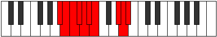 |
| [3199](https://ianring.com/musictheory/scales/3199) | [Thaptygic](ModeBFlatThaptygic.md) | Bb | Bb, B, C, Db, D, Eb, E, Ab, A, Bb |  |
| [3249](https://ianring.com/musictheory/scales/3249) | [Epygimic](ModeANaturalEpygimic.md) | A | A, B##, C##, D##, E###, F###, A |  |
| [3251](https://ianring.com/musictheory/scales/3251) | [Zodian](ModeANaturalZodian.md) | A | A, Bb, C#, D, E, F##, G#, A |  |
| [3253](https://ianring.com/musictheory/scales/3253) | [Gonian](ModeANaturalGonian.md) | A | A, B, C#, D, E, F##, G#, A |  |
| [3255](https://ianring.com/musictheory/scales/3255) | [Daryllic](ModeANaturalDaryllic.md) | A | A, A#, B, C#, D, E, G, G#, A |  |
| [3257](https://ianring.com/musictheory/scales/3257) | [Ionacrian](ModeANaturalIonacrian.md) | A | A, B#, C#, D, E, F##, G#, A |  |
| [3259](https://ianring.com/musictheory/scales/3259) | [Loptyllic](ModeANaturalLoptyllic.md) | A | A, A#, C, C#, D, E, G, G#, A |  |
| [3261](https://ianring.com/musictheory/scales/3261) | [Dodyllic](ModeANaturalDodyllic.md) | A | A, B, C, C#, D, E, G, G#, A |  |
| [3263](https://ianring.com/musictheory/scales/3263) | [Pyrygic](ModeANaturalPyrygic.md) | A | A, A#, B, C, C#, D, E, G, G#, A |  |
| [3271](https://ianring.com/musictheory/scales/3271) | [Kolian](ModeDNaturalKolian.md) | D | D, Eb, Fb, G#, A, B#, C#, D |  |
| [3277](https://ianring.com/musictheory/scales/3277) | [Zycrian](ModeDNaturalZycrian.md) | D | D, E, F, G#, A, B#, C#, D |  |
| [3279](https://ianring.com/musictheory/scales/3279) | [Pythyllic](ModeDNaturalPythyllic.md) | D | D, D#, E, F, G#, A, C, C#, D |  |
| [3285](https://ianring.com/musictheory/scales/3285) | [Zagian](ModeDNaturalZagian.md) | D | D, E, F#, G#, A, B#, C#, D |  |
| [3287](https://ianring.com/musictheory/scales/3287) | [Phrathyllic](ModeDNaturalPhrathyllic.md) | D | D, D#, E, F#, G#, A, C, C#, D |  |
| [3289](https://ianring.com/musictheory/scales/3289) | [Loptian](ModeBFlatLoptian.md) | Bb | Bb, C#, D, E, F, G#, A, Bb |  |
| [3291](https://ianring.com/musictheory/scales/3291) | [Kodyllic](ModeASharpKodyllic.md) | A# | A#, B, C#, D, E, F, G#, A, A# |  |
| [3291](https://ianring.com/musictheory/scales/3291) | [Kodyllic](ModeBFlatKodyllic.md) | Bb | Bb, B, Db, D, E, F, Ab, A, Bb |  |
| [3293](https://ianring.com/musictheory/scales/3293) | [Saryllic](ModeDNaturalSaryllic.md) | D | D, E, F, F#, G#, A, C, C#, D |  |
| [3293](https://ianring.com/musictheory/scales/3293) | [Saryllic](ModeASharpSaryllic.md) | A# | A#, C, C#, D, E, F, G#, A, A# |  |
| [3293](https://ianring.com/musictheory/scales/3293) | [Saryllic](ModeBFlatSaryllic.md) | Bb | Bb, C, Db, D, E, F, Ab, A, Bb |  |
| [3295](https://ianring.com/musictheory/scales/3295) | [Phroptygic](ModeDNaturalPhroptygic.md) | D | D, D#, E, F, F#, G#, A, C, C#, D |  |
| [3295](https://ianring.com/musictheory/scales/3295) | [Phroptygic](ModeASharpPhroptygic.md) | A# | A#, B, C, C#, D, E, F, G#, A, A# |  |
| [3295](https://ianring.com/musictheory/scales/3295) | [Phroptygic](ModeBFlatPhroptygic.md) | Bb | Bb, B, C, Db, D, E, F, Ab, A, Bb |  |
| [3299](https://ianring.com/musictheory/scales/3299) | [Syptian](ModeEFlatSyptian.md) | Eb | Eb, Fb, G#, A, Bb, C#, D, Eb |  |
| [3301](https://ianring.com/musictheory/scales/3301) | [Phrynian](ModeDNaturalPhrynian.md) | D | D, E, F##, G#, A, B#, C#, D |  |
| [3303](https://ianring.com/musictheory/scales/3303) | [Soptyllic](ModeDNaturalSoptyllic.md) | D | D, D#, E, G, G#, A, C, C#, D |  |
| [3303](https://ianring.com/musictheory/scales/3303) | [Soptyllic](ModeDSharpSoptyllic.md) | D# | D#, E, F, G#, A, A#, C#, D, D# |  |
| [3303](https://ianring.com/musictheory/scales/3303) | [Soptyllic](ModeEFlatSoptyllic.md) | Eb | Eb, E, F, Ab, A, Bb, Db, D, Eb |  |
| [3307](https://ianring.com/musictheory/scales/3307) | [Boptyllic](ModeDSharpBoptyllic.md) | D# | D#, E, F#, G#, A, A#, C#, D, D# |  |
| [3307](https://ianring.com/musictheory/scales/3307) | [Boptyllic](ModeEFlatBoptyllic.md) | Eb | Eb, E, Gb, Ab, A, Bb, Db, D, Eb |  |
| [3309](https://ianring.com/musictheory/scales/3309) | [Bycryllic](ModeDNaturalBycryllic.md) | D | D, E, F, G, G#, A, C, C#, D |  |
| [3311](https://ianring.com/musictheory/scales/3311) | [Mixodygic](ModeDNaturalMixodygic.md) | D | D, D#, E, F, G, G#, A, C, C#, D |  |
| [3311](https://ianring.com/musictheory/scales/3311) | [Mixodygic](ModeDSharpMixodygic.md) | D# | D#, E, F, F#, G#, A, A#, C#, D, D# |  |
| [3311](https://ianring.com/musictheory/scales/3311) | [Mixodygic](ModeEFlatMixodygic.md) | Eb | Eb, E, F, Gb, Ab, A, Bb, Db, D, Eb |  |
| [3313](https://ianring.com/musictheory/scales/3313) | [Aeolacrian](ModeANaturalAeolacrian.md) | A | A, B##, C##, D#, E, F##, G#, A |  |
| [3315](https://ianring.com/musictheory/scales/3315) | [Aeralyllic](ModeDSharpAeralyllic.md) | D# | D#, E, G, G#, A, A#, C#, D, D# |  |
| [3315](https://ianring.com/musictheory/scales/3315) | [Aeralyllic](ModeEFlatAeralyllic.md) | Eb | Eb, E, G, Ab, A, Bb, Db, D, Eb | 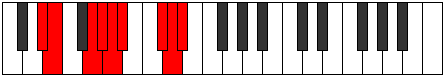 |
| [3315](https://ianring.com/musictheory/scales/3315) | [Aeralyllic](ModeANaturalAeralyllic.md) | A | A, A#, C#, D, D#, E, G, G#, A |  |
| [3317](https://ianring.com/musictheory/scales/3317) | [Lanyllic](ModeDNaturalLanyllic.md) | D | D, E, F#, G, G#, A, C, C#, D |  |
| [3317](https://ianring.com/musictheory/scales/3317) | [Lanyllic](ModeANaturalLanyllic.md) | A | A, B, C#, D, D#, E, G, G#, A |  |
| [3319](https://ianring.com/musictheory/scales/3319) | [Tholygic](ModeDNaturalTholygic.md) | D | D, D#, E, F#, G, G#, A, C, C#, D |  |
| [3319](https://ianring.com/musictheory/scales/3319) | [Tholygic](ModeDSharpTholygic.md) | D# | D#, E, F, G, G#, A, A#, C#, D, D# |  |
| [3319](https://ianring.com/musictheory/scales/3319) | [Tholygic](ModeEFlatTholygic.md) | Eb | Eb, E, F, G, Ab, A, Bb, Db, D, Eb |  |
| [3319](https://ianring.com/musictheory/scales/3319) | [Tholygic](ModeANaturalTholygic.md) | A | A, A#, B, C#, D, D#, E, G, G#, A |  |
| [3321](https://ianring.com/musictheory/scales/3321) | [Ionycryllic](ModeANaturalIonycryllic.md) | A | A, C, C#, D, D#, E, G, G#, A |  |
| [3321](https://ianring.com/musictheory/scales/3321) | [Ionycryllic](ModeASharpIonycryllic.md) | A# | A#, C#, D, D#, E, F, G#, A, A# |  |
| [3321](https://ianring.com/musictheory/scales/3321) | [Ionycryllic](ModeBFlatIonycryllic.md) | Bb | Bb, Db, D, Eb, E, F, Ab, A, Bb |  |
| [3323](https://ianring.com/musictheory/scales/3323) | [Phrygygic](ModeANaturalPhrygygic.md) | A | A, A#, C, C#, D, D#, E, G, G#, A |  |
| [3323](https://ianring.com/musictheory/scales/3323) | [Phrygygic](ModeDSharpPhrygygic.md) | D# | D#, E, F#, G, G#, A, A#, C#, D, D# |  |
| [3323](https://ianring.com/musictheory/scales/3323) | [Phrygygic](ModeEFlatPhrygygic.md) | Eb | Eb, E, Gb, G, Ab, A, Bb, Db, D, Eb |  |
| [3323](https://ianring.com/musictheory/scales/3323) | [Phrygygic](ModeASharpPhrygygic.md) | A# | A#, B, C#, D, D#, E, F, G#, A, A# |  |
| [3323](https://ianring.com/musictheory/scales/3323) | [Phrygygic](ModeBFlatPhrygygic.md) | Bb | Bb, B, Db, D, Eb, E, F, Ab, A, Bb |  |
| [3325](https://ianring.com/musictheory/scales/3325) | [Epygic](ModeDNaturalEpygic.md) | D | D, E, F, F#, G, G#, A, C, C#, D |  |
| [3325](https://ianring.com/musictheory/scales/3325) | [Epygic](ModeASharpEpygic.md) | A# | A#, C, C#, D, D#, E, F, G#, A, A# |  |
| [3325](https://ianring.com/musictheory/scales/3325) | [Epygic](ModeBFlatEpygic.md) | Bb | Bb, C, Db, D, Eb, E, F, Ab, A, Bb |  |
| [3325](https://ianring.com/musictheory/scales/3325) | [Epygic](ModeANaturalEpygic.md) | A | A, B, C, C#, D, D#, E, G, G#, A |  |
| [3327](https://ianring.com/musictheory/scales/3327) | [Madyllian](ModeDNaturalMadyllian.md) | D | D, D#, E, F, F#, G, G#, A, C, C#, D | 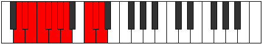 |
| [3327](https://ianring.com/musictheory/scales/3327) | [Madyllian](ModeDSharpMadyllian.md) | D# | D#, E, F, F#, G, G#, A, A#, C#, D, D# |  |
| [3327](https://ianring.com/musictheory/scales/3327) | [Madyllian](ModeEFlatMadyllian.md) | Eb | Eb, E, F, Gb, G, Ab, A, Bb, Db, D, Eb |  |
| [3327](https://ianring.com/musictheory/scales/3327) | [Madyllian](ModeASharpMadyllian.md) | A# | A#, B, C, C#, D, D#, E, F, G#, A, A# |  |
| [3327](https://ianring.com/musictheory/scales/3327) | [Madyllian](ModeBFlatMadyllian.md) | Bb | Bb, B, C, Db, D, Eb, E, F, Ab, A, Bb |  |
| [3327](https://ianring.com/musictheory/scales/3327) | [Madyllian](ModeANaturalMadyllian.md) | A | A, A#, B, C, C#, D, D#, E, G, G#, A |  |
| [3417](https://ianring.com/musictheory/scales/3417) | [Golian](ModeBFlatGolian.md) | Bb | Bb, C#, D, E, F#, G#, A, Bb |  |
| [3419](https://ianring.com/musictheory/scales/3419) | [Danyllic](ModeASharpDanyllic.md) | A# | A#, B, C#, D, E, F#, G#, A, A# |  |
| [3419](https://ianring.com/musictheory/scales/3419) | [Danyllic](ModeBFlatDanyllic.md) | Bb | Bb, B, Db, D, E, Gb, Ab, A, Bb |  |
| [3421](https://ianring.com/musictheory/scales/3421) | [Aerothyllic](ModeASharpAerothyllic.md) | A# | A#, C, C#, D, E, F#, G#, A, A# |  |
| [3421](https://ianring.com/musictheory/scales/3421) | [Aerothyllic](ModeBFlatAerothyllic.md) | Bb | Bb, C, Db, D, E, Gb, Ab, A, Bb |  |
| [3423](https://ianring.com/musictheory/scales/3423) | [Lothygic](ModeASharpLothygic.md) | A# | A#, B, C, C#, D, E, F#, G#, A, A# |  |
| [3423](https://ianring.com/musictheory/scales/3423) | [Lothygic](ModeBFlatLothygic.md) | Bb | Bb, B, C, Db, D, E, Gb, Ab, A, Bb |  |
| [3427](https://ianring.com/musictheory/scales/3427) | [Zacrian](ModeGSharpZacrian.md) | G# | G#, A, B##, C##, D##, E##, F##, G# |  |
| [3427](https://ianring.com/musictheory/scales/3427) | [Zacrian](ModeEFlatZacrian.md) | Eb | Eb, Fb, G#, A, B, C#, D, Eb |  |
| [3431](https://ianring.com/musictheory/scales/3431) | [Zyptyllic](ModeGSharpZyptyllic.md) | G# | G#, A, A#, C#, D, E, F#, G, G# |  |
| [3431](https://ianring.com/musictheory/scales/3431) | [Zyptyllic](ModeAFlatZyptyllic.md) | Ab | Ab, A, Bb, Db, D, E, Gb, G, Ab |  |
| [3431](https://ianring.com/musictheory/scales/3431) | [Zyptyllic](ModeDSharpZyptyllic.md) | D# | D#, E, F, G#, A, B, C#, D, D# |  |
| [3431](https://ianring.com/musictheory/scales/3431) | [Zyptyllic](ModeEFlatZyptyllic.md) | Eb | Eb, E, F, Ab, A, B, Db, D, Eb |  |
| [3435](https://ianring.com/musictheory/scales/3435) | [Epiphyllic](ModeDSharpEpiphyllic.md) | D# | D#, E, F#, G#, A, B, C#, D, D# |  |
| [3435](https://ianring.com/musictheory/scales/3435) | [Epiphyllic](ModeEFlatEpiphyllic.md) | Eb | Eb, E, Gb, Ab, A, B, Db, D, Eb |  |
| [3435](https://ianring.com/musictheory/scales/3435) | [Epiphyllic](ModeGSharpEpiphyllic.md) | G# | G#, A, B, C#, D, E, F#, G, G# |  |
| [3435](https://ianring.com/musictheory/scales/3435) | [Epiphyllic](ModeAFlatEpiphyllic.md) | Ab | Ab, A, B, Db, D, E, Gb, G, Ab |  |
| [3439](https://ianring.com/musictheory/scales/3439) | [Lythygic](ModeDSharpLythygic.md) | D# | D#, E, F, F#, G#, A, B, C#, D, D# | 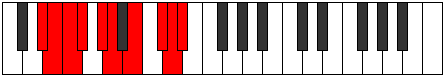 |
| [3439](https://ianring.com/musictheory/scales/3439) | [Lythygic](ModeEFlatLythygic.md) | Eb | Eb, E, F, Gb, Ab, A, B, Db, D, Eb |  |
| [3439](https://ianring.com/musictheory/scales/3439) | [Lythygic](ModeGSharpLythygic.md) | G# | G#, A, A#, B, C#, D, E, F#, G, G# |  |
| [3439](https://ianring.com/musictheory/scales/3439) | [Lythygic](ModeAFlatLythygic.md) | Ab | Ab, A, Bb, B, Db, D, E, Gb, G, Ab |  |
| [3443](https://ianring.com/musictheory/scales/3443) | [Epathyllic](ModeGSharpEpathyllic.md) | G# | G#, A, C, C#, D, E, F#, G, G# |  |
| [3443](https://ianring.com/musictheory/scales/3443) | [Epathyllic](ModeAFlatEpathyllic.md) | Ab | Ab, A, C, Db, D, E, Gb, G, Ab |  |
| [3443](https://ianring.com/musictheory/scales/3443) | [Epathyllic](ModeDSharpEpathyllic.md) | D# | D#, E, G, G#, A, B, C#, D, D# |  |
| [3443](https://ianring.com/musictheory/scales/3443) | [Epathyllic](ModeEFlatEpathyllic.md) | Eb | Eb, E, G, Ab, A, B, Db, D, Eb |  |
| [3447](https://ianring.com/musictheory/scales/3447) | [Kynygic](ModeGSharpKynygic.md) | G# | G#, A, A#, C, C#, D, E, F#, G, G# |  |
| [3447](https://ianring.com/musictheory/scales/3447) | [Kynygic](ModeAFlatKynygic.md) | Ab | Ab, A, Bb, C, Db, D, E, Gb, G, Ab |  |
| [3447](https://ianring.com/musictheory/scales/3447) | [Kynygic](ModeDSharpKynygic.md) | D# | D#, E, F, G, G#, A, B, C#, D, D# |  |
| [3447](https://ianring.com/musictheory/scales/3447) | [Kynygic](ModeEFlatKynygic.md) | Eb | Eb, E, F, G, Ab, A, B, Db, D, Eb |  |
| [3449](https://ianring.com/musictheory/scales/3449) | [Bacryllic](ModeASharpBacryllic.md) | A# | A#, C#, D, D#, E, F#, G#, A, A# |  |
| [3449](https://ianring.com/musictheory/scales/3449) | [Bacryllic](ModeBFlatBacryllic.md) | Bb | Bb, Db, D, Eb, E, Gb, Ab, A, Bb |  |
| [3451](https://ianring.com/musictheory/scales/3451) | [Garygic](ModeGSharpGarygic.md) | G# | G#, A, B, C, C#, D, E, F#, G, G# |  |
| [3451](https://ianring.com/musictheory/scales/3451) | [Garygic](ModeAFlatGarygic.md) | Ab | Ab, A, B, C, Db, D, E, Gb, G, Ab |  |
| [3451](https://ianring.com/musictheory/scales/3451) | [Garygic](ModeDSharpGarygic.md) | D# | D#, E, F#, G, G#, A, B, C#, D, D# |  |
| [3451](https://ianring.com/musictheory/scales/3451) | [Garygic](ModeEFlatGarygic.md) | Eb | Eb, E, Gb, G, Ab, A, B, Db, D, Eb |  |
| [3451](https://ianring.com/musictheory/scales/3451) | [Garygic](ModeASharpGarygic.md) | A# | A#, B, C#, D, D#, E, F#, G#, A, A# |  |
| [3451](https://ianring.com/musictheory/scales/3451) | [Garygic](ModeBFlatGarygic.md) | Bb | Bb, B, Db, D, Eb, E, Gb, Ab, A, Bb |  |
| [3453](https://ianring.com/musictheory/scales/3453) | [Katarygic](ModeASharpKatarygic.md) | A# | A#, C, C#, D, D#, E, F#, G#, A, A# |  |
| [3453](https://ianring.com/musictheory/scales/3453) | [Katarygic](ModeBFlatKatarygic.md) | Bb | Bb, C, Db, D, Eb, E, Gb, Ab, A, Bb |  |
| [3455](https://ianring.com/musictheory/scales/3455) | [Ryptyllian](ModeDSharpRyptyllian.md) | D# | D#, E, F, F#, G, G#, A, B, C#, D, D# |  |
| [3455](https://ianring.com/musictheory/scales/3455) | [Ryptyllian](ModeEFlatRyptyllian.md) | Eb | Eb, E, F, Gb, G, Ab, A, B, Db, D, Eb |  |
| [3455](https://ianring.com/musictheory/scales/3455) | [Ryptyllian](ModeASharpRyptyllian.md) | A# | A#, B, C, C#, D, D#, E, F#, G#, A, A# |  |
| [3455](https://ianring.com/musictheory/scales/3455) | [Ryptyllian](ModeBFlatRyptyllian.md) | Bb | Bb, B, C, Db, D, Eb, E, Gb, Ab, A, Bb |  |
| [3455](https://ianring.com/musictheory/scales/3455) | [Ryptyllian](ModeGSharpRyptyllian.md) | G# | G#, A, A#, B, C, C#, D, E, F#, G, G# |  |
| [3455](https://ianring.com/musictheory/scales/3455) | [Ryptyllian](ModeAFlatRyptyllian.md) | Ab | Ab, A, Bb, B, C, Db, D, E, Gb, G, Ab |  |
| [3467](https://ianring.com/musictheory/scales/3467) | [Katonian](ModeDFlatKatonian.md) | Db | Db, Ebb, Fb, G#, A, B, C, Db |  |
| [3469](https://ianring.com/musictheory/scales/3469) | [Monian](ModeFSharpMonian.md) | F# | F#, G#, A, B##, C##, D##, E#, F# |  |
| [3471](https://ianring.com/musictheory/scales/3471) | [Gyryllic](ModeFSharpGyryllic.md) | F# | F#, G, G#, A, C#, D, E, F, F# |  |
| [3471](https://ianring.com/musictheory/scales/3471) | [Gyryllic](ModeGFlatGyryllic.md) | Gb | Gb, G, Ab, A, Db, D, E, F, Gb |  |
| [3471](https://ianring.com/musictheory/scales/3471) | [Gyryllic](ModeCSharpGyryllic.md) | C# | C#, D, D#, E, G#, A, B, C, C# |  |
| [3471](https://ianring.com/musictheory/scales/3471) | [Gyryllic](ModeDFlatGyryllic.md) | Db | Db, D, Eb, E, Ab, A, B, C, Db |  |
| [3483](https://ianring.com/musictheory/scales/3483) | [Mixotharyllic](ModeCSharpMixotharyllic.md) | C# | C#, D, E, F, G#, A, B, C, C# |  |
| [3483](https://ianring.com/musictheory/scales/3483) | [Mixotharyllic](ModeDFlatMixotharyllic.md) | Db | Db, D, E, F, Ab, A, B, C, Db |  |
| [3485](https://ianring.com/musictheory/scales/3485) | [Kyptyllic](ModeFSharpKyptyllic.md) | F# | F#, G#, A, A#, C#, D, E, F, F# |  |
| [3485](https://ianring.com/musictheory/scales/3485) | [Kyptyllic](ModeGFlatKyptyllic.md) | Gb | Gb, Ab, A, Bb, Db, D, E, F, Gb |  |
| [3487](https://ianring.com/musictheory/scales/3487) | [Byptygic](ModeFSharpByptygic.md) | F# | F#, G, G#, A, A#, C#, D, E, F, F# |  |
| [3487](https://ianring.com/musictheory/scales/3487) | [Byptygic](ModeGFlatByptygic.md) | Gb | Gb, G, Ab, A, Bb, Db, D, E, F, Gb |  |
| [3487](https://ianring.com/musictheory/scales/3487) | [Byptygic](ModeCSharpByptygic.md) | C# | C#, D, D#, E, F, G#, A, B, C, C# |  |
| [3487](https://ianring.com/musictheory/scales/3487) | [Byptygic](ModeDFlatByptygic.md) | Db | Db, D, Eb, E, F, Ab, A, B, C, Db |  |
| [3499](https://ianring.com/musictheory/scales/3499) | [Lythyllic](ModeCSharpLythyllic.md) | C# | C#, D, E, F#, G#, A, B, C, C# |  |
| [3499](https://ianring.com/musictheory/scales/3499) | [Lythyllic](ModeDFlatLythyllic.md) | Db | Db, D, E, Gb, Ab, A, B, C, Db |  |
| [3501](https://ianring.com/musictheory/scales/3501) | [Katodyllic](ModeFSharpKatodyllic.md) | F# | F#, G#, A, B, C#, D, E, F, F# |  |
| [3501](https://ianring.com/musictheory/scales/3501) | [Katodyllic](ModeGFlatKatodyllic.md) | Gb | Gb, Ab, A, B, Db, D, E, F, Gb | 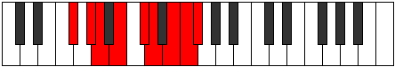 |
| [3503](https://ianring.com/musictheory/scales/3503) | [Zyphygic](ModeCSharpZyphygic.md) | C# | C#, D, D#, E, F#, G#, A, B, C, C# |  |
| [3503](https://ianring.com/musictheory/scales/3503) | [Zyphygic](ModeDFlatZyphygic.md) | Db | Db, D, Eb, E, Gb, Ab, A, B, C, Db |  |
| [3503](https://ianring.com/musictheory/scales/3503) | [Zyphygic](ModeFSharpZyphygic.md) | F# | F#, G, G#, A, B, C#, D, E, F, F# |  |
| [3503](https://ianring.com/musictheory/scales/3503) | [Zyphygic](ModeGFlatZyphygic.md) | Gb | Gb, G, Ab, A, B, Db, D, E, F, Gb |  |
| [3505](https://ianring.com/musictheory/scales/3505) | [Stygian](ModeANaturalStygian.md) | A | A, B##, C##, D##, E#, F##, G#, A |  |
| [3507](https://ianring.com/musictheory/scales/3507) | [Ponyllic](ModeANaturalPonyllic.md) | A | A, A#, C#, D, E, F, G, G#, A |  |
| [3509](https://ianring.com/musictheory/scales/3509) | [Stogyllic](ModeANaturalStogyllic.md) | A | A, B, C#, D, E, F, G, G#, A |  |
| [3511](https://ianring.com/musictheory/scales/3511) | [Epolygic](ModeANaturalEpolygic.md) | A | A, A#, B, C#, D, E, F, G, G#, A |  |
| [3513](https://ianring.com/musictheory/scales/3513) | [Dydyllic](ModeANaturalDydyllic.md) | A | A, C, C#, D, E, F, G, G#, A |  |
| [3515](https://ianring.com/musictheory/scales/3515) | [Katodygic](ModeANaturalKatodygic.md) | A | A, A#, C, C#, D, E, F, G, G#, A |  |
| [3515](https://ianring.com/musictheory/scales/3515) | [Katodygic](ModeCSharpKatodygic.md) | C# | C#, D, E, F, F#, G#, A, B, C, C# |  |
| [3515](https://ianring.com/musictheory/scales/3515) | [Katodygic](ModeDFlatKatodygic.md) | Db | Db, D, E, F, Gb, Ab, A, B, C, Db |  |
| [3517](https://ianring.com/musictheory/scales/3517) | [Epocrygic](ModeANaturalEpocrygic.md) | A | A, B, C, C#, D, E, F, G, G#, A |  |
| [3517](https://ianring.com/musictheory/scales/3517) | [Epocrygic](ModeFSharpEpocrygic.md) | F# | F#, G#, A, A#, B, C#, D, E, F, F# |  |
| [3517](https://ianring.com/musictheory/scales/3517) | [Epocrygic](ModeGFlatEpocrygic.md) | Gb | Gb, Ab, A, Bb, B, Db, D, E, F, Gb |  |
| [3519](https://ianring.com/musictheory/scales/3519) | [Boptyllian](ModeCSharpBoptyllian.md) | C# | C#, D, D#, E, F, F#, G#, A, B, C, C# |  |
| [3519](https://ianring.com/musictheory/scales/3519) | [Boptyllian](ModeDFlatBoptyllian.md) | Db | Db, D, Eb, E, F, Gb, Ab, A, B, C, Db |  |
| [3519](https://ianring.com/musictheory/scales/3519) | [Boptyllian](ModeANaturalBoptyllian.md) | A | A, A#, B, C, C#, D, E, F, G, G#, A |  |
| [3519](https://ianring.com/musictheory/scales/3519) | [Boptyllian](ModeFSharpBoptyllian.md) | F# | F#, G, G#, A, A#, B, C#, D, E, F, F# |  |
| [3519](https://ianring.com/musictheory/scales/3519) | [Boptyllian](ModeGFlatBoptyllian.md) | Gb | Gb, G, Ab, A, Bb, B, Db, D, E, F, Gb |  |
| [3527](https://ianring.com/musictheory/scales/3527) | [Ronyllic](ModeDNaturalRonyllic.md) | D | D, D#, E, G#, A, A#, C, C#, D |  |
| [3531](https://ianring.com/musictheory/scales/3531) | [Dycryllic](ModeCSharpDycryllic.md) | C# | C#, D, E, G, G#, A, B, C, C# |  |
| [3531](https://ianring.com/musictheory/scales/3531) | [Dycryllic](ModeDFlatDycryllic.md) | Db | Db, D, E, G, Ab, A, B, C, Db |  |
| [3533](https://ianring.com/musictheory/scales/3533) | [Thadyllic](ModeFSharpThadyllic.md) | F# | F#, G#, A, C, C#, D, E, F, F# |  |
| [3533](https://ianring.com/musictheory/scales/3533) | [Thadyllic](ModeGFlatThadyllic.md) | Gb | Gb, Ab, A, C, Db, D, E, F, Gb |  |
| [3533](https://ianring.com/musictheory/scales/3533) | [Thadyllic](ModeDNaturalThadyllic.md) | D | D, E, F, G#, A, A#, C, C#, D |  |
| [3535](https://ianring.com/musictheory/scales/3535) | [Aeroptygic](ModeFSharpAeroptygic.md) | F# | F#, G, G#, A, C, C#, D, E, F, F# |  |
| [3535](https://ianring.com/musictheory/scales/3535) | [Aeroptygic](ModeGFlatAeroptygic.md) | Gb | Gb, G, Ab, A, C, Db, D, E, F, Gb |  |
| [3535](https://ianring.com/musictheory/scales/3535) | [Aeroptygic](ModeDNaturalAeroptygic.md) | D | D, D#, E, F, G#, A, A#, C, C#, D |  |
| [3535](https://ianring.com/musictheory/scales/3535) | [Aeroptygic](ModeCSharpAeroptygic.md) | C# | C#, D, D#, E, G, G#, A, B, C, C# |  |
| [3535](https://ianring.com/musictheory/scales/3535) | [Aeroptygic](ModeDFlatAeroptygic.md) | Db | Db, D, Eb, E, G, Ab, A, B, C, Db |  |
| [3541](https://ianring.com/musictheory/scales/3541) | [Racryllic](ModeDNaturalRacryllic.md) | D | D, E, F#, G#, A, A#, C, C#, D |  |
| [3543](https://ianring.com/musictheory/scales/3543) | [Aeolonygic](ModeDNaturalAeolonygic.md) | D | D, D#, E, F#, G#, A, A#, C, C#, D |  |
| [3545](https://ianring.com/musictheory/scales/3545) | [Thyptyllic](ModeASharpThyptyllic.md) | A# | A#, C#, D, E, F, F#, G#, A, A# |  |
| [3545](https://ianring.com/musictheory/scales/3545) | [Thyptyllic](ModeBFlatThyptyllic.md) | Bb | Bb, Db, D, E, F, Gb, Ab, A, Bb |  |
| [3547](https://ianring.com/musictheory/scales/3547) | [Sadygic](ModeCSharpSadygic.md) | C# | C#, D, E, F, G, G#, A, B, C, C# |  |
| [3547](https://ianring.com/musictheory/scales/3547) | [Sadygic](ModeDFlatSadygic.md) | Db | Db, D, E, F, G, Ab, A, B, C, Db |  |
| [3547](https://ianring.com/musictheory/scales/3547) | [Sadygic](ModeASharpSadygic.md) | A# | A#, B, C#, D, E, F, F#, G#, A, A# |  |
| [3547](https://ianring.com/musictheory/scales/3547) | [Sadygic](ModeBFlatSadygic.md) | Bb | Bb, B, Db, D, E, F, Gb, Ab, A, Bb |  |
| [3549](https://ianring.com/musictheory/scales/3549) | [Phronygic](ModeDNaturalPhronygic.md) | D | D, E, F, F#, G#, A, A#, C, C#, D |  |
| [3549](https://ianring.com/musictheory/scales/3549) | [Phronygic](ModeFSharpPhronygic.md) | F# | F#, G#, A, A#, C, C#, D, E, F, F# |  |
| [3549](https://ianring.com/musictheory/scales/3549) | [Phronygic](ModeGFlatPhronygic.md) | Gb | Gb, Ab, A, Bb, C, Db, D, E, F, Gb |  |
| [3549](https://ianring.com/musictheory/scales/3549) | [Phronygic](ModeASharpPhronygic.md) | A# | A#, C, C#, D, E, F, F#, G#, A, A# |  |
| [3549](https://ianring.com/musictheory/scales/3549) | [Phronygic](ModeBFlatPhronygic.md) | Bb | Bb, C, Db, D, E, F, Gb, Ab, A, Bb |  |
| [3551](https://ianring.com/musictheory/scales/3551) | [Sagyllian](ModeDNaturalSagyllian.md) | D | D, D#, E, F, F#, G#, A, A#, C, C#, D |  |
| [3551](https://ianring.com/musictheory/scales/3551) | [Sagyllian](ModeFSharpSagyllian.md) | F# | F#, G, G#, A, A#, C, C#, D, E, F, F# |  |
| [3551](https://ianring.com/musictheory/scales/3551) | [Sagyllian](ModeGFlatSagyllian.md) | Gb | Gb, G, Ab, A, Bb, C, Db, D, E, F, Gb |  |
| [3551](https://ianring.com/musictheory/scales/3551) | [Sagyllian](ModeCSharpSagyllian.md) | C# | C#, D, D#, E, F, G, G#, A, B, C, C# |  |
| [3551](https://ianring.com/musictheory/scales/3551) | [Sagyllian](ModeDFlatSagyllian.md) | Db | Db, D, Eb, E, F, G, Ab, A, B, C, Db |  |
| [3551](https://ianring.com/musictheory/scales/3551) | [Sagyllian](ModeASharpSagyllian.md) | A# | A#, B, C, C#, D, E, F, F#, G#, A, A# |  |
| [3551](https://ianring.com/musictheory/scales/3551) | [Sagyllian](ModeBFlatSagyllian.md) | Bb | Bb, B, C, Db, D, E, F, Gb, Ab, A, Bb |  |
| [3555](https://ianring.com/musictheory/scales/3555) | [Pylyllic](ModeGSharpPylyllic.md) | G# | G#, A, C#, D, D#, E, F#, G, G# |  |
| [3555](https://ianring.com/musictheory/scales/3555) | [Pylyllic](ModeAFlatPylyllic.md) | Ab | Ab, A, Db, D, Eb, E, Gb, G, Ab |  |
| [3555](https://ianring.com/musictheory/scales/3555) | [Pylyllic](ModeDSharpPylyllic.md) | D# | D#, E, G#, A, A#, B, C#, D, D# |  |
| [3555](https://ianring.com/musictheory/scales/3555) | [Pylyllic](ModeEFlatPylyllic.md) | Eb | Eb, E, Ab, A, Bb, B, Db, D, Eb |  |
| [3557](https://ianring.com/musictheory/scales/3557) | [Thycryllic](ModeDNaturalThycryllic.md) | D | D, E, G, G#, A, A#, C, C#, D |  |
| [3559](https://ianring.com/musictheory/scales/3559) | [Aerathygic](ModeDNaturalAerathygic.md) | D | D, D#, E, G, G#, A, A#, C, C#, D |  |
| [3559](https://ianring.com/musictheory/scales/3559) | [Aerathygic](ModeGSharpAerathygic.md) | G# | G#, A, A#, C#, D, D#, E, F#, G, G# |  |
| [3559](https://ianring.com/musictheory/scales/3559) | [Aerathygic](ModeAFlatAerathygic.md) | Ab | Ab, A, Bb, Db, D, Eb, E, Gb, G, Ab |  |
| [3559](https://ianring.com/musictheory/scales/3559) | [Aerathygic](ModeDSharpAerathygic.md) | D# | D#, E, F, G#, A, A#, B, C#, D, D# |  |
| [3559](https://ianring.com/musictheory/scales/3559) | [Aerathygic](ModeEFlatAerathygic.md) | Eb | Eb, E, F, Ab, A, Bb, B, Db, D, Eb |  |
| [3563](https://ianring.com/musictheory/scales/3563) | [Ionoptygic](ModeCSharpIonoptygic.md) | C# | C#, D, E, F#, G, G#, A, B, C, C# |  |
| [3563](https://ianring.com/musictheory/scales/3563) | [Ionoptygic](ModeDFlatIonoptygic.md) | Db | Db, D, E, Gb, G, Ab, A, B, C, Db |  |
| [3563](https://ianring.com/musictheory/scales/3563) | [Ionoptygic](ModeGSharpIonoptygic.md) | G# | G#, A, B, C#, D, D#, E, F#, G, G# |  |
| [3563](https://ianring.com/musictheory/scales/3563) | [Ionoptygic](ModeAFlatIonoptygic.md) | Ab | Ab, A, B, Db, D, Eb, E, Gb, G, Ab |  |
| [3563](https://ianring.com/musictheory/scales/3563) | [Ionoptygic](ModeDSharpIonoptygic.md) | D# | D#, E, F#, G#, A, A#, B, C#, D, D# |  |
| [3563](https://ianring.com/musictheory/scales/3563) | [Ionoptygic](ModeEFlatIonoptygic.md) | Eb | Eb, E, Gb, Ab, A, Bb, B, Db, D, Eb |  |
| [3565](https://ianring.com/musictheory/scales/3565) | [Aeolorygic](ModeDNaturalAeolorygic.md) | D | D, E, F, G, G#, A, A#, C, C#, D |  |
| [3565](https://ianring.com/musictheory/scales/3565) | [Aeolorygic](ModeFSharpAeolorygic.md) | F# | F#, G#, A, B, C, C#, D, E, F, F# |  |
| [3565](https://ianring.com/musictheory/scales/3565) | [Aeolorygic](ModeGFlatAeolorygic.md) | Gb | Gb, Ab, A, B, C, Db, D, E, F, Gb |  |
| [3567](https://ianring.com/musictheory/scales/3567) | [Epityllian](ModeDNaturalEpityllian.md) | D | D, D#, E, F, G, G#, A, A#, C, C#, D |  |
| [3567](https://ianring.com/musictheory/scales/3567) | [Epityllian](ModeCSharpEpityllian.md) | C# | C#, D, D#, E, F#, G, G#, A, B, C, C# |  |
| [3567](https://ianring.com/musictheory/scales/3567) | [Epityllian](ModeDFlatEpityllian.md) | Db | Db, D, Eb, E, Gb, G, Ab, A, B, C, Db |  |
| [3567](https://ianring.com/musictheory/scales/3567) | [Epityllian](ModeFSharpEpityllian.md) | F# | F#, G, G#, A, B, C, C#, D, E, F, F# |  |
| [3567](https://ianring.com/musictheory/scales/3567) | [Epityllian](ModeGFlatEpityllian.md) | Gb | Gb, G, Ab, A, B, C, Db, D, E, F, Gb |  |
| [3567](https://ianring.com/musictheory/scales/3567) | [Epityllian](ModeDSharpEpityllian.md) | D# | D#, E, F, F#, G#, A, A#, B, C#, D, D# |  |
| [3567](https://ianring.com/musictheory/scales/3567) | [Epityllian](ModeEFlatEpityllian.md) | Eb | Eb, E, F, Gb, Ab, A, Bb, B, Db, D, Eb |  |
| [3567](https://ianring.com/musictheory/scales/3567) | [Epityllian](ModeGSharpEpityllian.md) | G# | G#, A, A#, B, C#, D, D#, E, F#, G, G# |  |
| [3567](https://ianring.com/musictheory/scales/3567) | [Epityllian](ModeAFlatEpityllian.md) | Ab | Ab, A, Bb, B, Db, D, Eb, E, Gb, G, Ab |  |
| [3569](https://ianring.com/musictheory/scales/3569) | [Aeoladyllic](ModeANaturalAeoladyllic.md) | A | A, C#, D, D#, E, F, G, G#, A |  |
| [3571](https://ianring.com/musictheory/scales/3571) | [Dyrygic](ModeGSharpDyrygic.md) | G# | G#, A, C, C#, D, D#, E, F#, G, G# |  |
| [3571](https://ianring.com/musictheory/scales/3571) | [Dyrygic](ModeAFlatDyrygic.md) | Ab | Ab, A, C, Db, D, Eb, E, Gb, G, Ab |  |
| [3571](https://ianring.com/musictheory/scales/3571) | [Dyrygic](ModeANaturalDyrygic.md) | A | A, A#, C#, D, D#, E, F, G, G#, A |  |
| [3571](https://ianring.com/musictheory/scales/3571) | [Dyrygic](ModeDSharpDyrygic.md) | D# | D#, E, G, G#, A, A#, B, C#, D, D# |  |
| [3571](https://ianring.com/musictheory/scales/3571) | [Dyrygic](ModeEFlatDyrygic.md) | Eb | Eb, E, G, Ab, A, Bb, B, Db, D, Eb |  |
| [3573](https://ianring.com/musictheory/scales/3573) | [Kaptygic](ModeDNaturalKaptygic.md) | D | D, E, F#, G, G#, A, A#, C, C#, D |  |
| [3573](https://ianring.com/musictheory/scales/3573) | [Kaptygic](ModeANaturalKaptygic.md) | A | A, B, C#, D, D#, E, F, G, G#, A |  |
| [3575](https://ianring.com/musictheory/scales/3575) | [Mogyllian](ModeDNaturalMogyllian.md) | D | D, D#, E, F#, G, G#, A, A#, C, C#, D |  |
| [3575](https://ianring.com/musictheory/scales/3575) | [Mogyllian](ModeGSharpMogyllian.md) | G# | G#, A, A#, C, C#, D, D#, E, F#, G, G# |  |
| [3575](https://ianring.com/musictheory/scales/3575) | [Mogyllian](ModeAFlatMogyllian.md) | Ab | Ab, A, Bb, C, Db, D, Eb, E, Gb, G, Ab |  |
| [3575](https://ianring.com/musictheory/scales/3575) | [Mogyllian](ModeDSharpMogyllian.md) | D# | D#, E, F, G, G#, A, A#, B, C#, D, D# |  |
| [3575](https://ianring.com/musictheory/scales/3575) | [Mogyllian](ModeEFlatMogyllian.md) | Eb | Eb, E, F, G, Ab, A, Bb, B, Db, D, Eb |  |
| [3575](https://ianring.com/musictheory/scales/3575) | [Mogyllian](ModeANaturalMogyllian.md) | A | A, A#, B, C#, D, D#, E, F, G, G#, A |  |
| [3577](https://ianring.com/musictheory/scales/3577) | [Loptygic](ModeANaturalLoptygic.md) | A | A, C, C#, D, D#, E, F, G, G#, A |  |
| [3577](https://ianring.com/musictheory/scales/3577) | [Loptygic](ModeASharpLoptygic.md) | A# | A#, C#, D, D#, E, F, F#, G#, A, A# |  |
| [3577](https://ianring.com/musictheory/scales/3577) | [Loptygic](ModeBFlatLoptygic.md) | Bb | Bb, Db, D, Eb, E, F, Gb, Ab, A, Bb |  |
| [3579](https://ianring.com/musictheory/scales/3579) | [Zyphyllian](ModeANaturalZyphyllian.md) | A | A, A#, C, C#, D, D#, E, F, G, G#, A |  |
| [3579](https://ianring.com/musictheory/scales/3579) | [Zyphyllian](ModeGSharpZyphyllian.md) | G# | G#, A, B, C, C#, D, D#, E, F#, G, G# |  |
| [3579](https://ianring.com/musictheory/scales/3579) | [Zyphyllian](ModeAFlatZyphyllian.md) | Ab | Ab, A, B, C, Db, D, Eb, E, Gb, G, Ab |  |
| [3579](https://ianring.com/musictheory/scales/3579) | [Zyphyllian](ModeCSharpZyphyllian.md) | C# | C#, D, E, F, F#, G, G#, A, B, C, C# |  |
| [3579](https://ianring.com/musictheory/scales/3579) | [Zyphyllian](ModeDFlatZyphyllian.md) | Db | Db, D, E, F, Gb, G, Ab, A, B, C, Db |  |
| [3579](https://ianring.com/musictheory/scales/3579) | [Zyphyllian](ModeASharpZyphyllian.md) | A# | A#, B, C#, D, D#, E, F, F#, G#, A, A# |  |
| [3579](https://ianring.com/musictheory/scales/3579) | [Zyphyllian](ModeBFlatZyphyllian.md) | Bb | Bb, B, Db, D, Eb, E, F, Gb, Ab, A, Bb |  |
| [3579](https://ianring.com/musictheory/scales/3579) | [Zyphyllian](ModeDSharpZyphyllian.md) | D# | D#, E, F#, G, G#, A, A#, B, C#, D, D# |  |
| [3579](https://ianring.com/musictheory/scales/3579) | [Zyphyllian](ModeEFlatZyphyllian.md) | Eb | Eb, E, Gb, G, Ab, A, Bb, B, Db, D, Eb |  |
| [3581](https://ianring.com/musictheory/scales/3581) | [Epocryllian](ModeASharpEpocryllian.md) | A# | A#, C, C#, D, D#, E, F, F#, G#, A, A# |  |
| [3581](https://ianring.com/musictheory/scales/3581) | [Epocryllian](ModeBFlatEpocryllian.md) | Bb | Bb, C, Db, D, Eb, E, F, Gb, Ab, A, Bb |  |
| [3581](https://ianring.com/musictheory/scales/3581) | [Epocryllian](ModeDNaturalEpocryllian.md) | D | D, E, F, F#, G, G#, A, A#, C, C#, D |  |
| [3581](https://ianring.com/musictheory/scales/3581) | [Epocryllian](ModeANaturalEpocryllian.md) | A | A, B, C, C#, D, D#, E, F, G, G#, A |  |
| [3581](https://ianring.com/musictheory/scales/3581) | [Epocryllian](ModeFSharpEpocryllian.md) | F# | F#, G#, A, A#, B, C, C#, D, E, F, F# |  |
| [3581](https://ianring.com/musictheory/scales/3581) | [Epocryllian](ModeGFlatEpocryllian.md) | Gb | Gb, Ab, A, Bb, B, C, Db, D, E, F, Gb |  |
| [3583](https://ianring.com/musictheory/scales/3583) | [Zylatic](ModeDNaturalZylatic.md) | D | D, D#, E, F, F#, G, G#, A, A#, C, C#, D |  |
| [3583](https://ianring.com/musictheory/scales/3583) | [Zylatic](ModeCSharpZylatic.md) | C# | C#, D, D#, E, F, F#, G, G#, A, B, C, C# |  |
| [3583](https://ianring.com/musictheory/scales/3583) | [Zylatic](ModeDFlatZylatic.md) | Db | Db, D, Eb, E, F, Gb, G, Ab, A, B, C, Db |  |
| [3583](https://ianring.com/musictheory/scales/3583) | [Zylatic](ModeASharpZylatic.md) | A# | A#, B, C, C#, D, D#, E, F, F#, G#, A, A# |  |
| [3583](https://ianring.com/musictheory/scales/3583) | [Zylatic](ModeBFlatZylatic.md) | Bb | Bb, B, C, Db, D, Eb, E, F, Gb, Ab, A, Bb |  |
| [3583](https://ianring.com/musictheory/scales/3583) | [Zylatic](ModeANaturalZylatic.md) | A | A, A#, B, C, C#, D, D#, E, F, G, G#, A |  |
| [3583](https://ianring.com/musictheory/scales/3583) | [Zylatic](ModeGSharpZylatic.md) | G# | G#, A, A#, B, C, C#, D, D#, E, F#, G, G# |  |
| [3583](https://ianring.com/musictheory/scales/3583) | [Zylatic](ModeAFlatZylatic.md) | Ab | Ab, A, Bb, B, C, Db, D, Eb, E, Gb, G, Ab |  |
| [3583](https://ianring.com/musictheory/scales/3583) | [Zylatic](ModeFSharpZylatic.md) | F# | F#, G, G#, A, A#, B, C, C#, D, E, F, F# |  |
| [3583](https://ianring.com/musictheory/scales/3583) | [Zylatic](ModeGFlatZylatic.md) | Gb | Gb, G, Ab, A, Bb, B, C, Db, D, E, F, Gb |  |
| [3583](https://ianring.com/musictheory/scales/3583) | [Zylatic](ModeDSharpZylatic.md) | D# | D#, E, F, F#, G, G#, A, A#, B, C#, D, D# |  |
| [3583](https://ianring.com/musictheory/scales/3583) | [Zylatic](ModeEFlatZylatic.md) | Eb | Eb, E, F, Gb, G, Ab, A, Bb, B, Db, D, Eb |  |
| [3631](https://ianring.com/musictheory/scales/3631) | [Gydyllic](ModeBNaturalGydyllic.md) | B | B, C, C#, D, E, G#, A, A#, B |  |
| [3635](https://ianring.com/musictheory/scales/3635) | [Katygian](ModeENaturalKatygian.md) | E | E, F, G#, A, B##, C##, D#, E |  |
| [3637](https://ianring.com/musictheory/scales/3637) | [Kygian](ModeENaturalKygian.md) | E | E, F#, G#, A, B##, C##, D#, E |  |
| [3639](https://ianring.com/musictheory/scales/3639) | [Paptyllic](ModeENaturalPaptyllic.md) | E | E, F, F#, G#, A, C#, D, D#, E |  |
| [3641](https://ianring.com/musictheory/scales/3641) | [Thocrian](ModeENaturalThocrian.md) | E | E, F##, G#, A, B##, C##, D#, E |  |
| [3643](https://ianring.com/musictheory/scales/3643) | [Kydyllic](ModeENaturalKydyllic.md) | E | E, F, G, G#, A, C#, D, D#, E |  |
| [3645](https://ianring.com/musictheory/scales/3645) | [Zycryllic](ModeENaturalZycryllic.md) | E | E, F#, G, G#, A, C#, D, D#, E |  |
| [3645](https://ianring.com/musictheory/scales/3645) | [Zycryllic](ModeBNaturalZycryllic.md) | B | B, C#, D, D#, E, G#, A, A#, B |  |
| [3647](https://ianring.com/musictheory/scales/3647) | [Eporygic](ModeENaturalEporygic.md) | E | E, F, F#, G, G#, A, C#, D, D#, E |  |
| [3647](https://ianring.com/musictheory/scales/3647) | [Eporygic](ModeBNaturalEporygic.md) | B | B, C, C#, D, D#, E, G#, A, A#, B |  |
| [3673](https://ianring.com/musictheory/scales/3673) | [Ranian](ModeBFlatRanian.md) | Bb | Bb, C#, D, E, F##, G#, A, Bb |  |
| [3675](https://ianring.com/musictheory/scales/3675) | [Monyllic](ModeASharpMonyllic.md) | A# | A#, B, C#, D, E, G, G#, A, A# |  |
| [3675](https://ianring.com/musictheory/scales/3675) | [Monyllic](ModeBFlatMonyllic.md) | Bb | Bb, B, Db, D, E, G, Ab, A, Bb |  |
| [3677](https://ianring.com/musictheory/scales/3677) | [Katylyllic](ModeASharpKatylyllic.md) | A# | A#, C, C#, D, E, G, G#, A, A# |  |
| [3677](https://ianring.com/musictheory/scales/3677) | [Katylyllic](ModeBFlatKatylyllic.md) | Bb | Bb, C, Db, D, E, G, Ab, A, Bb |  |
| [3679](https://ianring.com/musictheory/scales/3679) | [Rycrygic](ModeASharpRycrygic.md) | A# | A#, B, C, C#, D, E, G, G#, A, A# |  |
| [3679](https://ianring.com/musictheory/scales/3679) | [Rycrygic](ModeBFlatRycrygic.md) | Bb | Bb, B, C, Db, D, E, G, Ab, A, Bb | 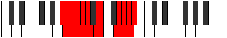 |
| [3683](https://ianring.com/musictheory/scales/3683) | [Dycrian](ModeEFlatDycrian.md) | Eb | Eb, Fb, G#, A, B#, C#, D, Eb |  |
| [3687](https://ianring.com/musictheory/scales/3687) | [Zonyllic](ModeDSharpZonyllic.md) | D# | D#, E, F, G#, A, C, C#, D, D# |  |
| [3687](https://ianring.com/musictheory/scales/3687) | [Zonyllic](ModeEFlatZonyllic.md) | Eb | Eb, E, F, Ab, A, C, Db, D, Eb |  |
| [3691](https://ianring.com/musictheory/scales/3691) | [Badyllic](ModeDSharpBadyllic.md) | D# | D#, E, F#, G#, A, C, C#, D, D# |  |
| [3691](https://ianring.com/musictheory/scales/3691) | [Badyllic](ModeEFlatBadyllic.md) | Eb | Eb, E, Gb, Ab, A, C, Db, D, Eb |  |
| [3693](https://ianring.com/musictheory/scales/3693) | [Epaptyllic](ModeBNaturalEpaptyllic.md) | B | B, C#, D, E, F, G#, A, A#, B |  |
| [3695](https://ianring.com/musictheory/scales/3695) | [Kodygic](ModeDSharpKodygic.md) | D# | D#, E, F, F#, G#, A, C, C#, D, D# |  |
| [3695](https://ianring.com/musictheory/scales/3695) | [Kodygic](ModeEFlatKodygic.md) | Eb | Eb, E, F, Gb, Ab, A, C, Db, D, Eb |  |
| [3695](https://ianring.com/musictheory/scales/3695) | [Kodygic](ModeBNaturalKodygic.md) | B | B, C, C#, D, E, F, G#, A, A#, B |  |
| [3699](https://ianring.com/musictheory/scales/3699) | [Aeolylyllic](ModeDSharpAeolylyllic.md) | D# | D#, E, G, G#, A, C, C#, D, D# |  |
| [3699](https://ianring.com/musictheory/scales/3699) | [Aeolylyllic](ModeEFlatAeolylyllic.md) | Eb | Eb, E, G, Ab, A, C, Db, D, Eb |  |
| [3699](https://ianring.com/musictheory/scales/3699) | [Aeolylyllic](ModeENaturalAeolylyllic.md) | E | E, F, G#, A, A#, C#, D, D#, E |  |
| [3701](https://ianring.com/musictheory/scales/3701) | [Bagyllic](ModeENaturalBagyllic.md) | E | E, F#, G#, A, A#, C#, D, D#, E |  |
| [3703](https://ianring.com/musictheory/scales/3703) | [Katalygic](ModeDSharpKatalygic.md) | D# | D#, E, F, G, G#, A, C, C#, D, D# |  |
| [3703](https://ianring.com/musictheory/scales/3703) | [Katalygic](ModeEFlatKatalygic.md) | Eb | Eb, E, F, G, Ab, A, C, Db, D, Eb |  |
| [3703](https://ianring.com/musictheory/scales/3703) | [Katalygic](ModeENaturalKatalygic.md) | E | E, F, F#, G#, A, A#, C#, D, D#, E |  |
| [3705](https://ianring.com/musictheory/scales/3705) | [Sydyllic](ModeENaturalSydyllic.md) | E | E, G, G#, A, A#, C#, D, D#, E | 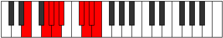 |
| [3705](https://ianring.com/musictheory/scales/3705) | [Sydyllic](ModeASharpSydyllic.md) | A# | A#, C#, D, D#, E, G, G#, A, A# |  |
| [3705](https://ianring.com/musictheory/scales/3705) | [Sydyllic](ModeBFlatSydyllic.md) | Bb | Bb, Db, D, Eb, E, G, Ab, A, Bb | 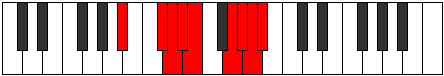 |
| [3707](https://ianring.com/musictheory/scales/3707) | [Rynygic](ModeDSharpRynygic.md) | D# | D#, E, F#, G, G#, A, C, C#, D, D# |  |
| [3707](https://ianring.com/musictheory/scales/3707) | [Rynygic](ModeEFlatRynygic.md) | Eb | Eb, E, Gb, G, Ab, A, C, Db, D, Eb |  |
| [3707](https://ianring.com/musictheory/scales/3707) | [Rynygic](ModeENaturalRynygic.md) | E | E, F, G, G#, A, A#, C#, D, D#, E |  |
| [3707](https://ianring.com/musictheory/scales/3707) | [Rynygic](ModeASharpRynygic.md) | A# | A#, B, C#, D, D#, E, G, G#, A, A# |  |
| [3707](https://ianring.com/musictheory/scales/3707) | [Rynygic](ModeBFlatRynygic.md) | Bb | Bb, B, Db, D, Eb, E, G, Ab, A, Bb |  |
| [3709](https://ianring.com/musictheory/scales/3709) | [Locrygic](ModeASharpLocrygic.md) | A# | A#, C, C#, D, D#, E, G, G#, A, A# |  |
| [3709](https://ianring.com/musictheory/scales/3709) | [Locrygic](ModeBFlatLocrygic.md) | Bb | Bb, C, Db, D, Eb, E, G, Ab, A, Bb |  |
| [3709](https://ianring.com/musictheory/scales/3709) | [Locrygic](ModeENaturalLocrygic.md) | E | E, F#, G, G#, A, A#, C#, D, D#, E |  |
| [3709](https://ianring.com/musictheory/scales/3709) | [Locrygic](ModeBNaturalLocrygic.md) | B | B, C#, D, D#, E, F, G#, A, A#, B |  |
| [3711](https://ianring.com/musictheory/scales/3711) | [Dycryllian](ModeDSharpDycryllian.md) | D# | D#, E, F, F#, G, G#, A, C, C#, D, D# |  |
| [3711](https://ianring.com/musictheory/scales/3711) | [Dycryllian](ModeEFlatDycryllian.md) | Eb | Eb, E, F, Gb, G, Ab, A, C, Db, D, Eb |  |
| [3711](https://ianring.com/musictheory/scales/3711) | [Dycryllian](ModeENaturalDycryllian.md) | E | E, F, F#, G, G#, A, A#, C#, D, D#, E |  |
| [3711](https://ianring.com/musictheory/scales/3711) | [Dycryllian](ModeBNaturalDycryllian.md) | B | B, C, C#, D, D#, E, F, G#, A, A#, B |  |
| [3711](https://ianring.com/musictheory/scales/3711) | [Dycryllian](ModeASharpDycryllian.md) | A# | A#, B, C, C#, D, D#, E, G, G#, A, A# |  |
| [3711](https://ianring.com/musictheory/scales/3711) | [Dycryllian](ModeBFlatDycryllian.md) | Bb | Bb, B, C, Db, D, Eb, E, G, Ab, A, Bb |  |
| [3757](https://ianring.com/musictheory/scales/3757) | [Goptyllic](ModeBNaturalGoptyllic.md) | B | B, C#, D, E, F#, G#, A, A#, B |  |
| [3759](https://ianring.com/musictheory/scales/3759) | [Darygic](ModeBNaturalDarygic.md) | B | B, C, C#, D, E, F#, G#, A, A#, B |  |
| [3761](https://ianring.com/musictheory/scales/3761) | [Ionythian](ModeANaturalIonythian.md) | A | A, B##, C##, D##, E##, F##, G#, A |  |
| [3763](https://ianring.com/musictheory/scales/3763) | [Modyllic](ModeANaturalModyllic.md) | A | A, A#, C#, D, E, F#, G, G#, A |  |
| [3763](https://ianring.com/musictheory/scales/3763) | [Modyllic](ModeENaturalModyllic.md) | E | E, F, G#, A, B, C#, D, D#, E |  |
| [3765](https://ianring.com/musictheory/scales/3765) | [Aerycryllic](ModeENaturalAerycryllic.md) | E | E, F#, G#, A, B, C#, D, D#, E |  |
| [3765](https://ianring.com/musictheory/scales/3765) | [Aerycryllic](ModeANaturalAerycryllic.md) | A | A, B, C#, D, E, F#, G, G#, A |  |
| [3767](https://ianring.com/musictheory/scales/3767) | [Bacrygic](ModeENaturalBacrygic.md) | E | E, F, F#, G#, A, B, C#, D, D#, E |  |
| [3767](https://ianring.com/musictheory/scales/3767) | [Bacrygic](ModeANaturalBacrygic.md) | A | A, A#, B, C#, D, E, F#, G, G#, A |  |
| [3769](https://ianring.com/musictheory/scales/3769) | [Aeracryllic](ModeANaturalAeracryllic.md) | A | A, C, C#, D, E, F#, G, G#, A |  |
| [3769](https://ianring.com/musictheory/scales/3769) | [Aeracryllic](ModeENaturalAeracryllic.md) | E | E, G, G#, A, B, C#, D, D#, E |  |
| [3771](https://ianring.com/musictheory/scales/3771) | [Stophygic](ModeANaturalStophygic.md) | A | A, A#, C, C#, D, E, F#, G, G#, A | 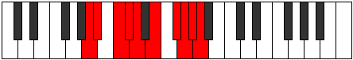 |
| [3771](https://ianring.com/musictheory/scales/3771) | [Stophygic](ModeENaturalStophygic.md) | E | E, F, G, G#, A, B, C#, D, D#, E |  |
| [3773](https://ianring.com/musictheory/scales/3773) | [Sorygic](ModeANaturalSorygic.md) | A | A, B, C, C#, D, E, F#, G, G#, A |  |
| [3773](https://ianring.com/musictheory/scales/3773) | [Sorygic](ModeENaturalSorygic.md) | E | E, F#, G, G#, A, B, C#, D, D#, E |  |
| [3773](https://ianring.com/musictheory/scales/3773) | [Sorygic](ModeBNaturalSorygic.md) | B | B, C#, D, D#, E, F#, G#, A, A#, B |  |
| [3775](https://ianring.com/musictheory/scales/3775) | [Loptyllian](ModeENaturalLoptyllian.md) | E | E, F, F#, G, G#, A, B, C#, D, D#, E |  |
| [3775](https://ianring.com/musictheory/scales/3775) | [Loptyllian](ModeBNaturalLoptyllian.md) | B | B, C, C#, D, D#, E, F#, G#, A, A#, B |  |
| [3775](https://ianring.com/musictheory/scales/3775) | [Loptyllian](ModeANaturalLoptyllian.md) | A | A, A#, B, C, C#, D, E, F#, G, G#, A |  |
| [3783](https://ianring.com/musictheory/scales/3783) | [Phrygyllic](ModeGNaturalPhrygyllic.md) | G | G, G#, A, C#, D, E, F, F#, G |  |
| [3783](https://ianring.com/musictheory/scales/3783) | [Phrygyllic](ModeDNaturalPhrygyllic.md) | D | D, D#, E, G#, A, B, C, C#, D |  |
| [3789](https://ianring.com/musictheory/scales/3789) | [Eporyllic](ModeDNaturalEporyllic.md) | D | D, E, F, G#, A, B, C, C#, D |  |
| [3791](https://ianring.com/musictheory/scales/3791) | [Stodygic](ModeGNaturalStodygic.md) | G | G, G#, A, A#, C#, D, E, F, F#, G |  |
| [3791](https://ianring.com/musictheory/scales/3791) | [Stodygic](ModeDNaturalStodygic.md) | D | D, D#, E, F, G#, A, B, C, C#, D |  |
| [3797](https://ianring.com/musictheory/scales/3797) | [Rocryllic](ModeDNaturalRocryllic.md) | D | D, E, F#, G#, A, B, C, C#, D |  |
| [3799](https://ianring.com/musictheory/scales/3799) | [Aeralygic](ModeDNaturalAeralygic.md) | D | D, D#, E, F#, G#, A, B, C, C#, D |  |
| [3799](https://ianring.com/musictheory/scales/3799) | [Aeralygic](ModeGNaturalAeralygic.md) | G | G, G#, A, B, C#, D, E, F, F#, G |  |
| [3801](https://ianring.com/musictheory/scales/3801) | [Maptyllic](ModeASharpMaptyllic.md) | A# | A#, C#, D, E, F, G, G#, A, A# |  |
| [3801](https://ianring.com/musictheory/scales/3801) | [Maptyllic](ModeBFlatMaptyllic.md) | Bb | Bb, Db, D, E, F, G, Ab, A, Bb |  |
| [3803](https://ianring.com/musictheory/scales/3803) | [Epidygic](ModeASharpEpidygic.md) | A# | A#, B, C#, D, E, F, G, G#, A, A# |  |
| [3803](https://ianring.com/musictheory/scales/3803) | [Epidygic](ModeBFlatEpidygic.md) | Bb | Bb, B, Db, D, E, F, G, Ab, A, Bb |  |
| [3805](https://ianring.com/musictheory/scales/3805) | [Moptygic](ModeASharpMoptygic.md) | A# | A#, C, C#, D, E, F, G, G#, A, A# |  |
| [3805](https://ianring.com/musictheory/scales/3805) | [Moptygic](ModeBFlatMoptygic.md) | Bb | Bb, C, Db, D, E, F, G, Ab, A, Bb |  |
| [3805](https://ianring.com/musictheory/scales/3805) | [Moptygic](ModeDNaturalMoptygic.md) | D | D, E, F, F#, G#, A, B, C, C#, D |  |
| [3807](https://ianring.com/musictheory/scales/3807) | [Bagyllian](ModeDNaturalBagyllian.md) | D | D, D#, E, F, F#, G#, A, B, C, C#, D |  |
| [3807](https://ianring.com/musictheory/scales/3807) | [Bagyllian](ModeASharpBagyllian.md) | A# | A#, B, C, C#, D, E, F, G, G#, A, A# |  |
| [3807](https://ianring.com/musictheory/scales/3807) | [Bagyllian](ModeBFlatBagyllian.md) | Bb | Bb, B, C, Db, D, E, F, G, Ab, A, Bb |  |
| [3807](https://ianring.com/musictheory/scales/3807) | [Bagyllian](ModeGNaturalBagyllian.md) | G | G, G#, A, A#, B, C#, D, E, F, F#, G |  |
| [3811](https://ianring.com/musictheory/scales/3811) | [Epogyllic](ModeDSharpEpogyllic.md) | D# | D#, E, G#, A, A#, C, C#, D, D# |  |
| [3811](https://ianring.com/musictheory/scales/3811) | [Epogyllic](ModeEFlatEpogyllic.md) | Eb | Eb, E, Ab, A, Bb, C, Db, D, Eb |  |
| [3813](https://ianring.com/musictheory/scales/3813) | [Aeologyllic](ModeDNaturalAeologyllic.md) | D | D, E, G, G#, A, B, C, C#, D |  |
| [3815](https://ianring.com/musictheory/scales/3815) | [Mylygic](ModeGNaturalMylygic.md) | G | G, G#, A, C, C#, D, E, F, F#, G |  |
| [3815](https://ianring.com/musictheory/scales/3815) | [Mylygic](ModeDSharpMylygic.md) | D# | D#, E, F, G#, A, A#, C, C#, D, D# |  |
| [3815](https://ianring.com/musictheory/scales/3815) | [Mylygic](ModeEFlatMylygic.md) | Eb | Eb, E, F, Ab, A, Bb, C, Db, D, Eb |  |
| [3815](https://ianring.com/musictheory/scales/3815) | [Mylygic](ModeDNaturalMylygic.md) | D | D, D#, E, G, G#, A, B, C, C#, D |  |
| [3819](https://ianring.com/musictheory/scales/3819) | [Aeolanygic](ModeDSharpAeolanygic.md) | D# | D#, E, F#, G#, A, A#, C, C#, D, D# |  |
| [3819](https://ianring.com/musictheory/scales/3819) | [Aeolanygic](ModeEFlatAeolanygic.md) | Eb | Eb, E, Gb, Ab, A, Bb, C, Db, D, Eb |  |
| [3821](https://ianring.com/musictheory/scales/3821) | [Epyrygic](ModeDNaturalEpyrygic.md) | D | D, E, F, G, G#, A, B, C, C#, D |  |
| [3821](https://ianring.com/musictheory/scales/3821) | [Epyrygic](ModeBNaturalEpyrygic.md) | B | B, C#, D, E, F, F#, G#, A, A#, B |  |
| [3823](https://ianring.com/musictheory/scales/3823) | [Epinyllian](ModeDSharpEpinyllian.md) | D# | D#, E, F, F#, G#, A, A#, C, C#, D, D# |  |
| [3823](https://ianring.com/musictheory/scales/3823) | [Epinyllian](ModeEFlatEpinyllian.md) | Eb | Eb, E, F, Gb, Ab, A, Bb, C, Db, D, Eb |  |
| [3823](https://ianring.com/musictheory/scales/3823) | [Epinyllian](ModeGNaturalEpinyllian.md) | G | G, G#, A, A#, C, C#, D, E, F, F#, G |  |
| [3823](https://ianring.com/musictheory/scales/3823) | [Epinyllian](ModeDNaturalEpinyllian.md) | D | D, D#, E, F, G, G#, A, B, C, C#, D |  |
| [3823](https://ianring.com/musictheory/scales/3823) | [Epinyllian](ModeBNaturalEpinyllian.md) | B | B, C, C#, D, E, F, F#, G#, A, A#, B |  |
| [3825](https://ianring.com/musictheory/scales/3825) | [Pynyllic](ModeANaturalPynyllic.md) | A | A, C#, D, D#, E, F#, G, G#, A |  |
| [3825](https://ianring.com/musictheory/scales/3825) | [Pynyllic](ModeENaturalPynyllic.md) | E | E, G#, A, A#, B, C#, D, D#, E |  |
| [3827](https://ianring.com/musictheory/scales/3827) | [Dorygic](ModeDSharpDorygic.md) | D# | D#, E, G, G#, A, A#, C, C#, D, D# |  |
| [3827](https://ianring.com/musictheory/scales/3827) | [Dorygic](ModeEFlatDorygic.md) | Eb | Eb, E, G, Ab, A, Bb, C, Db, D, Eb |  |
| [3827](https://ianring.com/musictheory/scales/3827) | [Dorygic](ModeANaturalDorygic.md) | A | A, A#, C#, D, D#, E, F#, G, G#, A |  |
| [3827](https://ianring.com/musictheory/scales/3827) | [Dorygic](ModeENaturalDorygic.md) | E | E, F, G#, A, A#, B, C#, D, D#, E |  |
| [3829](https://ianring.com/musictheory/scales/3829) | [Aerycrygic](ModeDNaturalAerycrygic.md) | D | D, E, F#, G, G#, A, B, C, C#, D |  |
| [3829](https://ianring.com/musictheory/scales/3829) | [Aerycrygic](ModeANaturalAerycrygic.md) | A | A, B, C#, D, D#, E, F#, G, G#, A | 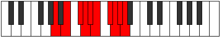 |
| [3829](https://ianring.com/musictheory/scales/3829) | [Aerycrygic](ModeENaturalAerycrygic.md) | E | E, F#, G#, A, A#, B, C#, D, D#, E |  |
| [3831](https://ianring.com/musictheory/scales/3831) | [Ionyllian](ModeDSharpIonyllian.md) | D# | D#, E, F, G, G#, A, A#, C, C#, D, D# |  |
| [3831](https://ianring.com/musictheory/scales/3831) | [Ionyllian](ModeEFlatIonyllian.md) | Eb | Eb, E, F, G, Ab, A, Bb, C, Db, D, Eb |  |
| [3831](https://ianring.com/musictheory/scales/3831) | [Ionyllian](ModeDNaturalIonyllian.md) | D | D, D#, E, F#, G, G#, A, B, C, C#, D |  |
| [3831](https://ianring.com/musictheory/scales/3831) | [Ionyllian](ModeGNaturalIonyllian.md) | G | G, G#, A, B, C, C#, D, E, F, F#, G |  |
| [3831](https://ianring.com/musictheory/scales/3831) | [Ionyllian](ModeENaturalIonyllian.md) | E | E, F, F#, G#, A, A#, B, C#, D, D#, E |  |
| [3831](https://ianring.com/musictheory/scales/3831) | [Ionyllian](ModeANaturalIonyllian.md) | A | A, A#, B, C#, D, D#, E, F#, G, G#, A |  |
| [3833](https://ianring.com/musictheory/scales/3833) | [Dycrygic](ModeANaturalDycrygic.md) | A | A, C, C#, D, D#, E, F#, G, G#, A |  |
| [3833](https://ianring.com/musictheory/scales/3833) | [Dycrygic](ModeASharpDycrygic.md) | A# | A#, C#, D, D#, E, F, G, G#, A, A# |  |
| [3833](https://ianring.com/musictheory/scales/3833) | [Dycrygic](ModeBFlatDycrygic.md) | Bb | Bb, Db, D, Eb, E, F, G, Ab, A, Bb |  |
| [3833](https://ianring.com/musictheory/scales/3833) | [Dycrygic](ModeENaturalDycrygic.md) | E | E, G, G#, A, A#, B, C#, D, D#, E |  |
| [3835](https://ianring.com/musictheory/scales/3835) | [Katodyllian](ModeDSharpKatodyllian.md) | D# | D#, E, F#, G, G#, A, A#, C, C#, D, D# |  |
| [3835](https://ianring.com/musictheory/scales/3835) | [Katodyllian](ModeEFlatKatodyllian.md) | Eb | Eb, E, Gb, G, Ab, A, Bb, C, Db, D, Eb |  |
| [3835](https://ianring.com/musictheory/scales/3835) | [Katodyllian](ModeANaturalKatodyllian.md) | A | A, A#, C, C#, D, D#, E, F#, G, G#, A |  |
| [3835](https://ianring.com/musictheory/scales/3835) | [Katodyllian](ModeENaturalKatodyllian.md) | E | E, F, G, G#, A, A#, B, C#, D, D#, E |  |
| [3835](https://ianring.com/musictheory/scales/3835) | [Katodyllian](ModeASharpKatodyllian.md) | A# | A#, B, C#, D, D#, E, F, G, G#, A, A# |  |
| [3835](https://ianring.com/musictheory/scales/3835) | [Katodyllian](ModeBFlatKatodyllian.md) | Bb | Bb, B, Db, D, Eb, E, F, G, Ab, A, Bb |  |
| [3837](https://ianring.com/musictheory/scales/3837) | [Garyllian](ModeASharpGaryllian.md) | A# | A#, C, C#, D, D#, E, F, G, G#, A, A# |  |
| [3837](https://ianring.com/musictheory/scales/3837) | [Garyllian](ModeBFlatGaryllian.md) | Bb | Bb, C, Db, D, Eb, E, F, G, Ab, A, Bb |  |
| [3837](https://ianring.com/musictheory/scales/3837) | [Garyllian](ModeANaturalGaryllian.md) | A | A, B, C, C#, D, D#, E, F#, G, G#, A |  |
| [3837](https://ianring.com/musictheory/scales/3837) | [Garyllian](ModeDNaturalGaryllian.md) | D | D, E, F, F#, G, G#, A, B, C, C#, D |  |
| [3837](https://ianring.com/musictheory/scales/3837) | [Garyllian](ModeBNaturalGaryllian.md) | B | B, C#, D, D#, E, F, F#, G#, A, A#, B |  |
| [3837](https://ianring.com/musictheory/scales/3837) | [Garyllian](ModeENaturalGaryllian.md) | E | E, F#, G, G#, A, A#, B, C#, D, D#, E |  |
| [3839](https://ianring.com/musictheory/scales/3839) | [Mixolatic](ModeDSharpMixolatic.md) | D# | D#, E, F, F#, G, G#, A, A#, C, C#, D, D# |  |
| [3839](https://ianring.com/musictheory/scales/3839) | [Mixolatic](ModeEFlatMixolatic.md) | Eb | Eb, E, F, Gb, G, Ab, A, Bb, C, Db, D, Eb |  |
| [3839](https://ianring.com/musictheory/scales/3839) | [Mixolatic](ModeDNaturalMixolatic.md) | D | D, D#, E, F, F#, G, G#, A, B, C, C#, D |  |
| [3839](https://ianring.com/musictheory/scales/3839) | [Mixolatic](ModeBNaturalMixolatic.md) | B | B, C, C#, D, D#, E, F, F#, G#, A, A#, B |  |
| [3839](https://ianring.com/musictheory/scales/3839) | [Mixolatic](ModeASharpMixolatic.md) | A# | A#, B, C, C#, D, D#, E, F, G, G#, A, A# |  |
| [3839](https://ianring.com/musictheory/scales/3839) | [Mixolatic](ModeBFlatMixolatic.md) | Bb | Bb, B, C, Db, D, Eb, E, F, G, Ab, A, Bb |  |
| [3839](https://ianring.com/musictheory/scales/3839) | [Mixolatic](ModeANaturalMixolatic.md) | A | A, A#, B, C, C#, D, D#, E, F#, G, G#, A |  |
| [3839](https://ianring.com/musictheory/scales/3839) | [Mixolatic](ModeGNaturalMixolatic.md) | G | G, G#, A, A#, B, C, C#, D, E, F, F#, G |  |
| [3839](https://ianring.com/musictheory/scales/3839) | [Mixolatic](ModeENaturalMixolatic.md) | E | E, F, F#, G, G#, A, A#, B, C#, D, D#, E |  |
| [3863](https://ianring.com/musictheory/scales/3863) | [Eparyllic](ModeCNaturalEparyllic.md) | C | C, C#, D, E, G#, A, A#, B, C |  |
| [3865](https://ianring.com/musictheory/scales/3865) | [Starian](ModeFNaturalStarian.md) | F | F, G#, A, B##, C##, D#, E, F |  |
| [3867](https://ianring.com/musictheory/scales/3867) | [Storyllic](ModeFNaturalStoryllic.md) | F | F, F#, G#, A, C#, D, D#, E, F | 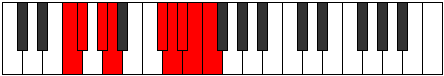 |
| [3869](https://ianring.com/musictheory/scales/3869) | [Bygyllic](ModeFNaturalBygyllic.md) | F | F, G, G#, A, C#, D, D#, E, F |  |
| [3871](https://ianring.com/musictheory/scales/3871) | [Aerynygic](ModeFNaturalAerynygic.md) | F | F, F#, G, G#, A, C#, D, D#, E, F |  |
| [3871](https://ianring.com/musictheory/scales/3871) | [Aerynygic](ModeCNaturalAerynygic.md) | C | C, C#, D, D#, E, G#, A, A#, B, C |  |
| [3885](https://ianring.com/musictheory/scales/3885) | [Styryllic](ModeBNaturalStyryllic.md) | B | B, C#, D, E, G, G#, A, A#, B |  |
| [3887](https://ianring.com/musictheory/scales/3887) | [Phrathygic](ModeBNaturalPhrathygic.md) | B | B, C, C#, D, E, G, G#, A, A#, B |  |
| [3891](https://ianring.com/musictheory/scales/3891) | [Ryryllic](ModeENaturalRyryllic.md) | E | E, F, G#, A, C, C#, D, D#, E |  |
| [3893](https://ianring.com/musictheory/scales/3893) | [Phrocryllic](ModeENaturalPhrocryllic.md) | E | E, F#, G#, A, C, C#, D, D#, E |  |
| [3895](https://ianring.com/musictheory/scales/3895) | [Eparygic](ModeENaturalEparygic.md) | E | E, F, F#, G#, A, C, C#, D, D#, E |  |
| [3895](https://ianring.com/musictheory/scales/3895) | [Eparygic](ModeCNaturalEparygic.md) | C | C, C#, D, E, F, G#, A, A#, B, C |  |
| [3897](https://ianring.com/musictheory/scales/3897) | [Locryllic](ModeENaturalLocryllic.md) | E | E, G, G#, A, C, C#, D, D#, E |  |
| [3897](https://ianring.com/musictheory/scales/3897) | [Locryllic](ModeFNaturalLocryllic.md) | F | F, G#, A, A#, C#, D, D#, E, F |  |
| [3899](https://ianring.com/musictheory/scales/3899) | [Katorygic](ModeENaturalKatorygic.md) | E | E, F, G, G#, A, C, C#, D, D#, E |  |
| [3899](https://ianring.com/musictheory/scales/3899) | [Katorygic](ModeFNaturalKatorygic.md) | F | F, F#, G#, A, A#, C#, D, D#, E, F |  |
| [3901](https://ianring.com/musictheory/scales/3901) | [Bycrygic](ModeENaturalBycrygic.md) | E | E, F#, G, G#, A, C, C#, D, D#, E |  |
| [3901](https://ianring.com/musictheory/scales/3901) | [Bycrygic](ModeFNaturalBycrygic.md) | F | F, G, G#, A, A#, C#, D, D#, E, F |  |
| [3901](https://ianring.com/musictheory/scales/3901) | [Bycrygic](ModeBNaturalBycrygic.md) | B | B, C#, D, D#, E, G, G#, A, A#, B |  |
| [3903](https://ianring.com/musictheory/scales/3903) | [Aeogyllian](ModeENaturalAeogyllian.md) | E | E, F, F#, G, G#, A, C, C#, D, D#, E |  |
| [3903](https://ianring.com/musictheory/scales/3903) | [Aeogyllian](ModeFNaturalAeogyllian.md) | F | F, F#, G, G#, A, A#, C#, D, D#, E, F |  |
| [3903](https://ianring.com/musictheory/scales/3903) | [Aeogyllian](ModeCNaturalAeogyllian.md) | C | C, C#, D, D#, E, F, G#, A, A#, B, C |  |
| [3903](https://ianring.com/musictheory/scales/3903) | [Aeogyllian](ModeBNaturalAeogyllian.md) | B | B, C, C#, D, D#, E, G, G#, A, A#, B |  |
| [3927](https://ianring.com/musictheory/scales/3927) | [Monygic](ModeCNaturalMonygic.md) | C | C, C#, D, E, F#, G#, A, A#, B, C |  |
| [3929](https://ianring.com/musictheory/scales/3929) | [Aeolothyllic](ModeASharpAeolothyllic.md) | A# | A#, C#, D, E, F#, G, G#, A, A# |  |
| [3929](https://ianring.com/musictheory/scales/3929) | [Aeolothyllic](ModeBFlatAeolothyllic.md) | Bb | Bb, Db, D, E, Gb, G, Ab, A, Bb |  |
| [3929](https://ianring.com/musictheory/scales/3929) | [Aeolothyllic](ModeFNaturalAeolothyllic.md) | F | F, G#, A, B, C#, D, D#, E, F |  |
| [3931](https://ianring.com/musictheory/scales/3931) | [Aerygic](ModeFNaturalAerygic.md) | F | F, F#, G#, A, B, C#, D, D#, E, F |  |
| [3931](https://ianring.com/musictheory/scales/3931) | [Aerygic](ModeASharpAerygic.md) | A# | A#, B, C#, D, E, F#, G, G#, A, A# |  |
| [3931](https://ianring.com/musictheory/scales/3931) | [Aerygic](ModeBFlatAerygic.md) | Bb | Bb, B, Db, D, E, Gb, G, Ab, A, Bb |  |
| [3933](https://ianring.com/musictheory/scales/3933) | [Ionidygic](ModeASharpIonidygic.md) | A# | A#, C, C#, D, E, F#, G, G#, A, A# |  |
| [3933](https://ianring.com/musictheory/scales/3933) | [Ionidygic](ModeBFlatIonidygic.md) | Bb | Bb, C, Db, D, E, Gb, G, Ab, A, Bb |  |
| [3933](https://ianring.com/musictheory/scales/3933) | [Ionidygic](ModeFNaturalIonidygic.md) | F | F, G, G#, A, B, C#, D, D#, E, F |  |
| [3935](https://ianring.com/musictheory/scales/3935) | [Kataphyllian](ModeFNaturalKataphyllian.md) | F | F, F#, G, G#, A, B, C#, D, D#, E, F |  |
| [3935](https://ianring.com/musictheory/scales/3935) | [Kataphyllian](ModeCNaturalKataphyllian.md) | C | C, C#, D, D#, E, F#, G#, A, A#, B, C |  |
| [3935](https://ianring.com/musictheory/scales/3935) | [Kataphyllian](ModeASharpKataphyllian.md) | A# | A#, B, C, C#, D, E, F#, G, G#, A, A# |  |
| [3935](https://ianring.com/musictheory/scales/3935) | [Kataphyllian](ModeBFlatKataphyllian.md) | Bb | Bb, B, C, Db, D, E, Gb, G, Ab, A, Bb |  |
| [3939](https://ianring.com/musictheory/scales/3939) | [Dogyllic](ModeGSharpDogyllic.md) | G# | G#, A, C#, D, E, F, F#, G, G# |  |
| [3939](https://ianring.com/musictheory/scales/3939) | [Dogyllic](ModeAFlatDogyllic.md) | Ab | Ab, A, Db, D, E, F, Gb, G, Ab |  |
| [3939](https://ianring.com/musictheory/scales/3939) | [Dogyllic](ModeDSharpDogyllic.md) | D# | D#, E, G#, A, B, C, C#, D, D# |  |
| [3939](https://ianring.com/musictheory/scales/3939) | [Dogyllic](ModeEFlatDogyllic.md) | Eb | Eb, E, Ab, A, B, C, Db, D, Eb |  |
| [3943](https://ianring.com/musictheory/scales/3943) | [Zynygic](ModeGSharpZynygic.md) | G# | G#, A, A#, C#, D, E, F, F#, G, G# |  |
| [3943](https://ianring.com/musictheory/scales/3943) | [Zynygic](ModeAFlatZynygic.md) | Ab | Ab, A, Bb, Db, D, E, F, Gb, G, Ab |  |
| [3943](https://ianring.com/musictheory/scales/3943) | [Zynygic](ModeDSharpZynygic.md) | D# | D#, E, F, G#, A, B, C, C#, D, D# |  |
| [3943](https://ianring.com/musictheory/scales/3943) | [Zynygic](ModeEFlatZynygic.md) | Eb | Eb, E, F, Ab, A, B, C, Db, D, Eb |  |
| [3947](https://ianring.com/musictheory/scales/3947) | [Ryptygic](ModeDSharpRyptygic.md) | D# | D#, E, F#, G#, A, B, C, C#, D, D# |  |
| [3947](https://ianring.com/musictheory/scales/3947) | [Ryptygic](ModeEFlatRyptygic.md) | Eb | Eb, E, Gb, Ab, A, B, C, Db, D, Eb |  |
| [3947](https://ianring.com/musictheory/scales/3947) | [Ryptygic](ModeGSharpRyptygic.md) | G# | G#, A, B, C#, D, E, F, F#, G, G# |  |
| [3947](https://ianring.com/musictheory/scales/3947) | [Ryptygic](ModeAFlatRyptygic.md) | Ab | Ab, A, B, Db, D, E, F, Gb, G, Ab |  |
| [3949](https://ianring.com/musictheory/scales/3949) | [Koptygic](ModeBNaturalKoptygic.md) | B | B, C#, D, E, F, G, G#, A, A#, B |  |
| [3951](https://ianring.com/musictheory/scales/3951) | [Mathyllian](ModeDSharpMathyllian.md) | D# | D#, E, F, F#, G#, A, B, C, C#, D, D# |  |
| [3951](https://ianring.com/musictheory/scales/3951) | [Mathyllian](ModeEFlatMathyllian.md) | Eb | Eb, E, F, Gb, Ab, A, B, C, Db, D, Eb |  |
| [3951](https://ianring.com/musictheory/scales/3951) | [Mathyllian](ModeBNaturalMathyllian.md) | B | B, C, C#, D, E, F, G, G#, A, A#, B |  |
| [3951](https://ianring.com/musictheory/scales/3951) | [Mathyllian](ModeGSharpMathyllian.md) | G# | G#, A, A#, B, C#, D, E, F, F#, G, G# |  |
| [3951](https://ianring.com/musictheory/scales/3951) | [Mathyllian](ModeAFlatMathyllian.md) | Ab | Ab, A, Bb, B, Db, D, E, F, Gb, G, Ab |  |
| [3953](https://ianring.com/musictheory/scales/3953) | [Thagyllic](ModeENaturalThagyllic.md) | E | E, G#, A, A#, C, C#, D, D#, E |  |
| [3955](https://ianring.com/musictheory/scales/3955) | [Galygic](ModeGSharpGalygic.md) | G# | G#, A, C, C#, D, E, F, F#, G, G# |  |
| [3955](https://ianring.com/musictheory/scales/3955) | [Galygic](ModeAFlatGalygic.md) | Ab | Ab, A, C, Db, D, E, F, Gb, G, Ab |  |
| [3955](https://ianring.com/musictheory/scales/3955) | [Galygic](ModeENaturalGalygic.md) | E | E, F, G#, A, A#, C, C#, D, D#, E |  |
| [3955](https://ianring.com/musictheory/scales/3955) | [Galygic](ModeDSharpGalygic.md) | D# | D#, E, G, G#, A, B, C, C#, D, D# |  |
| [3955](https://ianring.com/musictheory/scales/3955) | [Galygic](ModeEFlatGalygic.md) | Eb | Eb, E, G, Ab, A, B, C, Db, D, Eb |  |
| [3957](https://ianring.com/musictheory/scales/3957) | [Porygic](ModeENaturalPorygic.md) | E | E, F#, G#, A, A#, C, C#, D, D#, E |  |
| [3959](https://ianring.com/musictheory/scales/3959) | [Katagyllian](ModeENaturalKatagyllian.md) | E | E, F, F#, G#, A, A#, C, C#, D, D#, E |  |
| [3959](https://ianring.com/musictheory/scales/3959) | [Katagyllian](ModeGSharpKatagyllian.md) | G# | G#, A, A#, C, C#, D, E, F, F#, G, G# |  |
| [3959](https://ianring.com/musictheory/scales/3959) | [Katagyllian](ModeAFlatKatagyllian.md) | Ab | Ab, A, Bb, C, Db, D, E, F, Gb, G, Ab |  |
| [3959](https://ianring.com/musictheory/scales/3959) | [Katagyllian](ModeDSharpKatagyllian.md) | D# | D#, E, F, G, G#, A, B, C, C#, D, D# |  |
| [3959](https://ianring.com/musictheory/scales/3959) | [Katagyllian](ModeEFlatKatagyllian.md) | Eb | Eb, E, F, G, Ab, A, B, C, Db, D, Eb |  |
| [3959](https://ianring.com/musictheory/scales/3959) | [Katagyllian](ModeCNaturalKatagyllian.md) | C | C, C#, D, E, F, F#, G#, A, A#, B, C |  |
| [3961](https://ianring.com/musictheory/scales/3961) | [Mixolydygic](ModeENaturalMixolydygic.md) | E | E, G, G#, A, A#, C, C#, D, D#, E |  |
| [3961](https://ianring.com/musictheory/scales/3961) | [Mixolydygic](ModeASharpMixolydygic.md) | A# | A#, C#, D, D#, E, F#, G, G#, A, A# |  |
| [3961](https://ianring.com/musictheory/scales/3961) | [Mixolydygic](ModeBFlatMixolydygic.md) | Bb | Bb, Db, D, Eb, E, Gb, G, Ab, A, Bb |  |
| [3961](https://ianring.com/musictheory/scales/3961) | [Mixolydygic](ModeFNaturalMixolydygic.md) | F | F, G#, A, A#, B, C#, D, D#, E, F |  |
| [3963](https://ianring.com/musictheory/scales/3963) | [Aeoryllian](ModeENaturalAeoryllian.md) | E | E, F, G, G#, A, A#, C, C#, D, D#, E |  |
| [3963](https://ianring.com/musictheory/scales/3963) | [Aeoryllian](ModeDSharpAeoryllian.md) | D# | D#, E, F#, G, G#, A, B, C, C#, D, D# |  |
| [3963](https://ianring.com/musictheory/scales/3963) | [Aeoryllian](ModeEFlatAeoryllian.md) | Eb | Eb, E, Gb, G, Ab, A, B, C, Db, D, Eb |  |
| [3963](https://ianring.com/musictheory/scales/3963) | [Aeoryllian](ModeGSharpAeoryllian.md) | G# | G#, A, B, C, C#, D, E, F, F#, G, G# |  |
| [3963](https://ianring.com/musictheory/scales/3963) | [Aeoryllian](ModeAFlatAeoryllian.md) | Ab | Ab, A, B, C, Db, D, E, F, Gb, G, Ab |  |
| [3963](https://ianring.com/musictheory/scales/3963) | [Aeoryllian](ModeFNaturalAeoryllian.md) | F | F, F#, G#, A, A#, B, C#, D, D#, E, F |  |
| [3963](https://ianring.com/musictheory/scales/3963) | [Aeoryllian](ModeASharpAeoryllian.md) | A# | A#, B, C#, D, D#, E, F#, G, G#, A, A# |  |
| [3963](https://ianring.com/musictheory/scales/3963) | [Aeoryllian](ModeBFlatAeoryllian.md) | Bb | Bb, B, Db, D, Eb, E, Gb, G, Ab, A, Bb |  |
| [3965](https://ianring.com/musictheory/scales/3965) | [Thydyllian](ModeENaturalThydyllian.md) | E | E, F#, G, G#, A, A#, C, C#, D, D#, E |  |
| [3965](https://ianring.com/musictheory/scales/3965) | [Thydyllian](ModeASharpThydyllian.md) | A# | A#, C, C#, D, D#, E, F#, G, G#, A, A# |  |
| [3965](https://ianring.com/musictheory/scales/3965) | [Thydyllian](ModeBFlatThydyllian.md) | Bb | Bb, C, Db, D, Eb, E, Gb, G, Ab, A, Bb |  |
| [3965](https://ianring.com/musictheory/scales/3965) | [Thydyllian](ModeFNaturalThydyllian.md) | F | F, G, G#, A, A#, B, C#, D, D#, E, F |  |
| [3965](https://ianring.com/musictheory/scales/3965) | [Thydyllian](ModeBNaturalThydyllian.md) | B | B, C#, D, D#, E, F, G, G#, A, A#, B |  |
| [3967](https://ianring.com/musictheory/scales/3967) | [Soratic](ModeENaturalSoratic.md) | E | E, F, F#, G, G#, A, A#, C, C#, D, D#, E |  |
| [3967](https://ianring.com/musictheory/scales/3967) | [Soratic](ModeDSharpSoratic.md) | D# | D#, E, F, F#, G, G#, A, B, C, C#, D, D# |  |
| [3967](https://ianring.com/musictheory/scales/3967) | [Soratic](ModeEFlatSoratic.md) | Eb | Eb, E, F, Gb, G, Ab, A, B, C, Db, D, Eb |  |
| [3967](https://ianring.com/musictheory/scales/3967) | [Soratic](ModeCNaturalSoratic.md) | C | C, C#, D, D#, E, F, F#, G#, A, A#, B, C |  |
| [3967](https://ianring.com/musictheory/scales/3967) | [Soratic](ModeBNaturalSoratic.md) | B | B, C, C#, D, D#, E, F, G, G#, A, A#, B |  |
| [3967](https://ianring.com/musictheory/scales/3967) | [Soratic](ModeASharpSoratic.md) | A# | A#, B, C, C#, D, D#, E, F#, G, G#, A, A# |  |
| [3967](https://ianring.com/musictheory/scales/3967) | [Soratic](ModeBFlatSoratic.md) | Bb | Bb, B, C, Db, D, Eb, E, Gb, G, Ab, A, Bb |  |
| [3967](https://ianring.com/musictheory/scales/3967) | [Soratic](ModeGSharpSoratic.md) | G# | G#, A, A#, B, C, C#, D, E, F, F#, G, G# |  |
| [3967](https://ianring.com/musictheory/scales/3967) | [Soratic](ModeAFlatSoratic.md) | Ab | Ab, A, Bb, B, C, Db, D, E, F, Gb, G, Ab |  |
| [3967](https://ianring.com/musictheory/scales/3967) | [Soratic](ModeFNaturalSoratic.md) | F | F, F#, G, G#, A, A#, B, C#, D, D#, E, F | 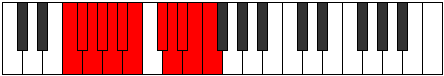 |
| [3979](https://ianring.com/musictheory/scales/3979) | [Dynyllic](ModeCSharpDynyllic.md) | C# | C#, D, E, G#, A, A#, B, C, C# |  |
| [3979](https://ianring.com/musictheory/scales/3979) | [Dynyllic](ModeDFlatDynyllic.md) | Db | Db, D, E, Ab, A, Bb, B, C, Db |  |
| [3981](https://ianring.com/musictheory/scales/3981) | [Phrycryllic](ModeFSharpPhrycryllic.md) | F# | F#, G#, A, C#, D, D#, E, F, F# |  |
| [3981](https://ianring.com/musictheory/scales/3981) | [Phrycryllic](ModeGFlatPhrycryllic.md) | Gb | Gb, Ab, A, Db, D, Eb, E, F, Gb |  |
| [3983](https://ianring.com/musictheory/scales/3983) | [Thyptygic](ModeFSharpThyptygic.md) | F# | F#, G, G#, A, C#, D, D#, E, F, F# |  |
| [3983](https://ianring.com/musictheory/scales/3983) | [Thyptygic](ModeGFlatThyptygic.md) | Gb | Gb, G, Ab, A, Db, D, Eb, E, F, Gb |  |
| [3983](https://ianring.com/musictheory/scales/3983) | [Thyptygic](ModeCSharpThyptygic.md) | C# | C#, D, D#, E, G#, A, A#, B, C, C# |  |
| [3983](https://ianring.com/musictheory/scales/3983) | [Thyptygic](ModeDFlatThyptygic.md) | Db | Db, D, Eb, E, Ab, A, Bb, B, C, Db |  |
| [3991](https://ianring.com/musictheory/scales/3991) | [Badygic](ModeCNaturalBadygic.md) | C | C, C#, D, E, G, G#, A, A#, B, C |  |
| [3993](https://ianring.com/musictheory/scales/3993) | [Ioniptyllic](ModeFNaturalIoniptyllic.md) | F | F, G#, A, C, C#, D, D#, E, F |  |
| [3995](https://ianring.com/musictheory/scales/3995) | [Ionygic](ModeFNaturalIonygic.md) | F | F, F#, G#, A, C, C#, D, D#, E, F |  |
| [3995](https://ianring.com/musictheory/scales/3995) | [Ionygic](ModeCSharpIonygic.md) | C# | C#, D, E, F, G#, A, A#, B, C, C# |  |
| [3995](https://ianring.com/musictheory/scales/3995) | [Ionygic](ModeDFlatIonygic.md) | Db | Db, D, E, F, Ab, A, Bb, B, C, Db |  |
| [3997](https://ianring.com/musictheory/scales/3997) | [Dogygic](ModeFNaturalDogygic.md) | F | F, G, G#, A, C, C#, D, D#, E, F |  |
| [3997](https://ianring.com/musictheory/scales/3997) | [Dogygic](ModeFSharpDogygic.md) | F# | F#, G#, A, A#, C#, D, D#, E, F, F# | 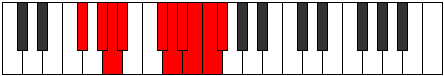 |
| [3997](https://ianring.com/musictheory/scales/3997) | [Dogygic](ModeGFlatDogygic.md) | Gb | Gb, Ab, A, Bb, Db, D, Eb, E, F, Gb |  |
| [3999](https://ianring.com/musictheory/scales/3999) | [Dydyllian](ModeFNaturalDydyllian.md) | F | F, F#, G, G#, A, C, C#, D, D#, E, F |  |
| [3999](https://ianring.com/musictheory/scales/3999) | [Dydyllian](ModeFSharpDydyllian.md) | F# | F#, G, G#, A, A#, C#, D, D#, E, F, F# |  |
| [3999](https://ianring.com/musictheory/scales/3999) | [Dydyllian](ModeGFlatDydyllian.md) | Gb | Gb, G, Ab, A, Bb, Db, D, Eb, E, F, Gb |  |
| [3999](https://ianring.com/musictheory/scales/3999) | [Dydyllian](ModeCSharpDydyllian.md) | C# | C#, D, D#, E, F, G#, A, A#, B, C, C# |  |
| [3999](https://ianring.com/musictheory/scales/3999) | [Dydyllian](ModeDFlatDydyllian.md) | Db | Db, D, Eb, E, F, Ab, A, Bb, B, C, Db |  |
| [3999](https://ianring.com/musictheory/scales/3999) | [Dydyllian](ModeCNaturalDydyllian.md) | C | C, C#, D, D#, E, G, G#, A, A#, B, C |  |
| [4011](https://ianring.com/musictheory/scales/4011) | [Styrygic](ModeCSharpStyrygic.md) | C# | C#, D, E, F#, G#, A, A#, B, C, C# |  |
| [4011](https://ianring.com/musictheory/scales/4011) | [Styrygic](ModeDFlatStyrygic.md) | Db | Db, D, E, Gb, Ab, A, Bb, B, C, Db |  |
| [4013](https://ianring.com/musictheory/scales/4013) | [Dathygic](ModeFSharpDathygic.md) | F# | F#, G#, A, B, C#, D, D#, E, F, F# |  |
| [4013](https://ianring.com/musictheory/scales/4013) | [Dathygic](ModeGFlatDathygic.md) | Gb | Gb, Ab, A, B, Db, D, Eb, E, F, Gb |  |
| [4013](https://ianring.com/musictheory/scales/4013) | [Dathygic](ModeBNaturalDathygic.md) | B | B, C#, D, E, F#, G, G#, A, A#, B |  |
| [4015](https://ianring.com/musictheory/scales/4015) | [Phradyllian](ModeFSharpPhradyllian.md) | F# | F#, G, G#, A, B, C#, D, D#, E, F, F# |  |
| [4015](https://ianring.com/musictheory/scales/4015) | [Phradyllian](ModeGFlatPhradyllian.md) | Gb | Gb, G, Ab, A, B, Db, D, Eb, E, F, Gb |  |
| [4015](https://ianring.com/musictheory/scales/4015) | [Phradyllian](ModeCSharpPhradyllian.md) | C# | C#, D, D#, E, F#, G#, A, A#, B, C, C# |  |
| [4015](https://ianring.com/musictheory/scales/4015) | [Phradyllian](ModeDFlatPhradyllian.md) | Db | Db, D, Eb, E, Gb, Ab, A, Bb, B, C, Db |  |
| [4015](https://ianring.com/musictheory/scales/4015) | [Phradyllian](ModeBNaturalPhradyllian.md) | B | B, C, C#, D, E, F#, G, G#, A, A#, B |  |
| [4017](https://ianring.com/musictheory/scales/4017) | [Dolyllic](ModeANaturalDolyllic.md) | A | A, C#, D, E, F, F#, G, G#, A |  |
| [4017](https://ianring.com/musictheory/scales/4017) | [Dolyllic](ModeENaturalDolyllic.md) | E | E, G#, A, B, C, C#, D, D#, E |  |
| [4019](https://ianring.com/musictheory/scales/4019) | [Lonygic](ModeANaturalLonygic.md) | A | A, A#, C#, D, E, F, F#, G, G#, A |  |
| [4019](https://ianring.com/musictheory/scales/4019) | [Lonygic](ModeENaturalLonygic.md) | E | E, F, G#, A, B, C, C#, D, D#, E | 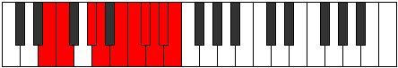 |
| [4021](https://ianring.com/musictheory/scales/4021) | [Bagygic](ModeENaturalBagygic.md) | E | E, F#, G#, A, B, C, C#, D, D#, E |  |
| [4021](https://ianring.com/musictheory/scales/4021) | [Bagygic](ModeANaturalBagygic.md) | A | A, B, C#, D, E, F, F#, G, G#, A |  |
| [4023](https://ianring.com/musictheory/scales/4023) | [Styptyllian](ModeENaturalStyptyllian.md) | E | E, F, F#, G#, A, B, C, C#, D, D#, E |  |
| [4023](https://ianring.com/musictheory/scales/4023) | [Styptyllian](ModeCNaturalStyptyllian.md) | C | C, C#, D, E, F, G, G#, A, A#, B, C |  |
| [4023](https://ianring.com/musictheory/scales/4023) | [Styptyllian](ModeANaturalStyptyllian.md) | A | A, A#, B, C#, D, E, F, F#, G, G#, A |  |
| [4025](https://ianring.com/musictheory/scales/4025) | [Kalygic](ModeANaturalKalygic.md) | A | A, C, C#, D, E, F, F#, G, G#, A |  |
| [4025](https://ianring.com/musictheory/scales/4025) | [Kalygic](ModeFNaturalKalygic.md) | F | F, G#, A, A#, C, C#, D, D#, E, F |  |
| [4025](https://ianring.com/musictheory/scales/4025) | [Kalygic](ModeENaturalKalygic.md) | E | E, G, G#, A, B, C, C#, D, D#, E |  |
| [4027](https://ianring.com/musictheory/scales/4027) | [Ragyllian](ModeFNaturalRagyllian.md) | F | F, F#, G#, A, A#, C, C#, D, D#, E, F |  |
| [4027](https://ianring.com/musictheory/scales/4027) | [Ragyllian](ModeANaturalRagyllian.md) | A | A, A#, C, C#, D, E, F, F#, G, G#, A |  |
| [4027](https://ianring.com/musictheory/scales/4027) | [Ragyllian](ModeENaturalRagyllian.md) | E | E, F, G, G#, A, B, C, C#, D, D#, E |  |
| [4027](https://ianring.com/musictheory/scales/4027) | [Ragyllian](ModeCSharpRagyllian.md) | C# | C#, D, E, F, F#, G#, A, A#, B, C, C# |  |
| [4027](https://ianring.com/musictheory/scales/4027) | [Ragyllian](ModeDFlatRagyllian.md) | Db | Db, D, E, F, Gb, Ab, A, Bb, B, C, Db |  |
| [4029](https://ianring.com/musictheory/scales/4029) | [Aerycryllian](ModeFNaturalAerycryllian.md) | F | F, G, G#, A, A#, C, C#, D, D#, E, F |  |
| [4029](https://ianring.com/musictheory/scales/4029) | [Aerycryllian](ModeENaturalAerycryllian.md) | E | E, F#, G, G#, A, B, C, C#, D, D#, E |  |
| [4029](https://ianring.com/musictheory/scales/4029) | [Aerycryllian](ModeANaturalAerycryllian.md) | A | A, B, C, C#, D, E, F, F#, G, G#, A |  |
| [4029](https://ianring.com/musictheory/scales/4029) | [Aerycryllian](ModeFSharpAerycryllian.md) | F# | F#, G#, A, A#, B, C#, D, D#, E, F, F# |  |
| [4029](https://ianring.com/musictheory/scales/4029) | [Aerycryllian](ModeGFlatAerycryllian.md) | Gb | Gb, Ab, A, Bb, B, Db, D, Eb, E, F, Gb |  |
| [4029](https://ianring.com/musictheory/scales/4029) | [Aerycryllian](ModeBNaturalAerycryllian.md) | B | B, C#, D, D#, E, F#, G, G#, A, A#, B |  |
| [4031](https://ianring.com/musictheory/scales/4031) | [Godatic](ModeFNaturalGodatic.md) | F | F, F#, G, G#, A, A#, C, C#, D, D#, E, F |  |
| [4031](https://ianring.com/musictheory/scales/4031) | [Godatic](ModeENaturalGodatic.md) | E | E, F, F#, G, G#, A, B, C, C#, D, D#, E |  |
| [4031](https://ianring.com/musictheory/scales/4031) | [Godatic](ModeCSharpGodatic.md) | C# | C#, D, D#, E, F, F#, G#, A, A#, B, C, C# |  |
| [4031](https://ianring.com/musictheory/scales/4031) | [Godatic](ModeDFlatGodatic.md) | Db | Db, D, Eb, E, F, Gb, Ab, A, Bb, B, C, Db |  |
| [4031](https://ianring.com/musictheory/scales/4031) | [Godatic](ModeCNaturalGodatic.md) | C | C, C#, D, D#, E, F, G, G#, A, A#, B, C |  |
| [4031](https://ianring.com/musictheory/scales/4031) | [Godatic](ModeBNaturalGodatic.md) | B | B, C, C#, D, D#, E, F#, G, G#, A, A#, B |  |
| [4031](https://ianring.com/musictheory/scales/4031) | [Godatic](ModeANaturalGodatic.md) | A | A, A#, B, C, C#, D, E, F, F#, G, G#, A |  |
| [4031](https://ianring.com/musictheory/scales/4031) | [Godatic](ModeFSharpGodatic.md) | F# | F#, G, G#, A, A#, B, C#, D, D#, E, F, F# |  |
| [4031](https://ianring.com/musictheory/scales/4031) | [Godatic](ModeGFlatGodatic.md) | Gb | Gb, G, Ab, A, Bb, B, Db, D, Eb, E, F, Gb |  |
| [4037](https://ianring.com/musictheory/scales/4037) | [Ionyllic](ModeDNaturalIonyllic.md) | D | D, E, G#, A, A#, B, C, C#, D |  |
| [4039](https://ianring.com/musictheory/scales/4039) | [Ionogygic](ModeGNaturalIonogygic.md) | G | G, G#, A, C#, D, D#, E, F, F#, G |  |
| [4039](https://ianring.com/musictheory/scales/4039) | [Ionogygic](ModeDNaturalIonogygic.md) | D | D, D#, E, G#, A, A#, B, C, C#, D |  |
| [4043](https://ianring.com/musictheory/scales/4043) | [Phrocrygic](ModeCSharpPhrocrygic.md) | C# | C#, D, E, G, G#, A, A#, B, C, C# |  |
| [4043](https://ianring.com/musictheory/scales/4043) | [Phrocrygic](ModeDFlatPhrocrygic.md) | Db | Db, D, E, G, Ab, A, Bb, B, C, Db |  |
| [4045](https://ianring.com/musictheory/scales/4045) | [Gyptygic](ModeFSharpGyptygic.md) | F# | F#, G#, A, C, C#, D, D#, E, F, F# |  |
| [4045](https://ianring.com/musictheory/scales/4045) | [Gyptygic](ModeGFlatGyptygic.md) | Gb | Gb, Ab, A, C, Db, D, Eb, E, F, Gb |  |
| [4045](https://ianring.com/musictheory/scales/4045) | [Gyptygic](ModeDNaturalGyptygic.md) | D | D, E, F, G#, A, A#, B, C, C#, D |  |
| [4047](https://ianring.com/musictheory/scales/4047) | [Thogyllian](ModeFSharpThogyllian.md) | F# | F#, G, G#, A, C, C#, D, D#, E, F, F# |  |
| [4047](https://ianring.com/musictheory/scales/4047) | [Thogyllian](ModeGFlatThogyllian.md) | Gb | Gb, G, Ab, A, C, Db, D, Eb, E, F, Gb |  |
| [4047](https://ianring.com/musictheory/scales/4047) | [Thogyllian](ModeGNaturalThogyllian.md) | G | G, G#, A, A#, C#, D, D#, E, F, F#, G |  |
| [4047](https://ianring.com/musictheory/scales/4047) | [Thogyllian](ModeDNaturalThogyllian.md) | D | D, D#, E, F, G#, A, A#, B, C, C#, D |  |
| [4047](https://ianring.com/musictheory/scales/4047) | [Thogyllian](ModeCSharpThogyllian.md) | C# | C#, D, D#, E, G, G#, A, A#, B, C, C# |  |
| [4047](https://ianring.com/musictheory/scales/4047) | [Thogyllian](ModeDFlatThogyllian.md) | Db | Db, D, Eb, E, G, Ab, A, Bb, B, C, Db |  |
| [4053](https://ianring.com/musictheory/scales/4053) | [Kyrygic](ModeDNaturalKyrygic.md) | D | D, E, F#, G#, A, A#, B, C, C#, D |  |
| [4055](https://ianring.com/musictheory/scales/4055) | [Dagyllian](ModeGNaturalDagyllian.md) | G | G, G#, A, B, C#, D, D#, E, F, F#, G |  |
| [4055](https://ianring.com/musictheory/scales/4055) | [Dagyllian](ModeDNaturalDagyllian.md) | D | D, D#, E, F#, G#, A, A#, B, C, C#, D |  |
| [4055](https://ianring.com/musictheory/scales/4055) | [Dagyllian](ModeCNaturalDagyllian.md) | C | C, C#, D, E, F#, G, G#, A, A#, B, C |  |
| [4057](https://ianring.com/musictheory/scales/4057) | [Phrygic](ModeASharpPhrygic.md) | A# | A#, C#, D, E, F, F#, G, G#, A, A# |  |
| [4057](https://ianring.com/musictheory/scales/4057) | [Phrygic](ModeBFlatPhrygic.md) | Bb | Bb, Db, D, E, F, Gb, G, Ab, A, Bb |  |
| [4057](https://ianring.com/musictheory/scales/4057) | [Phrygic](ModeFNaturalPhrygic.md) | F | F, G#, A, B, C, C#, D, D#, E, F |  |
| [4059](https://ianring.com/musictheory/scales/4059) | [Zolyllian](ModeFNaturalZolyllian.md) | F | F, F#, G#, A, B, C, C#, D, D#, E, F |  |
| [4059](https://ianring.com/musictheory/scales/4059) | [Zolyllian](ModeCSharpZolyllian.md) | C# | C#, D, E, F, G, G#, A, A#, B, C, C# |  |
| [4059](https://ianring.com/musictheory/scales/4059) | [Zolyllian](ModeDFlatZolyllian.md) | Db | Db, D, E, F, G, Ab, A, Bb, B, C, Db |  |
| [4059](https://ianring.com/musictheory/scales/4059) | [Zolyllian](ModeASharpZolyllian.md) | A# | A#, B, C#, D, E, F, F#, G, G#, A, A# |  |
| [4059](https://ianring.com/musictheory/scales/4059) | [Zolyllian](ModeBFlatZolyllian.md) | Bb | Bb, B, Db, D, E, F, Gb, G, Ab, A, Bb |  |
| [4061](https://ianring.com/musictheory/scales/4061) | [Staptyllian](ModeFSharpStaptyllian.md) | F# | F#, G#, A, A#, C, C#, D, D#, E, F, F# |  |
| [4061](https://ianring.com/musictheory/scales/4061) | [Staptyllian](ModeGFlatStaptyllian.md) | Gb | Gb, Ab, A, Bb, C, Db, D, Eb, E, F, Gb |  |
| [4061](https://ianring.com/musictheory/scales/4061) | [Staptyllian](ModeASharpStaptyllian.md) | A# | A#, C, C#, D, E, F, F#, G, G#, A, A# |  |
| [4061](https://ianring.com/musictheory/scales/4061) | [Staptyllian](ModeBFlatStaptyllian.md) | Bb | Bb, C, Db, D, E, F, Gb, G, Ab, A, Bb |  |
| [4061](https://ianring.com/musictheory/scales/4061) | [Staptyllian](ModeFNaturalStaptyllian.md) | F | F, G, G#, A, B, C, C#, D, D#, E, F |  |
| [4061](https://ianring.com/musictheory/scales/4061) | [Staptyllian](ModeDNaturalStaptyllian.md) | D | D, E, F, F#, G#, A, A#, B, C, C#, D |  |
| [4063](https://ianring.com/musictheory/scales/4063) | [Eptatic](ModeFSharpEptatic.md) | F# | F#, G, G#, A, A#, C, C#, D, D#, E, F, F# |  |
| [4063](https://ianring.com/musictheory/scales/4063) | [Eptatic](ModeGFlatEptatic.md) | Gb | Gb, G, Ab, A, Bb, C, Db, D, Eb, E, F, Gb |  |
| [4063](https://ianring.com/musictheory/scales/4063) | [Eptatic](ModeFNaturalEptatic.md) | F | F, F#, G, G#, A, B, C, C#, D, D#, E, F |  |
| [4063](https://ianring.com/musictheory/scales/4063) | [Eptatic](ModeDNaturalEptatic.md) | D | D, D#, E, F, F#, G#, A, A#, B, C, C#, D |  |
| [4063](https://ianring.com/musictheory/scales/4063) | [Eptatic](ModeCSharpEptatic.md) | C# | C#, D, D#, E, F, G, G#, A, A#, B, C, C# |  |
| [4063](https://ianring.com/musictheory/scales/4063) | [Eptatic](ModeDFlatEptatic.md) | Db | Db, D, Eb, E, F, G, Ab, A, Bb, B, C, Db |  |
| [4063](https://ianring.com/musictheory/scales/4063) | [Eptatic](ModeCNaturalEptatic.md) | C | C, C#, D, D#, E, F#, G, G#, A, A#, B, C |  |
| [4063](https://ianring.com/musictheory/scales/4063) | [Eptatic](ModeASharpEptatic.md) | A# | A#, B, C, C#, D, E, F, F#, G, G#, A, A# |  |
| [4063](https://ianring.com/musictheory/scales/4063) | [Eptatic](ModeBFlatEptatic.md) | Bb | Bb, B, C, Db, D, E, F, Gb, G, Ab, A, Bb |  |
| [4063](https://ianring.com/musictheory/scales/4063) | [Eptatic](ModeGNaturalEptatic.md) | G | G, G#, A, A#, B, C#, D, D#, E, F, F#, G |  |
| [4067](https://ianring.com/musictheory/scales/4067) | [Aeolarygic](ModeGSharpAeolarygic.md) | G# | G#, A, C#, D, D#, E, F, F#, G, G# |  |
| [4067](https://ianring.com/musictheory/scales/4067) | [Aeolarygic](ModeAFlatAeolarygic.md) | Ab | Ab, A, Db, D, Eb, E, F, Gb, G, Ab |  |
| [4067](https://ianring.com/musictheory/scales/4067) | [Aeolarygic](ModeDSharpAeolarygic.md) | D# | D#, E, G#, A, A#, B, C, C#, D, D# |  |
| [4067](https://ianring.com/musictheory/scales/4067) | [Aeolarygic](ModeEFlatAeolarygic.md) | Eb | Eb, E, Ab, A, Bb, B, C, Db, D, Eb |  |
| [4069](https://ianring.com/musictheory/scales/4069) | [Starygic](ModeDNaturalStarygic.md) | D | D, E, G, G#, A, A#, B, C, C#, D |  |
| [4071](https://ianring.com/musictheory/scales/4071) | [Rygyllian](ModeGNaturalRygyllian.md) | G | G, G#, A, C, C#, D, D#, E, F, F#, G |  |
| [4071](https://ianring.com/musictheory/scales/4071) | [Rygyllian](ModeGSharpRygyllian.md) | G# | G#, A, A#, C#, D, D#, E, F, F#, G, G# |  |
| [4071](https://ianring.com/musictheory/scales/4071) | [Rygyllian](ModeAFlatRygyllian.md) | Ab | Ab, A, Bb, Db, D, Eb, E, F, Gb, G, Ab |  |
| [4071](https://ianring.com/musictheory/scales/4071) | [Rygyllian](ModeDSharpRygyllian.md) | D# | D#, E, F, G#, A, A#, B, C, C#, D, D# |  |
| [4071](https://ianring.com/musictheory/scales/4071) | [Rygyllian](ModeEFlatRygyllian.md) | Eb | Eb, E, F, Ab, A, Bb, B, C, Db, D, Eb |  |
| [4071](https://ianring.com/musictheory/scales/4071) | [Rygyllian](ModeDNaturalRygyllian.md) | D | D, D#, E, G, G#, A, A#, B, C, C#, D |  |
| [4075](https://ianring.com/musictheory/scales/4075) | [Katyllian](ModeGSharpKatyllian.md) | G# | G#, A, B, C#, D, D#, E, F, F#, G, G# |  |
| [4075](https://ianring.com/musictheory/scales/4075) | [Katyllian](ModeAFlatKatyllian.md) | Ab | Ab, A, B, Db, D, Eb, E, F, Gb, G, Ab |  |
| [4075](https://ianring.com/musictheory/scales/4075) | [Katyllian](ModeDSharpKatyllian.md) | D# | D#, E, F#, G#, A, A#, B, C, C#, D, D# |  |
| [4075](https://ianring.com/musictheory/scales/4075) | [Katyllian](ModeEFlatKatyllian.md) | Eb | Eb, E, Gb, Ab, A, Bb, B, C, Db, D, Eb |  |
| [4075](https://ianring.com/musictheory/scales/4075) | [Katyllian](ModeCSharpKatyllian.md) | C# | C#, D, E, F#, G, G#, A, A#, B, C, C# |  |
| [4075](https://ianring.com/musictheory/scales/4075) | [Katyllian](ModeDFlatKatyllian.md) | Db | Db, D, E, Gb, G, Ab, A, Bb, B, C, Db |  |
| [4077](https://ianring.com/musictheory/scales/4077) | [Gothyllian](ModeFSharpGothyllian.md) | F# | F#, G#, A, B, C, C#, D, D#, E, F, F# |  |
| [4077](https://ianring.com/musictheory/scales/4077) | [Gothyllian](ModeGFlatGothyllian.md) | Gb | Gb, Ab, A, B, C, Db, D, Eb, E, F, Gb |  |
| [4077](https://ianring.com/musictheory/scales/4077) | [Gothyllian](ModeDNaturalGothyllian.md) | D | D, E, F, G, G#, A, A#, B, C, C#, D |  |
| [4077](https://ianring.com/musictheory/scales/4077) | [Gothyllian](ModeBNaturalGothyllian.md) | B | B, C#, D, E, F, F#, G, G#, A, A#, B |  |
| [4079](https://ianring.com/musictheory/scales/4079) | [Ionatic](ModeGNaturalIonatic.md) | G | G, G#, A, A#, C, C#, D, D#, E, F, F#, G |  |
| [4079](https://ianring.com/musictheory/scales/4079) | [Ionatic](ModeFSharpIonatic.md) | F# | F#, G, G#, A, B, C, C#, D, D#, E, F, F# |  |
| [4079](https://ianring.com/musictheory/scales/4079) | [Ionatic](ModeGFlatIonatic.md) | Gb | Gb, G, Ab, A, B, C, Db, D, Eb, E, F, Gb |  |
| [4079](https://ianring.com/musictheory/scales/4079) | [Ionatic](ModeDSharpIonatic.md) | D# | D#, E, F, F#, G#, A, A#, B, C, C#, D, D# |  |
| [4079](https://ianring.com/musictheory/scales/4079) | [Ionatic](ModeEFlatIonatic.md) | Eb | Eb, E, F, Gb, Ab, A, Bb, B, C, Db, D, Eb |  |
| [4079](https://ianring.com/musictheory/scales/4079) | [Ionatic](ModeDNaturalIonatic.md) | D | D, D#, E, F, G, G#, A, A#, B, C, C#, D |  |
| [4079](https://ianring.com/musictheory/scales/4079) | [Ionatic](ModeCSharpIonatic.md) | C# | C#, D, D#, E, F#, G, G#, A, A#, B, C, C# |  |
| [4079](https://ianring.com/musictheory/scales/4079) | [Ionatic](ModeDFlatIonatic.md) | Db | Db, D, Eb, E, Gb, G, Ab, A, Bb, B, C, Db |  |
| [4079](https://ianring.com/musictheory/scales/4079) | [Ionatic](ModeBNaturalIonatic.md) | B | B, C, C#, D, E, F, F#, G, G#, A, A#, B |  |
| [4079](https://ianring.com/musictheory/scales/4079) | [Ionatic](ModeGSharpIonatic.md) | G# | G#, A, A#, B, C#, D, D#, E, F, F#, G, G# |  |
| [4079](https://ianring.com/musictheory/scales/4079) | [Ionatic](ModeAFlatIonatic.md) | Ab | Ab, A, Bb, B, Db, D, Eb, E, F, Gb, G, Ab |  |
| [4081](https://ianring.com/musictheory/scales/4081) | [Manygic](ModeANaturalManygic.md) | A | A, C#, D, D#, E, F, F#, G, G#, A |  |
| [4081](https://ianring.com/musictheory/scales/4081) | [Manygic](ModeENaturalManygic.md) | E | E, G#, A, A#, B, C, C#, D, D#, E |  |
| [4083](https://ianring.com/musictheory/scales/4083) | [Bathyllian](ModeGSharpBathyllian.md) | G# | G#, A, C, C#, D, D#, E, F, F#, G, G# |  |
| [4083](https://ianring.com/musictheory/scales/4083) | [Bathyllian](ModeAFlatBathyllian.md) | Ab | Ab, A, C, Db, D, Eb, E, F, Gb, G, Ab |  |
| [4083](https://ianring.com/musictheory/scales/4083) | [Bathyllian](ModeANaturalBathyllian.md) | A | A, A#, C#, D, D#, E, F, F#, G, G#, A |  |
| [4083](https://ianring.com/musictheory/scales/4083) | [Bathyllian](ModeENaturalBathyllian.md) | E | E, F, G#, A, A#, B, C, C#, D, D#, E |  |
| [4083](https://ianring.com/musictheory/scales/4083) | [Bathyllian](ModeDSharpBathyllian.md) | D# | D#, E, G, G#, A, A#, B, C, C#, D, D# |  |
| [4083](https://ianring.com/musictheory/scales/4083) | [Bathyllian](ModeEFlatBathyllian.md) | Eb | Eb, E, G, Ab, A, Bb, B, C, Db, D, Eb |  |
| [4085](https://ianring.com/musictheory/scales/4085) | [Sydyllian](ModeANaturalSydyllian.md) | A | A, B, C#, D, D#, E, F, F#, G, G#, A |  |
| [4085](https://ianring.com/musictheory/scales/4085) | [Sydyllian](ModeENaturalSydyllian.md) | E | E, F#, G#, A, A#, B, C, C#, D, D#, E |  |
| [4085](https://ianring.com/musictheory/scales/4085) | [Sydyllian](ModeDNaturalSydyllian.md) | D | D, E, F#, G, G#, A, A#, B, C, C#, D |  |
| [4087](https://ianring.com/musictheory/scales/4087) | [Aeolatic](ModeGSharpAeolatic.md) | G# | G#, A, A#, C, C#, D, D#, E, F, F#, G, G# |  |
| [4087](https://ianring.com/musictheory/scales/4087) | [Aeolatic](ModeAFlatAeolatic.md) | Ab | Ab, A, Bb, C, Db, D, Eb, E, F, Gb, G, Ab |  |
| [4087](https://ianring.com/musictheory/scales/4087) | [Aeolatic](ModeGNaturalAeolatic.md) | G | G, G#, A, B, C, C#, D, D#, E, F, F#, G |  |
| [4087](https://ianring.com/musictheory/scales/4087) | [Aeolatic](ModeENaturalAeolatic.md) | E | E, F, F#, G#, A, A#, B, C, C#, D, D#, E |  |
| [4087](https://ianring.com/musictheory/scales/4087) | [Aeolatic](ModeDSharpAeolatic.md) | D# | D#, E, F, G, G#, A, A#, B, C, C#, D, D# |  |
| [4087](https://ianring.com/musictheory/scales/4087) | [Aeolatic](ModeEFlatAeolatic.md) | Eb | Eb, E, F, G, Ab, A, Bb, B, C, Db, D, Eb |  |
| [4087](https://ianring.com/musictheory/scales/4087) | [Aeolatic](ModeDNaturalAeolatic.md) | D | D, D#, E, F#, G, G#, A, A#, B, C, C#, D |  |
| [4087](https://ianring.com/musictheory/scales/4087) | [Aeolatic](ModeCNaturalAeolatic.md) | C | C, C#, D, E, F, F#, G, G#, A, A#, B, C |  |
| [4087](https://ianring.com/musictheory/scales/4087) | [Aeolatic](ModeANaturalAeolatic.md) | A | A, A#, B, C#, D, D#, E, F, F#, G, G#, A |  |
| [4089](https://ianring.com/musictheory/scales/4089) | [Katoryllian](ModeANaturalKatoryllian.md) | A | A, C, C#, D, D#, E, F, F#, G, G#, A |  |
| [4089](https://ianring.com/musictheory/scales/4089) | [Katoryllian](ModeASharpKatoryllian.md) | A# | A#, C#, D, D#, E, F, F#, G, G#, A, A# |  |
| [4089](https://ianring.com/musictheory/scales/4089) | [Katoryllian](ModeBFlatKatoryllian.md) | Bb | Bb, Db, D, Eb, E, F, Gb, G, Ab, A, Bb |  |
| [4089](https://ianring.com/musictheory/scales/4089) | [Katoryllian](ModeFNaturalKatoryllian.md) | F | F, G#, A, A#, B, C, C#, D, D#, E, F |  |
| [4089](https://ianring.com/musictheory/scales/4089) | [Katoryllian](ModeENaturalKatoryllian.md) | E | E, G, G#, A, A#, B, C, C#, D, D#, E |  |
| [4091](https://ianring.com/musictheory/scales/4091) | [Thydatic](ModeANaturalThydatic.md) | A | A, A#, C, C#, D, D#, E, F, F#, G, G#, A |  |
| [4091](https://ianring.com/musictheory/scales/4091) | [Thydatic](ModeGSharpThydatic.md) | G# | G#, A, B, C, C#, D, D#, E, F, F#, G, G# |  |
| [4091](https://ianring.com/musictheory/scales/4091) | [Thydatic](ModeAFlatThydatic.md) | Ab | Ab, A, B, C, Db, D, Eb, E, F, Gb, G, Ab |  |
| [4091](https://ianring.com/musictheory/scales/4091) | [Thydatic](ModeFNaturalThydatic.md) | F | F, F#, G#, A, A#, B, C, C#, D, D#, E, F |  |
| [4091](https://ianring.com/musictheory/scales/4091) | [Thydatic](ModeENaturalThydatic.md) | E | E, F, G, G#, A, A#, B, C, C#, D, D#, E |  |
| [4091](https://ianring.com/musictheory/scales/4091) | [Thydatic](ModeDSharpThydatic.md) | D# | D#, E, F#, G, G#, A, A#, B, C, C#, D, D# |  |
| [4091](https://ianring.com/musictheory/scales/4091) | [Thydatic](ModeEFlatThydatic.md) | Eb | Eb, E, Gb, G, Ab, A, Bb, B, C, Db, D, Eb |  |
| [4091](https://ianring.com/musictheory/scales/4091) | [Thydatic](ModeCSharpThydatic.md) | C# | C#, D, E, F, F#, G, G#, A, A#, B, C, C# |  |
| [4091](https://ianring.com/musictheory/scales/4091) | [Thydatic](ModeDFlatThydatic.md) | Db | Db, D, E, F, Gb, G, Ab, A, Bb, B, C, Db |  |
| [4091](https://ianring.com/musictheory/scales/4091) | [Thydatic](ModeASharpThydatic.md) | A# | A#, B, C#, D, D#, E, F, F#, G, G#, A, A# |  |
| [4091](https://ianring.com/musictheory/scales/4091) | [Thydatic](ModeBFlatThydatic.md) | Bb | Bb, B, Db, D, Eb, E, F, Gb, G, Ab, A, Bb |  |
| [4093](https://ianring.com/musictheory/scales/4093) | [Aerycratic](ModeASharpAerycratic.md) | A# | A#, C, C#, D, D#, E, F, F#, G, G#, A, A# |  |
| [4093](https://ianring.com/musictheory/scales/4093) | [Aerycratic](ModeBFlatAerycratic.md) | Bb | Bb, C, Db, D, Eb, E, F, Gb, G, Ab, A, Bb |  |
| [4093](https://ianring.com/musictheory/scales/4093) | [Aerycratic](ModeANaturalAerycratic.md) | A | A, B, C, C#, D, D#, E, F, F#, G, G#, A |  |
| [4093](https://ianring.com/musictheory/scales/4093) | [Aerycratic](ModeFSharpAerycratic.md) | F# | F#, G#, A, A#, B, C, C#, D, D#, E, F, F# |  |
| [4093](https://ianring.com/musictheory/scales/4093) | [Aerycratic](ModeGFlatAerycratic.md) | Gb | Gb, Ab, A, Bb, B, C, Db, D, Eb, E, F, Gb |  |
| [4093](https://ianring.com/musictheory/scales/4093) | [Aerycratic](ModeFNaturalAerycratic.md) | F | F, G, G#, A, A#, B, C, C#, D, D#, E, F |  |
| [4093](https://ianring.com/musictheory/scales/4093) | [Aerycratic](ModeENaturalAerycratic.md) | E | E, F#, G, G#, A, A#, B, C, C#, D, D#, E |  |
| [4093](https://ianring.com/musictheory/scales/4093) | [Aerycratic](ModeDNaturalAerycratic.md) | D | D, E, F, F#, G, G#, A, A#, B, C, C#, D |  |
| [4093](https://ianring.com/musictheory/scales/4093) | [Aerycratic](ModeBNaturalAerycratic.md) | B | B, C#, D, D#, E, F, F#, G, G#, A, A#, B |  |
| [4095](https://ianring.com/musictheory/scales/4095) | [Chromatic](ModeCNaturalChromatic.md) | C | C, C#, D, D#, E, F, F#, G, G#, A, A#, B, C |  |
| [4095](https://ianring.com/musictheory/scales/4095) | [Chromatic](ModeCSharpChromatic.md) | C# | C#, D, D#, E, F, F#, G, G#, A, A#, B, C, C# |  |
| [4095](https://ianring.com/musictheory/scales/4095) | [Chromatic](ModeDFlatChromatic.md) | Db | Db, D, Eb, E, F, Gb, G, Ab, A, Bb, B, C, Db |  |
| [4095](https://ianring.com/musictheory/scales/4095) | [Chromatic](ModeDNaturalChromatic.md) | D | D, D#, E, F, F#, G, G#, A, A#, B, C, C#, D |  |
| [4095](https://ianring.com/musictheory/scales/4095) | [Chromatic](ModeDSharpChromatic.md) | D# | D#, E, F, F#, G, G#, A, A#, B, C, C#, D, D# |  |
| [4095](https://ianring.com/musictheory/scales/4095) | [Chromatic](ModeEFlatChromatic.md) | Eb | Eb, E, F, Gb, G, Ab, A, Bb, B, C, Db, D, Eb |  |
| [4095](https://ianring.com/musictheory/scales/4095) | [Chromatic](ModeENaturalChromatic.md) | E | E, F, F#, G, G#, A, A#, B, C, C#, D, D#, E |  |
| [4095](https://ianring.com/musictheory/scales/4095) | [Chromatic](ModeFNaturalChromatic.md) | F | F, F#, G, G#, A, A#, B, C, C#, D, D#, E, F |  |
| [4095](https://ianring.com/musictheory/scales/4095) | [Chromatic](ModeFSharpChromatic.md) | F# | F#, G, G#, A, A#, B, C, C#, D, D#, E, F, F# |  |
| [4095](https://ianring.com/musictheory/scales/4095) | [Chromatic](ModeGFlatChromatic.md) | Gb | Gb, G, Ab, A, Bb, B, C, Db, D, Eb, E, F, Gb |  |
| [4095](https://ianring.com/musictheory/scales/4095) | [Chromatic](ModeGNaturalChromatic.md) | G | G, G#, A, A#, B, C, C#, D, D#, E, F, F#, G |  |
| [4095](https://ianring.com/musictheory/scales/4095) | [Chromatic](ModeGSharpChromatic.md) | G# | G#, A, A#, B, C, C#, D, D#, E, F, F#, G, G# |  |
| [4095](https://ianring.com/musictheory/scales/4095) | [Chromatic](ModeAFlatChromatic.md) | Ab | Ab, A, Bb, B, C, Db, D, Eb, E, F, Gb, G, Ab |  |
| [4095](https://ianring.com/musictheory/scales/4095) | [Chromatic](ModeANaturalChromatic.md) | A | A, A#, B, C, C#, D, D#, E, F, F#, G, G#, A |  |
| [4095](https://ianring.com/musictheory/scales/4095) | [Chromatic](ModeASharpChromatic.md) | A# | A#, B, C, C#, D, D#, E, F, F#, G, G#, A, A# |  |
| [4095](https://ianring.com/musictheory/scales/4095) | [Chromatic](ModeBFlatChromatic.md) | Bb | Bb, B, C, Db, D, Eb, E, F, Gb, G, Ab, A, Bb |  |
| [4095](https://ianring.com/musictheory/scales/4095) | [Chromatic](ModeBNaturalChromatic.md) | B | B, C, C#, D, D#, E, F, F#, G, G#, A, A#, B |  |
