# ANaturalMajorSeventhAddSharpEleventh

## Links

- [Documentation](README.md)
- [Scales Index](Scales.md)
- [Modes Index](Modes.md)
- [Chords Index](Chords.md)

## Root

A

## Notes

| Position | Notes | Illustration |
|----------|------|--------------|
| RootPosition | A,C#,E,G#,D# |  |
| FirstInversion | C#,E,G#,D#,A | 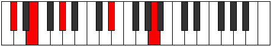 |
| SecondInversion | E,G#,D#,A,C# |  |
| ThirdInversion | G#,D#,A,C#,E |  |
| FourthInversion | D#,A,C#,E,G# |  |
## Modes

| Number | Mode | Tonic | Notes | Illustration |
|--------|------|-------|-------|--------------|
| [397](https://ianring.com/musictheory/scales/397) | [Epogitonic](ModeCSharpEpogitonic.md) | C# | C#, D#, E, G#, A, C# |  |
| [397](https://ianring.com/musictheory/scales/397) | [Epogitonic](ModeDFlatEpogitonic.md) | Db | Db, Eb, E, Ab, A, Db |  |
| [399](https://ianring.com/musictheory/scales/399) | [Zynimic](ModeCSharpZynimic.md) | C# | C#, D, Eb, Fb, G#, A, C# |  |
| [413](https://ianring.com/musictheory/scales/413) | [Ganimic](ModeCSharpGanimic.md) | C# | C#, D#, E, F, G#, A, C# |  |
| [419](https://ianring.com/musictheory/scales/419) | [Ionacritonic](ModeGSharpIonacritonic.md) | G# | G#, A, C#, D#, E, G# |  |
| [419](https://ianring.com/musictheory/scales/419) | [Ionacritonic](ModeAFlatIonacritonic.md) | Ab | Ab, A, Db, Eb, E, Ab |  |
| [423](https://ianring.com/musictheory/scales/423) | [Sogimic](ModeGSharpSogimic.md) | G# | G#, A, Bb, C#, D#, E, G# |  |
| [427](https://ianring.com/musictheory/scales/427) | [Zothimic](ModeGSharpZothimic.md) | G# | G#, A, B, C#, D#, E, G# | 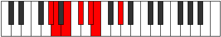 |
| [429](https://ianring.com/musictheory/scales/429) | [Koptimic](ModeCSharpKoptimic.md) | C# | C#, D#, E, F#, G#, A, C# |  |
| [431](https://ianring.com/musictheory/scales/431) | [Epyrian](ModeGSharpEpyrian.md) | G# | G#, A, Bb, Cb, Db, Eb, Fb, G# |  |
| [435](https://ianring.com/musictheory/scales/435) | [Ionolimic](ModeGSharpIonolimic.md) | G# | G#, A, B#, C#, D#, E, G# | 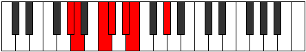 |
| [439](https://ianring.com/musictheory/scales/439) | [Bythian](ModeGSharpBythian.md) | G# | G#, A, Bb, C, Db, Eb, Fb, G# |  |
| [443](https://ianring.com/musictheory/scales/443) | [Kothian](ModeGSharpKothian.md) | G# | G#, A, B, C, Db, Eb, Fb, G# |  |
| [447](https://ianring.com/musictheory/scales/447) | [Thyphyllic](ModeCSharpThyphyllic.md) | C# | C#, D, D#, E, F, F#, G#, A, C# |  |
| [447](https://ianring.com/musictheory/scales/447) | [Thyphyllic](ModeDFlatThyphyllic.md) | Db | Db, D, Eb, E, F, Gb, Ab, A, Db |  |
| [447](https://ianring.com/musictheory/scales/447) | [Thyphyllic](ModeGSharpThyphyllic.md) | G# | G#, A, A#, B, C, C#, D#, E, G# |  |
| [447](https://ianring.com/musictheory/scales/447) | [Thyphyllic](ModeAFlatThyphyllic.md) | Ab | Ab, A, Bb, B, C, Db, Eb, E, Ab |  |
| [461](https://ianring.com/musictheory/scales/461) | [Madimic](ModeCSharpMadimic.md) | C# | C#, D#, E, F##, G#, A, C# |  |
| [479](https://ianring.com/musictheory/scales/479) | [Kocryllic](ModeCSharpKocryllic.md) | C# | C#, D, D#, E, F, G, G#, A, C# |  |
| [479](https://ianring.com/musictheory/scales/479) | [Kocryllic](ModeDFlatKocryllic.md) | Db | Db, D, Eb, E, F, G, Ab, A, Db |  |
| [483](https://ianring.com/musictheory/scales/483) | [Kygimic](ModeGSharpKygimic.md) | G# | G#, A, B##, C##, D#, E, G# |  |
| [487](https://ianring.com/musictheory/scales/487) | [Dynian](ModeGSharpDynian.md) | G# | G#, A, Bb, C#, D, Eb, Fb, G# |  |
| [491](https://ianring.com/musictheory/scales/491) | [Aeolyrian](ModeGSharpAeolyrian.md) | G# | G#, A, B, C#, D, Eb, Fb, G# |  |
| [495](https://ianring.com/musictheory/scales/495) | [Bocryllic](ModeCSharpBocryllic.md) | C# | C#, D, D#, E, F#, G, G#, A, C# |  |
| [495](https://ianring.com/musictheory/scales/495) | [Bocryllic](ModeDFlatBocryllic.md) | Db | Db, D, Eb, E, Gb, G, Ab, A, Db |  |
| [495](https://ianring.com/musictheory/scales/495) | [Bocryllic](ModeGSharpBocryllic.md) | G# | G#, A, A#, B, C#, D, D#, E, G# |  |
| [495](https://ianring.com/musictheory/scales/495) | [Bocryllic](ModeAFlatBocryllic.md) | Ab | Ab, A, Bb, B, Db, D, Eb, E, Ab |  |
| [499](https://ianring.com/musictheory/scales/499) | [Ionaptian](ModeGSharpIonaptian.md) | G# | G#, A, B#, C#, D, Eb, Fb, G# |  |
| [503](https://ianring.com/musictheory/scales/503) | [Thoptyllic](ModeGSharpThoptyllic.md) | G# | G#, A, A#, C, C#, D, D#, E, G# |  |
| [503](https://ianring.com/musictheory/scales/503) | [Thoptyllic](ModeAFlatThoptyllic.md) | Ab | Ab, A, Bb, C, Db, D, Eb, E, Ab |  |
| [507](https://ianring.com/musictheory/scales/507) | [Moryllic](ModeGSharpMoryllic.md) | G# | G#, A, B, C, C#, D, D#, E, G# |  |
| [507](https://ianring.com/musictheory/scales/507) | [Moryllic](ModeAFlatMoryllic.md) | Ab | Ab, A, B, C, Db, D, Eb, E, Ab |  |
| [509](https://ianring.com/musictheory/scales/509) | [Ionothyllic](ModeCSharpIonothyllic.md) | C# | C#, D#, E, F, F#, G, G#, A, C# |  |
| [509](https://ianring.com/musictheory/scales/509) | [Ionothyllic](ModeDFlatIonothyllic.md) | Db | Db, Eb, E, F, Gb, G, Ab, A, Db |  |
| [511](https://ianring.com/musictheory/scales/511) | [Polygic](ModeCSharpPolygic.md) | C# | C#, D, D#, E, F, F#, G, G#, A, C# |  |
| [511](https://ianring.com/musictheory/scales/511) | [Polygic](ModeDFlatPolygic.md) | Db | Db, D, Eb, E, F, Gb, G, Ab, A, Db |  |
| [511](https://ianring.com/musictheory/scales/511) | [Polygic](ModeGSharpPolygic.md) | G# | G#, A, A#, B, C, C#, D, D#, E, G# |  |
| [511](https://ianring.com/musictheory/scales/511) | [Polygic](ModeAFlatPolygic.md) | Ab | Ab, A, Bb, B, C, Db, D, Eb, E, Ab |  |
| [795](https://ianring.com/musictheory/scales/795) | [Aeologimic](ModeCNaturalAeologimic.md) | C | C, Db, Eb, Fb, G#, A, C |  |
| [831](https://ianring.com/musictheory/scales/831) | [Rodyllic](ModeCNaturalRodyllic.md) | C | C, C#, D, D#, E, F, G#, A, C |  |
| [863](https://ianring.com/musictheory/scales/863) | [Pyryllic](ModeCNaturalPyryllic.md) | C | C, C#, D, D#, E, F#, G#, A, C |  |
| [863](https://ianring.com/musictheory/scales/863) | [Pyryllic](ModeGNaturalPyryllic.md) | G | G, G#, A, A#, B, C#, D#, E, G |  |
| [879](https://ianring.com/musictheory/scales/879) | [Aeolocryllic](ModeGNaturalAeolocryllic.md) | G | G, G#, A, A#, C, C#, D#, E, G |  |
| [887](https://ianring.com/musictheory/scales/887) | [Sathyllic](ModeGNaturalSathyllic.md) | G | G, G#, A, B, C, C#, D#, E, G |  |
| [891](https://ianring.com/musictheory/scales/891) | [Ionilyllic](ModeCNaturalIonilyllic.md) | C | C, C#, D#, E, F, F#, G#, A, C |  |
| [895](https://ianring.com/musictheory/scales/895) | [Aeolathygic](ModeCNaturalAeolathygic.md) | C | C, C#, D, D#, E, F, F#, G#, A, C |  |
| [895](https://ianring.com/musictheory/scales/895) | [Aeolathygic](ModeGNaturalAeolathygic.md) | G | G, G#, A, A#, B, C, C#, D#, E, G |  |
| [909](https://ianring.com/musictheory/scales/909) | [Katarimic](ModeDFlatKatarimic.md) | Db | Db, Eb, Fb, G#, A, Bb, Db |  |
| [911](https://ianring.com/musictheory/scales/911) | [Radian](ModeCSharpRadian.md) | C# | C#, D, Eb, Fb, G#, A, Bb, C# |  |
| [925](https://ianring.com/musictheory/scales/925) | [Mythian](ModeCSharpMythian.md) | C# | C#, D#, E, F, G#, A, Bb, C# |  |
| [927](https://ianring.com/musictheory/scales/927) | [Koptyllic](ModeCNaturalKoptyllic.md) | C | C, C#, D, D#, E, G, G#, A, C |  |
| [927](https://ianring.com/musictheory/scales/927) | [Koptyllic](ModeCSharpKoptyllic.md) | C# | C#, D, D#, E, F, G#, A, A#, C# |  |
| [927](https://ianring.com/musictheory/scales/927) | [Koptyllic](ModeDFlatKoptyllic.md) | Db | Db, D, Eb, E, F, Ab, A, Bb, Db |  |
| [931](https://ianring.com/musictheory/scales/931) | [Bacrimic](ModeGSharpBacrimic.md) | G# | G#, A, B##, C###, D##, E#, G# |  |
| [935](https://ianring.com/musictheory/scales/935) | [Katarian](ModeGSharpKatarian.md) | G# | G#, A, Bb, C#, D#, E, F, G# |  |
| [939](https://ianring.com/musictheory/scales/939) | [Dyptian](ModeGSharpDyptian.md) | G# | G#, A, B, C#, D#, E, F, G# |  |
| [941](https://ianring.com/musictheory/scales/941) | [Phrorian](ModeCSharpPhrorian.md) | C# | C#, D#, E, F#, G#, A, Bb, C# |  |
| [943](https://ianring.com/musictheory/scales/943) | [Aerygyllic](ModeCSharpAerygyllic.md) | C# | C#, D, D#, E, F#, G#, A, A#, C# |  |
| [943](https://ianring.com/musictheory/scales/943) | [Aerygyllic](ModeDFlatAerygyllic.md) | Db | Db, D, Eb, E, Gb, Ab, A, Bb, Db |  |
| [943](https://ianring.com/musictheory/scales/943) | [Aerygyllic](ModeGSharpAerygyllic.md) | G# | G#, A, A#, B, C#, D#, E, F, G# |  |
| [943](https://ianring.com/musictheory/scales/943) | [Aerygyllic](ModeAFlatAerygyllic.md) | Ab | Ab, A, Bb, B, Db, Eb, E, F, Ab |  |
| [947](https://ianring.com/musictheory/scales/947) | [Modian](ModeGSharpModian.md) | G# | G#, A, B#, C#, D#, E, F, G# |  |
| [951](https://ianring.com/musictheory/scales/951) | [Thogyllic](ModeGSharpThogyllic.md) | G# | G#, A, A#, C, C#, D#, E, F, G# |  |
| [951](https://ianring.com/musictheory/scales/951) | [Thogyllic](ModeAFlatThogyllic.md) | Ab | Ab, A, Bb, C, Db, Eb, E, F, Ab |  |
| [955](https://ianring.com/musictheory/scales/955) | [Ionogyllic](ModeCNaturalIonogyllic.md) | C | C, C#, D#, E, F, G, G#, A, C |  |
| [955](https://ianring.com/musictheory/scales/955) | [Ionogyllic](ModeGSharpIonogyllic.md) | G# | G#, A, B, C, C#, D#, E, F, G# |  |
| [955](https://ianring.com/musictheory/scales/955) | [Ionogyllic](ModeAFlatIonogyllic.md) | Ab | Ab, A, B, C, Db, Eb, E, F, Ab |  |
| [957](https://ianring.com/musictheory/scales/957) | [Phronyllic](ModeCSharpPhronyllic.md) | C# | C#, D#, E, F, F#, G#, A, A#, C# |  |
| [957](https://ianring.com/musictheory/scales/957) | [Phronyllic](ModeDFlatPhronyllic.md) | Db | Db, Eb, E, F, Gb, Ab, A, Bb, Db |  |
| [959](https://ianring.com/musictheory/scales/959) | [Katylygic](ModeCNaturalKatylygic.md) | C | C, C#, D, D#, E, F, G, G#, A, C |  |
| [959](https://ianring.com/musictheory/scales/959) | [Katylygic](ModeCSharpKatylygic.md) | C# | C#, D, D#, E, F, F#, G#, A, A#, C# |  |
| [959](https://ianring.com/musictheory/scales/959) | [Katylygic](ModeDFlatKatylygic.md) | Db | Db, D, Eb, E, F, Gb, Ab, A, Bb, Db |  |
| [959](https://ianring.com/musictheory/scales/959) | [Katylygic](ModeGSharpKatylygic.md) | G# | G#, A, A#, B, C, C#, D#, E, F, G# |  |
| [959](https://ianring.com/musictheory/scales/959) | [Katylygic](ModeAFlatKatylygic.md) | Ab | Ab, A, Bb, B, C, Db, Eb, E, F, Ab |  |
| [973](https://ianring.com/musictheory/scales/973) | [Phryptian](ModeCSharpPhryptian.md) | C# | C#, D#, E, F##, G#, A, Bb, C# |  |
| [975](https://ianring.com/musictheory/scales/975) | [Katogyllic](ModeCSharpKatogyllic.md) | C# | C#, D, D#, E, G, G#, A, A#, C# |  |
| [975](https://ianring.com/musictheory/scales/975) | [Katogyllic](ModeDFlatKatogyllic.md) | Db | Db, D, Eb, E, G, Ab, A, Bb, Db |  |
| [975](https://ianring.com/musictheory/scales/975) | [Katogyllic](ModeGNaturalKatogyllic.md) | G | G, G#, A, A#, C#, D, D#, E, G |  |
| [983](https://ianring.com/musictheory/scales/983) | [Epygyllic](ModeGNaturalEpygyllic.md) | G | G, G#, A, B, C#, D, D#, E, G |  |
| [987](https://ianring.com/musictheory/scales/987) | [Aeraptyllic](ModeCNaturalAeraptyllic.md) | C | C, C#, D#, E, F#, G, G#, A, C |  |
| [989](https://ianring.com/musictheory/scales/989) | [Phrolyllic](ModeCSharpPhrolyllic.md) | C# | C#, D#, E, F, G, G#, A, A#, C# |  |
| [989](https://ianring.com/musictheory/scales/989) | [Phrolyllic](ModeDFlatPhrolyllic.md) | Db | Db, Eb, E, F, G, Ab, A, Bb, Db |  |
| [991](https://ianring.com/musictheory/scales/991) | [Aeolygic](ModeCNaturalAeolygic.md) | C | C, C#, D, D#, E, F#, G, G#, A, C |  |
| [991](https://ianring.com/musictheory/scales/991) | [Aeolygic](ModeCSharpAeolygic.md) | C# | C#, D, D#, E, F, G, G#, A, A#, C# |  |
| [991](https://ianring.com/musictheory/scales/991) | [Aeolygic](ModeDFlatAeolygic.md) | Db | Db, D, Eb, E, F, G, Ab, A, Bb, Db |  |
| [991](https://ianring.com/musictheory/scales/991) | [Aeolygic](ModeGNaturalAeolygic.md) | G | G, G#, A, A#, B, C#, D, D#, E, G |  |
| [995](https://ianring.com/musictheory/scales/995) | [Phrathian](ModeGSharpPhrathian.md) | G# | G#, A, B##, C##, D#, E, F, G# |  |
| [999](https://ianring.com/musictheory/scales/999) | [Bylyllic](ModeGNaturalBylyllic.md) | G | G, G#, A, C, C#, D, D#, E, G |  |
| [999](https://ianring.com/musictheory/scales/999) | [Bylyllic](ModeGSharpBylyllic.md) | G# | G#, A, A#, C#, D, D#, E, F, G# |  |
| [999](https://ianring.com/musictheory/scales/999) | [Bylyllic](ModeAFlatBylyllic.md) | Ab | Ab, A, Bb, Db, D, Eb, E, F, Ab |  |
| [1003](https://ianring.com/musictheory/scales/1003) | [Ionyryllic](ModeGSharpIonyryllic.md) | G# | G#, A, B, C#, D, D#, E, F, G# |  |
| [1003](https://ianring.com/musictheory/scales/1003) | [Ionyryllic](ModeAFlatIonyryllic.md) | Ab | Ab, A, B, Db, D, Eb, E, F, Ab |  |
| [1005](https://ianring.com/musictheory/scales/1005) | [Radyllic](ModeCSharpRadyllic.md) | C# | C#, D#, E, F#, G, G#, A, A#, C# |  |
| [1005](https://ianring.com/musictheory/scales/1005) | [Radyllic](ModeDFlatRadyllic.md) | Db | Db, Eb, E, Gb, G, Ab, A, Bb, Db | 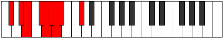 |
| [1007](https://ianring.com/musictheory/scales/1007) | [Ionycrygic](ModeGNaturalIonycrygic.md) | G | G, G#, A, A#, C, C#, D, D#, E, G |  |
| [1007](https://ianring.com/musictheory/scales/1007) | [Ionycrygic](ModeCSharpIonycrygic.md) | C# | C#, D, D#, E, F#, G, G#, A, A#, C# |  |
| [1007](https://ianring.com/musictheory/scales/1007) | [Ionycrygic](ModeDFlatIonycrygic.md) | Db | Db, D, Eb, E, Gb, G, Ab, A, Bb, Db |  |
| [1007](https://ianring.com/musictheory/scales/1007) | [Ionycrygic](ModeGSharpIonycrygic.md) | G# | G#, A, A#, B, C#, D, D#, E, F, G# |  |
| [1007](https://ianring.com/musictheory/scales/1007) | [Ionycrygic](ModeAFlatIonycrygic.md) | Ab | Ab, A, Bb, B, Db, D, Eb, E, F, Ab |  |
| [1011](https://ianring.com/musictheory/scales/1011) | [Kycryllic](ModeGSharpKycryllic.md) | G# | G#, A, C, C#, D, D#, E, F, G# |  |
| [1011](https://ianring.com/musictheory/scales/1011) | [Kycryllic](ModeAFlatKycryllic.md) | Ab | Ab, A, C, Db, D, Eb, E, F, Ab |  |
| [1015](https://ianring.com/musictheory/scales/1015) | [Ionodygic](ModeGSharpIonodygic.md) | G# | G#, A, A#, C, C#, D, D#, E, F, G# |  |
| [1015](https://ianring.com/musictheory/scales/1015) | [Ionodygic](ModeAFlatIonodygic.md) | Ab | Ab, A, Bb, C, Db, D, Eb, E, F, Ab |  |
| [1015](https://ianring.com/musictheory/scales/1015) | [Ionodygic](ModeGNaturalIonodygic.md) | G | G, G#, A, B, C, C#, D, D#, E, G |  |
| [1019](https://ianring.com/musictheory/scales/1019) | [Aeranygic](ModeCNaturalAeranygic.md) | C | C, C#, D#, E, F, F#, G, G#, A, C |  |
| [1019](https://ianring.com/musictheory/scales/1019) | [Aeranygic](ModeGSharpAeranygic.md) | G# | G#, A, B, C, C#, D, D#, E, F, G# |  |
| [1019](https://ianring.com/musictheory/scales/1019) | [Aeranygic](ModeAFlatAeranygic.md) | Ab | Ab, A, B, C, Db, D, Eb, E, F, Ab |  |
| [1021](https://ianring.com/musictheory/scales/1021) | [Ladygic](ModeCSharpLadygic.md) | C# | C#, D#, E, F, F#, G, G#, A, A#, C# |  |
| [1021](https://ianring.com/musictheory/scales/1021) | [Ladygic](ModeDFlatLadygic.md) | Db | Db, Eb, E, F, Gb, G, Ab, A, Bb, Db |  |
| [1023](https://ianring.com/musictheory/scales/1023) | [Dodyllian](ModeCNaturalDodyllian.md) | C | C, C#, D, D#, E, F, F#, G, G#, A, C |  |
| [1023](https://ianring.com/musictheory/scales/1023) | [Dodyllian](ModeCSharpDodyllian.md) | C# | C#, D, D#, E, F, F#, G, G#, A, A#, C# |  |
| [1023](https://ianring.com/musictheory/scales/1023) | [Dodyllian](ModeDFlatDodyllian.md) | Db | Db, D, Eb, E, F, Gb, G, Ab, A, Bb, Db |  |
| [1023](https://ianring.com/musictheory/scales/1023) | [Dodyllian](ModeGSharpDodyllian.md) | G# | G#, A, A#, B, C, C#, D, D#, E, F, G# |  |
| [1023](https://ianring.com/musictheory/scales/1023) | [Dodyllian](ModeAFlatDodyllian.md) | Ab | Ab, A, Bb, B, C, Db, D, Eb, E, F, Ab |  |
| [1023](https://ianring.com/musictheory/scales/1023) | [Dodyllian](ModeGNaturalDodyllian.md) | G | G, G#, A, A#, B, C, C#, D, D#, E, G |  |
| [1123](https://ianring.com/musictheory/scales/1123) | [Lanitonic](ModeDSharpLanitonic.md) | D# | D#, E, G#, A, C#, D# |  |
| [1123](https://ianring.com/musictheory/scales/1123) | [Lanitonic](ModeEFlatLanitonic.md) | Eb | Eb, E, Ab, A, Db, Eb |  |
| [1127](https://ianring.com/musictheory/scales/1127) | [Eparimic](ModeDSharpEparimic.md) | D# | D#, E, F, G#, A, B##, D# |  |
| [1131](https://ianring.com/musictheory/scales/1131) | [Thocrimic](ModeDSharpThocrimic.md) | D# | D#, E, F#, G#, A, B##, D# |  |
| [1139](https://ianring.com/musictheory/scales/1139) | [Aerygimic](ModeDSharpAerygimic.md) | D# | D#, E, F##, G#, A, B##, D# |  |
| [1151](https://ianring.com/musictheory/scales/1151) | [Mythyllic](ModeDSharpMythyllic.md) | D# | D#, E, F, F#, G, G#, A, C#, D# |  |
| [1151](https://ianring.com/musictheory/scales/1151) | [Mythyllic](ModeEFlatMythyllic.md) | Eb | Eb, E, F, Gb, G, Ab, A, Db, Eb |  |
| [1251](https://ianring.com/musictheory/scales/1251) | [Sylimic](ModeEFlatSylimic.md) | Eb | Eb, Fb, G#, A, Bb, C#, Eb |  |
| [1255](https://ianring.com/musictheory/scales/1255) | [Sogian](ModeDSharpSogian.md) | D# | D#, E, F, G#, A, Bb, C#, D# |  |
| [1259](https://ianring.com/musictheory/scales/1259) | [Stadian](ModeDSharpStadian.md) | D# | D#, E, F#, G#, A, Bb, C#, D# |  |
| [1263](https://ianring.com/musictheory/scales/1263) | [Stynyllic](ModeDSharpStynyllic.md) | D# | D#, E, F, F#, G#, A, A#, C#, D# |  |
| [1263](https://ianring.com/musictheory/scales/1263) | [Stynyllic](ModeEFlatStynyllic.md) | Eb | Eb, E, F, Gb, Ab, A, Bb, Db, Eb |  |
| [1267](https://ianring.com/musictheory/scales/1267) | [Katynian](ModeDSharpKatynian.md) | D# | D#, E, F##, G#, A, Bb, C#, D# |  |
| [1271](https://ianring.com/musictheory/scales/1271) | [Kolyllic](ModeDSharpKolyllic.md) | D# | D#, E, F, G, G#, A, A#, C#, D# |  |
| [1271](https://ianring.com/musictheory/scales/1271) | [Kolyllic](ModeEFlatKolyllic.md) | Eb | Eb, E, F, G, Ab, A, Bb, Db, Eb |  |
| [1275](https://ianring.com/musictheory/scales/1275) | [Stagyllic](ModeDSharpStagyllic.md) | D# | D#, E, F#, G, G#, A, A#, C#, D# |  |
| [1275](https://ianring.com/musictheory/scales/1275) | [Stagyllic](ModeEFlatStagyllic.md) | Eb | Eb, E, Gb, G, Ab, A, Bb, Db, Eb |  |
| [1279](https://ianring.com/musictheory/scales/1279) | [Sarygic](ModeDSharpSarygic.md) | D# | D#, E, F, F#, G, G#, A, A#, C#, D# |  |
| [1279](https://ianring.com/musictheory/scales/1279) | [Sarygic](ModeEFlatSarygic.md) | Eb | Eb, E, F, Gb, G, Ab, A, Bb, Db, Eb |  |
| [1379](https://ianring.com/musictheory/scales/1379) | [Kycrimic](ModeEFlatKycrimic.md) | Eb | Eb, Fb, G#, A, B, C#, Eb |  |
| [1383](https://ianring.com/musictheory/scales/1383) | [Pynian](ModeDSharpPynian.md) | D# | D#, E, F, G#, A, B, C#, D# |  |
| [1387](https://ianring.com/musictheory/scales/1387) | [Locrian](ModeDSharpLocrian.md) | D# | D#, E, F#, G#, A, B, C#, D# | 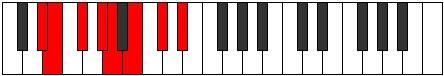 |
| [1391](https://ianring.com/musictheory/scales/1391) | [Aeradyllic](ModeDSharpAeradyllic.md) | D# | D#, E, F, F#, G#, A, B, C#, D# |  |
| [1391](https://ianring.com/musictheory/scales/1391) | [Aeradyllic](ModeEFlatAeradyllic.md) | Eb | Eb, E, F, Gb, Ab, A, B, Db, Eb |  |
| [1395](https://ianring.com/musictheory/scales/1395) | [Mixonorian](ModeDSharpMixonorian.md) | D# | D#, E, F##, G#, A, B, C#, D# |  |
| [1399](https://ianring.com/musictheory/scales/1399) | [Syryllic](ModeDSharpSyryllic.md) | D# | D#, E, F, G, G#, A, B, C#, D# |  |
| [1399](https://ianring.com/musictheory/scales/1399) | [Syryllic](ModeEFlatSyryllic.md) | Eb | Eb, E, F, G, Ab, A, B, Db, Eb |  |
| [1403](https://ianring.com/musictheory/scales/1403) | [Epinyllic](ModeDSharpEpinyllic.md) | D# | D#, E, F#, G, G#, A, B, C#, D# |  |
| [1403](https://ianring.com/musictheory/scales/1403) | [Epinyllic](ModeEFlatEpinyllic.md) | Eb | Eb, E, Gb, G, Ab, A, B, Db, Eb |  |
| [1407](https://ianring.com/musictheory/scales/1407) | [Tharygic](ModeDSharpTharygic.md) | D# | D#, E, F, F#, G, G#, A, B, C#, D# |  |
| [1407](https://ianring.com/musictheory/scales/1407) | [Tharygic](ModeEFlatTharygic.md) | Eb | Eb, E, F, Gb, G, Ab, A, B, Db, Eb |  |
| [1421](https://ianring.com/musictheory/scales/1421) | [Aeolaphimic](ModeDFlatAeolaphimic.md) | Db | Db, Eb, Fb, G#, A, B, Db |  |
| [1423](https://ianring.com/musictheory/scales/1423) | [Doptian](ModeCSharpDoptian.md) | C# | C#, D, Eb, Fb, G#, A, B, C# |  |
| [1437](https://ianring.com/musictheory/scales/1437) | [Aeolycrian](ModeCSharpAeolycrian.md) | C# | C#, D#, E, F, G#, A, B, C# |  |
| [1439](https://ianring.com/musictheory/scales/1439) | [Rolyllic](ModeCSharpRolyllic.md) | C# | C#, D, D#, E, F, G#, A, B, C# |  |
| [1439](https://ianring.com/musictheory/scales/1439) | [Rolyllic](ModeDFlatRolyllic.md) | Db | Db, D, Eb, E, F, Ab, A, B, Db |  |
| [1443](https://ianring.com/musictheory/scales/1443) | [Ionarimic](ModeGSharpIonarimic.md) | G# | G#, A, B##, C###, D##, E##, G# |  |
| [1447](https://ianring.com/musictheory/scales/1447) | [Mixopyrian](ModeGSharpMixopyrian.md) | G# | G#, A, Bb, C#, D#, E, F#, G# |  |
| [1451](https://ianring.com/musictheory/scales/1451) | [Phrygian](ModeGSharpPhrygian.md) | G# | G#, A, B, C#, D#, E, F#, G# |  |
| [1453](https://ianring.com/musictheory/scales/1453) | [Aeolian](ModeCSharpAeolian.md) | C# | C#, D#, E, F#, G#, A, B, C# |  |
| [1455](https://ianring.com/musictheory/scales/1455) | [Soryllic](ModeCSharpSoryllic.md) | C# | C#, D, D#, E, F#, G#, A, B, C# |  |
| [1455](https://ianring.com/musictheory/scales/1455) | [Soryllic](ModeDFlatSoryllic.md) | Db | Db, D, Eb, E, Gb, Ab, A, B, Db |  |
| [1455](https://ianring.com/musictheory/scales/1455) | [Soryllic](ModeGSharpSoryllic.md) | G# | G#, A, A#, B, C#, D#, E, F#, G# |  |
| [1455](https://ianring.com/musictheory/scales/1455) | [Soryllic](ModeAFlatSoryllic.md) | Ab | Ab, A, Bb, B, Db, Eb, E, Gb, Ab |  |
| [1459](https://ianring.com/musictheory/scales/1459) | [Ionalian](ModeGSharpIonalian.md) | G# | G#, A, B#, C#, D#, E, F#, G# |  |
| [1463](https://ianring.com/musictheory/scales/1463) | [Zaptyllic](ModeGSharpZaptyllic.md) | G# | G#, A, A#, C, C#, D#, E, F#, G# |  |
| [1463](https://ianring.com/musictheory/scales/1463) | [Zaptyllic](ModeAFlatZaptyllic.md) | Ab | Ab, A, Bb, C, Db, Eb, E, Gb, Ab |  |
| [1467](https://ianring.com/musictheory/scales/1467) | [Thydyllic](ModeGSharpThydyllic.md) | G# | G#, A, B, C, C#, D#, E, F#, G# |  |
| [1467](https://ianring.com/musictheory/scales/1467) | [Thydyllic](ModeAFlatThydyllic.md) | Ab | Ab, A, B, C, Db, Eb, E, Gb, Ab |  |
| [1469](https://ianring.com/musictheory/scales/1469) | [Epiryllic](ModeCSharpEpiryllic.md) | C# | C#, D#, E, F, F#, G#, A, B, C# |  |
| [1469](https://ianring.com/musictheory/scales/1469) | [Epiryllic](ModeDFlatEpiryllic.md) | Db | Db, Eb, E, F, Gb, Ab, A, B, Db |  |
| [1471](https://ianring.com/musictheory/scales/1471) | [Radygic](ModeCSharpRadygic.md) | C# | C#, D, D#, E, F, F#, G#, A, B, C# |  |
| [1471](https://ianring.com/musictheory/scales/1471) | [Radygic](ModeDFlatRadygic.md) | Db | Db, D, Eb, E, F, Gb, Ab, A, B, Db |  |
| [1471](https://ianring.com/musictheory/scales/1471) | [Radygic](ModeGSharpRadygic.md) | G# | G#, A, A#, B, C, C#, D#, E, F#, G# |  |
| [1471](https://ianring.com/musictheory/scales/1471) | [Radygic](ModeAFlatRadygic.md) | Ab | Ab, A, Bb, B, C, Db, Eb, E, Gb, Ab |  |
| [1485](https://ianring.com/musictheory/scales/1485) | [Tyrian](ModeCSharpTyrian.md) | C# | C#, D#, E, F##, G#, A, B, C# |  |
| [1487](https://ianring.com/musictheory/scales/1487) | [Lycryllic](ModeCSharpLycryllic.md) | C# | C#, D, D#, E, G, G#, A, B, C# |  |
| [1487](https://ianring.com/musictheory/scales/1487) | [Lycryllic](ModeDFlatLycryllic.md) | Db | Db, D, Eb, E, G, Ab, A, B, Db |  |
| [1501](https://ianring.com/musictheory/scales/1501) | [Stygyllic](ModeCSharpStygyllic.md) | C# | C#, D#, E, F, G, G#, A, B, C# |  |
| [1501](https://ianring.com/musictheory/scales/1501) | [Stygyllic](ModeDFlatStygyllic.md) | Db | Db, Eb, E, F, G, Ab, A, B, Db |  |
| [1503](https://ianring.com/musictheory/scales/1503) | [Padygic](ModeCSharpPadygic.md) | C# | C#, D, D#, E, F, G, G#, A, B, C# |  |
| [1503](https://ianring.com/musictheory/scales/1503) | [Padygic](ModeDFlatPadygic.md) | Db | Db, D, Eb, E, F, G, Ab, A, B, Db |  |
| [1507](https://ianring.com/musictheory/scales/1507) | [Zynian](ModeGSharpZynian.md) | G# | G#, A, B##, C##, D#, E, F#, G# |  |
| [1507](https://ianring.com/musictheory/scales/1507) | [Zynian](ModeEFlatZynian.md) | Eb | Eb, Fb, G#, A, Bb, Cb, Db, Eb |  |
| [1511](https://ianring.com/musictheory/scales/1511) | [Styptyllic](ModeGSharpStyptyllic.md) | G# | G#, A, A#, C#, D, D#, E, F#, G# |  |
| [1511](https://ianring.com/musictheory/scales/1511) | [Styptyllic](ModeAFlatStyptyllic.md) | Ab | Ab, A, Bb, Db, D, Eb, E, Gb, Ab |  |
| [1511](https://ianring.com/musictheory/scales/1511) | [Styptyllic](ModeDSharpStyptyllic.md) | D# | D#, E, F, G#, A, A#, B, C#, D# |  |
| [1511](https://ianring.com/musictheory/scales/1511) | [Styptyllic](ModeEFlatStyptyllic.md) | Eb | Eb, E, F, Ab, A, Bb, B, Db, Eb |  |
| [1515](https://ianring.com/musictheory/scales/1515) | [Solyllic](ModeGSharpSolyllic.md) | G# | G#, A, B, C#, D, D#, E, F#, G# |  |
| [1515](https://ianring.com/musictheory/scales/1515) | [Solyllic](ModeAFlatSolyllic.md) | Ab | Ab, A, B, Db, D, Eb, E, Gb, Ab |  |
| [1515](https://ianring.com/musictheory/scales/1515) | [Solyllic](ModeDSharpSolyllic.md) | D# | D#, E, F#, G#, A, A#, B, C#, D# |  |
| [1515](https://ianring.com/musictheory/scales/1515) | [Solyllic](ModeEFlatSolyllic.md) | Eb | Eb, E, Gb, Ab, A, Bb, B, Db, Eb |  |
| [1517](https://ianring.com/musictheory/scales/1517) | [Sagyllic](ModeCSharpSagyllic.md) | C# | C#, D#, E, F#, G, G#, A, B, C# |  |
| [1517](https://ianring.com/musictheory/scales/1517) | [Sagyllic](ModeDFlatSagyllic.md) | Db | Db, Eb, E, Gb, G, Ab, A, B, Db |  |
| [1519](https://ianring.com/musictheory/scales/1519) | [Solygic](ModeCSharpSolygic.md) | C# | C#, D, D#, E, F#, G, G#, A, B, C# |  |
| [1519](https://ianring.com/musictheory/scales/1519) | [Solygic](ModeDFlatSolygic.md) | Db | Db, D, Eb, E, Gb, G, Ab, A, B, Db |  |
| [1519](https://ianring.com/musictheory/scales/1519) | [Solygic](ModeGSharpSolygic.md) | G# | G#, A, A#, B, C#, D, D#, E, F#, G# |  |
| [1519](https://ianring.com/musictheory/scales/1519) | [Solygic](ModeAFlatSolygic.md) | Ab | Ab, A, Bb, B, Db, D, Eb, E, Gb, Ab |  |
| [1519](https://ianring.com/musictheory/scales/1519) | [Solygic](ModeDSharpSolygic.md) | D# | D#, E, F, F#, G#, A, A#, B, C#, D# |  |
| [1519](https://ianring.com/musictheory/scales/1519) | [Solygic](ModeEFlatSolygic.md) | Eb | Eb, E, F, Gb, Ab, A, Bb, B, Db, Eb |  |
| [1523](https://ianring.com/musictheory/scales/1523) | [Zothyllic](ModeGSharpZothyllic.md) | G# | G#, A, C, C#, D, D#, E, F#, G# |  |
| [1523](https://ianring.com/musictheory/scales/1523) | [Zothyllic](ModeAFlatZothyllic.md) | Ab | Ab, A, C, Db, D, Eb, E, Gb, Ab |  |
| [1523](https://ianring.com/musictheory/scales/1523) | [Zothyllic](ModeDSharpZothyllic.md) | D# | D#, E, G, G#, A, A#, B, C#, D# |  |
| [1523](https://ianring.com/musictheory/scales/1523) | [Zothyllic](ModeEFlatZothyllic.md) | Eb | Eb, E, G, Ab, A, Bb, B, Db, Eb |  |
| [1527](https://ianring.com/musictheory/scales/1527) | [Aeolyrygic](ModeGSharpAeolyrygic.md) | G# | G#, A, A#, C, C#, D, D#, E, F#, G# |  |
| [1527](https://ianring.com/musictheory/scales/1527) | [Aeolyrygic](ModeAFlatAeolyrygic.md) | Ab | Ab, A, Bb, C, Db, D, Eb, E, Gb, Ab |  |
| [1527](https://ianring.com/musictheory/scales/1527) | [Aeolyrygic](ModeDSharpAeolyrygic.md) | D# | D#, E, F, G, G#, A, A#, B, C#, D# |  |
| [1527](https://ianring.com/musictheory/scales/1527) | [Aeolyrygic](ModeEFlatAeolyrygic.md) | Eb | Eb, E, F, G, Ab, A, Bb, B, Db, Eb |  |
| [1531](https://ianring.com/musictheory/scales/1531) | [Styptygic](ModeGSharpStyptygic.md) | G# | G#, A, B, C, C#, D, D#, E, F#, G# |  |
| [1531](https://ianring.com/musictheory/scales/1531) | [Styptygic](ModeAFlatStyptygic.md) | Ab | Ab, A, B, C, Db, D, Eb, E, Gb, Ab |  |
| [1531](https://ianring.com/musictheory/scales/1531) | [Styptygic](ModeDSharpStyptygic.md) | D# | D#, E, F#, G, G#, A, A#, B, C#, D# |  |
| [1531](https://ianring.com/musictheory/scales/1531) | [Styptygic](ModeEFlatStyptygic.md) | Eb | Eb, E, Gb, G, Ab, A, Bb, B, Db, Eb |  |
| [1533](https://ianring.com/musictheory/scales/1533) | [Katycrygic](ModeCSharpKatycrygic.md) | C# | C#, D#, E, F, F#, G, G#, A, B, C# |  |
| [1533](https://ianring.com/musictheory/scales/1533) | [Katycrygic](ModeDFlatKatycrygic.md) | Db | Db, Eb, E, F, Gb, G, Ab, A, B, Db |  |
| [1535](https://ianring.com/musictheory/scales/1535) | [Mixodyllian](ModeCSharpMixodyllian.md) | C# | C#, D, D#, E, F, F#, G, G#, A, B, C# |  |
| [1535](https://ianring.com/musictheory/scales/1535) | [Mixodyllian](ModeDFlatMixodyllian.md) | Db | Db, D, Eb, E, F, Gb, G, Ab, A, B, Db |  |
| [1535](https://ianring.com/musictheory/scales/1535) | [Mixodyllian](ModeGSharpMixodyllian.md) | G# | G#, A, A#, B, C, C#, D, D#, E, F#, G# |  |
| [1535](https://ianring.com/musictheory/scales/1535) | [Mixodyllian](ModeAFlatMixodyllian.md) | Ab | Ab, A, Bb, B, C, Db, D, Eb, E, Gb, Ab |  |
| [1535](https://ianring.com/musictheory/scales/1535) | [Mixodyllian](ModeDSharpMixodyllian.md) | D# | D#, E, F, F#, G, G#, A, A#, B, C#, D# |  |
| [1535](https://ianring.com/musictheory/scales/1535) | [Mixodyllian](ModeEFlatMixodyllian.md) | Eb | Eb, E, F, Gb, G, Ab, A, Bb, B, Db, Eb |  |
| [1591](https://ianring.com/musictheory/scales/1591) | [Rodian](ModeBNaturalRodian.md) | B | B, C, Db, Eb, Fb, G#, A, B |  |
| [1597](https://ianring.com/musictheory/scales/1597) | [Aeolodian](ModeBNaturalAeolodian.md) | B | B, C#, D, Eb, Fb, G#, A, B |  |
| [1599](https://ianring.com/musictheory/scales/1599) | [Pocryllic](ModeBNaturalPocryllic.md) | B | B, C, C#, D, D#, E, G#, A, B |  |
| [1635](https://ianring.com/musictheory/scales/1635) | [Sygimic](ModeEFlatSygimic.md) | Eb | Eb, Fb, G#, A, B#, C#, Eb |  |
| [1639](https://ianring.com/musictheory/scales/1639) | [Aeolothian](ModeDSharpAeolothian.md) | D# | D#, E, F, G#, A, B#, C#, D# |  |
| [1643](https://ianring.com/musictheory/scales/1643) | [Thyptian](ModeDSharpThyptian.md) | D# | D#, E, F#, G#, A, B#, C#, D# |  |
| [1647](https://ianring.com/musictheory/scales/1647) | [Polyllic](ModeDSharpPolyllic.md) | D# | D#, E, F, F#, G#, A, C, C#, D# |  |
| [1647](https://ianring.com/musictheory/scales/1647) | [Polyllic](ModeEFlatPolyllic.md) | Eb | Eb, E, F, Gb, Ab, A, C, Db, Eb |  |
| [1651](https://ianring.com/musictheory/scales/1651) | [Mogian](ModeDSharpMogian.md) | D# | D#, E, F##, G#, A, B#, C#, D# |  |
| [1653](https://ianring.com/musictheory/scales/1653) | [Gylian](ModeBNaturalGylian.md) | B | B, C#, D#, E, F, G#, A, B |  |
| [1655](https://ianring.com/musictheory/scales/1655) | [Katygyllic](ModeDSharpKatygyllic.md) | D# | D#, E, F, G, G#, A, C, C#, D# |  |
| [1655](https://ianring.com/musictheory/scales/1655) | [Katygyllic](ModeEFlatKatygyllic.md) | Eb | Eb, E, F, G, Ab, A, C, Db, Eb |  |
| [1655](https://ianring.com/musictheory/scales/1655) | [Katygyllic](ModeBNaturalKatygyllic.md) | B | B, C, C#, D#, E, F, G#, A, B |  |
| [1659](https://ianring.com/musictheory/scales/1659) | [Magyllic](ModeDSharpMagyllic.md) | D# | D#, E, F#, G, G#, A, C, C#, D# |  |
| [1659](https://ianring.com/musictheory/scales/1659) | [Magyllic](ModeEFlatMagyllic.md) | Eb | Eb, E, Gb, G, Ab, A, C, Db, Eb |  |
| [1661](https://ianring.com/musictheory/scales/1661) | [Gonyllic](ModeBNaturalGonyllic.md) | B | B, C#, D, D#, E, F, G#, A, B |  |
| [1663](https://ianring.com/musictheory/scales/1663) | [Lydygic](ModeDSharpLydygic.md) | D# | D#, E, F, F#, G, G#, A, C, C#, D# |  |
| [1663](https://ianring.com/musictheory/scales/1663) | [Lydygic](ModeEFlatLydygic.md) | Eb | Eb, E, F, Gb, G, Ab, A, C, Db, Eb |  |
| [1663](https://ianring.com/musictheory/scales/1663) | [Lydygic](ModeBNaturalLydygic.md) | B | B, C, C#, D, D#, E, F, G#, A, B |  |
| [1677](https://ianring.com/musictheory/scales/1677) | [Danimic](ModeFSharpDanimic.md) | F# | F#, G#, A, B##, C###, D##, F# |  |
| [1693](https://ianring.com/musictheory/scales/1693) | [Dogian](ModeFSharpDogian.md) | F# | F#, G#, A, Bb, C#, D#, E, F# |  |
| [1695](https://ianring.com/musictheory/scales/1695) | [Phrodyllic](ModeFSharpPhrodyllic.md) | F# | F#, G, G#, A, A#, C#, D#, E, F# |  |
| [1695](https://ianring.com/musictheory/scales/1695) | [Phrodyllic](ModeGFlatPhrodyllic.md) | Gb | Gb, G, Ab, A, Bb, Db, Eb, E, Gb |  |
| [1709](https://ianring.com/musictheory/scales/1709) | [Dorian](ModeFSharpDorian.md) | F# | F#, G#, A, B, C#, D#, E, F# |  |
| [1711](https://ianring.com/musictheory/scales/1711) | [Ragyllic](ModeFSharpRagyllic.md) | F# | F#, G, G#, A, B, C#, D#, E, F# |  |
| [1711](https://ianring.com/musictheory/scales/1711) | [Ragyllic](ModeGFlatRagyllic.md) | Gb | Gb, G, Ab, A, B, Db, Eb, E, Gb |  |
| [1717](https://ianring.com/musictheory/scales/1717) | [Mixolydian](ModeBNaturalMixolydian.md) | B | B, C#, D#, E, F#, G#, A, B |  |
| [1719](https://ianring.com/musictheory/scales/1719) | [Lyryllic](ModeBNaturalLyryllic.md) | B | B, C, C#, D#, E, F#, G#, A, B |  |
| [1725](https://ianring.com/musictheory/scales/1725) | [Mixodyllic](ModeBNaturalMixodyllic.md) | B | B, C#, D, D#, E, F#, G#, A, B |  |
| [1725](https://ianring.com/musictheory/scales/1725) | [Mixodyllic](ModeFSharpMixodyllic.md) | F# | F#, G#, A, A#, B, C#, D#, E, F# |  |
| [1725](https://ianring.com/musictheory/scales/1725) | [Mixodyllic](ModeGFlatMixodyllic.md) | Gb | Gb, Ab, A, Bb, B, Db, Eb, E, Gb |  |
| [1727](https://ianring.com/musictheory/scales/1727) | [Sydygic](ModeBNaturalSydygic.md) | B | B, C, C#, D, D#, E, F#, G#, A, B |  |
| [1727](https://ianring.com/musictheory/scales/1727) | [Sydygic](ModeFSharpSydygic.md) | F# | F#, G, G#, A, A#, B, C#, D#, E, F# |  |
| [1727](https://ianring.com/musictheory/scales/1727) | [Sydygic](ModeGFlatSydygic.md) | Gb | Gb, G, Ab, A, Bb, B, Db, Eb, E, Gb |  |
| [1741](https://ianring.com/musictheory/scales/1741) | [Katycrian](ModeFSharpKatycrian.md) | F# | F#, G#, A, B#, C#, D#, E, F# |  |
| [1743](https://ianring.com/musictheory/scales/1743) | [Epigyllic](ModeFSharpEpigyllic.md) | F# | F#, G, G#, A, C, C#, D#, E, F# |  |
| [1743](https://ianring.com/musictheory/scales/1743) | [Epigyllic](ModeGFlatEpigyllic.md) | Gb | Gb, G, Ab, A, C, Db, Eb, E, Gb |  |
| [1757](https://ianring.com/musictheory/scales/1757) | [Ionyphyllic](ModeFSharpIonyphyllic.md) | F# | F#, G#, A, A#, C, C#, D#, E, F# |  |
| [1757](https://ianring.com/musictheory/scales/1757) | [Ionyphyllic](ModeGFlatIonyphyllic.md) | Gb | Gb, Ab, A, Bb, C, Db, Eb, E, Gb |  |
| [1759](https://ianring.com/musictheory/scales/1759) | [Pylygic](ModeFSharpPylygic.md) | F# | F#, G, G#, A, A#, C, C#, D#, E, F# |  |
| [1759](https://ianring.com/musictheory/scales/1759) | [Pylygic](ModeGFlatPylygic.md) | Gb | Gb, G, Ab, A, Bb, C, Db, Eb, E, Gb |  |
| [1763](https://ianring.com/musictheory/scales/1763) | [Katalian](ModeEFlatKatalian.md) | Eb | Eb, Fb, G#, A, Bb, C, Db, Eb |  |
| [1767](https://ianring.com/musictheory/scales/1767) | [Dyryllic](ModeDSharpDyryllic.md) | D# | D#, E, F, G#, A, A#, C, C#, D# |  |
| [1767](https://ianring.com/musictheory/scales/1767) | [Dyryllic](ModeEFlatDyryllic.md) | Eb | Eb, E, F, Ab, A, Bb, C, Db, Eb |  |
| [1771](https://ianring.com/musictheory/scales/1771) | [Stylyllic](ModeDSharpStylyllic.md) | D# | D#, E, F#, G#, A, A#, C, C#, D# |  |
| [1771](https://ianring.com/musictheory/scales/1771) | [Stylyllic](ModeEFlatStylyllic.md) | Eb | Eb, E, Gb, Ab, A, Bb, C, Db, Eb |  |
| [1773](https://ianring.com/musictheory/scales/1773) | [Aeoloryllic](ModeFSharpAeoloryllic.md) | F# | F#, G#, A, B, C, C#, D#, E, F# |  |
| [1773](https://ianring.com/musictheory/scales/1773) | [Aeoloryllic](ModeGFlatAeoloryllic.md) | Gb | Gb, Ab, A, B, C, Db, Eb, E, Gb |  |
| [1775](https://ianring.com/musictheory/scales/1775) | [Lyrygic](ModeDSharpLyrygic.md) | D# | D#, E, F, F#, G#, A, A#, C, C#, D# |  |
| [1775](https://ianring.com/musictheory/scales/1775) | [Lyrygic](ModeEFlatLyrygic.md) | Eb | Eb, E, F, Gb, Ab, A, Bb, C, Db, Eb | 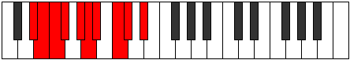 |
| [1775](https://ianring.com/musictheory/scales/1775) | [Lyrygic](ModeFSharpLyrygic.md) | F# | F#, G, G#, A, B, C, C#, D#, E, F# |  |
| [1775](https://ianring.com/musictheory/scales/1775) | [Lyrygic](ModeGFlatLyrygic.md) | Gb | Gb, G, Ab, A, B, C, Db, Eb, E, Gb |  |
| [1779](https://ianring.com/musictheory/scales/1779) | [Aerythyllic](ModeDSharpAerythyllic.md) | D# | D#, E, G, G#, A, A#, C, C#, D# |  |
| [1779](https://ianring.com/musictheory/scales/1779) | [Aerythyllic](ModeEFlatAerythyllic.md) | Eb | Eb, E, G, Ab, A, Bb, C, Db, Eb |  |
| [1781](https://ianring.com/musictheory/scales/1781) | [Gocryllic](ModeBNaturalGocryllic.md) | B | B, C#, D#, E, F, F#, G#, A, B |  |
| [1783](https://ianring.com/musictheory/scales/1783) | [Danygic](ModeDSharpDanygic.md) | D# | D#, E, F, G, G#, A, A#, C, C#, D# |  |
| [1783](https://ianring.com/musictheory/scales/1783) | [Danygic](ModeEFlatDanygic.md) | Eb | Eb, E, F, G, Ab, A, Bb, C, Db, Eb |  |
| [1783](https://ianring.com/musictheory/scales/1783) | [Danygic](ModeBNaturalDanygic.md) | B | B, C, C#, D#, E, F, F#, G#, A, B |  |
| [1787](https://ianring.com/musictheory/scales/1787) | [Mycrygic](ModeDSharpMycrygic.md) | D# | D#, E, F#, G, G#, A, A#, C, C#, D# |  |
| [1787](https://ianring.com/musictheory/scales/1787) | [Mycrygic](ModeEFlatMycrygic.md) | Eb | Eb, E, Gb, G, Ab, A, Bb, C, Db, Eb |  |
| [1789](https://ianring.com/musictheory/scales/1789) | [Katagygic](ModeBNaturalKatagygic.md) | B | B, C#, D, D#, E, F, F#, G#, A, B |  |
| [1789](https://ianring.com/musictheory/scales/1789) | [Katagygic](ModeFSharpKatagygic.md) | F# | F#, G#, A, A#, B, C, C#, D#, E, F# |  |
| [1789](https://ianring.com/musictheory/scales/1789) | [Katagygic](ModeGFlatKatagygic.md) | Gb | Gb, Ab, A, Bb, B, C, Db, Eb, E, Gb |  |
| [1791](https://ianring.com/musictheory/scales/1791) | [Aerygyllian](ModeDSharpAerygyllian.md) | D# | D#, E, F, F#, G, G#, A, A#, C, C#, D# |  |
| [1791](https://ianring.com/musictheory/scales/1791) | [Aerygyllian](ModeEFlatAerygyllian.md) | Eb | Eb, E, F, Gb, G, Ab, A, Bb, C, Db, Eb |  |
| [1791](https://ianring.com/musictheory/scales/1791) | [Aerygyllian](ModeBNaturalAerygyllian.md) | B | B, C, C#, D, D#, E, F, F#, G#, A, B |  |
| [1791](https://ianring.com/musictheory/scales/1791) | [Aerygyllian](ModeFSharpAerygyllian.md) | F# | F#, G, G#, A, A#, B, C, C#, D#, E, F# |  |
| [1791](https://ianring.com/musictheory/scales/1791) | [Aerygyllian](ModeGFlatAerygyllian.md) | Gb | Gb, G, Ab, A, Bb, B, C, Db, Eb, E, Gb |  |
| [1819](https://ianring.com/musictheory/scales/1819) | [Pydian](ModeCNaturalPydian.md) | C | C, Db, Eb, Fb, G#, A, Bb, C |  |
| [1823](https://ianring.com/musictheory/scales/1823) | [Phralyllic](ModeCNaturalPhralyllic.md) | C | C, C#, D, D#, E, G#, A, A#, C |  |
| [1845](https://ianring.com/musictheory/scales/1845) | [Lagian](ModeBNaturalLagian.md) | B | B, C#, D#, E, F##, G#, A, B |  |
| [1847](https://ianring.com/musictheory/scales/1847) | [Thacryllic](ModeBNaturalThacryllic.md) | B | B, C, C#, D#, E, G, G#, A, B |  |
| [1851](https://ianring.com/musictheory/scales/1851) | [Zacryllic](ModeCNaturalZacryllic.md) | C | C, C#, D#, E, F, G#, A, A#, C |  |
| [1853](https://ianring.com/musictheory/scales/1853) | [Phrynyllic](ModeBNaturalPhrynyllic.md) | B | B, C#, D, D#, E, G, G#, A, B |  |
| [1855](https://ianring.com/musictheory/scales/1855) | [Marygic](ModeCNaturalMarygic.md) | C | C, C#, D, D#, E, F, G#, A, A#, C |  |
| [1855](https://ianring.com/musictheory/scales/1855) | [Marygic](ModeBNaturalMarygic.md) | B | B, C, C#, D, D#, E, G, G#, A, B |  |
| [1871](https://ianring.com/musictheory/scales/1871) | [Aeolyllic](ModeGNaturalAeolyllic.md) | G | G, G#, A, A#, C#, D#, E, F, G |  |
| [1879](https://ianring.com/musictheory/scales/1879) | [Mixoryllic](ModeGNaturalMixoryllic.md) | G | G, G#, A, B, C#, D#, E, F, G |  |
| [1883](https://ianring.com/musictheory/scales/1883) | [Mixopyryllic](ModeCNaturalMixopyryllic.md) | C | C, C#, D#, E, F#, G#, A, A#, C |  |
| [1887](https://ianring.com/musictheory/scales/1887) | [Aerocrygic](ModeCNaturalAerocrygic.md) | C | C, C#, D, D#, E, F#, G#, A, A#, C |  |
| [1887](https://ianring.com/musictheory/scales/1887) | [Aerocrygic](ModeGNaturalAerocrygic.md) | G | G, G#, A, A#, B, C#, D#, E, F, G |  |
| [1891](https://ianring.com/musictheory/scales/1891) | [Thalian](ModeEFlatThalian.md) | Eb | Eb, Fb, G#, A, B, C, Db, Eb |  |
| [1895](https://ianring.com/musictheory/scales/1895) | [Salyllic](ModeGNaturalSalyllic.md) | G | G, G#, A, C, C#, D#, E, F, G |  |
| [1895](https://ianring.com/musictheory/scales/1895) | [Salyllic](ModeDSharpSalyllic.md) | D# | D#, E, F, G#, A, B, C, C#, D# |  |
| [1895](https://ianring.com/musictheory/scales/1895) | [Salyllic](ModeEFlatSalyllic.md) | Eb | Eb, E, F, Ab, A, B, C, Db, Eb |  |
| [1899](https://ianring.com/musictheory/scales/1899) | [Moptyllic](ModeDSharpMoptyllic.md) | D# | D#, E, F#, G#, A, B, C, C#, D# |  |
| [1899](https://ianring.com/musictheory/scales/1899) | [Moptyllic](ModeEFlatMoptyllic.md) | Eb | Eb, E, Gb, Ab, A, B, C, Db, Eb |  |
| [1903](https://ianring.com/musictheory/scales/1903) | [Rocrygic](ModeGNaturalRocrygic.md) | G | G, G#, A, A#, C, C#, D#, E, F, G |  |
| [1903](https://ianring.com/musictheory/scales/1903) | [Rocrygic](ModeDSharpRocrygic.md) | D# | D#, E, F, F#, G#, A, B, C, C#, D# |  |
| [1903](https://ianring.com/musictheory/scales/1903) | [Rocrygic](ModeEFlatRocrygic.md) | Eb | Eb, E, F, Gb, Ab, A, B, C, Db, Eb |  |
| [1907](https://ianring.com/musictheory/scales/1907) | [Lynyllic](ModeDSharpLynyllic.md) | D# | D#, E, G, G#, A, B, C, C#, D# |  |
| [1907](https://ianring.com/musictheory/scales/1907) | [Lynyllic](ModeEFlatLynyllic.md) | Eb | Eb, E, G, Ab, A, B, C, Db, Eb |  |
| [1909](https://ianring.com/musictheory/scales/1909) | [Epicryllic](ModeBNaturalEpicryllic.md) | B | B, C#, D#, E, F, G, G#, A, B |  |
| [1911](https://ianring.com/musictheory/scales/1911) | [Stynygic](ModeDSharpStynygic.md) | D# | D#, E, F, G, G#, A, B, C, C#, D# |  |
| [1911](https://ianring.com/musictheory/scales/1911) | [Stynygic](ModeEFlatStynygic.md) | Eb | Eb, E, F, G, Ab, A, B, C, Db, Eb |  |
| [1911](https://ianring.com/musictheory/scales/1911) | [Stynygic](ModeGNaturalStynygic.md) | G | G, G#, A, B, C, C#, D#, E, F, G |  |
| [1911](https://ianring.com/musictheory/scales/1911) | [Stynygic](ModeBNaturalStynygic.md) | B | B, C, C#, D#, E, F, G, G#, A, B |  |
| [1915](https://ianring.com/musictheory/scales/1915) | [Thydygic](ModeCNaturalThydygic.md) | C | C, C#, D#, E, F, F#, G#, A, A#, C |  |
| [1915](https://ianring.com/musictheory/scales/1915) | [Thydygic](ModeDSharpThydygic.md) | D# | D#, E, F#, G, G#, A, B, C, C#, D# |  |
| [1915](https://ianring.com/musictheory/scales/1915) | [Thydygic](ModeEFlatThydygic.md) | Eb | Eb, E, Gb, G, Ab, A, B, C, Db, Eb |  |
| [1917](https://ianring.com/musictheory/scales/1917) | [Sacrygic](ModeBNaturalSacrygic.md) | B | B, C#, D, D#, E, F, G, G#, A, B |  |
| [1919](https://ianring.com/musictheory/scales/1919) | [Rocryllian](ModeCNaturalRocryllian.md) | C | C, C#, D, D#, E, F, F#, G#, A, A#, C |  |
| [1919](https://ianring.com/musictheory/scales/1919) | [Rocryllian](ModeBNaturalRocryllian.md) | B | B, C, C#, D, D#, E, F, G, G#, A, B |  |
| [1919](https://ianring.com/musictheory/scales/1919) | [Rocryllian](ModeDSharpRocryllian.md) | D# | D#, E, F, F#, G, G#, A, B, C, C#, D# |  |
| [1919](https://ianring.com/musictheory/scales/1919) | [Rocryllian](ModeEFlatRocryllian.md) | Eb | Eb, E, F, Gb, G, Ab, A, B, C, Db, Eb |  |
| [1919](https://ianring.com/musictheory/scales/1919) | [Rocryllian](ModeGNaturalRocryllian.md) | G | G, G#, A, A#, B, C, C#, D#, E, F, G |  |
| [1933](https://ianring.com/musictheory/scales/1933) | [Mocrian](ModeFSharpMocrian.md) | F# | F#, G#, A, B##, C##, D#, E, F# |  |
| [1933](https://ianring.com/musictheory/scales/1933) | [Mocrian](ModeDFlatMocrian.md) | Db | Db, Eb, Fb, G#, A, Bb, Cb, Db |  |
| [1935](https://ianring.com/musictheory/scales/1935) | [Mycryllic](ModeFSharpMycryllic.md) | F# | F#, G, G#, A, C#, D, D#, E, F# |  |
| [1935](https://ianring.com/musictheory/scales/1935) | [Mycryllic](ModeGFlatMycryllic.md) | Gb | Gb, G, Ab, A, Db, D, Eb, E, Gb |  |
| [1935](https://ianring.com/musictheory/scales/1935) | [Mycryllic](ModeCSharpMycryllic.md) | C# | C#, D, D#, E, G#, A, A#, B, C# |  |
| [1935](https://ianring.com/musictheory/scales/1935) | [Mycryllic](ModeDFlatMycryllic.md) | Db | Db, D, Eb, E, Ab, A, Bb, B, Db |  |
| [1947](https://ianring.com/musictheory/scales/1947) | [Ionoyllic](ModeCNaturalIonoyllic.md) | C | C, C#, D#, E, G, G#, A, A#, C |  |
| [1949](https://ianring.com/musictheory/scales/1949) | [Mathyllic](ModeFSharpMathyllic.md) | F# | F#, G#, A, A#, C#, D, D#, E, F# |  |
| [1949](https://ianring.com/musictheory/scales/1949) | [Mathyllic](ModeGFlatMathyllic.md) | Gb | Gb, Ab, A, Bb, Db, D, Eb, E, Gb |  |
| [1949](https://ianring.com/musictheory/scales/1949) | [Mathyllic](ModeCSharpMathyllic.md) | C# | C#, D#, E, F, G#, A, A#, B, C# |  |
| [1949](https://ianring.com/musictheory/scales/1949) | [Mathyllic](ModeDFlatMathyllic.md) | Db | Db, Eb, E, F, Ab, A, Bb, B, Db |  |
| [1951](https://ianring.com/musictheory/scales/1951) | [Gonygic](ModeCNaturalGonygic.md) | C | C, C#, D, D#, E, G, G#, A, A#, C |  |
| [1951](https://ianring.com/musictheory/scales/1951) | [Gonygic](ModeFSharpGonygic.md) | F# | F#, G, G#, A, A#, C#, D, D#, E, F# |  |
| [1951](https://ianring.com/musictheory/scales/1951) | [Gonygic](ModeGFlatGonygic.md) | Gb | Gb, G, Ab, A, Bb, Db, D, Eb, E, Gb | 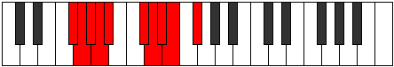 |
| [1951](https://ianring.com/musictheory/scales/1951) | [Gonygic](ModeCSharpGonygic.md) | C# | C#, D, D#, E, F, G#, A, A#, B, C# |  |
| [1951](https://ianring.com/musictheory/scales/1951) | [Gonygic](ModeDFlatGonygic.md) | Db | Db, D, Eb, E, F, Ab, A, Bb, B, Db |  |
| [1955](https://ianring.com/musictheory/scales/1955) | [Sonian](ModeGSharpSonian.md) | G# | G#, A, B##, C###, D##, E#, F#, G# |  |
| [1959](https://ianring.com/musictheory/scales/1959) | [Katolyllic](ModeGSharpKatolyllic.md) | G# | G#, A, A#, C#, D#, E, F, F#, G# |  |
| [1959](https://ianring.com/musictheory/scales/1959) | [Katolyllic](ModeAFlatKatolyllic.md) | Ab | Ab, A, Bb, Db, Eb, E, F, Gb, Ab |  |
| [1963](https://ianring.com/musictheory/scales/1963) | [Epocryllic](ModeGSharpEpocryllic.md) | G# | G#, A, B, C#, D#, E, F, F#, G# |  |
| [1963](https://ianring.com/musictheory/scales/1963) | [Epocryllic](ModeAFlatEpocryllic.md) | Ab | Ab, A, B, Db, Eb, E, F, Gb, Ab |  |
| [1965](https://ianring.com/musictheory/scales/1965) | [Gadyllic](ModeFSharpGadyllic.md) | F# | F#, G#, A, B, C#, D, D#, E, F# |  |
| [1965](https://ianring.com/musictheory/scales/1965) | [Gadyllic](ModeGFlatGadyllic.md) | Gb | Gb, Ab, A, B, Db, D, Eb, E, Gb |  |
| [1965](https://ianring.com/musictheory/scales/1965) | [Gadyllic](ModeCSharpGadyllic.md) | C# | C#, D#, E, F#, G#, A, A#, B, C# |  |
| [1965](https://ianring.com/musictheory/scales/1965) | [Gadyllic](ModeDFlatGadyllic.md) | Db | Db, Eb, E, Gb, Ab, A, Bb, B, Db |  |
| [1967](https://ianring.com/musictheory/scales/1967) | [Godygic](ModeFSharpGodygic.md) | F# | F#, G, G#, A, B, C#, D, D#, E, F# |  |
| [1967](https://ianring.com/musictheory/scales/1967) | [Godygic](ModeGFlatGodygic.md) | Gb | Gb, G, Ab, A, B, Db, D, Eb, E, Gb |  |
| [1967](https://ianring.com/musictheory/scales/1967) | [Godygic](ModeCSharpGodygic.md) | C# | C#, D, D#, E, F#, G#, A, A#, B, C# |  |
| [1967](https://ianring.com/musictheory/scales/1967) | [Godygic](ModeDFlatGodygic.md) | Db | Db, D, Eb, E, Gb, Ab, A, Bb, B, Db |  |
| [1967](https://ianring.com/musictheory/scales/1967) | [Godygic](ModeGSharpGodygic.md) | G# | G#, A, A#, B, C#, D#, E, F, F#, G# |  |
| [1967](https://ianring.com/musictheory/scales/1967) | [Godygic](ModeAFlatGodygic.md) | Ab | Ab, A, Bb, B, Db, Eb, E, F, Gb, Ab |  |
| [1971](https://ianring.com/musictheory/scales/1971) | [Aerynyllic](ModeGSharpAerynyllic.md) | G# | G#, A, C, C#, D#, E, F, F#, G# |  |
| [1971](https://ianring.com/musictheory/scales/1971) | [Aerynyllic](ModeAFlatAerynyllic.md) | Ab | Ab, A, C, Db, Eb, E, F, Gb, Ab |  |
| [1973](https://ianring.com/musictheory/scales/1973) | [Zyryllic](ModeBNaturalZyryllic.md) | B | B, C#, D#, E, F#, G, G#, A, B |  |
| [1975](https://ianring.com/musictheory/scales/1975) | [Ionocrygic](ModeGSharpIonocrygic.md) | G# | G#, A, A#, C, C#, D#, E, F, F#, G# |  |
| [1975](https://ianring.com/musictheory/scales/1975) | [Ionocrygic](ModeAFlatIonocrygic.md) | Ab | Ab, A, Bb, C, Db, Eb, E, F, Gb, Ab |  |
| [1975](https://ianring.com/musictheory/scales/1975) | [Ionocrygic](ModeBNaturalIonocrygic.md) | B | B, C, C#, D#, E, F#, G, G#, A, B |  |
| [1979](https://ianring.com/musictheory/scales/1979) | [Aeradygic](ModeCNaturalAeradygic.md) | C | C, C#, D#, E, F, G, G#, A, A#, C |  |
| [1979](https://ianring.com/musictheory/scales/1979) | [Aeradygic](ModeGSharpAeradygic.md) | G# | G#, A, B, C, C#, D#, E, F, F#, G# |  |
| [1979](https://ianring.com/musictheory/scales/1979) | [Aeradygic](ModeAFlatAeradygic.md) | Ab | Ab, A, B, C, Db, Eb, E, F, Gb, Ab |  |
| [1981](https://ianring.com/musictheory/scales/1981) | [Gadygic](ModeBNaturalGadygic.md) | B | B, C#, D, D#, E, F#, G, G#, A, B |  |
| [1981](https://ianring.com/musictheory/scales/1981) | [Gadygic](ModeFSharpGadygic.md) | F# | F#, G#, A, A#, B, C#, D, D#, E, F# |  |
| [1981](https://ianring.com/musictheory/scales/1981) | [Gadygic](ModeGFlatGadygic.md) | Gb | Gb, Ab, A, Bb, B, Db, D, Eb, E, Gb |  |
| [1981](https://ianring.com/musictheory/scales/1981) | [Gadygic](ModeCSharpGadygic.md) | C# | C#, D#, E, F, F#, G#, A, A#, B, C# |  |
| [1981](https://ianring.com/musictheory/scales/1981) | [Gadygic](ModeDFlatGadygic.md) | Db | Db, Eb, E, F, Gb, Ab, A, Bb, B, Db |  |
| [1983](https://ianring.com/musictheory/scales/1983) | [Soryllian](ModeCNaturalSoryllian.md) | C | C, C#, D, D#, E, F, G, G#, A, A#, C |  |
| [1983](https://ianring.com/musictheory/scales/1983) | [Soryllian](ModeBNaturalSoryllian.md) | B | B, C, C#, D, D#, E, F#, G, G#, A, B |  |
| [1983](https://ianring.com/musictheory/scales/1983) | [Soryllian](ModeGSharpSoryllian.md) | G# | G#, A, A#, B, C, C#, D#, E, F, F#, G# |  |
| [1983](https://ianring.com/musictheory/scales/1983) | [Soryllian](ModeAFlatSoryllian.md) | Ab | Ab, A, Bb, B, C, Db, Eb, E, F, Gb, Ab |  |
| [1983](https://ianring.com/musictheory/scales/1983) | [Soryllian](ModeCSharpSoryllian.md) | C# | C#, D, D#, E, F, F#, G#, A, A#, B, C# |  |
| [1983](https://ianring.com/musictheory/scales/1983) | [Soryllian](ModeDFlatSoryllian.md) | Db | Db, D, Eb, E, F, Gb, Ab, A, Bb, B, Db |  |
| [1983](https://ianring.com/musictheory/scales/1983) | [Soryllian](ModeFSharpSoryllian.md) | F# | F#, G, G#, A, A#, B, C#, D, D#, E, F# |  |
| [1983](https://ianring.com/musictheory/scales/1983) | [Soryllian](ModeGFlatSoryllian.md) | Gb | Gb, G, Ab, A, Bb, B, Db, D, Eb, E, Gb |  |
| [1991](https://ianring.com/musictheory/scales/1991) | [Phryptyllic](ModeGNaturalPhryptyllic.md) | G | G, G#, A, C#, D, D#, E, F, G |  |
| [1997](https://ianring.com/musictheory/scales/1997) | [Staryllic](ModeFSharpStaryllic.md) | F# | F#, G#, A, C, C#, D, D#, E, F# |  |
| [1997](https://ianring.com/musictheory/scales/1997) | [Staryllic](ModeGFlatStaryllic.md) | Gb | Gb, Ab, A, C, Db, D, Eb, E, Gb |  |
| [1997](https://ianring.com/musictheory/scales/1997) | [Staryllic](ModeCSharpStaryllic.md) | C# | C#, D#, E, G, G#, A, A#, B, C# |  |
| [1997](https://ianring.com/musictheory/scales/1997) | [Staryllic](ModeDFlatStaryllic.md) | Db | Db, Eb, E, G, Ab, A, Bb, B, Db |  |
| [1999](https://ianring.com/musictheory/scales/1999) | [Zacrygic](ModeFSharpZacrygic.md) | F# | F#, G, G#, A, C, C#, D, D#, E, F# | 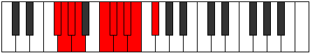 |
| [1999](https://ianring.com/musictheory/scales/1999) | [Zacrygic](ModeGFlatZacrygic.md) | Gb | Gb, G, Ab, A, C, Db, D, Eb, E, Gb |  |
| [1999](https://ianring.com/musictheory/scales/1999) | [Zacrygic](ModeGNaturalZacrygic.md) | G | G, G#, A, A#, C#, D, D#, E, F, G |  |
| [1999](https://ianring.com/musictheory/scales/1999) | [Zacrygic](ModeCSharpZacrygic.md) | C# | C#, D, D#, E, G, G#, A, A#, B, C# |  |
| [1999](https://ianring.com/musictheory/scales/1999) | [Zacrygic](ModeDFlatZacrygic.md) | Db | Db, D, Eb, E, G, Ab, A, Bb, B, Db |  |
| [2007](https://ianring.com/musictheory/scales/2007) | [Stonygic](ModeGNaturalStonygic.md) | G | G, G#, A, B, C#, D, D#, E, F, G |  |
| [2011](https://ianring.com/musictheory/scales/2011) | [Raphygic](ModeCNaturalRaphygic.md) | C | C, C#, D#, E, F#, G, G#, A, A#, C |  |
| [2013](https://ianring.com/musictheory/scales/2013) | [Mocrygic](ModeFSharpMocrygic.md) | F# | F#, G#, A, A#, C, C#, D, D#, E, F# |  |
| [2013](https://ianring.com/musictheory/scales/2013) | [Mocrygic](ModeGFlatMocrygic.md) | Gb | Gb, Ab, A, Bb, C, Db, D, Eb, E, Gb |  |
| [2013](https://ianring.com/musictheory/scales/2013) | [Mocrygic](ModeCSharpMocrygic.md) | C# | C#, D#, E, F, G, G#, A, A#, B, C# |  |
| [2013](https://ianring.com/musictheory/scales/2013) | [Mocrygic](ModeDFlatMocrygic.md) | Db | Db, Eb, E, F, G, Ab, A, Bb, B, Db |  |
| [2015](https://ianring.com/musictheory/scales/2015) | [Epiryllian](ModeCNaturalEpiryllian.md) | C | C, C#, D, D#, E, F#, G, G#, A, A#, C |  |
| [2015](https://ianring.com/musictheory/scales/2015) | [Epiryllian](ModeFSharpEpiryllian.md) | F# | F#, G, G#, A, A#, C, C#, D, D#, E, F# |  |
| [2015](https://ianring.com/musictheory/scales/2015) | [Epiryllian](ModeGFlatEpiryllian.md) | Gb | Gb, G, Ab, A, Bb, C, Db, D, Eb, E, Gb |  |
| [2015](https://ianring.com/musictheory/scales/2015) | [Epiryllian](ModeCSharpEpiryllian.md) | C# | C#, D, D#, E, F, G, G#, A, A#, B, C# |  |
| [2015](https://ianring.com/musictheory/scales/2015) | [Epiryllian](ModeDFlatEpiryllian.md) | Db | Db, D, Eb, E, F, G, Ab, A, Bb, B, Db |  |
| [2015](https://ianring.com/musictheory/scales/2015) | [Epiryllian](ModeGNaturalEpiryllian.md) | G | G, G#, A, A#, B, C#, D, D#, E, F, G |  |
| [2019](https://ianring.com/musictheory/scales/2019) | [Palyllic](ModeGSharpPalyllic.md) | G# | G#, A, C#, D, D#, E, F, F#, G# |  |
| [2019](https://ianring.com/musictheory/scales/2019) | [Palyllic](ModeAFlatPalyllic.md) | Ab | Ab, A, Db, D, Eb, E, F, Gb, Ab |  |
| [2019](https://ianring.com/musictheory/scales/2019) | [Palyllic](ModeDSharpPalyllic.md) | D# | D#, E, G#, A, A#, B, C, C#, D# |  |
| [2019](https://ianring.com/musictheory/scales/2019) | [Palyllic](ModeEFlatPalyllic.md) | Eb | Eb, E, Ab, A, Bb, B, C, Db, Eb |  |
| [2023](https://ianring.com/musictheory/scales/2023) | [Zodygic](ModeGNaturalZodygic.md) | G | G, G#, A, C, C#, D, D#, E, F, G |  |
| [2023](https://ianring.com/musictheory/scales/2023) | [Zodygic](ModeGSharpZodygic.md) | G# | G#, A, A#, C#, D, D#, E, F, F#, G# |  |
| [2023](https://ianring.com/musictheory/scales/2023) | [Zodygic](ModeAFlatZodygic.md) | Ab | Ab, A, Bb, Db, D, Eb, E, F, Gb, Ab |  |
| [2023](https://ianring.com/musictheory/scales/2023) | [Zodygic](ModeDSharpZodygic.md) | D# | D#, E, F, G#, A, A#, B, C, C#, D# |  |
| [2023](https://ianring.com/musictheory/scales/2023) | [Zodygic](ModeEFlatZodygic.md) | Eb | Eb, E, F, Ab, A, Bb, B, C, Db, Eb |  |
| [2027](https://ianring.com/musictheory/scales/2027) | [Boptygic](ModeGSharpBoptygic.md) | G# | G#, A, B, C#, D, D#, E, F, F#, G# |  |
| [2027](https://ianring.com/musictheory/scales/2027) | [Boptygic](ModeAFlatBoptygic.md) | Ab | Ab, A, B, Db, D, Eb, E, F, Gb, Ab |  |
| [2027](https://ianring.com/musictheory/scales/2027) | [Boptygic](ModeDSharpBoptygic.md) | D# | D#, E, F#, G#, A, A#, B, C, C#, D# |  |
| [2027](https://ianring.com/musictheory/scales/2027) | [Boptygic](ModeEFlatBoptygic.md) | Eb | Eb, E, Gb, Ab, A, Bb, B, C, Db, Eb |  |
| [2029](https://ianring.com/musictheory/scales/2029) | [Mathygic](ModeFSharpMathygic.md) | F# | F#, G#, A, B, C, C#, D, D#, E, F# |  |
| [2029](https://ianring.com/musictheory/scales/2029) | [Mathygic](ModeGFlatMathygic.md) | Gb | Gb, Ab, A, B, C, Db, D, Eb, E, Gb |  |
| [2029](https://ianring.com/musictheory/scales/2029) | [Mathygic](ModeCSharpMathygic.md) | C# | C#, D#, E, F#, G, G#, A, A#, B, C# |  |
| [2029](https://ianring.com/musictheory/scales/2029) | [Mathygic](ModeDFlatMathygic.md) | Db | Db, Eb, E, Gb, G, Ab, A, Bb, B, Db |  |
| [2031](https://ianring.com/musictheory/scales/2031) | [Gadyllian](ModeGNaturalGadyllian.md) | G | G, G#, A, A#, C, C#, D, D#, E, F, G |  |
| [2031](https://ianring.com/musictheory/scales/2031) | [Gadyllian](ModeFSharpGadyllian.md) | F# | F#, G, G#, A, B, C, C#, D, D#, E, F# |  |
| [2031](https://ianring.com/musictheory/scales/2031) | [Gadyllian](ModeGFlatGadyllian.md) | Gb | Gb, G, Ab, A, B, C, Db, D, Eb, E, Gb |  |
| [2031](https://ianring.com/musictheory/scales/2031) | [Gadyllian](ModeDSharpGadyllian.md) | D# | D#, E, F, F#, G#, A, A#, B, C, C#, D# |  |
| [2031](https://ianring.com/musictheory/scales/2031) | [Gadyllian](ModeEFlatGadyllian.md) | Eb | Eb, E, F, Gb, Ab, A, Bb, B, C, Db, Eb |  |
| [2031](https://ianring.com/musictheory/scales/2031) | [Gadyllian](ModeGSharpGadyllian.md) | G# | G#, A, A#, B, C#, D, D#, E, F, F#, G# |  |
| [2031](https://ianring.com/musictheory/scales/2031) | [Gadyllian](ModeAFlatGadyllian.md) | Ab | Ab, A, Bb, B, Db, D, Eb, E, F, Gb, Ab |  |
| [2031](https://ianring.com/musictheory/scales/2031) | [Gadyllian](ModeCSharpGadyllian.md) | C# | C#, D, D#, E, F#, G, G#, A, A#, B, C# |  |
| [2031](https://ianring.com/musictheory/scales/2031) | [Gadyllian](ModeDFlatGadyllian.md) | Db | Db, D, Eb, E, Gb, G, Ab, A, Bb, B, Db |  |
| [2035](https://ianring.com/musictheory/scales/2035) | [Aerythygic](ModeGSharpAerythygic.md) | G# | G#, A, C, C#, D, D#, E, F, F#, G# |  |
| [2035](https://ianring.com/musictheory/scales/2035) | [Aerythygic](ModeAFlatAerythygic.md) | Ab | Ab, A, C, Db, D, Eb, E, F, Gb, Ab |  |
| [2035](https://ianring.com/musictheory/scales/2035) | [Aerythygic](ModeDSharpAerythygic.md) | D# | D#, E, G, G#, A, A#, B, C, C#, D# |  |
| [2035](https://ianring.com/musictheory/scales/2035) | [Aerythygic](ModeEFlatAerythygic.md) | Eb | Eb, E, G, Ab, A, Bb, B, C, Db, Eb |  |
| [2037](https://ianring.com/musictheory/scales/2037) | [Sythygic](ModeBNaturalSythygic.md) | B | B, C#, D#, E, F, F#, G, G#, A, B |  |
| [2039](https://ianring.com/musictheory/scales/2039) | [Danyllian](ModeGSharpDanyllian.md) | G# | G#, A, A#, C, C#, D, D#, E, F, F#, G# |  |
| [2039](https://ianring.com/musictheory/scales/2039) | [Danyllian](ModeAFlatDanyllian.md) | Ab | Ab, A, Bb, C, Db, D, Eb, E, F, Gb, Ab |  |
| [2039](https://ianring.com/musictheory/scales/2039) | [Danyllian](ModeGNaturalDanyllian.md) | G | G, G#, A, B, C, C#, D, D#, E, F, G |  |
| [2039](https://ianring.com/musictheory/scales/2039) | [Danyllian](ModeBNaturalDanyllian.md) | B | B, C, C#, D#, E, F, F#, G, G#, A, B |  |
| [2039](https://ianring.com/musictheory/scales/2039) | [Danyllian](ModeDSharpDanyllian.md) | D# | D#, E, F, G, G#, A, A#, B, C, C#, D# |  |
| [2039](https://ianring.com/musictheory/scales/2039) | [Danyllian](ModeEFlatDanyllian.md) | Eb | Eb, E, F, G, Ab, A, Bb, B, C, Db, Eb |  |
| [2043](https://ianring.com/musictheory/scales/2043) | [Lythyllian](ModeCNaturalLythyllian.md) | C | C, C#, D#, E, F, F#, G, G#, A, A#, C |  |
| [2043](https://ianring.com/musictheory/scales/2043) | [Lythyllian](ModeGSharpLythyllian.md) | G# | G#, A, B, C, C#, D, D#, E, F, F#, G# |  |
| [2043](https://ianring.com/musictheory/scales/2043) | [Lythyllian](ModeAFlatLythyllian.md) | Ab | Ab, A, B, C, Db, D, Eb, E, F, Gb, Ab |  |
| [2043](https://ianring.com/musictheory/scales/2043) | [Lythyllian](ModeDSharpLythyllian.md) | D# | D#, E, F#, G, G#, A, A#, B, C, C#, D# |  |
| [2043](https://ianring.com/musictheory/scales/2043) | [Lythyllian](ModeEFlatLythyllian.md) | Eb | Eb, E, Gb, G, Ab, A, Bb, B, C, Db, Eb |  |
| [2045](https://ianring.com/musictheory/scales/2045) | [Katogyllian](ModeBNaturalKatogyllian.md) | B | B, C#, D, D#, E, F, F#, G, G#, A, B |  |
| [2045](https://ianring.com/musictheory/scales/2045) | [Katogyllian](ModeFSharpKatogyllian.md) | F# | F#, G#, A, A#, B, C, C#, D, D#, E, F# |  |
| [2045](https://ianring.com/musictheory/scales/2045) | [Katogyllian](ModeGFlatKatogyllian.md) | Gb | Gb, Ab, A, Bb, B, C, Db, D, Eb, E, Gb |  |
| [2045](https://ianring.com/musictheory/scales/2045) | [Katogyllian](ModeCSharpKatogyllian.md) | C# | C#, D#, E, F, F#, G, G#, A, A#, B, C# |  |
| [2045](https://ianring.com/musictheory/scales/2045) | [Katogyllian](ModeDFlatKatogyllian.md) | Db | Db, Eb, E, F, Gb, G, Ab, A, Bb, B, Db |  |
| [2047](https://ianring.com/musictheory/scales/2047) | [Monatic](ModeCNaturalMonatic.md) | C | C, C#, D, D#, E, F, F#, G, G#, A, A#, C |  |
| [2047](https://ianring.com/musictheory/scales/2047) | [Monatic](ModeBNaturalMonatic.md) | B | B, C, C#, D, D#, E, F, F#, G, G#, A, B |  |
| [2047](https://ianring.com/musictheory/scales/2047) | [Monatic](ModeGSharpMonatic.md) | G# | G#, A, A#, B, C, C#, D, D#, E, F, F#, G# |  |
| [2047](https://ianring.com/musictheory/scales/2047) | [Monatic](ModeAFlatMonatic.md) | Ab | Ab, A, Bb, B, C, Db, D, Eb, E, F, Gb, Ab |  |
| [2047](https://ianring.com/musictheory/scales/2047) | [Monatic](ModeGNaturalMonatic.md) | G | G, G#, A, A#, B, C, C#, D, D#, E, F, G |  |
| [2047](https://ianring.com/musictheory/scales/2047) | [Monatic](ModeFSharpMonatic.md) | F# | F#, G, G#, A, A#, B, C, C#, D, D#, E, F# |  |
| [2047](https://ianring.com/musictheory/scales/2047) | [Monatic](ModeGFlatMonatic.md) | Gb | Gb, G, Ab, A, Bb, B, C, Db, D, Eb, E, Gb |  |
| [2047](https://ianring.com/musictheory/scales/2047) | [Monatic](ModeDSharpMonatic.md) | D# | D#, E, F, F#, G, G#, A, A#, B, C, C#, D# |  |
| [2047](https://ianring.com/musictheory/scales/2047) | [Monatic](ModeEFlatMonatic.md) | Eb | Eb, E, F, Gb, G, Ab, A, Bb, B, C, Db, Eb |  |
| [2047](https://ianring.com/musictheory/scales/2047) | [Monatic](ModeCSharpMonatic.md) | C# | C#, D, D#, E, F, F#, G, G#, A, A#, B, C# |  |
| [2047](https://ianring.com/musictheory/scales/2047) | [Monatic](ModeDFlatMonatic.md) | Db | Db, D, Eb, E, F, Gb, G, Ab, A, Bb, B, Db |  |
| [2247](https://ianring.com/musictheory/scales/2247) | [Aeolimic](ModeDNaturalAeolimic.md) | D | D, Eb, Fb, G#, A, B##, D |  |
| [2257](https://ianring.com/musictheory/scales/2257) | [Zolitonic](ModeANaturalZolitonic.md) | A | A, C#, D#, E, G#, A |  |
| [2259](https://ianring.com/musictheory/scales/2259) | [Gogimic](ModeANaturalGogimic.md) | A | A, Bb, C#, D#, E, F###, A |  |
| [2261](https://ianring.com/musictheory/scales/2261) | [Phrolimic](ModeANaturalPhrolimic.md) | A | A, B, C#, D#, E, F###, A |  |
| [2263](https://ianring.com/musictheory/scales/2263) | [Lycrian](ModeANaturalLycrian.md) | A | A, Bb, Cb, Db, Eb, Fb, G#, A |  |
| [2265](https://ianring.com/musictheory/scales/2265) | [Ionophimic](ModeANaturalIonophimic.md) | A | A, B#, C#, D#, E, F###, A |  |
| [2267](https://ianring.com/musictheory/scales/2267) | [Padian](ModeANaturalPadian.md) | A | A, Bb, C, Db, Eb, Fb, G#, A |  |
| [2269](https://ianring.com/musictheory/scales/2269) | [Pygian](ModeANaturalPygian.md) | A | A, B, C, Db, Eb, Fb, G#, A |  |
| [2271](https://ianring.com/musictheory/scales/2271) | [Poptyllic](ModeDNaturalPoptyllic.md) | D | D, D#, E, F, F#, G#, A, C#, D |  |
| [2271](https://ianring.com/musictheory/scales/2271) | [Poptyllic](ModeANaturalPoptyllic.md) | A | A, A#, B, C, C#, D#, E, G#, A |  |
| [2287](https://ianring.com/musictheory/scales/2287) | [Lodyllic](ModeDNaturalLodyllic.md) | D | D, D#, E, F, G, G#, A, C#, D |  |
| [2289](https://ianring.com/musictheory/scales/2289) | [Mocrimic](ModeANaturalMocrimic.md) | A | A, B##, C##, D#, E, F###, A |  |
| [2291](https://ianring.com/musictheory/scales/2291) | [Zydian](ModeANaturalZydian.md) | A | A, Bb, C#, D, Eb, Fb, G#, A |  |
| [2293](https://ianring.com/musictheory/scales/2293) | [Gorian](ModeANaturalGorian.md) | A | A, B, C#, D, Eb, Fb, G#, A |  |
| [2295](https://ianring.com/musictheory/scales/2295) | [Kogyllic](ModeDNaturalKogyllic.md) | D | D, D#, E, F#, G, G#, A, C#, D |  |
| [2295](https://ianring.com/musictheory/scales/2295) | [Kogyllic](ModeANaturalKogyllic.md) | A | A, A#, B, C#, D, D#, E, G#, A |  |
| [2297](https://ianring.com/musictheory/scales/2297) | [Thylian](ModeANaturalThylian.md) | A | A, B#, C#, D, Eb, Fb, G#, A |  |
| [2299](https://ianring.com/musictheory/scales/2299) | [Phraptyllic](ModeANaturalPhraptyllic.md) | A | A, A#, C, C#, D, D#, E, G#, A |  |
| [2301](https://ianring.com/musictheory/scales/2301) | [Bydyllic](ModeANaturalBydyllic.md) | A | A, B, C, C#, D, D#, E, G#, A | 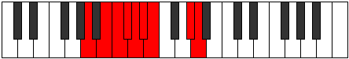 |
| [2303](https://ianring.com/musictheory/scales/2303) | [Stanygic](ModeDNaturalStanygic.md) | D | D, D#, E, F, F#, G, G#, A, C#, D |  |
| [2303](https://ianring.com/musictheory/scales/2303) | [Stanygic](ModeANaturalStanygic.md) | A | A, A#, B, C, C#, D, D#, E, G#, A |  |
| [2445](https://ianring.com/musictheory/scales/2445) | [Zadimic](ModeDFlatZadimic.md) | Db | Db, Eb, Fb, G#, A, B#, Db |  |
| [2447](https://ianring.com/musictheory/scales/2447) | [Thagian](ModeCSharpThagian.md) | C# | C#, D, Eb, Fb, G#, A, B#, C# |  |
| [2461](https://ianring.com/musictheory/scales/2461) | [Sagian](ModeCSharpSagian.md) | C# | C#, D#, E, F, G#, A, B#, C# |  |
| [2463](https://ianring.com/musictheory/scales/2463) | [Ionathyllic](ModeCSharpIonathyllic.md) | C# | C#, D, D#, E, F, G#, A, C, C# |  |
| [2463](https://ianring.com/musictheory/scales/2463) | [Ionathyllic](ModeDFlatIonathyllic.md) | Db | Db, D, Eb, E, F, Ab, A, C, Db |  |
| [2467](https://ianring.com/musictheory/scales/2467) | [Morimic](ModeGSharpMorimic.md) | G# | G#, A, B##, C###, D##, E###, G# |  |
| [2471](https://ianring.com/musictheory/scales/2471) | [Eparian](ModeGSharpEparian.md) | G# | G#, A, Bb, C#, D#, E, F##, G# |  |
| [2475](https://ianring.com/musictheory/scales/2475) | [Aerylian](ModeGSharpAerylian.md) | G# | G#, A, B, C#, D#, E, F##, G# |  |
| [2477](https://ianring.com/musictheory/scales/2477) | [Mydian](ModeCSharpMydian.md) | C# | C#, D#, E, F#, G#, A, B#, C# |  |
| [2479](https://ianring.com/musictheory/scales/2479) | [Rycryllic](ModeCSharpRycryllic.md) | C# | C#, D, D#, E, F#, G#, A, C, C# |  |
| [2479](https://ianring.com/musictheory/scales/2479) | [Rycryllic](ModeDFlatRycryllic.md) | Db | Db, D, Eb, E, Gb, Ab, A, C, Db |  |
| [2479](https://ianring.com/musictheory/scales/2479) | [Rycryllic](ModeGSharpRycryllic.md) | G# | G#, A, A#, B, C#, D#, E, G, G# |  |
| [2479](https://ianring.com/musictheory/scales/2479) | [Rycryllic](ModeAFlatRycryllic.md) | Ab | Ab, A, Bb, B, Db, Eb, E, G, Ab |  |
| [2483](https://ianring.com/musictheory/scales/2483) | [Aerynian](ModeGSharpAerynian.md) | G# | G#, A, B#, C#, D#, E, F##, G# |  |
| [2487](https://ianring.com/musictheory/scales/2487) | [Phroptyllic](ModeGSharpPhroptyllic.md) | G# | G#, A, A#, C, C#, D#, E, G, G# |  |
| [2487](https://ianring.com/musictheory/scales/2487) | [Phroptyllic](ModeAFlatPhroptyllic.md) | Ab | Ab, A, Bb, C, Db, Eb, E, G, Ab |  |
| [2491](https://ianring.com/musictheory/scales/2491) | [Layllic](ModeGSharpLayllic.md) | G# | G#, A, B, C, C#, D#, E, G, G# |  |
| [2491](https://ianring.com/musictheory/scales/2491) | [Layllic](ModeAFlatLayllic.md) | Ab | Ab, A, B, C, Db, Eb, E, G, Ab |  |
| [2493](https://ianring.com/musictheory/scales/2493) | [Manyllic](ModeCSharpManyllic.md) | C# | C#, D#, E, F, F#, G#, A, C, C# |  |
| [2493](https://ianring.com/musictheory/scales/2493) | [Manyllic](ModeDFlatManyllic.md) | Db | Db, Eb, E, F, Gb, Ab, A, C, Db |  |
| [2495](https://ianring.com/musictheory/scales/2495) | [Aeolocrygic](ModeCSharpAeolocrygic.md) | C# | C#, D, D#, E, F, F#, G#, A, C, C# |  |
| [2495](https://ianring.com/musictheory/scales/2495) | [Aeolocrygic](ModeDFlatAeolocrygic.md) | Db | Db, D, Eb, E, F, Gb, Ab, A, C, Db |  |
| [2495](https://ianring.com/musictheory/scales/2495) | [Aeolocrygic](ModeGSharpAeolocrygic.md) | G# | G#, A, A#, B, C, C#, D#, E, G, G# |  |
| [2495](https://ianring.com/musictheory/scales/2495) | [Aeolocrygic](ModeAFlatAeolocrygic.md) | Ab | Ab, A, Bb, B, C, Db, Eb, E, G, Ab |  |
| [2503](https://ianring.com/musictheory/scales/2503) | [Stonian](ModeDNaturalStonian.md) | D | D, Eb, Fb, G#, A, Bb, C#, D | 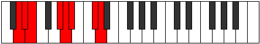 |
| [2509](https://ianring.com/musictheory/scales/2509) | [Bogian](ModeCSharpBogian.md) | C# | C#, D#, E, F##, G#, A, B#, C# |  |
| [2511](https://ianring.com/musictheory/scales/2511) | [Epyryllic](ModeCSharpEpyryllic.md) | C# | C#, D, D#, E, G, G#, A, C, C# |  |
| [2511](https://ianring.com/musictheory/scales/2511) | [Epyryllic](ModeDFlatEpyryllic.md) | Db | Db, D, Eb, E, G, Ab, A, C, Db |  |
| [2511](https://ianring.com/musictheory/scales/2511) | [Epyryllic](ModeDNaturalEpyryllic.md) | D | D, D#, E, F, G#, A, A#, C#, D |  |
| [2513](https://ianring.com/musictheory/scales/2513) | [Aerycrimic](ModeANaturalAerycrimic.md) | A | A, B##, C###, D##, E#, F###, A |  |
| [2515](https://ianring.com/musictheory/scales/2515) | [Stylian](ModeANaturalStylian.md) | A | A, Bb, C#, D#, E, F, G#, A |  |
| [2517](https://ianring.com/musictheory/scales/2517) | [Ryphian](ModeANaturalRyphian.md) | A | A, B, C#, D#, E, F, G#, A |  |
| [2519](https://ianring.com/musictheory/scales/2519) | [Dathyllic](ModeDNaturalDathyllic.md) | D | D, D#, E, F#, G#, A, A#, C#, D |  |
| [2519](https://ianring.com/musictheory/scales/2519) | [Dathyllic](ModeANaturalDathyllic.md) | A | A, A#, B, C#, D#, E, F, G#, A |  |
| [2521](https://ianring.com/musictheory/scales/2521) | [Barian](ModeANaturalBarian.md) | A | A, B#, C#, D#, E, F, G#, A |  |
| [2523](https://ianring.com/musictheory/scales/2523) | [Rygyllic](ModeANaturalRygyllic.md) | A | A, A#, C, C#, D#, E, F, G#, A |  |
| [2525](https://ianring.com/musictheory/scales/2525) | [Aeolaryllic](ModeCSharpAeolaryllic.md) | C# | C#, D#, E, F, G, G#, A, C, C# |  |
| [2525](https://ianring.com/musictheory/scales/2525) | [Aeolaryllic](ModeDFlatAeolaryllic.md) | Db | Db, Eb, E, F, G, Ab, A, C, Db |  |
| [2525](https://ianring.com/musictheory/scales/2525) | [Aeolaryllic](ModeANaturalAeolaryllic.md) | A | A, B, C, C#, D#, E, F, G#, A |  |
| [2527](https://ianring.com/musictheory/scales/2527) | [Phradygic](ModeCSharpPhradygic.md) | C# | C#, D, D#, E, F, G, G#, A, C, C# |  |
| [2527](https://ianring.com/musictheory/scales/2527) | [Phradygic](ModeDFlatPhradygic.md) | Db | Db, D, Eb, E, F, G, Ab, A, C, Db |  |
| [2527](https://ianring.com/musictheory/scales/2527) | [Phradygic](ModeDNaturalPhradygic.md) | D | D, D#, E, F, F#, G#, A, A#, C#, D |  |
| [2527](https://ianring.com/musictheory/scales/2527) | [Phradygic](ModeANaturalPhradygic.md) | A | A, A#, B, C, C#, D#, E, F, G#, A |  |
| [2531](https://ianring.com/musictheory/scales/2531) | [Danian](ModeGSharpDanian.md) | G# | G#, A, B##, C##, D#, E, F##, G# |  |
| [2535](https://ianring.com/musictheory/scales/2535) | [Zygyllic](ModeDNaturalZygyllic.md) | D | D, D#, E, G, G#, A, A#, C#, D |  |
| [2535](https://ianring.com/musictheory/scales/2535) | [Zygyllic](ModeGSharpZygyllic.md) | G# | G#, A, A#, C#, D, D#, E, G, G# |  |
| [2535](https://ianring.com/musictheory/scales/2535) | [Zygyllic](ModeAFlatZygyllic.md) | Ab | Ab, A, Bb, Db, D, Eb, E, G, Ab |  |
| [2539](https://ianring.com/musictheory/scales/2539) | [Thonyllic](ModeGSharpThonyllic.md) | G# | G#, A, B, C#, D, D#, E, G, G# |  |
| [2539](https://ianring.com/musictheory/scales/2539) | [Thonyllic](ModeAFlatThonyllic.md) | Ab | Ab, A, B, Db, D, Eb, E, G, Ab |  |
| [2541](https://ianring.com/musictheory/scales/2541) | [Katadyllic](ModeCSharpKatadyllic.md) | C# | C#, D#, E, F#, G, G#, A, C, C# |  |
| [2541](https://ianring.com/musictheory/scales/2541) | [Katadyllic](ModeDFlatKatadyllic.md) | Db | Db, Eb, E, Gb, G, Ab, A, C, Db |  |
| [2543](https://ianring.com/musictheory/scales/2543) | [Dydygic](ModeCSharpDydygic.md) | C# | C#, D, D#, E, F#, G, G#, A, C, C# |  |
| [2543](https://ianring.com/musictheory/scales/2543) | [Dydygic](ModeDFlatDydygic.md) | Db | Db, D, Eb, E, Gb, G, Ab, A, C, Db |  |
| [2543](https://ianring.com/musictheory/scales/2543) | [Dydygic](ModeDNaturalDydygic.md) | D | D, D#, E, F, G, G#, A, A#, C#, D |  |
| [2543](https://ianring.com/musictheory/scales/2543) | [Dydygic](ModeGSharpDydygic.md) | G# | G#, A, A#, B, C#, D, D#, E, G, G# |  |
| [2543](https://ianring.com/musictheory/scales/2543) | [Dydygic](ModeAFlatDydygic.md) | Ab | Ab, A, Bb, B, Db, D, Eb, E, G, Ab |  |
| [2545](https://ianring.com/musictheory/scales/2545) | [Thycrian](ModeANaturalThycrian.md) | A | A, B##, C##, D#, E, F, G#, A |  |
| [2547](https://ianring.com/musictheory/scales/2547) | [Sogyllic](ModeGSharpSogyllic.md) | G# | G#, A, C, C#, D, D#, E, G, G# |  |
| [2547](https://ianring.com/musictheory/scales/2547) | [Sogyllic](ModeAFlatSogyllic.md) | Ab | Ab, A, C, Db, D, Eb, E, G, Ab |  |
| [2547](https://ianring.com/musictheory/scales/2547) | [Sogyllic](ModeANaturalSogyllic.md) | A | A, A#, C#, D, D#, E, F, G#, A |  |
| [2549](https://ianring.com/musictheory/scales/2549) | [Rydyllic](ModeANaturalRydyllic.md) | A | A, B, C#, D, D#, E, F, G#, A |  |
| [2551](https://ianring.com/musictheory/scales/2551) | [Zoptygic](ModeGSharpZoptygic.md) | G# | G#, A, A#, C, C#, D, D#, E, G, G# |  |
| [2551](https://ianring.com/musictheory/scales/2551) | [Zoptygic](ModeAFlatZoptygic.md) | Ab | Ab, A, Bb, C, Db, D, Eb, E, G, Ab |  |
| [2551](https://ianring.com/musictheory/scales/2551) | [Zoptygic](ModeDNaturalZoptygic.md) | D | D, D#, E, F#, G, G#, A, A#, C#, D |  |
| [2551](https://ianring.com/musictheory/scales/2551) | [Zoptygic](ModeANaturalZoptygic.md) | A | A, A#, B, C#, D, D#, E, F, G#, A |  |
| [2553](https://ianring.com/musictheory/scales/2553) | [Aeolaptyllic](ModeANaturalAeolaptyllic.md) | A | A, C, C#, D, D#, E, F, G#, A |  |
| [2555](https://ianring.com/musictheory/scales/2555) | [Bythygic](ModeANaturalBythygic.md) | A | A, A#, C, C#, D, D#, E, F, G#, A |  |
| [2555](https://ianring.com/musictheory/scales/2555) | [Bythygic](ModeGSharpBythygic.md) | G# | G#, A, B, C, C#, D, D#, E, G, G# |  |
| [2555](https://ianring.com/musictheory/scales/2555) | [Bythygic](ModeAFlatBythygic.md) | Ab | Ab, A, B, C, Db, D, Eb, E, G, Ab |  |
| [2557](https://ianring.com/musictheory/scales/2557) | [Dothygic](ModeCSharpDothygic.md) | C# | C#, D#, E, F, F#, G, G#, A, C, C# |  |
| [2557](https://ianring.com/musictheory/scales/2557) | [Dothygic](ModeDFlatDothygic.md) | Db | Db, Eb, E, F, Gb, G, Ab, A, C, Db |  |
| [2557](https://ianring.com/musictheory/scales/2557) | [Dothygic](ModeANaturalDothygic.md) | A | A, B, C, C#, D, D#, E, F, G#, A |  |
| [2559](https://ianring.com/musictheory/scales/2559) | [Zogyllian](ModeCSharpZogyllian.md) | C# | C#, D, D#, E, F, F#, G, G#, A, C, C# |  |
| [2559](https://ianring.com/musictheory/scales/2559) | [Zogyllian](ModeDFlatZogyllian.md) | Db | Db, D, Eb, E, F, Gb, G, Ab, A, C, Db |  |
| [2559](https://ianring.com/musictheory/scales/2559) | [Zogyllian](ModeDNaturalZogyllian.md) | D | D, D#, E, F, F#, G, G#, A, A#, C#, D |  |
| [2559](https://ianring.com/musictheory/scales/2559) | [Zogyllian](ModeANaturalZogyllian.md) | A | A, A#, B, C, C#, D, D#, E, F, G#, A |  |
| [2559](https://ianring.com/musictheory/scales/2559) | [Zogyllian](ModeGSharpZogyllian.md) | G# | G#, A, A#, B, C, C#, D, D#, E, G, G# |  |
| [2559](https://ianring.com/musictheory/scales/2559) | [Zogyllian](ModeAFlatZogyllian.md) | Ab | Ab, A, Bb, B, C, Db, D, Eb, E, G, Ab |  |
| [2609](https://ianring.com/musictheory/scales/2609) | [Paptitonic](ModeENaturalPaptitonic.md) | E | E, G#, A, C#, D#, E |  |
| [2611](https://ianring.com/musictheory/scales/2611) | [Lyrimic](ModeENaturalLyrimic.md) | E | E, F, G#, A, B##, C###, E |  |
| [2613](https://ianring.com/musictheory/scales/2613) | [Aeolanimic](ModeENaturalAeolanimic.md) | E | E, F#, G#, A, B##, C###, E |  |
| [2617](https://ianring.com/musictheory/scales/2617) | [Pylimic](ModeENaturalPylimic.md) | E | E, F##, G#, A, B##, C###, E |  |
| [2623](https://ianring.com/musictheory/scales/2623) | [Aerylyllic](ModeENaturalAerylyllic.md) | E | E, F, F#, G, G#, A, C#, D#, E |  |
| [2675](https://ianring.com/musictheory/scales/2675) | [Gogian](ModeENaturalGogian.md) | E | E, F, G#, A, Bb, C#, D#, E |  |
| [2677](https://ianring.com/musictheory/scales/2677) | [Thodian](ModeENaturalThodian.md) | E | E, F#, G#, A, Bb, C#, D#, E |  |
| [2679](https://ianring.com/musictheory/scales/2679) | [Rathyllic](ModeENaturalRathyllic.md) | E | E, F, F#, G#, A, A#, C#, D#, E |  |
| [2681](https://ianring.com/musictheory/scales/2681) | [Aerycrian](ModeENaturalAerycrian.md) | E | E, F##, G#, A, Bb, C#, D#, E |  |
| [2683](https://ianring.com/musictheory/scales/2683) | [Thodyllic](ModeENaturalThodyllic.md) | E | E, F, G, G#, A, A#, C#, D#, E |  |
| [2685](https://ianring.com/musictheory/scales/2685) | [Ionoryllic](ModeENaturalIonoryllic.md) | E | E, F#, G, G#, A, A#, C#, D#, E |  |
| [2687](https://ianring.com/musictheory/scales/2687) | [Thacrygic](ModeENaturalThacrygic.md) | E | E, F, F#, G, G#, A, A#, C#, D#, E |  |
| [2739](https://ianring.com/musictheory/scales/2739) | [Zanian](ModeENaturalZanian.md) | E | E, F, G#, A, B, C#, D#, E |  |
| [2741](https://ianring.com/musictheory/scales/2741) | [Ionian](ModeENaturalIonian.md) | E | E, F#, G#, A, B, C#, D#, E |  |
| [2743](https://ianring.com/musictheory/scales/2743) | [Staptyllic](ModeENaturalStaptyllic.md) | E | E, F, F#, G#, A, B, C#, D#, E |  |
| [2745](https://ianring.com/musictheory/scales/2745) | [Dolian](ModeENaturalDolian.md) | E | E, F##, G#, A, B, C#, D#, E |  |
| [2747](https://ianring.com/musictheory/scales/2747) | [Stythyllic](ModeENaturalStythyllic.md) | E | E, F, G, G#, A, B, C#, D#, E | 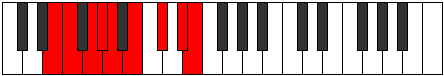 |
| [2749](https://ianring.com/musictheory/scales/2749) | [Katagyllic](ModeENaturalKatagyllic.md) | E | E, F#, G, G#, A, B, C#, D#, E |  |
| [2751](https://ianring.com/musictheory/scales/2751) | [Sylygic](ModeENaturalSylygic.md) | E | E, F, F#, G, G#, A, B, C#, D#, E |  |
| [2759](https://ianring.com/musictheory/scales/2759) | [Aeraphian](ModeDNaturalAeraphian.md) | D | D, Eb, Fb, G#, A, B, C#, D |  |
| [2767](https://ianring.com/musictheory/scales/2767) | [Katydyllic](ModeDNaturalKatydyllic.md) | D | D, D#, E, F, G#, A, B, C#, D |  |
| [2769](https://ianring.com/musictheory/scales/2769) | [Dyrimic](ModeANaturalDyrimic.md) | A | A, B##, C###, D##, E##, F###, A |  |
| [2771](https://ianring.com/musictheory/scales/2771) | [Garian](ModeANaturalGarian.md) | A | A, Bb, C#, D#, E, F#, G#, A |  |
| [2773](https://ianring.com/musictheory/scales/2773) | [Lydian](ModeANaturalLydian.md) | A | A, B, C#, D#, E, F#, G#, A | 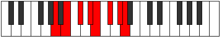 |
| [2775](https://ianring.com/musictheory/scales/2775) | [Godyllic](ModeDNaturalGodyllic.md) | D | D, D#, E, F#, G#, A, B, C#, D |  |
| [2775](https://ianring.com/musictheory/scales/2775) | [Godyllic](ModeANaturalGodyllic.md) | A | A, A#, B, C#, D#, E, F#, G#, A |  |
| [2777](https://ianring.com/musictheory/scales/2777) | [Bycrian](ModeANaturalBycrian.md) | A | A, B#, C#, D#, E, F#, G#, A |  |
| [2779](https://ianring.com/musictheory/scales/2779) | [Garyllic](ModeANaturalGaryllic.md) | A | A, A#, C, C#, D#, E, F#, G#, A |  |
| [2781](https://ianring.com/musictheory/scales/2781) | [Gycryllic](ModeANaturalGycryllic.md) | A | A, B, C, C#, D#, E, F#, G#, A |  |
| [2783](https://ianring.com/musictheory/scales/2783) | [Gothygic](ModeDNaturalGothygic.md) | D | D, D#, E, F, F#, G#, A, B, C#, D |  |
| [2783](https://ianring.com/musictheory/scales/2783) | [Gothygic](ModeANaturalGothygic.md) | A | A, A#, B, C, C#, D#, E, F#, G#, A |  |
| [2791](https://ianring.com/musictheory/scales/2791) | [Ionyptyllic](ModeDNaturalIonyptyllic.md) | D | D, D#, E, G, G#, A, B, C#, D |  |
| [2799](https://ianring.com/musictheory/scales/2799) | [Epilygic](ModeDNaturalEpilygic.md) | D | D, D#, E, F, G, G#, A, B, C#, D |  |
| [2801](https://ianring.com/musictheory/scales/2801) | [Zogian](ModeANaturalZogian.md) | A | A, B##, C##, D#, E, F#, G#, A |  |
| [2803](https://ianring.com/musictheory/scales/2803) | [Zolyllic](ModeANaturalZolyllic.md) | A | A, A#, C#, D, D#, E, F#, G#, A |  |
| [2803](https://ianring.com/musictheory/scales/2803) | [Zolyllic](ModeENaturalZolyllic.md) | E | E, F, G#, A, A#, B, C#, D#, E |  |
| [2805](https://ianring.com/musictheory/scales/2805) | [Zylyllic](ModeANaturalZylyllic.md) | A | A, B, C#, D, D#, E, F#, G#, A |  |
| [2805](https://ianring.com/musictheory/scales/2805) | [Zylyllic](ModeENaturalZylyllic.md) | E | E, F#, G#, A, A#, B, C#, D#, E |  |
| [2807](https://ianring.com/musictheory/scales/2807) | [Zylygic](ModeDNaturalZylygic.md) | D | D, D#, E, F#, G, G#, A, B, C#, D |  |
| [2807](https://ianring.com/musictheory/scales/2807) | [Zylygic](ModeANaturalZylygic.md) | A | A, A#, B, C#, D, D#, E, F#, G#, A |  |
| [2807](https://ianring.com/musictheory/scales/2807) | [Zylygic](ModeENaturalZylygic.md) | E | E, F, F#, G#, A, A#, B, C#, D#, E |  |
| [2809](https://ianring.com/musictheory/scales/2809) | [Gythyllic](ModeANaturalGythyllic.md) | A | A, C, C#, D, D#, E, F#, G#, A |  |
| [2809](https://ianring.com/musictheory/scales/2809) | [Gythyllic](ModeENaturalGythyllic.md) | E | E, G, G#, A, A#, B, C#, D#, E |  |
| [2811](https://ianring.com/musictheory/scales/2811) | [Barygic](ModeANaturalBarygic.md) | A | A, A#, C, C#, D, D#, E, F#, G#, A |  |
| [2811](https://ianring.com/musictheory/scales/2811) | [Barygic](ModeENaturalBarygic.md) | E | E, F, G, G#, A, A#, B, C#, D#, E |  |
| [2813](https://ianring.com/musictheory/scales/2813) | [Zolygic](ModeANaturalZolygic.md) | A | A, B, C, C#, D, D#, E, F#, G#, A |  |
| [2813](https://ianring.com/musictheory/scales/2813) | [Zolygic](ModeENaturalZolygic.md) | E | E, F#, G, G#, A, A#, B, C#, D#, E |  |
| [2815](https://ianring.com/musictheory/scales/2815) | [Aeradyllian](ModeDNaturalAeradyllian.md) | D | D, D#, E, F, F#, G, G#, A, B, C#, D |  |
| [2815](https://ianring.com/musictheory/scales/2815) | [Aeradyllian](ModeANaturalAeradyllian.md) | A | A, A#, B, C, C#, D, D#, E, F#, G#, A |  |
| [2815](https://ianring.com/musictheory/scales/2815) | [Aeradyllian](ModeENaturalAeradyllian.md) | E | E, F, F#, G, G#, A, A#, B, C#, D#, E |  |
| [2843](https://ianring.com/musictheory/scales/2843) | [Sorian](ModeCNaturalSorian.md) | C | C, Db, Eb, Fb, G#, A, B, C |  |
| [2847](https://ianring.com/musictheory/scales/2847) | [Phracryllic](ModeCNaturalPhracryllic.md) | C | C, C#, D, D#, E, G#, A, B, C |  |
| [2867](https://ianring.com/musictheory/scales/2867) | [Socrian](ModeENaturalSocrian.md) | E | E, F, G#, A, B#, C#, D#, E | 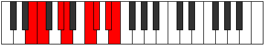 |
| [2869](https://ianring.com/musictheory/scales/2869) | [Phrothian](ModeENaturalPhrothian.md) | E | E, F#, G#, A, B#, C#, D#, E |  |
| [2871](https://ianring.com/musictheory/scales/2871) | [Stanyllic](ModeENaturalStanyllic.md) | E | E, F, F#, G#, A, C, C#, D#, E |  |
| [2873](https://ianring.com/musictheory/scales/2873) | [Docrian](ModeENaturalDocrian.md) | E | E, F##, G#, A, B#, C#, D#, E |  |
| [2875](https://ianring.com/musictheory/scales/2875) | [Ganyllic](ModeENaturalGanyllic.md) | E | E, F, G, G#, A, C, C#, D#, E |  |
| [2875](https://ianring.com/musictheory/scales/2875) | [Ganyllic](ModeCNaturalGanyllic.md) | C | C, C#, D#, E, F, G#, A, B, C |  |
| [2877](https://ianring.com/musictheory/scales/2877) | [Phrylyllic](ModeENaturalPhrylyllic.md) | E | E, F#, G, G#, A, C, C#, D#, E |  |
| [2879](https://ianring.com/musictheory/scales/2879) | [Stadygic](ModeENaturalStadygic.md) | E | E, F, F#, G, G#, A, C, C#, D#, E | 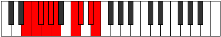 |
| [2879](https://ianring.com/musictheory/scales/2879) | [Stadygic](ModeCNaturalStadygic.md) | C | C, C#, D, D#, E, F, G#, A, B, C |  |
| [2895](https://ianring.com/musictheory/scales/2895) | [Aeragyllic](ModeGNaturalAeragyllic.md) | G | G, G#, A, A#, C#, D#, E, F#, G |  |
| [2903](https://ianring.com/musictheory/scales/2903) | [Gothyllic](ModeGNaturalGothyllic.md) | G | G, G#, A, B, C#, D#, E, F#, G |  |
| [2907](https://ianring.com/musictheory/scales/2907) | [Mogyllic](ModeCNaturalMogyllic.md) | C | C, C#, D#, E, F#, G#, A, B, C |  |
| [2911](https://ianring.com/musictheory/scales/2911) | [Katygic](ModeCNaturalKatygic.md) | C | C, C#, D, D#, E, F#, G#, A, B, C |  |
| [2911](https://ianring.com/musictheory/scales/2911) | [Katygic](ModeGNaturalKatygic.md) | G | G, G#, A, A#, B, C#, D#, E, F#, G |  |
| [2919](https://ianring.com/musictheory/scales/2919) | [Molyllic](ModeGNaturalMolyllic.md) | G | G, G#, A, C, C#, D#, E, F#, G |  |
| [2927](https://ianring.com/musictheory/scales/2927) | [Rodygic](ModeGNaturalRodygic.md) | G | G, G#, A, A#, C, C#, D#, E, F#, G |  |
| [2931](https://ianring.com/musictheory/scales/2931) | [Zathyllic](ModeENaturalZathyllic.md) | E | E, F, G#, A, A#, C, C#, D#, E |  |
| [2933](https://ianring.com/musictheory/scales/2933) | [Dalyllic](ModeENaturalDalyllic.md) | E | E, F#, G#, A, A#, C, C#, D#, E |  |
| [2935](https://ianring.com/musictheory/scales/2935) | [Modygic](ModeENaturalModygic.md) | E | E, F, F#, G#, A, A#, C, C#, D#, E |  |
| [2935](https://ianring.com/musictheory/scales/2935) | [Modygic](ModeGNaturalModygic.md) | G | G, G#, A, B, C, C#, D#, E, F#, G |  |
| [2937](https://ianring.com/musictheory/scales/2937) | [Aeolathyllic](ModeENaturalAeolathyllic.md) | E | E, G, G#, A, A#, C, C#, D#, E |  |
| [2939](https://ianring.com/musictheory/scales/2939) | [Goptygic](ModeENaturalGoptygic.md) | E | E, F, G, G#, A, A#, C, C#, D#, E |  |
| [2939](https://ianring.com/musictheory/scales/2939) | [Goptygic](ModeCNaturalGoptygic.md) | C | C, C#, D#, E, F, F#, G#, A, B, C |  |
| [2941](https://ianring.com/musictheory/scales/2941) | [Laptygic](ModeENaturalLaptygic.md) | E | E, F#, G, G#, A, A#, C, C#, D#, E |  |
| [2943](https://ianring.com/musictheory/scales/2943) | [Dathyllian](ModeENaturalDathyllian.md) | E | E, F, F#, G, G#, A, A#, C, C#, D#, E |  |
| [2943](https://ianring.com/musictheory/scales/2943) | [Dathyllian](ModeCNaturalDathyllian.md) | C | C, C#, D, D#, E, F, F#, G#, A, B, C |  |
| [2943](https://ianring.com/musictheory/scales/2943) | [Dathyllian](ModeGNaturalDathyllian.md) | G | G, G#, A, A#, B, C, C#, D#, E, F#, G |  |
| [2957](https://ianring.com/musictheory/scales/2957) | [Thygian](ModeDFlatThygian.md) | Db | Db, Eb, Fb, G#, A, Bb, C, Db |  |
| [2959](https://ianring.com/musictheory/scales/2959) | [Dygyllic](ModeCSharpDygyllic.md) | C# | C#, D, D#, E, G#, A, A#, C, C# |  |
| [2959](https://ianring.com/musictheory/scales/2959) | [Dygyllic](ModeDFlatDygyllic.md) | Db | Db, D, Eb, E, Ab, A, Bb, C, Db |  |
| [2971](https://ianring.com/musictheory/scales/2971) | [Aeolynyllic](ModeCNaturalAeolynyllic.md) | C | C, C#, D#, E, G, G#, A, B, C |  |
| [2973](https://ianring.com/musictheory/scales/2973) | [Panyllic](ModeCSharpPanyllic.md) | C# | C#, D#, E, F, G#, A, A#, C, C# |  |
| [2973](https://ianring.com/musictheory/scales/2973) | [Panyllic](ModeDFlatPanyllic.md) | Db | Db, Eb, E, F, Ab, A, Bb, C, Db |  |
| [2975](https://ianring.com/musictheory/scales/2975) | [Gaptygic](ModeCSharpGaptygic.md) | C# | C#, D, D#, E, F, G#, A, A#, C, C# |  |
| [2975](https://ianring.com/musictheory/scales/2975) | [Gaptygic](ModeDFlatGaptygic.md) | Db | Db, D, Eb, E, F, Ab, A, Bb, C, Db |  |
| [2975](https://ianring.com/musictheory/scales/2975) | [Gaptygic](ModeCNaturalGaptygic.md) | C | C, C#, D, D#, E, G, G#, A, B, C |  |
| [2979](https://ianring.com/musictheory/scales/2979) | [Gyptian](ModeGSharpGyptian.md) | G# | G#, A, B##, C###, D##, E#, F##, G# |  |
| [2983](https://ianring.com/musictheory/scales/2983) | [Zythyllic](ModeGSharpZythyllic.md) | G# | G#, A, A#, C#, D#, E, F, G, G# |  |
| [2983](https://ianring.com/musictheory/scales/2983) | [Zythyllic](ModeAFlatZythyllic.md) | Ab | Ab, A, Bb, Db, Eb, E, F, G, Ab |  |
| [2987](https://ianring.com/musictheory/scales/2987) | [Thanyllic](ModeGSharpThanyllic.md) | G# | G#, A, B, C#, D#, E, F, G, G# |  |
| [2987](https://ianring.com/musictheory/scales/2987) | [Thanyllic](ModeAFlatThanyllic.md) | Ab | Ab, A, B, Db, Eb, E, F, G, Ab |  |
| [2989](https://ianring.com/musictheory/scales/2989) | [Ionacryllic](ModeCSharpIonacryllic.md) | C# | C#, D#, E, F#, G#, A, A#, C, C# |  |
| [2989](https://ianring.com/musictheory/scales/2989) | [Ionacryllic](ModeDFlatIonacryllic.md) | Db | Db, Eb, E, Gb, Ab, A, Bb, C, Db |  |
| [2991](https://ianring.com/musictheory/scales/2991) | [Zanygic](ModeCSharpZanygic.md) | C# | C#, D, D#, E, F#, G#, A, A#, C, C# |  |
| [2991](https://ianring.com/musictheory/scales/2991) | [Zanygic](ModeDFlatZanygic.md) | Db | Db, D, Eb, E, Gb, Ab, A, Bb, C, Db |  |
| [2991](https://ianring.com/musictheory/scales/2991) | [Zanygic](ModeGSharpZanygic.md) | G# | G#, A, A#, B, C#, D#, E, F, G, G# |  |
| [2991](https://ianring.com/musictheory/scales/2991) | [Zanygic](ModeAFlatZanygic.md) | Ab | Ab, A, Bb, B, Db, Eb, E, F, G, Ab |  |
| [2995](https://ianring.com/musictheory/scales/2995) | [Sanyllic](ModeGSharpSanyllic.md) | G# | G#, A, C, C#, D#, E, F, G, G# |  |
| [2995](https://ianring.com/musictheory/scales/2995) | [Sanyllic](ModeAFlatSanyllic.md) | Ab | Ab, A, C, Db, Eb, E, F, G, Ab |  |
| [2995](https://ianring.com/musictheory/scales/2995) | [Sanyllic](ModeENaturalSanyllic.md) | E | E, F, G#, A, B, C, C#, D#, E |  |
| [2997](https://ianring.com/musictheory/scales/2997) | [Ionoptyllic](ModeENaturalIonoptyllic.md) | E | E, F#, G#, A, B, C, C#, D#, E |  |
| [2999](https://ianring.com/musictheory/scales/2999) | [Zyrygic](ModeGSharpZyrygic.md) | G# | G#, A, A#, C, C#, D#, E, F, G, G# |  |
| [2999](https://ianring.com/musictheory/scales/2999) | [Zyrygic](ModeAFlatZyrygic.md) | Ab | Ab, A, Bb, C, Db, Eb, E, F, G, Ab |  |
| [2999](https://ianring.com/musictheory/scales/2999) | [Zyrygic](ModeENaturalZyrygic.md) | E | E, F, F#, G#, A, B, C, C#, D#, E |  |
| [3001](https://ianring.com/musictheory/scales/3001) | [Lonyllic](ModeENaturalLonyllic.md) | E | E, G, G#, A, B, C, C#, D#, E |  |
| [3003](https://ianring.com/musictheory/scales/3003) | [Zydygic](ModeCNaturalZydygic.md) | C | C, C#, D#, E, F, G, G#, A, B, C |  |
| [3003](https://ianring.com/musictheory/scales/3003) | [Zydygic](ModeENaturalZydygic.md) | E | E, F, G, G#, A, B, C, C#, D#, E |  |
| [3003](https://ianring.com/musictheory/scales/3003) | [Zydygic](ModeGSharpZydygic.md) | G# | G#, A, B, C, C#, D#, E, F, G, G# |  |
| [3003](https://ianring.com/musictheory/scales/3003) | [Zydygic](ModeAFlatZydygic.md) | Ab | Ab, A, B, C, Db, Eb, E, F, G, Ab |  |
| [3005](https://ianring.com/musictheory/scales/3005) | [Gycrygic](ModeCSharpGycrygic.md) | C# | C#, D#, E, F, F#, G#, A, A#, C, C# |  |
| [3005](https://ianring.com/musictheory/scales/3005) | [Gycrygic](ModeDFlatGycrygic.md) | Db | Db, Eb, E, F, Gb, Ab, A, Bb, C, Db |  |
| [3005](https://ianring.com/musictheory/scales/3005) | [Gycrygic](ModeENaturalGycrygic.md) | E | E, F#, G, G#, A, B, C, C#, D#, E |  |
| [3007](https://ianring.com/musictheory/scales/3007) | [Zyryllian](ModeCSharpZyryllian.md) | C# | C#, D, D#, E, F, F#, G#, A, A#, C, C# |  |
| [3007](https://ianring.com/musictheory/scales/3007) | [Zyryllian](ModeDFlatZyryllian.md) | Db | Db, D, Eb, E, F, Gb, Ab, A, Bb, C, Db |  |
| [3007](https://ianring.com/musictheory/scales/3007) | [Zyryllian](ModeCNaturalZyryllian.md) | C | C, C#, D, D#, E, F, G, G#, A, B, C |  |
| [3007](https://ianring.com/musictheory/scales/3007) | [Zyryllian](ModeENaturalZyryllian.md) | E | E, F, F#, G, G#, A, B, C, C#, D#, E |  |
| [3007](https://ianring.com/musictheory/scales/3007) | [Zyryllian](ModeGSharpZyryllian.md) | G# | G#, A, A#, B, C, C#, D#, E, F, G, G# |  |
| [3007](https://ianring.com/musictheory/scales/3007) | [Zyryllian](ModeAFlatZyryllian.md) | Ab | Ab, A, Bb, B, C, Db, Eb, E, F, G, Ab |  |
| [3015](https://ianring.com/musictheory/scales/3015) | [Laptyllic](ModeGNaturalLaptyllic.md) | G | G, G#, A, C#, D, D#, E, F#, G |  |
| [3015](https://ianring.com/musictheory/scales/3015) | [Laptyllic](ModeDNaturalLaptyllic.md) | D | D, D#, E, G#, A, A#, B, C#, D |  |
| [3021](https://ianring.com/musictheory/scales/3021) | [Gyptyllic](ModeCSharpGyptyllic.md) | C# | C#, D#, E, G, G#, A, A#, C, C# |  |
| [3021](https://ianring.com/musictheory/scales/3021) | [Gyptyllic](ModeDFlatGyptyllic.md) | Db | Db, Eb, E, G, Ab, A, Bb, C, Db |  |
| [3023](https://ianring.com/musictheory/scales/3023) | [Aeracrygic](ModeCSharpAeracrygic.md) | C# | C#, D, D#, E, G, G#, A, A#, C, C# |  |
| [3023](https://ianring.com/musictheory/scales/3023) | [Aeracrygic](ModeDFlatAeracrygic.md) | Db | Db, D, Eb, E, G, Ab, A, Bb, C, Db |  |
| [3023](https://ianring.com/musictheory/scales/3023) | [Aeracrygic](ModeGNaturalAeracrygic.md) | G | G, G#, A, A#, C#, D, D#, E, F#, G |  |
| [3023](https://ianring.com/musictheory/scales/3023) | [Aeracrygic](ModeDNaturalAeracrygic.md) | D | D, D#, E, F, G#, A, A#, B, C#, D |  |
| [3025](https://ianring.com/musictheory/scales/3025) | [Epycrian](ModeANaturalEpycrian.md) | A | A, B##, C###, D##, E#, F#, G#, A |  |
| [3027](https://ianring.com/musictheory/scales/3027) | [Rythyllic](ModeANaturalRythyllic.md) | A | A, A#, C#, D#, E, F, F#, G#, A |  |
| [3029](https://ianring.com/musictheory/scales/3029) | [Ionocryllic](ModeANaturalIonocryllic.md) | A | A, B, C#, D#, E, F, F#, G#, A |  |
| [3031](https://ianring.com/musictheory/scales/3031) | [Epithygic](ModeGNaturalEpithygic.md) | G | G, G#, A, B, C#, D, D#, E, F#, G |  |
| [3031](https://ianring.com/musictheory/scales/3031) | [Epithygic](ModeDNaturalEpithygic.md) | D | D, D#, E, F#, G#, A, A#, B, C#, D |  |
| [3031](https://ianring.com/musictheory/scales/3031) | [Epithygic](ModeANaturalEpithygic.md) | A | A, A#, B, C#, D#, E, F, F#, G#, A |  |
| [3033](https://ianring.com/musictheory/scales/3033) | [Doptyllic](ModeANaturalDoptyllic.md) | A | A, C, C#, D#, E, F, F#, G#, A |  |
| [3035](https://ianring.com/musictheory/scales/3035) | [Gocrygic](ModeANaturalGocrygic.md) | A | A, A#, C, C#, D#, E, F, F#, G#, A |  |
| [3035](https://ianring.com/musictheory/scales/3035) | [Gocrygic](ModeCNaturalGocrygic.md) | C | C, C#, D#, E, F#, G, G#, A, B, C |  |
| [3037](https://ianring.com/musictheory/scales/3037) | [Staptygic](ModeCSharpStaptygic.md) | C# | C#, D#, E, F, G, G#, A, A#, C, C# |  |
| [3037](https://ianring.com/musictheory/scales/3037) | [Staptygic](ModeDFlatStaptygic.md) | Db | Db, Eb, E, F, G, Ab, A, Bb, C, Db |  |
| [3037](https://ianring.com/musictheory/scales/3037) | [Staptygic](ModeANaturalStaptygic.md) | A | A, B, C, C#, D#, E, F, F#, G#, A |  |
| [3039](https://ianring.com/musictheory/scales/3039) | [Godyllian](ModeCSharpGodyllian.md) | C# | C#, D, D#, E, F, G, G#, A, A#, C, C# |  |
| [3039](https://ianring.com/musictheory/scales/3039) | [Godyllian](ModeDFlatGodyllian.md) | Db | Db, D, Eb, E, F, G, Ab, A, Bb, C, Db |  |
| [3039](https://ianring.com/musictheory/scales/3039) | [Godyllian](ModeCNaturalGodyllian.md) | C | C, C#, D, D#, E, F#, G, G#, A, B, C |  |
| [3039](https://ianring.com/musictheory/scales/3039) | [Godyllian](ModeANaturalGodyllian.md) | A | A, A#, B, C, C#, D#, E, F, F#, G#, A |  |
| [3039](https://ianring.com/musictheory/scales/3039) | [Godyllian](ModeDNaturalGodyllian.md) | D | D, D#, E, F, F#, G#, A, A#, B, C#, D |  |
| [3039](https://ianring.com/musictheory/scales/3039) | [Godyllian](ModeGNaturalGodyllian.md) | G | G, G#, A, A#, B, C#, D, D#, E, F#, G |  |
| [3043](https://ianring.com/musictheory/scales/3043) | [Ionayllic](ModeGSharpIonayllic.md) | G# | G#, A, C#, D, D#, E, F, G, G# |  |
| [3043](https://ianring.com/musictheory/scales/3043) | [Ionayllic](ModeAFlatIonayllic.md) | Ab | Ab, A, Db, D, Eb, E, F, G, Ab |  |
| [3047](https://ianring.com/musictheory/scales/3047) | [Panygic](ModeGNaturalPanygic.md) | G | G, G#, A, C, C#, D, D#, E, F#, G |  |
| [3047](https://ianring.com/musictheory/scales/3047) | [Panygic](ModeGSharpPanygic.md) | G# | G#, A, A#, C#, D, D#, E, F, G, G# |  |
| [3047](https://ianring.com/musictheory/scales/3047) | [Panygic](ModeAFlatPanygic.md) | Ab | Ab, A, Bb, Db, D, Eb, E, F, G, Ab |  |
| [3047](https://ianring.com/musictheory/scales/3047) | [Panygic](ModeDNaturalPanygic.md) | D | D, D#, E, G, G#, A, A#, B, C#, D |  |
| [3051](https://ianring.com/musictheory/scales/3051) | [Stalygic](ModeGSharpStalygic.md) | G# | G#, A, B, C#, D, D#, E, F, G, G# |  |
| [3051](https://ianring.com/musictheory/scales/3051) | [Stalygic](ModeAFlatStalygic.md) | Ab | Ab, A, B, Db, D, Eb, E, F, G, Ab |  |
| [3053](https://ianring.com/musictheory/scales/3053) | [Zycrygic](ModeCSharpZycrygic.md) | C# | C#, D#, E, F#, G, G#, A, A#, C, C# |  |
| [3053](https://ianring.com/musictheory/scales/3053) | [Zycrygic](ModeDFlatZycrygic.md) | Db | Db, Eb, E, Gb, G, Ab, A, Bb, C, Db |  |
| [3055](https://ianring.com/musictheory/scales/3055) | [Lyryllian](ModeCSharpLyryllian.md) | C# | C#, D, D#, E, F#, G, G#, A, A#, C, C# |  |
| [3055](https://ianring.com/musictheory/scales/3055) | [Lyryllian](ModeDFlatLyryllian.md) | Db | Db, D, Eb, E, Gb, G, Ab, A, Bb, C, Db |  |
| [3055](https://ianring.com/musictheory/scales/3055) | [Lyryllian](ModeGNaturalLyryllian.md) | G | G, G#, A, A#, C, C#, D, D#, E, F#, G |  |
| [3055](https://ianring.com/musictheory/scales/3055) | [Lyryllian](ModeDNaturalLyryllian.md) | D | D, D#, E, F, G, G#, A, A#, B, C#, D |  |
| [3055](https://ianring.com/musictheory/scales/3055) | [Lyryllian](ModeGSharpLyryllian.md) | G# | G#, A, A#, B, C#, D, D#, E, F, G, G# |  |
| [3055](https://ianring.com/musictheory/scales/3055) | [Lyryllian](ModeAFlatLyryllian.md) | Ab | Ab, A, Bb, B, Db, D, Eb, E, F, G, Ab |  |
| [3057](https://ianring.com/musictheory/scales/3057) | [Phroryllic](ModeANaturalPhroryllic.md) | A | A, C#, D, D#, E, F, F#, G#, A |  |
| [3057](https://ianring.com/musictheory/scales/3057) | [Phroryllic](ModeENaturalPhroryllic.md) | E | E, G#, A, A#, B, C, C#, D#, E |  |
| [3059](https://ianring.com/musictheory/scales/3059) | [Madygic](ModeGSharpMadygic.md) | G# | G#, A, C, C#, D, D#, E, F, G, G# |  |
| [3059](https://ianring.com/musictheory/scales/3059) | [Madygic](ModeAFlatMadygic.md) | Ab | Ab, A, C, Db, D, Eb, E, F, G, Ab |  |
| [3059](https://ianring.com/musictheory/scales/3059) | [Madygic](ModeANaturalMadygic.md) | A | A, A#, C#, D, D#, E, F, F#, G#, A |  |
| [3059](https://ianring.com/musictheory/scales/3059) | [Madygic](ModeENaturalMadygic.md) | E | E, F, G#, A, A#, B, C, C#, D#, E |  |
| [3061](https://ianring.com/musictheory/scales/3061) | [Apinygic](ModeANaturalApinygic.md) | A | A, B, C#, D, D#, E, F, F#, G#, A |  |
| [3061](https://ianring.com/musictheory/scales/3061) | [Apinygic](ModeENaturalApinygic.md) | E | E, F#, G#, A, A#, B, C, C#, D#, E |  |
| [3063](https://ianring.com/musictheory/scales/3063) | [Solyllian](ModeGSharpSolyllian.md) | G# | G#, A, A#, C, C#, D, D#, E, F, G, G# |  |
| [3063](https://ianring.com/musictheory/scales/3063) | [Solyllian](ModeAFlatSolyllian.md) | Ab | Ab, A, Bb, C, Db, D, Eb, E, F, G, Ab |  |
| [3063](https://ianring.com/musictheory/scales/3063) | [Solyllian](ModeGNaturalSolyllian.md) | G | G, G#, A, B, C, C#, D, D#, E, F#, G |  |
| [3063](https://ianring.com/musictheory/scales/3063) | [Solyllian](ModeENaturalSolyllian.md) | E | E, F, F#, G#, A, A#, B, C, C#, D#, E |  |
| [3063](https://ianring.com/musictheory/scales/3063) | [Solyllian](ModeANaturalSolyllian.md) | A | A, A#, B, C#, D, D#, E, F, F#, G#, A |  |
| [3063](https://ianring.com/musictheory/scales/3063) | [Solyllian](ModeDNaturalSolyllian.md) | D | D, D#, E, F#, G, G#, A, A#, B, C#, D |  |
| [3065](https://ianring.com/musictheory/scales/3065) | [Zothygic](ModeANaturalZothygic.md) | A | A, C, C#, D, D#, E, F, F#, G#, A |  |
| [3065](https://ianring.com/musictheory/scales/3065) | [Zothygic](ModeENaturalZothygic.md) | E | E, G, G#, A, A#, B, C, C#, D#, E |  |
| [3067](https://ianring.com/musictheory/scales/3067) | [Goptyllian](ModeANaturalGoptyllian.md) | A | A, A#, C, C#, D, D#, E, F, F#, G#, A |  |
| [3067](https://ianring.com/musictheory/scales/3067) | [Goptyllian](ModeGSharpGoptyllian.md) | G# | G#, A, B, C, C#, D, D#, E, F, G, G# |  |
| [3067](https://ianring.com/musictheory/scales/3067) | [Goptyllian](ModeAFlatGoptyllian.md) | Ab | Ab, A, B, C, Db, D, Eb, E, F, G, Ab |  |
| [3067](https://ianring.com/musictheory/scales/3067) | [Goptyllian](ModeCNaturalGoptyllian.md) | C | C, C#, D#, E, F, F#, G, G#, A, B, C |  |
| [3067](https://ianring.com/musictheory/scales/3067) | [Goptyllian](ModeENaturalGoptyllian.md) | E | E, F, G, G#, A, A#, B, C, C#, D#, E |  |
| [3069](https://ianring.com/musictheory/scales/3069) | [Bacryllian](ModeCSharpBacryllian.md) | C# | C#, D#, E, F, F#, G, G#, A, A#, C, C# |  |
| [3069](https://ianring.com/musictheory/scales/3069) | [Bacryllian](ModeDFlatBacryllian.md) | Db | Db, Eb, E, F, Gb, G, Ab, A, Bb, C, Db |  |
| [3069](https://ianring.com/musictheory/scales/3069) | [Bacryllian](ModeANaturalBacryllian.md) | A | A, B, C, C#, D, D#, E, F, F#, G#, A |  |
| [3069](https://ianring.com/musictheory/scales/3069) | [Bacryllian](ModeENaturalBacryllian.md) | E | E, F#, G, G#, A, A#, B, C, C#, D#, E |  |
| [3071](https://ianring.com/musictheory/scales/3071) | [Solatic](ModeCSharpSolatic.md) | C# | C#, D, D#, E, F, F#, G, G#, A, A#, C, C# |  |
| [3071](https://ianring.com/musictheory/scales/3071) | [Solatic](ModeDFlatSolatic.md) | Db | Db, D, Eb, E, F, Gb, G, Ab, A, Bb, C, Db |  |
| [3071](https://ianring.com/musictheory/scales/3071) | [Solatic](ModeCNaturalSolatic.md) | C | C, C#, D, D#, E, F, F#, G, G#, A, B, C |  |
| [3071](https://ianring.com/musictheory/scales/3071) | [Solatic](ModeANaturalSolatic.md) | A | A, A#, B, C, C#, D, D#, E, F, F#, G#, A |  |
| [3071](https://ianring.com/musictheory/scales/3071) | [Solatic](ModeGSharpSolatic.md) | G# | G#, A, A#, B, C, C#, D, D#, E, F, G, G# |  |
| [3071](https://ianring.com/musictheory/scales/3071) | [Solatic](ModeAFlatSolatic.md) | Ab | Ab, A, Bb, B, C, Db, D, Eb, E, F, G, Ab |  |
| [3071](https://ianring.com/musictheory/scales/3071) | [Solatic](ModeGNaturalSolatic.md) | G | G, G#, A, A#, B, C, C#, D, D#, E, F#, G |  |
| [3071](https://ianring.com/musictheory/scales/3071) | [Solatic](ModeENaturalSolatic.md) | E | E, F, F#, G, G#, A, A#, B, C, C#, D#, E |  |
| [3071](https://ianring.com/musictheory/scales/3071) | [Solatic](ModeDNaturalSolatic.md) | D | D, D#, E, F, F#, G, G#, A, A#, B, C#, D |  |
| [3171](https://ianring.com/musictheory/scales/3171) | [Zythimic](ModeEFlatZythimic.md) | Eb | Eb, Fb, G#, A, B##, C##, Eb |  |
| [3175](https://ianring.com/musictheory/scales/3175) | [Eponian](ModeDSharpEponian.md) | D# | D#, E, F, G#, A, B##, C##, D# |  |
| [3179](https://ianring.com/musictheory/scales/3179) | [Daptian](ModeDSharpDaptian.md) | D# | D#, E, F#, G#, A, B##, C##, D# |  |
| [3179](https://ianring.com/musictheory/scales/3179) | [Daptian](ModeBFlatDaptian.md) | Bb | Bb, Cb, Db, Eb, Fb, G#, A, Bb |  |
| [3181](https://ianring.com/musictheory/scales/3181) | [Rolian](ModeBFlatRolian.md) | Bb | Bb, C, Db, Eb, Fb, G#, A, Bb |  |
| [3183](https://ianring.com/musictheory/scales/3183) | [Mixonyllic](ModeDSharpMixonyllic.md) | D# | D#, E, F, F#, G#, A, C#, D, D# |  |
| [3183](https://ianring.com/musictheory/scales/3183) | [Mixonyllic](ModeEFlatMixonyllic.md) | Eb | Eb, E, F, Gb, Ab, A, Db, D, Eb |  |
| [3183](https://ianring.com/musictheory/scales/3183) | [Mixonyllic](ModeASharpMixonyllic.md) | A# | A#, B, C, C#, D#, E, G#, A, A# |  |
| [3183](https://ianring.com/musictheory/scales/3183) | [Mixonyllic](ModeBFlatMixonyllic.md) | Bb | Bb, B, C, Db, Eb, E, Ab, A, Bb |  |
| [3187](https://ianring.com/musictheory/scales/3187) | [Koptian](ModeDSharpKoptian.md) | D# | D#, E, F##, G#, A, B##, C##, D# |  |
| [3191](https://ianring.com/musictheory/scales/3191) | [Bynyllic](ModeDSharpBynyllic.md) | D# | D#, E, F, G, G#, A, C#, D, D# |  |
| [3191](https://ianring.com/musictheory/scales/3191) | [Bynyllic](ModeEFlatBynyllic.md) | Eb | Eb, E, F, G, Ab, A, Db, D, Eb |  |
| [3193](https://ianring.com/musictheory/scales/3193) | [Zathian](ModeBFlatZathian.md) | Bb | Bb, C#, D, Eb, Fb, G#, A, Bb |  |
| [3195](https://ianring.com/musictheory/scales/3195) | [Raryllic](ModeDSharpRaryllic.md) | D# | D#, E, F#, G, G#, A, C#, D, D# |  |
| [3195](https://ianring.com/musictheory/scales/3195) | [Raryllic](ModeEFlatRaryllic.md) | Eb | Eb, E, Gb, G, Ab, A, Db, D, Eb |  |
| [3195](https://ianring.com/musictheory/scales/3195) | [Raryllic](ModeASharpRaryllic.md) | A# | A#, B, C#, D, D#, E, G#, A, A# |  |
| [3195](https://ianring.com/musictheory/scales/3195) | [Raryllic](ModeBFlatRaryllic.md) | Bb | Bb, B, Db, D, Eb, E, Ab, A, Bb |  |
| [3197](https://ianring.com/musictheory/scales/3197) | [Gylyllic](ModeASharpGylyllic.md) | A# | A#, C, C#, D, D#, E, G#, A, A# |  |
| [3197](https://ianring.com/musictheory/scales/3197) | [Gylyllic](ModeBFlatGylyllic.md) | Bb | Bb, C, Db, D, Eb, E, Ab, A, Bb |  |
| [3199](https://ianring.com/musictheory/scales/3199) | [Thaptygic](ModeDSharpThaptygic.md) | D# | D#, E, F, F#, G, G#, A, C#, D, D# |  |
| [3199](https://ianring.com/musictheory/scales/3199) | [Thaptygic](ModeEFlatThaptygic.md) | Eb | Eb, E, F, Gb, G, Ab, A, Db, D, Eb |  |
| [3199](https://ianring.com/musictheory/scales/3199) | [Thaptygic](ModeASharpThaptygic.md) | A# | A#, B, C, C#, D, D#, E, G#, A, A# |  |
| [3199](https://ianring.com/musictheory/scales/3199) | [Thaptygic](ModeBFlatThaptygic.md) | Bb | Bb, B, C, Db, D, Eb, E, Ab, A, Bb |  |
| [3271](https://ianring.com/musictheory/scales/3271) | [Kolian](ModeDNaturalKolian.md) | D | D, Eb, Fb, G#, A, B#, C#, D |  |
| [3279](https://ianring.com/musictheory/scales/3279) | [Pythyllic](ModeDNaturalPythyllic.md) | D | D, D#, E, F, G#, A, C, C#, D |  |
| [3281](https://ianring.com/musictheory/scales/3281) | [Katythimic](ModeANaturalKatythimic.md) | A | A, B##, C###, D##, E###, F###, A |  |
| [3283](https://ianring.com/musictheory/scales/3283) | [Lyrian](ModeANaturalLyrian.md) | A | A, Bb, C#, D#, E, F##, G#, A |  |
| [3285](https://ianring.com/musictheory/scales/3285) | [Zagian](ModeANaturalZagian.md) | A | A, B, C#, D#, E, F##, G#, A |  |
| [3287](https://ianring.com/musictheory/scales/3287) | [Phrathyllic](ModeDNaturalPhrathyllic.md) | D | D, D#, E, F#, G#, A, C, C#, D |  |
| [3287](https://ianring.com/musictheory/scales/3287) | [Phrathyllic](ModeANaturalPhrathyllic.md) | A | A, A#, B, C#, D#, E, G, G#, A |  |
| [3289](https://ianring.com/musictheory/scales/3289) | [Loptian](ModeANaturalLoptian.md) | A | A, B#, C#, D#, E, F##, G#, A |  |
| [3291](https://ianring.com/musictheory/scales/3291) | [Kodyllic](ModeANaturalKodyllic.md) | A | A, A#, C, C#, D#, E, G, G#, A |  |
| [3293](https://ianring.com/musictheory/scales/3293) | [Saryllic](ModeANaturalSaryllic.md) | A | A, B, C, C#, D#, E, G, G#, A |  |
| [3295](https://ianring.com/musictheory/scales/3295) | [Phroptygic](ModeDNaturalPhroptygic.md) | D | D, D#, E, F, F#, G#, A, C, C#, D |  |
| [3295](https://ianring.com/musictheory/scales/3295) | [Phroptygic](ModeANaturalPhroptygic.md) | A | A, A#, B, C, C#, D#, E, G, G#, A |  |
| [3299](https://ianring.com/musictheory/scales/3299) | [Syptian](ModeEFlatSyptian.md) | Eb | Eb, Fb, G#, A, Bb, C#, D, Eb |  |
| [3303](https://ianring.com/musictheory/scales/3303) | [Soptyllic](ModeDNaturalSoptyllic.md) | D | D, D#, E, G, G#, A, C, C#, D |  |
| [3303](https://ianring.com/musictheory/scales/3303) | [Soptyllic](ModeDSharpSoptyllic.md) | D# | D#, E, F, G#, A, A#, C#, D, D# |  |
| [3303](https://ianring.com/musictheory/scales/3303) | [Soptyllic](ModeEFlatSoptyllic.md) | Eb | Eb, E, F, Ab, A, Bb, Db, D, Eb |  |
| [3305](https://ianring.com/musictheory/scales/3305) | [Epathian](ModeBFlatEpathian.md) | Bb | Bb, C#, D#, E, F, G#, A, Bb |  |
| [3307](https://ianring.com/musictheory/scales/3307) | [Boptyllic](ModeDSharpBoptyllic.md) | D# | D#, E, F#, G#, A, A#, C#, D, D# |  |
| [3307](https://ianring.com/musictheory/scales/3307) | [Boptyllic](ModeEFlatBoptyllic.md) | Eb | Eb, E, Gb, Ab, A, Bb, Db, D, Eb |  |
| [3307](https://ianring.com/musictheory/scales/3307) | [Boptyllic](ModeASharpBoptyllic.md) | A# | A#, B, C#, D#, E, F, G#, A, A# |  |
| [3307](https://ianring.com/musictheory/scales/3307) | [Boptyllic](ModeBFlatBoptyllic.md) | Bb | Bb, B, Db, Eb, E, F, Ab, A, Bb |  |
| [3309](https://ianring.com/musictheory/scales/3309) | [Bycryllic](ModeASharpBycryllic.md) | A# | A#, C, C#, D#, E, F, G#, A, A# |  |
| [3309](https://ianring.com/musictheory/scales/3309) | [Bycryllic](ModeBFlatBycryllic.md) | Bb | Bb, C, Db, Eb, E, F, Ab, A, Bb |  |
| [3311](https://ianring.com/musictheory/scales/3311) | [Mixodygic](ModeDNaturalMixodygic.md) | D | D, D#, E, F, G, G#, A, C, C#, D | 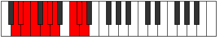 |
| [3311](https://ianring.com/musictheory/scales/3311) | [Mixodygic](ModeDSharpMixodygic.md) | D# | D#, E, F, F#, G#, A, A#, C#, D, D# |  |
| [3311](https://ianring.com/musictheory/scales/3311) | [Mixodygic](ModeEFlatMixodygic.md) | Eb | Eb, E, F, Gb, Ab, A, Bb, Db, D, Eb |  |
| [3311](https://ianring.com/musictheory/scales/3311) | [Mixodygic](ModeASharpMixodygic.md) | A# | A#, B, C, C#, D#, E, F, G#, A, A# |  |
| [3311](https://ianring.com/musictheory/scales/3311) | [Mixodygic](ModeBFlatMixodygic.md) | Bb | Bb, B, C, Db, Eb, E, F, Ab, A, Bb |  |
| [3313](https://ianring.com/musictheory/scales/3313) | [Aeolacrian](ModeANaturalAeolacrian.md) | A | A, B##, C##, D#, E, F##, G#, A |  |
| [3315](https://ianring.com/musictheory/scales/3315) | [Aeralyllic](ModeDSharpAeralyllic.md) | D# | D#, E, G, G#, A, A#, C#, D, D# |  |
| [3315](https://ianring.com/musictheory/scales/3315) | [Aeralyllic](ModeEFlatAeralyllic.md) | Eb | Eb, E, G, Ab, A, Bb, Db, D, Eb |  |
| [3315](https://ianring.com/musictheory/scales/3315) | [Aeralyllic](ModeANaturalAeralyllic.md) | A | A, A#, C#, D, D#, E, G, G#, A |  |
| [3317](https://ianring.com/musictheory/scales/3317) | [Lanyllic](ModeANaturalLanyllic.md) | A | A, B, C#, D, D#, E, G, G#, A |  |
| [3319](https://ianring.com/musictheory/scales/3319) | [Tholygic](ModeDNaturalTholygic.md) | D | D, D#, E, F#, G, G#, A, C, C#, D |  |
| [3319](https://ianring.com/musictheory/scales/3319) | [Tholygic](ModeDSharpTholygic.md) | D# | D#, E, F, G, G#, A, A#, C#, D, D# |  |
| [3319](https://ianring.com/musictheory/scales/3319) | [Tholygic](ModeEFlatTholygic.md) | Eb | Eb, E, F, G, Ab, A, Bb, Db, D, Eb |  |
| [3319](https://ianring.com/musictheory/scales/3319) | [Tholygic](ModeANaturalTholygic.md) | A | A, A#, B, C#, D, D#, E, G, G#, A |  |
| [3321](https://ianring.com/musictheory/scales/3321) | [Ionycryllic](ModeANaturalIonycryllic.md) | A | A, C, C#, D, D#, E, G, G#, A |  |
| [3321](https://ianring.com/musictheory/scales/3321) | [Ionycryllic](ModeASharpIonycryllic.md) | A# | A#, C#, D, D#, E, F, G#, A, A# |  |
| [3321](https://ianring.com/musictheory/scales/3321) | [Ionycryllic](ModeBFlatIonycryllic.md) | Bb | Bb, Db, D, Eb, E, F, Ab, A, Bb |  |
| [3323](https://ianring.com/musictheory/scales/3323) | [Phrygygic](ModeANaturalPhrygygic.md) | A | A, A#, C, C#, D, D#, E, G, G#, A |  |
| [3323](https://ianring.com/musictheory/scales/3323) | [Phrygygic](ModeDSharpPhrygygic.md) | D# | D#, E, F#, G, G#, A, A#, C#, D, D# |  |
| [3323](https://ianring.com/musictheory/scales/3323) | [Phrygygic](ModeEFlatPhrygygic.md) | Eb | Eb, E, Gb, G, Ab, A, Bb, Db, D, Eb |  |
| [3323](https://ianring.com/musictheory/scales/3323) | [Phrygygic](ModeASharpPhrygygic.md) | A# | A#, B, C#, D, D#, E, F, G#, A, A# |  |
| [3323](https://ianring.com/musictheory/scales/3323) | [Phrygygic](ModeBFlatPhrygygic.md) | Bb | Bb, B, Db, D, Eb, E, F, Ab, A, Bb |  |
| [3325](https://ianring.com/musictheory/scales/3325) | [Epygic](ModeASharpEpygic.md) | A# | A#, C, C#, D, D#, E, F, G#, A, A# |  |
| [3325](https://ianring.com/musictheory/scales/3325) | [Epygic](ModeBFlatEpygic.md) | Bb | Bb, C, Db, D, Eb, E, F, Ab, A, Bb |  |
| [3325](https://ianring.com/musictheory/scales/3325) | [Epygic](ModeANaturalEpygic.md) | A | A, B, C, C#, D, D#, E, G, G#, A |  |
| [3327](https://ianring.com/musictheory/scales/3327) | [Madyllian](ModeDNaturalMadyllian.md) | D | D, D#, E, F, F#, G, G#, A, C, C#, D |  |
| [3327](https://ianring.com/musictheory/scales/3327) | [Madyllian](ModeDSharpMadyllian.md) | D# | D#, E, F, F#, G, G#, A, A#, C#, D, D# |  |
| [3327](https://ianring.com/musictheory/scales/3327) | [Madyllian](ModeEFlatMadyllian.md) | Eb | Eb, E, F, Gb, G, Ab, A, Bb, Db, D, Eb |  |
| [3327](https://ianring.com/musictheory/scales/3327) | [Madyllian](ModeASharpMadyllian.md) | A# | A#, B, C, C#, D, D#, E, F, G#, A, A# |  |
| [3327](https://ianring.com/musictheory/scales/3327) | [Madyllian](ModeBFlatMadyllian.md) | Bb | Bb, B, C, Db, D, Eb, E, F, Ab, A, Bb |  |
| [3327](https://ianring.com/musictheory/scales/3327) | [Madyllian](ModeANaturalMadyllian.md) | A | A, A#, B, C, C#, D, D#, E, G, G#, A |  |
| [3353](https://ianring.com/musictheory/scales/3353) | [Phraptimic](ModeFNaturalPhraptimic.md) | F | F, G#, A, B##, C###, D##, F | 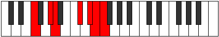 |
| [3359](https://ianring.com/musictheory/scales/3359) | [Bonyllic](ModeFNaturalBonyllic.md) | F | F, F#, G, G#, A, C#, D#, E, F |  |
| [3385](https://ianring.com/musictheory/scales/3385) | [Rothian](ModeFNaturalRothian.md) | F | F, G#, A, Bb, C#, D#, E, F |  |
| [3387](https://ianring.com/musictheory/scales/3387) | [Aeryptyllic](ModeFNaturalAeryptyllic.md) | F | F, F#, G#, A, A#, C#, D#, E, F |  |
| [3389](https://ianring.com/musictheory/scales/3389) | [Socryllic](ModeFNaturalSocryllic.md) | F | F, G, G#, A, A#, C#, D#, E, F |  |
| [3391](https://ianring.com/musictheory/scales/3391) | [Aeolynygic](ModeFNaturalAeolynygic.md) | F | F, F#, G, G#, A, A#, C#, D#, E, F |  |
| [3417](https://ianring.com/musictheory/scales/3417) | [Golian](ModeFNaturalGolian.md) | F | F, G#, A, B, C#, D#, E, F |  |
| [3419](https://ianring.com/musictheory/scales/3419) | [Danyllic](ModeFNaturalDanyllic.md) | F | F, F#, G#, A, B, C#, D#, E, F |  |
| [3421](https://ianring.com/musictheory/scales/3421) | [Aerothyllic](ModeFNaturalAerothyllic.md) | F | F, G, G#, A, B, C#, D#, E, F |  |
| [3423](https://ianring.com/musictheory/scales/3423) | [Lothygic](ModeFNaturalLothygic.md) | F | F, F#, G, G#, A, B, C#, D#, E, F |  |
| [3427](https://ianring.com/musictheory/scales/3427) | [Zacrian](ModeEFlatZacrian.md) | Eb | Eb, Fb, G#, A, B, C#, D, Eb |  |
| [3431](https://ianring.com/musictheory/scales/3431) | [Zyptyllic](ModeDSharpZyptyllic.md) | D# | D#, E, F, G#, A, B, C#, D, D# |  |
| [3431](https://ianring.com/musictheory/scales/3431) | [Zyptyllic](ModeEFlatZyptyllic.md) | Eb | Eb, E, F, Ab, A, B, Db, D, Eb |  |
| [3433](https://ianring.com/musictheory/scales/3433) | [Thonian](ModeBFlatThonian.md) | Bb | Bb, C#, D#, E, F#, G#, A, Bb |  |
| [3435](https://ianring.com/musictheory/scales/3435) | [Epiphyllic](ModeDSharpEpiphyllic.md) | D# | D#, E, F#, G#, A, B, C#, D, D# |  |
| [3435](https://ianring.com/musictheory/scales/3435) | [Epiphyllic](ModeEFlatEpiphyllic.md) | Eb | Eb, E, Gb, Ab, A, B, Db, D, Eb |  |
| [3435](https://ianring.com/musictheory/scales/3435) | [Epiphyllic](ModeASharpEpiphyllic.md) | A# | A#, B, C#, D#, E, F#, G#, A, A# |  |
| [3435](https://ianring.com/musictheory/scales/3435) | [Epiphyllic](ModeBFlatEpiphyllic.md) | Bb | Bb, B, Db, Eb, E, Gb, Ab, A, Bb |  |
| [3437](https://ianring.com/musictheory/scales/3437) | [Gathyllic](ModeASharpGathyllic.md) | A# | A#, C, C#, D#, E, F#, G#, A, A# |  |
| [3437](https://ianring.com/musictheory/scales/3437) | [Gathyllic](ModeBFlatGathyllic.md) | Bb | Bb, C, Db, Eb, E, Gb, Ab, A, Bb |  |
| [3439](https://ianring.com/musictheory/scales/3439) | [Lythygic](ModeDSharpLythygic.md) | D# | D#, E, F, F#, G#, A, B, C#, D, D# |  |
| [3439](https://ianring.com/musictheory/scales/3439) | [Lythygic](ModeEFlatLythygic.md) | Eb | Eb, E, F, Gb, Ab, A, B, Db, D, Eb |  |
| [3439](https://ianring.com/musictheory/scales/3439) | [Lythygic](ModeASharpLythygic.md) | A# | A#, B, C, C#, D#, E, F#, G#, A, A# |  |
| [3439](https://ianring.com/musictheory/scales/3439) | [Lythygic](ModeBFlatLythygic.md) | Bb | Bb, B, C, Db, Eb, E, Gb, Ab, A, Bb |  |
| [3443](https://ianring.com/musictheory/scales/3443) | [Epathyllic](ModeDSharpEpathyllic.md) | D# | D#, E, G, G#, A, B, C#, D, D# |  |
| [3443](https://ianring.com/musictheory/scales/3443) | [Epathyllic](ModeEFlatEpathyllic.md) | Eb | Eb, E, G, Ab, A, B, Db, D, Eb |  |
| [3447](https://ianring.com/musictheory/scales/3447) | [Kynygic](ModeDSharpKynygic.md) | D# | D#, E, F, G, G#, A, B, C#, D, D# |  |
| [3447](https://ianring.com/musictheory/scales/3447) | [Kynygic](ModeEFlatKynygic.md) | Eb | Eb, E, F, G, Ab, A, B, Db, D, Eb |  |
| [3449](https://ianring.com/musictheory/scales/3449) | [Bacryllic](ModeASharpBacryllic.md) | A# | A#, C#, D, D#, E, F#, G#, A, A# |  |
| [3449](https://ianring.com/musictheory/scales/3449) | [Bacryllic](ModeBFlatBacryllic.md) | Bb | Bb, Db, D, Eb, E, Gb, Ab, A, Bb |  |
| [3449](https://ianring.com/musictheory/scales/3449) | [Bacryllic](ModeFNaturalBacryllic.md) | F | F, G#, A, A#, B, C#, D#, E, F |  |
| [3451](https://ianring.com/musictheory/scales/3451) | [Garygic](ModeDSharpGarygic.md) | D# | D#, E, F#, G, G#, A, B, C#, D, D# |  |
| [3451](https://ianring.com/musictheory/scales/3451) | [Garygic](ModeEFlatGarygic.md) | Eb | Eb, E, Gb, G, Ab, A, B, Db, D, Eb |  |
| [3451](https://ianring.com/musictheory/scales/3451) | [Garygic](ModeASharpGarygic.md) | A# | A#, B, C#, D, D#, E, F#, G#, A, A# |  |
| [3451](https://ianring.com/musictheory/scales/3451) | [Garygic](ModeBFlatGarygic.md) | Bb | Bb, B, Db, D, Eb, E, Gb, Ab, A, Bb |  |
| [3451](https://ianring.com/musictheory/scales/3451) | [Garygic](ModeFNaturalGarygic.md) | F | F, F#, G#, A, A#, B, C#, D#, E, F |  |
| [3453](https://ianring.com/musictheory/scales/3453) | [Katarygic](ModeASharpKatarygic.md) | A# | A#, C, C#, D, D#, E, F#, G#, A, A# |  |
| [3453](https://ianring.com/musictheory/scales/3453) | [Katarygic](ModeBFlatKatarygic.md) | Bb | Bb, C, Db, D, Eb, E, Gb, Ab, A, Bb |  |
| [3453](https://ianring.com/musictheory/scales/3453) | [Katarygic](ModeFNaturalKatarygic.md) | F | F, G, G#, A, A#, B, C#, D#, E, F |  |
| [3455](https://ianring.com/musictheory/scales/3455) | [Ryptyllian](ModeDSharpRyptyllian.md) | D# | D#, E, F, F#, G, G#, A, B, C#, D, D# |  |
| [3455](https://ianring.com/musictheory/scales/3455) | [Ryptyllian](ModeEFlatRyptyllian.md) | Eb | Eb, E, F, Gb, G, Ab, A, B, Db, D, Eb |  |
| [3455](https://ianring.com/musictheory/scales/3455) | [Ryptyllian](ModeASharpRyptyllian.md) | A# | A#, B, C, C#, D, D#, E, F#, G#, A, A# |  |
| [3455](https://ianring.com/musictheory/scales/3455) | [Ryptyllian](ModeBFlatRyptyllian.md) | Bb | Bb, B, C, Db, D, Eb, E, Gb, Ab, A, Bb |  |
| [3455](https://ianring.com/musictheory/scales/3455) | [Ryptyllian](ModeFNaturalRyptyllian.md) | F | F, F#, G, G#, A, A#, B, C#, D#, E, F |  |
| [3469](https://ianring.com/musictheory/scales/3469) | [Monian](ModeDFlatMonian.md) | Db | Db, Eb, Fb, G#, A, B, C, Db |  |
| [3471](https://ianring.com/musictheory/scales/3471) | [Gyryllic](ModeCSharpGyryllic.md) | C# | C#, D, D#, E, G#, A, B, C, C# |  |
| [3471](https://ianring.com/musictheory/scales/3471) | [Gyryllic](ModeDFlatGyryllic.md) | Db | Db, D, Eb, E, Ab, A, B, C, Db |  |
| [3481](https://ianring.com/musictheory/scales/3481) | [Katathian](ModeFNaturalKatathian.md) | F | F, G#, A, B#, C#, D#, E, F |  |
| [3483](https://ianring.com/musictheory/scales/3483) | [Mixotharyllic](ModeFNaturalMixotharyllic.md) | F | F, F#, G#, A, C, C#, D#, E, F |  |
| [3485](https://ianring.com/musictheory/scales/3485) | [Kyptyllic](ModeFNaturalKyptyllic.md) | F | F, G, G#, A, C, C#, D#, E, F |  |
| [3485](https://ianring.com/musictheory/scales/3485) | [Kyptyllic](ModeCSharpKyptyllic.md) | C# | C#, D#, E, F, G#, A, B, C, C# |  |
| [3485](https://ianring.com/musictheory/scales/3485) | [Kyptyllic](ModeDFlatKyptyllic.md) | Db | Db, Eb, E, F, Ab, A, B, C, Db |  |
| [3487](https://ianring.com/musictheory/scales/3487) | [Byptygic](ModeFNaturalByptygic.md) | F | F, F#, G, G#, A, C, C#, D#, E, F |  |
| [3487](https://ianring.com/musictheory/scales/3487) | [Byptygic](ModeCSharpByptygic.md) | C# | C#, D, D#, E, F, G#, A, B, C, C# |  |
| [3487](https://ianring.com/musictheory/scales/3487) | [Byptygic](ModeDFlatByptygic.md) | Db | Db, D, Eb, E, F, Ab, A, B, C, Db |  |
| [3491](https://ianring.com/musictheory/scales/3491) | [Tharian](ModeGSharpTharian.md) | G# | G#, A, B##, C###, D##, E##, F##, G# |  |
| [3495](https://ianring.com/musictheory/scales/3495) | [Banyllic](ModeGSharpBanyllic.md) | G# | G#, A, A#, C#, D#, E, F#, G, G# | 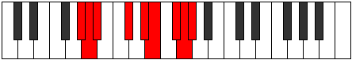 |
| [3495](https://ianring.com/musictheory/scales/3495) | [Banyllic](ModeAFlatBanyllic.md) | Ab | Ab, A, Bb, Db, Eb, E, Gb, G, Ab |  |
| [3499](https://ianring.com/musictheory/scales/3499) | [Lythyllic](ModeGSharpLythyllic.md) | G# | G#, A, B, C#, D#, E, F#, G, G# |  |
| [3499](https://ianring.com/musictheory/scales/3499) | [Lythyllic](ModeAFlatLythyllic.md) | Ab | Ab, A, B, Db, Eb, E, Gb, G, Ab |  |
| [3501](https://ianring.com/musictheory/scales/3501) | [Katodyllic](ModeCSharpKatodyllic.md) | C# | C#, D#, E, F#, G#, A, B, C, C# |  |
| [3501](https://ianring.com/musictheory/scales/3501) | [Katodyllic](ModeDFlatKatodyllic.md) | Db | Db, Eb, E, Gb, Ab, A, B, C, Db |  |
| [3503](https://ianring.com/musictheory/scales/3503) | [Zyphygic](ModeCSharpZyphygic.md) | C# | C#, D, D#, E, F#, G#, A, B, C, C# |  |
| [3503](https://ianring.com/musictheory/scales/3503) | [Zyphygic](ModeDFlatZyphygic.md) | Db | Db, D, Eb, E, Gb, Ab, A, B, C, Db |  |
| [3503](https://ianring.com/musictheory/scales/3503) | [Zyphygic](ModeGSharpZyphygic.md) | G# | G#, A, A#, B, C#, D#, E, F#, G, G# |  |
| [3503](https://ianring.com/musictheory/scales/3503) | [Zyphygic](ModeAFlatZyphygic.md) | Ab | Ab, A, Bb, B, Db, Eb, E, Gb, G, Ab |  |
| [3507](https://ianring.com/musictheory/scales/3507) | [Ponyllic](ModeGSharpPonyllic.md) | G# | G#, A, C, C#, D#, E, F#, G, G# |  |
| [3507](https://ianring.com/musictheory/scales/3507) | [Ponyllic](ModeAFlatPonyllic.md) | Ab | Ab, A, C, Db, Eb, E, Gb, G, Ab |  |
| [3511](https://ianring.com/musictheory/scales/3511) | [Epolygic](ModeGSharpEpolygic.md) | G# | G#, A, A#, C, C#, D#, E, F#, G, G# |  |
| [3511](https://ianring.com/musictheory/scales/3511) | [Epolygic](ModeAFlatEpolygic.md) | Ab | Ab, A, Bb, C, Db, Eb, E, Gb, G, Ab |  |
| [3513](https://ianring.com/musictheory/scales/3513) | [Dydyllic](ModeFNaturalDydyllic.md) | F | F, G#, A, A#, C, C#, D#, E, F |  |
| [3515](https://ianring.com/musictheory/scales/3515) | [Katodygic](ModeFNaturalKatodygic.md) | F | F, F#, G#, A, A#, C, C#, D#, E, F |  |
| [3515](https://ianring.com/musictheory/scales/3515) | [Katodygic](ModeGSharpKatodygic.md) | G# | G#, A, B, C, C#, D#, E, F#, G, G# |  |
| [3515](https://ianring.com/musictheory/scales/3515) | [Katodygic](ModeAFlatKatodygic.md) | Ab | Ab, A, B, C, Db, Eb, E, Gb, G, Ab |  |
| [3517](https://ianring.com/musictheory/scales/3517) | [Epocrygic](ModeFNaturalEpocrygic.md) | F | F, G, G#, A, A#, C, C#, D#, E, F |  |
| [3517](https://ianring.com/musictheory/scales/3517) | [Epocrygic](ModeCSharpEpocrygic.md) | C# | C#, D#, E, F, F#, G#, A, B, C, C# |  |
| [3517](https://ianring.com/musictheory/scales/3517) | [Epocrygic](ModeDFlatEpocrygic.md) | Db | Db, Eb, E, F, Gb, Ab, A, B, C, Db |  |
| [3519](https://ianring.com/musictheory/scales/3519) | [Boptyllian](ModeFNaturalBoptyllian.md) | F | F, F#, G, G#, A, A#, C, C#, D#, E, F |  |
| [3519](https://ianring.com/musictheory/scales/3519) | [Boptyllian](ModeCSharpBoptyllian.md) | C# | C#, D, D#, E, F, F#, G#, A, B, C, C# |  |
| [3519](https://ianring.com/musictheory/scales/3519) | [Boptyllian](ModeDFlatBoptyllian.md) | Db | Db, D, Eb, E, F, Gb, Ab, A, B, C, Db |  |
| [3519](https://ianring.com/musictheory/scales/3519) | [Boptyllian](ModeGSharpBoptyllian.md) | G# | G#, A, A#, B, C, C#, D#, E, F#, G, G# |  |
| [3519](https://ianring.com/musictheory/scales/3519) | [Boptyllian](ModeAFlatBoptyllian.md) | Ab | Ab, A, Bb, B, C, Db, Eb, E, Gb, G, Ab |  |
| [3527](https://ianring.com/musictheory/scales/3527) | [Ronyllic](ModeDNaturalRonyllic.md) | D | D, D#, E, G#, A, A#, C, C#, D |  |
| [3533](https://ianring.com/musictheory/scales/3533) | [Thadyllic](ModeCSharpThadyllic.md) | C# | C#, D#, E, G, G#, A, B, C, C# |  |
| [3533](https://ianring.com/musictheory/scales/3533) | [Thadyllic](ModeDFlatThadyllic.md) | Db | Db, Eb, E, G, Ab, A, B, C, Db |  |
| [3535](https://ianring.com/musictheory/scales/3535) | [Aeroptygic](ModeDNaturalAeroptygic.md) | D | D, D#, E, F, G#, A, A#, C, C#, D |  |
| [3535](https://ianring.com/musictheory/scales/3535) | [Aeroptygic](ModeCSharpAeroptygic.md) | C# | C#, D, D#, E, G, G#, A, B, C, C# |  |
| [3535](https://ianring.com/musictheory/scales/3535) | [Aeroptygic](ModeDFlatAeroptygic.md) | Db | Db, D, Eb, E, G, Ab, A, B, C, Db |  |
| [3537](https://ianring.com/musictheory/scales/3537) | [Katogian](ModeANaturalKatogian.md) | A | A, B##, C###, D##, E#, F##, G#, A |  |
| [3539](https://ianring.com/musictheory/scales/3539) | [Aeoryllic](ModeANaturalAeoryllic.md) | A | A, A#, C#, D#, E, F, G, G#, A |  |
| [3541](https://ianring.com/musictheory/scales/3541) | [Racryllic](ModeANaturalRacryllic.md) | A | A, B, C#, D#, E, F, G, G#, A |  |
| [3543](https://ianring.com/musictheory/scales/3543) | [Aeolonygic](ModeDNaturalAeolonygic.md) | D | D, D#, E, F#, G#, A, A#, C, C#, D |  |
| [3543](https://ianring.com/musictheory/scales/3543) | [Aeolonygic](ModeANaturalAeolonygic.md) | A | A, A#, B, C#, D#, E, F, G, G#, A |  |
| [3545](https://ianring.com/musictheory/scales/3545) | [Thyptyllic](ModeANaturalThyptyllic.md) | A | A, C, C#, D#, E, F, G, G#, A |  |
| [3545](https://ianring.com/musictheory/scales/3545) | [Thyptyllic](ModeFNaturalThyptyllic.md) | F | F, G#, A, B, C, C#, D#, E, F |  |
| [3547](https://ianring.com/musictheory/scales/3547) | [Sadygic](ModeANaturalSadygic.md) | A | A, A#, C, C#, D#, E, F, G, G#, A |  |
| [3547](https://ianring.com/musictheory/scales/3547) | [Sadygic](ModeFNaturalSadygic.md) | F | F, F#, G#, A, B, C, C#, D#, E, F |  |
| [3549](https://ianring.com/musictheory/scales/3549) | [Phronygic](ModeCSharpPhronygic.md) | C# | C#, D#, E, F, G, G#, A, B, C, C# |  |
| [3549](https://ianring.com/musictheory/scales/3549) | [Phronygic](ModeDFlatPhronygic.md) | Db | Db, Eb, E, F, G, Ab, A, B, C, Db |  |
| [3549](https://ianring.com/musictheory/scales/3549) | [Phronygic](ModeFNaturalPhronygic.md) | F | F, G, G#, A, B, C, C#, D#, E, F |  |
| [3549](https://ianring.com/musictheory/scales/3549) | [Phronygic](ModeANaturalPhronygic.md) | A | A, B, C, C#, D#, E, F, G, G#, A |  |
| [3551](https://ianring.com/musictheory/scales/3551) | [Sagyllian](ModeDNaturalSagyllian.md) | D | D, D#, E, F, F#, G#, A, A#, C, C#, D |  |
| [3551](https://ianring.com/musictheory/scales/3551) | [Sagyllian](ModeCSharpSagyllian.md) | C# | C#, D, D#, E, F, G, G#, A, B, C, C# |  |
| [3551](https://ianring.com/musictheory/scales/3551) | [Sagyllian](ModeDFlatSagyllian.md) | Db | Db, D, Eb, E, F, G, Ab, A, B, C, Db |  |
| [3551](https://ianring.com/musictheory/scales/3551) | [Sagyllian](ModeFNaturalSagyllian.md) | F | F, F#, G, G#, A, B, C, C#, D#, E, F |  |
| [3551](https://ianring.com/musictheory/scales/3551) | [Sagyllian](ModeANaturalSagyllian.md) | A | A, A#, B, C, C#, D#, E, F, G, G#, A |  |
| [3555](https://ianring.com/musictheory/scales/3555) | [Pylyllic](ModeGSharpPylyllic.md) | G# | G#, A, C#, D, D#, E, F#, G, G# |  |
| [3555](https://ianring.com/musictheory/scales/3555) | [Pylyllic](ModeAFlatPylyllic.md) | Ab | Ab, A, Db, D, Eb, E, Gb, G, Ab |  |
| [3555](https://ianring.com/musictheory/scales/3555) | [Pylyllic](ModeDSharpPylyllic.md) | D# | D#, E, G#, A, A#, B, C#, D, D# |  |
| [3555](https://ianring.com/musictheory/scales/3555) | [Pylyllic](ModeEFlatPylyllic.md) | Eb | Eb, E, Ab, A, Bb, B, Db, D, Eb |  |
| [3559](https://ianring.com/musictheory/scales/3559) | [Aerathygic](ModeDNaturalAerathygic.md) | D | D, D#, E, G, G#, A, A#, C, C#, D |  |
| [3559](https://ianring.com/musictheory/scales/3559) | [Aerathygic](ModeGSharpAerathygic.md) | G# | G#, A, A#, C#, D, D#, E, F#, G, G# |  |
| [3559](https://ianring.com/musictheory/scales/3559) | [Aerathygic](ModeAFlatAerathygic.md) | Ab | Ab, A, Bb, Db, D, Eb, E, Gb, G, Ab |  |
| [3559](https://ianring.com/musictheory/scales/3559) | [Aerathygic](ModeDSharpAerathygic.md) | D# | D#, E, F, G#, A, A#, B, C#, D, D# |  |
| [3559](https://ianring.com/musictheory/scales/3559) | [Aerathygic](ModeEFlatAerathygic.md) | Eb | Eb, E, F, Ab, A, Bb, B, Db, D, Eb |  |
| [3561](https://ianring.com/musictheory/scales/3561) | [Pothyllic](ModeASharpPothyllic.md) | A# | A#, C#, D#, E, F, F#, G#, A, A# |  |
| [3561](https://ianring.com/musictheory/scales/3561) | [Pothyllic](ModeBFlatPothyllic.md) | Bb | Bb, Db, Eb, E, F, Gb, Ab, A, Bb |  |
| [3563](https://ianring.com/musictheory/scales/3563) | [Ionoptygic](ModeGSharpIonoptygic.md) | G# | G#, A, B, C#, D, D#, E, F#, G, G# |  |
| [3563](https://ianring.com/musictheory/scales/3563) | [Ionoptygic](ModeAFlatIonoptygic.md) | Ab | Ab, A, B, Db, D, Eb, E, Gb, G, Ab |  |
| [3563](https://ianring.com/musictheory/scales/3563) | [Ionoptygic](ModeDSharpIonoptygic.md) | D# | D#, E, F#, G#, A, A#, B, C#, D, D# |  |
| [3563](https://ianring.com/musictheory/scales/3563) | [Ionoptygic](ModeEFlatIonoptygic.md) | Eb | Eb, E, Gb, Ab, A, Bb, B, Db, D, Eb |  |
| [3563](https://ianring.com/musictheory/scales/3563) | [Ionoptygic](ModeASharpIonoptygic.md) | A# | A#, B, C#, D#, E, F, F#, G#, A, A# |  |
| [3563](https://ianring.com/musictheory/scales/3563) | [Ionoptygic](ModeBFlatIonoptygic.md) | Bb | Bb, B, Db, Eb, E, F, Gb, Ab, A, Bb |  |
| [3565](https://ianring.com/musictheory/scales/3565) | [Aeolorygic](ModeASharpAeolorygic.md) | A# | A#, C, C#, D#, E, F, F#, G#, A, A# |  |
| [3565](https://ianring.com/musictheory/scales/3565) | [Aeolorygic](ModeBFlatAeolorygic.md) | Bb | Bb, C, Db, Eb, E, F, Gb, Ab, A, Bb |  |
| [3565](https://ianring.com/musictheory/scales/3565) | [Aeolorygic](ModeCSharpAeolorygic.md) | C# | C#, D#, E, F#, G, G#, A, B, C, C# |  |
| [3565](https://ianring.com/musictheory/scales/3565) | [Aeolorygic](ModeDFlatAeolorygic.md) | Db | Db, Eb, E, Gb, G, Ab, A, B, C, Db |  |
| [3567](https://ianring.com/musictheory/scales/3567) | [Epityllian](ModeDNaturalEpityllian.md) | D | D, D#, E, F, G, G#, A, A#, C, C#, D |  |
| [3567](https://ianring.com/musictheory/scales/3567) | [Epityllian](ModeCSharpEpityllian.md) | C# | C#, D, D#, E, F#, G, G#, A, B, C, C# |  |
| [3567](https://ianring.com/musictheory/scales/3567) | [Epityllian](ModeDFlatEpityllian.md) | Db | Db, D, Eb, E, Gb, G, Ab, A, B, C, Db |  |
| [3567](https://ianring.com/musictheory/scales/3567) | [Epityllian](ModeASharpEpityllian.md) | A# | A#, B, C, C#, D#, E, F, F#, G#, A, A# |  |
| [3567](https://ianring.com/musictheory/scales/3567) | [Epityllian](ModeBFlatEpityllian.md) | Bb | Bb, B, C, Db, Eb, E, F, Gb, Ab, A, Bb |  |
| [3567](https://ianring.com/musictheory/scales/3567) | [Epityllian](ModeDSharpEpityllian.md) | D# | D#, E, F, F#, G#, A, A#, B, C#, D, D# |  |
| [3567](https://ianring.com/musictheory/scales/3567) | [Epityllian](ModeEFlatEpityllian.md) | Eb | Eb, E, F, Gb, Ab, A, Bb, B, Db, D, Eb |  |
| [3567](https://ianring.com/musictheory/scales/3567) | [Epityllian](ModeGSharpEpityllian.md) | G# | G#, A, A#, B, C#, D, D#, E, F#, G, G# |  |
| [3567](https://ianring.com/musictheory/scales/3567) | [Epityllian](ModeAFlatEpityllian.md) | Ab | Ab, A, Bb, B, Db, D, Eb, E, Gb, G, Ab |  |
| [3569](https://ianring.com/musictheory/scales/3569) | [Aeoladyllic](ModeANaturalAeoladyllic.md) | A | A, C#, D, D#, E, F, G, G#, A |  |
| [3571](https://ianring.com/musictheory/scales/3571) | [Dyrygic](ModeGSharpDyrygic.md) | G# | G#, A, C, C#, D, D#, E, F#, G, G# |  |
| [3571](https://ianring.com/musictheory/scales/3571) | [Dyrygic](ModeAFlatDyrygic.md) | Ab | Ab, A, C, Db, D, Eb, E, Gb, G, Ab |  |
| [3571](https://ianring.com/musictheory/scales/3571) | [Dyrygic](ModeANaturalDyrygic.md) | A | A, A#, C#, D, D#, E, F, G, G#, A |  |
| [3571](https://ianring.com/musictheory/scales/3571) | [Dyrygic](ModeDSharpDyrygic.md) | D# | D#, E, G, G#, A, A#, B, C#, D, D# |  |
| [3571](https://ianring.com/musictheory/scales/3571) | [Dyrygic](ModeEFlatDyrygic.md) | Eb | Eb, E, G, Ab, A, Bb, B, Db, D, Eb |  |
| [3573](https://ianring.com/musictheory/scales/3573) | [Kaptygic](ModeANaturalKaptygic.md) | A | A, B, C#, D, D#, E, F, G, G#, A |  |
| [3575](https://ianring.com/musictheory/scales/3575) | [Mogyllian](ModeDNaturalMogyllian.md) | D | D, D#, E, F#, G, G#, A, A#, C, C#, D |  |
| [3575](https://ianring.com/musictheory/scales/3575) | [Mogyllian](ModeGSharpMogyllian.md) | G# | G#, A, A#, C, C#, D, D#, E, F#, G, G# |  |
| [3575](https://ianring.com/musictheory/scales/3575) | [Mogyllian](ModeAFlatMogyllian.md) | Ab | Ab, A, Bb, C, Db, D, Eb, E, Gb, G, Ab |  |
| [3575](https://ianring.com/musictheory/scales/3575) | [Mogyllian](ModeDSharpMogyllian.md) | D# | D#, E, F, G, G#, A, A#, B, C#, D, D# |  |
| [3575](https://ianring.com/musictheory/scales/3575) | [Mogyllian](ModeEFlatMogyllian.md) | Eb | Eb, E, F, G, Ab, A, Bb, B, Db, D, Eb |  |
| [3575](https://ianring.com/musictheory/scales/3575) | [Mogyllian](ModeANaturalMogyllian.md) | A | A, A#, B, C#, D, D#, E, F, G, G#, A |  |
| [3577](https://ianring.com/musictheory/scales/3577) | [Loptygic](ModeANaturalLoptygic.md) | A | A, C, C#, D, D#, E, F, G, G#, A |  |
| [3577](https://ianring.com/musictheory/scales/3577) | [Loptygic](ModeASharpLoptygic.md) | A# | A#, C#, D, D#, E, F, F#, G#, A, A# |  |
| [3577](https://ianring.com/musictheory/scales/3577) | [Loptygic](ModeBFlatLoptygic.md) | Bb | Bb, Db, D, Eb, E, F, Gb, Ab, A, Bb |  |
| [3577](https://ianring.com/musictheory/scales/3577) | [Loptygic](ModeFNaturalLoptygic.md) | F | F, G#, A, A#, B, C, C#, D#, E, F |  |
| [3579](https://ianring.com/musictheory/scales/3579) | [Zyphyllian](ModeANaturalZyphyllian.md) | A | A, A#, C, C#, D, D#, E, F, G, G#, A |  |
| [3579](https://ianring.com/musictheory/scales/3579) | [Zyphyllian](ModeGSharpZyphyllian.md) | G# | G#, A, B, C, C#, D, D#, E, F#, G, G# |  |
| [3579](https://ianring.com/musictheory/scales/3579) | [Zyphyllian](ModeAFlatZyphyllian.md) | Ab | Ab, A, B, C, Db, D, Eb, E, Gb, G, Ab |  |
| [3579](https://ianring.com/musictheory/scales/3579) | [Zyphyllian](ModeFNaturalZyphyllian.md) | F | F, F#, G#, A, A#, B, C, C#, D#, E, F |  |
| [3579](https://ianring.com/musictheory/scales/3579) | [Zyphyllian](ModeASharpZyphyllian.md) | A# | A#, B, C#, D, D#, E, F, F#, G#, A, A# |  |
| [3579](https://ianring.com/musictheory/scales/3579) | [Zyphyllian](ModeBFlatZyphyllian.md) | Bb | Bb, B, Db, D, Eb, E, F, Gb, Ab, A, Bb |  |
| [3579](https://ianring.com/musictheory/scales/3579) | [Zyphyllian](ModeDSharpZyphyllian.md) | D# | D#, E, F#, G, G#, A, A#, B, C#, D, D# |  |
| [3579](https://ianring.com/musictheory/scales/3579) | [Zyphyllian](ModeEFlatZyphyllian.md) | Eb | Eb, E, Gb, G, Ab, A, Bb, B, Db, D, Eb |  |
| [3581](https://ianring.com/musictheory/scales/3581) | [Epocryllian](ModeASharpEpocryllian.md) | A# | A#, C, C#, D, D#, E, F, F#, G#, A, A# |  |
| [3581](https://ianring.com/musictheory/scales/3581) | [Epocryllian](ModeBFlatEpocryllian.md) | Bb | Bb, C, Db, D, Eb, E, F, Gb, Ab, A, Bb |  |
| [3581](https://ianring.com/musictheory/scales/3581) | [Epocryllian](ModeANaturalEpocryllian.md) | A | A, B, C, C#, D, D#, E, F, G, G#, A |  |
| [3581](https://ianring.com/musictheory/scales/3581) | [Epocryllian](ModeCSharpEpocryllian.md) | C# | C#, D#, E, F, F#, G, G#, A, B, C, C# |  |
| [3581](https://ianring.com/musictheory/scales/3581) | [Epocryllian](ModeDFlatEpocryllian.md) | Db | Db, Eb, E, F, Gb, G, Ab, A, B, C, Db |  |
| [3581](https://ianring.com/musictheory/scales/3581) | [Epocryllian](ModeFNaturalEpocryllian.md) | F | F, G, G#, A, A#, B, C, C#, D#, E, F |  |
| [3583](https://ianring.com/musictheory/scales/3583) | [Zylatic](ModeDNaturalZylatic.md) | D | D, D#, E, F, F#, G, G#, A, A#, C, C#, D |  |
| [3583](https://ianring.com/musictheory/scales/3583) | [Zylatic](ModeCSharpZylatic.md) | C# | C#, D, D#, E, F, F#, G, G#, A, B, C, C# |  |
| [3583](https://ianring.com/musictheory/scales/3583) | [Zylatic](ModeDFlatZylatic.md) | Db | Db, D, Eb, E, F, Gb, G, Ab, A, B, C, Db |  |
| [3583](https://ianring.com/musictheory/scales/3583) | [Zylatic](ModeASharpZylatic.md) | A# | A#, B, C, C#, D, D#, E, F, F#, G#, A, A# |  |
| [3583](https://ianring.com/musictheory/scales/3583) | [Zylatic](ModeBFlatZylatic.md) | Bb | Bb, B, C, Db, D, Eb, E, F, Gb, Ab, A, Bb |  |
| [3583](https://ianring.com/musictheory/scales/3583) | [Zylatic](ModeANaturalZylatic.md) | A | A, A#, B, C, C#, D, D#, E, F, G, G#, A |  |
| [3583](https://ianring.com/musictheory/scales/3583) | [Zylatic](ModeGSharpZylatic.md) | G# | G#, A, A#, B, C, C#, D, D#, E, F#, G, G# |  |
| [3583](https://ianring.com/musictheory/scales/3583) | [Zylatic](ModeAFlatZylatic.md) | Ab | Ab, A, Bb, B, C, Db, D, Eb, E, Gb, G, Ab |  |
| [3583](https://ianring.com/musictheory/scales/3583) | [Zylatic](ModeFNaturalZylatic.md) | F | F, F#, G, G#, A, A#, B, C, C#, D#, E, F |  |
| [3583](https://ianring.com/musictheory/scales/3583) | [Zylatic](ModeDSharpZylatic.md) | D# | D#, E, F, F#, G, G#, A, A#, B, C#, D, D# |  |
| [3583](https://ianring.com/musictheory/scales/3583) | [Zylatic](ModeEFlatZylatic.md) | Eb | Eb, E, F, Gb, G, Ab, A, Bb, B, Db, D, Eb |  |
| [3635](https://ianring.com/musictheory/scales/3635) | [Katygian](ModeENaturalKatygian.md) | E | E, F, G#, A, B##, C##, D#, E |  |
| [3637](https://ianring.com/musictheory/scales/3637) | [Kygian](ModeENaturalKygian.md) | E | E, F#, G#, A, B##, C##, D#, E |  |
| [3639](https://ianring.com/musictheory/scales/3639) | [Paptyllic](ModeENaturalPaptyllic.md) | E | E, F, F#, G#, A, C#, D, D#, E |  |
| [3639](https://ianring.com/musictheory/scales/3639) | [Paptyllic](ModeBNaturalPaptyllic.md) | B | B, C, C#, D#, E, G#, A, A#, B |  |
| [3641](https://ianring.com/musictheory/scales/3641) | [Thocrian](ModeENaturalThocrian.md) | E | E, F##, G#, A, B##, C##, D#, E |  |
| [3643](https://ianring.com/musictheory/scales/3643) | [Kydyllic](ModeENaturalKydyllic.md) | E | E, F, G, G#, A, C#, D, D#, E |  |
| [3645](https://ianring.com/musictheory/scales/3645) | [Zycryllic](ModeENaturalZycryllic.md) | E | E, F#, G, G#, A, C#, D, D#, E |  |
| [3645](https://ianring.com/musictheory/scales/3645) | [Zycryllic](ModeBNaturalZycryllic.md) | B | B, C#, D, D#, E, G#, A, A#, B |  |
| [3647](https://ianring.com/musictheory/scales/3647) | [Eporygic](ModeENaturalEporygic.md) | E | E, F, F#, G, G#, A, C#, D, D#, E |  |
| [3647](https://ianring.com/musictheory/scales/3647) | [Eporygic](ModeBNaturalEporygic.md) | B | B, C, C#, D, D#, E, G#, A, A#, B |  |
| [3683](https://ianring.com/musictheory/scales/3683) | [Dycrian](ModeEFlatDycrian.md) | Eb | Eb, Fb, G#, A, B#, C#, D, Eb |  |
| [3687](https://ianring.com/musictheory/scales/3687) | [Zonyllic](ModeDSharpZonyllic.md) | D# | D#, E, F, G#, A, C, C#, D, D# |  |
| [3687](https://ianring.com/musictheory/scales/3687) | [Zonyllic](ModeEFlatZonyllic.md) | Eb | Eb, E, F, Ab, A, C, Db, D, Eb |  |
| [3689](https://ianring.com/musictheory/scales/3689) | [Katocrian](ModeBFlatKatocrian.md) | Bb | Bb, C#, D#, E, F##, G#, A, Bb |  |
| [3691](https://ianring.com/musictheory/scales/3691) | [Badyllic](ModeDSharpBadyllic.md) | D# | D#, E, F#, G#, A, C, C#, D, D# |  |
| [3691](https://ianring.com/musictheory/scales/3691) | [Badyllic](ModeEFlatBadyllic.md) | Eb | Eb, E, Gb, Ab, A, C, Db, D, Eb |  |
| [3691](https://ianring.com/musictheory/scales/3691) | [Badyllic](ModeASharpBadyllic.md) | A# | A#, B, C#, D#, E, G, G#, A, A# |  |
| [3691](https://ianring.com/musictheory/scales/3691) | [Badyllic](ModeBFlatBadyllic.md) | Bb | Bb, B, Db, Eb, E, G, Ab, A, Bb |  |
| [3693](https://ianring.com/musictheory/scales/3693) | [Epaptyllic](ModeASharpEpaptyllic.md) | A# | A#, C, C#, D#, E, G, G#, A, A# | 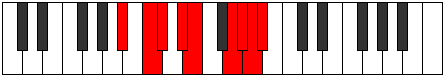 |
| [3693](https://ianring.com/musictheory/scales/3693) | [Epaptyllic](ModeBFlatEpaptyllic.md) | Bb | Bb, C, Db, Eb, E, G, Ab, A, Bb |  |
| [3695](https://ianring.com/musictheory/scales/3695) | [Kodygic](ModeDSharpKodygic.md) | D# | D#, E, F, F#, G#, A, C, C#, D, D# |  |
| [3695](https://ianring.com/musictheory/scales/3695) | [Kodygic](ModeEFlatKodygic.md) | Eb | Eb, E, F, Gb, Ab, A, C, Db, D, Eb |  |
| [3695](https://ianring.com/musictheory/scales/3695) | [Kodygic](ModeASharpKodygic.md) | A# | A#, B, C, C#, D#, E, G, G#, A, A# |  |
| [3695](https://ianring.com/musictheory/scales/3695) | [Kodygic](ModeBFlatKodygic.md) | Bb | Bb, B, C, Db, Eb, E, G, Ab, A, Bb |  |
| [3699](https://ianring.com/musictheory/scales/3699) | [Aeolylyllic](ModeDSharpAeolylyllic.md) | D# | D#, E, G, G#, A, C, C#, D, D# |  |
| [3699](https://ianring.com/musictheory/scales/3699) | [Aeolylyllic](ModeEFlatAeolylyllic.md) | Eb | Eb, E, G, Ab, A, C, Db, D, Eb |  |
| [3699](https://ianring.com/musictheory/scales/3699) | [Aeolylyllic](ModeENaturalAeolylyllic.md) | E | E, F, G#, A, A#, C#, D, D#, E |  |
| [3701](https://ianring.com/musictheory/scales/3701) | [Bagyllic](ModeENaturalBagyllic.md) | E | E, F#, G#, A, A#, C#, D, D#, E |  |
| [3701](https://ianring.com/musictheory/scales/3701) | [Bagyllic](ModeBNaturalBagyllic.md) | B | B, C#, D#, E, F, G#, A, A#, B |  |
| [3703](https://ianring.com/musictheory/scales/3703) | [Katalygic](ModeDSharpKatalygic.md) | D# | D#, E, F, G, G#, A, C, C#, D, D# |  |
| [3703](https://ianring.com/musictheory/scales/3703) | [Katalygic](ModeEFlatKatalygic.md) | Eb | Eb, E, F, G, Ab, A, C, Db, D, Eb |  |
| [3703](https://ianring.com/musictheory/scales/3703) | [Katalygic](ModeENaturalKatalygic.md) | E | E, F, F#, G#, A, A#, C#, D, D#, E |  |
| [3703](https://ianring.com/musictheory/scales/3703) | [Katalygic](ModeBNaturalKatalygic.md) | B | B, C, C#, D#, E, F, G#, A, A#, B |  |
| [3705](https://ianring.com/musictheory/scales/3705) | [Sydyllic](ModeENaturalSydyllic.md) | E | E, G, G#, A, A#, C#, D, D#, E |  |
| [3705](https://ianring.com/musictheory/scales/3705) | [Sydyllic](ModeASharpSydyllic.md) | A# | A#, C#, D, D#, E, G, G#, A, A# |  |
| [3705](https://ianring.com/musictheory/scales/3705) | [Sydyllic](ModeBFlatSydyllic.md) | Bb | Bb, Db, D, Eb, E, G, Ab, A, Bb |  |
| [3707](https://ianring.com/musictheory/scales/3707) | [Rynygic](ModeDSharpRynygic.md) | D# | D#, E, F#, G, G#, A, C, C#, D, D# |  |
| [3707](https://ianring.com/musictheory/scales/3707) | [Rynygic](ModeEFlatRynygic.md) | Eb | Eb, E, Gb, G, Ab, A, C, Db, D, Eb |  |
| [3707](https://ianring.com/musictheory/scales/3707) | [Rynygic](ModeENaturalRynygic.md) | E | E, F, G, G#, A, A#, C#, D, D#, E |  |
| [3707](https://ianring.com/musictheory/scales/3707) | [Rynygic](ModeASharpRynygic.md) | A# | A#, B, C#, D, D#, E, G, G#, A, A# |  |
| [3707](https://ianring.com/musictheory/scales/3707) | [Rynygic](ModeBFlatRynygic.md) | Bb | Bb, B, Db, D, Eb, E, G, Ab, A, Bb |  |
| [3709](https://ianring.com/musictheory/scales/3709) | [Locrygic](ModeASharpLocrygic.md) | A# | A#, C, C#, D, D#, E, G, G#, A, A# |  |
| [3709](https://ianring.com/musictheory/scales/3709) | [Locrygic](ModeBFlatLocrygic.md) | Bb | Bb, C, Db, D, Eb, E, G, Ab, A, Bb |  |
| [3709](https://ianring.com/musictheory/scales/3709) | [Locrygic](ModeENaturalLocrygic.md) | E | E, F#, G, G#, A, A#, C#, D, D#, E |  |
| [3709](https://ianring.com/musictheory/scales/3709) | [Locrygic](ModeBNaturalLocrygic.md) | B | B, C#, D, D#, E, F, G#, A, A#, B |  |
| [3711](https://ianring.com/musictheory/scales/3711) | [Dycryllian](ModeDSharpDycryllian.md) | D# | D#, E, F, F#, G, G#, A, C, C#, D, D# |  |
| [3711](https://ianring.com/musictheory/scales/3711) | [Dycryllian](ModeEFlatDycryllian.md) | Eb | Eb, E, F, Gb, G, Ab, A, C, Db, D, Eb |  |
| [3711](https://ianring.com/musictheory/scales/3711) | [Dycryllian](ModeENaturalDycryllian.md) | E | E, F, F#, G, G#, A, A#, C#, D, D#, E |  |
| [3711](https://ianring.com/musictheory/scales/3711) | [Dycryllian](ModeBNaturalDycryllian.md) | B | B, C, C#, D, D#, E, F, G#, A, A#, B |  |
| [3711](https://ianring.com/musictheory/scales/3711) | [Dycryllian](ModeASharpDycryllian.md) | A# | A#, B, C, C#, D, D#, E, G, G#, A, A# |  |
| [3711](https://ianring.com/musictheory/scales/3711) | [Dycryllian](ModeBFlatDycryllian.md) | Bb | Bb, B, C, Db, D, Eb, E, G, Ab, A, Bb |  |
| [3725](https://ianring.com/musictheory/scales/3725) | [Kyrian](ModeFSharpKyrian.md) | F# | F#, G#, A, B##, C###, D##, E#, F# |  |
| [3727](https://ianring.com/musictheory/scales/3727) | [Tholyllic](ModeFSharpTholyllic.md) | F# | F#, G, G#, A, C#, D#, E, F, F# |  |
| [3727](https://ianring.com/musictheory/scales/3727) | [Tholyllic](ModeGFlatTholyllic.md) | Gb | Gb, G, Ab, A, Db, Eb, E, F, Gb |  |
| [3741](https://ianring.com/musictheory/scales/3741) | [Zydyllic](ModeFSharpZydyllic.md) | F# | F#, G#, A, A#, C#, D#, E, F, F# |  |
| [3741](https://ianring.com/musictheory/scales/3741) | [Zydyllic](ModeGFlatZydyllic.md) | Gb | Gb, Ab, A, Bb, Db, Eb, E, F, Gb |  |
| [3743](https://ianring.com/musictheory/scales/3743) | [Thadygic](ModeFSharpThadygic.md) | F# | F#, G, G#, A, A#, C#, D#, E, F, F# |  |
| [3743](https://ianring.com/musictheory/scales/3743) | [Thadygic](ModeGFlatThadygic.md) | Gb | Gb, G, Ab, A, Bb, Db, Eb, E, F, Gb |  |
| [3757](https://ianring.com/musictheory/scales/3757) | [Goptyllic](ModeFSharpGoptyllic.md) | F# | F#, G#, A, B, C#, D#, E, F, F# |  |
| [3757](https://ianring.com/musictheory/scales/3757) | [Goptyllic](ModeGFlatGoptyllic.md) | Gb | Gb, Ab, A, B, Db, Eb, E, F, Gb |  |
| [3759](https://ianring.com/musictheory/scales/3759) | [Darygic](ModeFSharpDarygic.md) | F# | F#, G, G#, A, B, C#, D#, E, F, F# |  |
| [3759](https://ianring.com/musictheory/scales/3759) | [Darygic](ModeGFlatDarygic.md) | Gb | Gb, G, Ab, A, B, Db, Eb, E, F, Gb |  |
| [3763](https://ianring.com/musictheory/scales/3763) | [Modyllic](ModeENaturalModyllic.md) | E | E, F, G#, A, B, C#, D, D#, E |  |
| [3765](https://ianring.com/musictheory/scales/3765) | [Aerycryllic](ModeENaturalAerycryllic.md) | E | E, F#, G#, A, B, C#, D, D#, E |  |
| [3765](https://ianring.com/musictheory/scales/3765) | [Aerycryllic](ModeBNaturalAerycryllic.md) | B | B, C#, D#, E, F#, G#, A, A#, B |  |
| [3767](https://ianring.com/musictheory/scales/3767) | [Bacrygic](ModeENaturalBacrygic.md) | E | E, F, F#, G#, A, B, C#, D, D#, E |  |
| [3767](https://ianring.com/musictheory/scales/3767) | [Bacrygic](ModeBNaturalBacrygic.md) | B | B, C, C#, D#, E, F#, G#, A, A#, B |  |
| [3769](https://ianring.com/musictheory/scales/3769) | [Aeracryllic](ModeENaturalAeracryllic.md) | E | E, G, G#, A, B, C#, D, D#, E |  |
| [3771](https://ianring.com/musictheory/scales/3771) | [Stophygic](ModeENaturalStophygic.md) | E | E, F, G, G#, A, B, C#, D, D#, E |  |
| [3773](https://ianring.com/musictheory/scales/3773) | [Sorygic](ModeENaturalSorygic.md) | E | E, F#, G, G#, A, B, C#, D, D#, E |  |
| [3773](https://ianring.com/musictheory/scales/3773) | [Sorygic](ModeBNaturalSorygic.md) | B | B, C#, D, D#, E, F#, G#, A, A#, B |  |
| [3773](https://ianring.com/musictheory/scales/3773) | [Sorygic](ModeFSharpSorygic.md) | F# | F#, G#, A, A#, B, C#, D#, E, F, F# |  |
| [3773](https://ianring.com/musictheory/scales/3773) | [Sorygic](ModeGFlatSorygic.md) | Gb | Gb, Ab, A, Bb, B, Db, Eb, E, F, Gb |  |
| [3775](https://ianring.com/musictheory/scales/3775) | [Loptyllian](ModeENaturalLoptyllian.md) | E | E, F, F#, G, G#, A, B, C#, D, D#, E |  |
| [3775](https://ianring.com/musictheory/scales/3775) | [Loptyllian](ModeBNaturalLoptyllian.md) | B | B, C, C#, D, D#, E, F#, G#, A, A#, B |  |
| [3775](https://ianring.com/musictheory/scales/3775) | [Loptyllian](ModeFSharpLoptyllian.md) | F# | F#, G, G#, A, A#, B, C#, D#, E, F, F# |  |
| [3775](https://ianring.com/musictheory/scales/3775) | [Loptyllian](ModeGFlatLoptyllian.md) | Gb | Gb, G, Ab, A, Bb, B, Db, Eb, E, F, Gb |  |
| [3783](https://ianring.com/musictheory/scales/3783) | [Phrygyllic](ModeDNaturalPhrygyllic.md) | D | D, D#, E, G#, A, B, C, C#, D |  |
| [3789](https://ianring.com/musictheory/scales/3789) | [Eporyllic](ModeFSharpEporyllic.md) | F# | F#, G#, A, C, C#, D#, E, F, F# |  |
| [3789](https://ianring.com/musictheory/scales/3789) | [Eporyllic](ModeGFlatEporyllic.md) | Gb | Gb, Ab, A, C, Db, Eb, E, F, Gb |  |
| [3791](https://ianring.com/musictheory/scales/3791) | [Stodygic](ModeFSharpStodygic.md) | F# | F#, G, G#, A, C, C#, D#, E, F, F# |  |
| [3791](https://ianring.com/musictheory/scales/3791) | [Stodygic](ModeGFlatStodygic.md) | Gb | Gb, G, Ab, A, C, Db, Eb, E, F, Gb |  |
| [3791](https://ianring.com/musictheory/scales/3791) | [Stodygic](ModeDNaturalStodygic.md) | D | D, D#, E, F, G#, A, B, C, C#, D |  |
| [3793](https://ianring.com/musictheory/scales/3793) | [Aeopian](ModeANaturalAeopian.md) | A | A, B##, C###, D##, E##, F##, G#, A |  |
| [3795](https://ianring.com/musictheory/scales/3795) | [Epothyllic](ModeANaturalEpothyllic.md) | A | A, A#, C#, D#, E, F#, G, G#, A |  |
| [3797](https://ianring.com/musictheory/scales/3797) | [Rocryllic](ModeANaturalRocryllic.md) | A | A, B, C#, D#, E, F#, G, G#, A |  |
| [3799](https://ianring.com/musictheory/scales/3799) | [Aeralygic](ModeDNaturalAeralygic.md) | D | D, D#, E, F#, G#, A, B, C, C#, D |  |
| [3799](https://ianring.com/musictheory/scales/3799) | [Aeralygic](ModeANaturalAeralygic.md) | A | A, A#, B, C#, D#, E, F#, G, G#, A |  |
| [3801](https://ianring.com/musictheory/scales/3801) | [Maptyllic](ModeANaturalMaptyllic.md) | A | A, C, C#, D#, E, F#, G, G#, A |  |
| [3803](https://ianring.com/musictheory/scales/3803) | [Epidygic](ModeANaturalEpidygic.md) | A | A, A#, C, C#, D#, E, F#, G, G#, A |  |
| [3805](https://ianring.com/musictheory/scales/3805) | [Moptygic](ModeFSharpMoptygic.md) | F# | F#, G#, A, A#, C, C#, D#, E, F, F# |  |
| [3805](https://ianring.com/musictheory/scales/3805) | [Moptygic](ModeGFlatMoptygic.md) | Gb | Gb, Ab, A, Bb, C, Db, Eb, E, F, Gb |  |
| [3805](https://ianring.com/musictheory/scales/3805) | [Moptygic](ModeANaturalMoptygic.md) | A | A, B, C, C#, D#, E, F#, G, G#, A |  |
| [3807](https://ianring.com/musictheory/scales/3807) | [Bagyllian](ModeFSharpBagyllian.md) | F# | F#, G, G#, A, A#, C, C#, D#, E, F, F# |  |
| [3807](https://ianring.com/musictheory/scales/3807) | [Bagyllian](ModeGFlatBagyllian.md) | Gb | Gb, G, Ab, A, Bb, C, Db, Eb, E, F, Gb |  |
| [3807](https://ianring.com/musictheory/scales/3807) | [Bagyllian](ModeDNaturalBagyllian.md) | D | D, D#, E, F, F#, G#, A, B, C, C#, D |  |
| [3807](https://ianring.com/musictheory/scales/3807) | [Bagyllian](ModeANaturalBagyllian.md) | A | A, A#, B, C, C#, D#, E, F#, G, G#, A |  |
| [3811](https://ianring.com/musictheory/scales/3811) | [Epogyllic](ModeDSharpEpogyllic.md) | D# | D#, E, G#, A, A#, C, C#, D, D# |  |
| [3811](https://ianring.com/musictheory/scales/3811) | [Epogyllic](ModeEFlatEpogyllic.md) | Eb | Eb, E, Ab, A, Bb, C, Db, D, Eb |  |
| [3815](https://ianring.com/musictheory/scales/3815) | [Mylygic](ModeDSharpMylygic.md) | D# | D#, E, F, G#, A, A#, C, C#, D, D# |  |
| [3815](https://ianring.com/musictheory/scales/3815) | [Mylygic](ModeEFlatMylygic.md) | Eb | Eb, E, F, Ab, A, Bb, C, Db, D, Eb |  |
| [3815](https://ianring.com/musictheory/scales/3815) | [Mylygic](ModeDNaturalMylygic.md) | D | D, D#, E, G, G#, A, B, C, C#, D |  |
| [3817](https://ianring.com/musictheory/scales/3817) | [Zoryllic](ModeASharpZoryllic.md) | A# | A#, C#, D#, E, F, G, G#, A, A# |  |
| [3817](https://ianring.com/musictheory/scales/3817) | [Zoryllic](ModeBFlatZoryllic.md) | Bb | Bb, Db, Eb, E, F, G, Ab, A, Bb |  |
| [3819](https://ianring.com/musictheory/scales/3819) | [Aeolanygic](ModeDSharpAeolanygic.md) | D# | D#, E, F#, G#, A, A#, C, C#, D, D# |  |
| [3819](https://ianring.com/musictheory/scales/3819) | [Aeolanygic](ModeEFlatAeolanygic.md) | Eb | Eb, E, Gb, Ab, A, Bb, C, Db, D, Eb |  |
| [3819](https://ianring.com/musictheory/scales/3819) | [Aeolanygic](ModeASharpAeolanygic.md) | A# | A#, B, C#, D#, E, F, G, G#, A, A# |  |
| [3819](https://ianring.com/musictheory/scales/3819) | [Aeolanygic](ModeBFlatAeolanygic.md) | Bb | Bb, B, Db, Eb, E, F, G, Ab, A, Bb |  |
| [3821](https://ianring.com/musictheory/scales/3821) | [Epyrygic](ModeASharpEpyrygic.md) | A# | A#, C, C#, D#, E, F, G, G#, A, A# |  |
| [3821](https://ianring.com/musictheory/scales/3821) | [Epyrygic](ModeBFlatEpyrygic.md) | Bb | Bb, C, Db, Eb, E, F, G, Ab, A, Bb |  |
| [3821](https://ianring.com/musictheory/scales/3821) | [Epyrygic](ModeFSharpEpyrygic.md) | F# | F#, G#, A, B, C, C#, D#, E, F, F# |  |
| [3821](https://ianring.com/musictheory/scales/3821) | [Epyrygic](ModeGFlatEpyrygic.md) | Gb | Gb, Ab, A, B, C, Db, Eb, E, F, Gb |  |
| [3823](https://ianring.com/musictheory/scales/3823) | [Epinyllian](ModeDSharpEpinyllian.md) | D# | D#, E, F, F#, G#, A, A#, C, C#, D, D# |  |
| [3823](https://ianring.com/musictheory/scales/3823) | [Epinyllian](ModeEFlatEpinyllian.md) | Eb | Eb, E, F, Gb, Ab, A, Bb, C, Db, D, Eb |  |
| [3823](https://ianring.com/musictheory/scales/3823) | [Epinyllian](ModeDNaturalEpinyllian.md) | D | D, D#, E, F, G, G#, A, B, C, C#, D |  |
| [3823](https://ianring.com/musictheory/scales/3823) | [Epinyllian](ModeFSharpEpinyllian.md) | F# | F#, G, G#, A, B, C, C#, D#, E, F, F# |  |
| [3823](https://ianring.com/musictheory/scales/3823) | [Epinyllian](ModeGFlatEpinyllian.md) | Gb | Gb, G, Ab, A, B, C, Db, Eb, E, F, Gb |  |
| [3823](https://ianring.com/musictheory/scales/3823) | [Epinyllian](ModeASharpEpinyllian.md) | A# | A#, B, C, C#, D#, E, F, G, G#, A, A# |  |
| [3823](https://ianring.com/musictheory/scales/3823) | [Epinyllian](ModeBFlatEpinyllian.md) | Bb | Bb, B, C, Db, Eb, E, F, G, Ab, A, Bb |  |
| [3825](https://ianring.com/musictheory/scales/3825) | [Pynyllic](ModeANaturalPynyllic.md) | A | A, C#, D, D#, E, F#, G, G#, A |  |
| [3825](https://ianring.com/musictheory/scales/3825) | [Pynyllic](ModeENaturalPynyllic.md) | E | E, G#, A, A#, B, C#, D, D#, E |  |
| [3827](https://ianring.com/musictheory/scales/3827) | [Dorygic](ModeDSharpDorygic.md) | D# | D#, E, G, G#, A, A#, C, C#, D, D# |  |
| [3827](https://ianring.com/musictheory/scales/3827) | [Dorygic](ModeEFlatDorygic.md) | Eb | Eb, E, G, Ab, A, Bb, C, Db, D, Eb |  |
| [3827](https://ianring.com/musictheory/scales/3827) | [Dorygic](ModeANaturalDorygic.md) | A | A, A#, C#, D, D#, E, F#, G, G#, A |  |
| [3827](https://ianring.com/musictheory/scales/3827) | [Dorygic](ModeENaturalDorygic.md) | E | E, F, G#, A, A#, B, C#, D, D#, E |  |
| [3829](https://ianring.com/musictheory/scales/3829) | [Aerycrygic](ModeANaturalAerycrygic.md) | A | A, B, C#, D, D#, E, F#, G, G#, A |  |
| [3829](https://ianring.com/musictheory/scales/3829) | [Aerycrygic](ModeENaturalAerycrygic.md) | E | E, F#, G#, A, A#, B, C#, D, D#, E |  |
| [3829](https://ianring.com/musictheory/scales/3829) | [Aerycrygic](ModeBNaturalAerycrygic.md) | B | B, C#, D#, E, F, F#, G#, A, A#, B |  |
| [3831](https://ianring.com/musictheory/scales/3831) | [Ionyllian](ModeDSharpIonyllian.md) | D# | D#, E, F, G, G#, A, A#, C, C#, D, D# |  |
| [3831](https://ianring.com/musictheory/scales/3831) | [Ionyllian](ModeEFlatIonyllian.md) | Eb | Eb, E, F, G, Ab, A, Bb, C, Db, D, Eb |  |
| [3831](https://ianring.com/musictheory/scales/3831) | [Ionyllian](ModeDNaturalIonyllian.md) | D | D, D#, E, F#, G, G#, A, B, C, C#, D |  |
| [3831](https://ianring.com/musictheory/scales/3831) | [Ionyllian](ModeBNaturalIonyllian.md) | B | B, C, C#, D#, E, F, F#, G#, A, A#, B |  |
| [3831](https://ianring.com/musictheory/scales/3831) | [Ionyllian](ModeENaturalIonyllian.md) | E | E, F, F#, G#, A, A#, B, C#, D, D#, E |  |
| [3831](https://ianring.com/musictheory/scales/3831) | [Ionyllian](ModeANaturalIonyllian.md) | A | A, A#, B, C#, D, D#, E, F#, G, G#, A |  |
| [3833](https://ianring.com/musictheory/scales/3833) | [Dycrygic](ModeANaturalDycrygic.md) | A | A, C, C#, D, D#, E, F#, G, G#, A |  |
| [3833](https://ianring.com/musictheory/scales/3833) | [Dycrygic](ModeASharpDycrygic.md) | A# | A#, C#, D, D#, E, F, G, G#, A, A# |  |
| [3833](https://ianring.com/musictheory/scales/3833) | [Dycrygic](ModeBFlatDycrygic.md) | Bb | Bb, Db, D, Eb, E, F, G, Ab, A, Bb |  |
| [3833](https://ianring.com/musictheory/scales/3833) | [Dycrygic](ModeENaturalDycrygic.md) | E | E, G, G#, A, A#, B, C#, D, D#, E |  |
| [3835](https://ianring.com/musictheory/scales/3835) | [Katodyllian](ModeDSharpKatodyllian.md) | D# | D#, E, F#, G, G#, A, A#, C, C#, D, D# |  |
| [3835](https://ianring.com/musictheory/scales/3835) | [Katodyllian](ModeEFlatKatodyllian.md) | Eb | Eb, E, Gb, G, Ab, A, Bb, C, Db, D, Eb |  |
| [3835](https://ianring.com/musictheory/scales/3835) | [Katodyllian](ModeANaturalKatodyllian.md) | A | A, A#, C, C#, D, D#, E, F#, G, G#, A |  |
| [3835](https://ianring.com/musictheory/scales/3835) | [Katodyllian](ModeENaturalKatodyllian.md) | E | E, F, G, G#, A, A#, B, C#, D, D#, E |  |
| [3835](https://ianring.com/musictheory/scales/3835) | [Katodyllian](ModeASharpKatodyllian.md) | A# | A#, B, C#, D, D#, E, F, G, G#, A, A# |  |
| [3835](https://ianring.com/musictheory/scales/3835) | [Katodyllian](ModeBFlatKatodyllian.md) | Bb | Bb, B, Db, D, Eb, E, F, G, Ab, A, Bb |  |
| [3837](https://ianring.com/musictheory/scales/3837) | [Garyllian](ModeASharpGaryllian.md) | A# | A#, C, C#, D, D#, E, F, G, G#, A, A# |  |
| [3837](https://ianring.com/musictheory/scales/3837) | [Garyllian](ModeBFlatGaryllian.md) | Bb | Bb, C, Db, D, Eb, E, F, G, Ab, A, Bb |  |
| [3837](https://ianring.com/musictheory/scales/3837) | [Garyllian](ModeANaturalGaryllian.md) | A | A, B, C, C#, D, D#, E, F#, G, G#, A |  |
| [3837](https://ianring.com/musictheory/scales/3837) | [Garyllian](ModeFSharpGaryllian.md) | F# | F#, G#, A, A#, B, C, C#, D#, E, F, F# |  |
| [3837](https://ianring.com/musictheory/scales/3837) | [Garyllian](ModeGFlatGaryllian.md) | Gb | Gb, Ab, A, Bb, B, C, Db, Eb, E, F, Gb |  |
| [3837](https://ianring.com/musictheory/scales/3837) | [Garyllian](ModeBNaturalGaryllian.md) | B | B, C#, D, D#, E, F, F#, G#, A, A#, B |  |
| [3837](https://ianring.com/musictheory/scales/3837) | [Garyllian](ModeENaturalGaryllian.md) | E | E, F#, G, G#, A, A#, B, C#, D, D#, E |  |
| [3839](https://ianring.com/musictheory/scales/3839) | [Mixolatic](ModeDSharpMixolatic.md) | D# | D#, E, F, F#, G, G#, A, A#, C, C#, D, D# |  |
| [3839](https://ianring.com/musictheory/scales/3839) | [Mixolatic](ModeEFlatMixolatic.md) | Eb | Eb, E, F, Gb, G, Ab, A, Bb, C, Db, D, Eb |  |
| [3839](https://ianring.com/musictheory/scales/3839) | [Mixolatic](ModeDNaturalMixolatic.md) | D | D, D#, E, F, F#, G, G#, A, B, C, C#, D |  |
| [3839](https://ianring.com/musictheory/scales/3839) | [Mixolatic](ModeBNaturalMixolatic.md) | B | B, C, C#, D, D#, E, F, F#, G#, A, A#, B |  |
| [3839](https://ianring.com/musictheory/scales/3839) | [Mixolatic](ModeASharpMixolatic.md) | A# | A#, B, C, C#, D, D#, E, F, G, G#, A, A# |  |
| [3839](https://ianring.com/musictheory/scales/3839) | [Mixolatic](ModeBFlatMixolatic.md) | Bb | Bb, B, C, Db, D, Eb, E, F, G, Ab, A, Bb |  |
| [3839](https://ianring.com/musictheory/scales/3839) | [Mixolatic](ModeANaturalMixolatic.md) | A | A, A#, B, C, C#, D, D#, E, F#, G, G#, A |  |
| [3839](https://ianring.com/musictheory/scales/3839) | [Mixolatic](ModeFSharpMixolatic.md) | F# | F#, G, G#, A, A#, B, C, C#, D#, E, F, F# |  |
| [3839](https://ianring.com/musictheory/scales/3839) | [Mixolatic](ModeGFlatMixolatic.md) | Gb | Gb, G, Ab, A, Bb, B, C, Db, Eb, E, F, Gb |  |
| [3839](https://ianring.com/musictheory/scales/3839) | [Mixolatic](ModeENaturalMixolatic.md) | E | E, F, F#, G, G#, A, A#, B, C#, D, D#, E |  |
| [3865](https://ianring.com/musictheory/scales/3865) | [Starian](ModeFNaturalStarian.md) | F | F, G#, A, B##, C##, D#, E, F |  |
| [3867](https://ianring.com/musictheory/scales/3867) | [Storyllic](ModeFNaturalStoryllic.md) | F | F, F#, G#, A, C#, D, D#, E, F |  |
| [3867](https://ianring.com/musictheory/scales/3867) | [Storyllic](ModeCNaturalStoryllic.md) | C | C, C#, D#, E, G#, A, A#, B, C |  |
| [3869](https://ianring.com/musictheory/scales/3869) | [Bygyllic](ModeFNaturalBygyllic.md) | F | F, G, G#, A, C#, D, D#, E, F |  |
| [3871](https://ianring.com/musictheory/scales/3871) | [Aerynygic](ModeFNaturalAerynygic.md) | F | F, F#, G, G#, A, C#, D, D#, E, F |  |
| [3871](https://ianring.com/musictheory/scales/3871) | [Aerynygic](ModeCNaturalAerynygic.md) | C | C, C#, D, D#, E, G#, A, A#, B, C |  |
| [3891](https://ianring.com/musictheory/scales/3891) | [Ryryllic](ModeENaturalRyryllic.md) | E | E, F, G#, A, C, C#, D, D#, E |  |
| [3893](https://ianring.com/musictheory/scales/3893) | [Phrocryllic](ModeENaturalPhrocryllic.md) | E | E, F#, G#, A, C, C#, D, D#, E |  |
| [3893](https://ianring.com/musictheory/scales/3893) | [Phrocryllic](ModeBNaturalPhrocryllic.md) | B | B, C#, D#, E, G, G#, A, A#, B |  |
| [3895](https://ianring.com/musictheory/scales/3895) | [Eparygic](ModeENaturalEparygic.md) | E | E, F, F#, G#, A, C, C#, D, D#, E |  |
| [3895](https://ianring.com/musictheory/scales/3895) | [Eparygic](ModeBNaturalEparygic.md) | B | B, C, C#, D#, E, G, G#, A, A#, B |  |
| [3897](https://ianring.com/musictheory/scales/3897) | [Locryllic](ModeENaturalLocryllic.md) | E | E, G, G#, A, C, C#, D, D#, E |  |
| [3897](https://ianring.com/musictheory/scales/3897) | [Locryllic](ModeFNaturalLocryllic.md) | F | F, G#, A, A#, C#, D, D#, E, F |  |
| [3899](https://ianring.com/musictheory/scales/3899) | [Katorygic](ModeENaturalKatorygic.md) | E | E, F, G, G#, A, C, C#, D, D#, E |  |
| [3899](https://ianring.com/musictheory/scales/3899) | [Katorygic](ModeFNaturalKatorygic.md) | F | F, F#, G#, A, A#, C#, D, D#, E, F |  |
| [3899](https://ianring.com/musictheory/scales/3899) | [Katorygic](ModeCNaturalKatorygic.md) | C | C, C#, D#, E, F, G#, A, A#, B, C |  |
| [3901](https://ianring.com/musictheory/scales/3901) | [Bycrygic](ModeENaturalBycrygic.md) | E | E, F#, G, G#, A, C, C#, D, D#, E |  |
| [3901](https://ianring.com/musictheory/scales/3901) | [Bycrygic](ModeFNaturalBycrygic.md) | F | F, G, G#, A, A#, C#, D, D#, E, F |  |
| [3901](https://ianring.com/musictheory/scales/3901) | [Bycrygic](ModeBNaturalBycrygic.md) | B | B, C#, D, D#, E, G, G#, A, A#, B |  |
| [3903](https://ianring.com/musictheory/scales/3903) | [Aeogyllian](ModeENaturalAeogyllian.md) | E | E, F, F#, G, G#, A, C, C#, D, D#, E |  |
| [3903](https://ianring.com/musictheory/scales/3903) | [Aeogyllian](ModeFNaturalAeogyllian.md) | F | F, F#, G, G#, A, A#, C#, D, D#, E, F | 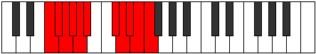 |
| [3903](https://ianring.com/musictheory/scales/3903) | [Aeogyllian](ModeCNaturalAeogyllian.md) | C | C, C#, D, D#, E, F, G#, A, A#, B, C |  |
| [3903](https://ianring.com/musictheory/scales/3903) | [Aeogyllian](ModeBNaturalAeogyllian.md) | B | B, C, C#, D, D#, E, G, G#, A, A#, B |  |
| [3911](https://ianring.com/musictheory/scales/3911) | [Katyryllic](ModeGNaturalKatyryllic.md) | G | G, G#, A, C#, D#, E, F, F#, G |  |
| [3919](https://ianring.com/musictheory/scales/3919) | [Lynygic](ModeGNaturalLynygic.md) | G | G, G#, A, A#, C#, D#, E, F, F#, G |  |
| [3927](https://ianring.com/musictheory/scales/3927) | [Monygic](ModeGNaturalMonygic.md) | G | G, G#, A, B, C#, D#, E, F, F#, G |  |
| [3929](https://ianring.com/musictheory/scales/3929) | [Aeolothyllic](ModeFNaturalAeolothyllic.md) | F | F, G#, A, B, C#, D, D#, E, F |  |
| [3931](https://ianring.com/musictheory/scales/3931) | [Aerygic](ModeFNaturalAerygic.md) | F | F, F#, G#, A, B, C#, D, D#, E, F |  |
| [3931](https://ianring.com/musictheory/scales/3931) | [Aerygic](ModeCNaturalAerygic.md) | C | C, C#, D#, E, F#, G#, A, A#, B, C |  |
| [3933](https://ianring.com/musictheory/scales/3933) | [Ionidygic](ModeFNaturalIonidygic.md) | F | F, G, G#, A, B, C#, D, D#, E, F |  |
| [3935](https://ianring.com/musictheory/scales/3935) | [Kataphyllian](ModeFNaturalKataphyllian.md) | F | F, F#, G, G#, A, B, C#, D, D#, E, F |  |
| [3935](https://ianring.com/musictheory/scales/3935) | [Kataphyllian](ModeCNaturalKataphyllian.md) | C | C, C#, D, D#, E, F#, G#, A, A#, B, C |  |
| [3935](https://ianring.com/musictheory/scales/3935) | [Kataphyllian](ModeGNaturalKataphyllian.md) | G | G, G#, A, A#, B, C#, D#, E, F, F#, G |  |
| [3939](https://ianring.com/musictheory/scales/3939) | [Dogyllic](ModeDSharpDogyllic.md) | D# | D#, E, G#, A, B, C, C#, D, D# |  |
| [3939](https://ianring.com/musictheory/scales/3939) | [Dogyllic](ModeEFlatDogyllic.md) | Eb | Eb, E, Ab, A, B, C, Db, D, Eb |  |
| [3943](https://ianring.com/musictheory/scales/3943) | [Zynygic](ModeGNaturalZynygic.md) | G | G, G#, A, C, C#, D#, E, F, F#, G |  |
| [3943](https://ianring.com/musictheory/scales/3943) | [Zynygic](ModeDSharpZynygic.md) | D# | D#, E, F, G#, A, B, C, C#, D, D# |  |
| [3943](https://ianring.com/musictheory/scales/3943) | [Zynygic](ModeEFlatZynygic.md) | Eb | Eb, E, F, Ab, A, B, C, Db, D, Eb |  |
| [3945](https://ianring.com/musictheory/scales/3945) | [Lydyllic](ModeASharpLydyllic.md) | A# | A#, C#, D#, E, F#, G, G#, A, A# |  |
| [3945](https://ianring.com/musictheory/scales/3945) | [Lydyllic](ModeBFlatLydyllic.md) | Bb | Bb, Db, Eb, E, Gb, G, Ab, A, Bb |  |
| [3947](https://ianring.com/musictheory/scales/3947) | [Ryptygic](ModeDSharpRyptygic.md) | D# | D#, E, F#, G#, A, B, C, C#, D, D# |  |
| [3947](https://ianring.com/musictheory/scales/3947) | [Ryptygic](ModeEFlatRyptygic.md) | Eb | Eb, E, Gb, Ab, A, B, C, Db, D, Eb |  |
| [3947](https://ianring.com/musictheory/scales/3947) | [Ryptygic](ModeASharpRyptygic.md) | A# | A#, B, C#, D#, E, F#, G, G#, A, A# |  |
| [3947](https://ianring.com/musictheory/scales/3947) | [Ryptygic](ModeBFlatRyptygic.md) | Bb | Bb, B, Db, Eb, E, Gb, G, Ab, A, Bb |  |
| [3949](https://ianring.com/musictheory/scales/3949) | [Koptygic](ModeASharpKoptygic.md) | A# | A#, C, C#, D#, E, F#, G, G#, A, A# |  |
| [3949](https://ianring.com/musictheory/scales/3949) | [Koptygic](ModeBFlatKoptygic.md) | Bb | Bb, C, Db, Eb, E, Gb, G, Ab, A, Bb |  |
| [3951](https://ianring.com/musictheory/scales/3951) | [Mathyllian](ModeGNaturalMathyllian.md) | G | G, G#, A, A#, C, C#, D#, E, F, F#, G |  |
| [3951](https://ianring.com/musictheory/scales/3951) | [Mathyllian](ModeDSharpMathyllian.md) | D# | D#, E, F, F#, G#, A, B, C, C#, D, D# |  |
| [3951](https://ianring.com/musictheory/scales/3951) | [Mathyllian](ModeEFlatMathyllian.md) | Eb | Eb, E, F, Gb, Ab, A, B, C, Db, D, Eb |  |
| [3951](https://ianring.com/musictheory/scales/3951) | [Mathyllian](ModeASharpMathyllian.md) | A# | A#, B, C, C#, D#, E, F#, G, G#, A, A# |  |
| [3951](https://ianring.com/musictheory/scales/3951) | [Mathyllian](ModeBFlatMathyllian.md) | Bb | Bb, B, C, Db, Eb, E, Gb, G, Ab, A, Bb |  |
| [3953](https://ianring.com/musictheory/scales/3953) | [Thagyllic](ModeENaturalThagyllic.md) | E | E, G#, A, A#, C, C#, D, D#, E |  |
| [3955](https://ianring.com/musictheory/scales/3955) | [Galygic](ModeENaturalGalygic.md) | E | E, F, G#, A, A#, C, C#, D, D#, E |  |
| [3955](https://ianring.com/musictheory/scales/3955) | [Galygic](ModeDSharpGalygic.md) | D# | D#, E, G, G#, A, B, C, C#, D, D# |  |
| [3955](https://ianring.com/musictheory/scales/3955) | [Galygic](ModeEFlatGalygic.md) | Eb | Eb, E, G, Ab, A, B, C, Db, D, Eb |  |
| [3957](https://ianring.com/musictheory/scales/3957) | [Porygic](ModeENaturalPorygic.md) | E | E, F#, G#, A, A#, C, C#, D, D#, E |  |
| [3957](https://ianring.com/musictheory/scales/3957) | [Porygic](ModeBNaturalPorygic.md) | B | B, C#, D#, E, F, G, G#, A, A#, B |  |
| [3959](https://ianring.com/musictheory/scales/3959) | [Katagyllian](ModeENaturalKatagyllian.md) | E | E, F, F#, G#, A, A#, C, C#, D, D#, E |  |
| [3959](https://ianring.com/musictheory/scales/3959) | [Katagyllian](ModeDSharpKatagyllian.md) | D# | D#, E, F, G, G#, A, B, C, C#, D, D# |  |
| [3959](https://ianring.com/musictheory/scales/3959) | [Katagyllian](ModeEFlatKatagyllian.md) | Eb | Eb, E, F, G, Ab, A, B, C, Db, D, Eb |  |
| [3959](https://ianring.com/musictheory/scales/3959) | [Katagyllian](ModeGNaturalKatagyllian.md) | G | G, G#, A, B, C, C#, D#, E, F, F#, G |  |
| [3959](https://ianring.com/musictheory/scales/3959) | [Katagyllian](ModeBNaturalKatagyllian.md) | B | B, C, C#, D#, E, F, G, G#, A, A#, B |  |
| [3961](https://ianring.com/musictheory/scales/3961) | [Mixolydygic](ModeENaturalMixolydygic.md) | E | E, G, G#, A, A#, C, C#, D, D#, E |  |
| [3961](https://ianring.com/musictheory/scales/3961) | [Mixolydygic](ModeASharpMixolydygic.md) | A# | A#, C#, D, D#, E, F#, G, G#, A, A# |  |
| [3961](https://ianring.com/musictheory/scales/3961) | [Mixolydygic](ModeBFlatMixolydygic.md) | Bb | Bb, Db, D, Eb, E, Gb, G, Ab, A, Bb |  |
| [3961](https://ianring.com/musictheory/scales/3961) | [Mixolydygic](ModeFNaturalMixolydygic.md) | F | F, G#, A, A#, B, C#, D, D#, E, F |  |
| [3963](https://ianring.com/musictheory/scales/3963) | [Aeoryllian](ModeENaturalAeoryllian.md) | E | E, F, G, G#, A, A#, C, C#, D, D#, E |  |
| [3963](https://ianring.com/musictheory/scales/3963) | [Aeoryllian](ModeDSharpAeoryllian.md) | D# | D#, E, F#, G, G#, A, B, C, C#, D, D# |  |
| [3963](https://ianring.com/musictheory/scales/3963) | [Aeoryllian](ModeEFlatAeoryllian.md) | Eb | Eb, E, Gb, G, Ab, A, B, C, Db, D, Eb |  |
| [3963](https://ianring.com/musictheory/scales/3963) | [Aeoryllian](ModeCNaturalAeoryllian.md) | C | C, C#, D#, E, F, F#, G#, A, A#, B, C |  |
| [3963](https://ianring.com/musictheory/scales/3963) | [Aeoryllian](ModeFNaturalAeoryllian.md) | F | F, F#, G#, A, A#, B, C#, D, D#, E, F |  |
| [3963](https://ianring.com/musictheory/scales/3963) | [Aeoryllian](ModeASharpAeoryllian.md) | A# | A#, B, C#, D, D#, E, F#, G, G#, A, A# |  |
| [3963](https://ianring.com/musictheory/scales/3963) | [Aeoryllian](ModeBFlatAeoryllian.md) | Bb | Bb, B, Db, D, Eb, E, Gb, G, Ab, A, Bb |  |
| [3965](https://ianring.com/musictheory/scales/3965) | [Thydyllian](ModeENaturalThydyllian.md) | E | E, F#, G, G#, A, A#, C, C#, D, D#, E |  |
| [3965](https://ianring.com/musictheory/scales/3965) | [Thydyllian](ModeASharpThydyllian.md) | A# | A#, C, C#, D, D#, E, F#, G, G#, A, A# |  |
| [3965](https://ianring.com/musictheory/scales/3965) | [Thydyllian](ModeBFlatThydyllian.md) | Bb | Bb, C, Db, D, Eb, E, Gb, G, Ab, A, Bb |  |
| [3965](https://ianring.com/musictheory/scales/3965) | [Thydyllian](ModeFNaturalThydyllian.md) | F | F, G, G#, A, A#, B, C#, D, D#, E, F |  |
| [3965](https://ianring.com/musictheory/scales/3965) | [Thydyllian](ModeBNaturalThydyllian.md) | B | B, C#, D, D#, E, F, G, G#, A, A#, B |  |
| [3967](https://ianring.com/musictheory/scales/3967) | [Soratic](ModeENaturalSoratic.md) | E | E, F, F#, G, G#, A, A#, C, C#, D, D#, E |  |
| [3967](https://ianring.com/musictheory/scales/3967) | [Soratic](ModeDSharpSoratic.md) | D# | D#, E, F, F#, G, G#, A, B, C, C#, D, D# |  |
| [3967](https://ianring.com/musictheory/scales/3967) | [Soratic](ModeEFlatSoratic.md) | Eb | Eb, E, F, Gb, G, Ab, A, B, C, Db, D, Eb |  |
| [3967](https://ianring.com/musictheory/scales/3967) | [Soratic](ModeCNaturalSoratic.md) | C | C, C#, D, D#, E, F, F#, G#, A, A#, B, C |  |
| [3967](https://ianring.com/musictheory/scales/3967) | [Soratic](ModeBNaturalSoratic.md) | B | B, C, C#, D, D#, E, F, G, G#, A, A#, B |  |
| [3967](https://ianring.com/musictheory/scales/3967) | [Soratic](ModeASharpSoratic.md) | A# | A#, B, C, C#, D, D#, E, F#, G, G#, A, A# |  |
| [3967](https://ianring.com/musictheory/scales/3967) | [Soratic](ModeBFlatSoratic.md) | Bb | Bb, B, C, Db, D, Eb, E, Gb, G, Ab, A, Bb |  |
| [3967](https://ianring.com/musictheory/scales/3967) | [Soratic](ModeGNaturalSoratic.md) | G | G, G#, A, A#, B, C, C#, D#, E, F, F#, G |  |
| [3967](https://ianring.com/musictheory/scales/3967) | [Soratic](ModeFNaturalSoratic.md) | F | F, F#, G, G#, A, A#, B, C#, D, D#, E, F |  |
| [3981](https://ianring.com/musictheory/scales/3981) | [Phrycryllic](ModeFSharpPhrycryllic.md) | F# | F#, G#, A, C#, D, D#, E, F, F# |  |
| [3981](https://ianring.com/musictheory/scales/3981) | [Phrycryllic](ModeGFlatPhrycryllic.md) | Gb | Gb, Ab, A, Db, D, Eb, E, F, Gb |  |
| [3981](https://ianring.com/musictheory/scales/3981) | [Phrycryllic](ModeCSharpPhrycryllic.md) | C# | C#, D#, E, G#, A, A#, B, C, C# |  |
| [3981](https://ianring.com/musictheory/scales/3981) | [Phrycryllic](ModeDFlatPhrycryllic.md) | Db | Db, Eb, E, Ab, A, Bb, B, C, Db |  |
| [3983](https://ianring.com/musictheory/scales/3983) | [Thyptygic](ModeFSharpThyptygic.md) | F# | F#, G, G#, A, C#, D, D#, E, F, F# |  |
| [3983](https://ianring.com/musictheory/scales/3983) | [Thyptygic](ModeGFlatThyptygic.md) | Gb | Gb, G, Ab, A, Db, D, Eb, E, F, Gb |  |
| [3983](https://ianring.com/musictheory/scales/3983) | [Thyptygic](ModeCSharpThyptygic.md) | C# | C#, D, D#, E, G#, A, A#, B, C, C# |  |
| [3983](https://ianring.com/musictheory/scales/3983) | [Thyptygic](ModeDFlatThyptygic.md) | Db | Db, D, Eb, E, Ab, A, Bb, B, C, Db |  |
| [3993](https://ianring.com/musictheory/scales/3993) | [Ioniptyllic](ModeFNaturalIoniptyllic.md) | F | F, G#, A, C, C#, D, D#, E, F |  |
| [3995](https://ianring.com/musictheory/scales/3995) | [Ionygic](ModeFNaturalIonygic.md) | F | F, F#, G#, A, C, C#, D, D#, E, F |  |
| [3995](https://ianring.com/musictheory/scales/3995) | [Ionygic](ModeCNaturalIonygic.md) | C | C, C#, D#, E, G, G#, A, A#, B, C |  |
| [3997](https://ianring.com/musictheory/scales/3997) | [Dogygic](ModeFNaturalDogygic.md) | F | F, G, G#, A, C, C#, D, D#, E, F |  |
| [3997](https://ianring.com/musictheory/scales/3997) | [Dogygic](ModeFSharpDogygic.md) | F# | F#, G#, A, A#, C#, D, D#, E, F, F# |  |
| [3997](https://ianring.com/musictheory/scales/3997) | [Dogygic](ModeGFlatDogygic.md) | Gb | Gb, Ab, A, Bb, Db, D, Eb, E, F, Gb |  |
| [3997](https://ianring.com/musictheory/scales/3997) | [Dogygic](ModeCSharpDogygic.md) | C# | C#, D#, E, F, G#, A, A#, B, C, C# |  |
| [3997](https://ianring.com/musictheory/scales/3997) | [Dogygic](ModeDFlatDogygic.md) | Db | Db, Eb, E, F, Ab, A, Bb, B, C, Db |  |
| [3999](https://ianring.com/musictheory/scales/3999) | [Dydyllian](ModeFNaturalDydyllian.md) | F | F, F#, G, G#, A, C, C#, D, D#, E, F |  |
| [3999](https://ianring.com/musictheory/scales/3999) | [Dydyllian](ModeFSharpDydyllian.md) | F# | F#, G, G#, A, A#, C#, D, D#, E, F, F# |  |
| [3999](https://ianring.com/musictheory/scales/3999) | [Dydyllian](ModeGFlatDydyllian.md) | Gb | Gb, G, Ab, A, Bb, Db, D, Eb, E, F, Gb |  |
| [3999](https://ianring.com/musictheory/scales/3999) | [Dydyllian](ModeCSharpDydyllian.md) | C# | C#, D, D#, E, F, G#, A, A#, B, C, C# |  |
| [3999](https://ianring.com/musictheory/scales/3999) | [Dydyllian](ModeDFlatDydyllian.md) | Db | Db, D, Eb, E, F, Ab, A, Bb, B, C, Db |  |
| [3999](https://ianring.com/musictheory/scales/3999) | [Dydyllian](ModeCNaturalDydyllian.md) | C | C, C#, D, D#, E, G, G#, A, A#, B, C |  |
| [4003](https://ianring.com/musictheory/scales/4003) | [Sadyllic](ModeGSharpSadyllic.md) | G# | G#, A, C#, D#, E, F, F#, G, G# |  |
| [4003](https://ianring.com/musictheory/scales/4003) | [Sadyllic](ModeAFlatSadyllic.md) | Ab | Ab, A, Db, Eb, E, F, Gb, G, Ab |  |
| [4007](https://ianring.com/musictheory/scales/4007) | [Doptygic](ModeGSharpDoptygic.md) | G# | G#, A, A#, C#, D#, E, F, F#, G, G# |  |
| [4007](https://ianring.com/musictheory/scales/4007) | [Doptygic](ModeAFlatDoptygic.md) | Ab | Ab, A, Bb, Db, Eb, E, F, Gb, G, Ab |  |
| [4011](https://ianring.com/musictheory/scales/4011) | [Styrygic](ModeGSharpStyrygic.md) | G# | G#, A, B, C#, D#, E, F, F#, G, G# |  |
| [4011](https://ianring.com/musictheory/scales/4011) | [Styrygic](ModeAFlatStyrygic.md) | Ab | Ab, A, B, Db, Eb, E, F, Gb, G, Ab |  |
| [4013](https://ianring.com/musictheory/scales/4013) | [Dathygic](ModeFSharpDathygic.md) | F# | F#, G#, A, B, C#, D, D#, E, F, F# |  |
| [4013](https://ianring.com/musictheory/scales/4013) | [Dathygic](ModeGFlatDathygic.md) | Gb | Gb, Ab, A, B, Db, D, Eb, E, F, Gb |  |
| [4013](https://ianring.com/musictheory/scales/4013) | [Dathygic](ModeCSharpDathygic.md) | C# | C#, D#, E, F#, G#, A, A#, B, C, C# |  |
| [4013](https://ianring.com/musictheory/scales/4013) | [Dathygic](ModeDFlatDathygic.md) | Db | Db, Eb, E, Gb, Ab, A, Bb, B, C, Db |  |
| [4015](https://ianring.com/musictheory/scales/4015) | [Phradyllian](ModeFSharpPhradyllian.md) | F# | F#, G, G#, A, B, C#, D, D#, E, F, F# |  |
| [4015](https://ianring.com/musictheory/scales/4015) | [Phradyllian](ModeGFlatPhradyllian.md) | Gb | Gb, G, Ab, A, B, Db, D, Eb, E, F, Gb |  |
| [4015](https://ianring.com/musictheory/scales/4015) | [Phradyllian](ModeCSharpPhradyllian.md) | C# | C#, D, D#, E, F#, G#, A, A#, B, C, C# |  |
| [4015](https://ianring.com/musictheory/scales/4015) | [Phradyllian](ModeDFlatPhradyllian.md) | Db | Db, D, Eb, E, Gb, Ab, A, Bb, B, C, Db |  |
| [4015](https://ianring.com/musictheory/scales/4015) | [Phradyllian](ModeGSharpPhradyllian.md) | G# | G#, A, A#, B, C#, D#, E, F, F#, G, G# |  |
| [4015](https://ianring.com/musictheory/scales/4015) | [Phradyllian](ModeAFlatPhradyllian.md) | Ab | Ab, A, Bb, B, Db, Eb, E, F, Gb, G, Ab |  |
| [4017](https://ianring.com/musictheory/scales/4017) | [Dolyllic](ModeENaturalDolyllic.md) | E | E, G#, A, B, C, C#, D, D#, E |  |
| [4019](https://ianring.com/musictheory/scales/4019) | [Lonygic](ModeGSharpLonygic.md) | G# | G#, A, C, C#, D#, E, F, F#, G, G# |  |
| [4019](https://ianring.com/musictheory/scales/4019) | [Lonygic](ModeAFlatLonygic.md) | Ab | Ab, A, C, Db, Eb, E, F, Gb, G, Ab |  |
| [4019](https://ianring.com/musictheory/scales/4019) | [Lonygic](ModeENaturalLonygic.md) | E | E, F, G#, A, B, C, C#, D, D#, E |  |
| [4021](https://ianring.com/musictheory/scales/4021) | [Bagygic](ModeENaturalBagygic.md) | E | E, F#, G#, A, B, C, C#, D, D#, E |  |
| [4021](https://ianring.com/musictheory/scales/4021) | [Bagygic](ModeBNaturalBagygic.md) | B | B, C#, D#, E, F#, G, G#, A, A#, B |  |
| [4023](https://ianring.com/musictheory/scales/4023) | [Styptyllian](ModeGSharpStyptyllian.md) | G# | G#, A, A#, C, C#, D#, E, F, F#, G, G# |  |
| [4023](https://ianring.com/musictheory/scales/4023) | [Styptyllian](ModeAFlatStyptyllian.md) | Ab | Ab, A, Bb, C, Db, Eb, E, F, Gb, G, Ab |  |
| [4023](https://ianring.com/musictheory/scales/4023) | [Styptyllian](ModeENaturalStyptyllian.md) | E | E, F, F#, G#, A, B, C, C#, D, D#, E |  |
| [4023](https://ianring.com/musictheory/scales/4023) | [Styptyllian](ModeBNaturalStyptyllian.md) | B | B, C, C#, D#, E, F#, G, G#, A, A#, B |  |
| [4025](https://ianring.com/musictheory/scales/4025) | [Kalygic](ModeFNaturalKalygic.md) | F | F, G#, A, A#, C, C#, D, D#, E, F |  |
| [4025](https://ianring.com/musictheory/scales/4025) | [Kalygic](ModeENaturalKalygic.md) | E | E, G, G#, A, B, C, C#, D, D#, E |  |
| [4027](https://ianring.com/musictheory/scales/4027) | [Ragyllian](ModeFNaturalRagyllian.md) | F | F, F#, G#, A, A#, C, C#, D, D#, E, F |  |
| [4027](https://ianring.com/musictheory/scales/4027) | [Ragyllian](ModeENaturalRagyllian.md) | E | E, F, G, G#, A, B, C, C#, D, D#, E |  |
| [4027](https://ianring.com/musictheory/scales/4027) | [Ragyllian](ModeGSharpRagyllian.md) | G# | G#, A, B, C, C#, D#, E, F, F#, G, G# |  |
| [4027](https://ianring.com/musictheory/scales/4027) | [Ragyllian](ModeAFlatRagyllian.md) | Ab | Ab, A, B, C, Db, Eb, E, F, Gb, G, Ab |  |
| [4027](https://ianring.com/musictheory/scales/4027) | [Ragyllian](ModeCNaturalRagyllian.md) | C | C, C#, D#, E, F, G, G#, A, A#, B, C |  |
| [4029](https://ianring.com/musictheory/scales/4029) | [Aerycryllian](ModeFNaturalAerycryllian.md) | F | F, G, G#, A, A#, C, C#, D, D#, E, F |  |
| [4029](https://ianring.com/musictheory/scales/4029) | [Aerycryllian](ModeENaturalAerycryllian.md) | E | E, F#, G, G#, A, B, C, C#, D, D#, E |  |
| [4029](https://ianring.com/musictheory/scales/4029) | [Aerycryllian](ModeCSharpAerycryllian.md) | C# | C#, D#, E, F, F#, G#, A, A#, B, C, C# |  |
| [4029](https://ianring.com/musictheory/scales/4029) | [Aerycryllian](ModeDFlatAerycryllian.md) | Db | Db, Eb, E, F, Gb, Ab, A, Bb, B, C, Db |  |
| [4029](https://ianring.com/musictheory/scales/4029) | [Aerycryllian](ModeFSharpAerycryllian.md) | F# | F#, G#, A, A#, B, C#, D, D#, E, F, F# |  |
| [4029](https://ianring.com/musictheory/scales/4029) | [Aerycryllian](ModeGFlatAerycryllian.md) | Gb | Gb, Ab, A, Bb, B, Db, D, Eb, E, F, Gb |  |
| [4029](https://ianring.com/musictheory/scales/4029) | [Aerycryllian](ModeBNaturalAerycryllian.md) | B | B, C#, D, D#, E, F#, G, G#, A, A#, B |  |
| [4031](https://ianring.com/musictheory/scales/4031) | [Godatic](ModeFNaturalGodatic.md) | F | F, F#, G, G#, A, A#, C, C#, D, D#, E, F |  |
| [4031](https://ianring.com/musictheory/scales/4031) | [Godatic](ModeENaturalGodatic.md) | E | E, F, F#, G, G#, A, B, C, C#, D, D#, E |  |
| [4031](https://ianring.com/musictheory/scales/4031) | [Godatic](ModeCSharpGodatic.md) | C# | C#, D, D#, E, F, F#, G#, A, A#, B, C, C# |  |
| [4031](https://ianring.com/musictheory/scales/4031) | [Godatic](ModeDFlatGodatic.md) | Db | Db, D, Eb, E, F, Gb, Ab, A, Bb, B, C, Db |  |
| [4031](https://ianring.com/musictheory/scales/4031) | [Godatic](ModeCNaturalGodatic.md) | C | C, C#, D, D#, E, F, G, G#, A, A#, B, C |  |
| [4031](https://ianring.com/musictheory/scales/4031) | [Godatic](ModeBNaturalGodatic.md) | B | B, C, C#, D, D#, E, F#, G, G#, A, A#, B |  |
| [4031](https://ianring.com/musictheory/scales/4031) | [Godatic](ModeGSharpGodatic.md) | G# | G#, A, A#, B, C, C#, D#, E, F, F#, G, G# |  |
| [4031](https://ianring.com/musictheory/scales/4031) | [Godatic](ModeAFlatGodatic.md) | Ab | Ab, A, Bb, B, C, Db, Eb, E, F, Gb, G, Ab |  |
| [4031](https://ianring.com/musictheory/scales/4031) | [Godatic](ModeFSharpGodatic.md) | F# | F#, G, G#, A, A#, B, C#, D, D#, E, F, F# |  |
| [4031](https://ianring.com/musictheory/scales/4031) | [Godatic](ModeGFlatGodatic.md) | Gb | Gb, G, Ab, A, Bb, B, Db, D, Eb, E, F, Gb |  |
| [4039](https://ianring.com/musictheory/scales/4039) | [Ionogygic](ModeGNaturalIonogygic.md) | G | G, G#, A, C#, D, D#, E, F, F#, G |  |
| [4039](https://ianring.com/musictheory/scales/4039) | [Ionogygic](ModeDNaturalIonogygic.md) | D | D, D#, E, G#, A, A#, B, C, C#, D |  |
| [4045](https://ianring.com/musictheory/scales/4045) | [Gyptygic](ModeFSharpGyptygic.md) | F# | F#, G#, A, C, C#, D, D#, E, F, F# |  |
| [4045](https://ianring.com/musictheory/scales/4045) | [Gyptygic](ModeGFlatGyptygic.md) | Gb | Gb, Ab, A, C, Db, D, Eb, E, F, Gb |  |
| [4045](https://ianring.com/musictheory/scales/4045) | [Gyptygic](ModeCSharpGyptygic.md) | C# | C#, D#, E, G, G#, A, A#, B, C, C# |  |
| [4045](https://ianring.com/musictheory/scales/4045) | [Gyptygic](ModeDFlatGyptygic.md) | Db | Db, Eb, E, G, Ab, A, Bb, B, C, Db |  |
| [4047](https://ianring.com/musictheory/scales/4047) | [Thogyllian](ModeFSharpThogyllian.md) | F# | F#, G, G#, A, C, C#, D, D#, E, F, F# |  |
| [4047](https://ianring.com/musictheory/scales/4047) | [Thogyllian](ModeGFlatThogyllian.md) | Gb | Gb, G, Ab, A, C, Db, D, Eb, E, F, Gb |  |
| [4047](https://ianring.com/musictheory/scales/4047) | [Thogyllian](ModeGNaturalThogyllian.md) | G | G, G#, A, A#, C#, D, D#, E, F, F#, G |  |
| [4047](https://ianring.com/musictheory/scales/4047) | [Thogyllian](ModeDNaturalThogyllian.md) | D | D, D#, E, F, G#, A, A#, B, C, C#, D |  |
| [4047](https://ianring.com/musictheory/scales/4047) | [Thogyllian](ModeCSharpThogyllian.md) | C# | C#, D, D#, E, G, G#, A, A#, B, C, C# |  |
| [4047](https://ianring.com/musictheory/scales/4047) | [Thogyllian](ModeDFlatThogyllian.md) | Db | Db, D, Eb, E, G, Ab, A, Bb, B, C, Db |  |
| [4049](https://ianring.com/musictheory/scales/4049) | [Stycryllic](ModeANaturalStycryllic.md) | A | A, C#, D#, E, F, F#, G, G#, A |  |
| [4051](https://ianring.com/musictheory/scales/4051) | [Ionilygic](ModeANaturalIonilygic.md) | A | A, A#, C#, D#, E, F, F#, G, G#, A |  |
| [4053](https://ianring.com/musictheory/scales/4053) | [Kyrygic](ModeANaturalKyrygic.md) | A | A, B, C#, D#, E, F, F#, G, G#, A |  |
| [4055](https://ianring.com/musictheory/scales/4055) | [Dagyllian](ModeGNaturalDagyllian.md) | G | G, G#, A, B, C#, D, D#, E, F, F#, G |  |
| [4055](https://ianring.com/musictheory/scales/4055) | [Dagyllian](ModeDNaturalDagyllian.md) | D | D, D#, E, F#, G#, A, A#, B, C, C#, D |  |
| [4055](https://ianring.com/musictheory/scales/4055) | [Dagyllian](ModeANaturalDagyllian.md) | A | A, A#, B, C#, D#, E, F, F#, G, G#, A |  |
| [4057](https://ianring.com/musictheory/scales/4057) | [Phrygic](ModeANaturalPhrygic.md) | A | A, C, C#, D#, E, F, F#, G, G#, A |  |
| [4057](https://ianring.com/musictheory/scales/4057) | [Phrygic](ModeFNaturalPhrygic.md) | F | F, G#, A, B, C, C#, D, D#, E, F |  |
| [4059](https://ianring.com/musictheory/scales/4059) | [Zolyllian](ModeANaturalZolyllian.md) | A | A, A#, C, C#, D#, E, F, F#, G, G#, A |  |
| [4059](https://ianring.com/musictheory/scales/4059) | [Zolyllian](ModeFNaturalZolyllian.md) | F | F, F#, G#, A, B, C, C#, D, D#, E, F |  |
| [4059](https://ianring.com/musictheory/scales/4059) | [Zolyllian](ModeCNaturalZolyllian.md) | C | C, C#, D#, E, F#, G, G#, A, A#, B, C |  |
| [4061](https://ianring.com/musictheory/scales/4061) | [Staptyllian](ModeFSharpStaptyllian.md) | F# | F#, G#, A, A#, C, C#, D, D#, E, F, F# |  |
| [4061](https://ianring.com/musictheory/scales/4061) | [Staptyllian](ModeGFlatStaptyllian.md) | Gb | Gb, Ab, A, Bb, C, Db, D, Eb, E, F, Gb |  |
| [4061](https://ianring.com/musictheory/scales/4061) | [Staptyllian](ModeFNaturalStaptyllian.md) | F | F, G, G#, A, B, C, C#, D, D#, E, F |  |
| [4061](https://ianring.com/musictheory/scales/4061) | [Staptyllian](ModeANaturalStaptyllian.md) | A | A, B, C, C#, D#, E, F, F#, G, G#, A |  |
| [4061](https://ianring.com/musictheory/scales/4061) | [Staptyllian](ModeCSharpStaptyllian.md) | C# | C#, D#, E, F, G, G#, A, A#, B, C, C# |  |
| [4061](https://ianring.com/musictheory/scales/4061) | [Staptyllian](ModeDFlatStaptyllian.md) | Db | Db, Eb, E, F, G, Ab, A, Bb, B, C, Db |  |
| [4063](https://ianring.com/musictheory/scales/4063) | [Eptatic](ModeFSharpEptatic.md) | F# | F#, G, G#, A, A#, C, C#, D, D#, E, F, F# |  |
| [4063](https://ianring.com/musictheory/scales/4063) | [Eptatic](ModeGFlatEptatic.md) | Gb | Gb, G, Ab, A, Bb, C, Db, D, Eb, E, F, Gb |  |
| [4063](https://ianring.com/musictheory/scales/4063) | [Eptatic](ModeFNaturalEptatic.md) | F | F, F#, G, G#, A, B, C, C#, D, D#, E, F |  |
| [4063](https://ianring.com/musictheory/scales/4063) | [Eptatic](ModeDNaturalEptatic.md) | D | D, D#, E, F, F#, G#, A, A#, B, C, C#, D |  |
| [4063](https://ianring.com/musictheory/scales/4063) | [Eptatic](ModeCSharpEptatic.md) | C# | C#, D, D#, E, F, G, G#, A, A#, B, C, C# |  |
| [4063](https://ianring.com/musictheory/scales/4063) | [Eptatic](ModeDFlatEptatic.md) | Db | Db, D, Eb, E, F, G, Ab, A, Bb, B, C, Db |  |
| [4063](https://ianring.com/musictheory/scales/4063) | [Eptatic](ModeCNaturalEptatic.md) | C | C, C#, D, D#, E, F#, G, G#, A, A#, B, C |  |
| [4063](https://ianring.com/musictheory/scales/4063) | [Eptatic](ModeANaturalEptatic.md) | A | A, A#, B, C, C#, D#, E, F, F#, G, G#, A |  |
| [4063](https://ianring.com/musictheory/scales/4063) | [Eptatic](ModeGNaturalEptatic.md) | G | G, G#, A, A#, B, C#, D, D#, E, F, F#, G |  |
| [4067](https://ianring.com/musictheory/scales/4067) | [Aeolarygic](ModeGSharpAeolarygic.md) | G# | G#, A, C#, D, D#, E, F, F#, G, G# |  |
| [4067](https://ianring.com/musictheory/scales/4067) | [Aeolarygic](ModeAFlatAeolarygic.md) | Ab | Ab, A, Db, D, Eb, E, F, Gb, G, Ab |  |
| [4067](https://ianring.com/musictheory/scales/4067) | [Aeolarygic](ModeDSharpAeolarygic.md) | D# | D#, E, G#, A, A#, B, C, C#, D, D# |  |
| [4067](https://ianring.com/musictheory/scales/4067) | [Aeolarygic](ModeEFlatAeolarygic.md) | Eb | Eb, E, Ab, A, Bb, B, C, Db, D, Eb |  |
| [4071](https://ianring.com/musictheory/scales/4071) | [Rygyllian](ModeGNaturalRygyllian.md) | G | G, G#, A, C, C#, D, D#, E, F, F#, G |  |
| [4071](https://ianring.com/musictheory/scales/4071) | [Rygyllian](ModeGSharpRygyllian.md) | G# | G#, A, A#, C#, D, D#, E, F, F#, G, G# |  |
| [4071](https://ianring.com/musictheory/scales/4071) | [Rygyllian](ModeAFlatRygyllian.md) | Ab | Ab, A, Bb, Db, D, Eb, E, F, Gb, G, Ab |  |
| [4071](https://ianring.com/musictheory/scales/4071) | [Rygyllian](ModeDSharpRygyllian.md) | D# | D#, E, F, G#, A, A#, B, C, C#, D, D# |  |
| [4071](https://ianring.com/musictheory/scales/4071) | [Rygyllian](ModeEFlatRygyllian.md) | Eb | Eb, E, F, Ab, A, Bb, B, C, Db, D, Eb |  |
| [4071](https://ianring.com/musictheory/scales/4071) | [Rygyllian](ModeDNaturalRygyllian.md) | D | D, D#, E, G, G#, A, A#, B, C, C#, D |  |
| [4073](https://ianring.com/musictheory/scales/4073) | [Sathygic](ModeASharpSathygic.md) | A# | A#, C#, D#, E, F, F#, G, G#, A, A# |  |
| [4073](https://ianring.com/musictheory/scales/4073) | [Sathygic](ModeBFlatSathygic.md) | Bb | Bb, Db, Eb, E, F, Gb, G, Ab, A, Bb |  |
| [4075](https://ianring.com/musictheory/scales/4075) | [Katyllian](ModeGSharpKatyllian.md) | G# | G#, A, B, C#, D, D#, E, F, F#, G, G# |  |
| [4075](https://ianring.com/musictheory/scales/4075) | [Katyllian](ModeAFlatKatyllian.md) | Ab | Ab, A, B, Db, D, Eb, E, F, Gb, G, Ab |  |
| [4075](https://ianring.com/musictheory/scales/4075) | [Katyllian](ModeDSharpKatyllian.md) | D# | D#, E, F#, G#, A, A#, B, C, C#, D, D# |  |
| [4075](https://ianring.com/musictheory/scales/4075) | [Katyllian](ModeEFlatKatyllian.md) | Eb | Eb, E, Gb, Ab, A, Bb, B, C, Db, D, Eb |  |
| [4075](https://ianring.com/musictheory/scales/4075) | [Katyllian](ModeASharpKatyllian.md) | A# | A#, B, C#, D#, E, F, F#, G, G#, A, A# |  |
| [4075](https://ianring.com/musictheory/scales/4075) | [Katyllian](ModeBFlatKatyllian.md) | Bb | Bb, B, Db, Eb, E, F, Gb, G, Ab, A, Bb |  |
| [4077](https://ianring.com/musictheory/scales/4077) | [Gothyllian](ModeASharpGothyllian.md) | A# | A#, C, C#, D#, E, F, F#, G, G#, A, A# |  |
| [4077](https://ianring.com/musictheory/scales/4077) | [Gothyllian](ModeBFlatGothyllian.md) | Bb | Bb, C, Db, Eb, E, F, Gb, G, Ab, A, Bb |  |
| [4077](https://ianring.com/musictheory/scales/4077) | [Gothyllian](ModeFSharpGothyllian.md) | F# | F#, G#, A, B, C, C#, D, D#, E, F, F# |  |
| [4077](https://ianring.com/musictheory/scales/4077) | [Gothyllian](ModeGFlatGothyllian.md) | Gb | Gb, Ab, A, B, C, Db, D, Eb, E, F, Gb |  |
| [4077](https://ianring.com/musictheory/scales/4077) | [Gothyllian](ModeCSharpGothyllian.md) | C# | C#, D#, E, F#, G, G#, A, A#, B, C, C# |  |
| [4077](https://ianring.com/musictheory/scales/4077) | [Gothyllian](ModeDFlatGothyllian.md) | Db | Db, Eb, E, Gb, G, Ab, A, Bb, B, C, Db |  |
| [4079](https://ianring.com/musictheory/scales/4079) | [Ionatic](ModeGNaturalIonatic.md) | G | G, G#, A, A#, C, C#, D, D#, E, F, F#, G |  |
| [4079](https://ianring.com/musictheory/scales/4079) | [Ionatic](ModeFSharpIonatic.md) | F# | F#, G, G#, A, B, C, C#, D, D#, E, F, F# |  |
| [4079](https://ianring.com/musictheory/scales/4079) | [Ionatic](ModeGFlatIonatic.md) | Gb | Gb, G, Ab, A, B, C, Db, D, Eb, E, F, Gb |  |
| [4079](https://ianring.com/musictheory/scales/4079) | [Ionatic](ModeDSharpIonatic.md) | D# | D#, E, F, F#, G#, A, A#, B, C, C#, D, D# |  |
| [4079](https://ianring.com/musictheory/scales/4079) | [Ionatic](ModeEFlatIonatic.md) | Eb | Eb, E, F, Gb, Ab, A, Bb, B, C, Db, D, Eb |  |
| [4079](https://ianring.com/musictheory/scales/4079) | [Ionatic](ModeDNaturalIonatic.md) | D | D, D#, E, F, G, G#, A, A#, B, C, C#, D |  |
| [4079](https://ianring.com/musictheory/scales/4079) | [Ionatic](ModeCSharpIonatic.md) | C# | C#, D, D#, E, F#, G, G#, A, A#, B, C, C# |  |
| [4079](https://ianring.com/musictheory/scales/4079) | [Ionatic](ModeDFlatIonatic.md) | Db | Db, D, Eb, E, Gb, G, Ab, A, Bb, B, C, Db |  |
| [4079](https://ianring.com/musictheory/scales/4079) | [Ionatic](ModeASharpIonatic.md) | A# | A#, B, C, C#, D#, E, F, F#, G, G#, A, A# |  |
| [4079](https://ianring.com/musictheory/scales/4079) | [Ionatic](ModeBFlatIonatic.md) | Bb | Bb, B, C, Db, Eb, E, F, Gb, G, Ab, A, Bb |  |
| [4079](https://ianring.com/musictheory/scales/4079) | [Ionatic](ModeGSharpIonatic.md) | G# | G#, A, A#, B, C#, D, D#, E, F, F#, G, G# |  |
| [4079](https://ianring.com/musictheory/scales/4079) | [Ionatic](ModeAFlatIonatic.md) | Ab | Ab, A, Bb, B, Db, D, Eb, E, F, Gb, G, Ab |  |
| [4081](https://ianring.com/musictheory/scales/4081) | [Manygic](ModeANaturalManygic.md) | A | A, C#, D, D#, E, F, F#, G, G#, A |  |
| [4081](https://ianring.com/musictheory/scales/4081) | [Manygic](ModeENaturalManygic.md) | E | E, G#, A, A#, B, C, C#, D, D#, E |  |
| [4083](https://ianring.com/musictheory/scales/4083) | [Bathyllian](ModeGSharpBathyllian.md) | G# | G#, A, C, C#, D, D#, E, F, F#, G, G# |  |
| [4083](https://ianring.com/musictheory/scales/4083) | [Bathyllian](ModeAFlatBathyllian.md) | Ab | Ab, A, C, Db, D, Eb, E, F, Gb, G, Ab |  |
| [4083](https://ianring.com/musictheory/scales/4083) | [Bathyllian](ModeANaturalBathyllian.md) | A | A, A#, C#, D, D#, E, F, F#, G, G#, A |  |
| [4083](https://ianring.com/musictheory/scales/4083) | [Bathyllian](ModeENaturalBathyllian.md) | E | E, F, G#, A, A#, B, C, C#, D, D#, E |  |
| [4083](https://ianring.com/musictheory/scales/4083) | [Bathyllian](ModeDSharpBathyllian.md) | D# | D#, E, G, G#, A, A#, B, C, C#, D, D# |  |
| [4083](https://ianring.com/musictheory/scales/4083) | [Bathyllian](ModeEFlatBathyllian.md) | Eb | Eb, E, G, Ab, A, Bb, B, C, Db, D, Eb |  |
| [4085](https://ianring.com/musictheory/scales/4085) | [Sydyllian](ModeANaturalSydyllian.md) | A | A, B, C#, D, D#, E, F, F#, G, G#, A |  |
| [4085](https://ianring.com/musictheory/scales/4085) | [Sydyllian](ModeENaturalSydyllian.md) | E | E, F#, G#, A, A#, B, C, C#, D, D#, E |  |
| [4085](https://ianring.com/musictheory/scales/4085) | [Sydyllian](ModeBNaturalSydyllian.md) | B | B, C#, D#, E, F, F#, G, G#, A, A#, B |  |
| [4087](https://ianring.com/musictheory/scales/4087) | [Aeolatic](ModeGSharpAeolatic.md) | G# | G#, A, A#, C, C#, D, D#, E, F, F#, G, G# |  |
| [4087](https://ianring.com/musictheory/scales/4087) | [Aeolatic](ModeAFlatAeolatic.md) | Ab | Ab, A, Bb, C, Db, D, Eb, E, F, Gb, G, Ab |  |
| [4087](https://ianring.com/musictheory/scales/4087) | [Aeolatic](ModeGNaturalAeolatic.md) | G | G, G#, A, B, C, C#, D, D#, E, F, F#, G |  |
| [4087](https://ianring.com/musictheory/scales/4087) | [Aeolatic](ModeENaturalAeolatic.md) | E | E, F, F#, G#, A, A#, B, C, C#, D, D#, E |  |
| [4087](https://ianring.com/musictheory/scales/4087) | [Aeolatic](ModeDSharpAeolatic.md) | D# | D#, E, F, G, G#, A, A#, B, C, C#, D, D# |  |
| [4087](https://ianring.com/musictheory/scales/4087) | [Aeolatic](ModeEFlatAeolatic.md) | Eb | Eb, E, F, G, Ab, A, Bb, B, C, Db, D, Eb |  |
| [4087](https://ianring.com/musictheory/scales/4087) | [Aeolatic](ModeDNaturalAeolatic.md) | D | D, D#, E, F#, G, G#, A, A#, B, C, C#, D |  |
| [4087](https://ianring.com/musictheory/scales/4087) | [Aeolatic](ModeBNaturalAeolatic.md) | B | B, C, C#, D#, E, F, F#, G, G#, A, A#, B |  |
| [4087](https://ianring.com/musictheory/scales/4087) | [Aeolatic](ModeANaturalAeolatic.md) | A | A, A#, B, C#, D, D#, E, F, F#, G, G#, A |  |
| [4089](https://ianring.com/musictheory/scales/4089) | [Katoryllian](ModeANaturalKatoryllian.md) | A | A, C, C#, D, D#, E, F, F#, G, G#, A |  |
| [4089](https://ianring.com/musictheory/scales/4089) | [Katoryllian](ModeASharpKatoryllian.md) | A# | A#, C#, D, D#, E, F, F#, G, G#, A, A# |  |
| [4089](https://ianring.com/musictheory/scales/4089) | [Katoryllian](ModeBFlatKatoryllian.md) | Bb | Bb, Db, D, Eb, E, F, Gb, G, Ab, A, Bb |  |
| [4089](https://ianring.com/musictheory/scales/4089) | [Katoryllian](ModeFNaturalKatoryllian.md) | F | F, G#, A, A#, B, C, C#, D, D#, E, F |  |
| [4089](https://ianring.com/musictheory/scales/4089) | [Katoryllian](ModeENaturalKatoryllian.md) | E | E, G, G#, A, A#, B, C, C#, D, D#, E |  |
| [4091](https://ianring.com/musictheory/scales/4091) | [Thydatic](ModeANaturalThydatic.md) | A | A, A#, C, C#, D, D#, E, F, F#, G, G#, A |  |
| [4091](https://ianring.com/musictheory/scales/4091) | [Thydatic](ModeGSharpThydatic.md) | G# | G#, A, B, C, C#, D, D#, E, F, F#, G, G# |  |
| [4091](https://ianring.com/musictheory/scales/4091) | [Thydatic](ModeAFlatThydatic.md) | Ab | Ab, A, B, C, Db, D, Eb, E, F, Gb, G, Ab |  |
| [4091](https://ianring.com/musictheory/scales/4091) | [Thydatic](ModeFNaturalThydatic.md) | F | F, F#, G#, A, A#, B, C, C#, D, D#, E, F |  |
| [4091](https://ianring.com/musictheory/scales/4091) | [Thydatic](ModeENaturalThydatic.md) | E | E, F, G, G#, A, A#, B, C, C#, D, D#, E |  |
| [4091](https://ianring.com/musictheory/scales/4091) | [Thydatic](ModeDSharpThydatic.md) | D# | D#, E, F#, G, G#, A, A#, B, C, C#, D, D# |  |
| [4091](https://ianring.com/musictheory/scales/4091) | [Thydatic](ModeEFlatThydatic.md) | Eb | Eb, E, Gb, G, Ab, A, Bb, B, C, Db, D, Eb |  |
| [4091](https://ianring.com/musictheory/scales/4091) | [Thydatic](ModeCNaturalThydatic.md) | C | C, C#, D#, E, F, F#, G, G#, A, A#, B, C |  |
| [4091](https://ianring.com/musictheory/scales/4091) | [Thydatic](ModeASharpThydatic.md) | A# | A#, B, C#, D, D#, E, F, F#, G, G#, A, A# |  |
| [4091](https://ianring.com/musictheory/scales/4091) | [Thydatic](ModeBFlatThydatic.md) | Bb | Bb, B, Db, D, Eb, E, F, Gb, G, Ab, A, Bb |  |
| [4093](https://ianring.com/musictheory/scales/4093) | [Aerycratic](ModeASharpAerycratic.md) | A# | A#, C, C#, D, D#, E, F, F#, G, G#, A, A# |  |
| [4093](https://ianring.com/musictheory/scales/4093) | [Aerycratic](ModeBFlatAerycratic.md) | Bb | Bb, C, Db, D, Eb, E, F, Gb, G, Ab, A, Bb |  |
| [4093](https://ianring.com/musictheory/scales/4093) | [Aerycratic](ModeANaturalAerycratic.md) | A | A, B, C, C#, D, D#, E, F, F#, G, G#, A |  |
| [4093](https://ianring.com/musictheory/scales/4093) | [Aerycratic](ModeFSharpAerycratic.md) | F# | F#, G#, A, A#, B, C, C#, D, D#, E, F, F# |  |
| [4093](https://ianring.com/musictheory/scales/4093) | [Aerycratic](ModeGFlatAerycratic.md) | Gb | Gb, Ab, A, Bb, B, C, Db, D, Eb, E, F, Gb |  |
| [4093](https://ianring.com/musictheory/scales/4093) | [Aerycratic](ModeFNaturalAerycratic.md) | F | F, G, G#, A, A#, B, C, C#, D, D#, E, F |  |
| [4093](https://ianring.com/musictheory/scales/4093) | [Aerycratic](ModeENaturalAerycratic.md) | E | E, F#, G, G#, A, A#, B, C, C#, D, D#, E |  |
| [4093](https://ianring.com/musictheory/scales/4093) | [Aerycratic](ModeCSharpAerycratic.md) | C# | C#, D#, E, F, F#, G, G#, A, A#, B, C, C# |  |
| [4093](https://ianring.com/musictheory/scales/4093) | [Aerycratic](ModeDFlatAerycratic.md) | Db | Db, Eb, E, F, Gb, G, Ab, A, Bb, B, C, Db |  |
| [4093](https://ianring.com/musictheory/scales/4093) | [Aerycratic](ModeBNaturalAerycratic.md) | B | B, C#, D, D#, E, F, F#, G, G#, A, A#, B |  |
| [4095](https://ianring.com/musictheory/scales/4095) | [Chromatic](ModeCNaturalChromatic.md) | C | C, C#, D, D#, E, F, F#, G, G#, A, A#, B, C |  |
| [4095](https://ianring.com/musictheory/scales/4095) | [Chromatic](ModeCSharpChromatic.md) | C# | C#, D, D#, E, F, F#, G, G#, A, A#, B, C, C# |  |
| [4095](https://ianring.com/musictheory/scales/4095) | [Chromatic](ModeDFlatChromatic.md) | Db | Db, D, Eb, E, F, Gb, G, Ab, A, Bb, B, C, Db |  |
| [4095](https://ianring.com/musictheory/scales/4095) | [Chromatic](ModeDNaturalChromatic.md) | D | D, D#, E, F, F#, G, G#, A, A#, B, C, C#, D |  |
| [4095](https://ianring.com/musictheory/scales/4095) | [Chromatic](ModeDSharpChromatic.md) | D# | D#, E, F, F#, G, G#, A, A#, B, C, C#, D, D# |  |
| [4095](https://ianring.com/musictheory/scales/4095) | [Chromatic](ModeEFlatChromatic.md) | Eb | Eb, E, F, Gb, G, Ab, A, Bb, B, C, Db, D, Eb |  |
| [4095](https://ianring.com/musictheory/scales/4095) | [Chromatic](ModeENaturalChromatic.md) | E | E, F, F#, G, G#, A, A#, B, C, C#, D, D#, E |  |
| [4095](https://ianring.com/musictheory/scales/4095) | [Chromatic](ModeFNaturalChromatic.md) | F | F, F#, G, G#, A, A#, B, C, C#, D, D#, E, F |  |
| [4095](https://ianring.com/musictheory/scales/4095) | [Chromatic](ModeFSharpChromatic.md) | F# | F#, G, G#, A, A#, B, C, C#, D, D#, E, F, F# |  |
| [4095](https://ianring.com/musictheory/scales/4095) | [Chromatic](ModeGFlatChromatic.md) | Gb | Gb, G, Ab, A, Bb, B, C, Db, D, Eb, E, F, Gb |  |
| [4095](https://ianring.com/musictheory/scales/4095) | [Chromatic](ModeGNaturalChromatic.md) | G | G, G#, A, A#, B, C, C#, D, D#, E, F, F#, G |  |
| [4095](https://ianring.com/musictheory/scales/4095) | [Chromatic](ModeGSharpChromatic.md) | G# | G#, A, A#, B, C, C#, D, D#, E, F, F#, G, G# |  |
| [4095](https://ianring.com/musictheory/scales/4095) | [Chromatic](ModeAFlatChromatic.md) | Ab | Ab, A, Bb, B, C, Db, D, Eb, E, F, Gb, G, Ab |  |
| [4095](https://ianring.com/musictheory/scales/4095) | [Chromatic](ModeANaturalChromatic.md) | A | A, A#, B, C, C#, D, D#, E, F, F#, G, G#, A |  |
| [4095](https://ianring.com/musictheory/scales/4095) | [Chromatic](ModeASharpChromatic.md) | A# | A#, B, C, C#, D, D#, E, F, F#, G, G#, A, A# |  |
| [4095](https://ianring.com/musictheory/scales/4095) | [Chromatic](ModeBFlatChromatic.md) | Bb | Bb, B, C, Db, D, Eb, E, F, Gb, G, Ab, A, Bb |  |
| [4095](https://ianring.com/musictheory/scales/4095) | [Chromatic](ModeBNaturalChromatic.md) | B | B, C, C#, D, D#, E, F, F#, G, G#, A, A#, B |  |
