# ANaturalMajorSeventhSuspendedFourthDoubleSharpFifth

## Links

- [Documentation](README.md)
- [Scales Index](Scales.md)
- [Modes Index](Modes.md)
- [Chords Index](Chords.md)

## Root

A

## Notes

| Position | Notes | Illustration |
|----------|------|--------------|
| RootPosition | A,D,F#,G# |  |
| FirstInversion | D,F#,G#,A |  |
| SecondInversion | F#,G#,A,D |  |
| ThirdInversion | G#,A,D,F# |  |
## Modes

| Number | Mode | Tonic | Notes | Illustration |
|--------|------|-------|-------|--------------|
| [285](https://ianring.com/musictheory/scales/285) | [Zaritonic](ModeFSharpZaritonic.md) | F# | F#, G#, A, A#, D, F# | 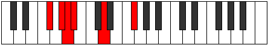 |
| [285](https://ianring.com/musictheory/scales/285) | [Zaritonic](ModeGFlatZaritonic.md) | Gb | Gb, Ab, A, Bb, D, Gb |  |
| [287](https://ianring.com/musictheory/scales/287) | [Gynimic](ModeFSharpGynimic.md) | F# | F#, G, Ab, Bbb, Cbb, D, F# |  |
| [287](https://ianring.com/musictheory/scales/287) | [Gynimic](ModeGFlatGynimic.md) | Gb | Gb, Abb, Bbbb, Cbbb, Cbb, D, Gb |  |
| [301](https://ianring.com/musictheory/scales/301) | [Zythitonic](ModeFSharpZythitonic.md) | F# | F#, G#, A, B, D, F# |  |
| [301](https://ianring.com/musictheory/scales/301) | [Zythitonic](ModeGFlatZythitonic.md) | Gb | Gb, Ab, A, B, D, Gb |  |
| [303](https://ianring.com/musictheory/scales/303) | [Golimic](ModeFSharpGolimic.md) | F# | F#, G, Ab, Bbb, Cb, D, F# |  |
| [303](https://ianring.com/musictheory/scales/303) | [Golimic](ModeGFlatGolimic.md) | Gb | Gb, Abb, Bbbb, Cbbb, Dbbb, Ebb, Gb |  |
| [317](https://ianring.com/musictheory/scales/317) | [Korimic](ModeFSharpKorimic.md) | F# | F#, G#, A, Bb, Cb, D, F# |  |
| [317](https://ianring.com/musictheory/scales/317) | [Korimic](ModeGFlatKorimic.md) | Gb | Gb, Ab, Bbb, Cbb, Dbbb, Ebb, Gb |  |
| [319](https://ianring.com/musictheory/scales/319) | [Epodian](ModeFSharpEpodian.md) | F# | F#, G, Ab, Bbb, Cbb, Dbbb, Ebb, F# |  |
| [319](https://ianring.com/musictheory/scales/319) | [Epodian](ModeGFlatEpodian.md) | Gb | Gb, Abb, Bbbb, Cbbb, Cbb, Dbbb, Ebb, Gb |  |
| [333](https://ianring.com/musictheory/scales/333) | [Bogitonic](ModeFSharpBogitonic.md) | F# | F#, G#, A, C, D, F# |  |
| [333](https://ianring.com/musictheory/scales/333) | [Bogitonic](ModeGFlatBogitonic.md) | Gb | Gb, Ab, A, C, D, Gb |  |
| [335](https://ianring.com/musictheory/scales/335) | [Zanimic](ModeFSharpZanimic.md) | F# | F#, G, Ab, Bbb, C, D, F# |  |
| [335](https://ianring.com/musictheory/scales/335) | [Zanimic](ModeGFlatZanimic.md) | Gb | Gb, Abb, Bbbb, Cbbb, Dbb, Ebb, Gb |  |
| [349](https://ianring.com/musictheory/scales/349) | [Borimic](ModeFSharpBorimic.md) | F# | F#, G#, A, Bb, C, D, F# |  |
| [349](https://ianring.com/musictheory/scales/349) | [Borimic](ModeGFlatBorimic.md) | Gb | Gb, Ab, Bbb, Cbb, Dbb, Ebb, Gb |  |
| [351](https://ianring.com/musictheory/scales/351) | [Epanian](ModeFSharpEpanian.md) | F# | F#, G, Ab, Bbb, Cbb, Dbb, Ebb, F# |  |
| [351](https://ianring.com/musictheory/scales/351) | [Epanian](ModeGFlatEpanian.md) | Gb | Gb, Abb, Bbbb, Cbbb, Cbb, Dbb, Ebb, Gb |  |
| [365](https://ianring.com/musictheory/scales/365) | [Marimic](ModeFSharpMarimic.md) | F# | F#, G#, A, B, C, D, F# |  |
| [365](https://ianring.com/musictheory/scales/365) | [Marimic](ModeGFlatMarimic.md) | Gb | Gb, Ab, Bbb, Cb, Dbb, Ebb, Gb |  |
| [367](https://ianring.com/musictheory/scales/367) | [Aerodian](ModeFSharpAerodian.md) | F# | F#, G, Ab, Bbb, Cb, Dbb, Ebb, F# |  |
| [367](https://ianring.com/musictheory/scales/367) | [Aerodian](ModeGFlatAerodian.md) | Gb | Gb, Abb, Bbbb, Cbbb, Dbbb, Dbb, Ebb, Gb |  |
| [381](https://ianring.com/musictheory/scales/381) | [Kogian](ModeFSharpKogian.md) | F# | F#, G#, A, Bb, Cb, Dbb, Ebb, F# |  |
| [381](https://ianring.com/musictheory/scales/381) | [Kogian](ModeGFlatKogian.md) | Gb | Gb, Ab, Bbb, Cbb, Dbbb, Dbb, Ebb, Gb |  |
| [383](https://ianring.com/musictheory/scales/383) | [Logyllic](ModeFSharpLogyllic.md) | F# | F#, G, G#, A, A#, B, C, D, F# |  |
| [383](https://ianring.com/musictheory/scales/383) | [Logyllic](ModeGFlatLogyllic.md) | Gb | Gb, G, Ab, A, Bb, B, C, D, Gb |  |
| [397](https://ianring.com/musictheory/scales/397) | [Epogitonic](ModeFSharpEpogitonic.md) | F# | F#, G#, A, C#, D, F# |  |
| [397](https://ianring.com/musictheory/scales/397) | [Epogitonic](ModeGFlatEpogitonic.md) | Gb | Gb, Ab, A, Db, D, Gb |  |
| [399](https://ianring.com/musictheory/scales/399) | [Zynimic](ModeFSharpZynimic.md) | F# | F#, G, Ab, Bbb, C#, D, F# |  |
| [399](https://ianring.com/musictheory/scales/399) | [Zynimic](ModeGFlatZynimic.md) | Gb | Gb, Abb, Bbbb, Cbbb, Db, Ebb, Gb |  |
| [413](https://ianring.com/musictheory/scales/413) | [Ganimic](ModeFSharpGanimic.md) | F# | F#, G#, A, Bb, C#, D, F# |  |
| [413](https://ianring.com/musictheory/scales/413) | [Ganimic](ModeGFlatGanimic.md) | Gb | Gb, Ab, Bbb, Cbb, Db, Ebb, Gb |  |
| [415](https://ianring.com/musictheory/scales/415) | [Aeoladian](ModeFSharpAeoladian.md) | F# | F#, G, Ab, Bbb, Cbb, Db, Ebb, F# |  |
| [415](https://ianring.com/musictheory/scales/415) | [Aeoladian](ModeGFlatAeoladian.md) | Gb | Gb, Abb, Bbbb, Cbbb, Cbb, Db, Ebb, Gb | 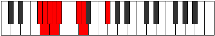 |
| [419](https://ianring.com/musictheory/scales/419) | [Ionacritonic](ModeCSharpIonacritonic.md) | C# | C#, D, F#, G#, A, C# |  |
| [419](https://ianring.com/musictheory/scales/419) | [Ionacritonic](ModeDFlatIonacritonic.md) | Db | Db, D, Gb, Ab, A, Db |  |
| [423](https://ianring.com/musictheory/scales/423) | [Sogimic](ModeCSharpSogimic.md) | C# | C#, D, Eb, F#, G#, A, C# | 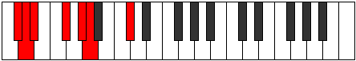 |
| [423](https://ianring.com/musictheory/scales/423) | [Sogimic](ModeDFlatSogimic.md) | Db | Db, Ebb, Fbb, Gb, Ab, Bbb, Db |  |
| [427](https://ianring.com/musictheory/scales/427) | [Zothimic](ModeCSharpZothimic.md) | C# | C#, D, E, F#, G#, A, C# |  |
| [427](https://ianring.com/musictheory/scales/427) | [Zothimic](ModeDFlatZothimic.md) | Db | Db, Ebb, Fb, Gb, Ab, Bbb, Db |  |
| [429](https://ianring.com/musictheory/scales/429) | [Koptimic](ModeFSharpKoptimic.md) | F# | F#, G#, A, B, C#, D, F# |  |
| [429](https://ianring.com/musictheory/scales/429) | [Koptimic](ModeGFlatKoptimic.md) | Gb | Gb, Ab, Bbb, Cb, Db, Ebb, Gb |  |
| [431](https://ianring.com/musictheory/scales/431) | [Epyrian](ModeCSharpEpyrian.md) | C# | C#, D, Eb, Fb, Gb, Ab, Bbb, C# |  |
| [431](https://ianring.com/musictheory/scales/431) | [Epyrian](ModeDFlatEpyrian.md) | Db | Db, Ebb, Fbb, Gbbb, Abbb, Bbbb, Cbbb, Db |  |
| [431](https://ianring.com/musictheory/scales/431) | [Epyrian](ModeFSharpEpyrian.md) | F# | F#, G, Ab, Bbb, Cb, Db, Ebb, F# | 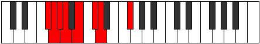 |
| [431](https://ianring.com/musictheory/scales/431) | [Epyrian](ModeGFlatEpyrian.md) | Gb | Gb, Abb, Bbbb, Cbbb, Dbbb, Ebbb, Fbbb, Gb |  |
| [435](https://ianring.com/musictheory/scales/435) | [Ionolimic](ModeCSharpIonolimic.md) | C# | C#, D, E#, F#, G#, A, C# |  |
| [435](https://ianring.com/musictheory/scales/435) | [Ionolimic](ModeDFlatIonolimic.md) | Db | Db, Ebb, F, Gb, Ab, Bbb, Db |  |
| [439](https://ianring.com/musictheory/scales/439) | [Bythian](ModeCSharpBythian.md) | C# | C#, D, Eb, F, Gb, Ab, Bbb, C# |  |
| [439](https://ianring.com/musictheory/scales/439) | [Bythian](ModeDFlatBythian.md) | Db | Db, Ebb, Fbb, Gbb, Abbb, Bbbb, Cbbb, Db |  |
| [443](https://ianring.com/musictheory/scales/443) | [Kothian](ModeCSharpKothian.md) | C# | C#, D, E, F, Gb, Ab, Bbb, C# | 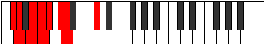 |
| [443](https://ianring.com/musictheory/scales/443) | [Kothian](ModeDFlatKothian.md) | Db | Db, Ebb, Fb, Gbb, Abbb, Bbbb, Cbbb, Db |  |
| [445](https://ianring.com/musictheory/scales/445) | [Gocrian](ModeFSharpGocrian.md) | F# | F#, G#, A, Bb, Cb, Db, Ebb, F# |  |
| [445](https://ianring.com/musictheory/scales/445) | [Gocrian](ModeGFlatGocrian.md) | Gb | Gb, Ab, Bbb, Cbb, Dbbb, Ebbb, Fbbb, Gb |  |
| [447](https://ianring.com/musictheory/scales/447) | [Thyphyllic](ModeCSharpThyphyllic.md) | C# | C#, D, D#, E, F, F#, G#, A, C# |  |
| [447](https://ianring.com/musictheory/scales/447) | [Thyphyllic](ModeDFlatThyphyllic.md) | Db | Db, D, Eb, E, F, Gb, Ab, A, Db |  |
| [447](https://ianring.com/musictheory/scales/447) | [Thyphyllic](ModeFSharpThyphyllic.md) | F# | F#, G, G#, A, A#, B, C#, D, F# |  |
| [447](https://ianring.com/musictheory/scales/447) | [Thyphyllic](ModeGFlatThyphyllic.md) | Gb | Gb, G, Ab, A, Bb, B, Db, D, Gb |  |
| [461](https://ianring.com/musictheory/scales/461) | [Madimic](ModeFSharpMadimic.md) | F# | F#, G#, A, B#, C#, D, F# |  |
| [461](https://ianring.com/musictheory/scales/461) | [Madimic](ModeGFlatMadimic.md) | Gb | Gb, Ab, Bbb, C, Db, Ebb, Gb |  |
| [463](https://ianring.com/musictheory/scales/463) | [Zythian](ModeFSharpZythian.md) | F# | F#, G, Ab, Bbb, C, Db, Ebb, F# |  |
| [463](https://ianring.com/musictheory/scales/463) | [Zythian](ModeGFlatZythian.md) | Gb | Gb, Abb, Bbbb, Cbbb, Dbb, Ebbb, Fbbb, Gb |  |
| [465](https://ianring.com/musictheory/scales/465) | [Zoditonic](ModeDNaturalZoditonic.md) | D | D, F#, G#, A, A#, D |  |
| [467](https://ianring.com/musictheory/scales/467) | [Phrogimic](ModeDNaturalPhrogimic.md) | D | D, Eb, F#, G#, A, Bb, D |  |
| [469](https://ianring.com/musictheory/scales/469) | [Katyrimic](ModeDNaturalKatyrimic.md) | D | D, E, F#, G#, A, Bb, D |  |
| [471](https://ianring.com/musictheory/scales/471) | [Dodian](ModeDNaturalDodian.md) | D | D, Eb, Fb, Gb, Ab, Bbb, Cbb, D |  |
| [473](https://ianring.com/musictheory/scales/473) | [Aeralimic](ModeDNaturalAeralimic.md) | D | D, E#, F#, G#, A, Bb, D |  |
| [475](https://ianring.com/musictheory/scales/475) | [Aeolygian](ModeDNaturalAeolygian.md) | D | D, Eb, F, Gb, Ab, Bbb, Cbb, D |  |
| [477](https://ianring.com/musictheory/scales/477) | [Stacrian](ModeFSharpStacrian.md) | F# | F#, G#, A, Bb, C, Db, Ebb, F# |  |
| [477](https://ianring.com/musictheory/scales/477) | [Stacrian](ModeGFlatStacrian.md) | Gb | Gb, Ab, Bbb, Cbb, Dbb, Ebbb, Fbbb, Gb |  |
| [477](https://ianring.com/musictheory/scales/477) | [Stacrian](ModeDNaturalStacrian.md) | D | D, E, F, Gb, Ab, Bbb, Cbb, D |  |
| [479](https://ianring.com/musictheory/scales/479) | [Kocryllic](ModeDNaturalKocryllic.md) | D | D, D#, E, F, F#, G#, A, A#, D |  |
| [479](https://ianring.com/musictheory/scales/479) | [Kocryllic](ModeFSharpKocryllic.md) | F# | F#, G, G#, A, A#, C, C#, D, F# |  |
| [479](https://ianring.com/musictheory/scales/479) | [Kocryllic](ModeGFlatKocryllic.md) | Gb | Gb, G, Ab, A, Bb, C, Db, D, Gb |  |
| [483](https://ianring.com/musictheory/scales/483) | [Kygimic](ModeCSharpKygimic.md) | C# | C#, D, E##, F##, G#, A, C# |  |
| [483](https://ianring.com/musictheory/scales/483) | [Kygimic](ModeDFlatKygimic.md) | Db | Db, Ebb, F#, G, Ab, Bbb, Db |  |
| [487](https://ianring.com/musictheory/scales/487) | [Dynian](ModeCSharpDynian.md) | C# | C#, D, Eb, F#, G, Ab, Bbb, C# |  |
| [487](https://ianring.com/musictheory/scales/487) | [Dynian](ModeDFlatDynian.md) | Db | Db, Ebb, Fbb, Gb, Abb, Bbbb, Cbbb, Db |  |
| [491](https://ianring.com/musictheory/scales/491) | [Aeolyrian](ModeCSharpAeolyrian.md) | C# | C#, D, E, F#, G, Ab, Bbb, C# |  |
| [491](https://ianring.com/musictheory/scales/491) | [Aeolyrian](ModeDFlatAeolyrian.md) | Db | Db, Ebb, Fb, Gb, Abb, Bbbb, Cbbb, Db |  |
| [493](https://ianring.com/musictheory/scales/493) | [Rygian](ModeFSharpRygian.md) | F# | F#, G#, A, B, C, Db, Ebb, F# |  |
| [493](https://ianring.com/musictheory/scales/493) | [Rygian](ModeGFlatRygian.md) | Gb | Gb, Ab, Bbb, Cb, Dbb, Ebbb, Fbbb, Gb |  |
| [495](https://ianring.com/musictheory/scales/495) | [Bocryllic](ModeCSharpBocryllic.md) | C# | C#, D, D#, E, F#, G, G#, A, C# |  |
| [495](https://ianring.com/musictheory/scales/495) | [Bocryllic](ModeDFlatBocryllic.md) | Db | Db, D, Eb, E, Gb, G, Ab, A, Db |  |
| [495](https://ianring.com/musictheory/scales/495) | [Bocryllic](ModeFSharpBocryllic.md) | F# | F#, G, G#, A, B, C, C#, D, F# |  |
| [495](https://ianring.com/musictheory/scales/495) | [Bocryllic](ModeGFlatBocryllic.md) | Gb | Gb, G, Ab, A, B, C, Db, D, Gb |  |
| [497](https://ianring.com/musictheory/scales/497) | [Kadimic](ModeDNaturalKadimic.md) | D | D, E##, F##, G#, A, Bb, D |  |
| [499](https://ianring.com/musictheory/scales/499) | [Ionaptian](ModeCSharpIonaptian.md) | C# | C#, D, E#, F#, G, Ab, Bbb, C# |  |
| [499](https://ianring.com/musictheory/scales/499) | [Ionaptian](ModeDFlatIonaptian.md) | Db | Db, Ebb, F, Gb, Abb, Bbbb, Cbbb, Db |  |
| [499](https://ianring.com/musictheory/scales/499) | [Ionaptian](ModeDNaturalIonaptian.md) | D | D, Eb, F#, G, Ab, Bbb, Cbb, D |  |
| [501](https://ianring.com/musictheory/scales/501) | [Katylian](ModeDNaturalKatylian.md) | D | D, E, F#, G, Ab, Bbb, Cbb, D |  |
| [503](https://ianring.com/musictheory/scales/503) | [Thoptyllic](ModeCSharpThoptyllic.md) | C# | C#, D, D#, F, F#, G, G#, A, C# |  |
| [503](https://ianring.com/musictheory/scales/503) | [Thoptyllic](ModeDFlatThoptyllic.md) | Db | Db, D, Eb, F, Gb, G, Ab, A, Db |  |
| [503](https://ianring.com/musictheory/scales/503) | [Thoptyllic](ModeDNaturalThoptyllic.md) | D | D, D#, E, F#, G, G#, A, A#, D |  |
| [505](https://ianring.com/musictheory/scales/505) | [Sanian](ModeDNaturalSanian.md) | D | D, E#, F#, G, Ab, Bbb, Cbb, D |  |
| [507](https://ianring.com/musictheory/scales/507) | [Moryllic](ModeCSharpMoryllic.md) | C# | C#, D, E, F, F#, G, G#, A, C# |  |
| [507](https://ianring.com/musictheory/scales/507) | [Moryllic](ModeDFlatMoryllic.md) | Db | Db, D, E, F, Gb, G, Ab, A, Db |  |
| [507](https://ianring.com/musictheory/scales/507) | [Moryllic](ModeDNaturalMoryllic.md) | D | D, D#, F, F#, G, G#, A, A#, D |  |
| [509](https://ianring.com/musictheory/scales/509) | [Ionothyllic](ModeDNaturalIonothyllic.md) | D | D, E, F, F#, G, G#, A, A#, D | 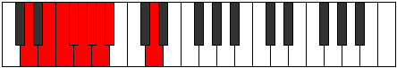 |
| [509](https://ianring.com/musictheory/scales/509) | [Ionothyllic](ModeFSharpIonothyllic.md) | F# | F#, G#, A, A#, B, C, C#, D, F# |  |
| [509](https://ianring.com/musictheory/scales/509) | [Ionothyllic](ModeGFlatIonothyllic.md) | Gb | Gb, Ab, A, Bb, B, C, Db, D, Gb |  |
| [511](https://ianring.com/musictheory/scales/511) | [Polygic](ModeCSharpPolygic.md) | C# | C#, D, D#, E, F, F#, G, G#, A, C# |  |
| [511](https://ianring.com/musictheory/scales/511) | [Polygic](ModeDFlatPolygic.md) | Db | Db, D, Eb, E, F, Gb, G, Ab, A, Db |  |
| [511](https://ianring.com/musictheory/scales/511) | [Polygic](ModeDNaturalPolygic.md) | D | D, D#, E, F, F#, G, G#, A, A#, D |  |
| [511](https://ianring.com/musictheory/scales/511) | [Polygic](ModeFSharpPolygic.md) | F# | F#, G, G#, A, A#, B, C, C#, D, F# |  |
| [511](https://ianring.com/musictheory/scales/511) | [Polygic](ModeGFlatPolygic.md) | Gb | Gb, G, Ab, A, Bb, B, C, Db, D, Gb |  |
| [571](https://ianring.com/musictheory/scales/571) | [Kynimic](ModeFNaturalKynimic.md) | F | F, Gb, Ab, Bbb, Cbb, D, F |  |
| [575](https://ianring.com/musictheory/scales/575) | [Ionydian](ModeFNaturalIonydian.md) | F | F, Gb, Abb, Bbbb, Cbbb, Cbb, D, F |  |
| [603](https://ianring.com/musictheory/scales/603) | [Aeolygimic](ModeFNaturalAeolygimic.md) | F | F, Gb, Ab, Bbb, Cb, D, F |  |
| [607](https://ianring.com/musictheory/scales/607) | [Kadian](ModeFNaturalKadian.md) | F | F, Gb, Abb, Bbbb, Cbbb, Dbbb, Ebb, F |  |
| [635](https://ianring.com/musictheory/scales/635) | [Epolian](ModeFNaturalEpolian.md) | F | F, Gb, Ab, Bbb, Cbb, Dbbb, Ebb, F |  |
| [639](https://ianring.com/musictheory/scales/639) | [Ionaryllic](ModeFNaturalIonaryllic.md) | F | F, F#, G, G#, A, A#, B, D, F |  |
| [667](https://ianring.com/musictheory/scales/667) | [Rodimic](ModeFNaturalRodimic.md) | F | F, Gb, Ab, Bbb, C, D, F |  |
| [671](https://ianring.com/musictheory/scales/671) | [Stycrian](ModeFNaturalStycrian.md) | F | F, Gb, Abb, Bbbb, Cbbb, Dbb, Ebb, F |  |
| [699](https://ianring.com/musictheory/scales/699) | [Aerothian](ModeFNaturalAerothian.md) | F | F, Gb, Ab, Bbb, Cbb, Dbb, Ebb, F |  |
| [703](https://ianring.com/musictheory/scales/703) | [Aerocryllic](ModeFNaturalAerocryllic.md) | F | F, F#, G, G#, A, A#, C, D, F |  |
| [721](https://ianring.com/musictheory/scales/721) | [Aeolacritonic](ModeDNaturalAeolacritonic.md) | D | D, F#, G#, A, B, D |  |
| [723](https://ianring.com/musictheory/scales/723) | [Ionadimic](ModeDNaturalIonadimic.md) | D | D, Eb, F#, G#, A, B, D |  |
| [725](https://ianring.com/musictheory/scales/725) | [Lonimic](ModeDNaturalLonimic.md) | D | D, E, F#, G#, A, B, D |  |
| [727](https://ianring.com/musictheory/scales/727) | [Phradian](ModeDNaturalPhradian.md) | D | D, Eb, Fb, Gb, Ab, Bbb, Cb, D |  |
| [729](https://ianring.com/musictheory/scales/729) | [Stygimic](ModeDNaturalStygimic.md) | D | D, E#, F#, G#, A, B, D |  |
| [731](https://ianring.com/musictheory/scales/731) | [Ionorian](ModeFNaturalIonorian.md) | F | F, Gb, Ab, Bbb, Cb, Dbb, Ebb, F |  |
| [731](https://ianring.com/musictheory/scales/731) | [Ionorian](ModeDNaturalIonorian.md) | D | D, Eb, F, Gb, Ab, Bbb, Cb, D |  |
| [733](https://ianring.com/musictheory/scales/733) | [Donian](ModeDNaturalDonian.md) | D | D, E, F, Gb, Ab, Bbb, Cb, D |  |
| [735](https://ianring.com/musictheory/scales/735) | [Sylyllic](ModeDNaturalSylyllic.md) | D | D, D#, E, F, F#, G#, A, B, D |  |
| [735](https://ianring.com/musictheory/scales/735) | [Sylyllic](ModeFNaturalSylyllic.md) | F | F, F#, G, G#, A, B, C, D, F |  |
| [753](https://ianring.com/musictheory/scales/753) | [Kytrimic](ModeDNaturalKytrimic.md) | D | D, E##, F##, G#, A, B, D |  |
| [755](https://ianring.com/musictheory/scales/755) | [Phrythian](ModeDNaturalPhrythian.md) | D | D, Eb, F#, G, Ab, Bbb, Cb, D |  |
| [757](https://ianring.com/musictheory/scales/757) | [Ionyptian](ModeDNaturalIonyptian.md) | D | D, E, F#, G, Ab, Bbb, Cb, D |  |
| [759](https://ianring.com/musictheory/scales/759) | [Katalyllic](ModeDNaturalKatalyllic.md) | D | D, D#, E, F#, G, G#, A, B, D |  |
| [761](https://ianring.com/musictheory/scales/761) | [Ponian](ModeDNaturalPonian.md) | D | D, E#, F#, G, Ab, Bbb, Cb, D |  |
| [763](https://ianring.com/musictheory/scales/763) | [Doryllic](ModeDNaturalDoryllic.md) | D | D, D#, F, F#, G, G#, A, B, D |  |
| [763](https://ianring.com/musictheory/scales/763) | [Doryllic](ModeFNaturalDoryllic.md) | F | F, F#, G#, A, A#, B, C, D, F |  |
| [765](https://ianring.com/musictheory/scales/765) | [Mixonyphyllic](ModeDNaturalMixonyphyllic.md) | D | D, E, F, F#, G, G#, A, B, D |  |
| [767](https://ianring.com/musictheory/scales/767) | [Raptygic](ModeDNaturalRaptygic.md) | D | D, D#, E, F, F#, G, G#, A, B, D |  |
| [767](https://ianring.com/musictheory/scales/767) | [Raptygic](ModeFNaturalRaptygic.md) | F | F, F#, G, G#, A, A#, B, C, D, F |  |
| [795](https://ianring.com/musictheory/scales/795) | [Aeologimic](ModeFNaturalAeologimic.md) | F | F, Gb, Ab, Bbb, C#, D, F |  |
| [797](https://ianring.com/musictheory/scales/797) | [Katocrimic](ModeFSharpKatocrimic.md) | F# | F#, G#, A, Bb, C##, D#, F# |  |
| [797](https://ianring.com/musictheory/scales/797) | [Katocrimic](ModeGFlatKatocrimic.md) | Gb | Gb, Ab, Bbb, Cbb, D, Eb, Gb |  |
| [799](https://ianring.com/musictheory/scales/799) | [Lolian](ModeFNaturalLolian.md) | F | F, Gb, Abb, Bbbb, Cbbb, Db, Ebb, F |  |
| [799](https://ianring.com/musictheory/scales/799) | [Lolian](ModeFSharpLolian.md) | F# | F#, G, Ab, Bbb, Cbb, D, Eb, F# |  |
| [799](https://ianring.com/musictheory/scales/799) | [Lolian](ModeGFlatLolian.md) | Gb | Gb, Abb, Bbbb, Cbbb, Cbb, D, Eb, Gb |  |
| [813](https://ianring.com/musictheory/scales/813) | [Larimic](ModeFSharpLarimic.md) | F# | F#, G#, A, B, C##, D#, F# |  |
| [813](https://ianring.com/musictheory/scales/813) | [Larimic](ModeGFlatLarimic.md) | Gb | Gb, Ab, Bbb, Cb, D, Eb, Gb |  |
| [815](https://ianring.com/musictheory/scales/815) | [Bolian](ModeFSharpBolian.md) | F# | F#, G, Ab, Bbb, Cb, D, Eb, F# |  |
| [815](https://ianring.com/musictheory/scales/815) | [Bolian](ModeGFlatBolian.md) | Gb | Gb, Abb, Bbbb, Cbbb, Dbbb, Ebb, Fbb, Gb |  |
| [827](https://ianring.com/musictheory/scales/827) | [Mixolocrian](ModeFNaturalMixolocrian.md) | F | F, Gb, Ab, Bbb, Cbb, Db, Ebb, F |  |
| [829](https://ianring.com/musictheory/scales/829) | [Lygian](ModeFSharpLygian.md) | F# | F#, G#, A, Bb, Cb, D, Eb, F# |  |
| [829](https://ianring.com/musictheory/scales/829) | [Lygian](ModeGFlatLygian.md) | Gb | Gb, Ab, Bbb, Cbb, Dbbb, Ebb, Fbb, Gb |  |
| [831](https://ianring.com/musictheory/scales/831) | [Rodyllic](ModeFNaturalRodyllic.md) | F | F, F#, G, G#, A, A#, C#, D, F |  |
| [831](https://ianring.com/musictheory/scales/831) | [Rodyllic](ModeFSharpRodyllic.md) | F# | F#, G, G#, A, A#, B, D, D#, F# |  |
| [831](https://ianring.com/musictheory/scales/831) | [Rodyllic](ModeGFlatRodyllic.md) | Gb | Gb, G, Ab, A, Bb, B, D, Eb, Gb |  |
| [837](https://ianring.com/musictheory/scales/837) | [Epaditonic](ModeCNaturalEpaditonic.md) | C | C, D, F#, G#, A, C |  |
| [839](https://ianring.com/musictheory/scales/839) | [Ionathimic](ModeCNaturalIonathimic.md) | C | C, Db, Ebb, F#, G#, A, C |  |
| [845](https://ianring.com/musictheory/scales/845) | [Zyrimic](ModeCNaturalZyrimic.md) | C | C, D, Eb, F#, G#, A, C |  |
| [845](https://ianring.com/musictheory/scales/845) | [Zyrimic](ModeFSharpZyrimic.md) | F# | F#, G#, A, B#, C##, D#, F# |  |
| [845](https://ianring.com/musictheory/scales/845) | [Zyrimic](ModeGFlatZyrimic.md) | Gb | Gb, Ab, Bbb, C, D, Eb, Gb |  |
| [847](https://ianring.com/musictheory/scales/847) | [Ganian](ModeCNaturalGanian.md) | C | C, Db, Ebb, Fbb, Gb, Ab, Bbb, C |  |
| [847](https://ianring.com/musictheory/scales/847) | [Ganian](ModeFSharpGanian.md) | F# | F#, G, Ab, Bbb, C, D, Eb, F# |  |
| [847](https://ianring.com/musictheory/scales/847) | [Ganian](ModeGFlatGanian.md) | Gb | Gb, Abb, Bbbb, Cbbb, Dbb, Ebb, Fbb, Gb |  |
| [853](https://ianring.com/musictheory/scales/853) | [Epothimic](ModeCNaturalEpothimic.md) | C | C, D, E, F#, G#, A, C |  |
| [855](https://ianring.com/musictheory/scales/855) | [Porian](ModeCNaturalPorian.md) | C | C, Db, Ebb, Fb, Gb, Ab, Bbb, C |  |
| [859](https://ianring.com/musictheory/scales/859) | [Pathian](ModeFNaturalPathian.md) | F | F, Gb, Ab, Bbb, Cb, Db, Ebb, F |  |
| [861](https://ianring.com/musictheory/scales/861) | [Rylian](ModeCNaturalRylian.md) | C | C, D, Eb, Fb, Gb, Ab, Bbb, C |  |
| [861](https://ianring.com/musictheory/scales/861) | [Rylian](ModeFSharpRylian.md) | F# | F#, G#, A, Bb, C, D, Eb, F# |  |
| [861](https://ianring.com/musictheory/scales/861) | [Rylian](ModeGFlatRylian.md) | Gb | Gb, Ab, Bbb, Cbb, Dbb, Ebb, Fbb, Gb |  |
| [863](https://ianring.com/musictheory/scales/863) | [Pyryllic](ModeCNaturalPyryllic.md) | C | C, C#, D, D#, E, F#, G#, A, C |  |
| [863](https://ianring.com/musictheory/scales/863) | [Pyryllic](ModeFSharpPyryllic.md) | F# | F#, G, G#, A, A#, C, D, D#, F# |  |
| [863](https://ianring.com/musictheory/scales/863) | [Pyryllic](ModeGFlatPyryllic.md) | Gb | Gb, G, Ab, A, Bb, C, D, Eb, Gb |  |
| [863](https://ianring.com/musictheory/scales/863) | [Pyryllic](ModeFNaturalPyryllic.md) | F | F, F#, G, G#, A, B, C#, D, F |  |
| [869](https://ianring.com/musictheory/scales/869) | [Kothimic](ModeCNaturalKothimic.md) | C | C, D, E#, F#, G#, A, C |  |
| [871](https://ianring.com/musictheory/scales/871) | [Epadian](ModeCNaturalEpadian.md) | C | C, Db, Ebb, F, Gb, Ab, Bbb, C |  |
| [877](https://ianring.com/musictheory/scales/877) | [Aeraptian](ModeCNaturalAeraptian.md) | C | C, D, Eb, F, Gb, Ab, Bbb, C |  |
| [877](https://ianring.com/musictheory/scales/877) | [Aeraptian](ModeFSharpAeraptian.md) | F# | F#, G#, A, B, C, D, Eb, F# |  |
| [877](https://ianring.com/musictheory/scales/877) | [Aeraptian](ModeGFlatAeraptian.md) | Gb | Gb, Ab, Bbb, Cb, Dbb, Ebb, Fbb, Gb |  |
| [879](https://ianring.com/musictheory/scales/879) | [Aeolocryllic](ModeCNaturalAeolocryllic.md) | C | C, C#, D, D#, F, F#, G#, A, C |  |
| [879](https://ianring.com/musictheory/scales/879) | [Aeolocryllic](ModeFSharpAeolocryllic.md) | F# | F#, G, G#, A, B, C, D, D#, F# |  |
| [879](https://ianring.com/musictheory/scales/879) | [Aeolocryllic](ModeGFlatAeolocryllic.md) | Gb | Gb, G, Ab, A, B, C, D, Eb, Gb |  |
| [885](https://ianring.com/musictheory/scales/885) | [Sathian](ModeCNaturalSathian.md) | C | C, D, E, F, Gb, Ab, Bbb, C |  |
| [887](https://ianring.com/musictheory/scales/887) | [Sathyllic](ModeCNaturalSathyllic.md) | C | C, C#, D, E, F, F#, G#, A, C | 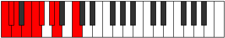 |
| [891](https://ianring.com/musictheory/scales/891) | [Ionilyllic](ModeFNaturalIonilyllic.md) | F | F, F#, G#, A, A#, B, C#, D, F |  |
| [893](https://ianring.com/musictheory/scales/893) | [Pycryllic](ModeCNaturalPycryllic.md) | C | C, D, D#, E, F, F#, G#, A, C |  |
| [893](https://ianring.com/musictheory/scales/893) | [Pycryllic](ModeFSharpPycryllic.md) | F# | F#, G#, A, A#, B, C, D, D#, F# |  |
| [893](https://ianring.com/musictheory/scales/893) | [Pycryllic](ModeGFlatPycryllic.md) | Gb | Gb, Ab, A, Bb, B, C, D, Eb, Gb |  |
| [895](https://ianring.com/musictheory/scales/895) | [Aeolathygic](ModeCNaturalAeolathygic.md) | C | C, C#, D, D#, E, F, F#, G#, A, C |  |
| [895](https://ianring.com/musictheory/scales/895) | [Aeolathygic](ModeFSharpAeolathygic.md) | F# | F#, G, G#, A, A#, B, C, D, D#, F# |  |
| [895](https://ianring.com/musictheory/scales/895) | [Aeolathygic](ModeGFlatAeolathygic.md) | Gb | Gb, G, Ab, A, Bb, B, C, D, Eb, Gb |  |
| [895](https://ianring.com/musictheory/scales/895) | [Aeolathygic](ModeFNaturalAeolathygic.md) | F | F, F#, G, G#, A, A#, B, C#, D, F |  |
| [909](https://ianring.com/musictheory/scales/909) | [Katarimic](ModeFSharpKatarimic.md) | F# | F#, G#, A, B##, C##, D#, F# |  |
| [909](https://ianring.com/musictheory/scales/909) | [Katarimic](ModeGFlatKatarimic.md) | Gb | Gb, Ab, Bbb, C#, D, Eb, Gb |  |
| [911](https://ianring.com/musictheory/scales/911) | [Radian](ModeFSharpRadian.md) | F# | F#, G, Ab, Bbb, C#, D, Eb, F# |  |
| [911](https://ianring.com/musictheory/scales/911) | [Radian](ModeGFlatRadian.md) | Gb | Gb, Abb, Bbbb, Cbbb, Db, Ebb, Fbb, Gb |  |
| [923](https://ianring.com/musictheory/scales/923) | [Ionodian](ModeFNaturalIonodian.md) | F | F, Gb, Ab, Bbb, C, Db, Ebb, F |  |
| [925](https://ianring.com/musictheory/scales/925) | [Mythian](ModeFSharpMythian.md) | F# | F#, G#, A, Bb, C#, D, Eb, F# |  |
| [925](https://ianring.com/musictheory/scales/925) | [Mythian](ModeGFlatMythian.md) | Gb | Gb, Ab, Bbb, Cbb, Db, Ebb, Fbb, Gb |  |
| [927](https://ianring.com/musictheory/scales/927) | [Koptyllic](ModeFNaturalKoptyllic.md) | F | F, F#, G, G#, A, C, C#, D, F |  |
| [927](https://ianring.com/musictheory/scales/927) | [Koptyllic](ModeFSharpKoptyllic.md) | F# | F#, G, G#, A, A#, C#, D, D#, F# |  |
| [927](https://ianring.com/musictheory/scales/927) | [Koptyllic](ModeGFlatKoptyllic.md) | Gb | Gb, G, Ab, A, Bb, Db, D, Eb, Gb |  |
| [931](https://ianring.com/musictheory/scales/931) | [Bacrimic](ModeCSharpBacrimic.md) | C# | C#, D, E##, F###, G##, A#, C# |  |
| [931](https://ianring.com/musictheory/scales/931) | [Bacrimic](ModeDFlatBacrimic.md) | Db | Db, Ebb, F#, G#, A, Bb, Db |  |
| [935](https://ianring.com/musictheory/scales/935) | [Katarian](ModeCSharpKatarian.md) | C# | C#, D, Eb, F#, G#, A, Bb, C# |  |
| [935](https://ianring.com/musictheory/scales/935) | [Katarian](ModeDFlatKatarian.md) | Db | Db, Ebb, Fbb, Gb, Ab, Bbb, Cbb, Db |  |
| [939](https://ianring.com/musictheory/scales/939) | [Dyptian](ModeCSharpDyptian.md) | C# | C#, D, E, F#, G#, A, Bb, C# |  |
| [939](https://ianring.com/musictheory/scales/939) | [Dyptian](ModeDFlatDyptian.md) | Db | Db, Ebb, Fb, Gb, Ab, Bbb, Cbb, Db |  |
| [941](https://ianring.com/musictheory/scales/941) | [Phrorian](ModeFSharpPhrorian.md) | F# | F#, G#, A, B, C#, D, Eb, F# |  |
| [941](https://ianring.com/musictheory/scales/941) | [Phrorian](ModeGFlatPhrorian.md) | Gb | Gb, Ab, Bbb, Cb, Db, Ebb, Fbb, Gb |  |
| [943](https://ianring.com/musictheory/scales/943) | [Aerygyllic](ModeCSharpAerygyllic.md) | C# | C#, D, D#, E, F#, G#, A, A#, C# |  |
| [943](https://ianring.com/musictheory/scales/943) | [Aerygyllic](ModeDFlatAerygyllic.md) | Db | Db, D, Eb, E, Gb, Ab, A, Bb, Db |  |
| [943](https://ianring.com/musictheory/scales/943) | [Aerygyllic](ModeFSharpAerygyllic.md) | F# | F#, G, G#, A, B, C#, D, D#, F# |  |
| [943](https://ianring.com/musictheory/scales/943) | [Aerygyllic](ModeGFlatAerygyllic.md) | Gb | Gb, G, Ab, A, B, Db, D, Eb, Gb |  |
| [947](https://ianring.com/musictheory/scales/947) | [Modian](ModeCSharpModian.md) | C# | C#, D, E#, F#, G#, A, Bb, C# |  |
| [947](https://ianring.com/musictheory/scales/947) | [Modian](ModeDFlatModian.md) | Db | Db, Ebb, F, Gb, Ab, Bbb, Cbb, Db |  |
| [951](https://ianring.com/musictheory/scales/951) | [Thogyllic](ModeCSharpThogyllic.md) | C# | C#, D, D#, F, F#, G#, A, A#, C# |  |
| [951](https://ianring.com/musictheory/scales/951) | [Thogyllic](ModeDFlatThogyllic.md) | Db | Db, D, Eb, F, Gb, Ab, A, Bb, Db |  |
| [955](https://ianring.com/musictheory/scales/955) | [Ionogyllic](ModeFNaturalIonogyllic.md) | F | F, F#, G#, A, A#, C, C#, D, F |  |
| [955](https://ianring.com/musictheory/scales/955) | [Ionogyllic](ModeCSharpIonogyllic.md) | C# | C#, D, E, F, F#, G#, A, A#, C# |  |
| [955](https://ianring.com/musictheory/scales/955) | [Ionogyllic](ModeDFlatIonogyllic.md) | Db | Db, D, E, F, Gb, Ab, A, Bb, Db |  |
| [957](https://ianring.com/musictheory/scales/957) | [Phronyllic](ModeFSharpPhronyllic.md) | F# | F#, G#, A, A#, B, C#, D, D#, F# |  |
| [957](https://ianring.com/musictheory/scales/957) | [Phronyllic](ModeGFlatPhronyllic.md) | Gb | Gb, Ab, A, Bb, B, Db, D, Eb, Gb |  |
| [959](https://ianring.com/musictheory/scales/959) | [Katylygic](ModeCSharpKatylygic.md) | C# | C#, D, D#, E, F, F#, G#, A, A#, C# |  |
| [959](https://ianring.com/musictheory/scales/959) | [Katylygic](ModeDFlatKatylygic.md) | Db | Db, D, Eb, E, F, Gb, Ab, A, Bb, Db |  |
| [959](https://ianring.com/musictheory/scales/959) | [Katylygic](ModeFNaturalKatylygic.md) | F | F, F#, G, G#, A, A#, C, C#, D, F |  |
| [959](https://ianring.com/musictheory/scales/959) | [Katylygic](ModeFSharpKatylygic.md) | F# | F#, G, G#, A, A#, B, C#, D, D#, F# |  |
| [959](https://ianring.com/musictheory/scales/959) | [Katylygic](ModeGFlatKatylygic.md) | Gb | Gb, G, Ab, A, Bb, B, Db, D, Eb, Gb |  |
| [965](https://ianring.com/musictheory/scales/965) | [Ionothimic](ModeCNaturalIonothimic.md) | C | C, D, E##, F##, G#, A, C |  |
| [967](https://ianring.com/musictheory/scales/967) | [Aeolanian](ModeCNaturalAeolanian.md) | C | C, Db, Ebb, F#, G, Ab, Bbb, C |  |
| [973](https://ianring.com/musictheory/scales/973) | [Phryptian](ModeFSharpPhryptian.md) | F# | F#, G#, A, B#, C#, D, Eb, F# |  |
| [973](https://ianring.com/musictheory/scales/973) | [Phryptian](ModeGFlatPhryptian.md) | Gb | Gb, Ab, Bbb, C, Db, Ebb, Fbb, Gb |  |
| [973](https://ianring.com/musictheory/scales/973) | [Phryptian](ModeCNaturalPhryptian.md) | C | C, D, Eb, F#, G, Ab, Bbb, C |  |
| [975](https://ianring.com/musictheory/scales/975) | [Katogyllic](ModeCNaturalKatogyllic.md) | C | C, C#, D, D#, F#, G, G#, A, C |  |
| [975](https://ianring.com/musictheory/scales/975) | [Katogyllic](ModeFSharpKatogyllic.md) | F# | F#, G, G#, A, C, C#, D, D#, F# |  |
| [975](https://ianring.com/musictheory/scales/975) | [Katogyllic](ModeGFlatKatogyllic.md) | Gb | Gb, G, Ab, A, C, Db, D, Eb, Gb |  |
| [977](https://ianring.com/musictheory/scales/977) | [Kocrimic](ModeDNaturalKocrimic.md) | D | D, E##, F###, G##, A#, B, D |  |
| [979](https://ianring.com/musictheory/scales/979) | [Thogian](ModeDNaturalThogian.md) | D | D, Eb, F#, G#, A, Bb, Cb, D |  |
| [981](https://ianring.com/musictheory/scales/981) | [Bacrian](ModeCNaturalBacrian.md) | C | C, D, E, F#, G, Ab, Bbb, C |  |
| [981](https://ianring.com/musictheory/scales/981) | [Bacrian](ModeDNaturalBacrian.md) | D | D, E, F#, G#, A, Bb, Cb, D |  |
| [983](https://ianring.com/musictheory/scales/983) | [Epygyllic](ModeCNaturalEpygyllic.md) | C | C, C#, D, E, F#, G, G#, A, C |  |
| [983](https://ianring.com/musictheory/scales/983) | [Epygyllic](ModeDNaturalEpygyllic.md) | D | D, D#, E, F#, G#, A, A#, B, D |  |
| [985](https://ianring.com/musictheory/scales/985) | [Raptian](ModeDNaturalRaptian.md) | D | D, E#, F#, G#, A, Bb, Cb, D |  |
| [987](https://ianring.com/musictheory/scales/987) | [Aeraptyllic](ModeFNaturalAeraptyllic.md) | F | F, F#, G#, A, B, C, C#, D, F |  |
| [987](https://ianring.com/musictheory/scales/987) | [Aeraptyllic](ModeDNaturalAeraptyllic.md) | D | D, D#, F, F#, G#, A, A#, B, D | 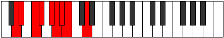 |
| [989](https://ianring.com/musictheory/scales/989) | [Phrolyllic](ModeCNaturalPhrolyllic.md) | C | C, D, D#, E, F#, G, G#, A, C |  |
| [989](https://ianring.com/musictheory/scales/989) | [Phrolyllic](ModeFSharpPhrolyllic.md) | F# | F#, G#, A, A#, C, C#, D, D#, F# |  |
| [989](https://ianring.com/musictheory/scales/989) | [Phrolyllic](ModeGFlatPhrolyllic.md) | Gb | Gb, Ab, A, Bb, C, Db, D, Eb, Gb |  |
| [989](https://ianring.com/musictheory/scales/989) | [Phrolyllic](ModeDNaturalPhrolyllic.md) | D | D, E, F, F#, G#, A, A#, B, D |  |
| [991](https://ianring.com/musictheory/scales/991) | [Aeolygic](ModeCNaturalAeolygic.md) | C | C, C#, D, D#, E, F#, G, G#, A, C |  |
| [991](https://ianring.com/musictheory/scales/991) | [Aeolygic](ModeFSharpAeolygic.md) | F# | F#, G, G#, A, A#, C, C#, D, D#, F# |  |
| [991](https://ianring.com/musictheory/scales/991) | [Aeolygic](ModeGFlatAeolygic.md) | Gb | Gb, G, Ab, A, Bb, C, Db, D, Eb, Gb |  |
| [991](https://ianring.com/musictheory/scales/991) | [Aeolygic](ModeFNaturalAeolygic.md) | F | F, F#, G, G#, A, B, C, C#, D, F |  |
| [991](https://ianring.com/musictheory/scales/991) | [Aeolygic](ModeDNaturalAeolygic.md) | D | D, D#, E, F, F#, G#, A, A#, B, D |  |
| [995](https://ianring.com/musictheory/scales/995) | [Phrathian](ModeCSharpPhrathian.md) | C# | C#, D, E##, F##, G#, A, Bb, C# |  |
| [995](https://ianring.com/musictheory/scales/995) | [Phrathian](ModeDFlatPhrathian.md) | Db | Db, Ebb, F#, G, Ab, Bbb, Cbb, Db |  |
| [997](https://ianring.com/musictheory/scales/997) | [Rycrian](ModeCNaturalRycrian.md) | C | C, D, E#, F#, G, Ab, Bbb, C |  |
| [999](https://ianring.com/musictheory/scales/999) | [Bylyllic](ModeCNaturalBylyllic.md) | C | C, C#, D, F, F#, G, G#, A, C |  |
| [999](https://ianring.com/musictheory/scales/999) | [Bylyllic](ModeCSharpBylyllic.md) | C# | C#, D, D#, F#, G, G#, A, A#, C# |  |
| [999](https://ianring.com/musictheory/scales/999) | [Bylyllic](ModeDFlatBylyllic.md) | Db | Db, D, Eb, Gb, G, Ab, A, Bb, Db |  |
| [1003](https://ianring.com/musictheory/scales/1003) | [Ionyryllic](ModeCSharpIonyryllic.md) | C# | C#, D, E, F#, G, G#, A, A#, C# |  |
| [1003](https://ianring.com/musictheory/scales/1003) | [Ionyryllic](ModeDFlatIonyryllic.md) | Db | Db, D, E, Gb, G, Ab, A, Bb, Db |  |
| [1005](https://ianring.com/musictheory/scales/1005) | [Radyllic](ModeCNaturalRadyllic.md) | C | C, D, D#, F, F#, G, G#, A, C |  |
| [1005](https://ianring.com/musictheory/scales/1005) | [Radyllic](ModeFSharpRadyllic.md) | F# | F#, G#, A, B, C, C#, D, D#, F# |  |
| [1005](https://ianring.com/musictheory/scales/1005) | [Radyllic](ModeGFlatRadyllic.md) | Gb | Gb, Ab, A, B, C, Db, D, Eb, Gb |  |
| [1007](https://ianring.com/musictheory/scales/1007) | [Ionycrygic](ModeCNaturalIonycrygic.md) | C | C, C#, D, D#, F, F#, G, G#, A, C |  |
| [1007](https://ianring.com/musictheory/scales/1007) | [Ionycrygic](ModeCSharpIonycrygic.md) | C# | C#, D, D#, E, F#, G, G#, A, A#, C# |  |
| [1007](https://ianring.com/musictheory/scales/1007) | [Ionycrygic](ModeDFlatIonycrygic.md) | Db | Db, D, Eb, E, Gb, G, Ab, A, Bb, Db |  |
| [1007](https://ianring.com/musictheory/scales/1007) | [Ionycrygic](ModeFSharpIonycrygic.md) | F# | F#, G, G#, A, B, C, C#, D, D#, F# |  |
| [1007](https://ianring.com/musictheory/scales/1007) | [Ionycrygic](ModeGFlatIonycrygic.md) | Gb | Gb, G, Ab, A, B, C, Db, D, Eb, Gb |  |
| [1009](https://ianring.com/musictheory/scales/1009) | [Katyptian](ModeDNaturalKatyptian.md) | D | D, E##, F##, G#, A, Bb, Cb, D |  |
| [1011](https://ianring.com/musictheory/scales/1011) | [Kycryllic](ModeCSharpKycryllic.md) | C# | C#, D, F, F#, G, G#, A, A#, C# |  |
| [1011](https://ianring.com/musictheory/scales/1011) | [Kycryllic](ModeDFlatKycryllic.md) | Db | Db, D, F, Gb, G, Ab, A, Bb, Db |  |
| [1011](https://ianring.com/musictheory/scales/1011) | [Kycryllic](ModeDNaturalKycryllic.md) | D | D, D#, F#, G, G#, A, A#, B, D |  |
| [1013](https://ianring.com/musictheory/scales/1013) | [Stydyllic](ModeCNaturalStydyllic.md) | C | C, D, E, F, F#, G, G#, A, C |  |
| [1013](https://ianring.com/musictheory/scales/1013) | [Stydyllic](ModeDNaturalStydyllic.md) | D | D, E, F#, G, G#, A, A#, B, D |  |
| [1015](https://ianring.com/musictheory/scales/1015) | [Ionodygic](ModeCNaturalIonodygic.md) | C | C, C#, D, E, F, F#, G, G#, A, C |  |
| [1015](https://ianring.com/musictheory/scales/1015) | [Ionodygic](ModeCSharpIonodygic.md) | C# | C#, D, D#, F, F#, G, G#, A, A#, C# |  |
| [1015](https://ianring.com/musictheory/scales/1015) | [Ionodygic](ModeDFlatIonodygic.md) | Db | Db, D, Eb, F, Gb, G, Ab, A, Bb, Db |  |
| [1015](https://ianring.com/musictheory/scales/1015) | [Ionodygic](ModeDNaturalIonodygic.md) | D | D, D#, E, F#, G, G#, A, A#, B, D |  |
| [1017](https://ianring.com/musictheory/scales/1017) | [Dythyllic](ModeDNaturalDythyllic.md) | D | D, F, F#, G, G#, A, A#, B, D |  |
| [1019](https://ianring.com/musictheory/scales/1019) | [Aeranygic](ModeCSharpAeranygic.md) | C# | C#, D, E, F, F#, G, G#, A, A#, C# |  |
| [1019](https://ianring.com/musictheory/scales/1019) | [Aeranygic](ModeDFlatAeranygic.md) | Db | Db, D, E, F, Gb, G, Ab, A, Bb, Db |  |
| [1019](https://ianring.com/musictheory/scales/1019) | [Aeranygic](ModeFNaturalAeranygic.md) | F | F, F#, G#, A, A#, B, C, C#, D, F |  |
| [1019](https://ianring.com/musictheory/scales/1019) | [Aeranygic](ModeDNaturalAeranygic.md) | D | D, D#, F, F#, G, G#, A, A#, B, D |  |
| [1021](https://ianring.com/musictheory/scales/1021) | [Ladygic](ModeCNaturalLadygic.md) | C | C, D, D#, E, F, F#, G, G#, A, C |  |
| [1021](https://ianring.com/musictheory/scales/1021) | [Ladygic](ModeFSharpLadygic.md) | F# | F#, G#, A, A#, B, C, C#, D, D#, F# |  |
| [1021](https://ianring.com/musictheory/scales/1021) | [Ladygic](ModeGFlatLadygic.md) | Gb | Gb, Ab, A, Bb, B, C, Db, D, Eb, Gb |  |
| [1021](https://ianring.com/musictheory/scales/1021) | [Ladygic](ModeDNaturalLadygic.md) | D | D, E, F, F#, G, G#, A, A#, B, D |  |
| [1023](https://ianring.com/musictheory/scales/1023) | [Dodyllian](ModeCNaturalDodyllian.md) | C | C, C#, D, D#, E, F, F#, G, G#, A, C |  |
| [1023](https://ianring.com/musictheory/scales/1023) | [Dodyllian](ModeCSharpDodyllian.md) | C# | C#, D, D#, E, F, F#, G, G#, A, A#, C# |  |
| [1023](https://ianring.com/musictheory/scales/1023) | [Dodyllian](ModeDFlatDodyllian.md) | Db | Db, D, Eb, E, F, Gb, G, Ab, A, Bb, Db |  |
| [1023](https://ianring.com/musictheory/scales/1023) | [Dodyllian](ModeFSharpDodyllian.md) | F# | F#, G, G#, A, A#, B, C, C#, D, D#, F# |  |
| [1023](https://ianring.com/musictheory/scales/1023) | [Dodyllian](ModeGFlatDodyllian.md) | Gb | Gb, G, Ab, A, Bb, B, C, Db, D, Eb, Gb |  |
| [1023](https://ianring.com/musictheory/scales/1023) | [Dodyllian](ModeFNaturalDodyllian.md) | F | F, F#, G, G#, A, A#, B, C, C#, D, F |  |
| [1023](https://ianring.com/musictheory/scales/1023) | [Dodyllian](ModeDNaturalDodyllian.md) | D | D, D#, E, F, F#, G, G#, A, A#, B, D |  |
| [1095](https://ianring.com/musictheory/scales/1095) | [Phrythitonic](ModeGSharpPhrythitonic.md) | G# | G#, A, A#, D, F#, G# |  |
| [1095](https://ianring.com/musictheory/scales/1095) | [Phrythitonic](ModeAFlatPhrythitonic.md) | Ab | Ab, A, Bb, D, Gb, Ab |  |
| [1099](https://ianring.com/musictheory/scales/1099) | [Dyritonic](ModeGSharpDyritonic.md) | G# | G#, A, B, D, F#, G# |  |
| [1099](https://ianring.com/musictheory/scales/1099) | [Dyritonic](ModeAFlatDyritonic.md) | Ab | Ab, A, B, D, Gb, Ab |  |
| [1103](https://ianring.com/musictheory/scales/1103) | [Lynimic](ModeGSharpLynimic.md) | G# | G#, A, Bb, Cb, D, E##, G# |  |
| [1103](https://ianring.com/musictheory/scales/1103) | [Lynimic](ModeAFlatLynimic.md) | Ab | Ab, Bbb, Cbb, Dbbb, Ebb, F#, Ab |  |
| [1107](https://ianring.com/musictheory/scales/1107) | [Mogitonic](ModeGSharpMogitonic.md) | G# | G#, A, C, D, F#, G# |  |
| [1107](https://ianring.com/musictheory/scales/1107) | [Mogitonic](ModeAFlatMogitonic.md) | Ab | Ab, A, C, D, Gb, Ab |  |
| [1111](https://ianring.com/musictheory/scales/1111) | [Sycrimic](ModeGSharpSycrimic.md) | G# | G#, A, Bb, C, D, E##, G# | 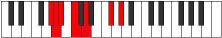 |
| [1111](https://ianring.com/musictheory/scales/1111) | [Sycrimic](ModeAFlatSycrimic.md) | Ab | Ab, Bbb, Cbb, Dbb, Ebb, F#, Ab |  |
| [1115](https://ianring.com/musictheory/scales/1115) | [Locrimic](ModeGSharpLocrimic.md) | G# | G#, A, B, C, D, E##, G# |  |
| [1115](https://ianring.com/musictheory/scales/1115) | [Locrimic](ModeAFlatLocrimic.md) | Ab | Ab, Bbb, Cb, Dbb, Ebb, F#, Ab |  |
| [1119](https://ianring.com/musictheory/scales/1119) | [Rarian](ModeGSharpRarian.md) | G# | G#, A, Bb, Cb, Dbb, Ebb, F#, G# |  |
| [1119](https://ianring.com/musictheory/scales/1119) | [Rarian](ModeAFlatRarian.md) | Ab | Ab, Bbb, Cbb, Dbbb, Dbb, Ebb, F#, Ab |  |
| [1123](https://ianring.com/musictheory/scales/1123) | [Lanitonic](ModeGSharpLanitonic.md) | G# | G#, A, C#, D, F#, G# |  |
| [1123](https://ianring.com/musictheory/scales/1123) | [Lanitonic](ModeAFlatLanitonic.md) | Ab | Ab, A, Db, D, Gb, Ab |  |
| [1127](https://ianring.com/musictheory/scales/1127) | [Eparimic](ModeGSharpEparimic.md) | G# | G#, A, Bb, C#, D, E##, G# |  |
| [1127](https://ianring.com/musictheory/scales/1127) | [Eparimic](ModeAFlatEparimic.md) | Ab | Ab, Bbb, Cbb, Db, Ebb, F#, Ab |  |
| [1131](https://ianring.com/musictheory/scales/1131) | [Thocrimic](ModeGSharpThocrimic.md) | G# | G#, A, B, C#, D, E##, G# |  |
| [1131](https://ianring.com/musictheory/scales/1131) | [Thocrimic](ModeAFlatThocrimic.md) | Ab | Ab, Bbb, Cb, Db, Ebb, F#, Ab |  |
| [1135](https://ianring.com/musictheory/scales/1135) | [Katolian](ModeGSharpKatolian.md) | G# | G#, A, Bb, Cb, Db, Ebb, F#, G# |  |
| [1135](https://ianring.com/musictheory/scales/1135) | [Katolian](ModeAFlatKatolian.md) | Ab | Ab, Bbb, Cbb, Dbbb, Ebbb, Fbbb, Gb, Ab |  |
| [1139](https://ianring.com/musictheory/scales/1139) | [Aerygimic](ModeGSharpAerygimic.md) | G# | G#, A, B#, C#, D, E##, G# |  |
| [1139](https://ianring.com/musictheory/scales/1139) | [Aerygimic](ModeAFlatAerygimic.md) | Ab | Ab, Bbb, C, Db, Ebb, F#, Ab |  |
| [1141](https://ianring.com/musictheory/scales/1141) | [Rynimic](ModeENaturalRynimic.md) | E | E, F#, G#, A, Bb, C##, E |  |
| [1143](https://ianring.com/musictheory/scales/1143) | [Styrian](ModeGSharpStyrian.md) | G# | G#, A, Bb, C, Db, Ebb, F#, G# |  |
| [1143](https://ianring.com/musictheory/scales/1143) | [Styrian](ModeAFlatStyrian.md) | Ab | Ab, Bbb, Cbb, Dbb, Ebbb, Fbbb, Gb, Ab |  |
| [1143](https://ianring.com/musictheory/scales/1143) | [Styrian](ModeENaturalStyrian.md) | E | E, F, Gb, Ab, Bbb, Cbb, D, E |  |
| [1147](https://ianring.com/musictheory/scales/1147) | [Epynian](ModeGSharpEpynian.md) | G# | G#, A, B, C, Db, Ebb, F#, G# |  |
| [1147](https://ianring.com/musictheory/scales/1147) | [Epynian](ModeAFlatEpynian.md) | Ab | Ab, Bbb, Cb, Dbb, Ebbb, Fbbb, Gb, Ab |  |
| [1149](https://ianring.com/musictheory/scales/1149) | [Bydian](ModeENaturalBydian.md) | E | E, F#, G, Ab, Bbb, Cbb, D, E |  |
| [1151](https://ianring.com/musictheory/scales/1151) | [Mythyllic](ModeENaturalMythyllic.md) | E | E, F, F#, G, G#, A, A#, D, E |  |
| [1151](https://ianring.com/musictheory/scales/1151) | [Mythyllic](ModeGSharpMythyllic.md) | G# | G#, A, A#, B, C, C#, D, F#, G# | 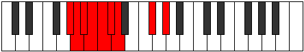 |
| [1151](https://ianring.com/musictheory/scales/1151) | [Mythyllic](ModeAFlatMythyllic.md) | Ab | Ab, A, Bb, B, C, Db, D, Gb, Ab |  |
| [1205](https://ianring.com/musictheory/scales/1205) | [Ionycrimic](ModeENaturalIonycrimic.md) | E | E, F#, G#, A, B, C##, E |  |
| [1207](https://ianring.com/musictheory/scales/1207) | [Aeoloptian](ModeENaturalAeoloptian.md) | E | E, F, Gb, Ab, Bbb, Cb, D, E |  |
| [1213](https://ianring.com/musictheory/scales/1213) | [Gyrian](ModeENaturalGyrian.md) | E | E, F#, G, Ab, Bbb, Cb, D, E |  |
| [1215](https://ianring.com/musictheory/scales/1215) | [Aeolanyllic](ModeENaturalAeolanyllic.md) | E | E, F, F#, G, G#, A, B, D, E |  |
| [1223](https://ianring.com/musictheory/scales/1223) | [Phryptimic](ModeGSharpPhryptimic.md) | G# | G#, A, Bb, C##, D#, E##, G# |  |
| [1223](https://ianring.com/musictheory/scales/1223) | [Phryptimic](ModeAFlatPhryptimic.md) | Ab | Ab, Bbb, Cbb, D, Eb, F#, Ab |  |
| [1227](https://ianring.com/musictheory/scales/1227) | [Thacrimic](ModeGSharpThacrimic.md) | G# | G#, A, B, C##, D#, E##, G# |  |
| [1227](https://ianring.com/musictheory/scales/1227) | [Thacrimic](ModeAFlatThacrimic.md) | Ab | Ab, Bbb, Cb, D, Eb, F#, Ab |  |
| [1231](https://ianring.com/musictheory/scales/1231) | [Logian](ModeGSharpLogian.md) | G# | G#, A, Bb, Cb, D, Eb, F#, G# |  |
| [1231](https://ianring.com/musictheory/scales/1231) | [Logian](ModeAFlatLogian.md) | Ab | Ab, Bbb, Cbb, Dbbb, Ebb, Fbb, Gb, Ab |  |
| [1233](https://ianring.com/musictheory/scales/1233) | [Ionoditonic](ModeDNaturalIonoditonic.md) | D | D, F#, G#, A, C, D |  |
| [1235](https://ianring.com/musictheory/scales/1235) | [Stylimic](ModeDNaturalStylimic.md) | D | D, Eb, F#, G#, A, B#, D |  |
| [1235](https://ianring.com/musictheory/scales/1235) | [Stylimic](ModeGSharpStylimic.md) | G# | G#, A, B#, C##, D#, E##, G# |  |
| [1235](https://ianring.com/musictheory/scales/1235) | [Stylimic](ModeAFlatStylimic.md) | Ab | Ab, Bbb, C, D, Eb, F#, Ab |  |
| [1237](https://ianring.com/musictheory/scales/1237) | [Salimic](ModeDNaturalSalimic.md) | D | D, E, F#, G#, A, B#, D |  |
| [1239](https://ianring.com/musictheory/scales/1239) | [Epaptian](ModeDNaturalEpaptian.md) | D | D, Eb, Fb, Gb, Ab, Bbb, C, D |  |
| [1239](https://ianring.com/musictheory/scales/1239) | [Epaptian](ModeGSharpEpaptian.md) | G# | G#, A, Bb, C, D, Eb, F#, G# |  |
| [1239](https://ianring.com/musictheory/scales/1239) | [Epaptian](ModeAFlatEpaptian.md) | Ab | Ab, Bbb, Cbb, Dbb, Ebb, Fbb, Gb, Ab |  |
| [1241](https://ianring.com/musictheory/scales/1241) | [Pygimic](ModeDNaturalPygimic.md) | D | D, E#, F#, G#, A, B#, D |  |
| [1243](https://ianring.com/musictheory/scales/1243) | [Epylian](ModeDNaturalEpylian.md) | D | D, Eb, F, Gb, Ab, Bbb, C, D |  |
| [1243](https://ianring.com/musictheory/scales/1243) | [Epylian](ModeGSharpEpylian.md) | G# | G#, A, B, C, D, Eb, F#, G# |  |
| [1243](https://ianring.com/musictheory/scales/1243) | [Epylian](ModeAFlatEpylian.md) | Ab | Ab, Bbb, Cb, Dbb, Ebb, Fbb, Gb, Ab |  |
| [1245](https://ianring.com/musictheory/scales/1245) | [Lathian](ModeDNaturalLathian.md) | D | D, E, F, Gb, Ab, Bbb, C, D |  |
| [1247](https://ianring.com/musictheory/scales/1247) | [Mygyllic](ModeDNaturalMygyllic.md) | D | D, D#, E, F, F#, G#, A, C, D |  |
| [1247](https://ianring.com/musictheory/scales/1247) | [Mygyllic](ModeGSharpMygyllic.md) | G# | G#, A, A#, B, C, D, D#, F#, G# |  |
| [1247](https://ianring.com/musictheory/scales/1247) | [Mygyllic](ModeAFlatMygyllic.md) | Ab | Ab, A, Bb, B, C, D, Eb, Gb, Ab |  |
| [1251](https://ianring.com/musictheory/scales/1251) | [Sylimic](ModeGSharpSylimic.md) | G# | G#, A, B##, C##, D#, E##, G# |  |
| [1251](https://ianring.com/musictheory/scales/1251) | [Sylimic](ModeAFlatSylimic.md) | Ab | Ab, Bbb, C#, D, Eb, F#, Ab |  |
| [1255](https://ianring.com/musictheory/scales/1255) | [Sogian](ModeGSharpSogian.md) | G# | G#, A, Bb, C#, D, Eb, F#, G# |  |
| [1255](https://ianring.com/musictheory/scales/1255) | [Sogian](ModeAFlatSogian.md) | Ab | Ab, Bbb, Cbb, Db, Ebb, Fbb, Gb, Ab |  |
| [1259](https://ianring.com/musictheory/scales/1259) | [Stadian](ModeGSharpStadian.md) | G# | G#, A, B, C#, D, Eb, F#, G# | 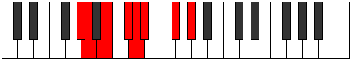 |
| [1259](https://ianring.com/musictheory/scales/1259) | [Stadian](ModeAFlatStadian.md) | Ab | Ab, Bbb, Cb, Db, Ebb, Fbb, Gb, Ab |  |
| [1263](https://ianring.com/musictheory/scales/1263) | [Stynyllic](ModeGSharpStynyllic.md) | G# | G#, A, A#, B, C#, D, D#, F#, G# |  |
| [1263](https://ianring.com/musictheory/scales/1263) | [Stynyllic](ModeAFlatStynyllic.md) | Ab | Ab, A, Bb, B, Db, D, Eb, Gb, Ab |  |
| [1265](https://ianring.com/musictheory/scales/1265) | [Pynimic](ModeDNaturalPynimic.md) | D | D, E##, F##, G#, A, B#, D |  |
| [1267](https://ianring.com/musictheory/scales/1267) | [Katynian](ModeGSharpKatynian.md) | G# | G#, A, B#, C#, D, Eb, F#, G# |  |
| [1267](https://ianring.com/musictheory/scales/1267) | [Katynian](ModeAFlatKatynian.md) | Ab | Ab, Bbb, C, Db, Ebb, Fbb, Gb, Ab |  |
| [1267](https://ianring.com/musictheory/scales/1267) | [Katynian](ModeDNaturalKatynian.md) | D | D, Eb, F#, G, Ab, Bbb, C, D |  |
| [1269](https://ianring.com/musictheory/scales/1269) | [Katythian](ModeDNaturalKatythian.md) | D | D, E, F#, G, Ab, Bbb, C, D |  |
| [1269](https://ianring.com/musictheory/scales/1269) | [Katythian](ModeENaturalKatythian.md) | E | E, F#, G#, A, Bb, Cb, D, E |  |
| [1271](https://ianring.com/musictheory/scales/1271) | [Kolyllic](ModeDNaturalKolyllic.md) | D | D, D#, E, F#, G, G#, A, C, D |  |
| [1271](https://ianring.com/musictheory/scales/1271) | [Kolyllic](ModeGSharpKolyllic.md) | G# | G#, A, A#, C, C#, D, D#, F#, G# |  |
| [1271](https://ianring.com/musictheory/scales/1271) | [Kolyllic](ModeAFlatKolyllic.md) | Ab | Ab, A, Bb, C, Db, D, Eb, Gb, Ab |  |
| [1271](https://ianring.com/musictheory/scales/1271) | [Kolyllic](ModeENaturalKolyllic.md) | E | E, F, F#, G#, A, A#, B, D, E |  |
| [1273](https://ianring.com/musictheory/scales/1273) | [Ronian](ModeDNaturalRonian.md) | D | D, E#, F#, G, Ab, Bbb, C, D |  |
| [1275](https://ianring.com/musictheory/scales/1275) | [Stagyllic](ModeDNaturalStagyllic.md) | D | D, D#, F, F#, G, G#, A, C, D |  |
| [1275](https://ianring.com/musictheory/scales/1275) | [Stagyllic](ModeGSharpStagyllic.md) | G# | G#, A, B, C, C#, D, D#, F#, G# |  |
| [1275](https://ianring.com/musictheory/scales/1275) | [Stagyllic](ModeAFlatStagyllic.md) | Ab | Ab, A, B, C, Db, D, Eb, Gb, Ab |  |
| [1277](https://ianring.com/musictheory/scales/1277) | [Zadyllic](ModeDNaturalZadyllic.md) | D | D, E, F, F#, G, G#, A, C, D |  |
| [1277](https://ianring.com/musictheory/scales/1277) | [Zadyllic](ModeENaturalZadyllic.md) | E | E, F#, G, G#, A, A#, B, D, E |  |
| [1279](https://ianring.com/musictheory/scales/1279) | [Sarygic](ModeDNaturalSarygic.md) | D | D, D#, E, F, F#, G, G#, A, C, D |  |
| [1279](https://ianring.com/musictheory/scales/1279) | [Sarygic](ModeGSharpSarygic.md) | G# | G#, A, A#, B, C, C#, D, D#, F#, G# |  |
| [1279](https://ianring.com/musictheory/scales/1279) | [Sarygic](ModeAFlatSarygic.md) | Ab | Ab, A, Bb, B, C, Db, D, Eb, Gb, Ab |  |
| [1279](https://ianring.com/musictheory/scales/1279) | [Sarygic](ModeENaturalSarygic.md) | E | E, F, F#, G, G#, A, A#, B, D, E |  |
| [1309](https://ianring.com/musictheory/scales/1309) | [Pogimic](ModeFSharpPogimic.md) | F# | F#, G#, A, Bb, C##, D##, F# |  |
| [1309](https://ianring.com/musictheory/scales/1309) | [Pogimic](ModeGFlatPogimic.md) | Gb | Gb, Ab, Bbb, Cbb, D, E, Gb |  |
| [1311](https://ianring.com/musictheory/scales/1311) | [Bynian](ModeFSharpBynian.md) | F# | F#, G, Ab, Bbb, Cbb, D, E, F# |  |
| [1311](https://ianring.com/musictheory/scales/1311) | [Bynian](ModeGFlatBynian.md) | Gb | Gb, Abb, Bbbb, Cbbb, Cbb, D, E, Gb |  |
| [1325](https://ianring.com/musictheory/scales/1325) | [Phradimic](ModeFSharpPhradimic.md) | F# | F#, G#, A, B, C##, D##, F# |  |
| [1325](https://ianring.com/musictheory/scales/1325) | [Phradimic](ModeGFlatPhradimic.md) | Gb | Gb, Ab, Bbb, Cb, D, E, Gb |  |
| [1327](https://ianring.com/musictheory/scales/1327) | [Zalian](ModeFSharpZalian.md) | F# | F#, G, Ab, Bbb, Cb, D, E, F# |  |
| [1327](https://ianring.com/musictheory/scales/1327) | [Zalian](ModeGFlatZalian.md) | Gb | Gb, Abb, Bbbb, Cbbb, Dbbb, Ebb, Fb, Gb |  |
| [1333](https://ianring.com/musictheory/scales/1333) | [Lyptimic](ModeENaturalLyptimic.md) | E | E, F#, G#, A, B#, C##, E |  |
| [1335](https://ianring.com/musictheory/scales/1335) | [Aeralian](ModeENaturalAeralian.md) | E | E, F, Gb, Ab, Bbb, C, D, E |  |
| [1341](https://ianring.com/musictheory/scales/1341) | [Madian](ModeENaturalMadian.md) | E | E, F#, G, Ab, Bbb, C, D, E |  |
| [1341](https://ianring.com/musictheory/scales/1341) | [Madian](ModeFSharpMadian.md) | F# | F#, G#, A, Bb, Cb, D, E, F# |  |
| [1341](https://ianring.com/musictheory/scales/1341) | [Madian](ModeGFlatMadian.md) | Gb | Gb, Ab, Bbb, Cbb, Dbbb, Ebb, Fb, Gb |  |
| [1343](https://ianring.com/musictheory/scales/1343) | [Zalyllic](ModeENaturalZalyllic.md) | E | E, F, F#, G, G#, A, C, D, E |  |
| [1343](https://ianring.com/musictheory/scales/1343) | [Zalyllic](ModeFSharpZalyllic.md) | F# | F#, G, G#, A, A#, B, D, E, F# |  |
| [1343](https://ianring.com/musictheory/scales/1343) | [Zalyllic](ModeGFlatZalyllic.md) | Gb | Gb, G, Ab, A, Bb, B, D, E, Gb |  |
| [1351](https://ianring.com/musictheory/scales/1351) | [Aeraptimic](ModeGSharpAeraptimic.md) | G# | G#, A, Bb, C##, D##, E##, G# |  |
| [1351](https://ianring.com/musictheory/scales/1351) | [Aeraptimic](ModeAFlatAeraptimic.md) | Ab | Ab, Bbb, Cbb, D, E, F#, Ab |  |
| [1355](https://ianring.com/musictheory/scales/1355) | [Aeolorimic](ModeGSharpAeolorimic.md) | G# | G#, A, B, C##, D##, E##, G# |  |
| [1355](https://ianring.com/musictheory/scales/1355) | [Aeolorimic](ModeAFlatAeolorimic.md) | Ab | Ab, Bbb, Cb, D, E, F#, Ab |  |
| [1357](https://ianring.com/musictheory/scales/1357) | [Katonimic](ModeFSharpKatonimic.md) | F# | F#, G#, A, B#, C##, D##, F# |  |
| [1357](https://ianring.com/musictheory/scales/1357) | [Katonimic](ModeGFlatKatonimic.md) | Gb | Gb, Ab, Bbb, C, D, E, Gb |  |
| [1359](https://ianring.com/musictheory/scales/1359) | [Aerygian](ModeFSharpAerygian.md) | F# | F#, G, Ab, Bbb, C, D, E, F# |  |
| [1359](https://ianring.com/musictheory/scales/1359) | [Aerygian](ModeGFlatAerygian.md) | Gb | Gb, Abb, Bbbb, Cbbb, Dbb, Ebb, Fb, Gb |  |
| [1359](https://ianring.com/musictheory/scales/1359) | [Aerygian](ModeGSharpAerygian.md) | G# | G#, A, Bb, Cb, D, E, F#, G# |  |
| [1359](https://ianring.com/musictheory/scales/1359) | [Aerygian](ModeAFlatAerygian.md) | Ab | Ab, Bbb, Cbb, Dbbb, Ebb, Fb, Gb, Ab |  |
| [1363](https://ianring.com/musictheory/scales/1363) | [Gygimic](ModeGSharpGygimic.md) | G# | G#, A, B#, C##, D##, E##, G# |  |
| [1363](https://ianring.com/musictheory/scales/1363) | [Gygimic](ModeAFlatGygimic.md) | Ab | Ab, Bbb, C, D, E, F#, Ab |  |
| [1367](https://ianring.com/musictheory/scales/1367) | [Pyptian](ModeGSharpPyptian.md) | G# | G#, A, Bb, C, D, E, F#, G# |  |
| [1367](https://ianring.com/musictheory/scales/1367) | [Pyptian](ModeAFlatPyptian.md) | Ab | Ab, Bbb, Cbb, Dbb, Ebb, Fb, Gb, Ab |  |
| [1371](https://ianring.com/musictheory/scales/1371) | [Ionadian](ModeGSharpIonadian.md) | G# | G#, A, B, C, D, E, F#, G# |  |
| [1371](https://ianring.com/musictheory/scales/1371) | [Ionadian](ModeAFlatIonadian.md) | Ab | Ab, Bbb, Cb, Dbb, Ebb, Fb, Gb, Ab |  |
| [1373](https://ianring.com/musictheory/scales/1373) | [Storian](ModeFSharpStorian.md) | F# | F#, G#, A, Bb, C, D, E, F# |  |
| [1373](https://ianring.com/musictheory/scales/1373) | [Storian](ModeGFlatStorian.md) | Gb | Gb, Ab, Bbb, Cbb, Dbb, Ebb, Fb, Gb |  |
| [1375](https://ianring.com/musictheory/scales/1375) | [Bothyllic](ModeFSharpBothyllic.md) | F# | F#, G, G#, A, A#, C, D, E, F# |  |
| [1375](https://ianring.com/musictheory/scales/1375) | [Bothyllic](ModeGFlatBothyllic.md) | Gb | Gb, G, Ab, A, Bb, C, D, E, Gb |  |
| [1375](https://ianring.com/musictheory/scales/1375) | [Bothyllic](ModeGSharpBothyllic.md) | G# | G#, A, A#, B, C, D, E, F#, G# | 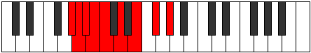 |
| [1375](https://ianring.com/musictheory/scales/1375) | [Bothyllic](ModeAFlatBothyllic.md) | Ab | Ab, A, Bb, B, C, D, E, Gb, Ab |  |
| [1379](https://ianring.com/musictheory/scales/1379) | [Kycrimic](ModeGSharpKycrimic.md) | G# | G#, A, B##, C##, D##, E##, G# |  |
| [1379](https://ianring.com/musictheory/scales/1379) | [Kycrimic](ModeAFlatKycrimic.md) | Ab | Ab, Bbb, C#, D, E, F#, Ab |  |
| [1383](https://ianring.com/musictheory/scales/1383) | [Pynian](ModeGSharpPynian.md) | G# | G#, A, Bb, C#, D, E, F#, G# |  |
| [1383](https://ianring.com/musictheory/scales/1383) | [Pynian](ModeAFlatPynian.md) | Ab | Ab, Bbb, Cbb, Db, Ebb, Fb, Gb, Ab |  |
| [1387](https://ianring.com/musictheory/scales/1387) | [Locrian](ModeGSharpLocrian.md) | G# | G#, A, B, C#, D, E, F#, G# |  |
| [1387](https://ianring.com/musictheory/scales/1387) | [Locrian](ModeAFlatLocrian.md) | Ab | Ab, Bbb, Cb, Db, Ebb, Fb, Gb, Ab |  |
| [1389](https://ianring.com/musictheory/scales/1389) | [Lorian](ModeFSharpLorian.md) | F# | F#, G#, A, B, C, D, E, F# |  |
| [1389](https://ianring.com/musictheory/scales/1389) | [Lorian](ModeGFlatLorian.md) | Gb | Gb, Ab, Bbb, Cb, Dbb, Ebb, Fb, Gb |  |
| [1391](https://ianring.com/musictheory/scales/1391) | [Aeradyllic](ModeFSharpAeradyllic.md) | F# | F#, G, G#, A, B, C, D, E, F# |  |
| [1391](https://ianring.com/musictheory/scales/1391) | [Aeradyllic](ModeGFlatAeradyllic.md) | Gb | Gb, G, Ab, A, B, C, D, E, Gb |  |
| [1391](https://ianring.com/musictheory/scales/1391) | [Aeradyllic](ModeGSharpAeradyllic.md) | G# | G#, A, A#, B, C#, D, E, F#, G# |  |
| [1391](https://ianring.com/musictheory/scales/1391) | [Aeradyllic](ModeAFlatAeradyllic.md) | Ab | Ab, A, Bb, B, Db, D, E, Gb, Ab |  |
| [1395](https://ianring.com/musictheory/scales/1395) | [Mixonorian](ModeGSharpMixonorian.md) | G# | G#, A, B#, C#, D, E, F#, G# |  |
| [1395](https://ianring.com/musictheory/scales/1395) | [Mixonorian](ModeAFlatMixonorian.md) | Ab | Ab, Bbb, C, Db, Ebb, Fb, Gb, Ab |  |
| [1397](https://ianring.com/musictheory/scales/1397) | [Gothian](ModeENaturalGothian.md) | E | E, F#, G#, A, Bb, C, D, E |  |
| [1399](https://ianring.com/musictheory/scales/1399) | [Syryllic](ModeGSharpSyryllic.md) | G# | G#, A, A#, C, C#, D, E, F#, G# |  |
| [1399](https://ianring.com/musictheory/scales/1399) | [Syryllic](ModeAFlatSyryllic.md) | Ab | Ab, A, Bb, C, Db, D, E, Gb, Ab |  |
| [1399](https://ianring.com/musictheory/scales/1399) | [Syryllic](ModeENaturalSyryllic.md) | E | E, F, F#, G#, A, A#, C, D, E |  |
| [1403](https://ianring.com/musictheory/scales/1403) | [Epinyllic](ModeGSharpEpinyllic.md) | G# | G#, A, B, C, C#, D, E, F#, G# |  |
| [1403](https://ianring.com/musictheory/scales/1403) | [Epinyllic](ModeAFlatEpinyllic.md) | Ab | Ab, A, B, C, Db, D, E, Gb, Ab |  |
| [1405](https://ianring.com/musictheory/scales/1405) | [Goryllic](ModeENaturalGoryllic.md) | E | E, F#, G, G#, A, A#, C, D, E |  |
| [1405](https://ianring.com/musictheory/scales/1405) | [Goryllic](ModeFSharpGoryllic.md) | F# | F#, G#, A, A#, B, C, D, E, F# |  |
| [1405](https://ianring.com/musictheory/scales/1405) | [Goryllic](ModeGFlatGoryllic.md) | Gb | Gb, Ab, A, Bb, B, C, D, E, Gb |  |
| [1407](https://ianring.com/musictheory/scales/1407) | [Tharygic](ModeENaturalTharygic.md) | E | E, F, F#, G, G#, A, A#, C, D, E |  |
| [1407](https://ianring.com/musictheory/scales/1407) | [Tharygic](ModeGSharpTharygic.md) | G# | G#, A, A#, B, C, C#, D, E, F#, G# |  |
| [1407](https://ianring.com/musictheory/scales/1407) | [Tharygic](ModeAFlatTharygic.md) | Ab | Ab, A, Bb, B, C, Db, D, E, Gb, Ab |  |
| [1407](https://ianring.com/musictheory/scales/1407) | [Tharygic](ModeFSharpTharygic.md) | F# | F#, G, G#, A, A#, B, C, D, E, F# |  |
| [1407](https://ianring.com/musictheory/scales/1407) | [Tharygic](ModeGFlatTharygic.md) | Gb | Gb, G, Ab, A, Bb, B, C, D, E, Gb |  |
| [1421](https://ianring.com/musictheory/scales/1421) | [Aeolaphimic](ModeFSharpAeolaphimic.md) | F# | F#, G#, A, B##, C##, D##, F# |  |
| [1421](https://ianring.com/musictheory/scales/1421) | [Aeolaphimic](ModeGFlatAeolaphimic.md) | Gb | Gb, Ab, Bbb, C#, D, E, Gb |  |
| [1423](https://ianring.com/musictheory/scales/1423) | [Doptian](ModeFSharpDoptian.md) | F# | F#, G, Ab, Bbb, C#, D, E, F# |  |
| [1423](https://ianring.com/musictheory/scales/1423) | [Doptian](ModeGFlatDoptian.md) | Gb | Gb, Abb, Bbbb, Cbbb, Db, Ebb, Fb, Gb |  |
| [1437](https://ianring.com/musictheory/scales/1437) | [Aeolycrian](ModeFSharpAeolycrian.md) | F# | F#, G#, A, Bb, C#, D, E, F# |  |
| [1437](https://ianring.com/musictheory/scales/1437) | [Aeolycrian](ModeGFlatAeolycrian.md) | Gb | Gb, Ab, Bbb, Cbb, Db, Ebb, Fb, Gb |  |
| [1439](https://ianring.com/musictheory/scales/1439) | [Rolyllic](ModeFSharpRolyllic.md) | F# | F#, G, G#, A, A#, C#, D, E, F# |  |
| [1439](https://ianring.com/musictheory/scales/1439) | [Rolyllic](ModeGFlatRolyllic.md) | Gb | Gb, G, Ab, A, Bb, Db, D, E, Gb |  |
| [1443](https://ianring.com/musictheory/scales/1443) | [Ionarimic](ModeCSharpIonarimic.md) | C# | C#, D, E##, F###, G##, A##, C# |  |
| [1443](https://ianring.com/musictheory/scales/1443) | [Ionarimic](ModeDFlatIonarimic.md) | Db | Db, Ebb, F#, G#, A, B, Db |  |
| [1447](https://ianring.com/musictheory/scales/1447) | [Mixopyrian](ModeCSharpMixopyrian.md) | C# | C#, D, Eb, F#, G#, A, B, C# |  |
| [1447](https://ianring.com/musictheory/scales/1447) | [Mixopyrian](ModeDFlatMixopyrian.md) | Db | Db, Ebb, Fbb, Gb, Ab, Bbb, Cb, Db |  |
| [1451](https://ianring.com/musictheory/scales/1451) | [Phrygian](ModeCSharpPhrygian.md) | C# | C#, D, E, F#, G#, A, B, C# |  |
| [1451](https://ianring.com/musictheory/scales/1451) | [Phrygian](ModeDFlatPhrygian.md) | Db | Db, Ebb, Fb, Gb, Ab, Bbb, Cb, Db |  |
| [1453](https://ianring.com/musictheory/scales/1453) | [Aeolian](ModeFSharpAeolian.md) | F# | F#, G#, A, B, C#, D, E, F# |  |
| [1453](https://ianring.com/musictheory/scales/1453) | [Aeolian](ModeGFlatAeolian.md) | Gb | Gb, Ab, Bbb, Cb, Db, Ebb, Fb, Gb |  |
| [1455](https://ianring.com/musictheory/scales/1455) | [Soryllic](ModeCSharpSoryllic.md) | C# | C#, D, D#, E, F#, G#, A, B, C# |  |
| [1455](https://ianring.com/musictheory/scales/1455) | [Soryllic](ModeDFlatSoryllic.md) | Db | Db, D, Eb, E, Gb, Ab, A, B, Db |  |
| [1455](https://ianring.com/musictheory/scales/1455) | [Soryllic](ModeFSharpSoryllic.md) | F# | F#, G, G#, A, B, C#, D, E, F# |  |
| [1455](https://ianring.com/musictheory/scales/1455) | [Soryllic](ModeGFlatSoryllic.md) | Gb | Gb, G, Ab, A, B, Db, D, E, Gb |  |
| [1459](https://ianring.com/musictheory/scales/1459) | [Ionalian](ModeCSharpIonalian.md) | C# | C#, D, E#, F#, G#, A, B, C# |  |
| [1459](https://ianring.com/musictheory/scales/1459) | [Ionalian](ModeDFlatIonalian.md) | Db | Db, Ebb, F, Gb, Ab, Bbb, Cb, Db |  |
| [1461](https://ianring.com/musictheory/scales/1461) | [Stydian](ModeENaturalStydian.md) | E | E, F#, G#, A, B, C, D, E |  |
| [1463](https://ianring.com/musictheory/scales/1463) | [Zaptyllic](ModeCSharpZaptyllic.md) | C# | C#, D, D#, F, F#, G#, A, B, C# | 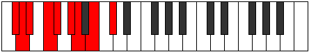 |
| [1463](https://ianring.com/musictheory/scales/1463) | [Zaptyllic](ModeDFlatZaptyllic.md) | Db | Db, D, Eb, F, Gb, Ab, A, B, Db |  |
| [1463](https://ianring.com/musictheory/scales/1463) | [Zaptyllic](ModeENaturalZaptyllic.md) | E | E, F, F#, G#, A, B, C, D, E |  |
| [1467](https://ianring.com/musictheory/scales/1467) | [Thydyllic](ModeCSharpThydyllic.md) | C# | C#, D, E, F, F#, G#, A, B, C# |  |
| [1467](https://ianring.com/musictheory/scales/1467) | [Thydyllic](ModeDFlatThydyllic.md) | Db | Db, D, E, F, Gb, Ab, A, B, Db |  |
| [1469](https://ianring.com/musictheory/scales/1469) | [Epiryllic](ModeENaturalEpiryllic.md) | E | E, F#, G, G#, A, B, C, D, E | 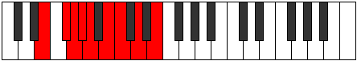 |
| [1469](https://ianring.com/musictheory/scales/1469) | [Epiryllic](ModeFSharpEpiryllic.md) | F# | F#, G#, A, A#, B, C#, D, E, F# |  |
| [1469](https://ianring.com/musictheory/scales/1469) | [Epiryllic](ModeGFlatEpiryllic.md) | Gb | Gb, Ab, A, Bb, B, Db, D, E, Gb |  |
| [1471](https://ianring.com/musictheory/scales/1471) | [Radygic](ModeCSharpRadygic.md) | C# | C#, D, D#, E, F, F#, G#, A, B, C# | 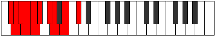 |
| [1471](https://ianring.com/musictheory/scales/1471) | [Radygic](ModeDFlatRadygic.md) | Db | Db, D, Eb, E, F, Gb, Ab, A, B, Db |  |
| [1471](https://ianring.com/musictheory/scales/1471) | [Radygic](ModeENaturalRadygic.md) | E | E, F, F#, G, G#, A, B, C, D, E |  |
| [1471](https://ianring.com/musictheory/scales/1471) | [Radygic](ModeFSharpRadygic.md) | F# | F#, G, G#, A, A#, B, C#, D, E, F# |  |
| [1471](https://ianring.com/musictheory/scales/1471) | [Radygic](ModeGFlatRadygic.md) | Gb | Gb, G, Ab, A, Bb, B, Db, D, E, Gb |  |
| [1479](https://ianring.com/musictheory/scales/1479) | [Aeolagian](ModeGSharpAeolagian.md) | G# | G#, A, Bb, C##, D#, E, F#, G# |  |
| [1479](https://ianring.com/musictheory/scales/1479) | [Aeolagian](ModeAFlatAeolagian.md) | Ab | Ab, Bbb, Cbb, D, Eb, Fb, Gb, Ab |  |
| [1483](https://ianring.com/musictheory/scales/1483) | [Dygian](ModeGSharpDygian.md) | G# | G#, A, B, C##, D#, E, F#, G# |  |
| [1483](https://ianring.com/musictheory/scales/1483) | [Dygian](ModeAFlatDygian.md) | Ab | Ab, Bbb, Cb, D, Eb, Fb, Gb, Ab |  |
| [1485](https://ianring.com/musictheory/scales/1485) | [Tyrian](ModeFSharpTyrian.md) | F# | F#, G#, A, B#, C#, D, E, F# |  |
| [1485](https://ianring.com/musictheory/scales/1485) | [Tyrian](ModeGFlatTyrian.md) | Gb | Gb, Ab, Bbb, C, Db, Ebb, Fb, Gb |  |
| [1487](https://ianring.com/musictheory/scales/1487) | [Lycryllic](ModeFSharpLycryllic.md) | F# | F#, G, G#, A, C, C#, D, E, F# |  |
| [1487](https://ianring.com/musictheory/scales/1487) | [Lycryllic](ModeGFlatLycryllic.md) | Gb | Gb, G, Ab, A, C, Db, D, E, Gb |  |
| [1487](https://ianring.com/musictheory/scales/1487) | [Lycryllic](ModeGSharpLycryllic.md) | G# | G#, A, A#, B, D, D#, E, F#, G# |  |
| [1487](https://ianring.com/musictheory/scales/1487) | [Lycryllic](ModeAFlatLycryllic.md) | Ab | Ab, A, Bb, B, D, Eb, E, Gb, Ab |  |
| [1489](https://ianring.com/musictheory/scales/1489) | [Gacrimic](ModeDNaturalGacrimic.md) | D | D, E##, F###, G##, A#, B#, D |  |
| [1491](https://ianring.com/musictheory/scales/1491) | [Rynian](ModeGSharpRynian.md) | G# | G#, A, B#, C##, D#, E, F#, G# |  |
| [1491](https://ianring.com/musictheory/scales/1491) | [Rynian](ModeAFlatRynian.md) | Ab | Ab, Bbb, C, D, Eb, Fb, Gb, Ab |  |
| [1491](https://ianring.com/musictheory/scales/1491) | [Rynian](ModeDNaturalRynian.md) | D | D, Eb, F#, G#, A, Bb, C, D |  |
| [1493](https://ianring.com/musictheory/scales/1493) | [Phryrian](ModeDNaturalPhryrian.md) | D | D, E, F#, G#, A, Bb, C, D |  |
| [1495](https://ianring.com/musictheory/scales/1495) | [Kaptyllic](ModeDNaturalKaptyllic.md) | D | D, D#, E, F#, G#, A, A#, C, D |  |
| [1495](https://ianring.com/musictheory/scales/1495) | [Kaptyllic](ModeGSharpKaptyllic.md) | G# | G#, A, A#, C, D, D#, E, F#, G# |  |
| [1495](https://ianring.com/musictheory/scales/1495) | [Kaptyllic](ModeAFlatKaptyllic.md) | Ab | Ab, A, Bb, C, D, Eb, E, Gb, Ab |  |
| [1497](https://ianring.com/musictheory/scales/1497) | [Ionanian](ModeDNaturalIonanian.md) | D | D, E#, F#, G#, A, Bb, C, D |  |
| [1499](https://ianring.com/musictheory/scales/1499) | [Stonyllic](ModeDNaturalStonyllic.md) | D | D, D#, F, F#, G#, A, A#, C, D |  |
| [1499](https://ianring.com/musictheory/scales/1499) | [Stonyllic](ModeGSharpStonyllic.md) | G# | G#, A, B, C, D, D#, E, F#, G# |  |
| [1499](https://ianring.com/musictheory/scales/1499) | [Stonyllic](ModeAFlatStonyllic.md) | Ab | Ab, A, B, C, D, Eb, E, Gb, Ab |  |
| [1501](https://ianring.com/musictheory/scales/1501) | [Stygyllic](ModeFSharpStygyllic.md) | F# | F#, G#, A, A#, C, C#, D, E, F# |  |
| [1501](https://ianring.com/musictheory/scales/1501) | [Stygyllic](ModeGFlatStygyllic.md) | Gb | Gb, Ab, A, Bb, C, Db, D, E, Gb |  |
| [1501](https://ianring.com/musictheory/scales/1501) | [Stygyllic](ModeDNaturalStygyllic.md) | D | D, E, F, F#, G#, A, A#, C, D |  |
| [1503](https://ianring.com/musictheory/scales/1503) | [Padygic](ModeDNaturalPadygic.md) | D | D, D#, E, F, F#, G#, A, A#, C, D |  |
| [1503](https://ianring.com/musictheory/scales/1503) | [Padygic](ModeFSharpPadygic.md) | F# | F#, G, G#, A, A#, C, C#, D, E, F# |  |
| [1503](https://ianring.com/musictheory/scales/1503) | [Padygic](ModeGFlatPadygic.md) | Gb | Gb, G, Ab, A, Bb, C, Db, D, E, Gb |  |
| [1503](https://ianring.com/musictheory/scales/1503) | [Padygic](ModeGSharpPadygic.md) | G# | G#, A, A#, B, C, D, D#, E, F#, G# |  |
| [1503](https://ianring.com/musictheory/scales/1503) | [Padygic](ModeAFlatPadygic.md) | Ab | Ab, A, Bb, B, C, D, Eb, E, Gb, Ab |  |
| [1507](https://ianring.com/musictheory/scales/1507) | [Zynian](ModeGSharpZynian.md) | G# | G#, A, B##, C##, D#, E, F#, G# |  |
| [1507](https://ianring.com/musictheory/scales/1507) | [Zynian](ModeAFlatZynian.md) | Ab | Ab, Bbb, C#, D, Eb, Fb, Gb, Ab |  |
| [1507](https://ianring.com/musictheory/scales/1507) | [Zynian](ModeCSharpZynian.md) | C# | C#, D, E##, F##, G#, A, B, C# |  |
| [1507](https://ianring.com/musictheory/scales/1507) | [Zynian](ModeDFlatZynian.md) | Db | Db, Ebb, F#, G, Ab, Bbb, Cb, Db |  |
| [1511](https://ianring.com/musictheory/scales/1511) | [Styptyllic](ModeGSharpStyptyllic.md) | G# | G#, A, A#, C#, D, D#, E, F#, G# |  |
| [1511](https://ianring.com/musictheory/scales/1511) | [Styptyllic](ModeAFlatStyptyllic.md) | Ab | Ab, A, Bb, Db, D, Eb, E, Gb, Ab |  |
| [1511](https://ianring.com/musictheory/scales/1511) | [Styptyllic](ModeCSharpStyptyllic.md) | C# | C#, D, D#, F#, G, G#, A, B, C# |  |
| [1511](https://ianring.com/musictheory/scales/1511) | [Styptyllic](ModeDFlatStyptyllic.md) | Db | Db, D, Eb, Gb, G, Ab, A, B, Db |  |
| [1515](https://ianring.com/musictheory/scales/1515) | [Solyllic](ModeGSharpSolyllic.md) | G# | G#, A, B, C#, D, D#, E, F#, G# |  |
| [1515](https://ianring.com/musictheory/scales/1515) | [Solyllic](ModeAFlatSolyllic.md) | Ab | Ab, A, B, Db, D, Eb, E, Gb, Ab |  |
| [1515](https://ianring.com/musictheory/scales/1515) | [Solyllic](ModeCSharpSolyllic.md) | C# | C#, D, E, F#, G, G#, A, B, C# |  |
| [1515](https://ianring.com/musictheory/scales/1515) | [Solyllic](ModeDFlatSolyllic.md) | Db | Db, D, E, Gb, G, Ab, A, B, Db |  |
| [1517](https://ianring.com/musictheory/scales/1517) | [Sagyllic](ModeFSharpSagyllic.md) | F# | F#, G#, A, B, C, C#, D, E, F# |  |
| [1517](https://ianring.com/musictheory/scales/1517) | [Sagyllic](ModeGFlatSagyllic.md) | Gb | Gb, Ab, A, B, C, Db, D, E, Gb |  |
| [1519](https://ianring.com/musictheory/scales/1519) | [Solygic](ModeFSharpSolygic.md) | F# | F#, G, G#, A, B, C, C#, D, E, F# |  |
| [1519](https://ianring.com/musictheory/scales/1519) | [Solygic](ModeGFlatSolygic.md) | Gb | Gb, G, Ab, A, B, C, Db, D, E, Gb |  |
| [1519](https://ianring.com/musictheory/scales/1519) | [Solygic](ModeCSharpSolygic.md) | C# | C#, D, D#, E, F#, G, G#, A, B, C# |  |
| [1519](https://ianring.com/musictheory/scales/1519) | [Solygic](ModeDFlatSolygic.md) | Db | Db, D, Eb, E, Gb, G, Ab, A, B, Db |  |
| [1519](https://ianring.com/musictheory/scales/1519) | [Solygic](ModeGSharpSolygic.md) | G# | G#, A, A#, B, C#, D, D#, E, F#, G# |  |
| [1519](https://ianring.com/musictheory/scales/1519) | [Solygic](ModeAFlatSolygic.md) | Ab | Ab, A, Bb, B, Db, D, Eb, E, Gb, Ab |  |
| [1521](https://ianring.com/musictheory/scales/1521) | [Stanian](ModeDNaturalStanian.md) | D | D, E##, F##, G#, A, Bb, C, D |  |
| [1523](https://ianring.com/musictheory/scales/1523) | [Zothyllic](ModeGSharpZothyllic.md) | G# | G#, A, C, C#, D, D#, E, F#, G# |  |
| [1523](https://ianring.com/musictheory/scales/1523) | [Zothyllic](ModeAFlatZothyllic.md) | Ab | Ab, A, C, Db, D, Eb, E, Gb, Ab |  |
| [1523](https://ianring.com/musictheory/scales/1523) | [Zothyllic](ModeDNaturalZothyllic.md) | D | D, D#, F#, G, G#, A, A#, C, D |  |
| [1523](https://ianring.com/musictheory/scales/1523) | [Zothyllic](ModeCSharpZothyllic.md) | C# | C#, D, F, F#, G, G#, A, B, C# |  |
| [1523](https://ianring.com/musictheory/scales/1523) | [Zothyllic](ModeDFlatZothyllic.md) | Db | Db, D, F, Gb, G, Ab, A, B, Db |  |
| [1525](https://ianring.com/musictheory/scales/1525) | [Sodyllic](ModeDNaturalSodyllic.md) | D | D, E, F#, G, G#, A, A#, C, D |  |
| [1525](https://ianring.com/musictheory/scales/1525) | [Sodyllic](ModeENaturalSodyllic.md) | E | E, F#, G#, A, A#, B, C, D, E |  |
| [1527](https://ianring.com/musictheory/scales/1527) | [Aeolyrygic](ModeGSharpAeolyrygic.md) | G# | G#, A, A#, C, C#, D, D#, E, F#, G# |  |
| [1527](https://ianring.com/musictheory/scales/1527) | [Aeolyrygic](ModeAFlatAeolyrygic.md) | Ab | Ab, A, Bb, C, Db, D, Eb, E, Gb, Ab |  |
| [1527](https://ianring.com/musictheory/scales/1527) | [Aeolyrygic](ModeDNaturalAeolyrygic.md) | D | D, D#, E, F#, G, G#, A, A#, C, D |  |
| [1527](https://ianring.com/musictheory/scales/1527) | [Aeolyrygic](ModeCSharpAeolyrygic.md) | C# | C#, D, D#, F, F#, G, G#, A, B, C# |  |
| [1527](https://ianring.com/musictheory/scales/1527) | [Aeolyrygic](ModeDFlatAeolyrygic.md) | Db | Db, D, Eb, F, Gb, G, Ab, A, B, Db |  |
| [1527](https://ianring.com/musictheory/scales/1527) | [Aeolyrygic](ModeENaturalAeolyrygic.md) | E | E, F, F#, G#, A, A#, B, C, D, E |  |
| [1529](https://ianring.com/musictheory/scales/1529) | [Kataryllic](ModeDNaturalKataryllic.md) | D | D, F, F#, G, G#, A, A#, C, D |  |
| [1531](https://ianring.com/musictheory/scales/1531) | [Styptygic](ModeDNaturalStyptygic.md) | D | D, D#, F, F#, G, G#, A, A#, C, D |  |
| [1531](https://ianring.com/musictheory/scales/1531) | [Styptygic](ModeGSharpStyptygic.md) | G# | G#, A, B, C, C#, D, D#, E, F#, G# |  |
| [1531](https://ianring.com/musictheory/scales/1531) | [Styptygic](ModeAFlatStyptygic.md) | Ab | Ab, A, B, C, Db, D, Eb, E, Gb, Ab |  |
| [1531](https://ianring.com/musictheory/scales/1531) | [Styptygic](ModeCSharpStyptygic.md) | C# | C#, D, E, F, F#, G, G#, A, B, C# |  |
| [1531](https://ianring.com/musictheory/scales/1531) | [Styptygic](ModeDFlatStyptygic.md) | Db | Db, D, E, F, Gb, G, Ab, A, B, Db |  |
| [1533](https://ianring.com/musictheory/scales/1533) | [Katycrygic](ModeDNaturalKatycrygic.md) | D | D, E, F, F#, G, G#, A, A#, C, D |  |
| [1533](https://ianring.com/musictheory/scales/1533) | [Katycrygic](ModeFSharpKatycrygic.md) | F# | F#, G#, A, A#, B, C, C#, D, E, F# | 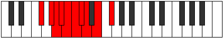 |
| [1533](https://ianring.com/musictheory/scales/1533) | [Katycrygic](ModeGFlatKatycrygic.md) | Gb | Gb, Ab, A, Bb, B, C, Db, D, E, Gb |  |
| [1533](https://ianring.com/musictheory/scales/1533) | [Katycrygic](ModeENaturalKatycrygic.md) | E | E, F#, G, G#, A, A#, B, C, D, E |  |
| [1535](https://ianring.com/musictheory/scales/1535) | [Mixodyllian](ModeDNaturalMixodyllian.md) | D | D, D#, E, F, F#, G, G#, A, A#, C, D |  |
| [1535](https://ianring.com/musictheory/scales/1535) | [Mixodyllian](ModeCSharpMixodyllian.md) | C# | C#, D, D#, E, F, F#, G, G#, A, B, C# |  |
| [1535](https://ianring.com/musictheory/scales/1535) | [Mixodyllian](ModeDFlatMixodyllian.md) | Db | Db, D, Eb, E, F, Gb, G, Ab, A, B, Db |  |
| [1535](https://ianring.com/musictheory/scales/1535) | [Mixodyllian](ModeGSharpMixodyllian.md) | G# | G#, A, A#, B, C, C#, D, D#, E, F#, G# |  |
| [1535](https://ianring.com/musictheory/scales/1535) | [Mixodyllian](ModeAFlatMixodyllian.md) | Ab | Ab, A, Bb, B, C, Db, D, Eb, E, Gb, Ab |  |
| [1535](https://ianring.com/musictheory/scales/1535) | [Mixodyllian](ModeFSharpMixodyllian.md) | F# | F#, G, G#, A, A#, B, C, C#, D, E, F# |  |
| [1535](https://ianring.com/musictheory/scales/1535) | [Mixodyllian](ModeGFlatMixodyllian.md) | Gb | Gb, G, Ab, A, Bb, B, C, Db, D, E, Gb |  |
| [1535](https://ianring.com/musictheory/scales/1535) | [Mixodyllian](ModeENaturalMixodyllian.md) | E | E, F, F#, G, G#, A, A#, B, C, D, E |  |
| [1589](https://ianring.com/musictheory/scales/1589) | [Ionagimic](ModeENaturalIonagimic.md) | E | E, F#, G#, A, B##, C##, E |  |
| [1591](https://ianring.com/musictheory/scales/1591) | [Rodian](ModeENaturalRodian.md) | E | E, F, Gb, Ab, Bbb, C#, D, E |  |
| [1595](https://ianring.com/musictheory/scales/1595) | [Dacrian](ModeFNaturalDacrian.md) | F | F, Gb, Ab, Bbb, Cbb, D, Eb, F |  |
| [1597](https://ianring.com/musictheory/scales/1597) | [Aeolodian](ModeENaturalAeolodian.md) | E | E, F#, G, Ab, Bbb, C#, D, E |  |
| [1599](https://ianring.com/musictheory/scales/1599) | [Pocryllic](ModeENaturalPocryllic.md) | E | E, F, F#, G, G#, A, C#, D, E |  |
| [1599](https://ianring.com/musictheory/scales/1599) | [Pocryllic](ModeFNaturalPocryllic.md) | F | F, F#, G, G#, A, A#, D, D#, F |  |
| [1607](https://ianring.com/musictheory/scales/1607) | [Epytimic](ModeGSharpEpytimic.md) | G# | G#, A, Bb, C##, D###, E##, G# |  |
| [1607](https://ianring.com/musictheory/scales/1607) | [Epytimic](ModeAFlatEpytimic.md) | Ab | Ab, Bbb, Cbb, D, E#, F#, Ab |  |
| [1611](https://ianring.com/musictheory/scales/1611) | [Dacrimic](ModeGSharpDacrimic.md) | G# | G#, A, B, C##, D###, E##, G# |  |
| [1611](https://ianring.com/musictheory/scales/1611) | [Dacrimic](ModeAFlatDacrimic.md) | Ab | Ab, Bbb, Cb, D, E#, F#, Ab |  |
| [1615](https://ianring.com/musictheory/scales/1615) | [Sydian](ModeGSharpSydian.md) | G# | G#, A, Bb, Cb, D, E#, F#, G# |  |
| [1615](https://ianring.com/musictheory/scales/1615) | [Sydian](ModeAFlatSydian.md) | Ab | Ab, Bbb, Cbb, Dbbb, Ebb, F, Gb, Ab |  |
| [1619](https://ianring.com/musictheory/scales/1619) | [Monimic](ModeGSharpMonimic.md) | G# | G#, A, B#, C##, D###, E##, G# |  |
| [1619](https://ianring.com/musictheory/scales/1619) | [Monimic](ModeAFlatMonimic.md) | Ab | Ab, Bbb, C, D, E#, F#, Ab |  |
| [1623](https://ianring.com/musictheory/scales/1623) | [Lothian](ModeGSharpLothian.md) | G# | G#, A, Bb, C, D, E#, F#, G# |  |
| [1623](https://ianring.com/musictheory/scales/1623) | [Lothian](ModeAFlatLothian.md) | Ab | Ab, Bbb, Cbb, Dbb, Ebb, F, Gb, Ab |  |
| [1627](https://ianring.com/musictheory/scales/1627) | [Zyptian](ModeGSharpZyptian.md) | G# | G#, A, B, C, D, E#, F#, G# |  |
| [1627](https://ianring.com/musictheory/scales/1627) | [Zyptian](ModeAFlatZyptian.md) | Ab | Ab, Bbb, Cb, Dbb, Ebb, F, Gb, Ab |  |
| [1627](https://ianring.com/musictheory/scales/1627) | [Zyptian](ModeFNaturalZyptian.md) | F | F, Gb, Ab, Bbb, Cb, D, Eb, F |  |
| [1631](https://ianring.com/musictheory/scales/1631) | [Rynyllic](ModeFNaturalRynyllic.md) | F | F, F#, G, G#, A, B, D, D#, F |  |
| [1631](https://ianring.com/musictheory/scales/1631) | [Rynyllic](ModeGSharpRynyllic.md) | G# | G#, A, A#, B, C, D, F, F#, G# |  |
| [1631](https://ianring.com/musictheory/scales/1631) | [Rynyllic](ModeAFlatRynyllic.md) | Ab | Ab, A, Bb, B, C, D, F, Gb, Ab |  |
| [1635](https://ianring.com/musictheory/scales/1635) | [Sygimic](ModeGSharpSygimic.md) | G# | G#, A, B##, C##, D###, E##, G# |  |
| [1635](https://ianring.com/musictheory/scales/1635) | [Sygimic](ModeAFlatSygimic.md) | Ab | Ab, Bbb, C#, D, E#, F#, Ab |  |
| [1639](https://ianring.com/musictheory/scales/1639) | [Aeolothian](ModeGSharpAeolothian.md) | G# | G#, A, Bb, C#, D, E#, F#, G# |  |
| [1639](https://ianring.com/musictheory/scales/1639) | [Aeolothian](ModeAFlatAeolothian.md) | Ab | Ab, Bbb, Cbb, Db, Ebb, F, Gb, Ab |  |
| [1643](https://ianring.com/musictheory/scales/1643) | [Thyptian](ModeGSharpThyptian.md) | G# | G#, A, B, C#, D, E#, F#, G# |  |
| [1643](https://ianring.com/musictheory/scales/1643) | [Thyptian](ModeAFlatThyptian.md) | Ab | Ab, Bbb, Cb, Db, Ebb, F, Gb, Ab |  |
| [1647](https://ianring.com/musictheory/scales/1647) | [Polyllic](ModeGSharpPolyllic.md) | G# | G#, A, A#, B, C#, D, F, F#, G# |  |
| [1647](https://ianring.com/musictheory/scales/1647) | [Polyllic](ModeAFlatPolyllic.md) | Ab | Ab, A, Bb, B, Db, D, F, Gb, Ab |  |
| [1651](https://ianring.com/musictheory/scales/1651) | [Mogian](ModeGSharpMogian.md) | G# | G#, A, B#, C#, D, E#, F#, G# |  |
| [1651](https://ianring.com/musictheory/scales/1651) | [Mogian](ModeAFlatMogian.md) | Ab | Ab, Bbb, C, Db, Ebb, F, Gb, Ab |  |
| [1653](https://ianring.com/musictheory/scales/1653) | [Gylian](ModeENaturalGylian.md) | E | E, F#, G#, A, Bb, C#, D, E |  |
| [1655](https://ianring.com/musictheory/scales/1655) | [Katygyllic](ModeGSharpKatygyllic.md) | G# | G#, A, A#, C, C#, D, F, F#, G# |  |
| [1655](https://ianring.com/musictheory/scales/1655) | [Katygyllic](ModeAFlatKatygyllic.md) | Ab | Ab, A, Bb, C, Db, D, F, Gb, Ab |  |
| [1655](https://ianring.com/musictheory/scales/1655) | [Katygyllic](ModeENaturalKatygyllic.md) | E | E, F, F#, G#, A, A#, C#, D, E |  |
| [1659](https://ianring.com/musictheory/scales/1659) | [Magyllic](ModeGSharpMagyllic.md) | G# | G#, A, B, C, C#, D, F, F#, G# |  |
| [1659](https://ianring.com/musictheory/scales/1659) | [Magyllic](ModeAFlatMagyllic.md) | Ab | Ab, A, B, C, Db, D, F, Gb, Ab |  |
| [1659](https://ianring.com/musictheory/scales/1659) | [Magyllic](ModeFNaturalMagyllic.md) | F | F, F#, G#, A, A#, B, D, D#, F |  |
| [1661](https://ianring.com/musictheory/scales/1661) | [Gonyllic](ModeENaturalGonyllic.md) | E | E, F#, G, G#, A, A#, C#, D, E |  |
| [1663](https://ianring.com/musictheory/scales/1663) | [Lydygic](ModeENaturalLydygic.md) | E | E, F, F#, G, G#, A, A#, C#, D, E |  |
| [1663](https://ianring.com/musictheory/scales/1663) | [Lydygic](ModeGSharpLydygic.md) | G# | G#, A, A#, B, C, C#, D, F, F#, G# |  |
| [1663](https://ianring.com/musictheory/scales/1663) | [Lydygic](ModeAFlatLydygic.md) | Ab | Ab, A, Bb, B, C, Db, D, F, Gb, Ab |  |
| [1663](https://ianring.com/musictheory/scales/1663) | [Lydygic](ModeFNaturalLydygic.md) | F | F, F#, G, G#, A, A#, B, D, D#, F |  |
| [1673](https://ianring.com/musictheory/scales/1673) | [Thocritonic](ModeBNaturalThocritonic.md) | B | B, D, F#, G#, A, B | 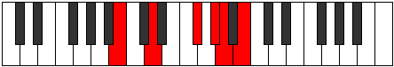 |
| [1675](https://ianring.com/musictheory/scales/1675) | [Epatimic](ModeBNaturalEpatimic.md) | B | B, C, D, E##, F###, G##, B |  |
| [1677](https://ianring.com/musictheory/scales/1677) | [Danimic](ModeBNaturalDanimic.md) | B | B, C#, D, E##, F###, G##, B |  |
| [1679](https://ianring.com/musictheory/scales/1679) | [Kydian](ModeBNaturalKydian.md) | B | B, C, Db, Ebb, F#, G#, A, B |  |
| [1689](https://ianring.com/musictheory/scales/1689) | [Lorimic](ModeBNaturalLorimic.md) | B | B, C##, D#, E##, F###, G##, B |  |
| [1691](https://ianring.com/musictheory/scales/1691) | [Kathian](ModeFNaturalKathian.md) | F | F, Gb, Ab, Bbb, C, D, Eb, F |  |
| [1691](https://ianring.com/musictheory/scales/1691) | [Kathian](ModeBNaturalKathian.md) | B | B, C, D, Eb, F#, G#, A, B |  |
| [1693](https://ianring.com/musictheory/scales/1693) | [Dogian](ModeBNaturalDogian.md) | B | B, C#, D, Eb, F#, G#, A, B |  |
| [1695](https://ianring.com/musictheory/scales/1695) | [Phrodyllic](ModeFNaturalPhrodyllic.md) | F | F, F#, G, G#, A, C, D, D#, F |  |
| [1695](https://ianring.com/musictheory/scales/1695) | [Phrodyllic](ModeBNaturalPhrodyllic.md) | B | B, C, C#, D, D#, F#, G#, A, B |  |
| [1705](https://ianring.com/musictheory/scales/1705) | [Darmic](ModeBNaturalDarmic.md) | B | B, C##, D##, E##, F###, G##, B |  |
| [1707](https://ianring.com/musictheory/scales/1707) | [Mixolythian](ModeBNaturalMixolythian.md) | B | B, C, D, E, F#, G#, A, B |  |
| [1709](https://ianring.com/musictheory/scales/1709) | [Dorian](ModeBNaturalDorian.md) | B | B, C#, D, E, F#, G#, A, B |  |
| [1711](https://ianring.com/musictheory/scales/1711) | [Ragyllic](ModeBNaturalRagyllic.md) | B | B, C, C#, D, E, F#, G#, A, B |  |
| [1717](https://ianring.com/musictheory/scales/1717) | [Mixolydian](ModeENaturalMixolydian.md) | E | E, F#, G#, A, B, C#, D, E |  |
| [1719](https://ianring.com/musictheory/scales/1719) | [Lyryllic](ModeENaturalLyryllic.md) | E | E, F, F#, G#, A, B, C#, D, E |  |
| [1721](https://ianring.com/musictheory/scales/1721) | [Ionycrian](ModeBNaturalIonycrian.md) | B | B, C##, D#, E, F#, G#, A, B |  |
| [1723](https://ianring.com/musictheory/scales/1723) | [Poryllic](ModeFNaturalPoryllic.md) | F | F, F#, G#, A, A#, C, D, D#, F |  |
| [1723](https://ianring.com/musictheory/scales/1723) | [Poryllic](ModeBNaturalPoryllic.md) | B | B, C, D, D#, E, F#, G#, A, B |  |
| [1725](https://ianring.com/musictheory/scales/1725) | [Mixodyllic](ModeBNaturalMixodyllic.md) | B | B, C#, D, D#, E, F#, G#, A, B |  |
| [1725](https://ianring.com/musictheory/scales/1725) | [Mixodyllic](ModeENaturalMixodyllic.md) | E | E, F#, G, G#, A, B, C#, D, E |  |
| [1727](https://ianring.com/musictheory/scales/1727) | [Sydygic](ModeFNaturalSydygic.md) | F | F, F#, G, G#, A, A#, C, D, D#, F |  |
| [1727](https://ianring.com/musictheory/scales/1727) | [Sydygic](ModeBNaturalSydygic.md) | B | B, C, C#, D, D#, E, F#, G#, A, B |  |
| [1727](https://ianring.com/musictheory/scales/1727) | [Sydygic](ModeENaturalSydygic.md) | E | E, F, F#, G, G#, A, B, C#, D, E |  |
| [1735](https://ianring.com/musictheory/scales/1735) | [Dagian](ModeGSharpDagian.md) | G# | G#, A, Bb, C##, D#, E#, F#, G# |  |
| [1735](https://ianring.com/musictheory/scales/1735) | [Dagian](ModeAFlatDagian.md) | Ab | Ab, Bbb, Cbb, D, Eb, F, Gb, Ab |  |
| [1737](https://ianring.com/musictheory/scales/1737) | [Thalimic](ModeBNaturalThalimic.md) | B | B, C##, D###, E##, F###, G##, B |  |
| [1739](https://ianring.com/musictheory/scales/1739) | [Phrylian](ModeBNaturalPhrylian.md) | B | B, C, D, E#, F#, G#, A, B |  |
| [1739](https://ianring.com/musictheory/scales/1739) | [Phrylian](ModeGSharpPhrylian.md) | G# | G#, A, B, C##, D#, E#, F#, G# |  |
| [1739](https://ianring.com/musictheory/scales/1739) | [Phrylian](ModeAFlatPhrylian.md) | Ab | Ab, Bbb, Cb, D, Eb, F, Gb, Ab |  |
| [1741](https://ianring.com/musictheory/scales/1741) | [Katycrian](ModeBNaturalKatycrian.md) | B | B, C#, D, E#, F#, G#, A, B |  |
| [1743](https://ianring.com/musictheory/scales/1743) | [Epigyllic](ModeBNaturalEpigyllic.md) | B | B, C, C#, D, F, F#, G#, A, B |  |
| [1743](https://ianring.com/musictheory/scales/1743) | [Epigyllic](ModeGSharpEpigyllic.md) | G# | G#, A, A#, B, D, D#, F, F#, G# |  |
| [1743](https://ianring.com/musictheory/scales/1743) | [Epigyllic](ModeAFlatEpigyllic.md) | Ab | Ab, A, Bb, B, D, Eb, F, Gb, Ab |  |
| [1745](https://ianring.com/musictheory/scales/1745) | [Manimic](ModeDNaturalManimic.md) | D | D, E##, F###, G##, A##, B#, D |  |
| [1747](https://ianring.com/musictheory/scales/1747) | [Epalian](ModeGSharpEpalian.md) | G# | G#, A, B#, C##, D#, E#, F#, G# |  |
| [1747](https://ianring.com/musictheory/scales/1747) | [Epalian](ModeAFlatEpalian.md) | Ab | Ab, Bbb, C, D, Eb, F, Gb, Ab |  |
| [1747](https://ianring.com/musictheory/scales/1747) | [Epalian](ModeDNaturalEpalian.md) | D | D, Eb, F#, G#, A, B, C, D |  |
| [1749](https://ianring.com/musictheory/scales/1749) | [Lythian](ModeDNaturalLythian.md) | D | D, E, F#, G#, A, B, C, D |  |
| [1751](https://ianring.com/musictheory/scales/1751) | [Aeolyryllic](ModeGSharpAeolyryllic.md) | G# | G#, A, A#, C, D, D#, F, F#, G# |  |
| [1751](https://ianring.com/musictheory/scales/1751) | [Aeolyryllic](ModeAFlatAeolyryllic.md) | Ab | Ab, A, Bb, C, D, Eb, F, Gb, Ab |  |
| [1751](https://ianring.com/musictheory/scales/1751) | [Aeolyryllic](ModeDNaturalAeolyryllic.md) | D | D, D#, E, F#, G#, A, B, C, D |  |
| [1753](https://ianring.com/musictheory/scales/1753) | [Mycrian](ModeDNaturalMycrian.md) | D | D, E#, F#, G#, A, B, C, D |  |
| [1753](https://ianring.com/musictheory/scales/1753) | [Mycrian](ModeBNaturalMycrian.md) | B | B, C##, D#, E#, F#, G#, A, B |  |
| [1755](https://ianring.com/musictheory/scales/1755) | [MinorDiminished](ModeDNaturalMinorDiminished.md) | D | D, D#, F, F#, G#, A, B, C, D |  |
| [1755](https://ianring.com/musictheory/scales/1755) | [MinorDiminished](ModeFNaturalMinorDiminished.md) | F | F, F#, G#, A, B, C, D, D#, F | 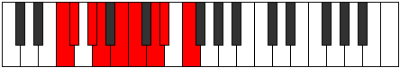 |
| [1755](https://ianring.com/musictheory/scales/1755) | [MinorDiminished](ModeGSharpMinorDiminished.md) | G# | G#, A, B, C, D, D#, F, F#, G# |  |
| [1755](https://ianring.com/musictheory/scales/1755) | [MinorDiminished](ModeAFlatMinorDiminished.md) | Ab | Ab, A, B, C, D, Eb, F, Gb, Ab |  |
| [1755](https://ianring.com/musictheory/scales/1755) | [MinorDiminished](ModeBNaturalMinorDiminished.md) | B | B, C, D, D#, F, F#, G#, A, B |  |
| [1757](https://ianring.com/musictheory/scales/1757) | [Ionyphyllic](ModeBNaturalIonyphyllic.md) | B | B, C#, D, D#, F, F#, G#, A, B |  |
| [1757](https://ianring.com/musictheory/scales/1757) | [Ionyphyllic](ModeDNaturalIonyphyllic.md) | D | D, E, F, F#, G#, A, B, C, D |  |
| [1759](https://ianring.com/musictheory/scales/1759) | [Pylygic](ModeBNaturalPylygic.md) | B | B, C, C#, D, D#, F, F#, G#, A, B |  |
| [1759](https://ianring.com/musictheory/scales/1759) | [Pylygic](ModeDNaturalPylygic.md) | D | D, D#, E, F, F#, G#, A, B, C, D |  |
| [1759](https://ianring.com/musictheory/scales/1759) | [Pylygic](ModeFNaturalPylygic.md) | F | F, F#, G, G#, A, B, C, D, D#, F |  |
| [1759](https://ianring.com/musictheory/scales/1759) | [Pylygic](ModeGSharpPylygic.md) | G# | G#, A, A#, B, C, D, D#, F, F#, G# |  |
| [1759](https://ianring.com/musictheory/scales/1759) | [Pylygic](ModeAFlatPylygic.md) | Ab | Ab, A, Bb, B, C, D, Eb, F, Gb, Ab |  |
| [1763](https://ianring.com/musictheory/scales/1763) | [Katalian](ModeGSharpKatalian.md) | G# | G#, A, B##, C##, D#, E#, F#, G# |  |
| [1763](https://ianring.com/musictheory/scales/1763) | [Katalian](ModeAFlatKatalian.md) | Ab | Ab, Bbb, C#, D, Eb, F, Gb, Ab |  |
| [1767](https://ianring.com/musictheory/scales/1767) | [Dyryllic](ModeGSharpDyryllic.md) | G# | G#, A, A#, C#, D, D#, F, F#, G# |  |
| [1767](https://ianring.com/musictheory/scales/1767) | [Dyryllic](ModeAFlatDyryllic.md) | Ab | Ab, A, Bb, Db, D, Eb, F, Gb, Ab |  |
| [1769](https://ianring.com/musictheory/scales/1769) | [Rythian](ModeBNaturalRythian.md) | B | B, C##, D##, E#, F#, G#, A, B |  |
| [1771](https://ianring.com/musictheory/scales/1771) | [Stylyllic](ModeGSharpStylyllic.md) | G# | G#, A, B, C#, D, D#, F, F#, G# |  |
| [1771](https://ianring.com/musictheory/scales/1771) | [Stylyllic](ModeAFlatStylyllic.md) | Ab | Ab, A, B, Db, D, Eb, F, Gb, Ab |  |
| [1771](https://ianring.com/musictheory/scales/1771) | [Stylyllic](ModeBNaturalStylyllic.md) | B | B, C, D, E, F, F#, G#, A, B |  |
| [1773](https://ianring.com/musictheory/scales/1773) | [Aeoloryllic](ModeBNaturalAeoloryllic.md) | B | B, C#, D, E, F, F#, G#, A, B |  |
| [1775](https://ianring.com/musictheory/scales/1775) | [Lyrygic](ModeBNaturalLyrygic.md) | B | B, C, C#, D, E, F, F#, G#, A, B |  |
| [1775](https://ianring.com/musictheory/scales/1775) | [Lyrygic](ModeGSharpLyrygic.md) | G# | G#, A, A#, B, C#, D, D#, F, F#, G# |  |
| [1775](https://ianring.com/musictheory/scales/1775) | [Lyrygic](ModeAFlatLyrygic.md) | Ab | Ab, A, Bb, B, Db, D, Eb, F, Gb, Ab |  |
| [1777](https://ianring.com/musictheory/scales/1777) | [Saptian](ModeDNaturalSaptian.md) | D | D, E##, F##, G#, A, B, C, D |  |
| [1779](https://ianring.com/musictheory/scales/1779) | [Aerythyllic](ModeGSharpAerythyllic.md) | G# | G#, A, C, C#, D, D#, F, F#, G# |  |
| [1779](https://ianring.com/musictheory/scales/1779) | [Aerythyllic](ModeAFlatAerythyllic.md) | Ab | Ab, A, C, Db, D, Eb, F, Gb, Ab |  |
| [1779](https://ianring.com/musictheory/scales/1779) | [Aerythyllic](ModeDNaturalAerythyllic.md) | D | D, D#, F#, G, G#, A, B, C, D |  |
| [1781](https://ianring.com/musictheory/scales/1781) | [Gocryllic](ModeDNaturalGocryllic.md) | D | D, E, F#, G, G#, A, B, C, D |  |
| [1781](https://ianring.com/musictheory/scales/1781) | [Gocryllic](ModeENaturalGocryllic.md) | E | E, F#, G#, A, A#, B, C#, D, E |  |
| [1783](https://ianring.com/musictheory/scales/1783) | [Danygic](ModeGSharpDanygic.md) | G# | G#, A, A#, C, C#, D, D#, F, F#, G# |  |
| [1783](https://ianring.com/musictheory/scales/1783) | [Danygic](ModeAFlatDanygic.md) | Ab | Ab, A, Bb, C, Db, D, Eb, F, Gb, Ab |  |
| [1783](https://ianring.com/musictheory/scales/1783) | [Danygic](ModeDNaturalDanygic.md) | D | D, D#, E, F#, G, G#, A, B, C, D |  |
| [1783](https://ianring.com/musictheory/scales/1783) | [Danygic](ModeENaturalDanygic.md) | E | E, F, F#, G#, A, A#, B, C#, D, E |  |
| [1785](https://ianring.com/musictheory/scales/1785) | [Tharyllic](ModeBNaturalTharyllic.md) | B | B, D, D#, E, F, F#, G#, A, B |  |
| [1785](https://ianring.com/musictheory/scales/1785) | [Tharyllic](ModeDNaturalTharyllic.md) | D | D, F, F#, G, G#, A, B, C, D |  |
| [1787](https://ianring.com/musictheory/scales/1787) | [Mycrygic](ModeGSharpMycrygic.md) | G# | G#, A, B, C, C#, D, D#, F, F#, G# |  |
| [1787](https://ianring.com/musictheory/scales/1787) | [Mycrygic](ModeAFlatMycrygic.md) | Ab | Ab, A, B, C, Db, D, Eb, F, Gb, Ab |  |
| [1787](https://ianring.com/musictheory/scales/1787) | [Mycrygic](ModeBNaturalMycrygic.md) | B | B, C, D, D#, E, F, F#, G#, A, B |  |
| [1787](https://ianring.com/musictheory/scales/1787) | [Mycrygic](ModeDNaturalMycrygic.md) | D | D, D#, F, F#, G, G#, A, B, C, D | 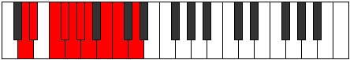 |
| [1787](https://ianring.com/musictheory/scales/1787) | [Mycrygic](ModeFNaturalMycrygic.md) | F | F, F#, G#, A, A#, B, C, D, D#, F |  |
| [1789](https://ianring.com/musictheory/scales/1789) | [Katagygic](ModeBNaturalKatagygic.md) | B | B, C#, D, D#, E, F, F#, G#, A, B |  |
| [1789](https://ianring.com/musictheory/scales/1789) | [Katagygic](ModeDNaturalKatagygic.md) | D | D, E, F, F#, G, G#, A, B, C, D |  |
| [1789](https://ianring.com/musictheory/scales/1789) | [Katagygic](ModeENaturalKatagygic.md) | E | E, F#, G, G#, A, A#, B, C#, D, E |  |
| [1791](https://ianring.com/musictheory/scales/1791) | [Aerygyllian](ModeBNaturalAerygyllian.md) | B | B, C, C#, D, D#, E, F, F#, G#, A, B |  |
| [1791](https://ianring.com/musictheory/scales/1791) | [Aerygyllian](ModeDNaturalAerygyllian.md) | D | D, D#, E, F, F#, G, G#, A, B, C, D |  |
| [1791](https://ianring.com/musictheory/scales/1791) | [Aerygyllian](ModeGSharpAerygyllian.md) | G# | G#, A, A#, B, C, C#, D, D#, F, F#, G# |  |
| [1791](https://ianring.com/musictheory/scales/1791) | [Aerygyllian](ModeAFlatAerygyllian.md) | Ab | Ab, A, Bb, B, C, Db, D, Eb, F, Gb, Ab |  |
| [1791](https://ianring.com/musictheory/scales/1791) | [Aerygyllian](ModeFNaturalAerygyllian.md) | F | F, F#, G, G#, A, A#, B, C, D, D#, F |  |
| [1791](https://ianring.com/musictheory/scales/1791) | [Aerygyllian](ModeENaturalAerygyllian.md) | E | E, F, F#, G, G#, A, A#, B, C#, D, E |  |
| [1819](https://ianring.com/musictheory/scales/1819) | [Pydian](ModeFNaturalPydian.md) | F | F, Gb, Ab, Bbb, C#, D, Eb, F |  |
| [1821](https://ianring.com/musictheory/scales/1821) | [Aeradian](ModeFSharpAeradian.md) | F# | F#, G#, A, Bb, C##, D#, E, F# |  |
| [1821](https://ianring.com/musictheory/scales/1821) | [Aeradian](ModeGFlatAeradian.md) | Gb | Gb, Ab, Bbb, Cbb, D, Eb, Fb, Gb |  |
| [1823](https://ianring.com/musictheory/scales/1823) | [Phralyllic](ModeFNaturalPhralyllic.md) | F | F, F#, G, G#, A, C#, D, D#, F |  |
| [1823](https://ianring.com/musictheory/scales/1823) | [Phralyllic](ModeFSharpPhralyllic.md) | F# | F#, G, G#, A, A#, D, D#, E, F# |  |
| [1823](https://ianring.com/musictheory/scales/1823) | [Phralyllic](ModeGFlatPhralyllic.md) | Gb | Gb, G, Ab, A, Bb, D, Eb, E, Gb |  |
| [1837](https://ianring.com/musictheory/scales/1837) | [Dalian](ModeFSharpDalian.md) | F# | F#, G#, A, B, C##, D#, E, F# |  |
| [1837](https://ianring.com/musictheory/scales/1837) | [Dalian](ModeGFlatDalian.md) | Gb | Gb, Ab, Bbb, Cb, D, Eb, Fb, Gb |  |
| [1839](https://ianring.com/musictheory/scales/1839) | [Zogyllic](ModeFSharpZogyllic.md) | F# | F#, G, G#, A, B, D, D#, E, F# |  |
| [1839](https://ianring.com/musictheory/scales/1839) | [Zogyllic](ModeGFlatZogyllic.md) | Gb | Gb, G, Ab, A, B, D, Eb, E, Gb |  |
| [1845](https://ianring.com/musictheory/scales/1845) | [Lagian](ModeENaturalLagian.md) | E | E, F#, G#, A, B#, C#, D, E |  |
| [1847](https://ianring.com/musictheory/scales/1847) | [Thacryllic](ModeENaturalThacryllic.md) | E | E, F, F#, G#, A, C, C#, D, E |  |
| [1851](https://ianring.com/musictheory/scales/1851) | [Zacryllic](ModeFNaturalZacryllic.md) | F | F, F#, G#, A, A#, C#, D, D#, F |  |
| [1853](https://ianring.com/musictheory/scales/1853) | [Phrynyllic](ModeENaturalPhrynyllic.md) | E | E, F#, G, G#, A, C, C#, D, E |  |
| [1853](https://ianring.com/musictheory/scales/1853) | [Phrynyllic](ModeFSharpPhrynyllic.md) | F# | F#, G#, A, A#, B, D, D#, E, F# |  |
| [1853](https://ianring.com/musictheory/scales/1853) | [Phrynyllic](ModeGFlatPhrynyllic.md) | Gb | Gb, Ab, A, Bb, B, D, Eb, E, Gb |  |
| [1855](https://ianring.com/musictheory/scales/1855) | [Marygic](ModeENaturalMarygic.md) | E | E, F, F#, G, G#, A, C, C#, D, E |  |
| [1855](https://ianring.com/musictheory/scales/1855) | [Marygic](ModeFNaturalMarygic.md) | F | F, F#, G, G#, A, A#, C#, D, D#, F |  |
| [1855](https://ianring.com/musictheory/scales/1855) | [Marygic](ModeFSharpMarygic.md) | F# | F#, G, G#, A, A#, B, D, D#, E, F# |  |
| [1855](https://ianring.com/musictheory/scales/1855) | [Marygic](ModeGFlatMarygic.md) | Gb | Gb, G, Ab, A, Bb, B, D, Eb, E, Gb |  |
| [1861](https://ianring.com/musictheory/scales/1861) | [Phrygimic](ModeCNaturalPhrygimic.md) | C | C, D, E##, F###, G##, A#, C |  |
| [1863](https://ianring.com/musictheory/scales/1863) | [Pycrian](ModeCNaturalPycrian.md) | C | C, Db, Ebb, F#, G#, A, Bb, C |  |
| [1863](https://ianring.com/musictheory/scales/1863) | [Pycrian](ModeGSharpPycrian.md) | G# | G#, A, Bb, C##, D##, E#, F#, G# |  |
| [1863](https://ianring.com/musictheory/scales/1863) | [Pycrian](ModeAFlatPycrian.md) | Ab | Ab, Bbb, Cbb, D, E, F, Gb, Ab |  |
| [1867](https://ianring.com/musictheory/scales/1867) | [Solian](ModeGSharpSolian.md) | G# | G#, A, B, C##, D##, E#, F#, G# |  |
| [1867](https://ianring.com/musictheory/scales/1867) | [Solian](ModeAFlatSolian.md) | Ab | Ab, Bbb, Cb, D, E, F, Gb, Ab |  |
| [1869](https://ianring.com/musictheory/scales/1869) | [Katyrian](ModeFSharpKatyrian.md) | F# | F#, G#, A, B#, C##, D#, E, F# |  |
| [1869](https://ianring.com/musictheory/scales/1869) | [Katyrian](ModeGFlatKatyrian.md) | Gb | Gb, Ab, Bbb, C, D, Eb, Fb, Gb |  |
| [1869](https://ianring.com/musictheory/scales/1869) | [Katyrian](ModeCNaturalKatyrian.md) | C | C, D, Eb, F#, G#, A, Bb, C |  |
| [1871](https://ianring.com/musictheory/scales/1871) | [Aeolyllic](ModeFSharpAeolyllic.md) | F# | F#, G, G#, A, C, D, D#, E, F# |  |
| [1871](https://ianring.com/musictheory/scales/1871) | [Aeolyllic](ModeGFlatAeolyllic.md) | Gb | Gb, G, Ab, A, C, D, Eb, E, Gb |  |
| [1871](https://ianring.com/musictheory/scales/1871) | [Aeolyllic](ModeCNaturalAeolyllic.md) | C | C, C#, D, D#, F#, G#, A, A#, C |  |
| [1871](https://ianring.com/musictheory/scales/1871) | [Aeolyllic](ModeGSharpAeolyllic.md) | G# | G#, A, A#, B, D, E, F, F#, G# |  |
| [1871](https://ianring.com/musictheory/scales/1871) | [Aeolyllic](ModeAFlatAeolyllic.md) | Ab | Ab, A, Bb, B, D, E, F, Gb, Ab |  |
| [1875](https://ianring.com/musictheory/scales/1875) | [Epyphian](ModeGSharpEpyphian.md) | G# | G#, A, B#, C##, D##, E#, F#, G# |  |
| [1875](https://ianring.com/musictheory/scales/1875) | [Epyphian](ModeAFlatEpyphian.md) | Ab | Ab, Bbb, C, D, E, F, Gb, Ab |  |
| [1877](https://ianring.com/musictheory/scales/1877) | [Aeroptian](ModeCNaturalAeroptian.md) | C | C, D, E, F#, G#, A, Bb, C |  |
| [1879](https://ianring.com/musictheory/scales/1879) | [Mixoryllic](ModeCNaturalMixoryllic.md) | C | C, C#, D, E, F#, G#, A, A#, C |  |
| [1879](https://ianring.com/musictheory/scales/1879) | [Mixoryllic](ModeGSharpMixoryllic.md) | G# | G#, A, A#, C, D, E, F, F#, G# |  |
| [1879](https://ianring.com/musictheory/scales/1879) | [Mixoryllic](ModeAFlatMixoryllic.md) | Ab | Ab, A, Bb, C, D, E, F, Gb, Ab |  |
| [1883](https://ianring.com/musictheory/scales/1883) | [Mixopyryllic](ModeFNaturalMixopyryllic.md) | F | F, F#, G#, A, B, C#, D, D#, F |  |
| [1883](https://ianring.com/musictheory/scales/1883) | [Mixopyryllic](ModeGSharpMixopyryllic.md) | G# | G#, A, B, C, D, E, F, F#, G# |  |
| [1883](https://ianring.com/musictheory/scales/1883) | [Mixopyryllic](ModeAFlatMixopyryllic.md) | Ab | Ab, A, B, C, D, E, F, Gb, Ab |  |
| [1885](https://ianring.com/musictheory/scales/1885) | [Epidyllic](ModeCNaturalEpidyllic.md) | C | C, D, D#, E, F#, G#, A, A#, C |  |
| [1885](https://ianring.com/musictheory/scales/1885) | [Epidyllic](ModeFSharpEpidyllic.md) | F# | F#, G#, A, A#, C, D, D#, E, F# |  |
| [1885](https://ianring.com/musictheory/scales/1885) | [Epidyllic](ModeGFlatEpidyllic.md) | Gb | Gb, Ab, A, Bb, C, D, Eb, E, Gb |  |
| [1887](https://ianring.com/musictheory/scales/1887) | [Aerocrygic](ModeCNaturalAerocrygic.md) | C | C, C#, D, D#, E, F#, G#, A, A#, C |  |
| [1887](https://ianring.com/musictheory/scales/1887) | [Aerocrygic](ModeFSharpAerocrygic.md) | F# | F#, G, G#, A, A#, C, D, D#, E, F# |  |
| [1887](https://ianring.com/musictheory/scales/1887) | [Aerocrygic](ModeGFlatAerocrygic.md) | Gb | Gb, G, Ab, A, Bb, C, D, Eb, E, Gb |  |
| [1887](https://ianring.com/musictheory/scales/1887) | [Aerocrygic](ModeFNaturalAerocrygic.md) | F | F, F#, G, G#, A, B, C#, D, D#, F |  |
| [1887](https://ianring.com/musictheory/scales/1887) | [Aerocrygic](ModeGSharpAerocrygic.md) | G# | G#, A, A#, B, C, D, E, F, F#, G# |  |
| [1887](https://ianring.com/musictheory/scales/1887) | [Aerocrygic](ModeAFlatAerocrygic.md) | Ab | Ab, A, Bb, B, C, D, E, F, Gb, Ab |  |
| [1891](https://ianring.com/musictheory/scales/1891) | [Thalian](ModeGSharpThalian.md) | G# | G#, A, B##, C##, D##, E#, F#, G# |  |
| [1891](https://ianring.com/musictheory/scales/1891) | [Thalian](ModeAFlatThalian.md) | Ab | Ab, Bbb, C#, D, E, F, Gb, Ab | 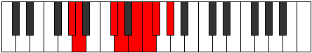 |
| [1893](https://ianring.com/musictheory/scales/1893) | [Ionylian](ModeCNaturalIonylian.md) | C | C, D, E#, F#, G#, A, Bb, C |  |
| [1895](https://ianring.com/musictheory/scales/1895) | [Salyllic](ModeCNaturalSalyllic.md) | C | C, C#, D, F, F#, G#, A, A#, C |  |
| [1895](https://ianring.com/musictheory/scales/1895) | [Salyllic](ModeGSharpSalyllic.md) | G# | G#, A, A#, C#, D, E, F, F#, G# |  |
| [1895](https://ianring.com/musictheory/scales/1895) | [Salyllic](ModeAFlatSalyllic.md) | Ab | Ab, A, Bb, Db, D, E, F, Gb, Ab |  |
| [1899](https://ianring.com/musictheory/scales/1899) | [Moptyllic](ModeGSharpMoptyllic.md) | G# | G#, A, B, C#, D, E, F, F#, G# |  |
| [1899](https://ianring.com/musictheory/scales/1899) | [Moptyllic](ModeAFlatMoptyllic.md) | Ab | Ab, A, B, Db, D, E, F, Gb, Ab |  |
| [1901](https://ianring.com/musictheory/scales/1901) | [Ionidyllic](ModeCNaturalIonidyllic.md) | C | C, D, D#, F, F#, G#, A, A#, C |  |
| [1901](https://ianring.com/musictheory/scales/1901) | [Ionidyllic](ModeFSharpIonidyllic.md) | F# | F#, G#, A, B, C, D, D#, E, F# |  |
| [1901](https://ianring.com/musictheory/scales/1901) | [Ionidyllic](ModeGFlatIonidyllic.md) | Gb | Gb, Ab, A, B, C, D, Eb, E, Gb |  |
| [1903](https://ianring.com/musictheory/scales/1903) | [Rocrygic](ModeCNaturalRocrygic.md) | C | C, C#, D, D#, F, F#, G#, A, A#, C |  |
| [1903](https://ianring.com/musictheory/scales/1903) | [Rocrygic](ModeFSharpRocrygic.md) | F# | F#, G, G#, A, B, C, D, D#, E, F# |  |
| [1903](https://ianring.com/musictheory/scales/1903) | [Rocrygic](ModeGFlatRocrygic.md) | Gb | Gb, G, Ab, A, B, C, D, Eb, E, Gb |  |
| [1903](https://ianring.com/musictheory/scales/1903) | [Rocrygic](ModeGSharpRocrygic.md) | G# | G#, A, A#, B, C#, D, E, F, F#, G# |  |
| [1903](https://ianring.com/musictheory/scales/1903) | [Rocrygic](ModeAFlatRocrygic.md) | Ab | Ab, A, Bb, B, Db, D, E, F, Gb, Ab |  |
| [1907](https://ianring.com/musictheory/scales/1907) | [Lynyllic](ModeGSharpLynyllic.md) | G# | G#, A, C, C#, D, E, F, F#, G# |  |
| [1907](https://ianring.com/musictheory/scales/1907) | [Lynyllic](ModeAFlatLynyllic.md) | Ab | Ab, A, C, Db, D, E, F, Gb, Ab |  |
| [1909](https://ianring.com/musictheory/scales/1909) | [Epicryllic](ModeENaturalEpicryllic.md) | E | E, F#, G#, A, A#, C, C#, D, E |  |
| [1909](https://ianring.com/musictheory/scales/1909) | [Epicryllic](ModeCNaturalEpicryllic.md) | C | C, D, E, F, F#, G#, A, A#, C |  |
| [1911](https://ianring.com/musictheory/scales/1911) | [Stynygic](ModeCNaturalStynygic.md) | C | C, C#, D, E, F, F#, G#, A, A#, C |  |
| [1911](https://ianring.com/musictheory/scales/1911) | [Stynygic](ModeENaturalStynygic.md) | E | E, F, F#, G#, A, A#, C, C#, D, E |  |
| [1911](https://ianring.com/musictheory/scales/1911) | [Stynygic](ModeGSharpStynygic.md) | G# | G#, A, A#, C, C#, D, E, F, F#, G# |  |
| [1911](https://ianring.com/musictheory/scales/1911) | [Stynygic](ModeAFlatStynygic.md) | Ab | Ab, A, Bb, C, Db, D, E, F, Gb, Ab |  |
| [1915](https://ianring.com/musictheory/scales/1915) | [Thydygic](ModeGSharpThydygic.md) | G# | G#, A, B, C, C#, D, E, F, F#, G# |  |
| [1915](https://ianring.com/musictheory/scales/1915) | [Thydygic](ModeAFlatThydygic.md) | Ab | Ab, A, B, C, Db, D, E, F, Gb, Ab |  |
| [1915](https://ianring.com/musictheory/scales/1915) | [Thydygic](ModeFNaturalThydygic.md) | F | F, F#, G#, A, A#, B, C#, D, D#, F |  |
| [1917](https://ianring.com/musictheory/scales/1917) | [Sacrygic](ModeCNaturalSacrygic.md) | C | C, D, D#, E, F, F#, G#, A, A#, C |  |
| [1917](https://ianring.com/musictheory/scales/1917) | [Sacrygic](ModeENaturalSacrygic.md) | E | E, F#, G, G#, A, A#, C, C#, D, E |  |
| [1917](https://ianring.com/musictheory/scales/1917) | [Sacrygic](ModeFSharpSacrygic.md) | F# | F#, G#, A, A#, B, C, D, D#, E, F# |  |
| [1917](https://ianring.com/musictheory/scales/1917) | [Sacrygic](ModeGFlatSacrygic.md) | Gb | Gb, Ab, A, Bb, B, C, D, Eb, E, Gb |  |
| [1919](https://ianring.com/musictheory/scales/1919) | [Rocryllian](ModeCNaturalRocryllian.md) | C | C, C#, D, D#, E, F, F#, G#, A, A#, C |  |
| [1919](https://ianring.com/musictheory/scales/1919) | [Rocryllian](ModeENaturalRocryllian.md) | E | E, F, F#, G, G#, A, A#, C, C#, D, E |  |
| [1919](https://ianring.com/musictheory/scales/1919) | [Rocryllian](ModeGSharpRocryllian.md) | G# | G#, A, A#, B, C, C#, D, E, F, F#, G# |  |
| [1919](https://ianring.com/musictheory/scales/1919) | [Rocryllian](ModeAFlatRocryllian.md) | Ab | Ab, A, Bb, B, C, Db, D, E, F, Gb, Ab |  |
| [1919](https://ianring.com/musictheory/scales/1919) | [Rocryllian](ModeFSharpRocryllian.md) | F# | F#, G, G#, A, A#, B, C, D, D#, E, F# |  |
| [1919](https://ianring.com/musictheory/scales/1919) | [Rocryllian](ModeGFlatRocryllian.md) | Gb | Gb, G, Ab, A, Bb, B, C, D, Eb, E, Gb |  |
| [1919](https://ianring.com/musictheory/scales/1919) | [Rocryllian](ModeFNaturalRocryllian.md) | F | F, F#, G, G#, A, A#, B, C#, D, D#, F |  |
| [1929](https://ianring.com/musictheory/scales/1929) | [Aeolycrimic](ModeBNaturalAeolycrimic.md) | B | B, C##, E##, F##, G#, A, B |  |
| [1931](https://ianring.com/musictheory/scales/1931) | [Stogian](ModeBNaturalStogian.md) | B | B, C, D, E##, F##, G#, A, B |  |
| [1933](https://ianring.com/musictheory/scales/1933) | [Mocrian](ModeFSharpMocrian.md) | F# | F#, G#, A, B##, C##, D#, E, F# |  |
| [1933](https://ianring.com/musictheory/scales/1933) | [Mocrian](ModeGFlatMocrian.md) | Gb | Gb, Ab, Bbb, C#, D, Eb, Fb, Gb |  |
| [1933](https://ianring.com/musictheory/scales/1933) | [Mocrian](ModeBNaturalMocrian.md) | B | B, C#, D, E##, F##, G#, A, B |  |
| [1935](https://ianring.com/musictheory/scales/1935) | [Mycryllic](ModeFSharpMycryllic.md) | F# | F#, G, G#, A, C#, D, D#, E, F# |  |
| [1935](https://ianring.com/musictheory/scales/1935) | [Mycryllic](ModeGFlatMycryllic.md) | Gb | Gb, G, Ab, A, Db, D, Eb, E, Gb |  |
| [1935](https://ianring.com/musictheory/scales/1935) | [Mycryllic](ModeBNaturalMycryllic.md) | B | B, C, C#, D, F#, G, G#, A, B |  |
| [1945](https://ianring.com/musictheory/scales/1945) | [Zarian](ModeBNaturalZarian.md) | B | B, C##, D#, E##, F##, G#, A, B |  |
| [1947](https://ianring.com/musictheory/scales/1947) | [Ionoyllic](ModeFNaturalIonoyllic.md) | F | F, F#, G#, A, C, C#, D, D#, F |  |
| [1947](https://ianring.com/musictheory/scales/1947) | [Ionoyllic](ModeBNaturalIonoyllic.md) | B | B, C, D, D#, F#, G, G#, A, B |  |
| [1949](https://ianring.com/musictheory/scales/1949) | [Mathyllic](ModeFSharpMathyllic.md) | F# | F#, G#, A, A#, C#, D, D#, E, F# |  |
| [1949](https://ianring.com/musictheory/scales/1949) | [Mathyllic](ModeGFlatMathyllic.md) | Gb | Gb, Ab, A, Bb, Db, D, Eb, E, Gb |  |
| [1949](https://ianring.com/musictheory/scales/1949) | [Mathyllic](ModeBNaturalMathyllic.md) | B | B, C#, D, D#, F#, G, G#, A, B |  |
| [1951](https://ianring.com/musictheory/scales/1951) | [Gonygic](ModeFNaturalGonygic.md) | F | F, F#, G, G#, A, C, C#, D, D#, F |  |
| [1951](https://ianring.com/musictheory/scales/1951) | [Gonygic](ModeFSharpGonygic.md) | F# | F#, G, G#, A, A#, C#, D, D#, E, F# |  |
| [1951](https://ianring.com/musictheory/scales/1951) | [Gonygic](ModeGFlatGonygic.md) | Gb | Gb, G, Ab, A, Bb, Db, D, Eb, E, Gb |  |
| [1951](https://ianring.com/musictheory/scales/1951) | [Gonygic](ModeBNaturalGonygic.md) | B | B, C, C#, D, D#, F#, G, G#, A, B |  |
| [1955](https://ianring.com/musictheory/scales/1955) | [Sonian](ModeCSharpSonian.md) | C# | C#, D, E##, F###, G##, A#, B, C# |  |
| [1955](https://ianring.com/musictheory/scales/1955) | [Sonian](ModeDFlatSonian.md) | Db | Db, Ebb, F#, G#, A, Bb, Cb, Db |  |
| [1959](https://ianring.com/musictheory/scales/1959) | [Katolyllic](ModeCSharpKatolyllic.md) | C# | C#, D, D#, F#, G#, A, A#, B, C# |  |
| [1959](https://ianring.com/musictheory/scales/1959) | [Katolyllic](ModeDFlatKatolyllic.md) | Db | Db, D, Eb, Gb, Ab, A, Bb, B, Db |  |
| [1961](https://ianring.com/musictheory/scales/1961) | [Soptian](ModeBNaturalSoptian.md) | B | B, C##, D##, E##, F##, G#, A, B | 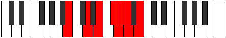 |
| [1963](https://ianring.com/musictheory/scales/1963) | [Epocryllic](ModeBNaturalEpocryllic.md) | B | B, C, D, E, F#, G, G#, A, B |  |
| [1963](https://ianring.com/musictheory/scales/1963) | [Epocryllic](ModeCSharpEpocryllic.md) | C# | C#, D, E, F#, G#, A, A#, B, C# |  |
| [1963](https://ianring.com/musictheory/scales/1963) | [Epocryllic](ModeDFlatEpocryllic.md) | Db | Db, D, E, Gb, Ab, A, Bb, B, Db |  |
| [1965](https://ianring.com/musictheory/scales/1965) | [Gadyllic](ModeFSharpGadyllic.md) | F# | F#, G#, A, B, C#, D, D#, E, F# |  |
| [1965](https://ianring.com/musictheory/scales/1965) | [Gadyllic](ModeGFlatGadyllic.md) | Gb | Gb, Ab, A, B, Db, D, Eb, E, Gb |  |
| [1965](https://ianring.com/musictheory/scales/1965) | [Gadyllic](ModeBNaturalGadyllic.md) | B | B, C#, D, E, F#, G, G#, A, B |  |
| [1967](https://ianring.com/musictheory/scales/1967) | [Godygic](ModeBNaturalGodygic.md) | B | B, C, C#, D, E, F#, G, G#, A, B |  |
| [1967](https://ianring.com/musictheory/scales/1967) | [Godygic](ModeFSharpGodygic.md) | F# | F#, G, G#, A, B, C#, D, D#, E, F# |  |
| [1967](https://ianring.com/musictheory/scales/1967) | [Godygic](ModeGFlatGodygic.md) | Gb | Gb, G, Ab, A, B, Db, D, Eb, E, Gb |  |
| [1967](https://ianring.com/musictheory/scales/1967) | [Godygic](ModeCSharpGodygic.md) | C# | C#, D, D#, E, F#, G#, A, A#, B, C# |  |
| [1967](https://ianring.com/musictheory/scales/1967) | [Godygic](ModeDFlatGodygic.md) | Db | Db, D, Eb, E, Gb, Ab, A, Bb, B, Db |  |
| [1971](https://ianring.com/musictheory/scales/1971) | [Aerynyllic](ModeCSharpAerynyllic.md) | C# | C#, D, F, F#, G#, A, A#, B, C# |  |
| [1971](https://ianring.com/musictheory/scales/1971) | [Aerynyllic](ModeDFlatAerynyllic.md) | Db | Db, D, F, Gb, Ab, A, Bb, B, Db |  |
| [1973](https://ianring.com/musictheory/scales/1973) | [Zyryllic](ModeENaturalZyryllic.md) | E | E, F#, G#, A, B, C, C#, D, E |  |
| [1975](https://ianring.com/musictheory/scales/1975) | [Ionocrygic](ModeENaturalIonocrygic.md) | E | E, F, F#, G#, A, B, C, C#, D, E |  |
| [1975](https://ianring.com/musictheory/scales/1975) | [Ionocrygic](ModeCSharpIonocrygic.md) | C# | C#, D, D#, F, F#, G#, A, A#, B, C# |  |
| [1975](https://ianring.com/musictheory/scales/1975) | [Ionocrygic](ModeDFlatIonocrygic.md) | Db | Db, D, Eb, F, Gb, Ab, A, Bb, B, Db |  |
| [1977](https://ianring.com/musictheory/scales/1977) | [Dagyllic](ModeBNaturalDagyllic.md) | B | B, D, D#, E, F#, G, G#, A, B |  |
| [1979](https://ianring.com/musictheory/scales/1979) | [Aeradygic](ModeFNaturalAeradygic.md) | F | F, F#, G#, A, A#, C, C#, D, D#, F |  |
| [1979](https://ianring.com/musictheory/scales/1979) | [Aeradygic](ModeBNaturalAeradygic.md) | B | B, C, D, D#, E, F#, G, G#, A, B |  |
| [1979](https://ianring.com/musictheory/scales/1979) | [Aeradygic](ModeCSharpAeradygic.md) | C# | C#, D, E, F, F#, G#, A, A#, B, C# |  |
| [1979](https://ianring.com/musictheory/scales/1979) | [Aeradygic](ModeDFlatAeradygic.md) | Db | Db, D, E, F, Gb, Ab, A, Bb, B, Db |  |
| [1981](https://ianring.com/musictheory/scales/1981) | [Gadygic](ModeENaturalGadygic.md) | E | E, F#, G, G#, A, B, C, C#, D, E |  |
| [1981](https://ianring.com/musictheory/scales/1981) | [Gadygic](ModeBNaturalGadygic.md) | B | B, C#, D, D#, E, F#, G, G#, A, B |  |
| [1981](https://ianring.com/musictheory/scales/1981) | [Gadygic](ModeFSharpGadygic.md) | F# | F#, G#, A, A#, B, C#, D, D#, E, F# |  |
| [1981](https://ianring.com/musictheory/scales/1981) | [Gadygic](ModeGFlatGadygic.md) | Gb | Gb, Ab, A, Bb, B, Db, D, Eb, E, Gb |  |
| [1983](https://ianring.com/musictheory/scales/1983) | [Soryllian](ModeFNaturalSoryllian.md) | F | F, F#, G, G#, A, A#, C, C#, D, D#, F |  |
| [1983](https://ianring.com/musictheory/scales/1983) | [Soryllian](ModeBNaturalSoryllian.md) | B | B, C, C#, D, D#, E, F#, G, G#, A, B |  |
| [1983](https://ianring.com/musictheory/scales/1983) | [Soryllian](ModeENaturalSoryllian.md) | E | E, F, F#, G, G#, A, B, C, C#, D, E |  |
| [1983](https://ianring.com/musictheory/scales/1983) | [Soryllian](ModeCSharpSoryllian.md) | C# | C#, D, D#, E, F, F#, G#, A, A#, B, C# |  |
| [1983](https://ianring.com/musictheory/scales/1983) | [Soryllian](ModeDFlatSoryllian.md) | Db | Db, D, Eb, E, F, Gb, Ab, A, Bb, B, Db |  |
| [1983](https://ianring.com/musictheory/scales/1983) | [Soryllian](ModeFSharpSoryllian.md) | F# | F#, G, G#, A, A#, B, C#, D, D#, E, F# |  |
| [1983](https://ianring.com/musictheory/scales/1983) | [Soryllian](ModeGFlatSoryllian.md) | Gb | Gb, G, Ab, A, Bb, B, Db, D, Eb, E, Gb |  |
| [1989](https://ianring.com/musictheory/scales/1989) | [Dydian](ModeCNaturalDydian.md) | C | C, D, E##, F##, G#, A, Bb, C |  |
| [1991](https://ianring.com/musictheory/scales/1991) | [Phryptyllic](ModeGSharpPhryptyllic.md) | G# | G#, A, A#, D, D#, E, F, F#, G# |  |
| [1991](https://ianring.com/musictheory/scales/1991) | [Phryptyllic](ModeAFlatPhryptyllic.md) | Ab | Ab, A, Bb, D, Eb, E, F, Gb, Ab |  |
| [1991](https://ianring.com/musictheory/scales/1991) | [Phryptyllic](ModeCNaturalPhryptyllic.md) | C | C, C#, D, F#, G, G#, A, A#, C |  |
| [1993](https://ianring.com/musictheory/scales/1993) | [Katoptian](ModeBNaturalKatoptian.md) | B | B, C##, D###, E##, F##, G#, A, B |  |
| [1995](https://ianring.com/musictheory/scales/1995) | [Aeolacryllic](ModeGSharpAeolacryllic.md) | G# | G#, A, B, D, D#, E, F, F#, G# |  |
| [1995](https://ianring.com/musictheory/scales/1995) | [Aeolacryllic](ModeAFlatAeolacryllic.md) | Ab | Ab, A, B, D, Eb, E, F, Gb, Ab |  |
| [1995](https://ianring.com/musictheory/scales/1995) | [Aeolacryllic](ModeBNaturalAeolacryllic.md) | B | B, C, D, F, F#, G, G#, A, B |  |
| [1997](https://ianring.com/musictheory/scales/1997) | [Staryllic](ModeFSharpStaryllic.md) | F# | F#, G#, A, C, C#, D, D#, E, F# |  |
| [1997](https://ianring.com/musictheory/scales/1997) | [Staryllic](ModeGFlatStaryllic.md) | Gb | Gb, Ab, A, C, Db, D, Eb, E, Gb |  |
| [1997](https://ianring.com/musictheory/scales/1997) | [Staryllic](ModeCNaturalStaryllic.md) | C | C, D, D#, F#, G, G#, A, A#, C |  |
| [1997](https://ianring.com/musictheory/scales/1997) | [Staryllic](ModeBNaturalStaryllic.md) | B | B, C#, D, F, F#, G, G#, A, B |  |
| [1999](https://ianring.com/musictheory/scales/1999) | [Zacrygic](ModeFSharpZacrygic.md) | F# | F#, G, G#, A, C, C#, D, D#, E, F# |  |
| [1999](https://ianring.com/musictheory/scales/1999) | [Zacrygic](ModeGFlatZacrygic.md) | Gb | Gb, G, Ab, A, C, Db, D, Eb, E, Gb |  |
| [1999](https://ianring.com/musictheory/scales/1999) | [Zacrygic](ModeCNaturalZacrygic.md) | C | C, C#, D, D#, F#, G, G#, A, A#, C |  |
| [1999](https://ianring.com/musictheory/scales/1999) | [Zacrygic](ModeBNaturalZacrygic.md) | B | B, C, C#, D, F, F#, G, G#, A, B |  |
| [1999](https://ianring.com/musictheory/scales/1999) | [Zacrygic](ModeGSharpZacrygic.md) | G# | G#, A, A#, B, D, D#, E, F, F#, G# |  |
| [1999](https://ianring.com/musictheory/scales/1999) | [Zacrygic](ModeAFlatZacrygic.md) | Ab | Ab, A, Bb, B, D, Eb, E, F, Gb, Ab |  |
| [2001](https://ianring.com/musictheory/scales/2001) | [Gydian](ModeDNaturalGydian.md) | D | D, E##, F###, G##, A#, B, C, D |  |
| [2003](https://ianring.com/musictheory/scales/2003) | [Lolyllic](ModeGSharpLolyllic.md) | G# | G#, A, C, D, D#, E, F, F#, G# |  |
| [2003](https://ianring.com/musictheory/scales/2003) | [Lolyllic](ModeAFlatLolyllic.md) | Ab | Ab, A, C, D, Eb, E, F, Gb, Ab |  |
| [2003](https://ianring.com/musictheory/scales/2003) | [Lolyllic](ModeDNaturalLolyllic.md) | D | D, D#, F#, G#, A, A#, B, C, D |  |
| [2005](https://ianring.com/musictheory/scales/2005) | [Gygyllic](ModeCNaturalGygyllic.md) | C | C, D, E, F#, G, G#, A, A#, C |  |
| [2005](https://ianring.com/musictheory/scales/2005) | [Gygyllic](ModeDNaturalGygyllic.md) | D | D, E, F#, G#, A, A#, B, C, D |  |
| [2007](https://ianring.com/musictheory/scales/2007) | [Stonygic](ModeGSharpStonygic.md) | G# | G#, A, A#, C, D, D#, E, F, F#, G# |  |
| [2007](https://ianring.com/musictheory/scales/2007) | [Stonygic](ModeAFlatStonygic.md) | Ab | Ab, A, Bb, C, D, Eb, E, F, Gb, Ab |  |
| [2007](https://ianring.com/musictheory/scales/2007) | [Stonygic](ModeCNaturalStonygic.md) | C | C, C#, D, E, F#, G, G#, A, A#, C |  |
| [2007](https://ianring.com/musictheory/scales/2007) | [Stonygic](ModeDNaturalStonygic.md) | D | D, D#, E, F#, G#, A, A#, B, C, D |  |
| [2009](https://ianring.com/musictheory/scales/2009) | [Stacryllic](ModeBNaturalStacryllic.md) | B | B, D, D#, F, F#, G, G#, A, B |  |
| [2009](https://ianring.com/musictheory/scales/2009) | [Stacryllic](ModeDNaturalStacryllic.md) | D | D, F, F#, G#, A, A#, B, C, D |  |
| [2011](https://ianring.com/musictheory/scales/2011) | [Raphygic](ModeFNaturalRaphygic.md) | F | F, F#, G#, A, B, C, C#, D, D#, F |  |
| [2011](https://ianring.com/musictheory/scales/2011) | [Raphygic](ModeGSharpRaphygic.md) | G# | G#, A, B, C, D, D#, E, F, F#, G# |  |
| [2011](https://ianring.com/musictheory/scales/2011) | [Raphygic](ModeAFlatRaphygic.md) | Ab | Ab, A, B, C, D, Eb, E, F, Gb, Ab |  |
| [2011](https://ianring.com/musictheory/scales/2011) | [Raphygic](ModeBNaturalRaphygic.md) | B | B, C, D, D#, F, F#, G, G#, A, B |  |
| [2011](https://ianring.com/musictheory/scales/2011) | [Raphygic](ModeDNaturalRaphygic.md) | D | D, D#, F, F#, G#, A, A#, B, C, D |  |
| [2013](https://ianring.com/musictheory/scales/2013) | [Mocrygic](ModeFSharpMocrygic.md) | F# | F#, G#, A, A#, C, C#, D, D#, E, F# |  |
| [2013](https://ianring.com/musictheory/scales/2013) | [Mocrygic](ModeGFlatMocrygic.md) | Gb | Gb, Ab, A, Bb, C, Db, D, Eb, E, Gb |  |
| [2013](https://ianring.com/musictheory/scales/2013) | [Mocrygic](ModeCNaturalMocrygic.md) | C | C, D, D#, E, F#, G, G#, A, A#, C |  |
| [2013](https://ianring.com/musictheory/scales/2013) | [Mocrygic](ModeBNaturalMocrygic.md) | B | B, C#, D, D#, F, F#, G, G#, A, B |  |
| [2013](https://ianring.com/musictheory/scales/2013) | [Mocrygic](ModeDNaturalMocrygic.md) | D | D, E, F, F#, G#, A, A#, B, C, D |  |
| [2015](https://ianring.com/musictheory/scales/2015) | [Epiryllian](ModeCNaturalEpiryllian.md) | C | C, C#, D, D#, E, F#, G, G#, A, A#, C |  |
| [2015](https://ianring.com/musictheory/scales/2015) | [Epiryllian](ModeFSharpEpiryllian.md) | F# | F#, G, G#, A, A#, C, C#, D, D#, E, F# |  |
| [2015](https://ianring.com/musictheory/scales/2015) | [Epiryllian](ModeGFlatEpiryllian.md) | Gb | Gb, G, Ab, A, Bb, C, Db, D, Eb, E, Gb |  |
| [2015](https://ianring.com/musictheory/scales/2015) | [Epiryllian](ModeFNaturalEpiryllian.md) | F | F, F#, G, G#, A, B, C, C#, D, D#, F |  |
| [2015](https://ianring.com/musictheory/scales/2015) | [Epiryllian](ModeBNaturalEpiryllian.md) | B | B, C, C#, D, D#, F, F#, G, G#, A, B |  |
| [2015](https://ianring.com/musictheory/scales/2015) | [Epiryllian](ModeDNaturalEpiryllian.md) | D | D, D#, E, F, F#, G#, A, A#, B, C, D |  |
| [2015](https://ianring.com/musictheory/scales/2015) | [Epiryllian](ModeGSharpEpiryllian.md) | G# | G#, A, A#, B, C, D, D#, E, F, F#, G# |  |
| [2015](https://ianring.com/musictheory/scales/2015) | [Epiryllian](ModeAFlatEpiryllian.md) | Ab | Ab, A, Bb, B, C, D, Eb, E, F, Gb, Ab |  |
| [2019](https://ianring.com/musictheory/scales/2019) | [Palyllic](ModeGSharpPalyllic.md) | G# | G#, A, C#, D, D#, E, F, F#, G# |  |
| [2019](https://ianring.com/musictheory/scales/2019) | [Palyllic](ModeAFlatPalyllic.md) | Ab | Ab, A, Db, D, Eb, E, F, Gb, Ab |  |
| [2019](https://ianring.com/musictheory/scales/2019) | [Palyllic](ModeCSharpPalyllic.md) | C# | C#, D, F#, G, G#, A, A#, B, C# |  |
| [2019](https://ianring.com/musictheory/scales/2019) | [Palyllic](ModeDFlatPalyllic.md) | Db | Db, D, Gb, G, Ab, A, Bb, B, Db |  |
| [2021](https://ianring.com/musictheory/scales/2021) | [Katycryllic](ModeCNaturalKatycryllic.md) | C | C, D, F, F#, G, G#, A, A#, C |  |
| [2023](https://ianring.com/musictheory/scales/2023) | [Zodygic](ModeGSharpZodygic.md) | G# | G#, A, A#, C#, D, D#, E, F, F#, G# |  |
| [2023](https://ianring.com/musictheory/scales/2023) | [Zodygic](ModeAFlatZodygic.md) | Ab | Ab, A, Bb, Db, D, Eb, E, F, Gb, Ab |  |
| [2023](https://ianring.com/musictheory/scales/2023) | [Zodygic](ModeCNaturalZodygic.md) | C | C, C#, D, F, F#, G, G#, A, A#, C |  |
| [2023](https://ianring.com/musictheory/scales/2023) | [Zodygic](ModeCSharpZodygic.md) | C# | C#, D, D#, F#, G, G#, A, A#, B, C# |  |
| [2023](https://ianring.com/musictheory/scales/2023) | [Zodygic](ModeDFlatZodygic.md) | Db | Db, D, Eb, Gb, G, Ab, A, Bb, B, Db |  |
| [2025](https://ianring.com/musictheory/scales/2025) | [Mixolydyllic](ModeBNaturalMixolydyllic.md) | B | B, D, E, F, F#, G, G#, A, B |  |
| [2027](https://ianring.com/musictheory/scales/2027) | [Boptygic](ModeGSharpBoptygic.md) | G# | G#, A, B, C#, D, D#, E, F, F#, G# |  |
| [2027](https://ianring.com/musictheory/scales/2027) | [Boptygic](ModeAFlatBoptygic.md) | Ab | Ab, A, B, Db, D, Eb, E, F, Gb, Ab |  |
| [2027](https://ianring.com/musictheory/scales/2027) | [Boptygic](ModeBNaturalBoptygic.md) | B | B, C, D, E, F, F#, G, G#, A, B |  |
| [2027](https://ianring.com/musictheory/scales/2027) | [Boptygic](ModeCSharpBoptygic.md) | C# | C#, D, E, F#, G, G#, A, A#, B, C# |  |
| [2027](https://ianring.com/musictheory/scales/2027) | [Boptygic](ModeDFlatBoptygic.md) | Db | Db, D, E, Gb, G, Ab, A, Bb, B, Db |  |
| [2029](https://ianring.com/musictheory/scales/2029) | [Mathygic](ModeCNaturalMathygic.md) | C | C, D, D#, F, F#, G, G#, A, A#, C |  |
| [2029](https://ianring.com/musictheory/scales/2029) | [Mathygic](ModeFSharpMathygic.md) | F# | F#, G#, A, B, C, C#, D, D#, E, F# |  |
| [2029](https://ianring.com/musictheory/scales/2029) | [Mathygic](ModeGFlatMathygic.md) | Gb | Gb, Ab, A, B, C, Db, D, Eb, E, Gb |  |
| [2029](https://ianring.com/musictheory/scales/2029) | [Mathygic](ModeBNaturalMathygic.md) | B | B, C#, D, E, F, F#, G, G#, A, B |  |
| [2031](https://ianring.com/musictheory/scales/2031) | [Gadyllian](ModeCNaturalGadyllian.md) | C | C, C#, D, D#, F, F#, G, G#, A, A#, C |  |
| [2031](https://ianring.com/musictheory/scales/2031) | [Gadyllian](ModeFSharpGadyllian.md) | F# | F#, G, G#, A, B, C, C#, D, D#, E, F# |  |
| [2031](https://ianring.com/musictheory/scales/2031) | [Gadyllian](ModeGFlatGadyllian.md) | Gb | Gb, G, Ab, A, B, C, Db, D, Eb, E, Gb |  |
| [2031](https://ianring.com/musictheory/scales/2031) | [Gadyllian](ModeBNaturalGadyllian.md) | B | B, C, C#, D, E, F, F#, G, G#, A, B |  |
| [2031](https://ianring.com/musictheory/scales/2031) | [Gadyllian](ModeGSharpGadyllian.md) | G# | G#, A, A#, B, C#, D, D#, E, F, F#, G# |  |
| [2031](https://ianring.com/musictheory/scales/2031) | [Gadyllian](ModeAFlatGadyllian.md) | Ab | Ab, A, Bb, B, Db, D, Eb, E, F, Gb, Ab |  |
| [2031](https://ianring.com/musictheory/scales/2031) | [Gadyllian](ModeCSharpGadyllian.md) | C# | C#, D, D#, E, F#, G, G#, A, A#, B, C# |  |
| [2031](https://ianring.com/musictheory/scales/2031) | [Gadyllian](ModeDFlatGadyllian.md) | Db | Db, D, Eb, E, Gb, G, Ab, A, Bb, B, Db |  |
| [2033](https://ianring.com/musictheory/scales/2033) | [Stolyllic](ModeDNaturalStolyllic.md) | D | D, F#, G, G#, A, A#, B, C, D |  |
| [2035](https://ianring.com/musictheory/scales/2035) | [Aerythygic](ModeGSharpAerythygic.md) | G# | G#, A, C, C#, D, D#, E, F, F#, G# |  |
| [2035](https://ianring.com/musictheory/scales/2035) | [Aerythygic](ModeAFlatAerythygic.md) | Ab | Ab, A, C, Db, D, Eb, E, F, Gb, Ab |  |
| [2035](https://ianring.com/musictheory/scales/2035) | [Aerythygic](ModeDNaturalAerythygic.md) | D | D, D#, F#, G, G#, A, A#, B, C, D |  |
| [2035](https://ianring.com/musictheory/scales/2035) | [Aerythygic](ModeCSharpAerythygic.md) | C# | C#, D, F, F#, G, G#, A, A#, B, C# |  |
| [2035](https://ianring.com/musictheory/scales/2035) | [Aerythygic](ModeDFlatAerythygic.md) | Db | Db, D, F, Gb, G, Ab, A, Bb, B, Db |  |
| [2037](https://ianring.com/musictheory/scales/2037) | [Sythygic](ModeCNaturalSythygic.md) | C | C, D, E, F, F#, G, G#, A, A#, C |  |
| [2037](https://ianring.com/musictheory/scales/2037) | [Sythygic](ModeENaturalSythygic.md) | E | E, F#, G#, A, A#, B, C, C#, D, E |  |
| [2037](https://ianring.com/musictheory/scales/2037) | [Sythygic](ModeDNaturalSythygic.md) | D | D, E, F#, G, G#, A, A#, B, C, D |  |
| [2039](https://ianring.com/musictheory/scales/2039) | [Danyllian](ModeGSharpDanyllian.md) | G# | G#, A, A#, C, C#, D, D#, E, F, F#, G# |  |
| [2039](https://ianring.com/musictheory/scales/2039) | [Danyllian](ModeAFlatDanyllian.md) | Ab | Ab, A, Bb, C, Db, D, Eb, E, F, Gb, Ab |  |
| [2039](https://ianring.com/musictheory/scales/2039) | [Danyllian](ModeCNaturalDanyllian.md) | C | C, C#, D, E, F, F#, G, G#, A, A#, C |  |
| [2039](https://ianring.com/musictheory/scales/2039) | [Danyllian](ModeENaturalDanyllian.md) | E | E, F, F#, G#, A, A#, B, C, C#, D, E |  |
| [2039](https://ianring.com/musictheory/scales/2039) | [Danyllian](ModeDNaturalDanyllian.md) | D | D, D#, E, F#, G, G#, A, A#, B, C, D |  |
| [2039](https://ianring.com/musictheory/scales/2039) | [Danyllian](ModeCSharpDanyllian.md) | C# | C#, D, D#, F, F#, G, G#, A, A#, B, C# |  |
| [2039](https://ianring.com/musictheory/scales/2039) | [Danyllian](ModeDFlatDanyllian.md) | Db | Db, D, Eb, F, Gb, G, Ab, A, Bb, B, Db |  |
| [2041](https://ianring.com/musictheory/scales/2041) | [Aeolacrygic](ModeBNaturalAeolacrygic.md) | B | B, D, D#, E, F, F#, G, G#, A, B |  |
| [2041](https://ianring.com/musictheory/scales/2041) | [Aeolacrygic](ModeDNaturalAeolacrygic.md) | D | D, F, F#, G, G#, A, A#, B, C, D |  |
| [2043](https://ianring.com/musictheory/scales/2043) | [Lythyllian](ModeGSharpLythyllian.md) | G# | G#, A, B, C, C#, D, D#, E, F, F#, G# |  |
| [2043](https://ianring.com/musictheory/scales/2043) | [Lythyllian](ModeAFlatLythyllian.md) | Ab | Ab, A, B, C, Db, D, Eb, E, F, Gb, Ab |  |
| [2043](https://ianring.com/musictheory/scales/2043) | [Lythyllian](ModeBNaturalLythyllian.md) | B | B, C, D, D#, E, F, F#, G, G#, A, B |  |
| [2043](https://ianring.com/musictheory/scales/2043) | [Lythyllian](ModeFNaturalLythyllian.md) | F | F, F#, G#, A, A#, B, C, C#, D, D#, F |  |
| [2043](https://ianring.com/musictheory/scales/2043) | [Lythyllian](ModeDNaturalLythyllian.md) | D | D, D#, F, F#, G, G#, A, A#, B, C, D |  |
| [2043](https://ianring.com/musictheory/scales/2043) | [Lythyllian](ModeCSharpLythyllian.md) | C# | C#, D, E, F, F#, G, G#, A, A#, B, C# |  |
| [2043](https://ianring.com/musictheory/scales/2043) | [Lythyllian](ModeDFlatLythyllian.md) | Db | Db, D, E, F, Gb, G, Ab, A, Bb, B, Db |  |
| [2045](https://ianring.com/musictheory/scales/2045) | [Katogyllian](ModeCNaturalKatogyllian.md) | C | C, D, D#, E, F, F#, G, G#, A, A#, C |  |
| [2045](https://ianring.com/musictheory/scales/2045) | [Katogyllian](ModeBNaturalKatogyllian.md) | B | B, C#, D, D#, E, F, F#, G, G#, A, B |  |
| [2045](https://ianring.com/musictheory/scales/2045) | [Katogyllian](ModeFSharpKatogyllian.md) | F# | F#, G#, A, A#, B, C, C#, D, D#, E, F# |  |
| [2045](https://ianring.com/musictheory/scales/2045) | [Katogyllian](ModeGFlatKatogyllian.md) | Gb | Gb, Ab, A, Bb, B, C, Db, D, Eb, E, Gb |  |
| [2045](https://ianring.com/musictheory/scales/2045) | [Katogyllian](ModeENaturalKatogyllian.md) | E | E, F#, G, G#, A, A#, B, C, C#, D, E |  |
| [2045](https://ianring.com/musictheory/scales/2045) | [Katogyllian](ModeDNaturalKatogyllian.md) | D | D, E, F, F#, G, G#, A, A#, B, C, D |  |
| [2047](https://ianring.com/musictheory/scales/2047) | [Monatic](ModeCNaturalMonatic.md) | C | C, C#, D, D#, E, F, F#, G, G#, A, A#, C |  |
| [2047](https://ianring.com/musictheory/scales/2047) | [Monatic](ModeBNaturalMonatic.md) | B | B, C, C#, D, D#, E, F, F#, G, G#, A, B |  |
| [2047](https://ianring.com/musictheory/scales/2047) | [Monatic](ModeGSharpMonatic.md) | G# | G#, A, A#, B, C, C#, D, D#, E, F, F#, G# |  |
| [2047](https://ianring.com/musictheory/scales/2047) | [Monatic](ModeAFlatMonatic.md) | Ab | Ab, A, Bb, B, C, Db, D, Eb, E, F, Gb, Ab |  |
| [2047](https://ianring.com/musictheory/scales/2047) | [Monatic](ModeFSharpMonatic.md) | F# | F#, G, G#, A, A#, B, C, C#, D, D#, E, F# |  |
| [2047](https://ianring.com/musictheory/scales/2047) | [Monatic](ModeGFlatMonatic.md) | Gb | Gb, G, Ab, A, Bb, B, C, Db, D, Eb, E, Gb |  |
| [2047](https://ianring.com/musictheory/scales/2047) | [Monatic](ModeFNaturalMonatic.md) | F | F, F#, G, G#, A, A#, B, C, C#, D, D#, F |  |
| [2047](https://ianring.com/musictheory/scales/2047) | [Monatic](ModeENaturalMonatic.md) | E | E, F, F#, G, G#, A, A#, B, C, C#, D, E |  |
| [2047](https://ianring.com/musictheory/scales/2047) | [Monatic](ModeDNaturalMonatic.md) | D | D, D#, E, F, F#, G, G#, A, A#, B, C, D |  |
| [2047](https://ianring.com/musictheory/scales/2047) | [Monatic](ModeCSharpMonatic.md) | C# | C#, D, D#, E, F, F#, G, G#, A, A#, B, C# |  |
| [2047](https://ianring.com/musictheory/scales/2047) | [Monatic](ModeDFlatMonatic.md) | Db | Db, D, Eb, E, F, Gb, G, Ab, A, Bb, B, Db |  |
| [2191](https://ianring.com/musictheory/scales/2191) | [Thydimic](ModeGNaturalThydimic.md) | G | G, Ab, Bbb, Cbb, D, E##, G |  |
| [2199](https://ianring.com/musictheory/scales/2199) | [Dyptimic](ModeGNaturalDyptimic.md) | G | G, Ab, Bbb, Cb, D, E##, G |  |
| [2207](https://ianring.com/musictheory/scales/2207) | [Mygian](ModeGNaturalMygian.md) | G | G, Ab, Bbb, Cbb, Dbbb, Ebb, F#, G |  |
| [2215](https://ianring.com/musictheory/scales/2215) | [Ranimic](ModeGNaturalRanimic.md) | G | G, Ab, Bbb, C, D, E##, G |  |
| [2223](https://ianring.com/musictheory/scales/2223) | [Konian](ModeGNaturalKonian.md) | G | G, Ab, Bbb, Cbb, Dbb, Ebb, F#, G |  |
| [2231](https://ianring.com/musictheory/scales/2231) | [Macrian](ModeGNaturalMacrian.md) | G | G, Ab, Bbb, Cb, Dbb, Ebb, F#, G |  |
| [2239](https://ianring.com/musictheory/scales/2239) | [Dacryllic](ModeGNaturalDacryllic.md) | G | G, G#, A, A#, B, C, D, F#, G |  |
| [2247](https://ianring.com/musictheory/scales/2247) | [Aeolimic](ModeGNaturalAeolimic.md) | G | G, Ab, Bbb, C#, D, E##, G |  |
| [2255](https://ianring.com/musictheory/scales/2255) | [Dylian](ModeGNaturalDylian.md) | G | G, Ab, Bbb, Cbb, Db, Ebb, F#, G |  |
| [2257](https://ianring.com/musictheory/scales/2257) | [Zolitonic](ModeDNaturalZolitonic.md) | D | D, F#, G#, A, C#, D |  |
| [2259](https://ianring.com/musictheory/scales/2259) | [Gogimic](ModeDNaturalGogimic.md) | D | D, Eb, F#, G#, A, B##, D |  |
| [2261](https://ianring.com/musictheory/scales/2261) | [Phrolimic](ModeDNaturalPhrolimic.md) | D | D, E, F#, G#, A, B##, D |  |
| [2263](https://ianring.com/musictheory/scales/2263) | [Lycrian](ModeDNaturalLycrian.md) | D | D, Eb, Fb, Gb, Ab, Bbb, C#, D |  |
| [2263](https://ianring.com/musictheory/scales/2263) | [Lycrian](ModeGNaturalLycrian.md) | G | G, Ab, Bbb, Cb, Db, Ebb, F#, G |  |
| [2265](https://ianring.com/musictheory/scales/2265) | [Ionophimic](ModeDNaturalIonophimic.md) | D | D, E#, F#, G#, A, B##, D |  |
| [2267](https://ianring.com/musictheory/scales/2267) | [Padian](ModeDNaturalPadian.md) | D | D, Eb, F, Gb, Ab, Bbb, C#, D |  |
| [2269](https://ianring.com/musictheory/scales/2269) | [Pygian](ModeDNaturalPygian.md) | D | D, E, F, Gb, Ab, Bbb, C#, D |  |
| [2271](https://ianring.com/musictheory/scales/2271) | [Poptyllic](ModeDNaturalPoptyllic.md) | D | D, D#, E, F, F#, G#, A, C#, D |  |
| [2271](https://ianring.com/musictheory/scales/2271) | [Poptyllic](ModeGNaturalPoptyllic.md) | G | G, G#, A, A#, B, C#, D, F#, G |  |
| [2279](https://ianring.com/musictheory/scales/2279) | [Dyrian](ModeGNaturalDyrian.md) | G | G, Ab, Bbb, C, Db, Ebb, F#, G |  |
| [2281](https://ianring.com/musictheory/scales/2281) | [Rathimic](ModeDSharpRathimic.md) | D# | D#, E##, F###, G##, A#, B###, D# | 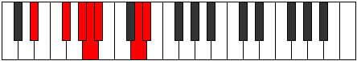 |
| [2281](https://ianring.com/musictheory/scales/2281) | [Rathimic](ModeEFlatRathimic.md) | Eb | Eb, F#, G#, A, Bb, C##, Eb |  |
| [2283](https://ianring.com/musictheory/scales/2283) | [Aeolyptian](ModeDSharpAeolyptian.md) | D# | D#, E, F#, G#, A, Bb, C##, D# |  |
| [2283](https://ianring.com/musictheory/scales/2283) | [Aeolyptian](ModeEFlatAeolyptian.md) | Eb | Eb, Fb, Gb, Ab, Bbb, Cbb, D, Eb |  |
| [2285](https://ianring.com/musictheory/scales/2285) | [Aerogian](ModeDSharpAerogian.md) | D# | D#, E#, F#, G#, A, Bb, C##, D# |  |
| [2285](https://ianring.com/musictheory/scales/2285) | [Aerogian](ModeEFlatAerogian.md) | Eb | Eb, F, Gb, Ab, Bbb, Cbb, D, Eb |  |
| [2287](https://ianring.com/musictheory/scales/2287) | [Lodyllic](ModeDSharpLodyllic.md) | D# | D#, E, F, F#, G#, A, A#, D, D# |  |
| [2287](https://ianring.com/musictheory/scales/2287) | [Lodyllic](ModeEFlatLodyllic.md) | Eb | Eb, E, F, Gb, Ab, A, Bb, D, Eb |  |
| [2287](https://ianring.com/musictheory/scales/2287) | [Lodyllic](ModeGNaturalLodyllic.md) | G | G, G#, A, A#, C, C#, D, F#, G |  |
| [2289](https://ianring.com/musictheory/scales/2289) | [Mocrimic](ModeDNaturalMocrimic.md) | D | D, E##, F##, G#, A, B##, D |  |
| [2291](https://ianring.com/musictheory/scales/2291) | [Zydian](ModeDNaturalZydian.md) | D | D, Eb, F#, G, Ab, Bbb, C#, D |  |
| [2293](https://ianring.com/musictheory/scales/2293) | [Gorian](ModeDNaturalGorian.md) | D | D, E, F#, G, Ab, Bbb, C#, D |  |
| [2295](https://ianring.com/musictheory/scales/2295) | [Kogyllic](ModeDNaturalKogyllic.md) | D | D, D#, E, F#, G, G#, A, C#, D |  |
| [2295](https://ianring.com/musictheory/scales/2295) | [Kogyllic](ModeGNaturalKogyllic.md) | G | G, G#, A, B, C, C#, D, F#, G |  |
| [2297](https://ianring.com/musictheory/scales/2297) | [Thylian](ModeDNaturalThylian.md) | D | D, E#, F#, G, Ab, Bbb, C#, D |  |
| [2297](https://ianring.com/musictheory/scales/2297) | [Thylian](ModeDSharpThylian.md) | D# | D#, E##, F##, G#, A, Bb, C##, D# |  |
| [2297](https://ianring.com/musictheory/scales/2297) | [Thylian](ModeEFlatThylian.md) | Eb | Eb, F#, G, Ab, Bbb, Cbb, D, Eb |  |
| [2299](https://ianring.com/musictheory/scales/2299) | [Phraptyllic](ModeDNaturalPhraptyllic.md) | D | D, D#, F, F#, G, G#, A, C#, D |  |
| [2299](https://ianring.com/musictheory/scales/2299) | [Phraptyllic](ModeDSharpPhraptyllic.md) | D# | D#, E, F#, G, G#, A, A#, D, D# |  |
| [2299](https://ianring.com/musictheory/scales/2299) | [Phraptyllic](ModeEFlatPhraptyllic.md) | Eb | Eb, E, Gb, G, Ab, A, Bb, D, Eb |  |
| [2301](https://ianring.com/musictheory/scales/2301) | [Bydyllic](ModeDNaturalBydyllic.md) | D | D, E, F, F#, G, G#, A, C#, D |  |
| [2301](https://ianring.com/musictheory/scales/2301) | [Bydyllic](ModeDSharpBydyllic.md) | D# | D#, F, F#, G, G#, A, A#, D, D# |  |
| [2301](https://ianring.com/musictheory/scales/2301) | [Bydyllic](ModeEFlatBydyllic.md) | Eb | Eb, F, Gb, G, Ab, A, Bb, D, Eb |  |
| [2303](https://ianring.com/musictheory/scales/2303) | [Stanygic](ModeDNaturalStanygic.md) | D | D, D#, E, F, F#, G, G#, A, C#, D |  |
| [2303](https://ianring.com/musictheory/scales/2303) | [Stanygic](ModeDSharpStanygic.md) | D# | D#, E, F, F#, G, G#, A, A#, D, D# |  |
| [2303](https://ianring.com/musictheory/scales/2303) | [Stanygic](ModeEFlatStanygic.md) | Eb | Eb, E, F, Gb, G, Ab, A, Bb, D, Eb |  |
| [2303](https://ianring.com/musictheory/scales/2303) | [Stanygic](ModeGNaturalStanygic.md) | G | G, G#, A, A#, B, C, C#, D, F#, G |  |
| [2333](https://ianring.com/musictheory/scales/2333) | [Stynimic](ModeFSharpStynimic.md) | F# | F#, G#, A, Bb, C##, D###, F# |  |
| [2333](https://ianring.com/musictheory/scales/2333) | [Stynimic](ModeGFlatStynimic.md) | Gb | Gb, Ab, Bbb, Cbb, D, E#, Gb |  |
| [2335](https://ianring.com/musictheory/scales/2335) | [Epydian](ModeFSharpEpydian.md) | F# | F#, G, Ab, Bbb, Cbb, D, E#, F# |  |
| [2335](https://ianring.com/musictheory/scales/2335) | [Epydian](ModeGFlatEpydian.md) | Gb | Gb, Abb, Bbbb, Cbbb, Cbb, D, E#, Gb |  |
| [2349](https://ianring.com/musictheory/scales/2349) | [Aerogimic](ModeFSharpAerogimic.md) | F# | F#, G#, A, B, C##, D###, F# |  |
| [2349](https://ianring.com/musictheory/scales/2349) | [Aerogimic](ModeGFlatAerogimic.md) | Gb | Gb, Ab, Bbb, Cb, D, E#, Gb |  |
| [2351](https://ianring.com/musictheory/scales/2351) | [Gynian](ModeFSharpGynian.md) | F# | F#, G, Ab, Bbb, Cb, D, E#, F# |  |
| [2351](https://ianring.com/musictheory/scales/2351) | [Gynian](ModeGFlatGynian.md) | Gb | Gb, Abb, Bbbb, Cbbb, Dbbb, Ebb, F, Gb |  |
| [2365](https://ianring.com/musictheory/scales/2365) | [Sythian](ModeFSharpSythian.md) | F# | F#, G#, A, Bb, Cb, D, E#, F# |  |
| [2365](https://ianring.com/musictheory/scales/2365) | [Sythian](ModeGFlatSythian.md) | Gb | Gb, Ab, Bbb, Cbb, Dbbb, Ebb, F, Gb |  |
| [2367](https://ianring.com/musictheory/scales/2367) | [Laryllic](ModeFSharpLaryllic.md) | F# | F#, G, G#, A, A#, B, D, F, F# |  |
| [2367](https://ianring.com/musictheory/scales/2367) | [Laryllic](ModeGFlatLaryllic.md) | Gb | Gb, G, Ab, A, Bb, B, D, F, Gb |  |
| [2381](https://ianring.com/musictheory/scales/2381) | [Sorimic](ModeFSharpSorimic.md) | F# | F#, G#, A, B#, C##, D###, F# |  |
| [2381](https://ianring.com/musictheory/scales/2381) | [Sorimic](ModeGFlatSorimic.md) | Gb | Gb, Ab, Bbb, C, D, E#, Gb |  |
| [2383](https://ianring.com/musictheory/scales/2383) | [Katorian](ModeFSharpKatorian.md) | F# | F#, G, Ab, Bbb, C, D, E#, F# |  |
| [2383](https://ianring.com/musictheory/scales/2383) | [Katorian](ModeGFlatKatorian.md) | Gb | Gb, Abb, Bbbb, Cbbb, Dbb, Ebb, F, Gb |  |
| [2397](https://ianring.com/musictheory/scales/2397) | [Stagian](ModeFSharpStagian.md) | F# | F#, G#, A, Bb, C, D, E#, F# |  |
| [2397](https://ianring.com/musictheory/scales/2397) | [Stagian](ModeGFlatStagian.md) | Gb | Gb, Ab, Bbb, Cbb, Dbb, Ebb, F, Gb |  |
| [2399](https://ianring.com/musictheory/scales/2399) | [Zanyllic](ModeFSharpZanyllic.md) | F# | F#, G, G#, A, A#, C, D, F, F# |  |
| [2399](https://ianring.com/musictheory/scales/2399) | [Zanyllic](ModeGFlatZanyllic.md) | Gb | Gb, G, Ab, A, Bb, C, D, F, Gb |  |
| [2409](https://ianring.com/musictheory/scales/2409) | [Zacrimic](ModeDSharpZacrimic.md) | D# | D#, E##, F###, G##, A##, B###, D# |  |
| [2409](https://ianring.com/musictheory/scales/2409) | [Zacrimic](ModeEFlatZacrimic.md) | Eb | Eb, F#, G#, A, B, C##, Eb |  |
| [2411](https://ianring.com/musictheory/scales/2411) | [Aeolorian](ModeDSharpAeolorian.md) | D# | D#, E, F#, G#, A, B, C##, D# |  |
| [2411](https://ianring.com/musictheory/scales/2411) | [Aeolorian](ModeEFlatAeolorian.md) | Eb | Eb, Fb, Gb, Ab, Bbb, Cb, D, Eb |  |
| [2413](https://ianring.com/musictheory/scales/2413) | [Phrydian](ModeFSharpPhrydian.md) | F# | F#, G#, A, B, C, D, E#, F# |  |
| [2413](https://ianring.com/musictheory/scales/2413) | [Phrydian](ModeGFlatPhrydian.md) | Gb | Gb, Ab, Bbb, Cb, Dbb, Ebb, F, Gb |  |
| [2413](https://ianring.com/musictheory/scales/2413) | [Phrydian](ModeDSharpPhrydian.md) | D# | D#, E#, F#, G#, A, B, C##, D# |  |
| [2413](https://ianring.com/musictheory/scales/2413) | [Phrydian](ModeEFlatPhrydian.md) | Eb | Eb, F, Gb, Ab, Bbb, Cb, D, Eb |  |
| [2415](https://ianring.com/musictheory/scales/2415) | [Lothyllic](ModeDSharpLothyllic.md) | D# | D#, E, F, F#, G#, A, B, D, D# |  |
| [2415](https://ianring.com/musictheory/scales/2415) | [Lothyllic](ModeEFlatLothyllic.md) | Eb | Eb, E, F, Gb, Ab, A, B, D, Eb |  |
| [2415](https://ianring.com/musictheory/scales/2415) | [Lothyllic](ModeFSharpLothyllic.md) | F# | F#, G, G#, A, B, C, D, F, F# |  |
| [2415](https://ianring.com/musictheory/scales/2415) | [Lothyllic](ModeGFlatLothyllic.md) | Gb | Gb, G, Ab, A, B, C, D, F, Gb |  |
| [2425](https://ianring.com/musictheory/scales/2425) | [Rorian](ModeDSharpRorian.md) | D# | D#, E##, F##, G#, A, B, C##, D# |  |
| [2425](https://ianring.com/musictheory/scales/2425) | [Rorian](ModeEFlatRorian.md) | Eb | Eb, F#, G, Ab, Bbb, Cb, D, Eb |  |
| [2427](https://ianring.com/musictheory/scales/2427) | [Katoryllic](ModeDSharpKatoryllic.md) | D# | D#, E, F#, G, G#, A, B, D, D# |  |
| [2427](https://ianring.com/musictheory/scales/2427) | [Katoryllic](ModeEFlatKatoryllic.md) | Eb | Eb, E, Gb, G, Ab, A, B, D, Eb |  |
| [2429](https://ianring.com/musictheory/scales/2429) | [Kadyllic](ModeDSharpKadyllic.md) | D# | D#, F, F#, G, G#, A, B, D, D# |  |
| [2429](https://ianring.com/musictheory/scales/2429) | [Kadyllic](ModeEFlatKadyllic.md) | Eb | Eb, F, Gb, G, Ab, A, B, D, Eb |  |
| [2429](https://ianring.com/musictheory/scales/2429) | [Kadyllic](ModeFSharpKadyllic.md) | F# | F#, G#, A, A#, B, C, D, F, F# |  |
| [2429](https://ianring.com/musictheory/scales/2429) | [Kadyllic](ModeGFlatKadyllic.md) | Gb | Gb, Ab, A, Bb, B, C, D, F, Gb |  |
| [2431](https://ianring.com/musictheory/scales/2431) | [Gythygic](ModeDSharpGythygic.md) | D# | D#, E, F, F#, G, G#, A, B, D, D# |  |
| [2431](https://ianring.com/musictheory/scales/2431) | [Gythygic](ModeEFlatGythygic.md) | Eb | Eb, E, F, Gb, G, Ab, A, B, D, Eb |  |
| [2431](https://ianring.com/musictheory/scales/2431) | [Gythygic](ModeFSharpGythygic.md) | F# | F#, G, G#, A, A#, B, C, D, F, F# |  |
| [2431](https://ianring.com/musictheory/scales/2431) | [Gythygic](ModeGFlatGythygic.md) | Gb | Gb, G, Ab, A, Bb, B, C, D, F, Gb |  |
| [2445](https://ianring.com/musictheory/scales/2445) | [Zadimic](ModeFSharpZadimic.md) | F# | F#, G#, A, B##, C##, D###, F# |  |
| [2445](https://ianring.com/musictheory/scales/2445) | [Zadimic](ModeGFlatZadimic.md) | Gb | Gb, Ab, Bbb, C#, D, E#, Gb |  |
| [2447](https://ianring.com/musictheory/scales/2447) | [Thagian](ModeFSharpThagian.md) | F# | F#, G, Ab, Bbb, C#, D, E#, F# |  |
| [2447](https://ianring.com/musictheory/scales/2447) | [Thagian](ModeGFlatThagian.md) | Gb | Gb, Abb, Bbbb, Cbbb, Db, Ebb, F, Gb | 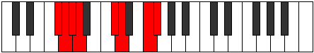 |
| [2447](https://ianring.com/musictheory/scales/2447) | [Thagian](ModeGNaturalThagian.md) | G | G, Ab, Bbb, Cbb, D, Eb, F#, G |  |
| [2455](https://ianring.com/musictheory/scales/2455) | [Bothian](ModeGNaturalBothian.md) | G | G, Ab, Bbb, Cb, D, Eb, F#, G |  |
| [2461](https://ianring.com/musictheory/scales/2461) | [Sagian](ModeFSharpSagian.md) | F# | F#, G#, A, Bb, C#, D, E#, F# |  |
| [2461](https://ianring.com/musictheory/scales/2461) | [Sagian](ModeGFlatSagian.md) | Gb | Gb, Ab, Bbb, Cbb, Db, Ebb, F, Gb |  |
| [2463](https://ianring.com/musictheory/scales/2463) | [Ionathyllic](ModeFSharpIonathyllic.md) | F# | F#, G, G#, A, A#, C#, D, F, F# |  |
| [2463](https://ianring.com/musictheory/scales/2463) | [Ionathyllic](ModeGFlatIonathyllic.md) | Gb | Gb, G, Ab, A, Bb, Db, D, F, Gb |  |
| [2463](https://ianring.com/musictheory/scales/2463) | [Ionathyllic](ModeGNaturalIonathyllic.md) | G | G, G#, A, A#, B, D, D#, F#, G |  |
| [2467](https://ianring.com/musictheory/scales/2467) | [Morimic](ModeCSharpMorimic.md) | C# | C#, D, E##, F###, G##, A###, C# |  |
| [2467](https://ianring.com/musictheory/scales/2467) | [Morimic](ModeDFlatMorimic.md) | Db | Db, Ebb, F#, G#, A, B#, Db |  |
| [2471](https://ianring.com/musictheory/scales/2471) | [Eparian](ModeCSharpEparian.md) | C# | C#, D, Eb, F#, G#, A, B#, C# |  |
| [2471](https://ianring.com/musictheory/scales/2471) | [Eparian](ModeDFlatEparian.md) | Db | Db, Ebb, Fbb, Gb, Ab, Bbb, C, Db |  |
| [2471](https://ianring.com/musictheory/scales/2471) | [Eparian](ModeGNaturalEparian.md) | G | G, Ab, Bbb, C, D, Eb, F#, G |  |
| [2475](https://ianring.com/musictheory/scales/2475) | [Aerylian](ModeCSharpAerylian.md) | C# | C#, D, E, F#, G#, A, B#, C# |  |
| [2475](https://ianring.com/musictheory/scales/2475) | [Aerylian](ModeDFlatAerylian.md) | Db | Db, Ebb, Fb, Gb, Ab, Bbb, C, Db |  |
| [2477](https://ianring.com/musictheory/scales/2477) | [Mydian](ModeFSharpMydian.md) | F# | F#, G#, A, B, C#, D, E#, F# |  |
| [2477](https://ianring.com/musictheory/scales/2477) | [Mydian](ModeGFlatMydian.md) | Gb | Gb, Ab, Bbb, Cb, Db, Ebb, F, Gb |  |
| [2479](https://ianring.com/musictheory/scales/2479) | [Rycryllic](ModeCSharpRycryllic.md) | C# | C#, D, D#, E, F#, G#, A, C, C# |  |
| [2479](https://ianring.com/musictheory/scales/2479) | [Rycryllic](ModeDFlatRycryllic.md) | Db | Db, D, Eb, E, Gb, Ab, A, C, Db |  |
| [2479](https://ianring.com/musictheory/scales/2479) | [Rycryllic](ModeGNaturalRycryllic.md) | G | G, G#, A, A#, C, D, D#, F#, G |  |
| [2479](https://ianring.com/musictheory/scales/2479) | [Rycryllic](ModeFSharpRycryllic.md) | F# | F#, G, G#, A, B, C#, D, F, F# |  |
| [2479](https://ianring.com/musictheory/scales/2479) | [Rycryllic](ModeGFlatRycryllic.md) | Gb | Gb, G, Ab, A, B, Db, D, F, Gb |  |
| [2483](https://ianring.com/musictheory/scales/2483) | [Aerynian](ModeCSharpAerynian.md) | C# | C#, D, E#, F#, G#, A, B#, C# |  |
| [2483](https://ianring.com/musictheory/scales/2483) | [Aerynian](ModeDFlatAerynian.md) | Db | Db, Ebb, F, Gb, Ab, Bbb, C, Db |  |
| [2487](https://ianring.com/musictheory/scales/2487) | [Phroptyllic](ModeCSharpPhroptyllic.md) | C# | C#, D, D#, F, F#, G#, A, C, C# |  |
| [2487](https://ianring.com/musictheory/scales/2487) | [Phroptyllic](ModeDFlatPhroptyllic.md) | Db | Db, D, Eb, F, Gb, Ab, A, C, Db |  |
| [2487](https://ianring.com/musictheory/scales/2487) | [Phroptyllic](ModeGNaturalPhroptyllic.md) | G | G, G#, A, B, C, D, D#, F#, G |  |
| [2491](https://ianring.com/musictheory/scales/2491) | [Layllic](ModeCSharpLayllic.md) | C# | C#, D, E, F, F#, G#, A, C, C# |  |
| [2491](https://ianring.com/musictheory/scales/2491) | [Layllic](ModeDFlatLayllic.md) | Db | Db, D, E, F, Gb, Ab, A, C, Db |  |
| [2493](https://ianring.com/musictheory/scales/2493) | [Manyllic](ModeFSharpManyllic.md) | F# | F#, G#, A, A#, B, C#, D, F, F# |  |
| [2493](https://ianring.com/musictheory/scales/2493) | [Manyllic](ModeGFlatManyllic.md) | Gb | Gb, Ab, A, Bb, B, Db, D, F, Gb |  |
| [2495](https://ianring.com/musictheory/scales/2495) | [Aeolocrygic](ModeCSharpAeolocrygic.md) | C# | C#, D, D#, E, F, F#, G#, A, C, C# |  |
| [2495](https://ianring.com/musictheory/scales/2495) | [Aeolocrygic](ModeDFlatAeolocrygic.md) | Db | Db, D, Eb, E, F, Gb, Ab, A, C, Db |  |
| [2495](https://ianring.com/musictheory/scales/2495) | [Aeolocrygic](ModeGNaturalAeolocrygic.md) | G | G, G#, A, A#, B, C, D, D#, F#, G |  |
| [2495](https://ianring.com/musictheory/scales/2495) | [Aeolocrygic](ModeFSharpAeolocrygic.md) | F# | F#, G, G#, A, A#, B, C#, D, F, F# |  |
| [2495](https://ianring.com/musictheory/scales/2495) | [Aeolocrygic](ModeGFlatAeolocrygic.md) | Gb | Gb, G, Ab, A, Bb, B, Db, D, F, Gb |  |
| [2503](https://ianring.com/musictheory/scales/2503) | [Stonian](ModeGNaturalStonian.md) | G | G, Ab, Bbb, C#, D, Eb, F#, G |  |
| [2509](https://ianring.com/musictheory/scales/2509) | [Bogian](ModeFSharpBogian.md) | F# | F#, G#, A, B#, C#, D, E#, F# |  |
| [2509](https://ianring.com/musictheory/scales/2509) | [Bogian](ModeGFlatBogian.md) | Gb | Gb, Ab, Bbb, C, Db, Ebb, F, Gb |  |
| [2511](https://ianring.com/musictheory/scales/2511) | [Epyryllic](ModeFSharpEpyryllic.md) | F# | F#, G, G#, A, C, C#, D, F, F# |  |
| [2511](https://ianring.com/musictheory/scales/2511) | [Epyryllic](ModeGFlatEpyryllic.md) | Gb | Gb, G, Ab, A, C, Db, D, F, Gb |  |
| [2511](https://ianring.com/musictheory/scales/2511) | [Epyryllic](ModeGNaturalEpyryllic.md) | G | G, G#, A, A#, C#, D, D#, F#, G |  |
| [2513](https://ianring.com/musictheory/scales/2513) | [Aerycrimic](ModeDNaturalAerycrimic.md) | D | D, E##, F###, G##, A#, B##, D |  |
| [2515](https://ianring.com/musictheory/scales/2515) | [Stylian](ModeDNaturalStylian.md) | D | D, Eb, F#, G#, A, Bb, C#, D |  |
| [2517](https://ianring.com/musictheory/scales/2517) | [Ryphian](ModeDNaturalRyphian.md) | D | D, E, F#, G#, A, Bb, C#, D |  |
| [2519](https://ianring.com/musictheory/scales/2519) | [Dathyllic](ModeDNaturalDathyllic.md) | D | D, D#, E, F#, G#, A, A#, C#, D |  |
| [2519](https://ianring.com/musictheory/scales/2519) | [Dathyllic](ModeGNaturalDathyllic.md) | G | G, G#, A, B, C#, D, D#, F#, G |  |
| [2521](https://ianring.com/musictheory/scales/2521) | [Barian](ModeDNaturalBarian.md) | D | D, E#, F#, G#, A, Bb, C#, D |  |
| [2523](https://ianring.com/musictheory/scales/2523) | [Rygyllic](ModeDNaturalRygyllic.md) | D | D, D#, F, F#, G#, A, A#, C#, D |  |
| [2525](https://ianring.com/musictheory/scales/2525) | [Aeolaryllic](ModeFSharpAeolaryllic.md) | F# | F#, G#, A, A#, C, C#, D, F, F# |  |
| [2525](https://ianring.com/musictheory/scales/2525) | [Aeolaryllic](ModeGFlatAeolaryllic.md) | Gb | Gb, Ab, A, Bb, C, Db, D, F, Gb |  |
| [2525](https://ianring.com/musictheory/scales/2525) | [Aeolaryllic](ModeDNaturalAeolaryllic.md) | D | D, E, F, F#, G#, A, A#, C#, D |  |
| [2527](https://ianring.com/musictheory/scales/2527) | [Phradygic](ModeDNaturalPhradygic.md) | D | D, D#, E, F, F#, G#, A, A#, C#, D |  |
| [2527](https://ianring.com/musictheory/scales/2527) | [Phradygic](ModeFSharpPhradygic.md) | F# | F#, G, G#, A, A#, C, C#, D, F, F# |  |
| [2527](https://ianring.com/musictheory/scales/2527) | [Phradygic](ModeGFlatPhradygic.md) | Gb | Gb, G, Ab, A, Bb, C, Db, D, F, Gb |  |
| [2527](https://ianring.com/musictheory/scales/2527) | [Phradygic](ModeGNaturalPhradygic.md) | G | G, G#, A, A#, B, C#, D, D#, F#, G |  |
| [2531](https://ianring.com/musictheory/scales/2531) | [Danian](ModeCSharpDanian.md) | C# | C#, D, E##, F##, G#, A, B#, C# |  |
| [2531](https://ianring.com/musictheory/scales/2531) | [Danian](ModeDFlatDanian.md) | Db | Db, Ebb, F#, G, Ab, Bbb, C, Db |  |
| [2535](https://ianring.com/musictheory/scales/2535) | [Zygyllic](ModeCSharpZygyllic.md) | C# | C#, D, D#, F#, G, G#, A, C, C# |  |
| [2535](https://ianring.com/musictheory/scales/2535) | [Zygyllic](ModeDFlatZygyllic.md) | Db | Db, D, Eb, Gb, G, Ab, A, C, Db |  |
| [2535](https://ianring.com/musictheory/scales/2535) | [Zygyllic](ModeGNaturalZygyllic.md) | G | G, G#, A, C, C#, D, D#, F#, G |  |
| [2537](https://ianring.com/musictheory/scales/2537) | [Laptian](ModeDSharpLaptian.md) | D# | D#, E##, F###, G##, A#, B, C##, D# |  |
| [2537](https://ianring.com/musictheory/scales/2537) | [Laptian](ModeEFlatLaptian.md) | Eb | Eb, F#, G#, A, Bb, Cb, D, Eb |  |
| [2539](https://ianring.com/musictheory/scales/2539) | [Thonyllic](ModeCSharpThonyllic.md) | C# | C#, D, E, F#, G, G#, A, C, C# |  |
| [2539](https://ianring.com/musictheory/scales/2539) | [Thonyllic](ModeDFlatThonyllic.md) | Db | Db, D, E, Gb, G, Ab, A, C, Db |  |
| [2539](https://ianring.com/musictheory/scales/2539) | [Thonyllic](ModeDSharpThonyllic.md) | D# | D#, E, F#, G#, A, A#, B, D, D# |  |
| [2539](https://ianring.com/musictheory/scales/2539) | [Thonyllic](ModeEFlatThonyllic.md) | Eb | Eb, E, Gb, Ab, A, Bb, B, D, Eb |  |
| [2541](https://ianring.com/musictheory/scales/2541) | [Katadyllic](ModeFSharpKatadyllic.md) | F# | F#, G#, A, B, C, C#, D, F, F# |  |
| [2541](https://ianring.com/musictheory/scales/2541) | [Katadyllic](ModeGFlatKatadyllic.md) | Gb | Gb, Ab, A, B, C, Db, D, F, Gb |  |
| [2541](https://ianring.com/musictheory/scales/2541) | [Katadyllic](ModeDSharpKatadyllic.md) | D# | D#, F, F#, G#, A, A#, B, D, D# |  |
| [2541](https://ianring.com/musictheory/scales/2541) | [Katadyllic](ModeEFlatKatadyllic.md) | Eb | Eb, F, Gb, Ab, A, Bb, B, D, Eb |  |
| [2543](https://ianring.com/musictheory/scales/2543) | [Dydygic](ModeCSharpDydygic.md) | C# | C#, D, D#, E, F#, G, G#, A, C, C# |  |
| [2543](https://ianring.com/musictheory/scales/2543) | [Dydygic](ModeDFlatDydygic.md) | Db | Db, D, Eb, E, Gb, G, Ab, A, C, Db |  |
| [2543](https://ianring.com/musictheory/scales/2543) | [Dydygic](ModeGNaturalDydygic.md) | G | G, G#, A, A#, C, C#, D, D#, F#, G |  |
| [2543](https://ianring.com/musictheory/scales/2543) | [Dydygic](ModeFSharpDydygic.md) | F# | F#, G, G#, A, B, C, C#, D, F, F# |  |
| [2543](https://ianring.com/musictheory/scales/2543) | [Dydygic](ModeGFlatDydygic.md) | Gb | Gb, G, Ab, A, B, C, Db, D, F, Gb |  |
| [2543](https://ianring.com/musictheory/scales/2543) | [Dydygic](ModeDSharpDydygic.md) | D# | D#, E, F, F#, G#, A, A#, B, D, D# |  |
| [2543](https://ianring.com/musictheory/scales/2543) | [Dydygic](ModeEFlatDydygic.md) | Eb | Eb, E, F, Gb, Ab, A, Bb, B, D, Eb |  |
| [2545](https://ianring.com/musictheory/scales/2545) | [Thycrian](ModeDNaturalThycrian.md) | D | D, E##, F##, G#, A, Bb, C#, D |  |
| [2547](https://ianring.com/musictheory/scales/2547) | [Sogyllic](ModeCSharpSogyllic.md) | C# | C#, D, F, F#, G, G#, A, C, C# |  |
| [2547](https://ianring.com/musictheory/scales/2547) | [Sogyllic](ModeDFlatSogyllic.md) | Db | Db, D, F, Gb, G, Ab, A, C, Db |  |
| [2547](https://ianring.com/musictheory/scales/2547) | [Sogyllic](ModeDNaturalSogyllic.md) | D | D, D#, F#, G, G#, A, A#, C#, D |  |
| [2549](https://ianring.com/musictheory/scales/2549) | [Rydyllic](ModeDNaturalRydyllic.md) | D | D, E, F#, G, G#, A, A#, C#, D |  |
| [2551](https://ianring.com/musictheory/scales/2551) | [Zoptygic](ModeCSharpZoptygic.md) | C# | C#, D, D#, F, F#, G, G#, A, C, C# |  |
| [2551](https://ianring.com/musictheory/scales/2551) | [Zoptygic](ModeDFlatZoptygic.md) | Db | Db, D, Eb, F, Gb, G, Ab, A, C, Db |  |
| [2551](https://ianring.com/musictheory/scales/2551) | [Zoptygic](ModeDNaturalZoptygic.md) | D | D, D#, E, F#, G, G#, A, A#, C#, D |  |
| [2551](https://ianring.com/musictheory/scales/2551) | [Zoptygic](ModeGNaturalZoptygic.md) | G | G, G#, A, B, C, C#, D, D#, F#, G |  |
| [2553](https://ianring.com/musictheory/scales/2553) | [Aeolaptyllic](ModeDNaturalAeolaptyllic.md) | D | D, F, F#, G, G#, A, A#, C#, D |  |
| [2553](https://ianring.com/musictheory/scales/2553) | [Aeolaptyllic](ModeDSharpAeolaptyllic.md) | D# | D#, F#, G, G#, A, A#, B, D, D# |  |
| [2553](https://ianring.com/musictheory/scales/2553) | [Aeolaptyllic](ModeEFlatAeolaptyllic.md) | Eb | Eb, Gb, G, Ab, A, Bb, B, D, Eb |  |
| [2555](https://ianring.com/musictheory/scales/2555) | [Bythygic](ModeCSharpBythygic.md) | C# | C#, D, E, F, F#, G, G#, A, C, C# |  |
| [2555](https://ianring.com/musictheory/scales/2555) | [Bythygic](ModeDFlatBythygic.md) | Db | Db, D, E, F, Gb, G, Ab, A, C, Db |  |
| [2555](https://ianring.com/musictheory/scales/2555) | [Bythygic](ModeDNaturalBythygic.md) | D | D, D#, F, F#, G, G#, A, A#, C#, D |  |
| [2555](https://ianring.com/musictheory/scales/2555) | [Bythygic](ModeDSharpBythygic.md) | D# | D#, E, F#, G, G#, A, A#, B, D, D# |  |
| [2555](https://ianring.com/musictheory/scales/2555) | [Bythygic](ModeEFlatBythygic.md) | Eb | Eb, E, Gb, G, Ab, A, Bb, B, D, Eb |  |
| [2557](https://ianring.com/musictheory/scales/2557) | [Dothygic](ModeDNaturalDothygic.md) | D | D, E, F, F#, G, G#, A, A#, C#, D |  |
| [2557](https://ianring.com/musictheory/scales/2557) | [Dothygic](ModeFSharpDothygic.md) | F# | F#, G#, A, A#, B, C, C#, D, F, F# |  |
| [2557](https://ianring.com/musictheory/scales/2557) | [Dothygic](ModeGFlatDothygic.md) | Gb | Gb, Ab, A, Bb, B, C, Db, D, F, Gb |  |
| [2557](https://ianring.com/musictheory/scales/2557) | [Dothygic](ModeDSharpDothygic.md) | D# | D#, F, F#, G, G#, A, A#, B, D, D# |  |
| [2557](https://ianring.com/musictheory/scales/2557) | [Dothygic](ModeEFlatDothygic.md) | Eb | Eb, F, Gb, G, Ab, A, Bb, B, D, Eb |  |
| [2559](https://ianring.com/musictheory/scales/2559) | [Zogyllian](ModeCSharpZogyllian.md) | C# | C#, D, D#, E, F, F#, G, G#, A, C, C# |  |
| [2559](https://ianring.com/musictheory/scales/2559) | [Zogyllian](ModeDFlatZogyllian.md) | Db | Db, D, Eb, E, F, Gb, G, Ab, A, C, Db |  |
| [2559](https://ianring.com/musictheory/scales/2559) | [Zogyllian](ModeDNaturalZogyllian.md) | D | D, D#, E, F, F#, G, G#, A, A#, C#, D |  |
| [2559](https://ianring.com/musictheory/scales/2559) | [Zogyllian](ModeGNaturalZogyllian.md) | G | G, G#, A, A#, B, C, C#, D, D#, F#, G |  |
| [2559](https://ianring.com/musictheory/scales/2559) | [Zogyllian](ModeFSharpZogyllian.md) | F# | F#, G, G#, A, A#, B, C, C#, D, F, F# |  |
| [2559](https://ianring.com/musictheory/scales/2559) | [Zogyllian](ModeGFlatZogyllian.md) | Gb | Gb, G, Ab, A, Bb, B, C, Db, D, F, Gb |  |
| [2559](https://ianring.com/musictheory/scales/2559) | [Zogyllian](ModeDSharpZogyllian.md) | D# | D#, E, F, F#, G, G#, A, A#, B, D, D# |  |
| [2559](https://ianring.com/musictheory/scales/2559) | [Zogyllian](ModeEFlatZogyllian.md) | Eb | Eb, E, F, Gb, G, Ab, A, Bb, B, D, Eb |  |
| [2595](https://ianring.com/musictheory/scales/2595) | [Rolitonic](ModeANaturalRolitonic.md) | A | A, A#, D, F#, G#, A |  |
| [2597](https://ianring.com/musictheory/scales/2597) | [Koptitonic](ModeANaturalKoptitonic.md) | A | A, B, D, F#, G#, A |  |
| [2599](https://ianring.com/musictheory/scales/2599) | [Malimic](ModeANaturalMalimic.md) | A | A, Bb, Cb, D, E##, F###, A |  |
| [2601](https://ianring.com/musictheory/scales/2601) | [Docritonic](ModeANaturalDocritonic.md) | A | A, C, D, F#, G#, A |  |
| [2603](https://ianring.com/musictheory/scales/2603) | [Gadimic](ModeANaturalGadimic.md) | A | A, Bb, C, D, E##, F###, A |  |
| [2605](https://ianring.com/musictheory/scales/2605) | [Rylimic](ModeANaturalRylimic.md) | A | A, B, C, D, E##, F###, A |  |
| [2607](https://ianring.com/musictheory/scales/2607) | [Aerolian](ModeANaturalAerolian.md) | A | A, Bb, Cb, Dbb, Ebb, F#, G#, A |  |
| [2609](https://ianring.com/musictheory/scales/2609) | [Paptitonic](ModeANaturalPaptitonic.md) | A | A, C#, D, F#, G#, A |  |
| [2611](https://ianring.com/musictheory/scales/2611) | [Lyrimic](ModeANaturalLyrimic.md) | A | A, Bb, C#, D, E##, F###, A |  |
| [2613](https://ianring.com/musictheory/scales/2613) | [Aeolanimic](ModeANaturalAeolanimic.md) | A | A, B, C#, D, E##, F###, A |  |
| [2615](https://ianring.com/musictheory/scales/2615) | [Thoptian](ModeANaturalThoptian.md) | A | A, Bb, Cb, Db, Ebb, F#, G#, A |  |
| [2617](https://ianring.com/musictheory/scales/2617) | [Pylimic](ModeANaturalPylimic.md) | A | A, B#, C#, D, E##, F###, A |  |
| [2619](https://ianring.com/musictheory/scales/2619) | [Ionyrian](ModeANaturalIonyrian.md) | A | A, Bb, C, Db, Ebb, F#, G#, A |  |
| [2619](https://ianring.com/musictheory/scales/2619) | [Ionyrian](ModeFNaturalIonyrian.md) | F | F, Gb, Ab, Bbb, Cbb, D, E, F | 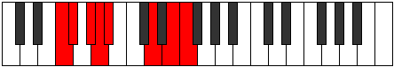 |
| [2621](https://ianring.com/musictheory/scales/2621) | [Ionogian](ModeANaturalIonogian.md) | A | A, B, C, Db, Ebb, F#, G#, A |  |
| [2623](https://ianring.com/musictheory/scales/2623) | [Aerylyllic](ModeFNaturalAerylyllic.md) | F | F, F#, G, G#, A, A#, D, E, F |  |
| [2623](https://ianring.com/musictheory/scales/2623) | [Aerylyllic](ModeANaturalAerylyllic.md) | A | A, A#, B, C, C#, D, F#, G#, A |  |
| [2651](https://ianring.com/musictheory/scales/2651) | [Panian](ModeFNaturalPanian.md) | F | F, Gb, Ab, Bbb, Cb, D, E, F |  |
| [2655](https://ianring.com/musictheory/scales/2655) | [Thocryllic](ModeFNaturalThocryllic.md) | F | F, F#, G, G#, A, B, D, E, F |  |
| [2659](https://ianring.com/musictheory/scales/2659) | [Katynimic](ModeANaturalKatynimic.md) | A | A, Bb, C##, D#, E##, F###, A |  |
| [2661](https://ianring.com/musictheory/scales/2661) | [Stydimic](ModeANaturalStydimic.md) | A | A, B, C##, D#, E##, F###, A |  |
| [2663](https://ianring.com/musictheory/scales/2663) | [Lalian](ModeANaturalLalian.md) | A | A, Bb, Cb, D, Eb, F#, G#, A |  |
| [2665](https://ianring.com/musictheory/scales/2665) | [Aeradimic](ModeDSharpAeradimic.md) | D# | D#, E##, F###, G##, A###, B###, D# |  |
| [2665](https://ianring.com/musictheory/scales/2665) | [Aeradimic](ModeEFlatAeradimic.md) | Eb | Eb, F#, G#, A, B#, C##, Eb |  |
| [2665](https://ianring.com/musictheory/scales/2665) | [Aeradimic](ModeANaturalAeradimic.md) | A | A, B#, C##, D#, E##, F###, A |  |
| [2667](https://ianring.com/musictheory/scales/2667) | [Byrian](ModeDSharpByrian.md) | D# | D#, E, F#, G#, A, B#, C##, D# |  |
| [2667](https://ianring.com/musictheory/scales/2667) | [Byrian](ModeEFlatByrian.md) | Eb | Eb, Fb, Gb, Ab, Bbb, C, D, Eb |  |
| [2667](https://ianring.com/musictheory/scales/2667) | [Byrian](ModeANaturalByrian.md) | A | A, Bb, C, D, Eb, F#, G#, A |  |
| [2669](https://ianring.com/musictheory/scales/2669) | [Gamian](ModeDSharpGamian.md) | D# | D#, E#, F#, G#, A, B#, C##, D# |  |
| [2669](https://ianring.com/musictheory/scales/2669) | [Gamian](ModeEFlatGamian.md) | Eb | Eb, F, Gb, Ab, Bbb, C, D, Eb |  |
| [2669](https://ianring.com/musictheory/scales/2669) | [Gamian](ModeANaturalGamian.md) | A | A, B, C, D, Eb, F#, G#, A |  |
| [2671](https://ianring.com/musictheory/scales/2671) | [Lylyllic](ModeDSharpLylyllic.md) | D# | D#, E, F, F#, G#, A, C, D, D# |  |
| [2671](https://ianring.com/musictheory/scales/2671) | [Lylyllic](ModeEFlatLylyllic.md) | Eb | Eb, E, F, Gb, Ab, A, C, D, Eb |  |
| [2671](https://ianring.com/musictheory/scales/2671) | [Lylyllic](ModeANaturalLylyllic.md) | A | A, A#, B, C, D, D#, F#, G#, A |  |
| [2673](https://ianring.com/musictheory/scales/2673) | [Mythimic](ModeANaturalMythimic.md) | A | A, B##, C##, D#, E##, F###, A |  |
| [2675](https://ianring.com/musictheory/scales/2675) | [Gogian](ModeANaturalGogian.md) | A | A, Bb, C#, D, Eb, F#, G#, A |  |
| [2677](https://ianring.com/musictheory/scales/2677) | [Thodian](ModeANaturalThodian.md) | A | A, B, C#, D, Eb, F#, G#, A |  |
| [2679](https://ianring.com/musictheory/scales/2679) | [Rathyllic](ModeANaturalRathyllic.md) | A | A, A#, B, C#, D, D#, F#, G#, A |  |
| [2681](https://ianring.com/musictheory/scales/2681) | [Aerycrian](ModeANaturalAerycrian.md) | A | A, B#, C#, D, Eb, F#, G#, A |  |
| [2681](https://ianring.com/musictheory/scales/2681) | [Aerycrian](ModeDSharpAerycrian.md) | D# | D#, E##, F##, G#, A, B#, C##, D# |  |
| [2681](https://ianring.com/musictheory/scales/2681) | [Aerycrian](ModeEFlatAerycrian.md) | Eb | Eb, F#, G, Ab, Bbb, C, D, Eb |  |
| [2683](https://ianring.com/musictheory/scales/2683) | [Thodyllic](ModeDSharpThodyllic.md) | D# | D#, E, F#, G, G#, A, C, D, D# |  |
| [2683](https://ianring.com/musictheory/scales/2683) | [Thodyllic](ModeEFlatThodyllic.md) | Eb | Eb, E, Gb, G, Ab, A, C, D, Eb |  |
| [2683](https://ianring.com/musictheory/scales/2683) | [Thodyllic](ModeANaturalThodyllic.md) | A | A, A#, C, C#, D, D#, F#, G#, A |  |
| [2683](https://ianring.com/musictheory/scales/2683) | [Thodyllic](ModeFNaturalThodyllic.md) | F | F, F#, G#, A, A#, B, D, E, F |  |
| [2685](https://ianring.com/musictheory/scales/2685) | [Ionoryllic](ModeDSharpIonoryllic.md) | D# | D#, F, F#, G, G#, A, C, D, D# |  |
| [2685](https://ianring.com/musictheory/scales/2685) | [Ionoryllic](ModeEFlatIonoryllic.md) | Eb | Eb, F, Gb, G, Ab, A, C, D, Eb |  |
| [2685](https://ianring.com/musictheory/scales/2685) | [Ionoryllic](ModeANaturalIonoryllic.md) | A | A, B, C, C#, D, D#, F#, G#, A |  |
| [2687](https://ianring.com/musictheory/scales/2687) | [Thacrygic](ModeDSharpThacrygic.md) | D# | D#, E, F, F#, G, G#, A, C, D, D# |  |
| [2687](https://ianring.com/musictheory/scales/2687) | [Thacrygic](ModeEFlatThacrygic.md) | Eb | Eb, E, F, Gb, G, Ab, A, C, D, Eb |  |
| [2687](https://ianring.com/musictheory/scales/2687) | [Thacrygic](ModeANaturalThacrygic.md) | A | A, A#, B, C, C#, D, D#, F#, G#, A |  |
| [2687](https://ianring.com/musictheory/scales/2687) | [Thacrygic](ModeFNaturalThacrygic.md) | F | F, F#, G, G#, A, A#, B, D, E, F |  |
| [2703](https://ianring.com/musictheory/scales/2703) | [Galian](ModeGNaturalGalian.md) | G | G, Ab, Bbb, Cbb, D, E, F#, G |  |
| [2711](https://ianring.com/musictheory/scales/2711) | [Stolian](ModeGNaturalStolian.md) | G | G, Ab, Bbb, Cb, D, E, F#, G |  |
| [2715](https://ianring.com/musictheory/scales/2715) | [Kynian](ModeFNaturalKynian.md) | F | F, Gb, Ab, Bbb, C, D, E, F |  |
| [2719](https://ianring.com/musictheory/scales/2719) | [Zocryllic](ModeFNaturalZocryllic.md) | F | F, F#, G, G#, A, C, D, E, F |  |
| [2719](https://ianring.com/musictheory/scales/2719) | [Zocryllic](ModeGNaturalZocryllic.md) | G | G, G#, A, A#, B, D, E, F#, G |  |
| [2723](https://ianring.com/musictheory/scales/2723) | [Epylimic](ModeANaturalEpylimic.md) | A | A, Bb, C##, D##, E##, F###, A | 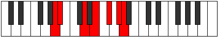 |
| [2725](https://ianring.com/musictheory/scales/2725) | [Gonimic](ModeANaturalGonimic.md) | A | A, B, C##, D##, E##, F###, A |  |
| [2727](https://ianring.com/musictheory/scales/2727) | [Pylian](ModeGNaturalPylian.md) | G | G, Ab, Bbb, C, D, E, F#, G |  |
| [2727](https://ianring.com/musictheory/scales/2727) | [Pylian](ModeANaturalPylian.md) | A | A, Bb, Cb, D, E, F#, G#, A |  |
| [2729](https://ianring.com/musictheory/scales/2729) | [Aeragimic](ModeANaturalAeragimic.md) | A | A, B#, C##, D##, E##, F###, A |  |
| [2731](https://ianring.com/musictheory/scales/2731) | [Thydian](ModeANaturalThydian.md) | A | A, Bb, C, D, E, F#, G#, A |  |
| [2733](https://ianring.com/musictheory/scales/2733) | [Bocrian](ModeANaturalBocrian.md) | A | A, B, C, D, E, F#, G#, A |  |
| [2735](https://ianring.com/musictheory/scales/2735) | [Gynyllic](ModeGNaturalGynyllic.md) | G | G, G#, A, A#, C, D, E, F#, G |  |
| [2735](https://ianring.com/musictheory/scales/2735) | [Gynyllic](ModeANaturalGynyllic.md) | A | A, A#, B, C, D, E, F#, G#, A |  |
| [2737](https://ianring.com/musictheory/scales/2737) | [Bylimic](ModeANaturalBylimic.md) | A | A, B##, C##, D##, E##, F###, A |  |
| [2739](https://ianring.com/musictheory/scales/2739) | [Zanian](ModeANaturalZanian.md) | A | A, Bb, C#, D, E, F#, G#, A |  |
| [2741](https://ianring.com/musictheory/scales/2741) | [Ionian](ModeANaturalIonian.md) | A | A, B, C#, D, E, F#, G#, A |  |
| [2743](https://ianring.com/musictheory/scales/2743) | [Staptyllic](ModeGNaturalStaptyllic.md) | G | G, G#, A, B, C, D, E, F#, G |  |
| [2743](https://ianring.com/musictheory/scales/2743) | [Staptyllic](ModeANaturalStaptyllic.md) | A | A, A#, B, C#, D, E, F#, G#, A |  |
| [2745](https://ianring.com/musictheory/scales/2745) | [Dolian](ModeANaturalDolian.md) | A | A, B#, C#, D, E, F#, G#, A |  |
| [2747](https://ianring.com/musictheory/scales/2747) | [Stythyllic](ModeANaturalStythyllic.md) | A | A, A#, C, C#, D, E, F#, G#, A |  |
| [2747](https://ianring.com/musictheory/scales/2747) | [Stythyllic](ModeFNaturalStythyllic.md) | F | F, F#, G#, A, A#, C, D, E, F |  |
| [2749](https://ianring.com/musictheory/scales/2749) | [Katagyllic](ModeANaturalKatagyllic.md) | A | A, B, C, C#, D, E, F#, G#, A |  |
| [2751](https://ianring.com/musictheory/scales/2751) | [Sylygic](ModeFNaturalSylygic.md) | F | F, F#, G, G#, A, A#, C, D, E, F |  |
| [2751](https://ianring.com/musictheory/scales/2751) | [Sylygic](ModeANaturalSylygic.md) | A | A, A#, B, C, C#, D, E, F#, G#, A |  |
| [2751](https://ianring.com/musictheory/scales/2751) | [Sylygic](ModeGNaturalSylygic.md) | G | G, G#, A, A#, B, C, D, E, F#, G |  |
| [2759](https://ianring.com/musictheory/scales/2759) | [Aeraphian](ModeGNaturalAeraphian.md) | G | G, Ab, Bbb, C#, D, E, F#, G |  |
| [2767](https://ianring.com/musictheory/scales/2767) | [Katydyllic](ModeGNaturalKatydyllic.md) | G | G, G#, A, A#, C#, D, E, F#, G | 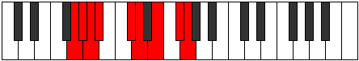 |
| [2769](https://ianring.com/musictheory/scales/2769) | [Dyrimic](ModeDNaturalDyrimic.md) | D | D, E##, F###, G##, A##, B##, D | 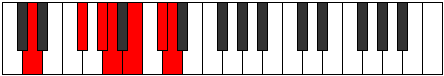 |
| [2771](https://ianring.com/musictheory/scales/2771) | [Garian](ModeDNaturalGarian.md) | D | D, Eb, F#, G#, A, B, C#, D |  |
| [2773](https://ianring.com/musictheory/scales/2773) | [Lydian](ModeDNaturalLydian.md) | D | D, E, F#, G#, A, B, C#, D |  |
| [2775](https://ianring.com/musictheory/scales/2775) | [Godyllic](ModeDNaturalGodyllic.md) | D | D, D#, E, F#, G#, A, B, C#, D |  |
| [2775](https://ianring.com/musictheory/scales/2775) | [Godyllic](ModeGNaturalGodyllic.md) | G | G, G#, A, B, C#, D, E, F#, G |  |
| [2777](https://ianring.com/musictheory/scales/2777) | [Bycrian](ModeDNaturalBycrian.md) | D | D, E#, F#, G#, A, B, C#, D |  |
| [2779](https://ianring.com/musictheory/scales/2779) | [Garyllic](ModeDNaturalGaryllic.md) | D | D, D#, F, F#, G#, A, B, C#, D |  |
| [2779](https://ianring.com/musictheory/scales/2779) | [Garyllic](ModeFNaturalGaryllic.md) | F | F, F#, G#, A, B, C, D, E, F |  |
| [2781](https://ianring.com/musictheory/scales/2781) | [Gycryllic](ModeDNaturalGycryllic.md) | D | D, E, F, F#, G#, A, B, C#, D |  |
| [2783](https://ianring.com/musictheory/scales/2783) | [Gothygic](ModeDNaturalGothygic.md) | D | D, D#, E, F, F#, G#, A, B, C#, D |  |
| [2783](https://ianring.com/musictheory/scales/2783) | [Gothygic](ModeFNaturalGothygic.md) | F | F, F#, G, G#, A, B, C, D, E, F |  |
| [2783](https://ianring.com/musictheory/scales/2783) | [Gothygic](ModeGNaturalGothygic.md) | G | G, G#, A, A#, B, C#, D, E, F#, G |  |
| [2787](https://ianring.com/musictheory/scales/2787) | [Zyrian](ModeANaturalZyrian.md) | A | A, Bb, C##, D#, E, F#, G#, A |  |
| [2789](https://ianring.com/musictheory/scales/2789) | [Zolian](ModeANaturalZolian.md) | A | A, B, C##, D#, E, F#, G#, A |  |
| [2791](https://ianring.com/musictheory/scales/2791) | [Ionyptyllic](ModeGNaturalIonyptyllic.md) | G | G, G#, A, C, C#, D, E, F#, G |  |
| [2791](https://ianring.com/musictheory/scales/2791) | [Ionyptyllic](ModeANaturalIonyptyllic.md) | A | A, A#, B, D, D#, E, F#, G#, A |  |
| [2793](https://ianring.com/musictheory/scales/2793) | [Eporian](ModeANaturalEporian.md) | A | A, B#, C##, D#, E, F#, G#, A |  |
| [2793](https://ianring.com/musictheory/scales/2793) | [Eporian](ModeDSharpEporian.md) | D# | D#, E##, F###, G##, A#, B#, C##, D# |  |
| [2793](https://ianring.com/musictheory/scales/2793) | [Eporian](ModeEFlatEporian.md) | Eb | Eb, F#, G#, A, Bb, C, D, Eb |  |
| [2797](https://ianring.com/musictheory/scales/2797) | [Stalyllic](ModeDSharpStalyllic.md) | D# | D#, F, F#, G#, A, A#, C, D, D# |  |
| [2797](https://ianring.com/musictheory/scales/2797) | [Stalyllic](ModeEFlatStalyllic.md) | Eb | Eb, F, Gb, Ab, A, Bb, C, D, Eb |  |
| [2797](https://ianring.com/musictheory/scales/2797) | [Stalyllic](ModeANaturalStalyllic.md) | A | A, B, C, D, D#, E, F#, G#, A | 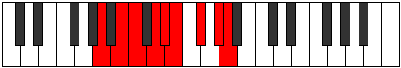 |
| [2799](https://ianring.com/musictheory/scales/2799) | [Epilygic](ModeDSharpEpilygic.md) | D# | D#, E, F, F#, G#, A, A#, C, D, D# |  |
| [2799](https://ianring.com/musictheory/scales/2799) | [Epilygic](ModeEFlatEpilygic.md) | Eb | Eb, E, F, Gb, Ab, A, Bb, C, D, Eb |  |
| [2799](https://ianring.com/musictheory/scales/2799) | [Epilygic](ModeGNaturalEpilygic.md) | G | G, G#, A, A#, C, C#, D, E, F#, G |  |
| [2799](https://ianring.com/musictheory/scales/2799) | [Epilygic](ModeANaturalEpilygic.md) | A | A, A#, B, C, D, D#, E, F#, G#, A |  |
| [2801](https://ianring.com/musictheory/scales/2801) | [Zogian](ModeANaturalZogian.md) | A | A, B##, C##, D#, E, F#, G#, A |  |
| [2801](https://ianring.com/musictheory/scales/2801) | [Zogian](ModeDNaturalZogian.md) | D | D, E##, F##, G#, A, B, C#, D |  |
| [2803](https://ianring.com/musictheory/scales/2803) | [Zolyllic](ModeANaturalZolyllic.md) | A | A, A#, C#, D, D#, E, F#, G#, A |  |
| [2803](https://ianring.com/musictheory/scales/2803) | [Zolyllic](ModeDNaturalZolyllic.md) | D | D, D#, F#, G, G#, A, B, C#, D | 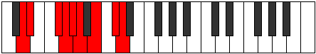 |
| [2805](https://ianring.com/musictheory/scales/2805) | [Zylyllic](ModeANaturalZylyllic.md) | A | A, B, C#, D, D#, E, F#, G#, A |  |
| [2805](https://ianring.com/musictheory/scales/2805) | [Zylyllic](ModeDNaturalZylyllic.md) | D | D, E, F#, G, G#, A, B, C#, D |  |
| [2807](https://ianring.com/musictheory/scales/2807) | [Zylygic](ModeGNaturalZylygic.md) | G | G, G#, A, B, C, C#, D, E, F#, G |  |
| [2807](https://ianring.com/musictheory/scales/2807) | [Zylygic](ModeDNaturalZylygic.md) | D | D, D#, E, F#, G, G#, A, B, C#, D |  |
| [2807](https://ianring.com/musictheory/scales/2807) | [Zylygic](ModeANaturalZylygic.md) | A | A, A#, B, C#, D, D#, E, F#, G#, A | 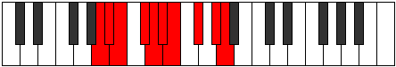 |
| [2809](https://ianring.com/musictheory/scales/2809) | [Gythyllic](ModeANaturalGythyllic.md) | A | A, C, C#, D, D#, E, F#, G#, A |  |
| [2809](https://ianring.com/musictheory/scales/2809) | [Gythyllic](ModeDSharpGythyllic.md) | D# | D#, F#, G, G#, A, A#, C, D, D# |  |
| [2809](https://ianring.com/musictheory/scales/2809) | [Gythyllic](ModeEFlatGythyllic.md) | Eb | Eb, Gb, G, Ab, A, Bb, C, D, Eb |  |
| [2809](https://ianring.com/musictheory/scales/2809) | [Gythyllic](ModeDNaturalGythyllic.md) | D | D, F, F#, G, G#, A, B, C#, D | 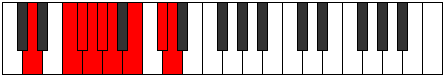 |
| [2811](https://ianring.com/musictheory/scales/2811) | [Barygic](ModeANaturalBarygic.md) | A | A, A#, C, C#, D, D#, E, F#, G#, A |  |
| [2811](https://ianring.com/musictheory/scales/2811) | [Barygic](ModeDSharpBarygic.md) | D# | D#, E, F#, G, G#, A, A#, C, D, D# |  |
| [2811](https://ianring.com/musictheory/scales/2811) | [Barygic](ModeEFlatBarygic.md) | Eb | Eb, E, Gb, G, Ab, A, Bb, C, D, Eb |  |
| [2811](https://ianring.com/musictheory/scales/2811) | [Barygic](ModeDNaturalBarygic.md) | D | D, D#, F, F#, G, G#, A, B, C#, D |  |
| [2811](https://ianring.com/musictheory/scales/2811) | [Barygic](ModeFNaturalBarygic.md) | F | F, F#, G#, A, A#, B, C, D, E, F |  |
| [2813](https://ianring.com/musictheory/scales/2813) | [Zolygic](ModeDSharpZolygic.md) | D# | D#, F, F#, G, G#, A, A#, C, D, D# |  |
| [2813](https://ianring.com/musictheory/scales/2813) | [Zolygic](ModeEFlatZolygic.md) | Eb | Eb, F, Gb, G, Ab, A, Bb, C, D, Eb |  |
| [2813](https://ianring.com/musictheory/scales/2813) | [Zolygic](ModeANaturalZolygic.md) | A | A, B, C, C#, D, D#, E, F#, G#, A |  |
| [2813](https://ianring.com/musictheory/scales/2813) | [Zolygic](ModeDNaturalZolygic.md) | D | D, E, F, F#, G, G#, A, B, C#, D |  |
| [2815](https://ianring.com/musictheory/scales/2815) | [Aeradyllian](ModeDSharpAeradyllian.md) | D# | D#, E, F, F#, G, G#, A, A#, C, D, D# |  |
| [2815](https://ianring.com/musictheory/scales/2815) | [Aeradyllian](ModeEFlatAeradyllian.md) | Eb | Eb, E, F, Gb, G, Ab, A, Bb, C, D, Eb |  |
| [2815](https://ianring.com/musictheory/scales/2815) | [Aeradyllian](ModeDNaturalAeradyllian.md) | D | D, D#, E, F, F#, G, G#, A, B, C#, D |  |
| [2815](https://ianring.com/musictheory/scales/2815) | [Aeradyllian](ModeANaturalAeradyllian.md) | A | A, A#, B, C, C#, D, D#, E, F#, G#, A |  |
| [2815](https://ianring.com/musictheory/scales/2815) | [Aeradyllian](ModeGNaturalAeradyllian.md) | G | G, G#, A, A#, B, C, C#, D, E, F#, G |  |
| [2815](https://ianring.com/musictheory/scales/2815) | [Aeradyllian](ModeFNaturalAeradyllian.md) | F | F, F#, G, G#, A, A#, B, C, D, E, F |  |
| [2843](https://ianring.com/musictheory/scales/2843) | [Sorian](ModeFNaturalSorian.md) | F | F, Gb, Ab, Bbb, C#, D, E, F |  |
| [2845](https://ianring.com/musictheory/scales/2845) | [Baptian](ModeFSharpBaptian.md) | F# | F#, G#, A, Bb, C##, D#, E#, F# |  |
| [2845](https://ianring.com/musictheory/scales/2845) | [Baptian](ModeGFlatBaptian.md) | Gb | Gb, Ab, Bbb, Cbb, D, Eb, F, Gb |  |
| [2847](https://ianring.com/musictheory/scales/2847) | [Phracryllic](ModeFNaturalPhracryllic.md) | F | F, F#, G, G#, A, C#, D, E, F |  |
| [2847](https://ianring.com/musictheory/scales/2847) | [Phracryllic](ModeFSharpPhracryllic.md) | F# | F#, G, G#, A, A#, D, D#, F, F# |  |
| [2847](https://ianring.com/musictheory/scales/2847) | [Phracryllic](ModeGFlatPhracryllic.md) | Gb | Gb, G, Ab, A, Bb, D, Eb, F, Gb |  |
| [2851](https://ianring.com/musictheory/scales/2851) | [Katoptimic](ModeANaturalKatoptimic.md) | A | A, Bb, C##, D###, E##, F###, A |  |
| [2853](https://ianring.com/musictheory/scales/2853) | [Baptimic](ModeANaturalBaptimic.md) | A | A, B, C##, D###, E##, F###, A |  |
| [2855](https://ianring.com/musictheory/scales/2855) | [Epocrian](ModeANaturalEpocrian.md) | A | A, Bb, Cb, D, E#, F#, G#, A |  |
| [2857](https://ianring.com/musictheory/scales/2857) | [Stythimic](ModeANaturalStythimic.md) | A | A, B#, C##, D###, E##, F###, A |  |
| [2859](https://ianring.com/musictheory/scales/2859) | [Phrycrian](ModeANaturalPhrycrian.md) | A | A, Bb, C, D, E#, F#, G#, A |  |
| [2861](https://ianring.com/musictheory/scales/2861) | [Katothian](ModeANaturalKatothian.md) | A | A, B, C, D, E#, F#, G#, A |  |
| [2861](https://ianring.com/musictheory/scales/2861) | [Katothian](ModeFSharpKatothian.md) | F# | F#, G#, A, B, C##, D#, E#, F# |  |
| [2861](https://ianring.com/musictheory/scales/2861) | [Katothian](ModeGFlatKatothian.md) | Gb | Gb, Ab, Bbb, Cb, D, Eb, F, Gb |  |
| [2863](https://ianring.com/musictheory/scales/2863) | [Aerogyllic](ModeFSharpAerogyllic.md) | F# | F#, G, G#, A, B, D, D#, F, F# |  |
| [2863](https://ianring.com/musictheory/scales/2863) | [Aerogyllic](ModeGFlatAerogyllic.md) | Gb | Gb, G, Ab, A, B, D, Eb, F, Gb |  |
| [2863](https://ianring.com/musictheory/scales/2863) | [Aerogyllic](ModeANaturalAerogyllic.md) | A | A, A#, B, C, D, F, F#, G#, A |  |
| [2865](https://ianring.com/musictheory/scales/2865) | [Solimic](ModeANaturalSolimic.md) | A | A, B##, C##, D###, E##, F###, A |  |
| [2867](https://ianring.com/musictheory/scales/2867) | [Socrian](ModeANaturalSocrian.md) | A | A, Bb, C#, D, E#, F#, G#, A |  |
| [2869](https://ianring.com/musictheory/scales/2869) | [Phrothian](ModeANaturalPhrothian.md) | A | A, B, C#, D, E#, F#, G#, A |  |
| [2871](https://ianring.com/musictheory/scales/2871) | [Stanyllic](ModeANaturalStanyllic.md) | A | A, A#, B, C#, D, F, F#, G#, A |  |
| [2873](https://ianring.com/musictheory/scales/2873) | [Docrian](ModeANaturalDocrian.md) | A | A, B#, C#, D, E#, F#, G#, A |  |
| [2875](https://ianring.com/musictheory/scales/2875) | [Ganyllic](ModeANaturalGanyllic.md) | A | A, A#, C, C#, D, F, F#, G#, A |  |
| [2875](https://ianring.com/musictheory/scales/2875) | [Ganyllic](ModeFNaturalGanyllic.md) | F | F, F#, G#, A, A#, C#, D, E, F |  |
| [2877](https://ianring.com/musictheory/scales/2877) | [Phrylyllic](ModeANaturalPhrylyllic.md) | A | A, B, C, C#, D, F, F#, G#, A |  |
| [2877](https://ianring.com/musictheory/scales/2877) | [Phrylyllic](ModeFSharpPhrylyllic.md) | F# | F#, G#, A, A#, B, D, D#, F, F# |  |
| [2877](https://ianring.com/musictheory/scales/2877) | [Phrylyllic](ModeGFlatPhrylyllic.md) | Gb | Gb, Ab, A, Bb, B, D, Eb, F, Gb |  |
| [2879](https://ianring.com/musictheory/scales/2879) | [Stadygic](ModeFNaturalStadygic.md) | F | F, F#, G, G#, A, A#, C#, D, E, F |  |
| [2879](https://ianring.com/musictheory/scales/2879) | [Stadygic](ModeANaturalStadygic.md) | A | A, A#, B, C, C#, D, F, F#, G#, A |  |
| [2879](https://ianring.com/musictheory/scales/2879) | [Stadygic](ModeFSharpStadygic.md) | F# | F#, G, G#, A, A#, B, D, D#, F, F# |  |
| [2879](https://ianring.com/musictheory/scales/2879) | [Stadygic](ModeGFlatStadygic.md) | Gb | Gb, G, Ab, A, Bb, B, D, Eb, F, Gb |  |
| [2885](https://ianring.com/musictheory/scales/2885) | [Byrimic](ModeCNaturalByrimic.md) | C | C, D, E##, F###, G##, A##, C |  |
| [2887](https://ianring.com/musictheory/scales/2887) | [Gaptian](ModeCNaturalGaptian.md) | C | C, Db, Ebb, F#, G#, A, B, C | 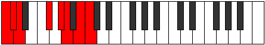 |
| [2893](https://ianring.com/musictheory/scales/2893) | [Lylian](ModeFSharpLylian.md) | F# | F#, G#, A, B#, C##, D#, E#, F# |  |
| [2893](https://ianring.com/musictheory/scales/2893) | [Lylian](ModeGFlatLylian.md) | Gb | Gb, Ab, Bbb, C, D, Eb, F, Gb |  |
| [2893](https://ianring.com/musictheory/scales/2893) | [Lylian](ModeCNaturalLylian.md) | C | C, D, Eb, F#, G#, A, B, C |  |
| [2895](https://ianring.com/musictheory/scales/2895) | [Aeragyllic](ModeFSharpAeragyllic.md) | F# | F#, G, G#, A, C, D, D#, F, F# |  |
| [2895](https://ianring.com/musictheory/scales/2895) | [Aeragyllic](ModeGFlatAeragyllic.md) | Gb | Gb, G, Ab, A, C, D, Eb, F, Gb |  |
| [2895](https://ianring.com/musictheory/scales/2895) | [Aeragyllic](ModeCNaturalAeragyllic.md) | C | C, C#, D, D#, F#, G#, A, B, C |  |
| [2901](https://ianring.com/musictheory/scales/2901) | [Larian](ModeCNaturalLarian.md) | C | C, D, E, F#, G#, A, B, C |  |
| [2903](https://ianring.com/musictheory/scales/2903) | [Gothyllic](ModeCNaturalGothyllic.md) | C | C, C#, D, E, F#, G#, A, B, C |  |
| [2907](https://ianring.com/musictheory/scales/2907) | [Mogyllic](ModeFNaturalMogyllic.md) | F | F, F#, G#, A, B, C#, D, E, F |  |
| [2909](https://ianring.com/musictheory/scales/2909) | [Mocryllic](ModeFSharpMocryllic.md) | F# | F#, G#, A, A#, C, D, D#, F, F# |  |
| [2909](https://ianring.com/musictheory/scales/2909) | [Mocryllic](ModeGFlatMocryllic.md) | Gb | Gb, Ab, A, Bb, C, D, Eb, F, Gb |  |
| [2909](https://ianring.com/musictheory/scales/2909) | [Mocryllic](ModeCNaturalMocryllic.md) | C | C, D, D#, E, F#, G#, A, B, C |  |
| [2911](https://ianring.com/musictheory/scales/2911) | [Katygic](ModeFSharpKatygic.md) | F# | F#, G, G#, A, A#, C, D, D#, F, F# |  |
| [2911](https://ianring.com/musictheory/scales/2911) | [Katygic](ModeGFlatKatygic.md) | Gb | Gb, G, Ab, A, Bb, C, D, Eb, F, Gb |  |
| [2911](https://ianring.com/musictheory/scales/2911) | [Katygic](ModeCNaturalKatygic.md) | C | C, C#, D, D#, E, F#, G#, A, B, C |  |
| [2911](https://ianring.com/musictheory/scales/2911) | [Katygic](ModeFNaturalKatygic.md) | F | F, F#, G, G#, A, B, C#, D, E, F |  |
| [2915](https://ianring.com/musictheory/scales/2915) | [Aeolydian](ModeANaturalAeolydian.md) | A | A, Bb, C##, D#, E#, F#, G#, A |  |
| [2917](https://ianring.com/musictheory/scales/2917) | [Kocrian](ModeCNaturalKocrian.md) | C | C, D, E#, F#, G#, A, B, C |  |
| [2917](https://ianring.com/musictheory/scales/2917) | [Kocrian](ModeANaturalKocrian.md) | A | A, B, C##, D#, E#, F#, G#, A |  |
| [2919](https://ianring.com/musictheory/scales/2919) | [Molyllic](ModeCNaturalMolyllic.md) | C | C, C#, D, F, F#, G#, A, B, C |  |
| [2919](https://ianring.com/musictheory/scales/2919) | [Molyllic](ModeANaturalMolyllic.md) | A | A, A#, B, D, D#, F, F#, G#, A |  |
| [2921](https://ianring.com/musictheory/scales/2921) | [Pogian](ModeANaturalPogian.md) | A | A, B#, C##, D#, E#, F#, G#, A |  |
| [2921](https://ianring.com/musictheory/scales/2921) | [Pogian](ModeDSharpPogian.md) | D# | D#, E##, F###, G##, A##, B#, C##, D# |  |
| [2921](https://ianring.com/musictheory/scales/2921) | [Pogian](ModeEFlatPogian.md) | Eb | Eb, F#, G#, A, B, C, D, Eb |  |
| [2923](https://ianring.com/musictheory/scales/2923) | [Baryllic](ModeANaturalBaryllic.md) | A | A, A#, C, D, D#, F, F#, G#, A |  |
| [2923](https://ianring.com/musictheory/scales/2923) | [Baryllic](ModeDSharpBaryllic.md) | D# | D#, E, F#, G#, A, B, C, D, D# |  |
| [2923](https://ianring.com/musictheory/scales/2923) | [Baryllic](ModeEFlatBaryllic.md) | Eb | Eb, E, Gb, Ab, A, B, C, D, Eb |  |
| [2925](https://ianring.com/musictheory/scales/2925) | [MajorDiminished](ModeCNaturalMajorDiminished.md) | C | C, D, D#, F, F#, G#, A, B, C |  |
| [2925](https://ianring.com/musictheory/scales/2925) | [MajorDiminished](ModeDSharpMajorDiminished.md) | D# | D#, F, F#, G#, A, B, C, D, D# |  |
| [2925](https://ianring.com/musictheory/scales/2925) | [MajorDiminished](ModeEFlatMajorDiminished.md) | Eb | Eb, F, Gb, Ab, A, B, C, D, Eb |  |
| [2925](https://ianring.com/musictheory/scales/2925) | [MajorDiminished](ModeFSharpMajorDiminished.md) | F# | F#, G#, A, B, C, D, D#, F, F# |  |
| [2925](https://ianring.com/musictheory/scales/2925) | [MajorDiminished](ModeGFlatMajorDiminished.md) | Gb | Gb, Ab, A, B, C, D, Eb, F, Gb |  |
| [2925](https://ianring.com/musictheory/scales/2925) | [MajorDiminished](ModeANaturalMajorDiminished.md) | A | A, B, C, D, D#, F, F#, G#, A |  |
| [2927](https://ianring.com/musictheory/scales/2927) | [Rodygic](ModeCNaturalRodygic.md) | C | C, C#, D, D#, F, F#, G#, A, B, C |  |
| [2927](https://ianring.com/musictheory/scales/2927) | [Rodygic](ModeDSharpRodygic.md) | D# | D#, E, F, F#, G#, A, B, C, D, D# |  |
| [2927](https://ianring.com/musictheory/scales/2927) | [Rodygic](ModeEFlatRodygic.md) | Eb | Eb, E, F, Gb, Ab, A, B, C, D, Eb |  |
| [2927](https://ianring.com/musictheory/scales/2927) | [Rodygic](ModeFSharpRodygic.md) | F# | F#, G, G#, A, B, C, D, D#, F, F# |  |
| [2927](https://ianring.com/musictheory/scales/2927) | [Rodygic](ModeGFlatRodygic.md) | Gb | Gb, G, Ab, A, B, C, D, Eb, F, Gb |  |
| [2927](https://ianring.com/musictheory/scales/2927) | [Rodygic](ModeANaturalRodygic.md) | A | A, A#, B, C, D, D#, F, F#, G#, A |  |
| [2929](https://ianring.com/musictheory/scales/2929) | [Aeolathian](ModeANaturalAeolathian.md) | A | A, B##, C##, D#, E#, F#, G#, A |  |
| [2931](https://ianring.com/musictheory/scales/2931) | [Zathyllic](ModeANaturalZathyllic.md) | A | A, A#, C#, D, D#, F, F#, G#, A |  |
| [2933](https://ianring.com/musictheory/scales/2933) | [Dalyllic](ModeANaturalDalyllic.md) | A | A, B, C#, D, D#, F, F#, G#, A |  |
| [2933](https://ianring.com/musictheory/scales/2933) | [Dalyllic](ModeCNaturalDalyllic.md) | C | C, D, E, F, F#, G#, A, B, C |  |
| [2935](https://ianring.com/musictheory/scales/2935) | [Modygic](ModeCNaturalModygic.md) | C | C, C#, D, E, F, F#, G#, A, B, C |  |
| [2935](https://ianring.com/musictheory/scales/2935) | [Modygic](ModeANaturalModygic.md) | A | A, A#, B, C#, D, D#, F, F#, G#, A |  |
| [2937](https://ianring.com/musictheory/scales/2937) | [Aeolathyllic](ModeANaturalAeolathyllic.md) | A | A, C, C#, D, D#, F, F#, G#, A |  |
| [2937](https://ianring.com/musictheory/scales/2937) | [Aeolathyllic](ModeDSharpAeolathyllic.md) | D# | D#, F#, G, G#, A, B, C, D, D# |  |
| [2937](https://ianring.com/musictheory/scales/2937) | [Aeolathyllic](ModeEFlatAeolathyllic.md) | Eb | Eb, Gb, G, Ab, A, B, C, D, Eb |  |
| [2939](https://ianring.com/musictheory/scales/2939) | [Goptygic](ModeANaturalGoptygic.md) | A | A, A#, C, C#, D, D#, F, F#, G#, A |  |
| [2939](https://ianring.com/musictheory/scales/2939) | [Goptygic](ModeDSharpGoptygic.md) | D# | D#, E, F#, G, G#, A, B, C, D, D# |  |
| [2939](https://ianring.com/musictheory/scales/2939) | [Goptygic](ModeEFlatGoptygic.md) | Eb | Eb, E, Gb, G, Ab, A, B, C, D, Eb |  |
| [2939](https://ianring.com/musictheory/scales/2939) | [Goptygic](ModeFNaturalGoptygic.md) | F | F, F#, G#, A, A#, B, C#, D, E, F |  |
| [2941](https://ianring.com/musictheory/scales/2941) | [Laptygic](ModeANaturalLaptygic.md) | A | A, B, C, C#, D, D#, F, F#, G#, A |  |
| [2941](https://ianring.com/musictheory/scales/2941) | [Laptygic](ModeCNaturalLaptygic.md) | C | C, D, D#, E, F, F#, G#, A, B, C |  |
| [2941](https://ianring.com/musictheory/scales/2941) | [Laptygic](ModeDSharpLaptygic.md) | D# | D#, F, F#, G, G#, A, B, C, D, D# |  |
| [2941](https://ianring.com/musictheory/scales/2941) | [Laptygic](ModeEFlatLaptygic.md) | Eb | Eb, F, Gb, G, Ab, A, B, C, D, Eb |  |
| [2941](https://ianring.com/musictheory/scales/2941) | [Laptygic](ModeFSharpLaptygic.md) | F# | F#, G#, A, A#, B, C, D, D#, F, F# |  |
| [2941](https://ianring.com/musictheory/scales/2941) | [Laptygic](ModeGFlatLaptygic.md) | Gb | Gb, Ab, A, Bb, B, C, D, Eb, F, Gb |  |
| [2943](https://ianring.com/musictheory/scales/2943) | [Dathyllian](ModeCNaturalDathyllian.md) | C | C, C#, D, D#, E, F, F#, G#, A, B, C |  |
| [2943](https://ianring.com/musictheory/scales/2943) | [Dathyllian](ModeDSharpDathyllian.md) | D# | D#, E, F, F#, G, G#, A, B, C, D, D# |  |
| [2943](https://ianring.com/musictheory/scales/2943) | [Dathyllian](ModeEFlatDathyllian.md) | Eb | Eb, E, F, Gb, G, Ab, A, B, C, D, Eb |  |
| [2943](https://ianring.com/musictheory/scales/2943) | [Dathyllian](ModeANaturalDathyllian.md) | A | A, A#, B, C, C#, D, D#, F, F#, G#, A |  |
| [2943](https://ianring.com/musictheory/scales/2943) | [Dathyllian](ModeFSharpDathyllian.md) | F# | F#, G, G#, A, A#, B, C, D, D#, F, F# |  |
| [2943](https://ianring.com/musictheory/scales/2943) | [Dathyllian](ModeGFlatDathyllian.md) | Gb | Gb, G, Ab, A, Bb, B, C, D, Eb, F, Gb |  |
| [2943](https://ianring.com/musictheory/scales/2943) | [Dathyllian](ModeFNaturalDathyllian.md) | F | F, F#, G, G#, A, A#, B, C#, D, E, F |  |
| [2957](https://ianring.com/musictheory/scales/2957) | [Thygian](ModeFSharpThygian.md) | F# | F#, G#, A, B##, C##, D#, E#, F# |  |
| [2957](https://ianring.com/musictheory/scales/2957) | [Thygian](ModeGFlatThygian.md) | Gb | Gb, Ab, Bbb, C#, D, Eb, F, Gb |  |
| [2959](https://ianring.com/musictheory/scales/2959) | [Dygyllic](ModeFSharpDygyllic.md) | F# | F#, G, G#, A, C#, D, D#, F, F# |  |
| [2959](https://ianring.com/musictheory/scales/2959) | [Dygyllic](ModeGFlatDygyllic.md) | Gb | Gb, G, Ab, A, Db, D, Eb, F, Gb |  |
| [2959](https://ianring.com/musictheory/scales/2959) | [Dygyllic](ModeGNaturalDygyllic.md) | G | G, G#, A, A#, D, D#, E, F#, G |  |
| [2967](https://ianring.com/musictheory/scales/2967) | [Madyllic](ModeGNaturalMadyllic.md) | G | G, G#, A, B, D, D#, E, F#, G |  |
| [2971](https://ianring.com/musictheory/scales/2971) | [Aeolynyllic](ModeFNaturalAeolynyllic.md) | F | F, F#, G#, A, C, C#, D, E, F |  |
| [2973](https://ianring.com/musictheory/scales/2973) | [Panyllic](ModeFSharpPanyllic.md) | F# | F#, G#, A, A#, C#, D, D#, F, F# |  |
| [2973](https://ianring.com/musictheory/scales/2973) | [Panyllic](ModeGFlatPanyllic.md) | Gb | Gb, Ab, A, Bb, Db, D, Eb, F, Gb |  |
| [2975](https://ianring.com/musictheory/scales/2975) | [Gaptygic](ModeFNaturalGaptygic.md) | F | F, F#, G, G#, A, C, C#, D, E, F |  |
| [2975](https://ianring.com/musictheory/scales/2975) | [Gaptygic](ModeFSharpGaptygic.md) | F# | F#, G, G#, A, A#, C#, D, D#, F, F# |  |
| [2975](https://ianring.com/musictheory/scales/2975) | [Gaptygic](ModeGFlatGaptygic.md) | Gb | Gb, G, Ab, A, Bb, Db, D, Eb, F, Gb |  |
| [2975](https://ianring.com/musictheory/scales/2975) | [Gaptygic](ModeGNaturalGaptygic.md) | G | G, G#, A, A#, B, D, D#, E, F#, G |  |
| [2979](https://ianring.com/musictheory/scales/2979) | [Gyptian](ModeCSharpGyptian.md) | C# | C#, D, E##, F###, G##, A#, B#, C# |  |
| [2979](https://ianring.com/musictheory/scales/2979) | [Gyptian](ModeDFlatGyptian.md) | Db | Db, Ebb, F#, G#, A, Bb, C, Db |  |
| [2979](https://ianring.com/musictheory/scales/2979) | [Gyptian](ModeANaturalGyptian.md) | A | A, Bb, C##, D##, E#, F#, G#, A |  |
| [2981](https://ianring.com/musictheory/scales/2981) | [Ionolian](ModeANaturalIonolian.md) | A | A, B, C##, D##, E#, F#, G#, A |  |
| [2983](https://ianring.com/musictheory/scales/2983) | [Zythyllic](ModeGNaturalZythyllic.md) | G | G, G#, A, C, D, D#, E, F#, G |  |
| [2983](https://ianring.com/musictheory/scales/2983) | [Zythyllic](ModeCSharpZythyllic.md) | C# | C#, D, D#, F#, G#, A, A#, C, C# |  |
| [2983](https://ianring.com/musictheory/scales/2983) | [Zythyllic](ModeDFlatZythyllic.md) | Db | Db, D, Eb, Gb, Ab, A, Bb, C, Db |  |
| [2983](https://ianring.com/musictheory/scales/2983) | [Zythyllic](ModeANaturalZythyllic.md) | A | A, A#, B, D, E, F, F#, G#, A |  |
| [2985](https://ianring.com/musictheory/scales/2985) | [Epacrian](ModeANaturalEpacrian.md) | A | A, B#, C##, D##, E#, F#, G#, A |  |
| [2987](https://ianring.com/musictheory/scales/2987) | [Thanyllic](ModeCSharpThanyllic.md) | C# | C#, D, E, F#, G#, A, A#, C, C# |  |
| [2987](https://ianring.com/musictheory/scales/2987) | [Thanyllic](ModeDFlatThanyllic.md) | Db | Db, D, E, Gb, Ab, A, Bb, C, Db |  |
| [2987](https://ianring.com/musictheory/scales/2987) | [Thanyllic](ModeANaturalThanyllic.md) | A | A, A#, C, D, E, F, F#, G#, A |  |
| [2989](https://ianring.com/musictheory/scales/2989) | [Ionacryllic](ModeFSharpIonacryllic.md) | F# | F#, G#, A, B, C#, D, D#, F, F# |  |
| [2989](https://ianring.com/musictheory/scales/2989) | [Ionacryllic](ModeGFlatIonacryllic.md) | Gb | Gb, Ab, A, B, Db, D, Eb, F, Gb |  |
| [2989](https://ianring.com/musictheory/scales/2989) | [Ionacryllic](ModeANaturalIonacryllic.md) | A | A, B, C, D, E, F, F#, G#, A |  |
| [2991](https://ianring.com/musictheory/scales/2991) | [Zanygic](ModeCSharpZanygic.md) | C# | C#, D, D#, E, F#, G#, A, A#, C, C# |  |
| [2991](https://ianring.com/musictheory/scales/2991) | [Zanygic](ModeDFlatZanygic.md) | Db | Db, D, Eb, E, Gb, Ab, A, Bb, C, Db |  |
| [2991](https://ianring.com/musictheory/scales/2991) | [Zanygic](ModeGNaturalZanygic.md) | G | G, G#, A, A#, C, D, D#, E, F#, G |  |
| [2991](https://ianring.com/musictheory/scales/2991) | [Zanygic](ModeFSharpZanygic.md) | F# | F#, G, G#, A, B, C#, D, D#, F, F# |  |
| [2991](https://ianring.com/musictheory/scales/2991) | [Zanygic](ModeGFlatZanygic.md) | Gb | Gb, G, Ab, A, B, Db, D, Eb, F, Gb |  |
| [2991](https://ianring.com/musictheory/scales/2991) | [Zanygic](ModeANaturalZanygic.md) | A | A, A#, B, C, D, E, F, F#, G#, A |  |
| [2993](https://ianring.com/musictheory/scales/2993) | [Stythian](ModeANaturalStythian.md) | A | A, B##, C##, D##, E#, F#, G#, A |  |
| [2995](https://ianring.com/musictheory/scales/2995) | [Sanyllic](ModeCSharpSanyllic.md) | C# | C#, D, F, F#, G#, A, A#, C, C# |  |
| [2995](https://ianring.com/musictheory/scales/2995) | [Sanyllic](ModeDFlatSanyllic.md) | Db | Db, D, F, Gb, Ab, A, Bb, C, Db |  |
| [2995](https://ianring.com/musictheory/scales/2995) | [Sanyllic](ModeANaturalSanyllic.md) | A | A, A#, C#, D, E, F, F#, G#, A |  |
| [2997](https://ianring.com/musictheory/scales/2997) | [Ionoptyllic](ModeANaturalIonoptyllic.md) | A | A, B, C#, D, E, F, F#, G#, A |  |
| [2999](https://ianring.com/musictheory/scales/2999) | [Zyrygic](ModeCSharpZyrygic.md) | C# | C#, D, D#, F, F#, G#, A, A#, C, C# |  |
| [2999](https://ianring.com/musictheory/scales/2999) | [Zyrygic](ModeDFlatZyrygic.md) | Db | Db, D, Eb, F, Gb, Ab, A, Bb, C, Db |  |
| [2999](https://ianring.com/musictheory/scales/2999) | [Zyrygic](ModeGNaturalZyrygic.md) | G | G, G#, A, B, C, D, D#, E, F#, G |  |
| [2999](https://ianring.com/musictheory/scales/2999) | [Zyrygic](ModeANaturalZyrygic.md) | A | A, A#, B, C#, D, E, F, F#, G#, A |  |
| [3001](https://ianring.com/musictheory/scales/3001) | [Lonyllic](ModeANaturalLonyllic.md) | A | A, C, C#, D, E, F, F#, G#, A |  |
| [3003](https://ianring.com/musictheory/scales/3003) | [Zydygic](ModeCSharpZydygic.md) | C# | C#, D, E, F, F#, G#, A, A#, C, C# |  |
| [3003](https://ianring.com/musictheory/scales/3003) | [Zydygic](ModeDFlatZydygic.md) | Db | Db, D, E, F, Gb, Ab, A, Bb, C, Db |  |
| [3003](https://ianring.com/musictheory/scales/3003) | [Zydygic](ModeFNaturalZydygic.md) | F | F, F#, G#, A, A#, C, C#, D, E, F |  |
| [3003](https://ianring.com/musictheory/scales/3003) | [Zydygic](ModeANaturalZydygic.md) | A | A, A#, C, C#, D, E, F, F#, G#, A |  |
| [3005](https://ianring.com/musictheory/scales/3005) | [Gycrygic](ModeANaturalGycrygic.md) | A | A, B, C, C#, D, E, F, F#, G#, A |  |
| [3005](https://ianring.com/musictheory/scales/3005) | [Gycrygic](ModeFSharpGycrygic.md) | F# | F#, G#, A, A#, B, C#, D, D#, F, F# |  |
| [3005](https://ianring.com/musictheory/scales/3005) | [Gycrygic](ModeGFlatGycrygic.md) | Gb | Gb, Ab, A, Bb, B, Db, D, Eb, F, Gb |  |
| [3007](https://ianring.com/musictheory/scales/3007) | [Zyryllian](ModeCSharpZyryllian.md) | C# | C#, D, D#, E, F, F#, G#, A, A#, C, C# |  |
| [3007](https://ianring.com/musictheory/scales/3007) | [Zyryllian](ModeDFlatZyryllian.md) | Db | Db, D, Eb, E, F, Gb, Ab, A, Bb, C, Db |  |
| [3007](https://ianring.com/musictheory/scales/3007) | [Zyryllian](ModeFNaturalZyryllian.md) | F | F, F#, G, G#, A, A#, C, C#, D, E, F |  |
| [3007](https://ianring.com/musictheory/scales/3007) | [Zyryllian](ModeANaturalZyryllian.md) | A | A, A#, B, C, C#, D, E, F, F#, G#, A |  |
| [3007](https://ianring.com/musictheory/scales/3007) | [Zyryllian](ModeGNaturalZyryllian.md) | G | G, G#, A, A#, B, C, D, D#, E, F#, G |  |
| [3007](https://ianring.com/musictheory/scales/3007) | [Zyryllian](ModeFSharpZyryllian.md) | F# | F#, G, G#, A, A#, B, C#, D, D#, F, F# |  |
| [3007](https://ianring.com/musictheory/scales/3007) | [Zyryllian](ModeGFlatZyryllian.md) | Gb | Gb, G, Ab, A, Bb, B, Db, D, Eb, F, Gb |  |
| [3013](https://ianring.com/musictheory/scales/3013) | [Thynian](ModeCNaturalThynian.md) | C | C, D, E##, F##, G#, A, B, C |  |
| [3015](https://ianring.com/musictheory/scales/3015) | [Laptyllic](ModeGNaturalLaptyllic.md) | G | G, G#, A, C#, D, D#, E, F#, G |  |
| [3015](https://ianring.com/musictheory/scales/3015) | [Laptyllic](ModeCNaturalLaptyllic.md) | C | C, C#, D, F#, G, G#, A, B, C |  |
| [3021](https://ianring.com/musictheory/scales/3021) | [Gyptyllic](ModeFSharpGyptyllic.md) | F# | F#, G#, A, C, C#, D, D#, F, F# |  |
| [3021](https://ianring.com/musictheory/scales/3021) | [Gyptyllic](ModeGFlatGyptyllic.md) | Gb | Gb, Ab, A, C, Db, D, Eb, F, Gb |  |
| [3021](https://ianring.com/musictheory/scales/3021) | [Gyptyllic](ModeCNaturalGyptyllic.md) | C | C, D, D#, F#, G, G#, A, B, C |  |
| [3023](https://ianring.com/musictheory/scales/3023) | [Aeracrygic](ModeFSharpAeracrygic.md) | F# | F#, G, G#, A, C, C#, D, D#, F, F# |  |
| [3023](https://ianring.com/musictheory/scales/3023) | [Aeracrygic](ModeGFlatAeracrygic.md) | Gb | Gb, G, Ab, A, C, Db, D, Eb, F, Gb |  |
| [3023](https://ianring.com/musictheory/scales/3023) | [Aeracrygic](ModeGNaturalAeracrygic.md) | G | G, G#, A, A#, C#, D, D#, E, F#, G |  |
| [3023](https://ianring.com/musictheory/scales/3023) | [Aeracrygic](ModeCNaturalAeracrygic.md) | C | C, C#, D, D#, F#, G, G#, A, B, C |  |
| [3025](https://ianring.com/musictheory/scales/3025) | [Epycrian](ModeDNaturalEpycrian.md) | D | D, E##, F###, G##, A#, B, C#, D |  |
| [3027](https://ianring.com/musictheory/scales/3027) | [Rythyllic](ModeDNaturalRythyllic.md) | D | D, D#, F#, G#, A, A#, B, C#, D |  |
| [3029](https://ianring.com/musictheory/scales/3029) | [Ionocryllic](ModeCNaturalIonocryllic.md) | C | C, D, E, F#, G, G#, A, B, C |  |
| [3029](https://ianring.com/musictheory/scales/3029) | [Ionocryllic](ModeDNaturalIonocryllic.md) | D | D, E, F#, G#, A, A#, B, C#, D |  |
| [3031](https://ianring.com/musictheory/scales/3031) | [Epithygic](ModeCNaturalEpithygic.md) | C | C, C#, D, E, F#, G, G#, A, B, C |  |
| [3031](https://ianring.com/musictheory/scales/3031) | [Epithygic](ModeGNaturalEpithygic.md) | G | G, G#, A, B, C#, D, D#, E, F#, G |  |
| [3031](https://ianring.com/musictheory/scales/3031) | [Epithygic](ModeDNaturalEpithygic.md) | D | D, D#, E, F#, G#, A, A#, B, C#, D |  |
| [3033](https://ianring.com/musictheory/scales/3033) | [Doptyllic](ModeDNaturalDoptyllic.md) | D | D, F, F#, G#, A, A#, B, C#, D |  |
| [3035](https://ianring.com/musictheory/scales/3035) | [Gocrygic](ModeFNaturalGocrygic.md) | F | F, F#, G#, A, B, C, C#, D, E, F | 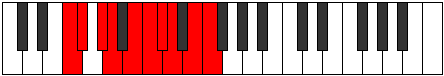 |
| [3035](https://ianring.com/musictheory/scales/3035) | [Gocrygic](ModeDNaturalGocrygic.md) | D | D, D#, F, F#, G#, A, A#, B, C#, D |  |
| [3037](https://ianring.com/musictheory/scales/3037) | [Staptygic](ModeFSharpStaptygic.md) | F# | F#, G#, A, A#, C, C#, D, D#, F, F# |  |
| [3037](https://ianring.com/musictheory/scales/3037) | [Staptygic](ModeGFlatStaptygic.md) | Gb | Gb, Ab, A, Bb, C, Db, D, Eb, F, Gb |  |
| [3037](https://ianring.com/musictheory/scales/3037) | [Staptygic](ModeCNaturalStaptygic.md) | C | C, D, D#, E, F#, G, G#, A, B, C |  |
| [3037](https://ianring.com/musictheory/scales/3037) | [Staptygic](ModeDNaturalStaptygic.md) | D | D, E, F, F#, G#, A, A#, B, C#, D |  |
| [3039](https://ianring.com/musictheory/scales/3039) | [Godyllian](ModeFSharpGodyllian.md) | F# | F#, G, G#, A, A#, C, C#, D, D#, F, F# |  |
| [3039](https://ianring.com/musictheory/scales/3039) | [Godyllian](ModeGFlatGodyllian.md) | Gb | Gb, G, Ab, A, Bb, C, Db, D, Eb, F, Gb |  |
| [3039](https://ianring.com/musictheory/scales/3039) | [Godyllian](ModeCNaturalGodyllian.md) | C | C, C#, D, D#, E, F#, G, G#, A, B, C |  |
| [3039](https://ianring.com/musictheory/scales/3039) | [Godyllian](ModeFNaturalGodyllian.md) | F | F, F#, G, G#, A, B, C, C#, D, E, F |  |
| [3039](https://ianring.com/musictheory/scales/3039) | [Godyllian](ModeDNaturalGodyllian.md) | D | D, D#, E, F, F#, G#, A, A#, B, C#, D |  |
| [3039](https://ianring.com/musictheory/scales/3039) | [Godyllian](ModeGNaturalGodyllian.md) | G | G, G#, A, A#, B, C#, D, D#, E, F#, G |  |
| [3043](https://ianring.com/musictheory/scales/3043) | [Ionayllic](ModeANaturalIonayllic.md) | A | A, A#, D, D#, E, F, F#, G#, A |  |
| [3043](https://ianring.com/musictheory/scales/3043) | [Ionayllic](ModeCSharpIonayllic.md) | C# | C#, D, F#, G, G#, A, A#, C, C# |  |
| [3043](https://ianring.com/musictheory/scales/3043) | [Ionayllic](ModeDFlatIonayllic.md) | Db | Db, D, Gb, G, Ab, A, Bb, C, Db |  |
| [3045](https://ianring.com/musictheory/scales/3045) | [Raptyllic](ModeANaturalRaptyllic.md) | A | A, B, D, D#, E, F, F#, G#, A |  |
| [3045](https://ianring.com/musictheory/scales/3045) | [Raptyllic](ModeCNaturalRaptyllic.md) | C | C, D, F, F#, G, G#, A, B, C |  |
| [3047](https://ianring.com/musictheory/scales/3047) | [Panygic](ModeGNaturalPanygic.md) | G | G, G#, A, C, C#, D, D#, E, F#, G |  |
| [3047](https://ianring.com/musictheory/scales/3047) | [Panygic](ModeCSharpPanygic.md) | C# | C#, D, D#, F#, G, G#, A, A#, C, C# |  |
| [3047](https://ianring.com/musictheory/scales/3047) | [Panygic](ModeDFlatPanygic.md) | Db | Db, D, Eb, Gb, G, Ab, A, Bb, C, Db |  |
| [3047](https://ianring.com/musictheory/scales/3047) | [Panygic](ModeCNaturalPanygic.md) | C | C, C#, D, F, F#, G, G#, A, B, C |  |
| [3047](https://ianring.com/musictheory/scales/3047) | [Panygic](ModeANaturalPanygic.md) | A | A, A#, B, D, D#, E, F, F#, G#, A |  |
| [3049](https://ianring.com/musictheory/scales/3049) | [Aeronyllic](ModeANaturalAeronyllic.md) | A | A, C, D, D#, E, F, F#, G#, A |  |
| [3049](https://ianring.com/musictheory/scales/3049) | [Aeronyllic](ModeDSharpAeronyllic.md) | D# | D#, F#, G#, A, A#, B, C, D, D# |  |
| [3049](https://ianring.com/musictheory/scales/3049) | [Aeronyllic](ModeEFlatAeronyllic.md) | Eb | Eb, Gb, Ab, A, Bb, B, C, D, Eb |  |
| [3051](https://ianring.com/musictheory/scales/3051) | [Stalygic](ModeANaturalStalygic.md) | A | A, A#, C, D, D#, E, F, F#, G#, A |  |
| [3051](https://ianring.com/musictheory/scales/3051) | [Stalygic](ModeCSharpStalygic.md) | C# | C#, D, E, F#, G, G#, A, A#, C, C# |  |
| [3051](https://ianring.com/musictheory/scales/3051) | [Stalygic](ModeDFlatStalygic.md) | Db | Db, D, E, Gb, G, Ab, A, Bb, C, Db |  |
| [3051](https://ianring.com/musictheory/scales/3051) | [Stalygic](ModeDSharpStalygic.md) | D# | D#, E, F#, G#, A, A#, B, C, D, D# |  |
| [3051](https://ianring.com/musictheory/scales/3051) | [Stalygic](ModeEFlatStalygic.md) | Eb | Eb, E, Gb, Ab, A, Bb, B, C, D, Eb |  |
| [3053](https://ianring.com/musictheory/scales/3053) | [Zycrygic](ModeFSharpZycrygic.md) | F# | F#, G#, A, B, C, C#, D, D#, F, F# |  |
| [3053](https://ianring.com/musictheory/scales/3053) | [Zycrygic](ModeGFlatZycrygic.md) | Gb | Gb, Ab, A, B, C, Db, D, Eb, F, Gb |  |
| [3053](https://ianring.com/musictheory/scales/3053) | [Zycrygic](ModeANaturalZycrygic.md) | A | A, B, C, D, D#, E, F, F#, G#, A |  |
| [3053](https://ianring.com/musictheory/scales/3053) | [Zycrygic](ModeCNaturalZycrygic.md) | C | C, D, D#, F, F#, G, G#, A, B, C |  |
| [3053](https://ianring.com/musictheory/scales/3053) | [Zycrygic](ModeDSharpZycrygic.md) | D# | D#, F, F#, G#, A, A#, B, C, D, D# |  |
| [3053](https://ianring.com/musictheory/scales/3053) | [Zycrygic](ModeEFlatZycrygic.md) | Eb | Eb, F, Gb, Ab, A, Bb, B, C, D, Eb |  |
| [3055](https://ianring.com/musictheory/scales/3055) | [Lyryllian](ModeCSharpLyryllian.md) | C# | C#, D, D#, E, F#, G, G#, A, A#, C, C# |  |
| [3055](https://ianring.com/musictheory/scales/3055) | [Lyryllian](ModeDFlatLyryllian.md) | Db | Db, D, Eb, E, Gb, G, Ab, A, Bb, C, Db |  |
| [3055](https://ianring.com/musictheory/scales/3055) | [Lyryllian](ModeGNaturalLyryllian.md) | G | G, G#, A, A#, C, C#, D, D#, E, F#, G |  |
| [3055](https://ianring.com/musictheory/scales/3055) | [Lyryllian](ModeCNaturalLyryllian.md) | C | C, C#, D, D#, F, F#, G, G#, A, B, C |  |
| [3055](https://ianring.com/musictheory/scales/3055) | [Lyryllian](ModeFSharpLyryllian.md) | F# | F#, G, G#, A, B, C, C#, D, D#, F, F# |  |
| [3055](https://ianring.com/musictheory/scales/3055) | [Lyryllian](ModeGFlatLyryllian.md) | Gb | Gb, G, Ab, A, B, C, Db, D, Eb, F, Gb |  |
| [3055](https://ianring.com/musictheory/scales/3055) | [Lyryllian](ModeDSharpLyryllian.md) | D# | D#, E, F, F#, G#, A, A#, B, C, D, D# |  |
| [3055](https://ianring.com/musictheory/scales/3055) | [Lyryllian](ModeEFlatLyryllian.md) | Eb | Eb, E, F, Gb, Ab, A, Bb, B, C, D, Eb |  |
| [3055](https://ianring.com/musictheory/scales/3055) | [Lyryllian](ModeANaturalLyryllian.md) | A | A, A#, B, C, D, D#, E, F, F#, G#, A |  |
| [3057](https://ianring.com/musictheory/scales/3057) | [Phroryllic](ModeANaturalPhroryllic.md) | A | A, C#, D, D#, E, F, F#, G#, A |  |
| [3057](https://ianring.com/musictheory/scales/3057) | [Phroryllic](ModeDNaturalPhroryllic.md) | D | D, F#, G, G#, A, A#, B, C#, D |  |
| [3059](https://ianring.com/musictheory/scales/3059) | [Madygic](ModeANaturalMadygic.md) | A | A, A#, C#, D, D#, E, F, F#, G#, A |  |
| [3059](https://ianring.com/musictheory/scales/3059) | [Madygic](ModeCSharpMadygic.md) | C# | C#, D, F, F#, G, G#, A, A#, C, C# |  |
| [3059](https://ianring.com/musictheory/scales/3059) | [Madygic](ModeDFlatMadygic.md) | Db | Db, D, F, Gb, G, Ab, A, Bb, C, Db |  |
| [3059](https://ianring.com/musictheory/scales/3059) | [Madygic](ModeDNaturalMadygic.md) | D | D, D#, F#, G, G#, A, A#, B, C#, D |  |
| [3061](https://ianring.com/musictheory/scales/3061) | [Apinygic](ModeANaturalApinygic.md) | A | A, B, C#, D, D#, E, F, F#, G#, A |  |
| [3061](https://ianring.com/musictheory/scales/3061) | [Apinygic](ModeCNaturalApinygic.md) | C | C, D, E, F, F#, G, G#, A, B, C |  |
| [3061](https://ianring.com/musictheory/scales/3061) | [Apinygic](ModeDNaturalApinygic.md) | D | D, E, F#, G, G#, A, A#, B, C#, D |  |
| [3063](https://ianring.com/musictheory/scales/3063) | [Solyllian](ModeCSharpSolyllian.md) | C# | C#, D, D#, F, F#, G, G#, A, A#, C, C# |  |
| [3063](https://ianring.com/musictheory/scales/3063) | [Solyllian](ModeDFlatSolyllian.md) | Db | Db, D, Eb, F, Gb, G, Ab, A, Bb, C, Db |  |
| [3063](https://ianring.com/musictheory/scales/3063) | [Solyllian](ModeGNaturalSolyllian.md) | G | G, G#, A, B, C, C#, D, D#, E, F#, G |  |
| [3063](https://ianring.com/musictheory/scales/3063) | [Solyllian](ModeCNaturalSolyllian.md) | C | C, C#, D, E, F, F#, G, G#, A, B, C |  |
| [3063](https://ianring.com/musictheory/scales/3063) | [Solyllian](ModeANaturalSolyllian.md) | A | A, A#, B, C#, D, D#, E, F, F#, G#, A |  |
| [3063](https://ianring.com/musictheory/scales/3063) | [Solyllian](ModeDNaturalSolyllian.md) | D | D, D#, E, F#, G, G#, A, A#, B, C#, D |  |
| [3065](https://ianring.com/musictheory/scales/3065) | [Zothygic](ModeANaturalZothygic.md) | A | A, C, C#, D, D#, E, F, F#, G#, A | 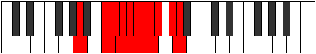 |
| [3065](https://ianring.com/musictheory/scales/3065) | [Zothygic](ModeDSharpZothygic.md) | D# | D#, F#, G, G#, A, A#, B, C, D, D# |  |
| [3065](https://ianring.com/musictheory/scales/3065) | [Zothygic](ModeEFlatZothygic.md) | Eb | Eb, Gb, G, Ab, A, Bb, B, C, D, Eb |  |
| [3065](https://ianring.com/musictheory/scales/3065) | [Zothygic](ModeDNaturalZothygic.md) | D | D, F, F#, G, G#, A, A#, B, C#, D |  |
| [3067](https://ianring.com/musictheory/scales/3067) | [Goptyllian](ModeANaturalGoptyllian.md) | A | A, A#, C, C#, D, D#, E, F, F#, G#, A |  |
| [3067](https://ianring.com/musictheory/scales/3067) | [Goptyllian](ModeCSharpGoptyllian.md) | C# | C#, D, E, F, F#, G, G#, A, A#, C, C# |  |
| [3067](https://ianring.com/musictheory/scales/3067) | [Goptyllian](ModeDFlatGoptyllian.md) | Db | Db, D, E, F, Gb, G, Ab, A, Bb, C, Db |  |
| [3067](https://ianring.com/musictheory/scales/3067) | [Goptyllian](ModeFNaturalGoptyllian.md) | F | F, F#, G#, A, A#, B, C, C#, D, E, F |  |
| [3067](https://ianring.com/musictheory/scales/3067) | [Goptyllian](ModeDSharpGoptyllian.md) | D# | D#, E, F#, G, G#, A, A#, B, C, D, D# |  |
| [3067](https://ianring.com/musictheory/scales/3067) | [Goptyllian](ModeEFlatGoptyllian.md) | Eb | Eb, E, Gb, G, Ab, A, Bb, B, C, D, Eb |  |
| [3067](https://ianring.com/musictheory/scales/3067) | [Goptyllian](ModeDNaturalGoptyllian.md) | D | D, D#, F, F#, G, G#, A, A#, B, C#, D |  |
| [3069](https://ianring.com/musictheory/scales/3069) | [Bacryllian](ModeANaturalBacryllian.md) | A | A, B, C, C#, D, D#, E, F, F#, G#, A |  |
| [3069](https://ianring.com/musictheory/scales/3069) | [Bacryllian](ModeCNaturalBacryllian.md) | C | C, D, D#, E, F, F#, G, G#, A, B, C |  |
| [3069](https://ianring.com/musictheory/scales/3069) | [Bacryllian](ModeFSharpBacryllian.md) | F# | F#, G#, A, A#, B, C, C#, D, D#, F, F# |  |
| [3069](https://ianring.com/musictheory/scales/3069) | [Bacryllian](ModeGFlatBacryllian.md) | Gb | Gb, Ab, A, Bb, B, C, Db, D, Eb, F, Gb |  |
| [3069](https://ianring.com/musictheory/scales/3069) | [Bacryllian](ModeDSharpBacryllian.md) | D# | D#, F, F#, G, G#, A, A#, B, C, D, D# |  |
| [3069](https://ianring.com/musictheory/scales/3069) | [Bacryllian](ModeEFlatBacryllian.md) | Eb | Eb, F, Gb, G, Ab, A, Bb, B, C, D, Eb |  |
| [3069](https://ianring.com/musictheory/scales/3069) | [Bacryllian](ModeDNaturalBacryllian.md) | D | D, E, F, F#, G, G#, A, A#, B, C#, D |  |
| [3071](https://ianring.com/musictheory/scales/3071) | [Solatic](ModeCSharpSolatic.md) | C# | C#, D, D#, E, F, F#, G, G#, A, A#, C, C# |  |
| [3071](https://ianring.com/musictheory/scales/3071) | [Solatic](ModeDFlatSolatic.md) | Db | Db, D, Eb, E, F, Gb, G, Ab, A, Bb, C, Db |  |
| [3071](https://ianring.com/musictheory/scales/3071) | [Solatic](ModeCNaturalSolatic.md) | C | C, C#, D, D#, E, F, F#, G, G#, A, B, C |  |
| [3071](https://ianring.com/musictheory/scales/3071) | [Solatic](ModeANaturalSolatic.md) | A | A, A#, B, C, C#, D, D#, E, F, F#, G#, A |  |
| [3071](https://ianring.com/musictheory/scales/3071) | [Solatic](ModeGNaturalSolatic.md) | G | G, G#, A, A#, B, C, C#, D, D#, E, F#, G |  |
| [3071](https://ianring.com/musictheory/scales/3071) | [Solatic](ModeFSharpSolatic.md) | F# | F#, G, G#, A, A#, B, C, C#, D, D#, F, F# |  |
| [3071](https://ianring.com/musictheory/scales/3071) | [Solatic](ModeGFlatSolatic.md) | Gb | Gb, G, Ab, A, Bb, B, C, Db, D, Eb, F, Gb |  |
| [3071](https://ianring.com/musictheory/scales/3071) | [Solatic](ModeFNaturalSolatic.md) | F | F, F#, G, G#, A, A#, B, C, C#, D, E, F |  |
| [3071](https://ianring.com/musictheory/scales/3071) | [Solatic](ModeDSharpSolatic.md) | D# | D#, E, F, F#, G, G#, A, A#, B, C, D, D# |  |
| [3071](https://ianring.com/musictheory/scales/3071) | [Solatic](ModeEFlatSolatic.md) | Eb | Eb, E, F, Gb, G, Ab, A, Bb, B, C, D, Eb |  |
| [3071](https://ianring.com/musictheory/scales/3071) | [Solatic](ModeDNaturalSolatic.md) | D | D, D#, E, F, F#, G, G#, A, A#, B, C#, D |  |
| [3143](https://ianring.com/musictheory/scales/3143) | [Polimic](ModeGSharpPolimic.md) | G# | G#, A, Bb, C##, E##, F##, G# |  |
| [3143](https://ianring.com/musictheory/scales/3143) | [Polimic](ModeAFlatPolimic.md) | Ab | Ab, Bbb, Cbb, D, E##, F##, Ab |  |
| [3147](https://ianring.com/musictheory/scales/3147) | [Ryrimic](ModeGSharpRyrimic.md) | G# | G#, A, B, C##, E##, F##, G# |  |
| [3147](https://ianring.com/musictheory/scales/3147) | [Ryrimic](ModeAFlatRyrimic.md) | Ab | Ab, Bbb, Cb, D, E##, F##, Ab |  |
| [3151](https://ianring.com/musictheory/scales/3151) | [Pacrian](ModeGSharpPacrian.md) | G# | G#, A, Bb, Cb, D, E##, F##, G# |  |
| [3151](https://ianring.com/musictheory/scales/3151) | [Pacrian](ModeAFlatPacrian.md) | Ab | Ab, Bbb, Cbb, Dbbb, Ebb, F#, G, Ab |  |
| [3155](https://ianring.com/musictheory/scales/3155) | [Ladimic](ModeGSharpLadimic.md) | G# | G#, A, B#, C##, E##, F##, G# |  |
| [3155](https://ianring.com/musictheory/scales/3155) | [Ladimic](ModeAFlatLadimic.md) | Ab | Ab, Bbb, C, D, E##, F##, Ab |  |
| [3159](https://ianring.com/musictheory/scales/3159) | [Stocrian](ModeGSharpStocrian.md) | G# | G#, A, Bb, C, D, E##, F##, G# |  |
| [3159](https://ianring.com/musictheory/scales/3159) | [Stocrian](ModeAFlatStocrian.md) | Ab | Ab, Bbb, Cbb, Dbb, Ebb, F#, G, Ab |  |
| [3163](https://ianring.com/musictheory/scales/3163) | [Rogian](ModeGSharpRogian.md) | G# | G#, A, B, C, D, E##, F##, G# |  |
| [3163](https://ianring.com/musictheory/scales/3163) | [Rogian](ModeAFlatRogian.md) | Ab | Ab, Bbb, Cb, Dbb, Ebb, F#, G, Ab |  |
| [3167](https://ianring.com/musictheory/scales/3167) | [Thynyllic](ModeGSharpThynyllic.md) | G# | G#, A, A#, B, C, D, F#, G, G# |  |
| [3167](https://ianring.com/musictheory/scales/3167) | [Thynyllic](ModeAFlatThynyllic.md) | Ab | Ab, A, Bb, B, C, D, Gb, G, Ab |  |
| [3171](https://ianring.com/musictheory/scales/3171) | [Zythimic](ModeGSharpZythimic.md) | G# | G#, A, B##, C##, E##, F##, G# |  |
| [3171](https://ianring.com/musictheory/scales/3171) | [Zythimic](ModeAFlatZythimic.md) | Ab | Ab, Bbb, C#, D, E##, F##, Ab |  |
| [3175](https://ianring.com/musictheory/scales/3175) | [Eponian](ModeGSharpEponian.md) | G# | G#, A, Bb, C#, D, E##, F##, G# |  |
| [3175](https://ianring.com/musictheory/scales/3175) | [Eponian](ModeAFlatEponian.md) | Ab | Ab, Bbb, Cbb, Db, Ebb, F#, G, Ab |  |
| [3177](https://ianring.com/musictheory/scales/3177) | [Rothimic](ModeDSharpRothimic.md) | D# | D#, E##, F###, G##, Db, Ebb, D# |  |
| [3177](https://ianring.com/musictheory/scales/3177) | [Rothimic](ModeEFlatRothimic.md) | Eb | Eb, F#, G#, A, B##, C##, Eb |  |
| [3179](https://ianring.com/musictheory/scales/3179) | [Daptian](ModeDSharpDaptian.md) | D# | D#, E, F#, G#, A, B##, C##, D# |  |
| [3179](https://ianring.com/musictheory/scales/3179) | [Daptian](ModeEFlatDaptian.md) | Eb | Eb, Fb, Gb, Ab, Bbb, C#, D, Eb |  |
| [3179](https://ianring.com/musictheory/scales/3179) | [Daptian](ModeGSharpDaptian.md) | G# | G#, A, B, C#, D, E##, F##, G# |  |
| [3179](https://ianring.com/musictheory/scales/3179) | [Daptian](ModeAFlatDaptian.md) | Ab | Ab, Bbb, Cb, Db, Ebb, F#, G, Ab |  |
| [3181](https://ianring.com/musictheory/scales/3181) | [Rolian](ModeDSharpRolian.md) | D# | D#, E#, F#, G#, A, B##, C##, D# |  |
| [3181](https://ianring.com/musictheory/scales/3181) | [Rolian](ModeEFlatRolian.md) | Eb | Eb, F, Gb, Ab, Bbb, C#, D, Eb | 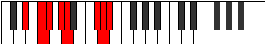 |
| [3183](https://ianring.com/musictheory/scales/3183) | [Mixonyllic](ModeDSharpMixonyllic.md) | D# | D#, E, F, F#, G#, A, C#, D, D# |  |
| [3183](https://ianring.com/musictheory/scales/3183) | [Mixonyllic](ModeEFlatMixonyllic.md) | Eb | Eb, E, F, Gb, Ab, A, Db, D, Eb |  |
| [3183](https://ianring.com/musictheory/scales/3183) | [Mixonyllic](ModeGSharpMixonyllic.md) | G# | G#, A, A#, B, C#, D, F#, G, G# |  |
| [3183](https://ianring.com/musictheory/scales/3183) | [Mixonyllic](ModeAFlatMixonyllic.md) | Ab | Ab, A, Bb, B, Db, D, Gb, G, Ab |  |
| [3187](https://ianring.com/musictheory/scales/3187) | [Koptian](ModeGSharpKoptian.md) | G# | G#, A, B#, C#, D, E##, F##, G# |  |
| [3187](https://ianring.com/musictheory/scales/3187) | [Koptian](ModeAFlatKoptian.md) | Ab | Ab, Bbb, C, Db, Ebb, F#, G, Ab |  |
| [3189](https://ianring.com/musictheory/scales/3189) | [Aeolonian](ModeENaturalAeolonian.md) | E | E, F#, G#, A, Bb, C##, D#, E | 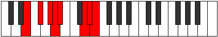 |
| [3191](https://ianring.com/musictheory/scales/3191) | [Bynyllic](ModeENaturalBynyllic.md) | E | E, F, F#, G#, A, A#, D, D#, E |  |
| [3191](https://ianring.com/musictheory/scales/3191) | [Bynyllic](ModeGSharpBynyllic.md) | G# | G#, A, A#, C, C#, D, F#, G, G# |  |
| [3191](https://ianring.com/musictheory/scales/3191) | [Bynyllic](ModeAFlatBynyllic.md) | Ab | Ab, A, Bb, C, Db, D, Gb, G, Ab |  |
| [3193](https://ianring.com/musictheory/scales/3193) | [Zathian](ModeDSharpZathian.md) | D# | D#, E##, F##, G#, A, B##, C##, D# |  |
| [3193](https://ianring.com/musictheory/scales/3193) | [Zathian](ModeEFlatZathian.md) | Eb | Eb, F#, G, Ab, Bbb, C#, D, Eb |  |
| [3195](https://ianring.com/musictheory/scales/3195) | [Raryllic](ModeDSharpRaryllic.md) | D# | D#, E, F#, G, G#, A, C#, D, D# |  |
| [3195](https://ianring.com/musictheory/scales/3195) | [Raryllic](ModeEFlatRaryllic.md) | Eb | Eb, E, Gb, G, Ab, A, Db, D, Eb |  |
| [3195](https://ianring.com/musictheory/scales/3195) | [Raryllic](ModeGSharpRaryllic.md) | G# | G#, A, B, C, C#, D, F#, G, G# |  |
| [3195](https://ianring.com/musictheory/scales/3195) | [Raryllic](ModeAFlatRaryllic.md) | Ab | Ab, A, B, C, Db, D, Gb, G, Ab |  |
| [3197](https://ianring.com/musictheory/scales/3197) | [Gylyllic](ModeDSharpGylyllic.md) | D# | D#, F, F#, G, G#, A, C#, D, D# |  |
| [3197](https://ianring.com/musictheory/scales/3197) | [Gylyllic](ModeEFlatGylyllic.md) | Eb | Eb, F, Gb, G, Ab, A, Db, D, Eb |  |
| [3197](https://ianring.com/musictheory/scales/3197) | [Gylyllic](ModeENaturalGylyllic.md) | E | E, F#, G, G#, A, A#, D, D#, E |  |
| [3199](https://ianring.com/musictheory/scales/3199) | [Thaptygic](ModeDSharpThaptygic.md) | D# | D#, E, F, F#, G, G#, A, C#, D, D# |  |
| [3199](https://ianring.com/musictheory/scales/3199) | [Thaptygic](ModeEFlatThaptygic.md) | Eb | Eb, E, F, Gb, G, Ab, A, Db, D, Eb |  |
| [3199](https://ianring.com/musictheory/scales/3199) | [Thaptygic](ModeENaturalThaptygic.md) | E | E, F, F#, G, G#, A, A#, D, D#, E |  |
| [3199](https://ianring.com/musictheory/scales/3199) | [Thaptygic](ModeGSharpThaptygic.md) | G# | G#, A, A#, B, C, C#, D, F#, G, G# |  |
| [3199](https://ianring.com/musictheory/scales/3199) | [Thaptygic](ModeAFlatThaptygic.md) | Ab | Ab, A, Bb, B, C, Db, D, Gb, G, Ab |  |
| [3215](https://ianring.com/musictheory/scales/3215) | [Katydian](ModeGNaturalKatydian.md) | G | G, Ab, Bbb, Cbb, D, E#, F#, G |  |
| [3223](https://ianring.com/musictheory/scales/3223) | [Thyphian](ModeGNaturalThyphian.md) | G | G, Ab, Bbb, Cb, D, E#, F#, G |  |
| [3231](https://ianring.com/musictheory/scales/3231) | [Kataptyllic](ModeGNaturalKataptyllic.md) | G | G, G#, A, A#, B, D, F, F#, G |  |
| [3239](https://ianring.com/musictheory/scales/3239) | [Epythian](ModeGNaturalEpythian.md) | G | G, Ab, Bbb, C, D, E#, F#, G |  |
| [3247](https://ianring.com/musictheory/scales/3247) | [Aeolonyllic](ModeGNaturalAeolonyllic.md) | G | G, G#, A, A#, C, D, F, F#, G |  |
| [3253](https://ianring.com/musictheory/scales/3253) | [Gonian](ModeENaturalGonian.md) | E | E, F#, G#, A, B, C##, D#, E |  |
| [3255](https://ianring.com/musictheory/scales/3255) | [Daryllic](ModeENaturalDaryllic.md) | E | E, F, F#, G#, A, B, D, D#, E |  |
| [3255](https://ianring.com/musictheory/scales/3255) | [Daryllic](ModeGNaturalDaryllic.md) | G | G, G#, A, B, C, D, F, F#, G |  |
| [3261](https://ianring.com/musictheory/scales/3261) | [Dodyllic](ModeENaturalDodyllic.md) | E | E, F#, G, G#, A, B, D, D#, E |  |
| [3263](https://ianring.com/musictheory/scales/3263) | [Pyrygic](ModeENaturalPyrygic.md) | E | E, F, F#, G, G#, A, B, D, D#, E | 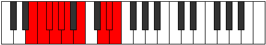 |
| [3263](https://ianring.com/musictheory/scales/3263) | [Pyrygic](ModeGNaturalPyrygic.md) | G | G, G#, A, A#, B, C, D, F, F#, G |  |
| [3271](https://ianring.com/musictheory/scales/3271) | [Kolian](ModeGNaturalKolian.md) | G | G, Ab, Bbb, C#, D, E#, F#, G |  |
| [3271](https://ianring.com/musictheory/scales/3271) | [Kolian](ModeGSharpKolian.md) | G# | G#, A, Bb, C##, D#, E##, F##, G# |  |
| [3271](https://ianring.com/musictheory/scales/3271) | [Kolian](ModeAFlatKolian.md) | Ab | Ab, Bbb, Cbb, D, Eb, F#, G, Ab |  |
| [3275](https://ianring.com/musictheory/scales/3275) | [Katadian](ModeGSharpKatadian.md) | G# | G#, A, B, C##, D#, E##, F##, G# |  |
| [3275](https://ianring.com/musictheory/scales/3275) | [Katadian](ModeAFlatKatadian.md) | Ab | Ab, Bbb, Cb, D, Eb, F#, G, Ab |  |
| [3279](https://ianring.com/musictheory/scales/3279) | [Pythyllic](ModeGNaturalPythyllic.md) | G | G, G#, A, A#, C#, D, F, F#, G |  |
| [3279](https://ianring.com/musictheory/scales/3279) | [Pythyllic](ModeGSharpPythyllic.md) | G# | G#, A, A#, B, D, D#, F#, G, G# |  |
| [3279](https://ianring.com/musictheory/scales/3279) | [Pythyllic](ModeAFlatPythyllic.md) | Ab | Ab, A, Bb, B, D, Eb, Gb, G, Ab |  |
| [3281](https://ianring.com/musictheory/scales/3281) | [Katythimic](ModeDNaturalKatythimic.md) | D | D, E##, F###, G##, A###, B##, D |  |
| [3283](https://ianring.com/musictheory/scales/3283) | [Lyrian](ModeDNaturalLyrian.md) | D | D, Eb, F#, G#, A, B#, C#, D |  |
| [3283](https://ianring.com/musictheory/scales/3283) | [Lyrian](ModeGSharpLyrian.md) | G# | G#, A, B#, C##, D#, E##, F##, G# |  |
| [3283](https://ianring.com/musictheory/scales/3283) | [Lyrian](ModeAFlatLyrian.md) | Ab | Ab, Bbb, C, D, Eb, F#, G, Ab |  |
| [3285](https://ianring.com/musictheory/scales/3285) | [Zagian](ModeDNaturalZagian.md) | D | D, E, F#, G#, A, B#, C#, D |  |
| [3287](https://ianring.com/musictheory/scales/3287) | [Phrathyllic](ModeDNaturalPhrathyllic.md) | D | D, D#, E, F#, G#, A, C, C#, D |  |
| [3287](https://ianring.com/musictheory/scales/3287) | [Phrathyllic](ModeGSharpPhrathyllic.md) | G# | G#, A, A#, C, D, D#, F#, G, G# |  |
| [3287](https://ianring.com/musictheory/scales/3287) | [Phrathyllic](ModeAFlatPhrathyllic.md) | Ab | Ab, A, Bb, C, D, Eb, Gb, G, Ab |  |
| [3287](https://ianring.com/musictheory/scales/3287) | [Phrathyllic](ModeGNaturalPhrathyllic.md) | G | G, G#, A, B, C#, D, F, F#, G |  |
| [3289](https://ianring.com/musictheory/scales/3289) | [Loptian](ModeDNaturalLoptian.md) | D | D, E#, F#, G#, A, B#, C#, D |  |
| [3291](https://ianring.com/musictheory/scales/3291) | [Kodyllic](ModeDNaturalKodyllic.md) | D | D, D#, F, F#, G#, A, C, C#, D |  |
| [3291](https://ianring.com/musictheory/scales/3291) | [Kodyllic](ModeGSharpKodyllic.md) | G# | G#, A, B, C, D, D#, F#, G, G# |  |
| [3291](https://ianring.com/musictheory/scales/3291) | [Kodyllic](ModeAFlatKodyllic.md) | Ab | Ab, A, B, C, D, Eb, Gb, G, Ab |  |
| [3293](https://ianring.com/musictheory/scales/3293) | [Saryllic](ModeDNaturalSaryllic.md) | D | D, E, F, F#, G#, A, C, C#, D |  |
| [3295](https://ianring.com/musictheory/scales/3295) | [Phroptygic](ModeDNaturalPhroptygic.md) | D | D, D#, E, F, F#, G#, A, C, C#, D |  |
| [3295](https://ianring.com/musictheory/scales/3295) | [Phroptygic](ModeGSharpPhroptygic.md) | G# | G#, A, A#, B, C, D, D#, F#, G, G# |  |
| [3295](https://ianring.com/musictheory/scales/3295) | [Phroptygic](ModeAFlatPhroptygic.md) | Ab | Ab, A, Bb, B, C, D, Eb, Gb, G, Ab |  |
| [3295](https://ianring.com/musictheory/scales/3295) | [Phroptygic](ModeGNaturalPhroptygic.md) | G | G, G#, A, A#, B, C#, D, F, F#, G |  |
| [3299](https://ianring.com/musictheory/scales/3299) | [Syptian](ModeGSharpSyptian.md) | G# | G#, A, B##, C##, D#, E##, F##, G# |  |
| [3299](https://ianring.com/musictheory/scales/3299) | [Syptian](ModeAFlatSyptian.md) | Ab | Ab, Bbb, C#, D, Eb, F#, G, Ab |  |
| [3303](https://ianring.com/musictheory/scales/3303) | [Soptyllic](ModeGNaturalSoptyllic.md) | G | G, G#, A, C, C#, D, F, F#, G |  |
| [3303](https://ianring.com/musictheory/scales/3303) | [Soptyllic](ModeGSharpSoptyllic.md) | G# | G#, A, A#, C#, D, D#, F#, G, G# |  |
| [3303](https://ianring.com/musictheory/scales/3303) | [Soptyllic](ModeAFlatSoptyllic.md) | Ab | Ab, A, Bb, Db, D, Eb, Gb, G, Ab |  |
| [3305](https://ianring.com/musictheory/scales/3305) | [Epathian](ModeDSharpEpathian.md) | D# | D#, E##, F###, G##, A#, B##, C##, D# |  |
| [3305](https://ianring.com/musictheory/scales/3305) | [Epathian](ModeEFlatEpathian.md) | Eb | Eb, F#, G#, A, Bb, C#, D, Eb |  |
| [3307](https://ianring.com/musictheory/scales/3307) | [Boptyllic](ModeDSharpBoptyllic.md) | D# | D#, E, F#, G#, A, A#, C#, D, D# |  |
| [3307](https://ianring.com/musictheory/scales/3307) | [Boptyllic](ModeEFlatBoptyllic.md) | Eb | Eb, E, Gb, Ab, A, Bb, Db, D, Eb |  |
| [3307](https://ianring.com/musictheory/scales/3307) | [Boptyllic](ModeGSharpBoptyllic.md) | G# | G#, A, B, C#, D, D#, F#, G, G# | 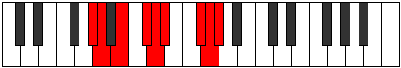 |
| [3307](https://ianring.com/musictheory/scales/3307) | [Boptyllic](ModeAFlatBoptyllic.md) | Ab | Ab, A, B, Db, D, Eb, Gb, G, Ab |  |
| [3309](https://ianring.com/musictheory/scales/3309) | [Bycryllic](ModeDSharpBycryllic.md) | D# | D#, F, F#, G#, A, A#, C#, D, D# |  |
| [3309](https://ianring.com/musictheory/scales/3309) | [Bycryllic](ModeEFlatBycryllic.md) | Eb | Eb, F, Gb, Ab, A, Bb, Db, D, Eb |  |
| [3311](https://ianring.com/musictheory/scales/3311) | [Mixodygic](ModeDSharpMixodygic.md) | D# | D#, E, F, F#, G#, A, A#, C#, D, D# |  |
| [3311](https://ianring.com/musictheory/scales/3311) | [Mixodygic](ModeEFlatMixodygic.md) | Eb | Eb, E, F, Gb, Ab, A, Bb, Db, D, Eb |  |
| [3311](https://ianring.com/musictheory/scales/3311) | [Mixodygic](ModeGNaturalMixodygic.md) | G | G, G#, A, A#, C, C#, D, F, F#, G |  |
| [3311](https://ianring.com/musictheory/scales/3311) | [Mixodygic](ModeGSharpMixodygic.md) | G# | G#, A, A#, B, C#, D, D#, F#, G, G# |  |
| [3311](https://ianring.com/musictheory/scales/3311) | [Mixodygic](ModeAFlatMixodygic.md) | Ab | Ab, A, Bb, B, Db, D, Eb, Gb, G, Ab |  |
| [3313](https://ianring.com/musictheory/scales/3313) | [Aeolacrian](ModeDNaturalAeolacrian.md) | D | D, E##, F##, G#, A, B#, C#, D |  |
| [3315](https://ianring.com/musictheory/scales/3315) | [Aeralyllic](ModeDNaturalAeralyllic.md) | D | D, D#, F#, G, G#, A, C, C#, D |  |
| [3315](https://ianring.com/musictheory/scales/3315) | [Aeralyllic](ModeGSharpAeralyllic.md) | G# | G#, A, C, C#, D, D#, F#, G, G# |  |
| [3315](https://ianring.com/musictheory/scales/3315) | [Aeralyllic](ModeAFlatAeralyllic.md) | Ab | Ab, A, C, Db, D, Eb, Gb, G, Ab |  |
| [3317](https://ianring.com/musictheory/scales/3317) | [Lanyllic](ModeDNaturalLanyllic.md) | D | D, E, F#, G, G#, A, C, C#, D |  |
| [3317](https://ianring.com/musictheory/scales/3317) | [Lanyllic](ModeENaturalLanyllic.md) | E | E, F#, G#, A, A#, B, D, D#, E |  |
| [3319](https://ianring.com/musictheory/scales/3319) | [Tholygic](ModeDNaturalTholygic.md) | D | D, D#, E, F#, G, G#, A, C, C#, D |  |
| [3319](https://ianring.com/musictheory/scales/3319) | [Tholygic](ModeGSharpTholygic.md) | G# | G#, A, A#, C, C#, D, D#, F#, G, G# |  |
| [3319](https://ianring.com/musictheory/scales/3319) | [Tholygic](ModeAFlatTholygic.md) | Ab | Ab, A, Bb, C, Db, D, Eb, Gb, G, Ab |  |
| [3319](https://ianring.com/musictheory/scales/3319) | [Tholygic](ModeGNaturalTholygic.md) | G | G, G#, A, B, C, C#, D, F, F#, G |  |
| [3319](https://ianring.com/musictheory/scales/3319) | [Tholygic](ModeENaturalTholygic.md) | E | E, F, F#, G#, A, A#, B, D, D#, E | 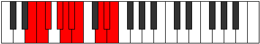 |
| [3321](https://ianring.com/musictheory/scales/3321) | [Ionycryllic](ModeDNaturalIonycryllic.md) | D | D, F, F#, G, G#, A, C, C#, D |  |
| [3321](https://ianring.com/musictheory/scales/3321) | [Ionycryllic](ModeDSharpIonycryllic.md) | D# | D#, F#, G, G#, A, A#, C#, D, D# |  |
| [3321](https://ianring.com/musictheory/scales/3321) | [Ionycryllic](ModeEFlatIonycryllic.md) | Eb | Eb, Gb, G, Ab, A, Bb, Db, D, Eb |  |
| [3323](https://ianring.com/musictheory/scales/3323) | [Phrygygic](ModeDNaturalPhrygygic.md) | D | D, D#, F, F#, G, G#, A, C, C#, D |  |
| [3323](https://ianring.com/musictheory/scales/3323) | [Phrygygic](ModeDSharpPhrygygic.md) | D# | D#, E, F#, G, G#, A, A#, C#, D, D# |  |
| [3323](https://ianring.com/musictheory/scales/3323) | [Phrygygic](ModeEFlatPhrygygic.md) | Eb | Eb, E, Gb, G, Ab, A, Bb, Db, D, Eb |  |
| [3323](https://ianring.com/musictheory/scales/3323) | [Phrygygic](ModeGSharpPhrygygic.md) | G# | G#, A, B, C, C#, D, D#, F#, G, G# |  |
| [3323](https://ianring.com/musictheory/scales/3323) | [Phrygygic](ModeAFlatPhrygygic.md) | Ab | Ab, A, B, C, Db, D, Eb, Gb, G, Ab |  |
| [3325](https://ianring.com/musictheory/scales/3325) | [Epygic](ModeDNaturalEpygic.md) | D | D, E, F, F#, G, G#, A, C, C#, D |  |
| [3325](https://ianring.com/musictheory/scales/3325) | [Epygic](ModeDSharpEpygic.md) | D# | D#, F, F#, G, G#, A, A#, C#, D, D# |  |
| [3325](https://ianring.com/musictheory/scales/3325) | [Epygic](ModeEFlatEpygic.md) | Eb | Eb, F, Gb, G, Ab, A, Bb, Db, D, Eb |  |
| [3325](https://ianring.com/musictheory/scales/3325) | [Epygic](ModeENaturalEpygic.md) | E | E, F#, G, G#, A, A#, B, D, D#, E |  |
| [3327](https://ianring.com/musictheory/scales/3327) | [Madyllian](ModeDNaturalMadyllian.md) | D | D, D#, E, F, F#, G, G#, A, C, C#, D |  |
| [3327](https://ianring.com/musictheory/scales/3327) | [Madyllian](ModeDSharpMadyllian.md) | D# | D#, E, F, F#, G, G#, A, A#, C#, D, D# |  |
| [3327](https://ianring.com/musictheory/scales/3327) | [Madyllian](ModeEFlatMadyllian.md) | Eb | Eb, E, F, Gb, G, Ab, A, Bb, Db, D, Eb |  |
| [3327](https://ianring.com/musictheory/scales/3327) | [Madyllian](ModeGSharpMadyllian.md) | G# | G#, A, A#, B, C, C#, D, D#, F#, G, G# |  |
| [3327](https://ianring.com/musictheory/scales/3327) | [Madyllian](ModeAFlatMadyllian.md) | Ab | Ab, A, Bb, B, C, Db, D, Eb, Gb, G, Ab |  |
| [3327](https://ianring.com/musictheory/scales/3327) | [Madyllian](ModeGNaturalMadyllian.md) | G | G, G#, A, A#, B, C, C#, D, F, F#, G |  |
| [3327](https://ianring.com/musictheory/scales/3327) | [Madyllian](ModeENaturalMadyllian.md) | E | E, F, F#, G, G#, A, A#, B, D, D#, E |  |
| [3345](https://ianring.com/musictheory/scales/3345) | [Zylitonic](ModeASharpZylitonic.md) | A# | A#, D, F#, G#, A, A# |  |
| [3345](https://ianring.com/musictheory/scales/3345) | [Zylitonic](ModeBFlatZylitonic.md) | Bb | Bb, D, Gb, Ab, A, Bb |  |
| [3347](https://ianring.com/musictheory/scales/3347) | [Synimic](ModeASharpSynimic.md) | A# | A#, B, C##, E##, F###, G##, A# |  |
| [3347](https://ianring.com/musictheory/scales/3347) | [Synimic](ModeBFlatSynimic.md) | Bb | Bb, Cb, D, E##, F###, G##, Bb |  |
| [3349](https://ianring.com/musictheory/scales/3349) | [Aeolocrimic](ModeASharpAeolocrimic.md) | A# | A#, B#, C##, E##, F###, G##, A# |  |
| [3349](https://ianring.com/musictheory/scales/3349) | [Aeolocrimic](ModeBFlatAeolocrimic.md) | Bb | Bb, C, D, E##, F###, G##, Bb |  |
| [3351](https://ianring.com/musictheory/scales/3351) | [Karian](ModeASharpKarian.md) | A# | A#, B, C, D, E##, F###, G##, A# |  |
| [3351](https://ianring.com/musictheory/scales/3351) | [Karian](ModeBFlatKarian.md) | Bb | Bb, Cb, Dbb, Ebb, F#, G#, A, Bb |  |
| [3353](https://ianring.com/musictheory/scales/3353) | [Phraptimic](ModeASharpPhraptimic.md) | A# | A#, B##, C##, E##, F###, G##, A# |  |
| [3353](https://ianring.com/musictheory/scales/3353) | [Phraptimic](ModeBFlatPhraptimic.md) | Bb | Bb, C#, D, E##, F###, G##, Bb |  |
| [3355](https://ianring.com/musictheory/scales/3355) | [Bagian](ModeASharpBagian.md) | A# | A#, B, C#, D, E##, F###, G##, A# |  |
| [3355](https://ianring.com/musictheory/scales/3355) | [Bagian](ModeBFlatBagian.md) | Bb | Bb, Cb, Db, Ebb, F#, G#, A, Bb |  |
| [3357](https://ianring.com/musictheory/scales/3357) | [Phrodian](ModeASharpPhrodian.md) | A# | A#, B#, C#, D, E##, F###, G##, A# |  |
| [3357](https://ianring.com/musictheory/scales/3357) | [Phrodian](ModeBFlatPhrodian.md) | Bb | Bb, C, Db, Ebb, F#, G#, A, Bb |  |
| [3357](https://ianring.com/musictheory/scales/3357) | [Phrodian](ModeFSharpPhrodian.md) | F# | F#, G#, A, Bb, C##, D##, E#, F# |  |
| [3357](https://ianring.com/musictheory/scales/3357) | [Phrodian](ModeGFlatPhrodian.md) | Gb | Gb, Ab, Bbb, Cbb, D, E, F, Gb |  |
| [3359](https://ianring.com/musictheory/scales/3359) | [Bonyllic](ModeFSharpBonyllic.md) | F# | F#, G, G#, A, A#, D, E, F, F# |  |
| [3359](https://ianring.com/musictheory/scales/3359) | [Bonyllic](ModeGFlatBonyllic.md) | Gb | Gb, G, Ab, A, Bb, D, E, F, Gb |  |
| [3359](https://ianring.com/musictheory/scales/3359) | [Bonyllic](ModeASharpBonyllic.md) | A# | A#, B, C, C#, D, F#, G#, A, A# |  |
| [3359](https://ianring.com/musictheory/scales/3359) | [Bonyllic](ModeBFlatBonyllic.md) | Bb | Bb, B, C, Db, D, Gb, Ab, A, Bb |  |
| [3373](https://ianring.com/musictheory/scales/3373) | [Lodian](ModeFSharpLodian.md) | F# | F#, G#, A, B, C##, D##, E#, F# |  |
| [3373](https://ianring.com/musictheory/scales/3373) | [Lodian](ModeGFlatLodian.md) | Gb | Gb, Ab, Bbb, Cb, D, E, F, Gb |  |
| [3375](https://ianring.com/musictheory/scales/3375) | [Kygyllic](ModeFSharpKygyllic.md) | F# | F#, G, G#, A, B, D, E, F, F# |  |
| [3375](https://ianring.com/musictheory/scales/3375) | [Kygyllic](ModeGFlatKygyllic.md) | Gb | Gb, G, Ab, A, B, D, E, F, Gb |  |
| [3377](https://ianring.com/musictheory/scales/3377) | [Phralimic](ModeASharpPhralimic.md) | A# | A#, B###, C###, E##, F###, G##, A# |  |
| [3377](https://ianring.com/musictheory/scales/3377) | [Phralimic](ModeBFlatPhralimic.md) | Bb | Bb, C##, D#, E##, F###, G##, Bb |  |
| [3379](https://ianring.com/musictheory/scales/3379) | [Sothian](ModeASharpSothian.md) | A# | A#, B, C##, D#, E##, F###, G##, A# |  |
| [3379](https://ianring.com/musictheory/scales/3379) | [Sothian](ModeBFlatSothian.md) | Bb | Bb, Cb, D, Eb, F#, G#, A, Bb |  |
| [3381](https://ianring.com/musictheory/scales/3381) | [Katanian](ModeENaturalKatanian.md) | E | E, F#, G#, A, B#, C##, D#, E | 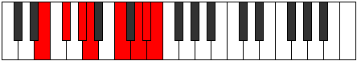 |
| [3381](https://ianring.com/musictheory/scales/3381) | [Katanian](ModeASharpKatanian.md) | A# | A#, B#, C##, D#, E##, F###, G##, A# |  |
| [3381](https://ianring.com/musictheory/scales/3381) | [Katanian](ModeBFlatKatanian.md) | Bb | Bb, C, D, Eb, F#, G#, A, Bb | 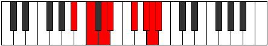 |
| [3383](https://ianring.com/musictheory/scales/3383) | [Daptyllic](ModeENaturalDaptyllic.md) | E | E, F, F#, G#, A, C, D, D#, E |  |
| [3383](https://ianring.com/musictheory/scales/3383) | [Daptyllic](ModeASharpDaptyllic.md) | A# | A#, B, C, D, D#, F#, G#, A, A# |  |
| [3383](https://ianring.com/musictheory/scales/3383) | [Daptyllic](ModeBFlatDaptyllic.md) | Bb | Bb, B, C, D, Eb, Gb, Ab, A, Bb |  |
| [3385](https://ianring.com/musictheory/scales/3385) | [Rothian](ModeASharpRothian.md) | A# | A#, B##, C##, D#, E##, F###, G##, A# |  |
| [3385](https://ianring.com/musictheory/scales/3385) | [Rothian](ModeBFlatRothian.md) | Bb | Bb, C#, D, Eb, F#, G#, A, Bb |  |
| [3387](https://ianring.com/musictheory/scales/3387) | [Aeryptyllic](ModeASharpAeryptyllic.md) | A# | A#, B, C#, D, D#, F#, G#, A, A# |  |
| [3387](https://ianring.com/musictheory/scales/3387) | [Aeryptyllic](ModeBFlatAeryptyllic.md) | Bb | Bb, B, Db, D, Eb, Gb, Ab, A, Bb |  |
| [3389](https://ianring.com/musictheory/scales/3389) | [Socryllic](ModeENaturalSocryllic.md) | E | E, F#, G, G#, A, C, D, D#, E |  |
| [3389](https://ianring.com/musictheory/scales/3389) | [Socryllic](ModeASharpSocryllic.md) | A# | A#, C, C#, D, D#, F#, G#, A, A# |  |
| [3389](https://ianring.com/musictheory/scales/3389) | [Socryllic](ModeBFlatSocryllic.md) | Bb | Bb, C, Db, D, Eb, Gb, Ab, A, Bb |  |
| [3389](https://ianring.com/musictheory/scales/3389) | [Socryllic](ModeFSharpSocryllic.md) | F# | F#, G#, A, A#, B, D, E, F, F# |  |
| [3389](https://ianring.com/musictheory/scales/3389) | [Socryllic](ModeGFlatSocryllic.md) | Gb | Gb, Ab, A, Bb, B, D, E, F, Gb |  |
| [3391](https://ianring.com/musictheory/scales/3391) | [Aeolynygic](ModeENaturalAeolynygic.md) | E | E, F, F#, G, G#, A, C, D, D#, E |  |
| [3391](https://ianring.com/musictheory/scales/3391) | [Aeolynygic](ModeASharpAeolynygic.md) | A# | A#, B, C, C#, D, D#, F#, G#, A, A# |  |
| [3391](https://ianring.com/musictheory/scales/3391) | [Aeolynygic](ModeBFlatAeolynygic.md) | Bb | Bb, B, C, Db, D, Eb, Gb, Ab, A, Bb |  |
| [3391](https://ianring.com/musictheory/scales/3391) | [Aeolynygic](ModeFSharpAeolynygic.md) | F# | F#, G, G#, A, A#, B, D, E, F, F# |  |
| [3391](https://ianring.com/musictheory/scales/3391) | [Aeolynygic](ModeGFlatAeolynygic.md) | Gb | Gb, G, Ab, A, Bb, B, D, E, F, Gb |  |
| [3399](https://ianring.com/musictheory/scales/3399) | [Zonian](ModeGSharpZonian.md) | G# | G#, A, Bb, C##, D##, E##, F##, G# |  |
| [3399](https://ianring.com/musictheory/scales/3399) | [Zonian](ModeAFlatZonian.md) | Ab | Ab, Bbb, Cbb, D, E, F#, G, Ab |  |
| [3403](https://ianring.com/musictheory/scales/3403) | [Bylian](ModeGSharpBylian.md) | G# | G#, A, B, C##, D##, E##, F##, G# |  |
| [3403](https://ianring.com/musictheory/scales/3403) | [Bylian](ModeAFlatBylian.md) | Ab | Ab, Bbb, Cb, D, E, F#, G, Ab |  |
| [3405](https://ianring.com/musictheory/scales/3405) | [Stynian](ModeFSharpStynian.md) | F# | F#, G#, A, B#, C##, D##, E#, F# |  |
| [3405](https://ianring.com/musictheory/scales/3405) | [Stynian](ModeGFlatStynian.md) | Gb | Gb, Ab, Bbb, C, D, E, F, Gb |  |
| [3407](https://ianring.com/musictheory/scales/3407) | [Katocryllic](ModeFSharpKatocryllic.md) | F# | F#, G, G#, A, C, D, E, F, F# |  |
| [3407](https://ianring.com/musictheory/scales/3407) | [Katocryllic](ModeGFlatKatocryllic.md) | Gb | Gb, G, Ab, A, C, D, E, F, Gb |  |
| [3407](https://ianring.com/musictheory/scales/3407) | [Katocryllic](ModeGSharpKatocryllic.md) | G# | G#, A, A#, B, D, E, F#, G, G# |  |
| [3407](https://ianring.com/musictheory/scales/3407) | [Katocryllic](ModeAFlatKatocryllic.md) | Ab | Ab, A, Bb, B, D, E, Gb, G, Ab |  |
| [3409](https://ianring.com/musictheory/scales/3409) | [Katanimic](ModeASharpKatanimic.md) | A# | A#, B###, D##, E##, F###, G##, A# |  |
| [3409](https://ianring.com/musictheory/scales/3409) | [Katanimic](ModeBFlatKatanimic.md) | Bb | Bb, C##, D##, E##, F###, G##, Bb |  |
| [3411](https://ianring.com/musictheory/scales/3411) | [Ionathian](ModeGSharpIonathian.md) | G# | G#, A, B#, C##, D##, E##, F##, G# |  |
| [3411](https://ianring.com/musictheory/scales/3411) | [Ionathian](ModeAFlatIonathian.md) | Ab | Ab, Bbb, C, D, E, F#, G, Ab |  |
| [3411](https://ianring.com/musictheory/scales/3411) | [Ionathian](ModeASharpIonathian.md) | A# | A#, B, C##, D##, E##, F###, G##, A# |  |
| [3411](https://ianring.com/musictheory/scales/3411) | [Ionathian](ModeBFlatIonathian.md) | Bb | Bb, Cb, D, E, F#, G#, A, Bb |  |
| [3413](https://ianring.com/musictheory/scales/3413) | [Aeolynian](ModeASharpAeolynian.md) | A# | A#, B#, C##, D##, E##, F###, G##, A# |  |
| [3413](https://ianring.com/musictheory/scales/3413) | [Aeolynian](ModeBFlatAeolynian.md) | Bb | Bb, C, D, E, F#, G#, A, Bb |  |
| [3415](https://ianring.com/musictheory/scales/3415) | [Ionaptyllic](ModeGSharpIonaptyllic.md) | G# | G#, A, A#, C, D, E, F#, G, G# |  |
| [3415](https://ianring.com/musictheory/scales/3415) | [Ionaptyllic](ModeAFlatIonaptyllic.md) | Ab | Ab, A, Bb, C, D, E, Gb, G, Ab |  |
| [3415](https://ianring.com/musictheory/scales/3415) | [Ionaptyllic](ModeASharpIonaptyllic.md) | A# | A#, B, C, D, E, F#, G#, A, A# |  |
| [3415](https://ianring.com/musictheory/scales/3415) | [Ionaptyllic](ModeBFlatIonaptyllic.md) | Bb | Bb, B, C, D, E, Gb, Ab, A, Bb |  |
| [3417](https://ianring.com/musictheory/scales/3417) | [Golian](ModeASharpGolian.md) | A# | A#, B##, C##, D##, E##, F###, G##, A# |  |
| [3417](https://ianring.com/musictheory/scales/3417) | [Golian](ModeBFlatGolian.md) | Bb | Bb, C#, D, E, F#, G#, A, Bb |  |
| [3419](https://ianring.com/musictheory/scales/3419) | [Danyllic](ModeGSharpDanyllic.md) | G# | G#, A, B, C, D, E, F#, G, G# |  |
| [3419](https://ianring.com/musictheory/scales/3419) | [Danyllic](ModeAFlatDanyllic.md) | Ab | Ab, A, B, C, D, E, Gb, G, Ab |  |
| [3419](https://ianring.com/musictheory/scales/3419) | [Danyllic](ModeASharpDanyllic.md) | A# | A#, B, C#, D, E, F#, G#, A, A# |  |
| [3419](https://ianring.com/musictheory/scales/3419) | [Danyllic](ModeBFlatDanyllic.md) | Bb | Bb, B, Db, D, E, Gb, Ab, A, Bb |  |
| [3421](https://ianring.com/musictheory/scales/3421) | [Aerothyllic](ModeASharpAerothyllic.md) | A# | A#, C, C#, D, E, F#, G#, A, A# |  |
| [3421](https://ianring.com/musictheory/scales/3421) | [Aerothyllic](ModeBFlatAerothyllic.md) | Bb | Bb, C, Db, D, E, Gb, Ab, A, Bb |  |
| [3421](https://ianring.com/musictheory/scales/3421) | [Aerothyllic](ModeFSharpAerothyllic.md) | F# | F#, G#, A, A#, C, D, E, F, F# |  |
| [3421](https://ianring.com/musictheory/scales/3421) | [Aerothyllic](ModeGFlatAerothyllic.md) | Gb | Gb, Ab, A, Bb, C, D, E, F, Gb |  |
| [3423](https://ianring.com/musictheory/scales/3423) | [Lothygic](ModeFSharpLothygic.md) | F# | F#, G, G#, A, A#, C, D, E, F, F# |  |
| [3423](https://ianring.com/musictheory/scales/3423) | [Lothygic](ModeGFlatLothygic.md) | Gb | Gb, G, Ab, A, Bb, C, D, E, F, Gb |  |
| [3423](https://ianring.com/musictheory/scales/3423) | [Lothygic](ModeASharpLothygic.md) | A# | A#, B, C, C#, D, E, F#, G#, A, A# |  |
| [3423](https://ianring.com/musictheory/scales/3423) | [Lothygic](ModeBFlatLothygic.md) | Bb | Bb, B, C, Db, D, E, Gb, Ab, A, Bb |  |
| [3423](https://ianring.com/musictheory/scales/3423) | [Lothygic](ModeGSharpLothygic.md) | G# | G#, A, A#, B, C, D, E, F#, G, G# |  |
| [3423](https://ianring.com/musictheory/scales/3423) | [Lothygic](ModeAFlatLothygic.md) | Ab | Ab, A, Bb, B, C, D, E, Gb, G, Ab |  |
| [3427](https://ianring.com/musictheory/scales/3427) | [Zacrian](ModeGSharpZacrian.md) | G# | G#, A, B##, C##, D##, E##, F##, G# |  |
| [3427](https://ianring.com/musictheory/scales/3427) | [Zacrian](ModeAFlatZacrian.md) | Ab | Ab, Bbb, C#, D, E, F#, G, Ab |  |
| [3431](https://ianring.com/musictheory/scales/3431) | [Zyptyllic](ModeGSharpZyptyllic.md) | G# | G#, A, A#, C#, D, E, F#, G, G# |  |
| [3431](https://ianring.com/musictheory/scales/3431) | [Zyptyllic](ModeAFlatZyptyllic.md) | Ab | Ab, A, Bb, Db, D, E, Gb, G, Ab |  |
| [3433](https://ianring.com/musictheory/scales/3433) | [Thonian](ModeDSharpThonian.md) | D# | D#, E##, F###, G##, A##, B##, C##, D# |  |
| [3433](https://ianring.com/musictheory/scales/3433) | [Thonian](ModeEFlatThonian.md) | Eb | Eb, F#, G#, A, B, C#, D, Eb |  |
| [3435](https://ianring.com/musictheory/scales/3435) | [Epiphyllic](ModeDSharpEpiphyllic.md) | D# | D#, E, F#, G#, A, B, C#, D, D# |  |
| [3435](https://ianring.com/musictheory/scales/3435) | [Epiphyllic](ModeEFlatEpiphyllic.md) | Eb | Eb, E, Gb, Ab, A, B, Db, D, Eb |  |
| [3435](https://ianring.com/musictheory/scales/3435) | [Epiphyllic](ModeGSharpEpiphyllic.md) | G# | G#, A, B, C#, D, E, F#, G, G# |  |
| [3435](https://ianring.com/musictheory/scales/3435) | [Epiphyllic](ModeAFlatEpiphyllic.md) | Ab | Ab, A, B, Db, D, E, Gb, G, Ab |  |
| [3437](https://ianring.com/musictheory/scales/3437) | [Gathyllic](ModeDSharpGathyllic.md) | D# | D#, F, F#, G#, A, B, C#, D, D# |  |
| [3437](https://ianring.com/musictheory/scales/3437) | [Gathyllic](ModeEFlatGathyllic.md) | Eb | Eb, F, Gb, Ab, A, B, Db, D, Eb |  |
| [3437](https://ianring.com/musictheory/scales/3437) | [Gathyllic](ModeFSharpGathyllic.md) | F# | F#, G#, A, B, C, D, E, F, F# |  |
| [3437](https://ianring.com/musictheory/scales/3437) | [Gathyllic](ModeGFlatGathyllic.md) | Gb | Gb, Ab, A, B, C, D, E, F, Gb |  |
| [3439](https://ianring.com/musictheory/scales/3439) | [Lythygic](ModeDSharpLythygic.md) | D# | D#, E, F, F#, G#, A, B, C#, D, D# |  |
| [3439](https://ianring.com/musictheory/scales/3439) | [Lythygic](ModeEFlatLythygic.md) | Eb | Eb, E, F, Gb, Ab, A, B, Db, D, Eb |  |
| [3439](https://ianring.com/musictheory/scales/3439) | [Lythygic](ModeFSharpLythygic.md) | F# | F#, G, G#, A, B, C, D, E, F, F# |  |
| [3439](https://ianring.com/musictheory/scales/3439) | [Lythygic](ModeGFlatLythygic.md) | Gb | Gb, G, Ab, A, B, C, D, E, F, Gb |  |
| [3439](https://ianring.com/musictheory/scales/3439) | [Lythygic](ModeGSharpLythygic.md) | G# | G#, A, A#, B, C#, D, E, F#, G, G# |  |
| [3439](https://ianring.com/musictheory/scales/3439) | [Lythygic](ModeAFlatLythygic.md) | Ab | Ab, A, Bb, B, Db, D, E, Gb, G, Ab |  |
| [3441](https://ianring.com/musictheory/scales/3441) | [Thacrian](ModeASharpThacrian.md) | A# | A#, B###, C###, D##, E##, F###, G##, A# |  |
| [3441](https://ianring.com/musictheory/scales/3441) | [Thacrian](ModeBFlatThacrian.md) | Bb | Bb, C##, D#, E, F#, G#, A, Bb |  |
| [3443](https://ianring.com/musictheory/scales/3443) | [Epathyllic](ModeGSharpEpathyllic.md) | G# | G#, A, C, C#, D, E, F#, G, G# |  |
| [3443](https://ianring.com/musictheory/scales/3443) | [Epathyllic](ModeAFlatEpathyllic.md) | Ab | Ab, A, C, Db, D, E, Gb, G, Ab |  |
| [3443](https://ianring.com/musictheory/scales/3443) | [Epathyllic](ModeASharpEpathyllic.md) | A# | A#, B, D, D#, E, F#, G#, A, A# |  |
| [3443](https://ianring.com/musictheory/scales/3443) | [Epathyllic](ModeBFlatEpathyllic.md) | Bb | Bb, B, D, Eb, E, Gb, Ab, A, Bb |  |
| [3445](https://ianring.com/musictheory/scales/3445) | [Epotyllic](ModeENaturalEpotyllic.md) | E | E, F#, G#, A, A#, C, D, D#, E |  |
| [3445](https://ianring.com/musictheory/scales/3445) | [Epotyllic](ModeASharpEpotyllic.md) | A# | A#, C, D, D#, E, F#, G#, A, A# |  |
| [3445](https://ianring.com/musictheory/scales/3445) | [Epotyllic](ModeBFlatEpotyllic.md) | Bb | Bb, C, D, Eb, E, Gb, Ab, A, Bb |  |
| [3447](https://ianring.com/musictheory/scales/3447) | [Kynygic](ModeENaturalKynygic.md) | E | E, F, F#, G#, A, A#, C, D, D#, E |  |
| [3447](https://ianring.com/musictheory/scales/3447) | [Kynygic](ModeGSharpKynygic.md) | G# | G#, A, A#, C, C#, D, E, F#, G, G# |  |
| [3447](https://ianring.com/musictheory/scales/3447) | [Kynygic](ModeAFlatKynygic.md) | Ab | Ab, A, Bb, C, Db, D, E, Gb, G, Ab |  |
| [3447](https://ianring.com/musictheory/scales/3447) | [Kynygic](ModeASharpKynygic.md) | A# | A#, B, C, D, D#, E, F#, G#, A, A# |  |
| [3447](https://ianring.com/musictheory/scales/3447) | [Kynygic](ModeBFlatKynygic.md) | Bb | Bb, B, C, D, Eb, E, Gb, Ab, A, Bb |  |
| [3449](https://ianring.com/musictheory/scales/3449) | [Bacryllic](ModeASharpBacryllic.md) | A# | A#, C#, D, D#, E, F#, G#, A, A# |  |
| [3449](https://ianring.com/musictheory/scales/3449) | [Bacryllic](ModeBFlatBacryllic.md) | Bb | Bb, Db, D, Eb, E, Gb, Ab, A, Bb |  |
| [3449](https://ianring.com/musictheory/scales/3449) | [Bacryllic](ModeDSharpBacryllic.md) | D# | D#, F#, G, G#, A, B, C#, D, D# |  |
| [3449](https://ianring.com/musictheory/scales/3449) | [Bacryllic](ModeEFlatBacryllic.md) | Eb | Eb, Gb, G, Ab, A, B, Db, D, Eb |  |
| [3451](https://ianring.com/musictheory/scales/3451) | [Garygic](ModeGSharpGarygic.md) | G# | G#, A, B, C, C#, D, E, F#, G, G# |  |
| [3451](https://ianring.com/musictheory/scales/3451) | [Garygic](ModeAFlatGarygic.md) | Ab | Ab, A, B, C, Db, D, E, Gb, G, Ab |  |
| [3451](https://ianring.com/musictheory/scales/3451) | [Garygic](ModeDSharpGarygic.md) | D# | D#, E, F#, G, G#, A, B, C#, D, D# |  |
| [3451](https://ianring.com/musictheory/scales/3451) | [Garygic](ModeEFlatGarygic.md) | Eb | Eb, E, Gb, G, Ab, A, B, Db, D, Eb |  |
| [3451](https://ianring.com/musictheory/scales/3451) | [Garygic](ModeASharpGarygic.md) | A# | A#, B, C#, D, D#, E, F#, G#, A, A# |  |
| [3451](https://ianring.com/musictheory/scales/3451) | [Garygic](ModeBFlatGarygic.md) | Bb | Bb, B, Db, D, Eb, E, Gb, Ab, A, Bb |  |
| [3453](https://ianring.com/musictheory/scales/3453) | [Katarygic](ModeASharpKatarygic.md) | A# | A#, C, C#, D, D#, E, F#, G#, A, A# |  |
| [3453](https://ianring.com/musictheory/scales/3453) | [Katarygic](ModeBFlatKatarygic.md) | Bb | Bb, C, Db, D, Eb, E, Gb, Ab, A, Bb |  |
| [3453](https://ianring.com/musictheory/scales/3453) | [Katarygic](ModeENaturalKatarygic.md) | E | E, F#, G, G#, A, A#, C, D, D#, E |  |
| [3453](https://ianring.com/musictheory/scales/3453) | [Katarygic](ModeDSharpKatarygic.md) | D# | D#, F, F#, G, G#, A, B, C#, D, D# |  |
| [3453](https://ianring.com/musictheory/scales/3453) | [Katarygic](ModeEFlatKatarygic.md) | Eb | Eb, F, Gb, G, Ab, A, B, Db, D, Eb |  |
| [3453](https://ianring.com/musictheory/scales/3453) | [Katarygic](ModeFSharpKatarygic.md) | F# | F#, G#, A, A#, B, C, D, E, F, F# |  |
| [3453](https://ianring.com/musictheory/scales/3453) | [Katarygic](ModeGFlatKatarygic.md) | Gb | Gb, Ab, A, Bb, B, C, D, E, F, Gb |  |
| [3455](https://ianring.com/musictheory/scales/3455) | [Ryptyllian](ModeENaturalRyptyllian.md) | E | E, F, F#, G, G#, A, A#, C, D, D#, E |  |
| [3455](https://ianring.com/musictheory/scales/3455) | [Ryptyllian](ModeDSharpRyptyllian.md) | D# | D#, E, F, F#, G, G#, A, B, C#, D, D# |  |
| [3455](https://ianring.com/musictheory/scales/3455) | [Ryptyllian](ModeEFlatRyptyllian.md) | Eb | Eb, E, F, Gb, G, Ab, A, B, Db, D, Eb |  |
| [3455](https://ianring.com/musictheory/scales/3455) | [Ryptyllian](ModeASharpRyptyllian.md) | A# | A#, B, C, C#, D, D#, E, F#, G#, A, A# |  |
| [3455](https://ianring.com/musictheory/scales/3455) | [Ryptyllian](ModeBFlatRyptyllian.md) | Bb | Bb, B, C, Db, D, Eb, E, Gb, Ab, A, Bb |  |
| [3455](https://ianring.com/musictheory/scales/3455) | [Ryptyllian](ModeGSharpRyptyllian.md) | G# | G#, A, A#, B, C, C#, D, E, F#, G, G# |  |
| [3455](https://ianring.com/musictheory/scales/3455) | [Ryptyllian](ModeAFlatRyptyllian.md) | Ab | Ab, A, Bb, B, C, Db, D, E, Gb, G, Ab |  |
| [3455](https://ianring.com/musictheory/scales/3455) | [Ryptyllian](ModeFSharpRyptyllian.md) | F# | F#, G, G#, A, A#, B, C, D, E, F, F# |  |
| [3455](https://ianring.com/musictheory/scales/3455) | [Ryptyllian](ModeGFlatRyptyllian.md) | Gb | Gb, G, Ab, A, Bb, B, C, D, E, F, Gb |  |
| [3469](https://ianring.com/musictheory/scales/3469) | [Monian](ModeFSharpMonian.md) | F# | F#, G#, A, B##, C##, D##, E#, F# | 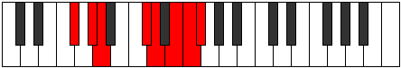 |
| [3469](https://ianring.com/musictheory/scales/3469) | [Monian](ModeGFlatMonian.md) | Gb | Gb, Ab, Bbb, C#, D, E, F, Gb |  |
| [3471](https://ianring.com/musictheory/scales/3471) | [Gyryllic](ModeFSharpGyryllic.md) | F# | F#, G, G#, A, C#, D, E, F, F# |  |
| [3471](https://ianring.com/musictheory/scales/3471) | [Gyryllic](ModeGFlatGyryllic.md) | Gb | Gb, G, Ab, A, Db, D, E, F, Gb | 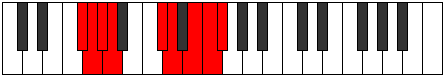 |
| [3471](https://ianring.com/musictheory/scales/3471) | [Gyryllic](ModeGNaturalGyryllic.md) | G | G, G#, A, A#, D, D#, F, F#, G |  |
| [3473](https://ianring.com/musictheory/scales/3473) | [Lathimic](ModeASharpLathimic.md) | A# | A#, B###, D###, E##, F###, G##, A# |  |
| [3473](https://ianring.com/musictheory/scales/3473) | [Lathimic](ModeBFlatLathimic.md) | Bb | Bb, C##, D###, E##, F###, G##, Bb |  |
| [3475](https://ianring.com/musictheory/scales/3475) | [Kylian](ModeASharpKylian.md) | A# | A#, B, C##, D###, E##, F###, G##, A# |  |
| [3475](https://ianring.com/musictheory/scales/3475) | [Kylian](ModeBFlatKylian.md) | Bb | Bb, Cb, D, E#, F#, G#, A, Bb |  |
| [3477](https://ianring.com/musictheory/scales/3477) | [Kyptian](ModeASharpKyptian.md) | A# | A#, B#, C##, D###, E##, F###, G##, A# |  |
| [3477](https://ianring.com/musictheory/scales/3477) | [Kyptian](ModeBFlatKyptian.md) | Bb | Bb, C, D, E#, F#, G#, A, Bb |  |
| [3479](https://ianring.com/musictheory/scales/3479) | [Rothyllic](ModeGNaturalRothyllic.md) | G | G, G#, A, B, D, D#, F, F#, G |  |
| [3479](https://ianring.com/musictheory/scales/3479) | [Rothyllic](ModeASharpRothyllic.md) | A# | A#, B, C, D, F, F#, G#, A, A# |  |
| [3479](https://ianring.com/musictheory/scales/3479) | [Rothyllic](ModeBFlatRothyllic.md) | Bb | Bb, B, C, D, F, Gb, Ab, A, Bb |  |
| [3481](https://ianring.com/musictheory/scales/3481) | [Katathian](ModeASharpKatathian.md) | A# | A#, B##, C##, D###, E##, F###, G##, A# |  |
| [3481](https://ianring.com/musictheory/scales/3481) | [Katathian](ModeBFlatKatathian.md) | Bb | Bb, C#, D, E#, F#, G#, A, Bb |  |
| [3483](https://ianring.com/musictheory/scales/3483) | [Mixotharyllic](ModeASharpMixotharyllic.md) | A# | A#, B, C#, D, F, F#, G#, A, A# |  |
| [3483](https://ianring.com/musictheory/scales/3483) | [Mixotharyllic](ModeBFlatMixotharyllic.md) | Bb | Bb, B, Db, D, F, Gb, Ab, A, Bb |  |
| [3485](https://ianring.com/musictheory/scales/3485) | [Kyptyllic](ModeASharpKyptyllic.md) | A# | A#, C, C#, D, F, F#, G#, A, A# |  |
| [3485](https://ianring.com/musictheory/scales/3485) | [Kyptyllic](ModeBFlatKyptyllic.md) | Bb | Bb, C, Db, D, F, Gb, Ab, A, Bb |  |
| [3485](https://ianring.com/musictheory/scales/3485) | [Kyptyllic](ModeFSharpKyptyllic.md) | F# | F#, G#, A, A#, C#, D, E, F, F# |  |
| [3485](https://ianring.com/musictheory/scales/3485) | [Kyptyllic](ModeGFlatKyptyllic.md) | Gb | Gb, Ab, A, Bb, Db, D, E, F, Gb |  |
| [3487](https://ianring.com/musictheory/scales/3487) | [Byptygic](ModeFSharpByptygic.md) | F# | F#, G, G#, A, A#, C#, D, E, F, F# |  |
| [3487](https://ianring.com/musictheory/scales/3487) | [Byptygic](ModeGFlatByptygic.md) | Gb | Gb, G, Ab, A, Bb, Db, D, E, F, Gb |  |
| [3487](https://ianring.com/musictheory/scales/3487) | [Byptygic](ModeASharpByptygic.md) | A# | A#, B, C, C#, D, F, F#, G#, A, A# |  |
| [3487](https://ianring.com/musictheory/scales/3487) | [Byptygic](ModeBFlatByptygic.md) | Bb | Bb, B, C, Db, D, F, Gb, Ab, A, Bb |  |
| [3487](https://ianring.com/musictheory/scales/3487) | [Byptygic](ModeGNaturalByptygic.md) | G | G, G#, A, A#, B, D, D#, F, F#, G |  |
| [3491](https://ianring.com/musictheory/scales/3491) | [Tharian](ModeCSharpTharian.md) | C# | C#, D, E##, F###, G##, A##, B#, C# |  |
| [3491](https://ianring.com/musictheory/scales/3491) | [Tharian](ModeDFlatTharian.md) | Db | Db, Ebb, F#, G#, A, B, C, Db |  |
| [3495](https://ianring.com/musictheory/scales/3495) | [Banyllic](ModeGNaturalBanyllic.md) | G | G, G#, A, C, D, D#, F, F#, G |  |
| [3495](https://ianring.com/musictheory/scales/3495) | [Banyllic](ModeCSharpBanyllic.md) | C# | C#, D, D#, F#, G#, A, B, C, C# |  |
| [3495](https://ianring.com/musictheory/scales/3495) | [Banyllic](ModeDFlatBanyllic.md) | Db | Db, D, Eb, Gb, Ab, A, B, C, Db |  |
| [3499](https://ianring.com/musictheory/scales/3499) | [Lythyllic](ModeCSharpLythyllic.md) | C# | C#, D, E, F#, G#, A, B, C, C# |  |
| [3499](https://ianring.com/musictheory/scales/3499) | [Lythyllic](ModeDFlatLythyllic.md) | Db | Db, D, E, Gb, Ab, A, B, C, Db |  |
| [3501](https://ianring.com/musictheory/scales/3501) | [Katodyllic](ModeFSharpKatodyllic.md) | F# | F#, G#, A, B, C#, D, E, F, F# |  |
| [3501](https://ianring.com/musictheory/scales/3501) | [Katodyllic](ModeGFlatKatodyllic.md) | Gb | Gb, Ab, A, B, Db, D, E, F, Gb |  |
| [3503](https://ianring.com/musictheory/scales/3503) | [Zyphygic](ModeGNaturalZyphygic.md) | G | G, G#, A, A#, C, D, D#, F, F#, G |  |
| [3503](https://ianring.com/musictheory/scales/3503) | [Zyphygic](ModeCSharpZyphygic.md) | C# | C#, D, D#, E, F#, G#, A, B, C, C# |  |
| [3503](https://ianring.com/musictheory/scales/3503) | [Zyphygic](ModeDFlatZyphygic.md) | Db | Db, D, Eb, E, Gb, Ab, A, B, C, Db |  |
| [3503](https://ianring.com/musictheory/scales/3503) | [Zyphygic](ModeFSharpZyphygic.md) | F# | F#, G, G#, A, B, C#, D, E, F, F# |  |
| [3503](https://ianring.com/musictheory/scales/3503) | [Zyphygic](ModeGFlatZyphygic.md) | Gb | Gb, G, Ab, A, B, Db, D, E, F, Gb |  |
| [3505](https://ianring.com/musictheory/scales/3505) | [Stygian](ModeASharpStygian.md) | A# | A#, B###, C###, D###, E##, F###, G##, A# |  |
| [3505](https://ianring.com/musictheory/scales/3505) | [Stygian](ModeBFlatStygian.md) | Bb | Bb, C##, D#, E#, F#, G#, A, Bb |  |
| [3507](https://ianring.com/musictheory/scales/3507) | [Ponyllic](ModeCSharpPonyllic.md) | C# | C#, D, F, F#, G#, A, B, C, C# |  |
| [3507](https://ianring.com/musictheory/scales/3507) | [Ponyllic](ModeDFlatPonyllic.md) | Db | Db, D, F, Gb, Ab, A, B, C, Db |  |
| [3507](https://ianring.com/musictheory/scales/3507) | [Ponyllic](ModeASharpPonyllic.md) | A# | A#, B, D, D#, F, F#, G#, A, A# |  |
| [3507](https://ianring.com/musictheory/scales/3507) | [Ponyllic](ModeBFlatPonyllic.md) | Bb | Bb, B, D, Eb, F, Gb, Ab, A, Bb |  |
| [3509](https://ianring.com/musictheory/scales/3509) | [Stogyllic](ModeASharpStogyllic.md) | A# | A#, C, D, D#, F, F#, G#, A, A# |  |
| [3509](https://ianring.com/musictheory/scales/3509) | [Stogyllic](ModeBFlatStogyllic.md) | Bb | Bb, C, D, Eb, F, Gb, Ab, A, Bb |  |
| [3509](https://ianring.com/musictheory/scales/3509) | [Stogyllic](ModeENaturalStogyllic.md) | E | E, F#, G#, A, B, C, D, D#, E |  |
| [3511](https://ianring.com/musictheory/scales/3511) | [Epolygic](ModeCSharpEpolygic.md) | C# | C#, D, D#, F, F#, G#, A, B, C, C# |  |
| [3511](https://ianring.com/musictheory/scales/3511) | [Epolygic](ModeDFlatEpolygic.md) | Db | Db, D, Eb, F, Gb, Ab, A, B, C, Db |  |
| [3511](https://ianring.com/musictheory/scales/3511) | [Epolygic](ModeENaturalEpolygic.md) | E | E, F, F#, G#, A, B, C, D, D#, E |  |
| [3511](https://ianring.com/musictheory/scales/3511) | [Epolygic](ModeGNaturalEpolygic.md) | G | G, G#, A, B, C, D, D#, F, F#, G |  |
| [3511](https://ianring.com/musictheory/scales/3511) | [Epolygic](ModeASharpEpolygic.md) | A# | A#, B, C, D, D#, F, F#, G#, A, A# |  |
| [3511](https://ianring.com/musictheory/scales/3511) | [Epolygic](ModeBFlatEpolygic.md) | Bb | Bb, B, C, D, Eb, F, Gb, Ab, A, Bb |  |
| [3513](https://ianring.com/musictheory/scales/3513) | [Dydyllic](ModeASharpDydyllic.md) | A# | A#, C#, D, D#, F, F#, G#, A, A# |  |
| [3513](https://ianring.com/musictheory/scales/3513) | [Dydyllic](ModeBFlatDydyllic.md) | Bb | Bb, Db, D, Eb, F, Gb, Ab, A, Bb |  |
| [3515](https://ianring.com/musictheory/scales/3515) | [Katodygic](ModeCSharpKatodygic.md) | C# | C#, D, E, F, F#, G#, A, B, C, C# |  |
| [3515](https://ianring.com/musictheory/scales/3515) | [Katodygic](ModeDFlatKatodygic.md) | Db | Db, D, E, F, Gb, Ab, A, B, C, Db |  |
| [3515](https://ianring.com/musictheory/scales/3515) | [Katodygic](ModeASharpKatodygic.md) | A# | A#, B, C#, D, D#, F, F#, G#, A, A# |  |
| [3515](https://ianring.com/musictheory/scales/3515) | [Katodygic](ModeBFlatKatodygic.md) | Bb | Bb, B, Db, D, Eb, F, Gb, Ab, A, Bb |  |
| [3517](https://ianring.com/musictheory/scales/3517) | [Epocrygic](ModeASharpEpocrygic.md) | A# | A#, C, C#, D, D#, F, F#, G#, A, A# |  |
| [3517](https://ianring.com/musictheory/scales/3517) | [Epocrygic](ModeBFlatEpocrygic.md) | Bb | Bb, C, Db, D, Eb, F, Gb, Ab, A, Bb |  |
| [3517](https://ianring.com/musictheory/scales/3517) | [Epocrygic](ModeENaturalEpocrygic.md) | E | E, F#, G, G#, A, B, C, D, D#, E |  |
| [3517](https://ianring.com/musictheory/scales/3517) | [Epocrygic](ModeFSharpEpocrygic.md) | F# | F#, G#, A, A#, B, C#, D, E, F, F# |  |
| [3517](https://ianring.com/musictheory/scales/3517) | [Epocrygic](ModeGFlatEpocrygic.md) | Gb | Gb, Ab, A, Bb, B, Db, D, E, F, Gb |  |
| [3519](https://ianring.com/musictheory/scales/3519) | [Boptyllian](ModeCSharpBoptyllian.md) | C# | C#, D, D#, E, F, F#, G#, A, B, C, C# |  |
| [3519](https://ianring.com/musictheory/scales/3519) | [Boptyllian](ModeDFlatBoptyllian.md) | Db | Db, D, Eb, E, F, Gb, Ab, A, B, C, Db |  |
| [3519](https://ianring.com/musictheory/scales/3519) | [Boptyllian](ModeENaturalBoptyllian.md) | E | E, F, F#, G, G#, A, B, C, D, D#, E |  |
| [3519](https://ianring.com/musictheory/scales/3519) | [Boptyllian](ModeASharpBoptyllian.md) | A# | A#, B, C, C#, D, D#, F, F#, G#, A, A# |  |
| [3519](https://ianring.com/musictheory/scales/3519) | [Boptyllian](ModeBFlatBoptyllian.md) | Bb | Bb, B, C, Db, D, Eb, F, Gb, Ab, A, Bb |  |
| [3519](https://ianring.com/musictheory/scales/3519) | [Boptyllian](ModeGNaturalBoptyllian.md) | G | G, G#, A, A#, B, C, D, D#, F, F#, G |  |
| [3519](https://ianring.com/musictheory/scales/3519) | [Boptyllian](ModeFSharpBoptyllian.md) | F# | F#, G, G#, A, A#, B, C#, D, E, F, F# |  |
| [3519](https://ianring.com/musictheory/scales/3519) | [Boptyllian](ModeGFlatBoptyllian.md) | Gb | Gb, G, Ab, A, Bb, B, Db, D, E, F, Gb |  |
| [3527](https://ianring.com/musictheory/scales/3527) | [Ronyllic](ModeGNaturalRonyllic.md) | G | G, G#, A, C#, D, D#, F, F#, G |  |
| [3527](https://ianring.com/musictheory/scales/3527) | [Ronyllic](ModeGSharpRonyllic.md) | G# | G#, A, A#, D, D#, E, F#, G, G# |  |
| [3527](https://ianring.com/musictheory/scales/3527) | [Ronyllic](ModeAFlatRonyllic.md) | Ab | Ab, A, Bb, D, Eb, E, Gb, G, Ab |  |
| [3531](https://ianring.com/musictheory/scales/3531) | [Dycryllic](ModeGSharpDycryllic.md) | G# | G#, A, B, D, D#, E, F#, G, G# |  |
| [3531](https://ianring.com/musictheory/scales/3531) | [Dycryllic](ModeAFlatDycryllic.md) | Ab | Ab, A, B, D, Eb, E, Gb, G, Ab |  |
| [3533](https://ianring.com/musictheory/scales/3533) | [Thadyllic](ModeFSharpThadyllic.md) | F# | F#, G#, A, C, C#, D, E, F, F# |  |
| [3533](https://ianring.com/musictheory/scales/3533) | [Thadyllic](ModeGFlatThadyllic.md) | Gb | Gb, Ab, A, C, Db, D, E, F, Gb |  |
| [3535](https://ianring.com/musictheory/scales/3535) | [Aeroptygic](ModeFSharpAeroptygic.md) | F# | F#, G, G#, A, C, C#, D, E, F, F# |  |
| [3535](https://ianring.com/musictheory/scales/3535) | [Aeroptygic](ModeGFlatAeroptygic.md) | Gb | Gb, G, Ab, A, C, Db, D, E, F, Gb |  |
| [3535](https://ianring.com/musictheory/scales/3535) | [Aeroptygic](ModeGNaturalAeroptygic.md) | G | G, G#, A, A#, C#, D, D#, F, F#, G |  |
| [3535](https://ianring.com/musictheory/scales/3535) | [Aeroptygic](ModeGSharpAeroptygic.md) | G# | G#, A, A#, B, D, D#, E, F#, G, G# |  |
| [3535](https://ianring.com/musictheory/scales/3535) | [Aeroptygic](ModeAFlatAeroptygic.md) | Ab | Ab, A, Bb, B, D, Eb, E, Gb, G, Ab |  |
| [3537](https://ianring.com/musictheory/scales/3537) | [Katogian](ModeDNaturalKatogian.md) | D | D, E##, F###, G##, A#, B#, C#, D |  |
| [3537](https://ianring.com/musictheory/scales/3537) | [Katogian](ModeASharpKatogian.md) | A# | A#, B###, D##, E#, F#, G#, A, A# |  |
| [3537](https://ianring.com/musictheory/scales/3537) | [Katogian](ModeBFlatKatogian.md) | Bb | Bb, C##, D##, E#, F#, G#, A, Bb |  |
| [3539](https://ianring.com/musictheory/scales/3539) | [Aeoryllic](ModeGSharpAeoryllic.md) | G# | G#, A, C, D, D#, E, F#, G, G# |  |
| [3539](https://ianring.com/musictheory/scales/3539) | [Aeoryllic](ModeAFlatAeoryllic.md) | Ab | Ab, A, C, D, Eb, E, Gb, G, Ab |  |
| [3539](https://ianring.com/musictheory/scales/3539) | [Aeoryllic](ModeDNaturalAeoryllic.md) | D | D, D#, F#, G#, A, A#, C, C#, D |  |
| [3539](https://ianring.com/musictheory/scales/3539) | [Aeoryllic](ModeASharpAeoryllic.md) | A# | A#, B, D, E, F, F#, G#, A, A# |  |
| [3539](https://ianring.com/musictheory/scales/3539) | [Aeoryllic](ModeBFlatAeoryllic.md) | Bb | Bb, B, D, E, F, Gb, Ab, A, Bb |  |
| [3541](https://ianring.com/musictheory/scales/3541) | [Racryllic](ModeDNaturalRacryllic.md) | D | D, E, F#, G#, A, A#, C, C#, D |  |
| [3541](https://ianring.com/musictheory/scales/3541) | [Racryllic](ModeASharpRacryllic.md) | A# | A#, C, D, E, F, F#, G#, A, A# |  |
| [3541](https://ianring.com/musictheory/scales/3541) | [Racryllic](ModeBFlatRacryllic.md) | Bb | Bb, C, D, E, F, Gb, Ab, A, Bb |  |
| [3543](https://ianring.com/musictheory/scales/3543) | [Aeolonygic](ModeDNaturalAeolonygic.md) | D | D, D#, E, F#, G#, A, A#, C, C#, D |  |
| [3543](https://ianring.com/musictheory/scales/3543) | [Aeolonygic](ModeGSharpAeolonygic.md) | G# | G#, A, A#, C, D, D#, E, F#, G, G# |  |
| [3543](https://ianring.com/musictheory/scales/3543) | [Aeolonygic](ModeAFlatAeolonygic.md) | Ab | Ab, A, Bb, C, D, Eb, E, Gb, G, Ab |  |
| [3543](https://ianring.com/musictheory/scales/3543) | [Aeolonygic](ModeGNaturalAeolonygic.md) | G | G, G#, A, B, C#, D, D#, F, F#, G |  |
| [3543](https://ianring.com/musictheory/scales/3543) | [Aeolonygic](ModeASharpAeolonygic.md) | A# | A#, B, C, D, E, F, F#, G#, A, A# |  |
| [3543](https://ianring.com/musictheory/scales/3543) | [Aeolonygic](ModeBFlatAeolonygic.md) | Bb | Bb, B, C, D, E, F, Gb, Ab, A, Bb |  |
| [3545](https://ianring.com/musictheory/scales/3545) | [Thyptyllic](ModeDNaturalThyptyllic.md) | D | D, F, F#, G#, A, A#, C, C#, D |  |
| [3545](https://ianring.com/musictheory/scales/3545) | [Thyptyllic](ModeASharpThyptyllic.md) | A# | A#, C#, D, E, F, F#, G#, A, A# |  |
| [3545](https://ianring.com/musictheory/scales/3545) | [Thyptyllic](ModeBFlatThyptyllic.md) | Bb | Bb, Db, D, E, F, Gb, Ab, A, Bb |  |
| [3547](https://ianring.com/musictheory/scales/3547) | [Sadygic](ModeDNaturalSadygic.md) | D | D, D#, F, F#, G#, A, A#, C, C#, D |  |
| [3547](https://ianring.com/musictheory/scales/3547) | [Sadygic](ModeGSharpSadygic.md) | G# | G#, A, B, C, D, D#, E, F#, G, G# |  |
| [3547](https://ianring.com/musictheory/scales/3547) | [Sadygic](ModeAFlatSadygic.md) | Ab | Ab, A, B, C, D, Eb, E, Gb, G, Ab |  |
| [3547](https://ianring.com/musictheory/scales/3547) | [Sadygic](ModeASharpSadygic.md) | A# | A#, B, C#, D, E, F, F#, G#, A, A# |  |
| [3547](https://ianring.com/musictheory/scales/3547) | [Sadygic](ModeBFlatSadygic.md) | Bb | Bb, B, Db, D, E, F, Gb, Ab, A, Bb |  |
| [3549](https://ianring.com/musictheory/scales/3549) | [Phronygic](ModeDNaturalPhronygic.md) | D | D, E, F, F#, G#, A, A#, C, C#, D |  |
| [3549](https://ianring.com/musictheory/scales/3549) | [Phronygic](ModeFSharpPhronygic.md) | F# | F#, G#, A, A#, C, C#, D, E, F, F# |  |
| [3549](https://ianring.com/musictheory/scales/3549) | [Phronygic](ModeGFlatPhronygic.md) | Gb | Gb, Ab, A, Bb, C, Db, D, E, F, Gb |  |
| [3549](https://ianring.com/musictheory/scales/3549) | [Phronygic](ModeASharpPhronygic.md) | A# | A#, C, C#, D, E, F, F#, G#, A, A# |  |
| [3549](https://ianring.com/musictheory/scales/3549) | [Phronygic](ModeBFlatPhronygic.md) | Bb | Bb, C, Db, D, E, F, Gb, Ab, A, Bb |  |
| [3551](https://ianring.com/musictheory/scales/3551) | [Sagyllian](ModeDNaturalSagyllian.md) | D | D, D#, E, F, F#, G#, A, A#, C, C#, D |  |
| [3551](https://ianring.com/musictheory/scales/3551) | [Sagyllian](ModeFSharpSagyllian.md) | F# | F#, G, G#, A, A#, C, C#, D, E, F, F# |  |
| [3551](https://ianring.com/musictheory/scales/3551) | [Sagyllian](ModeGFlatSagyllian.md) | Gb | Gb, G, Ab, A, Bb, C, Db, D, E, F, Gb |  |
| [3551](https://ianring.com/musictheory/scales/3551) | [Sagyllian](ModeASharpSagyllian.md) | A# | A#, B, C, C#, D, E, F, F#, G#, A, A# |  |
| [3551](https://ianring.com/musictheory/scales/3551) | [Sagyllian](ModeBFlatSagyllian.md) | Bb | Bb, B, C, Db, D, E, F, Gb, Ab, A, Bb |  |
| [3551](https://ianring.com/musictheory/scales/3551) | [Sagyllian](ModeGSharpSagyllian.md) | G# | G#, A, A#, B, C, D, D#, E, F#, G, G# |  |
| [3551](https://ianring.com/musictheory/scales/3551) | [Sagyllian](ModeAFlatSagyllian.md) | Ab | Ab, A, Bb, B, C, D, Eb, E, Gb, G, Ab |  |
| [3551](https://ianring.com/musictheory/scales/3551) | [Sagyllian](ModeGNaturalSagyllian.md) | G | G, G#, A, A#, B, C#, D, D#, F, F#, G |  |
| [3555](https://ianring.com/musictheory/scales/3555) | [Pylyllic](ModeGSharpPylyllic.md) | G# | G#, A, C#, D, D#, E, F#, G, G# |  |
| [3555](https://ianring.com/musictheory/scales/3555) | [Pylyllic](ModeAFlatPylyllic.md) | Ab | Ab, A, Db, D, Eb, E, Gb, G, Ab |  |
| [3555](https://ianring.com/musictheory/scales/3555) | [Pylyllic](ModeCSharpPylyllic.md) | C# | C#, D, F#, G, G#, A, B, C, C# |  |
| [3555](https://ianring.com/musictheory/scales/3555) | [Pylyllic](ModeDFlatPylyllic.md) | Db | Db, D, Gb, G, Ab, A, B, C, Db |  |
| [3559](https://ianring.com/musictheory/scales/3559) | [Aerathygic](ModeGNaturalAerathygic.md) | G | G, G#, A, C, C#, D, D#, F, F#, G |  |
| [3559](https://ianring.com/musictheory/scales/3559) | [Aerathygic](ModeGSharpAerathygic.md) | G# | G#, A, A#, C#, D, D#, E, F#, G, G# |  |
| [3559](https://ianring.com/musictheory/scales/3559) | [Aerathygic](ModeAFlatAerathygic.md) | Ab | Ab, A, Bb, Db, D, Eb, E, Gb, G, Ab |  |
| [3559](https://ianring.com/musictheory/scales/3559) | [Aerathygic](ModeCSharpAerathygic.md) | C# | C#, D, D#, F#, G, G#, A, B, C, C# |  |
| [3559](https://ianring.com/musictheory/scales/3559) | [Aerathygic](ModeDFlatAerathygic.md) | Db | Db, D, Eb, Gb, G, Ab, A, B, C, Db |  |
| [3561](https://ianring.com/musictheory/scales/3561) | [Pothyllic](ModeDSharpPothyllic.md) | D# | D#, F#, G#, A, A#, B, C#, D, D# |  |
| [3561](https://ianring.com/musictheory/scales/3561) | [Pothyllic](ModeEFlatPothyllic.md) | Eb | Eb, Gb, Ab, A, Bb, B, Db, D, Eb |  |
| [3563](https://ianring.com/musictheory/scales/3563) | [Ionoptygic](ModeCSharpIonoptygic.md) | C# | C#, D, E, F#, G, G#, A, B, C, C# |  |
| [3563](https://ianring.com/musictheory/scales/3563) | [Ionoptygic](ModeDFlatIonoptygic.md) | Db | Db, D, E, Gb, G, Ab, A, B, C, Db |  |
| [3563](https://ianring.com/musictheory/scales/3563) | [Ionoptygic](ModeGSharpIonoptygic.md) | G# | G#, A, B, C#, D, D#, E, F#, G, G# |  |
| [3563](https://ianring.com/musictheory/scales/3563) | [Ionoptygic](ModeAFlatIonoptygic.md) | Ab | Ab, A, B, Db, D, Eb, E, Gb, G, Ab |  |
| [3563](https://ianring.com/musictheory/scales/3563) | [Ionoptygic](ModeDSharpIonoptygic.md) | D# | D#, E, F#, G#, A, A#, B, C#, D, D# |  |
| [3563](https://ianring.com/musictheory/scales/3563) | [Ionoptygic](ModeEFlatIonoptygic.md) | Eb | Eb, E, Gb, Ab, A, Bb, B, Db, D, Eb |  |
| [3565](https://ianring.com/musictheory/scales/3565) | [Aeolorygic](ModeFSharpAeolorygic.md) | F# | F#, G#, A, B, C, C#, D, E, F, F# |  |
| [3565](https://ianring.com/musictheory/scales/3565) | [Aeolorygic](ModeGFlatAeolorygic.md) | Gb | Gb, Ab, A, B, C, Db, D, E, F, Gb |  |
| [3565](https://ianring.com/musictheory/scales/3565) | [Aeolorygic](ModeDSharpAeolorygic.md) | D# | D#, F, F#, G#, A, A#, B, C#, D, D# |  |
| [3565](https://ianring.com/musictheory/scales/3565) | [Aeolorygic](ModeEFlatAeolorygic.md) | Eb | Eb, F, Gb, Ab, A, Bb, B, Db, D, Eb |  |
| [3567](https://ianring.com/musictheory/scales/3567) | [Epityllian](ModeGNaturalEpityllian.md) | G | G, G#, A, A#, C, C#, D, D#, F, F#, G |  |
| [3567](https://ianring.com/musictheory/scales/3567) | [Epityllian](ModeCSharpEpityllian.md) | C# | C#, D, D#, E, F#, G, G#, A, B, C, C# |  |
| [3567](https://ianring.com/musictheory/scales/3567) | [Epityllian](ModeDFlatEpityllian.md) | Db | Db, D, Eb, E, Gb, G, Ab, A, B, C, Db |  |
| [3567](https://ianring.com/musictheory/scales/3567) | [Epityllian](ModeFSharpEpityllian.md) | F# | F#, G, G#, A, B, C, C#, D, E, F, F# |  |
| [3567](https://ianring.com/musictheory/scales/3567) | [Epityllian](ModeGFlatEpityllian.md) | Gb | Gb, G, Ab, A, B, C, Db, D, E, F, Gb |  |
| [3567](https://ianring.com/musictheory/scales/3567) | [Epityllian](ModeDSharpEpityllian.md) | D# | D#, E, F, F#, G#, A, A#, B, C#, D, D# |  |
| [3567](https://ianring.com/musictheory/scales/3567) | [Epityllian](ModeEFlatEpityllian.md) | Eb | Eb, E, F, Gb, Ab, A, Bb, B, Db, D, Eb |  |
| [3567](https://ianring.com/musictheory/scales/3567) | [Epityllian](ModeGSharpEpityllian.md) | G# | G#, A, A#, B, C#, D, D#, E, F#, G, G# |  |
| [3567](https://ianring.com/musictheory/scales/3567) | [Epityllian](ModeAFlatEpityllian.md) | Ab | Ab, A, Bb, B, Db, D, Eb, E, Gb, G, Ab |  |
| [3569](https://ianring.com/musictheory/scales/3569) | [Aeoladyllic](ModeASharpAeoladyllic.md) | A# | A#, D, D#, E, F, F#, G#, A, A# |  |
| [3569](https://ianring.com/musictheory/scales/3569) | [Aeoladyllic](ModeBFlatAeoladyllic.md) | Bb | Bb, D, Eb, E, F, Gb, Ab, A, Bb |  |
| [3569](https://ianring.com/musictheory/scales/3569) | [Aeoladyllic](ModeDNaturalAeoladyllic.md) | D | D, F#, G, G#, A, A#, C, C#, D |  |
| [3571](https://ianring.com/musictheory/scales/3571) | [Dyrygic](ModeGSharpDyrygic.md) | G# | G#, A, C, C#, D, D#, E, F#, G, G# |  |
| [3571](https://ianring.com/musictheory/scales/3571) | [Dyrygic](ModeAFlatDyrygic.md) | Ab | Ab, A, C, Db, D, Eb, E, Gb, G, Ab |  |
| [3571](https://ianring.com/musictheory/scales/3571) | [Dyrygic](ModeDNaturalDyrygic.md) | D | D, D#, F#, G, G#, A, A#, C, C#, D |  |
| [3571](https://ianring.com/musictheory/scales/3571) | [Dyrygic](ModeCSharpDyrygic.md) | C# | C#, D, F, F#, G, G#, A, B, C, C# |  |
| [3571](https://ianring.com/musictheory/scales/3571) | [Dyrygic](ModeDFlatDyrygic.md) | Db | Db, D, F, Gb, G, Ab, A, B, C, Db |  |
| [3571](https://ianring.com/musictheory/scales/3571) | [Dyrygic](ModeASharpDyrygic.md) | A# | A#, B, D, D#, E, F, F#, G#, A, A# |  |
| [3571](https://ianring.com/musictheory/scales/3571) | [Dyrygic](ModeBFlatDyrygic.md) | Bb | Bb, B, D, Eb, E, F, Gb, Ab, A, Bb |  |
| [3573](https://ianring.com/musictheory/scales/3573) | [Kaptygic](ModeASharpKaptygic.md) | A# | A#, C, D, D#, E, F, F#, G#, A, A# |  |
| [3573](https://ianring.com/musictheory/scales/3573) | [Kaptygic](ModeBFlatKaptygic.md) | Bb | Bb, C, D, Eb, E, F, Gb, Ab, A, Bb |  |
| [3573](https://ianring.com/musictheory/scales/3573) | [Kaptygic](ModeDNaturalKaptygic.md) | D | D, E, F#, G, G#, A, A#, C, C#, D |  |
| [3573](https://ianring.com/musictheory/scales/3573) | [Kaptygic](ModeENaturalKaptygic.md) | E | E, F#, G#, A, A#, B, C, D, D#, E |  |
| [3575](https://ianring.com/musictheory/scales/3575) | [Mogyllian](ModeDNaturalMogyllian.md) | D | D, D#, E, F#, G, G#, A, A#, C, C#, D |  |
| [3575](https://ianring.com/musictheory/scales/3575) | [Mogyllian](ModeGSharpMogyllian.md) | G# | G#, A, A#, C, C#, D, D#, E, F#, G, G# |  |
| [3575](https://ianring.com/musictheory/scales/3575) | [Mogyllian](ModeAFlatMogyllian.md) | Ab | Ab, A, Bb, C, Db, D, Eb, E, Gb, G, Ab |  |
| [3575](https://ianring.com/musictheory/scales/3575) | [Mogyllian](ModeCSharpMogyllian.md) | C# | C#, D, D#, F, F#, G, G#, A, B, C, C# |  |
| [3575](https://ianring.com/musictheory/scales/3575) | [Mogyllian](ModeDFlatMogyllian.md) | Db | Db, D, Eb, F, Gb, G, Ab, A, B, C, Db |  |
| [3575](https://ianring.com/musictheory/scales/3575) | [Mogyllian](ModeGNaturalMogyllian.md) | G | G, G#, A, B, C, C#, D, D#, F, F#, G |  |
| [3575](https://ianring.com/musictheory/scales/3575) | [Mogyllian](ModeENaturalMogyllian.md) | E | E, F, F#, G#, A, A#, B, C, D, D#, E |  |
| [3575](https://ianring.com/musictheory/scales/3575) | [Mogyllian](ModeASharpMogyllian.md) | A# | A#, B, C, D, D#, E, F, F#, G#, A, A# |  |
| [3575](https://ianring.com/musictheory/scales/3575) | [Mogyllian](ModeBFlatMogyllian.md) | Bb | Bb, B, C, D, Eb, E, F, Gb, Ab, A, Bb |  |
| [3577](https://ianring.com/musictheory/scales/3577) | [Loptygic](ModeASharpLoptygic.md) | A# | A#, C#, D, D#, E, F, F#, G#, A, A# |  |
| [3577](https://ianring.com/musictheory/scales/3577) | [Loptygic](ModeBFlatLoptygic.md) | Bb | Bb, Db, D, Eb, E, F, Gb, Ab, A, Bb |  |
| [3577](https://ianring.com/musictheory/scales/3577) | [Loptygic](ModeDNaturalLoptygic.md) | D | D, F, F#, G, G#, A, A#, C, C#, D |  |
| [3577](https://ianring.com/musictheory/scales/3577) | [Loptygic](ModeDSharpLoptygic.md) | D# | D#, F#, G, G#, A, A#, B, C#, D, D# |  |
| [3577](https://ianring.com/musictheory/scales/3577) | [Loptygic](ModeEFlatLoptygic.md) | Eb | Eb, Gb, G, Ab, A, Bb, B, Db, D, Eb |  |
| [3579](https://ianring.com/musictheory/scales/3579) | [Zyphyllian](ModeDNaturalZyphyllian.md) | D | D, D#, F, F#, G, G#, A, A#, C, C#, D |  |
| [3579](https://ianring.com/musictheory/scales/3579) | [Zyphyllian](ModeGSharpZyphyllian.md) | G# | G#, A, B, C, C#, D, D#, E, F#, G, G# |  |
| [3579](https://ianring.com/musictheory/scales/3579) | [Zyphyllian](ModeAFlatZyphyllian.md) | Ab | Ab, A, B, C, Db, D, Eb, E, Gb, G, Ab | 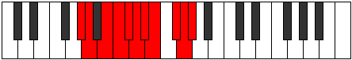 |
| [3579](https://ianring.com/musictheory/scales/3579) | [Zyphyllian](ModeCSharpZyphyllian.md) | C# | C#, D, E, F, F#, G, G#, A, B, C, C# |  |
| [3579](https://ianring.com/musictheory/scales/3579) | [Zyphyllian](ModeDFlatZyphyllian.md) | Db | Db, D, E, F, Gb, G, Ab, A, B, C, Db |  |
| [3579](https://ianring.com/musictheory/scales/3579) | [Zyphyllian](ModeASharpZyphyllian.md) | A# | A#, B, C#, D, D#, E, F, F#, G#, A, A# |  |
| [3579](https://ianring.com/musictheory/scales/3579) | [Zyphyllian](ModeBFlatZyphyllian.md) | Bb | Bb, B, Db, D, Eb, E, F, Gb, Ab, A, Bb |  |
| [3579](https://ianring.com/musictheory/scales/3579) | [Zyphyllian](ModeDSharpZyphyllian.md) | D# | D#, E, F#, G, G#, A, A#, B, C#, D, D# |  |
| [3579](https://ianring.com/musictheory/scales/3579) | [Zyphyllian](ModeEFlatZyphyllian.md) | Eb | Eb, E, Gb, G, Ab, A, Bb, B, Db, D, Eb |  |
| [3581](https://ianring.com/musictheory/scales/3581) | [Epocryllian](ModeASharpEpocryllian.md) | A# | A#, C, C#, D, D#, E, F, F#, G#, A, A# |  |
| [3581](https://ianring.com/musictheory/scales/3581) | [Epocryllian](ModeBFlatEpocryllian.md) | Bb | Bb, C, Db, D, Eb, E, F, Gb, Ab, A, Bb |  |
| [3581](https://ianring.com/musictheory/scales/3581) | [Epocryllian](ModeDNaturalEpocryllian.md) | D | D, E, F, F#, G, G#, A, A#, C, C#, D |  |
| [3581](https://ianring.com/musictheory/scales/3581) | [Epocryllian](ModeFSharpEpocryllian.md) | F# | F#, G#, A, A#, B, C, C#, D, E, F, F# |  |
| [3581](https://ianring.com/musictheory/scales/3581) | [Epocryllian](ModeGFlatEpocryllian.md) | Gb | Gb, Ab, A, Bb, B, C, Db, D, E, F, Gb |  |
| [3581](https://ianring.com/musictheory/scales/3581) | [Epocryllian](ModeENaturalEpocryllian.md) | E | E, F#, G, G#, A, A#, B, C, D, D#, E |  |
| [3581](https://ianring.com/musictheory/scales/3581) | [Epocryllian](ModeDSharpEpocryllian.md) | D# | D#, F, F#, G, G#, A, A#, B, C#, D, D# |  |
| [3581](https://ianring.com/musictheory/scales/3581) | [Epocryllian](ModeEFlatEpocryllian.md) | Eb | Eb, F, Gb, G, Ab, A, Bb, B, Db, D, Eb |  |
| [3583](https://ianring.com/musictheory/scales/3583) | [Zylatic](ModeDNaturalZylatic.md) | D | D, D#, E, F, F#, G, G#, A, A#, C, C#, D |  |
| [3583](https://ianring.com/musictheory/scales/3583) | [Zylatic](ModeCSharpZylatic.md) | C# | C#, D, D#, E, F, F#, G, G#, A, B, C, C# |  |
| [3583](https://ianring.com/musictheory/scales/3583) | [Zylatic](ModeDFlatZylatic.md) | Db | Db, D, Eb, E, F, Gb, G, Ab, A, B, C, Db |  |
| [3583](https://ianring.com/musictheory/scales/3583) | [Zylatic](ModeASharpZylatic.md) | A# | A#, B, C, C#, D, D#, E, F, F#, G#, A, A# |  |
| [3583](https://ianring.com/musictheory/scales/3583) | [Zylatic](ModeBFlatZylatic.md) | Bb | Bb, B, C, Db, D, Eb, E, F, Gb, Ab, A, Bb |  |
| [3583](https://ianring.com/musictheory/scales/3583) | [Zylatic](ModeGSharpZylatic.md) | G# | G#, A, A#, B, C, C#, D, D#, E, F#, G, G# |  |
| [3583](https://ianring.com/musictheory/scales/3583) | [Zylatic](ModeAFlatZylatic.md) | Ab | Ab, A, Bb, B, C, Db, D, Eb, E, Gb, G, Ab |  |
| [3583](https://ianring.com/musictheory/scales/3583) | [Zylatic](ModeGNaturalZylatic.md) | G | G, G#, A, A#, B, C, C#, D, D#, F, F#, G |  |
| [3583](https://ianring.com/musictheory/scales/3583) | [Zylatic](ModeFSharpZylatic.md) | F# | F#, G, G#, A, A#, B, C, C#, D, E, F, F# |  |
| [3583](https://ianring.com/musictheory/scales/3583) | [Zylatic](ModeGFlatZylatic.md) | Gb | Gb, G, Ab, A, Bb, B, C, Db, D, E, F, Gb |  |
| [3583](https://ianring.com/musictheory/scales/3583) | [Zylatic](ModeENaturalZylatic.md) | E | E, F, F#, G, G#, A, A#, B, C, D, D#, E |  |
| [3583](https://ianring.com/musictheory/scales/3583) | [Zylatic](ModeDSharpZylatic.md) | D# | D#, E, F, F#, G, G#, A, A#, B, C#, D, D# |  |
| [3583](https://ianring.com/musictheory/scales/3583) | [Zylatic](ModeEFlatZylatic.md) | Eb | Eb, E, F, Gb, G, Ab, A, Bb, B, Db, D, Eb |  |
| [3619](https://ianring.com/musictheory/scales/3619) | [Thanimic](ModeANaturalThanimic.md) | A | A, Bb, C##, E##, F##, G#, A |  |
| [3621](https://ianring.com/musictheory/scales/3621) | [Gylimic](ModeANaturalGylimic.md) | A | A, B, C##, E##, F##, G#, A |  |
| [3623](https://ianring.com/musictheory/scales/3623) | [Aerocrian](ModeANaturalAerocrian.md) | A | A, Bb, Cb, D, E##, F##, G#, A |  |
| [3625](https://ianring.com/musictheory/scales/3625) | [Podimic](ModeANaturalPodimic.md) | A | A, B#, C##, E##, F##, G#, A |  |
| [3627](https://ianring.com/musictheory/scales/3627) | [Kalian](ModeANaturalKalian.md) | A | A, Bb, C, D, E##, F##, G#, A |  |
| [3629](https://ianring.com/musictheory/scales/3629) | [Boptian](ModeANaturalBoptian.md) | A | A, B, C, D, E##, F##, G#, A |  |
| [3631](https://ianring.com/musictheory/scales/3631) | [Gydyllic](ModeANaturalGydyllic.md) | A | A, A#, B, C, D, F#, G, G#, A |  |
| [3633](https://ianring.com/musictheory/scales/3633) | [Daptimic](ModeANaturalDaptimic.md) | A | A, B##, C##, E##, F##, G#, A |  |
| [3635](https://ianring.com/musictheory/scales/3635) | [Katygian](ModeANaturalKatygian.md) | A | A, Bb, C#, D, E##, F##, G#, A |  |
| [3637](https://ianring.com/musictheory/scales/3637) | [Kygian](ModeENaturalKygian.md) | E | E, F#, G#, A, B##, C##, D#, E |  |
| [3637](https://ianring.com/musictheory/scales/3637) | [Kygian](ModeANaturalKygian.md) | A | A, B, C#, D, E##, F##, G#, A |  |
| [3639](https://ianring.com/musictheory/scales/3639) | [Paptyllic](ModeENaturalPaptyllic.md) | E | E, F, F#, G#, A, C#, D, D#, E |  |
| [3639](https://ianring.com/musictheory/scales/3639) | [Paptyllic](ModeANaturalPaptyllic.md) | A | A, A#, B, C#, D, F#, G, G#, A |  |
| [3641](https://ianring.com/musictheory/scales/3641) | [Thocrian](ModeANaturalThocrian.md) | A | A, B#, C#, D, E##, F##, G#, A |  |
| [3643](https://ianring.com/musictheory/scales/3643) | [Kydyllic](ModeFNaturalKydyllic.md) | F | F, F#, G#, A, A#, D, D#, E, F |  |
| [3643](https://ianring.com/musictheory/scales/3643) | [Kydyllic](ModeANaturalKydyllic.md) | A | A, A#, C, C#, D, F#, G, G#, A |  |
| [3645](https://ianring.com/musictheory/scales/3645) | [Zycryllic](ModeENaturalZycryllic.md) | E | E, F#, G, G#, A, C#, D, D#, E |  |
| [3645](https://ianring.com/musictheory/scales/3645) | [Zycryllic](ModeANaturalZycryllic.md) | A | A, B, C, C#, D, F#, G, G#, A |  |
| [3647](https://ianring.com/musictheory/scales/3647) | [Eporygic](ModeENaturalEporygic.md) | E | E, F, F#, G, G#, A, C#, D, D#, E |  |
| [3647](https://ianring.com/musictheory/scales/3647) | [Eporygic](ModeFNaturalEporygic.md) | F | F, F#, G, G#, A, A#, D, D#, E, F |  |
| [3647](https://ianring.com/musictheory/scales/3647) | [Eporygic](ModeANaturalEporygic.md) | A | A, A#, B, C, C#, D, F#, G, G#, A |  |
| [3655](https://ianring.com/musictheory/scales/3655) | [Mathian](ModeGSharpMathian.md) | G# | G#, A, Bb, C##, D###, E##, F##, G# | 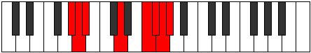 |
| [3655](https://ianring.com/musictheory/scales/3655) | [Mathian](ModeAFlatMathian.md) | Ab | Ab, Bbb, Cbb, D, E#, F#, G, Ab |  |
| [3659](https://ianring.com/musictheory/scales/3659) | [Polian](ModeGSharpPolian.md) | G# | G#, A, B, C##, D###, E##, F##, G# |  |
| [3659](https://ianring.com/musictheory/scales/3659) | [Polian](ModeAFlatPolian.md) | Ab | Ab, Bbb, Cb, D, E#, F#, G, Ab |  |
| [3663](https://ianring.com/musictheory/scales/3663) | [Sonyllic](ModeGSharpSonyllic.md) | G# | G#, A, A#, B, D, F, F#, G, G# |  |
| [3663](https://ianring.com/musictheory/scales/3663) | [Sonyllic](ModeAFlatSonyllic.md) | Ab | Ab, A, Bb, B, D, F, Gb, G, Ab |  |
| [3667](https://ianring.com/musictheory/scales/3667) | [Kaptian](ModeGSharpKaptian.md) | G# | G#, A, B#, C##, D###, E##, F##, G# |  |
| [3667](https://ianring.com/musictheory/scales/3667) | [Kaptian](ModeAFlatKaptian.md) | Ab | Ab, Bbb, C, D, E#, F#, G, Ab |  |
| [3671](https://ianring.com/musictheory/scales/3671) | [Aeonyllic](ModeGSharpAeonyllic.md) | G# | G#, A, A#, C, D, F, F#, G, G# |  |
| [3671](https://ianring.com/musictheory/scales/3671) | [Aeonyllic](ModeAFlatAeonyllic.md) | Ab | Ab, A, Bb, C, D, F, Gb, G, Ab |  |
| [3675](https://ianring.com/musictheory/scales/3675) | [Monyllic](ModeFNaturalMonyllic.md) | F | F, F#, G#, A, B, D, D#, E, F |  |
| [3675](https://ianring.com/musictheory/scales/3675) | [Monyllic](ModeGSharpMonyllic.md) | G# | G#, A, B, C, D, F, F#, G, G# |  |
| [3675](https://ianring.com/musictheory/scales/3675) | [Monyllic](ModeAFlatMonyllic.md) | Ab | Ab, A, B, C, D, F, Gb, G, Ab |  |
| [3679](https://ianring.com/musictheory/scales/3679) | [Rycrygic](ModeFNaturalRycrygic.md) | F | F, F#, G, G#, A, B, D, D#, E, F |  |
| [3679](https://ianring.com/musictheory/scales/3679) | [Rycrygic](ModeGSharpRycrygic.md) | G# | G#, A, A#, B, C, D, F, F#, G, G# |  |
| [3679](https://ianring.com/musictheory/scales/3679) | [Rycrygic](ModeAFlatRycrygic.md) | Ab | Ab, A, Bb, B, C, D, F, Gb, G, Ab |  |
| [3683](https://ianring.com/musictheory/scales/3683) | [Dycrian](ModeGSharpDycrian.md) | G# | G#, A, B##, C##, D###, E##, F##, G# |  |
| [3683](https://ianring.com/musictheory/scales/3683) | [Dycrian](ModeAFlatDycrian.md) | Ab | Ab, Bbb, C#, D, E#, F#, G, Ab |  |
| [3683](https://ianring.com/musictheory/scales/3683) | [Dycrian](ModeANaturalDycrian.md) | A | A, Bb, C##, D#, E##, F##, G#, A |  |
| [3685](https://ianring.com/musictheory/scales/3685) | [Kodian](ModeANaturalKodian.md) | A | A, B, C##, D#, E##, F##, G#, A |  |
| [3687](https://ianring.com/musictheory/scales/3687) | [Zonyllic](ModeGSharpZonyllic.md) | G# | G#, A, A#, C#, D, F, F#, G, G# |  |
| [3687](https://ianring.com/musictheory/scales/3687) | [Zonyllic](ModeAFlatZonyllic.md) | Ab | Ab, A, Bb, Db, D, F, Gb, G, Ab |  |
| [3687](https://ianring.com/musictheory/scales/3687) | [Zonyllic](ModeANaturalZonyllic.md) | A | A, A#, B, D, D#, F#, G, G#, A |  |
| [3689](https://ianring.com/musictheory/scales/3689) | [Katocrian](ModeDSharpKatocrian.md) | D# | D#, E##, F###, G##, A###, B##, C##, D# |  |
| [3689](https://ianring.com/musictheory/scales/3689) | [Katocrian](ModeEFlatKatocrian.md) | Eb | Eb, F#, G#, A, B#, C#, D, Eb |  |
| [3689](https://ianring.com/musictheory/scales/3689) | [Katocrian](ModeANaturalKatocrian.md) | A | A, B#, C##, D#, E##, F##, G#, A |  |
| [3691](https://ianring.com/musictheory/scales/3691) | [Badyllic](ModeDSharpBadyllic.md) | D# | D#, E, F#, G#, A, C, C#, D, D# |  |
| [3691](https://ianring.com/musictheory/scales/3691) | [Badyllic](ModeEFlatBadyllic.md) | Eb | Eb, E, Gb, Ab, A, C, Db, D, Eb |  |
| [3691](https://ianring.com/musictheory/scales/3691) | [Badyllic](ModeANaturalBadyllic.md) | A | A, A#, C, D, D#, F#, G, G#, A |  |
| [3691](https://ianring.com/musictheory/scales/3691) | [Badyllic](ModeGSharpBadyllic.md) | G# | G#, A, B, C#, D, F, F#, G, G# |  |
| [3691](https://ianring.com/musictheory/scales/3691) | [Badyllic](ModeAFlatBadyllic.md) | Ab | Ab, A, B, Db, D, F, Gb, G, Ab |  |
| [3693](https://ianring.com/musictheory/scales/3693) | [Epaptyllic](ModeDSharpEpaptyllic.md) | D# | D#, F, F#, G#, A, C, C#, D, D# |  |
| [3693](https://ianring.com/musictheory/scales/3693) | [Epaptyllic](ModeEFlatEpaptyllic.md) | Eb | Eb, F, Gb, Ab, A, C, Db, D, Eb |  |
| [3693](https://ianring.com/musictheory/scales/3693) | [Epaptyllic](ModeANaturalEpaptyllic.md) | A | A, B, C, D, D#, F#, G, G#, A |  |
| [3695](https://ianring.com/musictheory/scales/3695) | [Kodygic](ModeDSharpKodygic.md) | D# | D#, E, F, F#, G#, A, C, C#, D, D# |  |
| [3695](https://ianring.com/musictheory/scales/3695) | [Kodygic](ModeEFlatKodygic.md) | Eb | Eb, E, F, Gb, Ab, A, C, Db, D, Eb |  |
| [3695](https://ianring.com/musictheory/scales/3695) | [Kodygic](ModeANaturalKodygic.md) | A | A, A#, B, C, D, D#, F#, G, G#, A |  |
| [3695](https://ianring.com/musictheory/scales/3695) | [Kodygic](ModeGSharpKodygic.md) | G# | G#, A, A#, B, C#, D, F, F#, G, G# |  |
| [3695](https://ianring.com/musictheory/scales/3695) | [Kodygic](ModeAFlatKodygic.md) | Ab | Ab, A, Bb, B, Db, D, F, Gb, G, Ab |  |
| [3697](https://ianring.com/musictheory/scales/3697) | [Ionarian](ModeANaturalIonarian.md) | A | A, B##, C##, D#, E##, F##, G#, A |  |
| [3699](https://ianring.com/musictheory/scales/3699) | [Aeolylyllic](ModeGSharpAeolylyllic.md) | G# | G#, A, C, C#, D, F, F#, G, G# |  |
| [3699](https://ianring.com/musictheory/scales/3699) | [Aeolylyllic](ModeAFlatAeolylyllic.md) | Ab | Ab, A, C, Db, D, F, Gb, G, Ab |  |
| [3699](https://ianring.com/musictheory/scales/3699) | [Aeolylyllic](ModeANaturalAeolylyllic.md) | A | A, A#, C#, D, D#, F#, G, G#, A |  |
| [3701](https://ianring.com/musictheory/scales/3701) | [Bagyllic](ModeENaturalBagyllic.md) | E | E, F#, G#, A, A#, C#, D, D#, E |  |
| [3701](https://ianring.com/musictheory/scales/3701) | [Bagyllic](ModeANaturalBagyllic.md) | A | A, B, C#, D, D#, F#, G, G#, A |  |
| [3703](https://ianring.com/musictheory/scales/3703) | [Katalygic](ModeENaturalKatalygic.md) | E | E, F, F#, G#, A, A#, C#, D, D#, E |  |
| [3703](https://ianring.com/musictheory/scales/3703) | [Katalygic](ModeGSharpKatalygic.md) | G# | G#, A, A#, C, C#, D, F, F#, G, G# |  |
| [3703](https://ianring.com/musictheory/scales/3703) | [Katalygic](ModeAFlatKatalygic.md) | Ab | Ab, A, Bb, C, Db, D, F, Gb, G, Ab |  |
| [3703](https://ianring.com/musictheory/scales/3703) | [Katalygic](ModeANaturalKatalygic.md) | A | A, A#, B, C#, D, D#, F#, G, G#, A |  |
| [3705](https://ianring.com/musictheory/scales/3705) | [Sydyllic](ModeDSharpSydyllic.md) | D# | D#, F#, G, G#, A, C, C#, D, D# |  |
| [3705](https://ianring.com/musictheory/scales/3705) | [Sydyllic](ModeEFlatSydyllic.md) | Eb | Eb, Gb, G, Ab, A, C, Db, D, Eb |  |
| [3705](https://ianring.com/musictheory/scales/3705) | [Sydyllic](ModeANaturalSydyllic.md) | A | A, C, C#, D, D#, F#, G, G#, A | 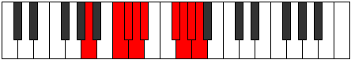 |
| [3707](https://ianring.com/musictheory/scales/3707) | [Rynygic](ModeDSharpRynygic.md) | D# | D#, E, F#, G, G#, A, C, C#, D, D# |  |
| [3707](https://ianring.com/musictheory/scales/3707) | [Rynygic](ModeEFlatRynygic.md) | Eb | Eb, E, Gb, G, Ab, A, C, Db, D, Eb |  |
| [3707](https://ianring.com/musictheory/scales/3707) | [Rynygic](ModeANaturalRynygic.md) | A | A, A#, C, C#, D, D#, F#, G, G#, A |  |
| [3707](https://ianring.com/musictheory/scales/3707) | [Rynygic](ModeGSharpRynygic.md) | G# | G#, A, B, C, C#, D, F, F#, G, G# |  |
| [3707](https://ianring.com/musictheory/scales/3707) | [Rynygic](ModeAFlatRynygic.md) | Ab | Ab, A, B, C, Db, D, F, Gb, G, Ab |  |
| [3707](https://ianring.com/musictheory/scales/3707) | [Rynygic](ModeFNaturalRynygic.md) | F | F, F#, G#, A, A#, B, D, D#, E, F |  |
| [3709](https://ianring.com/musictheory/scales/3709) | [Locrygic](ModeDSharpLocrygic.md) | D# | D#, F, F#, G, G#, A, C, C#, D, D# |  |
| [3709](https://ianring.com/musictheory/scales/3709) | [Locrygic](ModeEFlatLocrygic.md) | Eb | Eb, F, Gb, G, Ab, A, C, Db, D, Eb |  |
| [3709](https://ianring.com/musictheory/scales/3709) | [Locrygic](ModeENaturalLocrygic.md) | E | E, F#, G, G#, A, A#, C#, D, D#, E |  |
| [3709](https://ianring.com/musictheory/scales/3709) | [Locrygic](ModeANaturalLocrygic.md) | A | A, B, C, C#, D, D#, F#, G, G#, A |  |
| [3711](https://ianring.com/musictheory/scales/3711) | [Dycryllian](ModeDSharpDycryllian.md) | D# | D#, E, F, F#, G, G#, A, C, C#, D, D# |  |
| [3711](https://ianring.com/musictheory/scales/3711) | [Dycryllian](ModeEFlatDycryllian.md) | Eb | Eb, E, F, Gb, G, Ab, A, C, Db, D, Eb |  |
| [3711](https://ianring.com/musictheory/scales/3711) | [Dycryllian](ModeENaturalDycryllian.md) | E | E, F, F#, G, G#, A, A#, C#, D, D#, E |  |
| [3711](https://ianring.com/musictheory/scales/3711) | [Dycryllian](ModeANaturalDycryllian.md) | A | A, A#, B, C, C#, D, D#, F#, G, G#, A |  |
| [3711](https://ianring.com/musictheory/scales/3711) | [Dycryllian](ModeGSharpDycryllian.md) | G# | G#, A, A#, B, C, C#, D, F, F#, G, G# |  |
| [3711](https://ianring.com/musictheory/scales/3711) | [Dycryllian](ModeAFlatDycryllian.md) | Ab | Ab, A, Bb, B, C, Db, D, F, Gb, G, Ab |  |
| [3711](https://ianring.com/musictheory/scales/3711) | [Dycryllian](ModeFNaturalDycryllian.md) | F | F, F#, G, G#, A, A#, B, D, D#, E, F |  |
| [3721](https://ianring.com/musictheory/scales/3721) | [Phragimic](ModeBNaturalPhragimic.md) | B | B, C##, E##, F###, G##, A#, B |  |
| [3723](https://ianring.com/musictheory/scales/3723) | [Myptian](ModeBNaturalMyptian.md) | B | B, C, D, E##, F###, G##, A#, B |  |
| [3725](https://ianring.com/musictheory/scales/3725) | [Kyrian](ModeBNaturalKyrian.md) | B | B, C#, D, E##, F###, G##, A#, B |  |
| [3727](https://ianring.com/musictheory/scales/3727) | [Tholyllic](ModeGNaturalTholyllic.md) | G | G, G#, A, A#, D, E, F, F#, G |  |
| [3727](https://ianring.com/musictheory/scales/3727) | [Tholyllic](ModeBNaturalTholyllic.md) | B | B, C, C#, D, F#, G#, A, A#, B |  |
| [3735](https://ianring.com/musictheory/scales/3735) | [Ionagyllic](ModeGNaturalIonagyllic.md) | G | G, G#, A, B, D, E, F, F#, G |  |
| [3737](https://ianring.com/musictheory/scales/3737) | [Phrocrian](ModeBNaturalPhrocrian.md) | B | B, C##, D#, E##, F###, G##, A#, B |  |
| [3739](https://ianring.com/musictheory/scales/3739) | [Ioninyllic](ModeFNaturalIoninyllic.md) | F | F, F#, G#, A, C, D, D#, E, F |  |
| [3739](https://ianring.com/musictheory/scales/3739) | [Ioninyllic](ModeBNaturalIoninyllic.md) | B | B, C, D, D#, F#, G#, A, A#, B |  |
| [3741](https://ianring.com/musictheory/scales/3741) | [Zydyllic](ModeBNaturalZydyllic.md) | B | B, C#, D, D#, F#, G#, A, A#, B |  |
| [3743](https://ianring.com/musictheory/scales/3743) | [Thadygic](ModeFNaturalThadygic.md) | F | F, F#, G, G#, A, C, D, D#, E, F |  |
| [3743](https://ianring.com/musictheory/scales/3743) | [Thadygic](ModeBNaturalThadygic.md) | B | B, C, C#, D, D#, F#, G#, A, A#, B |  |
| [3743](https://ianring.com/musictheory/scales/3743) | [Thadygic](ModeGNaturalThadygic.md) | G | G, G#, A, A#, B, D, E, F, F#, G |  |
| [3747](https://ianring.com/musictheory/scales/3747) | [Myrian](ModeANaturalMyrian.md) | A | A, Bb, C##, D##, E##, F##, G#, A |  |
| [3749](https://ianring.com/musictheory/scales/3749) | [Zothian](ModeANaturalZothian.md) | A | A, B, C##, D##, E##, F##, G#, A |  |
| [3751](https://ianring.com/musictheory/scales/3751) | [Aerathyllic](ModeGNaturalAerathyllic.md) | G | G, G#, A, C, D, E, F, F#, G |  |
| [3751](https://ianring.com/musictheory/scales/3751) | [Aerathyllic](ModeANaturalAerathyllic.md) | A | A, A#, B, D, E, F#, G, G#, A |  |
| [3753](https://ianring.com/musictheory/scales/3753) | [Phraptian](ModeANaturalPhraptian.md) | A | A, B#, C##, D##, E##, F##, G#, A |  |
| [3753](https://ianring.com/musictheory/scales/3753) | [Phraptian](ModeBNaturalPhraptian.md) | B | B, C##, D##, E##, F###, G##, A#, B |  |
| [3755](https://ianring.com/musictheory/scales/3755) | [Phryryllic](ModeANaturalPhryryllic.md) | A | A, A#, C, D, E, F#, G, G#, A |  |
| [3755](https://ianring.com/musictheory/scales/3755) | [Phryryllic](ModeBNaturalPhryryllic.md) | B | B, C, D, E, F#, G#, A, A#, B |  |
| [3757](https://ianring.com/musictheory/scales/3757) | [Goptyllic](ModeANaturalGoptyllic.md) | A | A, B, C, D, E, F#, G, G#, A |  |
| [3757](https://ianring.com/musictheory/scales/3757) | [Goptyllic](ModeBNaturalGoptyllic.md) | B | B, C#, D, E, F#, G#, A, A#, B |  |
| [3759](https://ianring.com/musictheory/scales/3759) | [Darygic](ModeGNaturalDarygic.md) | G | G, G#, A, A#, C, D, E, F, F#, G |  |
| [3759](https://ianring.com/musictheory/scales/3759) | [Darygic](ModeBNaturalDarygic.md) | B | B, C, C#, D, E, F#, G#, A, A#, B |  |
| [3759](https://ianring.com/musictheory/scales/3759) | [Darygic](ModeANaturalDarygic.md) | A | A, A#, B, C, D, E, F#, G, G#, A |  |
| [3761](https://ianring.com/musictheory/scales/3761) | [Ionythian](ModeANaturalIonythian.md) | A | A, B##, C##, D##, E##, F##, G#, A |  |
| [3763](https://ianring.com/musictheory/scales/3763) | [Modyllic](ModeANaturalModyllic.md) | A | A, A#, C#, D, E, F#, G, G#, A |  |
| [3765](https://ianring.com/musictheory/scales/3765) | [Aerycryllic](ModeENaturalAerycryllic.md) | E | E, F#, G#, A, B, C#, D, D#, E |  |
| [3765](https://ianring.com/musictheory/scales/3765) | [Aerycryllic](ModeANaturalAerycryllic.md) | A | A, B, C#, D, E, F#, G, G#, A |  |
| [3767](https://ianring.com/musictheory/scales/3767) | [Bacrygic](ModeENaturalBacrygic.md) | E | E, F, F#, G#, A, B, C#, D, D#, E |  |
| [3767](https://ianring.com/musictheory/scales/3767) | [Bacrygic](ModeGNaturalBacrygic.md) | G | G, G#, A, B, C, D, E, F, F#, G |  |
| [3767](https://ianring.com/musictheory/scales/3767) | [Bacrygic](ModeANaturalBacrygic.md) | A | A, A#, B, C#, D, E, F#, G, G#, A |  |
| [3769](https://ianring.com/musictheory/scales/3769) | [Aeracryllic](ModeANaturalAeracryllic.md) | A | A, C, C#, D, E, F#, G, G#, A |  |
| [3769](https://ianring.com/musictheory/scales/3769) | [Aeracryllic](ModeBNaturalAeracryllic.md) | B | B, D, D#, E, F#, G#, A, A#, B |  |
| [3771](https://ianring.com/musictheory/scales/3771) | [Stophygic](ModeFNaturalStophygic.md) | F | F, F#, G#, A, A#, C, D, D#, E, F |  |
| [3771](https://ianring.com/musictheory/scales/3771) | [Stophygic](ModeANaturalStophygic.md) | A | A, A#, C, C#, D, E, F#, G, G#, A |  |
| [3771](https://ianring.com/musictheory/scales/3771) | [Stophygic](ModeBNaturalStophygic.md) | B | B, C, D, D#, E, F#, G#, A, A#, B |  |
| [3773](https://ianring.com/musictheory/scales/3773) | [Sorygic](ModeANaturalSorygic.md) | A | A, B, C, C#, D, E, F#, G, G#, A |  |
| [3773](https://ianring.com/musictheory/scales/3773) | [Sorygic](ModeENaturalSorygic.md) | E | E, F#, G, G#, A, B, C#, D, D#, E |  |
| [3773](https://ianring.com/musictheory/scales/3773) | [Sorygic](ModeBNaturalSorygic.md) | B | B, C#, D, D#, E, F#, G#, A, A#, B |  |
| [3775](https://ianring.com/musictheory/scales/3775) | [Loptyllian](ModeFNaturalLoptyllian.md) | F | F, F#, G, G#, A, A#, C, D, D#, E, F |  |
| [3775](https://ianring.com/musictheory/scales/3775) | [Loptyllian](ModeENaturalLoptyllian.md) | E | E, F, F#, G, G#, A, B, C#, D, D#, E |  |
| [3775](https://ianring.com/musictheory/scales/3775) | [Loptyllian](ModeBNaturalLoptyllian.md) | B | B, C, C#, D, D#, E, F#, G#, A, A#, B |  |
| [3775](https://ianring.com/musictheory/scales/3775) | [Loptyllian](ModeANaturalLoptyllian.md) | A | A, A#, B, C, C#, D, E, F#, G, G#, A |  |
| [3775](https://ianring.com/musictheory/scales/3775) | [Loptyllian](ModeGNaturalLoptyllian.md) | G | G, G#, A, A#, B, C, D, E, F, F#, G |  |
| [3783](https://ianring.com/musictheory/scales/3783) | [Phrygyllic](ModeGNaturalPhrygyllic.md) | G | G, G#, A, C#, D, E, F, F#, G |  |
| [3783](https://ianring.com/musictheory/scales/3783) | [Phrygyllic](ModeGSharpPhrygyllic.md) | G# | G#, A, A#, D, D#, F, F#, G, G# |  |
| [3783](https://ianring.com/musictheory/scales/3783) | [Phrygyllic](ModeAFlatPhrygyllic.md) | Ab | Ab, A, Bb, D, Eb, F, Gb, G, Ab |  |
| [3785](https://ianring.com/musictheory/scales/3785) | [Epagian](ModeBNaturalEpagian.md) | B | B, C##, D###, E##, F###, G##, A#, B |  |
| [3787](https://ianring.com/musictheory/scales/3787) | [Kagyllic](ModeGSharpKagyllic.md) | G# | G#, A, B, D, D#, F, F#, G, G# |  |
| [3787](https://ianring.com/musictheory/scales/3787) | [Kagyllic](ModeAFlatKagyllic.md) | Ab | Ab, A, B, D, Eb, F, Gb, G, Ab |  |
| [3787](https://ianring.com/musictheory/scales/3787) | [Kagyllic](ModeBNaturalKagyllic.md) | B | B, C, D, F, F#, G#, A, A#, B |  |
| [3789](https://ianring.com/musictheory/scales/3789) | [Eporyllic](ModeBNaturalEporyllic.md) | B | B, C#, D, F, F#, G#, A, A#, B |  |
| [3791](https://ianring.com/musictheory/scales/3791) | [Stodygic](ModeGNaturalStodygic.md) | G | G, G#, A, A#, C#, D, E, F, F#, G |  |
| [3791](https://ianring.com/musictheory/scales/3791) | [Stodygic](ModeBNaturalStodygic.md) | B | B, C, C#, D, F, F#, G#, A, A#, B |  |
| [3791](https://ianring.com/musictheory/scales/3791) | [Stodygic](ModeGSharpStodygic.md) | G# | G#, A, A#, B, D, D#, F, F#, G, G# |  |
| [3791](https://ianring.com/musictheory/scales/3791) | [Stodygic](ModeAFlatStodygic.md) | Ab | Ab, A, Bb, B, D, Eb, F, Gb, G, Ab |  |
| [3793](https://ianring.com/musictheory/scales/3793) | [Aeopian](ModeDNaturalAeopian.md) | D | D, E##, F###, G##, A##, B#, C#, D |  |
| [3795](https://ianring.com/musictheory/scales/3795) | [Epothyllic](ModeGSharpEpothyllic.md) | G# | G#, A, C, D, D#, F, F#, G, G# |  |
| [3795](https://ianring.com/musictheory/scales/3795) | [Epothyllic](ModeAFlatEpothyllic.md) | Ab | Ab, A, C, D, Eb, F, Gb, G, Ab |  |
| [3795](https://ianring.com/musictheory/scales/3795) | [Epothyllic](ModeDNaturalEpothyllic.md) | D | D, D#, F#, G#, A, B, C, C#, D |  |
| [3797](https://ianring.com/musictheory/scales/3797) | [Rocryllic](ModeDNaturalRocryllic.md) | D | D, E, F#, G#, A, B, C, C#, D |  |
| [3799](https://ianring.com/musictheory/scales/3799) | [Aeralygic](ModeGSharpAeralygic.md) | G# | G#, A, A#, C, D, D#, F, F#, G, G# |  |
| [3799](https://ianring.com/musictheory/scales/3799) | [Aeralygic](ModeAFlatAeralygic.md) | Ab | Ab, A, Bb, C, D, Eb, F, Gb, G, Ab |  |
| [3799](https://ianring.com/musictheory/scales/3799) | [Aeralygic](ModeDNaturalAeralygic.md) | D | D, D#, E, F#, G#, A, B, C, C#, D |  |
| [3799](https://ianring.com/musictheory/scales/3799) | [Aeralygic](ModeGNaturalAeralygic.md) | G | G, G#, A, B, C#, D, E, F, F#, G |  |
| [3801](https://ianring.com/musictheory/scales/3801) | [Maptyllic](ModeDNaturalMaptyllic.md) | D | D, F, F#, G#, A, B, C, C#, D |  |
| [3801](https://ianring.com/musictheory/scales/3801) | [Maptyllic](ModeBNaturalMaptyllic.md) | B | B, D, D#, F, F#, G#, A, A#, B |  |
| [3803](https://ianring.com/musictheory/scales/3803) | [Epidygic](ModeDNaturalEpidygic.md) | D | D, D#, F, F#, G#, A, B, C, C#, D |  |
| [3803](https://ianring.com/musictheory/scales/3803) | [Epidygic](ModeFNaturalEpidygic.md) | F | F, F#, G#, A, B, C, D, D#, E, F |  |
| [3803](https://ianring.com/musictheory/scales/3803) | [Epidygic](ModeGSharpEpidygic.md) | G# | G#, A, B, C, D, D#, F, F#, G, G# |  |
| [3803](https://ianring.com/musictheory/scales/3803) | [Epidygic](ModeAFlatEpidygic.md) | Ab | Ab, A, B, C, D, Eb, F, Gb, G, Ab |  |
| [3803](https://ianring.com/musictheory/scales/3803) | [Epidygic](ModeBNaturalEpidygic.md) | B | B, C, D, D#, F, F#, G#, A, A#, B |  |
| [3805](https://ianring.com/musictheory/scales/3805) | [Moptygic](ModeDNaturalMoptygic.md) | D | D, E, F, F#, G#, A, B, C, C#, D |  |
| [3805](https://ianring.com/musictheory/scales/3805) | [Moptygic](ModeBNaturalMoptygic.md) | B | B, C#, D, D#, F, F#, G#, A, A#, B |  |
| [3807](https://ianring.com/musictheory/scales/3807) | [Bagyllian](ModeDNaturalBagyllian.md) | D | D, D#, E, F, F#, G#, A, B, C, C#, D |  |
| [3807](https://ianring.com/musictheory/scales/3807) | [Bagyllian](ModeFNaturalBagyllian.md) | F | F, F#, G, G#, A, B, C, D, D#, E, F |  |
| [3807](https://ianring.com/musictheory/scales/3807) | [Bagyllian](ModeBNaturalBagyllian.md) | B | B, C, C#, D, D#, F, F#, G#, A, A#, B |  |
| [3807](https://ianring.com/musictheory/scales/3807) | [Bagyllian](ModeGSharpBagyllian.md) | G# | G#, A, A#, B, C, D, D#, F, F#, G, G# |  |
| [3807](https://ianring.com/musictheory/scales/3807) | [Bagyllian](ModeAFlatBagyllian.md) | Ab | Ab, A, Bb, B, C, D, Eb, F, Gb, G, Ab |  |
| [3807](https://ianring.com/musictheory/scales/3807) | [Bagyllian](ModeGNaturalBagyllian.md) | G | G, G#, A, A#, B, C#, D, E, F, F#, G |  |
| [3811](https://ianring.com/musictheory/scales/3811) | [Epogyllic](ModeGSharpEpogyllic.md) | G# | G#, A, C#, D, D#, F, F#, G, G# |  |
| [3811](https://ianring.com/musictheory/scales/3811) | [Epogyllic](ModeAFlatEpogyllic.md) | Ab | Ab, A, Db, D, Eb, F, Gb, G, Ab |  |
| [3811](https://ianring.com/musictheory/scales/3811) | [Epogyllic](ModeANaturalEpogyllic.md) | A | A, A#, D, D#, E, F#, G, G#, A |  |
| [3813](https://ianring.com/musictheory/scales/3813) | [Aeologyllic](ModeANaturalAeologyllic.md) | A | A, B, D, D#, E, F#, G, G#, A |  |
| [3815](https://ianring.com/musictheory/scales/3815) | [Mylygic](ModeGNaturalMylygic.md) | G | G, G#, A, C, C#, D, E, F, F#, G |  |
| [3815](https://ianring.com/musictheory/scales/3815) | [Mylygic](ModeGSharpMylygic.md) | G# | G#, A, A#, C#, D, D#, F, F#, G, G# |  |
| [3815](https://ianring.com/musictheory/scales/3815) | [Mylygic](ModeAFlatMylygic.md) | Ab | Ab, A, Bb, Db, D, Eb, F, Gb, G, Ab |  |
| [3815](https://ianring.com/musictheory/scales/3815) | [Mylygic](ModeANaturalMylygic.md) | A | A, A#, B, D, D#, E, F#, G, G#, A |  |
| [3817](https://ianring.com/musictheory/scales/3817) | [Zoryllic](ModeANaturalZoryllic.md) | A | A, C, D, D#, E, F#, G, G#, A |  |
| [3817](https://ianring.com/musictheory/scales/3817) | [Zoryllic](ModeDSharpZoryllic.md) | D# | D#, F#, G#, A, A#, C, C#, D, D# |  |
| [3817](https://ianring.com/musictheory/scales/3817) | [Zoryllic](ModeEFlatZoryllic.md) | Eb | Eb, Gb, Ab, A, Bb, C, Db, D, Eb |  |
| [3817](https://ianring.com/musictheory/scales/3817) | [Zoryllic](ModeBNaturalZoryllic.md) | B | B, D, E, F, F#, G#, A, A#, B |  |
| [3819](https://ianring.com/musictheory/scales/3819) | [Aeolanygic](ModeDSharpAeolanygic.md) | D# | D#, E, F#, G#, A, A#, C, C#, D, D# |  |
| [3819](https://ianring.com/musictheory/scales/3819) | [Aeolanygic](ModeEFlatAeolanygic.md) | Eb | Eb, E, Gb, Ab, A, Bb, C, Db, D, Eb |  |
| [3819](https://ianring.com/musictheory/scales/3819) | [Aeolanygic](ModeANaturalAeolanygic.md) | A | A, A#, C, D, D#, E, F#, G, G#, A |  |
| [3819](https://ianring.com/musictheory/scales/3819) | [Aeolanygic](ModeGSharpAeolanygic.md) | G# | G#, A, B, C#, D, D#, F, F#, G, G# |  |
| [3819](https://ianring.com/musictheory/scales/3819) | [Aeolanygic](ModeAFlatAeolanygic.md) | Ab | Ab, A, B, Db, D, Eb, F, Gb, G, Ab |  |
| [3819](https://ianring.com/musictheory/scales/3819) | [Aeolanygic](ModeBNaturalAeolanygic.md) | B | B, C, D, E, F, F#, G#, A, A#, B |  |
| [3821](https://ianring.com/musictheory/scales/3821) | [Epyrygic](ModeDSharpEpyrygic.md) | D# | D#, F, F#, G#, A, A#, C, C#, D, D# |  |
| [3821](https://ianring.com/musictheory/scales/3821) | [Epyrygic](ModeEFlatEpyrygic.md) | Eb | Eb, F, Gb, Ab, A, Bb, C, Db, D, Eb |  |
| [3821](https://ianring.com/musictheory/scales/3821) | [Epyrygic](ModeANaturalEpyrygic.md) | A | A, B, C, D, D#, E, F#, G, G#, A |  |
| [3821](https://ianring.com/musictheory/scales/3821) | [Epyrygic](ModeBNaturalEpyrygic.md) | B | B, C#, D, E, F, F#, G#, A, A#, B |  |
| [3823](https://ianring.com/musictheory/scales/3823) | [Epinyllian](ModeDSharpEpinyllian.md) | D# | D#, E, F, F#, G#, A, A#, C, C#, D, D# |  |
| [3823](https://ianring.com/musictheory/scales/3823) | [Epinyllian](ModeEFlatEpinyllian.md) | Eb | Eb, E, F, Gb, Ab, A, Bb, C, Db, D, Eb |  |
| [3823](https://ianring.com/musictheory/scales/3823) | [Epinyllian](ModeGNaturalEpinyllian.md) | G | G, G#, A, A#, C, C#, D, E, F, F#, G |  |
| [3823](https://ianring.com/musictheory/scales/3823) | [Epinyllian](ModeBNaturalEpinyllian.md) | B | B, C, C#, D, E, F, F#, G#, A, A#, B |  |
| [3823](https://ianring.com/musictheory/scales/3823) | [Epinyllian](ModeANaturalEpinyllian.md) | A | A, A#, B, C, D, D#, E, F#, G, G#, A |  |
| [3823](https://ianring.com/musictheory/scales/3823) | [Epinyllian](ModeGSharpEpinyllian.md) | G# | G#, A, A#, B, C#, D, D#, F, F#, G, G# |  |
| [3823](https://ianring.com/musictheory/scales/3823) | [Epinyllian](ModeAFlatEpinyllian.md) | Ab | Ab, A, Bb, B, Db, D, Eb, F, Gb, G, Ab |  |
| [3825](https://ianring.com/musictheory/scales/3825) | [Pynyllic](ModeANaturalPynyllic.md) | A | A, C#, D, D#, E, F#, G, G#, A |  |
| [3825](https://ianring.com/musictheory/scales/3825) | [Pynyllic](ModeDNaturalPynyllic.md) | D | D, F#, G, G#, A, B, C, C#, D |  |
| [3827](https://ianring.com/musictheory/scales/3827) | [Dorygic](ModeGSharpDorygic.md) | G# | G#, A, C, C#, D, D#, F, F#, G, G# |  |
| [3827](https://ianring.com/musictheory/scales/3827) | [Dorygic](ModeAFlatDorygic.md) | Ab | Ab, A, C, Db, D, Eb, F, Gb, G, Ab |  |
| [3827](https://ianring.com/musictheory/scales/3827) | [Dorygic](ModeANaturalDorygic.md) | A | A, A#, C#, D, D#, E, F#, G, G#, A | 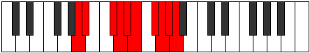 |
| [3827](https://ianring.com/musictheory/scales/3827) | [Dorygic](ModeDNaturalDorygic.md) | D | D, D#, F#, G, G#, A, B, C, C#, D |  |
| [3829](https://ianring.com/musictheory/scales/3829) | [Aerycrygic](ModeDNaturalAerycrygic.md) | D | D, E, F#, G, G#, A, B, C, C#, D |  |
| [3829](https://ianring.com/musictheory/scales/3829) | [Aerycrygic](ModeANaturalAerycrygic.md) | A | A, B, C#, D, D#, E, F#, G, G#, A |  |
| [3829](https://ianring.com/musictheory/scales/3829) | [Aerycrygic](ModeENaturalAerycrygic.md) | E | E, F#, G#, A, A#, B, C#, D, D#, E |  |
| [3831](https://ianring.com/musictheory/scales/3831) | [Ionyllian](ModeGSharpIonyllian.md) | G# | G#, A, A#, C, C#, D, D#, F, F#, G, G# |  |
| [3831](https://ianring.com/musictheory/scales/3831) | [Ionyllian](ModeAFlatIonyllian.md) | Ab | Ab, A, Bb, C, Db, D, Eb, F, Gb, G, Ab |  |
| [3831](https://ianring.com/musictheory/scales/3831) | [Ionyllian](ModeDNaturalIonyllian.md) | D | D, D#, E, F#, G, G#, A, B, C, C#, D |  |
| [3831](https://ianring.com/musictheory/scales/3831) | [Ionyllian](ModeGNaturalIonyllian.md) | G | G, G#, A, B, C, C#, D, E, F, F#, G | 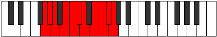 |
| [3831](https://ianring.com/musictheory/scales/3831) | [Ionyllian](ModeENaturalIonyllian.md) | E | E, F, F#, G#, A, A#, B, C#, D, D#, E |  |
| [3831](https://ianring.com/musictheory/scales/3831) | [Ionyllian](ModeANaturalIonyllian.md) | A | A, A#, B, C#, D, D#, E, F#, G, G#, A |  |
| [3833](https://ianring.com/musictheory/scales/3833) | [Dycrygic](ModeANaturalDycrygic.md) | A | A, C, C#, D, D#, E, F#, G, G#, A |  |
| [3833](https://ianring.com/musictheory/scales/3833) | [Dycrygic](ModeDSharpDycrygic.md) | D# | D#, F#, G, G#, A, A#, C, C#, D, D# |  |
| [3833](https://ianring.com/musictheory/scales/3833) | [Dycrygic](ModeEFlatDycrygic.md) | Eb | Eb, Gb, G, Ab, A, Bb, C, Db, D, Eb |  |
| [3833](https://ianring.com/musictheory/scales/3833) | [Dycrygic](ModeDNaturalDycrygic.md) | D | D, F, F#, G, G#, A, B, C, C#, D |  |
| [3833](https://ianring.com/musictheory/scales/3833) | [Dycrygic](ModeBNaturalDycrygic.md) | B | B, D, D#, E, F, F#, G#, A, A#, B |  |
| [3835](https://ianring.com/musictheory/scales/3835) | [Katodyllian](ModeDSharpKatodyllian.md) | D# | D#, E, F#, G, G#, A, A#, C, C#, D, D# |  |
| [3835](https://ianring.com/musictheory/scales/3835) | [Katodyllian](ModeEFlatKatodyllian.md) | Eb | Eb, E, Gb, G, Ab, A, Bb, C, Db, D, Eb |  |
| [3835](https://ianring.com/musictheory/scales/3835) | [Katodyllian](ModeANaturalKatodyllian.md) | A | A, A#, C, C#, D, D#, E, F#, G, G#, A |  |
| [3835](https://ianring.com/musictheory/scales/3835) | [Katodyllian](ModeDNaturalKatodyllian.md) | D | D, D#, F, F#, G, G#, A, B, C, C#, D |  |
| [3835](https://ianring.com/musictheory/scales/3835) | [Katodyllian](ModeGSharpKatodyllian.md) | G# | G#, A, B, C, C#, D, D#, F, F#, G, G# |  |
| [3835](https://ianring.com/musictheory/scales/3835) | [Katodyllian](ModeAFlatKatodyllian.md) | Ab | Ab, A, B, C, Db, D, Eb, F, Gb, G, Ab |  |
| [3835](https://ianring.com/musictheory/scales/3835) | [Katodyllian](ModeFNaturalKatodyllian.md) | F | F, F#, G#, A, A#, B, C, D, D#, E, F |  |
| [3835](https://ianring.com/musictheory/scales/3835) | [Katodyllian](ModeBNaturalKatodyllian.md) | B | B, C, D, D#, E, F, F#, G#, A, A#, B |  |
| [3837](https://ianring.com/musictheory/scales/3837) | [Garyllian](ModeDSharpGaryllian.md) | D# | D#, F, F#, G, G#, A, A#, C, C#, D, D# |  |
| [3837](https://ianring.com/musictheory/scales/3837) | [Garyllian](ModeEFlatGaryllian.md) | Eb | Eb, F, Gb, G, Ab, A, Bb, C, Db, D, Eb |  |
| [3837](https://ianring.com/musictheory/scales/3837) | [Garyllian](ModeANaturalGaryllian.md) | A | A, B, C, C#, D, D#, E, F#, G, G#, A |  |
| [3837](https://ianring.com/musictheory/scales/3837) | [Garyllian](ModeDNaturalGaryllian.md) | D | D, E, F, F#, G, G#, A, B, C, C#, D |  |
| [3837](https://ianring.com/musictheory/scales/3837) | [Garyllian](ModeBNaturalGaryllian.md) | B | B, C#, D, D#, E, F, F#, G#, A, A#, B |  |
| [3837](https://ianring.com/musictheory/scales/3837) | [Garyllian](ModeENaturalGaryllian.md) | E | E, F#, G, G#, A, A#, B, C#, D, D#, E |  |
| [3839](https://ianring.com/musictheory/scales/3839) | [Mixolatic](ModeDSharpMixolatic.md) | D# | D#, E, F, F#, G, G#, A, A#, C, C#, D, D# |  |
| [3839](https://ianring.com/musictheory/scales/3839) | [Mixolatic](ModeEFlatMixolatic.md) | Eb | Eb, E, F, Gb, G, Ab, A, Bb, C, Db, D, Eb |  |
| [3839](https://ianring.com/musictheory/scales/3839) | [Mixolatic](ModeDNaturalMixolatic.md) | D | D, D#, E, F, F#, G, G#, A, B, C, C#, D |  |
| [3839](https://ianring.com/musictheory/scales/3839) | [Mixolatic](ModeBNaturalMixolatic.md) | B | B, C, C#, D, D#, E, F, F#, G#, A, A#, B |  |
| [3839](https://ianring.com/musictheory/scales/3839) | [Mixolatic](ModeANaturalMixolatic.md) | A | A, A#, B, C, C#, D, D#, E, F#, G, G#, A |  |
| [3839](https://ianring.com/musictheory/scales/3839) | [Mixolatic](ModeGSharpMixolatic.md) | G# | G#, A, A#, B, C, C#, D, D#, F, F#, G, G# |  |
| [3839](https://ianring.com/musictheory/scales/3839) | [Mixolatic](ModeAFlatMixolatic.md) | Ab | Ab, A, Bb, B, C, Db, D, Eb, F, Gb, G, Ab |  |
| [3839](https://ianring.com/musictheory/scales/3839) | [Mixolatic](ModeGNaturalMixolatic.md) | G | G, G#, A, A#, B, C, C#, D, E, F, F#, G |  |
| [3839](https://ianring.com/musictheory/scales/3839) | [Mixolatic](ModeFNaturalMixolatic.md) | F | F, F#, G, G#, A, A#, B, C, D, D#, E, F |  |
| [3839](https://ianring.com/musictheory/scales/3839) | [Mixolatic](ModeENaturalMixolatic.md) | E | E, F, F#, G, G#, A, A#, B, C#, D, D#, E |  |
| [3857](https://ianring.com/musictheory/scales/3857) | [Ponimic](ModeASharpPonimic.md) | A# | A#, B###, E##, F##, G#, A, A# |  |
| [3857](https://ianring.com/musictheory/scales/3857) | [Ponimic](ModeBFlatPonimic.md) | Bb | Bb, C##, E##, F##, G#, A, Bb |  |
| [3859](https://ianring.com/musictheory/scales/3859) | [Aeolarian](ModeASharpAeolarian.md) | A# | A#, B, C##, E##, F##, G#, A, A# |  |
| [3859](https://ianring.com/musictheory/scales/3859) | [Aeolarian](ModeBFlatAeolarian.md) | Bb | Bb, Cb, D, E##, F##, G#, A, Bb |  |
| [3861](https://ianring.com/musictheory/scales/3861) | [Phroptian](ModeASharpPhroptian.md) | A# | A#, B#, C##, E##, F##, G#, A, A# |  |
| [3861](https://ianring.com/musictheory/scales/3861) | [Phroptian](ModeBFlatPhroptian.md) | Bb | Bb, C, D, E##, F##, G#, A, Bb |  |
| [3863](https://ianring.com/musictheory/scales/3863) | [Eparyllic](ModeASharpEparyllic.md) | A# | A#, B, C, D, F#, G, G#, A, A# |  |
| [3863](https://ianring.com/musictheory/scales/3863) | [Eparyllic](ModeBFlatEparyllic.md) | Bb | Bb, B, C, D, Gb, G, Ab, A, Bb |  |
| [3865](https://ianring.com/musictheory/scales/3865) | [Starian](ModeASharpStarian.md) | A# | A#, B##, C##, E##, F##, G#, A, A# |  |
| [3865](https://ianring.com/musictheory/scales/3865) | [Starian](ModeBFlatStarian.md) | Bb | Bb, C#, D, E##, F##, G#, A, Bb |  |
| [3867](https://ianring.com/musictheory/scales/3867) | [Storyllic](ModeFNaturalStoryllic.md) | F | F, F#, G#, A, C#, D, D#, E, F |  |
| [3867](https://ianring.com/musictheory/scales/3867) | [Storyllic](ModeASharpStoryllic.md) | A# | A#, B, C#, D, F#, G, G#, A, A# |  |
| [3867](https://ianring.com/musictheory/scales/3867) | [Storyllic](ModeBFlatStoryllic.md) | Bb | Bb, B, Db, D, Gb, G, Ab, A, Bb |  |
| [3869](https://ianring.com/musictheory/scales/3869) | [Bygyllic](ModeFSharpBygyllic.md) | F# | F#, G#, A, A#, D, D#, E, F, F# |  |
| [3869](https://ianring.com/musictheory/scales/3869) | [Bygyllic](ModeGFlatBygyllic.md) | Gb | Gb, Ab, A, Bb, D, Eb, E, F, Gb |  |
| [3869](https://ianring.com/musictheory/scales/3869) | [Bygyllic](ModeASharpBygyllic.md) | A# | A#, C, C#, D, F#, G, G#, A, A# |  |
| [3869](https://ianring.com/musictheory/scales/3869) | [Bygyllic](ModeBFlatBygyllic.md) | Bb | Bb, C, Db, D, Gb, G, Ab, A, Bb |  |
| [3871](https://ianring.com/musictheory/scales/3871) | [Aerynygic](ModeFNaturalAerynygic.md) | F | F, F#, G, G#, A, C#, D, D#, E, F |  |
| [3871](https://ianring.com/musictheory/scales/3871) | [Aerynygic](ModeFSharpAerynygic.md) | F# | F#, G, G#, A, A#, D, D#, E, F, F# |  |
| [3871](https://ianring.com/musictheory/scales/3871) | [Aerynygic](ModeGFlatAerynygic.md) | Gb | Gb, G, Ab, A, Bb, D, Eb, E, F, Gb |  |
| [3871](https://ianring.com/musictheory/scales/3871) | [Aerynygic](ModeASharpAerynygic.md) | A# | A#, B, C, C#, D, F#, G, G#, A, A# |  |
| [3871](https://ianring.com/musictheory/scales/3871) | [Aerynygic](ModeBFlatAerynygic.md) | Bb | Bb, B, C, Db, D, Gb, G, Ab, A, Bb |  |
| [3875](https://ianring.com/musictheory/scales/3875) | [Aeryptian](ModeANaturalAeryptian.md) | A | A, Bb, C##, D###, E##, F##, G#, A |  |
| [3877](https://ianring.com/musictheory/scales/3877) | [Thanian](ModeANaturalThanian.md) | A | A, B, C##, D###, E##, F##, G#, A |  |
| [3879](https://ianring.com/musictheory/scales/3879) | [Pathyllic](ModeANaturalPathyllic.md) | A | A, A#, B, D, F, F#, G, G#, A |  |
| [3881](https://ianring.com/musictheory/scales/3881) | [Morian](ModeANaturalMorian.md) | A | A, B#, C##, D###, E##, F##, G#, A |  |
| [3883](https://ianring.com/musictheory/scales/3883) | [Kyryllic](ModeANaturalKyryllic.md) | A | A, A#, C, D, F, F#, G, G#, A |  |
| [3885](https://ianring.com/musictheory/scales/3885) | [Styryllic](ModeFSharpStyryllic.md) | F# | F#, G#, A, B, D, D#, E, F, F# |  |
| [3885](https://ianring.com/musictheory/scales/3885) | [Styryllic](ModeGFlatStyryllic.md) | Gb | Gb, Ab, A, B, D, Eb, E, F, Gb |  |
| [3885](https://ianring.com/musictheory/scales/3885) | [Styryllic](ModeANaturalStyryllic.md) | A | A, B, C, D, F, F#, G, G#, A |  |
| [3887](https://ianring.com/musictheory/scales/3887) | [Phrathygic](ModeFSharpPhrathygic.md) | F# | F#, G, G#, A, B, D, D#, E, F, F# |  |
| [3887](https://ianring.com/musictheory/scales/3887) | [Phrathygic](ModeGFlatPhrathygic.md) | Gb | Gb, G, Ab, A, B, D, Eb, E, F, Gb |  |
| [3887](https://ianring.com/musictheory/scales/3887) | [Phrathygic](ModeANaturalPhrathygic.md) | A | A, A#, B, C, D, F, F#, G, G#, A |  |
| [3889](https://ianring.com/musictheory/scales/3889) | [Parian](ModeANaturalParian.md) | A | A, B##, C##, D###, E##, F##, G#, A |  |
| [3889](https://ianring.com/musictheory/scales/3889) | [Parian](ModeASharpParian.md) | A# | A#, B###, C###, E##, F##, G#, A, A# |  |
| [3889](https://ianring.com/musictheory/scales/3889) | [Parian](ModeBFlatParian.md) | Bb | Bb, C##, D#, E##, F##, G#, A, Bb |  |
| [3891](https://ianring.com/musictheory/scales/3891) | [Ryryllic](ModeANaturalRyryllic.md) | A | A, A#, C#, D, F, F#, G, G#, A |  |
| [3891](https://ianring.com/musictheory/scales/3891) | [Ryryllic](ModeASharpRyryllic.md) | A# | A#, B, D, D#, F#, G, G#, A, A# |  |
| [3891](https://ianring.com/musictheory/scales/3891) | [Ryryllic](ModeBFlatRyryllic.md) | Bb | Bb, B, D, Eb, Gb, G, Ab, A, Bb |  |
| [3893](https://ianring.com/musictheory/scales/3893) | [Phrocryllic](ModeENaturalPhrocryllic.md) | E | E, F#, G#, A, C, C#, D, D#, E |  |
| [3893](https://ianring.com/musictheory/scales/3893) | [Phrocryllic](ModeASharpPhrocryllic.md) | A# | A#, C, D, D#, F#, G, G#, A, A# |  |
| [3893](https://ianring.com/musictheory/scales/3893) | [Phrocryllic](ModeBFlatPhrocryllic.md) | Bb | Bb, C, D, Eb, Gb, G, Ab, A, Bb |  |
| [3893](https://ianring.com/musictheory/scales/3893) | [Phrocryllic](ModeANaturalPhrocryllic.md) | A | A, B, C#, D, F, F#, G, G#, A |  |
| [3895](https://ianring.com/musictheory/scales/3895) | [Eparygic](ModeENaturalEparygic.md) | E | E, F, F#, G#, A, C, C#, D, D#, E |  |
| [3895](https://ianring.com/musictheory/scales/3895) | [Eparygic](ModeASharpEparygic.md) | A# | A#, B, C, D, D#, F#, G, G#, A, A# | 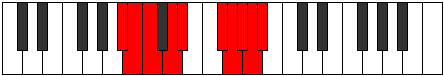 |
| [3895](https://ianring.com/musictheory/scales/3895) | [Eparygic](ModeBFlatEparygic.md) | Bb | Bb, B, C, D, Eb, Gb, G, Ab, A, Bb |  |
| [3895](https://ianring.com/musictheory/scales/3895) | [Eparygic](ModeANaturalEparygic.md) | A | A, A#, B, C#, D, F, F#, G, G#, A |  |
| [3897](https://ianring.com/musictheory/scales/3897) | [Locryllic](ModeANaturalLocryllic.md) | A | A, C, C#, D, F, F#, G, G#, A |  |
| [3897](https://ianring.com/musictheory/scales/3897) | [Locryllic](ModeASharpLocryllic.md) | A# | A#, C#, D, D#, F#, G, G#, A, A# |  |
| [3897](https://ianring.com/musictheory/scales/3897) | [Locryllic](ModeBFlatLocryllic.md) | Bb | Bb, Db, D, Eb, Gb, G, Ab, A, Bb |  |
| [3899](https://ianring.com/musictheory/scales/3899) | [Katorygic](ModeFNaturalKatorygic.md) | F | F, F#, G#, A, A#, C#, D, D#, E, F | 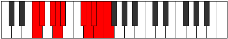 |
| [3899](https://ianring.com/musictheory/scales/3899) | [Katorygic](ModeANaturalKatorygic.md) | A | A, A#, C, C#, D, F, F#, G, G#, A |  |
| [3899](https://ianring.com/musictheory/scales/3899) | [Katorygic](ModeASharpKatorygic.md) | A# | A#, B, C#, D, D#, F#, G, G#, A, A# |  |
| [3899](https://ianring.com/musictheory/scales/3899) | [Katorygic](ModeBFlatKatorygic.md) | Bb | Bb, B, Db, D, Eb, Gb, G, Ab, A, Bb |  |
| [3901](https://ianring.com/musictheory/scales/3901) | [Bycrygic](ModeENaturalBycrygic.md) | E | E, F#, G, G#, A, C, C#, D, D#, E |  |
| [3901](https://ianring.com/musictheory/scales/3901) | [Bycrygic](ModeASharpBycrygic.md) | A# | A#, C, C#, D, D#, F#, G, G#, A, A# |  |
| [3901](https://ianring.com/musictheory/scales/3901) | [Bycrygic](ModeBFlatBycrygic.md) | Bb | Bb, C, Db, D, Eb, Gb, G, Ab, A, Bb |  |
| [3901](https://ianring.com/musictheory/scales/3901) | [Bycrygic](ModeANaturalBycrygic.md) | A | A, B, C, C#, D, F, F#, G, G#, A |  |
| [3901](https://ianring.com/musictheory/scales/3901) | [Bycrygic](ModeFSharpBycrygic.md) | F# | F#, G#, A, A#, B, D, D#, E, F, F# |  |
| [3901](https://ianring.com/musictheory/scales/3901) | [Bycrygic](ModeGFlatBycrygic.md) | Gb | Gb, Ab, A, Bb, B, D, Eb, E, F, Gb |  |
| [3903](https://ianring.com/musictheory/scales/3903) | [Aeogyllian](ModeENaturalAeogyllian.md) | E | E, F, F#, G, G#, A, C, C#, D, D#, E |  |
| [3903](https://ianring.com/musictheory/scales/3903) | [Aeogyllian](ModeFNaturalAeogyllian.md) | F | F, F#, G, G#, A, A#, C#, D, D#, E, F |  |
| [3903](https://ianring.com/musictheory/scales/3903) | [Aeogyllian](ModeASharpAeogyllian.md) | A# | A#, B, C, C#, D, D#, F#, G, G#, A, A# |  |
| [3903](https://ianring.com/musictheory/scales/3903) | [Aeogyllian](ModeBFlatAeogyllian.md) | Bb | Bb, B, C, Db, D, Eb, Gb, G, Ab, A, Bb |  |
| [3903](https://ianring.com/musictheory/scales/3903) | [Aeogyllian](ModeANaturalAeogyllian.md) | A | A, A#, B, C, C#, D, F, F#, G, G#, A |  |
| [3903](https://ianring.com/musictheory/scales/3903) | [Aeogyllian](ModeFSharpAeogyllian.md) | F# | F#, G, G#, A, A#, B, D, D#, E, F, F# |  |
| [3903](https://ianring.com/musictheory/scales/3903) | [Aeogyllian](ModeGFlatAeogyllian.md) | Gb | Gb, G, Ab, A, Bb, B, D, Eb, E, F, Gb |  |
| [3909](https://ianring.com/musictheory/scales/3909) | [Rydian](ModeCNaturalRydian.md) | C | C, D, E##, F###, G##, A#, B, C |  |
| [3911](https://ianring.com/musictheory/scales/3911) | [Katyryllic](ModeGSharpKatyryllic.md) | G# | G#, A, A#, D, E, F, F#, G, G# |  |
| [3911](https://ianring.com/musictheory/scales/3911) | [Katyryllic](ModeAFlatKatyryllic.md) | Ab | Ab, A, Bb, D, E, F, Gb, G, Ab |  |
| [3911](https://ianring.com/musictheory/scales/3911) | [Katyryllic](ModeCNaturalKatyryllic.md) | C | C, C#, D, F#, G#, A, A#, B, C |  |
| [3915](https://ianring.com/musictheory/scales/3915) | [Gogyllic](ModeGSharpGogyllic.md) | G# | G#, A, B, D, E, F, F#, G, G# |  |
| [3915](https://ianring.com/musictheory/scales/3915) | [Gogyllic](ModeAFlatGogyllic.md) | Ab | Ab, A, B, D, E, F, Gb, G, Ab |  |
| [3917](https://ianring.com/musictheory/scales/3917) | [Epaphyllic](ModeFSharpEpaphyllic.md) | F# | F#, G#, A, C, D, D#, E, F, F# |  |
| [3917](https://ianring.com/musictheory/scales/3917) | [Epaphyllic](ModeGFlatEpaphyllic.md) | Gb | Gb, Ab, A, C, D, Eb, E, F, Gb |  |
| [3917](https://ianring.com/musictheory/scales/3917) | [Epaphyllic](ModeCNaturalEpaphyllic.md) | C | C, D, D#, F#, G#, A, A#, B, C |  |
| [3919](https://ianring.com/musictheory/scales/3919) | [Lynygic](ModeFSharpLynygic.md) | F# | F#, G, G#, A, C, D, D#, E, F, F# |  |
| [3919](https://ianring.com/musictheory/scales/3919) | [Lynygic](ModeGFlatLynygic.md) | Gb | Gb, G, Ab, A, C, D, Eb, E, F, Gb |  |
| [3919](https://ianring.com/musictheory/scales/3919) | [Lynygic](ModeCNaturalLynygic.md) | C | C, C#, D, D#, F#, G#, A, A#, B, C |  |
| [3919](https://ianring.com/musictheory/scales/3919) | [Lynygic](ModeGSharpLynygic.md) | G# | G#, A, A#, B, D, E, F, F#, G, G# |  |
| [3919](https://ianring.com/musictheory/scales/3919) | [Lynygic](ModeAFlatLynygic.md) | Ab | Ab, A, Bb, B, D, E, F, Gb, G, Ab |  |
| [3921](https://ianring.com/musictheory/scales/3921) | [Pythian](ModeASharpPythian.md) | A# | A#, B###, D##, E##, F##, G#, A, A# |  |
| [3921](https://ianring.com/musictheory/scales/3921) | [Pythian](ModeBFlatPythian.md) | Bb | Bb, C##, D##, E##, F##, G#, A, Bb |  |
| [3923](https://ianring.com/musictheory/scales/3923) | [Stoptyllic](ModeGSharpStoptyllic.md) | G# | G#, A, C, D, E, F, F#, G, G# |  |
| [3923](https://ianring.com/musictheory/scales/3923) | [Stoptyllic](ModeAFlatStoptyllic.md) | Ab | Ab, A, C, D, E, F, Gb, G, Ab |  |
| [3923](https://ianring.com/musictheory/scales/3923) | [Stoptyllic](ModeASharpStoptyllic.md) | A# | A#, B, D, E, F#, G, G#, A, A# |  |
| [3923](https://ianring.com/musictheory/scales/3923) | [Stoptyllic](ModeBFlatStoptyllic.md) | Bb | Bb, B, D, E, Gb, G, Ab, A, Bb |  |
| [3925](https://ianring.com/musictheory/scales/3925) | [Thyryllic](ModeASharpThyryllic.md) | A# | A#, C, D, E, F#, G, G#, A, A# |  |
| [3925](https://ianring.com/musictheory/scales/3925) | [Thyryllic](ModeBFlatThyryllic.md) | Bb | Bb, C, D, E, Gb, G, Ab, A, Bb |  |
| [3925](https://ianring.com/musictheory/scales/3925) | [Thyryllic](ModeCNaturalThyryllic.md) | C | C, D, E, F#, G#, A, A#, B, C |  |
| [3927](https://ianring.com/musictheory/scales/3927) | [Monygic](ModeGSharpMonygic.md) | G# | G#, A, A#, C, D, E, F, F#, G, G# |  |
| [3927](https://ianring.com/musictheory/scales/3927) | [Monygic](ModeAFlatMonygic.md) | Ab | Ab, A, Bb, C, D, E, F, Gb, G, Ab |  |
| [3927](https://ianring.com/musictheory/scales/3927) | [Monygic](ModeCNaturalMonygic.md) | C | C, C#, D, E, F#, G#, A, A#, B, C |  |
| [3927](https://ianring.com/musictheory/scales/3927) | [Monygic](ModeASharpMonygic.md) | A# | A#, B, C, D, E, F#, G, G#, A, A# |  |
| [3927](https://ianring.com/musictheory/scales/3927) | [Monygic](ModeBFlatMonygic.md) | Bb | Bb, B, C, D, E, Gb, G, Ab, A, Bb |  |
| [3929](https://ianring.com/musictheory/scales/3929) | [Aeolothyllic](ModeASharpAeolothyllic.md) | A# | A#, C#, D, E, F#, G, G#, A, A# |  |
| [3929](https://ianring.com/musictheory/scales/3929) | [Aeolothyllic](ModeBFlatAeolothyllic.md) | Bb | Bb, Db, D, E, Gb, G, Ab, A, Bb |  |
| [3931](https://ianring.com/musictheory/scales/3931) | [Aerygic](ModeFNaturalAerygic.md) | F | F, F#, G#, A, B, C#, D, D#, E, F |  |
| [3931](https://ianring.com/musictheory/scales/3931) | [Aerygic](ModeGSharpAerygic.md) | G# | G#, A, B, C, D, E, F, F#, G, G# |  |
| [3931](https://ianring.com/musictheory/scales/3931) | [Aerygic](ModeAFlatAerygic.md) | Ab | Ab, A, B, C, D, E, F, Gb, G, Ab |  |
| [3931](https://ianring.com/musictheory/scales/3931) | [Aerygic](ModeASharpAerygic.md) | A# | A#, B, C#, D, E, F#, G, G#, A, A# |  |
| [3931](https://ianring.com/musictheory/scales/3931) | [Aerygic](ModeBFlatAerygic.md) | Bb | Bb, B, Db, D, E, Gb, G, Ab, A, Bb |  |
| [3933](https://ianring.com/musictheory/scales/3933) | [Ionidygic](ModeFSharpIonidygic.md) | F# | F#, G#, A, A#, C, D, D#, E, F, F# |  |
| [3933](https://ianring.com/musictheory/scales/3933) | [Ionidygic](ModeGFlatIonidygic.md) | Gb | Gb, Ab, A, Bb, C, D, Eb, E, F, Gb |  |
| [3933](https://ianring.com/musictheory/scales/3933) | [Ionidygic](ModeASharpIonidygic.md) | A# | A#, C, C#, D, E, F#, G, G#, A, A# |  |
| [3933](https://ianring.com/musictheory/scales/3933) | [Ionidygic](ModeBFlatIonidygic.md) | Bb | Bb, C, Db, D, E, Gb, G, Ab, A, Bb |  |
| [3933](https://ianring.com/musictheory/scales/3933) | [Ionidygic](ModeCNaturalIonidygic.md) | C | C, D, D#, E, F#, G#, A, A#, B, C |  |
| [3935](https://ianring.com/musictheory/scales/3935) | [Kataphyllian](ModeFSharpKataphyllian.md) | F# | F#, G, G#, A, A#, C, D, D#, E, F, F# |  |
| [3935](https://ianring.com/musictheory/scales/3935) | [Kataphyllian](ModeGFlatKataphyllian.md) | Gb | Gb, G, Ab, A, Bb, C, D, Eb, E, F, Gb |  |
| [3935](https://ianring.com/musictheory/scales/3935) | [Kataphyllian](ModeFNaturalKataphyllian.md) | F | F, F#, G, G#, A, B, C#, D, D#, E, F |  |
| [3935](https://ianring.com/musictheory/scales/3935) | [Kataphyllian](ModeCNaturalKataphyllian.md) | C | C, C#, D, D#, E, F#, G#, A, A#, B, C |  |
| [3935](https://ianring.com/musictheory/scales/3935) | [Kataphyllian](ModeASharpKataphyllian.md) | A# | A#, B, C, C#, D, E, F#, G, G#, A, A# |  |
| [3935](https://ianring.com/musictheory/scales/3935) | [Kataphyllian](ModeBFlatKataphyllian.md) | Bb | Bb, B, C, Db, D, E, Gb, G, Ab, A, Bb |  |
| [3935](https://ianring.com/musictheory/scales/3935) | [Kataphyllian](ModeGSharpKataphyllian.md) | G# | G#, A, A#, B, C, D, E, F, F#, G, G# |  |
| [3935](https://ianring.com/musictheory/scales/3935) | [Kataphyllian](ModeAFlatKataphyllian.md) | Ab | Ab, A, Bb, B, C, D, E, F, Gb, G, Ab |  |
| [3939](https://ianring.com/musictheory/scales/3939) | [Dogyllic](ModeGSharpDogyllic.md) | G# | G#, A, C#, D, E, F, F#, G, G# |  |
| [3939](https://ianring.com/musictheory/scales/3939) | [Dogyllic](ModeAFlatDogyllic.md) | Ab | Ab, A, Db, D, E, F, Gb, G, Ab |  |
| [3939](https://ianring.com/musictheory/scales/3939) | [Dogyllic](ModeANaturalDogyllic.md) | A | A, A#, D, D#, F, F#, G, G#, A |  |
| [3941](https://ianring.com/musictheory/scales/3941) | [Stathyllic](ModeANaturalStathyllic.md) | A | A, B, D, D#, F, F#, G, G#, A |  |
| [3941](https://ianring.com/musictheory/scales/3941) | [Stathyllic](ModeCNaturalStathyllic.md) | C | C, D, F, F#, G#, A, A#, B, C |  |
| [3943](https://ianring.com/musictheory/scales/3943) | [Zynygic](ModeGSharpZynygic.md) | G# | G#, A, A#, C#, D, E, F, F#, G, G# |  |
| [3943](https://ianring.com/musictheory/scales/3943) | [Zynygic](ModeAFlatZynygic.md) | Ab | Ab, A, Bb, Db, D, E, F, Gb, G, Ab |  |
| [3943](https://ianring.com/musictheory/scales/3943) | [Zynygic](ModeCNaturalZynygic.md) | C | C, C#, D, F, F#, G#, A, A#, B, C |  |
| [3943](https://ianring.com/musictheory/scales/3943) | [Zynygic](ModeANaturalZynygic.md) | A | A, A#, B, D, D#, F, F#, G, G#, A |  |
| [3945](https://ianring.com/musictheory/scales/3945) | [Lydyllic](ModeANaturalLydyllic.md) | A | A, C, D, D#, F, F#, G, G#, A |  |
| [3945](https://ianring.com/musictheory/scales/3945) | [Lydyllic](ModeDSharpLydyllic.md) | D# | D#, F#, G#, A, B, C, C#, D, D# |  |
| [3945](https://ianring.com/musictheory/scales/3945) | [Lydyllic](ModeEFlatLydyllic.md) | Eb | Eb, Gb, Ab, A, B, C, Db, D, Eb |  |
| [3947](https://ianring.com/musictheory/scales/3947) | [Ryptygic](ModeANaturalRyptygic.md) | A | A, A#, C, D, D#, F, F#, G, G#, A |  |
| [3947](https://ianring.com/musictheory/scales/3947) | [Ryptygic](ModeDSharpRyptygic.md) | D# | D#, E, F#, G#, A, B, C, C#, D, D# |  |
| [3947](https://ianring.com/musictheory/scales/3947) | [Ryptygic](ModeEFlatRyptygic.md) | Eb | Eb, E, Gb, Ab, A, B, C, Db, D, Eb |  |
| [3947](https://ianring.com/musictheory/scales/3947) | [Ryptygic](ModeGSharpRyptygic.md) | G# | G#, A, B, C#, D, E, F, F#, G, G# |  |
| [3947](https://ianring.com/musictheory/scales/3947) | [Ryptygic](ModeAFlatRyptygic.md) | Ab | Ab, A, B, Db, D, E, F, Gb, G, Ab |  |
| [3949](https://ianring.com/musictheory/scales/3949) | [Koptygic](ModeDSharpKoptygic.md) | D# | D#, F, F#, G#, A, B, C, C#, D, D# |  |
| [3949](https://ianring.com/musictheory/scales/3949) | [Koptygic](ModeEFlatKoptygic.md) | Eb | Eb, F, Gb, Ab, A, B, C, Db, D, Eb |  |
| [3949](https://ianring.com/musictheory/scales/3949) | [Koptygic](ModeFSharpKoptygic.md) | F# | F#, G#, A, B, C, D, D#, E, F, F# |  |
| [3949](https://ianring.com/musictheory/scales/3949) | [Koptygic](ModeGFlatKoptygic.md) | Gb | Gb, Ab, A, B, C, D, Eb, E, F, Gb |  |
| [3949](https://ianring.com/musictheory/scales/3949) | [Koptygic](ModeANaturalKoptygic.md) | A | A, B, C, D, D#, F, F#, G, G#, A |  |
| [3949](https://ianring.com/musictheory/scales/3949) | [Koptygic](ModeCNaturalKoptygic.md) | C | C, D, D#, F, F#, G#, A, A#, B, C |  |
| [3951](https://ianring.com/musictheory/scales/3951) | [Mathyllian](ModeDSharpMathyllian.md) | D# | D#, E, F, F#, G#, A, B, C, C#, D, D# |  |
| [3951](https://ianring.com/musictheory/scales/3951) | [Mathyllian](ModeEFlatMathyllian.md) | Eb | Eb, E, F, Gb, Ab, A, B, C, Db, D, Eb |  |
| [3951](https://ianring.com/musictheory/scales/3951) | [Mathyllian](ModeFSharpMathyllian.md) | F# | F#, G, G#, A, B, C, D, D#, E, F, F# |  |
| [3951](https://ianring.com/musictheory/scales/3951) | [Mathyllian](ModeGFlatMathyllian.md) | Gb | Gb, G, Ab, A, B, C, D, Eb, E, F, Gb |  |
| [3951](https://ianring.com/musictheory/scales/3951) | [Mathyllian](ModeCNaturalMathyllian.md) | C | C, C#, D, D#, F, F#, G#, A, A#, B, C |  |
| [3951](https://ianring.com/musictheory/scales/3951) | [Mathyllian](ModeANaturalMathyllian.md) | A | A, A#, B, C, D, D#, F, F#, G, G#, A |  |
| [3951](https://ianring.com/musictheory/scales/3951) | [Mathyllian](ModeGSharpMathyllian.md) | G# | G#, A, A#, B, C#, D, E, F, F#, G, G# |  |
| [3951](https://ianring.com/musictheory/scales/3951) | [Mathyllian](ModeAFlatMathyllian.md) | Ab | Ab, A, Bb, B, Db, D, E, F, Gb, G, Ab |  |
| [3953](https://ianring.com/musictheory/scales/3953) | [Thagyllic](ModeANaturalThagyllic.md) | A | A, C#, D, D#, F, F#, G, G#, A |  |
| [3953](https://ianring.com/musictheory/scales/3953) | [Thagyllic](ModeASharpThagyllic.md) | A# | A#, D, D#, E, F#, G, G#, A, A# |  |
| [3953](https://ianring.com/musictheory/scales/3953) | [Thagyllic](ModeBFlatThagyllic.md) | Bb | Bb, D, Eb, E, Gb, G, Ab, A, Bb |  |
| [3955](https://ianring.com/musictheory/scales/3955) | [Galygic](ModeGSharpGalygic.md) | G# | G#, A, C, C#, D, E, F, F#, G, G# |  |
| [3955](https://ianring.com/musictheory/scales/3955) | [Galygic](ModeAFlatGalygic.md) | Ab | Ab, A, C, Db, D, E, F, Gb, G, Ab |  |
| [3955](https://ianring.com/musictheory/scales/3955) | [Galygic](ModeANaturalGalygic.md) | A | A, A#, C#, D, D#, F, F#, G, G#, A |  |
| [3955](https://ianring.com/musictheory/scales/3955) | [Galygic](ModeASharpGalygic.md) | A# | A#, B, D, D#, E, F#, G, G#, A, A# |  |
| [3955](https://ianring.com/musictheory/scales/3955) | [Galygic](ModeBFlatGalygic.md) | Bb | Bb, B, D, Eb, E, Gb, G, Ab, A, Bb |  |
| [3957](https://ianring.com/musictheory/scales/3957) | [Porygic](ModeENaturalPorygic.md) | E | E, F#, G#, A, A#, C, C#, D, D#, E |  |
| [3957](https://ianring.com/musictheory/scales/3957) | [Porygic](ModeASharpPorygic.md) | A# | A#, C, D, D#, E, F#, G, G#, A, A# |  |
| [3957](https://ianring.com/musictheory/scales/3957) | [Porygic](ModeBFlatPorygic.md) | Bb | Bb, C, D, Eb, E, Gb, G, Ab, A, Bb |  |
| [3957](https://ianring.com/musictheory/scales/3957) | [Porygic](ModeANaturalPorygic.md) | A | A, B, C#, D, D#, F, F#, G, G#, A |  |
| [3957](https://ianring.com/musictheory/scales/3957) | [Porygic](ModeCNaturalPorygic.md) | C | C, D, E, F, F#, G#, A, A#, B, C |  |
| [3959](https://ianring.com/musictheory/scales/3959) | [Katagyllian](ModeENaturalKatagyllian.md) | E | E, F, F#, G#, A, A#, C, C#, D, D#, E |  |
| [3959](https://ianring.com/musictheory/scales/3959) | [Katagyllian](ModeGSharpKatagyllian.md) | G# | G#, A, A#, C, C#, D, E, F, F#, G, G# |  |
| [3959](https://ianring.com/musictheory/scales/3959) | [Katagyllian](ModeAFlatKatagyllian.md) | Ab | Ab, A, Bb, C, Db, D, E, F, Gb, G, Ab |  |
| [3959](https://ianring.com/musictheory/scales/3959) | [Katagyllian](ModeCNaturalKatagyllian.md) | C | C, C#, D, E, F, F#, G#, A, A#, B, C |  |
| [3959](https://ianring.com/musictheory/scales/3959) | [Katagyllian](ModeASharpKatagyllian.md) | A# | A#, B, C, D, D#, E, F#, G, G#, A, A# |  |
| [3959](https://ianring.com/musictheory/scales/3959) | [Katagyllian](ModeBFlatKatagyllian.md) | Bb | Bb, B, C, D, Eb, E, Gb, G, Ab, A, Bb |  |
| [3959](https://ianring.com/musictheory/scales/3959) | [Katagyllian](ModeANaturalKatagyllian.md) | A | A, A#, B, C#, D, D#, F, F#, G, G#, A |  |
| [3961](https://ianring.com/musictheory/scales/3961) | [Mixolydygic](ModeANaturalMixolydygic.md) | A | A, C, C#, D, D#, F, F#, G, G#, A |  |
| [3961](https://ianring.com/musictheory/scales/3961) | [Mixolydygic](ModeASharpMixolydygic.md) | A# | A#, C#, D, D#, E, F#, G, G#, A, A# |  |
| [3961](https://ianring.com/musictheory/scales/3961) | [Mixolydygic](ModeBFlatMixolydygic.md) | Bb | Bb, Db, D, Eb, E, Gb, G, Ab, A, Bb |  |
| [3961](https://ianring.com/musictheory/scales/3961) | [Mixolydygic](ModeDSharpMixolydygic.md) | D# | D#, F#, G, G#, A, B, C, C#, D, D# |  |
| [3961](https://ianring.com/musictheory/scales/3961) | [Mixolydygic](ModeEFlatMixolydygic.md) | Eb | Eb, Gb, G, Ab, A, B, C, Db, D, Eb |  |
| [3963](https://ianring.com/musictheory/scales/3963) | [Aeoryllian](ModeANaturalAeoryllian.md) | A | A, A#, C, C#, D, D#, F, F#, G, G#, A |  |
| [3963](https://ianring.com/musictheory/scales/3963) | [Aeoryllian](ModeDSharpAeoryllian.md) | D# | D#, E, F#, G, G#, A, B, C, C#, D, D# |  |
| [3963](https://ianring.com/musictheory/scales/3963) | [Aeoryllian](ModeEFlatAeoryllian.md) | Eb | Eb, E, Gb, G, Ab, A, B, C, Db, D, Eb |  |
| [3963](https://ianring.com/musictheory/scales/3963) | [Aeoryllian](ModeGSharpAeoryllian.md) | G# | G#, A, B, C, C#, D, E, F, F#, G, G# |  |
| [3963](https://ianring.com/musictheory/scales/3963) | [Aeoryllian](ModeAFlatAeoryllian.md) | Ab | Ab, A, B, C, Db, D, E, F, Gb, G, Ab |  |
| [3963](https://ianring.com/musictheory/scales/3963) | [Aeoryllian](ModeFNaturalAeoryllian.md) | F | F, F#, G#, A, A#, B, C#, D, D#, E, F |  |
| [3963](https://ianring.com/musictheory/scales/3963) | [Aeoryllian](ModeASharpAeoryllian.md) | A# | A#, B, C#, D, D#, E, F#, G, G#, A, A# |  |
| [3963](https://ianring.com/musictheory/scales/3963) | [Aeoryllian](ModeBFlatAeoryllian.md) | Bb | Bb, B, Db, D, Eb, E, Gb, G, Ab, A, Bb |  |
| [3965](https://ianring.com/musictheory/scales/3965) | [Thydyllian](ModeENaturalThydyllian.md) | E | E, F#, G, G#, A, A#, C, C#, D, D#, E |  |
| [3965](https://ianring.com/musictheory/scales/3965) | [Thydyllian](ModeASharpThydyllian.md) | A# | A#, C, C#, D, D#, E, F#, G, G#, A, A# |  |
| [3965](https://ianring.com/musictheory/scales/3965) | [Thydyllian](ModeBFlatThydyllian.md) | Bb | Bb, C, Db, D, Eb, E, Gb, G, Ab, A, Bb |  |
| [3965](https://ianring.com/musictheory/scales/3965) | [Thydyllian](ModeDSharpThydyllian.md) | D# | D#, F, F#, G, G#, A, B, C, C#, D, D# |  |
| [3965](https://ianring.com/musictheory/scales/3965) | [Thydyllian](ModeEFlatThydyllian.md) | Eb | Eb, F, Gb, G, Ab, A, B, C, Db, D, Eb |  |
| [3965](https://ianring.com/musictheory/scales/3965) | [Thydyllian](ModeANaturalThydyllian.md) | A | A, B, C, C#, D, D#, F, F#, G, G#, A |  |
| [3965](https://ianring.com/musictheory/scales/3965) | [Thydyllian](ModeCNaturalThydyllian.md) | C | C, D, D#, E, F, F#, G#, A, A#, B, C |  |
| [3965](https://ianring.com/musictheory/scales/3965) | [Thydyllian](ModeFSharpThydyllian.md) | F# | F#, G#, A, A#, B, C, D, D#, E, F, F# |  |
| [3965](https://ianring.com/musictheory/scales/3965) | [Thydyllian](ModeGFlatThydyllian.md) | Gb | Gb, Ab, A, Bb, B, C, D, Eb, E, F, Gb |  |
| [3967](https://ianring.com/musictheory/scales/3967) | [Soratic](ModeENaturalSoratic.md) | E | E, F, F#, G, G#, A, A#, C, C#, D, D#, E |  |
| [3967](https://ianring.com/musictheory/scales/3967) | [Soratic](ModeDSharpSoratic.md) | D# | D#, E, F, F#, G, G#, A, B, C, C#, D, D# |  |
| [3967](https://ianring.com/musictheory/scales/3967) | [Soratic](ModeEFlatSoratic.md) | Eb | Eb, E, F, Gb, G, Ab, A, B, C, Db, D, Eb |  |
| [3967](https://ianring.com/musictheory/scales/3967) | [Soratic](ModeCNaturalSoratic.md) | C | C, C#, D, D#, E, F, F#, G#, A, A#, B, C |  |
| [3967](https://ianring.com/musictheory/scales/3967) | [Soratic](ModeASharpSoratic.md) | A# | A#, B, C, C#, D, D#, E, F#, G, G#, A, A# |  |
| [3967](https://ianring.com/musictheory/scales/3967) | [Soratic](ModeBFlatSoratic.md) | Bb | Bb, B, C, Db, D, Eb, E, Gb, G, Ab, A, Bb |  |
| [3967](https://ianring.com/musictheory/scales/3967) | [Soratic](ModeANaturalSoratic.md) | A | A, A#, B, C, C#, D, D#, F, F#, G, G#, A |  |
| [3967](https://ianring.com/musictheory/scales/3967) | [Soratic](ModeGSharpSoratic.md) | G# | G#, A, A#, B, C, C#, D, E, F, F#, G, G# |  |
| [3967](https://ianring.com/musictheory/scales/3967) | [Soratic](ModeAFlatSoratic.md) | Ab | Ab, A, Bb, B, C, Db, D, E, F, Gb, G, Ab |  |
| [3967](https://ianring.com/musictheory/scales/3967) | [Soratic](ModeFSharpSoratic.md) | F# | F#, G, G#, A, A#, B, C, D, D#, E, F, F# |  |
| [3967](https://ianring.com/musictheory/scales/3967) | [Soratic](ModeGFlatSoratic.md) | Gb | Gb, G, Ab, A, Bb, B, C, D, Eb, E, F, Gb |  |
| [3967](https://ianring.com/musictheory/scales/3967) | [Soratic](ModeFNaturalSoratic.md) | F | F, F#, G, G#, A, A#, B, C#, D, D#, E, F |  |
| [3977](https://ianring.com/musictheory/scales/3977) | [Kythian](ModeBNaturalKythian.md) | B | B, C##, E##, F##, G#, A, Bb, B |  |
| [3979](https://ianring.com/musictheory/scales/3979) | [Dynyllic](ModeBNaturalDynyllic.md) | B | B, C, D, F#, G, G#, A, A#, B |  |
| [3981](https://ianring.com/musictheory/scales/3981) | [Phrycryllic](ModeFSharpPhrycryllic.md) | F# | F#, G#, A, C#, D, D#, E, F, F# |  |
| [3981](https://ianring.com/musictheory/scales/3981) | [Phrycryllic](ModeGFlatPhrycryllic.md) | Gb | Gb, Ab, A, Db, D, Eb, E, F, Gb |  |
| [3981](https://ianring.com/musictheory/scales/3981) | [Phrycryllic](ModeBNaturalPhrycryllic.md) | B | B, C#, D, F#, G, G#, A, A#, B |  |
| [3983](https://ianring.com/musictheory/scales/3983) | [Thyptygic](ModeFSharpThyptygic.md) | F# | F#, G, G#, A, C#, D, D#, E, F, F# |  |
| [3983](https://ianring.com/musictheory/scales/3983) | [Thyptygic](ModeGFlatThyptygic.md) | Gb | Gb, G, Ab, A, Db, D, Eb, E, F, Gb |  |
| [3983](https://ianring.com/musictheory/scales/3983) | [Thyptygic](ModeGNaturalThyptygic.md) | G | G, G#, A, A#, D, D#, E, F, F#, G |  |
| [3983](https://ianring.com/musictheory/scales/3983) | [Thyptygic](ModeBNaturalThyptygic.md) | B | B, C, C#, D, F#, G, G#, A, A#, B |  |
| [3985](https://ianring.com/musictheory/scales/3985) | [Thadian](ModeASharpThadian.md) | A# | A#, B###, D###, E##, F##, G#, A, A# |  |
| [3985](https://ianring.com/musictheory/scales/3985) | [Thadian](ModeBFlatThadian.md) | Bb | Bb, C##, D###, E##, F##, G#, A, Bb |  |
| [3987](https://ianring.com/musictheory/scales/3987) | [Loryllic](ModeASharpLoryllic.md) | A# | A#, B, D, F, F#, G, G#, A, A# |  |
| [3987](https://ianring.com/musictheory/scales/3987) | [Loryllic](ModeBFlatLoryllic.md) | Bb | Bb, B, D, F, Gb, G, Ab, A, Bb |  |
| [3989](https://ianring.com/musictheory/scales/3989) | [Sythyllic](ModeASharpSythyllic.md) | A# | A#, C, D, F, F#, G, G#, A, A# |  |
| [3989](https://ianring.com/musictheory/scales/3989) | [Sythyllic](ModeBFlatSythyllic.md) | Bb | Bb, C, D, F, Gb, G, Ab, A, Bb |  |
| [3991](https://ianring.com/musictheory/scales/3991) | [Badygic](ModeGNaturalBadygic.md) | G | G, G#, A, B, D, D#, E, F, F#, G |  |
| [3991](https://ianring.com/musictheory/scales/3991) | [Badygic](ModeASharpBadygic.md) | A# | A#, B, C, D, F, F#, G, G#, A, A# |  |
| [3991](https://ianring.com/musictheory/scales/3991) | [Badygic](ModeBFlatBadygic.md) | Bb | Bb, B, C, D, F, Gb, G, Ab, A, Bb |  |
| [3993](https://ianring.com/musictheory/scales/3993) | [Ioniptyllic](ModeASharpIoniptyllic.md) | A# | A#, C#, D, F, F#, G, G#, A, A# |  |
| [3993](https://ianring.com/musictheory/scales/3993) | [Ioniptyllic](ModeBFlatIoniptyllic.md) | Bb | Bb, Db, D, F, Gb, G, Ab, A, Bb |  |
| [3993](https://ianring.com/musictheory/scales/3993) | [Ioniptyllic](ModeBNaturalIoniptyllic.md) | B | B, D, D#, F#, G, G#, A, A#, B |  |
| [3995](https://ianring.com/musictheory/scales/3995) | [Ionygic](ModeFNaturalIonygic.md) | F | F, F#, G#, A, C, C#, D, D#, E, F |  |
| [3995](https://ianring.com/musictheory/scales/3995) | [Ionygic](ModeBNaturalIonygic.md) | B | B, C, D, D#, F#, G, G#, A, A#, B |  |
| [3995](https://ianring.com/musictheory/scales/3995) | [Ionygic](ModeASharpIonygic.md) | A# | A#, B, C#, D, F, F#, G, G#, A, A# |  |
| [3995](https://ianring.com/musictheory/scales/3995) | [Ionygic](ModeBFlatIonygic.md) | Bb | Bb, B, Db, D, F, Gb, G, Ab, A, Bb |  |
| [3997](https://ianring.com/musictheory/scales/3997) | [Dogygic](ModeFSharpDogygic.md) | F# | F#, G#, A, A#, C#, D, D#, E, F, F# |  |
| [3997](https://ianring.com/musictheory/scales/3997) | [Dogygic](ModeGFlatDogygic.md) | Gb | Gb, Ab, A, Bb, Db, D, Eb, E, F, Gb |  |
| [3997](https://ianring.com/musictheory/scales/3997) | [Dogygic](ModeASharpDogygic.md) | A# | A#, C, C#, D, F, F#, G, G#, A, A# |  |
| [3997](https://ianring.com/musictheory/scales/3997) | [Dogygic](ModeBFlatDogygic.md) | Bb | Bb, C, Db, D, F, Gb, G, Ab, A, Bb |  |
| [3997](https://ianring.com/musictheory/scales/3997) | [Dogygic](ModeBNaturalDogygic.md) | B | B, C#, D, D#, F#, G, G#, A, A#, B |  |
| [3999](https://ianring.com/musictheory/scales/3999) | [Dydyllian](ModeFNaturalDydyllian.md) | F | F, F#, G, G#, A, C, C#, D, D#, E, F |  |
| [3999](https://ianring.com/musictheory/scales/3999) | [Dydyllian](ModeFSharpDydyllian.md) | F# | F#, G, G#, A, A#, C#, D, D#, E, F, F# |  |
| [3999](https://ianring.com/musictheory/scales/3999) | [Dydyllian](ModeGFlatDydyllian.md) | Gb | Gb, G, Ab, A, Bb, Db, D, Eb, E, F, Gb |  |
| [3999](https://ianring.com/musictheory/scales/3999) | [Dydyllian](ModeBNaturalDydyllian.md) | B | B, C, C#, D, D#, F#, G, G#, A, A#, B |  |
| [3999](https://ianring.com/musictheory/scales/3999) | [Dydyllian](ModeASharpDydyllian.md) | A# | A#, B, C, C#, D, F, F#, G, G#, A, A# |  |
| [3999](https://ianring.com/musictheory/scales/3999) | [Dydyllian](ModeBFlatDydyllian.md) | Bb | Bb, B, C, Db, D, F, Gb, G, Ab, A, Bb |  |
| [3999](https://ianring.com/musictheory/scales/3999) | [Dydyllian](ModeGNaturalDydyllian.md) | G | G, G#, A, A#, B, D, D#, E, F, F#, G |  |
| [4003](https://ianring.com/musictheory/scales/4003) | [Sadyllic](ModeANaturalSadyllic.md) | A | A, A#, D, E, F, F#, G, G#, A |  |
| [4003](https://ianring.com/musictheory/scales/4003) | [Sadyllic](ModeCSharpSadyllic.md) | C# | C#, D, F#, G#, A, A#, B, C, C# |  |
| [4003](https://ianring.com/musictheory/scales/4003) | [Sadyllic](ModeDFlatSadyllic.md) | Db | Db, D, Gb, Ab, A, Bb, B, C, Db |  |
| [4005](https://ianring.com/musictheory/scales/4005) | [Phradyllic](ModeANaturalPhradyllic.md) | A | A, B, D, E, F, F#, G, G#, A |  |
| [4007](https://ianring.com/musictheory/scales/4007) | [Doptygic](ModeGNaturalDoptygic.md) | G | G, G#, A, C, D, D#, E, F, F#, G |  |
| [4007](https://ianring.com/musictheory/scales/4007) | [Doptygic](ModeCSharpDoptygic.md) | C# | C#, D, D#, F#, G#, A, A#, B, C, C# |  |
| [4007](https://ianring.com/musictheory/scales/4007) | [Doptygic](ModeDFlatDoptygic.md) | Db | Db, D, Eb, Gb, Ab, A, Bb, B, C, Db |  |
| [4007](https://ianring.com/musictheory/scales/4007) | [Doptygic](ModeANaturalDoptygic.md) | A | A, A#, B, D, E, F, F#, G, G#, A |  |
| [4009](https://ianring.com/musictheory/scales/4009) | [Phranyllic](ModeANaturalPhranyllic.md) | A | A, C, D, E, F, F#, G, G#, A |  |
| [4009](https://ianring.com/musictheory/scales/4009) | [Phranyllic](ModeBNaturalPhranyllic.md) | B | B, D, E, F#, G, G#, A, A#, B |  |
| [4011](https://ianring.com/musictheory/scales/4011) | [Styrygic](ModeANaturalStyrygic.md) | A | A, A#, C, D, E, F, F#, G, G#, A |  |
| [4011](https://ianring.com/musictheory/scales/4011) | [Styrygic](ModeCSharpStyrygic.md) | C# | C#, D, E, F#, G#, A, A#, B, C, C# |  |
| [4011](https://ianring.com/musictheory/scales/4011) | [Styrygic](ModeDFlatStyrygic.md) | Db | Db, D, E, Gb, Ab, A, Bb, B, C, Db |  |
| [4011](https://ianring.com/musictheory/scales/4011) | [Styrygic](ModeBNaturalStyrygic.md) | B | B, C, D, E, F#, G, G#, A, A#, B |  |
| [4013](https://ianring.com/musictheory/scales/4013) | [Dathygic](ModeFSharpDathygic.md) | F# | F#, G#, A, B, C#, D, D#, E, F, F# |  |
| [4013](https://ianring.com/musictheory/scales/4013) | [Dathygic](ModeGFlatDathygic.md) | Gb | Gb, Ab, A, B, Db, D, Eb, E, F, Gb |  |
| [4013](https://ianring.com/musictheory/scales/4013) | [Dathygic](ModeANaturalDathygic.md) | A | A, B, C, D, E, F, F#, G, G#, A |  |
| [4013](https://ianring.com/musictheory/scales/4013) | [Dathygic](ModeBNaturalDathygic.md) | B | B, C#, D, E, F#, G, G#, A, A#, B |  |
| [4015](https://ianring.com/musictheory/scales/4015) | [Phradyllian](ModeGNaturalPhradyllian.md) | G | G, G#, A, A#, C, D, D#, E, F, F#, G |  |
| [4015](https://ianring.com/musictheory/scales/4015) | [Phradyllian](ModeFSharpPhradyllian.md) | F# | F#, G, G#, A, B, C#, D, D#, E, F, F# |  |
| [4015](https://ianring.com/musictheory/scales/4015) | [Phradyllian](ModeGFlatPhradyllian.md) | Gb | Gb, G, Ab, A, B, Db, D, Eb, E, F, Gb |  |
| [4015](https://ianring.com/musictheory/scales/4015) | [Phradyllian](ModeCSharpPhradyllian.md) | C# | C#, D, D#, E, F#, G#, A, A#, B, C, C# |  |
| [4015](https://ianring.com/musictheory/scales/4015) | [Phradyllian](ModeDFlatPhradyllian.md) | Db | Db, D, Eb, E, Gb, Ab, A, Bb, B, C, Db |  |
| [4015](https://ianring.com/musictheory/scales/4015) | [Phradyllian](ModeBNaturalPhradyllian.md) | B | B, C, C#, D, E, F#, G, G#, A, A#, B |  |
| [4015](https://ianring.com/musictheory/scales/4015) | [Phradyllian](ModeANaturalPhradyllian.md) | A | A, A#, B, C, D, E, F, F#, G, G#, A |  |
| [4017](https://ianring.com/musictheory/scales/4017) | [Dolyllic](ModeANaturalDolyllic.md) | A | A, C#, D, E, F, F#, G, G#, A |  |
| [4017](https://ianring.com/musictheory/scales/4017) | [Dolyllic](ModeASharpDolyllic.md) | A# | A#, D, D#, F, F#, G, G#, A, A# |  |
| [4017](https://ianring.com/musictheory/scales/4017) | [Dolyllic](ModeBFlatDolyllic.md) | Bb | Bb, D, Eb, F, Gb, G, Ab, A, Bb |  |
| [4019](https://ianring.com/musictheory/scales/4019) | [Lonygic](ModeANaturalLonygic.md) | A | A, A#, C#, D, E, F, F#, G, G#, A |  |
| [4019](https://ianring.com/musictheory/scales/4019) | [Lonygic](ModeCSharpLonygic.md) | C# | C#, D, F, F#, G#, A, A#, B, C, C# |  |
| [4019](https://ianring.com/musictheory/scales/4019) | [Lonygic](ModeDFlatLonygic.md) | Db | Db, D, F, Gb, Ab, A, Bb, B, C, Db |  |
| [4019](https://ianring.com/musictheory/scales/4019) | [Lonygic](ModeASharpLonygic.md) | A# | A#, B, D, D#, F, F#, G, G#, A, A# |  |
| [4019](https://ianring.com/musictheory/scales/4019) | [Lonygic](ModeBFlatLonygic.md) | Bb | Bb, B, D, Eb, F, Gb, G, Ab, A, Bb |  |
| [4021](https://ianring.com/musictheory/scales/4021) | [Bagygic](ModeASharpBagygic.md) | A# | A#, C, D, D#, F, F#, G, G#, A, A# |  |
| [4021](https://ianring.com/musictheory/scales/4021) | [Bagygic](ModeBFlatBagygic.md) | Bb | Bb, C, D, Eb, F, Gb, G, Ab, A, Bb |  |
| [4021](https://ianring.com/musictheory/scales/4021) | [Bagygic](ModeENaturalBagygic.md) | E | E, F#, G#, A, B, C, C#, D, D#, E |  |
| [4021](https://ianring.com/musictheory/scales/4021) | [Bagygic](ModeANaturalBagygic.md) | A | A, B, C#, D, E, F, F#, G, G#, A |  |
| [4023](https://ianring.com/musictheory/scales/4023) | [Styptyllian](ModeENaturalStyptyllian.md) | E | E, F, F#, G#, A, B, C, C#, D, D#, E |  |
| [4023](https://ianring.com/musictheory/scales/4023) | [Styptyllian](ModeGNaturalStyptyllian.md) | G | G, G#, A, B, C, D, D#, E, F, F#, G |  |
| [4023](https://ianring.com/musictheory/scales/4023) | [Styptyllian](ModeCSharpStyptyllian.md) | C# | C#, D, D#, F, F#, G#, A, A#, B, C, C# |  |
| [4023](https://ianring.com/musictheory/scales/4023) | [Styptyllian](ModeDFlatStyptyllian.md) | Db | Db, D, Eb, F, Gb, Ab, A, Bb, B, C, Db |  |
| [4023](https://ianring.com/musictheory/scales/4023) | [Styptyllian](ModeASharpStyptyllian.md) | A# | A#, B, C, D, D#, F, F#, G, G#, A, A# |  |
| [4023](https://ianring.com/musictheory/scales/4023) | [Styptyllian](ModeBFlatStyptyllian.md) | Bb | Bb, B, C, D, Eb, F, Gb, G, Ab, A, Bb |  |
| [4023](https://ianring.com/musictheory/scales/4023) | [Styptyllian](ModeANaturalStyptyllian.md) | A | A, A#, B, C#, D, E, F, F#, G, G#, A |  |
| [4025](https://ianring.com/musictheory/scales/4025) | [Kalygic](ModeANaturalKalygic.md) | A | A, C, C#, D, E, F, F#, G, G#, A |  |
| [4025](https://ianring.com/musictheory/scales/4025) | [Kalygic](ModeASharpKalygic.md) | A# | A#, C#, D, D#, F, F#, G, G#, A, A# |  |
| [4025](https://ianring.com/musictheory/scales/4025) | [Kalygic](ModeBFlatKalygic.md) | Bb | Bb, Db, D, Eb, F, Gb, G, Ab, A, Bb |  |
| [4025](https://ianring.com/musictheory/scales/4025) | [Kalygic](ModeBNaturalKalygic.md) | B | B, D, D#, E, F#, G, G#, A, A#, B |  |
| [4027](https://ianring.com/musictheory/scales/4027) | [Ragyllian](ModeFNaturalRagyllian.md) | F | F, F#, G#, A, A#, C, C#, D, D#, E, F |  |
| [4027](https://ianring.com/musictheory/scales/4027) | [Ragyllian](ModeANaturalRagyllian.md) | A | A, A#, C, C#, D, E, F, F#, G, G#, A |  |
| [4027](https://ianring.com/musictheory/scales/4027) | [Ragyllian](ModeCSharpRagyllian.md) | C# | C#, D, E, F, F#, G#, A, A#, B, C, C# |  |
| [4027](https://ianring.com/musictheory/scales/4027) | [Ragyllian](ModeDFlatRagyllian.md) | Db | Db, D, E, F, Gb, Ab, A, Bb, B, C, Db |  |
| [4027](https://ianring.com/musictheory/scales/4027) | [Ragyllian](ModeBNaturalRagyllian.md) | B | B, C, D, D#, E, F#, G, G#, A, A#, B |  |
| [4027](https://ianring.com/musictheory/scales/4027) | [Ragyllian](ModeASharpRagyllian.md) | A# | A#, B, C#, D, D#, F, F#, G, G#, A, A# |  |
| [4027](https://ianring.com/musictheory/scales/4027) | [Ragyllian](ModeBFlatRagyllian.md) | Bb | Bb, B, Db, D, Eb, F, Gb, G, Ab, A, Bb |  |
| [4029](https://ianring.com/musictheory/scales/4029) | [Aerycryllian](ModeASharpAerycryllian.md) | A# | A#, C, C#, D, D#, F, F#, G, G#, A, A# |  |
| [4029](https://ianring.com/musictheory/scales/4029) | [Aerycryllian](ModeBFlatAerycryllian.md) | Bb | Bb, C, Db, D, Eb, F, Gb, G, Ab, A, Bb |  |
| [4029](https://ianring.com/musictheory/scales/4029) | [Aerycryllian](ModeENaturalAerycryllian.md) | E | E, F#, G, G#, A, B, C, C#, D, D#, E |  |
| [4029](https://ianring.com/musictheory/scales/4029) | [Aerycryllian](ModeANaturalAerycryllian.md) | A | A, B, C, C#, D, E, F, F#, G, G#, A |  |
| [4029](https://ianring.com/musictheory/scales/4029) | [Aerycryllian](ModeFSharpAerycryllian.md) | F# | F#, G#, A, A#, B, C#, D, D#, E, F, F# |  |
| [4029](https://ianring.com/musictheory/scales/4029) | [Aerycryllian](ModeGFlatAerycryllian.md) | Gb | Gb, Ab, A, Bb, B, Db, D, Eb, E, F, Gb |  |
| [4029](https://ianring.com/musictheory/scales/4029) | [Aerycryllian](ModeBNaturalAerycryllian.md) | B | B, C#, D, D#, E, F#, G, G#, A, A#, B |  |
| [4031](https://ianring.com/musictheory/scales/4031) | [Godatic](ModeFNaturalGodatic.md) | F | F, F#, G, G#, A, A#, C, C#, D, D#, E, F |  |
| [4031](https://ianring.com/musictheory/scales/4031) | [Godatic](ModeENaturalGodatic.md) | E | E, F, F#, G, G#, A, B, C, C#, D, D#, E |  |
| [4031](https://ianring.com/musictheory/scales/4031) | [Godatic](ModeCSharpGodatic.md) | C# | C#, D, D#, E, F, F#, G#, A, A#, B, C, C# |  |
| [4031](https://ianring.com/musictheory/scales/4031) | [Godatic](ModeDFlatGodatic.md) | Db | Db, D, Eb, E, F, Gb, Ab, A, Bb, B, C, Db |  |
| [4031](https://ianring.com/musictheory/scales/4031) | [Godatic](ModeBNaturalGodatic.md) | B | B, C, C#, D, D#, E, F#, G, G#, A, A#, B |  |
| [4031](https://ianring.com/musictheory/scales/4031) | [Godatic](ModeASharpGodatic.md) | A# | A#, B, C, C#, D, D#, F, F#, G, G#, A, A# |  |
| [4031](https://ianring.com/musictheory/scales/4031) | [Godatic](ModeBFlatGodatic.md) | Bb | Bb, B, C, Db, D, Eb, F, Gb, G, Ab, A, Bb |  |
| [4031](https://ianring.com/musictheory/scales/4031) | [Godatic](ModeANaturalGodatic.md) | A | A, A#, B, C, C#, D, E, F, F#, G, G#, A |  |
| [4031](https://ianring.com/musictheory/scales/4031) | [Godatic](ModeGNaturalGodatic.md) | G | G, G#, A, A#, B, C, D, D#, E, F, F#, G |  |
| [4031](https://ianring.com/musictheory/scales/4031) | [Godatic](ModeFSharpGodatic.md) | F# | F#, G, G#, A, A#, B, C#, D, D#, E, F, F# |  |
| [4031](https://ianring.com/musictheory/scales/4031) | [Godatic](ModeGFlatGodatic.md) | Gb | Gb, G, Ab, A, Bb, B, Db, D, Eb, E, F, Gb |  |
| [4037](https://ianring.com/musictheory/scales/4037) | [Ionyllic](ModeCNaturalIonyllic.md) | C | C, D, F#, G, G#, A, A#, B, C |  |
| [4039](https://ianring.com/musictheory/scales/4039) | [Ionogygic](ModeGNaturalIonogygic.md) | G | G, G#, A, C#, D, D#, E, F, F#, G |  |
| [4039](https://ianring.com/musictheory/scales/4039) | [Ionogygic](ModeGSharpIonogygic.md) | G# | G#, A, A#, D, D#, E, F, F#, G, G# |  |
| [4039](https://ianring.com/musictheory/scales/4039) | [Ionogygic](ModeAFlatIonogygic.md) | Ab | Ab, A, Bb, D, Eb, E, F, Gb, G, Ab |  |
| [4039](https://ianring.com/musictheory/scales/4039) | [Ionogygic](ModeCNaturalIonogygic.md) | C | C, C#, D, F#, G, G#, A, A#, B, C |  |
| [4041](https://ianring.com/musictheory/scales/4041) | [Zaryllic](ModeBNaturalZaryllic.md) | B | B, D, F, F#, G, G#, A, A#, B |  |
| [4043](https://ianring.com/musictheory/scales/4043) | [Phrocrygic](ModeGSharpPhrocrygic.md) | G# | G#, A, B, D, D#, E, F, F#, G, G# |  |
| [4043](https://ianring.com/musictheory/scales/4043) | [Phrocrygic](ModeAFlatPhrocrygic.md) | Ab | Ab, A, B, D, Eb, E, F, Gb, G, Ab |  |
| [4043](https://ianring.com/musictheory/scales/4043) | [Phrocrygic](ModeBNaturalPhrocrygic.md) | B | B, C, D, F, F#, G, G#, A, A#, B |  |
| [4045](https://ianring.com/musictheory/scales/4045) | [Gyptygic](ModeFSharpGyptygic.md) | F# | F#, G#, A, C, C#, D, D#, E, F, F# |  |
| [4045](https://ianring.com/musictheory/scales/4045) | [Gyptygic](ModeGFlatGyptygic.md) | Gb | Gb, Ab, A, C, Db, D, Eb, E, F, Gb |  |
| [4045](https://ianring.com/musictheory/scales/4045) | [Gyptygic](ModeCNaturalGyptygic.md) | C | C, D, D#, F#, G, G#, A, A#, B, C |  |
| [4045](https://ianring.com/musictheory/scales/4045) | [Gyptygic](ModeBNaturalGyptygic.md) | B | B, C#, D, F, F#, G, G#, A, A#, B |  |
| [4047](https://ianring.com/musictheory/scales/4047) | [Thogyllian](ModeFSharpThogyllian.md) | F# | F#, G, G#, A, C, C#, D, D#, E, F, F# |  |
| [4047](https://ianring.com/musictheory/scales/4047) | [Thogyllian](ModeGFlatThogyllian.md) | Gb | Gb, G, Ab, A, C, Db, D, Eb, E, F, Gb |  |
| [4047](https://ianring.com/musictheory/scales/4047) | [Thogyllian](ModeGNaturalThogyllian.md) | G | G, G#, A, A#, C#, D, D#, E, F, F#, G |  |
| [4047](https://ianring.com/musictheory/scales/4047) | [Thogyllian](ModeCNaturalThogyllian.md) | C | C, C#, D, D#, F#, G, G#, A, A#, B, C |  |
| [4047](https://ianring.com/musictheory/scales/4047) | [Thogyllian](ModeBNaturalThogyllian.md) | B | B, C, C#, D, F, F#, G, G#, A, A#, B |  |
| [4047](https://ianring.com/musictheory/scales/4047) | [Thogyllian](ModeGSharpThogyllian.md) | G# | G#, A, A#, B, D, D#, E, F, F#, G, G# |  |
| [4047](https://ianring.com/musictheory/scales/4047) | [Thogyllian](ModeAFlatThogyllian.md) | Ab | Ab, A, Bb, B, D, Eb, E, F, Gb, G, Ab |  |
| [4049](https://ianring.com/musictheory/scales/4049) | [Stycryllic](ModeASharpStycryllic.md) | A# | A#, D, E, F, F#, G, G#, A, A# |  |
| [4049](https://ianring.com/musictheory/scales/4049) | [Stycryllic](ModeBFlatStycryllic.md) | Bb | Bb, D, E, F, Gb, G, Ab, A, Bb |  |
| [4049](https://ianring.com/musictheory/scales/4049) | [Stycryllic](ModeDNaturalStycryllic.md) | D | D, F#, G#, A, A#, B, C, C#, D |  |
| [4051](https://ianring.com/musictheory/scales/4051) | [Ionilygic](ModeGSharpIonilygic.md) | G# | G#, A, C, D, D#, E, F, F#, G, G# |  |
| [4051](https://ianring.com/musictheory/scales/4051) | [Ionilygic](ModeAFlatIonilygic.md) | Ab | Ab, A, C, D, Eb, E, F, Gb, G, Ab |  |
| [4051](https://ianring.com/musictheory/scales/4051) | [Ionilygic](ModeDNaturalIonilygic.md) | D | D, D#, F#, G#, A, A#, B, C, C#, D |  |
| [4051](https://ianring.com/musictheory/scales/4051) | [Ionilygic](ModeASharpIonilygic.md) | A# | A#, B, D, E, F, F#, G, G#, A, A# |  |
| [4051](https://ianring.com/musictheory/scales/4051) | [Ionilygic](ModeBFlatIonilygic.md) | Bb | Bb, B, D, E, F, Gb, G, Ab, A, Bb |  |
| [4053](https://ianring.com/musictheory/scales/4053) | [Kyrygic](ModeASharpKyrygic.md) | A# | A#, C, D, E, F, F#, G, G#, A, A# |  |
| [4053](https://ianring.com/musictheory/scales/4053) | [Kyrygic](ModeBFlatKyrygic.md) | Bb | Bb, C, D, E, F, Gb, G, Ab, A, Bb |  |
| [4053](https://ianring.com/musictheory/scales/4053) | [Kyrygic](ModeDNaturalKyrygic.md) | D | D, E, F#, G#, A, A#, B, C, C#, D |  |
| [4053](https://ianring.com/musictheory/scales/4053) | [Kyrygic](ModeCNaturalKyrygic.md) | C | C, D, E, F#, G, G#, A, A#, B, C |  |
| [4055](https://ianring.com/musictheory/scales/4055) | [Dagyllian](ModeGSharpDagyllian.md) | G# | G#, A, A#, C, D, D#, E, F, F#, G, G# |  |
| [4055](https://ianring.com/musictheory/scales/4055) | [Dagyllian](ModeAFlatDagyllian.md) | Ab | Ab, A, Bb, C, D, Eb, E, F, Gb, G, Ab |  |
| [4055](https://ianring.com/musictheory/scales/4055) | [Dagyllian](ModeGNaturalDagyllian.md) | G | G, G#, A, B, C#, D, D#, E, F, F#, G |  |
| [4055](https://ianring.com/musictheory/scales/4055) | [Dagyllian](ModeDNaturalDagyllian.md) | D | D, D#, E, F#, G#, A, A#, B, C, C#, D |  |
| [4055](https://ianring.com/musictheory/scales/4055) | [Dagyllian](ModeCNaturalDagyllian.md) | C | C, C#, D, E, F#, G, G#, A, A#, B, C |  |
| [4055](https://ianring.com/musictheory/scales/4055) | [Dagyllian](ModeASharpDagyllian.md) | A# | A#, B, C, D, E, F, F#, G, G#, A, A# |  |
| [4055](https://ianring.com/musictheory/scales/4055) | [Dagyllian](ModeBFlatDagyllian.md) | Bb | Bb, B, C, D, E, F, Gb, G, Ab, A, Bb |  |
| [4057](https://ianring.com/musictheory/scales/4057) | [Phrygic](ModeASharpPhrygic.md) | A# | A#, C#, D, E, F, F#, G, G#, A, A# |  |
| [4057](https://ianring.com/musictheory/scales/4057) | [Phrygic](ModeBFlatPhrygic.md) | Bb | Bb, Db, D, E, F, Gb, G, Ab, A, Bb |  |
| [4057](https://ianring.com/musictheory/scales/4057) | [Phrygic](ModeDNaturalPhrygic.md) | D | D, F, F#, G#, A, A#, B, C, C#, D |  |
| [4057](https://ianring.com/musictheory/scales/4057) | [Phrygic](ModeBNaturalPhrygic.md) | B | B, D, D#, F, F#, G, G#, A, A#, B |  |
| [4059](https://ianring.com/musictheory/scales/4059) | [Zolyllian](ModeFNaturalZolyllian.md) | F | F, F#, G#, A, B, C, C#, D, D#, E, F |  |
| [4059](https://ianring.com/musictheory/scales/4059) | [Zolyllian](ModeGSharpZolyllian.md) | G# | G#, A, B, C, D, D#, E, F, F#, G, G# |  |
| [4059](https://ianring.com/musictheory/scales/4059) | [Zolyllian](ModeAFlatZolyllian.md) | Ab | Ab, A, B, C, D, Eb, E, F, Gb, G, Ab |  |
| [4059](https://ianring.com/musictheory/scales/4059) | [Zolyllian](ModeDNaturalZolyllian.md) | D | D, D#, F, F#, G#, A, A#, B, C, C#, D |  |
| [4059](https://ianring.com/musictheory/scales/4059) | [Zolyllian](ModeBNaturalZolyllian.md) | B | B, C, D, D#, F, F#, G, G#, A, A#, B |  |
| [4059](https://ianring.com/musictheory/scales/4059) | [Zolyllian](ModeASharpZolyllian.md) | A# | A#, B, C#, D, E, F, F#, G, G#, A, A# |  |
| [4059](https://ianring.com/musictheory/scales/4059) | [Zolyllian](ModeBFlatZolyllian.md) | Bb | Bb, B, Db, D, E, F, Gb, G, Ab, A, Bb |  |
| [4061](https://ianring.com/musictheory/scales/4061) | [Staptyllian](ModeFSharpStaptyllian.md) | F# | F#, G#, A, A#, C, C#, D, D#, E, F, F# |  |
| [4061](https://ianring.com/musictheory/scales/4061) | [Staptyllian](ModeGFlatStaptyllian.md) | Gb | Gb, Ab, A, Bb, C, Db, D, Eb, E, F, Gb |  |
| [4061](https://ianring.com/musictheory/scales/4061) | [Staptyllian](ModeASharpStaptyllian.md) | A# | A#, C, C#, D, E, F, F#, G, G#, A, A# |  |
| [4061](https://ianring.com/musictheory/scales/4061) | [Staptyllian](ModeBFlatStaptyllian.md) | Bb | Bb, C, Db, D, E, F, Gb, G, Ab, A, Bb |  |
| [4061](https://ianring.com/musictheory/scales/4061) | [Staptyllian](ModeDNaturalStaptyllian.md) | D | D, E, F, F#, G#, A, A#, B, C, C#, D |  |
| [4061](https://ianring.com/musictheory/scales/4061) | [Staptyllian](ModeCNaturalStaptyllian.md) | C | C, D, D#, E, F#, G, G#, A, A#, B, C |  |
| [4061](https://ianring.com/musictheory/scales/4061) | [Staptyllian](ModeBNaturalStaptyllian.md) | B | B, C#, D, D#, F, F#, G, G#, A, A#, B |  |
| [4063](https://ianring.com/musictheory/scales/4063) | [Eptatic](ModeFSharpEptatic.md) | F# | F#, G, G#, A, A#, C, C#, D, D#, E, F, F# |  |
| [4063](https://ianring.com/musictheory/scales/4063) | [Eptatic](ModeGFlatEptatic.md) | Gb | Gb, G, Ab, A, Bb, C, Db, D, Eb, E, F, Gb |  |
| [4063](https://ianring.com/musictheory/scales/4063) | [Eptatic](ModeFNaturalEptatic.md) | F | F, F#, G, G#, A, B, C, C#, D, D#, E, F |  |
| [4063](https://ianring.com/musictheory/scales/4063) | [Eptatic](ModeDNaturalEptatic.md) | D | D, D#, E, F, F#, G#, A, A#, B, C, C#, D |  |
| [4063](https://ianring.com/musictheory/scales/4063) | [Eptatic](ModeCNaturalEptatic.md) | C | C, C#, D, D#, E, F#, G, G#, A, A#, B, C |  |
| [4063](https://ianring.com/musictheory/scales/4063) | [Eptatic](ModeBNaturalEptatic.md) | B | B, C, C#, D, D#, F, F#, G, G#, A, A#, B |  |
| [4063](https://ianring.com/musictheory/scales/4063) | [Eptatic](ModeASharpEptatic.md) | A# | A#, B, C, C#, D, E, F, F#, G, G#, A, A# |  |
| [4063](https://ianring.com/musictheory/scales/4063) | [Eptatic](ModeBFlatEptatic.md) | Bb | Bb, B, C, Db, D, E, F, Gb, G, Ab, A, Bb |  |
| [4063](https://ianring.com/musictheory/scales/4063) | [Eptatic](ModeGSharpEptatic.md) | G# | G#, A, A#, B, C, D, D#, E, F, F#, G, G# |  |
| [4063](https://ianring.com/musictheory/scales/4063) | [Eptatic](ModeAFlatEptatic.md) | Ab | Ab, A, Bb, B, C, D, Eb, E, F, Gb, G, Ab |  |
| [4063](https://ianring.com/musictheory/scales/4063) | [Eptatic](ModeGNaturalEptatic.md) | G | G, G#, A, A#, B, C#, D, D#, E, F, F#, G |  |
| [4067](https://ianring.com/musictheory/scales/4067) | [Aeolarygic](ModeGSharpAeolarygic.md) | G# | G#, A, C#, D, D#, E, F, F#, G, G# |  |
| [4067](https://ianring.com/musictheory/scales/4067) | [Aeolarygic](ModeAFlatAeolarygic.md) | Ab | Ab, A, Db, D, Eb, E, F, Gb, G, Ab |  |
| [4067](https://ianring.com/musictheory/scales/4067) | [Aeolarygic](ModeANaturalAeolarygic.md) | A | A, A#, D, D#, E, F, F#, G, G#, A |  |
| [4067](https://ianring.com/musictheory/scales/4067) | [Aeolarygic](ModeCSharpAeolarygic.md) | C# | C#, D, F#, G, G#, A, A#, B, C, C# |  |
| [4067](https://ianring.com/musictheory/scales/4067) | [Aeolarygic](ModeDFlatAeolarygic.md) | Db | Db, D, Gb, G, Ab, A, Bb, B, C, Db |  |
| [4069](https://ianring.com/musictheory/scales/4069) | [Starygic](ModeANaturalStarygic.md) | A | A, B, D, D#, E, F, F#, G, G#, A |  |
| [4069](https://ianring.com/musictheory/scales/4069) | [Starygic](ModeCNaturalStarygic.md) | C | C, D, F, F#, G, G#, A, A#, B, C |  |
| [4071](https://ianring.com/musictheory/scales/4071) | [Rygyllian](ModeGNaturalRygyllian.md) | G | G, G#, A, C, C#, D, D#, E, F, F#, G |  |
| [4071](https://ianring.com/musictheory/scales/4071) | [Rygyllian](ModeGSharpRygyllian.md) | G# | G#, A, A#, C#, D, D#, E, F, F#, G, G# |  |
| [4071](https://ianring.com/musictheory/scales/4071) | [Rygyllian](ModeAFlatRygyllian.md) | Ab | Ab, A, Bb, Db, D, Eb, E, F, Gb, G, Ab |  |
| [4071](https://ianring.com/musictheory/scales/4071) | [Rygyllian](ModeCSharpRygyllian.md) | C# | C#, D, D#, F#, G, G#, A, A#, B, C, C# |  |
| [4071](https://ianring.com/musictheory/scales/4071) | [Rygyllian](ModeDFlatRygyllian.md) | Db | Db, D, Eb, Gb, G, Ab, A, Bb, B, C, Db |  |
| [4071](https://ianring.com/musictheory/scales/4071) | [Rygyllian](ModeCNaturalRygyllian.md) | C | C, C#, D, F, F#, G, G#, A, A#, B, C |  |
| [4071](https://ianring.com/musictheory/scales/4071) | [Rygyllian](ModeANaturalRygyllian.md) | A | A, A#, B, D, D#, E, F, F#, G, G#, A |  |
| [4073](https://ianring.com/musictheory/scales/4073) | [Sathygic](ModeANaturalSathygic.md) | A | A, C, D, D#, E, F, F#, G, G#, A |  |
| [4073](https://ianring.com/musictheory/scales/4073) | [Sathygic](ModeDSharpSathygic.md) | D# | D#, F#, G#, A, A#, B, C, C#, D, D# |  |
| [4073](https://ianring.com/musictheory/scales/4073) | [Sathygic](ModeEFlatSathygic.md) | Eb | Eb, Gb, Ab, A, Bb, B, C, Db, D, Eb |  |
| [4073](https://ianring.com/musictheory/scales/4073) | [Sathygic](ModeBNaturalSathygic.md) | B | B, D, E, F, F#, G, G#, A, A#, B |  |
| [4075](https://ianring.com/musictheory/scales/4075) | [Katyllian](ModeANaturalKatyllian.md) | A | A, A#, C, D, D#, E, F, F#, G, G#, A |  |
| [4075](https://ianring.com/musictheory/scales/4075) | [Katyllian](ModeGSharpKatyllian.md) | G# | G#, A, B, C#, D, D#, E, F, F#, G, G# |  |
| [4075](https://ianring.com/musictheory/scales/4075) | [Katyllian](ModeAFlatKatyllian.md) | Ab | Ab, A, B, Db, D, Eb, E, F, Gb, G, Ab |  |
| [4075](https://ianring.com/musictheory/scales/4075) | [Katyllian](ModeDSharpKatyllian.md) | D# | D#, E, F#, G#, A, A#, B, C, C#, D, D# |  |
| [4075](https://ianring.com/musictheory/scales/4075) | [Katyllian](ModeEFlatKatyllian.md) | Eb | Eb, E, Gb, Ab, A, Bb, B, C, Db, D, Eb |  |
| [4075](https://ianring.com/musictheory/scales/4075) | [Katyllian](ModeCSharpKatyllian.md) | C# | C#, D, E, F#, G, G#, A, A#, B, C, C# |  |
| [4075](https://ianring.com/musictheory/scales/4075) | [Katyllian](ModeDFlatKatyllian.md) | Db | Db, D, E, Gb, G, Ab, A, Bb, B, C, Db |  |
| [4075](https://ianring.com/musictheory/scales/4075) | [Katyllian](ModeBNaturalKatyllian.md) | B | B, C, D, E, F, F#, G, G#, A, A#, B |  |
| [4077](https://ianring.com/musictheory/scales/4077) | [Gothyllian](ModeFSharpGothyllian.md) | F# | F#, G#, A, B, C, C#, D, D#, E, F, F# |  |
| [4077](https://ianring.com/musictheory/scales/4077) | [Gothyllian](ModeGFlatGothyllian.md) | Gb | Gb, Ab, A, B, C, Db, D, Eb, E, F, Gb |  |
| [4077](https://ianring.com/musictheory/scales/4077) | [Gothyllian](ModeANaturalGothyllian.md) | A | A, B, C, D, D#, E, F, F#, G, G#, A |  |
| [4077](https://ianring.com/musictheory/scales/4077) | [Gothyllian](ModeDSharpGothyllian.md) | D# | D#, F, F#, G#, A, A#, B, C, C#, D, D# |  |
| [4077](https://ianring.com/musictheory/scales/4077) | [Gothyllian](ModeEFlatGothyllian.md) | Eb | Eb, F, Gb, Ab, A, Bb, B, C, Db, D, Eb |  |
| [4077](https://ianring.com/musictheory/scales/4077) | [Gothyllian](ModeCNaturalGothyllian.md) | C | C, D, D#, F, F#, G, G#, A, A#, B, C |  |
| [4077](https://ianring.com/musictheory/scales/4077) | [Gothyllian](ModeBNaturalGothyllian.md) | B | B, C#, D, E, F, F#, G, G#, A, A#, B |  |
| [4079](https://ianring.com/musictheory/scales/4079) | [Ionatic](ModeGNaturalIonatic.md) | G | G, G#, A, A#, C, C#, D, D#, E, F, F#, G |  |
| [4079](https://ianring.com/musictheory/scales/4079) | [Ionatic](ModeFSharpIonatic.md) | F# | F#, G, G#, A, B, C, C#, D, D#, E, F, F# |  |
| [4079](https://ianring.com/musictheory/scales/4079) | [Ionatic](ModeGFlatIonatic.md) | Gb | Gb, G, Ab, A, B, C, Db, D, Eb, E, F, Gb |  |
| [4079](https://ianring.com/musictheory/scales/4079) | [Ionatic](ModeDSharpIonatic.md) | D# | D#, E, F, F#, G#, A, A#, B, C, C#, D, D# |  |
| [4079](https://ianring.com/musictheory/scales/4079) | [Ionatic](ModeEFlatIonatic.md) | Eb | Eb, E, F, Gb, Ab, A, Bb, B, C, Db, D, Eb |  |
| [4079](https://ianring.com/musictheory/scales/4079) | [Ionatic](ModeCSharpIonatic.md) | C# | C#, D, D#, E, F#, G, G#, A, A#, B, C, C# |  |
| [4079](https://ianring.com/musictheory/scales/4079) | [Ionatic](ModeDFlatIonatic.md) | Db | Db, D, Eb, E, Gb, G, Ab, A, Bb, B, C, Db |  |
| [4079](https://ianring.com/musictheory/scales/4079) | [Ionatic](ModeCNaturalIonatic.md) | C | C, C#, D, D#, F, F#, G, G#, A, A#, B, C |  |
| [4079](https://ianring.com/musictheory/scales/4079) | [Ionatic](ModeBNaturalIonatic.md) | B | B, C, C#, D, E, F, F#, G, G#, A, A#, B |  |
| [4079](https://ianring.com/musictheory/scales/4079) | [Ionatic](ModeANaturalIonatic.md) | A | A, A#, B, C, D, D#, E, F, F#, G, G#, A |  |
| [4079](https://ianring.com/musictheory/scales/4079) | [Ionatic](ModeGSharpIonatic.md) | G# | G#, A, A#, B, C#, D, D#, E, F, F#, G, G# |  |
| [4079](https://ianring.com/musictheory/scales/4079) | [Ionatic](ModeAFlatIonatic.md) | Ab | Ab, A, Bb, B, Db, D, Eb, E, F, Gb, G, Ab |  |
| [4081](https://ianring.com/musictheory/scales/4081) | [Manygic](ModeANaturalManygic.md) | A | A, C#, D, D#, E, F, F#, G, G#, A |  |
| [4081](https://ianring.com/musictheory/scales/4081) | [Manygic](ModeASharpManygic.md) | A# | A#, D, D#, E, F, F#, G, G#, A, A# |  |
| [4081](https://ianring.com/musictheory/scales/4081) | [Manygic](ModeBFlatManygic.md) | Bb | Bb, D, Eb, E, F, Gb, G, Ab, A, Bb |  |
| [4081](https://ianring.com/musictheory/scales/4081) | [Manygic](ModeDNaturalManygic.md) | D | D, F#, G, G#, A, A#, B, C, C#, D |  |
| [4083](https://ianring.com/musictheory/scales/4083) | [Bathyllian](ModeGSharpBathyllian.md) | G# | G#, A, C, C#, D, D#, E, F, F#, G, G# |  |
| [4083](https://ianring.com/musictheory/scales/4083) | [Bathyllian](ModeAFlatBathyllian.md) | Ab | Ab, A, C, Db, D, Eb, E, F, Gb, G, Ab |  |
| [4083](https://ianring.com/musictheory/scales/4083) | [Bathyllian](ModeANaturalBathyllian.md) | A | A, A#, C#, D, D#, E, F, F#, G, G#, A |  |
| [4083](https://ianring.com/musictheory/scales/4083) | [Bathyllian](ModeDNaturalBathyllian.md) | D | D, D#, F#, G, G#, A, A#, B, C, C#, D |  |
| [4083](https://ianring.com/musictheory/scales/4083) | [Bathyllian](ModeCSharpBathyllian.md) | C# | C#, D, F, F#, G, G#, A, A#, B, C, C# |  |
| [4083](https://ianring.com/musictheory/scales/4083) | [Bathyllian](ModeDFlatBathyllian.md) | Db | Db, D, F, Gb, G, Ab, A, Bb, B, C, Db |  |
| [4083](https://ianring.com/musictheory/scales/4083) | [Bathyllian](ModeASharpBathyllian.md) | A# | A#, B, D, D#, E, F, F#, G, G#, A, A# |  |
| [4083](https://ianring.com/musictheory/scales/4083) | [Bathyllian](ModeBFlatBathyllian.md) | Bb | Bb, B, D, Eb, E, F, Gb, G, Ab, A, Bb |  |
| [4085](https://ianring.com/musictheory/scales/4085) | [Sydyllian](ModeASharpSydyllian.md) | A# | A#, C, D, D#, E, F, F#, G, G#, A, A# |  |
| [4085](https://ianring.com/musictheory/scales/4085) | [Sydyllian](ModeBFlatSydyllian.md) | Bb | Bb, C, D, Eb, E, F, Gb, G, Ab, A, Bb |  |
| [4085](https://ianring.com/musictheory/scales/4085) | [Sydyllian](ModeANaturalSydyllian.md) | A | A, B, C#, D, D#, E, F, F#, G, G#, A |  |
| [4085](https://ianring.com/musictheory/scales/4085) | [Sydyllian](ModeENaturalSydyllian.md) | E | E, F#, G#, A, A#, B, C, C#, D, D#, E |  |
| [4085](https://ianring.com/musictheory/scales/4085) | [Sydyllian](ModeDNaturalSydyllian.md) | D | D, E, F#, G, G#, A, A#, B, C, C#, D |  |
| [4085](https://ianring.com/musictheory/scales/4085) | [Sydyllian](ModeCNaturalSydyllian.md) | C | C, D, E, F, F#, G, G#, A, A#, B, C |  |
| [4087](https://ianring.com/musictheory/scales/4087) | [Aeolatic](ModeGSharpAeolatic.md) | G# | G#, A, A#, C, C#, D, D#, E, F, F#, G, G# |  |
| [4087](https://ianring.com/musictheory/scales/4087) | [Aeolatic](ModeAFlatAeolatic.md) | Ab | Ab, A, Bb, C, Db, D, Eb, E, F, Gb, G, Ab |  |
| [4087](https://ianring.com/musictheory/scales/4087) | [Aeolatic](ModeGNaturalAeolatic.md) | G | G, G#, A, B, C, C#, D, D#, E, F, F#, G |  |
| [4087](https://ianring.com/musictheory/scales/4087) | [Aeolatic](ModeENaturalAeolatic.md) | E | E, F, F#, G#, A, A#, B, C, C#, D, D#, E |  |
| [4087](https://ianring.com/musictheory/scales/4087) | [Aeolatic](ModeDNaturalAeolatic.md) | D | D, D#, E, F#, G, G#, A, A#, B, C, C#, D |  |
| [4087](https://ianring.com/musictheory/scales/4087) | [Aeolatic](ModeCSharpAeolatic.md) | C# | C#, D, D#, F, F#, G, G#, A, A#, B, C, C# |  |
| [4087](https://ianring.com/musictheory/scales/4087) | [Aeolatic](ModeDFlatAeolatic.md) | Db | Db, D, Eb, F, Gb, G, Ab, A, Bb, B, C, Db |  |
| [4087](https://ianring.com/musictheory/scales/4087) | [Aeolatic](ModeCNaturalAeolatic.md) | C | C, C#, D, E, F, F#, G, G#, A, A#, B, C |  |
| [4087](https://ianring.com/musictheory/scales/4087) | [Aeolatic](ModeASharpAeolatic.md) | A# | A#, B, C, D, D#, E, F, F#, G, G#, A, A# |  |
| [4087](https://ianring.com/musictheory/scales/4087) | [Aeolatic](ModeBFlatAeolatic.md) | Bb | Bb, B, C, D, Eb, E, F, Gb, G, Ab, A, Bb |  |
| [4087](https://ianring.com/musictheory/scales/4087) | [Aeolatic](ModeANaturalAeolatic.md) | A | A, A#, B, C#, D, D#, E, F, F#, G, G#, A |  |
| [4089](https://ianring.com/musictheory/scales/4089) | [Katoryllian](ModeANaturalKatoryllian.md) | A | A, C, C#, D, D#, E, F, F#, G, G#, A |  |
| [4089](https://ianring.com/musictheory/scales/4089) | [Katoryllian](ModeASharpKatoryllian.md) | A# | A#, C#, D, D#, E, F, F#, G, G#, A, A# |  |
| [4089](https://ianring.com/musictheory/scales/4089) | [Katoryllian](ModeBFlatKatoryllian.md) | Bb | Bb, Db, D, Eb, E, F, Gb, G, Ab, A, Bb |  |
| [4089](https://ianring.com/musictheory/scales/4089) | [Katoryllian](ModeDSharpKatoryllian.md) | D# | D#, F#, G, G#, A, A#, B, C, C#, D, D# |  |
| [4089](https://ianring.com/musictheory/scales/4089) | [Katoryllian](ModeEFlatKatoryllian.md) | Eb | Eb, Gb, G, Ab, A, Bb, B, C, Db, D, Eb |  |
| [4089](https://ianring.com/musictheory/scales/4089) | [Katoryllian](ModeDNaturalKatoryllian.md) | D | D, F, F#, G, G#, A, A#, B, C, C#, D |  |
| [4089](https://ianring.com/musictheory/scales/4089) | [Katoryllian](ModeBNaturalKatoryllian.md) | B | B, D, D#, E, F, F#, G, G#, A, A#, B |  |
| [4091](https://ianring.com/musictheory/scales/4091) | [Thydatic](ModeANaturalThydatic.md) | A | A, A#, C, C#, D, D#, E, F, F#, G, G#, A |  |
| [4091](https://ianring.com/musictheory/scales/4091) | [Thydatic](ModeGSharpThydatic.md) | G# | G#, A, B, C, C#, D, D#, E, F, F#, G, G# |  |
| [4091](https://ianring.com/musictheory/scales/4091) | [Thydatic](ModeAFlatThydatic.md) | Ab | Ab, A, B, C, Db, D, Eb, E, F, Gb, G, Ab |  |
| [4091](https://ianring.com/musictheory/scales/4091) | [Thydatic](ModeFNaturalThydatic.md) | F | F, F#, G#, A, A#, B, C, C#, D, D#, E, F |  |
| [4091](https://ianring.com/musictheory/scales/4091) | [Thydatic](ModeDSharpThydatic.md) | D# | D#, E, F#, G, G#, A, A#, B, C, C#, D, D# |  |
| [4091](https://ianring.com/musictheory/scales/4091) | [Thydatic](ModeEFlatThydatic.md) | Eb | Eb, E, Gb, G, Ab, A, Bb, B, C, Db, D, Eb |  |
| [4091](https://ianring.com/musictheory/scales/4091) | [Thydatic](ModeDNaturalThydatic.md) | D | D, D#, F, F#, G, G#, A, A#, B, C, C#, D |  |
| [4091](https://ianring.com/musictheory/scales/4091) | [Thydatic](ModeCSharpThydatic.md) | C# | C#, D, E, F, F#, G, G#, A, A#, B, C, C# |  |
| [4091](https://ianring.com/musictheory/scales/4091) | [Thydatic](ModeDFlatThydatic.md) | Db | Db, D, E, F, Gb, G, Ab, A, Bb, B, C, Db |  |
| [4091](https://ianring.com/musictheory/scales/4091) | [Thydatic](ModeBNaturalThydatic.md) | B | B, C, D, D#, E, F, F#, G, G#, A, A#, B |  |
| [4091](https://ianring.com/musictheory/scales/4091) | [Thydatic](ModeASharpThydatic.md) | A# | A#, B, C#, D, D#, E, F, F#, G, G#, A, A# |  |
| [4091](https://ianring.com/musictheory/scales/4091) | [Thydatic](ModeBFlatThydatic.md) | Bb | Bb, B, Db, D, Eb, E, F, Gb, G, Ab, A, Bb |  |
| [4093](https://ianring.com/musictheory/scales/4093) | [Aerycratic](ModeASharpAerycratic.md) | A# | A#, C, C#, D, D#, E, F, F#, G, G#, A, A# |  |
| [4093](https://ianring.com/musictheory/scales/4093) | [Aerycratic](ModeBFlatAerycratic.md) | Bb | Bb, C, Db, D, Eb, E, F, Gb, G, Ab, A, Bb |  |
| [4093](https://ianring.com/musictheory/scales/4093) | [Aerycratic](ModeANaturalAerycratic.md) | A | A, B, C, C#, D, D#, E, F, F#, G, G#, A |  |
| [4093](https://ianring.com/musictheory/scales/4093) | [Aerycratic](ModeFSharpAerycratic.md) | F# | F#, G#, A, A#, B, C, C#, D, D#, E, F, F# |  |
| [4093](https://ianring.com/musictheory/scales/4093) | [Aerycratic](ModeGFlatAerycratic.md) | Gb | Gb, Ab, A, Bb, B, C, Db, D, Eb, E, F, Gb |  |
| [4093](https://ianring.com/musictheory/scales/4093) | [Aerycratic](ModeENaturalAerycratic.md) | E | E, F#, G, G#, A, A#, B, C, C#, D, D#, E |  |
| [4093](https://ianring.com/musictheory/scales/4093) | [Aerycratic](ModeDSharpAerycratic.md) | D# | D#, F, F#, G, G#, A, A#, B, C, C#, D, D# |  |
| [4093](https://ianring.com/musictheory/scales/4093) | [Aerycratic](ModeEFlatAerycratic.md) | Eb | Eb, F, Gb, G, Ab, A, Bb, B, C, Db, D, Eb |  |
| [4093](https://ianring.com/musictheory/scales/4093) | [Aerycratic](ModeDNaturalAerycratic.md) | D | D, E, F, F#, G, G#, A, A#, B, C, C#, D |  |
| [4093](https://ianring.com/musictheory/scales/4093) | [Aerycratic](ModeCNaturalAerycratic.md) | C | C, D, D#, E, F, F#, G, G#, A, A#, B, C |  |
| [4093](https://ianring.com/musictheory/scales/4093) | [Aerycratic](ModeBNaturalAerycratic.md) | B | B, C#, D, D#, E, F, F#, G, G#, A, A#, B |  |
| [4095](https://ianring.com/musictheory/scales/4095) | [Chromatic](ModeCNaturalChromatic.md) | C | C, C#, D, D#, E, F, F#, G, G#, A, A#, B, C |  |
| [4095](https://ianring.com/musictheory/scales/4095) | [Chromatic](ModeCSharpChromatic.md) | C# | C#, D, D#, E, F, F#, G, G#, A, A#, B, C, C# |  |
| [4095](https://ianring.com/musictheory/scales/4095) | [Chromatic](ModeDFlatChromatic.md) | Db | Db, D, Eb, E, F, Gb, G, Ab, A, Bb, B, C, Db |  |
| [4095](https://ianring.com/musictheory/scales/4095) | [Chromatic](ModeDNaturalChromatic.md) | D | D, D#, E, F, F#, G, G#, A, A#, B, C, C#, D |  |
| [4095](https://ianring.com/musictheory/scales/4095) | [Chromatic](ModeDSharpChromatic.md) | D# | D#, E, F, F#, G, G#, A, A#, B, C, C#, D, D# |  |
| [4095](https://ianring.com/musictheory/scales/4095) | [Chromatic](ModeEFlatChromatic.md) | Eb | Eb, E, F, Gb, G, Ab, A, Bb, B, C, Db, D, Eb |  |
| [4095](https://ianring.com/musictheory/scales/4095) | [Chromatic](ModeENaturalChromatic.md) | E | E, F, F#, G, G#, A, A#, B, C, C#, D, D#, E |  |
| [4095](https://ianring.com/musictheory/scales/4095) | [Chromatic](ModeFNaturalChromatic.md) | F | F, F#, G, G#, A, A#, B, C, C#, D, D#, E, F |  |
| [4095](https://ianring.com/musictheory/scales/4095) | [Chromatic](ModeFSharpChromatic.md) | F# | F#, G, G#, A, A#, B, C, C#, D, D#, E, F, F# |  |
| [4095](https://ianring.com/musictheory/scales/4095) | [Chromatic](ModeGFlatChromatic.md) | Gb | Gb, G, Ab, A, Bb, B, C, Db, D, Eb, E, F, Gb |  |
| [4095](https://ianring.com/musictheory/scales/4095) | [Chromatic](ModeGNaturalChromatic.md) | G | G, G#, A, A#, B, C, C#, D, D#, E, F, F#, G |  |
| [4095](https://ianring.com/musictheory/scales/4095) | [Chromatic](ModeGSharpChromatic.md) | G# | G#, A, A#, B, C, C#, D, D#, E, F, F#, G, G# |  |
| [4095](https://ianring.com/musictheory/scales/4095) | [Chromatic](ModeAFlatChromatic.md) | Ab | Ab, A, Bb, B, C, Db, D, Eb, E, F, Gb, G, Ab |  |
| [4095](https://ianring.com/musictheory/scales/4095) | [Chromatic](ModeANaturalChromatic.md) | A | A, A#, B, C, C#, D, D#, E, F, F#, G, G#, A |  |
| [4095](https://ianring.com/musictheory/scales/4095) | [Chromatic](ModeASharpChromatic.md) | A# | A#, B, C, C#, D, D#, E, F, F#, G, G#, A, A# |  |
| [4095](https://ianring.com/musictheory/scales/4095) | [Chromatic](ModeBFlatChromatic.md) | Bb | Bb, B, C, Db, D, Eb, E, F, Gb, G, Ab, A, Bb |  |
| [4095](https://ianring.com/musictheory/scales/4095) | [Chromatic](ModeBNaturalChromatic.md) | B | B, C, C#, D, D#, E, F, F#, G, G#, A, A#, B |  |
