# ANaturalMajorSeventhSuspendedFourthSharpFifth

## Links

- [Documentation](index.md)
- [Scales Index](Scales.md)
- [Modes Index](Modes.md)
- [Chords Index](Chords.md)

## Root

A

## Notes

| Position | Notes | Illustration |
|----------|------|--------------|
| RootPosition | A,D,E#,G# |  |
| FirstInversion | D,E#,G#,A |  |
| SecondInversion | E#,G#,A,D |  |
| ThirdInversion | G#,A,D,E# |  |
## Modes

| Number | Mode | Tonic | Notes | Illustration |
|--------|------|-------|-------|--------------|
| [403](https://ianring.com/musictheory/scales/403) | [Daptitonic](ModeCSharpDaptitonic.md) | C# | C#, D, F, G#, A, C# |  |
| [403](https://ianring.com/musictheory/scales/403) | [Daptitonic](ModeDFlatDaptitonic.md) | Db | Db, D, F, Ab, A, Db |  |
| [407](https://ianring.com/musictheory/scales/407) | [Zylimic](ModeCSharpZylimic.md) | C# | C#, D, Eb, F, G#, A, C# |  |
| [411](https://ianring.com/musictheory/scales/411) | [Lygimic](ModeCSharpLygimic.md) | C# | C#, D, E, F, G#, A, C# |  |
| [415](https://ianring.com/musictheory/scales/415) | [Aeoladian](ModeCSharpAeoladian.md) | C# | C#, D, Eb, Fb, Gbb, Ab, Bbb, C# |  |
| [435](https://ianring.com/musictheory/scales/435) | [Ionolimic](ModeCSharpIonolimic.md) | C# | C#, D, E#, F#, G#, A, C# |  |
| [439](https://ianring.com/musictheory/scales/439) | [Bythian](ModeCSharpBythian.md) | C# | C#, D, Eb, F, Gb, Ab, Bbb, C# |  |
| [443](https://ianring.com/musictheory/scales/443) | [Kothian](ModeCSharpKothian.md) | C# | C#, D, E, F, Gb, Ab, Bbb, C# |  |
| [447](https://ianring.com/musictheory/scales/447) | [Thyphyllic](ModeCSharpThyphyllic.md) | C# | C#, D, D#, E, F, F#, G#, A, C# |  |
| [447](https://ianring.com/musictheory/scales/447) | [Thyphyllic](ModeDFlatThyphyllic.md) | Db | Db, D, Eb, E, F, Gb, Ab, A, Db |  |
| [457](https://ianring.com/musictheory/scales/457) | [Staptitonic](ModeDNaturalStaptitonic.md) | D | D, F, G#, A, A#, D |  |
| [459](https://ianring.com/musictheory/scales/459) | [Zaptimic](ModeDNaturalZaptimic.md) | D | D, Eb, F, G#, A, Bb, D |  |
| [461](https://ianring.com/musictheory/scales/461) | [Madimic](ModeDNaturalMadimic.md) | D | D, E, F, G#, A, Bb, D |  |
| [463](https://ianring.com/musictheory/scales/463) | [Zythian](ModeDNaturalZythian.md) | D | D, Eb, Fb, Gbb, Ab, Bbb, Cbb, D |  |
| [467](https://ianring.com/musictheory/scales/467) | [Phrogimic](ModeCSharpPhrogimic.md) | C# | C#, D, E#, F##, G#, A, C# |  |
| [471](https://ianring.com/musictheory/scales/471) | [Dodian](ModeCSharpDodian.md) | C# | C#, D, Eb, F, G, Ab, Bbb, C# |  |
| [473](https://ianring.com/musictheory/scales/473) | [Aeralimic](ModeDNaturalAeralimic.md) | D | D, E#, F#, G#, A, Bb, D |  |
| [475](https://ianring.com/musictheory/scales/475) | [Aeolygian](ModeCSharpAeolygian.md) | C# | C#, D, E, F, G, Ab, Bbb, C# |  |
| [475](https://ianring.com/musictheory/scales/475) | [Aeolygian](ModeDNaturalAeolygian.md) | D | D, Eb, F, Gb, Ab, Bbb, Cbb, D |  |
| [477](https://ianring.com/musictheory/scales/477) | [Stacrian](ModeDNaturalStacrian.md) | D | D, E, F, Gb, Ab, Bbb, Cbb, D |  |
| [479](https://ianring.com/musictheory/scales/479) | [Kocryllic](ModeCSharpKocryllic.md) | C# | C#, D, D#, E, F, G, G#, A, C# |  |
| [479](https://ianring.com/musictheory/scales/479) | [Kocryllic](ModeDFlatKocryllic.md) | Db | Db, D, Eb, E, F, G, Ab, A, Db |  |
| [479](https://ianring.com/musictheory/scales/479) | [Kocryllic](ModeDNaturalKocryllic.md) | D | D, D#, E, F, F#, G#, A, A#, D |  |
| [489](https://ianring.com/musictheory/scales/489) | [Phrathimic](ModeDNaturalPhrathimic.md) | D | D, E#, F##, G#, A, Bb, D |  |
| [491](https://ianring.com/musictheory/scales/491) | [Aeolyrian](ModeDNaturalAeolyrian.md) | D | D, Eb, F, G, Ab, Bbb, Cbb, D |  |
| [493](https://ianring.com/musictheory/scales/493) | [Rygian](ModeDNaturalRygian.md) | D | D, E, F, G, Ab, Bbb, Cbb, D | 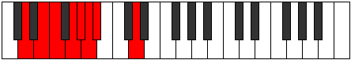 |
| [495](https://ianring.com/musictheory/scales/495) | [Bocryllic](ModeDNaturalBocryllic.md) | D | D, D#, E, F, G, G#, A, A#, D |  |
| [499](https://ianring.com/musictheory/scales/499) | [Ionaptian](ModeCSharpIonaptian.md) | C# | C#, D, E#, F#, G, Ab, Bbb, C# |  |
| [503](https://ianring.com/musictheory/scales/503) | [Thoptyllic](ModeCSharpThoptyllic.md) | C# | C#, D, D#, F, F#, G, G#, A, C# |  |
| [503](https://ianring.com/musictheory/scales/503) | [Thoptyllic](ModeDFlatThoptyllic.md) | Db | Db, D, Eb, F, Gb, G, Ab, A, Db |  |
| [505](https://ianring.com/musictheory/scales/505) | [Sanian](ModeDNaturalSanian.md) | D | D, E#, F#, G, Ab, Bbb, Cbb, D |  |
| [507](https://ianring.com/musictheory/scales/507) | [Moryllic](ModeCSharpMoryllic.md) | C# | C#, D, E, F, F#, G, G#, A, C# |  |
| [507](https://ianring.com/musictheory/scales/507) | [Moryllic](ModeDFlatMoryllic.md) | Db | Db, D, E, F, Gb, G, Ab, A, Db |  |
| [507](https://ianring.com/musictheory/scales/507) | [Moryllic](ModeDNaturalMoryllic.md) | D | D, D#, F, F#, G, G#, A, A#, D |  |
| [509](https://ianring.com/musictheory/scales/509) | [Ionothyllic](ModeDNaturalIonothyllic.md) | D | D, E, F, F#, G, G#, A, A#, D |  |
| [511](https://ianring.com/musictheory/scales/511) | [Polygic](ModeCSharpPolygic.md) | C# | C#, D, D#, E, F, F#, G, G#, A, C# |  |
| [511](https://ianring.com/musictheory/scales/511) | [Polygic](ModeDFlatPolygic.md) | Db | Db, D, Eb, E, F, Gb, G, Ab, A, Db | 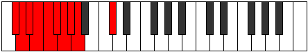 |
| [511](https://ianring.com/musictheory/scales/511) | [Polygic](ModeDNaturalPolygic.md) | D | D, D#, E, F, F#, G, G#, A, A#, D |  |
| [569](https://ianring.com/musictheory/scales/569) | [Mothitonic](ModeFNaturalMothitonic.md) | F | F, G#, A, A#, D, F |  |
| [571](https://ianring.com/musictheory/scales/571) | [Kynimic](ModeFNaturalKynimic.md) | F | F, Gb, Ab, Bbb, Cbb, D, F |  |
| [573](https://ianring.com/musictheory/scales/573) | [Saptimic](ModeFNaturalSaptimic.md) | F | F, G, Ab, Bbb, Cbb, D, F |  |
| [575](https://ianring.com/musictheory/scales/575) | [Ionydian](ModeFNaturalIonydian.md) | F | F, Gb, Abb, Bbbb, Cbbb, Cbb, D, F |  |
| [583](https://ianring.com/musictheory/scales/583) | [Aeritonic](ModeGSharpAeritonic.md) | G# | G#, A, A#, D, F, G# |  |
| [583](https://ianring.com/musictheory/scales/583) | [Aeritonic](ModeAFlatAeritonic.md) | Ab | Ab, A, Bb, D, F, Ab |  |
| [587](https://ianring.com/musictheory/scales/587) | [Pathitonic](ModeGSharpPathitonic.md) | G# | G#, A, B, D, F, G# |  |
| [587](https://ianring.com/musictheory/scales/587) | [Pathitonic](ModeAFlatPathitonic.md) | Ab | Ab, A, B, D, F, Ab |  |
| [591](https://ianring.com/musictheory/scales/591) | [Gaptimic](ModeGSharpGaptimic.md) | G# | G#, A, Bb, Cb, D, E#, G# |  |
| [595](https://ianring.com/musictheory/scales/595) | [Sogitonic](ModeGSharpSogitonic.md) | G# | G#, A, C, D, F, G# |  |
| [595](https://ianring.com/musictheory/scales/595) | [Sogitonic](ModeAFlatSogitonic.md) | Ab | Ab, A, C, D, F, Ab |  |
| [599](https://ianring.com/musictheory/scales/599) | [Thyrimic](ModeGSharpThyrimic.md) | G# | G#, A, Bb, C, D, E#, G# |  |
| [601](https://ianring.com/musictheory/scales/601) | [Bycritonic](ModeFNaturalBycritonic.md) | F | F, G#, A, B, D, F |  |
| [603](https://ianring.com/musictheory/scales/603) | [Aeolygimic](ModeGSharpAeolygimic.md) | G# | G#, A, B, C, D, E#, G# |  |
| [603](https://ianring.com/musictheory/scales/603) | [Aeolygimic](ModeFNaturalAeolygimic.md) | F | F, Gb, Ab, Bbb, Cb, D, F |  |
| [605](https://ianring.com/musictheory/scales/605) | [Dycrimic](ModeFNaturalDycrimic.md) | F | F, G, Ab, Bbb, Cb, D, F |  |
| [607](https://ianring.com/musictheory/scales/607) | [Kadian](ModeGSharpKadian.md) | G# | G#, A, Bb, Cb, Dbb, Ebb, F, G# |  |
| [611](https://ianring.com/musictheory/scales/611) | [Zynitonic](ModeGSharpZynitonic.md) | G# | G#, A, C#, D, F, G# |  |
| [611](https://ianring.com/musictheory/scales/611) | [Zynitonic](ModeAFlatZynitonic.md) | Ab | Ab, A, Db, D, F, Ab |  |
| [615](https://ianring.com/musictheory/scales/615) | [Phrothimic](ModeGSharpPhrothimic.md) | G# | G#, A, Bb, C#, D, E#, G# |  |
| [619](https://ianring.com/musictheory/scales/619) | [Parimic](ModeGSharpParimic.md) | G# | G#, A, B, C#, D, E#, G# |  |
| [623](https://ianring.com/musictheory/scales/623) | [Sycrian](ModeGSharpSycrian.md) | G# | G#, A, Bb, Cb, Db, Ebb, F, G# |  |
| [627](https://ianring.com/musictheory/scales/627) | [Mogimic](ModeGSharpMogimic.md) | G# | G#, A, B#, C#, D, E#, G# |  |
| [631](https://ianring.com/musictheory/scales/631) | [Zygian](ModeGSharpZygian.md) | G# | G#, A, Bb, C, Db, Ebb, F, G# |  |
| [633](https://ianring.com/musictheory/scales/633) | [Kydimic](ModeFNaturalKydimic.md) | F | F, G#, A, Bb, Cb, D, F |  |
| [635](https://ianring.com/musictheory/scales/635) | [Epolian](ModeGSharpEpolian.md) | G# | G#, A, B, C, Db, Ebb, F, G# |  |
| [639](https://ianring.com/musictheory/scales/639) | [Ionaryllic](ModeGSharpIonaryllic.md) | G# | G#, A, A#, B, C, C#, D, F, G# |  |
| [639](https://ianring.com/musictheory/scales/639) | [Ionaryllic](ModeAFlatIonaryllic.md) | Ab | Ab, A, Bb, B, C, Db, D, F, Ab |  |
| [639](https://ianring.com/musictheory/scales/639) | [Ionaryllic](ModeFNaturalIonaryllic.md) | F | F, F#, G, G#, A, A#, B, D, F |  |
| [665](https://ianring.com/musictheory/scales/665) | [Mythitonic](ModeFNaturalMythitonic.md) | F | F, G#, A, C, D, F |  |
| [667](https://ianring.com/musictheory/scales/667) | [Rodimic](ModeFNaturalRodimic.md) | F | F, Gb, Ab, Bbb, C, D, F |  |
| [669](https://ianring.com/musictheory/scales/669) | [Gycrimic](ModeFNaturalGycrimic.md) | F | F, G, Ab, Bbb, C, D, F |  |
| [697](https://ianring.com/musictheory/scales/697) | [Lagimic](ModeFNaturalLagimic.md) | F | F, G#, A, Bb, C, D, F |  |
| [703](https://ianring.com/musictheory/scales/703) | [Aerocryllic](ModeFNaturalAerocryllic.md) | F | F, F#, G, G#, A, A#, C, D, F |  |
| [711](https://ianring.com/musictheory/scales/711) | [Epyrimic](ModeGSharpEpyrimic.md) | G# | G#, A, Bb, C##, D#, E#, G# |  |
| [711](https://ianring.com/musictheory/scales/711) | [Epyrimic](ModeAFlatEpyrimic.md) | Ab | Ab, Bbb, Cbb, D, Eb, F, Ab |  |
| [713](https://ianring.com/musictheory/scales/713) | [Thoptitonic](ModeDNaturalThoptitonic.md) | D | D, F, G#, A, B, D | 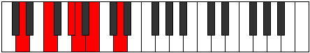 |
| [715](https://ianring.com/musictheory/scales/715) | [Dodimic](ModeDNaturalDodimic.md) | D | D, Eb, F, G#, A, B, D |  |
| [715](https://ianring.com/musictheory/scales/715) | [Dodimic](ModeGSharpDodimic.md) | G# | G#, A, B, C##, D#, E#, G# | 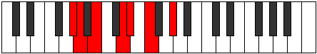 |
| [715](https://ianring.com/musictheory/scales/715) | [Dodimic](ModeAFlatDodimic.md) | Ab | Ab, Bbb, Cb, D, Eb, F, Ab |  |
| [717](https://ianring.com/musictheory/scales/717) | [Gythimic](ModeDNaturalGythimic.md) | D | D, E, F, G#, A, B, D | 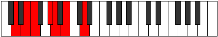 |
| [719](https://ianring.com/musictheory/scales/719) | [Kanian](ModeDNaturalKanian.md) | D | D, Eb, Fb, Gbb, Ab, Bbb, Cb, D |  |
| [719](https://ianring.com/musictheory/scales/719) | [Kanian](ModeGSharpKanian.md) | G# | G#, A, Bb, Cb, D, Eb, F, G# |  |
| [723](https://ianring.com/musictheory/scales/723) | [Ionadimic](ModeGSharpIonadimic.md) | G# | G#, A, B#, C##, D#, E#, G# |  |
| [723](https://ianring.com/musictheory/scales/723) | [Ionadimic](ModeAFlatIonadimic.md) | Ab | Ab, Bbb, C, D, Eb, F, Ab |  |
| [727](https://ianring.com/musictheory/scales/727) | [Phradian](ModeGSharpPhradian.md) | G# | G#, A, Bb, C, D, Eb, F, G# |  |
| [729](https://ianring.com/musictheory/scales/729) | [Stygimic](ModeFNaturalStygimic.md) | F | F, G#, A, B, C, D, F |  |
| [729](https://ianring.com/musictheory/scales/729) | [Stygimic](ModeDNaturalStygimic.md) | D | D, E#, F#, G#, A, B, D |  |
| [731](https://ianring.com/musictheory/scales/731) | [Ionorian](ModeGSharpIonorian.md) | G# | G#, A, B, C, D, Eb, F, G# |  |
| [731](https://ianring.com/musictheory/scales/731) | [Ionorian](ModeDNaturalIonorian.md) | D | D, Eb, F, Gb, Ab, Bbb, Cb, D |  |
| [733](https://ianring.com/musictheory/scales/733) | [Donian](ModeDNaturalDonian.md) | D | D, E, F, Gb, Ab, Bbb, Cb, D |  |
| [735](https://ianring.com/musictheory/scales/735) | [Sylyllic](ModeDNaturalSylyllic.md) | D | D, D#, E, F, F#, G#, A, B, D |  |
| [735](https://ianring.com/musictheory/scales/735) | [Sylyllic](ModeFNaturalSylyllic.md) | F | F, F#, G, G#, A, B, C, D, F |  |
| [735](https://ianring.com/musictheory/scales/735) | [Sylyllic](ModeGSharpSylyllic.md) | G# | G#, A, A#, B, C, D, D#, F, G# |  |
| [735](https://ianring.com/musictheory/scales/735) | [Sylyllic](ModeAFlatSylyllic.md) | Ab | Ab, A, Bb, B, C, D, Eb, F, Ab |  |
| [739](https://ianring.com/musictheory/scales/739) | [Rorimic](ModeGSharpRorimic.md) | G# | G#, A, B##, C##, D#, E#, G# |  |
| [739](https://ianring.com/musictheory/scales/739) | [Rorimic](ModeAFlatRorimic.md) | Ab | Ab, Bbb, C#, D, Eb, F, Ab |  |
| [743](https://ianring.com/musictheory/scales/743) | [Lanian](ModeGSharpLanian.md) | G# | G#, A, Bb, C#, D, Eb, F, G# |  |
| [745](https://ianring.com/musictheory/scales/745) | [Kolimic](ModeDNaturalKolimic.md) | D | D, E#, F##, G#, A, B, D | 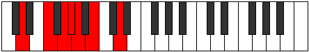 |
| [747](https://ianring.com/musictheory/scales/747) | [Lynian](ModeGSharpLynian.md) | G# | G#, A, B, C#, D, Eb, F, G# |  |
| [747](https://ianring.com/musictheory/scales/747) | [Lynian](ModeDNaturalLynian.md) | D | D, Eb, F, G, Ab, Bbb, Cb, D |  |
| [749](https://ianring.com/musictheory/scales/749) | [Aeologian](ModeDNaturalAeologian.md) | D | D, E, F, G, Ab, Bbb, Cb, D |  |
| [751](https://ianring.com/musictheory/scales/751) | [Epacryllic](ModeDNaturalEpacryllic.md) | D | D, D#, E, F, G, G#, A, B, D |  |
| [751](https://ianring.com/musictheory/scales/751) | [Epacryllic](ModeGSharpEpacryllic.md) | G# | G#, A, A#, B, C#, D, D#, F, G# |  |
| [751](https://ianring.com/musictheory/scales/751) | [Epacryllic](ModeAFlatEpacryllic.md) | Ab | Ab, A, Bb, B, Db, D, Eb, F, Ab |  |
| [755](https://ianring.com/musictheory/scales/755) | [Phrythian](ModeGSharpPhrythian.md) | G# | G#, A, B#, C#, D, Eb, F, G# |  |
| [759](https://ianring.com/musictheory/scales/759) | [Katalyllic](ModeGSharpKatalyllic.md) | G# | G#, A, A#, C, C#, D, D#, F, G# |  |
| [759](https://ianring.com/musictheory/scales/759) | [Katalyllic](ModeAFlatKatalyllic.md) | Ab | Ab, A, Bb, C, Db, D, Eb, F, Ab |  |
| [761](https://ianring.com/musictheory/scales/761) | [Ponian](ModeDNaturalPonian.md) | D | D, E#, F#, G, Ab, Bbb, Cb, D |  |
| [761](https://ianring.com/musictheory/scales/761) | [Ponian](ModeFNaturalPonian.md) | F | F, G#, A, Bb, Cb, Dbb, Ebb, F |  |
| [763](https://ianring.com/musictheory/scales/763) | [Doryllic](ModeGSharpDoryllic.md) | G# | G#, A, B, C, C#, D, D#, F, G# |  |
| [763](https://ianring.com/musictheory/scales/763) | [Doryllic](ModeAFlatDoryllic.md) | Ab | Ab, A, B, C, Db, D, Eb, F, Ab |  |
| [763](https://ianring.com/musictheory/scales/763) | [Doryllic](ModeDNaturalDoryllic.md) | D | D, D#, F, F#, G, G#, A, B, D |  |
| [763](https://ianring.com/musictheory/scales/763) | [Doryllic](ModeFNaturalDoryllic.md) | F | F, F#, G#, A, A#, B, C, D, F |  |
| [765](https://ianring.com/musictheory/scales/765) | [Mixonyphyllic](ModeDNaturalMixonyphyllic.md) | D | D, E, F, F#, G, G#, A, B, D |  |
| [765](https://ianring.com/musictheory/scales/765) | [Mixonyphyllic](ModeFNaturalMixonyphyllic.md) | F | F, G, G#, A, A#, B, C, D, F |  |
| [767](https://ianring.com/musictheory/scales/767) | [Raptygic](ModeDNaturalRaptygic.md) | D | D, D#, E, F, F#, G, G#, A, B, D |  |
| [767](https://ianring.com/musictheory/scales/767) | [Raptygic](ModeGSharpRaptygic.md) | G# | G#, A, A#, B, C, C#, D, D#, F, G# |  |
| [767](https://ianring.com/musictheory/scales/767) | [Raptygic](ModeAFlatRaptygic.md) | Ab | Ab, A, Bb, B, C, Db, D, Eb, F, Ab |  |
| [767](https://ianring.com/musictheory/scales/767) | [Raptygic](ModeFNaturalRaptygic.md) | F | F, F#, G, G#, A, A#, B, C, D, F |  |
| [793](https://ianring.com/musictheory/scales/793) | [Mocritonic](ModeFNaturalMocritonic.md) | F | F, G#, A, C#, D, F |  |
| [795](https://ianring.com/musictheory/scales/795) | [Aeologimic](ModeFNaturalAeologimic.md) | F | F, Gb, Ab, Bbb, C#, D, F |  |
| [797](https://ianring.com/musictheory/scales/797) | [Katocrimic](ModeFNaturalKatocrimic.md) | F | F, G, Ab, Bbb, C#, D, F | 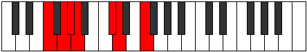 |
| [805](https://ianring.com/musictheory/scales/805) | [Rothitonic](ModeCNaturalRothitonic.md) | C | C, D, F, G#, A, C | 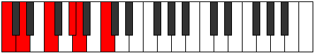 |
| [807](https://ianring.com/musictheory/scales/807) | [Epadimic](ModeCNaturalEpadimic.md) | C | C, Db, Ebb, F, G#, A, C |  |
| [813](https://ianring.com/musictheory/scales/813) | [Larimic](ModeCNaturalLarimic.md) | C | C, D, Eb, F, G#, A, C |  |
| [821](https://ianring.com/musictheory/scales/821) | [Aeranimic](ModeCNaturalAeranimic.md) | C | C, D, E, F, G#, A, C |  |
| [825](https://ianring.com/musictheory/scales/825) | [Thyptimic](ModeFNaturalThyptimic.md) | F | F, G#, A, Bb, C#, D, F |  |
| [829](https://ianring.com/musictheory/scales/829) | [Lygian](ModeCNaturalLygian.md) | C | C, D, Eb, Fb, Gbb, Ab, Bbb, C | 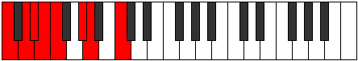 |
| [831](https://ianring.com/musictheory/scales/831) | [Rodyllic](ModeCNaturalRodyllic.md) | C | C, C#, D, D#, E, F, G#, A, C |  |
| [831](https://ianring.com/musictheory/scales/831) | [Rodyllic](ModeFNaturalRodyllic.md) | F | F, F#, G, G#, A, A#, C#, D, F |  |
| [839](https://ianring.com/musictheory/scales/839) | [Ionathimic](ModeGSharpIonathimic.md) | G# | G#, A, Bb, C##, D##, E#, G# |  |
| [839](https://ianring.com/musictheory/scales/839) | [Ionathimic](ModeAFlatIonathimic.md) | Ab | Ab, Bbb, Cbb, D, E, F, Ab |  |
| [843](https://ianring.com/musictheory/scales/843) | [Molimic](ModeGSharpMolimic.md) | G# | G#, A, B, C##, D##, E#, G# |  |
| [843](https://ianring.com/musictheory/scales/843) | [Molimic](ModeAFlatMolimic.md) | Ab | Ab, Bbb, Cb, D, E, F, Ab |  |
| [847](https://ianring.com/musictheory/scales/847) | [Ganian](ModeGSharpGanian.md) | G# | G#, A, Bb, Cb, D, E, F, G# |  |
| [851](https://ianring.com/musictheory/scales/851) | [Aerylimic](ModeGSharpAerylimic.md) | G# | G#, A, B#, C##, D##, E#, G# |  |
| [851](https://ianring.com/musictheory/scales/851) | [Aerylimic](ModeAFlatAerylimic.md) | Ab | Ab, Bbb, C, D, E, F, Ab |  |
| [855](https://ianring.com/musictheory/scales/855) | [Porian](ModeGSharpPorian.md) | G# | G#, A, Bb, C, D, E, F, G# |  |
| [857](https://ianring.com/musictheory/scales/857) | [Aeolydimic](ModeFNaturalAeolydimic.md) | F | F, G#, A, B, C#, D, F |  |
| [859](https://ianring.com/musictheory/scales/859) | [Pathian](ModeGSharpPathian.md) | G# | G#, A, B, C, D, E, F, G# |  |
| [863](https://ianring.com/musictheory/scales/863) | [Pyryllic](ModeFNaturalPyryllic.md) | F | F, F#, G, G#, A, B, C#, D, F |  |
| [863](https://ianring.com/musictheory/scales/863) | [Pyryllic](ModeGSharpPyryllic.md) | G# | G#, A, A#, B, C, D, E, F, G# |  |
| [863](https://ianring.com/musictheory/scales/863) | [Pyryllic](ModeAFlatPyryllic.md) | Ab | Ab, A, Bb, B, C, D, E, F, Ab |  |
| [867](https://ianring.com/musictheory/scales/867) | [Phrocrimic](ModeGSharpPhrocrimic.md) | G# | G#, A, B##, C##, D##, E#, G# |  |
| [867](https://ianring.com/musictheory/scales/867) | [Phrocrimic](ModeAFlatPhrocrimic.md) | Ab | Ab, Bbb, C#, D, E, F, Ab |  |
| [869](https://ianring.com/musictheory/scales/869) | [Kothimic](ModeCNaturalKothimic.md) | C | C, D, E#, F#, G#, A, C |  |
| [871](https://ianring.com/musictheory/scales/871) | [Epadian](ModeGSharpEpadian.md) | G# | G#, A, Bb, C#, D, E, F, G# |  |
| [875](https://ianring.com/musictheory/scales/875) | [Stothian](ModeGSharpStothian.md) | G# | G#, A, B, C#, D, E, F, G# |  |
| [877](https://ianring.com/musictheory/scales/877) | [Aeraptian](ModeCNaturalAeraptian.md) | C | C, D, Eb, F, Gb, Ab, Bbb, C |  |
| [879](https://ianring.com/musictheory/scales/879) | [Aeolocryllic](ModeCNaturalAeolocryllic.md) | C | C, C#, D, D#, F, F#, G#, A, C |  |
| [879](https://ianring.com/musictheory/scales/879) | [Aeolocryllic](ModeGSharpAeolocryllic.md) | G# | G#, A, A#, B, C#, D, E, F, G# |  |
| [879](https://ianring.com/musictheory/scales/879) | [Aeolocryllic](ModeAFlatAeolocryllic.md) | Ab | Ab, A, Bb, B, Db, D, E, F, Ab |  |
| [883](https://ianring.com/musictheory/scales/883) | [Ralian](ModeGSharpRalian.md) | G# | G#, A, B#, C#, D, E, F, G# |  |
| [885](https://ianring.com/musictheory/scales/885) | [Sathian](ModeCNaturalSathian.md) | C | C, D, E, F, Gb, Ab, Bbb, C |  |
| [887](https://ianring.com/musictheory/scales/887) | [Sathyllic](ModeCNaturalSathyllic.md) | C | C, C#, D, E, F, F#, G#, A, C |  |
| [887](https://ianring.com/musictheory/scales/887) | [Sathyllic](ModeGSharpSathyllic.md) | G# | G#, A, A#, C, C#, D, E, F, G# |  |
| [887](https://ianring.com/musictheory/scales/887) | [Sathyllic](ModeAFlatSathyllic.md) | Ab | Ab, A, Bb, C, Db, D, E, F, Ab |  |
| [889](https://ianring.com/musictheory/scales/889) | [Borian](ModeFNaturalBorian.md) | F | F, G#, A, Bb, Cb, Db, Ebb, F |  |
| [891](https://ianring.com/musictheory/scales/891) | [Ionilyllic](ModeGSharpIonilyllic.md) | G# | G#, A, B, C, C#, D, E, F, G# |  |
| [891](https://ianring.com/musictheory/scales/891) | [Ionilyllic](ModeAFlatIonilyllic.md) | Ab | Ab, A, B, C, Db, D, E, F, Ab |  |
| [891](https://ianring.com/musictheory/scales/891) | [Ionilyllic](ModeFNaturalIonilyllic.md) | F | F, F#, G#, A, A#, B, C#, D, F |  |
| [893](https://ianring.com/musictheory/scales/893) | [Pycryllic](ModeCNaturalPycryllic.md) | C | C, D, D#, E, F, F#, G#, A, C |  |
| [893](https://ianring.com/musictheory/scales/893) | [Pycryllic](ModeFNaturalPycryllic.md) | F | F, G, G#, A, A#, B, C#, D, F |  |
| [895](https://ianring.com/musictheory/scales/895) | [Aeolathygic](ModeCNaturalAeolathygic.md) | C | C, C#, D, D#, E, F, F#, G#, A, C |  |
| [895](https://ianring.com/musictheory/scales/895) | [Aeolathygic](ModeGSharpAeolathygic.md) | G# | G#, A, A#, B, C, C#, D, E, F, G# |  |
| [895](https://ianring.com/musictheory/scales/895) | [Aeolathygic](ModeAFlatAeolathygic.md) | Ab | Ab, A, Bb, B, C, Db, D, E, F, Ab |  |
| [895](https://ianring.com/musictheory/scales/895) | [Aeolathygic](ModeFNaturalAeolathygic.md) | F | F, F#, G, G#, A, A#, B, C#, D, F |  |
| [915](https://ianring.com/musictheory/scales/915) | [Loptimic](ModeCSharpLoptimic.md) | C# | C#, D, E#, F###, G##, A#, C# |  |
| [915](https://ianring.com/musictheory/scales/915) | [Loptimic](ModeDFlatLoptimic.md) | Db | Db, Ebb, F, G#, A, Bb, Db |  |
| [919](https://ianring.com/musictheory/scales/919) | [Gathian](ModeCSharpGathian.md) | C# | C#, D, Eb, F, G#, A, Bb, C# |  |
| [921](https://ianring.com/musictheory/scales/921) | [Bogimic](ModeFNaturalBogimic.md) | F | F, G#, A, B#, C#, D, F |  |
| [923](https://ianring.com/musictheory/scales/923) | [Ionodian](ModeCSharpIonodian.md) | C# | C#, D, E, F, G#, A, Bb, C# |  |
| [927](https://ianring.com/musictheory/scales/927) | [Koptyllic](ModeFNaturalKoptyllic.md) | F | F, F#, G, G#, A, C, C#, D, F |  |
| [927](https://ianring.com/musictheory/scales/927) | [Koptyllic](ModeCSharpKoptyllic.md) | C# | C#, D, D#, E, F, G#, A, A#, C# |  |
| [927](https://ianring.com/musictheory/scales/927) | [Koptyllic](ModeDFlatKoptyllic.md) | Db | Db, D, Eb, E, F, Ab, A, Bb, Db |  |
| [933](https://ianring.com/musictheory/scales/933) | [Dadimic](ModeCNaturalDadimic.md) | C | C, D, E#, F##, G#, A, C |  |
| [941](https://ianring.com/musictheory/scales/941) | [Phrorian](ModeCNaturalPhrorian.md) | C | C, D, Eb, F, G, Ab, Bbb, C |  |
| [943](https://ianring.com/musictheory/scales/943) | [Aerygyllic](ModeCNaturalAerygyllic.md) | C | C, C#, D, D#, F, G, G#, A, C |  |
| [947](https://ianring.com/musictheory/scales/947) | [Modian](ModeCSharpModian.md) | C# | C#, D, E#, F#, G#, A, Bb, C# |  |
| [949](https://ianring.com/musictheory/scales/949) | [Ionagian](ModeCNaturalIonagian.md) | C | C, D, E, F, G, Ab, Bbb, C |  |
| [951](https://ianring.com/musictheory/scales/951) | [Thogyllic](ModeCNaturalThogyllic.md) | C | C, C#, D, E, F, G, G#, A, C |  |
| [951](https://ianring.com/musictheory/scales/951) | [Thogyllic](ModeCSharpThogyllic.md) | C# | C#, D, D#, F, F#, G#, A, A#, C# |  |
| [951](https://ianring.com/musictheory/scales/951) | [Thogyllic](ModeDFlatThogyllic.md) | Db | Db, D, Eb, F, Gb, Ab, A, Bb, Db |  |
| [953](https://ianring.com/musictheory/scales/953) | [Stoptian](ModeFNaturalStoptian.md) | F | F, G#, A, Bb, C, Db, Ebb, F |  |
| [955](https://ianring.com/musictheory/scales/955) | [Ionogyllic](ModeFNaturalIonogyllic.md) | F | F, F#, G#, A, A#, C, C#, D, F |  |
| [955](https://ianring.com/musictheory/scales/955) | [Ionogyllic](ModeCSharpIonogyllic.md) | C# | C#, D, E, F, F#, G#, A, A#, C# |  |
| [955](https://ianring.com/musictheory/scales/955) | [Ionogyllic](ModeDFlatIonogyllic.md) | Db | Db, D, E, F, Gb, Ab, A, Bb, Db |  |
| [957](https://ianring.com/musictheory/scales/957) | [Phronyllic](ModeCNaturalPhronyllic.md) | C | C, D, D#, E, F, G, G#, A, C |  |
| [957](https://ianring.com/musictheory/scales/957) | [Phronyllic](ModeFNaturalPhronyllic.md) | F | F, G, G#, A, A#, C, C#, D, F |  |
| [959](https://ianring.com/musictheory/scales/959) | [Katylygic](ModeCNaturalKatylygic.md) | C | C, C#, D, D#, E, F, G, G#, A, C |  |
| [959](https://ianring.com/musictheory/scales/959) | [Katylygic](ModeCSharpKatylygic.md) | C# | C#, D, D#, E, F, F#, G#, A, A#, C# |  |
| [959](https://ianring.com/musictheory/scales/959) | [Katylygic](ModeDFlatKatylygic.md) | Db | Db, D, Eb, E, F, Gb, Ab, A, Bb, Db |  |
| [959](https://ianring.com/musictheory/scales/959) | [Katylygic](ModeFNaturalKatylygic.md) | F | F, F#, G, G#, A, A#, C, C#, D, F |  |
| [967](https://ianring.com/musictheory/scales/967) | [Aeolanian](ModeGSharpAeolanian.md) | G# | G#, A, Bb, C##, D#, E, F, G# |  |
| [967](https://ianring.com/musictheory/scales/967) | [Aeolanian](ModeAFlatAeolanian.md) | Ab | Ab, Bbb, Cbb, D, Eb, Fb, Gbb, Ab |  |
| [969](https://ianring.com/musictheory/scales/969) | [Ionogimic](ModeDNaturalIonogimic.md) | D | D, E#, F###, G##, A#, B, D |  |
| [971](https://ianring.com/musictheory/scales/971) | [Ladian](ModeGSharpLadian.md) | G# | G#, A, B, C##, D#, E, F, G# |  |
| [971](https://ianring.com/musictheory/scales/971) | [Ladian](ModeAFlatLadian.md) | Ab | Ab, Bbb, Cb, D, Eb, Fb, Gbb, Ab |  |
| [971](https://ianring.com/musictheory/scales/971) | [Ladian](ModeDNaturalLadian.md) | D | D, Eb, F, G#, A, Bb, Cb, D |  |
| [973](https://ianring.com/musictheory/scales/973) | [Phryptian](ModeDNaturalPhryptian.md) | D | D, E, F, G#, A, Bb, Cb, D |  |
| [975](https://ianring.com/musictheory/scales/975) | [Katogyllic](ModeDNaturalKatogyllic.md) | D | D, D#, E, F, G#, A, A#, B, D |  |
| [975](https://ianring.com/musictheory/scales/975) | [Katogyllic](ModeGSharpKatogyllic.md) | G# | G#, A, A#, B, D, D#, E, F, G# |  |
| [975](https://ianring.com/musictheory/scales/975) | [Katogyllic](ModeAFlatKatogyllic.md) | Ab | Ab, A, Bb, B, D, Eb, E, F, Ab |  |
| [979](https://ianring.com/musictheory/scales/979) | [Thogian](ModeGSharpThogian.md) | G# | G#, A, B#, C##, D#, E, F, G# |  |
| [979](https://ianring.com/musictheory/scales/979) | [Thogian](ModeAFlatThogian.md) | Ab | Ab, Bbb, C, D, Eb, Fb, Gbb, Ab |  |
| [979](https://ianring.com/musictheory/scales/979) | [Thogian](ModeCSharpThogian.md) | C# | C#, D, E#, F##, G#, A, Bb, C# |  |
| [983](https://ianring.com/musictheory/scales/983) | [Epygyllic](ModeGSharpEpygyllic.md) | G# | G#, A, A#, C, D, D#, E, F, G# |  |
| [983](https://ianring.com/musictheory/scales/983) | [Epygyllic](ModeAFlatEpygyllic.md) | Ab | Ab, A, Bb, C, D, Eb, E, F, Ab |  |
| [983](https://ianring.com/musictheory/scales/983) | [Epygyllic](ModeCSharpEpygyllic.md) | C# | C#, D, D#, F, G, G#, A, A#, C# |  |
| [983](https://ianring.com/musictheory/scales/983) | [Epygyllic](ModeDFlatEpygyllic.md) | Db | Db, D, Eb, F, G, Ab, A, Bb, Db |  |
| [985](https://ianring.com/musictheory/scales/985) | [Raptian](ModeFNaturalRaptian.md) | F | F, G#, A, B, C, Db, Ebb, F |  |
| [985](https://ianring.com/musictheory/scales/985) | [Raptian](ModeDNaturalRaptian.md) | D | D, E#, F#, G#, A, Bb, Cb, D |  |
| [987](https://ianring.com/musictheory/scales/987) | [Aeraptyllic](ModeCSharpAeraptyllic.md) | C# | C#, D, E, F, G, G#, A, A#, C# |  |
| [987](https://ianring.com/musictheory/scales/987) | [Aeraptyllic](ModeDFlatAeraptyllic.md) | Db | Db, D, E, F, G, Ab, A, Bb, Db |  |
| [987](https://ianring.com/musictheory/scales/987) | [Aeraptyllic](ModeGSharpAeraptyllic.md) | G# | G#, A, B, C, D, D#, E, F, G# |  |
| [987](https://ianring.com/musictheory/scales/987) | [Aeraptyllic](ModeAFlatAeraptyllic.md) | Ab | Ab, A, B, C, D, Eb, E, F, Ab |  |
| [987](https://ianring.com/musictheory/scales/987) | [Aeraptyllic](ModeFNaturalAeraptyllic.md) | F | F, F#, G#, A, B, C, C#, D, F |  |
| [987](https://ianring.com/musictheory/scales/987) | [Aeraptyllic](ModeDNaturalAeraptyllic.md) | D | D, D#, F, F#, G#, A, A#, B, D |  |
| [989](https://ianring.com/musictheory/scales/989) | [Phrolyllic](ModeFNaturalPhrolyllic.md) | F | F, G, G#, A, B, C, C#, D, F |  |
| [989](https://ianring.com/musictheory/scales/989) | [Phrolyllic](ModeDNaturalPhrolyllic.md) | D | D, E, F, F#, G#, A, A#, B, D |  |
| [991](https://ianring.com/musictheory/scales/991) | [Aeolygic](ModeCSharpAeolygic.md) | C# | C#, D, D#, E, F, G, G#, A, A#, C# |  |
| [991](https://ianring.com/musictheory/scales/991) | [Aeolygic](ModeDFlatAeolygic.md) | Db | Db, D, Eb, E, F, G, Ab, A, Bb, Db |  |
| [991](https://ianring.com/musictheory/scales/991) | [Aeolygic](ModeFNaturalAeolygic.md) | F | F, F#, G, G#, A, B, C, C#, D, F |  |
| [991](https://ianring.com/musictheory/scales/991) | [Aeolygic](ModeGSharpAeolygic.md) | G# | G#, A, A#, B, C, D, D#, E, F, G# |  |
| [991](https://ianring.com/musictheory/scales/991) | [Aeolygic](ModeAFlatAeolygic.md) | Ab | Ab, A, Bb, B, C, D, Eb, E, F, Ab |  |
| [991](https://ianring.com/musictheory/scales/991) | [Aeolygic](ModeDNaturalAeolygic.md) | D | D, D#, E, F, F#, G#, A, A#, B, D |  |
| [995](https://ianring.com/musictheory/scales/995) | [Phrathian](ModeGSharpPhrathian.md) | G# | G#, A, B##, C##, D#, E, F, G# |  |
| [995](https://ianring.com/musictheory/scales/995) | [Phrathian](ModeAFlatPhrathian.md) | Ab | Ab, Bbb, C#, D, Eb, Fb, Gbb, Ab |  |
| [997](https://ianring.com/musictheory/scales/997) | [Rycrian](ModeCNaturalRycrian.md) | C | C, D, E#, F#, G, Ab, Bbb, C |  |
| [999](https://ianring.com/musictheory/scales/999) | [Bylyllic](ModeCNaturalBylyllic.md) | C | C, C#, D, F, F#, G, G#, A, C |  |
| [999](https://ianring.com/musictheory/scales/999) | [Bylyllic](ModeGSharpBylyllic.md) | G# | G#, A, A#, C#, D, D#, E, F, G# |  |
| [999](https://ianring.com/musictheory/scales/999) | [Bylyllic](ModeAFlatBylyllic.md) | Ab | Ab, A, Bb, Db, D, Eb, E, F, Ab |  |
| [1001](https://ianring.com/musictheory/scales/1001) | [Badian](ModeDNaturalBadian.md) | D | D, E#, F##, G#, A, Bb, Cb, D |  |
| [1003](https://ianring.com/musictheory/scales/1003) | [Ionyryllic](ModeGSharpIonyryllic.md) | G# | G#, A, B, C#, D, D#, E, F, G# |  |
| [1003](https://ianring.com/musictheory/scales/1003) | [Ionyryllic](ModeAFlatIonyryllic.md) | Ab | Ab, A, B, Db, D, Eb, E, F, Ab |  |
| [1003](https://ianring.com/musictheory/scales/1003) | [Ionyryllic](ModeDNaturalIonyryllic.md) | D | D, D#, F, G, G#, A, A#, B, D |  |
| [1005](https://ianring.com/musictheory/scales/1005) | [Radyllic](ModeCNaturalRadyllic.md) | C | C, D, D#, F, F#, G, G#, A, C |  |
| [1005](https://ianring.com/musictheory/scales/1005) | [Radyllic](ModeDNaturalRadyllic.md) | D | D, E, F, G, G#, A, A#, B, D |  |
| [1007](https://ianring.com/musictheory/scales/1007) | [Ionycrygic](ModeCNaturalIonycrygic.md) | C | C, C#, D, D#, F, F#, G, G#, A, C |  |
| [1007](https://ianring.com/musictheory/scales/1007) | [Ionycrygic](ModeGSharpIonycrygic.md) | G# | G#, A, A#, B, C#, D, D#, E, F, G# |  |
| [1007](https://ianring.com/musictheory/scales/1007) | [Ionycrygic](ModeAFlatIonycrygic.md) | Ab | Ab, A, Bb, B, Db, D, Eb, E, F, Ab |  |
| [1007](https://ianring.com/musictheory/scales/1007) | [Ionycrygic](ModeDNaturalIonycrygic.md) | D | D, D#, E, F, G, G#, A, A#, B, D |  |
| [1011](https://ianring.com/musictheory/scales/1011) | [Kycryllic](ModeGSharpKycryllic.md) | G# | G#, A, C, C#, D, D#, E, F, G# |  |
| [1011](https://ianring.com/musictheory/scales/1011) | [Kycryllic](ModeAFlatKycryllic.md) | Ab | Ab, A, C, Db, D, Eb, E, F, Ab |  |
| [1011](https://ianring.com/musictheory/scales/1011) | [Kycryllic](ModeCSharpKycryllic.md) | C# | C#, D, F, F#, G, G#, A, A#, C# |  |
| [1011](https://ianring.com/musictheory/scales/1011) | [Kycryllic](ModeDFlatKycryllic.md) | Db | Db, D, F, Gb, G, Ab, A, Bb, Db |  |
| [1013](https://ianring.com/musictheory/scales/1013) | [Stydyllic](ModeCNaturalStydyllic.md) | C | C, D, E, F, F#, G, G#, A, C |  |
| [1015](https://ianring.com/musictheory/scales/1015) | [Ionodygic](ModeCNaturalIonodygic.md) | C | C, C#, D, E, F, F#, G, G#, A, C |  |
| [1015](https://ianring.com/musictheory/scales/1015) | [Ionodygic](ModeGSharpIonodygic.md) | G# | G#, A, A#, C, C#, D, D#, E, F, G# |  |
| [1015](https://ianring.com/musictheory/scales/1015) | [Ionodygic](ModeAFlatIonodygic.md) | Ab | Ab, A, Bb, C, Db, D, Eb, E, F, Ab |  |
| [1015](https://ianring.com/musictheory/scales/1015) | [Ionodygic](ModeCSharpIonodygic.md) | C# | C#, D, D#, F, F#, G, G#, A, A#, C# |  |
| [1015](https://ianring.com/musictheory/scales/1015) | [Ionodygic](ModeDFlatIonodygic.md) | Db | Db, D, Eb, F, Gb, G, Ab, A, Bb, Db |  |
| [1017](https://ianring.com/musictheory/scales/1017) | [Dythyllic](ModeFNaturalDythyllic.md) | F | F, G#, A, A#, B, C, C#, D, F |  |
| [1017](https://ianring.com/musictheory/scales/1017) | [Dythyllic](ModeDNaturalDythyllic.md) | D | D, F, F#, G, G#, A, A#, B, D |  |
| [1019](https://ianring.com/musictheory/scales/1019) | [Aeranygic](ModeCSharpAeranygic.md) | C# | C#, D, E, F, F#, G, G#, A, A#, C# |  |
| [1019](https://ianring.com/musictheory/scales/1019) | [Aeranygic](ModeDFlatAeranygic.md) | Db | Db, D, E, F, Gb, G, Ab, A, Bb, Db |  |
| [1019](https://ianring.com/musictheory/scales/1019) | [Aeranygic](ModeGSharpAeranygic.md) | G# | G#, A, B, C, C#, D, D#, E, F, G# |  |
| [1019](https://ianring.com/musictheory/scales/1019) | [Aeranygic](ModeAFlatAeranygic.md) | Ab | Ab, A, B, C, Db, D, Eb, E, F, Ab |  |
| [1019](https://ianring.com/musictheory/scales/1019) | [Aeranygic](ModeFNaturalAeranygic.md) | F | F, F#, G#, A, A#, B, C, C#, D, F |  |
| [1019](https://ianring.com/musictheory/scales/1019) | [Aeranygic](ModeDNaturalAeranygic.md) | D | D, D#, F, F#, G, G#, A, A#, B, D |  |
| [1021](https://ianring.com/musictheory/scales/1021) | [Ladygic](ModeCNaturalLadygic.md) | C | C, D, D#, E, F, F#, G, G#, A, C |  |
| [1021](https://ianring.com/musictheory/scales/1021) | [Ladygic](ModeFNaturalLadygic.md) | F | F, G, G#, A, A#, B, C, C#, D, F |  |
| [1021](https://ianring.com/musictheory/scales/1021) | [Ladygic](ModeDNaturalLadygic.md) | D | D, E, F, F#, G, G#, A, A#, B, D |  |
| [1023](https://ianring.com/musictheory/scales/1023) | [Dodyllian](ModeCNaturalDodyllian.md) | C | C, C#, D, D#, E, F, F#, G, G#, A, C |  |
| [1023](https://ianring.com/musictheory/scales/1023) | [Dodyllian](ModeCSharpDodyllian.md) | C# | C#, D, D#, E, F, F#, G, G#, A, A#, C# |  |
| [1023](https://ianring.com/musictheory/scales/1023) | [Dodyllian](ModeDFlatDodyllian.md) | Db | Db, D, Eb, E, F, Gb, G, Ab, A, Bb, Db |  |
| [1023](https://ianring.com/musictheory/scales/1023) | [Dodyllian](ModeGSharpDodyllian.md) | G# | G#, A, A#, B, C, C#, D, D#, E, F, G# |  |
| [1023](https://ianring.com/musictheory/scales/1023) | [Dodyllian](ModeAFlatDodyllian.md) | Ab | Ab, A, Bb, B, C, Db, D, Eb, E, F, Ab |  |
| [1023](https://ianring.com/musictheory/scales/1023) | [Dodyllian](ModeFNaturalDodyllian.md) | F | F, F#, G, G#, A, A#, B, C, C#, D, F |  |
| [1023](https://ianring.com/musictheory/scales/1023) | [Dodyllian](ModeDNaturalDodyllian.md) | D | D, D#, E, F, F#, G, G#, A, A#, B, D |  |
| [1139](https://ianring.com/musictheory/scales/1139) | [Aerygimic](ModeENaturalAerygimic.md) | E | E, F, G#, A, Bb, C##, E |  |
| [1143](https://ianring.com/musictheory/scales/1143) | [Styrian](ModeENaturalStyrian.md) | E | E, F, Gb, Ab, Bbb, Cbb, D, E |  |
| [1147](https://ianring.com/musictheory/scales/1147) | [Epynian](ModeENaturalEpynian.md) | E | E, F, G, Ab, Bbb, Cbb, D, E |  |
| [1151](https://ianring.com/musictheory/scales/1151) | [Mythyllic](ModeENaturalMythyllic.md) | E | E, F, F#, G, G#, A, A#, D, E |  |
| [1167](https://ianring.com/musictheory/scales/1167) | [Aerodimic](ModeGNaturalAerodimic.md) | G | G, Ab, Bbb, Cbb, D, E#, G |  |
| [1175](https://ianring.com/musictheory/scales/1175) | [Epycrimic](ModeGNaturalEpycrimic.md) | G | G, Ab, Bbb, Cb, D, E#, G |  |
| [1191](https://ianring.com/musictheory/scales/1191) | [Pyrimic](ModeGNaturalPyrimic.md) | G | G, Ab, Bbb, C, D, E#, G |  |
| [1203](https://ianring.com/musictheory/scales/1203) | [Pagimic](ModeENaturalPagimic.md) | E | E, F, G#, A, B, C##, E | 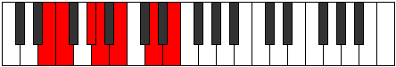 |
| [1207](https://ianring.com/musictheory/scales/1207) | [Aeoloptian](ModeENaturalAeoloptian.md) | E | E, F, Gb, Ab, Bbb, Cb, D, E |  |
| [1211](https://ianring.com/musictheory/scales/1211) | [Zadian](ModeENaturalZadian.md) | E | E, F, G, Ab, Bbb, Cb, D, E | 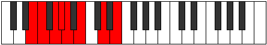 |
| [1215](https://ianring.com/musictheory/scales/1215) | [Aeolanyllic](ModeENaturalAeolanyllic.md) | E | E, F, F#, G, G#, A, B, D, E |  |
| [1215](https://ianring.com/musictheory/scales/1215) | [Aeolanyllic](ModeGNaturalAeolanyllic.md) | G | G, G#, A, A#, B, C, D, F, G |  |
| [1223](https://ianring.com/musictheory/scales/1223) | [Phryptimic](ModeGNaturalPhryptimic.md) | G | G, Ab, Bbb, C#, D, E#, G |  |
| [1225](https://ianring.com/musictheory/scales/1225) | [Lyditonic](ModeDNaturalLyditonic.md) | D | D, F, G#, A, C, D |  |
| [1227](https://ianring.com/musictheory/scales/1227) | [Thacrimic](ModeDNaturalThacrimic.md) | D | D, Eb, F, G#, A, B#, D |  |
| [1229](https://ianring.com/musictheory/scales/1229) | [Ragimic](ModeDNaturalRagimic.md) | D | D, E, F, G#, A, B#, D |  |
| [1231](https://ianring.com/musictheory/scales/1231) | [Logian](ModeDNaturalLogian.md) | D | D, Eb, Fb, Gbb, Ab, Bbb, C, D |  |
| [1241](https://ianring.com/musictheory/scales/1241) | [Pygimic](ModeDNaturalPygimic.md) | D | D, E#, F#, G#, A, B#, D |  |
| [1243](https://ianring.com/musictheory/scales/1243) | [Epylian](ModeDNaturalEpylian.md) | D | D, Eb, F, Gb, Ab, Bbb, C, D |  |
| [1245](https://ianring.com/musictheory/scales/1245) | [Lathian](ModeDNaturalLathian.md) | D | D, E, F, Gb, Ab, Bbb, C, D |  |
| [1247](https://ianring.com/musictheory/scales/1247) | [Mygyllic](ModeDNaturalMygyllic.md) | D | D, D#, E, F, F#, G#, A, C, D |  |
| [1247](https://ianring.com/musictheory/scales/1247) | [Mygyllic](ModeGNaturalMygyllic.md) | G | G, G#, A, A#, B, C#, D, F, G |  |
| [1257](https://ianring.com/musictheory/scales/1257) | [Aeolyphimic](ModeDNaturalAeolyphimic.md) | D | D, E#, F##, G#, A, B#, D |  |
| [1259](https://ianring.com/musictheory/scales/1259) | [Stadian](ModeDNaturalStadian.md) | D | D, Eb, F, G, Ab, Bbb, C, D |  |
| [1261](https://ianring.com/musictheory/scales/1261) | [Aeodian](ModeDNaturalAeodian.md) | D | D, E, F, G, Ab, Bbb, C, D |  |
| [1263](https://ianring.com/musictheory/scales/1263) | [Stynyllic](ModeDNaturalStynyllic.md) | D | D, D#, E, F, G, G#, A, C, D |  |
| [1263](https://ianring.com/musictheory/scales/1263) | [Stynyllic](ModeGNaturalStynyllic.md) | G | G, G#, A, A#, C, C#, D, F, G |  |
| [1267](https://ianring.com/musictheory/scales/1267) | [Katynian](ModeENaturalKatynian.md) | E | E, F, G#, A, Bb, Cb, D, E |  |
| [1271](https://ianring.com/musictheory/scales/1271) | [Kolyllic](ModeGNaturalKolyllic.md) | G | G, G#, A, B, C, C#, D, F, G |  |
| [1271](https://ianring.com/musictheory/scales/1271) | [Kolyllic](ModeENaturalKolyllic.md) | E | E, F, F#, G#, A, A#, B, D, E |  |
| [1273](https://ianring.com/musictheory/scales/1273) | [Ronian](ModeDNaturalRonian.md) | D | D, E#, F#, G, Ab, Bbb, C, D |  |
| [1275](https://ianring.com/musictheory/scales/1275) | [Stagyllic](ModeDNaturalStagyllic.md) | D | D, D#, F, F#, G, G#, A, C, D |  |
| [1275](https://ianring.com/musictheory/scales/1275) | [Stagyllic](ModeENaturalStagyllic.md) | E | E, F, G, G#, A, A#, B, D, E |  |
| [1277](https://ianring.com/musictheory/scales/1277) | [Zadyllic](ModeDNaturalZadyllic.md) | D | D, E, F, F#, G, G#, A, C, D |  |
| [1279](https://ianring.com/musictheory/scales/1279) | [Sarygic](ModeDNaturalSarygic.md) | D | D, D#, E, F, F#, G, G#, A, C, D |  |
| [1279](https://ianring.com/musictheory/scales/1279) | [Sarygic](ModeGNaturalSarygic.md) | G | G, G#, A, A#, B, C, C#, D, F, G |  |
| [1279](https://ianring.com/musictheory/scales/1279) | [Sarygic](ModeENaturalSarygic.md) | E | E, F, F#, G, G#, A, A#, B, D, E |  |
| [1331](https://ianring.com/musictheory/scales/1331) | [Dolimic](ModeENaturalDolimic.md) | E | E, F, G#, A, B#, C##, E |  |
| [1335](https://ianring.com/musictheory/scales/1335) | [Aeralian](ModeENaturalAeralian.md) | E | E, F, Gb, Ab, Bbb, C, D, E |  |
| [1339](https://ianring.com/musictheory/scales/1339) | [Kycrian](ModeENaturalKycrian.md) | E | E, F, G, Ab, Bbb, C, D, E |  |
| [1343](https://ianring.com/musictheory/scales/1343) | [Zalyllic](ModeENaturalZalyllic.md) | E | E, F, F#, G, G#, A, C, D, E |  |
| [1395](https://ianring.com/musictheory/scales/1395) | [Mixonorian](ModeENaturalMixonorian.md) | E | E, F, G#, A, Bb, C, D, E |  |
| [1399](https://ianring.com/musictheory/scales/1399) | [Syryllic](ModeENaturalSyryllic.md) | E | E, F, F#, G#, A, A#, C, D, E |  |
| [1403](https://ianring.com/musictheory/scales/1403) | [Epinyllic](ModeENaturalEpinyllic.md) | E | E, F, G, G#, A, A#, C, D, E |  |
| [1407](https://ianring.com/musictheory/scales/1407) | [Tharygic](ModeENaturalTharygic.md) | E | E, F, F#, G, G#, A, A#, C, D, E |  |
| [1423](https://ianring.com/musictheory/scales/1423) | [Doptian](ModeGNaturalDoptian.md) | G | G, Ab, Bbb, Cbb, D, Eb, F, G |  |
| [1427](https://ianring.com/musictheory/scales/1427) | [Lolimic](ModeCSharpLolimic.md) | C# | C#, D, E#, F###, G##, A##, C# |  |
| [1427](https://ianring.com/musictheory/scales/1427) | [Lolimic](ModeDFlatLolimic.md) | Db | Db, Ebb, F, G#, A, B, Db |  |
| [1431](https://ianring.com/musictheory/scales/1431) | [Phragian](ModeCSharpPhragian.md) | C# | C#, D, Eb, F, G#, A, B, C# |  |
| [1431](https://ianring.com/musictheory/scales/1431) | [Phragian](ModeGNaturalPhragian.md) | G | G, Ab, Bbb, Cb, D, Eb, F, G |  |
| [1435](https://ianring.com/musictheory/scales/1435) | [Phronian](ModeCSharpPhronian.md) | C# | C#, D, E, F, G#, A, B, C# |  |
| [1439](https://ianring.com/musictheory/scales/1439) | [Rolyllic](ModeCSharpRolyllic.md) | C# | C#, D, D#, E, F, G#, A, B, C# |  |
| [1439](https://ianring.com/musictheory/scales/1439) | [Rolyllic](ModeDFlatRolyllic.md) | Db | Db, D, Eb, E, F, Ab, A, B, Db |  |
| [1439](https://ianring.com/musictheory/scales/1439) | [Rolyllic](ModeGNaturalRolyllic.md) | G | G, G#, A, A#, B, D, D#, F, G |  |
| [1447](https://ianring.com/musictheory/scales/1447) | [Mixopyrian](ModeGNaturalMixopyrian.md) | G | G, Ab, Bbb, C, D, Eb, F, G |  |
| [1455](https://ianring.com/musictheory/scales/1455) | [Soryllic](ModeGNaturalSoryllic.md) | G | G, G#, A, A#, C, D, D#, F, G |  |
| [1459](https://ianring.com/musictheory/scales/1459) | [Ionalian](ModeENaturalIonalian.md) | E | E, F, G#, A, B, C, D, E |  |
| [1459](https://ianring.com/musictheory/scales/1459) | [Ionalian](ModeCSharpIonalian.md) | C# | C#, D, E#, F#, G#, A, B, C# |  |
| [1463](https://ianring.com/musictheory/scales/1463) | [Zaptyllic](ModeCSharpZaptyllic.md) | C# | C#, D, D#, F, F#, G#, A, B, C# |  |
| [1463](https://ianring.com/musictheory/scales/1463) | [Zaptyllic](ModeDFlatZaptyllic.md) | Db | Db, D, Eb, F, Gb, Ab, A, B, Db |  |
| [1463](https://ianring.com/musictheory/scales/1463) | [Zaptyllic](ModeENaturalZaptyllic.md) | E | E, F, F#, G#, A, B, C, D, E |  |
| [1463](https://ianring.com/musictheory/scales/1463) | [Zaptyllic](ModeGNaturalZaptyllic.md) | G | G, G#, A, B, C, D, D#, F, G |  |
| [1467](https://ianring.com/musictheory/scales/1467) | [Thydyllic](ModeCSharpThydyllic.md) | C# | C#, D, E, F, F#, G#, A, B, C# |  |
| [1467](https://ianring.com/musictheory/scales/1467) | [Thydyllic](ModeDFlatThydyllic.md) | Db | Db, D, E, F, Gb, Ab, A, B, Db |  |
| [1467](https://ianring.com/musictheory/scales/1467) | [Thydyllic](ModeENaturalThydyllic.md) | E | E, F, G, G#, A, B, C, D, E |  |
| [1471](https://ianring.com/musictheory/scales/1471) | [Radygic](ModeCSharpRadygic.md) | C# | C#, D, D#, E, F, F#, G#, A, B, C# |  |
| [1471](https://ianring.com/musictheory/scales/1471) | [Radygic](ModeDFlatRadygic.md) | Db | Db, D, Eb, E, F, Gb, Ab, A, B, Db |  |
| [1471](https://ianring.com/musictheory/scales/1471) | [Radygic](ModeENaturalRadygic.md) | E | E, F, F#, G, G#, A, B, C, D, E |  |
| [1471](https://ianring.com/musictheory/scales/1471) | [Radygic](ModeGNaturalRadygic.md) | G | G, G#, A, A#, B, C, D, D#, F, G |  |
| [1479](https://ianring.com/musictheory/scales/1479) | [Aeolagian](ModeGNaturalAeolagian.md) | G | G, Ab, Bbb, C#, D, Eb, F, G |  |
| [1481](https://ianring.com/musictheory/scales/1481) | [Zagimic](ModeDNaturalZagimic.md) | D | D, E#, F###, G##, A#, B#, D |  |
| [1483](https://ianring.com/musictheory/scales/1483) | [Dygian](ModeDNaturalDygian.md) | D | D, Eb, F, G#, A, Bb, C, D |  |
| [1485](https://ianring.com/musictheory/scales/1485) | [Tyrian](ModeDNaturalTyrian.md) | D | D, E, F, G#, A, Bb, C, D |  |
| [1487](https://ianring.com/musictheory/scales/1487) | [Lycryllic](ModeDNaturalLycryllic.md) | D | D, D#, E, F, G#, A, A#, C, D |  |
| [1487](https://ianring.com/musictheory/scales/1487) | [Lycryllic](ModeGNaturalLycryllic.md) | G | G, G#, A, A#, C#, D, D#, F, G |  |
| [1491](https://ianring.com/musictheory/scales/1491) | [Rynian](ModeCSharpRynian.md) | C# | C#, D, E#, F##, G#, A, B, C# |  |
| [1495](https://ianring.com/musictheory/scales/1495) | [Kaptyllic](ModeCSharpKaptyllic.md) | C# | C#, D, D#, F, G, G#, A, B, C# |  |
| [1495](https://ianring.com/musictheory/scales/1495) | [Kaptyllic](ModeDFlatKaptyllic.md) | Db | Db, D, Eb, F, G, Ab, A, B, Db |  |
| [1495](https://ianring.com/musictheory/scales/1495) | [Kaptyllic](ModeGNaturalKaptyllic.md) | G | G, G#, A, B, C#, D, D#, F, G | 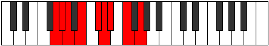 |
| [1497](https://ianring.com/musictheory/scales/1497) | [Ionanian](ModeDNaturalIonanian.md) | D | D, E#, F#, G#, A, Bb, C, D |  |
| [1499](https://ianring.com/musictheory/scales/1499) | [Stonyllic](ModeDNaturalStonyllic.md) | D | D, D#, F, F#, G#, A, A#, C, D |  |
| [1499](https://ianring.com/musictheory/scales/1499) | [Stonyllic](ModeCSharpStonyllic.md) | C# | C#, D, E, F, G, G#, A, B, C# |  |
| [1499](https://ianring.com/musictheory/scales/1499) | [Stonyllic](ModeDFlatStonyllic.md) | Db | Db, D, E, F, G, Ab, A, B, Db |  |
| [1501](https://ianring.com/musictheory/scales/1501) | [Stygyllic](ModeDNaturalStygyllic.md) | D | D, E, F, F#, G#, A, A#, C, D |  |
| [1503](https://ianring.com/musictheory/scales/1503) | [Padygic](ModeDNaturalPadygic.md) | D | D, D#, E, F, F#, G#, A, A#, C, D |  |
| [1503](https://ianring.com/musictheory/scales/1503) | [Padygic](ModeCSharpPadygic.md) | C# | C#, D, D#, E, F, G, G#, A, B, C# |  |
| [1503](https://ianring.com/musictheory/scales/1503) | [Padygic](ModeDFlatPadygic.md) | Db | Db, D, Eb, E, F, G, Ab, A, B, Db |  |
| [1503](https://ianring.com/musictheory/scales/1503) | [Padygic](ModeGNaturalPadygic.md) | G | G, G#, A, A#, B, C#, D, D#, F, G |  |
| [1511](https://ianring.com/musictheory/scales/1511) | [Styptyllic](ModeGNaturalStyptyllic.md) | G | G, G#, A, C, C#, D, D#, F, G |  |
| [1513](https://ianring.com/musictheory/scales/1513) | [Stathian](ModeDNaturalStathian.md) | D | D, E#, F##, G#, A, Bb, C, D |  |
| [1515](https://ianring.com/musictheory/scales/1515) | [Solyllic](ModeDNaturalSolyllic.md) | D | D, D#, F, G, G#, A, A#, C, D |  |
| [1517](https://ianring.com/musictheory/scales/1517) | [Sagyllic](ModeDNaturalSagyllic.md) | D | D, E, F, G, G#, A, A#, C, D |  |
| [1519](https://ianring.com/musictheory/scales/1519) | [Solygic](ModeGNaturalSolygic.md) | G | G, G#, A, A#, C, C#, D, D#, F, G |  |
| [1519](https://ianring.com/musictheory/scales/1519) | [Solygic](ModeDNaturalSolygic.md) | D | D, D#, E, F, G, G#, A, A#, C, D |  |
| [1523](https://ianring.com/musictheory/scales/1523) | [Zothyllic](ModeCSharpZothyllic.md) | C# | C#, D, F, F#, G, G#, A, B, C# |  |
| [1523](https://ianring.com/musictheory/scales/1523) | [Zothyllic](ModeDFlatZothyllic.md) | Db | Db, D, F, Gb, G, Ab, A, B, Db |  |
| [1523](https://ianring.com/musictheory/scales/1523) | [Zothyllic](ModeENaturalZothyllic.md) | E | E, F, G#, A, A#, B, C, D, E |  |
| [1527](https://ianring.com/musictheory/scales/1527) | [Aeolyrygic](ModeGNaturalAeolyrygic.md) | G | G, G#, A, B, C, C#, D, D#, F, G |  |
| [1527](https://ianring.com/musictheory/scales/1527) | [Aeolyrygic](ModeCSharpAeolyrygic.md) | C# | C#, D, D#, F, F#, G, G#, A, B, C# |  |
| [1527](https://ianring.com/musictheory/scales/1527) | [Aeolyrygic](ModeDFlatAeolyrygic.md) | Db | Db, D, Eb, F, Gb, G, Ab, A, B, Db |  |
| [1527](https://ianring.com/musictheory/scales/1527) | [Aeolyrygic](ModeENaturalAeolyrygic.md) | E | E, F, F#, G#, A, A#, B, C, D, E |  |
| [1529](https://ianring.com/musictheory/scales/1529) | [Kataryllic](ModeDNaturalKataryllic.md) | D | D, F, F#, G, G#, A, A#, C, D |  |
| [1531](https://ianring.com/musictheory/scales/1531) | [Styptygic](ModeDNaturalStyptygic.md) | D | D, D#, F, F#, G, G#, A, A#, C, D |  |
| [1531](https://ianring.com/musictheory/scales/1531) | [Styptygic](ModeCSharpStyptygic.md) | C# | C#, D, E, F, F#, G, G#, A, B, C# |  |
| [1531](https://ianring.com/musictheory/scales/1531) | [Styptygic](ModeDFlatStyptygic.md) | Db | Db, D, E, F, Gb, G, Ab, A, B, Db |  |
| [1531](https://ianring.com/musictheory/scales/1531) | [Styptygic](ModeENaturalStyptygic.md) | E | E, F, G, G#, A, A#, B, C, D, E |  |
| [1533](https://ianring.com/musictheory/scales/1533) | [Katycrygic](ModeDNaturalKatycrygic.md) | D | D, E, F, F#, G, G#, A, A#, C, D |  |
| [1535](https://ianring.com/musictheory/scales/1535) | [Mixodyllian](ModeDNaturalMixodyllian.md) | D | D, D#, E, F, F#, G, G#, A, A#, C, D |  |
| [1535](https://ianring.com/musictheory/scales/1535) | [Mixodyllian](ModeCSharpMixodyllian.md) | C# | C#, D, D#, E, F, F#, G, G#, A, B, C# |  |
| [1535](https://ianring.com/musictheory/scales/1535) | [Mixodyllian](ModeDFlatMixodyllian.md) | Db | Db, D, Eb, E, F, Gb, G, Ab, A, B, Db |  |
| [1535](https://ianring.com/musictheory/scales/1535) | [Mixodyllian](ModeGNaturalMixodyllian.md) | G | G, G#, A, A#, B, C, C#, D, D#, F, G |  |
| [1535](https://ianring.com/musictheory/scales/1535) | [Mixodyllian](ModeENaturalMixodyllian.md) | E | E, F, F#, G, G#, A, A#, B, C, D, E |  |
| [1587](https://ianring.com/musictheory/scales/1587) | [Lalimic](ModeENaturalLalimic.md) | E | E, F, G#, A, B##, C##, E |  |
| [1591](https://ianring.com/musictheory/scales/1591) | [Rodian](ModeENaturalRodian.md) | E | E, F, Gb, Ab, Bbb, C#, D, E |  |
| [1593](https://ianring.com/musictheory/scales/1593) | [Zogimic](ModeFNaturalZogimic.md) | F | F, G#, A, Bb, C##, D#, F |  |
| [1595](https://ianring.com/musictheory/scales/1595) | [Dacrian](ModeENaturalDacrian.md) | E | E, F, G, Ab, Bbb, C#, D, E |  |
| [1595](https://ianring.com/musictheory/scales/1595) | [Dacrian](ModeFNaturalDacrian.md) | F | F, Gb, Ab, Bbb, Cbb, D, Eb, F |  |
| [1597](https://ianring.com/musictheory/scales/1597) | [Aeolodian](ModeFNaturalAeolodian.md) | F | F, G, Ab, Bbb, Cbb, D, Eb, F |  |
| [1599](https://ianring.com/musictheory/scales/1599) | [Pocryllic](ModeENaturalPocryllic.md) | E | E, F, F#, G, G#, A, C#, D, E |  |
| [1599](https://ianring.com/musictheory/scales/1599) | [Pocryllic](ModeFNaturalPocryllic.md) | F | F, F#, G, G#, A, A#, D, D#, F |  |
| [1607](https://ianring.com/musictheory/scales/1607) | [Epytimic](ModeGSharpEpytimic.md) | G# | G#, A, Bb, C##, D###, E##, G# |  |
| [1607](https://ianring.com/musictheory/scales/1607) | [Epytimic](ModeAFlatEpytimic.md) | Ab | Ab, Bbb, Cbb, D, E#, F#, Ab |  |
| [1609](https://ianring.com/musictheory/scales/1609) | [Thyritonic](ModeBNaturalThyritonic.md) | B | B, D, F, G#, A, B |  |
| [1611](https://ianring.com/musictheory/scales/1611) | [Dacrimic](ModeBNaturalDacrimic.md) | B | B, C, D, E#, F###, G##, B |  |
| [1611](https://ianring.com/musictheory/scales/1611) | [Dacrimic](ModeGSharpDacrimic.md) | G# | G#, A, B, C##, D###, E##, G# |  |
| [1611](https://ianring.com/musictheory/scales/1611) | [Dacrimic](ModeAFlatDacrimic.md) | Ab | Ab, Bbb, Cb, D, E#, F#, Ab |  |
| [1613](https://ianring.com/musictheory/scales/1613) | [Thylimic](ModeBNaturalThylimic.md) | B | B, C#, D, E#, F###, G##, B |  |
| [1615](https://ianring.com/musictheory/scales/1615) | [Sydian](ModeBNaturalSydian.md) | B | B, C, Db, Ebb, F, G#, A, B |  |
| [1615](https://ianring.com/musictheory/scales/1615) | [Sydian](ModeGSharpSydian.md) | G# | G#, A, Bb, Cb, D, E#, F#, G# |  |
| [1619](https://ianring.com/musictheory/scales/1619) | [Monimic](ModeGSharpMonimic.md) | G# | G#, A, B#, C##, D###, E##, G# |  |
| [1619](https://ianring.com/musictheory/scales/1619) | [Monimic](ModeAFlatMonimic.md) | Ab | Ab, Bbb, C, D, E#, F#, Ab |  |
| [1623](https://ianring.com/musictheory/scales/1623) | [Lothian](ModeGSharpLothian.md) | G# | G#, A, Bb, C, D, E#, F#, G# |  |
| [1625](https://ianring.com/musictheory/scales/1625) | [Lythimic](ModeFNaturalLythimic.md) | F | F, G#, A, B, C##, D#, F |  |
| [1627](https://ianring.com/musictheory/scales/1627) | [Zyptian](ModeBNaturalZyptian.md) | B | B, C, D, Eb, F, G#, A, B |  |
| [1627](https://ianring.com/musictheory/scales/1627) | [Zyptian](ModeGSharpZyptian.md) | G# | G#, A, B, C, D, E#, F#, G# |  |
| [1627](https://ianring.com/musictheory/scales/1627) | [Zyptian](ModeFNaturalZyptian.md) | F | F, Gb, Ab, Bbb, Cb, D, Eb, F |  |
| [1629](https://ianring.com/musictheory/scales/1629) | [Synian](ModeBNaturalSynian.md) | B | B, C#, D, Eb, F, G#, A, B |  |
| [1629](https://ianring.com/musictheory/scales/1629) | [Synian](ModeFNaturalSynian.md) | F | F, G, Ab, Bbb, Cb, D, Eb, F |  |
| [1631](https://ianring.com/musictheory/scales/1631) | [Rynyllic](ModeBNaturalRynyllic.md) | B | B, C, C#, D, D#, F, G#, A, B |  |
| [1631](https://ianring.com/musictheory/scales/1631) | [Rynyllic](ModeFNaturalRynyllic.md) | F | F, F#, G, G#, A, B, D, D#, F |  |
| [1631](https://ianring.com/musictheory/scales/1631) | [Rynyllic](ModeGSharpRynyllic.md) | G# | G#, A, A#, B, C, D, F, F#, G# |  |
| [1631](https://ianring.com/musictheory/scales/1631) | [Rynyllic](ModeAFlatRynyllic.md) | Ab | Ab, A, Bb, B, C, D, F, Gb, Ab |  |
| [1635](https://ianring.com/musictheory/scales/1635) | [Sygimic](ModeGSharpSygimic.md) | G# | G#, A, B##, C##, D###, E##, G# |  |
| [1635](https://ianring.com/musictheory/scales/1635) | [Sygimic](ModeAFlatSygimic.md) | Ab | Ab, Bbb, C#, D, E#, F#, Ab | 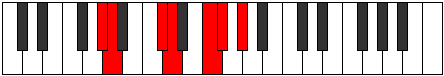 |
| [1639](https://ianring.com/musictheory/scales/1639) | [Aeolothian](ModeGSharpAeolothian.md) | G# | G#, A, Bb, C#, D, E#, F#, G# |  |
| [1643](https://ianring.com/musictheory/scales/1643) | [Thyptian](ModeBNaturalThyptian.md) | B | B, C, D, E, F, G#, A, B |  |
| [1643](https://ianring.com/musictheory/scales/1643) | [Thyptian](ModeGSharpThyptian.md) | G# | G#, A, B, C#, D, E#, F#, G# |  |
| [1645](https://ianring.com/musictheory/scales/1645) | [Katagian](ModeBNaturalKatagian.md) | B | B, C#, D, E, F, G#, A, B |  |
| [1647](https://ianring.com/musictheory/scales/1647) | [Polyllic](ModeBNaturalPolyllic.md) | B | B, C, C#, D, E, F, G#, A, B |  |
| [1647](https://ianring.com/musictheory/scales/1647) | [Polyllic](ModeGSharpPolyllic.md) | G# | G#, A, A#, B, C#, D, F, F#, G# |  |
| [1647](https://ianring.com/musictheory/scales/1647) | [Polyllic](ModeAFlatPolyllic.md) | Ab | Ab, A, Bb, B, Db, D, F, Gb, Ab |  |
| [1651](https://ianring.com/musictheory/scales/1651) | [Mogian](ModeGSharpMogian.md) | G# | G#, A, B#, C#, D, E#, F#, G# |  |
| [1651](https://ianring.com/musictheory/scales/1651) | [Mogian](ModeENaturalMogian.md) | E | E, F, G#, A, Bb, C#, D, E |  |
| [1655](https://ianring.com/musictheory/scales/1655) | [Katygyllic](ModeGSharpKatygyllic.md) | G# | G#, A, A#, C, C#, D, F, F#, G# |  |
| [1655](https://ianring.com/musictheory/scales/1655) | [Katygyllic](ModeAFlatKatygyllic.md) | Ab | Ab, A, Bb, C, Db, D, F, Gb, Ab |  |
| [1655](https://ianring.com/musictheory/scales/1655) | [Katygyllic](ModeENaturalKatygyllic.md) | E | E, F, F#, G#, A, A#, C#, D, E |  |
| [1657](https://ianring.com/musictheory/scales/1657) | [Ionothian](ModeBNaturalIonothian.md) | B | B, C##, D#, E, F, G#, A, B |  |
| [1657](https://ianring.com/musictheory/scales/1657) | [Ionothian](ModeFNaturalIonothian.md) | F | F, G#, A, Bb, Cb, D, Eb, F |  |
| [1659](https://ianring.com/musictheory/scales/1659) | [Magyllic](ModeENaturalMagyllic.md) | E | E, F, G, G#, A, A#, C#, D, E |  |
| [1659](https://ianring.com/musictheory/scales/1659) | [Magyllic](ModeBNaturalMagyllic.md) | B | B, C, D, D#, E, F, G#, A, B |  |
| [1659](https://ianring.com/musictheory/scales/1659) | [Magyllic](ModeGSharpMagyllic.md) | G# | G#, A, B, C, C#, D, F, F#, G# |  |
| [1659](https://ianring.com/musictheory/scales/1659) | [Magyllic](ModeAFlatMagyllic.md) | Ab | Ab, A, B, C, Db, D, F, Gb, Ab |  |
| [1659](https://ianring.com/musictheory/scales/1659) | [Magyllic](ModeFNaturalMagyllic.md) | F | F, F#, G#, A, A#, B, D, D#, F |  |
| [1661](https://ianring.com/musictheory/scales/1661) | [Gonyllic](ModeBNaturalGonyllic.md) | B | B, C#, D, D#, E, F, G#, A, B |  |
| [1661](https://ianring.com/musictheory/scales/1661) | [Gonyllic](ModeFNaturalGonyllic.md) | F | F, G, G#, A, A#, B, D, D#, F |  |
| [1663](https://ianring.com/musictheory/scales/1663) | [Lydygic](ModeENaturalLydygic.md) | E | E, F, F#, G, G#, A, A#, C#, D, E |  |
| [1663](https://ianring.com/musictheory/scales/1663) | [Lydygic](ModeBNaturalLydygic.md) | B | B, C, C#, D, D#, E, F, G#, A, B |  |
| [1663](https://ianring.com/musictheory/scales/1663) | [Lydygic](ModeGSharpLydygic.md) | G# | G#, A, A#, B, C, C#, D, F, F#, G# |  |
| [1663](https://ianring.com/musictheory/scales/1663) | [Lydygic](ModeAFlatLydygic.md) | Ab | Ab, A, Bb, B, C, Db, D, F, Gb, Ab |  |
| [1663](https://ianring.com/musictheory/scales/1663) | [Lydygic](ModeFNaturalLydygic.md) | F | F, F#, G, G#, A, A#, B, D, D#, F |  |
| [1679](https://ianring.com/musictheory/scales/1679) | [Kydian](ModeGNaturalKydian.md) | G | G, Ab, Bbb, Cbb, D, E, F, G |  |
| [1687](https://ianring.com/musictheory/scales/1687) | [Phralian](ModeGNaturalPhralian.md) | G | G, Ab, Bbb, Cb, D, E, F, G |  |
| [1689](https://ianring.com/musictheory/scales/1689) | [Lorimic](ModeFNaturalLorimic.md) | F | F, G#, A, B#, C##, D#, F |  |
| [1691](https://ianring.com/musictheory/scales/1691) | [Kathian](ModeFNaturalKathian.md) | F | F, Gb, Ab, Bbb, C, D, Eb, F |  |
| [1693](https://ianring.com/musictheory/scales/1693) | [Dogian](ModeFNaturalDogian.md) | F | F, G, Ab, Bbb, C, D, Eb, F |  |
| [1695](https://ianring.com/musictheory/scales/1695) | [Phrodyllic](ModeFNaturalPhrodyllic.md) | F | F, F#, G, G#, A, C, D, D#, F |  |
| [1695](https://ianring.com/musictheory/scales/1695) | [Phrodyllic](ModeGNaturalPhrodyllic.md) | G | G, G#, A, A#, B, D, E, F, G |  |
| [1703](https://ianring.com/musictheory/scales/1703) | [Zaptian](ModeGNaturalZaptian.md) | G | G, Ab, Bbb, C, D, E, F, G |  |
| [1711](https://ianring.com/musictheory/scales/1711) | [Ragyllic](ModeGNaturalRagyllic.md) | G | G, G#, A, A#, C, D, E, F, G |  |
| [1715](https://ianring.com/musictheory/scales/1715) | [Aeronian](ModeENaturalAeronian.md) | E | E, F, G#, A, B, C#, D, E |  |
| [1719](https://ianring.com/musictheory/scales/1719) | [Lyryllic](ModeENaturalLyryllic.md) | E | E, F, F#, G#, A, B, C#, D, E |  |
| [1719](https://ianring.com/musictheory/scales/1719) | [Lyryllic](ModeGNaturalLyryllic.md) | G | G, G#, A, B, C, D, E, F, G |  |
| [1721](https://ianring.com/musictheory/scales/1721) | [Ionycrian](ModeFNaturalIonycrian.md) | F | F, G#, A, Bb, C, D, Eb, F |  |
| [1723](https://ianring.com/musictheory/scales/1723) | [Poryllic](ModeFNaturalPoryllic.md) | F | F, F#, G#, A, A#, C, D, D#, F |  |
| [1723](https://ianring.com/musictheory/scales/1723) | [Poryllic](ModeENaturalPoryllic.md) | E | E, F, G, G#, A, B, C#, D, E |  |
| [1725](https://ianring.com/musictheory/scales/1725) | [Mixodyllic](ModeFNaturalMixodyllic.md) | F | F, G, G#, A, A#, C, D, D#, F |  |
| [1727](https://ianring.com/musictheory/scales/1727) | [Sydygic](ModeFNaturalSydygic.md) | F | F, F#, G, G#, A, A#, C, D, D#, F |  |
| [1727](https://ianring.com/musictheory/scales/1727) | [Sydygic](ModeENaturalSydygic.md) | E | E, F, F#, G, G#, A, B, C#, D, E |  |
| [1727](https://ianring.com/musictheory/scales/1727) | [Sydygic](ModeGNaturalSydygic.md) | G | G, G#, A, A#, B, C, D, E, F, G |  |
| [1735](https://ianring.com/musictheory/scales/1735) | [Dagian](ModeGNaturalDagian.md) | G | G, Ab, Bbb, C#, D, E, F, G |  |
| [1735](https://ianring.com/musictheory/scales/1735) | [Dagian](ModeGSharpDagian.md) | G# | G#, A, Bb, C##, D#, E#, F#, G# |  |
| [1735](https://ianring.com/musictheory/scales/1735) | [Dagian](ModeAFlatDagian.md) | Ab | Ab, Bbb, Cbb, D, Eb, F, Gb, Ab |  |
| [1737](https://ianring.com/musictheory/scales/1737) | [Thalimic](ModeDNaturalThalimic.md) | D | D, E#, F###, G##, A##, B#, D |  |
| [1739](https://ianring.com/musictheory/scales/1739) | [Phrylian](ModeDNaturalPhrylian.md) | D | D, Eb, F, G#, A, B, C, D |  |
| [1739](https://ianring.com/musictheory/scales/1739) | [Phrylian](ModeBNaturalPhrylian.md) | B | B, C, D, E#, F#, G#, A, B |  |
| [1739](https://ianring.com/musictheory/scales/1739) | [Phrylian](ModeGSharpPhrylian.md) | G# | G#, A, B, C##, D#, E#, F#, G# |  |
| [1739](https://ianring.com/musictheory/scales/1739) | [Phrylian](ModeAFlatPhrylian.md) | Ab | Ab, Bbb, Cb, D, Eb, F, Gb, Ab |  |
| [1741](https://ianring.com/musictheory/scales/1741) | [Katycrian](ModeDNaturalKatycrian.md) | D | D, E, F, G#, A, B, C, D |  |
| [1741](https://ianring.com/musictheory/scales/1741) | [Katycrian](ModeBNaturalKatycrian.md) | B | B, C#, D, E#, F#, G#, A, B |  |
| [1743](https://ianring.com/musictheory/scales/1743) | [Epigyllic](ModeGNaturalEpigyllic.md) | G | G, G#, A, A#, C#, D, E, F, G |  |
| [1743](https://ianring.com/musictheory/scales/1743) | [Epigyllic](ModeDNaturalEpigyllic.md) | D | D, D#, E, F, G#, A, B, C, D |  |
| [1743](https://ianring.com/musictheory/scales/1743) | [Epigyllic](ModeBNaturalEpigyllic.md) | B | B, C, C#, D, F, F#, G#, A, B |  |
| [1743](https://ianring.com/musictheory/scales/1743) | [Epigyllic](ModeGSharpEpigyllic.md) | G# | G#, A, A#, B, D, D#, F, F#, G# |  |
| [1743](https://ianring.com/musictheory/scales/1743) | [Epigyllic](ModeAFlatEpigyllic.md) | Ab | Ab, A, Bb, B, D, Eb, F, Gb, Ab |  |
| [1747](https://ianring.com/musictheory/scales/1747) | [Epalian](ModeGSharpEpalian.md) | G# | G#, A, B#, C##, D#, E#, F#, G# |  |
| [1747](https://ianring.com/musictheory/scales/1747) | [Epalian](ModeAFlatEpalian.md) | Ab | Ab, Bbb, C, D, Eb, F, Gb, Ab |  |
| [1751](https://ianring.com/musictheory/scales/1751) | [Aeolyryllic](ModeGSharpAeolyryllic.md) | G# | G#, A, A#, C, D, D#, F, F#, G# |  |
| [1751](https://ianring.com/musictheory/scales/1751) | [Aeolyryllic](ModeAFlatAeolyryllic.md) | Ab | Ab, A, Bb, C, D, Eb, F, Gb, Ab |  |
| [1751](https://ianring.com/musictheory/scales/1751) | [Aeolyryllic](ModeGNaturalAeolyryllic.md) | G | G, G#, A, B, C#, D, E, F, G |  |
| [1753](https://ianring.com/musictheory/scales/1753) | [Mycrian](ModeFNaturalMycrian.md) | F | F, G#, A, B, C, D, Eb, F |  |
| [1753](https://ianring.com/musictheory/scales/1753) | [Mycrian](ModeDNaturalMycrian.md) | D | D, E#, F#, G#, A, B, C, D |  |
| [1753](https://ianring.com/musictheory/scales/1753) | [Mycrian](ModeBNaturalMycrian.md) | B | B, C##, D#, E#, F#, G#, A, B |  |
| [1755](https://ianring.com/musictheory/scales/1755) | [MinorDiminished](ModeDNaturalMinorDiminished.md) | D | D, D#, F, F#, G#, A, B, C, D |  |
| [1755](https://ianring.com/musictheory/scales/1755) | [MinorDiminished](ModeFNaturalMinorDiminished.md) | F | F, F#, G#, A, B, C, D, D#, F |  |
| [1755](https://ianring.com/musictheory/scales/1755) | [MinorDiminished](ModeGSharpMinorDiminished.md) | G# | G#, A, B, C, D, D#, F, F#, G# |  |
| [1755](https://ianring.com/musictheory/scales/1755) | [MinorDiminished](ModeAFlatMinorDiminished.md) | Ab | Ab, A, B, C, D, Eb, F, Gb, Ab |  |
| [1755](https://ianring.com/musictheory/scales/1755) | [MinorDiminished](ModeBNaturalMinorDiminished.md) | B | B, C, D, D#, F, F#, G#, A, B |  |
| [1757](https://ianring.com/musictheory/scales/1757) | [Ionyphyllic](ModeBNaturalIonyphyllic.md) | B | B, C#, D, D#, F, F#, G#, A, B |  |
| [1757](https://ianring.com/musictheory/scales/1757) | [Ionyphyllic](ModeDNaturalIonyphyllic.md) | D | D, E, F, F#, G#, A, B, C, D |  |
| [1757](https://ianring.com/musictheory/scales/1757) | [Ionyphyllic](ModeFNaturalIonyphyllic.md) | F | F, G, G#, A, B, C, D, D#, F |  |
| [1759](https://ianring.com/musictheory/scales/1759) | [Pylygic](ModeBNaturalPylygic.md) | B | B, C, C#, D, D#, F, F#, G#, A, B |  |
| [1759](https://ianring.com/musictheory/scales/1759) | [Pylygic](ModeDNaturalPylygic.md) | D | D, D#, E, F, F#, G#, A, B, C, D |  |
| [1759](https://ianring.com/musictheory/scales/1759) | [Pylygic](ModeFNaturalPylygic.md) | F | F, F#, G, G#, A, B, C, D, D#, F |  |
| [1759](https://ianring.com/musictheory/scales/1759) | [Pylygic](ModeGSharpPylygic.md) | G# | G#, A, A#, B, C, D, D#, F, F#, G# |  |
| [1759](https://ianring.com/musictheory/scales/1759) | [Pylygic](ModeAFlatPylygic.md) | Ab | Ab, A, Bb, B, C, D, Eb, F, Gb, Ab |  |
| [1759](https://ianring.com/musictheory/scales/1759) | [Pylygic](ModeGNaturalPylygic.md) | G | G, G#, A, A#, B, C#, D, E, F, G |  |
| [1763](https://ianring.com/musictheory/scales/1763) | [Katalian](ModeGSharpKatalian.md) | G# | G#, A, B##, C##, D#, E#, F#, G# |  |
| [1763](https://ianring.com/musictheory/scales/1763) | [Katalian](ModeAFlatKatalian.md) | Ab | Ab, Bbb, C#, D, Eb, F, Gb, Ab |  |
| [1767](https://ianring.com/musictheory/scales/1767) | [Dyryllic](ModeGNaturalDyryllic.md) | G | G, G#, A, C, C#, D, E, F, G |  |
| [1767](https://ianring.com/musictheory/scales/1767) | [Dyryllic](ModeGSharpDyryllic.md) | G# | G#, A, A#, C#, D, D#, F, F#, G# |  |
| [1767](https://ianring.com/musictheory/scales/1767) | [Dyryllic](ModeAFlatDyryllic.md) | Ab | Ab, A, Bb, Db, D, Eb, F, Gb, Ab |  |
| [1769](https://ianring.com/musictheory/scales/1769) | [Rythian](ModeBNaturalRythian.md) | B | B, C##, D##, E#, F#, G#, A, B |  |
| [1769](https://ianring.com/musictheory/scales/1769) | [Rythian](ModeDNaturalRythian.md) | D | D, E#, F##, G#, A, B, C, D |  |
| [1771](https://ianring.com/musictheory/scales/1771) | [Stylyllic](ModeGSharpStylyllic.md) | G# | G#, A, B, C#, D, D#, F, F#, G# |  |
| [1771](https://ianring.com/musictheory/scales/1771) | [Stylyllic](ModeAFlatStylyllic.md) | Ab | Ab, A, B, Db, D, Eb, F, Gb, Ab |  |
| [1771](https://ianring.com/musictheory/scales/1771) | [Stylyllic](ModeBNaturalStylyllic.md) | B | B, C, D, E, F, F#, G#, A, B |  |
| [1771](https://ianring.com/musictheory/scales/1771) | [Stylyllic](ModeDNaturalStylyllic.md) | D | D, D#, F, G, G#, A, B, C, D | 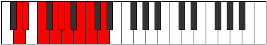 |
| [1773](https://ianring.com/musictheory/scales/1773) | [Aeoloryllic](ModeBNaturalAeoloryllic.md) | B | B, C#, D, E, F, F#, G#, A, B |  |
| [1773](https://ianring.com/musictheory/scales/1773) | [Aeoloryllic](ModeDNaturalAeoloryllic.md) | D | D, E, F, G, G#, A, B, C, D |  |
| [1775](https://ianring.com/musictheory/scales/1775) | [Lyrygic](ModeGNaturalLyrygic.md) | G | G, G#, A, A#, C, C#, D, E, F, G |  |
| [1775](https://ianring.com/musictheory/scales/1775) | [Lyrygic](ModeBNaturalLyrygic.md) | B | B, C, C#, D, E, F, F#, G#, A, B |  |
| [1775](https://ianring.com/musictheory/scales/1775) | [Lyrygic](ModeDNaturalLyrygic.md) | D | D, D#, E, F, G, G#, A, B, C, D |  |
| [1775](https://ianring.com/musictheory/scales/1775) | [Lyrygic](ModeGSharpLyrygic.md) | G# | G#, A, A#, B, C#, D, D#, F, F#, G# |  |
| [1775](https://ianring.com/musictheory/scales/1775) | [Lyrygic](ModeAFlatLyrygic.md) | Ab | Ab, A, Bb, B, Db, D, Eb, F, Gb, Ab |  |
| [1779](https://ianring.com/musictheory/scales/1779) | [Aerythyllic](ModeGSharpAerythyllic.md) | G# | G#, A, C, C#, D, D#, F, F#, G# |  |
| [1779](https://ianring.com/musictheory/scales/1779) | [Aerythyllic](ModeAFlatAerythyllic.md) | Ab | Ab, A, C, Db, D, Eb, F, Gb, Ab |  |
| [1779](https://ianring.com/musictheory/scales/1779) | [Aerythyllic](ModeENaturalAerythyllic.md) | E | E, F, G#, A, A#, B, C#, D, E |  |
| [1783](https://ianring.com/musictheory/scales/1783) | [Danygic](ModeGSharpDanygic.md) | G# | G#, A, A#, C, C#, D, D#, F, F#, G# |  |
| [1783](https://ianring.com/musictheory/scales/1783) | [Danygic](ModeAFlatDanygic.md) | Ab | Ab, A, Bb, C, Db, D, Eb, F, Gb, Ab |  |
| [1783](https://ianring.com/musictheory/scales/1783) | [Danygic](ModeGNaturalDanygic.md) | G | G, G#, A, B, C, C#, D, E, F, G |  |
| [1783](https://ianring.com/musictheory/scales/1783) | [Danygic](ModeENaturalDanygic.md) | E | E, F, F#, G#, A, A#, B, C#, D, E |  |
| [1785](https://ianring.com/musictheory/scales/1785) | [Tharyllic](ModeBNaturalTharyllic.md) | B | B, D, D#, E, F, F#, G#, A, B |  |
| [1785](https://ianring.com/musictheory/scales/1785) | [Tharyllic](ModeDNaturalTharyllic.md) | D | D, F, F#, G, G#, A, B, C, D |  |
| [1785](https://ianring.com/musictheory/scales/1785) | [Tharyllic](ModeFNaturalTharyllic.md) | F | F, G#, A, A#, B, C, D, D#, F |  |
| [1787](https://ianring.com/musictheory/scales/1787) | [Mycrygic](ModeGSharpMycrygic.md) | G# | G#, A, B, C, C#, D, D#, F, F#, G# |  |
| [1787](https://ianring.com/musictheory/scales/1787) | [Mycrygic](ModeAFlatMycrygic.md) | Ab | Ab, A, B, C, Db, D, Eb, F, Gb, Ab |  |
| [1787](https://ianring.com/musictheory/scales/1787) | [Mycrygic](ModeBNaturalMycrygic.md) | B | B, C, D, D#, E, F, F#, G#, A, B |  |
| [1787](https://ianring.com/musictheory/scales/1787) | [Mycrygic](ModeDNaturalMycrygic.md) | D | D, D#, F, F#, G, G#, A, B, C, D |  |
| [1787](https://ianring.com/musictheory/scales/1787) | [Mycrygic](ModeFNaturalMycrygic.md) | F | F, F#, G#, A, A#, B, C, D, D#, F |  |
| [1787](https://ianring.com/musictheory/scales/1787) | [Mycrygic](ModeENaturalMycrygic.md) | E | E, F, G, G#, A, A#, B, C#, D, E |  |
| [1789](https://ianring.com/musictheory/scales/1789) | [Katagygic](ModeBNaturalKatagygic.md) | B | B, C#, D, D#, E, F, F#, G#, A, B |  |
| [1789](https://ianring.com/musictheory/scales/1789) | [Katagygic](ModeDNaturalKatagygic.md) | D | D, E, F, F#, G, G#, A, B, C, D |  |
| [1789](https://ianring.com/musictheory/scales/1789) | [Katagygic](ModeFNaturalKatagygic.md) | F | F, G, G#, A, A#, B, C, D, D#, F |  |
| [1791](https://ianring.com/musictheory/scales/1791) | [Aerygyllian](ModeBNaturalAerygyllian.md) | B | B, C, C#, D, D#, E, F, F#, G#, A, B |  |
| [1791](https://ianring.com/musictheory/scales/1791) | [Aerygyllian](ModeDNaturalAerygyllian.md) | D | D, D#, E, F, F#, G, G#, A, B, C, D |  |
| [1791](https://ianring.com/musictheory/scales/1791) | [Aerygyllian](ModeGSharpAerygyllian.md) | G# | G#, A, A#, B, C, C#, D, D#, F, F#, G# |  |
| [1791](https://ianring.com/musictheory/scales/1791) | [Aerygyllian](ModeAFlatAerygyllian.md) | Ab | Ab, A, Bb, B, C, Db, D, Eb, F, Gb, Ab |  |
| [1791](https://ianring.com/musictheory/scales/1791) | [Aerygyllian](ModeGNaturalAerygyllian.md) | G | G, G#, A, A#, B, C, C#, D, E, F, G |  |
| [1791](https://ianring.com/musictheory/scales/1791) | [Aerygyllian](ModeFNaturalAerygyllian.md) | F | F, F#, G, G#, A, A#, B, C, D, D#, F |  |
| [1791](https://ianring.com/musictheory/scales/1791) | [Aerygyllian](ModeENaturalAerygyllian.md) | E | E, F, F#, G, G#, A, A#, B, C#, D, E |  |
| [1817](https://ianring.com/musictheory/scales/1817) | [Phrythimic](ModeFNaturalPhrythimic.md) | F | F, G#, A, B##, C##, D#, F |  |
| [1819](https://ianring.com/musictheory/scales/1819) | [Pydian](ModeFNaturalPydian.md) | F | F, Gb, Ab, Bbb, C#, D, Eb, F | 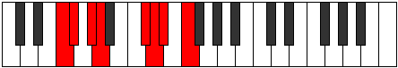 |
| [1821](https://ianring.com/musictheory/scales/1821) | [Aeradian](ModeFNaturalAeradian.md) | F | F, G, Ab, Bbb, C#, D, Eb, F |  |
| [1823](https://ianring.com/musictheory/scales/1823) | [Phralyllic](ModeFNaturalPhralyllic.md) | F | F, F#, G, G#, A, C#, D, D#, F |  |
| [1829](https://ianring.com/musictheory/scales/1829) | [Pathimic](ModeCNaturalPathimic.md) | C | C, D, E#, F###, G##, A#, C |  |
| [1831](https://ianring.com/musictheory/scales/1831) | [Pothian](ModeCNaturalPothian.md) | C | C, Db, Ebb, F, G#, A, Bb, C |  |
| [1837](https://ianring.com/musictheory/scales/1837) | [Dalian](ModeCNaturalDalian.md) | C | C, D, Eb, F, G#, A, Bb, C |  |
| [1839](https://ianring.com/musictheory/scales/1839) | [Zogyllic](ModeCNaturalZogyllic.md) | C | C, C#, D, D#, F, G#, A, A#, C |  |
| [1843](https://ianring.com/musictheory/scales/1843) | [Ionygian](ModeENaturalIonygian.md) | E | E, F, G#, A, B#, C#, D, E |  |
| [1845](https://ianring.com/musictheory/scales/1845) | [Lagian](ModeCNaturalLagian.md) | C | C, D, E, F, G#, A, Bb, C |  |
| [1847](https://ianring.com/musictheory/scales/1847) | [Thacryllic](ModeENaturalThacryllic.md) | E | E, F, F#, G#, A, C, C#, D, E | 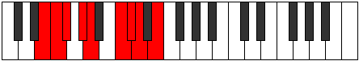 |
| [1847](https://ianring.com/musictheory/scales/1847) | [Thacryllic](ModeCNaturalThacryllic.md) | C | C, C#, D, E, F, G#, A, A#, C |  |
| [1849](https://ianring.com/musictheory/scales/1849) | [Epogian](ModeFNaturalEpogian.md) | F | F, G#, A, Bb, C#, D, Eb, F |  |
| [1851](https://ianring.com/musictheory/scales/1851) | [Zacryllic](ModeENaturalZacryllic.md) | E | E, F, G, G#, A, C, C#, D, E |  |
| [1851](https://ianring.com/musictheory/scales/1851) | [Zacryllic](ModeFNaturalZacryllic.md) | F | F, F#, G#, A, A#, C#, D, D#, F |  |
| [1853](https://ianring.com/musictheory/scales/1853) | [Phrynyllic](ModeCNaturalPhrynyllic.md) | C | C, D, D#, E, F, G#, A, A#, C |  |
| [1853](https://ianring.com/musictheory/scales/1853) | [Phrynyllic](ModeFNaturalPhrynyllic.md) | F | F, G, G#, A, A#, C#, D, D#, F |  |
| [1855](https://ianring.com/musictheory/scales/1855) | [Marygic](ModeENaturalMarygic.md) | E | E, F, F#, G, G#, A, C, C#, D, E |  |
| [1855](https://ianring.com/musictheory/scales/1855) | [Marygic](ModeCNaturalMarygic.md) | C | C, C#, D, D#, E, F, G#, A, A#, C |  |
| [1855](https://ianring.com/musictheory/scales/1855) | [Marygic](ModeFNaturalMarygic.md) | F | F, F#, G, G#, A, A#, C#, D, D#, F |  |
| [1863](https://ianring.com/musictheory/scales/1863) | [Pycrian](ModeGSharpPycrian.md) | G# | G#, A, Bb, C##, D##, E#, F#, G# |  |
| [1863](https://ianring.com/musictheory/scales/1863) | [Pycrian](ModeAFlatPycrian.md) | Ab | Ab, Bbb, Cbb, D, E, F, Gb, Ab |  |
| [1867](https://ianring.com/musictheory/scales/1867) | [Solian](ModeGSharpSolian.md) | G# | G#, A, B, C##, D##, E#, F#, G# |  |
| [1867](https://ianring.com/musictheory/scales/1867) | [Solian](ModeAFlatSolian.md) | Ab | Ab, Bbb, Cb, D, E, F, Gb, Ab |  |
| [1867](https://ianring.com/musictheory/scales/1867) | [Solian](ModeBNaturalSolian.md) | B | B, C, D, E#, F##, G#, A, B |  |
| [1869](https://ianring.com/musictheory/scales/1869) | [Katyrian](ModeBNaturalKatyrian.md) | B | B, C#, D, E#, F##, G#, A, B |  |
| [1871](https://ianring.com/musictheory/scales/1871) | [Aeolyllic](ModeBNaturalAeolyllic.md) | B | B, C, C#, D, F, G, G#, A, B |  |
| [1871](https://ianring.com/musictheory/scales/1871) | [Aeolyllic](ModeGSharpAeolyllic.md) | G# | G#, A, A#, B, D, E, F, F#, G# |  |
| [1871](https://ianring.com/musictheory/scales/1871) | [Aeolyllic](ModeAFlatAeolyllic.md) | Ab | Ab, A, Bb, B, D, E, F, Gb, Ab |  |
| [1875](https://ianring.com/musictheory/scales/1875) | [Epyphian](ModeGSharpEpyphian.md) | G# | G#, A, B#, C##, D##, E#, F#, G# |  |
| [1875](https://ianring.com/musictheory/scales/1875) | [Epyphian](ModeAFlatEpyphian.md) | Ab | Ab, Bbb, C, D, E, F, Gb, Ab |  |
| [1879](https://ianring.com/musictheory/scales/1879) | [Mixoryllic](ModeGSharpMixoryllic.md) | G# | G#, A, A#, C, D, E, F, F#, G# |  |
| [1879](https://ianring.com/musictheory/scales/1879) | [Mixoryllic](ModeAFlatMixoryllic.md) | Ab | Ab, A, Bb, C, D, E, F, Gb, Ab |  |
| [1881](https://ianring.com/musictheory/scales/1881) | [Korian](ModeFNaturalKorian.md) | F | F, G#, A, B, C#, D, Eb, F |  |
| [1881](https://ianring.com/musictheory/scales/1881) | [Korian](ModeBNaturalKorian.md) | B | B, C##, D#, E#, F##, G#, A, B |  |
| [1883](https://ianring.com/musictheory/scales/1883) | [Mixopyryllic](ModeFNaturalMixopyryllic.md) | F | F, F#, G#, A, B, C#, D, D#, F |  |
| [1883](https://ianring.com/musictheory/scales/1883) | [Mixopyryllic](ModeGSharpMixopyryllic.md) | G# | G#, A, B, C, D, E, F, F#, G# |  |
| [1883](https://ianring.com/musictheory/scales/1883) | [Mixopyryllic](ModeAFlatMixopyryllic.md) | Ab | Ab, A, B, C, D, E, F, Gb, Ab |  |
| [1883](https://ianring.com/musictheory/scales/1883) | [Mixopyryllic](ModeBNaturalMixopyryllic.md) | B | B, C, D, D#, F, G, G#, A, B |  |
| [1885](https://ianring.com/musictheory/scales/1885) | [Epidyllic](ModeFNaturalEpidyllic.md) | F | F, G, G#, A, B, C#, D, D#, F |  |
| [1885](https://ianring.com/musictheory/scales/1885) | [Epidyllic](ModeBNaturalEpidyllic.md) | B | B, C#, D, D#, F, G, G#, A, B |  |
| [1887](https://ianring.com/musictheory/scales/1887) | [Aerocrygic](ModeBNaturalAerocrygic.md) | B | B, C, C#, D, D#, F, G, G#, A, B |  |
| [1887](https://ianring.com/musictheory/scales/1887) | [Aerocrygic](ModeFNaturalAerocrygic.md) | F | F, F#, G, G#, A, B, C#, D, D#, F |  |
| [1887](https://ianring.com/musictheory/scales/1887) | [Aerocrygic](ModeGSharpAerocrygic.md) | G# | G#, A, A#, B, C, D, E, F, F#, G# |  |
| [1887](https://ianring.com/musictheory/scales/1887) | [Aerocrygic](ModeAFlatAerocrygic.md) | Ab | Ab, A, Bb, B, C, D, E, F, Gb, Ab |  |
| [1891](https://ianring.com/musictheory/scales/1891) | [Thalian](ModeGSharpThalian.md) | G# | G#, A, B##, C##, D##, E#, F#, G# |  |
| [1891](https://ianring.com/musictheory/scales/1891) | [Thalian](ModeAFlatThalian.md) | Ab | Ab, Bbb, C#, D, E, F, Gb, Ab |  |
| [1893](https://ianring.com/musictheory/scales/1893) | [Ionylian](ModeCNaturalIonylian.md) | C | C, D, E#, F#, G#, A, Bb, C |  |
| [1895](https://ianring.com/musictheory/scales/1895) | [Salyllic](ModeCNaturalSalyllic.md) | C | C, C#, D, F, F#, G#, A, A#, C |  |
| [1895](https://ianring.com/musictheory/scales/1895) | [Salyllic](ModeGSharpSalyllic.md) | G# | G#, A, A#, C#, D, E, F, F#, G# |  |
| [1895](https://ianring.com/musictheory/scales/1895) | [Salyllic](ModeAFlatSalyllic.md) | Ab | Ab, A, Bb, Db, D, E, F, Gb, Ab |  |
| [1897](https://ianring.com/musictheory/scales/1897) | [Ionopian](ModeBNaturalIonopian.md) | B | B, C##, D##, E#, F##, G#, A, B | 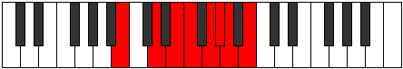 |
| [1899](https://ianring.com/musictheory/scales/1899) | [Moptyllic](ModeGSharpMoptyllic.md) | G# | G#, A, B, C#, D, E, F, F#, G# |  |
| [1899](https://ianring.com/musictheory/scales/1899) | [Moptyllic](ModeAFlatMoptyllic.md) | Ab | Ab, A, B, Db, D, E, F, Gb, Ab |  |
| [1899](https://ianring.com/musictheory/scales/1899) | [Moptyllic](ModeBNaturalMoptyllic.md) | B | B, C, D, E, F, G, G#, A, B |  |
| [1901](https://ianring.com/musictheory/scales/1901) | [Ionidyllic](ModeCNaturalIonidyllic.md) | C | C, D, D#, F, F#, G#, A, A#, C |  |
| [1901](https://ianring.com/musictheory/scales/1901) | [Ionidyllic](ModeBNaturalIonidyllic.md) | B | B, C#, D, E, F, G, G#, A, B |  |
| [1903](https://ianring.com/musictheory/scales/1903) | [Rocrygic](ModeCNaturalRocrygic.md) | C | C, C#, D, D#, F, F#, G#, A, A#, C |  |
| [1903](https://ianring.com/musictheory/scales/1903) | [Rocrygic](ModeBNaturalRocrygic.md) | B | B, C, C#, D, E, F, G, G#, A, B |  |
| [1903](https://ianring.com/musictheory/scales/1903) | [Rocrygic](ModeGSharpRocrygic.md) | G# | G#, A, A#, B, C#, D, E, F, F#, G# |  |
| [1903](https://ianring.com/musictheory/scales/1903) | [Rocrygic](ModeAFlatRocrygic.md) | Ab | Ab, A, Bb, B, Db, D, E, F, Gb, Ab |  |
| [1907](https://ianring.com/musictheory/scales/1907) | [Lynyllic](ModeGSharpLynyllic.md) | G# | G#, A, C, C#, D, E, F, F#, G# |  |
| [1907](https://ianring.com/musictheory/scales/1907) | [Lynyllic](ModeAFlatLynyllic.md) | Ab | Ab, A, C, Db, D, E, F, Gb, Ab |  |
| [1907](https://ianring.com/musictheory/scales/1907) | [Lynyllic](ModeENaturalLynyllic.md) | E | E, F, G#, A, A#, C, C#, D, E |  |
| [1909](https://ianring.com/musictheory/scales/1909) | [Epicryllic](ModeCNaturalEpicryllic.md) | C | C, D, E, F, F#, G#, A, A#, C |  |
| [1911](https://ianring.com/musictheory/scales/1911) | [Stynygic](ModeCNaturalStynygic.md) | C | C, C#, D, E, F, F#, G#, A, A#, C |  |
| [1911](https://ianring.com/musictheory/scales/1911) | [Stynygic](ModeENaturalStynygic.md) | E | E, F, F#, G#, A, A#, C, C#, D, E |  |
| [1911](https://ianring.com/musictheory/scales/1911) | [Stynygic](ModeGSharpStynygic.md) | G# | G#, A, A#, C, C#, D, E, F, F#, G# |  |
| [1911](https://ianring.com/musictheory/scales/1911) | [Stynygic](ModeAFlatStynygic.md) | Ab | Ab, A, Bb, C, Db, D, E, F, Gb, Ab |  |
| [1913](https://ianring.com/musictheory/scales/1913) | [Zagyllic](ModeBNaturalZagyllic.md) | B | B, D, D#, E, F, G, G#, A, B |  |
| [1913](https://ianring.com/musictheory/scales/1913) | [Zagyllic](ModeFNaturalZagyllic.md) | F | F, G#, A, A#, B, C#, D, D#, F |  |
| [1915](https://ianring.com/musictheory/scales/1915) | [Thydygic](ModeENaturalThydygic.md) | E | E, F, G, G#, A, A#, C, C#, D, E |  |
| [1915](https://ianring.com/musictheory/scales/1915) | [Thydygic](ModeGSharpThydygic.md) | G# | G#, A, B, C, C#, D, E, F, F#, G# |  |
| [1915](https://ianring.com/musictheory/scales/1915) | [Thydygic](ModeAFlatThydygic.md) | Ab | Ab, A, B, C, Db, D, E, F, Gb, Ab |  |
| [1915](https://ianring.com/musictheory/scales/1915) | [Thydygic](ModeBNaturalThydygic.md) | B | B, C, D, D#, E, F, G, G#, A, B |  |
| [1915](https://ianring.com/musictheory/scales/1915) | [Thydygic](ModeFNaturalThydygic.md) | F | F, F#, G#, A, A#, B, C#, D, D#, F |  |
| [1917](https://ianring.com/musictheory/scales/1917) | [Sacrygic](ModeCNaturalSacrygic.md) | C | C, D, D#, E, F, F#, G#, A, A#, C |  |
| [1917](https://ianring.com/musictheory/scales/1917) | [Sacrygic](ModeBNaturalSacrygic.md) | B | B, C#, D, D#, E, F, G, G#, A, B |  |
| [1917](https://ianring.com/musictheory/scales/1917) | [Sacrygic](ModeFNaturalSacrygic.md) | F | F, G, G#, A, A#, B, C#, D, D#, F |  |
| [1919](https://ianring.com/musictheory/scales/1919) | [Rocryllian](ModeCNaturalRocryllian.md) | C | C, C#, D, D#, E, F, F#, G#, A, A#, C |  |
| [1919](https://ianring.com/musictheory/scales/1919) | [Rocryllian](ModeENaturalRocryllian.md) | E | E, F, F#, G, G#, A, A#, C, C#, D, E |  |
| [1919](https://ianring.com/musictheory/scales/1919) | [Rocryllian](ModeBNaturalRocryllian.md) | B | B, C, C#, D, D#, E, F, G, G#, A, B |  |
| [1919](https://ianring.com/musictheory/scales/1919) | [Rocryllian](ModeGSharpRocryllian.md) | G# | G#, A, A#, B, C, C#, D, E, F, F#, G# |  |
| [1919](https://ianring.com/musictheory/scales/1919) | [Rocryllian](ModeAFlatRocryllian.md) | Ab | Ab, A, Bb, B, C, Db, D, E, F, Gb, Ab |  |
| [1919](https://ianring.com/musictheory/scales/1919) | [Rocryllian](ModeFNaturalRocryllian.md) | F | F, F#, G, G#, A, A#, B, C#, D, D#, F |  |
| [1935](https://ianring.com/musictheory/scales/1935) | [Mycryllic](ModeGNaturalMycryllic.md) | G | G, G#, A, A#, D, D#, E, F, G |  |
| [1939](https://ianring.com/musictheory/scales/1939) | [Dathian](ModeCSharpDathian.md) | C# | C#, D, E#, F###, G##, A#, B, C# |  |
| [1939](https://ianring.com/musictheory/scales/1939) | [Dathian](ModeDFlatDathian.md) | Db | Db, Ebb, F, G#, A, Bb, Cb, Db |  |
| [1943](https://ianring.com/musictheory/scales/1943) | [Malyllic](ModeGNaturalMalyllic.md) | G | G, G#, A, B, D, D#, E, F, G |  |
| [1943](https://ianring.com/musictheory/scales/1943) | [Malyllic](ModeCSharpMalyllic.md) | C# | C#, D, D#, F, G#, A, A#, B, C# |  |
| [1943](https://ianring.com/musictheory/scales/1943) | [Malyllic](ModeDFlatMalyllic.md) | Db | Db, D, Eb, F, Ab, A, Bb, B, Db |  |
| [1945](https://ianring.com/musictheory/scales/1945) | [Zarian](ModeFNaturalZarian.md) | F | F, G#, A, B#, C#, D, Eb, F |  |
| [1947](https://ianring.com/musictheory/scales/1947) | [Ionoyllic](ModeFNaturalIonoyllic.md) | F | F, F#, G#, A, C, C#, D, D#, F |  |
| [1947](https://ianring.com/musictheory/scales/1947) | [Ionoyllic](ModeCSharpIonoyllic.md) | C# | C#, D, E, F, G#, A, A#, B, C# |  |
| [1947](https://ianring.com/musictheory/scales/1947) | [Ionoyllic](ModeDFlatIonoyllic.md) | Db | Db, D, E, F, Ab, A, Bb, B, Db |  |
| [1949](https://ianring.com/musictheory/scales/1949) | [Mathyllic](ModeFNaturalMathyllic.md) | F | F, G, G#, A, C, C#, D, D#, F |  |
| [1951](https://ianring.com/musictheory/scales/1951) | [Gonygic](ModeFNaturalGonygic.md) | F | F, F#, G, G#, A, C, C#, D, D#, F |  |
| [1951](https://ianring.com/musictheory/scales/1951) | [Gonygic](ModeCSharpGonygic.md) | C# | C#, D, D#, E, F, G#, A, A#, B, C# |  |
| [1951](https://ianring.com/musictheory/scales/1951) | [Gonygic](ModeDFlatGonygic.md) | Db | Db, D, Eb, E, F, Ab, A, Bb, B, Db |  |
| [1951](https://ianring.com/musictheory/scales/1951) | [Gonygic](ModeGNaturalGonygic.md) | G | G, G#, A, A#, B, D, D#, E, F, G |  |
| [1957](https://ianring.com/musictheory/scales/1957) | [Pyrian](ModeCNaturalPyrian.md) | C | C, D, E#, F##, G#, A, Bb, C |  |
| [1959](https://ianring.com/musictheory/scales/1959) | [Katolyllic](ModeGNaturalKatolyllic.md) | G | G, G#, A, C, D, D#, E, F, G |  |
| [1959](https://ianring.com/musictheory/scales/1959) | [Katolyllic](ModeCNaturalKatolyllic.md) | C | C, C#, D, F, G, G#, A, A#, C | 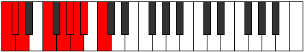 |
| [1965](https://ianring.com/musictheory/scales/1965) | [Gadyllic](ModeCNaturalGadyllic.md) | C | C, D, D#, F, G, G#, A, A#, C |  |
| [1967](https://ianring.com/musictheory/scales/1967) | [Godygic](ModeCNaturalGodygic.md) | C | C, C#, D, D#, F, G, G#, A, A#, C |  |
| [1967](https://ianring.com/musictheory/scales/1967) | [Godygic](ModeGNaturalGodygic.md) | G | G, G#, A, A#, C, D, D#, E, F, G |  |
| [1971](https://ianring.com/musictheory/scales/1971) | [Aerynyllic](ModeENaturalAerynyllic.md) | E | E, F, G#, A, B, C, C#, D, E |  |
| [1971](https://ianring.com/musictheory/scales/1971) | [Aerynyllic](ModeCSharpAerynyllic.md) | C# | C#, D, F, F#, G#, A, A#, B, C# |  |
| [1971](https://ianring.com/musictheory/scales/1971) | [Aerynyllic](ModeDFlatAerynyllic.md) | Db | Db, D, F, Gb, Ab, A, Bb, B, Db |  |
| [1973](https://ianring.com/musictheory/scales/1973) | [Zyryllic](ModeCNaturalZyryllic.md) | C | C, D, E, F, G, G#, A, A#, C |  |
| [1975](https://ianring.com/musictheory/scales/1975) | [Ionocrygic](ModeCNaturalIonocrygic.md) | C | C, C#, D, E, F, G, G#, A, A#, C |  |
| [1975](https://ianring.com/musictheory/scales/1975) | [Ionocrygic](ModeENaturalIonocrygic.md) | E | E, F, F#, G#, A, B, C, C#, D, E |  |
| [1975](https://ianring.com/musictheory/scales/1975) | [Ionocrygic](ModeGNaturalIonocrygic.md) | G | G, G#, A, B, C, D, D#, E, F, G |  |
| [1975](https://ianring.com/musictheory/scales/1975) | [Ionocrygic](ModeCSharpIonocrygic.md) | C# | C#, D, D#, F, F#, G#, A, A#, B, C# |  |
| [1975](https://ianring.com/musictheory/scales/1975) | [Ionocrygic](ModeDFlatIonocrygic.md) | Db | Db, D, Eb, F, Gb, Ab, A, Bb, B, Db |  |
| [1977](https://ianring.com/musictheory/scales/1977) | [Dagyllic](ModeFNaturalDagyllic.md) | F | F, G#, A, A#, C, C#, D, D#, F |  |
| [1979](https://ianring.com/musictheory/scales/1979) | [Aeradygic](ModeFNaturalAeradygic.md) | F | F, F#, G#, A, A#, C, C#, D, D#, F |  |
| [1979](https://ianring.com/musictheory/scales/1979) | [Aeradygic](ModeENaturalAeradygic.md) | E | E, F, G, G#, A, B, C, C#, D, E |  |
| [1979](https://ianring.com/musictheory/scales/1979) | [Aeradygic](ModeCSharpAeradygic.md) | C# | C#, D, E, F, F#, G#, A, A#, B, C# |  |
| [1979](https://ianring.com/musictheory/scales/1979) | [Aeradygic](ModeDFlatAeradygic.md) | Db | Db, D, E, F, Gb, Ab, A, Bb, B, Db |  |
| [1981](https://ianring.com/musictheory/scales/1981) | [Gadygic](ModeFNaturalGadygic.md) | F | F, G, G#, A, A#, C, C#, D, D#, F |  |
| [1981](https://ianring.com/musictheory/scales/1981) | [Gadygic](ModeCNaturalGadygic.md) | C | C, D, D#, E, F, G, G#, A, A#, C |  |
| [1983](https://ianring.com/musictheory/scales/1983) | [Soryllian](ModeCNaturalSoryllian.md) | C | C, C#, D, D#, E, F, G, G#, A, A#, C |  |
| [1983](https://ianring.com/musictheory/scales/1983) | [Soryllian](ModeFNaturalSoryllian.md) | F | F, F#, G, G#, A, A#, C, C#, D, D#, F |  |
| [1983](https://ianring.com/musictheory/scales/1983) | [Soryllian](ModeENaturalSoryllian.md) | E | E, F, F#, G, G#, A, B, C, C#, D, E |  |
| [1983](https://ianring.com/musictheory/scales/1983) | [Soryllian](ModeCSharpSoryllian.md) | C# | C#, D, D#, E, F, F#, G#, A, A#, B, C# |  |
| [1983](https://ianring.com/musictheory/scales/1983) | [Soryllian](ModeDFlatSoryllian.md) | Db | Db, D, Eb, E, F, Gb, Ab, A, Bb, B, Db |  |
| [1983](https://ianring.com/musictheory/scales/1983) | [Soryllian](ModeGNaturalSoryllian.md) | G | G, G#, A, A#, B, C, D, D#, E, F, G |  |
| [1991](https://ianring.com/musictheory/scales/1991) | [Phryptyllic](ModeGNaturalPhryptyllic.md) | G | G, G#, A, C#, D, D#, E, F, G |  |
| [1991](https://ianring.com/musictheory/scales/1991) | [Phryptyllic](ModeGSharpPhryptyllic.md) | G# | G#, A, A#, D, D#, E, F, F#, G# |  |
| [1991](https://ianring.com/musictheory/scales/1991) | [Phryptyllic](ModeAFlatPhryptyllic.md) | Ab | Ab, A, Bb, D, Eb, E, F, Gb, Ab |  |
| [1993](https://ianring.com/musictheory/scales/1993) | [Katoptian](ModeBNaturalKatoptian.md) | B | B, C##, D###, E##, F##, G#, A, B |  |
| [1993](https://ianring.com/musictheory/scales/1993) | [Katoptian](ModeDNaturalKatoptian.md) | D | D, E#, F###, G##, A#, B, C, D |  |
| [1995](https://ianring.com/musictheory/scales/1995) | [Aeolacryllic](ModeGSharpAeolacryllic.md) | G# | G#, A, B, D, D#, E, F, F#, G# |  |
| [1995](https://ianring.com/musictheory/scales/1995) | [Aeolacryllic](ModeAFlatAeolacryllic.md) | Ab | Ab, A, B, D, Eb, E, F, Gb, Ab |  |
| [1995](https://ianring.com/musictheory/scales/1995) | [Aeolacryllic](ModeBNaturalAeolacryllic.md) | B | B, C, D, F, F#, G, G#, A, B | 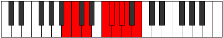 |
| [1995](https://ianring.com/musictheory/scales/1995) | [Aeolacryllic](ModeDNaturalAeolacryllic.md) | D | D, D#, F, G#, A, A#, B, C, D |  |
| [1997](https://ianring.com/musictheory/scales/1997) | [Staryllic](ModeBNaturalStaryllic.md) | B | B, C#, D, F, F#, G, G#, A, B |  |
| [1997](https://ianring.com/musictheory/scales/1997) | [Staryllic](ModeDNaturalStaryllic.md) | D | D, E, F, G#, A, A#, B, C, D |  |
| [1999](https://ianring.com/musictheory/scales/1999) | [Zacrygic](ModeGNaturalZacrygic.md) | G | G, G#, A, A#, C#, D, D#, E, F, G |  |
| [1999](https://ianring.com/musictheory/scales/1999) | [Zacrygic](ModeBNaturalZacrygic.md) | B | B, C, C#, D, F, F#, G, G#, A, B |  |
| [1999](https://ianring.com/musictheory/scales/1999) | [Zacrygic](ModeDNaturalZacrygic.md) | D | D, D#, E, F, G#, A, A#, B, C, D |  |
| [1999](https://ianring.com/musictheory/scales/1999) | [Zacrygic](ModeGSharpZacrygic.md) | G# | G#, A, A#, B, D, D#, E, F, F#, G# |  |
| [1999](https://ianring.com/musictheory/scales/1999) | [Zacrygic](ModeAFlatZacrygic.md) | Ab | Ab, A, Bb, B, D, Eb, E, F, Gb, Ab |  |
| [2003](https://ianring.com/musictheory/scales/2003) | [Lolyllic](ModeGSharpLolyllic.md) | G# | G#, A, C, D, D#, E, F, F#, G# |  |
| [2003](https://ianring.com/musictheory/scales/2003) | [Lolyllic](ModeAFlatLolyllic.md) | Ab | Ab, A, C, D, Eb, E, F, Gb, Ab |  |
| [2003](https://ianring.com/musictheory/scales/2003) | [Lolyllic](ModeCSharpLolyllic.md) | C# | C#, D, F, G, G#, A, A#, B, C# |  |
| [2003](https://ianring.com/musictheory/scales/2003) | [Lolyllic](ModeDFlatLolyllic.md) | Db | Db, D, F, G, Ab, A, Bb, B, Db |  |
| [2007](https://ianring.com/musictheory/scales/2007) | [Stonygic](ModeGSharpStonygic.md) | G# | G#, A, A#, C, D, D#, E, F, F#, G# |  |
| [2007](https://ianring.com/musictheory/scales/2007) | [Stonygic](ModeAFlatStonygic.md) | Ab | Ab, A, Bb, C, D, Eb, E, F, Gb, Ab |  |
| [2007](https://ianring.com/musictheory/scales/2007) | [Stonygic](ModeGNaturalStonygic.md) | G | G, G#, A, B, C#, D, D#, E, F, G |  |
| [2007](https://ianring.com/musictheory/scales/2007) | [Stonygic](ModeCSharpStonygic.md) | C# | C#, D, D#, F, G, G#, A, A#, B, C# |  |
| [2007](https://ianring.com/musictheory/scales/2007) | [Stonygic](ModeDFlatStonygic.md) | Db | Db, D, Eb, F, G, Ab, A, Bb, B, Db |  |
| [2009](https://ianring.com/musictheory/scales/2009) | [Stacryllic](ModeFNaturalStacryllic.md) | F | F, G#, A, B, C, C#, D, D#, F |  |
| [2009](https://ianring.com/musictheory/scales/2009) | [Stacryllic](ModeBNaturalStacryllic.md) | B | B, D, D#, F, F#, G, G#, A, B |  |
| [2009](https://ianring.com/musictheory/scales/2009) | [Stacryllic](ModeDNaturalStacryllic.md) | D | D, F, F#, G#, A, A#, B, C, D |  |
| [2011](https://ianring.com/musictheory/scales/2011) | [Raphygic](ModeFNaturalRaphygic.md) | F | F, F#, G#, A, B, C, C#, D, D#, F |  |
| [2011](https://ianring.com/musictheory/scales/2011) | [Raphygic](ModeGSharpRaphygic.md) | G# | G#, A, B, C, D, D#, E, F, F#, G# |  |
| [2011](https://ianring.com/musictheory/scales/2011) | [Raphygic](ModeAFlatRaphygic.md) | Ab | Ab, A, B, C, D, Eb, E, F, Gb, Ab |  |
| [2011](https://ianring.com/musictheory/scales/2011) | [Raphygic](ModeBNaturalRaphygic.md) | B | B, C, D, D#, F, F#, G, G#, A, B |  |
| [2011](https://ianring.com/musictheory/scales/2011) | [Raphygic](ModeDNaturalRaphygic.md) | D | D, D#, F, F#, G#, A, A#, B, C, D |  |
| [2011](https://ianring.com/musictheory/scales/2011) | [Raphygic](ModeCSharpRaphygic.md) | C# | C#, D, E, F, G, G#, A, A#, B, C# |  |
| [2011](https://ianring.com/musictheory/scales/2011) | [Raphygic](ModeDFlatRaphygic.md) | Db | Db, D, E, F, G, Ab, A, Bb, B, Db |  |
| [2013](https://ianring.com/musictheory/scales/2013) | [Mocrygic](ModeFNaturalMocrygic.md) | F | F, G, G#, A, B, C, C#, D, D#, F |  |
| [2013](https://ianring.com/musictheory/scales/2013) | [Mocrygic](ModeBNaturalMocrygic.md) | B | B, C#, D, D#, F, F#, G, G#, A, B |  |
| [2013](https://ianring.com/musictheory/scales/2013) | [Mocrygic](ModeDNaturalMocrygic.md) | D | D, E, F, F#, G#, A, A#, B, C, D |  |
| [2015](https://ianring.com/musictheory/scales/2015) | [Epiryllian](ModeFNaturalEpiryllian.md) | F | F, F#, G, G#, A, B, C, C#, D, D#, F |  |
| [2015](https://ianring.com/musictheory/scales/2015) | [Epiryllian](ModeBNaturalEpiryllian.md) | B | B, C, C#, D, D#, F, F#, G, G#, A, B |  |
| [2015](https://ianring.com/musictheory/scales/2015) | [Epiryllian](ModeDNaturalEpiryllian.md) | D | D, D#, E, F, F#, G#, A, A#, B, C, D |  |
| [2015](https://ianring.com/musictheory/scales/2015) | [Epiryllian](ModeGSharpEpiryllian.md) | G# | G#, A, A#, B, C, D, D#, E, F, F#, G# |  |
| [2015](https://ianring.com/musictheory/scales/2015) | [Epiryllian](ModeAFlatEpiryllian.md) | Ab | Ab, A, Bb, B, C, D, Eb, E, F, Gb, Ab |  |
| [2015](https://ianring.com/musictheory/scales/2015) | [Epiryllian](ModeCSharpEpiryllian.md) | C# | C#, D, D#, E, F, G, G#, A, A#, B, C# |  |
| [2015](https://ianring.com/musictheory/scales/2015) | [Epiryllian](ModeDFlatEpiryllian.md) | Db | Db, D, Eb, E, F, G, Ab, A, Bb, B, Db |  |
| [2015](https://ianring.com/musictheory/scales/2015) | [Epiryllian](ModeGNaturalEpiryllian.md) | G | G, G#, A, A#, B, C#, D, D#, E, F, G |  |
| [2019](https://ianring.com/musictheory/scales/2019) | [Palyllic](ModeGSharpPalyllic.md) | G# | G#, A, C#, D, D#, E, F, F#, G# |  |
| [2019](https://ianring.com/musictheory/scales/2019) | [Palyllic](ModeAFlatPalyllic.md) | Ab | Ab, A, Db, D, Eb, E, F, Gb, Ab |  |
| [2021](https://ianring.com/musictheory/scales/2021) | [Katycryllic](ModeCNaturalKatycryllic.md) | C | C, D, F, F#, G, G#, A, A#, C |  |
| [2023](https://ianring.com/musictheory/scales/2023) | [Zodygic](ModeGNaturalZodygic.md) | G | G, G#, A, C, C#, D, D#, E, F, G |  |
| [2023](https://ianring.com/musictheory/scales/2023) | [Zodygic](ModeGSharpZodygic.md) | G# | G#, A, A#, C#, D, D#, E, F, F#, G# |  |
| [2023](https://ianring.com/musictheory/scales/2023) | [Zodygic](ModeAFlatZodygic.md) | Ab | Ab, A, Bb, Db, D, Eb, E, F, Gb, Ab |  |
| [2023](https://ianring.com/musictheory/scales/2023) | [Zodygic](ModeCNaturalZodygic.md) | C | C, C#, D, F, F#, G, G#, A, A#, C |  |
| [2025](https://ianring.com/musictheory/scales/2025) | [Mixolydyllic](ModeBNaturalMixolydyllic.md) | B | B, D, E, F, F#, G, G#, A, B |  |
| [2025](https://ianring.com/musictheory/scales/2025) | [Mixolydyllic](ModeDNaturalMixolydyllic.md) | D | D, F, G, G#, A, A#, B, C, D |  |
| [2027](https://ianring.com/musictheory/scales/2027) | [Boptygic](ModeGSharpBoptygic.md) | G# | G#, A, B, C#, D, D#, E, F, F#, G# |  |
| [2027](https://ianring.com/musictheory/scales/2027) | [Boptygic](ModeAFlatBoptygic.md) | Ab | Ab, A, B, Db, D, Eb, E, F, Gb, Ab |  |
| [2027](https://ianring.com/musictheory/scales/2027) | [Boptygic](ModeBNaturalBoptygic.md) | B | B, C, D, E, F, F#, G, G#, A, B |  |
| [2027](https://ianring.com/musictheory/scales/2027) | [Boptygic](ModeDNaturalBoptygic.md) | D | D, D#, F, G, G#, A, A#, B, C, D |  |
| [2029](https://ianring.com/musictheory/scales/2029) | [Mathygic](ModeCNaturalMathygic.md) | C | C, D, D#, F, F#, G, G#, A, A#, C |  |
| [2029](https://ianring.com/musictheory/scales/2029) | [Mathygic](ModeBNaturalMathygic.md) | B | B, C#, D, E, F, F#, G, G#, A, B | 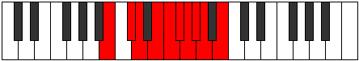 |
| [2029](https://ianring.com/musictheory/scales/2029) | [Mathygic](ModeDNaturalMathygic.md) | D | D, E, F, G, G#, A, A#, B, C, D |  |
| [2031](https://ianring.com/musictheory/scales/2031) | [Gadyllian](ModeGNaturalGadyllian.md) | G | G, G#, A, A#, C, C#, D, D#, E, F, G |  |
| [2031](https://ianring.com/musictheory/scales/2031) | [Gadyllian](ModeCNaturalGadyllian.md) | C | C, C#, D, D#, F, F#, G, G#, A, A#, C |  |
| [2031](https://ianring.com/musictheory/scales/2031) | [Gadyllian](ModeBNaturalGadyllian.md) | B | B, C, C#, D, E, F, F#, G, G#, A, B |  |
| [2031](https://ianring.com/musictheory/scales/2031) | [Gadyllian](ModeGSharpGadyllian.md) | G# | G#, A, A#, B, C#, D, D#, E, F, F#, G# |  |
| [2031](https://ianring.com/musictheory/scales/2031) | [Gadyllian](ModeAFlatGadyllian.md) | Ab | Ab, A, Bb, B, Db, D, Eb, E, F, Gb, Ab |  |
| [2031](https://ianring.com/musictheory/scales/2031) | [Gadyllian](ModeDNaturalGadyllian.md) | D | D, D#, E, F, G, G#, A, A#, B, C, D |  |
| [2035](https://ianring.com/musictheory/scales/2035) | [Aerythygic](ModeGSharpAerythygic.md) | G# | G#, A, C, C#, D, D#, E, F, F#, G# |  |
| [2035](https://ianring.com/musictheory/scales/2035) | [Aerythygic](ModeAFlatAerythygic.md) | Ab | Ab, A, C, Db, D, Eb, E, F, Gb, Ab |  |
| [2035](https://ianring.com/musictheory/scales/2035) | [Aerythygic](ModeENaturalAerythygic.md) | E | E, F, G#, A, A#, B, C, C#, D, E |  |
| [2035](https://ianring.com/musictheory/scales/2035) | [Aerythygic](ModeCSharpAerythygic.md) | C# | C#, D, F, F#, G, G#, A, A#, B, C# |  |
| [2035](https://ianring.com/musictheory/scales/2035) | [Aerythygic](ModeDFlatAerythygic.md) | Db | Db, D, F, Gb, G, Ab, A, Bb, B, Db |  |
| [2037](https://ianring.com/musictheory/scales/2037) | [Sythygic](ModeCNaturalSythygic.md) | C | C, D, E, F, F#, G, G#, A, A#, C |  |
| [2039](https://ianring.com/musictheory/scales/2039) | [Danyllian](ModeGSharpDanyllian.md) | G# | G#, A, A#, C, C#, D, D#, E, F, F#, G# |  |
| [2039](https://ianring.com/musictheory/scales/2039) | [Danyllian](ModeAFlatDanyllian.md) | Ab | Ab, A, Bb, C, Db, D, Eb, E, F, Gb, Ab |  |
| [2039](https://ianring.com/musictheory/scales/2039) | [Danyllian](ModeCNaturalDanyllian.md) | C | C, C#, D, E, F, F#, G, G#, A, A#, C |  |
| [2039](https://ianring.com/musictheory/scales/2039) | [Danyllian](ModeGNaturalDanyllian.md) | G | G, G#, A, B, C, C#, D, D#, E, F, G |  |
| [2039](https://ianring.com/musictheory/scales/2039) | [Danyllian](ModeENaturalDanyllian.md) | E | E, F, F#, G#, A, A#, B, C, C#, D, E |  |
| [2039](https://ianring.com/musictheory/scales/2039) | [Danyllian](ModeCSharpDanyllian.md) | C# | C#, D, D#, F, F#, G, G#, A, A#, B, C# |  |
| [2039](https://ianring.com/musictheory/scales/2039) | [Danyllian](ModeDFlatDanyllian.md) | Db | Db, D, Eb, F, Gb, G, Ab, A, Bb, B, Db |  |
| [2041](https://ianring.com/musictheory/scales/2041) | [Aeolacrygic](ModeBNaturalAeolacrygic.md) | B | B, D, D#, E, F, F#, G, G#, A, B |  |
| [2041](https://ianring.com/musictheory/scales/2041) | [Aeolacrygic](ModeFNaturalAeolacrygic.md) | F | F, G#, A, A#, B, C, C#, D, D#, F |  |
| [2041](https://ianring.com/musictheory/scales/2041) | [Aeolacrygic](ModeDNaturalAeolacrygic.md) | D | D, F, F#, G, G#, A, A#, B, C, D |  |
| [2043](https://ianring.com/musictheory/scales/2043) | [Lythyllian](ModeGSharpLythyllian.md) | G# | G#, A, B, C, C#, D, D#, E, F, F#, G# |  |
| [2043](https://ianring.com/musictheory/scales/2043) | [Lythyllian](ModeAFlatLythyllian.md) | Ab | Ab, A, B, C, Db, D, Eb, E, F, Gb, Ab |  |
| [2043](https://ianring.com/musictheory/scales/2043) | [Lythyllian](ModeBNaturalLythyllian.md) | B | B, C, D, D#, E, F, F#, G, G#, A, B |  |
| [2043](https://ianring.com/musictheory/scales/2043) | [Lythyllian](ModeFNaturalLythyllian.md) | F | F, F#, G#, A, A#, B, C, C#, D, D#, F |  |
| [2043](https://ianring.com/musictheory/scales/2043) | [Lythyllian](ModeENaturalLythyllian.md) | E | E, F, G, G#, A, A#, B, C, C#, D, E |  |
| [2043](https://ianring.com/musictheory/scales/2043) | [Lythyllian](ModeDNaturalLythyllian.md) | D | D, D#, F, F#, G, G#, A, A#, B, C, D |  |
| [2043](https://ianring.com/musictheory/scales/2043) | [Lythyllian](ModeCSharpLythyllian.md) | C# | C#, D, E, F, F#, G, G#, A, A#, B, C# |  |
| [2043](https://ianring.com/musictheory/scales/2043) | [Lythyllian](ModeDFlatLythyllian.md) | Db | Db, D, E, F, Gb, G, Ab, A, Bb, B, Db |  |
| [2045](https://ianring.com/musictheory/scales/2045) | [Katogyllian](ModeCNaturalKatogyllian.md) | C | C, D, D#, E, F, F#, G, G#, A, A#, C |  |
| [2045](https://ianring.com/musictheory/scales/2045) | [Katogyllian](ModeBNaturalKatogyllian.md) | B | B, C#, D, D#, E, F, F#, G, G#, A, B |  |
| [2045](https://ianring.com/musictheory/scales/2045) | [Katogyllian](ModeFNaturalKatogyllian.md) | F | F, G, G#, A, A#, B, C, C#, D, D#, F |  |
| [2045](https://ianring.com/musictheory/scales/2045) | [Katogyllian](ModeDNaturalKatogyllian.md) | D | D, E, F, F#, G, G#, A, A#, B, C, D |  |
| [2047](https://ianring.com/musictheory/scales/2047) | [Monatic](ModeCNaturalMonatic.md) | C | C, C#, D, D#, E, F, F#, G, G#, A, A#, C |  |
| [2047](https://ianring.com/musictheory/scales/2047) | [Monatic](ModeBNaturalMonatic.md) | B | B, C, C#, D, D#, E, F, F#, G, G#, A, B |  |
| [2047](https://ianring.com/musictheory/scales/2047) | [Monatic](ModeGSharpMonatic.md) | G# | G#, A, A#, B, C, C#, D, D#, E, F, F#, G# |  |
| [2047](https://ianring.com/musictheory/scales/2047) | [Monatic](ModeAFlatMonatic.md) | Ab | Ab, A, Bb, B, C, Db, D, Eb, E, F, Gb, Ab |  |
| [2047](https://ianring.com/musictheory/scales/2047) | [Monatic](ModeGNaturalMonatic.md) | G | G, G#, A, A#, B, C, C#, D, D#, E, F, G |  |
| [2047](https://ianring.com/musictheory/scales/2047) | [Monatic](ModeFNaturalMonatic.md) | F | F, F#, G, G#, A, A#, B, C, C#, D, D#, F |  |
| [2047](https://ianring.com/musictheory/scales/2047) | [Monatic](ModeENaturalMonatic.md) | E | E, F, F#, G, G#, A, A#, B, C, C#, D, E |  |
| [2047](https://ianring.com/musictheory/scales/2047) | [Monatic](ModeDNaturalMonatic.md) | D | D, D#, E, F, F#, G, G#, A, A#, B, C, D |  |
| [2047](https://ianring.com/musictheory/scales/2047) | [Monatic](ModeCSharpMonatic.md) | C# | C#, D, D#, E, F, F#, G, G#, A, A#, B, C# |  |
| [2047](https://ianring.com/musictheory/scales/2047) | [Monatic](ModeDFlatMonatic.md) | Db | Db, D, Eb, E, F, Gb, G, Ab, A, Bb, B, Db |  |
| [2249](https://ianring.com/musictheory/scales/2249) | [Kygitonic](ModeDNaturalKygitonic.md) | D | D, F, G#, A, C#, D |  |
| [2251](https://ianring.com/musictheory/scales/2251) | [Zodimic](ModeDNaturalZodimic.md) | D | D, Eb, F, G#, A, B##, D |  |
| [2253](https://ianring.com/musictheory/scales/2253) | [Logimic](ModeDNaturalLogimic.md) | D | D, E, F, G#, A, B##, D |  |
| [2255](https://ianring.com/musictheory/scales/2255) | [Dylian](ModeDNaturalDylian.md) | D | D, Eb, Fb, Gbb, Ab, Bbb, C#, D |  |
| [2265](https://ianring.com/musictheory/scales/2265) | [Ionophimic](ModeDNaturalIonophimic.md) | D | D, E#, F#, G#, A, B##, D |  |
| [2267](https://ianring.com/musictheory/scales/2267) | [Padian](ModeDNaturalPadian.md) | D | D, Eb, F, Gb, Ab, Bbb, C#, D |  |
| [2269](https://ianring.com/musictheory/scales/2269) | [Pygian](ModeDNaturalPygian.md) | D | D, E, F, Gb, Ab, Bbb, C#, D |  |
| [2271](https://ianring.com/musictheory/scales/2271) | [Poptyllic](ModeDNaturalPoptyllic.md) | D | D, D#, E, F, F#, G#, A, C#, D |  |
| [2277](https://ianring.com/musictheory/scales/2277) | [Kagimic](ModeEFlatKagimic.md) | Eb | Eb, F, G#, A, Bb, C##, Eb |  |
| [2279](https://ianring.com/musictheory/scales/2279) | [Dyrian](ModeDSharpDyrian.md) | D# | D#, E, F, G#, A, Bb, C##, D# |  |
| [2279](https://ianring.com/musictheory/scales/2279) | [Dyrian](ModeEFlatDyrian.md) | Eb | Eb, Fb, Gbb, Ab, Bbb, Cbb, D, Eb |  |
| [2281](https://ianring.com/musictheory/scales/2281) | [Rathimic](ModeDNaturalRathimic.md) | D | D, E#, F##, G#, A, B##, D |  |
| [2283](https://ianring.com/musictheory/scales/2283) | [Aeolyptian](ModeDNaturalAeolyptian.md) | D | D, Eb, F, G, Ab, Bbb, C#, D |  |
| [2285](https://ianring.com/musictheory/scales/2285) | [Aerogian](ModeDNaturalAerogian.md) | D | D, E, F, G, Ab, Bbb, C#, D |  |
| [2285](https://ianring.com/musictheory/scales/2285) | [Aerogian](ModeDSharpAerogian.md) | D# | D#, E#, F#, G#, A, Bb, C##, D# |  |
| [2285](https://ianring.com/musictheory/scales/2285) | [Aerogian](ModeEFlatAerogian.md) | Eb | Eb, F, Gb, Ab, Bbb, Cbb, D, Eb |  |
| [2287](https://ianring.com/musictheory/scales/2287) | [Lodyllic](ModeDNaturalLodyllic.md) | D | D, D#, E, F, G, G#, A, C#, D |  |
| [2287](https://ianring.com/musictheory/scales/2287) | [Lodyllic](ModeDSharpLodyllic.md) | D# | D#, E, F, F#, G#, A, A#, D, D# |  |
| [2287](https://ianring.com/musictheory/scales/2287) | [Lodyllic](ModeEFlatLodyllic.md) | Eb | Eb, E, F, Gb, Ab, A, Bb, D, Eb |  |
| [2293](https://ianring.com/musictheory/scales/2293) | [Gorian](ModeDSharpGorian.md) | D# | D#, E#, F##, G#, A, Bb, C##, D# |  |
| [2293](https://ianring.com/musictheory/scales/2293) | [Gorian](ModeEFlatGorian.md) | Eb | Eb, F, G, Ab, Bbb, Cbb, D, Eb |  |
| [2295](https://ianring.com/musictheory/scales/2295) | [Kogyllic](ModeDSharpKogyllic.md) | D# | D#, E, F, G, G#, A, A#, D, D# |  |
| [2295](https://ianring.com/musictheory/scales/2295) | [Kogyllic](ModeEFlatKogyllic.md) | Eb | Eb, E, F, G, Ab, A, Bb, D, Eb |  |
| [2297](https://ianring.com/musictheory/scales/2297) | [Thylian](ModeDNaturalThylian.md) | D | D, E#, F#, G, Ab, Bbb, C#, D |  |
| [2299](https://ianring.com/musictheory/scales/2299) | [Phraptyllic](ModeDNaturalPhraptyllic.md) | D | D, D#, F, F#, G, G#, A, C#, D |  |
| [2301](https://ianring.com/musictheory/scales/2301) | [Bydyllic](ModeDNaturalBydyllic.md) | D | D, E, F, F#, G, G#, A, C#, D |  |
| [2301](https://ianring.com/musictheory/scales/2301) | [Bydyllic](ModeDSharpBydyllic.md) | D# | D#, F, F#, G, G#, A, A#, D, D# |  |
| [2301](https://ianring.com/musictheory/scales/2301) | [Bydyllic](ModeEFlatBydyllic.md) | Eb | Eb, F, Gb, G, Ab, A, Bb, D, Eb |  |
| [2303](https://ianring.com/musictheory/scales/2303) | [Stanygic](ModeDNaturalStanygic.md) | D | D, D#, E, F, F#, G, G#, A, C#, D |  |
| [2303](https://ianring.com/musictheory/scales/2303) | [Stanygic](ModeDSharpStanygic.md) | D# | D#, E, F, F#, G, G#, A, A#, D, D# |  |
| [2303](https://ianring.com/musictheory/scales/2303) | [Stanygic](ModeEFlatStanygic.md) | Eb | Eb, E, F, Gb, G, Ab, A, Bb, D, Eb |  |
| [2333](https://ianring.com/musictheory/scales/2333) | [Stynimic](ModeFSharpStynimic.md) | F# | F#, G#, A, Bb, C##, D###, F# |  |
| [2333](https://ianring.com/musictheory/scales/2333) | [Stynimic](ModeGFlatStynimic.md) | Gb | Gb, Ab, Bbb, Cbb, D, E#, Gb |  |
| [2335](https://ianring.com/musictheory/scales/2335) | [Epydian](ModeFSharpEpydian.md) | F# | F#, G, Ab, Bbb, Cbb, D, E#, F# |  |
| [2335](https://ianring.com/musictheory/scales/2335) | [Epydian](ModeGFlatEpydian.md) | Gb | Gb, Abb, Bbbb, Cbbb, Cbb, D, E#, Gb |  |
| [2339](https://ianring.com/musictheory/scales/2339) | [Ragitonic](ModeANaturalRagitonic.md) | A | A, A#, D, F, G#, A |  |
| [2341](https://ianring.com/musictheory/scales/2341) | [Myditonic](ModeANaturalMyditonic.md) | A | A, B, D, F, G#, A |  |
| [2343](https://ianring.com/musictheory/scales/2343) | [Tharimic](ModeANaturalTharimic.md) | A | A, Bb, Cb, D, E#, F###, A |  |
| [2345](https://ianring.com/musictheory/scales/2345) | [Gothitonic](ModeANaturalGothitonic.md) | A | A, C, D, F, G#, A |  |
| [2347](https://ianring.com/musictheory/scales/2347) | [Thothimic](ModeANaturalThothimic.md) | A | A, Bb, C, D, E#, F###, A |  |
| [2349](https://ianring.com/musictheory/scales/2349) | [Aerogimic](ModeANaturalAerogimic.md) | A | A, B, C, D, E#, F###, A |  |
| [2349](https://ianring.com/musictheory/scales/2349) | [Aerogimic](ModeFSharpAerogimic.md) | F# | F#, G#, A, B, C##, D###, F# |  |
| [2349](https://ianring.com/musictheory/scales/2349) | [Aerogimic](ModeGFlatAerogimic.md) | Gb | Gb, Ab, Bbb, Cb, D, E#, Gb |  |
| [2351](https://ianring.com/musictheory/scales/2351) | [Gynian](ModeFSharpGynian.md) | F# | F#, G, Ab, Bbb, Cb, D, E#, F# |  |
| [2351](https://ianring.com/musictheory/scales/2351) | [Gynian](ModeANaturalGynian.md) | A | A, Bb, Cb, Dbb, Ebb, F, G#, A |  |
| [2353](https://ianring.com/musictheory/scales/2353) | [Lycritonic](ModeANaturalLycritonic.md) | A | A, C#, D, F, G#, A |  |
| [2355](https://ianring.com/musictheory/scales/2355) | [Katycrimic](ModeANaturalKatycrimic.md) | A | A, Bb, C#, D, E#, F###, A |  |
| [2357](https://ianring.com/musictheory/scales/2357) | [Ionaptimic](ModeANaturalIonaptimic.md) | A | A, B, C#, D, E#, F###, A |  |
| [2359](https://ianring.com/musictheory/scales/2359) | [Gadian](ModeANaturalGadian.md) | A | A, Bb, Cb, Db, Ebb, F, G#, A |  |
| [2361](https://ianring.com/musictheory/scales/2361) | [Docrimic](ModeANaturalDocrimic.md) | A | A, B#, C#, D, E#, F###, A |  |
| [2363](https://ianring.com/musictheory/scales/2363) | [Kataptian](ModeANaturalKataptian.md) | A | A, Bb, C, Db, Ebb, F, G#, A |  |
| [2365](https://ianring.com/musictheory/scales/2365) | [Sythian](ModeANaturalSythian.md) | A | A, B, C, Db, Ebb, F, G#, A |  |
| [2365](https://ianring.com/musictheory/scales/2365) | [Sythian](ModeFSharpSythian.md) | F# | F#, G#, A, Bb, Cb, D, E#, F# |  |
| [2367](https://ianring.com/musictheory/scales/2367) | [Laryllic](ModeANaturalLaryllic.md) | A | A, A#, B, C, C#, D, F, G#, A |  |
| [2367](https://ianring.com/musictheory/scales/2367) | [Laryllic](ModeFSharpLaryllic.md) | F# | F#, G, G#, A, A#, B, D, F, F# |  |
| [2367](https://ianring.com/musictheory/scales/2367) | [Laryllic](ModeGFlatLaryllic.md) | Gb | Gb, G, Ab, A, Bb, B, D, F, Gb |  |
| [2381](https://ianring.com/musictheory/scales/2381) | [Sorimic](ModeFSharpSorimic.md) | F# | F#, G#, A, B#, C##, D###, F# |  |
| [2381](https://ianring.com/musictheory/scales/2381) | [Sorimic](ModeGFlatSorimic.md) | Gb | Gb, Ab, Bbb, C, D, E#, Gb |  |
| [2383](https://ianring.com/musictheory/scales/2383) | [Katorian](ModeFSharpKatorian.md) | F# | F#, G, Ab, Bbb, C, D, E#, F# |  |
| [2397](https://ianring.com/musictheory/scales/2397) | [Stagian](ModeFSharpStagian.md) | F# | F#, G#, A, Bb, C, D, E#, F# |  |
| [2399](https://ianring.com/musictheory/scales/2399) | [Zanyllic](ModeFSharpZanyllic.md) | F# | F#, G, G#, A, A#, C, D, F, F# |  |
| [2399](https://ianring.com/musictheory/scales/2399) | [Zanyllic](ModeGFlatZanyllic.md) | Gb | Gb, G, Ab, A, Bb, C, D, F, Gb |  |
| [2403](https://ianring.com/musictheory/scales/2403) | [Lycrimic](ModeANaturalLycrimic.md) | A | A, Bb, C##, D#, E#, F###, A |  |
| [2405](https://ianring.com/musictheory/scales/2405) | [Katalimic](ModeEFlatKatalimic.md) | Eb | Eb, F, G#, A, B, C##, Eb |  |
| [2405](https://ianring.com/musictheory/scales/2405) | [Katalimic](ModeANaturalKatalimic.md) | A | A, B, C##, D#, E#, F###, A |  |
| [2407](https://ianring.com/musictheory/scales/2407) | [Zylian](ModeDSharpZylian.md) | D# | D#, E, F, G#, A, B, C##, D# |  |
| [2407](https://ianring.com/musictheory/scales/2407) | [Zylian](ModeEFlatZylian.md) | Eb | Eb, Fb, Gbb, Ab, Bbb, Cb, D, Eb |  |
| [2407](https://ianring.com/musictheory/scales/2407) | [Zylian](ModeANaturalZylian.md) | A | A, Bb, Cb, D, Eb, F, G#, A |  |
| [2409](https://ianring.com/musictheory/scales/2409) | [Zacrimic](ModeANaturalZacrimic.md) | A | A, B#, C##, D#, E#, F###, A |  |
| [2411](https://ianring.com/musictheory/scales/2411) | [Aeolorian](ModeANaturalAeolorian.md) | A | A, Bb, C, D, Eb, F, G#, A |  |
| [2413](https://ianring.com/musictheory/scales/2413) | [Phrydian](ModeANaturalPhrydian.md) | A | A, B, C, D, Eb, F, G#, A |  |
| [2413](https://ianring.com/musictheory/scales/2413) | [Phrydian](ModeFSharpPhrydian.md) | F# | F#, G#, A, B, C, D, E#, F# |  |
| [2413](https://ianring.com/musictheory/scales/2413) | [Phrydian](ModeDSharpPhrydian.md) | D# | D#, E#, F#, G#, A, B, C##, D# |  |
| [2413](https://ianring.com/musictheory/scales/2413) | [Phrydian](ModeEFlatPhrydian.md) | Eb | Eb, F, Gb, Ab, Bbb, Cb, D, Eb |  |
| [2415](https://ianring.com/musictheory/scales/2415) | [Lothyllic](ModeDSharpLothyllic.md) | D# | D#, E, F, F#, G#, A, B, D, D# |  |
| [2415](https://ianring.com/musictheory/scales/2415) | [Lothyllic](ModeEFlatLothyllic.md) | Eb | Eb, E, F, Gb, Ab, A, B, D, Eb |  |
| [2415](https://ianring.com/musictheory/scales/2415) | [Lothyllic](ModeFSharpLothyllic.md) | F# | F#, G, G#, A, B, C, D, F, F# |  |
| [2415](https://ianring.com/musictheory/scales/2415) | [Lothyllic](ModeGFlatLothyllic.md) | Gb | Gb, G, Ab, A, B, C, D, F, Gb |  |
| [2415](https://ianring.com/musictheory/scales/2415) | [Lothyllic](ModeANaturalLothyllic.md) | A | A, A#, B, C, D, D#, F, G#, A |  |
| [2417](https://ianring.com/musictheory/scales/2417) | [Kanimic](ModeANaturalKanimic.md) | A | A, B##, C##, D#, E#, F###, A |  |
| [2419](https://ianring.com/musictheory/scales/2419) | [Paptian](ModeANaturalPaptian.md) | A | A, Bb, C#, D, Eb, F, G#, A |  |
| [2421](https://ianring.com/musictheory/scales/2421) | [Malian](ModeANaturalMalian.md) | A | A, B, C#, D, Eb, F, G#, A |  |
| [2421](https://ianring.com/musictheory/scales/2421) | [Malian](ModeDSharpMalian.md) | D# | D#, E#, F##, G#, A, B, C##, D# |  |
| [2421](https://ianring.com/musictheory/scales/2421) | [Malian](ModeEFlatMalian.md) | Eb | Eb, F, G, Ab, Bbb, Cb, D, Eb |  |
| [2423](https://ianring.com/musictheory/scales/2423) | [Thorcryllic](ModeDSharpThorcryllic.md) | D# | D#, E, F, G, G#, A, B, D, D# |  |
| [2423](https://ianring.com/musictheory/scales/2423) | [Thorcryllic](ModeEFlatThorcryllic.md) | Eb | Eb, E, F, G, Ab, A, B, D, Eb |  |
| [2423](https://ianring.com/musictheory/scales/2423) | [Thorcryllic](ModeANaturalThorcryllic.md) | A | A, A#, B, C#, D, D#, F, G#, A |  |
| [2425](https://ianring.com/musictheory/scales/2425) | [Rorian](ModeANaturalRorian.md) | A | A, B#, C#, D, Eb, F, G#, A |  |
| [2427](https://ianring.com/musictheory/scales/2427) | [Katoryllic](ModeANaturalKatoryllic.md) | A | A, A#, C, C#, D, D#, F, G#, A |  |
| [2429](https://ianring.com/musictheory/scales/2429) | [Kadyllic](ModeANaturalKadyllic.md) | A | A, B, C, C#, D, D#, F, G#, A |  |
| [2429](https://ianring.com/musictheory/scales/2429) | [Kadyllic](ModeDSharpKadyllic.md) | D# | D#, F, F#, G, G#, A, B, D, D# |  |
| [2429](https://ianring.com/musictheory/scales/2429) | [Kadyllic](ModeEFlatKadyllic.md) | Eb | Eb, F, Gb, G, Ab, A, B, D, Eb |  |
| [2429](https://ianring.com/musictheory/scales/2429) | [Kadyllic](ModeFSharpKadyllic.md) | F# | F#, G#, A, A#, B, C, D, F, F# |  |
| [2429](https://ianring.com/musictheory/scales/2429) | [Kadyllic](ModeGFlatKadyllic.md) | Gb | Gb, Ab, A, Bb, B, C, D, F, Gb |  |
| [2431](https://ianring.com/musictheory/scales/2431) | [Gythygic](ModeDSharpGythygic.md) | D# | D#, E, F, F#, G, G#, A, B, D, D# |  |
| [2431](https://ianring.com/musictheory/scales/2431) | [Gythygic](ModeEFlatGythygic.md) | Eb | Eb, E, F, Gb, G, Ab, A, B, D, Eb |  |
| [2431](https://ianring.com/musictheory/scales/2431) | [Gythygic](ModeANaturalGythygic.md) | A | A, A#, B, C, C#, D, D#, F, G#, A |  |
| [2431](https://ianring.com/musictheory/scales/2431) | [Gythygic](ModeFSharpGythygic.md) | F# | F#, G, G#, A, A#, B, C, D, F, F# |  |
| [2431](https://ianring.com/musictheory/scales/2431) | [Gythygic](ModeGFlatGythygic.md) | Gb | Gb, G, Ab, A, Bb, B, C, D, F, Gb |  |
| [2445](https://ianring.com/musictheory/scales/2445) | [Zadimic](ModeFSharpZadimic.md) | F# | F#, G#, A, B##, C##, D###, F# |  |
| [2445](https://ianring.com/musictheory/scales/2445) | [Zadimic](ModeGFlatZadimic.md) | Gb | Gb, Ab, Bbb, C#, D, E#, Gb |  |
| [2447](https://ianring.com/musictheory/scales/2447) | [Thagian](ModeFSharpThagian.md) | F# | F#, G, Ab, Bbb, C#, D, E#, F# |  |
| [2451](https://ianring.com/musictheory/scales/2451) | [Aerynimic](ModeCSharpAerynimic.md) | C# | C#, D, E#, F###, G##, A###, C# |  |
| [2451](https://ianring.com/musictheory/scales/2451) | [Aerynimic](ModeDFlatAerynimic.md) | Db | Db, Ebb, F, G#, A, B#, Db |  |
| [2455](https://ianring.com/musictheory/scales/2455) | [Bothian](ModeCSharpBothian.md) | C# | C#, D, Eb, F, G#, A, B#, C# |  |
| [2459](https://ianring.com/musictheory/scales/2459) | [Ionocrian](ModeCSharpIonocrian.md) | C# | C#, D, E, F, G#, A, B#, C# |  |
| [2461](https://ianring.com/musictheory/scales/2461) | [Sagian](ModeFSharpSagian.md) | F# | F#, G#, A, Bb, C#, D, E#, F# |  |
| [2463](https://ianring.com/musictheory/scales/2463) | [Ionathyllic](ModeCSharpIonathyllic.md) | C# | C#, D, D#, E, F, G#, A, C, C# |  |
| [2463](https://ianring.com/musictheory/scales/2463) | [Ionathyllic](ModeDFlatIonathyllic.md) | Db | Db, D, Eb, E, F, Ab, A, C, Db |  |
| [2463](https://ianring.com/musictheory/scales/2463) | [Ionathyllic](ModeFSharpIonathyllic.md) | F# | F#, G, G#, A, A#, C#, D, F, F# |  |
| [2463](https://ianring.com/musictheory/scales/2463) | [Ionathyllic](ModeGFlatIonathyllic.md) | Gb | Gb, G, Ab, A, Bb, Db, D, F, Gb |  |
| [2467](https://ianring.com/musictheory/scales/2467) | [Morimic](ModeANaturalMorimic.md) | A | A, Bb, C##, D##, E#, F###, A |  |
| [2469](https://ianring.com/musictheory/scales/2469) | [Staptimic](ModeANaturalStaptimic.md) | A | A, B, C##, D##, E#, F###, A |  |
| [2471](https://ianring.com/musictheory/scales/2471) | [Eparian](ModeANaturalEparian.md) | A | A, Bb, Cb, D, E, F, G#, A |  |
| [2473](https://ianring.com/musictheory/scales/2473) | [Mothimic](ModeANaturalMothimic.md) | A | A, B#, C##, D##, E#, F###, A | 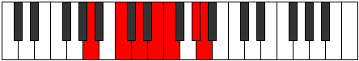 |
| [2475](https://ianring.com/musictheory/scales/2475) | [Aerylian](ModeANaturalAerylian.md) | A | A, Bb, C, D, E, F, G#, A |  |
| [2477](https://ianring.com/musictheory/scales/2477) | [Mydian](ModeANaturalMydian.md) | A | A, B, C, D, E, F, G#, A |  |
| [2477](https://ianring.com/musictheory/scales/2477) | [Mydian](ModeFSharpMydian.md) | F# | F#, G#, A, B, C#, D, E#, F# |  |
| [2479](https://ianring.com/musictheory/scales/2479) | [Rycryllic](ModeFSharpRycryllic.md) | F# | F#, G, G#, A, B, C#, D, F, F# |  |
| [2479](https://ianring.com/musictheory/scales/2479) | [Rycryllic](ModeGFlatRycryllic.md) | Gb | Gb, G, Ab, A, B, Db, D, F, Gb |  |
| [2479](https://ianring.com/musictheory/scales/2479) | [Rycryllic](ModeANaturalRycryllic.md) | A | A, A#, B, C, D, E, F, G#, A |  |
| [2481](https://ianring.com/musictheory/scales/2481) | [Laptimic](ModeANaturalLaptimic.md) | A | A, B##, C##, D##, E#, F###, A |  |
| [2483](https://ianring.com/musictheory/scales/2483) | [Aerynian](ModeCSharpAerynian.md) | C# | C#, D, E#, F#, G#, A, B#, C# |  |
| [2483](https://ianring.com/musictheory/scales/2483) | [Aerynian](ModeANaturalAerynian.md) | A | A, Bb, C#, D, E, F, G#, A |  |
| [2485](https://ianring.com/musictheory/scales/2485) | [Aerorian](ModeANaturalAerorian.md) | A | A, B, C#, D, E, F, G#, A |  |
| [2487](https://ianring.com/musictheory/scales/2487) | [Phroptyllic](ModeCSharpPhroptyllic.md) | C# | C#, D, D#, F, F#, G#, A, C, C# |  |
| [2487](https://ianring.com/musictheory/scales/2487) | [Phroptyllic](ModeDFlatPhroptyllic.md) | Db | Db, D, Eb, F, Gb, Ab, A, C, Db |  |
| [2487](https://ianring.com/musictheory/scales/2487) | [Phroptyllic](ModeANaturalPhroptyllic.md) | A | A, A#, B, C#, D, E, F, G#, A |  |
| [2489](https://ianring.com/musictheory/scales/2489) | [Syrian](ModeANaturalSyrian.md) | A | A, B#, C#, D, E, F, G#, A |  |
| [2491](https://ianring.com/musictheory/scales/2491) | [Layllic](ModeCSharpLayllic.md) | C# | C#, D, E, F, F#, G#, A, C, C# |  |
| [2491](https://ianring.com/musictheory/scales/2491) | [Layllic](ModeDFlatLayllic.md) | Db | Db, D, E, F, Gb, Ab, A, C, Db |  |
| [2491](https://ianring.com/musictheory/scales/2491) | [Layllic](ModeANaturalLayllic.md) | A | A, A#, C, C#, D, E, F, G#, A |  |
| [2493](https://ianring.com/musictheory/scales/2493) | [Manyllic](ModeANaturalManyllic.md) | A | A, B, C, C#, D, E, F, G#, A |  |
| [2493](https://ianring.com/musictheory/scales/2493) | [Manyllic](ModeFSharpManyllic.md) | F# | F#, G#, A, A#, B, C#, D, F, F# |  |
| [2493](https://ianring.com/musictheory/scales/2493) | [Manyllic](ModeGFlatManyllic.md) | Gb | Gb, Ab, A, Bb, B, Db, D, F, Gb |  |
| [2495](https://ianring.com/musictheory/scales/2495) | [Aeolocrygic](ModeCSharpAeolocrygic.md) | C# | C#, D, D#, E, F, F#, G#, A, C, C# |  |
| [2495](https://ianring.com/musictheory/scales/2495) | [Aeolocrygic](ModeDFlatAeolocrygic.md) | Db | Db, D, Eb, E, F, Gb, Ab, A, C, Db |  |
| [2495](https://ianring.com/musictheory/scales/2495) | [Aeolocrygic](ModeANaturalAeolocrygic.md) | A | A, A#, B, C, C#, D, E, F, G#, A |  |
| [2495](https://ianring.com/musictheory/scales/2495) | [Aeolocrygic](ModeFSharpAeolocrygic.md) | F# | F#, G, G#, A, A#, B, C#, D, F, F# |  |
| [2495](https://ianring.com/musictheory/scales/2495) | [Aeolocrygic](ModeGFlatAeolocrygic.md) | Gb | Gb, G, Ab, A, Bb, B, Db, D, F, Gb |  |
| [2505](https://ianring.com/musictheory/scales/2505) | [Mydimic](ModeDNaturalMydimic.md) | D | D, E#, F###, G##, A#, B##, D |  |
| [2507](https://ianring.com/musictheory/scales/2507) | [Ionyphian](ModeDNaturalIonyphian.md) | D | D, Eb, F, G#, A, Bb, C#, D |  |
| [2509](https://ianring.com/musictheory/scales/2509) | [Bogian](ModeFSharpBogian.md) | F# | F#, G#, A, B#, C#, D, E#, F# |  |
| [2509](https://ianring.com/musictheory/scales/2509) | [Bogian](ModeDNaturalBogian.md) | D | D, E, F, G#, A, Bb, C#, D |  |
| [2511](https://ianring.com/musictheory/scales/2511) | [Epyryllic](ModeFSharpEpyryllic.md) | F# | F#, G, G#, A, C, C#, D, F, F# |  |
| [2511](https://ianring.com/musictheory/scales/2511) | [Epyryllic](ModeGFlatEpyryllic.md) | Gb | Gb, G, Ab, A, C, Db, D, F, Gb |  |
| [2511](https://ianring.com/musictheory/scales/2511) | [Epyryllic](ModeDNaturalEpyryllic.md) | D | D, D#, E, F, G#, A, A#, C#, D |  |
| [2515](https://ianring.com/musictheory/scales/2515) | [Stylian](ModeCSharpStylian.md) | C# | C#, D, E#, F##, G#, A, B#, C# |  |
| [2519](https://ianring.com/musictheory/scales/2519) | [Dathyllic](ModeCSharpDathyllic.md) | C# | C#, D, D#, F, G, G#, A, C, C# |  |
| [2519](https://ianring.com/musictheory/scales/2519) | [Dathyllic](ModeDFlatDathyllic.md) | Db | Db, D, Eb, F, G, Ab, A, C, Db |  |
| [2521](https://ianring.com/musictheory/scales/2521) | [Barian](ModeDNaturalBarian.md) | D | D, E#, F#, G#, A, Bb, C#, D |  |
| [2523](https://ianring.com/musictheory/scales/2523) | [Rygyllic](ModeCSharpRygyllic.md) | C# | C#, D, E, F, G, G#, A, C, C# |  |
| [2523](https://ianring.com/musictheory/scales/2523) | [Rygyllic](ModeDFlatRygyllic.md) | Db | Db, D, E, F, G, Ab, A, C, Db |  |
| [2523](https://ianring.com/musictheory/scales/2523) | [Rygyllic](ModeDNaturalRygyllic.md) | D | D, D#, F, F#, G#, A, A#, C#, D |  |
| [2525](https://ianring.com/musictheory/scales/2525) | [Aeolaryllic](ModeFSharpAeolaryllic.md) | F# | F#, G#, A, A#, C, C#, D, F, F# |  |
| [2525](https://ianring.com/musictheory/scales/2525) | [Aeolaryllic](ModeGFlatAeolaryllic.md) | Gb | Gb, Ab, A, Bb, C, Db, D, F, Gb |  |
| [2525](https://ianring.com/musictheory/scales/2525) | [Aeolaryllic](ModeDNaturalAeolaryllic.md) | D | D, E, F, F#, G#, A, A#, C#, D |  |
| [2527](https://ianring.com/musictheory/scales/2527) | [Phradygic](ModeCSharpPhradygic.md) | C# | C#, D, D#, E, F, G, G#, A, C, C# |  |
| [2527](https://ianring.com/musictheory/scales/2527) | [Phradygic](ModeDFlatPhradygic.md) | Db | Db, D, Eb, E, F, G, Ab, A, C, Db |  |
| [2527](https://ianring.com/musictheory/scales/2527) | [Phradygic](ModeDNaturalPhradygic.md) | D | D, D#, E, F, F#, G#, A, A#, C#, D |  |
| [2527](https://ianring.com/musictheory/scales/2527) | [Phradygic](ModeFSharpPhradygic.md) | F# | F#, G, G#, A, A#, C, C#, D, F, F# |  |
| [2527](https://ianring.com/musictheory/scales/2527) | [Phradygic](ModeGFlatPhradygic.md) | Gb | Gb, G, Ab, A, Bb, C, Db, D, F, Gb |  |
| [2531](https://ianring.com/musictheory/scales/2531) | [Danian](ModeANaturalDanian.md) | A | A, Bb, C##, D#, E, F, G#, A |  |
| [2533](https://ianring.com/musictheory/scales/2533) | [Podian](ModeANaturalPodian.md) | A | A, B, C##, D#, E, F, G#, A |  |
| [2533](https://ianring.com/musictheory/scales/2533) | [Podian](ModeEFlatPodian.md) | Eb | Eb, F, G#, A, Bb, Cb, D, Eb |  |
| [2535](https://ianring.com/musictheory/scales/2535) | [Zygyllic](ModeDSharpZygyllic.md) | D# | D#, E, F, G#, A, A#, B, D, D# |  |
| [2535](https://ianring.com/musictheory/scales/2535) | [Zygyllic](ModeEFlatZygyllic.md) | Eb | Eb, E, F, Ab, A, Bb, B, D, Eb |  |
| [2535](https://ianring.com/musictheory/scales/2535) | [Zygyllic](ModeANaturalZygyllic.md) | A | A, A#, B, D, D#, E, F, G#, A |  |
| [2537](https://ianring.com/musictheory/scales/2537) | [Laptian](ModeANaturalLaptian.md) | A | A, B#, C##, D#, E, F, G#, A |  |
| [2537](https://ianring.com/musictheory/scales/2537) | [Laptian](ModeDNaturalLaptian.md) | D | D, E#, F##, G#, A, Bb, C#, D |  |
| [2539](https://ianring.com/musictheory/scales/2539) | [Thonyllic](ModeANaturalThonyllic.md) | A | A, A#, C, D, D#, E, F, G#, A |  |
| [2539](https://ianring.com/musictheory/scales/2539) | [Thonyllic](ModeDNaturalThonyllic.md) | D | D, D#, F, G, G#, A, A#, C#, D |  |
| [2541](https://ianring.com/musictheory/scales/2541) | [Katadyllic](ModeDNaturalKatadyllic.md) | D | D, E, F, G, G#, A, A#, C#, D |  |
| [2541](https://ianring.com/musictheory/scales/2541) | [Katadyllic](ModeANaturalKatadyllic.md) | A | A, B, C, D, D#, E, F, G#, A |  |
| [2541](https://ianring.com/musictheory/scales/2541) | [Katadyllic](ModeFSharpKatadyllic.md) | F# | F#, G#, A, B, C, C#, D, F, F# |  |
| [2541](https://ianring.com/musictheory/scales/2541) | [Katadyllic](ModeGFlatKatadyllic.md) | Gb | Gb, Ab, A, B, C, Db, D, F, Gb |  |
| [2541](https://ianring.com/musictheory/scales/2541) | [Katadyllic](ModeDSharpKatadyllic.md) | D# | D#, F, F#, G#, A, A#, B, D, D# |  |
| [2541](https://ianring.com/musictheory/scales/2541) | [Katadyllic](ModeEFlatKatadyllic.md) | Eb | Eb, F, Gb, Ab, A, Bb, B, D, Eb |  |
| [2543](https://ianring.com/musictheory/scales/2543) | [Dydygic](ModeDNaturalDydygic.md) | D | D, D#, E, F, G, G#, A, A#, C#, D |  |
| [2543](https://ianring.com/musictheory/scales/2543) | [Dydygic](ModeFSharpDydygic.md) | F# | F#, G, G#, A, B, C, C#, D, F, F# |  |
| [2543](https://ianring.com/musictheory/scales/2543) | [Dydygic](ModeGFlatDydygic.md) | Gb | Gb, G, Ab, A, B, C, Db, D, F, Gb |  |
| [2543](https://ianring.com/musictheory/scales/2543) | [Dydygic](ModeANaturalDydygic.md) | A | A, A#, B, C, D, D#, E, F, G#, A |  |
| [2543](https://ianring.com/musictheory/scales/2543) | [Dydygic](ModeDSharpDydygic.md) | D# | D#, E, F, F#, G#, A, A#, B, D, D# |  |
| [2543](https://ianring.com/musictheory/scales/2543) | [Dydygic](ModeEFlatDydygic.md) | Eb | Eb, E, F, Gb, Ab, A, Bb, B, D, Eb |  |
| [2545](https://ianring.com/musictheory/scales/2545) | [Thycrian](ModeANaturalThycrian.md) | A | A, B##, C##, D#, E, F, G#, A |  |
| [2547](https://ianring.com/musictheory/scales/2547) | [Sogyllic](ModeCSharpSogyllic.md) | C# | C#, D, F, F#, G, G#, A, C, C# |  |
| [2547](https://ianring.com/musictheory/scales/2547) | [Sogyllic](ModeDFlatSogyllic.md) | Db | Db, D, F, Gb, G, Ab, A, C, Db |  |
| [2547](https://ianring.com/musictheory/scales/2547) | [Sogyllic](ModeANaturalSogyllic.md) | A | A, A#, C#, D, D#, E, F, G#, A |  |
| [2549](https://ianring.com/musictheory/scales/2549) | [Rydyllic](ModeANaturalRydyllic.md) | A | A, B, C#, D, D#, E, F, G#, A |  |
| [2549](https://ianring.com/musictheory/scales/2549) | [Rydyllic](ModeDSharpRydyllic.md) | D# | D#, F, G, G#, A, A#, B, D, D# |  |
| [2549](https://ianring.com/musictheory/scales/2549) | [Rydyllic](ModeEFlatRydyllic.md) | Eb | Eb, F, G, Ab, A, Bb, B, D, Eb |  |
| [2551](https://ianring.com/musictheory/scales/2551) | [Zoptygic](ModeCSharpZoptygic.md) | C# | C#, D, D#, F, F#, G, G#, A, C, C# |  |
| [2551](https://ianring.com/musictheory/scales/2551) | [Zoptygic](ModeDFlatZoptygic.md) | Db | Db, D, Eb, F, Gb, G, Ab, A, C, Db |  |
| [2551](https://ianring.com/musictheory/scales/2551) | [Zoptygic](ModeANaturalZoptygic.md) | A | A, A#, B, C#, D, D#, E, F, G#, A |  |
| [2551](https://ianring.com/musictheory/scales/2551) | [Zoptygic](ModeDSharpZoptygic.md) | D# | D#, E, F, G, G#, A, A#, B, D, D# |  |
| [2551](https://ianring.com/musictheory/scales/2551) | [Zoptygic](ModeEFlatZoptygic.md) | Eb | Eb, E, F, G, Ab, A, Bb, B, D, Eb |  |
| [2553](https://ianring.com/musictheory/scales/2553) | [Aeolaptyllic](ModeANaturalAeolaptyllic.md) | A | A, C, C#, D, D#, E, F, G#, A |  |
| [2553](https://ianring.com/musictheory/scales/2553) | [Aeolaptyllic](ModeDNaturalAeolaptyllic.md) | D | D, F, F#, G, G#, A, A#, C#, D |  |
| [2555](https://ianring.com/musictheory/scales/2555) | [Bythygic](ModeCSharpBythygic.md) | C# | C#, D, E, F, F#, G, G#, A, C, C# |  |
| [2555](https://ianring.com/musictheory/scales/2555) | [Bythygic](ModeDFlatBythygic.md) | Db | Db, D, E, F, Gb, G, Ab, A, C, Db |  |
| [2555](https://ianring.com/musictheory/scales/2555) | [Bythygic](ModeANaturalBythygic.md) | A | A, A#, C, C#, D, D#, E, F, G#, A |  |
| [2555](https://ianring.com/musictheory/scales/2555) | [Bythygic](ModeDNaturalBythygic.md) | D | D, D#, F, F#, G, G#, A, A#, C#, D |  |
| [2557](https://ianring.com/musictheory/scales/2557) | [Dothygic](ModeDNaturalDothygic.md) | D | D, E, F, F#, G, G#, A, A#, C#, D |  |
| [2557](https://ianring.com/musictheory/scales/2557) | [Dothygic](ModeANaturalDothygic.md) | A | A, B, C, C#, D, D#, E, F, G#, A |  |
| [2557](https://ianring.com/musictheory/scales/2557) | [Dothygic](ModeFSharpDothygic.md) | F# | F#, G#, A, A#, B, C, C#, D, F, F# |  |
| [2557](https://ianring.com/musictheory/scales/2557) | [Dothygic](ModeGFlatDothygic.md) | Gb | Gb, Ab, A, Bb, B, C, Db, D, F, Gb |  |
| [2557](https://ianring.com/musictheory/scales/2557) | [Dothygic](ModeDSharpDothygic.md) | D# | D#, F, F#, G, G#, A, A#, B, D, D# |  |
| [2557](https://ianring.com/musictheory/scales/2557) | [Dothygic](ModeEFlatDothygic.md) | Eb | Eb, F, Gb, G, Ab, A, Bb, B, D, Eb |  |
| [2559](https://ianring.com/musictheory/scales/2559) | [Zogyllian](ModeCSharpZogyllian.md) | C# | C#, D, D#, E, F, F#, G, G#, A, C, C# |  |
| [2559](https://ianring.com/musictheory/scales/2559) | [Zogyllian](ModeDFlatZogyllian.md) | Db | Db, D, Eb, E, F, Gb, G, Ab, A, C, Db |  |
| [2559](https://ianring.com/musictheory/scales/2559) | [Zogyllian](ModeDNaturalZogyllian.md) | D | D, D#, E, F, F#, G, G#, A, A#, C#, D |  |
| [2559](https://ianring.com/musictheory/scales/2559) | [Zogyllian](ModeANaturalZogyllian.md) | A | A, A#, B, C, C#, D, D#, E, F, G#, A |  |
| [2559](https://ianring.com/musictheory/scales/2559) | [Zogyllian](ModeFSharpZogyllian.md) | F# | F#, G, G#, A, A#, B, C, C#, D, F, F# |  |
| [2559](https://ianring.com/musictheory/scales/2559) | [Zogyllian](ModeGFlatZogyllian.md) | Gb | Gb, G, Ab, A, Bb, B, C, Db, D, F, Gb |  |
| [2559](https://ianring.com/musictheory/scales/2559) | [Zogyllian](ModeDSharpZogyllian.md) | D# | D#, E, F, F#, G, G#, A, A#, B, D, D# |  |
| [2559](https://ianring.com/musictheory/scales/2559) | [Zogyllian](ModeEFlatZogyllian.md) | Eb | Eb, E, F, Gb, G, Ab, A, Bb, B, D, Eb |  |
| [2617](https://ianring.com/musictheory/scales/2617) | [Pylimic](ModeFNaturalPylimic.md) | F | F, G#, A, Bb, C##, D##, F |  |
| [2619](https://ianring.com/musictheory/scales/2619) | [Ionyrian](ModeFNaturalIonyrian.md) | F | F, Gb, Ab, Bbb, Cbb, D, E, F |  |
| [2621](https://ianring.com/musictheory/scales/2621) | [Ionogian](ModeFNaturalIonogian.md) | F | F, G, Ab, Bbb, Cbb, D, E, F |  |
| [2623](https://ianring.com/musictheory/scales/2623) | [Aerylyllic](ModeFNaturalAerylyllic.md) | F | F, F#, G, G#, A, A#, D, E, F |  |
| [2631](https://ianring.com/musictheory/scales/2631) | [Macrimic](ModeGSharpMacrimic.md) | G# | G#, A, Bb, C##, D###, E###, G# |  |
| [2631](https://ianring.com/musictheory/scales/2631) | [Macrimic](ModeAFlatMacrimic.md) | Ab | Ab, Bbb, Cbb, D, E#, F##, Ab |  |
| [2635](https://ianring.com/musictheory/scales/2635) | [Gocrimic](ModeGSharpGocrimic.md) | G# | G#, A, B, C##, D###, E###, G# |  |
| [2635](https://ianring.com/musictheory/scales/2635) | [Gocrimic](ModeAFlatGocrimic.md) | Ab | Ab, Bbb, Cb, D, E#, F##, Ab |  |
| [2639](https://ianring.com/musictheory/scales/2639) | [Dothian](ModeGSharpDothian.md) | G# | G#, A, Bb, Cb, D, E#, F##, G# |  |
| [2643](https://ianring.com/musictheory/scales/2643) | [Lydimic](ModeGSharpLydimic.md) | G# | G#, A, B#, C##, D###, E###, G# |  |
| [2643](https://ianring.com/musictheory/scales/2643) | [Lydimic](ModeAFlatLydimic.md) | Ab | Ab, Bbb, C, D, E#, F##, Ab |  |
| [2647](https://ianring.com/musictheory/scales/2647) | [Dadian](ModeGSharpDadian.md) | G# | G#, A, Bb, C, D, E#, F##, G# |  |
| [2649](https://ianring.com/musictheory/scales/2649) | [Aeolythimic](ModeFNaturalAeolythimic.md) | F | F, G#, A, B, C##, D##, F |  |
| [2651](https://ianring.com/musictheory/scales/2651) | [Panian](ModeFNaturalPanian.md) | F | F, Gb, Ab, Bbb, Cb, D, E, F |  |
| [2651](https://ianring.com/musictheory/scales/2651) | [Panian](ModeGSharpPanian.md) | G# | G#, A, B, C, D, E#, F##, G# |  |
| [2653](https://ianring.com/musictheory/scales/2653) | [Sygian](ModeFNaturalSygian.md) | F | F, G, Ab, Bbb, Cb, D, E, F |  |
| [2655](https://ianring.com/musictheory/scales/2655) | [Thocryllic](ModeFNaturalThocryllic.md) | F | F, F#, G, G#, A, B, D, E, F |  |
| [2655](https://ianring.com/musictheory/scales/2655) | [Thocryllic](ModeGSharpThocryllic.md) | G# | G#, A, A#, B, C, D, F, G, G# |  |
| [2655](https://ianring.com/musictheory/scales/2655) | [Thocryllic](ModeAFlatThocryllic.md) | Ab | Ab, A, Bb, B, C, D, F, G, Ab |  |
| [2659](https://ianring.com/musictheory/scales/2659) | [Katynimic](ModeGSharpKatynimic.md) | G# | G#, A, B##, C##, D###, E###, G# |  |
| [2659](https://ianring.com/musictheory/scales/2659) | [Katynimic](ModeAFlatKatynimic.md) | Ab | Ab, Bbb, C#, D, E#, F##, Ab |  |
| [2661](https://ianring.com/musictheory/scales/2661) | [Stydimic](ModeEFlatStydimic.md) | Eb | Eb, F, G#, A, B#, C##, Eb |  |
| [2663](https://ianring.com/musictheory/scales/2663) | [Lalian](ModeDSharpLalian.md) | D# | D#, E, F, G#, A, B#, C##, D# |  |
| [2663](https://ianring.com/musictheory/scales/2663) | [Lalian](ModeEFlatLalian.md) | Eb | Eb, Fb, Gbb, Ab, Bbb, C, D, Eb |  |
| [2663](https://ianring.com/musictheory/scales/2663) | [Lalian](ModeGSharpLalian.md) | G# | G#, A, Bb, C#, D, E#, F##, G# |  |
| [2667](https://ianring.com/musictheory/scales/2667) | [Byrian](ModeGSharpByrian.md) | G# | G#, A, B, C#, D, E#, F##, G# |  |
| [2669](https://ianring.com/musictheory/scales/2669) | [Gamian](ModeDSharpGamian.md) | D# | D#, E#, F#, G#, A, B#, C##, D# |  |
| [2669](https://ianring.com/musictheory/scales/2669) | [Gamian](ModeEFlatGamian.md) | Eb | Eb, F, Gb, Ab, Bbb, C, D, Eb |  |
| [2671](https://ianring.com/musictheory/scales/2671) | [Lylyllic](ModeDSharpLylyllic.md) | D# | D#, E, F, F#, G#, A, C, D, D# |  |
| [2671](https://ianring.com/musictheory/scales/2671) | [Lylyllic](ModeEFlatLylyllic.md) | Eb | Eb, E, F, Gb, Ab, A, C, D, Eb |  |
| [2671](https://ianring.com/musictheory/scales/2671) | [Lylyllic](ModeGSharpLylyllic.md) | G# | G#, A, A#, B, C#, D, F, G, G# |  |
| [2671](https://ianring.com/musictheory/scales/2671) | [Lylyllic](ModeAFlatLylyllic.md) | Ab | Ab, A, Bb, B, Db, D, F, G, Ab |  |
| [2675](https://ianring.com/musictheory/scales/2675) | [Gogian](ModeGSharpGogian.md) | G# | G#, A, B#, C#, D, E#, F##, G# |  |
| [2677](https://ianring.com/musictheory/scales/2677) | [Thodian](ModeDSharpThodian.md) | D# | D#, E#, F##, G#, A, B#, C##, D# |  |
| [2677](https://ianring.com/musictheory/scales/2677) | [Thodian](ModeEFlatThodian.md) | Eb | Eb, F, G, Ab, Bbb, C, D, Eb |  |
| [2679](https://ianring.com/musictheory/scales/2679) | [Rathyllic](ModeDSharpRathyllic.md) | D# | D#, E, F, G, G#, A, C, D, D# |  |
| [2679](https://ianring.com/musictheory/scales/2679) | [Rathyllic](ModeEFlatRathyllic.md) | Eb | Eb, E, F, G, Ab, A, C, D, Eb |  |
| [2679](https://ianring.com/musictheory/scales/2679) | [Rathyllic](ModeGSharpRathyllic.md) | G# | G#, A, A#, C, C#, D, F, G, G# |  |
| [2679](https://ianring.com/musictheory/scales/2679) | [Rathyllic](ModeAFlatRathyllic.md) | Ab | Ab, A, Bb, C, Db, D, F, G, Ab |  |
| [2681](https://ianring.com/musictheory/scales/2681) | [Aerycrian](ModeFNaturalAerycrian.md) | F | F, G#, A, Bb, Cb, D, E, F |  |
| [2683](https://ianring.com/musictheory/scales/2683) | [Thodyllic](ModeGSharpThodyllic.md) | G# | G#, A, B, C, C#, D, F, G, G# |  |
| [2683](https://ianring.com/musictheory/scales/2683) | [Thodyllic](ModeAFlatThodyllic.md) | Ab | Ab, A, B, C, Db, D, F, G, Ab |  |
| [2683](https://ianring.com/musictheory/scales/2683) | [Thodyllic](ModeFNaturalThodyllic.md) | F | F, F#, G#, A, A#, B, D, E, F |  |
| [2685](https://ianring.com/musictheory/scales/2685) | [Ionoryllic](ModeDSharpIonoryllic.md) | D# | D#, F, F#, G, G#, A, C, D, D# |  |
| [2685](https://ianring.com/musictheory/scales/2685) | [Ionoryllic](ModeEFlatIonoryllic.md) | Eb | Eb, F, Gb, G, Ab, A, C, D, Eb |  |
| [2685](https://ianring.com/musictheory/scales/2685) | [Ionoryllic](ModeFNaturalIonoryllic.md) | F | F, G, G#, A, A#, B, D, E, F |  |
| [2687](https://ianring.com/musictheory/scales/2687) | [Thacrygic](ModeDSharpThacrygic.md) | D# | D#, E, F, F#, G, G#, A, C, D, D# |  |
| [2687](https://ianring.com/musictheory/scales/2687) | [Thacrygic](ModeEFlatThacrygic.md) | Eb | Eb, E, F, Gb, G, Ab, A, C, D, Eb |  |
| [2687](https://ianring.com/musictheory/scales/2687) | [Thacrygic](ModeGSharpThacrygic.md) | G# | G#, A, A#, B, C, C#, D, F, G, G# |  |
| [2687](https://ianring.com/musictheory/scales/2687) | [Thacrygic](ModeAFlatThacrygic.md) | Ab | Ab, A, Bb, B, C, Db, D, F, G, Ab |  |
| [2687](https://ianring.com/musictheory/scales/2687) | [Thacrygic](ModeFNaturalThacrygic.md) | F | F, F#, G, G#, A, A#, B, D, E, F |  |
| [2713](https://ianring.com/musictheory/scales/2713) | [Porimic](ModeFNaturalPorimic.md) | F | F, G#, A, B#, C##, D##, F |  |
| [2715](https://ianring.com/musictheory/scales/2715) | [Kynian](ModeFNaturalKynian.md) | F | F, Gb, Ab, Bbb, C, D, E, F |  |
| [2717](https://ianring.com/musictheory/scales/2717) | [Epygian](ModeFNaturalEpygian.md) | F | F, G, Ab, Bbb, C, D, E, F |  |
| [2719](https://ianring.com/musictheory/scales/2719) | [Zocryllic](ModeFNaturalZocryllic.md) | F | F, F#, G, G#, A, C, D, E, F |  |
| [2745](https://ianring.com/musictheory/scales/2745) | [Dolian](ModeFNaturalDolian.md) | F | F, G#, A, Bb, C, D, E, F |  |
| [2747](https://ianring.com/musictheory/scales/2747) | [Stythyllic](ModeFNaturalStythyllic.md) | F | F, F#, G#, A, A#, C, D, E, F |  |
| [2749](https://ianring.com/musictheory/scales/2749) | [Katagyllic](ModeFNaturalKatagyllic.md) | F | F, G, G#, A, A#, C, D, E, F |  |
| [2751](https://ianring.com/musictheory/scales/2751) | [Sylygic](ModeFNaturalSylygic.md) | F | F, F#, G, G#, A, A#, C, D, E, F |  |
| [2759](https://ianring.com/musictheory/scales/2759) | [Aeraphian](ModeGSharpAeraphian.md) | G# | G#, A, Bb, C##, D#, E#, F##, G# |  |
| [2759](https://ianring.com/musictheory/scales/2759) | [Aeraphian](ModeAFlatAeraphian.md) | Ab | Ab, Bbb, Cbb, D, Eb, F, G, Ab |  |
| [2761](https://ianring.com/musictheory/scales/2761) | [Dagimic](ModeDNaturalDagimic.md) | D | D, E#, F###, G##, A##, B##, D |  |
| [2763](https://ianring.com/musictheory/scales/2763) | [Manian](ModeDNaturalManian.md) | D | D, Eb, F, G#, A, B, C#, D |  |
| [2763](https://ianring.com/musictheory/scales/2763) | [Manian](ModeGSharpManian.md) | G# | G#, A, B, C##, D#, E#, F##, G# |  |
| [2763](https://ianring.com/musictheory/scales/2763) | [Manian](ModeAFlatManian.md) | Ab | Ab, Bbb, Cb, D, Eb, F, G, Ab |  |
| [2765](https://ianring.com/musictheory/scales/2765) | [Banian](ModeDNaturalBanian.md) | D | D, E, F, G#, A, B, C#, D |  |
| [2767](https://ianring.com/musictheory/scales/2767) | [Katydyllic](ModeDNaturalKatydyllic.md) | D | D, D#, E, F, G#, A, B, C#, D |  |
| [2767](https://ianring.com/musictheory/scales/2767) | [Katydyllic](ModeGSharpKatydyllic.md) | G# | G#, A, A#, B, D, D#, F, G, G# |  |
| [2767](https://ianring.com/musictheory/scales/2767) | [Katydyllic](ModeAFlatKatydyllic.md) | Ab | Ab, A, Bb, B, D, Eb, F, G, Ab |  |
| [2771](https://ianring.com/musictheory/scales/2771) | [Garian](ModeGSharpGarian.md) | G# | G#, A, B#, C##, D#, E#, F##, G# |  |
| [2771](https://ianring.com/musictheory/scales/2771) | [Garian](ModeAFlatGarian.md) | Ab | Ab, Bbb, C, D, Eb, F, G, Ab |  |
| [2775](https://ianring.com/musictheory/scales/2775) | [Godyllic](ModeGSharpGodyllic.md) | G# | G#, A, A#, C, D, D#, F, G, G# |  |
| [2775](https://ianring.com/musictheory/scales/2775) | [Godyllic](ModeAFlatGodyllic.md) | Ab | Ab, A, Bb, C, D, Eb, F, G, Ab |  |
| [2777](https://ianring.com/musictheory/scales/2777) | [Bycrian](ModeFNaturalBycrian.md) | F | F, G#, A, B, C, D, E, F |  |
| [2777](https://ianring.com/musictheory/scales/2777) | [Bycrian](ModeDNaturalBycrian.md) | D | D, E#, F#, G#, A, B, C#, D |  |
| [2779](https://ianring.com/musictheory/scales/2779) | [Garyllic](ModeDNaturalGaryllic.md) | D | D, D#, F, F#, G#, A, B, C#, D |  |
| [2779](https://ianring.com/musictheory/scales/2779) | [Garyllic](ModeFNaturalGaryllic.md) | F | F, F#, G#, A, B, C, D, E, F |  |
| [2779](https://ianring.com/musictheory/scales/2779) | [Garyllic](ModeGSharpGaryllic.md) | G# | G#, A, B, C, D, D#, F, G, G# |  |
| [2779](https://ianring.com/musictheory/scales/2779) | [Garyllic](ModeAFlatGaryllic.md) | Ab | Ab, A, B, C, D, Eb, F, G, Ab |  |
| [2781](https://ianring.com/musictheory/scales/2781) | [Gycryllic](ModeDNaturalGycryllic.md) | D | D, E, F, F#, G#, A, B, C#, D |  |
| [2781](https://ianring.com/musictheory/scales/2781) | [Gycryllic](ModeFNaturalGycryllic.md) | F | F, G, G#, A, B, C, D, E, F |  |
| [2783](https://ianring.com/musictheory/scales/2783) | [Gothygic](ModeDNaturalGothygic.md) | D | D, D#, E, F, F#, G#, A, B, C#, D |  |
| [2783](https://ianring.com/musictheory/scales/2783) | [Gothygic](ModeFNaturalGothygic.md) | F | F, F#, G, G#, A, B, C, D, E, F |  |
| [2783](https://ianring.com/musictheory/scales/2783) | [Gothygic](ModeGSharpGothygic.md) | G# | G#, A, A#, B, C, D, D#, F, G, G# |  |
| [2783](https://ianring.com/musictheory/scales/2783) | [Gothygic](ModeAFlatGothygic.md) | Ab | Ab, A, Bb, B, C, D, Eb, F, G, Ab |  |
| [2787](https://ianring.com/musictheory/scales/2787) | [Zyrian](ModeGSharpZyrian.md) | G# | G#, A, B##, C##, D#, E#, F##, G# |  |
| [2787](https://ianring.com/musictheory/scales/2787) | [Zyrian](ModeAFlatZyrian.md) | Ab | Ab, Bbb, C#, D, Eb, F, G, Ab |  |
| [2789](https://ianring.com/musictheory/scales/2789) | [Zolian](ModeEFlatZolian.md) | Eb | Eb, F, G#, A, Bb, C, D, Eb |  |
| [2791](https://ianring.com/musictheory/scales/2791) | [Ionyptyllic](ModeDSharpIonyptyllic.md) | D# | D#, E, F, G#, A, A#, C, D, D# |  |
| [2791](https://ianring.com/musictheory/scales/2791) | [Ionyptyllic](ModeEFlatIonyptyllic.md) | Eb | Eb, E, F, Ab, A, Bb, C, D, Eb |  |
| [2791](https://ianring.com/musictheory/scales/2791) | [Ionyptyllic](ModeGSharpIonyptyllic.md) | G# | G#, A, A#, C#, D, D#, F, G, G# |  |
| [2791](https://ianring.com/musictheory/scales/2791) | [Ionyptyllic](ModeAFlatIonyptyllic.md) | Ab | Ab, A, Bb, Db, D, Eb, F, G, Ab |  |
| [2793](https://ianring.com/musictheory/scales/2793) | [Eporian](ModeDNaturalEporian.md) | D | D, E#, F##, G#, A, B, C#, D |  |
| [2797](https://ianring.com/musictheory/scales/2797) | [Stalyllic](ModeDSharpStalyllic.md) | D# | D#, F, F#, G#, A, A#, C, D, D# |  |
| [2797](https://ianring.com/musictheory/scales/2797) | [Stalyllic](ModeEFlatStalyllic.md) | Eb | Eb, F, Gb, Ab, A, Bb, C, D, Eb |  |
| [2797](https://ianring.com/musictheory/scales/2797) | [Stalyllic](ModeDNaturalStalyllic.md) | D | D, E, F, G, G#, A, B, C#, D |  |
| [2799](https://ianring.com/musictheory/scales/2799) | [Epilygic](ModeDSharpEpilygic.md) | D# | D#, E, F, F#, G#, A, A#, C, D, D# |  |
| [2799](https://ianring.com/musictheory/scales/2799) | [Epilygic](ModeEFlatEpilygic.md) | Eb | Eb, E, F, Gb, Ab, A, Bb, C, D, Eb |  |
| [2799](https://ianring.com/musictheory/scales/2799) | [Epilygic](ModeDNaturalEpilygic.md) | D | D, D#, E, F, G, G#, A, B, C#, D |  |
| [2799](https://ianring.com/musictheory/scales/2799) | [Epilygic](ModeGSharpEpilygic.md) | G# | G#, A, A#, B, C#, D, D#, F, G, G# |  |
| [2799](https://ianring.com/musictheory/scales/2799) | [Epilygic](ModeAFlatEpilygic.md) | Ab | Ab, A, Bb, B, Db, D, Eb, F, G, Ab |  |
| [2803](https://ianring.com/musictheory/scales/2803) | [Zolyllic](ModeGSharpZolyllic.md) | G# | G#, A, C, C#, D, D#, F, G, G# |  |
| [2803](https://ianring.com/musictheory/scales/2803) | [Zolyllic](ModeAFlatZolyllic.md) | Ab | Ab, A, C, Db, D, Eb, F, G, Ab |  |
| [2805](https://ianring.com/musictheory/scales/2805) | [Zylyllic](ModeDSharpZylyllic.md) | D# | D#, F, G, G#, A, A#, C, D, D# |  |
| [2805](https://ianring.com/musictheory/scales/2805) | [Zylyllic](ModeEFlatZylyllic.md) | Eb | Eb, F, G, Ab, A, Bb, C, D, Eb |  |
| [2807](https://ianring.com/musictheory/scales/2807) | [Zylygic](ModeGSharpZylygic.md) | G# | G#, A, A#, C, C#, D, D#, F, G, G# |  |
| [2807](https://ianring.com/musictheory/scales/2807) | [Zylygic](ModeAFlatZylygic.md) | Ab | Ab, A, Bb, C, Db, D, Eb, F, G, Ab |  |
| [2807](https://ianring.com/musictheory/scales/2807) | [Zylygic](ModeDSharpZylygic.md) | D# | D#, E, F, G, G#, A, A#, C, D, D# |  |
| [2807](https://ianring.com/musictheory/scales/2807) | [Zylygic](ModeEFlatZylygic.md) | Eb | Eb, E, F, G, Ab, A, Bb, C, D, Eb |  |
| [2809](https://ianring.com/musictheory/scales/2809) | [Gythyllic](ModeDNaturalGythyllic.md) | D | D, F, F#, G, G#, A, B, C#, D |  |
| [2809](https://ianring.com/musictheory/scales/2809) | [Gythyllic](ModeFNaturalGythyllic.md) | F | F, G#, A, A#, B, C, D, E, F |  |
| [2811](https://ianring.com/musictheory/scales/2811) | [Barygic](ModeGSharpBarygic.md) | G# | G#, A, B, C, C#, D, D#, F, G, G# |  |
| [2811](https://ianring.com/musictheory/scales/2811) | [Barygic](ModeAFlatBarygic.md) | Ab | Ab, A, B, C, Db, D, Eb, F, G, Ab |  |
| [2811](https://ianring.com/musictheory/scales/2811) | [Barygic](ModeDNaturalBarygic.md) | D | D, D#, F, F#, G, G#, A, B, C#, D |  |
| [2811](https://ianring.com/musictheory/scales/2811) | [Barygic](ModeFNaturalBarygic.md) | F | F, F#, G#, A, A#, B, C, D, E, F |  |
| [2813](https://ianring.com/musictheory/scales/2813) | [Zolygic](ModeDSharpZolygic.md) | D# | D#, F, F#, G, G#, A, A#, C, D, D# |  |
| [2813](https://ianring.com/musictheory/scales/2813) | [Zolygic](ModeEFlatZolygic.md) | Eb | Eb, F, Gb, G, Ab, A, Bb, C, D, Eb |  |
| [2813](https://ianring.com/musictheory/scales/2813) | [Zolygic](ModeDNaturalZolygic.md) | D | D, E, F, F#, G, G#, A, B, C#, D |  |
| [2813](https://ianring.com/musictheory/scales/2813) | [Zolygic](ModeFNaturalZolygic.md) | F | F, G, G#, A, A#, B, C, D, E, F |  |
| [2815](https://ianring.com/musictheory/scales/2815) | [Aeradyllian](ModeDSharpAeradyllian.md) | D# | D#, E, F, F#, G, G#, A, A#, C, D, D# |  |
| [2815](https://ianring.com/musictheory/scales/2815) | [Aeradyllian](ModeEFlatAeradyllian.md) | Eb | Eb, E, F, Gb, G, Ab, A, Bb, C, D, Eb |  |
| [2815](https://ianring.com/musictheory/scales/2815) | [Aeradyllian](ModeDNaturalAeradyllian.md) | D | D, D#, E, F, F#, G, G#, A, B, C#, D |  |
| [2815](https://ianring.com/musictheory/scales/2815) | [Aeradyllian](ModeGSharpAeradyllian.md) | G# | G#, A, A#, B, C, C#, D, D#, F, G, G# |  |
| [2815](https://ianring.com/musictheory/scales/2815) | [Aeradyllian](ModeAFlatAeradyllian.md) | Ab | Ab, A, Bb, B, C, Db, D, Eb, F, G, Ab |  |
| [2815](https://ianring.com/musictheory/scales/2815) | [Aeradyllian](ModeFNaturalAeradyllian.md) | F | F, F#, G, G#, A, A#, B, C, D, E, F |  |
| [2841](https://ianring.com/musictheory/scales/2841) | [Sothimic](ModeFNaturalSothimic.md) | F | F, G#, A, B##, C##, D##, F |  |
| [2843](https://ianring.com/musictheory/scales/2843) | [Sorian](ModeFNaturalSorian.md) | F | F, Gb, Ab, Bbb, C#, D, E, F |  |
| [2845](https://ianring.com/musictheory/scales/2845) | [Baptian](ModeFNaturalBaptian.md) | F | F, G, Ab, Bbb, C#, D, E, F |  |
| [2845](https://ianring.com/musictheory/scales/2845) | [Baptian](ModeFSharpBaptian.md) | F# | F#, G#, A, Bb, C##, D#, E#, F# |  |
| [2845](https://ianring.com/musictheory/scales/2845) | [Baptian](ModeGFlatBaptian.md) | Gb | Gb, Ab, Bbb, Cbb, D, Eb, F, Gb |  |
| [2847](https://ianring.com/musictheory/scales/2847) | [Phracryllic](ModeFNaturalPhracryllic.md) | F | F, F#, G, G#, A, C#, D, E, F |  |
| [2847](https://ianring.com/musictheory/scales/2847) | [Phracryllic](ModeFSharpPhracryllic.md) | F# | F#, G, G#, A, A#, D, D#, F, F# |  |
| [2847](https://ianring.com/musictheory/scales/2847) | [Phracryllic](ModeGFlatPhracryllic.md) | Gb | Gb, G, Ab, A, Bb, D, Eb, F, Gb |  |
| [2851](https://ianring.com/musictheory/scales/2851) | [Katoptimic](ModeANaturalKatoptimic.md) | A | A, Bb, C##, D###, E##, F###, A |  |
| [2853](https://ianring.com/musictheory/scales/2853) | [Baptimic](ModeCNaturalBaptimic.md) | C | C, D, E#, F###, G##, A##, C |  |
| [2853](https://ianring.com/musictheory/scales/2853) | [Baptimic](ModeANaturalBaptimic.md) | A | A, B, C##, D###, E##, F###, A |  |
| [2855](https://ianring.com/musictheory/scales/2855) | [Epocrian](ModeCNaturalEpocrian.md) | C | C, Db, Ebb, F, G#, A, B, C |  |
| [2855](https://ianring.com/musictheory/scales/2855) | [Epocrian](ModeANaturalEpocrian.md) | A | A, Bb, Cb, D, E#, F#, G#, A |  |
| [2857](https://ianring.com/musictheory/scales/2857) | [Stythimic](ModeANaturalStythimic.md) | A | A, B#, C##, D###, E##, F###, A |  |
| [2859](https://ianring.com/musictheory/scales/2859) | [Phrycrian](ModeANaturalPhrycrian.md) | A | A, Bb, C, D, E#, F#, G#, A |  |
| [2861](https://ianring.com/musictheory/scales/2861) | [Katothian](ModeCNaturalKatothian.md) | C | C, D, Eb, F, G#, A, B, C |  |
| [2861](https://ianring.com/musictheory/scales/2861) | [Katothian](ModeANaturalKatothian.md) | A | A, B, C, D, E#, F#, G#, A |  |
| [2861](https://ianring.com/musictheory/scales/2861) | [Katothian](ModeFSharpKatothian.md) | F# | F#, G#, A, B, C##, D#, E#, F# |  |
| [2861](https://ianring.com/musictheory/scales/2861) | [Katothian](ModeGFlatKatothian.md) | Gb | Gb, Ab, Bbb, Cb, D, Eb, F, Gb |  |
| [2863](https://ianring.com/musictheory/scales/2863) | [Aerogyllic](ModeCNaturalAerogyllic.md) | C | C, C#, D, D#, F, G#, A, B, C |  |
| [2863](https://ianring.com/musictheory/scales/2863) | [Aerogyllic](ModeFSharpAerogyllic.md) | F# | F#, G, G#, A, B, D, D#, F, F# |  |
| [2863](https://ianring.com/musictheory/scales/2863) | [Aerogyllic](ModeGFlatAerogyllic.md) | Gb | Gb, G, Ab, A, B, D, Eb, F, Gb |  |
| [2863](https://ianring.com/musictheory/scales/2863) | [Aerogyllic](ModeANaturalAerogyllic.md) | A | A, A#, B, C, D, F, F#, G#, A |  |
| [2865](https://ianring.com/musictheory/scales/2865) | [Solimic](ModeANaturalSolimic.md) | A | A, B##, C##, D###, E##, F###, A |  |
| [2867](https://ianring.com/musictheory/scales/2867) | [Socrian](ModeANaturalSocrian.md) | A | A, Bb, C#, D, E#, F#, G#, A |  |
| [2869](https://ianring.com/musictheory/scales/2869) | [Phrothian](ModeCNaturalPhrothian.md) | C | C, D, E, F, G#, A, B, C |  |
| [2869](https://ianring.com/musictheory/scales/2869) | [Phrothian](ModeANaturalPhrothian.md) | A | A, B, C#, D, E#, F#, G#, A |  |
| [2871](https://ianring.com/musictheory/scales/2871) | [Stanyllic](ModeCNaturalStanyllic.md) | C | C, C#, D, E, F, G#, A, B, C |  |
| [2871](https://ianring.com/musictheory/scales/2871) | [Stanyllic](ModeANaturalStanyllic.md) | A | A, A#, B, C#, D, F, F#, G#, A |  |
| [2873](https://ianring.com/musictheory/scales/2873) | [Docrian](ModeANaturalDocrian.md) | A | A, B#, C#, D, E#, F#, G#, A |  |
| [2873](https://ianring.com/musictheory/scales/2873) | [Docrian](ModeFNaturalDocrian.md) | F | F, G#, A, Bb, C#, D, E, F |  |
| [2875](https://ianring.com/musictheory/scales/2875) | [Ganyllic](ModeANaturalGanyllic.md) | A | A, A#, C, C#, D, F, F#, G#, A |  |
| [2875](https://ianring.com/musictheory/scales/2875) | [Ganyllic](ModeFNaturalGanyllic.md) | F | F, F#, G#, A, A#, C#, D, E, F |  |
| [2877](https://ianring.com/musictheory/scales/2877) | [Phrylyllic](ModeFNaturalPhrylyllic.md) | F | F, G, G#, A, A#, C#, D, E, F |  |
| [2877](https://ianring.com/musictheory/scales/2877) | [Phrylyllic](ModeCNaturalPhrylyllic.md) | C | C, D, D#, E, F, G#, A, B, C |  |
| [2877](https://ianring.com/musictheory/scales/2877) | [Phrylyllic](ModeANaturalPhrylyllic.md) | A | A, B, C, C#, D, F, F#, G#, A |  |
| [2877](https://ianring.com/musictheory/scales/2877) | [Phrylyllic](ModeFSharpPhrylyllic.md) | F# | F#, G#, A, A#, B, D, D#, F, F# |  |
| [2877](https://ianring.com/musictheory/scales/2877) | [Phrylyllic](ModeGFlatPhrylyllic.md) | Gb | Gb, Ab, A, Bb, B, D, Eb, F, Gb |  |
| [2879](https://ianring.com/musictheory/scales/2879) | [Stadygic](ModeFNaturalStadygic.md) | F | F, F#, G, G#, A, A#, C#, D, E, F |  |
| [2879](https://ianring.com/musictheory/scales/2879) | [Stadygic](ModeCNaturalStadygic.md) | C | C, C#, D, D#, E, F, G#, A, B, C |  |
| [2879](https://ianring.com/musictheory/scales/2879) | [Stadygic](ModeANaturalStadygic.md) | A | A, A#, B, C, C#, D, F, F#, G#, A |  |
| [2879](https://ianring.com/musictheory/scales/2879) | [Stadygic](ModeFSharpStadygic.md) | F# | F#, G, G#, A, A#, B, D, D#, F, F# |  |
| [2879](https://ianring.com/musictheory/scales/2879) | [Stadygic](ModeGFlatStadygic.md) | Gb | Gb, G, Ab, A, Bb, B, D, Eb, F, Gb |  |
| [2887](https://ianring.com/musictheory/scales/2887) | [Gaptian](ModeGSharpGaptian.md) | G# | G#, A, Bb, C##, D##, E#, F##, G# |  |
| [2887](https://ianring.com/musictheory/scales/2887) | [Gaptian](ModeAFlatGaptian.md) | Ab | Ab, Bbb, Cbb, D, E, F, G, Ab |  |
| [2891](https://ianring.com/musictheory/scales/2891) | [Phrogian](ModeGSharpPhrogian.md) | G# | G#, A, B, C##, D##, E#, F##, G# |  |
| [2891](https://ianring.com/musictheory/scales/2891) | [Phrogian](ModeAFlatPhrogian.md) | Ab | Ab, Bbb, Cb, D, E, F, G, Ab |  |
| [2893](https://ianring.com/musictheory/scales/2893) | [Lylian](ModeFSharpLylian.md) | F# | F#, G#, A, B#, C##, D#, E#, F# |  |
| [2893](https://ianring.com/musictheory/scales/2893) | [Lylian](ModeGFlatLylian.md) | Gb | Gb, Ab, Bbb, C, D, Eb, F, Gb |  |
| [2895](https://ianring.com/musictheory/scales/2895) | [Aeragyllic](ModeFSharpAeragyllic.md) | F# | F#, G, G#, A, C, D, D#, F, F# |  |
| [2895](https://ianring.com/musictheory/scales/2895) | [Aeragyllic](ModeGFlatAeragyllic.md) | Gb | Gb, G, Ab, A, C, D, Eb, F, Gb |  |
| [2895](https://ianring.com/musictheory/scales/2895) | [Aeragyllic](ModeGSharpAeragyllic.md) | G# | G#, A, A#, B, D, E, F, G, G# |  |
| [2895](https://ianring.com/musictheory/scales/2895) | [Aeragyllic](ModeAFlatAeragyllic.md) | Ab | Ab, A, Bb, B, D, E, F, G, Ab |  |
| [2899](https://ianring.com/musictheory/scales/2899) | [Kagian](ModeGSharpKagian.md) | G# | G#, A, B#, C##, D##, E#, F##, G# |  |
| [2899](https://ianring.com/musictheory/scales/2899) | [Kagian](ModeAFlatKagian.md) | Ab | Ab, Bbb, C, D, E, F, G, Ab |  |
| [2903](https://ianring.com/musictheory/scales/2903) | [Gothyllic](ModeGSharpGothyllic.md) | G# | G#, A, A#, C, D, E, F, G, G# |  |
| [2903](https://ianring.com/musictheory/scales/2903) | [Gothyllic](ModeAFlatGothyllic.md) | Ab | Ab, A, Bb, C, D, E, F, G, Ab |  |
| [2905](https://ianring.com/musictheory/scales/2905) | [Palian](ModeFNaturalPalian.md) | F | F, G#, A, B, C#, D, E, F |  |
| [2907](https://ianring.com/musictheory/scales/2907) | [Mogyllic](ModeFNaturalMogyllic.md) | F | F, F#, G#, A, B, C#, D, E, F |  |
| [2907](https://ianring.com/musictheory/scales/2907) | [Mogyllic](ModeGSharpMogyllic.md) | G# | G#, A, B, C, D, E, F, G, G# |  |
| [2907](https://ianring.com/musictheory/scales/2907) | [Mogyllic](ModeAFlatMogyllic.md) | Ab | Ab, A, B, C, D, E, F, G, Ab |  |
| [2909](https://ianring.com/musictheory/scales/2909) | [Mocryllic](ModeFSharpMocryllic.md) | F# | F#, G#, A, A#, C, D, D#, F, F# |  |
| [2909](https://ianring.com/musictheory/scales/2909) | [Mocryllic](ModeGFlatMocryllic.md) | Gb | Gb, Ab, A, Bb, C, D, Eb, F, Gb |  |
| [2909](https://ianring.com/musictheory/scales/2909) | [Mocryllic](ModeFNaturalMocryllic.md) | F | F, G, G#, A, B, C#, D, E, F |  |
| [2911](https://ianring.com/musictheory/scales/2911) | [Katygic](ModeFSharpKatygic.md) | F# | F#, G, G#, A, A#, C, D, D#, F, F# |  |
| [2911](https://ianring.com/musictheory/scales/2911) | [Katygic](ModeGFlatKatygic.md) | Gb | Gb, G, Ab, A, Bb, C, D, Eb, F, Gb |  |
| [2911](https://ianring.com/musictheory/scales/2911) | [Katygic](ModeFNaturalKatygic.md) | F | F, F#, G, G#, A, B, C#, D, E, F | 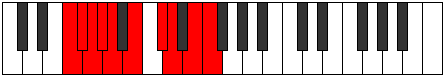 |
| [2911](https://ianring.com/musictheory/scales/2911) | [Katygic](ModeGSharpKatygic.md) | G# | G#, A, A#, B, C, D, E, F, G, G# |  |
| [2911](https://ianring.com/musictheory/scales/2911) | [Katygic](ModeAFlatKatygic.md) | Ab | Ab, A, Bb, B, C, D, E, F, G, Ab |  |
| [2915](https://ianring.com/musictheory/scales/2915) | [Aeolydian](ModeGSharpAeolydian.md) | G# | G#, A, B##, C##, D##, E#, F##, G# |  |
| [2915](https://ianring.com/musictheory/scales/2915) | [Aeolydian](ModeAFlatAeolydian.md) | Ab | Ab, Bbb, C#, D, E, F, G, Ab |  |
| [2915](https://ianring.com/musictheory/scales/2915) | [Aeolydian](ModeANaturalAeolydian.md) | A | A, Bb, C##, D#, E#, F#, G#, A | 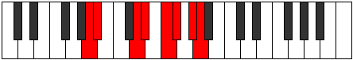 |
| [2917](https://ianring.com/musictheory/scales/2917) | [Kocrian](ModeEFlatKocrian.md) | Eb | Eb, F, G#, A, B, C, D, Eb |  |
| [2917](https://ianring.com/musictheory/scales/2917) | [Kocrian](ModeCNaturalKocrian.md) | C | C, D, E#, F#, G#, A, B, C |  |
| [2917](https://ianring.com/musictheory/scales/2917) | [Kocrian](ModeANaturalKocrian.md) | A | A, B, C##, D#, E#, F#, G#, A |  |
| [2919](https://ianring.com/musictheory/scales/2919) | [Molyllic](ModeGSharpMolyllic.md) | G# | G#, A, A#, C#, D, E, F, G, G# |  |
| [2919](https://ianring.com/musictheory/scales/2919) | [Molyllic](ModeAFlatMolyllic.md) | Ab | Ab, A, Bb, Db, D, E, F, G, Ab |  |
| [2919](https://ianring.com/musictheory/scales/2919) | [Molyllic](ModeDSharpMolyllic.md) | D# | D#, E, F, G#, A, B, C, D, D# |  |
| [2919](https://ianring.com/musictheory/scales/2919) | [Molyllic](ModeEFlatMolyllic.md) | Eb | Eb, E, F, Ab, A, B, C, D, Eb |  |
| [2919](https://ianring.com/musictheory/scales/2919) | [Molyllic](ModeCNaturalMolyllic.md) | C | C, C#, D, F, F#, G#, A, B, C |  |
| [2919](https://ianring.com/musictheory/scales/2919) | [Molyllic](ModeANaturalMolyllic.md) | A | A, A#, B, D, D#, F, F#, G#, A |  |
| [2921](https://ianring.com/musictheory/scales/2921) | [Pogian](ModeANaturalPogian.md) | A | A, B#, C##, D#, E#, F#, G#, A |  |
| [2923](https://ianring.com/musictheory/scales/2923) | [Baryllic](ModeANaturalBaryllic.md) | A | A, A#, C, D, D#, F, F#, G#, A |  |
| [2923](https://ianring.com/musictheory/scales/2923) | [Baryllic](ModeGSharpBaryllic.md) | G# | G#, A, B, C#, D, E, F, G, G# |  |
| [2923](https://ianring.com/musictheory/scales/2923) | [Baryllic](ModeAFlatBaryllic.md) | Ab | Ab, A, B, Db, D, E, F, G, Ab |  |
| [2925](https://ianring.com/musictheory/scales/2925) | [MajorDiminished](ModeCNaturalMajorDiminished.md) | C | C, D, D#, F, F#, G#, A, B, C | 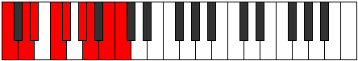 |
| [2925](https://ianring.com/musictheory/scales/2925) | [MajorDiminished](ModeDSharpMajorDiminished.md) | D# | D#, F, F#, G#, A, B, C, D, D# |  |
| [2925](https://ianring.com/musictheory/scales/2925) | [MajorDiminished](ModeEFlatMajorDiminished.md) | Eb | Eb, F, Gb, Ab, A, B, C, D, Eb |  |
| [2925](https://ianring.com/musictheory/scales/2925) | [MajorDiminished](ModeFSharpMajorDiminished.md) | F# | F#, G#, A, B, C, D, D#, F, F# |  |
| [2925](https://ianring.com/musictheory/scales/2925) | [MajorDiminished](ModeGFlatMajorDiminished.md) | Gb | Gb, Ab, A, B, C, D, Eb, F, Gb |  |
| [2925](https://ianring.com/musictheory/scales/2925) | [MajorDiminished](ModeANaturalMajorDiminished.md) | A | A, B, C, D, D#, F, F#, G#, A |  |
| [2927](https://ianring.com/musictheory/scales/2927) | [Rodygic](ModeCNaturalRodygic.md) | C | C, C#, D, D#, F, F#, G#, A, B, C |  |
| [2927](https://ianring.com/musictheory/scales/2927) | [Rodygic](ModeDSharpRodygic.md) | D# | D#, E, F, F#, G#, A, B, C, D, D# |  |
| [2927](https://ianring.com/musictheory/scales/2927) | [Rodygic](ModeEFlatRodygic.md) | Eb | Eb, E, F, Gb, Ab, A, B, C, D, Eb |  |
| [2927](https://ianring.com/musictheory/scales/2927) | [Rodygic](ModeFSharpRodygic.md) | F# | F#, G, G#, A, B, C, D, D#, F, F# |  |
| [2927](https://ianring.com/musictheory/scales/2927) | [Rodygic](ModeGFlatRodygic.md) | Gb | Gb, G, Ab, A, B, C, D, Eb, F, Gb |  |
| [2927](https://ianring.com/musictheory/scales/2927) | [Rodygic](ModeANaturalRodygic.md) | A | A, A#, B, C, D, D#, F, F#, G#, A |  |
| [2927](https://ianring.com/musictheory/scales/2927) | [Rodygic](ModeGSharpRodygic.md) | G# | G#, A, A#, B, C#, D, E, F, G, G# |  |
| [2927](https://ianring.com/musictheory/scales/2927) | [Rodygic](ModeAFlatRodygic.md) | Ab | Ab, A, Bb, B, Db, D, E, F, G, Ab |  |
| [2929](https://ianring.com/musictheory/scales/2929) | [Aeolathian](ModeANaturalAeolathian.md) | A | A, B##, C##, D#, E#, F#, G#, A |  |
| [2931](https://ianring.com/musictheory/scales/2931) | [Zathyllic](ModeGSharpZathyllic.md) | G# | G#, A, C, C#, D, E, F, G, G# |  |
| [2931](https://ianring.com/musictheory/scales/2931) | [Zathyllic](ModeAFlatZathyllic.md) | Ab | Ab, A, C, Db, D, E, F, G, Ab |  |
| [2931](https://ianring.com/musictheory/scales/2931) | [Zathyllic](ModeANaturalZathyllic.md) | A | A, A#, C#, D, D#, F, F#, G#, A |  |
| [2933](https://ianring.com/musictheory/scales/2933) | [Dalyllic](ModeANaturalDalyllic.md) | A | A, B, C#, D, D#, F, F#, G#, A |  |
| [2933](https://ianring.com/musictheory/scales/2933) | [Dalyllic](ModeCNaturalDalyllic.md) | C | C, D, E, F, F#, G#, A, B, C |  |
| [2933](https://ianring.com/musictheory/scales/2933) | [Dalyllic](ModeDSharpDalyllic.md) | D# | D#, F, G, G#, A, B, C, D, D# |  |
| [2933](https://ianring.com/musictheory/scales/2933) | [Dalyllic](ModeEFlatDalyllic.md) | Eb | Eb, F, G, Ab, A, B, C, D, Eb |  |
| [2935](https://ianring.com/musictheory/scales/2935) | [Modygic](ModeGSharpModygic.md) | G# | G#, A, A#, C, C#, D, E, F, G, G# |  |
| [2935](https://ianring.com/musictheory/scales/2935) | [Modygic](ModeAFlatModygic.md) | Ab | Ab, A, Bb, C, Db, D, E, F, G, Ab |  |
| [2935](https://ianring.com/musictheory/scales/2935) | [Modygic](ModeCNaturalModygic.md) | C | C, C#, D, E, F, F#, G#, A, B, C | 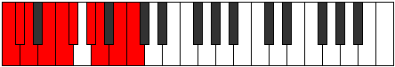 |
| [2935](https://ianring.com/musictheory/scales/2935) | [Modygic](ModeDSharpModygic.md) | D# | D#, E, F, G, G#, A, B, C, D, D# |  |
| [2935](https://ianring.com/musictheory/scales/2935) | [Modygic](ModeEFlatModygic.md) | Eb | Eb, E, F, G, Ab, A, B, C, D, Eb |  |
| [2935](https://ianring.com/musictheory/scales/2935) | [Modygic](ModeANaturalModygic.md) | A | A, A#, B, C#, D, D#, F, F#, G#, A |  |
| [2937](https://ianring.com/musictheory/scales/2937) | [Aeolathyllic](ModeANaturalAeolathyllic.md) | A | A, C, C#, D, D#, F, F#, G#, A |  |
| [2937](https://ianring.com/musictheory/scales/2937) | [Aeolathyllic](ModeFNaturalAeolathyllic.md) | F | F, G#, A, A#, B, C#, D, E, F |  |
| [2939](https://ianring.com/musictheory/scales/2939) | [Goptygic](ModeANaturalGoptygic.md) | A | A, A#, C, C#, D, D#, F, F#, G#, A |  |
| [2939](https://ianring.com/musictheory/scales/2939) | [Goptygic](ModeGSharpGoptygic.md) | G# | G#, A, B, C, C#, D, E, F, G, G# |  |
| [2939](https://ianring.com/musictheory/scales/2939) | [Goptygic](ModeAFlatGoptygic.md) | Ab | Ab, A, B, C, Db, D, E, F, G, Ab |  |
| [2939](https://ianring.com/musictheory/scales/2939) | [Goptygic](ModeFNaturalGoptygic.md) | F | F, F#, G#, A, A#, B, C#, D, E, F |  |
| [2941](https://ianring.com/musictheory/scales/2941) | [Laptygic](ModeANaturalLaptygic.md) | A | A, B, C, C#, D, D#, F, F#, G#, A |  |
| [2941](https://ianring.com/musictheory/scales/2941) | [Laptygic](ModeCNaturalLaptygic.md) | C | C, D, D#, E, F, F#, G#, A, B, C |  |
| [2941](https://ianring.com/musictheory/scales/2941) | [Laptygic](ModeDSharpLaptygic.md) | D# | D#, F, F#, G, G#, A, B, C, D, D# |  |
| [2941](https://ianring.com/musictheory/scales/2941) | [Laptygic](ModeEFlatLaptygic.md) | Eb | Eb, F, Gb, G, Ab, A, B, C, D, Eb |  |
| [2941](https://ianring.com/musictheory/scales/2941) | [Laptygic](ModeFSharpLaptygic.md) | F# | F#, G#, A, A#, B, C, D, D#, F, F# |  |
| [2941](https://ianring.com/musictheory/scales/2941) | [Laptygic](ModeGFlatLaptygic.md) | Gb | Gb, Ab, A, Bb, B, C, D, Eb, F, Gb |  |
| [2941](https://ianring.com/musictheory/scales/2941) | [Laptygic](ModeFNaturalLaptygic.md) | F | F, G, G#, A, A#, B, C#, D, E, F |  |
| [2943](https://ianring.com/musictheory/scales/2943) | [Dathyllian](ModeCNaturalDathyllian.md) | C | C, C#, D, D#, E, F, F#, G#, A, B, C |  |
| [2943](https://ianring.com/musictheory/scales/2943) | [Dathyllian](ModeDSharpDathyllian.md) | D# | D#, E, F, F#, G, G#, A, B, C, D, D# |  |
| [2943](https://ianring.com/musictheory/scales/2943) | [Dathyllian](ModeEFlatDathyllian.md) | Eb | Eb, E, F, Gb, G, Ab, A, B, C, D, Eb |  |
| [2943](https://ianring.com/musictheory/scales/2943) | [Dathyllian](ModeANaturalDathyllian.md) | A | A, A#, B, C, C#, D, D#, F, F#, G#, A |  |
| [2943](https://ianring.com/musictheory/scales/2943) | [Dathyllian](ModeGSharpDathyllian.md) | G# | G#, A, A#, B, C, C#, D, E, F, G, G# |  |
| [2943](https://ianring.com/musictheory/scales/2943) | [Dathyllian](ModeAFlatDathyllian.md) | Ab | Ab, A, Bb, B, C, Db, D, E, F, G, Ab |  |
| [2943](https://ianring.com/musictheory/scales/2943) | [Dathyllian](ModeFSharpDathyllian.md) | F# | F#, G, G#, A, A#, B, C, D, D#, F, F# |  |
| [2943](https://ianring.com/musictheory/scales/2943) | [Dathyllian](ModeGFlatDathyllian.md) | Gb | Gb, G, Ab, A, Bb, B, C, D, Eb, F, Gb |  |
| [2943](https://ianring.com/musictheory/scales/2943) | [Dathyllian](ModeFNaturalDathyllian.md) | F | F, F#, G, G#, A, A#, B, C#, D, E, F |  |
| [2957](https://ianring.com/musictheory/scales/2957) | [Thygian](ModeFSharpThygian.md) | F# | F#, G#, A, B##, C##, D#, E#, F# |  |
| [2957](https://ianring.com/musictheory/scales/2957) | [Thygian](ModeGFlatThygian.md) | Gb | Gb, Ab, Bbb, C#, D, Eb, F, Gb |  |
| [2959](https://ianring.com/musictheory/scales/2959) | [Dygyllic](ModeFSharpDygyllic.md) | F# | F#, G, G#, A, C#, D, D#, F, F# |  |
| [2959](https://ianring.com/musictheory/scales/2959) | [Dygyllic](ModeGFlatDygyllic.md) | Gb | Gb, G, Ab, A, Db, D, Eb, F, Gb |  |
| [2963](https://ianring.com/musictheory/scales/2963) | [Bygian](ModeCSharpBygian.md) | C# | C#, D, E#, F###, G##, A#, B#, C# |  |
| [2963](https://ianring.com/musictheory/scales/2963) | [Bygian](ModeDFlatBygian.md) | Db | Db, Ebb, F, G#, A, Bb, C, Db |  |
| [2967](https://ianring.com/musictheory/scales/2967) | [Madyllic](ModeCSharpMadyllic.md) | C# | C#, D, D#, F, G#, A, A#, C, C# |  |
| [2967](https://ianring.com/musictheory/scales/2967) | [Madyllic](ModeDFlatMadyllic.md) | Db | Db, D, Eb, F, Ab, A, Bb, C, Db |  |
| [2969](https://ianring.com/musictheory/scales/2969) | [Tholian](ModeFNaturalTholian.md) | F | F, G#, A, B#, C#, D, E, F |  |
| [2971](https://ianring.com/musictheory/scales/2971) | [Aeolynyllic](ModeFNaturalAeolynyllic.md) | F | F, F#, G#, A, C, C#, D, E, F |  |
| [2971](https://ianring.com/musictheory/scales/2971) | [Aeolynyllic](ModeCSharpAeolynyllic.md) | C# | C#, D, E, F, G#, A, A#, C, C# |  |
| [2971](https://ianring.com/musictheory/scales/2971) | [Aeolynyllic](ModeDFlatAeolynyllic.md) | Db | Db, D, E, F, Ab, A, Bb, C, Db |  |
| [2973](https://ianring.com/musictheory/scales/2973) | [Panyllic](ModeFNaturalPanyllic.md) | F | F, G, G#, A, C, C#, D, E, F |  |
| [2973](https://ianring.com/musictheory/scales/2973) | [Panyllic](ModeFSharpPanyllic.md) | F# | F#, G#, A, A#, C#, D, D#, F, F# |  |
| [2973](https://ianring.com/musictheory/scales/2973) | [Panyllic](ModeGFlatPanyllic.md) | Gb | Gb, Ab, A, Bb, Db, D, Eb, F, Gb |  |
| [2975](https://ianring.com/musictheory/scales/2975) | [Gaptygic](ModeFNaturalGaptygic.md) | F | F, F#, G, G#, A, C, C#, D, E, F |  |
| [2975](https://ianring.com/musictheory/scales/2975) | [Gaptygic](ModeCSharpGaptygic.md) | C# | C#, D, D#, E, F, G#, A, A#, C, C# |  |
| [2975](https://ianring.com/musictheory/scales/2975) | [Gaptygic](ModeDFlatGaptygic.md) | Db | Db, D, Eb, E, F, Ab, A, Bb, C, Db |  |
| [2975](https://ianring.com/musictheory/scales/2975) | [Gaptygic](ModeFSharpGaptygic.md) | F# | F#, G, G#, A, A#, C#, D, D#, F, F# |  |
| [2975](https://ianring.com/musictheory/scales/2975) | [Gaptygic](ModeGFlatGaptygic.md) | Gb | Gb, G, Ab, A, Bb, Db, D, Eb, F, Gb |  |
| [2979](https://ianring.com/musictheory/scales/2979) | [Gyptian](ModeANaturalGyptian.md) | A | A, Bb, C##, D##, E#, F#, G#, A |  |
| [2981](https://ianring.com/musictheory/scales/2981) | [Ionolian](ModeANaturalIonolian.md) | A | A, B, C##, D##, E#, F#, G#, A |  |
| [2981](https://ianring.com/musictheory/scales/2981) | [Ionolian](ModeCNaturalIonolian.md) | C | C, D, E#, F##, G#, A, B, C |  |
| [2983](https://ianring.com/musictheory/scales/2983) | [Zythyllic](ModeCNaturalZythyllic.md) | C | C, C#, D, F, G, G#, A, B, C |  |
| [2983](https://ianring.com/musictheory/scales/2983) | [Zythyllic](ModeANaturalZythyllic.md) | A | A, A#, B, D, E, F, F#, G#, A |  |
| [2985](https://ianring.com/musictheory/scales/2985) | [Epacrian](ModeANaturalEpacrian.md) | A | A, B#, C##, D##, E#, F#, G#, A |  |
| [2987](https://ianring.com/musictheory/scales/2987) | [Thanyllic](ModeANaturalThanyllic.md) | A | A, A#, C, D, E, F, F#, G#, A |  |
| [2989](https://ianring.com/musictheory/scales/2989) | [Ionacryllic](ModeFSharpIonacryllic.md) | F# | F#, G#, A, B, C#, D, D#, F, F# |  |
| [2989](https://ianring.com/musictheory/scales/2989) | [Ionacryllic](ModeGFlatIonacryllic.md) | Gb | Gb, Ab, A, B, Db, D, Eb, F, Gb |  |
| [2989](https://ianring.com/musictheory/scales/2989) | [Ionacryllic](ModeANaturalIonacryllic.md) | A | A, B, C, D, E, F, F#, G#, A |  |
| [2989](https://ianring.com/musictheory/scales/2989) | [Ionacryllic](ModeCNaturalIonacryllic.md) | C | C, D, D#, F, G, G#, A, B, C |  |
| [2991](https://ianring.com/musictheory/scales/2991) | [Zanygic](ModeCNaturalZanygic.md) | C | C, C#, D, D#, F, G, G#, A, B, C |  |
| [2991](https://ianring.com/musictheory/scales/2991) | [Zanygic](ModeFSharpZanygic.md) | F# | F#, G, G#, A, B, C#, D, D#, F, F# |  |
| [2991](https://ianring.com/musictheory/scales/2991) | [Zanygic](ModeGFlatZanygic.md) | Gb | Gb, G, Ab, A, B, Db, D, Eb, F, Gb |  |
| [2991](https://ianring.com/musictheory/scales/2991) | [Zanygic](ModeANaturalZanygic.md) | A | A, A#, B, C, D, E, F, F#, G#, A |  |
| [2993](https://ianring.com/musictheory/scales/2993) | [Stythian](ModeANaturalStythian.md) | A | A, B##, C##, D##, E#, F#, G#, A |  |
| [2995](https://ianring.com/musictheory/scales/2995) | [Sanyllic](ModeCSharpSanyllic.md) | C# | C#, D, F, F#, G#, A, A#, C, C# |  |
| [2995](https://ianring.com/musictheory/scales/2995) | [Sanyllic](ModeDFlatSanyllic.md) | Db | Db, D, F, Gb, Ab, A, Bb, C, Db |  |
| [2995](https://ianring.com/musictheory/scales/2995) | [Sanyllic](ModeANaturalSanyllic.md) | A | A, A#, C#, D, E, F, F#, G#, A |  |
| [2997](https://ianring.com/musictheory/scales/2997) | [Ionoptyllic](ModeANaturalIonoptyllic.md) | A | A, B, C#, D, E, F, F#, G#, A |  |
| [2997](https://ianring.com/musictheory/scales/2997) | [Ionoptyllic](ModeCNaturalIonoptyllic.md) | C | C, D, E, F, G, G#, A, B, C |  |
| [2999](https://ianring.com/musictheory/scales/2999) | [Zyrygic](ModeCSharpZyrygic.md) | C# | C#, D, D#, F, F#, G#, A, A#, C, C# |  |
| [2999](https://ianring.com/musictheory/scales/2999) | [Zyrygic](ModeDFlatZyrygic.md) | Db | Db, D, Eb, F, Gb, Ab, A, Bb, C, Db | 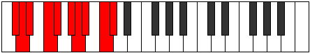 |
| [2999](https://ianring.com/musictheory/scales/2999) | [Zyrygic](ModeCNaturalZyrygic.md) | C | C, C#, D, E, F, G, G#, A, B, C |  |
| [2999](https://ianring.com/musictheory/scales/2999) | [Zyrygic](ModeANaturalZyrygic.md) | A | A, A#, B, C#, D, E, F, F#, G#, A |  |
| [3001](https://ianring.com/musictheory/scales/3001) | [Lonyllic](ModeANaturalLonyllic.md) | A | A, C, C#, D, E, F, F#, G#, A |  |
| [3001](https://ianring.com/musictheory/scales/3001) | [Lonyllic](ModeFNaturalLonyllic.md) | F | F, G#, A, A#, C, C#, D, E, F |  |
| [3003](https://ianring.com/musictheory/scales/3003) | [Zydygic](ModeCSharpZydygic.md) | C# | C#, D, E, F, F#, G#, A, A#, C, C# |  |
| [3003](https://ianring.com/musictheory/scales/3003) | [Zydygic](ModeDFlatZydygic.md) | Db | Db, D, E, F, Gb, Ab, A, Bb, C, Db |  |
| [3003](https://ianring.com/musictheory/scales/3003) | [Zydygic](ModeFNaturalZydygic.md) | F | F, F#, G#, A, A#, C, C#, D, E, F |  |
| [3003](https://ianring.com/musictheory/scales/3003) | [Zydygic](ModeANaturalZydygic.md) | A | A, A#, C, C#, D, E, F, F#, G#, A |  |
| [3005](https://ianring.com/musictheory/scales/3005) | [Gycrygic](ModeFNaturalGycrygic.md) | F | F, G, G#, A, A#, C, C#, D, E, F |  |
| [3005](https://ianring.com/musictheory/scales/3005) | [Gycrygic](ModeANaturalGycrygic.md) | A | A, B, C, C#, D, E, F, F#, G#, A |  |
| [3005](https://ianring.com/musictheory/scales/3005) | [Gycrygic](ModeCNaturalGycrygic.md) | C | C, D, D#, E, F, G, G#, A, B, C |  |
| [3005](https://ianring.com/musictheory/scales/3005) | [Gycrygic](ModeFSharpGycrygic.md) | F# | F#, G#, A, A#, B, C#, D, D#, F, F# |  |
| [3005](https://ianring.com/musictheory/scales/3005) | [Gycrygic](ModeGFlatGycrygic.md) | Gb | Gb, Ab, A, Bb, B, Db, D, Eb, F, Gb |  |
| [3007](https://ianring.com/musictheory/scales/3007) | [Zyryllian](ModeCSharpZyryllian.md) | C# | C#, D, D#, E, F, F#, G#, A, A#, C, C# |  |
| [3007](https://ianring.com/musictheory/scales/3007) | [Zyryllian](ModeDFlatZyryllian.md) | Db | Db, D, Eb, E, F, Gb, Ab, A, Bb, C, Db |  |
| [3007](https://ianring.com/musictheory/scales/3007) | [Zyryllian](ModeFNaturalZyryllian.md) | F | F, F#, G, G#, A, A#, C, C#, D, E, F |  |
| [3007](https://ianring.com/musictheory/scales/3007) | [Zyryllian](ModeCNaturalZyryllian.md) | C | C, C#, D, D#, E, F, G, G#, A, B, C |  |
| [3007](https://ianring.com/musictheory/scales/3007) | [Zyryllian](ModeANaturalZyryllian.md) | A | A, A#, B, C, C#, D, E, F, F#, G#, A |  |
| [3007](https://ianring.com/musictheory/scales/3007) | [Zyryllian](ModeFSharpZyryllian.md) | F# | F#, G, G#, A, A#, B, C#, D, D#, F, F# |  |
| [3007](https://ianring.com/musictheory/scales/3007) | [Zyryllian](ModeGFlatZyryllian.md) | Gb | Gb, G, Ab, A, Bb, B, Db, D, Eb, F, Gb |  |
| [3015](https://ianring.com/musictheory/scales/3015) | [Laptyllic](ModeGSharpLaptyllic.md) | G# | G#, A, A#, D, D#, E, F, G, G# |  |
| [3015](https://ianring.com/musictheory/scales/3015) | [Laptyllic](ModeAFlatLaptyllic.md) | Ab | Ab, A, Bb, D, Eb, E, F, G, Ab |  |
| [3017](https://ianring.com/musictheory/scales/3017) | [Gacrian](ModeDNaturalGacrian.md) | D | D, E#, F###, G##, A#, B, C#, D |  |
| [3019](https://ianring.com/musictheory/scales/3019) | [Mydyllic](ModeGSharpMydyllic.md) | G# | G#, A, B, D, D#, E, F, G, G# |  |
| [3019](https://ianring.com/musictheory/scales/3019) | [Mydyllic](ModeAFlatMydyllic.md) | Ab | Ab, A, B, D, Eb, E, F, G, Ab |  |
| [3019](https://ianring.com/musictheory/scales/3019) | [Mydyllic](ModeDNaturalMydyllic.md) | D | D, D#, F, G#, A, A#, B, C#, D |  |
| [3021](https://ianring.com/musictheory/scales/3021) | [Gyptyllic](ModeFSharpGyptyllic.md) | F# | F#, G#, A, C, C#, D, D#, F, F# |  |
| [3021](https://ianring.com/musictheory/scales/3021) | [Gyptyllic](ModeGFlatGyptyllic.md) | Gb | Gb, Ab, A, C, Db, D, Eb, F, Gb |  |
| [3021](https://ianring.com/musictheory/scales/3021) | [Gyptyllic](ModeDNaturalGyptyllic.md) | D | D, E, F, G#, A, A#, B, C#, D |  |
| [3023](https://ianring.com/musictheory/scales/3023) | [Aeracrygic](ModeFSharpAeracrygic.md) | F# | F#, G, G#, A, C, C#, D, D#, F, F# |  |
| [3023](https://ianring.com/musictheory/scales/3023) | [Aeracrygic](ModeGFlatAeracrygic.md) | Gb | Gb, G, Ab, A, C, Db, D, Eb, F, Gb |  |
| [3023](https://ianring.com/musictheory/scales/3023) | [Aeracrygic](ModeDNaturalAeracrygic.md) | D | D, D#, E, F, G#, A, A#, B, C#, D |  |
| [3023](https://ianring.com/musictheory/scales/3023) | [Aeracrygic](ModeGSharpAeracrygic.md) | G# | G#, A, A#, B, D, D#, E, F, G, G# |  |
| [3023](https://ianring.com/musictheory/scales/3023) | [Aeracrygic](ModeAFlatAeracrygic.md) | Ab | Ab, A, Bb, B, D, Eb, E, F, G, Ab |  |
| [3027](https://ianring.com/musictheory/scales/3027) | [Rythyllic](ModeGSharpRythyllic.md) | G# | G#, A, C, D, D#, E, F, G, G# |  |
| [3027](https://ianring.com/musictheory/scales/3027) | [Rythyllic](ModeAFlatRythyllic.md) | Ab | Ab, A, C, D, Eb, E, F, G, Ab |  |
| [3027](https://ianring.com/musictheory/scales/3027) | [Rythyllic](ModeCSharpRythyllic.md) | C# | C#, D, F, G, G#, A, A#, C, C# |  |
| [3027](https://ianring.com/musictheory/scales/3027) | [Rythyllic](ModeDFlatRythyllic.md) | Db | Db, D, F, G, Ab, A, Bb, C, Db |  |
| [3031](https://ianring.com/musictheory/scales/3031) | [Epithygic](ModeCSharpEpithygic.md) | C# | C#, D, D#, F, G, G#, A, A#, C, C# |  |
| [3031](https://ianring.com/musictheory/scales/3031) | [Epithygic](ModeDFlatEpithygic.md) | Db | Db, D, Eb, F, G, Ab, A, Bb, C, Db |  |
| [3031](https://ianring.com/musictheory/scales/3031) | [Epithygic](ModeGSharpEpithygic.md) | G# | G#, A, A#, C, D, D#, E, F, G, G# |  |
| [3031](https://ianring.com/musictheory/scales/3031) | [Epithygic](ModeAFlatEpithygic.md) | Ab | Ab, A, Bb, C, D, Eb, E, F, G, Ab |  |
| [3033](https://ianring.com/musictheory/scales/3033) | [Doptyllic](ModeFNaturalDoptyllic.md) | F | F, G#, A, B, C, C#, D, E, F |  |
| [3033](https://ianring.com/musictheory/scales/3033) | [Doptyllic](ModeDNaturalDoptyllic.md) | D | D, F, F#, G#, A, A#, B, C#, D |  |
| [3035](https://ianring.com/musictheory/scales/3035) | [Gocrygic](ModeCSharpGocrygic.md) | C# | C#, D, E, F, G, G#, A, A#, C, C# |  |
| [3035](https://ianring.com/musictheory/scales/3035) | [Gocrygic](ModeDFlatGocrygic.md) | Db | Db, D, E, F, G, Ab, A, Bb, C, Db |  |
| [3035](https://ianring.com/musictheory/scales/3035) | [Gocrygic](ModeFNaturalGocrygic.md) | F | F, F#, G#, A, B, C, C#, D, E, F |  |
| [3035](https://ianring.com/musictheory/scales/3035) | [Gocrygic](ModeGSharpGocrygic.md) | G# | G#, A, B, C, D, D#, E, F, G, G# |  |
| [3035](https://ianring.com/musictheory/scales/3035) | [Gocrygic](ModeAFlatGocrygic.md) | Ab | Ab, A, B, C, D, Eb, E, F, G, Ab |  |
| [3035](https://ianring.com/musictheory/scales/3035) | [Gocrygic](ModeDNaturalGocrygic.md) | D | D, D#, F, F#, G#, A, A#, B, C#, D |  |
| [3037](https://ianring.com/musictheory/scales/3037) | [Staptygic](ModeFSharpStaptygic.md) | F# | F#, G#, A, A#, C, C#, D, D#, F, F# |  |
| [3037](https://ianring.com/musictheory/scales/3037) | [Staptygic](ModeGFlatStaptygic.md) | Gb | Gb, Ab, A, Bb, C, Db, D, Eb, F, Gb | 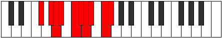 |
| [3037](https://ianring.com/musictheory/scales/3037) | [Staptygic](ModeFNaturalStaptygic.md) | F | F, G, G#, A, B, C, C#, D, E, F |  |
| [3037](https://ianring.com/musictheory/scales/3037) | [Staptygic](ModeDNaturalStaptygic.md) | D | D, E, F, F#, G#, A, A#, B, C#, D |  |
| [3039](https://ianring.com/musictheory/scales/3039) | [Godyllian](ModeCSharpGodyllian.md) | C# | C#, D, D#, E, F, G, G#, A, A#, C, C# |  |
| [3039](https://ianring.com/musictheory/scales/3039) | [Godyllian](ModeDFlatGodyllian.md) | Db | Db, D, Eb, E, F, G, Ab, A, Bb, C, Db |  |
| [3039](https://ianring.com/musictheory/scales/3039) | [Godyllian](ModeFSharpGodyllian.md) | F# | F#, G, G#, A, A#, C, C#, D, D#, F, F# |  |
| [3039](https://ianring.com/musictheory/scales/3039) | [Godyllian](ModeGFlatGodyllian.md) | Gb | Gb, G, Ab, A, Bb, C, Db, D, Eb, F, Gb |  |
| [3039](https://ianring.com/musictheory/scales/3039) | [Godyllian](ModeFNaturalGodyllian.md) | F | F, F#, G, G#, A, B, C, C#, D, E, F |  |
| [3039](https://ianring.com/musictheory/scales/3039) | [Godyllian](ModeDNaturalGodyllian.md) | D | D, D#, E, F, F#, G#, A, A#, B, C#, D |  |
| [3039](https://ianring.com/musictheory/scales/3039) | [Godyllian](ModeGSharpGodyllian.md) | G# | G#, A, A#, B, C, D, D#, E, F, G, G# |  |
| [3039](https://ianring.com/musictheory/scales/3039) | [Godyllian](ModeAFlatGodyllian.md) | Ab | Ab, A, Bb, B, C, D, Eb, E, F, G, Ab |  |
| [3043](https://ianring.com/musictheory/scales/3043) | [Ionayllic](ModeGSharpIonayllic.md) | G# | G#, A, C#, D, D#, E, F, G, G# |  |
| [3043](https://ianring.com/musictheory/scales/3043) | [Ionayllic](ModeAFlatIonayllic.md) | Ab | Ab, A, Db, D, Eb, E, F, G, Ab |  |
| [3043](https://ianring.com/musictheory/scales/3043) | [Ionayllic](ModeANaturalIonayllic.md) | A | A, A#, D, D#, E, F, F#, G#, A |  |
| [3045](https://ianring.com/musictheory/scales/3045) | [Raptyllic](ModeANaturalRaptyllic.md) | A | A, B, D, D#, E, F, F#, G#, A |  |
| [3045](https://ianring.com/musictheory/scales/3045) | [Raptyllic](ModeCNaturalRaptyllic.md) | C | C, D, F, F#, G, G#, A, B, C |  |
| [3045](https://ianring.com/musictheory/scales/3045) | [Raptyllic](ModeDSharpRaptyllic.md) | D# | D#, F, G#, A, A#, B, C, D, D# |  |
| [3045](https://ianring.com/musictheory/scales/3045) | [Raptyllic](ModeEFlatRaptyllic.md) | Eb | Eb, F, Ab, A, Bb, B, C, D, Eb |  |
| [3047](https://ianring.com/musictheory/scales/3047) | [Panygic](ModeGSharpPanygic.md) | G# | G#, A, A#, C#, D, D#, E, F, G, G# |  |
| [3047](https://ianring.com/musictheory/scales/3047) | [Panygic](ModeAFlatPanygic.md) | Ab | Ab, A, Bb, Db, D, Eb, E, F, G, Ab |  |
| [3047](https://ianring.com/musictheory/scales/3047) | [Panygic](ModeCNaturalPanygic.md) | C | C, C#, D, F, F#, G, G#, A, B, C |  |
| [3047](https://ianring.com/musictheory/scales/3047) | [Panygic](ModeDSharpPanygic.md) | D# | D#, E, F, G#, A, A#, B, C, D, D# |  |
| [3047](https://ianring.com/musictheory/scales/3047) | [Panygic](ModeEFlatPanygic.md) | Eb | Eb, E, F, Ab, A, Bb, B, C, D, Eb |  |
| [3047](https://ianring.com/musictheory/scales/3047) | [Panygic](ModeANaturalPanygic.md) | A | A, A#, B, D, D#, E, F, F#, G#, A | 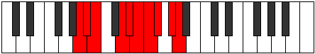 |
| [3049](https://ianring.com/musictheory/scales/3049) | [Aeronyllic](ModeANaturalAeronyllic.md) | A | A, C, D, D#, E, F, F#, G#, A |  |
| [3049](https://ianring.com/musictheory/scales/3049) | [Aeronyllic](ModeDNaturalAeronyllic.md) | D | D, F, G, G#, A, A#, B, C#, D |  |
| [3051](https://ianring.com/musictheory/scales/3051) | [Stalygic](ModeANaturalStalygic.md) | A | A, A#, C, D, D#, E, F, F#, G#, A |  |
| [3051](https://ianring.com/musictheory/scales/3051) | [Stalygic](ModeGSharpStalygic.md) | G# | G#, A, B, C#, D, D#, E, F, G, G# |  |
| [3051](https://ianring.com/musictheory/scales/3051) | [Stalygic](ModeAFlatStalygic.md) | Ab | Ab, A, B, Db, D, Eb, E, F, G, Ab |  |
| [3051](https://ianring.com/musictheory/scales/3051) | [Stalygic](ModeDNaturalStalygic.md) | D | D, D#, F, G, G#, A, A#, B, C#, D |  |
| [3053](https://ianring.com/musictheory/scales/3053) | [Zycrygic](ModeFSharpZycrygic.md) | F# | F#, G#, A, B, C, C#, D, D#, F, F# |  |
| [3053](https://ianring.com/musictheory/scales/3053) | [Zycrygic](ModeGFlatZycrygic.md) | Gb | Gb, Ab, A, B, C, Db, D, Eb, F, Gb |  |
| [3053](https://ianring.com/musictheory/scales/3053) | [Zycrygic](ModeANaturalZycrygic.md) | A | A, B, C, D, D#, E, F, F#, G#, A |  |
| [3053](https://ianring.com/musictheory/scales/3053) | [Zycrygic](ModeCNaturalZycrygic.md) | C | C, D, D#, F, F#, G, G#, A, B, C |  |
| [3053](https://ianring.com/musictheory/scales/3053) | [Zycrygic](ModeDSharpZycrygic.md) | D# | D#, F, F#, G#, A, A#, B, C, D, D# |  |
| [3053](https://ianring.com/musictheory/scales/3053) | [Zycrygic](ModeEFlatZycrygic.md) | Eb | Eb, F, Gb, Ab, A, Bb, B, C, D, Eb |  |
| [3053](https://ianring.com/musictheory/scales/3053) | [Zycrygic](ModeDNaturalZycrygic.md) | D | D, E, F, G, G#, A, A#, B, C#, D |  |
| [3055](https://ianring.com/musictheory/scales/3055) | [Lyryllian](ModeCNaturalLyryllian.md) | C | C, C#, D, D#, F, F#, G, G#, A, B, C |  |
| [3055](https://ianring.com/musictheory/scales/3055) | [Lyryllian](ModeFSharpLyryllian.md) | F# | F#, G, G#, A, B, C, C#, D, D#, F, F# |  |
| [3055](https://ianring.com/musictheory/scales/3055) | [Lyryllian](ModeGFlatLyryllian.md) | Gb | Gb, G, Ab, A, B, C, Db, D, Eb, F, Gb |  |
| [3055](https://ianring.com/musictheory/scales/3055) | [Lyryllian](ModeDSharpLyryllian.md) | D# | D#, E, F, F#, G#, A, A#, B, C, D, D# |  |
| [3055](https://ianring.com/musictheory/scales/3055) | [Lyryllian](ModeEFlatLyryllian.md) | Eb | Eb, E, F, Gb, Ab, A, Bb, B, C, D, Eb |  |
| [3055](https://ianring.com/musictheory/scales/3055) | [Lyryllian](ModeANaturalLyryllian.md) | A | A, A#, B, C, D, D#, E, F, F#, G#, A |  |
| [3055](https://ianring.com/musictheory/scales/3055) | [Lyryllian](ModeDNaturalLyryllian.md) | D | D, D#, E, F, G, G#, A, A#, B, C#, D |  |
| [3055](https://ianring.com/musictheory/scales/3055) | [Lyryllian](ModeGSharpLyryllian.md) | G# | G#, A, A#, B, C#, D, D#, E, F, G, G# |  |
| [3055](https://ianring.com/musictheory/scales/3055) | [Lyryllian](ModeAFlatLyryllian.md) | Ab | Ab, A, Bb, B, Db, D, Eb, E, F, G, Ab |  |
| [3057](https://ianring.com/musictheory/scales/3057) | [Phroryllic](ModeANaturalPhroryllic.md) | A | A, C#, D, D#, E, F, F#, G#, A |  |
| [3059](https://ianring.com/musictheory/scales/3059) | [Madygic](ModeGSharpMadygic.md) | G# | G#, A, C, C#, D, D#, E, F, G, G# |  |
| [3059](https://ianring.com/musictheory/scales/3059) | [Madygic](ModeAFlatMadygic.md) | Ab | Ab, A, C, Db, D, Eb, E, F, G, Ab |  |
| [3059](https://ianring.com/musictheory/scales/3059) | [Madygic](ModeANaturalMadygic.md) | A | A, A#, C#, D, D#, E, F, F#, G#, A |  |
| [3059](https://ianring.com/musictheory/scales/3059) | [Madygic](ModeCSharpMadygic.md) | C# | C#, D, F, F#, G, G#, A, A#, C, C# |  |
| [3059](https://ianring.com/musictheory/scales/3059) | [Madygic](ModeDFlatMadygic.md) | Db | Db, D, F, Gb, G, Ab, A, Bb, C, Db |  |
| [3061](https://ianring.com/musictheory/scales/3061) | [Apinygic](ModeANaturalApinygic.md) | A | A, B, C#, D, D#, E, F, F#, G#, A |  |
| [3061](https://ianring.com/musictheory/scales/3061) | [Apinygic](ModeCNaturalApinygic.md) | C | C, D, E, F, F#, G, G#, A, B, C |  |
| [3061](https://ianring.com/musictheory/scales/3061) | [Apinygic](ModeDSharpApinygic.md) | D# | D#, F, G, G#, A, A#, B, C, D, D# |  |
| [3061](https://ianring.com/musictheory/scales/3061) | [Apinygic](ModeEFlatApinygic.md) | Eb | Eb, F, G, Ab, A, Bb, B, C, D, Eb |  |
| [3063](https://ianring.com/musictheory/scales/3063) | [Solyllian](ModeGSharpSolyllian.md) | G# | G#, A, A#, C, C#, D, D#, E, F, G, G# |  |
| [3063](https://ianring.com/musictheory/scales/3063) | [Solyllian](ModeAFlatSolyllian.md) | Ab | Ab, A, Bb, C, Db, D, Eb, E, F, G, Ab |  |
| [3063](https://ianring.com/musictheory/scales/3063) | [Solyllian](ModeCSharpSolyllian.md) | C# | C#, D, D#, F, F#, G, G#, A, A#, C, C# |  |
| [3063](https://ianring.com/musictheory/scales/3063) | [Solyllian](ModeDFlatSolyllian.md) | Db | Db, D, Eb, F, Gb, G, Ab, A, Bb, C, Db |  |
| [3063](https://ianring.com/musictheory/scales/3063) | [Solyllian](ModeCNaturalSolyllian.md) | C | C, C#, D, E, F, F#, G, G#, A, B, C |  |
| [3063](https://ianring.com/musictheory/scales/3063) | [Solyllian](ModeANaturalSolyllian.md) | A | A, A#, B, C#, D, D#, E, F, F#, G#, A |  |
| [3063](https://ianring.com/musictheory/scales/3063) | [Solyllian](ModeDSharpSolyllian.md) | D# | D#, E, F, G, G#, A, A#, B, C, D, D# |  |
| [3063](https://ianring.com/musictheory/scales/3063) | [Solyllian](ModeEFlatSolyllian.md) | Eb | Eb, E, F, G, Ab, A, Bb, B, C, D, Eb |  |
| [3065](https://ianring.com/musictheory/scales/3065) | [Zothygic](ModeANaturalZothygic.md) | A | A, C, C#, D, D#, E, F, F#, G#, A |  |
| [3065](https://ianring.com/musictheory/scales/3065) | [Zothygic](ModeFNaturalZothygic.md) | F | F, G#, A, A#, B, C, C#, D, E, F |  |
| [3065](https://ianring.com/musictheory/scales/3065) | [Zothygic](ModeDNaturalZothygic.md) | D | D, F, F#, G, G#, A, A#, B, C#, D |  |
| [3067](https://ianring.com/musictheory/scales/3067) | [Goptyllian](ModeANaturalGoptyllian.md) | A | A, A#, C, C#, D, D#, E, F, F#, G#, A |  |
| [3067](https://ianring.com/musictheory/scales/3067) | [Goptyllian](ModeCSharpGoptyllian.md) | C# | C#, D, E, F, F#, G, G#, A, A#, C, C# |  |
| [3067](https://ianring.com/musictheory/scales/3067) | [Goptyllian](ModeDFlatGoptyllian.md) | Db | Db, D, E, F, Gb, G, Ab, A, Bb, C, Db |  |
| [3067](https://ianring.com/musictheory/scales/3067) | [Goptyllian](ModeGSharpGoptyllian.md) | G# | G#, A, B, C, C#, D, D#, E, F, G, G# |  |
| [3067](https://ianring.com/musictheory/scales/3067) | [Goptyllian](ModeAFlatGoptyllian.md) | Ab | Ab, A, B, C, Db, D, Eb, E, F, G, Ab |  |
| [3067](https://ianring.com/musictheory/scales/3067) | [Goptyllian](ModeFNaturalGoptyllian.md) | F | F, F#, G#, A, A#, B, C, C#, D, E, F |  |
| [3067](https://ianring.com/musictheory/scales/3067) | [Goptyllian](ModeDNaturalGoptyllian.md) | D | D, D#, F, F#, G, G#, A, A#, B, C#, D |  |
| [3069](https://ianring.com/musictheory/scales/3069) | [Bacryllian](ModeANaturalBacryllian.md) | A | A, B, C, C#, D, D#, E, F, F#, G#, A |  |
| [3069](https://ianring.com/musictheory/scales/3069) | [Bacryllian](ModeCNaturalBacryllian.md) | C | C, D, D#, E, F, F#, G, G#, A, B, C |  |
| [3069](https://ianring.com/musictheory/scales/3069) | [Bacryllian](ModeFSharpBacryllian.md) | F# | F#, G#, A, A#, B, C, C#, D, D#, F, F# |  |
| [3069](https://ianring.com/musictheory/scales/3069) | [Bacryllian](ModeGFlatBacryllian.md) | Gb | Gb, Ab, A, Bb, B, C, Db, D, Eb, F, Gb |  |
| [3069](https://ianring.com/musictheory/scales/3069) | [Bacryllian](ModeFNaturalBacryllian.md) | F | F, G, G#, A, A#, B, C, C#, D, E, F |  |
| [3069](https://ianring.com/musictheory/scales/3069) | [Bacryllian](ModeDSharpBacryllian.md) | D# | D#, F, F#, G, G#, A, A#, B, C, D, D# |  |
| [3069](https://ianring.com/musictheory/scales/3069) | [Bacryllian](ModeEFlatBacryllian.md) | Eb | Eb, F, Gb, G, Ab, A, Bb, B, C, D, Eb |  |
| [3069](https://ianring.com/musictheory/scales/3069) | [Bacryllian](ModeDNaturalBacryllian.md) | D | D, E, F, F#, G, G#, A, A#, B, C#, D |  |
| [3071](https://ianring.com/musictheory/scales/3071) | [Solatic](ModeCSharpSolatic.md) | C# | C#, D, D#, E, F, F#, G, G#, A, A#, C, C# |  |
| [3071](https://ianring.com/musictheory/scales/3071) | [Solatic](ModeDFlatSolatic.md) | Db | Db, D, Eb, E, F, Gb, G, Ab, A, Bb, C, Db |  |
| [3071](https://ianring.com/musictheory/scales/3071) | [Solatic](ModeCNaturalSolatic.md) | C | C, C#, D, D#, E, F, F#, G, G#, A, B, C |  |
| [3071](https://ianring.com/musictheory/scales/3071) | [Solatic](ModeANaturalSolatic.md) | A | A, A#, B, C, C#, D, D#, E, F, F#, G#, A |  |
| [3071](https://ianring.com/musictheory/scales/3071) | [Solatic](ModeGSharpSolatic.md) | G# | G#, A, A#, B, C, C#, D, D#, E, F, G, G# |  |
| [3071](https://ianring.com/musictheory/scales/3071) | [Solatic](ModeAFlatSolatic.md) | Ab | Ab, A, Bb, B, C, Db, D, Eb, E, F, G, Ab |  |
| [3071](https://ianring.com/musictheory/scales/3071) | [Solatic](ModeFSharpSolatic.md) | F# | F#, G, G#, A, A#, B, C, C#, D, D#, F, F# | 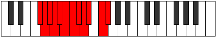 |
| [3071](https://ianring.com/musictheory/scales/3071) | [Solatic](ModeGFlatSolatic.md) | Gb | Gb, G, Ab, A, Bb, B, C, Db, D, Eb, F, Gb |  |
| [3071](https://ianring.com/musictheory/scales/3071) | [Solatic](ModeFNaturalSolatic.md) | F | F, F#, G, G#, A, A#, B, C, C#, D, E, F |  |
| [3071](https://ianring.com/musictheory/scales/3071) | [Solatic](ModeDSharpSolatic.md) | D# | D#, E, F, F#, G, G#, A, A#, B, C, D, D# |  |
| [3071](https://ianring.com/musictheory/scales/3071) | [Solatic](ModeEFlatSolatic.md) | Eb | Eb, E, F, Gb, G, Ab, A, Bb, B, C, D, Eb |  |
| [3071](https://ianring.com/musictheory/scales/3071) | [Solatic](ModeDNaturalSolatic.md) | D | D, D#, E, F, F#, G, G#, A, A#, B, C#, D |  |
| [3173](https://ianring.com/musictheory/scales/3173) | [Zarimic](ModeEFlatZarimic.md) | Eb | Eb, F, G#, A, B##, C##, Eb |  |
| [3175](https://ianring.com/musictheory/scales/3175) | [Eponian](ModeDSharpEponian.md) | D# | D#, E, F, G#, A, B##, C##, D# |  |
| [3175](https://ianring.com/musictheory/scales/3175) | [Eponian](ModeEFlatEponian.md) | Eb | Eb, Fb, Gbb, Ab, Bbb, C#, D, Eb |  |
| [3181](https://ianring.com/musictheory/scales/3181) | [Rolian](ModeDSharpRolian.md) | D# | D#, E#, F#, G#, A, B##, C##, D# |  |
| [3181](https://ianring.com/musictheory/scales/3181) | [Rolian](ModeEFlatRolian.md) | Eb | Eb, F, Gb, Ab, Bbb, C#, D, Eb |  |
| [3183](https://ianring.com/musictheory/scales/3183) | [Mixonyllic](ModeDSharpMixonyllic.md) | D# | D#, E, F, F#, G#, A, C#, D, D# | 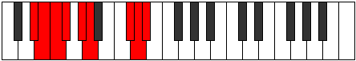 |
| [3183](https://ianring.com/musictheory/scales/3183) | [Mixonyllic](ModeEFlatMixonyllic.md) | Eb | Eb, E, F, Gb, Ab, A, Db, D, Eb |  |
| [3187](https://ianring.com/musictheory/scales/3187) | [Koptian](ModeENaturalKoptian.md) | E | E, F, G#, A, Bb, C##, D#, E |  |
| [3189](https://ianring.com/musictheory/scales/3189) | [Aeolonian](ModeDSharpAeolonian.md) | D# | D#, E#, F##, G#, A, B##, C##, D# |  |
| [3189](https://ianring.com/musictheory/scales/3189) | [Aeolonian](ModeEFlatAeolonian.md) | Eb | Eb, F, G, Ab, Bbb, C#, D, Eb |  |
| [3191](https://ianring.com/musictheory/scales/3191) | [Bynyllic](ModeDSharpBynyllic.md) | D# | D#, E, F, G, G#, A, C#, D, D# |  |
| [3191](https://ianring.com/musictheory/scales/3191) | [Bynyllic](ModeEFlatBynyllic.md) | Eb | Eb, E, F, G, Ab, A, Db, D, Eb |  |
| [3191](https://ianring.com/musictheory/scales/3191) | [Bynyllic](ModeENaturalBynyllic.md) | E | E, F, F#, G#, A, A#, D, D#, E |  |
| [3195](https://ianring.com/musictheory/scales/3195) | [Raryllic](ModeENaturalRaryllic.md) | E | E, F, G, G#, A, A#, D, D#, E |  |
| [3197](https://ianring.com/musictheory/scales/3197) | [Gylyllic](ModeDSharpGylyllic.md) | D# | D#, F, F#, G, G#, A, C#, D, D# |  |
| [3197](https://ianring.com/musictheory/scales/3197) | [Gylyllic](ModeEFlatGylyllic.md) | Eb | Eb, F, Gb, G, Ab, A, Db, D, Eb |  |
| [3199](https://ianring.com/musictheory/scales/3199) | [Thaptygic](ModeDSharpThaptygic.md) | D# | D#, E, F, F#, G, G#, A, C#, D, D# |  |
| [3199](https://ianring.com/musictheory/scales/3199) | [Thaptygic](ModeEFlatThaptygic.md) | Eb | Eb, E, F, Gb, G, Ab, A, Db, D, Eb |  |
| [3199](https://ianring.com/musictheory/scales/3199) | [Thaptygic](ModeENaturalThaptygic.md) | E | E, F, F#, G, G#, A, A#, D, D#, E |  |
| [3215](https://ianring.com/musictheory/scales/3215) | [Katydian](ModeGNaturalKatydian.md) | G | G, Ab, Bbb, Cbb, D, E#, F#, G |  |
| [3217](https://ianring.com/musictheory/scales/3217) | [Molitonic](ModeASharpMolitonic.md) | A# | A#, D, F, G#, A, A# |  |
| [3217](https://ianring.com/musictheory/scales/3217) | [Molitonic](ModeBFlatMolitonic.md) | Bb | Bb, D, F, Ab, A, Bb |  |
| [3219](https://ianring.com/musictheory/scales/3219) | [Ionaphimic](ModeBFlatIonaphimic.md) | Bb | Bb, Cb, D, E#, F###, G##, Bb |  |
| [3221](https://ianring.com/musictheory/scales/3221) | [Bycrimic](ModeBFlatBycrimic.md) | Bb | Bb, C, D, E#, F###, G##, Bb |  |
| [3223](https://ianring.com/musictheory/scales/3223) | [Thyphian](ModeGNaturalThyphian.md) | G | G, Ab, Bbb, Cb, D, E#, F#, G |  |
| [3223](https://ianring.com/musictheory/scales/3223) | [Thyphian](ModeASharpThyphian.md) | A# | A#, B, C, D, E#, F###, G##, A# |  |
| [3223](https://ianring.com/musictheory/scales/3223) | [Thyphian](ModeBFlatThyphian.md) | Bb | Bb, Cb, Dbb, Ebb, F, G#, A, Bb |  |
| [3225](https://ianring.com/musictheory/scales/3225) | [Ionalimic](ModeBFlatIonalimic.md) | Bb | Bb, C#, D, E#, F###, G##, Bb |  |
| [3227](https://ianring.com/musictheory/scales/3227) | [Aeolocrian](ModeASharpAeolocrian.md) | A# | A#, B, C#, D, E#, F###, G##, A# |  |
| [3227](https://ianring.com/musictheory/scales/3227) | [Aeolocrian](ModeBFlatAeolocrian.md) | Bb | Bb, Cb, Db, Ebb, F, G#, A, Bb |  |
| [3229](https://ianring.com/musictheory/scales/3229) | [Aeolaptian](ModeASharpAeolaptian.md) | A# | A#, B#, C#, D, E#, F###, G##, A# |  |
| [3229](https://ianring.com/musictheory/scales/3229) | [Aeolaptian](ModeBFlatAeolaptian.md) | Bb | Bb, C, Db, Ebb, F, G#, A, Bb |  |
| [3231](https://ianring.com/musictheory/scales/3231) | [Kataptyllic](ModeASharpKataptyllic.md) | A# | A#, B, C, C#, D, F, G#, A, A# |  |
| [3231](https://ianring.com/musictheory/scales/3231) | [Kataptyllic](ModeBFlatKataptyllic.md) | Bb | Bb, B, C, Db, D, F, Ab, A, Bb |  |
| [3231](https://ianring.com/musictheory/scales/3231) | [Kataptyllic](ModeGNaturalKataptyllic.md) | G | G, G#, A, A#, B, D, F, F#, G | 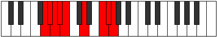 |
| [3239](https://ianring.com/musictheory/scales/3239) | [Epythian](ModeGNaturalEpythian.md) | G | G, Ab, Bbb, C, D, E#, F#, G |  |
| [3247](https://ianring.com/musictheory/scales/3247) | [Aeolonyllic](ModeGNaturalAeolonyllic.md) | G | G, G#, A, A#, C, D, F, F#, G |  |
| [3251](https://ianring.com/musictheory/scales/3251) | [Zodian](ModeENaturalZodian.md) | E | E, F, G#, A, B, C##, D#, E |  |
| [3251](https://ianring.com/musictheory/scales/3251) | [Zodian](ModeBFlatZodian.md) | Bb | Bb, Cb, D, Eb, F, G#, A, Bb |  |
| [3253](https://ianring.com/musictheory/scales/3253) | [Gonian](ModeBFlatGonian.md) | Bb | Bb, C, D, Eb, F, G#, A, Bb |  |
| [3255](https://ianring.com/musictheory/scales/3255) | [Daryllic](ModeENaturalDaryllic.md) | E | E, F, F#, G#, A, B, D, D#, E |  |
| [3255](https://ianring.com/musictheory/scales/3255) | [Daryllic](ModeGNaturalDaryllic.md) | G | G, G#, A, B, C, D, F, F#, G |  |
| [3255](https://ianring.com/musictheory/scales/3255) | [Daryllic](ModeASharpDaryllic.md) | A# | A#, B, C, D, D#, F, G#, A, A# |  |
| [3255](https://ianring.com/musictheory/scales/3255) | [Daryllic](ModeBFlatDaryllic.md) | Bb | Bb, B, C, D, Eb, F, Ab, A, Bb |  |
| [3257](https://ianring.com/musictheory/scales/3257) | [Ionacrian](ModeBFlatIonacrian.md) | Bb | Bb, C#, D, Eb, F, G#, A, Bb |  |
| [3259](https://ianring.com/musictheory/scales/3259) | [Loptyllic](ModeENaturalLoptyllic.md) | E | E, F, G, G#, A, B, D, D#, E |  |
| [3259](https://ianring.com/musictheory/scales/3259) | [Loptyllic](ModeASharpLoptyllic.md) | A# | A#, B, C#, D, D#, F, G#, A, A# |  |
| [3259](https://ianring.com/musictheory/scales/3259) | [Loptyllic](ModeBFlatLoptyllic.md) | Bb | Bb, B, Db, D, Eb, F, Ab, A, Bb |  |
| [3261](https://ianring.com/musictheory/scales/3261) | [Dodyllic](ModeASharpDodyllic.md) | A# | A#, C, C#, D, D#, F, G#, A, A# |  |
| [3261](https://ianring.com/musictheory/scales/3261) | [Dodyllic](ModeBFlatDodyllic.md) | Bb | Bb, C, Db, D, Eb, F, Ab, A, Bb |  |
| [3263](https://ianring.com/musictheory/scales/3263) | [Pyrygic](ModeENaturalPyrygic.md) | E | E, F, F#, G, G#, A, B, D, D#, E |  |
| [3263](https://ianring.com/musictheory/scales/3263) | [Pyrygic](ModeASharpPyrygic.md) | A# | A#, B, C, C#, D, D#, F, G#, A, A# |  |
| [3263](https://ianring.com/musictheory/scales/3263) | [Pyrygic](ModeBFlatPyrygic.md) | Bb | Bb, B, C, Db, D, Eb, F, Ab, A, Bb |  |
| [3263](https://ianring.com/musictheory/scales/3263) | [Pyrygic](ModeGNaturalPyrygic.md) | G | G, G#, A, A#, B, C, D, F, F#, G |  |
| [3271](https://ianring.com/musictheory/scales/3271) | [Kolian](ModeGNaturalKolian.md) | G | G, Ab, Bbb, C#, D, E#, F#, G |  |
| [3273](https://ianring.com/musictheory/scales/3273) | [Ionodimic](ModeDNaturalIonodimic.md) | D | D, E#, F###, G##, A###, B##, D |  |
| [3275](https://ianring.com/musictheory/scales/3275) | [Katadian](ModeDNaturalKatadian.md) | D | D, Eb, F, G#, A, B#, C#, D |  |
| [3277](https://ianring.com/musictheory/scales/3277) | [Zycrian](ModeDNaturalZycrian.md) | D | D, E, F, G#, A, B#, C#, D |  |
| [3279](https://ianring.com/musictheory/scales/3279) | [Pythyllic](ModeDNaturalPythyllic.md) | D | D, D#, E, F, G#, A, C, C#, D |  |
| [3279](https://ianring.com/musictheory/scales/3279) | [Pythyllic](ModeGNaturalPythyllic.md) | G | G, G#, A, A#, C#, D, F, F#, G |  |
| [3283](https://ianring.com/musictheory/scales/3283) | [Lyrian](ModeBFlatLyrian.md) | Bb | Bb, Cb, D, E, F, G#, A, Bb |  |
| [3285](https://ianring.com/musictheory/scales/3285) | [Zagian](ModeBFlatZagian.md) | Bb | Bb, C, D, E, F, G#, A, Bb |  |
| [3287](https://ianring.com/musictheory/scales/3287) | [Phrathyllic](ModeGNaturalPhrathyllic.md) | G | G, G#, A, B, C#, D, F, F#, G |  |
| [3287](https://ianring.com/musictheory/scales/3287) | [Phrathyllic](ModeASharpPhrathyllic.md) | A# | A#, B, C, D, E, F, G#, A, A# | 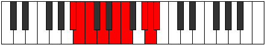 |
| [3287](https://ianring.com/musictheory/scales/3287) | [Phrathyllic](ModeBFlatPhrathyllic.md) | Bb | Bb, B, C, D, E, F, Ab, A, Bb |  |
| [3289](https://ianring.com/musictheory/scales/3289) | [Loptian](ModeDNaturalLoptian.md) | D | D, E#, F#, G#, A, B#, C#, D |  |
| [3289](https://ianring.com/musictheory/scales/3289) | [Loptian](ModeBFlatLoptian.md) | Bb | Bb, C#, D, E, F, G#, A, Bb |  |
| [3291](https://ianring.com/musictheory/scales/3291) | [Kodyllic](ModeDNaturalKodyllic.md) | D | D, D#, F, F#, G#, A, C, C#, D |  |
| [3291](https://ianring.com/musictheory/scales/3291) | [Kodyllic](ModeASharpKodyllic.md) | A# | A#, B, C#, D, E, F, G#, A, A# |  |
| [3291](https://ianring.com/musictheory/scales/3291) | [Kodyllic](ModeBFlatKodyllic.md) | Bb | Bb, B, Db, D, E, F, Ab, A, Bb |  |
| [3293](https://ianring.com/musictheory/scales/3293) | [Saryllic](ModeDNaturalSaryllic.md) | D | D, E, F, F#, G#, A, C, C#, D |  |
| [3293](https://ianring.com/musictheory/scales/3293) | [Saryllic](ModeASharpSaryllic.md) | A# | A#, C, C#, D, E, F, G#, A, A# |  |
| [3293](https://ianring.com/musictheory/scales/3293) | [Saryllic](ModeBFlatSaryllic.md) | Bb | Bb, C, Db, D, E, F, Ab, A, Bb |  |
| [3295](https://ianring.com/musictheory/scales/3295) | [Phroptygic](ModeDNaturalPhroptygic.md) | D | D, D#, E, F, F#, G#, A, C, C#, D |  |
| [3295](https://ianring.com/musictheory/scales/3295) | [Phroptygic](ModeASharpPhroptygic.md) | A# | A#, B, C, C#, D, E, F, G#, A, A# |  |
| [3295](https://ianring.com/musictheory/scales/3295) | [Phroptygic](ModeBFlatPhroptygic.md) | Bb | Bb, B, C, Db, D, E, F, Ab, A, Bb |  |
| [3295](https://ianring.com/musictheory/scales/3295) | [Phroptygic](ModeGNaturalPhroptygic.md) | G | G, G#, A, A#, B, C#, D, F, F#, G |  |
| [3301](https://ianring.com/musictheory/scales/3301) | [Phrynian](ModeEFlatPhrynian.md) | Eb | Eb, F, G#, A, Bb, C#, D, Eb |  |
| [3303](https://ianring.com/musictheory/scales/3303) | [Soptyllic](ModeGNaturalSoptyllic.md) | G | G, G#, A, C, C#, D, F, F#, G |  |
| [3303](https://ianring.com/musictheory/scales/3303) | [Soptyllic](ModeDSharpSoptyllic.md) | D# | D#, E, F, G#, A, A#, C#, D, D# |  |
| [3303](https://ianring.com/musictheory/scales/3303) | [Soptyllic](ModeEFlatSoptyllic.md) | Eb | Eb, E, F, Ab, A, Bb, Db, D, Eb |  |
| [3305](https://ianring.com/musictheory/scales/3305) | [Epathian](ModeDNaturalEpathian.md) | D | D, E#, F##, G#, A, B#, C#, D |  |
| [3307](https://ianring.com/musictheory/scales/3307) | [Boptyllic](ModeDNaturalBoptyllic.md) | D | D, D#, F, G, G#, A, C, C#, D |  |
| [3309](https://ianring.com/musictheory/scales/3309) | [Bycryllic](ModeDNaturalBycryllic.md) | D | D, E, F, G, G#, A, C, C#, D |  |
| [3309](https://ianring.com/musictheory/scales/3309) | [Bycryllic](ModeDSharpBycryllic.md) | D# | D#, F, F#, G#, A, A#, C#, D, D# |  |
| [3309](https://ianring.com/musictheory/scales/3309) | [Bycryllic](ModeEFlatBycryllic.md) | Eb | Eb, F, Gb, Ab, A, Bb, Db, D, Eb |  |
| [3311](https://ianring.com/musictheory/scales/3311) | [Mixodygic](ModeDNaturalMixodygic.md) | D | D, D#, E, F, G, G#, A, C, C#, D |  |
| [3311](https://ianring.com/musictheory/scales/3311) | [Mixodygic](ModeDSharpMixodygic.md) | D# | D#, E, F, F#, G#, A, A#, C#, D, D# |  |
| [3311](https://ianring.com/musictheory/scales/3311) | [Mixodygic](ModeEFlatMixodygic.md) | Eb | Eb, E, F, Gb, Ab, A, Bb, Db, D, Eb |  |
| [3311](https://ianring.com/musictheory/scales/3311) | [Mixodygic](ModeGNaturalMixodygic.md) | G | G, G#, A, A#, C, C#, D, F, F#, G |  |
| [3313](https://ianring.com/musictheory/scales/3313) | [Aeolacrian](ModeBFlatAeolacrian.md) | Bb | Bb, C##, D#, E, F, G#, A, Bb |  |
| [3315](https://ianring.com/musictheory/scales/3315) | [Aeralyllic](ModeENaturalAeralyllic.md) | E | E, F, G#, A, A#, B, D, D#, E |  |
| [3315](https://ianring.com/musictheory/scales/3315) | [Aeralyllic](ModeASharpAeralyllic.md) | A# | A#, B, D, D#, E, F, G#, A, A# |  |
| [3315](https://ianring.com/musictheory/scales/3315) | [Aeralyllic](ModeBFlatAeralyllic.md) | Bb | Bb, B, D, Eb, E, F, Ab, A, Bb |  |
| [3317](https://ianring.com/musictheory/scales/3317) | [Lanyllic](ModeASharpLanyllic.md) | A# | A#, C, D, D#, E, F, G#, A, A# | 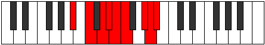 |
| [3317](https://ianring.com/musictheory/scales/3317) | [Lanyllic](ModeBFlatLanyllic.md) | Bb | Bb, C, D, Eb, E, F, Ab, A, Bb |  |
| [3317](https://ianring.com/musictheory/scales/3317) | [Lanyllic](ModeDSharpLanyllic.md) | D# | D#, F, G, G#, A, A#, C#, D, D# |  |
| [3317](https://ianring.com/musictheory/scales/3317) | [Lanyllic](ModeEFlatLanyllic.md) | Eb | Eb, F, G, Ab, A, Bb, Db, D, Eb |  |
| [3319](https://ianring.com/musictheory/scales/3319) | [Tholygic](ModeDSharpTholygic.md) | D# | D#, E, F, G, G#, A, A#, C#, D, D# |  |
| [3319](https://ianring.com/musictheory/scales/3319) | [Tholygic](ModeEFlatTholygic.md) | Eb | Eb, E, F, G, Ab, A, Bb, Db, D, Eb |  |
| [3319](https://ianring.com/musictheory/scales/3319) | [Tholygic](ModeGNaturalTholygic.md) | G | G, G#, A, B, C, C#, D, F, F#, G |  |
| [3319](https://ianring.com/musictheory/scales/3319) | [Tholygic](ModeASharpTholygic.md) | A# | A#, B, C, D, D#, E, F, G#, A, A# |  |
| [3319](https://ianring.com/musictheory/scales/3319) | [Tholygic](ModeBFlatTholygic.md) | Bb | Bb, B, C, D, Eb, E, F, Ab, A, Bb |  |
| [3319](https://ianring.com/musictheory/scales/3319) | [Tholygic](ModeENaturalTholygic.md) | E | E, F, F#, G#, A, A#, B, D, D#, E |  |
| [3321](https://ianring.com/musictheory/scales/3321) | [Ionycryllic](ModeDNaturalIonycryllic.md) | D | D, F, F#, G, G#, A, C, C#, D |  |
| [3321](https://ianring.com/musictheory/scales/3321) | [Ionycryllic](ModeASharpIonycryllic.md) | A# | A#, C#, D, D#, E, F, G#, A, A# |  |
| [3321](https://ianring.com/musictheory/scales/3321) | [Ionycryllic](ModeBFlatIonycryllic.md) | Bb | Bb, Db, D, Eb, E, F, Ab, A, Bb |  |
| [3323](https://ianring.com/musictheory/scales/3323) | [Phrygygic](ModeDNaturalPhrygygic.md) | D | D, D#, F, F#, G, G#, A, C, C#, D |  |
| [3323](https://ianring.com/musictheory/scales/3323) | [Phrygygic](ModeASharpPhrygygic.md) | A# | A#, B, C#, D, D#, E, F, G#, A, A# |  |
| [3323](https://ianring.com/musictheory/scales/3323) | [Phrygygic](ModeBFlatPhrygygic.md) | Bb | Bb, B, Db, D, Eb, E, F, Ab, A, Bb |  |
| [3323](https://ianring.com/musictheory/scales/3323) | [Phrygygic](ModeENaturalPhrygygic.md) | E | E, F, G, G#, A, A#, B, D, D#, E |  |
| [3325](https://ianring.com/musictheory/scales/3325) | [Epygic](ModeDNaturalEpygic.md) | D | D, E, F, F#, G, G#, A, C, C#, D |  |
| [3325](https://ianring.com/musictheory/scales/3325) | [Epygic](ModeASharpEpygic.md) | A# | A#, C, C#, D, D#, E, F, G#, A, A# |  |
| [3325](https://ianring.com/musictheory/scales/3325) | [Epygic](ModeBFlatEpygic.md) | Bb | Bb, C, Db, D, Eb, E, F, Ab, A, Bb |  |
| [3325](https://ianring.com/musictheory/scales/3325) | [Epygic](ModeDSharpEpygic.md) | D# | D#, F, F#, G, G#, A, A#, C#, D, D# |  |
| [3325](https://ianring.com/musictheory/scales/3325) | [Epygic](ModeEFlatEpygic.md) | Eb | Eb, F, Gb, G, Ab, A, Bb, Db, D, Eb |  |
| [3327](https://ianring.com/musictheory/scales/3327) | [Madyllian](ModeDNaturalMadyllian.md) | D | D, D#, E, F, F#, G, G#, A, C, C#, D |  |
| [3327](https://ianring.com/musictheory/scales/3327) | [Madyllian](ModeDSharpMadyllian.md) | D# | D#, E, F, F#, G, G#, A, A#, C#, D, D# |  |
| [3327](https://ianring.com/musictheory/scales/3327) | [Madyllian](ModeEFlatMadyllian.md) | Eb | Eb, E, F, Gb, G, Ab, A, Bb, Db, D, Eb |  |
| [3327](https://ianring.com/musictheory/scales/3327) | [Madyllian](ModeASharpMadyllian.md) | A# | A#, B, C, C#, D, D#, E, F, G#, A, A# |  |
| [3327](https://ianring.com/musictheory/scales/3327) | [Madyllian](ModeBFlatMadyllian.md) | Bb | Bb, B, C, Db, D, Eb, E, F, Ab, A, Bb |  |
| [3327](https://ianring.com/musictheory/scales/3327) | [Madyllian](ModeGNaturalMadyllian.md) | G | G, G#, A, A#, B, C, C#, D, F, F#, G |  |
| [3327](https://ianring.com/musictheory/scales/3327) | [Madyllian](ModeENaturalMadyllian.md) | E | E, F, F#, G, G#, A, A#, B, D, D#, E |  |
| [3357](https://ianring.com/musictheory/scales/3357) | [Phrodian](ModeFSharpPhrodian.md) | F# | F#, G#, A, Bb, C##, D##, E#, F# |  |
| [3357](https://ianring.com/musictheory/scales/3357) | [Phrodian](ModeGFlatPhrodian.md) | Gb | Gb, Ab, Bbb, Cbb, D, E, F, Gb |  |
| [3359](https://ianring.com/musictheory/scales/3359) | [Bonyllic](ModeFSharpBonyllic.md) | F# | F#, G, G#, A, A#, D, E, F, F# |  |
| [3359](https://ianring.com/musictheory/scales/3359) | [Bonyllic](ModeGFlatBonyllic.md) | Gb | Gb, G, Ab, A, Bb, D, E, F, Gb |  |
| [3363](https://ianring.com/musictheory/scales/3363) | [Rogimic](ModeANaturalRogimic.md) | A | A, Bb, C##, D###, E###, F###, A |  |
| [3365](https://ianring.com/musictheory/scales/3365) | [Katolimic](ModeANaturalKatolimic.md) | A | A, B, C##, D###, E###, F###, A |  |
| [3367](https://ianring.com/musictheory/scales/3367) | [Moptian](ModeANaturalMoptian.md) | A | A, Bb, Cb, D, E#, F##, G#, A |  |
| [3369](https://ianring.com/musictheory/scales/3369) | [Mixolimic](ModeANaturalMixolimic.md) | A | A, B#, C##, D###, E###, F###, A |  |
| [3371](https://ianring.com/musictheory/scales/3371) | [Aeolylian](ModeANaturalAeolylian.md) | A | A, Bb, C, D, E#, F##, G#, A |  |
| [3373](https://ianring.com/musictheory/scales/3373) | [Lodian](ModeFSharpLodian.md) | F# | F#, G#, A, B, C##, D##, E#, F# |  |
| [3373](https://ianring.com/musictheory/scales/3373) | [Lodian](ModeGFlatLodian.md) | Gb | Gb, Ab, Bbb, Cb, D, E, F, Gb |  |
| [3373](https://ianring.com/musictheory/scales/3373) | [Lodian](ModeANaturalLodian.md) | A | A, B, C, D, E#, F##, G#, A |  |
| [3375](https://ianring.com/musictheory/scales/3375) | [Kygyllic](ModeFSharpKygyllic.md) | F# | F#, G, G#, A, B, D, E, F, F# |  |
| [3375](https://ianring.com/musictheory/scales/3375) | [Kygyllic](ModeGFlatKygyllic.md) | Gb | Gb, G, Ab, A, B, D, E, F, Gb |  |
| [3375](https://ianring.com/musictheory/scales/3375) | [Kygyllic](ModeANaturalKygyllic.md) | A | A, A#, B, C, D, F, G, G#, A |  |
| [3377](https://ianring.com/musictheory/scales/3377) | [Phralimic](ModeANaturalPhralimic.md) | A | A, B##, C##, D###, E###, F###, A |  |
| [3379](https://ianring.com/musictheory/scales/3379) | [Sothian](ModeENaturalSothian.md) | E | E, F, G#, A, B#, C##, D#, E |  |
| [3379](https://ianring.com/musictheory/scales/3379) | [Sothian](ModeANaturalSothian.md) | A | A, Bb, C#, D, E#, F##, G#, A |  |
| [3381](https://ianring.com/musictheory/scales/3381) | [Katanian](ModeANaturalKatanian.md) | A | A, B, C#, D, E#, F##, G#, A |  |
| [3383](https://ianring.com/musictheory/scales/3383) | [Daptyllic](ModeENaturalDaptyllic.md) | E | E, F, F#, G#, A, C, D, D#, E |  |
| [3383](https://ianring.com/musictheory/scales/3383) | [Daptyllic](ModeANaturalDaptyllic.md) | A | A, A#, B, C#, D, F, G, G#, A |  |
| [3385](https://ianring.com/musictheory/scales/3385) | [Rothian](ModeANaturalRothian.md) | A | A, B#, C#, D, E#, F##, G#, A |  |
| [3387](https://ianring.com/musictheory/scales/3387) | [Aeryptyllic](ModeENaturalAeryptyllic.md) | E | E, F, G, G#, A, C, D, D#, E |  |
| [3387](https://ianring.com/musictheory/scales/3387) | [Aeryptyllic](ModeANaturalAeryptyllic.md) | A | A, A#, C, C#, D, F, G, G#, A |  |
| [3389](https://ianring.com/musictheory/scales/3389) | [Socryllic](ModeANaturalSocryllic.md) | A | A, B, C, C#, D, F, G, G#, A |  |
| [3389](https://ianring.com/musictheory/scales/3389) | [Socryllic](ModeFSharpSocryllic.md) | F# | F#, G#, A, A#, B, D, E, F, F# |  |
| [3389](https://ianring.com/musictheory/scales/3389) | [Socryllic](ModeGFlatSocryllic.md) | Gb | Gb, Ab, A, Bb, B, D, E, F, Gb |  |
| [3391](https://ianring.com/musictheory/scales/3391) | [Aeolynygic](ModeENaturalAeolynygic.md) | E | E, F, F#, G, G#, A, C, D, D#, E |  |
| [3391](https://ianring.com/musictheory/scales/3391) | [Aeolynygic](ModeANaturalAeolynygic.md) | A | A, A#, B, C, C#, D, F, G, G#, A |  |
| [3391](https://ianring.com/musictheory/scales/3391) | [Aeolynygic](ModeFSharpAeolynygic.md) | F# | F#, G, G#, A, A#, B, D, E, F, F# |  |
| [3391](https://ianring.com/musictheory/scales/3391) | [Aeolynygic](ModeGFlatAeolynygic.md) | Gb | Gb, G, Ab, A, Bb, B, D, E, F, Gb |  |
| [3405](https://ianring.com/musictheory/scales/3405) | [Stynian](ModeFSharpStynian.md) | F# | F#, G#, A, B#, C##, D##, E#, F# |  |
| [3405](https://ianring.com/musictheory/scales/3405) | [Stynian](ModeGFlatStynian.md) | Gb | Gb, Ab, Bbb, C, D, E, F, Gb |  |
| [3407](https://ianring.com/musictheory/scales/3407) | [Katocryllic](ModeFSharpKatocryllic.md) | F# | F#, G, G#, A, C, D, E, F, F# |  |
| [3407](https://ianring.com/musictheory/scales/3407) | [Katocryllic](ModeGFlatKatocryllic.md) | Gb | Gb, G, Ab, A, C, D, E, F, Gb |  |
| [3421](https://ianring.com/musictheory/scales/3421) | [Aerothyllic](ModeFSharpAerothyllic.md) | F# | F#, G#, A, A#, C, D, E, F, F# |  |
| [3421](https://ianring.com/musictheory/scales/3421) | [Aerothyllic](ModeGFlatAerothyllic.md) | Gb | Gb, Ab, A, Bb, C, D, E, F, Gb |  |
| [3423](https://ianring.com/musictheory/scales/3423) | [Lothygic](ModeFSharpLothygic.md) | F# | F#, G, G#, A, A#, C, D, E, F, F# |  |
| [3423](https://ianring.com/musictheory/scales/3423) | [Lothygic](ModeGFlatLothygic.md) | Gb | Gb, G, Ab, A, Bb, C, D, E, F, Gb |  |
| [3427](https://ianring.com/musictheory/scales/3427) | [Zacrian](ModeANaturalZacrian.md) | A | A, Bb, C##, D#, E#, F##, G#, A |  |
| [3429](https://ianring.com/musictheory/scales/3429) | [Marian](ModeEFlatMarian.md) | Eb | Eb, F, G#, A, B, C#, D, Eb |  |
| [3429](https://ianring.com/musictheory/scales/3429) | [Marian](ModeANaturalMarian.md) | A | A, B, C##, D#, E#, F##, G#, A |  |
| [3431](https://ianring.com/musictheory/scales/3431) | [Zyptyllic](ModeDSharpZyptyllic.md) | D# | D#, E, F, G#, A, B, C#, D, D# |  |
| [3431](https://ianring.com/musictheory/scales/3431) | [Zyptyllic](ModeEFlatZyptyllic.md) | Eb | Eb, E, F, Ab, A, B, Db, D, Eb |  |
| [3431](https://ianring.com/musictheory/scales/3431) | [Zyptyllic](ModeANaturalZyptyllic.md) | A | A, A#, B, D, D#, F, G, G#, A |  |
| [3433](https://ianring.com/musictheory/scales/3433) | [Thonian](ModeANaturalThonian.md) | A | A, B#, C##, D#, E#, F##, G#, A |  |
| [3435](https://ianring.com/musictheory/scales/3435) | [Epiphyllic](ModeANaturalEpiphyllic.md) | A | A, A#, C, D, D#, F, G, G#, A |  |
| [3437](https://ianring.com/musictheory/scales/3437) | [Gathyllic](ModeDSharpGathyllic.md) | D# | D#, F, F#, G#, A, B, C#, D, D# |  |
| [3437](https://ianring.com/musictheory/scales/3437) | [Gathyllic](ModeEFlatGathyllic.md) | Eb | Eb, F, Gb, Ab, A, B, Db, D, Eb |  |
| [3437](https://ianring.com/musictheory/scales/3437) | [Gathyllic](ModeFSharpGathyllic.md) | F# | F#, G#, A, B, C, D, E, F, F# |  |
| [3437](https://ianring.com/musictheory/scales/3437) | [Gathyllic](ModeGFlatGathyllic.md) | Gb | Gb, Ab, A, B, C, D, E, F, Gb |  |
| [3437](https://ianring.com/musictheory/scales/3437) | [Gathyllic](ModeANaturalGathyllic.md) | A | A, B, C, D, D#, F, G, G#, A |  |
| [3439](https://ianring.com/musictheory/scales/3439) | [Lythygic](ModeDSharpLythygic.md) | D# | D#, E, F, F#, G#, A, B, C#, D, D# |  |
| [3439](https://ianring.com/musictheory/scales/3439) | [Lythygic](ModeEFlatLythygic.md) | Eb | Eb, E, F, Gb, Ab, A, B, Db, D, Eb |  |
| [3439](https://ianring.com/musictheory/scales/3439) | [Lythygic](ModeFSharpLythygic.md) | F# | F#, G, G#, A, B, C, D, E, F, F# |  |
| [3439](https://ianring.com/musictheory/scales/3439) | [Lythygic](ModeGFlatLythygic.md) | Gb | Gb, G, Ab, A, B, C, D, E, F, Gb |  |
| [3439](https://ianring.com/musictheory/scales/3439) | [Lythygic](ModeANaturalLythygic.md) | A | A, A#, B, C, D, D#, F, G, G#, A |  |
| [3441](https://ianring.com/musictheory/scales/3441) | [Thacrian](ModeANaturalThacrian.md) | A | A, B##, C##, D#, E#, F##, G#, A |  |
| [3443](https://ianring.com/musictheory/scales/3443) | [Epathyllic](ModeENaturalEpathyllic.md) | E | E, F, G#, A, A#, C, D, D#, E |  |
| [3443](https://ianring.com/musictheory/scales/3443) | [Epathyllic](ModeANaturalEpathyllic.md) | A | A, A#, C#, D, D#, F, G, G#, A |  |
| [3445](https://ianring.com/musictheory/scales/3445) | [Epotyllic](ModeDSharpEpotyllic.md) | D# | D#, F, G, G#, A, B, C#, D, D# |  |
| [3445](https://ianring.com/musictheory/scales/3445) | [Epotyllic](ModeEFlatEpotyllic.md) | Eb | Eb, F, G, Ab, A, B, Db, D, Eb |  |
| [3445](https://ianring.com/musictheory/scales/3445) | [Epotyllic](ModeANaturalEpotyllic.md) | A | A, B, C#, D, D#, F, G, G#, A |  |
| [3447](https://ianring.com/musictheory/scales/3447) | [Kynygic](ModeENaturalKynygic.md) | E | E, F, F#, G#, A, A#, C, D, D#, E |  |
| [3447](https://ianring.com/musictheory/scales/3447) | [Kynygic](ModeDSharpKynygic.md) | D# | D#, E, F, G, G#, A, B, C#, D, D# |  |
| [3447](https://ianring.com/musictheory/scales/3447) | [Kynygic](ModeEFlatKynygic.md) | Eb | Eb, E, F, G, Ab, A, B, Db, D, Eb |  |
| [3447](https://ianring.com/musictheory/scales/3447) | [Kynygic](ModeANaturalKynygic.md) | A | A, A#, B, C#, D, D#, F, G, G#, A |  |
| [3449](https://ianring.com/musictheory/scales/3449) | [Bacryllic](ModeANaturalBacryllic.md) | A | A, C, C#, D, D#, F, G, G#, A |  |
| [3451](https://ianring.com/musictheory/scales/3451) | [Garygic](ModeANaturalGarygic.md) | A | A, A#, C, C#, D, D#, F, G, G#, A |  |
| [3451](https://ianring.com/musictheory/scales/3451) | [Garygic](ModeENaturalGarygic.md) | E | E, F, G, G#, A, A#, C, D, D#, E |  |
| [3453](https://ianring.com/musictheory/scales/3453) | [Katarygic](ModeANaturalKatarygic.md) | A | A, B, C, C#, D, D#, F, G, G#, A |  |
| [3453](https://ianring.com/musictheory/scales/3453) | [Katarygic](ModeDSharpKatarygic.md) | D# | D#, F, F#, G, G#, A, B, C#, D, D# |  |
| [3453](https://ianring.com/musictheory/scales/3453) | [Katarygic](ModeEFlatKatarygic.md) | Eb | Eb, F, Gb, G, Ab, A, B, Db, D, Eb |  |
| [3453](https://ianring.com/musictheory/scales/3453) | [Katarygic](ModeFSharpKatarygic.md) | F# | F#, G#, A, A#, B, C, D, E, F, F# |  |
| [3453](https://ianring.com/musictheory/scales/3453) | [Katarygic](ModeGFlatKatarygic.md) | Gb | Gb, Ab, A, Bb, B, C, D, E, F, Gb |  |
| [3455](https://ianring.com/musictheory/scales/3455) | [Ryptyllian](ModeENaturalRyptyllian.md) | E | E, F, F#, G, G#, A, A#, C, D, D#, E |  |
| [3455](https://ianring.com/musictheory/scales/3455) | [Ryptyllian](ModeDSharpRyptyllian.md) | D# | D#, E, F, F#, G, G#, A, B, C#, D, D# |  |
| [3455](https://ianring.com/musictheory/scales/3455) | [Ryptyllian](ModeEFlatRyptyllian.md) | Eb | Eb, E, F, Gb, G, Ab, A, B, Db, D, Eb |  |
| [3455](https://ianring.com/musictheory/scales/3455) | [Ryptyllian](ModeANaturalRyptyllian.md) | A | A, A#, B, C, C#, D, D#, F, G, G#, A |  |
| [3455](https://ianring.com/musictheory/scales/3455) | [Ryptyllian](ModeFSharpRyptyllian.md) | F# | F#, G, G#, A, A#, B, C, D, E, F, F# |  |
| [3455](https://ianring.com/musictheory/scales/3455) | [Ryptyllian](ModeGFlatRyptyllian.md) | Gb | Gb, G, Ab, A, Bb, B, C, D, E, F, Gb |  |
| [3469](https://ianring.com/musictheory/scales/3469) | [Monian](ModeFSharpMonian.md) | F# | F#, G#, A, B##, C##, D##, E#, F# |  |
| [3469](https://ianring.com/musictheory/scales/3469) | [Monian](ModeGFlatMonian.md) | Gb | Gb, Ab, Bbb, C#, D, E, F, Gb |  |
| [3471](https://ianring.com/musictheory/scales/3471) | [Gyryllic](ModeFSharpGyryllic.md) | F# | F#, G, G#, A, C#, D, E, F, F# |  |
| [3471](https://ianring.com/musictheory/scales/3471) | [Gyryllic](ModeGFlatGyryllic.md) | Gb | Gb, G, Ab, A, Db, D, E, F, Gb |  |
| [3471](https://ianring.com/musictheory/scales/3471) | [Gyryllic](ModeGNaturalGyryllic.md) | G | G, G#, A, A#, D, D#, F, F#, G |  |
| [3475](https://ianring.com/musictheory/scales/3475) | [Kylian](ModeCSharpKylian.md) | C# | C#, D, E#, F###, G##, A##, B#, C# |  |
| [3475](https://ianring.com/musictheory/scales/3475) | [Kylian](ModeDFlatKylian.md) | Db | Db, Ebb, F, G#, A, B, C, Db |  |
| [3475](https://ianring.com/musictheory/scales/3475) | [Kylian](ModeBFlatKylian.md) | Bb | Bb, Cb, D, E#, F#, G#, A, Bb |  |
| [3477](https://ianring.com/musictheory/scales/3477) | [Kyptian](ModeBFlatKyptian.md) | Bb | Bb, C, D, E#, F#, G#, A, Bb |  |
| [3479](https://ianring.com/musictheory/scales/3479) | [Rothyllic](ModeCSharpRothyllic.md) | C# | C#, D, D#, F, G#, A, B, C, C# |  |
| [3479](https://ianring.com/musictheory/scales/3479) | [Rothyllic](ModeDFlatRothyllic.md) | Db | Db, D, Eb, F, Ab, A, B, C, Db |  |
| [3479](https://ianring.com/musictheory/scales/3479) | [Rothyllic](ModeGNaturalRothyllic.md) | G | G, G#, A, B, D, D#, F, F#, G |  |
| [3479](https://ianring.com/musictheory/scales/3479) | [Rothyllic](ModeASharpRothyllic.md) | A# | A#, B, C, D, F, F#, G#, A, A# | 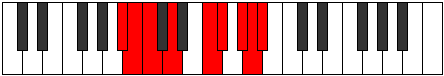 |
| [3479](https://ianring.com/musictheory/scales/3479) | [Rothyllic](ModeBFlatRothyllic.md) | Bb | Bb, B, C, D, F, Gb, Ab, A, Bb |  |
| [3481](https://ianring.com/musictheory/scales/3481) | [Katathian](ModeBFlatKatathian.md) | Bb | Bb, C#, D, E#, F#, G#, A, Bb |  |
| [3483](https://ianring.com/musictheory/scales/3483) | [Mixotharyllic](ModeCSharpMixotharyllic.md) | C# | C#, D, E, F, G#, A, B, C, C# |  |
| [3483](https://ianring.com/musictheory/scales/3483) | [Mixotharyllic](ModeDFlatMixotharyllic.md) | Db | Db, D, E, F, Ab, A, B, C, Db |  |
| [3483](https://ianring.com/musictheory/scales/3483) | [Mixotharyllic](ModeASharpMixotharyllic.md) | A# | A#, B, C#, D, F, F#, G#, A, A# |  |
| [3483](https://ianring.com/musictheory/scales/3483) | [Mixotharyllic](ModeBFlatMixotharyllic.md) | Bb | Bb, B, Db, D, F, Gb, Ab, A, Bb |  |
| [3485](https://ianring.com/musictheory/scales/3485) | [Kyptyllic](ModeASharpKyptyllic.md) | A# | A#, C, C#, D, F, F#, G#, A, A# |  |
| [3485](https://ianring.com/musictheory/scales/3485) | [Kyptyllic](ModeBFlatKyptyllic.md) | Bb | Bb, C, Db, D, F, Gb, Ab, A, Bb |  |
| [3485](https://ianring.com/musictheory/scales/3485) | [Kyptyllic](ModeFSharpKyptyllic.md) | F# | F#, G#, A, A#, C#, D, E, F, F# |  |
| [3485](https://ianring.com/musictheory/scales/3485) | [Kyptyllic](ModeGFlatKyptyllic.md) | Gb | Gb, Ab, A, Bb, Db, D, E, F, Gb |  |
| [3487](https://ianring.com/musictheory/scales/3487) | [Byptygic](ModeFSharpByptygic.md) | F# | F#, G, G#, A, A#, C#, D, E, F, F# |  |
| [3487](https://ianring.com/musictheory/scales/3487) | [Byptygic](ModeGFlatByptygic.md) | Gb | Gb, G, Ab, A, Bb, Db, D, E, F, Gb |  |
| [3487](https://ianring.com/musictheory/scales/3487) | [Byptygic](ModeCSharpByptygic.md) | C# | C#, D, D#, E, F, G#, A, B, C, C# |  |
| [3487](https://ianring.com/musictheory/scales/3487) | [Byptygic](ModeDFlatByptygic.md) | Db | Db, D, Eb, E, F, Ab, A, B, C, Db |  |
| [3487](https://ianring.com/musictheory/scales/3487) | [Byptygic](ModeASharpByptygic.md) | A# | A#, B, C, C#, D, F, F#, G#, A, A# |  |
| [3487](https://ianring.com/musictheory/scales/3487) | [Byptygic](ModeBFlatByptygic.md) | Bb | Bb, B, C, Db, D, F, Gb, Ab, A, Bb |  |
| [3487](https://ianring.com/musictheory/scales/3487) | [Byptygic](ModeGNaturalByptygic.md) | G | G, G#, A, A#, B, D, D#, F, F#, G |  |
| [3491](https://ianring.com/musictheory/scales/3491) | [Tharian](ModeANaturalTharian.md) | A | A, Bb, C##, D##, E#, F##, G#, A |  |
| [3493](https://ianring.com/musictheory/scales/3493) | [Rathian](ModeANaturalRathian.md) | A | A, B, C##, D##, E#, F##, G#, A |  |
| [3495](https://ianring.com/musictheory/scales/3495) | [Banyllic](ModeGNaturalBanyllic.md) | G | G, G#, A, C, D, D#, F, F#, G |  |
| [3495](https://ianring.com/musictheory/scales/3495) | [Banyllic](ModeANaturalBanyllic.md) | A | A, A#, B, D, E, F, G, G#, A |  |
| [3497](https://ianring.com/musictheory/scales/3497) | [Phrolian](ModeANaturalPhrolian.md) | A | A, B#, C##, D##, E#, F##, G#, A |  |
| [3499](https://ianring.com/musictheory/scales/3499) | [Lythyllic](ModeANaturalLythyllic.md) | A | A, A#, C, D, E, F, G, G#, A |  |
| [3501](https://ianring.com/musictheory/scales/3501) | [Katodyllic](ModeFSharpKatodyllic.md) | F# | F#, G#, A, B, C#, D, E, F, F# |  |
| [3501](https://ianring.com/musictheory/scales/3501) | [Katodyllic](ModeGFlatKatodyllic.md) | Gb | Gb, Ab, A, B, Db, D, E, F, Gb |  |
| [3501](https://ianring.com/musictheory/scales/3501) | [Katodyllic](ModeANaturalKatodyllic.md) | A | A, B, C, D, E, F, G, G#, A |  |
| [3503](https://ianring.com/musictheory/scales/3503) | [Zyphygic](ModeGNaturalZyphygic.md) | G | G, G#, A, A#, C, D, D#, F, F#, G |  |
| [3503](https://ianring.com/musictheory/scales/3503) | [Zyphygic](ModeFSharpZyphygic.md) | F# | F#, G, G#, A, B, C#, D, E, F, F# |  |
| [3503](https://ianring.com/musictheory/scales/3503) | [Zyphygic](ModeGFlatZyphygic.md) | Gb | Gb, G, Ab, A, B, Db, D, E, F, Gb |  |
| [3503](https://ianring.com/musictheory/scales/3503) | [Zyphygic](ModeANaturalZyphygic.md) | A | A, A#, B, C, D, E, F, G, G#, A |  |
| [3505](https://ianring.com/musictheory/scales/3505) | [Stygian](ModeANaturalStygian.md) | A | A, B##, C##, D##, E#, F##, G#, A |  |
| [3505](https://ianring.com/musictheory/scales/3505) | [Stygian](ModeBFlatStygian.md) | Bb | Bb, C##, D#, E#, F#, G#, A, Bb |  |
| [3507](https://ianring.com/musictheory/scales/3507) | [Ponyllic](ModeANaturalPonyllic.md) | A | A, A#, C#, D, E, F, G, G#, A |  |
| [3507](https://ianring.com/musictheory/scales/3507) | [Ponyllic](ModeENaturalPonyllic.md) | E | E, F, G#, A, B, C, D, D#, E |  |
| [3507](https://ianring.com/musictheory/scales/3507) | [Ponyllic](ModeCSharpPonyllic.md) | C# | C#, D, F, F#, G#, A, B, C, C# |  |
| [3507](https://ianring.com/musictheory/scales/3507) | [Ponyllic](ModeDFlatPonyllic.md) | Db | Db, D, F, Gb, Ab, A, B, C, Db |  |
| [3507](https://ianring.com/musictheory/scales/3507) | [Ponyllic](ModeASharpPonyllic.md) | A# | A#, B, D, D#, F, F#, G#, A, A# |  |
| [3507](https://ianring.com/musictheory/scales/3507) | [Ponyllic](ModeBFlatPonyllic.md) | Bb | Bb, B, D, Eb, F, Gb, Ab, A, Bb |  |
| [3509](https://ianring.com/musictheory/scales/3509) | [Stogyllic](ModeASharpStogyllic.md) | A# | A#, C, D, D#, F, F#, G#, A, A# |  |
| [3509](https://ianring.com/musictheory/scales/3509) | [Stogyllic](ModeBFlatStogyllic.md) | Bb | Bb, C, D, Eb, F, Gb, Ab, A, Bb |  |
| [3509](https://ianring.com/musictheory/scales/3509) | [Stogyllic](ModeANaturalStogyllic.md) | A | A, B, C#, D, E, F, G, G#, A |  |
| [3511](https://ianring.com/musictheory/scales/3511) | [Epolygic](ModeCSharpEpolygic.md) | C# | C#, D, D#, F, F#, G#, A, B, C, C# |  |
| [3511](https://ianring.com/musictheory/scales/3511) | [Epolygic](ModeDFlatEpolygic.md) | Db | Db, D, Eb, F, Gb, Ab, A, B, C, Db |  |
| [3511](https://ianring.com/musictheory/scales/3511) | [Epolygic](ModeENaturalEpolygic.md) | E | E, F, F#, G#, A, B, C, D, D#, E |  |
| [3511](https://ianring.com/musictheory/scales/3511) | [Epolygic](ModeGNaturalEpolygic.md) | G | G, G#, A, B, C, D, D#, F, F#, G |  |
| [3511](https://ianring.com/musictheory/scales/3511) | [Epolygic](ModeASharpEpolygic.md) | A# | A#, B, C, D, D#, F, F#, G#, A, A# |  |
| [3511](https://ianring.com/musictheory/scales/3511) | [Epolygic](ModeBFlatEpolygic.md) | Bb | Bb, B, C, D, Eb, F, Gb, Ab, A, Bb |  |
| [3511](https://ianring.com/musictheory/scales/3511) | [Epolygic](ModeANaturalEpolygic.md) | A | A, A#, B, C#, D, E, F, G, G#, A |  |
| [3513](https://ianring.com/musictheory/scales/3513) | [Dydyllic](ModeANaturalDydyllic.md) | A | A, C, C#, D, E, F, G, G#, A |  |
| [3513](https://ianring.com/musictheory/scales/3513) | [Dydyllic](ModeASharpDydyllic.md) | A# | A#, C#, D, D#, F, F#, G#, A, A# |  |
| [3513](https://ianring.com/musictheory/scales/3513) | [Dydyllic](ModeBFlatDydyllic.md) | Bb | Bb, Db, D, Eb, F, Gb, Ab, A, Bb |  |
| [3515](https://ianring.com/musictheory/scales/3515) | [Katodygic](ModeANaturalKatodygic.md) | A | A, A#, C, C#, D, E, F, G, G#, A |  |
| [3515](https://ianring.com/musictheory/scales/3515) | [Katodygic](ModeCSharpKatodygic.md) | C# | C#, D, E, F, F#, G#, A, B, C, C# |  |
| [3515](https://ianring.com/musictheory/scales/3515) | [Katodygic](ModeDFlatKatodygic.md) | Db | Db, D, E, F, Gb, Ab, A, B, C, Db |  |
| [3515](https://ianring.com/musictheory/scales/3515) | [Katodygic](ModeENaturalKatodygic.md) | E | E, F, G, G#, A, B, C, D, D#, E |  |
| [3515](https://ianring.com/musictheory/scales/3515) | [Katodygic](ModeASharpKatodygic.md) | A# | A#, B, C#, D, D#, F, F#, G#, A, A# |  |
| [3515](https://ianring.com/musictheory/scales/3515) | [Katodygic](ModeBFlatKatodygic.md) | Bb | Bb, B, Db, D, Eb, F, Gb, Ab, A, Bb |  |
| [3517](https://ianring.com/musictheory/scales/3517) | [Epocrygic](ModeASharpEpocrygic.md) | A# | A#, C, C#, D, D#, F, F#, G#, A, A# |  |
| [3517](https://ianring.com/musictheory/scales/3517) | [Epocrygic](ModeBFlatEpocrygic.md) | Bb | Bb, C, Db, D, Eb, F, Gb, Ab, A, Bb |  |
| [3517](https://ianring.com/musictheory/scales/3517) | [Epocrygic](ModeANaturalEpocrygic.md) | A | A, B, C, C#, D, E, F, G, G#, A |  |
| [3517](https://ianring.com/musictheory/scales/3517) | [Epocrygic](ModeFSharpEpocrygic.md) | F# | F#, G#, A, A#, B, C#, D, E, F, F# |  |
| [3517](https://ianring.com/musictheory/scales/3517) | [Epocrygic](ModeGFlatEpocrygic.md) | Gb | Gb, Ab, A, Bb, B, Db, D, E, F, Gb |  |
| [3519](https://ianring.com/musictheory/scales/3519) | [Boptyllian](ModeCSharpBoptyllian.md) | C# | C#, D, D#, E, F, F#, G#, A, B, C, C# |  |
| [3519](https://ianring.com/musictheory/scales/3519) | [Boptyllian](ModeDFlatBoptyllian.md) | Db | Db, D, Eb, E, F, Gb, Ab, A, B, C, Db |  |
| [3519](https://ianring.com/musictheory/scales/3519) | [Boptyllian](ModeENaturalBoptyllian.md) | E | E, F, F#, G, G#, A, B, C, D, D#, E |  |
| [3519](https://ianring.com/musictheory/scales/3519) | [Boptyllian](ModeASharpBoptyllian.md) | A# | A#, B, C, C#, D, D#, F, F#, G#, A, A# |  |
| [3519](https://ianring.com/musictheory/scales/3519) | [Boptyllian](ModeBFlatBoptyllian.md) | Bb | Bb, B, C, Db, D, Eb, F, Gb, Ab, A, Bb |  |
| [3519](https://ianring.com/musictheory/scales/3519) | [Boptyllian](ModeANaturalBoptyllian.md) | A | A, A#, B, C, C#, D, E, F, G, G#, A |  |
| [3519](https://ianring.com/musictheory/scales/3519) | [Boptyllian](ModeGNaturalBoptyllian.md) | G | G, G#, A, A#, B, C, D, D#, F, F#, G |  |
| [3519](https://ianring.com/musictheory/scales/3519) | [Boptyllian](ModeFSharpBoptyllian.md) | F# | F#, G, G#, A, A#, B, C#, D, E, F, F# |  |
| [3519](https://ianring.com/musictheory/scales/3519) | [Boptyllian](ModeGFlatBoptyllian.md) | Gb | Gb, G, Ab, A, Bb, B, Db, D, E, F, Gb |  |
| [3527](https://ianring.com/musictheory/scales/3527) | [Ronyllic](ModeGNaturalRonyllic.md) | G | G, G#, A, C#, D, D#, F, F#, G |  |
| [3529](https://ianring.com/musictheory/scales/3529) | [Stalian](ModeDNaturalStalian.md) | D | D, E#, F###, G##, A#, B#, C#, D |  |
| [3531](https://ianring.com/musictheory/scales/3531) | [Dycryllic](ModeDNaturalDycryllic.md) | D | D, D#, F, G#, A, A#, C, C#, D |  |
| [3533](https://ianring.com/musictheory/scales/3533) | [Thadyllic](ModeFSharpThadyllic.md) | F# | F#, G#, A, C, C#, D, E, F, F# |  |
| [3533](https://ianring.com/musictheory/scales/3533) | [Thadyllic](ModeGFlatThadyllic.md) | Gb | Gb, Ab, A, C, Db, D, E, F, Gb |  |
| [3533](https://ianring.com/musictheory/scales/3533) | [Thadyllic](ModeDNaturalThadyllic.md) | D | D, E, F, G#, A, A#, C, C#, D |  |
| [3535](https://ianring.com/musictheory/scales/3535) | [Aeroptygic](ModeFSharpAeroptygic.md) | F# | F#, G, G#, A, C, C#, D, E, F, F# |  |
| [3535](https://ianring.com/musictheory/scales/3535) | [Aeroptygic](ModeGFlatAeroptygic.md) | Gb | Gb, G, Ab, A, C, Db, D, E, F, Gb |  |
| [3535](https://ianring.com/musictheory/scales/3535) | [Aeroptygic](ModeDNaturalAeroptygic.md) | D | D, D#, E, F, G#, A, A#, C, C#, D |  |
| [3535](https://ianring.com/musictheory/scales/3535) | [Aeroptygic](ModeGNaturalAeroptygic.md) | G | G, G#, A, A#, C#, D, D#, F, F#, G |  |
| [3537](https://ianring.com/musictheory/scales/3537) | [Katogian](ModeASharpKatogian.md) | A# | A#, B###, D##, E#, F#, G#, A, A# |  |
| [3537](https://ianring.com/musictheory/scales/3537) | [Katogian](ModeBFlatKatogian.md) | Bb | Bb, C##, D##, E#, F#, G#, A, Bb |  |
| [3539](https://ianring.com/musictheory/scales/3539) | [Aeoryllic](ModeCSharpAeoryllic.md) | C# | C#, D, F, G, G#, A, B, C, C# |  |
| [3539](https://ianring.com/musictheory/scales/3539) | [Aeoryllic](ModeDFlatAeoryllic.md) | Db | Db, D, F, G, Ab, A, B, C, Db |  |
| [3539](https://ianring.com/musictheory/scales/3539) | [Aeoryllic](ModeASharpAeoryllic.md) | A# | A#, B, D, E, F, F#, G#, A, A# |  |
| [3539](https://ianring.com/musictheory/scales/3539) | [Aeoryllic](ModeBFlatAeoryllic.md) | Bb | Bb, B, D, E, F, Gb, Ab, A, Bb |  |
| [3541](https://ianring.com/musictheory/scales/3541) | [Racryllic](ModeASharpRacryllic.md) | A# | A#, C, D, E, F, F#, G#, A, A# |  |
| [3541](https://ianring.com/musictheory/scales/3541) | [Racryllic](ModeBFlatRacryllic.md) | Bb | Bb, C, D, E, F, Gb, Ab, A, Bb |  |
| [3543](https://ianring.com/musictheory/scales/3543) | [Aeolonygic](ModeCSharpAeolonygic.md) | C# | C#, D, D#, F, G, G#, A, B, C, C# |  |
| [3543](https://ianring.com/musictheory/scales/3543) | [Aeolonygic](ModeDFlatAeolonygic.md) | Db | Db, D, Eb, F, G, Ab, A, B, C, Db |  |
| [3543](https://ianring.com/musictheory/scales/3543) | [Aeolonygic](ModeGNaturalAeolonygic.md) | G | G, G#, A, B, C#, D, D#, F, F#, G |  |
| [3543](https://ianring.com/musictheory/scales/3543) | [Aeolonygic](ModeASharpAeolonygic.md) | A# | A#, B, C, D, E, F, F#, G#, A, A# |  |
| [3543](https://ianring.com/musictheory/scales/3543) | [Aeolonygic](ModeBFlatAeolonygic.md) | Bb | Bb, B, C, D, E, F, Gb, Ab, A, Bb |  |
| [3545](https://ianring.com/musictheory/scales/3545) | [Thyptyllic](ModeDNaturalThyptyllic.md) | D | D, F, F#, G#, A, A#, C, C#, D |  |
| [3545](https://ianring.com/musictheory/scales/3545) | [Thyptyllic](ModeASharpThyptyllic.md) | A# | A#, C#, D, E, F, F#, G#, A, A# |  |
| [3545](https://ianring.com/musictheory/scales/3545) | [Thyptyllic](ModeBFlatThyptyllic.md) | Bb | Bb, Db, D, E, F, Gb, Ab, A, Bb |  |
| [3547](https://ianring.com/musictheory/scales/3547) | [Sadygic](ModeDNaturalSadygic.md) | D | D, D#, F, F#, G#, A, A#, C, C#, D |  |
| [3547](https://ianring.com/musictheory/scales/3547) | [Sadygic](ModeCSharpSadygic.md) | C# | C#, D, E, F, G, G#, A, B, C, C# |  |
| [3547](https://ianring.com/musictheory/scales/3547) | [Sadygic](ModeDFlatSadygic.md) | Db | Db, D, E, F, G, Ab, A, B, C, Db |  |
| [3547](https://ianring.com/musictheory/scales/3547) | [Sadygic](ModeASharpSadygic.md) | A# | A#, B, C#, D, E, F, F#, G#, A, A# | 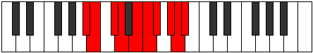 |
| [3547](https://ianring.com/musictheory/scales/3547) | [Sadygic](ModeBFlatSadygic.md) | Bb | Bb, B, Db, D, E, F, Gb, Ab, A, Bb |  |
| [3549](https://ianring.com/musictheory/scales/3549) | [Phronygic](ModeDNaturalPhronygic.md) | D | D, E, F, F#, G#, A, A#, C, C#, D |  |
| [3549](https://ianring.com/musictheory/scales/3549) | [Phronygic](ModeFSharpPhronygic.md) | F# | F#, G#, A, A#, C, C#, D, E, F, F# |  |
| [3549](https://ianring.com/musictheory/scales/3549) | [Phronygic](ModeGFlatPhronygic.md) | Gb | Gb, Ab, A, Bb, C, Db, D, E, F, Gb |  |
| [3549](https://ianring.com/musictheory/scales/3549) | [Phronygic](ModeASharpPhronygic.md) | A# | A#, C, C#, D, E, F, F#, G#, A, A# |  |
| [3549](https://ianring.com/musictheory/scales/3549) | [Phronygic](ModeBFlatPhronygic.md) | Bb | Bb, C, Db, D, E, F, Gb, Ab, A, Bb |  |
| [3551](https://ianring.com/musictheory/scales/3551) | [Sagyllian](ModeDNaturalSagyllian.md) | D | D, D#, E, F, F#, G#, A, A#, C, C#, D |  |
| [3551](https://ianring.com/musictheory/scales/3551) | [Sagyllian](ModeFSharpSagyllian.md) | F# | F#, G, G#, A, A#, C, C#, D, E, F, F# |  |
| [3551](https://ianring.com/musictheory/scales/3551) | [Sagyllian](ModeGFlatSagyllian.md) | Gb | Gb, G, Ab, A, Bb, C, Db, D, E, F, Gb |  |
| [3551](https://ianring.com/musictheory/scales/3551) | [Sagyllian](ModeCSharpSagyllian.md) | C# | C#, D, D#, E, F, G, G#, A, B, C, C# |  |
| [3551](https://ianring.com/musictheory/scales/3551) | [Sagyllian](ModeDFlatSagyllian.md) | Db | Db, D, Eb, E, F, G, Ab, A, B, C, Db |  |
| [3551](https://ianring.com/musictheory/scales/3551) | [Sagyllian](ModeASharpSagyllian.md) | A# | A#, B, C, C#, D, E, F, F#, G#, A, A# |  |
| [3551](https://ianring.com/musictheory/scales/3551) | [Sagyllian](ModeBFlatSagyllian.md) | Bb | Bb, B, C, Db, D, E, F, Gb, Ab, A, Bb |  |
| [3551](https://ianring.com/musictheory/scales/3551) | [Sagyllian](ModeGNaturalSagyllian.md) | G | G, G#, A, A#, B, C#, D, D#, F, F#, G |  |
| [3555](https://ianring.com/musictheory/scales/3555) | [Pylyllic](ModeANaturalPylyllic.md) | A | A, A#, D, D#, E, F, G, G#, A |  |
| [3557](https://ianring.com/musictheory/scales/3557) | [Thycryllic](ModeANaturalThycryllic.md) | A | A, B, D, D#, E, F, G, G#, A |  |
| [3557](https://ianring.com/musictheory/scales/3557) | [Thycryllic](ModeDSharpThycryllic.md) | D# | D#, F, G#, A, A#, B, C#, D, D# |  |
| [3557](https://ianring.com/musictheory/scales/3557) | [Thycryllic](ModeEFlatThycryllic.md) | Eb | Eb, F, Ab, A, Bb, B, Db, D, Eb |  |
| [3559](https://ianring.com/musictheory/scales/3559) | [Aerathygic](ModeGNaturalAerathygic.md) | G | G, G#, A, C, C#, D, D#, F, F#, G |  |
| [3559](https://ianring.com/musictheory/scales/3559) | [Aerathygic](ModeDSharpAerathygic.md) | D# | D#, E, F, G#, A, A#, B, C#, D, D# |  |
| [3559](https://ianring.com/musictheory/scales/3559) | [Aerathygic](ModeEFlatAerathygic.md) | Eb | Eb, E, F, Ab, A, Bb, B, Db, D, Eb |  |
| [3559](https://ianring.com/musictheory/scales/3559) | [Aerathygic](ModeANaturalAerathygic.md) | A | A, A#, B, D, D#, E, F, G, G#, A |  |
| [3561](https://ianring.com/musictheory/scales/3561) | [Pothyllic](ModeANaturalPothyllic.md) | A | A, C, D, D#, E, F, G, G#, A | 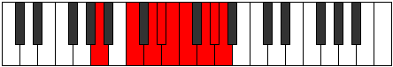 |
| [3561](https://ianring.com/musictheory/scales/3561) | [Pothyllic](ModeDNaturalPothyllic.md) | D | D, F, G, G#, A, A#, C, C#, D |  |
| [3563](https://ianring.com/musictheory/scales/3563) | [Ionoptygic](ModeDNaturalIonoptygic.md) | D | D, D#, F, G, G#, A, A#, C, C#, D |  |
| [3563](https://ianring.com/musictheory/scales/3563) | [Ionoptygic](ModeANaturalIonoptygic.md) | A | A, A#, C, D, D#, E, F, G, G#, A |  |
| [3565](https://ianring.com/musictheory/scales/3565) | [Aeolorygic](ModeDNaturalAeolorygic.md) | D | D, E, F, G, G#, A, A#, C, C#, D |  |
| [3565](https://ianring.com/musictheory/scales/3565) | [Aeolorygic](ModeFSharpAeolorygic.md) | F# | F#, G#, A, B, C, C#, D, E, F, F# |  |
| [3565](https://ianring.com/musictheory/scales/3565) | [Aeolorygic](ModeGFlatAeolorygic.md) | Gb | Gb, Ab, A, B, C, Db, D, E, F, Gb |  |
| [3565](https://ianring.com/musictheory/scales/3565) | [Aeolorygic](ModeANaturalAeolorygic.md) | A | A, B, C, D, D#, E, F, G, G#, A |  |
| [3565](https://ianring.com/musictheory/scales/3565) | [Aeolorygic](ModeDSharpAeolorygic.md) | D# | D#, F, F#, G#, A, A#, B, C#, D, D# |  |
| [3565](https://ianring.com/musictheory/scales/3565) | [Aeolorygic](ModeEFlatAeolorygic.md) | Eb | Eb, F, Gb, Ab, A, Bb, B, Db, D, Eb |  |
| [3567](https://ianring.com/musictheory/scales/3567) | [Epityllian](ModeDNaturalEpityllian.md) | D | D, D#, E, F, G, G#, A, A#, C, C#, D |  |
| [3567](https://ianring.com/musictheory/scales/3567) | [Epityllian](ModeGNaturalEpityllian.md) | G | G, G#, A, A#, C, C#, D, D#, F, F#, G |  |
| [3567](https://ianring.com/musictheory/scales/3567) | [Epityllian](ModeFSharpEpityllian.md) | F# | F#, G, G#, A, B, C, C#, D, E, F, F# |  |
| [3567](https://ianring.com/musictheory/scales/3567) | [Epityllian](ModeGFlatEpityllian.md) | Gb | Gb, G, Ab, A, B, C, Db, D, E, F, Gb |  |
| [3567](https://ianring.com/musictheory/scales/3567) | [Epityllian](ModeDSharpEpityllian.md) | D# | D#, E, F, F#, G#, A, A#, B, C#, D, D# |  |
| [3567](https://ianring.com/musictheory/scales/3567) | [Epityllian](ModeEFlatEpityllian.md) | Eb | Eb, E, F, Gb, Ab, A, Bb, B, Db, D, Eb |  |
| [3567](https://ianring.com/musictheory/scales/3567) | [Epityllian](ModeANaturalEpityllian.md) | A | A, A#, B, C, D, D#, E, F, G, G#, A |  |
| [3569](https://ianring.com/musictheory/scales/3569) | [Aeoladyllic](ModeANaturalAeoladyllic.md) | A | A, C#, D, D#, E, F, G, G#, A |  |
| [3569](https://ianring.com/musictheory/scales/3569) | [Aeoladyllic](ModeASharpAeoladyllic.md) | A# | A#, D, D#, E, F, F#, G#, A, A# |  |
| [3569](https://ianring.com/musictheory/scales/3569) | [Aeoladyllic](ModeBFlatAeoladyllic.md) | Bb | Bb, D, Eb, E, F, Gb, Ab, A, Bb |  |
| [3571](https://ianring.com/musictheory/scales/3571) | [Dyrygic](ModeANaturalDyrygic.md) | A | A, A#, C#, D, D#, E, F, G, G#, A |  |
| [3571](https://ianring.com/musictheory/scales/3571) | [Dyrygic](ModeCSharpDyrygic.md) | C# | C#, D, F, F#, G, G#, A, B, C, C# |  |
| [3571](https://ianring.com/musictheory/scales/3571) | [Dyrygic](ModeDFlatDyrygic.md) | Db | Db, D, F, Gb, G, Ab, A, B, C, Db |  |
| [3571](https://ianring.com/musictheory/scales/3571) | [Dyrygic](ModeENaturalDyrygic.md) | E | E, F, G#, A, A#, B, C, D, D#, E |  |
| [3571](https://ianring.com/musictheory/scales/3571) | [Dyrygic](ModeASharpDyrygic.md) | A# | A#, B, D, D#, E, F, F#, G#, A, A# |  |
| [3571](https://ianring.com/musictheory/scales/3571) | [Dyrygic](ModeBFlatDyrygic.md) | Bb | Bb, B, D, Eb, E, F, Gb, Ab, A, Bb |  |
| [3573](https://ianring.com/musictheory/scales/3573) | [Kaptygic](ModeASharpKaptygic.md) | A# | A#, C, D, D#, E, F, F#, G#, A, A# |  |
| [3573](https://ianring.com/musictheory/scales/3573) | [Kaptygic](ModeBFlatKaptygic.md) | Bb | Bb, C, D, Eb, E, F, Gb, Ab, A, Bb |  |
| [3573](https://ianring.com/musictheory/scales/3573) | [Kaptygic](ModeANaturalKaptygic.md) | A | A, B, C#, D, D#, E, F, G, G#, A |  |
| [3573](https://ianring.com/musictheory/scales/3573) | [Kaptygic](ModeDSharpKaptygic.md) | D# | D#, F, G, G#, A, A#, B, C#, D, D# |  |
| [3573](https://ianring.com/musictheory/scales/3573) | [Kaptygic](ModeEFlatKaptygic.md) | Eb | Eb, F, G, Ab, A, Bb, B, Db, D, Eb |  |
| [3575](https://ianring.com/musictheory/scales/3575) | [Mogyllian](ModeCSharpMogyllian.md) | C# | C#, D, D#, F, F#, G, G#, A, B, C, C# |  |
| [3575](https://ianring.com/musictheory/scales/3575) | [Mogyllian](ModeDFlatMogyllian.md) | Db | Db, D, Eb, F, Gb, G, Ab, A, B, C, Db |  |
| [3575](https://ianring.com/musictheory/scales/3575) | [Mogyllian](ModeGNaturalMogyllian.md) | G | G, G#, A, B, C, C#, D, D#, F, F#, G |  |
| [3575](https://ianring.com/musictheory/scales/3575) | [Mogyllian](ModeENaturalMogyllian.md) | E | E, F, F#, G#, A, A#, B, C, D, D#, E |  |
| [3575](https://ianring.com/musictheory/scales/3575) | [Mogyllian](ModeASharpMogyllian.md) | A# | A#, B, C, D, D#, E, F, F#, G#, A, A# |  |
| [3575](https://ianring.com/musictheory/scales/3575) | [Mogyllian](ModeBFlatMogyllian.md) | Bb | Bb, B, C, D, Eb, E, F, Gb, Ab, A, Bb |  |
| [3575](https://ianring.com/musictheory/scales/3575) | [Mogyllian](ModeDSharpMogyllian.md) | D# | D#, E, F, G, G#, A, A#, B, C#, D, D# |  |
| [3575](https://ianring.com/musictheory/scales/3575) | [Mogyllian](ModeEFlatMogyllian.md) | Eb | Eb, E, F, G, Ab, A, Bb, B, Db, D, Eb |  |
| [3575](https://ianring.com/musictheory/scales/3575) | [Mogyllian](ModeANaturalMogyllian.md) | A | A, A#, B, C#, D, D#, E, F, G, G#, A |  |
| [3577](https://ianring.com/musictheory/scales/3577) | [Loptygic](ModeANaturalLoptygic.md) | A | A, C, C#, D, D#, E, F, G, G#, A |  |
| [3577](https://ianring.com/musictheory/scales/3577) | [Loptygic](ModeASharpLoptygic.md) | A# | A#, C#, D, D#, E, F, F#, G#, A, A# |  |
| [3577](https://ianring.com/musictheory/scales/3577) | [Loptygic](ModeBFlatLoptygic.md) | Bb | Bb, Db, D, Eb, E, F, Gb, Ab, A, Bb |  |
| [3577](https://ianring.com/musictheory/scales/3577) | [Loptygic](ModeDNaturalLoptygic.md) | D | D, F, F#, G, G#, A, A#, C, C#, D |  |
| [3579](https://ianring.com/musictheory/scales/3579) | [Zyphyllian](ModeANaturalZyphyllian.md) | A | A, A#, C, C#, D, D#, E, F, G, G#, A |  |
| [3579](https://ianring.com/musictheory/scales/3579) | [Zyphyllian](ModeDNaturalZyphyllian.md) | D | D, D#, F, F#, G, G#, A, A#, C, C#, D |  |
| [3579](https://ianring.com/musictheory/scales/3579) | [Zyphyllian](ModeCSharpZyphyllian.md) | C# | C#, D, E, F, F#, G, G#, A, B, C, C# |  |
| [3579](https://ianring.com/musictheory/scales/3579) | [Zyphyllian](ModeDFlatZyphyllian.md) | Db | Db, D, E, F, Gb, G, Ab, A, B, C, Db |  |
| [3579](https://ianring.com/musictheory/scales/3579) | [Zyphyllian](ModeASharpZyphyllian.md) | A# | A#, B, C#, D, D#, E, F, F#, G#, A, A# |  |
| [3579](https://ianring.com/musictheory/scales/3579) | [Zyphyllian](ModeBFlatZyphyllian.md) | Bb | Bb, B, Db, D, Eb, E, F, Gb, Ab, A, Bb |  |
| [3579](https://ianring.com/musictheory/scales/3579) | [Zyphyllian](ModeENaturalZyphyllian.md) | E | E, F, G, G#, A, A#, B, C, D, D#, E |  |
| [3581](https://ianring.com/musictheory/scales/3581) | [Epocryllian](ModeASharpEpocryllian.md) | A# | A#, C, C#, D, D#, E, F, F#, G#, A, A# |  |
| [3581](https://ianring.com/musictheory/scales/3581) | [Epocryllian](ModeBFlatEpocryllian.md) | Bb | Bb, C, Db, D, Eb, E, F, Gb, Ab, A, Bb |  |
| [3581](https://ianring.com/musictheory/scales/3581) | [Epocryllian](ModeDNaturalEpocryllian.md) | D | D, E, F, F#, G, G#, A, A#, C, C#, D |  |
| [3581](https://ianring.com/musictheory/scales/3581) | [Epocryllian](ModeANaturalEpocryllian.md) | A | A, B, C, C#, D, D#, E, F, G, G#, A |  |
| [3581](https://ianring.com/musictheory/scales/3581) | [Epocryllian](ModeFSharpEpocryllian.md) | F# | F#, G#, A, A#, B, C, C#, D, E, F, F# |  |
| [3581](https://ianring.com/musictheory/scales/3581) | [Epocryllian](ModeGFlatEpocryllian.md) | Gb | Gb, Ab, A, Bb, B, C, Db, D, E, F, Gb |  |
| [3581](https://ianring.com/musictheory/scales/3581) | [Epocryllian](ModeDSharpEpocryllian.md) | D# | D#, F, F#, G, G#, A, A#, B, C#, D, D# |  |
| [3581](https://ianring.com/musictheory/scales/3581) | [Epocryllian](ModeEFlatEpocryllian.md) | Eb | Eb, F, Gb, G, Ab, A, Bb, B, Db, D, Eb |  |
| [3583](https://ianring.com/musictheory/scales/3583) | [Zylatic](ModeDNaturalZylatic.md) | D | D, D#, E, F, F#, G, G#, A, A#, C, C#, D |  |
| [3583](https://ianring.com/musictheory/scales/3583) | [Zylatic](ModeCSharpZylatic.md) | C# | C#, D, D#, E, F, F#, G, G#, A, B, C, C# |  |
| [3583](https://ianring.com/musictheory/scales/3583) | [Zylatic](ModeDFlatZylatic.md) | Db | Db, D, Eb, E, F, Gb, G, Ab, A, B, C, Db |  |
| [3583](https://ianring.com/musictheory/scales/3583) | [Zylatic](ModeASharpZylatic.md) | A# | A#, B, C, C#, D, D#, E, F, F#, G#, A, A# |  |
| [3583](https://ianring.com/musictheory/scales/3583) | [Zylatic](ModeBFlatZylatic.md) | Bb | Bb, B, C, Db, D, Eb, E, F, Gb, Ab, A, Bb |  |
| [3583](https://ianring.com/musictheory/scales/3583) | [Zylatic](ModeANaturalZylatic.md) | A | A, A#, B, C, C#, D, D#, E, F, G, G#, A |  |
| [3583](https://ianring.com/musictheory/scales/3583) | [Zylatic](ModeGNaturalZylatic.md) | G | G, G#, A, A#, B, C, C#, D, D#, F, F#, G |  |
| [3583](https://ianring.com/musictheory/scales/3583) | [Zylatic](ModeFSharpZylatic.md) | F# | F#, G, G#, A, A#, B, C, C#, D, E, F, F# |  |
| [3583](https://ianring.com/musictheory/scales/3583) | [Zylatic](ModeGFlatZylatic.md) | Gb | Gb, G, Ab, A, Bb, B, C, Db, D, E, F, Gb |  |
| [3583](https://ianring.com/musictheory/scales/3583) | [Zylatic](ModeENaturalZylatic.md) | E | E, F, F#, G, G#, A, A#, B, C, D, D#, E |  |
| [3583](https://ianring.com/musictheory/scales/3583) | [Zylatic](ModeDSharpZylatic.md) | D# | D#, E, F, F#, G, G#, A, A#, B, C#, D, D# |  |
| [3583](https://ianring.com/musictheory/scales/3583) | [Zylatic](ModeEFlatZylatic.md) | Eb | Eb, E, F, Gb, G, Ab, A, Bb, B, Db, D, Eb |  |
| [3635](https://ianring.com/musictheory/scales/3635) | [Katygian](ModeENaturalKatygian.md) | E | E, F, G#, A, B##, C##, D#, E | 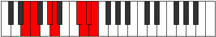 |
| [3639](https://ianring.com/musictheory/scales/3639) | [Paptyllic](ModeENaturalPaptyllic.md) | E | E, F, F#, G#, A, C#, D, D#, E |  |
| [3641](https://ianring.com/musictheory/scales/3641) | [Thocrian](ModeFNaturalThocrian.md) | F | F, G#, A, Bb, C##, D#, E, F |  |
| [3643](https://ianring.com/musictheory/scales/3643) | [Kydyllic](ModeENaturalKydyllic.md) | E | E, F, G, G#, A, C#, D, D#, E |  |
| [3643](https://ianring.com/musictheory/scales/3643) | [Kydyllic](ModeFNaturalKydyllic.md) | F | F, F#, G#, A, A#, D, D#, E, F |  |
| [3645](https://ianring.com/musictheory/scales/3645) | [Zycryllic](ModeFNaturalZycryllic.md) | F | F, G, G#, A, A#, D, D#, E, F |  |
| [3647](https://ianring.com/musictheory/scales/3647) | [Eporygic](ModeENaturalEporygic.md) | E | E, F, F#, G, G#, A, C#, D, D#, E |  |
| [3647](https://ianring.com/musictheory/scales/3647) | [Eporygic](ModeFNaturalEporygic.md) | F | F, F#, G, G#, A, A#, D, D#, E, F |  |
| [3655](https://ianring.com/musictheory/scales/3655) | [Mathian](ModeGSharpMathian.md) | G# | G#, A, Bb, C##, D###, E##, F##, G# |  |
| [3655](https://ianring.com/musictheory/scales/3655) | [Mathian](ModeAFlatMathian.md) | Ab | Ab, Bbb, Cbb, D, E#, F#, G, Ab |  |
| [3659](https://ianring.com/musictheory/scales/3659) | [Polian](ModeGSharpPolian.md) | G# | G#, A, B, C##, D###, E##, F##, G# |  |
| [3659](https://ianring.com/musictheory/scales/3659) | [Polian](ModeAFlatPolian.md) | Ab | Ab, Bbb, Cb, D, E#, F#, G, Ab |  |
| [3659](https://ianring.com/musictheory/scales/3659) | [Polian](ModeBNaturalPolian.md) | B | B, C, D, E#, F###, G##, A#, B |  |
| [3661](https://ianring.com/musictheory/scales/3661) | [Mixodorian](ModeBNaturalMixodorian.md) | B | B, C#, D, E#, F###, G##, A#, B |  |
| [3663](https://ianring.com/musictheory/scales/3663) | [Sonyllic](ModeBNaturalSonyllic.md) | B | B, C, C#, D, F, G#, A, A#, B |  |
| [3663](https://ianring.com/musictheory/scales/3663) | [Sonyllic](ModeGSharpSonyllic.md) | G# | G#, A, A#, B, D, F, F#, G, G# |  |
| [3663](https://ianring.com/musictheory/scales/3663) | [Sonyllic](ModeAFlatSonyllic.md) | Ab | Ab, A, Bb, B, D, F, Gb, G, Ab |  |
| [3667](https://ianring.com/musictheory/scales/3667) | [Kaptian](ModeGSharpKaptian.md) | G# | G#, A, B#, C##, D###, E##, F##, G# |  |
| [3667](https://ianring.com/musictheory/scales/3667) | [Kaptian](ModeAFlatKaptian.md) | Ab | Ab, Bbb, C, D, E#, F#, G, Ab |  |
| [3671](https://ianring.com/musictheory/scales/3671) | [Aeonyllic](ModeGSharpAeonyllic.md) | G# | G#, A, A#, C, D, F, F#, G, G# |  |
| [3671](https://ianring.com/musictheory/scales/3671) | [Aeonyllic](ModeAFlatAeonyllic.md) | Ab | Ab, A, Bb, C, D, F, Gb, G, Ab |  |
| [3673](https://ianring.com/musictheory/scales/3673) | [Ranian](ModeFNaturalRanian.md) | F | F, G#, A, B, C##, D#, E, F |  |
| [3675](https://ianring.com/musictheory/scales/3675) | [Monyllic](ModeFNaturalMonyllic.md) | F | F, F#, G#, A, B, D, D#, E, F |  |
| [3675](https://ianring.com/musictheory/scales/3675) | [Monyllic](ModeGSharpMonyllic.md) | G# | G#, A, B, C, D, F, F#, G, G# |  |
| [3675](https://ianring.com/musictheory/scales/3675) | [Monyllic](ModeAFlatMonyllic.md) | Ab | Ab, A, B, C, D, F, Gb, G, Ab |  |
| [3675](https://ianring.com/musictheory/scales/3675) | [Monyllic](ModeBNaturalMonyllic.md) | B | B, C, D, D#, F, G#, A, A#, B |  |
| [3677](https://ianring.com/musictheory/scales/3677) | [Katylyllic](ModeFNaturalKatylyllic.md) | F | F, G, G#, A, B, D, D#, E, F |  |
| [3677](https://ianring.com/musictheory/scales/3677) | [Katylyllic](ModeBNaturalKatylyllic.md) | B | B, C#, D, D#, F, G#, A, A#, B |  |
| [3679](https://ianring.com/musictheory/scales/3679) | [Rycrygic](ModeFNaturalRycrygic.md) | F | F, F#, G, G#, A, B, D, D#, E, F |  |
| [3679](https://ianring.com/musictheory/scales/3679) | [Rycrygic](ModeBNaturalRycrygic.md) | B | B, C, C#, D, D#, F, G#, A, A#, B |  |
| [3679](https://ianring.com/musictheory/scales/3679) | [Rycrygic](ModeGSharpRycrygic.md) | G# | G#, A, A#, B, C, D, F, F#, G, G# |  |
| [3679](https://ianring.com/musictheory/scales/3679) | [Rycrygic](ModeAFlatRycrygic.md) | Ab | Ab, A, Bb, B, C, D, F, Gb, G, Ab |  |
| [3683](https://ianring.com/musictheory/scales/3683) | [Dycrian](ModeGSharpDycrian.md) | G# | G#, A, B##, C##, D###, E##, F##, G# |  |
| [3683](https://ianring.com/musictheory/scales/3683) | [Dycrian](ModeAFlatDycrian.md) | Ab | Ab, Bbb, C#, D, E#, F#, G, Ab |  |
| [3685](https://ianring.com/musictheory/scales/3685) | [Kodian](ModeEFlatKodian.md) | Eb | Eb, F, G#, A, B#, C#, D, Eb |  |
| [3687](https://ianring.com/musictheory/scales/3687) | [Zonyllic](ModeDSharpZonyllic.md) | D# | D#, E, F, G#, A, C, C#, D, D# |  |
| [3687](https://ianring.com/musictheory/scales/3687) | [Zonyllic](ModeEFlatZonyllic.md) | Eb | Eb, E, F, Ab, A, C, Db, D, Eb |  |
| [3687](https://ianring.com/musictheory/scales/3687) | [Zonyllic](ModeGSharpZonyllic.md) | G# | G#, A, A#, C#, D, F, F#, G, G# |  |
| [3687](https://ianring.com/musictheory/scales/3687) | [Zonyllic](ModeAFlatZonyllic.md) | Ab | Ab, A, Bb, Db, D, F, Gb, G, Ab |  |
| [3691](https://ianring.com/musictheory/scales/3691) | [Badyllic](ModeGSharpBadyllic.md) | G# | G#, A, B, C#, D, F, F#, G, G# |  |
| [3691](https://ianring.com/musictheory/scales/3691) | [Badyllic](ModeAFlatBadyllic.md) | Ab | Ab, A, B, Db, D, F, Gb, G, Ab |  |
| [3691](https://ianring.com/musictheory/scales/3691) | [Badyllic](ModeBNaturalBadyllic.md) | B | B, C, D, E, F, G#, A, A#, B |  |
| [3693](https://ianring.com/musictheory/scales/3693) | [Epaptyllic](ModeDSharpEpaptyllic.md) | D# | D#, F, F#, G#, A, C, C#, D, D# |  |
| [3693](https://ianring.com/musictheory/scales/3693) | [Epaptyllic](ModeEFlatEpaptyllic.md) | Eb | Eb, F, Gb, Ab, A, C, Db, D, Eb |  |
| [3693](https://ianring.com/musictheory/scales/3693) | [Epaptyllic](ModeBNaturalEpaptyllic.md) | B | B, C#, D, E, F, G#, A, A#, B |  |
| [3695](https://ianring.com/musictheory/scales/3695) | [Kodygic](ModeDSharpKodygic.md) | D# | D#, E, F, F#, G#, A, C, C#, D, D# |  |
| [3695](https://ianring.com/musictheory/scales/3695) | [Kodygic](ModeEFlatKodygic.md) | Eb | Eb, E, F, Gb, Ab, A, C, Db, D, Eb |  |
| [3695](https://ianring.com/musictheory/scales/3695) | [Kodygic](ModeBNaturalKodygic.md) | B | B, C, C#, D, E, F, G#, A, A#, B |  |
| [3695](https://ianring.com/musictheory/scales/3695) | [Kodygic](ModeGSharpKodygic.md) | G# | G#, A, A#, B, C#, D, F, F#, G, G# |  |
| [3695](https://ianring.com/musictheory/scales/3695) | [Kodygic](ModeAFlatKodygic.md) | Ab | Ab, A, Bb, B, Db, D, F, Gb, G, Ab |  |
| [3699](https://ianring.com/musictheory/scales/3699) | [Aeolylyllic](ModeGSharpAeolylyllic.md) | G# | G#, A, C, C#, D, F, F#, G, G# |  |
| [3699](https://ianring.com/musictheory/scales/3699) | [Aeolylyllic](ModeAFlatAeolylyllic.md) | Ab | Ab, A, C, Db, D, F, Gb, G, Ab |  |
| [3699](https://ianring.com/musictheory/scales/3699) | [Aeolylyllic](ModeENaturalAeolylyllic.md) | E | E, F, G#, A, A#, C#, D, D#, E |  |
| [3701](https://ianring.com/musictheory/scales/3701) | [Bagyllic](ModeDSharpBagyllic.md) | D# | D#, F, G, G#, A, C, C#, D, D# |  |
| [3701](https://ianring.com/musictheory/scales/3701) | [Bagyllic](ModeEFlatBagyllic.md) | Eb | Eb, F, G, Ab, A, C, Db, D, Eb |  |
| [3703](https://ianring.com/musictheory/scales/3703) | [Katalygic](ModeDSharpKatalygic.md) | D# | D#, E, F, G, G#, A, C, C#, D, D# |  |
| [3703](https://ianring.com/musictheory/scales/3703) | [Katalygic](ModeEFlatKatalygic.md) | Eb | Eb, E, F, G, Ab, A, C, Db, D, Eb |  |
| [3703](https://ianring.com/musictheory/scales/3703) | [Katalygic](ModeENaturalKatalygic.md) | E | E, F, F#, G#, A, A#, C#, D, D#, E |  |
| [3703](https://ianring.com/musictheory/scales/3703) | [Katalygic](ModeGSharpKatalygic.md) | G# | G#, A, A#, C, C#, D, F, F#, G, G# |  |
| [3703](https://ianring.com/musictheory/scales/3703) | [Katalygic](ModeAFlatKatalygic.md) | Ab | Ab, A, Bb, C, Db, D, F, Gb, G, Ab |  |
| [3705](https://ianring.com/musictheory/scales/3705) | [Sydyllic](ModeFNaturalSydyllic.md) | F | F, G#, A, A#, B, D, D#, E, F |  |
| [3705](https://ianring.com/musictheory/scales/3705) | [Sydyllic](ModeBNaturalSydyllic.md) | B | B, D, D#, E, F, G#, A, A#, B |  |
| [3707](https://ianring.com/musictheory/scales/3707) | [Rynygic](ModeENaturalRynygic.md) | E | E, F, G, G#, A, A#, C#, D, D#, E |  |
| [3707](https://ianring.com/musictheory/scales/3707) | [Rynygic](ModeGSharpRynygic.md) | G# | G#, A, B, C, C#, D, F, F#, G, G# |  |
| [3707](https://ianring.com/musictheory/scales/3707) | [Rynygic](ModeAFlatRynygic.md) | Ab | Ab, A, B, C, Db, D, F, Gb, G, Ab |  |
| [3707](https://ianring.com/musictheory/scales/3707) | [Rynygic](ModeBNaturalRynygic.md) | B | B, C, D, D#, E, F, G#, A, A#, B |  |
| [3707](https://ianring.com/musictheory/scales/3707) | [Rynygic](ModeFNaturalRynygic.md) | F | F, F#, G#, A, A#, B, D, D#, E, F |  |
| [3709](https://ianring.com/musictheory/scales/3709) | [Locrygic](ModeDSharpLocrygic.md) | D# | D#, F, F#, G, G#, A, C, C#, D, D# |  |
| [3709](https://ianring.com/musictheory/scales/3709) | [Locrygic](ModeEFlatLocrygic.md) | Eb | Eb, F, Gb, G, Ab, A, C, Db, D, Eb |  |
| [3709](https://ianring.com/musictheory/scales/3709) | [Locrygic](ModeBNaturalLocrygic.md) | B | B, C#, D, D#, E, F, G#, A, A#, B |  |
| [3709](https://ianring.com/musictheory/scales/3709) | [Locrygic](ModeFNaturalLocrygic.md) | F | F, G, G#, A, A#, B, D, D#, E, F |  |
| [3711](https://ianring.com/musictheory/scales/3711) | [Dycryllian](ModeDSharpDycryllian.md) | D# | D#, E, F, F#, G, G#, A, C, C#, D, D# |  |
| [3711](https://ianring.com/musictheory/scales/3711) | [Dycryllian](ModeEFlatDycryllian.md) | Eb | Eb, E, F, Gb, G, Ab, A, C, Db, D, Eb |  |
| [3711](https://ianring.com/musictheory/scales/3711) | [Dycryllian](ModeENaturalDycryllian.md) | E | E, F, F#, G, G#, A, A#, C#, D, D#, E | 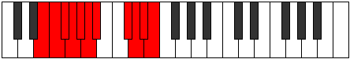 |
| [3711](https://ianring.com/musictheory/scales/3711) | [Dycryllian](ModeBNaturalDycryllian.md) | B | B, C, C#, D, D#, E, F, G#, A, A#, B |  |
| [3711](https://ianring.com/musictheory/scales/3711) | [Dycryllian](ModeGSharpDycryllian.md) | G# | G#, A, A#, B, C, C#, D, F, F#, G, G# |  |
| [3711](https://ianring.com/musictheory/scales/3711) | [Dycryllian](ModeAFlatDycryllian.md) | Ab | Ab, A, Bb, B, C, Db, D, F, Gb, G, Ab |  |
| [3711](https://ianring.com/musictheory/scales/3711) | [Dycryllian](ModeFNaturalDycryllian.md) | F | F, F#, G, G#, A, A#, B, D, D#, E, F |  |
| [3727](https://ianring.com/musictheory/scales/3727) | [Tholyllic](ModeGNaturalTholyllic.md) | G | G, G#, A, A#, D, E, F, F#, G |  |
| [3731](https://ianring.com/musictheory/scales/3731) | [Aeryrian](ModeBFlatAeryrian.md) | Bb | Bb, Cb, D, E#, F##, G#, A, Bb |  |
| [3733](https://ianring.com/musictheory/scales/3733) | [Gycrian](ModeBFlatGycrian.md) | Bb | Bb, C, D, E#, F##, G#, A, Bb |  |
| [3735](https://ianring.com/musictheory/scales/3735) | [Ionagyllic](ModeGNaturalIonagyllic.md) | G | G, G#, A, B, D, E, F, F#, G |  |
| [3735](https://ianring.com/musictheory/scales/3735) | [Ionagyllic](ModeASharpIonagyllic.md) | A# | A#, B, C, D, F, G, G#, A, A# |  |
| [3735](https://ianring.com/musictheory/scales/3735) | [Ionagyllic](ModeBFlatIonagyllic.md) | Bb | Bb, B, C, D, F, G, Ab, A, Bb |  |
| [3737](https://ianring.com/musictheory/scales/3737) | [Phrocrian](ModeFNaturalPhrocrian.md) | F | F, G#, A, B#, C##, D#, E, F |  |
| [3737](https://ianring.com/musictheory/scales/3737) | [Phrocrian](ModeBFlatPhrocrian.md) | Bb | Bb, C#, D, E#, F##, G#, A, Bb |  |
| [3739](https://ianring.com/musictheory/scales/3739) | [Ioninyllic](ModeFNaturalIoninyllic.md) | F | F, F#, G#, A, C, D, D#, E, F |  |
| [3739](https://ianring.com/musictheory/scales/3739) | [Ioninyllic](ModeASharpIoninyllic.md) | A# | A#, B, C#, D, F, G, G#, A, A# |  |
| [3739](https://ianring.com/musictheory/scales/3739) | [Ioninyllic](ModeBFlatIoninyllic.md) | Bb | Bb, B, Db, D, F, G, Ab, A, Bb |  |
| [3741](https://ianring.com/musictheory/scales/3741) | [Zydyllic](ModeFNaturalZydyllic.md) | F | F, G, G#, A, C, D, D#, E, F |  |
| [3741](https://ianring.com/musictheory/scales/3741) | [Zydyllic](ModeASharpZydyllic.md) | A# | A#, C, C#, D, F, G, G#, A, A# |  |
| [3741](https://ianring.com/musictheory/scales/3741) | [Zydyllic](ModeBFlatZydyllic.md) | Bb | Bb, C, Db, D, F, G, Ab, A, Bb |  |
| [3743](https://ianring.com/musictheory/scales/3743) | [Thadygic](ModeFNaturalThadygic.md) | F | F, F#, G, G#, A, C, D, D#, E, F |  |
| [3743](https://ianring.com/musictheory/scales/3743) | [Thadygic](ModeASharpThadygic.md) | A# | A#, B, C, C#, D, F, G, G#, A, A# |  |
| [3743](https://ianring.com/musictheory/scales/3743) | [Thadygic](ModeBFlatThadygic.md) | Bb | Bb, B, C, Db, D, F, G, Ab, A, Bb |  |
| [3743](https://ianring.com/musictheory/scales/3743) | [Thadygic](ModeGNaturalThadygic.md) | G | G, G#, A, A#, B, D, E, F, F#, G |  |
| [3751](https://ianring.com/musictheory/scales/3751) | [Aerathyllic](ModeGNaturalAerathyllic.md) | G | G, G#, A, C, D, E, F, F#, G |  |
| [3759](https://ianring.com/musictheory/scales/3759) | [Darygic](ModeGNaturalDarygic.md) | G | G, G#, A, A#, C, D, E, F, F#, G |  |
| [3761](https://ianring.com/musictheory/scales/3761) | [Ionythian](ModeBFlatIonythian.md) | Bb | Bb, C##, D#, E#, F##, G#, A, Bb |  |
| [3763](https://ianring.com/musictheory/scales/3763) | [Modyllic](ModeENaturalModyllic.md) | E | E, F, G#, A, B, C#, D, D#, E |  |
| [3763](https://ianring.com/musictheory/scales/3763) | [Modyllic](ModeASharpModyllic.md) | A# | A#, B, D, D#, F, G, G#, A, A# |  |
| [3763](https://ianring.com/musictheory/scales/3763) | [Modyllic](ModeBFlatModyllic.md) | Bb | Bb, B, D, Eb, F, G, Ab, A, Bb |  |
| [3765](https://ianring.com/musictheory/scales/3765) | [Aerycryllic](ModeASharpAerycryllic.md) | A# | A#, C, D, D#, F, G, G#, A, A# |  |
| [3765](https://ianring.com/musictheory/scales/3765) | [Aerycryllic](ModeBFlatAerycryllic.md) | Bb | Bb, C, D, Eb, F, G, Ab, A, Bb |  |
| [3767](https://ianring.com/musictheory/scales/3767) | [Bacrygic](ModeENaturalBacrygic.md) | E | E, F, F#, G#, A, B, C#, D, D#, E |  |
| [3767](https://ianring.com/musictheory/scales/3767) | [Bacrygic](ModeGNaturalBacrygic.md) | G | G, G#, A, B, C, D, E, F, F#, G |  |
| [3767](https://ianring.com/musictheory/scales/3767) | [Bacrygic](ModeASharpBacrygic.md) | A# | A#, B, C, D, D#, F, G, G#, A, A# |  |
| [3767](https://ianring.com/musictheory/scales/3767) | [Bacrygic](ModeBFlatBacrygic.md) | Bb | Bb, B, C, D, Eb, F, G, Ab, A, Bb |  |
| [3769](https://ianring.com/musictheory/scales/3769) | [Aeracryllic](ModeFNaturalAeracryllic.md) | F | F, G#, A, A#, C, D, D#, E, F |  |
| [3769](https://ianring.com/musictheory/scales/3769) | [Aeracryllic](ModeASharpAeracryllic.md) | A# | A#, C#, D, D#, F, G, G#, A, A# |  |
| [3769](https://ianring.com/musictheory/scales/3769) | [Aeracryllic](ModeBFlatAeracryllic.md) | Bb | Bb, Db, D, Eb, F, G, Ab, A, Bb |  |
| [3771](https://ianring.com/musictheory/scales/3771) | [Stophygic](ModeFNaturalStophygic.md) | F | F, F#, G#, A, A#, C, D, D#, E, F |  |
| [3771](https://ianring.com/musictheory/scales/3771) | [Stophygic](ModeENaturalStophygic.md) | E | E, F, G, G#, A, B, C#, D, D#, E |  |
| [3771](https://ianring.com/musictheory/scales/3771) | [Stophygic](ModeASharpStophygic.md) | A# | A#, B, C#, D, D#, F, G, G#, A, A# | 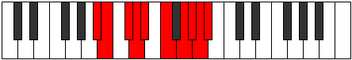 |
| [3771](https://ianring.com/musictheory/scales/3771) | [Stophygic](ModeBFlatStophygic.md) | Bb | Bb, B, Db, D, Eb, F, G, Ab, A, Bb |  |
| [3773](https://ianring.com/musictheory/scales/3773) | [Sorygic](ModeASharpSorygic.md) | A# | A#, C, C#, D, D#, F, G, G#, A, A# |  |
| [3773](https://ianring.com/musictheory/scales/3773) | [Sorygic](ModeBFlatSorygic.md) | Bb | Bb, C, Db, D, Eb, F, G, Ab, A, Bb |  |
| [3773](https://ianring.com/musictheory/scales/3773) | [Sorygic](ModeFNaturalSorygic.md) | F | F, G, G#, A, A#, C, D, D#, E, F |  |
| [3775](https://ianring.com/musictheory/scales/3775) | [Loptyllian](ModeFNaturalLoptyllian.md) | F | F, F#, G, G#, A, A#, C, D, D#, E, F |  |
| [3775](https://ianring.com/musictheory/scales/3775) | [Loptyllian](ModeENaturalLoptyllian.md) | E | E, F, F#, G, G#, A, B, C#, D, D#, E |  |
| [3775](https://ianring.com/musictheory/scales/3775) | [Loptyllian](ModeASharpLoptyllian.md) | A# | A#, B, C, C#, D, D#, F, G, G#, A, A# |  |
| [3775](https://ianring.com/musictheory/scales/3775) | [Loptyllian](ModeBFlatLoptyllian.md) | Bb | Bb, B, C, Db, D, Eb, F, G, Ab, A, Bb |  |
| [3775](https://ianring.com/musictheory/scales/3775) | [Loptyllian](ModeGNaturalLoptyllian.md) | G | G, G#, A, A#, B, C, D, E, F, F#, G |  |
| [3783](https://ianring.com/musictheory/scales/3783) | [Phrygyllic](ModeGNaturalPhrygyllic.md) | G | G, G#, A, C#, D, E, F, F#, G |  |
| [3783](https://ianring.com/musictheory/scales/3783) | [Phrygyllic](ModeGSharpPhrygyllic.md) | G# | G#, A, A#, D, D#, F, F#, G, G# |  |
| [3783](https://ianring.com/musictheory/scales/3783) | [Phrygyllic](ModeAFlatPhrygyllic.md) | Ab | Ab, A, Bb, D, Eb, F, Gb, G, Ab |  |
| [3785](https://ianring.com/musictheory/scales/3785) | [Epagian](ModeDNaturalEpagian.md) | D | D, E#, F###, G##, A##, B#, C#, D |  |
| [3787](https://ianring.com/musictheory/scales/3787) | [Kagyllic](ModeDNaturalKagyllic.md) | D | D, D#, F, G#, A, B, C, C#, D |  |
| [3787](https://ianring.com/musictheory/scales/3787) | [Kagyllic](ModeGSharpKagyllic.md) | G# | G#, A, B, D, D#, F, F#, G, G# |  |
| [3787](https://ianring.com/musictheory/scales/3787) | [Kagyllic](ModeAFlatKagyllic.md) | Ab | Ab, A, B, D, Eb, F, Gb, G, Ab |  |
| [3787](https://ianring.com/musictheory/scales/3787) | [Kagyllic](ModeBNaturalKagyllic.md) | B | B, C, D, F, F#, G#, A, A#, B |  |
| [3789](https://ianring.com/musictheory/scales/3789) | [Eporyllic](ModeDNaturalEporyllic.md) | D | D, E, F, G#, A, B, C, C#, D |  |
| [3789](https://ianring.com/musictheory/scales/3789) | [Eporyllic](ModeBNaturalEporyllic.md) | B | B, C#, D, F, F#, G#, A, A#, B |  |
| [3791](https://ianring.com/musictheory/scales/3791) | [Stodygic](ModeGNaturalStodygic.md) | G | G, G#, A, A#, C#, D, E, F, F#, G |  |
| [3791](https://ianring.com/musictheory/scales/3791) | [Stodygic](ModeDNaturalStodygic.md) | D | D, D#, E, F, G#, A, B, C, C#, D |  |
| [3791](https://ianring.com/musictheory/scales/3791) | [Stodygic](ModeBNaturalStodygic.md) | B | B, C, C#, D, F, F#, G#, A, A#, B |  |
| [3791](https://ianring.com/musictheory/scales/3791) | [Stodygic](ModeGSharpStodygic.md) | G# | G#, A, A#, B, D, D#, F, F#, G, G# |  |
| [3791](https://ianring.com/musictheory/scales/3791) | [Stodygic](ModeAFlatStodygic.md) | Ab | Ab, A, Bb, B, D, Eb, F, Gb, G, Ab |  |
| [3793](https://ianring.com/musictheory/scales/3793) | [Aeopian](ModeASharpAeopian.md) | A# | A#, B###, D##, E#, F##, G#, A, A# |  |
| [3793](https://ianring.com/musictheory/scales/3793) | [Aeopian](ModeBFlatAeopian.md) | Bb | Bb, C##, D##, E#, F##, G#, A, Bb |  |
| [3795](https://ianring.com/musictheory/scales/3795) | [Epothyllic](ModeGSharpEpothyllic.md) | G# | G#, A, C, D, D#, F, F#, G, G# |  |
| [3795](https://ianring.com/musictheory/scales/3795) | [Epothyllic](ModeAFlatEpothyllic.md) | Ab | Ab, A, C, D, Eb, F, Gb, G, Ab |  |
| [3795](https://ianring.com/musictheory/scales/3795) | [Epothyllic](ModeASharpEpothyllic.md) | A# | A#, B, D, E, F, G, G#, A, A# |  |
| [3795](https://ianring.com/musictheory/scales/3795) | [Epothyllic](ModeBFlatEpothyllic.md) | Bb | Bb, B, D, E, F, G, Ab, A, Bb |  |
| [3797](https://ianring.com/musictheory/scales/3797) | [Rocryllic](ModeASharpRocryllic.md) | A# | A#, C, D, E, F, G, G#, A, A# |  |
| [3797](https://ianring.com/musictheory/scales/3797) | [Rocryllic](ModeBFlatRocryllic.md) | Bb | Bb, C, D, E, F, G, Ab, A, Bb |  |
| [3799](https://ianring.com/musictheory/scales/3799) | [Aeralygic](ModeGSharpAeralygic.md) | G# | G#, A, A#, C, D, D#, F, F#, G, G# |  |
| [3799](https://ianring.com/musictheory/scales/3799) | [Aeralygic](ModeAFlatAeralygic.md) | Ab | Ab, A, Bb, C, D, Eb, F, Gb, G, Ab |  |
| [3799](https://ianring.com/musictheory/scales/3799) | [Aeralygic](ModeGNaturalAeralygic.md) | G | G, G#, A, B, C#, D, E, F, F#, G |  |
| [3799](https://ianring.com/musictheory/scales/3799) | [Aeralygic](ModeASharpAeralygic.md) | A# | A#, B, C, D, E, F, G, G#, A, A# |  |
| [3799](https://ianring.com/musictheory/scales/3799) | [Aeralygic](ModeBFlatAeralygic.md) | Bb | Bb, B, C, D, E, F, G, Ab, A, Bb |  |
| [3801](https://ianring.com/musictheory/scales/3801) | [Maptyllic](ModeASharpMaptyllic.md) | A# | A#, C#, D, E, F, G, G#, A, A# |  |
| [3801](https://ianring.com/musictheory/scales/3801) | [Maptyllic](ModeBFlatMaptyllic.md) | Bb | Bb, Db, D, E, F, G, Ab, A, Bb |  |
| [3801](https://ianring.com/musictheory/scales/3801) | [Maptyllic](ModeFNaturalMaptyllic.md) | F | F, G#, A, B, C, D, D#, E, F |  |
| [3801](https://ianring.com/musictheory/scales/3801) | [Maptyllic](ModeDNaturalMaptyllic.md) | D | D, F, F#, G#, A, B, C, C#, D |  |
| [3801](https://ianring.com/musictheory/scales/3801) | [Maptyllic](ModeBNaturalMaptyllic.md) | B | B, D, D#, F, F#, G#, A, A#, B |  |
| [3803](https://ianring.com/musictheory/scales/3803) | [Epidygic](ModeDNaturalEpidygic.md) | D | D, D#, F, F#, G#, A, B, C, C#, D |  |
| [3803](https://ianring.com/musictheory/scales/3803) | [Epidygic](ModeFNaturalEpidygic.md) | F | F, F#, G#, A, B, C, D, D#, E, F |  |
| [3803](https://ianring.com/musictheory/scales/3803) | [Epidygic](ModeGSharpEpidygic.md) | G# | G#, A, B, C, D, D#, F, F#, G, G# |  |
| [3803](https://ianring.com/musictheory/scales/3803) | [Epidygic](ModeAFlatEpidygic.md) | Ab | Ab, A, B, C, D, Eb, F, Gb, G, Ab |  |
| [3803](https://ianring.com/musictheory/scales/3803) | [Epidygic](ModeBNaturalEpidygic.md) | B | B, C, D, D#, F, F#, G#, A, A#, B |  |
| [3803](https://ianring.com/musictheory/scales/3803) | [Epidygic](ModeASharpEpidygic.md) | A# | A#, B, C#, D, E, F, G, G#, A, A# |  |
| [3803](https://ianring.com/musictheory/scales/3803) | [Epidygic](ModeBFlatEpidygic.md) | Bb | Bb, B, Db, D, E, F, G, Ab, A, Bb |  |
| [3805](https://ianring.com/musictheory/scales/3805) | [Moptygic](ModeASharpMoptygic.md) | A# | A#, C, C#, D, E, F, G, G#, A, A# |  |
| [3805](https://ianring.com/musictheory/scales/3805) | [Moptygic](ModeBFlatMoptygic.md) | Bb | Bb, C, Db, D, E, F, G, Ab, A, Bb |  |
| [3805](https://ianring.com/musictheory/scales/3805) | [Moptygic](ModeDNaturalMoptygic.md) | D | D, E, F, F#, G#, A, B, C, C#, D |  |
| [3805](https://ianring.com/musictheory/scales/3805) | [Moptygic](ModeFNaturalMoptygic.md) | F | F, G, G#, A, B, C, D, D#, E, F |  |
| [3805](https://ianring.com/musictheory/scales/3805) | [Moptygic](ModeBNaturalMoptygic.md) | B | B, C#, D, D#, F, F#, G#, A, A#, B | 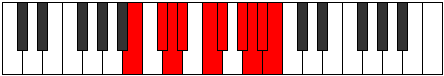 |
| [3807](https://ianring.com/musictheory/scales/3807) | [Bagyllian](ModeDNaturalBagyllian.md) | D | D, D#, E, F, F#, G#, A, B, C, C#, D |  |
| [3807](https://ianring.com/musictheory/scales/3807) | [Bagyllian](ModeFNaturalBagyllian.md) | F | F, F#, G, G#, A, B, C, D, D#, E, F |  |
| [3807](https://ianring.com/musictheory/scales/3807) | [Bagyllian](ModeBNaturalBagyllian.md) | B | B, C, C#, D, D#, F, F#, G#, A, A#, B |  |
| [3807](https://ianring.com/musictheory/scales/3807) | [Bagyllian](ModeASharpBagyllian.md) | A# | A#, B, C, C#, D, E, F, G, G#, A, A# |  |
| [3807](https://ianring.com/musictheory/scales/3807) | [Bagyllian](ModeBFlatBagyllian.md) | Bb | Bb, B, C, Db, D, E, F, G, Ab, A, Bb |  |
| [3807](https://ianring.com/musictheory/scales/3807) | [Bagyllian](ModeGSharpBagyllian.md) | G# | G#, A, A#, B, C, D, D#, F, F#, G, G# |  |
| [3807](https://ianring.com/musictheory/scales/3807) | [Bagyllian](ModeAFlatBagyllian.md) | Ab | Ab, A, Bb, B, C, D, Eb, F, Gb, G, Ab |  |
| [3807](https://ianring.com/musictheory/scales/3807) | [Bagyllian](ModeGNaturalBagyllian.md) | G | G, G#, A, A#, B, C#, D, E, F, F#, G |  |
| [3811](https://ianring.com/musictheory/scales/3811) | [Epogyllic](ModeGSharpEpogyllic.md) | G# | G#, A, C#, D, D#, F, F#, G, G# |  |
| [3811](https://ianring.com/musictheory/scales/3811) | [Epogyllic](ModeAFlatEpogyllic.md) | Ab | Ab, A, Db, D, Eb, F, Gb, G, Ab | 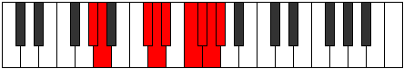 |
| [3813](https://ianring.com/musictheory/scales/3813) | [Aeologyllic](ModeDSharpAeologyllic.md) | D# | D#, F, G#, A, A#, C, C#, D, D# |  |
| [3813](https://ianring.com/musictheory/scales/3813) | [Aeologyllic](ModeEFlatAeologyllic.md) | Eb | Eb, F, Ab, A, Bb, C, Db, D, Eb |  |
| [3815](https://ianring.com/musictheory/scales/3815) | [Mylygic](ModeGNaturalMylygic.md) | G | G, G#, A, C, C#, D, E, F, F#, G |  |
| [3815](https://ianring.com/musictheory/scales/3815) | [Mylygic](ModeDSharpMylygic.md) | D# | D#, E, F, G#, A, A#, C, C#, D, D# |  |
| [3815](https://ianring.com/musictheory/scales/3815) | [Mylygic](ModeEFlatMylygic.md) | Eb | Eb, E, F, Ab, A, Bb, C, Db, D, Eb |  |
| [3815](https://ianring.com/musictheory/scales/3815) | [Mylygic](ModeGSharpMylygic.md) | G# | G#, A, A#, C#, D, D#, F, F#, G, G# |  |
| [3815](https://ianring.com/musictheory/scales/3815) | [Mylygic](ModeAFlatMylygic.md) | Ab | Ab, A, Bb, Db, D, Eb, F, Gb, G, Ab |  |
| [3817](https://ianring.com/musictheory/scales/3817) | [Zoryllic](ModeDNaturalZoryllic.md) | D | D, F, G, G#, A, B, C, C#, D |  |
| [3817](https://ianring.com/musictheory/scales/3817) | [Zoryllic](ModeBNaturalZoryllic.md) | B | B, D, E, F, F#, G#, A, A#, B |  |
| [3819](https://ianring.com/musictheory/scales/3819) | [Aeolanygic](ModeDNaturalAeolanygic.md) | D | D, D#, F, G, G#, A, B, C, C#, D |  |
| [3819](https://ianring.com/musictheory/scales/3819) | [Aeolanygic](ModeGSharpAeolanygic.md) | G# | G#, A, B, C#, D, D#, F, F#, G, G# |  |
| [3819](https://ianring.com/musictheory/scales/3819) | [Aeolanygic](ModeAFlatAeolanygic.md) | Ab | Ab, A, B, Db, D, Eb, F, Gb, G, Ab |  |
| [3819](https://ianring.com/musictheory/scales/3819) | [Aeolanygic](ModeBNaturalAeolanygic.md) | B | B, C, D, E, F, F#, G#, A, A#, B |  |
| [3821](https://ianring.com/musictheory/scales/3821) | [Epyrygic](ModeDSharpEpyrygic.md) | D# | D#, F, F#, G#, A, A#, C, C#, D, D# |  |
| [3821](https://ianring.com/musictheory/scales/3821) | [Epyrygic](ModeEFlatEpyrygic.md) | Eb | Eb, F, Gb, Ab, A, Bb, C, Db, D, Eb |  |
| [3821](https://ianring.com/musictheory/scales/3821) | [Epyrygic](ModeDNaturalEpyrygic.md) | D | D, E, F, G, G#, A, B, C, C#, D |  |
| [3821](https://ianring.com/musictheory/scales/3821) | [Epyrygic](ModeBNaturalEpyrygic.md) | B | B, C#, D, E, F, F#, G#, A, A#, B |  |
| [3823](https://ianring.com/musictheory/scales/3823) | [Epinyllian](ModeDSharpEpinyllian.md) | D# | D#, E, F, F#, G#, A, A#, C, C#, D, D# |  |
| [3823](https://ianring.com/musictheory/scales/3823) | [Epinyllian](ModeEFlatEpinyllian.md) | Eb | Eb, E, F, Gb, Ab, A, Bb, C, Db, D, Eb |  |
| [3823](https://ianring.com/musictheory/scales/3823) | [Epinyllian](ModeGNaturalEpinyllian.md) | G | G, G#, A, A#, C, C#, D, E, F, F#, G |  |
| [3823](https://ianring.com/musictheory/scales/3823) | [Epinyllian](ModeDNaturalEpinyllian.md) | D | D, D#, E, F, G, G#, A, B, C, C#, D |  |
| [3823](https://ianring.com/musictheory/scales/3823) | [Epinyllian](ModeBNaturalEpinyllian.md) | B | B, C, C#, D, E, F, F#, G#, A, A#, B |  |
| [3823](https://ianring.com/musictheory/scales/3823) | [Epinyllian](ModeGSharpEpinyllian.md) | G# | G#, A, A#, B, C#, D, D#, F, F#, G, G# |  |
| [3823](https://ianring.com/musictheory/scales/3823) | [Epinyllian](ModeAFlatEpinyllian.md) | Ab | Ab, A, Bb, B, Db, D, Eb, F, Gb, G, Ab |  |
| [3825](https://ianring.com/musictheory/scales/3825) | [Pynyllic](ModeASharpPynyllic.md) | A# | A#, D, D#, E, F, G, G#, A, A# |  |
| [3825](https://ianring.com/musictheory/scales/3825) | [Pynyllic](ModeBFlatPynyllic.md) | Bb | Bb, D, Eb, E, F, G, Ab, A, Bb |  |
| [3827](https://ianring.com/musictheory/scales/3827) | [Dorygic](ModeGSharpDorygic.md) | G# | G#, A, C, C#, D, D#, F, F#, G, G# |  |
| [3827](https://ianring.com/musictheory/scales/3827) | [Dorygic](ModeAFlatDorygic.md) | Ab | Ab, A, C, Db, D, Eb, F, Gb, G, Ab |  |
| [3827](https://ianring.com/musictheory/scales/3827) | [Dorygic](ModeENaturalDorygic.md) | E | E, F, G#, A, A#, B, C#, D, D#, E |  |
| [3827](https://ianring.com/musictheory/scales/3827) | [Dorygic](ModeASharpDorygic.md) | A# | A#, B, D, D#, E, F, G, G#, A, A# |  |
| [3827](https://ianring.com/musictheory/scales/3827) | [Dorygic](ModeBFlatDorygic.md) | Bb | Bb, B, D, Eb, E, F, G, Ab, A, Bb |  |
| [3829](https://ianring.com/musictheory/scales/3829) | [Aerycrygic](ModeDSharpAerycrygic.md) | D# | D#, F, G, G#, A, A#, C, C#, D, D# |  |
| [3829](https://ianring.com/musictheory/scales/3829) | [Aerycrygic](ModeEFlatAerycrygic.md) | Eb | Eb, F, G, Ab, A, Bb, C, Db, D, Eb |  |
| [3829](https://ianring.com/musictheory/scales/3829) | [Aerycrygic](ModeASharpAerycrygic.md) | A# | A#, C, D, D#, E, F, G, G#, A, A# |  |
| [3829](https://ianring.com/musictheory/scales/3829) | [Aerycrygic](ModeBFlatAerycrygic.md) | Bb | Bb, C, D, Eb, E, F, G, Ab, A, Bb |  |
| [3831](https://ianring.com/musictheory/scales/3831) | [Ionyllian](ModeDSharpIonyllian.md) | D# | D#, E, F, G, G#, A, A#, C, C#, D, D# |  |
| [3831](https://ianring.com/musictheory/scales/3831) | [Ionyllian](ModeEFlatIonyllian.md) | Eb | Eb, E, F, G, Ab, A, Bb, C, Db, D, Eb |  |
| [3831](https://ianring.com/musictheory/scales/3831) | [Ionyllian](ModeGSharpIonyllian.md) | G# | G#, A, A#, C, C#, D, D#, F, F#, G, G# |  |
| [3831](https://ianring.com/musictheory/scales/3831) | [Ionyllian](ModeAFlatIonyllian.md) | Ab | Ab, A, Bb, C, Db, D, Eb, F, Gb, G, Ab |  |
| [3831](https://ianring.com/musictheory/scales/3831) | [Ionyllian](ModeGNaturalIonyllian.md) | G | G, G#, A, B, C, C#, D, E, F, F#, G |  |
| [3831](https://ianring.com/musictheory/scales/3831) | [Ionyllian](ModeENaturalIonyllian.md) | E | E, F, F#, G#, A, A#, B, C#, D, D#, E |  |
| [3831](https://ianring.com/musictheory/scales/3831) | [Ionyllian](ModeASharpIonyllian.md) | A# | A#, B, C, D, D#, E, F, G, G#, A, A# |  |
| [3831](https://ianring.com/musictheory/scales/3831) | [Ionyllian](ModeBFlatIonyllian.md) | Bb | Bb, B, C, D, Eb, E, F, G, Ab, A, Bb |  |
| [3833](https://ianring.com/musictheory/scales/3833) | [Dycrygic](ModeASharpDycrygic.md) | A# | A#, C#, D, D#, E, F, G, G#, A, A# |  |
| [3833](https://ianring.com/musictheory/scales/3833) | [Dycrygic](ModeBFlatDycrygic.md) | Bb | Bb, Db, D, Eb, E, F, G, Ab, A, Bb |  |
| [3833](https://ianring.com/musictheory/scales/3833) | [Dycrygic](ModeDNaturalDycrygic.md) | D | D, F, F#, G, G#, A, B, C, C#, D |  |
| [3833](https://ianring.com/musictheory/scales/3833) | [Dycrygic](ModeFNaturalDycrygic.md) | F | F, G#, A, A#, B, C, D, D#, E, F |  |
| [3833](https://ianring.com/musictheory/scales/3833) | [Dycrygic](ModeBNaturalDycrygic.md) | B | B, D, D#, E, F, F#, G#, A, A#, B |  |
| [3835](https://ianring.com/musictheory/scales/3835) | [Katodyllian](ModeDNaturalKatodyllian.md) | D | D, D#, F, F#, G, G#, A, B, C, C#, D |  |
| [3835](https://ianring.com/musictheory/scales/3835) | [Katodyllian](ModeGSharpKatodyllian.md) | G# | G#, A, B, C, C#, D, D#, F, F#, G, G# |  |
| [3835](https://ianring.com/musictheory/scales/3835) | [Katodyllian](ModeAFlatKatodyllian.md) | Ab | Ab, A, B, C, Db, D, Eb, F, Gb, G, Ab |  |
| [3835](https://ianring.com/musictheory/scales/3835) | [Katodyllian](ModeFNaturalKatodyllian.md) | F | F, F#, G#, A, A#, B, C, D, D#, E, F |  |
| [3835](https://ianring.com/musictheory/scales/3835) | [Katodyllian](ModeBNaturalKatodyllian.md) | B | B, C, D, D#, E, F, F#, G#, A, A#, B |  |
| [3835](https://ianring.com/musictheory/scales/3835) | [Katodyllian](ModeENaturalKatodyllian.md) | E | E, F, G, G#, A, A#, B, C#, D, D#, E |  |
| [3835](https://ianring.com/musictheory/scales/3835) | [Katodyllian](ModeASharpKatodyllian.md) | A# | A#, B, C#, D, D#, E, F, G, G#, A, A# |  |
| [3835](https://ianring.com/musictheory/scales/3835) | [Katodyllian](ModeBFlatKatodyllian.md) | Bb | Bb, B, Db, D, Eb, E, F, G, Ab, A, Bb |  |
| [3837](https://ianring.com/musictheory/scales/3837) | [Garyllian](ModeASharpGaryllian.md) | A# | A#, C, C#, D, D#, E, F, G, G#, A, A# |  |
| [3837](https://ianring.com/musictheory/scales/3837) | [Garyllian](ModeBFlatGaryllian.md) | Bb | Bb, C, Db, D, Eb, E, F, G, Ab, A, Bb |  |
| [3837](https://ianring.com/musictheory/scales/3837) | [Garyllian](ModeDSharpGaryllian.md) | D# | D#, F, F#, G, G#, A, A#, C, C#, D, D# |  |
| [3837](https://ianring.com/musictheory/scales/3837) | [Garyllian](ModeEFlatGaryllian.md) | Eb | Eb, F, Gb, G, Ab, A, Bb, C, Db, D, Eb |  |
| [3837](https://ianring.com/musictheory/scales/3837) | [Garyllian](ModeDNaturalGaryllian.md) | D | D, E, F, F#, G, G#, A, B, C, C#, D |  |
| [3837](https://ianring.com/musictheory/scales/3837) | [Garyllian](ModeBNaturalGaryllian.md) | B | B, C#, D, D#, E, F, F#, G#, A, A#, B |  |
| [3837](https://ianring.com/musictheory/scales/3837) | [Garyllian](ModeFNaturalGaryllian.md) | F | F, G, G#, A, A#, B, C, D, D#, E, F |  |
| [3839](https://ianring.com/musictheory/scales/3839) | [Mixolatic](ModeDSharpMixolatic.md) | D# | D#, E, F, F#, G, G#, A, A#, C, C#, D, D# |  |
| [3839](https://ianring.com/musictheory/scales/3839) | [Mixolatic](ModeEFlatMixolatic.md) | Eb | Eb, E, F, Gb, G, Ab, A, Bb, C, Db, D, Eb |  |
| [3839](https://ianring.com/musictheory/scales/3839) | [Mixolatic](ModeDNaturalMixolatic.md) | D | D, D#, E, F, F#, G, G#, A, B, C, C#, D |  |
| [3839](https://ianring.com/musictheory/scales/3839) | [Mixolatic](ModeBNaturalMixolatic.md) | B | B, C, C#, D, D#, E, F, F#, G#, A, A#, B |  |
| [3839](https://ianring.com/musictheory/scales/3839) | [Mixolatic](ModeASharpMixolatic.md) | A# | A#, B, C, C#, D, D#, E, F, G, G#, A, A# |  |
| [3839](https://ianring.com/musictheory/scales/3839) | [Mixolatic](ModeBFlatMixolatic.md) | Bb | Bb, B, C, Db, D, Eb, E, F, G, Ab, A, Bb |  |
| [3839](https://ianring.com/musictheory/scales/3839) | [Mixolatic](ModeGSharpMixolatic.md) | G# | G#, A, A#, B, C, C#, D, D#, F, F#, G, G# |  |
| [3839](https://ianring.com/musictheory/scales/3839) | [Mixolatic](ModeAFlatMixolatic.md) | Ab | Ab, A, Bb, B, C, Db, D, Eb, F, Gb, G, Ab |  |
| [3839](https://ianring.com/musictheory/scales/3839) | [Mixolatic](ModeGNaturalMixolatic.md) | G | G, G#, A, A#, B, C, C#, D, E, F, F#, G |  |
| [3839](https://ianring.com/musictheory/scales/3839) | [Mixolatic](ModeFNaturalMixolatic.md) | F | F, F#, G, G#, A, A#, B, C, D, D#, E, F |  |
| [3839](https://ianring.com/musictheory/scales/3839) | [Mixolatic](ModeENaturalMixolatic.md) | E | E, F, F#, G, G#, A, A#, B, C#, D, D#, E |  |
| [3865](https://ianring.com/musictheory/scales/3865) | [Starian](ModeFNaturalStarian.md) | F | F, G#, A, B##, C##, D#, E, F |  |
| [3867](https://ianring.com/musictheory/scales/3867) | [Storyllic](ModeFNaturalStoryllic.md) | F | F, F#, G#, A, C#, D, D#, E, F |  |
| [3869](https://ianring.com/musictheory/scales/3869) | [Bygyllic](ModeFNaturalBygyllic.md) | F | F, G, G#, A, C#, D, D#, E, F |  |
| [3869](https://ianring.com/musictheory/scales/3869) | [Bygyllic](ModeFSharpBygyllic.md) | F# | F#, G#, A, A#, D, D#, E, F, F# |  |
| [3869](https://ianring.com/musictheory/scales/3869) | [Bygyllic](ModeGFlatBygyllic.md) | Gb | Gb, Ab, A, Bb, D, Eb, E, F, Gb |  |
| [3871](https://ianring.com/musictheory/scales/3871) | [Aerynygic](ModeFNaturalAerynygic.md) | F | F, F#, G, G#, A, C#, D, D#, E, F |  |
| [3871](https://ianring.com/musictheory/scales/3871) | [Aerynygic](ModeFSharpAerynygic.md) | F# | F#, G, G#, A, A#, D, D#, E, F, F# |  |
| [3871](https://ianring.com/musictheory/scales/3871) | [Aerynygic](ModeGFlatAerynygic.md) | Gb | Gb, G, Ab, A, Bb, D, Eb, E, F, Gb |  |
| [3875](https://ianring.com/musictheory/scales/3875) | [Aeryptian](ModeANaturalAeryptian.md) | A | A, Bb, C##, D###, E##, F##, G#, A |  |
| [3877](https://ianring.com/musictheory/scales/3877) | [Thanian](ModeANaturalThanian.md) | A | A, B, C##, D###, E##, F##, G#, A |  |
| [3877](https://ianring.com/musictheory/scales/3877) | [Thanian](ModeCNaturalThanian.md) | C | C, D, E#, F###, G##, A#, B, C |  |
| [3879](https://ianring.com/musictheory/scales/3879) | [Pathyllic](ModeCNaturalPathyllic.md) | C | C, C#, D, F, G#, A, A#, B, C |  |
| [3879](https://ianring.com/musictheory/scales/3879) | [Pathyllic](ModeANaturalPathyllic.md) | A | A, A#, B, D, F, F#, G, G#, A |  |
| [3881](https://ianring.com/musictheory/scales/3881) | [Morian](ModeANaturalMorian.md) | A | A, B#, C##, D###, E##, F##, G#, A |  |
| [3883](https://ianring.com/musictheory/scales/3883) | [Kyryllic](ModeANaturalKyryllic.md) | A | A, A#, C, D, F, F#, G, G#, A |  |
| [3885](https://ianring.com/musictheory/scales/3885) | [Styryllic](ModeFSharpStyryllic.md) | F# | F#, G#, A, B, D, D#, E, F, F# |  |
| [3885](https://ianring.com/musictheory/scales/3885) | [Styryllic](ModeGFlatStyryllic.md) | Gb | Gb, Ab, A, B, D, Eb, E, F, Gb |  |
| [3885](https://ianring.com/musictheory/scales/3885) | [Styryllic](ModeANaturalStyryllic.md) | A | A, B, C, D, F, F#, G, G#, A |  |
| [3885](https://ianring.com/musictheory/scales/3885) | [Styryllic](ModeCNaturalStyryllic.md) | C | C, D, D#, F, G#, A, A#, B, C | 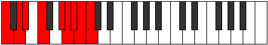 |
| [3887](https://ianring.com/musictheory/scales/3887) | [Phrathygic](ModeFSharpPhrathygic.md) | F# | F#, G, G#, A, B, D, D#, E, F, F# |  |
| [3887](https://ianring.com/musictheory/scales/3887) | [Phrathygic](ModeGFlatPhrathygic.md) | Gb | Gb, G, Ab, A, B, D, Eb, E, F, Gb |  |
| [3887](https://ianring.com/musictheory/scales/3887) | [Phrathygic](ModeCNaturalPhrathygic.md) | C | C, C#, D, D#, F, G#, A, A#, B, C |  |
| [3887](https://ianring.com/musictheory/scales/3887) | [Phrathygic](ModeANaturalPhrathygic.md) | A | A, A#, B, C, D, F, F#, G, G#, A |  |
| [3889](https://ianring.com/musictheory/scales/3889) | [Parian](ModeANaturalParian.md) | A | A, B##, C##, D###, E##, F##, G#, A |  |
| [3891](https://ianring.com/musictheory/scales/3891) | [Ryryllic](ModeENaturalRyryllic.md) | E | E, F, G#, A, C, C#, D, D#, E |  |
| [3891](https://ianring.com/musictheory/scales/3891) | [Ryryllic](ModeANaturalRyryllic.md) | A | A, A#, C#, D, F, F#, G, G#, A |  |
| [3893](https://ianring.com/musictheory/scales/3893) | [Phrocryllic](ModeANaturalPhrocryllic.md) | A | A, B, C#, D, F, F#, G, G#, A |  |
| [3893](https://ianring.com/musictheory/scales/3893) | [Phrocryllic](ModeCNaturalPhrocryllic.md) | C | C, D, E, F, G#, A, A#, B, C |  |
| [3895](https://ianring.com/musictheory/scales/3895) | [Eparygic](ModeENaturalEparygic.md) | E | E, F, F#, G#, A, C, C#, D, D#, E |  |
| [3895](https://ianring.com/musictheory/scales/3895) | [Eparygic](ModeCNaturalEparygic.md) | C | C, C#, D, E, F, G#, A, A#, B, C |  |
| [3895](https://ianring.com/musictheory/scales/3895) | [Eparygic](ModeANaturalEparygic.md) | A | A, A#, B, C#, D, F, F#, G, G#, A |  |
| [3897](https://ianring.com/musictheory/scales/3897) | [Locryllic](ModeANaturalLocryllic.md) | A | A, C, C#, D, F, F#, G, G#, A |  |
| [3897](https://ianring.com/musictheory/scales/3897) | [Locryllic](ModeFNaturalLocryllic.md) | F | F, G#, A, A#, C#, D, D#, E, F |  |
| [3899](https://ianring.com/musictheory/scales/3899) | [Katorygic](ModeENaturalKatorygic.md) | E | E, F, G, G#, A, C, C#, D, D#, E |  |
| [3899](https://ianring.com/musictheory/scales/3899) | [Katorygic](ModeFNaturalKatorygic.md) | F | F, F#, G#, A, A#, C#, D, D#, E, F |  |
| [3899](https://ianring.com/musictheory/scales/3899) | [Katorygic](ModeANaturalKatorygic.md) | A | A, A#, C, C#, D, F, F#, G, G#, A |  |
| [3901](https://ianring.com/musictheory/scales/3901) | [Bycrygic](ModeFNaturalBycrygic.md) | F | F, G, G#, A, A#, C#, D, D#, E, F |  |
| [3901](https://ianring.com/musictheory/scales/3901) | [Bycrygic](ModeANaturalBycrygic.md) | A | A, B, C, C#, D, F, F#, G, G#, A | 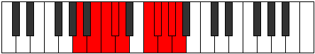 |
| [3901](https://ianring.com/musictheory/scales/3901) | [Bycrygic](ModeCNaturalBycrygic.md) | C | C, D, D#, E, F, G#, A, A#, B, C |  |
| [3901](https://ianring.com/musictheory/scales/3901) | [Bycrygic](ModeFSharpBycrygic.md) | F# | F#, G#, A, A#, B, D, D#, E, F, F# |  |
| [3901](https://ianring.com/musictheory/scales/3901) | [Bycrygic](ModeGFlatBycrygic.md) | Gb | Gb, Ab, A, Bb, B, D, Eb, E, F, Gb |  |
| [3903](https://ianring.com/musictheory/scales/3903) | [Aeogyllian](ModeENaturalAeogyllian.md) | E | E, F, F#, G, G#, A, C, C#, D, D#, E |  |
| [3903](https://ianring.com/musictheory/scales/3903) | [Aeogyllian](ModeFNaturalAeogyllian.md) | F | F, F#, G, G#, A, A#, C#, D, D#, E, F |  |
| [3903](https://ianring.com/musictheory/scales/3903) | [Aeogyllian](ModeCNaturalAeogyllian.md) | C | C, C#, D, D#, E, F, G#, A, A#, B, C |  |
| [3903](https://ianring.com/musictheory/scales/3903) | [Aeogyllian](ModeANaturalAeogyllian.md) | A | A, A#, B, C, C#, D, F, F#, G, G#, A |  |
| [3903](https://ianring.com/musictheory/scales/3903) | [Aeogyllian](ModeFSharpAeogyllian.md) | F# | F#, G, G#, A, A#, B, D, D#, E, F, F# |  |
| [3903](https://ianring.com/musictheory/scales/3903) | [Aeogyllian](ModeGFlatAeogyllian.md) | Gb | Gb, G, Ab, A, Bb, B, D, Eb, E, F, Gb |  |
| [3911](https://ianring.com/musictheory/scales/3911) | [Katyryllic](ModeGSharpKatyryllic.md) | G# | G#, A, A#, D, E, F, F#, G, G# |  |
| [3911](https://ianring.com/musictheory/scales/3911) | [Katyryllic](ModeAFlatKatyryllic.md) | Ab | Ab, A, Bb, D, E, F, Gb, G, Ab |  |
| [3915](https://ianring.com/musictheory/scales/3915) | [Gogyllic](ModeGSharpGogyllic.md) | G# | G#, A, B, D, E, F, F#, G, G# |  |
| [3915](https://ianring.com/musictheory/scales/3915) | [Gogyllic](ModeAFlatGogyllic.md) | Ab | Ab, A, B, D, E, F, Gb, G, Ab |  |
| [3915](https://ianring.com/musictheory/scales/3915) | [Gogyllic](ModeBNaturalGogyllic.md) | B | B, C, D, F, G, G#, A, A#, B |  |
| [3917](https://ianring.com/musictheory/scales/3917) | [Epaphyllic](ModeFSharpEpaphyllic.md) | F# | F#, G#, A, C, D, D#, E, F, F# |  |
| [3917](https://ianring.com/musictheory/scales/3917) | [Epaphyllic](ModeGFlatEpaphyllic.md) | Gb | Gb, Ab, A, C, D, Eb, E, F, Gb |  |
| [3917](https://ianring.com/musictheory/scales/3917) | [Epaphyllic](ModeBNaturalEpaphyllic.md) | B | B, C#, D, F, G, G#, A, A#, B |  |
| [3919](https://ianring.com/musictheory/scales/3919) | [Lynygic](ModeFSharpLynygic.md) | F# | F#, G, G#, A, C, D, D#, E, F, F# | 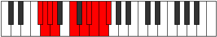 |
| [3919](https://ianring.com/musictheory/scales/3919) | [Lynygic](ModeGFlatLynygic.md) | Gb | Gb, G, Ab, A, C, D, Eb, E, F, Gb |  |
| [3919](https://ianring.com/musictheory/scales/3919) | [Lynygic](ModeBNaturalLynygic.md) | B | B, C, C#, D, F, G, G#, A, A#, B |  |
| [3919](https://ianring.com/musictheory/scales/3919) | [Lynygic](ModeGSharpLynygic.md) | G# | G#, A, A#, B, D, E, F, F#, G, G# |  |
| [3919](https://ianring.com/musictheory/scales/3919) | [Lynygic](ModeAFlatLynygic.md) | Ab | Ab, A, Bb, B, D, E, F, Gb, G, Ab |  |
| [3923](https://ianring.com/musictheory/scales/3923) | [Stoptyllic](ModeGSharpStoptyllic.md) | G# | G#, A, C, D, E, F, F#, G, G# |  |
| [3923](https://ianring.com/musictheory/scales/3923) | [Stoptyllic](ModeAFlatStoptyllic.md) | Ab | Ab, A, C, D, E, F, Gb, G, Ab |  |
| [3927](https://ianring.com/musictheory/scales/3927) | [Monygic](ModeGSharpMonygic.md) | G# | G#, A, A#, C, D, E, F, F#, G, G# |  |
| [3927](https://ianring.com/musictheory/scales/3927) | [Monygic](ModeAFlatMonygic.md) | Ab | Ab, A, Bb, C, D, E, F, Gb, G, Ab |  |
| [3929](https://ianring.com/musictheory/scales/3929) | [Aeolothyllic](ModeFNaturalAeolothyllic.md) | F | F, G#, A, B, C#, D, D#, E, F |  |
| [3929](https://ianring.com/musictheory/scales/3929) | [Aeolothyllic](ModeBNaturalAeolothyllic.md) | B | B, D, D#, F, G, G#, A, A#, B |  |
| [3931](https://ianring.com/musictheory/scales/3931) | [Aerygic](ModeFNaturalAerygic.md) | F | F, F#, G#, A, B, C#, D, D#, E, F |  |
| [3931](https://ianring.com/musictheory/scales/3931) | [Aerygic](ModeGSharpAerygic.md) | G# | G#, A, B, C, D, E, F, F#, G, G# |  |
| [3931](https://ianring.com/musictheory/scales/3931) | [Aerygic](ModeAFlatAerygic.md) | Ab | Ab, A, B, C, D, E, F, Gb, G, Ab |  |
| [3931](https://ianring.com/musictheory/scales/3931) | [Aerygic](ModeBNaturalAerygic.md) | B | B, C, D, D#, F, G, G#, A, A#, B |  |
| [3933](https://ianring.com/musictheory/scales/3933) | [Ionidygic](ModeFSharpIonidygic.md) | F# | F#, G#, A, A#, C, D, D#, E, F, F# |  |
| [3933](https://ianring.com/musictheory/scales/3933) | [Ionidygic](ModeGFlatIonidygic.md) | Gb | Gb, Ab, A, Bb, C, D, Eb, E, F, Gb |  |
| [3933](https://ianring.com/musictheory/scales/3933) | [Ionidygic](ModeFNaturalIonidygic.md) | F | F, G, G#, A, B, C#, D, D#, E, F |  |
| [3933](https://ianring.com/musictheory/scales/3933) | [Ionidygic](ModeBNaturalIonidygic.md) | B | B, C#, D, D#, F, G, G#, A, A#, B |  |
| [3935](https://ianring.com/musictheory/scales/3935) | [Kataphyllian](ModeFSharpKataphyllian.md) | F# | F#, G, G#, A, A#, C, D, D#, E, F, F# |  |
| [3935](https://ianring.com/musictheory/scales/3935) | [Kataphyllian](ModeGFlatKataphyllian.md) | Gb | Gb, G, Ab, A, Bb, C, D, Eb, E, F, Gb |  |
| [3935](https://ianring.com/musictheory/scales/3935) | [Kataphyllian](ModeFNaturalKataphyllian.md) | F | F, F#, G, G#, A, B, C#, D, D#, E, F |  |
| [3935](https://ianring.com/musictheory/scales/3935) | [Kataphyllian](ModeBNaturalKataphyllian.md) | B | B, C, C#, D, D#, F, G, G#, A, A#, B |  |
| [3935](https://ianring.com/musictheory/scales/3935) | [Kataphyllian](ModeGSharpKataphyllian.md) | G# | G#, A, A#, B, C, D, E, F, F#, G, G# |  |
| [3935](https://ianring.com/musictheory/scales/3935) | [Kataphyllian](ModeAFlatKataphyllian.md) | Ab | Ab, A, Bb, B, C, D, E, F, Gb, G, Ab |  |
| [3939](https://ianring.com/musictheory/scales/3939) | [Dogyllic](ModeGSharpDogyllic.md) | G# | G#, A, C#, D, E, F, F#, G, G# |  |
| [3939](https://ianring.com/musictheory/scales/3939) | [Dogyllic](ModeAFlatDogyllic.md) | Ab | Ab, A, Db, D, E, F, Gb, G, Ab |  |
| [3939](https://ianring.com/musictheory/scales/3939) | [Dogyllic](ModeANaturalDogyllic.md) | A | A, A#, D, D#, F, F#, G, G#, A |  |
| [3941](https://ianring.com/musictheory/scales/3941) | [Stathyllic](ModeDSharpStathyllic.md) | D# | D#, F, G#, A, B, C, C#, D, D# |  |
| [3941](https://ianring.com/musictheory/scales/3941) | [Stathyllic](ModeEFlatStathyllic.md) | Eb | Eb, F, Ab, A, B, C, Db, D, Eb |  |
| [3941](https://ianring.com/musictheory/scales/3941) | [Stathyllic](ModeANaturalStathyllic.md) | A | A, B, D, D#, F, F#, G, G#, A |  |
| [3941](https://ianring.com/musictheory/scales/3941) | [Stathyllic](ModeCNaturalStathyllic.md) | C | C, D, F, F#, G#, A, A#, B, C |  |
| [3943](https://ianring.com/musictheory/scales/3943) | [Zynygic](ModeGSharpZynygic.md) | G# | G#, A, A#, C#, D, E, F, F#, G, G# |  |
| [3943](https://ianring.com/musictheory/scales/3943) | [Zynygic](ModeAFlatZynygic.md) | Ab | Ab, A, Bb, Db, D, E, F, Gb, G, Ab |  |
| [3943](https://ianring.com/musictheory/scales/3943) | [Zynygic](ModeDSharpZynygic.md) | D# | D#, E, F, G#, A, B, C, C#, D, D# |  |
| [3943](https://ianring.com/musictheory/scales/3943) | [Zynygic](ModeEFlatZynygic.md) | Eb | Eb, E, F, Ab, A, B, C, Db, D, Eb |  |
| [3943](https://ianring.com/musictheory/scales/3943) | [Zynygic](ModeCNaturalZynygic.md) | C | C, C#, D, F, F#, G#, A, A#, B, C |  |
| [3943](https://ianring.com/musictheory/scales/3943) | [Zynygic](ModeANaturalZynygic.md) | A | A, A#, B, D, D#, F, F#, G, G#, A |  |
| [3945](https://ianring.com/musictheory/scales/3945) | [Lydyllic](ModeANaturalLydyllic.md) | A | A, C, D, D#, F, F#, G, G#, A |  |
| [3945](https://ianring.com/musictheory/scales/3945) | [Lydyllic](ModeBNaturalLydyllic.md) | B | B, D, E, F, G, G#, A, A#, B |  |
| [3947](https://ianring.com/musictheory/scales/3947) | [Ryptygic](ModeANaturalRyptygic.md) | A | A, A#, C, D, D#, F, F#, G, G#, A |  |
| [3947](https://ianring.com/musictheory/scales/3947) | [Ryptygic](ModeGSharpRyptygic.md) | G# | G#, A, B, C#, D, E, F, F#, G, G# |  |
| [3947](https://ianring.com/musictheory/scales/3947) | [Ryptygic](ModeAFlatRyptygic.md) | Ab | Ab, A, B, Db, D, E, F, Gb, G, Ab |  |
| [3947](https://ianring.com/musictheory/scales/3947) | [Ryptygic](ModeBNaturalRyptygic.md) | B | B, C, D, E, F, G, G#, A, A#, B |  |
| [3949](https://ianring.com/musictheory/scales/3949) | [Koptygic](ModeDSharpKoptygic.md) | D# | D#, F, F#, G#, A, B, C, C#, D, D# |  |
| [3949](https://ianring.com/musictheory/scales/3949) | [Koptygic](ModeEFlatKoptygic.md) | Eb | Eb, F, Gb, Ab, A, B, C, Db, D, Eb |  |
| [3949](https://ianring.com/musictheory/scales/3949) | [Koptygic](ModeFSharpKoptygic.md) | F# | F#, G#, A, B, C, D, D#, E, F, F# |  |
| [3949](https://ianring.com/musictheory/scales/3949) | [Koptygic](ModeGFlatKoptygic.md) | Gb | Gb, Ab, A, B, C, D, Eb, E, F, Gb |  |
| [3949](https://ianring.com/musictheory/scales/3949) | [Koptygic](ModeANaturalKoptygic.md) | A | A, B, C, D, D#, F, F#, G, G#, A |  |
| [3949](https://ianring.com/musictheory/scales/3949) | [Koptygic](ModeCNaturalKoptygic.md) | C | C, D, D#, F, F#, G#, A, A#, B, C |  |
| [3949](https://ianring.com/musictheory/scales/3949) | [Koptygic](ModeBNaturalKoptygic.md) | B | B, C#, D, E, F, G, G#, A, A#, B |  |
| [3951](https://ianring.com/musictheory/scales/3951) | [Mathyllian](ModeDSharpMathyllian.md) | D# | D#, E, F, F#, G#, A, B, C, C#, D, D# |  |
| [3951](https://ianring.com/musictheory/scales/3951) | [Mathyllian](ModeEFlatMathyllian.md) | Eb | Eb, E, F, Gb, Ab, A, B, C, Db, D, Eb |  |
| [3951](https://ianring.com/musictheory/scales/3951) | [Mathyllian](ModeFSharpMathyllian.md) | F# | F#, G, G#, A, B, C, D, D#, E, F, F# |  |
| [3951](https://ianring.com/musictheory/scales/3951) | [Mathyllian](ModeGFlatMathyllian.md) | Gb | Gb, G, Ab, A, B, C, D, Eb, E, F, Gb |  |
| [3951](https://ianring.com/musictheory/scales/3951) | [Mathyllian](ModeCNaturalMathyllian.md) | C | C, C#, D, D#, F, F#, G#, A, A#, B, C |  |
| [3951](https://ianring.com/musictheory/scales/3951) | [Mathyllian](ModeBNaturalMathyllian.md) | B | B, C, C#, D, E, F, G, G#, A, A#, B |  |
| [3951](https://ianring.com/musictheory/scales/3951) | [Mathyllian](ModeANaturalMathyllian.md) | A | A, A#, B, C, D, D#, F, F#, G, G#, A |  |
| [3951](https://ianring.com/musictheory/scales/3951) | [Mathyllian](ModeGSharpMathyllian.md) | G# | G#, A, A#, B, C#, D, E, F, F#, G, G# |  |
| [3951](https://ianring.com/musictheory/scales/3951) | [Mathyllian](ModeAFlatMathyllian.md) | Ab | Ab, A, Bb, B, Db, D, E, F, Gb, G, Ab |  |
| [3953](https://ianring.com/musictheory/scales/3953) | [Thagyllic](ModeANaturalThagyllic.md) | A | A, C#, D, D#, F, F#, G, G#, A |  |
| [3955](https://ianring.com/musictheory/scales/3955) | [Galygic](ModeGSharpGalygic.md) | G# | G#, A, C, C#, D, E, F, F#, G, G# |  |
| [3955](https://ianring.com/musictheory/scales/3955) | [Galygic](ModeAFlatGalygic.md) | Ab | Ab, A, C, Db, D, E, F, Gb, G, Ab |  |
| [3955](https://ianring.com/musictheory/scales/3955) | [Galygic](ModeENaturalGalygic.md) | E | E, F, G#, A, A#, C, C#, D, D#, E |  |
| [3955](https://ianring.com/musictheory/scales/3955) | [Galygic](ModeANaturalGalygic.md) | A | A, A#, C#, D, D#, F, F#, G, G#, A |  |
| [3957](https://ianring.com/musictheory/scales/3957) | [Porygic](ModeDSharpPorygic.md) | D# | D#, F, G, G#, A, B, C, C#, D, D# |  |
| [3957](https://ianring.com/musictheory/scales/3957) | [Porygic](ModeEFlatPorygic.md) | Eb | Eb, F, G, Ab, A, B, C, Db, D, Eb |  |
| [3957](https://ianring.com/musictheory/scales/3957) | [Porygic](ModeANaturalPorygic.md) | A | A, B, C#, D, D#, F, F#, G, G#, A |  |
| [3957](https://ianring.com/musictheory/scales/3957) | [Porygic](ModeCNaturalPorygic.md) | C | C, D, E, F, F#, G#, A, A#, B, C |  |
| [3959](https://ianring.com/musictheory/scales/3959) | [Katagyllian](ModeENaturalKatagyllian.md) | E | E, F, F#, G#, A, A#, C, C#, D, D#, E |  |
| [3959](https://ianring.com/musictheory/scales/3959) | [Katagyllian](ModeGSharpKatagyllian.md) | G# | G#, A, A#, C, C#, D, E, F, F#, G, G# |  |
| [3959](https://ianring.com/musictheory/scales/3959) | [Katagyllian](ModeAFlatKatagyllian.md) | Ab | Ab, A, Bb, C, Db, D, E, F, Gb, G, Ab |  |
| [3959](https://ianring.com/musictheory/scales/3959) | [Katagyllian](ModeDSharpKatagyllian.md) | D# | D#, E, F, G, G#, A, B, C, C#, D, D# |  |
| [3959](https://ianring.com/musictheory/scales/3959) | [Katagyllian](ModeEFlatKatagyllian.md) | Eb | Eb, E, F, G, Ab, A, B, C, Db, D, Eb |  |
| [3959](https://ianring.com/musictheory/scales/3959) | [Katagyllian](ModeCNaturalKatagyllian.md) | C | C, C#, D, E, F, F#, G#, A, A#, B, C |  |
| [3959](https://ianring.com/musictheory/scales/3959) | [Katagyllian](ModeANaturalKatagyllian.md) | A | A, A#, B, C#, D, D#, F, F#, G, G#, A |  |
| [3961](https://ianring.com/musictheory/scales/3961) | [Mixolydygic](ModeANaturalMixolydygic.md) | A | A, C, C#, D, D#, F, F#, G, G#, A |  |
| [3961](https://ianring.com/musictheory/scales/3961) | [Mixolydygic](ModeFNaturalMixolydygic.md) | F | F, G#, A, A#, B, C#, D, D#, E, F |  |
| [3961](https://ianring.com/musictheory/scales/3961) | [Mixolydygic](ModeBNaturalMixolydygic.md) | B | B, D, D#, E, F, G, G#, A, A#, B |  |
| [3963](https://ianring.com/musictheory/scales/3963) | [Aeoryllian](ModeENaturalAeoryllian.md) | E | E, F, G, G#, A, A#, C, C#, D, D#, E |  |
| [3963](https://ianring.com/musictheory/scales/3963) | [Aeoryllian](ModeANaturalAeoryllian.md) | A | A, A#, C, C#, D, D#, F, F#, G, G#, A |  |
| [3963](https://ianring.com/musictheory/scales/3963) | [Aeoryllian](ModeGSharpAeoryllian.md) | G# | G#, A, B, C, C#, D, E, F, F#, G, G# |  |
| [3963](https://ianring.com/musictheory/scales/3963) | [Aeoryllian](ModeAFlatAeoryllian.md) | Ab | Ab, A, B, C, Db, D, E, F, Gb, G, Ab |  |
| [3963](https://ianring.com/musictheory/scales/3963) | [Aeoryllian](ModeFNaturalAeoryllian.md) | F | F, F#, G#, A, A#, B, C#, D, D#, E, F |  |
| [3963](https://ianring.com/musictheory/scales/3963) | [Aeoryllian](ModeBNaturalAeoryllian.md) | B | B, C, D, D#, E, F, G, G#, A, A#, B |  |
| [3965](https://ianring.com/musictheory/scales/3965) | [Thydyllian](ModeDSharpThydyllian.md) | D# | D#, F, F#, G, G#, A, B, C, C#, D, D# |  |
| [3965](https://ianring.com/musictheory/scales/3965) | [Thydyllian](ModeEFlatThydyllian.md) | Eb | Eb, F, Gb, G, Ab, A, B, C, Db, D, Eb |  |
| [3965](https://ianring.com/musictheory/scales/3965) | [Thydyllian](ModeANaturalThydyllian.md) | A | A, B, C, C#, D, D#, F, F#, G, G#, A |  |
| [3965](https://ianring.com/musictheory/scales/3965) | [Thydyllian](ModeCNaturalThydyllian.md) | C | C, D, D#, E, F, F#, G#, A, A#, B, C |  |
| [3965](https://ianring.com/musictheory/scales/3965) | [Thydyllian](ModeFSharpThydyllian.md) | F# | F#, G#, A, A#, B, C, D, D#, E, F, F# |  |
| [3965](https://ianring.com/musictheory/scales/3965) | [Thydyllian](ModeGFlatThydyllian.md) | Gb | Gb, Ab, A, Bb, B, C, D, Eb, E, F, Gb |  |
| [3965](https://ianring.com/musictheory/scales/3965) | [Thydyllian](ModeFNaturalThydyllian.md) | F | F, G, G#, A, A#, B, C#, D, D#, E, F |  |
| [3965](https://ianring.com/musictheory/scales/3965) | [Thydyllian](ModeBNaturalThydyllian.md) | B | B, C#, D, D#, E, F, G, G#, A, A#, B |  |
| [3967](https://ianring.com/musictheory/scales/3967) | [Soratic](ModeENaturalSoratic.md) | E | E, F, F#, G, G#, A, A#, C, C#, D, D#, E |  |
| [3967](https://ianring.com/musictheory/scales/3967) | [Soratic](ModeDSharpSoratic.md) | D# | D#, E, F, F#, G, G#, A, B, C, C#, D, D# |  |
| [3967](https://ianring.com/musictheory/scales/3967) | [Soratic](ModeEFlatSoratic.md) | Eb | Eb, E, F, Gb, G, Ab, A, B, C, Db, D, Eb |  |
| [3967](https://ianring.com/musictheory/scales/3967) | [Soratic](ModeCNaturalSoratic.md) | C | C, C#, D, D#, E, F, F#, G#, A, A#, B, C |  |
| [3967](https://ianring.com/musictheory/scales/3967) | [Soratic](ModeBNaturalSoratic.md) | B | B, C, C#, D, D#, E, F, G, G#, A, A#, B |  |
| [3967](https://ianring.com/musictheory/scales/3967) | [Soratic](ModeANaturalSoratic.md) | A | A, A#, B, C, C#, D, D#, F, F#, G, G#, A |  |
| [3967](https://ianring.com/musictheory/scales/3967) | [Soratic](ModeGSharpSoratic.md) | G# | G#, A, A#, B, C, C#, D, E, F, F#, G, G# |  |
| [3967](https://ianring.com/musictheory/scales/3967) | [Soratic](ModeAFlatSoratic.md) | Ab | Ab, A, Bb, B, C, Db, D, E, F, Gb, G, Ab |  |
| [3967](https://ianring.com/musictheory/scales/3967) | [Soratic](ModeFSharpSoratic.md) | F# | F#, G, G#, A, A#, B, C, D, D#, E, F, F# |  |
| [3967](https://ianring.com/musictheory/scales/3967) | [Soratic](ModeGFlatSoratic.md) | Gb | Gb, G, Ab, A, Bb, B, C, D, Eb, E, F, Gb |  |
| [3967](https://ianring.com/musictheory/scales/3967) | [Soratic](ModeFNaturalSoratic.md) | F | F, F#, G, G#, A, A#, B, C#, D, D#, E, F |  |
| [3981](https://ianring.com/musictheory/scales/3981) | [Phrycryllic](ModeFSharpPhrycryllic.md) | F# | F#, G#, A, C#, D, D#, E, F, F# |  |
| [3981](https://ianring.com/musictheory/scales/3981) | [Phrycryllic](ModeGFlatPhrycryllic.md) | Gb | Gb, Ab, A, Db, D, Eb, E, F, Gb |  |
| [3983](https://ianring.com/musictheory/scales/3983) | [Thyptygic](ModeFSharpThyptygic.md) | F# | F#, G, G#, A, C#, D, D#, E, F, F# |  |
| [3983](https://ianring.com/musictheory/scales/3983) | [Thyptygic](ModeGFlatThyptygic.md) | Gb | Gb, G, Ab, A, Db, D, Eb, E, F, Gb |  |
| [3983](https://ianring.com/musictheory/scales/3983) | [Thyptygic](ModeGNaturalThyptygic.md) | G | G, G#, A, A#, D, D#, E, F, F#, G |  |
| [3985](https://ianring.com/musictheory/scales/3985) | [Thadian](ModeASharpThadian.md) | A# | A#, B###, D###, E##, F##, G#, A, A# |  |
| [3985](https://ianring.com/musictheory/scales/3985) | [Thadian](ModeBFlatThadian.md) | Bb | Bb, C##, D###, E##, F##, G#, A, Bb |  |
| [3987](https://ianring.com/musictheory/scales/3987) | [Loryllic](ModeCSharpLoryllic.md) | C# | C#, D, F, G#, A, A#, B, C, C# |  |
| [3987](https://ianring.com/musictheory/scales/3987) | [Loryllic](ModeDFlatLoryllic.md) | Db | Db, D, F, Ab, A, Bb, B, C, Db |  |
| [3987](https://ianring.com/musictheory/scales/3987) | [Loryllic](ModeASharpLoryllic.md) | A# | A#, B, D, F, F#, G, G#, A, A# |  |
| [3987](https://ianring.com/musictheory/scales/3987) | [Loryllic](ModeBFlatLoryllic.md) | Bb | Bb, B, D, F, Gb, G, Ab, A, Bb |  |
| [3989](https://ianring.com/musictheory/scales/3989) | [Sythyllic](ModeASharpSythyllic.md) | A# | A#, C, D, F, F#, G, G#, A, A# |  |
| [3989](https://ianring.com/musictheory/scales/3989) | [Sythyllic](ModeBFlatSythyllic.md) | Bb | Bb, C, D, F, Gb, G, Ab, A, Bb |  |
| [3991](https://ianring.com/musictheory/scales/3991) | [Badygic](ModeGNaturalBadygic.md) | G | G, G#, A, B, D, D#, E, F, F#, G |  |
| [3991](https://ianring.com/musictheory/scales/3991) | [Badygic](ModeCSharpBadygic.md) | C# | C#, D, D#, F, G#, A, A#, B, C, C# |  |
| [3991](https://ianring.com/musictheory/scales/3991) | [Badygic](ModeDFlatBadygic.md) | Db | Db, D, Eb, F, Ab, A, Bb, B, C, Db |  |
| [3991](https://ianring.com/musictheory/scales/3991) | [Badygic](ModeASharpBadygic.md) | A# | A#, B, C, D, F, F#, G, G#, A, A# |  |
| [3991](https://ianring.com/musictheory/scales/3991) | [Badygic](ModeBFlatBadygic.md) | Bb | Bb, B, C, D, F, Gb, G, Ab, A, Bb |  |
| [3993](https://ianring.com/musictheory/scales/3993) | [Ioniptyllic](ModeFNaturalIoniptyllic.md) | F | F, G#, A, C, C#, D, D#, E, F |  |
| [3993](https://ianring.com/musictheory/scales/3993) | [Ioniptyllic](ModeASharpIoniptyllic.md) | A# | A#, C#, D, F, F#, G, G#, A, A# |  |
| [3993](https://ianring.com/musictheory/scales/3993) | [Ioniptyllic](ModeBFlatIoniptyllic.md) | Bb | Bb, Db, D, F, Gb, G, Ab, A, Bb |  |
| [3995](https://ianring.com/musictheory/scales/3995) | [Ionygic](ModeFNaturalIonygic.md) | F | F, F#, G#, A, C, C#, D, D#, E, F |  |
| [3995](https://ianring.com/musictheory/scales/3995) | [Ionygic](ModeCSharpIonygic.md) | C# | C#, D, E, F, G#, A, A#, B, C, C# |  |
| [3995](https://ianring.com/musictheory/scales/3995) | [Ionygic](ModeDFlatIonygic.md) | Db | Db, D, E, F, Ab, A, Bb, B, C, Db |  |
| [3995](https://ianring.com/musictheory/scales/3995) | [Ionygic](ModeASharpIonygic.md) | A# | A#, B, C#, D, F, F#, G, G#, A, A# |  |
| [3995](https://ianring.com/musictheory/scales/3995) | [Ionygic](ModeBFlatIonygic.md) | Bb | Bb, B, Db, D, F, Gb, G, Ab, A, Bb |  |
| [3997](https://ianring.com/musictheory/scales/3997) | [Dogygic](ModeFNaturalDogygic.md) | F | F, G, G#, A, C, C#, D, D#, E, F |  |
| [3997](https://ianring.com/musictheory/scales/3997) | [Dogygic](ModeFSharpDogygic.md) | F# | F#, G#, A, A#, C#, D, D#, E, F, F# |  |
| [3997](https://ianring.com/musictheory/scales/3997) | [Dogygic](ModeGFlatDogygic.md) | Gb | Gb, Ab, A, Bb, Db, D, Eb, E, F, Gb |  |
| [3997](https://ianring.com/musictheory/scales/3997) | [Dogygic](ModeASharpDogygic.md) | A# | A#, C, C#, D, F, F#, G, G#, A, A# |  |
| [3997](https://ianring.com/musictheory/scales/3997) | [Dogygic](ModeBFlatDogygic.md) | Bb | Bb, C, Db, D, F, Gb, G, Ab, A, Bb |  |
| [3999](https://ianring.com/musictheory/scales/3999) | [Dydyllian](ModeFNaturalDydyllian.md) | F | F, F#, G, G#, A, C, C#, D, D#, E, F |  |
| [3999](https://ianring.com/musictheory/scales/3999) | [Dydyllian](ModeFSharpDydyllian.md) | F# | F#, G, G#, A, A#, C#, D, D#, E, F, F# |  |
| [3999](https://ianring.com/musictheory/scales/3999) | [Dydyllian](ModeGFlatDydyllian.md) | Gb | Gb, G, Ab, A, Bb, Db, D, Eb, E, F, Gb |  |
| [3999](https://ianring.com/musictheory/scales/3999) | [Dydyllian](ModeCSharpDydyllian.md) | C# | C#, D, D#, E, F, G#, A, A#, B, C, C# |  |
| [3999](https://ianring.com/musictheory/scales/3999) | [Dydyllian](ModeDFlatDydyllian.md) | Db | Db, D, Eb, E, F, Ab, A, Bb, B, C, Db |  |
| [3999](https://ianring.com/musictheory/scales/3999) | [Dydyllian](ModeASharpDydyllian.md) | A# | A#, B, C, C#, D, F, F#, G, G#, A, A# |  |
| [3999](https://ianring.com/musictheory/scales/3999) | [Dydyllian](ModeBFlatDydyllian.md) | Bb | Bb, B, C, Db, D, F, Gb, G, Ab, A, Bb |  |
| [3999](https://ianring.com/musictheory/scales/3999) | [Dydyllian](ModeGNaturalDydyllian.md) | G | G, G#, A, A#, B, D, D#, E, F, F#, G |  |
| [4003](https://ianring.com/musictheory/scales/4003) | [Sadyllic](ModeANaturalSadyllic.md) | A | A, A#, D, E, F, F#, G, G#, A |  |
| [4005](https://ianring.com/musictheory/scales/4005) | [Phradyllic](ModeANaturalPhradyllic.md) | A | A, B, D, E, F, F#, G, G#, A |  |
| [4005](https://ianring.com/musictheory/scales/4005) | [Phradyllic](ModeCNaturalPhradyllic.md) | C | C, D, F, G, G#, A, A#, B, C |  |
| [4007](https://ianring.com/musictheory/scales/4007) | [Doptygic](ModeGNaturalDoptygic.md) | G | G, G#, A, C, D, D#, E, F, F#, G |  |
| [4007](https://ianring.com/musictheory/scales/4007) | [Doptygic](ModeCNaturalDoptygic.md) | C | C, C#, D, F, G, G#, A, A#, B, C |  |
| [4007](https://ianring.com/musictheory/scales/4007) | [Doptygic](ModeANaturalDoptygic.md) | A | A, A#, B, D, E, F, F#, G, G#, A |  |
| [4009](https://ianring.com/musictheory/scales/4009) | [Phranyllic](ModeANaturalPhranyllic.md) | A | A, C, D, E, F, F#, G, G#, A |  |
| [4011](https://ianring.com/musictheory/scales/4011) | [Styrygic](ModeANaturalStyrygic.md) | A | A, A#, C, D, E, F, F#, G, G#, A |  |
| [4013](https://ianring.com/musictheory/scales/4013) | [Dathygic](ModeFSharpDathygic.md) | F# | F#, G#, A, B, C#, D, D#, E, F, F# |  |
| [4013](https://ianring.com/musictheory/scales/4013) | [Dathygic](ModeGFlatDathygic.md) | Gb | Gb, Ab, A, B, Db, D, Eb, E, F, Gb |  |
| [4013](https://ianring.com/musictheory/scales/4013) | [Dathygic](ModeANaturalDathygic.md) | A | A, B, C, D, E, F, F#, G, G#, A |  |
| [4013](https://ianring.com/musictheory/scales/4013) | [Dathygic](ModeCNaturalDathygic.md) | C | C, D, D#, F, G, G#, A, A#, B, C |  |
| [4015](https://ianring.com/musictheory/scales/4015) | [Phradyllian](ModeGNaturalPhradyllian.md) | G | G, G#, A, A#, C, D, D#, E, F, F#, G |  |
| [4015](https://ianring.com/musictheory/scales/4015) | [Phradyllian](ModeFSharpPhradyllian.md) | F# | F#, G, G#, A, B, C#, D, D#, E, F, F# |  |
| [4015](https://ianring.com/musictheory/scales/4015) | [Phradyllian](ModeGFlatPhradyllian.md) | Gb | Gb, G, Ab, A, B, Db, D, Eb, E, F, Gb |  |
| [4015](https://ianring.com/musictheory/scales/4015) | [Phradyllian](ModeCNaturalPhradyllian.md) | C | C, C#, D, D#, F, G, G#, A, A#, B, C |  |
| [4015](https://ianring.com/musictheory/scales/4015) | [Phradyllian](ModeANaturalPhradyllian.md) | A | A, A#, B, C, D, E, F, F#, G, G#, A |  |
| [4017](https://ianring.com/musictheory/scales/4017) | [Dolyllic](ModeANaturalDolyllic.md) | A | A, C#, D, E, F, F#, G, G#, A |  |
| [4017](https://ianring.com/musictheory/scales/4017) | [Dolyllic](ModeASharpDolyllic.md) | A# | A#, D, D#, F, F#, G, G#, A, A# |  |
| [4017](https://ianring.com/musictheory/scales/4017) | [Dolyllic](ModeBFlatDolyllic.md) | Bb | Bb, D, Eb, F, Gb, G, Ab, A, Bb |  |
| [4019](https://ianring.com/musictheory/scales/4019) | [Lonygic](ModeANaturalLonygic.md) | A | A, A#, C#, D, E, F, F#, G, G#, A |  |
| [4019](https://ianring.com/musictheory/scales/4019) | [Lonygic](ModeENaturalLonygic.md) | E | E, F, G#, A, B, C, C#, D, D#, E |  |
| [4019](https://ianring.com/musictheory/scales/4019) | [Lonygic](ModeCSharpLonygic.md) | C# | C#, D, F, F#, G#, A, A#, B, C, C# |  |
| [4019](https://ianring.com/musictheory/scales/4019) | [Lonygic](ModeDFlatLonygic.md) | Db | Db, D, F, Gb, Ab, A, Bb, B, C, Db |  |
| [4019](https://ianring.com/musictheory/scales/4019) | [Lonygic](ModeASharpLonygic.md) | A# | A#, B, D, D#, F, F#, G, G#, A, A# |  |
| [4019](https://ianring.com/musictheory/scales/4019) | [Lonygic](ModeBFlatLonygic.md) | Bb | Bb, B, D, Eb, F, Gb, G, Ab, A, Bb |  |
| [4021](https://ianring.com/musictheory/scales/4021) | [Bagygic](ModeASharpBagygic.md) | A# | A#, C, D, D#, F, F#, G, G#, A, A# |  |
| [4021](https://ianring.com/musictheory/scales/4021) | [Bagygic](ModeBFlatBagygic.md) | Bb | Bb, C, D, Eb, F, Gb, G, Ab, A, Bb |  |
| [4021](https://ianring.com/musictheory/scales/4021) | [Bagygic](ModeANaturalBagygic.md) | A | A, B, C#, D, E, F, F#, G, G#, A |  |
| [4021](https://ianring.com/musictheory/scales/4021) | [Bagygic](ModeCNaturalBagygic.md) | C | C, D, E, F, G, G#, A, A#, B, C |  |
| [4023](https://ianring.com/musictheory/scales/4023) | [Styptyllian](ModeENaturalStyptyllian.md) | E | E, F, F#, G#, A, B, C, C#, D, D#, E |  |
| [4023](https://ianring.com/musictheory/scales/4023) | [Styptyllian](ModeGNaturalStyptyllian.md) | G | G, G#, A, B, C, D, D#, E, F, F#, G |  |
| [4023](https://ianring.com/musictheory/scales/4023) | [Styptyllian](ModeCSharpStyptyllian.md) | C# | C#, D, D#, F, F#, G#, A, A#, B, C, C# |  |
| [4023](https://ianring.com/musictheory/scales/4023) | [Styptyllian](ModeDFlatStyptyllian.md) | Db | Db, D, Eb, F, Gb, Ab, A, Bb, B, C, Db |  |
| [4023](https://ianring.com/musictheory/scales/4023) | [Styptyllian](ModeCNaturalStyptyllian.md) | C | C, C#, D, E, F, G, G#, A, A#, B, C |  |
| [4023](https://ianring.com/musictheory/scales/4023) | [Styptyllian](ModeASharpStyptyllian.md) | A# | A#, B, C, D, D#, F, F#, G, G#, A, A# |  |
| [4023](https://ianring.com/musictheory/scales/4023) | [Styptyllian](ModeBFlatStyptyllian.md) | Bb | Bb, B, C, D, Eb, F, Gb, G, Ab, A, Bb |  |
| [4023](https://ianring.com/musictheory/scales/4023) | [Styptyllian](ModeANaturalStyptyllian.md) | A | A, A#, B, C#, D, E, F, F#, G, G#, A |  |
| [4025](https://ianring.com/musictheory/scales/4025) | [Kalygic](ModeANaturalKalygic.md) | A | A, C, C#, D, E, F, F#, G, G#, A |  |
| [4025](https://ianring.com/musictheory/scales/4025) | [Kalygic](ModeFNaturalKalygic.md) | F | F, G#, A, A#, C, C#, D, D#, E, F |  |
| [4025](https://ianring.com/musictheory/scales/4025) | [Kalygic](ModeASharpKalygic.md) | A# | A#, C#, D, D#, F, F#, G, G#, A, A# |  |
| [4025](https://ianring.com/musictheory/scales/4025) | [Kalygic](ModeBFlatKalygic.md) | Bb | Bb, Db, D, Eb, F, Gb, G, Ab, A, Bb |  |
| [4027](https://ianring.com/musictheory/scales/4027) | [Ragyllian](ModeFNaturalRagyllian.md) | F | F, F#, G#, A, A#, C, C#, D, D#, E, F |  |
| [4027](https://ianring.com/musictheory/scales/4027) | [Ragyllian](ModeANaturalRagyllian.md) | A | A, A#, C, C#, D, E, F, F#, G, G#, A |  |
| [4027](https://ianring.com/musictheory/scales/4027) | [Ragyllian](ModeENaturalRagyllian.md) | E | E, F, G, G#, A, B, C, C#, D, D#, E |  |
| [4027](https://ianring.com/musictheory/scales/4027) | [Ragyllian](ModeCSharpRagyllian.md) | C# | C#, D, E, F, F#, G#, A, A#, B, C, C# |  |
| [4027](https://ianring.com/musictheory/scales/4027) | [Ragyllian](ModeDFlatRagyllian.md) | Db | Db, D, E, F, Gb, Ab, A, Bb, B, C, Db |  |
| [4027](https://ianring.com/musictheory/scales/4027) | [Ragyllian](ModeASharpRagyllian.md) | A# | A#, B, C#, D, D#, F, F#, G, G#, A, A# |  |
| [4027](https://ianring.com/musictheory/scales/4027) | [Ragyllian](ModeBFlatRagyllian.md) | Bb | Bb, B, Db, D, Eb, F, Gb, G, Ab, A, Bb |  |
| [4029](https://ianring.com/musictheory/scales/4029) | [Aerycryllian](ModeFNaturalAerycryllian.md) | F | F, G, G#, A, A#, C, C#, D, D#, E, F |  |
| [4029](https://ianring.com/musictheory/scales/4029) | [Aerycryllian](ModeASharpAerycryllian.md) | A# | A#, C, C#, D, D#, F, F#, G, G#, A, A# |  |
| [4029](https://ianring.com/musictheory/scales/4029) | [Aerycryllian](ModeBFlatAerycryllian.md) | Bb | Bb, C, Db, D, Eb, F, Gb, G, Ab, A, Bb |  |
| [4029](https://ianring.com/musictheory/scales/4029) | [Aerycryllian](ModeANaturalAerycryllian.md) | A | A, B, C, C#, D, E, F, F#, G, G#, A |  |
| [4029](https://ianring.com/musictheory/scales/4029) | [Aerycryllian](ModeFSharpAerycryllian.md) | F# | F#, G#, A, A#, B, C#, D, D#, E, F, F# |  |
| [4029](https://ianring.com/musictheory/scales/4029) | [Aerycryllian](ModeGFlatAerycryllian.md) | Gb | Gb, Ab, A, Bb, B, Db, D, Eb, E, F, Gb |  |
| [4029](https://ianring.com/musictheory/scales/4029) | [Aerycryllian](ModeCNaturalAerycryllian.md) | C | C, D, D#, E, F, G, G#, A, A#, B, C |  |
| [4031](https://ianring.com/musictheory/scales/4031) | [Godatic](ModeFNaturalGodatic.md) | F | F, F#, G, G#, A, A#, C, C#, D, D#, E, F |  |
| [4031](https://ianring.com/musictheory/scales/4031) | [Godatic](ModeENaturalGodatic.md) | E | E, F, F#, G, G#, A, B, C, C#, D, D#, E |  |
| [4031](https://ianring.com/musictheory/scales/4031) | [Godatic](ModeCSharpGodatic.md) | C# | C#, D, D#, E, F, F#, G#, A, A#, B, C, C# |  |
| [4031](https://ianring.com/musictheory/scales/4031) | [Godatic](ModeDFlatGodatic.md) | Db | Db, D, Eb, E, F, Gb, Ab, A, Bb, B, C, Db |  |
| [4031](https://ianring.com/musictheory/scales/4031) | [Godatic](ModeCNaturalGodatic.md) | C | C, C#, D, D#, E, F, G, G#, A, A#, B, C |  |
| [4031](https://ianring.com/musictheory/scales/4031) | [Godatic](ModeASharpGodatic.md) | A# | A#, B, C, C#, D, D#, F, F#, G, G#, A, A# |  |
| [4031](https://ianring.com/musictheory/scales/4031) | [Godatic](ModeBFlatGodatic.md) | Bb | Bb, B, C, Db, D, Eb, F, Gb, G, Ab, A, Bb |  |
| [4031](https://ianring.com/musictheory/scales/4031) | [Godatic](ModeANaturalGodatic.md) | A | A, A#, B, C, C#, D, E, F, F#, G, G#, A |  |
| [4031](https://ianring.com/musictheory/scales/4031) | [Godatic](ModeGNaturalGodatic.md) | G | G, G#, A, A#, B, C, D, D#, E, F, F#, G |  |
| [4031](https://ianring.com/musictheory/scales/4031) | [Godatic](ModeFSharpGodatic.md) | F# | F#, G, G#, A, A#, B, C#, D, D#, E, F, F# |  |
| [4031](https://ianring.com/musictheory/scales/4031) | [Godatic](ModeGFlatGodatic.md) | Gb | Gb, G, Ab, A, Bb, B, Db, D, Eb, E, F, Gb |  |
| [4039](https://ianring.com/musictheory/scales/4039) | [Ionogygic](ModeGNaturalIonogygic.md) | G | G, G#, A, C#, D, D#, E, F, F#, G |  |
| [4039](https://ianring.com/musictheory/scales/4039) | [Ionogygic](ModeGSharpIonogygic.md) | G# | G#, A, A#, D, D#, E, F, F#, G, G# |  |
| [4039](https://ianring.com/musictheory/scales/4039) | [Ionogygic](ModeAFlatIonogygic.md) | Ab | Ab, A, Bb, D, Eb, E, F, Gb, G, Ab |  |
| [4041](https://ianring.com/musictheory/scales/4041) | [Zaryllic](ModeDNaturalZaryllic.md) | D | D, F, G#, A, A#, B, C, C#, D |  |
| [4041](https://ianring.com/musictheory/scales/4041) | [Zaryllic](ModeBNaturalZaryllic.md) | B | B, D, F, F#, G, G#, A, A#, B |  |
| [4043](https://ianring.com/musictheory/scales/4043) | [Phrocrygic](ModeGSharpPhrocrygic.md) | G# | G#, A, B, D, D#, E, F, F#, G, G# |  |
| [4043](https://ianring.com/musictheory/scales/4043) | [Phrocrygic](ModeAFlatPhrocrygic.md) | Ab | Ab, A, B, D, Eb, E, F, Gb, G, Ab |  |
| [4043](https://ianring.com/musictheory/scales/4043) | [Phrocrygic](ModeDNaturalPhrocrygic.md) | D | D, D#, F, G#, A, A#, B, C, C#, D |  |
| [4043](https://ianring.com/musictheory/scales/4043) | [Phrocrygic](ModeBNaturalPhrocrygic.md) | B | B, C, D, F, F#, G, G#, A, A#, B |  |
| [4045](https://ianring.com/musictheory/scales/4045) | [Gyptygic](ModeFSharpGyptygic.md) | F# | F#, G#, A, C, C#, D, D#, E, F, F# |  |
| [4045](https://ianring.com/musictheory/scales/4045) | [Gyptygic](ModeGFlatGyptygic.md) | Gb | Gb, Ab, A, C, Db, D, Eb, E, F, Gb |  |
| [4045](https://ianring.com/musictheory/scales/4045) | [Gyptygic](ModeDNaturalGyptygic.md) | D | D, E, F, G#, A, A#, B, C, C#, D |  |
| [4045](https://ianring.com/musictheory/scales/4045) | [Gyptygic](ModeBNaturalGyptygic.md) | B | B, C#, D, F, F#, G, G#, A, A#, B |  |
| [4047](https://ianring.com/musictheory/scales/4047) | [Thogyllian](ModeFSharpThogyllian.md) | F# | F#, G, G#, A, C, C#, D, D#, E, F, F# |  |
| [4047](https://ianring.com/musictheory/scales/4047) | [Thogyllian](ModeGFlatThogyllian.md) | Gb | Gb, G, Ab, A, C, Db, D, Eb, E, F, Gb |  |
| [4047](https://ianring.com/musictheory/scales/4047) | [Thogyllian](ModeGNaturalThogyllian.md) | G | G, G#, A, A#, C#, D, D#, E, F, F#, G |  |
| [4047](https://ianring.com/musictheory/scales/4047) | [Thogyllian](ModeDNaturalThogyllian.md) | D | D, D#, E, F, G#, A, A#, B, C, C#, D |  |
| [4047](https://ianring.com/musictheory/scales/4047) | [Thogyllian](ModeBNaturalThogyllian.md) | B | B, C, C#, D, F, F#, G, G#, A, A#, B |  |
| [4047](https://ianring.com/musictheory/scales/4047) | [Thogyllian](ModeGSharpThogyllian.md) | G# | G#, A, A#, B, D, D#, E, F, F#, G, G# |  |
| [4047](https://ianring.com/musictheory/scales/4047) | [Thogyllian](ModeAFlatThogyllian.md) | Ab | Ab, A, Bb, B, D, Eb, E, F, Gb, G, Ab |  |
| [4049](https://ianring.com/musictheory/scales/4049) | [Stycryllic](ModeASharpStycryllic.md) | A# | A#, D, E, F, F#, G, G#, A, A# |  |
| [4049](https://ianring.com/musictheory/scales/4049) | [Stycryllic](ModeBFlatStycryllic.md) | Bb | Bb, D, E, F, Gb, G, Ab, A, Bb |  |
| [4051](https://ianring.com/musictheory/scales/4051) | [Ionilygic](ModeGSharpIonilygic.md) | G# | G#, A, C, D, D#, E, F, F#, G, G# |  |
| [4051](https://ianring.com/musictheory/scales/4051) | [Ionilygic](ModeAFlatIonilygic.md) | Ab | Ab, A, C, D, Eb, E, F, Gb, G, Ab |  |
| [4051](https://ianring.com/musictheory/scales/4051) | [Ionilygic](ModeCSharpIonilygic.md) | C# | C#, D, F, G, G#, A, A#, B, C, C# |  |
| [4051](https://ianring.com/musictheory/scales/4051) | [Ionilygic](ModeDFlatIonilygic.md) | Db | Db, D, F, G, Ab, A, Bb, B, C, Db |  |
| [4051](https://ianring.com/musictheory/scales/4051) | [Ionilygic](ModeASharpIonilygic.md) | A# | A#, B, D, E, F, F#, G, G#, A, A# |  |
| [4051](https://ianring.com/musictheory/scales/4051) | [Ionilygic](ModeBFlatIonilygic.md) | Bb | Bb, B, D, E, F, Gb, G, Ab, A, Bb |  |
| [4053](https://ianring.com/musictheory/scales/4053) | [Kyrygic](ModeASharpKyrygic.md) | A# | A#, C, D, E, F, F#, G, G#, A, A# |  |
| [4053](https://ianring.com/musictheory/scales/4053) | [Kyrygic](ModeBFlatKyrygic.md) | Bb | Bb, C, D, E, F, Gb, G, Ab, A, Bb |  |
| [4055](https://ianring.com/musictheory/scales/4055) | [Dagyllian](ModeGSharpDagyllian.md) | G# | G#, A, A#, C, D, D#, E, F, F#, G, G# |  |
| [4055](https://ianring.com/musictheory/scales/4055) | [Dagyllian](ModeAFlatDagyllian.md) | Ab | Ab, A, Bb, C, D, Eb, E, F, Gb, G, Ab |  |
| [4055](https://ianring.com/musictheory/scales/4055) | [Dagyllian](ModeGNaturalDagyllian.md) | G | G, G#, A, B, C#, D, D#, E, F, F#, G |  |
| [4055](https://ianring.com/musictheory/scales/4055) | [Dagyllian](ModeCSharpDagyllian.md) | C# | C#, D, D#, F, G, G#, A, A#, B, C, C# |  |
| [4055](https://ianring.com/musictheory/scales/4055) | [Dagyllian](ModeDFlatDagyllian.md) | Db | Db, D, Eb, F, G, Ab, A, Bb, B, C, Db |  |
| [4055](https://ianring.com/musictheory/scales/4055) | [Dagyllian](ModeASharpDagyllian.md) | A# | A#, B, C, D, E, F, F#, G, G#, A, A# |  |
| [4055](https://ianring.com/musictheory/scales/4055) | [Dagyllian](ModeBFlatDagyllian.md) | Bb | Bb, B, C, D, E, F, Gb, G, Ab, A, Bb |  |
| [4057](https://ianring.com/musictheory/scales/4057) | [Phrygic](ModeASharpPhrygic.md) | A# | A#, C#, D, E, F, F#, G, G#, A, A# |  |
| [4057](https://ianring.com/musictheory/scales/4057) | [Phrygic](ModeBFlatPhrygic.md) | Bb | Bb, Db, D, E, F, Gb, G, Ab, A, Bb |  |
| [4057](https://ianring.com/musictheory/scales/4057) | [Phrygic](ModeFNaturalPhrygic.md) | F | F, G#, A, B, C, C#, D, D#, E, F |  |
| [4057](https://ianring.com/musictheory/scales/4057) | [Phrygic](ModeDNaturalPhrygic.md) | D | D, F, F#, G#, A, A#, B, C, C#, D |  |
| [4057](https://ianring.com/musictheory/scales/4057) | [Phrygic](ModeBNaturalPhrygic.md) | B | B, D, D#, F, F#, G, G#, A, A#, B |  |
| [4059](https://ianring.com/musictheory/scales/4059) | [Zolyllian](ModeFNaturalZolyllian.md) | F | F, F#, G#, A, B, C, C#, D, D#, E, F |  |
| [4059](https://ianring.com/musictheory/scales/4059) | [Zolyllian](ModeGSharpZolyllian.md) | G# | G#, A, B, C, D, D#, E, F, F#, G, G# |  |
| [4059](https://ianring.com/musictheory/scales/4059) | [Zolyllian](ModeAFlatZolyllian.md) | Ab | Ab, A, B, C, D, Eb, E, F, Gb, G, Ab |  |
| [4059](https://ianring.com/musictheory/scales/4059) | [Zolyllian](ModeDNaturalZolyllian.md) | D | D, D#, F, F#, G#, A, A#, B, C, C#, D |  |
| [4059](https://ianring.com/musictheory/scales/4059) | [Zolyllian](ModeCSharpZolyllian.md) | C# | C#, D, E, F, G, G#, A, A#, B, C, C# |  |
| [4059](https://ianring.com/musictheory/scales/4059) | [Zolyllian](ModeDFlatZolyllian.md) | Db | Db, D, E, F, G, Ab, A, Bb, B, C, Db |  |
| [4059](https://ianring.com/musictheory/scales/4059) | [Zolyllian](ModeBNaturalZolyllian.md) | B | B, C, D, D#, F, F#, G, G#, A, A#, B |  |
| [4059](https://ianring.com/musictheory/scales/4059) | [Zolyllian](ModeASharpZolyllian.md) | A# | A#, B, C#, D, E, F, F#, G, G#, A, A# |  |
| [4059](https://ianring.com/musictheory/scales/4059) | [Zolyllian](ModeBFlatZolyllian.md) | Bb | Bb, B, Db, D, E, F, Gb, G, Ab, A, Bb |  |
| [4061](https://ianring.com/musictheory/scales/4061) | [Staptyllian](ModeFSharpStaptyllian.md) | F# | F#, G#, A, A#, C, C#, D, D#, E, F, F# |  |
| [4061](https://ianring.com/musictheory/scales/4061) | [Staptyllian](ModeGFlatStaptyllian.md) | Gb | Gb, Ab, A, Bb, C, Db, D, Eb, E, F, Gb |  |
| [4061](https://ianring.com/musictheory/scales/4061) | [Staptyllian](ModeASharpStaptyllian.md) | A# | A#, C, C#, D, E, F, F#, G, G#, A, A# |  |
| [4061](https://ianring.com/musictheory/scales/4061) | [Staptyllian](ModeBFlatStaptyllian.md) | Bb | Bb, C, Db, D, E, F, Gb, G, Ab, A, Bb |  |
| [4061](https://ianring.com/musictheory/scales/4061) | [Staptyllian](ModeFNaturalStaptyllian.md) | F | F, G, G#, A, B, C, C#, D, D#, E, F |  |
| [4061](https://ianring.com/musictheory/scales/4061) | [Staptyllian](ModeDNaturalStaptyllian.md) | D | D, E, F, F#, G#, A, A#, B, C, C#, D |  |
| [4061](https://ianring.com/musictheory/scales/4061) | [Staptyllian](ModeBNaturalStaptyllian.md) | B | B, C#, D, D#, F, F#, G, G#, A, A#, B |  |
| [4063](https://ianring.com/musictheory/scales/4063) | [Eptatic](ModeFSharpEptatic.md) | F# | F#, G, G#, A, A#, C, C#, D, D#, E, F, F# |  |
| [4063](https://ianring.com/musictheory/scales/4063) | [Eptatic](ModeGFlatEptatic.md) | Gb | Gb, G, Ab, A, Bb, C, Db, D, Eb, E, F, Gb |  |
| [4063](https://ianring.com/musictheory/scales/4063) | [Eptatic](ModeFNaturalEptatic.md) | F | F, F#, G, G#, A, B, C, C#, D, D#, E, F |  |
| [4063](https://ianring.com/musictheory/scales/4063) | [Eptatic](ModeDNaturalEptatic.md) | D | D, D#, E, F, F#, G#, A, A#, B, C, C#, D |  |
| [4063](https://ianring.com/musictheory/scales/4063) | [Eptatic](ModeCSharpEptatic.md) | C# | C#, D, D#, E, F, G, G#, A, A#, B, C, C# |  |
| [4063](https://ianring.com/musictheory/scales/4063) | [Eptatic](ModeDFlatEptatic.md) | Db | Db, D, Eb, E, F, G, Ab, A, Bb, B, C, Db |  |
| [4063](https://ianring.com/musictheory/scales/4063) | [Eptatic](ModeBNaturalEptatic.md) | B | B, C, C#, D, D#, F, F#, G, G#, A, A#, B |  |
| [4063](https://ianring.com/musictheory/scales/4063) | [Eptatic](ModeASharpEptatic.md) | A# | A#, B, C, C#, D, E, F, F#, G, G#, A, A# |  |
| [4063](https://ianring.com/musictheory/scales/4063) | [Eptatic](ModeBFlatEptatic.md) | Bb | Bb, B, C, Db, D, E, F, Gb, G, Ab, A, Bb |  |
| [4063](https://ianring.com/musictheory/scales/4063) | [Eptatic](ModeGSharpEptatic.md) | G# | G#, A, A#, B, C, D, D#, E, F, F#, G, G# |  |
| [4063](https://ianring.com/musictheory/scales/4063) | [Eptatic](ModeAFlatEptatic.md) | Ab | Ab, A, Bb, B, C, D, Eb, E, F, Gb, G, Ab |  |
| [4063](https://ianring.com/musictheory/scales/4063) | [Eptatic](ModeGNaturalEptatic.md) | G | G, G#, A, A#, B, C#, D, D#, E, F, F#, G |  |
| [4067](https://ianring.com/musictheory/scales/4067) | [Aeolarygic](ModeGSharpAeolarygic.md) | G# | G#, A, C#, D, D#, E, F, F#, G, G# |  |
| [4067](https://ianring.com/musictheory/scales/4067) | [Aeolarygic](ModeAFlatAeolarygic.md) | Ab | Ab, A, Db, D, Eb, E, F, Gb, G, Ab |  |
| [4067](https://ianring.com/musictheory/scales/4067) | [Aeolarygic](ModeANaturalAeolarygic.md) | A | A, A#, D, D#, E, F, F#, G, G#, A |  |
| [4069](https://ianring.com/musictheory/scales/4069) | [Starygic](ModeANaturalStarygic.md) | A | A, B, D, D#, E, F, F#, G, G#, A |  |
| [4069](https://ianring.com/musictheory/scales/4069) | [Starygic](ModeDSharpStarygic.md) | D# | D#, F, G#, A, A#, B, C, C#, D, D# |  |
| [4069](https://ianring.com/musictheory/scales/4069) | [Starygic](ModeEFlatStarygic.md) | Eb | Eb, F, Ab, A, Bb, B, C, Db, D, Eb |  |
| [4069](https://ianring.com/musictheory/scales/4069) | [Starygic](ModeCNaturalStarygic.md) | C | C, D, F, F#, G, G#, A, A#, B, C |  |
| [4071](https://ianring.com/musictheory/scales/4071) | [Rygyllian](ModeGNaturalRygyllian.md) | G | G, G#, A, C, C#, D, D#, E, F, F#, G |  |
| [4071](https://ianring.com/musictheory/scales/4071) | [Rygyllian](ModeGSharpRygyllian.md) | G# | G#, A, A#, C#, D, D#, E, F, F#, G, G# |  |
| [4071](https://ianring.com/musictheory/scales/4071) | [Rygyllian](ModeAFlatRygyllian.md) | Ab | Ab, A, Bb, Db, D, Eb, E, F, Gb, G, Ab |  |
| [4071](https://ianring.com/musictheory/scales/4071) | [Rygyllian](ModeDSharpRygyllian.md) | D# | D#, E, F, G#, A, A#, B, C, C#, D, D# |  |
| [4071](https://ianring.com/musictheory/scales/4071) | [Rygyllian](ModeEFlatRygyllian.md) | Eb | Eb, E, F, Ab, A, Bb, B, C, Db, D, Eb |  |
| [4071](https://ianring.com/musictheory/scales/4071) | [Rygyllian](ModeCNaturalRygyllian.md) | C | C, C#, D, F, F#, G, G#, A, A#, B, C |  |
| [4071](https://ianring.com/musictheory/scales/4071) | [Rygyllian](ModeANaturalRygyllian.md) | A | A, A#, B, D, D#, E, F, F#, G, G#, A |  |
| [4073](https://ianring.com/musictheory/scales/4073) | [Sathygic](ModeANaturalSathygic.md) | A | A, C, D, D#, E, F, F#, G, G#, A |  |
| [4073](https://ianring.com/musictheory/scales/4073) | [Sathygic](ModeDNaturalSathygic.md) | D | D, F, G, G#, A, A#, B, C, C#, D |  |
| [4073](https://ianring.com/musictheory/scales/4073) | [Sathygic](ModeBNaturalSathygic.md) | B | B, D, E, F, F#, G, G#, A, A#, B |  |
| [4075](https://ianring.com/musictheory/scales/4075) | [Katyllian](ModeANaturalKatyllian.md) | A | A, A#, C, D, D#, E, F, F#, G, G#, A |  |
| [4075](https://ianring.com/musictheory/scales/4075) | [Katyllian](ModeGSharpKatyllian.md) | G# | G#, A, B, C#, D, D#, E, F, F#, G, G# |  |
| [4075](https://ianring.com/musictheory/scales/4075) | [Katyllian](ModeAFlatKatyllian.md) | Ab | Ab, A, B, Db, D, Eb, E, F, Gb, G, Ab |  |
| [4075](https://ianring.com/musictheory/scales/4075) | [Katyllian](ModeDNaturalKatyllian.md) | D | D, D#, F, G, G#, A, A#, B, C, C#, D |  |
| [4075](https://ianring.com/musictheory/scales/4075) | [Katyllian](ModeBNaturalKatyllian.md) | B | B, C, D, E, F, F#, G, G#, A, A#, B | 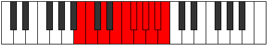 |
| [4077](https://ianring.com/musictheory/scales/4077) | [Gothyllian](ModeFSharpGothyllian.md) | F# | F#, G#, A, B, C, C#, D, D#, E, F, F# |  |
| [4077](https://ianring.com/musictheory/scales/4077) | [Gothyllian](ModeGFlatGothyllian.md) | Gb | Gb, Ab, A, B, C, Db, D, Eb, E, F, Gb |  |
| [4077](https://ianring.com/musictheory/scales/4077) | [Gothyllian](ModeANaturalGothyllian.md) | A | A, B, C, D, D#, E, F, F#, G, G#, A |  |
| [4077](https://ianring.com/musictheory/scales/4077) | [Gothyllian](ModeDSharpGothyllian.md) | D# | D#, F, F#, G#, A, A#, B, C, C#, D, D# |  |
| [4077](https://ianring.com/musictheory/scales/4077) | [Gothyllian](ModeEFlatGothyllian.md) | Eb | Eb, F, Gb, Ab, A, Bb, B, C, Db, D, Eb |  |
| [4077](https://ianring.com/musictheory/scales/4077) | [Gothyllian](ModeDNaturalGothyllian.md) | D | D, E, F, G, G#, A, A#, B, C, C#, D |  |
| [4077](https://ianring.com/musictheory/scales/4077) | [Gothyllian](ModeCNaturalGothyllian.md) | C | C, D, D#, F, F#, G, G#, A, A#, B, C |  |
| [4077](https://ianring.com/musictheory/scales/4077) | [Gothyllian](ModeBNaturalGothyllian.md) | B | B, C#, D, E, F, F#, G, G#, A, A#, B |  |
| [4079](https://ianring.com/musictheory/scales/4079) | [Ionatic](ModeGNaturalIonatic.md) | G | G, G#, A, A#, C, C#, D, D#, E, F, F#, G |  |
| [4079](https://ianring.com/musictheory/scales/4079) | [Ionatic](ModeFSharpIonatic.md) | F# | F#, G, G#, A, B, C, C#, D, D#, E, F, F# |  |
| [4079](https://ianring.com/musictheory/scales/4079) | [Ionatic](ModeGFlatIonatic.md) | Gb | Gb, G, Ab, A, B, C, Db, D, Eb, E, F, Gb |  |
| [4079](https://ianring.com/musictheory/scales/4079) | [Ionatic](ModeDSharpIonatic.md) | D# | D#, E, F, F#, G#, A, A#, B, C, C#, D, D# |  |
| [4079](https://ianring.com/musictheory/scales/4079) | [Ionatic](ModeEFlatIonatic.md) | Eb | Eb, E, F, Gb, Ab, A, Bb, B, C, Db, D, Eb |  |
| [4079](https://ianring.com/musictheory/scales/4079) | [Ionatic](ModeDNaturalIonatic.md) | D | D, D#, E, F, G, G#, A, A#, B, C, C#, D |  |
| [4079](https://ianring.com/musictheory/scales/4079) | [Ionatic](ModeCNaturalIonatic.md) | C | C, C#, D, D#, F, F#, G, G#, A, A#, B, C |  |
| [4079](https://ianring.com/musictheory/scales/4079) | [Ionatic](ModeBNaturalIonatic.md) | B | B, C, C#, D, E, F, F#, G, G#, A, A#, B |  |
| [4079](https://ianring.com/musictheory/scales/4079) | [Ionatic](ModeANaturalIonatic.md) | A | A, A#, B, C, D, D#, E, F, F#, G, G#, A |  |
| [4079](https://ianring.com/musictheory/scales/4079) | [Ionatic](ModeGSharpIonatic.md) | G# | G#, A, A#, B, C#, D, D#, E, F, F#, G, G# |  |
| [4079](https://ianring.com/musictheory/scales/4079) | [Ionatic](ModeAFlatIonatic.md) | Ab | Ab, A, Bb, B, Db, D, Eb, E, F, Gb, G, Ab |  |
| [4081](https://ianring.com/musictheory/scales/4081) | [Manygic](ModeANaturalManygic.md) | A | A, C#, D, D#, E, F, F#, G, G#, A |  |
| [4081](https://ianring.com/musictheory/scales/4081) | [Manygic](ModeASharpManygic.md) | A# | A#, D, D#, E, F, F#, G, G#, A, A# |  |
| [4081](https://ianring.com/musictheory/scales/4081) | [Manygic](ModeBFlatManygic.md) | Bb | Bb, D, Eb, E, F, Gb, G, Ab, A, Bb |  |
| [4083](https://ianring.com/musictheory/scales/4083) | [Bathyllian](ModeGSharpBathyllian.md) | G# | G#, A, C, C#, D, D#, E, F, F#, G, G# |  |
| [4083](https://ianring.com/musictheory/scales/4083) | [Bathyllian](ModeAFlatBathyllian.md) | Ab | Ab, A, C, Db, D, Eb, E, F, Gb, G, Ab |  |
| [4083](https://ianring.com/musictheory/scales/4083) | [Bathyllian](ModeANaturalBathyllian.md) | A | A, A#, C#, D, D#, E, F, F#, G, G#, A |  |
| [4083](https://ianring.com/musictheory/scales/4083) | [Bathyllian](ModeENaturalBathyllian.md) | E | E, F, G#, A, A#, B, C, C#, D, D#, E |  |
| [4083](https://ianring.com/musictheory/scales/4083) | [Bathyllian](ModeCSharpBathyllian.md) | C# | C#, D, F, F#, G, G#, A, A#, B, C, C# |  |
| [4083](https://ianring.com/musictheory/scales/4083) | [Bathyllian](ModeDFlatBathyllian.md) | Db | Db, D, F, Gb, G, Ab, A, Bb, B, C, Db |  |
| [4083](https://ianring.com/musictheory/scales/4083) | [Bathyllian](ModeASharpBathyllian.md) | A# | A#, B, D, D#, E, F, F#, G, G#, A, A# |  |
| [4083](https://ianring.com/musictheory/scales/4083) | [Bathyllian](ModeBFlatBathyllian.md) | Bb | Bb, B, D, Eb, E, F, Gb, G, Ab, A, Bb |  |
| [4085](https://ianring.com/musictheory/scales/4085) | [Sydyllian](ModeASharpSydyllian.md) | A# | A#, C, D, D#, E, F, F#, G, G#, A, A# |  |
| [4085](https://ianring.com/musictheory/scales/4085) | [Sydyllian](ModeBFlatSydyllian.md) | Bb | Bb, C, D, Eb, E, F, Gb, G, Ab, A, Bb |  |
| [4085](https://ianring.com/musictheory/scales/4085) | [Sydyllian](ModeANaturalSydyllian.md) | A | A, B, C#, D, D#, E, F, F#, G, G#, A |  |
| [4085](https://ianring.com/musictheory/scales/4085) | [Sydyllian](ModeDSharpSydyllian.md) | D# | D#, F, G, G#, A, A#, B, C, C#, D, D# |  |
| [4085](https://ianring.com/musictheory/scales/4085) | [Sydyllian](ModeEFlatSydyllian.md) | Eb | Eb, F, G, Ab, A, Bb, B, C, Db, D, Eb |  |
| [4085](https://ianring.com/musictheory/scales/4085) | [Sydyllian](ModeCNaturalSydyllian.md) | C | C, D, E, F, F#, G, G#, A, A#, B, C |  |
| [4087](https://ianring.com/musictheory/scales/4087) | [Aeolatic](ModeGSharpAeolatic.md) | G# | G#, A, A#, C, C#, D, D#, E, F, F#, G, G# |  |
| [4087](https://ianring.com/musictheory/scales/4087) | [Aeolatic](ModeAFlatAeolatic.md) | Ab | Ab, A, Bb, C, Db, D, Eb, E, F, Gb, G, Ab |  |
| [4087](https://ianring.com/musictheory/scales/4087) | [Aeolatic](ModeGNaturalAeolatic.md) | G | G, G#, A, B, C, C#, D, D#, E, F, F#, G |  |
| [4087](https://ianring.com/musictheory/scales/4087) | [Aeolatic](ModeENaturalAeolatic.md) | E | E, F, F#, G#, A, A#, B, C, C#, D, D#, E |  |
| [4087](https://ianring.com/musictheory/scales/4087) | [Aeolatic](ModeDSharpAeolatic.md) | D# | D#, E, F, G, G#, A, A#, B, C, C#, D, D# |  |
| [4087](https://ianring.com/musictheory/scales/4087) | [Aeolatic](ModeEFlatAeolatic.md) | Eb | Eb, E, F, G, Ab, A, Bb, B, C, Db, D, Eb |  |
| [4087](https://ianring.com/musictheory/scales/4087) | [Aeolatic](ModeCSharpAeolatic.md) | C# | C#, D, D#, F, F#, G, G#, A, A#, B, C, C# |  |
| [4087](https://ianring.com/musictheory/scales/4087) | [Aeolatic](ModeDFlatAeolatic.md) | Db | Db, D, Eb, F, Gb, G, Ab, A, Bb, B, C, Db |  |
| [4087](https://ianring.com/musictheory/scales/4087) | [Aeolatic](ModeCNaturalAeolatic.md) | C | C, C#, D, E, F, F#, G, G#, A, A#, B, C |  |
| [4087](https://ianring.com/musictheory/scales/4087) | [Aeolatic](ModeASharpAeolatic.md) | A# | A#, B, C, D, D#, E, F, F#, G, G#, A, A# |  |
| [4087](https://ianring.com/musictheory/scales/4087) | [Aeolatic](ModeBFlatAeolatic.md) | Bb | Bb, B, C, D, Eb, E, F, Gb, G, Ab, A, Bb |  |
| [4087](https://ianring.com/musictheory/scales/4087) | [Aeolatic](ModeANaturalAeolatic.md) | A | A, A#, B, C#, D, D#, E, F, F#, G, G#, A |  |
| [4089](https://ianring.com/musictheory/scales/4089) | [Katoryllian](ModeANaturalKatoryllian.md) | A | A, C, C#, D, D#, E, F, F#, G, G#, A |  |
| [4089](https://ianring.com/musictheory/scales/4089) | [Katoryllian](ModeASharpKatoryllian.md) | A# | A#, C#, D, D#, E, F, F#, G, G#, A, A# |  |
| [4089](https://ianring.com/musictheory/scales/4089) | [Katoryllian](ModeBFlatKatoryllian.md) | Bb | Bb, Db, D, Eb, E, F, Gb, G, Ab, A, Bb |  |
| [4089](https://ianring.com/musictheory/scales/4089) | [Katoryllian](ModeFNaturalKatoryllian.md) | F | F, G#, A, A#, B, C, C#, D, D#, E, F |  |
| [4089](https://ianring.com/musictheory/scales/4089) | [Katoryllian](ModeDNaturalKatoryllian.md) | D | D, F, F#, G, G#, A, A#, B, C, C#, D |  |
| [4089](https://ianring.com/musictheory/scales/4089) | [Katoryllian](ModeBNaturalKatoryllian.md) | B | B, D, D#, E, F, F#, G, G#, A, A#, B |  |
| [4091](https://ianring.com/musictheory/scales/4091) | [Thydatic](ModeANaturalThydatic.md) | A | A, A#, C, C#, D, D#, E, F, F#, G, G#, A |  |
| [4091](https://ianring.com/musictheory/scales/4091) | [Thydatic](ModeGSharpThydatic.md) | G# | G#, A, B, C, C#, D, D#, E, F, F#, G, G# |  |
| [4091](https://ianring.com/musictheory/scales/4091) | [Thydatic](ModeAFlatThydatic.md) | Ab | Ab, A, B, C, Db, D, Eb, E, F, Gb, G, Ab |  |
| [4091](https://ianring.com/musictheory/scales/4091) | [Thydatic](ModeFNaturalThydatic.md) | F | F, F#, G#, A, A#, B, C, C#, D, D#, E, F |  |
| [4091](https://ianring.com/musictheory/scales/4091) | [Thydatic](ModeENaturalThydatic.md) | E | E, F, G, G#, A, A#, B, C, C#, D, D#, E |  |
| [4091](https://ianring.com/musictheory/scales/4091) | [Thydatic](ModeDNaturalThydatic.md) | D | D, D#, F, F#, G, G#, A, A#, B, C, C#, D |  |
| [4091](https://ianring.com/musictheory/scales/4091) | [Thydatic](ModeCSharpThydatic.md) | C# | C#, D, E, F, F#, G, G#, A, A#, B, C, C# |  |
| [4091](https://ianring.com/musictheory/scales/4091) | [Thydatic](ModeDFlatThydatic.md) | Db | Db, D, E, F, Gb, G, Ab, A, Bb, B, C, Db |  |
| [4091](https://ianring.com/musictheory/scales/4091) | [Thydatic](ModeBNaturalThydatic.md) | B | B, C, D, D#, E, F, F#, G, G#, A, A#, B |  |
| [4091](https://ianring.com/musictheory/scales/4091) | [Thydatic](ModeASharpThydatic.md) | A# | A#, B, C#, D, D#, E, F, F#, G, G#, A, A# |  |
| [4091](https://ianring.com/musictheory/scales/4091) | [Thydatic](ModeBFlatThydatic.md) | Bb | Bb, B, Db, D, Eb, E, F, Gb, G, Ab, A, Bb |  |
| [4093](https://ianring.com/musictheory/scales/4093) | [Aerycratic](ModeASharpAerycratic.md) | A# | A#, C, C#, D, D#, E, F, F#, G, G#, A, A# |  |
| [4093](https://ianring.com/musictheory/scales/4093) | [Aerycratic](ModeBFlatAerycratic.md) | Bb | Bb, C, Db, D, Eb, E, F, Gb, G, Ab, A, Bb |  |
| [4093](https://ianring.com/musictheory/scales/4093) | [Aerycratic](ModeANaturalAerycratic.md) | A | A, B, C, C#, D, D#, E, F, F#, G, G#, A |  |
| [4093](https://ianring.com/musictheory/scales/4093) | [Aerycratic](ModeFSharpAerycratic.md) | F# | F#, G#, A, A#, B, C, C#, D, D#, E, F, F# |  |
| [4093](https://ianring.com/musictheory/scales/4093) | [Aerycratic](ModeGFlatAerycratic.md) | Gb | Gb, Ab, A, Bb, B, C, Db, D, Eb, E, F, Gb |  |
| [4093](https://ianring.com/musictheory/scales/4093) | [Aerycratic](ModeFNaturalAerycratic.md) | F | F, G, G#, A, A#, B, C, C#, D, D#, E, F |  |
| [4093](https://ianring.com/musictheory/scales/4093) | [Aerycratic](ModeDSharpAerycratic.md) | D# | D#, F, F#, G, G#, A, A#, B, C, C#, D, D# |  |
| [4093](https://ianring.com/musictheory/scales/4093) | [Aerycratic](ModeEFlatAerycratic.md) | Eb | Eb, F, Gb, G, Ab, A, Bb, B, C, Db, D, Eb |  |
| [4093](https://ianring.com/musictheory/scales/4093) | [Aerycratic](ModeDNaturalAerycratic.md) | D | D, E, F, F#, G, G#, A, A#, B, C, C#, D |  |
| [4093](https://ianring.com/musictheory/scales/4093) | [Aerycratic](ModeCNaturalAerycratic.md) | C | C, D, D#, E, F, F#, G, G#, A, A#, B, C |  |
| [4093](https://ianring.com/musictheory/scales/4093) | [Aerycratic](ModeBNaturalAerycratic.md) | B | B, C#, D, D#, E, F, F#, G, G#, A, A#, B |  |
| [4095](https://ianring.com/musictheory/scales/4095) | [Chromatic](ModeCNaturalChromatic.md) | C | C, C#, D, D#, E, F, F#, G, G#, A, A#, B, C |  |
| [4095](https://ianring.com/musictheory/scales/4095) | [Chromatic](ModeCSharpChromatic.md) | C# | C#, D, D#, E, F, F#, G, G#, A, A#, B, C, C# |  |
| [4095](https://ianring.com/musictheory/scales/4095) | [Chromatic](ModeDFlatChromatic.md) | Db | Db, D, Eb, E, F, Gb, G, Ab, A, Bb, B, C, Db |  |
| [4095](https://ianring.com/musictheory/scales/4095) | [Chromatic](ModeDNaturalChromatic.md) | D | D, D#, E, F, F#, G, G#, A, A#, B, C, C#, D |  |
| [4095](https://ianring.com/musictheory/scales/4095) | [Chromatic](ModeDSharpChromatic.md) | D# | D#, E, F, F#, G, G#, A, A#, B, C, C#, D, D# |  |
| [4095](https://ianring.com/musictheory/scales/4095) | [Chromatic](ModeEFlatChromatic.md) | Eb | Eb, E, F, Gb, G, Ab, A, Bb, B, C, Db, D, Eb |  |
| [4095](https://ianring.com/musictheory/scales/4095) | [Chromatic](ModeENaturalChromatic.md) | E | E, F, F#, G, G#, A, A#, B, C, C#, D, D#, E |  |
| [4095](https://ianring.com/musictheory/scales/4095) | [Chromatic](ModeFNaturalChromatic.md) | F | F, F#, G, G#, A, A#, B, C, C#, D, D#, E, F |  |
| [4095](https://ianring.com/musictheory/scales/4095) | [Chromatic](ModeFSharpChromatic.md) | F# | F#, G, G#, A, A#, B, C, C#, D, D#, E, F, F# |  |
| [4095](https://ianring.com/musictheory/scales/4095) | [Chromatic](ModeGFlatChromatic.md) | Gb | Gb, G, Ab, A, Bb, B, C, Db, D, Eb, E, F, Gb |  |
| [4095](https://ianring.com/musictheory/scales/4095) | [Chromatic](ModeGNaturalChromatic.md) | G | G, G#, A, A#, B, C, C#, D, D#, E, F, F#, G |  |
| [4095](https://ianring.com/musictheory/scales/4095) | [Chromatic](ModeGSharpChromatic.md) | G# | G#, A, A#, B, C, C#, D, D#, E, F, F#, G, G# |  |
| [4095](https://ianring.com/musictheory/scales/4095) | [Chromatic](ModeAFlatChromatic.md) | Ab | Ab, A, Bb, B, C, Db, D, Eb, E, F, Gb, G, Ab |  |
| [4095](https://ianring.com/musictheory/scales/4095) | [Chromatic](ModeANaturalChromatic.md) | A | A, A#, B, C, C#, D, D#, E, F, F#, G, G#, A |  |
| [4095](https://ianring.com/musictheory/scales/4095) | [Chromatic](ModeASharpChromatic.md) | A# | A#, B, C, C#, D, D#, E, F, F#, G, G#, A, A# |  |
| [4095](https://ianring.com/musictheory/scales/4095) | [Chromatic](ModeBFlatChromatic.md) | Bb | Bb, B, C, Db, D, Eb, E, F, Gb, G, Ab, A, Bb |  |
| [4095](https://ianring.com/musictheory/scales/4095) | [Chromatic](ModeBNaturalChromatic.md) | B | B, C, C#, D, D#, E, F, F#, G, G#, A, A#, B |  |
