# ANaturalMinorAddSharpFourth

## Links

- [Documentation](README.md)
- [Scales Index](Scales.md)
- [Modes Index](Modes.md)
- [Chords Index](Chords.md)

## Root

A

## Notes

| Position | Notes | Illustration |
|----------|------|--------------|
| RootPosition | A,C,D#,E |  |
| FirstInversion | C,D#,E,A | 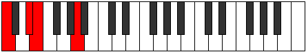 |
| SecondInversion | D#,E,A,C | 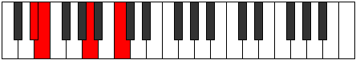 |
| ThirdInversion | E,A,C,D# |  |
## Modes

| Number | Mode | Tonic | Notes | Illustration |
|--------|------|-------|-------|--------------|
| [403](https://ianring.com/musictheory/scales/403) | [Daptitonic](ModeGSharpDaptitonic.md) | G# | G#, A, C, D#, E, G# |  |
| [403](https://ianring.com/musictheory/scales/403) | [Daptitonic](ModeAFlatDaptitonic.md) | Ab | Ab, A, C, Eb, E, Ab |  |
| [407](https://ianring.com/musictheory/scales/407) | [Zylimic](ModeGSharpZylimic.md) | G# | G#, A, Bb, C, D#, E, G# |  |
| [411](https://ianring.com/musictheory/scales/411) | [Lygimic](ModeGSharpLygimic.md) | G# | G#, A, B, C, D#, E, G# |  |
| [415](https://ianring.com/musictheory/scales/415) | [Aeoladian](ModeGSharpAeoladian.md) | G# | G#, A, Bb, Cb, Dbb, Eb, Fb, G# |  |
| [435](https://ianring.com/musictheory/scales/435) | [Ionolimic](ModeGSharpIonolimic.md) | G# | G#, A, B#, C#, D#, E, G# |  |
| [439](https://ianring.com/musictheory/scales/439) | [Bythian](ModeGSharpBythian.md) | G# | G#, A, Bb, C, Db, Eb, Fb, G# |  |
| [443](https://ianring.com/musictheory/scales/443) | [Kothian](ModeGSharpKothian.md) | G# | G#, A, B, C, Db, Eb, Fb, G# |  |
| [447](https://ianring.com/musictheory/scales/447) | [Thyphyllic](ModeGSharpThyphyllic.md) | G# | G#, A, A#, B, C, C#, D#, E, G# |  |
| [447](https://ianring.com/musictheory/scales/447) | [Thyphyllic](ModeAFlatThyphyllic.md) | Ab | Ab, A, Bb, B, C, Db, Eb, E, Ab |  |
| [457](https://ianring.com/musictheory/scales/457) | [Staptitonic](ModeANaturalStaptitonic.md) | A | A, C, D#, E, F, A | 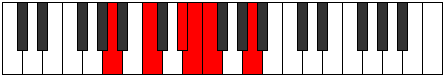 |
| [459](https://ianring.com/musictheory/scales/459) | [Zaptimic](ModeANaturalZaptimic.md) | A | A, Bb, C, D#, E, F, A |  |
| [461](https://ianring.com/musictheory/scales/461) | [Madimic](ModeANaturalMadimic.md) | A | A, B, C, D#, E, F, A |  |
| [463](https://ianring.com/musictheory/scales/463) | [Zythian](ModeANaturalZythian.md) | A | A, Bb, Cb, Dbb, Eb, Fb, Gbb, A |  |
| [467](https://ianring.com/musictheory/scales/467) | [Phrogimic](ModeGSharpPhrogimic.md) | G# | G#, A, B#, C##, D#, E, G# |  |
| [471](https://ianring.com/musictheory/scales/471) | [Dodian](ModeGSharpDodian.md) | G# | G#, A, Bb, C, D, Eb, Fb, G# |  |
| [473](https://ianring.com/musictheory/scales/473) | [Aeralimic](ModeANaturalAeralimic.md) | A | A, B#, C#, D#, E, F, A |  |
| [475](https://ianring.com/musictheory/scales/475) | [Aeolygian](ModeANaturalAeolygian.md) | A | A, Bb, C, Db, Eb, Fb, Gbb, A |  |
| [475](https://ianring.com/musictheory/scales/475) | [Aeolygian](ModeGSharpAeolygian.md) | G# | G#, A, B, C, D, Eb, Fb, G# |  |
| [477](https://ianring.com/musictheory/scales/477) | [Stacrian](ModeANaturalStacrian.md) | A | A, B, C, Db, Eb, Fb, Gbb, A |  |
| [479](https://ianring.com/musictheory/scales/479) | [Kocryllic](ModeANaturalKocryllic.md) | A | A, A#, B, C, C#, D#, E, F, A |  |
| [479](https://ianring.com/musictheory/scales/479) | [Kocryllic](ModeGSharpKocryllic.md) | G# | G#, A, A#, B, C, D, D#, E, G# |  |
| [479](https://ianring.com/musictheory/scales/479) | [Kocryllic](ModeAFlatKocryllic.md) | Ab | Ab, A, Bb, B, C, D, Eb, E, Ab |  |
| [489](https://ianring.com/musictheory/scales/489) | [Phrathimic](ModeANaturalPhrathimic.md) | A | A, B#, C##, D#, E, F, A |  |
| [491](https://ianring.com/musictheory/scales/491) | [Aeolyrian](ModeANaturalAeolyrian.md) | A | A, Bb, C, D, Eb, Fb, Gbb, A |  |
| [493](https://ianring.com/musictheory/scales/493) | [Rygian](ModeANaturalRygian.md) | A | A, B, C, D, Eb, Fb, Gbb, A |  |
| [495](https://ianring.com/musictheory/scales/495) | [Bocryllic](ModeANaturalBocryllic.md) | A | A, A#, B, C, D, D#, E, F, A |  |
| [499](https://ianring.com/musictheory/scales/499) | [Ionaptian](ModeGSharpIonaptian.md) | G# | G#, A, B#, C#, D, Eb, Fb, G# |  |
| [503](https://ianring.com/musictheory/scales/503) | [Thoptyllic](ModeGSharpThoptyllic.md) | G# | G#, A, A#, C, C#, D, D#, E, G# |  |
| [503](https://ianring.com/musictheory/scales/503) | [Thoptyllic](ModeAFlatThoptyllic.md) | Ab | Ab, A, Bb, C, Db, D, Eb, E, Ab |  |
| [505](https://ianring.com/musictheory/scales/505) | [Sanian](ModeANaturalSanian.md) | A | A, B#, C#, D, Eb, Fb, Gbb, A |  |
| [507](https://ianring.com/musictheory/scales/507) | [Moryllic](ModeANaturalMoryllic.md) | A | A, A#, C, C#, D, D#, E, F, A |  |
| [507](https://ianring.com/musictheory/scales/507) | [Moryllic](ModeGSharpMoryllic.md) | G# | G#, A, B, C, C#, D, D#, E, G# |  |
| [507](https://ianring.com/musictheory/scales/507) | [Moryllic](ModeAFlatMoryllic.md) | Ab | Ab, A, B, C, Db, D, Eb, E, Ab |  |
| [509](https://ianring.com/musictheory/scales/509) | [Ionothyllic](ModeANaturalIonothyllic.md) | A | A, B, C, C#, D, D#, E, F, A |  |
| [511](https://ianring.com/musictheory/scales/511) | [Polygic](ModeANaturalPolygic.md) | A | A, A#, B, C, C#, D, D#, E, F, A |  |
| [511](https://ianring.com/musictheory/scales/511) | [Polygic](ModeGSharpPolygic.md) | G# | G#, A, A#, B, C, C#, D, D#, E, G# |  |
| [511](https://ianring.com/musictheory/scales/511) | [Polygic](ModeAFlatPolygic.md) | Ab | Ab, A, Bb, B, C, Db, D, Eb, E, Ab |  |
| [569](https://ianring.com/musictheory/scales/569) | [Mothitonic](ModeCNaturalMothitonic.md) | C | C, D#, E, F, A, C |  |
| [571](https://ianring.com/musictheory/scales/571) | [Kynimic](ModeCNaturalKynimic.md) | C | C, Db, Eb, Fb, Gbb, A, C | 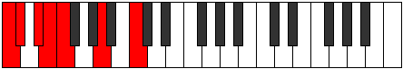 |
| [573](https://ianring.com/musictheory/scales/573) | [Saptimic](ModeCNaturalSaptimic.md) | C | C, D, Eb, Fb, Gbb, A, C |  |
| [583](https://ianring.com/musictheory/scales/583) | [Aeritonic](ModeDSharpAeritonic.md) | D# | D#, E, F, A, C, D# |  |
| [583](https://ianring.com/musictheory/scales/583) | [Aeritonic](ModeEFlatAeritonic.md) | Eb | Eb, E, F, A, C, Eb |  |
| [587](https://ianring.com/musictheory/scales/587) | [Pathitonic](ModeDSharpPathitonic.md) | D# | D#, E, F#, A, C, D# |  |
| [587](https://ianring.com/musictheory/scales/587) | [Pathitonic](ModeEFlatPathitonic.md) | Eb | Eb, E, Gb, A, C, Eb |  |
| [591](https://ianring.com/musictheory/scales/591) | [Gaptimic](ModeDSharpGaptimic.md) | D# | D#, E, F, Gb, A, B#, D# |  |
| [595](https://ianring.com/musictheory/scales/595) | [Sogitonic](ModeDSharpSogitonic.md) | D# | D#, E, G, A, C, D# |  |
| [595](https://ianring.com/musictheory/scales/595) | [Sogitonic](ModeEFlatSogitonic.md) | Eb | Eb, E, G, A, C, Eb |  |
| [599](https://ianring.com/musictheory/scales/599) | [Thyrimic](ModeDSharpThyrimic.md) | D# | D#, E, F, G, A, B#, D# |  |
| [601](https://ianring.com/musictheory/scales/601) | [Bycritonic](ModeCNaturalBycritonic.md) | C | C, D#, E, F#, A, C |  |
| [603](https://ianring.com/musictheory/scales/603) | [Aeolygimic](ModeCNaturalAeolygimic.md) | C | C, Db, Eb, Fb, Gb, A, C |  |
| [603](https://ianring.com/musictheory/scales/603) | [Aeolygimic](ModeDSharpAeolygimic.md) | D# | D#, E, F#, G, A, B#, D# |  |
| [605](https://ianring.com/musictheory/scales/605) | [Dycrimic](ModeCNaturalDycrimic.md) | C | C, D, Eb, Fb, Gb, A, C |  |
| [607](https://ianring.com/musictheory/scales/607) | [Kadian](ModeDSharpKadian.md) | D# | D#, E, F, Gb, Abb, Bbb, C, D# |  |
| [611](https://ianring.com/musictheory/scales/611) | [Zynitonic](ModeDSharpZynitonic.md) | D# | D#, E, G#, A, C, D# |  |
| [611](https://ianring.com/musictheory/scales/611) | [Zynitonic](ModeEFlatZynitonic.md) | Eb | Eb, E, Ab, A, C, Eb |  |
| [615](https://ianring.com/musictheory/scales/615) | [Phrothimic](ModeDSharpPhrothimic.md) | D# | D#, E, F, G#, A, B#, D# |  |
| [619](https://ianring.com/musictheory/scales/619) | [Parimic](ModeDSharpParimic.md) | D# | D#, E, F#, G#, A, B#, D# |  |
| [623](https://ianring.com/musictheory/scales/623) | [Sycrian](ModeDSharpSycrian.md) | D# | D#, E, F, Gb, Ab, Bbb, C, D# |  |
| [627](https://ianring.com/musictheory/scales/627) | [Mogimic](ModeDSharpMogimic.md) | D# | D#, E, F##, G#, A, B#, D# |  |
| [631](https://ianring.com/musictheory/scales/631) | [Zygian](ModeDSharpZygian.md) | D# | D#, E, F, G, Ab, Bbb, C, D# | 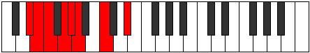 |
| [633](https://ianring.com/musictheory/scales/633) | [Kydimic](ModeCNaturalKydimic.md) | C | C, D#, E, F, Gb, A, C |  |
| [635](https://ianring.com/musictheory/scales/635) | [Epolian](ModeDSharpEpolian.md) | D# | D#, E, F#, G, Ab, Bbb, C, D# |  |
| [639](https://ianring.com/musictheory/scales/639) | [Ionaryllic](ModeCNaturalIonaryllic.md) | C | C, C#, D, D#, E, F, F#, A, C |  |
| [639](https://ianring.com/musictheory/scales/639) | [Ionaryllic](ModeDSharpIonaryllic.md) | D# | D#, E, F, F#, G, G#, A, C, D# |  |
| [639](https://ianring.com/musictheory/scales/639) | [Ionaryllic](ModeEFlatIonaryllic.md) | Eb | Eb, E, F, Gb, G, Ab, A, C, Eb |  |
| [665](https://ianring.com/musictheory/scales/665) | [Mythitonic](ModeCNaturalMythitonic.md) | C | C, D#, E, G, A, C |  |
| [667](https://ianring.com/musictheory/scales/667) | [Rodimic](ModeCNaturalRodimic.md) | C | C, Db, Eb, Fb, G, A, C |  |
| [669](https://ianring.com/musictheory/scales/669) | [Gycrimic](ModeCNaturalGycrimic.md) | C | C, D, Eb, Fb, G, A, C |  |
| [697](https://ianring.com/musictheory/scales/697) | [Lagimic](ModeCNaturalLagimic.md) | C | C, D#, E, F, G, A, C |  |
| [703](https://ianring.com/musictheory/scales/703) | [Aerocryllic](ModeCNaturalAerocryllic.md) | C | C, C#, D, D#, E, F, G, A, C |  |
| [711](https://ianring.com/musictheory/scales/711) | [Epyrimic](ModeDSharpEpyrimic.md) | D# | D#, E, F, G##, A#, B#, D# |  |
| [711](https://ianring.com/musictheory/scales/711) | [Epyrimic](ModeEFlatEpyrimic.md) | Eb | Eb, Fb, Gbb, A, Bb, C, Eb |  |
| [713](https://ianring.com/musictheory/scales/713) | [Thoptitonic](ModeANaturalThoptitonic.md) | A | A, C, D#, E, F#, A |  |
| [715](https://ianring.com/musictheory/scales/715) | [Dodimic](ModeDSharpDodimic.md) | D# | D#, E, F#, G##, A#, B#, D# |  |
| [715](https://ianring.com/musictheory/scales/715) | [Dodimic](ModeEFlatDodimic.md) | Eb | Eb, Fb, Gb, A, Bb, C, Eb |  |
| [715](https://ianring.com/musictheory/scales/715) | [Dodimic](ModeANaturalDodimic.md) | A | A, Bb, C, D#, E, F#, A |  |
| [717](https://ianring.com/musictheory/scales/717) | [Gythimic](ModeANaturalGythimic.md) | A | A, B, C, D#, E, F#, A |  |
| [719](https://ianring.com/musictheory/scales/719) | [Kanian](ModeDSharpKanian.md) | D# | D#, E, F, Gb, A, Bb, C, D# |  |
| [719](https://ianring.com/musictheory/scales/719) | [Kanian](ModeANaturalKanian.md) | A | A, Bb, Cb, Dbb, Eb, Fb, Gb, A |  |
| [723](https://ianring.com/musictheory/scales/723) | [Ionadimic](ModeDSharpIonadimic.md) | D# | D#, E, F##, G##, A#, B#, D# |  |
| [723](https://ianring.com/musictheory/scales/723) | [Ionadimic](ModeEFlatIonadimic.md) | Eb | Eb, Fb, G, A, Bb, C, Eb |  |
| [727](https://ianring.com/musictheory/scales/727) | [Phradian](ModeDSharpPhradian.md) | D# | D#, E, F, G, A, Bb, C, D# |  |
| [729](https://ianring.com/musictheory/scales/729) | [Stygimic](ModeANaturalStygimic.md) | A | A, B#, C#, D#, E, F#, A |  |
| [729](https://ianring.com/musictheory/scales/729) | [Stygimic](ModeCNaturalStygimic.md) | C | C, D#, E, F#, G, A, C |  |
| [731](https://ianring.com/musictheory/scales/731) | [Ionorian](ModeANaturalIonorian.md) | A | A, Bb, C, Db, Eb, Fb, Gb, A |  |
| [731](https://ianring.com/musictheory/scales/731) | [Ionorian](ModeDSharpIonorian.md) | D# | D#, E, F#, G, A, Bb, C, D# |  |
| [733](https://ianring.com/musictheory/scales/733) | [Donian](ModeANaturalDonian.md) | A | A, B, C, Db, Eb, Fb, Gb, A |  |
| [735](https://ianring.com/musictheory/scales/735) | [Sylyllic](ModeCNaturalSylyllic.md) | C | C, C#, D, D#, E, F#, G, A, C |  |
| [735](https://ianring.com/musictheory/scales/735) | [Sylyllic](ModeDSharpSylyllic.md) | D# | D#, E, F, F#, G, A, A#, C, D# |  |
| [735](https://ianring.com/musictheory/scales/735) | [Sylyllic](ModeEFlatSylyllic.md) | Eb | Eb, E, F, Gb, G, A, Bb, C, Eb |  |
| [735](https://ianring.com/musictheory/scales/735) | [Sylyllic](ModeANaturalSylyllic.md) | A | A, A#, B, C, C#, D#, E, F#, A |  |
| [739](https://ianring.com/musictheory/scales/739) | [Rorimic](ModeDSharpRorimic.md) | D# | D#, E, F###, G##, A#, B#, D# | 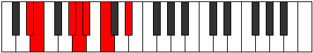 |
| [739](https://ianring.com/musictheory/scales/739) | [Rorimic](ModeEFlatRorimic.md) | Eb | Eb, Fb, G#, A, Bb, C, Eb |  |
| [743](https://ianring.com/musictheory/scales/743) | [Lanian](ModeDSharpLanian.md) | D# | D#, E, F, G#, A, Bb, C, D# |  |
| [745](https://ianring.com/musictheory/scales/745) | [Kolimic](ModeANaturalKolimic.md) | A | A, B#, C##, D#, E, F#, A |  |
| [747](https://ianring.com/musictheory/scales/747) | [Lynian](ModeANaturalLynian.md) | A | A, Bb, C, D, Eb, Fb, Gb, A |  |
| [747](https://ianring.com/musictheory/scales/747) | [Lynian](ModeDSharpLynian.md) | D# | D#, E, F#, G#, A, Bb, C, D# |  |
| [749](https://ianring.com/musictheory/scales/749) | [Aeologian](ModeANaturalAeologian.md) | A | A, B, C, D, Eb, Fb, Gb, A |  |
| [751](https://ianring.com/musictheory/scales/751) | [Epacryllic](ModeDSharpEpacryllic.md) | D# | D#, E, F, F#, G#, A, A#, C, D# |  |
| [751](https://ianring.com/musictheory/scales/751) | [Epacryllic](ModeEFlatEpacryllic.md) | Eb | Eb, E, F, Gb, Ab, A, Bb, C, Eb |  |
| [751](https://ianring.com/musictheory/scales/751) | [Epacryllic](ModeANaturalEpacryllic.md) | A | A, A#, B, C, D, D#, E, F#, A |  |
| [755](https://ianring.com/musictheory/scales/755) | [Phrythian](ModeDSharpPhrythian.md) | D# | D#, E, F##, G#, A, Bb, C, D# |  |
| [759](https://ianring.com/musictheory/scales/759) | [Katalyllic](ModeDSharpKatalyllic.md) | D# | D#, E, F, G, G#, A, A#, C, D# |  |
| [759](https://ianring.com/musictheory/scales/759) | [Katalyllic](ModeEFlatKatalyllic.md) | Eb | Eb, E, F, G, Ab, A, Bb, C, Eb |  |
| [761](https://ianring.com/musictheory/scales/761) | [Ponian](ModeANaturalPonian.md) | A | A, B#, C#, D, Eb, Fb, Gb, A |  |
| [761](https://ianring.com/musictheory/scales/761) | [Ponian](ModeCNaturalPonian.md) | C | C, D#, E, F, Gb, Abb, Bbb, C | 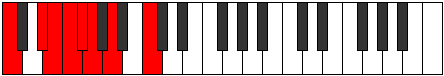 |
| [763](https://ianring.com/musictheory/scales/763) | [Doryllic](ModeCNaturalDoryllic.md) | C | C, C#, D#, E, F, F#, G, A, C |  |
| [763](https://ianring.com/musictheory/scales/763) | [Doryllic](ModeANaturalDoryllic.md) | A | A, A#, C, C#, D, D#, E, F#, A |  |
| [763](https://ianring.com/musictheory/scales/763) | [Doryllic](ModeDSharpDoryllic.md) | D# | D#, E, F#, G, G#, A, A#, C, D# |  |
| [763](https://ianring.com/musictheory/scales/763) | [Doryllic](ModeEFlatDoryllic.md) | Eb | Eb, E, Gb, G, Ab, A, Bb, C, Eb |  |
| [765](https://ianring.com/musictheory/scales/765) | [Mixonyphyllic](ModeCNaturalMixonyphyllic.md) | C | C, D, D#, E, F, F#, G, A, C |  |
| [765](https://ianring.com/musictheory/scales/765) | [Mixonyphyllic](ModeANaturalMixonyphyllic.md) | A | A, B, C, C#, D, D#, E, F#, A |  |
| [767](https://ianring.com/musictheory/scales/767) | [Raptygic](ModeCNaturalRaptygic.md) | C | C, C#, D, D#, E, F, F#, G, A, C |  |
| [767](https://ianring.com/musictheory/scales/767) | [Raptygic](ModeDSharpRaptygic.md) | D# | D#, E, F, F#, G, G#, A, A#, C, D# |  |
| [767](https://ianring.com/musictheory/scales/767) | [Raptygic](ModeEFlatRaptygic.md) | Eb | Eb, E, F, Gb, G, Ab, A, Bb, C, Eb |  |
| [767](https://ianring.com/musictheory/scales/767) | [Raptygic](ModeANaturalRaptygic.md) | A | A, A#, B, C, C#, D, D#, E, F#, A |  |
| [793](https://ianring.com/musictheory/scales/793) | [Mocritonic](ModeCNaturalMocritonic.md) | C | C, D#, E, G#, A, C | 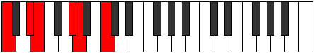 |
| [795](https://ianring.com/musictheory/scales/795) | [Aeologimic](ModeCNaturalAeologimic.md) | C | C, Db, Eb, Fb, G#, A, C |  |
| [797](https://ianring.com/musictheory/scales/797) | [Katocrimic](ModeCNaturalKatocrimic.md) | C | C, D, Eb, Fb, G#, A, C |  |
| [805](https://ianring.com/musictheory/scales/805) | [Rothitonic](ModeGNaturalRothitonic.md) | G | G, A, C, D#, E, G |  |
| [807](https://ianring.com/musictheory/scales/807) | [Epadimic](ModeGNaturalEpadimic.md) | G | G, Ab, Bbb, C, D#, E, G |  |
| [813](https://ianring.com/musictheory/scales/813) | [Larimic](ModeGNaturalLarimic.md) | G | G, A, Bb, C, D#, E, G |  |
| [821](https://ianring.com/musictheory/scales/821) | [Aeranimic](ModeGNaturalAeranimic.md) | G | G, A, B, C, D#, E, G |  |
| [825](https://ianring.com/musictheory/scales/825) | [Thyptimic](ModeCNaturalThyptimic.md) | C | C, D#, E, F, G#, A, C |  |
| [829](https://ianring.com/musictheory/scales/829) | [Lygian](ModeGNaturalLygian.md) | G | G, A, Bb, Cb, Dbb, Eb, Fb, G |  |
| [831](https://ianring.com/musictheory/scales/831) | [Rodyllic](ModeCNaturalRodyllic.md) | C | C, C#, D, D#, E, F, G#, A, C |  |
| [831](https://ianring.com/musictheory/scales/831) | [Rodyllic](ModeGNaturalRodyllic.md) | G | G, G#, A, A#, B, C, D#, E, G |  |
| [839](https://ianring.com/musictheory/scales/839) | [Ionathimic](ModeDSharpIonathimic.md) | D# | D#, E, F, G##, A##, B#, D# |  |
| [839](https://ianring.com/musictheory/scales/839) | [Ionathimic](ModeEFlatIonathimic.md) | Eb | Eb, Fb, Gbb, A, B, C, Eb |  |
| [843](https://ianring.com/musictheory/scales/843) | [Molimic](ModeDSharpMolimic.md) | D# | D#, E, F#, G##, A##, B#, D# |  |
| [843](https://ianring.com/musictheory/scales/843) | [Molimic](ModeEFlatMolimic.md) | Eb | Eb, Fb, Gb, A, B, C, Eb |  |
| [847](https://ianring.com/musictheory/scales/847) | [Ganian](ModeDSharpGanian.md) | D# | D#, E, F, Gb, A, B, C, D# |  |
| [851](https://ianring.com/musictheory/scales/851) | [Aerylimic](ModeDSharpAerylimic.md) | D# | D#, E, F##, G##, A##, B#, D# |  |
| [851](https://ianring.com/musictheory/scales/851) | [Aerylimic](ModeEFlatAerylimic.md) | Eb | Eb, Fb, G, A, B, C, Eb |  |
| [855](https://ianring.com/musictheory/scales/855) | [Porian](ModeDSharpPorian.md) | D# | D#, E, F, G, A, B, C, D# |  |
| [857](https://ianring.com/musictheory/scales/857) | [Aeolydimic](ModeCNaturalAeolydimic.md) | C | C, D#, E, F#, G#, A, C |  |
| [859](https://ianring.com/musictheory/scales/859) | [Pathian](ModeDSharpPathian.md) | D# | D#, E, F#, G, A, B, C, D# |  |
| [863](https://ianring.com/musictheory/scales/863) | [Pyryllic](ModeCNaturalPyryllic.md) | C | C, C#, D, D#, E, F#, G#, A, C |  |
| [863](https://ianring.com/musictheory/scales/863) | [Pyryllic](ModeDSharpPyryllic.md) | D# | D#, E, F, F#, G, A, B, C, D# |  |
| [863](https://ianring.com/musictheory/scales/863) | [Pyryllic](ModeEFlatPyryllic.md) | Eb | Eb, E, F, Gb, G, A, B, C, Eb |  |
| [867](https://ianring.com/musictheory/scales/867) | [Phrocrimic](ModeDSharpPhrocrimic.md) | D# | D#, E, F###, G##, A##, B#, D# |  |
| [867](https://ianring.com/musictheory/scales/867) | [Phrocrimic](ModeEFlatPhrocrimic.md) | Eb | Eb, Fb, G#, A, B, C, Eb |  |
| [869](https://ianring.com/musictheory/scales/869) | [Kothimic](ModeGNaturalKothimic.md) | G | G, A, B#, C#, D#, E, G |  |
| [871](https://ianring.com/musictheory/scales/871) | [Epadian](ModeDSharpEpadian.md) | D# | D#, E, F, G#, A, B, C, D# |  |
| [875](https://ianring.com/musictheory/scales/875) | [Stothian](ModeDSharpStothian.md) | D# | D#, E, F#, G#, A, B, C, D# |  |
| [877](https://ianring.com/musictheory/scales/877) | [Aeraptian](ModeGNaturalAeraptian.md) | G | G, A, Bb, C, Db, Eb, Fb, G |  |
| [879](https://ianring.com/musictheory/scales/879) | [Aeolocryllic](ModeGNaturalAeolocryllic.md) | G | G, G#, A, A#, C, C#, D#, E, G |  |
| [879](https://ianring.com/musictheory/scales/879) | [Aeolocryllic](ModeDSharpAeolocryllic.md) | D# | D#, E, F, F#, G#, A, B, C, D# |  |
| [879](https://ianring.com/musictheory/scales/879) | [Aeolocryllic](ModeEFlatAeolocryllic.md) | Eb | Eb, E, F, Gb, Ab, A, B, C, Eb |  |
| [883](https://ianring.com/musictheory/scales/883) | [Ralian](ModeDSharpRalian.md) | D# | D#, E, F##, G#, A, B, C, D# |  |
| [885](https://ianring.com/musictheory/scales/885) | [Sathian](ModeGNaturalSathian.md) | G | G, A, B, C, Db, Eb, Fb, G |  |
| [887](https://ianring.com/musictheory/scales/887) | [Sathyllic](ModeGNaturalSathyllic.md) | G | G, G#, A, B, C, C#, D#, E, G |  |
| [887](https://ianring.com/musictheory/scales/887) | [Sathyllic](ModeDSharpSathyllic.md) | D# | D#, E, F, G, G#, A, B, C, D# |  |
| [887](https://ianring.com/musictheory/scales/887) | [Sathyllic](ModeEFlatSathyllic.md) | Eb | Eb, E, F, G, Ab, A, B, C, Eb |  |
| [889](https://ianring.com/musictheory/scales/889) | [Borian](ModeCNaturalBorian.md) | C | C, D#, E, F, Gb, Ab, Bbb, C |  |
| [891](https://ianring.com/musictheory/scales/891) | [Ionilyllic](ModeCNaturalIonilyllic.md) | C | C, C#, D#, E, F, F#, G#, A, C |  |
| [891](https://ianring.com/musictheory/scales/891) | [Ionilyllic](ModeDSharpIonilyllic.md) | D# | D#, E, F#, G, G#, A, B, C, D# |  |
| [891](https://ianring.com/musictheory/scales/891) | [Ionilyllic](ModeEFlatIonilyllic.md) | Eb | Eb, E, Gb, G, Ab, A, B, C, Eb |  |
| [893](https://ianring.com/musictheory/scales/893) | [Pycryllic](ModeCNaturalPycryllic.md) | C | C, D, D#, E, F, F#, G#, A, C |  |
| [893](https://ianring.com/musictheory/scales/893) | [Pycryllic](ModeGNaturalPycryllic.md) | G | G, A, A#, B, C, C#, D#, E, G |  |
| [895](https://ianring.com/musictheory/scales/895) | [Aeolathygic](ModeCNaturalAeolathygic.md) | C | C, C#, D, D#, E, F, F#, G#, A, C |  |
| [895](https://ianring.com/musictheory/scales/895) | [Aeolathygic](ModeDSharpAeolathygic.md) | D# | D#, E, F, F#, G, G#, A, B, C, D# |  |
| [895](https://ianring.com/musictheory/scales/895) | [Aeolathygic](ModeEFlatAeolathygic.md) | Eb | Eb, E, F, Gb, G, Ab, A, B, C, Eb |  |
| [895](https://ianring.com/musictheory/scales/895) | [Aeolathygic](ModeGNaturalAeolathygic.md) | G | G, G#, A, A#, B, C, C#, D#, E, G |  |
| [915](https://ianring.com/musictheory/scales/915) | [Loptimic](ModeGSharpLoptimic.md) | G# | G#, A, B#, C###, D##, E#, G# |  |
| [915](https://ianring.com/musictheory/scales/915) | [Loptimic](ModeAFlatLoptimic.md) | Ab | Ab, Bbb, C, D#, E, F, Ab |  |
| [919](https://ianring.com/musictheory/scales/919) | [Gathian](ModeGSharpGathian.md) | G# | G#, A, Bb, C, D#, E, F, G# |  |
| [921](https://ianring.com/musictheory/scales/921) | [Bogimic](ModeCNaturalBogimic.md) | C | C, D#, E, F##, G#, A, C |  |
| [923](https://ianring.com/musictheory/scales/923) | [Ionodian](ModeGSharpIonodian.md) | G# | G#, A, B, C, D#, E, F, G# |  |
| [927](https://ianring.com/musictheory/scales/927) | [Koptyllic](ModeCNaturalKoptyllic.md) | C | C, C#, D, D#, E, G, G#, A, C |  |
| [927](https://ianring.com/musictheory/scales/927) | [Koptyllic](ModeGSharpKoptyllic.md) | G# | G#, A, A#, B, C, D#, E, F, G# |  |
| [927](https://ianring.com/musictheory/scales/927) | [Koptyllic](ModeAFlatKoptyllic.md) | Ab | Ab, A, Bb, B, C, Eb, E, F, Ab |  |
| [933](https://ianring.com/musictheory/scales/933) | [Dadimic](ModeGNaturalDadimic.md) | G | G, A, B#, C##, D#, E, G |  |
| [941](https://ianring.com/musictheory/scales/941) | [Phrorian](ModeGNaturalPhrorian.md) | G | G, A, Bb, C, D, Eb, Fb, G |  |
| [943](https://ianring.com/musictheory/scales/943) | [Aerygyllic](ModeGNaturalAerygyllic.md) | G | G, G#, A, A#, C, D, D#, E, G |  |
| [947](https://ianring.com/musictheory/scales/947) | [Modian](ModeGSharpModian.md) | G# | G#, A, B#, C#, D#, E, F, G# |  |
| [949](https://ianring.com/musictheory/scales/949) | [Ionagian](ModeGNaturalIonagian.md) | G | G, A, B, C, D, Eb, Fb, G |  |
| [951](https://ianring.com/musictheory/scales/951) | [Thogyllic](ModeGSharpThogyllic.md) | G# | G#, A, A#, C, C#, D#, E, F, G# |  |
| [951](https://ianring.com/musictheory/scales/951) | [Thogyllic](ModeAFlatThogyllic.md) | Ab | Ab, A, Bb, C, Db, Eb, E, F, Ab |  |
| [951](https://ianring.com/musictheory/scales/951) | [Thogyllic](ModeGNaturalThogyllic.md) | G | G, G#, A, B, C, D, D#, E, G |  |
| [953](https://ianring.com/musictheory/scales/953) | [Stoptian](ModeCNaturalStoptian.md) | C | C, D#, E, F, G, Ab, Bbb, C |  |
| [955](https://ianring.com/musictheory/scales/955) | [Ionogyllic](ModeCNaturalIonogyllic.md) | C | C, C#, D#, E, F, G, G#, A, C |  |
| [955](https://ianring.com/musictheory/scales/955) | [Ionogyllic](ModeGSharpIonogyllic.md) | G# | G#, A, B, C, C#, D#, E, F, G# |  |
| [955](https://ianring.com/musictheory/scales/955) | [Ionogyllic](ModeAFlatIonogyllic.md) | Ab | Ab, A, B, C, Db, Eb, E, F, Ab |  |
| [957](https://ianring.com/musictheory/scales/957) | [Phronyllic](ModeCNaturalPhronyllic.md) | C | C, D, D#, E, F, G, G#, A, C |  |
| [957](https://ianring.com/musictheory/scales/957) | [Phronyllic](ModeGNaturalPhronyllic.md) | G | G, A, A#, B, C, D, D#, E, G | 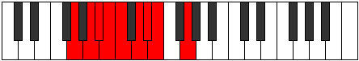 |
| [959](https://ianring.com/musictheory/scales/959) | [Katylygic](ModeCNaturalKatylygic.md) | C | C, C#, D, D#, E, F, G, G#, A, C | 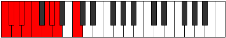 |
| [959](https://ianring.com/musictheory/scales/959) | [Katylygic](ModeGSharpKatylygic.md) | G# | G#, A, A#, B, C, C#, D#, E, F, G# |  |
| [959](https://ianring.com/musictheory/scales/959) | [Katylygic](ModeAFlatKatylygic.md) | Ab | Ab, A, Bb, B, C, Db, Eb, E, F, Ab |  |
| [959](https://ianring.com/musictheory/scales/959) | [Katylygic](ModeGNaturalKatylygic.md) | G | G, G#, A, A#, B, C, D, D#, E, G |  |
| [967](https://ianring.com/musictheory/scales/967) | [Aeolanian](ModeDSharpAeolanian.md) | D# | D#, E, F, G##, A#, B, C, D# |  |
| [967](https://ianring.com/musictheory/scales/967) | [Aeolanian](ModeEFlatAeolanian.md) | Eb | Eb, Fb, Gbb, A, Bb, Cb, Dbb, Eb |  |
| [969](https://ianring.com/musictheory/scales/969) | [Ionogimic](ModeANaturalIonogimic.md) | A | A, B#, C###, D##, E#, F#, A |  |
| [971](https://ianring.com/musictheory/scales/971) | [Ladian](ModeANaturalLadian.md) | A | A, Bb, C, D#, E, F, Gb, A |  |
| [971](https://ianring.com/musictheory/scales/971) | [Ladian](ModeDSharpLadian.md) | D# | D#, E, F#, G##, A#, B, C, D# |  |
| [971](https://ianring.com/musictheory/scales/971) | [Ladian](ModeEFlatLadian.md) | Eb | Eb, Fb, Gb, A, Bb, Cb, Dbb, Eb |  |
| [973](https://ianring.com/musictheory/scales/973) | [Phryptian](ModeANaturalPhryptian.md) | A | A, B, C, D#, E, F, Gb, A |  |
| [975](https://ianring.com/musictheory/scales/975) | [Katogyllic](ModeDSharpKatogyllic.md) | D# | D#, E, F, F#, A, A#, B, C, D# |  |
| [975](https://ianring.com/musictheory/scales/975) | [Katogyllic](ModeEFlatKatogyllic.md) | Eb | Eb, E, F, Gb, A, Bb, B, C, Eb |  |
| [975](https://ianring.com/musictheory/scales/975) | [Katogyllic](ModeANaturalKatogyllic.md) | A | A, A#, B, C, D#, E, F, F#, A |  |
| [979](https://ianring.com/musictheory/scales/979) | [Thogian](ModeGSharpThogian.md) | G# | G#, A, B#, C##, D#, E, F, G# |  |
| [979](https://ianring.com/musictheory/scales/979) | [Thogian](ModeDSharpThogian.md) | D# | D#, E, F##, G##, A#, B, C, D# |  |
| [979](https://ianring.com/musictheory/scales/979) | [Thogian](ModeEFlatThogian.md) | Eb | Eb, Fb, G, A, Bb, Cb, Dbb, Eb |  |
| [983](https://ianring.com/musictheory/scales/983) | [Epygyllic](ModeGSharpEpygyllic.md) | G# | G#, A, A#, C, D, D#, E, F, G# |  |
| [983](https://ianring.com/musictheory/scales/983) | [Epygyllic](ModeAFlatEpygyllic.md) | Ab | Ab, A, Bb, C, D, Eb, E, F, Ab |  |
| [983](https://ianring.com/musictheory/scales/983) | [Epygyllic](ModeDSharpEpygyllic.md) | D# | D#, E, F, G, A, A#, B, C, D# |  |
| [983](https://ianring.com/musictheory/scales/983) | [Epygyllic](ModeEFlatEpygyllic.md) | Eb | Eb, E, F, G, A, Bb, B, C, Eb |  |
| [985](https://ianring.com/musictheory/scales/985) | [Raptian](ModeANaturalRaptian.md) | A | A, B#, C#, D#, E, F, Gb, A |  |
| [985](https://ianring.com/musictheory/scales/985) | [Raptian](ModeCNaturalRaptian.md) | C | C, D#, E, F#, G, Ab, Bbb, C |  |
| [987](https://ianring.com/musictheory/scales/987) | [Aeraptyllic](ModeCNaturalAeraptyllic.md) | C | C, C#, D#, E, F#, G, G#, A, C |  |
| [987](https://ianring.com/musictheory/scales/987) | [Aeraptyllic](ModeANaturalAeraptyllic.md) | A | A, A#, C, C#, D#, E, F, F#, A |  |
| [987](https://ianring.com/musictheory/scales/987) | [Aeraptyllic](ModeGSharpAeraptyllic.md) | G# | G#, A, B, C, D, D#, E, F, G# |  |
| [987](https://ianring.com/musictheory/scales/987) | [Aeraptyllic](ModeAFlatAeraptyllic.md) | Ab | Ab, A, B, C, D, Eb, E, F, Ab |  |
| [987](https://ianring.com/musictheory/scales/987) | [Aeraptyllic](ModeDSharpAeraptyllic.md) | D# | D#, E, F#, G, A, A#, B, C, D# |  |
| [987](https://ianring.com/musictheory/scales/987) | [Aeraptyllic](ModeEFlatAeraptyllic.md) | Eb | Eb, E, Gb, G, A, Bb, B, C, Eb |  |
| [989](https://ianring.com/musictheory/scales/989) | [Phrolyllic](ModeCNaturalPhrolyllic.md) | C | C, D, D#, E, F#, G, G#, A, C |  |
| [989](https://ianring.com/musictheory/scales/989) | [Phrolyllic](ModeANaturalPhrolyllic.md) | A | A, B, C, C#, D#, E, F, F#, A |  |
| [991](https://ianring.com/musictheory/scales/991) | [Aeolygic](ModeCNaturalAeolygic.md) | C | C, C#, D, D#, E, F#, G, G#, A, C |  |
| [991](https://ianring.com/musictheory/scales/991) | [Aeolygic](ModeANaturalAeolygic.md) | A | A, A#, B, C, C#, D#, E, F, F#, A |  |
| [991](https://ianring.com/musictheory/scales/991) | [Aeolygic](ModeDSharpAeolygic.md) | D# | D#, E, F, F#, G, A, A#, B, C, D# |  |
| [991](https://ianring.com/musictheory/scales/991) | [Aeolygic](ModeEFlatAeolygic.md) | Eb | Eb, E, F, Gb, G, A, Bb, B, C, Eb |  |
| [991](https://ianring.com/musictheory/scales/991) | [Aeolygic](ModeGSharpAeolygic.md) | G# | G#, A, A#, B, C, D, D#, E, F, G# |  |
| [991](https://ianring.com/musictheory/scales/991) | [Aeolygic](ModeAFlatAeolygic.md) | Ab | Ab, A, Bb, B, C, D, Eb, E, F, Ab |  |
| [995](https://ianring.com/musictheory/scales/995) | [Phrathian](ModeDSharpPhrathian.md) | D# | D#, E, F###, G##, A#, B, C, D# |  |
| [995](https://ianring.com/musictheory/scales/995) | [Phrathian](ModeEFlatPhrathian.md) | Eb | Eb, Fb, G#, A, Bb, Cb, Dbb, Eb |  |
| [997](https://ianring.com/musictheory/scales/997) | [Rycrian](ModeGNaturalRycrian.md) | G | G, A, B#, C#, D, Eb, Fb, G |  |
| [999](https://ianring.com/musictheory/scales/999) | [Bylyllic](ModeGNaturalBylyllic.md) | G | G, G#, A, C, C#, D, D#, E, G | 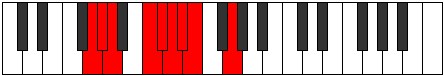 |
| [999](https://ianring.com/musictheory/scales/999) | [Bylyllic](ModeDSharpBylyllic.md) | D# | D#, E, F, G#, A, A#, B, C, D# |  |
| [999](https://ianring.com/musictheory/scales/999) | [Bylyllic](ModeEFlatBylyllic.md) | Eb | Eb, E, F, Ab, A, Bb, B, C, Eb |  |
| [1001](https://ianring.com/musictheory/scales/1001) | [Badian](ModeANaturalBadian.md) | A | A, B#, C##, D#, E, F, Gb, A |  |
| [1003](https://ianring.com/musictheory/scales/1003) | [Ionyryllic](ModeANaturalIonyryllic.md) | A | A, A#, C, D, D#, E, F, F#, A |  |
| [1003](https://ianring.com/musictheory/scales/1003) | [Ionyryllic](ModeDSharpIonyryllic.md) | D# | D#, E, F#, G#, A, A#, B, C, D# |  |
| [1003](https://ianring.com/musictheory/scales/1003) | [Ionyryllic](ModeEFlatIonyryllic.md) | Eb | Eb, E, Gb, Ab, A, Bb, B, C, Eb |  |
| [1005](https://ianring.com/musictheory/scales/1005) | [Radyllic](ModeGNaturalRadyllic.md) | G | G, A, A#, C, C#, D, D#, E, G |  |
| [1005](https://ianring.com/musictheory/scales/1005) | [Radyllic](ModeANaturalRadyllic.md) | A | A, B, C, D, D#, E, F, F#, A |  |
| [1007](https://ianring.com/musictheory/scales/1007) | [Ionycrygic](ModeGNaturalIonycrygic.md) | G | G, G#, A, A#, C, C#, D, D#, E, G |  |
| [1007](https://ianring.com/musictheory/scales/1007) | [Ionycrygic](ModeANaturalIonycrygic.md) | A | A, A#, B, C, D, D#, E, F, F#, A |  |
| [1007](https://ianring.com/musictheory/scales/1007) | [Ionycrygic](ModeDSharpIonycrygic.md) | D# | D#, E, F, F#, G#, A, A#, B, C, D# | 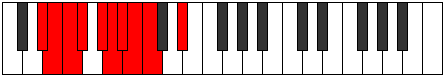 |
| [1007](https://ianring.com/musictheory/scales/1007) | [Ionycrygic](ModeEFlatIonycrygic.md) | Eb | Eb, E, F, Gb, Ab, A, Bb, B, C, Eb |  |
| [1011](https://ianring.com/musictheory/scales/1011) | [Kycryllic](ModeGSharpKycryllic.md) | G# | G#, A, C, C#, D, D#, E, F, G# |  |
| [1011](https://ianring.com/musictheory/scales/1011) | [Kycryllic](ModeAFlatKycryllic.md) | Ab | Ab, A, C, Db, D, Eb, E, F, Ab |  |
| [1011](https://ianring.com/musictheory/scales/1011) | [Kycryllic](ModeDSharpKycryllic.md) | D# | D#, E, G, G#, A, A#, B, C, D# |  |
| [1011](https://ianring.com/musictheory/scales/1011) | [Kycryllic](ModeEFlatKycryllic.md) | Eb | Eb, E, G, Ab, A, Bb, B, C, Eb |  |
| [1013](https://ianring.com/musictheory/scales/1013) | [Stydyllic](ModeGNaturalStydyllic.md) | G | G, A, B, C, C#, D, D#, E, G |  |
| [1015](https://ianring.com/musictheory/scales/1015) | [Ionodygic](ModeGSharpIonodygic.md) | G# | G#, A, A#, C, C#, D, D#, E, F, G# |  |
| [1015](https://ianring.com/musictheory/scales/1015) | [Ionodygic](ModeAFlatIonodygic.md) | Ab | Ab, A, Bb, C, Db, D, Eb, E, F, Ab |  |
| [1015](https://ianring.com/musictheory/scales/1015) | [Ionodygic](ModeGNaturalIonodygic.md) | G | G, G#, A, B, C, C#, D, D#, E, G |  |
| [1015](https://ianring.com/musictheory/scales/1015) | [Ionodygic](ModeDSharpIonodygic.md) | D# | D#, E, F, G, G#, A, A#, B, C, D# |  |
| [1015](https://ianring.com/musictheory/scales/1015) | [Ionodygic](ModeEFlatIonodygic.md) | Eb | Eb, E, F, G, Ab, A, Bb, B, C, Eb |  |
| [1017](https://ianring.com/musictheory/scales/1017) | [Dythyllic](ModeANaturalDythyllic.md) | A | A, C, C#, D, D#, E, F, F#, A |  |
| [1017](https://ianring.com/musictheory/scales/1017) | [Dythyllic](ModeCNaturalDythyllic.md) | C | C, D#, E, F, F#, G, G#, A, C |  |
| [1019](https://ianring.com/musictheory/scales/1019) | [Aeranygic](ModeCNaturalAeranygic.md) | C | C, C#, D#, E, F, F#, G, G#, A, C |  |
| [1019](https://ianring.com/musictheory/scales/1019) | [Aeranygic](ModeANaturalAeranygic.md) | A | A, A#, C, C#, D, D#, E, F, F#, A |  |
| [1019](https://ianring.com/musictheory/scales/1019) | [Aeranygic](ModeGSharpAeranygic.md) | G# | G#, A, B, C, C#, D, D#, E, F, G# |  |
| [1019](https://ianring.com/musictheory/scales/1019) | [Aeranygic](ModeAFlatAeranygic.md) | Ab | Ab, A, B, C, Db, D, Eb, E, F, Ab |  |
| [1019](https://ianring.com/musictheory/scales/1019) | [Aeranygic](ModeDSharpAeranygic.md) | D# | D#, E, F#, G, G#, A, A#, B, C, D# |  |
| [1019](https://ianring.com/musictheory/scales/1019) | [Aeranygic](ModeEFlatAeranygic.md) | Eb | Eb, E, Gb, G, Ab, A, Bb, B, C, Eb |  |
| [1021](https://ianring.com/musictheory/scales/1021) | [Ladygic](ModeCNaturalLadygic.md) | C | C, D, D#, E, F, F#, G, G#, A, C |  |
| [1021](https://ianring.com/musictheory/scales/1021) | [Ladygic](ModeANaturalLadygic.md) | A | A, B, C, C#, D, D#, E, F, F#, A |  |
| [1021](https://ianring.com/musictheory/scales/1021) | [Ladygic](ModeGNaturalLadygic.md) | G | G, A, A#, B, C, C#, D, D#, E, G |  |
| [1023](https://ianring.com/musictheory/scales/1023) | [Dodyllian](ModeCNaturalDodyllian.md) | C | C, C#, D, D#, E, F, F#, G, G#, A, C |  |
| [1023](https://ianring.com/musictheory/scales/1023) | [Dodyllian](ModeANaturalDodyllian.md) | A | A, A#, B, C, C#, D, D#, E, F, F#, A |  |
| [1023](https://ianring.com/musictheory/scales/1023) | [Dodyllian](ModeGSharpDodyllian.md) | G# | G#, A, A#, B, C, C#, D, D#, E, F, G# |  |
| [1023](https://ianring.com/musictheory/scales/1023) | [Dodyllian](ModeAFlatDodyllian.md) | Ab | Ab, A, Bb, B, C, Db, D, Eb, E, F, Ab |  |
| [1023](https://ianring.com/musictheory/scales/1023) | [Dodyllian](ModeGNaturalDodyllian.md) | G | G, G#, A, A#, B, C, C#, D, D#, E, G |  |
| [1023](https://ianring.com/musictheory/scales/1023) | [Dodyllian](ModeDSharpDodyllian.md) | D# | D#, E, F, F#, G, G#, A, A#, B, C, D# |  |
| [1023](https://ianring.com/musictheory/scales/1023) | [Dodyllian](ModeEFlatDodyllian.md) | Eb | Eb, E, F, Gb, G, Ab, A, Bb, B, C, Eb |  |
| [1139](https://ianring.com/musictheory/scales/1139) | [Aerygimic](ModeBNaturalAerygimic.md) | B | B, C, D#, E, F, G##, B |  |
| [1143](https://ianring.com/musictheory/scales/1143) | [Styrian](ModeBNaturalStyrian.md) | B | B, C, Db, Eb, Fb, Gbb, A, B |  |
| [1147](https://ianring.com/musictheory/scales/1147) | [Epynian](ModeBNaturalEpynian.md) | B | B, C, D, Eb, Fb, Gbb, A, B |  |
| [1151](https://ianring.com/musictheory/scales/1151) | [Mythyllic](ModeBNaturalMythyllic.md) | B | B, C, C#, D, D#, E, F, A, B |  |
| [1167](https://ianring.com/musictheory/scales/1167) | [Aerodimic](ModeDNaturalAerodimic.md) | D | D, Eb, Fb, Gbb, A, B#, D |  |
| [1175](https://ianring.com/musictheory/scales/1175) | [Epycrimic](ModeDNaturalEpycrimic.md) | D | D, Eb, Fb, Gb, A, B#, D | 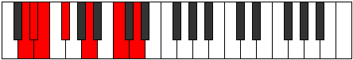 |
| [1191](https://ianring.com/musictheory/scales/1191) | [Pyrimic](ModeDNaturalPyrimic.md) | D | D, Eb, Fb, G, A, B#, D |  |
| [1203](https://ianring.com/musictheory/scales/1203) | [Pagimic](ModeBNaturalPagimic.md) | B | B, C, D#, E, F#, G##, B |  |
| [1207](https://ianring.com/musictheory/scales/1207) | [Aeoloptian](ModeBNaturalAeoloptian.md) | B | B, C, Db, Eb, Fb, Gb, A, B |  |
| [1211](https://ianring.com/musictheory/scales/1211) | [Zadian](ModeBNaturalZadian.md) | B | B, C, D, Eb, Fb, Gb, A, B |  |
| [1215](https://ianring.com/musictheory/scales/1215) | [Aeolanyllic](ModeDNaturalAeolanyllic.md) | D | D, D#, E, F, F#, G, A, C, D |  |
| [1215](https://ianring.com/musictheory/scales/1215) | [Aeolanyllic](ModeBNaturalAeolanyllic.md) | B | B, C, C#, D, D#, E, F#, A, B |  |
| [1223](https://ianring.com/musictheory/scales/1223) | [Phryptimic](ModeDNaturalPhryptimic.md) | D | D, Eb, Fb, G#, A, B#, D |  |
| [1225](https://ianring.com/musictheory/scales/1225) | [Lyditonic](ModeANaturalLyditonic.md) | A | A, C, D#, E, G, A | 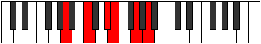 |
| [1227](https://ianring.com/musictheory/scales/1227) | [Thacrimic](ModeANaturalThacrimic.md) | A | A, Bb, C, D#, E, F##, A |  |
| [1229](https://ianring.com/musictheory/scales/1229) | [Ragimic](ModeANaturalRagimic.md) | A | A, B, C, D#, E, F##, A |  |
| [1231](https://ianring.com/musictheory/scales/1231) | [Logian](ModeANaturalLogian.md) | A | A, Bb, Cb, Dbb, Eb, Fb, G, A |  |
| [1241](https://ianring.com/musictheory/scales/1241) | [Pygimic](ModeANaturalPygimic.md) | A | A, B#, C#, D#, E, F##, A |  |
| [1243](https://ianring.com/musictheory/scales/1243) | [Epylian](ModeANaturalEpylian.md) | A | A, Bb, C, Db, Eb, Fb, G, A |  |
| [1245](https://ianring.com/musictheory/scales/1245) | [Lathian](ModeANaturalLathian.md) | A | A, B, C, Db, Eb, Fb, G, A |  |
| [1247](https://ianring.com/musictheory/scales/1247) | [Mygyllic](ModeDNaturalMygyllic.md) | D | D, D#, E, F, F#, G#, A, C, D |  |
| [1247](https://ianring.com/musictheory/scales/1247) | [Mygyllic](ModeANaturalMygyllic.md) | A | A, A#, B, C, C#, D#, E, G, A |  |
| [1257](https://ianring.com/musictheory/scales/1257) | [Aeolyphimic](ModeANaturalAeolyphimic.md) | A | A, B#, C##, D#, E, F##, A |  |
| [1259](https://ianring.com/musictheory/scales/1259) | [Stadian](ModeANaturalStadian.md) | A | A, Bb, C, D, Eb, Fb, G, A |  |
| [1261](https://ianring.com/musictheory/scales/1261) | [Aeodian](ModeANaturalAeodian.md) | A | A, B, C, D, Eb, Fb, G, A |  |
| [1263](https://ianring.com/musictheory/scales/1263) | [Stynyllic](ModeDNaturalStynyllic.md) | D | D, D#, E, F, G, G#, A, C, D |  |
| [1263](https://ianring.com/musictheory/scales/1263) | [Stynyllic](ModeANaturalStynyllic.md) | A | A, A#, B, C, D, D#, E, G, A |  |
| [1267](https://ianring.com/musictheory/scales/1267) | [Katynian](ModeBNaturalKatynian.md) | B | B, C, D#, E, F, Gb, A, B |  |
| [1271](https://ianring.com/musictheory/scales/1271) | [Kolyllic](ModeDNaturalKolyllic.md) | D | D, D#, E, F#, G, G#, A, C, D |  |
| [1271](https://ianring.com/musictheory/scales/1271) | [Kolyllic](ModeBNaturalKolyllic.md) | B | B, C, C#, D#, E, F, F#, A, B |  |
| [1273](https://ianring.com/musictheory/scales/1273) | [Ronian](ModeANaturalRonian.md) | A | A, B#, C#, D, Eb, Fb, G, A |  |
| [1275](https://ianring.com/musictheory/scales/1275) | [Stagyllic](ModeANaturalStagyllic.md) | A | A, A#, C, C#, D, D#, E, G, A |  |
| [1275](https://ianring.com/musictheory/scales/1275) | [Stagyllic](ModeBNaturalStagyllic.md) | B | B, C, D, D#, E, F, F#, A, B |  |
| [1277](https://ianring.com/musictheory/scales/1277) | [Zadyllic](ModeANaturalZadyllic.md) | A | A, B, C, C#, D, D#, E, G, A |  |
| [1279](https://ianring.com/musictheory/scales/1279) | [Sarygic](ModeDNaturalSarygic.md) | D | D, D#, E, F, F#, G, G#, A, C, D |  |
| [1279](https://ianring.com/musictheory/scales/1279) | [Sarygic](ModeBNaturalSarygic.md) | B | B, C, C#, D, D#, E, F, F#, A, B |  |
| [1279](https://ianring.com/musictheory/scales/1279) | [Sarygic](ModeANaturalSarygic.md) | A | A, A#, B, C, C#, D, D#, E, G, A |  |
| [1331](https://ianring.com/musictheory/scales/1331) | [Dolimic](ModeBNaturalDolimic.md) | B | B, C, D#, E, F##, G##, B |  |
| [1335](https://ianring.com/musictheory/scales/1335) | [Aeralian](ModeBNaturalAeralian.md) | B | B, C, Db, Eb, Fb, G, A, B |  |
| [1339](https://ianring.com/musictheory/scales/1339) | [Kycrian](ModeBNaturalKycrian.md) | B | B, C, D, Eb, Fb, G, A, B |  |
| [1343](https://ianring.com/musictheory/scales/1343) | [Zalyllic](ModeBNaturalZalyllic.md) | B | B, C, C#, D, D#, E, G, A, B |  |
| [1395](https://ianring.com/musictheory/scales/1395) | [Mixonorian](ModeBNaturalMixonorian.md) | B | B, C, D#, E, F, G, A, B |  |
| [1399](https://ianring.com/musictheory/scales/1399) | [Syryllic](ModeBNaturalSyryllic.md) | B | B, C, C#, D#, E, F, G, A, B |  |
| [1403](https://ianring.com/musictheory/scales/1403) | [Epinyllic](ModeBNaturalEpinyllic.md) | B | B, C, D, D#, E, F, G, A, B |  |
| [1407](https://ianring.com/musictheory/scales/1407) | [Tharygic](ModeBNaturalTharygic.md) | B | B, C, C#, D, D#, E, F, G, A, B |  |
| [1423](https://ianring.com/musictheory/scales/1423) | [Doptian](ModeDNaturalDoptian.md) | D | D, Eb, Fb, Gbb, A, Bb, C, D |  |
| [1427](https://ianring.com/musictheory/scales/1427) | [Lolimic](ModeGSharpLolimic.md) | G# | G#, A, B#, C###, D##, E##, G# |  |
| [1427](https://ianring.com/musictheory/scales/1427) | [Lolimic](ModeAFlatLolimic.md) | Ab | Ab, Bbb, C, D#, E, F#, Ab |  |
| [1431](https://ianring.com/musictheory/scales/1431) | [Phragian](ModeDNaturalPhragian.md) | D | D, Eb, Fb, Gb, A, Bb, C, D |  |
| [1431](https://ianring.com/musictheory/scales/1431) | [Phragian](ModeGSharpPhragian.md) | G# | G#, A, Bb, C, D#, E, F#, G# |  |
| [1435](https://ianring.com/musictheory/scales/1435) | [Phronian](ModeGSharpPhronian.md) | G# | G#, A, B, C, D#, E, F#, G# |  |
| [1439](https://ianring.com/musictheory/scales/1439) | [Rolyllic](ModeDNaturalRolyllic.md) | D | D, D#, E, F, F#, A, A#, C, D |  |
| [1439](https://ianring.com/musictheory/scales/1439) | [Rolyllic](ModeGSharpRolyllic.md) | G# | G#, A, A#, B, C, D#, E, F#, G# |  |
| [1439](https://ianring.com/musictheory/scales/1439) | [Rolyllic](ModeAFlatRolyllic.md) | Ab | Ab, A, Bb, B, C, Eb, E, Gb, Ab |  |
| [1447](https://ianring.com/musictheory/scales/1447) | [Mixopyrian](ModeDNaturalMixopyrian.md) | D | D, Eb, Fb, G, A, Bb, C, D |  |
| [1455](https://ianring.com/musictheory/scales/1455) | [Soryllic](ModeDNaturalSoryllic.md) | D | D, D#, E, F, G, A, A#, C, D |  |
| [1459](https://ianring.com/musictheory/scales/1459) | [Ionalian](ModeGSharpIonalian.md) | G# | G#, A, B#, C#, D#, E, F#, G# |  |
| [1459](https://ianring.com/musictheory/scales/1459) | [Ionalian](ModeBNaturalIonalian.md) | B | B, C, D#, E, F#, G, A, B |  |
| [1463](https://ianring.com/musictheory/scales/1463) | [Zaptyllic](ModeDNaturalZaptyllic.md) | D | D, D#, E, F#, G, A, A#, C, D |  |
| [1463](https://ianring.com/musictheory/scales/1463) | [Zaptyllic](ModeGSharpZaptyllic.md) | G# | G#, A, A#, C, C#, D#, E, F#, G# |  |
| [1463](https://ianring.com/musictheory/scales/1463) | [Zaptyllic](ModeAFlatZaptyllic.md) | Ab | Ab, A, Bb, C, Db, Eb, E, Gb, Ab |  |
| [1463](https://ianring.com/musictheory/scales/1463) | [Zaptyllic](ModeBNaturalZaptyllic.md) | B | B, C, C#, D#, E, F#, G, A, B |  |
| [1467](https://ianring.com/musictheory/scales/1467) | [Thydyllic](ModeBNaturalThydyllic.md) | B | B, C, D, D#, E, F#, G, A, B |  |
| [1467](https://ianring.com/musictheory/scales/1467) | [Thydyllic](ModeGSharpThydyllic.md) | G# | G#, A, B, C, C#, D#, E, F#, G# |  |
| [1467](https://ianring.com/musictheory/scales/1467) | [Thydyllic](ModeAFlatThydyllic.md) | Ab | Ab, A, B, C, Db, Eb, E, Gb, Ab |  |
| [1471](https://ianring.com/musictheory/scales/1471) | [Radygic](ModeDNaturalRadygic.md) | D | D, D#, E, F, F#, G, A, A#, C, D |  |
| [1471](https://ianring.com/musictheory/scales/1471) | [Radygic](ModeBNaturalRadygic.md) | B | B, C, C#, D, D#, E, F#, G, A, B |  |
| [1471](https://ianring.com/musictheory/scales/1471) | [Radygic](ModeGSharpRadygic.md) | G# | G#, A, A#, B, C, C#, D#, E, F#, G# |  |
| [1471](https://ianring.com/musictheory/scales/1471) | [Radygic](ModeAFlatRadygic.md) | Ab | Ab, A, Bb, B, C, Db, Eb, E, Gb, Ab |  |
| [1479](https://ianring.com/musictheory/scales/1479) | [Aeolagian](ModeDNaturalAeolagian.md) | D | D, Eb, Fb, G#, A, Bb, C, D |  |
| [1481](https://ianring.com/musictheory/scales/1481) | [Zagimic](ModeANaturalZagimic.md) | A | A, B#, C###, D##, E#, F##, A |  |
| [1483](https://ianring.com/musictheory/scales/1483) | [Dygian](ModeANaturalDygian.md) | A | A, Bb, C, D#, E, F, G, A |  |
| [1485](https://ianring.com/musictheory/scales/1485) | [Tyrian](ModeANaturalTyrian.md) | A | A, B, C, D#, E, F, G, A |  |
| [1487](https://ianring.com/musictheory/scales/1487) | [Lycryllic](ModeDNaturalLycryllic.md) | D | D, D#, E, F, G#, A, A#, C, D |  |
| [1487](https://ianring.com/musictheory/scales/1487) | [Lycryllic](ModeANaturalLycryllic.md) | A | A, A#, B, C, D#, E, F, G, A |  |
| [1491](https://ianring.com/musictheory/scales/1491) | [Rynian](ModeGSharpRynian.md) | G# | G#, A, B#, C##, D#, E, F#, G# |  |
| [1495](https://ianring.com/musictheory/scales/1495) | [Kaptyllic](ModeDNaturalKaptyllic.md) | D | D, D#, E, F#, G#, A, A#, C, D |  |
| [1495](https://ianring.com/musictheory/scales/1495) | [Kaptyllic](ModeGSharpKaptyllic.md) | G# | G#, A, A#, C, D, D#, E, F#, G# |  |
| [1495](https://ianring.com/musictheory/scales/1495) | [Kaptyllic](ModeAFlatKaptyllic.md) | Ab | Ab, A, Bb, C, D, Eb, E, Gb, Ab |  |
| [1497](https://ianring.com/musictheory/scales/1497) | [Ionanian](ModeANaturalIonanian.md) | A | A, B#, C#, D#, E, F, G, A | 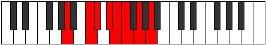 |
| [1499](https://ianring.com/musictheory/scales/1499) | [Stonyllic](ModeANaturalStonyllic.md) | A | A, A#, C, C#, D#, E, F, G, A |  |
| [1499](https://ianring.com/musictheory/scales/1499) | [Stonyllic](ModeGSharpStonyllic.md) | G# | G#, A, B, C, D, D#, E, F#, G# |  |
| [1499](https://ianring.com/musictheory/scales/1499) | [Stonyllic](ModeAFlatStonyllic.md) | Ab | Ab, A, B, C, D, Eb, E, Gb, Ab |  |
| [1501](https://ianring.com/musictheory/scales/1501) | [Stygyllic](ModeANaturalStygyllic.md) | A | A, B, C, C#, D#, E, F, G, A |  |
| [1503](https://ianring.com/musictheory/scales/1503) | [Padygic](ModeDNaturalPadygic.md) | D | D, D#, E, F, F#, G#, A, A#, C, D |  |
| [1503](https://ianring.com/musictheory/scales/1503) | [Padygic](ModeANaturalPadygic.md) | A | A, A#, B, C, C#, D#, E, F, G, A |  |
| [1503](https://ianring.com/musictheory/scales/1503) | [Padygic](ModeGSharpPadygic.md) | G# | G#, A, A#, B, C, D, D#, E, F#, G# |  |
| [1503](https://ianring.com/musictheory/scales/1503) | [Padygic](ModeAFlatPadygic.md) | Ab | Ab, A, Bb, B, C, D, Eb, E, Gb, Ab |  |
| [1511](https://ianring.com/musictheory/scales/1511) | [Styptyllic](ModeDNaturalStyptyllic.md) | D | D, D#, E, G, G#, A, A#, C, D |  |
| [1513](https://ianring.com/musictheory/scales/1513) | [Stathian](ModeANaturalStathian.md) | A | A, B#, C##, D#, E, F, G, A |  |
| [1515](https://ianring.com/musictheory/scales/1515) | [Solyllic](ModeANaturalSolyllic.md) | A | A, A#, C, D, D#, E, F, G, A |  |
| [1517](https://ianring.com/musictheory/scales/1517) | [Sagyllic](ModeANaturalSagyllic.md) | A | A, B, C, D, D#, E, F, G, A |  |
| [1519](https://ianring.com/musictheory/scales/1519) | [Solygic](ModeDNaturalSolygic.md) | D | D, D#, E, F, G, G#, A, A#, C, D |  |
| [1519](https://ianring.com/musictheory/scales/1519) | [Solygic](ModeANaturalSolygic.md) | A | A, A#, B, C, D, D#, E, F, G, A |  |
| [1523](https://ianring.com/musictheory/scales/1523) | [Zothyllic](ModeGSharpZothyllic.md) | G# | G#, A, C, C#, D, D#, E, F#, G# |  |
| [1523](https://ianring.com/musictheory/scales/1523) | [Zothyllic](ModeAFlatZothyllic.md) | Ab | Ab, A, C, Db, D, Eb, E, Gb, Ab |  |
| [1523](https://ianring.com/musictheory/scales/1523) | [Zothyllic](ModeBNaturalZothyllic.md) | B | B, C, D#, E, F, F#, G, A, B |  |
| [1527](https://ianring.com/musictheory/scales/1527) | [Aeolyrygic](ModeGSharpAeolyrygic.md) | G# | G#, A, A#, C, C#, D, D#, E, F#, G# |  |
| [1527](https://ianring.com/musictheory/scales/1527) | [Aeolyrygic](ModeAFlatAeolyrygic.md) | Ab | Ab, A, Bb, C, Db, D, Eb, E, Gb, Ab |  |
| [1527](https://ianring.com/musictheory/scales/1527) | [Aeolyrygic](ModeDNaturalAeolyrygic.md) | D | D, D#, E, F#, G, G#, A, A#, C, D |  |
| [1527](https://ianring.com/musictheory/scales/1527) | [Aeolyrygic](ModeBNaturalAeolyrygic.md) | B | B, C, C#, D#, E, F, F#, G, A, B |  |
| [1529](https://ianring.com/musictheory/scales/1529) | [Kataryllic](ModeANaturalKataryllic.md) | A | A, C, C#, D, D#, E, F, G, A |  |
| [1531](https://ianring.com/musictheory/scales/1531) | [Styptygic](ModeANaturalStyptygic.md) | A | A, A#, C, C#, D, D#, E, F, G, A |  |
| [1531](https://ianring.com/musictheory/scales/1531) | [Styptygic](ModeBNaturalStyptygic.md) | B | B, C, D, D#, E, F, F#, G, A, B |  |
| [1531](https://ianring.com/musictheory/scales/1531) | [Styptygic](ModeGSharpStyptygic.md) | G# | G#, A, B, C, C#, D, D#, E, F#, G# |  |
| [1531](https://ianring.com/musictheory/scales/1531) | [Styptygic](ModeAFlatStyptygic.md) | Ab | Ab, A, B, C, Db, D, Eb, E, Gb, Ab |  |
| [1533](https://ianring.com/musictheory/scales/1533) | [Katycrygic](ModeANaturalKatycrygic.md) | A | A, B, C, C#, D, D#, E, F, G, A |  |
| [1535](https://ianring.com/musictheory/scales/1535) | [Mixodyllian](ModeDNaturalMixodyllian.md) | D | D, D#, E, F, F#, G, G#, A, A#, C, D |  |
| [1535](https://ianring.com/musictheory/scales/1535) | [Mixodyllian](ModeBNaturalMixodyllian.md) | B | B, C, C#, D, D#, E, F, F#, G, A, B |  |
| [1535](https://ianring.com/musictheory/scales/1535) | [Mixodyllian](ModeANaturalMixodyllian.md) | A | A, A#, B, C, C#, D, D#, E, F, G, A |  |
| [1535](https://ianring.com/musictheory/scales/1535) | [Mixodyllian](ModeGSharpMixodyllian.md) | G# | G#, A, A#, B, C, C#, D, D#, E, F#, G# |  |
| [1535](https://ianring.com/musictheory/scales/1535) | [Mixodyllian](ModeAFlatMixodyllian.md) | Ab | Ab, A, Bb, B, C, Db, D, Eb, E, Gb, Ab |  |
| [1587](https://ianring.com/musictheory/scales/1587) | [Lalimic](ModeBNaturalLalimic.md) | B | B, C, D#, E, F###, G##, B |  |
| [1591](https://ianring.com/musictheory/scales/1591) | [Rodian](ModeBNaturalRodian.md) | B | B, C, Db, Eb, Fb, G#, A, B |  |
| [1593](https://ianring.com/musictheory/scales/1593) | [Zogimic](ModeCNaturalZogimic.md) | C | C, D#, E, F, G##, A#, C |  |
| [1595](https://ianring.com/musictheory/scales/1595) | [Dacrian](ModeCNaturalDacrian.md) | C | C, Db, Eb, Fb, Gbb, A, Bb, C |  |
| [1595](https://ianring.com/musictheory/scales/1595) | [Dacrian](ModeBNaturalDacrian.md) | B | B, C, D, Eb, Fb, G#, A, B |  |
| [1597](https://ianring.com/musictheory/scales/1597) | [Aeolodian](ModeCNaturalAeolodian.md) | C | C, D, Eb, Fb, Gbb, A, Bb, C |  |
| [1599](https://ianring.com/musictheory/scales/1599) | [Pocryllic](ModeCNaturalPocryllic.md) | C | C, C#, D, D#, E, F, A, A#, C |  |
| [1599](https://ianring.com/musictheory/scales/1599) | [Pocryllic](ModeBNaturalPocryllic.md) | B | B, C, C#, D, D#, E, G#, A, B |  |
| [1607](https://ianring.com/musictheory/scales/1607) | [Epytimic](ModeDSharpEpytimic.md) | D# | D#, E, F, G##, A###, B##, D# |  |
| [1607](https://ianring.com/musictheory/scales/1607) | [Epytimic](ModeEFlatEpytimic.md) | Eb | Eb, Fb, Gbb, A, B#, C#, Eb |  |
| [1609](https://ianring.com/musictheory/scales/1609) | [Thyritonic](ModeFSharpThyritonic.md) | F# | F#, A, C, D#, E, F# |  |
| [1609](https://ianring.com/musictheory/scales/1609) | [Thyritonic](ModeGFlatThyritonic.md) | Gb | Gb, A, C, Eb, E, Gb |  |
| [1611](https://ianring.com/musictheory/scales/1611) | [Dacrimic](ModeDSharpDacrimic.md) | D# | D#, E, F#, G##, A###, B##, D# |  |
| [1611](https://ianring.com/musictheory/scales/1611) | [Dacrimic](ModeEFlatDacrimic.md) | Eb | Eb, Fb, Gb, A, B#, C#, Eb |  |
| [1611](https://ianring.com/musictheory/scales/1611) | [Dacrimic](ModeFSharpDacrimic.md) | F# | F#, G, A, B#, C###, D##, F# |  |
| [1611](https://ianring.com/musictheory/scales/1611) | [Dacrimic](ModeGFlatDacrimic.md) | Gb | Gb, Abb, Bbb, C, D#, E, Gb |  |
| [1613](https://ianring.com/musictheory/scales/1613) | [Thylimic](ModeFSharpThylimic.md) | F# | F#, G#, A, B#, C###, D##, F# |  |
| [1613](https://ianring.com/musictheory/scales/1613) | [Thylimic](ModeGFlatThylimic.md) | Gb | Gb, Ab, Bbb, C, D#, E, Gb |  |
| [1615](https://ianring.com/musictheory/scales/1615) | [Sydian](ModeDSharpSydian.md) | D# | D#, E, F, Gb, A, B#, C#, D# |  |
| [1615](https://ianring.com/musictheory/scales/1615) | [Sydian](ModeFSharpSydian.md) | F# | F#, G, Ab, Bbb, C, D#, E, F# |  |
| [1619](https://ianring.com/musictheory/scales/1619) | [Monimic](ModeDSharpMonimic.md) | D# | D#, E, F##, G##, A###, B##, D# |  |
| [1619](https://ianring.com/musictheory/scales/1619) | [Monimic](ModeEFlatMonimic.md) | Eb | Eb, Fb, G, A, B#, C#, Eb |  |
| [1623](https://ianring.com/musictheory/scales/1623) | [Lothian](ModeDSharpLothian.md) | D# | D#, E, F, G, A, B#, C#, D# |  |
| [1625](https://ianring.com/musictheory/scales/1625) | [Lythimic](ModeCNaturalLythimic.md) | C | C, D#, E, F#, G##, A#, C |  |
| [1625](https://ianring.com/musictheory/scales/1625) | [Lythimic](ModeGFlatLythimic.md) | Gb | Gb, A, Bb, C, D#, E, Gb |  |
| [1627](https://ianring.com/musictheory/scales/1627) | [Zyptian](ModeDSharpZyptian.md) | D# | D#, E, F#, G, A, B#, C#, D# |  |
| [1627](https://ianring.com/musictheory/scales/1627) | [Zyptian](ModeCNaturalZyptian.md) | C | C, Db, Eb, Fb, Gb, A, Bb, C |  |
| [1627](https://ianring.com/musictheory/scales/1627) | [Zyptian](ModeFSharpZyptian.md) | F# | F#, G, A, Bb, C, D#, E, F# |  |
| [1629](https://ianring.com/musictheory/scales/1629) | [Synian](ModeCNaturalSynian.md) | C | C, D, Eb, Fb, Gb, A, Bb, C |  |
| [1629](https://ianring.com/musictheory/scales/1629) | [Synian](ModeFSharpSynian.md) | F# | F#, G#, A, Bb, C, D#, E, F# |  |
| [1631](https://ianring.com/musictheory/scales/1631) | [Rynyllic](ModeDSharpRynyllic.md) | D# | D#, E, F, F#, G, A, C, C#, D# |  |
| [1631](https://ianring.com/musictheory/scales/1631) | [Rynyllic](ModeEFlatRynyllic.md) | Eb | Eb, E, F, Gb, G, A, C, Db, Eb |  |
| [1631](https://ianring.com/musictheory/scales/1631) | [Rynyllic](ModeCNaturalRynyllic.md) | C | C, C#, D, D#, E, F#, A, A#, C |  |
| [1631](https://ianring.com/musictheory/scales/1631) | [Rynyllic](ModeFSharpRynyllic.md) | F# | F#, G, G#, A, A#, C, D#, E, F# |  |
| [1631](https://ianring.com/musictheory/scales/1631) | [Rynyllic](ModeGFlatRynyllic.md) | Gb | Gb, G, Ab, A, Bb, C, Eb, E, Gb |  |
| [1635](https://ianring.com/musictheory/scales/1635) | [Sygimic](ModeDSharpSygimic.md) | D# | D#, E, F###, G##, A###, B##, D# |  |
| [1635](https://ianring.com/musictheory/scales/1635) | [Sygimic](ModeEFlatSygimic.md) | Eb | Eb, Fb, G#, A, B#, C#, Eb |  |
| [1639](https://ianring.com/musictheory/scales/1639) | [Aeolothian](ModeDSharpAeolothian.md) | D# | D#, E, F, G#, A, B#, C#, D# |  |
| [1641](https://ianring.com/musictheory/scales/1641) | [Bocrimic](ModeGFlatBocrimic.md) | Gb | Gb, A, B, C, D#, E, Gb |  |
| [1643](https://ianring.com/musictheory/scales/1643) | [Thyptian](ModeDSharpThyptian.md) | D# | D#, E, F#, G#, A, B#, C#, D# |  |
| [1643](https://ianring.com/musictheory/scales/1643) | [Thyptian](ModeFSharpThyptian.md) | F# | F#, G, A, B, C, D#, E, F# |  |
| [1645](https://ianring.com/musictheory/scales/1645) | [Katagian](ModeFSharpKatagian.md) | F# | F#, G#, A, B, C, D#, E, F# |  |
| [1647](https://ianring.com/musictheory/scales/1647) | [Polyllic](ModeDSharpPolyllic.md) | D# | D#, E, F, F#, G#, A, C, C#, D# |  |
| [1647](https://ianring.com/musictheory/scales/1647) | [Polyllic](ModeEFlatPolyllic.md) | Eb | Eb, E, F, Gb, Ab, A, C, Db, Eb |  |
| [1647](https://ianring.com/musictheory/scales/1647) | [Polyllic](ModeFSharpPolyllic.md) | F# | F#, G, G#, A, B, C, D#, E, F# |  |
| [1647](https://ianring.com/musictheory/scales/1647) | [Polyllic](ModeGFlatPolyllic.md) | Gb | Gb, G, Ab, A, B, C, Eb, E, Gb |  |
| [1651](https://ianring.com/musictheory/scales/1651) | [Mogian](ModeDSharpMogian.md) | D# | D#, E, F##, G#, A, B#, C#, D# |  |
| [1651](https://ianring.com/musictheory/scales/1651) | [Mogian](ModeBNaturalMogian.md) | B | B, C, D#, E, F, G#, A, B |  |
| [1655](https://ianring.com/musictheory/scales/1655) | [Katygyllic](ModeDSharpKatygyllic.md) | D# | D#, E, F, G, G#, A, C, C#, D# |  |
| [1655](https://ianring.com/musictheory/scales/1655) | [Katygyllic](ModeEFlatKatygyllic.md) | Eb | Eb, E, F, G, Ab, A, C, Db, Eb |  |
| [1655](https://ianring.com/musictheory/scales/1655) | [Katygyllic](ModeBNaturalKatygyllic.md) | B | B, C, C#, D#, E, F, G#, A, B |  |
| [1657](https://ianring.com/musictheory/scales/1657) | [Ionothian](ModeCNaturalIonothian.md) | C | C, D#, E, F, Gb, A, Bb, C |  |
| [1657](https://ianring.com/musictheory/scales/1657) | [Ionothian](ModeFSharpIonothian.md) | F# | F#, G##, A#, B, C, D#, E, F# |  |
| [1657](https://ianring.com/musictheory/scales/1657) | [Ionothian](ModeGFlatIonothian.md) | Gb | Gb, A, Bb, Cb, Dbb, Eb, Fb, Gb |  |
| [1659](https://ianring.com/musictheory/scales/1659) | [Magyllic](ModeDSharpMagyllic.md) | D# | D#, E, F#, G, G#, A, C, C#, D# |  |
| [1659](https://ianring.com/musictheory/scales/1659) | [Magyllic](ModeEFlatMagyllic.md) | Eb | Eb, E, Gb, G, Ab, A, C, Db, Eb |  |
| [1659](https://ianring.com/musictheory/scales/1659) | [Magyllic](ModeCNaturalMagyllic.md) | C | C, C#, D#, E, F, F#, A, A#, C |  |
| [1659](https://ianring.com/musictheory/scales/1659) | [Magyllic](ModeBNaturalMagyllic.md) | B | B, C, D, D#, E, F, G#, A, B |  |
| [1659](https://ianring.com/musictheory/scales/1659) | [Magyllic](ModeFSharpMagyllic.md) | F# | F#, G, A, A#, B, C, D#, E, F# |  |
| [1659](https://ianring.com/musictheory/scales/1659) | [Magyllic](ModeGFlatMagyllic.md) | Gb | Gb, G, A, Bb, B, C, Eb, E, Gb |  |
| [1661](https://ianring.com/musictheory/scales/1661) | [Gonyllic](ModeCNaturalGonyllic.md) | C | C, D, D#, E, F, F#, A, A#, C |  |
| [1661](https://ianring.com/musictheory/scales/1661) | [Gonyllic](ModeFSharpGonyllic.md) | F# | F#, G#, A, A#, B, C, D#, E, F# |  |
| [1661](https://ianring.com/musictheory/scales/1661) | [Gonyllic](ModeGFlatGonyllic.md) | Gb | Gb, Ab, A, Bb, B, C, Eb, E, Gb |  |
| [1663](https://ianring.com/musictheory/scales/1663) | [Lydygic](ModeDSharpLydygic.md) | D# | D#, E, F, F#, G, G#, A, C, C#, D# |  |
| [1663](https://ianring.com/musictheory/scales/1663) | [Lydygic](ModeEFlatLydygic.md) | Eb | Eb, E, F, Gb, G, Ab, A, C, Db, Eb |  |
| [1663](https://ianring.com/musictheory/scales/1663) | [Lydygic](ModeCNaturalLydygic.md) | C | C, C#, D, D#, E, F, F#, A, A#, C |  |
| [1663](https://ianring.com/musictheory/scales/1663) | [Lydygic](ModeBNaturalLydygic.md) | B | B, C, C#, D, D#, E, F, G#, A, B |  |
| [1663](https://ianring.com/musictheory/scales/1663) | [Lydygic](ModeFSharpLydygic.md) | F# | F#, G, G#, A, A#, B, C, D#, E, F# |  |
| [1663](https://ianring.com/musictheory/scales/1663) | [Lydygic](ModeGFlatLydygic.md) | Gb | Gb, G, Ab, A, Bb, B, C, Eb, E, Gb |  |
| [1679](https://ianring.com/musictheory/scales/1679) | [Kydian](ModeDNaturalKydian.md) | D | D, Eb, Fb, Gbb, A, B, C, D |  |
| [1687](https://ianring.com/musictheory/scales/1687) | [Phralian](ModeDNaturalPhralian.md) | D | D, Eb, Fb, Gb, A, B, C, D |  |
| [1689](https://ianring.com/musictheory/scales/1689) | [Lorimic](ModeCNaturalLorimic.md) | C | C, D#, E, F##, G##, A#, C |  |
| [1691](https://ianring.com/musictheory/scales/1691) | [Kathian](ModeCNaturalKathian.md) | C | C, Db, Eb, Fb, G, A, Bb, C |  |
| [1693](https://ianring.com/musictheory/scales/1693) | [Dogian](ModeCNaturalDogian.md) | C | C, D, Eb, Fb, G, A, Bb, C |  |
| [1695](https://ianring.com/musictheory/scales/1695) | [Phrodyllic](ModeCNaturalPhrodyllic.md) | C | C, C#, D, D#, E, G, A, A#, C |  |
| [1695](https://ianring.com/musictheory/scales/1695) | [Phrodyllic](ModeDNaturalPhrodyllic.md) | D | D, D#, E, F, F#, A, B, C, D |  |
| [1703](https://ianring.com/musictheory/scales/1703) | [Zaptian](ModeDNaturalZaptian.md) | D | D, Eb, Fb, G, A, B, C, D |  |
| [1711](https://ianring.com/musictheory/scales/1711) | [Ragyllic](ModeDNaturalRagyllic.md) | D | D, D#, E, F, G, A, B, C, D |  |
| [1715](https://ianring.com/musictheory/scales/1715) | [Aeronian](ModeBNaturalAeronian.md) | B | B, C, D#, E, F#, G#, A, B |  |
| [1719](https://ianring.com/musictheory/scales/1719) | [Lyryllic](ModeDNaturalLyryllic.md) | D | D, D#, E, F#, G, A, B, C, D |  |
| [1719](https://ianring.com/musictheory/scales/1719) | [Lyryllic](ModeBNaturalLyryllic.md) | B | B, C, C#, D#, E, F#, G#, A, B |  |
| [1721](https://ianring.com/musictheory/scales/1721) | [Ionycrian](ModeCNaturalIonycrian.md) | C | C, D#, E, F, G, A, Bb, C |  |
| [1723](https://ianring.com/musictheory/scales/1723) | [Poryllic](ModeCNaturalPoryllic.md) | C | C, C#, D#, E, F, G, A, A#, C |  |
| [1723](https://ianring.com/musictheory/scales/1723) | [Poryllic](ModeBNaturalPoryllic.md) | B | B, C, D, D#, E, F#, G#, A, B |  |
| [1725](https://ianring.com/musictheory/scales/1725) | [Mixodyllic](ModeCNaturalMixodyllic.md) | C | C, D, D#, E, F, G, A, A#, C |  |
| [1727](https://ianring.com/musictheory/scales/1727) | [Sydygic](ModeCNaturalSydygic.md) | C | C, C#, D, D#, E, F, G, A, A#, C |  |
| [1727](https://ianring.com/musictheory/scales/1727) | [Sydygic](ModeDNaturalSydygic.md) | D | D, D#, E, F, F#, G, A, B, C, D |  |
| [1727](https://ianring.com/musictheory/scales/1727) | [Sydygic](ModeBNaturalSydygic.md) | B | B, C, C#, D, D#, E, F#, G#, A, B |  |
| [1735](https://ianring.com/musictheory/scales/1735) | [Dagian](ModeDSharpDagian.md) | D# | D#, E, F, G##, A#, B#, C#, D# |  |
| [1735](https://ianring.com/musictheory/scales/1735) | [Dagian](ModeEFlatDagian.md) | Eb | Eb, Fb, Gbb, A, Bb, C, Db, Eb |  |
| [1735](https://ianring.com/musictheory/scales/1735) | [Dagian](ModeDNaturalDagian.md) | D | D, Eb, Fb, G#, A, B, C, D |  |
| [1737](https://ianring.com/musictheory/scales/1737) | [Thalimic](ModeGFlatThalimic.md) | Gb | Gb, A, B#, C#, D#, E, Gb |  |
| [1737](https://ianring.com/musictheory/scales/1737) | [Thalimic](ModeANaturalThalimic.md) | A | A, B#, C###, D##, E##, F##, A |  |
| [1739](https://ianring.com/musictheory/scales/1739) | [Phrylian](ModeFSharpPhrylian.md) | F# | F#, G, A, B#, C#, D#, E, F# |  |
| [1739](https://ianring.com/musictheory/scales/1739) | [Phrylian](ModeDSharpPhrylian.md) | D# | D#, E, F#, G##, A#, B#, C#, D# |  |
| [1739](https://ianring.com/musictheory/scales/1739) | [Phrylian](ModeEFlatPhrylian.md) | Eb | Eb, Fb, Gb, A, Bb, C, Db, Eb |  |
| [1739](https://ianring.com/musictheory/scales/1739) | [Phrylian](ModeANaturalPhrylian.md) | A | A, Bb, C, D#, E, F#, G, A |  |
| [1741](https://ianring.com/musictheory/scales/1741) | [Katycrian](ModeFSharpKatycrian.md) | F# | F#, G#, A, B#, C#, D#, E, F# |  |
| [1741](https://ianring.com/musictheory/scales/1741) | [Katycrian](ModeANaturalKatycrian.md) | A | A, B, C, D#, E, F#, G, A |  |
| [1743](https://ianring.com/musictheory/scales/1743) | [Epigyllic](ModeFSharpEpigyllic.md) | F# | F#, G, G#, A, C, C#, D#, E, F# |  |
| [1743](https://ianring.com/musictheory/scales/1743) | [Epigyllic](ModeGFlatEpigyllic.md) | Gb | Gb, G, Ab, A, C, Db, Eb, E, Gb |  |
| [1743](https://ianring.com/musictheory/scales/1743) | [Epigyllic](ModeDSharpEpigyllic.md) | D# | D#, E, F, F#, A, A#, C, C#, D# |  |
| [1743](https://ianring.com/musictheory/scales/1743) | [Epigyllic](ModeEFlatEpigyllic.md) | Eb | Eb, E, F, Gb, A, Bb, C, Db, Eb |  |
| [1743](https://ianring.com/musictheory/scales/1743) | [Epigyllic](ModeDNaturalEpigyllic.md) | D | D, D#, E, F, G#, A, B, C, D |  |
| [1743](https://ianring.com/musictheory/scales/1743) | [Epigyllic](ModeANaturalEpigyllic.md) | A | A, A#, B, C, D#, E, F#, G, A |  |
| [1747](https://ianring.com/musictheory/scales/1747) | [Epalian](ModeDSharpEpalian.md) | D# | D#, E, F##, G##, A#, B#, C#, D# |  |
| [1747](https://ianring.com/musictheory/scales/1747) | [Epalian](ModeEFlatEpalian.md) | Eb | Eb, Fb, G, A, Bb, C, Db, Eb |  |
| [1751](https://ianring.com/musictheory/scales/1751) | [Aeolyryllic](ModeDSharpAeolyryllic.md) | D# | D#, E, F, G, A, A#, C, C#, D# |  |
| [1751](https://ianring.com/musictheory/scales/1751) | [Aeolyryllic](ModeEFlatAeolyryllic.md) | Eb | Eb, E, F, G, A, Bb, C, Db, Eb |  |
| [1751](https://ianring.com/musictheory/scales/1751) | [Aeolyryllic](ModeDNaturalAeolyryllic.md) | D | D, D#, E, F#, G#, A, B, C, D |  |
| [1753](https://ianring.com/musictheory/scales/1753) | [Mycrian](ModeANaturalMycrian.md) | A | A, B#, C#, D#, E, F#, G, A |  |
| [1753](https://ianring.com/musictheory/scales/1753) | [Mycrian](ModeFSharpMycrian.md) | F# | F#, G##, A#, B#, C#, D#, E, F# |  |
| [1753](https://ianring.com/musictheory/scales/1753) | [Mycrian](ModeGFlatMycrian.md) | Gb | Gb, A, Bb, C, Db, Eb, Fb, Gb |  |
| [1753](https://ianring.com/musictheory/scales/1753) | [Mycrian](ModeCNaturalMycrian.md) | C | C, D#, E, F#, G, A, Bb, C |  |
| [1755](https://ianring.com/musictheory/scales/1755) | [MinorDiminished](ModeCNaturalMinorDiminished.md) | C | C, C#, D#, E, F#, G, A, A#, C |  |
| [1755](https://ianring.com/musictheory/scales/1755) | [MinorDiminished](ModeDSharpMinorDiminished.md) | D# | D#, E, F#, G, A, A#, C, C#, D# |  |
| [1755](https://ianring.com/musictheory/scales/1755) | [MinorDiminished](ModeEFlatMinorDiminished.md) | Eb | Eb, E, Gb, G, A, Bb, C, Db, Eb |  |
| [1755](https://ianring.com/musictheory/scales/1755) | [MinorDiminished](ModeFSharpMinorDiminished.md) | F# | F#, G, A, A#, C, C#, D#, E, F# |  |
| [1755](https://ianring.com/musictheory/scales/1755) | [MinorDiminished](ModeGFlatMinorDiminished.md) | Gb | Gb, G, A, Bb, C, Db, Eb, E, Gb |  |
| [1755](https://ianring.com/musictheory/scales/1755) | [MinorDiminished](ModeANaturalMinorDiminished.md) | A | A, A#, C, C#, D#, E, F#, G, A |  |
| [1757](https://ianring.com/musictheory/scales/1757) | [Ionyphyllic](ModeCNaturalIonyphyllic.md) | C | C, D, D#, E, F#, G, A, A#, C |  |
| [1757](https://ianring.com/musictheory/scales/1757) | [Ionyphyllic](ModeFSharpIonyphyllic.md) | F# | F#, G#, A, A#, C, C#, D#, E, F# |  |
| [1757](https://ianring.com/musictheory/scales/1757) | [Ionyphyllic](ModeGFlatIonyphyllic.md) | Gb | Gb, Ab, A, Bb, C, Db, Eb, E, Gb |  |
| [1757](https://ianring.com/musictheory/scales/1757) | [Ionyphyllic](ModeANaturalIonyphyllic.md) | A | A, B, C, C#, D#, E, F#, G, A |  |
| [1759](https://ianring.com/musictheory/scales/1759) | [Pylygic](ModeCNaturalPylygic.md) | C | C, C#, D, D#, E, F#, G, A, A#, C |  |
| [1759](https://ianring.com/musictheory/scales/1759) | [Pylygic](ModeDSharpPylygic.md) | D# | D#, E, F, F#, G, A, A#, C, C#, D# |  |
| [1759](https://ianring.com/musictheory/scales/1759) | [Pylygic](ModeEFlatPylygic.md) | Eb | Eb, E, F, Gb, G, A, Bb, C, Db, Eb |  |
| [1759](https://ianring.com/musictheory/scales/1759) | [Pylygic](ModeFSharpPylygic.md) | F# | F#, G, G#, A, A#, C, C#, D#, E, F# |  |
| [1759](https://ianring.com/musictheory/scales/1759) | [Pylygic](ModeGFlatPylygic.md) | Gb | Gb, G, Ab, A, Bb, C, Db, Eb, E, Gb |  |
| [1759](https://ianring.com/musictheory/scales/1759) | [Pylygic](ModeDNaturalPylygic.md) | D | D, D#, E, F, F#, G#, A, B, C, D |  |
| [1759](https://ianring.com/musictheory/scales/1759) | [Pylygic](ModeANaturalPylygic.md) | A | A, A#, B, C, C#, D#, E, F#, G, A |  |
| [1763](https://ianring.com/musictheory/scales/1763) | [Katalian](ModeDSharpKatalian.md) | D# | D#, E, F###, G##, A#, B#, C#, D# |  |
| [1763](https://ianring.com/musictheory/scales/1763) | [Katalian](ModeEFlatKatalian.md) | Eb | Eb, Fb, G#, A, Bb, C, Db, Eb |  |
| [1767](https://ianring.com/musictheory/scales/1767) | [Dyryllic](ModeDSharpDyryllic.md) | D# | D#, E, F, G#, A, A#, C, C#, D# |  |
| [1767](https://ianring.com/musictheory/scales/1767) | [Dyryllic](ModeEFlatDyryllic.md) | Eb | Eb, E, F, Ab, A, Bb, C, Db, Eb |  |
| [1767](https://ianring.com/musictheory/scales/1767) | [Dyryllic](ModeDNaturalDyryllic.md) | D | D, D#, E, G, G#, A, B, C, D |  |
| [1769](https://ianring.com/musictheory/scales/1769) | [Rythian](ModeANaturalRythian.md) | A | A, B#, C##, D#, E, F#, G, A |  |
| [1769](https://ianring.com/musictheory/scales/1769) | [Rythian](ModeFSharpRythian.md) | F# | F#, G##, A##, B#, C#, D#, E, F# |  |
| [1769](https://ianring.com/musictheory/scales/1769) | [Rythian](ModeGFlatRythian.md) | Gb | Gb, A, B, C, Db, Eb, Fb, Gb |  |
| [1771](https://ianring.com/musictheory/scales/1771) | [Stylyllic](ModeANaturalStylyllic.md) | A | A, A#, C, D, D#, E, F#, G, A |  |
| [1771](https://ianring.com/musictheory/scales/1771) | [Stylyllic](ModeDSharpStylyllic.md) | D# | D#, E, F#, G#, A, A#, C, C#, D# |  |
| [1771](https://ianring.com/musictheory/scales/1771) | [Stylyllic](ModeEFlatStylyllic.md) | Eb | Eb, E, Gb, Ab, A, Bb, C, Db, Eb |  |
| [1771](https://ianring.com/musictheory/scales/1771) | [Stylyllic](ModeFSharpStylyllic.md) | F# | F#, G, A, B, C, C#, D#, E, F# |  |
| [1771](https://ianring.com/musictheory/scales/1771) | [Stylyllic](ModeGFlatStylyllic.md) | Gb | Gb, G, A, B, C, Db, Eb, E, Gb |  |
| [1773](https://ianring.com/musictheory/scales/1773) | [Aeoloryllic](ModeANaturalAeoloryllic.md) | A | A, B, C, D, D#, E, F#, G, A |  |
| [1773](https://ianring.com/musictheory/scales/1773) | [Aeoloryllic](ModeFSharpAeoloryllic.md) | F# | F#, G#, A, B, C, C#, D#, E, F# |  |
| [1773](https://ianring.com/musictheory/scales/1773) | [Aeoloryllic](ModeGFlatAeoloryllic.md) | Gb | Gb, Ab, A, B, C, Db, Eb, E, Gb |  |
| [1775](https://ianring.com/musictheory/scales/1775) | [Lyrygic](ModeDSharpLyrygic.md) | D# | D#, E, F, F#, G#, A, A#, C, C#, D# |  |
| [1775](https://ianring.com/musictheory/scales/1775) | [Lyrygic](ModeEFlatLyrygic.md) | Eb | Eb, E, F, Gb, Ab, A, Bb, C, Db, Eb |  |
| [1775](https://ianring.com/musictheory/scales/1775) | [Lyrygic](ModeDNaturalLyrygic.md) | D | D, D#, E, F, G, G#, A, B, C, D |  |
| [1775](https://ianring.com/musictheory/scales/1775) | [Lyrygic](ModeFSharpLyrygic.md) | F# | F#, G, G#, A, B, C, C#, D#, E, F# |  |
| [1775](https://ianring.com/musictheory/scales/1775) | [Lyrygic](ModeGFlatLyrygic.md) | Gb | Gb, G, Ab, A, B, C, Db, Eb, E, Gb |  |
| [1775](https://ianring.com/musictheory/scales/1775) | [Lyrygic](ModeANaturalLyrygic.md) | A | A, A#, B, C, D, D#, E, F#, G, A |  |
| [1779](https://ianring.com/musictheory/scales/1779) | [Aerythyllic](ModeDSharpAerythyllic.md) | D# | D#, E, G, G#, A, A#, C, C#, D# |  |
| [1779](https://ianring.com/musictheory/scales/1779) | [Aerythyllic](ModeEFlatAerythyllic.md) | Eb | Eb, E, G, Ab, A, Bb, C, Db, Eb |  |
| [1779](https://ianring.com/musictheory/scales/1779) | [Aerythyllic](ModeBNaturalAerythyllic.md) | B | B, C, D#, E, F, F#, G#, A, B |  |
| [1783](https://ianring.com/musictheory/scales/1783) | [Danygic](ModeDSharpDanygic.md) | D# | D#, E, F, G, G#, A, A#, C, C#, D# |  |
| [1783](https://ianring.com/musictheory/scales/1783) | [Danygic](ModeEFlatDanygic.md) | Eb | Eb, E, F, G, Ab, A, Bb, C, Db, Eb |  |
| [1783](https://ianring.com/musictheory/scales/1783) | [Danygic](ModeBNaturalDanygic.md) | B | B, C, C#, D#, E, F, F#, G#, A, B |  |
| [1783](https://ianring.com/musictheory/scales/1783) | [Danygic](ModeDNaturalDanygic.md) | D | D, D#, E, F#, G, G#, A, B, C, D |  |
| [1785](https://ianring.com/musictheory/scales/1785) | [Tharyllic](ModeANaturalTharyllic.md) | A | A, C, C#, D, D#, E, F#, G, A |  |
| [1785](https://ianring.com/musictheory/scales/1785) | [Tharyllic](ModeCNaturalTharyllic.md) | C | C, D#, E, F, F#, G, A, A#, C |  |
| [1785](https://ianring.com/musictheory/scales/1785) | [Tharyllic](ModeFSharpTharyllic.md) | F# | F#, A, A#, B, C, C#, D#, E, F# |  |
| [1785](https://ianring.com/musictheory/scales/1785) | [Tharyllic](ModeGFlatTharyllic.md) | Gb | Gb, A, Bb, B, C, Db, Eb, E, Gb |  |
| [1787](https://ianring.com/musictheory/scales/1787) | [Mycrygic](ModeANaturalMycrygic.md) | A | A, A#, C, C#, D, D#, E, F#, G, A |  |
| [1787](https://ianring.com/musictheory/scales/1787) | [Mycrygic](ModeCNaturalMycrygic.md) | C | C, C#, D#, E, F, F#, G, A, A#, C |  |
| [1787](https://ianring.com/musictheory/scales/1787) | [Mycrygic](ModeDSharpMycrygic.md) | D# | D#, E, F#, G, G#, A, A#, C, C#, D# |  |
| [1787](https://ianring.com/musictheory/scales/1787) | [Mycrygic](ModeEFlatMycrygic.md) | Eb | Eb, E, Gb, G, Ab, A, Bb, C, Db, Eb |  |
| [1787](https://ianring.com/musictheory/scales/1787) | [Mycrygic](ModeBNaturalMycrygic.md) | B | B, C, D, D#, E, F, F#, G#, A, B |  |
| [1787](https://ianring.com/musictheory/scales/1787) | [Mycrygic](ModeFSharpMycrygic.md) | F# | F#, G, A, A#, B, C, C#, D#, E, F# |  |
| [1787](https://ianring.com/musictheory/scales/1787) | [Mycrygic](ModeGFlatMycrygic.md) | Gb | Gb, G, A, Bb, B, C, Db, Eb, E, Gb |  |
| [1789](https://ianring.com/musictheory/scales/1789) | [Katagygic](ModeCNaturalKatagygic.md) | C | C, D, D#, E, F, F#, G, A, A#, C |  |
| [1789](https://ianring.com/musictheory/scales/1789) | [Katagygic](ModeANaturalKatagygic.md) | A | A, B, C, C#, D, D#, E, F#, G, A |  |
| [1789](https://ianring.com/musictheory/scales/1789) | [Katagygic](ModeFSharpKatagygic.md) | F# | F#, G#, A, A#, B, C, C#, D#, E, F# |  |
| [1789](https://ianring.com/musictheory/scales/1789) | [Katagygic](ModeGFlatKatagygic.md) | Gb | Gb, Ab, A, Bb, B, C, Db, Eb, E, Gb |  |
| [1791](https://ianring.com/musictheory/scales/1791) | [Aerygyllian](ModeCNaturalAerygyllian.md) | C | C, C#, D, D#, E, F, F#, G, A, A#, C |  |
| [1791](https://ianring.com/musictheory/scales/1791) | [Aerygyllian](ModeDSharpAerygyllian.md) | D# | D#, E, F, F#, G, G#, A, A#, C, C#, D# |  |
| [1791](https://ianring.com/musictheory/scales/1791) | [Aerygyllian](ModeEFlatAerygyllian.md) | Eb | Eb, E, F, Gb, G, Ab, A, Bb, C, Db, Eb |  |
| [1791](https://ianring.com/musictheory/scales/1791) | [Aerygyllian](ModeBNaturalAerygyllian.md) | B | B, C, C#, D, D#, E, F, F#, G#, A, B |  |
| [1791](https://ianring.com/musictheory/scales/1791) | [Aerygyllian](ModeDNaturalAerygyllian.md) | D | D, D#, E, F, F#, G, G#, A, B, C, D |  |
| [1791](https://ianring.com/musictheory/scales/1791) | [Aerygyllian](ModeANaturalAerygyllian.md) | A | A, A#, B, C, C#, D, D#, E, F#, G, A |  |
| [1791](https://ianring.com/musictheory/scales/1791) | [Aerygyllian](ModeFSharpAerygyllian.md) | F# | F#, G, G#, A, A#, B, C, C#, D#, E, F# |  |
| [1791](https://ianring.com/musictheory/scales/1791) | [Aerygyllian](ModeGFlatAerygyllian.md) | Gb | Gb, G, Ab, A, Bb, B, C, Db, Eb, E, Gb |  |
| [1817](https://ianring.com/musictheory/scales/1817) | [Phrythimic](ModeCNaturalPhrythimic.md) | C | C, D#, E, F###, G##, A#, C |  |
| [1819](https://ianring.com/musictheory/scales/1819) | [Pydian](ModeCNaturalPydian.md) | C | C, Db, Eb, Fb, G#, A, Bb, C |  |
| [1821](https://ianring.com/musictheory/scales/1821) | [Aeradian](ModeCNaturalAeradian.md) | C | C, D, Eb, Fb, G#, A, Bb, C |  |
| [1823](https://ianring.com/musictheory/scales/1823) | [Phralyllic](ModeCNaturalPhralyllic.md) | C | C, C#, D, D#, E, G#, A, A#, C |  |
| [1829](https://ianring.com/musictheory/scales/1829) | [Pathimic](ModeGNaturalPathimic.md) | G | G, A, B#, C###, D##, E#, G |  |
| [1831](https://ianring.com/musictheory/scales/1831) | [Pothian](ModeGNaturalPothian.md) | G | G, Ab, Bbb, C, D#, E, F, G |  |
| [1837](https://ianring.com/musictheory/scales/1837) | [Dalian](ModeGNaturalDalian.md) | G | G, A, Bb, C, D#, E, F, G |  |
| [1839](https://ianring.com/musictheory/scales/1839) | [Zogyllic](ModeGNaturalZogyllic.md) | G | G, G#, A, A#, C, D#, E, F, G |  |
| [1843](https://ianring.com/musictheory/scales/1843) | [Ionygian](ModeBNaturalIonygian.md) | B | B, C, D#, E, F##, G#, A, B |  |
| [1845](https://ianring.com/musictheory/scales/1845) | [Lagian](ModeGNaturalLagian.md) | G | G, A, B, C, D#, E, F, G |  |
| [1847](https://ianring.com/musictheory/scales/1847) | [Thacryllic](ModeBNaturalThacryllic.md) | B | B, C, C#, D#, E, G, G#, A, B |  |
| [1847](https://ianring.com/musictheory/scales/1847) | [Thacryllic](ModeGNaturalThacryllic.md) | G | G, G#, A, B, C, D#, E, F, G |  |
| [1849](https://ianring.com/musictheory/scales/1849) | [Epogian](ModeCNaturalEpogian.md) | C | C, D#, E, F, G#, A, Bb, C |  |
| [1851](https://ianring.com/musictheory/scales/1851) | [Zacryllic](ModeCNaturalZacryllic.md) | C | C, C#, D#, E, F, G#, A, A#, C |  |
| [1851](https://ianring.com/musictheory/scales/1851) | [Zacryllic](ModeBNaturalZacryllic.md) | B | B, C, D, D#, E, G, G#, A, B |  |
| [1853](https://ianring.com/musictheory/scales/1853) | [Phrynyllic](ModeCNaturalPhrynyllic.md) | C | C, D, D#, E, F, G#, A, A#, C |  |
| [1853](https://ianring.com/musictheory/scales/1853) | [Phrynyllic](ModeGNaturalPhrynyllic.md) | G | G, A, A#, B, C, D#, E, F, G |  |
| [1855](https://ianring.com/musictheory/scales/1855) | [Marygic](ModeCNaturalMarygic.md) | C | C, C#, D, D#, E, F, G#, A, A#, C |  |
| [1855](https://ianring.com/musictheory/scales/1855) | [Marygic](ModeBNaturalMarygic.md) | B | B, C, C#, D, D#, E, G, G#, A, B |  |
| [1855](https://ianring.com/musictheory/scales/1855) | [Marygic](ModeGNaturalMarygic.md) | G | G, G#, A, A#, B, C, D#, E, F, G |  |
| [1863](https://ianring.com/musictheory/scales/1863) | [Pycrian](ModeDSharpPycrian.md) | D# | D#, E, F, G##, A##, B#, C#, D# |  |
| [1863](https://ianring.com/musictheory/scales/1863) | [Pycrian](ModeEFlatPycrian.md) | Eb | Eb, Fb, Gbb, A, B, C, Db, Eb | 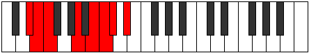 |
| [1865](https://ianring.com/musictheory/scales/1865) | [Thagimic](ModeGFlatThagimic.md) | Gb | Gb, A, B#, C##, D#, E, Gb |  |
| [1867](https://ianring.com/musictheory/scales/1867) | [Solian](ModeFSharpSolian.md) | F# | F#, G, A, B#, C##, D#, E, F# |  |
| [1867](https://ianring.com/musictheory/scales/1867) | [Solian](ModeDSharpSolian.md) | D# | D#, E, F#, G##, A##, B#, C#, D# |  |
| [1867](https://ianring.com/musictheory/scales/1867) | [Solian](ModeEFlatSolian.md) | Eb | Eb, Fb, Gb, A, B, C, Db, Eb |  |
| [1869](https://ianring.com/musictheory/scales/1869) | [Katyrian](ModeFSharpKatyrian.md) | F# | F#, G#, A, B#, C##, D#, E, F# |  |
| [1871](https://ianring.com/musictheory/scales/1871) | [Aeolyllic](ModeFSharpAeolyllic.md) | F# | F#, G, G#, A, C, D, D#, E, F# |  |
| [1871](https://ianring.com/musictheory/scales/1871) | [Aeolyllic](ModeGFlatAeolyllic.md) | Gb | Gb, G, Ab, A, C, D, Eb, E, Gb |  |
| [1871](https://ianring.com/musictheory/scales/1871) | [Aeolyllic](ModeDSharpAeolyllic.md) | D# | D#, E, F, F#, A, B, C, C#, D# |  |
| [1871](https://ianring.com/musictheory/scales/1871) | [Aeolyllic](ModeEFlatAeolyllic.md) | Eb | Eb, E, F, Gb, A, B, C, Db, Eb |  |
| [1875](https://ianring.com/musictheory/scales/1875) | [Epyphian](ModeDSharpEpyphian.md) | D# | D#, E, F##, G##, A##, B#, C#, D# |  |
| [1875](https://ianring.com/musictheory/scales/1875) | [Epyphian](ModeEFlatEpyphian.md) | Eb | Eb, Fb, G, A, B, C, Db, Eb |  |
| [1879](https://ianring.com/musictheory/scales/1879) | [Mixoryllic](ModeDSharpMixoryllic.md) | D# | D#, E, F, G, A, B, C, C#, D# |  |
| [1879](https://ianring.com/musictheory/scales/1879) | [Mixoryllic](ModeEFlatMixoryllic.md) | Eb | Eb, E, F, G, A, B, C, Db, Eb |  |
| [1881](https://ianring.com/musictheory/scales/1881) | [Korian](ModeFSharpKorian.md) | F# | F#, G##, A#, B#, C##, D#, E, F# |  |
| [1881](https://ianring.com/musictheory/scales/1881) | [Korian](ModeGFlatKorian.md) | Gb | Gb, A, Bb, C, D, Eb, Fb, Gb |  |
| [1881](https://ianring.com/musictheory/scales/1881) | [Korian](ModeCNaturalKorian.md) | C | C, D#, E, F#, G#, A, Bb, C |  |
| [1883](https://ianring.com/musictheory/scales/1883) | [Mixopyryllic](ModeFSharpMixopyryllic.md) | F# | F#, G, A, A#, C, D, D#, E, F# |  |
| [1883](https://ianring.com/musictheory/scales/1883) | [Mixopyryllic](ModeGFlatMixopyryllic.md) | Gb | Gb, G, A, Bb, C, D, Eb, E, Gb |  |
| [1883](https://ianring.com/musictheory/scales/1883) | [Mixopyryllic](ModeCNaturalMixopyryllic.md) | C | C, C#, D#, E, F#, G#, A, A#, C |  |
| [1883](https://ianring.com/musictheory/scales/1883) | [Mixopyryllic](ModeDSharpMixopyryllic.md) | D# | D#, E, F#, G, A, B, C, C#, D# |  |
| [1883](https://ianring.com/musictheory/scales/1883) | [Mixopyryllic](ModeEFlatMixopyryllic.md) | Eb | Eb, E, Gb, G, A, B, C, Db, Eb |  |
| [1885](https://ianring.com/musictheory/scales/1885) | [Epidyllic](ModeCNaturalEpidyllic.md) | C | C, D, D#, E, F#, G#, A, A#, C |  |
| [1885](https://ianring.com/musictheory/scales/1885) | [Epidyllic](ModeFSharpEpidyllic.md) | F# | F#, G#, A, A#, C, D, D#, E, F# |  |
| [1885](https://ianring.com/musictheory/scales/1885) | [Epidyllic](ModeGFlatEpidyllic.md) | Gb | Gb, Ab, A, Bb, C, D, Eb, E, Gb |  |
| [1887](https://ianring.com/musictheory/scales/1887) | [Aerocrygic](ModeCNaturalAerocrygic.md) | C | C, C#, D, D#, E, F#, G#, A, A#, C |  |
| [1887](https://ianring.com/musictheory/scales/1887) | [Aerocrygic](ModeFSharpAerocrygic.md) | F# | F#, G, G#, A, A#, C, D, D#, E, F# |  |
| [1887](https://ianring.com/musictheory/scales/1887) | [Aerocrygic](ModeGFlatAerocrygic.md) | Gb | Gb, G, Ab, A, Bb, C, D, Eb, E, Gb |  |
| [1887](https://ianring.com/musictheory/scales/1887) | [Aerocrygic](ModeDSharpAerocrygic.md) | D# | D#, E, F, F#, G, A, B, C, C#, D# |  |
| [1887](https://ianring.com/musictheory/scales/1887) | [Aerocrygic](ModeEFlatAerocrygic.md) | Eb | Eb, E, F, Gb, G, A, B, C, Db, Eb |  |
| [1891](https://ianring.com/musictheory/scales/1891) | [Thalian](ModeDSharpThalian.md) | D# | D#, E, F###, G##, A##, B#, C#, D# | 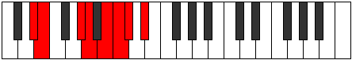 |
| [1891](https://ianring.com/musictheory/scales/1891) | [Thalian](ModeEFlatThalian.md) | Eb | Eb, Fb, G#, A, B, C, Db, Eb |  |
| [1893](https://ianring.com/musictheory/scales/1893) | [Ionylian](ModeGNaturalIonylian.md) | G | G, A, B#, C#, D#, E, F, G |  |
| [1895](https://ianring.com/musictheory/scales/1895) | [Salyllic](ModeGNaturalSalyllic.md) | G | G, G#, A, C, C#, D#, E, F, G |  |
| [1895](https://ianring.com/musictheory/scales/1895) | [Salyllic](ModeDSharpSalyllic.md) | D# | D#, E, F, G#, A, B, C, C#, D# |  |
| [1895](https://ianring.com/musictheory/scales/1895) | [Salyllic](ModeEFlatSalyllic.md) | Eb | Eb, E, F, Ab, A, B, C, Db, Eb |  |
| [1897](https://ianring.com/musictheory/scales/1897) | [Ionopian](ModeFSharpIonopian.md) | F# | F#, G##, A##, B#, C##, D#, E, F# |  |
| [1897](https://ianring.com/musictheory/scales/1897) | [Ionopian](ModeGFlatIonopian.md) | Gb | Gb, A, B, C, D, Eb, Fb, Gb |  |
| [1899](https://ianring.com/musictheory/scales/1899) | [Moptyllic](ModeFSharpMoptyllic.md) | F# | F#, G, A, B, C, D, D#, E, F# |  |
| [1899](https://ianring.com/musictheory/scales/1899) | [Moptyllic](ModeGFlatMoptyllic.md) | Gb | Gb, G, A, B, C, D, Eb, E, Gb |  |
| [1899](https://ianring.com/musictheory/scales/1899) | [Moptyllic](ModeDSharpMoptyllic.md) | D# | D#, E, F#, G#, A, B, C, C#, D# |  |
| [1899](https://ianring.com/musictheory/scales/1899) | [Moptyllic](ModeEFlatMoptyllic.md) | Eb | Eb, E, Gb, Ab, A, B, C, Db, Eb |  |
| [1901](https://ianring.com/musictheory/scales/1901) | [Ionidyllic](ModeGNaturalIonidyllic.md) | G | G, A, A#, C, C#, D#, E, F, G |  |
| [1901](https://ianring.com/musictheory/scales/1901) | [Ionidyllic](ModeFSharpIonidyllic.md) | F# | F#, G#, A, B, C, D, D#, E, F# |  |
| [1901](https://ianring.com/musictheory/scales/1901) | [Ionidyllic](ModeGFlatIonidyllic.md) | Gb | Gb, Ab, A, B, C, D, Eb, E, Gb |  |
| [1903](https://ianring.com/musictheory/scales/1903) | [Rocrygic](ModeGNaturalRocrygic.md) | G | G, G#, A, A#, C, C#, D#, E, F, G |  |
| [1903](https://ianring.com/musictheory/scales/1903) | [Rocrygic](ModeDSharpRocrygic.md) | D# | D#, E, F, F#, G#, A, B, C, C#, D# |  |
| [1903](https://ianring.com/musictheory/scales/1903) | [Rocrygic](ModeEFlatRocrygic.md) | Eb | Eb, E, F, Gb, Ab, A, B, C, Db, Eb |  |
| [1903](https://ianring.com/musictheory/scales/1903) | [Rocrygic](ModeFSharpRocrygic.md) | F# | F#, G, G#, A, B, C, D, D#, E, F# |  |
| [1903](https://ianring.com/musictheory/scales/1903) | [Rocrygic](ModeGFlatRocrygic.md) | Gb | Gb, G, Ab, A, B, C, D, Eb, E, Gb |  |
| [1907](https://ianring.com/musictheory/scales/1907) | [Lynyllic](ModeDSharpLynyllic.md) | D# | D#, E, G, G#, A, B, C, C#, D# |  |
| [1907](https://ianring.com/musictheory/scales/1907) | [Lynyllic](ModeEFlatLynyllic.md) | Eb | Eb, E, G, Ab, A, B, C, Db, Eb |  |
| [1907](https://ianring.com/musictheory/scales/1907) | [Lynyllic](ModeBNaturalLynyllic.md) | B | B, C, D#, E, F, G, G#, A, B |  |
| [1909](https://ianring.com/musictheory/scales/1909) | [Epicryllic](ModeGNaturalEpicryllic.md) | G | G, A, B, C, C#, D#, E, F, G |  |
| [1911](https://ianring.com/musictheory/scales/1911) | [Stynygic](ModeDSharpStynygic.md) | D# | D#, E, F, G, G#, A, B, C, C#, D# |  |
| [1911](https://ianring.com/musictheory/scales/1911) | [Stynygic](ModeEFlatStynygic.md) | Eb | Eb, E, F, G, Ab, A, B, C, Db, Eb |  |
| [1911](https://ianring.com/musictheory/scales/1911) | [Stynygic](ModeGNaturalStynygic.md) | G | G, G#, A, B, C, C#, D#, E, F, G |  |
| [1911](https://ianring.com/musictheory/scales/1911) | [Stynygic](ModeBNaturalStynygic.md) | B | B, C, C#, D#, E, F, G, G#, A, B |  |
| [1913](https://ianring.com/musictheory/scales/1913) | [Zagyllic](ModeCNaturalZagyllic.md) | C | C, D#, E, F, F#, G#, A, A#, C |  |
| [1913](https://ianring.com/musictheory/scales/1913) | [Zagyllic](ModeFSharpZagyllic.md) | F# | F#, A, A#, B, C, D, D#, E, F# |  |
| [1913](https://ianring.com/musictheory/scales/1913) | [Zagyllic](ModeGFlatZagyllic.md) | Gb | Gb, A, Bb, B, C, D, Eb, E, Gb |  |
| [1915](https://ianring.com/musictheory/scales/1915) | [Thydygic](ModeCNaturalThydygic.md) | C | C, C#, D#, E, F, F#, G#, A, A#, C |  |
| [1915](https://ianring.com/musictheory/scales/1915) | [Thydygic](ModeBNaturalThydygic.md) | B | B, C, D, D#, E, F, G, G#, A, B |  |
| [1915](https://ianring.com/musictheory/scales/1915) | [Thydygic](ModeDSharpThydygic.md) | D# | D#, E, F#, G, G#, A, B, C, C#, D# |  |
| [1915](https://ianring.com/musictheory/scales/1915) | [Thydygic](ModeEFlatThydygic.md) | Eb | Eb, E, Gb, G, Ab, A, B, C, Db, Eb |  |
| [1915](https://ianring.com/musictheory/scales/1915) | [Thydygic](ModeFSharpThydygic.md) | F# | F#, G, A, A#, B, C, D, D#, E, F# |  |
| [1915](https://ianring.com/musictheory/scales/1915) | [Thydygic](ModeGFlatThydygic.md) | Gb | Gb, G, A, Bb, B, C, D, Eb, E, Gb |  |
| [1917](https://ianring.com/musictheory/scales/1917) | [Sacrygic](ModeCNaturalSacrygic.md) | C | C, D, D#, E, F, F#, G#, A, A#, C |  |
| [1917](https://ianring.com/musictheory/scales/1917) | [Sacrygic](ModeGNaturalSacrygic.md) | G | G, A, A#, B, C, C#, D#, E, F, G |  |
| [1917](https://ianring.com/musictheory/scales/1917) | [Sacrygic](ModeFSharpSacrygic.md) | F# | F#, G#, A, A#, B, C, D, D#, E, F# |  |
| [1917](https://ianring.com/musictheory/scales/1917) | [Sacrygic](ModeGFlatSacrygic.md) | Gb | Gb, Ab, A, Bb, B, C, D, Eb, E, Gb |  |
| [1919](https://ianring.com/musictheory/scales/1919) | [Rocryllian](ModeCNaturalRocryllian.md) | C | C, C#, D, D#, E, F, F#, G#, A, A#, C |  |
| [1919](https://ianring.com/musictheory/scales/1919) | [Rocryllian](ModeBNaturalRocryllian.md) | B | B, C, C#, D, D#, E, F, G, G#, A, B |  |
| [1919](https://ianring.com/musictheory/scales/1919) | [Rocryllian](ModeDSharpRocryllian.md) | D# | D#, E, F, F#, G, G#, A, B, C, C#, D# |  |
| [1919](https://ianring.com/musictheory/scales/1919) | [Rocryllian](ModeEFlatRocryllian.md) | Eb | Eb, E, F, Gb, G, Ab, A, B, C, Db, Eb |  |
| [1919](https://ianring.com/musictheory/scales/1919) | [Rocryllian](ModeGNaturalRocryllian.md) | G | G, G#, A, A#, B, C, C#, D#, E, F, G |  |
| [1919](https://ianring.com/musictheory/scales/1919) | [Rocryllian](ModeFSharpRocryllian.md) | F# | F#, G, G#, A, A#, B, C, D, D#, E, F# |  |
| [1919](https://ianring.com/musictheory/scales/1919) | [Rocryllian](ModeGFlatRocryllian.md) | Gb | Gb, G, Ab, A, Bb, B, C, D, Eb, E, Gb |  |
| [1935](https://ianring.com/musictheory/scales/1935) | [Mycryllic](ModeDNaturalMycryllic.md) | D | D, D#, E, F, A, A#, B, C, D |  |
| [1939](https://ianring.com/musictheory/scales/1939) | [Dathian](ModeGSharpDathian.md) | G# | G#, A, B#, C###, D##, E#, F#, G# |  |
| [1939](https://ianring.com/musictheory/scales/1939) | [Dathian](ModeAFlatDathian.md) | Ab | Ab, Bbb, C, D#, E, F, Gb, Ab |  |
| [1943](https://ianring.com/musictheory/scales/1943) | [Malyllic](ModeGSharpMalyllic.md) | G# | G#, A, A#, C, D#, E, F, F#, G# |  |
| [1943](https://ianring.com/musictheory/scales/1943) | [Malyllic](ModeAFlatMalyllic.md) | Ab | Ab, A, Bb, C, Eb, E, F, Gb, Ab |  |
| [1943](https://ianring.com/musictheory/scales/1943) | [Malyllic](ModeDNaturalMalyllic.md) | D | D, D#, E, F#, A, A#, B, C, D |  |
| [1945](https://ianring.com/musictheory/scales/1945) | [Zarian](ModeCNaturalZarian.md) | C | C, D#, E, F##, G#, A, Bb, C |  |
| [1947](https://ianring.com/musictheory/scales/1947) | [Ionoyllic](ModeCNaturalIonoyllic.md) | C | C, C#, D#, E, G, G#, A, A#, C |  |
| [1947](https://ianring.com/musictheory/scales/1947) | [Ionoyllic](ModeGSharpIonoyllic.md) | G# | G#, A, B, C, D#, E, F, F#, G# | 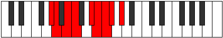 |
| [1947](https://ianring.com/musictheory/scales/1947) | [Ionoyllic](ModeAFlatIonoyllic.md) | Ab | Ab, A, B, C, Eb, E, F, Gb, Ab |  |
| [1949](https://ianring.com/musictheory/scales/1949) | [Mathyllic](ModeCNaturalMathyllic.md) | C | C, D, D#, E, G, G#, A, A#, C |  |
| [1951](https://ianring.com/musictheory/scales/1951) | [Gonygic](ModeCNaturalGonygic.md) | C | C, C#, D, D#, E, G, G#, A, A#, C |  |
| [1951](https://ianring.com/musictheory/scales/1951) | [Gonygic](ModeDNaturalGonygic.md) | D | D, D#, E, F, F#, A, A#, B, C, D |  |
| [1951](https://ianring.com/musictheory/scales/1951) | [Gonygic](ModeGSharpGonygic.md) | G# | G#, A, A#, B, C, D#, E, F, F#, G# |  |
| [1951](https://ianring.com/musictheory/scales/1951) | [Gonygic](ModeAFlatGonygic.md) | Ab | Ab, A, Bb, B, C, Eb, E, F, Gb, Ab |  |
| [1957](https://ianring.com/musictheory/scales/1957) | [Pyrian](ModeGNaturalPyrian.md) | G | G, A, B#, C##, D#, E, F, G |  |
| [1959](https://ianring.com/musictheory/scales/1959) | [Katolyllic](ModeGNaturalKatolyllic.md) | G | G, G#, A, C, D, D#, E, F, G |  |
| [1959](https://ianring.com/musictheory/scales/1959) | [Katolyllic](ModeDNaturalKatolyllic.md) | D | D, D#, E, G, A, A#, B, C, D |  |
| [1965](https://ianring.com/musictheory/scales/1965) | [Gadyllic](ModeGNaturalGadyllic.md) | G | G, A, A#, C, D, D#, E, F, G |  |
| [1967](https://ianring.com/musictheory/scales/1967) | [Godygic](ModeGNaturalGodygic.md) | G | G, G#, A, A#, C, D, D#, E, F, G |  |
| [1967](https://ianring.com/musictheory/scales/1967) | [Godygic](ModeDNaturalGodygic.md) | D | D, D#, E, F, G, A, A#, B, C, D |  |
| [1971](https://ianring.com/musictheory/scales/1971) | [Aerynyllic](ModeGSharpAerynyllic.md) | G# | G#, A, C, C#, D#, E, F, F#, G# |  |
| [1971](https://ianring.com/musictheory/scales/1971) | [Aerynyllic](ModeAFlatAerynyllic.md) | Ab | Ab, A, C, Db, Eb, E, F, Gb, Ab |  |
| [1971](https://ianring.com/musictheory/scales/1971) | [Aerynyllic](ModeBNaturalAerynyllic.md) | B | B, C, D#, E, F#, G, G#, A, B |  |
| [1973](https://ianring.com/musictheory/scales/1973) | [Zyryllic](ModeGNaturalZyryllic.md) | G | G, A, B, C, D, D#, E, F, G |  |
| [1975](https://ianring.com/musictheory/scales/1975) | [Ionocrygic](ModeGSharpIonocrygic.md) | G# | G#, A, A#, C, C#, D#, E, F, F#, G# |  |
| [1975](https://ianring.com/musictheory/scales/1975) | [Ionocrygic](ModeAFlatIonocrygic.md) | Ab | Ab, A, Bb, C, Db, Eb, E, F, Gb, Ab |  |
| [1975](https://ianring.com/musictheory/scales/1975) | [Ionocrygic](ModeGNaturalIonocrygic.md) | G | G, G#, A, B, C, D, D#, E, F, G |  |
| [1975](https://ianring.com/musictheory/scales/1975) | [Ionocrygic](ModeBNaturalIonocrygic.md) | B | B, C, C#, D#, E, F#, G, G#, A, B |  |
| [1975](https://ianring.com/musictheory/scales/1975) | [Ionocrygic](ModeDNaturalIonocrygic.md) | D | D, D#, E, F#, G, A, A#, B, C, D |  |
| [1977](https://ianring.com/musictheory/scales/1977) | [Dagyllic](ModeCNaturalDagyllic.md) | C | C, D#, E, F, G, G#, A, A#, C |  |
| [1979](https://ianring.com/musictheory/scales/1979) | [Aeradygic](ModeCNaturalAeradygic.md) | C | C, C#, D#, E, F, G, G#, A, A#, C |  |
| [1979](https://ianring.com/musictheory/scales/1979) | [Aeradygic](ModeGSharpAeradygic.md) | G# | G#, A, B, C, C#, D#, E, F, F#, G# |  |
| [1979](https://ianring.com/musictheory/scales/1979) | [Aeradygic](ModeAFlatAeradygic.md) | Ab | Ab, A, B, C, Db, Eb, E, F, Gb, Ab |  |
| [1979](https://ianring.com/musictheory/scales/1979) | [Aeradygic](ModeBNaturalAeradygic.md) | B | B, C, D, D#, E, F#, G, G#, A, B |  |
| [1981](https://ianring.com/musictheory/scales/1981) | [Gadygic](ModeCNaturalGadygic.md) | C | C, D, D#, E, F, G, G#, A, A#, C |  |
| [1981](https://ianring.com/musictheory/scales/1981) | [Gadygic](ModeGNaturalGadygic.md) | G | G, A, A#, B, C, D, D#, E, F, G |  |
| [1983](https://ianring.com/musictheory/scales/1983) | [Soryllian](ModeCNaturalSoryllian.md) | C | C, C#, D, D#, E, F, G, G#, A, A#, C |  |
| [1983](https://ianring.com/musictheory/scales/1983) | [Soryllian](ModeBNaturalSoryllian.md) | B | B, C, C#, D, D#, E, F#, G, G#, A, B |  |
| [1983](https://ianring.com/musictheory/scales/1983) | [Soryllian](ModeDNaturalSoryllian.md) | D | D, D#, E, F, F#, G, A, A#, B, C, D |  |
| [1983](https://ianring.com/musictheory/scales/1983) | [Soryllian](ModeGSharpSoryllian.md) | G# | G#, A, A#, B, C, C#, D#, E, F, F#, G# |  |
| [1983](https://ianring.com/musictheory/scales/1983) | [Soryllian](ModeAFlatSoryllian.md) | Ab | Ab, A, Bb, B, C, Db, Eb, E, F, Gb, Ab |  |
| [1983](https://ianring.com/musictheory/scales/1983) | [Soryllian](ModeGNaturalSoryllian.md) | G | G, G#, A, A#, B, C, D, D#, E, F, G |  |
| [1991](https://ianring.com/musictheory/scales/1991) | [Phryptyllic](ModeDSharpPhryptyllic.md) | D# | D#, E, F, A, A#, B, C, C#, D# |  |
| [1991](https://ianring.com/musictheory/scales/1991) | [Phryptyllic](ModeEFlatPhryptyllic.md) | Eb | Eb, E, F, A, Bb, B, C, Db, Eb |  |
| [1991](https://ianring.com/musictheory/scales/1991) | [Phryptyllic](ModeDNaturalPhryptyllic.md) | D | D, D#, E, G#, A, A#, B, C, D |  |
| [1993](https://ianring.com/musictheory/scales/1993) | [Katoptian](ModeFSharpKatoptian.md) | F# | F#, G##, A###, B##, C##, D#, E, F# |  |
| [1993](https://ianring.com/musictheory/scales/1993) | [Katoptian](ModeGFlatKatoptian.md) | Gb | Gb, A, B#, C#, D, Eb, Fb, Gb |  |
| [1993](https://ianring.com/musictheory/scales/1993) | [Katoptian](ModeANaturalKatoptian.md) | A | A, B#, C###, D##, E#, F#, G, A |  |
| [1995](https://ianring.com/musictheory/scales/1995) | [Aeolacryllic](ModeFSharpAeolacryllic.md) | F# | F#, G, A, C, C#, D, D#, E, F# |  |
| [1995](https://ianring.com/musictheory/scales/1995) | [Aeolacryllic](ModeGFlatAeolacryllic.md) | Gb | Gb, G, A, C, Db, D, Eb, E, Gb |  |
| [1995](https://ianring.com/musictheory/scales/1995) | [Aeolacryllic](ModeANaturalAeolacryllic.md) | A | A, A#, C, D#, E, F, F#, G, A |  |
| [1995](https://ianring.com/musictheory/scales/1995) | [Aeolacryllic](ModeDSharpAeolacryllic.md) | D# | D#, E, F#, A, A#, B, C, C#, D# |  |
| [1995](https://ianring.com/musictheory/scales/1995) | [Aeolacryllic](ModeEFlatAeolacryllic.md) | Eb | Eb, E, Gb, A, Bb, B, C, Db, Eb |  |
| [1997](https://ianring.com/musictheory/scales/1997) | [Staryllic](ModeFSharpStaryllic.md) | F# | F#, G#, A, C, C#, D, D#, E, F# |  |
| [1997](https://ianring.com/musictheory/scales/1997) | [Staryllic](ModeGFlatStaryllic.md) | Gb | Gb, Ab, A, C, Db, D, Eb, E, Gb |  |
| [1997](https://ianring.com/musictheory/scales/1997) | [Staryllic](ModeANaturalStaryllic.md) | A | A, B, C, D#, E, F, F#, G, A |  |
| [1999](https://ianring.com/musictheory/scales/1999) | [Zacrygic](ModeFSharpZacrygic.md) | F# | F#, G, G#, A, C, C#, D, D#, E, F# |  |
| [1999](https://ianring.com/musictheory/scales/1999) | [Zacrygic](ModeGFlatZacrygic.md) | Gb | Gb, G, Ab, A, C, Db, D, Eb, E, Gb |  |
| [1999](https://ianring.com/musictheory/scales/1999) | [Zacrygic](ModeDSharpZacrygic.md) | D# | D#, E, F, F#, A, A#, B, C, C#, D# |  |
| [1999](https://ianring.com/musictheory/scales/1999) | [Zacrygic](ModeEFlatZacrygic.md) | Eb | Eb, E, F, Gb, A, Bb, B, C, Db, Eb |  |
| [1999](https://ianring.com/musictheory/scales/1999) | [Zacrygic](ModeANaturalZacrygic.md) | A | A, A#, B, C, D#, E, F, F#, G, A |  |
| [1999](https://ianring.com/musictheory/scales/1999) | [Zacrygic](ModeDNaturalZacrygic.md) | D | D, D#, E, F, G#, A, A#, B, C, D |  |
| [2003](https://ianring.com/musictheory/scales/2003) | [Lolyllic](ModeGSharpLolyllic.md) | G# | G#, A, C, D, D#, E, F, F#, G# | 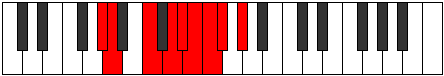 |
| [2003](https://ianring.com/musictheory/scales/2003) | [Lolyllic](ModeAFlatLolyllic.md) | Ab | Ab, A, C, D, Eb, E, F, Gb, Ab |  |
| [2003](https://ianring.com/musictheory/scales/2003) | [Lolyllic](ModeDSharpLolyllic.md) | D# | D#, E, G, A, A#, B, C, C#, D# |  |
| [2003](https://ianring.com/musictheory/scales/2003) | [Lolyllic](ModeEFlatLolyllic.md) | Eb | Eb, E, G, A, Bb, B, C, Db, Eb |  |
| [2007](https://ianring.com/musictheory/scales/2007) | [Stonygic](ModeGSharpStonygic.md) | G# | G#, A, A#, C, D, D#, E, F, F#, G# |  |
| [2007](https://ianring.com/musictheory/scales/2007) | [Stonygic](ModeAFlatStonygic.md) | Ab | Ab, A, Bb, C, D, Eb, E, F, Gb, Ab |  |
| [2007](https://ianring.com/musictheory/scales/2007) | [Stonygic](ModeDSharpStonygic.md) | D# | D#, E, F, G, A, A#, B, C, C#, D# |  |
| [2007](https://ianring.com/musictheory/scales/2007) | [Stonygic](ModeEFlatStonygic.md) | Eb | Eb, E, F, G, A, Bb, B, C, Db, Eb |  |
| [2007](https://ianring.com/musictheory/scales/2007) | [Stonygic](ModeDNaturalStonygic.md) | D | D, D#, E, F#, G#, A, A#, B, C, D |  |
| [2009](https://ianring.com/musictheory/scales/2009) | [Stacryllic](ModeANaturalStacryllic.md) | A | A, C, C#, D#, E, F, F#, G, A |  |
| [2009](https://ianring.com/musictheory/scales/2009) | [Stacryllic](ModeFSharpStacryllic.md) | F# | F#, A, A#, C, C#, D, D#, E, F# |  |
| [2009](https://ianring.com/musictheory/scales/2009) | [Stacryllic](ModeGFlatStacryllic.md) | Gb | Gb, A, Bb, C, Db, D, Eb, E, Gb |  |
| [2009](https://ianring.com/musictheory/scales/2009) | [Stacryllic](ModeCNaturalStacryllic.md) | C | C, D#, E, F#, G, G#, A, A#, C |  |
| [2011](https://ianring.com/musictheory/scales/2011) | [Raphygic](ModeFSharpRaphygic.md) | F# | F#, G, A, A#, C, C#, D, D#, E, F# |  |
| [2011](https://ianring.com/musictheory/scales/2011) | [Raphygic](ModeGFlatRaphygic.md) | Gb | Gb, G, A, Bb, C, Db, D, Eb, E, Gb |  |
| [2011](https://ianring.com/musictheory/scales/2011) | [Raphygic](ModeANaturalRaphygic.md) | A | A, A#, C, C#, D#, E, F, F#, G, A |  |
| [2011](https://ianring.com/musictheory/scales/2011) | [Raphygic](ModeCNaturalRaphygic.md) | C | C, C#, D#, E, F#, G, G#, A, A#, C |  |
| [2011](https://ianring.com/musictheory/scales/2011) | [Raphygic](ModeGSharpRaphygic.md) | G# | G#, A, B, C, D, D#, E, F, F#, G# |  |
| [2011](https://ianring.com/musictheory/scales/2011) | [Raphygic](ModeAFlatRaphygic.md) | Ab | Ab, A, B, C, D, Eb, E, F, Gb, Ab |  |
| [2011](https://ianring.com/musictheory/scales/2011) | [Raphygic](ModeDSharpRaphygic.md) | D# | D#, E, F#, G, A, A#, B, C, C#, D# |  |
| [2011](https://ianring.com/musictheory/scales/2011) | [Raphygic](ModeEFlatRaphygic.md) | Eb | Eb, E, Gb, G, A, Bb, B, C, Db, Eb |  |
| [2013](https://ianring.com/musictheory/scales/2013) | [Mocrygic](ModeFSharpMocrygic.md) | F# | F#, G#, A, A#, C, C#, D, D#, E, F# |  |
| [2013](https://ianring.com/musictheory/scales/2013) | [Mocrygic](ModeGFlatMocrygic.md) | Gb | Gb, Ab, A, Bb, C, Db, D, Eb, E, Gb |  |
| [2013](https://ianring.com/musictheory/scales/2013) | [Mocrygic](ModeCNaturalMocrygic.md) | C | C, D, D#, E, F#, G, G#, A, A#, C |  |
| [2013](https://ianring.com/musictheory/scales/2013) | [Mocrygic](ModeANaturalMocrygic.md) | A | A, B, C, C#, D#, E, F, F#, G, A |  |
| [2015](https://ianring.com/musictheory/scales/2015) | [Epiryllian](ModeCNaturalEpiryllian.md) | C | C, C#, D, D#, E, F#, G, G#, A, A#, C |  |
| [2015](https://ianring.com/musictheory/scales/2015) | [Epiryllian](ModeFSharpEpiryllian.md) | F# | F#, G, G#, A, A#, C, C#, D, D#, E, F# |  |
| [2015](https://ianring.com/musictheory/scales/2015) | [Epiryllian](ModeGFlatEpiryllian.md) | Gb | Gb, G, Ab, A, Bb, C, Db, D, Eb, E, Gb |  |
| [2015](https://ianring.com/musictheory/scales/2015) | [Epiryllian](ModeDSharpEpiryllian.md) | D# | D#, E, F, F#, G, A, A#, B, C, C#, D# |  |
| [2015](https://ianring.com/musictheory/scales/2015) | [Epiryllian](ModeEFlatEpiryllian.md) | Eb | Eb, E, F, Gb, G, A, Bb, B, C, Db, Eb |  |
| [2015](https://ianring.com/musictheory/scales/2015) | [Epiryllian](ModeANaturalEpiryllian.md) | A | A, A#, B, C, C#, D#, E, F, F#, G, A |  |
| [2015](https://ianring.com/musictheory/scales/2015) | [Epiryllian](ModeDNaturalEpiryllian.md) | D | D, D#, E, F, F#, G#, A, A#, B, C, D |  |
| [2015](https://ianring.com/musictheory/scales/2015) | [Epiryllian](ModeGSharpEpiryllian.md) | G# | G#, A, A#, B, C, D, D#, E, F, F#, G# |  |
| [2015](https://ianring.com/musictheory/scales/2015) | [Epiryllian](ModeAFlatEpiryllian.md) | Ab | Ab, A, Bb, B, C, D, Eb, E, F, Gb, Ab |  |
| [2019](https://ianring.com/musictheory/scales/2019) | [Palyllic](ModeDSharpPalyllic.md) | D# | D#, E, G#, A, A#, B, C, C#, D# |  |
| [2019](https://ianring.com/musictheory/scales/2019) | [Palyllic](ModeEFlatPalyllic.md) | Eb | Eb, E, Ab, A, Bb, B, C, Db, Eb |  |
| [2021](https://ianring.com/musictheory/scales/2021) | [Katycryllic](ModeGNaturalKatycryllic.md) | G | G, A, C, C#, D, D#, E, F, G |  |
| [2023](https://ianring.com/musictheory/scales/2023) | [Zodygic](ModeGNaturalZodygic.md) | G | G, G#, A, C, C#, D, D#, E, F, G | 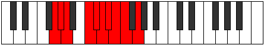 |
| [2023](https://ianring.com/musictheory/scales/2023) | [Zodygic](ModeDSharpZodygic.md) | D# | D#, E, F, G#, A, A#, B, C, C#, D# |  |
| [2023](https://ianring.com/musictheory/scales/2023) | [Zodygic](ModeEFlatZodygic.md) | Eb | Eb, E, F, Ab, A, Bb, B, C, Db, Eb |  |
| [2023](https://ianring.com/musictheory/scales/2023) | [Zodygic](ModeDNaturalZodygic.md) | D | D, D#, E, G, G#, A, A#, B, C, D |  |
| [2025](https://ianring.com/musictheory/scales/2025) | [Mixolydyllic](ModeANaturalMixolydyllic.md) | A | A, C, D, D#, E, F, F#, G, A |  |
| [2025](https://ianring.com/musictheory/scales/2025) | [Mixolydyllic](ModeFSharpMixolydyllic.md) | F# | F#, A, B, C, C#, D, D#, E, F# |  |
| [2025](https://ianring.com/musictheory/scales/2025) | [Mixolydyllic](ModeGFlatMixolydyllic.md) | Gb | Gb, A, B, C, Db, D, Eb, E, Gb |  |
| [2027](https://ianring.com/musictheory/scales/2027) | [Boptygic](ModeANaturalBoptygic.md) | A | A, A#, C, D, D#, E, F, F#, G, A |  |
| [2027](https://ianring.com/musictheory/scales/2027) | [Boptygic](ModeFSharpBoptygic.md) | F# | F#, G, A, B, C, C#, D, D#, E, F# |  |
| [2027](https://ianring.com/musictheory/scales/2027) | [Boptygic](ModeGFlatBoptygic.md) | Gb | Gb, G, A, B, C, Db, D, Eb, E, Gb |  |
| [2027](https://ianring.com/musictheory/scales/2027) | [Boptygic](ModeDSharpBoptygic.md) | D# | D#, E, F#, G#, A, A#, B, C, C#, D# |  |
| [2027](https://ianring.com/musictheory/scales/2027) | [Boptygic](ModeEFlatBoptygic.md) | Eb | Eb, E, Gb, Ab, A, Bb, B, C, Db, Eb |  |
| [2029](https://ianring.com/musictheory/scales/2029) | [Mathygic](ModeGNaturalMathygic.md) | G | G, A, A#, C, C#, D, D#, E, F, G |  |
| [2029](https://ianring.com/musictheory/scales/2029) | [Mathygic](ModeANaturalMathygic.md) | A | A, B, C, D, D#, E, F, F#, G, A |  |
| [2029](https://ianring.com/musictheory/scales/2029) | [Mathygic](ModeFSharpMathygic.md) | F# | F#, G#, A, B, C, C#, D, D#, E, F# |  |
| [2029](https://ianring.com/musictheory/scales/2029) | [Mathygic](ModeGFlatMathygic.md) | Gb | Gb, Ab, A, B, C, Db, D, Eb, E, Gb |  |
| [2031](https://ianring.com/musictheory/scales/2031) | [Gadyllian](ModeGNaturalGadyllian.md) | G | G, G#, A, A#, C, C#, D, D#, E, F, G |  |
| [2031](https://ianring.com/musictheory/scales/2031) | [Gadyllian](ModeFSharpGadyllian.md) | F# | F#, G, G#, A, B, C, C#, D, D#, E, F# |  |
| [2031](https://ianring.com/musictheory/scales/2031) | [Gadyllian](ModeGFlatGadyllian.md) | Gb | Gb, G, Ab, A, B, C, Db, D, Eb, E, Gb |  |
| [2031](https://ianring.com/musictheory/scales/2031) | [Gadyllian](ModeANaturalGadyllian.md) | A | A, A#, B, C, D, D#, E, F, F#, G, A |  |
| [2031](https://ianring.com/musictheory/scales/2031) | [Gadyllian](ModeDSharpGadyllian.md) | D# | D#, E, F, F#, G#, A, A#, B, C, C#, D# |  |
| [2031](https://ianring.com/musictheory/scales/2031) | [Gadyllian](ModeEFlatGadyllian.md) | Eb | Eb, E, F, Gb, Ab, A, Bb, B, C, Db, Eb |  |
| [2031](https://ianring.com/musictheory/scales/2031) | [Gadyllian](ModeDNaturalGadyllian.md) | D | D, D#, E, F, G, G#, A, A#, B, C, D |  |
| [2035](https://ianring.com/musictheory/scales/2035) | [Aerythygic](ModeGSharpAerythygic.md) | G# | G#, A, C, C#, D, D#, E, F, F#, G# |  |
| [2035](https://ianring.com/musictheory/scales/2035) | [Aerythygic](ModeAFlatAerythygic.md) | Ab | Ab, A, C, Db, D, Eb, E, F, Gb, Ab |  |
| [2035](https://ianring.com/musictheory/scales/2035) | [Aerythygic](ModeBNaturalAerythygic.md) | B | B, C, D#, E, F, F#, G, G#, A, B |  |
| [2035](https://ianring.com/musictheory/scales/2035) | [Aerythygic](ModeDSharpAerythygic.md) | D# | D#, E, G, G#, A, A#, B, C, C#, D# |  |
| [2035](https://ianring.com/musictheory/scales/2035) | [Aerythygic](ModeEFlatAerythygic.md) | Eb | Eb, E, G, Ab, A, Bb, B, C, Db, Eb |  |
| [2037](https://ianring.com/musictheory/scales/2037) | [Sythygic](ModeGNaturalSythygic.md) | G | G, A, B, C, C#, D, D#, E, F, G |  |
| [2039](https://ianring.com/musictheory/scales/2039) | [Danyllian](ModeGSharpDanyllian.md) | G# | G#, A, A#, C, C#, D, D#, E, F, F#, G# |  |
| [2039](https://ianring.com/musictheory/scales/2039) | [Danyllian](ModeAFlatDanyllian.md) | Ab | Ab, A, Bb, C, Db, D, Eb, E, F, Gb, Ab |  |
| [2039](https://ianring.com/musictheory/scales/2039) | [Danyllian](ModeGNaturalDanyllian.md) | G | G, G#, A, B, C, C#, D, D#, E, F, G |  |
| [2039](https://ianring.com/musictheory/scales/2039) | [Danyllian](ModeBNaturalDanyllian.md) | B | B, C, C#, D#, E, F, F#, G, G#, A, B |  |
| [2039](https://ianring.com/musictheory/scales/2039) | [Danyllian](ModeDSharpDanyllian.md) | D# | D#, E, F, G, G#, A, A#, B, C, C#, D# |  |
| [2039](https://ianring.com/musictheory/scales/2039) | [Danyllian](ModeEFlatDanyllian.md) | Eb | Eb, E, F, G, Ab, A, Bb, B, C, Db, Eb |  |
| [2039](https://ianring.com/musictheory/scales/2039) | [Danyllian](ModeDNaturalDanyllian.md) | D | D, D#, E, F#, G, G#, A, A#, B, C, D |  |
| [2041](https://ianring.com/musictheory/scales/2041) | [Aeolacrygic](ModeANaturalAeolacrygic.md) | A | A, C, C#, D, D#, E, F, F#, G, A |  |
| [2041](https://ianring.com/musictheory/scales/2041) | [Aeolacrygic](ModeCNaturalAeolacrygic.md) | C | C, D#, E, F, F#, G, G#, A, A#, C |  |
| [2041](https://ianring.com/musictheory/scales/2041) | [Aeolacrygic](ModeFSharpAeolacrygic.md) | F# | F#, A, A#, B, C, C#, D, D#, E, F# |  |
| [2041](https://ianring.com/musictheory/scales/2041) | [Aeolacrygic](ModeGFlatAeolacrygic.md) | Gb | Gb, A, Bb, B, C, Db, D, Eb, E, Gb |  |
| [2043](https://ianring.com/musictheory/scales/2043) | [Lythyllian](ModeANaturalLythyllian.md) | A | A, A#, C, C#, D, D#, E, F, F#, G, A |  |
| [2043](https://ianring.com/musictheory/scales/2043) | [Lythyllian](ModeCNaturalLythyllian.md) | C | C, C#, D#, E, F, F#, G, G#, A, A#, C |  |
| [2043](https://ianring.com/musictheory/scales/2043) | [Lythyllian](ModeGSharpLythyllian.md) | G# | G#, A, B, C, C#, D, D#, E, F, F#, G# |  |
| [2043](https://ianring.com/musictheory/scales/2043) | [Lythyllian](ModeAFlatLythyllian.md) | Ab | Ab, A, B, C, Db, D, Eb, E, F, Gb, Ab |  |
| [2043](https://ianring.com/musictheory/scales/2043) | [Lythyllian](ModeBNaturalLythyllian.md) | B | B, C, D, D#, E, F, F#, G, G#, A, B |  |
| [2043](https://ianring.com/musictheory/scales/2043) | [Lythyllian](ModeFSharpLythyllian.md) | F# | F#, G, A, A#, B, C, C#, D, D#, E, F# |  |
| [2043](https://ianring.com/musictheory/scales/2043) | [Lythyllian](ModeGFlatLythyllian.md) | Gb | Gb, G, A, Bb, B, C, Db, D, Eb, E, Gb |  |
| [2043](https://ianring.com/musictheory/scales/2043) | [Lythyllian](ModeDSharpLythyllian.md) | D# | D#, E, F#, G, G#, A, A#, B, C, C#, D# |  |
| [2043](https://ianring.com/musictheory/scales/2043) | [Lythyllian](ModeEFlatLythyllian.md) | Eb | Eb, E, Gb, G, Ab, A, Bb, B, C, Db, Eb |  |
| [2045](https://ianring.com/musictheory/scales/2045) | [Katogyllian](ModeCNaturalKatogyllian.md) | C | C, D, D#, E, F, F#, G, G#, A, A#, C |  |
| [2045](https://ianring.com/musictheory/scales/2045) | [Katogyllian](ModeANaturalKatogyllian.md) | A | A, B, C, C#, D, D#, E, F, F#, G, A |  |
| [2045](https://ianring.com/musictheory/scales/2045) | [Katogyllian](ModeGNaturalKatogyllian.md) | G | G, A, A#, B, C, C#, D, D#, E, F, G |  |
| [2045](https://ianring.com/musictheory/scales/2045) | [Katogyllian](ModeFSharpKatogyllian.md) | F# | F#, G#, A, A#, B, C, C#, D, D#, E, F# |  |
| [2045](https://ianring.com/musictheory/scales/2045) | [Katogyllian](ModeGFlatKatogyllian.md) | Gb | Gb, Ab, A, Bb, B, C, Db, D, Eb, E, Gb |  |
| [2047](https://ianring.com/musictheory/scales/2047) | [Monatic](ModeCNaturalMonatic.md) | C | C, C#, D, D#, E, F, F#, G, G#, A, A#, C |  |
| [2047](https://ianring.com/musictheory/scales/2047) | [Monatic](ModeBNaturalMonatic.md) | B | B, C, C#, D, D#, E, F, F#, G, G#, A, B |  |
| [2047](https://ianring.com/musictheory/scales/2047) | [Monatic](ModeANaturalMonatic.md) | A | A, A#, B, C, C#, D, D#, E, F, F#, G, A |  |
| [2047](https://ianring.com/musictheory/scales/2047) | [Monatic](ModeGSharpMonatic.md) | G# | G#, A, A#, B, C, C#, D, D#, E, F, F#, G# |  |
| [2047](https://ianring.com/musictheory/scales/2047) | [Monatic](ModeAFlatMonatic.md) | Ab | Ab, A, Bb, B, C, Db, D, Eb, E, F, Gb, Ab |  |
| [2047](https://ianring.com/musictheory/scales/2047) | [Monatic](ModeGNaturalMonatic.md) | G | G, G#, A, A#, B, C, C#, D, D#, E, F, G |  |
| [2047](https://ianring.com/musictheory/scales/2047) | [Monatic](ModeFSharpMonatic.md) | F# | F#, G, G#, A, A#, B, C, C#, D, D#, E, F# |  |
| [2047](https://ianring.com/musictheory/scales/2047) | [Monatic](ModeGFlatMonatic.md) | Gb | Gb, G, Ab, A, Bb, B, C, Db, D, Eb, E, Gb |  |
| [2047](https://ianring.com/musictheory/scales/2047) | [Monatic](ModeDSharpMonatic.md) | D# | D#, E, F, F#, G, G#, A, A#, B, C, C#, D# |  |
| [2047](https://ianring.com/musictheory/scales/2047) | [Monatic](ModeEFlatMonatic.md) | Eb | Eb, E, F, Gb, G, Ab, A, Bb, B, C, Db, Eb |  |
| [2047](https://ianring.com/musictheory/scales/2047) | [Monatic](ModeDNaturalMonatic.md) | D | D, D#, E, F, F#, G, G#, A, A#, B, C, D |  |
| [2249](https://ianring.com/musictheory/scales/2249) | [Kygitonic](ModeANaturalKygitonic.md) | A | A, C, D#, E, G#, A |  |
| [2251](https://ianring.com/musictheory/scales/2251) | [Zodimic](ModeANaturalZodimic.md) | A | A, Bb, C, D#, E, F###, A |  |
| [2253](https://ianring.com/musictheory/scales/2253) | [Logimic](ModeANaturalLogimic.md) | A | A, B, C, D#, E, F###, A |  |
| [2255](https://ianring.com/musictheory/scales/2255) | [Dylian](ModeANaturalDylian.md) | A | A, Bb, Cb, Dbb, Eb, Fb, G#, A |  |
| [2265](https://ianring.com/musictheory/scales/2265) | [Ionophimic](ModeANaturalIonophimic.md) | A | A, B#, C#, D#, E, F###, A |  |
| [2267](https://ianring.com/musictheory/scales/2267) | [Padian](ModeANaturalPadian.md) | A | A, Bb, C, Db, Eb, Fb, G#, A |  |
| [2269](https://ianring.com/musictheory/scales/2269) | [Pygian](ModeANaturalPygian.md) | A | A, B, C, Db, Eb, Fb, G#, A |  |
| [2271](https://ianring.com/musictheory/scales/2271) | [Poptyllic](ModeANaturalPoptyllic.md) | A | A, A#, B, C, C#, D#, E, G#, A |  |
| [2277](https://ianring.com/musictheory/scales/2277) | [Kagimic](ModeBFlatKagimic.md) | Bb | Bb, C, D#, E, F, G##, Bb |  |
| [2279](https://ianring.com/musictheory/scales/2279) | [Dyrian](ModeASharpDyrian.md) | A# | A#, B, C, D#, E, F, G##, A# |  |
| [2279](https://ianring.com/musictheory/scales/2279) | [Dyrian](ModeBFlatDyrian.md) | Bb | Bb, Cb, Dbb, Eb, Fb, Gbb, A, Bb |  |
| [2281](https://ianring.com/musictheory/scales/2281) | [Rathimic](ModeANaturalRathimic.md) | A | A, B#, C##, D#, E, F###, A |  |
| [2283](https://ianring.com/musictheory/scales/2283) | [Aeolyptian](ModeANaturalAeolyptian.md) | A | A, Bb, C, D, Eb, Fb, G#, A |  |
| [2285](https://ianring.com/musictheory/scales/2285) | [Aerogian](ModeASharpAerogian.md) | A# | A#, B#, C#, D#, E, F, G##, A# |  |
| [2285](https://ianring.com/musictheory/scales/2285) | [Aerogian](ModeBFlatAerogian.md) | Bb | Bb, C, Db, Eb, Fb, Gbb, A, Bb |  |
| [2285](https://ianring.com/musictheory/scales/2285) | [Aerogian](ModeANaturalAerogian.md) | A | A, B, C, D, Eb, Fb, G#, A |  |
| [2287](https://ianring.com/musictheory/scales/2287) | [Lodyllic](ModeASharpLodyllic.md) | A# | A#, B, C, C#, D#, E, F, A, A# |  |
| [2287](https://ianring.com/musictheory/scales/2287) | [Lodyllic](ModeBFlatLodyllic.md) | Bb | Bb, B, C, Db, Eb, E, F, A, Bb |  |
| [2287](https://ianring.com/musictheory/scales/2287) | [Lodyllic](ModeANaturalLodyllic.md) | A | A, A#, B, C, D, D#, E, G#, A |  |
| [2293](https://ianring.com/musictheory/scales/2293) | [Gorian](ModeASharpGorian.md) | A# | A#, B#, C##, D#, E, F, G##, A# |  |
| [2293](https://ianring.com/musictheory/scales/2293) | [Gorian](ModeBFlatGorian.md) | Bb | Bb, C, D, Eb, Fb, Gbb, A, Bb |  |
| [2295](https://ianring.com/musictheory/scales/2295) | [Kogyllic](ModeASharpKogyllic.md) | A# | A#, B, C, D, D#, E, F, A, A# |  |
| [2295](https://ianring.com/musictheory/scales/2295) | [Kogyllic](ModeBFlatKogyllic.md) | Bb | Bb, B, C, D, Eb, E, F, A, Bb |  |
| [2297](https://ianring.com/musictheory/scales/2297) | [Thylian](ModeANaturalThylian.md) | A | A, B#, C#, D, Eb, Fb, G#, A | 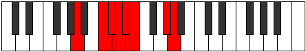 |
| [2299](https://ianring.com/musictheory/scales/2299) | [Phraptyllic](ModeANaturalPhraptyllic.md) | A | A, A#, C, C#, D, D#, E, G#, A |  |
| [2301](https://ianring.com/musictheory/scales/2301) | [Bydyllic](ModeASharpBydyllic.md) | A# | A#, C, C#, D, D#, E, F, A, A# |  |
| [2301](https://ianring.com/musictheory/scales/2301) | [Bydyllic](ModeBFlatBydyllic.md) | Bb | Bb, C, Db, D, Eb, E, F, A, Bb |  |
| [2301](https://ianring.com/musictheory/scales/2301) | [Bydyllic](ModeANaturalBydyllic.md) | A | A, B, C, C#, D, D#, E, G#, A |  |
| [2303](https://ianring.com/musictheory/scales/2303) | [Stanygic](ModeASharpStanygic.md) | A# | A#, B, C, C#, D, D#, E, F, A, A# |  |
| [2303](https://ianring.com/musictheory/scales/2303) | [Stanygic](ModeBFlatStanygic.md) | Bb | Bb, B, C, Db, D, Eb, E, F, A, Bb |  |
| [2303](https://ianring.com/musictheory/scales/2303) | [Stanygic](ModeANaturalStanygic.md) | A | A, A#, B, C, C#, D, D#, E, G#, A |  |
| [2333](https://ianring.com/musictheory/scales/2333) | [Stynimic](ModeCSharpStynimic.md) | C# | C#, D#, E, F, G##, A###, C# |  |
| [2333](https://ianring.com/musictheory/scales/2333) | [Stynimic](ModeDFlatStynimic.md) | Db | Db, Eb, Fb, Gbb, A, B#, Db |  |
| [2335](https://ianring.com/musictheory/scales/2335) | [Epydian](ModeCSharpEpydian.md) | C# | C#, D, Eb, Fb, Gbb, A, B#, C# |  |
| [2339](https://ianring.com/musictheory/scales/2339) | [Ragitonic](ModeENaturalRagitonic.md) | E | E, F, A, C, D#, E |  |
| [2341](https://ianring.com/musictheory/scales/2341) | [Myditonic](ModeENaturalMyditonic.md) | E | E, F#, A, C, D#, E |  |
| [2343](https://ianring.com/musictheory/scales/2343) | [Tharimic](ModeENaturalTharimic.md) | E | E, F, Gb, A, B#, C###, E |  |
| [2345](https://ianring.com/musictheory/scales/2345) | [Gothitonic](ModeENaturalGothitonic.md) | E | E, G, A, C, D#, E |  |
| [2347](https://ianring.com/musictheory/scales/2347) | [Thothimic](ModeENaturalThothimic.md) | E | E, F, G, A, B#, C###, E |  |
| [2349](https://ianring.com/musictheory/scales/2349) | [Aerogimic](ModeCSharpAerogimic.md) | C# | C#, D#, E, F#, G##, A###, C# |  |
| [2349](https://ianring.com/musictheory/scales/2349) | [Aerogimic](ModeDFlatAerogimic.md) | Db | Db, Eb, Fb, Gb, A, B#, Db |  |
| [2349](https://ianring.com/musictheory/scales/2349) | [Aerogimic](ModeENaturalAerogimic.md) | E | E, F#, G, A, B#, C###, E |  |
| [2351](https://ianring.com/musictheory/scales/2351) | [Gynian](ModeCSharpGynian.md) | C# | C#, D, Eb, Fb, Gb, A, B#, C# |  |
| [2351](https://ianring.com/musictheory/scales/2351) | [Gynian](ModeENaturalGynian.md) | E | E, F, Gb, Abb, Bbb, C, D#, E |  |
| [2353](https://ianring.com/musictheory/scales/2353) | [Lycritonic](ModeENaturalLycritonic.md) | E | E, G#, A, C, D#, E |  |
| [2355](https://ianring.com/musictheory/scales/2355) | [Katycrimic](ModeENaturalKatycrimic.md) | E | E, F, G#, A, B#, C###, E |  |
| [2357](https://ianring.com/musictheory/scales/2357) | [Ionaptimic](ModeENaturalIonaptimic.md) | E | E, F#, G#, A, B#, C###, E |  |
| [2359](https://ianring.com/musictheory/scales/2359) | [Gadian](ModeENaturalGadian.md) | E | E, F, Gb, Ab, Bbb, C, D#, E |  |
| [2361](https://ianring.com/musictheory/scales/2361) | [Docrimic](ModeENaturalDocrimic.md) | E | E, F##, G#, A, B#, C###, E |  |
| [2363](https://ianring.com/musictheory/scales/2363) | [Kataptian](ModeENaturalKataptian.md) | E | E, F, G, Ab, Bbb, C, D#, E |  |
| [2365](https://ianring.com/musictheory/scales/2365) | [Sythian](ModeCSharpSythian.md) | C# | C#, D#, E, F, Gb, A, B#, C# | 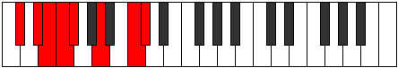 |
| [2365](https://ianring.com/musictheory/scales/2365) | [Sythian](ModeENaturalSythian.md) | E | E, F#, G, Ab, Bbb, C, D#, E |  |
| [2367](https://ianring.com/musictheory/scales/2367) | [Laryllic](ModeCSharpLaryllic.md) | C# | C#, D, D#, E, F, F#, A, C, C# |  |
| [2367](https://ianring.com/musictheory/scales/2367) | [Laryllic](ModeDFlatLaryllic.md) | Db | Db, D, Eb, E, F, Gb, A, C, Db |  |
| [2367](https://ianring.com/musictheory/scales/2367) | [Laryllic](ModeENaturalLaryllic.md) | E | E, F, F#, G, G#, A, C, D#, E |  |
| [2381](https://ianring.com/musictheory/scales/2381) | [Sorimic](ModeCSharpSorimic.md) | C# | C#, D#, E, F##, G##, A###, C# |  |
| [2381](https://ianring.com/musictheory/scales/2381) | [Sorimic](ModeDFlatSorimic.md) | Db | Db, Eb, Fb, G, A, B#, Db |  |
| [2383](https://ianring.com/musictheory/scales/2383) | [Katorian](ModeCSharpKatorian.md) | C# | C#, D, Eb, Fb, G, A, B#, C# |  |
| [2397](https://ianring.com/musictheory/scales/2397) | [Stagian](ModeCSharpStagian.md) | C# | C#, D#, E, F, G, A, B#, C# |  |
| [2399](https://ianring.com/musictheory/scales/2399) | [Zanyllic](ModeCSharpZanyllic.md) | C# | C#, D, D#, E, F, G, A, C, C# |  |
| [2399](https://ianring.com/musictheory/scales/2399) | [Zanyllic](ModeDFlatZanyllic.md) | Db | Db, D, Eb, E, F, G, A, C, Db |  |
| [2403](https://ianring.com/musictheory/scales/2403) | [Lycrimic](ModeENaturalLycrimic.md) | E | E, F, G##, A#, B#, C###, E |  |
| [2405](https://ianring.com/musictheory/scales/2405) | [Katalimic](ModeENaturalKatalimic.md) | E | E, F#, G##, A#, B#, C###, E |  |
| [2405](https://ianring.com/musictheory/scales/2405) | [Katalimic](ModeBFlatKatalimic.md) | Bb | Bb, C, D#, E, F#, G##, Bb |  |
| [2407](https://ianring.com/musictheory/scales/2407) | [Zylian](ModeENaturalZylian.md) | E | E, F, Gb, A, Bb, C, D#, E |  |
| [2407](https://ianring.com/musictheory/scales/2407) | [Zylian](ModeASharpZylian.md) | A# | A#, B, C, D#, E, F#, G##, A# |  |
| [2407](https://ianring.com/musictheory/scales/2407) | [Zylian](ModeBFlatZylian.md) | Bb | Bb, Cb, Dbb, Eb, Fb, Gb, A, Bb |  |
| [2409](https://ianring.com/musictheory/scales/2409) | [Zacrimic](ModeENaturalZacrimic.md) | E | E, F##, G##, A#, B#, C###, E |  |
| [2411](https://ianring.com/musictheory/scales/2411) | [Aeolorian](ModeENaturalAeolorian.md) | E | E, F, G, A, Bb, C, D#, E |  |
| [2413](https://ianring.com/musictheory/scales/2413) | [Phrydian](ModeCSharpPhrydian.md) | C# | C#, D#, E, F#, G, A, B#, C# |  |
| [2413](https://ianring.com/musictheory/scales/2413) | [Phrydian](ModeASharpPhrydian.md) | A# | A#, B#, C#, D#, E, F#, G##, A# |  |
| [2413](https://ianring.com/musictheory/scales/2413) | [Phrydian](ModeBFlatPhrydian.md) | Bb | Bb, C, Db, Eb, Fb, Gb, A, Bb |  |
| [2413](https://ianring.com/musictheory/scales/2413) | [Phrydian](ModeENaturalPhrydian.md) | E | E, F#, G, A, Bb, C, D#, E |  |
| [2415](https://ianring.com/musictheory/scales/2415) | [Lothyllic](ModeCSharpLothyllic.md) | C# | C#, D, D#, E, F#, G, A, C, C# |  |
| [2415](https://ianring.com/musictheory/scales/2415) | [Lothyllic](ModeDFlatLothyllic.md) | Db | Db, D, Eb, E, Gb, G, A, C, Db |  |
| [2415](https://ianring.com/musictheory/scales/2415) | [Lothyllic](ModeENaturalLothyllic.md) | E | E, F, F#, G, A, A#, C, D#, E |  |
| [2415](https://ianring.com/musictheory/scales/2415) | [Lothyllic](ModeASharpLothyllic.md) | A# | A#, B, C, C#, D#, E, F#, A, A# |  |
| [2415](https://ianring.com/musictheory/scales/2415) | [Lothyllic](ModeBFlatLothyllic.md) | Bb | Bb, B, C, Db, Eb, E, Gb, A, Bb |  |
| [2417](https://ianring.com/musictheory/scales/2417) | [Kanimic](ModeENaturalKanimic.md) | E | E, F###, G##, A#, B#, C###, E | 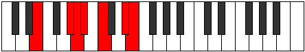 |
| [2419](https://ianring.com/musictheory/scales/2419) | [Paptian](ModeENaturalPaptian.md) | E | E, F, G#, A, Bb, C, D#, E | 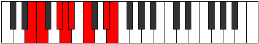 |
| [2421](https://ianring.com/musictheory/scales/2421) | [Malian](ModeASharpMalian.md) | A# | A#, B#, C##, D#, E, F#, G##, A# |  |
| [2421](https://ianring.com/musictheory/scales/2421) | [Malian](ModeBFlatMalian.md) | Bb | Bb, C, D, Eb, Fb, Gb, A, Bb |  |
| [2421](https://ianring.com/musictheory/scales/2421) | [Malian](ModeENaturalMalian.md) | E | E, F#, G#, A, Bb, C, D#, E |  |
| [2423](https://ianring.com/musictheory/scales/2423) | [Thorcryllic](ModeENaturalThorcryllic.md) | E | E, F, F#, G#, A, A#, C, D#, E |  |
| [2423](https://ianring.com/musictheory/scales/2423) | [Thorcryllic](ModeASharpThorcryllic.md) | A# | A#, B, C, D, D#, E, F#, A, A# |  |
| [2423](https://ianring.com/musictheory/scales/2423) | [Thorcryllic](ModeBFlatThorcryllic.md) | Bb | Bb, B, C, D, Eb, E, Gb, A, Bb |  |
| [2425](https://ianring.com/musictheory/scales/2425) | [Rorian](ModeENaturalRorian.md) | E | E, F##, G#, A, Bb, C, D#, E |  |
| [2427](https://ianring.com/musictheory/scales/2427) | [Katoryllic](ModeENaturalKatoryllic.md) | E | E, F, G, G#, A, A#, C, D#, E |  |
| [2429](https://ianring.com/musictheory/scales/2429) | [Kadyllic](ModeCSharpKadyllic.md) | C# | C#, D#, E, F, F#, G, A, C, C# |  |
| [2429](https://ianring.com/musictheory/scales/2429) | [Kadyllic](ModeDFlatKadyllic.md) | Db | Db, Eb, E, F, Gb, G, A, C, Db |  |
| [2429](https://ianring.com/musictheory/scales/2429) | [Kadyllic](ModeASharpKadyllic.md) | A# | A#, C, C#, D, D#, E, F#, A, A# |  |
| [2429](https://ianring.com/musictheory/scales/2429) | [Kadyllic](ModeBFlatKadyllic.md) | Bb | Bb, C, Db, D, Eb, E, Gb, A, Bb |  |
| [2429](https://ianring.com/musictheory/scales/2429) | [Kadyllic](ModeENaturalKadyllic.md) | E | E, F#, G, G#, A, A#, C, D#, E |  |
| [2431](https://ianring.com/musictheory/scales/2431) | [Gythygic](ModeCSharpGythygic.md) | C# | C#, D, D#, E, F, F#, G, A, C, C# |  |
| [2431](https://ianring.com/musictheory/scales/2431) | [Gythygic](ModeDFlatGythygic.md) | Db | Db, D, Eb, E, F, Gb, G, A, C, Db |  |
| [2431](https://ianring.com/musictheory/scales/2431) | [Gythygic](ModeENaturalGythygic.md) | E | E, F, F#, G, G#, A, A#, C, D#, E |  |
| [2431](https://ianring.com/musictheory/scales/2431) | [Gythygic](ModeASharpGythygic.md) | A# | A#, B, C, C#, D, D#, E, F#, A, A# |  |
| [2431](https://ianring.com/musictheory/scales/2431) | [Gythygic](ModeBFlatGythygic.md) | Bb | Bb, B, C, Db, D, Eb, E, Gb, A, Bb |  |
| [2445](https://ianring.com/musictheory/scales/2445) | [Zadimic](ModeCSharpZadimic.md) | C# | C#, D#, E, F###, G##, A###, C# |  |
| [2445](https://ianring.com/musictheory/scales/2445) | [Zadimic](ModeDFlatZadimic.md) | Db | Db, Eb, Fb, G#, A, B#, Db |  |
| [2447](https://ianring.com/musictheory/scales/2447) | [Thagian](ModeCSharpThagian.md) | C# | C#, D, Eb, Fb, G#, A, B#, C# |  |
| [2451](https://ianring.com/musictheory/scales/2451) | [Aerynimic](ModeGSharpAerynimic.md) | G# | G#, A, B#, C###, D##, E###, G# |  |
| [2451](https://ianring.com/musictheory/scales/2451) | [Aerynimic](ModeAFlatAerynimic.md) | Ab | Ab, Bbb, C, D#, E, F##, Ab |  |
| [2455](https://ianring.com/musictheory/scales/2455) | [Bothian](ModeGSharpBothian.md) | G# | G#, A, Bb, C, D#, E, F##, G# |  |
| [2459](https://ianring.com/musictheory/scales/2459) | [Ionocrian](ModeGSharpIonocrian.md) | G# | G#, A, B, C, D#, E, F##, G# |  |
| [2461](https://ianring.com/musictheory/scales/2461) | [Sagian](ModeCSharpSagian.md) | C# | C#, D#, E, F, G#, A, B#, C# |  |
| [2463](https://ianring.com/musictheory/scales/2463) | [Ionathyllic](ModeCSharpIonathyllic.md) | C# | C#, D, D#, E, F, G#, A, C, C# |  |
| [2463](https://ianring.com/musictheory/scales/2463) | [Ionathyllic](ModeDFlatIonathyllic.md) | Db | Db, D, Eb, E, F, Ab, A, C, Db |  |
| [2463](https://ianring.com/musictheory/scales/2463) | [Ionathyllic](ModeGSharpIonathyllic.md) | G# | G#, A, A#, B, C, D#, E, G, G# |  |
| [2463](https://ianring.com/musictheory/scales/2463) | [Ionathyllic](ModeAFlatIonathyllic.md) | Ab | Ab, A, Bb, B, C, Eb, E, G, Ab |  |
| [2467](https://ianring.com/musictheory/scales/2467) | [Morimic](ModeENaturalMorimic.md) | E | E, F, G##, A##, B#, C###, E |  |
| [2469](https://ianring.com/musictheory/scales/2469) | [Staptimic](ModeENaturalStaptimic.md) | E | E, F#, G##, A##, B#, C###, E |  |
| [2471](https://ianring.com/musictheory/scales/2471) | [Eparian](ModeENaturalEparian.md) | E | E, F, Gb, A, B, C, D#, E | 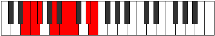 |
| [2473](https://ianring.com/musictheory/scales/2473) | [Mothimic](ModeENaturalMothimic.md) | E | E, F##, G##, A##, B#, C###, E |  |
| [2475](https://ianring.com/musictheory/scales/2475) | [Aerylian](ModeENaturalAerylian.md) | E | E, F, G, A, B, C, D#, E |  |
| [2477](https://ianring.com/musictheory/scales/2477) | [Mydian](ModeCSharpMydian.md) | C# | C#, D#, E, F#, G#, A, B#, C# |  |
| [2477](https://ianring.com/musictheory/scales/2477) | [Mydian](ModeENaturalMydian.md) | E | E, F#, G, A, B, C, D#, E |  |
| [2479](https://ianring.com/musictheory/scales/2479) | [Rycryllic](ModeCSharpRycryllic.md) | C# | C#, D, D#, E, F#, G#, A, C, C# |  |
| [2479](https://ianring.com/musictheory/scales/2479) | [Rycryllic](ModeDFlatRycryllic.md) | Db | Db, D, Eb, E, Gb, Ab, A, C, Db |  |
| [2479](https://ianring.com/musictheory/scales/2479) | [Rycryllic](ModeENaturalRycryllic.md) | E | E, F, F#, G, A, B, C, D#, E |  |
| [2481](https://ianring.com/musictheory/scales/2481) | [Laptimic](ModeENaturalLaptimic.md) | E | E, F###, G##, A##, B#, C###, E |  |
| [2483](https://ianring.com/musictheory/scales/2483) | [Aerynian](ModeGSharpAerynian.md) | G# | G#, A, B#, C#, D#, E, F##, G# |  |
| [2483](https://ianring.com/musictheory/scales/2483) | [Aerynian](ModeENaturalAerynian.md) | E | E, F, G#, A, B, C, D#, E |  |
| [2485](https://ianring.com/musictheory/scales/2485) | [Aerorian](ModeENaturalAerorian.md) | E | E, F#, G#, A, B, C, D#, E |  |
| [2487](https://ianring.com/musictheory/scales/2487) | [Phroptyllic](ModeGSharpPhroptyllic.md) | G# | G#, A, A#, C, C#, D#, E, G, G# |  |
| [2487](https://ianring.com/musictheory/scales/2487) | [Phroptyllic](ModeAFlatPhroptyllic.md) | Ab | Ab, A, Bb, C, Db, Eb, E, G, Ab |  |
| [2487](https://ianring.com/musictheory/scales/2487) | [Phroptyllic](ModeENaturalPhroptyllic.md) | E | E, F, F#, G#, A, B, C, D#, E |  |
| [2489](https://ianring.com/musictheory/scales/2489) | [Syrian](ModeENaturalSyrian.md) | E | E, F##, G#, A, B, C, D#, E |  |
| [2491](https://ianring.com/musictheory/scales/2491) | [Layllic](ModeGSharpLayllic.md) | G# | G#, A, B, C, C#, D#, E, G, G# |  |
| [2491](https://ianring.com/musictheory/scales/2491) | [Layllic](ModeAFlatLayllic.md) | Ab | Ab, A, B, C, Db, Eb, E, G, Ab |  |
| [2491](https://ianring.com/musictheory/scales/2491) | [Layllic](ModeENaturalLayllic.md) | E | E, F, G, G#, A, B, C, D#, E |  |
| [2493](https://ianring.com/musictheory/scales/2493) | [Manyllic](ModeCSharpManyllic.md) | C# | C#, D#, E, F, F#, G#, A, C, C# |  |
| [2493](https://ianring.com/musictheory/scales/2493) | [Manyllic](ModeDFlatManyllic.md) | Db | Db, Eb, E, F, Gb, Ab, A, C, Db |  |
| [2493](https://ianring.com/musictheory/scales/2493) | [Manyllic](ModeENaturalManyllic.md) | E | E, F#, G, G#, A, B, C, D#, E |  |
| [2495](https://ianring.com/musictheory/scales/2495) | [Aeolocrygic](ModeCSharpAeolocrygic.md) | C# | C#, D, D#, E, F, F#, G#, A, C, C# |  |
| [2495](https://ianring.com/musictheory/scales/2495) | [Aeolocrygic](ModeDFlatAeolocrygic.md) | Db | Db, D, Eb, E, F, Gb, Ab, A, C, Db |  |
| [2495](https://ianring.com/musictheory/scales/2495) | [Aeolocrygic](ModeENaturalAeolocrygic.md) | E | E, F, F#, G, G#, A, B, C, D#, E |  |
| [2495](https://ianring.com/musictheory/scales/2495) | [Aeolocrygic](ModeGSharpAeolocrygic.md) | G# | G#, A, A#, B, C, C#, D#, E, G, G# |  |
| [2495](https://ianring.com/musictheory/scales/2495) | [Aeolocrygic](ModeAFlatAeolocrygic.md) | Ab | Ab, A, Bb, B, C, Db, Eb, E, G, Ab |  |
| [2505](https://ianring.com/musictheory/scales/2505) | [Mydimic](ModeANaturalMydimic.md) | A | A, B#, C###, D##, E#, F###, A |  |
| [2507](https://ianring.com/musictheory/scales/2507) | [Ionyphian](ModeANaturalIonyphian.md) | A | A, Bb, C, D#, E, F, G#, A |  |
| [2509](https://ianring.com/musictheory/scales/2509) | [Bogian](ModeCSharpBogian.md) | C# | C#, D#, E, F##, G#, A, B#, C# |  |
| [2509](https://ianring.com/musictheory/scales/2509) | [Bogian](ModeANaturalBogian.md) | A | A, B, C, D#, E, F, G#, A |  |
| [2511](https://ianring.com/musictheory/scales/2511) | [Epyryllic](ModeCSharpEpyryllic.md) | C# | C#, D, D#, E, G, G#, A, C, C# |  |
| [2511](https://ianring.com/musictheory/scales/2511) | [Epyryllic](ModeDFlatEpyryllic.md) | Db | Db, D, Eb, E, G, Ab, A, C, Db |  |
| [2511](https://ianring.com/musictheory/scales/2511) | [Epyryllic](ModeANaturalEpyryllic.md) | A | A, A#, B, C, D#, E, F, G#, A |  |
| [2515](https://ianring.com/musictheory/scales/2515) | [Stylian](ModeGSharpStylian.md) | G# | G#, A, B#, C##, D#, E, F##, G# |  |
| [2519](https://ianring.com/musictheory/scales/2519) | [Dathyllic](ModeGSharpDathyllic.md) | G# | G#, A, A#, C, D, D#, E, G, G# |  |
| [2519](https://ianring.com/musictheory/scales/2519) | [Dathyllic](ModeAFlatDathyllic.md) | Ab | Ab, A, Bb, C, D, Eb, E, G, Ab |  |
| [2521](https://ianring.com/musictheory/scales/2521) | [Barian](ModeANaturalBarian.md) | A | A, B#, C#, D#, E, F, G#, A |  |
| [2523](https://ianring.com/musictheory/scales/2523) | [Rygyllic](ModeANaturalRygyllic.md) | A | A, A#, C, C#, D#, E, F, G#, A |  |
| [2523](https://ianring.com/musictheory/scales/2523) | [Rygyllic](ModeGSharpRygyllic.md) | G# | G#, A, B, C, D, D#, E, G, G# |  |
| [2523](https://ianring.com/musictheory/scales/2523) | [Rygyllic](ModeAFlatRygyllic.md) | Ab | Ab, A, B, C, D, Eb, E, G, Ab | 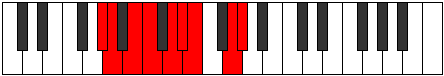 |
| [2525](https://ianring.com/musictheory/scales/2525) | [Aeolaryllic](ModeCSharpAeolaryllic.md) | C# | C#, D#, E, F, G, G#, A, C, C# |  |
| [2525](https://ianring.com/musictheory/scales/2525) | [Aeolaryllic](ModeDFlatAeolaryllic.md) | Db | Db, Eb, E, F, G, Ab, A, C, Db |  |
| [2525](https://ianring.com/musictheory/scales/2525) | [Aeolaryllic](ModeANaturalAeolaryllic.md) | A | A, B, C, C#, D#, E, F, G#, A |  |
| [2527](https://ianring.com/musictheory/scales/2527) | [Phradygic](ModeCSharpPhradygic.md) | C# | C#, D, D#, E, F, G, G#, A, C, C# |  |
| [2527](https://ianring.com/musictheory/scales/2527) | [Phradygic](ModeDFlatPhradygic.md) | Db | Db, D, Eb, E, F, G, Ab, A, C, Db |  |
| [2527](https://ianring.com/musictheory/scales/2527) | [Phradygic](ModeANaturalPhradygic.md) | A | A, A#, B, C, C#, D#, E, F, G#, A |  |
| [2527](https://ianring.com/musictheory/scales/2527) | [Phradygic](ModeGSharpPhradygic.md) | G# | G#, A, A#, B, C, D, D#, E, G, G# |  |
| [2527](https://ianring.com/musictheory/scales/2527) | [Phradygic](ModeAFlatPhradygic.md) | Ab | Ab, A, Bb, B, C, D, Eb, E, G, Ab |  |
| [2531](https://ianring.com/musictheory/scales/2531) | [Danian](ModeENaturalDanian.md) | E | E, F, G##, A#, B, C, D#, E |  |
| [2533](https://ianring.com/musictheory/scales/2533) | [Podian](ModeBFlatPodian.md) | Bb | Bb, C, D#, E, F, Gb, A, Bb |  |
| [2533](https://ianring.com/musictheory/scales/2533) | [Podian](ModeENaturalPodian.md) | E | E, F#, G##, A#, B, C, D#, E |  |
| [2535](https://ianring.com/musictheory/scales/2535) | [Zygyllic](ModeENaturalZygyllic.md) | E | E, F, F#, A, A#, B, C, D#, E |  |
| [2535](https://ianring.com/musictheory/scales/2535) | [Zygyllic](ModeASharpZygyllic.md) | A# | A#, B, C, D#, E, F, F#, A, A# |  |
| [2535](https://ianring.com/musictheory/scales/2535) | [Zygyllic](ModeBFlatZygyllic.md) | Bb | Bb, B, C, Eb, E, F, Gb, A, Bb |  |
| [2537](https://ianring.com/musictheory/scales/2537) | [Laptian](ModeANaturalLaptian.md) | A | A, B#, C##, D#, E, F, G#, A |  |
| [2537](https://ianring.com/musictheory/scales/2537) | [Laptian](ModeENaturalLaptian.md) | E | E, F##, G##, A#, B, C, D#, E |  |
| [2539](https://ianring.com/musictheory/scales/2539) | [Thonyllic](ModeANaturalThonyllic.md) | A | A, A#, C, D, D#, E, F, G#, A |  |
| [2539](https://ianring.com/musictheory/scales/2539) | [Thonyllic](ModeENaturalThonyllic.md) | E | E, F, G, A, A#, B, C, D#, E |  |
| [2541](https://ianring.com/musictheory/scales/2541) | [Katadyllic](ModeCSharpKatadyllic.md) | C# | C#, D#, E, F#, G, G#, A, C, C# |  |
| [2541](https://ianring.com/musictheory/scales/2541) | [Katadyllic](ModeDFlatKatadyllic.md) | Db | Db, Eb, E, Gb, G, Ab, A, C, Db |  |
| [2541](https://ianring.com/musictheory/scales/2541) | [Katadyllic](ModeASharpKatadyllic.md) | A# | A#, C, C#, D#, E, F, F#, A, A# |  |
| [2541](https://ianring.com/musictheory/scales/2541) | [Katadyllic](ModeBFlatKatadyllic.md) | Bb | Bb, C, Db, Eb, E, F, Gb, A, Bb |  |
| [2541](https://ianring.com/musictheory/scales/2541) | [Katadyllic](ModeANaturalKatadyllic.md) | A | A, B, C, D, D#, E, F, G#, A |  |
| [2541](https://ianring.com/musictheory/scales/2541) | [Katadyllic](ModeENaturalKatadyllic.md) | E | E, F#, G, A, A#, B, C, D#, E |  |
| [2543](https://ianring.com/musictheory/scales/2543) | [Dydygic](ModeCSharpDydygic.md) | C# | C#, D, D#, E, F#, G, G#, A, C, C# |  |
| [2543](https://ianring.com/musictheory/scales/2543) | [Dydygic](ModeDFlatDydygic.md) | Db | Db, D, Eb, E, Gb, G, Ab, A, C, Db |  |
| [2543](https://ianring.com/musictheory/scales/2543) | [Dydygic](ModeASharpDydygic.md) | A# | A#, B, C, C#, D#, E, F, F#, A, A# |  |
| [2543](https://ianring.com/musictheory/scales/2543) | [Dydygic](ModeBFlatDydygic.md) | Bb | Bb, B, C, Db, Eb, E, F, Gb, A, Bb |  |
| [2543](https://ianring.com/musictheory/scales/2543) | [Dydygic](ModeENaturalDydygic.md) | E | E, F, F#, G, A, A#, B, C, D#, E |  |
| [2543](https://ianring.com/musictheory/scales/2543) | [Dydygic](ModeANaturalDydygic.md) | A | A, A#, B, C, D, D#, E, F, G#, A |  |
| [2545](https://ianring.com/musictheory/scales/2545) | [Thycrian](ModeENaturalThycrian.md) | E | E, F###, G##, A#, B, C, D#, E |  |
| [2547](https://ianring.com/musictheory/scales/2547) | [Sogyllic](ModeGSharpSogyllic.md) | G# | G#, A, C, C#, D, D#, E, G, G# |  |
| [2547](https://ianring.com/musictheory/scales/2547) | [Sogyllic](ModeAFlatSogyllic.md) | Ab | Ab, A, C, Db, D, Eb, E, G, Ab |  |
| [2547](https://ianring.com/musictheory/scales/2547) | [Sogyllic](ModeENaturalSogyllic.md) | E | E, F, G#, A, A#, B, C, D#, E |  |
| [2549](https://ianring.com/musictheory/scales/2549) | [Rydyllic](ModeASharpRydyllic.md) | A# | A#, C, D, D#, E, F, F#, A, A# |  |
| [2549](https://ianring.com/musictheory/scales/2549) | [Rydyllic](ModeBFlatRydyllic.md) | Bb | Bb, C, D, Eb, E, F, Gb, A, Bb |  |
| [2549](https://ianring.com/musictheory/scales/2549) | [Rydyllic](ModeENaturalRydyllic.md) | E | E, F#, G#, A, A#, B, C, D#, E | 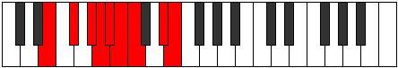 |
| [2551](https://ianring.com/musictheory/scales/2551) | [Zoptygic](ModeGSharpZoptygic.md) | G# | G#, A, A#, C, C#, D, D#, E, G, G# |  |
| [2551](https://ianring.com/musictheory/scales/2551) | [Zoptygic](ModeAFlatZoptygic.md) | Ab | Ab, A, Bb, C, Db, D, Eb, E, G, Ab |  |
| [2551](https://ianring.com/musictheory/scales/2551) | [Zoptygic](ModeASharpZoptygic.md) | A# | A#, B, C, D, D#, E, F, F#, A, A# |  |
| [2551](https://ianring.com/musictheory/scales/2551) | [Zoptygic](ModeBFlatZoptygic.md) | Bb | Bb, B, C, D, Eb, E, F, Gb, A, Bb |  |
| [2551](https://ianring.com/musictheory/scales/2551) | [Zoptygic](ModeENaturalZoptygic.md) | E | E, F, F#, G#, A, A#, B, C, D#, E |  |
| [2553](https://ianring.com/musictheory/scales/2553) | [Aeolaptyllic](ModeANaturalAeolaptyllic.md) | A | A, C, C#, D, D#, E, F, G#, A |  |
| [2553](https://ianring.com/musictheory/scales/2553) | [Aeolaptyllic](ModeENaturalAeolaptyllic.md) | E | E, G, G#, A, A#, B, C, D#, E |  |
| [2555](https://ianring.com/musictheory/scales/2555) | [Bythygic](ModeANaturalBythygic.md) | A | A, A#, C, C#, D, D#, E, F, G#, A |  |
| [2555](https://ianring.com/musictheory/scales/2555) | [Bythygic](ModeGSharpBythygic.md) | G# | G#, A, B, C, C#, D, D#, E, G, G# |  |
| [2555](https://ianring.com/musictheory/scales/2555) | [Bythygic](ModeAFlatBythygic.md) | Ab | Ab, A, B, C, Db, D, Eb, E, G, Ab |  |
| [2555](https://ianring.com/musictheory/scales/2555) | [Bythygic](ModeENaturalBythygic.md) | E | E, F, G, G#, A, A#, B, C, D#, E |  |
| [2557](https://ianring.com/musictheory/scales/2557) | [Dothygic](ModeCSharpDothygic.md) | C# | C#, D#, E, F, F#, G, G#, A, C, C# |  |
| [2557](https://ianring.com/musictheory/scales/2557) | [Dothygic](ModeDFlatDothygic.md) | Db | Db, Eb, E, F, Gb, G, Ab, A, C, Db |  |
| [2557](https://ianring.com/musictheory/scales/2557) | [Dothygic](ModeASharpDothygic.md) | A# | A#, C, C#, D, D#, E, F, F#, A, A# |  |
| [2557](https://ianring.com/musictheory/scales/2557) | [Dothygic](ModeBFlatDothygic.md) | Bb | Bb, C, Db, D, Eb, E, F, Gb, A, Bb |  |
| [2557](https://ianring.com/musictheory/scales/2557) | [Dothygic](ModeANaturalDothygic.md) | A | A, B, C, C#, D, D#, E, F, G#, A |  |
| [2557](https://ianring.com/musictheory/scales/2557) | [Dothygic](ModeENaturalDothygic.md) | E | E, F#, G, G#, A, A#, B, C, D#, E |  |
| [2559](https://ianring.com/musictheory/scales/2559) | [Zogyllian](ModeCSharpZogyllian.md) | C# | C#, D, D#, E, F, F#, G, G#, A, C, C# |  |
| [2559](https://ianring.com/musictheory/scales/2559) | [Zogyllian](ModeDFlatZogyllian.md) | Db | Db, D, Eb, E, F, Gb, G, Ab, A, C, Db |  |
| [2559](https://ianring.com/musictheory/scales/2559) | [Zogyllian](ModeASharpZogyllian.md) | A# | A#, B, C, C#, D, D#, E, F, F#, A, A# |  |
| [2559](https://ianring.com/musictheory/scales/2559) | [Zogyllian](ModeBFlatZogyllian.md) | Bb | Bb, B, C, Db, D, Eb, E, F, Gb, A, Bb |  |
| [2559](https://ianring.com/musictheory/scales/2559) | [Zogyllian](ModeANaturalZogyllian.md) | A | A, A#, B, C, C#, D, D#, E, F, G#, A |  |
| [2559](https://ianring.com/musictheory/scales/2559) | [Zogyllian](ModeGSharpZogyllian.md) | G# | G#, A, A#, B, C, C#, D, D#, E, G, G# |  |
| [2559](https://ianring.com/musictheory/scales/2559) | [Zogyllian](ModeAFlatZogyllian.md) | Ab | Ab, A, Bb, B, C, Db, D, Eb, E, G, Ab |  |
| [2559](https://ianring.com/musictheory/scales/2559) | [Zogyllian](ModeENaturalZogyllian.md) | E | E, F, F#, G, G#, A, A#, B, C, D#, E |  |
| [2617](https://ianring.com/musictheory/scales/2617) | [Pylimic](ModeCNaturalPylimic.md) | C | C, D#, E, F, G##, A##, C |  |
| [2619](https://ianring.com/musictheory/scales/2619) | [Ionyrian](ModeCNaturalIonyrian.md) | C | C, Db, Eb, Fb, Gbb, A, B, C |  |
| [2621](https://ianring.com/musictheory/scales/2621) | [Ionogian](ModeCNaturalIonogian.md) | C | C, D, Eb, Fb, Gbb, A, B, C |  |
| [2623](https://ianring.com/musictheory/scales/2623) | [Aerylyllic](ModeCNaturalAerylyllic.md) | C | C, C#, D, D#, E, F, A, B, C |  |
| [2631](https://ianring.com/musictheory/scales/2631) | [Macrimic](ModeDSharpMacrimic.md) | D# | D#, E, F, G##, A###, B###, D# |  |
| [2631](https://ianring.com/musictheory/scales/2631) | [Macrimic](ModeEFlatMacrimic.md) | Eb | Eb, Fb, Gbb, A, B#, C##, Eb |  |
| [2635](https://ianring.com/musictheory/scales/2635) | [Gocrimic](ModeDSharpGocrimic.md) | D# | D#, E, F#, G##, A###, B###, D# |  |
| [2635](https://ianring.com/musictheory/scales/2635) | [Gocrimic](ModeEFlatGocrimic.md) | Eb | Eb, Fb, Gb, A, B#, C##, Eb |  |
| [2639](https://ianring.com/musictheory/scales/2639) | [Dothian](ModeDSharpDothian.md) | D# | D#, E, F, Gb, A, B#, C##, D# |  |
| [2643](https://ianring.com/musictheory/scales/2643) | [Lydimic](ModeDSharpLydimic.md) | D# | D#, E, F##, G##, A###, B###, D# |  |
| [2643](https://ianring.com/musictheory/scales/2643) | [Lydimic](ModeEFlatLydimic.md) | Eb | Eb, Fb, G, A, B#, C##, Eb |  |
| [2647](https://ianring.com/musictheory/scales/2647) | [Dadian](ModeDSharpDadian.md) | D# | D#, E, F, G, A, B#, C##, D# |  |
| [2649](https://ianring.com/musictheory/scales/2649) | [Aeolythimic](ModeCNaturalAeolythimic.md) | C | C, D#, E, F#, G##, A##, C |  |
| [2651](https://ianring.com/musictheory/scales/2651) | [Panian](ModeDSharpPanian.md) | D# | D#, E, F#, G, A, B#, C##, D# |  |
| [2651](https://ianring.com/musictheory/scales/2651) | [Panian](ModeCNaturalPanian.md) | C | C, Db, Eb, Fb, Gb, A, B, C |  |
| [2653](https://ianring.com/musictheory/scales/2653) | [Sygian](ModeCNaturalSygian.md) | C | C, D, Eb, Fb, Gb, A, B, C |  |
| [2655](https://ianring.com/musictheory/scales/2655) | [Thocryllic](ModeDSharpThocryllic.md) | D# | D#, E, F, F#, G, A, C, D, D# |  |
| [2655](https://ianring.com/musictheory/scales/2655) | [Thocryllic](ModeEFlatThocryllic.md) | Eb | Eb, E, F, Gb, G, A, C, D, Eb |  |
| [2655](https://ianring.com/musictheory/scales/2655) | [Thocryllic](ModeCNaturalThocryllic.md) | C | C, C#, D, D#, E, F#, A, B, C |  |
| [2659](https://ianring.com/musictheory/scales/2659) | [Katynimic](ModeDSharpKatynimic.md) | D# | D#, E, F###, G##, A###, B###, D# | 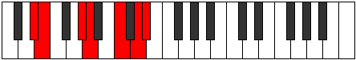 |
| [2659](https://ianring.com/musictheory/scales/2659) | [Katynimic](ModeEFlatKatynimic.md) | Eb | Eb, Fb, G#, A, B#, C##, Eb |  |
| [2661](https://ianring.com/musictheory/scales/2661) | [Stydimic](ModeBFlatStydimic.md) | Bb | Bb, C, D#, E, F##, G##, Bb |  |
| [2663](https://ianring.com/musictheory/scales/2663) | [Lalian](ModeDSharpLalian.md) | D# | D#, E, F, G#, A, B#, C##, D# |  |
| [2663](https://ianring.com/musictheory/scales/2663) | [Lalian](ModeASharpLalian.md) | A# | A#, B, C, D#, E, F##, G##, A# |  |
| [2663](https://ianring.com/musictheory/scales/2663) | [Lalian](ModeBFlatLalian.md) | Bb | Bb, Cb, Dbb, Eb, Fb, G, A, Bb |  |
| [2667](https://ianring.com/musictheory/scales/2667) | [Byrian](ModeDSharpByrian.md) | D# | D#, E, F#, G#, A, B#, C##, D# |  |
| [2669](https://ianring.com/musictheory/scales/2669) | [Gamian](ModeASharpGamian.md) | A# | A#, B#, C#, D#, E, F##, G##, A# |  |
| [2669](https://ianring.com/musictheory/scales/2669) | [Gamian](ModeBFlatGamian.md) | Bb | Bb, C, Db, Eb, Fb, G, A, Bb |  |
| [2671](https://ianring.com/musictheory/scales/2671) | [Lylyllic](ModeDSharpLylyllic.md) | D# | D#, E, F, F#, G#, A, C, D, D# |  |
| [2671](https://ianring.com/musictheory/scales/2671) | [Lylyllic](ModeEFlatLylyllic.md) | Eb | Eb, E, F, Gb, Ab, A, C, D, Eb |  |
| [2671](https://ianring.com/musictheory/scales/2671) | [Lylyllic](ModeASharpLylyllic.md) | A# | A#, B, C, C#, D#, E, G, A, A# |  |
| [2671](https://ianring.com/musictheory/scales/2671) | [Lylyllic](ModeBFlatLylyllic.md) | Bb | Bb, B, C, Db, Eb, E, G, A, Bb |  |
| [2675](https://ianring.com/musictheory/scales/2675) | [Gogian](ModeDSharpGogian.md) | D# | D#, E, F##, G#, A, B#, C##, D# |  |
| [2677](https://ianring.com/musictheory/scales/2677) | [Thodian](ModeASharpThodian.md) | A# | A#, B#, C##, D#, E, F##, G##, A# |  |
| [2677](https://ianring.com/musictheory/scales/2677) | [Thodian](ModeBFlatThodian.md) | Bb | Bb, C, D, Eb, Fb, G, A, Bb |  |
| [2679](https://ianring.com/musictheory/scales/2679) | [Rathyllic](ModeDSharpRathyllic.md) | D# | D#, E, F, G, G#, A, C, D, D# |  |
| [2679](https://ianring.com/musictheory/scales/2679) | [Rathyllic](ModeEFlatRathyllic.md) | Eb | Eb, E, F, G, Ab, A, C, D, Eb |  |
| [2679](https://ianring.com/musictheory/scales/2679) | [Rathyllic](ModeASharpRathyllic.md) | A# | A#, B, C, D, D#, E, G, A, A# |  |
| [2679](https://ianring.com/musictheory/scales/2679) | [Rathyllic](ModeBFlatRathyllic.md) | Bb | Bb, B, C, D, Eb, E, G, A, Bb |  |
| [2681](https://ianring.com/musictheory/scales/2681) | [Aerycrian](ModeCNaturalAerycrian.md) | C | C, D#, E, F, Gb, A, B, C |  |
| [2683](https://ianring.com/musictheory/scales/2683) | [Thodyllic](ModeDSharpThodyllic.md) | D# | D#, E, F#, G, G#, A, C, D, D# |  |
| [2683](https://ianring.com/musictheory/scales/2683) | [Thodyllic](ModeEFlatThodyllic.md) | Eb | Eb, E, Gb, G, Ab, A, C, D, Eb |  |
| [2683](https://ianring.com/musictheory/scales/2683) | [Thodyllic](ModeCNaturalThodyllic.md) | C | C, C#, D#, E, F, F#, A, B, C |  |
| [2685](https://ianring.com/musictheory/scales/2685) | [Ionoryllic](ModeASharpIonoryllic.md) | A# | A#, C, C#, D, D#, E, G, A, A# |  |
| [2685](https://ianring.com/musictheory/scales/2685) | [Ionoryllic](ModeBFlatIonoryllic.md) | Bb | Bb, C, Db, D, Eb, E, G, A, Bb |  |
| [2685](https://ianring.com/musictheory/scales/2685) | [Ionoryllic](ModeCNaturalIonoryllic.md) | C | C, D, D#, E, F, F#, A, B, C |  |
| [2687](https://ianring.com/musictheory/scales/2687) | [Thacrygic](ModeDSharpThacrygic.md) | D# | D#, E, F, F#, G, G#, A, C, D, D# |  |
| [2687](https://ianring.com/musictheory/scales/2687) | [Thacrygic](ModeEFlatThacrygic.md) | Eb | Eb, E, F, Gb, G, Ab, A, C, D, Eb |  |
| [2687](https://ianring.com/musictheory/scales/2687) | [Thacrygic](ModeCNaturalThacrygic.md) | C | C, C#, D, D#, E, F, F#, A, B, C |  |
| [2687](https://ianring.com/musictheory/scales/2687) | [Thacrygic](ModeASharpThacrygic.md) | A# | A#, B, C, C#, D, D#, E, G, A, A# |  |
| [2687](https://ianring.com/musictheory/scales/2687) | [Thacrygic](ModeBFlatThacrygic.md) | Bb | Bb, B, C, Db, D, Eb, E, G, A, Bb |  |
| [2713](https://ianring.com/musictheory/scales/2713) | [Porimic](ModeCNaturalPorimic.md) | C | C, D#, E, F##, G##, A##, C | 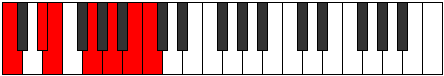 |
| [2715](https://ianring.com/musictheory/scales/2715) | [Kynian](ModeCNaturalKynian.md) | C | C, Db, Eb, Fb, G, A, B, C |  |
| [2717](https://ianring.com/musictheory/scales/2717) | [Epygian](ModeCNaturalEpygian.md) | C | C, D, Eb, Fb, G, A, B, C |  |
| [2719](https://ianring.com/musictheory/scales/2719) | [Zocryllic](ModeCNaturalZocryllic.md) | C | C, C#, D, D#, E, G, A, B, C |  |
| [2745](https://ianring.com/musictheory/scales/2745) | [Dolian](ModeCNaturalDolian.md) | C | C, D#, E, F, G, A, B, C |  |
| [2747](https://ianring.com/musictheory/scales/2747) | [Stythyllic](ModeCNaturalStythyllic.md) | C | C, C#, D#, E, F, G, A, B, C |  |
| [2749](https://ianring.com/musictheory/scales/2749) | [Katagyllic](ModeCNaturalKatagyllic.md) | C | C, D, D#, E, F, G, A, B, C |  |
| [2751](https://ianring.com/musictheory/scales/2751) | [Sylygic](ModeCNaturalSylygic.md) | C | C, C#, D, D#, E, F, G, A, B, C |  |
| [2759](https://ianring.com/musictheory/scales/2759) | [Aeraphian](ModeDSharpAeraphian.md) | D# | D#, E, F, G##, A#, B#, C##, D# |  |
| [2759](https://ianring.com/musictheory/scales/2759) | [Aeraphian](ModeEFlatAeraphian.md) | Eb | Eb, Fb, Gbb, A, Bb, C, D, Eb |  |
| [2761](https://ianring.com/musictheory/scales/2761) | [Dagimic](ModeANaturalDagimic.md) | A | A, B#, C###, D##, E##, F###, A |  |
| [2763](https://ianring.com/musictheory/scales/2763) | [Manian](ModeDSharpManian.md) | D# | D#, E, F#, G##, A#, B#, C##, D# |  |
| [2763](https://ianring.com/musictheory/scales/2763) | [Manian](ModeEFlatManian.md) | Eb | Eb, Fb, Gb, A, Bb, C, D, Eb |  |
| [2763](https://ianring.com/musictheory/scales/2763) | [Manian](ModeANaturalManian.md) | A | A, Bb, C, D#, E, F#, G#, A |  |
| [2765](https://ianring.com/musictheory/scales/2765) | [Banian](ModeANaturalBanian.md) | A | A, B, C, D#, E, F#, G#, A |  |
| [2767](https://ianring.com/musictheory/scales/2767) | [Katydyllic](ModeDSharpKatydyllic.md) | D# | D#, E, F, F#, A, A#, C, D, D# |  |
| [2767](https://ianring.com/musictheory/scales/2767) | [Katydyllic](ModeEFlatKatydyllic.md) | Eb | Eb, E, F, Gb, A, Bb, C, D, Eb |  |
| [2767](https://ianring.com/musictheory/scales/2767) | [Katydyllic](ModeANaturalKatydyllic.md) | A | A, A#, B, C, D#, E, F#, G#, A |  |
| [2771](https://ianring.com/musictheory/scales/2771) | [Garian](ModeDSharpGarian.md) | D# | D#, E, F##, G##, A#, B#, C##, D# |  |
| [2771](https://ianring.com/musictheory/scales/2771) | [Garian](ModeEFlatGarian.md) | Eb | Eb, Fb, G, A, Bb, C, D, Eb |  |
| [2775](https://ianring.com/musictheory/scales/2775) | [Godyllic](ModeDSharpGodyllic.md) | D# | D#, E, F, G, A, A#, C, D, D# |  |
| [2775](https://ianring.com/musictheory/scales/2775) | [Godyllic](ModeEFlatGodyllic.md) | Eb | Eb, E, F, G, A, Bb, C, D, Eb |  |
| [2777](https://ianring.com/musictheory/scales/2777) | [Bycrian](ModeANaturalBycrian.md) | A | A, B#, C#, D#, E, F#, G#, A |  |
| [2777](https://ianring.com/musictheory/scales/2777) | [Bycrian](ModeCNaturalBycrian.md) | C | C, D#, E, F#, G, A, B, C |  |
| [2779](https://ianring.com/musictheory/scales/2779) | [Garyllic](ModeDSharpGaryllic.md) | D# | D#, E, F#, G, A, A#, C, D, D# |  |
| [2779](https://ianring.com/musictheory/scales/2779) | [Garyllic](ModeEFlatGaryllic.md) | Eb | Eb, E, Gb, G, A, Bb, C, D, Eb |  |
| [2779](https://ianring.com/musictheory/scales/2779) | [Garyllic](ModeANaturalGaryllic.md) | A | A, A#, C, C#, D#, E, F#, G#, A |  |
| [2779](https://ianring.com/musictheory/scales/2779) | [Garyllic](ModeCNaturalGaryllic.md) | C | C, C#, D#, E, F#, G, A, B, C |  |
| [2781](https://ianring.com/musictheory/scales/2781) | [Gycryllic](ModeCNaturalGycryllic.md) | C | C, D, D#, E, F#, G, A, B, C |  |
| [2781](https://ianring.com/musictheory/scales/2781) | [Gycryllic](ModeANaturalGycryllic.md) | A | A, B, C, C#, D#, E, F#, G#, A |  |
| [2783](https://ianring.com/musictheory/scales/2783) | [Gothygic](ModeDSharpGothygic.md) | D# | D#, E, F, F#, G, A, A#, C, D, D# |  |
| [2783](https://ianring.com/musictheory/scales/2783) | [Gothygic](ModeEFlatGothygic.md) | Eb | Eb, E, F, Gb, G, A, Bb, C, D, Eb |  |
| [2783](https://ianring.com/musictheory/scales/2783) | [Gothygic](ModeCNaturalGothygic.md) | C | C, C#, D, D#, E, F#, G, A, B, C |  |
| [2783](https://ianring.com/musictheory/scales/2783) | [Gothygic](ModeANaturalGothygic.md) | A | A, A#, B, C, C#, D#, E, F#, G#, A |  |
| [2787](https://ianring.com/musictheory/scales/2787) | [Zyrian](ModeDSharpZyrian.md) | D# | D#, E, F###, G##, A#, B#, C##, D# |  |
| [2787](https://ianring.com/musictheory/scales/2787) | [Zyrian](ModeEFlatZyrian.md) | Eb | Eb, Fb, G#, A, Bb, C, D, Eb |  |
| [2789](https://ianring.com/musictheory/scales/2789) | [Zolian](ModeBFlatZolian.md) | Bb | Bb, C, D#, E, F, G, A, Bb |  |
| [2791](https://ianring.com/musictheory/scales/2791) | [Ionyptyllic](ModeDSharpIonyptyllic.md) | D# | D#, E, F, G#, A, A#, C, D, D# |  |
| [2791](https://ianring.com/musictheory/scales/2791) | [Ionyptyllic](ModeEFlatIonyptyllic.md) | Eb | Eb, E, F, Ab, A, Bb, C, D, Eb |  |
| [2791](https://ianring.com/musictheory/scales/2791) | [Ionyptyllic](ModeASharpIonyptyllic.md) | A# | A#, B, C, D#, E, F, G, A, A# |  |
| [2791](https://ianring.com/musictheory/scales/2791) | [Ionyptyllic](ModeBFlatIonyptyllic.md) | Bb | Bb, B, C, Eb, E, F, G, A, Bb |  |
| [2793](https://ianring.com/musictheory/scales/2793) | [Eporian](ModeANaturalEporian.md) | A | A, B#, C##, D#, E, F#, G#, A |  |
| [2797](https://ianring.com/musictheory/scales/2797) | [Stalyllic](ModeASharpStalyllic.md) | A# | A#, C, C#, D#, E, F, G, A, A# |  |
| [2797](https://ianring.com/musictheory/scales/2797) | [Stalyllic](ModeBFlatStalyllic.md) | Bb | Bb, C, Db, Eb, E, F, G, A, Bb |  |
| [2797](https://ianring.com/musictheory/scales/2797) | [Stalyllic](ModeANaturalStalyllic.md) | A | A, B, C, D, D#, E, F#, G#, A |  |
| [2799](https://ianring.com/musictheory/scales/2799) | [Epilygic](ModeDSharpEpilygic.md) | D# | D#, E, F, F#, G#, A, A#, C, D, D# |  |
| [2799](https://ianring.com/musictheory/scales/2799) | [Epilygic](ModeEFlatEpilygic.md) | Eb | Eb, E, F, Gb, Ab, A, Bb, C, D, Eb |  |
| [2799](https://ianring.com/musictheory/scales/2799) | [Epilygic](ModeASharpEpilygic.md) | A# | A#, B, C, C#, D#, E, F, G, A, A# |  |
| [2799](https://ianring.com/musictheory/scales/2799) | [Epilygic](ModeBFlatEpilygic.md) | Bb | Bb, B, C, Db, Eb, E, F, G, A, Bb |  |
| [2799](https://ianring.com/musictheory/scales/2799) | [Epilygic](ModeANaturalEpilygic.md) | A | A, A#, B, C, D, D#, E, F#, G#, A |  |
| [2803](https://ianring.com/musictheory/scales/2803) | [Zolyllic](ModeDSharpZolyllic.md) | D# | D#, E, G, G#, A, A#, C, D, D# |  |
| [2803](https://ianring.com/musictheory/scales/2803) | [Zolyllic](ModeEFlatZolyllic.md) | Eb | Eb, E, G, Ab, A, Bb, C, D, Eb |  |
| [2805](https://ianring.com/musictheory/scales/2805) | [Zylyllic](ModeASharpZylyllic.md) | A# | A#, C, D, D#, E, F, G, A, A# |  |
| [2805](https://ianring.com/musictheory/scales/2805) | [Zylyllic](ModeBFlatZylyllic.md) | Bb | Bb, C, D, Eb, E, F, G, A, Bb |  |
| [2807](https://ianring.com/musictheory/scales/2807) | [Zylygic](ModeDSharpZylygic.md) | D# | D#, E, F, G, G#, A, A#, C, D, D# |  |
| [2807](https://ianring.com/musictheory/scales/2807) | [Zylygic](ModeEFlatZylygic.md) | Eb | Eb, E, F, G, Ab, A, Bb, C, D, Eb |  |
| [2807](https://ianring.com/musictheory/scales/2807) | [Zylygic](ModeASharpZylygic.md) | A# | A#, B, C, D, D#, E, F, G, A, A# |  |
| [2807](https://ianring.com/musictheory/scales/2807) | [Zylygic](ModeBFlatZylygic.md) | Bb | Bb, B, C, D, Eb, E, F, G, A, Bb |  |
| [2809](https://ianring.com/musictheory/scales/2809) | [Gythyllic](ModeANaturalGythyllic.md) | A | A, C, C#, D, D#, E, F#, G#, A |  |
| [2809](https://ianring.com/musictheory/scales/2809) | [Gythyllic](ModeCNaturalGythyllic.md) | C | C, D#, E, F, F#, G, A, B, C |  |
| [2811](https://ianring.com/musictheory/scales/2811) | [Barygic](ModeANaturalBarygic.md) | A | A, A#, C, C#, D, D#, E, F#, G#, A |  |
| [2811](https://ianring.com/musictheory/scales/2811) | [Barygic](ModeDSharpBarygic.md) | D# | D#, E, F#, G, G#, A, A#, C, D, D# |  |
| [2811](https://ianring.com/musictheory/scales/2811) | [Barygic](ModeEFlatBarygic.md) | Eb | Eb, E, Gb, G, Ab, A, Bb, C, D, Eb |  |
| [2811](https://ianring.com/musictheory/scales/2811) | [Barygic](ModeCNaturalBarygic.md) | C | C, C#, D#, E, F, F#, G, A, B, C |  |
| [2813](https://ianring.com/musictheory/scales/2813) | [Zolygic](ModeASharpZolygic.md) | A# | A#, C, C#, D, D#, E, F, G, A, A# |  |
| [2813](https://ianring.com/musictheory/scales/2813) | [Zolygic](ModeBFlatZolygic.md) | Bb | Bb, C, Db, D, Eb, E, F, G, A, Bb |  |
| [2813](https://ianring.com/musictheory/scales/2813) | [Zolygic](ModeCNaturalZolygic.md) | C | C, D, D#, E, F, F#, G, A, B, C |  |
| [2813](https://ianring.com/musictheory/scales/2813) | [Zolygic](ModeANaturalZolygic.md) | A | A, B, C, C#, D, D#, E, F#, G#, A |  |
| [2815](https://ianring.com/musictheory/scales/2815) | [Aeradyllian](ModeDSharpAeradyllian.md) | D# | D#, E, F, F#, G, G#, A, A#, C, D, D# |  |
| [2815](https://ianring.com/musictheory/scales/2815) | [Aeradyllian](ModeEFlatAeradyllian.md) | Eb | Eb, E, F, Gb, G, Ab, A, Bb, C, D, Eb |  |
| [2815](https://ianring.com/musictheory/scales/2815) | [Aeradyllian](ModeCNaturalAeradyllian.md) | C | C, C#, D, D#, E, F, F#, G, A, B, C |  |
| [2815](https://ianring.com/musictheory/scales/2815) | [Aeradyllian](ModeASharpAeradyllian.md) | A# | A#, B, C, C#, D, D#, E, F, G, A, A# |  |
| [2815](https://ianring.com/musictheory/scales/2815) | [Aeradyllian](ModeBFlatAeradyllian.md) | Bb | Bb, B, C, Db, D, Eb, E, F, G, A, Bb |  |
| [2815](https://ianring.com/musictheory/scales/2815) | [Aeradyllian](ModeANaturalAeradyllian.md) | A | A, A#, B, C, C#, D, D#, E, F#, G#, A |  |
| [2841](https://ianring.com/musictheory/scales/2841) | [Sothimic](ModeCNaturalSothimic.md) | C | C, D#, E, F###, G##, A##, C |  |
| [2843](https://ianring.com/musictheory/scales/2843) | [Sorian](ModeCNaturalSorian.md) | C | C, Db, Eb, Fb, G#, A, B, C |  |
| [2845](https://ianring.com/musictheory/scales/2845) | [Baptian](ModeCSharpBaptian.md) | C# | C#, D#, E, F, G##, A#, B#, C# |  |
| [2845](https://ianring.com/musictheory/scales/2845) | [Baptian](ModeDFlatBaptian.md) | Db | Db, Eb, Fb, Gbb, A, Bb, C, Db |  |
| [2845](https://ianring.com/musictheory/scales/2845) | [Baptian](ModeCNaturalBaptian.md) | C | C, D, Eb, Fb, G#, A, B, C |  |
| [2847](https://ianring.com/musictheory/scales/2847) | [Phracryllic](ModeCSharpPhracryllic.md) | C# | C#, D, D#, E, F, A, A#, C, C# |  |
| [2847](https://ianring.com/musictheory/scales/2847) | [Phracryllic](ModeDFlatPhracryllic.md) | Db | Db, D, Eb, E, F, A, Bb, C, Db |  |
| [2847](https://ianring.com/musictheory/scales/2847) | [Phracryllic](ModeCNaturalPhracryllic.md) | C | C, C#, D, D#, E, G#, A, B, C |  |
| [2851](https://ianring.com/musictheory/scales/2851) | [Katoptimic](ModeENaturalKatoptimic.md) | E | E, F, G##, A###, B##, C###, E |  |
| [2853](https://ianring.com/musictheory/scales/2853) | [Baptimic](ModeENaturalBaptimic.md) | E | E, F#, G##, A###, B##, C###, E |  |
| [2853](https://ianring.com/musictheory/scales/2853) | [Baptimic](ModeGNaturalBaptimic.md) | G | G, A, B#, C###, D##, E##, G |  |
| [2855](https://ianring.com/musictheory/scales/2855) | [Epocrian](ModeENaturalEpocrian.md) | E | E, F, Gb, A, B#, C#, D#, E |  |
| [2855](https://ianring.com/musictheory/scales/2855) | [Epocrian](ModeGNaturalEpocrian.md) | G | G, Ab, Bbb, C, D#, E, F#, G |  |
| [2857](https://ianring.com/musictheory/scales/2857) | [Stythimic](ModeENaturalStythimic.md) | E | E, F##, G##, A###, B##, C###, E |  |
| [2859](https://ianring.com/musictheory/scales/2859) | [Phrycrian](ModeENaturalPhrycrian.md) | E | E, F, G, A, B#, C#, D#, E |  |
| [2861](https://ianring.com/musictheory/scales/2861) | [Katothian](ModeENaturalKatothian.md) | E | E, F#, G, A, B#, C#, D#, E |  |
| [2861](https://ianring.com/musictheory/scales/2861) | [Katothian](ModeCSharpKatothian.md) | C# | C#, D#, E, F#, G##, A#, B#, C# |  |
| [2861](https://ianring.com/musictheory/scales/2861) | [Katothian](ModeDFlatKatothian.md) | Db | Db, Eb, Fb, Gb, A, Bb, C, Db |  |
| [2861](https://ianring.com/musictheory/scales/2861) | [Katothian](ModeGNaturalKatothian.md) | G | G, A, Bb, C, D#, E, F#, G | 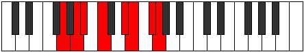 |
| [2863](https://ianring.com/musictheory/scales/2863) | [Aerogyllic](ModeENaturalAerogyllic.md) | E | E, F, F#, G, A, C, C#, D#, E |  |
| [2863](https://ianring.com/musictheory/scales/2863) | [Aerogyllic](ModeCSharpAerogyllic.md) | C# | C#, D, D#, E, F#, A, A#, C, C# |  |
| [2863](https://ianring.com/musictheory/scales/2863) | [Aerogyllic](ModeDFlatAerogyllic.md) | Db | Db, D, Eb, E, Gb, A, Bb, C, Db |  |
| [2863](https://ianring.com/musictheory/scales/2863) | [Aerogyllic](ModeGNaturalAerogyllic.md) | G | G, G#, A, A#, C, D#, E, F#, G |  |
| [2865](https://ianring.com/musictheory/scales/2865) | [Solimic](ModeENaturalSolimic.md) | E | E, F###, G##, A###, B##, C###, E |  |
| [2867](https://ianring.com/musictheory/scales/2867) | [Socrian](ModeENaturalSocrian.md) | E | E, F, G#, A, B#, C#, D#, E |  |
| [2869](https://ianring.com/musictheory/scales/2869) | [Phrothian](ModeENaturalPhrothian.md) | E | E, F#, G#, A, B#, C#, D#, E |  |
| [2869](https://ianring.com/musictheory/scales/2869) | [Phrothian](ModeGNaturalPhrothian.md) | G | G, A, B, C, D#, E, F#, G |  |
| [2871](https://ianring.com/musictheory/scales/2871) | [Stanyllic](ModeENaturalStanyllic.md) | E | E, F, F#, G#, A, C, C#, D#, E |  |
| [2871](https://ianring.com/musictheory/scales/2871) | [Stanyllic](ModeGNaturalStanyllic.md) | G | G, G#, A, B, C, D#, E, F#, G |  |
| [2873](https://ianring.com/musictheory/scales/2873) | [Docrian](ModeENaturalDocrian.md) | E | E, F##, G#, A, B#, C#, D#, E |  |
| [2873](https://ianring.com/musictheory/scales/2873) | [Docrian](ModeCNaturalDocrian.md) | C | C, D#, E, F, G#, A, B, C |  |
| [2875](https://ianring.com/musictheory/scales/2875) | [Ganyllic](ModeENaturalGanyllic.md) | E | E, F, G, G#, A, C, C#, D#, E |  |
| [2875](https://ianring.com/musictheory/scales/2875) | [Ganyllic](ModeCNaturalGanyllic.md) | C | C, C#, D#, E, F, G#, A, B, C |  |
| [2877](https://ianring.com/musictheory/scales/2877) | [Phrylyllic](ModeENaturalPhrylyllic.md) | E | E, F#, G, G#, A, C, C#, D#, E |  |
| [2877](https://ianring.com/musictheory/scales/2877) | [Phrylyllic](ModeCSharpPhrylyllic.md) | C# | C#, D#, E, F, F#, A, A#, C, C# | 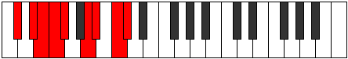 |
| [2877](https://ianring.com/musictheory/scales/2877) | [Phrylyllic](ModeDFlatPhrylyllic.md) | Db | Db, Eb, E, F, Gb, A, Bb, C, Db |  |
| [2877](https://ianring.com/musictheory/scales/2877) | [Phrylyllic](ModeCNaturalPhrylyllic.md) | C | C, D, D#, E, F, G#, A, B, C |  |
| [2877](https://ianring.com/musictheory/scales/2877) | [Phrylyllic](ModeGNaturalPhrylyllic.md) | G | G, A, A#, B, C, D#, E, F#, G |  |
| [2879](https://ianring.com/musictheory/scales/2879) | [Stadygic](ModeENaturalStadygic.md) | E | E, F, F#, G, G#, A, C, C#, D#, E |  |
| [2879](https://ianring.com/musictheory/scales/2879) | [Stadygic](ModeCSharpStadygic.md) | C# | C#, D, D#, E, F, F#, A, A#, C, C# |  |
| [2879](https://ianring.com/musictheory/scales/2879) | [Stadygic](ModeDFlatStadygic.md) | Db | Db, D, Eb, E, F, Gb, A, Bb, C, Db |  |
| [2879](https://ianring.com/musictheory/scales/2879) | [Stadygic](ModeCNaturalStadygic.md) | C | C, C#, D, D#, E, F, G#, A, B, C |  |
| [2879](https://ianring.com/musictheory/scales/2879) | [Stadygic](ModeGNaturalStadygic.md) | G | G, G#, A, A#, B, C, D#, E, F#, G |  |
| [2887](https://ianring.com/musictheory/scales/2887) | [Gaptian](ModeDSharpGaptian.md) | D# | D#, E, F, G##, A##, B#, C##, D# |  |
| [2887](https://ianring.com/musictheory/scales/2887) | [Gaptian](ModeEFlatGaptian.md) | Eb | Eb, Fb, Gbb, A, B, C, D, Eb |  |
| [2891](https://ianring.com/musictheory/scales/2891) | [Phrogian](ModeDSharpPhrogian.md) | D# | D#, E, F#, G##, A##, B#, C##, D# |  |
| [2891](https://ianring.com/musictheory/scales/2891) | [Phrogian](ModeEFlatPhrogian.md) | Eb | Eb, Fb, Gb, A, B, C, D, Eb |  |
| [2893](https://ianring.com/musictheory/scales/2893) | [Lylian](ModeCSharpLylian.md) | C# | C#, D#, E, F##, G##, A#, B#, C# |  |
| [2893](https://ianring.com/musictheory/scales/2893) | [Lylian](ModeDFlatLylian.md) | Db | Db, Eb, Fb, G, A, Bb, C, Db |  |
| [2895](https://ianring.com/musictheory/scales/2895) | [Aeragyllic](ModeCSharpAeragyllic.md) | C# | C#, D, D#, E, G, A, A#, C, C# |  |
| [2895](https://ianring.com/musictheory/scales/2895) | [Aeragyllic](ModeDFlatAeragyllic.md) | Db | Db, D, Eb, E, G, A, Bb, C, Db |  |
| [2895](https://ianring.com/musictheory/scales/2895) | [Aeragyllic](ModeDSharpAeragyllic.md) | D# | D#, E, F, F#, A, B, C, D, D# |  |
| [2895](https://ianring.com/musictheory/scales/2895) | [Aeragyllic](ModeEFlatAeragyllic.md) | Eb | Eb, E, F, Gb, A, B, C, D, Eb |  |
| [2899](https://ianring.com/musictheory/scales/2899) | [Kagian](ModeDSharpKagian.md) | D# | D#, E, F##, G##, A##, B#, C##, D# |  |
| [2899](https://ianring.com/musictheory/scales/2899) | [Kagian](ModeEFlatKagian.md) | Eb | Eb, Fb, G, A, B, C, D, Eb |  |
| [2903](https://ianring.com/musictheory/scales/2903) | [Gothyllic](ModeDSharpGothyllic.md) | D# | D#, E, F, G, A, B, C, D, D# |  |
| [2903](https://ianring.com/musictheory/scales/2903) | [Gothyllic](ModeEFlatGothyllic.md) | Eb | Eb, E, F, G, A, B, C, D, Eb |  |
| [2905](https://ianring.com/musictheory/scales/2905) | [Palian](ModeCNaturalPalian.md) | C | C, D#, E, F#, G#, A, B, C |  |
| [2907](https://ianring.com/musictheory/scales/2907) | [Mogyllic](ModeDSharpMogyllic.md) | D# | D#, E, F#, G, A, B, C, D, D# |  |
| [2907](https://ianring.com/musictheory/scales/2907) | [Mogyllic](ModeEFlatMogyllic.md) | Eb | Eb, E, Gb, G, A, B, C, D, Eb |  |
| [2907](https://ianring.com/musictheory/scales/2907) | [Mogyllic](ModeCNaturalMogyllic.md) | C | C, C#, D#, E, F#, G#, A, B, C |  |
| [2909](https://ianring.com/musictheory/scales/2909) | [Mocryllic](ModeCSharpMocryllic.md) | C# | C#, D#, E, F, G, A, A#, C, C# |  |
| [2909](https://ianring.com/musictheory/scales/2909) | [Mocryllic](ModeDFlatMocryllic.md) | Db | Db, Eb, E, F, G, A, Bb, C, Db |  |
| [2909](https://ianring.com/musictheory/scales/2909) | [Mocryllic](ModeCNaturalMocryllic.md) | C | C, D, D#, E, F#, G#, A, B, C |  |
| [2911](https://ianring.com/musictheory/scales/2911) | [Katygic](ModeCSharpKatygic.md) | C# | C#, D, D#, E, F, G, A, A#, C, C# |  |
| [2911](https://ianring.com/musictheory/scales/2911) | [Katygic](ModeDFlatKatygic.md) | Db | Db, D, Eb, E, F, G, A, Bb, C, Db |  |
| [2911](https://ianring.com/musictheory/scales/2911) | [Katygic](ModeDSharpKatygic.md) | D# | D#, E, F, F#, G, A, B, C, D, D# |  |
| [2911](https://ianring.com/musictheory/scales/2911) | [Katygic](ModeEFlatKatygic.md) | Eb | Eb, E, F, Gb, G, A, B, C, D, Eb |  |
| [2911](https://ianring.com/musictheory/scales/2911) | [Katygic](ModeCNaturalKatygic.md) | C | C, C#, D, D#, E, F#, G#, A, B, C |  |
| [2915](https://ianring.com/musictheory/scales/2915) | [Aeolydian](ModeENaturalAeolydian.md) | E | E, F, G##, A#, B#, C#, D#, E |  |
| [2915](https://ianring.com/musictheory/scales/2915) | [Aeolydian](ModeDSharpAeolydian.md) | D# | D#, E, F###, G##, A##, B#, C##, D# |  |
| [2915](https://ianring.com/musictheory/scales/2915) | [Aeolydian](ModeEFlatAeolydian.md) | Eb | Eb, Fb, G#, A, B, C, D, Eb |  |
| [2917](https://ianring.com/musictheory/scales/2917) | [Kocrian](ModeGNaturalKocrian.md) | G | G, A, B#, C#, D#, E, F#, G |  |
| [2917](https://ianring.com/musictheory/scales/2917) | [Kocrian](ModeENaturalKocrian.md) | E | E, F#, G##, A#, B#, C#, D#, E |  |
| [2917](https://ianring.com/musictheory/scales/2917) | [Kocrian](ModeBFlatKocrian.md) | Bb | Bb, C, D#, E, F#, G, A, Bb |  |
| [2919](https://ianring.com/musictheory/scales/2919) | [Molyllic](ModeGNaturalMolyllic.md) | G | G, G#, A, C, C#, D#, E, F#, G |  |
| [2919](https://ianring.com/musictheory/scales/2919) | [Molyllic](ModeENaturalMolyllic.md) | E | E, F, F#, A, A#, C, C#, D#, E | 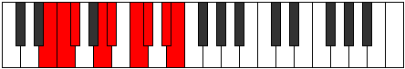 |
| [2919](https://ianring.com/musictheory/scales/2919) | [Molyllic](ModeDSharpMolyllic.md) | D# | D#, E, F, G#, A, B, C, D, D# |  |
| [2919](https://ianring.com/musictheory/scales/2919) | [Molyllic](ModeEFlatMolyllic.md) | Eb | Eb, E, F, Ab, A, B, C, D, Eb |  |
| [2919](https://ianring.com/musictheory/scales/2919) | [Molyllic](ModeASharpMolyllic.md) | A# | A#, B, C, D#, E, F#, G, A, A# |  |
| [2919](https://ianring.com/musictheory/scales/2919) | [Molyllic](ModeBFlatMolyllic.md) | Bb | Bb, B, C, Eb, E, Gb, G, A, Bb |  |
| [2921](https://ianring.com/musictheory/scales/2921) | [Pogian](ModeENaturalPogian.md) | E | E, F##, G##, A#, B#, C#, D#, E | 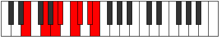 |
| [2923](https://ianring.com/musictheory/scales/2923) | [Baryllic](ModeENaturalBaryllic.md) | E | E, F, G, A, A#, C, C#, D#, E |  |
| [2923](https://ianring.com/musictheory/scales/2923) | [Baryllic](ModeDSharpBaryllic.md) | D# | D#, E, F#, G#, A, B, C, D, D# |  |
| [2923](https://ianring.com/musictheory/scales/2923) | [Baryllic](ModeEFlatBaryllic.md) | Eb | Eb, E, Gb, Ab, A, B, C, D, Eb |  |
| [2925](https://ianring.com/musictheory/scales/2925) | [MajorDiminished](ModeCSharpMajorDiminished.md) | C# | C#, D#, E, F#, G, A, A#, C, C# |  |
| [2925](https://ianring.com/musictheory/scales/2925) | [MajorDiminished](ModeDFlatMajorDiminished.md) | Db | Db, Eb, E, Gb, G, A, Bb, C, Db |  |
| [2925](https://ianring.com/musictheory/scales/2925) | [MajorDiminished](ModeENaturalMajorDiminished.md) | E | E, F#, G, A, A#, C, C#, D#, E |  |
| [2925](https://ianring.com/musictheory/scales/2925) | [MajorDiminished](ModeGNaturalMajorDiminished.md) | G | G, A, A#, C, C#, D#, E, F#, G |  |
| [2925](https://ianring.com/musictheory/scales/2925) | [MajorDiminished](ModeASharpMajorDiminished.md) | A# | A#, C, C#, D#, E, F#, G, A, A# |  |
| [2925](https://ianring.com/musictheory/scales/2925) | [MajorDiminished](ModeBFlatMajorDiminished.md) | Bb | Bb, C, Db, Eb, E, Gb, G, A, Bb | 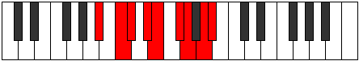 |
| [2927](https://ianring.com/musictheory/scales/2927) | [Rodygic](ModeCSharpRodygic.md) | C# | C#, D, D#, E, F#, G, A, A#, C, C# |  |
| [2927](https://ianring.com/musictheory/scales/2927) | [Rodygic](ModeDFlatRodygic.md) | Db | Db, D, Eb, E, Gb, G, A, Bb, C, Db |  |
| [2927](https://ianring.com/musictheory/scales/2927) | [Rodygic](ModeENaturalRodygic.md) | E | E, F, F#, G, A, A#, C, C#, D#, E |  |
| [2927](https://ianring.com/musictheory/scales/2927) | [Rodygic](ModeGNaturalRodygic.md) | G | G, G#, A, A#, C, C#, D#, E, F#, G |  |
| [2927](https://ianring.com/musictheory/scales/2927) | [Rodygic](ModeDSharpRodygic.md) | D# | D#, E, F, F#, G#, A, B, C, D, D# |  |
| [2927](https://ianring.com/musictheory/scales/2927) | [Rodygic](ModeEFlatRodygic.md) | Eb | Eb, E, F, Gb, Ab, A, B, C, D, Eb |  |
| [2927](https://ianring.com/musictheory/scales/2927) | [Rodygic](ModeASharpRodygic.md) | A# | A#, B, C, C#, D#, E, F#, G, A, A# |  |
| [2927](https://ianring.com/musictheory/scales/2927) | [Rodygic](ModeBFlatRodygic.md) | Bb | Bb, B, C, Db, Eb, E, Gb, G, A, Bb |  |
| [2929](https://ianring.com/musictheory/scales/2929) | [Aeolathian](ModeENaturalAeolathian.md) | E | E, F###, G##, A#, B#, C#, D#, E |  |
| [2931](https://ianring.com/musictheory/scales/2931) | [Zathyllic](ModeENaturalZathyllic.md) | E | E, F, G#, A, A#, C, C#, D#, E |  |
| [2931](https://ianring.com/musictheory/scales/2931) | [Zathyllic](ModeDSharpZathyllic.md) | D# | D#, E, G, G#, A, B, C, D, D# |  |
| [2931](https://ianring.com/musictheory/scales/2931) | [Zathyllic](ModeEFlatZathyllic.md) | Eb | Eb, E, G, Ab, A, B, C, D, Eb |  |
| [2933](https://ianring.com/musictheory/scales/2933) | [Dalyllic](ModeASharpDalyllic.md) | A# | A#, C, D, D#, E, F#, G, A, A# |  |
| [2933](https://ianring.com/musictheory/scales/2933) | [Dalyllic](ModeBFlatDalyllic.md) | Bb | Bb, C, D, Eb, E, Gb, G, A, Bb |  |
| [2933](https://ianring.com/musictheory/scales/2933) | [Dalyllic](ModeENaturalDalyllic.md) | E | E, F#, G#, A, A#, C, C#, D#, E |  |
| [2933](https://ianring.com/musictheory/scales/2933) | [Dalyllic](ModeGNaturalDalyllic.md) | G | G, A, B, C, C#, D#, E, F#, G |  |
| [2935](https://ianring.com/musictheory/scales/2935) | [Modygic](ModeENaturalModygic.md) | E | E, F, F#, G#, A, A#, C, C#, D#, E |  |
| [2935](https://ianring.com/musictheory/scales/2935) | [Modygic](ModeDSharpModygic.md) | D# | D#, E, F, G, G#, A, B, C, D, D# |  |
| [2935](https://ianring.com/musictheory/scales/2935) | [Modygic](ModeEFlatModygic.md) | Eb | Eb, E, F, G, Ab, A, B, C, D, Eb |  |
| [2935](https://ianring.com/musictheory/scales/2935) | [Modygic](ModeGNaturalModygic.md) | G | G, G#, A, B, C, C#, D#, E, F#, G |  |
| [2935](https://ianring.com/musictheory/scales/2935) | [Modygic](ModeASharpModygic.md) | A# | A#, B, C, D, D#, E, F#, G, A, A# |  |
| [2935](https://ianring.com/musictheory/scales/2935) | [Modygic](ModeBFlatModygic.md) | Bb | Bb, B, C, D, Eb, E, Gb, G, A, Bb |  |
| [2937](https://ianring.com/musictheory/scales/2937) | [Aeolathyllic](ModeENaturalAeolathyllic.md) | E | E, G, G#, A, A#, C, C#, D#, E |  |
| [2937](https://ianring.com/musictheory/scales/2937) | [Aeolathyllic](ModeCNaturalAeolathyllic.md) | C | C, D#, E, F, F#, G#, A, B, C |  |
| [2939](https://ianring.com/musictheory/scales/2939) | [Goptygic](ModeENaturalGoptygic.md) | E | E, F, G, G#, A, A#, C, C#, D#, E |  |
| [2939](https://ianring.com/musictheory/scales/2939) | [Goptygic](ModeCNaturalGoptygic.md) | C | C, C#, D#, E, F, F#, G#, A, B, C |  |
| [2939](https://ianring.com/musictheory/scales/2939) | [Goptygic](ModeDSharpGoptygic.md) | D# | D#, E, F#, G, G#, A, B, C, D, D# |  |
| [2939](https://ianring.com/musictheory/scales/2939) | [Goptygic](ModeEFlatGoptygic.md) | Eb | Eb, E, Gb, G, Ab, A, B, C, D, Eb |  |
| [2941](https://ianring.com/musictheory/scales/2941) | [Laptygic](ModeASharpLaptygic.md) | A# | A#, C, C#, D, D#, E, F#, G, A, A# |  |
| [2941](https://ianring.com/musictheory/scales/2941) | [Laptygic](ModeBFlatLaptygic.md) | Bb | Bb, C, Db, D, Eb, E, Gb, G, A, Bb |  |
| [2941](https://ianring.com/musictheory/scales/2941) | [Laptygic](ModeCSharpLaptygic.md) | C# | C#, D#, E, F, F#, G, A, A#, C, C# |  |
| [2941](https://ianring.com/musictheory/scales/2941) | [Laptygic](ModeDFlatLaptygic.md) | Db | Db, Eb, E, F, Gb, G, A, Bb, C, Db |  |
| [2941](https://ianring.com/musictheory/scales/2941) | [Laptygic](ModeENaturalLaptygic.md) | E | E, F#, G, G#, A, A#, C, C#, D#, E |  |
| [2941](https://ianring.com/musictheory/scales/2941) | [Laptygic](ModeCNaturalLaptygic.md) | C | C, D, D#, E, F, F#, G#, A, B, C |  |
| [2941](https://ianring.com/musictheory/scales/2941) | [Laptygic](ModeGNaturalLaptygic.md) | G | G, A, A#, B, C, C#, D#, E, F#, G |  |
| [2943](https://ianring.com/musictheory/scales/2943) | [Dathyllian](ModeCSharpDathyllian.md) | C# | C#, D, D#, E, F, F#, G, A, A#, C, C# |  |
| [2943](https://ianring.com/musictheory/scales/2943) | [Dathyllian](ModeDFlatDathyllian.md) | Db | Db, D, Eb, E, F, Gb, G, A, Bb, C, Db |  |
| [2943](https://ianring.com/musictheory/scales/2943) | [Dathyllian](ModeENaturalDathyllian.md) | E | E, F, F#, G, G#, A, A#, C, C#, D#, E |  |
| [2943](https://ianring.com/musictheory/scales/2943) | [Dathyllian](ModeCNaturalDathyllian.md) | C | C, C#, D, D#, E, F, F#, G#, A, B, C |  |
| [2943](https://ianring.com/musictheory/scales/2943) | [Dathyllian](ModeDSharpDathyllian.md) | D# | D#, E, F, F#, G, G#, A, B, C, D, D# |  |
| [2943](https://ianring.com/musictheory/scales/2943) | [Dathyllian](ModeEFlatDathyllian.md) | Eb | Eb, E, F, Gb, G, Ab, A, B, C, D, Eb |  |
| [2943](https://ianring.com/musictheory/scales/2943) | [Dathyllian](ModeASharpDathyllian.md) | A# | A#, B, C, C#, D, D#, E, F#, G, A, A# |  |
| [2943](https://ianring.com/musictheory/scales/2943) | [Dathyllian](ModeBFlatDathyllian.md) | Bb | Bb, B, C, Db, D, Eb, E, Gb, G, A, Bb |  |
| [2943](https://ianring.com/musictheory/scales/2943) | [Dathyllian](ModeGNaturalDathyllian.md) | G | G, G#, A, A#, B, C, C#, D#, E, F#, G |  |
| [2957](https://ianring.com/musictheory/scales/2957) | [Thygian](ModeCSharpThygian.md) | C# | C#, D#, E, F###, G##, A#, B#, C# |  |
| [2957](https://ianring.com/musictheory/scales/2957) | [Thygian](ModeDFlatThygian.md) | Db | Db, Eb, Fb, G#, A, Bb, C, Db |  |
| [2959](https://ianring.com/musictheory/scales/2959) | [Dygyllic](ModeCSharpDygyllic.md) | C# | C#, D, D#, E, G#, A, A#, C, C# |  |
| [2959](https://ianring.com/musictheory/scales/2959) | [Dygyllic](ModeDFlatDygyllic.md) | Db | Db, D, Eb, E, Ab, A, Bb, C, Db |  |
| [2963](https://ianring.com/musictheory/scales/2963) | [Bygian](ModeGSharpBygian.md) | G# | G#, A, B#, C###, D##, E#, F##, G# |  |
| [2963](https://ianring.com/musictheory/scales/2963) | [Bygian](ModeAFlatBygian.md) | Ab | Ab, Bbb, C, D#, E, F, G, Ab |  |
| [2967](https://ianring.com/musictheory/scales/2967) | [Madyllic](ModeGSharpMadyllic.md) | G# | G#, A, A#, C, D#, E, F, G, G# | 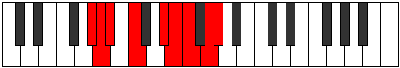 |
| [2967](https://ianring.com/musictheory/scales/2967) | [Madyllic](ModeAFlatMadyllic.md) | Ab | Ab, A, Bb, C, Eb, E, F, G, Ab |  |
| [2969](https://ianring.com/musictheory/scales/2969) | [Tholian](ModeCNaturalTholian.md) | C | C, D#, E, F##, G#, A, B, C |  |
| [2971](https://ianring.com/musictheory/scales/2971) | [Aeolynyllic](ModeCNaturalAeolynyllic.md) | C | C, C#, D#, E, G, G#, A, B, C |  |
| [2971](https://ianring.com/musictheory/scales/2971) | [Aeolynyllic](ModeGSharpAeolynyllic.md) | G# | G#, A, B, C, D#, E, F, G, G# |  |
| [2971](https://ianring.com/musictheory/scales/2971) | [Aeolynyllic](ModeAFlatAeolynyllic.md) | Ab | Ab, A, B, C, Eb, E, F, G, Ab |  |
| [2973](https://ianring.com/musictheory/scales/2973) | [Panyllic](ModeCSharpPanyllic.md) | C# | C#, D#, E, F, G#, A, A#, C, C# |  |
| [2973](https://ianring.com/musictheory/scales/2973) | [Panyllic](ModeDFlatPanyllic.md) | Db | Db, Eb, E, F, Ab, A, Bb, C, Db |  |
| [2973](https://ianring.com/musictheory/scales/2973) | [Panyllic](ModeCNaturalPanyllic.md) | C | C, D, D#, E, G, G#, A, B, C |  |
| [2975](https://ianring.com/musictheory/scales/2975) | [Gaptygic](ModeCSharpGaptygic.md) | C# | C#, D, D#, E, F, G#, A, A#, C, C# |  |
| [2975](https://ianring.com/musictheory/scales/2975) | [Gaptygic](ModeDFlatGaptygic.md) | Db | Db, D, Eb, E, F, Ab, A, Bb, C, Db |  |
| [2975](https://ianring.com/musictheory/scales/2975) | [Gaptygic](ModeCNaturalGaptygic.md) | C | C, C#, D, D#, E, G, G#, A, B, C |  |
| [2975](https://ianring.com/musictheory/scales/2975) | [Gaptygic](ModeGSharpGaptygic.md) | G# | G#, A, A#, B, C, D#, E, F, G, G# |  |
| [2975](https://ianring.com/musictheory/scales/2975) | [Gaptygic](ModeAFlatGaptygic.md) | Ab | Ab, A, Bb, B, C, Eb, E, F, G, Ab |  |
| [2979](https://ianring.com/musictheory/scales/2979) | [Gyptian](ModeENaturalGyptian.md) | E | E, F, G##, A##, B#, C#, D#, E |  |
| [2981](https://ianring.com/musictheory/scales/2981) | [Ionolian](ModeGNaturalIonolian.md) | G | G, A, B#, C##, D#, E, F#, G |  |
| [2981](https://ianring.com/musictheory/scales/2981) | [Ionolian](ModeENaturalIonolian.md) | E | E, F#, G##, A##, B#, C#, D#, E |  |
| [2983](https://ianring.com/musictheory/scales/2983) | [Zythyllic](ModeGNaturalZythyllic.md) | G | G, G#, A, C, D, D#, E, F#, G |  |
| [2983](https://ianring.com/musictheory/scales/2983) | [Zythyllic](ModeENaturalZythyllic.md) | E | E, F, F#, A, B, C, C#, D#, E |  |
| [2985](https://ianring.com/musictheory/scales/2985) | [Epacrian](ModeENaturalEpacrian.md) | E | E, F##, G##, A##, B#, C#, D#, E | 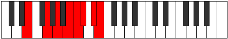 |
| [2987](https://ianring.com/musictheory/scales/2987) | [Thanyllic](ModeENaturalThanyllic.md) | E | E, F, G, A, B, C, C#, D#, E |  |
| [2989](https://ianring.com/musictheory/scales/2989) | [Ionacryllic](ModeGNaturalIonacryllic.md) | G | G, A, A#, C, D, D#, E, F#, G |  |
| [2989](https://ianring.com/musictheory/scales/2989) | [Ionacryllic](ModeCSharpIonacryllic.md) | C# | C#, D#, E, F#, G#, A, A#, C, C# |  |
| [2989](https://ianring.com/musictheory/scales/2989) | [Ionacryllic](ModeDFlatIonacryllic.md) | Db | Db, Eb, E, Gb, Ab, A, Bb, C, Db |  |
| [2989](https://ianring.com/musictheory/scales/2989) | [Ionacryllic](ModeENaturalIonacryllic.md) | E | E, F#, G, A, B, C, C#, D#, E |  |
| [2991](https://ianring.com/musictheory/scales/2991) | [Zanygic](ModeCSharpZanygic.md) | C# | C#, D, D#, E, F#, G#, A, A#, C, C# |  |
| [2991](https://ianring.com/musictheory/scales/2991) | [Zanygic](ModeDFlatZanygic.md) | Db | Db, D, Eb, E, Gb, Ab, A, Bb, C, Db |  |
| [2991](https://ianring.com/musictheory/scales/2991) | [Zanygic](ModeGNaturalZanygic.md) | G | G, G#, A, A#, C, D, D#, E, F#, G |  |
| [2991](https://ianring.com/musictheory/scales/2991) | [Zanygic](ModeENaturalZanygic.md) | E | E, F, F#, G, A, B, C, C#, D#, E |  |
| [2993](https://ianring.com/musictheory/scales/2993) | [Stythian](ModeENaturalStythian.md) | E | E, F###, G##, A##, B#, C#, D#, E |  |
| [2995](https://ianring.com/musictheory/scales/2995) | [Sanyllic](ModeGSharpSanyllic.md) | G# | G#, A, C, C#, D#, E, F, G, G# |  |
| [2995](https://ianring.com/musictheory/scales/2995) | [Sanyllic](ModeAFlatSanyllic.md) | Ab | Ab, A, C, Db, Eb, E, F, G, Ab |  |
| [2995](https://ianring.com/musictheory/scales/2995) | [Sanyllic](ModeENaturalSanyllic.md) | E | E, F, G#, A, B, C, C#, D#, E |  |
| [2997](https://ianring.com/musictheory/scales/2997) | [Ionoptyllic](ModeGNaturalIonoptyllic.md) | G | G, A, B, C, D, D#, E, F#, G |  |
| [2997](https://ianring.com/musictheory/scales/2997) | [Ionoptyllic](ModeENaturalIonoptyllic.md) | E | E, F#, G#, A, B, C, C#, D#, E |  |
| [2999](https://ianring.com/musictheory/scales/2999) | [Zyrygic](ModeGSharpZyrygic.md) | G# | G#, A, A#, C, C#, D#, E, F, G, G# |  |
| [2999](https://ianring.com/musictheory/scales/2999) | [Zyrygic](ModeAFlatZyrygic.md) | Ab | Ab, A, Bb, C, Db, Eb, E, F, G, Ab |  |
| [2999](https://ianring.com/musictheory/scales/2999) | [Zyrygic](ModeENaturalZyrygic.md) | E | E, F, F#, G#, A, B, C, C#, D#, E |  |
| [2999](https://ianring.com/musictheory/scales/2999) | [Zyrygic](ModeGNaturalZyrygic.md) | G | G, G#, A, B, C, D, D#, E, F#, G |  |
| [3001](https://ianring.com/musictheory/scales/3001) | [Lonyllic](ModeENaturalLonyllic.md) | E | E, G, G#, A, B, C, C#, D#, E |  |
| [3001](https://ianring.com/musictheory/scales/3001) | [Lonyllic](ModeCNaturalLonyllic.md) | C | C, D#, E, F, G, G#, A, B, C |  |
| [3003](https://ianring.com/musictheory/scales/3003) | [Zydygic](ModeCNaturalZydygic.md) | C | C, C#, D#, E, F, G, G#, A, B, C |  |
| [3003](https://ianring.com/musictheory/scales/3003) | [Zydygic](ModeENaturalZydygic.md) | E | E, F, G, G#, A, B, C, C#, D#, E |  |
| [3003](https://ianring.com/musictheory/scales/3003) | [Zydygic](ModeGSharpZydygic.md) | G# | G#, A, B, C, C#, D#, E, F, G, G# |  |
| [3003](https://ianring.com/musictheory/scales/3003) | [Zydygic](ModeAFlatZydygic.md) | Ab | Ab, A, B, C, Db, Eb, E, F, G, Ab |  |
| [3005](https://ianring.com/musictheory/scales/3005) | [Gycrygic](ModeCSharpGycrygic.md) | C# | C#, D#, E, F, F#, G#, A, A#, C, C# |  |
| [3005](https://ianring.com/musictheory/scales/3005) | [Gycrygic](ModeDFlatGycrygic.md) | Db | Db, Eb, E, F, Gb, Ab, A, Bb, C, Db |  |
| [3005](https://ianring.com/musictheory/scales/3005) | [Gycrygic](ModeCNaturalGycrygic.md) | C | C, D, D#, E, F, G, G#, A, B, C |  |
| [3005](https://ianring.com/musictheory/scales/3005) | [Gycrygic](ModeENaturalGycrygic.md) | E | E, F#, G, G#, A, B, C, C#, D#, E |  |
| [3005](https://ianring.com/musictheory/scales/3005) | [Gycrygic](ModeGNaturalGycrygic.md) | G | G, A, A#, B, C, D, D#, E, F#, G |  |
| [3007](https://ianring.com/musictheory/scales/3007) | [Zyryllian](ModeCSharpZyryllian.md) | C# | C#, D, D#, E, F, F#, G#, A, A#, C, C# |  |
| [3007](https://ianring.com/musictheory/scales/3007) | [Zyryllian](ModeDFlatZyryllian.md) | Db | Db, D, Eb, E, F, Gb, Ab, A, Bb, C, Db |  |
| [3007](https://ianring.com/musictheory/scales/3007) | [Zyryllian](ModeCNaturalZyryllian.md) | C | C, C#, D, D#, E, F, G, G#, A, B, C |  |
| [3007](https://ianring.com/musictheory/scales/3007) | [Zyryllian](ModeENaturalZyryllian.md) | E | E, F, F#, G, G#, A, B, C, C#, D#, E |  |
| [3007](https://ianring.com/musictheory/scales/3007) | [Zyryllian](ModeGSharpZyryllian.md) | G# | G#, A, A#, B, C, C#, D#, E, F, G, G# |  |
| [3007](https://ianring.com/musictheory/scales/3007) | [Zyryllian](ModeAFlatZyryllian.md) | Ab | Ab, A, Bb, B, C, Db, Eb, E, F, G, Ab |  |
| [3007](https://ianring.com/musictheory/scales/3007) | [Zyryllian](ModeGNaturalZyryllian.md) | G | G, G#, A, A#, B, C, D, D#, E, F#, G |  |
| [3015](https://ianring.com/musictheory/scales/3015) | [Laptyllic](ModeDSharpLaptyllic.md) | D# | D#, E, F, A, A#, B, C, D, D# |  |
| [3015](https://ianring.com/musictheory/scales/3015) | [Laptyllic](ModeEFlatLaptyllic.md) | Eb | Eb, E, F, A, Bb, B, C, D, Eb |  |
| [3017](https://ianring.com/musictheory/scales/3017) | [Gacrian](ModeANaturalGacrian.md) | A | A, B#, C###, D##, E#, F#, G#, A |  |
| [3019](https://ianring.com/musictheory/scales/3019) | [Mydyllic](ModeANaturalMydyllic.md) | A | A, A#, C, D#, E, F, F#, G#, A |  |
| [3019](https://ianring.com/musictheory/scales/3019) | [Mydyllic](ModeDSharpMydyllic.md) | D# | D#, E, F#, A, A#, B, C, D, D# |  |
| [3019](https://ianring.com/musictheory/scales/3019) | [Mydyllic](ModeEFlatMydyllic.md) | Eb | Eb, E, Gb, A, Bb, B, C, D, Eb |  |
| [3021](https://ianring.com/musictheory/scales/3021) | [Gyptyllic](ModeCSharpGyptyllic.md) | C# | C#, D#, E, G, G#, A, A#, C, C# |  |
| [3021](https://ianring.com/musictheory/scales/3021) | [Gyptyllic](ModeDFlatGyptyllic.md) | Db | Db, Eb, E, G, Ab, A, Bb, C, Db |  |
| [3021](https://ianring.com/musictheory/scales/3021) | [Gyptyllic](ModeANaturalGyptyllic.md) | A | A, B, C, D#, E, F, F#, G#, A |  |
| [3023](https://ianring.com/musictheory/scales/3023) | [Aeracrygic](ModeCSharpAeracrygic.md) | C# | C#, D, D#, E, G, G#, A, A#, C, C# |  |
| [3023](https://ianring.com/musictheory/scales/3023) | [Aeracrygic](ModeDFlatAeracrygic.md) | Db | Db, D, Eb, E, G, Ab, A, Bb, C, Db |  |
| [3023](https://ianring.com/musictheory/scales/3023) | [Aeracrygic](ModeDSharpAeracrygic.md) | D# | D#, E, F, F#, A, A#, B, C, D, D# |  |
| [3023](https://ianring.com/musictheory/scales/3023) | [Aeracrygic](ModeEFlatAeracrygic.md) | Eb | Eb, E, F, Gb, A, Bb, B, C, D, Eb |  |
| [3023](https://ianring.com/musictheory/scales/3023) | [Aeracrygic](ModeANaturalAeracrygic.md) | A | A, A#, B, C, D#, E, F, F#, G#, A |  |
| [3027](https://ianring.com/musictheory/scales/3027) | [Rythyllic](ModeGSharpRythyllic.md) | G# | G#, A, C, D, D#, E, F, G, G# |  |
| [3027](https://ianring.com/musictheory/scales/3027) | [Rythyllic](ModeAFlatRythyllic.md) | Ab | Ab, A, C, D, Eb, E, F, G, Ab |  |
| [3027](https://ianring.com/musictheory/scales/3027) | [Rythyllic](ModeDSharpRythyllic.md) | D# | D#, E, G, A, A#, B, C, D, D# |  |
| [3027](https://ianring.com/musictheory/scales/3027) | [Rythyllic](ModeEFlatRythyllic.md) | Eb | Eb, E, G, A, Bb, B, C, D, Eb |  |
| [3031](https://ianring.com/musictheory/scales/3031) | [Epithygic](ModeGSharpEpithygic.md) | G# | G#, A, A#, C, D, D#, E, F, G, G# |  |
| [3031](https://ianring.com/musictheory/scales/3031) | [Epithygic](ModeAFlatEpithygic.md) | Ab | Ab, A, Bb, C, D, Eb, E, F, G, Ab |  |
| [3031](https://ianring.com/musictheory/scales/3031) | [Epithygic](ModeDSharpEpithygic.md) | D# | D#, E, F, G, A, A#, B, C, D, D# |  |
| [3031](https://ianring.com/musictheory/scales/3031) | [Epithygic](ModeEFlatEpithygic.md) | Eb | Eb, E, F, G, A, Bb, B, C, D, Eb |  |
| [3033](https://ianring.com/musictheory/scales/3033) | [Doptyllic](ModeANaturalDoptyllic.md) | A | A, C, C#, D#, E, F, F#, G#, A |  |
| [3033](https://ianring.com/musictheory/scales/3033) | [Doptyllic](ModeCNaturalDoptyllic.md) | C | C, D#, E, F#, G, G#, A, B, C | 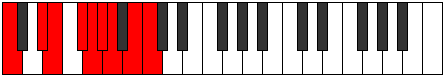 |
| [3035](https://ianring.com/musictheory/scales/3035) | [Gocrygic](ModeANaturalGocrygic.md) | A | A, A#, C, C#, D#, E, F, F#, G#, A |  |
| [3035](https://ianring.com/musictheory/scales/3035) | [Gocrygic](ModeGSharpGocrygic.md) | G# | G#, A, B, C, D, D#, E, F, G, G# |  |
| [3035](https://ianring.com/musictheory/scales/3035) | [Gocrygic](ModeAFlatGocrygic.md) | Ab | Ab, A, B, C, D, Eb, E, F, G, Ab |  |
| [3035](https://ianring.com/musictheory/scales/3035) | [Gocrygic](ModeCNaturalGocrygic.md) | C | C, C#, D#, E, F#, G, G#, A, B, C |  |
| [3035](https://ianring.com/musictheory/scales/3035) | [Gocrygic](ModeDSharpGocrygic.md) | D# | D#, E, F#, G, A, A#, B, C, D, D# |  |
| [3035](https://ianring.com/musictheory/scales/3035) | [Gocrygic](ModeEFlatGocrygic.md) | Eb | Eb, E, Gb, G, A, Bb, B, C, D, Eb |  |
| [3037](https://ianring.com/musictheory/scales/3037) | [Staptygic](ModeCSharpStaptygic.md) | C# | C#, D#, E, F, G, G#, A, A#, C, C# |  |
| [3037](https://ianring.com/musictheory/scales/3037) | [Staptygic](ModeDFlatStaptygic.md) | Db | Db, Eb, E, F, G, Ab, A, Bb, C, Db |  |
| [3037](https://ianring.com/musictheory/scales/3037) | [Staptygic](ModeANaturalStaptygic.md) | A | A, B, C, C#, D#, E, F, F#, G#, A |  |
| [3037](https://ianring.com/musictheory/scales/3037) | [Staptygic](ModeCNaturalStaptygic.md) | C | C, D, D#, E, F#, G, G#, A, B, C |  |
| [3039](https://ianring.com/musictheory/scales/3039) | [Godyllian](ModeCSharpGodyllian.md) | C# | C#, D, D#, E, F, G, G#, A, A#, C, C# |  |
| [3039](https://ianring.com/musictheory/scales/3039) | [Godyllian](ModeDFlatGodyllian.md) | Db | Db, D, Eb, E, F, G, Ab, A, Bb, C, Db |  |
| [3039](https://ianring.com/musictheory/scales/3039) | [Godyllian](ModeCNaturalGodyllian.md) | C | C, C#, D, D#, E, F#, G, G#, A, B, C |  |
| [3039](https://ianring.com/musictheory/scales/3039) | [Godyllian](ModeDSharpGodyllian.md) | D# | D#, E, F, F#, G, A, A#, B, C, D, D# |  |
| [3039](https://ianring.com/musictheory/scales/3039) | [Godyllian](ModeEFlatGodyllian.md) | Eb | Eb, E, F, Gb, G, A, Bb, B, C, D, Eb |  |
| [3039](https://ianring.com/musictheory/scales/3039) | [Godyllian](ModeANaturalGodyllian.md) | A | A, A#, B, C, C#, D#, E, F, F#, G#, A |  |
| [3039](https://ianring.com/musictheory/scales/3039) | [Godyllian](ModeGSharpGodyllian.md) | G# | G#, A, A#, B, C, D, D#, E, F, G, G# |  |
| [3039](https://ianring.com/musictheory/scales/3039) | [Godyllian](ModeAFlatGodyllian.md) | Ab | Ab, A, Bb, B, C, D, Eb, E, F, G, Ab |  |
| [3043](https://ianring.com/musictheory/scales/3043) | [Ionayllic](ModeENaturalIonayllic.md) | E | E, F, A, A#, B, C, C#, D#, E |  |
| [3043](https://ianring.com/musictheory/scales/3043) | [Ionayllic](ModeDSharpIonayllic.md) | D# | D#, E, G#, A, A#, B, C, D, D# |  |
| [3043](https://ianring.com/musictheory/scales/3043) | [Ionayllic](ModeEFlatIonayllic.md) | Eb | Eb, E, Ab, A, Bb, B, C, D, Eb |  |
| [3045](https://ianring.com/musictheory/scales/3045) | [Raptyllic](ModeGNaturalRaptyllic.md) | G | G, A, C, C#, D, D#, E, F#, G |  |
| [3045](https://ianring.com/musictheory/scales/3045) | [Raptyllic](ModeASharpRaptyllic.md) | A# | A#, C, D#, E, F, F#, G, A, A# |  |
| [3045](https://ianring.com/musictheory/scales/3045) | [Raptyllic](ModeBFlatRaptyllic.md) | Bb | Bb, C, Eb, E, F, Gb, G, A, Bb |  |
| [3045](https://ianring.com/musictheory/scales/3045) | [Raptyllic](ModeENaturalRaptyllic.md) | E | E, F#, A, A#, B, C, C#, D#, E |  |
| [3047](https://ianring.com/musictheory/scales/3047) | [Panygic](ModeGNaturalPanygic.md) | G | G, G#, A, C, C#, D, D#, E, F#, G |  |
| [3047](https://ianring.com/musictheory/scales/3047) | [Panygic](ModeENaturalPanygic.md) | E | E, F, F#, A, A#, B, C, C#, D#, E |  |
| [3047](https://ianring.com/musictheory/scales/3047) | [Panygic](ModeASharpPanygic.md) | A# | A#, B, C, D#, E, F, F#, G, A, A# |  |
| [3047](https://ianring.com/musictheory/scales/3047) | [Panygic](ModeBFlatPanygic.md) | Bb | Bb, B, C, Eb, E, F, Gb, G, A, Bb |  |
| [3047](https://ianring.com/musictheory/scales/3047) | [Panygic](ModeDSharpPanygic.md) | D# | D#, E, F, G#, A, A#, B, C, D, D# |  |
| [3047](https://ianring.com/musictheory/scales/3047) | [Panygic](ModeEFlatPanygic.md) | Eb | Eb, E, F, Ab, A, Bb, B, C, D, Eb |  |
| [3049](https://ianring.com/musictheory/scales/3049) | [Aeronyllic](ModeANaturalAeronyllic.md) | A | A, C, D, D#, E, F, F#, G#, A |  |
| [3049](https://ianring.com/musictheory/scales/3049) | [Aeronyllic](ModeENaturalAeronyllic.md) | E | E, G, A, A#, B, C, C#, D#, E |  |
| [3051](https://ianring.com/musictheory/scales/3051) | [Stalygic](ModeANaturalStalygic.md) | A | A, A#, C, D, D#, E, F, F#, G#, A |  |
| [3051](https://ianring.com/musictheory/scales/3051) | [Stalygic](ModeENaturalStalygic.md) | E | E, F, G, A, A#, B, C, C#, D#, E |  |
| [3051](https://ianring.com/musictheory/scales/3051) | [Stalygic](ModeDSharpStalygic.md) | D# | D#, E, F#, G#, A, A#, B, C, D, D# |  |
| [3051](https://ianring.com/musictheory/scales/3051) | [Stalygic](ModeEFlatStalygic.md) | Eb | Eb, E, Gb, Ab, A, Bb, B, C, D, Eb |  |
| [3053](https://ianring.com/musictheory/scales/3053) | [Zycrygic](ModeGNaturalZycrygic.md) | G | G, A, A#, C, C#, D, D#, E, F#, G |  |
| [3053](https://ianring.com/musictheory/scales/3053) | [Zycrygic](ModeASharpZycrygic.md) | A# | A#, C, C#, D#, E, F, F#, G, A, A# |  |
| [3053](https://ianring.com/musictheory/scales/3053) | [Zycrygic](ModeBFlatZycrygic.md) | Bb | Bb, C, Db, Eb, E, F, Gb, G, A, Bb |  |
| [3053](https://ianring.com/musictheory/scales/3053) | [Zycrygic](ModeCSharpZycrygic.md) | C# | C#, D#, E, F#, G, G#, A, A#, C, C# |  |
| [3053](https://ianring.com/musictheory/scales/3053) | [Zycrygic](ModeDFlatZycrygic.md) | Db | Db, Eb, E, Gb, G, Ab, A, Bb, C, Db |  |
| [3053](https://ianring.com/musictheory/scales/3053) | [Zycrygic](ModeANaturalZycrygic.md) | A | A, B, C, D, D#, E, F, F#, G#, A |  |
| [3053](https://ianring.com/musictheory/scales/3053) | [Zycrygic](ModeENaturalZycrygic.md) | E | E, F#, G, A, A#, B, C, C#, D#, E |  |
| [3055](https://ianring.com/musictheory/scales/3055) | [Lyryllian](ModeCSharpLyryllian.md) | C# | C#, D, D#, E, F#, G, G#, A, A#, C, C# |  |
| [3055](https://ianring.com/musictheory/scales/3055) | [Lyryllian](ModeDFlatLyryllian.md) | Db | Db, D, Eb, E, Gb, G, Ab, A, Bb, C, Db |  |
| [3055](https://ianring.com/musictheory/scales/3055) | [Lyryllian](ModeGNaturalLyryllian.md) | G | G, G#, A, A#, C, C#, D, D#, E, F#, G |  |
| [3055](https://ianring.com/musictheory/scales/3055) | [Lyryllian](ModeENaturalLyryllian.md) | E | E, F, F#, G, A, A#, B, C, C#, D#, E |  |
| [3055](https://ianring.com/musictheory/scales/3055) | [Lyryllian](ModeASharpLyryllian.md) | A# | A#, B, C, C#, D#, E, F, F#, G, A, A# |  |
| [3055](https://ianring.com/musictheory/scales/3055) | [Lyryllian](ModeBFlatLyryllian.md) | Bb | Bb, B, C, Db, Eb, E, F, Gb, G, A, Bb |  |
| [3055](https://ianring.com/musictheory/scales/3055) | [Lyryllian](ModeDSharpLyryllian.md) | D# | D#, E, F, F#, G#, A, A#, B, C, D, D# |  |
| [3055](https://ianring.com/musictheory/scales/3055) | [Lyryllian](ModeEFlatLyryllian.md) | Eb | Eb, E, F, Gb, Ab, A, Bb, B, C, D, Eb |  |
| [3055](https://ianring.com/musictheory/scales/3055) | [Lyryllian](ModeANaturalLyryllian.md) | A | A, A#, B, C, D, D#, E, F, F#, G#, A |  |
| [3057](https://ianring.com/musictheory/scales/3057) | [Phroryllic](ModeENaturalPhroryllic.md) | E | E, G#, A, A#, B, C, C#, D#, E |  |
| [3059](https://ianring.com/musictheory/scales/3059) | [Madygic](ModeGSharpMadygic.md) | G# | G#, A, C, C#, D, D#, E, F, G, G# |  |
| [3059](https://ianring.com/musictheory/scales/3059) | [Madygic](ModeAFlatMadygic.md) | Ab | Ab, A, C, Db, D, Eb, E, F, G, Ab |  |
| [3059](https://ianring.com/musictheory/scales/3059) | [Madygic](ModeENaturalMadygic.md) | E | E, F, G#, A, A#, B, C, C#, D#, E |  |
| [3059](https://ianring.com/musictheory/scales/3059) | [Madygic](ModeDSharpMadygic.md) | D# | D#, E, G, G#, A, A#, B, C, D, D# |  |
| [3059](https://ianring.com/musictheory/scales/3059) | [Madygic](ModeEFlatMadygic.md) | Eb | Eb, E, G, Ab, A, Bb, B, C, D, Eb |  |
| [3061](https://ianring.com/musictheory/scales/3061) | [Apinygic](ModeASharpApinygic.md) | A# | A#, C, D, D#, E, F, F#, G, A, A# |  |
| [3061](https://ianring.com/musictheory/scales/3061) | [Apinygic](ModeBFlatApinygic.md) | Bb | Bb, C, D, Eb, E, F, Gb, G, A, Bb |  |
| [3061](https://ianring.com/musictheory/scales/3061) | [Apinygic](ModeGNaturalApinygic.md) | G | G, A, B, C, C#, D, D#, E, F#, G |  |
| [3061](https://ianring.com/musictheory/scales/3061) | [Apinygic](ModeENaturalApinygic.md) | E | E, F#, G#, A, A#, B, C, C#, D#, E |  |
| [3063](https://ianring.com/musictheory/scales/3063) | [Solyllian](ModeGSharpSolyllian.md) | G# | G#, A, A#, C, C#, D, D#, E, F, G, G# |  |
| [3063](https://ianring.com/musictheory/scales/3063) | [Solyllian](ModeAFlatSolyllian.md) | Ab | Ab, A, Bb, C, Db, D, Eb, E, F, G, Ab |  |
| [3063](https://ianring.com/musictheory/scales/3063) | [Solyllian](ModeGNaturalSolyllian.md) | G | G, G#, A, B, C, C#, D, D#, E, F#, G |  |
| [3063](https://ianring.com/musictheory/scales/3063) | [Solyllian](ModeASharpSolyllian.md) | A# | A#, B, C, D, D#, E, F, F#, G, A, A# |  |
| [3063](https://ianring.com/musictheory/scales/3063) | [Solyllian](ModeBFlatSolyllian.md) | Bb | Bb, B, C, D, Eb, E, F, Gb, G, A, Bb |  |
| [3063](https://ianring.com/musictheory/scales/3063) | [Solyllian](ModeENaturalSolyllian.md) | E | E, F, F#, G#, A, A#, B, C, C#, D#, E |  |
| [3063](https://ianring.com/musictheory/scales/3063) | [Solyllian](ModeDSharpSolyllian.md) | D# | D#, E, F, G, G#, A, A#, B, C, D, D# |  |
| [3063](https://ianring.com/musictheory/scales/3063) | [Solyllian](ModeEFlatSolyllian.md) | Eb | Eb, E, F, G, Ab, A, Bb, B, C, D, Eb |  |
| [3065](https://ianring.com/musictheory/scales/3065) | [Zothygic](ModeANaturalZothygic.md) | A | A, C, C#, D, D#, E, F, F#, G#, A |  |
| [3065](https://ianring.com/musictheory/scales/3065) | [Zothygic](ModeCNaturalZothygic.md) | C | C, D#, E, F, F#, G, G#, A, B, C |  |
| [3065](https://ianring.com/musictheory/scales/3065) | [Zothygic](ModeENaturalZothygic.md) | E | E, G, G#, A, A#, B, C, C#, D#, E |  |
| [3067](https://ianring.com/musictheory/scales/3067) | [Goptyllian](ModeANaturalGoptyllian.md) | A | A, A#, C, C#, D, D#, E, F, F#, G#, A |  |
| [3067](https://ianring.com/musictheory/scales/3067) | [Goptyllian](ModeGSharpGoptyllian.md) | G# | G#, A, B, C, C#, D, D#, E, F, G, G# |  |
| [3067](https://ianring.com/musictheory/scales/3067) | [Goptyllian](ModeAFlatGoptyllian.md) | Ab | Ab, A, B, C, Db, D, Eb, E, F, G, Ab |  |
| [3067](https://ianring.com/musictheory/scales/3067) | [Goptyllian](ModeCNaturalGoptyllian.md) | C | C, C#, D#, E, F, F#, G, G#, A, B, C |  |
| [3067](https://ianring.com/musictheory/scales/3067) | [Goptyllian](ModeENaturalGoptyllian.md) | E | E, F, G, G#, A, A#, B, C, C#, D#, E |  |
| [3067](https://ianring.com/musictheory/scales/3067) | [Goptyllian](ModeDSharpGoptyllian.md) | D# | D#, E, F#, G, G#, A, A#, B, C, D, D# |  |
| [3067](https://ianring.com/musictheory/scales/3067) | [Goptyllian](ModeEFlatGoptyllian.md) | Eb | Eb, E, Gb, G, Ab, A, Bb, B, C, D, Eb |  |
| [3069](https://ianring.com/musictheory/scales/3069) | [Bacryllian](ModeASharpBacryllian.md) | A# | A#, C, C#, D, D#, E, F, F#, G, A, A# |  |
| [3069](https://ianring.com/musictheory/scales/3069) | [Bacryllian](ModeBFlatBacryllian.md) | Bb | Bb, C, Db, D, Eb, E, F, Gb, G, A, Bb |  |
| [3069](https://ianring.com/musictheory/scales/3069) | [Bacryllian](ModeCSharpBacryllian.md) | C# | C#, D#, E, F, F#, G, G#, A, A#, C, C# |  |
| [3069](https://ianring.com/musictheory/scales/3069) | [Bacryllian](ModeDFlatBacryllian.md) | Db | Db, Eb, E, F, Gb, G, Ab, A, Bb, C, Db |  |
| [3069](https://ianring.com/musictheory/scales/3069) | [Bacryllian](ModeANaturalBacryllian.md) | A | A, B, C, C#, D, D#, E, F, F#, G#, A |  |
| [3069](https://ianring.com/musictheory/scales/3069) | [Bacryllian](ModeCNaturalBacryllian.md) | C | C, D, D#, E, F, F#, G, G#, A, B, C |  |
| [3069](https://ianring.com/musictheory/scales/3069) | [Bacryllian](ModeGNaturalBacryllian.md) | G | G, A, A#, B, C, C#, D, D#, E, F#, G |  |
| [3069](https://ianring.com/musictheory/scales/3069) | [Bacryllian](ModeENaturalBacryllian.md) | E | E, F#, G, G#, A, A#, B, C, C#, D#, E |  |
| [3071](https://ianring.com/musictheory/scales/3071) | [Solatic](ModeCSharpSolatic.md) | C# | C#, D, D#, E, F, F#, G, G#, A, A#, C, C# |  |
| [3071](https://ianring.com/musictheory/scales/3071) | [Solatic](ModeDFlatSolatic.md) | Db | Db, D, Eb, E, F, Gb, G, Ab, A, Bb, C, Db |  |
| [3071](https://ianring.com/musictheory/scales/3071) | [Solatic](ModeCNaturalSolatic.md) | C | C, C#, D, D#, E, F, F#, G, G#, A, B, C |  |
| [3071](https://ianring.com/musictheory/scales/3071) | [Solatic](ModeASharpSolatic.md) | A# | A#, B, C, C#, D, D#, E, F, F#, G, A, A# |  |
| [3071](https://ianring.com/musictheory/scales/3071) | [Solatic](ModeBFlatSolatic.md) | Bb | Bb, B, C, Db, D, Eb, E, F, Gb, G, A, Bb |  |
| [3071](https://ianring.com/musictheory/scales/3071) | [Solatic](ModeANaturalSolatic.md) | A | A, A#, B, C, C#, D, D#, E, F, F#, G#, A |  |
| [3071](https://ianring.com/musictheory/scales/3071) | [Solatic](ModeGSharpSolatic.md) | G# | G#, A, A#, B, C, C#, D, D#, E, F, G, G# |  |
| [3071](https://ianring.com/musictheory/scales/3071) | [Solatic](ModeAFlatSolatic.md) | Ab | Ab, A, Bb, B, C, Db, D, Eb, E, F, G, Ab |  |
| [3071](https://ianring.com/musictheory/scales/3071) | [Solatic](ModeGNaturalSolatic.md) | G | G, G#, A, A#, B, C, C#, D, D#, E, F#, G |  |
| [3071](https://ianring.com/musictheory/scales/3071) | [Solatic](ModeENaturalSolatic.md) | E | E, F, F#, G, G#, A, A#, B, C, C#, D#, E |  |
| [3071](https://ianring.com/musictheory/scales/3071) | [Solatic](ModeDSharpSolatic.md) | D# | D#, E, F, F#, G, G#, A, A#, B, C, D, D# |  |
| [3071](https://ianring.com/musictheory/scales/3071) | [Solatic](ModeEFlatSolatic.md) | Eb | Eb, E, F, Gb, G, Ab, A, Bb, B, C, D, Eb |  |
| [3173](https://ianring.com/musictheory/scales/3173) | [Zarimic](ModeBFlatZarimic.md) | Bb | Bb, C, D#, E, F###, G##, Bb |  |
| [3175](https://ianring.com/musictheory/scales/3175) | [Eponian](ModeASharpEponian.md) | A# | A#, B, C, D#, E, F###, G##, A# |  |
| [3175](https://ianring.com/musictheory/scales/3175) | [Eponian](ModeBFlatEponian.md) | Bb | Bb, Cb, Dbb, Eb, Fb, G#, A, Bb |  |
| [3181](https://ianring.com/musictheory/scales/3181) | [Rolian](ModeASharpRolian.md) | A# | A#, B#, C#, D#, E, F###, G##, A# |  |
| [3181](https://ianring.com/musictheory/scales/3181) | [Rolian](ModeBFlatRolian.md) | Bb | Bb, C, Db, Eb, Fb, G#, A, Bb |  |
| [3183](https://ianring.com/musictheory/scales/3183) | [Mixonyllic](ModeASharpMixonyllic.md) | A# | A#, B, C, C#, D#, E, G#, A, A# |  |
| [3183](https://ianring.com/musictheory/scales/3183) | [Mixonyllic](ModeBFlatMixonyllic.md) | Bb | Bb, B, C, Db, Eb, E, Ab, A, Bb |  |
| [3187](https://ianring.com/musictheory/scales/3187) | [Koptian](ModeBNaturalKoptian.md) | B | B, C, D#, E, F, G##, A#, B |  |
| [3189](https://ianring.com/musictheory/scales/3189) | [Aeolonian](ModeASharpAeolonian.md) | A# | A#, B#, C##, D#, E, F###, G##, A# |  |
| [3189](https://ianring.com/musictheory/scales/3189) | [Aeolonian](ModeBFlatAeolonian.md) | Bb | Bb, C, D, Eb, Fb, G#, A, Bb |  |
| [3191](https://ianring.com/musictheory/scales/3191) | [Bynyllic](ModeBNaturalBynyllic.md) | B | B, C, C#, D#, E, F, A, A#, B |  |
| [3191](https://ianring.com/musictheory/scales/3191) | [Bynyllic](ModeASharpBynyllic.md) | A# | A#, B, C, D, D#, E, G#, A, A# |  |
| [3191](https://ianring.com/musictheory/scales/3191) | [Bynyllic](ModeBFlatBynyllic.md) | Bb | Bb, B, C, D, Eb, E, Ab, A, Bb |  |
| [3195](https://ianring.com/musictheory/scales/3195) | [Raryllic](ModeBNaturalRaryllic.md) | B | B, C, D, D#, E, F, A, A#, B |  |
| [3197](https://ianring.com/musictheory/scales/3197) | [Gylyllic](ModeASharpGylyllic.md) | A# | A#, C, C#, D, D#, E, G#, A, A# |  |
| [3197](https://ianring.com/musictheory/scales/3197) | [Gylyllic](ModeBFlatGylyllic.md) | Bb | Bb, C, Db, D, Eb, E, Ab, A, Bb |  |
| [3199](https://ianring.com/musictheory/scales/3199) | [Thaptygic](ModeBNaturalThaptygic.md) | B | B, C, C#, D, D#, E, F, A, A#, B |  |
| [3199](https://ianring.com/musictheory/scales/3199) | [Thaptygic](ModeASharpThaptygic.md) | A# | A#, B, C, C#, D, D#, E, G#, A, A# |  |
| [3199](https://ianring.com/musictheory/scales/3199) | [Thaptygic](ModeBFlatThaptygic.md) | Bb | Bb, B, C, Db, D, Eb, E, Ab, A, Bb |  |
| [3215](https://ianring.com/musictheory/scales/3215) | [Katydian](ModeDNaturalKatydian.md) | D | D, Eb, Fb, Gbb, A, B#, C#, D |  |
| [3217](https://ianring.com/musictheory/scales/3217) | [Molitonic](ModeFNaturalMolitonic.md) | F | F, A, C, D#, E, F | 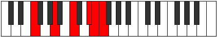 |
| [3219](https://ianring.com/musictheory/scales/3219) | [Ionaphimic](ModeFNaturalIonaphimic.md) | F | F, Gb, A, B#, C###, D##, F |  |
| [3221](https://ianring.com/musictheory/scales/3221) | [Bycrimic](ModeFNaturalBycrimic.md) | F | F, G, A, B#, C###, D##, F |  |
| [3223](https://ianring.com/musictheory/scales/3223) | [Thyphian](ModeDNaturalThyphian.md) | D | D, Eb, Fb, Gb, A, B#, C#, D |  |
| [3223](https://ianring.com/musictheory/scales/3223) | [Thyphian](ModeFNaturalThyphian.md) | F | F, Gb, Abb, Bbb, C, D#, E, F |  |
| [3225](https://ianring.com/musictheory/scales/3225) | [Ionalimic](ModeFNaturalIonalimic.md) | F | F, G#, A, B#, C###, D##, F |  |
| [3227](https://ianring.com/musictheory/scales/3227) | [Aeolocrian](ModeFNaturalAeolocrian.md) | F | F, Gb, Ab, Bbb, C, D#, E, F |  |
| [3229](https://ianring.com/musictheory/scales/3229) | [Aeolaptian](ModeFNaturalAeolaptian.md) | F | F, G, Ab, Bbb, C, D#, E, F | 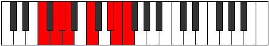 |
| [3231](https://ianring.com/musictheory/scales/3231) | [Kataptyllic](ModeDNaturalKataptyllic.md) | D | D, D#, E, F, F#, A, C, C#, D |  |
| [3231](https://ianring.com/musictheory/scales/3231) | [Kataptyllic](ModeFNaturalKataptyllic.md) | F | F, F#, G, G#, A, C, D#, E, F |  |
| [3239](https://ianring.com/musictheory/scales/3239) | [Epythian](ModeDNaturalEpythian.md) | D | D, Eb, Fb, G, A, B#, C#, D |  |
| [3247](https://ianring.com/musictheory/scales/3247) | [Aeolonyllic](ModeDNaturalAeolonyllic.md) | D | D, D#, E, F, G, A, C, C#, D |  |
| [3251](https://ianring.com/musictheory/scales/3251) | [Zodian](ModeFNaturalZodian.md) | F | F, Gb, A, Bb, C, D#, E, F |  |
| [3251](https://ianring.com/musictheory/scales/3251) | [Zodian](ModeBNaturalZodian.md) | B | B, C, D#, E, F#, G##, A#, B |  |
| [3253](https://ianring.com/musictheory/scales/3253) | [Gonian](ModeFNaturalGonian.md) | F | F, G, A, Bb, C, D#, E, F |  |
| [3255](https://ianring.com/musictheory/scales/3255) | [Daryllic](ModeDNaturalDaryllic.md) | D | D, D#, E, F#, G, A, C, C#, D |  |
| [3255](https://ianring.com/musictheory/scales/3255) | [Daryllic](ModeFNaturalDaryllic.md) | F | F, F#, G, A, A#, C, D#, E, F |  |
| [3255](https://ianring.com/musictheory/scales/3255) | [Daryllic](ModeBNaturalDaryllic.md) | B | B, C, C#, D#, E, F#, A, A#, B |  |
| [3257](https://ianring.com/musictheory/scales/3257) | [Ionacrian](ModeFNaturalIonacrian.md) | F | F, G#, A, Bb, C, D#, E, F |  |
| [3259](https://ianring.com/musictheory/scales/3259) | [Loptyllic](ModeFNaturalLoptyllic.md) | F | F, F#, G#, A, A#, C, D#, E, F |  |
| [3259](https://ianring.com/musictheory/scales/3259) | [Loptyllic](ModeBNaturalLoptyllic.md) | B | B, C, D, D#, E, F#, A, A#, B | 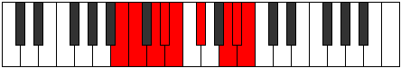 |
| [3261](https://ianring.com/musictheory/scales/3261) | [Dodyllic](ModeFNaturalDodyllic.md) | F | F, G, G#, A, A#, C, D#, E, F |  |
| [3263](https://ianring.com/musictheory/scales/3263) | [Pyrygic](ModeDNaturalPyrygic.md) | D | D, D#, E, F, F#, G, A, C, C#, D |  |
| [3263](https://ianring.com/musictheory/scales/3263) | [Pyrygic](ModeFNaturalPyrygic.md) | F | F, F#, G, G#, A, A#, C, D#, E, F |  |
| [3263](https://ianring.com/musictheory/scales/3263) | [Pyrygic](ModeBNaturalPyrygic.md) | B | B, C, C#, D, D#, E, F#, A, A#, B |  |
| [3271](https://ianring.com/musictheory/scales/3271) | [Kolian](ModeDNaturalKolian.md) | D | D, Eb, Fb, G#, A, B#, C#, D |  |
| [3273](https://ianring.com/musictheory/scales/3273) | [Ionodimic](ModeANaturalIonodimic.md) | A | A, B#, C###, D##, E###, F###, A |  |
| [3275](https://ianring.com/musictheory/scales/3275) | [Katadian](ModeANaturalKatadian.md) | A | A, Bb, C, D#, E, F##, G#, A |  |
| [3277](https://ianring.com/musictheory/scales/3277) | [Zycrian](ModeANaturalZycrian.md) | A | A, B, C, D#, E, F##, G#, A |  |
| [3279](https://ianring.com/musictheory/scales/3279) | [Pythyllic](ModeDNaturalPythyllic.md) | D | D, D#, E, F, G#, A, C, C#, D |  |
| [3279](https://ianring.com/musictheory/scales/3279) | [Pythyllic](ModeANaturalPythyllic.md) | A | A, A#, B, C, D#, E, G, G#, A |  |
| [3283](https://ianring.com/musictheory/scales/3283) | [Lyrian](ModeFNaturalLyrian.md) | F | F, Gb, A, B, C, D#, E, F |  |
| [3285](https://ianring.com/musictheory/scales/3285) | [Zagian](ModeFNaturalZagian.md) | F | F, G, A, B, C, D#, E, F |  |
| [3287](https://ianring.com/musictheory/scales/3287) | [Phrathyllic](ModeDNaturalPhrathyllic.md) | D | D, D#, E, F#, G#, A, C, C#, D |  |
| [3287](https://ianring.com/musictheory/scales/3287) | [Phrathyllic](ModeFNaturalPhrathyllic.md) | F | F, F#, G, A, B, C, D#, E, F |  |
| [3289](https://ianring.com/musictheory/scales/3289) | [Loptian](ModeANaturalLoptian.md) | A | A, B#, C#, D#, E, F##, G#, A |  |
| [3289](https://ianring.com/musictheory/scales/3289) | [Loptian](ModeFNaturalLoptian.md) | F | F, G#, A, B, C, D#, E, F |  |
| [3291](https://ianring.com/musictheory/scales/3291) | [Kodyllic](ModeANaturalKodyllic.md) | A | A, A#, C, C#, D#, E, G, G#, A | 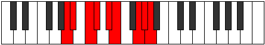 |
| [3291](https://ianring.com/musictheory/scales/3291) | [Kodyllic](ModeFNaturalKodyllic.md) | F | F, F#, G#, A, B, C, D#, E, F |  |
| [3293](https://ianring.com/musictheory/scales/3293) | [Saryllic](ModeANaturalSaryllic.md) | A | A, B, C, C#, D#, E, G, G#, A |  |
| [3293](https://ianring.com/musictheory/scales/3293) | [Saryllic](ModeFNaturalSaryllic.md) | F | F, G, G#, A, B, C, D#, E, F |  |
| [3295](https://ianring.com/musictheory/scales/3295) | [Phroptygic](ModeDNaturalPhroptygic.md) | D | D, D#, E, F, F#, G#, A, C, C#, D |  |
| [3295](https://ianring.com/musictheory/scales/3295) | [Phroptygic](ModeFNaturalPhroptygic.md) | F | F, F#, G, G#, A, B, C, D#, E, F |  |
| [3295](https://ianring.com/musictheory/scales/3295) | [Phroptygic](ModeANaturalPhroptygic.md) | A | A, A#, B, C, C#, D#, E, G, G#, A |  |
| [3301](https://ianring.com/musictheory/scales/3301) | [Phrynian](ModeBFlatPhrynian.md) | Bb | Bb, C, D#, E, F, G#, A, Bb |  |
| [3303](https://ianring.com/musictheory/scales/3303) | [Soptyllic](ModeDNaturalSoptyllic.md) | D | D, D#, E, G, G#, A, C, C#, D |  |
| [3303](https://ianring.com/musictheory/scales/3303) | [Soptyllic](ModeASharpSoptyllic.md) | A# | A#, B, C, D#, E, F, G#, A, A# |  |
| [3303](https://ianring.com/musictheory/scales/3303) | [Soptyllic](ModeBFlatSoptyllic.md) | Bb | Bb, B, C, Eb, E, F, Ab, A, Bb |  |
| [3305](https://ianring.com/musictheory/scales/3305) | [Epathian](ModeANaturalEpathian.md) | A | A, B#, C##, D#, E, F##, G#, A |  |
| [3307](https://ianring.com/musictheory/scales/3307) | [Boptyllic](ModeANaturalBoptyllic.md) | A | A, A#, C, D, D#, E, G, G#, A |  |
| [3309](https://ianring.com/musictheory/scales/3309) | [Bycryllic](ModeASharpBycryllic.md) | A# | A#, C, C#, D#, E, F, G#, A, A# |  |
| [3309](https://ianring.com/musictheory/scales/3309) | [Bycryllic](ModeBFlatBycryllic.md) | Bb | Bb, C, Db, Eb, E, F, Ab, A, Bb |  |
| [3309](https://ianring.com/musictheory/scales/3309) | [Bycryllic](ModeANaturalBycryllic.md) | A | A, B, C, D, D#, E, G, G#, A |  |
| [3311](https://ianring.com/musictheory/scales/3311) | [Mixodygic](ModeDNaturalMixodygic.md) | D | D, D#, E, F, G, G#, A, C, C#, D |  |
| [3311](https://ianring.com/musictheory/scales/3311) | [Mixodygic](ModeASharpMixodygic.md) | A# | A#, B, C, C#, D#, E, F, G#, A, A# |  |
| [3311](https://ianring.com/musictheory/scales/3311) | [Mixodygic](ModeBFlatMixodygic.md) | Bb | Bb, B, C, Db, Eb, E, F, Ab, A, Bb |  |
| [3311](https://ianring.com/musictheory/scales/3311) | [Mixodygic](ModeANaturalMixodygic.md) | A | A, A#, B, C, D, D#, E, G, G#, A |  |
| [3313](https://ianring.com/musictheory/scales/3313) | [Aeolacrian](ModeFNaturalAeolacrian.md) | F | F, G##, A#, B, C, D#, E, F | 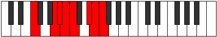 |
| [3315](https://ianring.com/musictheory/scales/3315) | [Aeralyllic](ModeFNaturalAeralyllic.md) | F | F, F#, A, A#, B, C, D#, E, F |  |
| [3315](https://ianring.com/musictheory/scales/3315) | [Aeralyllic](ModeBNaturalAeralyllic.md) | B | B, C, D#, E, F, F#, A, A#, B |  |
| [3317](https://ianring.com/musictheory/scales/3317) | [Lanyllic](ModeASharpLanyllic.md) | A# | A#, C, D, D#, E, F, G#, A, A# |  |
| [3317](https://ianring.com/musictheory/scales/3317) | [Lanyllic](ModeBFlatLanyllic.md) | Bb | Bb, C, D, Eb, E, F, Ab, A, Bb |  |
| [3317](https://ianring.com/musictheory/scales/3317) | [Lanyllic](ModeFNaturalLanyllic.md) | F | F, G, A, A#, B, C, D#, E, F |  |
| [3319](https://ianring.com/musictheory/scales/3319) | [Tholygic](ModeDNaturalTholygic.md) | D | D, D#, E, F#, G, G#, A, C, C#, D |  |
| [3319](https://ianring.com/musictheory/scales/3319) | [Tholygic](ModeBNaturalTholygic.md) | B | B, C, C#, D#, E, F, F#, A, A#, B |  |
| [3319](https://ianring.com/musictheory/scales/3319) | [Tholygic](ModeFNaturalTholygic.md) | F | F, F#, G, A, A#, B, C, D#, E, F |  |
| [3319](https://ianring.com/musictheory/scales/3319) | [Tholygic](ModeASharpTholygic.md) | A# | A#, B, C, D, D#, E, F, G#, A, A# |  |
| [3319](https://ianring.com/musictheory/scales/3319) | [Tholygic](ModeBFlatTholygic.md) | Bb | Bb, B, C, D, Eb, E, F, Ab, A, Bb |  |
| [3321](https://ianring.com/musictheory/scales/3321) | [Ionycryllic](ModeANaturalIonycryllic.md) | A | A, C, C#, D, D#, E, G, G#, A |  |
| [3321](https://ianring.com/musictheory/scales/3321) | [Ionycryllic](ModeFNaturalIonycryllic.md) | F | F, G#, A, A#, B, C, D#, E, F |  |
| [3323](https://ianring.com/musictheory/scales/3323) | [Phrygygic](ModeANaturalPhrygygic.md) | A | A, A#, C, C#, D, D#, E, G, G#, A |  |
| [3323](https://ianring.com/musictheory/scales/3323) | [Phrygygic](ModeBNaturalPhrygygic.md) | B | B, C, D, D#, E, F, F#, A, A#, B |  |
| [3323](https://ianring.com/musictheory/scales/3323) | [Phrygygic](ModeFNaturalPhrygygic.md) | F | F, F#, G#, A, A#, B, C, D#, E, F |  |
| [3325](https://ianring.com/musictheory/scales/3325) | [Epygic](ModeASharpEpygic.md) | A# | A#, C, C#, D, D#, E, F, G#, A, A# |  |
| [3325](https://ianring.com/musictheory/scales/3325) | [Epygic](ModeBFlatEpygic.md) | Bb | Bb, C, Db, D, Eb, E, F, Ab, A, Bb |  |
| [3325](https://ianring.com/musictheory/scales/3325) | [Epygic](ModeANaturalEpygic.md) | A | A, B, C, C#, D, D#, E, G, G#, A |  |
| [3325](https://ianring.com/musictheory/scales/3325) | [Epygic](ModeFNaturalEpygic.md) | F | F, G, G#, A, A#, B, C, D#, E, F |  |
| [3327](https://ianring.com/musictheory/scales/3327) | [Madyllian](ModeDNaturalMadyllian.md) | D | D, D#, E, F, F#, G, G#, A, C, C#, D |  |
| [3327](https://ianring.com/musictheory/scales/3327) | [Madyllian](ModeBNaturalMadyllian.md) | B | B, C, C#, D, D#, E, F, F#, A, A#, B |  |
| [3327](https://ianring.com/musictheory/scales/3327) | [Madyllian](ModeASharpMadyllian.md) | A# | A#, B, C, C#, D, D#, E, F, G#, A, A# |  |
| [3327](https://ianring.com/musictheory/scales/3327) | [Madyllian](ModeBFlatMadyllian.md) | Bb | Bb, B, C, Db, D, Eb, E, F, Ab, A, Bb | 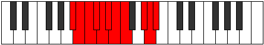 |
| [3327](https://ianring.com/musictheory/scales/3327) | [Madyllian](ModeANaturalMadyllian.md) | A | A, A#, B, C, C#, D, D#, E, G, G#, A |  |
| [3327](https://ianring.com/musictheory/scales/3327) | [Madyllian](ModeFNaturalMadyllian.md) | F | F, F#, G, G#, A, A#, B, C, D#, E, F |  |
| [3357](https://ianring.com/musictheory/scales/3357) | [Phrodian](ModeCSharpPhrodian.md) | C# | C#, D#, E, F, G##, A##, B#, C# |  |
| [3357](https://ianring.com/musictheory/scales/3357) | [Phrodian](ModeDFlatPhrodian.md) | Db | Db, Eb, Fb, Gbb, A, B, C, Db |  |
| [3359](https://ianring.com/musictheory/scales/3359) | [Bonyllic](ModeCSharpBonyllic.md) | C# | C#, D, D#, E, F, A, B, C, C# |  |
| [3359](https://ianring.com/musictheory/scales/3359) | [Bonyllic](ModeDFlatBonyllic.md) | Db | Db, D, Eb, E, F, A, B, C, Db |  |
| [3363](https://ianring.com/musictheory/scales/3363) | [Rogimic](ModeENaturalRogimic.md) | E | E, F, G##, A###, B###, C###, E |  |
| [3365](https://ianring.com/musictheory/scales/3365) | [Katolimic](ModeENaturalKatolimic.md) | E | E, F#, G##, A###, B###, C###, E |  |
| [3367](https://ianring.com/musictheory/scales/3367) | [Moptian](ModeENaturalMoptian.md) | E | E, F, Gb, A, B#, C##, D#, E |  |
| [3369](https://ianring.com/musictheory/scales/3369) | [Mixolimic](ModeENaturalMixolimic.md) | E | E, F##, G##, A###, B###, C###, E |  |
| [3371](https://ianring.com/musictheory/scales/3371) | [Aeolylian](ModeENaturalAeolylian.md) | E | E, F, G, A, B#, C##, D#, E |  |
| [3373](https://ianring.com/musictheory/scales/3373) | [Lodian](ModeENaturalLodian.md) | E | E, F#, G, A, B#, C##, D#, E |  |
| [3373](https://ianring.com/musictheory/scales/3373) | [Lodian](ModeCSharpLodian.md) | C# | C#, D#, E, F#, G##, A##, B#, C# |  |
| [3373](https://ianring.com/musictheory/scales/3373) | [Lodian](ModeDFlatLodian.md) | Db | Db, Eb, Fb, Gb, A, B, C, Db |  |
| [3375](https://ianring.com/musictheory/scales/3375) | [Kygyllic](ModeENaturalKygyllic.md) | E | E, F, F#, G, A, C, D, D#, E |  |
| [3375](https://ianring.com/musictheory/scales/3375) | [Kygyllic](ModeCSharpKygyllic.md) | C# | C#, D, D#, E, F#, A, B, C, C# |  |
| [3375](https://ianring.com/musictheory/scales/3375) | [Kygyllic](ModeDFlatKygyllic.md) | Db | Db, D, Eb, E, Gb, A, B, C, Db |  |
| [3377](https://ianring.com/musictheory/scales/3377) | [Phralimic](ModeENaturalPhralimic.md) | E | E, F###, G##, A###, B###, C###, E |  |
| [3379](https://ianring.com/musictheory/scales/3379) | [Sothian](ModeENaturalSothian.md) | E | E, F, G#, A, B#, C##, D#, E |  |
| [3379](https://ianring.com/musictheory/scales/3379) | [Sothian](ModeBNaturalSothian.md) | B | B, C, D#, E, F##, G##, A#, B |  |
| [3381](https://ianring.com/musictheory/scales/3381) | [Katanian](ModeENaturalKatanian.md) | E | E, F#, G#, A, B#, C##, D#, E |  |
| [3383](https://ianring.com/musictheory/scales/3383) | [Daptyllic](ModeENaturalDaptyllic.md) | E | E, F, F#, G#, A, C, D, D#, E |  |
| [3383](https://ianring.com/musictheory/scales/3383) | [Daptyllic](ModeBNaturalDaptyllic.md) | B | B, C, C#, D#, E, G, A, A#, B |  |
| [3385](https://ianring.com/musictheory/scales/3385) | [Rothian](ModeENaturalRothian.md) | E | E, F##, G#, A, B#, C##, D#, E | 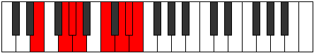 |
| [3387](https://ianring.com/musictheory/scales/3387) | [Aeryptyllic](ModeENaturalAeryptyllic.md) | E | E, F, G, G#, A, C, D, D#, E |  |
| [3387](https://ianring.com/musictheory/scales/3387) | [Aeryptyllic](ModeBNaturalAeryptyllic.md) | B | B, C, D, D#, E, G, A, A#, B |  |
| [3389](https://ianring.com/musictheory/scales/3389) | [Socryllic](ModeENaturalSocryllic.md) | E | E, F#, G, G#, A, C, D, D#, E |  |
| [3389](https://ianring.com/musictheory/scales/3389) | [Socryllic](ModeCSharpSocryllic.md) | C# | C#, D#, E, F, F#, A, B, C, C# |  |
| [3389](https://ianring.com/musictheory/scales/3389) | [Socryllic](ModeDFlatSocryllic.md) | Db | Db, Eb, E, F, Gb, A, B, C, Db |  |
| [3391](https://ianring.com/musictheory/scales/3391) | [Aeolynygic](ModeENaturalAeolynygic.md) | E | E, F, F#, G, G#, A, C, D, D#, E |  |
| [3391](https://ianring.com/musictheory/scales/3391) | [Aeolynygic](ModeCSharpAeolynygic.md) | C# | C#, D, D#, E, F, F#, A, B, C, C# |  |
| [3391](https://ianring.com/musictheory/scales/3391) | [Aeolynygic](ModeDFlatAeolynygic.md) | Db | Db, D, Eb, E, F, Gb, A, B, C, Db |  |
| [3391](https://ianring.com/musictheory/scales/3391) | [Aeolynygic](ModeBNaturalAeolynygic.md) | B | B, C, C#, D, D#, E, G, A, A#, B |  |
| [3405](https://ianring.com/musictheory/scales/3405) | [Stynian](ModeCSharpStynian.md) | C# | C#, D#, E, F##, G##, A##, B#, C# |  |
| [3405](https://ianring.com/musictheory/scales/3405) | [Stynian](ModeDFlatStynian.md) | Db | Db, Eb, Fb, G, A, B, C, Db |  |
| [3407](https://ianring.com/musictheory/scales/3407) | [Katocryllic](ModeCSharpKatocryllic.md) | C# | C#, D, D#, E, G, A, B, C, C# |  |
| [3407](https://ianring.com/musictheory/scales/3407) | [Katocryllic](ModeDFlatKatocryllic.md) | Db | Db, D, Eb, E, G, A, B, C, Db |  |
| [3421](https://ianring.com/musictheory/scales/3421) | [Aerothyllic](ModeCSharpAerothyllic.md) | C# | C#, D#, E, F, G, A, B, C, C# |  |
| [3421](https://ianring.com/musictheory/scales/3421) | [Aerothyllic](ModeDFlatAerothyllic.md) | Db | Db, Eb, E, F, G, A, B, C, Db |  |
| [3423](https://ianring.com/musictheory/scales/3423) | [Lothygic](ModeCSharpLothygic.md) | C# | C#, D, D#, E, F, G, A, B, C, C# |  |
| [3423](https://ianring.com/musictheory/scales/3423) | [Lothygic](ModeDFlatLothygic.md) | Db | Db, D, Eb, E, F, G, A, B, C, Db |  |
| [3427](https://ianring.com/musictheory/scales/3427) | [Zacrian](ModeENaturalZacrian.md) | E | E, F, G##, A#, B#, C##, D#, E |  |
| [3429](https://ianring.com/musictheory/scales/3429) | [Marian](ModeENaturalMarian.md) | E | E, F#, G##, A#, B#, C##, D#, E |  |
| [3429](https://ianring.com/musictheory/scales/3429) | [Marian](ModeBFlatMarian.md) | Bb | Bb, C, D#, E, F#, G#, A, Bb |  |
| [3431](https://ianring.com/musictheory/scales/3431) | [Zyptyllic](ModeENaturalZyptyllic.md) | E | E, F, F#, A, A#, C, D, D#, E |  |
| [3431](https://ianring.com/musictheory/scales/3431) | [Zyptyllic](ModeASharpZyptyllic.md) | A# | A#, B, C, D#, E, F#, G#, A, A# |  |
| [3431](https://ianring.com/musictheory/scales/3431) | [Zyptyllic](ModeBFlatZyptyllic.md) | Bb | Bb, B, C, Eb, E, Gb, Ab, A, Bb |  |
| [3433](https://ianring.com/musictheory/scales/3433) | [Thonian](ModeENaturalThonian.md) | E | E, F##, G##, A#, B#, C##, D#, E |  |
| [3435](https://ianring.com/musictheory/scales/3435) | [Epiphyllic](ModeENaturalEpiphyllic.md) | E | E, F, G, A, A#, C, D, D#, E |  |
| [3437](https://ianring.com/musictheory/scales/3437) | [Gathyllic](ModeENaturalGathyllic.md) | E | E, F#, G, A, A#, C, D, D#, E |  |
| [3437](https://ianring.com/musictheory/scales/3437) | [Gathyllic](ModeASharpGathyllic.md) | A# | A#, C, C#, D#, E, F#, G#, A, A# |  |
| [3437](https://ianring.com/musictheory/scales/3437) | [Gathyllic](ModeBFlatGathyllic.md) | Bb | Bb, C, Db, Eb, E, Gb, Ab, A, Bb |  |
| [3437](https://ianring.com/musictheory/scales/3437) | [Gathyllic](ModeCSharpGathyllic.md) | C# | C#, D#, E, F#, G, A, B, C, C# |  |
| [3437](https://ianring.com/musictheory/scales/3437) | [Gathyllic](ModeDFlatGathyllic.md) | Db | Db, Eb, E, Gb, G, A, B, C, Db |  |
| [3439](https://ianring.com/musictheory/scales/3439) | [Lythygic](ModeENaturalLythygic.md) | E | E, F, F#, G, A, A#, C, D, D#, E |  |
| [3439](https://ianring.com/musictheory/scales/3439) | [Lythygic](ModeCSharpLythygic.md) | C# | C#, D, D#, E, F#, G, A, B, C, C# |  |
| [3439](https://ianring.com/musictheory/scales/3439) | [Lythygic](ModeDFlatLythygic.md) | Db | Db, D, Eb, E, Gb, G, A, B, C, Db |  |
| [3439](https://ianring.com/musictheory/scales/3439) | [Lythygic](ModeASharpLythygic.md) | A# | A#, B, C, C#, D#, E, F#, G#, A, A# |  |
| [3439](https://ianring.com/musictheory/scales/3439) | [Lythygic](ModeBFlatLythygic.md) | Bb | Bb, B, C, Db, Eb, E, Gb, Ab, A, Bb |  |
| [3441](https://ianring.com/musictheory/scales/3441) | [Thacrian](ModeENaturalThacrian.md) | E | E, F###, G##, A#, B#, C##, D#, E |  |
| [3443](https://ianring.com/musictheory/scales/3443) | [Epathyllic](ModeENaturalEpathyllic.md) | E | E, F, G#, A, A#, C, D, D#, E |  |
| [3443](https://ianring.com/musictheory/scales/3443) | [Epathyllic](ModeBNaturalEpathyllic.md) | B | B, C, D#, E, F, G, A, A#, B | 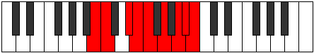 |
| [3445](https://ianring.com/musictheory/scales/3445) | [Epotyllic](ModeENaturalEpotyllic.md) | E | E, F#, G#, A, A#, C, D, D#, E |  |
| [3445](https://ianring.com/musictheory/scales/3445) | [Epotyllic](ModeASharpEpotyllic.md) | A# | A#, C, D, D#, E, F#, G#, A, A# |  |
| [3445](https://ianring.com/musictheory/scales/3445) | [Epotyllic](ModeBFlatEpotyllic.md) | Bb | Bb, C, D, Eb, E, Gb, Ab, A, Bb |  |
| [3447](https://ianring.com/musictheory/scales/3447) | [Kynygic](ModeENaturalKynygic.md) | E | E, F, F#, G#, A, A#, C, D, D#, E |  |
| [3447](https://ianring.com/musictheory/scales/3447) | [Kynygic](ModeBNaturalKynygic.md) | B | B, C, C#, D#, E, F, G, A, A#, B |  |
| [3447](https://ianring.com/musictheory/scales/3447) | [Kynygic](ModeASharpKynygic.md) | A# | A#, B, C, D, D#, E, F#, G#, A, A# |  |
| [3447](https://ianring.com/musictheory/scales/3447) | [Kynygic](ModeBFlatKynygic.md) | Bb | Bb, B, C, D, Eb, E, Gb, Ab, A, Bb |  |
| [3449](https://ianring.com/musictheory/scales/3449) | [Bacryllic](ModeENaturalBacryllic.md) | E | E, G, G#, A, A#, C, D, D#, E |  |
| [3451](https://ianring.com/musictheory/scales/3451) | [Garygic](ModeENaturalGarygic.md) | E | E, F, G, G#, A, A#, C, D, D#, E |  |
| [3451](https://ianring.com/musictheory/scales/3451) | [Garygic](ModeBNaturalGarygic.md) | B | B, C, D, D#, E, F, G, A, A#, B |  |
| [3453](https://ianring.com/musictheory/scales/3453) | [Katarygic](ModeASharpKatarygic.md) | A# | A#, C, C#, D, D#, E, F#, G#, A, A# |  |
| [3453](https://ianring.com/musictheory/scales/3453) | [Katarygic](ModeBFlatKatarygic.md) | Bb | Bb, C, Db, D, Eb, E, Gb, Ab, A, Bb |  |
| [3453](https://ianring.com/musictheory/scales/3453) | [Katarygic](ModeENaturalKatarygic.md) | E | E, F#, G, G#, A, A#, C, D, D#, E |  |
| [3453](https://ianring.com/musictheory/scales/3453) | [Katarygic](ModeCSharpKatarygic.md) | C# | C#, D#, E, F, F#, G, A, B, C, C# |  |
| [3453](https://ianring.com/musictheory/scales/3453) | [Katarygic](ModeDFlatKatarygic.md) | Db | Db, Eb, E, F, Gb, G, A, B, C, Db |  |
| [3455](https://ianring.com/musictheory/scales/3455) | [Ryptyllian](ModeENaturalRyptyllian.md) | E | E, F, F#, G, G#, A, A#, C, D, D#, E |  |
| [3455](https://ianring.com/musictheory/scales/3455) | [Ryptyllian](ModeCSharpRyptyllian.md) | C# | C#, D, D#, E, F, F#, G, A, B, C, C# |  |
| [3455](https://ianring.com/musictheory/scales/3455) | [Ryptyllian](ModeDFlatRyptyllian.md) | Db | Db, D, Eb, E, F, Gb, G, A, B, C, Db |  |
| [3455](https://ianring.com/musictheory/scales/3455) | [Ryptyllian](ModeBNaturalRyptyllian.md) | B | B, C, C#, D, D#, E, F, G, A, A#, B |  |
| [3455](https://ianring.com/musictheory/scales/3455) | [Ryptyllian](ModeASharpRyptyllian.md) | A# | A#, B, C, C#, D, D#, E, F#, G#, A, A# |  |
| [3455](https://ianring.com/musictheory/scales/3455) | [Ryptyllian](ModeBFlatRyptyllian.md) | Bb | Bb, B, C, Db, D, Eb, E, Gb, Ab, A, Bb |  |
| [3469](https://ianring.com/musictheory/scales/3469) | [Monian](ModeCSharpMonian.md) | C# | C#, D#, E, F###, G##, A##, B#, C# |  |
| [3469](https://ianring.com/musictheory/scales/3469) | [Monian](ModeDFlatMonian.md) | Db | Db, Eb, Fb, G#, A, B, C, Db |  |
| [3471](https://ianring.com/musictheory/scales/3471) | [Gyryllic](ModeDNaturalGyryllic.md) | D | D, D#, E, F, A, A#, C, C#, D |  |
| [3471](https://ianring.com/musictheory/scales/3471) | [Gyryllic](ModeCSharpGyryllic.md) | C# | C#, D, D#, E, G#, A, B, C, C# |  |
| [3471](https://ianring.com/musictheory/scales/3471) | [Gyryllic](ModeDFlatGyryllic.md) | Db | Db, D, Eb, E, Ab, A, B, C, Db |  |
| [3475](https://ianring.com/musictheory/scales/3475) | [Kylian](ModeFNaturalKylian.md) | F | F, Gb, A, B#, C#, D#, E, F |  |
| [3475](https://ianring.com/musictheory/scales/3475) | [Kylian](ModeGSharpKylian.md) | G# | G#, A, B#, C###, D##, E##, F##, G# |  |
| [3475](https://ianring.com/musictheory/scales/3475) | [Kylian](ModeAFlatKylian.md) | Ab | Ab, Bbb, C, D#, E, F#, G, Ab |  |
| [3477](https://ianring.com/musictheory/scales/3477) | [Kyptian](ModeFNaturalKyptian.md) | F | F, G, A, B#, C#, D#, E, F |  |
| [3479](https://ianring.com/musictheory/scales/3479) | [Rothyllic](ModeFNaturalRothyllic.md) | F | F, F#, G, A, C, C#, D#, E, F |  |
| [3479](https://ianring.com/musictheory/scales/3479) | [Rothyllic](ModeDNaturalRothyllic.md) | D | D, D#, E, F#, A, A#, C, C#, D |  |
| [3479](https://ianring.com/musictheory/scales/3479) | [Rothyllic](ModeGSharpRothyllic.md) | G# | G#, A, A#, C, D#, E, F#, G, G# |  |
| [3479](https://ianring.com/musictheory/scales/3479) | [Rothyllic](ModeAFlatRothyllic.md) | Ab | Ab, A, Bb, C, Eb, E, Gb, G, Ab |  |
| [3481](https://ianring.com/musictheory/scales/3481) | [Katathian](ModeFNaturalKatathian.md) | F | F, G#, A, B#, C#, D#, E, F |  |
| [3483](https://ianring.com/musictheory/scales/3483) | [Mixotharyllic](ModeFNaturalMixotharyllic.md) | F | F, F#, G#, A, C, C#, D#, E, F |  |
| [3483](https://ianring.com/musictheory/scales/3483) | [Mixotharyllic](ModeGSharpMixotharyllic.md) | G# | G#, A, B, C, D#, E, F#, G, G# |  |
| [3483](https://ianring.com/musictheory/scales/3483) | [Mixotharyllic](ModeAFlatMixotharyllic.md) | Ab | Ab, A, B, C, Eb, E, Gb, G, Ab |  |
| [3485](https://ianring.com/musictheory/scales/3485) | [Kyptyllic](ModeFNaturalKyptyllic.md) | F | F, G, G#, A, C, C#, D#, E, F |  |
| [3485](https://ianring.com/musictheory/scales/3485) | [Kyptyllic](ModeCSharpKyptyllic.md) | C# | C#, D#, E, F, G#, A, B, C, C# |  |
| [3485](https://ianring.com/musictheory/scales/3485) | [Kyptyllic](ModeDFlatKyptyllic.md) | Db | Db, Eb, E, F, Ab, A, B, C, Db |  |
| [3487](https://ianring.com/musictheory/scales/3487) | [Byptygic](ModeFNaturalByptygic.md) | F | F, F#, G, G#, A, C, C#, D#, E, F |  |
| [3487](https://ianring.com/musictheory/scales/3487) | [Byptygic](ModeDNaturalByptygic.md) | D | D, D#, E, F, F#, A, A#, C, C#, D |  |
| [3487](https://ianring.com/musictheory/scales/3487) | [Byptygic](ModeCSharpByptygic.md) | C# | C#, D, D#, E, F, G#, A, B, C, C# |  |
| [3487](https://ianring.com/musictheory/scales/3487) | [Byptygic](ModeDFlatByptygic.md) | Db | Db, D, Eb, E, F, Ab, A, B, C, Db |  |
| [3487](https://ianring.com/musictheory/scales/3487) | [Byptygic](ModeGSharpByptygic.md) | G# | G#, A, A#, B, C, D#, E, F#, G, G# |  |
| [3487](https://ianring.com/musictheory/scales/3487) | [Byptygic](ModeAFlatByptygic.md) | Ab | Ab, A, Bb, B, C, Eb, E, Gb, G, Ab |  |
| [3491](https://ianring.com/musictheory/scales/3491) | [Tharian](ModeENaturalTharian.md) | E | E, F, G##, A##, B#, C##, D#, E |  |
| [3493](https://ianring.com/musictheory/scales/3493) | [Rathian](ModeENaturalRathian.md) | E | E, F#, G##, A##, B#, C##, D#, E |  |
| [3495](https://ianring.com/musictheory/scales/3495) | [Banyllic](ModeDNaturalBanyllic.md) | D | D, D#, E, G, A, A#, C, C#, D |  |
| [3495](https://ianring.com/musictheory/scales/3495) | [Banyllic](ModeENaturalBanyllic.md) | E | E, F, F#, A, B, C, D, D#, E |  |
| [3497](https://ianring.com/musictheory/scales/3497) | [Phrolian](ModeENaturalPhrolian.md) | E | E, F##, G##, A##, B#, C##, D#, E |  |
| [3499](https://ianring.com/musictheory/scales/3499) | [Lythyllic](ModeENaturalLythyllic.md) | E | E, F, G, A, B, C, D, D#, E |  |
| [3501](https://ianring.com/musictheory/scales/3501) | [Katodyllic](ModeENaturalKatodyllic.md) | E | E, F#, G, A, B, C, D, D#, E |  |
| [3501](https://ianring.com/musictheory/scales/3501) | [Katodyllic](ModeCSharpKatodyllic.md) | C# | C#, D#, E, F#, G#, A, B, C, C# |  |
| [3501](https://ianring.com/musictheory/scales/3501) | [Katodyllic](ModeDFlatKatodyllic.md) | Db | Db, Eb, E, Gb, Ab, A, B, C, Db |  |
| [3503](https://ianring.com/musictheory/scales/3503) | [Zyphygic](ModeDNaturalZyphygic.md) | D | D, D#, E, F, G, A, A#, C, C#, D |  |
| [3503](https://ianring.com/musictheory/scales/3503) | [Zyphygic](ModeENaturalZyphygic.md) | E | E, F, F#, G, A, B, C, D, D#, E |  |
| [3503](https://ianring.com/musictheory/scales/3503) | [Zyphygic](ModeCSharpZyphygic.md) | C# | C#, D, D#, E, F#, G#, A, B, C, C# |  |
| [3503](https://ianring.com/musictheory/scales/3503) | [Zyphygic](ModeDFlatZyphygic.md) | Db | Db, D, Eb, E, Gb, Ab, A, B, C, Db |  |
| [3505](https://ianring.com/musictheory/scales/3505) | [Stygian](ModeFNaturalStygian.md) | F | F, G##, A#, B#, C#, D#, E, F |  |
| [3505](https://ianring.com/musictheory/scales/3505) | [Stygian](ModeENaturalStygian.md) | E | E, F###, G##, A##, B#, C##, D#, E |  |
| [3507](https://ianring.com/musictheory/scales/3507) | [Ponyllic](ModeGSharpPonyllic.md) | G# | G#, A, C, C#, D#, E, F#, G, G# |  |
| [3507](https://ianring.com/musictheory/scales/3507) | [Ponyllic](ModeAFlatPonyllic.md) | Ab | Ab, A, C, Db, Eb, E, Gb, G, Ab |  |
| [3507](https://ianring.com/musictheory/scales/3507) | [Ponyllic](ModeFNaturalPonyllic.md) | F | F, F#, A, A#, C, C#, D#, E, F |  |
| [3507](https://ianring.com/musictheory/scales/3507) | [Ponyllic](ModeENaturalPonyllic.md) | E | E, F, G#, A, B, C, D, D#, E |  |
| [3507](https://ianring.com/musictheory/scales/3507) | [Ponyllic](ModeBNaturalPonyllic.md) | B | B, C, D#, E, F#, G, A, A#, B |  |
| [3509](https://ianring.com/musictheory/scales/3509) | [Stogyllic](ModeFNaturalStogyllic.md) | F | F, G, A, A#, C, C#, D#, E, F |  |
| [3509](https://ianring.com/musictheory/scales/3509) | [Stogyllic](ModeENaturalStogyllic.md) | E | E, F#, G#, A, B, C, D, D#, E |  |
| [3511](https://ianring.com/musictheory/scales/3511) | [Epolygic](ModeDNaturalEpolygic.md) | D | D, D#, E, F#, G, A, A#, C, C#, D |  |
| [3511](https://ianring.com/musictheory/scales/3511) | [Epolygic](ModeFNaturalEpolygic.md) | F | F, F#, G, A, A#, C, C#, D#, E, F |  |
| [3511](https://ianring.com/musictheory/scales/3511) | [Epolygic](ModeGSharpEpolygic.md) | G# | G#, A, A#, C, C#, D#, E, F#, G, G# |  |
| [3511](https://ianring.com/musictheory/scales/3511) | [Epolygic](ModeAFlatEpolygic.md) | Ab | Ab, A, Bb, C, Db, Eb, E, Gb, G, Ab |  |
| [3511](https://ianring.com/musictheory/scales/3511) | [Epolygic](ModeENaturalEpolygic.md) | E | E, F, F#, G#, A, B, C, D, D#, E |  |
| [3511](https://ianring.com/musictheory/scales/3511) | [Epolygic](ModeBNaturalEpolygic.md) | B | B, C, C#, D#, E, F#, G, A, A#, B |  |
| [3513](https://ianring.com/musictheory/scales/3513) | [Dydyllic](ModeFNaturalDydyllic.md) | F | F, G#, A, A#, C, C#, D#, E, F |  |
| [3513](https://ianring.com/musictheory/scales/3513) | [Dydyllic](ModeENaturalDydyllic.md) | E | E, G, G#, A, B, C, D, D#, E |  |
| [3515](https://ianring.com/musictheory/scales/3515) | [Katodygic](ModeFNaturalKatodygic.md) | F | F, F#, G#, A, A#, C, C#, D#, E, F |  |
| [3515](https://ianring.com/musictheory/scales/3515) | [Katodygic](ModeENaturalKatodygic.md) | E | E, F, G, G#, A, B, C, D, D#, E |  |
| [3515](https://ianring.com/musictheory/scales/3515) | [Katodygic](ModeGSharpKatodygic.md) | G# | G#, A, B, C, C#, D#, E, F#, G, G# |  |
| [3515](https://ianring.com/musictheory/scales/3515) | [Katodygic](ModeAFlatKatodygic.md) | Ab | Ab, A, B, C, Db, Eb, E, Gb, G, Ab |  |
| [3515](https://ianring.com/musictheory/scales/3515) | [Katodygic](ModeBNaturalKatodygic.md) | B | B, C, D, D#, E, F#, G, A, A#, B |  |
| [3517](https://ianring.com/musictheory/scales/3517) | [Epocrygic](ModeFNaturalEpocrygic.md) | F | F, G, G#, A, A#, C, C#, D#, E, F |  |
| [3517](https://ianring.com/musictheory/scales/3517) | [Epocrygic](ModeCSharpEpocrygic.md) | C# | C#, D#, E, F, F#, G#, A, B, C, C# |  |
| [3517](https://ianring.com/musictheory/scales/3517) | [Epocrygic](ModeDFlatEpocrygic.md) | Db | Db, Eb, E, F, Gb, Ab, A, B, C, Db |  |
| [3517](https://ianring.com/musictheory/scales/3517) | [Epocrygic](ModeENaturalEpocrygic.md) | E | E, F#, G, G#, A, B, C, D, D#, E |  |
| [3519](https://ianring.com/musictheory/scales/3519) | [Boptyllian](ModeDNaturalBoptyllian.md) | D | D, D#, E, F, F#, G, A, A#, C, C#, D |  |
| [3519](https://ianring.com/musictheory/scales/3519) | [Boptyllian](ModeFNaturalBoptyllian.md) | F | F, F#, G, G#, A, A#, C, C#, D#, E, F |  |
| [3519](https://ianring.com/musictheory/scales/3519) | [Boptyllian](ModeCSharpBoptyllian.md) | C# | C#, D, D#, E, F, F#, G#, A, B, C, C# |  |
| [3519](https://ianring.com/musictheory/scales/3519) | [Boptyllian](ModeDFlatBoptyllian.md) | Db | Db, D, Eb, E, F, Gb, Ab, A, B, C, Db |  |
| [3519](https://ianring.com/musictheory/scales/3519) | [Boptyllian](ModeENaturalBoptyllian.md) | E | E, F, F#, G, G#, A, B, C, D, D#, E |  |
| [3519](https://ianring.com/musictheory/scales/3519) | [Boptyllian](ModeBNaturalBoptyllian.md) | B | B, C, C#, D, D#, E, F#, G, A, A#, B |  |
| [3519](https://ianring.com/musictheory/scales/3519) | [Boptyllian](ModeGSharpBoptyllian.md) | G# | G#, A, A#, B, C, C#, D#, E, F#, G, G# |  |
| [3519](https://ianring.com/musictheory/scales/3519) | [Boptyllian](ModeAFlatBoptyllian.md) | Ab | Ab, A, Bb, B, C, Db, Eb, E, Gb, G, Ab |  |
| [3527](https://ianring.com/musictheory/scales/3527) | [Ronyllic](ModeDNaturalRonyllic.md) | D | D, D#, E, G#, A, A#, C, C#, D |  |
| [3529](https://ianring.com/musictheory/scales/3529) | [Stalian](ModeANaturalStalian.md) | A | A, B#, C###, D##, E#, F##, G#, A |  |
| [3531](https://ianring.com/musictheory/scales/3531) | [Dycryllic](ModeANaturalDycryllic.md) | A | A, A#, C, D#, E, F, G, G#, A |  |
| [3533](https://ianring.com/musictheory/scales/3533) | [Thadyllic](ModeCSharpThadyllic.md) | C# | C#, D#, E, G, G#, A, B, C, C# |  |
| [3533](https://ianring.com/musictheory/scales/3533) | [Thadyllic](ModeDFlatThadyllic.md) | Db | Db, Eb, E, G, Ab, A, B, C, Db |  |
| [3533](https://ianring.com/musictheory/scales/3533) | [Thadyllic](ModeANaturalThadyllic.md) | A | A, B, C, D#, E, F, G, G#, A |  |
| [3535](https://ianring.com/musictheory/scales/3535) | [Aeroptygic](ModeDNaturalAeroptygic.md) | D | D, D#, E, F, G#, A, A#, C, C#, D |  |
| [3535](https://ianring.com/musictheory/scales/3535) | [Aeroptygic](ModeCSharpAeroptygic.md) | C# | C#, D, D#, E, G, G#, A, B, C, C# |  |
| [3535](https://ianring.com/musictheory/scales/3535) | [Aeroptygic](ModeDFlatAeroptygic.md) | Db | Db, D, Eb, E, G, Ab, A, B, C, Db |  |
| [3535](https://ianring.com/musictheory/scales/3535) | [Aeroptygic](ModeANaturalAeroptygic.md) | A | A, A#, B, C, D#, E, F, G, G#, A |  |
| [3537](https://ianring.com/musictheory/scales/3537) | [Katogian](ModeFNaturalKatogian.md) | F | F, G##, A##, B#, C#, D#, E, F |  |
| [3539](https://ianring.com/musictheory/scales/3539) | [Aeoryllic](ModeGSharpAeoryllic.md) | G# | G#, A, C, D, D#, E, F#, G, G# |  |
| [3539](https://ianring.com/musictheory/scales/3539) | [Aeoryllic](ModeAFlatAeoryllic.md) | Ab | Ab, A, C, D, Eb, E, Gb, G, Ab |  |
| [3539](https://ianring.com/musictheory/scales/3539) | [Aeoryllic](ModeFNaturalAeoryllic.md) | F | F, F#, A, B, C, C#, D#, E, F |  |
| [3541](https://ianring.com/musictheory/scales/3541) | [Racryllic](ModeFNaturalRacryllic.md) | F | F, G, A, B, C, C#, D#, E, F |  |
| [3543](https://ianring.com/musictheory/scales/3543) | [Aeolonygic](ModeDNaturalAeolonygic.md) | D | D, D#, E, F#, G#, A, A#, C, C#, D |  |
| [3543](https://ianring.com/musictheory/scales/3543) | [Aeolonygic](ModeGSharpAeolonygic.md) | G# | G#, A, A#, C, D, D#, E, F#, G, G# |  |
| [3543](https://ianring.com/musictheory/scales/3543) | [Aeolonygic](ModeAFlatAeolonygic.md) | Ab | Ab, A, Bb, C, D, Eb, E, Gb, G, Ab |  |
| [3543](https://ianring.com/musictheory/scales/3543) | [Aeolonygic](ModeFNaturalAeolonygic.md) | F | F, F#, G, A, B, C, C#, D#, E, F |  |
| [3545](https://ianring.com/musictheory/scales/3545) | [Thyptyllic](ModeANaturalThyptyllic.md) | A | A, C, C#, D#, E, F, G, G#, A |  |
| [3545](https://ianring.com/musictheory/scales/3545) | [Thyptyllic](ModeFNaturalThyptyllic.md) | F | F, G#, A, B, C, C#, D#, E, F |  |
| [3547](https://ianring.com/musictheory/scales/3547) | [Sadygic](ModeANaturalSadygic.md) | A | A, A#, C, C#, D#, E, F, G, G#, A |  |
| [3547](https://ianring.com/musictheory/scales/3547) | [Sadygic](ModeFNaturalSadygic.md) | F | F, F#, G#, A, B, C, C#, D#, E, F |  |
| [3547](https://ianring.com/musictheory/scales/3547) | [Sadygic](ModeGSharpSadygic.md) | G# | G#, A, B, C, D, D#, E, F#, G, G# |  |
| [3547](https://ianring.com/musictheory/scales/3547) | [Sadygic](ModeAFlatSadygic.md) | Ab | Ab, A, B, C, D, Eb, E, Gb, G, Ab |  |
| [3549](https://ianring.com/musictheory/scales/3549) | [Phronygic](ModeCSharpPhronygic.md) | C# | C#, D#, E, F, G, G#, A, B, C, C# |  |
| [3549](https://ianring.com/musictheory/scales/3549) | [Phronygic](ModeDFlatPhronygic.md) | Db | Db, Eb, E, F, G, Ab, A, B, C, Db |  |
| [3549](https://ianring.com/musictheory/scales/3549) | [Phronygic](ModeFNaturalPhronygic.md) | F | F, G, G#, A, B, C, C#, D#, E, F |  |
| [3549](https://ianring.com/musictheory/scales/3549) | [Phronygic](ModeANaturalPhronygic.md) | A | A, B, C, C#, D#, E, F, G, G#, A |  |
| [3551](https://ianring.com/musictheory/scales/3551) | [Sagyllian](ModeDNaturalSagyllian.md) | D | D, D#, E, F, F#, G#, A, A#, C, C#, D |  |
| [3551](https://ianring.com/musictheory/scales/3551) | [Sagyllian](ModeCSharpSagyllian.md) | C# | C#, D, D#, E, F, G, G#, A, B, C, C# |  |
| [3551](https://ianring.com/musictheory/scales/3551) | [Sagyllian](ModeDFlatSagyllian.md) | Db | Db, D, Eb, E, F, G, Ab, A, B, C, Db |  |
| [3551](https://ianring.com/musictheory/scales/3551) | [Sagyllian](ModeFNaturalSagyllian.md) | F | F, F#, G, G#, A, B, C, C#, D#, E, F |  |
| [3551](https://ianring.com/musictheory/scales/3551) | [Sagyllian](ModeANaturalSagyllian.md) | A | A, A#, B, C, C#, D#, E, F, G, G#, A |  |
| [3551](https://ianring.com/musictheory/scales/3551) | [Sagyllian](ModeGSharpSagyllian.md) | G# | G#, A, A#, B, C, D, D#, E, F#, G, G# |  |
| [3551](https://ianring.com/musictheory/scales/3551) | [Sagyllian](ModeAFlatSagyllian.md) | Ab | Ab, A, Bb, B, C, D, Eb, E, Gb, G, Ab |  |
| [3555](https://ianring.com/musictheory/scales/3555) | [Pylyllic](ModeENaturalPylyllic.md) | E | E, F, A, A#, B, C, D, D#, E | 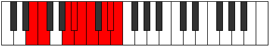 |
| [3557](https://ianring.com/musictheory/scales/3557) | [Thycryllic](ModeASharpThycryllic.md) | A# | A#, C, D#, E, F, F#, G#, A, A# |  |
| [3557](https://ianring.com/musictheory/scales/3557) | [Thycryllic](ModeBFlatThycryllic.md) | Bb | Bb, C, Eb, E, F, Gb, Ab, A, Bb |  |
| [3557](https://ianring.com/musictheory/scales/3557) | [Thycryllic](ModeENaturalThycryllic.md) | E | E, F#, A, A#, B, C, D, D#, E |  |
| [3559](https://ianring.com/musictheory/scales/3559) | [Aerathygic](ModeDNaturalAerathygic.md) | D | D, D#, E, G, G#, A, A#, C, C#, D |  |
| [3559](https://ianring.com/musictheory/scales/3559) | [Aerathygic](ModeENaturalAerathygic.md) | E | E, F, F#, A, A#, B, C, D, D#, E |  |
| [3559](https://ianring.com/musictheory/scales/3559) | [Aerathygic](ModeASharpAerathygic.md) | A# | A#, B, C, D#, E, F, F#, G#, A, A# |  |
| [3559](https://ianring.com/musictheory/scales/3559) | [Aerathygic](ModeBFlatAerathygic.md) | Bb | Bb, B, C, Eb, E, F, Gb, Ab, A, Bb |  |
| [3561](https://ianring.com/musictheory/scales/3561) | [Pothyllic](ModeANaturalPothyllic.md) | A | A, C, D, D#, E, F, G, G#, A |  |
| [3561](https://ianring.com/musictheory/scales/3561) | [Pothyllic](ModeENaturalPothyllic.md) | E | E, G, A, A#, B, C, D, D#, E |  |
| [3563](https://ianring.com/musictheory/scales/3563) | [Ionoptygic](ModeANaturalIonoptygic.md) | A | A, A#, C, D, D#, E, F, G, G#, A |  |
| [3563](https://ianring.com/musictheory/scales/3563) | [Ionoptygic](ModeENaturalIonoptygic.md) | E | E, F, G, A, A#, B, C, D, D#, E |  |
| [3565](https://ianring.com/musictheory/scales/3565) | [Aeolorygic](ModeASharpAeolorygic.md) | A# | A#, C, C#, D#, E, F, F#, G#, A, A# |  |
| [3565](https://ianring.com/musictheory/scales/3565) | [Aeolorygic](ModeBFlatAeolorygic.md) | Bb | Bb, C, Db, Eb, E, F, Gb, Ab, A, Bb |  |
| [3565](https://ianring.com/musictheory/scales/3565) | [Aeolorygic](ModeANaturalAeolorygic.md) | A | A, B, C, D, D#, E, F, G, G#, A |  |
| [3565](https://ianring.com/musictheory/scales/3565) | [Aeolorygic](ModeCSharpAeolorygic.md) | C# | C#, D#, E, F#, G, G#, A, B, C, C# |  |
| [3565](https://ianring.com/musictheory/scales/3565) | [Aeolorygic](ModeDFlatAeolorygic.md) | Db | Db, Eb, E, Gb, G, Ab, A, B, C, Db |  |
| [3565](https://ianring.com/musictheory/scales/3565) | [Aeolorygic](ModeENaturalAeolorygic.md) | E | E, F#, G, A, A#, B, C, D, D#, E |  |
| [3567](https://ianring.com/musictheory/scales/3567) | [Epityllian](ModeDNaturalEpityllian.md) | D | D, D#, E, F, G, G#, A, A#, C, C#, D |  |
| [3567](https://ianring.com/musictheory/scales/3567) | [Epityllian](ModeCSharpEpityllian.md) | C# | C#, D, D#, E, F#, G, G#, A, B, C, C# |  |
| [3567](https://ianring.com/musictheory/scales/3567) | [Epityllian](ModeDFlatEpityllian.md) | Db | Db, D, Eb, E, Gb, G, Ab, A, B, C, Db |  |
| [3567](https://ianring.com/musictheory/scales/3567) | [Epityllian](ModeENaturalEpityllian.md) | E | E, F, F#, G, A, A#, B, C, D, D#, E |  |
| [3567](https://ianring.com/musictheory/scales/3567) | [Epityllian](ModeASharpEpityllian.md) | A# | A#, B, C, C#, D#, E, F, F#, G#, A, A# |  |
| [3567](https://ianring.com/musictheory/scales/3567) | [Epityllian](ModeBFlatEpityllian.md) | Bb | Bb, B, C, Db, Eb, E, F, Gb, Ab, A, Bb |  |
| [3567](https://ianring.com/musictheory/scales/3567) | [Epityllian](ModeANaturalEpityllian.md) | A | A, A#, B, C, D, D#, E, F, G, G#, A |  |
| [3569](https://ianring.com/musictheory/scales/3569) | [Aeoladyllic](ModeFNaturalAeoladyllic.md) | F | F, A, A#, B, C, C#, D#, E, F |  |
| [3569](https://ianring.com/musictheory/scales/3569) | [Aeoladyllic](ModeENaturalAeoladyllic.md) | E | E, G#, A, A#, B, C, D, D#, E |  |
| [3571](https://ianring.com/musictheory/scales/3571) | [Dyrygic](ModeGSharpDyrygic.md) | G# | G#, A, C, C#, D, D#, E, F#, G, G# |  |
| [3571](https://ianring.com/musictheory/scales/3571) | [Dyrygic](ModeAFlatDyrygic.md) | Ab | Ab, A, C, Db, D, Eb, E, Gb, G, Ab |  |
| [3571](https://ianring.com/musictheory/scales/3571) | [Dyrygic](ModeFNaturalDyrygic.md) | F | F, F#, A, A#, B, C, C#, D#, E, F |  |
| [3571](https://ianring.com/musictheory/scales/3571) | [Dyrygic](ModeBNaturalDyrygic.md) | B | B, C, D#, E, F, F#, G, A, A#, B |  |
| [3571](https://ianring.com/musictheory/scales/3571) | [Dyrygic](ModeENaturalDyrygic.md) | E | E, F, G#, A, A#, B, C, D, D#, E |  |
| [3573](https://ianring.com/musictheory/scales/3573) | [Kaptygic](ModeASharpKaptygic.md) | A# | A#, C, D, D#, E, F, F#, G#, A, A# |  |
| [3573](https://ianring.com/musictheory/scales/3573) | [Kaptygic](ModeBFlatKaptygic.md) | Bb | Bb, C, D, Eb, E, F, Gb, Ab, A, Bb |  |
| [3573](https://ianring.com/musictheory/scales/3573) | [Kaptygic](ModeFNaturalKaptygic.md) | F | F, G, A, A#, B, C, C#, D#, E, F |  |
| [3573](https://ianring.com/musictheory/scales/3573) | [Kaptygic](ModeENaturalKaptygic.md) | E | E, F#, G#, A, A#, B, C, D, D#, E |  |
| [3575](https://ianring.com/musictheory/scales/3575) | [Mogyllian](ModeDNaturalMogyllian.md) | D | D, D#, E, F#, G, G#, A, A#, C, C#, D |  |
| [3575](https://ianring.com/musictheory/scales/3575) | [Mogyllian](ModeGSharpMogyllian.md) | G# | G#, A, A#, C, C#, D, D#, E, F#, G, G# |  |
| [3575](https://ianring.com/musictheory/scales/3575) | [Mogyllian](ModeAFlatMogyllian.md) | Ab | Ab, A, Bb, C, Db, D, Eb, E, Gb, G, Ab |  |
| [3575](https://ianring.com/musictheory/scales/3575) | [Mogyllian](ModeFNaturalMogyllian.md) | F | F, F#, G, A, A#, B, C, C#, D#, E, F |  |
| [3575](https://ianring.com/musictheory/scales/3575) | [Mogyllian](ModeBNaturalMogyllian.md) | B | B, C, C#, D#, E, F, F#, G, A, A#, B |  |
| [3575](https://ianring.com/musictheory/scales/3575) | [Mogyllian](ModeENaturalMogyllian.md) | E | E, F, F#, G#, A, A#, B, C, D, D#, E |  |
| [3575](https://ianring.com/musictheory/scales/3575) | [Mogyllian](ModeASharpMogyllian.md) | A# | A#, B, C, D, D#, E, F, F#, G#, A, A# |  |
| [3575](https://ianring.com/musictheory/scales/3575) | [Mogyllian](ModeBFlatMogyllian.md) | Bb | Bb, B, C, D, Eb, E, F, Gb, Ab, A, Bb |  |
| [3577](https://ianring.com/musictheory/scales/3577) | [Loptygic](ModeANaturalLoptygic.md) | A | A, C, C#, D, D#, E, F, G, G#, A |  |
| [3577](https://ianring.com/musictheory/scales/3577) | [Loptygic](ModeFNaturalLoptygic.md) | F | F, G#, A, A#, B, C, C#, D#, E, F |  |
| [3577](https://ianring.com/musictheory/scales/3577) | [Loptygic](ModeENaturalLoptygic.md) | E | E, G, G#, A, A#, B, C, D, D#, E |  |
| [3579](https://ianring.com/musictheory/scales/3579) | [Zyphyllian](ModeANaturalZyphyllian.md) | A | A, A#, C, C#, D, D#, E, F, G, G#, A |  |
| [3579](https://ianring.com/musictheory/scales/3579) | [Zyphyllian](ModeGSharpZyphyllian.md) | G# | G#, A, B, C, C#, D, D#, E, F#, G, G# |  |
| [3579](https://ianring.com/musictheory/scales/3579) | [Zyphyllian](ModeAFlatZyphyllian.md) | Ab | Ab, A, B, C, Db, D, Eb, E, Gb, G, Ab |  |
| [3579](https://ianring.com/musictheory/scales/3579) | [Zyphyllian](ModeBNaturalZyphyllian.md) | B | B, C, D, D#, E, F, F#, G, A, A#, B |  |
| [3579](https://ianring.com/musictheory/scales/3579) | [Zyphyllian](ModeFNaturalZyphyllian.md) | F | F, F#, G#, A, A#, B, C, C#, D#, E, F |  |
| [3579](https://ianring.com/musictheory/scales/3579) | [Zyphyllian](ModeENaturalZyphyllian.md) | E | E, F, G, G#, A, A#, B, C, D, D#, E |  |
| [3581](https://ianring.com/musictheory/scales/3581) | [Epocryllian](ModeASharpEpocryllian.md) | A# | A#, C, C#, D, D#, E, F, F#, G#, A, A# |  |
| [3581](https://ianring.com/musictheory/scales/3581) | [Epocryllian](ModeBFlatEpocryllian.md) | Bb | Bb, C, Db, D, Eb, E, F, Gb, Ab, A, Bb |  |
| [3581](https://ianring.com/musictheory/scales/3581) | [Epocryllian](ModeANaturalEpocryllian.md) | A | A, B, C, C#, D, D#, E, F, G, G#, A |  |
| [3581](https://ianring.com/musictheory/scales/3581) | [Epocryllian](ModeCSharpEpocryllian.md) | C# | C#, D#, E, F, F#, G, G#, A, B, C, C# |  |
| [3581](https://ianring.com/musictheory/scales/3581) | [Epocryllian](ModeDFlatEpocryllian.md) | Db | Db, Eb, E, F, Gb, G, Ab, A, B, C, Db |  |
| [3581](https://ianring.com/musictheory/scales/3581) | [Epocryllian](ModeFNaturalEpocryllian.md) | F | F, G, G#, A, A#, B, C, C#, D#, E, F |  |
| [3581](https://ianring.com/musictheory/scales/3581) | [Epocryllian](ModeENaturalEpocryllian.md) | E | E, F#, G, G#, A, A#, B, C, D, D#, E |  |
| [3583](https://ianring.com/musictheory/scales/3583) | [Zylatic](ModeDNaturalZylatic.md) | D | D, D#, E, F, F#, G, G#, A, A#, C, C#, D |  |
| [3583](https://ianring.com/musictheory/scales/3583) | [Zylatic](ModeCSharpZylatic.md) | C# | C#, D, D#, E, F, F#, G, G#, A, B, C, C# |  |
| [3583](https://ianring.com/musictheory/scales/3583) | [Zylatic](ModeDFlatZylatic.md) | Db | Db, D, Eb, E, F, Gb, G, Ab, A, B, C, Db |  |
| [3583](https://ianring.com/musictheory/scales/3583) | [Zylatic](ModeBNaturalZylatic.md) | B | B, C, C#, D, D#, E, F, F#, G, A, A#, B |  |
| [3583](https://ianring.com/musictheory/scales/3583) | [Zylatic](ModeASharpZylatic.md) | A# | A#, B, C, C#, D, D#, E, F, F#, G#, A, A# |  |
| [3583](https://ianring.com/musictheory/scales/3583) | [Zylatic](ModeBFlatZylatic.md) | Bb | Bb, B, C, Db, D, Eb, E, F, Gb, Ab, A, Bb |  |
| [3583](https://ianring.com/musictheory/scales/3583) | [Zylatic](ModeANaturalZylatic.md) | A | A, A#, B, C, C#, D, D#, E, F, G, G#, A |  |
| [3583](https://ianring.com/musictheory/scales/3583) | [Zylatic](ModeGSharpZylatic.md) | G# | G#, A, A#, B, C, C#, D, D#, E, F#, G, G# |  |
| [3583](https://ianring.com/musictheory/scales/3583) | [Zylatic](ModeAFlatZylatic.md) | Ab | Ab, A, Bb, B, C, Db, D, Eb, E, Gb, G, Ab |  |
| [3583](https://ianring.com/musictheory/scales/3583) | [Zylatic](ModeFNaturalZylatic.md) | F | F, F#, G, G#, A, A#, B, C, C#, D#, E, F |  |
| [3583](https://ianring.com/musictheory/scales/3583) | [Zylatic](ModeENaturalZylatic.md) | E | E, F, F#, G, G#, A, A#, B, C, D, D#, E |  |
| [3635](https://ianring.com/musictheory/scales/3635) | [Katygian](ModeBNaturalKatygian.md) | B | B, C, D#, E, F###, G##, A#, B |  |
| [3639](https://ianring.com/musictheory/scales/3639) | [Paptyllic](ModeBNaturalPaptyllic.md) | B | B, C, C#, D#, E, G#, A, A#, B |  |
| [3641](https://ianring.com/musictheory/scales/3641) | [Thocrian](ModeCNaturalThocrian.md) | C | C, D#, E, F, G##, A#, B, C |  |
| [3643](https://ianring.com/musictheory/scales/3643) | [Kydyllic](ModeCNaturalKydyllic.md) | C | C, C#, D#, E, F, A, A#, B, C |  |
| [3643](https://ianring.com/musictheory/scales/3643) | [Kydyllic](ModeBNaturalKydyllic.md) | B | B, C, D, D#, E, G#, A, A#, B |  |
| [3645](https://ianring.com/musictheory/scales/3645) | [Zycryllic](ModeCNaturalZycryllic.md) | C | C, D, D#, E, F, A, A#, B, C |  |
| [3647](https://ianring.com/musictheory/scales/3647) | [Eporygic](ModeCNaturalEporygic.md) | C | C, C#, D, D#, E, F, A, A#, B, C |  |
| [3647](https://ianring.com/musictheory/scales/3647) | [Eporygic](ModeBNaturalEporygic.md) | B | B, C, C#, D, D#, E, G#, A, A#, B |  |
| [3655](https://ianring.com/musictheory/scales/3655) | [Mathian](ModeDSharpMathian.md) | D# | D#, E, F, G##, A###, B##, C##, D# |  |
| [3655](https://ianring.com/musictheory/scales/3655) | [Mathian](ModeEFlatMathian.md) | Eb | Eb, Fb, Gbb, A, B#, C#, D, Eb |  |
| [3657](https://ianring.com/musictheory/scales/3657) | [Epynimic](ModeGFlatEpynimic.md) | Gb | Gb, A, B#, C###, D##, E#, Gb |  |
| [3659](https://ianring.com/musictheory/scales/3659) | [Polian](ModeDSharpPolian.md) | D# | D#, E, F#, G##, A###, B##, C##, D# |  |
| [3659](https://ianring.com/musictheory/scales/3659) | [Polian](ModeEFlatPolian.md) | Eb | Eb, Fb, Gb, A, B#, C#, D, Eb |  |
| [3659](https://ianring.com/musictheory/scales/3659) | [Polian](ModeFSharpPolian.md) | F# | F#, G, A, B#, C###, D##, E#, F# |  |
| [3659](https://ianring.com/musictheory/scales/3659) | [Polian](ModeGFlatPolian.md) | Gb | Gb, Abb, Bbb, C, D#, E, F, Gb |  |
| [3661](https://ianring.com/musictheory/scales/3661) | [Mixodorian](ModeFSharpMixodorian.md) | F# | F#, G#, A, B#, C###, D##, E#, F# |  |
| [3661](https://ianring.com/musictheory/scales/3661) | [Mixodorian](ModeGFlatMixodorian.md) | Gb | Gb, Ab, Bbb, C, D#, E, F, Gb |  |
| [3663](https://ianring.com/musictheory/scales/3663) | [Sonyllic](ModeDSharpSonyllic.md) | D# | D#, E, F, F#, A, C, C#, D, D# |  |
| [3663](https://ianring.com/musictheory/scales/3663) | [Sonyllic](ModeEFlatSonyllic.md) | Eb | Eb, E, F, Gb, A, C, Db, D, Eb |  |
| [3663](https://ianring.com/musictheory/scales/3663) | [Sonyllic](ModeFSharpSonyllic.md) | F# | F#, G, G#, A, C, D#, E, F, F# |  |
| [3663](https://ianring.com/musictheory/scales/3663) | [Sonyllic](ModeGFlatSonyllic.md) | Gb | Gb, G, Ab, A, C, Eb, E, F, Gb |  |
| [3667](https://ianring.com/musictheory/scales/3667) | [Kaptian](ModeDSharpKaptian.md) | D# | D#, E, F##, G##, A###, B##, C##, D# |  |
| [3667](https://ianring.com/musictheory/scales/3667) | [Kaptian](ModeEFlatKaptian.md) | Eb | Eb, Fb, G, A, B#, C#, D, Eb |  |
| [3671](https://ianring.com/musictheory/scales/3671) | [Aeonyllic](ModeDSharpAeonyllic.md) | D# | D#, E, F, G, A, C, C#, D, D# |  |
| [3671](https://ianring.com/musictheory/scales/3671) | [Aeonyllic](ModeEFlatAeonyllic.md) | Eb | Eb, E, F, G, A, C, Db, D, Eb |  |
| [3673](https://ianring.com/musictheory/scales/3673) | [Ranian](ModeGFlatRanian.md) | Gb | Gb, A, Bb, C, D#, E, F, Gb |  |
| [3673](https://ianring.com/musictheory/scales/3673) | [Ranian](ModeCNaturalRanian.md) | C | C, D#, E, F#, G##, A#, B, C |  |
| [3675](https://ianring.com/musictheory/scales/3675) | [Monyllic](ModeDSharpMonyllic.md) | D# | D#, E, F#, G, A, C, C#, D, D# |  |
| [3675](https://ianring.com/musictheory/scales/3675) | [Monyllic](ModeEFlatMonyllic.md) | Eb | Eb, E, Gb, G, A, C, Db, D, Eb |  |
| [3675](https://ianring.com/musictheory/scales/3675) | [Monyllic](ModeFSharpMonyllic.md) | F# | F#, G, A, A#, C, D#, E, F, F# |  |
| [3675](https://ianring.com/musictheory/scales/3675) | [Monyllic](ModeGFlatMonyllic.md) | Gb | Gb, G, A, Bb, C, Eb, E, F, Gb |  |
| [3675](https://ianring.com/musictheory/scales/3675) | [Monyllic](ModeCNaturalMonyllic.md) | C | C, C#, D#, E, F#, A, A#, B, C |  |
| [3677](https://ianring.com/musictheory/scales/3677) | [Katylyllic](ModeFSharpKatylyllic.md) | F# | F#, G#, A, A#, C, D#, E, F, F# |  |
| [3677](https://ianring.com/musictheory/scales/3677) | [Katylyllic](ModeGFlatKatylyllic.md) | Gb | Gb, Ab, A, Bb, C, Eb, E, F, Gb |  |
| [3677](https://ianring.com/musictheory/scales/3677) | [Katylyllic](ModeCNaturalKatylyllic.md) | C | C, D, D#, E, F#, A, A#, B, C |  |
| [3679](https://ianring.com/musictheory/scales/3679) | [Rycrygic](ModeDSharpRycrygic.md) | D# | D#, E, F, F#, G, A, C, C#, D, D# |  |
| [3679](https://ianring.com/musictheory/scales/3679) | [Rycrygic](ModeEFlatRycrygic.md) | Eb | Eb, E, F, Gb, G, A, C, Db, D, Eb |  |
| [3679](https://ianring.com/musictheory/scales/3679) | [Rycrygic](ModeFSharpRycrygic.md) | F# | F#, G, G#, A, A#, C, D#, E, F, F# |  |
| [3679](https://ianring.com/musictheory/scales/3679) | [Rycrygic](ModeGFlatRycrygic.md) | Gb | Gb, G, Ab, A, Bb, C, Eb, E, F, Gb |  |
| [3679](https://ianring.com/musictheory/scales/3679) | [Rycrygic](ModeCNaturalRycrygic.md) | C | C, C#, D, D#, E, F#, A, A#, B, C |  |
| [3683](https://ianring.com/musictheory/scales/3683) | [Dycrian](ModeDSharpDycrian.md) | D# | D#, E, F###, G##, A###, B##, C##, D# |  |
| [3683](https://ianring.com/musictheory/scales/3683) | [Dycrian](ModeEFlatDycrian.md) | Eb | Eb, Fb, G#, A, B#, C#, D, Eb |  |
| [3685](https://ianring.com/musictheory/scales/3685) | [Kodian](ModeBFlatKodian.md) | Bb | Bb, C, D#, E, F##, G#, A, Bb |  |
| [3687](https://ianring.com/musictheory/scales/3687) | [Zonyllic](ModeDSharpZonyllic.md) | D# | D#, E, F, G#, A, C, C#, D, D# | 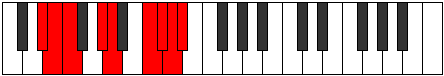 |
| [3687](https://ianring.com/musictheory/scales/3687) | [Zonyllic](ModeEFlatZonyllic.md) | Eb | Eb, E, F, Ab, A, C, Db, D, Eb |  |
| [3687](https://ianring.com/musictheory/scales/3687) | [Zonyllic](ModeASharpZonyllic.md) | A# | A#, B, C, D#, E, G, G#, A, A# |  |
| [3687](https://ianring.com/musictheory/scales/3687) | [Zonyllic](ModeBFlatZonyllic.md) | Bb | Bb, B, C, Eb, E, G, Ab, A, Bb |  |
| [3689](https://ianring.com/musictheory/scales/3689) | [Katocrian](ModeGFlatKatocrian.md) | Gb | Gb, A, B, C, D#, E, F, Gb |  |
| [3691](https://ianring.com/musictheory/scales/3691) | [Badyllic](ModeDSharpBadyllic.md) | D# | D#, E, F#, G#, A, C, C#, D, D# |  |
| [3691](https://ianring.com/musictheory/scales/3691) | [Badyllic](ModeEFlatBadyllic.md) | Eb | Eb, E, Gb, Ab, A, C, Db, D, Eb |  |
| [3691](https://ianring.com/musictheory/scales/3691) | [Badyllic](ModeFSharpBadyllic.md) | F# | F#, G, A, B, C, D#, E, F, F# |  |
| [3691](https://ianring.com/musictheory/scales/3691) | [Badyllic](ModeGFlatBadyllic.md) | Gb | Gb, G, A, B, C, Eb, E, F, Gb |  |
| [3693](https://ianring.com/musictheory/scales/3693) | [Epaptyllic](ModeASharpEpaptyllic.md) | A# | A#, C, C#, D#, E, G, G#, A, A# |  |
| [3693](https://ianring.com/musictheory/scales/3693) | [Epaptyllic](ModeBFlatEpaptyllic.md) | Bb | Bb, C, Db, Eb, E, G, Ab, A, Bb |  |
| [3693](https://ianring.com/musictheory/scales/3693) | [Epaptyllic](ModeFSharpEpaptyllic.md) | F# | F#, G#, A, B, C, D#, E, F, F# |  |
| [3693](https://ianring.com/musictheory/scales/3693) | [Epaptyllic](ModeGFlatEpaptyllic.md) | Gb | Gb, Ab, A, B, C, Eb, E, F, Gb |  |
| [3695](https://ianring.com/musictheory/scales/3695) | [Kodygic](ModeDSharpKodygic.md) | D# | D#, E, F, F#, G#, A, C, C#, D, D# |  |
| [3695](https://ianring.com/musictheory/scales/3695) | [Kodygic](ModeEFlatKodygic.md) | Eb | Eb, E, F, Gb, Ab, A, C, Db, D, Eb |  |
| [3695](https://ianring.com/musictheory/scales/3695) | [Kodygic](ModeFSharpKodygic.md) | F# | F#, G, G#, A, B, C, D#, E, F, F# |  |
| [3695](https://ianring.com/musictheory/scales/3695) | [Kodygic](ModeGFlatKodygic.md) | Gb | Gb, G, Ab, A, B, C, Eb, E, F, Gb |  |
| [3695](https://ianring.com/musictheory/scales/3695) | [Kodygic](ModeASharpKodygic.md) | A# | A#, B, C, C#, D#, E, G, G#, A, A# |  |
| [3695](https://ianring.com/musictheory/scales/3695) | [Kodygic](ModeBFlatKodygic.md) | Bb | Bb, B, C, Db, Eb, E, G, Ab, A, Bb |  |
| [3699](https://ianring.com/musictheory/scales/3699) | [Aeolylyllic](ModeDSharpAeolylyllic.md) | D# | D#, E, G, G#, A, C, C#, D, D# |  |
| [3699](https://ianring.com/musictheory/scales/3699) | [Aeolylyllic](ModeEFlatAeolylyllic.md) | Eb | Eb, E, G, Ab, A, C, Db, D, Eb |  |
| [3699](https://ianring.com/musictheory/scales/3699) | [Aeolylyllic](ModeBNaturalAeolylyllic.md) | B | B, C, D#, E, F, G#, A, A#, B |  |
| [3701](https://ianring.com/musictheory/scales/3701) | [Bagyllic](ModeASharpBagyllic.md) | A# | A#, C, D, D#, E, G, G#, A, A# |  |
| [3701](https://ianring.com/musictheory/scales/3701) | [Bagyllic](ModeBFlatBagyllic.md) | Bb | Bb, C, D, Eb, E, G, Ab, A, Bb |  |
| [3703](https://ianring.com/musictheory/scales/3703) | [Katalygic](ModeDSharpKatalygic.md) | D# | D#, E, F, G, G#, A, C, C#, D, D# |  |
| [3703](https://ianring.com/musictheory/scales/3703) | [Katalygic](ModeEFlatKatalygic.md) | Eb | Eb, E, F, G, Ab, A, C, Db, D, Eb |  |
| [3703](https://ianring.com/musictheory/scales/3703) | [Katalygic](ModeBNaturalKatalygic.md) | B | B, C, C#, D#, E, F, G#, A, A#, B |  |
| [3703](https://ianring.com/musictheory/scales/3703) | [Katalygic](ModeASharpKatalygic.md) | A# | A#, B, C, D, D#, E, G, G#, A, A# |  |
| [3703](https://ianring.com/musictheory/scales/3703) | [Katalygic](ModeBFlatKatalygic.md) | Bb | Bb, B, C, D, Eb, E, G, Ab, A, Bb |  |
| [3705](https://ianring.com/musictheory/scales/3705) | [Sydyllic](ModeCNaturalSydyllic.md) | C | C, D#, E, F, F#, A, A#, B, C |  |
| [3705](https://ianring.com/musictheory/scales/3705) | [Sydyllic](ModeFSharpSydyllic.md) | F# | F#, A, A#, B, C, D#, E, F, F# |  |
| [3705](https://ianring.com/musictheory/scales/3705) | [Sydyllic](ModeGFlatSydyllic.md) | Gb | Gb, A, Bb, B, C, Eb, E, F, Gb |  |
| [3707](https://ianring.com/musictheory/scales/3707) | [Rynygic](ModeDSharpRynygic.md) | D# | D#, E, F#, G, G#, A, C, C#, D, D# |  |
| [3707](https://ianring.com/musictheory/scales/3707) | [Rynygic](ModeEFlatRynygic.md) | Eb | Eb, E, Gb, G, Ab, A, C, Db, D, Eb |  |
| [3707](https://ianring.com/musictheory/scales/3707) | [Rynygic](ModeCNaturalRynygic.md) | C | C, C#, D#, E, F, F#, A, A#, B, C |  |
| [3707](https://ianring.com/musictheory/scales/3707) | [Rynygic](ModeFSharpRynygic.md) | F# | F#, G, A, A#, B, C, D#, E, F, F# |  |
| [3707](https://ianring.com/musictheory/scales/3707) | [Rynygic](ModeGFlatRynygic.md) | Gb | Gb, G, A, Bb, B, C, Eb, E, F, Gb |  |
| [3707](https://ianring.com/musictheory/scales/3707) | [Rynygic](ModeBNaturalRynygic.md) | B | B, C, D, D#, E, F, G#, A, A#, B |  |
| [3709](https://ianring.com/musictheory/scales/3709) | [Locrygic](ModeASharpLocrygic.md) | A# | A#, C, C#, D, D#, E, G, G#, A, A# |  |
| [3709](https://ianring.com/musictheory/scales/3709) | [Locrygic](ModeBFlatLocrygic.md) | Bb | Bb, C, Db, D, Eb, E, G, Ab, A, Bb |  |
| [3709](https://ianring.com/musictheory/scales/3709) | [Locrygic](ModeCNaturalLocrygic.md) | C | C, D, D#, E, F, F#, A, A#, B, C |  |
| [3709](https://ianring.com/musictheory/scales/3709) | [Locrygic](ModeFSharpLocrygic.md) | F# | F#, G#, A, A#, B, C, D#, E, F, F# |  |
| [3709](https://ianring.com/musictheory/scales/3709) | [Locrygic](ModeGFlatLocrygic.md) | Gb | Gb, Ab, A, Bb, B, C, Eb, E, F, Gb |  |
| [3711](https://ianring.com/musictheory/scales/3711) | [Dycryllian](ModeDSharpDycryllian.md) | D# | D#, E, F, F#, G, G#, A, C, C#, D, D# |  |
| [3711](https://ianring.com/musictheory/scales/3711) | [Dycryllian](ModeEFlatDycryllian.md) | Eb | Eb, E, F, Gb, G, Ab, A, C, Db, D, Eb |  |
| [3711](https://ianring.com/musictheory/scales/3711) | [Dycryllian](ModeCNaturalDycryllian.md) | C | C, C#, D, D#, E, F, F#, A, A#, B, C |  |
| [3711](https://ianring.com/musictheory/scales/3711) | [Dycryllian](ModeBNaturalDycryllian.md) | B | B, C, C#, D, D#, E, F, G#, A, A#, B |  |
| [3711](https://ianring.com/musictheory/scales/3711) | [Dycryllian](ModeASharpDycryllian.md) | A# | A#, B, C, C#, D, D#, E, G, G#, A, A# |  |
| [3711](https://ianring.com/musictheory/scales/3711) | [Dycryllian](ModeBFlatDycryllian.md) | Bb | Bb, B, C, Db, D, Eb, E, G, Ab, A, Bb |  |
| [3711](https://ianring.com/musictheory/scales/3711) | [Dycryllian](ModeFSharpDycryllian.md) | F# | F#, G, G#, A, A#, B, C, D#, E, F, F# |  |
| [3711](https://ianring.com/musictheory/scales/3711) | [Dycryllian](ModeGFlatDycryllian.md) | Gb | Gb, G, Ab, A, Bb, B, C, Eb, E, F, Gb |  |
| [3727](https://ianring.com/musictheory/scales/3727) | [Tholyllic](ModeDNaturalTholyllic.md) | D | D, D#, E, F, A, B, C, C#, D |  |
| [3731](https://ianring.com/musictheory/scales/3731) | [Aeryrian](ModeFNaturalAeryrian.md) | F | F, Gb, A, B#, C##, D#, E, F |  |
| [3733](https://ianring.com/musictheory/scales/3733) | [Gycrian](ModeFNaturalGycrian.md) | F | F, G, A, B#, C##, D#, E, F |  |
| [3735](https://ianring.com/musictheory/scales/3735) | [Ionagyllic](ModeFNaturalIonagyllic.md) | F | F, F#, G, A, C, D, D#, E, F |  |
| [3735](https://ianring.com/musictheory/scales/3735) | [Ionagyllic](ModeDNaturalIonagyllic.md) | D | D, D#, E, F#, A, B, C, C#, D |  |
| [3737](https://ianring.com/musictheory/scales/3737) | [Phrocrian](ModeFNaturalPhrocrian.md) | F | F, G#, A, B#, C##, D#, E, F |  |
| [3737](https://ianring.com/musictheory/scales/3737) | [Phrocrian](ModeCNaturalPhrocrian.md) | C | C, D#, E, F##, G##, A#, B, C |  |
| [3739](https://ianring.com/musictheory/scales/3739) | [Ioninyllic](ModeFNaturalIoninyllic.md) | F | F, F#, G#, A, C, D, D#, E, F | 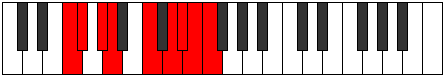 |
| [3739](https://ianring.com/musictheory/scales/3739) | [Ioninyllic](ModeCNaturalIoninyllic.md) | C | C, C#, D#, E, G, A, A#, B, C |  |
| [3741](https://ianring.com/musictheory/scales/3741) | [Zydyllic](ModeFNaturalZydyllic.md) | F | F, G, G#, A, C, D, D#, E, F |  |
| [3741](https://ianring.com/musictheory/scales/3741) | [Zydyllic](ModeCNaturalZydyllic.md) | C | C, D, D#, E, G, A, A#, B, C |  |
| [3743](https://ianring.com/musictheory/scales/3743) | [Thadygic](ModeFNaturalThadygic.md) | F | F, F#, G, G#, A, C, D, D#, E, F |  |
| [3743](https://ianring.com/musictheory/scales/3743) | [Thadygic](ModeDNaturalThadygic.md) | D | D, D#, E, F, F#, A, B, C, C#, D |  |
| [3743](https://ianring.com/musictheory/scales/3743) | [Thadygic](ModeCNaturalThadygic.md) | C | C, C#, D, D#, E, G, A, A#, B, C |  |
| [3751](https://ianring.com/musictheory/scales/3751) | [Aerathyllic](ModeDNaturalAerathyllic.md) | D | D, D#, E, G, A, B, C, C#, D |  |
| [3759](https://ianring.com/musictheory/scales/3759) | [Darygic](ModeDNaturalDarygic.md) | D | D, D#, E, F, G, A, B, C, C#, D |  |
| [3761](https://ianring.com/musictheory/scales/3761) | [Ionythian](ModeFNaturalIonythian.md) | F | F, G##, A#, B#, C##, D#, E, F |  |
| [3763](https://ianring.com/musictheory/scales/3763) | [Modyllic](ModeFNaturalModyllic.md) | F | F, F#, A, A#, C, D, D#, E, F |  |
| [3763](https://ianring.com/musictheory/scales/3763) | [Modyllic](ModeBNaturalModyllic.md) | B | B, C, D#, E, F#, G#, A, A#, B |  |
| [3765](https://ianring.com/musictheory/scales/3765) | [Aerycryllic](ModeFNaturalAerycryllic.md) | F | F, G, A, A#, C, D, D#, E, F |  |
| [3767](https://ianring.com/musictheory/scales/3767) | [Bacrygic](ModeFNaturalBacrygic.md) | F | F, F#, G, A, A#, C, D, D#, E, F |  |
| [3767](https://ianring.com/musictheory/scales/3767) | [Bacrygic](ModeDNaturalBacrygic.md) | D | D, D#, E, F#, G, A, B, C, C#, D |  |
| [3767](https://ianring.com/musictheory/scales/3767) | [Bacrygic](ModeBNaturalBacrygic.md) | B | B, C, C#, D#, E, F#, G#, A, A#, B |  |
| [3769](https://ianring.com/musictheory/scales/3769) | [Aeracryllic](ModeFNaturalAeracryllic.md) | F | F, G#, A, A#, C, D, D#, E, F |  |
| [3769](https://ianring.com/musictheory/scales/3769) | [Aeracryllic](ModeCNaturalAeracryllic.md) | C | C, D#, E, F, G, A, A#, B, C |  |
| [3771](https://ianring.com/musictheory/scales/3771) | [Stophygic](ModeFNaturalStophygic.md) | F | F, F#, G#, A, A#, C, D, D#, E, F |  |
| [3771](https://ianring.com/musictheory/scales/3771) | [Stophygic](ModeCNaturalStophygic.md) | C | C, C#, D#, E, F, G, A, A#, B, C |  |
| [3771](https://ianring.com/musictheory/scales/3771) | [Stophygic](ModeBNaturalStophygic.md) | B | B, C, D, D#, E, F#, G#, A, A#, B |  |
| [3773](https://ianring.com/musictheory/scales/3773) | [Sorygic](ModeFNaturalSorygic.md) | F | F, G, G#, A, A#, C, D, D#, E, F |  |
| [3773](https://ianring.com/musictheory/scales/3773) | [Sorygic](ModeCNaturalSorygic.md) | C | C, D, D#, E, F, G, A, A#, B, C |  |
| [3775](https://ianring.com/musictheory/scales/3775) | [Loptyllian](ModeFNaturalLoptyllian.md) | F | F, F#, G, G#, A, A#, C, D, D#, E, F |  |
| [3775](https://ianring.com/musictheory/scales/3775) | [Loptyllian](ModeDNaturalLoptyllian.md) | D | D, D#, E, F, F#, G, A, B, C, C#, D |  |
| [3775](https://ianring.com/musictheory/scales/3775) | [Loptyllian](ModeCNaturalLoptyllian.md) | C | C, C#, D, D#, E, F, G, A, A#, B, C |  |
| [3775](https://ianring.com/musictheory/scales/3775) | [Loptyllian](ModeBNaturalLoptyllian.md) | B | B, C, C#, D, D#, E, F#, G#, A, A#, B |  |
| [3783](https://ianring.com/musictheory/scales/3783) | [Phrygyllic](ModeDSharpPhrygyllic.md) | D# | D#, E, F, A, A#, C, C#, D, D# |  |
| [3783](https://ianring.com/musictheory/scales/3783) | [Phrygyllic](ModeEFlatPhrygyllic.md) | Eb | Eb, E, F, A, Bb, C, Db, D, Eb |  |
| [3783](https://ianring.com/musictheory/scales/3783) | [Phrygyllic](ModeDNaturalPhrygyllic.md) | D | D, D#, E, G#, A, B, C, C#, D |  |
| [3785](https://ianring.com/musictheory/scales/3785) | [Epagian](ModeGFlatEpagian.md) | Gb | Gb, A, B#, C#, D#, E, F, Gb |  |
| [3785](https://ianring.com/musictheory/scales/3785) | [Epagian](ModeANaturalEpagian.md) | A | A, B#, C###, D##, E##, F##, G#, A |  |
| [3787](https://ianring.com/musictheory/scales/3787) | [Kagyllic](ModeFSharpKagyllic.md) | F# | F#, G, A, C, C#, D#, E, F, F# |  |
| [3787](https://ianring.com/musictheory/scales/3787) | [Kagyllic](ModeGFlatKagyllic.md) | Gb | Gb, G, A, C, Db, Eb, E, F, Gb |  |
| [3787](https://ianring.com/musictheory/scales/3787) | [Kagyllic](ModeDSharpKagyllic.md) | D# | D#, E, F#, A, A#, C, C#, D, D# |  |
| [3787](https://ianring.com/musictheory/scales/3787) | [Kagyllic](ModeEFlatKagyllic.md) | Eb | Eb, E, Gb, A, Bb, C, Db, D, Eb |  |
| [3787](https://ianring.com/musictheory/scales/3787) | [Kagyllic](ModeANaturalKagyllic.md) | A | A, A#, C, D#, E, F#, G, G#, A |  |
| [3789](https://ianring.com/musictheory/scales/3789) | [Eporyllic](ModeFSharpEporyllic.md) | F# | F#, G#, A, C, C#, D#, E, F, F# |  |
| [3789](https://ianring.com/musictheory/scales/3789) | [Eporyllic](ModeGFlatEporyllic.md) | Gb | Gb, Ab, A, C, Db, Eb, E, F, Gb |  |
| [3789](https://ianring.com/musictheory/scales/3789) | [Eporyllic](ModeANaturalEporyllic.md) | A | A, B, C, D#, E, F#, G, G#, A |  |
| [3791](https://ianring.com/musictheory/scales/3791) | [Stodygic](ModeFSharpStodygic.md) | F# | F#, G, G#, A, C, C#, D#, E, F, F# |  |
| [3791](https://ianring.com/musictheory/scales/3791) | [Stodygic](ModeGFlatStodygic.md) | Gb | Gb, G, Ab, A, C, Db, Eb, E, F, Gb |  |
| [3791](https://ianring.com/musictheory/scales/3791) | [Stodygic](ModeDSharpStodygic.md) | D# | D#, E, F, F#, A, A#, C, C#, D, D# |  |
| [3791](https://ianring.com/musictheory/scales/3791) | [Stodygic](ModeEFlatStodygic.md) | Eb | Eb, E, F, Gb, A, Bb, C, Db, D, Eb |  |
| [3791](https://ianring.com/musictheory/scales/3791) | [Stodygic](ModeDNaturalStodygic.md) | D | D, D#, E, F, G#, A, B, C, C#, D |  |
| [3791](https://ianring.com/musictheory/scales/3791) | [Stodygic](ModeANaturalStodygic.md) | A | A, A#, B, C, D#, E, F#, G, G#, A |  |
| [3793](https://ianring.com/musictheory/scales/3793) | [Aeopian](ModeFNaturalAeopian.md) | F | F, G##, A##, B#, C##, D#, E, F |  |
| [3795](https://ianring.com/musictheory/scales/3795) | [Epothyllic](ModeDSharpEpothyllic.md) | D# | D#, E, G, A, A#, C, C#, D, D# |  |
| [3795](https://ianring.com/musictheory/scales/3795) | [Epothyllic](ModeEFlatEpothyllic.md) | Eb | Eb, E, G, A, Bb, C, Db, D, Eb |  |
| [3795](https://ianring.com/musictheory/scales/3795) | [Epothyllic](ModeFNaturalEpothyllic.md) | F | F, F#, A, B, C, D, D#, E, F |  |
| [3797](https://ianring.com/musictheory/scales/3797) | [Rocryllic](ModeFNaturalRocryllic.md) | F | F, G, A, B, C, D, D#, E, F |  |
| [3799](https://ianring.com/musictheory/scales/3799) | [Aeralygic](ModeDSharpAeralygic.md) | D# | D#, E, F, G, A, A#, C, C#, D, D# |  |
| [3799](https://ianring.com/musictheory/scales/3799) | [Aeralygic](ModeEFlatAeralygic.md) | Eb | Eb, E, F, G, A, Bb, C, Db, D, Eb |  |
| [3799](https://ianring.com/musictheory/scales/3799) | [Aeralygic](ModeFNaturalAeralygic.md) | F | F, F#, G, A, B, C, D, D#, E, F |  |
| [3799](https://ianring.com/musictheory/scales/3799) | [Aeralygic](ModeDNaturalAeralygic.md) | D | D, D#, E, F#, G#, A, B, C, C#, D |  |
| [3801](https://ianring.com/musictheory/scales/3801) | [Maptyllic](ModeANaturalMaptyllic.md) | A | A, C, C#, D#, E, F#, G, G#, A |  |
| [3801](https://ianring.com/musictheory/scales/3801) | [Maptyllic](ModeFSharpMaptyllic.md) | F# | F#, A, A#, C, C#, D#, E, F, F# |  |
| [3801](https://ianring.com/musictheory/scales/3801) | [Maptyllic](ModeGFlatMaptyllic.md) | Gb | Gb, A, Bb, C, Db, Eb, E, F, Gb |  |
| [3801](https://ianring.com/musictheory/scales/3801) | [Maptyllic](ModeFNaturalMaptyllic.md) | F | F, G#, A, B, C, D, D#, E, F |  |
| [3801](https://ianring.com/musictheory/scales/3801) | [Maptyllic](ModeCNaturalMaptyllic.md) | C | C, D#, E, F#, G, A, A#, B, C |  |
| [3803](https://ianring.com/musictheory/scales/3803) | [Epidygic](ModeDSharpEpidygic.md) | D# | D#, E, F#, G, A, A#, C, C#, D, D# |  |
| [3803](https://ianring.com/musictheory/scales/3803) | [Epidygic](ModeEFlatEpidygic.md) | Eb | Eb, E, Gb, G, A, Bb, C, Db, D, Eb |  |
| [3803](https://ianring.com/musictheory/scales/3803) | [Epidygic](ModeFSharpEpidygic.md) | F# | F#, G, A, A#, C, C#, D#, E, F, F# |  |
| [3803](https://ianring.com/musictheory/scales/3803) | [Epidygic](ModeGFlatEpidygic.md) | Gb | Gb, G, A, Bb, C, Db, Eb, E, F, Gb |  |
| [3803](https://ianring.com/musictheory/scales/3803) | [Epidygic](ModeANaturalEpidygic.md) | A | A, A#, C, C#, D#, E, F#, G, G#, A |  |
| [3803](https://ianring.com/musictheory/scales/3803) | [Epidygic](ModeFNaturalEpidygic.md) | F | F, F#, G#, A, B, C, D, D#, E, F |  |
| [3803](https://ianring.com/musictheory/scales/3803) | [Epidygic](ModeCNaturalEpidygic.md) | C | C, C#, D#, E, F#, G, A, A#, B, C |  |
| [3805](https://ianring.com/musictheory/scales/3805) | [Moptygic](ModeFSharpMoptygic.md) | F# | F#, G#, A, A#, C, C#, D#, E, F, F# |  |
| [3805](https://ianring.com/musictheory/scales/3805) | [Moptygic](ModeGFlatMoptygic.md) | Gb | Gb, Ab, A, Bb, C, Db, Eb, E, F, Gb |  |
| [3805](https://ianring.com/musictheory/scales/3805) | [Moptygic](ModeFNaturalMoptygic.md) | F | F, G, G#, A, B, C, D, D#, E, F |  |
| [3805](https://ianring.com/musictheory/scales/3805) | [Moptygic](ModeANaturalMoptygic.md) | A | A, B, C, C#, D#, E, F#, G, G#, A |  |
| [3805](https://ianring.com/musictheory/scales/3805) | [Moptygic](ModeCNaturalMoptygic.md) | C | C, D, D#, E, F#, G, A, A#, B, C |  |
| [3807](https://ianring.com/musictheory/scales/3807) | [Bagyllian](ModeDSharpBagyllian.md) | D# | D#, E, F, F#, G, A, A#, C, C#, D, D# |  |
| [3807](https://ianring.com/musictheory/scales/3807) | [Bagyllian](ModeEFlatBagyllian.md) | Eb | Eb, E, F, Gb, G, A, Bb, C, Db, D, Eb |  |
| [3807](https://ianring.com/musictheory/scales/3807) | [Bagyllian](ModeFSharpBagyllian.md) | F# | F#, G, G#, A, A#, C, C#, D#, E, F, F# |  |
| [3807](https://ianring.com/musictheory/scales/3807) | [Bagyllian](ModeGFlatBagyllian.md) | Gb | Gb, G, Ab, A, Bb, C, Db, Eb, E, F, Gb |  |
| [3807](https://ianring.com/musictheory/scales/3807) | [Bagyllian](ModeDNaturalBagyllian.md) | D | D, D#, E, F, F#, G#, A, B, C, C#, D |  |
| [3807](https://ianring.com/musictheory/scales/3807) | [Bagyllian](ModeFNaturalBagyllian.md) | F | F, F#, G, G#, A, B, C, D, D#, E, F |  |
| [3807](https://ianring.com/musictheory/scales/3807) | [Bagyllian](ModeCNaturalBagyllian.md) | C | C, C#, D, D#, E, F#, G, A, A#, B, C |  |
| [3807](https://ianring.com/musictheory/scales/3807) | [Bagyllian](ModeANaturalBagyllian.md) | A | A, A#, B, C, C#, D#, E, F#, G, G#, A |  |
| [3811](https://ianring.com/musictheory/scales/3811) | [Epogyllic](ModeDSharpEpogyllic.md) | D# | D#, E, G#, A, A#, C, C#, D, D# |  |
| [3811](https://ianring.com/musictheory/scales/3811) | [Epogyllic](ModeEFlatEpogyllic.md) | Eb | Eb, E, Ab, A, Bb, C, Db, D, Eb |  |
| [3813](https://ianring.com/musictheory/scales/3813) | [Aeologyllic](ModeASharpAeologyllic.md) | A# | A#, C, D#, E, F, G, G#, A, A# |  |
| [3813](https://ianring.com/musictheory/scales/3813) | [Aeologyllic](ModeBFlatAeologyllic.md) | Bb | Bb, C, Eb, E, F, G, Ab, A, Bb |  |
| [3815](https://ianring.com/musictheory/scales/3815) | [Mylygic](ModeDSharpMylygic.md) | D# | D#, E, F, G#, A, A#, C, C#, D, D# |  |
| [3815](https://ianring.com/musictheory/scales/3815) | [Mylygic](ModeEFlatMylygic.md) | Eb | Eb, E, F, Ab, A, Bb, C, Db, D, Eb |  |
| [3815](https://ianring.com/musictheory/scales/3815) | [Mylygic](ModeDNaturalMylygic.md) | D | D, D#, E, G, G#, A, B, C, C#, D |  |
| [3815](https://ianring.com/musictheory/scales/3815) | [Mylygic](ModeASharpMylygic.md) | A# | A#, B, C, D#, E, F, G, G#, A, A# |  |
| [3815](https://ianring.com/musictheory/scales/3815) | [Mylygic](ModeBFlatMylygic.md) | Bb | Bb, B, C, Eb, E, F, G, Ab, A, Bb |  |
| [3817](https://ianring.com/musictheory/scales/3817) | [Zoryllic](ModeANaturalZoryllic.md) | A | A, C, D, D#, E, F#, G, G#, A |  |
| [3817](https://ianring.com/musictheory/scales/3817) | [Zoryllic](ModeFSharpZoryllic.md) | F# | F#, A, B, C, C#, D#, E, F, F# |  |
| [3817](https://ianring.com/musictheory/scales/3817) | [Zoryllic](ModeGFlatZoryllic.md) | Gb | Gb, A, B, C, Db, Eb, E, F, Gb |  |
| [3819](https://ianring.com/musictheory/scales/3819) | [Aeolanygic](ModeDSharpAeolanygic.md) | D# | D#, E, F#, G#, A, A#, C, C#, D, D# |  |
| [3819](https://ianring.com/musictheory/scales/3819) | [Aeolanygic](ModeEFlatAeolanygic.md) | Eb | Eb, E, Gb, Ab, A, Bb, C, Db, D, Eb |  |
| [3819](https://ianring.com/musictheory/scales/3819) | [Aeolanygic](ModeANaturalAeolanygic.md) | A | A, A#, C, D, D#, E, F#, G, G#, A |  |
| [3819](https://ianring.com/musictheory/scales/3819) | [Aeolanygic](ModeFSharpAeolanygic.md) | F# | F#, G, A, B, C, C#, D#, E, F, F# |  |
| [3819](https://ianring.com/musictheory/scales/3819) | [Aeolanygic](ModeGFlatAeolanygic.md) | Gb | Gb, G, A, B, C, Db, Eb, E, F, Gb |  |
| [3821](https://ianring.com/musictheory/scales/3821) | [Epyrygic](ModeASharpEpyrygic.md) | A# | A#, C, C#, D#, E, F, G, G#, A, A# |  |
| [3821](https://ianring.com/musictheory/scales/3821) | [Epyrygic](ModeBFlatEpyrygic.md) | Bb | Bb, C, Db, Eb, E, F, G, Ab, A, Bb |  |
| [3821](https://ianring.com/musictheory/scales/3821) | [Epyrygic](ModeFSharpEpyrygic.md) | F# | F#, G#, A, B, C, C#, D#, E, F, F# |  |
| [3821](https://ianring.com/musictheory/scales/3821) | [Epyrygic](ModeGFlatEpyrygic.md) | Gb | Gb, Ab, A, B, C, Db, Eb, E, F, Gb |  |
| [3821](https://ianring.com/musictheory/scales/3821) | [Epyrygic](ModeANaturalEpyrygic.md) | A | A, B, C, D, D#, E, F#, G, G#, A |  |
| [3823](https://ianring.com/musictheory/scales/3823) | [Epinyllian](ModeDSharpEpinyllian.md) | D# | D#, E, F, F#, G#, A, A#, C, C#, D, D# |  |
| [3823](https://ianring.com/musictheory/scales/3823) | [Epinyllian](ModeEFlatEpinyllian.md) | Eb | Eb, E, F, Gb, Ab, A, Bb, C, Db, D, Eb |  |
| [3823](https://ianring.com/musictheory/scales/3823) | [Epinyllian](ModeDNaturalEpinyllian.md) | D | D, D#, E, F, G, G#, A, B, C, C#, D |  |
| [3823](https://ianring.com/musictheory/scales/3823) | [Epinyllian](ModeFSharpEpinyllian.md) | F# | F#, G, G#, A, B, C, C#, D#, E, F, F# |  |
| [3823](https://ianring.com/musictheory/scales/3823) | [Epinyllian](ModeGFlatEpinyllian.md) | Gb | Gb, G, Ab, A, B, C, Db, Eb, E, F, Gb |  |
| [3823](https://ianring.com/musictheory/scales/3823) | [Epinyllian](ModeASharpEpinyllian.md) | A# | A#, B, C, C#, D#, E, F, G, G#, A, A# |  |
| [3823](https://ianring.com/musictheory/scales/3823) | [Epinyllian](ModeBFlatEpinyllian.md) | Bb | Bb, B, C, Db, Eb, E, F, G, Ab, A, Bb |  |
| [3823](https://ianring.com/musictheory/scales/3823) | [Epinyllian](ModeANaturalEpinyllian.md) | A | A, A#, B, C, D, D#, E, F#, G, G#, A |  |
| [3825](https://ianring.com/musictheory/scales/3825) | [Pynyllic](ModeFNaturalPynyllic.md) | F | F, A, A#, B, C, D, D#, E, F |  |
| [3827](https://ianring.com/musictheory/scales/3827) | [Dorygic](ModeDSharpDorygic.md) | D# | D#, E, G, G#, A, A#, C, C#, D, D# |  |
| [3827](https://ianring.com/musictheory/scales/3827) | [Dorygic](ModeEFlatDorygic.md) | Eb | Eb, E, G, Ab, A, Bb, C, Db, D, Eb |  |
| [3827](https://ianring.com/musictheory/scales/3827) | [Dorygic](ModeFNaturalDorygic.md) | F | F, F#, A, A#, B, C, D, D#, E, F |  |
| [3827](https://ianring.com/musictheory/scales/3827) | [Dorygic](ModeBNaturalDorygic.md) | B | B, C, D#, E, F, F#, G#, A, A#, B |  |
| [3829](https://ianring.com/musictheory/scales/3829) | [Aerycrygic](ModeASharpAerycrygic.md) | A# | A#, C, D, D#, E, F, G, G#, A, A# |  |
| [3829](https://ianring.com/musictheory/scales/3829) | [Aerycrygic](ModeBFlatAerycrygic.md) | Bb | Bb, C, D, Eb, E, F, G, Ab, A, Bb |  |
| [3829](https://ianring.com/musictheory/scales/3829) | [Aerycrygic](ModeFNaturalAerycrygic.md) | F | F, G, A, A#, B, C, D, D#, E, F | 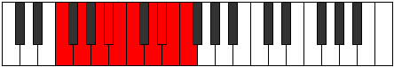 |
| [3831](https://ianring.com/musictheory/scales/3831) | [Ionyllian](ModeDSharpIonyllian.md) | D# | D#, E, F, G, G#, A, A#, C, C#, D, D# |  |
| [3831](https://ianring.com/musictheory/scales/3831) | [Ionyllian](ModeEFlatIonyllian.md) | Eb | Eb, E, F, G, Ab, A, Bb, C, Db, D, Eb |  |
| [3831](https://ianring.com/musictheory/scales/3831) | [Ionyllian](ModeDNaturalIonyllian.md) | D | D, D#, E, F#, G, G#, A, B, C, C#, D |  |
| [3831](https://ianring.com/musictheory/scales/3831) | [Ionyllian](ModeFNaturalIonyllian.md) | F | F, F#, G, A, A#, B, C, D, D#, E, F |  |
| [3831](https://ianring.com/musictheory/scales/3831) | [Ionyllian](ModeBNaturalIonyllian.md) | B | B, C, C#, D#, E, F, F#, G#, A, A#, B |  |
| [3831](https://ianring.com/musictheory/scales/3831) | [Ionyllian](ModeASharpIonyllian.md) | A# | A#, B, C, D, D#, E, F, G, G#, A, A# |  |
| [3831](https://ianring.com/musictheory/scales/3831) | [Ionyllian](ModeBFlatIonyllian.md) | Bb | Bb, B, C, D, Eb, E, F, G, Ab, A, Bb |  |
| [3833](https://ianring.com/musictheory/scales/3833) | [Dycrygic](ModeANaturalDycrygic.md) | A | A, C, C#, D, D#, E, F#, G, G#, A |  |
| [3833](https://ianring.com/musictheory/scales/3833) | [Dycrygic](ModeFSharpDycrygic.md) | F# | F#, A, A#, B, C, C#, D#, E, F, F# |  |
| [3833](https://ianring.com/musictheory/scales/3833) | [Dycrygic](ModeGFlatDycrygic.md) | Gb | Gb, A, Bb, B, C, Db, Eb, E, F, Gb |  |
| [3833](https://ianring.com/musictheory/scales/3833) | [Dycrygic](ModeCNaturalDycrygic.md) | C | C, D#, E, F, F#, G, A, A#, B, C |  |
| [3833](https://ianring.com/musictheory/scales/3833) | [Dycrygic](ModeFNaturalDycrygic.md) | F | F, G#, A, A#, B, C, D, D#, E, F |  |
| [3835](https://ianring.com/musictheory/scales/3835) | [Katodyllian](ModeDSharpKatodyllian.md) | D# | D#, E, F#, G, G#, A, A#, C, C#, D, D# |  |
| [3835](https://ianring.com/musictheory/scales/3835) | [Katodyllian](ModeEFlatKatodyllian.md) | Eb | Eb, E, Gb, G, Ab, A, Bb, C, Db, D, Eb |  |
| [3835](https://ianring.com/musictheory/scales/3835) | [Katodyllian](ModeANaturalKatodyllian.md) | A | A, A#, C, C#, D, D#, E, F#, G, G#, A |  |
| [3835](https://ianring.com/musictheory/scales/3835) | [Katodyllian](ModeCNaturalKatodyllian.md) | C | C, C#, D#, E, F, F#, G, A, A#, B, C |  |
| [3835](https://ianring.com/musictheory/scales/3835) | [Katodyllian](ModeFSharpKatodyllian.md) | F# | F#, G, A, A#, B, C, C#, D#, E, F, F# |  |
| [3835](https://ianring.com/musictheory/scales/3835) | [Katodyllian](ModeGFlatKatodyllian.md) | Gb | Gb, G, A, Bb, B, C, Db, Eb, E, F, Gb |  |
| [3835](https://ianring.com/musictheory/scales/3835) | [Katodyllian](ModeFNaturalKatodyllian.md) | F | F, F#, G#, A, A#, B, C, D, D#, E, F |  |
| [3835](https://ianring.com/musictheory/scales/3835) | [Katodyllian](ModeBNaturalKatodyllian.md) | B | B, C, D, D#, E, F, F#, G#, A, A#, B |  |
| [3837](https://ianring.com/musictheory/scales/3837) | [Garyllian](ModeASharpGaryllian.md) | A# | A#, C, C#, D, D#, E, F, G, G#, A, A# |  |
| [3837](https://ianring.com/musictheory/scales/3837) | [Garyllian](ModeBFlatGaryllian.md) | Bb | Bb, C, Db, D, Eb, E, F, G, Ab, A, Bb |  |
| [3837](https://ianring.com/musictheory/scales/3837) | [Garyllian](ModeANaturalGaryllian.md) | A | A, B, C, C#, D, D#, E, F#, G, G#, A |  |
| [3837](https://ianring.com/musictheory/scales/3837) | [Garyllian](ModeCNaturalGaryllian.md) | C | C, D, D#, E, F, F#, G, A, A#, B, C |  |
| [3837](https://ianring.com/musictheory/scales/3837) | [Garyllian](ModeFSharpGaryllian.md) | F# | F#, G#, A, A#, B, C, C#, D#, E, F, F# |  |
| [3837](https://ianring.com/musictheory/scales/3837) | [Garyllian](ModeGFlatGaryllian.md) | Gb | Gb, Ab, A, Bb, B, C, Db, Eb, E, F, Gb |  |
| [3837](https://ianring.com/musictheory/scales/3837) | [Garyllian](ModeFNaturalGaryllian.md) | F | F, G, G#, A, A#, B, C, D, D#, E, F |  |
| [3839](https://ianring.com/musictheory/scales/3839) | [Mixolatic](ModeDSharpMixolatic.md) | D# | D#, E, F, F#, G, G#, A, A#, C, C#, D, D# |  |
| [3839](https://ianring.com/musictheory/scales/3839) | [Mixolatic](ModeEFlatMixolatic.md) | Eb | Eb, E, F, Gb, G, Ab, A, Bb, C, Db, D, Eb |  |
| [3839](https://ianring.com/musictheory/scales/3839) | [Mixolatic](ModeDNaturalMixolatic.md) | D | D, D#, E, F, F#, G, G#, A, B, C, C#, D |  |
| [3839](https://ianring.com/musictheory/scales/3839) | [Mixolatic](ModeCNaturalMixolatic.md) | C | C, C#, D, D#, E, F, F#, G, A, A#, B, C |  |
| [3839](https://ianring.com/musictheory/scales/3839) | [Mixolatic](ModeBNaturalMixolatic.md) | B | B, C, C#, D, D#, E, F, F#, G#, A, A#, B |  |
| [3839](https://ianring.com/musictheory/scales/3839) | [Mixolatic](ModeASharpMixolatic.md) | A# | A#, B, C, C#, D, D#, E, F, G, G#, A, A# |  |
| [3839](https://ianring.com/musictheory/scales/3839) | [Mixolatic](ModeBFlatMixolatic.md) | Bb | Bb, B, C, Db, D, Eb, E, F, G, Ab, A, Bb |  |
| [3839](https://ianring.com/musictheory/scales/3839) | [Mixolatic](ModeANaturalMixolatic.md) | A | A, A#, B, C, C#, D, D#, E, F#, G, G#, A |  |
| [3839](https://ianring.com/musictheory/scales/3839) | [Mixolatic](ModeFSharpMixolatic.md) | F# | F#, G, G#, A, A#, B, C, C#, D#, E, F, F# |  |
| [3839](https://ianring.com/musictheory/scales/3839) | [Mixolatic](ModeGFlatMixolatic.md) | Gb | Gb, G, Ab, A, Bb, B, C, Db, Eb, E, F, Gb |  |
| [3839](https://ianring.com/musictheory/scales/3839) | [Mixolatic](ModeFNaturalMixolatic.md) | F | F, F#, G, G#, A, A#, B, C, D, D#, E, F |  |
| [3865](https://ianring.com/musictheory/scales/3865) | [Starian](ModeCNaturalStarian.md) | C | C, D#, E, F###, G##, A#, B, C |  |
| [3867](https://ianring.com/musictheory/scales/3867) | [Storyllic](ModeCNaturalStoryllic.md) | C | C, C#, D#, E, G#, A, A#, B, C |  |
| [3869](https://ianring.com/musictheory/scales/3869) | [Bygyllic](ModeCSharpBygyllic.md) | C# | C#, D#, E, F, A, A#, B, C, C# |  |
| [3869](https://ianring.com/musictheory/scales/3869) | [Bygyllic](ModeDFlatBygyllic.md) | Db | Db, Eb, E, F, A, Bb, B, C, Db |  |
| [3869](https://ianring.com/musictheory/scales/3869) | [Bygyllic](ModeCNaturalBygyllic.md) | C | C, D, D#, E, G#, A, A#, B, C |  |
| [3871](https://ianring.com/musictheory/scales/3871) | [Aerynygic](ModeCSharpAerynygic.md) | C# | C#, D, D#, E, F, A, A#, B, C, C# |  |
| [3871](https://ianring.com/musictheory/scales/3871) | [Aerynygic](ModeDFlatAerynygic.md) | Db | Db, D, Eb, E, F, A, Bb, B, C, Db |  |
| [3871](https://ianring.com/musictheory/scales/3871) | [Aerynygic](ModeCNaturalAerynygic.md) | C | C, C#, D, D#, E, G#, A, A#, B, C |  |
| [3875](https://ianring.com/musictheory/scales/3875) | [Aeryptian](ModeENaturalAeryptian.md) | E | E, F, G##, A###, B##, C##, D#, E |  |
| [3877](https://ianring.com/musictheory/scales/3877) | [Thanian](ModeENaturalThanian.md) | E | E, F#, G##, A###, B##, C##, D#, E |  |
| [3877](https://ianring.com/musictheory/scales/3877) | [Thanian](ModeGNaturalThanian.md) | G | G, A, B#, C###, D##, E#, F#, G |  |
| [3879](https://ianring.com/musictheory/scales/3879) | [Pathyllic](ModeENaturalPathyllic.md) | E | E, F, F#, A, C, C#, D, D#, E |  |
| [3879](https://ianring.com/musictheory/scales/3879) | [Pathyllic](ModeGNaturalPathyllic.md) | G | G, G#, A, C, D#, E, F, F#, G |  |
| [3881](https://ianring.com/musictheory/scales/3881) | [Morian](ModeENaturalMorian.md) | E | E, F##, G##, A###, B##, C##, D#, E |  |
| [3883](https://ianring.com/musictheory/scales/3883) | [Kyryllic](ModeENaturalKyryllic.md) | E | E, F, G, A, C, C#, D, D#, E |  |
| [3885](https://ianring.com/musictheory/scales/3885) | [Styryllic](ModeENaturalStyryllic.md) | E | E, F#, G, A, C, C#, D, D#, E |  |
| [3885](https://ianring.com/musictheory/scales/3885) | [Styryllic](ModeGNaturalStyryllic.md) | G | G, A, A#, C, D#, E, F, F#, G |  |
| [3885](https://ianring.com/musictheory/scales/3885) | [Styryllic](ModeCSharpStyryllic.md) | C# | C#, D#, E, F#, A, A#, B, C, C# | 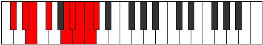 |
| [3885](https://ianring.com/musictheory/scales/3885) | [Styryllic](ModeDFlatStyryllic.md) | Db | Db, Eb, E, Gb, A, Bb, B, C, Db |  |
| [3887](https://ianring.com/musictheory/scales/3887) | [Phrathygic](ModeENaturalPhrathygic.md) | E | E, F, F#, G, A, C, C#, D, D#, E |  |
| [3887](https://ianring.com/musictheory/scales/3887) | [Phrathygic](ModeGNaturalPhrathygic.md) | G | G, G#, A, A#, C, D#, E, F, F#, G |  |
| [3887](https://ianring.com/musictheory/scales/3887) | [Phrathygic](ModeCSharpPhrathygic.md) | C# | C#, D, D#, E, F#, A, A#, B, C, C# |  |
| [3887](https://ianring.com/musictheory/scales/3887) | [Phrathygic](ModeDFlatPhrathygic.md) | Db | Db, D, Eb, E, Gb, A, Bb, B, C, Db |  |
| [3889](https://ianring.com/musictheory/scales/3889) | [Parian](ModeENaturalParian.md) | E | E, F###, G##, A###, B##, C##, D#, E |  |
| [3891](https://ianring.com/musictheory/scales/3891) | [Ryryllic](ModeENaturalRyryllic.md) | E | E, F, G#, A, C, C#, D, D#, E |  |
| [3891](https://ianring.com/musictheory/scales/3891) | [Ryryllic](ModeBNaturalRyryllic.md) | B | B, C, D#, E, G, G#, A, A#, B |  |
| [3893](https://ianring.com/musictheory/scales/3893) | [Phrocryllic](ModeENaturalPhrocryllic.md) | E | E, F#, G#, A, C, C#, D, D#, E |  |
| [3893](https://ianring.com/musictheory/scales/3893) | [Phrocryllic](ModeGNaturalPhrocryllic.md) | G | G, A, B, C, D#, E, F, F#, G |  |
| [3895](https://ianring.com/musictheory/scales/3895) | [Eparygic](ModeENaturalEparygic.md) | E | E, F, F#, G#, A, C, C#, D, D#, E |  |
| [3895](https://ianring.com/musictheory/scales/3895) | [Eparygic](ModeGNaturalEparygic.md) | G | G, G#, A, B, C, D#, E, F, F#, G |  |
| [3895](https://ianring.com/musictheory/scales/3895) | [Eparygic](ModeBNaturalEparygic.md) | B | B, C, C#, D#, E, G, G#, A, A#, B |  |
| [3897](https://ianring.com/musictheory/scales/3897) | [Locryllic](ModeENaturalLocryllic.md) | E | E, G, G#, A, C, C#, D, D#, E |  |
| [3897](https://ianring.com/musictheory/scales/3897) | [Locryllic](ModeCNaturalLocryllic.md) | C | C, D#, E, F, G#, A, A#, B, C |  |
| [3899](https://ianring.com/musictheory/scales/3899) | [Katorygic](ModeENaturalKatorygic.md) | E | E, F, G, G#, A, C, C#, D, D#, E |  |
| [3899](https://ianring.com/musictheory/scales/3899) | [Katorygic](ModeCNaturalKatorygic.md) | C | C, C#, D#, E, F, G#, A, A#, B, C |  |
| [3899](https://ianring.com/musictheory/scales/3899) | [Katorygic](ModeBNaturalKatorygic.md) | B | B, C, D, D#, E, G, G#, A, A#, B |  |
| [3901](https://ianring.com/musictheory/scales/3901) | [Bycrygic](ModeENaturalBycrygic.md) | E | E, F#, G, G#, A, C, C#, D, D#, E |  |
| [3901](https://ianring.com/musictheory/scales/3901) | [Bycrygic](ModeCSharpBycrygic.md) | C# | C#, D#, E, F, F#, A, A#, B, C, C# |  |
| [3901](https://ianring.com/musictheory/scales/3901) | [Bycrygic](ModeDFlatBycrygic.md) | Db | Db, Eb, E, F, Gb, A, Bb, B, C, Db |  |
| [3901](https://ianring.com/musictheory/scales/3901) | [Bycrygic](ModeGNaturalBycrygic.md) | G | G, A, A#, B, C, D#, E, F, F#, G |  |
| [3901](https://ianring.com/musictheory/scales/3901) | [Bycrygic](ModeCNaturalBycrygic.md) | C | C, D, D#, E, F, G#, A, A#, B, C |  |
| [3903](https://ianring.com/musictheory/scales/3903) | [Aeogyllian](ModeENaturalAeogyllian.md) | E | E, F, F#, G, G#, A, C, C#, D, D#, E |  |
| [3903](https://ianring.com/musictheory/scales/3903) | [Aeogyllian](ModeCSharpAeogyllian.md) | C# | C#, D, D#, E, F, F#, A, A#, B, C, C# |  |
| [3903](https://ianring.com/musictheory/scales/3903) | [Aeogyllian](ModeDFlatAeogyllian.md) | Db | Db, D, Eb, E, F, Gb, A, Bb, B, C, Db |  |
| [3903](https://ianring.com/musictheory/scales/3903) | [Aeogyllian](ModeCNaturalAeogyllian.md) | C | C, C#, D, D#, E, F, G#, A, A#, B, C |  |
| [3903](https://ianring.com/musictheory/scales/3903) | [Aeogyllian](ModeBNaturalAeogyllian.md) | B | B, C, C#, D, D#, E, G, G#, A, A#, B |  |
| [3903](https://ianring.com/musictheory/scales/3903) | [Aeogyllian](ModeGNaturalAeogyllian.md) | G | G, G#, A, A#, B, C, D#, E, F, F#, G |  |
| [3911](https://ianring.com/musictheory/scales/3911) | [Katyryllic](ModeDSharpKatyryllic.md) | D# | D#, E, F, A, B, C, C#, D, D# |  |
| [3911](https://ianring.com/musictheory/scales/3911) | [Katyryllic](ModeEFlatKatyryllic.md) | Eb | Eb, E, F, A, B, C, Db, D, Eb |  |
| [3913](https://ianring.com/musictheory/scales/3913) | [Bonian](ModeGFlatBonian.md) | Gb | Gb, A, B#, C##, D#, E, F, Gb |  |
| [3915](https://ianring.com/musictheory/scales/3915) | [Gogyllic](ModeFSharpGogyllic.md) | F# | F#, G, A, C, D, D#, E, F, F# |  |
| [3915](https://ianring.com/musictheory/scales/3915) | [Gogyllic](ModeGFlatGogyllic.md) | Gb | Gb, G, A, C, D, Eb, E, F, Gb |  |
| [3915](https://ianring.com/musictheory/scales/3915) | [Gogyllic](ModeDSharpGogyllic.md) | D# | D#, E, F#, A, B, C, C#, D, D# |  |
| [3915](https://ianring.com/musictheory/scales/3915) | [Gogyllic](ModeEFlatGogyllic.md) | Eb | Eb, E, Gb, A, B, C, Db, D, Eb |  |
| [3917](https://ianring.com/musictheory/scales/3917) | [Epaphyllic](ModeFSharpEpaphyllic.md) | F# | F#, G#, A, C, D, D#, E, F, F# |  |
| [3917](https://ianring.com/musictheory/scales/3917) | [Epaphyllic](ModeGFlatEpaphyllic.md) | Gb | Gb, Ab, A, C, D, Eb, E, F, Gb |  |
| [3917](https://ianring.com/musictheory/scales/3917) | [Epaphyllic](ModeCSharpEpaphyllic.md) | C# | C#, D#, E, G, A, A#, B, C, C# |  |
| [3917](https://ianring.com/musictheory/scales/3917) | [Epaphyllic](ModeDFlatEpaphyllic.md) | Db | Db, Eb, E, G, A, Bb, B, C, Db |  |
| [3919](https://ianring.com/musictheory/scales/3919) | [Lynygic](ModeFSharpLynygic.md) | F# | F#, G, G#, A, C, D, D#, E, F, F# |  |
| [3919](https://ianring.com/musictheory/scales/3919) | [Lynygic](ModeGFlatLynygic.md) | Gb | Gb, G, Ab, A, C, D, Eb, E, F, Gb |  |
| [3919](https://ianring.com/musictheory/scales/3919) | [Lynygic](ModeDSharpLynygic.md) | D# | D#, E, F, F#, A, B, C, C#, D, D# |  |
| [3919](https://ianring.com/musictheory/scales/3919) | [Lynygic](ModeEFlatLynygic.md) | Eb | Eb, E, F, Gb, A, B, C, Db, D, Eb |  |
| [3919](https://ianring.com/musictheory/scales/3919) | [Lynygic](ModeCSharpLynygic.md) | C# | C#, D, D#, E, G, A, A#, B, C, C# |  |
| [3919](https://ianring.com/musictheory/scales/3919) | [Lynygic](ModeDFlatLynygic.md) | Db | Db, D, Eb, E, G, A, Bb, B, C, Db |  |
| [3923](https://ianring.com/musictheory/scales/3923) | [Stoptyllic](ModeDSharpStoptyllic.md) | D# | D#, E, G, A, B, C, C#, D, D# |  |
| [3923](https://ianring.com/musictheory/scales/3923) | [Stoptyllic](ModeEFlatStoptyllic.md) | Eb | Eb, E, G, A, B, C, Db, D, Eb |  |
| [3927](https://ianring.com/musictheory/scales/3927) | [Monygic](ModeDSharpMonygic.md) | D# | D#, E, F, G, A, B, C, C#, D, D# |  |
| [3927](https://ianring.com/musictheory/scales/3927) | [Monygic](ModeEFlatMonygic.md) | Eb | Eb, E, F, G, A, B, C, Db, D, Eb |  |
| [3929](https://ianring.com/musictheory/scales/3929) | [Aeolothyllic](ModeFSharpAeolothyllic.md) | F# | F#, A, A#, C, D, D#, E, F, F# |  |
| [3929](https://ianring.com/musictheory/scales/3929) | [Aeolothyllic](ModeGFlatAeolothyllic.md) | Gb | Gb, A, Bb, C, D, Eb, E, F, Gb |  |
| [3929](https://ianring.com/musictheory/scales/3929) | [Aeolothyllic](ModeCNaturalAeolothyllic.md) | C | C, D#, E, F#, G#, A, A#, B, C |  |
| [3931](https://ianring.com/musictheory/scales/3931) | [Aerygic](ModeFSharpAerygic.md) | F# | F#, G, A, A#, C, D, D#, E, F, F# |  |
| [3931](https://ianring.com/musictheory/scales/3931) | [Aerygic](ModeGFlatAerygic.md) | Gb | Gb, G, A, Bb, C, D, Eb, E, F, Gb |  |
| [3931](https://ianring.com/musictheory/scales/3931) | [Aerygic](ModeDSharpAerygic.md) | D# | D#, E, F#, G, A, B, C, C#, D, D# |  |
| [3931](https://ianring.com/musictheory/scales/3931) | [Aerygic](ModeEFlatAerygic.md) | Eb | Eb, E, Gb, G, A, B, C, Db, D, Eb |  |
| [3931](https://ianring.com/musictheory/scales/3931) | [Aerygic](ModeCNaturalAerygic.md) | C | C, C#, D#, E, F#, G#, A, A#, B, C |  |
| [3933](https://ianring.com/musictheory/scales/3933) | [Ionidygic](ModeFSharpIonidygic.md) | F# | F#, G#, A, A#, C, D, D#, E, F, F# |  |
| [3933](https://ianring.com/musictheory/scales/3933) | [Ionidygic](ModeGFlatIonidygic.md) | Gb | Gb, Ab, A, Bb, C, D, Eb, E, F, Gb |  |
| [3933](https://ianring.com/musictheory/scales/3933) | [Ionidygic](ModeCSharpIonidygic.md) | C# | C#, D#, E, F, G, A, A#, B, C, C# |  |
| [3933](https://ianring.com/musictheory/scales/3933) | [Ionidygic](ModeDFlatIonidygic.md) | Db | Db, Eb, E, F, G, A, Bb, B, C, Db |  |
| [3933](https://ianring.com/musictheory/scales/3933) | [Ionidygic](ModeCNaturalIonidygic.md) | C | C, D, D#, E, F#, G#, A, A#, B, C |  |
| [3935](https://ianring.com/musictheory/scales/3935) | [Kataphyllian](ModeFSharpKataphyllian.md) | F# | F#, G, G#, A, A#, C, D, D#, E, F, F# |  |
| [3935](https://ianring.com/musictheory/scales/3935) | [Kataphyllian](ModeGFlatKataphyllian.md) | Gb | Gb, G, Ab, A, Bb, C, D, Eb, E, F, Gb |  |
| [3935](https://ianring.com/musictheory/scales/3935) | [Kataphyllian](ModeDSharpKataphyllian.md) | D# | D#, E, F, F#, G, A, B, C, C#, D, D# |  |
| [3935](https://ianring.com/musictheory/scales/3935) | [Kataphyllian](ModeEFlatKataphyllian.md) | Eb | Eb, E, F, Gb, G, A, B, C, Db, D, Eb |  |
| [3935](https://ianring.com/musictheory/scales/3935) | [Kataphyllian](ModeCSharpKataphyllian.md) | C# | C#, D, D#, E, F, G, A, A#, B, C, C# |  |
| [3935](https://ianring.com/musictheory/scales/3935) | [Kataphyllian](ModeDFlatKataphyllian.md) | Db | Db, D, Eb, E, F, G, A, Bb, B, C, Db |  |
| [3935](https://ianring.com/musictheory/scales/3935) | [Kataphyllian](ModeCNaturalKataphyllian.md) | C | C, C#, D, D#, E, F#, G#, A, A#, B, C |  |
| [3939](https://ianring.com/musictheory/scales/3939) | [Dogyllic](ModeENaturalDogyllic.md) | E | E, F, A, A#, C, C#, D, D#, E |  |
| [3939](https://ianring.com/musictheory/scales/3939) | [Dogyllic](ModeDSharpDogyllic.md) | D# | D#, E, G#, A, B, C, C#, D, D# |  |
| [3939](https://ianring.com/musictheory/scales/3939) | [Dogyllic](ModeEFlatDogyllic.md) | Eb | Eb, E, Ab, A, B, C, Db, D, Eb |  |
| [3941](https://ianring.com/musictheory/scales/3941) | [Stathyllic](ModeGNaturalStathyllic.md) | G | G, A, C, C#, D#, E, F, F#, G |  |
| [3941](https://ianring.com/musictheory/scales/3941) | [Stathyllic](ModeENaturalStathyllic.md) | E | E, F#, A, A#, C, C#, D, D#, E |  |
| [3941](https://ianring.com/musictheory/scales/3941) | [Stathyllic](ModeASharpStathyllic.md) | A# | A#, C, D#, E, F#, G, G#, A, A# |  |
| [3941](https://ianring.com/musictheory/scales/3941) | [Stathyllic](ModeBFlatStathyllic.md) | Bb | Bb, C, Eb, E, Gb, G, Ab, A, Bb |  |
| [3943](https://ianring.com/musictheory/scales/3943) | [Zynygic](ModeGNaturalZynygic.md) | G | G, G#, A, C, C#, D#, E, F, F#, G |  |
| [3943](https://ianring.com/musictheory/scales/3943) | [Zynygic](ModeENaturalZynygic.md) | E | E, F, F#, A, A#, C, C#, D, D#, E |  |
| [3943](https://ianring.com/musictheory/scales/3943) | [Zynygic](ModeDSharpZynygic.md) | D# | D#, E, F, G#, A, B, C, C#, D, D# |  |
| [3943](https://ianring.com/musictheory/scales/3943) | [Zynygic](ModeEFlatZynygic.md) | Eb | Eb, E, F, Ab, A, B, C, Db, D, Eb |  |
| [3943](https://ianring.com/musictheory/scales/3943) | [Zynygic](ModeASharpZynygic.md) | A# | A#, B, C, D#, E, F#, G, G#, A, A# |  |
| [3943](https://ianring.com/musictheory/scales/3943) | [Zynygic](ModeBFlatZynygic.md) | Bb | Bb, B, C, Eb, E, Gb, G, Ab, A, Bb |  |
| [3945](https://ianring.com/musictheory/scales/3945) | [Lydyllic](ModeENaturalLydyllic.md) | E | E, G, A, A#, C, C#, D, D#, E |  |
| [3945](https://ianring.com/musictheory/scales/3945) | [Lydyllic](ModeFSharpLydyllic.md) | F# | F#, A, B, C, D, D#, E, F, F# |  |
| [3945](https://ianring.com/musictheory/scales/3945) | [Lydyllic](ModeGFlatLydyllic.md) | Gb | Gb, A, B, C, D, Eb, E, F, Gb |  |
| [3947](https://ianring.com/musictheory/scales/3947) | [Ryptygic](ModeENaturalRyptygic.md) | E | E, F, G, A, A#, C, C#, D, D#, E |  |
| [3947](https://ianring.com/musictheory/scales/3947) | [Ryptygic](ModeFSharpRyptygic.md) | F# | F#, G, A, B, C, D, D#, E, F, F# |  |
| [3947](https://ianring.com/musictheory/scales/3947) | [Ryptygic](ModeGFlatRyptygic.md) | Gb | Gb, G, A, B, C, D, Eb, E, F, Gb |  |
| [3947](https://ianring.com/musictheory/scales/3947) | [Ryptygic](ModeDSharpRyptygic.md) | D# | D#, E, F#, G#, A, B, C, C#, D, D# |  |
| [3947](https://ianring.com/musictheory/scales/3947) | [Ryptygic](ModeEFlatRyptygic.md) | Eb | Eb, E, Gb, Ab, A, B, C, Db, D, Eb |  |
| [3949](https://ianring.com/musictheory/scales/3949) | [Koptygic](ModeENaturalKoptygic.md) | E | E, F#, G, A, A#, C, C#, D, D#, E |  |
| [3949](https://ianring.com/musictheory/scales/3949) | [Koptygic](ModeGNaturalKoptygic.md) | G | G, A, A#, C, C#, D#, E, F, F#, G |  |
| [3949](https://ianring.com/musictheory/scales/3949) | [Koptygic](ModeASharpKoptygic.md) | A# | A#, C, C#, D#, E, F#, G, G#, A, A# |  |
| [3949](https://ianring.com/musictheory/scales/3949) | [Koptygic](ModeBFlatKoptygic.md) | Bb | Bb, C, Db, Eb, E, Gb, G, Ab, A, Bb |  |
| [3949](https://ianring.com/musictheory/scales/3949) | [Koptygic](ModeFSharpKoptygic.md) | F# | F#, G#, A, B, C, D, D#, E, F, F# |  |
| [3949](https://ianring.com/musictheory/scales/3949) | [Koptygic](ModeGFlatKoptygic.md) | Gb | Gb, Ab, A, B, C, D, Eb, E, F, Gb |  |
| [3949](https://ianring.com/musictheory/scales/3949) | [Koptygic](ModeCSharpKoptygic.md) | C# | C#, D#, E, F#, G, A, A#, B, C, C# |  |
| [3949](https://ianring.com/musictheory/scales/3949) | [Koptygic](ModeDFlatKoptygic.md) | Db | Db, Eb, E, Gb, G, A, Bb, B, C, Db |  |
| [3951](https://ianring.com/musictheory/scales/3951) | [Mathyllian](ModeENaturalMathyllian.md) | E | E, F, F#, G, A, A#, C, C#, D, D#, E |  |
| [3951](https://ianring.com/musictheory/scales/3951) | [Mathyllian](ModeGNaturalMathyllian.md) | G | G, G#, A, A#, C, C#, D#, E, F, F#, G |  |
| [3951](https://ianring.com/musictheory/scales/3951) | [Mathyllian](ModeDSharpMathyllian.md) | D# | D#, E, F, F#, G#, A, B, C, C#, D, D# |  |
| [3951](https://ianring.com/musictheory/scales/3951) | [Mathyllian](ModeEFlatMathyllian.md) | Eb | Eb, E, F, Gb, Ab, A, B, C, Db, D, Eb |  |
| [3951](https://ianring.com/musictheory/scales/3951) | [Mathyllian](ModeFSharpMathyllian.md) | F# | F#, G, G#, A, B, C, D, D#, E, F, F# |  |
| [3951](https://ianring.com/musictheory/scales/3951) | [Mathyllian](ModeGFlatMathyllian.md) | Gb | Gb, G, Ab, A, B, C, D, Eb, E, F, Gb |  |
| [3951](https://ianring.com/musictheory/scales/3951) | [Mathyllian](ModeCSharpMathyllian.md) | C# | C#, D, D#, E, F#, G, A, A#, B, C, C# |  |
| [3951](https://ianring.com/musictheory/scales/3951) | [Mathyllian](ModeDFlatMathyllian.md) | Db | Db, D, Eb, E, Gb, G, A, Bb, B, C, Db |  |
| [3951](https://ianring.com/musictheory/scales/3951) | [Mathyllian](ModeASharpMathyllian.md) | A# | A#, B, C, C#, D#, E, F#, G, G#, A, A# |  |
| [3951](https://ianring.com/musictheory/scales/3951) | [Mathyllian](ModeBFlatMathyllian.md) | Bb | Bb, B, C, Db, Eb, E, Gb, G, Ab, A, Bb |  |
| [3953](https://ianring.com/musictheory/scales/3953) | [Thagyllic](ModeENaturalThagyllic.md) | E | E, G#, A, A#, C, C#, D, D#, E |  |
| [3955](https://ianring.com/musictheory/scales/3955) | [Galygic](ModeENaturalGalygic.md) | E | E, F, G#, A, A#, C, C#, D, D#, E |  |
| [3955](https://ianring.com/musictheory/scales/3955) | [Galygic](ModeDSharpGalygic.md) | D# | D#, E, G, G#, A, B, C, C#, D, D# |  |
| [3955](https://ianring.com/musictheory/scales/3955) | [Galygic](ModeEFlatGalygic.md) | Eb | Eb, E, G, Ab, A, B, C, Db, D, Eb |  |
| [3955](https://ianring.com/musictheory/scales/3955) | [Galygic](ModeBNaturalGalygic.md) | B | B, C, D#, E, F, G, G#, A, A#, B |  |
| [3957](https://ianring.com/musictheory/scales/3957) | [Porygic](ModeENaturalPorygic.md) | E | E, F#, G#, A, A#, C, C#, D, D#, E |  |
| [3957](https://ianring.com/musictheory/scales/3957) | [Porygic](ModeASharpPorygic.md) | A# | A#, C, D, D#, E, F#, G, G#, A, A# |  |
| [3957](https://ianring.com/musictheory/scales/3957) | [Porygic](ModeBFlatPorygic.md) | Bb | Bb, C, D, Eb, E, Gb, G, Ab, A, Bb |  |
| [3957](https://ianring.com/musictheory/scales/3957) | [Porygic](ModeGNaturalPorygic.md) | G | G, A, B, C, C#, D#, E, F, F#, G |  |
| [3959](https://ianring.com/musictheory/scales/3959) | [Katagyllian](ModeENaturalKatagyllian.md) | E | E, F, F#, G#, A, A#, C, C#, D, D#, E |  |
| [3959](https://ianring.com/musictheory/scales/3959) | [Katagyllian](ModeDSharpKatagyllian.md) | D# | D#, E, F, G, G#, A, B, C, C#, D, D# |  |
| [3959](https://ianring.com/musictheory/scales/3959) | [Katagyllian](ModeEFlatKatagyllian.md) | Eb | Eb, E, F, G, Ab, A, B, C, Db, D, Eb |  |
| [3959](https://ianring.com/musictheory/scales/3959) | [Katagyllian](ModeGNaturalKatagyllian.md) | G | G, G#, A, B, C, C#, D#, E, F, F#, G |  |
| [3959](https://ianring.com/musictheory/scales/3959) | [Katagyllian](ModeBNaturalKatagyllian.md) | B | B, C, C#, D#, E, F, G, G#, A, A#, B |  |
| [3959](https://ianring.com/musictheory/scales/3959) | [Katagyllian](ModeASharpKatagyllian.md) | A# | A#, B, C, D, D#, E, F#, G, G#, A, A# |  |
| [3959](https://ianring.com/musictheory/scales/3959) | [Katagyllian](ModeBFlatKatagyllian.md) | Bb | Bb, B, C, D, Eb, E, Gb, G, Ab, A, Bb |  |
| [3961](https://ianring.com/musictheory/scales/3961) | [Mixolydygic](ModeENaturalMixolydygic.md) | E | E, G, G#, A, A#, C, C#, D, D#, E |  |
| [3961](https://ianring.com/musictheory/scales/3961) | [Mixolydygic](ModeFSharpMixolydygic.md) | F# | F#, A, A#, B, C, D, D#, E, F, F# |  |
| [3961](https://ianring.com/musictheory/scales/3961) | [Mixolydygic](ModeGFlatMixolydygic.md) | Gb | Gb, A, Bb, B, C, D, Eb, E, F, Gb |  |
| [3961](https://ianring.com/musictheory/scales/3961) | [Mixolydygic](ModeCNaturalMixolydygic.md) | C | C, D#, E, F, F#, G#, A, A#, B, C |  |
| [3963](https://ianring.com/musictheory/scales/3963) | [Aeoryllian](ModeENaturalAeoryllian.md) | E | E, F, G, G#, A, A#, C, C#, D, D#, E |  |
| [3963](https://ianring.com/musictheory/scales/3963) | [Aeoryllian](ModeDSharpAeoryllian.md) | D# | D#, E, F#, G, G#, A, B, C, C#, D, D# |  |
| [3963](https://ianring.com/musictheory/scales/3963) | [Aeoryllian](ModeEFlatAeoryllian.md) | Eb | Eb, E, Gb, G, Ab, A, B, C, Db, D, Eb |  |
| [3963](https://ianring.com/musictheory/scales/3963) | [Aeoryllian](ModeFSharpAeoryllian.md) | F# | F#, G, A, A#, B, C, D, D#, E, F, F# |  |
| [3963](https://ianring.com/musictheory/scales/3963) | [Aeoryllian](ModeGFlatAeoryllian.md) | Gb | Gb, G, A, Bb, B, C, D, Eb, E, F, Gb |  |
| [3963](https://ianring.com/musictheory/scales/3963) | [Aeoryllian](ModeCNaturalAeoryllian.md) | C | C, C#, D#, E, F, F#, G#, A, A#, B, C |  |
| [3963](https://ianring.com/musictheory/scales/3963) | [Aeoryllian](ModeBNaturalAeoryllian.md) | B | B, C, D, D#, E, F, G, G#, A, A#, B |  |
| [3965](https://ianring.com/musictheory/scales/3965) | [Thydyllian](ModeENaturalThydyllian.md) | E | E, F#, G, G#, A, A#, C, C#, D, D#, E |  |
| [3965](https://ianring.com/musictheory/scales/3965) | [Thydyllian](ModeASharpThydyllian.md) | A# | A#, C, C#, D, D#, E, F#, G, G#, A, A# |  |
| [3965](https://ianring.com/musictheory/scales/3965) | [Thydyllian](ModeBFlatThydyllian.md) | Bb | Bb, C, Db, D, Eb, E, Gb, G, Ab, A, Bb |  |
| [3965](https://ianring.com/musictheory/scales/3965) | [Thydyllian](ModeCSharpThydyllian.md) | C# | C#, D#, E, F, F#, G, A, A#, B, C, C# |  |
| [3965](https://ianring.com/musictheory/scales/3965) | [Thydyllian](ModeDFlatThydyllian.md) | Db | Db, Eb, E, F, Gb, G, A, Bb, B, C, Db |  |
| [3965](https://ianring.com/musictheory/scales/3965) | [Thydyllian](ModeGNaturalThydyllian.md) | G | G, A, A#, B, C, C#, D#, E, F, F#, G |  |
| [3965](https://ianring.com/musictheory/scales/3965) | [Thydyllian](ModeCNaturalThydyllian.md) | C | C, D, D#, E, F, F#, G#, A, A#, B, C |  |
| [3965](https://ianring.com/musictheory/scales/3965) | [Thydyllian](ModeFSharpThydyllian.md) | F# | F#, G#, A, A#, B, C, D, D#, E, F, F# |  |
| [3965](https://ianring.com/musictheory/scales/3965) | [Thydyllian](ModeGFlatThydyllian.md) | Gb | Gb, Ab, A, Bb, B, C, D, Eb, E, F, Gb |  |
| [3967](https://ianring.com/musictheory/scales/3967) | [Soratic](ModeENaturalSoratic.md) | E | E, F, F#, G, G#, A, A#, C, C#, D, D#, E |  |
| [3967](https://ianring.com/musictheory/scales/3967) | [Soratic](ModeDSharpSoratic.md) | D# | D#, E, F, F#, G, G#, A, B, C, C#, D, D# |  |
| [3967](https://ianring.com/musictheory/scales/3967) | [Soratic](ModeEFlatSoratic.md) | Eb | Eb, E, F, Gb, G, Ab, A, B, C, Db, D, Eb |  |
| [3967](https://ianring.com/musictheory/scales/3967) | [Soratic](ModeCSharpSoratic.md) | C# | C#, D, D#, E, F, F#, G, A, A#, B, C, C# |  |
| [3967](https://ianring.com/musictheory/scales/3967) | [Soratic](ModeDFlatSoratic.md) | Db | Db, D, Eb, E, F, Gb, G, A, Bb, B, C, Db |  |
| [3967](https://ianring.com/musictheory/scales/3967) | [Soratic](ModeCNaturalSoratic.md) | C | C, C#, D, D#, E, F, F#, G#, A, A#, B, C |  |
| [3967](https://ianring.com/musictheory/scales/3967) | [Soratic](ModeBNaturalSoratic.md) | B | B, C, C#, D, D#, E, F, G, G#, A, A#, B |  |
| [3967](https://ianring.com/musictheory/scales/3967) | [Soratic](ModeASharpSoratic.md) | A# | A#, B, C, C#, D, D#, E, F#, G, G#, A, A# |  |
| [3967](https://ianring.com/musictheory/scales/3967) | [Soratic](ModeBFlatSoratic.md) | Bb | Bb, B, C, Db, D, Eb, E, Gb, G, Ab, A, Bb |  |
| [3967](https://ianring.com/musictheory/scales/3967) | [Soratic](ModeGNaturalSoratic.md) | G | G, G#, A, A#, B, C, C#, D#, E, F, F#, G |  |
| [3967](https://ianring.com/musictheory/scales/3967) | [Soratic](ModeFSharpSoratic.md) | F# | F#, G, G#, A, A#, B, C, D, D#, E, F, F# |  |
| [3967](https://ianring.com/musictheory/scales/3967) | [Soratic](ModeGFlatSoratic.md) | Gb | Gb, G, Ab, A, Bb, B, C, D, Eb, E, F, Gb |  |
| [3981](https://ianring.com/musictheory/scales/3981) | [Phrycryllic](ModeCSharpPhrycryllic.md) | C# | C#, D#, E, G#, A, A#, B, C, C# |  |
| [3981](https://ianring.com/musictheory/scales/3981) | [Phrycryllic](ModeDFlatPhrycryllic.md) | Db | Db, Eb, E, Ab, A, Bb, B, C, Db |  |
| [3983](https://ianring.com/musictheory/scales/3983) | [Thyptygic](ModeDNaturalThyptygic.md) | D | D, D#, E, F, A, A#, B, C, C#, D |  |
| [3983](https://ianring.com/musictheory/scales/3983) | [Thyptygic](ModeCSharpThyptygic.md) | C# | C#, D, D#, E, G#, A, A#, B, C, C# |  |
| [3983](https://ianring.com/musictheory/scales/3983) | [Thyptygic](ModeDFlatThyptygic.md) | Db | Db, D, Eb, E, Ab, A, Bb, B, C, Db |  |
| [3985](https://ianring.com/musictheory/scales/3985) | [Thadian](ModeFNaturalThadian.md) | F | F, G##, A###, B##, C##, D#, E, F |  |
| [3987](https://ianring.com/musictheory/scales/3987) | [Loryllic](ModeFNaturalLoryllic.md) | F | F, F#, A, C, C#, D, D#, E, F |  |
| [3987](https://ianring.com/musictheory/scales/3987) | [Loryllic](ModeGSharpLoryllic.md) | G# | G#, A, C, D#, E, F, F#, G, G# |  |
| [3987](https://ianring.com/musictheory/scales/3987) | [Loryllic](ModeAFlatLoryllic.md) | Ab | Ab, A, C, Eb, E, F, Gb, G, Ab |  |
| [3989](https://ianring.com/musictheory/scales/3989) | [Sythyllic](ModeFNaturalSythyllic.md) | F | F, G, A, C, C#, D, D#, E, F |  |
| [3991](https://ianring.com/musictheory/scales/3991) | [Badygic](ModeFNaturalBadygic.md) | F | F, F#, G, A, C, C#, D, D#, E, F |  |
| [3991](https://ianring.com/musictheory/scales/3991) | [Badygic](ModeGSharpBadygic.md) | G# | G#, A, A#, C, D#, E, F, F#, G, G# |  |
| [3991](https://ianring.com/musictheory/scales/3991) | [Badygic](ModeAFlatBadygic.md) | Ab | Ab, A, Bb, C, Eb, E, F, Gb, G, Ab |  |
| [3991](https://ianring.com/musictheory/scales/3991) | [Badygic](ModeDNaturalBadygic.md) | D | D, D#, E, F#, A, A#, B, C, C#, D |  |
| [3993](https://ianring.com/musictheory/scales/3993) | [Ioniptyllic](ModeFNaturalIoniptyllic.md) | F | F, G#, A, C, C#, D, D#, E, F |  |
| [3993](https://ianring.com/musictheory/scales/3993) | [Ioniptyllic](ModeCNaturalIoniptyllic.md) | C | C, D#, E, G, G#, A, A#, B, C |  |
| [3995](https://ianring.com/musictheory/scales/3995) | [Ionygic](ModeFNaturalIonygic.md) | F | F, F#, G#, A, C, C#, D, D#, E, F |  |
| [3995](https://ianring.com/musictheory/scales/3995) | [Ionygic](ModeGSharpIonygic.md) | G# | G#, A, B, C, D#, E, F, F#, G, G# |  |
| [3995](https://ianring.com/musictheory/scales/3995) | [Ionygic](ModeAFlatIonygic.md) | Ab | Ab, A, B, C, Eb, E, F, Gb, G, Ab |  |
| [3995](https://ianring.com/musictheory/scales/3995) | [Ionygic](ModeCNaturalIonygic.md) | C | C, C#, D#, E, G, G#, A, A#, B, C |  |
| [3997](https://ianring.com/musictheory/scales/3997) | [Dogygic](ModeFNaturalDogygic.md) | F | F, G, G#, A, C, C#, D, D#, E, F |  |
| [3997](https://ianring.com/musictheory/scales/3997) | [Dogygic](ModeCSharpDogygic.md) | C# | C#, D#, E, F, G#, A, A#, B, C, C# |  |
| [3997](https://ianring.com/musictheory/scales/3997) | [Dogygic](ModeDFlatDogygic.md) | Db | Db, Eb, E, F, Ab, A, Bb, B, C, Db |  |
| [3997](https://ianring.com/musictheory/scales/3997) | [Dogygic](ModeCNaturalDogygic.md) | C | C, D, D#, E, G, G#, A, A#, B, C |  |
| [3999](https://ianring.com/musictheory/scales/3999) | [Dydyllian](ModeFNaturalDydyllian.md) | F | F, F#, G, G#, A, C, C#, D, D#, E, F |  |
| [3999](https://ianring.com/musictheory/scales/3999) | [Dydyllian](ModeDNaturalDydyllian.md) | D | D, D#, E, F, F#, A, A#, B, C, C#, D |  |
| [3999](https://ianring.com/musictheory/scales/3999) | [Dydyllian](ModeCSharpDydyllian.md) | C# | C#, D, D#, E, F, G#, A, A#, B, C, C# |  |
| [3999](https://ianring.com/musictheory/scales/3999) | [Dydyllian](ModeDFlatDydyllian.md) | Db | Db, D, Eb, E, F, Ab, A, Bb, B, C, Db |  |
| [3999](https://ianring.com/musictheory/scales/3999) | [Dydyllian](ModeCNaturalDydyllian.md) | C | C, C#, D, D#, E, G, G#, A, A#, B, C |  |
| [3999](https://ianring.com/musictheory/scales/3999) | [Dydyllian](ModeGSharpDydyllian.md) | G# | G#, A, A#, B, C, D#, E, F, F#, G, G# |  |
| [3999](https://ianring.com/musictheory/scales/3999) | [Dydyllian](ModeAFlatDydyllian.md) | Ab | Ab, A, Bb, B, C, Eb, E, F, Gb, G, Ab |  |
| [4003](https://ianring.com/musictheory/scales/4003) | [Sadyllic](ModeENaturalSadyllic.md) | E | E, F, A, B, C, C#, D, D#, E |  |
| [4005](https://ianring.com/musictheory/scales/4005) | [Phradyllic](ModeGNaturalPhradyllic.md) | G | G, A, C, D, D#, E, F, F#, G |  |
| [4005](https://ianring.com/musictheory/scales/4005) | [Phradyllic](ModeENaturalPhradyllic.md) | E | E, F#, A, B, C, C#, D, D#, E |  |
| [4007](https://ianring.com/musictheory/scales/4007) | [Doptygic](ModeGNaturalDoptygic.md) | G | G, G#, A, C, D, D#, E, F, F#, G |  |
| [4007](https://ianring.com/musictheory/scales/4007) | [Doptygic](ModeENaturalDoptygic.md) | E | E, F, F#, A, B, C, C#, D, D#, E |  |
| [4007](https://ianring.com/musictheory/scales/4007) | [Doptygic](ModeDNaturalDoptygic.md) | D | D, D#, E, G, A, A#, B, C, C#, D |  |
| [4009](https://ianring.com/musictheory/scales/4009) | [Phranyllic](ModeENaturalPhranyllic.md) | E | E, G, A, B, C, C#, D, D#, E |  |
| [4011](https://ianring.com/musictheory/scales/4011) | [Styrygic](ModeENaturalStyrygic.md) | E | E, F, G, A, B, C, C#, D, D#, E |  |
| [4013](https://ianring.com/musictheory/scales/4013) | [Dathygic](ModeGNaturalDathygic.md) | G | G, A, A#, C, D, D#, E, F, F#, G |  |
| [4013](https://ianring.com/musictheory/scales/4013) | [Dathygic](ModeENaturalDathygic.md) | E | E, F#, G, A, B, C, C#, D, D#, E |  |
| [4013](https://ianring.com/musictheory/scales/4013) | [Dathygic](ModeCSharpDathygic.md) | C# | C#, D#, E, F#, G#, A, A#, B, C, C# |  |
| [4013](https://ianring.com/musictheory/scales/4013) | [Dathygic](ModeDFlatDathygic.md) | Db | Db, Eb, E, Gb, Ab, A, Bb, B, C, Db |  |
| [4015](https://ianring.com/musictheory/scales/4015) | [Phradyllian](ModeGNaturalPhradyllian.md) | G | G, G#, A, A#, C, D, D#, E, F, F#, G |  |
| [4015](https://ianring.com/musictheory/scales/4015) | [Phradyllian](ModeENaturalPhradyllian.md) | E | E, F, F#, G, A, B, C, C#, D, D#, E |  |
| [4015](https://ianring.com/musictheory/scales/4015) | [Phradyllian](ModeDNaturalPhradyllian.md) | D | D, D#, E, F, G, A, A#, B, C, C#, D |  |
| [4015](https://ianring.com/musictheory/scales/4015) | [Phradyllian](ModeCSharpPhradyllian.md) | C# | C#, D, D#, E, F#, G#, A, A#, B, C, C# |  |
| [4015](https://ianring.com/musictheory/scales/4015) | [Phradyllian](ModeDFlatPhradyllian.md) | Db | Db, D, Eb, E, Gb, Ab, A, Bb, B, C, Db |  |
| [4017](https://ianring.com/musictheory/scales/4017) | [Dolyllic](ModeFNaturalDolyllic.md) | F | F, A, A#, C, C#, D, D#, E, F |  |
| [4017](https://ianring.com/musictheory/scales/4017) | [Dolyllic](ModeENaturalDolyllic.md) | E | E, G#, A, B, C, C#, D, D#, E |  |
| [4019](https://ianring.com/musictheory/scales/4019) | [Lonygic](ModeGSharpLonygic.md) | G# | G#, A, C, C#, D#, E, F, F#, G, G# |  |
| [4019](https://ianring.com/musictheory/scales/4019) | [Lonygic](ModeAFlatLonygic.md) | Ab | Ab, A, C, Db, Eb, E, F, Gb, G, Ab |  |
| [4019](https://ianring.com/musictheory/scales/4019) | [Lonygic](ModeFNaturalLonygic.md) | F | F, F#, A, A#, C, C#, D, D#, E, F |  |
| [4019](https://ianring.com/musictheory/scales/4019) | [Lonygic](ModeENaturalLonygic.md) | E | E, F, G#, A, B, C, C#, D, D#, E |  |
| [4019](https://ianring.com/musictheory/scales/4019) | [Lonygic](ModeBNaturalLonygic.md) | B | B, C, D#, E, F#, G, G#, A, A#, B |  |
| [4021](https://ianring.com/musictheory/scales/4021) | [Bagygic](ModeFNaturalBagygic.md) | F | F, G, A, A#, C, C#, D, D#, E, F |  |
| [4021](https://ianring.com/musictheory/scales/4021) | [Bagygic](ModeGNaturalBagygic.md) | G | G, A, B, C, D, D#, E, F, F#, G |  |
| [4021](https://ianring.com/musictheory/scales/4021) | [Bagygic](ModeENaturalBagygic.md) | E | E, F#, G#, A, B, C, C#, D, D#, E |  |
| [4023](https://ianring.com/musictheory/scales/4023) | [Styptyllian](ModeFNaturalStyptyllian.md) | F | F, F#, G, A, A#, C, C#, D, D#, E, F |  |
| [4023](https://ianring.com/musictheory/scales/4023) | [Styptyllian](ModeGSharpStyptyllian.md) | G# | G#, A, A#, C, C#, D#, E, F, F#, G, G# |  |
| [4023](https://ianring.com/musictheory/scales/4023) | [Styptyllian](ModeAFlatStyptyllian.md) | Ab | Ab, A, Bb, C, Db, Eb, E, F, Gb, G, Ab |  |
| [4023](https://ianring.com/musictheory/scales/4023) | [Styptyllian](ModeENaturalStyptyllian.md) | E | E, F, F#, G#, A, B, C, C#, D, D#, E |  |
| [4023](https://ianring.com/musictheory/scales/4023) | [Styptyllian](ModeGNaturalStyptyllian.md) | G | G, G#, A, B, C, D, D#, E, F, F#, G |  |
| [4023](https://ianring.com/musictheory/scales/4023) | [Styptyllian](ModeDNaturalStyptyllian.md) | D | D, D#, E, F#, G, A, A#, B, C, C#, D |  |
| [4023](https://ianring.com/musictheory/scales/4023) | [Styptyllian](ModeBNaturalStyptyllian.md) | B | B, C, C#, D#, E, F#, G, G#, A, A#, B |  |
| [4025](https://ianring.com/musictheory/scales/4025) | [Kalygic](ModeFNaturalKalygic.md) | F | F, G#, A, A#, C, C#, D, D#, E, F |  |
| [4025](https://ianring.com/musictheory/scales/4025) | [Kalygic](ModeENaturalKalygic.md) | E | E, G, G#, A, B, C, C#, D, D#, E |  |
| [4025](https://ianring.com/musictheory/scales/4025) | [Kalygic](ModeCNaturalKalygic.md) | C | C, D#, E, F, G, G#, A, A#, B, C |  |
| [4027](https://ianring.com/musictheory/scales/4027) | [Ragyllian](ModeFNaturalRagyllian.md) | F | F, F#, G#, A, A#, C, C#, D, D#, E, F |  |
| [4027](https://ianring.com/musictheory/scales/4027) | [Ragyllian](ModeENaturalRagyllian.md) | E | E, F, G, G#, A, B, C, C#, D, D#, E |  |
| [4027](https://ianring.com/musictheory/scales/4027) | [Ragyllian](ModeGSharpRagyllian.md) | G# | G#, A, B, C, C#, D#, E, F, F#, G, G# |  |
| [4027](https://ianring.com/musictheory/scales/4027) | [Ragyllian](ModeAFlatRagyllian.md) | Ab | Ab, A, B, C, Db, Eb, E, F, Gb, G, Ab |  |
| [4027](https://ianring.com/musictheory/scales/4027) | [Ragyllian](ModeCNaturalRagyllian.md) | C | C, C#, D#, E, F, G, G#, A, A#, B, C |  |
| [4027](https://ianring.com/musictheory/scales/4027) | [Ragyllian](ModeBNaturalRagyllian.md) | B | B, C, D, D#, E, F#, G, G#, A, A#, B |  |
| [4029](https://ianring.com/musictheory/scales/4029) | [Aerycryllian](ModeFNaturalAerycryllian.md) | F | F, G, G#, A, A#, C, C#, D, D#, E, F |  |
| [4029](https://ianring.com/musictheory/scales/4029) | [Aerycryllian](ModeENaturalAerycryllian.md) | E | E, F#, G, G#, A, B, C, C#, D, D#, E |  |
| [4029](https://ianring.com/musictheory/scales/4029) | [Aerycryllian](ModeGNaturalAerycryllian.md) | G | G, A, A#, B, C, D, D#, E, F, F#, G |  |
| [4029](https://ianring.com/musictheory/scales/4029) | [Aerycryllian](ModeCSharpAerycryllian.md) | C# | C#, D#, E, F, F#, G#, A, A#, B, C, C# |  |
| [4029](https://ianring.com/musictheory/scales/4029) | [Aerycryllian](ModeDFlatAerycryllian.md) | Db | Db, Eb, E, F, Gb, Ab, A, Bb, B, C, Db |  |
| [4029](https://ianring.com/musictheory/scales/4029) | [Aerycryllian](ModeCNaturalAerycryllian.md) | C | C, D, D#, E, F, G, G#, A, A#, B, C |  |
| [4031](https://ianring.com/musictheory/scales/4031) | [Godatic](ModeFNaturalGodatic.md) | F | F, F#, G, G#, A, A#, C, C#, D, D#, E, F |  |
| [4031](https://ianring.com/musictheory/scales/4031) | [Godatic](ModeENaturalGodatic.md) | E | E, F, F#, G, G#, A, B, C, C#, D, D#, E |  |
| [4031](https://ianring.com/musictheory/scales/4031) | [Godatic](ModeDNaturalGodatic.md) | D | D, D#, E, F, F#, G, A, A#, B, C, C#, D |  |
| [4031](https://ianring.com/musictheory/scales/4031) | [Godatic](ModeCSharpGodatic.md) | C# | C#, D, D#, E, F, F#, G#, A, A#, B, C, C# |  |
| [4031](https://ianring.com/musictheory/scales/4031) | [Godatic](ModeDFlatGodatic.md) | Db | Db, D, Eb, E, F, Gb, Ab, A, Bb, B, C, Db |  |
| [4031](https://ianring.com/musictheory/scales/4031) | [Godatic](ModeCNaturalGodatic.md) | C | C, C#, D, D#, E, F, G, G#, A, A#, B, C |  |
| [4031](https://ianring.com/musictheory/scales/4031) | [Godatic](ModeBNaturalGodatic.md) | B | B, C, C#, D, D#, E, F#, G, G#, A, A#, B |  |
| [4031](https://ianring.com/musictheory/scales/4031) | [Godatic](ModeGSharpGodatic.md) | G# | G#, A, A#, B, C, C#, D#, E, F, F#, G, G# |  |
| [4031](https://ianring.com/musictheory/scales/4031) | [Godatic](ModeAFlatGodatic.md) | Ab | Ab, A, Bb, B, C, Db, Eb, E, F, Gb, G, Ab |  |
| [4031](https://ianring.com/musictheory/scales/4031) | [Godatic](ModeGNaturalGodatic.md) | G | G, G#, A, A#, B, C, D, D#, E, F, F#, G |  |
| [4039](https://ianring.com/musictheory/scales/4039) | [Ionogygic](ModeDSharpIonogygic.md) | D# | D#, E, F, A, A#, B, C, C#, D, D# |  |
| [4039](https://ianring.com/musictheory/scales/4039) | [Ionogygic](ModeEFlatIonogygic.md) | Eb | Eb, E, F, A, Bb, B, C, Db, D, Eb |  |
| [4039](https://ianring.com/musictheory/scales/4039) | [Ionogygic](ModeDNaturalIonogygic.md) | D | D, D#, E, G#, A, A#, B, C, C#, D |  |
| [4041](https://ianring.com/musictheory/scales/4041) | [Zaryllic](ModeFSharpZaryllic.md) | F# | F#, A, C, C#, D, D#, E, F, F# |  |
| [4041](https://ianring.com/musictheory/scales/4041) | [Zaryllic](ModeGFlatZaryllic.md) | Gb | Gb, A, C, Db, D, Eb, E, F, Gb |  |
| [4041](https://ianring.com/musictheory/scales/4041) | [Zaryllic](ModeANaturalZaryllic.md) | A | A, C, D#, E, F, F#, G, G#, A |  |
| [4043](https://ianring.com/musictheory/scales/4043) | [Phrocrygic](ModeFSharpPhrocrygic.md) | F# | F#, G, A, C, C#, D, D#, E, F, F# |  |
| [4043](https://ianring.com/musictheory/scales/4043) | [Phrocrygic](ModeGFlatPhrocrygic.md) | Gb | Gb, G, A, C, Db, D, Eb, E, F, Gb |  |
| [4043](https://ianring.com/musictheory/scales/4043) | [Phrocrygic](ModeANaturalPhrocrygic.md) | A | A, A#, C, D#, E, F, F#, G, G#, A |  |
| [4043](https://ianring.com/musictheory/scales/4043) | [Phrocrygic](ModeDSharpPhrocrygic.md) | D# | D#, E, F#, A, A#, B, C, C#, D, D# |  |
| [4043](https://ianring.com/musictheory/scales/4043) | [Phrocrygic](ModeEFlatPhrocrygic.md) | Eb | Eb, E, Gb, A, Bb, B, C, Db, D, Eb |  |
| [4045](https://ianring.com/musictheory/scales/4045) | [Gyptygic](ModeFSharpGyptygic.md) | F# | F#, G#, A, C, C#, D, D#, E, F, F# |  |
| [4045](https://ianring.com/musictheory/scales/4045) | [Gyptygic](ModeGFlatGyptygic.md) | Gb | Gb, Ab, A, C, Db, D, Eb, E, F, Gb |  |
| [4045](https://ianring.com/musictheory/scales/4045) | [Gyptygic](ModeANaturalGyptygic.md) | A | A, B, C, D#, E, F, F#, G, G#, A |  |
| [4045](https://ianring.com/musictheory/scales/4045) | [Gyptygic](ModeCSharpGyptygic.md) | C# | C#, D#, E, G, G#, A, A#, B, C, C# |  |
| [4045](https://ianring.com/musictheory/scales/4045) | [Gyptygic](ModeDFlatGyptygic.md) | Db | Db, Eb, E, G, Ab, A, Bb, B, C, Db |  |
| [4047](https://ianring.com/musictheory/scales/4047) | [Thogyllian](ModeFSharpThogyllian.md) | F# | F#, G, G#, A, C, C#, D, D#, E, F, F# |  |
| [4047](https://ianring.com/musictheory/scales/4047) | [Thogyllian](ModeGFlatThogyllian.md) | Gb | Gb, G, Ab, A, C, Db, D, Eb, E, F, Gb |  |
| [4047](https://ianring.com/musictheory/scales/4047) | [Thogyllian](ModeDSharpThogyllian.md) | D# | D#, E, F, F#, A, A#, B, C, C#, D, D# |  |
| [4047](https://ianring.com/musictheory/scales/4047) | [Thogyllian](ModeEFlatThogyllian.md) | Eb | Eb, E, F, Gb, A, Bb, B, C, Db, D, Eb |  |
| [4047](https://ianring.com/musictheory/scales/4047) | [Thogyllian](ModeDNaturalThogyllian.md) | D | D, D#, E, F, G#, A, A#, B, C, C#, D |  |
| [4047](https://ianring.com/musictheory/scales/4047) | [Thogyllian](ModeCSharpThogyllian.md) | C# | C#, D, D#, E, G, G#, A, A#, B, C, C# |  |
| [4047](https://ianring.com/musictheory/scales/4047) | [Thogyllian](ModeDFlatThogyllian.md) | Db | Db, D, Eb, E, G, Ab, A, Bb, B, C, Db |  |
| [4047](https://ianring.com/musictheory/scales/4047) | [Thogyllian](ModeANaturalThogyllian.md) | A | A, A#, B, C, D#, E, F, F#, G, G#, A |  |
| [4049](https://ianring.com/musictheory/scales/4049) | [Stycryllic](ModeFNaturalStycryllic.md) | F | F, A, B, C, C#, D, D#, E, F |  |
| [4051](https://ianring.com/musictheory/scales/4051) | [Ionilygic](ModeGSharpIonilygic.md) | G# | G#, A, C, D, D#, E, F, F#, G, G# |  |
| [4051](https://ianring.com/musictheory/scales/4051) | [Ionilygic](ModeAFlatIonilygic.md) | Ab | Ab, A, C, D, Eb, E, F, Gb, G, Ab |  |
| [4051](https://ianring.com/musictheory/scales/4051) | [Ionilygic](ModeFNaturalIonilygic.md) | F | F, F#, A, B, C, C#, D, D#, E, F |  |
| [4051](https://ianring.com/musictheory/scales/4051) | [Ionilygic](ModeDSharpIonilygic.md) | D# | D#, E, G, A, A#, B, C, C#, D, D# |  |
| [4051](https://ianring.com/musictheory/scales/4051) | [Ionilygic](ModeEFlatIonilygic.md) | Eb | Eb, E, G, A, Bb, B, C, Db, D, Eb |  |
| [4053](https://ianring.com/musictheory/scales/4053) | [Kyrygic](ModeFNaturalKyrygic.md) | F | F, G, A, B, C, C#, D, D#, E, F |  |
| [4055](https://ianring.com/musictheory/scales/4055) | [Dagyllian](ModeGSharpDagyllian.md) | G# | G#, A, A#, C, D, D#, E, F, F#, G, G# |  |
| [4055](https://ianring.com/musictheory/scales/4055) | [Dagyllian](ModeAFlatDagyllian.md) | Ab | Ab, A, Bb, C, D, Eb, E, F, Gb, G, Ab |  |
| [4055](https://ianring.com/musictheory/scales/4055) | [Dagyllian](ModeFNaturalDagyllian.md) | F | F, F#, G, A, B, C, C#, D, D#, E, F |  |
| [4055](https://ianring.com/musictheory/scales/4055) | [Dagyllian](ModeDSharpDagyllian.md) | D# | D#, E, F, G, A, A#, B, C, C#, D, D# |  |
| [4055](https://ianring.com/musictheory/scales/4055) | [Dagyllian](ModeEFlatDagyllian.md) | Eb | Eb, E, F, G, A, Bb, B, C, Db, D, Eb |  |
| [4055](https://ianring.com/musictheory/scales/4055) | [Dagyllian](ModeDNaturalDagyllian.md) | D | D, D#, E, F#, G#, A, A#, B, C, C#, D |  |
| [4057](https://ianring.com/musictheory/scales/4057) | [Phrygic](ModeANaturalPhrygic.md) | A | A, C, C#, D#, E, F, F#, G, G#, A |  |
| [4057](https://ianring.com/musictheory/scales/4057) | [Phrygic](ModeFSharpPhrygic.md) | F# | F#, A, A#, C, C#, D, D#, E, F, F# |  |
| [4057](https://ianring.com/musictheory/scales/4057) | [Phrygic](ModeGFlatPhrygic.md) | Gb | Gb, A, Bb, C, Db, D, Eb, E, F, Gb |  |
| [4057](https://ianring.com/musictheory/scales/4057) | [Phrygic](ModeFNaturalPhrygic.md) | F | F, G#, A, B, C, C#, D, D#, E, F |  |
| [4057](https://ianring.com/musictheory/scales/4057) | [Phrygic](ModeCNaturalPhrygic.md) | C | C, D#, E, F#, G, G#, A, A#, B, C |  |
| [4059](https://ianring.com/musictheory/scales/4059) | [Zolyllian](ModeFSharpZolyllian.md) | F# | F#, G, A, A#, C, C#, D, D#, E, F, F# |  |
| [4059](https://ianring.com/musictheory/scales/4059) | [Zolyllian](ModeGFlatZolyllian.md) | Gb | Gb, G, A, Bb, C, Db, D, Eb, E, F, Gb |  |
| [4059](https://ianring.com/musictheory/scales/4059) | [Zolyllian](ModeANaturalZolyllian.md) | A | A, A#, C, C#, D#, E, F, F#, G, G#, A |  |
| [4059](https://ianring.com/musictheory/scales/4059) | [Zolyllian](ModeFNaturalZolyllian.md) | F | F, F#, G#, A, B, C, C#, D, D#, E, F |  |
| [4059](https://ianring.com/musictheory/scales/4059) | [Zolyllian](ModeGSharpZolyllian.md) | G# | G#, A, B, C, D, D#, E, F, F#, G, G# |  |
| [4059](https://ianring.com/musictheory/scales/4059) | [Zolyllian](ModeAFlatZolyllian.md) | Ab | Ab, A, B, C, D, Eb, E, F, Gb, G, Ab |  |
| [4059](https://ianring.com/musictheory/scales/4059) | [Zolyllian](ModeDSharpZolyllian.md) | D# | D#, E, F#, G, A, A#, B, C, C#, D, D# |  |
| [4059](https://ianring.com/musictheory/scales/4059) | [Zolyllian](ModeEFlatZolyllian.md) | Eb | Eb, E, Gb, G, A, Bb, B, C, Db, D, Eb |  |
| [4059](https://ianring.com/musictheory/scales/4059) | [Zolyllian](ModeCNaturalZolyllian.md) | C | C, C#, D#, E, F#, G, G#, A, A#, B, C |  |
| [4061](https://ianring.com/musictheory/scales/4061) | [Staptyllian](ModeFSharpStaptyllian.md) | F# | F#, G#, A, A#, C, C#, D, D#, E, F, F# |  |
| [4061](https://ianring.com/musictheory/scales/4061) | [Staptyllian](ModeGFlatStaptyllian.md) | Gb | Gb, Ab, A, Bb, C, Db, D, Eb, E, F, Gb |  |
| [4061](https://ianring.com/musictheory/scales/4061) | [Staptyllian](ModeFNaturalStaptyllian.md) | F | F, G, G#, A, B, C, C#, D, D#, E, F |  |
| [4061](https://ianring.com/musictheory/scales/4061) | [Staptyllian](ModeANaturalStaptyllian.md) | A | A, B, C, C#, D#, E, F, F#, G, G#, A |  |
| [4061](https://ianring.com/musictheory/scales/4061) | [Staptyllian](ModeCSharpStaptyllian.md) | C# | C#, D#, E, F, G, G#, A, A#, B, C, C# |  |
| [4061](https://ianring.com/musictheory/scales/4061) | [Staptyllian](ModeDFlatStaptyllian.md) | Db | Db, Eb, E, F, G, Ab, A, Bb, B, C, Db |  |
| [4061](https://ianring.com/musictheory/scales/4061) | [Staptyllian](ModeCNaturalStaptyllian.md) | C | C, D, D#, E, F#, G, G#, A, A#, B, C |  |
| [4063](https://ianring.com/musictheory/scales/4063) | [Eptatic](ModeFSharpEptatic.md) | F# | F#, G, G#, A, A#, C, C#, D, D#, E, F, F# |  |
| [4063](https://ianring.com/musictheory/scales/4063) | [Eptatic](ModeGFlatEptatic.md) | Gb | Gb, G, Ab, A, Bb, C, Db, D, Eb, E, F, Gb |  |
| [4063](https://ianring.com/musictheory/scales/4063) | [Eptatic](ModeFNaturalEptatic.md) | F | F, F#, G, G#, A, B, C, C#, D, D#, E, F |  |
| [4063](https://ianring.com/musictheory/scales/4063) | [Eptatic](ModeDSharpEptatic.md) | D# | D#, E, F, F#, G, A, A#, B, C, C#, D, D# |  |
| [4063](https://ianring.com/musictheory/scales/4063) | [Eptatic](ModeEFlatEptatic.md) | Eb | Eb, E, F, Gb, G, A, Bb, B, C, Db, D, Eb |  |
| [4063](https://ianring.com/musictheory/scales/4063) | [Eptatic](ModeDNaturalEptatic.md) | D | D, D#, E, F, F#, G#, A, A#, B, C, C#, D |  |
| [4063](https://ianring.com/musictheory/scales/4063) | [Eptatic](ModeCSharpEptatic.md) | C# | C#, D, D#, E, F, G, G#, A, A#, B, C, C# |  |
| [4063](https://ianring.com/musictheory/scales/4063) | [Eptatic](ModeDFlatEptatic.md) | Db | Db, D, Eb, E, F, G, Ab, A, Bb, B, C, Db |  |
| [4063](https://ianring.com/musictheory/scales/4063) | [Eptatic](ModeCNaturalEptatic.md) | C | C, C#, D, D#, E, F#, G, G#, A, A#, B, C |  |
| [4063](https://ianring.com/musictheory/scales/4063) | [Eptatic](ModeANaturalEptatic.md) | A | A, A#, B, C, C#, D#, E, F, F#, G, G#, A |  |
| [4063](https://ianring.com/musictheory/scales/4063) | [Eptatic](ModeGSharpEptatic.md) | G# | G#, A, A#, B, C, D, D#, E, F, F#, G, G# |  |
| [4063](https://ianring.com/musictheory/scales/4063) | [Eptatic](ModeAFlatEptatic.md) | Ab | Ab, A, Bb, B, C, D, Eb, E, F, Gb, G, Ab |  |
| [4067](https://ianring.com/musictheory/scales/4067) | [Aeolarygic](ModeENaturalAeolarygic.md) | E | E, F, A, A#, B, C, C#, D, D#, E |  |
| [4067](https://ianring.com/musictheory/scales/4067) | [Aeolarygic](ModeDSharpAeolarygic.md) | D# | D#, E, G#, A, A#, B, C, C#, D, D# |  |
| [4067](https://ianring.com/musictheory/scales/4067) | [Aeolarygic](ModeEFlatAeolarygic.md) | Eb | Eb, E, Ab, A, Bb, B, C, Db, D, Eb |  |
| [4069](https://ianring.com/musictheory/scales/4069) | [Starygic](ModeGNaturalStarygic.md) | G | G, A, C, C#, D, D#, E, F, F#, G |  |
| [4069](https://ianring.com/musictheory/scales/4069) | [Starygic](ModeASharpStarygic.md) | A# | A#, C, D#, E, F, F#, G, G#, A, A# |  |
| [4069](https://ianring.com/musictheory/scales/4069) | [Starygic](ModeBFlatStarygic.md) | Bb | Bb, C, Eb, E, F, Gb, G, Ab, A, Bb |  |
| [4069](https://ianring.com/musictheory/scales/4069) | [Starygic](ModeENaturalStarygic.md) | E | E, F#, A, A#, B, C, C#, D, D#, E |  |
| [4071](https://ianring.com/musictheory/scales/4071) | [Rygyllian](ModeGNaturalRygyllian.md) | G | G, G#, A, C, C#, D, D#, E, F, F#, G |  |
| [4071](https://ianring.com/musictheory/scales/4071) | [Rygyllian](ModeENaturalRygyllian.md) | E | E, F, F#, A, A#, B, C, C#, D, D#, E |  |
| [4071](https://ianring.com/musictheory/scales/4071) | [Rygyllian](ModeDSharpRygyllian.md) | D# | D#, E, F, G#, A, A#, B, C, C#, D, D# |  |
| [4071](https://ianring.com/musictheory/scales/4071) | [Rygyllian](ModeEFlatRygyllian.md) | Eb | Eb, E, F, Ab, A, Bb, B, C, Db, D, Eb |  |
| [4071](https://ianring.com/musictheory/scales/4071) | [Rygyllian](ModeDNaturalRygyllian.md) | D | D, D#, E, G, G#, A, A#, B, C, C#, D |  |
| [4071](https://ianring.com/musictheory/scales/4071) | [Rygyllian](ModeASharpRygyllian.md) | A# | A#, B, C, D#, E, F, F#, G, G#, A, A# |  |
| [4071](https://ianring.com/musictheory/scales/4071) | [Rygyllian](ModeBFlatRygyllian.md) | Bb | Bb, B, C, Eb, E, F, Gb, G, Ab, A, Bb |  |
| [4073](https://ianring.com/musictheory/scales/4073) | [Sathygic](ModeANaturalSathygic.md) | A | A, C, D, D#, E, F, F#, G, G#, A |  |
| [4073](https://ianring.com/musictheory/scales/4073) | [Sathygic](ModeFSharpSathygic.md) | F# | F#, A, B, C, C#, D, D#, E, F, F# |  |
| [4073](https://ianring.com/musictheory/scales/4073) | [Sathygic](ModeGFlatSathygic.md) | Gb | Gb, A, B, C, Db, D, Eb, E, F, Gb |  |
| [4073](https://ianring.com/musictheory/scales/4073) | [Sathygic](ModeENaturalSathygic.md) | E | E, G, A, A#, B, C, C#, D, D#, E |  |
| [4075](https://ianring.com/musictheory/scales/4075) | [Katyllian](ModeANaturalKatyllian.md) | A | A, A#, C, D, D#, E, F, F#, G, G#, A |  |
| [4075](https://ianring.com/musictheory/scales/4075) | [Katyllian](ModeFSharpKatyllian.md) | F# | F#, G, A, B, C, C#, D, D#, E, F, F# |  |
| [4075](https://ianring.com/musictheory/scales/4075) | [Katyllian](ModeGFlatKatyllian.md) | Gb | Gb, G, A, B, C, Db, D, Eb, E, F, Gb |  |
| [4075](https://ianring.com/musictheory/scales/4075) | [Katyllian](ModeENaturalKatyllian.md) | E | E, F, G, A, A#, B, C, C#, D, D#, E |  |
| [4075](https://ianring.com/musictheory/scales/4075) | [Katyllian](ModeDSharpKatyllian.md) | D# | D#, E, F#, G#, A, A#, B, C, C#, D, D# |  |
| [4075](https://ianring.com/musictheory/scales/4075) | [Katyllian](ModeEFlatKatyllian.md) | Eb | Eb, E, Gb, Ab, A, Bb, B, C, Db, D, Eb |  |
| [4077](https://ianring.com/musictheory/scales/4077) | [Gothyllian](ModeGNaturalGothyllian.md) | G | G, A, A#, C, C#, D, D#, E, F, F#, G |  |
| [4077](https://ianring.com/musictheory/scales/4077) | [Gothyllian](ModeASharpGothyllian.md) | A# | A#, C, C#, D#, E, F, F#, G, G#, A, A# |  |
| [4077](https://ianring.com/musictheory/scales/4077) | [Gothyllian](ModeBFlatGothyllian.md) | Bb | Bb, C, Db, Eb, E, F, Gb, G, Ab, A, Bb |  |
| [4077](https://ianring.com/musictheory/scales/4077) | [Gothyllian](ModeFSharpGothyllian.md) | F# | F#, G#, A, B, C, C#, D, D#, E, F, F# |  |
| [4077](https://ianring.com/musictheory/scales/4077) | [Gothyllian](ModeGFlatGothyllian.md) | Gb | Gb, Ab, A, B, C, Db, D, Eb, E, F, Gb |  |
| [4077](https://ianring.com/musictheory/scales/4077) | [Gothyllian](ModeANaturalGothyllian.md) | A | A, B, C, D, D#, E, F, F#, G, G#, A |  |
| [4077](https://ianring.com/musictheory/scales/4077) | [Gothyllian](ModeENaturalGothyllian.md) | E | E, F#, G, A, A#, B, C, C#, D, D#, E |  |
| [4077](https://ianring.com/musictheory/scales/4077) | [Gothyllian](ModeCSharpGothyllian.md) | C# | C#, D#, E, F#, G, G#, A, A#, B, C, C# |  |
| [4077](https://ianring.com/musictheory/scales/4077) | [Gothyllian](ModeDFlatGothyllian.md) | Db | Db, Eb, E, Gb, G, Ab, A, Bb, B, C, Db |  |
| [4079](https://ianring.com/musictheory/scales/4079) | [Ionatic](ModeGNaturalIonatic.md) | G | G, G#, A, A#, C, C#, D, D#, E, F, F#, G |  |
| [4079](https://ianring.com/musictheory/scales/4079) | [Ionatic](ModeFSharpIonatic.md) | F# | F#, G, G#, A, B, C, C#, D, D#, E, F, F# |  |
| [4079](https://ianring.com/musictheory/scales/4079) | [Ionatic](ModeGFlatIonatic.md) | Gb | Gb, G, Ab, A, B, C, Db, D, Eb, E, F, Gb |  |
| [4079](https://ianring.com/musictheory/scales/4079) | [Ionatic](ModeENaturalIonatic.md) | E | E, F, F#, G, A, A#, B, C, C#, D, D#, E |  |
| [4079](https://ianring.com/musictheory/scales/4079) | [Ionatic](ModeDSharpIonatic.md) | D# | D#, E, F, F#, G#, A, A#, B, C, C#, D, D# |  |
| [4079](https://ianring.com/musictheory/scales/4079) | [Ionatic](ModeEFlatIonatic.md) | Eb | Eb, E, F, Gb, Ab, A, Bb, B, C, Db, D, Eb |  |
| [4079](https://ianring.com/musictheory/scales/4079) | [Ionatic](ModeDNaturalIonatic.md) | D | D, D#, E, F, G, G#, A, A#, B, C, C#, D |  |
| [4079](https://ianring.com/musictheory/scales/4079) | [Ionatic](ModeCSharpIonatic.md) | C# | C#, D, D#, E, F#, G, G#, A, A#, B, C, C# |  |
| [4079](https://ianring.com/musictheory/scales/4079) | [Ionatic](ModeDFlatIonatic.md) | Db | Db, D, Eb, E, Gb, G, Ab, A, Bb, B, C, Db |  |
| [4079](https://ianring.com/musictheory/scales/4079) | [Ionatic](ModeASharpIonatic.md) | A# | A#, B, C, C#, D#, E, F, F#, G, G#, A, A# |  |
| [4079](https://ianring.com/musictheory/scales/4079) | [Ionatic](ModeBFlatIonatic.md) | Bb | Bb, B, C, Db, Eb, E, F, Gb, G, Ab, A, Bb |  |
| [4079](https://ianring.com/musictheory/scales/4079) | [Ionatic](ModeANaturalIonatic.md) | A | A, A#, B, C, D, D#, E, F, F#, G, G#, A |  |
| [4081](https://ianring.com/musictheory/scales/4081) | [Manygic](ModeFNaturalManygic.md) | F | F, A, A#, B, C, C#, D, D#, E, F |  |
| [4081](https://ianring.com/musictheory/scales/4081) | [Manygic](ModeENaturalManygic.md) | E | E, G#, A, A#, B, C, C#, D, D#, E |  |
| [4083](https://ianring.com/musictheory/scales/4083) | [Bathyllian](ModeGSharpBathyllian.md) | G# | G#, A, C, C#, D, D#, E, F, F#, G, G# |  |
| [4083](https://ianring.com/musictheory/scales/4083) | [Bathyllian](ModeAFlatBathyllian.md) | Ab | Ab, A, C, Db, D, Eb, E, F, Gb, G, Ab |  |
| [4083](https://ianring.com/musictheory/scales/4083) | [Bathyllian](ModeFNaturalBathyllian.md) | F | F, F#, A, A#, B, C, C#, D, D#, E, F |  |
| [4083](https://ianring.com/musictheory/scales/4083) | [Bathyllian](ModeENaturalBathyllian.md) | E | E, F, G#, A, A#, B, C, C#, D, D#, E |  |
| [4083](https://ianring.com/musictheory/scales/4083) | [Bathyllian](ModeDSharpBathyllian.md) | D# | D#, E, G, G#, A, A#, B, C, C#, D, D# |  |
| [4083](https://ianring.com/musictheory/scales/4083) | [Bathyllian](ModeEFlatBathyllian.md) | Eb | Eb, E, G, Ab, A, Bb, B, C, Db, D, Eb |  |
| [4083](https://ianring.com/musictheory/scales/4083) | [Bathyllian](ModeBNaturalBathyllian.md) | B | B, C, D#, E, F, F#, G, G#, A, A#, B |  |
| [4085](https://ianring.com/musictheory/scales/4085) | [Sydyllian](ModeASharpSydyllian.md) | A# | A#, C, D, D#, E, F, F#, G, G#, A, A# |  |
| [4085](https://ianring.com/musictheory/scales/4085) | [Sydyllian](ModeBFlatSydyllian.md) | Bb | Bb, C, D, Eb, E, F, Gb, G, Ab, A, Bb |  |
| [4085](https://ianring.com/musictheory/scales/4085) | [Sydyllian](ModeGNaturalSydyllian.md) | G | G, A, B, C, C#, D, D#, E, F, F#, G |  |
| [4085](https://ianring.com/musictheory/scales/4085) | [Sydyllian](ModeFNaturalSydyllian.md) | F | F, G, A, A#, B, C, C#, D, D#, E, F |  |
| [4085](https://ianring.com/musictheory/scales/4085) | [Sydyllian](ModeENaturalSydyllian.md) | E | E, F#, G#, A, A#, B, C, C#, D, D#, E |  |
| [4087](https://ianring.com/musictheory/scales/4087) | [Aeolatic](ModeGSharpAeolatic.md) | G# | G#, A, A#, C, C#, D, D#, E, F, F#, G, G# |  |
| [4087](https://ianring.com/musictheory/scales/4087) | [Aeolatic](ModeAFlatAeolatic.md) | Ab | Ab, A, Bb, C, Db, D, Eb, E, F, Gb, G, Ab |  |
| [4087](https://ianring.com/musictheory/scales/4087) | [Aeolatic](ModeGNaturalAeolatic.md) | G | G, G#, A, B, C, C#, D, D#, E, F, F#, G |  |
| [4087](https://ianring.com/musictheory/scales/4087) | [Aeolatic](ModeFNaturalAeolatic.md) | F | F, F#, G, A, A#, B, C, C#, D, D#, E, F |  |
| [4087](https://ianring.com/musictheory/scales/4087) | [Aeolatic](ModeENaturalAeolatic.md) | E | E, F, F#, G#, A, A#, B, C, C#, D, D#, E |  |
| [4087](https://ianring.com/musictheory/scales/4087) | [Aeolatic](ModeDSharpAeolatic.md) | D# | D#, E, F, G, G#, A, A#, B, C, C#, D, D# |  |
| [4087](https://ianring.com/musictheory/scales/4087) | [Aeolatic](ModeEFlatAeolatic.md) | Eb | Eb, E, F, G, Ab, A, Bb, B, C, Db, D, Eb |  |
| [4087](https://ianring.com/musictheory/scales/4087) | [Aeolatic](ModeDNaturalAeolatic.md) | D | D, D#, E, F#, G, G#, A, A#, B, C, C#, D |  |
| [4087](https://ianring.com/musictheory/scales/4087) | [Aeolatic](ModeBNaturalAeolatic.md) | B | B, C, C#, D#, E, F, F#, G, G#, A, A#, B |  |
| [4087](https://ianring.com/musictheory/scales/4087) | [Aeolatic](ModeASharpAeolatic.md) | A# | A#, B, C, D, D#, E, F, F#, G, G#, A, A# |  |
| [4087](https://ianring.com/musictheory/scales/4087) | [Aeolatic](ModeBFlatAeolatic.md) | Bb | Bb, B, C, D, Eb, E, F, Gb, G, Ab, A, Bb |  |
| [4089](https://ianring.com/musictheory/scales/4089) | [Katoryllian](ModeANaturalKatoryllian.md) | A | A, C, C#, D, D#, E, F, F#, G, G#, A |  |
| [4089](https://ianring.com/musictheory/scales/4089) | [Katoryllian](ModeFSharpKatoryllian.md) | F# | F#, A, A#, B, C, C#, D, D#, E, F, F# |  |
| [4089](https://ianring.com/musictheory/scales/4089) | [Katoryllian](ModeGFlatKatoryllian.md) | Gb | Gb, A, Bb, B, C, Db, D, Eb, E, F, Gb |  |
| [4089](https://ianring.com/musictheory/scales/4089) | [Katoryllian](ModeFNaturalKatoryllian.md) | F | F, G#, A, A#, B, C, C#, D, D#, E, F |  |
| [4089](https://ianring.com/musictheory/scales/4089) | [Katoryllian](ModeENaturalKatoryllian.md) | E | E, G, G#, A, A#, B, C, C#, D, D#, E |  |
| [4089](https://ianring.com/musictheory/scales/4089) | [Katoryllian](ModeCNaturalKatoryllian.md) | C | C, D#, E, F, F#, G, G#, A, A#, B, C |  |
| [4091](https://ianring.com/musictheory/scales/4091) | [Thydatic](ModeANaturalThydatic.md) | A | A, A#, C, C#, D, D#, E, F, F#, G, G#, A |  |
| [4091](https://ianring.com/musictheory/scales/4091) | [Thydatic](ModeGSharpThydatic.md) | G# | G#, A, B, C, C#, D, D#, E, F, F#, G, G# |  |
| [4091](https://ianring.com/musictheory/scales/4091) | [Thydatic](ModeAFlatThydatic.md) | Ab | Ab, A, B, C, Db, D, Eb, E, F, Gb, G, Ab |  |
| [4091](https://ianring.com/musictheory/scales/4091) | [Thydatic](ModeFSharpThydatic.md) | F# | F#, G, A, A#, B, C, C#, D, D#, E, F, F# |  |
| [4091](https://ianring.com/musictheory/scales/4091) | [Thydatic](ModeGFlatThydatic.md) | Gb | Gb, G, A, Bb, B, C, Db, D, Eb, E, F, Gb |  |
| [4091](https://ianring.com/musictheory/scales/4091) | [Thydatic](ModeFNaturalThydatic.md) | F | F, F#, G#, A, A#, B, C, C#, D, D#, E, F |  |
| [4091](https://ianring.com/musictheory/scales/4091) | [Thydatic](ModeENaturalThydatic.md) | E | E, F, G, G#, A, A#, B, C, C#, D, D#, E |  |
| [4091](https://ianring.com/musictheory/scales/4091) | [Thydatic](ModeDSharpThydatic.md) | D# | D#, E, F#, G, G#, A, A#, B, C, C#, D, D# |  |
| [4091](https://ianring.com/musictheory/scales/4091) | [Thydatic](ModeEFlatThydatic.md) | Eb | Eb, E, Gb, G, Ab, A, Bb, B, C, Db, D, Eb |  |
| [4091](https://ianring.com/musictheory/scales/4091) | [Thydatic](ModeCNaturalThydatic.md) | C | C, C#, D#, E, F, F#, G, G#, A, A#, B, C |  |
| [4091](https://ianring.com/musictheory/scales/4091) | [Thydatic](ModeBNaturalThydatic.md) | B | B, C, D, D#, E, F, F#, G, G#, A, A#, B |  |
| [4093](https://ianring.com/musictheory/scales/4093) | [Aerycratic](ModeASharpAerycratic.md) | A# | A#, C, C#, D, D#, E, F, F#, G, G#, A, A# |  |
| [4093](https://ianring.com/musictheory/scales/4093) | [Aerycratic](ModeBFlatAerycratic.md) | Bb | Bb, C, Db, D, Eb, E, F, Gb, G, Ab, A, Bb |  |
| [4093](https://ianring.com/musictheory/scales/4093) | [Aerycratic](ModeANaturalAerycratic.md) | A | A, B, C, C#, D, D#, E, F, F#, G, G#, A |  |
| [4093](https://ianring.com/musictheory/scales/4093) | [Aerycratic](ModeGNaturalAerycratic.md) | G | G, A, A#, B, C, C#, D, D#, E, F, F#, G |  |
| [4093](https://ianring.com/musictheory/scales/4093) | [Aerycratic](ModeFSharpAerycratic.md) | F# | F#, G#, A, A#, B, C, C#, D, D#, E, F, F# |  |
| [4093](https://ianring.com/musictheory/scales/4093) | [Aerycratic](ModeGFlatAerycratic.md) | Gb | Gb, Ab, A, Bb, B, C, Db, D, Eb, E, F, Gb |  |
| [4093](https://ianring.com/musictheory/scales/4093) | [Aerycratic](ModeFNaturalAerycratic.md) | F | F, G, G#, A, A#, B, C, C#, D, D#, E, F |  |
| [4093](https://ianring.com/musictheory/scales/4093) | [Aerycratic](ModeENaturalAerycratic.md) | E | E, F#, G, G#, A, A#, B, C, C#, D, D#, E |  |
| [4093](https://ianring.com/musictheory/scales/4093) | [Aerycratic](ModeCSharpAerycratic.md) | C# | C#, D#, E, F, F#, G, G#, A, A#, B, C, C# |  |
| [4093](https://ianring.com/musictheory/scales/4093) | [Aerycratic](ModeDFlatAerycratic.md) | Db | Db, Eb, E, F, Gb, G, Ab, A, Bb, B, C, Db |  |
| [4093](https://ianring.com/musictheory/scales/4093) | [Aerycratic](ModeCNaturalAerycratic.md) | C | C, D, D#, E, F, F#, G, G#, A, A#, B, C |  |
| [4095](https://ianring.com/musictheory/scales/4095) | [Chromatic](ModeCNaturalChromatic.md) | C | C, C#, D, D#, E, F, F#, G, G#, A, A#, B, C |  |
| [4095](https://ianring.com/musictheory/scales/4095) | [Chromatic](ModeCSharpChromatic.md) | C# | C#, D, D#, E, F, F#, G, G#, A, A#, B, C, C# |  |
| [4095](https://ianring.com/musictheory/scales/4095) | [Chromatic](ModeDFlatChromatic.md) | Db | Db, D, Eb, E, F, Gb, G, Ab, A, Bb, B, C, Db |  |
| [4095](https://ianring.com/musictheory/scales/4095) | [Chromatic](ModeDNaturalChromatic.md) | D | D, D#, E, F, F#, G, G#, A, A#, B, C, C#, D |  |
| [4095](https://ianring.com/musictheory/scales/4095) | [Chromatic](ModeDSharpChromatic.md) | D# | D#, E, F, F#, G, G#, A, A#, B, C, C#, D, D# |  |
| [4095](https://ianring.com/musictheory/scales/4095) | [Chromatic](ModeEFlatChromatic.md) | Eb | Eb, E, F, Gb, G, Ab, A, Bb, B, C, Db, D, Eb |  |
| [4095](https://ianring.com/musictheory/scales/4095) | [Chromatic](ModeENaturalChromatic.md) | E | E, F, F#, G, G#, A, A#, B, C, C#, D, D#, E |  |
| [4095](https://ianring.com/musictheory/scales/4095) | [Chromatic](ModeFNaturalChromatic.md) | F | F, F#, G, G#, A, A#, B, C, C#, D, D#, E, F |  |
| [4095](https://ianring.com/musictheory/scales/4095) | [Chromatic](ModeFSharpChromatic.md) | F# | F#, G, G#, A, A#, B, C, C#, D, D#, E, F, F# |  |
| [4095](https://ianring.com/musictheory/scales/4095) | [Chromatic](ModeGFlatChromatic.md) | Gb | Gb, G, Ab, A, Bb, B, C, Db, D, Eb, E, F, Gb |  |
| [4095](https://ianring.com/musictheory/scales/4095) | [Chromatic](ModeGNaturalChromatic.md) | G | G, G#, A, A#, B, C, C#, D, D#, E, F, F#, G |  |
| [4095](https://ianring.com/musictheory/scales/4095) | [Chromatic](ModeGSharpChromatic.md) | G# | G#, A, A#, B, C, C#, D, D#, E, F, F#, G, G# |  |
| [4095](https://ianring.com/musictheory/scales/4095) | [Chromatic](ModeAFlatChromatic.md) | Ab | Ab, A, Bb, B, C, Db, D, Eb, E, F, Gb, G, Ab |  |
| [4095](https://ianring.com/musictheory/scales/4095) | [Chromatic](ModeANaturalChromatic.md) | A | A, A#, B, C, C#, D, D#, E, F, F#, G, G#, A |  |
| [4095](https://ianring.com/musictheory/scales/4095) | [Chromatic](ModeASharpChromatic.md) | A# | A#, B, C, C#, D, D#, E, F, F#, G, G#, A, A# |  |
| [4095](https://ianring.com/musictheory/scales/4095) | [Chromatic](ModeBFlatChromatic.md) | Bb | Bb, B, C, Db, D, Eb, E, F, Gb, G, Ab, A, Bb |  |
| [4095](https://ianring.com/musictheory/scales/4095) | [Chromatic](ModeBNaturalChromatic.md) | B | B, C, C#, D, D#, E, F, F#, G, G#, A, A#, B |  |
