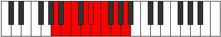
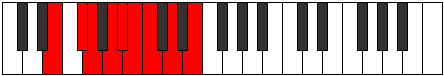
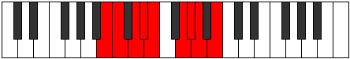
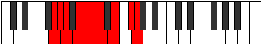
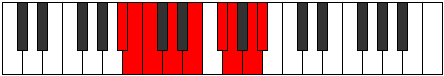
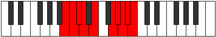
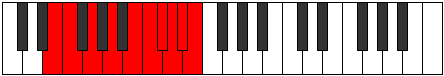
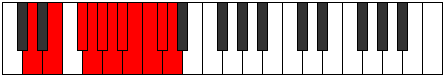

# ANaturalMinorEleventh

## Links

- [Documentation](README.md)
- [Scales Index](Scales.md)
- [Modes Index](Modes.md)
- [Chords Index](Chords.md)

## Root

A

## Diagram

## Notes

| Position | Notes | Illustration |
|----------|------|--------------|
| RootPosition | A,C,E,G,B,D |  |
| FirstInversion | C,E,G,B,D,A |  |
| SecondInversion | E,G,B,D,A,C |  |
| ThirdInversion | G,B,D,A,C,E |  |
| FourthInversion | B,D,A,C,E,G |  |
| FifthInversion | D,A,C,E,G,B |  |
## Modes

| Number | Mode | Tonic | Notes | Illustration |
|--------|------|-------|-------|--------------|
| [693](https://ianring.com/musictheory/scales/693) | [Mynimic](ModeGNaturalMynimic.md) | G | G, A, B, C, D, E, G |  |
| [695](https://ianring.com/musictheory/scales/695) | [Sarian](ModeGNaturalSarian.md) | G | G, Ab, Bbb, Cb, Dbb, Ebb, Fb, G |  |
| [701](https://ianring.com/musictheory/scales/701) | [Mixonyphian](ModeGNaturalMixonyphian.md) | G | G, A, Bb, Cb, Dbb, Ebb, Fb, G |  |
| [703](https://ianring.com/musictheory/scales/703) | [Aerocryllic](ModeGNaturalAerocryllic.md) | G | G, G#, A, A#, B, C, D, E, G |  |
| [757](https://ianring.com/musictheory/scales/757) | [Ionyptian](ModeGNaturalIonyptian.md) | G | G, A, B, C, Db, Ebb, Fb, G |  |
| [759](https://ianring.com/musictheory/scales/759) | [Katalyllic](ModeGNaturalKatalyllic.md) | G | G, G#, A, B, C, C#, D, E, G |  |
| [765](https://ianring.com/musictheory/scales/765) | [Mixonyphyllic](ModeGNaturalMixonyphyllic.md) | G | G, A, A#, B, C, C#, D, E, G |  |
| [767](https://ianring.com/musictheory/scales/767) | [Raptygic](ModeGNaturalRaptygic.md) | G | G, G#, A, A#, B, C, C#, D, E, G |  |
| [949](https://ianring.com/musictheory/scales/949) | [Ionagian](ModeGNaturalIonagian.md) | G | G, A, B, C, D, Eb, Fb, G |  |
| [951](https://ianring.com/musictheory/scales/951) | [Thogyllic](ModeGNaturalThogyllic.md) | G | G, G#, A, B, C, D, D#, E, G |  |
| [957](https://ianring.com/musictheory/scales/957) | [Phronyllic](ModeGNaturalPhronyllic.md) | G | G, A, A#, B, C, D, D#, E, G |  |
| [959](https://ianring.com/musictheory/scales/959) | [Katylygic](ModeGNaturalKatylygic.md) | G | G, G#, A, A#, B, C, D, D#, E, G |  |
| [1013](https://ianring.com/musictheory/scales/1013) | [Stydyllic](ModeGNaturalStydyllic.md) | G | G, A, B, C, C#, D, D#, E, G |  |
| [1015](https://ianring.com/musictheory/scales/1015) | [Ionodygic](ModeGNaturalIonodygic.md) | G | G, G#, A, B, C, C#, D, D#, E, G |  |
| [1021](https://ianring.com/musictheory/scales/1021) | [Ladygic](ModeGNaturalLadygic.md) | G | G, A, A#, B, C, C#, D, D#, E, G |  |
| [1023](https://ianring.com/musictheory/scales/1023) | [Dodyllian](ModeGNaturalDodyllian.md) | G | G, G#, A, A#, B, C, C#, D, D#, E, G |  |
| [1197](https://ianring.com/musictheory/scales/1197) | [Rocrimic](ModeANaturalRocrimic.md) | A | A, B, C, D, E, F##, A |  |
| [1199](https://ianring.com/musictheory/scales/1199) | [Magian](ModeANaturalMagian.md) | A | A, Bb, Cb, Dbb, Ebb, Fb, G, A |  |
| [1213](https://ianring.com/musictheory/scales/1213) | [Gyrian](ModeANaturalGyrian.md) | A | A, B, C, Db, Ebb, Fb, G, A |  |
| [1215](https://ianring.com/musictheory/scales/1215) | [Aeolanyllic](ModeANaturalAeolanyllic.md) | A | A, A#, B, C, C#, D, E, G, A |  |
| [1261](https://ianring.com/musictheory/scales/1261) | [Aeodian](ModeANaturalAeodian.md) | A | A, B, C, D, Eb, Fb, G, A |  |
| [1263](https://ianring.com/musictheory/scales/1263) | [Stynyllic](ModeANaturalStynyllic.md) | A | A, A#, B, C, D, D#, E, G, A |  |
| [1277](https://ianring.com/musictheory/scales/1277) | [Zadyllic](ModeANaturalZadyllic.md) | A | A, B, C, C#, D, D#, E, G, A |  |
| [1279](https://ianring.com/musictheory/scales/1279) | [Sarygic](ModeANaturalSarygic.md) | A | A, A#, B, C, C#, D, D#, E, G, A |  |
| [1323](https://ianring.com/musictheory/scales/1323) | [Eporimic](ModeBNaturalEporimic.md) | B | B, C, D, E, F##, G##, B |  |
| [1327](https://ianring.com/musictheory/scales/1327) | [Zalian](ModeBNaturalZalian.md) | B | B, C, Db, Ebb, Fb, G, A, B |  |
| [1339](https://ianring.com/musictheory/scales/1339) | [Kycrian](ModeBNaturalKycrian.md) | B | B, C, D, Eb, Fb, G, A, B |  |
| [1343](https://ianring.com/musictheory/scales/1343) | [Zalyllic](ModeBNaturalZalyllic.md) | B | B, C, C#, D, D#, E, G, A, B |  |
| [1387](https://ianring.com/musictheory/scales/1387) | [Locrian](ModeBNaturalLocrian.md) | B | B, C, D, E, F, G, A, B |  |
| [1387](https://ianring.com/musictheory/scales/1387) | [Locrian](ModeFSharpLocrian.md) | F# | F#, G, A, B, C, D, E, F# |  |
| [1387](https://ianring.com/musictheory/scales/1387) | [Locrian](ModeGFlatLocrian.md) | Gb | Gb, Abb, Bbb, Cb, Dbb, Ebb, Fb, Gb |  |
| [1391](https://ianring.com/musictheory/scales/1391) | [Aeradyllic](ModeBNaturalAeradyllic.md) | B | B, C, C#, D, E, F, G, A, B |  |
| [1391](https://ianring.com/musictheory/scales/1391) | [Aeradyllic](ModeFSharpAeradyllic.md) | F# | F#, G, G#, A, B, C, D, E, F# |  |
| [1391](https://ianring.com/musictheory/scales/1391) | [Aeradyllic](ModeGFlatAeradyllic.md) | Gb | Gb, G, Ab, A, B, C, D, E, Gb |  |
| [1403](https://ianring.com/musictheory/scales/1403) | [Epinyllic](ModeBNaturalEpinyllic.md) | B | B, C, D, D#, E, F, G, A, B |  |
| [1403](https://ianring.com/musictheory/scales/1403) | [Epinyllic](ModeFSharpEpinyllic.md) | F# | F#, G, A, A#, B, C, D, E, F# |  |
| [1403](https://ianring.com/musictheory/scales/1403) | [Epinyllic](ModeGFlatEpinyllic.md) | Gb | Gb, G, A, Bb, B, C, D, E, Gb |  |
| [1407](https://ianring.com/musictheory/scales/1407) | [Tharygic](ModeBNaturalTharygic.md) | B | B, C, C#, D, D#, E, F, G, A, B |  |
| [1407](https://ianring.com/musictheory/scales/1407) | [Tharygic](ModeFSharpTharygic.md) | F# | F#, G, G#, A, A#, B, C, D, E, F# |  |
| [1407](https://ianring.com/musictheory/scales/1407) | [Tharygic](ModeGFlatTharygic.md) | Gb | Gb, G, Ab, A, Bb, B, C, D, E, Gb |  |
| [1449](https://ianring.com/musictheory/scales/1449) | [Epathimic](ModeENaturalEpathimic.md) | E | E, F##, G##, A##, B#, C##, E |  |
| [1451](https://ianring.com/musictheory/scales/1451) | [Phrygian](ModeENaturalPhrygian.md) | E | E, F, G, A, B, C, D, E |  |
| [1451](https://ianring.com/musictheory/scales/1451) | [Phrygian](ModeBNaturalPhrygian.md) | B | B, C, D, E, F#, G, A, B |  |
| [1453](https://ianring.com/musictheory/scales/1453) | [Aeolian](ModeANaturalAeolian.md) | A | A, B, C, D, E, F, G, A |  |
| [1453](https://ianring.com/musictheory/scales/1453) | [Aeolian](ModeENaturalAeolian.md) | E | E, F#, G, A, B, C, D, E |  |
| [1455](https://ianring.com/musictheory/scales/1455) | [Soryllic](ModeBNaturalSoryllic.md) | B | B, C, C#, D, E, F#, G, A, B |  |
| [1455](https://ianring.com/musictheory/scales/1455) | [Soryllic](ModeENaturalSoryllic.md) | E | E, F, F#, G, A, B, C, D, E |  |
| [1455](https://ianring.com/musictheory/scales/1455) | [Soryllic](ModeANaturalSoryllic.md) | A | A, A#, B, C, D, E, F, G, A |  |
| [1465](https://ianring.com/musictheory/scales/1465) | [Aerathian](ModeENaturalAerathian.md) | E | E, F##, G#, A, B, C, D, E |  |
| [1467](https://ianring.com/musictheory/scales/1467) | [Thydyllic](ModeBNaturalThydyllic.md) | B | B, C, D, D#, E, F#, G, A, B |  |
| [1467](https://ianring.com/musictheory/scales/1467) | [Thydyllic](ModeENaturalThydyllic.md) | E | E, F, G, G#, A, B, C, D, E |  |
| [1469](https://ianring.com/musictheory/scales/1469) | [Epiryllic](ModeANaturalEpiryllic.md) | A | A, B, C, C#, D, E, F, G, A |  |
| [1469](https://ianring.com/musictheory/scales/1469) | [Epiryllic](ModeENaturalEpiryllic.md) | E | E, F#, G, G#, A, B, C, D, E |  |
| [1471](https://ianring.com/musictheory/scales/1471) | [Radygic](ModeBNaturalRadygic.md) | B | B, C, C#, D, D#, E, F#, G, A, B |  |
| [1471](https://ianring.com/musictheory/scales/1471) | [Radygic](ModeENaturalRadygic.md) | E | E, F, F#, G, G#, A, B, C, D, E |  |
| [1471](https://ianring.com/musictheory/scales/1471) | [Radygic](ModeANaturalRadygic.md) | A | A, A#, B, C, C#, D, E, F, G, A |  |
| [1513](https://ianring.com/musictheory/scales/1513) | [Stathian](ModeENaturalStathian.md) | E | E, F##, G##, A#, B, C, D, E |  |
| [1515](https://ianring.com/musictheory/scales/1515) | [Solyllic](ModeFSharpSolyllic.md) | F# | F#, G, A, B, C, C#, D, E, F# |  |
| [1515](https://ianring.com/musictheory/scales/1515) | [Solyllic](ModeGFlatSolyllic.md) | Gb | Gb, G, A, B, C, Db, D, E, Gb |  |
| [1515](https://ianring.com/musictheory/scales/1515) | [Solyllic](ModeBNaturalSolyllic.md) | B | B, C, D, E, F, F#, G, A, B |  |
| [1515](https://ianring.com/musictheory/scales/1515) | [Solyllic](ModeENaturalSolyllic.md) | E | E, F, G, A, A#, B, C, D, E |  |
| [1517](https://ianring.com/musictheory/scales/1517) | [Sagyllic](ModeANaturalSagyllic.md) | A | A, B, C, D, D#, E, F, G, A |  |
| [1517](https://ianring.com/musictheory/scales/1517) | [Sagyllic](ModeENaturalSagyllic.md) | E | E, F#, G, A, A#, B, C, D, E |  |
| [1519](https://ianring.com/musictheory/scales/1519) | [Solygic](ModeBNaturalSolygic.md) | B | B, C, C#, D, E, F, F#, G, A, B |  |
| [1519](https://ianring.com/musictheory/scales/1519) | [Solygic](ModeFSharpSolygic.md) | F# | F#, G, G#, A, B, C, C#, D, E, F# |  |
| [1519](https://ianring.com/musictheory/scales/1519) | [Solygic](ModeGFlatSolygic.md) | Gb | Gb, G, Ab, A, B, C, Db, D, E, Gb |  |
| [1519](https://ianring.com/musictheory/scales/1519) | [Solygic](ModeANaturalSolygic.md) | A | A, A#, B, C, D, D#, E, F, G, A |  |
| [1519](https://ianring.com/musictheory/scales/1519) | [Solygic](ModeENaturalSolygic.md) | E | E, F, F#, G, A, A#, B, C, D, E |  |
| [1529](https://ianring.com/musictheory/scales/1529) | [Kataryllic](ModeENaturalKataryllic.md) | E | E, G, G#, A, A#, B, C, D, E |  |
| [1531](https://ianring.com/musictheory/scales/1531) | [Styptygic](ModeBNaturalStyptygic.md) | B | B, C, D, D#, E, F, F#, G, A, B |  |
| [1531](https://ianring.com/musictheory/scales/1531) | [Styptygic](ModeFSharpStyptygic.md) | F# | F#, G, A, A#, B, C, C#, D, E, F# |  |
| [1531](https://ianring.com/musictheory/scales/1531) | [Styptygic](ModeGFlatStyptygic.md) | Gb | Gb, G, A, Bb, B, C, Db, D, E, Gb |  |
| [1531](https://ianring.com/musictheory/scales/1531) | [Styptygic](ModeENaturalStyptygic.md) | E | E, F, G, G#, A, A#, B, C, D, E |  |
| [1533](https://ianring.com/musictheory/scales/1533) | [Katycrygic](ModeANaturalKatycrygic.md) | A | A, B, C, C#, D, D#, E, F, G, A |  |
| [1533](https://ianring.com/musictheory/scales/1533) | [Katycrygic](ModeENaturalKatycrygic.md) | E | E, F#, G, G#, A, A#, B, C, D, E |  |
| [1535](https://ianring.com/musictheory/scales/1535) | [Mixodyllian](ModeBNaturalMixodyllian.md) | B | B, C, C#, D, D#, E, F, F#, G, A, B |  |
| [1535](https://ianring.com/musictheory/scales/1535) | [Mixodyllian](ModeANaturalMixodyllian.md) | A | A, A#, B, C, C#, D, D#, E, F, G, A |  |
| [1535](https://ianring.com/musictheory/scales/1535) | [Mixodyllian](ModeFSharpMixodyllian.md) | F# | F#, G, G#, A, A#, B, C, C#, D, E, F# |  |
| [1535](https://ianring.com/musictheory/scales/1535) | [Mixodyllian](ModeGFlatMixodyllian.md) | Gb | Gb, G, Ab, A, Bb, B, C, Db, D, E, Gb |  |
| [1535](https://ianring.com/musictheory/scales/1535) | [Mixodyllian](ModeENaturalMixodyllian.md) | E | E, F, F#, G, G#, A, A#, B, C, D, E |  |
| [1701](https://ianring.com/musictheory/scales/1701) | [Lothimic](ModeDNaturalLothimic.md) | D | D, E, F##, G##, A##, B#, D |  |
| [1703](https://ianring.com/musictheory/scales/1703) | [Zaptian](ModeDNaturalZaptian.md) | D | D, Eb, Fb, G, A, B, C, D |  |
| [1709](https://ianring.com/musictheory/scales/1709) | [Dorian](ModeDNaturalDorian.md) | D | D, E, F, G, A, B, C, D |  |
| [1709](https://ianring.com/musictheory/scales/1709) | [Dorian](ModeANaturalDorian.md) | A | A, B, C, D, E, F#, G, A |  |
| [1711](https://ianring.com/musictheory/scales/1711) | [Ragyllic](ModeDNaturalRagyllic.md) | D | D, D#, E, F, G, A, B, C, D |  |
| [1711](https://ianring.com/musictheory/scales/1711) | [Ragyllic](ModeANaturalRagyllic.md) | A | A, A#, B, C, D, E, F#, G, A |  |
| [1717](https://ianring.com/musictheory/scales/1717) | [Mixolydian](ModeGNaturalMixolydian.md) | G | G, A, B, C, D, E, F, G |  |
| [1717](https://ianring.com/musictheory/scales/1717) | [Mixolydian](ModeDNaturalMixolydian.md) | D | D, E, F#, G, A, B, C, D |  |
| [1719](https://ianring.com/musictheory/scales/1719) | [Lyryllic](ModeDNaturalLyryllic.md) | D | D, D#, E, F#, G, A, B, C, D |  |
| [1719](https://ianring.com/musictheory/scales/1719) | [Lyryllic](ModeGNaturalLyryllic.md) | G | G, G#, A, B, C, D, E, F, G |  |
| [1725](https://ianring.com/musictheory/scales/1725) | [Mixodyllic](ModeANaturalMixodyllic.md) | A | A, B, C, C#, D, E, F#, G, A |  |
| [1725](https://ianring.com/musictheory/scales/1725) | [Mixodyllic](ModeDNaturalMixodyllic.md) | D | D, E, F, F#, G, A, B, C, D |  |
| [1725](https://ianring.com/musictheory/scales/1725) | [Mixodyllic](ModeGNaturalMixodyllic.md) | G | G, A, A#, B, C, D, E, F, G |  |
| [1727](https://ianring.com/musictheory/scales/1727) | [Sydygic](ModeDNaturalSydygic.md) | D | D, D#, E, F, F#, G, A, B, C, D |  |
| [1727](https://ianring.com/musictheory/scales/1727) | [Sydygic](ModeANaturalSydygic.md) | A | A, A#, B, C, C#, D, E, F#, G, A |  |
| [1727](https://ianring.com/musictheory/scales/1727) | [Sydygic](ModeGNaturalSydygic.md) | G | G, G#, A, A#, B, C, D, E, F, G |  |
| [1765](https://ianring.com/musictheory/scales/1765) | [Lonian](ModeDNaturalLonian.md) | D | D, E, F##, G#, A, B, C, D |  |
| [1767](https://ianring.com/musictheory/scales/1767) | [Dyryllic](ModeDNaturalDyryllic.md) | D | D, D#, E, G, G#, A, B, C, D |  |
| [1773](https://ianring.com/musictheory/scales/1773) | [Aeoloryllic](ModeANaturalAeoloryllic.md) | A | A, B, C, D, D#, E, F#, G, A |  |
| [1773](https://ianring.com/musictheory/scales/1773) | [Aeoloryllic](ModeDNaturalAeoloryllic.md) | D | D, E, F, G, G#, A, B, C, D |  |
| [1775](https://ianring.com/musictheory/scales/1775) | [Lyrygic](ModeDNaturalLyrygic.md) | D | D, D#, E, F, G, G#, A, B, C, D |  |
| [1775](https://ianring.com/musictheory/scales/1775) | [Lyrygic](ModeANaturalLyrygic.md) | A | A, A#, B, C, D, D#, E, F#, G, A |  |
| [1781](https://ianring.com/musictheory/scales/1781) | [Gocryllic](ModeGNaturalGocryllic.md) | G | G, A, B, C, C#, D, E, F, G |  |
| [1781](https://ianring.com/musictheory/scales/1781) | [Gocryllic](ModeDNaturalGocryllic.md) | D | D, E, F#, G, G#, A, B, C, D |  |
| [1783](https://ianring.com/musictheory/scales/1783) | [Danygic](ModeGNaturalDanygic.md) | G | G, G#, A, B, C, C#, D, E, F, G |  |
| [1783](https://ianring.com/musictheory/scales/1783) | [Danygic](ModeDNaturalDanygic.md) | D | D, D#, E, F#, G, G#, A, B, C, D |  |
| [1789](https://ianring.com/musictheory/scales/1789) | [Katagygic](ModeANaturalKatagygic.md) | A | A, B, C, C#, D, D#, E, F#, G, A |  |
| [1789](https://ianring.com/musictheory/scales/1789) | [Katagygic](ModeDNaturalKatagygic.md) | D | D, E, F, F#, G, G#, A, B, C, D |  |
| [1789](https://ianring.com/musictheory/scales/1789) | [Katagygic](ModeGNaturalKatagygic.md) | G | G, A, A#, B, C, C#, D, E, F, G |  |
| [1791](https://ianring.com/musictheory/scales/1791) | [Aerygyllian](ModeDNaturalAerygyllian.md) | D | D, D#, E, F, F#, G, G#, A, B, C, D |  |
| [1791](https://ianring.com/musictheory/scales/1791) | [Aerygyllian](ModeANaturalAerygyllian.md) | A | A, A#, B, C, C#, D, D#, E, F#, G, A |  |
| [1791](https://ianring.com/musictheory/scales/1791) | [Aerygyllian](ModeGNaturalAerygyllian.md) | G | G, G#, A, A#, B, C, C#, D, E, F, G |  |
| [1835](https://ianring.com/musictheory/scales/1835) | [Byptian](ModeBNaturalByptian.md) | B | B, C, D, E, F##, G#, A, B |  |
| [1839](https://ianring.com/musictheory/scales/1839) | [Zogyllic](ModeBNaturalZogyllic.md) | B | B, C, C#, D, E, G, G#, A, B |  |
| [1851](https://ianring.com/musictheory/scales/1851) | [Zacryllic](ModeBNaturalZacryllic.md) | B | B, C, D, D#, E, G, G#, A, B |  |
| [1855](https://ianring.com/musictheory/scales/1855) | [Marygic](ModeBNaturalMarygic.md) | B | B, C, C#, D, D#, E, G, G#, A, B |  |
| [1899](https://ianring.com/musictheory/scales/1899) | [Moptyllic](ModeFSharpMoptyllic.md) | F# | F#, G, A, B, C, D, D#, E, F# |  |
| [1899](https://ianring.com/musictheory/scales/1899) | [Moptyllic](ModeGFlatMoptyllic.md) | Gb | Gb, G, A, B, C, D, Eb, E, Gb |  |
| [1899](https://ianring.com/musictheory/scales/1899) | [Moptyllic](ModeBNaturalMoptyllic.md) | B | B, C, D, E, F, G, G#, A, B |  |
| [1903](https://ianring.com/musictheory/scales/1903) | [Rocrygic](ModeBNaturalRocrygic.md) | B | B, C, C#, D, E, F, G, G#, A, B |  |
| [1903](https://ianring.com/musictheory/scales/1903) | [Rocrygic](ModeFSharpRocrygic.md) | F# | F#, G, G#, A, B, C, D, D#, E, F# |  |
| [1903](https://ianring.com/musictheory/scales/1903) | [Rocrygic](ModeGFlatRocrygic.md) | Gb | Gb, G, Ab, A, B, C, D, Eb, E, Gb |  |
| [1915](https://ianring.com/musictheory/scales/1915) | [Thydygic](ModeBNaturalThydygic.md) | B | B, C, D, D#, E, F, G, G#, A, B |  |
| [1915](https://ianring.com/musictheory/scales/1915) | [Thydygic](ModeFSharpThydygic.md) | F# | F#, G, A, A#, B, C, D, D#, E, F# |  |
| [1915](https://ianring.com/musictheory/scales/1915) | [Thydygic](ModeGFlatThydygic.md) | Gb | Gb, G, A, Bb, B, C, D, Eb, E, Gb |  |
| [1919](https://ianring.com/musictheory/scales/1919) | [Rocryllian](ModeBNaturalRocryllian.md) | B | B, C, C#, D, D#, E, F, G, G#, A, B |  |
| [1919](https://ianring.com/musictheory/scales/1919) | [Rocryllian](ModeFSharpRocryllian.md) | F# | F#, G, G#, A, A#, B, C, D, D#, E, F# |  |
| [1919](https://ianring.com/musictheory/scales/1919) | [Rocryllian](ModeGFlatRocryllian.md) | Gb | Gb, G, Ab, A, Bb, B, C, D, Eb, E, Gb |  |
| [1957](https://ianring.com/musictheory/scales/1957) | [Pyrian](ModeDNaturalPyrian.md) | D | D, E, F##, G##, A#, B, C, D |  |
| [1959](https://ianring.com/musictheory/scales/1959) | [Katolyllic](ModeDNaturalKatolyllic.md) | D | D, D#, E, G, A, A#, B, C, D |  |
| [1961](https://ianring.com/musictheory/scales/1961) | [Soptian](ModeENaturalSoptian.md) | E | E, F##, G##, A##, B#, C#, D, E |  |
| [1963](https://ianring.com/musictheory/scales/1963) | [Epocryllic](ModeENaturalEpocryllic.md) | E | E, F, G, A, B, C, C#, D, E |  |
| [1963](https://ianring.com/musictheory/scales/1963) | [Epocryllic](ModeBNaturalEpocryllic.md) | B | B, C, D, E, F#, G, G#, A, B |  |
| [1965](https://ianring.com/musictheory/scales/1965) | [Gadyllic](ModeENaturalGadyllic.md) | E | E, F#, G, A, B, C, C#, D, E |  |
| [1965](https://ianring.com/musictheory/scales/1965) | [Gadyllic](ModeANaturalGadyllic.md) | A | A, B, C, D, E, F, F#, G, A |  |
| [1965](https://ianring.com/musictheory/scales/1965) | [Gadyllic](ModeDNaturalGadyllic.md) | D | D, E, F, G, A, A#, B, C, D |  |
| [1967](https://ianring.com/musictheory/scales/1967) | [Godygic](ModeENaturalGodygic.md) | E | E, F, F#, G, A, B, C, C#, D, E |  |
| [1967](https://ianring.com/musictheory/scales/1967) | [Godygic](ModeBNaturalGodygic.md) | B | B, C, C#, D, E, F#, G, G#, A, B |  |
| [1967](https://ianring.com/musictheory/scales/1967) | [Godygic](ModeDNaturalGodygic.md) | D | D, D#, E, F, G, A, A#, B, C, D |  |
| [1967](https://ianring.com/musictheory/scales/1967) | [Godygic](ModeANaturalGodygic.md) | A | A, A#, B, C, D, E, F, F#, G, A |  |
| [1973](https://ianring.com/musictheory/scales/1973) | [Zyryllic](ModeGNaturalZyryllic.md) | G | G, A, B, C, D, D#, E, F, G |  |
| [1973](https://ianring.com/musictheory/scales/1973) | [Zyryllic](ModeDNaturalZyryllic.md) | D | D, E, F#, G, A, A#, B, C, D |  |
| [1975](https://ianring.com/musictheory/scales/1975) | [Ionocrygic](ModeGNaturalIonocrygic.md) | G | G, G#, A, B, C, D, D#, E, F, G |  |
| [1975](https://ianring.com/musictheory/scales/1975) | [Ionocrygic](ModeDNaturalIonocrygic.md) | D | D, D#, E, F#, G, A, A#, B, C, D |  |
| [1977](https://ianring.com/musictheory/scales/1977) | [Dagyllic](ModeENaturalDagyllic.md) | E | E, G, G#, A, B, C, C#, D, E |  |
| [1979](https://ianring.com/musictheory/scales/1979) | [Aeradygic](ModeENaturalAeradygic.md) | E | E, F, G, G#, A, B, C, C#, D, E |  |
| [1979](https://ianring.com/musictheory/scales/1979) | [Aeradygic](ModeBNaturalAeradygic.md) | B | B, C, D, D#, E, F#, G, G#, A, B |  |
| [1981](https://ianring.com/musictheory/scales/1981) | [Gadygic](ModeANaturalGadygic.md) | A | A, B, C, C#, D, E, F, F#, G, A |  |
| [1981](https://ianring.com/musictheory/scales/1981) | [Gadygic](ModeENaturalGadygic.md) | E | E, F#, G, G#, A, B, C, C#, D, E |  |
| [1981](https://ianring.com/musictheory/scales/1981) | [Gadygic](ModeGNaturalGadygic.md) | G | G, A, A#, B, C, D, D#, E, F, G |  |
| [1981](https://ianring.com/musictheory/scales/1981) | [Gadygic](ModeDNaturalGadygic.md) | D | D, E, F, F#, G, A, A#, B, C, D |  |
| [1983](https://ianring.com/musictheory/scales/1983) | [Soryllian](ModeBNaturalSoryllian.md) | B | B, C, C#, D, D#, E, F#, G, G#, A, B |  |
| [1983](https://ianring.com/musictheory/scales/1983) | [Soryllian](ModeENaturalSoryllian.md) | E | E, F, F#, G, G#, A, B, C, C#, D, E |  |
| [1983](https://ianring.com/musictheory/scales/1983) | [Soryllian](ModeANaturalSoryllian.md) | A | A, A#, B, C, C#, D, E, F, F#, G, A |  |
| [1983](https://ianring.com/musictheory/scales/1983) | [Soryllian](ModeDNaturalSoryllian.md) | D | D, D#, E, F, F#, G, A, A#, B, C, D |  |
| [1983](https://ianring.com/musictheory/scales/1983) | [Soryllian](ModeGNaturalSoryllian.md) | G | G, G#, A, A#, B, C, D, D#, E, F, G |  |
| [2021](https://ianring.com/musictheory/scales/2021) | [Katycryllic](ModeDNaturalKatycryllic.md) | D | D, E, G, G#, A, A#, B, C, D |  |
| [2023](https://ianring.com/musictheory/scales/2023) | [Zodygic](ModeDNaturalZodygic.md) | D | D, D#, E, G, G#, A, A#, B, C, D |  |
| [2025](https://ianring.com/musictheory/scales/2025) | [Mixolydyllic](ModeENaturalMixolydyllic.md) | E | E, G, A, A#, B, C, C#, D, E |  |
| [2027](https://ianring.com/musictheory/scales/2027) | [Boptygic](ModeFSharpBoptygic.md) | F# | F#, G, A, B, C, C#, D, D#, E, F# |  |
| [2027](https://ianring.com/musictheory/scales/2027) | [Boptygic](ModeGFlatBoptygic.md) | Gb | Gb, G, A, B, C, Db, D, Eb, E, Gb |  |
| [2027](https://ianring.com/musictheory/scales/2027) | [Boptygic](ModeBNaturalBoptygic.md) | B | B, C, D, E, F, F#, G, G#, A, B |  |
| [2027](https://ianring.com/musictheory/scales/2027) | [Boptygic](ModeENaturalBoptygic.md) | E | E, F, G, A, A#, B, C, C#, D, E |  |
| [2029](https://ianring.com/musictheory/scales/2029) | [Mathygic](ModeANaturalMathygic.md) | A | A, B, C, D, D#, E, F, F#, G, A |  |
| [2029](https://ianring.com/musictheory/scales/2029) | [Mathygic](ModeENaturalMathygic.md) | E | E, F#, G, A, A#, B, C, C#, D, E |  |
| [2029](https://ianring.com/musictheory/scales/2029) | [Mathygic](ModeDNaturalMathygic.md) | D | D, E, F, G, G#, A, A#, B, C, D |  |
| [2031](https://ianring.com/musictheory/scales/2031) | [Gadyllian](ModeFSharpGadyllian.md) | F# | F#, G, G#, A, B, C, C#, D, D#, E, F# |  |
| [2031](https://ianring.com/musictheory/scales/2031) | [Gadyllian](ModeGFlatGadyllian.md) | Gb | Gb, G, Ab, A, B, C, Db, D, Eb, E, Gb |  |
| [2031](https://ianring.com/musictheory/scales/2031) | [Gadyllian](ModeBNaturalGadyllian.md) | B | B, C, C#, D, E, F, F#, G, G#, A, B |  |
| [2031](https://ianring.com/musictheory/scales/2031) | [Gadyllian](ModeENaturalGadyllian.md) | E | E, F, F#, G, A, A#, B, C, C#, D, E |  |
| [2031](https://ianring.com/musictheory/scales/2031) | [Gadyllian](ModeANaturalGadyllian.md) | A | A, A#, B, C, D, D#, E, F, F#, G, A |  |
| [2031](https://ianring.com/musictheory/scales/2031) | [Gadyllian](ModeDNaturalGadyllian.md) | D | D, D#, E, F, G, G#, A, A#, B, C, D |  |
| [2037](https://ianring.com/musictheory/scales/2037) | [Sythygic](ModeGNaturalSythygic.md) | G | G, A, B, C, C#, D, D#, E, F, G |  |
| [2037](https://ianring.com/musictheory/scales/2037) | [Sythygic](ModeDNaturalSythygic.md) | D | D, E, F#, G, G#, A, A#, B, C, D |  |
| [2039](https://ianring.com/musictheory/scales/2039) | [Danyllian](ModeGNaturalDanyllian.md) | G | G, G#, A, B, C, C#, D, D#, E, F, G |  |
| [2039](https://ianring.com/musictheory/scales/2039) | [Danyllian](ModeDNaturalDanyllian.md) | D | D, D#, E, F#, G, G#, A, A#, B, C, D |  |
| [2041](https://ianring.com/musictheory/scales/2041) | [Aeolacrygic](ModeENaturalAeolacrygic.md) | E | E, G, G#, A, A#, B, C, C#, D, E |  |
| [2043](https://ianring.com/musictheory/scales/2043) | [Lythyllian](ModeBNaturalLythyllian.md) | B | B, C, D, D#, E, F, F#, G, G#, A, B |  |
| [2043](https://ianring.com/musictheory/scales/2043) | [Lythyllian](ModeFSharpLythyllian.md) | F# | F#, G, A, A#, B, C, C#, D, D#, E, F# |  |
| [2043](https://ianring.com/musictheory/scales/2043) | [Lythyllian](ModeGFlatLythyllian.md) | Gb | Gb, G, A, Bb, B, C, Db, D, Eb, E, Gb |  |
| [2043](https://ianring.com/musictheory/scales/2043) | [Lythyllian](ModeENaturalLythyllian.md) | E | E, F, G, G#, A, A#, B, C, C#, D, E |  |
| [2045](https://ianring.com/musictheory/scales/2045) | [Katogyllian](ModeANaturalKatogyllian.md) | A | A, B, C, C#, D, D#, E, F, F#, G, A |  |
| [2045](https://ianring.com/musictheory/scales/2045) | [Katogyllian](ModeGNaturalKatogyllian.md) | G | G, A, A#, B, C, C#, D, D#, E, F, G |  |
| [2045](https://ianring.com/musictheory/scales/2045) | [Katogyllian](ModeENaturalKatogyllian.md) | E | E, F#, G, G#, A, A#, B, C, C#, D, E |  |
| [2045](https://ianring.com/musictheory/scales/2045) | [Katogyllian](ModeDNaturalKatogyllian.md) | D | D, E, F, F#, G, G#, A, A#, B, C, D |  |
| [2047](https://ianring.com/musictheory/scales/2047) | [Monatic](ModeBNaturalMonatic.md) | B | B, C, C#, D, D#, E, F, F#, G, G#, A, B |  |
| [2047](https://ianring.com/musictheory/scales/2047) | [Monatic](ModeANaturalMonatic.md) | A | A, A#, B, C, C#, D, D#, E, F, F#, G, A |  |
| [2047](https://ianring.com/musictheory/scales/2047) | [Monatic](ModeGNaturalMonatic.md) | G | G, G#, A, A#, B, C, C#, D, D#, E, F, G |  |
| [2047](https://ianring.com/musictheory/scales/2047) | [Monatic](ModeFSharpMonatic.md) | F# | F#, G, G#, A, A#, B, C, C#, D, D#, E, F# |  |
| [2047](https://ianring.com/musictheory/scales/2047) | [Monatic](ModeGFlatMonatic.md) | Gb | Gb, G, Ab, A, Bb, B, C, Db, D, Eb, E, Gb |  |
| [2047](https://ianring.com/musictheory/scales/2047) | [Monatic](ModeENaturalMonatic.md) | E | E, F, F#, G, G#, A, A#, B, C, C#, D, E |  |
| [2047](https://ianring.com/musictheory/scales/2047) | [Monatic](ModeDNaturalMonatic.md) | D | D, D#, E, F, F#, G, G#, A, A#, B, C, D |  |
| [2395](https://ianring.com/musictheory/scales/2395) | [Zoptian](ModeGSharpZoptian.md) | G# | G#, A, B, C, D, E, F##, G# |  |
| [2395](https://ianring.com/musictheory/scales/2395) | [Zoptian](ModeAFlatZoptian.md) | Ab | Ab, Bbb, Cb, Dbb, Ebb, Fb, G, Ab |  |
| [2399](https://ianring.com/musictheory/scales/2399) | [Zanyllic](ModeGSharpZanyllic.md) | G# | G#, A, A#, B, C, D, E, G, G# |  |
| [2399](https://ianring.com/musictheory/scales/2399) | [Zanyllic](ModeAFlatZanyllic.md) | Ab | Ab, A, Bb, B, C, D, E, G, Ab |  |
| [2427](https://ianring.com/musictheory/scales/2427) | [Katoryllic](ModeGSharpKatoryllic.md) | G# | G#, A, B, C, C#, D, E, G, G# |  |
| [2427](https://ianring.com/musictheory/scales/2427) | [Katoryllic](ModeAFlatKatoryllic.md) | Ab | Ab, A, B, C, Db, D, E, G, Ab |  |
| [2431](https://ianring.com/musictheory/scales/2431) | [Gythygic](ModeGSharpGythygic.md) | G# | G#, A, A#, B, C, C#, D, E, G, G# |  |
| [2431](https://ianring.com/musictheory/scales/2431) | [Gythygic](ModeAFlatGythygic.md) | Ab | Ab, A, Bb, B, C, Db, D, E, G, Ab |  |
| [2523](https://ianring.com/musictheory/scales/2523) | [Rygyllic](ModeGSharpRygyllic.md) | G# | G#, A, B, C, D, D#, E, G, G# |  |
| [2523](https://ianring.com/musictheory/scales/2523) | [Rygyllic](ModeAFlatRygyllic.md) | Ab | Ab, A, B, C, D, Eb, E, G, Ab |  |
| [2527](https://ianring.com/musictheory/scales/2527) | [Phradygic](ModeGSharpPhradygic.md) | G# | G#, A, A#, B, C, D, D#, E, G, G# |  |
| [2527](https://ianring.com/musictheory/scales/2527) | [Phradygic](ModeAFlatPhradygic.md) | Ab | Ab, A, Bb, B, C, D, Eb, E, G, Ab |  |
| [2555](https://ianring.com/musictheory/scales/2555) | [Bythygic](ModeGSharpBythygic.md) | G# | G#, A, B, C, C#, D, D#, E, G, G# |  |
| [2555](https://ianring.com/musictheory/scales/2555) | [Bythygic](ModeAFlatBythygic.md) | Ab | Ab, A, B, C, Db, D, Eb, E, G, Ab |  |
| [2559](https://ianring.com/musictheory/scales/2559) | [Zogyllian](ModeGSharpZogyllian.md) | G# | G#, A, A#, B, C, C#, D, D#, E, G, G# |  |
| [2559](https://ianring.com/musictheory/scales/2559) | [Zogyllian](ModeAFlatZogyllian.md) | Ab | Ab, A, Bb, B, C, Db, D, Eb, E, G, Ab |  |
| [2647](https://ianring.com/musictheory/scales/2647) | [Dadian](ModeASharpDadian.md) | A# | A#, B, C, D, E, F##, G##, A# |  |
| [2647](https://ianring.com/musictheory/scales/2647) | [Dadian](ModeBFlatDadian.md) | Bb | Bb, Cb, Dbb, Ebb, Fb, G, A, Bb |  |
| [2655](https://ianring.com/musictheory/scales/2655) | [Thocryllic](ModeASharpThocryllic.md) | A# | A#, B, C, C#, D, E, G, A, A# |  |
| [2655](https://ianring.com/musictheory/scales/2655) | [Thocryllic](ModeBFlatThocryllic.md) | Bb | Bb, B, C, Db, D, E, G, A, Bb |  |
| [2679](https://ianring.com/musictheory/scales/2679) | [Rathyllic](ModeASharpRathyllic.md) | A# | A#, B, C, D, D#, E, G, A, A# |  |
| [2679](https://ianring.com/musictheory/scales/2679) | [Rathyllic](ModeBFlatRathyllic.md) | Bb | Bb, B, C, D, Eb, E, G, A, Bb |  |
| [2687](https://ianring.com/musictheory/scales/2687) | [Thacrygic](ModeASharpThacrygic.md) | A# | A#, B, C, C#, D, D#, E, G, A, A# |  |
| [2687](https://ianring.com/musictheory/scales/2687) | [Thacrygic](ModeBFlatThacrygic.md) | Bb | Bb, B, C, Db, D, Eb, E, G, A, Bb |  |
| [2709](https://ianring.com/musictheory/scales/2709) | [Thaptimic](ModeCNaturalThaptimic.md) | C | C, D, E, F##, G##, A##, C |  |
| [2711](https://ianring.com/musictheory/scales/2711) | [Stolian](ModeCNaturalStolian.md) | C | C, Db, Ebb, Fb, G, A, B, C |  |
| [2717](https://ianring.com/musictheory/scales/2717) | [Epygian](ModeCNaturalEpygian.md) | C | C, D, Eb, Fb, G, A, B, C |  |
| [2719](https://ianring.com/musictheory/scales/2719) | [Zocryllic](ModeCNaturalZocryllic.md) | C | C, C#, D, D#, E, G, A, B, C |  |
| [2741](https://ianring.com/musictheory/scales/2741) | [Ionian](ModeCNaturalIonian.md) | C | C, D, E, F, G, A, B, C |  |
| [2741](https://ianring.com/musictheory/scales/2741) | [Ionian](ModeGNaturalIonian.md) | G | G, A, B, C, D, E, F#, G |  |
| [2743](https://ianring.com/musictheory/scales/2743) | [Staptyllic](ModeCNaturalStaptyllic.md) | C | C, C#, D, E, F, G, A, B, C |  |
| [2743](https://ianring.com/musictheory/scales/2743) | [Staptyllic](ModeGNaturalStaptyllic.md) | G | G, G#, A, B, C, D, E, F#, G |  |
| [2749](https://ianring.com/musictheory/scales/2749) | [Katagyllic](ModeCNaturalKatagyllic.md) | C | C, D, D#, E, F, G, A, B, C |  |
| [2749](https://ianring.com/musictheory/scales/2749) | [Katagyllic](ModeGNaturalKatagyllic.md) | G | G, A, A#, B, C, D, E, F#, G |  |
| [2751](https://ianring.com/musictheory/scales/2751) | [Sylygic](ModeCNaturalSylygic.md) | C | C, C#, D, D#, E, F, G, A, B, C |  |
| [2751](https://ianring.com/musictheory/scales/2751) | [Sylygic](ModeGNaturalSylygic.md) | G | G, G#, A, A#, B, C, D, E, F#, G |  |
| [2773](https://ianring.com/musictheory/scales/2773) | [Lydian](ModeFNaturalLydian.md) | F | F, G, A, B, C, D, E, F |  |
| [2773](https://ianring.com/musictheory/scales/2773) | [Lydian](ModeCNaturalLydian.md) | C | C, D, E, F#, G, A, B, C |  |
| [2775](https://ianring.com/musictheory/scales/2775) | [Godyllic](ModeCNaturalGodyllic.md) | C | C, C#, D, E, F#, G, A, B, C |  |
| [2775](https://ianring.com/musictheory/scales/2775) | [Godyllic](ModeFNaturalGodyllic.md) | F | F, F#, G, A, B, C, D, E, F |  |
| [2775](https://ianring.com/musictheory/scales/2775) | [Godyllic](ModeASharpGodyllic.md) | A# | A#, B, C, D, E, F, G, A, A# |  |
| [2775](https://ianring.com/musictheory/scales/2775) | [Godyllic](ModeBFlatGodyllic.md) | Bb | Bb, B, C, D, E, F, G, A, Bb |  |
| [2781](https://ianring.com/musictheory/scales/2781) | [Gycryllic](ModeCNaturalGycryllic.md) | C | C, D, D#, E, F#, G, A, B, C |  |
| [2781](https://ianring.com/musictheory/scales/2781) | [Gycryllic](ModeFNaturalGycryllic.md) | F | F, G, G#, A, B, C, D, E, F |  |
| [2783](https://ianring.com/musictheory/scales/2783) | [Gothygic](ModeCNaturalGothygic.md) | C | C, C#, D, D#, E, F#, G, A, B, C |  |
| [2783](https://ianring.com/musictheory/scales/2783) | [Gothygic](ModeFNaturalGothygic.md) | F | F, F#, G, G#, A, B, C, D, E, F |  |
| [2783](https://ianring.com/musictheory/scales/2783) | [Gothygic](ModeASharpGothygic.md) | A# | A#, B, C, C#, D, E, F, G, A, A# |  |
| [2783](https://ianring.com/musictheory/scales/2783) | [Gothygic](ModeBFlatGothygic.md) | Bb | Bb, B, C, Db, D, E, F, G, A, Bb |  |
| [2805](https://ianring.com/musictheory/scales/2805) | [Zylyllic](ModeGNaturalZylyllic.md) | G | G, A, B, C, C#, D, E, F#, G |  |
| [2805](https://ianring.com/musictheory/scales/2805) | [Zylyllic](ModeCNaturalZylyllic.md) | C | C, D, E, F, F#, G, A, B, C |  |
| [2805](https://ianring.com/musictheory/scales/2805) | [Zylyllic](ModeFNaturalZylyllic.md) | F | F, G, A, A#, B, C, D, E, F |  |
| [2807](https://ianring.com/musictheory/scales/2807) | [Zylygic](ModeCNaturalZylygic.md) | C | C, C#, D, E, F, F#, G, A, B, C |  |
| [2807](https://ianring.com/musictheory/scales/2807) | [Zylygic](ModeGNaturalZylygic.md) | G | G, G#, A, B, C, C#, D, E, F#, G |  |
| [2807](https://ianring.com/musictheory/scales/2807) | [Zylygic](ModeASharpZylygic.md) | A# | A#, B, C, D, D#, E, F, G, A, A# |  |
| [2807](https://ianring.com/musictheory/scales/2807) | [Zylygic](ModeBFlatZylygic.md) | Bb | Bb, B, C, D, Eb, E, F, G, A, Bb |  |
| [2807](https://ianring.com/musictheory/scales/2807) | [Zylygic](ModeFNaturalZylygic.md) | F | F, F#, G, A, A#, B, C, D, E, F |  |
| [2813](https://ianring.com/musictheory/scales/2813) | [Zolygic](ModeCNaturalZolygic.md) | C | C, D, D#, E, F, F#, G, A, B, C |  |
| [2813](https://ianring.com/musictheory/scales/2813) | [Zolygic](ModeGNaturalZolygic.md) | G | G, A, A#, B, C, C#, D, E, F#, G |  |
| [2813](https://ianring.com/musictheory/scales/2813) | [Zolygic](ModeFNaturalZolygic.md) | F | F, G, G#, A, A#, B, C, D, E, F |  |
| [2815](https://ianring.com/musictheory/scales/2815) | [Aeradyllian](ModeCNaturalAeradyllian.md) | C | C, C#, D, D#, E, F, F#, G, A, B, C |  |
| [2815](https://ianring.com/musictheory/scales/2815) | [Aeradyllian](ModeASharpAeradyllian.md) | A# | A#, B, C, C#, D, D#, E, F, G, A, A# |  |
| [2815](https://ianring.com/musictheory/scales/2815) | [Aeradyllian](ModeBFlatAeradyllian.md) | Bb | Bb, B, C, Db, D, Eb, E, F, G, A, Bb |  |
| [2815](https://ianring.com/musictheory/scales/2815) | [Aeradyllian](ModeGNaturalAeradyllian.md) | G | G, G#, A, A#, B, C, C#, D, E, F#, G |  |
| [2815](https://ianring.com/musictheory/scales/2815) | [Aeradyllian](ModeFNaturalAeradyllian.md) | F | F, F#, G, G#, A, A#, B, C, D, E, F |  |
| [2899](https://ianring.com/musictheory/scales/2899) | [Kagian](ModeDSharpKagian.md) | D# | D#, E, F##, G##, A##, B#, C##, D# |  |
| [2899](https://ianring.com/musictheory/scales/2899) | [Kagian](ModeEFlatKagian.md) | Eb | Eb, Fb, G, A, B, C, D, Eb |  |
| [2903](https://ianring.com/musictheory/scales/2903) | [Gothyllic](ModeDSharpGothyllic.md) | D# | D#, E, F, G, A, B, C, D, D# |  |
| [2903](https://ianring.com/musictheory/scales/2903) | [Gothyllic](ModeEFlatGothyllic.md) | Eb | Eb, E, F, G, A, B, C, D, Eb |  |
| [2903](https://ianring.com/musictheory/scales/2903) | [Gothyllic](ModeASharpGothyllic.md) | A# | A#, B, C, D, E, F#, G, A, A# |  |
| [2903](https://ianring.com/musictheory/scales/2903) | [Gothyllic](ModeBFlatGothyllic.md) | Bb | Bb, B, C, D, E, Gb, G, A, Bb |  |
| [2907](https://ianring.com/musictheory/scales/2907) | [Mogyllic](ModeDSharpMogyllic.md) | D# | D#, E, F#, G, A, B, C, D, D# |  |
| [2907](https://ianring.com/musictheory/scales/2907) | [Mogyllic](ModeEFlatMogyllic.md) | Eb | Eb, E, Gb, G, A, B, C, D, Eb |  |
| [2907](https://ianring.com/musictheory/scales/2907) | [Mogyllic](ModeGSharpMogyllic.md) | G# | G#, A, B, C, D, E, F, G, G# |  |
| [2907](https://ianring.com/musictheory/scales/2907) | [Mogyllic](ModeAFlatMogyllic.md) | Ab | Ab, A, B, C, D, E, F, G, Ab |  |
| [2911](https://ianring.com/musictheory/scales/2911) | [Katygic](ModeDSharpKatygic.md) | D# | D#, E, F, F#, G, A, B, C, D, D# |  |
| [2911](https://ianring.com/musictheory/scales/2911) | [Katygic](ModeEFlatKatygic.md) | Eb | Eb, E, F, Gb, G, A, B, C, D, Eb |  |
| [2911](https://ianring.com/musictheory/scales/2911) | [Katygic](ModeASharpKatygic.md) | A# | A#, B, C, C#, D, E, F#, G, A, A# |  |
| [2911](https://ianring.com/musictheory/scales/2911) | [Katygic](ModeBFlatKatygic.md) | Bb | Bb, B, C, Db, D, E, Gb, G, A, Bb |  |
| [2911](https://ianring.com/musictheory/scales/2911) | [Katygic](ModeGSharpKatygic.md) | G# | G#, A, A#, B, C, D, E, F, G, G# |  |
| [2911](https://ianring.com/musictheory/scales/2911) | [Katygic](ModeAFlatKatygic.md) | Ab | Ab, A, Bb, B, C, D, E, F, G, Ab |  |
| [2931](https://ianring.com/musictheory/scales/2931) | [Zathyllic](ModeDSharpZathyllic.md) | D# | D#, E, G, G#, A, B, C, D, D# |  |
| [2931](https://ianring.com/musictheory/scales/2931) | [Zathyllic](ModeEFlatZathyllic.md) | Eb | Eb, E, G, Ab, A, B, C, D, Eb |  |
| [2935](https://ianring.com/musictheory/scales/2935) | [Modygic](ModeDSharpModygic.md) | D# | D#, E, F, G, G#, A, B, C, D, D# |  |
| [2935](https://ianring.com/musictheory/scales/2935) | [Modygic](ModeEFlatModygic.md) | Eb | Eb, E, F, G, Ab, A, B, C, D, Eb |  |
| [2935](https://ianring.com/musictheory/scales/2935) | [Modygic](ModeASharpModygic.md) | A# | A#, B, C, D, D#, E, F#, G, A, A# |  |
| [2935](https://ianring.com/musictheory/scales/2935) | [Modygic](ModeBFlatModygic.md) | Bb | Bb, B, C, D, Eb, E, Gb, G, A, Bb |  |
| [2939](https://ianring.com/musictheory/scales/2939) | [Goptygic](ModeGSharpGoptygic.md) | G# | G#, A, B, C, C#, D, E, F, G, G# |  |
| [2939](https://ianring.com/musictheory/scales/2939) | [Goptygic](ModeAFlatGoptygic.md) | Ab | Ab, A, B, C, Db, D, E, F, G, Ab |  |
| [2939](https://ianring.com/musictheory/scales/2939) | [Goptygic](ModeDSharpGoptygic.md) | D# | D#, E, F#, G, G#, A, B, C, D, D# |  |
| [2939](https://ianring.com/musictheory/scales/2939) | [Goptygic](ModeEFlatGoptygic.md) | Eb | Eb, E, Gb, G, Ab, A, B, C, D, Eb |  |
| [2943](https://ianring.com/musictheory/scales/2943) | [Dathyllian](ModeDSharpDathyllian.md) | D# | D#, E, F, F#, G, G#, A, B, C, D, D# |  |
| [2943](https://ianring.com/musictheory/scales/2943) | [Dathyllian](ModeEFlatDathyllian.md) | Eb | Eb, E, F, Gb, G, Ab, A, B, C, D, Eb |  |
| [2943](https://ianring.com/musictheory/scales/2943) | [Dathyllian](ModeASharpDathyllian.md) | A# | A#, B, C, C#, D, D#, E, F#, G, A, A# |  |
| [2943](https://ianring.com/musictheory/scales/2943) | [Dathyllian](ModeBFlatDathyllian.md) | Bb | Bb, B, C, Db, D, Eb, E, Gb, G, A, Bb |  |
| [2943](https://ianring.com/musictheory/scales/2943) | [Dathyllian](ModeGSharpDathyllian.md) | G# | G#, A, A#, B, C, C#, D, E, F, G, G# |  |
| [2943](https://ianring.com/musictheory/scales/2943) | [Dathyllian](ModeAFlatDathyllian.md) | Ab | Ab, A, Bb, B, C, Db, D, E, F, G, Ab |  |
| [2965](https://ianring.com/musictheory/scales/2965) | [Darian](ModeCNaturalDarian.md) | C | C, D, E, F##, G#, A, B, C |  |
| [2967](https://ianring.com/musictheory/scales/2967) | [Madyllic](ModeCNaturalMadyllic.md) | C | C, C#, D, E, G, G#, A, B, C |  |
| [2973](https://ianring.com/musictheory/scales/2973) | [Panyllic](ModeCNaturalPanyllic.md) | C | C, D, D#, E, G, G#, A, B, C |  |
| [2975](https://ianring.com/musictheory/scales/2975) | [Gaptygic](ModeCNaturalGaptygic.md) | C | C, C#, D, D#, E, G, G#, A, B, C |  |
| [2997](https://ianring.com/musictheory/scales/2997) | [Ionoptyllic](ModeGNaturalIonoptyllic.md) | G | G, A, B, C, D, D#, E, F#, G |  |
| [2997](https://ianring.com/musictheory/scales/2997) | [Ionoptyllic](ModeCNaturalIonoptyllic.md) | C | C, D, E, F, G, G#, A, B, C |  |
| [2999](https://ianring.com/musictheory/scales/2999) | [Zyrygic](ModeCNaturalZyrygic.md) | C | C, C#, D, E, F, G, G#, A, B, C |  |
| [2999](https://ianring.com/musictheory/scales/2999) | [Zyrygic](ModeGNaturalZyrygic.md) | G | G, G#, A, B, C, D, D#, E, F#, G |  |
| [3005](https://ianring.com/musictheory/scales/3005) | [Gycrygic](ModeCNaturalGycrygic.md) | C | C, D, D#, E, F, G, G#, A, B, C |  |
| [3005](https://ianring.com/musictheory/scales/3005) | [Gycrygic](ModeGNaturalGycrygic.md) | G | G, A, A#, B, C, D, D#, E, F#, G |  |
| [3007](https://ianring.com/musictheory/scales/3007) | [Zyryllian](ModeCNaturalZyryllian.md) | C | C, C#, D, D#, E, F, G, G#, A, B, C |  |
| [3007](https://ianring.com/musictheory/scales/3007) | [Zyryllian](ModeGNaturalZyryllian.md) | G | G, G#, A, A#, B, C, D, D#, E, F#, G |  |
| [3027](https://ianring.com/musictheory/scales/3027) | [Rythyllic](ModeDSharpRythyllic.md) | D# | D#, E, G, A, A#, B, C, D, D# |  |
| [3027](https://ianring.com/musictheory/scales/3027) | [Rythyllic](ModeEFlatRythyllic.md) | Eb | Eb, E, G, A, Bb, B, C, D, Eb |  |
| [3029](https://ianring.com/musictheory/scales/3029) | [Ionocryllic](ModeFNaturalIonocryllic.md) | F | F, G, A, B, C, C#, D, E, F |  |
| [3029](https://ianring.com/musictheory/scales/3029) | [Ionocryllic](ModeCNaturalIonocryllic.md) | C | C, D, E, F#, G, G#, A, B, C |  |
| [3031](https://ianring.com/musictheory/scales/3031) | [Epithygic](ModeFNaturalEpithygic.md) | F | F, F#, G, A, B, C, C#, D, E, F |  |
| [3031](https://ianring.com/musictheory/scales/3031) | [Epithygic](ModeCNaturalEpithygic.md) | C | C, C#, D, E, F#, G, G#, A, B, C |  |
| [3031](https://ianring.com/musictheory/scales/3031) | [Epithygic](ModeDSharpEpithygic.md) | D# | D#, E, F, G, A, A#, B, C, D, D# |  |
| [3031](https://ianring.com/musictheory/scales/3031) | [Epithygic](ModeEFlatEpithygic.md) | Eb | Eb, E, F, G, A, Bb, B, C, D, Eb |  |
| [3031](https://ianring.com/musictheory/scales/3031) | [Epithygic](ModeASharpEpithygic.md) | A# | A#, B, C, D, E, F, F#, G, A, A# |  |
| [3031](https://ianring.com/musictheory/scales/3031) | [Epithygic](ModeBFlatEpithygic.md) | Bb | Bb, B, C, D, E, F, Gb, G, A, Bb |  |
| [3035](https://ianring.com/musictheory/scales/3035) | [Gocrygic](ModeGSharpGocrygic.md) | G# | G#, A, B, C, D, D#, E, F, G, G# |  |
| [3035](https://ianring.com/musictheory/scales/3035) | [Gocrygic](ModeAFlatGocrygic.md) | Ab | Ab, A, B, C, D, Eb, E, F, G, Ab |  |
| [3035](https://ianring.com/musictheory/scales/3035) | [Gocrygic](ModeDSharpGocrygic.md) | D# | D#, E, F#, G, A, A#, B, C, D, D# |  |
| [3035](https://ianring.com/musictheory/scales/3035) | [Gocrygic](ModeEFlatGocrygic.md) | Eb | Eb, E, Gb, G, A, Bb, B, C, D, Eb |  |
| [3037](https://ianring.com/musictheory/scales/3037) | [Staptygic](ModeFNaturalStaptygic.md) | F | F, G, G#, A, B, C, C#, D, E, F |  |
| [3037](https://ianring.com/musictheory/scales/3037) | [Staptygic](ModeCNaturalStaptygic.md) | C | C, D, D#, E, F#, G, G#, A, B, C |  |
| [3039](https://ianring.com/musictheory/scales/3039) | [Godyllian](ModeCNaturalGodyllian.md) | C | C, C#, D, D#, E, F#, G, G#, A, B, C |  |
| [3039](https://ianring.com/musictheory/scales/3039) | [Godyllian](ModeFNaturalGodyllian.md) | F | F, F#, G, G#, A, B, C, C#, D, E, F |  |
| [3039](https://ianring.com/musictheory/scales/3039) | [Godyllian](ModeASharpGodyllian.md) | A# | A#, B, C, C#, D, E, F, F#, G, A, A# |  |
| [3039](https://ianring.com/musictheory/scales/3039) | [Godyllian](ModeBFlatGodyllian.md) | Bb | Bb, B, C, Db, D, E, F, Gb, G, A, Bb |  |
| [3039](https://ianring.com/musictheory/scales/3039) | [Godyllian](ModeDSharpGodyllian.md) | D# | D#, E, F, F#, G, A, A#, B, C, D, D# |  |
| [3039](https://ianring.com/musictheory/scales/3039) | [Godyllian](ModeEFlatGodyllian.md) | Eb | Eb, E, F, Gb, G, A, Bb, B, C, D, Eb |  |
| [3039](https://ianring.com/musictheory/scales/3039) | [Godyllian](ModeGSharpGodyllian.md) | G# | G#, A, A#, B, C, D, D#, E, F, G, G# |  |
| [3039](https://ianring.com/musictheory/scales/3039) | [Godyllian](ModeAFlatGodyllian.md) | Ab | Ab, A, Bb, B, C, D, Eb, E, F, G, Ab |  |
| [3059](https://ianring.com/musictheory/scales/3059) | [Madygic](ModeDSharpMadygic.md) | D# | D#, E, G, G#, A, A#, B, C, D, D# |  |
| [3059](https://ianring.com/musictheory/scales/3059) | [Madygic](ModeEFlatMadygic.md) | Eb | Eb, E, G, Ab, A, Bb, B, C, D, Eb |  |
| [3061](https://ianring.com/musictheory/scales/3061) | [Apinygic](ModeGNaturalApinygic.md) | G | G, A, B, C, C#, D, D#, E, F#, G |  |
| [3061](https://ianring.com/musictheory/scales/3061) | [Apinygic](ModeCNaturalApinygic.md) | C | C, D, E, F, F#, G, G#, A, B, C |  |
| [3061](https://ianring.com/musictheory/scales/3061) | [Apinygic](ModeFNaturalApinygic.md) | F | F, G, A, A#, B, C, C#, D, E, F |  |
| [3063](https://ianring.com/musictheory/scales/3063) | [Solyllian](ModeGNaturalSolyllian.md) | G | G, G#, A, B, C, C#, D, D#, E, F#, G |  |
| [3063](https://ianring.com/musictheory/scales/3063) | [Solyllian](ModeCNaturalSolyllian.md) | C | C, C#, D, E, F, F#, G, G#, A, B, C |  |
| [3063](https://ianring.com/musictheory/scales/3063) | [Solyllian](ModeFNaturalSolyllian.md) | F | F, F#, G, A, A#, B, C, C#, D, E, F |  |
| [3063](https://ianring.com/musictheory/scales/3063) | [Solyllian](ModeASharpSolyllian.md) | A# | A#, B, C, D, D#, E, F, F#, G, A, A# |  |
| [3063](https://ianring.com/musictheory/scales/3063) | [Solyllian](ModeBFlatSolyllian.md) | Bb | Bb, B, C, D, Eb, E, F, Gb, G, A, Bb |  |
| [3063](https://ianring.com/musictheory/scales/3063) | [Solyllian](ModeDSharpSolyllian.md) | D# | D#, E, F, G, G#, A, A#, B, C, D, D# |  |
| [3063](https://ianring.com/musictheory/scales/3063) | [Solyllian](ModeEFlatSolyllian.md) | Eb | Eb, E, F, G, Ab, A, Bb, B, C, D, Eb |  |
| [3067](https://ianring.com/musictheory/scales/3067) | [Goptyllian](ModeGSharpGoptyllian.md) | G# | G#, A, B, C, C#, D, D#, E, F, G, G# |  |
| [3067](https://ianring.com/musictheory/scales/3067) | [Goptyllian](ModeAFlatGoptyllian.md) | Ab | Ab, A, B, C, Db, D, Eb, E, F, G, Ab |  |
| [3067](https://ianring.com/musictheory/scales/3067) | [Goptyllian](ModeDSharpGoptyllian.md) | D# | D#, E, F#, G, G#, A, A#, B, C, D, D# |  |
| [3067](https://ianring.com/musictheory/scales/3067) | [Goptyllian](ModeEFlatGoptyllian.md) | Eb | Eb, E, Gb, G, Ab, A, Bb, B, C, D, Eb |  |
| [3069](https://ianring.com/musictheory/scales/3069) | [Bacryllian](ModeCNaturalBacryllian.md) | C | C, D, D#, E, F, F#, G, G#, A, B, C |  |
| [3069](https://ianring.com/musictheory/scales/3069) | [Bacryllian](ModeGNaturalBacryllian.md) | G | G, A, A#, B, C, C#, D, D#, E, F#, G |  |
| [3069](https://ianring.com/musictheory/scales/3069) | [Bacryllian](ModeFNaturalBacryllian.md) | F | F, G, G#, A, A#, B, C, C#, D, E, F |  |
| [3071](https://ianring.com/musictheory/scales/3071) | [Solatic](ModeCNaturalSolatic.md) | C | C, C#, D, D#, E, F, F#, G, G#, A, B, C |  |
| [3071](https://ianring.com/musictheory/scales/3071) | [Solatic](ModeASharpSolatic.md) | A# | A#, B, C, C#, D, D#, E, F, F#, G, A, A# |  |
| [3071](https://ianring.com/musictheory/scales/3071) | [Solatic](ModeBFlatSolatic.md) | Bb | Bb, B, C, Db, D, Eb, E, F, Gb, G, A, Bb |  |
| [3071](https://ianring.com/musictheory/scales/3071) | [Solatic](ModeGSharpSolatic.md) | G# | G#, A, A#, B, C, C#, D, D#, E, F, G, G# |  |
| [3071](https://ianring.com/musictheory/scales/3071) | [Solatic](ModeAFlatSolatic.md) | Ab | Ab, A, Bb, B, C, Db, D, Eb, E, F, G, Ab |  |
| [3071](https://ianring.com/musictheory/scales/3071) | [Solatic](ModeGNaturalSolatic.md) | G | G, G#, A, A#, B, C, C#, D, D#, E, F#, G |  |
| [3071](https://ianring.com/musictheory/scales/3071) | [Solatic](ModeFNaturalSolatic.md) | F | F, F#, G, G#, A, A#, B, C, C#, D, E, F |  |
| [3071](https://ianring.com/musictheory/scales/3071) | [Solatic](ModeDSharpSolatic.md) | D# | D#, E, F, F#, G, G#, A, A#, B, C, D, D# |  |
| [3071](https://ianring.com/musictheory/scales/3071) | [Solatic](ModeEFlatSolatic.md) | Eb | Eb, E, F, Gb, G, Ab, A, Bb, B, C, D, Eb |  |
| [3245](https://ianring.com/musictheory/scales/3245) | [Aeracrian](ModeANaturalAeracrian.md) | A | A, B, C, D, E, F##, G#, A |  |
| [3247](https://ianring.com/musictheory/scales/3247) | [Aeolonyllic](ModeANaturalAeolonyllic.md) | A | A, A#, B, C, D, E, G, G#, A |  |
| [3261](https://ianring.com/musictheory/scales/3261) | [Dodyllic](ModeANaturalDodyllic.md) | A | A, B, C, C#, D, E, G, G#, A |  |
| [3263](https://ianring.com/musictheory/scales/3263) | [Pyrygic](ModeANaturalPyrygic.md) | A | A, A#, B, C, C#, D, E, G, G#, A |  |
| [3309](https://ianring.com/musictheory/scales/3309) | [Bycryllic](ModeANaturalBycryllic.md) | A | A, B, C, D, D#, E, G, G#, A |  |
| [3311](https://ianring.com/musictheory/scales/3311) | [Mixodygic](ModeANaturalMixodygic.md) | A | A, A#, B, C, D, D#, E, G, G#, A |  |
| [3325](https://ianring.com/musictheory/scales/3325) | [Epygic](ModeANaturalEpygic.md) | A | A, B, C, C#, D, D#, E, G, G#, A |  |
| [3327](https://ianring.com/musictheory/scales/3327) | [Madyllian](ModeANaturalMadyllian.md) | A | A, A#, B, C, C#, D, D#, E, G, G#, A |  |
| [3371](https://ianring.com/musictheory/scales/3371) | [Aeolylian](ModeBNaturalAeolylian.md) | B | B, C, D, E, F##, G##, A#, B |  |
| [3375](https://ianring.com/musictheory/scales/3375) | [Kygyllic](ModeBNaturalKygyllic.md) | B | B, C, C#, D, E, G, A, A#, B |  |
| [3387](https://ianring.com/musictheory/scales/3387) | [Aeryptyllic](ModeBNaturalAeryptyllic.md) | B | B, C, D, D#, E, G, A, A#, B |  |
| [3391](https://ianring.com/musictheory/scales/3391) | [Aeolynygic](ModeBNaturalAeolynygic.md) | B | B, C, C#, D, D#, E, G, A, A#, B |  |
| [3403](https://ianring.com/musictheory/scales/3403) | [Bylian](ModeCSharpBylian.md) | C# | C#, D, E, F##, G##, A##, B#, C# |  |
| [3403](https://ianring.com/musictheory/scales/3403) | [Bylian](ModeDFlatBylian.md) | Db | Db, Ebb, Fb, G, A, B, C, Db |  |
| [3407](https://ianring.com/musictheory/scales/3407) | [Katocryllic](ModeCSharpKatocryllic.md) | C# | C#, D, D#, E, G, A, B, C, C# |  |
| [3407](https://ianring.com/musictheory/scales/3407) | [Katocryllic](ModeDFlatKatocryllic.md) | Db | Db, D, Eb, E, G, A, B, C, Db |  |
| [3419](https://ianring.com/musictheory/scales/3419) | [Danyllic](ModeCSharpDanyllic.md) | C# | C#, D, E, F, G, A, B, C, C# |  |
| [3419](https://ianring.com/musictheory/scales/3419) | [Danyllic](ModeDFlatDanyllic.md) | Db | Db, D, E, F, G, A, B, C, Db |  |
| [3419](https://ianring.com/musictheory/scales/3419) | [Danyllic](ModeGSharpDanyllic.md) | G# | G#, A, B, C, D, E, F#, G, G# |  |
| [3419](https://ianring.com/musictheory/scales/3419) | [Danyllic](ModeAFlatDanyllic.md) | Ab | Ab, A, B, C, D, E, Gb, G, Ab |  |
| [3423](https://ianring.com/musictheory/scales/3423) | [Lothygic](ModeCSharpLothygic.md) | C# | C#, D, D#, E, F, G, A, B, C, C# |  |
| [3423](https://ianring.com/musictheory/scales/3423) | [Lothygic](ModeDFlatLothygic.md) | Db | Db, D, Eb, E, F, G, A, B, C, Db |  |
| [3423](https://ianring.com/musictheory/scales/3423) | [Lothygic](ModeGSharpLothygic.md) | G# | G#, A, A#, B, C, D, E, F#, G, G# |  |
| [3423](https://ianring.com/musictheory/scales/3423) | [Lothygic](ModeAFlatLothygic.md) | Ab | Ab, A, Bb, B, C, D, E, Gb, G, Ab |  |
| [3435](https://ianring.com/musictheory/scales/3435) | [Epiphyllic](ModeCSharpEpiphyllic.md) | C# | C#, D, E, F#, G, A, B, C, C# |  |
| [3435](https://ianring.com/musictheory/scales/3435) | [Epiphyllic](ModeDFlatEpiphyllic.md) | Db | Db, D, E, Gb, G, A, B, C, Db |  |
| [3435](https://ianring.com/musictheory/scales/3435) | [Epiphyllic](ModeFSharpEpiphyllic.md) | F# | F#, G, A, B, C, D, E, F, F# |  |
| [3435](https://ianring.com/musictheory/scales/3435) | [Epiphyllic](ModeGFlatEpiphyllic.md) | Gb | Gb, G, A, B, C, D, E, F, Gb |  |
| [3435](https://ianring.com/musictheory/scales/3435) | [Epiphyllic](ModeBNaturalEpiphyllic.md) | B | B, C, D, E, F, G, A, A#, B |  |
| [3439](https://ianring.com/musictheory/scales/3439) | [Lythygic](ModeCSharpLythygic.md) | C# | C#, D, D#, E, F#, G, A, B, C, C# |  |
| [3439](https://ianring.com/musictheory/scales/3439) | [Lythygic](ModeDFlatLythygic.md) | Db | Db, D, Eb, E, Gb, G, A, B, C, Db |  |
| [3439](https://ianring.com/musictheory/scales/3439) | [Lythygic](ModeFSharpLythygic.md) | F# | F#, G, G#, A, B, C, D, E, F, F# |  |
| [3439](https://ianring.com/musictheory/scales/3439) | [Lythygic](ModeGFlatLythygic.md) | Gb | Gb, G, Ab, A, B, C, D, E, F, Gb |  |
| [3439](https://ianring.com/musictheory/scales/3439) | [Lythygic](ModeBNaturalLythygic.md) | B | B, C, C#, D, E, F, G, A, A#, B |  |
| [3451](https://ianring.com/musictheory/scales/3451) | [Garygic](ModeCSharpGarygic.md) | C# | C#, D, E, F, F#, G, A, B, C, C# |  |
| [3451](https://ianring.com/musictheory/scales/3451) | [Garygic](ModeDFlatGarygic.md) | Db | Db, D, E, F, Gb, G, A, B, C, Db |  |
| [3451](https://ianring.com/musictheory/scales/3451) | [Garygic](ModeGSharpGarygic.md) | G# | G#, A, B, C, C#, D, E, F#, G, G# |  |
| [3451](https://ianring.com/musictheory/scales/3451) | [Garygic](ModeAFlatGarygic.md) | Ab | Ab, A, B, C, Db, D, E, Gb, G, Ab |  |
| [3451](https://ianring.com/musictheory/scales/3451) | [Garygic](ModeBNaturalGarygic.md) | B | B, C, D, D#, E, F, G, A, A#, B |  |
| [3451](https://ianring.com/musictheory/scales/3451) | [Garygic](ModeFSharpGarygic.md) | F# | F#, G, A, A#, B, C, D, E, F, F# |  |
| [3451](https://ianring.com/musictheory/scales/3451) | [Garygic](ModeGFlatGarygic.md) | Gb | Gb, G, A, Bb, B, C, D, E, F, Gb |  |
| [3455](https://ianring.com/musictheory/scales/3455) | [Ryptyllian](ModeCSharpRyptyllian.md) | C# | C#, D, D#, E, F, F#, G, A, B, C, C# |  |
| [3455](https://ianring.com/musictheory/scales/3455) | [Ryptyllian](ModeDFlatRyptyllian.md) | Db | Db, D, Eb, E, F, Gb, G, A, B, C, Db |  |
| [3455](https://ianring.com/musictheory/scales/3455) | [Ryptyllian](ModeBNaturalRyptyllian.md) | B | B, C, C#, D, D#, E, F, G, A, A#, B |  |
| [3455](https://ianring.com/musictheory/scales/3455) | [Ryptyllian](ModeGSharpRyptyllian.md) | G# | G#, A, A#, B, C, C#, D, E, F#, G, G# |  |
| [3455](https://ianring.com/musictheory/scales/3455) | [Ryptyllian](ModeAFlatRyptyllian.md) | Ab | Ab, A, Bb, B, C, Db, D, E, Gb, G, Ab |  |
| [3455](https://ianring.com/musictheory/scales/3455) | [Ryptyllian](ModeFSharpRyptyllian.md) | F# | F#, G, G#, A, A#, B, C, D, E, F, F# |  |
| [3455](https://ianring.com/musictheory/scales/3455) | [Ryptyllian](ModeGFlatRyptyllian.md) | Gb | Gb, G, Ab, A, Bb, B, C, D, E, F, Gb |  |
| [3497](https://ianring.com/musictheory/scales/3497) | [Phrolian](ModeENaturalPhrolian.md) | E | E, F##, G##, A##, B#, C##, D#, E |  |
| [3499](https://ianring.com/musictheory/scales/3499) | [Lythyllic](ModeENaturalLythyllic.md) | E | E, F, G, A, B, C, D, D#, E |  |
| [3499](https://ianring.com/musictheory/scales/3499) | [Lythyllic](ModeBNaturalLythyllic.md) | B | B, C, D, E, F#, G, A, A#, B |  |
| [3501](https://ianring.com/musictheory/scales/3501) | [Katodyllic](ModeENaturalKatodyllic.md) | E | E, F#, G, A, B, C, D, D#, E |  |
| [3501](https://ianring.com/musictheory/scales/3501) | [Katodyllic](ModeANaturalKatodyllic.md) | A | A, B, C, D, E, F, G, G#, A |  |
| [3503](https://ianring.com/musictheory/scales/3503) | [Zyphygic](ModeENaturalZyphygic.md) | E | E, F, F#, G, A, B, C, D, D#, E |  |
| [3503](https://ianring.com/musictheory/scales/3503) | [Zyphygic](ModeBNaturalZyphygic.md) | B | B, C, C#, D, E, F#, G, A, A#, B |  |
| [3503](https://ianring.com/musictheory/scales/3503) | [Zyphygic](ModeANaturalZyphygic.md) | A | A, A#, B, C, D, E, F, G, G#, A |  |
| [3513](https://ianring.com/musictheory/scales/3513) | [Dydyllic](ModeENaturalDydyllic.md) | E | E, G, G#, A, B, C, D, D#, E |  |
| [3515](https://ianring.com/musictheory/scales/3515) | [Katodygic](ModeENaturalKatodygic.md) | E | E, F, G, G#, A, B, C, D, D#, E |  |
| [3515](https://ianring.com/musictheory/scales/3515) | [Katodygic](ModeBNaturalKatodygic.md) | B | B, C, D, D#, E, F#, G, A, A#, B |  |
| [3517](https://ianring.com/musictheory/scales/3517) | [Epocrygic](ModeANaturalEpocrygic.md) | A | A, B, C, C#, D, E, F, G, G#, A |  |
| [3517](https://ianring.com/musictheory/scales/3517) | [Epocrygic](ModeENaturalEpocrygic.md) | E | E, F#, G, G#, A, B, C, D, D#, E |  |
| [3519](https://ianring.com/musictheory/scales/3519) | [Boptyllian](ModeENaturalBoptyllian.md) | E | E, F, F#, G, G#, A, B, C, D, D#, E |  |
| [3519](https://ianring.com/musictheory/scales/3519) | [Boptyllian](ModeBNaturalBoptyllian.md) | B | B, C, C#, D, D#, E, F#, G, A, A#, B |  |
| [3519](https://ianring.com/musictheory/scales/3519) | [Boptyllian](ModeANaturalBoptyllian.md) | A | A, A#, B, C, C#, D, E, F, G, G#, A |  |
| [3531](https://ianring.com/musictheory/scales/3531) | [Dycryllic](ModeCSharpDycryllic.md) | C# | C#, D, E, G, G#, A, B, C, C# |  |
| [3531](https://ianring.com/musictheory/scales/3531) | [Dycryllic](ModeDFlatDycryllic.md) | Db | Db, D, E, G, Ab, A, B, C, Db |  |
| [3535](https://ianring.com/musictheory/scales/3535) | [Aeroptygic](ModeCSharpAeroptygic.md) | C# | C#, D, D#, E, G, G#, A, B, C, C# |  |
| [3535](https://ianring.com/musictheory/scales/3535) | [Aeroptygic](ModeDFlatAeroptygic.md) | Db | Db, D, Eb, E, G, Ab, A, B, C, Db |  |
| [3547](https://ianring.com/musictheory/scales/3547) | [Sadygic](ModeCSharpSadygic.md) | C# | C#, D, E, F, G, G#, A, B, C, C# |  |
| [3547](https://ianring.com/musictheory/scales/3547) | [Sadygic](ModeDFlatSadygic.md) | Db | Db, D, E, F, G, Ab, A, B, C, Db |  |
| [3547](https://ianring.com/musictheory/scales/3547) | [Sadygic](ModeGSharpSadygic.md) | G# | G#, A, B, C, D, D#, E, F#, G, G# |  |
| [3547](https://ianring.com/musictheory/scales/3547) | [Sadygic](ModeAFlatSadygic.md) | Ab | Ab, A, B, C, D, Eb, E, Gb, G, Ab |  |
| [3551](https://ianring.com/musictheory/scales/3551) | [Sagyllian](ModeCSharpSagyllian.md) | C# | C#, D, D#, E, F, G, G#, A, B, C, C# |  |
| [3551](https://ianring.com/musictheory/scales/3551) | [Sagyllian](ModeDFlatSagyllian.md) | Db | Db, D, Eb, E, F, G, Ab, A, B, C, Db |  |
| [3551](https://ianring.com/musictheory/scales/3551) | [Sagyllian](ModeGSharpSagyllian.md) | G# | G#, A, A#, B, C, D, D#, E, F#, G, G# |  |
| [3551](https://ianring.com/musictheory/scales/3551) | [Sagyllian](ModeAFlatSagyllian.md) | Ab | Ab, A, Bb, B, C, D, Eb, E, Gb, G, Ab |  |
| [3561](https://ianring.com/musictheory/scales/3561) | [Pothyllic](ModeENaturalPothyllic.md) | E | E, G, A, A#, B, C, D, D#, E |  |
| [3563](https://ianring.com/musictheory/scales/3563) | [Ionoptygic](ModeFSharpIonoptygic.md) | F# | F#, G, A, B, C, C#, D, E, F, F# |  |
| [3563](https://ianring.com/musictheory/scales/3563) | [Ionoptygic](ModeGFlatIonoptygic.md) | Gb | Gb, G, A, B, C, Db, D, E, F, Gb |  |
| [3563](https://ianring.com/musictheory/scales/3563) | [Ionoptygic](ModeCSharpIonoptygic.md) | C# | C#, D, E, F#, G, G#, A, B, C, C# |  |
| [3563](https://ianring.com/musictheory/scales/3563) | [Ionoptygic](ModeDFlatIonoptygic.md) | Db | Db, D, E, Gb, G, Ab, A, B, C, Db |  |
| [3563](https://ianring.com/musictheory/scales/3563) | [Ionoptygic](ModeENaturalIonoptygic.md) | E | E, F, G, A, A#, B, C, D, D#, E |  |
| [3563](https://ianring.com/musictheory/scales/3563) | [Ionoptygic](ModeBNaturalIonoptygic.md) | B | B, C, D, E, F, F#, G, A, A#, B |  |
| [3565](https://ianring.com/musictheory/scales/3565) | [Aeolorygic](ModeANaturalAeolorygic.md) | A | A, B, C, D, D#, E, F, G, G#, A |  |
| [3565](https://ianring.com/musictheory/scales/3565) | [Aeolorygic](ModeENaturalAeolorygic.md) | E | E, F#, G, A, A#, B, C, D, D#, E |  |
| [3567](https://ianring.com/musictheory/scales/3567) | [Epityllian](ModeCSharpEpityllian.md) | C# | C#, D, D#, E, F#, G, G#, A, B, C, C# |  |
| [3567](https://ianring.com/musictheory/scales/3567) | [Epityllian](ModeDFlatEpityllian.md) | Db | Db, D, Eb, E, Gb, G, Ab, A, B, C, Db |  |
| [3567](https://ianring.com/musictheory/scales/3567) | [Epityllian](ModeFSharpEpityllian.md) | F# | F#, G, G#, A, B, C, C#, D, E, F, F# |  |
| [3567](https://ianring.com/musictheory/scales/3567) | [Epityllian](ModeGFlatEpityllian.md) | Gb | Gb, G, Ab, A, B, C, Db, D, E, F, Gb |  |
| [3567](https://ianring.com/musictheory/scales/3567) | [Epityllian](ModeBNaturalEpityllian.md) | B | B, C, C#, D, E, F, F#, G, A, A#, B |  |
| [3567](https://ianring.com/musictheory/scales/3567) | [Epityllian](ModeENaturalEpityllian.md) | E | E, F, F#, G, A, A#, B, C, D, D#, E |  |
| [3567](https://ianring.com/musictheory/scales/3567) | [Epityllian](ModeANaturalEpityllian.md) | A | A, A#, B, C, D, D#, E, F, G, G#, A |  |
| [3577](https://ianring.com/musictheory/scales/3577) | [Loptygic](ModeENaturalLoptygic.md) | E | E, G, G#, A, A#, B, C, D, D#, E |  |
| [3579](https://ianring.com/musictheory/scales/3579) | [Zyphyllian](ModeGSharpZyphyllian.md) | G# | G#, A, B, C, C#, D, D#, E, F#, G, G# |  |
| [3579](https://ianring.com/musictheory/scales/3579) | [Zyphyllian](ModeAFlatZyphyllian.md) | Ab | Ab, A, B, C, Db, D, Eb, E, Gb, G, Ab |  |
| [3579](https://ianring.com/musictheory/scales/3579) | [Zyphyllian](ModeCSharpZyphyllian.md) | C# | C#, D, E, F, F#, G, G#, A, B, C, C# |  |
| [3579](https://ianring.com/musictheory/scales/3579) | [Zyphyllian](ModeDFlatZyphyllian.md) | Db | Db, D, E, F, Gb, G, Ab, A, B, C, Db |  |
| [3579](https://ianring.com/musictheory/scales/3579) | [Zyphyllian](ModeFSharpZyphyllian.md) | F# | F#, G, A, A#, B, C, C#, D, E, F, F# |  |
| [3579](https://ianring.com/musictheory/scales/3579) | [Zyphyllian](ModeGFlatZyphyllian.md) | Gb | Gb, G, A, Bb, B, C, Db, D, E, F, Gb |  |
| [3579](https://ianring.com/musictheory/scales/3579) | [Zyphyllian](ModeBNaturalZyphyllian.md) | B | B, C, D, D#, E, F, F#, G, A, A#, B |  |
| [3579](https://ianring.com/musictheory/scales/3579) | [Zyphyllian](ModeENaturalZyphyllian.md) | E | E, F, G, G#, A, A#, B, C, D, D#, E |  |
| [3581](https://ianring.com/musictheory/scales/3581) | [Epocryllian](ModeANaturalEpocryllian.md) | A | A, B, C, C#, D, D#, E, F, G, G#, A |  |
| [3581](https://ianring.com/musictheory/scales/3581) | [Epocryllian](ModeENaturalEpocryllian.md) | E | E, F#, G, G#, A, A#, B, C, D, D#, E |  |
| [3583](https://ianring.com/musictheory/scales/3583) | [Zylatic](ModeCSharpZylatic.md) | C# | C#, D, D#, E, F, F#, G, G#, A, B, C, C# |  |
| [3583](https://ianring.com/musictheory/scales/3583) | [Zylatic](ModeDFlatZylatic.md) | Db | Db, D, Eb, E, F, Gb, G, Ab, A, B, C, Db |  |
| [3583](https://ianring.com/musictheory/scales/3583) | [Zylatic](ModeBNaturalZylatic.md) | B | B, C, C#, D, D#, E, F, F#, G, A, A#, B |  |
| [3583](https://ianring.com/musictheory/scales/3583) | [Zylatic](ModeANaturalZylatic.md) | A | A, A#, B, C, C#, D, D#, E, F, G, G#, A |  |
| [3583](https://ianring.com/musictheory/scales/3583) | [Zylatic](ModeGSharpZylatic.md) | G# | G#, A, A#, B, C, C#, D, D#, E, F#, G, G# |  |
| [3583](https://ianring.com/musictheory/scales/3583) | [Zylatic](ModeAFlatZylatic.md) | Ab | Ab, A, Bb, B, C, Db, D, Eb, E, Gb, G, Ab |  |
| [3583](https://ianring.com/musictheory/scales/3583) | [Zylatic](ModeFSharpZylatic.md) | F# | F#, G, G#, A, A#, B, C, C#, D, E, F, F# |  |
| [3583](https://ianring.com/musictheory/scales/3583) | [Zylatic](ModeGFlatZylatic.md) | Gb | Gb, G, Ab, A, Bb, B, C, Db, D, E, F, Gb |  |
| [3583](https://ianring.com/musictheory/scales/3583) | [Zylatic](ModeENaturalZylatic.md) | E | E, F, F#, G, G#, A, A#, B, C, D, D#, E |  |
| [3671](https://ianring.com/musictheory/scales/3671) | [Aeonyllic](ModeASharpAeonyllic.md) | A# | A#, B, C, D, E, G, G#, A, A# |  |
| [3671](https://ianring.com/musictheory/scales/3671) | [Aeonyllic](ModeBFlatAeonyllic.md) | Bb | Bb, B, C, D, E, G, Ab, A, Bb |  |
| [3679](https://ianring.com/musictheory/scales/3679) | [Rycrygic](ModeASharpRycrygic.md) | A# | A#, B, C, C#, D, E, G, G#, A, A# |  |
| [3679](https://ianring.com/musictheory/scales/3679) | [Rycrygic](ModeBFlatRycrygic.md) | Bb | Bb, B, C, Db, D, E, G, Ab, A, Bb |  |
| [3703](https://ianring.com/musictheory/scales/3703) | [Katalygic](ModeASharpKatalygic.md) | A# | A#, B, C, D, D#, E, G, G#, A, A# |  |
| [3703](https://ianring.com/musictheory/scales/3703) | [Katalygic](ModeBFlatKatalygic.md) | Bb | Bb, B, C, D, Eb, E, G, Ab, A, Bb |  |
| [3711](https://ianring.com/musictheory/scales/3711) | [Dycryllian](ModeASharpDycryllian.md) | A# | A#, B, C, C#, D, D#, E, G, G#, A, A# |  |
| [3711](https://ianring.com/musictheory/scales/3711) | [Dycryllian](ModeBFlatDycryllian.md) | Bb | Bb, B, C, Db, D, Eb, E, G, Ab, A, Bb |  |
| [3733](https://ianring.com/musictheory/scales/3733) | [Gycrian](ModeCNaturalGycrian.md) | C | C, D, E, F##, G##, A#, B, C |  |
| [3735](https://ianring.com/musictheory/scales/3735) | [Ionagyllic](ModeCNaturalIonagyllic.md) | C | C, C#, D, E, G, A, A#, B, C |  |
| [3741](https://ianring.com/musictheory/scales/3741) | [Zydyllic](ModeCNaturalZydyllic.md) | C | C, D, D#, E, G, A, A#, B, C |  |
| [3743](https://ianring.com/musictheory/scales/3743) | [Thadygic](ModeCNaturalThadygic.md) | C | C, C#, D, D#, E, G, A, A#, B, C |  |
| [3749](https://ianring.com/musictheory/scales/3749) | [Zothian](ModeDNaturalZothian.md) | D | D, E, F##, G##, A##, B#, C#, D |  |
| [3751](https://ianring.com/musictheory/scales/3751) | [Aerathyllic](ModeDNaturalAerathyllic.md) | D | D, D#, E, G, A, B, C, C#, D |  |
| [3757](https://ianring.com/musictheory/scales/3757) | [Goptyllic](ModeDNaturalGoptyllic.md) | D | D, E, F, G, A, B, C, C#, D |  |
| [3757](https://ianring.com/musictheory/scales/3757) | [Goptyllic](ModeANaturalGoptyllic.md) | A | A, B, C, D, E, F#, G, G#, A |  |
| [3759](https://ianring.com/musictheory/scales/3759) | [Darygic](ModeDNaturalDarygic.md) | D | D, D#, E, F, G, A, B, C, C#, D |  |
| [3759](https://ianring.com/musictheory/scales/3759) | [Darygic](ModeANaturalDarygic.md) | A | A, A#, B, C, D, E, F#, G, G#, A |  |
| [3765](https://ianring.com/musictheory/scales/3765) | [Aerycryllic](ModeDNaturalAerycryllic.md) | D | D, E, F#, G, A, B, C, C#, D |  |
| [3765](https://ianring.com/musictheory/scales/3765) | [Aerycryllic](ModeGNaturalAerycryllic.md) | G | G, A, B, C, D, E, F, F#, G |  |
| [3765](https://ianring.com/musictheory/scales/3765) | [Aerycryllic](ModeCNaturalAerycryllic.md) | C | C, D, E, F, G, A, A#, B, C |  |
| [3767](https://ianring.com/musictheory/scales/3767) | [Bacrygic](ModeDNaturalBacrygic.md) | D | D, D#, E, F#, G, A, B, C, C#, D |  |
| [3767](https://ianring.com/musictheory/scales/3767) | [Bacrygic](ModeGNaturalBacrygic.md) | G | G, G#, A, B, C, D, E, F, F#, G |  |
| [3767](https://ianring.com/musictheory/scales/3767) | [Bacrygic](ModeCNaturalBacrygic.md) | C | C, C#, D, E, F, G, A, A#, B, C |  |
| [3773](https://ianring.com/musictheory/scales/3773) | [Sorygic](ModeDNaturalSorygic.md) | D | D, E, F, F#, G, A, B, C, C#, D |  |
| [3773](https://ianring.com/musictheory/scales/3773) | [Sorygic](ModeANaturalSorygic.md) | A | A, B, C, C#, D, E, F#, G, G#, A |  |
| [3773](https://ianring.com/musictheory/scales/3773) | [Sorygic](ModeCNaturalSorygic.md) | C | C, D, D#, E, F, G, A, A#, B, C |  |
| [3773](https://ianring.com/musictheory/scales/3773) | [Sorygic](ModeGNaturalSorygic.md) | G | G, A, A#, B, C, D, E, F, F#, G |  |
| [3775](https://ianring.com/musictheory/scales/3775) | [Loptyllian](ModeDNaturalLoptyllian.md) | D | D, D#, E, F, F#, G, A, B, C, C#, D |  |
| [3775](https://ianring.com/musictheory/scales/3775) | [Loptyllian](ModeCNaturalLoptyllian.md) | C | C, C#, D, D#, E, F, G, A, A#, B, C |  |
| [3775](https://ianring.com/musictheory/scales/3775) | [Loptyllian](ModeANaturalLoptyllian.md) | A | A, A#, B, C, C#, D, E, F#, G, G#, A |  |
| [3775](https://ianring.com/musictheory/scales/3775) | [Loptyllian](ModeGNaturalLoptyllian.md) | G | G, G#, A, A#, B, C, D, E, F, F#, G |  |
| [3797](https://ianring.com/musictheory/scales/3797) | [Rocryllic](ModeFNaturalRocryllic.md) | F | F, G, A, B, C, D, D#, E, F |  |
| [3797](https://ianring.com/musictheory/scales/3797) | [Rocryllic](ModeCNaturalRocryllic.md) | C | C, D, E, F#, G, A, A#, B, C |  |
| [3799](https://ianring.com/musictheory/scales/3799) | [Aeralygic](ModeFNaturalAeralygic.md) | F | F, F#, G, A, B, C, D, D#, E, F |  |
| [3799](https://ianring.com/musictheory/scales/3799) | [Aeralygic](ModeCNaturalAeralygic.md) | C | C, C#, D, E, F#, G, A, A#, B, C |  |
| [3799](https://ianring.com/musictheory/scales/3799) | [Aeralygic](ModeASharpAeralygic.md) | A# | A#, B, C, D, E, F, G, G#, A, A# |  |
| [3799](https://ianring.com/musictheory/scales/3799) | [Aeralygic](ModeBFlatAeralygic.md) | Bb | Bb, B, C, D, E, F, G, Ab, A, Bb |  |
| [3805](https://ianring.com/musictheory/scales/3805) | [Moptygic](ModeFNaturalMoptygic.md) | F | F, G, G#, A, B, C, D, D#, E, F |  |
| [3805](https://ianring.com/musictheory/scales/3805) | [Moptygic](ModeCNaturalMoptygic.md) | C | C, D, D#, E, F#, G, A, A#, B, C |  |
| [3807](https://ianring.com/musictheory/scales/3807) | [Bagyllian](ModeFNaturalBagyllian.md) | F | F, F#, G, G#, A, B, C, D, D#, E, F |  |
| [3807](https://ianring.com/musictheory/scales/3807) | [Bagyllian](ModeCNaturalBagyllian.md) | C | C, C#, D, D#, E, F#, G, A, A#, B, C |  |
| [3807](https://ianring.com/musictheory/scales/3807) | [Bagyllian](ModeASharpBagyllian.md) | A# | A#, B, C, C#, D, E, F, G, G#, A, A# |  |
| [3807](https://ianring.com/musictheory/scales/3807) | [Bagyllian](ModeBFlatBagyllian.md) | Bb | Bb, B, C, Db, D, E, F, G, Ab, A, Bb |  |
| [3813](https://ianring.com/musictheory/scales/3813) | [Aeologyllic](ModeDNaturalAeologyllic.md) | D | D, E, G, G#, A, B, C, C#, D |  |
| [3815](https://ianring.com/musictheory/scales/3815) | [Mylygic](ModeDNaturalMylygic.md) | D | D, D#, E, G, G#, A, B, C, C#, D |  |
| [3821](https://ianring.com/musictheory/scales/3821) | [Epyrygic](ModeDNaturalEpyrygic.md) | D | D, E, F, G, G#, A, B, C, C#, D |  |
| [3821](https://ianring.com/musictheory/scales/3821) | [Epyrygic](ModeANaturalEpyrygic.md) | A | A, B, C, D, D#, E, F#, G, G#, A |  |
| [3823](https://ianring.com/musictheory/scales/3823) | [Epinyllian](ModeDNaturalEpinyllian.md) | D | D, D#, E, F, G, G#, A, B, C, C#, D |  |
| [3823](https://ianring.com/musictheory/scales/3823) | [Epinyllian](ModeANaturalEpinyllian.md) | A | A, A#, B, C, D, D#, E, F#, G, G#, A |  |
| [3829](https://ianring.com/musictheory/scales/3829) | [Aerycrygic](ModeGNaturalAerycrygic.md) | G | G, A, B, C, C#, D, E, F, F#, G |  |
| [3829](https://ianring.com/musictheory/scales/3829) | [Aerycrygic](ModeDNaturalAerycrygic.md) | D | D, E, F#, G, G#, A, B, C, C#, D |  |
| [3829](https://ianring.com/musictheory/scales/3829) | [Aerycrygic](ModeFNaturalAerycrygic.md) | F | F, G, A, A#, B, C, D, D#, E, F |  |
| [3829](https://ianring.com/musictheory/scales/3829) | [Aerycrygic](ModeCNaturalAerycrygic.md) | C | C, D, E, F, F#, G, A, A#, B, C |  |
| [3831](https://ianring.com/musictheory/scales/3831) | [Ionyllian](ModeDNaturalIonyllian.md) | D | D, D#, E, F#, G, G#, A, B, C, C#, D |  |
| [3831](https://ianring.com/musictheory/scales/3831) | [Ionyllian](ModeGNaturalIonyllian.md) | G | G, G#, A, B, C, C#, D, E, F, F#, G |  |
| [3831](https://ianring.com/musictheory/scales/3831) | [Ionyllian](ModeCNaturalIonyllian.md) | C | C, C#, D, E, F, F#, G, A, A#, B, C |  |
| [3831](https://ianring.com/musictheory/scales/3831) | [Ionyllian](ModeFNaturalIonyllian.md) | F | F, F#, G, A, A#, B, C, D, D#, E, F |  |
| [3831](https://ianring.com/musictheory/scales/3831) | [Ionyllian](ModeASharpIonyllian.md) | A# | A#, B, C, D, D#, E, F, G, G#, A, A# |  |
| [3831](https://ianring.com/musictheory/scales/3831) | [Ionyllian](ModeBFlatIonyllian.md) | Bb | Bb, B, C, D, Eb, E, F, G, Ab, A, Bb |  |
| [3837](https://ianring.com/musictheory/scales/3837) | [Garyllian](ModeANaturalGaryllian.md) | A | A, B, C, C#, D, D#, E, F#, G, G#, A |  |
| [3837](https://ianring.com/musictheory/scales/3837) | [Garyllian](ModeDNaturalGaryllian.md) | D | D, E, F, F#, G, G#, A, B, C, C#, D |  |
| [3837](https://ianring.com/musictheory/scales/3837) | [Garyllian](ModeGNaturalGaryllian.md) | G | G, A, A#, B, C, C#, D, E, F, F#, G |  |
| [3837](https://ianring.com/musictheory/scales/3837) | [Garyllian](ModeCNaturalGaryllian.md) | C | C, D, D#, E, F, F#, G, A, A#, B, C |  |
| [3837](https://ianring.com/musictheory/scales/3837) | [Garyllian](ModeFNaturalGaryllian.md) | F | F, G, G#, A, A#, B, C, D, D#, E, F |  |
| [3839](https://ianring.com/musictheory/scales/3839) | [Mixolatic](ModeDNaturalMixolatic.md) | D | D, D#, E, F, F#, G, G#, A, B, C, C#, D |  |
| [3839](https://ianring.com/musictheory/scales/3839) | [Mixolatic](ModeCNaturalMixolatic.md) | C | C, C#, D, D#, E, F, F#, G, A, A#, B, C |  |
| [3839](https://ianring.com/musictheory/scales/3839) | [Mixolatic](ModeASharpMixolatic.md) | A# | A#, B, C, C#, D, D#, E, F, G, G#, A, A# |  |
| [3839](https://ianring.com/musictheory/scales/3839) | [Mixolatic](ModeBFlatMixolatic.md) | Bb | Bb, B, C, Db, D, Eb, E, F, G, Ab, A, Bb |  |
| [3839](https://ianring.com/musictheory/scales/3839) | [Mixolatic](ModeANaturalMixolatic.md) | A | A, A#, B, C, C#, D, D#, E, F#, G, G#, A |  |
| [3839](https://ianring.com/musictheory/scales/3839) | [Mixolatic](ModeGNaturalMixolatic.md) | G | G, G#, A, A#, B, C, C#, D, E, F, F#, G |  |
| [3839](https://ianring.com/musictheory/scales/3839) | [Mixolatic](ModeFNaturalMixolatic.md) | F | F, F#, G, G#, A, A#, B, C, D, D#, E, F |  |
| [3883](https://ianring.com/musictheory/scales/3883) | [Kyryllic](ModeBNaturalKyryllic.md) | B | B, C, D, E, G, G#, A, A#, B |  |
| [3887](https://ianring.com/musictheory/scales/3887) | [Phrathygic](ModeBNaturalPhrathygic.md) | B | B, C, C#, D, E, G, G#, A, A#, B |  |
| [3899](https://ianring.com/musictheory/scales/3899) | [Katorygic](ModeBNaturalKatorygic.md) | B | B, C, D, D#, E, G, G#, A, A#, B |  |
| [3903](https://ianring.com/musictheory/scales/3903) | [Aeogyllian](ModeBNaturalAeogyllian.md) | B | B, C, C#, D, D#, E, G, G#, A, A#, B |  |
| [3915](https://ianring.com/musictheory/scales/3915) | [Gogyllic](ModeCSharpGogyllic.md) | C# | C#, D, E, G, A, A#, B, C, C# |  |
| [3915](https://ianring.com/musictheory/scales/3915) | [Gogyllic](ModeDFlatGogyllic.md) | Db | Db, D, E, G, A, Bb, B, C, Db |  |
| [3919](https://ianring.com/musictheory/scales/3919) | [Lynygic](ModeCSharpLynygic.md) | C# | C#, D, D#, E, G, A, A#, B, C, C# |  |
| [3919](https://ianring.com/musictheory/scales/3919) | [Lynygic](ModeDFlatLynygic.md) | Db | Db, D, Eb, E, G, A, Bb, B, C, Db |  |
| [3923](https://ianring.com/musictheory/scales/3923) | [Stoptyllic](ModeDSharpStoptyllic.md) | D# | D#, E, G, A, B, C, C#, D, D# |  |
| [3923](https://ianring.com/musictheory/scales/3923) | [Stoptyllic](ModeEFlatStoptyllic.md) | Eb | Eb, E, G, A, B, C, Db, D, Eb |  |
| [3927](https://ianring.com/musictheory/scales/3927) | [Monygic](ModeDSharpMonygic.md) | D# | D#, E, F, G, A, B, C, C#, D, D# |  |
| [3927](https://ianring.com/musictheory/scales/3927) | [Monygic](ModeEFlatMonygic.md) | Eb | Eb, E, F, G, A, B, C, Db, D, Eb |  |
| [3927](https://ianring.com/musictheory/scales/3927) | [Monygic](ModeASharpMonygic.md) | A# | A#, B, C, D, E, F#, G, G#, A, A# |  |
| [3927](https://ianring.com/musictheory/scales/3927) | [Monygic](ModeBFlatMonygic.md) | Bb | Bb, B, C, D, E, Gb, G, Ab, A, Bb |  |
| [3931](https://ianring.com/musictheory/scales/3931) | [Aerygic](ModeDSharpAerygic.md) | D# | D#, E, F#, G, A, B, C, C#, D, D# |  |
| [3931](https://ianring.com/musictheory/scales/3931) | [Aerygic](ModeEFlatAerygic.md) | Eb | Eb, E, Gb, G, A, B, C, Db, D, Eb |  |
| [3931](https://ianring.com/musictheory/scales/3931) | [Aerygic](ModeGSharpAerygic.md) | G# | G#, A, B, C, D, E, F, F#, G, G# |  |
| [3931](https://ianring.com/musictheory/scales/3931) | [Aerygic](ModeAFlatAerygic.md) | Ab | Ab, A, B, C, D, E, F, Gb, G, Ab |  |
| [3931](https://ianring.com/musictheory/scales/3931) | [Aerygic](ModeCSharpAerygic.md) | C# | C#, D, E, F, G, A, A#, B, C, C# |  |
| [3931](https://ianring.com/musictheory/scales/3931) | [Aerygic](ModeDFlatAerygic.md) | Db | Db, D, E, F, G, A, Bb, B, C, Db |  |
| [3935](https://ianring.com/musictheory/scales/3935) | [Kataphyllian](ModeDSharpKataphyllian.md) | D# | D#, E, F, F#, G, A, B, C, C#, D, D# |  |
| [3935](https://ianring.com/musictheory/scales/3935) | [Kataphyllian](ModeEFlatKataphyllian.md) | Eb | Eb, E, F, Gb, G, A, B, C, Db, D, Eb |  |
| [3935](https://ianring.com/musictheory/scales/3935) | [Kataphyllian](ModeCSharpKataphyllian.md) | C# | C#, D, D#, E, F, G, A, A#, B, C, C# |  |
| [3935](https://ianring.com/musictheory/scales/3935) | [Kataphyllian](ModeDFlatKataphyllian.md) | Db | Db, D, Eb, E, F, G, A, Bb, B, C, Db |  |
| [3935](https://ianring.com/musictheory/scales/3935) | [Kataphyllian](ModeASharpKataphyllian.md) | A# | A#, B, C, C#, D, E, F#, G, G#, A, A# |  |
| [3935](https://ianring.com/musictheory/scales/3935) | [Kataphyllian](ModeBFlatKataphyllian.md) | Bb | Bb, B, C, Db, D, E, Gb, G, Ab, A, Bb |  |
| [3935](https://ianring.com/musictheory/scales/3935) | [Kataphyllian](ModeGSharpKataphyllian.md) | G# | G#, A, A#, B, C, D, E, F, F#, G, G# |  |
| [3935](https://ianring.com/musictheory/scales/3935) | [Kataphyllian](ModeAFlatKataphyllian.md) | Ab | Ab, A, Bb, B, C, D, E, F, Gb, G, Ab |  |
| [3947](https://ianring.com/musictheory/scales/3947) | [Ryptygic](ModeFSharpRyptygic.md) | F# | F#, G, A, B, C, D, D#, E, F, F# |  |
| [3947](https://ianring.com/musictheory/scales/3947) | [Ryptygic](ModeGFlatRyptygic.md) | Gb | Gb, G, A, B, C, D, Eb, E, F, Gb |  |
| [3947](https://ianring.com/musictheory/scales/3947) | [Ryptygic](ModeCSharpRyptygic.md) | C# | C#, D, E, F#, G, A, A#, B, C, C# |  |
| [3947](https://ianring.com/musictheory/scales/3947) | [Ryptygic](ModeDFlatRyptygic.md) | Db | Db, D, E, Gb, G, A, Bb, B, C, Db |  |
| [3947](https://ianring.com/musictheory/scales/3947) | [Ryptygic](ModeBNaturalRyptygic.md) | B | B, C, D, E, F, G, G#, A, A#, B |  |
| [3951](https://ianring.com/musictheory/scales/3951) | [Mathyllian](ModeFSharpMathyllian.md) | F# | F#, G, G#, A, B, C, D, D#, E, F, F# |  |
| [3951](https://ianring.com/musictheory/scales/3951) | [Mathyllian](ModeGFlatMathyllian.md) | Gb | Gb, G, Ab, A, B, C, D, Eb, E, F, Gb |  |
| [3951](https://ianring.com/musictheory/scales/3951) | [Mathyllian](ModeCSharpMathyllian.md) | C# | C#, D, D#, E, F#, G, A, A#, B, C, C# |  |
| [3951](https://ianring.com/musictheory/scales/3951) | [Mathyllian](ModeDFlatMathyllian.md) | Db | Db, D, Eb, E, Gb, G, A, Bb, B, C, Db |  |
| [3951](https://ianring.com/musictheory/scales/3951) | [Mathyllian](ModeBNaturalMathyllian.md) | B | B, C, C#, D, E, F, G, G#, A, A#, B |  |
| [3955](https://ianring.com/musictheory/scales/3955) | [Galygic](ModeDSharpGalygic.md) | D# | D#, E, G, G#, A, B, C, C#, D, D# |  |
| [3955](https://ianring.com/musictheory/scales/3955) | [Galygic](ModeEFlatGalygic.md) | Eb | Eb, E, G, Ab, A, B, C, Db, D, Eb |  |
| [3959](https://ianring.com/musictheory/scales/3959) | [Katagyllian](ModeDSharpKatagyllian.md) | D# | D#, E, F, G, G#, A, B, C, C#, D, D# |  |
| [3959](https://ianring.com/musictheory/scales/3959) | [Katagyllian](ModeEFlatKatagyllian.md) | Eb | Eb, E, F, G, Ab, A, B, C, Db, D, Eb |  |
| [3959](https://ianring.com/musictheory/scales/3959) | [Katagyllian](ModeASharpKatagyllian.md) | A# | A#, B, C, D, D#, E, F#, G, G#, A, A# |  |
| [3959](https://ianring.com/musictheory/scales/3959) | [Katagyllian](ModeBFlatKatagyllian.md) | Bb | Bb, B, C, D, Eb, E, Gb, G, Ab, A, Bb |  |
| [3963](https://ianring.com/musictheory/scales/3963) | [Aeoryllian](ModeDSharpAeoryllian.md) | D# | D#, E, F#, G, G#, A, B, C, C#, D, D# |  |
| [3963](https://ianring.com/musictheory/scales/3963) | [Aeoryllian](ModeEFlatAeoryllian.md) | Eb | Eb, E, Gb, G, Ab, A, B, C, Db, D, Eb |  |
| [3963](https://ianring.com/musictheory/scales/3963) | [Aeoryllian](ModeGSharpAeoryllian.md) | G# | G#, A, B, C, C#, D, E, F, F#, G, G# |  |
| [3963](https://ianring.com/musictheory/scales/3963) | [Aeoryllian](ModeAFlatAeoryllian.md) | Ab | Ab, A, B, C, Db, D, E, F, Gb, G, Ab |  |
| [3963](https://ianring.com/musictheory/scales/3963) | [Aeoryllian](ModeCSharpAeoryllian.md) | C# | C#, D, E, F, F#, G, A, A#, B, C, C# |  |
| [3963](https://ianring.com/musictheory/scales/3963) | [Aeoryllian](ModeDFlatAeoryllian.md) | Db | Db, D, E, F, Gb, G, A, Bb, B, C, Db |  |
| [3963](https://ianring.com/musictheory/scales/3963) | [Aeoryllian](ModeFSharpAeoryllian.md) | F# | F#, G, A, A#, B, C, D, D#, E, F, F# |  |
| [3963](https://ianring.com/musictheory/scales/3963) | [Aeoryllian](ModeGFlatAeoryllian.md) | Gb | Gb, G, A, Bb, B, C, D, Eb, E, F, Gb |  |
| [3963](https://ianring.com/musictheory/scales/3963) | [Aeoryllian](ModeBNaturalAeoryllian.md) | B | B, C, D, D#, E, F, G, G#, A, A#, B |  |
| [3967](https://ianring.com/musictheory/scales/3967) | [Soratic](ModeDSharpSoratic.md) | D# | D#, E, F, F#, G, G#, A, B, C, C#, D, D# |  |
| [3967](https://ianring.com/musictheory/scales/3967) | [Soratic](ModeEFlatSoratic.md) | Eb | Eb, E, F, Gb, G, Ab, A, B, C, Db, D, Eb |  |
| [3967](https://ianring.com/musictheory/scales/3967) | [Soratic](ModeCSharpSoratic.md) | C# | C#, D, D#, E, F, F#, G, A, A#, B, C, C# |  |
| [3967](https://ianring.com/musictheory/scales/3967) | [Soratic](ModeDFlatSoratic.md) | Db | Db, D, Eb, E, F, Gb, G, A, Bb, B, C, Db |  |
| [3967](https://ianring.com/musictheory/scales/3967) | [Soratic](ModeBNaturalSoratic.md) | B | B, C, C#, D, D#, E, F, G, G#, A, A#, B |  |
| [3967](https://ianring.com/musictheory/scales/3967) | [Soratic](ModeASharpSoratic.md) | A# | A#, B, C, C#, D, D#, E, F#, G, G#, A, A# |  |
| [3967](https://ianring.com/musictheory/scales/3967) | [Soratic](ModeBFlatSoratic.md) | Bb | Bb, B, C, Db, D, Eb, E, Gb, G, Ab, A, Bb |  |
| [3967](https://ianring.com/musictheory/scales/3967) | [Soratic](ModeGSharpSoratic.md) | G# | G#, A, A#, B, C, C#, D, E, F, F#, G, G# |  |
| [3967](https://ianring.com/musictheory/scales/3967) | [Soratic](ModeAFlatSoratic.md) | Ab | Ab, A, Bb, B, C, Db, D, E, F, Gb, G, Ab |  |
| [3967](https://ianring.com/musictheory/scales/3967) | [Soratic](ModeFSharpSoratic.md) | F# | F#, G, G#, A, A#, B, C, D, D#, E, F, F# |  |
| [3967](https://ianring.com/musictheory/scales/3967) | [Soratic](ModeGFlatSoratic.md) | Gb | Gb, G, Ab, A, Bb, B, C, D, Eb, E, F, Gb |  |
| [3989](https://ianring.com/musictheory/scales/3989) | [Sythyllic](ModeCNaturalSythyllic.md) | C | C, D, E, G, G#, A, A#, B, C |  |
| [3991](https://ianring.com/musictheory/scales/3991) | [Badygic](ModeCNaturalBadygic.md) | C | C, C#, D, E, G, G#, A, A#, B, C |  |
| [3997](https://ianring.com/musictheory/scales/3997) | [Dogygic](ModeCNaturalDogygic.md) | C | C, D, D#, E, G, G#, A, A#, B, C |  |
| [3999](https://ianring.com/musictheory/scales/3999) | [Dydyllian](ModeCNaturalDydyllian.md) | C | C, C#, D, D#, E, G, G#, A, A#, B, C |  |
| [4005](https://ianring.com/musictheory/scales/4005) | [Phradyllic](ModeDNaturalPhradyllic.md) | D | D, E, G, A, A#, B, C, C#, D |  |
| [4007](https://ianring.com/musictheory/scales/4007) | [Doptygic](ModeDNaturalDoptygic.md) | D | D, D#, E, G, A, A#, B, C, C#, D |  |
| [4009](https://ianring.com/musictheory/scales/4009) | [Phranyllic](ModeENaturalPhranyllic.md) | E | E, G, A, B, C, C#, D, D#, E |  |
| [4011](https://ianring.com/musictheory/scales/4011) | [Styrygic](ModeENaturalStyrygic.md) | E | E, F, G, A, B, C, C#, D, D#, E |  |
| [4011](https://ianring.com/musictheory/scales/4011) | [Styrygic](ModeBNaturalStyrygic.md) | B | B, C, D, E, F#, G, G#, A, A#, B |  |
| [4013](https://ianring.com/musictheory/scales/4013) | [Dathygic](ModeENaturalDathygic.md) | E | E, F#, G, A, B, C, C#, D, D#, E |  |
| [4013](https://ianring.com/musictheory/scales/4013) | [Dathygic](ModeANaturalDathygic.md) | A | A, B, C, D, E, F, F#, G, G#, A |  |
| [4013](https://ianring.com/musictheory/scales/4013) | [Dathygic](ModeDNaturalDathygic.md) | D | D, E, F, G, A, A#, B, C, C#, D |  |
| [4015](https://ianring.com/musictheory/scales/4015) | [Phradyllian](ModeENaturalPhradyllian.md) | E | E, F, F#, G, A, B, C, C#, D, D#, E |  |
| [4015](https://ianring.com/musictheory/scales/4015) | [Phradyllian](ModeDNaturalPhradyllian.md) | D | D, D#, E, F, G, A, A#, B, C, C#, D |  |
| [4015](https://ianring.com/musictheory/scales/4015) | [Phradyllian](ModeBNaturalPhradyllian.md) | B | B, C, C#, D, E, F#, G, G#, A, A#, B |  |
| [4015](https://ianring.com/musictheory/scales/4015) | [Phradyllian](ModeANaturalPhradyllian.md) | A | A, A#, B, C, D, E, F, F#, G, G#, A |  |
| [4021](https://ianring.com/musictheory/scales/4021) | [Bagygic](ModeGNaturalBagygic.md) | G | G, A, B, C, D, D#, E, F, F#, G |  |
| [4021](https://ianring.com/musictheory/scales/4021) | [Bagygic](ModeDNaturalBagygic.md) | D | D, E, F#, G, A, A#, B, C, C#, D |  |
| [4021](https://ianring.com/musictheory/scales/4021) | [Bagygic](ModeCNaturalBagygic.md) | C | C, D, E, F, G, G#, A, A#, B, C |  |
| [4023](https://ianring.com/musictheory/scales/4023) | [Styptyllian](ModeGNaturalStyptyllian.md) | G | G, G#, A, B, C, D, D#, E, F, F#, G |  |
| [4023](https://ianring.com/musictheory/scales/4023) | [Styptyllian](ModeDNaturalStyptyllian.md) | D | D, D#, E, F#, G, A, A#, B, C, C#, D |  |
| [4023](https://ianring.com/musictheory/scales/4023) | [Styptyllian](ModeCNaturalStyptyllian.md) | C | C, C#, D, E, F, G, G#, A, A#, B, C |  |
| [4025](https://ianring.com/musictheory/scales/4025) | [Kalygic](ModeENaturalKalygic.md) | E | E, G, G#, A, B, C, C#, D, D#, E |  |
| [4027](https://ianring.com/musictheory/scales/4027) | [Ragyllian](ModeENaturalRagyllian.md) | E | E, F, G, G#, A, B, C, C#, D, D#, E |  |
| [4027](https://ianring.com/musictheory/scales/4027) | [Ragyllian](ModeBNaturalRagyllian.md) | B | B, C, D, D#, E, F#, G, G#, A, A#, B |  |
| [4029](https://ianring.com/musictheory/scales/4029) | [Aerycryllian](ModeENaturalAerycryllian.md) | E | E, F#, G, G#, A, B, C, C#, D, D#, E |  |
| [4029](https://ianring.com/musictheory/scales/4029) | [Aerycryllian](ModeANaturalAerycryllian.md) | A | A, B, C, C#, D, E, F, F#, G, G#, A |  |
| [4029](https://ianring.com/musictheory/scales/4029) | [Aerycryllian](ModeDNaturalAerycryllian.md) | D | D, E, F, F#, G, A, A#, B, C, C#, D |  |
| [4029](https://ianring.com/musictheory/scales/4029) | [Aerycryllian](ModeGNaturalAerycryllian.md) | G | G, A, A#, B, C, D, D#, E, F, F#, G |  |
| [4029](https://ianring.com/musictheory/scales/4029) | [Aerycryllian](ModeCNaturalAerycryllian.md) | C | C, D, D#, E, F, G, G#, A, A#, B, C |  |
| [4031](https://ianring.com/musictheory/scales/4031) | [Godatic](ModeENaturalGodatic.md) | E | E, F, F#, G, G#, A, B, C, C#, D, D#, E |  |
| [4031](https://ianring.com/musictheory/scales/4031) | [Godatic](ModeDNaturalGodatic.md) | D | D, D#, E, F, F#, G, A, A#, B, C, C#, D |  |
| [4031](https://ianring.com/musictheory/scales/4031) | [Godatic](ModeCNaturalGodatic.md) | C | C, C#, D, D#, E, F, G, G#, A, A#, B, C |  |
| [4031](https://ianring.com/musictheory/scales/4031) | [Godatic](ModeBNaturalGodatic.md) | B | B, C, C#, D, D#, E, F#, G, G#, A, A#, B |  |
| [4031](https://ianring.com/musictheory/scales/4031) | [Godatic](ModeANaturalGodatic.md) | A | A, A#, B, C, C#, D, E, F, F#, G, G#, A |  |
| [4031](https://ianring.com/musictheory/scales/4031) | [Godatic](ModeGNaturalGodatic.md) | G | G, G#, A, A#, B, C, D, D#, E, F, F#, G |  |
| [4043](https://ianring.com/musictheory/scales/4043) | [Phrocrygic](ModeCSharpPhrocrygic.md) | C# | C#, D, E, G, G#, A, A#, B, C, C# |  |
| [4043](https://ianring.com/musictheory/scales/4043) | [Phrocrygic](ModeDFlatPhrocrygic.md) | Db | Db, D, E, G, Ab, A, Bb, B, C, Db |  |
| [4047](https://ianring.com/musictheory/scales/4047) | [Thogyllian](ModeCSharpThogyllian.md) | C# | C#, D, D#, E, G, G#, A, A#, B, C, C# |  |
| [4047](https://ianring.com/musictheory/scales/4047) | [Thogyllian](ModeDFlatThogyllian.md) | Db | Db, D, Eb, E, G, Ab, A, Bb, B, C, Db |  |
| [4051](https://ianring.com/musictheory/scales/4051) | [Ionilygic](ModeDSharpIonilygic.md) | D# | D#, E, G, A, A#, B, C, C#, D, D# |  |
| [4051](https://ianring.com/musictheory/scales/4051) | [Ionilygic](ModeEFlatIonilygic.md) | Eb | Eb, E, G, A, Bb, B, C, Db, D, Eb |  |
| [4053](https://ianring.com/musictheory/scales/4053) | [Kyrygic](ModeFNaturalKyrygic.md) | F | F, G, A, B, C, C#, D, D#, E, F |  |
| [4053](https://ianring.com/musictheory/scales/4053) | [Kyrygic](ModeCNaturalKyrygic.md) | C | C, D, E, F#, G, G#, A, A#, B, C |  |
| [4055](https://ianring.com/musictheory/scales/4055) | [Dagyllian](ModeFNaturalDagyllian.md) | F | F, F#, G, A, B, C, C#, D, D#, E, F |  |
| [4055](https://ianring.com/musictheory/scales/4055) | [Dagyllian](ModeDSharpDagyllian.md) | D# | D#, E, F, G, A, A#, B, C, C#, D, D# |  |
| [4055](https://ianring.com/musictheory/scales/4055) | [Dagyllian](ModeEFlatDagyllian.md) | Eb | Eb, E, F, G, A, Bb, B, C, Db, D, Eb |  |
| [4055](https://ianring.com/musictheory/scales/4055) | [Dagyllian](ModeCNaturalDagyllian.md) | C | C, C#, D, E, F#, G, G#, A, A#, B, C |  |
| [4055](https://ianring.com/musictheory/scales/4055) | [Dagyllian](ModeASharpDagyllian.md) | A# | A#, B, C, D, E, F, F#, G, G#, A, A# |  |
| [4055](https://ianring.com/musictheory/scales/4055) | [Dagyllian](ModeBFlatDagyllian.md) | Bb | Bb, B, C, D, E, F, Gb, G, Ab, A, Bb |  |
| [4059](https://ianring.com/musictheory/scales/4059) | [Zolyllian](ModeGSharpZolyllian.md) | G# | G#, A, B, C, D, D#, E, F, F#, G, G# |  |
| [4059](https://ianring.com/musictheory/scales/4059) | [Zolyllian](ModeAFlatZolyllian.md) | Ab | Ab, A, B, C, D, Eb, E, F, Gb, G, Ab |  |
| [4059](https://ianring.com/musictheory/scales/4059) | [Zolyllian](ModeDSharpZolyllian.md) | D# | D#, E, F#, G, A, A#, B, C, C#, D, D# |  |
| [4059](https://ianring.com/musictheory/scales/4059) | [Zolyllian](ModeEFlatZolyllian.md) | Eb | Eb, E, Gb, G, A, Bb, B, C, Db, D, Eb |  |
| [4059](https://ianring.com/musictheory/scales/4059) | [Zolyllian](ModeCSharpZolyllian.md) | C# | C#, D, E, F, G, G#, A, A#, B, C, C# |  |
| [4059](https://ianring.com/musictheory/scales/4059) | [Zolyllian](ModeDFlatZolyllian.md) | Db | Db, D, E, F, G, Ab, A, Bb, B, C, Db |  |
| [4061](https://ianring.com/musictheory/scales/4061) | [Staptyllian](ModeFNaturalStaptyllian.md) | F | F, G, G#, A, B, C, C#, D, D#, E, F |  |
| [4061](https://ianring.com/musictheory/scales/4061) | [Staptyllian](ModeCNaturalStaptyllian.md) | C | C, D, D#, E, F#, G, G#, A, A#, B, C |  |
| [4063](https://ianring.com/musictheory/scales/4063) | [Eptatic](ModeFNaturalEptatic.md) | F | F, F#, G, G#, A, B, C, C#, D, D#, E, F |  |
| [4063](https://ianring.com/musictheory/scales/4063) | [Eptatic](ModeDSharpEptatic.md) | D# | D#, E, F, F#, G, A, A#, B, C, C#, D, D# |  |
| [4063](https://ianring.com/musictheory/scales/4063) | [Eptatic](ModeEFlatEptatic.md) | Eb | Eb, E, F, Gb, G, A, Bb, B, C, Db, D, Eb |  |
| [4063](https://ianring.com/musictheory/scales/4063) | [Eptatic](ModeCSharpEptatic.md) | C# | C#, D, D#, E, F, G, G#, A, A#, B, C, C# |  |
| [4063](https://ianring.com/musictheory/scales/4063) | [Eptatic](ModeDFlatEptatic.md) | Db | Db, D, Eb, E, F, G, Ab, A, Bb, B, C, Db |  |
| [4063](https://ianring.com/musictheory/scales/4063) | [Eptatic](ModeCNaturalEptatic.md) | C | C, C#, D, D#, E, F#, G, G#, A, A#, B, C |  |
| [4063](https://ianring.com/musictheory/scales/4063) | [Eptatic](ModeASharpEptatic.md) | A# | A#, B, C, C#, D, E, F, F#, G, G#, A, A# |  |
| [4063](https://ianring.com/musictheory/scales/4063) | [Eptatic](ModeBFlatEptatic.md) | Bb | Bb, B, C, Db, D, E, F, Gb, G, Ab, A, Bb |  |
| [4063](https://ianring.com/musictheory/scales/4063) | [Eptatic](ModeGSharpEptatic.md) | G# | G#, A, A#, B, C, D, D#, E, F, F#, G, G# |  |
| [4063](https://ianring.com/musictheory/scales/4063) | [Eptatic](ModeAFlatEptatic.md) | Ab | Ab, A, Bb, B, C, D, Eb, E, F, Gb, G, Ab |  |
| [4069](https://ianring.com/musictheory/scales/4069) | [Starygic](ModeDNaturalStarygic.md) | D | D, E, G, G#, A, A#, B, C, C#, D |  |
| [4071](https://ianring.com/musictheory/scales/4071) | [Rygyllian](ModeDNaturalRygyllian.md) | D | D, D#, E, G, G#, A, A#, B, C, C#, D |  |
| [4073](https://ianring.com/musictheory/scales/4073) | [Sathygic](ModeENaturalSathygic.md) | E | E, G, A, A#, B, C, C#, D, D#, E |  |
| [4075](https://ianring.com/musictheory/scales/4075) | [Katyllian](ModeFSharpKatyllian.md) | F# | F#, G, A, B, C, C#, D, D#, E, F, F# |  |
| [4075](https://ianring.com/musictheory/scales/4075) | [Katyllian](ModeGFlatKatyllian.md) | Gb | Gb, G, A, B, C, Db, D, Eb, E, F, Gb |  |
| [4075](https://ianring.com/musictheory/scales/4075) | [Katyllian](ModeENaturalKatyllian.md) | E | E, F, G, A, A#, B, C, C#, D, D#, E |  |
| [4075](https://ianring.com/musictheory/scales/4075) | [Katyllian](ModeCSharpKatyllian.md) | C# | C#, D, E, F#, G, G#, A, A#, B, C, C# |  |
| [4075](https://ianring.com/musictheory/scales/4075) | [Katyllian](ModeDFlatKatyllian.md) | Db | Db, D, E, Gb, G, Ab, A, Bb, B, C, Db |  |
| [4075](https://ianring.com/musictheory/scales/4075) | [Katyllian](ModeBNaturalKatyllian.md) | B | B, C, D, E, F, F#, G, G#, A, A#, B |  |
| [4077](https://ianring.com/musictheory/scales/4077) | [Gothyllian](ModeANaturalGothyllian.md) | A | A, B, C, D, D#, E, F, F#, G, G#, A |  |
| [4077](https://ianring.com/musictheory/scales/4077) | [Gothyllian](ModeENaturalGothyllian.md) | E | E, F#, G, A, A#, B, C, C#, D, D#, E |  |
| [4077](https://ianring.com/musictheory/scales/4077) | [Gothyllian](ModeDNaturalGothyllian.md) | D | D, E, F, G, G#, A, A#, B, C, C#, D |  |
| [4079](https://ianring.com/musictheory/scales/4079) | [Ionatic](ModeFSharpIonatic.md) | F# | F#, G, G#, A, B, C, C#, D, D#, E, F, F# |  |
| [4079](https://ianring.com/musictheory/scales/4079) | [Ionatic](ModeGFlatIonatic.md) | Gb | Gb, G, Ab, A, B, C, Db, D, Eb, E, F, Gb |  |
| [4079](https://ianring.com/musictheory/scales/4079) | [Ionatic](ModeENaturalIonatic.md) | E | E, F, F#, G, A, A#, B, C, C#, D, D#, E |  |
| [4079](https://ianring.com/musictheory/scales/4079) | [Ionatic](ModeDNaturalIonatic.md) | D | D, D#, E, F, G, G#, A, A#, B, C, C#, D |  |
| [4079](https://ianring.com/musictheory/scales/4079) | [Ionatic](ModeCSharpIonatic.md) | C# | C#, D, D#, E, F#, G, G#, A, A#, B, C, C# |  |
| [4079](https://ianring.com/musictheory/scales/4079) | [Ionatic](ModeDFlatIonatic.md) | Db | Db, D, Eb, E, Gb, G, Ab, A, Bb, B, C, Db |  |
| [4079](https://ianring.com/musictheory/scales/4079) | [Ionatic](ModeBNaturalIonatic.md) | B | B, C, C#, D, E, F, F#, G, G#, A, A#, B |  |
| [4079](https://ianring.com/musictheory/scales/4079) | [Ionatic](ModeANaturalIonatic.md) | A | A, A#, B, C, D, D#, E, F, F#, G, G#, A |  |
| [4083](https://ianring.com/musictheory/scales/4083) | [Bathyllian](ModeDSharpBathyllian.md) | D# | D#, E, G, G#, A, A#, B, C, C#, D, D# |  |
| [4083](https://ianring.com/musictheory/scales/4083) | [Bathyllian](ModeEFlatBathyllian.md) | Eb | Eb, E, G, Ab, A, Bb, B, C, Db, D, Eb |  |
| [4085](https://ianring.com/musictheory/scales/4085) | [Sydyllian](ModeGNaturalSydyllian.md) | G | G, A, B, C, C#, D, D#, E, F, F#, G |  |
| [4085](https://ianring.com/musictheory/scales/4085) | [Sydyllian](ModeFNaturalSydyllian.md) | F | F, G, A, A#, B, C, C#, D, D#, E, F |  |
| [4085](https://ianring.com/musictheory/scales/4085) | [Sydyllian](ModeDNaturalSydyllian.md) | D | D, E, F#, G, G#, A, A#, B, C, C#, D |  |
| [4085](https://ianring.com/musictheory/scales/4085) | [Sydyllian](ModeCNaturalSydyllian.md) | C | C, D, E, F, F#, G, G#, A, A#, B, C |  |
| [4087](https://ianring.com/musictheory/scales/4087) | [Aeolatic](ModeGNaturalAeolatic.md) | G | G, G#, A, B, C, C#, D, D#, E, F, F#, G |  |
| [4087](https://ianring.com/musictheory/scales/4087) | [Aeolatic](ModeFNaturalAeolatic.md) | F | F, F#, G, A, A#, B, C, C#, D, D#, E, F |  |
| [4087](https://ianring.com/musictheory/scales/4087) | [Aeolatic](ModeDSharpAeolatic.md) | D# | D#, E, F, G, G#, A, A#, B, C, C#, D, D# |  |
| [4087](https://ianring.com/musictheory/scales/4087) | [Aeolatic](ModeEFlatAeolatic.md) | Eb | Eb, E, F, G, Ab, A, Bb, B, C, Db, D, Eb |  |
| [4087](https://ianring.com/musictheory/scales/4087) | [Aeolatic](ModeDNaturalAeolatic.md) | D | D, D#, E, F#, G, G#, A, A#, B, C, C#, D |  |
| [4087](https://ianring.com/musictheory/scales/4087) | [Aeolatic](ModeCNaturalAeolatic.md) | C | C, C#, D, E, F, F#, G, G#, A, A#, B, C |  |
| [4087](https://ianring.com/musictheory/scales/4087) | [Aeolatic](ModeASharpAeolatic.md) | A# | A#, B, C, D, D#, E, F, F#, G, G#, A, A# |  |
| [4087](https://ianring.com/musictheory/scales/4087) | [Aeolatic](ModeBFlatAeolatic.md) | Bb | Bb, B, C, D, Eb, E, F, Gb, G, Ab, A, Bb |  |
| [4089](https://ianring.com/musictheory/scales/4089) | [Katoryllian](ModeENaturalKatoryllian.md) | E | E, G, G#, A, A#, B, C, C#, D, D#, E |  |
| [4091](https://ianring.com/musictheory/scales/4091) | [Thydatic](ModeGSharpThydatic.md) | G# | G#, A, B, C, C#, D, D#, E, F, F#, G, G# |  |
| [4091](https://ianring.com/musictheory/scales/4091) | [Thydatic](ModeAFlatThydatic.md) | Ab | Ab, A, B, C, Db, D, Eb, E, F, Gb, G, Ab |  |
| [4091](https://ianring.com/musictheory/scales/4091) | [Thydatic](ModeFSharpThydatic.md) | F# | F#, G, A, A#, B, C, C#, D, D#, E, F, F# |  |
| [4091](https://ianring.com/musictheory/scales/4091) | [Thydatic](ModeGFlatThydatic.md) | Gb | Gb, G, A, Bb, B, C, Db, D, Eb, E, F, Gb |  |
| [4091](https://ianring.com/musictheory/scales/4091) | [Thydatic](ModeENaturalThydatic.md) | E | E, F, G, G#, A, A#, B, C, C#, D, D#, E |  |
| [4091](https://ianring.com/musictheory/scales/4091) | [Thydatic](ModeDSharpThydatic.md) | D# | D#, E, F#, G, G#, A, A#, B, C, C#, D, D# |  |
| [4091](https://ianring.com/musictheory/scales/4091) | [Thydatic](ModeEFlatThydatic.md) | Eb | Eb, E, Gb, G, Ab, A, Bb, B, C, Db, D, Eb |  |
| [4091](https://ianring.com/musictheory/scales/4091) | [Thydatic](ModeCSharpThydatic.md) | C# | C#, D, E, F, F#, G, G#, A, A#, B, C, C# |  |
| [4091](https://ianring.com/musictheory/scales/4091) | [Thydatic](ModeDFlatThydatic.md) | Db | Db, D, E, F, Gb, G, Ab, A, Bb, B, C, Db |  |
| [4091](https://ianring.com/musictheory/scales/4091) | [Thydatic](ModeBNaturalThydatic.md) | B | B, C, D, D#, E, F, F#, G, G#, A, A#, B |  |
| [4093](https://ianring.com/musictheory/scales/4093) | [Aerycratic](ModeANaturalAerycratic.md) | A | A, B, C, C#, D, D#, E, F, F#, G, G#, A |  |
| [4093](https://ianring.com/musictheory/scales/4093) | [Aerycratic](ModeGNaturalAerycratic.md) | G | G, A, A#, B, C, C#, D, D#, E, F, F#, G |  |
| [4093](https://ianring.com/musictheory/scales/4093) | [Aerycratic](ModeFNaturalAerycratic.md) | F | F, G, G#, A, A#, B, C, C#, D, D#, E, F |  |
| [4093](https://ianring.com/musictheory/scales/4093) | [Aerycratic](ModeENaturalAerycratic.md) | E | E, F#, G, G#, A, A#, B, C, C#, D, D#, E |  |
| [4093](https://ianring.com/musictheory/scales/4093) | [Aerycratic](ModeDNaturalAerycratic.md) | D | D, E, F, F#, G, G#, A, A#, B, C, C#, D |  |
| [4093](https://ianring.com/musictheory/scales/4093) | [Aerycratic](ModeCNaturalAerycratic.md) | C | C, D, D#, E, F, F#, G, G#, A, A#, B, C |  |
| [4095](https://ianring.com/musictheory/scales/4095) | [Chromatic](ModeCNaturalChromatic.md) | C | C, C#, D, D#, E, F, F#, G, G#, A, A#, B, C |  |
| [4095](https://ianring.com/musictheory/scales/4095) | [Chromatic](ModeCSharpChromatic.md) | C# | C#, D, D#, E, F, F#, G, G#, A, A#, B, C, C# |  |
| [4095](https://ianring.com/musictheory/scales/4095) | [Chromatic](ModeDFlatChromatic.md) | Db | Db, D, Eb, E, F, Gb, G, Ab, A, Bb, B, C, Db |  |
| [4095](https://ianring.com/musictheory/scales/4095) | [Chromatic](ModeDNaturalChromatic.md) | D | D, D#, E, F, F#, G, G#, A, A#, B, C, C#, D |  |
| [4095](https://ianring.com/musictheory/scales/4095) | [Chromatic](ModeDSharpChromatic.md) | D# | D#, E, F, F#, G, G#, A, A#, B, C, C#, D, D# |  |
| [4095](https://ianring.com/musictheory/scales/4095) | [Chromatic](ModeEFlatChromatic.md) | Eb | Eb, E, F, Gb, G, Ab, A, Bb, B, C, Db, D, Eb |  |
| [4095](https://ianring.com/musictheory/scales/4095) | [Chromatic](ModeENaturalChromatic.md) | E | E, F, F#, G, G#, A, A#, B, C, C#, D, D#, E |  |
| [4095](https://ianring.com/musictheory/scales/4095) | [Chromatic](ModeFNaturalChromatic.md) | F | F, F#, G, G#, A, A#, B, C, C#, D, D#, E, F |  |
| [4095](https://ianring.com/musictheory/scales/4095) | [Chromatic](ModeFSharpChromatic.md) | F# | F#, G, G#, A, A#, B, C, C#, D, D#, E, F, F# |  |
| [4095](https://ianring.com/musictheory/scales/4095) | [Chromatic](ModeGFlatChromatic.md) | Gb | Gb, G, Ab, A, Bb, B, C, Db, D, Eb, E, F, Gb |  |
| [4095](https://ianring.com/musictheory/scales/4095) | [Chromatic](ModeGNaturalChromatic.md) | G | G, G#, A, A#, B, C, C#, D, D#, E, F, F#, G |  |
| [4095](https://ianring.com/musictheory/scales/4095) | [Chromatic](ModeGSharpChromatic.md) | G# | G#, A, A#, B, C, C#, D, D#, E, F, F#, G, G# |  |
| [4095](https://ianring.com/musictheory/scales/4095) | [Chromatic](ModeAFlatChromatic.md) | Ab | Ab, A, Bb, B, C, Db, D, Eb, E, F, Gb, G, Ab |  |
| [4095](https://ianring.com/musictheory/scales/4095) | [Chromatic](ModeANaturalChromatic.md) | A | A, A#, B, C, C#, D, D#, E, F, F#, G, G#, A |  |
| [4095](https://ianring.com/musictheory/scales/4095) | [Chromatic](ModeASharpChromatic.md) | A# | A#, B, C, C#, D, D#, E, F, F#, G, G#, A, A# |  |
| [4095](https://ianring.com/musictheory/scales/4095) | [Chromatic](ModeBFlatChromatic.md) | Bb | Bb, B, C, Db, D, Eb, E, F, Gb, G, Ab, A, Bb |  |
| [4095](https://ianring.com/musictheory/scales/4095) | [Chromatic](ModeBNaturalChromatic.md) | B | B, C, C#, D, D#, E, F, F#, G, G#, A, A#, B |  |
