# ANaturalMinorNinth

## Links

- [Documentation](index.md)
- [Scales Index](Scales.md)
- [Modes Index](Modes.md)
- [Chords Index](Chords.md)

## Root

A

## Notes

| Position | Notes | Illustration |
|----------|------|--------------|
| RootPosition | A,C,E,G,B |  |
| FirstInversion | C,E,G,B,A |  |
| SecondInversion | E,G,B,A,C | 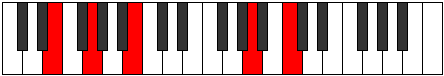 |
| ThirdInversion | G,B,A,C,E | 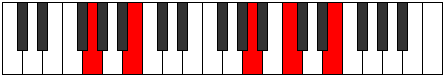 |
| FourthInversion | B,A,C,E,G | 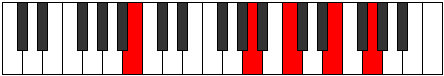 |
## Modes

| Number | Mode | Tonic | Notes | Illustration |
|--------|------|-------|-------|--------------|
| [425](https://ianring.com/musictheory/scales/425) | [Daditonic](ModeENaturalDaditonic.md) | E | E, G, A, B, C, E |  |
| [427](https://ianring.com/musictheory/scales/427) | [Zothimic](ModeENaturalZothimic.md) | E | E, F, G, A, B, C, E |  |
| [429](https://ianring.com/musictheory/scales/429) | [Koptimic](ModeENaturalKoptimic.md) | E | E, F#, G, A, B, C, E |  |
| [441](https://ianring.com/musictheory/scales/441) | [Thycrimic](ModeENaturalThycrimic.md) | E | E, F##, G#, A, B, C, E |  |
| [447](https://ianring.com/musictheory/scales/447) | [Thyphyllic](ModeENaturalThyphyllic.md) | E | E, F, F#, G, G#, A, B, C, E |  |
| [489](https://ianring.com/musictheory/scales/489) | [Phrathimic](ModeENaturalPhrathimic.md) | E | E, F##, G##, A#, B, C, E |  |
| [491](https://ianring.com/musictheory/scales/491) | [Aeolyrian](ModeENaturalAeolyrian.md) | E | E, F, G, A, Bb, Cb, Dbb, E |  |
| [493](https://ianring.com/musictheory/scales/493) | [Rygian](ModeENaturalRygian.md) | E | E, F#, G, A, Bb, Cb, Dbb, E |  |
| [495](https://ianring.com/musictheory/scales/495) | [Bocryllic](ModeENaturalBocryllic.md) | E | E, F, F#, G, A, A#, B, C, E |  |
| [505](https://ianring.com/musictheory/scales/505) | [Sanian](ModeENaturalSanian.md) | E | E, F##, G#, A, Bb, Cb, Dbb, E |  |
| [507](https://ianring.com/musictheory/scales/507) | [Moryllic](ModeENaturalMoryllic.md) | E | E, F, G, G#, A, A#, B, C, E |  |
| [509](https://ianring.com/musictheory/scales/509) | [Ionothyllic](ModeENaturalIonothyllic.md) | E | E, F#, G, G#, A, A#, B, C, E |  |
| [511](https://ianring.com/musictheory/scales/511) | [Polygic](ModeENaturalPolygic.md) | E | E, F, F#, G, G#, A, A#, B, C, E |  |
| [565](https://ianring.com/musictheory/scales/565) | [Aeolyphritonic](ModeGNaturalAeolyphritonic.md) | G | G, A, B, C, E, G |  |
| [573](https://ianring.com/musictheory/scales/573) | [Saptimic](ModeGNaturalSaptimic.md) | G | G, A, Bb, Cb, Dbb, E, G |  |
| [629](https://ianring.com/musictheory/scales/629) | [Aeronimic](ModeGNaturalAeronimic.md) | G | G, A, B, C, Db, E, G |  |
| [637](https://ianring.com/musictheory/scales/637) | [Katodian](ModeGNaturalKatodian.md) | G | G, A, Bb, Cb, Dbb, Ebbb, Fb, G |  |
| [639](https://ianring.com/musictheory/scales/639) | [Ionaryllic](ModeGNaturalIonaryllic.md) | G | G, G#, A, A#, B, C, C#, E, G |  |
| [693](https://ianring.com/musictheory/scales/693) | [Mynimic](ModeGNaturalMynimic.md) | G | G, A, B, C, D, E, G |  |
| [701](https://ianring.com/musictheory/scales/701) | [Mixonyphian](ModeGNaturalMixonyphian.md) | G | G, A, Bb, Cb, Dbb, Ebb, Fb, G |  |
| [703](https://ianring.com/musictheory/scales/703) | [Aerocryllic](ModeGNaturalAerocryllic.md) | G | G, G#, A, A#, B, C, D, E, G |  |
| [757](https://ianring.com/musictheory/scales/757) | [Ionyptian](ModeGNaturalIonyptian.md) | G | G, A, B, C, Db, Ebb, Fb, G |  |
| [759](https://ianring.com/musictheory/scales/759) | [Katalyllic](ModeGNaturalKatalyllic.md) | G | G, G#, A, B, C, C#, D, E, G |  |
| [765](https://ianring.com/musictheory/scales/765) | [Mixonyphyllic](ModeGNaturalMixonyphyllic.md) | G | G, A, A#, B, C, C#, D, E, G | 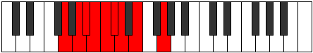 |
| [767](https://ianring.com/musictheory/scales/767) | [Raptygic](ModeGNaturalRaptygic.md) | G | G, G#, A, A#, B, C, C#, D, E, G |  |
| [821](https://ianring.com/musictheory/scales/821) | [Aeranimic](ModeGNaturalAeranimic.md) | G | G, A, B, C, D#, E, G |  |
| [829](https://ianring.com/musictheory/scales/829) | [Lygian](ModeGNaturalLygian.md) | G | G, A, Bb, Cb, Dbb, Eb, Fb, G |  |
| [831](https://ianring.com/musictheory/scales/831) | [Rodyllic](ModeGNaturalRodyllic.md) | G | G, G#, A, A#, B, C, D#, E, G |  |
| [851](https://ianring.com/musictheory/scales/851) | [Aerylimic](ModeEFlatAerylimic.md) | Eb | Eb, Fb, G, A, B, C, Eb |  |
| [855](https://ianring.com/musictheory/scales/855) | [Porian](ModeDSharpPorian.md) | D# | D#, E, F, G, A, B, C, D# |  |
| [859](https://ianring.com/musictheory/scales/859) | [Pathian](ModeDSharpPathian.md) | D# | D#, E, F#, G, A, B, C, D# |  |
| [863](https://ianring.com/musictheory/scales/863) | [Pyryllic](ModeDSharpPyryllic.md) | D# | D#, E, F, F#, G, A, B, C, D# |  |
| [863](https://ianring.com/musictheory/scales/863) | [Pyryllic](ModeEFlatPyryllic.md) | Eb | Eb, E, F, Gb, G, A, B, C, Eb |  |
| [883](https://ianring.com/musictheory/scales/883) | [Ralian](ModeDSharpRalian.md) | D# | D#, E, F##, G#, A, B, C, D# |  |
| [885](https://ianring.com/musictheory/scales/885) | [Sathian](ModeGNaturalSathian.md) | G | G, A, B, C, Db, Eb, Fb, G |  |
| [887](https://ianring.com/musictheory/scales/887) | [Sathyllic](ModeGNaturalSathyllic.md) | G | G, G#, A, B, C, C#, D#, E, G |  |
| [887](https://ianring.com/musictheory/scales/887) | [Sathyllic](ModeDSharpSathyllic.md) | D# | D#, E, F, G, G#, A, B, C, D# |  |
| [887](https://ianring.com/musictheory/scales/887) | [Sathyllic](ModeEFlatSathyllic.md) | Eb | Eb, E, F, G, Ab, A, B, C, Eb |  |
| [891](https://ianring.com/musictheory/scales/891) | [Ionilyllic](ModeDSharpIonilyllic.md) | D# | D#, E, F#, G, G#, A, B, C, D# |  |
| [891](https://ianring.com/musictheory/scales/891) | [Ionilyllic](ModeEFlatIonilyllic.md) | Eb | Eb, E, Gb, G, Ab, A, B, C, Eb |  |
| [893](https://ianring.com/musictheory/scales/893) | [Pycryllic](ModeGNaturalPycryllic.md) | G | G, A, A#, B, C, C#, D#, E, G |  |
| [895](https://ianring.com/musictheory/scales/895) | [Aeolathygic](ModeDSharpAeolathygic.md) | D# | D#, E, F, F#, G, G#, A, B, C, D# |  |
| [895](https://ianring.com/musictheory/scales/895) | [Aeolathygic](ModeEFlatAeolathygic.md) | Eb | Eb, E, F, Gb, G, Ab, A, B, C, Eb |  |
| [895](https://ianring.com/musictheory/scales/895) | [Aeolathygic](ModeGNaturalAeolathygic.md) | G | G, G#, A, A#, B, C, C#, D#, E, G |  |
| [939](https://ianring.com/musictheory/scales/939) | [Dyptian](ModeENaturalDyptian.md) | E | E, F, G, A, B, C, Db, E |  |
| [941](https://ianring.com/musictheory/scales/941) | [Phrorian](ModeENaturalPhrorian.md) | E | E, F#, G, A, B, C, Db, E |  |
| [943](https://ianring.com/musictheory/scales/943) | [Aerygyllic](ModeENaturalAerygyllic.md) | E | E, F, F#, G, A, B, C, C#, E |  |
| [949](https://ianring.com/musictheory/scales/949) | [Ionagian](ModeGNaturalIonagian.md) | G | G, A, B, C, D, Eb, Fb, G |  |
| [951](https://ianring.com/musictheory/scales/951) | [Thogyllic](ModeGNaturalThogyllic.md) | G | G, G#, A, B, C, D, D#, E, G |  |
| [953](https://ianring.com/musictheory/scales/953) | [Stoptian](ModeENaturalStoptian.md) | E | E, F##, G#, A, B, C, Db, E |  |
| [955](https://ianring.com/musictheory/scales/955) | [Ionogyllic](ModeENaturalIonogyllic.md) | E | E, F, G, G#, A, B, C, C#, E |  |
| [957](https://ianring.com/musictheory/scales/957) | [Phronyllic](ModeENaturalPhronyllic.md) | E | E, F#, G, G#, A, B, C, C#, E |  |
| [957](https://ianring.com/musictheory/scales/957) | [Phronyllic](ModeGNaturalPhronyllic.md) | G | G, A, A#, B, C, D, D#, E, G |  |
| [959](https://ianring.com/musictheory/scales/959) | [Katylygic](ModeENaturalKatylygic.md) | E | E, F, F#, G, G#, A, B, C, C#, E |  |
| [959](https://ianring.com/musictheory/scales/959) | [Katylygic](ModeGNaturalKatylygic.md) | G | G, G#, A, A#, B, C, D, D#, E, G |  |
| [979](https://ianring.com/musictheory/scales/979) | [Thogian](ModeDSharpThogian.md) | D# | D#, E, F##, G##, A#, B, C, D# |  |
| [979](https://ianring.com/musictheory/scales/979) | [Thogian](ModeEFlatThogian.md) | Eb | Eb, Fb, G, A, Bb, Cb, Dbb, Eb |  |
| [983](https://ianring.com/musictheory/scales/983) | [Epygyllic](ModeDSharpEpygyllic.md) | D# | D#, E, F, G, A, A#, B, C, D# |  |
| [983](https://ianring.com/musictheory/scales/983) | [Epygyllic](ModeEFlatEpygyllic.md) | Eb | Eb, E, F, G, A, Bb, B, C, Eb |  |
| [987](https://ianring.com/musictheory/scales/987) | [Aeraptyllic](ModeDSharpAeraptyllic.md) | D# | D#, E, F#, G, A, A#, B, C, D# |  |
| [987](https://ianring.com/musictheory/scales/987) | [Aeraptyllic](ModeEFlatAeraptyllic.md) | Eb | Eb, E, Gb, G, A, Bb, B, C, Eb |  |
| [991](https://ianring.com/musictheory/scales/991) | [Aeolygic](ModeDSharpAeolygic.md) | D# | D#, E, F, F#, G, A, A#, B, C, D# |  |
| [991](https://ianring.com/musictheory/scales/991) | [Aeolygic](ModeEFlatAeolygic.md) | Eb | Eb, E, F, Gb, G, A, Bb, B, C, Eb |  |
| [1001](https://ianring.com/musictheory/scales/1001) | [Badian](ModeENaturalBadian.md) | E | E, F##, G##, A#, B, C, Db, E |  |
| [1003](https://ianring.com/musictheory/scales/1003) | [Ionyryllic](ModeENaturalIonyryllic.md) | E | E, F, G, A, A#, B, C, C#, E |  |
| [1005](https://ianring.com/musictheory/scales/1005) | [Radyllic](ModeENaturalRadyllic.md) | E | E, F#, G, A, A#, B, C, C#, E |  |
| [1007](https://ianring.com/musictheory/scales/1007) | [Ionycrygic](ModeENaturalIonycrygic.md) | E | E, F, F#, G, A, A#, B, C, C#, E |  |
| [1011](https://ianring.com/musictheory/scales/1011) | [Kycryllic](ModeDSharpKycryllic.md) | D# | D#, E, G, G#, A, A#, B, C, D# |  |
| [1011](https://ianring.com/musictheory/scales/1011) | [Kycryllic](ModeEFlatKycryllic.md) | Eb | Eb, E, G, Ab, A, Bb, B, C, Eb |  |
| [1013](https://ianring.com/musictheory/scales/1013) | [Stydyllic](ModeGNaturalStydyllic.md) | G | G, A, B, C, C#, D, D#, E, G |  |
| [1015](https://ianring.com/musictheory/scales/1015) | [Ionodygic](ModeGNaturalIonodygic.md) | G | G, G#, A, B, C, C#, D, D#, E, G |  |
| [1015](https://ianring.com/musictheory/scales/1015) | [Ionodygic](ModeDSharpIonodygic.md) | D# | D#, E, F, G, G#, A, A#, B, C, D# |  |
| [1015](https://ianring.com/musictheory/scales/1015) | [Ionodygic](ModeEFlatIonodygic.md) | Eb | Eb, E, F, G, Ab, A, Bb, B, C, Eb |  |
| [1017](https://ianring.com/musictheory/scales/1017) | [Dythyllic](ModeENaturalDythyllic.md) | E | E, G, G#, A, A#, B, C, C#, E |  |
| [1019](https://ianring.com/musictheory/scales/1019) | [Aeranygic](ModeENaturalAeranygic.md) | E | E, F, G, G#, A, A#, B, C, C#, E |  |
| [1019](https://ianring.com/musictheory/scales/1019) | [Aeranygic](ModeDSharpAeranygic.md) | D# | D#, E, F#, G, G#, A, A#, B, C, D# |  |
| [1019](https://ianring.com/musictheory/scales/1019) | [Aeranygic](ModeEFlatAeranygic.md) | Eb | Eb, E, Gb, G, Ab, A, Bb, B, C, Eb |  |
| [1021](https://ianring.com/musictheory/scales/1021) | [Ladygic](ModeGNaturalLadygic.md) | G | G, A, A#, B, C, C#, D, D#, E, G |  |
| [1021](https://ianring.com/musictheory/scales/1021) | [Ladygic](ModeENaturalLadygic.md) | E | E, F#, G, G#, A, A#, B, C, C#, E |  |
| [1023](https://ianring.com/musictheory/scales/1023) | [Dodyllian](ModeGNaturalDodyllian.md) | G | G, G#, A, A#, B, C, C#, D, D#, E, G |  |
| [1023](https://ianring.com/musictheory/scales/1023) | [Dodyllian](ModeENaturalDodyllian.md) | E | E, F, F#, G, G#, A, A#, B, C, C#, E |  |
| [1023](https://ianring.com/musictheory/scales/1023) | [Dodyllian](ModeDSharpDodyllian.md) | D# | D#, E, F, F#, G, G#, A, A#, B, C, D# |  |
| [1023](https://ianring.com/musictheory/scales/1023) | [Dodyllian](ModeEFlatDodyllian.md) | Eb | Eb, E, F, Gb, G, Ab, A, Bb, B, C, Eb |  |
| [1131](https://ianring.com/musictheory/scales/1131) | [Thocrimic](ModeFSharpThocrimic.md) | F# | F#, G, A, B, C, D##, F# |  |
| [1147](https://ianring.com/musictheory/scales/1147) | [Epynian](ModeFSharpEpynian.md) | F# | F#, G, A, Bb, Cb, Dbb, E, F# |  |
| [1151](https://ianring.com/musictheory/scales/1151) | [Mythyllic](ModeFSharpMythyllic.md) | F# | F#, G, G#, A, A#, B, C, E, F# |  |
| [1151](https://ianring.com/musictheory/scales/1151) | [Mythyllic](ModeGFlatMythyllic.md) | Gb | Gb, G, Ab, A, Bb, B, C, E, Gb |  |
| [1165](https://ianring.com/musictheory/scales/1165) | [Gycritonic](ModeANaturalGycritonic.md) | A | A, B, C, E, G, A |  |
| [1167](https://ianring.com/musictheory/scales/1167) | [Aerodimic](ModeANaturalAerodimic.md) | A | A, Bb, Cb, Dbb, E, F##, A |  |
| [1181](https://ianring.com/musictheory/scales/1181) | [Katagimic](ModeANaturalKatagimic.md) | A | A, B, C, Db, E, F##, A |  |
| [1183](https://ianring.com/musictheory/scales/1183) | [Sadian](ModeANaturalSadian.md) | A | A, Bb, Cb, Dbb, Ebbb, Fb, G, A |  |
| [1197](https://ianring.com/musictheory/scales/1197) | [Rocrimic](ModeANaturalRocrimic.md) | A | A, B, C, D, E, F##, A |  |
| [1199](https://ianring.com/musictheory/scales/1199) | [Magian](ModeANaturalMagian.md) | A | A, Bb, Cb, Dbb, Ebb, Fb, G, A |  |
| [1213](https://ianring.com/musictheory/scales/1213) | [Gyrian](ModeANaturalGyrian.md) | A | A, B, C, Db, Ebb, Fb, G, A |  |
| [1215](https://ianring.com/musictheory/scales/1215) | [Aeolanyllic](ModeANaturalAeolanyllic.md) | A | A, A#, B, C, C#, D, E, G, A |  |
| [1229](https://ianring.com/musictheory/scales/1229) | [Ragimic](ModeANaturalRagimic.md) | A | A, B, C, D#, E, F##, A |  |
| [1231](https://ianring.com/musictheory/scales/1231) | [Logian](ModeANaturalLogian.md) | A | A, Bb, Cb, Dbb, Eb, Fb, G, A |  |
| [1245](https://ianring.com/musictheory/scales/1245) | [Lathian](ModeANaturalLathian.md) | A | A, B, C, Db, Eb, Fb, G, A |  |
| [1247](https://ianring.com/musictheory/scales/1247) | [Mygyllic](ModeANaturalMygyllic.md) | A | A, A#, B, C, C#, D#, E, G, A |  |
| [1259](https://ianring.com/musictheory/scales/1259) | [Stadian](ModeFSharpStadian.md) | F# | F#, G, A, B, C, Db, E, F# |  |
| [1261](https://ianring.com/musictheory/scales/1261) | [Aeodian](ModeANaturalAeodian.md) | A | A, B, C, D, Eb, Fb, G, A |  |
| [1263](https://ianring.com/musictheory/scales/1263) | [Stynyllic](ModeFSharpStynyllic.md) | F# | F#, G, G#, A, B, C, C#, E, F# |  |
| [1263](https://ianring.com/musictheory/scales/1263) | [Stynyllic](ModeGFlatStynyllic.md) | Gb | Gb, G, Ab, A, B, C, Db, E, Gb |  |
| [1263](https://ianring.com/musictheory/scales/1263) | [Stynyllic](ModeANaturalStynyllic.md) | A | A, A#, B, C, D, D#, E, G, A |  |
| [1275](https://ianring.com/musictheory/scales/1275) | [Stagyllic](ModeFSharpStagyllic.md) | F# | F#, G, A, A#, B, C, C#, E, F# |  |
| [1275](https://ianring.com/musictheory/scales/1275) | [Stagyllic](ModeGFlatStagyllic.md) | Gb | Gb, G, A, Bb, B, C, Db, E, Gb |  |
| [1277](https://ianring.com/musictheory/scales/1277) | [Zadyllic](ModeANaturalZadyllic.md) | A | A, B, C, C#, D, D#, E, G, A |  |
| [1279](https://ianring.com/musictheory/scales/1279) | [Sarygic](ModeANaturalSarygic.md) | A | A, A#, B, C, C#, D, D#, E, G, A |  |
| [1279](https://ianring.com/musictheory/scales/1279) | [Sarygic](ModeFSharpSarygic.md) | F# | F#, G, G#, A, A#, B, C, C#, E, F# |  |
| [1279](https://ianring.com/musictheory/scales/1279) | [Sarygic](ModeGFlatSarygic.md) | Gb | Gb, G, Ab, A, Bb, B, C, Db, E, Gb |  |
| [1315](https://ianring.com/musictheory/scales/1315) | [Pyritonic](ModeBNaturalPyritonic.md) | B | B, C, E, G, A, B |  |
| [1319](https://ianring.com/musictheory/scales/1319) | [Phronimic](ModeBNaturalPhronimic.md) | B | B, C, Db, E, F##, G##, B |  |
| [1323](https://ianring.com/musictheory/scales/1323) | [Eporimic](ModeBNaturalEporimic.md) | B | B, C, D, E, F##, G##, B | 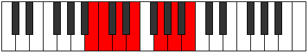 |
| [1327](https://ianring.com/musictheory/scales/1327) | [Zalian](ModeBNaturalZalian.md) | B | B, C, Db, Ebb, Fb, G, A, B |  |
| [1331](https://ianring.com/musictheory/scales/1331) | [Dolimic](ModeBNaturalDolimic.md) | B | B, C, D#, E, F##, G##, B | 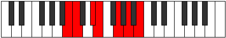 |
| [1335](https://ianring.com/musictheory/scales/1335) | [Aeralian](ModeBNaturalAeralian.md) | B | B, C, Db, Eb, Fb, G, A, B | 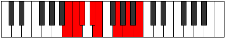 |
| [1339](https://ianring.com/musictheory/scales/1339) | [Kycrian](ModeBNaturalKycrian.md) | B | B, C, D, Eb, Fb, G, A, B |  |
| [1343](https://ianring.com/musictheory/scales/1343) | [Zalyllic](ModeBNaturalZalyllic.md) | B | B, C, C#, D, D#, E, G, A, B |  |
| [1379](https://ianring.com/musictheory/scales/1379) | [Kycrimic](ModeBNaturalKycrimic.md) | B | B, C, D##, E#, F##, G##, B |  |
| [1383](https://ianring.com/musictheory/scales/1383) | [Pynian](ModeBNaturalPynian.md) | B | B, C, Db, E, F, G, A, B |  |
| [1387](https://ianring.com/musictheory/scales/1387) | [Locrian](ModeBNaturalLocrian.md) | B | B, C, D, E, F, G, A, B |  |
| [1387](https://ianring.com/musictheory/scales/1387) | [Locrian](ModeFSharpLocrian.md) | F# | F#, G, A, B, C, D, E, F# |  |
| [1391](https://ianring.com/musictheory/scales/1391) | [Aeradyllic](ModeBNaturalAeradyllic.md) | B | B, C, C#, D, E, F, G, A, B |  |
| [1391](https://ianring.com/musictheory/scales/1391) | [Aeradyllic](ModeFSharpAeradyllic.md) | F# | F#, G, G#, A, B, C, D, E, F# |  |
| [1391](https://ianring.com/musictheory/scales/1391) | [Aeradyllic](ModeGFlatAeradyllic.md) | Gb | Gb, G, Ab, A, B, C, D, E, Gb |  |
| [1395](https://ianring.com/musictheory/scales/1395) | [Mixonorian](ModeBNaturalMixonorian.md) | B | B, C, D#, E, F, G, A, B |  |
| [1399](https://ianring.com/musictheory/scales/1399) | [Syryllic](ModeBNaturalSyryllic.md) | B | B, C, C#, D#, E, F, G, A, B |  |
| [1403](https://ianring.com/musictheory/scales/1403) | [Epinyllic](ModeBNaturalEpinyllic.md) | B | B, C, D, D#, E, F, G, A, B |  |
| [1403](https://ianring.com/musictheory/scales/1403) | [Epinyllic](ModeFSharpEpinyllic.md) | F# | F#, G, A, A#, B, C, D, E, F# |  |
| [1403](https://ianring.com/musictheory/scales/1403) | [Epinyllic](ModeGFlatEpinyllic.md) | Gb | Gb, G, A, Bb, B, C, D, E, Gb |  |
| [1407](https://ianring.com/musictheory/scales/1407) | [Tharygic](ModeBNaturalTharygic.md) | B | B, C, C#, D, D#, E, F, G, A, B |  |
| [1407](https://ianring.com/musictheory/scales/1407) | [Tharygic](ModeFSharpTharygic.md) | F# | F#, G, G#, A, A#, B, C, D, E, F# |  |
| [1407](https://ianring.com/musictheory/scales/1407) | [Tharygic](ModeGFlatTharygic.md) | Gb | Gb, G, Ab, A, Bb, B, C, D, E, Gb |  |
| [1421](https://ianring.com/musictheory/scales/1421) | [Aeolaphimic](ModeANaturalAeolaphimic.md) | A | A, B, C, D##, E#, F##, A |  |
| [1423](https://ianring.com/musictheory/scales/1423) | [Doptian](ModeANaturalDoptian.md) | A | A, Bb, Cb, Dbb, E, F, G, A |  |
| [1437](https://ianring.com/musictheory/scales/1437) | [Aeolycrian](ModeANaturalAeolycrian.md) | A | A, B, C, Db, E, F, G, A |  |
| [1439](https://ianring.com/musictheory/scales/1439) | [Rolyllic](ModeANaturalRolyllic.md) | A | A, A#, B, C, C#, E, F, G, A |  |
| [1443](https://ianring.com/musictheory/scales/1443) | [Ionarimic](ModeBNaturalIonarimic.md) | B | B, C, D##, E##, F##, G##, B |  |
| [1447](https://ianring.com/musictheory/scales/1447) | [Mixopyrian](ModeBNaturalMixopyrian.md) | B | B, C, Db, E, F#, G, A, B |  |
| [1451](https://ianring.com/musictheory/scales/1451) | [Phrygian](ModeENaturalPhrygian.md) | E | E, F, G, A, B, C, D, E |  |
| [1451](https://ianring.com/musictheory/scales/1451) | [Phrygian](ModeBNaturalPhrygian.md) | B | B, C, D, E, F#, G, A, B |  |
| [1453](https://ianring.com/musictheory/scales/1453) | [Aeolian](ModeANaturalAeolian.md) | A | A, B, C, D, E, F, G, A |  |
| [1453](https://ianring.com/musictheory/scales/1453) | [Aeolian](ModeENaturalAeolian.md) | E | E, F#, G, A, B, C, D, E |  |
| [1455](https://ianring.com/musictheory/scales/1455) | [Soryllic](ModeBNaturalSoryllic.md) | B | B, C, C#, D, E, F#, G, A, B |  |
| [1455](https://ianring.com/musictheory/scales/1455) | [Soryllic](ModeENaturalSoryllic.md) | E | E, F, F#, G, A, B, C, D, E |  |
| [1455](https://ianring.com/musictheory/scales/1455) | [Soryllic](ModeANaturalSoryllic.md) | A | A, A#, B, C, D, E, F, G, A |  |
| [1459](https://ianring.com/musictheory/scales/1459) | [Ionalian](ModeBNaturalIonalian.md) | B | B, C, D#, E, F#, G, A, B |  |
| [1463](https://ianring.com/musictheory/scales/1463) | [Zaptyllic](ModeBNaturalZaptyllic.md) | B | B, C, C#, D#, E, F#, G, A, B |  |
| [1465](https://ianring.com/musictheory/scales/1465) | [Aerathian](ModeENaturalAerathian.md) | E | E, F##, G#, A, B, C, D, E |  |
| [1467](https://ianring.com/musictheory/scales/1467) | [Thydyllic](ModeBNaturalThydyllic.md) | B | B, C, D, D#, E, F#, G, A, B |  |
| [1467](https://ianring.com/musictheory/scales/1467) | [Thydyllic](ModeENaturalThydyllic.md) | E | E, F, G, G#, A, B, C, D, E |  |
| [1469](https://ianring.com/musictheory/scales/1469) | [Epiryllic](ModeANaturalEpiryllic.md) | A | A, B, C, C#, D, E, F, G, A |  |
| [1469](https://ianring.com/musictheory/scales/1469) | [Epiryllic](ModeENaturalEpiryllic.md) | E | E, F#, G, G#, A, B, C, D, E |  |
| [1471](https://ianring.com/musictheory/scales/1471) | [Radygic](ModeBNaturalRadygic.md) | B | B, C, C#, D, D#, E, F#, G, A, B |  |
| [1471](https://ianring.com/musictheory/scales/1471) | [Radygic](ModeENaturalRadygic.md) | E | E, F, F#, G, G#, A, B, C, D, E |  |
| [1471](https://ianring.com/musictheory/scales/1471) | [Radygic](ModeANaturalRadygic.md) | A | A, A#, B, C, C#, D, E, F, G, A |  |
| [1485](https://ianring.com/musictheory/scales/1485) | [Tyrian](ModeANaturalTyrian.md) | A | A, B, C, D#, E, F, G, A |  |
| [1487](https://ianring.com/musictheory/scales/1487) | [Lycryllic](ModeANaturalLycryllic.md) | A | A, A#, B, C, D#, E, F, G, A |  |
| [1501](https://ianring.com/musictheory/scales/1501) | [Stygyllic](ModeANaturalStygyllic.md) | A | A, B, C, C#, D#, E, F, G, A |  |
| [1503](https://ianring.com/musictheory/scales/1503) | [Padygic](ModeANaturalPadygic.md) | A | A, A#, B, C, C#, D#, E, F, G, A |  |
| [1507](https://ianring.com/musictheory/scales/1507) | [Zynian](ModeBNaturalZynian.md) | B | B, C, D##, E#, F#, G, A, B |  |
| [1511](https://ianring.com/musictheory/scales/1511) | [Styptyllic](ModeBNaturalStyptyllic.md) | B | B, C, C#, E, F, F#, G, A, B |  |
| [1513](https://ianring.com/musictheory/scales/1513) | [Stathian](ModeENaturalStathian.md) | E | E, F##, G##, A#, B, C, D, E | 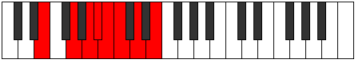 |
| [1515](https://ianring.com/musictheory/scales/1515) | [Solyllic](ModeFSharpSolyllic.md) | F# | F#, G, A, B, C, C#, D, E, F# |  |
| [1515](https://ianring.com/musictheory/scales/1515) | [Solyllic](ModeGFlatSolyllic.md) | Gb | Gb, G, A, B, C, Db, D, E, Gb |  |
| [1515](https://ianring.com/musictheory/scales/1515) | [Solyllic](ModeBNaturalSolyllic.md) | B | B, C, D, E, F, F#, G, A, B |  |
| [1515](https://ianring.com/musictheory/scales/1515) | [Solyllic](ModeENaturalSolyllic.md) | E | E, F, G, A, A#, B, C, D, E |  |
| [1517](https://ianring.com/musictheory/scales/1517) | [Sagyllic](ModeANaturalSagyllic.md) | A | A, B, C, D, D#, E, F, G, A |  |
| [1517](https://ianring.com/musictheory/scales/1517) | [Sagyllic](ModeENaturalSagyllic.md) | E | E, F#, G, A, A#, B, C, D, E |  |
| [1519](https://ianring.com/musictheory/scales/1519) | [Solygic](ModeBNaturalSolygic.md) | B | B, C, C#, D, E, F, F#, G, A, B |  |
| [1519](https://ianring.com/musictheory/scales/1519) | [Solygic](ModeFSharpSolygic.md) | F# | F#, G, G#, A, B, C, C#, D, E, F# |  |
| [1519](https://ianring.com/musictheory/scales/1519) | [Solygic](ModeGFlatSolygic.md) | Gb | Gb, G, Ab, A, B, C, Db, D, E, Gb |  |
| [1519](https://ianring.com/musictheory/scales/1519) | [Solygic](ModeANaturalSolygic.md) | A | A, A#, B, C, D, D#, E, F, G, A |  |
| [1519](https://ianring.com/musictheory/scales/1519) | [Solygic](ModeENaturalSolygic.md) | E | E, F, F#, G, A, A#, B, C, D, E |  |
| [1523](https://ianring.com/musictheory/scales/1523) | [Zothyllic](ModeBNaturalZothyllic.md) | B | B, C, D#, E, F, F#, G, A, B |  |
| [1527](https://ianring.com/musictheory/scales/1527) | [Aeolyrygic](ModeBNaturalAeolyrygic.md) | B | B, C, C#, D#, E, F, F#, G, A, B |  |
| [1529](https://ianring.com/musictheory/scales/1529) | [Kataryllic](ModeENaturalKataryllic.md) | E | E, G, G#, A, A#, B, C, D, E |  |
| [1531](https://ianring.com/musictheory/scales/1531) | [Styptygic](ModeBNaturalStyptygic.md) | B | B, C, D, D#, E, F, F#, G, A, B |  |
| [1531](https://ianring.com/musictheory/scales/1531) | [Styptygic](ModeFSharpStyptygic.md) | F# | F#, G, A, A#, B, C, C#, D, E, F# |  |
| [1531](https://ianring.com/musictheory/scales/1531) | [Styptygic](ModeGFlatStyptygic.md) | Gb | Gb, G, A, Bb, B, C, Db, D, E, Gb |  |
| [1531](https://ianring.com/musictheory/scales/1531) | [Styptygic](ModeENaturalStyptygic.md) | E | E, F, G, G#, A, A#, B, C, D, E |  |
| [1533](https://ianring.com/musictheory/scales/1533) | [Katycrygic](ModeANaturalKatycrygic.md) | A | A, B, C, C#, D, D#, E, F, G, A |  |
| [1533](https://ianring.com/musictheory/scales/1533) | [Katycrygic](ModeENaturalKatycrygic.md) | E | E, F#, G, G#, A, A#, B, C, D, E |  |
| [1535](https://ianring.com/musictheory/scales/1535) | [Mixodyllian](ModeBNaturalMixodyllian.md) | B | B, C, C#, D, D#, E, F, F#, G, A, B |  |
| [1535](https://ianring.com/musictheory/scales/1535) | [Mixodyllian](ModeANaturalMixodyllian.md) | A | A, A#, B, C, C#, D, D#, E, F, G, A |  |
| [1535](https://ianring.com/musictheory/scales/1535) | [Mixodyllian](ModeFSharpMixodyllian.md) | F# | F#, G, G#, A, A#, B, C, C#, D, E, F# |  |
| [1535](https://ianring.com/musictheory/scales/1535) | [Mixodyllian](ModeGFlatMixodyllian.md) | Gb | Gb, G, Ab, A, Bb, B, C, Db, D, E, Gb |  |
| [1535](https://ianring.com/musictheory/scales/1535) | [Mixodyllian](ModeENaturalMixodyllian.md) | E | E, F, F#, G, G#, A, A#, B, C, D, E |  |
| [1589](https://ianring.com/musictheory/scales/1589) | [Ionagimic](ModeGNaturalIonagimic.md) | G | G, A, B, C, D##, E#, G |  |
| [1597](https://ianring.com/musictheory/scales/1597) | [Aeolodian](ModeGNaturalAeolodian.md) | G | G, A, Bb, Cb, Dbb, E, F, G |  |
| [1599](https://ianring.com/musictheory/scales/1599) | [Pocryllic](ModeGNaturalPocryllic.md) | G | G, G#, A, A#, B, C, E, F, G |  |
| [1643](https://ianring.com/musictheory/scales/1643) | [Thyptian](ModeFSharpThyptian.md) | F# | F#, G, A, B, C, D#, E, F# |  |
| [1647](https://ianring.com/musictheory/scales/1647) | [Polyllic](ModeFSharpPolyllic.md) | F# | F#, G, G#, A, B, C, D#, E, F# |  |
| [1647](https://ianring.com/musictheory/scales/1647) | [Polyllic](ModeGFlatPolyllic.md) | Gb | Gb, G, Ab, A, B, C, Eb, E, Gb |  |
| [1653](https://ianring.com/musictheory/scales/1653) | [Gylian](ModeGNaturalGylian.md) | G | G, A, B, C, Db, E, F, G |  |
| [1655](https://ianring.com/musictheory/scales/1655) | [Katygyllic](ModeGNaturalKatygyllic.md) | G | G, G#, A, B, C, C#, E, F, G |  |
| [1659](https://ianring.com/musictheory/scales/1659) | [Magyllic](ModeFSharpMagyllic.md) | F# | F#, G, A, A#, B, C, D#, E, F# |  |
| [1659](https://ianring.com/musictheory/scales/1659) | [Magyllic](ModeGFlatMagyllic.md) | Gb | Gb, G, A, Bb, B, C, Eb, E, Gb |  |
| [1661](https://ianring.com/musictheory/scales/1661) | [Gonyllic](ModeGNaturalGonyllic.md) | G | G, A, A#, B, C, C#, E, F, G |  |
| [1663](https://ianring.com/musictheory/scales/1663) | [Lydygic](ModeGNaturalLydygic.md) | G | G, G#, A, A#, B, C, C#, E, F, G |  |
| [1663](https://ianring.com/musictheory/scales/1663) | [Lydygic](ModeFSharpLydygic.md) | F# | F#, G, G#, A, A#, B, C, D#, E, F# |  |
| [1663](https://ianring.com/musictheory/scales/1663) | [Lydygic](ModeGFlatLydygic.md) | Gb | Gb, G, Ab, A, Bb, B, C, Eb, E, Gb |  |
| [1677](https://ianring.com/musictheory/scales/1677) | [Danimic](ModeANaturalDanimic.md) | A | A, B, C, D##, E##, F##, A |  |
| [1679](https://ianring.com/musictheory/scales/1679) | [Kydian](ModeANaturalKydian.md) | A | A, Bb, Cb, Dbb, E, F#, G, A |  |
| [1693](https://ianring.com/musictheory/scales/1693) | [Dogian](ModeANaturalDogian.md) | A | A, B, C, Db, E, F#, G, A |  |
| [1695](https://ianring.com/musictheory/scales/1695) | [Phrodyllic](ModeANaturalPhrodyllic.md) | A | A, A#, B, C, C#, E, F#, G, A |  |
| [1703](https://ianring.com/musictheory/scales/1703) | [Zaptian](ModeDNaturalZaptian.md) | D | D, Eb, Fb, G, A, B, C, D |  |
| [1709](https://ianring.com/musictheory/scales/1709) | [Dorian](ModeDNaturalDorian.md) | D | D, E, F, G, A, B, C, D |  |
| [1709](https://ianring.com/musictheory/scales/1709) | [Dorian](ModeANaturalDorian.md) | A | A, B, C, D, E, F#, G, A |  |
| [1711](https://ianring.com/musictheory/scales/1711) | [Ragyllic](ModeDNaturalRagyllic.md) | D | D, D#, E, F, G, A, B, C, D |  |
| [1711](https://ianring.com/musictheory/scales/1711) | [Ragyllic](ModeANaturalRagyllic.md) | A | A, A#, B, C, D, E, F#, G, A |  |
| [1717](https://ianring.com/musictheory/scales/1717) | [Mixolydian](ModeGNaturalMixolydian.md) | G | G, A, B, C, D, E, F, G |  |
| [1717](https://ianring.com/musictheory/scales/1717) | [Mixolydian](ModeDNaturalMixolydian.md) | D | D, E, F#, G, A, B, C, D | 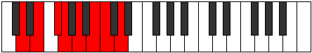 |
| [1719](https://ianring.com/musictheory/scales/1719) | [Lyryllic](ModeDNaturalLyryllic.md) | D | D, D#, E, F#, G, A, B, C, D |  |
| [1719](https://ianring.com/musictheory/scales/1719) | [Lyryllic](ModeGNaturalLyryllic.md) | G | G, G#, A, B, C, D, E, F, G |  |
| [1725](https://ianring.com/musictheory/scales/1725) | [Mixodyllic](ModeANaturalMixodyllic.md) | A | A, B, C, C#, D, E, F#, G, A |  |
| [1725](https://ianring.com/musictheory/scales/1725) | [Mixodyllic](ModeDNaturalMixodyllic.md) | D | D, E, F, F#, G, A, B, C, D |  |
| [1725](https://ianring.com/musictheory/scales/1725) | [Mixodyllic](ModeGNaturalMixodyllic.md) | G | G, A, A#, B, C, D, E, F, G |  |
| [1727](https://ianring.com/musictheory/scales/1727) | [Sydygic](ModeDNaturalSydygic.md) | D | D, D#, E, F, F#, G, A, B, C, D |  |
| [1727](https://ianring.com/musictheory/scales/1727) | [Sydygic](ModeANaturalSydygic.md) | A | A, A#, B, C, C#, D, E, F#, G, A |  |
| [1727](https://ianring.com/musictheory/scales/1727) | [Sydygic](ModeGNaturalSydygic.md) | G | G, G#, A, A#, B, C, D, E, F, G |  |
| [1741](https://ianring.com/musictheory/scales/1741) | [Katycrian](ModeANaturalKatycrian.md) | A | A, B, C, D#, E, F#, G, A |  |
| [1743](https://ianring.com/musictheory/scales/1743) | [Epigyllic](ModeANaturalEpigyllic.md) | A | A, A#, B, C, D#, E, F#, G, A |  |
| [1757](https://ianring.com/musictheory/scales/1757) | [Ionyphyllic](ModeANaturalIonyphyllic.md) | A | A, B, C, C#, D#, E, F#, G, A |  |
| [1759](https://ianring.com/musictheory/scales/1759) | [Pylygic](ModeANaturalPylygic.md) | A | A, A#, B, C, C#, D#, E, F#, G, A |  |
| [1765](https://ianring.com/musictheory/scales/1765) | [Lonian](ModeDNaturalLonian.md) | D | D, E, F##, G#, A, B, C, D |  |
| [1767](https://ianring.com/musictheory/scales/1767) | [Dyryllic](ModeDNaturalDyryllic.md) | D | D, D#, E, G, G#, A, B, C, D |  |
| [1771](https://ianring.com/musictheory/scales/1771) | [Stylyllic](ModeFSharpStylyllic.md) | F# | F#, G, A, B, C, C#, D#, E, F# |  |
| [1771](https://ianring.com/musictheory/scales/1771) | [Stylyllic](ModeGFlatStylyllic.md) | Gb | Gb, G, A, B, C, Db, Eb, E, Gb |  |
| [1773](https://ianring.com/musictheory/scales/1773) | [Aeoloryllic](ModeANaturalAeoloryllic.md) | A | A, B, C, D, D#, E, F#, G, A |  |
| [1773](https://ianring.com/musictheory/scales/1773) | [Aeoloryllic](ModeDNaturalAeoloryllic.md) | D | D, E, F, G, G#, A, B, C, D |  |
| [1775](https://ianring.com/musictheory/scales/1775) | [Lyrygic](ModeDNaturalLyrygic.md) | D | D, D#, E, F, G, G#, A, B, C, D |  |
| [1775](https://ianring.com/musictheory/scales/1775) | [Lyrygic](ModeFSharpLyrygic.md) | F# | F#, G, G#, A, B, C, C#, D#, E, F# |  |
| [1775](https://ianring.com/musictheory/scales/1775) | [Lyrygic](ModeGFlatLyrygic.md) | Gb | Gb, G, Ab, A, B, C, Db, Eb, E, Gb |  |
| [1775](https://ianring.com/musictheory/scales/1775) | [Lyrygic](ModeANaturalLyrygic.md) | A | A, A#, B, C, D, D#, E, F#, G, A |  |
| [1781](https://ianring.com/musictheory/scales/1781) | [Gocryllic](ModeGNaturalGocryllic.md) | G | G, A, B, C, C#, D, E, F, G |  |
| [1781](https://ianring.com/musictheory/scales/1781) | [Gocryllic](ModeDNaturalGocryllic.md) | D | D, E, F#, G, G#, A, B, C, D |  |
| [1783](https://ianring.com/musictheory/scales/1783) | [Danygic](ModeGNaturalDanygic.md) | G | G, G#, A, B, C, C#, D, E, F, G |  |
| [1783](https://ianring.com/musictheory/scales/1783) | [Danygic](ModeDNaturalDanygic.md) | D | D, D#, E, F#, G, G#, A, B, C, D |  |
| [1787](https://ianring.com/musictheory/scales/1787) | [Mycrygic](ModeFSharpMycrygic.md) | F# | F#, G, A, A#, B, C, C#, D#, E, F# |  |
| [1787](https://ianring.com/musictheory/scales/1787) | [Mycrygic](ModeGFlatMycrygic.md) | Gb | Gb, G, A, Bb, B, C, Db, Eb, E, Gb |  |
| [1789](https://ianring.com/musictheory/scales/1789) | [Katagygic](ModeANaturalKatagygic.md) | A | A, B, C, C#, D, D#, E, F#, G, A |  |
| [1789](https://ianring.com/musictheory/scales/1789) | [Katagygic](ModeDNaturalKatagygic.md) | D | D, E, F, F#, G, G#, A, B, C, D |  |
| [1789](https://ianring.com/musictheory/scales/1789) | [Katagygic](ModeGNaturalKatagygic.md) | G | G, A, A#, B, C, C#, D, E, F, G |  |
| [1791](https://ianring.com/musictheory/scales/1791) | [Aerygyllian](ModeDNaturalAerygyllian.md) | D | D, D#, E, F, F#, G, G#, A, B, C, D |  |
| [1791](https://ianring.com/musictheory/scales/1791) | [Aerygyllian](ModeANaturalAerygyllian.md) | A | A, A#, B, C, C#, D, D#, E, F#, G, A |  |
| [1791](https://ianring.com/musictheory/scales/1791) | [Aerygyllian](ModeGNaturalAerygyllian.md) | G | G, G#, A, A#, B, C, C#, D, E, F, G |  |
| [1791](https://ianring.com/musictheory/scales/1791) | [Aerygyllian](ModeFSharpAerygyllian.md) | F# | F#, G, G#, A, A#, B, C, C#, D#, E, F# |  |
| [1791](https://ianring.com/musictheory/scales/1791) | [Aerygyllian](ModeGFlatAerygyllian.md) | Gb | Gb, G, Ab, A, Bb, B, C, Db, Eb, E, Gb |  |
| [1827](https://ianring.com/musictheory/scales/1827) | [Katygimic](ModeBNaturalKatygimic.md) | B | B, C, D##, E###, F###, G##, B |  |
| [1831](https://ianring.com/musictheory/scales/1831) | [Pothian](ModeBNaturalPothian.md) | B | B, C, Db, E, F##, G#, A, B |  |
| [1835](https://ianring.com/musictheory/scales/1835) | [Byptian](ModeBNaturalByptian.md) | B | B, C, D, E, F##, G#, A, B |  |
| [1839](https://ianring.com/musictheory/scales/1839) | [Zogyllic](ModeBNaturalZogyllic.md) | B | B, C, C#, D, E, G, G#, A, B |  |
| [1843](https://ianring.com/musictheory/scales/1843) | [Ionygian](ModeBNaturalIonygian.md) | B | B, C, D#, E, F##, G#, A, B |  |
| [1845](https://ianring.com/musictheory/scales/1845) | [Lagian](ModeGNaturalLagian.md) | G | G, A, B, C, D#, E, F, G |  |
| [1847](https://ianring.com/musictheory/scales/1847) | [Thacryllic](ModeBNaturalThacryllic.md) | B | B, C, C#, D#, E, G, G#, A, B |  |
| [1847](https://ianring.com/musictheory/scales/1847) | [Thacryllic](ModeGNaturalThacryllic.md) | G | G, G#, A, B, C, D#, E, F, G |  |
| [1851](https://ianring.com/musictheory/scales/1851) | [Zacryllic](ModeBNaturalZacryllic.md) | B | B, C, D, D#, E, G, G#, A, B |  |
| [1853](https://ianring.com/musictheory/scales/1853) | [Phrynyllic](ModeGNaturalPhrynyllic.md) | G | G, A, A#, B, C, D#, E, F, G |  |
| [1855](https://ianring.com/musictheory/scales/1855) | [Marygic](ModeBNaturalMarygic.md) | B | B, C, C#, D, D#, E, G, G#, A, B |  |
| [1855](https://ianring.com/musictheory/scales/1855) | [Marygic](ModeGNaturalMarygic.md) | G | G, G#, A, A#, B, C, D#, E, F, G |  |
| [1875](https://ianring.com/musictheory/scales/1875) | [Epyphian](ModeEFlatEpyphian.md) | Eb | Eb, Fb, G, A, B, C, Db, Eb |  |
| [1879](https://ianring.com/musictheory/scales/1879) | [Mixoryllic](ModeDSharpMixoryllic.md) | D# | D#, E, F, G, A, B, C, C#, D# |  |
| [1879](https://ianring.com/musictheory/scales/1879) | [Mixoryllic](ModeEFlatMixoryllic.md) | Eb | Eb, E, F, G, A, B, C, Db, Eb |  |
| [1883](https://ianring.com/musictheory/scales/1883) | [Mixopyryllic](ModeDSharpMixopyryllic.md) | D# | D#, E, F#, G, A, B, C, C#, D# |  |
| [1883](https://ianring.com/musictheory/scales/1883) | [Mixopyryllic](ModeEFlatMixopyryllic.md) | Eb | Eb, E, Gb, G, A, B, C, Db, Eb |  |
| [1887](https://ianring.com/musictheory/scales/1887) | [Aerocrygic](ModeDSharpAerocrygic.md) | D# | D#, E, F, F#, G, A, B, C, C#, D# |  |
| [1887](https://ianring.com/musictheory/scales/1887) | [Aerocrygic](ModeEFlatAerocrygic.md) | Eb | Eb, E, F, Gb, G, A, B, C, Db, Eb |  |
| [1891](https://ianring.com/musictheory/scales/1891) | [Thalian](ModeBNaturalThalian.md) | B | B, C, D##, E#, F##, G#, A, B |  |
| [1895](https://ianring.com/musictheory/scales/1895) | [Salyllic](ModeBNaturalSalyllic.md) | B | B, C, C#, E, F, G, G#, A, B |  |
| [1899](https://ianring.com/musictheory/scales/1899) | [Moptyllic](ModeFSharpMoptyllic.md) | F# | F#, G, A, B, C, D, D#, E, F# |  |
| [1899](https://ianring.com/musictheory/scales/1899) | [Moptyllic](ModeGFlatMoptyllic.md) | Gb | Gb, G, A, B, C, D, Eb, E, Gb |  |
| [1899](https://ianring.com/musictheory/scales/1899) | [Moptyllic](ModeBNaturalMoptyllic.md) | B | B, C, D, E, F, G, G#, A, B |  |
| [1903](https://ianring.com/musictheory/scales/1903) | [Rocrygic](ModeBNaturalRocrygic.md) | B | B, C, C#, D, E, F, G, G#, A, B |  |
| [1903](https://ianring.com/musictheory/scales/1903) | [Rocrygic](ModeFSharpRocrygic.md) | F# | F#, G, G#, A, B, C, D, D#, E, F# |  |
| [1903](https://ianring.com/musictheory/scales/1903) | [Rocrygic](ModeGFlatRocrygic.md) | Gb | Gb, G, Ab, A, B, C, D, Eb, E, Gb |  |
| [1907](https://ianring.com/musictheory/scales/1907) | [Lynyllic](ModeDSharpLynyllic.md) | D# | D#, E, G, G#, A, B, C, C#, D# |  |
| [1907](https://ianring.com/musictheory/scales/1907) | [Lynyllic](ModeEFlatLynyllic.md) | Eb | Eb, E, G, Ab, A, B, C, Db, Eb |  |
| [1907](https://ianring.com/musictheory/scales/1907) | [Lynyllic](ModeBNaturalLynyllic.md) | B | B, C, D#, E, F, G, G#, A, B |  |
| [1909](https://ianring.com/musictheory/scales/1909) | [Epicryllic](ModeGNaturalEpicryllic.md) | G | G, A, B, C, C#, D#, E, F, G |  |
| [1911](https://ianring.com/musictheory/scales/1911) | [Stynygic](ModeDSharpStynygic.md) | D# | D#, E, F, G, G#, A, B, C, C#, D# |  |
| [1911](https://ianring.com/musictheory/scales/1911) | [Stynygic](ModeEFlatStynygic.md) | Eb | Eb, E, F, G, Ab, A, B, C, Db, Eb |  |
| [1911](https://ianring.com/musictheory/scales/1911) | [Stynygic](ModeGNaturalStynygic.md) | G | G, G#, A, B, C, C#, D#, E, F, G |  |
| [1911](https://ianring.com/musictheory/scales/1911) | [Stynygic](ModeBNaturalStynygic.md) | B | B, C, C#, D#, E, F, G, G#, A, B |  |
| [1915](https://ianring.com/musictheory/scales/1915) | [Thydygic](ModeBNaturalThydygic.md) | B | B, C, D, D#, E, F, G, G#, A, B |  |
| [1915](https://ianring.com/musictheory/scales/1915) | [Thydygic](ModeDSharpThydygic.md) | D# | D#, E, F#, G, G#, A, B, C, C#, D# |  |
| [1915](https://ianring.com/musictheory/scales/1915) | [Thydygic](ModeEFlatThydygic.md) | Eb | Eb, E, Gb, G, Ab, A, B, C, Db, Eb |  |
| [1915](https://ianring.com/musictheory/scales/1915) | [Thydygic](ModeFSharpThydygic.md) | F# | F#, G, A, A#, B, C, D, D#, E, F# |  |
| [1915](https://ianring.com/musictheory/scales/1915) | [Thydygic](ModeGFlatThydygic.md) | Gb | Gb, G, A, Bb, B, C, D, Eb, E, Gb |  |
| [1917](https://ianring.com/musictheory/scales/1917) | [Sacrygic](ModeGNaturalSacrygic.md) | G | G, A, A#, B, C, C#, D#, E, F, G |  |
| [1919](https://ianring.com/musictheory/scales/1919) | [Rocryllian](ModeBNaturalRocryllian.md) | B | B, C, C#, D, D#, E, F, G, G#, A, B |  |
| [1919](https://ianring.com/musictheory/scales/1919) | [Rocryllian](ModeDSharpRocryllian.md) | D# | D#, E, F, F#, G, G#, A, B, C, C#, D# |  |
| [1919](https://ianring.com/musictheory/scales/1919) | [Rocryllian](ModeEFlatRocryllian.md) | Eb | Eb, E, F, Gb, G, Ab, A, B, C, Db, Eb |  |
| [1919](https://ianring.com/musictheory/scales/1919) | [Rocryllian](ModeGNaturalRocryllian.md) | G | G, G#, A, A#, B, C, C#, D#, E, F, G |  |
| [1919](https://ianring.com/musictheory/scales/1919) | [Rocryllian](ModeFSharpRocryllian.md) | F# | F#, G, G#, A, A#, B, C, D, D#, E, F# |  |
| [1919](https://ianring.com/musictheory/scales/1919) | [Rocryllian](ModeGFlatRocryllian.md) | Gb | Gb, G, Ab, A, Bb, B, C, D, Eb, E, Gb |  |
| [1933](https://ianring.com/musictheory/scales/1933) | [Mocrian](ModeANaturalMocrian.md) | A | A, B, C, D##, E#, F#, G, A |  |
| [1935](https://ianring.com/musictheory/scales/1935) | [Mycryllic](ModeANaturalMycryllic.md) | A | A, A#, B, C, E, F, F#, G, A |  |
| [1949](https://ianring.com/musictheory/scales/1949) | [Mathyllic](ModeANaturalMathyllic.md) | A | A, B, C, C#, E, F, F#, G, A |  |
| [1951](https://ianring.com/musictheory/scales/1951) | [Gonygic](ModeANaturalGonygic.md) | A | A, A#, B, C, C#, E, F, F#, G, A |  |
| [1955](https://ianring.com/musictheory/scales/1955) | [Sonian](ModeBNaturalSonian.md) | B | B, C, D##, E##, F##, G#, A, B |  |
| [1957](https://ianring.com/musictheory/scales/1957) | [Pyrian](ModeDNaturalPyrian.md) | D | D, E, F##, G##, A#, B, C, D |  |
| [1959](https://ianring.com/musictheory/scales/1959) | [Katolyllic](ModeBNaturalKatolyllic.md) | B | B, C, C#, E, F#, G, G#, A, B |  |
| [1959](https://ianring.com/musictheory/scales/1959) | [Katolyllic](ModeDNaturalKatolyllic.md) | D | D, D#, E, G, A, A#, B, C, D |  |
| [1963](https://ianring.com/musictheory/scales/1963) | [Epocryllic](ModeENaturalEpocryllic.md) | E | E, F, G, A, B, C, C#, D, E |  |
| [1963](https://ianring.com/musictheory/scales/1963) | [Epocryllic](ModeBNaturalEpocryllic.md) | B | B, C, D, E, F#, G, G#, A, B |  |
| [1965](https://ianring.com/musictheory/scales/1965) | [Gadyllic](ModeENaturalGadyllic.md) | E | E, F#, G, A, B, C, C#, D, E |  |
| [1965](https://ianring.com/musictheory/scales/1965) | [Gadyllic](ModeANaturalGadyllic.md) | A | A, B, C, D, E, F, F#, G, A |  |
| [1965](https://ianring.com/musictheory/scales/1965) | [Gadyllic](ModeDNaturalGadyllic.md) | D | D, E, F, G, A, A#, B, C, D |  |
| [1967](https://ianring.com/musictheory/scales/1967) | [Godygic](ModeENaturalGodygic.md) | E | E, F, F#, G, A, B, C, C#, D, E |  |
| [1967](https://ianring.com/musictheory/scales/1967) | [Godygic](ModeBNaturalGodygic.md) | B | B, C, C#, D, E, F#, G, G#, A, B |  |
| [1967](https://ianring.com/musictheory/scales/1967) | [Godygic](ModeDNaturalGodygic.md) | D | D, D#, E, F, G, A, A#, B, C, D |  |
| [1967](https://ianring.com/musictheory/scales/1967) | [Godygic](ModeANaturalGodygic.md) | A | A, A#, B, C, D, E, F, F#, G, A |  |
| [1971](https://ianring.com/musictheory/scales/1971) | [Aerynyllic](ModeBNaturalAerynyllic.md) | B | B, C, D#, E, F#, G, G#, A, B |  |
| [1973](https://ianring.com/musictheory/scales/1973) | [Zyryllic](ModeGNaturalZyryllic.md) | G | G, A, B, C, D, D#, E, F, G |  |
| [1973](https://ianring.com/musictheory/scales/1973) | [Zyryllic](ModeDNaturalZyryllic.md) | D | D, E, F#, G, A, A#, B, C, D |  |
| [1975](https://ianring.com/musictheory/scales/1975) | [Ionocrygic](ModeGNaturalIonocrygic.md) | G | G, G#, A, B, C, D, D#, E, F, G |  |
| [1975](https://ianring.com/musictheory/scales/1975) | [Ionocrygic](ModeBNaturalIonocrygic.md) | B | B, C, C#, D#, E, F#, G, G#, A, B |  |
| [1975](https://ianring.com/musictheory/scales/1975) | [Ionocrygic](ModeDNaturalIonocrygic.md) | D | D, D#, E, F#, G, A, A#, B, C, D |  |
| [1977](https://ianring.com/musictheory/scales/1977) | [Dagyllic](ModeENaturalDagyllic.md) | E | E, G, G#, A, B, C, C#, D, E |  |
| [1979](https://ianring.com/musictheory/scales/1979) | [Aeradygic](ModeENaturalAeradygic.md) | E | E, F, G, G#, A, B, C, C#, D, E |  |
| [1979](https://ianring.com/musictheory/scales/1979) | [Aeradygic](ModeBNaturalAeradygic.md) | B | B, C, D, D#, E, F#, G, G#, A, B |  |
| [1981](https://ianring.com/musictheory/scales/1981) | [Gadygic](ModeANaturalGadygic.md) | A | A, B, C, C#, D, E, F, F#, G, A |  |
| [1981](https://ianring.com/musictheory/scales/1981) | [Gadygic](ModeENaturalGadygic.md) | E | E, F#, G, G#, A, B, C, C#, D, E |  |
| [1981](https://ianring.com/musictheory/scales/1981) | [Gadygic](ModeGNaturalGadygic.md) | G | G, A, A#, B, C, D, D#, E, F, G |  |
| [1981](https://ianring.com/musictheory/scales/1981) | [Gadygic](ModeDNaturalGadygic.md) | D | D, E, F, F#, G, A, A#, B, C, D |  |
| [1983](https://ianring.com/musictheory/scales/1983) | [Soryllian](ModeBNaturalSoryllian.md) | B | B, C, C#, D, D#, E, F#, G, G#, A, B |  |
| [1983](https://ianring.com/musictheory/scales/1983) | [Soryllian](ModeENaturalSoryllian.md) | E | E, F, F#, G, G#, A, B, C, C#, D, E |  |
| [1983](https://ianring.com/musictheory/scales/1983) | [Soryllian](ModeANaturalSoryllian.md) | A | A, A#, B, C, C#, D, E, F, F#, G, A |  |
| [1983](https://ianring.com/musictheory/scales/1983) | [Soryllian](ModeDNaturalSoryllian.md) | D | D, D#, E, F, F#, G, A, A#, B, C, D | 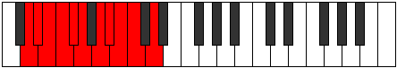 |
| [1983](https://ianring.com/musictheory/scales/1983) | [Soryllian](ModeGNaturalSoryllian.md) | G | G, G#, A, A#, B, C, D, D#, E, F, G |  |
| [1997](https://ianring.com/musictheory/scales/1997) | [Staryllic](ModeANaturalStaryllic.md) | A | A, B, C, D#, E, F, F#, G, A |  |
| [1999](https://ianring.com/musictheory/scales/1999) | [Zacrygic](ModeANaturalZacrygic.md) | A | A, A#, B, C, D#, E, F, F#, G, A |  |
| [2003](https://ianring.com/musictheory/scales/2003) | [Lolyllic](ModeDSharpLolyllic.md) | D# | D#, E, G, A, A#, B, C, C#, D# |  |
| [2003](https://ianring.com/musictheory/scales/2003) | [Lolyllic](ModeEFlatLolyllic.md) | Eb | Eb, E, G, A, Bb, B, C, Db, Eb |  |
| [2007](https://ianring.com/musictheory/scales/2007) | [Stonygic](ModeDSharpStonygic.md) | D# | D#, E, F, G, A, A#, B, C, C#, D# |  |
| [2007](https://ianring.com/musictheory/scales/2007) | [Stonygic](ModeEFlatStonygic.md) | Eb | Eb, E, F, G, A, Bb, B, C, Db, Eb |  |
| [2011](https://ianring.com/musictheory/scales/2011) | [Raphygic](ModeDSharpRaphygic.md) | D# | D#, E, F#, G, A, A#, B, C, C#, D# |  |
| [2011](https://ianring.com/musictheory/scales/2011) | [Raphygic](ModeEFlatRaphygic.md) | Eb | Eb, E, Gb, G, A, Bb, B, C, Db, Eb |  |
| [2013](https://ianring.com/musictheory/scales/2013) | [Mocrygic](ModeANaturalMocrygic.md) | A | A, B, C, C#, D#, E, F, F#, G, A |  |
| [2015](https://ianring.com/musictheory/scales/2015) | [Epiryllian](ModeDSharpEpiryllian.md) | D# | D#, E, F, F#, G, A, A#, B, C, C#, D# |  |
| [2015](https://ianring.com/musictheory/scales/2015) | [Epiryllian](ModeEFlatEpiryllian.md) | Eb | Eb, E, F, Gb, G, A, Bb, B, C, Db, Eb |  |
| [2015](https://ianring.com/musictheory/scales/2015) | [Epiryllian](ModeANaturalEpiryllian.md) | A | A, A#, B, C, C#, D#, E, F, F#, G, A |  |
| [2019](https://ianring.com/musictheory/scales/2019) | [Palyllic](ModeBNaturalPalyllic.md) | B | B, C, E, F, F#, G, G#, A, B |  |
| [2021](https://ianring.com/musictheory/scales/2021) | [Katycryllic](ModeDNaturalKatycryllic.md) | D | D, E, G, G#, A, A#, B, C, D |  |
| [2023](https://ianring.com/musictheory/scales/2023) | [Zodygic](ModeBNaturalZodygic.md) | B | B, C, C#, E, F, F#, G, G#, A, B |  |
| [2023](https://ianring.com/musictheory/scales/2023) | [Zodygic](ModeDNaturalZodygic.md) | D | D, D#, E, G, G#, A, A#, B, C, D |  |
| [2025](https://ianring.com/musictheory/scales/2025) | [Mixolydyllic](ModeENaturalMixolydyllic.md) | E | E, G, A, A#, B, C, C#, D, E |  |
| [2027](https://ianring.com/musictheory/scales/2027) | [Boptygic](ModeFSharpBoptygic.md) | F# | F#, G, A, B, C, C#, D, D#, E, F# |  |
| [2027](https://ianring.com/musictheory/scales/2027) | [Boptygic](ModeGFlatBoptygic.md) | Gb | Gb, G, A, B, C, Db, D, Eb, E, Gb |  |
| [2027](https://ianring.com/musictheory/scales/2027) | [Boptygic](ModeBNaturalBoptygic.md) | B | B, C, D, E, F, F#, G, G#, A, B |  |
| [2027](https://ianring.com/musictheory/scales/2027) | [Boptygic](ModeENaturalBoptygic.md) | E | E, F, G, A, A#, B, C, C#, D, E |  |
| [2029](https://ianring.com/musictheory/scales/2029) | [Mathygic](ModeANaturalMathygic.md) | A | A, B, C, D, D#, E, F, F#, G, A |  |
| [2029](https://ianring.com/musictheory/scales/2029) | [Mathygic](ModeENaturalMathygic.md) | E | E, F#, G, A, A#, B, C, C#, D, E |  |
| [2029](https://ianring.com/musictheory/scales/2029) | [Mathygic](ModeDNaturalMathygic.md) | D | D, E, F, G, G#, A, A#, B, C, D |  |
| [2031](https://ianring.com/musictheory/scales/2031) | [Gadyllian](ModeFSharpGadyllian.md) | F# | F#, G, G#, A, B, C, C#, D, D#, E, F# |  |
| [2031](https://ianring.com/musictheory/scales/2031) | [Gadyllian](ModeGFlatGadyllian.md) | Gb | Gb, G, Ab, A, B, C, Db, D, Eb, E, Gb |  |
| [2031](https://ianring.com/musictheory/scales/2031) | [Gadyllian](ModeBNaturalGadyllian.md) | B | B, C, C#, D, E, F, F#, G, G#, A, B |  |
| [2031](https://ianring.com/musictheory/scales/2031) | [Gadyllian](ModeENaturalGadyllian.md) | E | E, F, F#, G, A, A#, B, C, C#, D, E |  |
| [2031](https://ianring.com/musictheory/scales/2031) | [Gadyllian](ModeANaturalGadyllian.md) | A | A, A#, B, C, D, D#, E, F, F#, G, A |  |
| [2031](https://ianring.com/musictheory/scales/2031) | [Gadyllian](ModeDNaturalGadyllian.md) | D | D, D#, E, F, G, G#, A, A#, B, C, D |  |
| [2035](https://ianring.com/musictheory/scales/2035) | [Aerythygic](ModeBNaturalAerythygic.md) | B | B, C, D#, E, F, F#, G, G#, A, B |  |
| [2035](https://ianring.com/musictheory/scales/2035) | [Aerythygic](ModeDSharpAerythygic.md) | D# | D#, E, G, G#, A, A#, B, C, C#, D# |  |
| [2035](https://ianring.com/musictheory/scales/2035) | [Aerythygic](ModeEFlatAerythygic.md) | Eb | Eb, E, G, Ab, A, Bb, B, C, Db, Eb |  |
| [2037](https://ianring.com/musictheory/scales/2037) | [Sythygic](ModeGNaturalSythygic.md) | G | G, A, B, C, C#, D, D#, E, F, G |  |
| [2037](https://ianring.com/musictheory/scales/2037) | [Sythygic](ModeDNaturalSythygic.md) | D | D, E, F#, G, G#, A, A#, B, C, D |  |
| [2039](https://ianring.com/musictheory/scales/2039) | [Danyllian](ModeGNaturalDanyllian.md) | G | G, G#, A, B, C, C#, D, D#, E, F, G |  |
| [2039](https://ianring.com/musictheory/scales/2039) | [Danyllian](ModeBNaturalDanyllian.md) | B | B, C, C#, D#, E, F, F#, G, G#, A, B |  |
| [2039](https://ianring.com/musictheory/scales/2039) | [Danyllian](ModeDSharpDanyllian.md) | D# | D#, E, F, G, G#, A, A#, B, C, C#, D# |  |
| [2039](https://ianring.com/musictheory/scales/2039) | [Danyllian](ModeEFlatDanyllian.md) | Eb | Eb, E, F, G, Ab, A, Bb, B, C, Db, Eb |  |
| [2039](https://ianring.com/musictheory/scales/2039) | [Danyllian](ModeDNaturalDanyllian.md) | D | D, D#, E, F#, G, G#, A, A#, B, C, D |  |
| [2041](https://ianring.com/musictheory/scales/2041) | [Aeolacrygic](ModeENaturalAeolacrygic.md) | E | E, G, G#, A, A#, B, C, C#, D, E |  |
| [2043](https://ianring.com/musictheory/scales/2043) | [Lythyllian](ModeBNaturalLythyllian.md) | B | B, C, D, D#, E, F, F#, G, G#, A, B |  |
| [2043](https://ianring.com/musictheory/scales/2043) | [Lythyllian](ModeFSharpLythyllian.md) | F# | F#, G, A, A#, B, C, C#, D, D#, E, F# |  |
| [2043](https://ianring.com/musictheory/scales/2043) | [Lythyllian](ModeGFlatLythyllian.md) | Gb | Gb, G, A, Bb, B, C, Db, D, Eb, E, Gb |  |
| [2043](https://ianring.com/musictheory/scales/2043) | [Lythyllian](ModeENaturalLythyllian.md) | E | E, F, G, G#, A, A#, B, C, C#, D, E |  |
| [2043](https://ianring.com/musictheory/scales/2043) | [Lythyllian](ModeDSharpLythyllian.md) | D# | D#, E, F#, G, G#, A, A#, B, C, C#, D# |  |
| [2043](https://ianring.com/musictheory/scales/2043) | [Lythyllian](ModeEFlatLythyllian.md) | Eb | Eb, E, Gb, G, Ab, A, Bb, B, C, Db, Eb |  |
| [2045](https://ianring.com/musictheory/scales/2045) | [Katogyllian](ModeANaturalKatogyllian.md) | A | A, B, C, C#, D, D#, E, F, F#, G, A |  |
| [2045](https://ianring.com/musictheory/scales/2045) | [Katogyllian](ModeGNaturalKatogyllian.md) | G | G, A, A#, B, C, C#, D, D#, E, F, G |  |
| [2045](https://ianring.com/musictheory/scales/2045) | [Katogyllian](ModeENaturalKatogyllian.md) | E | E, F#, G, G#, A, A#, B, C, C#, D, E |  |
| [2045](https://ianring.com/musictheory/scales/2045) | [Katogyllian](ModeDNaturalKatogyllian.md) | D | D, E, F, F#, G, G#, A, A#, B, C, D |  |
| [2047](https://ianring.com/musictheory/scales/2047) | [Monatic](ModeBNaturalMonatic.md) | B | B, C, C#, D, D#, E, F, F#, G, G#, A, B |  |
| [2047](https://ianring.com/musictheory/scales/2047) | [Monatic](ModeANaturalMonatic.md) | A | A, A#, B, C, C#, D, D#, E, F, F#, G, A |  |
| [2047](https://ianring.com/musictheory/scales/2047) | [Monatic](ModeGNaturalMonatic.md) | G | G, G#, A, A#, B, C, C#, D, D#, E, F, G |  |
| [2047](https://ianring.com/musictheory/scales/2047) | [Monatic](ModeFSharpMonatic.md) | F# | F#, G, G#, A, A#, B, C, C#, D, D#, E, F# |  |
| [2047](https://ianring.com/musictheory/scales/2047) | [Monatic](ModeGFlatMonatic.md) | Gb | Gb, G, Ab, A, Bb, B, C, Db, D, Eb, E, Gb |  |
| [2047](https://ianring.com/musictheory/scales/2047) | [Monatic](ModeENaturalMonatic.md) | E | E, F, F#, G, G#, A, A#, B, C, C#, D, E |  |
| [2047](https://ianring.com/musictheory/scales/2047) | [Monatic](ModeDSharpMonatic.md) | D# | D#, E, F, F#, G, G#, A, A#, B, C, C#, D# |  |
| [2047](https://ianring.com/musictheory/scales/2047) | [Monatic](ModeEFlatMonatic.md) | Eb | Eb, E, F, Gb, G, Ab, A, Bb, B, C, Db, Eb |  |
| [2047](https://ianring.com/musictheory/scales/2047) | [Monatic](ModeDNaturalMonatic.md) | D | D, D#, E, F, F#, G, G#, A, A#, B, C, D |  |
| [2261](https://ianring.com/musictheory/scales/2261) | [Phrolimic](ModeFNaturalPhrolimic.md) | F | F, G, A, B, C, D##, F |  |
| [2271](https://ianring.com/musictheory/scales/2271) | [Poptyllic](ModeFNaturalPoptyllic.md) | F | F, F#, G, G#, A, B, C, E, F |  |
| [2293](https://ianring.com/musictheory/scales/2293) | [Gorian](ModeFNaturalGorian.md) | F | F, G, A, Bb, Cb, Dbb, E, F |  |
| [2295](https://ianring.com/musictheory/scales/2295) | [Kogyllic](ModeFNaturalKogyllic.md) | F | F, F#, G, A, A#, B, C, E, F |  |
| [2301](https://ianring.com/musictheory/scales/2301) | [Bydyllic](ModeFNaturalBydyllic.md) | F | F, G, G#, A, A#, B, C, E, F |  |
| [2303](https://ianring.com/musictheory/scales/2303) | [Stanygic](ModeFNaturalStanygic.md) | F | F, F#, G, G#, A, A#, B, C, E, F |  |
| [2331](https://ianring.com/musictheory/scales/2331) | [Dylimic](ModeGSharpDylimic.md) | G# | G#, A, B, C, D##, E###, G# |  |
| [2335](https://ianring.com/musictheory/scales/2335) | [Epydian](ModeGSharpEpydian.md) | G# | G#, A, Bb, Cb, Dbb, E, F##, G# |  |
| [2363](https://ianring.com/musictheory/scales/2363) | [Kataptian](ModeGSharpKataptian.md) | G# | G#, A, B, C, Db, E, F##, G# |  |
| [2367](https://ianring.com/musictheory/scales/2367) | [Laryllic](ModeGSharpLaryllic.md) | G# | G#, A, A#, B, C, C#, E, G, G# |  |
| [2367](https://ianring.com/musictheory/scales/2367) | [Laryllic](ModeAFlatLaryllic.md) | Ab | Ab, A, Bb, B, C, Db, E, G, Ab |  |
| [2395](https://ianring.com/musictheory/scales/2395) | [Zoptian](ModeGSharpZoptian.md) | G# | G#, A, B, C, D, E, F##, G# |  |
| [2399](https://ianring.com/musictheory/scales/2399) | [Zanyllic](ModeGSharpZanyllic.md) | G# | G#, A, A#, B, C, D, E, G, G# |  |
| [2399](https://ianring.com/musictheory/scales/2399) | [Zanyllic](ModeAFlatZanyllic.md) | Ab | Ab, A, Bb, B, C, D, E, G, Ab |  |
| [2427](https://ianring.com/musictheory/scales/2427) | [Katoryllic](ModeGSharpKatoryllic.md) | G# | G#, A, B, C, C#, D, E, G, G# |  |
| [2427](https://ianring.com/musictheory/scales/2427) | [Katoryllic](ModeAFlatKatoryllic.md) | Ab | Ab, A, B, C, Db, D, E, G, Ab |  |
| [2431](https://ianring.com/musictheory/scales/2431) | [Gythygic](ModeGSharpGythygic.md) | G# | G#, A, A#, B, C, C#, D, E, G, G# |  |
| [2431](https://ianring.com/musictheory/scales/2431) | [Gythygic](ModeAFlatGythygic.md) | Ab | Ab, A, Bb, B, C, Db, D, E, G, Ab |  |
| [2459](https://ianring.com/musictheory/scales/2459) | [Ionocrian](ModeGSharpIonocrian.md) | G# | G#, A, B, C, D#, E, F##, G# |  |
| [2463](https://ianring.com/musictheory/scales/2463) | [Ionathyllic](ModeGSharpIonathyllic.md) | G# | G#, A, A#, B, C, D#, E, G, G# | 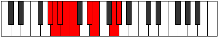 |
| [2463](https://ianring.com/musictheory/scales/2463) | [Ionathyllic](ModeAFlatIonathyllic.md) | Ab | Ab, A, Bb, B, C, Eb, E, G, Ab |  |
| [2475](https://ianring.com/musictheory/scales/2475) | [Aerylian](ModeENaturalAerylian.md) | E | E, F, G, A, B, C, D#, E |  |
| [2477](https://ianring.com/musictheory/scales/2477) | [Mydian](ModeENaturalMydian.md) | E | E, F#, G, A, B, C, D#, E |  |
| [2479](https://ianring.com/musictheory/scales/2479) | [Rycryllic](ModeENaturalRycryllic.md) | E | E, F, F#, G, A, B, C, D#, E |  |
| [2489](https://ianring.com/musictheory/scales/2489) | [Syrian](ModeENaturalSyrian.md) | E | E, F##, G#, A, B, C, D#, E |  |
| [2491](https://ianring.com/musictheory/scales/2491) | [Layllic](ModeGSharpLayllic.md) | G# | G#, A, B, C, C#, D#, E, G, G# |  |
| [2491](https://ianring.com/musictheory/scales/2491) | [Layllic](ModeAFlatLayllic.md) | Ab | Ab, A, B, C, Db, Eb, E, G, Ab |  |
| [2491](https://ianring.com/musictheory/scales/2491) | [Layllic](ModeENaturalLayllic.md) | E | E, F, G, G#, A, B, C, D#, E |  |
| [2493](https://ianring.com/musictheory/scales/2493) | [Manyllic](ModeENaturalManyllic.md) | E | E, F#, G, G#, A, B, C, D#, E |  |
| [2495](https://ianring.com/musictheory/scales/2495) | [Aeolocrygic](ModeENaturalAeolocrygic.md) | E | E, F, F#, G, G#, A, B, C, D#, E |  |
| [2495](https://ianring.com/musictheory/scales/2495) | [Aeolocrygic](ModeGSharpAeolocrygic.md) | G# | G#, A, A#, B, C, C#, D#, E, G, G# |  |
| [2495](https://ianring.com/musictheory/scales/2495) | [Aeolocrygic](ModeAFlatAeolocrygic.md) | Ab | Ab, A, Bb, B, C, Db, Eb, E, G, Ab |  |
| [2517](https://ianring.com/musictheory/scales/2517) | [Ryphian](ModeFNaturalRyphian.md) | F | F, G, A, B, C, Db, E, F |  |
| [2519](https://ianring.com/musictheory/scales/2519) | [Dathyllic](ModeFNaturalDathyllic.md) | F | F, F#, G, A, B, C, C#, E, F |  |
| [2523](https://ianring.com/musictheory/scales/2523) | [Rygyllic](ModeGSharpRygyllic.md) | G# | G#, A, B, C, D, D#, E, G, G# |  |
| [2523](https://ianring.com/musictheory/scales/2523) | [Rygyllic](ModeAFlatRygyllic.md) | Ab | Ab, A, B, C, D, Eb, E, G, Ab |  |
| [2525](https://ianring.com/musictheory/scales/2525) | [Aeolaryllic](ModeFNaturalAeolaryllic.md) | F | F, G, G#, A, B, C, C#, E, F |  |
| [2527](https://ianring.com/musictheory/scales/2527) | [Phradygic](ModeFNaturalPhradygic.md) | F | F, F#, G, G#, A, B, C, C#, E, F |  |
| [2527](https://ianring.com/musictheory/scales/2527) | [Phradygic](ModeGSharpPhradygic.md) | G# | G#, A, A#, B, C, D, D#, E, G, G# |  |
| [2527](https://ianring.com/musictheory/scales/2527) | [Phradygic](ModeAFlatPhradygic.md) | Ab | Ab, A, Bb, B, C, D, Eb, E, G, Ab |  |
| [2537](https://ianring.com/musictheory/scales/2537) | [Laptian](ModeENaturalLaptian.md) | E | E, F##, G##, A#, B, C, D#, E |  |
| [2539](https://ianring.com/musictheory/scales/2539) | [Thonyllic](ModeENaturalThonyllic.md) | E | E, F, G, A, A#, B, C, D#, E |  |
| [2541](https://ianring.com/musictheory/scales/2541) | [Katadyllic](ModeENaturalKatadyllic.md) | E | E, F#, G, A, A#, B, C, D#, E |  |
| [2543](https://ianring.com/musictheory/scales/2543) | [Dydygic](ModeENaturalDydygic.md) | E | E, F, F#, G, A, A#, B, C, D#, E |  |
| [2549](https://ianring.com/musictheory/scales/2549) | [Rydyllic](ModeFNaturalRydyllic.md) | F | F, G, A, A#, B, C, C#, E, F |  |
| [2551](https://ianring.com/musictheory/scales/2551) | [Zoptygic](ModeFNaturalZoptygic.md) | F | F, F#, G, A, A#, B, C, C#, E, F | 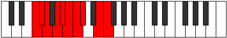 |
| [2553](https://ianring.com/musictheory/scales/2553) | [Aeolaptyllic](ModeENaturalAeolaptyllic.md) | E | E, G, G#, A, A#, B, C, D#, E |  |
| [2555](https://ianring.com/musictheory/scales/2555) | [Bythygic](ModeGSharpBythygic.md) | G# | G#, A, B, C, C#, D, D#, E, G, G# |  |
| [2555](https://ianring.com/musictheory/scales/2555) | [Bythygic](ModeAFlatBythygic.md) | Ab | Ab, A, B, C, Db, D, Eb, E, G, Ab |  |
| [2555](https://ianring.com/musictheory/scales/2555) | [Bythygic](ModeENaturalBythygic.md) | E | E, F, G, G#, A, A#, B, C, D#, E |  |
| [2557](https://ianring.com/musictheory/scales/2557) | [Dothygic](ModeFNaturalDothygic.md) | F | F, G, G#, A, A#, B, C, C#, E, F |  |
| [2557](https://ianring.com/musictheory/scales/2557) | [Dothygic](ModeENaturalDothygic.md) | E | E, F#, G, G#, A, A#, B, C, D#, E |  |
| [2559](https://ianring.com/musictheory/scales/2559) | [Zogyllian](ModeGSharpZogyllian.md) | G# | G#, A, A#, B, C, C#, D, D#, E, G, G# |  |
| [2559](https://ianring.com/musictheory/scales/2559) | [Zogyllian](ModeAFlatZogyllian.md) | Ab | Ab, A, Bb, B, C, Db, D, Eb, E, G, Ab |  |
| [2559](https://ianring.com/musictheory/scales/2559) | [Zogyllian](ModeFNaturalZogyllian.md) | F | F, F#, G, G#, A, A#, B, C, C#, E, F |  |
| [2559](https://ianring.com/musictheory/scales/2559) | [Zogyllian](ModeENaturalZogyllian.md) | E | E, F, F#, G, G#, A, A#, B, C, D#, E |  |
| [2613](https://ianring.com/musictheory/scales/2613) | [Aeolanimic](ModeGNaturalAeolanimic.md) | G | G, A, B, C, D##, E##, G |  |
| [2621](https://ianring.com/musictheory/scales/2621) | [Ionogian](ModeGNaturalIonogian.md) | G | G, A, Bb, Cb, Dbb, E, F#, G |  |
| [2623](https://ianring.com/musictheory/scales/2623) | [Aerylyllic](ModeGNaturalAerylyllic.md) | G | G, G#, A, A#, B, C, E, F#, G |  |
| [2631](https://ianring.com/musictheory/scales/2631) | [Macrimic](ModeASharpMacrimic.md) | A# | A#, B, C, D##, E###, Cbbb, A# |  |
| [2639](https://ianring.com/musictheory/scales/2639) | [Dothian](ModeASharpDothian.md) | A# | A#, B, C, Db, E, F##, G##, A# |  |
| [2639](https://ianring.com/musictheory/scales/2639) | [Dothian](ModeBFlatDothian.md) | Bb | Bb, Cb, Dbb, Ebbb, Fb, G, A, Bb |  |
| [2647](https://ianring.com/musictheory/scales/2647) | [Dadian](ModeASharpDadian.md) | A# | A#, B, C, D, E, F##, G##, A# |  |
| [2647](https://ianring.com/musictheory/scales/2647) | [Dadian](ModeBFlatDadian.md) | Bb | Bb, Cb, Dbb, Ebb, Fb, G, A, Bb |  |
| [2655](https://ianring.com/musictheory/scales/2655) | [Thocryllic](ModeASharpThocryllic.md) | A# | A#, B, C, C#, D, E, G, A, A# |  |
| [2655](https://ianring.com/musictheory/scales/2655) | [Thocryllic](ModeBFlatThocryllic.md) | Bb | Bb, B, C, Db, D, E, G, A, Bb |  |
| [2663](https://ianring.com/musictheory/scales/2663) | [Lalian](ModeASharpLalian.md) | A# | A#, B, C, D#, E, F##, G##, A# | 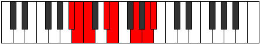 |
| [2663](https://ianring.com/musictheory/scales/2663) | [Lalian](ModeBFlatLalian.md) | Bb | Bb, Cb, Dbb, Eb, Fb, G, A, Bb |  |
| [2671](https://ianring.com/musictheory/scales/2671) | [Lylyllic](ModeASharpLylyllic.md) | A# | A#, B, C, C#, D#, E, G, A, A# |  |
| [2671](https://ianring.com/musictheory/scales/2671) | [Lylyllic](ModeBFlatLylyllic.md) | Bb | Bb, B, C, Db, Eb, E, G, A, Bb |  |
| [2677](https://ianring.com/musictheory/scales/2677) | [Thodian](ModeGNaturalThodian.md) | G | G, A, B, C, Db, E, F#, G |  |
| [2679](https://ianring.com/musictheory/scales/2679) | [Rathyllic](ModeGNaturalRathyllic.md) | G | G, G#, A, B, C, C#, E, F#, G |  |
| [2679](https://ianring.com/musictheory/scales/2679) | [Rathyllic](ModeASharpRathyllic.md) | A# | A#, B, C, D, D#, E, G, A, A# |  |
| [2679](https://ianring.com/musictheory/scales/2679) | [Rathyllic](ModeBFlatRathyllic.md) | Bb | Bb, B, C, D, Eb, E, G, A, Bb |  |
| [2685](https://ianring.com/musictheory/scales/2685) | [Ionoryllic](ModeGNaturalIonoryllic.md) | G | G, A, A#, B, C, C#, E, F#, G |  |
| [2687](https://ianring.com/musictheory/scales/2687) | [Thacrygic](ModeASharpThacrygic.md) | A# | A#, B, C, C#, D, D#, E, G, A, A# |  |
| [2687](https://ianring.com/musictheory/scales/2687) | [Thacrygic](ModeBFlatThacrygic.md) | Bb | Bb, B, C, Db, D, Eb, E, G, A, Bb |  |
| [2687](https://ianring.com/musictheory/scales/2687) | [Thacrygic](ModeGNaturalThacrygic.md) | G | G, G#, A, A#, B, C, C#, E, F#, G |  |
| [2705](https://ianring.com/musictheory/scales/2705) | [Magitonic](ModeCNaturalMagitonic.md) | C | C, E, G, A, B, C |  |
| [2707](https://ianring.com/musictheory/scales/2707) | [Banimic](ModeCNaturalBanimic.md) | C | C, Db, E, F##, G##, A##, C |  |
| [2709](https://ianring.com/musictheory/scales/2709) | [Thaptimic](ModeCNaturalThaptimic.md) | C | C, D, E, F##, G##, A##, C |  |
| [2711](https://ianring.com/musictheory/scales/2711) | [Stolian](ModeCNaturalStolian.md) | C | C, Db, Ebb, Fb, G, A, B, C |  |
| [2713](https://ianring.com/musictheory/scales/2713) | [Porimic](ModeCNaturalPorimic.md) | C | C, D#, E, F##, G##, A##, C |  |
| [2715](https://ianring.com/musictheory/scales/2715) | [Kynian](ModeCNaturalKynian.md) | C | C, Db, Eb, Fb, G, A, B, C |  |
| [2717](https://ianring.com/musictheory/scales/2717) | [Epygian](ModeCNaturalEpygian.md) | C | C, D, Eb, Fb, G, A, B, C |  |
| [2719](https://ianring.com/musictheory/scales/2719) | [Zocryllic](ModeCNaturalZocryllic.md) | C | C, C#, D, D#, E, G, A, B, C |  |
| [2737](https://ianring.com/musictheory/scales/2737) | [Bylimic](ModeCNaturalBylimic.md) | C | C, D##, E#, F##, G##, A##, C |  |
| [2739](https://ianring.com/musictheory/scales/2739) | [Zanian](ModeCNaturalZanian.md) | C | C, Db, E, F, G, A, B, C |  |
| [2741](https://ianring.com/musictheory/scales/2741) | [Ionian](ModeCNaturalIonian.md) | C | C, D, E, F, G, A, B, C |  |
| [2741](https://ianring.com/musictheory/scales/2741) | [Ionian](ModeGNaturalIonian.md) | G | G, A, B, C, D, E, F#, G |  |
| [2743](https://ianring.com/musictheory/scales/2743) | [Staptyllic](ModeCNaturalStaptyllic.md) | C | C, C#, D, E, F, G, A, B, C |  |
| [2743](https://ianring.com/musictheory/scales/2743) | [Staptyllic](ModeGNaturalStaptyllic.md) | G | G, G#, A, B, C, D, E, F#, G |  |
| [2745](https://ianring.com/musictheory/scales/2745) | [Dolian](ModeCNaturalDolian.md) | C | C, D#, E, F, G, A, B, C |  |
| [2747](https://ianring.com/musictheory/scales/2747) | [Stythyllic](ModeCNaturalStythyllic.md) | C | C, C#, D#, E, F, G, A, B, C |  |
| [2749](https://ianring.com/musictheory/scales/2749) | [Katagyllic](ModeCNaturalKatagyllic.md) | C | C, D, D#, E, F, G, A, B, C |  |
| [2749](https://ianring.com/musictheory/scales/2749) | [Katagyllic](ModeGNaturalKatagyllic.md) | G | G, A, A#, B, C, D, E, F#, G |  |
| [2751](https://ianring.com/musictheory/scales/2751) | [Sylygic](ModeCNaturalSylygic.md) | C | C, C#, D, D#, E, F, G, A, B, C |  |
| [2751](https://ianring.com/musictheory/scales/2751) | [Sylygic](ModeGNaturalSylygic.md) | G | G, G#, A, A#, B, C, D, E, F#, G |  |
| [2759](https://ianring.com/musictheory/scales/2759) | [Aeraphian](ModeASharpAeraphian.md) | A# | A#, B, C, D##, E#, F##, G##, A# |  |
| [2759](https://ianring.com/musictheory/scales/2759) | [Aeraphian](ModeBFlatAeraphian.md) | Bb | Bb, Cb, Dbb, E, F, G, A, Bb |  |
| [2767](https://ianring.com/musictheory/scales/2767) | [Katydyllic](ModeASharpKatydyllic.md) | A# | A#, B, C, C#, E, F, G, A, A# |  |
| [2767](https://ianring.com/musictheory/scales/2767) | [Katydyllic](ModeBFlatKatydyllic.md) | Bb | Bb, B, C, Db, E, F, G, A, Bb |  |
| [2769](https://ianring.com/musictheory/scales/2769) | [Dyrimic](ModeCNaturalDyrimic.md) | C | C, D##, E##, F##, G##, A##, C |  |
| [2771](https://ianring.com/musictheory/scales/2771) | [Garian](ModeCNaturalGarian.md) | C | C, Db, E, F#, G, A, B, C |  |
| [2773](https://ianring.com/musictheory/scales/2773) | [Lydian](ModeFNaturalLydian.md) | F | F, G, A, B, C, D, E, F |  |
| [2773](https://ianring.com/musictheory/scales/2773) | [Lydian](ModeCNaturalLydian.md) | C | C, D, E, F#, G, A, B, C |  |
| [2775](https://ianring.com/musictheory/scales/2775) | [Godyllic](ModeCNaturalGodyllic.md) | C | C, C#, D, E, F#, G, A, B, C |  |
| [2775](https://ianring.com/musictheory/scales/2775) | [Godyllic](ModeFNaturalGodyllic.md) | F | F, F#, G, A, B, C, D, E, F |  |
| [2775](https://ianring.com/musictheory/scales/2775) | [Godyllic](ModeASharpGodyllic.md) | A# | A#, B, C, D, E, F, G, A, A# |  |
| [2775](https://ianring.com/musictheory/scales/2775) | [Godyllic](ModeBFlatGodyllic.md) | Bb | Bb, B, C, D, E, F, G, A, Bb |  |
| [2777](https://ianring.com/musictheory/scales/2777) | [Bycrian](ModeCNaturalBycrian.md) | C | C, D#, E, F#, G, A, B, C |  |
| [2779](https://ianring.com/musictheory/scales/2779) | [Garyllic](ModeCNaturalGaryllic.md) | C | C, C#, D#, E, F#, G, A, B, C |  |
| [2781](https://ianring.com/musictheory/scales/2781) | [Gycryllic](ModeCNaturalGycryllic.md) | C | C, D, D#, E, F#, G, A, B, C |  |
| [2781](https://ianring.com/musictheory/scales/2781) | [Gycryllic](ModeFNaturalGycryllic.md) | F | F, G, G#, A, B, C, D, E, F |  |
| [2783](https://ianring.com/musictheory/scales/2783) | [Gothygic](ModeCNaturalGothygic.md) | C | C, C#, D, D#, E, F#, G, A, B, C | 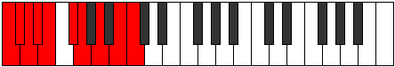 |
| [2783](https://ianring.com/musictheory/scales/2783) | [Gothygic](ModeFNaturalGothygic.md) | F | F, F#, G, G#, A, B, C, D, E, F |  |
| [2783](https://ianring.com/musictheory/scales/2783) | [Gothygic](ModeASharpGothygic.md) | A# | A#, B, C, C#, D, E, F, G, A, A# |  |
| [2783](https://ianring.com/musictheory/scales/2783) | [Gothygic](ModeBFlatGothygic.md) | Bb | Bb, B, C, Db, D, E, F, G, A, Bb |  |
| [2791](https://ianring.com/musictheory/scales/2791) | [Ionyptyllic](ModeASharpIonyptyllic.md) | A# | A#, B, C, D#, E, F, G, A, A# |  |
| [2791](https://ianring.com/musictheory/scales/2791) | [Ionyptyllic](ModeBFlatIonyptyllic.md) | Bb | Bb, B, C, Eb, E, F, G, A, Bb |  |
| [2799](https://ianring.com/musictheory/scales/2799) | [Epilygic](ModeASharpEpilygic.md) | A# | A#, B, C, C#, D#, E, F, G, A, A# |  |
| [2799](https://ianring.com/musictheory/scales/2799) | [Epilygic](ModeBFlatEpilygic.md) | Bb | Bb, B, C, Db, Eb, E, F, G, A, Bb |  |
| [2801](https://ianring.com/musictheory/scales/2801) | [Zogian](ModeCNaturalZogian.md) | C | C, D##, E#, F#, G, A, B, C |  |
| [2803](https://ianring.com/musictheory/scales/2803) | [Zolyllic](ModeCNaturalZolyllic.md) | C | C, C#, E, F, F#, G, A, B, C |  |
| [2805](https://ianring.com/musictheory/scales/2805) | [Zylyllic](ModeGNaturalZylyllic.md) | G | G, A, B, C, C#, D, E, F#, G |  |
| [2805](https://ianring.com/musictheory/scales/2805) | [Zylyllic](ModeCNaturalZylyllic.md) | C | C, D, E, F, F#, G, A, B, C |  |
| [2805](https://ianring.com/musictheory/scales/2805) | [Zylyllic](ModeFNaturalZylyllic.md) | F | F, G, A, A#, B, C, D, E, F |  |
| [2807](https://ianring.com/musictheory/scales/2807) | [Zylygic](ModeCNaturalZylygic.md) | C | C, C#, D, E, F, F#, G, A, B, C |  |
| [2807](https://ianring.com/musictheory/scales/2807) | [Zylygic](ModeGNaturalZylygic.md) | G | G, G#, A, B, C, C#, D, E, F#, G |  |
| [2807](https://ianring.com/musictheory/scales/2807) | [Zylygic](ModeASharpZylygic.md) | A# | A#, B, C, D, D#, E, F, G, A, A# |  |
| [2807](https://ianring.com/musictheory/scales/2807) | [Zylygic](ModeBFlatZylygic.md) | Bb | Bb, B, C, D, Eb, E, F, G, A, Bb |  |
| [2807](https://ianring.com/musictheory/scales/2807) | [Zylygic](ModeFNaturalZylygic.md) | F | F, F#, G, A, A#, B, C, D, E, F |  |
| [2809](https://ianring.com/musictheory/scales/2809) | [Gythyllic](ModeCNaturalGythyllic.md) | C | C, D#, E, F, F#, G, A, B, C |  |
| [2811](https://ianring.com/musictheory/scales/2811) | [Barygic](ModeCNaturalBarygic.md) | C | C, C#, D#, E, F, F#, G, A, B, C |  |
| [2813](https://ianring.com/musictheory/scales/2813) | [Zolygic](ModeCNaturalZolygic.md) | C | C, D, D#, E, F, F#, G, A, B, C |  |
| [2813](https://ianring.com/musictheory/scales/2813) | [Zolygic](ModeGNaturalZolygic.md) | G | G, A, A#, B, C, C#, D, E, F#, G |  |
| [2813](https://ianring.com/musictheory/scales/2813) | [Zolygic](ModeFNaturalZolygic.md) | F | F, G, G#, A, A#, B, C, D, E, F |  |
| [2815](https://ianring.com/musictheory/scales/2815) | [Aeradyllian](ModeCNaturalAeradyllian.md) | C | C, C#, D, D#, E, F, F#, G, A, B, C |  |
| [2815](https://ianring.com/musictheory/scales/2815) | [Aeradyllian](ModeASharpAeradyllian.md) | A# | A#, B, C, C#, D, D#, E, F, G, A, A# |  |
| [2815](https://ianring.com/musictheory/scales/2815) | [Aeradyllian](ModeBFlatAeradyllian.md) | Bb | Bb, B, C, Db, D, Eb, E, F, G, A, Bb |  |
| [2815](https://ianring.com/musictheory/scales/2815) | [Aeradyllian](ModeGNaturalAeradyllian.md) | G | G, G#, A, A#, B, C, C#, D, E, F#, G |  |
| [2815](https://ianring.com/musictheory/scales/2815) | [Aeradyllian](ModeFNaturalAeradyllian.md) | F | F, F#, G, G#, A, A#, B, C, D, E, F |  |
| [2843](https://ianring.com/musictheory/scales/2843) | [Sorian](ModeGSharpSorian.md) | G# | G#, A, B, C, D##, E#, F##, G# |  |
| [2847](https://ianring.com/musictheory/scales/2847) | [Phracryllic](ModeGSharpPhracryllic.md) | G# | G#, A, A#, B, C, E, F, G, G# |  |
| [2847](https://ianring.com/musictheory/scales/2847) | [Phracryllic](ModeAFlatPhracryllic.md) | Ab | Ab, A, Bb, B, C, E, F, G, Ab |  |
| [2869](https://ianring.com/musictheory/scales/2869) | [Phrothian](ModeGNaturalPhrothian.md) | G | G, A, B, C, D#, E, F#, G |  |
| [2871](https://ianring.com/musictheory/scales/2871) | [Stanyllic](ModeGNaturalStanyllic.md) | G | G, G#, A, B, C, D#, E, F#, G |  |
| [2875](https://ianring.com/musictheory/scales/2875) | [Ganyllic](ModeGSharpGanyllic.md) | G# | G#, A, B, C, C#, E, F, G, G# |  |
| [2875](https://ianring.com/musictheory/scales/2875) | [Ganyllic](ModeAFlatGanyllic.md) | Ab | Ab, A, B, C, Db, E, F, G, Ab |  |
| [2877](https://ianring.com/musictheory/scales/2877) | [Phrylyllic](ModeGNaturalPhrylyllic.md) | G | G, A, A#, B, C, D#, E, F#, G |  |
| [2879](https://ianring.com/musictheory/scales/2879) | [Stadygic](ModeGSharpStadygic.md) | G# | G#, A, A#, B, C, C#, E, F, G, G# |  |
| [2879](https://ianring.com/musictheory/scales/2879) | [Stadygic](ModeAFlatStadygic.md) | Ab | Ab, A, Bb, B, C, Db, E, F, G, Ab |  |
| [2879](https://ianring.com/musictheory/scales/2879) | [Stadygic](ModeGNaturalStadygic.md) | G | G, G#, A, A#, B, C, D#, E, F#, G |  |
| [2887](https://ianring.com/musictheory/scales/2887) | [Gaptian](ModeASharpGaptian.md) | A# | A#, B, C, D##, E##, F##, G##, A# |  |
| [2887](https://ianring.com/musictheory/scales/2887) | [Gaptian](ModeBFlatGaptian.md) | Bb | Bb, Cb, Dbb, E, F#, G, A, Bb |  |
| [2895](https://ianring.com/musictheory/scales/2895) | [Aeragyllic](ModeASharpAeragyllic.md) | A# | A#, B, C, C#, E, F#, G, A, A# |  |
| [2895](https://ianring.com/musictheory/scales/2895) | [Aeragyllic](ModeBFlatAeragyllic.md) | Bb | Bb, B, C, Db, E, Gb, G, A, Bb |  |
| [2899](https://ianring.com/musictheory/scales/2899) | [Kagian](ModeEFlatKagian.md) | Eb | Eb, Fb, G, A, B, C, D, Eb |  |
| [2903](https://ianring.com/musictheory/scales/2903) | [Gothyllic](ModeDSharpGothyllic.md) | D# | D#, E, F, G, A, B, C, D, D# |  |
| [2903](https://ianring.com/musictheory/scales/2903) | [Gothyllic](ModeEFlatGothyllic.md) | Eb | Eb, E, F, G, A, B, C, D, Eb |  |
| [2903](https://ianring.com/musictheory/scales/2903) | [Gothyllic](ModeASharpGothyllic.md) | A# | A#, B, C, D, E, F#, G, A, A# |  |
| [2903](https://ianring.com/musictheory/scales/2903) | [Gothyllic](ModeBFlatGothyllic.md) | Bb | Bb, B, C, D, E, Gb, G, A, Bb |  |
| [2907](https://ianring.com/musictheory/scales/2907) | [Mogyllic](ModeDSharpMogyllic.md) | D# | D#, E, F#, G, A, B, C, D, D# |  |
| [2907](https://ianring.com/musictheory/scales/2907) | [Mogyllic](ModeEFlatMogyllic.md) | Eb | Eb, E, Gb, G, A, B, C, D, Eb |  |
| [2907](https://ianring.com/musictheory/scales/2907) | [Mogyllic](ModeGSharpMogyllic.md) | G# | G#, A, B, C, D, E, F, G, G# | 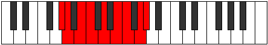 |
| [2907](https://ianring.com/musictheory/scales/2907) | [Mogyllic](ModeAFlatMogyllic.md) | Ab | Ab, A, B, C, D, E, F, G, Ab |  |
| [2911](https://ianring.com/musictheory/scales/2911) | [Katygic](ModeDSharpKatygic.md) | D# | D#, E, F, F#, G, A, B, C, D, D# |  |
| [2911](https://ianring.com/musictheory/scales/2911) | [Katygic](ModeEFlatKatygic.md) | Eb | Eb, E, F, Gb, G, A, B, C, D, Eb |  |
| [2911](https://ianring.com/musictheory/scales/2911) | [Katygic](ModeASharpKatygic.md) | A# | A#, B, C, C#, D, E, F#, G, A, A# |  |
| [2911](https://ianring.com/musictheory/scales/2911) | [Katygic](ModeBFlatKatygic.md) | Bb | Bb, B, C, Db, D, E, Gb, G, A, Bb |  |
| [2911](https://ianring.com/musictheory/scales/2911) | [Katygic](ModeGSharpKatygic.md) | G# | G#, A, A#, B, C, D, E, F, G, G# |  |
| [2911](https://ianring.com/musictheory/scales/2911) | [Katygic](ModeAFlatKatygic.md) | Ab | Ab, A, Bb, B, C, D, E, F, G, Ab |  |
| [2919](https://ianring.com/musictheory/scales/2919) | [Molyllic](ModeASharpMolyllic.md) | A# | A#, B, C, D#, E, F#, G, A, A# |  |
| [2919](https://ianring.com/musictheory/scales/2919) | [Molyllic](ModeBFlatMolyllic.md) | Bb | Bb, B, C, Eb, E, Gb, G, A, Bb |  |
| [2927](https://ianring.com/musictheory/scales/2927) | [Rodygic](ModeASharpRodygic.md) | A# | A#, B, C, C#, D#, E, F#, G, A, A# |  |
| [2927](https://ianring.com/musictheory/scales/2927) | [Rodygic](ModeBFlatRodygic.md) | Bb | Bb, B, C, Db, Eb, E, Gb, G, A, Bb |  |
| [2931](https://ianring.com/musictheory/scales/2931) | [Zathyllic](ModeDSharpZathyllic.md) | D# | D#, E, G, G#, A, B, C, D, D# |  |
| [2931](https://ianring.com/musictheory/scales/2931) | [Zathyllic](ModeEFlatZathyllic.md) | Eb | Eb, E, G, Ab, A, B, C, D, Eb |  |
| [2933](https://ianring.com/musictheory/scales/2933) | [Dalyllic](ModeGNaturalDalyllic.md) | G | G, A, B, C, C#, D#, E, F#, G |  |
| [2935](https://ianring.com/musictheory/scales/2935) | [Modygic](ModeDSharpModygic.md) | D# | D#, E, F, G, G#, A, B, C, D, D# |  |
| [2935](https://ianring.com/musictheory/scales/2935) | [Modygic](ModeEFlatModygic.md) | Eb | Eb, E, F, G, Ab, A, B, C, D, Eb |  |
| [2935](https://ianring.com/musictheory/scales/2935) | [Modygic](ModeGNaturalModygic.md) | G | G, G#, A, B, C, C#, D#, E, F#, G |  |
| [2935](https://ianring.com/musictheory/scales/2935) | [Modygic](ModeASharpModygic.md) | A# | A#, B, C, D, D#, E, F#, G, A, A# |  |
| [2935](https://ianring.com/musictheory/scales/2935) | [Modygic](ModeBFlatModygic.md) | Bb | Bb, B, C, D, Eb, E, Gb, G, A, Bb |  |
| [2939](https://ianring.com/musictheory/scales/2939) | [Goptygic](ModeGSharpGoptygic.md) | G# | G#, A, B, C, C#, D, E, F, G, G# |  |
| [2939](https://ianring.com/musictheory/scales/2939) | [Goptygic](ModeAFlatGoptygic.md) | Ab | Ab, A, B, C, Db, D, E, F, G, Ab |  |
| [2939](https://ianring.com/musictheory/scales/2939) | [Goptygic](ModeDSharpGoptygic.md) | D# | D#, E, F#, G, G#, A, B, C, D, D# |  |
| [2939](https://ianring.com/musictheory/scales/2939) | [Goptygic](ModeEFlatGoptygic.md) | Eb | Eb, E, Gb, G, Ab, A, B, C, D, Eb |  |
| [2941](https://ianring.com/musictheory/scales/2941) | [Laptygic](ModeGNaturalLaptygic.md) | G | G, A, A#, B, C, C#, D#, E, F#, G |  |
| [2943](https://ianring.com/musictheory/scales/2943) | [Dathyllian](ModeDSharpDathyllian.md) | D# | D#, E, F, F#, G, G#, A, B, C, D, D# |  |
| [2943](https://ianring.com/musictheory/scales/2943) | [Dathyllian](ModeEFlatDathyllian.md) | Eb | Eb, E, F, Gb, G, Ab, A, B, C, D, Eb |  |
| [2943](https://ianring.com/musictheory/scales/2943) | [Dathyllian](ModeASharpDathyllian.md) | A# | A#, B, C, C#, D, D#, E, F#, G, A, A# |  |
| [2943](https://ianring.com/musictheory/scales/2943) | [Dathyllian](ModeBFlatDathyllian.md) | Bb | Bb, B, C, Db, D, Eb, E, Gb, G, A, Bb |  |
| [2943](https://ianring.com/musictheory/scales/2943) | [Dathyllian](ModeGSharpDathyllian.md) | G# | G#, A, A#, B, C, C#, D, E, F, G, G# |  |
| [2943](https://ianring.com/musictheory/scales/2943) | [Dathyllian](ModeAFlatDathyllian.md) | Ab | Ab, A, Bb, B, C, Db, D, E, F, G, Ab |  |
| [2943](https://ianring.com/musictheory/scales/2943) | [Dathyllian](ModeGNaturalDathyllian.md) | G | G, G#, A, A#, B, C, C#, D#, E, F#, G |  |
| [2961](https://ianring.com/musictheory/scales/2961) | [Bygimic](ModeCNaturalBygimic.md) | C | C, D##, E###, F###, G##, A##, C |  |
| [2963](https://ianring.com/musictheory/scales/2963) | [Bygian](ModeCNaturalBygian.md) | C | C, Db, E, F##, G#, A, B, C |  |
| [2965](https://ianring.com/musictheory/scales/2965) | [Darian](ModeCNaturalDarian.md) | C | C, D, E, F##, G#, A, B, C |  |
| [2967](https://ianring.com/musictheory/scales/2967) | [Madyllic](ModeCNaturalMadyllic.md) | C | C, C#, D, E, G, G#, A, B, C |  |
| [2969](https://ianring.com/musictheory/scales/2969) | [Tholian](ModeCNaturalTholian.md) | C | C, D#, E, F##, G#, A, B, C |  |
| [2971](https://ianring.com/musictheory/scales/2971) | [Aeolynyllic](ModeCNaturalAeolynyllic.md) | C | C, C#, D#, E, G, G#, A, B, C |  |
| [2971](https://ianring.com/musictheory/scales/2971) | [Aeolynyllic](ModeGSharpAeolynyllic.md) | G# | G#, A, B, C, D#, E, F, G, G# |  |
| [2971](https://ianring.com/musictheory/scales/2971) | [Aeolynyllic](ModeAFlatAeolynyllic.md) | Ab | Ab, A, B, C, Eb, E, F, G, Ab |  |
| [2973](https://ianring.com/musictheory/scales/2973) | [Panyllic](ModeCNaturalPanyllic.md) | C | C, D, D#, E, G, G#, A, B, C |  |
| [2975](https://ianring.com/musictheory/scales/2975) | [Gaptygic](ModeCNaturalGaptygic.md) | C | C, C#, D, D#, E, G, G#, A, B, C |  |
| [2975](https://ianring.com/musictheory/scales/2975) | [Gaptygic](ModeGSharpGaptygic.md) | G# | G#, A, A#, B, C, D#, E, F, G, G# |  |
| [2975](https://ianring.com/musictheory/scales/2975) | [Gaptygic](ModeAFlatGaptygic.md) | Ab | Ab, A, Bb, B, C, Eb, E, F, G, Ab |  |
| [2987](https://ianring.com/musictheory/scales/2987) | [Thanyllic](ModeENaturalThanyllic.md) | E | E, F, G, A, B, C, C#, D#, E |  |
| [2989](https://ianring.com/musictheory/scales/2989) | [Ionacryllic](ModeENaturalIonacryllic.md) | E | E, F#, G, A, B, C, C#, D#, E |  |
| [2991](https://ianring.com/musictheory/scales/2991) | [Zanygic](ModeENaturalZanygic.md) | E | E, F, F#, G, A, B, C, C#, D#, E |  |
| [2993](https://ianring.com/musictheory/scales/2993) | [Stythian](ModeCNaturalStythian.md) | C | C, D##, E#, F##, G#, A, B, C |  |
| [2995](https://ianring.com/musictheory/scales/2995) | [Sanyllic](ModeCNaturalSanyllic.md) | C | C, C#, E, F, G, G#, A, B, C |  |
| [2997](https://ianring.com/musictheory/scales/2997) | [Ionoptyllic](ModeGNaturalIonoptyllic.md) | G | G, A, B, C, D, D#, E, F#, G |  |
| [2997](https://ianring.com/musictheory/scales/2997) | [Ionoptyllic](ModeCNaturalIonoptyllic.md) | C | C, D, E, F, G, G#, A, B, C |  |
| [2999](https://ianring.com/musictheory/scales/2999) | [Zyrygic](ModeCNaturalZyrygic.md) | C | C, C#, D, E, F, G, G#, A, B, C |  |
| [2999](https://ianring.com/musictheory/scales/2999) | [Zyrygic](ModeGNaturalZyrygic.md) | G | G, G#, A, B, C, D, D#, E, F#, G |  |
| [3001](https://ianring.com/musictheory/scales/3001) | [Lonyllic](ModeENaturalLonyllic.md) | E | E, G, G#, A, B, C, C#, D#, E |  |
| [3001](https://ianring.com/musictheory/scales/3001) | [Lonyllic](ModeCNaturalLonyllic.md) | C | C, D#, E, F, G, G#, A, B, C |  |
| [3003](https://ianring.com/musictheory/scales/3003) | [Zydygic](ModeCNaturalZydygic.md) | C | C, C#, D#, E, F, G, G#, A, B, C |  |
| [3003](https://ianring.com/musictheory/scales/3003) | [Zydygic](ModeENaturalZydygic.md) | E | E, F, G, G#, A, B, C, C#, D#, E |  |
| [3003](https://ianring.com/musictheory/scales/3003) | [Zydygic](ModeGSharpZydygic.md) | G# | G#, A, B, C, C#, D#, E, F, G, G# |  |
| [3003](https://ianring.com/musictheory/scales/3003) | [Zydygic](ModeAFlatZydygic.md) | Ab | Ab, A, B, C, Db, Eb, E, F, G, Ab |  |
| [3005](https://ianring.com/musictheory/scales/3005) | [Gycrygic](ModeCNaturalGycrygic.md) | C | C, D, D#, E, F, G, G#, A, B, C |  |
| [3005](https://ianring.com/musictheory/scales/3005) | [Gycrygic](ModeENaturalGycrygic.md) | E | E, F#, G, G#, A, B, C, C#, D#, E |  |
| [3005](https://ianring.com/musictheory/scales/3005) | [Gycrygic](ModeGNaturalGycrygic.md) | G | G, A, A#, B, C, D, D#, E, F#, G |  |
| [3007](https://ianring.com/musictheory/scales/3007) | [Zyryllian](ModeCNaturalZyryllian.md) | C | C, C#, D, D#, E, F, G, G#, A, B, C |  |
| [3007](https://ianring.com/musictheory/scales/3007) | [Zyryllian](ModeENaturalZyryllian.md) | E | E, F, F#, G, G#, A, B, C, C#, D#, E |  |
| [3007](https://ianring.com/musictheory/scales/3007) | [Zyryllian](ModeGSharpZyryllian.md) | G# | G#, A, A#, B, C, C#, D#, E, F, G, G# |  |
| [3007](https://ianring.com/musictheory/scales/3007) | [Zyryllian](ModeAFlatZyryllian.md) | Ab | Ab, A, Bb, B, C, Db, Eb, E, F, G, Ab |  |
| [3007](https://ianring.com/musictheory/scales/3007) | [Zyryllian](ModeGNaturalZyryllian.md) | G | G, G#, A, A#, B, C, D, D#, E, F#, G |  |
| [3015](https://ianring.com/musictheory/scales/3015) | [Laptyllic](ModeASharpLaptyllic.md) | A# | A#, B, C, E, F, F#, G, A, A# |  |
| [3015](https://ianring.com/musictheory/scales/3015) | [Laptyllic](ModeBFlatLaptyllic.md) | Bb | Bb, B, C, E, F, Gb, G, A, Bb |  |
| [3023](https://ianring.com/musictheory/scales/3023) | [Aeracrygic](ModeASharpAeracrygic.md) | A# | A#, B, C, C#, E, F, F#, G, A, A# |  |
| [3023](https://ianring.com/musictheory/scales/3023) | [Aeracrygic](ModeBFlatAeracrygic.md) | Bb | Bb, B, C, Db, E, F, Gb, G, A, Bb |  |
| [3025](https://ianring.com/musictheory/scales/3025) | [Epycrian](ModeCNaturalEpycrian.md) | C | C, D##, E##, F##, G#, A, B, C |  |
| [3027](https://ianring.com/musictheory/scales/3027) | [Rythyllic](ModeCNaturalRythyllic.md) | C | C, C#, E, F#, G, G#, A, B, C |  |
| [3027](https://ianring.com/musictheory/scales/3027) | [Rythyllic](ModeDSharpRythyllic.md) | D# | D#, E, G, A, A#, B, C, D, D# |  |
| [3027](https://ianring.com/musictheory/scales/3027) | [Rythyllic](ModeEFlatRythyllic.md) | Eb | Eb, E, G, A, Bb, B, C, D, Eb |  |
| [3029](https://ianring.com/musictheory/scales/3029) | [Ionocryllic](ModeFNaturalIonocryllic.md) | F | F, G, A, B, C, C#, D, E, F |  |
| [3029](https://ianring.com/musictheory/scales/3029) | [Ionocryllic](ModeCNaturalIonocryllic.md) | C | C, D, E, F#, G, G#, A, B, C |  |
| [3031](https://ianring.com/musictheory/scales/3031) | [Epithygic](ModeFNaturalEpithygic.md) | F | F, F#, G, A, B, C, C#, D, E, F |  |
| [3031](https://ianring.com/musictheory/scales/3031) | [Epithygic](ModeCNaturalEpithygic.md) | C | C, C#, D, E, F#, G, G#, A, B, C |  |
| [3031](https://ianring.com/musictheory/scales/3031) | [Epithygic](ModeDSharpEpithygic.md) | D# | D#, E, F, G, A, A#, B, C, D, D# |  |
| [3031](https://ianring.com/musictheory/scales/3031) | [Epithygic](ModeEFlatEpithygic.md) | Eb | Eb, E, F, G, A, Bb, B, C, D, Eb |  |
| [3031](https://ianring.com/musictheory/scales/3031) | [Epithygic](ModeASharpEpithygic.md) | A# | A#, B, C, D, E, F, F#, G, A, A# |  |
| [3031](https://ianring.com/musictheory/scales/3031) | [Epithygic](ModeBFlatEpithygic.md) | Bb | Bb, B, C, D, E, F, Gb, G, A, Bb |  |
| [3033](https://ianring.com/musictheory/scales/3033) | [Doptyllic](ModeCNaturalDoptyllic.md) | C | C, D#, E, F#, G, G#, A, B, C |  |
| [3035](https://ianring.com/musictheory/scales/3035) | [Gocrygic](ModeGSharpGocrygic.md) | G# | G#, A, B, C, D, D#, E, F, G, G# |  |
| [3035](https://ianring.com/musictheory/scales/3035) | [Gocrygic](ModeAFlatGocrygic.md) | Ab | Ab, A, B, C, D, Eb, E, F, G, Ab |  |
| [3035](https://ianring.com/musictheory/scales/3035) | [Gocrygic](ModeCNaturalGocrygic.md) | C | C, C#, D#, E, F#, G, G#, A, B, C |  |
| [3035](https://ianring.com/musictheory/scales/3035) | [Gocrygic](ModeDSharpGocrygic.md) | D# | D#, E, F#, G, A, A#, B, C, D, D# |  |
| [3035](https://ianring.com/musictheory/scales/3035) | [Gocrygic](ModeEFlatGocrygic.md) | Eb | Eb, E, Gb, G, A, Bb, B, C, D, Eb |  |
| [3037](https://ianring.com/musictheory/scales/3037) | [Staptygic](ModeFNaturalStaptygic.md) | F | F, G, G#, A, B, C, C#, D, E, F |  |
| [3037](https://ianring.com/musictheory/scales/3037) | [Staptygic](ModeCNaturalStaptygic.md) | C | C, D, D#, E, F#, G, G#, A, B, C |  |
| [3039](https://ianring.com/musictheory/scales/3039) | [Godyllian](ModeCNaturalGodyllian.md) | C | C, C#, D, D#, E, F#, G, G#, A, B, C |  |
| [3039](https://ianring.com/musictheory/scales/3039) | [Godyllian](ModeFNaturalGodyllian.md) | F | F, F#, G, G#, A, B, C, C#, D, E, F |  |
| [3039](https://ianring.com/musictheory/scales/3039) | [Godyllian](ModeASharpGodyllian.md) | A# | A#, B, C, C#, D, E, F, F#, G, A, A# |  |
| [3039](https://ianring.com/musictheory/scales/3039) | [Godyllian](ModeBFlatGodyllian.md) | Bb | Bb, B, C, Db, D, E, F, Gb, G, A, Bb |  |
| [3039](https://ianring.com/musictheory/scales/3039) | [Godyllian](ModeDSharpGodyllian.md) | D# | D#, E, F, F#, G, A, A#, B, C, D, D# |  |
| [3039](https://ianring.com/musictheory/scales/3039) | [Godyllian](ModeEFlatGodyllian.md) | Eb | Eb, E, F, Gb, G, A, Bb, B, C, D, Eb |  |
| [3039](https://ianring.com/musictheory/scales/3039) | [Godyllian](ModeGSharpGodyllian.md) | G# | G#, A, A#, B, C, D, D#, E, F, G, G# |  |
| [3039](https://ianring.com/musictheory/scales/3039) | [Godyllian](ModeAFlatGodyllian.md) | Ab | Ab, A, Bb, B, C, D, Eb, E, F, G, Ab |  |
| [3047](https://ianring.com/musictheory/scales/3047) | [Panygic](ModeASharpPanygic.md) | A# | A#, B, C, D#, E, F, F#, G, A, A# |  |
| [3047](https://ianring.com/musictheory/scales/3047) | [Panygic](ModeBFlatPanygic.md) | Bb | Bb, B, C, Eb, E, F, Gb, G, A, Bb |  |
| [3049](https://ianring.com/musictheory/scales/3049) | [Aeronyllic](ModeENaturalAeronyllic.md) | E | E, G, A, A#, B, C, C#, D#, E |  |
| [3051](https://ianring.com/musictheory/scales/3051) | [Stalygic](ModeENaturalStalygic.md) | E | E, F, G, A, A#, B, C, C#, D#, E |  |
| [3053](https://ianring.com/musictheory/scales/3053) | [Zycrygic](ModeENaturalZycrygic.md) | E | E, F#, G, A, A#, B, C, C#, D#, E |  |
| [3055](https://ianring.com/musictheory/scales/3055) | [Lyryllian](ModeENaturalLyryllian.md) | E | E, F, F#, G, A, A#, B, C, C#, D#, E |  |
| [3055](https://ianring.com/musictheory/scales/3055) | [Lyryllian](ModeASharpLyryllian.md) | A# | A#, B, C, C#, D#, E, F, F#, G, A, A# |  |
| [3055](https://ianring.com/musictheory/scales/3055) | [Lyryllian](ModeBFlatLyryllian.md) | Bb | Bb, B, C, Db, Eb, E, F, Gb, G, A, Bb |  |
| [3057](https://ianring.com/musictheory/scales/3057) | [Phroryllic](ModeCNaturalPhroryllic.md) | C | C, E, F, F#, G, G#, A, B, C |  |
| [3059](https://ianring.com/musictheory/scales/3059) | [Madygic](ModeCNaturalMadygic.md) | C | C, C#, E, F, F#, G, G#, A, B, C |  |
| [3059](https://ianring.com/musictheory/scales/3059) | [Madygic](ModeDSharpMadygic.md) | D# | D#, E, G, G#, A, A#, B, C, D, D# |  |
| [3059](https://ianring.com/musictheory/scales/3059) | [Madygic](ModeEFlatMadygic.md) | Eb | Eb, E, G, Ab, A, Bb, B, C, D, Eb |  |
| [3061](https://ianring.com/musictheory/scales/3061) | [Apinygic](ModeGNaturalApinygic.md) | G | G, A, B, C, C#, D, D#, E, F#, G |  |
| [3061](https://ianring.com/musictheory/scales/3061) | [Apinygic](ModeCNaturalApinygic.md) | C | C, D, E, F, F#, G, G#, A, B, C |  |
| [3061](https://ianring.com/musictheory/scales/3061) | [Apinygic](ModeFNaturalApinygic.md) | F | F, G, A, A#, B, C, C#, D, E, F |  |
| [3063](https://ianring.com/musictheory/scales/3063) | [Solyllian](ModeGNaturalSolyllian.md) | G | G, G#, A, B, C, C#, D, D#, E, F#, G |  |
| [3063](https://ianring.com/musictheory/scales/3063) | [Solyllian](ModeCNaturalSolyllian.md) | C | C, C#, D, E, F, F#, G, G#, A, B, C |  |
| [3063](https://ianring.com/musictheory/scales/3063) | [Solyllian](ModeFNaturalSolyllian.md) | F | F, F#, G, A, A#, B, C, C#, D, E, F |  |
| [3063](https://ianring.com/musictheory/scales/3063) | [Solyllian](ModeASharpSolyllian.md) | A# | A#, B, C, D, D#, E, F, F#, G, A, A# |  |
| [3063](https://ianring.com/musictheory/scales/3063) | [Solyllian](ModeBFlatSolyllian.md) | Bb | Bb, B, C, D, Eb, E, F, Gb, G, A, Bb |  |
| [3063](https://ianring.com/musictheory/scales/3063) | [Solyllian](ModeDSharpSolyllian.md) | D# | D#, E, F, G, G#, A, A#, B, C, D, D# |  |
| [3063](https://ianring.com/musictheory/scales/3063) | [Solyllian](ModeEFlatSolyllian.md) | Eb | Eb, E, F, G, Ab, A, Bb, B, C, D, Eb |  |
| [3065](https://ianring.com/musictheory/scales/3065) | [Zothygic](ModeCNaturalZothygic.md) | C | C, D#, E, F, F#, G, G#, A, B, C |  |
| [3065](https://ianring.com/musictheory/scales/3065) | [Zothygic](ModeENaturalZothygic.md) | E | E, G, G#, A, A#, B, C, C#, D#, E |  |
| [3067](https://ianring.com/musictheory/scales/3067) | [Goptyllian](ModeGSharpGoptyllian.md) | G# | G#, A, B, C, C#, D, D#, E, F, G, G# |  |
| [3067](https://ianring.com/musictheory/scales/3067) | [Goptyllian](ModeAFlatGoptyllian.md) | Ab | Ab, A, B, C, Db, D, Eb, E, F, G, Ab |  |
| [3067](https://ianring.com/musictheory/scales/3067) | [Goptyllian](ModeCNaturalGoptyllian.md) | C | C, C#, D#, E, F, F#, G, G#, A, B, C |  |
| [3067](https://ianring.com/musictheory/scales/3067) | [Goptyllian](ModeENaturalGoptyllian.md) | E | E, F, G, G#, A, A#, B, C, C#, D#, E |  |
| [3067](https://ianring.com/musictheory/scales/3067) | [Goptyllian](ModeDSharpGoptyllian.md) | D# | D#, E, F#, G, G#, A, A#, B, C, D, D# |  |
| [3067](https://ianring.com/musictheory/scales/3067) | [Goptyllian](ModeEFlatGoptyllian.md) | Eb | Eb, E, Gb, G, Ab, A, Bb, B, C, D, Eb |  |
| [3069](https://ianring.com/musictheory/scales/3069) | [Bacryllian](ModeCNaturalBacryllian.md) | C | C, D, D#, E, F, F#, G, G#, A, B, C |  |
| [3069](https://ianring.com/musictheory/scales/3069) | [Bacryllian](ModeGNaturalBacryllian.md) | G | G, A, A#, B, C, C#, D, D#, E, F#, G |  |
| [3069](https://ianring.com/musictheory/scales/3069) | [Bacryllian](ModeFNaturalBacryllian.md) | F | F, G, G#, A, A#, B, C, C#, D, E, F |  |
| [3069](https://ianring.com/musictheory/scales/3069) | [Bacryllian](ModeENaturalBacryllian.md) | E | E, F#, G, G#, A, A#, B, C, C#, D#, E |  |
| [3071](https://ianring.com/musictheory/scales/3071) | [Solatic](ModeCNaturalSolatic.md) | C | C, C#, D, D#, E, F, F#, G, G#, A, B, C |  |
| [3071](https://ianring.com/musictheory/scales/3071) | [Solatic](ModeASharpSolatic.md) | A# | A#, B, C, C#, D, D#, E, F, F#, G, A, A# |  |
| [3071](https://ianring.com/musictheory/scales/3071) | [Solatic](ModeBFlatSolatic.md) | Bb | Bb, B, C, Db, D, Eb, E, F, Gb, G, A, Bb |  |
| [3071](https://ianring.com/musictheory/scales/3071) | [Solatic](ModeGSharpSolatic.md) | G# | G#, A, A#, B, C, C#, D, D#, E, F, G, G# |  |
| [3071](https://ianring.com/musictheory/scales/3071) | [Solatic](ModeAFlatSolatic.md) | Ab | Ab, A, Bb, B, C, Db, D, Eb, E, F, G, Ab |  |
| [3071](https://ianring.com/musictheory/scales/3071) | [Solatic](ModeGNaturalSolatic.md) | G | G, G#, A, A#, B, C, C#, D, D#, E, F#, G |  |
| [3071](https://ianring.com/musictheory/scales/3071) | [Solatic](ModeFNaturalSolatic.md) | F | F, F#, G, G#, A, A#, B, C, C#, D, E, F |  |
| [3071](https://ianring.com/musictheory/scales/3071) | [Solatic](ModeENaturalSolatic.md) | E | E, F, F#, G, G#, A, A#, B, C, C#, D#, E |  |
| [3071](https://ianring.com/musictheory/scales/3071) | [Solatic](ModeDSharpSolatic.md) | D# | D#, E, F, F#, G, G#, A, A#, B, C, D, D# |  |
| [3071](https://ianring.com/musictheory/scales/3071) | [Solatic](ModeEFlatSolatic.md) | Eb | Eb, E, F, Gb, G, Ab, A, Bb, B, C, D, Eb |  |
| [3179](https://ianring.com/musictheory/scales/3179) | [Daptian](ModeFSharpDaptian.md) | F# | F#, G, A, B, C, D##, E#, F# |  |
| [3183](https://ianring.com/musictheory/scales/3183) | [Mixonyllic](ModeFSharpMixonyllic.md) | F# | F#, G, G#, A, B, C, E, F, F# |  |
| [3183](https://ianring.com/musictheory/scales/3183) | [Mixonyllic](ModeGFlatMixonyllic.md) | Gb | Gb, G, Ab, A, B, C, E, F, Gb |  |
| [3195](https://ianring.com/musictheory/scales/3195) | [Raryllic](ModeFSharpRaryllic.md) | F# | F#, G, A, A#, B, C, E, F, F# |  |
| [3195](https://ianring.com/musictheory/scales/3195) | [Raryllic](ModeGFlatRaryllic.md) | Gb | Gb, G, A, Bb, B, C, E, F, Gb |  |
| [3199](https://ianring.com/musictheory/scales/3199) | [Thaptygic](ModeFSharpThaptygic.md) | F# | F#, G, G#, A, A#, B, C, E, F, F# |  |
| [3199](https://ianring.com/musictheory/scales/3199) | [Thaptygic](ModeGFlatThaptygic.md) | Gb | Gb, G, Ab, A, Bb, B, C, E, F, Gb |  |
| [3213](https://ianring.com/musictheory/scales/3213) | [Eponimic](ModeANaturalEponimic.md) | A | A, B, C, D##, E###, F###, A | 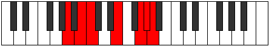 |
| [3215](https://ianring.com/musictheory/scales/3215) | [Katydian](ModeANaturalKatydian.md) | A | A, Bb, Cb, Dbb, E, F##, G#, A |  |
| [3229](https://ianring.com/musictheory/scales/3229) | [Aeolaptian](ModeANaturalAeolaptian.md) | A | A, B, C, Db, E, F##, G#, A |  |
| [3231](https://ianring.com/musictheory/scales/3231) | [Kataptyllic](ModeANaturalKataptyllic.md) | A | A, A#, B, C, C#, E, G, G#, A |  |
| [3245](https://ianring.com/musictheory/scales/3245) | [Aeracrian](ModeANaturalAeracrian.md) | A | A, B, C, D, E, F##, G#, A |  |
| [3247](https://ianring.com/musictheory/scales/3247) | [Aeolonyllic](ModeANaturalAeolonyllic.md) | A | A, A#, B, C, D, E, G, G#, A |  |
| [3261](https://ianring.com/musictheory/scales/3261) | [Dodyllic](ModeANaturalDodyllic.md) | A | A, B, C, C#, D, E, G, G#, A |  |
| [3263](https://ianring.com/musictheory/scales/3263) | [Pyrygic](ModeANaturalPyrygic.md) | A | A, A#, B, C, C#, D, E, G, G#, A |  |
| [3277](https://ianring.com/musictheory/scales/3277) | [Zycrian](ModeANaturalZycrian.md) | A | A, B, C, D#, E, F##, G#, A | 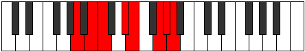 |
| [3279](https://ianring.com/musictheory/scales/3279) | [Pythyllic](ModeANaturalPythyllic.md) | A | A, A#, B, C, D#, E, G, G#, A |  |
| [3285](https://ianring.com/musictheory/scales/3285) | [Zagian](ModeFNaturalZagian.md) | F | F, G, A, B, C, D#, E, F |  |
| [3287](https://ianring.com/musictheory/scales/3287) | [Phrathyllic](ModeFNaturalPhrathyllic.md) | F | F, F#, G, A, B, C, D#, E, F |  |
| [3293](https://ianring.com/musictheory/scales/3293) | [Saryllic](ModeANaturalSaryllic.md) | A | A, B, C, C#, D#, E, G, G#, A |  |
| [3293](https://ianring.com/musictheory/scales/3293) | [Saryllic](ModeFNaturalSaryllic.md) | F | F, G, G#, A, B, C, D#, E, F |  |
| [3295](https://ianring.com/musictheory/scales/3295) | [Phroptygic](ModeFNaturalPhroptygic.md) | F | F, F#, G, G#, A, B, C, D#, E, F |  |
| [3295](https://ianring.com/musictheory/scales/3295) | [Phroptygic](ModeANaturalPhroptygic.md) | A | A, A#, B, C, C#, D#, E, G, G#, A |  |
| [3307](https://ianring.com/musictheory/scales/3307) | [Boptyllic](ModeFSharpBoptyllic.md) | F# | F#, G, A, B, C, C#, E, F, F# |  |
| [3307](https://ianring.com/musictheory/scales/3307) | [Boptyllic](ModeGFlatBoptyllic.md) | Gb | Gb, G, A, B, C, Db, E, F, Gb |  |
| [3309](https://ianring.com/musictheory/scales/3309) | [Bycryllic](ModeANaturalBycryllic.md) | A | A, B, C, D, D#, E, G, G#, A |  |
| [3311](https://ianring.com/musictheory/scales/3311) | [Mixodygic](ModeFSharpMixodygic.md) | F# | F#, G, G#, A, B, C, C#, E, F, F# |  |
| [3311](https://ianring.com/musictheory/scales/3311) | [Mixodygic](ModeGFlatMixodygic.md) | Gb | Gb, G, Ab, A, B, C, Db, E, F, Gb |  |
| [3311](https://ianring.com/musictheory/scales/3311) | [Mixodygic](ModeANaturalMixodygic.md) | A | A, A#, B, C, D, D#, E, G, G#, A |  |
| [3317](https://ianring.com/musictheory/scales/3317) | [Lanyllic](ModeFNaturalLanyllic.md) | F | F, G, A, A#, B, C, D#, E, F |  |
| [3319](https://ianring.com/musictheory/scales/3319) | [Tholygic](ModeFNaturalTholygic.md) | F | F, F#, G, A, A#, B, C, D#, E, F |  |
| [3323](https://ianring.com/musictheory/scales/3323) | [Phrygygic](ModeFSharpPhrygygic.md) | F# | F#, G, A, A#, B, C, C#, E, F, F# |  |
| [3323](https://ianring.com/musictheory/scales/3323) | [Phrygygic](ModeGFlatPhrygygic.md) | Gb | Gb, G, A, Bb, B, C, Db, E, F, Gb |  |
| [3325](https://ianring.com/musictheory/scales/3325) | [Epygic](ModeANaturalEpygic.md) | A | A, B, C, C#, D, D#, E, G, G#, A |  |
| [3325](https://ianring.com/musictheory/scales/3325) | [Epygic](ModeFNaturalEpygic.md) | F | F, G, G#, A, A#, B, C, D#, E, F |  |
| [3327](https://ianring.com/musictheory/scales/3327) | [Madyllian](ModeANaturalMadyllian.md) | A | A, A#, B, C, C#, D, D#, E, G, G#, A |  |
| [3327](https://ianring.com/musictheory/scales/3327) | [Madyllian](ModeFSharpMadyllian.md) | F# | F#, G, G#, A, A#, B, C, C#, E, F, F# |  |
| [3327](https://ianring.com/musictheory/scales/3327) | [Madyllian](ModeGFlatMadyllian.md) | Gb | Gb, G, Ab, A, Bb, B, C, Db, E, F, Gb |  |
| [3327](https://ianring.com/musictheory/scales/3327) | [Madyllian](ModeFNaturalMadyllian.md) | F | F, F#, G, G#, A, A#, B, C, D#, E, F |  |
| [3355](https://ianring.com/musictheory/scales/3355) | [Bagian](ModeGSharpBagian.md) | G# | G#, A, B, C, D##, E##, F##, G# |  |
| [3359](https://ianring.com/musictheory/scales/3359) | [Bonyllic](ModeGSharpBonyllic.md) | G# | G#, A, A#, B, C, E, F#, G, G# |  |
| [3359](https://ianring.com/musictheory/scales/3359) | [Bonyllic](ModeAFlatBonyllic.md) | Ab | Ab, A, Bb, B, C, E, Gb, G, Ab |  |
| [3363](https://ianring.com/musictheory/scales/3363) | [Rogimic](ModeBNaturalRogimic.md) | B | B, C, D##, E###, Cbbb, Cbb, B |  |
| [3367](https://ianring.com/musictheory/scales/3367) | [Moptian](ModeBNaturalMoptian.md) | B | B, C, Db, E, F##, G##, A#, B | 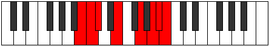 |
| [3371](https://ianring.com/musictheory/scales/3371) | [Aeolylian](ModeBNaturalAeolylian.md) | B | B, C, D, E, F##, G##, A#, B |  |
| [3375](https://ianring.com/musictheory/scales/3375) | [Kygyllic](ModeBNaturalKygyllic.md) | B | B, C, C#, D, E, G, A, A#, B |  |
| [3379](https://ianring.com/musictheory/scales/3379) | [Sothian](ModeBNaturalSothian.md) | B | B, C, D#, E, F##, G##, A#, B |  |
| [3383](https://ianring.com/musictheory/scales/3383) | [Daptyllic](ModeBNaturalDaptyllic.md) | B | B, C, C#, D#, E, G, A, A#, B |  |
| [3387](https://ianring.com/musictheory/scales/3387) | [Aeryptyllic](ModeGSharpAeryptyllic.md) | G# | G#, A, B, C, C#, E, F#, G, G# |  |
| [3387](https://ianring.com/musictheory/scales/3387) | [Aeryptyllic](ModeAFlatAeryptyllic.md) | Ab | Ab, A, B, C, Db, E, Gb, G, Ab |  |
| [3387](https://ianring.com/musictheory/scales/3387) | [Aeryptyllic](ModeBNaturalAeryptyllic.md) | B | B, C, D, D#, E, G, A, A#, B |  |
| [3391](https://ianring.com/musictheory/scales/3391) | [Aeolynygic](ModeBNaturalAeolynygic.md) | B | B, C, C#, D, D#, E, G, A, A#, B |  |
| [3391](https://ianring.com/musictheory/scales/3391) | [Aeolynygic](ModeGSharpAeolynygic.md) | G# | G#, A, A#, B, C, C#, E, F#, G, G# |  |
| [3391](https://ianring.com/musictheory/scales/3391) | [Aeolynygic](ModeAFlatAeolynygic.md) | Ab | Ab, A, Bb, B, C, Db, E, Gb, G, Ab |  |
| [3403](https://ianring.com/musictheory/scales/3403) | [Bylian](ModeDFlatBylian.md) | Db | Db, Ebb, Fb, G, A, B, C, Db |  |
| [3405](https://ianring.com/musictheory/scales/3405) | [Stynian](ModeDFlatStynian.md) | Db | Db, Eb, Fb, G, A, B, C, Db |  |
| [3407](https://ianring.com/musictheory/scales/3407) | [Katocryllic](ModeCSharpKatocryllic.md) | C# | C#, D, D#, E, G, A, B, C, C# |  |
| [3407](https://ianring.com/musictheory/scales/3407) | [Katocryllic](ModeDFlatKatocryllic.md) | Db | Db, D, Eb, E, G, A, B, C, Db |  |
| [3417](https://ianring.com/musictheory/scales/3417) | [Golian](ModeDFlatGolian.md) | Db | Db, E, F, G, A, B, C, Db | 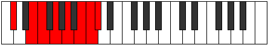 |
| [3419](https://ianring.com/musictheory/scales/3419) | [Danyllic](ModeCSharpDanyllic.md) | C# | C#, D, E, F, G, A, B, C, C# |  |
| [3419](https://ianring.com/musictheory/scales/3419) | [Danyllic](ModeDFlatDanyllic.md) | Db | Db, D, E, F, G, A, B, C, Db |  |
| [3419](https://ianring.com/musictheory/scales/3419) | [Danyllic](ModeGSharpDanyllic.md) | G# | G#, A, B, C, D, E, F#, G, G# |  |
| [3419](https://ianring.com/musictheory/scales/3419) | [Danyllic](ModeAFlatDanyllic.md) | Ab | Ab, A, B, C, D, E, Gb, G, Ab |  |
| [3421](https://ianring.com/musictheory/scales/3421) | [Aerothyllic](ModeCSharpAerothyllic.md) | C# | C#, D#, E, F, G, A, B, C, C# |  |
| [3421](https://ianring.com/musictheory/scales/3421) | [Aerothyllic](ModeDFlatAerothyllic.md) | Db | Db, Eb, E, F, G, A, B, C, Db |  |
| [3423](https://ianring.com/musictheory/scales/3423) | [Lothygic](ModeCSharpLothygic.md) | C# | C#, D, D#, E, F, G, A, B, C, C# |  |
| [3423](https://ianring.com/musictheory/scales/3423) | [Lothygic](ModeDFlatLothygic.md) | Db | Db, D, Eb, E, F, G, A, B, C, Db |  |
| [3423](https://ianring.com/musictheory/scales/3423) | [Lothygic](ModeGSharpLothygic.md) | G# | G#, A, A#, B, C, D, E, F#, G, G# |  |
| [3423](https://ianring.com/musictheory/scales/3423) | [Lothygic](ModeAFlatLothygic.md) | Ab | Ab, A, Bb, B, C, D, E, Gb, G, Ab |  |
| [3427](https://ianring.com/musictheory/scales/3427) | [Zacrian](ModeBNaturalZacrian.md) | B | B, C, D##, E#, F##, G##, A#, B |  |
| [3431](https://ianring.com/musictheory/scales/3431) | [Zyptyllic](ModeBNaturalZyptyllic.md) | B | B, C, C#, E, F, G, A, A#, B |  |
| [3433](https://ianring.com/musictheory/scales/3433) | [Thonian](ModeDFlatThonian.md) | Db | Db, E, F#, G, A, B, C, Db |  |
| [3435](https://ianring.com/musictheory/scales/3435) | [Epiphyllic](ModeCSharpEpiphyllic.md) | C# | C#, D, E, F#, G, A, B, C, C# |  |
| [3435](https://ianring.com/musictheory/scales/3435) | [Epiphyllic](ModeDFlatEpiphyllic.md) | Db | Db, D, E, Gb, G, A, B, C, Db |  |
| [3435](https://ianring.com/musictheory/scales/3435) | [Epiphyllic](ModeFSharpEpiphyllic.md) | F# | F#, G, A, B, C, D, E, F, F# |  |
| [3435](https://ianring.com/musictheory/scales/3435) | [Epiphyllic](ModeGFlatEpiphyllic.md) | Gb | Gb, G, A, B, C, D, E, F, Gb |  |
| [3435](https://ianring.com/musictheory/scales/3435) | [Epiphyllic](ModeBNaturalEpiphyllic.md) | B | B, C, D, E, F, G, A, A#, B |  |
| [3437](https://ianring.com/musictheory/scales/3437) | [Gathyllic](ModeCSharpGathyllic.md) | C# | C#, D#, E, F#, G, A, B, C, C# |  |
| [3437](https://ianring.com/musictheory/scales/3437) | [Gathyllic](ModeDFlatGathyllic.md) | Db | Db, Eb, E, Gb, G, A, B, C, Db |  |
| [3439](https://ianring.com/musictheory/scales/3439) | [Lythygic](ModeCSharpLythygic.md) | C# | C#, D, D#, E, F#, G, A, B, C, C# |  |
| [3439](https://ianring.com/musictheory/scales/3439) | [Lythygic](ModeDFlatLythygic.md) | Db | Db, D, Eb, E, Gb, G, A, B, C, Db |  |
| [3439](https://ianring.com/musictheory/scales/3439) | [Lythygic](ModeFSharpLythygic.md) | F# | F#, G, G#, A, B, C, D, E, F, F# |  |
| [3439](https://ianring.com/musictheory/scales/3439) | [Lythygic](ModeGFlatLythygic.md) | Gb | Gb, G, Ab, A, B, C, D, E, F, Gb |  |
| [3439](https://ianring.com/musictheory/scales/3439) | [Lythygic](ModeBNaturalLythygic.md) | B | B, C, C#, D, E, F, G, A, A#, B |  |
| [3443](https://ianring.com/musictheory/scales/3443) | [Epathyllic](ModeBNaturalEpathyllic.md) | B | B, C, D#, E, F, G, A, A#, B |  |
| [3447](https://ianring.com/musictheory/scales/3447) | [Kynygic](ModeBNaturalKynygic.md) | B | B, C, C#, D#, E, F, G, A, A#, B |  |
| [3449](https://ianring.com/musictheory/scales/3449) | [Bacryllic](ModeCSharpBacryllic.md) | C# | C#, E, F, F#, G, A, B, C, C# |  |
| [3449](https://ianring.com/musictheory/scales/3449) | [Bacryllic](ModeDFlatBacryllic.md) | Db | Db, E, F, Gb, G, A, B, C, Db |  |
| [3451](https://ianring.com/musictheory/scales/3451) | [Garygic](ModeCSharpGarygic.md) | C# | C#, D, E, F, F#, G, A, B, C, C# |  |
| [3451](https://ianring.com/musictheory/scales/3451) | [Garygic](ModeDFlatGarygic.md) | Db | Db, D, E, F, Gb, G, A, B, C, Db |  |
| [3451](https://ianring.com/musictheory/scales/3451) | [Garygic](ModeGSharpGarygic.md) | G# | G#, A, B, C, C#, D, E, F#, G, G# |  |
| [3451](https://ianring.com/musictheory/scales/3451) | [Garygic](ModeAFlatGarygic.md) | Ab | Ab, A, B, C, Db, D, E, Gb, G, Ab |  |
| [3451](https://ianring.com/musictheory/scales/3451) | [Garygic](ModeBNaturalGarygic.md) | B | B, C, D, D#, E, F, G, A, A#, B |  |
| [3451](https://ianring.com/musictheory/scales/3451) | [Garygic](ModeFSharpGarygic.md) | F# | F#, G, A, A#, B, C, D, E, F, F# |  |
| [3451](https://ianring.com/musictheory/scales/3451) | [Garygic](ModeGFlatGarygic.md) | Gb | Gb, G, A, Bb, B, C, D, E, F, Gb |  |
| [3453](https://ianring.com/musictheory/scales/3453) | [Katarygic](ModeCSharpKatarygic.md) | C# | C#, D#, E, F, F#, G, A, B, C, C# |  |
| [3453](https://ianring.com/musictheory/scales/3453) | [Katarygic](ModeDFlatKatarygic.md) | Db | Db, Eb, E, F, Gb, G, A, B, C, Db |  |
| [3455](https://ianring.com/musictheory/scales/3455) | [Ryptyllian](ModeCSharpRyptyllian.md) | C# | C#, D, D#, E, F, F#, G, A, B, C, C# |  |
| [3455](https://ianring.com/musictheory/scales/3455) | [Ryptyllian](ModeDFlatRyptyllian.md) | Db | Db, D, Eb, E, F, Gb, G, A, B, C, Db |  |
| [3455](https://ianring.com/musictheory/scales/3455) | [Ryptyllian](ModeBNaturalRyptyllian.md) | B | B, C, C#, D, D#, E, F, G, A, A#, B |  |
| [3455](https://ianring.com/musictheory/scales/3455) | [Ryptyllian](ModeGSharpRyptyllian.md) | G# | G#, A, A#, B, C, C#, D, E, F#, G, G# |  |
| [3455](https://ianring.com/musictheory/scales/3455) | [Ryptyllian](ModeAFlatRyptyllian.md) | Ab | Ab, A, Bb, B, C, Db, D, E, Gb, G, Ab |  |
| [3455](https://ianring.com/musictheory/scales/3455) | [Ryptyllian](ModeFSharpRyptyllian.md) | F# | F#, G, G#, A, A#, B, C, D, E, F, F# |  |
| [3455](https://ianring.com/musictheory/scales/3455) | [Ryptyllian](ModeGFlatRyptyllian.md) | Gb | Gb, G, Ab, A, Bb, B, C, D, E, F, Gb |  |
| [3469](https://ianring.com/musictheory/scales/3469) | [Monian](ModeANaturalMonian.md) | A | A, B, C, D##, E#, F##, G#, A |  |
| [3471](https://ianring.com/musictheory/scales/3471) | [Gyryllic](ModeANaturalGyryllic.md) | A | A, A#, B, C, E, F, G, G#, A |  |
| [3483](https://ianring.com/musictheory/scales/3483) | [Mixotharyllic](ModeGSharpMixotharyllic.md) | G# | G#, A, B, C, D#, E, F#, G, G# |  |
| [3483](https://ianring.com/musictheory/scales/3483) | [Mixotharyllic](ModeAFlatMixotharyllic.md) | Ab | Ab, A, B, C, Eb, E, Gb, G, Ab |  |
| [3485](https://ianring.com/musictheory/scales/3485) | [Kyptyllic](ModeANaturalKyptyllic.md) | A | A, B, C, C#, E, F, G, G#, A |  |
| [3487](https://ianring.com/musictheory/scales/3487) | [Byptygic](ModeANaturalByptygic.md) | A | A, A#, B, C, C#, E, F, G, G#, A |  |
| [3487](https://ianring.com/musictheory/scales/3487) | [Byptygic](ModeGSharpByptygic.md) | G# | G#, A, A#, B, C, D#, E, F#, G, G# |  |
| [3487](https://ianring.com/musictheory/scales/3487) | [Byptygic](ModeAFlatByptygic.md) | Ab | Ab, A, Bb, B, C, Eb, E, Gb, G, Ab |  |
| [3491](https://ianring.com/musictheory/scales/3491) | [Tharian](ModeBNaturalTharian.md) | B | B, C, D##, E##, F##, G##, A#, B |  |
| [3495](https://ianring.com/musictheory/scales/3495) | [Banyllic](ModeBNaturalBanyllic.md) | B | B, C, C#, E, F#, G, A, A#, B |  |
| [3499](https://ianring.com/musictheory/scales/3499) | [Lythyllic](ModeENaturalLythyllic.md) | E | E, F, G, A, B, C, D, D#, E |  |
| [3499](https://ianring.com/musictheory/scales/3499) | [Lythyllic](ModeBNaturalLythyllic.md) | B | B, C, D, E, F#, G, A, A#, B |  |
| [3501](https://ianring.com/musictheory/scales/3501) | [Katodyllic](ModeENaturalKatodyllic.md) | E | E, F#, G, A, B, C, D, D#, E |  |
| [3501](https://ianring.com/musictheory/scales/3501) | [Katodyllic](ModeANaturalKatodyllic.md) | A | A, B, C, D, E, F, G, G#, A |  |
| [3503](https://ianring.com/musictheory/scales/3503) | [Zyphygic](ModeENaturalZyphygic.md) | E | E, F, F#, G, A, B, C, D, D#, E |  |
| [3503](https://ianring.com/musictheory/scales/3503) | [Zyphygic](ModeBNaturalZyphygic.md) | B | B, C, C#, D, E, F#, G, A, A#, B |  |
| [3503](https://ianring.com/musictheory/scales/3503) | [Zyphygic](ModeANaturalZyphygic.md) | A | A, A#, B, C, D, E, F, G, G#, A |  |
| [3507](https://ianring.com/musictheory/scales/3507) | [Ponyllic](ModeBNaturalPonyllic.md) | B | B, C, D#, E, F#, G, A, A#, B |  |
| [3511](https://ianring.com/musictheory/scales/3511) | [Epolygic](ModeBNaturalEpolygic.md) | B | B, C, C#, D#, E, F#, G, A, A#, B |  |
| [3513](https://ianring.com/musictheory/scales/3513) | [Dydyllic](ModeENaturalDydyllic.md) | E | E, G, G#, A, B, C, D, D#, E |  |
| [3515](https://ianring.com/musictheory/scales/3515) | [Katodygic](ModeENaturalKatodygic.md) | E | E, F, G, G#, A, B, C, D, D#, E |  |
| [3515](https://ianring.com/musictheory/scales/3515) | [Katodygic](ModeGSharpKatodygic.md) | G# | G#, A, B, C, C#, D#, E, F#, G, G# |  |
| [3515](https://ianring.com/musictheory/scales/3515) | [Katodygic](ModeAFlatKatodygic.md) | Ab | Ab, A, B, C, Db, Eb, E, Gb, G, Ab |  |
| [3515](https://ianring.com/musictheory/scales/3515) | [Katodygic](ModeBNaturalKatodygic.md) | B | B, C, D, D#, E, F#, G, A, A#, B |  |
| [3517](https://ianring.com/musictheory/scales/3517) | [Epocrygic](ModeANaturalEpocrygic.md) | A | A, B, C, C#, D, E, F, G, G#, A |  |
| [3517](https://ianring.com/musictheory/scales/3517) | [Epocrygic](ModeENaturalEpocrygic.md) | E | E, F#, G, G#, A, B, C, D, D#, E |  |
| [3519](https://ianring.com/musictheory/scales/3519) | [Boptyllian](ModeENaturalBoptyllian.md) | E | E, F, F#, G, G#, A, B, C, D, D#, E |  |
| [3519](https://ianring.com/musictheory/scales/3519) | [Boptyllian](ModeBNaturalBoptyllian.md) | B | B, C, C#, D, D#, E, F#, G, A, A#, B |  |
| [3519](https://ianring.com/musictheory/scales/3519) | [Boptyllian](ModeANaturalBoptyllian.md) | A | A, A#, B, C, C#, D, E, F, G, G#, A |  |
| [3519](https://ianring.com/musictheory/scales/3519) | [Boptyllian](ModeGSharpBoptyllian.md) | G# | G#, A, A#, B, C, C#, D#, E, F#, G, G# |  |
| [3519](https://ianring.com/musictheory/scales/3519) | [Boptyllian](ModeAFlatBoptyllian.md) | Ab | Ab, A, Bb, B, C, Db, Eb, E, Gb, G, Ab |  |
| [3529](https://ianring.com/musictheory/scales/3529) | [Stalian](ModeDFlatStalian.md) | Db | Db, E, F##, G#, A, B, C, Db |  |
| [3531](https://ianring.com/musictheory/scales/3531) | [Dycryllic](ModeCSharpDycryllic.md) | C# | C#, D, E, G, G#, A, B, C, C# |  |
| [3531](https://ianring.com/musictheory/scales/3531) | [Dycryllic](ModeDFlatDycryllic.md) | Db | Db, D, E, G, Ab, A, B, C, Db |  |
| [3533](https://ianring.com/musictheory/scales/3533) | [Thadyllic](ModeCSharpThadyllic.md) | C# | C#, D#, E, G, G#, A, B, C, C# | 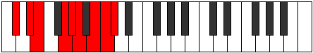 |
| [3533](https://ianring.com/musictheory/scales/3533) | [Thadyllic](ModeDFlatThadyllic.md) | Db | Db, Eb, E, G, Ab, A, B, C, Db |  |
| [3533](https://ianring.com/musictheory/scales/3533) | [Thadyllic](ModeANaturalThadyllic.md) | A | A, B, C, D#, E, F, G, G#, A |  |
| [3535](https://ianring.com/musictheory/scales/3535) | [Aeroptygic](ModeCSharpAeroptygic.md) | C# | C#, D, D#, E, G, G#, A, B, C, C# |  |
| [3535](https://ianring.com/musictheory/scales/3535) | [Aeroptygic](ModeDFlatAeroptygic.md) | Db | Db, D, Eb, E, G, Ab, A, B, C, Db |  |
| [3535](https://ianring.com/musictheory/scales/3535) | [Aeroptygic](ModeANaturalAeroptygic.md) | A | A, A#, B, C, D#, E, F, G, G#, A |  |
| [3541](https://ianring.com/musictheory/scales/3541) | [Racryllic](ModeFNaturalRacryllic.md) | F | F, G, A, B, C, C#, D#, E, F | 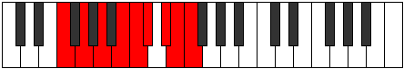 |
| [3543](https://ianring.com/musictheory/scales/3543) | [Aeolonygic](ModeFNaturalAeolonygic.md) | F | F, F#, G, A, B, C, C#, D#, E, F |  |
| [3545](https://ianring.com/musictheory/scales/3545) | [Thyptyllic](ModeCSharpThyptyllic.md) | C# | C#, E, F, G, G#, A, B, C, C# |  |
| [3545](https://ianring.com/musictheory/scales/3545) | [Thyptyllic](ModeDFlatThyptyllic.md) | Db | Db, E, F, G, Ab, A, B, C, Db |  |
| [3547](https://ianring.com/musictheory/scales/3547) | [Sadygic](ModeCSharpSadygic.md) | C# | C#, D, E, F, G, G#, A, B, C, C# |  |
| [3547](https://ianring.com/musictheory/scales/3547) | [Sadygic](ModeDFlatSadygic.md) | Db | Db, D, E, F, G, Ab, A, B, C, Db |  |
| [3547](https://ianring.com/musictheory/scales/3547) | [Sadygic](ModeGSharpSadygic.md) | G# | G#, A, B, C, D, D#, E, F#, G, G# |  |
| [3547](https://ianring.com/musictheory/scales/3547) | [Sadygic](ModeAFlatSadygic.md) | Ab | Ab, A, B, C, D, Eb, E, Gb, G, Ab |  |
| [3549](https://ianring.com/musictheory/scales/3549) | [Phronygic](ModeCSharpPhronygic.md) | C# | C#, D#, E, F, G, G#, A, B, C, C# |  |
| [3549](https://ianring.com/musictheory/scales/3549) | [Phronygic](ModeDFlatPhronygic.md) | Db | Db, Eb, E, F, G, Ab, A, B, C, Db |  |
| [3549](https://ianring.com/musictheory/scales/3549) | [Phronygic](ModeFNaturalPhronygic.md) | F | F, G, G#, A, B, C, C#, D#, E, F |  |
| [3549](https://ianring.com/musictheory/scales/3549) | [Phronygic](ModeANaturalPhronygic.md) | A | A, B, C, C#, D#, E, F, G, G#, A |  |
| [3551](https://ianring.com/musictheory/scales/3551) | [Sagyllian](ModeCSharpSagyllian.md) | C# | C#, D, D#, E, F, G, G#, A, B, C, C# |  |
| [3551](https://ianring.com/musictheory/scales/3551) | [Sagyllian](ModeDFlatSagyllian.md) | Db | Db, D, Eb, E, F, G, Ab, A, B, C, Db |  |
| [3551](https://ianring.com/musictheory/scales/3551) | [Sagyllian](ModeFNaturalSagyllian.md) | F | F, F#, G, G#, A, B, C, C#, D#, E, F |  |
| [3551](https://ianring.com/musictheory/scales/3551) | [Sagyllian](ModeANaturalSagyllian.md) | A | A, A#, B, C, C#, D#, E, F, G, G#, A |  |
| [3551](https://ianring.com/musictheory/scales/3551) | [Sagyllian](ModeGSharpSagyllian.md) | G# | G#, A, A#, B, C, D, D#, E, F#, G, G# |  |
| [3551](https://ianring.com/musictheory/scales/3551) | [Sagyllian](ModeAFlatSagyllian.md) | Ab | Ab, A, Bb, B, C, D, Eb, E, Gb, G, Ab |  |
| [3555](https://ianring.com/musictheory/scales/3555) | [Pylyllic](ModeBNaturalPylyllic.md) | B | B, C, E, F, F#, G, A, A#, B |  |
| [3559](https://ianring.com/musictheory/scales/3559) | [Aerathygic](ModeBNaturalAerathygic.md) | B | B, C, C#, E, F, F#, G, A, A#, B |  |
| [3561](https://ianring.com/musictheory/scales/3561) | [Pothyllic](ModeCSharpPothyllic.md) | C# | C#, E, F#, G, G#, A, B, C, C# |  |
| [3561](https://ianring.com/musictheory/scales/3561) | [Pothyllic](ModeDFlatPothyllic.md) | Db | Db, E, Gb, G, Ab, A, B, C, Db |  |
| [3561](https://ianring.com/musictheory/scales/3561) | [Pothyllic](ModeENaturalPothyllic.md) | E | E, G, A, A#, B, C, D, D#, E |  |
| [3563](https://ianring.com/musictheory/scales/3563) | [Ionoptygic](ModeFSharpIonoptygic.md) | F# | F#, G, A, B, C, C#, D, E, F, F# |  |
| [3563](https://ianring.com/musictheory/scales/3563) | [Ionoptygic](ModeGFlatIonoptygic.md) | Gb | Gb, G, A, B, C, Db, D, E, F, Gb |  |
| [3563](https://ianring.com/musictheory/scales/3563) | [Ionoptygic](ModeCSharpIonoptygic.md) | C# | C#, D, E, F#, G, G#, A, B, C, C# |  |
| [3563](https://ianring.com/musictheory/scales/3563) | [Ionoptygic](ModeDFlatIonoptygic.md) | Db | Db, D, E, Gb, G, Ab, A, B, C, Db |  |
| [3563](https://ianring.com/musictheory/scales/3563) | [Ionoptygic](ModeENaturalIonoptygic.md) | E | E, F, G, A, A#, B, C, D, D#, E |  |
| [3563](https://ianring.com/musictheory/scales/3563) | [Ionoptygic](ModeBNaturalIonoptygic.md) | B | B, C, D, E, F, F#, G, A, A#, B |  |
| [3565](https://ianring.com/musictheory/scales/3565) | [Aeolorygic](ModeANaturalAeolorygic.md) | A | A, B, C, D, D#, E, F, G, G#, A |  |
| [3565](https://ianring.com/musictheory/scales/3565) | [Aeolorygic](ModeCSharpAeolorygic.md) | C# | C#, D#, E, F#, G, G#, A, B, C, C# |  |
| [3565](https://ianring.com/musictheory/scales/3565) | [Aeolorygic](ModeDFlatAeolorygic.md) | Db | Db, Eb, E, Gb, G, Ab, A, B, C, Db |  |
| [3565](https://ianring.com/musictheory/scales/3565) | [Aeolorygic](ModeENaturalAeolorygic.md) | E | E, F#, G, A, A#, B, C, D, D#, E |  |
| [3567](https://ianring.com/musictheory/scales/3567) | [Epityllian](ModeCSharpEpityllian.md) | C# | C#, D, D#, E, F#, G, G#, A, B, C, C# |  |
| [3567](https://ianring.com/musictheory/scales/3567) | [Epityllian](ModeDFlatEpityllian.md) | Db | Db, D, Eb, E, Gb, G, Ab, A, B, C, Db |  |
| [3567](https://ianring.com/musictheory/scales/3567) | [Epityllian](ModeFSharpEpityllian.md) | F# | F#, G, G#, A, B, C, C#, D, E, F, F# |  |
| [3567](https://ianring.com/musictheory/scales/3567) | [Epityllian](ModeGFlatEpityllian.md) | Gb | Gb, G, Ab, A, B, C, Db, D, E, F, Gb |  |
| [3567](https://ianring.com/musictheory/scales/3567) | [Epityllian](ModeBNaturalEpityllian.md) | B | B, C, C#, D, E, F, F#, G, A, A#, B |  |
| [3567](https://ianring.com/musictheory/scales/3567) | [Epityllian](ModeENaturalEpityllian.md) | E | E, F, F#, G, A, A#, B, C, D, D#, E |  |
| [3567](https://ianring.com/musictheory/scales/3567) | [Epityllian](ModeANaturalEpityllian.md) | A | A, A#, B, C, D, D#, E, F, G, G#, A |  |
| [3571](https://ianring.com/musictheory/scales/3571) | [Dyrygic](ModeBNaturalDyrygic.md) | B | B, C, D#, E, F, F#, G, A, A#, B |  |
| [3573](https://ianring.com/musictheory/scales/3573) | [Kaptygic](ModeFNaturalKaptygic.md) | F | F, G, A, A#, B, C, C#, D#, E, F |  |
| [3575](https://ianring.com/musictheory/scales/3575) | [Mogyllian](ModeFNaturalMogyllian.md) | F | F, F#, G, A, A#, B, C, C#, D#, E, F |  |
| [3575](https://ianring.com/musictheory/scales/3575) | [Mogyllian](ModeBNaturalMogyllian.md) | B | B, C, C#, D#, E, F, F#, G, A, A#, B |  |
| [3577](https://ianring.com/musictheory/scales/3577) | [Loptygic](ModeCSharpLoptygic.md) | C# | C#, E, F, F#, G, G#, A, B, C, C# |  |
| [3577](https://ianring.com/musictheory/scales/3577) | [Loptygic](ModeDFlatLoptygic.md) | Db | Db, E, F, Gb, G, Ab, A, B, C, Db |  |
| [3577](https://ianring.com/musictheory/scales/3577) | [Loptygic](ModeENaturalLoptygic.md) | E | E, G, G#, A, A#, B, C, D, D#, E |  |
| [3579](https://ianring.com/musictheory/scales/3579) | [Zyphyllian](ModeGSharpZyphyllian.md) | G# | G#, A, B, C, C#, D, D#, E, F#, G, G# |  |
| [3579](https://ianring.com/musictheory/scales/3579) | [Zyphyllian](ModeAFlatZyphyllian.md) | Ab | Ab, A, B, C, Db, D, Eb, E, Gb, G, Ab |  |
| [3579](https://ianring.com/musictheory/scales/3579) | [Zyphyllian](ModeCSharpZyphyllian.md) | C# | C#, D, E, F, F#, G, G#, A, B, C, C# |  |
| [3579](https://ianring.com/musictheory/scales/3579) | [Zyphyllian](ModeDFlatZyphyllian.md) | Db | Db, D, E, F, Gb, G, Ab, A, B, C, Db |  |
| [3579](https://ianring.com/musictheory/scales/3579) | [Zyphyllian](ModeFSharpZyphyllian.md) | F# | F#, G, A, A#, B, C, C#, D, E, F, F# |  |
| [3579](https://ianring.com/musictheory/scales/3579) | [Zyphyllian](ModeGFlatZyphyllian.md) | Gb | Gb, G, A, Bb, B, C, Db, D, E, F, Gb |  |
| [3579](https://ianring.com/musictheory/scales/3579) | [Zyphyllian](ModeBNaturalZyphyllian.md) | B | B, C, D, D#, E, F, F#, G, A, A#, B |  |
| [3579](https://ianring.com/musictheory/scales/3579) | [Zyphyllian](ModeENaturalZyphyllian.md) | E | E, F, G, G#, A, A#, B, C, D, D#, E |  |
| [3581](https://ianring.com/musictheory/scales/3581) | [Epocryllian](ModeANaturalEpocryllian.md) | A | A, B, C, C#, D, D#, E, F, G, G#, A |  |
| [3581](https://ianring.com/musictheory/scales/3581) | [Epocryllian](ModeCSharpEpocryllian.md) | C# | C#, D#, E, F, F#, G, G#, A, B, C, C# |  |
| [3581](https://ianring.com/musictheory/scales/3581) | [Epocryllian](ModeDFlatEpocryllian.md) | Db | Db, Eb, E, F, Gb, G, Ab, A, B, C, Db |  |
| [3581](https://ianring.com/musictheory/scales/3581) | [Epocryllian](ModeFNaturalEpocryllian.md) | F | F, G, G#, A, A#, B, C, C#, D#, E, F |  |
| [3581](https://ianring.com/musictheory/scales/3581) | [Epocryllian](ModeENaturalEpocryllian.md) | E | E, F#, G, G#, A, A#, B, C, D, D#, E |  |
| [3583](https://ianring.com/musictheory/scales/3583) | [Zylatic](ModeCSharpZylatic.md) | C# | C#, D, D#, E, F, F#, G, G#, A, B, C, C# |  |
| [3583](https://ianring.com/musictheory/scales/3583) | [Zylatic](ModeDFlatZylatic.md) | Db | Db, D, Eb, E, F, Gb, G, Ab, A, B, C, Db |  |
| [3583](https://ianring.com/musictheory/scales/3583) | [Zylatic](ModeBNaturalZylatic.md) | B | B, C, C#, D, D#, E, F, F#, G, A, A#, B |  |
| [3583](https://ianring.com/musictheory/scales/3583) | [Zylatic](ModeANaturalZylatic.md) | A | A, A#, B, C, C#, D, D#, E, F, G, G#, A |  |
| [3583](https://ianring.com/musictheory/scales/3583) | [Zylatic](ModeGSharpZylatic.md) | G# | G#, A, A#, B, C, C#, D, D#, E, F#, G, G# |  |
| [3583](https://ianring.com/musictheory/scales/3583) | [Zylatic](ModeAFlatZylatic.md) | Ab | Ab, A, Bb, B, C, Db, D, Eb, E, Gb, G, Ab |  |
| [3583](https://ianring.com/musictheory/scales/3583) | [Zylatic](ModeFSharpZylatic.md) | F# | F#, G, G#, A, A#, B, C, C#, D, E, F, F# |  |
| [3583](https://ianring.com/musictheory/scales/3583) | [Zylatic](ModeGFlatZylatic.md) | Gb | Gb, G, Ab, A, Bb, B, C, Db, D, E, F, Gb |  |
| [3583](https://ianring.com/musictheory/scales/3583) | [Zylatic](ModeFNaturalZylatic.md) | F | F, F#, G, G#, A, A#, B, C, C#, D#, E, F |  |
| [3583](https://ianring.com/musictheory/scales/3583) | [Zylatic](ModeENaturalZylatic.md) | E | E, F, F#, G, G#, A, A#, B, C, D, D#, E |  |
| [3637](https://ianring.com/musictheory/scales/3637) | [Kygian](ModeGNaturalKygian.md) | G | G, A, B, C, D##, E#, F#, G |  |
| [3639](https://ianring.com/musictheory/scales/3639) | [Paptyllic](ModeGNaturalPaptyllic.md) | G | G, G#, A, B, C, E, F, F#, G |  |
| [3645](https://ianring.com/musictheory/scales/3645) | [Zycryllic](ModeGNaturalZycryllic.md) | G | G, A, A#, B, C, E, F, F#, G |  |
| [3647](https://ianring.com/musictheory/scales/3647) | [Eporygic](ModeGNaturalEporygic.md) | G | G, G#, A, A#, B, C, E, F, F#, G |  |
| [3655](https://ianring.com/musictheory/scales/3655) | [Mathian](ModeASharpMathian.md) | A# | A#, B, C, D##, E###, F###, G##, A# |  |
| [3655](https://ianring.com/musictheory/scales/3655) | [Mathian](ModeBFlatMathian.md) | Bb | Bb, Cb, Dbb, E, F##, G#, A, Bb |  |
| [3663](https://ianring.com/musictheory/scales/3663) | [Sonyllic](ModeASharpSonyllic.md) | A# | A#, B, C, C#, E, G, G#, A, A# |  |
| [3663](https://ianring.com/musictheory/scales/3663) | [Sonyllic](ModeBFlatSonyllic.md) | Bb | Bb, B, C, Db, E, G, Ab, A, Bb |  |
| [3671](https://ianring.com/musictheory/scales/3671) | [Aeonyllic](ModeASharpAeonyllic.md) | A# | A#, B, C, D, E, G, G#, A, A# |  |
| [3671](https://ianring.com/musictheory/scales/3671) | [Aeonyllic](ModeBFlatAeonyllic.md) | Bb | Bb, B, C, D, E, G, Ab, A, Bb |  |
| [3679](https://ianring.com/musictheory/scales/3679) | [Rycrygic](ModeASharpRycrygic.md) | A# | A#, B, C, C#, D, E, G, G#, A, A# |  |
| [3679](https://ianring.com/musictheory/scales/3679) | [Rycrygic](ModeBFlatRycrygic.md) | Bb | Bb, B, C, Db, D, E, G, Ab, A, Bb |  |
| [3687](https://ianring.com/musictheory/scales/3687) | [Zonyllic](ModeASharpZonyllic.md) | A# | A#, B, C, D#, E, G, G#, A, A# |  |
| [3687](https://ianring.com/musictheory/scales/3687) | [Zonyllic](ModeBFlatZonyllic.md) | Bb | Bb, B, C, Eb, E, G, Ab, A, Bb |  |
| [3691](https://ianring.com/musictheory/scales/3691) | [Badyllic](ModeFSharpBadyllic.md) | F# | F#, G, A, B, C, D#, E, F, F# |  |
| [3691](https://ianring.com/musictheory/scales/3691) | [Badyllic](ModeGFlatBadyllic.md) | Gb | Gb, G, A, B, C, Eb, E, F, Gb |  |
| [3695](https://ianring.com/musictheory/scales/3695) | [Kodygic](ModeFSharpKodygic.md) | F# | F#, G, G#, A, B, C, D#, E, F, F# |  |
| [3695](https://ianring.com/musictheory/scales/3695) | [Kodygic](ModeGFlatKodygic.md) | Gb | Gb, G, Ab, A, B, C, Eb, E, F, Gb |  |
| [3695](https://ianring.com/musictheory/scales/3695) | [Kodygic](ModeASharpKodygic.md) | A# | A#, B, C, C#, D#, E, G, G#, A, A# |  |
| [3695](https://ianring.com/musictheory/scales/3695) | [Kodygic](ModeBFlatKodygic.md) | Bb | Bb, B, C, Db, Eb, E, G, Ab, A, Bb |  |
| [3701](https://ianring.com/musictheory/scales/3701) | [Bagyllic](ModeGNaturalBagyllic.md) | G | G, A, B, C, C#, E, F, F#, G |  |
| [3703](https://ianring.com/musictheory/scales/3703) | [Katalygic](ModeGNaturalKatalygic.md) | G | G, G#, A, B, C, C#, E, F, F#, G |  |
| [3703](https://ianring.com/musictheory/scales/3703) | [Katalygic](ModeASharpKatalygic.md) | A# | A#, B, C, D, D#, E, G, G#, A, A# |  |
| [3703](https://ianring.com/musictheory/scales/3703) | [Katalygic](ModeBFlatKatalygic.md) | Bb | Bb, B, C, D, Eb, E, G, Ab, A, Bb |  |
| [3707](https://ianring.com/musictheory/scales/3707) | [Rynygic](ModeFSharpRynygic.md) | F# | F#, G, A, A#, B, C, D#, E, F, F# |  |
| [3707](https://ianring.com/musictheory/scales/3707) | [Rynygic](ModeGFlatRynygic.md) | Gb | Gb, G, A, Bb, B, C, Eb, E, F, Gb |  |
| [3709](https://ianring.com/musictheory/scales/3709) | [Locrygic](ModeGNaturalLocrygic.md) | G | G, A, A#, B, C, C#, E, F, F#, G |  |
| [3711](https://ianring.com/musictheory/scales/3711) | [Dycryllian](ModeASharpDycryllian.md) | A# | A#, B, C, C#, D, D#, E, G, G#, A, A# |  |
| [3711](https://ianring.com/musictheory/scales/3711) | [Dycryllian](ModeBFlatDycryllian.md) | Bb | Bb, B, C, Db, D, Eb, E, G, Ab, A, Bb |  |
| [3711](https://ianring.com/musictheory/scales/3711) | [Dycryllian](ModeGNaturalDycryllian.md) | G | G, G#, A, A#, B, C, C#, E, F, F#, G |  |
| [3711](https://ianring.com/musictheory/scales/3711) | [Dycryllian](ModeFSharpDycryllian.md) | F# | F#, G, G#, A, A#, B, C, D#, E, F, F# |  |
| [3711](https://ianring.com/musictheory/scales/3711) | [Dycryllian](ModeGFlatDycryllian.md) | Gb | Gb, G, Ab, A, Bb, B, C, Eb, E, F, Gb |  |
| [3725](https://ianring.com/musictheory/scales/3725) | [Kyrian](ModeANaturalKyrian.md) | A | A, B, C, D##, E##, F##, G#, A |  |
| [3727](https://ianring.com/musictheory/scales/3727) | [Tholyllic](ModeANaturalTholyllic.md) | A | A, A#, B, C, E, F#, G, G#, A |  |
| [3729](https://ianring.com/musictheory/scales/3729) | [Starimic](ModeCNaturalStarimic.md) | C | C, D##, E###, Cbbb, Cbb, Dbbb, C |  |
| [3731](https://ianring.com/musictheory/scales/3731) | [Aeryrian](ModeCNaturalAeryrian.md) | C | C, Db, E, F##, G##, A#, B, C |  |
| [3733](https://ianring.com/musictheory/scales/3733) | [Gycrian](ModeCNaturalGycrian.md) | C | C, D, E, F##, G##, A#, B, C |  |
| [3735](https://ianring.com/musictheory/scales/3735) | [Ionagyllic](ModeCNaturalIonagyllic.md) | C | C, C#, D, E, G, A, A#, B, C |  |
| [3737](https://ianring.com/musictheory/scales/3737) | [Phrocrian](ModeCNaturalPhrocrian.md) | C | C, D#, E, F##, G##, A#, B, C |  |
| [3739](https://ianring.com/musictheory/scales/3739) | [Ioninyllic](ModeCNaturalIoninyllic.md) | C | C, C#, D#, E, G, A, A#, B, C |  |
| [3741](https://ianring.com/musictheory/scales/3741) | [Zydyllic](ModeANaturalZydyllic.md) | A | A, B, C, C#, E, F#, G, G#, A |  |
| [3741](https://ianring.com/musictheory/scales/3741) | [Zydyllic](ModeCNaturalZydyllic.md) | C | C, D, D#, E, G, A, A#, B, C |  |
| [3743](https://ianring.com/musictheory/scales/3743) | [Thadygic](ModeCNaturalThadygic.md) | C | C, C#, D, D#, E, G, A, A#, B, C |  |
| [3743](https://ianring.com/musictheory/scales/3743) | [Thadygic](ModeANaturalThadygic.md) | A | A, A#, B, C, C#, E, F#, G, G#, A |  |
| [3751](https://ianring.com/musictheory/scales/3751) | [Aerathyllic](ModeDNaturalAerathyllic.md) | D | D, D#, E, G, A, B, C, C#, D |  |
| [3757](https://ianring.com/musictheory/scales/3757) | [Goptyllic](ModeDNaturalGoptyllic.md) | D | D, E, F, G, A, B, C, C#, D |  |
| [3757](https://ianring.com/musictheory/scales/3757) | [Goptyllic](ModeANaturalGoptyllic.md) | A | A, B, C, D, E, F#, G, G#, A |  |
| [3759](https://ianring.com/musictheory/scales/3759) | [Darygic](ModeDNaturalDarygic.md) | D | D, D#, E, F, G, A, B, C, C#, D |  |
| [3759](https://ianring.com/musictheory/scales/3759) | [Darygic](ModeANaturalDarygic.md) | A | A, A#, B, C, D, E, F#, G, G#, A |  |
| [3761](https://ianring.com/musictheory/scales/3761) | [Ionythian](ModeCNaturalIonythian.md) | C | C, D##, E#, F##, G##, A#, B, C |  |
| [3763](https://ianring.com/musictheory/scales/3763) | [Modyllic](ModeCNaturalModyllic.md) | C | C, C#, E, F, G, A, A#, B, C |  |
| [3765](https://ianring.com/musictheory/scales/3765) | [Aerycryllic](ModeDNaturalAerycryllic.md) | D | D, E, F#, G, A, B, C, C#, D |  |
| [3765](https://ianring.com/musictheory/scales/3765) | [Aerycryllic](ModeGNaturalAerycryllic.md) | G | G, A, B, C, D, E, F, F#, G |  |
| [3765](https://ianring.com/musictheory/scales/3765) | [Aerycryllic](ModeCNaturalAerycryllic.md) | C | C, D, E, F, G, A, A#, B, C |  |
| [3767](https://ianring.com/musictheory/scales/3767) | [Bacrygic](ModeDNaturalBacrygic.md) | D | D, D#, E, F#, G, A, B, C, C#, D |  |
| [3767](https://ianring.com/musictheory/scales/3767) | [Bacrygic](ModeGNaturalBacrygic.md) | G | G, G#, A, B, C, D, E, F, F#, G |  |
| [3767](https://ianring.com/musictheory/scales/3767) | [Bacrygic](ModeCNaturalBacrygic.md) | C | C, C#, D, E, F, G, A, A#, B, C |  |
| [3769](https://ianring.com/musictheory/scales/3769) | [Aeracryllic](ModeCNaturalAeracryllic.md) | C | C, D#, E, F, G, A, A#, B, C |  |
| [3771](https://ianring.com/musictheory/scales/3771) | [Stophygic](ModeCNaturalStophygic.md) | C | C, C#, D#, E, F, G, A, A#, B, C |  |
| [3773](https://ianring.com/musictheory/scales/3773) | [Sorygic](ModeDNaturalSorygic.md) | D | D, E, F, F#, G, A, B, C, C#, D |  |
| [3773](https://ianring.com/musictheory/scales/3773) | [Sorygic](ModeANaturalSorygic.md) | A | A, B, C, C#, D, E, F#, G, G#, A |  |
| [3773](https://ianring.com/musictheory/scales/3773) | [Sorygic](ModeCNaturalSorygic.md) | C | C, D, D#, E, F, G, A, A#, B, C |  |
| [3773](https://ianring.com/musictheory/scales/3773) | [Sorygic](ModeGNaturalSorygic.md) | G | G, A, A#, B, C, D, E, F, F#, G |  |
| [3775](https://ianring.com/musictheory/scales/3775) | [Loptyllian](ModeDNaturalLoptyllian.md) | D | D, D#, E, F, F#, G, A, B, C, C#, D |  |
| [3775](https://ianring.com/musictheory/scales/3775) | [Loptyllian](ModeCNaturalLoptyllian.md) | C | C, C#, D, D#, E, F, G, A, A#, B, C |  |
| [3775](https://ianring.com/musictheory/scales/3775) | [Loptyllian](ModeANaturalLoptyllian.md) | A | A, A#, B, C, C#, D, E, F#, G, G#, A |  |
| [3775](https://ianring.com/musictheory/scales/3775) | [Loptyllian](ModeGNaturalLoptyllian.md) | G | G, G#, A, A#, B, C, D, E, F, F#, G |  |
| [3783](https://ianring.com/musictheory/scales/3783) | [Phrygyllic](ModeASharpPhrygyllic.md) | A# | A#, B, C, E, F, G, G#, A, A# |  |
| [3783](https://ianring.com/musictheory/scales/3783) | [Phrygyllic](ModeBFlatPhrygyllic.md) | Bb | Bb, B, C, E, F, G, Ab, A, Bb |  |
| [3789](https://ianring.com/musictheory/scales/3789) | [Eporyllic](ModeANaturalEporyllic.md) | A | A, B, C, D#, E, F#, G, G#, A |  |
| [3791](https://ianring.com/musictheory/scales/3791) | [Stodygic](ModeASharpStodygic.md) | A# | A#, B, C, C#, E, F, G, G#, A, A# |  |
| [3791](https://ianring.com/musictheory/scales/3791) | [Stodygic](ModeBFlatStodygic.md) | Bb | Bb, B, C, Db, E, F, G, Ab, A, Bb |  |
| [3791](https://ianring.com/musictheory/scales/3791) | [Stodygic](ModeANaturalStodygic.md) | A | A, A#, B, C, D#, E, F#, G, G#, A |  |
| [3793](https://ianring.com/musictheory/scales/3793) | [Aeopian](ModeCNaturalAeopian.md) | C | C, D##, E##, F##, G##, A#, B, C |  |
| [3795](https://ianring.com/musictheory/scales/3795) | [Epothyllic](ModeCNaturalEpothyllic.md) | C | C, C#, E, F#, G, A, A#, B, C |  |
| [3797](https://ianring.com/musictheory/scales/3797) | [Rocryllic](ModeFNaturalRocryllic.md) | F | F, G, A, B, C, D, D#, E, F |  |
| [3797](https://ianring.com/musictheory/scales/3797) | [Rocryllic](ModeCNaturalRocryllic.md) | C | C, D, E, F#, G, A, A#, B, C |  |
| [3799](https://ianring.com/musictheory/scales/3799) | [Aeralygic](ModeFNaturalAeralygic.md) | F | F, F#, G, A, B, C, D, D#, E, F |  |
| [3799](https://ianring.com/musictheory/scales/3799) | [Aeralygic](ModeCNaturalAeralygic.md) | C | C, C#, D, E, F#, G, A, A#, B, C |  |
| [3799](https://ianring.com/musictheory/scales/3799) | [Aeralygic](ModeASharpAeralygic.md) | A# | A#, B, C, D, E, F, G, G#, A, A# |  |
| [3799](https://ianring.com/musictheory/scales/3799) | [Aeralygic](ModeBFlatAeralygic.md) | Bb | Bb, B, C, D, E, F, G, Ab, A, Bb |  |
| [3801](https://ianring.com/musictheory/scales/3801) | [Maptyllic](ModeCNaturalMaptyllic.md) | C | C, D#, E, F#, G, A, A#, B, C |  |
| [3803](https://ianring.com/musictheory/scales/3803) | [Epidygic](ModeCNaturalEpidygic.md) | C | C, C#, D#, E, F#, G, A, A#, B, C |  |
| [3805](https://ianring.com/musictheory/scales/3805) | [Moptygic](ModeFNaturalMoptygic.md) | F | F, G, G#, A, B, C, D, D#, E, F |  |
| [3805](https://ianring.com/musictheory/scales/3805) | [Moptygic](ModeANaturalMoptygic.md) | A | A, B, C, C#, D#, E, F#, G, G#, A |  |
| [3805](https://ianring.com/musictheory/scales/3805) | [Moptygic](ModeCNaturalMoptygic.md) | C | C, D, D#, E, F#, G, A, A#, B, C |  |
| [3807](https://ianring.com/musictheory/scales/3807) | [Bagyllian](ModeFNaturalBagyllian.md) | F | F, F#, G, G#, A, B, C, D, D#, E, F |  |
| [3807](https://ianring.com/musictheory/scales/3807) | [Bagyllian](ModeCNaturalBagyllian.md) | C | C, C#, D, D#, E, F#, G, A, A#, B, C |  |
| [3807](https://ianring.com/musictheory/scales/3807) | [Bagyllian](ModeASharpBagyllian.md) | A# | A#, B, C, C#, D, E, F, G, G#, A, A# |  |
| [3807](https://ianring.com/musictheory/scales/3807) | [Bagyllian](ModeBFlatBagyllian.md) | Bb | Bb, B, C, Db, D, E, F, G, Ab, A, Bb |  |
| [3807](https://ianring.com/musictheory/scales/3807) | [Bagyllian](ModeANaturalBagyllian.md) | A | A, A#, B, C, C#, D#, E, F#, G, G#, A |  |
| [3813](https://ianring.com/musictheory/scales/3813) | [Aeologyllic](ModeDNaturalAeologyllic.md) | D | D, E, G, G#, A, B, C, C#, D |  |
| [3815](https://ianring.com/musictheory/scales/3815) | [Mylygic](ModeDNaturalMylygic.md) | D | D, D#, E, G, G#, A, B, C, C#, D |  |
| [3815](https://ianring.com/musictheory/scales/3815) | [Mylygic](ModeASharpMylygic.md) | A# | A#, B, C, D#, E, F, G, G#, A, A# |  |
| [3815](https://ianring.com/musictheory/scales/3815) | [Mylygic](ModeBFlatMylygic.md) | Bb | Bb, B, C, Eb, E, F, G, Ab, A, Bb |  |
| [3819](https://ianring.com/musictheory/scales/3819) | [Aeolanygic](ModeFSharpAeolanygic.md) | F# | F#, G, A, B, C, C#, D#, E, F, F# |  |
| [3819](https://ianring.com/musictheory/scales/3819) | [Aeolanygic](ModeGFlatAeolanygic.md) | Gb | Gb, G, A, B, C, Db, Eb, E, F, Gb |  |
| [3821](https://ianring.com/musictheory/scales/3821) | [Epyrygic](ModeDNaturalEpyrygic.md) | D | D, E, F, G, G#, A, B, C, C#, D |  |
| [3821](https://ianring.com/musictheory/scales/3821) | [Epyrygic](ModeANaturalEpyrygic.md) | A | A, B, C, D, D#, E, F#, G, G#, A |  |
| [3823](https://ianring.com/musictheory/scales/3823) | [Epinyllian](ModeDNaturalEpinyllian.md) | D | D, D#, E, F, G, G#, A, B, C, C#, D |  |
| [3823](https://ianring.com/musictheory/scales/3823) | [Epinyllian](ModeFSharpEpinyllian.md) | F# | F#, G, G#, A, B, C, C#, D#, E, F, F# |  |
| [3823](https://ianring.com/musictheory/scales/3823) | [Epinyllian](ModeGFlatEpinyllian.md) | Gb | Gb, G, Ab, A, B, C, Db, Eb, E, F, Gb |  |
| [3823](https://ianring.com/musictheory/scales/3823) | [Epinyllian](ModeASharpEpinyllian.md) | A# | A#, B, C, C#, D#, E, F, G, G#, A, A# |  |
| [3823](https://ianring.com/musictheory/scales/3823) | [Epinyllian](ModeBFlatEpinyllian.md) | Bb | Bb, B, C, Db, Eb, E, F, G, Ab, A, Bb |  |
| [3823](https://ianring.com/musictheory/scales/3823) | [Epinyllian](ModeANaturalEpinyllian.md) | A | A, A#, B, C, D, D#, E, F#, G, G#, A |  |
| [3825](https://ianring.com/musictheory/scales/3825) | [Pynyllic](ModeCNaturalPynyllic.md) | C | C, E, F, F#, G, A, A#, B, C |  |
| [3827](https://ianring.com/musictheory/scales/3827) | [Dorygic](ModeCNaturalDorygic.md) | C | C, C#, E, F, F#, G, A, A#, B, C |  |
| [3829](https://ianring.com/musictheory/scales/3829) | [Aerycrygic](ModeGNaturalAerycrygic.md) | G | G, A, B, C, C#, D, E, F, F#, G |  |
| [3829](https://ianring.com/musictheory/scales/3829) | [Aerycrygic](ModeDNaturalAerycrygic.md) | D | D, E, F#, G, G#, A, B, C, C#, D |  |
| [3829](https://ianring.com/musictheory/scales/3829) | [Aerycrygic](ModeFNaturalAerycrygic.md) | F | F, G, A, A#, B, C, D, D#, E, F |  |
| [3829](https://ianring.com/musictheory/scales/3829) | [Aerycrygic](ModeCNaturalAerycrygic.md) | C | C, D, E, F, F#, G, A, A#, B, C |  |
| [3831](https://ianring.com/musictheory/scales/3831) | [Ionyllian](ModeDNaturalIonyllian.md) | D | D, D#, E, F#, G, G#, A, B, C, C#, D |  |
| [3831](https://ianring.com/musictheory/scales/3831) | [Ionyllian](ModeGNaturalIonyllian.md) | G | G, G#, A, B, C, C#, D, E, F, F#, G |  |
| [3831](https://ianring.com/musictheory/scales/3831) | [Ionyllian](ModeCNaturalIonyllian.md) | C | C, C#, D, E, F, F#, G, A, A#, B, C |  |
| [3831](https://ianring.com/musictheory/scales/3831) | [Ionyllian](ModeFNaturalIonyllian.md) | F | F, F#, G, A, A#, B, C, D, D#, E, F |  |
| [3831](https://ianring.com/musictheory/scales/3831) | [Ionyllian](ModeASharpIonyllian.md) | A# | A#, B, C, D, D#, E, F, G, G#, A, A# |  |
| [3831](https://ianring.com/musictheory/scales/3831) | [Ionyllian](ModeBFlatIonyllian.md) | Bb | Bb, B, C, D, Eb, E, F, G, Ab, A, Bb |  |
| [3833](https://ianring.com/musictheory/scales/3833) | [Dycrygic](ModeCNaturalDycrygic.md) | C | C, D#, E, F, F#, G, A, A#, B, C |  |
| [3835](https://ianring.com/musictheory/scales/3835) | [Katodyllian](ModeCNaturalKatodyllian.md) | C | C, C#, D#, E, F, F#, G, A, A#, B, C |  |
| [3835](https://ianring.com/musictheory/scales/3835) | [Katodyllian](ModeFSharpKatodyllian.md) | F# | F#, G, A, A#, B, C, C#, D#, E, F, F# |  |
| [3835](https://ianring.com/musictheory/scales/3835) | [Katodyllian](ModeGFlatKatodyllian.md) | Gb | Gb, G, A, Bb, B, C, Db, Eb, E, F, Gb |  |
| [3837](https://ianring.com/musictheory/scales/3837) | [Garyllian](ModeANaturalGaryllian.md) | A | A, B, C, C#, D, D#, E, F#, G, G#, A |  |
| [3837](https://ianring.com/musictheory/scales/3837) | [Garyllian](ModeDNaturalGaryllian.md) | D | D, E, F, F#, G, G#, A, B, C, C#, D |  |
| [3837](https://ianring.com/musictheory/scales/3837) | [Garyllian](ModeGNaturalGaryllian.md) | G | G, A, A#, B, C, C#, D, E, F, F#, G |  |
| [3837](https://ianring.com/musictheory/scales/3837) | [Garyllian](ModeCNaturalGaryllian.md) | C | C, D, D#, E, F, F#, G, A, A#, B, C |  |
| [3837](https://ianring.com/musictheory/scales/3837) | [Garyllian](ModeFNaturalGaryllian.md) | F | F, G, G#, A, A#, B, C, D, D#, E, F |  |
| [3839](https://ianring.com/musictheory/scales/3839) | [Mixolatic](ModeDNaturalMixolatic.md) | D | D, D#, E, F, F#, G, G#, A, B, C, C#, D |  |
| [3839](https://ianring.com/musictheory/scales/3839) | [Mixolatic](ModeCNaturalMixolatic.md) | C | C, C#, D, D#, E, F, F#, G, A, A#, B, C |  |
| [3839](https://ianring.com/musictheory/scales/3839) | [Mixolatic](ModeASharpMixolatic.md) | A# | A#, B, C, C#, D, D#, E, F, G, G#, A, A# |  |
| [3839](https://ianring.com/musictheory/scales/3839) | [Mixolatic](ModeBFlatMixolatic.md) | Bb | Bb, B, C, Db, D, Eb, E, F, G, Ab, A, Bb |  |
| [3839](https://ianring.com/musictheory/scales/3839) | [Mixolatic](ModeANaturalMixolatic.md) | A | A, A#, B, C, C#, D, D#, E, F#, G, G#, A |  |
| [3839](https://ianring.com/musictheory/scales/3839) | [Mixolatic](ModeGNaturalMixolatic.md) | G | G, G#, A, A#, B, C, C#, D, E, F, F#, G |  |
| [3839](https://ianring.com/musictheory/scales/3839) | [Mixolatic](ModeFSharpMixolatic.md) | F# | F#, G, G#, A, A#, B, C, C#, D#, E, F, F# |  |
| [3839](https://ianring.com/musictheory/scales/3839) | [Mixolatic](ModeGFlatMixolatic.md) | Gb | Gb, G, Ab, A, Bb, B, C, Db, Eb, E, F, Gb |  |
| [3839](https://ianring.com/musictheory/scales/3839) | [Mixolatic](ModeFNaturalMixolatic.md) | F | F, F#, G, G#, A, A#, B, C, D, D#, E, F |  |
| [3867](https://ianring.com/musictheory/scales/3867) | [Storyllic](ModeGSharpStoryllic.md) | G# | G#, A, B, C, E, F, F#, G, G# |  |
| [3867](https://ianring.com/musictheory/scales/3867) | [Storyllic](ModeAFlatStoryllic.md) | Ab | Ab, A, B, C, E, F, Gb, G, Ab |  |
| [3871](https://ianring.com/musictheory/scales/3871) | [Aerynygic](ModeGSharpAerynygic.md) | G# | G#, A, A#, B, C, E, F, F#, G, G# |  |
| [3871](https://ianring.com/musictheory/scales/3871) | [Aerynygic](ModeAFlatAerynygic.md) | Ab | Ab, A, Bb, B, C, E, F, Gb, G, Ab |  |
| [3875](https://ianring.com/musictheory/scales/3875) | [Aeryptian](ModeBNaturalAeryptian.md) | B | B, C, D##, E###, F###, G##, A#, B |  |
| [3879](https://ianring.com/musictheory/scales/3879) | [Pathyllic](ModeBNaturalPathyllic.md) | B | B, C, C#, E, G, G#, A, A#, B |  |
| [3883](https://ianring.com/musictheory/scales/3883) | [Kyryllic](ModeBNaturalKyryllic.md) | B | B, C, D, E, G, G#, A, A#, B |  |
| [3887](https://ianring.com/musictheory/scales/3887) | [Phrathygic](ModeBNaturalPhrathygic.md) | B | B, C, C#, D, E, G, G#, A, A#, B |  |
| [3891](https://ianring.com/musictheory/scales/3891) | [Ryryllic](ModeBNaturalRyryllic.md) | B | B, C, D#, E, G, G#, A, A#, B |  |
| [3893](https://ianring.com/musictheory/scales/3893) | [Phrocryllic](ModeGNaturalPhrocryllic.md) | G | G, A, B, C, D#, E, F, F#, G |  |
| [3895](https://ianring.com/musictheory/scales/3895) | [Eparygic](ModeGNaturalEparygic.md) | G | G, G#, A, B, C, D#, E, F, F#, G |  |
| [3895](https://ianring.com/musictheory/scales/3895) | [Eparygic](ModeBNaturalEparygic.md) | B | B, C, C#, D#, E, G, G#, A, A#, B |  |
| [3899](https://ianring.com/musictheory/scales/3899) | [Katorygic](ModeGSharpKatorygic.md) | G# | G#, A, B, C, C#, E, F, F#, G, G# |  |
| [3899](https://ianring.com/musictheory/scales/3899) | [Katorygic](ModeAFlatKatorygic.md) | Ab | Ab, A, B, C, Db, E, F, Gb, G, Ab |  |
| [3899](https://ianring.com/musictheory/scales/3899) | [Katorygic](ModeBNaturalKatorygic.md) | B | B, C, D, D#, E, G, G#, A, A#, B |  |
| [3901](https://ianring.com/musictheory/scales/3901) | [Bycrygic](ModeGNaturalBycrygic.md) | G | G, A, A#, B, C, D#, E, F, F#, G |  |
| [3903](https://ianring.com/musictheory/scales/3903) | [Aeogyllian](ModeBNaturalAeogyllian.md) | B | B, C, C#, D, D#, E, G, G#, A, A#, B |  |
| [3903](https://ianring.com/musictheory/scales/3903) | [Aeogyllian](ModeGSharpAeogyllian.md) | G# | G#, A, A#, B, C, C#, E, F, F#, G, G# |  |
| [3903](https://ianring.com/musictheory/scales/3903) | [Aeogyllian](ModeAFlatAeogyllian.md) | Ab | Ab, A, Bb, B, C, Db, E, F, Gb, G, Ab |  |
| [3903](https://ianring.com/musictheory/scales/3903) | [Aeogyllian](ModeGNaturalAeogyllian.md) | G | G, G#, A, A#, B, C, D#, E, F, F#, G |  |
| [3911](https://ianring.com/musictheory/scales/3911) | [Katyryllic](ModeASharpKatyryllic.md) | A# | A#, B, C, E, F#, G, G#, A, A# |  |
| [3911](https://ianring.com/musictheory/scales/3911) | [Katyryllic](ModeBFlatKatyryllic.md) | Bb | Bb, B, C, E, Gb, G, Ab, A, Bb |  |
| [3913](https://ianring.com/musictheory/scales/3913) | [Bonian](ModeDFlatBonian.md) | Db | Db, E, F##, G##, A#, B, C, Db |  |
| [3915](https://ianring.com/musictheory/scales/3915) | [Gogyllic](ModeCSharpGogyllic.md) | C# | C#, D, E, G, A, A#, B, C, C# |  |
| [3915](https://ianring.com/musictheory/scales/3915) | [Gogyllic](ModeDFlatGogyllic.md) | Db | Db, D, E, G, A, Bb, B, C, Db |  |
| [3917](https://ianring.com/musictheory/scales/3917) | [Epaphyllic](ModeCSharpEpaphyllic.md) | C# | C#, D#, E, G, A, A#, B, C, C# |  |
| [3917](https://ianring.com/musictheory/scales/3917) | [Epaphyllic](ModeDFlatEpaphyllic.md) | Db | Db, Eb, E, G, A, Bb, B, C, Db |  |
| [3919](https://ianring.com/musictheory/scales/3919) | [Lynygic](ModeCSharpLynygic.md) | C# | C#, D, D#, E, G, A, A#, B, C, C# |  |
| [3919](https://ianring.com/musictheory/scales/3919) | [Lynygic](ModeDFlatLynygic.md) | Db | Db, D, Eb, E, G, A, Bb, B, C, Db |  |
| [3919](https://ianring.com/musictheory/scales/3919) | [Lynygic](ModeASharpLynygic.md) | A# | A#, B, C, C#, E, F#, G, G#, A, A# |  |
| [3919](https://ianring.com/musictheory/scales/3919) | [Lynygic](ModeBFlatLynygic.md) | Bb | Bb, B, C, Db, E, Gb, G, Ab, A, Bb |  |
| [3923](https://ianring.com/musictheory/scales/3923) | [Stoptyllic](ModeDSharpStoptyllic.md) | D# | D#, E, G, A, B, C, C#, D, D# |  |
| [3923](https://ianring.com/musictheory/scales/3923) | [Stoptyllic](ModeEFlatStoptyllic.md) | Eb | Eb, E, G, A, B, C, Db, D, Eb |  |
| [3927](https://ianring.com/musictheory/scales/3927) | [Monygic](ModeDSharpMonygic.md) | D# | D#, E, F, G, A, B, C, C#, D, D# |  |
| [3927](https://ianring.com/musictheory/scales/3927) | [Monygic](ModeEFlatMonygic.md) | Eb | Eb, E, F, G, A, B, C, Db, D, Eb |  |
| [3927](https://ianring.com/musictheory/scales/3927) | [Monygic](ModeASharpMonygic.md) | A# | A#, B, C, D, E, F#, G, G#, A, A# |  |
| [3927](https://ianring.com/musictheory/scales/3927) | [Monygic](ModeBFlatMonygic.md) | Bb | Bb, B, C, D, E, Gb, G, Ab, A, Bb |  |
| [3929](https://ianring.com/musictheory/scales/3929) | [Aeolothyllic](ModeCSharpAeolothyllic.md) | C# | C#, E, F, G, A, A#, B, C, C# |  |
| [3929](https://ianring.com/musictheory/scales/3929) | [Aeolothyllic](ModeDFlatAeolothyllic.md) | Db | Db, E, F, G, A, Bb, B, C, Db | 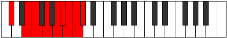 |
| [3931](https://ianring.com/musictheory/scales/3931) | [Aerygic](ModeDSharpAerygic.md) | D# | D#, E, F#, G, A, B, C, C#, D, D# |  |
| [3931](https://ianring.com/musictheory/scales/3931) | [Aerygic](ModeEFlatAerygic.md) | Eb | Eb, E, Gb, G, A, B, C, Db, D, Eb |  |
| [3931](https://ianring.com/musictheory/scales/3931) | [Aerygic](ModeGSharpAerygic.md) | G# | G#, A, B, C, D, E, F, F#, G, G# |  |
| [3931](https://ianring.com/musictheory/scales/3931) | [Aerygic](ModeAFlatAerygic.md) | Ab | Ab, A, B, C, D, E, F, Gb, G, Ab |  |
| [3931](https://ianring.com/musictheory/scales/3931) | [Aerygic](ModeCSharpAerygic.md) | C# | C#, D, E, F, G, A, A#, B, C, C# |  |
| [3931](https://ianring.com/musictheory/scales/3931) | [Aerygic](ModeDFlatAerygic.md) | Db | Db, D, E, F, G, A, Bb, B, C, Db |  |
| [3933](https://ianring.com/musictheory/scales/3933) | [Ionidygic](ModeCSharpIonidygic.md) | C# | C#, D#, E, F, G, A, A#, B, C, C# |  |
| [3933](https://ianring.com/musictheory/scales/3933) | [Ionidygic](ModeDFlatIonidygic.md) | Db | Db, Eb, E, F, G, A, Bb, B, C, Db |  |
| [3935](https://ianring.com/musictheory/scales/3935) | [Kataphyllian](ModeDSharpKataphyllian.md) | D# | D#, E, F, F#, G, A, B, C, C#, D, D# |  |
| [3935](https://ianring.com/musictheory/scales/3935) | [Kataphyllian](ModeEFlatKataphyllian.md) | Eb | Eb, E, F, Gb, G, A, B, C, Db, D, Eb |  |
| [3935](https://ianring.com/musictheory/scales/3935) | [Kataphyllian](ModeCSharpKataphyllian.md) | C# | C#, D, D#, E, F, G, A, A#, B, C, C# |  |
| [3935](https://ianring.com/musictheory/scales/3935) | [Kataphyllian](ModeDFlatKataphyllian.md) | Db | Db, D, Eb, E, F, G, A, Bb, B, C, Db |  |
| [3935](https://ianring.com/musictheory/scales/3935) | [Kataphyllian](ModeASharpKataphyllian.md) | A# | A#, B, C, C#, D, E, F#, G, G#, A, A# |  |
| [3935](https://ianring.com/musictheory/scales/3935) | [Kataphyllian](ModeBFlatKataphyllian.md) | Bb | Bb, B, C, Db, D, E, Gb, G, Ab, A, Bb |  |
| [3935](https://ianring.com/musictheory/scales/3935) | [Kataphyllian](ModeGSharpKataphyllian.md) | G# | G#, A, A#, B, C, D, E, F, F#, G, G# |  |
| [3935](https://ianring.com/musictheory/scales/3935) | [Kataphyllian](ModeAFlatKataphyllian.md) | Ab | Ab, A, Bb, B, C, D, E, F, Gb, G, Ab |  |
| [3939](https://ianring.com/musictheory/scales/3939) | [Dogyllic](ModeBNaturalDogyllic.md) | B | B, C, E, F, G, G#, A, A#, B |  |
| [3943](https://ianring.com/musictheory/scales/3943) | [Zynygic](ModeBNaturalZynygic.md) | B | B, C, C#, E, F, G, G#, A, A#, B |  |
| [3943](https://ianring.com/musictheory/scales/3943) | [Zynygic](ModeASharpZynygic.md) | A# | A#, B, C, D#, E, F#, G, G#, A, A# |  |
| [3943](https://ianring.com/musictheory/scales/3943) | [Zynygic](ModeBFlatZynygic.md) | Bb | Bb, B, C, Eb, E, Gb, G, Ab, A, Bb |  |
| [3945](https://ianring.com/musictheory/scales/3945) | [Lydyllic](ModeCSharpLydyllic.md) | C# | C#, E, F#, G, A, A#, B, C, C# |  |
| [3945](https://ianring.com/musictheory/scales/3945) | [Lydyllic](ModeDFlatLydyllic.md) | Db | Db, E, Gb, G, A, Bb, B, C, Db |  |
| [3947](https://ianring.com/musictheory/scales/3947) | [Ryptygic](ModeFSharpRyptygic.md) | F# | F#, G, A, B, C, D, D#, E, F, F# |  |
| [3947](https://ianring.com/musictheory/scales/3947) | [Ryptygic](ModeGFlatRyptygic.md) | Gb | Gb, G, A, B, C, D, Eb, E, F, Gb |  |
| [3947](https://ianring.com/musictheory/scales/3947) | [Ryptygic](ModeCSharpRyptygic.md) | C# | C#, D, E, F#, G, A, A#, B, C, C# |  |
| [3947](https://ianring.com/musictheory/scales/3947) | [Ryptygic](ModeDFlatRyptygic.md) | Db | Db, D, E, Gb, G, A, Bb, B, C, Db |  |
| [3947](https://ianring.com/musictheory/scales/3947) | [Ryptygic](ModeBNaturalRyptygic.md) | B | B, C, D, E, F, G, G#, A, A#, B |  |
| [3949](https://ianring.com/musictheory/scales/3949) | [Koptygic](ModeCSharpKoptygic.md) | C# | C#, D#, E, F#, G, A, A#, B, C, C# |  |
| [3949](https://ianring.com/musictheory/scales/3949) | [Koptygic](ModeDFlatKoptygic.md) | Db | Db, Eb, E, Gb, G, A, Bb, B, C, Db |  |
| [3951](https://ianring.com/musictheory/scales/3951) | [Mathyllian](ModeFSharpMathyllian.md) | F# | F#, G, G#, A, B, C, D, D#, E, F, F# |  |
| [3951](https://ianring.com/musictheory/scales/3951) | [Mathyllian](ModeGFlatMathyllian.md) | Gb | Gb, G, Ab, A, B, C, D, Eb, E, F, Gb |  |
| [3951](https://ianring.com/musictheory/scales/3951) | [Mathyllian](ModeCSharpMathyllian.md) | C# | C#, D, D#, E, F#, G, A, A#, B, C, C# |  |
| [3951](https://ianring.com/musictheory/scales/3951) | [Mathyllian](ModeDFlatMathyllian.md) | Db | Db, D, Eb, E, Gb, G, A, Bb, B, C, Db |  |
| [3951](https://ianring.com/musictheory/scales/3951) | [Mathyllian](ModeBNaturalMathyllian.md) | B | B, C, C#, D, E, F, G, G#, A, A#, B |  |
| [3951](https://ianring.com/musictheory/scales/3951) | [Mathyllian](ModeASharpMathyllian.md) | A# | A#, B, C, C#, D#, E, F#, G, G#, A, A# |  |
| [3951](https://ianring.com/musictheory/scales/3951) | [Mathyllian](ModeBFlatMathyllian.md) | Bb | Bb, B, C, Db, Eb, E, Gb, G, Ab, A, Bb |  |
| [3955](https://ianring.com/musictheory/scales/3955) | [Galygic](ModeDSharpGalygic.md) | D# | D#, E, G, G#, A, B, C, C#, D, D# |  |
| [3955](https://ianring.com/musictheory/scales/3955) | [Galygic](ModeEFlatGalygic.md) | Eb | Eb, E, G, Ab, A, B, C, Db, D, Eb |  |
| [3955](https://ianring.com/musictheory/scales/3955) | [Galygic](ModeBNaturalGalygic.md) | B | B, C, D#, E, F, G, G#, A, A#, B |  |
| [3957](https://ianring.com/musictheory/scales/3957) | [Porygic](ModeGNaturalPorygic.md) | G | G, A, B, C, C#, D#, E, F, F#, G |  |
| [3959](https://ianring.com/musictheory/scales/3959) | [Katagyllian](ModeDSharpKatagyllian.md) | D# | D#, E, F, G, G#, A, B, C, C#, D, D# |  |
| [3959](https://ianring.com/musictheory/scales/3959) | [Katagyllian](ModeEFlatKatagyllian.md) | Eb | Eb, E, F, G, Ab, A, B, C, Db, D, Eb |  |
| [3959](https://ianring.com/musictheory/scales/3959) | [Katagyllian](ModeGNaturalKatagyllian.md) | G | G, G#, A, B, C, C#, D#, E, F, F#, G |  |
| [3959](https://ianring.com/musictheory/scales/3959) | [Katagyllian](ModeBNaturalKatagyllian.md) | B | B, C, C#, D#, E, F, G, G#, A, A#, B |  |
| [3959](https://ianring.com/musictheory/scales/3959) | [Katagyllian](ModeASharpKatagyllian.md) | A# | A#, B, C, D, D#, E, F#, G, G#, A, A# |  |
| [3959](https://ianring.com/musictheory/scales/3959) | [Katagyllian](ModeBFlatKatagyllian.md) | Bb | Bb, B, C, D, Eb, E, Gb, G, Ab, A, Bb | 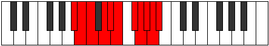 |
| [3961](https://ianring.com/musictheory/scales/3961) | [Mixolydygic](ModeCSharpMixolydygic.md) | C# | C#, E, F, F#, G, A, A#, B, C, C# |  |
| [3961](https://ianring.com/musictheory/scales/3961) | [Mixolydygic](ModeDFlatMixolydygic.md) | Db | Db, E, F, Gb, G, A, Bb, B, C, Db |  |
| [3963](https://ianring.com/musictheory/scales/3963) | [Aeoryllian](ModeDSharpAeoryllian.md) | D# | D#, E, F#, G, G#, A, B, C, C#, D, D# |  |
| [3963](https://ianring.com/musictheory/scales/3963) | [Aeoryllian](ModeEFlatAeoryllian.md) | Eb | Eb, E, Gb, G, Ab, A, B, C, Db, D, Eb |  |
| [3963](https://ianring.com/musictheory/scales/3963) | [Aeoryllian](ModeGSharpAeoryllian.md) | G# | G#, A, B, C, C#, D, E, F, F#, G, G# |  |
| [3963](https://ianring.com/musictheory/scales/3963) | [Aeoryllian](ModeAFlatAeoryllian.md) | Ab | Ab, A, B, C, Db, D, E, F, Gb, G, Ab |  |
| [3963](https://ianring.com/musictheory/scales/3963) | [Aeoryllian](ModeCSharpAeoryllian.md) | C# | C#, D, E, F, F#, G, A, A#, B, C, C# |  |
| [3963](https://ianring.com/musictheory/scales/3963) | [Aeoryllian](ModeDFlatAeoryllian.md) | Db | Db, D, E, F, Gb, G, A, Bb, B, C, Db |  |
| [3963](https://ianring.com/musictheory/scales/3963) | [Aeoryllian](ModeFSharpAeoryllian.md) | F# | F#, G, A, A#, B, C, D, D#, E, F, F# |  |
| [3963](https://ianring.com/musictheory/scales/3963) | [Aeoryllian](ModeGFlatAeoryllian.md) | Gb | Gb, G, A, Bb, B, C, D, Eb, E, F, Gb |  |
| [3963](https://ianring.com/musictheory/scales/3963) | [Aeoryllian](ModeBNaturalAeoryllian.md) | B | B, C, D, D#, E, F, G, G#, A, A#, B |  |
| [3965](https://ianring.com/musictheory/scales/3965) | [Thydyllian](ModeCSharpThydyllian.md) | C# | C#, D#, E, F, F#, G, A, A#, B, C, C# |  |
| [3965](https://ianring.com/musictheory/scales/3965) | [Thydyllian](ModeDFlatThydyllian.md) | Db | Db, Eb, E, F, Gb, G, A, Bb, B, C, Db |  |
| [3965](https://ianring.com/musictheory/scales/3965) | [Thydyllian](ModeGNaturalThydyllian.md) | G | G, A, A#, B, C, C#, D#, E, F, F#, G |  |
| [3967](https://ianring.com/musictheory/scales/3967) | [Soratic](ModeDSharpSoratic.md) | D# | D#, E, F, F#, G, G#, A, B, C, C#, D, D# |  |
| [3967](https://ianring.com/musictheory/scales/3967) | [Soratic](ModeEFlatSoratic.md) | Eb | Eb, E, F, Gb, G, Ab, A, B, C, Db, D, Eb |  |
| [3967](https://ianring.com/musictheory/scales/3967) | [Soratic](ModeCSharpSoratic.md) | C# | C#, D, D#, E, F, F#, G, A, A#, B, C, C# |  |
| [3967](https://ianring.com/musictheory/scales/3967) | [Soratic](ModeDFlatSoratic.md) | Db | Db, D, Eb, E, F, Gb, G, A, Bb, B, C, Db |  |
| [3967](https://ianring.com/musictheory/scales/3967) | [Soratic](ModeBNaturalSoratic.md) | B | B, C, C#, D, D#, E, F, G, G#, A, A#, B |  |
| [3967](https://ianring.com/musictheory/scales/3967) | [Soratic](ModeASharpSoratic.md) | A# | A#, B, C, C#, D, D#, E, F#, G, G#, A, A# |  |
| [3967](https://ianring.com/musictheory/scales/3967) | [Soratic](ModeBFlatSoratic.md) | Bb | Bb, B, C, Db, D, Eb, E, Gb, G, Ab, A, Bb |  |
| [3967](https://ianring.com/musictheory/scales/3967) | [Soratic](ModeGSharpSoratic.md) | G# | G#, A, A#, B, C, C#, D, E, F, F#, G, G# |  |
| [3967](https://ianring.com/musictheory/scales/3967) | [Soratic](ModeAFlatSoratic.md) | Ab | Ab, A, Bb, B, C, Db, D, E, F, Gb, G, Ab |  |
| [3967](https://ianring.com/musictheory/scales/3967) | [Soratic](ModeGNaturalSoratic.md) | G | G, G#, A, A#, B, C, C#, D#, E, F, F#, G |  |
| [3967](https://ianring.com/musictheory/scales/3967) | [Soratic](ModeFSharpSoratic.md) | F# | F#, G, G#, A, A#, B, C, D, D#, E, F, F# |  |
| [3967](https://ianring.com/musictheory/scales/3967) | [Soratic](ModeGFlatSoratic.md) | Gb | Gb, G, Ab, A, Bb, B, C, D, Eb, E, F, Gb |  |
| [3981](https://ianring.com/musictheory/scales/3981) | [Phrycryllic](ModeANaturalPhrycryllic.md) | A | A, B, C, E, F, F#, G, G#, A |  |
| [3983](https://ianring.com/musictheory/scales/3983) | [Thyptygic](ModeANaturalThyptygic.md) | A | A, A#, B, C, E, F, F#, G, G#, A |  |
| [3985](https://ianring.com/musictheory/scales/3985) | [Thadian](ModeCNaturalThadian.md) | C | C, D##, E###, F###, G##, A#, B, C |  |
| [3987](https://ianring.com/musictheory/scales/3987) | [Loryllic](ModeCNaturalLoryllic.md) | C | C, C#, E, G, G#, A, A#, B, C |  |
| [3989](https://ianring.com/musictheory/scales/3989) | [Sythyllic](ModeCNaturalSythyllic.md) | C | C, D, E, G, G#, A, A#, B, C |  |
| [3991](https://ianring.com/musictheory/scales/3991) | [Badygic](ModeCNaturalBadygic.md) | C | C, C#, D, E, G, G#, A, A#, B, C |  |
| [3993](https://ianring.com/musictheory/scales/3993) | [Ioniptyllic](ModeCNaturalIoniptyllic.md) | C | C, D#, E, G, G#, A, A#, B, C | 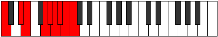 |
| [3995](https://ianring.com/musictheory/scales/3995) | [Ionygic](ModeGSharpIonygic.md) | G# | G#, A, B, C, D#, E, F, F#, G, G# |  |
| [3995](https://ianring.com/musictheory/scales/3995) | [Ionygic](ModeAFlatIonygic.md) | Ab | Ab, A, B, C, Eb, E, F, Gb, G, Ab |  |
| [3995](https://ianring.com/musictheory/scales/3995) | [Ionygic](ModeCNaturalIonygic.md) | C | C, C#, D#, E, G, G#, A, A#, B, C |  |
| [3997](https://ianring.com/musictheory/scales/3997) | [Dogygic](ModeANaturalDogygic.md) | A | A, B, C, C#, E, F, F#, G, G#, A |  |
| [3997](https://ianring.com/musictheory/scales/3997) | [Dogygic](ModeCNaturalDogygic.md) | C | C, D, D#, E, G, G#, A, A#, B, C |  |
| [3999](https://ianring.com/musictheory/scales/3999) | [Dydyllian](ModeCNaturalDydyllian.md) | C | C, C#, D, D#, E, G, G#, A, A#, B, C |  |
| [3999](https://ianring.com/musictheory/scales/3999) | [Dydyllian](ModeANaturalDydyllian.md) | A | A, A#, B, C, C#, E, F, F#, G, G#, A |  |
| [3999](https://ianring.com/musictheory/scales/3999) | [Dydyllian](ModeGSharpDydyllian.md) | G# | G#, A, A#, B, C, D#, E, F, F#, G, G# |  |
| [3999](https://ianring.com/musictheory/scales/3999) | [Dydyllian](ModeAFlatDydyllian.md) | Ab | Ab, A, Bb, B, C, Eb, E, F, Gb, G, Ab |  |
| [4003](https://ianring.com/musictheory/scales/4003) | [Sadyllic](ModeBNaturalSadyllic.md) | B | B, C, E, F#, G, G#, A, A#, B | 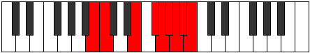 |
| [4005](https://ianring.com/musictheory/scales/4005) | [Phradyllic](ModeDNaturalPhradyllic.md) | D | D, E, G, A, A#, B, C, C#, D |  |
| [4007](https://ianring.com/musictheory/scales/4007) | [Doptygic](ModeDNaturalDoptygic.md) | D | D, D#, E, G, A, A#, B, C, C#, D |  |
| [4007](https://ianring.com/musictheory/scales/4007) | [Doptygic](ModeBNaturalDoptygic.md) | B | B, C, C#, E, F#, G, G#, A, A#, B |  |
| [4009](https://ianring.com/musictheory/scales/4009) | [Phranyllic](ModeENaturalPhranyllic.md) | E | E, G, A, B, C, C#, D, D#, E |  |
| [4011](https://ianring.com/musictheory/scales/4011) | [Styrygic](ModeENaturalStyrygic.md) | E | E, F, G, A, B, C, C#, D, D#, E |  |
| [4011](https://ianring.com/musictheory/scales/4011) | [Styrygic](ModeBNaturalStyrygic.md) | B | B, C, D, E, F#, G, G#, A, A#, B |  |
| [4013](https://ianring.com/musictheory/scales/4013) | [Dathygic](ModeENaturalDathygic.md) | E | E, F#, G, A, B, C, C#, D, D#, E |  |
| [4013](https://ianring.com/musictheory/scales/4013) | [Dathygic](ModeANaturalDathygic.md) | A | A, B, C, D, E, F, F#, G, G#, A |  |
| [4013](https://ianring.com/musictheory/scales/4013) | [Dathygic](ModeDNaturalDathygic.md) | D | D, E, F, G, A, A#, B, C, C#, D |  |
| [4015](https://ianring.com/musictheory/scales/4015) | [Phradyllian](ModeENaturalPhradyllian.md) | E | E, F, F#, G, A, B, C, C#, D, D#, E |  |
| [4015](https://ianring.com/musictheory/scales/4015) | [Phradyllian](ModeDNaturalPhradyllian.md) | D | D, D#, E, F, G, A, A#, B, C, C#, D |  |
| [4015](https://ianring.com/musictheory/scales/4015) | [Phradyllian](ModeBNaturalPhradyllian.md) | B | B, C, C#, D, E, F#, G, G#, A, A#, B |  |
| [4015](https://ianring.com/musictheory/scales/4015) | [Phradyllian](ModeANaturalPhradyllian.md) | A | A, A#, B, C, D, E, F, F#, G, G#, A |  |
| [4017](https://ianring.com/musictheory/scales/4017) | [Dolyllic](ModeCNaturalDolyllic.md) | C | C, E, F, G, G#, A, A#, B, C |  |
| [4019](https://ianring.com/musictheory/scales/4019) | [Lonygic](ModeCNaturalLonygic.md) | C | C, C#, E, F, G, G#, A, A#, B, C |  |
| [4019](https://ianring.com/musictheory/scales/4019) | [Lonygic](ModeBNaturalLonygic.md) | B | B, C, D#, E, F#, G, G#, A, A#, B |  |
| [4021](https://ianring.com/musictheory/scales/4021) | [Bagygic](ModeGNaturalBagygic.md) | G | G, A, B, C, D, D#, E, F, F#, G |  |
| [4021](https://ianring.com/musictheory/scales/4021) | [Bagygic](ModeDNaturalBagygic.md) | D | D, E, F#, G, A, A#, B, C, C#, D |  |
| [4021](https://ianring.com/musictheory/scales/4021) | [Bagygic](ModeCNaturalBagygic.md) | C | C, D, E, F, G, G#, A, A#, B, C |  |
| [4023](https://ianring.com/musictheory/scales/4023) | [Styptyllian](ModeGNaturalStyptyllian.md) | G | G, G#, A, B, C, D, D#, E, F, F#, G |  |
| [4023](https://ianring.com/musictheory/scales/4023) | [Styptyllian](ModeDNaturalStyptyllian.md) | D | D, D#, E, F#, G, A, A#, B, C, C#, D |  |
| [4023](https://ianring.com/musictheory/scales/4023) | [Styptyllian](ModeCNaturalStyptyllian.md) | C | C, C#, D, E, F, G, G#, A, A#, B, C |  |
| [4023](https://ianring.com/musictheory/scales/4023) | [Styptyllian](ModeBNaturalStyptyllian.md) | B | B, C, C#, D#, E, F#, G, G#, A, A#, B |  |
| [4025](https://ianring.com/musictheory/scales/4025) | [Kalygic](ModeENaturalKalygic.md) | E | E, G, G#, A, B, C, C#, D, D#, E |  |
| [4025](https://ianring.com/musictheory/scales/4025) | [Kalygic](ModeCNaturalKalygic.md) | C | C, D#, E, F, G, G#, A, A#, B, C |  |
| [4027](https://ianring.com/musictheory/scales/4027) | [Ragyllian](ModeENaturalRagyllian.md) | E | E, F, G, G#, A, B, C, C#, D, D#, E |  |
| [4027](https://ianring.com/musictheory/scales/4027) | [Ragyllian](ModeGSharpRagyllian.md) | G# | G#, A, B, C, C#, D#, E, F, F#, G, G# |  |
| [4027](https://ianring.com/musictheory/scales/4027) | [Ragyllian](ModeAFlatRagyllian.md) | Ab | Ab, A, B, C, Db, Eb, E, F, Gb, G, Ab |  |
| [4027](https://ianring.com/musictheory/scales/4027) | [Ragyllian](ModeCNaturalRagyllian.md) | C | C, C#, D#, E, F, G, G#, A, A#, B, C |  |
| [4027](https://ianring.com/musictheory/scales/4027) | [Ragyllian](ModeBNaturalRagyllian.md) | B | B, C, D, D#, E, F#, G, G#, A, A#, B |  |
| [4029](https://ianring.com/musictheory/scales/4029) | [Aerycryllian](ModeENaturalAerycryllian.md) | E | E, F#, G, G#, A, B, C, C#, D, D#, E |  |
| [4029](https://ianring.com/musictheory/scales/4029) | [Aerycryllian](ModeANaturalAerycryllian.md) | A | A, B, C, C#, D, E, F, F#, G, G#, A |  |
| [4029](https://ianring.com/musictheory/scales/4029) | [Aerycryllian](ModeDNaturalAerycryllian.md) | D | D, E, F, F#, G, A, A#, B, C, C#, D |  |
| [4029](https://ianring.com/musictheory/scales/4029) | [Aerycryllian](ModeGNaturalAerycryllian.md) | G | G, A, A#, B, C, D, D#, E, F, F#, G |  |
| [4029](https://ianring.com/musictheory/scales/4029) | [Aerycryllian](ModeCNaturalAerycryllian.md) | C | C, D, D#, E, F, G, G#, A, A#, B, C |  |
| [4031](https://ianring.com/musictheory/scales/4031) | [Godatic](ModeENaturalGodatic.md) | E | E, F, F#, G, G#, A, B, C, C#, D, D#, E |  |
| [4031](https://ianring.com/musictheory/scales/4031) | [Godatic](ModeDNaturalGodatic.md) | D | D, D#, E, F, F#, G, A, A#, B, C, C#, D |  |
| [4031](https://ianring.com/musictheory/scales/4031) | [Godatic](ModeCNaturalGodatic.md) | C | C, C#, D, D#, E, F, G, G#, A, A#, B, C |  |
| [4031](https://ianring.com/musictheory/scales/4031) | [Godatic](ModeBNaturalGodatic.md) | B | B, C, C#, D, D#, E, F#, G, G#, A, A#, B |  |
| [4031](https://ianring.com/musictheory/scales/4031) | [Godatic](ModeANaturalGodatic.md) | A | A, A#, B, C, C#, D, E, F, F#, G, G#, A |  |
| [4031](https://ianring.com/musictheory/scales/4031) | [Godatic](ModeGSharpGodatic.md) | G# | G#, A, A#, B, C, C#, D#, E, F, F#, G, G# |  |
| [4031](https://ianring.com/musictheory/scales/4031) | [Godatic](ModeAFlatGodatic.md) | Ab | Ab, A, Bb, B, C, Db, Eb, E, F, Gb, G, Ab |  |
| [4031](https://ianring.com/musictheory/scales/4031) | [Godatic](ModeGNaturalGodatic.md) | G | G, G#, A, A#, B, C, D, D#, E, F, F#, G |  |
| [4039](https://ianring.com/musictheory/scales/4039) | [Ionogygic](ModeASharpIonogygic.md) | A# | A#, B, C, E, F, F#, G, G#, A, A# |  |
| [4039](https://ianring.com/musictheory/scales/4039) | [Ionogygic](ModeBFlatIonogygic.md) | Bb | Bb, B, C, E, F, Gb, G, Ab, A, Bb |  |
| [4041](https://ianring.com/musictheory/scales/4041) | [Zaryllic](ModeCSharpZaryllic.md) | C# | C#, E, G, G#, A, A#, B, C, C# |  |
| [4041](https://ianring.com/musictheory/scales/4041) | [Zaryllic](ModeDFlatZaryllic.md) | Db | Db, E, G, Ab, A, Bb, B, C, Db |  |
| [4043](https://ianring.com/musictheory/scales/4043) | [Phrocrygic](ModeCSharpPhrocrygic.md) | C# | C#, D, E, G, G#, A, A#, B, C, C# |  |
| [4043](https://ianring.com/musictheory/scales/4043) | [Phrocrygic](ModeDFlatPhrocrygic.md) | Db | Db, D, E, G, Ab, A, Bb, B, C, Db |  |
| [4045](https://ianring.com/musictheory/scales/4045) | [Gyptygic](ModeANaturalGyptygic.md) | A | A, B, C, D#, E, F, F#, G, G#, A |  |
| [4045](https://ianring.com/musictheory/scales/4045) | [Gyptygic](ModeCSharpGyptygic.md) | C# | C#, D#, E, G, G#, A, A#, B, C, C# |  |
| [4045](https://ianring.com/musictheory/scales/4045) | [Gyptygic](ModeDFlatGyptygic.md) | Db | Db, Eb, E, G, Ab, A, Bb, B, C, Db |  |
| [4047](https://ianring.com/musictheory/scales/4047) | [Thogyllian](ModeCSharpThogyllian.md) | C# | C#, D, D#, E, G, G#, A, A#, B, C, C# |  |
| [4047](https://ianring.com/musictheory/scales/4047) | [Thogyllian](ModeDFlatThogyllian.md) | Db | Db, D, Eb, E, G, Ab, A, Bb, B, C, Db |  |
| [4047](https://ianring.com/musictheory/scales/4047) | [Thogyllian](ModeASharpThogyllian.md) | A# | A#, B, C, C#, E, F, F#, G, G#, A, A# |  |
| [4047](https://ianring.com/musictheory/scales/4047) | [Thogyllian](ModeBFlatThogyllian.md) | Bb | Bb, B, C, Db, E, F, Gb, G, Ab, A, Bb |  |
| [4047](https://ianring.com/musictheory/scales/4047) | [Thogyllian](ModeANaturalThogyllian.md) | A | A, A#, B, C, D#, E, F, F#, G, G#, A |  |
| [4049](https://ianring.com/musictheory/scales/4049) | [Stycryllic](ModeCNaturalStycryllic.md) | C | C, E, F#, G, G#, A, A#, B, C |  |
| [4051](https://ianring.com/musictheory/scales/4051) | [Ionilygic](ModeDSharpIonilygic.md) | D# | D#, E, G, A, A#, B, C, C#, D, D# |  |
| [4051](https://ianring.com/musictheory/scales/4051) | [Ionilygic](ModeEFlatIonilygic.md) | Eb | Eb, E, G, A, Bb, B, C, Db, D, Eb |  |
| [4051](https://ianring.com/musictheory/scales/4051) | [Ionilygic](ModeCNaturalIonilygic.md) | C | C, C#, E, F#, G, G#, A, A#, B, C |  |
| [4053](https://ianring.com/musictheory/scales/4053) | [Kyrygic](ModeFNaturalKyrygic.md) | F | F, G, A, B, C, C#, D, D#, E, F |  |
| [4053](https://ianring.com/musictheory/scales/4053) | [Kyrygic](ModeCNaturalKyrygic.md) | C | C, D, E, F#, G, G#, A, A#, B, C |  |
| [4055](https://ianring.com/musictheory/scales/4055) | [Dagyllian](ModeFNaturalDagyllian.md) | F | F, F#, G, A, B, C, C#, D, D#, E, F |  |
| [4055](https://ianring.com/musictheory/scales/4055) | [Dagyllian](ModeDSharpDagyllian.md) | D# | D#, E, F, G, A, A#, B, C, C#, D, D# |  |
| [4055](https://ianring.com/musictheory/scales/4055) | [Dagyllian](ModeEFlatDagyllian.md) | Eb | Eb, E, F, G, A, Bb, B, C, Db, D, Eb |  |
| [4055](https://ianring.com/musictheory/scales/4055) | [Dagyllian](ModeCNaturalDagyllian.md) | C | C, C#, D, E, F#, G, G#, A, A#, B, C |  |
| [4055](https://ianring.com/musictheory/scales/4055) | [Dagyllian](ModeASharpDagyllian.md) | A# | A#, B, C, D, E, F, F#, G, G#, A, A# |  |
| [4055](https://ianring.com/musictheory/scales/4055) | [Dagyllian](ModeBFlatDagyllian.md) | Bb | Bb, B, C, D, E, F, Gb, G, Ab, A, Bb |  |
| [4057](https://ianring.com/musictheory/scales/4057) | [Phrygic](ModeCSharpPhrygic.md) | C# | C#, E, F, G, G#, A, A#, B, C, C# |  |
| [4057](https://ianring.com/musictheory/scales/4057) | [Phrygic](ModeDFlatPhrygic.md) | Db | Db, E, F, G, Ab, A, Bb, B, C, Db |  |
| [4057](https://ianring.com/musictheory/scales/4057) | [Phrygic](ModeCNaturalPhrygic.md) | C | C, D#, E, F#, G, G#, A, A#, B, C |  |
| [4059](https://ianring.com/musictheory/scales/4059) | [Zolyllian](ModeGSharpZolyllian.md) | G# | G#, A, B, C, D, D#, E, F, F#, G, G# |  |
| [4059](https://ianring.com/musictheory/scales/4059) | [Zolyllian](ModeAFlatZolyllian.md) | Ab | Ab, A, B, C, D, Eb, E, F, Gb, G, Ab |  |
| [4059](https://ianring.com/musictheory/scales/4059) | [Zolyllian](ModeDSharpZolyllian.md) | D# | D#, E, F#, G, A, A#, B, C, C#, D, D# |  |
| [4059](https://ianring.com/musictheory/scales/4059) | [Zolyllian](ModeEFlatZolyllian.md) | Eb | Eb, E, Gb, G, A, Bb, B, C, Db, D, Eb |  |
| [4059](https://ianring.com/musictheory/scales/4059) | [Zolyllian](ModeCSharpZolyllian.md) | C# | C#, D, E, F, G, G#, A, A#, B, C, C# |  |
| [4059](https://ianring.com/musictheory/scales/4059) | [Zolyllian](ModeDFlatZolyllian.md) | Db | Db, D, E, F, G, Ab, A, Bb, B, C, Db |  |
| [4059](https://ianring.com/musictheory/scales/4059) | [Zolyllian](ModeCNaturalZolyllian.md) | C | C, C#, D#, E, F#, G, G#, A, A#, B, C |  |
| [4061](https://ianring.com/musictheory/scales/4061) | [Staptyllian](ModeFNaturalStaptyllian.md) | F | F, G, G#, A, B, C, C#, D, D#, E, F |  |
| [4061](https://ianring.com/musictheory/scales/4061) | [Staptyllian](ModeANaturalStaptyllian.md) | A | A, B, C, C#, D#, E, F, F#, G, G#, A |  |
| [4061](https://ianring.com/musictheory/scales/4061) | [Staptyllian](ModeCSharpStaptyllian.md) | C# | C#, D#, E, F, G, G#, A, A#, B, C, C# |  |
| [4061](https://ianring.com/musictheory/scales/4061) | [Staptyllian](ModeDFlatStaptyllian.md) | Db | Db, Eb, E, F, G, Ab, A, Bb, B, C, Db |  |
| [4061](https://ianring.com/musictheory/scales/4061) | [Staptyllian](ModeCNaturalStaptyllian.md) | C | C, D, D#, E, F#, G, G#, A, A#, B, C |  |
| [4063](https://ianring.com/musictheory/scales/4063) | [Eptatic](ModeFNaturalEptatic.md) | F | F, F#, G, G#, A, B, C, C#, D, D#, E, F |  |
| [4063](https://ianring.com/musictheory/scales/4063) | [Eptatic](ModeDSharpEptatic.md) | D# | D#, E, F, F#, G, A, A#, B, C, C#, D, D# |  |
| [4063](https://ianring.com/musictheory/scales/4063) | [Eptatic](ModeEFlatEptatic.md) | Eb | Eb, E, F, Gb, G, A, Bb, B, C, Db, D, Eb |  |
| [4063](https://ianring.com/musictheory/scales/4063) | [Eptatic](ModeCSharpEptatic.md) | C# | C#, D, D#, E, F, G, G#, A, A#, B, C, C# |  |
| [4063](https://ianring.com/musictheory/scales/4063) | [Eptatic](ModeDFlatEptatic.md) | Db | Db, D, Eb, E, F, G, Ab, A, Bb, B, C, Db |  |
| [4063](https://ianring.com/musictheory/scales/4063) | [Eptatic](ModeCNaturalEptatic.md) | C | C, C#, D, D#, E, F#, G, G#, A, A#, B, C |  |
| [4063](https://ianring.com/musictheory/scales/4063) | [Eptatic](ModeASharpEptatic.md) | A# | A#, B, C, C#, D, E, F, F#, G, G#, A, A# |  |
| [4063](https://ianring.com/musictheory/scales/4063) | [Eptatic](ModeBFlatEptatic.md) | Bb | Bb, B, C, Db, D, E, F, Gb, G, Ab, A, Bb |  |
| [4063](https://ianring.com/musictheory/scales/4063) | [Eptatic](ModeANaturalEptatic.md) | A | A, A#, B, C, C#, D#, E, F, F#, G, G#, A |  |
| [4063](https://ianring.com/musictheory/scales/4063) | [Eptatic](ModeGSharpEptatic.md) | G# | G#, A, A#, B, C, D, D#, E, F, F#, G, G# |  |
| [4063](https://ianring.com/musictheory/scales/4063) | [Eptatic](ModeAFlatEptatic.md) | Ab | Ab, A, Bb, B, C, D, Eb, E, F, Gb, G, Ab |  |
| [4067](https://ianring.com/musictheory/scales/4067) | [Aeolarygic](ModeBNaturalAeolarygic.md) | B | B, C, E, F, F#, G, G#, A, A#, B |  |
| [4069](https://ianring.com/musictheory/scales/4069) | [Starygic](ModeDNaturalStarygic.md) | D | D, E, G, G#, A, A#, B, C, C#, D |  |
| [4071](https://ianring.com/musictheory/scales/4071) | [Rygyllian](ModeDNaturalRygyllian.md) | D | D, D#, E, G, G#, A, A#, B, C, C#, D |  |
| [4071](https://ianring.com/musictheory/scales/4071) | [Rygyllian](ModeBNaturalRygyllian.md) | B | B, C, C#, E, F, F#, G, G#, A, A#, B |  |
| [4071](https://ianring.com/musictheory/scales/4071) | [Rygyllian](ModeASharpRygyllian.md) | A# | A#, B, C, D#, E, F, F#, G, G#, A, A# |  |
| [4071](https://ianring.com/musictheory/scales/4071) | [Rygyllian](ModeBFlatRygyllian.md) | Bb | Bb, B, C, Eb, E, F, Gb, G, Ab, A, Bb |  |
| [4073](https://ianring.com/musictheory/scales/4073) | [Sathygic](ModeENaturalSathygic.md) | E | E, G, A, A#, B, C, C#, D, D#, E |  |
| [4073](https://ianring.com/musictheory/scales/4073) | [Sathygic](ModeCSharpSathygic.md) | C# | C#, E, F#, G, G#, A, A#, B, C, C# |  |
| [4073](https://ianring.com/musictheory/scales/4073) | [Sathygic](ModeDFlatSathygic.md) | Db | Db, E, Gb, G, Ab, A, Bb, B, C, Db |  |
| [4075](https://ianring.com/musictheory/scales/4075) | [Katyllian](ModeFSharpKatyllian.md) | F# | F#, G, A, B, C, C#, D, D#, E, F, F# |  |
| [4075](https://ianring.com/musictheory/scales/4075) | [Katyllian](ModeGFlatKatyllian.md) | Gb | Gb, G, A, B, C, Db, D, Eb, E, F, Gb |  |
| [4075](https://ianring.com/musictheory/scales/4075) | [Katyllian](ModeENaturalKatyllian.md) | E | E, F, G, A, A#, B, C, C#, D, D#, E |  |
| [4075](https://ianring.com/musictheory/scales/4075) | [Katyllian](ModeCSharpKatyllian.md) | C# | C#, D, E, F#, G, G#, A, A#, B, C, C# |  |
| [4075](https://ianring.com/musictheory/scales/4075) | [Katyllian](ModeDFlatKatyllian.md) | Db | Db, D, E, Gb, G, Ab, A, Bb, B, C, Db |  |
| [4075](https://ianring.com/musictheory/scales/4075) | [Katyllian](ModeBNaturalKatyllian.md) | B | B, C, D, E, F, F#, G, G#, A, A#, B |  |
| [4077](https://ianring.com/musictheory/scales/4077) | [Gothyllian](ModeANaturalGothyllian.md) | A | A, B, C, D, D#, E, F, F#, G, G#, A |  |
| [4077](https://ianring.com/musictheory/scales/4077) | [Gothyllian](ModeENaturalGothyllian.md) | E | E, F#, G, A, A#, B, C, C#, D, D#, E |  |
| [4077](https://ianring.com/musictheory/scales/4077) | [Gothyllian](ModeDNaturalGothyllian.md) | D | D, E, F, G, G#, A, A#, B, C, C#, D |  |
| [4077](https://ianring.com/musictheory/scales/4077) | [Gothyllian](ModeCSharpGothyllian.md) | C# | C#, D#, E, F#, G, G#, A, A#, B, C, C# |  |
| [4077](https://ianring.com/musictheory/scales/4077) | [Gothyllian](ModeDFlatGothyllian.md) | Db | Db, Eb, E, Gb, G, Ab, A, Bb, B, C, Db |  |
| [4079](https://ianring.com/musictheory/scales/4079) | [Ionatic](ModeFSharpIonatic.md) | F# | F#, G, G#, A, B, C, C#, D, D#, E, F, F# |  |
| [4079](https://ianring.com/musictheory/scales/4079) | [Ionatic](ModeGFlatIonatic.md) | Gb | Gb, G, Ab, A, B, C, Db, D, Eb, E, F, Gb |  |
| [4079](https://ianring.com/musictheory/scales/4079) | [Ionatic](ModeENaturalIonatic.md) | E | E, F, F#, G, A, A#, B, C, C#, D, D#, E |  |
| [4079](https://ianring.com/musictheory/scales/4079) | [Ionatic](ModeDNaturalIonatic.md) | D | D, D#, E, F, G, G#, A, A#, B, C, C#, D |  |
| [4079](https://ianring.com/musictheory/scales/4079) | [Ionatic](ModeCSharpIonatic.md) | C# | C#, D, D#, E, F#, G, G#, A, A#, B, C, C# |  |
| [4079](https://ianring.com/musictheory/scales/4079) | [Ionatic](ModeDFlatIonatic.md) | Db | Db, D, Eb, E, Gb, G, Ab, A, Bb, B, C, Db |  |
| [4079](https://ianring.com/musictheory/scales/4079) | [Ionatic](ModeBNaturalIonatic.md) | B | B, C, C#, D, E, F, F#, G, G#, A, A#, B |  |
| [4079](https://ianring.com/musictheory/scales/4079) | [Ionatic](ModeASharpIonatic.md) | A# | A#, B, C, C#, D#, E, F, F#, G, G#, A, A# |  |
| [4079](https://ianring.com/musictheory/scales/4079) | [Ionatic](ModeBFlatIonatic.md) | Bb | Bb, B, C, Db, Eb, E, F, Gb, G, Ab, A, Bb |  |
| [4079](https://ianring.com/musictheory/scales/4079) | [Ionatic](ModeANaturalIonatic.md) | A | A, A#, B, C, D, D#, E, F, F#, G, G#, A |  |
| [4081](https://ianring.com/musictheory/scales/4081) | [Manygic](ModeCNaturalManygic.md) | C | C, E, F, F#, G, G#, A, A#, B, C |  |
| [4083](https://ianring.com/musictheory/scales/4083) | [Bathyllian](ModeDSharpBathyllian.md) | D# | D#, E, G, G#, A, A#, B, C, C#, D, D# |  |
| [4083](https://ianring.com/musictheory/scales/4083) | [Bathyllian](ModeEFlatBathyllian.md) | Eb | Eb, E, G, Ab, A, Bb, B, C, Db, D, Eb |  |
| [4083](https://ianring.com/musictheory/scales/4083) | [Bathyllian](ModeCNaturalBathyllian.md) | C | C, C#, E, F, F#, G, G#, A, A#, B, C |  |
| [4083](https://ianring.com/musictheory/scales/4083) | [Bathyllian](ModeBNaturalBathyllian.md) | B | B, C, D#, E, F, F#, G, G#, A, A#, B |  |
| [4085](https://ianring.com/musictheory/scales/4085) | [Sydyllian](ModeGNaturalSydyllian.md) | G | G, A, B, C, C#, D, D#, E, F, F#, G |  |
| [4085](https://ianring.com/musictheory/scales/4085) | [Sydyllian](ModeFNaturalSydyllian.md) | F | F, G, A, A#, B, C, C#, D, D#, E, F |  |
| [4085](https://ianring.com/musictheory/scales/4085) | [Sydyllian](ModeDNaturalSydyllian.md) | D | D, E, F#, G, G#, A, A#, B, C, C#, D |  |
| [4085](https://ianring.com/musictheory/scales/4085) | [Sydyllian](ModeCNaturalSydyllian.md) | C | C, D, E, F, F#, G, G#, A, A#, B, C |  |
| [4087](https://ianring.com/musictheory/scales/4087) | [Aeolatic](ModeGNaturalAeolatic.md) | G | G, G#, A, B, C, C#, D, D#, E, F, F#, G |  |
| [4087](https://ianring.com/musictheory/scales/4087) | [Aeolatic](ModeFNaturalAeolatic.md) | F | F, F#, G, A, A#, B, C, C#, D, D#, E, F |  |
| [4087](https://ianring.com/musictheory/scales/4087) | [Aeolatic](ModeDSharpAeolatic.md) | D# | D#, E, F, G, G#, A, A#, B, C, C#, D, D# |  |
| [4087](https://ianring.com/musictheory/scales/4087) | [Aeolatic](ModeEFlatAeolatic.md) | Eb | Eb, E, F, G, Ab, A, Bb, B, C, Db, D, Eb |  |
| [4087](https://ianring.com/musictheory/scales/4087) | [Aeolatic](ModeDNaturalAeolatic.md) | D | D, D#, E, F#, G, G#, A, A#, B, C, C#, D |  |
| [4087](https://ianring.com/musictheory/scales/4087) | [Aeolatic](ModeCNaturalAeolatic.md) | C | C, C#, D, E, F, F#, G, G#, A, A#, B, C |  |
| [4087](https://ianring.com/musictheory/scales/4087) | [Aeolatic](ModeBNaturalAeolatic.md) | B | B, C, C#, D#, E, F, F#, G, G#, A, A#, B |  |
| [4087](https://ianring.com/musictheory/scales/4087) | [Aeolatic](ModeASharpAeolatic.md) | A# | A#, B, C, D, D#, E, F, F#, G, G#, A, A# |  |
| [4087](https://ianring.com/musictheory/scales/4087) | [Aeolatic](ModeBFlatAeolatic.md) | Bb | Bb, B, C, D, Eb, E, F, Gb, G, Ab, A, Bb |  |
| [4089](https://ianring.com/musictheory/scales/4089) | [Katoryllian](ModeENaturalKatoryllian.md) | E | E, G, G#, A, A#, B, C, C#, D, D#, E |  |
| [4089](https://ianring.com/musictheory/scales/4089) | [Katoryllian](ModeCSharpKatoryllian.md) | C# | C#, E, F, F#, G, G#, A, A#, B, C, C# |  |
| [4089](https://ianring.com/musictheory/scales/4089) | [Katoryllian](ModeDFlatKatoryllian.md) | Db | Db, E, F, Gb, G, Ab, A, Bb, B, C, Db |  |
| [4089](https://ianring.com/musictheory/scales/4089) | [Katoryllian](ModeCNaturalKatoryllian.md) | C | C, D#, E, F, F#, G, G#, A, A#, B, C |  |
| [4091](https://ianring.com/musictheory/scales/4091) | [Thydatic](ModeGSharpThydatic.md) | G# | G#, A, B, C, C#, D, D#, E, F, F#, G, G# |  |
| [4091](https://ianring.com/musictheory/scales/4091) | [Thydatic](ModeAFlatThydatic.md) | Ab | Ab, A, B, C, Db, D, Eb, E, F, Gb, G, Ab |  |
| [4091](https://ianring.com/musictheory/scales/4091) | [Thydatic](ModeFSharpThydatic.md) | F# | F#, G, A, A#, B, C, C#, D, D#, E, F, F# |  |
| [4091](https://ianring.com/musictheory/scales/4091) | [Thydatic](ModeGFlatThydatic.md) | Gb | Gb, G, A, Bb, B, C, Db, D, Eb, E, F, Gb |  |
| [4091](https://ianring.com/musictheory/scales/4091) | [Thydatic](ModeENaturalThydatic.md) | E | E, F, G, G#, A, A#, B, C, C#, D, D#, E |  |
| [4091](https://ianring.com/musictheory/scales/4091) | [Thydatic](ModeDSharpThydatic.md) | D# | D#, E, F#, G, G#, A, A#, B, C, C#, D, D# |  |
| [4091](https://ianring.com/musictheory/scales/4091) | [Thydatic](ModeEFlatThydatic.md) | Eb | Eb, E, Gb, G, Ab, A, Bb, B, C, Db, D, Eb |  |
| [4091](https://ianring.com/musictheory/scales/4091) | [Thydatic](ModeCSharpThydatic.md) | C# | C#, D, E, F, F#, G, G#, A, A#, B, C, C# |  |
| [4091](https://ianring.com/musictheory/scales/4091) | [Thydatic](ModeDFlatThydatic.md) | Db | Db, D, E, F, Gb, G, Ab, A, Bb, B, C, Db |  |
| [4091](https://ianring.com/musictheory/scales/4091) | [Thydatic](ModeCNaturalThydatic.md) | C | C, C#, D#, E, F, F#, G, G#, A, A#, B, C |  |
| [4091](https://ianring.com/musictheory/scales/4091) | [Thydatic](ModeBNaturalThydatic.md) | B | B, C, D, D#, E, F, F#, G, G#, A, A#, B |  |
| [4093](https://ianring.com/musictheory/scales/4093) | [Aerycratic](ModeANaturalAerycratic.md) | A | A, B, C, C#, D, D#, E, F, F#, G, G#, A |  |
| [4093](https://ianring.com/musictheory/scales/4093) | [Aerycratic](ModeGNaturalAerycratic.md) | G | G, A, A#, B, C, C#, D, D#, E, F, F#, G |  |
| [4093](https://ianring.com/musictheory/scales/4093) | [Aerycratic](ModeFNaturalAerycratic.md) | F | F, G, G#, A, A#, B, C, C#, D, D#, E, F |  |
| [4093](https://ianring.com/musictheory/scales/4093) | [Aerycratic](ModeENaturalAerycratic.md) | E | E, F#, G, G#, A, A#, B, C, C#, D, D#, E |  |
| [4093](https://ianring.com/musictheory/scales/4093) | [Aerycratic](ModeDNaturalAerycratic.md) | D | D, E, F, F#, G, G#, A, A#, B, C, C#, D |  |
| [4093](https://ianring.com/musictheory/scales/4093) | [Aerycratic](ModeCSharpAerycratic.md) | C# | C#, D#, E, F, F#, G, G#, A, A#, B, C, C# |  |
| [4093](https://ianring.com/musictheory/scales/4093) | [Aerycratic](ModeDFlatAerycratic.md) | Db | Db, Eb, E, F, Gb, G, Ab, A, Bb, B, C, Db |  |
| [4093](https://ianring.com/musictheory/scales/4093) | [Aerycratic](ModeCNaturalAerycratic.md) | C | C, D, D#, E, F, F#, G, G#, A, A#, B, C |  |
| [4095](https://ianring.com/musictheory/scales/4095) | [Chromatic](ModeCNaturalChromatic.md) | C | C, C#, D, D#, E, F, F#, G, G#, A, A#, B, C |  |
| [4095](https://ianring.com/musictheory/scales/4095) | [Chromatic](ModeCSharpChromatic.md) | C# | C#, D, D#, E, F, F#, G, G#, A, A#, B, C, C# |  |
| [4095](https://ianring.com/musictheory/scales/4095) | [Chromatic](ModeDFlatChromatic.md) | Db | Db, D, Eb, E, F, Gb, G, Ab, A, Bb, B, C, Db |  |
| [4095](https://ianring.com/musictheory/scales/4095) | [Chromatic](ModeDNaturalChromatic.md) | D | D, D#, E, F, F#, G, G#, A, A#, B, C, C#, D |  |
| [4095](https://ianring.com/musictheory/scales/4095) | [Chromatic](ModeDSharpChromatic.md) | D# | D#, E, F, F#, G, G#, A, A#, B, C, C#, D, D# |  |
| [4095](https://ianring.com/musictheory/scales/4095) | [Chromatic](ModeEFlatChromatic.md) | Eb | Eb, E, F, Gb, G, Ab, A, Bb, B, C, Db, D, Eb |  |
| [4095](https://ianring.com/musictheory/scales/4095) | [Chromatic](ModeENaturalChromatic.md) | E | E, F, F#, G, G#, A, A#, B, C, C#, D, D#, E |  |
| [4095](https://ianring.com/musictheory/scales/4095) | [Chromatic](ModeFNaturalChromatic.md) | F | F, F#, G, G#, A, A#, B, C, C#, D, D#, E, F |  |
| [4095](https://ianring.com/musictheory/scales/4095) | [Chromatic](ModeFSharpChromatic.md) | F# | F#, G, G#, A, A#, B, C, C#, D, D#, E, F, F# |  |
| [4095](https://ianring.com/musictheory/scales/4095) | [Chromatic](ModeGFlatChromatic.md) | Gb | Gb, G, Ab, A, Bb, B, C, Db, D, Eb, E, F, Gb |  |
| [4095](https://ianring.com/musictheory/scales/4095) | [Chromatic](ModeGNaturalChromatic.md) | G | G, G#, A, A#, B, C, C#, D, D#, E, F, F#, G |  |
| [4095](https://ianring.com/musictheory/scales/4095) | [Chromatic](ModeGSharpChromatic.md) | G# | G#, A, A#, B, C, C#, D, D#, E, F, F#, G, G# |  |
| [4095](https://ianring.com/musictheory/scales/4095) | [Chromatic](ModeAFlatChromatic.md) | Ab | Ab, A, Bb, B, C, Db, D, Eb, E, F, Gb, G, Ab |  |
| [4095](https://ianring.com/musictheory/scales/4095) | [Chromatic](ModeANaturalChromatic.md) | A | A, A#, B, C, C#, D, D#, E, F, F#, G, G#, A |  |
| [4095](https://ianring.com/musictheory/scales/4095) | [Chromatic](ModeASharpChromatic.md) | A# | A#, B, C, C#, D, D#, E, F, F#, G, G#, A, A# |  |
| [4095](https://ianring.com/musictheory/scales/4095) | [Chromatic](ModeBFlatChromatic.md) | Bb | Bb, B, C, Db, D, Eb, E, F, Gb, G, Ab, A, Bb |  |
| [4095](https://ianring.com/musictheory/scales/4095) | [Chromatic](ModeBNaturalChromatic.md) | B | B, C, C#, D, D#, E, F, F#, G, G#, A, A#, B |  |
