# ANaturalMinorSixthAddNinth

## Links

- [Documentation](README.md)
- [Scales Index](Scales.md)
- [Modes Index](Modes.md)
- [Chords Index](Chords.md)

## Root

A

## Diagram

## Notes

| Position | Notes | Illustration |
|----------|------|--------------|
| RootPosition | A,C,E,F#,B |  |
| FirstInversion | C,E,F#,B,A | 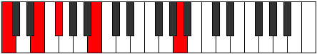 |
| SecondInversion | E,F#,B,A,C | 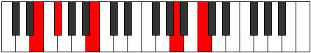 |
| ThirdInversion | F#,B,A,C,E | 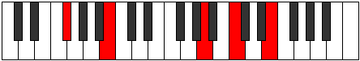 |
| FourthInversion | B,A,C,E,F# | 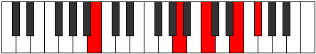 |
## Modes

| Number | Mode | Tonic | Notes | Illustration |
|--------|------|-------|-------|--------------|
| [421](https://ianring.com/musictheory/scales/421) | [Ionitonic](ModeENaturalIonitonic.md) | E | E, F#, A, B, C, E | 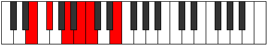 |
| [423](https://ianring.com/musictheory/scales/423) | [Sogimic](ModeENaturalSogimic.md) | E | E, F, Gb, A, B, C, E |  |
| [429](https://ianring.com/musictheory/scales/429) | [Koptimic](ModeENaturalKoptimic.md) | E | E, F#, G, A, B, C, E |  |
| [431](https://ianring.com/musictheory/scales/431) | [Epyrian](ModeENaturalEpyrian.md) | E | E, F, Gb, Abb, Bbb, Cb, Dbb, E |  |
| [437](https://ianring.com/musictheory/scales/437) | [Ronimic](ModeENaturalRonimic.md) | E | E, F#, G#, A, B, C, E |  |
| [439](https://ianring.com/musictheory/scales/439) | [Bythian](ModeENaturalBythian.md) | E | E, F, Gb, Ab, Bbb, Cb, Dbb, E |  |
| [445](https://ianring.com/musictheory/scales/445) | [Gocrian](ModeENaturalGocrian.md) | E | E, F#, G, Ab, Bbb, Cb, Dbb, E |  |
| [447](https://ianring.com/musictheory/scales/447) | [Thyphyllic](ModeENaturalThyphyllic.md) | E | E, F, F#, G, G#, A, B, C, E |  |
| [485](https://ianring.com/musictheory/scales/485) | [Stoptimic](ModeENaturalStoptimic.md) | E | E, F#, G##, A#, B, C, E |  |
| [487](https://ianring.com/musictheory/scales/487) | [Dynian](ModeENaturalDynian.md) | E | E, F, Gb, A, Bb, Cb, Dbb, E |  |
| [493](https://ianring.com/musictheory/scales/493) | [Rygian](ModeENaturalRygian.md) | E | E, F#, G, A, Bb, Cb, Dbb, E |  |
| [495](https://ianring.com/musictheory/scales/495) | [Bocryllic](ModeENaturalBocryllic.md) | E | E, F, F#, G, A, A#, B, C, E |  |
| [501](https://ianring.com/musictheory/scales/501) | [Katylian](ModeENaturalKatylian.md) | E | E, F#, G#, A, Bb, Cb, Dbb, E |  |
| [503](https://ianring.com/musictheory/scales/503) | [Thoptyllic](ModeENaturalThoptyllic.md) | E | E, F, F#, G#, A, A#, B, C, E |  |
| [509](https://ianring.com/musictheory/scales/509) | [Ionothyllic](ModeENaturalIonothyllic.md) | E | E, F#, G, G#, A, A#, B, C, E |  |
| [511](https://ianring.com/musictheory/scales/511) | [Polygic](ModeENaturalPolygic.md) | E | E, F, F#, G, G#, A, A#, B, C, E |  |
| [653](https://ianring.com/musictheory/scales/653) | [Stathitonic](ModeANaturalStathitonic.md) | A | A, B, C, E, F#, A |  |
| [655](https://ianring.com/musictheory/scales/655) | [Kataptimic](ModeANaturalKataptimic.md) | A | A, Bb, Cb, Dbb, E, F#, A |  |
| [669](https://ianring.com/musictheory/scales/669) | [Gycrimic](ModeANaturalGycrimic.md) | A | A, B, C, Db, E, F#, A |  |
| [671](https://ianring.com/musictheory/scales/671) | [Stycrian](ModeANaturalStycrian.md) | A | A, Bb, Cb, Dbb, Ebbb, Fb, Gb, A |  |
| [685](https://ianring.com/musictheory/scales/685) | [Aerathimic](ModeANaturalAerathimic.md) | A | A, B, C, D, E, F#, A |  |
| [687](https://ianring.com/musictheory/scales/687) | [Aeolythian](ModeANaturalAeolythian.md) | A | A, Bb, Cb, Dbb, Ebb, Fb, Gb, A |  |
| [701](https://ianring.com/musictheory/scales/701) | [Mixonyphian](ModeANaturalMixonyphian.md) | A | A, B, C, Db, Ebb, Fb, Gb, A |  |
| [703](https://ianring.com/musictheory/scales/703) | [Aerocryllic](ModeANaturalAerocryllic.md) | A | A, A#, B, C, C#, D, E, F#, A |  |
| [717](https://ianring.com/musictheory/scales/717) | [Gythimic](ModeANaturalGythimic.md) | A | A, B, C, D#, E, F#, A |  |
| [719](https://ianring.com/musictheory/scales/719) | [Kanian](ModeANaturalKanian.md) | A | A, Bb, Cb, Dbb, Eb, Fb, Gb, A |  |
| [733](https://ianring.com/musictheory/scales/733) | [Donian](ModeANaturalDonian.md) | A | A, B, C, Db, Eb, Fb, Gb, A |  |
| [735](https://ianring.com/musictheory/scales/735) | [Sylyllic](ModeANaturalSylyllic.md) | A | A, A#, B, C, C#, D#, E, F#, A |  |
| [749](https://ianring.com/musictheory/scales/749) | [Aeologian](ModeANaturalAeologian.md) | A | A, B, C, D, Eb, Fb, Gb, A |  |
| [751](https://ianring.com/musictheory/scales/751) | [Epacryllic](ModeANaturalEpacryllic.md) | A | A, A#, B, C, D, D#, E, F#, A |  |
| [765](https://ianring.com/musictheory/scales/765) | [Mixonyphyllic](ModeANaturalMixonyphyllic.md) | A | A, B, C, C#, D, D#, E, F#, A |  |
| [767](https://ianring.com/musictheory/scales/767) | [Raptygic](ModeANaturalRaptygic.md) | A | A, A#, B, C, C#, D, D#, E, F#, A |  |
| [843](https://ianring.com/musictheory/scales/843) | [Molimic](ModeDSharpMolimic.md) | D# | D#, E, F#, G##, A##, B#, D# |  |
| [843](https://ianring.com/musictheory/scales/843) | [Molimic](ModeEFlatMolimic.md) | Eb | Eb, Fb, Gb, A, B, C, Eb |  |
| [847](https://ianring.com/musictheory/scales/847) | [Ganian](ModeDSharpGanian.md) | D# | D#, E, F, Gb, A, B, C, D# |  |
| [847](https://ianring.com/musictheory/scales/847) | [Ganian](ModeEFlatGanian.md) | Eb | Eb, Fb, Gbb, Abbb, Bbb, Cb, Dbb, Eb |  |
| [859](https://ianring.com/musictheory/scales/859) | [Pathian](ModeDSharpPathian.md) | D# | D#, E, F#, G, A, B, C, D# |  |
| [859](https://ianring.com/musictheory/scales/859) | [Pathian](ModeEFlatPathian.md) | Eb | Eb, Fb, Gb, Abb, Bbb, Cb, Dbb, Eb |  |
| [863](https://ianring.com/musictheory/scales/863) | [Pyryllic](ModeDSharpPyryllic.md) | D# | D#, E, F, F#, G, A, B, C, D# |  |
| [863](https://ianring.com/musictheory/scales/863) | [Pyryllic](ModeEFlatPyryllic.md) | Eb | Eb, E, F, Gb, G, A, B, C, Eb |  |
| [875](https://ianring.com/musictheory/scales/875) | [Stothian](ModeDSharpStothian.md) | D# | D#, E, F#, G#, A, B, C, D# |  |
| [875](https://ianring.com/musictheory/scales/875) | [Stothian](ModeEFlatStothian.md) | Eb | Eb, Fb, Gb, Ab, Bbb, Cb, Dbb, Eb |  |
| [879](https://ianring.com/musictheory/scales/879) | [Aeolocryllic](ModeDSharpAeolocryllic.md) | D# | D#, E, F, F#, G#, A, B, C, D# |  |
| [879](https://ianring.com/musictheory/scales/879) | [Aeolocryllic](ModeEFlatAeolocryllic.md) | Eb | Eb, E, F, Gb, Ab, A, B, C, Eb |  |
| [891](https://ianring.com/musictheory/scales/891) | [Ionilyllic](ModeDSharpIonilyllic.md) | D# | D#, E, F#, G, G#, A, B, C, D# |  |
| [891](https://ianring.com/musictheory/scales/891) | [Ionilyllic](ModeEFlatIonilyllic.md) | Eb | Eb, E, Gb, G, Ab, A, B, C, Eb |  |
| [895](https://ianring.com/musictheory/scales/895) | [Aeolathygic](ModeDSharpAeolathygic.md) | D# | D#, E, F, F#, G, G#, A, B, C, D# |  |
| [895](https://ianring.com/musictheory/scales/895) | [Aeolathygic](ModeEFlatAeolathygic.md) | Eb | Eb, E, F, Gb, G, Ab, A, B, C, Eb |  |
| [909](https://ianring.com/musictheory/scales/909) | [Katarimic](ModeANaturalKatarimic.md) | A | A, B, C, D##, E#, F#, A |  |
| [911](https://ianring.com/musictheory/scales/911) | [Radian](ModeANaturalRadian.md) | A | A, Bb, Cb, Dbb, E, F, Gb, A |  |
| [925](https://ianring.com/musictheory/scales/925) | [Mythian](ModeANaturalMythian.md) | A | A, B, C, Db, E, F, Gb, A |  |
| [927](https://ianring.com/musictheory/scales/927) | [Koptyllic](ModeANaturalKoptyllic.md) | A | A, A#, B, C, C#, E, F, F#, A |  |
| [933](https://ianring.com/musictheory/scales/933) | [Dadimic](ModeENaturalDadimic.md) | E | E, F#, G##, A##, B#, C#, E |  |
| [935](https://ianring.com/musictheory/scales/935) | [Katarian](ModeENaturalKatarian.md) | E | E, F, Gb, A, B, C, Db, E |  |
| [941](https://ianring.com/musictheory/scales/941) | [Phrorian](ModeANaturalPhrorian.md) | A | A, B, C, D, E, F, Gb, A |  |
| [941](https://ianring.com/musictheory/scales/941) | [Phrorian](ModeENaturalPhrorian.md) | E | E, F#, G, A, B, C, Db, E |  |
| [943](https://ianring.com/musictheory/scales/943) | [Aerygyllic](ModeENaturalAerygyllic.md) | E | E, F, F#, G, A, B, C, C#, E |  |
| [943](https://ianring.com/musictheory/scales/943) | [Aerygyllic](ModeANaturalAerygyllic.md) | A | A, A#, B, C, D, E, F, F#, A |  |
| [949](https://ianring.com/musictheory/scales/949) | [Ionagian](ModeENaturalIonagian.md) | E | E, F#, G#, A, B, C, Db, E |  |
| [951](https://ianring.com/musictheory/scales/951) | [Thogyllic](ModeENaturalThogyllic.md) | E | E, F, F#, G#, A, B, C, C#, E |  |
| [957](https://ianring.com/musictheory/scales/957) | [Phronyllic](ModeANaturalPhronyllic.md) | A | A, B, C, C#, D, E, F, F#, A |  |
| [957](https://ianring.com/musictheory/scales/957) | [Phronyllic](ModeENaturalPhronyllic.md) | E | E, F#, G, G#, A, B, C, C#, E |  |
| [959](https://ianring.com/musictheory/scales/959) | [Katylygic](ModeENaturalKatylygic.md) | E | E, F, F#, G, G#, A, B, C, C#, E |  |
| [959](https://ianring.com/musictheory/scales/959) | [Katylygic](ModeANaturalKatylygic.md) | A | A, A#, B, C, C#, D, E, F, F#, A |  |
| [971](https://ianring.com/musictheory/scales/971) | [Ladian](ModeDSharpLadian.md) | D# | D#, E, F#, G##, A#, B, C, D# |  |
| [971](https://ianring.com/musictheory/scales/971) | [Ladian](ModeEFlatLadian.md) | Eb | Eb, Fb, Gb, A, Bb, Cb, Dbb, Eb |  |
| [973](https://ianring.com/musictheory/scales/973) | [Phryptian](ModeANaturalPhryptian.md) | A | A, B, C, D#, E, F, Gb, A |  |
| [975](https://ianring.com/musictheory/scales/975) | [Katogyllic](ModeDSharpKatogyllic.md) | D# | D#, E, F, F#, A, A#, B, C, D# |  |
| [975](https://ianring.com/musictheory/scales/975) | [Katogyllic](ModeEFlatKatogyllic.md) | Eb | Eb, E, F, Gb, A, Bb, B, C, Eb |  |
| [975](https://ianring.com/musictheory/scales/975) | [Katogyllic](ModeANaturalKatogyllic.md) | A | A, A#, B, C, D#, E, F, F#, A |  |
| [987](https://ianring.com/musictheory/scales/987) | [Aeraptyllic](ModeDSharpAeraptyllic.md) | D# | D#, E, F#, G, A, A#, B, C, D# |  |
| [987](https://ianring.com/musictheory/scales/987) | [Aeraptyllic](ModeEFlatAeraptyllic.md) | Eb | Eb, E, Gb, G, A, Bb, B, C, Eb |  |
| [989](https://ianring.com/musictheory/scales/989) | [Phrolyllic](ModeANaturalPhrolyllic.md) | A | A, B, C, C#, D#, E, F, F#, A |  |
| [991](https://ianring.com/musictheory/scales/991) | [Aeolygic](ModeANaturalAeolygic.md) | A | A, A#, B, C, C#, D#, E, F, F#, A |  |
| [991](https://ianring.com/musictheory/scales/991) | [Aeolygic](ModeDSharpAeolygic.md) | D# | D#, E, F, F#, G, A, A#, B, C, D# |  |
| [991](https://ianring.com/musictheory/scales/991) | [Aeolygic](ModeEFlatAeolygic.md) | Eb | Eb, E, F, Gb, G, A, Bb, B, C, Eb |  |
| [997](https://ianring.com/musictheory/scales/997) | [Rycrian](ModeENaturalRycrian.md) | E | E, F#, G##, A#, B, C, Db, E |  |
| [999](https://ianring.com/musictheory/scales/999) | [Bylyllic](ModeENaturalBylyllic.md) | E | E, F, F#, A, A#, B, C, C#, E |  |
| [1003](https://ianring.com/musictheory/scales/1003) | [Ionyryllic](ModeDSharpIonyryllic.md) | D# | D#, E, F#, G#, A, A#, B, C, D# |  |
| [1003](https://ianring.com/musictheory/scales/1003) | [Ionyryllic](ModeEFlatIonyryllic.md) | Eb | Eb, E, Gb, Ab, A, Bb, B, C, Eb |  |
| [1005](https://ianring.com/musictheory/scales/1005) | [Radyllic](ModeANaturalRadyllic.md) | A | A, B, C, D, D#, E, F, F#, A |  |
| [1005](https://ianring.com/musictheory/scales/1005) | [Radyllic](ModeENaturalRadyllic.md) | E | E, F#, G, A, A#, B, C, C#, E |  |
| [1007](https://ianring.com/musictheory/scales/1007) | [Ionycrygic](ModeANaturalIonycrygic.md) | A | A, A#, B, C, D, D#, E, F, F#, A |  |
| [1007](https://ianring.com/musictheory/scales/1007) | [Ionycrygic](ModeENaturalIonycrygic.md) | E | E, F, F#, G, A, A#, B, C, C#, E |  |
| [1007](https://ianring.com/musictheory/scales/1007) | [Ionycrygic](ModeDSharpIonycrygic.md) | D# | D#, E, F, F#, G#, A, A#, B, C, D# |  |
| [1007](https://ianring.com/musictheory/scales/1007) | [Ionycrygic](ModeEFlatIonycrygic.md) | Eb | Eb, E, F, Gb, Ab, A, Bb, B, C, Eb |  |
| [1013](https://ianring.com/musictheory/scales/1013) | [Stydyllic](ModeENaturalStydyllic.md) | E | E, F#, G#, A, A#, B, C, C#, E |  |
| [1015](https://ianring.com/musictheory/scales/1015) | [Ionodygic](ModeENaturalIonodygic.md) | E | E, F, F#, G#, A, A#, B, C, C#, E |  |
| [1019](https://ianring.com/musictheory/scales/1019) | [Aeranygic](ModeDSharpAeranygic.md) | D# | D#, E, F#, G, G#, A, A#, B, C, D# |  |
| [1019](https://ianring.com/musictheory/scales/1019) | [Aeranygic](ModeEFlatAeranygic.md) | Eb | Eb, E, Gb, G, Ab, A, Bb, B, C, Eb |  |
| [1021](https://ianring.com/musictheory/scales/1021) | [Ladygic](ModeANaturalLadygic.md) | A | A, B, C, C#, D, D#, E, F, F#, A |  |
| [1021](https://ianring.com/musictheory/scales/1021) | [Ladygic](ModeENaturalLadygic.md) | E | E, F#, G, G#, A, A#, B, C, C#, E |  |
| [1023](https://ianring.com/musictheory/scales/1023) | [Dodyllian](ModeANaturalDodyllian.md) | A | A, A#, B, C, C#, D, D#, E, F, F#, A |  |
| [1023](https://ianring.com/musictheory/scales/1023) | [Dodyllian](ModeENaturalDodyllian.md) | E | E, F, F#, G, G#, A, A#, B, C, C#, E |  |
| [1023](https://ianring.com/musictheory/scales/1023) | [Dodyllian](ModeDSharpDodyllian.md) | D# | D#, E, F, F#, G, G#, A, A#, B, C, D# |  |
| [1023](https://ianring.com/musictheory/scales/1023) | [Dodyllian](ModeEFlatDodyllian.md) | Eb | Eb, E, F, Gb, G, Ab, A, Bb, B, C, Eb |  |
| [1129](https://ianring.com/musictheory/scales/1129) | [Phrynitonic](ModeFSharpPhrynitonic.md) | F# | F#, A, B, C, E, F# |  |
| [1129](https://ianring.com/musictheory/scales/1129) | [Phrynitonic](ModeGFlatPhrynitonic.md) | Gb | Gb, A, B, C, E, Gb | 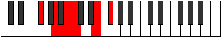 |
| [1131](https://ianring.com/musictheory/scales/1131) | [Thocrimic](ModeFSharpThocrimic.md) | F# | F#, G, A, B, C, D##, F# |  |
| [1131](https://ianring.com/musictheory/scales/1131) | [Thocrimic](ModeGFlatThocrimic.md) | Gb | Gb, Abb, Bbb, Cb, Dbb, E, Gb |  |
| [1133](https://ianring.com/musictheory/scales/1133) | [Stycrimic](ModeFSharpStycrimic.md) | F# | F#, G#, A, B, C, D##, F# |  |
| [1133](https://ianring.com/musictheory/scales/1133) | [Stycrimic](ModeGFlatStycrimic.md) | Gb | Gb, Ab, Bbb, Cb, Dbb, E, Gb |  |
| [1135](https://ianring.com/musictheory/scales/1135) | [Katolian](ModeFSharpKatolian.md) | F# | F#, G, Ab, Bbb, Cb, Dbb, E, F# |  |
| [1135](https://ianring.com/musictheory/scales/1135) | [Katolian](ModeGFlatKatolian.md) | Gb | Gb, Abb, Bbbb, Cbbb, Dbbb, Dbb, E, Gb |  |
| [1145](https://ianring.com/musictheory/scales/1145) | [Zygimic](ModeFSharpZygimic.md) | F# | F#, G##, A#, B, C, D##, F# |  |
| [1145](https://ianring.com/musictheory/scales/1145) | [Zygimic](ModeGFlatZygimic.md) | Gb | Gb, A, Bb, Cb, Dbb, E, Gb |  |
| [1147](https://ianring.com/musictheory/scales/1147) | [Epynian](ModeFSharpEpynian.md) | F# | F#, G, A, Bb, Cb, Dbb, E, F# |  |
| [1147](https://ianring.com/musictheory/scales/1147) | [Epynian](ModeGFlatEpynian.md) | Gb | Gb, Abb, Bbb, Cbb, Dbbb, Dbb, E, Gb |  |
| [1149](https://ianring.com/musictheory/scales/1149) | [Bydian](ModeFSharpBydian.md) | F# | F#, G#, A, Bb, Cb, Dbb, E, F# |  |
| [1149](https://ianring.com/musictheory/scales/1149) | [Bydian](ModeGFlatBydian.md) | Gb | Gb, Ab, Bbb, Cbb, Dbbb, Dbb, E, Gb |  |
| [1151](https://ianring.com/musictheory/scales/1151) | [Mythyllic](ModeFSharpMythyllic.md) | F# | F#, G, G#, A, A#, B, C, E, F# |  |
| [1151](https://ianring.com/musictheory/scales/1151) | [Mythyllic](ModeGFlatMythyllic.md) | Gb | Gb, G, Ab, A, Bb, B, C, E, Gb |  |
| [1187](https://ianring.com/musictheory/scales/1187) | [Thalitonic](ModeBNaturalThalitonic.md) | B | B, C, E, F#, A, B |  |
| [1191](https://ianring.com/musictheory/scales/1191) | [Pyrimic](ModeBNaturalPyrimic.md) | B | B, C, Db, E, F#, G##, B |  |
| [1195](https://ianring.com/musictheory/scales/1195) | [Sarimic](ModeBNaturalSarimic.md) | B | B, C, D, E, F#, G##, B |  |
| [1199](https://ianring.com/musictheory/scales/1199) | [Magian](ModeBNaturalMagian.md) | B | B, C, Db, Ebb, Fb, Gb, A, B |  |
| [1203](https://ianring.com/musictheory/scales/1203) | [Pagimic](ModeBNaturalPagimic.md) | B | B, C, D#, E, F#, G##, B |  |
| [1207](https://ianring.com/musictheory/scales/1207) | [Aeoloptian](ModeBNaturalAeoloptian.md) | B | B, C, Db, Eb, Fb, Gb, A, B |  |
| [1211](https://ianring.com/musictheory/scales/1211) | [Zadian](ModeBNaturalZadian.md) | B | B, C, D, Eb, Fb, Gb, A, B | 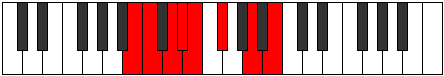 |
| [1215](https://ianring.com/musictheory/scales/1215) | [Aeolanyllic](ModeBNaturalAeolanyllic.md) | B | B, C, C#, D, D#, E, F#, A, B |  |
| [1251](https://ianring.com/musictheory/scales/1251) | [Sylimic](ModeBNaturalSylimic.md) | B | B, C, D##, E#, F#, G##, B |  |
| [1255](https://ianring.com/musictheory/scales/1255) | [Sogian](ModeBNaturalSogian.md) | B | B, C, Db, E, F, Gb, A, B |  |
| [1257](https://ianring.com/musictheory/scales/1257) | [Aeolyphimic](ModeFSharpAeolyphimic.md) | F# | F#, G##, A##, B#, C#, D##, F# |  |
| [1257](https://ianring.com/musictheory/scales/1257) | [Aeolyphimic](ModeGFlatAeolyphimic.md) | Gb | Gb, A, B, C, Db, E, Gb |  |
| [1259](https://ianring.com/musictheory/scales/1259) | [Stadian](ModeBNaturalStadian.md) | B | B, C, D, E, F, Gb, A, B |  |
| [1259](https://ianring.com/musictheory/scales/1259) | [Stadian](ModeFSharpStadian.md) | F# | F#, G, A, B, C, Db, E, F# |  |
| [1259](https://ianring.com/musictheory/scales/1259) | [Stadian](ModeGFlatStadian.md) | Gb | Gb, Abb, Bbb, Cb, Dbb, Ebbb, Fb, Gb |  |
| [1261](https://ianring.com/musictheory/scales/1261) | [Aeodian](ModeFSharpAeodian.md) | F# | F#, G#, A, B, C, Db, E, F# |  |
| [1261](https://ianring.com/musictheory/scales/1261) | [Aeodian](ModeGFlatAeodian.md) | Gb | Gb, Ab, Bbb, Cb, Dbb, Ebbb, Fb, Gb |  |
| [1263](https://ianring.com/musictheory/scales/1263) | [Stynyllic](ModeBNaturalStynyllic.md) | B | B, C, C#, D, E, F, F#, A, B |  |
| [1263](https://ianring.com/musictheory/scales/1263) | [Stynyllic](ModeFSharpStynyllic.md) | F# | F#, G, G#, A, B, C, C#, E, F# |  |
| [1263](https://ianring.com/musictheory/scales/1263) | [Stynyllic](ModeGFlatStynyllic.md) | Gb | Gb, G, Ab, A, B, C, Db, E, Gb |  |
| [1267](https://ianring.com/musictheory/scales/1267) | [Katynian](ModeBNaturalKatynian.md) | B | B, C, D#, E, F, Gb, A, B |  |
| [1271](https://ianring.com/musictheory/scales/1271) | [Kolyllic](ModeBNaturalKolyllic.md) | B | B, C, C#, D#, E, F, F#, A, B |  |
| [1273](https://ianring.com/musictheory/scales/1273) | [Ronian](ModeFSharpRonian.md) | F# | F#, G##, A#, B, C, Db, E, F# | 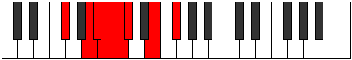 |
| [1273](https://ianring.com/musictheory/scales/1273) | [Ronian](ModeGFlatRonian.md) | Gb | Gb, A, Bb, Cb, Dbb, Ebbb, Fb, Gb |  |
| [1275](https://ianring.com/musictheory/scales/1275) | [Stagyllic](ModeBNaturalStagyllic.md) | B | B, C, D, D#, E, F, F#, A, B |  |
| [1275](https://ianring.com/musictheory/scales/1275) | [Stagyllic](ModeFSharpStagyllic.md) | F# | F#, G, A, A#, B, C, C#, E, F# |  |
| [1275](https://ianring.com/musictheory/scales/1275) | [Stagyllic](ModeGFlatStagyllic.md) | Gb | Gb, G, A, Bb, B, C, Db, E, Gb |  |
| [1277](https://ianring.com/musictheory/scales/1277) | [Zadyllic](ModeFSharpZadyllic.md) | F# | F#, G#, A, A#, B, C, C#, E, F# |  |
| [1277](https://ianring.com/musictheory/scales/1277) | [Zadyllic](ModeGFlatZadyllic.md) | Gb | Gb, Ab, A, Bb, B, C, Db, E, Gb |  |
| [1279](https://ianring.com/musictheory/scales/1279) | [Sarygic](ModeBNaturalSarygic.md) | B | B, C, C#, D, D#, E, F, F#, A, B |  |
| [1279](https://ianring.com/musictheory/scales/1279) | [Sarygic](ModeFSharpSarygic.md) | F# | F#, G, G#, A, A#, B, C, C#, E, F# |  |
| [1279](https://ianring.com/musictheory/scales/1279) | [Sarygic](ModeGFlatSarygic.md) | Gb | Gb, G, Ab, A, Bb, B, C, Db, E, Gb |  |
| [1307](https://ianring.com/musictheory/scales/1307) | [Katorimic](ModeGSharpKatorimic.md) | G# | G#, A, B, C, D##, E##, G# |  |
| [1307](https://ianring.com/musictheory/scales/1307) | [Katorimic](ModeAFlatKatorimic.md) | Ab | Ab, Bbb, Cb, Dbb, E, F#, Ab |  |
| [1311](https://ianring.com/musictheory/scales/1311) | [Bynian](ModeGSharpBynian.md) | G# | G#, A, Bb, Cb, Dbb, E, F#, G# |  |
| [1311](https://ianring.com/musictheory/scales/1311) | [Bynian](ModeAFlatBynian.md) | Ab | Ab, Bbb, Cbb, Dbbb, Dbb, E, F#, Ab |  |
| [1339](https://ianring.com/musictheory/scales/1339) | [Kycrian](ModeGSharpKycrian.md) | G# | G#, A, B, C, Db, E, F#, G# |  |
| [1339](https://ianring.com/musictheory/scales/1339) | [Kycrian](ModeAFlatKycrian.md) | Ab | Ab, Bbb, Cb, Dbb, Ebbb, Fb, Gb, Ab |  |
| [1343](https://ianring.com/musictheory/scales/1343) | [Zalyllic](ModeGSharpZalyllic.md) | G# | G#, A, A#, B, C, C#, E, F#, G# |  |
| [1343](https://ianring.com/musictheory/scales/1343) | [Zalyllic](ModeAFlatZalyllic.md) | Ab | Ab, A, Bb, B, C, Db, E, Gb, Ab |  |
| [1371](https://ianring.com/musictheory/scales/1371) | [Ionadian](ModeGSharpIonadian.md) | G# | G#, A, B, C, D, E, F#, G# |  |
| [1371](https://ianring.com/musictheory/scales/1371) | [Ionadian](ModeAFlatIonadian.md) | Ab | Ab, Bbb, Cb, Dbb, Ebb, Fb, Gb, Ab |  |
| [1375](https://ianring.com/musictheory/scales/1375) | [Bothyllic](ModeGSharpBothyllic.md) | G# | G#, A, A#, B, C, D, E, F#, G# |  |
| [1375](https://ianring.com/musictheory/scales/1375) | [Bothyllic](ModeAFlatBothyllic.md) | Ab | Ab, A, Bb, B, C, D, E, Gb, Ab |  |
| [1385](https://ianring.com/musictheory/scales/1385) | [Phracrimic](ModeFSharpPhracrimic.md) | F# | F#, G##, A##, B#, C##, D##, F# |  |
| [1385](https://ianring.com/musictheory/scales/1385) | [Phracrimic](ModeGFlatPhracrimic.md) | Gb | Gb, A, B, C, D, E, Gb |  |
| [1387](https://ianring.com/musictheory/scales/1387) | [Locrian](ModeFSharpLocrian.md) | F# | F#, G, A, B, C, D, E, F# |  |
| [1387](https://ianring.com/musictheory/scales/1387) | [Locrian](ModeGFlatLocrian.md) | Gb | Gb, Abb, Bbb, Cb, Dbb, Ebb, Fb, Gb |  |
| [1389](https://ianring.com/musictheory/scales/1389) | [Lorian](ModeFSharpLorian.md) | F# | F#, G#, A, B, C, D, E, F# |  |
| [1389](https://ianring.com/musictheory/scales/1389) | [Lorian](ModeGFlatLorian.md) | Gb | Gb, Ab, Bbb, Cb, Dbb, Ebb, Fb, Gb |  |
| [1391](https://ianring.com/musictheory/scales/1391) | [Aeradyllic](ModeFSharpAeradyllic.md) | F# | F#, G, G#, A, B, C, D, E, F# |  |
| [1391](https://ianring.com/musictheory/scales/1391) | [Aeradyllic](ModeGFlatAeradyllic.md) | Gb | Gb, G, Ab, A, B, C, D, E, Gb |  |
| [1401](https://ianring.com/musictheory/scales/1401) | [Pagian](ModeFSharpPagian.md) | F# | F#, G##, A#, B, C, D, E, F# |  |
| [1401](https://ianring.com/musictheory/scales/1401) | [Pagian](ModeGFlatPagian.md) | Gb | Gb, A, Bb, Cb, Dbb, Ebb, Fb, Gb | 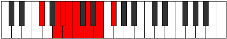 |
| [1403](https://ianring.com/musictheory/scales/1403) | [Epinyllic](ModeGSharpEpinyllic.md) | G# | G#, A, B, C, C#, D, E, F#, G# |  |
| [1403](https://ianring.com/musictheory/scales/1403) | [Epinyllic](ModeAFlatEpinyllic.md) | Ab | Ab, A, B, C, Db, D, E, Gb, Ab |  |
| [1403](https://ianring.com/musictheory/scales/1403) | [Epinyllic](ModeFSharpEpinyllic.md) | F# | F#, G, A, A#, B, C, D, E, F# |  |
| [1403](https://ianring.com/musictheory/scales/1403) | [Epinyllic](ModeGFlatEpinyllic.md) | Gb | Gb, G, A, Bb, B, C, D, E, Gb |  |
| [1405](https://ianring.com/musictheory/scales/1405) | [Goryllic](ModeFSharpGoryllic.md) | F# | F#, G#, A, A#, B, C, D, E, F# |  |
| [1405](https://ianring.com/musictheory/scales/1405) | [Goryllic](ModeGFlatGoryllic.md) | Gb | Gb, Ab, A, Bb, B, C, D, E, Gb |  |
| [1407](https://ianring.com/musictheory/scales/1407) | [Tharygic](ModeGSharpTharygic.md) | G# | G#, A, A#, B, C, C#, D, E, F#, G# |  |
| [1407](https://ianring.com/musictheory/scales/1407) | [Tharygic](ModeAFlatTharygic.md) | Ab | Ab, A, Bb, B, C, Db, D, E, Gb, Ab |  |
| [1407](https://ianring.com/musictheory/scales/1407) | [Tharygic](ModeFSharpTharygic.md) | F# | F#, G, G#, A, A#, B, C, D, E, F# |  |
| [1407](https://ianring.com/musictheory/scales/1407) | [Tharygic](ModeGFlatTharygic.md) | Gb | Gb, G, Ab, A, Bb, B, C, D, E, Gb |  |
| [1435](https://ianring.com/musictheory/scales/1435) | [Phronian](ModeGSharpPhronian.md) | G# | G#, A, B, C, D#, E, F#, G# |  |
| [1435](https://ianring.com/musictheory/scales/1435) | [Phronian](ModeAFlatPhronian.md) | Ab | Ab, Bbb, Cb, Dbb, Eb, Fb, Gb, Ab |  |
| [1439](https://ianring.com/musictheory/scales/1439) | [Rolyllic](ModeGSharpRolyllic.md) | G# | G#, A, A#, B, C, D#, E, F#, G# |  |
| [1439](https://ianring.com/musictheory/scales/1439) | [Rolyllic](ModeAFlatRolyllic.md) | Ab | Ab, A, Bb, B, C, Eb, E, Gb, Ab |  |
| [1443](https://ianring.com/musictheory/scales/1443) | [Ionarimic](ModeBNaturalIonarimic.md) | B | B, C, D##, E##, F##, G##, B |  |
| [1445](https://ianring.com/musictheory/scales/1445) | [Byptimic](ModeENaturalByptimic.md) | E | E, F#, G##, A##, B#, C##, E |  |
| [1447](https://ianring.com/musictheory/scales/1447) | [Mixopyrian](ModeENaturalMixopyrian.md) | E | E, F, Gb, A, B, C, D, E |  |
| [1447](https://ianring.com/musictheory/scales/1447) | [Mixopyrian](ModeBNaturalMixopyrian.md) | B | B, C, Db, E, F#, G, A, B |  |
| [1451](https://ianring.com/musictheory/scales/1451) | [Phrygian](ModeBNaturalPhrygian.md) | B | B, C, D, E, F#, G, A, B |  |
| [1453](https://ianring.com/musictheory/scales/1453) | [Aeolian](ModeENaturalAeolian.md) | E | E, F#, G, A, B, C, D, E |  |
| [1455](https://ianring.com/musictheory/scales/1455) | [Soryllic](ModeBNaturalSoryllic.md) | B | B, C, C#, D, E, F#, G, A, B |  |
| [1455](https://ianring.com/musictheory/scales/1455) | [Soryllic](ModeENaturalSoryllic.md) | E | E, F, F#, G, A, B, C, D, E |  |
| [1459](https://ianring.com/musictheory/scales/1459) | [Ionalian](ModeBNaturalIonalian.md) | B | B, C, D#, E, F#, G, A, B |  |
| [1461](https://ianring.com/musictheory/scales/1461) | [Stydian](ModeENaturalStydian.md) | E | E, F#, G#, A, B, C, D, E |  |
| [1463](https://ianring.com/musictheory/scales/1463) | [Zaptyllic](ModeBNaturalZaptyllic.md) | B | B, C, C#, D#, E, F#, G, A, B |  |
| [1463](https://ianring.com/musictheory/scales/1463) | [Zaptyllic](ModeENaturalZaptyllic.md) | E | E, F, F#, G#, A, B, C, D, E |  |
| [1467](https://ianring.com/musictheory/scales/1467) | [Thydyllic](ModeBNaturalThydyllic.md) | B | B, C, D, D#, E, F#, G, A, B |  |
| [1467](https://ianring.com/musictheory/scales/1467) | [Thydyllic](ModeGSharpThydyllic.md) | G# | G#, A, B, C, C#, D#, E, F#, G# |  |
| [1467](https://ianring.com/musictheory/scales/1467) | [Thydyllic](ModeAFlatThydyllic.md) | Ab | Ab, A, B, C, Db, Eb, E, Gb, Ab |  |
| [1469](https://ianring.com/musictheory/scales/1469) | [Epiryllic](ModeENaturalEpiryllic.md) | E | E, F#, G, G#, A, B, C, D, E |  |
| [1471](https://ianring.com/musictheory/scales/1471) | [Radygic](ModeBNaturalRadygic.md) | B | B, C, C#, D, D#, E, F#, G, A, B |  |
| [1471](https://ianring.com/musictheory/scales/1471) | [Radygic](ModeENaturalRadygic.md) | E | E, F, F#, G, G#, A, B, C, D, E |  |
| [1471](https://ianring.com/musictheory/scales/1471) | [Radygic](ModeGSharpRadygic.md) | G# | G#, A, A#, B, C, C#, D#, E, F#, G# |  |
| [1471](https://ianring.com/musictheory/scales/1471) | [Radygic](ModeAFlatRadygic.md) | Ab | Ab, A, Bb, B, C, Db, Eb, E, Gb, Ab |  |
| [1499](https://ianring.com/musictheory/scales/1499) | [Stonyllic](ModeGSharpStonyllic.md) | G# | G#, A, B, C, D, D#, E, F#, G# |  |
| [1499](https://ianring.com/musictheory/scales/1499) | [Stonyllic](ModeAFlatStonyllic.md) | Ab | Ab, A, B, C, D, Eb, E, Gb, Ab |  |
| [1503](https://ianring.com/musictheory/scales/1503) | [Padygic](ModeGSharpPadygic.md) | G# | G#, A, A#, B, C, D, D#, E, F#, G# |  |
| [1503](https://ianring.com/musictheory/scales/1503) | [Padygic](ModeAFlatPadygic.md) | Ab | Ab, A, Bb, B, C, D, Eb, E, Gb, Ab |  |
| [1507](https://ianring.com/musictheory/scales/1507) | [Zynian](ModeBNaturalZynian.md) | B | B, C, D##, E#, F#, G, A, B |  |
| [1509](https://ianring.com/musictheory/scales/1509) | [Ragian](ModeENaturalRagian.md) | E | E, F#, G##, A#, B, C, D, E |  |
| [1511](https://ianring.com/musictheory/scales/1511) | [Styptyllic](ModeBNaturalStyptyllic.md) | B | B, C, C#, E, F, F#, G, A, B |  |
| [1511](https://ianring.com/musictheory/scales/1511) | [Styptyllic](ModeENaturalStyptyllic.md) | E | E, F, F#, A, A#, B, C, D, E |  |
| [1513](https://ianring.com/musictheory/scales/1513) | [Stathian](ModeFSharpStathian.md) | F# | F#, G##, A##, B#, C#, D, E, F# |  |
| [1513](https://ianring.com/musictheory/scales/1513) | [Stathian](ModeGFlatStathian.md) | Gb | Gb, A, B, C, Db, Ebb, Fb, Gb |  |
| [1515](https://ianring.com/musictheory/scales/1515) | [Solyllic](ModeFSharpSolyllic.md) | F# | F#, G, A, B, C, C#, D, E, F# |  |
| [1515](https://ianring.com/musictheory/scales/1515) | [Solyllic](ModeGFlatSolyllic.md) | Gb | Gb, G, A, B, C, Db, D, E, Gb |  |
| [1515](https://ianring.com/musictheory/scales/1515) | [Solyllic](ModeBNaturalSolyllic.md) | B | B, C, D, E, F, F#, G, A, B |  |
| [1517](https://ianring.com/musictheory/scales/1517) | [Sagyllic](ModeFSharpSagyllic.md) | F# | F#, G#, A, B, C, C#, D, E, F# |  |
| [1517](https://ianring.com/musictheory/scales/1517) | [Sagyllic](ModeGFlatSagyllic.md) | Gb | Gb, Ab, A, B, C, Db, D, E, Gb |  |
| [1517](https://ianring.com/musictheory/scales/1517) | [Sagyllic](ModeENaturalSagyllic.md) | E | E, F#, G, A, A#, B, C, D, E |  |
| [1519](https://ianring.com/musictheory/scales/1519) | [Solygic](ModeBNaturalSolygic.md) | B | B, C, C#, D, E, F, F#, G, A, B |  |
| [1519](https://ianring.com/musictheory/scales/1519) | [Solygic](ModeFSharpSolygic.md) | F# | F#, G, G#, A, B, C, C#, D, E, F# |  |
| [1519](https://ianring.com/musictheory/scales/1519) | [Solygic](ModeGFlatSolygic.md) | Gb | Gb, G, Ab, A, B, C, Db, D, E, Gb |  |
| [1519](https://ianring.com/musictheory/scales/1519) | [Solygic](ModeENaturalSolygic.md) | E | E, F, F#, G, A, A#, B, C, D, E |  |
| [1523](https://ianring.com/musictheory/scales/1523) | [Zothyllic](ModeBNaturalZothyllic.md) | B | B, C, D#, E, F, F#, G, A, B |  |
| [1525](https://ianring.com/musictheory/scales/1525) | [Sodyllic](ModeENaturalSodyllic.md) | E | E, F#, G#, A, A#, B, C, D, E |  |
| [1527](https://ianring.com/musictheory/scales/1527) | [Aeolyrygic](ModeBNaturalAeolyrygic.md) | B | B, C, C#, D#, E, F, F#, G, A, B |  |
| [1527](https://ianring.com/musictheory/scales/1527) | [Aeolyrygic](ModeENaturalAeolyrygic.md) | E | E, F, F#, G#, A, A#, B, C, D, E |  |
| [1529](https://ianring.com/musictheory/scales/1529) | [Kataryllic](ModeFSharpKataryllic.md) | F# | F#, A, A#, B, C, C#, D, E, F# |  |
| [1529](https://ianring.com/musictheory/scales/1529) | [Kataryllic](ModeGFlatKataryllic.md) | Gb | Gb, A, Bb, B, C, Db, D, E, Gb |  |
| [1531](https://ianring.com/musictheory/scales/1531) | [Styptygic](ModeBNaturalStyptygic.md) | B | B, C, D, D#, E, F, F#, G, A, B |  |
| [1531](https://ianring.com/musictheory/scales/1531) | [Styptygic](ModeGSharpStyptygic.md) | G# | G#, A, B, C, C#, D, D#, E, F#, G# |  |
| [1531](https://ianring.com/musictheory/scales/1531) | [Styptygic](ModeAFlatStyptygic.md) | Ab | Ab, A, B, C, Db, D, Eb, E, Gb, Ab |  |
| [1531](https://ianring.com/musictheory/scales/1531) | [Styptygic](ModeFSharpStyptygic.md) | F# | F#, G, A, A#, B, C, C#, D, E, F# |  |
| [1531](https://ianring.com/musictheory/scales/1531) | [Styptygic](ModeGFlatStyptygic.md) | Gb | Gb, G, A, Bb, B, C, Db, D, E, Gb |  |
| [1533](https://ianring.com/musictheory/scales/1533) | [Katycrygic](ModeFSharpKatycrygic.md) | F# | F#, G#, A, A#, B, C, C#, D, E, F# |  |
| [1533](https://ianring.com/musictheory/scales/1533) | [Katycrygic](ModeGFlatKatycrygic.md) | Gb | Gb, Ab, A, Bb, B, C, Db, D, E, Gb |  |
| [1533](https://ianring.com/musictheory/scales/1533) | [Katycrygic](ModeENaturalKatycrygic.md) | E | E, F#, G, G#, A, A#, B, C, D, E |  |
| [1535](https://ianring.com/musictheory/scales/1535) | [Mixodyllian](ModeBNaturalMixodyllian.md) | B | B, C, C#, D, D#, E, F, F#, G, A, B |  |
| [1535](https://ianring.com/musictheory/scales/1535) | [Mixodyllian](ModeGSharpMixodyllian.md) | G# | G#, A, A#, B, C, C#, D, D#, E, F#, G# |  |
| [1535](https://ianring.com/musictheory/scales/1535) | [Mixodyllian](ModeAFlatMixodyllian.md) | Ab | Ab, A, Bb, B, C, Db, D, Eb, E, Gb, Ab |  |
| [1535](https://ianring.com/musictheory/scales/1535) | [Mixodyllian](ModeFSharpMixodyllian.md) | F# | F#, G, G#, A, A#, B, C, C#, D, E, F# |  |
| [1535](https://ianring.com/musictheory/scales/1535) | [Mixodyllian](ModeGFlatMixodyllian.md) | Gb | Gb, G, Ab, A, Bb, B, C, Db, D, E, Gb |  |
| [1535](https://ianring.com/musictheory/scales/1535) | [Mixodyllian](ModeENaturalMixodyllian.md) | E | E, F, F#, G, G#, A, A#, B, C, D, E |  |
| [1641](https://ianring.com/musictheory/scales/1641) | [Bocrimic](ModeFSharpBocrimic.md) | F# | F#, G##, A##, B#, C###, D##, F# |  |
| [1641](https://ianring.com/musictheory/scales/1641) | [Bocrimic](ModeGFlatBocrimic.md) | Gb | Gb, A, B, C, D#, E, Gb |  |
| [1643](https://ianring.com/musictheory/scales/1643) | [Thyptian](ModeFSharpThyptian.md) | F# | F#, G, A, B, C, D#, E, F# |  |
| [1643](https://ianring.com/musictheory/scales/1643) | [Thyptian](ModeGFlatThyptian.md) | Gb | Gb, Abb, Bbb, Cb, Dbb, Eb, Fb, Gb |  |
| [1645](https://ianring.com/musictheory/scales/1645) | [Katagian](ModeFSharpKatagian.md) | F# | F#, G#, A, B, C, D#, E, F# |  |
| [1645](https://ianring.com/musictheory/scales/1645) | [Katagian](ModeGFlatKatagian.md) | Gb | Gb, Ab, Bbb, Cb, Dbb, Eb, Fb, Gb |  |
| [1647](https://ianring.com/musictheory/scales/1647) | [Polyllic](ModeFSharpPolyllic.md) | F# | F#, G, G#, A, B, C, D#, E, F# |  |
| [1647](https://ianring.com/musictheory/scales/1647) | [Polyllic](ModeGFlatPolyllic.md) | Gb | Gb, G, Ab, A, B, C, Eb, E, Gb |  |
| [1657](https://ianring.com/musictheory/scales/1657) | [Ionothian](ModeFSharpIonothian.md) | F# | F#, G##, A#, B, C, D#, E, F# |  |
| [1657](https://ianring.com/musictheory/scales/1657) | [Ionothian](ModeGFlatIonothian.md) | Gb | Gb, A, Bb, Cb, Dbb, Eb, Fb, Gb |  |
| [1659](https://ianring.com/musictheory/scales/1659) | [Magyllic](ModeFSharpMagyllic.md) | F# | F#, G, A, A#, B, C, D#, E, F# |  |
| [1659](https://ianring.com/musictheory/scales/1659) | [Magyllic](ModeGFlatMagyllic.md) | Gb | Gb, G, A, Bb, B, C, Eb, E, Gb |  |
| [1661](https://ianring.com/musictheory/scales/1661) | [Gonyllic](ModeFSharpGonyllic.md) | F# | F#, G#, A, A#, B, C, D#, E, F# |  |
| [1661](https://ianring.com/musictheory/scales/1661) | [Gonyllic](ModeGFlatGonyllic.md) | Gb | Gb, Ab, A, Bb, B, C, Eb, E, Gb |  |
| [1663](https://ianring.com/musictheory/scales/1663) | [Lydygic](ModeFSharpLydygic.md) | F# | F#, G, G#, A, A#, B, C, D#, E, F# |  |
| [1663](https://ianring.com/musictheory/scales/1663) | [Lydygic](ModeGFlatLydygic.md) | Gb | Gb, G, Ab, A, Bb, B, C, Eb, E, Gb |  |
| [1677](https://ianring.com/musictheory/scales/1677) | [Danimic](ModeANaturalDanimic.md) | A | A, B, C, D##, E##, F##, A |  |
| [1679](https://ianring.com/musictheory/scales/1679) | [Kydian](ModeANaturalKydian.md) | A | A, Bb, Cb, Dbb, E, F#, G, A |  |
| [1685](https://ianring.com/musictheory/scales/1685) | [Zeracrimic](ModeDNaturalZeracrimic.md) | D | D, E, F#, G##, A##, B#, D |  |
| [1687](https://ianring.com/musictheory/scales/1687) | [Phralian](ModeDNaturalPhralian.md) | D | D, Eb, Fb, Gb, A, B, C, D |  |
| [1693](https://ianring.com/musictheory/scales/1693) | [Dogian](ModeDNaturalDogian.md) | D | D, E, F, Gb, A, B, C, D |  |
| [1693](https://ianring.com/musictheory/scales/1693) | [Dogian](ModeANaturalDogian.md) | A | A, B, C, Db, E, F#, G, A |  |
| [1695](https://ianring.com/musictheory/scales/1695) | [Phrodyllic](ModeDNaturalPhrodyllic.md) | D | D, D#, E, F, F#, A, B, C, D |  |
| [1695](https://ianring.com/musictheory/scales/1695) | [Phrodyllic](ModeANaturalPhrodyllic.md) | A | A, A#, B, C, C#, E, F#, G, A |  |
| [1699](https://ianring.com/musictheory/scales/1699) | [Kaptimic](ModeBNaturalKaptimic.md) | B | B, C, D##, E##, F###, G##, B |  |
| [1703](https://ianring.com/musictheory/scales/1703) | [Zaptian](ModeBNaturalZaptian.md) | B | B, C, Db, E, F#, G#, A, B |  |
| [1707](https://ianring.com/musictheory/scales/1707) | [Mixolythian](ModeBNaturalMixolythian.md) | B | B, C, D, E, F#, G#, A, B |  |
| [1709](https://ianring.com/musictheory/scales/1709) | [Dorian](ModeANaturalDorian.md) | A | A, B, C, D, E, F#, G, A |  |
| [1711](https://ianring.com/musictheory/scales/1711) | [Ragyllic](ModeBNaturalRagyllic.md) | B | B, C, C#, D, E, F#, G#, A, B |  |
| [1711](https://ianring.com/musictheory/scales/1711) | [Ragyllic](ModeANaturalRagyllic.md) | A | A, A#, B, C, D, E, F#, G, A |  |
| [1715](https://ianring.com/musictheory/scales/1715) | [Aeronian](ModeBNaturalAeronian.md) | B | B, C, D#, E, F#, G#, A, B |  |
| [1717](https://ianring.com/musictheory/scales/1717) | [Mixolydian](ModeDNaturalMixolydian.md) | D | D, E, F#, G, A, B, C, D |  |
| [1719](https://ianring.com/musictheory/scales/1719) | [Lyryllic](ModeDNaturalLyryllic.md) | D | D, D#, E, F#, G, A, B, C, D |  |
| [1719](https://ianring.com/musictheory/scales/1719) | [Lyryllic](ModeBNaturalLyryllic.md) | B | B, C, C#, D#, E, F#, G#, A, B |  |
| [1723](https://ianring.com/musictheory/scales/1723) | [Poryllic](ModeBNaturalPoryllic.md) | B | B, C, D, D#, E, F#, G#, A, B |  |
| [1725](https://ianring.com/musictheory/scales/1725) | [Mixodyllic](ModeANaturalMixodyllic.md) | A | A, B, C, C#, D, E, F#, G, A |  |
| [1725](https://ianring.com/musictheory/scales/1725) | [Mixodyllic](ModeDNaturalMixodyllic.md) | D | D, E, F, F#, G, A, B, C, D | 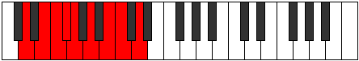 |
| [1727](https://ianring.com/musictheory/scales/1727) | [Sydygic](ModeDNaturalSydygic.md) | D | D, D#, E, F, F#, G, A, B, C, D |  |
| [1727](https://ianring.com/musictheory/scales/1727) | [Sydygic](ModeBNaturalSydygic.md) | B | B, C, C#, D, D#, E, F#, G#, A, B |  |
| [1727](https://ianring.com/musictheory/scales/1727) | [Sydygic](ModeANaturalSydygic.md) | A | A, A#, B, C, C#, D, E, F#, G, A |  |
| [1741](https://ianring.com/musictheory/scales/1741) | [Katycrian](ModeANaturalKatycrian.md) | A | A, B, C, D#, E, F#, G, A |  |
| [1743](https://ianring.com/musictheory/scales/1743) | [Epigyllic](ModeANaturalEpigyllic.md) | A | A, A#, B, C, D#, E, F#, G, A | 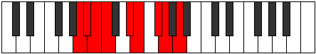 |
| [1749](https://ianring.com/musictheory/scales/1749) | [Lythian](ModeDNaturalLythian.md) | D | D, E, F#, G#, A, B, C, D |  |
| [1751](https://ianring.com/musictheory/scales/1751) | [Aeolyryllic](ModeDNaturalAeolyryllic.md) | D | D, D#, E, F#, G#, A, B, C, D |  |
| [1757](https://ianring.com/musictheory/scales/1757) | [Ionyphyllic](ModeANaturalIonyphyllic.md) | A | A, B, C, C#, D#, E, F#, G, A |  |
| [1757](https://ianring.com/musictheory/scales/1757) | [Ionyphyllic](ModeDNaturalIonyphyllic.md) | D | D, E, F, F#, G#, A, B, C, D |  |
| [1759](https://ianring.com/musictheory/scales/1759) | [Pylygic](ModeDNaturalPylygic.md) | D | D, D#, E, F, F#, G#, A, B, C, D |  |
| [1759](https://ianring.com/musictheory/scales/1759) | [Pylygic](ModeANaturalPylygic.md) | A | A, A#, B, C, C#, D#, E, F#, G, A |  |
| [1763](https://ianring.com/musictheory/scales/1763) | [Katalian](ModeBNaturalKatalian.md) | B | B, C, D##, E#, F#, G#, A, B |  |
| [1767](https://ianring.com/musictheory/scales/1767) | [Dyryllic](ModeBNaturalDyryllic.md) | B | B, C, C#, E, F, F#, G#, A, B |  |
| [1769](https://ianring.com/musictheory/scales/1769) | [Rythian](ModeFSharpRythian.md) | F# | F#, G##, A##, B#, C#, D#, E, F# |  |
| [1769](https://ianring.com/musictheory/scales/1769) | [Rythian](ModeGFlatRythian.md) | Gb | Gb, A, B, C, Db, Eb, Fb, Gb |  |
| [1771](https://ianring.com/musictheory/scales/1771) | [Stylyllic](ModeFSharpStylyllic.md) | F# | F#, G, A, B, C, C#, D#, E, F# |  |
| [1771](https://ianring.com/musictheory/scales/1771) | [Stylyllic](ModeGFlatStylyllic.md) | Gb | Gb, G, A, B, C, Db, Eb, E, Gb |  |
| [1771](https://ianring.com/musictheory/scales/1771) | [Stylyllic](ModeBNaturalStylyllic.md) | B | B, C, D, E, F, F#, G#, A, B |  |
| [1773](https://ianring.com/musictheory/scales/1773) | [Aeoloryllic](ModeANaturalAeoloryllic.md) | A | A, B, C, D, D#, E, F#, G, A |  |
| [1773](https://ianring.com/musictheory/scales/1773) | [Aeoloryllic](ModeFSharpAeoloryllic.md) | F# | F#, G#, A, B, C, C#, D#, E, F# |  |
| [1773](https://ianring.com/musictheory/scales/1773) | [Aeoloryllic](ModeGFlatAeoloryllic.md) | Gb | Gb, Ab, A, B, C, Db, Eb, E, Gb |  |
| [1775](https://ianring.com/musictheory/scales/1775) | [Lyrygic](ModeBNaturalLyrygic.md) | B | B, C, C#, D, E, F, F#, G#, A, B |  |
| [1775](https://ianring.com/musictheory/scales/1775) | [Lyrygic](ModeFSharpLyrygic.md) | F# | F#, G, G#, A, B, C, C#, D#, E, F# |  |
| [1775](https://ianring.com/musictheory/scales/1775) | [Lyrygic](ModeGFlatLyrygic.md) | Gb | Gb, G, Ab, A, B, C, Db, Eb, E, Gb |  |
| [1775](https://ianring.com/musictheory/scales/1775) | [Lyrygic](ModeANaturalLyrygic.md) | A | A, A#, B, C, D, D#, E, F#, G, A |  |
| [1779](https://ianring.com/musictheory/scales/1779) | [Aerythyllic](ModeBNaturalAerythyllic.md) | B | B, C, D#, E, F, F#, G#, A, B |  |
| [1781](https://ianring.com/musictheory/scales/1781) | [Gocryllic](ModeDNaturalGocryllic.md) | D | D, E, F#, G, G#, A, B, C, D | 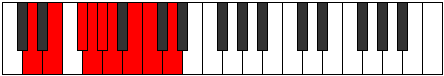 |
| [1783](https://ianring.com/musictheory/scales/1783) | [Danygic](ModeBNaturalDanygic.md) | B | B, C, C#, D#, E, F, F#, G#, A, B |  |
| [1783](https://ianring.com/musictheory/scales/1783) | [Danygic](ModeDNaturalDanygic.md) | D | D, D#, E, F#, G, G#, A, B, C, D |  |
| [1785](https://ianring.com/musictheory/scales/1785) | [Tharyllic](ModeFSharpTharyllic.md) | F# | F#, A, A#, B, C, C#, D#, E, F# |  |
| [1785](https://ianring.com/musictheory/scales/1785) | [Tharyllic](ModeGFlatTharyllic.md) | Gb | Gb, A, Bb, B, C, Db, Eb, E, Gb |  |
| [1787](https://ianring.com/musictheory/scales/1787) | [Mycrygic](ModeBNaturalMycrygic.md) | B | B, C, D, D#, E, F, F#, G#, A, B |  |
| [1787](https://ianring.com/musictheory/scales/1787) | [Mycrygic](ModeFSharpMycrygic.md) | F# | F#, G, A, A#, B, C, C#, D#, E, F# |  |
| [1787](https://ianring.com/musictheory/scales/1787) | [Mycrygic](ModeGFlatMycrygic.md) | Gb | Gb, G, A, Bb, B, C, Db, Eb, E, Gb |  |
| [1789](https://ianring.com/musictheory/scales/1789) | [Katagygic](ModeANaturalKatagygic.md) | A | A, B, C, C#, D, D#, E, F#, G, A |  |
| [1789](https://ianring.com/musictheory/scales/1789) | [Katagygic](ModeDNaturalKatagygic.md) | D | D, E, F, F#, G, G#, A, B, C, D |  |
| [1789](https://ianring.com/musictheory/scales/1789) | [Katagygic](ModeFSharpKatagygic.md) | F# | F#, G#, A, A#, B, C, C#, D#, E, F# |  |
| [1789](https://ianring.com/musictheory/scales/1789) | [Katagygic](ModeGFlatKatagygic.md) | Gb | Gb, Ab, A, Bb, B, C, Db, Eb, E, Gb |  |
| [1791](https://ianring.com/musictheory/scales/1791) | [Aerygyllian](ModeBNaturalAerygyllian.md) | B | B, C, C#, D, D#, E, F, F#, G#, A, B |  |
| [1791](https://ianring.com/musictheory/scales/1791) | [Aerygyllian](ModeDNaturalAerygyllian.md) | D | D, D#, E, F, F#, G, G#, A, B, C, D |  |
| [1791](https://ianring.com/musictheory/scales/1791) | [Aerygyllian](ModeANaturalAerygyllian.md) | A | A, A#, B, C, C#, D, D#, E, F#, G, A |  |
| [1791](https://ianring.com/musictheory/scales/1791) | [Aerygyllian](ModeFSharpAerygyllian.md) | F# | F#, G, G#, A, A#, B, C, C#, D#, E, F# |  |
| [1791](https://ianring.com/musictheory/scales/1791) | [Aerygyllian](ModeGFlatAerygyllian.md) | Gb | Gb, G, Ab, A, Bb, B, C, Db, Eb, E, Gb |  |
| [1819](https://ianring.com/musictheory/scales/1819) | [Pydian](ModeGSharpPydian.md) | G# | G#, A, B, C, D##, E#, F#, G# |  |
| [1819](https://ianring.com/musictheory/scales/1819) | [Pydian](ModeAFlatPydian.md) | Ab | Ab, Bbb, Cb, Dbb, E, F, Gb, Ab |  |
| [1823](https://ianring.com/musictheory/scales/1823) | [Phralyllic](ModeGSharpPhralyllic.md) | G# | G#, A, A#, B, C, E, F, F#, G# |  |
| [1823](https://ianring.com/musictheory/scales/1823) | [Phralyllic](ModeAFlatPhralyllic.md) | Ab | Ab, A, Bb, B, C, E, F, Gb, Ab |  |
| [1851](https://ianring.com/musictheory/scales/1851) | [Zacryllic](ModeGSharpZacryllic.md) | G# | G#, A, B, C, C#, E, F, F#, G# |  |
| [1851](https://ianring.com/musictheory/scales/1851) | [Zacryllic](ModeAFlatZacryllic.md) | Ab | Ab, A, B, C, Db, E, F, Gb, Ab |  |
| [1855](https://ianring.com/musictheory/scales/1855) | [Marygic](ModeGSharpMarygic.md) | G# | G#, A, A#, B, C, C#, E, F, F#, G# |  |
| [1855](https://ianring.com/musictheory/scales/1855) | [Marygic](ModeAFlatMarygic.md) | Ab | Ab, A, Bb, B, C, Db, E, F, Gb, Ab |  |
| [1867](https://ianring.com/musictheory/scales/1867) | [Solian](ModeDSharpSolian.md) | D# | D#, E, F#, G##, A##, B#, C#, D# |  |
| [1867](https://ianring.com/musictheory/scales/1867) | [Solian](ModeEFlatSolian.md) | Eb | Eb, Fb, Gb, A, B, C, Db, Eb |  |
| [1871](https://ianring.com/musictheory/scales/1871) | [Aeolyllic](ModeDSharpAeolyllic.md) | D# | D#, E, F, F#, A, B, C, C#, D# |  |
| [1871](https://ianring.com/musictheory/scales/1871) | [Aeolyllic](ModeEFlatAeolyllic.md) | Eb | Eb, E, F, Gb, A, B, C, Db, Eb |  |
| [1883](https://ianring.com/musictheory/scales/1883) | [Mixopyryllic](ModeDSharpMixopyryllic.md) | D# | D#, E, F#, G, A, B, C, C#, D# |  |
| [1883](https://ianring.com/musictheory/scales/1883) | [Mixopyryllic](ModeEFlatMixopyryllic.md) | Eb | Eb, E, Gb, G, A, B, C, Db, Eb |  |
| [1883](https://ianring.com/musictheory/scales/1883) | [Mixopyryllic](ModeGSharpMixopyryllic.md) | G# | G#, A, B, C, D, E, F, F#, G# |  |
| [1883](https://ianring.com/musictheory/scales/1883) | [Mixopyryllic](ModeAFlatMixopyryllic.md) | Ab | Ab, A, B, C, D, E, F, Gb, Ab |  |
| [1887](https://ianring.com/musictheory/scales/1887) | [Aerocrygic](ModeDSharpAerocrygic.md) | D# | D#, E, F, F#, G, A, B, C, C#, D# |  |
| [1887](https://ianring.com/musictheory/scales/1887) | [Aerocrygic](ModeEFlatAerocrygic.md) | Eb | Eb, E, F, Gb, G, A, B, C, Db, Eb |  |
| [1887](https://ianring.com/musictheory/scales/1887) | [Aerocrygic](ModeGSharpAerocrygic.md) | G# | G#, A, A#, B, C, D, E, F, F#, G# |  |
| [1887](https://ianring.com/musictheory/scales/1887) | [Aerocrygic](ModeAFlatAerocrygic.md) | Ab | Ab, A, Bb, B, C, D, E, F, Gb, Ab |  |
| [1897](https://ianring.com/musictheory/scales/1897) | [Ionopian](ModeFSharpIonopian.md) | F# | F#, G##, A##, B#, C##, D#, E, F# |  |
| [1897](https://ianring.com/musictheory/scales/1897) | [Ionopian](ModeGFlatIonopian.md) | Gb | Gb, A, B, C, D, Eb, Fb, Gb |  |
| [1899](https://ianring.com/musictheory/scales/1899) | [Moptyllic](ModeFSharpMoptyllic.md) | F# | F#, G, A, B, C, D, D#, E, F# |  |
| [1899](https://ianring.com/musictheory/scales/1899) | [Moptyllic](ModeGFlatMoptyllic.md) | Gb | Gb, G, A, B, C, D, Eb, E, Gb |  |
| [1899](https://ianring.com/musictheory/scales/1899) | [Moptyllic](ModeDSharpMoptyllic.md) | D# | D#, E, F#, G#, A, B, C, C#, D# |  |
| [1899](https://ianring.com/musictheory/scales/1899) | [Moptyllic](ModeEFlatMoptyllic.md) | Eb | Eb, E, Gb, Ab, A, B, C, Db, Eb |  |
| [1901](https://ianring.com/musictheory/scales/1901) | [Ionidyllic](ModeFSharpIonidyllic.md) | F# | F#, G#, A, B, C, D, D#, E, F# |  |
| [1901](https://ianring.com/musictheory/scales/1901) | [Ionidyllic](ModeGFlatIonidyllic.md) | Gb | Gb, Ab, A, B, C, D, Eb, E, Gb |  |
| [1903](https://ianring.com/musictheory/scales/1903) | [Rocrygic](ModeDSharpRocrygic.md) | D# | D#, E, F, F#, G#, A, B, C, C#, D# |  |
| [1903](https://ianring.com/musictheory/scales/1903) | [Rocrygic](ModeEFlatRocrygic.md) | Eb | Eb, E, F, Gb, Ab, A, B, C, Db, Eb |  |
| [1903](https://ianring.com/musictheory/scales/1903) | [Rocrygic](ModeFSharpRocrygic.md) | F# | F#, G, G#, A, B, C, D, D#, E, F# |  |
| [1903](https://ianring.com/musictheory/scales/1903) | [Rocrygic](ModeGFlatRocrygic.md) | Gb | Gb, G, Ab, A, B, C, D, Eb, E, Gb |  |
| [1913](https://ianring.com/musictheory/scales/1913) | [Zagyllic](ModeFSharpZagyllic.md) | F# | F#, A, A#, B, C, D, D#, E, F# |  |
| [1913](https://ianring.com/musictheory/scales/1913) | [Zagyllic](ModeGFlatZagyllic.md) | Gb | Gb, A, Bb, B, C, D, Eb, E, Gb |  |
| [1915](https://ianring.com/musictheory/scales/1915) | [Thydygic](ModeGSharpThydygic.md) | G# | G#, A, B, C, C#, D, E, F, F#, G# |  |
| [1915](https://ianring.com/musictheory/scales/1915) | [Thydygic](ModeAFlatThydygic.md) | Ab | Ab, A, B, C, Db, D, E, F, Gb, Ab |  |
| [1915](https://ianring.com/musictheory/scales/1915) | [Thydygic](ModeDSharpThydygic.md) | D# | D#, E, F#, G, G#, A, B, C, C#, D# |  |
| [1915](https://ianring.com/musictheory/scales/1915) | [Thydygic](ModeEFlatThydygic.md) | Eb | Eb, E, Gb, G, Ab, A, B, C, Db, Eb |  |
| [1915](https://ianring.com/musictheory/scales/1915) | [Thydygic](ModeFSharpThydygic.md) | F# | F#, G, A, A#, B, C, D, D#, E, F# |  |
| [1915](https://ianring.com/musictheory/scales/1915) | [Thydygic](ModeGFlatThydygic.md) | Gb | Gb, G, A, Bb, B, C, D, Eb, E, Gb |  |
| [1917](https://ianring.com/musictheory/scales/1917) | [Sacrygic](ModeFSharpSacrygic.md) | F# | F#, G#, A, A#, B, C, D, D#, E, F# |  |
| [1917](https://ianring.com/musictheory/scales/1917) | [Sacrygic](ModeGFlatSacrygic.md) | Gb | Gb, Ab, A, Bb, B, C, D, Eb, E, Gb |  |
| [1919](https://ianring.com/musictheory/scales/1919) | [Rocryllian](ModeDSharpRocryllian.md) | D# | D#, E, F, F#, G, G#, A, B, C, C#, D# |  |
| [1919](https://ianring.com/musictheory/scales/1919) | [Rocryllian](ModeEFlatRocryllian.md) | Eb | Eb, E, F, Gb, G, Ab, A, B, C, Db, Eb |  |
| [1919](https://ianring.com/musictheory/scales/1919) | [Rocryllian](ModeGSharpRocryllian.md) | G# | G#, A, A#, B, C, C#, D, E, F, F#, G# |  |
| [1919](https://ianring.com/musictheory/scales/1919) | [Rocryllian](ModeAFlatRocryllian.md) | Ab | Ab, A, Bb, B, C, Db, D, E, F, Gb, Ab |  |
| [1919](https://ianring.com/musictheory/scales/1919) | [Rocryllian](ModeFSharpRocryllian.md) | F# | F#, G, G#, A, A#, B, C, D, D#, E, F# |  |
| [1919](https://ianring.com/musictheory/scales/1919) | [Rocryllian](ModeGFlatRocryllian.md) | Gb | Gb, G, Ab, A, Bb, B, C, D, Eb, E, Gb |  |
| [1933](https://ianring.com/musictheory/scales/1933) | [Mocrian](ModeANaturalMocrian.md) | A | A, B, C, D##, E#, F#, G, A |  |
| [1935](https://ianring.com/musictheory/scales/1935) | [Mycryllic](ModeANaturalMycryllic.md) | A | A, A#, B, C, E, F, F#, G, A |  |
| [1941](https://ianring.com/musictheory/scales/1941) | [Aeranian](ModeDNaturalAeranian.md) | D | D, E, F#, G##, A#, B, C, D |  |
| [1943](https://ianring.com/musictheory/scales/1943) | [Malyllic](ModeDNaturalMalyllic.md) | D | D, D#, E, F#, A, A#, B, C, D |  |
| [1947](https://ianring.com/musictheory/scales/1947) | [Ionoyllic](ModeGSharpIonoyllic.md) | G# | G#, A, B, C, D#, E, F, F#, G# |  |
| [1947](https://ianring.com/musictheory/scales/1947) | [Ionoyllic](ModeAFlatIonoyllic.md) | Ab | Ab, A, B, C, Eb, E, F, Gb, Ab |  |
| [1949](https://ianring.com/musictheory/scales/1949) | [Mathyllic](ModeANaturalMathyllic.md) | A | A, B, C, C#, E, F, F#, G, A |  |
| [1949](https://ianring.com/musictheory/scales/1949) | [Mathyllic](ModeDNaturalMathyllic.md) | D | D, E, F, F#, A, A#, B, C, D |  |
| [1951](https://ianring.com/musictheory/scales/1951) | [Gonygic](ModeDNaturalGonygic.md) | D | D, D#, E, F, F#, A, A#, B, C, D |  |
| [1951](https://ianring.com/musictheory/scales/1951) | [Gonygic](ModeANaturalGonygic.md) | A | A, A#, B, C, C#, E, F, F#, G, A |  |
| [1951](https://ianring.com/musictheory/scales/1951) | [Gonygic](ModeGSharpGonygic.md) | G# | G#, A, A#, B, C, D#, E, F, F#, G# |  |
| [1951](https://ianring.com/musictheory/scales/1951) | [Gonygic](ModeAFlatGonygic.md) | Ab | Ab, A, Bb, B, C, Eb, E, F, Gb, Ab |  |
| [1955](https://ianring.com/musictheory/scales/1955) | [Sonian](ModeBNaturalSonian.md) | B | B, C, D##, E##, F##, G#, A, B |  |
| [1957](https://ianring.com/musictheory/scales/1957) | [Pyrian](ModeENaturalPyrian.md) | E | E, F#, G##, A##, B#, C#, D, E |  |
| [1959](https://ianring.com/musictheory/scales/1959) | [Katolyllic](ModeENaturalKatolyllic.md) | E | E, F, F#, A, B, C, C#, D, E |  |
| [1959](https://ianring.com/musictheory/scales/1959) | [Katolyllic](ModeBNaturalKatolyllic.md) | B | B, C, C#, E, F#, G, G#, A, B |  |
| [1963](https://ianring.com/musictheory/scales/1963) | [Epocryllic](ModeBNaturalEpocryllic.md) | B | B, C, D, E, F#, G, G#, A, B |  |
| [1965](https://ianring.com/musictheory/scales/1965) | [Gadyllic](ModeENaturalGadyllic.md) | E | E, F#, G, A, B, C, C#, D, E |  |
| [1965](https://ianring.com/musictheory/scales/1965) | [Gadyllic](ModeANaturalGadyllic.md) | A | A, B, C, D, E, F, F#, G, A |  |
| [1967](https://ianring.com/musictheory/scales/1967) | [Godygic](ModeENaturalGodygic.md) | E | E, F, F#, G, A, B, C, C#, D, E |  |
| [1967](https://ianring.com/musictheory/scales/1967) | [Godygic](ModeBNaturalGodygic.md) | B | B, C, C#, D, E, F#, G, G#, A, B |  |
| [1967](https://ianring.com/musictheory/scales/1967) | [Godygic](ModeANaturalGodygic.md) | A | A, A#, B, C, D, E, F, F#, G, A |  |
| [1971](https://ianring.com/musictheory/scales/1971) | [Aerynyllic](ModeBNaturalAerynyllic.md) | B | B, C, D#, E, F#, G, G#, A, B |  |
| [1973](https://ianring.com/musictheory/scales/1973) | [Zyryllic](ModeENaturalZyryllic.md) | E | E, F#, G#, A, B, C, C#, D, E |  |
| [1973](https://ianring.com/musictheory/scales/1973) | [Zyryllic](ModeDNaturalZyryllic.md) | D | D, E, F#, G, A, A#, B, C, D |  |
| [1975](https://ianring.com/musictheory/scales/1975) | [Ionocrygic](ModeENaturalIonocrygic.md) | E | E, F, F#, G#, A, B, C, C#, D, E |  |
| [1975](https://ianring.com/musictheory/scales/1975) | [Ionocrygic](ModeBNaturalIonocrygic.md) | B | B, C, C#, D#, E, F#, G, G#, A, B |  |
| [1975](https://ianring.com/musictheory/scales/1975) | [Ionocrygic](ModeDNaturalIonocrygic.md) | D | D, D#, E, F#, G, A, A#, B, C, D |  |
| [1979](https://ianring.com/musictheory/scales/1979) | [Aeradygic](ModeGSharpAeradygic.md) | G# | G#, A, B, C, C#, D#, E, F, F#, G# |  |
| [1979](https://ianring.com/musictheory/scales/1979) | [Aeradygic](ModeAFlatAeradygic.md) | Ab | Ab, A, B, C, Db, Eb, E, F, Gb, Ab |  |
| [1979](https://ianring.com/musictheory/scales/1979) | [Aeradygic](ModeBNaturalAeradygic.md) | B | B, C, D, D#, E, F#, G, G#, A, B |  |
| [1981](https://ianring.com/musictheory/scales/1981) | [Gadygic](ModeANaturalGadygic.md) | A | A, B, C, C#, D, E, F, F#, G, A |  |
| [1981](https://ianring.com/musictheory/scales/1981) | [Gadygic](ModeENaturalGadygic.md) | E | E, F#, G, G#, A, B, C, C#, D, E |  |
| [1981](https://ianring.com/musictheory/scales/1981) | [Gadygic](ModeDNaturalGadygic.md) | D | D, E, F, F#, G, A, A#, B, C, D |  |
| [1983](https://ianring.com/musictheory/scales/1983) | [Soryllian](ModeBNaturalSoryllian.md) | B | B, C, C#, D, D#, E, F#, G, G#, A, B |  |
| [1983](https://ianring.com/musictheory/scales/1983) | [Soryllian](ModeENaturalSoryllian.md) | E | E, F, F#, G, G#, A, B, C, C#, D, E |  |
| [1983](https://ianring.com/musictheory/scales/1983) | [Soryllian](ModeANaturalSoryllian.md) | A | A, A#, B, C, C#, D, E, F, F#, G, A |  |
| [1983](https://ianring.com/musictheory/scales/1983) | [Soryllian](ModeDNaturalSoryllian.md) | D | D, D#, E, F, F#, G, A, A#, B, C, D |  |
| [1983](https://ianring.com/musictheory/scales/1983) | [Soryllian](ModeGSharpSoryllian.md) | G# | G#, A, A#, B, C, C#, D#, E, F, F#, G# |  |
| [1983](https://ianring.com/musictheory/scales/1983) | [Soryllian](ModeAFlatSoryllian.md) | Ab | Ab, A, Bb, B, C, Db, Eb, E, F, Gb, Ab |  |
| [1995](https://ianring.com/musictheory/scales/1995) | [Aeolacryllic](ModeDSharpAeolacryllic.md) | D# | D#, E, F#, A, A#, B, C, C#, D# |  |
| [1995](https://ianring.com/musictheory/scales/1995) | [Aeolacryllic](ModeEFlatAeolacryllic.md) | Eb | Eb, E, Gb, A, Bb, B, C, Db, Eb |  |
| [1997](https://ianring.com/musictheory/scales/1997) | [Staryllic](ModeANaturalStaryllic.md) | A | A, B, C, D#, E, F, F#, G, A |  |
| [1999](https://ianring.com/musictheory/scales/1999) | [Zacrygic](ModeDSharpZacrygic.md) | D# | D#, E, F, F#, A, A#, B, C, C#, D# |  |
| [1999](https://ianring.com/musictheory/scales/1999) | [Zacrygic](ModeEFlatZacrygic.md) | Eb | Eb, E, F, Gb, A, Bb, B, C, Db, Eb |  |
| [1999](https://ianring.com/musictheory/scales/1999) | [Zacrygic](ModeANaturalZacrygic.md) | A | A, A#, B, C, D#, E, F, F#, G, A |  |
| [2005](https://ianring.com/musictheory/scales/2005) | [Gygyllic](ModeDNaturalGygyllic.md) | D | D, E, F#, G#, A, A#, B, C, D |  |
| [2007](https://ianring.com/musictheory/scales/2007) | [Stonygic](ModeDNaturalStonygic.md) | D | D, D#, E, F#, G#, A, A#, B, C, D |  |
| [2011](https://ianring.com/musictheory/scales/2011) | [Raphygic](ModeGSharpRaphygic.md) | G# | G#, A, B, C, D, D#, E, F, F#, G# |  |
| [2011](https://ianring.com/musictheory/scales/2011) | [Raphygic](ModeAFlatRaphygic.md) | Ab | Ab, A, B, C, D, Eb, E, F, Gb, Ab |  |
| [2011](https://ianring.com/musictheory/scales/2011) | [Raphygic](ModeDSharpRaphygic.md) | D# | D#, E, F#, G, A, A#, B, C, C#, D# |  |
| [2011](https://ianring.com/musictheory/scales/2011) | [Raphygic](ModeEFlatRaphygic.md) | Eb | Eb, E, Gb, G, A, Bb, B, C, Db, Eb |  |
| [2013](https://ianring.com/musictheory/scales/2013) | [Mocrygic](ModeANaturalMocrygic.md) | A | A, B, C, C#, D#, E, F, F#, G, A |  |
| [2013](https://ianring.com/musictheory/scales/2013) | [Mocrygic](ModeDNaturalMocrygic.md) | D | D, E, F, F#, G#, A, A#, B, C, D |  |
| [2015](https://ianring.com/musictheory/scales/2015) | [Epiryllian](ModeDSharpEpiryllian.md) | D# | D#, E, F, F#, G, A, A#, B, C, C#, D# |  |
| [2015](https://ianring.com/musictheory/scales/2015) | [Epiryllian](ModeEFlatEpiryllian.md) | Eb | Eb, E, F, Gb, G, A, Bb, B, C, Db, Eb |  |
| [2015](https://ianring.com/musictheory/scales/2015) | [Epiryllian](ModeANaturalEpiryllian.md) | A | A, A#, B, C, C#, D#, E, F, F#, G, A |  |
| [2015](https://ianring.com/musictheory/scales/2015) | [Epiryllian](ModeDNaturalEpiryllian.md) | D | D, D#, E, F, F#, G#, A, A#, B, C, D |  |
| [2015](https://ianring.com/musictheory/scales/2015) | [Epiryllian](ModeGSharpEpiryllian.md) | G# | G#, A, A#, B, C, D, D#, E, F, F#, G# |  |
| [2015](https://ianring.com/musictheory/scales/2015) | [Epiryllian](ModeAFlatEpiryllian.md) | Ab | Ab, A, Bb, B, C, D, Eb, E, F, Gb, Ab |  |
| [2019](https://ianring.com/musictheory/scales/2019) | [Palyllic](ModeBNaturalPalyllic.md) | B | B, C, E, F, F#, G, G#, A, B |  |
| [2021](https://ianring.com/musictheory/scales/2021) | [Katycryllic](ModeENaturalKatycryllic.md) | E | E, F#, A, A#, B, C, C#, D, E |  |
| [2023](https://ianring.com/musictheory/scales/2023) | [Zodygic](ModeBNaturalZodygic.md) | B | B, C, C#, E, F, F#, G, G#, A, B |  |
| [2023](https://ianring.com/musictheory/scales/2023) | [Zodygic](ModeENaturalZodygic.md) | E | E, F, F#, A, A#, B, C, C#, D, E |  |
| [2025](https://ianring.com/musictheory/scales/2025) | [Mixolydyllic](ModeFSharpMixolydyllic.md) | F# | F#, A, B, C, C#, D, D#, E, F# |  |
| [2025](https://ianring.com/musictheory/scales/2025) | [Mixolydyllic](ModeGFlatMixolydyllic.md) | Gb | Gb, A, B, C, Db, D, Eb, E, Gb |  |
| [2027](https://ianring.com/musictheory/scales/2027) | [Boptygic](ModeFSharpBoptygic.md) | F# | F#, G, A, B, C, C#, D, D#, E, F# |  |
| [2027](https://ianring.com/musictheory/scales/2027) | [Boptygic](ModeGFlatBoptygic.md) | Gb | Gb, G, A, B, C, Db, D, Eb, E, Gb |  |
| [2027](https://ianring.com/musictheory/scales/2027) | [Boptygic](ModeBNaturalBoptygic.md) | B | B, C, D, E, F, F#, G, G#, A, B |  |
| [2027](https://ianring.com/musictheory/scales/2027) | [Boptygic](ModeDSharpBoptygic.md) | D# | D#, E, F#, G#, A, A#, B, C, C#, D# |  |
| [2027](https://ianring.com/musictheory/scales/2027) | [Boptygic](ModeEFlatBoptygic.md) | Eb | Eb, E, Gb, Ab, A, Bb, B, C, Db, Eb |  |
| [2029](https://ianring.com/musictheory/scales/2029) | [Mathygic](ModeANaturalMathygic.md) | A | A, B, C, D, D#, E, F, F#, G, A |  |
| [2029](https://ianring.com/musictheory/scales/2029) | [Mathygic](ModeFSharpMathygic.md) | F# | F#, G#, A, B, C, C#, D, D#, E, F# |  |
| [2029](https://ianring.com/musictheory/scales/2029) | [Mathygic](ModeGFlatMathygic.md) | Gb | Gb, Ab, A, B, C, Db, D, Eb, E, Gb |  |
| [2029](https://ianring.com/musictheory/scales/2029) | [Mathygic](ModeENaturalMathygic.md) | E | E, F#, G, A, A#, B, C, C#, D, E |  |
| [2031](https://ianring.com/musictheory/scales/2031) | [Gadyllian](ModeFSharpGadyllian.md) | F# | F#, G, G#, A, B, C, C#, D, D#, E, F# |  |
| [2031](https://ianring.com/musictheory/scales/2031) | [Gadyllian](ModeGFlatGadyllian.md) | Gb | Gb, G, Ab, A, B, C, Db, D, Eb, E, Gb |  |
| [2031](https://ianring.com/musictheory/scales/2031) | [Gadyllian](ModeBNaturalGadyllian.md) | B | B, C, C#, D, E, F, F#, G, G#, A, B |  |
| [2031](https://ianring.com/musictheory/scales/2031) | [Gadyllian](ModeENaturalGadyllian.md) | E | E, F, F#, G, A, A#, B, C, C#, D, E |  |
| [2031](https://ianring.com/musictheory/scales/2031) | [Gadyllian](ModeANaturalGadyllian.md) | A | A, A#, B, C, D, D#, E, F, F#, G, A |  |
| [2031](https://ianring.com/musictheory/scales/2031) | [Gadyllian](ModeDSharpGadyllian.md) | D# | D#, E, F, F#, G#, A, A#, B, C, C#, D# |  |
| [2031](https://ianring.com/musictheory/scales/2031) | [Gadyllian](ModeEFlatGadyllian.md) | Eb | Eb, E, F, Gb, Ab, A, Bb, B, C, Db, Eb |  |
| [2035](https://ianring.com/musictheory/scales/2035) | [Aerythygic](ModeBNaturalAerythygic.md) | B | B, C, D#, E, F, F#, G, G#, A, B |  |
| [2037](https://ianring.com/musictheory/scales/2037) | [Sythygic](ModeENaturalSythygic.md) | E | E, F#, G#, A, A#, B, C, C#, D, E |  |
| [2037](https://ianring.com/musictheory/scales/2037) | [Sythygic](ModeDNaturalSythygic.md) | D | D, E, F#, G, G#, A, A#, B, C, D |  |
| [2039](https://ianring.com/musictheory/scales/2039) | [Danyllian](ModeBNaturalDanyllian.md) | B | B, C, C#, D#, E, F, F#, G, G#, A, B |  |
| [2039](https://ianring.com/musictheory/scales/2039) | [Danyllian](ModeENaturalDanyllian.md) | E | E, F, F#, G#, A, A#, B, C, C#, D, E |  |
| [2039](https://ianring.com/musictheory/scales/2039) | [Danyllian](ModeDNaturalDanyllian.md) | D | D, D#, E, F#, G, G#, A, A#, B, C, D |  |
| [2041](https://ianring.com/musictheory/scales/2041) | [Aeolacrygic](ModeFSharpAeolacrygic.md) | F# | F#, A, A#, B, C, C#, D, D#, E, F# |  |
| [2041](https://ianring.com/musictheory/scales/2041) | [Aeolacrygic](ModeGFlatAeolacrygic.md) | Gb | Gb, A, Bb, B, C, Db, D, Eb, E, Gb |  |
| [2043](https://ianring.com/musictheory/scales/2043) | [Lythyllian](ModeGSharpLythyllian.md) | G# | G#, A, B, C, C#, D, D#, E, F, F#, G# |  |
| [2043](https://ianring.com/musictheory/scales/2043) | [Lythyllian](ModeAFlatLythyllian.md) | Ab | Ab, A, B, C, Db, D, Eb, E, F, Gb, Ab |  |
| [2043](https://ianring.com/musictheory/scales/2043) | [Lythyllian](ModeBNaturalLythyllian.md) | B | B, C, D, D#, E, F, F#, G, G#, A, B |  |
| [2043](https://ianring.com/musictheory/scales/2043) | [Lythyllian](ModeFSharpLythyllian.md) | F# | F#, G, A, A#, B, C, C#, D, D#, E, F# |  |
| [2043](https://ianring.com/musictheory/scales/2043) | [Lythyllian](ModeGFlatLythyllian.md) | Gb | Gb, G, A, Bb, B, C, Db, D, Eb, E, Gb |  |
| [2043](https://ianring.com/musictheory/scales/2043) | [Lythyllian](ModeDSharpLythyllian.md) | D# | D#, E, F#, G, G#, A, A#, B, C, C#, D# |  |
| [2043](https://ianring.com/musictheory/scales/2043) | [Lythyllian](ModeEFlatLythyllian.md) | Eb | Eb, E, Gb, G, Ab, A, Bb, B, C, Db, Eb |  |
| [2045](https://ianring.com/musictheory/scales/2045) | [Katogyllian](ModeANaturalKatogyllian.md) | A | A, B, C, C#, D, D#, E, F, F#, G, A |  |
| [2045](https://ianring.com/musictheory/scales/2045) | [Katogyllian](ModeFSharpKatogyllian.md) | F# | F#, G#, A, A#, B, C, C#, D, D#, E, F# |  |
| [2045](https://ianring.com/musictheory/scales/2045) | [Katogyllian](ModeGFlatKatogyllian.md) | Gb | Gb, Ab, A, Bb, B, C, Db, D, Eb, E, Gb |  |
| [2045](https://ianring.com/musictheory/scales/2045) | [Katogyllian](ModeENaturalKatogyllian.md) | E | E, F#, G, G#, A, A#, B, C, C#, D, E |  |
| [2045](https://ianring.com/musictheory/scales/2045) | [Katogyllian](ModeDNaturalKatogyllian.md) | D | D, E, F, F#, G, G#, A, A#, B, C, D |  |
| [2047](https://ianring.com/musictheory/scales/2047) | [Monatic](ModeBNaturalMonatic.md) | B | B, C, C#, D, D#, E, F, F#, G, G#, A, B |  |
| [2047](https://ianring.com/musictheory/scales/2047) | [Monatic](ModeANaturalMonatic.md) | A | A, A#, B, C, C#, D, D#, E, F, F#, G, A |  |
| [2047](https://ianring.com/musictheory/scales/2047) | [Monatic](ModeGSharpMonatic.md) | G# | G#, A, A#, B, C, C#, D, D#, E, F, F#, G# |  |
| [2047](https://ianring.com/musictheory/scales/2047) | [Monatic](ModeAFlatMonatic.md) | Ab | Ab, A, Bb, B, C, Db, D, Eb, E, F, Gb, Ab |  |
| [2047](https://ianring.com/musictheory/scales/2047) | [Monatic](ModeFSharpMonatic.md) | F# | F#, G, G#, A, A#, B, C, C#, D, D#, E, F# |  |
| [2047](https://ianring.com/musictheory/scales/2047) | [Monatic](ModeGFlatMonatic.md) | Gb | Gb, G, Ab, A, Bb, B, C, Db, D, Eb, E, Gb |  |
| [2047](https://ianring.com/musictheory/scales/2047) | [Monatic](ModeENaturalMonatic.md) | E | E, F, F#, G, G#, A, A#, B, C, C#, D, E |  |
| [2047](https://ianring.com/musictheory/scales/2047) | [Monatic](ModeDSharpMonatic.md) | D# | D#, E, F, F#, G, G#, A, A#, B, C, C#, D# |  |
| [2047](https://ianring.com/musictheory/scales/2047) | [Monatic](ModeEFlatMonatic.md) | Eb | Eb, E, F, Gb, G, Ab, A, Bb, B, C, Db, Eb |  |
| [2047](https://ianring.com/musictheory/scales/2047) | [Monatic](ModeDNaturalMonatic.md) | D | D, D#, E, F, F#, G, G#, A, A#, B, C, D |  |
| [2259](https://ianring.com/musictheory/scales/2259) | [Gogimic](ModeFNaturalGogimic.md) | F | F, Gb, A, B, C, D##, F |  |
| [2263](https://ianring.com/musictheory/scales/2263) | [Lycrian](ModeFNaturalLycrian.md) | F | F, Gb, Abb, Bbb, Cb, Dbb, E, F |  |
| [2267](https://ianring.com/musictheory/scales/2267) | [Padian](ModeFNaturalPadian.md) | F | F, Gb, Ab, Bbb, Cb, Dbb, E, F |  |
| [2271](https://ianring.com/musictheory/scales/2271) | [Poptyllic](ModeFNaturalPoptyllic.md) | F | F, F#, G, G#, A, B, C, E, F | 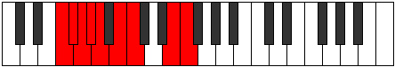 |
| [2291](https://ianring.com/musictheory/scales/2291) | [Zydian](ModeFNaturalZydian.md) | F | F, Gb, A, Bb, Cb, Dbb, E, F |  |
| [2295](https://ianring.com/musictheory/scales/2295) | [Kogyllic](ModeFNaturalKogyllic.md) | F | F, F#, G, A, A#, B, C, E, F |  |
| [2299](https://ianring.com/musictheory/scales/2299) | [Phraptyllic](ModeFNaturalPhraptyllic.md) | F | F, F#, G#, A, A#, B, C, E, F |  |
| [2303](https://ianring.com/musictheory/scales/2303) | [Stanygic](ModeFNaturalStanygic.md) | F | F, F#, G, G#, A, A#, B, C, E, F |  |
| [2375](https://ianring.com/musictheory/scales/2375) | [Aeolaptimic](ModeASharpAeolaptimic.md) | A# | A#, B, C, D##, E##, Cbbb, A# |  |
| [2375](https://ianring.com/musictheory/scales/2375) | [Aeolaptimic](ModeBFlatAeolaptimic.md) | Bb | Bb, Cb, Dbb, E, F#, G##, Bb |  |
| [2383](https://ianring.com/musictheory/scales/2383) | [Katorian](ModeASharpKatorian.md) | A# | A#, B, C, Db, E, F#, G##, A# |  |
| [2383](https://ianring.com/musictheory/scales/2383) | [Katorian](ModeBFlatKatorian.md) | Bb | Bb, Cb, Dbb, Ebbb, Fb, Gb, A, Bb |  |
| [2391](https://ianring.com/musictheory/scales/2391) | [Molian](ModeASharpMolian.md) | A# | A#, B, C, D, E, F#, G##, A# |  |
| [2391](https://ianring.com/musictheory/scales/2391) | [Molian](ModeBFlatMolian.md) | Bb | Bb, Cb, Dbb, Ebb, Fb, Gb, A, Bb |  |
| [2399](https://ianring.com/musictheory/scales/2399) | [Zanyllic](ModeASharpZanyllic.md) | A# | A#, B, C, C#, D, E, F#, A, A# |  |
| [2399](https://ianring.com/musictheory/scales/2399) | [Zanyllic](ModeBFlatZanyllic.md) | Bb | Bb, B, C, Db, D, E, Gb, A, Bb |  |
| [2407](https://ianring.com/musictheory/scales/2407) | [Zylian](ModeASharpZylian.md) | A# | A#, B, C, D#, E, F#, G##, A# |  |
| [2407](https://ianring.com/musictheory/scales/2407) | [Zylian](ModeBFlatZylian.md) | Bb | Bb, Cb, Dbb, Eb, Fb, Gb, A, Bb |  |
| [2415](https://ianring.com/musictheory/scales/2415) | [Lothyllic](ModeASharpLothyllic.md) | A# | A#, B, C, C#, D#, E, F#, A, A# |  |
| [2415](https://ianring.com/musictheory/scales/2415) | [Lothyllic](ModeBFlatLothyllic.md) | Bb | Bb, B, C, Db, Eb, E, Gb, A, Bb |  |
| [2423](https://ianring.com/musictheory/scales/2423) | [Thorcryllic](ModeASharpThorcryllic.md) | A# | A#, B, C, D, D#, E, F#, A, A# |  |
| [2423](https://ianring.com/musictheory/scales/2423) | [Thorcryllic](ModeBFlatThorcryllic.md) | Bb | Bb, B, C, D, Eb, E, Gb, A, Bb |  |
| [2431](https://ianring.com/musictheory/scales/2431) | [Gythygic](ModeASharpGythygic.md) | A# | A#, B, C, C#, D, D#, E, F#, A, A# |  |
| [2431](https://ianring.com/musictheory/scales/2431) | [Gythygic](ModeBFlatGythygic.md) | Bb | Bb, B, C, Db, D, Eb, E, Gb, A, Bb |  |
| [2469](https://ianring.com/musictheory/scales/2469) | [Staptimic](ModeENaturalStaptimic.md) | E | E, F#, G##, A##, B#, C###, E |  |
| [2471](https://ianring.com/musictheory/scales/2471) | [Eparian](ModeENaturalEparian.md) | E | E, F, Gb, A, B, C, D#, E |  |
| [2477](https://ianring.com/musictheory/scales/2477) | [Mydian](ModeENaturalMydian.md) | E | E, F#, G, A, B, C, D#, E |  |
| [2479](https://ianring.com/musictheory/scales/2479) | [Rycryllic](ModeENaturalRycryllic.md) | E | E, F, F#, G, A, B, C, D#, E |  |
| [2485](https://ianring.com/musictheory/scales/2485) | [Aerorian](ModeENaturalAerorian.md) | E | E, F#, G#, A, B, C, D#, E |  |
| [2487](https://ianring.com/musictheory/scales/2487) | [Phroptyllic](ModeENaturalPhroptyllic.md) | E | E, F, F#, G#, A, B, C, D#, E |  |
| [2493](https://ianring.com/musictheory/scales/2493) | [Manyllic](ModeENaturalManyllic.md) | E | E, F#, G, G#, A, B, C, D#, E |  |
| [2495](https://ianring.com/musictheory/scales/2495) | [Aeolocrygic](ModeENaturalAeolocrygic.md) | E | E, F, F#, G, G#, A, B, C, D#, E |  |
| [2503](https://ianring.com/musictheory/scales/2503) | [Stonian](ModeASharpStonian.md) | A# | A#, B, C, D##, E#, F#, G##, A# |  |
| [2503](https://ianring.com/musictheory/scales/2503) | [Stonian](ModeBFlatStonian.md) | Bb | Bb, Cb, Dbb, E, F, Gb, A, Bb |  |
| [2511](https://ianring.com/musictheory/scales/2511) | [Epyryllic](ModeASharpEpyryllic.md) | A# | A#, B, C, C#, E, F, F#, A, A# |  |
| [2511](https://ianring.com/musictheory/scales/2511) | [Epyryllic](ModeBFlatEpyryllic.md) | Bb | Bb, B, C, Db, E, F, Gb, A, Bb |  |
| [2515](https://ianring.com/musictheory/scales/2515) | [Stylian](ModeFNaturalStylian.md) | F | F, Gb, A, B, C, Db, E, F |  |
| [2519](https://ianring.com/musictheory/scales/2519) | [Dathyllic](ModeFNaturalDathyllic.md) | F | F, F#, G, A, B, C, C#, E, F |  |
| [2519](https://ianring.com/musictheory/scales/2519) | [Dathyllic](ModeASharpDathyllic.md) | A# | A#, B, C, D, E, F, F#, A, A# |  |
| [2519](https://ianring.com/musictheory/scales/2519) | [Dathyllic](ModeBFlatDathyllic.md) | Bb | Bb, B, C, D, E, F, Gb, A, Bb |  |
| [2523](https://ianring.com/musictheory/scales/2523) | [Rygyllic](ModeFNaturalRygyllic.md) | F | F, F#, G#, A, B, C, C#, E, F |  |
| [2527](https://ianring.com/musictheory/scales/2527) | [Phradygic](ModeFNaturalPhradygic.md) | F | F, F#, G, G#, A, B, C, C#, E, F |  |
| [2527](https://ianring.com/musictheory/scales/2527) | [Phradygic](ModeASharpPhradygic.md) | A# | A#, B, C, C#, D, E, F, F#, A, A# |  |
| [2527](https://ianring.com/musictheory/scales/2527) | [Phradygic](ModeBFlatPhradygic.md) | Bb | Bb, B, C, Db, D, E, F, Gb, A, Bb |  |
| [2533](https://ianring.com/musictheory/scales/2533) | [Podian](ModeENaturalPodian.md) | E | E, F#, G##, A#, B, C, D#, E |  |
| [2535](https://ianring.com/musictheory/scales/2535) | [Zygyllic](ModeENaturalZygyllic.md) | E | E, F, F#, A, A#, B, C, D#, E |  |
| [2535](https://ianring.com/musictheory/scales/2535) | [Zygyllic](ModeASharpZygyllic.md) | A# | A#, B, C, D#, E, F, F#, A, A# |  |
| [2535](https://ianring.com/musictheory/scales/2535) | [Zygyllic](ModeBFlatZygyllic.md) | Bb | Bb, B, C, Eb, E, F, Gb, A, Bb |  |
| [2541](https://ianring.com/musictheory/scales/2541) | [Katadyllic](ModeENaturalKatadyllic.md) | E | E, F#, G, A, A#, B, C, D#, E |  |
| [2543](https://ianring.com/musictheory/scales/2543) | [Dydygic](ModeASharpDydygic.md) | A# | A#, B, C, C#, D#, E, F, F#, A, A# |  |
| [2543](https://ianring.com/musictheory/scales/2543) | [Dydygic](ModeBFlatDydygic.md) | Bb | Bb, B, C, Db, Eb, E, F, Gb, A, Bb |  |
| [2543](https://ianring.com/musictheory/scales/2543) | [Dydygic](ModeENaturalDydygic.md) | E | E, F, F#, G, A, A#, B, C, D#, E |  |
| [2547](https://ianring.com/musictheory/scales/2547) | [Sogyllic](ModeFNaturalSogyllic.md) | F | F, F#, A, A#, B, C, C#, E, F |  |
| [2549](https://ianring.com/musictheory/scales/2549) | [Rydyllic](ModeENaturalRydyllic.md) | E | E, F#, G#, A, A#, B, C, D#, E |  |
| [2551](https://ianring.com/musictheory/scales/2551) | [Zoptygic](ModeASharpZoptygic.md) | A# | A#, B, C, D, D#, E, F, F#, A, A# |  |
| [2551](https://ianring.com/musictheory/scales/2551) | [Zoptygic](ModeBFlatZoptygic.md) | Bb | Bb, B, C, D, Eb, E, F, Gb, A, Bb |  |
| [2551](https://ianring.com/musictheory/scales/2551) | [Zoptygic](ModeFNaturalZoptygic.md) | F | F, F#, G, A, A#, B, C, C#, E, F |  |
| [2551](https://ianring.com/musictheory/scales/2551) | [Zoptygic](ModeENaturalZoptygic.md) | E | E, F, F#, G#, A, A#, B, C, D#, E |  |
| [2555](https://ianring.com/musictheory/scales/2555) | [Bythygic](ModeFNaturalBythygic.md) | F | F, F#, G#, A, A#, B, C, C#, E, F |  |
| [2557](https://ianring.com/musictheory/scales/2557) | [Dothygic](ModeENaturalDothygic.md) | E | E, F#, G, G#, A, A#, B, C, D#, E |  |
| [2559](https://ianring.com/musictheory/scales/2559) | [Zogyllian](ModeASharpZogyllian.md) | A# | A#, B, C, C#, D, D#, E, F, F#, A, A# |  |
| [2559](https://ianring.com/musictheory/scales/2559) | [Zogyllian](ModeBFlatZogyllian.md) | Bb | Bb, B, C, Db, D, Eb, E, F, Gb, A, Bb |  |
| [2559](https://ianring.com/musictheory/scales/2559) | [Zogyllian](ModeFNaturalZogyllian.md) | F | F, F#, G, G#, A, A#, B, C, C#, E, F |  |
| [2559](https://ianring.com/musictheory/scales/2559) | [Zogyllian](ModeENaturalZogyllian.md) | E | E, F, F#, G, G#, A, A#, B, C, D#, E |  |
| [2613](https://ianring.com/musictheory/scales/2613) | [Aeolanimic](ModeGNaturalAeolanimic.md) | G | G, A, B, C, D##, E##, G | 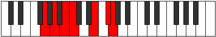 |
| [2615](https://ianring.com/musictheory/scales/2615) | [Thoptian](ModeGNaturalThoptian.md) | G | G, Ab, Bbb, Cb, Dbb, E, F#, G |  |
| [2621](https://ianring.com/musictheory/scales/2621) | [Ionogian](ModeGNaturalIonogian.md) | G | G, A, Bb, Cb, Dbb, E, F#, G |  |
| [2623](https://ianring.com/musictheory/scales/2623) | [Aerylyllic](ModeGNaturalAerylyllic.md) | G | G, G#, A, A#, B, C, E, F#, G |  |
| [2641](https://ianring.com/musictheory/scales/2641) | [Gathitonic](ModeCNaturalGathitonic.md) | C | C, E, F#, A, B, C |  |
| [2643](https://ianring.com/musictheory/scales/2643) | [Lydimic](ModeCNaturalLydimic.md) | C | C, Db, E, F#, G##, A##, C |  |
| [2645](https://ianring.com/musictheory/scales/2645) | [Zoptimic](ModeCNaturalZoptimic.md) | C | C, D, E, F#, G##, A##, C |  |
| [2647](https://ianring.com/musictheory/scales/2647) | [Dadian](ModeCNaturalDadian.md) | C | C, Db, Ebb, Fb, Gb, A, B, C |  |
| [2649](https://ianring.com/musictheory/scales/2649) | [Aeolythimic](ModeCNaturalAeolythimic.md) | C | C, D#, E, F#, G##, A##, C |  |
| [2651](https://ianring.com/musictheory/scales/2651) | [Panian](ModeCNaturalPanian.md) | C | C, Db, Eb, Fb, Gb, A, B, C |  |
| [2653](https://ianring.com/musictheory/scales/2653) | [Sygian](ModeCNaturalSygian.md) | C | C, D, Eb, Fb, Gb, A, B, C |  |
| [2655](https://ianring.com/musictheory/scales/2655) | [Thocryllic](ModeCNaturalThocryllic.md) | C | C, C#, D, D#, E, F#, A, B, C |  |
| [2673](https://ianring.com/musictheory/scales/2673) | [Mythimic](ModeCNaturalMythimic.md) | C | C, D##, E#, F#, G##, A##, C |  |
| [2675](https://ianring.com/musictheory/scales/2675) | [Gogian](ModeCNaturalGogian.md) | C | C, Db, E, F, Gb, A, B, C |  |
| [2677](https://ianring.com/musictheory/scales/2677) | [Thodian](ModeCNaturalThodian.md) | C | C, D, E, F, Gb, A, B, C |  |
| [2677](https://ianring.com/musictheory/scales/2677) | [Thodian](ModeGNaturalThodian.md) | G | G, A, B, C, Db, E, F#, G |  |
| [2679](https://ianring.com/musictheory/scales/2679) | [Rathyllic](ModeCNaturalRathyllic.md) | C | C, C#, D, E, F, F#, A, B, C |  |
| [2679](https://ianring.com/musictheory/scales/2679) | [Rathyllic](ModeGNaturalRathyllic.md) | G | G, G#, A, B, C, C#, E, F#, G |  |
| [2681](https://ianring.com/musictheory/scales/2681) | [Aerycrian](ModeCNaturalAerycrian.md) | C | C, D#, E, F, Gb, A, B, C |  |
| [2683](https://ianring.com/musictheory/scales/2683) | [Thodyllic](ModeCNaturalThodyllic.md) | C | C, C#, D#, E, F, F#, A, B, C |  |
| [2685](https://ianring.com/musictheory/scales/2685) | [Ionoryllic](ModeCNaturalIonoryllic.md) | C | C, D, D#, E, F, F#, A, B, C |  |
| [2685](https://ianring.com/musictheory/scales/2685) | [Ionoryllic](ModeGNaturalIonoryllic.md) | G | G, A, A#, B, C, C#, E, F#, G |  |
| [2687](https://ianring.com/musictheory/scales/2687) | [Thacrygic](ModeCNaturalThacrygic.md) | C | C, C#, D, D#, E, F, F#, A, B, C |  |
| [2687](https://ianring.com/musictheory/scales/2687) | [Thacrygic](ModeGNaturalThacrygic.md) | G | G, G#, A, A#, B, C, C#, E, F#, G |  |
| [2701](https://ianring.com/musictheory/scales/2701) | [Epythimic](ModeANaturalEpythimic.md) | A | A, B, C, D##, E##, F###, A |  |
| [2703](https://ianring.com/musictheory/scales/2703) | [Galian](ModeANaturalGalian.md) | A | A, Bb, Cb, Dbb, E, F#, G#, A |  |
| [2717](https://ianring.com/musictheory/scales/2717) | [Epygian](ModeANaturalEpygian.md) | A | A, B, C, Db, E, F#, G#, A |  |
| [2719](https://ianring.com/musictheory/scales/2719) | [Zocryllic](ModeANaturalZocryllic.md) | A | A, A#, B, C, C#, E, F#, G#, A |  |
| [2733](https://ianring.com/musictheory/scales/2733) | [Bocrian](ModeANaturalBocrian.md) | A | A, B, C, D, E, F#, G#, A |  |
| [2735](https://ianring.com/musictheory/scales/2735) | [Gynyllic](ModeANaturalGynyllic.md) | A | A, A#, B, C, D, E, F#, G#, A |  |
| [2741](https://ianring.com/musictheory/scales/2741) | [Ionian](ModeGNaturalIonian.md) | G | G, A, B, C, D, E, F#, G |  |
| [2743](https://ianring.com/musictheory/scales/2743) | [Staptyllic](ModeGNaturalStaptyllic.md) | G | G, G#, A, B, C, D, E, F#, G |  |
| [2749](https://ianring.com/musictheory/scales/2749) | [Katagyllic](ModeANaturalKatagyllic.md) | A | A, B, C, C#, D, E, F#, G#, A |  |
| [2749](https://ianring.com/musictheory/scales/2749) | [Katagyllic](ModeGNaturalKatagyllic.md) | G | G, A, A#, B, C, D, E, F#, G |  |
| [2751](https://ianring.com/musictheory/scales/2751) | [Sylygic](ModeANaturalSylygic.md) | A | A, A#, B, C, C#, D, E, F#, G#, A |  |
| [2751](https://ianring.com/musictheory/scales/2751) | [Sylygic](ModeGNaturalSylygic.md) | G | G, G#, A, A#, B, C, D, E, F#, G |  |
| [2765](https://ianring.com/musictheory/scales/2765) | [Banian](ModeANaturalBanian.md) | A | A, B, C, D#, E, F#, G#, A |  |
| [2767](https://ianring.com/musictheory/scales/2767) | [Katydyllic](ModeANaturalKatydyllic.md) | A | A, A#, B, C, D#, E, F#, G#, A |  |
| [2769](https://ianring.com/musictheory/scales/2769) | [Dyrimic](ModeCNaturalDyrimic.md) | C | C, D##, E##, F##, G##, A##, C |  |
| [2771](https://ianring.com/musictheory/scales/2771) | [Garian](ModeFNaturalGarian.md) | F | F, Gb, A, B, C, D, E, F |  |
| [2771](https://ianring.com/musictheory/scales/2771) | [Garian](ModeCNaturalGarian.md) | C | C, Db, E, F#, G, A, B, C |  |
| [2773](https://ianring.com/musictheory/scales/2773) | [Lydian](ModeCNaturalLydian.md) | C | C, D, E, F#, G, A, B, C |  |
| [2775](https://ianring.com/musictheory/scales/2775) | [Godyllic](ModeCNaturalGodyllic.md) | C | C, C#, D, E, F#, G, A, B, C |  |
| [2775](https://ianring.com/musictheory/scales/2775) | [Godyllic](ModeFNaturalGodyllic.md) | F | F, F#, G, A, B, C, D, E, F |  |
| [2777](https://ianring.com/musictheory/scales/2777) | [Bycrian](ModeCNaturalBycrian.md) | C | C, D#, E, F#, G, A, B, C |  |
| [2779](https://ianring.com/musictheory/scales/2779) | [Garyllic](ModeCNaturalGaryllic.md) | C | C, C#, D#, E, F#, G, A, B, C |  |
| [2779](https://ianring.com/musictheory/scales/2779) | [Garyllic](ModeFNaturalGaryllic.md) | F | F, F#, G#, A, B, C, D, E, F |  |
| [2781](https://ianring.com/musictheory/scales/2781) | [Gycryllic](ModeCNaturalGycryllic.md) | C | C, D, D#, E, F#, G, A, B, C |  |
| [2781](https://ianring.com/musictheory/scales/2781) | [Gycryllic](ModeANaturalGycryllic.md) | A | A, B, C, C#, D#, E, F#, G#, A |  |
| [2783](https://ianring.com/musictheory/scales/2783) | [Gothygic](ModeCNaturalGothygic.md) | C | C, C#, D, D#, E, F#, G, A, B, C |  |
| [2783](https://ianring.com/musictheory/scales/2783) | [Gothygic](ModeFNaturalGothygic.md) | F | F, F#, G, G#, A, B, C, D, E, F |  |
| [2783](https://ianring.com/musictheory/scales/2783) | [Gothygic](ModeANaturalGothygic.md) | A | A, A#, B, C, C#, D#, E, F#, G#, A |  |
| [2797](https://ianring.com/musictheory/scales/2797) | [Stalyllic](ModeANaturalStalyllic.md) | A | A, B, C, D, D#, E, F#, G#, A |  |
| [2799](https://ianring.com/musictheory/scales/2799) | [Epilygic](ModeANaturalEpilygic.md) | A | A, A#, B, C, D, D#, E, F#, G#, A |  |
| [2801](https://ianring.com/musictheory/scales/2801) | [Zogian](ModeCNaturalZogian.md) | C | C, D##, E#, F#, G, A, B, C |  |
| [2803](https://ianring.com/musictheory/scales/2803) | [Zolyllic](ModeCNaturalZolyllic.md) | C | C, C#, E, F, F#, G, A, B, C |  |
| [2803](https://ianring.com/musictheory/scales/2803) | [Zolyllic](ModeFNaturalZolyllic.md) | F | F, F#, A, A#, B, C, D, E, F |  |
| [2805](https://ianring.com/musictheory/scales/2805) | [Zylyllic](ModeGNaturalZylyllic.md) | G | G, A, B, C, C#, D, E, F#, G |  |
| [2805](https://ianring.com/musictheory/scales/2805) | [Zylyllic](ModeCNaturalZylyllic.md) | C | C, D, E, F, F#, G, A, B, C |  |
| [2807](https://ianring.com/musictheory/scales/2807) | [Zylygic](ModeCNaturalZylygic.md) | C | C, C#, D, E, F, F#, G, A, B, C |  |
| [2807](https://ianring.com/musictheory/scales/2807) | [Zylygic](ModeGNaturalZylygic.md) | G | G, G#, A, B, C, C#, D, E, F#, G |  |
| [2807](https://ianring.com/musictheory/scales/2807) | [Zylygic](ModeFNaturalZylygic.md) | F | F, F#, G, A, A#, B, C, D, E, F |  |
| [2809](https://ianring.com/musictheory/scales/2809) | [Gythyllic](ModeCNaturalGythyllic.md) | C | C, D#, E, F, F#, G, A, B, C |  |
| [2811](https://ianring.com/musictheory/scales/2811) | [Barygic](ModeCNaturalBarygic.md) | C | C, C#, D#, E, F, F#, G, A, B, C |  |
| [2811](https://ianring.com/musictheory/scales/2811) | [Barygic](ModeFNaturalBarygic.md) | F | F, F#, G#, A, A#, B, C, D, E, F |  |
| [2813](https://ianring.com/musictheory/scales/2813) | [Zolygic](ModeCNaturalZolygic.md) | C | C, D, D#, E, F, F#, G, A, B, C |  |
| [2813](https://ianring.com/musictheory/scales/2813) | [Zolygic](ModeANaturalZolygic.md) | A | A, B, C, C#, D, D#, E, F#, G#, A |  |
| [2813](https://ianring.com/musictheory/scales/2813) | [Zolygic](ModeGNaturalZolygic.md) | G | G, A, A#, B, C, C#, D, E, F#, G |  |
| [2815](https://ianring.com/musictheory/scales/2815) | [Aeradyllian](ModeCNaturalAeradyllian.md) | C | C, C#, D, D#, E, F, F#, G, A, B, C |  |
| [2815](https://ianring.com/musictheory/scales/2815) | [Aeradyllian](ModeANaturalAeradyllian.md) | A | A, A#, B, C, C#, D, D#, E, F#, G#, A |  |
| [2815](https://ianring.com/musictheory/scales/2815) | [Aeradyllian](ModeGNaturalAeradyllian.md) | G | G, G#, A, A#, B, C, C#, D, E, F#, G |  |
| [2815](https://ianring.com/musictheory/scales/2815) | [Aeradyllian](ModeFNaturalAeradyllian.md) | F | F, F#, G, G#, A, A#, B, C, D, E, F | 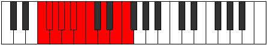 |
| [2869](https://ianring.com/musictheory/scales/2869) | [Phrothian](ModeGNaturalPhrothian.md) | G | G, A, B, C, D#, E, F#, G |  |
| [2871](https://ianring.com/musictheory/scales/2871) | [Stanyllic](ModeGNaturalStanyllic.md) | G | G, G#, A, B, C, D#, E, F#, G |  |
| [2877](https://ianring.com/musictheory/scales/2877) | [Phrylyllic](ModeGNaturalPhrylyllic.md) | G | G, A, A#, B, C, D#, E, F#, G |  |
| [2879](https://ianring.com/musictheory/scales/2879) | [Stadygic](ModeGNaturalStadygic.md) | G | G, G#, A, A#, B, C, D#, E, F#, G |  |
| [2887](https://ianring.com/musictheory/scales/2887) | [Gaptian](ModeASharpGaptian.md) | A# | A#, B, C, D##, E##, F##, G##, A# |  |
| [2887](https://ianring.com/musictheory/scales/2887) | [Gaptian](ModeBFlatGaptian.md) | Bb | Bb, Cb, Dbb, E, F#, G, A, Bb |  |
| [2891](https://ianring.com/musictheory/scales/2891) | [Phrogian](ModeDSharpPhrogian.md) | D# | D#, E, F#, G##, A##, B#, C##, D# |  |
| [2891](https://ianring.com/musictheory/scales/2891) | [Phrogian](ModeEFlatPhrogian.md) | Eb | Eb, Fb, Gb, A, B, C, D, Eb |  |
| [2895](https://ianring.com/musictheory/scales/2895) | [Aeragyllic](ModeDSharpAeragyllic.md) | D# | D#, E, F, F#, A, B, C, D, D# |  |
| [2895](https://ianring.com/musictheory/scales/2895) | [Aeragyllic](ModeEFlatAeragyllic.md) | Eb | Eb, E, F, Gb, A, B, C, D, Eb |  |
| [2895](https://ianring.com/musictheory/scales/2895) | [Aeragyllic](ModeASharpAeragyllic.md) | A# | A#, B, C, C#, E, F#, G, A, A# |  |
| [2895](https://ianring.com/musictheory/scales/2895) | [Aeragyllic](ModeBFlatAeragyllic.md) | Bb | Bb, B, C, Db, E, Gb, G, A, Bb |  |
| [2897](https://ianring.com/musictheory/scales/2897) | [Rycrimic](ModeCNaturalRycrimic.md) | C | C, D##, E##, F###, G##, A##, C |  |
| [2899](https://ianring.com/musictheory/scales/2899) | [Kagian](ModeCNaturalKagian.md) | C | C, Db, E, F#, G#, A, B, C |  |
| [2901](https://ianring.com/musictheory/scales/2901) | [Larian](ModeCNaturalLarian.md) | C | C, D, E, F#, G#, A, B, C |  |
| [2903](https://ianring.com/musictheory/scales/2903) | [Gothyllic](ModeCNaturalGothyllic.md) | C | C, C#, D, E, F#, G#, A, B, C |  |
| [2903](https://ianring.com/musictheory/scales/2903) | [Gothyllic](ModeASharpGothyllic.md) | A# | A#, B, C, D, E, F#, G, A, A# |  |
| [2903](https://ianring.com/musictheory/scales/2903) | [Gothyllic](ModeBFlatGothyllic.md) | Bb | Bb, B, C, D, E, Gb, G, A, Bb |  |
| [2905](https://ianring.com/musictheory/scales/2905) | [Palian](ModeCNaturalPalian.md) | C | C, D#, E, F#, G#, A, B, C |  |
| [2907](https://ianring.com/musictheory/scales/2907) | [Mogyllic](ModeDSharpMogyllic.md) | D# | D#, E, F#, G, A, B, C, D, D# |  |
| [2907](https://ianring.com/musictheory/scales/2907) | [Mogyllic](ModeEFlatMogyllic.md) | Eb | Eb, E, Gb, G, A, B, C, D, Eb |  |
| [2907](https://ianring.com/musictheory/scales/2907) | [Mogyllic](ModeCNaturalMogyllic.md) | C | C, C#, D#, E, F#, G#, A, B, C |  |
| [2909](https://ianring.com/musictheory/scales/2909) | [Mocryllic](ModeCNaturalMocryllic.md) | C | C, D, D#, E, F#, G#, A, B, C |  |
| [2911](https://ianring.com/musictheory/scales/2911) | [Katygic](ModeDSharpKatygic.md) | D# | D#, E, F, F#, G, A, B, C, D, D# |  |
| [2911](https://ianring.com/musictheory/scales/2911) | [Katygic](ModeEFlatKatygic.md) | Eb | Eb, E, F, Gb, G, A, B, C, D, Eb |  |
| [2911](https://ianring.com/musictheory/scales/2911) | [Katygic](ModeCNaturalKatygic.md) | C | C, C#, D, D#, E, F#, G#, A, B, C |  |
| [2911](https://ianring.com/musictheory/scales/2911) | [Katygic](ModeASharpKatygic.md) | A# | A#, B, C, C#, D, E, F#, G, A, A# |  |
| [2911](https://ianring.com/musictheory/scales/2911) | [Katygic](ModeBFlatKatygic.md) | Bb | Bb, B, C, Db, D, E, Gb, G, A, Bb |  |
| [2919](https://ianring.com/musictheory/scales/2919) | [Molyllic](ModeASharpMolyllic.md) | A# | A#, B, C, D#, E, F#, G, A, A# |  |
| [2919](https://ianring.com/musictheory/scales/2919) | [Molyllic](ModeBFlatMolyllic.md) | Bb | Bb, B, C, Eb, E, Gb, G, A, Bb |  |
| [2923](https://ianring.com/musictheory/scales/2923) | [Baryllic](ModeDSharpBaryllic.md) | D# | D#, E, F#, G#, A, B, C, D, D# |  |
| [2923](https://ianring.com/musictheory/scales/2923) | [Baryllic](ModeEFlatBaryllic.md) | Eb | Eb, E, Gb, Ab, A, B, C, D, Eb |  |
| [2927](https://ianring.com/musictheory/scales/2927) | [Rodygic](ModeDSharpRodygic.md) | D# | D#, E, F, F#, G#, A, B, C, D, D# |  |
| [2927](https://ianring.com/musictheory/scales/2927) | [Rodygic](ModeEFlatRodygic.md) | Eb | Eb, E, F, Gb, Ab, A, B, C, D, Eb |  |
| [2927](https://ianring.com/musictheory/scales/2927) | [Rodygic](ModeASharpRodygic.md) | A# | A#, B, C, C#, D#, E, F#, G, A, A# |  |
| [2927](https://ianring.com/musictheory/scales/2927) | [Rodygic](ModeBFlatRodygic.md) | Bb | Bb, B, C, Db, Eb, E, Gb, G, A, Bb |  |
| [2929](https://ianring.com/musictheory/scales/2929) | [Aeolathian](ModeCNaturalAeolathian.md) | C | C, D##, E#, F#, G#, A, B, C |  |
| [2931](https://ianring.com/musictheory/scales/2931) | [Zathyllic](ModeCNaturalZathyllic.md) | C | C, C#, E, F, F#, G#, A, B, C |  |
| [2933](https://ianring.com/musictheory/scales/2933) | [Dalyllic](ModeGNaturalDalyllic.md) | G | G, A, B, C, C#, D#, E, F#, G |  |
| [2933](https://ianring.com/musictheory/scales/2933) | [Dalyllic](ModeCNaturalDalyllic.md) | C | C, D, E, F, F#, G#, A, B, C |  |
| [2935](https://ianring.com/musictheory/scales/2935) | [Modygic](ModeCNaturalModygic.md) | C | C, C#, D, E, F, F#, G#, A, B, C |  |
| [2935](https://ianring.com/musictheory/scales/2935) | [Modygic](ModeGNaturalModygic.md) | G | G, G#, A, B, C, C#, D#, E, F#, G |  |
| [2935](https://ianring.com/musictheory/scales/2935) | [Modygic](ModeASharpModygic.md) | A# | A#, B, C, D, D#, E, F#, G, A, A# |  |
| [2935](https://ianring.com/musictheory/scales/2935) | [Modygic](ModeBFlatModygic.md) | Bb | Bb, B, C, D, Eb, E, Gb, G, A, Bb |  |
| [2937](https://ianring.com/musictheory/scales/2937) | [Aeolathyllic](ModeCNaturalAeolathyllic.md) | C | C, D#, E, F, F#, G#, A, B, C |  |
| [2939](https://ianring.com/musictheory/scales/2939) | [Goptygic](ModeCNaturalGoptygic.md) | C | C, C#, D#, E, F, F#, G#, A, B, C | 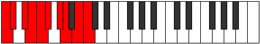 |
| [2939](https://ianring.com/musictheory/scales/2939) | [Goptygic](ModeDSharpGoptygic.md) | D# | D#, E, F#, G, G#, A, B, C, D, D# |  |
| [2939](https://ianring.com/musictheory/scales/2939) | [Goptygic](ModeEFlatGoptygic.md) | Eb | Eb, E, Gb, G, Ab, A, B, C, D, Eb |  |
| [2941](https://ianring.com/musictheory/scales/2941) | [Laptygic](ModeCNaturalLaptygic.md) | C | C, D, D#, E, F, F#, G#, A, B, C |  |
| [2941](https://ianring.com/musictheory/scales/2941) | [Laptygic](ModeGNaturalLaptygic.md) | G | G, A, A#, B, C, C#, D#, E, F#, G |  |
| [2943](https://ianring.com/musictheory/scales/2943) | [Dathyllian](ModeCNaturalDathyllian.md) | C | C, C#, D, D#, E, F, F#, G#, A, B, C |  |
| [2943](https://ianring.com/musictheory/scales/2943) | [Dathyllian](ModeDSharpDathyllian.md) | D# | D#, E, F, F#, G, G#, A, B, C, D, D# |  |
| [2943](https://ianring.com/musictheory/scales/2943) | [Dathyllian](ModeEFlatDathyllian.md) | Eb | Eb, E, F, Gb, G, Ab, A, B, C, D, Eb |  |
| [2943](https://ianring.com/musictheory/scales/2943) | [Dathyllian](ModeASharpDathyllian.md) | A# | A#, B, C, C#, D, D#, E, F#, G, A, A# |  |
| [2943](https://ianring.com/musictheory/scales/2943) | [Dathyllian](ModeBFlatDathyllian.md) | Bb | Bb, B, C, Db, D, Eb, E, Gb, G, A, Bb |  |
| [2943](https://ianring.com/musictheory/scales/2943) | [Dathyllian](ModeGNaturalDathyllian.md) | G | G, G#, A, A#, B, C, C#, D#, E, F#, G |  |
| [2957](https://ianring.com/musictheory/scales/2957) | [Thygian](ModeANaturalThygian.md) | A | A, B, C, D##, E#, F#, G#, A |  |
| [2959](https://ianring.com/musictheory/scales/2959) | [Dygyllic](ModeANaturalDygyllic.md) | A | A, A#, B, C, E, F, F#, G#, A |  |
| [2973](https://ianring.com/musictheory/scales/2973) | [Panyllic](ModeANaturalPanyllic.md) | A | A, B, C, C#, E, F, F#, G#, A |  |
| [2975](https://ianring.com/musictheory/scales/2975) | [Gaptygic](ModeANaturalGaptygic.md) | A | A, A#, B, C, C#, E, F, F#, G#, A |  |
| [2981](https://ianring.com/musictheory/scales/2981) | [Ionolian](ModeENaturalIonolian.md) | E | E, F#, G##, A##, B#, C#, D#, E |  |
| [2983](https://ianring.com/musictheory/scales/2983) | [Zythyllic](ModeENaturalZythyllic.md) | E | E, F, F#, A, B, C, C#, D#, E |  |
| [2989](https://ianring.com/musictheory/scales/2989) | [Ionacryllic](ModeENaturalIonacryllic.md) | E | E, F#, G, A, B, C, C#, D#, E |  |
| [2989](https://ianring.com/musictheory/scales/2989) | [Ionacryllic](ModeANaturalIonacryllic.md) | A | A, B, C, D, E, F, F#, G#, A |  |
| [2991](https://ianring.com/musictheory/scales/2991) | [Zanygic](ModeENaturalZanygic.md) | E | E, F, F#, G, A, B, C, C#, D#, E |  |
| [2991](https://ianring.com/musictheory/scales/2991) | [Zanygic](ModeANaturalZanygic.md) | A | A, A#, B, C, D, E, F, F#, G#, A |  |
| [2997](https://ianring.com/musictheory/scales/2997) | [Ionoptyllic](ModeGNaturalIonoptyllic.md) | G | G, A, B, C, D, D#, E, F#, G |  |
| [2997](https://ianring.com/musictheory/scales/2997) | [Ionoptyllic](ModeENaturalIonoptyllic.md) | E | E, F#, G#, A, B, C, C#, D#, E |  |
| [2999](https://ianring.com/musictheory/scales/2999) | [Zyrygic](ModeENaturalZyrygic.md) | E | E, F, F#, G#, A, B, C, C#, D#, E |  |
| [2999](https://ianring.com/musictheory/scales/2999) | [Zyrygic](ModeGNaturalZyrygic.md) | G | G, G#, A, B, C, D, D#, E, F#, G |  |
| [3005](https://ianring.com/musictheory/scales/3005) | [Gycrygic](ModeANaturalGycrygic.md) | A | A, B, C, C#, D, E, F, F#, G#, A |  |
| [3005](https://ianring.com/musictheory/scales/3005) | [Gycrygic](ModeENaturalGycrygic.md) | E | E, F#, G, G#, A, B, C, C#, D#, E |  |
| [3005](https://ianring.com/musictheory/scales/3005) | [Gycrygic](ModeGNaturalGycrygic.md) | G | G, A, A#, B, C, D, D#, E, F#, G |  |
| [3007](https://ianring.com/musictheory/scales/3007) | [Zyryllian](ModeENaturalZyryllian.md) | E | E, F, F#, G, G#, A, B, C, C#, D#, E |  |
| [3007](https://ianring.com/musictheory/scales/3007) | [Zyryllian](ModeANaturalZyryllian.md) | A | A, A#, B, C, C#, D, E, F, F#, G#, A |  |
| [3007](https://ianring.com/musictheory/scales/3007) | [Zyryllian](ModeGNaturalZyryllian.md) | G | G, G#, A, A#, B, C, D, D#, E, F#, G |  |
| [3015](https://ianring.com/musictheory/scales/3015) | [Laptyllic](ModeASharpLaptyllic.md) | A# | A#, B, C, E, F, F#, G, A, A# |  |
| [3015](https://ianring.com/musictheory/scales/3015) | [Laptyllic](ModeBFlatLaptyllic.md) | Bb | Bb, B, C, E, F, Gb, G, A, Bb |  |
| [3019](https://ianring.com/musictheory/scales/3019) | [Mydyllic](ModeDSharpMydyllic.md) | D# | D#, E, F#, A, A#, B, C, D, D# |  |
| [3019](https://ianring.com/musictheory/scales/3019) | [Mydyllic](ModeEFlatMydyllic.md) | Eb | Eb, E, Gb, A, Bb, B, C, D, Eb |  |
| [3021](https://ianring.com/musictheory/scales/3021) | [Gyptyllic](ModeANaturalGyptyllic.md) | A | A, B, C, D#, E, F, F#, G#, A |  |
| [3023](https://ianring.com/musictheory/scales/3023) | [Aeracrygic](ModeDSharpAeracrygic.md) | D# | D#, E, F, F#, A, A#, B, C, D, D# |  |
| [3023](https://ianring.com/musictheory/scales/3023) | [Aeracrygic](ModeEFlatAeracrygic.md) | Eb | Eb, E, F, Gb, A, Bb, B, C, D, Eb |  |
| [3023](https://ianring.com/musictheory/scales/3023) | [Aeracrygic](ModeASharpAeracrygic.md) | A# | A#, B, C, C#, E, F, F#, G, A, A# |  |
| [3023](https://ianring.com/musictheory/scales/3023) | [Aeracrygic](ModeBFlatAeracrygic.md) | Bb | Bb, B, C, Db, E, F, Gb, G, A, Bb |  |
| [3023](https://ianring.com/musictheory/scales/3023) | [Aeracrygic](ModeANaturalAeracrygic.md) | A | A, A#, B, C, D#, E, F, F#, G#, A |  |
| [3025](https://ianring.com/musictheory/scales/3025) | [Epycrian](ModeCNaturalEpycrian.md) | C | C, D##, E##, F##, G#, A, B, C |  |
| [3027](https://ianring.com/musictheory/scales/3027) | [Rythyllic](ModeFNaturalRythyllic.md) | F | F, F#, A, B, C, C#, D, E, F |  |
| [3027](https://ianring.com/musictheory/scales/3027) | [Rythyllic](ModeCNaturalRythyllic.md) | C | C, C#, E, F#, G, G#, A, B, C |  |
| [3029](https://ianring.com/musictheory/scales/3029) | [Ionocryllic](ModeCNaturalIonocryllic.md) | C | C, D, E, F#, G, G#, A, B, C |  |
| [3031](https://ianring.com/musictheory/scales/3031) | [Epithygic](ModeFNaturalEpithygic.md) | F | F, F#, G, A, B, C, C#, D, E, F |  |
| [3031](https://ianring.com/musictheory/scales/3031) | [Epithygic](ModeCNaturalEpithygic.md) | C | C, C#, D, E, F#, G, G#, A, B, C |  |
| [3031](https://ianring.com/musictheory/scales/3031) | [Epithygic](ModeASharpEpithygic.md) | A# | A#, B, C, D, E, F, F#, G, A, A# |  |
| [3031](https://ianring.com/musictheory/scales/3031) | [Epithygic](ModeBFlatEpithygic.md) | Bb | Bb, B, C, D, E, F, Gb, G, A, Bb |  |
| [3033](https://ianring.com/musictheory/scales/3033) | [Doptyllic](ModeCNaturalDoptyllic.md) | C | C, D#, E, F#, G, G#, A, B, C |  |
| [3035](https://ianring.com/musictheory/scales/3035) | [Gocrygic](ModeFNaturalGocrygic.md) | F | F, F#, G#, A, B, C, C#, D, E, F |  |
| [3035](https://ianring.com/musictheory/scales/3035) | [Gocrygic](ModeCNaturalGocrygic.md) | C | C, C#, D#, E, F#, G, G#, A, B, C |  |
| [3035](https://ianring.com/musictheory/scales/3035) | [Gocrygic](ModeDSharpGocrygic.md) | D# | D#, E, F#, G, A, A#, B, C, D, D# |  |
| [3035](https://ianring.com/musictheory/scales/3035) | [Gocrygic](ModeEFlatGocrygic.md) | Eb | Eb, E, Gb, G, A, Bb, B, C, D, Eb |  |
| [3037](https://ianring.com/musictheory/scales/3037) | [Staptygic](ModeANaturalStaptygic.md) | A | A, B, C, C#, D#, E, F, F#, G#, A |  |
| [3037](https://ianring.com/musictheory/scales/3037) | [Staptygic](ModeCNaturalStaptygic.md) | C | C, D, D#, E, F#, G, G#, A, B, C |  |
| [3039](https://ianring.com/musictheory/scales/3039) | [Godyllian](ModeCNaturalGodyllian.md) | C | C, C#, D, D#, E, F#, G, G#, A, B, C |  |
| [3039](https://ianring.com/musictheory/scales/3039) | [Godyllian](ModeFNaturalGodyllian.md) | F | F, F#, G, G#, A, B, C, C#, D, E, F |  |
| [3039](https://ianring.com/musictheory/scales/3039) | [Godyllian](ModeASharpGodyllian.md) | A# | A#, B, C, C#, D, E, F, F#, G, A, A# |  |
| [3039](https://ianring.com/musictheory/scales/3039) | [Godyllian](ModeBFlatGodyllian.md) | Bb | Bb, B, C, Db, D, E, F, Gb, G, A, Bb |  |
| [3039](https://ianring.com/musictheory/scales/3039) | [Godyllian](ModeDSharpGodyllian.md) | D# | D#, E, F, F#, G, A, A#, B, C, D, D# |  |
| [3039](https://ianring.com/musictheory/scales/3039) | [Godyllian](ModeEFlatGodyllian.md) | Eb | Eb, E, F, Gb, G, A, Bb, B, C, D, Eb |  |
| [3039](https://ianring.com/musictheory/scales/3039) | [Godyllian](ModeANaturalGodyllian.md) | A | A, A#, B, C, C#, D#, E, F, F#, G#, A |  |
| [3045](https://ianring.com/musictheory/scales/3045) | [Raptyllic](ModeENaturalRaptyllic.md) | E | E, F#, A, A#, B, C, C#, D#, E |  |
| [3047](https://ianring.com/musictheory/scales/3047) | [Panygic](ModeENaturalPanygic.md) | E | E, F, F#, A, A#, B, C, C#, D#, E |  |
| [3047](https://ianring.com/musictheory/scales/3047) | [Panygic](ModeASharpPanygic.md) | A# | A#, B, C, D#, E, F, F#, G, A, A# |  |
| [3047](https://ianring.com/musictheory/scales/3047) | [Panygic](ModeBFlatPanygic.md) | Bb | Bb, B, C, Eb, E, F, Gb, G, A, Bb |  |
| [3051](https://ianring.com/musictheory/scales/3051) | [Stalygic](ModeDSharpStalygic.md) | D# | D#, E, F#, G#, A, A#, B, C, D, D# |  |
| [3051](https://ianring.com/musictheory/scales/3051) | [Stalygic](ModeEFlatStalygic.md) | Eb | Eb, E, Gb, Ab, A, Bb, B, C, D, Eb |  |
| [3053](https://ianring.com/musictheory/scales/3053) | [Zycrygic](ModeANaturalZycrygic.md) | A | A, B, C, D, D#, E, F, F#, G#, A |  |
| [3053](https://ianring.com/musictheory/scales/3053) | [Zycrygic](ModeENaturalZycrygic.md) | E | E, F#, G, A, A#, B, C, C#, D#, E |  |
| [3055](https://ianring.com/musictheory/scales/3055) | [Lyryllian](ModeENaturalLyryllian.md) | E | E, F, F#, G, A, A#, B, C, C#, D#, E |  |
| [3055](https://ianring.com/musictheory/scales/3055) | [Lyryllian](ModeASharpLyryllian.md) | A# | A#, B, C, C#, D#, E, F, F#, G, A, A# |  |
| [3055](https://ianring.com/musictheory/scales/3055) | [Lyryllian](ModeBFlatLyryllian.md) | Bb | Bb, B, C, Db, Eb, E, F, Gb, G, A, Bb |  |
| [3055](https://ianring.com/musictheory/scales/3055) | [Lyryllian](ModeDSharpLyryllian.md) | D# | D#, E, F, F#, G#, A, A#, B, C, D, D# |  |
| [3055](https://ianring.com/musictheory/scales/3055) | [Lyryllian](ModeEFlatLyryllian.md) | Eb | Eb, E, F, Gb, Ab, A, Bb, B, C, D, Eb |  |
| [3055](https://ianring.com/musictheory/scales/3055) | [Lyryllian](ModeANaturalLyryllian.md) | A | A, A#, B, C, D, D#, E, F, F#, G#, A |  |
| [3057](https://ianring.com/musictheory/scales/3057) | [Phroryllic](ModeCNaturalPhroryllic.md) | C | C, E, F, F#, G, G#, A, B, C |  |
| [3059](https://ianring.com/musictheory/scales/3059) | [Madygic](ModeCNaturalMadygic.md) | C | C, C#, E, F, F#, G, G#, A, B, C |  |
| [3059](https://ianring.com/musictheory/scales/3059) | [Madygic](ModeFNaturalMadygic.md) | F | F, F#, A, A#, B, C, C#, D, E, F |  |
| [3061](https://ianring.com/musictheory/scales/3061) | [Apinygic](ModeGNaturalApinygic.md) | G | G, A, B, C, C#, D, D#, E, F#, G |  |
| [3061](https://ianring.com/musictheory/scales/3061) | [Apinygic](ModeCNaturalApinygic.md) | C | C, D, E, F, F#, G, G#, A, B, C |  |
| [3061](https://ianring.com/musictheory/scales/3061) | [Apinygic](ModeENaturalApinygic.md) | E | E, F#, G#, A, A#, B, C, C#, D#, E |  |
| [3063](https://ianring.com/musictheory/scales/3063) | [Solyllian](ModeGNaturalSolyllian.md) | G | G, G#, A, B, C, C#, D, D#, E, F#, G |  |
| [3063](https://ianring.com/musictheory/scales/3063) | [Solyllian](ModeCNaturalSolyllian.md) | C | C, C#, D, E, F, F#, G, G#, A, B, C |  |
| [3063](https://ianring.com/musictheory/scales/3063) | [Solyllian](ModeFNaturalSolyllian.md) | F | F, F#, G, A, A#, B, C, C#, D, E, F |  |
| [3063](https://ianring.com/musictheory/scales/3063) | [Solyllian](ModeASharpSolyllian.md) | A# | A#, B, C, D, D#, E, F, F#, G, A, A# |  |
| [3063](https://ianring.com/musictheory/scales/3063) | [Solyllian](ModeBFlatSolyllian.md) | Bb | Bb, B, C, D, Eb, E, F, Gb, G, A, Bb |  |
| [3063](https://ianring.com/musictheory/scales/3063) | [Solyllian](ModeENaturalSolyllian.md) | E | E, F, F#, G#, A, A#, B, C, C#, D#, E |  |
| [3065](https://ianring.com/musictheory/scales/3065) | [Zothygic](ModeCNaturalZothygic.md) | C | C, D#, E, F, F#, G, G#, A, B, C |  |
| [3067](https://ianring.com/musictheory/scales/3067) | [Goptyllian](ModeCNaturalGoptyllian.md) | C | C, C#, D#, E, F, F#, G, G#, A, B, C |  |
| [3067](https://ianring.com/musictheory/scales/3067) | [Goptyllian](ModeFNaturalGoptyllian.md) | F | F, F#, G#, A, A#, B, C, C#, D, E, F |  |
| [3067](https://ianring.com/musictheory/scales/3067) | [Goptyllian](ModeDSharpGoptyllian.md) | D# | D#, E, F#, G, G#, A, A#, B, C, D, D# |  |
| [3067](https://ianring.com/musictheory/scales/3067) | [Goptyllian](ModeEFlatGoptyllian.md) | Eb | Eb, E, Gb, G, Ab, A, Bb, B, C, D, Eb |  |
| [3069](https://ianring.com/musictheory/scales/3069) | [Bacryllian](ModeANaturalBacryllian.md) | A | A, B, C, C#, D, D#, E, F, F#, G#, A |  |
| [3069](https://ianring.com/musictheory/scales/3069) | [Bacryllian](ModeCNaturalBacryllian.md) | C | C, D, D#, E, F, F#, G, G#, A, B, C |  |
| [3069](https://ianring.com/musictheory/scales/3069) | [Bacryllian](ModeGNaturalBacryllian.md) | G | G, A, A#, B, C, C#, D, D#, E, F#, G |  |
| [3069](https://ianring.com/musictheory/scales/3069) | [Bacryllian](ModeENaturalBacryllian.md) | E | E, F#, G, G#, A, A#, B, C, C#, D#, E |  |
| [3071](https://ianring.com/musictheory/scales/3071) | [Solatic](ModeCNaturalSolatic.md) | C | C, C#, D, D#, E, F, F#, G, G#, A, B, C |  |
| [3071](https://ianring.com/musictheory/scales/3071) | [Solatic](ModeASharpSolatic.md) | A# | A#, B, C, C#, D, D#, E, F, F#, G, A, A# |  |
| [3071](https://ianring.com/musictheory/scales/3071) | [Solatic](ModeBFlatSolatic.md) | Bb | Bb, B, C, Db, D, Eb, E, F, Gb, G, A, Bb |  |
| [3071](https://ianring.com/musictheory/scales/3071) | [Solatic](ModeANaturalSolatic.md) | A | A, A#, B, C, C#, D, D#, E, F, F#, G#, A |  |
| [3071](https://ianring.com/musictheory/scales/3071) | [Solatic](ModeGNaturalSolatic.md) | G | G, G#, A, A#, B, C, C#, D, D#, E, F#, G |  |
| [3071](https://ianring.com/musictheory/scales/3071) | [Solatic](ModeFNaturalSolatic.md) | F | F, F#, G, G#, A, A#, B, C, C#, D, E, F |  |
| [3071](https://ianring.com/musictheory/scales/3071) | [Solatic](ModeENaturalSolatic.md) | E | E, F, F#, G, G#, A, A#, B, C, C#, D#, E |  |
| [3071](https://ianring.com/musictheory/scales/3071) | [Solatic](ModeDSharpSolatic.md) | D# | D#, E, F, F#, G, G#, A, A#, B, C, D, D# |  |
| [3071](https://ianring.com/musictheory/scales/3071) | [Solatic](ModeEFlatSolatic.md) | Eb | Eb, E, F, Gb, G, Ab, A, Bb, B, C, D, Eb |  |
| [3177](https://ianring.com/musictheory/scales/3177) | [Rothimic](ModeFSharpRothimic.md) | F# | F#, G##, A##, B#, D##, E#, F# |  |
| [3177](https://ianring.com/musictheory/scales/3177) | [Rothimic](ModeGFlatRothimic.md) | Gb | Gb, A, B, C, D##, E#, Gb |  |
| [3179](https://ianring.com/musictheory/scales/3179) | [Daptian](ModeFSharpDaptian.md) | F# | F#, G, A, B, C, D##, E#, F# |  |
| [3179](https://ianring.com/musictheory/scales/3179) | [Daptian](ModeGFlatDaptian.md) | Gb | Gb, Abb, Bbb, Cb, Dbb, E, F, Gb |  |
| [3181](https://ianring.com/musictheory/scales/3181) | [Rolian](ModeFSharpRolian.md) | F# | F#, G#, A, B, C, D##, E#, F# |  |
| [3181](https://ianring.com/musictheory/scales/3181) | [Rolian](ModeGFlatRolian.md) | Gb | Gb, Ab, Bbb, Cb, Dbb, E, F, Gb |  |
| [3183](https://ianring.com/musictheory/scales/3183) | [Mixonyllic](ModeFSharpMixonyllic.md) | F# | F#, G, G#, A, B, C, E, F, F# |  |
| [3183](https://ianring.com/musictheory/scales/3183) | [Mixonyllic](ModeGFlatMixonyllic.md) | Gb | Gb, G, Ab, A, B, C, E, F, Gb |  |
| [3193](https://ianring.com/musictheory/scales/3193) | [Zathian](ModeFSharpZathian.md) | F# | F#, G##, A#, B, C, D##, E#, F# |  |
| [3193](https://ianring.com/musictheory/scales/3193) | [Zathian](ModeGFlatZathian.md) | Gb | Gb, A, Bb, Cb, Dbb, E, F, Gb |  |
| [3195](https://ianring.com/musictheory/scales/3195) | [Raryllic](ModeFSharpRaryllic.md) | F# | F#, G, A, A#, B, C, E, F, F# |  |
| [3195](https://ianring.com/musictheory/scales/3195) | [Raryllic](ModeGFlatRaryllic.md) | Gb | Gb, G, A, Bb, B, C, E, F, Gb |  |
| [3197](https://ianring.com/musictheory/scales/3197) | [Gylyllic](ModeFSharpGylyllic.md) | F# | F#, G#, A, A#, B, C, E, F, F# |  |
| [3197](https://ianring.com/musictheory/scales/3197) | [Gylyllic](ModeGFlatGylyllic.md) | Gb | Gb, Ab, A, Bb, B, C, E, F, Gb |  |
| [3199](https://ianring.com/musictheory/scales/3199) | [Thaptygic](ModeFSharpThaptygic.md) | F# | F#, G, G#, A, A#, B, C, E, F, F# |  |
| [3199](https://ianring.com/musictheory/scales/3199) | [Thaptygic](ModeGFlatThaptygic.md) | Gb | Gb, G, Ab, A, Bb, B, C, E, F, Gb |  |
| [3235](https://ianring.com/musictheory/scales/3235) | [Pothimic](ModeBNaturalPothimic.md) | B | B, C, D##, E##, Cbbb, Cbb, B |  |
| [3239](https://ianring.com/musictheory/scales/3239) | [Epythian](ModeBNaturalEpythian.md) | B | B, C, Db, E, F#, G##, A#, B |  |
| [3243](https://ianring.com/musictheory/scales/3243) | [Staptian](ModeBNaturalStaptian.md) | B | B, C, D, E, F#, G##, A#, B |  |
| [3247](https://ianring.com/musictheory/scales/3247) | [Aeolonyllic](ModeBNaturalAeolonyllic.md) | B | B, C, C#, D, E, F#, A, A#, B |  |
| [3251](https://ianring.com/musictheory/scales/3251) | [Zodian](ModeBNaturalZodian.md) | B | B, C, D#, E, F#, G##, A#, B |  |
| [3255](https://ianring.com/musictheory/scales/3255) | [Daryllic](ModeBNaturalDaryllic.md) | B | B, C, C#, D#, E, F#, A, A#, B |  |
| [3259](https://ianring.com/musictheory/scales/3259) | [Loptyllic](ModeBNaturalLoptyllic.md) | B | B, C, D, D#, E, F#, A, A#, B |  |
| [3263](https://ianring.com/musictheory/scales/3263) | [Pyrygic](ModeBNaturalPyrygic.md) | B | B, C, C#, D, D#, E, F#, A, A#, B |  |
| [3283](https://ianring.com/musictheory/scales/3283) | [Lyrian](ModeFNaturalLyrian.md) | F | F, Gb, A, B, C, D#, E, F |  |
| [3287](https://ianring.com/musictheory/scales/3287) | [Phrathyllic](ModeFNaturalPhrathyllic.md) | F | F, F#, G, A, B, C, D#, E, F |  |
| [3291](https://ianring.com/musictheory/scales/3291) | [Kodyllic](ModeFNaturalKodyllic.md) | F | F, F#, G#, A, B, C, D#, E, F |  |
| [3295](https://ianring.com/musictheory/scales/3295) | [Phroptygic](ModeFNaturalPhroptygic.md) | F | F, F#, G, G#, A, B, C, D#, E, F |  |
| [3299](https://ianring.com/musictheory/scales/3299) | [Syptian](ModeBNaturalSyptian.md) | B | B, C, D##, E#, F#, G##, A#, B |  |
| [3303](https://ianring.com/musictheory/scales/3303) | [Soptyllic](ModeBNaturalSoptyllic.md) | B | B, C, C#, E, F, F#, A, A#, B |  |
| [3305](https://ianring.com/musictheory/scales/3305) | [Epathian](ModeFSharpEpathian.md) | F# | F#, G##, A##, B#, C#, D##, E#, F# |  |
| [3305](https://ianring.com/musictheory/scales/3305) | [Epathian](ModeGFlatEpathian.md) | Gb | Gb, A, B, C, Db, E, F, Gb |  |
| [3307](https://ianring.com/musictheory/scales/3307) | [Boptyllic](ModeFSharpBoptyllic.md) | F# | F#, G, A, B, C, C#, E, F, F# |  |
| [3307](https://ianring.com/musictheory/scales/3307) | [Boptyllic](ModeGFlatBoptyllic.md) | Gb | Gb, G, A, B, C, Db, E, F, Gb |  |
| [3307](https://ianring.com/musictheory/scales/3307) | [Boptyllic](ModeBNaturalBoptyllic.md) | B | B, C, D, E, F, F#, A, A#, B |  |
| [3309](https://ianring.com/musictheory/scales/3309) | [Bycryllic](ModeFSharpBycryllic.md) | F# | F#, G#, A, B, C, C#, E, F, F# |  |
| [3309](https://ianring.com/musictheory/scales/3309) | [Bycryllic](ModeGFlatBycryllic.md) | Gb | Gb, Ab, A, B, C, Db, E, F, Gb |  |
| [3311](https://ianring.com/musictheory/scales/3311) | [Mixodygic](ModeFSharpMixodygic.md) | F# | F#, G, G#, A, B, C, C#, E, F, F# |  |
| [3311](https://ianring.com/musictheory/scales/3311) | [Mixodygic](ModeGFlatMixodygic.md) | Gb | Gb, G, Ab, A, B, C, Db, E, F, Gb |  |
| [3311](https://ianring.com/musictheory/scales/3311) | [Mixodygic](ModeBNaturalMixodygic.md) | B | B, C, C#, D, E, F, F#, A, A#, B |  |
| [3315](https://ianring.com/musictheory/scales/3315) | [Aeralyllic](ModeFNaturalAeralyllic.md) | F | F, F#, A, A#, B, C, D#, E, F |  |
| [3315](https://ianring.com/musictheory/scales/3315) | [Aeralyllic](ModeBNaturalAeralyllic.md) | B | B, C, D#, E, F, F#, A, A#, B |  |
| [3319](https://ianring.com/musictheory/scales/3319) | [Tholygic](ModeBNaturalTholygic.md) | B | B, C, C#, D#, E, F, F#, A, A#, B |  |
| [3319](https://ianring.com/musictheory/scales/3319) | [Tholygic](ModeFNaturalTholygic.md) | F | F, F#, G, A, A#, B, C, D#, E, F |  |
| [3321](https://ianring.com/musictheory/scales/3321) | [Ionycryllic](ModeFSharpIonycryllic.md) | F# | F#, A, A#, B, C, C#, E, F, F# |  |
| [3321](https://ianring.com/musictheory/scales/3321) | [Ionycryllic](ModeGFlatIonycryllic.md) | Gb | Gb, A, Bb, B, C, Db, E, F, Gb |  |
| [3323](https://ianring.com/musictheory/scales/3323) | [Phrygygic](ModeBNaturalPhrygygic.md) | B | B, C, D, D#, E, F, F#, A, A#, B |  |
| [3323](https://ianring.com/musictheory/scales/3323) | [Phrygygic](ModeFSharpPhrygygic.md) | F# | F#, G, A, A#, B, C, C#, E, F, F# |  |
| [3323](https://ianring.com/musictheory/scales/3323) | [Phrygygic](ModeGFlatPhrygygic.md) | Gb | Gb, G, A, Bb, B, C, Db, E, F, Gb |  |
| [3323](https://ianring.com/musictheory/scales/3323) | [Phrygygic](ModeFNaturalPhrygygic.md) | F | F, F#, G#, A, A#, B, C, D#, E, F |  |
| [3325](https://ianring.com/musictheory/scales/3325) | [Epygic](ModeFSharpEpygic.md) | F# | F#, G#, A, A#, B, C, C#, E, F, F# |  |
| [3325](https://ianring.com/musictheory/scales/3325) | [Epygic](ModeGFlatEpygic.md) | Gb | Gb, Ab, A, Bb, B, C, Db, E, F, Gb |  |
| [3327](https://ianring.com/musictheory/scales/3327) | [Madyllian](ModeBNaturalMadyllian.md) | B | B, C, C#, D, D#, E, F, F#, A, A#, B |  |
| [3327](https://ianring.com/musictheory/scales/3327) | [Madyllian](ModeFSharpMadyllian.md) | F# | F#, G, G#, A, A#, B, C, C#, E, F, F# |  |
| [3327](https://ianring.com/musictheory/scales/3327) | [Madyllian](ModeGFlatMadyllian.md) | Gb | Gb, G, Ab, A, Bb, B, C, Db, E, F, Gb |  |
| [3327](https://ianring.com/musictheory/scales/3327) | [Madyllian](ModeFNaturalMadyllian.md) | F | F, F#, G, G#, A, A#, B, C, D#, E, F |  |
| [3355](https://ianring.com/musictheory/scales/3355) | [Bagian](ModeGSharpBagian.md) | G# | G#, A, B, C, D##, E##, F##, G# |  |
| [3355](https://ianring.com/musictheory/scales/3355) | [Bagian](ModeAFlatBagian.md) | Ab | Ab, Bbb, Cb, Dbb, E, F#, G, Ab |  |
| [3359](https://ianring.com/musictheory/scales/3359) | [Bonyllic](ModeGSharpBonyllic.md) | G# | G#, A, A#, B, C, E, F#, G, G# |  |
| [3359](https://ianring.com/musictheory/scales/3359) | [Bonyllic](ModeAFlatBonyllic.md) | Ab | Ab, A, Bb, B, C, E, Gb, G, Ab | 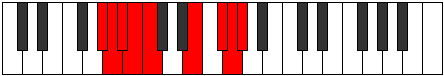 |
| [3369](https://ianring.com/musictheory/scales/3369) | [Mixolimic](ModeCSharpMixolimic.md) | C# | C#, D##, E##, Cbbb, Dbbb, Dbb, C# |  |
| [3369](https://ianring.com/musictheory/scales/3369) | [Mixolimic](ModeDFlatMixolimic.md) | Db | Db, E, F#, G##, A##, B#, Db |  |
| [3371](https://ianring.com/musictheory/scales/3371) | [Aeolylian](ModeCSharpAeolylian.md) | C# | C#, D, E, F#, G##, A##, B#, C# |  |
| [3371](https://ianring.com/musictheory/scales/3371) | [Aeolylian](ModeDFlatAeolylian.md) | Db | Db, Ebb, Fb, Gb, A, B, C, Db |  |
| [3373](https://ianring.com/musictheory/scales/3373) | [Lodian](ModeCSharpLodian.md) | C# | C#, D#, E, F#, G##, A##, B#, C# |  |
| [3373](https://ianring.com/musictheory/scales/3373) | [Lodian](ModeDFlatLodian.md) | Db | Db, Eb, Fb, Gb, A, B, C, Db | 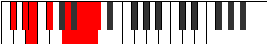 |
| [3375](https://ianring.com/musictheory/scales/3375) | [Kygyllic](ModeCSharpKygyllic.md) | C# | C#, D, D#, E, F#, A, B, C, C# |  |
| [3375](https://ianring.com/musictheory/scales/3375) | [Kygyllic](ModeDFlatKygyllic.md) | Db | Db, D, Eb, E, Gb, A, B, C, Db |  |
| [3385](https://ianring.com/musictheory/scales/3385) | [Rothian](ModeCSharpRothian.md) | C# | C#, D##, E#, F#, G##, A##, B#, C# |  |
| [3385](https://ianring.com/musictheory/scales/3385) | [Rothian](ModeDFlatRothian.md) | Db | Db, E, F, Gb, A, B, C, Db |  |
| [3387](https://ianring.com/musictheory/scales/3387) | [Aeryptyllic](ModeCSharpAeryptyllic.md) | C# | C#, D, E, F, F#, A, B, C, C# |  |
| [3387](https://ianring.com/musictheory/scales/3387) | [Aeryptyllic](ModeDFlatAeryptyllic.md) | Db | Db, D, E, F, Gb, A, B, C, Db |  |
| [3387](https://ianring.com/musictheory/scales/3387) | [Aeryptyllic](ModeGSharpAeryptyllic.md) | G# | G#, A, B, C, C#, E, F#, G, G# |  |
| [3387](https://ianring.com/musictheory/scales/3387) | [Aeryptyllic](ModeAFlatAeryptyllic.md) | Ab | Ab, A, B, C, Db, E, Gb, G, Ab |  |
| [3389](https://ianring.com/musictheory/scales/3389) | [Socryllic](ModeCSharpSocryllic.md) | C# | C#, D#, E, F, F#, A, B, C, C# |  |
| [3389](https://ianring.com/musictheory/scales/3389) | [Socryllic](ModeDFlatSocryllic.md) | Db | Db, Eb, E, F, Gb, A, B, C, Db |  |
| [3391](https://ianring.com/musictheory/scales/3391) | [Aeolynygic](ModeCSharpAeolynygic.md) | C# | C#, D, D#, E, F, F#, A, B, C, C# |  |
| [3391](https://ianring.com/musictheory/scales/3391) | [Aeolynygic](ModeDFlatAeolynygic.md) | Db | Db, D, Eb, E, F, Gb, A, B, C, Db |  |
| [3391](https://ianring.com/musictheory/scales/3391) | [Aeolynygic](ModeGSharpAeolynygic.md) | G# | G#, A, A#, B, C, C#, E, F#, G, G# |  |
| [3391](https://ianring.com/musictheory/scales/3391) | [Aeolynygic](ModeAFlatAeolynygic.md) | Ab | Ab, A, Bb, B, C, Db, E, Gb, G, Ab |  |
| [3399](https://ianring.com/musictheory/scales/3399) | [Zonian](ModeASharpZonian.md) | A# | A#, B, C, D##, E##, F###, G##, A# |  |
| [3399](https://ianring.com/musictheory/scales/3399) | [Zonian](ModeBFlatZonian.md) | Bb | Bb, Cb, Dbb, E, F#, G#, A, Bb |  |
| [3407](https://ianring.com/musictheory/scales/3407) | [Katocryllic](ModeASharpKatocryllic.md) | A# | A#, B, C, C#, E, F#, G#, A, A# |  |
| [3407](https://ianring.com/musictheory/scales/3407) | [Katocryllic](ModeBFlatKatocryllic.md) | Bb | Bb, B, C, Db, E, Gb, Ab, A, Bb |  |
| [3415](https://ianring.com/musictheory/scales/3415) | [Ionaptyllic](ModeASharpIonaptyllic.md) | A# | A#, B, C, D, E, F#, G#, A, A# |  |
| [3415](https://ianring.com/musictheory/scales/3415) | [Ionaptyllic](ModeBFlatIonaptyllic.md) | Bb | Bb, B, C, D, E, Gb, Ab, A, Bb |  |
| [3419](https://ianring.com/musictheory/scales/3419) | [Danyllic](ModeGSharpDanyllic.md) | G# | G#, A, B, C, D, E, F#, G, G# |  |
| [3419](https://ianring.com/musictheory/scales/3419) | [Danyllic](ModeAFlatDanyllic.md) | Ab | Ab, A, B, C, D, E, Gb, G, Ab |  |
| [3423](https://ianring.com/musictheory/scales/3423) | [Lothygic](ModeASharpLothygic.md) | A# | A#, B, C, C#, D, E, F#, G#, A, A# |  |
| [3423](https://ianring.com/musictheory/scales/3423) | [Lothygic](ModeBFlatLothygic.md) | Bb | Bb, B, C, Db, D, E, Gb, Ab, A, Bb |  |
| [3423](https://ianring.com/musictheory/scales/3423) | [Lothygic](ModeGSharpLothygic.md) | G# | G#, A, A#, B, C, D, E, F#, G, G# |  |
| [3423](https://ianring.com/musictheory/scales/3423) | [Lothygic](ModeAFlatLothygic.md) | Ab | Ab, A, Bb, B, C, D, E, Gb, G, Ab |  |
| [3431](https://ianring.com/musictheory/scales/3431) | [Zyptyllic](ModeASharpZyptyllic.md) | A# | A#, B, C, D#, E, F#, G#, A, A# |  |
| [3431](https://ianring.com/musictheory/scales/3431) | [Zyptyllic](ModeBFlatZyptyllic.md) | Bb | Bb, B, C, Eb, E, Gb, Ab, A, Bb |  |
| [3433](https://ianring.com/musictheory/scales/3433) | [Thonian](ModeFSharpThonian.md) | F# | F#, G##, A##, B#, C##, D##, E#, F# |  |
| [3433](https://ianring.com/musictheory/scales/3433) | [Thonian](ModeGFlatThonian.md) | Gb | Gb, A, B, C, D, E, F, Gb |  |
| [3433](https://ianring.com/musictheory/scales/3433) | [Thonian](ModeCSharpThonian.md) | C# | C#, D##, E##, F##, G##, A##, B#, C# |  |
| [3433](https://ianring.com/musictheory/scales/3433) | [Thonian](ModeDFlatThonian.md) | Db | Db, E, F#, G, A, B, C, Db |  |
| [3435](https://ianring.com/musictheory/scales/3435) | [Epiphyllic](ModeCSharpEpiphyllic.md) | C# | C#, D, E, F#, G, A, B, C, C# |  |
| [3435](https://ianring.com/musictheory/scales/3435) | [Epiphyllic](ModeDFlatEpiphyllic.md) | Db | Db, D, E, Gb, G, A, B, C, Db |  |
| [3435](https://ianring.com/musictheory/scales/3435) | [Epiphyllic](ModeFSharpEpiphyllic.md) | F# | F#, G, A, B, C, D, E, F, F# |  |
| [3435](https://ianring.com/musictheory/scales/3435) | [Epiphyllic](ModeGFlatEpiphyllic.md) | Gb | Gb, G, A, B, C, D, E, F, Gb |  |
| [3437](https://ianring.com/musictheory/scales/3437) | [Gathyllic](ModeCSharpGathyllic.md) | C# | C#, D#, E, F#, G, A, B, C, C# |  |
| [3437](https://ianring.com/musictheory/scales/3437) | [Gathyllic](ModeDFlatGathyllic.md) | Db | Db, Eb, E, Gb, G, A, B, C, Db |  |
| [3437](https://ianring.com/musictheory/scales/3437) | [Gathyllic](ModeFSharpGathyllic.md) | F# | F#, G#, A, B, C, D, E, F, F# |  |
| [3437](https://ianring.com/musictheory/scales/3437) | [Gathyllic](ModeGFlatGathyllic.md) | Gb | Gb, Ab, A, B, C, D, E, F, Gb |  |
| [3439](https://ianring.com/musictheory/scales/3439) | [Lythygic](ModeCSharpLythygic.md) | C# | C#, D, D#, E, F#, G, A, B, C, C# |  |
| [3439](https://ianring.com/musictheory/scales/3439) | [Lythygic](ModeDFlatLythygic.md) | Db | Db, D, Eb, E, Gb, G, A, B, C, Db |  |
| [3439](https://ianring.com/musictheory/scales/3439) | [Lythygic](ModeFSharpLythygic.md) | F# | F#, G, G#, A, B, C, D, E, F, F# |  |
| [3439](https://ianring.com/musictheory/scales/3439) | [Lythygic](ModeGFlatLythygic.md) | Gb | Gb, G, Ab, A, B, C, D, E, F, Gb |  |
| [3439](https://ianring.com/musictheory/scales/3439) | [Lythygic](ModeASharpLythygic.md) | A# | A#, B, C, C#, D#, E, F#, G#, A, A# |  |
| [3439](https://ianring.com/musictheory/scales/3439) | [Lythygic](ModeBFlatLythygic.md) | Bb | Bb, B, C, Db, Eb, E, Gb, Ab, A, Bb |  |
| [3447](https://ianring.com/musictheory/scales/3447) | [Kynygic](ModeASharpKynygic.md) | A# | A#, B, C, D, D#, E, F#, G#, A, A# |  |
| [3447](https://ianring.com/musictheory/scales/3447) | [Kynygic](ModeBFlatKynygic.md) | Bb | Bb, B, C, D, Eb, E, Gb, Ab, A, Bb |  |
| [3449](https://ianring.com/musictheory/scales/3449) | [Bacryllic](ModeCSharpBacryllic.md) | C# | C#, E, F, F#, G, A, B, C, C# |  |
| [3449](https://ianring.com/musictheory/scales/3449) | [Bacryllic](ModeDFlatBacryllic.md) | Db | Db, E, F, Gb, G, A, B, C, Db |  |
| [3449](https://ianring.com/musictheory/scales/3449) | [Bacryllic](ModeFSharpBacryllic.md) | F# | F#, A, A#, B, C, D, E, F, F# |  |
| [3449](https://ianring.com/musictheory/scales/3449) | [Bacryllic](ModeGFlatBacryllic.md) | Gb | Gb, A, Bb, B, C, D, E, F, Gb |  |
| [3451](https://ianring.com/musictheory/scales/3451) | [Garygic](ModeCSharpGarygic.md) | C# | C#, D, E, F, F#, G, A, B, C, C# |  |
| [3451](https://ianring.com/musictheory/scales/3451) | [Garygic](ModeDFlatGarygic.md) | Db | Db, D, E, F, Gb, G, A, B, C, Db |  |
| [3451](https://ianring.com/musictheory/scales/3451) | [Garygic](ModeGSharpGarygic.md) | G# | G#, A, B, C, C#, D, E, F#, G, G# |  |
| [3451](https://ianring.com/musictheory/scales/3451) | [Garygic](ModeAFlatGarygic.md) | Ab | Ab, A, B, C, Db, D, E, Gb, G, Ab |  |
| [3451](https://ianring.com/musictheory/scales/3451) | [Garygic](ModeFSharpGarygic.md) | F# | F#, G, A, A#, B, C, D, E, F, F# |  |
| [3451](https://ianring.com/musictheory/scales/3451) | [Garygic](ModeGFlatGarygic.md) | Gb | Gb, G, A, Bb, B, C, D, E, F, Gb |  |
| [3453](https://ianring.com/musictheory/scales/3453) | [Katarygic](ModeCSharpKatarygic.md) | C# | C#, D#, E, F, F#, G, A, B, C, C# |  |
| [3453](https://ianring.com/musictheory/scales/3453) | [Katarygic](ModeDFlatKatarygic.md) | Db | Db, Eb, E, F, Gb, G, A, B, C, Db |  |
| [3453](https://ianring.com/musictheory/scales/3453) | [Katarygic](ModeFSharpKatarygic.md) | F# | F#, G#, A, A#, B, C, D, E, F, F# |  |
| [3453](https://ianring.com/musictheory/scales/3453) | [Katarygic](ModeGFlatKatarygic.md) | Gb | Gb, Ab, A, Bb, B, C, D, E, F, Gb |  |
| [3455](https://ianring.com/musictheory/scales/3455) | [Ryptyllian](ModeCSharpRyptyllian.md) | C# | C#, D, D#, E, F, F#, G, A, B, C, C# |  |
| [3455](https://ianring.com/musictheory/scales/3455) | [Ryptyllian](ModeDFlatRyptyllian.md) | Db | Db, D, Eb, E, F, Gb, G, A, B, C, Db |  |
| [3455](https://ianring.com/musictheory/scales/3455) | [Ryptyllian](ModeASharpRyptyllian.md) | A# | A#, B, C, C#, D, D#, E, F#, G#, A, A# |  |
| [3455](https://ianring.com/musictheory/scales/3455) | [Ryptyllian](ModeBFlatRyptyllian.md) | Bb | Bb, B, C, Db, D, Eb, E, Gb, Ab, A, Bb |  |
| [3455](https://ianring.com/musictheory/scales/3455) | [Ryptyllian](ModeGSharpRyptyllian.md) | G# | G#, A, A#, B, C, C#, D, E, F#, G, G# |  |
| [3455](https://ianring.com/musictheory/scales/3455) | [Ryptyllian](ModeAFlatRyptyllian.md) | Ab | Ab, A, Bb, B, C, Db, D, E, Gb, G, Ab |  |
| [3455](https://ianring.com/musictheory/scales/3455) | [Ryptyllian](ModeFSharpRyptyllian.md) | F# | F#, G, G#, A, A#, B, C, D, E, F, F# |  |
| [3455](https://ianring.com/musictheory/scales/3455) | [Ryptyllian](ModeGFlatRyptyllian.md) | Gb | Gb, G, Ab, A, Bb, B, C, D, E, F, Gb |  |
| [3483](https://ianring.com/musictheory/scales/3483) | [Mixotharyllic](ModeGSharpMixotharyllic.md) | G# | G#, A, B, C, D#, E, F#, G, G# |  |
| [3483](https://ianring.com/musictheory/scales/3483) | [Mixotharyllic](ModeAFlatMixotharyllic.md) | Ab | Ab, A, B, C, Eb, E, Gb, G, Ab |  |
| [3487](https://ianring.com/musictheory/scales/3487) | [Byptygic](ModeGSharpByptygic.md) | G# | G#, A, A#, B, C, D#, E, F#, G, G# |  |
| [3487](https://ianring.com/musictheory/scales/3487) | [Byptygic](ModeAFlatByptygic.md) | Ab | Ab, A, Bb, B, C, Eb, E, Gb, G, Ab |  |
| [3491](https://ianring.com/musictheory/scales/3491) | [Tharian](ModeBNaturalTharian.md) | B | B, C, D##, E##, F##, G##, A#, B |  |
| [3493](https://ianring.com/musictheory/scales/3493) | [Rathian](ModeENaturalRathian.md) | E | E, F#, G##, A##, B#, C##, D#, E |  |
| [3495](https://ianring.com/musictheory/scales/3495) | [Banyllic](ModeENaturalBanyllic.md) | E | E, F, F#, A, B, C, D, D#, E |  |
| [3495](https://ianring.com/musictheory/scales/3495) | [Banyllic](ModeBNaturalBanyllic.md) | B | B, C, C#, E, F#, G, A, A#, B |  |
| [3497](https://ianring.com/musictheory/scales/3497) | [Phrolian](ModeCSharpPhrolian.md) | C# | C#, D##, E##, F###, G##, A##, B#, C# |  |
| [3497](https://ianring.com/musictheory/scales/3497) | [Phrolian](ModeDFlatPhrolian.md) | Db | Db, E, F#, G#, A, B, C, Db |  |
| [3499](https://ianring.com/musictheory/scales/3499) | [Lythyllic](ModeCSharpLythyllic.md) | C# | C#, D, E, F#, G#, A, B, C, C# |  |
| [3499](https://ianring.com/musictheory/scales/3499) | [Lythyllic](ModeDFlatLythyllic.md) | Db | Db, D, E, Gb, Ab, A, B, C, Db |  |
| [3499](https://ianring.com/musictheory/scales/3499) | [Lythyllic](ModeBNaturalLythyllic.md) | B | B, C, D, E, F#, G, A, A#, B |  |
| [3501](https://ianring.com/musictheory/scales/3501) | [Katodyllic](ModeENaturalKatodyllic.md) | E | E, F#, G, A, B, C, D, D#, E |  |
| [3501](https://ianring.com/musictheory/scales/3501) | [Katodyllic](ModeCSharpKatodyllic.md) | C# | C#, D#, E, F#, G#, A, B, C, C# |  |
| [3501](https://ianring.com/musictheory/scales/3501) | [Katodyllic](ModeDFlatKatodyllic.md) | Db | Db, Eb, E, Gb, Ab, A, B, C, Db | 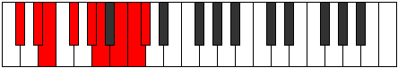 |
| [3503](https://ianring.com/musictheory/scales/3503) | [Zyphygic](ModeENaturalZyphygic.md) | E | E, F, F#, G, A, B, C, D, D#, E |  |
| [3503](https://ianring.com/musictheory/scales/3503) | [Zyphygic](ModeCSharpZyphygic.md) | C# | C#, D, D#, E, F#, G#, A, B, C, C# |  |
| [3503](https://ianring.com/musictheory/scales/3503) | [Zyphygic](ModeDFlatZyphygic.md) | Db | Db, D, Eb, E, Gb, Ab, A, B, C, Db |  |
| [3503](https://ianring.com/musictheory/scales/3503) | [Zyphygic](ModeBNaturalZyphygic.md) | B | B, C, C#, D, E, F#, G, A, A#, B |  |
| [3507](https://ianring.com/musictheory/scales/3507) | [Ponyllic](ModeBNaturalPonyllic.md) | B | B, C, D#, E, F#, G, A, A#, B |  |
| [3509](https://ianring.com/musictheory/scales/3509) | [Stogyllic](ModeENaturalStogyllic.md) | E | E, F#, G#, A, B, C, D, D#, E |  |
| [3511](https://ianring.com/musictheory/scales/3511) | [Epolygic](ModeENaturalEpolygic.md) | E | E, F, F#, G#, A, B, C, D, D#, E |  |
| [3511](https://ianring.com/musictheory/scales/3511) | [Epolygic](ModeBNaturalEpolygic.md) | B | B, C, C#, D#, E, F#, G, A, A#, B |  |
| [3513](https://ianring.com/musictheory/scales/3513) | [Dydyllic](ModeCSharpDydyllic.md) | C# | C#, E, F, F#, G#, A, B, C, C# |  |
| [3513](https://ianring.com/musictheory/scales/3513) | [Dydyllic](ModeDFlatDydyllic.md) | Db | Db, E, F, Gb, Ab, A, B, C, Db |  |
| [3515](https://ianring.com/musictheory/scales/3515) | [Katodygic](ModeCSharpKatodygic.md) | C# | C#, D, E, F, F#, G#, A, B, C, C# |  |
| [3515](https://ianring.com/musictheory/scales/3515) | [Katodygic](ModeDFlatKatodygic.md) | Db | Db, D, E, F, Gb, Ab, A, B, C, Db |  |
| [3515](https://ianring.com/musictheory/scales/3515) | [Katodygic](ModeGSharpKatodygic.md) | G# | G#, A, B, C, C#, D#, E, F#, G, G# |  |
| [3515](https://ianring.com/musictheory/scales/3515) | [Katodygic](ModeAFlatKatodygic.md) | Ab | Ab, A, B, C, Db, Eb, E, Gb, G, Ab |  |
| [3515](https://ianring.com/musictheory/scales/3515) | [Katodygic](ModeBNaturalKatodygic.md) | B | B, C, D, D#, E, F#, G, A, A#, B |  |
| [3517](https://ianring.com/musictheory/scales/3517) | [Epocrygic](ModeCSharpEpocrygic.md) | C# | C#, D#, E, F, F#, G#, A, B, C, C# |  |
| [3517](https://ianring.com/musictheory/scales/3517) | [Epocrygic](ModeDFlatEpocrygic.md) | Db | Db, Eb, E, F, Gb, Ab, A, B, C, Db |  |
| [3517](https://ianring.com/musictheory/scales/3517) | [Epocrygic](ModeENaturalEpocrygic.md) | E | E, F#, G, G#, A, B, C, D, D#, E |  |
| [3519](https://ianring.com/musictheory/scales/3519) | [Boptyllian](ModeCSharpBoptyllian.md) | C# | C#, D, D#, E, F, F#, G#, A, B, C, C# |  |
| [3519](https://ianring.com/musictheory/scales/3519) | [Boptyllian](ModeDFlatBoptyllian.md) | Db | Db, D, Eb, E, F, Gb, Ab, A, B, C, Db |  |
| [3519](https://ianring.com/musictheory/scales/3519) | [Boptyllian](ModeENaturalBoptyllian.md) | E | E, F, F#, G, G#, A, B, C, D, D#, E |  |
| [3519](https://ianring.com/musictheory/scales/3519) | [Boptyllian](ModeBNaturalBoptyllian.md) | B | B, C, C#, D, D#, E, F#, G, A, A#, B |  |
| [3519](https://ianring.com/musictheory/scales/3519) | [Boptyllian](ModeGSharpBoptyllian.md) | G# | G#, A, A#, B, C, C#, D#, E, F#, G, G# |  |
| [3519](https://ianring.com/musictheory/scales/3519) | [Boptyllian](ModeAFlatBoptyllian.md) | Ab | Ab, A, Bb, B, C, Db, Eb, E, Gb, G, Ab |  |
| [3527](https://ianring.com/musictheory/scales/3527) | [Ronyllic](ModeASharpRonyllic.md) | A# | A#, B, C, E, F, F#, G#, A, A# |  |
| [3527](https://ianring.com/musictheory/scales/3527) | [Ronyllic](ModeBFlatRonyllic.md) | Bb | Bb, B, C, E, F, Gb, Ab, A, Bb |  |
| [3535](https://ianring.com/musictheory/scales/3535) | [Aeroptygic](ModeASharpAeroptygic.md) | A# | A#, B, C, C#, E, F, F#, G#, A, A# |  |
| [3535](https://ianring.com/musictheory/scales/3535) | [Aeroptygic](ModeBFlatAeroptygic.md) | Bb | Bb, B, C, Db, E, F, Gb, Ab, A, Bb |  |
| [3539](https://ianring.com/musictheory/scales/3539) | [Aeoryllic](ModeFNaturalAeoryllic.md) | F | F, F#, A, B, C, C#, D#, E, F |  |
| [3543](https://ianring.com/musictheory/scales/3543) | [Aeolonygic](ModeFNaturalAeolonygic.md) | F | F, F#, G, A, B, C, C#, D#, E, F |  |
| [3543](https://ianring.com/musictheory/scales/3543) | [Aeolonygic](ModeASharpAeolonygic.md) | A# | A#, B, C, D, E, F, F#, G#, A, A# |  |
| [3543](https://ianring.com/musictheory/scales/3543) | [Aeolonygic](ModeBFlatAeolonygic.md) | Bb | Bb, B, C, D, E, F, Gb, Ab, A, Bb |  |
| [3547](https://ianring.com/musictheory/scales/3547) | [Sadygic](ModeFNaturalSadygic.md) | F | F, F#, G#, A, B, C, C#, D#, E, F |  |
| [3547](https://ianring.com/musictheory/scales/3547) | [Sadygic](ModeGSharpSadygic.md) | G# | G#, A, B, C, D, D#, E, F#, G, G# |  |
| [3547](https://ianring.com/musictheory/scales/3547) | [Sadygic](ModeAFlatSadygic.md) | Ab | Ab, A, B, C, D, Eb, E, Gb, G, Ab |  |
| [3551](https://ianring.com/musictheory/scales/3551) | [Sagyllian](ModeFNaturalSagyllian.md) | F | F, F#, G, G#, A, B, C, C#, D#, E, F |  |
| [3551](https://ianring.com/musictheory/scales/3551) | [Sagyllian](ModeASharpSagyllian.md) | A# | A#, B, C, C#, D, E, F, F#, G#, A, A# |  |
| [3551](https://ianring.com/musictheory/scales/3551) | [Sagyllian](ModeBFlatSagyllian.md) | Bb | Bb, B, C, Db, D, E, F, Gb, Ab, A, Bb |  |
| [3551](https://ianring.com/musictheory/scales/3551) | [Sagyllian](ModeGSharpSagyllian.md) | G# | G#, A, A#, B, C, D, D#, E, F#, G, G# |  |
| [3551](https://ianring.com/musictheory/scales/3551) | [Sagyllian](ModeAFlatSagyllian.md) | Ab | Ab, A, Bb, B, C, D, Eb, E, Gb, G, Ab |  |
| [3555](https://ianring.com/musictheory/scales/3555) | [Pylyllic](ModeBNaturalPylyllic.md) | B | B, C, E, F, F#, G, A, A#, B |  |
| [3557](https://ianring.com/musictheory/scales/3557) | [Thycryllic](ModeENaturalThycryllic.md) | E | E, F#, A, A#, B, C, D, D#, E |  |
| [3559](https://ianring.com/musictheory/scales/3559) | [Aerathygic](ModeENaturalAerathygic.md) | E | E, F, F#, A, A#, B, C, D, D#, E |  |
| [3559](https://ianring.com/musictheory/scales/3559) | [Aerathygic](ModeBNaturalAerathygic.md) | B | B, C, C#, E, F, F#, G, A, A#, B |  |
| [3559](https://ianring.com/musictheory/scales/3559) | [Aerathygic](ModeASharpAerathygic.md) | A# | A#, B, C, D#, E, F, F#, G#, A, A# |  |
| [3559](https://ianring.com/musictheory/scales/3559) | [Aerathygic](ModeBFlatAerathygic.md) | Bb | Bb, B, C, Eb, E, F, Gb, Ab, A, Bb |  |
| [3561](https://ianring.com/musictheory/scales/3561) | [Pothyllic](ModeFSharpPothyllic.md) | F# | F#, A, B, C, C#, D, E, F, F# |  |
| [3561](https://ianring.com/musictheory/scales/3561) | [Pothyllic](ModeGFlatPothyllic.md) | Gb | Gb, A, B, C, Db, D, E, F, Gb |  |
| [3561](https://ianring.com/musictheory/scales/3561) | [Pothyllic](ModeCSharpPothyllic.md) | C# | C#, E, F#, G, G#, A, B, C, C# |  |
| [3561](https://ianring.com/musictheory/scales/3561) | [Pothyllic](ModeDFlatPothyllic.md) | Db | Db, E, Gb, G, Ab, A, B, C, Db |  |
| [3563](https://ianring.com/musictheory/scales/3563) | [Ionoptygic](ModeFSharpIonoptygic.md) | F# | F#, G, A, B, C, C#, D, E, F, F# |  |
| [3563](https://ianring.com/musictheory/scales/3563) | [Ionoptygic](ModeGFlatIonoptygic.md) | Gb | Gb, G, A, B, C, Db, D, E, F, Gb |  |
| [3563](https://ianring.com/musictheory/scales/3563) | [Ionoptygic](ModeCSharpIonoptygic.md) | C# | C#, D, E, F#, G, G#, A, B, C, C# |  |
| [3563](https://ianring.com/musictheory/scales/3563) | [Ionoptygic](ModeDFlatIonoptygic.md) | Db | Db, D, E, Gb, G, Ab, A, B, C, Db |  |
| [3563](https://ianring.com/musictheory/scales/3563) | [Ionoptygic](ModeBNaturalIonoptygic.md) | B | B, C, D, E, F, F#, G, A, A#, B |  |
| [3565](https://ianring.com/musictheory/scales/3565) | [Aeolorygic](ModeFSharpAeolorygic.md) | F# | F#, G#, A, B, C, C#, D, E, F, F# |  |
| [3565](https://ianring.com/musictheory/scales/3565) | [Aeolorygic](ModeGFlatAeolorygic.md) | Gb | Gb, Ab, A, B, C, Db, D, E, F, Gb |  |
| [3565](https://ianring.com/musictheory/scales/3565) | [Aeolorygic](ModeCSharpAeolorygic.md) | C# | C#, D#, E, F#, G, G#, A, B, C, C# |  |
| [3565](https://ianring.com/musictheory/scales/3565) | [Aeolorygic](ModeDFlatAeolorygic.md) | Db | Db, Eb, E, Gb, G, Ab, A, B, C, Db |  |
| [3565](https://ianring.com/musictheory/scales/3565) | [Aeolorygic](ModeENaturalAeolorygic.md) | E | E, F#, G, A, A#, B, C, D, D#, E |  |
| [3567](https://ianring.com/musictheory/scales/3567) | [Epityllian](ModeCSharpEpityllian.md) | C# | C#, D, D#, E, F#, G, G#, A, B, C, C# |  |
| [3567](https://ianring.com/musictheory/scales/3567) | [Epityllian](ModeDFlatEpityllian.md) | Db | Db, D, Eb, E, Gb, G, Ab, A, B, C, Db |  |
| [3567](https://ianring.com/musictheory/scales/3567) | [Epityllian](ModeFSharpEpityllian.md) | F# | F#, G, G#, A, B, C, C#, D, E, F, F# |  |
| [3567](https://ianring.com/musictheory/scales/3567) | [Epityllian](ModeGFlatEpityllian.md) | Gb | Gb, G, Ab, A, B, C, Db, D, E, F, Gb |  |
| [3567](https://ianring.com/musictheory/scales/3567) | [Epityllian](ModeBNaturalEpityllian.md) | B | B, C, C#, D, E, F, F#, G, A, A#, B |  |
| [3567](https://ianring.com/musictheory/scales/3567) | [Epityllian](ModeENaturalEpityllian.md) | E | E, F, F#, G, A, A#, B, C, D, D#, E |  |
| [3567](https://ianring.com/musictheory/scales/3567) | [Epityllian](ModeASharpEpityllian.md) | A# | A#, B, C, C#, D#, E, F, F#, G#, A, A# |  |
| [3567](https://ianring.com/musictheory/scales/3567) | [Epityllian](ModeBFlatEpityllian.md) | Bb | Bb, B, C, Db, Eb, E, F, Gb, Ab, A, Bb |  |
| [3571](https://ianring.com/musictheory/scales/3571) | [Dyrygic](ModeFNaturalDyrygic.md) | F | F, F#, A, A#, B, C, C#, D#, E, F |  |
| [3571](https://ianring.com/musictheory/scales/3571) | [Dyrygic](ModeBNaturalDyrygic.md) | B | B, C, D#, E, F, F#, G, A, A#, B |  |
| [3573](https://ianring.com/musictheory/scales/3573) | [Kaptygic](ModeENaturalKaptygic.md) | E | E, F#, G#, A, A#, B, C, D, D#, E |  |
| [3575](https://ianring.com/musictheory/scales/3575) | [Mogyllian](ModeFNaturalMogyllian.md) | F | F, F#, G, A, A#, B, C, C#, D#, E, F |  |
| [3575](https://ianring.com/musictheory/scales/3575) | [Mogyllian](ModeBNaturalMogyllian.md) | B | B, C, C#, D#, E, F, F#, G, A, A#, B |  |
| [3575](https://ianring.com/musictheory/scales/3575) | [Mogyllian](ModeENaturalMogyllian.md) | E | E, F, F#, G#, A, A#, B, C, D, D#, E |  |
| [3575](https://ianring.com/musictheory/scales/3575) | [Mogyllian](ModeASharpMogyllian.md) | A# | A#, B, C, D, D#, E, F, F#, G#, A, A# |  |
| [3575](https://ianring.com/musictheory/scales/3575) | [Mogyllian](ModeBFlatMogyllian.md) | Bb | Bb, B, C, D, Eb, E, F, Gb, Ab, A, Bb |  |
| [3577](https://ianring.com/musictheory/scales/3577) | [Loptygic](ModeCSharpLoptygic.md) | C# | C#, E, F, F#, G, G#, A, B, C, C# |  |
| [3577](https://ianring.com/musictheory/scales/3577) | [Loptygic](ModeDFlatLoptygic.md) | Db | Db, E, F, Gb, G, Ab, A, B, C, Db |  |
| [3577](https://ianring.com/musictheory/scales/3577) | [Loptygic](ModeFSharpLoptygic.md) | F# | F#, A, A#, B, C, C#, D, E, F, F# |  |
| [3577](https://ianring.com/musictheory/scales/3577) | [Loptygic](ModeGFlatLoptygic.md) | Gb | Gb, A, Bb, B, C, Db, D, E, F, Gb |  |
| [3579](https://ianring.com/musictheory/scales/3579) | [Zyphyllian](ModeGSharpZyphyllian.md) | G# | G#, A, B, C, C#, D, D#, E, F#, G, G# |  |
| [3579](https://ianring.com/musictheory/scales/3579) | [Zyphyllian](ModeAFlatZyphyllian.md) | Ab | Ab, A, B, C, Db, D, Eb, E, Gb, G, Ab |  |
| [3579](https://ianring.com/musictheory/scales/3579) | [Zyphyllian](ModeCSharpZyphyllian.md) | C# | C#, D, E, F, F#, G, G#, A, B, C, C# |  |
| [3579](https://ianring.com/musictheory/scales/3579) | [Zyphyllian](ModeDFlatZyphyllian.md) | Db | Db, D, E, F, Gb, G, Ab, A, B, C, Db |  |
| [3579](https://ianring.com/musictheory/scales/3579) | [Zyphyllian](ModeFSharpZyphyllian.md) | F# | F#, G, A, A#, B, C, C#, D, E, F, F# |  |
| [3579](https://ianring.com/musictheory/scales/3579) | [Zyphyllian](ModeGFlatZyphyllian.md) | Gb | Gb, G, A, Bb, B, C, Db, D, E, F, Gb |  |
| [3579](https://ianring.com/musictheory/scales/3579) | [Zyphyllian](ModeBNaturalZyphyllian.md) | B | B, C, D, D#, E, F, F#, G, A, A#, B |  |
| [3579](https://ianring.com/musictheory/scales/3579) | [Zyphyllian](ModeFNaturalZyphyllian.md) | F | F, F#, G#, A, A#, B, C, C#, D#, E, F |  |
| [3581](https://ianring.com/musictheory/scales/3581) | [Epocryllian](ModeCSharpEpocryllian.md) | C# | C#, D#, E, F, F#, G, G#, A, B, C, C# |  |
| [3581](https://ianring.com/musictheory/scales/3581) | [Epocryllian](ModeDFlatEpocryllian.md) | Db | Db, Eb, E, F, Gb, G, Ab, A, B, C, Db |  |
| [3581](https://ianring.com/musictheory/scales/3581) | [Epocryllian](ModeFSharpEpocryllian.md) | F# | F#, G#, A, A#, B, C, C#, D, E, F, F# |  |
| [3581](https://ianring.com/musictheory/scales/3581) | [Epocryllian](ModeGFlatEpocryllian.md) | Gb | Gb, Ab, A, Bb, B, C, Db, D, E, F, Gb |  |
| [3581](https://ianring.com/musictheory/scales/3581) | [Epocryllian](ModeENaturalEpocryllian.md) | E | E, F#, G, G#, A, A#, B, C, D, D#, E |  |
| [3583](https://ianring.com/musictheory/scales/3583) | [Zylatic](ModeCSharpZylatic.md) | C# | C#, D, D#, E, F, F#, G, G#, A, B, C, C# |  |
| [3583](https://ianring.com/musictheory/scales/3583) | [Zylatic](ModeDFlatZylatic.md) | Db | Db, D, Eb, E, F, Gb, G, Ab, A, B, C, Db |  |
| [3583](https://ianring.com/musictheory/scales/3583) | [Zylatic](ModeBNaturalZylatic.md) | B | B, C, C#, D, D#, E, F, F#, G, A, A#, B |  |
| [3583](https://ianring.com/musictheory/scales/3583) | [Zylatic](ModeASharpZylatic.md) | A# | A#, B, C, C#, D, D#, E, F, F#, G#, A, A# |  |
| [3583](https://ianring.com/musictheory/scales/3583) | [Zylatic](ModeBFlatZylatic.md) | Bb | Bb, B, C, Db, D, Eb, E, F, Gb, Ab, A, Bb |  |
| [3583](https://ianring.com/musictheory/scales/3583) | [Zylatic](ModeGSharpZylatic.md) | G# | G#, A, A#, B, C, C#, D, D#, E, F#, G, G# |  |
| [3583](https://ianring.com/musictheory/scales/3583) | [Zylatic](ModeAFlatZylatic.md) | Ab | Ab, A, Bb, B, C, Db, D, Eb, E, Gb, G, Ab |  |
| [3583](https://ianring.com/musictheory/scales/3583) | [Zylatic](ModeFSharpZylatic.md) | F# | F#, G, G#, A, A#, B, C, C#, D, E, F, F# |  |
| [3583](https://ianring.com/musictheory/scales/3583) | [Zylatic](ModeGFlatZylatic.md) | Gb | Gb, G, Ab, A, Bb, B, C, Db, D, E, F, Gb |  |
| [3583](https://ianring.com/musictheory/scales/3583) | [Zylatic](ModeFNaturalZylatic.md) | F | F, F#, G, G#, A, A#, B, C, C#, D#, E, F |  |
| [3583](https://ianring.com/musictheory/scales/3583) | [Zylatic](ModeENaturalZylatic.md) | E | E, F, F#, G, G#, A, A#, B, C, D, D#, E |  |
| [3637](https://ianring.com/musictheory/scales/3637) | [Kygian](ModeGNaturalKygian.md) | G | G, A, B, C, D##, E#, F#, G |  |
| [3639](https://ianring.com/musictheory/scales/3639) | [Paptyllic](ModeGNaturalPaptyllic.md) | G | G, G#, A, B, C, E, F, F#, G |  |
| [3645](https://ianring.com/musictheory/scales/3645) | [Zycryllic](ModeGNaturalZycryllic.md) | G | G, A, A#, B, C, E, F, F#, G |  |
| [3647](https://ianring.com/musictheory/scales/3647) | [Eporygic](ModeGNaturalEporygic.md) | G | G, G#, A, A#, B, C, E, F, F#, G |  |
| [3665](https://ianring.com/musictheory/scales/3665) | [Stalimic](ModeCNaturalStalimic.md) | C | C, D##, E##, Cbbb, Cbb, Dbbb, C |  |
| [3667](https://ianring.com/musictheory/scales/3667) | [Kaptian](ModeCNaturalKaptian.md) | C | C, Db, E, F#, G##, A#, B, C |  |
| [3669](https://ianring.com/musictheory/scales/3669) | [Mothian](ModeCNaturalMothian.md) | C | C, D, E, F#, G##, A#, B, C |  |
| [3671](https://ianring.com/musictheory/scales/3671) | [Aeonyllic](ModeCNaturalAeonyllic.md) | C | C, C#, D, E, F#, A, A#, B, C |  |
| [3673](https://ianring.com/musictheory/scales/3673) | [Ranian](ModeCNaturalRanian.md) | C | C, D#, E, F#, G##, A#, B, C |  |
| [3675](https://ianring.com/musictheory/scales/3675) | [Monyllic](ModeCNaturalMonyllic.md) | C | C, C#, D#, E, F#, A, A#, B, C | 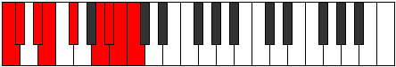 |
| [3677](https://ianring.com/musictheory/scales/3677) | [Katylyllic](ModeCNaturalKatylyllic.md) | C | C, D, D#, E, F#, A, A#, B, C |  |
| [3679](https://ianring.com/musictheory/scales/3679) | [Rycrygic](ModeCNaturalRycrygic.md) | C | C, C#, D, D#, E, F#, A, A#, B, C |  |
| [3689](https://ianring.com/musictheory/scales/3689) | [Katocrian](ModeFSharpKatocrian.md) | F# | F#, G##, A##, B#, C###, D##, E#, F# |  |
| [3689](https://ianring.com/musictheory/scales/3689) | [Katocrian](ModeGFlatKatocrian.md) | Gb | Gb, A, B, C, D#, E, F, Gb |  |
| [3691](https://ianring.com/musictheory/scales/3691) | [Badyllic](ModeFSharpBadyllic.md) | F# | F#, G, A, B, C, D#, E, F, F# |  |
| [3691](https://ianring.com/musictheory/scales/3691) | [Badyllic](ModeGFlatBadyllic.md) | Gb | Gb, G, A, B, C, Eb, E, F, Gb |  |
| [3693](https://ianring.com/musictheory/scales/3693) | [Epaptyllic](ModeFSharpEpaptyllic.md) | F# | F#, G#, A, B, C, D#, E, F, F# |  |
| [3693](https://ianring.com/musictheory/scales/3693) | [Epaptyllic](ModeGFlatEpaptyllic.md) | Gb | Gb, Ab, A, B, C, Eb, E, F, Gb |  |
| [3695](https://ianring.com/musictheory/scales/3695) | [Kodygic](ModeFSharpKodygic.md) | F# | F#, G, G#, A, B, C, D#, E, F, F# |  |
| [3695](https://ianring.com/musictheory/scales/3695) | [Kodygic](ModeGFlatKodygic.md) | Gb | Gb, G, Ab, A, B, C, Eb, E, F, Gb |  |
| [3697](https://ianring.com/musictheory/scales/3697) | [Ionarian](ModeCNaturalIonarian.md) | C | C, D##, E#, F#, G##, A#, B, C |  |
| [3699](https://ianring.com/musictheory/scales/3699) | [Aeolylyllic](ModeCNaturalAeolylyllic.md) | C | C, C#, E, F, F#, A, A#, B, C |  |
| [3701](https://ianring.com/musictheory/scales/3701) | [Bagyllic](ModeGNaturalBagyllic.md) | G | G, A, B, C, C#, E, F, F#, G |  |
| [3701](https://ianring.com/musictheory/scales/3701) | [Bagyllic](ModeCNaturalBagyllic.md) | C | C, D, E, F, F#, A, A#, B, C |  |
| [3703](https://ianring.com/musictheory/scales/3703) | [Katalygic](ModeGNaturalKatalygic.md) | G | G, G#, A, B, C, C#, E, F, F#, G |  |
| [3703](https://ianring.com/musictheory/scales/3703) | [Katalygic](ModeCNaturalKatalygic.md) | C | C, C#, D, E, F, F#, A, A#, B, C |  |
| [3705](https://ianring.com/musictheory/scales/3705) | [Sydyllic](ModeCNaturalSydyllic.md) | C | C, D#, E, F, F#, A, A#, B, C |  |
| [3705](https://ianring.com/musictheory/scales/3705) | [Sydyllic](ModeFSharpSydyllic.md) | F# | F#, A, A#, B, C, D#, E, F, F# |  |
| [3705](https://ianring.com/musictheory/scales/3705) | [Sydyllic](ModeGFlatSydyllic.md) | Gb | Gb, A, Bb, B, C, Eb, E, F, Gb |  |
| [3707](https://ianring.com/musictheory/scales/3707) | [Rynygic](ModeCNaturalRynygic.md) | C | C, C#, D#, E, F, F#, A, A#, B, C |  |
| [3707](https://ianring.com/musictheory/scales/3707) | [Rynygic](ModeFSharpRynygic.md) | F# | F#, G, A, A#, B, C, D#, E, F, F# |  |
| [3707](https://ianring.com/musictheory/scales/3707) | [Rynygic](ModeGFlatRynygic.md) | Gb | Gb, G, A, Bb, B, C, Eb, E, F, Gb |  |
| [3709](https://ianring.com/musictheory/scales/3709) | [Locrygic](ModeCNaturalLocrygic.md) | C | C, D, D#, E, F, F#, A, A#, B, C |  |
| [3709](https://ianring.com/musictheory/scales/3709) | [Locrygic](ModeGNaturalLocrygic.md) | G | G, A, A#, B, C, C#, E, F, F#, G |  |
| [3709](https://ianring.com/musictheory/scales/3709) | [Locrygic](ModeFSharpLocrygic.md) | F# | F#, G#, A, A#, B, C, D#, E, F, F# |  |
| [3709](https://ianring.com/musictheory/scales/3709) | [Locrygic](ModeGFlatLocrygic.md) | Gb | Gb, Ab, A, Bb, B, C, Eb, E, F, Gb |  |
| [3711](https://ianring.com/musictheory/scales/3711) | [Dycryllian](ModeCNaturalDycryllian.md) | C | C, C#, D, D#, E, F, F#, A, A#, B, C |  |
| [3711](https://ianring.com/musictheory/scales/3711) | [Dycryllian](ModeGNaturalDycryllian.md) | G | G, G#, A, A#, B, C, C#, E, F, F#, G |  |
| [3711](https://ianring.com/musictheory/scales/3711) | [Dycryllian](ModeFSharpDycryllian.md) | F# | F#, G, G#, A, A#, B, C, D#, E, F, F# |  |
| [3711](https://ianring.com/musictheory/scales/3711) | [Dycryllian](ModeGFlatDycryllian.md) | Gb | Gb, G, Ab, A, Bb, B, C, Eb, E, F, Gb |  |
| [3725](https://ianring.com/musictheory/scales/3725) | [Kyrian](ModeANaturalKyrian.md) | A | A, B, C, D##, E##, F##, G#, A |  |
| [3727](https://ianring.com/musictheory/scales/3727) | [Tholyllic](ModeANaturalTholyllic.md) | A | A, A#, B, C, E, F#, G, G#, A |  |
| [3733](https://ianring.com/musictheory/scales/3733) | [Gycrian](ModeDNaturalGycrian.md) | D | D, E, F#, G##, A##, B#, C#, D |  |
| [3735](https://ianring.com/musictheory/scales/3735) | [Ionagyllic](ModeDNaturalIonagyllic.md) | D | D, D#, E, F#, A, B, C, C#, D |  |
| [3741](https://ianring.com/musictheory/scales/3741) | [Zydyllic](ModeDNaturalZydyllic.md) | D | D, E, F, F#, A, B, C, C#, D |  |
| [3741](https://ianring.com/musictheory/scales/3741) | [Zydyllic](ModeANaturalZydyllic.md) | A | A, B, C, C#, E, F#, G, G#, A |  |
| [3743](https://ianring.com/musictheory/scales/3743) | [Thadygic](ModeDNaturalThadygic.md) | D | D, D#, E, F, F#, A, B, C, C#, D |  |
| [3743](https://ianring.com/musictheory/scales/3743) | [Thadygic](ModeANaturalThadygic.md) | A | A, A#, B, C, C#, E, F#, G, G#, A |  |
| [3747](https://ianring.com/musictheory/scales/3747) | [Myrian](ModeBNaturalMyrian.md) | B | B, C, D##, E##, F###, G##, A#, B |  |
| [3751](https://ianring.com/musictheory/scales/3751) | [Aerathyllic](ModeBNaturalAerathyllic.md) | B | B, C, C#, E, F#, G#, A, A#, B |  |
| [3755](https://ianring.com/musictheory/scales/3755) | [Phryryllic](ModeBNaturalPhryryllic.md) | B | B, C, D, E, F#, G#, A, A#, B |  |
| [3757](https://ianring.com/musictheory/scales/3757) | [Goptyllic](ModeANaturalGoptyllic.md) | A | A, B, C, D, E, F#, G, G#, A |  |
| [3759](https://ianring.com/musictheory/scales/3759) | [Darygic](ModeBNaturalDarygic.md) | B | B, C, C#, D, E, F#, G#, A, A#, B |  |
| [3759](https://ianring.com/musictheory/scales/3759) | [Darygic](ModeANaturalDarygic.md) | A | A, A#, B, C, D, E, F#, G, G#, A |  |
| [3763](https://ianring.com/musictheory/scales/3763) | [Modyllic](ModeBNaturalModyllic.md) | B | B, C, D#, E, F#, G#, A, A#, B |  |
| [3765](https://ianring.com/musictheory/scales/3765) | [Aerycryllic](ModeDNaturalAerycryllic.md) | D | D, E, F#, G, A, B, C, C#, D |  |
| [3765](https://ianring.com/musictheory/scales/3765) | [Aerycryllic](ModeGNaturalAerycryllic.md) | G | G, A, B, C, D, E, F, F#, G |  |
| [3767](https://ianring.com/musictheory/scales/3767) | [Bacrygic](ModeDNaturalBacrygic.md) | D | D, D#, E, F#, G, A, B, C, C#, D |  |
| [3767](https://ianring.com/musictheory/scales/3767) | [Bacrygic](ModeGNaturalBacrygic.md) | G | G, G#, A, B, C, D, E, F, F#, G |  |
| [3767](https://ianring.com/musictheory/scales/3767) | [Bacrygic](ModeBNaturalBacrygic.md) | B | B, C, C#, D#, E, F#, G#, A, A#, B |  |
| [3771](https://ianring.com/musictheory/scales/3771) | [Stophygic](ModeBNaturalStophygic.md) | B | B, C, D, D#, E, F#, G#, A, A#, B |  |
| [3773](https://ianring.com/musictheory/scales/3773) | [Sorygic](ModeDNaturalSorygic.md) | D | D, E, F, F#, G, A, B, C, C#, D |  |
| [3773](https://ianring.com/musictheory/scales/3773) | [Sorygic](ModeANaturalSorygic.md) | A | A, B, C, C#, D, E, F#, G, G#, A |  |
| [3773](https://ianring.com/musictheory/scales/3773) | [Sorygic](ModeGNaturalSorygic.md) | G | G, A, A#, B, C, D, E, F, F#, G |  |
| [3775](https://ianring.com/musictheory/scales/3775) | [Loptyllian](ModeDNaturalLoptyllian.md) | D | D, D#, E, F, F#, G, A, B, C, C#, D |  |
| [3775](https://ianring.com/musictheory/scales/3775) | [Loptyllian](ModeBNaturalLoptyllian.md) | B | B, C, C#, D, D#, E, F#, G#, A, A#, B |  |
| [3775](https://ianring.com/musictheory/scales/3775) | [Loptyllian](ModeANaturalLoptyllian.md) | A | A, A#, B, C, C#, D, E, F#, G, G#, A |  |
| [3775](https://ianring.com/musictheory/scales/3775) | [Loptyllian](ModeGNaturalLoptyllian.md) | G | G, G#, A, A#, B, C, D, E, F, F#, G |  |
| [3789](https://ianring.com/musictheory/scales/3789) | [Eporyllic](ModeANaturalEporyllic.md) | A | A, B, C, D#, E, F#, G, G#, A |  |
| [3791](https://ianring.com/musictheory/scales/3791) | [Stodygic](ModeANaturalStodygic.md) | A | A, A#, B, C, D#, E, F#, G, G#, A |  |
| [3793](https://ianring.com/musictheory/scales/3793) | [Aeopian](ModeCNaturalAeopian.md) | C | C, D##, E##, F##, G##, A#, B, C |  |
| [3795](https://ianring.com/musictheory/scales/3795) | [Epothyllic](ModeFNaturalEpothyllic.md) | F | F, F#, A, B, C, D, D#, E, F |  |
| [3795](https://ianring.com/musictheory/scales/3795) | [Epothyllic](ModeCNaturalEpothyllic.md) | C | C, C#, E, F#, G, A, A#, B, C |  |
| [3797](https://ianring.com/musictheory/scales/3797) | [Rocryllic](ModeDNaturalRocryllic.md) | D | D, E, F#, G#, A, B, C, C#, D |  |
| [3797](https://ianring.com/musictheory/scales/3797) | [Rocryllic](ModeCNaturalRocryllic.md) | C | C, D, E, F#, G, A, A#, B, C |  |
| [3799](https://ianring.com/musictheory/scales/3799) | [Aeralygic](ModeFNaturalAeralygic.md) | F | F, F#, G, A, B, C, D, D#, E, F |  |
| [3799](https://ianring.com/musictheory/scales/3799) | [Aeralygic](ModeDNaturalAeralygic.md) | D | D, D#, E, F#, G#, A, B, C, C#, D |  |
| [3799](https://ianring.com/musictheory/scales/3799) | [Aeralygic](ModeCNaturalAeralygic.md) | C | C, C#, D, E, F#, G, A, A#, B, C |  |
| [3801](https://ianring.com/musictheory/scales/3801) | [Maptyllic](ModeCNaturalMaptyllic.md) | C | C, D#, E, F#, G, A, A#, B, C | 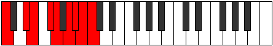 |
| [3803](https://ianring.com/musictheory/scales/3803) | [Epidygic](ModeFNaturalEpidygic.md) | F | F, F#, G#, A, B, C, D, D#, E, F |  |
| [3803](https://ianring.com/musictheory/scales/3803) | [Epidygic](ModeCNaturalEpidygic.md) | C | C, C#, D#, E, F#, G, A, A#, B, C |  |
| [3805](https://ianring.com/musictheory/scales/3805) | [Moptygic](ModeDNaturalMoptygic.md) | D | D, E, F, F#, G#, A, B, C, C#, D |  |
| [3805](https://ianring.com/musictheory/scales/3805) | [Moptygic](ModeANaturalMoptygic.md) | A | A, B, C, C#, D#, E, F#, G, G#, A |  |
| [3805](https://ianring.com/musictheory/scales/3805) | [Moptygic](ModeCNaturalMoptygic.md) | C | C, D, D#, E, F#, G, A, A#, B, C |  |
| [3807](https://ianring.com/musictheory/scales/3807) | [Bagyllian](ModeDNaturalBagyllian.md) | D | D, D#, E, F, F#, G#, A, B, C, C#, D |  |
| [3807](https://ianring.com/musictheory/scales/3807) | [Bagyllian](ModeFNaturalBagyllian.md) | F | F, F#, G, G#, A, B, C, D, D#, E, F |  |
| [3807](https://ianring.com/musictheory/scales/3807) | [Bagyllian](ModeCNaturalBagyllian.md) | C | C, C#, D, D#, E, F#, G, A, A#, B, C |  |
| [3807](https://ianring.com/musictheory/scales/3807) | [Bagyllian](ModeANaturalBagyllian.md) | A | A, A#, B, C, C#, D#, E, F#, G, G#, A |  |
| [3811](https://ianring.com/musictheory/scales/3811) | [Epogyllic](ModeBNaturalEpogyllic.md) | B | B, C, E, F, F#, G#, A, A#, B |  |
| [3815](https://ianring.com/musictheory/scales/3815) | [Mylygic](ModeBNaturalMylygic.md) | B | B, C, C#, E, F, F#, G#, A, A#, B |  |
| [3817](https://ianring.com/musictheory/scales/3817) | [Zoryllic](ModeFSharpZoryllic.md) | F# | F#, A, B, C, C#, D#, E, F, F# |  |
| [3817](https://ianring.com/musictheory/scales/3817) | [Zoryllic](ModeGFlatZoryllic.md) | Gb | Gb, A, B, C, Db, Eb, E, F, Gb |  |
| [3819](https://ianring.com/musictheory/scales/3819) | [Aeolanygic](ModeFSharpAeolanygic.md) | F# | F#, G, A, B, C, C#, D#, E, F, F# |  |
| [3819](https://ianring.com/musictheory/scales/3819) | [Aeolanygic](ModeGFlatAeolanygic.md) | Gb | Gb, G, A, B, C, Db, Eb, E, F, Gb |  |
| [3819](https://ianring.com/musictheory/scales/3819) | [Aeolanygic](ModeBNaturalAeolanygic.md) | B | B, C, D, E, F, F#, G#, A, A#, B |  |
| [3821](https://ianring.com/musictheory/scales/3821) | [Epyrygic](ModeFSharpEpyrygic.md) | F# | F#, G#, A, B, C, C#, D#, E, F, F# |  |
| [3821](https://ianring.com/musictheory/scales/3821) | [Epyrygic](ModeGFlatEpyrygic.md) | Gb | Gb, Ab, A, B, C, Db, Eb, E, F, Gb |  |
| [3821](https://ianring.com/musictheory/scales/3821) | [Epyrygic](ModeANaturalEpyrygic.md) | A | A, B, C, D, D#, E, F#, G, G#, A |  |
| [3823](https://ianring.com/musictheory/scales/3823) | [Epinyllian](ModeFSharpEpinyllian.md) | F# | F#, G, G#, A, B, C, C#, D#, E, F, F# |  |
| [3823](https://ianring.com/musictheory/scales/3823) | [Epinyllian](ModeGFlatEpinyllian.md) | Gb | Gb, G, Ab, A, B, C, Db, Eb, E, F, Gb |  |
| [3823](https://ianring.com/musictheory/scales/3823) | [Epinyllian](ModeBNaturalEpinyllian.md) | B | B, C, C#, D, E, F, F#, G#, A, A#, B |  |
| [3823](https://ianring.com/musictheory/scales/3823) | [Epinyllian](ModeANaturalEpinyllian.md) | A | A, A#, B, C, D, D#, E, F#, G, G#, A |  |
| [3825](https://ianring.com/musictheory/scales/3825) | [Pynyllic](ModeCNaturalPynyllic.md) | C | C, E, F, F#, G, A, A#, B, C |  |
| [3827](https://ianring.com/musictheory/scales/3827) | [Dorygic](ModeFNaturalDorygic.md) | F | F, F#, A, A#, B, C, D, D#, E, F |  |
| [3827](https://ianring.com/musictheory/scales/3827) | [Dorygic](ModeCNaturalDorygic.md) | C | C, C#, E, F, F#, G, A, A#, B, C |  |
| [3827](https://ianring.com/musictheory/scales/3827) | [Dorygic](ModeBNaturalDorygic.md) | B | B, C, D#, E, F, F#, G#, A, A#, B |  |
| [3829](https://ianring.com/musictheory/scales/3829) | [Aerycrygic](ModeGNaturalAerycrygic.md) | G | G, A, B, C, C#, D, E, F, F#, G |  |
| [3829](https://ianring.com/musictheory/scales/3829) | [Aerycrygic](ModeDNaturalAerycrygic.md) | D | D, E, F#, G, G#, A, B, C, C#, D |  |
| [3829](https://ianring.com/musictheory/scales/3829) | [Aerycrygic](ModeCNaturalAerycrygic.md) | C | C, D, E, F, F#, G, A, A#, B, C |  |
| [3831](https://ianring.com/musictheory/scales/3831) | [Ionyllian](ModeDNaturalIonyllian.md) | D | D, D#, E, F#, G, G#, A, B, C, C#, D |  |
| [3831](https://ianring.com/musictheory/scales/3831) | [Ionyllian](ModeGNaturalIonyllian.md) | G | G, G#, A, B, C, C#, D, E, F, F#, G |  |
| [3831](https://ianring.com/musictheory/scales/3831) | [Ionyllian](ModeCNaturalIonyllian.md) | C | C, C#, D, E, F, F#, G, A, A#, B, C |  |
| [3831](https://ianring.com/musictheory/scales/3831) | [Ionyllian](ModeFNaturalIonyllian.md) | F | F, F#, G, A, A#, B, C, D, D#, E, F |  |
| [3831](https://ianring.com/musictheory/scales/3831) | [Ionyllian](ModeBNaturalIonyllian.md) | B | B, C, C#, D#, E, F, F#, G#, A, A#, B |  |
| [3833](https://ianring.com/musictheory/scales/3833) | [Dycrygic](ModeFSharpDycrygic.md) | F# | F#, A, A#, B, C, C#, D#, E, F, F# |  |
| [3833](https://ianring.com/musictheory/scales/3833) | [Dycrygic](ModeGFlatDycrygic.md) | Gb | Gb, A, Bb, B, C, Db, Eb, E, F, Gb |  |
| [3833](https://ianring.com/musictheory/scales/3833) | [Dycrygic](ModeCNaturalDycrygic.md) | C | C, D#, E, F, F#, G, A, A#, B, C |  |
| [3835](https://ianring.com/musictheory/scales/3835) | [Katodyllian](ModeCNaturalKatodyllian.md) | C | C, C#, D#, E, F, F#, G, A, A#, B, C |  |
| [3835](https://ianring.com/musictheory/scales/3835) | [Katodyllian](ModeFSharpKatodyllian.md) | F# | F#, G, A, A#, B, C, C#, D#, E, F, F# |  |
| [3835](https://ianring.com/musictheory/scales/3835) | [Katodyllian](ModeGFlatKatodyllian.md) | Gb | Gb, G, A, Bb, B, C, Db, Eb, E, F, Gb |  |
| [3835](https://ianring.com/musictheory/scales/3835) | [Katodyllian](ModeFNaturalKatodyllian.md) | F | F, F#, G#, A, A#, B, C, D, D#, E, F |  |
| [3835](https://ianring.com/musictheory/scales/3835) | [Katodyllian](ModeBNaturalKatodyllian.md) | B | B, C, D, D#, E, F, F#, G#, A, A#, B |  |
| [3837](https://ianring.com/musictheory/scales/3837) | [Garyllian](ModeANaturalGaryllian.md) | A | A, B, C, C#, D, D#, E, F#, G, G#, A |  |
| [3837](https://ianring.com/musictheory/scales/3837) | [Garyllian](ModeDNaturalGaryllian.md) | D | D, E, F, F#, G, G#, A, B, C, C#, D |  |
| [3837](https://ianring.com/musictheory/scales/3837) | [Garyllian](ModeGNaturalGaryllian.md) | G | G, A, A#, B, C, C#, D, E, F, F#, G |  |
| [3837](https://ianring.com/musictheory/scales/3837) | [Garyllian](ModeCNaturalGaryllian.md) | C | C, D, D#, E, F, F#, G, A, A#, B, C |  |
| [3837](https://ianring.com/musictheory/scales/3837) | [Garyllian](ModeFSharpGaryllian.md) | F# | F#, G#, A, A#, B, C, C#, D#, E, F, F# |  |
| [3837](https://ianring.com/musictheory/scales/3837) | [Garyllian](ModeGFlatGaryllian.md) | Gb | Gb, Ab, A, Bb, B, C, Db, Eb, E, F, Gb |  |
| [3839](https://ianring.com/musictheory/scales/3839) | [Mixolatic](ModeDNaturalMixolatic.md) | D | D, D#, E, F, F#, G, G#, A, B, C, C#, D |  |
| [3839](https://ianring.com/musictheory/scales/3839) | [Mixolatic](ModeCNaturalMixolatic.md) | C | C, C#, D, D#, E, F, F#, G, A, A#, B, C |  |
| [3839](https://ianring.com/musictheory/scales/3839) | [Mixolatic](ModeBNaturalMixolatic.md) | B | B, C, C#, D, D#, E, F, F#, G#, A, A#, B |  |
| [3839](https://ianring.com/musictheory/scales/3839) | [Mixolatic](ModeANaturalMixolatic.md) | A | A, A#, B, C, C#, D, D#, E, F#, G, G#, A |  |
| [3839](https://ianring.com/musictheory/scales/3839) | [Mixolatic](ModeGNaturalMixolatic.md) | G | G, G#, A, A#, B, C, C#, D, E, F, F#, G |  |
| [3839](https://ianring.com/musictheory/scales/3839) | [Mixolatic](ModeFSharpMixolatic.md) | F# | F#, G, G#, A, A#, B, C, C#, D#, E, F, F# |  |
| [3839](https://ianring.com/musictheory/scales/3839) | [Mixolatic](ModeGFlatMixolatic.md) | Gb | Gb, G, Ab, A, Bb, B, C, Db, Eb, E, F, Gb |  |
| [3839](https://ianring.com/musictheory/scales/3839) | [Mixolatic](ModeFNaturalMixolatic.md) | F | F, F#, G, G#, A, A#, B, C, D, D#, E, F |  |
| [3867](https://ianring.com/musictheory/scales/3867) | [Storyllic](ModeGSharpStoryllic.md) | G# | G#, A, B, C, E, F, F#, G, G# |  |
| [3867](https://ianring.com/musictheory/scales/3867) | [Storyllic](ModeAFlatStoryllic.md) | Ab | Ab, A, B, C, E, F, Gb, G, Ab |  |
| [3871](https://ianring.com/musictheory/scales/3871) | [Aerynygic](ModeGSharpAerynygic.md) | G# | G#, A, A#, B, C, E, F, F#, G, G# |  |
| [3871](https://ianring.com/musictheory/scales/3871) | [Aerynygic](ModeAFlatAerynygic.md) | Ab | Ab, A, Bb, B, C, E, F, Gb, G, Ab |  |
| [3881](https://ianring.com/musictheory/scales/3881) | [Morian](ModeCSharpMorian.md) | C# | C#, D##, E##, Cbbb, Cbb, Dbbb, Dbb, C# |  |
| [3881](https://ianring.com/musictheory/scales/3881) | [Morian](ModeDFlatMorian.md) | Db | Db, E, F#, G##, A#, B, C, Db |  |
| [3883](https://ianring.com/musictheory/scales/3883) | [Kyryllic](ModeCSharpKyryllic.md) | C# | C#, D, E, F#, A, A#, B, C, C# |  |
| [3883](https://ianring.com/musictheory/scales/3883) | [Kyryllic](ModeDFlatKyryllic.md) | Db | Db, D, E, Gb, A, Bb, B, C, Db |  |
| [3885](https://ianring.com/musictheory/scales/3885) | [Styryllic](ModeCSharpStyryllic.md) | C# | C#, D#, E, F#, A, A#, B, C, C# |  |
| [3885](https://ianring.com/musictheory/scales/3885) | [Styryllic](ModeDFlatStyryllic.md) | Db | Db, Eb, E, Gb, A, Bb, B, C, Db |  |
| [3887](https://ianring.com/musictheory/scales/3887) | [Phrathygic](ModeCSharpPhrathygic.md) | C# | C#, D, D#, E, F#, A, A#, B, C, C# |  |
| [3887](https://ianring.com/musictheory/scales/3887) | [Phrathygic](ModeDFlatPhrathygic.md) | Db | Db, D, Eb, E, Gb, A, Bb, B, C, Db |  |
| [3893](https://ianring.com/musictheory/scales/3893) | [Phrocryllic](ModeGNaturalPhrocryllic.md) | G | G, A, B, C, D#, E, F, F#, G |  |
| [3895](https://ianring.com/musictheory/scales/3895) | [Eparygic](ModeGNaturalEparygic.md) | G | G, G#, A, B, C, D#, E, F, F#, G |  |
| [3897](https://ianring.com/musictheory/scales/3897) | [Locryllic](ModeCSharpLocryllic.md) | C# | C#, E, F, F#, A, A#, B, C, C# |  |
| [3897](https://ianring.com/musictheory/scales/3897) | [Locryllic](ModeDFlatLocryllic.md) | Db | Db, E, F, Gb, A, Bb, B, C, Db |  |
| [3899](https://ianring.com/musictheory/scales/3899) | [Katorygic](ModeGSharpKatorygic.md) | G# | G#, A, B, C, C#, E, F, F#, G, G# |  |
| [3899](https://ianring.com/musictheory/scales/3899) | [Katorygic](ModeAFlatKatorygic.md) | Ab | Ab, A, B, C, Db, E, F, Gb, G, Ab |  |
| [3899](https://ianring.com/musictheory/scales/3899) | [Katorygic](ModeCSharpKatorygic.md) | C# | C#, D, E, F, F#, A, A#, B, C, C# |  |
| [3899](https://ianring.com/musictheory/scales/3899) | [Katorygic](ModeDFlatKatorygic.md) | Db | Db, D, E, F, Gb, A, Bb, B, C, Db |  |
| [3901](https://ianring.com/musictheory/scales/3901) | [Bycrygic](ModeCSharpBycrygic.md) | C# | C#, D#, E, F, F#, A, A#, B, C, C# |  |
| [3901](https://ianring.com/musictheory/scales/3901) | [Bycrygic](ModeDFlatBycrygic.md) | Db | Db, Eb, E, F, Gb, A, Bb, B, C, Db |  |
| [3901](https://ianring.com/musictheory/scales/3901) | [Bycrygic](ModeGNaturalBycrygic.md) | G | G, A, A#, B, C, D#, E, F, F#, G |  |
| [3903](https://ianring.com/musictheory/scales/3903) | [Aeogyllian](ModeCSharpAeogyllian.md) | C# | C#, D, D#, E, F, F#, A, A#, B, C, C# |  |
| [3903](https://ianring.com/musictheory/scales/3903) | [Aeogyllian](ModeDFlatAeogyllian.md) | Db | Db, D, Eb, E, F, Gb, A, Bb, B, C, Db |  |
| [3903](https://ianring.com/musictheory/scales/3903) | [Aeogyllian](ModeGSharpAeogyllian.md) | G# | G#, A, A#, B, C, C#, E, F, F#, G, G# |  |
| [3903](https://ianring.com/musictheory/scales/3903) | [Aeogyllian](ModeAFlatAeogyllian.md) | Ab | Ab, A, Bb, B, C, Db, E, F, Gb, G, Ab |  |
| [3903](https://ianring.com/musictheory/scales/3903) | [Aeogyllian](ModeGNaturalAeogyllian.md) | G | G, G#, A, A#, B, C, D#, E, F, F#, G |  |
| [3911](https://ianring.com/musictheory/scales/3911) | [Katyryllic](ModeASharpKatyryllic.md) | A# | A#, B, C, E, F#, G, G#, A, A# |  |
| [3911](https://ianring.com/musictheory/scales/3911) | [Katyryllic](ModeBFlatKatyryllic.md) | Bb | Bb, B, C, E, Gb, G, Ab, A, Bb |  |
| [3915](https://ianring.com/musictheory/scales/3915) | [Gogyllic](ModeDSharpGogyllic.md) | D# | D#, E, F#, A, B, C, C#, D, D# |  |
| [3915](https://ianring.com/musictheory/scales/3915) | [Gogyllic](ModeEFlatGogyllic.md) | Eb | Eb, E, Gb, A, B, C, Db, D, Eb |  |
| [3919](https://ianring.com/musictheory/scales/3919) | [Lynygic](ModeDSharpLynygic.md) | D# | D#, E, F, F#, A, B, C, C#, D, D# |  |
| [3919](https://ianring.com/musictheory/scales/3919) | [Lynygic](ModeEFlatLynygic.md) | Eb | Eb, E, F, Gb, A, B, C, Db, D, Eb |  |
| [3919](https://ianring.com/musictheory/scales/3919) | [Lynygic](ModeASharpLynygic.md) | A# | A#, B, C, C#, E, F#, G, G#, A, A# |  |
| [3919](https://ianring.com/musictheory/scales/3919) | [Lynygic](ModeBFlatLynygic.md) | Bb | Bb, B, C, Db, E, Gb, G, Ab, A, Bb |  |
| [3921](https://ianring.com/musictheory/scales/3921) | [Pythian](ModeCNaturalPythian.md) | C | C, D##, E##, F###, G##, A#, B, C |  |
| [3923](https://ianring.com/musictheory/scales/3923) | [Stoptyllic](ModeCNaturalStoptyllic.md) | C | C, C#, E, F#, G#, A, A#, B, C |  |
| [3925](https://ianring.com/musictheory/scales/3925) | [Thyryllic](ModeCNaturalThyryllic.md) | C | C, D, E, F#, G#, A, A#, B, C |  |
| [3927](https://ianring.com/musictheory/scales/3927) | [Monygic](ModeCNaturalMonygic.md) | C | C, C#, D, E, F#, G#, A, A#, B, C |  |
| [3927](https://ianring.com/musictheory/scales/3927) | [Monygic](ModeASharpMonygic.md) | A# | A#, B, C, D, E, F#, G, G#, A, A# |  |
| [3927](https://ianring.com/musictheory/scales/3927) | [Monygic](ModeBFlatMonygic.md) | Bb | Bb, B, C, D, E, Gb, G, Ab, A, Bb |  |
| [3929](https://ianring.com/musictheory/scales/3929) | [Aeolothyllic](ModeCNaturalAeolothyllic.md) | C | C, D#, E, F#, G#, A, A#, B, C |  |
| [3931](https://ianring.com/musictheory/scales/3931) | [Aerygic](ModeDSharpAerygic.md) | D# | D#, E, F#, G, A, B, C, C#, D, D# |  |
| [3931](https://ianring.com/musictheory/scales/3931) | [Aerygic](ModeEFlatAerygic.md) | Eb | Eb, E, Gb, G, A, B, C, Db, D, Eb |  |
| [3931](https://ianring.com/musictheory/scales/3931) | [Aerygic](ModeGSharpAerygic.md) | G# | G#, A, B, C, D, E, F, F#, G, G# |  |
| [3931](https://ianring.com/musictheory/scales/3931) | [Aerygic](ModeAFlatAerygic.md) | Ab | Ab, A, B, C, D, E, F, Gb, G, Ab |  |
| [3931](https://ianring.com/musictheory/scales/3931) | [Aerygic](ModeCNaturalAerygic.md) | C | C, C#, D#, E, F#, G#, A, A#, B, C |  |
| [3933](https://ianring.com/musictheory/scales/3933) | [Ionidygic](ModeCNaturalIonidygic.md) | C | C, D, D#, E, F#, G#, A, A#, B, C |  |
| [3935](https://ianring.com/musictheory/scales/3935) | [Kataphyllian](ModeDSharpKataphyllian.md) | D# | D#, E, F, F#, G, A, B, C, C#, D, D# |  |
| [3935](https://ianring.com/musictheory/scales/3935) | [Kataphyllian](ModeEFlatKataphyllian.md) | Eb | Eb, E, F, Gb, G, A, B, C, Db, D, Eb |  |
| [3935](https://ianring.com/musictheory/scales/3935) | [Kataphyllian](ModeCNaturalKataphyllian.md) | C | C, C#, D, D#, E, F#, G#, A, A#, B, C |  |
| [3935](https://ianring.com/musictheory/scales/3935) | [Kataphyllian](ModeASharpKataphyllian.md) | A# | A#, B, C, C#, D, E, F#, G, G#, A, A# |  |
| [3935](https://ianring.com/musictheory/scales/3935) | [Kataphyllian](ModeBFlatKataphyllian.md) | Bb | Bb, B, C, Db, D, E, Gb, G, Ab, A, Bb |  |
| [3935](https://ianring.com/musictheory/scales/3935) | [Kataphyllian](ModeGSharpKataphyllian.md) | G# | G#, A, A#, B, C, D, E, F, F#, G, G# |  |
| [3935](https://ianring.com/musictheory/scales/3935) | [Kataphyllian](ModeAFlatKataphyllian.md) | Ab | Ab, A, Bb, B, C, D, E, F, Gb, G, Ab |  |
| [3943](https://ianring.com/musictheory/scales/3943) | [Zynygic](ModeASharpZynygic.md) | A# | A#, B, C, D#, E, F#, G, G#, A, A# |  |
| [3943](https://ianring.com/musictheory/scales/3943) | [Zynygic](ModeBFlatZynygic.md) | Bb | Bb, B, C, Eb, E, Gb, G, Ab, A, Bb |  |
| [3945](https://ianring.com/musictheory/scales/3945) | [Lydyllic](ModeFSharpLydyllic.md) | F# | F#, A, B, C, D, D#, E, F, F# |  |
| [3945](https://ianring.com/musictheory/scales/3945) | [Lydyllic](ModeGFlatLydyllic.md) | Gb | Gb, A, B, C, D, Eb, E, F, Gb |  |
| [3945](https://ianring.com/musictheory/scales/3945) | [Lydyllic](ModeCSharpLydyllic.md) | C# | C#, E, F#, G, A, A#, B, C, C# |  |
| [3945](https://ianring.com/musictheory/scales/3945) | [Lydyllic](ModeDFlatLydyllic.md) | Db | Db, E, Gb, G, A, Bb, B, C, Db |  |
| [3947](https://ianring.com/musictheory/scales/3947) | [Ryptygic](ModeFSharpRyptygic.md) | F# | F#, G, A, B, C, D, D#, E, F, F# |  |
| [3947](https://ianring.com/musictheory/scales/3947) | [Ryptygic](ModeGFlatRyptygic.md) | Gb | Gb, G, A, B, C, D, Eb, E, F, Gb |  |
| [3947](https://ianring.com/musictheory/scales/3947) | [Ryptygic](ModeDSharpRyptygic.md) | D# | D#, E, F#, G#, A, B, C, C#, D, D# |  |
| [3947](https://ianring.com/musictheory/scales/3947) | [Ryptygic](ModeEFlatRyptygic.md) | Eb | Eb, E, Gb, Ab, A, B, C, Db, D, Eb |  |
| [3947](https://ianring.com/musictheory/scales/3947) | [Ryptygic](ModeCSharpRyptygic.md) | C# | C#, D, E, F#, G, A, A#, B, C, C# |  |
| [3947](https://ianring.com/musictheory/scales/3947) | [Ryptygic](ModeDFlatRyptygic.md) | Db | Db, D, E, Gb, G, A, Bb, B, C, Db |  |
| [3949](https://ianring.com/musictheory/scales/3949) | [Koptygic](ModeFSharpKoptygic.md) | F# | F#, G#, A, B, C, D, D#, E, F, F# |  |
| [3949](https://ianring.com/musictheory/scales/3949) | [Koptygic](ModeGFlatKoptygic.md) | Gb | Gb, Ab, A, B, C, D, Eb, E, F, Gb |  |
| [3949](https://ianring.com/musictheory/scales/3949) | [Koptygic](ModeCSharpKoptygic.md) | C# | C#, D#, E, F#, G, A, A#, B, C, C# |  |
| [3949](https://ianring.com/musictheory/scales/3949) | [Koptygic](ModeDFlatKoptygic.md) | Db | Db, Eb, E, Gb, G, A, Bb, B, C, Db |  |
| [3951](https://ianring.com/musictheory/scales/3951) | [Mathyllian](ModeDSharpMathyllian.md) | D# | D#, E, F, F#, G#, A, B, C, C#, D, D# |  |
| [3951](https://ianring.com/musictheory/scales/3951) | [Mathyllian](ModeEFlatMathyllian.md) | Eb | Eb, E, F, Gb, Ab, A, B, C, Db, D, Eb |  |
| [3951](https://ianring.com/musictheory/scales/3951) | [Mathyllian](ModeFSharpMathyllian.md) | F# | F#, G, G#, A, B, C, D, D#, E, F, F# |  |
| [3951](https://ianring.com/musictheory/scales/3951) | [Mathyllian](ModeGFlatMathyllian.md) | Gb | Gb, G, Ab, A, B, C, D, Eb, E, F, Gb |  |
| [3951](https://ianring.com/musictheory/scales/3951) | [Mathyllian](ModeCSharpMathyllian.md) | C# | C#, D, D#, E, F#, G, A, A#, B, C, C# |  |
| [3951](https://ianring.com/musictheory/scales/3951) | [Mathyllian](ModeDFlatMathyllian.md) | Db | Db, D, Eb, E, Gb, G, A, Bb, B, C, Db |  |
| [3951](https://ianring.com/musictheory/scales/3951) | [Mathyllian](ModeASharpMathyllian.md) | A# | A#, B, C, C#, D#, E, F#, G, G#, A, A# |  |
| [3951](https://ianring.com/musictheory/scales/3951) | [Mathyllian](ModeBFlatMathyllian.md) | Bb | Bb, B, C, Db, Eb, E, Gb, G, Ab, A, Bb |  |
| [3953](https://ianring.com/musictheory/scales/3953) | [Thagyllic](ModeCNaturalThagyllic.md) | C | C, E, F, F#, G#, A, A#, B, C |  |
| [3955](https://ianring.com/musictheory/scales/3955) | [Galygic](ModeCNaturalGalygic.md) | C | C, C#, E, F, F#, G#, A, A#, B, C |  |
| [3957](https://ianring.com/musictheory/scales/3957) | [Porygic](ModeGNaturalPorygic.md) | G | G, A, B, C, C#, D#, E, F, F#, G |  |
| [3957](https://ianring.com/musictheory/scales/3957) | [Porygic](ModeCNaturalPorygic.md) | C | C, D, E, F, F#, G#, A, A#, B, C |  |
| [3959](https://ianring.com/musictheory/scales/3959) | [Katagyllian](ModeGNaturalKatagyllian.md) | G | G, G#, A, B, C, C#, D#, E, F, F#, G |  |
| [3959](https://ianring.com/musictheory/scales/3959) | [Katagyllian](ModeCNaturalKatagyllian.md) | C | C, C#, D, E, F, F#, G#, A, A#, B, C |  |
| [3959](https://ianring.com/musictheory/scales/3959) | [Katagyllian](ModeASharpKatagyllian.md) | A# | A#, B, C, D, D#, E, F#, G, G#, A, A# |  |
| [3959](https://ianring.com/musictheory/scales/3959) | [Katagyllian](ModeBFlatKatagyllian.md) | Bb | Bb, B, C, D, Eb, E, Gb, G, Ab, A, Bb |  |
| [3961](https://ianring.com/musictheory/scales/3961) | [Mixolydygic](ModeFSharpMixolydygic.md) | F# | F#, A, A#, B, C, D, D#, E, F, F# |  |
| [3961](https://ianring.com/musictheory/scales/3961) | [Mixolydygic](ModeGFlatMixolydygic.md) | Gb | Gb, A, Bb, B, C, D, Eb, E, F, Gb |  |
| [3961](https://ianring.com/musictheory/scales/3961) | [Mixolydygic](ModeCSharpMixolydygic.md) | C# | C#, E, F, F#, G, A, A#, B, C, C# |  |
| [3961](https://ianring.com/musictheory/scales/3961) | [Mixolydygic](ModeDFlatMixolydygic.md) | Db | Db, E, F, Gb, G, A, Bb, B, C, Db |  |
| [3961](https://ianring.com/musictheory/scales/3961) | [Mixolydygic](ModeCNaturalMixolydygic.md) | C | C, D#, E, F, F#, G#, A, A#, B, C |  |
| [3963](https://ianring.com/musictheory/scales/3963) | [Aeoryllian](ModeDSharpAeoryllian.md) | D# | D#, E, F#, G, G#, A, B, C, C#, D, D# |  |
| [3963](https://ianring.com/musictheory/scales/3963) | [Aeoryllian](ModeEFlatAeoryllian.md) | Eb | Eb, E, Gb, G, Ab, A, B, C, Db, D, Eb |  |
| [3963](https://ianring.com/musictheory/scales/3963) | [Aeoryllian](ModeGSharpAeoryllian.md) | G# | G#, A, B, C, C#, D, E, F, F#, G, G# |  |
| [3963](https://ianring.com/musictheory/scales/3963) | [Aeoryllian](ModeAFlatAeoryllian.md) | Ab | Ab, A, B, C, Db, D, E, F, Gb, G, Ab |  |
| [3963](https://ianring.com/musictheory/scales/3963) | [Aeoryllian](ModeCSharpAeoryllian.md) | C# | C#, D, E, F, F#, G, A, A#, B, C, C# |  |
| [3963](https://ianring.com/musictheory/scales/3963) | [Aeoryllian](ModeDFlatAeoryllian.md) | Db | Db, D, E, F, Gb, G, A, Bb, B, C, Db |  |
| [3963](https://ianring.com/musictheory/scales/3963) | [Aeoryllian](ModeFSharpAeoryllian.md) | F# | F#, G, A, A#, B, C, D, D#, E, F, F# |  |
| [3963](https://ianring.com/musictheory/scales/3963) | [Aeoryllian](ModeGFlatAeoryllian.md) | Gb | Gb, G, A, Bb, B, C, D, Eb, E, F, Gb |  |
| [3963](https://ianring.com/musictheory/scales/3963) | [Aeoryllian](ModeCNaturalAeoryllian.md) | C | C, C#, D#, E, F, F#, G#, A, A#, B, C |  |
| [3965](https://ianring.com/musictheory/scales/3965) | [Thydyllian](ModeCSharpThydyllian.md) | C# | C#, D#, E, F, F#, G, A, A#, B, C, C# |  |
| [3965](https://ianring.com/musictheory/scales/3965) | [Thydyllian](ModeDFlatThydyllian.md) | Db | Db, Eb, E, F, Gb, G, A, Bb, B, C, Db |  |
| [3965](https://ianring.com/musictheory/scales/3965) | [Thydyllian](ModeGNaturalThydyllian.md) | G | G, A, A#, B, C, C#, D#, E, F, F#, G |  |
| [3965](https://ianring.com/musictheory/scales/3965) | [Thydyllian](ModeCNaturalThydyllian.md) | C | C, D, D#, E, F, F#, G#, A, A#, B, C |  |
| [3965](https://ianring.com/musictheory/scales/3965) | [Thydyllian](ModeFSharpThydyllian.md) | F# | F#, G#, A, A#, B, C, D, D#, E, F, F# |  |
| [3965](https://ianring.com/musictheory/scales/3965) | [Thydyllian](ModeGFlatThydyllian.md) | Gb | Gb, Ab, A, Bb, B, C, D, Eb, E, F, Gb |  |
| [3967](https://ianring.com/musictheory/scales/3967) | [Soratic](ModeDSharpSoratic.md) | D# | D#, E, F, F#, G, G#, A, B, C, C#, D, D# |  |
| [3967](https://ianring.com/musictheory/scales/3967) | [Soratic](ModeEFlatSoratic.md) | Eb | Eb, E, F, Gb, G, Ab, A, B, C, Db, D, Eb |  |
| [3967](https://ianring.com/musictheory/scales/3967) | [Soratic](ModeCSharpSoratic.md) | C# | C#, D, D#, E, F, F#, G, A, A#, B, C, C# |  |
| [3967](https://ianring.com/musictheory/scales/3967) | [Soratic](ModeDFlatSoratic.md) | Db | Db, D, Eb, E, F, Gb, G, A, Bb, B, C, Db |  |
| [3967](https://ianring.com/musictheory/scales/3967) | [Soratic](ModeCNaturalSoratic.md) | C | C, C#, D, D#, E, F, F#, G#, A, A#, B, C |  |
| [3967](https://ianring.com/musictheory/scales/3967) | [Soratic](ModeASharpSoratic.md) | A# | A#, B, C, C#, D, D#, E, F#, G, G#, A, A# |  |
| [3967](https://ianring.com/musictheory/scales/3967) | [Soratic](ModeBFlatSoratic.md) | Bb | Bb, B, C, Db, D, Eb, E, Gb, G, Ab, A, Bb |  |
| [3967](https://ianring.com/musictheory/scales/3967) | [Soratic](ModeGSharpSoratic.md) | G# | G#, A, A#, B, C, C#, D, E, F, F#, G, G# |  |
| [3967](https://ianring.com/musictheory/scales/3967) | [Soratic](ModeAFlatSoratic.md) | Ab | Ab, A, Bb, B, C, Db, D, E, F, Gb, G, Ab |  |
| [3967](https://ianring.com/musictheory/scales/3967) | [Soratic](ModeGNaturalSoratic.md) | G | G, G#, A, A#, B, C, C#, D#, E, F, F#, G |  |
| [3967](https://ianring.com/musictheory/scales/3967) | [Soratic](ModeFSharpSoratic.md) | F# | F#, G, G#, A, A#, B, C, D, D#, E, F, F# |  |
| [3967](https://ianring.com/musictheory/scales/3967) | [Soratic](ModeGFlatSoratic.md) | Gb | Gb, G, Ab, A, Bb, B, C, D, Eb, E, F, Gb |  |
| [3981](https://ianring.com/musictheory/scales/3981) | [Phrycryllic](ModeANaturalPhrycryllic.md) | A | A, B, C, E, F, F#, G, G#, A |  |
| [3983](https://ianring.com/musictheory/scales/3983) | [Thyptygic](ModeANaturalThyptygic.md) | A | A, A#, B, C, E, F, F#, G, G#, A |  |
| [3989](https://ianring.com/musictheory/scales/3989) | [Sythyllic](ModeDNaturalSythyllic.md) | D | D, E, F#, A, A#, B, C, C#, D |  |
| [3991](https://ianring.com/musictheory/scales/3991) | [Badygic](ModeDNaturalBadygic.md) | D | D, D#, E, F#, A, A#, B, C, C#, D |  |
| [3995](https://ianring.com/musictheory/scales/3995) | [Ionygic](ModeGSharpIonygic.md) | G# | G#, A, B, C, D#, E, F, F#, G, G# |  |
| [3995](https://ianring.com/musictheory/scales/3995) | [Ionygic](ModeAFlatIonygic.md) | Ab | Ab, A, B, C, Eb, E, F, Gb, G, Ab |  |
| [3997](https://ianring.com/musictheory/scales/3997) | [Dogygic](ModeANaturalDogygic.md) | A | A, B, C, C#, E, F, F#, G, G#, A |  |
| [3997](https://ianring.com/musictheory/scales/3997) | [Dogygic](ModeDNaturalDogygic.md) | D | D, E, F, F#, A, A#, B, C, C#, D |  |
| [3999](https://ianring.com/musictheory/scales/3999) | [Dydyllian](ModeDNaturalDydyllian.md) | D | D, D#, E, F, F#, A, A#, B, C, C#, D |  |
| [3999](https://ianring.com/musictheory/scales/3999) | [Dydyllian](ModeANaturalDydyllian.md) | A | A, A#, B, C, C#, E, F, F#, G, G#, A |  |
| [3999](https://ianring.com/musictheory/scales/3999) | [Dydyllian](ModeGSharpDydyllian.md) | G# | G#, A, A#, B, C, D#, E, F, F#, G, G# |  |
| [3999](https://ianring.com/musictheory/scales/3999) | [Dydyllian](ModeAFlatDydyllian.md) | Ab | Ab, A, Bb, B, C, Eb, E, F, Gb, G, Ab |  |
| [4003](https://ianring.com/musictheory/scales/4003) | [Sadyllic](ModeBNaturalSadyllic.md) | B | B, C, E, F#, G, G#, A, A#, B |  |
| [4005](https://ianring.com/musictheory/scales/4005) | [Phradyllic](ModeENaturalPhradyllic.md) | E | E, F#, A, B, C, C#, D, D#, E |  |
| [4007](https://ianring.com/musictheory/scales/4007) | [Doptygic](ModeENaturalDoptygic.md) | E | E, F, F#, A, B, C, C#, D, D#, E |  |
| [4007](https://ianring.com/musictheory/scales/4007) | [Doptygic](ModeBNaturalDoptygic.md) | B | B, C, C#, E, F#, G, G#, A, A#, B |  |
| [4009](https://ianring.com/musictheory/scales/4009) | [Phranyllic](ModeCSharpPhranyllic.md) | C# | C#, E, F#, G#, A, A#, B, C, C# |  |
| [4009](https://ianring.com/musictheory/scales/4009) | [Phranyllic](ModeDFlatPhranyllic.md) | Db | Db, E, Gb, Ab, A, Bb, B, C, Db |  |
| [4011](https://ianring.com/musictheory/scales/4011) | [Styrygic](ModeCSharpStyrygic.md) | C# | C#, D, E, F#, G#, A, A#, B, C, C# |  |
| [4011](https://ianring.com/musictheory/scales/4011) | [Styrygic](ModeDFlatStyrygic.md) | Db | Db, D, E, Gb, Ab, A, Bb, B, C, Db |  |
| [4011](https://ianring.com/musictheory/scales/4011) | [Styrygic](ModeBNaturalStyrygic.md) | B | B, C, D, E, F#, G, G#, A, A#, B |  |
| [4013](https://ianring.com/musictheory/scales/4013) | [Dathygic](ModeENaturalDathygic.md) | E | E, F#, G, A, B, C, C#, D, D#, E |  |
| [4013](https://ianring.com/musictheory/scales/4013) | [Dathygic](ModeANaturalDathygic.md) | A | A, B, C, D, E, F, F#, G, G#, A |  |
| [4013](https://ianring.com/musictheory/scales/4013) | [Dathygic](ModeCSharpDathygic.md) | C# | C#, D#, E, F#, G#, A, A#, B, C, C# |  |
| [4013](https://ianring.com/musictheory/scales/4013) | [Dathygic](ModeDFlatDathygic.md) | Db | Db, Eb, E, Gb, Ab, A, Bb, B, C, Db |  |
| [4015](https://ianring.com/musictheory/scales/4015) | [Phradyllian](ModeENaturalPhradyllian.md) | E | E, F, F#, G, A, B, C, C#, D, D#, E |  |
| [4015](https://ianring.com/musictheory/scales/4015) | [Phradyllian](ModeCSharpPhradyllian.md) | C# | C#, D, D#, E, F#, G#, A, A#, B, C, C# |  |
| [4015](https://ianring.com/musictheory/scales/4015) | [Phradyllian](ModeDFlatPhradyllian.md) | Db | Db, D, Eb, E, Gb, Ab, A, Bb, B, C, Db |  |
| [4015](https://ianring.com/musictheory/scales/4015) | [Phradyllian](ModeBNaturalPhradyllian.md) | B | B, C, C#, D, E, F#, G, G#, A, A#, B |  |
| [4015](https://ianring.com/musictheory/scales/4015) | [Phradyllian](ModeANaturalPhradyllian.md) | A | A, A#, B, C, D, E, F, F#, G, G#, A |  |
| [4019](https://ianring.com/musictheory/scales/4019) | [Lonygic](ModeBNaturalLonygic.md) | B | B, C, D#, E, F#, G, G#, A, A#, B |  |
| [4021](https://ianring.com/musictheory/scales/4021) | [Bagygic](ModeGNaturalBagygic.md) | G | G, A, B, C, D, D#, E, F, F#, G |  |
| [4021](https://ianring.com/musictheory/scales/4021) | [Bagygic](ModeENaturalBagygic.md) | E | E, F#, G#, A, B, C, C#, D, D#, E |  |
| [4021](https://ianring.com/musictheory/scales/4021) | [Bagygic](ModeDNaturalBagygic.md) | D | D, E, F#, G, A, A#, B, C, C#, D |  |
| [4023](https://ianring.com/musictheory/scales/4023) | [Styptyllian](ModeENaturalStyptyllian.md) | E | E, F, F#, G#, A, B, C, C#, D, D#, E |  |
| [4023](https://ianring.com/musictheory/scales/4023) | [Styptyllian](ModeGNaturalStyptyllian.md) | G | G, G#, A, B, C, D, D#, E, F, F#, G |  |
| [4023](https://ianring.com/musictheory/scales/4023) | [Styptyllian](ModeDNaturalStyptyllian.md) | D | D, D#, E, F#, G, A, A#, B, C, C#, D |  |
| [4023](https://ianring.com/musictheory/scales/4023) | [Styptyllian](ModeBNaturalStyptyllian.md) | B | B, C, C#, D#, E, F#, G, G#, A, A#, B |  |
| [4025](https://ianring.com/musictheory/scales/4025) | [Kalygic](ModeCSharpKalygic.md) | C# | C#, E, F, F#, G#, A, A#, B, C, C# |  |
| [4025](https://ianring.com/musictheory/scales/4025) | [Kalygic](ModeDFlatKalygic.md) | Db | Db, E, F, Gb, Ab, A, Bb, B, C, Db |  |
| [4027](https://ianring.com/musictheory/scales/4027) | [Ragyllian](ModeGSharpRagyllian.md) | G# | G#, A, B, C, C#, D#, E, F, F#, G, G# |  |
| [4027](https://ianring.com/musictheory/scales/4027) | [Ragyllian](ModeAFlatRagyllian.md) | Ab | Ab, A, B, C, Db, Eb, E, F, Gb, G, Ab |  |
| [4027](https://ianring.com/musictheory/scales/4027) | [Ragyllian](ModeCSharpRagyllian.md) | C# | C#, D, E, F, F#, G#, A, A#, B, C, C# |  |
| [4027](https://ianring.com/musictheory/scales/4027) | [Ragyllian](ModeDFlatRagyllian.md) | Db | Db, D, E, F, Gb, Ab, A, Bb, B, C, Db |  |
| [4027](https://ianring.com/musictheory/scales/4027) | [Ragyllian](ModeBNaturalRagyllian.md) | B | B, C, D, D#, E, F#, G, G#, A, A#, B |  |
| [4029](https://ianring.com/musictheory/scales/4029) | [Aerycryllian](ModeENaturalAerycryllian.md) | E | E, F#, G, G#, A, B, C, C#, D, D#, E |  |
| [4029](https://ianring.com/musictheory/scales/4029) | [Aerycryllian](ModeANaturalAerycryllian.md) | A | A, B, C, C#, D, E, F, F#, G, G#, A |  |
| [4029](https://ianring.com/musictheory/scales/4029) | [Aerycryllian](ModeDNaturalAerycryllian.md) | D | D, E, F, F#, G, A, A#, B, C, C#, D |  |
| [4029](https://ianring.com/musictheory/scales/4029) | [Aerycryllian](ModeGNaturalAerycryllian.md) | G | G, A, A#, B, C, D, D#, E, F, F#, G |  |
| [4029](https://ianring.com/musictheory/scales/4029) | [Aerycryllian](ModeCSharpAerycryllian.md) | C# | C#, D#, E, F, F#, G#, A, A#, B, C, C# |  |
| [4029](https://ianring.com/musictheory/scales/4029) | [Aerycryllian](ModeDFlatAerycryllian.md) | Db | Db, Eb, E, F, Gb, Ab, A, Bb, B, C, Db |  |
| [4031](https://ianring.com/musictheory/scales/4031) | [Godatic](ModeENaturalGodatic.md) | E | E, F, F#, G, G#, A, B, C, C#, D, D#, E |  |
| [4031](https://ianring.com/musictheory/scales/4031) | [Godatic](ModeDNaturalGodatic.md) | D | D, D#, E, F, F#, G, A, A#, B, C, C#, D |  |
| [4031](https://ianring.com/musictheory/scales/4031) | [Godatic](ModeCSharpGodatic.md) | C# | C#, D, D#, E, F, F#, G#, A, A#, B, C, C# |  |
| [4031](https://ianring.com/musictheory/scales/4031) | [Godatic](ModeDFlatGodatic.md) | Db | Db, D, Eb, E, F, Gb, Ab, A, Bb, B, C, Db |  |
| [4031](https://ianring.com/musictheory/scales/4031) | [Godatic](ModeBNaturalGodatic.md) | B | B, C, C#, D, D#, E, F#, G, G#, A, A#, B |  |
| [4031](https://ianring.com/musictheory/scales/4031) | [Godatic](ModeANaturalGodatic.md) | A | A, A#, B, C, C#, D, E, F, F#, G, G#, A |  |
| [4031](https://ianring.com/musictheory/scales/4031) | [Godatic](ModeGSharpGodatic.md) | G# | G#, A, A#, B, C, C#, D#, E, F, F#, G, G# |  |
| [4031](https://ianring.com/musictheory/scales/4031) | [Godatic](ModeAFlatGodatic.md) | Ab | Ab, A, Bb, B, C, Db, Eb, E, F, Gb, G, Ab |  |
| [4031](https://ianring.com/musictheory/scales/4031) | [Godatic](ModeGNaturalGodatic.md) | G | G, G#, A, A#, B, C, D, D#, E, F, F#, G |  |
| [4039](https://ianring.com/musictheory/scales/4039) | [Ionogygic](ModeASharpIonogygic.md) | A# | A#, B, C, E, F, F#, G, G#, A, A# |  |
| [4039](https://ianring.com/musictheory/scales/4039) | [Ionogygic](ModeBFlatIonogygic.md) | Bb | Bb, B, C, E, F, Gb, G, Ab, A, Bb |  |
| [4043](https://ianring.com/musictheory/scales/4043) | [Phrocrygic](ModeDSharpPhrocrygic.md) | D# | D#, E, F#, A, A#, B, C, C#, D, D# |  |
| [4043](https://ianring.com/musictheory/scales/4043) | [Phrocrygic](ModeEFlatPhrocrygic.md) | Eb | Eb, E, Gb, A, Bb, B, C, Db, D, Eb |  |
| [4045](https://ianring.com/musictheory/scales/4045) | [Gyptygic](ModeANaturalGyptygic.md) | A | A, B, C, D#, E, F, F#, G, G#, A |  |
| [4047](https://ianring.com/musictheory/scales/4047) | [Thogyllian](ModeDSharpThogyllian.md) | D# | D#, E, F, F#, A, A#, B, C, C#, D, D# |  |
| [4047](https://ianring.com/musictheory/scales/4047) | [Thogyllian](ModeEFlatThogyllian.md) | Eb | Eb, E, F, Gb, A, Bb, B, C, Db, D, Eb |  |
| [4047](https://ianring.com/musictheory/scales/4047) | [Thogyllian](ModeASharpThogyllian.md) | A# | A#, B, C, C#, E, F, F#, G, G#, A, A# |  |
| [4047](https://ianring.com/musictheory/scales/4047) | [Thogyllian](ModeBFlatThogyllian.md) | Bb | Bb, B, C, Db, E, F, Gb, G, Ab, A, Bb |  |
| [4047](https://ianring.com/musictheory/scales/4047) | [Thogyllian](ModeANaturalThogyllian.md) | A | A, A#, B, C, D#, E, F, F#, G, G#, A |  |
| [4049](https://ianring.com/musictheory/scales/4049) | [Stycryllic](ModeCNaturalStycryllic.md) | C | C, E, F#, G, G#, A, A#, B, C |  |
| [4051](https://ianring.com/musictheory/scales/4051) | [Ionilygic](ModeFNaturalIonilygic.md) | F | F, F#, A, B, C, C#, D, D#, E, F |  |
| [4051](https://ianring.com/musictheory/scales/4051) | [Ionilygic](ModeCNaturalIonilygic.md) | C | C, C#, E, F#, G, G#, A, A#, B, C | 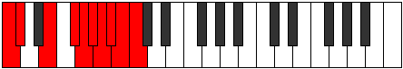 |
| [4053](https://ianring.com/musictheory/scales/4053) | [Kyrygic](ModeDNaturalKyrygic.md) | D | D, E, F#, G#, A, A#, B, C, C#, D |  |
| [4053](https://ianring.com/musictheory/scales/4053) | [Kyrygic](ModeCNaturalKyrygic.md) | C | C, D, E, F#, G, G#, A, A#, B, C |  |
| [4055](https://ianring.com/musictheory/scales/4055) | [Dagyllian](ModeFNaturalDagyllian.md) | F | F, F#, G, A, B, C, C#, D, D#, E, F |  |
| [4055](https://ianring.com/musictheory/scales/4055) | [Dagyllian](ModeDNaturalDagyllian.md) | D | D, D#, E, F#, G#, A, A#, B, C, C#, D |  |
| [4055](https://ianring.com/musictheory/scales/4055) | [Dagyllian](ModeCNaturalDagyllian.md) | C | C, C#, D, E, F#, G, G#, A, A#, B, C |  |
| [4055](https://ianring.com/musictheory/scales/4055) | [Dagyllian](ModeASharpDagyllian.md) | A# | A#, B, C, D, E, F, F#, G, G#, A, A# |  |
| [4055](https://ianring.com/musictheory/scales/4055) | [Dagyllian](ModeBFlatDagyllian.md) | Bb | Bb, B, C, D, E, F, Gb, G, Ab, A, Bb |  |
| [4057](https://ianring.com/musictheory/scales/4057) | [Phrygic](ModeCNaturalPhrygic.md) | C | C, D#, E, F#, G, G#, A, A#, B, C |  |
| [4059](https://ianring.com/musictheory/scales/4059) | [Zolyllian](ModeFNaturalZolyllian.md) | F | F, F#, G#, A, B, C, C#, D, D#, E, F |  |
| [4059](https://ianring.com/musictheory/scales/4059) | [Zolyllian](ModeGSharpZolyllian.md) | G# | G#, A, B, C, D, D#, E, F, F#, G, G# |  |
| [4059](https://ianring.com/musictheory/scales/4059) | [Zolyllian](ModeAFlatZolyllian.md) | Ab | Ab, A, B, C, D, Eb, E, F, Gb, G, Ab |  |
| [4059](https://ianring.com/musictheory/scales/4059) | [Zolyllian](ModeDSharpZolyllian.md) | D# | D#, E, F#, G, A, A#, B, C, C#, D, D# |  |
| [4059](https://ianring.com/musictheory/scales/4059) | [Zolyllian](ModeEFlatZolyllian.md) | Eb | Eb, E, Gb, G, A, Bb, B, C, Db, D, Eb |  |
| [4059](https://ianring.com/musictheory/scales/4059) | [Zolyllian](ModeCNaturalZolyllian.md) | C | C, C#, D#, E, F#, G, G#, A, A#, B, C |  |
| [4061](https://ianring.com/musictheory/scales/4061) | [Staptyllian](ModeANaturalStaptyllian.md) | A | A, B, C, C#, D#, E, F, F#, G, G#, A |  |
| [4061](https://ianring.com/musictheory/scales/4061) | [Staptyllian](ModeDNaturalStaptyllian.md) | D | D, E, F, F#, G#, A, A#, B, C, C#, D |  |
| [4061](https://ianring.com/musictheory/scales/4061) | [Staptyllian](ModeCNaturalStaptyllian.md) | C | C, D, D#, E, F#, G, G#, A, A#, B, C |  |
| [4063](https://ianring.com/musictheory/scales/4063) | [Eptatic](ModeFNaturalEptatic.md) | F | F, F#, G, G#, A, B, C, C#, D, D#, E, F |  |
| [4063](https://ianring.com/musictheory/scales/4063) | [Eptatic](ModeDSharpEptatic.md) | D# | D#, E, F, F#, G, A, A#, B, C, C#, D, D# |  |
| [4063](https://ianring.com/musictheory/scales/4063) | [Eptatic](ModeEFlatEptatic.md) | Eb | Eb, E, F, Gb, G, A, Bb, B, C, Db, D, Eb |  |
| [4063](https://ianring.com/musictheory/scales/4063) | [Eptatic](ModeDNaturalEptatic.md) | D | D, D#, E, F, F#, G#, A, A#, B, C, C#, D |  |
| [4063](https://ianring.com/musictheory/scales/4063) | [Eptatic](ModeCNaturalEptatic.md) | C | C, C#, D, D#, E, F#, G, G#, A, A#, B, C |  |
| [4063](https://ianring.com/musictheory/scales/4063) | [Eptatic](ModeASharpEptatic.md) | A# | A#, B, C, C#, D, E, F, F#, G, G#, A, A# |  |
| [4063](https://ianring.com/musictheory/scales/4063) | [Eptatic](ModeBFlatEptatic.md) | Bb | Bb, B, C, Db, D, E, F, Gb, G, Ab, A, Bb |  |
| [4063](https://ianring.com/musictheory/scales/4063) | [Eptatic](ModeANaturalEptatic.md) | A | A, A#, B, C, C#, D#, E, F, F#, G, G#, A |  |
| [4063](https://ianring.com/musictheory/scales/4063) | [Eptatic](ModeGSharpEptatic.md) | G# | G#, A, A#, B, C, D, D#, E, F, F#, G, G# |  |
| [4063](https://ianring.com/musictheory/scales/4063) | [Eptatic](ModeAFlatEptatic.md) | Ab | Ab, A, Bb, B, C, D, Eb, E, F, Gb, G, Ab |  |
| [4067](https://ianring.com/musictheory/scales/4067) | [Aeolarygic](ModeBNaturalAeolarygic.md) | B | B, C, E, F, F#, G, G#, A, A#, B |  |
| [4069](https://ianring.com/musictheory/scales/4069) | [Starygic](ModeENaturalStarygic.md) | E | E, F#, A, A#, B, C, C#, D, D#, E |  |
| [4071](https://ianring.com/musictheory/scales/4071) | [Rygyllian](ModeENaturalRygyllian.md) | E | E, F, F#, A, A#, B, C, C#, D, D#, E |  |
| [4071](https://ianring.com/musictheory/scales/4071) | [Rygyllian](ModeBNaturalRygyllian.md) | B | B, C, C#, E, F, F#, G, G#, A, A#, B |  |
| [4071](https://ianring.com/musictheory/scales/4071) | [Rygyllian](ModeASharpRygyllian.md) | A# | A#, B, C, D#, E, F, F#, G, G#, A, A# |  |
| [4071](https://ianring.com/musictheory/scales/4071) | [Rygyllian](ModeBFlatRygyllian.md) | Bb | Bb, B, C, Eb, E, F, Gb, G, Ab, A, Bb |  |
| [4073](https://ianring.com/musictheory/scales/4073) | [Sathygic](ModeFSharpSathygic.md) | F# | F#, A, B, C, C#, D, D#, E, F, F# |  |
| [4073](https://ianring.com/musictheory/scales/4073) | [Sathygic](ModeGFlatSathygic.md) | Gb | Gb, A, B, C, Db, D, Eb, E, F, Gb |  |
| [4073](https://ianring.com/musictheory/scales/4073) | [Sathygic](ModeCSharpSathygic.md) | C# | C#, E, F#, G, G#, A, A#, B, C, C# |  |
| [4073](https://ianring.com/musictheory/scales/4073) | [Sathygic](ModeDFlatSathygic.md) | Db | Db, E, Gb, G, Ab, A, Bb, B, C, Db |  |
| [4075](https://ianring.com/musictheory/scales/4075) | [Katyllian](ModeFSharpKatyllian.md) | F# | F#, G, A, B, C, C#, D, D#, E, F, F# |  |
| [4075](https://ianring.com/musictheory/scales/4075) | [Katyllian](ModeGFlatKatyllian.md) | Gb | Gb, G, A, B, C, Db, D, Eb, E, F, Gb |  |
| [4075](https://ianring.com/musictheory/scales/4075) | [Katyllian](ModeDSharpKatyllian.md) | D# | D#, E, F#, G#, A, A#, B, C, C#, D, D# |  |
| [4075](https://ianring.com/musictheory/scales/4075) | [Katyllian](ModeEFlatKatyllian.md) | Eb | Eb, E, Gb, Ab, A, Bb, B, C, Db, D, Eb |  |
| [4075](https://ianring.com/musictheory/scales/4075) | [Katyllian](ModeCSharpKatyllian.md) | C# | C#, D, E, F#, G, G#, A, A#, B, C, C# |  |
| [4075](https://ianring.com/musictheory/scales/4075) | [Katyllian](ModeDFlatKatyllian.md) | Db | Db, D, E, Gb, G, Ab, A, Bb, B, C, Db |  |
| [4075](https://ianring.com/musictheory/scales/4075) | [Katyllian](ModeBNaturalKatyllian.md) | B | B, C, D, E, F, F#, G, G#, A, A#, B |  |
| [4077](https://ianring.com/musictheory/scales/4077) | [Gothyllian](ModeFSharpGothyllian.md) | F# | F#, G#, A, B, C, C#, D, D#, E, F, F# |  |
| [4077](https://ianring.com/musictheory/scales/4077) | [Gothyllian](ModeGFlatGothyllian.md) | Gb | Gb, Ab, A, B, C, Db, D, Eb, E, F, Gb |  |
| [4077](https://ianring.com/musictheory/scales/4077) | [Gothyllian](ModeANaturalGothyllian.md) | A | A, B, C, D, D#, E, F, F#, G, G#, A |  |
| [4077](https://ianring.com/musictheory/scales/4077) | [Gothyllian](ModeENaturalGothyllian.md) | E | E, F#, G, A, A#, B, C, C#, D, D#, E |  |
| [4077](https://ianring.com/musictheory/scales/4077) | [Gothyllian](ModeCSharpGothyllian.md) | C# | C#, D#, E, F#, G, G#, A, A#, B, C, C# |  |
| [4077](https://ianring.com/musictheory/scales/4077) | [Gothyllian](ModeDFlatGothyllian.md) | Db | Db, Eb, E, Gb, G, Ab, A, Bb, B, C, Db |  |
| [4079](https://ianring.com/musictheory/scales/4079) | [Ionatic](ModeFSharpIonatic.md) | F# | F#, G, G#, A, B, C, C#, D, D#, E, F, F# |  |
| [4079](https://ianring.com/musictheory/scales/4079) | [Ionatic](ModeGFlatIonatic.md) | Gb | Gb, G, Ab, A, B, C, Db, D, Eb, E, F, Gb |  |
| [4079](https://ianring.com/musictheory/scales/4079) | [Ionatic](ModeENaturalIonatic.md) | E | E, F, F#, G, A, A#, B, C, C#, D, D#, E |  |
| [4079](https://ianring.com/musictheory/scales/4079) | [Ionatic](ModeDSharpIonatic.md) | D# | D#, E, F, F#, G#, A, A#, B, C, C#, D, D# |  |
| [4079](https://ianring.com/musictheory/scales/4079) | [Ionatic](ModeEFlatIonatic.md) | Eb | Eb, E, F, Gb, Ab, A, Bb, B, C, Db, D, Eb |  |
| [4079](https://ianring.com/musictheory/scales/4079) | [Ionatic](ModeCSharpIonatic.md) | C# | C#, D, D#, E, F#, G, G#, A, A#, B, C, C# |  |
| [4079](https://ianring.com/musictheory/scales/4079) | [Ionatic](ModeDFlatIonatic.md) | Db | Db, D, Eb, E, Gb, G, Ab, A, Bb, B, C, Db |  |
| [4079](https://ianring.com/musictheory/scales/4079) | [Ionatic](ModeBNaturalIonatic.md) | B | B, C, C#, D, E, F, F#, G, G#, A, A#, B |  |
| [4079](https://ianring.com/musictheory/scales/4079) | [Ionatic](ModeASharpIonatic.md) | A# | A#, B, C, C#, D#, E, F, F#, G, G#, A, A# |  |
| [4079](https://ianring.com/musictheory/scales/4079) | [Ionatic](ModeBFlatIonatic.md) | Bb | Bb, B, C, Db, Eb, E, F, Gb, G, Ab, A, Bb |  |
| [4079](https://ianring.com/musictheory/scales/4079) | [Ionatic](ModeANaturalIonatic.md) | A | A, A#, B, C, D, D#, E, F, F#, G, G#, A |  |
| [4081](https://ianring.com/musictheory/scales/4081) | [Manygic](ModeCNaturalManygic.md) | C | C, E, F, F#, G, G#, A, A#, B, C |  |
| [4083](https://ianring.com/musictheory/scales/4083) | [Bathyllian](ModeFNaturalBathyllian.md) | F | F, F#, A, A#, B, C, C#, D, D#, E, F |  |
| [4083](https://ianring.com/musictheory/scales/4083) | [Bathyllian](ModeCNaturalBathyllian.md) | C | C, C#, E, F, F#, G, G#, A, A#, B, C |  |
| [4083](https://ianring.com/musictheory/scales/4083) | [Bathyllian](ModeBNaturalBathyllian.md) | B | B, C, D#, E, F, F#, G, G#, A, A#, B |  |
| [4085](https://ianring.com/musictheory/scales/4085) | [Sydyllian](ModeGNaturalSydyllian.md) | G | G, A, B, C, C#, D, D#, E, F, F#, G |  |
| [4085](https://ianring.com/musictheory/scales/4085) | [Sydyllian](ModeENaturalSydyllian.md) | E | E, F#, G#, A, A#, B, C, C#, D, D#, E |  |
| [4085](https://ianring.com/musictheory/scales/4085) | [Sydyllian](ModeDNaturalSydyllian.md) | D | D, E, F#, G, G#, A, A#, B, C, C#, D |  |
| [4085](https://ianring.com/musictheory/scales/4085) | [Sydyllian](ModeCNaturalSydyllian.md) | C | C, D, E, F, F#, G, G#, A, A#, B, C |  |
| [4087](https://ianring.com/musictheory/scales/4087) | [Aeolatic](ModeGNaturalAeolatic.md) | G | G, G#, A, B, C, C#, D, D#, E, F, F#, G |  |
| [4087](https://ianring.com/musictheory/scales/4087) | [Aeolatic](ModeFNaturalAeolatic.md) | F | F, F#, G, A, A#, B, C, C#, D, D#, E, F |  |
| [4087](https://ianring.com/musictheory/scales/4087) | [Aeolatic](ModeENaturalAeolatic.md) | E | E, F, F#, G#, A, A#, B, C, C#, D, D#, E |  |
| [4087](https://ianring.com/musictheory/scales/4087) | [Aeolatic](ModeDNaturalAeolatic.md) | D | D, D#, E, F#, G, G#, A, A#, B, C, C#, D |  |
| [4087](https://ianring.com/musictheory/scales/4087) | [Aeolatic](ModeCNaturalAeolatic.md) | C | C, C#, D, E, F, F#, G, G#, A, A#, B, C |  |
| [4087](https://ianring.com/musictheory/scales/4087) | [Aeolatic](ModeBNaturalAeolatic.md) | B | B, C, C#, D#, E, F, F#, G, G#, A, A#, B |  |
| [4087](https://ianring.com/musictheory/scales/4087) | [Aeolatic](ModeASharpAeolatic.md) | A# | A#, B, C, D, D#, E, F, F#, G, G#, A, A# |  |
| [4087](https://ianring.com/musictheory/scales/4087) | [Aeolatic](ModeBFlatAeolatic.md) | Bb | Bb, B, C, D, Eb, E, F, Gb, G, Ab, A, Bb |  |
| [4089](https://ianring.com/musictheory/scales/4089) | [Katoryllian](ModeFSharpKatoryllian.md) | F# | F#, A, A#, B, C, C#, D, D#, E, F, F# |  |
| [4089](https://ianring.com/musictheory/scales/4089) | [Katoryllian](ModeGFlatKatoryllian.md) | Gb | Gb, A, Bb, B, C, Db, D, Eb, E, F, Gb |  |
| [4089](https://ianring.com/musictheory/scales/4089) | [Katoryllian](ModeCSharpKatoryllian.md) | C# | C#, E, F, F#, G, G#, A, A#, B, C, C# |  |
| [4089](https://ianring.com/musictheory/scales/4089) | [Katoryllian](ModeDFlatKatoryllian.md) | Db | Db, E, F, Gb, G, Ab, A, Bb, B, C, Db |  |
| [4089](https://ianring.com/musictheory/scales/4089) | [Katoryllian](ModeCNaturalKatoryllian.md) | C | C, D#, E, F, F#, G, G#, A, A#, B, C |  |
| [4091](https://ianring.com/musictheory/scales/4091) | [Thydatic](ModeGSharpThydatic.md) | G# | G#, A, B, C, C#, D, D#, E, F, F#, G, G# |  |
| [4091](https://ianring.com/musictheory/scales/4091) | [Thydatic](ModeAFlatThydatic.md) | Ab | Ab, A, B, C, Db, D, Eb, E, F, Gb, G, Ab |  |
| [4091](https://ianring.com/musictheory/scales/4091) | [Thydatic](ModeFSharpThydatic.md) | F# | F#, G, A, A#, B, C, C#, D, D#, E, F, F# |  |
| [4091](https://ianring.com/musictheory/scales/4091) | [Thydatic](ModeGFlatThydatic.md) | Gb | Gb, G, A, Bb, B, C, Db, D, Eb, E, F, Gb |  |
| [4091](https://ianring.com/musictheory/scales/4091) | [Thydatic](ModeFNaturalThydatic.md) | F | F, F#, G#, A, A#, B, C, C#, D, D#, E, F |  |
| [4091](https://ianring.com/musictheory/scales/4091) | [Thydatic](ModeDSharpThydatic.md) | D# | D#, E, F#, G, G#, A, A#, B, C, C#, D, D# |  |
| [4091](https://ianring.com/musictheory/scales/4091) | [Thydatic](ModeEFlatThydatic.md) | Eb | Eb, E, Gb, G, Ab, A, Bb, B, C, Db, D, Eb |  |
| [4091](https://ianring.com/musictheory/scales/4091) | [Thydatic](ModeCSharpThydatic.md) | C# | C#, D, E, F, F#, G, G#, A, A#, B, C, C# |  |
| [4091](https://ianring.com/musictheory/scales/4091) | [Thydatic](ModeDFlatThydatic.md) | Db | Db, D, E, F, Gb, G, Ab, A, Bb, B, C, Db |  |
| [4091](https://ianring.com/musictheory/scales/4091) | [Thydatic](ModeCNaturalThydatic.md) | C | C, C#, D#, E, F, F#, G, G#, A, A#, B, C |  |
| [4091](https://ianring.com/musictheory/scales/4091) | [Thydatic](ModeBNaturalThydatic.md) | B | B, C, D, D#, E, F, F#, G, G#, A, A#, B |  |
| [4093](https://ianring.com/musictheory/scales/4093) | [Aerycratic](ModeANaturalAerycratic.md) | A | A, B, C, C#, D, D#, E, F, F#, G, G#, A |  |
| [4093](https://ianring.com/musictheory/scales/4093) | [Aerycratic](ModeGNaturalAerycratic.md) | G | G, A, A#, B, C, C#, D, D#, E, F, F#, G |  |
| [4093](https://ianring.com/musictheory/scales/4093) | [Aerycratic](ModeFSharpAerycratic.md) | F# | F#, G#, A, A#, B, C, C#, D, D#, E, F, F# |  |
| [4093](https://ianring.com/musictheory/scales/4093) | [Aerycratic](ModeGFlatAerycratic.md) | Gb | Gb, Ab, A, Bb, B, C, Db, D, Eb, E, F, Gb |  |
| [4093](https://ianring.com/musictheory/scales/4093) | [Aerycratic](ModeENaturalAerycratic.md) | E | E, F#, G, G#, A, A#, B, C, C#, D, D#, E |  |
| [4093](https://ianring.com/musictheory/scales/4093) | [Aerycratic](ModeDNaturalAerycratic.md) | D | D, E, F, F#, G, G#, A, A#, B, C, C#, D |  |
| [4093](https://ianring.com/musictheory/scales/4093) | [Aerycratic](ModeCSharpAerycratic.md) | C# | C#, D#, E, F, F#, G, G#, A, A#, B, C, C# |  |
| [4093](https://ianring.com/musictheory/scales/4093) | [Aerycratic](ModeDFlatAerycratic.md) | Db | Db, Eb, E, F, Gb, G, Ab, A, Bb, B, C, Db |  |
| [4093](https://ianring.com/musictheory/scales/4093) | [Aerycratic](ModeCNaturalAerycratic.md) | C | C, D, D#, E, F, F#, G, G#, A, A#, B, C |  |
| [4095](https://ianring.com/musictheory/scales/4095) | [Chromatic](ModeCNaturalChromatic.md) | C | C, C#, D, D#, E, F, F#, G, G#, A, A#, B, C |  |
| [4095](https://ianring.com/musictheory/scales/4095) | [Chromatic](ModeCSharpChromatic.md) | C# | C#, D, D#, E, F, F#, G, G#, A, A#, B, C, C# |  |
| [4095](https://ianring.com/musictheory/scales/4095) | [Chromatic](ModeDFlatChromatic.md) | Db | Db, D, Eb, E, F, Gb, G, Ab, A, Bb, B, C, Db |  |
| [4095](https://ianring.com/musictheory/scales/4095) | [Chromatic](ModeDNaturalChromatic.md) | D | D, D#, E, F, F#, G, G#, A, A#, B, C, C#, D |  |
| [4095](https://ianring.com/musictheory/scales/4095) | [Chromatic](ModeDSharpChromatic.md) | D# | D#, E, F, F#, G, G#, A, A#, B, C, C#, D, D# |  |
| [4095](https://ianring.com/musictheory/scales/4095) | [Chromatic](ModeEFlatChromatic.md) | Eb | Eb, E, F, Gb, G, Ab, A, Bb, B, C, Db, D, Eb |  |
| [4095](https://ianring.com/musictheory/scales/4095) | [Chromatic](ModeENaturalChromatic.md) | E | E, F, F#, G, G#, A, A#, B, C, C#, D, D#, E |  |
| [4095](https://ianring.com/musictheory/scales/4095) | [Chromatic](ModeFNaturalChromatic.md) | F | F, F#, G, G#, A, A#, B, C, C#, D, D#, E, F |  |
| [4095](https://ianring.com/musictheory/scales/4095) | [Chromatic](ModeFSharpChromatic.md) | F# | F#, G, G#, A, A#, B, C, C#, D, D#, E, F, F# |  |
| [4095](https://ianring.com/musictheory/scales/4095) | [Chromatic](ModeGFlatChromatic.md) | Gb | Gb, G, Ab, A, Bb, B, C, Db, D, Eb, E, F, Gb |  |
| [4095](https://ianring.com/musictheory/scales/4095) | [Chromatic](ModeGNaturalChromatic.md) | G | G, G#, A, A#, B, C, C#, D, D#, E, F, F#, G |  |
| [4095](https://ianring.com/musictheory/scales/4095) | [Chromatic](ModeGSharpChromatic.md) | G# | G#, A, A#, B, C, C#, D, D#, E, F, F#, G, G# |  |
| [4095](https://ianring.com/musictheory/scales/4095) | [Chromatic](ModeAFlatChromatic.md) | Ab | Ab, A, Bb, B, C, Db, D, Eb, E, F, Gb, G, Ab |  |
| [4095](https://ianring.com/musictheory/scales/4095) | [Chromatic](ModeANaturalChromatic.md) | A | A, A#, B, C, C#, D, D#, E, F, F#, G, G#, A |  |
| [4095](https://ianring.com/musictheory/scales/4095) | [Chromatic](ModeASharpChromatic.md) | A# | A#, B, C, C#, D, D#, E, F, F#, G, G#, A, A# |  |
| [4095](https://ianring.com/musictheory/scales/4095) | [Chromatic](ModeBFlatChromatic.md) | Bb | Bb, B, C, Db, D, Eb, E, F, Gb, G, Ab, A, Bb |  |
| [4095](https://ianring.com/musictheory/scales/4095) | [Chromatic](ModeBNaturalChromatic.md) | B | B, C, C#, D, D#, E, F, F#, G, G#, A, A#, B |  |
