# ANaturalPhrygianAddSeventh

## Links

- [Documentation](README.md)
- [Scales Index](Scales.md)
- [Modes Index](Modes.md)
- [Chords Index](Chords.md)

## Root

A

## Notes

| Position | Notes | Illustration |
|----------|------|--------------|
| RootPosition | A,Bb,E,G# |  |
| FirstInversion | Bb,E,G#,A |  |
| SecondInversion | E,G#,A,Bb | 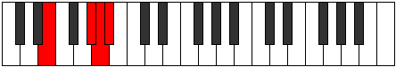 |
| ThirdInversion | G#,A,Bb,E | 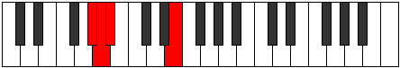 |
## Modes

| Number | Mode | Tonic | Notes | Illustration |
|--------|------|-------|-------|--------------|
| [279](https://ianring.com/musictheory/scales/279) | [Poditonic](ModeGSharpPoditonic.md) | G# | G#, A, A#, C, E, G# |  |
| [279](https://ianring.com/musictheory/scales/279) | [Poditonic](ModeAFlatPoditonic.md) | Ab | Ab, A, Bb, C, E, Ab |  |
| [287](https://ianring.com/musictheory/scales/287) | [Gynimic](ModeGSharpGynimic.md) | G# | G#, A, Bb, Cb, Dbb, E, G# |  |
| [287](https://ianring.com/musictheory/scales/287) | [Gynimic](ModeAFlatGynimic.md) | Ab | Ab, Bbb, Cbb, Dbbb, Dbb, E, Ab |  |
| [295](https://ianring.com/musictheory/scales/295) | [Gyritonic](ModeGSharpGyritonic.md) | G# | G#, A, A#, C#, E, G# |  |
| [295](https://ianring.com/musictheory/scales/295) | [Gyritonic](ModeAFlatGyritonic.md) | Ab | Ab, A, Bb, Db, E, Ab |  |
| [303](https://ianring.com/musictheory/scales/303) | [Golimic](ModeGSharpGolimic.md) | G# | G#, A, Bb, Cb, Db, E, G# |  |
| [303](https://ianring.com/musictheory/scales/303) | [Golimic](ModeAFlatGolimic.md) | Ab | Ab, Bbb, Cbb, Dbbb, Ebbb, Fb, Ab |  |
| [311](https://ianring.com/musictheory/scales/311) | [Stagimic](ModeGSharpStagimic.md) | G# | G#, A, Bb, C, Db, E, G# |  |
| [311](https://ianring.com/musictheory/scales/311) | [Stagimic](ModeAFlatStagimic.md) | Ab | Ab, Bbb, Cbb, Dbb, Ebbb, Fb, Ab |  |
| [319](https://ianring.com/musictheory/scales/319) | [Epodian](ModeGSharpEpodian.md) | G# | G#, A, Bb, Cb, Dbb, Ebbb, Fb, G# |  |
| [319](https://ianring.com/musictheory/scales/319) | [Epodian](ModeAFlatEpodian.md) | Ab | Ab, Bbb, Cbb, Dbbb, Dbb, Ebbb, Fb, Ab |  |
| [327](https://ianring.com/musictheory/scales/327) | [Syptitonic](ModeGSharpSyptitonic.md) | G# | G#, A, A#, D, E, G# |  |
| [327](https://ianring.com/musictheory/scales/327) | [Syptitonic](ModeAFlatSyptitonic.md) | Ab | Ab, A, Bb, D, E, Ab |  |
| [335](https://ianring.com/musictheory/scales/335) | [Zanimic](ModeGSharpZanimic.md) | G# | G#, A, Bb, Cb, D, E, G# |  |
| [335](https://ianring.com/musictheory/scales/335) | [Zanimic](ModeAFlatZanimic.md) | Ab | Ab, Bbb, Cbb, Dbbb, Ebb, Fb, Ab |  |
| [343](https://ianring.com/musictheory/scales/343) | [Ionorimic](ModeGSharpIonorimic.md) | G# | G#, A, Bb, C, D, E, G# |  |
| [343](https://ianring.com/musictheory/scales/343) | [Ionorimic](ModeAFlatIonorimic.md) | Ab | Ab, Bbb, Cbb, Dbb, Ebb, Fb, Ab |  |
| [351](https://ianring.com/musictheory/scales/351) | [Epanian](ModeGSharpEpanian.md) | G# | G#, A, Bb, Cb, Dbb, Ebb, Fb, G# |  |
| [351](https://ianring.com/musictheory/scales/351) | [Epanian](ModeAFlatEpanian.md) | Ab | Ab, Bbb, Cbb, Dbbb, Dbb, Ebb, Fb, Ab |  |
| [359](https://ianring.com/musictheory/scales/359) | [Bothimic](ModeGSharpBothimic.md) | G# | G#, A, Bb, C#, D, E, G# |  |
| [359](https://ianring.com/musictheory/scales/359) | [Bothimic](ModeAFlatBothimic.md) | Ab | Ab, Bbb, Cbb, Db, Ebb, Fb, Ab |  |
| [367](https://ianring.com/musictheory/scales/367) | [Aerodian](ModeGSharpAerodian.md) | G# | G#, A, Bb, Cb, Db, Ebb, Fb, G# |  |
| [367](https://ianring.com/musictheory/scales/367) | [Aerodian](ModeAFlatAerodian.md) | Ab | Ab, Bbb, Cbb, Dbbb, Ebbb, Fbbb, Gbbb, Ab |  |
| [369](https://ianring.com/musictheory/scales/369) | [Laditonic](ModeENaturalLaditonic.md) | E | E, G#, A, A#, C, E |  |
| [371](https://ianring.com/musictheory/scales/371) | [Rythimic](ModeENaturalRythimic.md) | E | E, F, G#, A, Bb, C, E |  |
| [373](https://ianring.com/musictheory/scales/373) | [Epagimic](ModeENaturalEpagimic.md) | E | E, F#, G#, A, Bb, C, E |  |
| [375](https://ianring.com/musictheory/scales/375) | [Sodian](ModeGSharpSodian.md) | G# | G#, A, Bb, C, Db, Ebb, Fb, G# |  |
| [375](https://ianring.com/musictheory/scales/375) | [Sodian](ModeAFlatSodian.md) | Ab | Ab, Bbb, Cbb, Dbb, Ebbb, Fbbb, Gbbb, Ab |  |
| [375](https://ianring.com/musictheory/scales/375) | [Sodian](ModeENaturalSodian.md) | E | E, F, Gb, Ab, Bbb, Cbb, Dbb, E |  |
| [377](https://ianring.com/musictheory/scales/377) | [Kathimic](ModeENaturalKathimic.md) | E | E, F##, G#, A, Bb, C, E |  |
| [379](https://ianring.com/musictheory/scales/379) | [Aeragian](ModeENaturalAeragian.md) | E | E, F, G, Ab, Bbb, Cbb, Dbb, E |  |
| [381](https://ianring.com/musictheory/scales/381) | [Kogian](ModeENaturalKogian.md) | E | E, F#, G, Ab, Bbb, Cbb, Dbb, E |  |
| [383](https://ianring.com/musictheory/scales/383) | [Logyllic](ModeENaturalLogyllic.md) | E | E, F, F#, G, G#, A, A#, C, E |  |
| [383](https://ianring.com/musictheory/scales/383) | [Logyllic](ModeGSharpLogyllic.md) | G# | G#, A, A#, B, C, C#, D, E, G# |  |
| [383](https://ianring.com/musictheory/scales/383) | [Logyllic](ModeAFlatLogyllic.md) | Ab | Ab, A, Bb, B, C, Db, D, E, Ab | 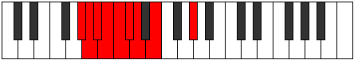 |
| [399](https://ianring.com/musictheory/scales/399) | [Zynimic](ModeGSharpZynimic.md) | G# | G#, A, Bb, Cb, D#, E, G# |  |
| [399](https://ianring.com/musictheory/scales/399) | [Zynimic](ModeAFlatZynimic.md) | Ab | Ab, Bbb, Cbb, Dbbb, Eb, Fb, Ab |  |
| [407](https://ianring.com/musictheory/scales/407) | [Zylimic](ModeGSharpZylimic.md) | G# | G#, A, Bb, C, D#, E, G# | 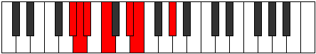 |
| [407](https://ianring.com/musictheory/scales/407) | [Zylimic](ModeAFlatZylimic.md) | Ab | Ab, Bbb, Cbb, Dbb, Eb, Fb, Ab |  |
| [415](https://ianring.com/musictheory/scales/415) | [Aeoladian](ModeGSharpAeoladian.md) | G# | G#, A, Bb, Cb, Dbb, Eb, Fb, G# |  |
| [415](https://ianring.com/musictheory/scales/415) | [Aeoladian](ModeAFlatAeoladian.md) | Ab | Ab, Bbb, Cbb, Dbbb, Dbb, Eb, Fb, Ab |  |
| [423](https://ianring.com/musictheory/scales/423) | [Sogimic](ModeGSharpSogimic.md) | G# | G#, A, Bb, C#, D#, E, G# |  |
| [423](https://ianring.com/musictheory/scales/423) | [Sogimic](ModeAFlatSogimic.md) | Ab | Ab, Bbb, Cbb, Db, Eb, Fb, Ab |  |
| [431](https://ianring.com/musictheory/scales/431) | [Epyrian](ModeGSharpEpyrian.md) | G# | G#, A, Bb, Cb, Db, Eb, Fb, G# |  |
| [431](https://ianring.com/musictheory/scales/431) | [Epyrian](ModeAFlatEpyrian.md) | Ab | Ab, Bbb, Cbb, Dbbb, Ebbb, Fbb, Gbbb, Ab |  |
| [439](https://ianring.com/musictheory/scales/439) | [Bythian](ModeGSharpBythian.md) | G# | G#, A, Bb, C, Db, Eb, Fb, G# |  |
| [439](https://ianring.com/musictheory/scales/439) | [Bythian](ModeAFlatBythian.md) | Ab | Ab, Bbb, Cbb, Dbb, Ebbb, Fbb, Gbbb, Ab |  |
| [447](https://ianring.com/musictheory/scales/447) | [Thyphyllic](ModeGSharpThyphyllic.md) | G# | G#, A, A#, B, C, C#, D#, E, G# |  |
| [447](https://ianring.com/musictheory/scales/447) | [Thyphyllic](ModeAFlatThyphyllic.md) | Ab | Ab, A, Bb, B, C, Db, Eb, E, Ab |  |
| [453](https://ianring.com/musictheory/scales/453) | [Raditonic](ModeDNaturalRaditonic.md) | D | D, E, G#, A, A#, D |  |
| [455](https://ianring.com/musictheory/scales/455) | [Stadimic](ModeDNaturalStadimic.md) | D | D, Eb, Fb, G#, A, Bb, D | 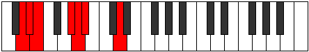 |
| [455](https://ianring.com/musictheory/scales/455) | [Stadimic](ModeGSharpStadimic.md) | G# | G#, A, Bb, C##, D#, E, G# |  |
| [455](https://ianring.com/musictheory/scales/455) | [Stadimic](ModeAFlatStadimic.md) | Ab | Ab, Bbb, Cbb, D, Eb, Fb, Ab | 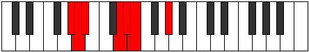 |
| [461](https://ianring.com/musictheory/scales/461) | [Madimic](ModeDNaturalMadimic.md) | D | D, E, F, G#, A, Bb, D |  |
| [463](https://ianring.com/musictheory/scales/463) | [Zythian](ModeDNaturalZythian.md) | D | D, Eb, Fb, Gbb, Ab, Bbb, Cbb, D |  |
| [463](https://ianring.com/musictheory/scales/463) | [Zythian](ModeGSharpZythian.md) | G# | G#, A, Bb, Cb, D, Eb, Fb, G# |  |
| [463](https://ianring.com/musictheory/scales/463) | [Zythian](ModeAFlatZythian.md) | Ab | Ab, Bbb, Cbb, Dbbb, Ebb, Fbb, Gbbb, Ab |  |
| [469](https://ianring.com/musictheory/scales/469) | [Katyrimic](ModeDNaturalKatyrimic.md) | D | D, E, F#, G#, A, Bb, D |  |
| [471](https://ianring.com/musictheory/scales/471) | [Dodian](ModeGSharpDodian.md) | G# | G#, A, Bb, C, D, Eb, Fb, G# | 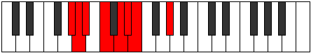 |
| [471](https://ianring.com/musictheory/scales/471) | [Dodian](ModeAFlatDodian.md) | Ab | Ab, Bbb, Cbb, Dbb, Ebb, Fbb, Gbbb, Ab |  |
| [471](https://ianring.com/musictheory/scales/471) | [Dodian](ModeDNaturalDodian.md) | D | D, Eb, Fb, Gb, Ab, Bbb, Cbb, D |  |
| [477](https://ianring.com/musictheory/scales/477) | [Stacrian](ModeDNaturalStacrian.md) | D | D, E, F, Gb, Ab, Bbb, Cbb, D |  |
| [479](https://ianring.com/musictheory/scales/479) | [Kocryllic](ModeDNaturalKocryllic.md) | D | D, D#, E, F, F#, G#, A, A#, D |  |
| [479](https://ianring.com/musictheory/scales/479) | [Kocryllic](ModeGSharpKocryllic.md) | G# | G#, A, A#, B, C, D, D#, E, G# |  |
| [479](https://ianring.com/musictheory/scales/479) | [Kocryllic](ModeAFlatKocryllic.md) | Ab | Ab, A, Bb, B, C, D, Eb, E, Ab |  |
| [483](https://ianring.com/musictheory/scales/483) | [Kygimic](ModeDSharpKygimic.md) | D# | D#, E, F###, G##, A#, B, D# |  |
| [483](https://ianring.com/musictheory/scales/483) | [Kygimic](ModeEFlatKygimic.md) | Eb | Eb, Fb, G#, A, Bb, Cb, Eb |  |
| [485](https://ianring.com/musictheory/scales/485) | [Stoptimic](ModeDNaturalStoptimic.md) | D | D, E, F##, G#, A, Bb, D |  |
| [487](https://ianring.com/musictheory/scales/487) | [Dynian](ModeGSharpDynian.md) | G# | G#, A, Bb, C#, D, Eb, Fb, G# |  |
| [487](https://ianring.com/musictheory/scales/487) | [Dynian](ModeAFlatDynian.md) | Ab | Ab, Bbb, Cbb, Db, Ebb, Fbb, Gbbb, Ab |  |
| [487](https://ianring.com/musictheory/scales/487) | [Dynian](ModeDNaturalDynian.md) | D | D, Eb, Fb, G, Ab, Bbb, Cbb, D |  |
| [487](https://ianring.com/musictheory/scales/487) | [Dynian](ModeDSharpDynian.md) | D# | D#, E, F, G#, A, Bb, Cb, D# |  |
| [487](https://ianring.com/musictheory/scales/487) | [Dynian](ModeEFlatDynian.md) | Eb | Eb, Fb, Gbb, Ab, Bbb, Cbb, Dbbb, Eb |  |
| [491](https://ianring.com/musictheory/scales/491) | [Aeolyrian](ModeDSharpAeolyrian.md) | D# | D#, E, F#, G#, A, Bb, Cb, D# |  |
| [491](https://ianring.com/musictheory/scales/491) | [Aeolyrian](ModeEFlatAeolyrian.md) | Eb | Eb, Fb, Gb, Ab, Bbb, Cbb, Dbbb, Eb |  |
| [493](https://ianring.com/musictheory/scales/493) | [Rygian](ModeDNaturalRygian.md) | D | D, E, F, G, Ab, Bbb, Cbb, D |  |
| [495](https://ianring.com/musictheory/scales/495) | [Bocryllic](ModeDNaturalBocryllic.md) | D | D, D#, E, F, G, G#, A, A#, D | 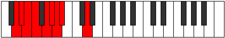 |
| [495](https://ianring.com/musictheory/scales/495) | [Bocryllic](ModeGSharpBocryllic.md) | G# | G#, A, A#, B, C#, D, D#, E, G# |  |
| [495](https://ianring.com/musictheory/scales/495) | [Bocryllic](ModeAFlatBocryllic.md) | Ab | Ab, A, Bb, B, Db, D, Eb, E, Ab |  |
| [495](https://ianring.com/musictheory/scales/495) | [Bocryllic](ModeDSharpBocryllic.md) | D# | D#, E, F, F#, G#, A, A#, B, D# |  |
| [495](https://ianring.com/musictheory/scales/495) | [Bocryllic](ModeEFlatBocryllic.md) | Eb | Eb, E, F, Gb, Ab, A, Bb, B, Eb |  |
| [497](https://ianring.com/musictheory/scales/497) | [Kadimic](ModeENaturalKadimic.md) | E | E, F###, G##, A#, B, C, E |  |
| [499](https://ianring.com/musictheory/scales/499) | [Ionaptian](ModeENaturalIonaptian.md) | E | E, F, G#, A, Bb, Cb, Dbb, E |  |
| [499](https://ianring.com/musictheory/scales/499) | [Ionaptian](ModeDSharpIonaptian.md) | D# | D#, E, F##, G#, A, Bb, Cb, D# |  |
| [499](https://ianring.com/musictheory/scales/499) | [Ionaptian](ModeEFlatIonaptian.md) | Eb | Eb, Fb, G, Ab, Bbb, Cbb, Dbbb, Eb |  |
| [501](https://ianring.com/musictheory/scales/501) | [Katylian](ModeDNaturalKatylian.md) | D | D, E, F#, G, Ab, Bbb, Cbb, D |  |
| [501](https://ianring.com/musictheory/scales/501) | [Katylian](ModeENaturalKatylian.md) | E | E, F#, G#, A, Bb, Cb, Dbb, E |  |
| [503](https://ianring.com/musictheory/scales/503) | [Thoptyllic](ModeGSharpThoptyllic.md) | G# | G#, A, A#, C, C#, D, D#, E, G# |  |
| [503](https://ianring.com/musictheory/scales/503) | [Thoptyllic](ModeAFlatThoptyllic.md) | Ab | Ab, A, Bb, C, Db, D, Eb, E, Ab |  |
| [503](https://ianring.com/musictheory/scales/503) | [Thoptyllic](ModeDNaturalThoptyllic.md) | D | D, D#, E, F#, G, G#, A, A#, D |  |
| [503](https://ianring.com/musictheory/scales/503) | [Thoptyllic](ModeENaturalThoptyllic.md) | E | E, F, F#, G#, A, A#, B, C, E |  |
| [503](https://ianring.com/musictheory/scales/503) | [Thoptyllic](ModeDSharpThoptyllic.md) | D# | D#, E, F, G, G#, A, A#, B, D# |  |
| [503](https://ianring.com/musictheory/scales/503) | [Thoptyllic](ModeEFlatThoptyllic.md) | Eb | Eb, E, F, G, Ab, A, Bb, B, Eb |  |
| [505](https://ianring.com/musictheory/scales/505) | [Sanian](ModeENaturalSanian.md) | E | E, F##, G#, A, Bb, Cb, Dbb, E |  |
| [507](https://ianring.com/musictheory/scales/507) | [Moryllic](ModeENaturalMoryllic.md) | E | E, F, G, G#, A, A#, B, C, E |  |
| [507](https://ianring.com/musictheory/scales/507) | [Moryllic](ModeDSharpMoryllic.md) | D# | D#, E, F#, G, G#, A, A#, B, D# |  |
| [507](https://ianring.com/musictheory/scales/507) | [Moryllic](ModeEFlatMoryllic.md) | Eb | Eb, E, Gb, G, Ab, A, Bb, B, Eb |  |
| [509](https://ianring.com/musictheory/scales/509) | [Ionothyllic](ModeDNaturalIonothyllic.md) | D | D, E, F, F#, G, G#, A, A#, D |  |
| [509](https://ianring.com/musictheory/scales/509) | [Ionothyllic](ModeENaturalIonothyllic.md) | E | E, F#, G, G#, A, A#, B, C, E |  |
| [511](https://ianring.com/musictheory/scales/511) | [Polygic](ModeDNaturalPolygic.md) | D | D, D#, E, F, F#, G, G#, A, A#, D |  |
| [511](https://ianring.com/musictheory/scales/511) | [Polygic](ModeGSharpPolygic.md) | G# | G#, A, A#, B, C, C#, D, D#, E, G# |  |
| [511](https://ianring.com/musictheory/scales/511) | [Polygic](ModeAFlatPolygic.md) | Ab | Ab, A, Bb, B, C, Db, D, Eb, E, Ab |  |
| [511](https://ianring.com/musictheory/scales/511) | [Polygic](ModeENaturalPolygic.md) | E | E, F, F#, G, G#, A, A#, B, C, E |  |
| [511](https://ianring.com/musictheory/scales/511) | [Polygic](ModeDSharpPolygic.md) | D# | D#, E, F, F#, G, G#, A, A#, B, D# |  |
| [511](https://ianring.com/musictheory/scales/511) | [Polygic](ModeEFlatPolygic.md) | Eb | Eb, E, F, Gb, G, Ab, A, Bb, B, Eb |  |
| [559](https://ianring.com/musictheory/scales/559) | [Lylimic](ModeGNaturalLylimic.md) | G | G, Ab, Bbb, Cbb, Dbb, E, G |  |
| [575](https://ianring.com/musictheory/scales/575) | [Ionydian](ModeGNaturalIonydian.md) | G | G, Ab, Bbb, Cbb, Dbbb, Dbb, E, G |  |
| [591](https://ianring.com/musictheory/scales/591) | [Gaptimic](ModeGNaturalGaptimic.md) | G | G, Ab, Bbb, Cbb, Db, E, G |  |
| [607](https://ianring.com/musictheory/scales/607) | [Kadian](ModeGNaturalKadian.md) | G | G, Ab, Bbb, Cbb, Dbbb, Ebbb, Fb, G |  |
| [623](https://ianring.com/musictheory/scales/623) | [Sycrian](ModeGNaturalSycrian.md) | G | G, Ab, Bbb, Cbb, Dbb, Ebbb, Fb, G |  |
| [625](https://ianring.com/musictheory/scales/625) | [Ionyptitonic](ModeENaturalIonyptitonic.md) | E | E, G#, A, A#, C#, E |  |
| [627](https://ianring.com/musictheory/scales/627) | [Mogimic](ModeENaturalMogimic.md) | E | E, F, G#, A, Bb, C#, E |  |
| [629](https://ianring.com/musictheory/scales/629) | [Aeronimic](ModeENaturalAeronimic.md) | E | E, F#, G#, A, Bb, C#, E |  |
| [631](https://ianring.com/musictheory/scales/631) | [Zygian](ModeENaturalZygian.md) | E | E, F, Gb, Ab, Bbb, Cbb, Db, E |  |
| [633](https://ianring.com/musictheory/scales/633) | [Kydimic](ModeENaturalKydimic.md) | E | E, F##, G#, A, Bb, C#, E |  |
| [635](https://ianring.com/musictheory/scales/635) | [Epolian](ModeENaturalEpolian.md) | E | E, F, G, Ab, Bbb, Cbb, Db, E |  |
| [637](https://ianring.com/musictheory/scales/637) | [Katodian](ModeENaturalKatodian.md) | E | E, F#, G, Ab, Bbb, Cbb, Db, E |  |
| [639](https://ianring.com/musictheory/scales/639) | [Ionaryllic](ModeENaturalIonaryllic.md) | E | E, F, F#, G, G#, A, A#, C#, E |  |
| [639](https://ianring.com/musictheory/scales/639) | [Ionaryllic](ModeGNaturalIonaryllic.md) | G | G, G#, A, A#, B, C, C#, E, G |  |
| [655](https://ianring.com/musictheory/scales/655) | [Kataptimic](ModeGNaturalKataptimic.md) | G | G, Ab, Bbb, Cbb, D, E, G |  |
| [671](https://ianring.com/musictheory/scales/671) | [Stycrian](ModeGNaturalStycrian.md) | G | G, Ab, Bbb, Cbb, Dbbb, Ebb, Fb, G |  |
| [687](https://ianring.com/musictheory/scales/687) | [Aeolythian](ModeGNaturalAeolythian.md) | G | G, Ab, Bbb, Cbb, Dbb, Ebb, Fb, G |  |
| [703](https://ianring.com/musictheory/scales/703) | [Aerocryllic](ModeGNaturalAerocryllic.md) | G | G, G#, A, A#, B, C, D, E, G | 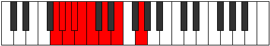 |
| [719](https://ianring.com/musictheory/scales/719) | [Kanian](ModeGNaturalKanian.md) | G | G, Ab, Bbb, Cbb, Db, Ebb, Fb, G |  |
| [735](https://ianring.com/musictheory/scales/735) | [Sylyllic](ModeGNaturalSylyllic.md) | G | G, G#, A, A#, B, C#, D, E, G |  |
| [739](https://ianring.com/musictheory/scales/739) | [Rorimic](ModeDSharpRorimic.md) | D# | D#, E, F###, G##, A#, B#, D# |  |
| [739](https://ianring.com/musictheory/scales/739) | [Rorimic](ModeEFlatRorimic.md) | Eb | Eb, Fb, G#, A, Bb, C, Eb |  |
| [743](https://ianring.com/musictheory/scales/743) | [Lanian](ModeDSharpLanian.md) | D# | D#, E, F, G#, A, Bb, C, D# |  |
| [743](https://ianring.com/musictheory/scales/743) | [Lanian](ModeEFlatLanian.md) | Eb | Eb, Fb, Gbb, Ab, Bbb, Cbb, Dbb, Eb | 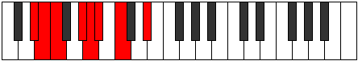 |
| [747](https://ianring.com/musictheory/scales/747) | [Lynian](ModeDSharpLynian.md) | D# | D#, E, F#, G#, A, Bb, C, D# |  |
| [747](https://ianring.com/musictheory/scales/747) | [Lynian](ModeEFlatLynian.md) | Eb | Eb, Fb, Gb, Ab, Bbb, Cbb, Dbb, Eb |  |
| [751](https://ianring.com/musictheory/scales/751) | [Epacryllic](ModeDSharpEpacryllic.md) | D# | D#, E, F, F#, G#, A, A#, C, D# |  |
| [751](https://ianring.com/musictheory/scales/751) | [Epacryllic](ModeEFlatEpacryllic.md) | Eb | Eb, E, F, Gb, Ab, A, Bb, C, Eb |  |
| [751](https://ianring.com/musictheory/scales/751) | [Epacryllic](ModeGNaturalEpacryllic.md) | G | G, G#, A, A#, C, C#, D, E, G |  |
| [753](https://ianring.com/musictheory/scales/753) | [Kytrimic](ModeENaturalKytrimic.md) | E | E, F###, G##, A#, B, C#, E |  |
| [755](https://ianring.com/musictheory/scales/755) | [Phrythian](ModeDSharpPhrythian.md) | D# | D#, E, F##, G#, A, Bb, C, D# |  |
| [755](https://ianring.com/musictheory/scales/755) | [Phrythian](ModeEFlatPhrythian.md) | Eb | Eb, Fb, G, Ab, Bbb, Cbb, Dbb, Eb |  |
| [755](https://ianring.com/musictheory/scales/755) | [Phrythian](ModeENaturalPhrythian.md) | E | E, F, G#, A, Bb, Cb, Db, E |  |
| [757](https://ianring.com/musictheory/scales/757) | [Ionyptian](ModeENaturalIonyptian.md) | E | E, F#, G#, A, Bb, Cb, Db, E |  |
| [759](https://ianring.com/musictheory/scales/759) | [Katalyllic](ModeDSharpKatalyllic.md) | D# | D#, E, F, G, G#, A, A#, C, D# |  |
| [759](https://ianring.com/musictheory/scales/759) | [Katalyllic](ModeEFlatKatalyllic.md) | Eb | Eb, E, F, G, Ab, A, Bb, C, Eb |  |
| [759](https://ianring.com/musictheory/scales/759) | [Katalyllic](ModeENaturalKatalyllic.md) | E | E, F, F#, G#, A, A#, B, C#, E |  |
| [761](https://ianring.com/musictheory/scales/761) | [Ponian](ModeENaturalPonian.md) | E | E, F##, G#, A, Bb, Cb, Db, E | 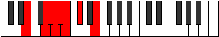 |
| [763](https://ianring.com/musictheory/scales/763) | [Doryllic](ModeDSharpDoryllic.md) | D# | D#, E, F#, G, G#, A, A#, C, D# |  |
| [763](https://ianring.com/musictheory/scales/763) | [Doryllic](ModeEFlatDoryllic.md) | Eb | Eb, E, Gb, G, Ab, A, Bb, C, Eb |  |
| [763](https://ianring.com/musictheory/scales/763) | [Doryllic](ModeENaturalDoryllic.md) | E | E, F, G, G#, A, A#, B, C#, E |  |
| [765](https://ianring.com/musictheory/scales/765) | [Mixonyphyllic](ModeENaturalMixonyphyllic.md) | E | E, F#, G, G#, A, A#, B, C#, E |  |
| [767](https://ianring.com/musictheory/scales/767) | [Raptygic](ModeDSharpRaptygic.md) | D# | D#, E, F, F#, G, G#, A, A#, C, D# |  |
| [767](https://ianring.com/musictheory/scales/767) | [Raptygic](ModeEFlatRaptygic.md) | Eb | Eb, E, F, Gb, G, Ab, A, Bb, C, Eb |  |
| [767](https://ianring.com/musictheory/scales/767) | [Raptygic](ModeGNaturalRaptygic.md) | G | G, G#, A, A#, B, C, C#, D, E, G |  |
| [767](https://ianring.com/musictheory/scales/767) | [Raptygic](ModeENaturalRaptygic.md) | E | E, F, F#, G, G#, A, A#, B, C#, E |  |
| [791](https://ianring.com/musictheory/scales/791) | [Aeoloptimic](ModeGSharpAeoloptimic.md) | G# | G#, A, Bb, C, D##, E#, G# |  |
| [791](https://ianring.com/musictheory/scales/791) | [Aeoloptimic](ModeAFlatAeoloptimic.md) | Ab | Ab, Bbb, Cbb, Dbb, E, F, Ab |  |
| [799](https://ianring.com/musictheory/scales/799) | [Lolian](ModeGSharpLolian.md) | G# | G#, A, Bb, Cb, Dbb, E, F, G# |  |
| [799](https://ianring.com/musictheory/scales/799) | [Lolian](ModeAFlatLolian.md) | Ab | Ab, Bbb, Cbb, Dbbb, Dbb, E, F, Ab |  |
| [799](https://ianring.com/musictheory/scales/799) | [Lolian](ModeGNaturalLolian.md) | G | G, Ab, Bbb, Cbb, Dbbb, Eb, Fb, G | 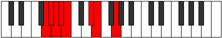 |
| [807](https://ianring.com/musictheory/scales/807) | [Epadimic](ModeGSharpEpadimic.md) | G# | G#, A, Bb, C#, D##, E#, G# |  |
| [807](https://ianring.com/musictheory/scales/807) | [Epadimic](ModeAFlatEpadimic.md) | Ab | Ab, Bbb, Cbb, Db, E, F, Ab |  |
| [815](https://ianring.com/musictheory/scales/815) | [Bolian](ModeGNaturalBolian.md) | G | G, Ab, Bbb, Cbb, Dbb, Eb, Fb, G |  |
| [815](https://ianring.com/musictheory/scales/815) | [Bolian](ModeGSharpBolian.md) | G# | G#, A, Bb, Cb, Db, E, F, G# |  |
| [815](https://ianring.com/musictheory/scales/815) | [Bolian](ModeAFlatBolian.md) | Ab | Ab, Bbb, Cbb, Dbbb, Ebbb, Fb, Gbb, Ab |  |
| [823](https://ianring.com/musictheory/scales/823) | [Stodian](ModeGSharpStodian.md) | G# | G#, A, Bb, C, Db, E, F, G# |  |
| [823](https://ianring.com/musictheory/scales/823) | [Stodian](ModeAFlatStodian.md) | Ab | Ab, Bbb, Cbb, Dbb, Ebbb, Fb, Gbb, Ab |  |
| [831](https://ianring.com/musictheory/scales/831) | [Rodyllic](ModeGSharpRodyllic.md) | G# | G#, A, A#, B, C, C#, E, F, G# |  |
| [831](https://ianring.com/musictheory/scales/831) | [Rodyllic](ModeAFlatRodyllic.md) | Ab | Ab, A, Bb, B, C, Db, E, F, Ab |  |
| [831](https://ianring.com/musictheory/scales/831) | [Rodyllic](ModeGNaturalRodyllic.md) | G | G, G#, A, A#, B, C, D#, E, G |  |
| [839](https://ianring.com/musictheory/scales/839) | [Ionathimic](ModeGSharpIonathimic.md) | G# | G#, A, Bb, C##, D##, E#, G# |  |
| [839](https://ianring.com/musictheory/scales/839) | [Ionathimic](ModeAFlatIonathimic.md) | Ab | Ab, Bbb, Cbb, D, E, F, Ab |  |
| [847](https://ianring.com/musictheory/scales/847) | [Ganian](ModeGNaturalGanian.md) | G | G, Ab, Bbb, Cbb, Db, Eb, Fb, G |  |
| [847](https://ianring.com/musictheory/scales/847) | [Ganian](ModeGSharpGanian.md) | G# | G#, A, Bb, Cb, D, E, F, G# |  |
| [847](https://ianring.com/musictheory/scales/847) | [Ganian](ModeAFlatGanian.md) | Ab | Ab, Bbb, Cbb, Dbbb, Ebb, Fb, Gbb, Ab |  |
| [855](https://ianring.com/musictheory/scales/855) | [Porian](ModeGSharpPorian.md) | G# | G#, A, Bb, C, D, E, F, G# |  |
| [855](https://ianring.com/musictheory/scales/855) | [Porian](ModeAFlatPorian.md) | Ab | Ab, Bbb, Cbb, Dbb, Ebb, Fb, Gbb, Ab |  |
| [863](https://ianring.com/musictheory/scales/863) | [Pyryllic](ModeGSharpPyryllic.md) | G# | G#, A, A#, B, C, D, E, F, G# |  |
| [863](https://ianring.com/musictheory/scales/863) | [Pyryllic](ModeAFlatPyryllic.md) | Ab | Ab, A, Bb, B, C, D, E, F, Ab |  |
| [863](https://ianring.com/musictheory/scales/863) | [Pyryllic](ModeGNaturalPyryllic.md) | G | G, G#, A, A#, B, C#, D#, E, G |  |
| [871](https://ianring.com/musictheory/scales/871) | [Epadian](ModeGSharpEpadian.md) | G# | G#, A, Bb, C#, D, E, F, G# | 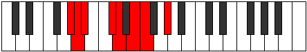 |
| [871](https://ianring.com/musictheory/scales/871) | [Epadian](ModeAFlatEpadian.md) | Ab | Ab, Bbb, Cbb, Db, Ebb, Fb, Gbb, Ab |  |
| [879](https://ianring.com/musictheory/scales/879) | [Aeolocryllic](ModeGNaturalAeolocryllic.md) | G | G, G#, A, A#, C, C#, D#, E, G |  |
| [879](https://ianring.com/musictheory/scales/879) | [Aeolocryllic](ModeGSharpAeolocryllic.md) | G# | G#, A, A#, B, C#, D, E, F, G# |  |
| [879](https://ianring.com/musictheory/scales/879) | [Aeolocryllic](ModeAFlatAeolocryllic.md) | Ab | Ab, A, Bb, B, Db, D, E, F, Ab |  |
| [881](https://ianring.com/musictheory/scales/881) | [Aerothimic](ModeENaturalAerothimic.md) | E | E, F###, G##, A#, B#, C#, E |  |
| [883](https://ianring.com/musictheory/scales/883) | [Ralian](ModeENaturalRalian.md) | E | E, F, G#, A, Bb, C, Db, E |  |
| [885](https://ianring.com/musictheory/scales/885) | [Sathian](ModeENaturalSathian.md) | E | E, F#, G#, A, Bb, C, Db, E |  |
| [887](https://ianring.com/musictheory/scales/887) | [Sathyllic](ModeGSharpSathyllic.md) | G# | G#, A, A#, C, C#, D, E, F, G# |  |
| [887](https://ianring.com/musictheory/scales/887) | [Sathyllic](ModeAFlatSathyllic.md) | Ab | Ab, A, Bb, C, Db, D, E, F, Ab |  |
| [887](https://ianring.com/musictheory/scales/887) | [Sathyllic](ModeENaturalSathyllic.md) | E | E, F, F#, G#, A, A#, C, C#, E |  |
| [889](https://ianring.com/musictheory/scales/889) | [Borian](ModeENaturalBorian.md) | E | E, F##, G#, A, Bb, C, Db, E |  |
| [891](https://ianring.com/musictheory/scales/891) | [Ionilyllic](ModeENaturalIonilyllic.md) | E | E, F, G, G#, A, A#, C, C#, E |  |
| [893](https://ianring.com/musictheory/scales/893) | [Pycryllic](ModeENaturalPycryllic.md) | E | E, F#, G, G#, A, A#, C, C#, E |  |
| [895](https://ianring.com/musictheory/scales/895) | [Aeolathygic](ModeENaturalAeolathygic.md) | E | E, F, F#, G, G#, A, A#, C, C#, E |  |
| [895](https://ianring.com/musictheory/scales/895) | [Aeolathygic](ModeGSharpAeolathygic.md) | G# | G#, A, A#, B, C, C#, D, E, F, G# |  |
| [895](https://ianring.com/musictheory/scales/895) | [Aeolathygic](ModeAFlatAeolathygic.md) | Ab | Ab, A, Bb, B, C, Db, D, E, F, Ab |  |
| [895](https://ianring.com/musictheory/scales/895) | [Aeolathygic](ModeGNaturalAeolathygic.md) | G | G, G#, A, A#, B, C, C#, D#, E, G |  |
| [905](https://ianring.com/musictheory/scales/905) | [Bylitonic](ModeCSharpBylitonic.md) | C# | C#, E, G#, A, A#, C# |  |
| [905](https://ianring.com/musictheory/scales/905) | [Bylitonic](ModeDFlatBylitonic.md) | Db | Db, E, Ab, A, Bb, Db |  |
| [907](https://ianring.com/musictheory/scales/907) | [Tholimic](ModeCSharpTholimic.md) | C# | C#, D, E, F###, G##, A#, C# |  |
| [907](https://ianring.com/musictheory/scales/907) | [Tholimic](ModeDFlatTholimic.md) | Db | Db, Ebb, Fb, G#, A, Bb, Db |  |
| [909](https://ianring.com/musictheory/scales/909) | [Katarimic](ModeCSharpKatarimic.md) | C# | C#, D#, E, F###, G##, A#, C# |  |
| [909](https://ianring.com/musictheory/scales/909) | [Katarimic](ModeDFlatKatarimic.md) | Db | Db, Eb, Fb, G#, A, Bb, Db |  |
| [911](https://ianring.com/musictheory/scales/911) | [Radian](ModeCSharpRadian.md) | C# | C#, D, Eb, Fb, G#, A, Bb, C# |  |
| [911](https://ianring.com/musictheory/scales/911) | [Radian](ModeDFlatRadian.md) | Db | Db, Ebb, Fbb, Gbbb, Ab, Bbb, Cbb, Db |  |
| [911](https://ianring.com/musictheory/scales/911) | [Radian](ModeGNaturalRadian.md) | G | G, Ab, Bbb, Cbb, D, Eb, Fb, G | 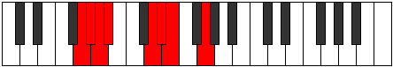 |
| [911](https://ianring.com/musictheory/scales/911) | [Radian](ModeGSharpRadian.md) | G# | G#, A, Bb, Cb, D#, E, F, G# |  |
| [911](https://ianring.com/musictheory/scales/911) | [Radian](ModeAFlatRadian.md) | Ab | Ab, Bbb, Cbb, Dbbb, Eb, Fb, Gbb, Ab |  |
| [919](https://ianring.com/musictheory/scales/919) | [Gathian](ModeGSharpGathian.md) | G# | G#, A, Bb, C, D#, E, F, G# |  |
| [919](https://ianring.com/musictheory/scales/919) | [Gathian](ModeAFlatGathian.md) | Ab | Ab, Bbb, Cbb, Dbb, Eb, Fb, Gbb, Ab |  |
| [921](https://ianring.com/musictheory/scales/921) | [Bogimic](ModeCSharpBogimic.md) | C# | C#, D##, E#, F###, G##, A#, C# |  |
| [921](https://ianring.com/musictheory/scales/921) | [Bogimic](ModeDFlatBogimic.md) | Db | Db, E, F, G#, A, Bb, Db |  |
| [923](https://ianring.com/musictheory/scales/923) | [Ionodian](ModeCSharpIonodian.md) | C# | C#, D, E, F, G#, A, Bb, C# |  |
| [923](https://ianring.com/musictheory/scales/923) | [Ionodian](ModeDFlatIonodian.md) | Db | Db, Ebb, Fb, Gbb, Ab, Bbb, Cbb, Db |  |
| [925](https://ianring.com/musictheory/scales/925) | [Mythian](ModeCSharpMythian.md) | C# | C#, D#, E, F, G#, A, Bb, C# |  |
| [925](https://ianring.com/musictheory/scales/925) | [Mythian](ModeDFlatMythian.md) | Db | Db, Eb, Fb, Gbb, Ab, Bbb, Cbb, Db |  |
| [927](https://ianring.com/musictheory/scales/927) | [Koptyllic](ModeCSharpKoptyllic.md) | C# | C#, D, D#, E, F, G#, A, A#, C# |  |
| [927](https://ianring.com/musictheory/scales/927) | [Koptyllic](ModeDFlatKoptyllic.md) | Db | Db, D, Eb, E, F, Ab, A, Bb, Db | 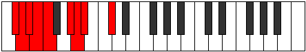 |
| [927](https://ianring.com/musictheory/scales/927) | [Koptyllic](ModeGSharpKoptyllic.md) | G# | G#, A, A#, B, C, D#, E, F, G# |  |
| [927](https://ianring.com/musictheory/scales/927) | [Koptyllic](ModeAFlatKoptyllic.md) | Ab | Ab, A, Bb, B, C, Eb, E, F, Ab |  |
| [927](https://ianring.com/musictheory/scales/927) | [Koptyllic](ModeGNaturalKoptyllic.md) | G | G, G#, A, A#, B, D, D#, E, G |  |
| [935](https://ianring.com/musictheory/scales/935) | [Katarian](ModeGSharpKatarian.md) | G# | G#, A, Bb, C#, D#, E, F, G# |  |
| [935](https://ianring.com/musictheory/scales/935) | [Katarian](ModeAFlatKatarian.md) | Ab | Ab, Bbb, Cbb, Db, Eb, Fb, Gbb, Ab |  |
| [937](https://ianring.com/musictheory/scales/937) | [Stothimic](ModeCSharpStothimic.md) | C# | C#, D##, E##, F###, G##, A#, C# |  |
| [937](https://ianring.com/musictheory/scales/937) | [Stothimic](ModeDFlatStothimic.md) | Db | Db, E, F#, G#, A, Bb, Db |  |
| [939](https://ianring.com/musictheory/scales/939) | [Dyptian](ModeCSharpDyptian.md) | C# | C#, D, E, F#, G#, A, Bb, C# |  |
| [939](https://ianring.com/musictheory/scales/939) | [Dyptian](ModeDFlatDyptian.md) | Db | Db, Ebb, Fb, Gb, Ab, Bbb, Cbb, Db |  |
| [941](https://ianring.com/musictheory/scales/941) | [Phrorian](ModeCSharpPhrorian.md) | C# | C#, D#, E, F#, G#, A, Bb, C# |  |
| [941](https://ianring.com/musictheory/scales/941) | [Phrorian](ModeDFlatPhrorian.md) | Db | Db, Eb, Fb, Gb, Ab, Bbb, Cbb, Db |  |
| [943](https://ianring.com/musictheory/scales/943) | [Aerygyllic](ModeCSharpAerygyllic.md) | C# | C#, D, D#, E, F#, G#, A, A#, C# |  |
| [943](https://ianring.com/musictheory/scales/943) | [Aerygyllic](ModeDFlatAerygyllic.md) | Db | Db, D, Eb, E, Gb, Ab, A, Bb, Db |  |
| [943](https://ianring.com/musictheory/scales/943) | [Aerygyllic](ModeGNaturalAerygyllic.md) | G | G, G#, A, A#, C, D, D#, E, G |  |
| [943](https://ianring.com/musictheory/scales/943) | [Aerygyllic](ModeGSharpAerygyllic.md) | G# | G#, A, A#, B, C#, D#, E, F, G# |  |
| [943](https://ianring.com/musictheory/scales/943) | [Aerygyllic](ModeAFlatAerygyllic.md) | Ab | Ab, A, Bb, B, Db, Eb, E, F, Ab |  |
| [951](https://ianring.com/musictheory/scales/951) | [Thogyllic](ModeGSharpThogyllic.md) | G# | G#, A, A#, C, C#, D#, E, F, G# |  |
| [951](https://ianring.com/musictheory/scales/951) | [Thogyllic](ModeAFlatThogyllic.md) | Ab | Ab, A, Bb, C, Db, Eb, E, F, Ab |  |
| [953](https://ianring.com/musictheory/scales/953) | [Stoptian](ModeCSharpStoptian.md) | C# | C#, D##, E#, F#, G#, A, Bb, C# |  |
| [953](https://ianring.com/musictheory/scales/953) | [Stoptian](ModeDFlatStoptian.md) | Db | Db, E, F, Gb, Ab, Bbb, Cbb, Db |  |
| [955](https://ianring.com/musictheory/scales/955) | [Ionogyllic](ModeCSharpIonogyllic.md) | C# | C#, D, E, F, F#, G#, A, A#, C# |  |
| [955](https://ianring.com/musictheory/scales/955) | [Ionogyllic](ModeDFlatIonogyllic.md) | Db | Db, D, E, F, Gb, Ab, A, Bb, Db |  |
| [957](https://ianring.com/musictheory/scales/957) | [Phronyllic](ModeCSharpPhronyllic.md) | C# | C#, D#, E, F, F#, G#, A, A#, C# |  |
| [957](https://ianring.com/musictheory/scales/957) | [Phronyllic](ModeDFlatPhronyllic.md) | Db | Db, Eb, E, F, Gb, Ab, A, Bb, Db |  |
| [959](https://ianring.com/musictheory/scales/959) | [Katylygic](ModeCSharpKatylygic.md) | C# | C#, D, D#, E, F, F#, G#, A, A#, C# |  |
| [959](https://ianring.com/musictheory/scales/959) | [Katylygic](ModeDFlatKatylygic.md) | Db | Db, D, Eb, E, F, Gb, Ab, A, Bb, Db |  |
| [959](https://ianring.com/musictheory/scales/959) | [Katylygic](ModeGSharpKatylygic.md) | G# | G#, A, A#, B, C, C#, D#, E, F, G# |  |
| [959](https://ianring.com/musictheory/scales/959) | [Katylygic](ModeAFlatKatylygic.md) | Ab | Ab, A, Bb, B, C, Db, Eb, E, F, Ab |  |
| [959](https://ianring.com/musictheory/scales/959) | [Katylygic](ModeGNaturalKatylygic.md) | G | G, G#, A, A#, B, C, D, D#, E, G |  |
| [965](https://ianring.com/musictheory/scales/965) | [Ionothimic](ModeDNaturalIonothimic.md) | D | D, E, F###, G##, A#, B, D |  |
| [967](https://ianring.com/musictheory/scales/967) | [Aeolanian](ModeGSharpAeolanian.md) | G# | G#, A, Bb, C##, D#, E, F, G# |  |
| [967](https://ianring.com/musictheory/scales/967) | [Aeolanian](ModeAFlatAeolanian.md) | Ab | Ab, Bbb, Cbb, D, Eb, Fb, Gbb, Ab |  |
| [967](https://ianring.com/musictheory/scales/967) | [Aeolanian](ModeDNaturalAeolanian.md) | D | D, Eb, Fb, G#, A, Bb, Cb, D |  |
| [969](https://ianring.com/musictheory/scales/969) | [Ionogimic](ModeCSharpIonogimic.md) | C# | C#, D##, E###, F###, G##, A#, C# |  |
| [969](https://ianring.com/musictheory/scales/969) | [Ionogimic](ModeDFlatIonogimic.md) | Db | Db, E, F##, G#, A, Bb, Db |  |
| [971](https://ianring.com/musictheory/scales/971) | [Ladian](ModeCSharpLadian.md) | C# | C#, D, E, F##, G#, A, Bb, C# |  |
| [971](https://ianring.com/musictheory/scales/971) | [Ladian](ModeDFlatLadian.md) | Db | Db, Ebb, Fb, G, Ab, Bbb, Cbb, Db |  |
| [973](https://ianring.com/musictheory/scales/973) | [Phryptian](ModeCSharpPhryptian.md) | C# | C#, D#, E, F##, G#, A, Bb, C# |  |
| [973](https://ianring.com/musictheory/scales/973) | [Phryptian](ModeDFlatPhryptian.md) | Db | Db, Eb, Fb, G, Ab, Bbb, Cbb, Db |  |
| [973](https://ianring.com/musictheory/scales/973) | [Phryptian](ModeDNaturalPhryptian.md) | D | D, E, F, G#, A, Bb, Cb, D |  |
| [975](https://ianring.com/musictheory/scales/975) | [Katogyllic](ModeCSharpKatogyllic.md) | C# | C#, D, D#, E, G, G#, A, A#, C# |  |
| [975](https://ianring.com/musictheory/scales/975) | [Katogyllic](ModeDFlatKatogyllic.md) | Db | Db, D, Eb, E, G, Ab, A, Bb, Db |  |
| [975](https://ianring.com/musictheory/scales/975) | [Katogyllic](ModeGNaturalKatogyllic.md) | G | G, G#, A, A#, C#, D, D#, E, G |  |
| [975](https://ianring.com/musictheory/scales/975) | [Katogyllic](ModeDNaturalKatogyllic.md) | D | D, D#, E, F, G#, A, A#, B, D |  |
| [975](https://ianring.com/musictheory/scales/975) | [Katogyllic](ModeGSharpKatogyllic.md) | G# | G#, A, A#, B, D, D#, E, F, G# |  |
| [975](https://ianring.com/musictheory/scales/975) | [Katogyllic](ModeAFlatKatogyllic.md) | Ab | Ab, A, Bb, B, D, Eb, E, F, Ab |  |
| [981](https://ianring.com/musictheory/scales/981) | [Bacrian](ModeDNaturalBacrian.md) | D | D, E, F#, G#, A, Bb, Cb, D |  |
| [983](https://ianring.com/musictheory/scales/983) | [Epygyllic](ModeGSharpEpygyllic.md) | G# | G#, A, A#, C, D, D#, E, F, G# |  |
| [983](https://ianring.com/musictheory/scales/983) | [Epygyllic](ModeAFlatEpygyllic.md) | Ab | Ab, A, Bb, C, D, Eb, E, F, Ab |  |
| [983](https://ianring.com/musictheory/scales/983) | [Epygyllic](ModeDNaturalEpygyllic.md) | D | D, D#, E, F#, G#, A, A#, B, D |  |
| [985](https://ianring.com/musictheory/scales/985) | [Raptian](ModeCSharpRaptian.md) | C# | C#, D##, E#, F##, G#, A, Bb, C# |  |
| [985](https://ianring.com/musictheory/scales/985) | [Raptian](ModeDFlatRaptian.md) | Db | Db, E, F, G, Ab, Bbb, Cbb, Db |  |
| [987](https://ianring.com/musictheory/scales/987) | [Aeraptyllic](ModeCSharpAeraptyllic.md) | C# | C#, D, E, F, G, G#, A, A#, C# |  |
| [987](https://ianring.com/musictheory/scales/987) | [Aeraptyllic](ModeDFlatAeraptyllic.md) | Db | Db, D, E, F, G, Ab, A, Bb, Db |  |
| [989](https://ianring.com/musictheory/scales/989) | [Phrolyllic](ModeCSharpPhrolyllic.md) | C# | C#, D#, E, F, G, G#, A, A#, C# |  |
| [989](https://ianring.com/musictheory/scales/989) | [Phrolyllic](ModeDFlatPhrolyllic.md) | Db | Db, Eb, E, F, G, Ab, A, Bb, Db |  |
| [989](https://ianring.com/musictheory/scales/989) | [Phrolyllic](ModeDNaturalPhrolyllic.md) | D | D, E, F, F#, G#, A, A#, B, D |  |
| [991](https://ianring.com/musictheory/scales/991) | [Aeolygic](ModeCSharpAeolygic.md) | C# | C#, D, D#, E, F, G, G#, A, A#, C# |  |
| [991](https://ianring.com/musictheory/scales/991) | [Aeolygic](ModeDFlatAeolygic.md) | Db | Db, D, Eb, E, F, G, Ab, A, Bb, Db |  |
| [991](https://ianring.com/musictheory/scales/991) | [Aeolygic](ModeGSharpAeolygic.md) | G# | G#, A, A#, B, C, D, D#, E, F, G# |  |
| [991](https://ianring.com/musictheory/scales/991) | [Aeolygic](ModeAFlatAeolygic.md) | Ab | Ab, A, Bb, B, C, D, Eb, E, F, Ab |  |
| [991](https://ianring.com/musictheory/scales/991) | [Aeolygic](ModeDNaturalAeolygic.md) | D | D, D#, E, F, F#, G#, A, A#, B, D |  |
| [991](https://ianring.com/musictheory/scales/991) | [Aeolygic](ModeGNaturalAeolygic.md) | G | G, G#, A, A#, B, C#, D, D#, E, G |  |
| [995](https://ianring.com/musictheory/scales/995) | [Phrathian](ModeDSharpPhrathian.md) | D# | D#, E, F###, G##, A#, B, C, D# |  |
| [995](https://ianring.com/musictheory/scales/995) | [Phrathian](ModeEFlatPhrathian.md) | Eb | Eb, Fb, G#, A, Bb, Cb, Dbb, Eb |  |
| [997](https://ianring.com/musictheory/scales/997) | [Rycrian](ModeDNaturalRycrian.md) | D | D, E, F##, G#, A, Bb, Cb, D |  |
| [999](https://ianring.com/musictheory/scales/999) | [Bylyllic](ModeGSharpBylyllic.md) | G# | G#, A, A#, C#, D, D#, E, F, G# |  |
| [999](https://ianring.com/musictheory/scales/999) | [Bylyllic](ModeAFlatBylyllic.md) | Ab | Ab, A, Bb, Db, D, Eb, E, F, Ab |  |
| [999](https://ianring.com/musictheory/scales/999) | [Bylyllic](ModeDSharpBylyllic.md) | D# | D#, E, F, G#, A, A#, B, C, D# |  |
| [999](https://ianring.com/musictheory/scales/999) | [Bylyllic](ModeEFlatBylyllic.md) | Eb | Eb, E, F, Ab, A, Bb, B, C, Eb |  |
| [999](https://ianring.com/musictheory/scales/999) | [Bylyllic](ModeDNaturalBylyllic.md) | D | D, D#, E, G, G#, A, A#, B, D |  |
| [1001](https://ianring.com/musictheory/scales/1001) | [Badian](ModeCSharpBadian.md) | C# | C#, D##, E##, F##, G#, A, Bb, C# |  |
| [1001](https://ianring.com/musictheory/scales/1001) | [Badian](ModeDFlatBadian.md) | Db | Db, E, F#, G, Ab, Bbb, Cbb, Db |  |
| [1003](https://ianring.com/musictheory/scales/1003) | [Ionyryllic](ModeCSharpIonyryllic.md) | C# | C#, D, E, F#, G, G#, A, A#, C# |  |
| [1003](https://ianring.com/musictheory/scales/1003) | [Ionyryllic](ModeDFlatIonyryllic.md) | Db | Db, D, E, Gb, G, Ab, A, Bb, Db |  |
| [1003](https://ianring.com/musictheory/scales/1003) | [Ionyryllic](ModeDSharpIonyryllic.md) | D# | D#, E, F#, G#, A, A#, B, C, D# |  |
| [1003](https://ianring.com/musictheory/scales/1003) | [Ionyryllic](ModeEFlatIonyryllic.md) | Eb | Eb, E, Gb, Ab, A, Bb, B, C, Eb |  |
| [1005](https://ianring.com/musictheory/scales/1005) | [Radyllic](ModeCSharpRadyllic.md) | C# | C#, D#, E, F#, G, G#, A, A#, C# |  |
| [1005](https://ianring.com/musictheory/scales/1005) | [Radyllic](ModeDFlatRadyllic.md) | Db | Db, Eb, E, Gb, G, Ab, A, Bb, Db |  |
| [1005](https://ianring.com/musictheory/scales/1005) | [Radyllic](ModeDNaturalRadyllic.md) | D | D, E, F, G, G#, A, A#, B, D |  |
| [1007](https://ianring.com/musictheory/scales/1007) | [Ionycrygic](ModeGNaturalIonycrygic.md) | G | G, G#, A, A#, C, C#, D, D#, E, G |  |
| [1007](https://ianring.com/musictheory/scales/1007) | [Ionycrygic](ModeCSharpIonycrygic.md) | C# | C#, D, D#, E, F#, G, G#, A, A#, C# |  |
| [1007](https://ianring.com/musictheory/scales/1007) | [Ionycrygic](ModeDFlatIonycrygic.md) | Db | Db, D, Eb, E, Gb, G, Ab, A, Bb, Db |  |
| [1007](https://ianring.com/musictheory/scales/1007) | [Ionycrygic](ModeGSharpIonycrygic.md) | G# | G#, A, A#, B, C#, D, D#, E, F, G# |  |
| [1007](https://ianring.com/musictheory/scales/1007) | [Ionycrygic](ModeAFlatIonycrygic.md) | Ab | Ab, A, Bb, B, Db, D, Eb, E, F, Ab |  |
| [1007](https://ianring.com/musictheory/scales/1007) | [Ionycrygic](ModeDSharpIonycrygic.md) | D# | D#, E, F, F#, G#, A, A#, B, C, D# |  |
| [1007](https://ianring.com/musictheory/scales/1007) | [Ionycrygic](ModeEFlatIonycrygic.md) | Eb | Eb, E, F, Gb, Ab, A, Bb, B, C, Eb |  |
| [1007](https://ianring.com/musictheory/scales/1007) | [Ionycrygic](ModeDNaturalIonycrygic.md) | D | D, D#, E, F, G, G#, A, A#, B, D | 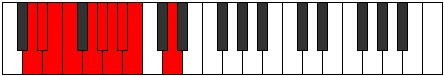 |
| [1009](https://ianring.com/musictheory/scales/1009) | [Katyptian](ModeENaturalKatyptian.md) | E | E, F###, G##, A#, B, C, Db, E |  |
| [1011](https://ianring.com/musictheory/scales/1011) | [Kycryllic](ModeENaturalKycryllic.md) | E | E, F, G#, A, A#, B, C, C#, E |  |
| [1011](https://ianring.com/musictheory/scales/1011) | [Kycryllic](ModeDSharpKycryllic.md) | D# | D#, E, G, G#, A, A#, B, C, D# |  |
| [1011](https://ianring.com/musictheory/scales/1011) | [Kycryllic](ModeEFlatKycryllic.md) | Eb | Eb, E, G, Ab, A, Bb, B, C, Eb | 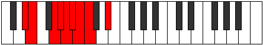 |
| [1013](https://ianring.com/musictheory/scales/1013) | [Stydyllic](ModeENaturalStydyllic.md) | E | E, F#, G#, A, A#, B, C, C#, E |  |
| [1013](https://ianring.com/musictheory/scales/1013) | [Stydyllic](ModeDNaturalStydyllic.md) | D | D, E, F#, G, G#, A, A#, B, D |  |
| [1015](https://ianring.com/musictheory/scales/1015) | [Ionodygic](ModeGSharpIonodygic.md) | G# | G#, A, A#, C, C#, D, D#, E, F, G# |  |
| [1015](https://ianring.com/musictheory/scales/1015) | [Ionodygic](ModeAFlatIonodygic.md) | Ab | Ab, A, Bb, C, Db, D, Eb, E, F, Ab |  |
| [1015](https://ianring.com/musictheory/scales/1015) | [Ionodygic](ModeENaturalIonodygic.md) | E | E, F, F#, G#, A, A#, B, C, C#, E |  |
| [1015](https://ianring.com/musictheory/scales/1015) | [Ionodygic](ModeDSharpIonodygic.md) | D# | D#, E, F, G, G#, A, A#, B, C, D# |  |
| [1015](https://ianring.com/musictheory/scales/1015) | [Ionodygic](ModeEFlatIonodygic.md) | Eb | Eb, E, F, G, Ab, A, Bb, B, C, Eb |  |
| [1015](https://ianring.com/musictheory/scales/1015) | [Ionodygic](ModeDNaturalIonodygic.md) | D | D, D#, E, F#, G, G#, A, A#, B, D |  |
| [1017](https://ianring.com/musictheory/scales/1017) | [Dythyllic](ModeCSharpDythyllic.md) | C# | C#, E, F, F#, G, G#, A, A#, C# |  |
| [1017](https://ianring.com/musictheory/scales/1017) | [Dythyllic](ModeDFlatDythyllic.md) | Db | Db, E, F, Gb, G, Ab, A, Bb, Db |  |
| [1017](https://ianring.com/musictheory/scales/1017) | [Dythyllic](ModeENaturalDythyllic.md) | E | E, G, G#, A, A#, B, C, C#, E |  |
| [1019](https://ianring.com/musictheory/scales/1019) | [Aeranygic](ModeCSharpAeranygic.md) | C# | C#, D, E, F, F#, G, G#, A, A#, C# |  |
| [1019](https://ianring.com/musictheory/scales/1019) | [Aeranygic](ModeDFlatAeranygic.md) | Db | Db, D, E, F, Gb, G, Ab, A, Bb, Db |  |
| [1019](https://ianring.com/musictheory/scales/1019) | [Aeranygic](ModeENaturalAeranygic.md) | E | E, F, G, G#, A, A#, B, C, C#, E |  |
| [1019](https://ianring.com/musictheory/scales/1019) | [Aeranygic](ModeDSharpAeranygic.md) | D# | D#, E, F#, G, G#, A, A#, B, C, D# |  |
| [1019](https://ianring.com/musictheory/scales/1019) | [Aeranygic](ModeEFlatAeranygic.md) | Eb | Eb, E, Gb, G, Ab, A, Bb, B, C, Eb |  |
| [1021](https://ianring.com/musictheory/scales/1021) | [Ladygic](ModeCSharpLadygic.md) | C# | C#, D#, E, F, F#, G, G#, A, A#, C# |  |
| [1021](https://ianring.com/musictheory/scales/1021) | [Ladygic](ModeDFlatLadygic.md) | Db | Db, Eb, E, F, Gb, G, Ab, A, Bb, Db |  |
| [1021](https://ianring.com/musictheory/scales/1021) | [Ladygic](ModeENaturalLadygic.md) | E | E, F#, G, G#, A, A#, B, C, C#, E |  |
| [1021](https://ianring.com/musictheory/scales/1021) | [Ladygic](ModeDNaturalLadygic.md) | D | D, E, F, F#, G, G#, A, A#, B, D |  |
| [1023](https://ianring.com/musictheory/scales/1023) | [Dodyllian](ModeCSharpDodyllian.md) | C# | C#, D, D#, E, F, F#, G, G#, A, A#, C# |  |
| [1023](https://ianring.com/musictheory/scales/1023) | [Dodyllian](ModeDFlatDodyllian.md) | Db | Db, D, Eb, E, F, Gb, G, Ab, A, Bb, Db |  |
| [1023](https://ianring.com/musictheory/scales/1023) | [Dodyllian](ModeGSharpDodyllian.md) | G# | G#, A, A#, B, C, C#, D, D#, E, F, G# |  |
| [1023](https://ianring.com/musictheory/scales/1023) | [Dodyllian](ModeAFlatDodyllian.md) | Ab | Ab, A, Bb, B, C, Db, D, Eb, E, F, Ab |  |
| [1023](https://ianring.com/musictheory/scales/1023) | [Dodyllian](ModeGNaturalDodyllian.md) | G | G, G#, A, A#, B, C, C#, D, D#, E, G |  |
| [1023](https://ianring.com/musictheory/scales/1023) | [Dodyllian](ModeENaturalDodyllian.md) | E | E, F, F#, G, G#, A, A#, B, C, C#, E |  |
| [1023](https://ianring.com/musictheory/scales/1023) | [Dodyllian](ModeDSharpDodyllian.md) | D# | D#, E, F, F#, G, G#, A, A#, B, C, D# |  |
| [1023](https://ianring.com/musictheory/scales/1023) | [Dodyllian](ModeEFlatDodyllian.md) | Eb | Eb, E, F, Gb, G, Ab, A, Bb, B, C, Eb |  |
| [1023](https://ianring.com/musictheory/scales/1023) | [Dodyllian](ModeDNaturalDodyllian.md) | D | D, D#, E, F, F#, G, G#, A, A#, B, D |  |
| [1117](https://ianring.com/musictheory/scales/1117) | [Raptimic](ModeFSharpRaptimic.md) | F# | F#, G#, A, Bb, C, D##, F# |  |
| [1117](https://ianring.com/musictheory/scales/1117) | [Raptimic](ModeGFlatRaptimic.md) | Gb | Gb, Ab, Bbb, Cbb, Dbb, E, Gb |  |
| [1119](https://ianring.com/musictheory/scales/1119) | [Rarian](ModeFSharpRarian.md) | F# | F#, G, Ab, Bbb, Cbb, Dbb, E, F# |  |
| [1119](https://ianring.com/musictheory/scales/1119) | [Rarian](ModeGFlatRarian.md) | Gb | Gb, Abb, Bbbb, Cbbb, Cbb, Dbb, E, Gb |  |
| [1137](https://ianring.com/musictheory/scales/1137) | [Stonitonic](ModeENaturalStonitonic.md) | E | E, G#, A, A#, D, E |  |
| [1139](https://ianring.com/musictheory/scales/1139) | [Aerygimic](ModeENaturalAerygimic.md) | E | E, F, G#, A, Bb, C##, E |  |
| [1141](https://ianring.com/musictheory/scales/1141) | [Rynimic](ModeENaturalRynimic.md) | E | E, F#, G#, A, Bb, C##, E |  |
| [1143](https://ianring.com/musictheory/scales/1143) | [Styrian](ModeENaturalStyrian.md) | E | E, F, Gb, Ab, Bbb, Cbb, D, E |  |
| [1145](https://ianring.com/musictheory/scales/1145) | [Zygimic](ModeENaturalZygimic.md) | E | E, F##, G#, A, Bb, C##, E |  |
| [1147](https://ianring.com/musictheory/scales/1147) | [Epynian](ModeENaturalEpynian.md) | E | E, F, G, Ab, Bbb, Cbb, D, E |  |
| [1149](https://ianring.com/musictheory/scales/1149) | [Bydian](ModeENaturalBydian.md) | E | E, F#, G, Ab, Bbb, Cbb, D, E |  |
| [1149](https://ianring.com/musictheory/scales/1149) | [Bydian](ModeFSharpBydian.md) | F# | F#, G#, A, Bb, Cb, Dbb, E, F# |  |
| [1149](https://ianring.com/musictheory/scales/1149) | [Bydian](ModeGFlatBydian.md) | Gb | Gb, Ab, Bbb, Cbb, Dbbb, Dbb, E, Gb |  |
| [1151](https://ianring.com/musictheory/scales/1151) | [Mythyllic](ModeENaturalMythyllic.md) | E | E, F, F#, G, G#, A, A#, D, E |  |
| [1151](https://ianring.com/musictheory/scales/1151) | [Mythyllic](ModeFSharpMythyllic.md) | F# | F#, G, G#, A, A#, B, C, E, F# |  |
| [1151](https://ianring.com/musictheory/scales/1151) | [Mythyllic](ModeGFlatMythyllic.md) | Gb | Gb, G, Ab, A, Bb, B, C, E, Gb |  |
| [1181](https://ianring.com/musictheory/scales/1181) | [Katagimic](ModeFSharpKatagimic.md) | F# | F#, G#, A, Bb, C#, D##, F# |  |
| [1181](https://ianring.com/musictheory/scales/1181) | [Katagimic](ModeGFlatKatagimic.md) | Gb | Gb, Ab, Bbb, Cbb, Db, E, Gb |  |
| [1183](https://ianring.com/musictheory/scales/1183) | [Sadian](ModeFSharpSadian.md) | F# | F#, G, Ab, Bbb, Cbb, Db, E, F# |  |
| [1183](https://ianring.com/musictheory/scales/1183) | [Sadian](ModeGFlatSadian.md) | Gb | Gb, Abb, Bbbb, Cbbb, Cbb, Db, E, Gb |  |
| [1213](https://ianring.com/musictheory/scales/1213) | [Gyrian](ModeFSharpGyrian.md) | F# | F#, G#, A, Bb, Cb, Db, E, F# |  |
| [1213](https://ianring.com/musictheory/scales/1213) | [Gyrian](ModeGFlatGyrian.md) | Gb | Gb, Ab, Bbb, Cbb, Dbbb, Ebbb, Fb, Gb |  |
| [1215](https://ianring.com/musictheory/scales/1215) | [Aeolanyllic](ModeFSharpAeolanyllic.md) | F# | F#, G, G#, A, A#, B, C#, E, F# |  |
| [1215](https://ianring.com/musictheory/scales/1215) | [Aeolanyllic](ModeGFlatAeolanyllic.md) | Gb | Gb, G, Ab, A, Bb, B, Db, E, Gb |  |
| [1245](https://ianring.com/musictheory/scales/1245) | [Lathian](ModeFSharpLathian.md) | F# | F#, G#, A, Bb, C, Db, E, F# |  |
| [1245](https://ianring.com/musictheory/scales/1245) | [Lathian](ModeGFlatLathian.md) | Gb | Gb, Ab, Bbb, Cbb, Dbb, Ebbb, Fb, Gb |  |
| [1247](https://ianring.com/musictheory/scales/1247) | [Mygyllic](ModeFSharpMygyllic.md) | F# | F#, G, G#, A, A#, C, C#, E, F# |  |
| [1247](https://ianring.com/musictheory/scales/1247) | [Mygyllic](ModeGFlatMygyllic.md) | Gb | Gb, G, Ab, A, Bb, C, Db, E, Gb |  |
| [1251](https://ianring.com/musictheory/scales/1251) | [Sylimic](ModeDSharpSylimic.md) | D# | D#, E, F###, G##, A#, B##, D# |  |
| [1251](https://ianring.com/musictheory/scales/1251) | [Sylimic](ModeEFlatSylimic.md) | Eb | Eb, Fb, G#, A, Bb, C#, Eb |  |
| [1255](https://ianring.com/musictheory/scales/1255) | [Sogian](ModeDSharpSogian.md) | D# | D#, E, F, G#, A, Bb, C#, D# |  |
| [1255](https://ianring.com/musictheory/scales/1255) | [Sogian](ModeEFlatSogian.md) | Eb | Eb, Fb, Gbb, Ab, Bbb, Cbb, Db, Eb |  |
| [1259](https://ianring.com/musictheory/scales/1259) | [Stadian](ModeDSharpStadian.md) | D# | D#, E, F#, G#, A, Bb, C#, D# |  |
| [1259](https://ianring.com/musictheory/scales/1259) | [Stadian](ModeEFlatStadian.md) | Eb | Eb, Fb, Gb, Ab, Bbb, Cbb, Db, Eb |  |
| [1263](https://ianring.com/musictheory/scales/1263) | [Stynyllic](ModeDSharpStynyllic.md) | D# | D#, E, F, F#, G#, A, A#, C#, D# |  |
| [1263](https://ianring.com/musictheory/scales/1263) | [Stynyllic](ModeEFlatStynyllic.md) | Eb | Eb, E, F, Gb, Ab, A, Bb, Db, Eb |  |
| [1265](https://ianring.com/musictheory/scales/1265) | [Pynimic](ModeENaturalPynimic.md) | E | E, F###, G##, A#, B, C##, E |  |
| [1267](https://ianring.com/musictheory/scales/1267) | [Katynian](ModeDSharpKatynian.md) | D# | D#, E, F##, G#, A, Bb, C#, D# |  |
| [1267](https://ianring.com/musictheory/scales/1267) | [Katynian](ModeEFlatKatynian.md) | Eb | Eb, Fb, G, Ab, Bbb, Cbb, Db, Eb |  |
| [1267](https://ianring.com/musictheory/scales/1267) | [Katynian](ModeENaturalKatynian.md) | E | E, F, G#, A, Bb, Cb, D, E |  |
| [1269](https://ianring.com/musictheory/scales/1269) | [Katythian](ModeENaturalKatythian.md) | E | E, F#, G#, A, Bb, Cb, D, E |  |
| [1271](https://ianring.com/musictheory/scales/1271) | [Kolyllic](ModeDSharpKolyllic.md) | D# | D#, E, F, G, G#, A, A#, C#, D# |  |
| [1271](https://ianring.com/musictheory/scales/1271) | [Kolyllic](ModeEFlatKolyllic.md) | Eb | Eb, E, F, G, Ab, A, Bb, Db, Eb |  |
| [1271](https://ianring.com/musictheory/scales/1271) | [Kolyllic](ModeENaturalKolyllic.md) | E | E, F, F#, G#, A, A#, B, D, E |  |
| [1273](https://ianring.com/musictheory/scales/1273) | [Ronian](ModeENaturalRonian.md) | E | E, F##, G#, A, Bb, Cb, D, E |  |
| [1275](https://ianring.com/musictheory/scales/1275) | [Stagyllic](ModeDSharpStagyllic.md) | D# | D#, E, F#, G, G#, A, A#, C#, D# | 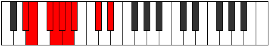 |
| [1275](https://ianring.com/musictheory/scales/1275) | [Stagyllic](ModeEFlatStagyllic.md) | Eb | Eb, E, Gb, G, Ab, A, Bb, Db, Eb |  |
| [1275](https://ianring.com/musictheory/scales/1275) | [Stagyllic](ModeENaturalStagyllic.md) | E | E, F, G, G#, A, A#, B, D, E |  |
| [1277](https://ianring.com/musictheory/scales/1277) | [Zadyllic](ModeFSharpZadyllic.md) | F# | F#, G#, A, A#, B, C, C#, E, F# |  |
| [1277](https://ianring.com/musictheory/scales/1277) | [Zadyllic](ModeGFlatZadyllic.md) | Gb | Gb, Ab, A, Bb, B, C, Db, E, Gb |  |
| [1277](https://ianring.com/musictheory/scales/1277) | [Zadyllic](ModeENaturalZadyllic.md) | E | E, F#, G, G#, A, A#, B, D, E |  |
| [1279](https://ianring.com/musictheory/scales/1279) | [Sarygic](ModeDSharpSarygic.md) | D# | D#, E, F, F#, G, G#, A, A#, C#, D# |  |
| [1279](https://ianring.com/musictheory/scales/1279) | [Sarygic](ModeEFlatSarygic.md) | Eb | Eb, E, F, Gb, G, Ab, A, Bb, Db, Eb |  |
| [1279](https://ianring.com/musictheory/scales/1279) | [Sarygic](ModeFSharpSarygic.md) | F# | F#, G, G#, A, A#, B, C, C#, E, F# |  |
| [1279](https://ianring.com/musictheory/scales/1279) | [Sarygic](ModeGFlatSarygic.md) | Gb | Gb, G, Ab, A, Bb, B, C, Db, E, Gb |  |
| [1279](https://ianring.com/musictheory/scales/1279) | [Sarygic](ModeENaturalSarygic.md) | E | E, F, F#, G, G#, A, A#, B, D, E |  |
| [1303](https://ianring.com/musictheory/scales/1303) | [Epolimic](ModeGSharpEpolimic.md) | G# | G#, A, Bb, C, D##, E##, G# |  |
| [1303](https://ianring.com/musictheory/scales/1303) | [Epolimic](ModeAFlatEpolimic.md) | Ab | Ab, Bbb, Cbb, Dbb, E, F#, Ab |  |
| [1309](https://ianring.com/musictheory/scales/1309) | [Pogimic](ModeFSharpPogimic.md) | F# | F#, G#, A, Bb, C##, D##, F# |  |
| [1309](https://ianring.com/musictheory/scales/1309) | [Pogimic](ModeGFlatPogimic.md) | Gb | Gb, Ab, Bbb, Cbb, D, E, Gb |  |
| [1311](https://ianring.com/musictheory/scales/1311) | [Bynian](ModeFSharpBynian.md) | F# | F#, G, Ab, Bbb, Cbb, D, E, F# |  |
| [1311](https://ianring.com/musictheory/scales/1311) | [Bynian](ModeGFlatBynian.md) | Gb | Gb, Abb, Bbbb, Cbbb, Cbb, D, E, Gb |  |
| [1311](https://ianring.com/musictheory/scales/1311) | [Bynian](ModeGSharpBynian.md) | G# | G#, A, Bb, Cb, Dbb, E, F#, G# |  |
| [1311](https://ianring.com/musictheory/scales/1311) | [Bynian](ModeAFlatBynian.md) | Ab | Ab, Bbb, Cbb, Dbbb, Dbb, E, F#, Ab |  |
| [1319](https://ianring.com/musictheory/scales/1319) | [Phronimic](ModeGSharpPhronimic.md) | G# | G#, A, Bb, C#, D##, E##, G# |  |
| [1319](https://ianring.com/musictheory/scales/1319) | [Phronimic](ModeAFlatPhronimic.md) | Ab | Ab, Bbb, Cbb, Db, E, F#, Ab |  |
| [1327](https://ianring.com/musictheory/scales/1327) | [Zalian](ModeGSharpZalian.md) | G# | G#, A, Bb, Cb, Db, E, F#, G# |  |
| [1327](https://ianring.com/musictheory/scales/1327) | [Zalian](ModeAFlatZalian.md) | Ab | Ab, Bbb, Cbb, Dbbb, Ebbb, Fb, Gb, Ab |  |
| [1335](https://ianring.com/musictheory/scales/1335) | [Aeralian](ModeGSharpAeralian.md) | G# | G#, A, Bb, C, Db, E, F#, G# |  |
| [1335](https://ianring.com/musictheory/scales/1335) | [Aeralian](ModeAFlatAeralian.md) | Ab | Ab, Bbb, Cbb, Dbb, Ebbb, Fb, Gb, Ab |  |
| [1341](https://ianring.com/musictheory/scales/1341) | [Madian](ModeFSharpMadian.md) | F# | F#, G#, A, Bb, Cb, D, E, F# |  |
| [1341](https://ianring.com/musictheory/scales/1341) | [Madian](ModeGFlatMadian.md) | Gb | Gb, Ab, Bbb, Cbb, Dbbb, Ebb, Fb, Gb |  |
| [1343](https://ianring.com/musictheory/scales/1343) | [Zalyllic](ModeGSharpZalyllic.md) | G# | G#, A, A#, B, C, C#, E, F#, G# |  |
| [1343](https://ianring.com/musictheory/scales/1343) | [Zalyllic](ModeAFlatZalyllic.md) | Ab | Ab, A, Bb, B, C, Db, E, Gb, Ab |  |
| [1343](https://ianring.com/musictheory/scales/1343) | [Zalyllic](ModeFSharpZalyllic.md) | F# | F#, G, G#, A, A#, B, D, E, F# |  |
| [1343](https://ianring.com/musictheory/scales/1343) | [Zalyllic](ModeGFlatZalyllic.md) | Gb | Gb, G, Ab, A, Bb, B, D, E, Gb |  |
| [1351](https://ianring.com/musictheory/scales/1351) | [Aeraptimic](ModeGSharpAeraptimic.md) | G# | G#, A, Bb, C##, D##, E##, G# |  |
| [1351](https://ianring.com/musictheory/scales/1351) | [Aeraptimic](ModeAFlatAeraptimic.md) | Ab | Ab, Bbb, Cbb, D, E, F#, Ab |  |
| [1359](https://ianring.com/musictheory/scales/1359) | [Aerygian](ModeGSharpAerygian.md) | G# | G#, A, Bb, Cb, D, E, F#, G# |  |
| [1359](https://ianring.com/musictheory/scales/1359) | [Aerygian](ModeAFlatAerygian.md) | Ab | Ab, Bbb, Cbb, Dbbb, Ebb, Fb, Gb, Ab |  |
| [1367](https://ianring.com/musictheory/scales/1367) | [Pyptian](ModeGSharpPyptian.md) | G# | G#, A, Bb, C, D, E, F#, G# |  |
| [1367](https://ianring.com/musictheory/scales/1367) | [Pyptian](ModeAFlatPyptian.md) | Ab | Ab, Bbb, Cbb, Dbb, Ebb, Fb, Gb, Ab |  |
| [1373](https://ianring.com/musictheory/scales/1373) | [Storian](ModeFSharpStorian.md) | F# | F#, G#, A, Bb, C, D, E, F# |  |
| [1373](https://ianring.com/musictheory/scales/1373) | [Storian](ModeGFlatStorian.md) | Gb | Gb, Ab, Bbb, Cbb, Dbb, Ebb, Fb, Gb |  |
| [1375](https://ianring.com/musictheory/scales/1375) | [Bothyllic](ModeFSharpBothyllic.md) | F# | F#, G, G#, A, A#, C, D, E, F# |  |
| [1375](https://ianring.com/musictheory/scales/1375) | [Bothyllic](ModeGFlatBothyllic.md) | Gb | Gb, G, Ab, A, Bb, C, D, E, Gb |  |
| [1375](https://ianring.com/musictheory/scales/1375) | [Bothyllic](ModeGSharpBothyllic.md) | G# | G#, A, A#, B, C, D, E, F#, G# |  |
| [1375](https://ianring.com/musictheory/scales/1375) | [Bothyllic](ModeAFlatBothyllic.md) | Ab | Ab, A, Bb, B, C, D, E, Gb, Ab |  |
| [1383](https://ianring.com/musictheory/scales/1383) | [Pynian](ModeGSharpPynian.md) | G# | G#, A, Bb, C#, D, E, F#, G# |  |
| [1383](https://ianring.com/musictheory/scales/1383) | [Pynian](ModeAFlatPynian.md) | Ab | Ab, Bbb, Cbb, Db, Ebb, Fb, Gb, Ab |  |
| [1391](https://ianring.com/musictheory/scales/1391) | [Aeradyllic](ModeGSharpAeradyllic.md) | G# | G#, A, A#, B, C#, D, E, F#, G# |  |
| [1391](https://ianring.com/musictheory/scales/1391) | [Aeradyllic](ModeAFlatAeradyllic.md) | Ab | Ab, A, Bb, B, Db, D, E, Gb, Ab |  |
| [1393](https://ianring.com/musictheory/scales/1393) | [Mycrimic](ModeENaturalMycrimic.md) | E | E, F###, G##, A#, B#, C##, E |  |
| [1395](https://ianring.com/musictheory/scales/1395) | [Mixonorian](ModeENaturalMixonorian.md) | E | E, F, G#, A, Bb, C, D, E |  |
| [1397](https://ianring.com/musictheory/scales/1397) | [Gothian](ModeENaturalGothian.md) | E | E, F#, G#, A, Bb, C, D, E |  |
| [1399](https://ianring.com/musictheory/scales/1399) | [Syryllic](ModeGSharpSyryllic.md) | G# | G#, A, A#, C, C#, D, E, F#, G# |  |
| [1399](https://ianring.com/musictheory/scales/1399) | [Syryllic](ModeAFlatSyryllic.md) | Ab | Ab, A, Bb, C, Db, D, E, Gb, Ab |  |
| [1399](https://ianring.com/musictheory/scales/1399) | [Syryllic](ModeENaturalSyryllic.md) | E | E, F, F#, G#, A, A#, C, D, E |  |
| [1401](https://ianring.com/musictheory/scales/1401) | [Pagian](ModeENaturalPagian.md) | E | E, F##, G#, A, Bb, C, D, E |  |
| [1403](https://ianring.com/musictheory/scales/1403) | [Epinyllic](ModeENaturalEpinyllic.md) | E | E, F, G, G#, A, A#, C, D, E |  |
| [1405](https://ianring.com/musictheory/scales/1405) | [Goryllic](ModeENaturalGoryllic.md) | E | E, F#, G, G#, A, A#, C, D, E |  |
| [1405](https://ianring.com/musictheory/scales/1405) | [Goryllic](ModeFSharpGoryllic.md) | F# | F#, G#, A, A#, B, C, D, E, F# |  |
| [1405](https://ianring.com/musictheory/scales/1405) | [Goryllic](ModeGFlatGoryllic.md) | Gb | Gb, Ab, A, Bb, B, C, D, E, Gb |  |
| [1407](https://ianring.com/musictheory/scales/1407) | [Tharygic](ModeENaturalTharygic.md) | E | E, F, F#, G, G#, A, A#, C, D, E |  |
| [1407](https://ianring.com/musictheory/scales/1407) | [Tharygic](ModeGSharpTharygic.md) | G# | G#, A, A#, B, C, C#, D, E, F#, G# |  |
| [1407](https://ianring.com/musictheory/scales/1407) | [Tharygic](ModeAFlatTharygic.md) | Ab | Ab, A, Bb, B, C, Db, D, E, Gb, Ab |  |
| [1407](https://ianring.com/musictheory/scales/1407) | [Tharygic](ModeFSharpTharygic.md) | F# | F#, G, G#, A, A#, B, C, D, E, F# |  |
| [1407](https://ianring.com/musictheory/scales/1407) | [Tharygic](ModeGFlatTharygic.md) | Gb | Gb, G, Ab, A, Bb, B, C, D, E, Gb |  |
| [1423](https://ianring.com/musictheory/scales/1423) | [Doptian](ModeGSharpDoptian.md) | G# | G#, A, Bb, Cb, D#, E, F#, G# |  |
| [1423](https://ianring.com/musictheory/scales/1423) | [Doptian](ModeAFlatDoptian.md) | Ab | Ab, Bbb, Cbb, Dbbb, Eb, Fb, Gb, Ab |  |
| [1431](https://ianring.com/musictheory/scales/1431) | [Phragian](ModeGSharpPhragian.md) | G# | G#, A, Bb, C, D#, E, F#, G# |  |
| [1431](https://ianring.com/musictheory/scales/1431) | [Phragian](ModeAFlatPhragian.md) | Ab | Ab, Bbb, Cbb, Dbb, Eb, Fb, Gb, Ab |  |
| [1437](https://ianring.com/musictheory/scales/1437) | [Aeolycrian](ModeFSharpAeolycrian.md) | F# | F#, G#, A, Bb, C#, D, E, F# |  |
| [1437](https://ianring.com/musictheory/scales/1437) | [Aeolycrian](ModeGFlatAeolycrian.md) | Gb | Gb, Ab, Bbb, Cbb, Db, Ebb, Fb, Gb |  |
| [1439](https://ianring.com/musictheory/scales/1439) | [Rolyllic](ModeFSharpRolyllic.md) | F# | F#, G, G#, A, A#, C#, D, E, F# |  |
| [1439](https://ianring.com/musictheory/scales/1439) | [Rolyllic](ModeGFlatRolyllic.md) | Gb | Gb, G, Ab, A, Bb, Db, D, E, Gb |  |
| [1439](https://ianring.com/musictheory/scales/1439) | [Rolyllic](ModeGSharpRolyllic.md) | G# | G#, A, A#, B, C, D#, E, F#, G# |  |
| [1439](https://ianring.com/musictheory/scales/1439) | [Rolyllic](ModeAFlatRolyllic.md) | Ab | Ab, A, Bb, B, C, Eb, E, Gb, Ab |  |
| [1447](https://ianring.com/musictheory/scales/1447) | [Mixopyrian](ModeGSharpMixopyrian.md) | G# | G#, A, Bb, C#, D#, E, F#, G# |  |
| [1447](https://ianring.com/musictheory/scales/1447) | [Mixopyrian](ModeAFlatMixopyrian.md) | Ab | Ab, Bbb, Cbb, Db, Eb, Fb, Gb, Ab |  |
| [1455](https://ianring.com/musictheory/scales/1455) | [Soryllic](ModeGSharpSoryllic.md) | G# | G#, A, A#, B, C#, D#, E, F#, G# |  |
| [1455](https://ianring.com/musictheory/scales/1455) | [Soryllic](ModeAFlatSoryllic.md) | Ab | Ab, A, Bb, B, Db, Eb, E, Gb, Ab |  |
| [1463](https://ianring.com/musictheory/scales/1463) | [Zaptyllic](ModeGSharpZaptyllic.md) | G# | G#, A, A#, C, C#, D#, E, F#, G# |  |
| [1463](https://ianring.com/musictheory/scales/1463) | [Zaptyllic](ModeAFlatZaptyllic.md) | Ab | Ab, A, Bb, C, Db, Eb, E, Gb, Ab |  |
| [1469](https://ianring.com/musictheory/scales/1469) | [Epiryllic](ModeFSharpEpiryllic.md) | F# | F#, G#, A, A#, B, C#, D, E, F# |  |
| [1469](https://ianring.com/musictheory/scales/1469) | [Epiryllic](ModeGFlatEpiryllic.md) | Gb | Gb, Ab, A, Bb, B, Db, D, E, Gb |  |
| [1471](https://ianring.com/musictheory/scales/1471) | [Radygic](ModeGSharpRadygic.md) | G# | G#, A, A#, B, C, C#, D#, E, F#, G# |  |
| [1471](https://ianring.com/musictheory/scales/1471) | [Radygic](ModeAFlatRadygic.md) | Ab | Ab, A, Bb, B, C, Db, Eb, E, Gb, Ab |  |
| [1471](https://ianring.com/musictheory/scales/1471) | [Radygic](ModeFSharpRadygic.md) | F# | F#, G, G#, A, A#, B, C#, D, E, F# |  |
| [1471](https://ianring.com/musictheory/scales/1471) | [Radygic](ModeGFlatRadygic.md) | Gb | Gb, G, Ab, A, Bb, B, Db, D, E, Gb |  |
| [1477](https://ianring.com/musictheory/scales/1477) | [Phrylimic](ModeDNaturalPhrylimic.md) | D | D, E, F###, G##, A#, B#, D |  |
| [1479](https://ianring.com/musictheory/scales/1479) | [Aeolagian](ModeDNaturalAeolagian.md) | D | D, Eb, Fb, G#, A, Bb, C, D |  |
| [1479](https://ianring.com/musictheory/scales/1479) | [Aeolagian](ModeGSharpAeolagian.md) | G# | G#, A, Bb, C##, D#, E, F#, G# |  |
| [1479](https://ianring.com/musictheory/scales/1479) | [Aeolagian](ModeAFlatAeolagian.md) | Ab | Ab, Bbb, Cbb, D, Eb, Fb, Gb, Ab |  |
| [1485](https://ianring.com/musictheory/scales/1485) | [Tyrian](ModeDNaturalTyrian.md) | D | D, E, F, G#, A, Bb, C, D |  |
| [1487](https://ianring.com/musictheory/scales/1487) | [Lycryllic](ModeDNaturalLycryllic.md) | D | D, D#, E, F, G#, A, A#, C, D |  |
| [1487](https://ianring.com/musictheory/scales/1487) | [Lycryllic](ModeGSharpLycryllic.md) | G# | G#, A, A#, B, D, D#, E, F#, G# |  |
| [1487](https://ianring.com/musictheory/scales/1487) | [Lycryllic](ModeAFlatLycryllic.md) | Ab | Ab, A, Bb, B, D, Eb, E, Gb, Ab |  |
| [1493](https://ianring.com/musictheory/scales/1493) | [Phryrian](ModeDNaturalPhryrian.md) | D | D, E, F#, G#, A, Bb, C, D |  |
| [1495](https://ianring.com/musictheory/scales/1495) | [Kaptyllic](ModeDNaturalKaptyllic.md) | D | D, D#, E, F#, G#, A, A#, C, D |  |
| [1495](https://ianring.com/musictheory/scales/1495) | [Kaptyllic](ModeGSharpKaptyllic.md) | G# | G#, A, A#, C, D, D#, E, F#, G# |  |
| [1495](https://ianring.com/musictheory/scales/1495) | [Kaptyllic](ModeAFlatKaptyllic.md) | Ab | Ab, A, Bb, C, D, Eb, E, Gb, Ab |  |
| [1501](https://ianring.com/musictheory/scales/1501) | [Stygyllic](ModeFSharpStygyllic.md) | F# | F#, G#, A, A#, C, C#, D, E, F# |  |
| [1501](https://ianring.com/musictheory/scales/1501) | [Stygyllic](ModeGFlatStygyllic.md) | Gb | Gb, Ab, A, Bb, C, Db, D, E, Gb |  |
| [1501](https://ianring.com/musictheory/scales/1501) | [Stygyllic](ModeDNaturalStygyllic.md) | D | D, E, F, F#, G#, A, A#, C, D |  |
| [1503](https://ianring.com/musictheory/scales/1503) | [Padygic](ModeDNaturalPadygic.md) | D | D, D#, E, F, F#, G#, A, A#, C, D |  |
| [1503](https://ianring.com/musictheory/scales/1503) | [Padygic](ModeFSharpPadygic.md) | F# | F#, G, G#, A, A#, C, C#, D, E, F# |  |
| [1503](https://ianring.com/musictheory/scales/1503) | [Padygic](ModeGFlatPadygic.md) | Gb | Gb, G, Ab, A, Bb, C, Db, D, E, Gb |  |
| [1503](https://ianring.com/musictheory/scales/1503) | [Padygic](ModeGSharpPadygic.md) | G# | G#, A, A#, B, C, D, D#, E, F#, G# |  |
| [1503](https://ianring.com/musictheory/scales/1503) | [Padygic](ModeAFlatPadygic.md) | Ab | Ab, A, Bb, B, C, D, Eb, E, Gb, Ab |  |
| [1507](https://ianring.com/musictheory/scales/1507) | [Zynian](ModeDSharpZynian.md) | D# | D#, E, F###, G##, A#, B, C#, D# |  |
| [1507](https://ianring.com/musictheory/scales/1507) | [Zynian](ModeEFlatZynian.md) | Eb | Eb, Fb, G#, A, Bb, Cb, Db, Eb |  |
| [1509](https://ianring.com/musictheory/scales/1509) | [Ragian](ModeDNaturalRagian.md) | D | D, E, F##, G#, A, Bb, C, D |  |
| [1511](https://ianring.com/musictheory/scales/1511) | [Styptyllic](ModeGSharpStyptyllic.md) | G# | G#, A, A#, C#, D, D#, E, F#, G# |  |
| [1511](https://ianring.com/musictheory/scales/1511) | [Styptyllic](ModeAFlatStyptyllic.md) | Ab | Ab, A, Bb, Db, D, Eb, E, Gb, Ab |  |
| [1511](https://ianring.com/musictheory/scales/1511) | [Styptyllic](ModeDNaturalStyptyllic.md) | D | D, D#, E, G, G#, A, A#, C, D |  |
| [1511](https://ianring.com/musictheory/scales/1511) | [Styptyllic](ModeDSharpStyptyllic.md) | D# | D#, E, F, G#, A, A#, B, C#, D# |  |
| [1511](https://ianring.com/musictheory/scales/1511) | [Styptyllic](ModeEFlatStyptyllic.md) | Eb | Eb, E, F, Ab, A, Bb, B, Db, Eb |  |
| [1515](https://ianring.com/musictheory/scales/1515) | [Solyllic](ModeDSharpSolyllic.md) | D# | D#, E, F#, G#, A, A#, B, C#, D# |  |
| [1515](https://ianring.com/musictheory/scales/1515) | [Solyllic](ModeEFlatSolyllic.md) | Eb | Eb, E, Gb, Ab, A, Bb, B, Db, Eb |  |
| [1517](https://ianring.com/musictheory/scales/1517) | [Sagyllic](ModeDNaturalSagyllic.md) | D | D, E, F, G, G#, A, A#, C, D |  |
| [1519](https://ianring.com/musictheory/scales/1519) | [Solygic](ModeDNaturalSolygic.md) | D | D, D#, E, F, G, G#, A, A#, C, D |  |
| [1519](https://ianring.com/musictheory/scales/1519) | [Solygic](ModeGSharpSolygic.md) | G# | G#, A, A#, B, C#, D, D#, E, F#, G# |  |
| [1519](https://ianring.com/musictheory/scales/1519) | [Solygic](ModeAFlatSolygic.md) | Ab | Ab, A, Bb, B, Db, D, Eb, E, Gb, Ab |  |
| [1519](https://ianring.com/musictheory/scales/1519) | [Solygic](ModeDSharpSolygic.md) | D# | D#, E, F, F#, G#, A, A#, B, C#, D# |  |
| [1519](https://ianring.com/musictheory/scales/1519) | [Solygic](ModeEFlatSolygic.md) | Eb | Eb, E, F, Gb, Ab, A, Bb, B, Db, Eb |  |
| [1521](https://ianring.com/musictheory/scales/1521) | [Stanian](ModeENaturalStanian.md) | E | E, F###, G##, A#, B, C, D, E |  |
| [1523](https://ianring.com/musictheory/scales/1523) | [Zothyllic](ModeENaturalZothyllic.md) | E | E, F, G#, A, A#, B, C, D, E |  |
| [1523](https://ianring.com/musictheory/scales/1523) | [Zothyllic](ModeDSharpZothyllic.md) | D# | D#, E, G, G#, A, A#, B, C#, D# |  |
| [1523](https://ianring.com/musictheory/scales/1523) | [Zothyllic](ModeEFlatZothyllic.md) | Eb | Eb, E, G, Ab, A, Bb, B, Db, Eb |  |
| [1525](https://ianring.com/musictheory/scales/1525) | [Sodyllic](ModeDNaturalSodyllic.md) | D | D, E, F#, G, G#, A, A#, C, D |  |
| [1525](https://ianring.com/musictheory/scales/1525) | [Sodyllic](ModeENaturalSodyllic.md) | E | E, F#, G#, A, A#, B, C, D, E |  |
| [1527](https://ianring.com/musictheory/scales/1527) | [Aeolyrygic](ModeGSharpAeolyrygic.md) | G# | G#, A, A#, C, C#, D, D#, E, F#, G# |  |
| [1527](https://ianring.com/musictheory/scales/1527) | [Aeolyrygic](ModeAFlatAeolyrygic.md) | Ab | Ab, A, Bb, C, Db, D, Eb, E, Gb, Ab |  |
| [1527](https://ianring.com/musictheory/scales/1527) | [Aeolyrygic](ModeDNaturalAeolyrygic.md) | D | D, D#, E, F#, G, G#, A, A#, C, D |  |
| [1527](https://ianring.com/musictheory/scales/1527) | [Aeolyrygic](ModeENaturalAeolyrygic.md) | E | E, F, F#, G#, A, A#, B, C, D, E |  |
| [1527](https://ianring.com/musictheory/scales/1527) | [Aeolyrygic](ModeDSharpAeolyrygic.md) | D# | D#, E, F, G, G#, A, A#, B, C#, D# |  |
| [1527](https://ianring.com/musictheory/scales/1527) | [Aeolyrygic](ModeEFlatAeolyrygic.md) | Eb | Eb, E, F, G, Ab, A, Bb, B, Db, Eb |  |
| [1529](https://ianring.com/musictheory/scales/1529) | [Kataryllic](ModeENaturalKataryllic.md) | E | E, G, G#, A, A#, B, C, D, E |  |
| [1531](https://ianring.com/musictheory/scales/1531) | [Styptygic](ModeENaturalStyptygic.md) | E | E, F, G, G#, A, A#, B, C, D, E |  |
| [1531](https://ianring.com/musictheory/scales/1531) | [Styptygic](ModeDSharpStyptygic.md) | D# | D#, E, F#, G, G#, A, A#, B, C#, D# |  |
| [1531](https://ianring.com/musictheory/scales/1531) | [Styptygic](ModeEFlatStyptygic.md) | Eb | Eb, E, Gb, G, Ab, A, Bb, B, Db, Eb |  |
| [1533](https://ianring.com/musictheory/scales/1533) | [Katycrygic](ModeDNaturalKatycrygic.md) | D | D, E, F, F#, G, G#, A, A#, C, D |  |
| [1533](https://ianring.com/musictheory/scales/1533) | [Katycrygic](ModeFSharpKatycrygic.md) | F# | F#, G#, A, A#, B, C, C#, D, E, F# |  |
| [1533](https://ianring.com/musictheory/scales/1533) | [Katycrygic](ModeGFlatKatycrygic.md) | Gb | Gb, Ab, A, Bb, B, C, Db, D, E, Gb |  |
| [1533](https://ianring.com/musictheory/scales/1533) | [Katycrygic](ModeENaturalKatycrygic.md) | E | E, F#, G, G#, A, A#, B, C, D, E | 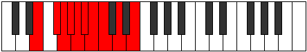 |
| [1535](https://ianring.com/musictheory/scales/1535) | [Mixodyllian](ModeDNaturalMixodyllian.md) | D | D, D#, E, F, F#, G, G#, A, A#, C, D |  |
| [1535](https://ianring.com/musictheory/scales/1535) | [Mixodyllian](ModeGSharpMixodyllian.md) | G# | G#, A, A#, B, C, C#, D, D#, E, F#, G# |  |
| [1535](https://ianring.com/musictheory/scales/1535) | [Mixodyllian](ModeAFlatMixodyllian.md) | Ab | Ab, A, Bb, B, C, Db, D, Eb, E, Gb, Ab |  |
| [1535](https://ianring.com/musictheory/scales/1535) | [Mixodyllian](ModeFSharpMixodyllian.md) | F# | F#, G, G#, A, A#, B, C, C#, D, E, F# |  |
| [1535](https://ianring.com/musictheory/scales/1535) | [Mixodyllian](ModeGFlatMixodyllian.md) | Gb | Gb, G, Ab, A, Bb, B, C, Db, D, E, Gb |  |
| [1535](https://ianring.com/musictheory/scales/1535) | [Mixodyllian](ModeENaturalMixodyllian.md) | E | E, F, F#, G, G#, A, A#, B, C, D, E |  |
| [1535](https://ianring.com/musictheory/scales/1535) | [Mixodyllian](ModeDSharpMixodyllian.md) | D# | D#, E, F, F#, G, G#, A, A#, B, C#, D# |  |
| [1535](https://ianring.com/musictheory/scales/1535) | [Mixodyllian](ModeEFlatMixodyllian.md) | Eb | Eb, E, F, Gb, G, Ab, A, Bb, B, Db, Eb |  |
| [1583](https://ianring.com/musictheory/scales/1583) | [Salian](ModeGNaturalSalian.md) | G | G, Ab, Bbb, Cbb, Dbb, E, F, G |  |
| [1597](https://ianring.com/musictheory/scales/1597) | [Aeolodian](ModeFSharpAeolodian.md) | F# | F#, G#, A, Bb, Cb, D#, E, F# |  |
| [1597](https://ianring.com/musictheory/scales/1597) | [Aeolodian](ModeGFlatAeolodian.md) | Gb | Gb, Ab, Bbb, Cbb, Dbbb, Eb, Fb, Gb |  |
| [1599](https://ianring.com/musictheory/scales/1599) | [Pocryllic](ModeGNaturalPocryllic.md) | G | G, G#, A, A#, B, C, E, F, G |  |
| [1599](https://ianring.com/musictheory/scales/1599) | [Pocryllic](ModeFSharpPocryllic.md) | F# | F#, G, G#, A, A#, B, D#, E, F# |  |
| [1599](https://ianring.com/musictheory/scales/1599) | [Pocryllic](ModeGFlatPocryllic.md) | Gb | Gb, G, Ab, A, Bb, B, Eb, E, Gb |  |
| [1615](https://ianring.com/musictheory/scales/1615) | [Sydian](ModeGNaturalSydian.md) | G | G, Ab, Bbb, Cbb, Db, E, F, G |  |
| [1629](https://ianring.com/musictheory/scales/1629) | [Synian](ModeFSharpSynian.md) | F# | F#, G#, A, Bb, C, D#, E, F# |  |
| [1629](https://ianring.com/musictheory/scales/1629) | [Synian](ModeGFlatSynian.md) | Gb | Gb, Ab, Bbb, Cbb, Dbb, Eb, Fb, Gb |  |
| [1631](https://ianring.com/musictheory/scales/1631) | [Rynyllic](ModeFSharpRynyllic.md) | F# | F#, G, G#, A, A#, C, D#, E, F# |  |
| [1631](https://ianring.com/musictheory/scales/1631) | [Rynyllic](ModeGFlatRynyllic.md) | Gb | Gb, G, Ab, A, Bb, C, Eb, E, Gb |  |
| [1631](https://ianring.com/musictheory/scales/1631) | [Rynyllic](ModeGNaturalRynyllic.md) | G | G, G#, A, A#, B, C#, E, F, G |  |
| [1647](https://ianring.com/musictheory/scales/1647) | [Polyllic](ModeGNaturalPolyllic.md) | G | G, G#, A, A#, C, C#, E, F, G |  |
| [1649](https://ianring.com/musictheory/scales/1649) | [Bolimic](ModeENaturalBolimic.md) | E | E, F###, G##, A#, B##, C##, E |  |
| [1651](https://ianring.com/musictheory/scales/1651) | [Mogian](ModeENaturalMogian.md) | E | E, F, G#, A, Bb, C#, D, E |  |
| [1653](https://ianring.com/musictheory/scales/1653) | [Gylian](ModeENaturalGylian.md) | E | E, F#, G#, A, Bb, C#, D, E |  |
| [1655](https://ianring.com/musictheory/scales/1655) | [Katygyllic](ModeENaturalKatygyllic.md) | E | E, F, F#, G#, A, A#, C#, D, E |  |
| [1657](https://ianring.com/musictheory/scales/1657) | [Ionothian](ModeENaturalIonothian.md) | E | E, F##, G#, A, Bb, C#, D, E |  |
| [1659](https://ianring.com/musictheory/scales/1659) | [Magyllic](ModeENaturalMagyllic.md) | E | E, F, G, G#, A, A#, C#, D, E |  |
| [1661](https://ianring.com/musictheory/scales/1661) | [Gonyllic](ModeENaturalGonyllic.md) | E | E, F#, G, G#, A, A#, C#, D, E |  |
| [1661](https://ianring.com/musictheory/scales/1661) | [Gonyllic](ModeFSharpGonyllic.md) | F# | F#, G#, A, A#, B, C, D#, E, F# |  |
| [1661](https://ianring.com/musictheory/scales/1661) | [Gonyllic](ModeGFlatGonyllic.md) | Gb | Gb, Ab, A, Bb, B, C, Eb, E, Gb |  |
| [1663](https://ianring.com/musictheory/scales/1663) | [Lydygic](ModeENaturalLydygic.md) | E | E, F, F#, G, G#, A, A#, C#, D, E |  |
| [1663](https://ianring.com/musictheory/scales/1663) | [Lydygic](ModeGNaturalLydygic.md) | G | G, G#, A, A#, B, C, C#, E, F, G |  |
| [1663](https://ianring.com/musictheory/scales/1663) | [Lydygic](ModeFSharpLydygic.md) | F# | F#, G, G#, A, A#, B, C, D#, E, F# |  |
| [1663](https://ianring.com/musictheory/scales/1663) | [Lydygic](ModeGFlatLydygic.md) | Gb | Gb, G, Ab, A, Bb, B, C, Eb, E, Gb |  |
| [1679](https://ianring.com/musictheory/scales/1679) | [Kydian](ModeGNaturalKydian.md) | G | G, Ab, Bbb, Cbb, D, E, F, G |  |
| [1693](https://ianring.com/musictheory/scales/1693) | [Dogian](ModeFSharpDogian.md) | F# | F#, G#, A, Bb, C#, D#, E, F# |  |
| [1693](https://ianring.com/musictheory/scales/1693) | [Dogian](ModeGFlatDogian.md) | Gb | Gb, Ab, Bbb, Cbb, Db, Eb, Fb, Gb |  |
| [1695](https://ianring.com/musictheory/scales/1695) | [Phrodyllic](ModeFSharpPhrodyllic.md) | F# | F#, G, G#, A, A#, C#, D#, E, F# |  |
| [1695](https://ianring.com/musictheory/scales/1695) | [Phrodyllic](ModeGFlatPhrodyllic.md) | Gb | Gb, G, Ab, A, Bb, Db, Eb, E, Gb |  |
| [1695](https://ianring.com/musictheory/scales/1695) | [Phrodyllic](ModeGNaturalPhrodyllic.md) | G | G, G#, A, A#, B, D, E, F, G |  |
| [1711](https://ianring.com/musictheory/scales/1711) | [Ragyllic](ModeGNaturalRagyllic.md) | G | G, G#, A, A#, C, D, E, F, G |  |
| [1725](https://ianring.com/musictheory/scales/1725) | [Mixodyllic](ModeFSharpMixodyllic.md) | F# | F#, G#, A, A#, B, C#, D#, E, F# |  |
| [1725](https://ianring.com/musictheory/scales/1725) | [Mixodyllic](ModeGFlatMixodyllic.md) | Gb | Gb, Ab, A, Bb, B, Db, Eb, E, Gb |  |
| [1727](https://ianring.com/musictheory/scales/1727) | [Sydygic](ModeGNaturalSydygic.md) | G | G, G#, A, A#, B, C, D, E, F, G |  |
| [1727](https://ianring.com/musictheory/scales/1727) | [Sydygic](ModeFSharpSydygic.md) | F# | F#, G, G#, A, A#, B, C#, D#, E, F# |  |
| [1727](https://ianring.com/musictheory/scales/1727) | [Sydygic](ModeGFlatSydygic.md) | Gb | Gb, G, Ab, A, Bb, B, Db, Eb, E, Gb |  |
| [1743](https://ianring.com/musictheory/scales/1743) | [Epigyllic](ModeGNaturalEpigyllic.md) | G | G, G#, A, A#, C#, D, E, F, G |  |
| [1757](https://ianring.com/musictheory/scales/1757) | [Ionyphyllic](ModeFSharpIonyphyllic.md) | F# | F#, G#, A, A#, C, C#, D#, E, F# |  |
| [1757](https://ianring.com/musictheory/scales/1757) | [Ionyphyllic](ModeGFlatIonyphyllic.md) | Gb | Gb, Ab, A, Bb, C, Db, Eb, E, Gb |  |
| [1759](https://ianring.com/musictheory/scales/1759) | [Pylygic](ModeFSharpPylygic.md) | F# | F#, G, G#, A, A#, C, C#, D#, E, F# |  |
| [1759](https://ianring.com/musictheory/scales/1759) | [Pylygic](ModeGFlatPylygic.md) | Gb | Gb, G, Ab, A, Bb, C, Db, Eb, E, Gb |  |
| [1759](https://ianring.com/musictheory/scales/1759) | [Pylygic](ModeGNaturalPylygic.md) | G | G, G#, A, A#, B, C#, D, E, F, G |  |
| [1763](https://ianring.com/musictheory/scales/1763) | [Katalian](ModeDSharpKatalian.md) | D# | D#, E, F###, G##, A#, B#, C#, D# |  |
| [1763](https://ianring.com/musictheory/scales/1763) | [Katalian](ModeEFlatKatalian.md) | Eb | Eb, Fb, G#, A, Bb, C, Db, Eb |  |
| [1767](https://ianring.com/musictheory/scales/1767) | [Dyryllic](ModeDSharpDyryllic.md) | D# | D#, E, F, G#, A, A#, C, C#, D# |  |
| [1767](https://ianring.com/musictheory/scales/1767) | [Dyryllic](ModeEFlatDyryllic.md) | Eb | Eb, E, F, Ab, A, Bb, C, Db, Eb |  |
| [1771](https://ianring.com/musictheory/scales/1771) | [Stylyllic](ModeDSharpStylyllic.md) | D# | D#, E, F#, G#, A, A#, C, C#, D# |  |
| [1771](https://ianring.com/musictheory/scales/1771) | [Stylyllic](ModeEFlatStylyllic.md) | Eb | Eb, E, Gb, Ab, A, Bb, C, Db, Eb |  |
| [1775](https://ianring.com/musictheory/scales/1775) | [Lyrygic](ModeDSharpLyrygic.md) | D# | D#, E, F, F#, G#, A, A#, C, C#, D# |  |
| [1775](https://ianring.com/musictheory/scales/1775) | [Lyrygic](ModeEFlatLyrygic.md) | Eb | Eb, E, F, Gb, Ab, A, Bb, C, Db, Eb |  |
| [1775](https://ianring.com/musictheory/scales/1775) | [Lyrygic](ModeGNaturalLyrygic.md) | G | G, G#, A, A#, C, C#, D, E, F, G |  |
| [1777](https://ianring.com/musictheory/scales/1777) | [Saptian](ModeENaturalSaptian.md) | E | E, F###, G##, A#, B, C#, D, E |  |
| [1779](https://ianring.com/musictheory/scales/1779) | [Aerythyllic](ModeDSharpAerythyllic.md) | D# | D#, E, G, G#, A, A#, C, C#, D# |  |
| [1779](https://ianring.com/musictheory/scales/1779) | [Aerythyllic](ModeEFlatAerythyllic.md) | Eb | Eb, E, G, Ab, A, Bb, C, Db, Eb |  |
| [1779](https://ianring.com/musictheory/scales/1779) | [Aerythyllic](ModeENaturalAerythyllic.md) | E | E, F, G#, A, A#, B, C#, D, E |  |
| [1781](https://ianring.com/musictheory/scales/1781) | [Gocryllic](ModeENaturalGocryllic.md) | E | E, F#, G#, A, A#, B, C#, D, E |  |
| [1783](https://ianring.com/musictheory/scales/1783) | [Danygic](ModeDSharpDanygic.md) | D# | D#, E, F, G, G#, A, A#, C, C#, D# |  |
| [1783](https://ianring.com/musictheory/scales/1783) | [Danygic](ModeEFlatDanygic.md) | Eb | Eb, E, F, G, Ab, A, Bb, C, Db, Eb |  |
| [1783](https://ianring.com/musictheory/scales/1783) | [Danygic](ModeENaturalDanygic.md) | E | E, F, F#, G#, A, A#, B, C#, D, E |  |
| [1785](https://ianring.com/musictheory/scales/1785) | [Tharyllic](ModeENaturalTharyllic.md) | E | E, G, G#, A, A#, B, C#, D, E |  |
| [1787](https://ianring.com/musictheory/scales/1787) | [Mycrygic](ModeDSharpMycrygic.md) | D# | D#, E, F#, G, G#, A, A#, C, C#, D# |  |
| [1787](https://ianring.com/musictheory/scales/1787) | [Mycrygic](ModeEFlatMycrygic.md) | Eb | Eb, E, Gb, G, Ab, A, Bb, C, Db, Eb |  |
| [1787](https://ianring.com/musictheory/scales/1787) | [Mycrygic](ModeENaturalMycrygic.md) | E | E, F, G, G#, A, A#, B, C#, D, E |  |
| [1789](https://ianring.com/musictheory/scales/1789) | [Katagygic](ModeFSharpKatagygic.md) | F# | F#, G#, A, A#, B, C, C#, D#, E, F# |  |
| [1789](https://ianring.com/musictheory/scales/1789) | [Katagygic](ModeGFlatKatagygic.md) | Gb | Gb, Ab, A, Bb, B, C, Db, Eb, E, Gb |  |
| [1789](https://ianring.com/musictheory/scales/1789) | [Katagygic](ModeENaturalKatagygic.md) | E | E, F#, G, G#, A, A#, B, C#, D, E |  |
| [1791](https://ianring.com/musictheory/scales/1791) | [Aerygyllian](ModeDSharpAerygyllian.md) | D# | D#, E, F, F#, G, G#, A, A#, C, C#, D# |  |
| [1791](https://ianring.com/musictheory/scales/1791) | [Aerygyllian](ModeEFlatAerygyllian.md) | Eb | Eb, E, F, Gb, G, Ab, A, Bb, C, Db, Eb |  |
| [1791](https://ianring.com/musictheory/scales/1791) | [Aerygyllian](ModeGNaturalAerygyllian.md) | G | G, G#, A, A#, B, C, C#, D, E, F, G |  |
| [1791](https://ianring.com/musictheory/scales/1791) | [Aerygyllian](ModeFSharpAerygyllian.md) | F# | F#, G, G#, A, A#, B, C, C#, D#, E, F# |  |
| [1791](https://ianring.com/musictheory/scales/1791) | [Aerygyllian](ModeGFlatAerygyllian.md) | Gb | Gb, G, Ab, A, Bb, B, C, Db, Eb, E, Gb |  |
| [1791](https://ianring.com/musictheory/scales/1791) | [Aerygyllian](ModeENaturalAerygyllian.md) | E | E, F, F#, G, G#, A, A#, B, C#, D, E |  |
| [1809](https://ianring.com/musictheory/scales/1809) | [Ranitonic](ModeCNaturalRanitonic.md) | C | C, E, G#, A, A#, C |  |
| [1811](https://ianring.com/musictheory/scales/1811) | [Kyptimic](ModeCNaturalKyptimic.md) | C | C, Db, E, F###, G##, A#, C |  |
| [1813](https://ianring.com/musictheory/scales/1813) | [Katothimic](ModeCNaturalKatothimic.md) | C | C, D, E, F###, G##, A#, C |  |
| [1815](https://ianring.com/musictheory/scales/1815) | [Godian](ModeCNaturalGodian.md) | C | C, Db, Ebb, Fb, G#, A, Bb, C |  |
| [1815](https://ianring.com/musictheory/scales/1815) | [Godian](ModeGSharpGodian.md) | G# | G#, A, Bb, C, D##, E#, F#, G# |  |
| [1815](https://ianring.com/musictheory/scales/1815) | [Godian](ModeAFlatGodian.md) | Ab | Ab, Bbb, Cbb, Dbb, E, F, Gb, Ab |  |
| [1817](https://ianring.com/musictheory/scales/1817) | [Phrythimic](ModeCNaturalPhrythimic.md) | C | C, D#, E, F###, G##, A#, C |  |
| [1819](https://ianring.com/musictheory/scales/1819) | [Pydian](ModeCNaturalPydian.md) | C | C, Db, Eb, Fb, G#, A, Bb, C |  |
| [1821](https://ianring.com/musictheory/scales/1821) | [Aeradian](ModeCNaturalAeradian.md) | C | C, D, Eb, Fb, G#, A, Bb, C |  |
| [1821](https://ianring.com/musictheory/scales/1821) | [Aeradian](ModeFSharpAeradian.md) | F# | F#, G#, A, Bb, C##, D#, E, F# |  |
| [1821](https://ianring.com/musictheory/scales/1821) | [Aeradian](ModeGFlatAeradian.md) | Gb | Gb, Ab, Bbb, Cbb, D, Eb, Fb, Gb |  |
| [1823](https://ianring.com/musictheory/scales/1823) | [Phralyllic](ModeCNaturalPhralyllic.md) | C | C, C#, D, D#, E, G#, A, A#, C |  |
| [1823](https://ianring.com/musictheory/scales/1823) | [Phralyllic](ModeFSharpPhralyllic.md) | F# | F#, G, G#, A, A#, D, D#, E, F# |  |
| [1823](https://ianring.com/musictheory/scales/1823) | [Phralyllic](ModeGFlatPhralyllic.md) | Gb | Gb, G, Ab, A, Bb, D, Eb, E, Gb |  |
| [1823](https://ianring.com/musictheory/scales/1823) | [Phralyllic](ModeGSharpPhralyllic.md) | G# | G#, A, A#, B, C, E, F, F#, G# |  |
| [1823](https://ianring.com/musictheory/scales/1823) | [Phralyllic](ModeAFlatPhralyllic.md) | Ab | Ab, A, Bb, B, C, E, F, Gb, Ab |  |
| [1823](https://ianring.com/musictheory/scales/1823) | [Phralyllic](ModeGNaturalPhralyllic.md) | G | G, G#, A, A#, B, D#, E, F, G |  |
| [1831](https://ianring.com/musictheory/scales/1831) | [Pothian](ModeGSharpPothian.md) | G# | G#, A, Bb, C#, D##, E#, F#, G# |  |
| [1831](https://ianring.com/musictheory/scales/1831) | [Pothian](ModeAFlatPothian.md) | Ab | Ab, Bbb, Cbb, Db, E, F, Gb, Ab |  |
| [1839](https://ianring.com/musictheory/scales/1839) | [Zogyllic](ModeGNaturalZogyllic.md) | G | G, G#, A, A#, C, D#, E, F, G | 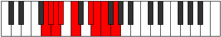 |
| [1839](https://ianring.com/musictheory/scales/1839) | [Zogyllic](ModeGSharpZogyllic.md) | G# | G#, A, A#, B, C#, E, F, F#, G# |  |
| [1839](https://ianring.com/musictheory/scales/1839) | [Zogyllic](ModeAFlatZogyllic.md) | Ab | Ab, A, Bb, B, Db, E, F, Gb, Ab |  |
| [1841](https://ianring.com/musictheory/scales/1841) | [Thogimic](ModeCNaturalThogimic.md) | C | C, D##, E#, F###, G##, A#, C |  |
| [1843](https://ianring.com/musictheory/scales/1843) | [Ionygian](ModeCNaturalIonygian.md) | C | C, Db, E, F, G#, A, Bb, C |  |
| [1845](https://ianring.com/musictheory/scales/1845) | [Lagian](ModeCNaturalLagian.md) | C | C, D, E, F, G#, A, Bb, C |  |
| [1847](https://ianring.com/musictheory/scales/1847) | [Thacryllic](ModeCNaturalThacryllic.md) | C | C, C#, D, E, F, G#, A, A#, C |  |
| [1847](https://ianring.com/musictheory/scales/1847) | [Thacryllic](ModeGSharpThacryllic.md) | G# | G#, A, A#, C, C#, E, F, F#, G# |  |
| [1847](https://ianring.com/musictheory/scales/1847) | [Thacryllic](ModeAFlatThacryllic.md) | Ab | Ab, A, Bb, C, Db, E, F, Gb, Ab |  |
| [1849](https://ianring.com/musictheory/scales/1849) | [Epogian](ModeCNaturalEpogian.md) | C | C, D#, E, F, G#, A, Bb, C |  |
| [1851](https://ianring.com/musictheory/scales/1851) | [Zacryllic](ModeCNaturalZacryllic.md) | C | C, C#, D#, E, F, G#, A, A#, C |  |
| [1853](https://ianring.com/musictheory/scales/1853) | [Phrynyllic](ModeCNaturalPhrynyllic.md) | C | C, D, D#, E, F, G#, A, A#, C |  |
| [1853](https://ianring.com/musictheory/scales/1853) | [Phrynyllic](ModeFSharpPhrynyllic.md) | F# | F#, G#, A, A#, B, D, D#, E, F# |  |
| [1853](https://ianring.com/musictheory/scales/1853) | [Phrynyllic](ModeGFlatPhrynyllic.md) | Gb | Gb, Ab, A, Bb, B, D, Eb, E, Gb |  |
| [1855](https://ianring.com/musictheory/scales/1855) | [Marygic](ModeCNaturalMarygic.md) | C | C, C#, D, D#, E, F, G#, A, A#, C |  |
| [1855](https://ianring.com/musictheory/scales/1855) | [Marygic](ModeGSharpMarygic.md) | G# | G#, A, A#, B, C, C#, E, F, F#, G# |  |
| [1855](https://ianring.com/musictheory/scales/1855) | [Marygic](ModeAFlatMarygic.md) | Ab | Ab, A, Bb, B, C, Db, E, F, Gb, Ab |  |
| [1855](https://ianring.com/musictheory/scales/1855) | [Marygic](ModeGNaturalMarygic.md) | G | G, G#, A, A#, B, C, D#, E, F, G |  |
| [1855](https://ianring.com/musictheory/scales/1855) | [Marygic](ModeFSharpMarygic.md) | F# | F#, G, G#, A, A#, B, D, D#, E, F# |  |
| [1855](https://ianring.com/musictheory/scales/1855) | [Marygic](ModeGFlatMarygic.md) | Gb | Gb, G, Ab, A, Bb, B, D, Eb, E, Gb |  |
| [1863](https://ianring.com/musictheory/scales/1863) | [Pycrian](ModeGSharpPycrian.md) | G# | G#, A, Bb, C##, D##, E#, F#, G# |  |
| [1863](https://ianring.com/musictheory/scales/1863) | [Pycrian](ModeAFlatPycrian.md) | Ab | Ab, Bbb, Cbb, D, E, F, Gb, Ab |  |
| [1871](https://ianring.com/musictheory/scales/1871) | [Aeolyllic](ModeGNaturalAeolyllic.md) | G | G, G#, A, A#, C#, D#, E, F, G |  |
| [1871](https://ianring.com/musictheory/scales/1871) | [Aeolyllic](ModeGSharpAeolyllic.md) | G# | G#, A, A#, B, D, E, F, F#, G# |  |
| [1871](https://ianring.com/musictheory/scales/1871) | [Aeolyllic](ModeAFlatAeolyllic.md) | Ab | Ab, A, Bb, B, D, E, F, Gb, Ab |  |
| [1873](https://ianring.com/musictheory/scales/1873) | [Dathimic](ModeCNaturalDathimic.md) | C | C, D##, E##, F###, G##, A#, C |  |
| [1875](https://ianring.com/musictheory/scales/1875) | [Epyphian](ModeCNaturalEpyphian.md) | C | C, Db, E, F#, G#, A, Bb, C |  |
| [1877](https://ianring.com/musictheory/scales/1877) | [Aeroptian](ModeCNaturalAeroptian.md) | C | C, D, E, F#, G#, A, Bb, C |  |
| [1879](https://ianring.com/musictheory/scales/1879) | [Mixoryllic](ModeCNaturalMixoryllic.md) | C | C, C#, D, E, F#, G#, A, A#, C |  |
| [1879](https://ianring.com/musictheory/scales/1879) | [Mixoryllic](ModeGSharpMixoryllic.md) | G# | G#, A, A#, C, D, E, F, F#, G# |  |
| [1879](https://ianring.com/musictheory/scales/1879) | [Mixoryllic](ModeAFlatMixoryllic.md) | Ab | Ab, A, Bb, C, D, E, F, Gb, Ab |  |
| [1881](https://ianring.com/musictheory/scales/1881) | [Korian](ModeCNaturalKorian.md) | C | C, D#, E, F#, G#, A, Bb, C |  |
| [1883](https://ianring.com/musictheory/scales/1883) | [Mixopyryllic](ModeCNaturalMixopyryllic.md) | C | C, C#, D#, E, F#, G#, A, A#, C |  |
| [1885](https://ianring.com/musictheory/scales/1885) | [Epidyllic](ModeCNaturalEpidyllic.md) | C | C, D, D#, E, F#, G#, A, A#, C |  |
| [1885](https://ianring.com/musictheory/scales/1885) | [Epidyllic](ModeFSharpEpidyllic.md) | F# | F#, G#, A, A#, C, D, D#, E, F# |  |
| [1885](https://ianring.com/musictheory/scales/1885) | [Epidyllic](ModeGFlatEpidyllic.md) | Gb | Gb, Ab, A, Bb, C, D, Eb, E, Gb |  |
| [1887](https://ianring.com/musictheory/scales/1887) | [Aerocrygic](ModeCNaturalAerocrygic.md) | C | C, C#, D, D#, E, F#, G#, A, A#, C |  |
| [1887](https://ianring.com/musictheory/scales/1887) | [Aerocrygic](ModeFSharpAerocrygic.md) | F# | F#, G, G#, A, A#, C, D, D#, E, F# |  |
| [1887](https://ianring.com/musictheory/scales/1887) | [Aerocrygic](ModeGFlatAerocrygic.md) | Gb | Gb, G, Ab, A, Bb, C, D, Eb, E, Gb |  |
| [1887](https://ianring.com/musictheory/scales/1887) | [Aerocrygic](ModeGSharpAerocrygic.md) | G# | G#, A, A#, B, C, D, E, F, F#, G# |  |
| [1887](https://ianring.com/musictheory/scales/1887) | [Aerocrygic](ModeAFlatAerocrygic.md) | Ab | Ab, A, Bb, B, C, D, E, F, Gb, Ab |  |
| [1887](https://ianring.com/musictheory/scales/1887) | [Aerocrygic](ModeGNaturalAerocrygic.md) | G | G, G#, A, A#, B, C#, D#, E, F, G |  |
| [1895](https://ianring.com/musictheory/scales/1895) | [Salyllic](ModeGSharpSalyllic.md) | G# | G#, A, A#, C#, D, E, F, F#, G# |  |
| [1895](https://ianring.com/musictheory/scales/1895) | [Salyllic](ModeAFlatSalyllic.md) | Ab | Ab, A, Bb, Db, D, E, F, Gb, Ab |  |
| [1903](https://ianring.com/musictheory/scales/1903) | [Rocrygic](ModeGNaturalRocrygic.md) | G | G, G#, A, A#, C, C#, D#, E, F, G |  |
| [1903](https://ianring.com/musictheory/scales/1903) | [Rocrygic](ModeGSharpRocrygic.md) | G# | G#, A, A#, B, C#, D, E, F, F#, G# |  |
| [1903](https://ianring.com/musictheory/scales/1903) | [Rocrygic](ModeAFlatRocrygic.md) | Ab | Ab, A, Bb, B, Db, D, E, F, Gb, Ab |  |
| [1905](https://ianring.com/musictheory/scales/1905) | [Katacrian](ModeENaturalKatacrian.md) | E | E, F###, G##, A#, B#, C#, D, E | 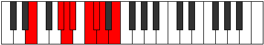 |
| [1905](https://ianring.com/musictheory/scales/1905) | [Katacrian](ModeCNaturalKatacrian.md) | C | C, D##, E#, F#, G#, A, Bb, C | 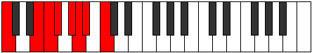 |
| [1907](https://ianring.com/musictheory/scales/1907) | [Lynyllic](ModeENaturalLynyllic.md) | E | E, F, G#, A, A#, C, C#, D, E |  |
| [1907](https://ianring.com/musictheory/scales/1907) | [Lynyllic](ModeCNaturalLynyllic.md) | C | C, C#, E, F, F#, G#, A, A#, C |  |
| [1909](https://ianring.com/musictheory/scales/1909) | [Epicryllic](ModeENaturalEpicryllic.md) | E | E, F#, G#, A, A#, C, C#, D, E |  |
| [1909](https://ianring.com/musictheory/scales/1909) | [Epicryllic](ModeCNaturalEpicryllic.md) | C | C, D, E, F, F#, G#, A, A#, C |  |
| [1911](https://ianring.com/musictheory/scales/1911) | [Stynygic](ModeCNaturalStynygic.md) | C | C, C#, D, E, F, F#, G#, A, A#, C |  |
| [1911](https://ianring.com/musictheory/scales/1911) | [Stynygic](ModeENaturalStynygic.md) | E | E, F, F#, G#, A, A#, C, C#, D, E |  |
| [1911](https://ianring.com/musictheory/scales/1911) | [Stynygic](ModeGSharpStynygic.md) | G# | G#, A, A#, C, C#, D, E, F, F#, G# |  |
| [1911](https://ianring.com/musictheory/scales/1911) | [Stynygic](ModeAFlatStynygic.md) | Ab | Ab, A, Bb, C, Db, D, E, F, Gb, Ab |  |
| [1913](https://ianring.com/musictheory/scales/1913) | [Zagyllic](ModeCNaturalZagyllic.md) | C | C, D#, E, F, F#, G#, A, A#, C |  |
| [1913](https://ianring.com/musictheory/scales/1913) | [Zagyllic](ModeENaturalZagyllic.md) | E | E, G, G#, A, A#, C, C#, D, E |  |
| [1915](https://ianring.com/musictheory/scales/1915) | [Thydygic](ModeCNaturalThydygic.md) | C | C, C#, D#, E, F, F#, G#, A, A#, C |  |
| [1915](https://ianring.com/musictheory/scales/1915) | [Thydygic](ModeENaturalThydygic.md) | E | E, F, G, G#, A, A#, C, C#, D, E |  |
| [1917](https://ianring.com/musictheory/scales/1917) | [Sacrygic](ModeCNaturalSacrygic.md) | C | C, D, D#, E, F, F#, G#, A, A#, C |  |
| [1917](https://ianring.com/musictheory/scales/1917) | [Sacrygic](ModeENaturalSacrygic.md) | E | E, F#, G, G#, A, A#, C, C#, D, E |  |
| [1917](https://ianring.com/musictheory/scales/1917) | [Sacrygic](ModeFSharpSacrygic.md) | F# | F#, G#, A, A#, B, C, D, D#, E, F# |  |
| [1917](https://ianring.com/musictheory/scales/1917) | [Sacrygic](ModeGFlatSacrygic.md) | Gb | Gb, Ab, A, Bb, B, C, D, Eb, E, Gb |  |
| [1919](https://ianring.com/musictheory/scales/1919) | [Rocryllian](ModeCNaturalRocryllian.md) | C | C, C#, D, D#, E, F, F#, G#, A, A#, C |  |
| [1919](https://ianring.com/musictheory/scales/1919) | [Rocryllian](ModeENaturalRocryllian.md) | E | E, F, F#, G, G#, A, A#, C, C#, D, E |  |
| [1919](https://ianring.com/musictheory/scales/1919) | [Rocryllian](ModeGSharpRocryllian.md) | G# | G#, A, A#, B, C, C#, D, E, F, F#, G# |  |
| [1919](https://ianring.com/musictheory/scales/1919) | [Rocryllian](ModeAFlatRocryllian.md) | Ab | Ab, A, Bb, B, C, Db, D, E, F, Gb, Ab |  |
| [1919](https://ianring.com/musictheory/scales/1919) | [Rocryllian](ModeGNaturalRocryllian.md) | G | G, G#, A, A#, B, C, C#, D#, E, F, G |  |
| [1919](https://ianring.com/musictheory/scales/1919) | [Rocryllian](ModeFSharpRocryllian.md) | F# | F#, G, G#, A, A#, B, C, D, D#, E, F# |  |
| [1919](https://ianring.com/musictheory/scales/1919) | [Rocryllian](ModeGFlatRocryllian.md) | Gb | Gb, G, Ab, A, Bb, B, C, D, Eb, E, Gb |  |
| [1929](https://ianring.com/musictheory/scales/1929) | [Aeolycrimic](ModeCSharpAeolycrimic.md) | C# | C#, D##, F###, G##, A#, B, C# |  |
| [1929](https://ianring.com/musictheory/scales/1929) | [Aeolycrimic](ModeDFlatAeolycrimic.md) | Db | Db, E, F###, G##, A#, B, Db |  |
| [1931](https://ianring.com/musictheory/scales/1931) | [Stogian](ModeCSharpStogian.md) | C# | C#, D, E, F###, G##, A#, B, C# |  |
| [1931](https://ianring.com/musictheory/scales/1931) | [Stogian](ModeDFlatStogian.md) | Db | Db, Ebb, Fb, G#, A, Bb, Cb, Db |  |
| [1933](https://ianring.com/musictheory/scales/1933) | [Mocrian](ModeCSharpMocrian.md) | C# | C#, D#, E, F###, G##, A#, B, C# |  |
| [1933](https://ianring.com/musictheory/scales/1933) | [Mocrian](ModeDFlatMocrian.md) | Db | Db, Eb, Fb, G#, A, Bb, Cb, Db |  |
| [1935](https://ianring.com/musictheory/scales/1935) | [Mycryllic](ModeGNaturalMycryllic.md) | G | G, G#, A, A#, D, D#, E, F, G |  |
| [1935](https://ianring.com/musictheory/scales/1935) | [Mycryllic](ModeCSharpMycryllic.md) | C# | C#, D, D#, E, G#, A, A#, B, C# |  |
| [1935](https://ianring.com/musictheory/scales/1935) | [Mycryllic](ModeDFlatMycryllic.md) | Db | Db, D, Eb, E, Ab, A, Bb, B, Db |  |
| [1935](https://ianring.com/musictheory/scales/1935) | [Mycryllic](ModeGSharpMycryllic.md) | G# | G#, A, A#, B, D#, E, F, F#, G# |  |
| [1935](https://ianring.com/musictheory/scales/1935) | [Mycryllic](ModeAFlatMycryllic.md) | Ab | Ab, A, Bb, B, Eb, E, F, Gb, Ab |  |
| [1937](https://ianring.com/musictheory/scales/1937) | [Galimic](ModeCNaturalGalimic.md) | C | C, D##, E###, F###, G##, A#, C |  |
| [1939](https://ianring.com/musictheory/scales/1939) | [Dathian](ModeCNaturalDathian.md) | C | C, Db, E, F##, G#, A, Bb, C |  |
| [1941](https://ianring.com/musictheory/scales/1941) | [Aeranian](ModeCNaturalAeranian.md) | C | C, D, E, F##, G#, A, Bb, C |  |
| [1943](https://ianring.com/musictheory/scales/1943) | [Malyllic](ModeGSharpMalyllic.md) | G# | G#, A, A#, C, D#, E, F, F#, G# |  |
| [1943](https://ianring.com/musictheory/scales/1943) | [Malyllic](ModeAFlatMalyllic.md) | Ab | Ab, A, Bb, C, Eb, E, F, Gb, Ab |  |
| [1943](https://ianring.com/musictheory/scales/1943) | [Malyllic](ModeCNaturalMalyllic.md) | C | C, C#, D, E, G, G#, A, A#, C |  |
| [1945](https://ianring.com/musictheory/scales/1945) | [Zarian](ModeCNaturalZarian.md) | C | C, D#, E, F##, G#, A, Bb, C |  |
| [1945](https://ianring.com/musictheory/scales/1945) | [Zarian](ModeCSharpZarian.md) | C# | C#, D##, E#, F###, G##, A#, B, C# |  |
| [1945](https://ianring.com/musictheory/scales/1945) | [Zarian](ModeDFlatZarian.md) | Db | Db, E, F, G#, A, Bb, Cb, Db |  |
| [1947](https://ianring.com/musictheory/scales/1947) | [Ionoyllic](ModeCNaturalIonoyllic.md) | C | C, C#, D#, E, G, G#, A, A#, C |  |
| [1947](https://ianring.com/musictheory/scales/1947) | [Ionoyllic](ModeCSharpIonoyllic.md) | C# | C#, D, E, F, G#, A, A#, B, C# |  |
| [1947](https://ianring.com/musictheory/scales/1947) | [Ionoyllic](ModeDFlatIonoyllic.md) | Db | Db, D, E, F, Ab, A, Bb, B, Db |  |
| [1949](https://ianring.com/musictheory/scales/1949) | [Mathyllic](ModeFSharpMathyllic.md) | F# | F#, G#, A, A#, C#, D, D#, E, F# |  |
| [1949](https://ianring.com/musictheory/scales/1949) | [Mathyllic](ModeGFlatMathyllic.md) | Gb | Gb, Ab, A, Bb, Db, D, Eb, E, Gb |  |
| [1949](https://ianring.com/musictheory/scales/1949) | [Mathyllic](ModeCNaturalMathyllic.md) | C | C, D, D#, E, G, G#, A, A#, C |  |
| [1949](https://ianring.com/musictheory/scales/1949) | [Mathyllic](ModeCSharpMathyllic.md) | C# | C#, D#, E, F, G#, A, A#, B, C# |  |
| [1949](https://ianring.com/musictheory/scales/1949) | [Mathyllic](ModeDFlatMathyllic.md) | Db | Db, Eb, E, F, Ab, A, Bb, B, Db |  |
| [1951](https://ianring.com/musictheory/scales/1951) | [Gonygic](ModeCNaturalGonygic.md) | C | C, C#, D, D#, E, G, G#, A, A#, C |  |
| [1951](https://ianring.com/musictheory/scales/1951) | [Gonygic](ModeFSharpGonygic.md) | F# | F#, G, G#, A, A#, C#, D, D#, E, F# |  |
| [1951](https://ianring.com/musictheory/scales/1951) | [Gonygic](ModeGFlatGonygic.md) | Gb | Gb, G, Ab, A, Bb, Db, D, Eb, E, Gb |  |
| [1951](https://ianring.com/musictheory/scales/1951) | [Gonygic](ModeCSharpGonygic.md) | C# | C#, D, D#, E, F, G#, A, A#, B, C# |  |
| [1951](https://ianring.com/musictheory/scales/1951) | [Gonygic](ModeDFlatGonygic.md) | Db | Db, D, Eb, E, F, Ab, A, Bb, B, Db |  |
| [1951](https://ianring.com/musictheory/scales/1951) | [Gonygic](ModeGSharpGonygic.md) | G# | G#, A, A#, B, C, D#, E, F, F#, G# |  |
| [1951](https://ianring.com/musictheory/scales/1951) | [Gonygic](ModeAFlatGonygic.md) | Ab | Ab, A, Bb, B, C, Eb, E, F, Gb, Ab |  |
| [1951](https://ianring.com/musictheory/scales/1951) | [Gonygic](ModeGNaturalGonygic.md) | G | G, G#, A, A#, B, D, D#, E, F, G |  |
| [1959](https://ianring.com/musictheory/scales/1959) | [Katolyllic](ModeGSharpKatolyllic.md) | G# | G#, A, A#, C#, D#, E, F, F#, G# |  |
| [1959](https://ianring.com/musictheory/scales/1959) | [Katolyllic](ModeAFlatKatolyllic.md) | Ab | Ab, A, Bb, Db, Eb, E, F, Gb, Ab |  |
| [1961](https://ianring.com/musictheory/scales/1961) | [Soptian](ModeCSharpSoptian.md) | C# | C#, D##, E##, F###, G##, A#, B, C# |  |
| [1961](https://ianring.com/musictheory/scales/1961) | [Soptian](ModeDFlatSoptian.md) | Db | Db, E, F#, G#, A, Bb, Cb, Db |  |
| [1963](https://ianring.com/musictheory/scales/1963) | [Epocryllic](ModeCSharpEpocryllic.md) | C# | C#, D, E, F#, G#, A, A#, B, C# |  |
| [1963](https://ianring.com/musictheory/scales/1963) | [Epocryllic](ModeDFlatEpocryllic.md) | Db | Db, D, E, Gb, Ab, A, Bb, B, Db |  |
| [1965](https://ianring.com/musictheory/scales/1965) | [Gadyllic](ModeCSharpGadyllic.md) | C# | C#, D#, E, F#, G#, A, A#, B, C# |  |
| [1965](https://ianring.com/musictheory/scales/1965) | [Gadyllic](ModeDFlatGadyllic.md) | Db | Db, Eb, E, Gb, Ab, A, Bb, B, Db |  |
| [1967](https://ianring.com/musictheory/scales/1967) | [Godygic](ModeGNaturalGodygic.md) | G | G, G#, A, A#, C, D, D#, E, F, G |  |
| [1967](https://ianring.com/musictheory/scales/1967) | [Godygic](ModeCSharpGodygic.md) | C# | C#, D, D#, E, F#, G#, A, A#, B, C# |  |
| [1967](https://ianring.com/musictheory/scales/1967) | [Godygic](ModeDFlatGodygic.md) | Db | Db, D, Eb, E, Gb, Ab, A, Bb, B, Db | 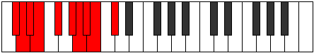 |
| [1967](https://ianring.com/musictheory/scales/1967) | [Godygic](ModeGSharpGodygic.md) | G# | G#, A, A#, B, C#, D#, E, F, F#, G# |  |
| [1967](https://ianring.com/musictheory/scales/1967) | [Godygic](ModeAFlatGodygic.md) | Ab | Ab, A, Bb, B, Db, Eb, E, F, Gb, Ab |  |
| [1969](https://ianring.com/musictheory/scales/1969) | [Zorian](ModeCNaturalZorian.md) | C | C, D##, E#, F##, G#, A, Bb, C |  |
| [1971](https://ianring.com/musictheory/scales/1971) | [Aerynyllic](ModeCNaturalAerynyllic.md) | C | C, C#, E, F, G, G#, A, A#, C |  |
| [1973](https://ianring.com/musictheory/scales/1973) | [Zyryllic](ModeCNaturalZyryllic.md) | C | C, D, E, F, G, G#, A, A#, C |  |
| [1975](https://ianring.com/musictheory/scales/1975) | [Ionocrygic](ModeGSharpIonocrygic.md) | G# | G#, A, A#, C, C#, D#, E, F, F#, G# |  |
| [1975](https://ianring.com/musictheory/scales/1975) | [Ionocrygic](ModeAFlatIonocrygic.md) | Ab | Ab, A, Bb, C, Db, Eb, E, F, Gb, Ab |  |
| [1975](https://ianring.com/musictheory/scales/1975) | [Ionocrygic](ModeCNaturalIonocrygic.md) | C | C, C#, D, E, F, G, G#, A, A#, C |  |
| [1977](https://ianring.com/musictheory/scales/1977) | [Dagyllic](ModeCNaturalDagyllic.md) | C | C, D#, E, F, G, G#, A, A#, C |  |
| [1977](https://ianring.com/musictheory/scales/1977) | [Dagyllic](ModeCSharpDagyllic.md) | C# | C#, E, F, F#, G#, A, A#, B, C# |  |
| [1977](https://ianring.com/musictheory/scales/1977) | [Dagyllic](ModeDFlatDagyllic.md) | Db | Db, E, F, Gb, Ab, A, Bb, B, Db |  |
| [1979](https://ianring.com/musictheory/scales/1979) | [Aeradygic](ModeCNaturalAeradygic.md) | C | C, C#, D#, E, F, G, G#, A, A#, C |  |
| [1979](https://ianring.com/musictheory/scales/1979) | [Aeradygic](ModeCSharpAeradygic.md) | C# | C#, D, E, F, F#, G#, A, A#, B, C# | 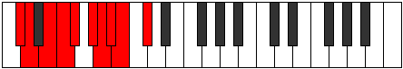 |
| [1979](https://ianring.com/musictheory/scales/1979) | [Aeradygic](ModeDFlatAeradygic.md) | Db | Db, D, E, F, Gb, Ab, A, Bb, B, Db |  |
| [1981](https://ianring.com/musictheory/scales/1981) | [Gadygic](ModeCNaturalGadygic.md) | C | C, D, D#, E, F, G, G#, A, A#, C |  |
| [1981](https://ianring.com/musictheory/scales/1981) | [Gadygic](ModeFSharpGadygic.md) | F# | F#, G#, A, A#, B, C#, D, D#, E, F# |  |
| [1981](https://ianring.com/musictheory/scales/1981) | [Gadygic](ModeGFlatGadygic.md) | Gb | Gb, Ab, A, Bb, B, Db, D, Eb, E, Gb |  |
| [1981](https://ianring.com/musictheory/scales/1981) | [Gadygic](ModeCSharpGadygic.md) | C# | C#, D#, E, F, F#, G#, A, A#, B, C# |  |
| [1981](https://ianring.com/musictheory/scales/1981) | [Gadygic](ModeDFlatGadygic.md) | Db | Db, Eb, E, F, Gb, Ab, A, Bb, B, Db |  |
| [1983](https://ianring.com/musictheory/scales/1983) | [Soryllian](ModeCNaturalSoryllian.md) | C | C, C#, D, D#, E, F, G, G#, A, A#, C |  |
| [1983](https://ianring.com/musictheory/scales/1983) | [Soryllian](ModeGSharpSoryllian.md) | G# | G#, A, A#, B, C, C#, D#, E, F, F#, G# |  |
| [1983](https://ianring.com/musictheory/scales/1983) | [Soryllian](ModeAFlatSoryllian.md) | Ab | Ab, A, Bb, B, C, Db, Eb, E, F, Gb, Ab |  |
| [1983](https://ianring.com/musictheory/scales/1983) | [Soryllian](ModeCSharpSoryllian.md) | C# | C#, D, D#, E, F, F#, G#, A, A#, B, C# |  |
| [1983](https://ianring.com/musictheory/scales/1983) | [Soryllian](ModeDFlatSoryllian.md) | Db | Db, D, Eb, E, F, Gb, Ab, A, Bb, B, Db |  |
| [1983](https://ianring.com/musictheory/scales/1983) | [Soryllian](ModeGNaturalSoryllian.md) | G | G, G#, A, A#, B, C, D, D#, E, F, G |  |
| [1983](https://ianring.com/musictheory/scales/1983) | [Soryllian](ModeFSharpSoryllian.md) | F# | F#, G, G#, A, A#, B, C#, D, D#, E, F# |  |
| [1983](https://ianring.com/musictheory/scales/1983) | [Soryllian](ModeGFlatSoryllian.md) | Gb | Gb, G, Ab, A, Bb, B, Db, D, Eb, E, Gb |  |
| [1989](https://ianring.com/musictheory/scales/1989) | [Dydian](ModeDNaturalDydian.md) | D | D, E, F###, G##, A#, B, C, D |  |
| [1991](https://ianring.com/musictheory/scales/1991) | [Phryptyllic](ModeGSharpPhryptyllic.md) | G# | G#, A, A#, D, D#, E, F, F#, G# |  |
| [1991](https://ianring.com/musictheory/scales/1991) | [Phryptyllic](ModeAFlatPhryptyllic.md) | Ab | Ab, A, Bb, D, Eb, E, F, Gb, Ab |  |
| [1991](https://ianring.com/musictheory/scales/1991) | [Phryptyllic](ModeDNaturalPhryptyllic.md) | D | D, D#, E, G#, A, A#, B, C, D |  |
| [1993](https://ianring.com/musictheory/scales/1993) | [Katoptian](ModeCSharpKatoptian.md) | C# | C#, D##, E###, F###, G##, A#, B, C# |  |
| [1993](https://ianring.com/musictheory/scales/1993) | [Katoptian](ModeDFlatKatoptian.md) | Db | Db, E, F##, G#, A, Bb, Cb, Db |  |
| [1995](https://ianring.com/musictheory/scales/1995) | [Aeolacryllic](ModeCSharpAeolacryllic.md) | C# | C#, D, E, G, G#, A, A#, B, C# |  |
| [1995](https://ianring.com/musictheory/scales/1995) | [Aeolacryllic](ModeDFlatAeolacryllic.md) | Db | Db, D, E, G, Ab, A, Bb, B, Db |  |
| [1997](https://ianring.com/musictheory/scales/1997) | [Staryllic](ModeDNaturalStaryllic.md) | D | D, E, F, G#, A, A#, B, C, D |  |
| [1997](https://ianring.com/musictheory/scales/1997) | [Staryllic](ModeCSharpStaryllic.md) | C# | C#, D#, E, G, G#, A, A#, B, C# |  |
| [1997](https://ianring.com/musictheory/scales/1997) | [Staryllic](ModeDFlatStaryllic.md) | Db | Db, Eb, E, G, Ab, A, Bb, B, Db |  |
| [1999](https://ianring.com/musictheory/scales/1999) | [Zacrygic](ModeGNaturalZacrygic.md) | G | G, G#, A, A#, C#, D, D#, E, F, G |  |
| [1999](https://ianring.com/musictheory/scales/1999) | [Zacrygic](ModeDNaturalZacrygic.md) | D | D, D#, E, F, G#, A, A#, B, C, D |  |
| [1999](https://ianring.com/musictheory/scales/1999) | [Zacrygic](ModeGSharpZacrygic.md) | G# | G#, A, A#, B, D, D#, E, F, F#, G# |  |
| [1999](https://ianring.com/musictheory/scales/1999) | [Zacrygic](ModeAFlatZacrygic.md) | Ab | Ab, A, Bb, B, D, Eb, E, F, Gb, Ab |  |
| [1999](https://ianring.com/musictheory/scales/1999) | [Zacrygic](ModeCSharpZacrygic.md) | C# | C#, D, D#, E, G, G#, A, A#, B, C# |  |
| [1999](https://ianring.com/musictheory/scales/1999) | [Zacrygic](ModeDFlatZacrygic.md) | Db | Db, D, Eb, E, G, Ab, A, Bb, B, Db |  |
| [2001](https://ianring.com/musictheory/scales/2001) | [Gydian](ModeCNaturalGydian.md) | C | C, D##, E##, F##, G#, A, Bb, C |  |
| [2003](https://ianring.com/musictheory/scales/2003) | [Lolyllic](ModeCNaturalLolyllic.md) | C | C, C#, E, F#, G, G#, A, A#, C |  |
| [2005](https://ianring.com/musictheory/scales/2005) | [Gygyllic](ModeCNaturalGygyllic.md) | C | C, D, E, F#, G, G#, A, A#, C |  |
| [2005](https://ianring.com/musictheory/scales/2005) | [Gygyllic](ModeDNaturalGygyllic.md) | D | D, E, F#, G#, A, A#, B, C, D |  |
| [2007](https://ianring.com/musictheory/scales/2007) | [Stonygic](ModeGSharpStonygic.md) | G# | G#, A, A#, C, D, D#, E, F, F#, G# |  |
| [2007](https://ianring.com/musictheory/scales/2007) | [Stonygic](ModeAFlatStonygic.md) | Ab | Ab, A, Bb, C, D, Eb, E, F, Gb, Ab |  |
| [2007](https://ianring.com/musictheory/scales/2007) | [Stonygic](ModeCNaturalStonygic.md) | C | C, C#, D, E, F#, G, G#, A, A#, C |  |
| [2007](https://ianring.com/musictheory/scales/2007) | [Stonygic](ModeDNaturalStonygic.md) | D | D, D#, E, F#, G#, A, A#, B, C, D |  |
| [2009](https://ianring.com/musictheory/scales/2009) | [Stacryllic](ModeCNaturalStacryllic.md) | C | C, D#, E, F#, G, G#, A, A#, C |  |
| [2009](https://ianring.com/musictheory/scales/2009) | [Stacryllic](ModeCSharpStacryllic.md) | C# | C#, E, F, G, G#, A, A#, B, C# |  |
| [2009](https://ianring.com/musictheory/scales/2009) | [Stacryllic](ModeDFlatStacryllic.md) | Db | Db, E, F, G, Ab, A, Bb, B, Db |  |
| [2011](https://ianring.com/musictheory/scales/2011) | [Raphygic](ModeCNaturalRaphygic.md) | C | C, C#, D#, E, F#, G, G#, A, A#, C |  |
| [2011](https://ianring.com/musictheory/scales/2011) | [Raphygic](ModeCSharpRaphygic.md) | C# | C#, D, E, F, G, G#, A, A#, B, C# |  |
| [2011](https://ianring.com/musictheory/scales/2011) | [Raphygic](ModeDFlatRaphygic.md) | Db | Db, D, E, F, G, Ab, A, Bb, B, Db |  |
| [2013](https://ianring.com/musictheory/scales/2013) | [Mocrygic](ModeFSharpMocrygic.md) | F# | F#, G#, A, A#, C, C#, D, D#, E, F# |  |
| [2013](https://ianring.com/musictheory/scales/2013) | [Mocrygic](ModeGFlatMocrygic.md) | Gb | Gb, Ab, A, Bb, C, Db, D, Eb, E, Gb |  |
| [2013](https://ianring.com/musictheory/scales/2013) | [Mocrygic](ModeCNaturalMocrygic.md) | C | C, D, D#, E, F#, G, G#, A, A#, C |  |
| [2013](https://ianring.com/musictheory/scales/2013) | [Mocrygic](ModeDNaturalMocrygic.md) | D | D, E, F, F#, G#, A, A#, B, C, D |  |
| [2013](https://ianring.com/musictheory/scales/2013) | [Mocrygic](ModeCSharpMocrygic.md) | C# | C#, D#, E, F, G, G#, A, A#, B, C# |  |
| [2013](https://ianring.com/musictheory/scales/2013) | [Mocrygic](ModeDFlatMocrygic.md) | Db | Db, Eb, E, F, G, Ab, A, Bb, B, Db |  |
| [2015](https://ianring.com/musictheory/scales/2015) | [Epiryllian](ModeCNaturalEpiryllian.md) | C | C, C#, D, D#, E, F#, G, G#, A, A#, C |  |
| [2015](https://ianring.com/musictheory/scales/2015) | [Epiryllian](ModeFSharpEpiryllian.md) | F# | F#, G, G#, A, A#, C, C#, D, D#, E, F# |  |
| [2015](https://ianring.com/musictheory/scales/2015) | [Epiryllian](ModeGFlatEpiryllian.md) | Gb | Gb, G, Ab, A, Bb, C, Db, D, Eb, E, Gb |  |
| [2015](https://ianring.com/musictheory/scales/2015) | [Epiryllian](ModeDNaturalEpiryllian.md) | D | D, D#, E, F, F#, G#, A, A#, B, C, D |  |
| [2015](https://ianring.com/musictheory/scales/2015) | [Epiryllian](ModeGSharpEpiryllian.md) | G# | G#, A, A#, B, C, D, D#, E, F, F#, G# |  |
| [2015](https://ianring.com/musictheory/scales/2015) | [Epiryllian](ModeAFlatEpiryllian.md) | Ab | Ab, A, Bb, B, C, D, Eb, E, F, Gb, Ab |  |
| [2015](https://ianring.com/musictheory/scales/2015) | [Epiryllian](ModeCSharpEpiryllian.md) | C# | C#, D, D#, E, F, G, G#, A, A#, B, C# |  |
| [2015](https://ianring.com/musictheory/scales/2015) | [Epiryllian](ModeDFlatEpiryllian.md) | Db | Db, D, Eb, E, F, G, Ab, A, Bb, B, Db |  |
| [2015](https://ianring.com/musictheory/scales/2015) | [Epiryllian](ModeGNaturalEpiryllian.md) | G | G, G#, A, A#, B, C#, D, D#, E, F, G |  |
| [2019](https://ianring.com/musictheory/scales/2019) | [Palyllic](ModeDSharpPalyllic.md) | D# | D#, E, G#, A, A#, B, C, C#, D# |  |
| [2019](https://ianring.com/musictheory/scales/2019) | [Palyllic](ModeEFlatPalyllic.md) | Eb | Eb, E, Ab, A, Bb, B, C, Db, Eb |  |
| [2021](https://ianring.com/musictheory/scales/2021) | [Katycryllic](ModeDNaturalKatycryllic.md) | D | D, E, G, G#, A, A#, B, C, D |  |
| [2023](https://ianring.com/musictheory/scales/2023) | [Zodygic](ModeGSharpZodygic.md) | G# | G#, A, A#, C#, D, D#, E, F, F#, G# |  |
| [2023](https://ianring.com/musictheory/scales/2023) | [Zodygic](ModeAFlatZodygic.md) | Ab | Ab, A, Bb, Db, D, Eb, E, F, Gb, Ab |  |
| [2023](https://ianring.com/musictheory/scales/2023) | [Zodygic](ModeDSharpZodygic.md) | D# | D#, E, F, G#, A, A#, B, C, C#, D# |  |
| [2023](https://ianring.com/musictheory/scales/2023) | [Zodygic](ModeEFlatZodygic.md) | Eb | Eb, E, F, Ab, A, Bb, B, C, Db, Eb |  |
| [2023](https://ianring.com/musictheory/scales/2023) | [Zodygic](ModeDNaturalZodygic.md) | D | D, D#, E, G, G#, A, A#, B, C, D |  |
| [2025](https://ianring.com/musictheory/scales/2025) | [Mixolydyllic](ModeCSharpMixolydyllic.md) | C# | C#, E, F#, G, G#, A, A#, B, C# |  |
| [2025](https://ianring.com/musictheory/scales/2025) | [Mixolydyllic](ModeDFlatMixolydyllic.md) | Db | Db, E, Gb, G, Ab, A, Bb, B, Db |  |
| [2027](https://ianring.com/musictheory/scales/2027) | [Boptygic](ModeDSharpBoptygic.md) | D# | D#, E, F#, G#, A, A#, B, C, C#, D# |  |
| [2027](https://ianring.com/musictheory/scales/2027) | [Boptygic](ModeEFlatBoptygic.md) | Eb | Eb, E, Gb, Ab, A, Bb, B, C, Db, Eb |  |
| [2027](https://ianring.com/musictheory/scales/2027) | [Boptygic](ModeCSharpBoptygic.md) | C# | C#, D, E, F#, G, G#, A, A#, B, C# |  |
| [2027](https://ianring.com/musictheory/scales/2027) | [Boptygic](ModeDFlatBoptygic.md) | Db | Db, D, E, Gb, G, Ab, A, Bb, B, Db |  |
| [2029](https://ianring.com/musictheory/scales/2029) | [Mathygic](ModeDNaturalMathygic.md) | D | D, E, F, G, G#, A, A#, B, C, D |  |
| [2029](https://ianring.com/musictheory/scales/2029) | [Mathygic](ModeCSharpMathygic.md) | C# | C#, D#, E, F#, G, G#, A, A#, B, C# |  |
| [2029](https://ianring.com/musictheory/scales/2029) | [Mathygic](ModeDFlatMathygic.md) | Db | Db, Eb, E, Gb, G, Ab, A, Bb, B, Db |  |
| [2031](https://ianring.com/musictheory/scales/2031) | [Gadyllian](ModeGNaturalGadyllian.md) | G | G, G#, A, A#, C, C#, D, D#, E, F, G |  |
| [2031](https://ianring.com/musictheory/scales/2031) | [Gadyllian](ModeDSharpGadyllian.md) | D# | D#, E, F, F#, G#, A, A#, B, C, C#, D# |  |
| [2031](https://ianring.com/musictheory/scales/2031) | [Gadyllian](ModeEFlatGadyllian.md) | Eb | Eb, E, F, Gb, Ab, A, Bb, B, C, Db, Eb |  |
| [2031](https://ianring.com/musictheory/scales/2031) | [Gadyllian](ModeGSharpGadyllian.md) | G# | G#, A, A#, B, C#, D, D#, E, F, F#, G# |  |
| [2031](https://ianring.com/musictheory/scales/2031) | [Gadyllian](ModeAFlatGadyllian.md) | Ab | Ab, A, Bb, B, Db, D, Eb, E, F, Gb, Ab |  |
| [2031](https://ianring.com/musictheory/scales/2031) | [Gadyllian](ModeDNaturalGadyllian.md) | D | D, D#, E, F, G, G#, A, A#, B, C, D |  |
| [2031](https://ianring.com/musictheory/scales/2031) | [Gadyllian](ModeCSharpGadyllian.md) | C# | C#, D, D#, E, F#, G, G#, A, A#, B, C# |  |
| [2031](https://ianring.com/musictheory/scales/2031) | [Gadyllian](ModeDFlatGadyllian.md) | Db | Db, D, Eb, E, Gb, G, Ab, A, Bb, B, Db |  |
| [2033](https://ianring.com/musictheory/scales/2033) | [Stolyllic](ModeCNaturalStolyllic.md) | C | C, E, F, F#, G, G#, A, A#, C |  |
| [2033](https://ianring.com/musictheory/scales/2033) | [Stolyllic](ModeENaturalStolyllic.md) | E | E, G#, A, A#, B, C, C#, D, E |  |
| [2035](https://ianring.com/musictheory/scales/2035) | [Aerythygic](ModeCNaturalAerythygic.md) | C | C, C#, E, F, F#, G, G#, A, A#, C |  |
| [2035](https://ianring.com/musictheory/scales/2035) | [Aerythygic](ModeENaturalAerythygic.md) | E | E, F, G#, A, A#, B, C, C#, D, E |  |
| [2035](https://ianring.com/musictheory/scales/2035) | [Aerythygic](ModeDSharpAerythygic.md) | D# | D#, E, G, G#, A, A#, B, C, C#, D# |  |
| [2035](https://ianring.com/musictheory/scales/2035) | [Aerythygic](ModeEFlatAerythygic.md) | Eb | Eb, E, G, Ab, A, Bb, B, C, Db, Eb |  |
| [2037](https://ianring.com/musictheory/scales/2037) | [Sythygic](ModeCNaturalSythygic.md) | C | C, D, E, F, F#, G, G#, A, A#, C |  |
| [2037](https://ianring.com/musictheory/scales/2037) | [Sythygic](ModeENaturalSythygic.md) | E | E, F#, G#, A, A#, B, C, C#, D, E |  |
| [2037](https://ianring.com/musictheory/scales/2037) | [Sythygic](ModeDNaturalSythygic.md) | D | D, E, F#, G, G#, A, A#, B, C, D |  |
| [2039](https://ianring.com/musictheory/scales/2039) | [Danyllian](ModeGSharpDanyllian.md) | G# | G#, A, A#, C, C#, D, D#, E, F, F#, G# |  |
| [2039](https://ianring.com/musictheory/scales/2039) | [Danyllian](ModeAFlatDanyllian.md) | Ab | Ab, A, Bb, C, Db, D, Eb, E, F, Gb, Ab |  |
| [2039](https://ianring.com/musictheory/scales/2039) | [Danyllian](ModeCNaturalDanyllian.md) | C | C, C#, D, E, F, F#, G, G#, A, A#, C |  |
| [2039](https://ianring.com/musictheory/scales/2039) | [Danyllian](ModeENaturalDanyllian.md) | E | E, F, F#, G#, A, A#, B, C, C#, D, E |  |
| [2039](https://ianring.com/musictheory/scales/2039) | [Danyllian](ModeDSharpDanyllian.md) | D# | D#, E, F, G, G#, A, A#, B, C, C#, D# |  |
| [2039](https://ianring.com/musictheory/scales/2039) | [Danyllian](ModeEFlatDanyllian.md) | Eb | Eb, E, F, G, Ab, A, Bb, B, C, Db, Eb |  |
| [2039](https://ianring.com/musictheory/scales/2039) | [Danyllian](ModeDNaturalDanyllian.md) | D | D, D#, E, F#, G, G#, A, A#, B, C, D |  |
| [2041](https://ianring.com/musictheory/scales/2041) | [Aeolacrygic](ModeCNaturalAeolacrygic.md) | C | C, D#, E, F, F#, G, G#, A, A#, C |  |
| [2041](https://ianring.com/musictheory/scales/2041) | [Aeolacrygic](ModeENaturalAeolacrygic.md) | E | E, G, G#, A, A#, B, C, C#, D, E |  |
| [2041](https://ianring.com/musictheory/scales/2041) | [Aeolacrygic](ModeCSharpAeolacrygic.md) | C# | C#, E, F, F#, G, G#, A, A#, B, C# |  |
| [2041](https://ianring.com/musictheory/scales/2041) | [Aeolacrygic](ModeDFlatAeolacrygic.md) | Db | Db, E, F, Gb, G, Ab, A, Bb, B, Db |  |
| [2043](https://ianring.com/musictheory/scales/2043) | [Lythyllian](ModeCNaturalLythyllian.md) | C | C, C#, D#, E, F, F#, G, G#, A, A#, C |  |
| [2043](https://ianring.com/musictheory/scales/2043) | [Lythyllian](ModeENaturalLythyllian.md) | E | E, F, G, G#, A, A#, B, C, C#, D, E |  |
| [2043](https://ianring.com/musictheory/scales/2043) | [Lythyllian](ModeDSharpLythyllian.md) | D# | D#, E, F#, G, G#, A, A#, B, C, C#, D# |  |
| [2043](https://ianring.com/musictheory/scales/2043) | [Lythyllian](ModeEFlatLythyllian.md) | Eb | Eb, E, Gb, G, Ab, A, Bb, B, C, Db, Eb |  |
| [2043](https://ianring.com/musictheory/scales/2043) | [Lythyllian](ModeCSharpLythyllian.md) | C# | C#, D, E, F, F#, G, G#, A, A#, B, C# |  |
| [2043](https://ianring.com/musictheory/scales/2043) | [Lythyllian](ModeDFlatLythyllian.md) | Db | Db, D, E, F, Gb, G, Ab, A, Bb, B, Db |  |
| [2045](https://ianring.com/musictheory/scales/2045) | [Katogyllian](ModeCNaturalKatogyllian.md) | C | C, D, D#, E, F, F#, G, G#, A, A#, C |  |
| [2045](https://ianring.com/musictheory/scales/2045) | [Katogyllian](ModeFSharpKatogyllian.md) | F# | F#, G#, A, A#, B, C, C#, D, D#, E, F# |  |
| [2045](https://ianring.com/musictheory/scales/2045) | [Katogyllian](ModeGFlatKatogyllian.md) | Gb | Gb, Ab, A, Bb, B, C, Db, D, Eb, E, Gb |  |
| [2045](https://ianring.com/musictheory/scales/2045) | [Katogyllian](ModeENaturalKatogyllian.md) | E | E, F#, G, G#, A, A#, B, C, C#, D, E |  |
| [2045](https://ianring.com/musictheory/scales/2045) | [Katogyllian](ModeDNaturalKatogyllian.md) | D | D, E, F, F#, G, G#, A, A#, B, C, D |  |
| [2045](https://ianring.com/musictheory/scales/2045) | [Katogyllian](ModeCSharpKatogyllian.md) | C# | C#, D#, E, F, F#, G, G#, A, A#, B, C# |  |
| [2045](https://ianring.com/musictheory/scales/2045) | [Katogyllian](ModeDFlatKatogyllian.md) | Db | Db, Eb, E, F, Gb, G, Ab, A, Bb, B, Db |  |
| [2047](https://ianring.com/musictheory/scales/2047) | [Monatic](ModeCNaturalMonatic.md) | C | C, C#, D, D#, E, F, F#, G, G#, A, A#, C |  |
| [2047](https://ianring.com/musictheory/scales/2047) | [Monatic](ModeGSharpMonatic.md) | G# | G#, A, A#, B, C, C#, D, D#, E, F, F#, G# |  |
| [2047](https://ianring.com/musictheory/scales/2047) | [Monatic](ModeAFlatMonatic.md) | Ab | Ab, A, Bb, B, C, Db, D, Eb, E, F, Gb, Ab |  |
| [2047](https://ianring.com/musictheory/scales/2047) | [Monatic](ModeGNaturalMonatic.md) | G | G, G#, A, A#, B, C, C#, D, D#, E, F, G |  |
| [2047](https://ianring.com/musictheory/scales/2047) | [Monatic](ModeFSharpMonatic.md) | F# | F#, G, G#, A, A#, B, C, C#, D, D#, E, F# |  |
| [2047](https://ianring.com/musictheory/scales/2047) | [Monatic](ModeGFlatMonatic.md) | Gb | Gb, G, Ab, A, Bb, B, C, Db, D, Eb, E, Gb |  |
| [2047](https://ianring.com/musictheory/scales/2047) | [Monatic](ModeENaturalMonatic.md) | E | E, F, F#, G, G#, A, A#, B, C, C#, D, E |  |
| [2047](https://ianring.com/musictheory/scales/2047) | [Monatic](ModeDSharpMonatic.md) | D# | D#, E, F, F#, G, G#, A, A#, B, C, C#, D# |  |
| [2047](https://ianring.com/musictheory/scales/2047) | [Monatic](ModeEFlatMonatic.md) | Eb | Eb, E, F, Gb, G, Ab, A, Bb, B, C, Db, Eb |  |
| [2047](https://ianring.com/musictheory/scales/2047) | [Monatic](ModeDNaturalMonatic.md) | D | D, D#, E, F, F#, G, G#, A, A#, B, C, D |  |
| [2047](https://ianring.com/musictheory/scales/2047) | [Monatic](ModeCSharpMonatic.md) | C# | C#, D, D#, E, F, F#, G, G#, A, A#, B, C# |  |
| [2047](https://ianring.com/musictheory/scales/2047) | [Monatic](ModeDFlatMonatic.md) | Db | Db, D, Eb, E, F, Gb, G, Ab, A, Bb, B, Db |  |
| [2187](https://ianring.com/musictheory/scales/2187) | [Ionothitonic](ModeANaturalIonothitonic.md) | A | A, A#, C, E, G#, A |  |
| [2191](https://ianring.com/musictheory/scales/2191) | [Thydimic](ModeANaturalThydimic.md) | A | A, Bb, Cb, Dbb, E, F###, A |  |
| [2195](https://ianring.com/musictheory/scales/2195) | [Zalitonic](ModeANaturalZalitonic.md) | A | A, A#, C#, E, G#, A |  |
| [2199](https://ianring.com/musictheory/scales/2199) | [Dyptimic](ModeANaturalDyptimic.md) | A | A, Bb, Cb, Db, E, F###, A |  |
| [2203](https://ianring.com/musictheory/scales/2203) | [Dorimic](ModeANaturalDorimic.md) | A | A, Bb, C, Db, E, F###, A |  |
| [2207](https://ianring.com/musictheory/scales/2207) | [Mygian](ModeANaturalMygian.md) | A | A, Bb, Cb, Dbb, Ebbb, Fb, G#, A |  |
| [2211](https://ianring.com/musictheory/scales/2211) | [Ionythitonic](ModeANaturalIonythitonic.md) | A | A, A#, D, E, G#, A |  |
| [2215](https://ianring.com/musictheory/scales/2215) | [Ranimic](ModeANaturalRanimic.md) | A | A, Bb, Cb, D, E, F###, A |  |
| [2219](https://ianring.com/musictheory/scales/2219) | [Phrydimic](ModeANaturalPhrydimic.md) | A | A, Bb, C, D, E, F###, A | 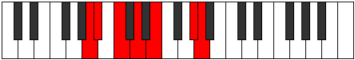 |
| [2223](https://ianring.com/musictheory/scales/2223) | [Konian](ModeANaturalKonian.md) | A | A, Bb, Cb, Dbb, Ebb, Fb, G#, A | 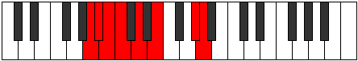 |
| [2227](https://ianring.com/musictheory/scales/2227) | [Katadimic](ModeANaturalKatadimic.md) | A | A, Bb, C#, D, E, F###, A |  |
| [2231](https://ianring.com/musictheory/scales/2231) | [Macrian](ModeANaturalMacrian.md) | A | A, Bb, Cb, Db, Ebb, Fb, G#, A |  |
| [2233](https://ianring.com/musictheory/scales/2233) | [Donimic](ModeFNaturalDonimic.md) | F | F, G#, A, Bb, C, D##, F |  |
| [2235](https://ianring.com/musictheory/scales/2235) | [Bathian](ModeANaturalBathian.md) | A | A, Bb, C, Db, Ebb, Fb, G#, A |  |
| [2235](https://ianring.com/musictheory/scales/2235) | [Bathian](ModeFNaturalBathian.md) | F | F, Gb, Ab, Bbb, Cbb, Dbb, E, F |  |
| [2237](https://ianring.com/musictheory/scales/2237) | [Epothian](ModeFNaturalEpothian.md) | F | F, G, Ab, Bbb, Cbb, Dbb, E, F |  |
| [2239](https://ianring.com/musictheory/scales/2239) | [Dacryllic](ModeFNaturalDacryllic.md) | F | F, F#, G, G#, A, A#, C, E, F |  |
| [2239](https://ianring.com/musictheory/scales/2239) | [Dacryllic](ModeANaturalDacryllic.md) | A | A, A#, B, C, C#, D, E, G#, A |  |
| [2247](https://ianring.com/musictheory/scales/2247) | [Aeolimic](ModeANaturalAeolimic.md) | A | A, Bb, Cb, D#, E, F###, A |  |
| [2251](https://ianring.com/musictheory/scales/2251) | [Zodimic](ModeANaturalZodimic.md) | A | A, Bb, C, D#, E, F###, A |  |
| [2255](https://ianring.com/musictheory/scales/2255) | [Dylian](ModeANaturalDylian.md) | A | A, Bb, Cb, Dbb, Eb, Fb, G#, A |  |
| [2259](https://ianring.com/musictheory/scales/2259) | [Gogimic](ModeANaturalGogimic.md) | A | A, Bb, C#, D#, E, F###, A |  |
| [2263](https://ianring.com/musictheory/scales/2263) | [Lycrian](ModeANaturalLycrian.md) | A | A, Bb, Cb, Db, Eb, Fb, G#, A |  |
| [2267](https://ianring.com/musictheory/scales/2267) | [Padian](ModeANaturalPadian.md) | A | A, Bb, C, Db, Eb, Fb, G#, A |  |
| [2271](https://ianring.com/musictheory/scales/2271) | [Poptyllic](ModeANaturalPoptyllic.md) | A | A, A#, B, C, C#, D#, E, G#, A |  |
| [2275](https://ianring.com/musictheory/scales/2275) | [Thodimic](ModeDSharpThodimic.md) | D# | D#, E, F###, G##, A#, B###, D# |  |
| [2275](https://ianring.com/musictheory/scales/2275) | [Thodimic](ModeEFlatThodimic.md) | Eb | Eb, Fb, G#, A, Bb, C##, Eb |  |
| [2275](https://ianring.com/musictheory/scales/2275) | [Thodimic](ModeANaturalThodimic.md) | A | A, Bb, C##, D#, E, F###, A |  |
| [2279](https://ianring.com/musictheory/scales/2279) | [Dyrian](ModeDSharpDyrian.md) | D# | D#, E, F, G#, A, Bb, C##, D# |  |
| [2279](https://ianring.com/musictheory/scales/2279) | [Dyrian](ModeEFlatDyrian.md) | Eb | Eb, Fb, Gbb, Ab, Bbb, Cbb, D, Eb |  |
| [2279](https://ianring.com/musictheory/scales/2279) | [Dyrian](ModeANaturalDyrian.md) | A | A, Bb, Cb, D, Eb, Fb, G#, A |  |
| [2283](https://ianring.com/musictheory/scales/2283) | [Aeolyptian](ModeANaturalAeolyptian.md) | A | A, Bb, C, D, Eb, Fb, G#, A |  |
| [2283](https://ianring.com/musictheory/scales/2283) | [Aeolyptian](ModeDSharpAeolyptian.md) | D# | D#, E, F#, G#, A, Bb, C##, D# |  |
| [2283](https://ianring.com/musictheory/scales/2283) | [Aeolyptian](ModeEFlatAeolyptian.md) | Eb | Eb, Fb, Gb, Ab, Bbb, Cbb, D, Eb |  |
| [2287](https://ianring.com/musictheory/scales/2287) | [Lodyllic](ModeDSharpLodyllic.md) | D# | D#, E, F, F#, G#, A, A#, D, D# |  |
| [2287](https://ianring.com/musictheory/scales/2287) | [Lodyllic](ModeEFlatLodyllic.md) | Eb | Eb, E, F, Gb, Ab, A, Bb, D, Eb |  |
| [2287](https://ianring.com/musictheory/scales/2287) | [Lodyllic](ModeANaturalLodyllic.md) | A | A, A#, B, C, D, D#, E, G#, A |  |
| [2289](https://ianring.com/musictheory/scales/2289) | [Mocrimic](ModeENaturalMocrimic.md) | E | E, F###, G##, A#, B, C###, E |  |
| [2291](https://ianring.com/musictheory/scales/2291) | [Zydian](ModeANaturalZydian.md) | A | A, Bb, C#, D, Eb, Fb, G#, A |  |
| [2291](https://ianring.com/musictheory/scales/2291) | [Zydian](ModeDSharpZydian.md) | D# | D#, E, F##, G#, A, Bb, C##, D# |  |
| [2291](https://ianring.com/musictheory/scales/2291) | [Zydian](ModeEFlatZydian.md) | Eb | Eb, Fb, G, Ab, Bbb, Cbb, D, Eb |  |
| [2291](https://ianring.com/musictheory/scales/2291) | [Zydian](ModeENaturalZydian.md) | E | E, F, G#, A, Bb, Cb, D#, E |  |
| [2293](https://ianring.com/musictheory/scales/2293) | [Gorian](ModeENaturalGorian.md) | E | E, F#, G#, A, Bb, Cb, D#, E |  |
| [2295](https://ianring.com/musictheory/scales/2295) | [Kogyllic](ModeDSharpKogyllic.md) | D# | D#, E, F, G, G#, A, A#, D, D# |  |
| [2295](https://ianring.com/musictheory/scales/2295) | [Kogyllic](ModeEFlatKogyllic.md) | Eb | Eb, E, F, G, Ab, A, Bb, D, Eb |  |
| [2295](https://ianring.com/musictheory/scales/2295) | [Kogyllic](ModeANaturalKogyllic.md) | A | A, A#, B, C#, D, D#, E, G#, A |  |
| [2295](https://ianring.com/musictheory/scales/2295) | [Kogyllic](ModeENaturalKogyllic.md) | E | E, F, F#, G#, A, A#, B, D#, E |  |
| [2297](https://ianring.com/musictheory/scales/2297) | [Thylian](ModeFNaturalThylian.md) | F | F, G#, A, Bb, Cb, Dbb, E, F |  |
| [2297](https://ianring.com/musictheory/scales/2297) | [Thylian](ModeENaturalThylian.md) | E | E, F##, G#, A, Bb, Cb, D#, E |  |
| [2299](https://ianring.com/musictheory/scales/2299) | [Phraptyllic](ModeANaturalPhraptyllic.md) | A | A, A#, C, C#, D, D#, E, G#, A |  |
| [2299](https://ianring.com/musictheory/scales/2299) | [Phraptyllic](ModeDSharpPhraptyllic.md) | D# | D#, E, F#, G, G#, A, A#, D, D# |  |
| [2299](https://ianring.com/musictheory/scales/2299) | [Phraptyllic](ModeEFlatPhraptyllic.md) | Eb | Eb, E, Gb, G, Ab, A, Bb, D, Eb |  |
| [2299](https://ianring.com/musictheory/scales/2299) | [Phraptyllic](ModeFNaturalPhraptyllic.md) | F | F, F#, G#, A, A#, B, C, E, F |  |
| [2299](https://ianring.com/musictheory/scales/2299) | [Phraptyllic](ModeENaturalPhraptyllic.md) | E | E, F, G, G#, A, A#, B, D#, E |  |
| [2301](https://ianring.com/musictheory/scales/2301) | [Bydyllic](ModeFNaturalBydyllic.md) | F | F, G, G#, A, A#, B, C, E, F |  |
| [2301](https://ianring.com/musictheory/scales/2301) | [Bydyllic](ModeENaturalBydyllic.md) | E | E, F#, G, G#, A, A#, B, D#, E |  |
| [2303](https://ianring.com/musictheory/scales/2303) | [Stanygic](ModeDSharpStanygic.md) | D# | D#, E, F, F#, G, G#, A, A#, D, D# |  |
| [2303](https://ianring.com/musictheory/scales/2303) | [Stanygic](ModeEFlatStanygic.md) | Eb | Eb, E, F, Gb, G, Ab, A, Bb, D, Eb |  |
| [2303](https://ianring.com/musictheory/scales/2303) | [Stanygic](ModeANaturalStanygic.md) | A | A, A#, B, C, C#, D, D#, E, G#, A |  |
| [2303](https://ianring.com/musictheory/scales/2303) | [Stanygic](ModeFNaturalStanygic.md) | F | F, F#, G, G#, A, A#, B, C, E, F |  |
| [2303](https://ianring.com/musictheory/scales/2303) | [Stanygic](ModeENaturalStanygic.md) | E | E, F, F#, G, G#, A, A#, B, D#, E |  |
| [2327](https://ianring.com/musictheory/scales/2327) | [Epalimic](ModeGSharpEpalimic.md) | G# | G#, A, Bb, C, D##, E###, G# |  |
| [2327](https://ianring.com/musictheory/scales/2327) | [Epalimic](ModeAFlatEpalimic.md) | Ab | Ab, Bbb, Cbb, Dbb, E, F##, Ab |  |
| [2335](https://ianring.com/musictheory/scales/2335) | [Epydian](ModeGSharpEpydian.md) | G# | G#, A, Bb, Cb, Dbb, E, F##, G# |  |
| [2335](https://ianring.com/musictheory/scales/2335) | [Epydian](ModeAFlatEpydian.md) | Ab | Ab, Bbb, Cbb, Dbbb, Dbb, E, F##, Ab |  |
| [2343](https://ianring.com/musictheory/scales/2343) | [Tharimic](ModeGSharpTharimic.md) | G# | G#, A, Bb, C#, D##, E###, G# |  |
| [2343](https://ianring.com/musictheory/scales/2343) | [Tharimic](ModeAFlatTharimic.md) | Ab | Ab, Bbb, Cbb, Db, E, F##, Ab | 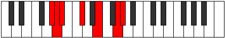 |
| [2351](https://ianring.com/musictheory/scales/2351) | [Gynian](ModeGSharpGynian.md) | G# | G#, A, Bb, Cb, Db, E, F##, G# |  |
| [2351](https://ianring.com/musictheory/scales/2351) | [Gynian](ModeAFlatGynian.md) | Ab | Ab, Bbb, Cbb, Dbbb, Ebbb, Fb, G, Ab |  |
| [2359](https://ianring.com/musictheory/scales/2359) | [Gadian](ModeGSharpGadian.md) | G# | G#, A, Bb, C, Db, E, F##, G# |  |
| [2359](https://ianring.com/musictheory/scales/2359) | [Gadian](ModeAFlatGadian.md) | Ab | Ab, Bbb, Cbb, Dbb, Ebbb, Fb, G, Ab |  |
| [2361](https://ianring.com/musictheory/scales/2361) | [Docrimic](ModeFNaturalDocrimic.md) | F | F, G#, A, Bb, C#, D##, F |  |
| [2363](https://ianring.com/musictheory/scales/2363) | [Kataptian](ModeFNaturalKataptian.md) | F | F, Gb, Ab, Bbb, Cbb, Db, E, F |  |
| [2365](https://ianring.com/musictheory/scales/2365) | [Sythian](ModeFNaturalSythian.md) | F | F, G, Ab, Bbb, Cbb, Db, E, F |  |
| [2367](https://ianring.com/musictheory/scales/2367) | [Laryllic](ModeFNaturalLaryllic.md) | F | F, F#, G, G#, A, A#, C#, E, F |  |
| [2367](https://ianring.com/musictheory/scales/2367) | [Laryllic](ModeGSharpLaryllic.md) | G# | G#, A, A#, B, C, C#, E, G, G# |  |
| [2367](https://ianring.com/musictheory/scales/2367) | [Laryllic](ModeAFlatLaryllic.md) | Ab | Ab, A, Bb, B, C, Db, E, G, Ab |  |
| [2375](https://ianring.com/musictheory/scales/2375) | [Aeolaptimic](ModeGSharpAeolaptimic.md) | G# | G#, A, Bb, C##, D##, E###, G# |  |
| [2375](https://ianring.com/musictheory/scales/2375) | [Aeolaptimic](ModeAFlatAeolaptimic.md) | Ab | Ab, Bbb, Cbb, D, E, F##, Ab |  |
| [2383](https://ianring.com/musictheory/scales/2383) | [Katorian](ModeGSharpKatorian.md) | G# | G#, A, Bb, Cb, D, E, F##, G# |  |
| [2383](https://ianring.com/musictheory/scales/2383) | [Katorian](ModeAFlatKatorian.md) | Ab | Ab, Bbb, Cbb, Dbbb, Ebb, Fb, G, Ab |  |
| [2391](https://ianring.com/musictheory/scales/2391) | [Molian](ModeGSharpMolian.md) | G# | G#, A, Bb, C, D, E, F##, G# |  |
| [2391](https://ianring.com/musictheory/scales/2391) | [Molian](ModeAFlatMolian.md) | Ab | Ab, Bbb, Cbb, Dbb, Ebb, Fb, G, Ab |  |
| [2399](https://ianring.com/musictheory/scales/2399) | [Zanyllic](ModeGSharpZanyllic.md) | G# | G#, A, A#, B, C, D, E, G, G# |  |
| [2399](https://ianring.com/musictheory/scales/2399) | [Zanyllic](ModeAFlatZanyllic.md) | Ab | Ab, A, Bb, B, C, D, E, G, Ab |  |
| [2407](https://ianring.com/musictheory/scales/2407) | [Zylian](ModeGSharpZylian.md) | G# | G#, A, Bb, C#, D, E, F##, G# |  |
| [2407](https://ianring.com/musictheory/scales/2407) | [Zylian](ModeAFlatZylian.md) | Ab | Ab, Bbb, Cbb, Db, Ebb, Fb, G, Ab |  |
| [2415](https://ianring.com/musictheory/scales/2415) | [Lothyllic](ModeGSharpLothyllic.md) | G# | G#, A, A#, B, C#, D, E, G, G# |  |
| [2415](https://ianring.com/musictheory/scales/2415) | [Lothyllic](ModeAFlatLothyllic.md) | Ab | Ab, A, Bb, B, Db, D, E, G, Ab |  |
| [2417](https://ianring.com/musictheory/scales/2417) | [Kanimic](ModeENaturalKanimic.md) | E | E, F###, G##, A#, B#, C###, E |  |
| [2419](https://ianring.com/musictheory/scales/2419) | [Paptian](ModeENaturalPaptian.md) | E | E, F, G#, A, Bb, C, D#, E |  |
| [2421](https://ianring.com/musictheory/scales/2421) | [Malian](ModeENaturalMalian.md) | E | E, F#, G#, A, Bb, C, D#, E |  |
| [2423](https://ianring.com/musictheory/scales/2423) | [Thorcryllic](ModeENaturalThorcryllic.md) | E | E, F, F#, G#, A, A#, C, D#, E |  |
| [2423](https://ianring.com/musictheory/scales/2423) | [Thorcryllic](ModeGSharpThorcryllic.md) | G# | G#, A, A#, C, C#, D, E, G, G# |  |
| [2423](https://ianring.com/musictheory/scales/2423) | [Thorcryllic](ModeAFlatThorcryllic.md) | Ab | Ab, A, Bb, C, Db, D, E, G, Ab |  |
| [2425](https://ianring.com/musictheory/scales/2425) | [Rorian](ModeENaturalRorian.md) | E | E, F##, G#, A, Bb, C, D#, E |  |
| [2425](https://ianring.com/musictheory/scales/2425) | [Rorian](ModeFNaturalRorian.md) | F | F, G#, A, Bb, Cb, Db, E, F |  |
| [2427](https://ianring.com/musictheory/scales/2427) | [Katoryllic](ModeENaturalKatoryllic.md) | E | E, F, G, G#, A, A#, C, D#, E |  |
| [2427](https://ianring.com/musictheory/scales/2427) | [Katoryllic](ModeFNaturalKatoryllic.md) | F | F, F#, G#, A, A#, B, C#, E, F |  |
| [2429](https://ianring.com/musictheory/scales/2429) | [Kadyllic](ModeENaturalKadyllic.md) | E | E, F#, G, G#, A, A#, C, D#, E |  |
| [2429](https://ianring.com/musictheory/scales/2429) | [Kadyllic](ModeFNaturalKadyllic.md) | F | F, G, G#, A, A#, B, C#, E, F | 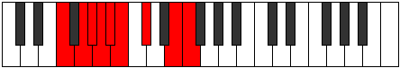 |
| [2431](https://ianring.com/musictheory/scales/2431) | [Gythygic](ModeENaturalGythygic.md) | E | E, F, F#, G, G#, A, A#, C, D#, E |  |
| [2431](https://ianring.com/musictheory/scales/2431) | [Gythygic](ModeGSharpGythygic.md) | G# | G#, A, A#, B, C, C#, D, E, G, G# |  |
| [2431](https://ianring.com/musictheory/scales/2431) | [Gythygic](ModeAFlatGythygic.md) | Ab | Ab, A, Bb, B, C, Db, D, E, G, Ab |  |
| [2431](https://ianring.com/musictheory/scales/2431) | [Gythygic](ModeFNaturalGythygic.md) | F | F, F#, G, G#, A, A#, B, C#, E, F |  |
| [2443](https://ianring.com/musictheory/scales/2443) | [Panimic](ModeANaturalPanimic.md) | A | A, Bb, C, D##, E#, F###, A |  |
| [2447](https://ianring.com/musictheory/scales/2447) | [Thagian](ModeANaturalThagian.md) | A | A, Bb, Cb, Dbb, E, F, G#, A | 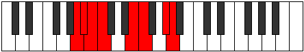 |
| [2447](https://ianring.com/musictheory/scales/2447) | [Thagian](ModeGSharpThagian.md) | G# | G#, A, Bb, Cb, D#, E, F##, G# |  |
| [2447](https://ianring.com/musictheory/scales/2447) | [Thagian](ModeAFlatThagian.md) | Ab | Ab, Bbb, Cbb, Dbbb, Eb, Fb, G, Ab |  |
| [2451](https://ianring.com/musictheory/scales/2451) | [Aerynimic](ModeANaturalAerynimic.md) | A | A, Bb, C#, D##, E#, F###, A |  |
| [2455](https://ianring.com/musictheory/scales/2455) | [Bothian](ModeGSharpBothian.md) | G# | G#, A, Bb, C, D#, E, F##, G# |  |
| [2455](https://ianring.com/musictheory/scales/2455) | [Bothian](ModeAFlatBothian.md) | Ab | Ab, Bbb, Cbb, Dbb, Eb, Fb, G, Ab |  |
| [2455](https://ianring.com/musictheory/scales/2455) | [Bothian](ModeANaturalBothian.md) | A | A, Bb, Cb, Db, E, F, G#, A |  |
| [2459](https://ianring.com/musictheory/scales/2459) | [Ionocrian](ModeANaturalIonocrian.md) | A | A, Bb, C, Db, E, F, G#, A |  |
| [2463](https://ianring.com/musictheory/scales/2463) | [Ionathyllic](ModeANaturalIonathyllic.md) | A | A, A#, B, C, C#, E, F, G#, A |  |
| [2463](https://ianring.com/musictheory/scales/2463) | [Ionathyllic](ModeGSharpIonathyllic.md) | G# | G#, A, A#, B, C, D#, E, G, G# |  |
| [2463](https://ianring.com/musictheory/scales/2463) | [Ionathyllic](ModeAFlatIonathyllic.md) | Ab | Ab, A, Bb, B, C, Eb, E, G, Ab |  |
| [2467](https://ianring.com/musictheory/scales/2467) | [Morimic](ModeANaturalMorimic.md) | A | A, Bb, C##, D##, E#, F###, A |  |
| [2471](https://ianring.com/musictheory/scales/2471) | [Eparian](ModeGSharpEparian.md) | G# | G#, A, Bb, C#, D#, E, F##, G# |  |
| [2471](https://ianring.com/musictheory/scales/2471) | [Eparian](ModeAFlatEparian.md) | Ab | Ab, Bbb, Cbb, Db, Eb, Fb, G, Ab |  |
| [2471](https://ianring.com/musictheory/scales/2471) | [Eparian](ModeANaturalEparian.md) | A | A, Bb, Cb, D, E, F, G#, A |  |
| [2475](https://ianring.com/musictheory/scales/2475) | [Aerylian](ModeANaturalAerylian.md) | A | A, Bb, C, D, E, F, G#, A |  |
| [2479](https://ianring.com/musictheory/scales/2479) | [Rycryllic](ModeANaturalRycryllic.md) | A | A, A#, B, C, D, E, F, G#, A |  |
| [2479](https://ianring.com/musictheory/scales/2479) | [Rycryllic](ModeGSharpRycryllic.md) | G# | G#, A, A#, B, C#, D#, E, G, G# |  |
| [2479](https://ianring.com/musictheory/scales/2479) | [Rycryllic](ModeAFlatRycryllic.md) | Ab | Ab, A, Bb, B, Db, Eb, E, G, Ab |  |
| [2483](https://ianring.com/musictheory/scales/2483) | [Aerynian](ModeANaturalAerynian.md) | A | A, Bb, C#, D, E, F, G#, A |  |
| [2487](https://ianring.com/musictheory/scales/2487) | [Phroptyllic](ModeGSharpPhroptyllic.md) | G# | G#, A, A#, C, C#, D#, E, G, G# |  |
| [2487](https://ianring.com/musictheory/scales/2487) | [Phroptyllic](ModeAFlatPhroptyllic.md) | Ab | Ab, A, Bb, C, Db, Eb, E, G, Ab |  |
| [2487](https://ianring.com/musictheory/scales/2487) | [Phroptyllic](ModeANaturalPhroptyllic.md) | A | A, A#, B, C#, D, E, F, G#, A |  |
| [2489](https://ianring.com/musictheory/scales/2489) | [Syrian](ModeFNaturalSyrian.md) | F | F, G#, A, Bb, C, Db, E, F |  |
| [2491](https://ianring.com/musictheory/scales/2491) | [Layllic](ModeANaturalLayllic.md) | A | A, A#, C, C#, D, E, F, G#, A |  |
| [2491](https://ianring.com/musictheory/scales/2491) | [Layllic](ModeFNaturalLayllic.md) | F | F, F#, G#, A, A#, C, C#, E, F |  |
| [2493](https://ianring.com/musictheory/scales/2493) | [Manyllic](ModeFNaturalManyllic.md) | F | F, G, G#, A, A#, C, C#, E, F |  |
| [2495](https://ianring.com/musictheory/scales/2495) | [Aeolocrygic](ModeFNaturalAeolocrygic.md) | F | F, F#, G, G#, A, A#, C, C#, E, F |  |
| [2495](https://ianring.com/musictheory/scales/2495) | [Aeolocrygic](ModeANaturalAeolocrygic.md) | A | A, A#, B, C, C#, D, E, F, G#, A |  |
| [2495](https://ianring.com/musictheory/scales/2495) | [Aeolocrygic](ModeGSharpAeolocrygic.md) | G# | G#, A, A#, B, C, C#, D#, E, G, G# |  |
| [2495](https://ianring.com/musictheory/scales/2495) | [Aeolocrygic](ModeAFlatAeolocrygic.md) | Ab | Ab, A, Bb, B, C, Db, Eb, E, G, Ab |  |
| [2501](https://ianring.com/musictheory/scales/2501) | [Ralimic](ModeDNaturalRalimic.md) | D | D, E, F###, G##, A#, B##, D | 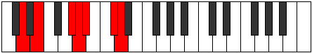 |
| [2503](https://ianring.com/musictheory/scales/2503) | [Stonian](ModeDNaturalStonian.md) | D | D, Eb, Fb, G#, A, Bb, C#, D |  |
| [2503](https://ianring.com/musictheory/scales/2503) | [Stonian](ModeGSharpStonian.md) | G# | G#, A, Bb, C##, D#, E, F##, G# |  |
| [2503](https://ianring.com/musictheory/scales/2503) | [Stonian](ModeAFlatStonian.md) | Ab | Ab, Bbb, Cbb, D, Eb, Fb, G, Ab |  |
| [2503](https://ianring.com/musictheory/scales/2503) | [Stonian](ModeANaturalStonian.md) | A | A, Bb, Cb, D#, E, F, G#, A |  |
| [2507](https://ianring.com/musictheory/scales/2507) | [Ionyphian](ModeANaturalIonyphian.md) | A | A, Bb, C, D#, E, F, G#, A |  |
| [2509](https://ianring.com/musictheory/scales/2509) | [Bogian](ModeDNaturalBogian.md) | D | D, E, F, G#, A, Bb, C#, D |  |
| [2511](https://ianring.com/musictheory/scales/2511) | [Epyryllic](ModeDNaturalEpyryllic.md) | D | D, D#, E, F, G#, A, A#, C#, D |  |
| [2511](https://ianring.com/musictheory/scales/2511) | [Epyryllic](ModeANaturalEpyryllic.md) | A | A, A#, B, C, D#, E, F, G#, A |  |
| [2511](https://ianring.com/musictheory/scales/2511) | [Epyryllic](ModeGSharpEpyryllic.md) | G# | G#, A, A#, B, D, D#, E, G, G# |  |
| [2511](https://ianring.com/musictheory/scales/2511) | [Epyryllic](ModeAFlatEpyryllic.md) | Ab | Ab, A, Bb, B, D, Eb, E, G, Ab |  |
| [2515](https://ianring.com/musictheory/scales/2515) | [Stylian](ModeANaturalStylian.md) | A | A, Bb, C#, D#, E, F, G#, A |  |
| [2517](https://ianring.com/musictheory/scales/2517) | [Ryphian](ModeDNaturalRyphian.md) | D | D, E, F#, G#, A, Bb, C#, D |  |
| [2519](https://ianring.com/musictheory/scales/2519) | [Dathyllic](ModeDNaturalDathyllic.md) | D | D, D#, E, F#, G#, A, A#, C#, D |  |
| [2519](https://ianring.com/musictheory/scales/2519) | [Dathyllic](ModeGSharpDathyllic.md) | G# | G#, A, A#, C, D, D#, E, G, G# |  |
| [2519](https://ianring.com/musictheory/scales/2519) | [Dathyllic](ModeAFlatDathyllic.md) | Ab | Ab, A, Bb, C, D, Eb, E, G, Ab |  |
| [2519](https://ianring.com/musictheory/scales/2519) | [Dathyllic](ModeANaturalDathyllic.md) | A | A, A#, B, C#, D#, E, F, G#, A | 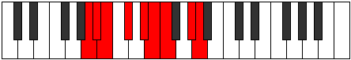 |
| [2523](https://ianring.com/musictheory/scales/2523) | [Rygyllic](ModeANaturalRygyllic.md) | A | A, A#, C, C#, D#, E, F, G#, A |  |
| [2525](https://ianring.com/musictheory/scales/2525) | [Aeolaryllic](ModeDNaturalAeolaryllic.md) | D | D, E, F, F#, G#, A, A#, C#, D |  |
| [2527](https://ianring.com/musictheory/scales/2527) | [Phradygic](ModeDNaturalPhradygic.md) | D | D, D#, E, F, F#, G#, A, A#, C#, D |  |
| [2527](https://ianring.com/musictheory/scales/2527) | [Phradygic](ModeANaturalPhradygic.md) | A | A, A#, B, C, C#, D#, E, F, G#, A |  |
| [2527](https://ianring.com/musictheory/scales/2527) | [Phradygic](ModeGSharpPhradygic.md) | G# | G#, A, A#, B, C, D, D#, E, G, G# |  |
| [2527](https://ianring.com/musictheory/scales/2527) | [Phradygic](ModeAFlatPhradygic.md) | Ab | Ab, A, Bb, B, C, D, Eb, E, G, Ab |  |
| [2531](https://ianring.com/musictheory/scales/2531) | [Danian](ModeANaturalDanian.md) | A | A, Bb, C##, D#, E, F, G#, A |  |
| [2531](https://ianring.com/musictheory/scales/2531) | [Danian](ModeDSharpDanian.md) | D# | D#, E, F###, G##, A#, B, C##, D# |  |
| [2531](https://ianring.com/musictheory/scales/2531) | [Danian](ModeEFlatDanian.md) | Eb | Eb, Fb, G#, A, Bb, Cb, D, Eb |  |
| [2533](https://ianring.com/musictheory/scales/2533) | [Podian](ModeDNaturalPodian.md) | D | D, E, F##, G#, A, Bb, C#, D |  |
| [2535](https://ianring.com/musictheory/scales/2535) | [Zygyllic](ModeDNaturalZygyllic.md) | D | D, D#, E, G, G#, A, A#, C#, D |  |
| [2535](https://ianring.com/musictheory/scales/2535) | [Zygyllic](ModeGSharpZygyllic.md) | G# | G#, A, A#, C#, D, D#, E, G, G# |  |
| [2535](https://ianring.com/musictheory/scales/2535) | [Zygyllic](ModeAFlatZygyllic.md) | Ab | Ab, A, Bb, Db, D, Eb, E, G, Ab | 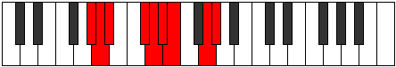 |
| [2535](https://ianring.com/musictheory/scales/2535) | [Zygyllic](ModeDSharpZygyllic.md) | D# | D#, E, F, G#, A, A#, B, D, D# |  |
| [2535](https://ianring.com/musictheory/scales/2535) | [Zygyllic](ModeEFlatZygyllic.md) | Eb | Eb, E, F, Ab, A, Bb, B, D, Eb |  |
| [2535](https://ianring.com/musictheory/scales/2535) | [Zygyllic](ModeANaturalZygyllic.md) | A | A, A#, B, D, D#, E, F, G#, A |  |
| [2539](https://ianring.com/musictheory/scales/2539) | [Thonyllic](ModeANaturalThonyllic.md) | A | A, A#, C, D, D#, E, F, G#, A |  |
| [2539](https://ianring.com/musictheory/scales/2539) | [Thonyllic](ModeDSharpThonyllic.md) | D# | D#, E, F#, G#, A, A#, B, D, D# |  |
| [2539](https://ianring.com/musictheory/scales/2539) | [Thonyllic](ModeEFlatThonyllic.md) | Eb | Eb, E, Gb, Ab, A, Bb, B, D, Eb |  |
| [2541](https://ianring.com/musictheory/scales/2541) | [Katadyllic](ModeDNaturalKatadyllic.md) | D | D, E, F, G, G#, A, A#, C#, D |  |
| [2543](https://ianring.com/musictheory/scales/2543) | [Dydygic](ModeDNaturalDydygic.md) | D | D, D#, E, F, G, G#, A, A#, C#, D |  |
| [2543](https://ianring.com/musictheory/scales/2543) | [Dydygic](ModeANaturalDydygic.md) | A | A, A#, B, C, D, D#, E, F, G#, A |  |
| [2543](https://ianring.com/musictheory/scales/2543) | [Dydygic](ModeDSharpDydygic.md) | D# | D#, E, F, F#, G#, A, A#, B, D, D# |  |
| [2543](https://ianring.com/musictheory/scales/2543) | [Dydygic](ModeEFlatDydygic.md) | Eb | Eb, E, F, Gb, Ab, A, Bb, B, D, Eb |  |
| [2543](https://ianring.com/musictheory/scales/2543) | [Dydygic](ModeGSharpDydygic.md) | G# | G#, A, A#, B, C#, D, D#, E, G, G# |  |
| [2543](https://ianring.com/musictheory/scales/2543) | [Dydygic](ModeAFlatDydygic.md) | Ab | Ab, A, Bb, B, Db, D, Eb, E, G, Ab |  |
| [2545](https://ianring.com/musictheory/scales/2545) | [Thycrian](ModeENaturalThycrian.md) | E | E, F###, G##, A#, B, C, D#, E |  |
| [2547](https://ianring.com/musictheory/scales/2547) | [Sogyllic](ModeANaturalSogyllic.md) | A | A, A#, C#, D, D#, E, F, G#, A |  |
| [2547](https://ianring.com/musictheory/scales/2547) | [Sogyllic](ModeENaturalSogyllic.md) | E | E, F, G#, A, A#, B, C, D#, E |  |
| [2547](https://ianring.com/musictheory/scales/2547) | [Sogyllic](ModeDSharpSogyllic.md) | D# | D#, E, G, G#, A, A#, B, D, D# |  |
| [2547](https://ianring.com/musictheory/scales/2547) | [Sogyllic](ModeEFlatSogyllic.md) | Eb | Eb, E, G, Ab, A, Bb, B, D, Eb |  |
| [2549](https://ianring.com/musictheory/scales/2549) | [Rydyllic](ModeDNaturalRydyllic.md) | D | D, E, F#, G, G#, A, A#, C#, D |  |
| [2549](https://ianring.com/musictheory/scales/2549) | [Rydyllic](ModeENaturalRydyllic.md) | E | E, F#, G#, A, A#, B, C, D#, E |  |
| [2551](https://ianring.com/musictheory/scales/2551) | [Zoptygic](ModeGSharpZoptygic.md) | G# | G#, A, A#, C, C#, D, D#, E, G, G# |  |
| [2551](https://ianring.com/musictheory/scales/2551) | [Zoptygic](ModeAFlatZoptygic.md) | Ab | Ab, A, Bb, C, Db, D, Eb, E, G, Ab |  |
| [2551](https://ianring.com/musictheory/scales/2551) | [Zoptygic](ModeDNaturalZoptygic.md) | D | D, D#, E, F#, G, G#, A, A#, C#, D |  |
| [2551](https://ianring.com/musictheory/scales/2551) | [Zoptygic](ModeANaturalZoptygic.md) | A | A, A#, B, C#, D, D#, E, F, G#, A |  |
| [2551](https://ianring.com/musictheory/scales/2551) | [Zoptygic](ModeENaturalZoptygic.md) | E | E, F, F#, G#, A, A#, B, C, D#, E |  |
| [2551](https://ianring.com/musictheory/scales/2551) | [Zoptygic](ModeDSharpZoptygic.md) | D# | D#, E, F, G, G#, A, A#, B, D, D# |  |
| [2551](https://ianring.com/musictheory/scales/2551) | [Zoptygic](ModeEFlatZoptygic.md) | Eb | Eb, E, F, G, Ab, A, Bb, B, D, Eb |  |
| [2553](https://ianring.com/musictheory/scales/2553) | [Aeolaptyllic](ModeFNaturalAeolaptyllic.md) | F | F, G#, A, A#, B, C, C#, E, F |  |
| [2553](https://ianring.com/musictheory/scales/2553) | [Aeolaptyllic](ModeENaturalAeolaptyllic.md) | E | E, G, G#, A, A#, B, C, D#, E |  |
| [2555](https://ianring.com/musictheory/scales/2555) | [Bythygic](ModeANaturalBythygic.md) | A | A, A#, C, C#, D, D#, E, F, G#, A |  |
| [2555](https://ianring.com/musictheory/scales/2555) | [Bythygic](ModeFNaturalBythygic.md) | F | F, F#, G#, A, A#, B, C, C#, E, F |  |
| [2555](https://ianring.com/musictheory/scales/2555) | [Bythygic](ModeENaturalBythygic.md) | E | E, F, G, G#, A, A#, B, C, D#, E |  |
| [2555](https://ianring.com/musictheory/scales/2555) | [Bythygic](ModeDSharpBythygic.md) | D# | D#, E, F#, G, G#, A, A#, B, D, D# |  |
| [2555](https://ianring.com/musictheory/scales/2555) | [Bythygic](ModeEFlatBythygic.md) | Eb | Eb, E, Gb, G, Ab, A, Bb, B, D, Eb |  |
| [2557](https://ianring.com/musictheory/scales/2557) | [Dothygic](ModeDNaturalDothygic.md) | D | D, E, F, F#, G, G#, A, A#, C#, D |  |
| [2557](https://ianring.com/musictheory/scales/2557) | [Dothygic](ModeFNaturalDothygic.md) | F | F, G, G#, A, A#, B, C, C#, E, F |  |
| [2557](https://ianring.com/musictheory/scales/2557) | [Dothygic](ModeENaturalDothygic.md) | E | E, F#, G, G#, A, A#, B, C, D#, E |  |
| [2559](https://ianring.com/musictheory/scales/2559) | [Zogyllian](ModeDNaturalZogyllian.md) | D | D, D#, E, F, F#, G, G#, A, A#, C#, D |  |
| [2559](https://ianring.com/musictheory/scales/2559) | [Zogyllian](ModeANaturalZogyllian.md) | A | A, A#, B, C, C#, D, D#, E, F, G#, A |  |
| [2559](https://ianring.com/musictheory/scales/2559) | [Zogyllian](ModeGSharpZogyllian.md) | G# | G#, A, A#, B, C, C#, D, D#, E, G, G# |  |
| [2559](https://ianring.com/musictheory/scales/2559) | [Zogyllian](ModeAFlatZogyllian.md) | Ab | Ab, A, Bb, B, C, Db, D, Eb, E, G, Ab |  |
| [2559](https://ianring.com/musictheory/scales/2559) | [Zogyllian](ModeFNaturalZogyllian.md) | F | F, F#, G, G#, A, A#, B, C, C#, E, F |  |
| [2559](https://ianring.com/musictheory/scales/2559) | [Zogyllian](ModeENaturalZogyllian.md) | E | E, F, F#, G, G#, A, A#, B, C, D#, E |  |
| [2559](https://ianring.com/musictheory/scales/2559) | [Zogyllian](ModeDSharpZogyllian.md) | D# | D#, E, F, F#, G, G#, A, A#, B, D, D# |  |
| [2559](https://ianring.com/musictheory/scales/2559) | [Zogyllian](ModeEFlatZogyllian.md) | Eb | Eb, E, F, Gb, G, Ab, A, Bb, B, D, Eb |  |
| [2607](https://ianring.com/musictheory/scales/2607) | [Aerolian](ModeGNaturalAerolian.md) | G | G, Ab, Bbb, Cbb, Dbb, E, F#, G |  |
| [2617](https://ianring.com/musictheory/scales/2617) | [Pylimic](ModeFNaturalPylimic.md) | F | F, G#, A, Bb, C##, D##, F |  |
| [2619](https://ianring.com/musictheory/scales/2619) | [Ionyrian](ModeFNaturalIonyrian.md) | F | F, Gb, Ab, Bbb, Cbb, D, E, F |  |
| [2621](https://ianring.com/musictheory/scales/2621) | [Ionogian](ModeFNaturalIonogian.md) | F | F, G, Ab, Bbb, Cbb, D, E, F |  |
| [2623](https://ianring.com/musictheory/scales/2623) | [Aerylyllic](ModeFNaturalAerylyllic.md) | F | F, F#, G, G#, A, A#, D, E, F |  |
| [2623](https://ianring.com/musictheory/scales/2623) | [Aerylyllic](ModeGNaturalAerylyllic.md) | G | G, G#, A, A#, B, C, E, F#, G |  |
| [2639](https://ianring.com/musictheory/scales/2639) | [Dothian](ModeGNaturalDothian.md) | G | G, Ab, Bbb, Cbb, Db, E, F#, G |  |
| [2655](https://ianring.com/musictheory/scales/2655) | [Thocryllic](ModeGNaturalThocryllic.md) | G | G, G#, A, A#, B, C#, E, F#, G |  |
| [2671](https://ianring.com/musictheory/scales/2671) | [Lylyllic](ModeGNaturalLylyllic.md) | G | G, G#, A, A#, C, C#, E, F#, G |  |
| [2673](https://ianring.com/musictheory/scales/2673) | [Mythimic](ModeENaturalMythimic.md) | E | E, F###, G##, A#, B##, C###, E |  |
| [2675](https://ianring.com/musictheory/scales/2675) | [Gogian](ModeENaturalGogian.md) | E | E, F, G#, A, Bb, C#, D#, E |  |
| [2677](https://ianring.com/musictheory/scales/2677) | [Thodian](ModeENaturalThodian.md) | E | E, F#, G#, A, Bb, C#, D#, E |  |
| [2679](https://ianring.com/musictheory/scales/2679) | [Rathyllic](ModeENaturalRathyllic.md) | E | E, F, F#, G#, A, A#, C#, D#, E |  |
| [2681](https://ianring.com/musictheory/scales/2681) | [Aerycrian](ModeENaturalAerycrian.md) | E | E, F##, G#, A, Bb, C#, D#, E |  |
| [2681](https://ianring.com/musictheory/scales/2681) | [Aerycrian](ModeFNaturalAerycrian.md) | F | F, G#, A, Bb, Cb, D, E, F |  |
| [2683](https://ianring.com/musictheory/scales/2683) | [Thodyllic](ModeENaturalThodyllic.md) | E | E, F, G, G#, A, A#, C#, D#, E |  |
| [2683](https://ianring.com/musictheory/scales/2683) | [Thodyllic](ModeFNaturalThodyllic.md) | F | F, F#, G#, A, A#, B, D, E, F |  |
| [2685](https://ianring.com/musictheory/scales/2685) | [Ionoryllic](ModeENaturalIonoryllic.md) | E | E, F#, G, G#, A, A#, C#, D#, E |  |
| [2685](https://ianring.com/musictheory/scales/2685) | [Ionoryllic](ModeFNaturalIonoryllic.md) | F | F, G, G#, A, A#, B, D, E, F |  |
| [2687](https://ianring.com/musictheory/scales/2687) | [Thacrygic](ModeENaturalThacrygic.md) | E | E, F, F#, G, G#, A, A#, C#, D#, E |  |
| [2687](https://ianring.com/musictheory/scales/2687) | [Thacrygic](ModeGNaturalThacrygic.md) | G | G, G#, A, A#, B, C, C#, E, F#, G |  |
| [2687](https://ianring.com/musictheory/scales/2687) | [Thacrygic](ModeFNaturalThacrygic.md) | F | F, F#, G, G#, A, A#, B, D, E, F |  |
| [2699](https://ianring.com/musictheory/scales/2699) | [Sythimic](ModeANaturalSythimic.md) | A | A, Bb, C, D##, E##, F###, A |  |
| [2703](https://ianring.com/musictheory/scales/2703) | [Galian](ModeGNaturalGalian.md) | G | G, Ab, Bbb, Cbb, D, E, F#, G |  |
| [2703](https://ianring.com/musictheory/scales/2703) | [Galian](ModeANaturalGalian.md) | A | A, Bb, Cb, Dbb, E, F#, G#, A |  |
| [2707](https://ianring.com/musictheory/scales/2707) | [Banimic](ModeANaturalBanimic.md) | A | A, Bb, C#, D##, E##, F###, A |  |
| [2711](https://ianring.com/musictheory/scales/2711) | [Stolian](ModeANaturalStolian.md) | A | A, Bb, Cb, Db, E, F#, G#, A |  |
| [2715](https://ianring.com/musictheory/scales/2715) | [Kynian](ModeANaturalKynian.md) | A | A, Bb, C, Db, E, F#, G#, A |  |
| [2719](https://ianring.com/musictheory/scales/2719) | [Zocryllic](ModeANaturalZocryllic.md) | A | A, A#, B, C, C#, E, F#, G#, A |  |
| [2719](https://ianring.com/musictheory/scales/2719) | [Zocryllic](ModeGNaturalZocryllic.md) | G | G, G#, A, A#, B, D, E, F#, G |  |
| [2723](https://ianring.com/musictheory/scales/2723) | [Epylimic](ModeANaturalEpylimic.md) | A | A, Bb, C##, D##, E##, F###, A |  |
| [2727](https://ianring.com/musictheory/scales/2727) | [Pylian](ModeANaturalPylian.md) | A | A, Bb, Cb, D, E, F#, G#, A |  |
| [2731](https://ianring.com/musictheory/scales/2731) | [Thydian](ModeANaturalThydian.md) | A | A, Bb, C, D, E, F#, G#, A |  |
| [2735](https://ianring.com/musictheory/scales/2735) | [Gynyllic](ModeGNaturalGynyllic.md) | G | G, G#, A, A#, C, D, E, F#, G |  |
| [2735](https://ianring.com/musictheory/scales/2735) | [Gynyllic](ModeANaturalGynyllic.md) | A | A, A#, B, C, D, E, F#, G#, A |  |
| [2739](https://ianring.com/musictheory/scales/2739) | [Zanian](ModeANaturalZanian.md) | A | A, Bb, C#, D, E, F#, G#, A |  |
| [2743](https://ianring.com/musictheory/scales/2743) | [Staptyllic](ModeANaturalStaptyllic.md) | A | A, A#, B, C#, D, E, F#, G#, A |  |
| [2745](https://ianring.com/musictheory/scales/2745) | [Dolian](ModeFNaturalDolian.md) | F | F, G#, A, Bb, C, D, E, F |  |
| [2747](https://ianring.com/musictheory/scales/2747) | [Stythyllic](ModeANaturalStythyllic.md) | A | A, A#, C, C#, D, E, F#, G#, A |  |
| [2747](https://ianring.com/musictheory/scales/2747) | [Stythyllic](ModeFNaturalStythyllic.md) | F | F, F#, G#, A, A#, C, D, E, F |  |
| [2749](https://ianring.com/musictheory/scales/2749) | [Katagyllic](ModeFNaturalKatagyllic.md) | F | F, G, G#, A, A#, C, D, E, F |  |
| [2751](https://ianring.com/musictheory/scales/2751) | [Sylygic](ModeFNaturalSylygic.md) | F | F, F#, G, G#, A, A#, C, D, E, F |  |
| [2751](https://ianring.com/musictheory/scales/2751) | [Sylygic](ModeANaturalSylygic.md) | A | A, A#, B, C, C#, D, E, F#, G#, A |  |
| [2751](https://ianring.com/musictheory/scales/2751) | [Sylygic](ModeGNaturalSylygic.md) | G | G, G#, A, A#, B, C, D, E, F#, G |  |
| [2759](https://ianring.com/musictheory/scales/2759) | [Aeraphian](ModeANaturalAeraphian.md) | A | A, Bb, Cb, D#, E, F#, G#, A |  |
| [2763](https://ianring.com/musictheory/scales/2763) | [Manian](ModeANaturalManian.md) | A | A, Bb, C, D#, E, F#, G#, A |  |
| [2767](https://ianring.com/musictheory/scales/2767) | [Katydyllic](ModeGNaturalKatydyllic.md) | G | G, G#, A, A#, C#, D, E, F#, G |  |
| [2767](https://ianring.com/musictheory/scales/2767) | [Katydyllic](ModeANaturalKatydyllic.md) | A | A, A#, B, C, D#, E, F#, G#, A |  |
| [2771](https://ianring.com/musictheory/scales/2771) | [Garian](ModeANaturalGarian.md) | A | A, Bb, C#, D#, E, F#, G#, A |  |
| [2775](https://ianring.com/musictheory/scales/2775) | [Godyllic](ModeANaturalGodyllic.md) | A | A, A#, B, C#, D#, E, F#, G#, A | 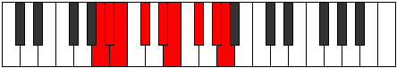 |
| [2779](https://ianring.com/musictheory/scales/2779) | [Garyllic](ModeANaturalGaryllic.md) | A | A, A#, C, C#, D#, E, F#, G#, A |  |
| [2783](https://ianring.com/musictheory/scales/2783) | [Gothygic](ModeANaturalGothygic.md) | A | A, A#, B, C, C#, D#, E, F#, G#, A |  |
| [2783](https://ianring.com/musictheory/scales/2783) | [Gothygic](ModeGNaturalGothygic.md) | G | G, G#, A, A#, B, C#, D, E, F#, G |  |
| [2787](https://ianring.com/musictheory/scales/2787) | [Zyrian](ModeDSharpZyrian.md) | D# | D#, E, F###, G##, A#, B#, C##, D# |  |
| [2787](https://ianring.com/musictheory/scales/2787) | [Zyrian](ModeEFlatZyrian.md) | Eb | Eb, Fb, G#, A, Bb, C, D, Eb |  |
| [2787](https://ianring.com/musictheory/scales/2787) | [Zyrian](ModeANaturalZyrian.md) | A | A, Bb, C##, D#, E, F#, G#, A |  |
| [2791](https://ianring.com/musictheory/scales/2791) | [Ionyptyllic](ModeDSharpIonyptyllic.md) | D# | D#, E, F, G#, A, A#, C, D, D# |  |
| [2791](https://ianring.com/musictheory/scales/2791) | [Ionyptyllic](ModeEFlatIonyptyllic.md) | Eb | Eb, E, F, Ab, A, Bb, C, D, Eb |  |
| [2791](https://ianring.com/musictheory/scales/2791) | [Ionyptyllic](ModeANaturalIonyptyllic.md) | A | A, A#, B, D, D#, E, F#, G#, A |  |
| [2799](https://ianring.com/musictheory/scales/2799) | [Epilygic](ModeDSharpEpilygic.md) | D# | D#, E, F, F#, G#, A, A#, C, D, D# |  |
| [2799](https://ianring.com/musictheory/scales/2799) | [Epilygic](ModeEFlatEpilygic.md) | Eb | Eb, E, F, Gb, Ab, A, Bb, C, D, Eb |  |
| [2799](https://ianring.com/musictheory/scales/2799) | [Epilygic](ModeGNaturalEpilygic.md) | G | G, G#, A, A#, C, C#, D, E, F#, G |  |
| [2799](https://ianring.com/musictheory/scales/2799) | [Epilygic](ModeANaturalEpilygic.md) | A | A, A#, B, C, D, D#, E, F#, G#, A |  |
| [2801](https://ianring.com/musictheory/scales/2801) | [Zogian](ModeENaturalZogian.md) | E | E, F###, G##, A#, B, C#, D#, E |  |
| [2803](https://ianring.com/musictheory/scales/2803) | [Zolyllic](ModeANaturalZolyllic.md) | A | A, A#, C#, D, D#, E, F#, G#, A |  |
| [2803](https://ianring.com/musictheory/scales/2803) | [Zolyllic](ModeDSharpZolyllic.md) | D# | D#, E, G, G#, A, A#, C, D, D# |  |
| [2803](https://ianring.com/musictheory/scales/2803) | [Zolyllic](ModeEFlatZolyllic.md) | Eb | Eb, E, G, Ab, A, Bb, C, D, Eb |  |
| [2803](https://ianring.com/musictheory/scales/2803) | [Zolyllic](ModeENaturalZolyllic.md) | E | E, F, G#, A, A#, B, C#, D#, E |  |
| [2805](https://ianring.com/musictheory/scales/2805) | [Zylyllic](ModeENaturalZylyllic.md) | E | E, F#, G#, A, A#, B, C#, D#, E |  |
| [2807](https://ianring.com/musictheory/scales/2807) | [Zylygic](ModeDSharpZylygic.md) | D# | D#, E, F, G, G#, A, A#, C, D, D# |  |
| [2807](https://ianring.com/musictheory/scales/2807) | [Zylygic](ModeEFlatZylygic.md) | Eb | Eb, E, F, G, Ab, A, Bb, C, D, Eb |  |
| [2807](https://ianring.com/musictheory/scales/2807) | [Zylygic](ModeANaturalZylygic.md) | A | A, A#, B, C#, D, D#, E, F#, G#, A |  |
| [2807](https://ianring.com/musictheory/scales/2807) | [Zylygic](ModeENaturalZylygic.md) | E | E, F, F#, G#, A, A#, B, C#, D#, E |  |
| [2809](https://ianring.com/musictheory/scales/2809) | [Gythyllic](ModeFNaturalGythyllic.md) | F | F, G#, A, A#, B, C, D, E, F |  |
| [2809](https://ianring.com/musictheory/scales/2809) | [Gythyllic](ModeENaturalGythyllic.md) | E | E, G, G#, A, A#, B, C#, D#, E | 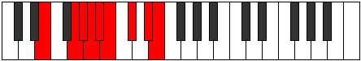 |
| [2811](https://ianring.com/musictheory/scales/2811) | [Barygic](ModeANaturalBarygic.md) | A | A, A#, C, C#, D, D#, E, F#, G#, A |  |
| [2811](https://ianring.com/musictheory/scales/2811) | [Barygic](ModeDSharpBarygic.md) | D# | D#, E, F#, G, G#, A, A#, C, D, D# |  |
| [2811](https://ianring.com/musictheory/scales/2811) | [Barygic](ModeEFlatBarygic.md) | Eb | Eb, E, Gb, G, Ab, A, Bb, C, D, Eb |  |
| [2811](https://ianring.com/musictheory/scales/2811) | [Barygic](ModeFNaturalBarygic.md) | F | F, F#, G#, A, A#, B, C, D, E, F |  |
| [2811](https://ianring.com/musictheory/scales/2811) | [Barygic](ModeENaturalBarygic.md) | E | E, F, G, G#, A, A#, B, C#, D#, E |  |
| [2813](https://ianring.com/musictheory/scales/2813) | [Zolygic](ModeFNaturalZolygic.md) | F | F, G, G#, A, A#, B, C, D, E, F |  |
| [2813](https://ianring.com/musictheory/scales/2813) | [Zolygic](ModeENaturalZolygic.md) | E | E, F#, G, G#, A, A#, B, C#, D#, E |  |
| [2815](https://ianring.com/musictheory/scales/2815) | [Aeradyllian](ModeDSharpAeradyllian.md) | D# | D#, E, F, F#, G, G#, A, A#, C, D, D# |  |
| [2815](https://ianring.com/musictheory/scales/2815) | [Aeradyllian](ModeEFlatAeradyllian.md) | Eb | Eb, E, F, Gb, G, Ab, A, Bb, C, D, Eb |  |
| [2815](https://ianring.com/musictheory/scales/2815) | [Aeradyllian](ModeANaturalAeradyllian.md) | A | A, A#, B, C, C#, D, D#, E, F#, G#, A |  |
| [2815](https://ianring.com/musictheory/scales/2815) | [Aeradyllian](ModeGNaturalAeradyllian.md) | G | G, G#, A, A#, B, C, C#, D, E, F#, G |  |
| [2815](https://ianring.com/musictheory/scales/2815) | [Aeradyllian](ModeFNaturalAeradyllian.md) | F | F, F#, G, G#, A, A#, B, C, D, E, F |  |
| [2815](https://ianring.com/musictheory/scales/2815) | [Aeradyllian](ModeENaturalAeradyllian.md) | E | E, F, F#, G, G#, A, A#, B, C#, D#, E |  |
| [2839](https://ianring.com/musictheory/scales/2839) | [Lyptian](ModeGSharpLyptian.md) | G# | G#, A, Bb, C, D##, E#, F##, G# |  |
| [2839](https://ianring.com/musictheory/scales/2839) | [Lyptian](ModeAFlatLyptian.md) | Ab | Ab, Bbb, Cbb, Dbb, E, F, G, Ab |  |
| [2847](https://ianring.com/musictheory/scales/2847) | [Phracryllic](ModeGSharpPhracryllic.md) | G# | G#, A, A#, B, C, E, F, G, G# |  |
| [2847](https://ianring.com/musictheory/scales/2847) | [Phracryllic](ModeAFlatPhracryllic.md) | Ab | Ab, A, Bb, B, C, E, F, G, Ab |  |
| [2847](https://ianring.com/musictheory/scales/2847) | [Phracryllic](ModeGNaturalPhracryllic.md) | G | G, G#, A, A#, B, D#, E, F#, G |  |
| [2855](https://ianring.com/musictheory/scales/2855) | [Epocrian](ModeGSharpEpocrian.md) | G# | G#, A, Bb, C#, D##, E#, F##, G# |  |
| [2855](https://ianring.com/musictheory/scales/2855) | [Epocrian](ModeAFlatEpocrian.md) | Ab | Ab, Bbb, Cbb, Db, E, F, G, Ab |  |
| [2863](https://ianring.com/musictheory/scales/2863) | [Aerogyllic](ModeGNaturalAerogyllic.md) | G | G, G#, A, A#, C, D#, E, F#, G |  |
| [2863](https://ianring.com/musictheory/scales/2863) | [Aerogyllic](ModeGSharpAerogyllic.md) | G# | G#, A, A#, B, C#, E, F, G, G# |  |
| [2863](https://ianring.com/musictheory/scales/2863) | [Aerogyllic](ModeAFlatAerogyllic.md) | Ab | Ab, A, Bb, B, Db, E, F, G, Ab |  |
| [2871](https://ianring.com/musictheory/scales/2871) | [Stanyllic](ModeGSharpStanyllic.md) | G# | G#, A, A#, C, C#, E, F, G, G# |  |
| [2871](https://ianring.com/musictheory/scales/2871) | [Stanyllic](ModeAFlatStanyllic.md) | Ab | Ab, A, Bb, C, Db, E, F, G, Ab |  |
| [2873](https://ianring.com/musictheory/scales/2873) | [Docrian](ModeFNaturalDocrian.md) | F | F, G#, A, Bb, C#, D, E, F |  |
| [2875](https://ianring.com/musictheory/scales/2875) | [Ganyllic](ModeFNaturalGanyllic.md) | F | F, F#, G#, A, A#, C#, D, E, F |  |
| [2877](https://ianring.com/musictheory/scales/2877) | [Phrylyllic](ModeFNaturalPhrylyllic.md) | F | F, G, G#, A, A#, C#, D, E, F | 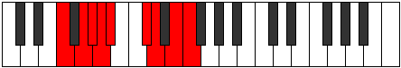 |
| [2879](https://ianring.com/musictheory/scales/2879) | [Stadygic](ModeFNaturalStadygic.md) | F | F, F#, G, G#, A, A#, C#, D, E, F |  |
| [2879](https://ianring.com/musictheory/scales/2879) | [Stadygic](ModeGSharpStadygic.md) | G# | G#, A, A#, B, C, C#, E, F, G, G# |  |
| [2879](https://ianring.com/musictheory/scales/2879) | [Stadygic](ModeAFlatStadygic.md) | Ab | Ab, A, Bb, B, C, Db, E, F, G, Ab |  |
| [2879](https://ianring.com/musictheory/scales/2879) | [Stadygic](ModeGNaturalStadygic.md) | G | G, G#, A, A#, B, C, D#, E, F#, G |  |
| [2887](https://ianring.com/musictheory/scales/2887) | [Gaptian](ModeGSharpGaptian.md) | G# | G#, A, Bb, C##, D##, E#, F##, G# |  |
| [2887](https://ianring.com/musictheory/scales/2887) | [Gaptian](ModeAFlatGaptian.md) | Ab | Ab, Bbb, Cbb, D, E, F, G, Ab |  |
| [2895](https://ianring.com/musictheory/scales/2895) | [Aeragyllic](ModeGNaturalAeragyllic.md) | G | G, G#, A, A#, C#, D#, E, F#, G |  |
| [2895](https://ianring.com/musictheory/scales/2895) | [Aeragyllic](ModeGSharpAeragyllic.md) | G# | G#, A, A#, B, D, E, F, G, G# |  |
| [2895](https://ianring.com/musictheory/scales/2895) | [Aeragyllic](ModeAFlatAeragyllic.md) | Ab | Ab, A, Bb, B, D, E, F, G, Ab |  |
| [2903](https://ianring.com/musictheory/scales/2903) | [Gothyllic](ModeGSharpGothyllic.md) | G# | G#, A, A#, C, D, E, F, G, G# |  |
| [2903](https://ianring.com/musictheory/scales/2903) | [Gothyllic](ModeAFlatGothyllic.md) | Ab | Ab, A, Bb, C, D, E, F, G, Ab |  |
| [2911](https://ianring.com/musictheory/scales/2911) | [Katygic](ModeGSharpKatygic.md) | G# | G#, A, A#, B, C, D, E, F, G, G# |  |
| [2911](https://ianring.com/musictheory/scales/2911) | [Katygic](ModeAFlatKatygic.md) | Ab | Ab, A, Bb, B, C, D, E, F, G, Ab |  |
| [2911](https://ianring.com/musictheory/scales/2911) | [Katygic](ModeGNaturalKatygic.md) | G | G, G#, A, A#, B, C#, D#, E, F#, G |  |
| [2919](https://ianring.com/musictheory/scales/2919) | [Molyllic](ModeGSharpMolyllic.md) | G# | G#, A, A#, C#, D, E, F, G, G# |  |
| [2919](https://ianring.com/musictheory/scales/2919) | [Molyllic](ModeAFlatMolyllic.md) | Ab | Ab, A, Bb, Db, D, E, F, G, Ab |  |
| [2927](https://ianring.com/musictheory/scales/2927) | [Rodygic](ModeGNaturalRodygic.md) | G | G, G#, A, A#, C, C#, D#, E, F#, G |  |
| [2927](https://ianring.com/musictheory/scales/2927) | [Rodygic](ModeGSharpRodygic.md) | G# | G#, A, A#, B, C#, D, E, F, G, G# |  |
| [2927](https://ianring.com/musictheory/scales/2927) | [Rodygic](ModeAFlatRodygic.md) | Ab | Ab, A, Bb, B, Db, D, E, F, G, Ab |  |
| [2929](https://ianring.com/musictheory/scales/2929) | [Aeolathian](ModeENaturalAeolathian.md) | E | E, F###, G##, A#, B#, C#, D#, E |  |
| [2931](https://ianring.com/musictheory/scales/2931) | [Zathyllic](ModeENaturalZathyllic.md) | E | E, F, G#, A, A#, C, C#, D#, E |  |
| [2933](https://ianring.com/musictheory/scales/2933) | [Dalyllic](ModeENaturalDalyllic.md) | E | E, F#, G#, A, A#, C, C#, D#, E |  |
| [2935](https://ianring.com/musictheory/scales/2935) | [Modygic](ModeENaturalModygic.md) | E | E, F, F#, G#, A, A#, C, C#, D#, E |  |
| [2935](https://ianring.com/musictheory/scales/2935) | [Modygic](ModeGSharpModygic.md) | G# | G#, A, A#, C, C#, D, E, F, G, G# |  |
| [2935](https://ianring.com/musictheory/scales/2935) | [Modygic](ModeAFlatModygic.md) | Ab | Ab, A, Bb, C, Db, D, E, F, G, Ab |  |
| [2937](https://ianring.com/musictheory/scales/2937) | [Aeolathyllic](ModeENaturalAeolathyllic.md) | E | E, G, G#, A, A#, C, C#, D#, E |  |
| [2937](https://ianring.com/musictheory/scales/2937) | [Aeolathyllic](ModeFNaturalAeolathyllic.md) | F | F, G#, A, A#, B, C#, D, E, F |  |
| [2939](https://ianring.com/musictheory/scales/2939) | [Goptygic](ModeENaturalGoptygic.md) | E | E, F, G, G#, A, A#, C, C#, D#, E |  |
| [2939](https://ianring.com/musictheory/scales/2939) | [Goptygic](ModeFNaturalGoptygic.md) | F | F, F#, G#, A, A#, B, C#, D, E, F |  |
| [2941](https://ianring.com/musictheory/scales/2941) | [Laptygic](ModeENaturalLaptygic.md) | E | E, F#, G, G#, A, A#, C, C#, D#, E |  |
| [2941](https://ianring.com/musictheory/scales/2941) | [Laptygic](ModeFNaturalLaptygic.md) | F | F, G, G#, A, A#, B, C#, D, E, F |  |
| [2943](https://ianring.com/musictheory/scales/2943) | [Dathyllian](ModeENaturalDathyllian.md) | E | E, F, F#, G, G#, A, A#, C, C#, D#, E |  |
| [2943](https://ianring.com/musictheory/scales/2943) | [Dathyllian](ModeGSharpDathyllian.md) | G# | G#, A, A#, B, C, C#, D, E, F, G, G# |  |
| [2943](https://ianring.com/musictheory/scales/2943) | [Dathyllian](ModeAFlatDathyllian.md) | Ab | Ab, A, Bb, B, C, Db, D, E, F, G, Ab |  |
| [2943](https://ianring.com/musictheory/scales/2943) | [Dathyllian](ModeGNaturalDathyllian.md) | G | G, G#, A, A#, B, C, C#, D#, E, F#, G |  |
| [2943](https://ianring.com/musictheory/scales/2943) | [Dathyllian](ModeFNaturalDathyllian.md) | F | F, F#, G, G#, A, A#, B, C#, D, E, F |  |
| [2953](https://ianring.com/musictheory/scales/2953) | [Ionylimic](ModeCSharpIonylimic.md) | C# | C#, D##, F###, G##, A#, B#, C# |  |
| [2953](https://ianring.com/musictheory/scales/2953) | [Ionylimic](ModeDFlatIonylimic.md) | Db | Db, E, F###, G##, A#, B#, Db |  |
| [2955](https://ianring.com/musictheory/scales/2955) | [Thorian](ModeCSharpThorian.md) | C# | C#, D, E, F###, G##, A#, B#, C# |  |
| [2955](https://ianring.com/musictheory/scales/2955) | [Thorian](ModeDFlatThorian.md) | Db | Db, Ebb, Fb, G#, A, Bb, C, Db |  |
| [2955](https://ianring.com/musictheory/scales/2955) | [Thorian](ModeANaturalThorian.md) | A | A, Bb, C, D##, E#, F#, G#, A |  |
| [2957](https://ianring.com/musictheory/scales/2957) | [Thygian](ModeCSharpThygian.md) | C# | C#, D#, E, F###, G##, A#, B#, C# |  |
| [2957](https://ianring.com/musictheory/scales/2957) | [Thygian](ModeDFlatThygian.md) | Db | Db, Eb, Fb, G#, A, Bb, C, Db |  |
| [2959](https://ianring.com/musictheory/scales/2959) | [Dygyllic](ModeCSharpDygyllic.md) | C# | C#, D, D#, E, G#, A, A#, C, C# |  |
| [2959](https://ianring.com/musictheory/scales/2959) | [Dygyllic](ModeDFlatDygyllic.md) | Db | Db, D, Eb, E, Ab, A, Bb, C, Db |  |
| [2959](https://ianring.com/musictheory/scales/2959) | [Dygyllic](ModeGNaturalDygyllic.md) | G | G, G#, A, A#, D, D#, E, F#, G |  |
| [2959](https://ianring.com/musictheory/scales/2959) | [Dygyllic](ModeANaturalDygyllic.md) | A | A, A#, B, C, E, F, F#, G#, A |  |
| [2959](https://ianring.com/musictheory/scales/2959) | [Dygyllic](ModeGSharpDygyllic.md) | G# | G#, A, A#, B, D#, E, F, G, G# |  |
| [2959](https://ianring.com/musictheory/scales/2959) | [Dygyllic](ModeAFlatDygyllic.md) | Ab | Ab, A, Bb, B, Eb, E, F, G, Ab |  |
| [2963](https://ianring.com/musictheory/scales/2963) | [Bygian](ModeANaturalBygian.md) | A | A, Bb, C#, D##, E#, F#, G#, A |  |
| [2967](https://ianring.com/musictheory/scales/2967) | [Madyllic](ModeGSharpMadyllic.md) | G# | G#, A, A#, C, D#, E, F, G, G# |  |
| [2967](https://ianring.com/musictheory/scales/2967) | [Madyllic](ModeAFlatMadyllic.md) | Ab | Ab, A, Bb, C, Eb, E, F, G, Ab |  |
| [2967](https://ianring.com/musictheory/scales/2967) | [Madyllic](ModeANaturalMadyllic.md) | A | A, A#, B, C#, E, F, F#, G#, A |  |
| [2969](https://ianring.com/musictheory/scales/2969) | [Tholian](ModeCSharpTholian.md) | C# | C#, D##, E#, F###, G##, A#, B#, C# |  |
| [2969](https://ianring.com/musictheory/scales/2969) | [Tholian](ModeDFlatTholian.md) | Db | Db, E, F, G#, A, Bb, C, Db |  |
| [2971](https://ianring.com/musictheory/scales/2971) | [Aeolynyllic](ModeCSharpAeolynyllic.md) | C# | C#, D, E, F, G#, A, A#, C, C# |  |
| [2971](https://ianring.com/musictheory/scales/2971) | [Aeolynyllic](ModeDFlatAeolynyllic.md) | Db | Db, D, E, F, Ab, A, Bb, C, Db |  |
| [2971](https://ianring.com/musictheory/scales/2971) | [Aeolynyllic](ModeANaturalAeolynyllic.md) | A | A, A#, C, C#, E, F, F#, G#, A |  |
| [2973](https://ianring.com/musictheory/scales/2973) | [Panyllic](ModeCSharpPanyllic.md) | C# | C#, D#, E, F, G#, A, A#, C, C# |  |
| [2973](https://ianring.com/musictheory/scales/2973) | [Panyllic](ModeDFlatPanyllic.md) | Db | Db, Eb, E, F, Ab, A, Bb, C, Db |  |
| [2975](https://ianring.com/musictheory/scales/2975) | [Gaptygic](ModeCSharpGaptygic.md) | C# | C#, D, D#, E, F, G#, A, A#, C, C# |  |
| [2975](https://ianring.com/musictheory/scales/2975) | [Gaptygic](ModeDFlatGaptygic.md) | Db | Db, D, Eb, E, F, Ab, A, Bb, C, Db |  |
| [2975](https://ianring.com/musictheory/scales/2975) | [Gaptygic](ModeANaturalGaptygic.md) | A | A, A#, B, C, C#, E, F, F#, G#, A |  |
| [2975](https://ianring.com/musictheory/scales/2975) | [Gaptygic](ModeGSharpGaptygic.md) | G# | G#, A, A#, B, C, D#, E, F, G, G# |  |
| [2975](https://ianring.com/musictheory/scales/2975) | [Gaptygic](ModeAFlatGaptygic.md) | Ab | Ab, A, Bb, B, C, Eb, E, F, G, Ab |  |
| [2975](https://ianring.com/musictheory/scales/2975) | [Gaptygic](ModeGNaturalGaptygic.md) | G | G, G#, A, A#, B, D, D#, E, F#, G |  |
| [2979](https://ianring.com/musictheory/scales/2979) | [Gyptian](ModeANaturalGyptian.md) | A | A, Bb, C##, D##, E#, F#, G#, A |  |
| [2983](https://ianring.com/musictheory/scales/2983) | [Zythyllic](ModeGSharpZythyllic.md) | G# | G#, A, A#, C#, D#, E, F, G, G# |  |
| [2983](https://ianring.com/musictheory/scales/2983) | [Zythyllic](ModeAFlatZythyllic.md) | Ab | Ab, A, Bb, Db, Eb, E, F, G, Ab |  |
| [2983](https://ianring.com/musictheory/scales/2983) | [Zythyllic](ModeANaturalZythyllic.md) | A | A, A#, B, D, E, F, F#, G#, A |  |
| [2985](https://ianring.com/musictheory/scales/2985) | [Epacrian](ModeCSharpEpacrian.md) | C# | C#, D##, E##, F###, G##, A#, B#, C# |  |
| [2985](https://ianring.com/musictheory/scales/2985) | [Epacrian](ModeDFlatEpacrian.md) | Db | Db, E, F#, G#, A, Bb, C, Db |  |
| [2987](https://ianring.com/musictheory/scales/2987) | [Thanyllic](ModeCSharpThanyllic.md) | C# | C#, D, E, F#, G#, A, A#, C, C# |  |
| [2987](https://ianring.com/musictheory/scales/2987) | [Thanyllic](ModeDFlatThanyllic.md) | Db | Db, D, E, Gb, Ab, A, Bb, C, Db |  |
| [2987](https://ianring.com/musictheory/scales/2987) | [Thanyllic](ModeANaturalThanyllic.md) | A | A, A#, C, D, E, F, F#, G#, A |  |
| [2989](https://ianring.com/musictheory/scales/2989) | [Ionacryllic](ModeCSharpIonacryllic.md) | C# | C#, D#, E, F#, G#, A, A#, C, C# |  |
| [2989](https://ianring.com/musictheory/scales/2989) | [Ionacryllic](ModeDFlatIonacryllic.md) | Db | Db, Eb, E, Gb, Ab, A, Bb, C, Db |  |
| [2991](https://ianring.com/musictheory/scales/2991) | [Zanygic](ModeCSharpZanygic.md) | C# | C#, D, D#, E, F#, G#, A, A#, C, C# |  |
| [2991](https://ianring.com/musictheory/scales/2991) | [Zanygic](ModeDFlatZanygic.md) | Db | Db, D, Eb, E, Gb, Ab, A, Bb, C, Db |  |
| [2991](https://ianring.com/musictheory/scales/2991) | [Zanygic](ModeGNaturalZanygic.md) | G | G, G#, A, A#, C, D, D#, E, F#, G |  |
| [2991](https://ianring.com/musictheory/scales/2991) | [Zanygic](ModeANaturalZanygic.md) | A | A, A#, B, C, D, E, F, F#, G#, A |  |
| [2991](https://ianring.com/musictheory/scales/2991) | [Zanygic](ModeGSharpZanygic.md) | G# | G#, A, A#, B, C#, D#, E, F, G, G# |  |
| [2991](https://ianring.com/musictheory/scales/2991) | [Zanygic](ModeAFlatZanygic.md) | Ab | Ab, A, Bb, B, Db, Eb, E, F, G, Ab |  |
| [2995](https://ianring.com/musictheory/scales/2995) | [Sanyllic](ModeANaturalSanyllic.md) | A | A, A#, C#, D, E, F, F#, G#, A |  |
| [2999](https://ianring.com/musictheory/scales/2999) | [Zyrygic](ModeGSharpZyrygic.md) | G# | G#, A, A#, C, C#, D#, E, F, G, G# |  |
| [2999](https://ianring.com/musictheory/scales/2999) | [Zyrygic](ModeAFlatZyrygic.md) | Ab | Ab, A, Bb, C, Db, Eb, E, F, G, Ab |  |
| [2999](https://ianring.com/musictheory/scales/2999) | [Zyrygic](ModeANaturalZyrygic.md) | A | A, A#, B, C#, D, E, F, F#, G#, A |  |
| [3001](https://ianring.com/musictheory/scales/3001) | [Lonyllic](ModeFNaturalLonyllic.md) | F | F, G#, A, A#, C, C#, D, E, F |  |
| [3001](https://ianring.com/musictheory/scales/3001) | [Lonyllic](ModeCSharpLonyllic.md) | C# | C#, E, F, F#, G#, A, A#, C, C# |  |
| [3001](https://ianring.com/musictheory/scales/3001) | [Lonyllic](ModeDFlatLonyllic.md) | Db | Db, E, F, Gb, Ab, A, Bb, C, Db |  |
| [3003](https://ianring.com/musictheory/scales/3003) | [Zydygic](ModeCSharpZydygic.md) | C# | C#, D, E, F, F#, G#, A, A#, C, C# |  |
| [3003](https://ianring.com/musictheory/scales/3003) | [Zydygic](ModeDFlatZydygic.md) | Db | Db, D, E, F, Gb, Ab, A, Bb, C, Db |  |
| [3003](https://ianring.com/musictheory/scales/3003) | [Zydygic](ModeFNaturalZydygic.md) | F | F, F#, G#, A, A#, C, C#, D, E, F |  |
| [3003](https://ianring.com/musictheory/scales/3003) | [Zydygic](ModeANaturalZydygic.md) | A | A, A#, C, C#, D, E, F, F#, G#, A |  |
| [3005](https://ianring.com/musictheory/scales/3005) | [Gycrygic](ModeCSharpGycrygic.md) | C# | C#, D#, E, F, F#, G#, A, A#, C, C# |  |
| [3005](https://ianring.com/musictheory/scales/3005) | [Gycrygic](ModeDFlatGycrygic.md) | Db | Db, Eb, E, F, Gb, Ab, A, Bb, C, Db |  |
| [3005](https://ianring.com/musictheory/scales/3005) | [Gycrygic](ModeFNaturalGycrygic.md) | F | F, G, G#, A, A#, C, C#, D, E, F |  |
| [3007](https://ianring.com/musictheory/scales/3007) | [Zyryllian](ModeCSharpZyryllian.md) | C# | C#, D, D#, E, F, F#, G#, A, A#, C, C# |  |
| [3007](https://ianring.com/musictheory/scales/3007) | [Zyryllian](ModeDFlatZyryllian.md) | Db | Db, D, Eb, E, F, Gb, Ab, A, Bb, C, Db |  |
| [3007](https://ianring.com/musictheory/scales/3007) | [Zyryllian](ModeFNaturalZyryllian.md) | F | F, F#, G, G#, A, A#, C, C#, D, E, F |  |
| [3007](https://ianring.com/musictheory/scales/3007) | [Zyryllian](ModeANaturalZyryllian.md) | A | A, A#, B, C, C#, D, E, F, F#, G#, A |  |
| [3007](https://ianring.com/musictheory/scales/3007) | [Zyryllian](ModeGSharpZyryllian.md) | G# | G#, A, A#, B, C, C#, D#, E, F, G, G# |  |
| [3007](https://ianring.com/musictheory/scales/3007) | [Zyryllian](ModeAFlatZyryllian.md) | Ab | Ab, A, Bb, B, C, Db, Eb, E, F, G, Ab |  |
| [3007](https://ianring.com/musictheory/scales/3007) | [Zyryllian](ModeGNaturalZyryllian.md) | G | G, G#, A, A#, B, C, D, D#, E, F#, G |  |
| [3013](https://ianring.com/musictheory/scales/3013) | [Thynian](ModeDNaturalThynian.md) | D | D, E, F###, G##, A#, B, C#, D |  |
| [3015](https://ianring.com/musictheory/scales/3015) | [Laptyllic](ModeGSharpLaptyllic.md) | G# | G#, A, A#, D, D#, E, F, G, G# |  |
| [3015](https://ianring.com/musictheory/scales/3015) | [Laptyllic](ModeAFlatLaptyllic.md) | Ab | Ab, A, Bb, D, Eb, E, F, G, Ab |  |
| [3015](https://ianring.com/musictheory/scales/3015) | [Laptyllic](ModeDNaturalLaptyllic.md) | D | D, D#, E, G#, A, A#, B, C#, D |  |
| [3015](https://ianring.com/musictheory/scales/3015) | [Laptyllic](ModeANaturalLaptyllic.md) | A | A, A#, B, D#, E, F, F#, G#, A |  |
| [3017](https://ianring.com/musictheory/scales/3017) | [Gacrian](ModeCSharpGacrian.md) | C# | C#, D##, E###, F###, G##, A#, B#, C# |  |
| [3017](https://ianring.com/musictheory/scales/3017) | [Gacrian](ModeDFlatGacrian.md) | Db | Db, E, F##, G#, A, Bb, C, Db |  |
| [3019](https://ianring.com/musictheory/scales/3019) | [Mydyllic](ModeANaturalMydyllic.md) | A | A, A#, C, D#, E, F, F#, G#, A |  |
| [3019](https://ianring.com/musictheory/scales/3019) | [Mydyllic](ModeCSharpMydyllic.md) | C# | C#, D, E, G, G#, A, A#, C, C# |  |
| [3019](https://ianring.com/musictheory/scales/3019) | [Mydyllic](ModeDFlatMydyllic.md) | Db | Db, D, E, G, Ab, A, Bb, C, Db |  |
| [3021](https://ianring.com/musictheory/scales/3021) | [Gyptyllic](ModeCSharpGyptyllic.md) | C# | C#, D#, E, G, G#, A, A#, C, C# |  |
| [3021](https://ianring.com/musictheory/scales/3021) | [Gyptyllic](ModeDFlatGyptyllic.md) | Db | Db, Eb, E, G, Ab, A, Bb, C, Db |  |
| [3021](https://ianring.com/musictheory/scales/3021) | [Gyptyllic](ModeDNaturalGyptyllic.md) | D | D, E, F, G#, A, A#, B, C#, D |  |
| [3023](https://ianring.com/musictheory/scales/3023) | [Aeracrygic](ModeCSharpAeracrygic.md) | C# | C#, D, D#, E, G, G#, A, A#, C, C# |  |
| [3023](https://ianring.com/musictheory/scales/3023) | [Aeracrygic](ModeDFlatAeracrygic.md) | Db | Db, D, Eb, E, G, Ab, A, Bb, C, Db |  |
| [3023](https://ianring.com/musictheory/scales/3023) | [Aeracrygic](ModeGNaturalAeracrygic.md) | G | G, G#, A, A#, C#, D, D#, E, F#, G |  |
| [3023](https://ianring.com/musictheory/scales/3023) | [Aeracrygic](ModeDNaturalAeracrygic.md) | D | D, D#, E, F, G#, A, A#, B, C#, D |  |
| [3023](https://ianring.com/musictheory/scales/3023) | [Aeracrygic](ModeANaturalAeracrygic.md) | A | A, A#, B, C, D#, E, F, F#, G#, A |  |
| [3023](https://ianring.com/musictheory/scales/3023) | [Aeracrygic](ModeGSharpAeracrygic.md) | G# | G#, A, A#, B, D, D#, E, F, G, G# |  |
| [3023](https://ianring.com/musictheory/scales/3023) | [Aeracrygic](ModeAFlatAeracrygic.md) | Ab | Ab, A, Bb, B, D, Eb, E, F, G, Ab |  |
| [3027](https://ianring.com/musictheory/scales/3027) | [Rythyllic](ModeANaturalRythyllic.md) | A | A, A#, C#, D#, E, F, F#, G#, A |  |
| [3029](https://ianring.com/musictheory/scales/3029) | [Ionocryllic](ModeDNaturalIonocryllic.md) | D | D, E, F#, G#, A, A#, B, C#, D |  |
| [3031](https://ianring.com/musictheory/scales/3031) | [Epithygic](ModeGSharpEpithygic.md) | G# | G#, A, A#, C, D, D#, E, F, G, G# |  |
| [3031](https://ianring.com/musictheory/scales/3031) | [Epithygic](ModeAFlatEpithygic.md) | Ab | Ab, A, Bb, C, D, Eb, E, F, G, Ab |  |
| [3031](https://ianring.com/musictheory/scales/3031) | [Epithygic](ModeDNaturalEpithygic.md) | D | D, D#, E, F#, G#, A, A#, B, C#, D |  |
| [3031](https://ianring.com/musictheory/scales/3031) | [Epithygic](ModeANaturalEpithygic.md) | A | A, A#, B, C#, D#, E, F, F#, G#, A |  |
| [3033](https://ianring.com/musictheory/scales/3033) | [Doptyllic](ModeCSharpDoptyllic.md) | C# | C#, E, F, G, G#, A, A#, C, C# |  |
| [3033](https://ianring.com/musictheory/scales/3033) | [Doptyllic](ModeDFlatDoptyllic.md) | Db | Db, E, F, G, Ab, A, Bb, C, Db |  |
| [3035](https://ianring.com/musictheory/scales/3035) | [Gocrygic](ModeANaturalGocrygic.md) | A | A, A#, C, C#, D#, E, F, F#, G#, A |  |
| [3035](https://ianring.com/musictheory/scales/3035) | [Gocrygic](ModeCSharpGocrygic.md) | C# | C#, D, E, F, G, G#, A, A#, C, C# |  |
| [3035](https://ianring.com/musictheory/scales/3035) | [Gocrygic](ModeDFlatGocrygic.md) | Db | Db, D, E, F, G, Ab, A, Bb, C, Db |  |
| [3037](https://ianring.com/musictheory/scales/3037) | [Staptygic](ModeCSharpStaptygic.md) | C# | C#, D#, E, F, G, G#, A, A#, C, C# |  |
| [3037](https://ianring.com/musictheory/scales/3037) | [Staptygic](ModeDFlatStaptygic.md) | Db | Db, Eb, E, F, G, Ab, A, Bb, C, Db |  |
| [3037](https://ianring.com/musictheory/scales/3037) | [Staptygic](ModeDNaturalStaptygic.md) | D | D, E, F, F#, G#, A, A#, B, C#, D |  |
| [3039](https://ianring.com/musictheory/scales/3039) | [Godyllian](ModeCSharpGodyllian.md) | C# | C#, D, D#, E, F, G, G#, A, A#, C, C# |  |
| [3039](https://ianring.com/musictheory/scales/3039) | [Godyllian](ModeDFlatGodyllian.md) | Db | Db, D, Eb, E, F, G, Ab, A, Bb, C, Db |  |
| [3039](https://ianring.com/musictheory/scales/3039) | [Godyllian](ModeANaturalGodyllian.md) | A | A, A#, B, C, C#, D#, E, F, F#, G#, A |  |
| [3039](https://ianring.com/musictheory/scales/3039) | [Godyllian](ModeDNaturalGodyllian.md) | D | D, D#, E, F, F#, G#, A, A#, B, C#, D |  |
| [3039](https://ianring.com/musictheory/scales/3039) | [Godyllian](ModeGSharpGodyllian.md) | G# | G#, A, A#, B, C, D, D#, E, F, G, G# |  |
| [3039](https://ianring.com/musictheory/scales/3039) | [Godyllian](ModeAFlatGodyllian.md) | Ab | Ab, A, Bb, B, C, D, Eb, E, F, G, Ab |  |
| [3039](https://ianring.com/musictheory/scales/3039) | [Godyllian](ModeGNaturalGodyllian.md) | G | G, G#, A, A#, B, C#, D, D#, E, F#, G |  |
| [3043](https://ianring.com/musictheory/scales/3043) | [Ionayllic](ModeANaturalIonayllic.md) | A | A, A#, D, D#, E, F, F#, G#, A |  |
| [3043](https://ianring.com/musictheory/scales/3043) | [Ionayllic](ModeDSharpIonayllic.md) | D# | D#, E, G#, A, A#, B, C, D, D# |  |
| [3043](https://ianring.com/musictheory/scales/3043) | [Ionayllic](ModeEFlatIonayllic.md) | Eb | Eb, E, Ab, A, Bb, B, C, D, Eb |  |
| [3045](https://ianring.com/musictheory/scales/3045) | [Raptyllic](ModeDNaturalRaptyllic.md) | D | D, E, G, G#, A, A#, B, C#, D |  |
| [3047](https://ianring.com/musictheory/scales/3047) | [Panygic](ModeGSharpPanygic.md) | G# | G#, A, A#, C#, D, D#, E, F, G, G# |  |
| [3047](https://ianring.com/musictheory/scales/3047) | [Panygic](ModeAFlatPanygic.md) | Ab | Ab, A, Bb, Db, D, Eb, E, F, G, Ab |  |
| [3047](https://ianring.com/musictheory/scales/3047) | [Panygic](ModeDSharpPanygic.md) | D# | D#, E, F, G#, A, A#, B, C, D, D# |  |
| [3047](https://ianring.com/musictheory/scales/3047) | [Panygic](ModeEFlatPanygic.md) | Eb | Eb, E, F, Ab, A, Bb, B, C, D, Eb |  |
| [3047](https://ianring.com/musictheory/scales/3047) | [Panygic](ModeANaturalPanygic.md) | A | A, A#, B, D, D#, E, F, F#, G#, A |  |
| [3047](https://ianring.com/musictheory/scales/3047) | [Panygic](ModeDNaturalPanygic.md) | D | D, D#, E, G, G#, A, A#, B, C#, D |  |
| [3049](https://ianring.com/musictheory/scales/3049) | [Aeronyllic](ModeCSharpAeronyllic.md) | C# | C#, E, F#, G, G#, A, A#, C, C# |  |
| [3049](https://ianring.com/musictheory/scales/3049) | [Aeronyllic](ModeDFlatAeronyllic.md) | Db | Db, E, Gb, G, Ab, A, Bb, C, Db |  |
| [3051](https://ianring.com/musictheory/scales/3051) | [Stalygic](ModeANaturalStalygic.md) | A | A, A#, C, D, D#, E, F, F#, G#, A |  |
| [3051](https://ianring.com/musictheory/scales/3051) | [Stalygic](ModeCSharpStalygic.md) | C# | C#, D, E, F#, G, G#, A, A#, C, C# |  |
| [3051](https://ianring.com/musictheory/scales/3051) | [Stalygic](ModeDFlatStalygic.md) | Db | Db, D, E, Gb, G, Ab, A, Bb, C, Db |  |
| [3051](https://ianring.com/musictheory/scales/3051) | [Stalygic](ModeDSharpStalygic.md) | D# | D#, E, F#, G#, A, A#, B, C, D, D# |  |
| [3051](https://ianring.com/musictheory/scales/3051) | [Stalygic](ModeEFlatStalygic.md) | Eb | Eb, E, Gb, Ab, A, Bb, B, C, D, Eb |  |
| [3053](https://ianring.com/musictheory/scales/3053) | [Zycrygic](ModeCSharpZycrygic.md) | C# | C#, D#, E, F#, G, G#, A, A#, C, C# |  |
| [3053](https://ianring.com/musictheory/scales/3053) | [Zycrygic](ModeDFlatZycrygic.md) | Db | Db, Eb, E, Gb, G, Ab, A, Bb, C, Db |  |
| [3053](https://ianring.com/musictheory/scales/3053) | [Zycrygic](ModeDNaturalZycrygic.md) | D | D, E, F, G, G#, A, A#, B, C#, D |  |
| [3055](https://ianring.com/musictheory/scales/3055) | [Lyryllian](ModeCSharpLyryllian.md) | C# | C#, D, D#, E, F#, G, G#, A, A#, C, C# |  |
| [3055](https://ianring.com/musictheory/scales/3055) | [Lyryllian](ModeDFlatLyryllian.md) | Db | Db, D, Eb, E, Gb, G, Ab, A, Bb, C, Db |  |
| [3055](https://ianring.com/musictheory/scales/3055) | [Lyryllian](ModeGNaturalLyryllian.md) | G | G, G#, A, A#, C, C#, D, D#, E, F#, G |  |
| [3055](https://ianring.com/musictheory/scales/3055) | [Lyryllian](ModeDSharpLyryllian.md) | D# | D#, E, F, F#, G#, A, A#, B, C, D, D# |  |
| [3055](https://ianring.com/musictheory/scales/3055) | [Lyryllian](ModeEFlatLyryllian.md) | Eb | Eb, E, F, Gb, Ab, A, Bb, B, C, D, Eb |  |
| [3055](https://ianring.com/musictheory/scales/3055) | [Lyryllian](ModeANaturalLyryllian.md) | A | A, A#, B, C, D, D#, E, F, F#, G#, A |  |
| [3055](https://ianring.com/musictheory/scales/3055) | [Lyryllian](ModeDNaturalLyryllian.md) | D | D, D#, E, F, G, G#, A, A#, B, C#, D |  |
| [3055](https://ianring.com/musictheory/scales/3055) | [Lyryllian](ModeGSharpLyryllian.md) | G# | G#, A, A#, B, C#, D, D#, E, F, G, G# |  |
| [3055](https://ianring.com/musictheory/scales/3055) | [Lyryllian](ModeAFlatLyryllian.md) | Ab | Ab, A, Bb, B, Db, D, Eb, E, F, G, Ab |  |
| [3057](https://ianring.com/musictheory/scales/3057) | [Phroryllic](ModeENaturalPhroryllic.md) | E | E, G#, A, A#, B, C, C#, D#, E |  |
| [3059](https://ianring.com/musictheory/scales/3059) | [Madygic](ModeANaturalMadygic.md) | A | A, A#, C#, D, D#, E, F, F#, G#, A |  |
| [3059](https://ianring.com/musictheory/scales/3059) | [Madygic](ModeENaturalMadygic.md) | E | E, F, G#, A, A#, B, C, C#, D#, E |  |
| [3059](https://ianring.com/musictheory/scales/3059) | [Madygic](ModeDSharpMadygic.md) | D# | D#, E, G, G#, A, A#, B, C, D, D# |  |
| [3059](https://ianring.com/musictheory/scales/3059) | [Madygic](ModeEFlatMadygic.md) | Eb | Eb, E, G, Ab, A, Bb, B, C, D, Eb |  |
| [3061](https://ianring.com/musictheory/scales/3061) | [Apinygic](ModeENaturalApinygic.md) | E | E, F#, G#, A, A#, B, C, C#, D#, E |  |
| [3061](https://ianring.com/musictheory/scales/3061) | [Apinygic](ModeDNaturalApinygic.md) | D | D, E, F#, G, G#, A, A#, B, C#, D |  |
| [3063](https://ianring.com/musictheory/scales/3063) | [Solyllian](ModeGSharpSolyllian.md) | G# | G#, A, A#, C, C#, D, D#, E, F, G, G# |  |
| [3063](https://ianring.com/musictheory/scales/3063) | [Solyllian](ModeAFlatSolyllian.md) | Ab | Ab, A, Bb, C, Db, D, Eb, E, F, G, Ab |  |
| [3063](https://ianring.com/musictheory/scales/3063) | [Solyllian](ModeENaturalSolyllian.md) | E | E, F, F#, G#, A, A#, B, C, C#, D#, E |  |
| [3063](https://ianring.com/musictheory/scales/3063) | [Solyllian](ModeANaturalSolyllian.md) | A | A, A#, B, C#, D, D#, E, F, F#, G#, A |  |
| [3063](https://ianring.com/musictheory/scales/3063) | [Solyllian](ModeDSharpSolyllian.md) | D# | D#, E, F, G, G#, A, A#, B, C, D, D# |  |
| [3063](https://ianring.com/musictheory/scales/3063) | [Solyllian](ModeEFlatSolyllian.md) | Eb | Eb, E, F, G, Ab, A, Bb, B, C, D, Eb |  |
| [3063](https://ianring.com/musictheory/scales/3063) | [Solyllian](ModeDNaturalSolyllian.md) | D | D, D#, E, F#, G, G#, A, A#, B, C#, D |  |
| [3065](https://ianring.com/musictheory/scales/3065) | [Zothygic](ModeCSharpZothygic.md) | C# | C#, E, F, F#, G, G#, A, A#, C, C# |  |
| [3065](https://ianring.com/musictheory/scales/3065) | [Zothygic](ModeDFlatZothygic.md) | Db | Db, E, F, Gb, G, Ab, A, Bb, C, Db |  |
| [3065](https://ianring.com/musictheory/scales/3065) | [Zothygic](ModeFNaturalZothygic.md) | F | F, G#, A, A#, B, C, C#, D, E, F |  |
| [3065](https://ianring.com/musictheory/scales/3065) | [Zothygic](ModeENaturalZothygic.md) | E | E, G, G#, A, A#, B, C, C#, D#, E |  |
| [3067](https://ianring.com/musictheory/scales/3067) | [Goptyllian](ModeANaturalGoptyllian.md) | A | A, A#, C, C#, D, D#, E, F, F#, G#, A |  |
| [3067](https://ianring.com/musictheory/scales/3067) | [Goptyllian](ModeCSharpGoptyllian.md) | C# | C#, D, E, F, F#, G, G#, A, A#, C, C# |  |
| [3067](https://ianring.com/musictheory/scales/3067) | [Goptyllian](ModeDFlatGoptyllian.md) | Db | Db, D, E, F, Gb, G, Ab, A, Bb, C, Db |  |
| [3067](https://ianring.com/musictheory/scales/3067) | [Goptyllian](ModeFNaturalGoptyllian.md) | F | F, F#, G#, A, A#, B, C, C#, D, E, F |  |
| [3067](https://ianring.com/musictheory/scales/3067) | [Goptyllian](ModeENaturalGoptyllian.md) | E | E, F, G, G#, A, A#, B, C, C#, D#, E |  |
| [3067](https://ianring.com/musictheory/scales/3067) | [Goptyllian](ModeDSharpGoptyllian.md) | D# | D#, E, F#, G, G#, A, A#, B, C, D, D# |  |
| [3067](https://ianring.com/musictheory/scales/3067) | [Goptyllian](ModeEFlatGoptyllian.md) | Eb | Eb, E, Gb, G, Ab, A, Bb, B, C, D, Eb |  |
| [3069](https://ianring.com/musictheory/scales/3069) | [Bacryllian](ModeCSharpBacryllian.md) | C# | C#, D#, E, F, F#, G, G#, A, A#, C, C# |  |
| [3069](https://ianring.com/musictheory/scales/3069) | [Bacryllian](ModeDFlatBacryllian.md) | Db | Db, Eb, E, F, Gb, G, Ab, A, Bb, C, Db |  |
| [3069](https://ianring.com/musictheory/scales/3069) | [Bacryllian](ModeFNaturalBacryllian.md) | F | F, G, G#, A, A#, B, C, C#, D, E, F |  |
| [3069](https://ianring.com/musictheory/scales/3069) | [Bacryllian](ModeENaturalBacryllian.md) | E | E, F#, G, G#, A, A#, B, C, C#, D#, E |  |
| [3069](https://ianring.com/musictheory/scales/3069) | [Bacryllian](ModeDNaturalBacryllian.md) | D | D, E, F, F#, G, G#, A, A#, B, C#, D |  |
| [3071](https://ianring.com/musictheory/scales/3071) | [Solatic](ModeCSharpSolatic.md) | C# | C#, D, D#, E, F, F#, G, G#, A, A#, C, C# |  |
| [3071](https://ianring.com/musictheory/scales/3071) | [Solatic](ModeDFlatSolatic.md) | Db | Db, D, Eb, E, F, Gb, G, Ab, A, Bb, C, Db |  |
| [3071](https://ianring.com/musictheory/scales/3071) | [Solatic](ModeANaturalSolatic.md) | A | A, A#, B, C, C#, D, D#, E, F, F#, G#, A |  |
| [3071](https://ianring.com/musictheory/scales/3071) | [Solatic](ModeGSharpSolatic.md) | G# | G#, A, A#, B, C, C#, D, D#, E, F, G, G# |  |
| [3071](https://ianring.com/musictheory/scales/3071) | [Solatic](ModeAFlatSolatic.md) | Ab | Ab, A, Bb, B, C, Db, D, Eb, E, F, G, Ab |  |
| [3071](https://ianring.com/musictheory/scales/3071) | [Solatic](ModeGNaturalSolatic.md) | G | G, G#, A, A#, B, C, C#, D, D#, E, F#, G |  |
| [3071](https://ianring.com/musictheory/scales/3071) | [Solatic](ModeFNaturalSolatic.md) | F | F, F#, G, G#, A, A#, B, C, C#, D, E, F |  |
| [3071](https://ianring.com/musictheory/scales/3071) | [Solatic](ModeENaturalSolatic.md) | E | E, F, F#, G, G#, A, A#, B, C, C#, D#, E |  |
| [3071](https://ianring.com/musictheory/scales/3071) | [Solatic](ModeDSharpSolatic.md) | D# | D#, E, F, F#, G, G#, A, A#, B, C, D, D# |  |
| [3071](https://ianring.com/musictheory/scales/3071) | [Solatic](ModeEFlatSolatic.md) | Eb | Eb, E, F, Gb, G, Ab, A, Bb, B, C, D, Eb |  |
| [3071](https://ianring.com/musictheory/scales/3071) | [Solatic](ModeDNaturalSolatic.md) | D | D, D#, E, F, F#, G, G#, A, A#, B, C#, D |  |
| [3141](https://ianring.com/musictheory/scales/3141) | [Kanitonic](ModeASharpKanitonic.md) | A# | A#, C, E, G#, A, A# |  |
| [3141](https://ianring.com/musictheory/scales/3141) | [Kanitonic](ModeBFlatKanitonic.md) | Bb | Bb, C, E, Ab, A, Bb |  |
| [3143](https://ianring.com/musictheory/scales/3143) | [Polimic](ModeASharpPolimic.md) | A# | A#, B, C, D##, F###, G##, A# |  |
| [3143](https://ianring.com/musictheory/scales/3143) | [Polimic](ModeBFlatPolimic.md) | Bb | Bb, Cb, Dbb, E, F###, G##, Bb |  |
| [3145](https://ianring.com/musictheory/scales/3145) | [Stolitonic](ModeASharpStolitonic.md) | A# | A#, C#, E, G#, A, A# |  |
| [3145](https://ianring.com/musictheory/scales/3145) | [Stolitonic](ModeBFlatStolitonic.md) | Bb | Bb, Db, E, Ab, A, Bb |  |
| [3147](https://ianring.com/musictheory/scales/3147) | [Ryrimic](ModeASharpRyrimic.md) | A# | A#, B, C#, D##, F###, G##, A# |  |
| [3147](https://ianring.com/musictheory/scales/3147) | [Ryrimic](ModeBFlatRyrimic.md) | Bb | Bb, Cb, Db, E, F###, G##, Bb |  |
| [3149](https://ianring.com/musictheory/scales/3149) | [Phrycrimic](ModeASharpPhrycrimic.md) | A# | A#, B#, C#, D##, F###, G##, A# |  |
| [3149](https://ianring.com/musictheory/scales/3149) | [Phrycrimic](ModeBFlatPhrycrimic.md) | Bb | Bb, C, Db, E, F###, G##, Bb |  |
| [3151](https://ianring.com/musictheory/scales/3151) | [Pacrian](ModeASharpPacrian.md) | A# | A#, B, C, Db, E, F###, G##, A# |  |
| [3151](https://ianring.com/musictheory/scales/3151) | [Pacrian](ModeBFlatPacrian.md) | Bb | Bb, Cb, Dbb, Ebbb, Fb, G#, A, Bb |  |
| [3153](https://ianring.com/musictheory/scales/3153) | [Zathitonic](ModeASharpZathitonic.md) | A# | A#, D, E, G#, A, A# |  |
| [3153](https://ianring.com/musictheory/scales/3153) | [Zathitonic](ModeBFlatZathitonic.md) | Bb | Bb, D, E, Ab, A, Bb |  |
| [3155](https://ianring.com/musictheory/scales/3155) | [Ladimic](ModeASharpLadimic.md) | A# | A#, B, C##, D##, F###, G##, A# |  |
| [3155](https://ianring.com/musictheory/scales/3155) | [Ladimic](ModeBFlatLadimic.md) | Bb | Bb, Cb, D, E, F###, G##, Bb |  |
| [3157](https://ianring.com/musictheory/scales/3157) | [Zyptimic](ModeASharpZyptimic.md) | A# | A#, B#, C##, D##, F###, G##, A# |  |
| [3157](https://ianring.com/musictheory/scales/3157) | [Zyptimic](ModeBFlatZyptimic.md) | Bb | Bb, C, D, E, F###, G##, Bb |  |
| [3159](https://ianring.com/musictheory/scales/3159) | [Stocrian](ModeASharpStocrian.md) | A# | A#, B, C, D, E, F###, G##, A# |  |
| [3159](https://ianring.com/musictheory/scales/3159) | [Stocrian](ModeBFlatStocrian.md) | Bb | Bb, Cb, Dbb, Ebb, Fb, G#, A, Bb |  |
| [3161](https://ianring.com/musictheory/scales/3161) | [Kodimic](ModeASharpKodimic.md) | A# | A#, B##, C##, D##, F###, G##, A# |  |
| [3161](https://ianring.com/musictheory/scales/3161) | [Kodimic](ModeBFlatKodimic.md) | Bb | Bb, C#, D, E, F###, G##, Bb |  |
| [3163](https://ianring.com/musictheory/scales/3163) | [Rogian](ModeASharpRogian.md) | A# | A#, B, C#, D, E, F###, G##, A# |  |
| [3163](https://ianring.com/musictheory/scales/3163) | [Rogian](ModeBFlatRogian.md) | Bb | Bb, Cb, Db, Ebb, Fb, G#, A, Bb |  |
| [3165](https://ianring.com/musictheory/scales/3165) | [Mylian](ModeASharpMylian.md) | A# | A#, B#, C#, D, E, F###, G##, A# |  |
| [3165](https://ianring.com/musictheory/scales/3165) | [Mylian](ModeBFlatMylian.md) | Bb | Bb, C, Db, Ebb, Fb, G#, A, Bb |  |
| [3165](https://ianring.com/musictheory/scales/3165) | [Mylian](ModeFSharpMylian.md) | F# | F#, G#, A, Bb, C, D##, E#, F# |  |
| [3165](https://ianring.com/musictheory/scales/3165) | [Mylian](ModeGFlatMylian.md) | Gb | Gb, Ab, Bbb, Cbb, Dbb, E, F, Gb |  |
| [3167](https://ianring.com/musictheory/scales/3167) | [Thynyllic](ModeFSharpThynyllic.md) | F# | F#, G, G#, A, A#, C, E, F, F# |  |
| [3167](https://ianring.com/musictheory/scales/3167) | [Thynyllic](ModeGFlatThynyllic.md) | Gb | Gb, G, Ab, A, Bb, C, E, F, Gb |  |
| [3167](https://ianring.com/musictheory/scales/3167) | [Thynyllic](ModeASharpThynyllic.md) | A# | A#, B, C, C#, D, E, G#, A, A# |  |
| [3167](https://ianring.com/musictheory/scales/3167) | [Thynyllic](ModeBFlatThynyllic.md) | Bb | Bb, B, C, Db, D, E, Ab, A, Bb |  |
| [3171](https://ianring.com/musictheory/scales/3171) | [Zythimic](ModeASharpZythimic.md) | A# | A#, B, C###, D##, F###, G##, A# |  |
| [3171](https://ianring.com/musictheory/scales/3171) | [Zythimic](ModeBFlatZythimic.md) | Bb | Bb, Cb, D#, E, F###, G##, Bb |  |
| [3173](https://ianring.com/musictheory/scales/3173) | [Zarimic](ModeASharpZarimic.md) | A# | A#, B#, C###, D##, F###, G##, A# |  |
| [3173](https://ianring.com/musictheory/scales/3173) | [Zarimic](ModeBFlatZarimic.md) | Bb | Bb, C, D#, E, F###, G##, Bb |  |
| [3175](https://ianring.com/musictheory/scales/3175) | [Eponian](ModeASharpEponian.md) | A# | A#, B, C, D#, E, F###, G##, A# |  |
| [3175](https://ianring.com/musictheory/scales/3175) | [Eponian](ModeBFlatEponian.md) | Bb | Bb, Cb, Dbb, Eb, Fb, G#, A, Bb |  |
| [3177](https://ianring.com/musictheory/scales/3177) | [Rothimic](ModeASharpRothimic.md) | A# | A#, B##, C###, D##, F###, G##, A# |  |
| [3177](https://ianring.com/musictheory/scales/3177) | [Rothimic](ModeBFlatRothimic.md) | Bb | Bb, C#, D#, E, F###, G##, Bb |  |
| [3179](https://ianring.com/musictheory/scales/3179) | [Daptian](ModeASharpDaptian.md) | A# | A#, B, C#, D#, E, F###, G##, A# |  |
| [3179](https://ianring.com/musictheory/scales/3179) | [Daptian](ModeBFlatDaptian.md) | Bb | Bb, Cb, Db, Eb, Fb, G#, A, Bb |  |
| [3181](https://ianring.com/musictheory/scales/3181) | [Rolian](ModeASharpRolian.md) | A# | A#, B#, C#, D#, E, F###, G##, A# |  |
| [3181](https://ianring.com/musictheory/scales/3181) | [Rolian](ModeBFlatRolian.md) | Bb | Bb, C, Db, Eb, Fb, G#, A, Bb |  |
| [3183](https://ianring.com/musictheory/scales/3183) | [Mixonyllic](ModeASharpMixonyllic.md) | A# | A#, B, C, C#, D#, E, G#, A, A# |  |
| [3183](https://ianring.com/musictheory/scales/3183) | [Mixonyllic](ModeBFlatMixonyllic.md) | Bb | Bb, B, C, Db, Eb, E, Ab, A, Bb |  |
| [3185](https://ianring.com/musictheory/scales/3185) | [Thonimic](ModeENaturalThonimic.md) | E | E, F###, G##, A#, B###, C###, E |  |
| [3185](https://ianring.com/musictheory/scales/3185) | [Thonimic](ModeASharpThonimic.md) | A# | A#, B###, C###, D##, F###, G##, A# |  |
| [3185](https://ianring.com/musictheory/scales/3185) | [Thonimic](ModeBFlatThonimic.md) | Bb | Bb, C##, D#, E, F###, G##, Bb |  |
| [3187](https://ianring.com/musictheory/scales/3187) | [Koptian](ModeENaturalKoptian.md) | E | E, F, G#, A, Bb, C##, D#, E | 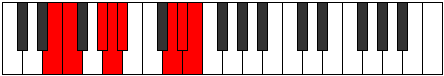 |
| [3187](https://ianring.com/musictheory/scales/3187) | [Koptian](ModeASharpKoptian.md) | A# | A#, B, C##, D#, E, F###, G##, A# |  |
| [3187](https://ianring.com/musictheory/scales/3187) | [Koptian](ModeBFlatKoptian.md) | Bb | Bb, Cb, D, Eb, Fb, G#, A, Bb |  |
| [3189](https://ianring.com/musictheory/scales/3189) | [Aeolonian](ModeASharpAeolonian.md) | A# | A#, B#, C##, D#, E, F###, G##, A# |  |
| [3189](https://ianring.com/musictheory/scales/3189) | [Aeolonian](ModeBFlatAeolonian.md) | Bb | Bb, C, D, Eb, Fb, G#, A, Bb |  |
| [3189](https://ianring.com/musictheory/scales/3189) | [Aeolonian](ModeENaturalAeolonian.md) | E | E, F#, G#, A, Bb, C##, D#, E |  |
| [3191](https://ianring.com/musictheory/scales/3191) | [Bynyllic](ModeENaturalBynyllic.md) | E | E, F, F#, G#, A, A#, D, D#, E |  |
| [3191](https://ianring.com/musictheory/scales/3191) | [Bynyllic](ModeASharpBynyllic.md) | A# | A#, B, C, D, D#, E, G#, A, A# |  |
| [3191](https://ianring.com/musictheory/scales/3191) | [Bynyllic](ModeBFlatBynyllic.md) | Bb | Bb, B, C, D, Eb, E, Ab, A, Bb |  |
| [3193](https://ianring.com/musictheory/scales/3193) | [Zathian](ModeASharpZathian.md) | A# | A#, B##, C##, D#, E, F###, G##, A# |  |
| [3193](https://ianring.com/musictheory/scales/3193) | [Zathian](ModeBFlatZathian.md) | Bb | Bb, C#, D, Eb, Fb, G#, A, Bb |  |
| [3193](https://ianring.com/musictheory/scales/3193) | [Zathian](ModeENaturalZathian.md) | E | E, F##, G#, A, Bb, C##, D#, E |  |
| [3193](https://ianring.com/musictheory/scales/3193) | [Zathian](ModeFNaturalZathian.md) | F | F, G#, A, Bb, Cb, D#, E, F | 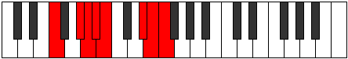 |
| [3195](https://ianring.com/musictheory/scales/3195) | [Raryllic](ModeENaturalRaryllic.md) | E | E, F, G, G#, A, A#, D, D#, E |  |
| [3195](https://ianring.com/musictheory/scales/3195) | [Raryllic](ModeASharpRaryllic.md) | A# | A#, B, C#, D, D#, E, G#, A, A# |  |
| [3195](https://ianring.com/musictheory/scales/3195) | [Raryllic](ModeBFlatRaryllic.md) | Bb | Bb, B, Db, D, Eb, E, Ab, A, Bb |  |
| [3195](https://ianring.com/musictheory/scales/3195) | [Raryllic](ModeFNaturalRaryllic.md) | F | F, F#, G#, A, A#, B, D#, E, F |  |
| [3197](https://ianring.com/musictheory/scales/3197) | [Gylyllic](ModeASharpGylyllic.md) | A# | A#, C, C#, D, D#, E, G#, A, A# |  |
| [3197](https://ianring.com/musictheory/scales/3197) | [Gylyllic](ModeBFlatGylyllic.md) | Bb | Bb, C, Db, D, Eb, E, Ab, A, Bb |  |
| [3197](https://ianring.com/musictheory/scales/3197) | [Gylyllic](ModeENaturalGylyllic.md) | E | E, F#, G, G#, A, A#, D, D#, E | 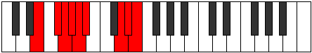 |
| [3197](https://ianring.com/musictheory/scales/3197) | [Gylyllic](ModeFSharpGylyllic.md) | F# | F#, G#, A, A#, B, C, E, F, F# |  |
| [3197](https://ianring.com/musictheory/scales/3197) | [Gylyllic](ModeGFlatGylyllic.md) | Gb | Gb, Ab, A, Bb, B, C, E, F, Gb |  |
| [3197](https://ianring.com/musictheory/scales/3197) | [Gylyllic](ModeFNaturalGylyllic.md) | F | F, G, G#, A, A#, B, D#, E, F |  |
| [3199](https://ianring.com/musictheory/scales/3199) | [Thaptygic](ModeENaturalThaptygic.md) | E | E, F, F#, G, G#, A, A#, D, D#, E |  |
| [3199](https://ianring.com/musictheory/scales/3199) | [Thaptygic](ModeASharpThaptygic.md) | A# | A#, B, C, C#, D, D#, E, G#, A, A# |  |
| [3199](https://ianring.com/musictheory/scales/3199) | [Thaptygic](ModeBFlatThaptygic.md) | Bb | Bb, B, C, Db, D, Eb, E, Ab, A, Bb |  |
| [3199](https://ianring.com/musictheory/scales/3199) | [Thaptygic](ModeFSharpThaptygic.md) | F# | F#, G, G#, A, A#, B, C, E, F, F# |  |
| [3199](https://ianring.com/musictheory/scales/3199) | [Thaptygic](ModeGFlatThaptygic.md) | Gb | Gb, G, Ab, A, Bb, B, C, E, F, Gb |  |
| [3199](https://ianring.com/musictheory/scales/3199) | [Thaptygic](ModeFNaturalThaptygic.md) | F | F, F#, G, G#, A, A#, B, D#, E, F |  |
| [3211](https://ianring.com/musictheory/scales/3211) | [Epacrimic](ModeANaturalEpacrimic.md) | A | A, Bb, C, D##, E###, F###, A |  |
| [3215](https://ianring.com/musictheory/scales/3215) | [Katydian](ModeANaturalKatydian.md) | A | A, Bb, Cb, Dbb, E, F##, G#, A |  |
| [3219](https://ianring.com/musictheory/scales/3219) | [Ionaphimic](ModeANaturalIonaphimic.md) | A | A, Bb, C#, D##, E###, F###, A |  |
| [3223](https://ianring.com/musictheory/scales/3223) | [Thyphian](ModeANaturalThyphian.md) | A | A, Bb, Cb, Db, E, F##, G#, A |  |
| [3227](https://ianring.com/musictheory/scales/3227) | [Aeolocrian](ModeANaturalAeolocrian.md) | A | A, Bb, C, Db, E, F##, G#, A |  |
| [3229](https://ianring.com/musictheory/scales/3229) | [Aeolaptian](ModeFSharpAeolaptian.md) | F# | F#, G#, A, Bb, C#, D##, E#, F# |  |
| [3229](https://ianring.com/musictheory/scales/3229) | [Aeolaptian](ModeGFlatAeolaptian.md) | Gb | Gb, Ab, Bbb, Cbb, Db, E, F, Gb |  |
| [3231](https://ianring.com/musictheory/scales/3231) | [Kataptyllic](ModeFSharpKataptyllic.md) | F# | F#, G, G#, A, A#, C#, E, F, F# |  |
| [3231](https://ianring.com/musictheory/scales/3231) | [Kataptyllic](ModeGFlatKataptyllic.md) | Gb | Gb, G, Ab, A, Bb, Db, E, F, Gb |  |
| [3231](https://ianring.com/musictheory/scales/3231) | [Kataptyllic](ModeANaturalKataptyllic.md) | A | A, A#, B, C, C#, E, G, G#, A |  |
| [3235](https://ianring.com/musictheory/scales/3235) | [Pothimic](ModeANaturalPothimic.md) | A | A, Bb, C##, D##, E###, F###, A |  |
| [3239](https://ianring.com/musictheory/scales/3239) | [Epythian](ModeANaturalEpythian.md) | A | A, Bb, Cb, D, E, F##, G#, A |  |
| [3243](https://ianring.com/musictheory/scales/3243) | [Staptian](ModeANaturalStaptian.md) | A | A, Bb, C, D, E, F##, G#, A |  |
| [3247](https://ianring.com/musictheory/scales/3247) | [Aeolonyllic](ModeANaturalAeolonyllic.md) | A | A, A#, B, C, D, E, G, G#, A |  |
| [3251](https://ianring.com/musictheory/scales/3251) | [Zodian](ModeANaturalZodian.md) | A | A, Bb, C#, D, E, F##, G#, A |  |
| [3255](https://ianring.com/musictheory/scales/3255) | [Daryllic](ModeANaturalDaryllic.md) | A | A, A#, B, C#, D, E, G, G#, A |  |
| [3257](https://ianring.com/musictheory/scales/3257) | [Ionacrian](ModeFNaturalIonacrian.md) | F | F, G#, A, Bb, C, D#, E, F |  |
| [3259](https://ianring.com/musictheory/scales/3259) | [Loptyllic](ModeFNaturalLoptyllic.md) | F | F, F#, G#, A, A#, C, D#, E, F |  |
| [3259](https://ianring.com/musictheory/scales/3259) | [Loptyllic](ModeANaturalLoptyllic.md) | A | A, A#, C, C#, D, E, G, G#, A |  |
| [3261](https://ianring.com/musictheory/scales/3261) | [Dodyllic](ModeFNaturalDodyllic.md) | F | F, G, G#, A, A#, C, D#, E, F |  |
| [3261](https://ianring.com/musictheory/scales/3261) | [Dodyllic](ModeFSharpDodyllic.md) | F# | F#, G#, A, A#, B, C#, E, F, F# |  |
| [3261](https://ianring.com/musictheory/scales/3261) | [Dodyllic](ModeGFlatDodyllic.md) | Gb | Gb, Ab, A, Bb, B, Db, E, F, Gb |  |
| [3263](https://ianring.com/musictheory/scales/3263) | [Pyrygic](ModeFNaturalPyrygic.md) | F | F, F#, G, G#, A, A#, C, D#, E, F |  |
| [3263](https://ianring.com/musictheory/scales/3263) | [Pyrygic](ModeANaturalPyrygic.md) | A | A, A#, B, C, C#, D, E, G, G#, A |  |
| [3263](https://ianring.com/musictheory/scales/3263) | [Pyrygic](ModeFSharpPyrygic.md) | F# | F#, G, G#, A, A#, B, C#, E, F, F# |  |
| [3263](https://ianring.com/musictheory/scales/3263) | [Pyrygic](ModeGFlatPyrygic.md) | Gb | Gb, G, Ab, A, Bb, B, Db, E, F, Gb |  |
| [3269](https://ianring.com/musictheory/scales/3269) | [Lodimic](ModeASharpLodimic.md) | A# | A#, B#, D##, E#, F###, G##, A# |  |
| [3269](https://ianring.com/musictheory/scales/3269) | [Lodimic](ModeBFlatLodimic.md) | Bb | Bb, C, D##, E#, F###, G##, Bb |  |
| [3271](https://ianring.com/musictheory/scales/3271) | [Kolian](ModeASharpKolian.md) | A# | A#, B, C, D##, E#, F###, G##, A# |  |
| [3271](https://ianring.com/musictheory/scales/3271) | [Kolian](ModeBFlatKolian.md) | Bb | Bb, Cb, Dbb, E, F, G#, A, Bb |  |
| [3271](https://ianring.com/musictheory/scales/3271) | [Kolian](ModeANaturalKolian.md) | A | A, Bb, Cb, D#, E, F##, G#, A |  |
| [3273](https://ianring.com/musictheory/scales/3273) | [Ionodimic](ModeASharpIonodimic.md) | A# | A#, B##, D##, E#, F###, G##, A# |  |
| [3273](https://ianring.com/musictheory/scales/3273) | [Ionodimic](ModeBFlatIonodimic.md) | Bb | Bb, C#, D##, E#, F###, G##, Bb |  |
| [3275](https://ianring.com/musictheory/scales/3275) | [Katadian](ModeANaturalKatadian.md) | A | A, Bb, C, D#, E, F##, G#, A |  |
| [3275](https://ianring.com/musictheory/scales/3275) | [Katadian](ModeASharpKatadian.md) | A# | A#, B, C#, D##, E#, F###, G##, A# |  |
| [3275](https://ianring.com/musictheory/scales/3275) | [Katadian](ModeBFlatKatadian.md) | Bb | Bb, Cb, Db, E, F, G#, A, Bb |  |
| [3277](https://ianring.com/musictheory/scales/3277) | [Zycrian](ModeASharpZycrian.md) | A# | A#, B#, C#, D##, E#, F###, G##, A# |  |
| [3277](https://ianring.com/musictheory/scales/3277) | [Zycrian](ModeBFlatZycrian.md) | Bb | Bb, C, Db, E, F, G#, A, Bb |  |
| [3279](https://ianring.com/musictheory/scales/3279) | [Pythyllic](ModeASharpPythyllic.md) | A# | A#, B, C, C#, E, F, G#, A, A# |  |
| [3279](https://ianring.com/musictheory/scales/3279) | [Pythyllic](ModeBFlatPythyllic.md) | Bb | Bb, B, C, Db, E, F, Ab, A, Bb |  |
| [3279](https://ianring.com/musictheory/scales/3279) | [Pythyllic](ModeANaturalPythyllic.md) | A | A, A#, B, C, D#, E, G, G#, A |  |
| [3281](https://ianring.com/musictheory/scales/3281) | [Katythimic](ModeASharpKatythimic.md) | A# | A#, B###, D##, E#, F###, G##, A# |  |
| [3281](https://ianring.com/musictheory/scales/3281) | [Katythimic](ModeBFlatKatythimic.md) | Bb | Bb, C##, D##, E#, F###, G##, Bb |  |
| [3283](https://ianring.com/musictheory/scales/3283) | [Lyrian](ModeANaturalLyrian.md) | A | A, Bb, C#, D#, E, F##, G#, A |  |
| [3283](https://ianring.com/musictheory/scales/3283) | [Lyrian](ModeASharpLyrian.md) | A# | A#, B, C##, D##, E#, F###, G##, A# |  |
| [3283](https://ianring.com/musictheory/scales/3283) | [Lyrian](ModeBFlatLyrian.md) | Bb | Bb, Cb, D, E, F, G#, A, Bb |  |
| [3285](https://ianring.com/musictheory/scales/3285) | [Zagian](ModeASharpZagian.md) | A# | A#, B#, C##, D##, E#, F###, G##, A# |  |
| [3285](https://ianring.com/musictheory/scales/3285) | [Zagian](ModeBFlatZagian.md) | Bb | Bb, C, D, E, F, G#, A, Bb |  |
| [3287](https://ianring.com/musictheory/scales/3287) | [Phrathyllic](ModeASharpPhrathyllic.md) | A# | A#, B, C, D, E, F, G#, A, A# |  |
| [3287](https://ianring.com/musictheory/scales/3287) | [Phrathyllic](ModeBFlatPhrathyllic.md) | Bb | Bb, B, C, D, E, F, Ab, A, Bb |  |
| [3287](https://ianring.com/musictheory/scales/3287) | [Phrathyllic](ModeANaturalPhrathyllic.md) | A | A, A#, B, C#, D#, E, G, G#, A |  |
| [3289](https://ianring.com/musictheory/scales/3289) | [Loptian](ModeASharpLoptian.md) | A# | A#, B##, C##, D##, E#, F###, G##, A# |  |
| [3289](https://ianring.com/musictheory/scales/3289) | [Loptian](ModeBFlatLoptian.md) | Bb | Bb, C#, D, E, F, G#, A, Bb |  |
| [3291](https://ianring.com/musictheory/scales/3291) | [Kodyllic](ModeANaturalKodyllic.md) | A | A, A#, C, C#, D#, E, G, G#, A |  |
| [3291](https://ianring.com/musictheory/scales/3291) | [Kodyllic](ModeASharpKodyllic.md) | A# | A#, B, C#, D, E, F, G#, A, A# |  |
| [3291](https://ianring.com/musictheory/scales/3291) | [Kodyllic](ModeBFlatKodyllic.md) | Bb | Bb, B, Db, D, E, F, Ab, A, Bb |  |
| [3293](https://ianring.com/musictheory/scales/3293) | [Saryllic](ModeASharpSaryllic.md) | A# | A#, C, C#, D, E, F, G#, A, A# | 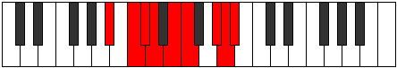 |
| [3293](https://ianring.com/musictheory/scales/3293) | [Saryllic](ModeBFlatSaryllic.md) | Bb | Bb, C, Db, D, E, F, Ab, A, Bb |  |
| [3293](https://ianring.com/musictheory/scales/3293) | [Saryllic](ModeFSharpSaryllic.md) | F# | F#, G#, A, A#, C, C#, E, F, F# |  |
| [3293](https://ianring.com/musictheory/scales/3293) | [Saryllic](ModeGFlatSaryllic.md) | Gb | Gb, Ab, A, Bb, C, Db, E, F, Gb |  |
| [3295](https://ianring.com/musictheory/scales/3295) | [Phroptygic](ModeFSharpPhroptygic.md) | F# | F#, G, G#, A, A#, C, C#, E, F, F# |  |
| [3295](https://ianring.com/musictheory/scales/3295) | [Phroptygic](ModeGFlatPhroptygic.md) | Gb | Gb, G, Ab, A, Bb, C, Db, E, F, Gb |  |
| [3295](https://ianring.com/musictheory/scales/3295) | [Phroptygic](ModeASharpPhroptygic.md) | A# | A#, B, C, C#, D, E, F, G#, A, A# |  |
| [3295](https://ianring.com/musictheory/scales/3295) | [Phroptygic](ModeBFlatPhroptygic.md) | Bb | Bb, B, C, Db, D, E, F, Ab, A, Bb |  |
| [3295](https://ianring.com/musictheory/scales/3295) | [Phroptygic](ModeANaturalPhroptygic.md) | A | A, A#, B, C, C#, D#, E, G, G#, A |  |
| [3299](https://ianring.com/musictheory/scales/3299) | [Syptian](ModeDSharpSyptian.md) | D# | D#, E, F###, G##, A#, B##, C##, D# |  |
| [3299](https://ianring.com/musictheory/scales/3299) | [Syptian](ModeEFlatSyptian.md) | Eb | Eb, Fb, G#, A, Bb, C#, D, Eb |  |
| [3299](https://ianring.com/musictheory/scales/3299) | [Syptian](ModeANaturalSyptian.md) | A | A, Bb, C##, D#, E, F##, G#, A |  |
| [3299](https://ianring.com/musictheory/scales/3299) | [Syptian](ModeASharpSyptian.md) | A# | A#, B, C###, D##, E#, F###, G##, A# |  |
| [3299](https://ianring.com/musictheory/scales/3299) | [Syptian](ModeBFlatSyptian.md) | Bb | Bb, Cb, D#, E, F, G#, A, Bb |  |
| [3301](https://ianring.com/musictheory/scales/3301) | [Phrynian](ModeASharpPhrynian.md) | A# | A#, B#, C###, D##, E#, F###, G##, A# |  |
| [3301](https://ianring.com/musictheory/scales/3301) | [Phrynian](ModeBFlatPhrynian.md) | Bb | Bb, C, D#, E, F, G#, A, Bb |  |
| [3303](https://ianring.com/musictheory/scales/3303) | [Soptyllic](ModeDSharpSoptyllic.md) | D# | D#, E, F, G#, A, A#, C#, D, D# |  |
| [3303](https://ianring.com/musictheory/scales/3303) | [Soptyllic](ModeEFlatSoptyllic.md) | Eb | Eb, E, F, Ab, A, Bb, Db, D, Eb |  |
| [3303](https://ianring.com/musictheory/scales/3303) | [Soptyllic](ModeASharpSoptyllic.md) | A# | A#, B, C, D#, E, F, G#, A, A# |  |
| [3303](https://ianring.com/musictheory/scales/3303) | [Soptyllic](ModeBFlatSoptyllic.md) | Bb | Bb, B, C, Eb, E, F, Ab, A, Bb |  |
| [3303](https://ianring.com/musictheory/scales/3303) | [Soptyllic](ModeANaturalSoptyllic.md) | A | A, A#, B, D, D#, E, G, G#, A |  |
| [3305](https://ianring.com/musictheory/scales/3305) | [Epathian](ModeASharpEpathian.md) | A# | A#, B##, C###, D##, E#, F###, G##, A# |  |
| [3305](https://ianring.com/musictheory/scales/3305) | [Epathian](ModeBFlatEpathian.md) | Bb | Bb, C#, D#, E, F, G#, A, Bb |  |
| [3307](https://ianring.com/musictheory/scales/3307) | [Boptyllic](ModeDSharpBoptyllic.md) | D# | D#, E, F#, G#, A, A#, C#, D, D# |  |
| [3307](https://ianring.com/musictheory/scales/3307) | [Boptyllic](ModeEFlatBoptyllic.md) | Eb | Eb, E, Gb, Ab, A, Bb, Db, D, Eb |  |
| [3307](https://ianring.com/musictheory/scales/3307) | [Boptyllic](ModeANaturalBoptyllic.md) | A | A, A#, C, D, D#, E, G, G#, A |  |
| [3307](https://ianring.com/musictheory/scales/3307) | [Boptyllic](ModeASharpBoptyllic.md) | A# | A#, B, C#, D#, E, F, G#, A, A# |  |
| [3307](https://ianring.com/musictheory/scales/3307) | [Boptyllic](ModeBFlatBoptyllic.md) | Bb | Bb, B, Db, Eb, E, F, Ab, A, Bb |  |
| [3309](https://ianring.com/musictheory/scales/3309) | [Bycryllic](ModeASharpBycryllic.md) | A# | A#, C, C#, D#, E, F, G#, A, A# |  |
| [3309](https://ianring.com/musictheory/scales/3309) | [Bycryllic](ModeBFlatBycryllic.md) | Bb | Bb, C, Db, Eb, E, F, Ab, A, Bb |  |
| [3311](https://ianring.com/musictheory/scales/3311) | [Mixodygic](ModeDSharpMixodygic.md) | D# | D#, E, F, F#, G#, A, A#, C#, D, D# |  |
| [3311](https://ianring.com/musictheory/scales/3311) | [Mixodygic](ModeEFlatMixodygic.md) | Eb | Eb, E, F, Gb, Ab, A, Bb, Db, D, Eb |  |
| [3311](https://ianring.com/musictheory/scales/3311) | [Mixodygic](ModeASharpMixodygic.md) | A# | A#, B, C, C#, D#, E, F, G#, A, A# |  |
| [3311](https://ianring.com/musictheory/scales/3311) | [Mixodygic](ModeBFlatMixodygic.md) | Bb | Bb, B, C, Db, Eb, E, F, Ab, A, Bb |  |
| [3311](https://ianring.com/musictheory/scales/3311) | [Mixodygic](ModeANaturalMixodygic.md) | A | A, A#, B, C, D, D#, E, G, G#, A |  |
| [3313](https://ianring.com/musictheory/scales/3313) | [Aeolacrian](ModeASharpAeolacrian.md) | A# | A#, B###, C###, D##, E#, F###, G##, A# |  |
| [3313](https://ianring.com/musictheory/scales/3313) | [Aeolacrian](ModeBFlatAeolacrian.md) | Bb | Bb, C##, D#, E, F, G#, A, Bb |  |
| [3313](https://ianring.com/musictheory/scales/3313) | [Aeolacrian](ModeENaturalAeolacrian.md) | E | E, F###, G##, A#, B, C##, D#, E |  |
| [3315](https://ianring.com/musictheory/scales/3315) | [Aeralyllic](ModeDSharpAeralyllic.md) | D# | D#, E, G, G#, A, A#, C#, D, D# |  |
| [3315](https://ianring.com/musictheory/scales/3315) | [Aeralyllic](ModeEFlatAeralyllic.md) | Eb | Eb, E, G, Ab, A, Bb, Db, D, Eb |  |
| [3315](https://ianring.com/musictheory/scales/3315) | [Aeralyllic](ModeANaturalAeralyllic.md) | A | A, A#, C#, D, D#, E, G, G#, A |  |
| [3315](https://ianring.com/musictheory/scales/3315) | [Aeralyllic](ModeENaturalAeralyllic.md) | E | E, F, G#, A, A#, B, D, D#, E |  |
| [3315](https://ianring.com/musictheory/scales/3315) | [Aeralyllic](ModeASharpAeralyllic.md) | A# | A#, B, D, D#, E, F, G#, A, A# |  |
| [3315](https://ianring.com/musictheory/scales/3315) | [Aeralyllic](ModeBFlatAeralyllic.md) | Bb | Bb, B, D, Eb, E, F, Ab, A, Bb |  |
| [3317](https://ianring.com/musictheory/scales/3317) | [Lanyllic](ModeASharpLanyllic.md) | A# | A#, C, D, D#, E, F, G#, A, A# |  |
| [3317](https://ianring.com/musictheory/scales/3317) | [Lanyllic](ModeBFlatLanyllic.md) | Bb | Bb, C, D, Eb, E, F, Ab, A, Bb |  |
| [3317](https://ianring.com/musictheory/scales/3317) | [Lanyllic](ModeENaturalLanyllic.md) | E | E, F#, G#, A, A#, B, D, D#, E |  |
| [3319](https://ianring.com/musictheory/scales/3319) | [Tholygic](ModeDSharpTholygic.md) | D# | D#, E, F, G, G#, A, A#, C#, D, D# |  |
| [3319](https://ianring.com/musictheory/scales/3319) | [Tholygic](ModeEFlatTholygic.md) | Eb | Eb, E, F, G, Ab, A, Bb, Db, D, Eb |  |
| [3319](https://ianring.com/musictheory/scales/3319) | [Tholygic](ModeASharpTholygic.md) | A# | A#, B, C, D, D#, E, F, G#, A, A# |  |
| [3319](https://ianring.com/musictheory/scales/3319) | [Tholygic](ModeBFlatTholygic.md) | Bb | Bb, B, C, D, Eb, E, F, Ab, A, Bb |  |
| [3319](https://ianring.com/musictheory/scales/3319) | [Tholygic](ModeENaturalTholygic.md) | E | E, F, F#, G#, A, A#, B, D, D#, E |  |
| [3319](https://ianring.com/musictheory/scales/3319) | [Tholygic](ModeANaturalTholygic.md) | A | A, A#, B, C#, D, D#, E, G, G#, A |  |
| [3321](https://ianring.com/musictheory/scales/3321) | [Ionycryllic](ModeASharpIonycryllic.md) | A# | A#, C#, D, D#, E, F, G#, A, A# |  |
| [3321](https://ianring.com/musictheory/scales/3321) | [Ionycryllic](ModeBFlatIonycryllic.md) | Bb | Bb, Db, D, Eb, E, F, Ab, A, Bb |  |
| [3321](https://ianring.com/musictheory/scales/3321) | [Ionycryllic](ModeFNaturalIonycryllic.md) | F | F, G#, A, A#, B, C, D#, E, F |  |
| [3321](https://ianring.com/musictheory/scales/3321) | [Ionycryllic](ModeENaturalIonycryllic.md) | E | E, G, G#, A, A#, B, D, D#, E |  |
| [3323](https://ianring.com/musictheory/scales/3323) | [Phrygygic](ModeANaturalPhrygygic.md) | A | A, A#, C, C#, D, D#, E, G, G#, A |  |
| [3323](https://ianring.com/musictheory/scales/3323) | [Phrygygic](ModeDSharpPhrygygic.md) | D# | D#, E, F#, G, G#, A, A#, C#, D, D# |  |
| [3323](https://ianring.com/musictheory/scales/3323) | [Phrygygic](ModeEFlatPhrygygic.md) | Eb | Eb, E, Gb, G, Ab, A, Bb, Db, D, Eb |  |
| [3323](https://ianring.com/musictheory/scales/3323) | [Phrygygic](ModeASharpPhrygygic.md) | A# | A#, B, C#, D, D#, E, F, G#, A, A# |  |
| [3323](https://ianring.com/musictheory/scales/3323) | [Phrygygic](ModeBFlatPhrygygic.md) | Bb | Bb, B, Db, D, Eb, E, F, Ab, A, Bb |  |
| [3323](https://ianring.com/musictheory/scales/3323) | [Phrygygic](ModeFNaturalPhrygygic.md) | F | F, F#, G#, A, A#, B, C, D#, E, F |  |
| [3323](https://ianring.com/musictheory/scales/3323) | [Phrygygic](ModeENaturalPhrygygic.md) | E | E, F, G, G#, A, A#, B, D, D#, E |  |
| [3325](https://ianring.com/musictheory/scales/3325) | [Epygic](ModeASharpEpygic.md) | A# | A#, C, C#, D, D#, E, F, G#, A, A# |  |
| [3325](https://ianring.com/musictheory/scales/3325) | [Epygic](ModeBFlatEpygic.md) | Bb | Bb, C, Db, D, Eb, E, F, Ab, A, Bb | 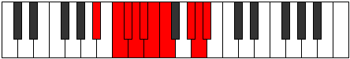 |
| [3325](https://ianring.com/musictheory/scales/3325) | [Epygic](ModeFSharpEpygic.md) | F# | F#, G#, A, A#, B, C, C#, E, F, F# |  |
| [3325](https://ianring.com/musictheory/scales/3325) | [Epygic](ModeGFlatEpygic.md) | Gb | Gb, Ab, A, Bb, B, C, Db, E, F, Gb |  |
| [3325](https://ianring.com/musictheory/scales/3325) | [Epygic](ModeFNaturalEpygic.md) | F | F, G, G#, A, A#, B, C, D#, E, F |  |
| [3325](https://ianring.com/musictheory/scales/3325) | [Epygic](ModeENaturalEpygic.md) | E | E, F#, G, G#, A, A#, B, D, D#, E |  |
| [3327](https://ianring.com/musictheory/scales/3327) | [Madyllian](ModeDSharpMadyllian.md) | D# | D#, E, F, F#, G, G#, A, A#, C#, D, D# |  |
| [3327](https://ianring.com/musictheory/scales/3327) | [Madyllian](ModeEFlatMadyllian.md) | Eb | Eb, E, F, Gb, G, Ab, A, Bb, Db, D, Eb |  |
| [3327](https://ianring.com/musictheory/scales/3327) | [Madyllian](ModeASharpMadyllian.md) | A# | A#, B, C, C#, D, D#, E, F, G#, A, A# |  |
| [3327](https://ianring.com/musictheory/scales/3327) | [Madyllian](ModeBFlatMadyllian.md) | Bb | Bb, B, C, Db, D, Eb, E, F, Ab, A, Bb |  |
| [3327](https://ianring.com/musictheory/scales/3327) | [Madyllian](ModeANaturalMadyllian.md) | A | A, A#, B, C, C#, D, D#, E, G, G#, A |  |
| [3327](https://ianring.com/musictheory/scales/3327) | [Madyllian](ModeFSharpMadyllian.md) | F# | F#, G, G#, A, A#, B, C, C#, E, F, F# |  |
| [3327](https://ianring.com/musictheory/scales/3327) | [Madyllian](ModeGFlatMadyllian.md) | Gb | Gb, G, Ab, A, Bb, B, C, Db, E, F, Gb |  |
| [3327](https://ianring.com/musictheory/scales/3327) | [Madyllian](ModeFNaturalMadyllian.md) | F | F, F#, G, G#, A, A#, B, C, D#, E, F |  |
| [3327](https://ianring.com/musictheory/scales/3327) | [Madyllian](ModeENaturalMadyllian.md) | E | E, F, F#, G, G#, A, A#, B, D, D#, E |  |
| [3351](https://ianring.com/musictheory/scales/3351) | [Karian](ModeGSharpKarian.md) | G# | G#, A, Bb, C, D##, E##, F##, G# |  |
| [3351](https://ianring.com/musictheory/scales/3351) | [Karian](ModeAFlatKarian.md) | Ab | Ab, Bbb, Cbb, Dbb, E, F#, G, Ab |  |
| [3357](https://ianring.com/musictheory/scales/3357) | [Phrodian](ModeFSharpPhrodian.md) | F# | F#, G#, A, Bb, C##, D##, E#, F# |  |
| [3357](https://ianring.com/musictheory/scales/3357) | [Phrodian](ModeGFlatPhrodian.md) | Gb | Gb, Ab, Bbb, Cbb, D, E, F, Gb |  |
| [3359](https://ianring.com/musictheory/scales/3359) | [Bonyllic](ModeFSharpBonyllic.md) | F# | F#, G, G#, A, A#, D, E, F, F# |  |
| [3359](https://ianring.com/musictheory/scales/3359) | [Bonyllic](ModeGFlatBonyllic.md) | Gb | Gb, G, Ab, A, Bb, D, E, F, Gb |  |
| [3359](https://ianring.com/musictheory/scales/3359) | [Bonyllic](ModeGSharpBonyllic.md) | G# | G#, A, A#, B, C, E, F#, G, G# |  |
| [3359](https://ianring.com/musictheory/scales/3359) | [Bonyllic](ModeAFlatBonyllic.md) | Ab | Ab, A, Bb, B, C, E, Gb, G, Ab |  |
| [3367](https://ianring.com/musictheory/scales/3367) | [Moptian](ModeGSharpMoptian.md) | G# | G#, A, Bb, C#, D##, E##, F##, G# |  |
| [3367](https://ianring.com/musictheory/scales/3367) | [Moptian](ModeAFlatMoptian.md) | Ab | Ab, Bbb, Cbb, Db, E, F#, G, Ab |  |
| [3375](https://ianring.com/musictheory/scales/3375) | [Kygyllic](ModeGSharpKygyllic.md) | G# | G#, A, A#, B, C#, E, F#, G, G# |  |
| [3375](https://ianring.com/musictheory/scales/3375) | [Kygyllic](ModeAFlatKygyllic.md) | Ab | Ab, A, Bb, B, Db, E, Gb, G, Ab | 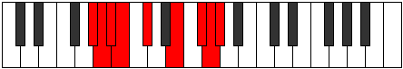 |
| [3383](https://ianring.com/musictheory/scales/3383) | [Daptyllic](ModeGSharpDaptyllic.md) | G# | G#, A, A#, C, C#, E, F#, G, G# |  |
| [3383](https://ianring.com/musictheory/scales/3383) | [Daptyllic](ModeAFlatDaptyllic.md) | Ab | Ab, A, Bb, C, Db, E, Gb, G, Ab |  |
| [3385](https://ianring.com/musictheory/scales/3385) | [Rothian](ModeFNaturalRothian.md) | F | F, G#, A, Bb, C#, D#, E, F |  |
| [3387](https://ianring.com/musictheory/scales/3387) | [Aeryptyllic](ModeFNaturalAeryptyllic.md) | F | F, F#, G#, A, A#, C#, D#, E, F |  |
| [3389](https://ianring.com/musictheory/scales/3389) | [Socryllic](ModeFNaturalSocryllic.md) | F | F, G, G#, A, A#, C#, D#, E, F |  |
| [3389](https://ianring.com/musictheory/scales/3389) | [Socryllic](ModeFSharpSocryllic.md) | F# | F#, G#, A, A#, B, D, E, F, F# |  |
| [3389](https://ianring.com/musictheory/scales/3389) | [Socryllic](ModeGFlatSocryllic.md) | Gb | Gb, Ab, A, Bb, B, D, E, F, Gb |  |
| [3391](https://ianring.com/musictheory/scales/3391) | [Aeolynygic](ModeFNaturalAeolynygic.md) | F | F, F#, G, G#, A, A#, C#, D#, E, F |  |
| [3391](https://ianring.com/musictheory/scales/3391) | [Aeolynygic](ModeGSharpAeolynygic.md) | G# | G#, A, A#, B, C, C#, E, F#, G, G# |  |
| [3391](https://ianring.com/musictheory/scales/3391) | [Aeolynygic](ModeAFlatAeolynygic.md) | Ab | Ab, A, Bb, B, C, Db, E, Gb, G, Ab |  |
| [3391](https://ianring.com/musictheory/scales/3391) | [Aeolynygic](ModeFSharpAeolynygic.md) | F# | F#, G, G#, A, A#, B, D, E, F, F# |  |
| [3391](https://ianring.com/musictheory/scales/3391) | [Aeolynygic](ModeGFlatAeolynygic.md) | Gb | Gb, G, Ab, A, Bb, B, D, E, F, Gb |  |
| [3397](https://ianring.com/musictheory/scales/3397) | [Sydimic](ModeASharpSydimic.md) | A# | A#, B#, D##, E##, F###, G##, A# |  |
| [3397](https://ianring.com/musictheory/scales/3397) | [Sydimic](ModeBFlatSydimic.md) | Bb | Bb, C, D##, E##, F###, G##, Bb |  |
| [3399](https://ianring.com/musictheory/scales/3399) | [Zonian](ModeGSharpZonian.md) | G# | G#, A, Bb, C##, D##, E##, F##, G# |  |
| [3399](https://ianring.com/musictheory/scales/3399) | [Zonian](ModeAFlatZonian.md) | Ab | Ab, Bbb, Cbb, D, E, F#, G, Ab |  |
| [3399](https://ianring.com/musictheory/scales/3399) | [Zonian](ModeASharpZonian.md) | A# | A#, B, C, D##, E##, F###, G##, A# |  |
| [3399](https://ianring.com/musictheory/scales/3399) | [Zonian](ModeBFlatZonian.md) | Bb | Bb, Cb, Dbb, E, F#, G#, A, Bb |  |
| [3401](https://ianring.com/musictheory/scales/3401) | [Palimic](ModeASharpPalimic.md) | A# | A#, B##, D##, E##, F###, G##, A# |  |
| [3401](https://ianring.com/musictheory/scales/3401) | [Palimic](ModeBFlatPalimic.md) | Bb | Bb, C#, D##, E##, F###, G##, Bb |  |
| [3403](https://ianring.com/musictheory/scales/3403) | [Bylian](ModeASharpBylian.md) | A# | A#, B, C#, D##, E##, F###, G##, A# |  |
| [3403](https://ianring.com/musictheory/scales/3403) | [Bylian](ModeBFlatBylian.md) | Bb | Bb, Cb, Db, E, F#, G#, A, Bb |  |
| [3405](https://ianring.com/musictheory/scales/3405) | [Stynian](ModeASharpStynian.md) | A# | A#, B#, C#, D##, E##, F###, G##, A# |  |
| [3405](https://ianring.com/musictheory/scales/3405) | [Stynian](ModeBFlatStynian.md) | Bb | Bb, C, Db, E, F#, G#, A, Bb |  |
| [3407](https://ianring.com/musictheory/scales/3407) | [Katocryllic](ModeASharpKatocryllic.md) | A# | A#, B, C, C#, E, F#, G#, A, A# |  |
| [3407](https://ianring.com/musictheory/scales/3407) | [Katocryllic](ModeBFlatKatocryllic.md) | Bb | Bb, B, C, Db, E, Gb, Ab, A, Bb |  |
| [3407](https://ianring.com/musictheory/scales/3407) | [Katocryllic](ModeGSharpKatocryllic.md) | G# | G#, A, A#, B, D, E, F#, G, G# |  |
| [3407](https://ianring.com/musictheory/scales/3407) | [Katocryllic](ModeAFlatKatocryllic.md) | Ab | Ab, A, Bb, B, D, E, Gb, G, Ab |  |
| [3409](https://ianring.com/musictheory/scales/3409) | [Katanimic](ModeASharpKatanimic.md) | A# | A#, B###, D##, E##, F###, G##, A# |  |
| [3409](https://ianring.com/musictheory/scales/3409) | [Katanimic](ModeBFlatKatanimic.md) | Bb | Bb, C##, D##, E##, F###, G##, Bb |  |
| [3411](https://ianring.com/musictheory/scales/3411) | [Ionathian](ModeASharpIonathian.md) | A# | A#, B, C##, D##, E##, F###, G##, A# |  |
| [3411](https://ianring.com/musictheory/scales/3411) | [Ionathian](ModeBFlatIonathian.md) | Bb | Bb, Cb, D, E, F#, G#, A, Bb |  |
| [3413](https://ianring.com/musictheory/scales/3413) | [Aeolynian](ModeASharpAeolynian.md) | A# | A#, B#, C##, D##, E##, F###, G##, A# |  |
| [3413](https://ianring.com/musictheory/scales/3413) | [Aeolynian](ModeBFlatAeolynian.md) | Bb | Bb, C, D, E, F#, G#, A, Bb |  |
| [3415](https://ianring.com/musictheory/scales/3415) | [Ionaptyllic](ModeGSharpIonaptyllic.md) | G# | G#, A, A#, C, D, E, F#, G, G# |  |
| [3415](https://ianring.com/musictheory/scales/3415) | [Ionaptyllic](ModeAFlatIonaptyllic.md) | Ab | Ab, A, Bb, C, D, E, Gb, G, Ab |  |
| [3415](https://ianring.com/musictheory/scales/3415) | [Ionaptyllic](ModeASharpIonaptyllic.md) | A# | A#, B, C, D, E, F#, G#, A, A# |  |
| [3415](https://ianring.com/musictheory/scales/3415) | [Ionaptyllic](ModeBFlatIonaptyllic.md) | Bb | Bb, B, C, D, E, Gb, Ab, A, Bb |  |
| [3417](https://ianring.com/musictheory/scales/3417) | [Golian](ModeASharpGolian.md) | A# | A#, B##, C##, D##, E##, F###, G##, A# |  |
| [3417](https://ianring.com/musictheory/scales/3417) | [Golian](ModeBFlatGolian.md) | Bb | Bb, C#, D, E, F#, G#, A, Bb |  |
| [3419](https://ianring.com/musictheory/scales/3419) | [Danyllic](ModeASharpDanyllic.md) | A# | A#, B, C#, D, E, F#, G#, A, A# |  |
| [3419](https://ianring.com/musictheory/scales/3419) | [Danyllic](ModeBFlatDanyllic.md) | Bb | Bb, B, Db, D, E, Gb, Ab, A, Bb |  |
| [3421](https://ianring.com/musictheory/scales/3421) | [Aerothyllic](ModeASharpAerothyllic.md) | A# | A#, C, C#, D, E, F#, G#, A, A# |  |
| [3421](https://ianring.com/musictheory/scales/3421) | [Aerothyllic](ModeBFlatAerothyllic.md) | Bb | Bb, C, Db, D, E, Gb, Ab, A, Bb |  |
| [3421](https://ianring.com/musictheory/scales/3421) | [Aerothyllic](ModeFSharpAerothyllic.md) | F# | F#, G#, A, A#, C, D, E, F, F# |  |
| [3421](https://ianring.com/musictheory/scales/3421) | [Aerothyllic](ModeGFlatAerothyllic.md) | Gb | Gb, Ab, A, Bb, C, D, E, F, Gb |  |
| [3423](https://ianring.com/musictheory/scales/3423) | [Lothygic](ModeFSharpLothygic.md) | F# | F#, G, G#, A, A#, C, D, E, F, F# |  |
| [3423](https://ianring.com/musictheory/scales/3423) | [Lothygic](ModeGFlatLothygic.md) | Gb | Gb, G, Ab, A, Bb, C, D, E, F, Gb |  |
| [3423](https://ianring.com/musictheory/scales/3423) | [Lothygic](ModeASharpLothygic.md) | A# | A#, B, C, C#, D, E, F#, G#, A, A# |  |
| [3423](https://ianring.com/musictheory/scales/3423) | [Lothygic](ModeBFlatLothygic.md) | Bb | Bb, B, C, Db, D, E, Gb, Ab, A, Bb |  |
| [3423](https://ianring.com/musictheory/scales/3423) | [Lothygic](ModeGSharpLothygic.md) | G# | G#, A, A#, B, C, D, E, F#, G, G# |  |
| [3423](https://ianring.com/musictheory/scales/3423) | [Lothygic](ModeAFlatLothygic.md) | Ab | Ab, A, Bb, B, C, D, E, Gb, G, Ab |  |
| [3427](https://ianring.com/musictheory/scales/3427) | [Zacrian](ModeASharpZacrian.md) | A# | A#, B, C###, D##, E##, F###, G##, A# |  |
| [3427](https://ianring.com/musictheory/scales/3427) | [Zacrian](ModeBFlatZacrian.md) | Bb | Bb, Cb, D#, E, F#, G#, A, Bb |  |
| [3429](https://ianring.com/musictheory/scales/3429) | [Marian](ModeASharpMarian.md) | A# | A#, B#, C###, D##, E##, F###, G##, A# |  |
| [3429](https://ianring.com/musictheory/scales/3429) | [Marian](ModeBFlatMarian.md) | Bb | Bb, C, D#, E, F#, G#, A, Bb |  |
| [3431](https://ianring.com/musictheory/scales/3431) | [Zyptyllic](ModeGSharpZyptyllic.md) | G# | G#, A, A#, C#, D, E, F#, G, G# |  |
| [3431](https://ianring.com/musictheory/scales/3431) | [Zyptyllic](ModeAFlatZyptyllic.md) | Ab | Ab, A, Bb, Db, D, E, Gb, G, Ab |  |
| [3431](https://ianring.com/musictheory/scales/3431) | [Zyptyllic](ModeASharpZyptyllic.md) | A# | A#, B, C, D#, E, F#, G#, A, A# |  |
| [3431](https://ianring.com/musictheory/scales/3431) | [Zyptyllic](ModeBFlatZyptyllic.md) | Bb | Bb, B, C, Eb, E, Gb, Ab, A, Bb |  |
| [3433](https://ianring.com/musictheory/scales/3433) | [Thonian](ModeASharpThonian.md) | A# | A#, B##, C###, D##, E##, F###, G##, A# |  |
| [3433](https://ianring.com/musictheory/scales/3433) | [Thonian](ModeBFlatThonian.md) | Bb | Bb, C#, D#, E, F#, G#, A, Bb |  |
| [3435](https://ianring.com/musictheory/scales/3435) | [Epiphyllic](ModeASharpEpiphyllic.md) | A# | A#, B, C#, D#, E, F#, G#, A, A# |  |
| [3435](https://ianring.com/musictheory/scales/3435) | [Epiphyllic](ModeBFlatEpiphyllic.md) | Bb | Bb, B, Db, Eb, E, Gb, Ab, A, Bb |  |
| [3437](https://ianring.com/musictheory/scales/3437) | [Gathyllic](ModeASharpGathyllic.md) | A# | A#, C, C#, D#, E, F#, G#, A, A# |  |
| [3437](https://ianring.com/musictheory/scales/3437) | [Gathyllic](ModeBFlatGathyllic.md) | Bb | Bb, C, Db, Eb, E, Gb, Ab, A, Bb |  |
| [3439](https://ianring.com/musictheory/scales/3439) | [Lythygic](ModeASharpLythygic.md) | A# | A#, B, C, C#, D#, E, F#, G#, A, A# |  |
| [3439](https://ianring.com/musictheory/scales/3439) | [Lythygic](ModeBFlatLythygic.md) | Bb | Bb, B, C, Db, Eb, E, Gb, Ab, A, Bb |  |
| [3439](https://ianring.com/musictheory/scales/3439) | [Lythygic](ModeGSharpLythygic.md) | G# | G#, A, A#, B, C#, D, E, F#, G, G# |  |
| [3439](https://ianring.com/musictheory/scales/3439) | [Lythygic](ModeAFlatLythygic.md) | Ab | Ab, A, Bb, B, Db, D, E, Gb, G, Ab |  |
| [3441](https://ianring.com/musictheory/scales/3441) | [Thacrian](ModeENaturalThacrian.md) | E | E, F###, G##, A#, B#, C##, D#, E |  |
| [3441](https://ianring.com/musictheory/scales/3441) | [Thacrian](ModeASharpThacrian.md) | A# | A#, B###, C###, D##, E##, F###, G##, A# |  |
| [3441](https://ianring.com/musictheory/scales/3441) | [Thacrian](ModeBFlatThacrian.md) | Bb | Bb, C##, D#, E, F#, G#, A, Bb |  |
| [3443](https://ianring.com/musictheory/scales/3443) | [Epathyllic](ModeENaturalEpathyllic.md) | E | E, F, G#, A, A#, C, D, D#, E |  |
| [3443](https://ianring.com/musictheory/scales/3443) | [Epathyllic](ModeASharpEpathyllic.md) | A# | A#, B, D, D#, E, F#, G#, A, A# |  |
| [3443](https://ianring.com/musictheory/scales/3443) | [Epathyllic](ModeBFlatEpathyllic.md) | Bb | Bb, B, D, Eb, E, Gb, Ab, A, Bb |  |
| [3445](https://ianring.com/musictheory/scales/3445) | [Epotyllic](ModeENaturalEpotyllic.md) | E | E, F#, G#, A, A#, C, D, D#, E |  |
| [3445](https://ianring.com/musictheory/scales/3445) | [Epotyllic](ModeASharpEpotyllic.md) | A# | A#, C, D, D#, E, F#, G#, A, A# |  |
| [3445](https://ianring.com/musictheory/scales/3445) | [Epotyllic](ModeBFlatEpotyllic.md) | Bb | Bb, C, D, Eb, E, Gb, Ab, A, Bb |  |
| [3447](https://ianring.com/musictheory/scales/3447) | [Kynygic](ModeENaturalKynygic.md) | E | E, F, F#, G#, A, A#, C, D, D#, E |  |
| [3447](https://ianring.com/musictheory/scales/3447) | [Kynygic](ModeGSharpKynygic.md) | G# | G#, A, A#, C, C#, D, E, F#, G, G# |  |
| [3447](https://ianring.com/musictheory/scales/3447) | [Kynygic](ModeAFlatKynygic.md) | Ab | Ab, A, Bb, C, Db, D, E, Gb, G, Ab |  |
| [3447](https://ianring.com/musictheory/scales/3447) | [Kynygic](ModeASharpKynygic.md) | A# | A#, B, C, D, D#, E, F#, G#, A, A# |  |
| [3447](https://ianring.com/musictheory/scales/3447) | [Kynygic](ModeBFlatKynygic.md) | Bb | Bb, B, C, D, Eb, E, Gb, Ab, A, Bb |  |
| [3449](https://ianring.com/musictheory/scales/3449) | [Bacryllic](ModeASharpBacryllic.md) | A# | A#, C#, D, D#, E, F#, G#, A, A# |  |
| [3449](https://ianring.com/musictheory/scales/3449) | [Bacryllic](ModeBFlatBacryllic.md) | Bb | Bb, Db, D, Eb, E, Gb, Ab, A, Bb |  |
| [3449](https://ianring.com/musictheory/scales/3449) | [Bacryllic](ModeENaturalBacryllic.md) | E | E, G, G#, A, A#, C, D, D#, E |  |
| [3449](https://ianring.com/musictheory/scales/3449) | [Bacryllic](ModeFNaturalBacryllic.md) | F | F, G#, A, A#, B, C#, D#, E, F |  |
| [3451](https://ianring.com/musictheory/scales/3451) | [Garygic](ModeENaturalGarygic.md) | E | E, F, G, G#, A, A#, C, D, D#, E |  |
| [3451](https://ianring.com/musictheory/scales/3451) | [Garygic](ModeASharpGarygic.md) | A# | A#, B, C#, D, D#, E, F#, G#, A, A# |  |
| [3451](https://ianring.com/musictheory/scales/3451) | [Garygic](ModeBFlatGarygic.md) | Bb | Bb, B, Db, D, Eb, E, Gb, Ab, A, Bb |  |
| [3451](https://ianring.com/musictheory/scales/3451) | [Garygic](ModeFNaturalGarygic.md) | F | F, F#, G#, A, A#, B, C#, D#, E, F |  |
| [3453](https://ianring.com/musictheory/scales/3453) | [Katarygic](ModeASharpKatarygic.md) | A# | A#, C, C#, D, D#, E, F#, G#, A, A# |  |
| [3453](https://ianring.com/musictheory/scales/3453) | [Katarygic](ModeBFlatKatarygic.md) | Bb | Bb, C, Db, D, Eb, E, Gb, Ab, A, Bb |  |
| [3453](https://ianring.com/musictheory/scales/3453) | [Katarygic](ModeENaturalKatarygic.md) | E | E, F#, G, G#, A, A#, C, D, D#, E |  |
| [3453](https://ianring.com/musictheory/scales/3453) | [Katarygic](ModeFSharpKatarygic.md) | F# | F#, G#, A, A#, B, C, D, E, F, F# |  |
| [3453](https://ianring.com/musictheory/scales/3453) | [Katarygic](ModeGFlatKatarygic.md) | Gb | Gb, Ab, A, Bb, B, C, D, E, F, Gb |  |
| [3453](https://ianring.com/musictheory/scales/3453) | [Katarygic](ModeFNaturalKatarygic.md) | F | F, G, G#, A, A#, B, C#, D#, E, F |  |
| [3455](https://ianring.com/musictheory/scales/3455) | [Ryptyllian](ModeENaturalRyptyllian.md) | E | E, F, F#, G, G#, A, A#, C, D, D#, E |  |
| [3455](https://ianring.com/musictheory/scales/3455) | [Ryptyllian](ModeASharpRyptyllian.md) | A# | A#, B, C, C#, D, D#, E, F#, G#, A, A# |  |
| [3455](https://ianring.com/musictheory/scales/3455) | [Ryptyllian](ModeBFlatRyptyllian.md) | Bb | Bb, B, C, Db, D, Eb, E, Gb, Ab, A, Bb |  |
| [3455](https://ianring.com/musictheory/scales/3455) | [Ryptyllian](ModeGSharpRyptyllian.md) | G# | G#, A, A#, B, C, C#, D, E, F#, G, G# |  |
| [3455](https://ianring.com/musictheory/scales/3455) | [Ryptyllian](ModeAFlatRyptyllian.md) | Ab | Ab, A, Bb, B, C, Db, D, E, Gb, G, Ab |  |
| [3455](https://ianring.com/musictheory/scales/3455) | [Ryptyllian](ModeFSharpRyptyllian.md) | F# | F#, G, G#, A, A#, B, C, D, E, F, F# |  |
| [3455](https://ianring.com/musictheory/scales/3455) | [Ryptyllian](ModeGFlatRyptyllian.md) | Gb | Gb, G, Ab, A, Bb, B, C, D, E, F, Gb |  |
| [3455](https://ianring.com/musictheory/scales/3455) | [Ryptyllian](ModeFNaturalRyptyllian.md) | F | F, F#, G, G#, A, A#, B, C#, D#, E, F |  |
| [3467](https://ianring.com/musictheory/scales/3467) | [Katonian](ModeANaturalKatonian.md) | A | A, Bb, C, D##, E#, F##, G#, A |  |
| [3471](https://ianring.com/musictheory/scales/3471) | [Gyryllic](ModeANaturalGyryllic.md) | A | A, A#, B, C, E, F, G, G#, A |  |
| [3471](https://ianring.com/musictheory/scales/3471) | [Gyryllic](ModeGSharpGyryllic.md) | G# | G#, A, A#, B, D#, E, F#, G, G# |  |
| [3471](https://ianring.com/musictheory/scales/3471) | [Gyryllic](ModeAFlatGyryllic.md) | Ab | Ab, A, Bb, B, Eb, E, Gb, G, Ab |  |
| [3475](https://ianring.com/musictheory/scales/3475) | [Kylian](ModeANaturalKylian.md) | A | A, Bb, C#, D##, E#, F##, G#, A |  |
| [3479](https://ianring.com/musictheory/scales/3479) | [Rothyllic](ModeGSharpRothyllic.md) | G# | G#, A, A#, C, D#, E, F#, G, G# |  |
| [3479](https://ianring.com/musictheory/scales/3479) | [Rothyllic](ModeAFlatRothyllic.md) | Ab | Ab, A, Bb, C, Eb, E, Gb, G, Ab |  |
| [3479](https://ianring.com/musictheory/scales/3479) | [Rothyllic](ModeANaturalRothyllic.md) | A | A, A#, B, C#, E, F, G, G#, A |  |
| [3483](https://ianring.com/musictheory/scales/3483) | [Mixotharyllic](ModeANaturalMixotharyllic.md) | A | A, A#, C, C#, E, F, G, G#, A |  |
| [3485](https://ianring.com/musictheory/scales/3485) | [Kyptyllic](ModeFSharpKyptyllic.md) | F# | F#, G#, A, A#, C#, D, E, F, F# |  |
| [3485](https://ianring.com/musictheory/scales/3485) | [Kyptyllic](ModeGFlatKyptyllic.md) | Gb | Gb, Ab, A, Bb, Db, D, E, F, Gb |  |
| [3487](https://ianring.com/musictheory/scales/3487) | [Byptygic](ModeFSharpByptygic.md) | F# | F#, G, G#, A, A#, C#, D, E, F, F# |  |
| [3487](https://ianring.com/musictheory/scales/3487) | [Byptygic](ModeGFlatByptygic.md) | Gb | Gb, G, Ab, A, Bb, Db, D, E, F, Gb |  |
| [3487](https://ianring.com/musictheory/scales/3487) | [Byptygic](ModeANaturalByptygic.md) | A | A, A#, B, C, C#, E, F, G, G#, A |  |
| [3487](https://ianring.com/musictheory/scales/3487) | [Byptygic](ModeGSharpByptygic.md) | G# | G#, A, A#, B, C, D#, E, F#, G, G# |  |
| [3487](https://ianring.com/musictheory/scales/3487) | [Byptygic](ModeAFlatByptygic.md) | Ab | Ab, A, Bb, B, C, Eb, E, Gb, G, Ab |  |
| [3491](https://ianring.com/musictheory/scales/3491) | [Tharian](ModeANaturalTharian.md) | A | A, Bb, C##, D##, E#, F##, G#, A |  |
| [3495](https://ianring.com/musictheory/scales/3495) | [Banyllic](ModeGSharpBanyllic.md) | G# | G#, A, A#, C#, D#, E, F#, G, G# |  |
| [3495](https://ianring.com/musictheory/scales/3495) | [Banyllic](ModeAFlatBanyllic.md) | Ab | Ab, A, Bb, Db, Eb, E, Gb, G, Ab |  |
| [3495](https://ianring.com/musictheory/scales/3495) | [Banyllic](ModeANaturalBanyllic.md) | A | A, A#, B, D, E, F, G, G#, A |  |
| [3499](https://ianring.com/musictheory/scales/3499) | [Lythyllic](ModeANaturalLythyllic.md) | A | A, A#, C, D, E, F, G, G#, A |  |
| [3503](https://ianring.com/musictheory/scales/3503) | [Zyphygic](ModeANaturalZyphygic.md) | A | A, A#, B, C, D, E, F, G, G#, A |  |
| [3503](https://ianring.com/musictheory/scales/3503) | [Zyphygic](ModeGSharpZyphygic.md) | G# | G#, A, A#, B, C#, D#, E, F#, G, G# |  |
| [3503](https://ianring.com/musictheory/scales/3503) | [Zyphygic](ModeAFlatZyphygic.md) | Ab | Ab, A, Bb, B, Db, Eb, E, Gb, G, Ab |  |
| [3507](https://ianring.com/musictheory/scales/3507) | [Ponyllic](ModeANaturalPonyllic.md) | A | A, A#, C#, D, E, F, G, G#, A |  |
| [3511](https://ianring.com/musictheory/scales/3511) | [Epolygic](ModeGSharpEpolygic.md) | G# | G#, A, A#, C, C#, D#, E, F#, G, G# |  |
| [3511](https://ianring.com/musictheory/scales/3511) | [Epolygic](ModeAFlatEpolygic.md) | Ab | Ab, A, Bb, C, Db, Eb, E, Gb, G, Ab |  |
| [3511](https://ianring.com/musictheory/scales/3511) | [Epolygic](ModeANaturalEpolygic.md) | A | A, A#, B, C#, D, E, F, G, G#, A |  |
| [3513](https://ianring.com/musictheory/scales/3513) | [Dydyllic](ModeFNaturalDydyllic.md) | F | F, G#, A, A#, C, C#, D#, E, F |  |
| [3515](https://ianring.com/musictheory/scales/3515) | [Katodygic](ModeFNaturalKatodygic.md) | F | F, F#, G#, A, A#, C, C#, D#, E, F |  |
| [3515](https://ianring.com/musictheory/scales/3515) | [Katodygic](ModeANaturalKatodygic.md) | A | A, A#, C, C#, D, E, F, G, G#, A |  |
| [3517](https://ianring.com/musictheory/scales/3517) | [Epocrygic](ModeFNaturalEpocrygic.md) | F | F, G, G#, A, A#, C, C#, D#, E, F |  |
| [3517](https://ianring.com/musictheory/scales/3517) | [Epocrygic](ModeFSharpEpocrygic.md) | F# | F#, G#, A, A#, B, C#, D, E, F, F# |  |
| [3517](https://ianring.com/musictheory/scales/3517) | [Epocrygic](ModeGFlatEpocrygic.md) | Gb | Gb, Ab, A, Bb, B, Db, D, E, F, Gb |  |
| [3519](https://ianring.com/musictheory/scales/3519) | [Boptyllian](ModeFNaturalBoptyllian.md) | F | F, F#, G, G#, A, A#, C, C#, D#, E, F |  |
| [3519](https://ianring.com/musictheory/scales/3519) | [Boptyllian](ModeANaturalBoptyllian.md) | A | A, A#, B, C, C#, D, E, F, G, G#, A |  |
| [3519](https://ianring.com/musictheory/scales/3519) | [Boptyllian](ModeGSharpBoptyllian.md) | G# | G#, A, A#, B, C, C#, D#, E, F#, G, G# |  |
| [3519](https://ianring.com/musictheory/scales/3519) | [Boptyllian](ModeAFlatBoptyllian.md) | Ab | Ab, A, Bb, B, C, Db, Eb, E, Gb, G, Ab |  |
| [3519](https://ianring.com/musictheory/scales/3519) | [Boptyllian](ModeFSharpBoptyllian.md) | F# | F#, G, G#, A, A#, B, C#, D, E, F, F# |  |
| [3519](https://ianring.com/musictheory/scales/3519) | [Boptyllian](ModeGFlatBoptyllian.md) | Gb | Gb, G, Ab, A, Bb, B, Db, D, E, F, Gb |  |
| [3525](https://ianring.com/musictheory/scales/3525) | [Zocrian](ModeDNaturalZocrian.md) | D | D, E, F###, G##, A#, B#, C#, D |  |
| [3525](https://ianring.com/musictheory/scales/3525) | [Zocrian](ModeASharpZocrian.md) | A# | A#, B#, D##, E#, F#, G#, A, A# |  |
| [3525](https://ianring.com/musictheory/scales/3525) | [Zocrian](ModeBFlatZocrian.md) | Bb | Bb, C, D##, E#, F#, G#, A, Bb |  |
| [3527](https://ianring.com/musictheory/scales/3527) | [Ronyllic](ModeDNaturalRonyllic.md) | D | D, D#, E, G#, A, A#, C, C#, D |  |
| [3527](https://ianring.com/musictheory/scales/3527) | [Ronyllic](ModeGSharpRonyllic.md) | G# | G#, A, A#, D, D#, E, F#, G, G# |  |
| [3527](https://ianring.com/musictheory/scales/3527) | [Ronyllic](ModeAFlatRonyllic.md) | Ab | Ab, A, Bb, D, Eb, E, Gb, G, Ab |  |
| [3527](https://ianring.com/musictheory/scales/3527) | [Ronyllic](ModeASharpRonyllic.md) | A# | A#, B, C, E, F, F#, G#, A, A# |  |
| [3527](https://ianring.com/musictheory/scales/3527) | [Ronyllic](ModeBFlatRonyllic.md) | Bb | Bb, B, C, E, F, Gb, Ab, A, Bb |  |
| [3527](https://ianring.com/musictheory/scales/3527) | [Ronyllic](ModeANaturalRonyllic.md) | A | A, A#, B, D#, E, F, G, G#, A |  |
| [3529](https://ianring.com/musictheory/scales/3529) | [Stalian](ModeASharpStalian.md) | A# | A#, B##, D##, E#, F#, G#, A, A# |  |
| [3529](https://ianring.com/musictheory/scales/3529) | [Stalian](ModeBFlatStalian.md) | Bb | Bb, C#, D##, E#, F#, G#, A, Bb |  |
| [3531](https://ianring.com/musictheory/scales/3531) | [Dycryllic](ModeANaturalDycryllic.md) | A | A, A#, C, D#, E, F, G, G#, A |  |
| [3531](https://ianring.com/musictheory/scales/3531) | [Dycryllic](ModeASharpDycryllic.md) | A# | A#, B, C#, E, F, F#, G#, A, A# |  |
| [3531](https://ianring.com/musictheory/scales/3531) | [Dycryllic](ModeBFlatDycryllic.md) | Bb | Bb, B, Db, E, F, Gb, Ab, A, Bb |  |
| [3533](https://ianring.com/musictheory/scales/3533) | [Thadyllic](ModeDNaturalThadyllic.md) | D | D, E, F, G#, A, A#, C, C#, D |  |
| [3533](https://ianring.com/musictheory/scales/3533) | [Thadyllic](ModeASharpThadyllic.md) | A# | A#, C, C#, E, F, F#, G#, A, A# |  |
| [3533](https://ianring.com/musictheory/scales/3533) | [Thadyllic](ModeBFlatThadyllic.md) | Bb | Bb, C, Db, E, F, Gb, Ab, A, Bb |  |
| [3535](https://ianring.com/musictheory/scales/3535) | [Aeroptygic](ModeDNaturalAeroptygic.md) | D | D, D#, E, F, G#, A, A#, C, C#, D |  |
| [3535](https://ianring.com/musictheory/scales/3535) | [Aeroptygic](ModeASharpAeroptygic.md) | A# | A#, B, C, C#, E, F, F#, G#, A, A# |  |
| [3535](https://ianring.com/musictheory/scales/3535) | [Aeroptygic](ModeBFlatAeroptygic.md) | Bb | Bb, B, C, Db, E, F, Gb, Ab, A, Bb |  |
| [3535](https://ianring.com/musictheory/scales/3535) | [Aeroptygic](ModeANaturalAeroptygic.md) | A | A, A#, B, C, D#, E, F, G, G#, A |  |
| [3535](https://ianring.com/musictheory/scales/3535) | [Aeroptygic](ModeGSharpAeroptygic.md) | G# | G#, A, A#, B, D, D#, E, F#, G, G# |  |
| [3535](https://ianring.com/musictheory/scales/3535) | [Aeroptygic](ModeAFlatAeroptygic.md) | Ab | Ab, A, Bb, B, D, Eb, E, Gb, G, Ab |  |
| [3537](https://ianring.com/musictheory/scales/3537) | [Katogian](ModeASharpKatogian.md) | A# | A#, B###, D##, E#, F#, G#, A, A# |  |
| [3537](https://ianring.com/musictheory/scales/3537) | [Katogian](ModeBFlatKatogian.md) | Bb | Bb, C##, D##, E#, F#, G#, A, Bb |  |
| [3539](https://ianring.com/musictheory/scales/3539) | [Aeoryllic](ModeANaturalAeoryllic.md) | A | A, A#, C#, D#, E, F, G, G#, A |  |
| [3539](https://ianring.com/musictheory/scales/3539) | [Aeoryllic](ModeASharpAeoryllic.md) | A# | A#, B, D, E, F, F#, G#, A, A# |  |
| [3539](https://ianring.com/musictheory/scales/3539) | [Aeoryllic](ModeBFlatAeoryllic.md) | Bb | Bb, B, D, E, F, Gb, Ab, A, Bb |  |
| [3541](https://ianring.com/musictheory/scales/3541) | [Racryllic](ModeDNaturalRacryllic.md) | D | D, E, F#, G#, A, A#, C, C#, D |  |
| [3541](https://ianring.com/musictheory/scales/3541) | [Racryllic](ModeASharpRacryllic.md) | A# | A#, C, D, E, F, F#, G#, A, A# |  |
| [3541](https://ianring.com/musictheory/scales/3541) | [Racryllic](ModeBFlatRacryllic.md) | Bb | Bb, C, D, E, F, Gb, Ab, A, Bb |  |
| [3543](https://ianring.com/musictheory/scales/3543) | [Aeolonygic](ModeDNaturalAeolonygic.md) | D | D, D#, E, F#, G#, A, A#, C, C#, D |  |
| [3543](https://ianring.com/musictheory/scales/3543) | [Aeolonygic](ModeGSharpAeolonygic.md) | G# | G#, A, A#, C, D, D#, E, F#, G, G# |  |
| [3543](https://ianring.com/musictheory/scales/3543) | [Aeolonygic](ModeAFlatAeolonygic.md) | Ab | Ab, A, Bb, C, D, Eb, E, Gb, G, Ab |  |
| [3543](https://ianring.com/musictheory/scales/3543) | [Aeolonygic](ModeASharpAeolonygic.md) | A# | A#, B, C, D, E, F, F#, G#, A, A# |  |
| [3543](https://ianring.com/musictheory/scales/3543) | [Aeolonygic](ModeBFlatAeolonygic.md) | Bb | Bb, B, C, D, E, F, Gb, Ab, A, Bb |  |
| [3543](https://ianring.com/musictheory/scales/3543) | [Aeolonygic](ModeANaturalAeolonygic.md) | A | A, A#, B, C#, D#, E, F, G, G#, A |  |
| [3545](https://ianring.com/musictheory/scales/3545) | [Thyptyllic](ModeASharpThyptyllic.md) | A# | A#, C#, D, E, F, F#, G#, A, A# |  |
| [3545](https://ianring.com/musictheory/scales/3545) | [Thyptyllic](ModeBFlatThyptyllic.md) | Bb | Bb, Db, D, E, F, Gb, Ab, A, Bb |  |
| [3547](https://ianring.com/musictheory/scales/3547) | [Sadygic](ModeANaturalSadygic.md) | A | A, A#, C, C#, D#, E, F, G, G#, A |  |
| [3547](https://ianring.com/musictheory/scales/3547) | [Sadygic](ModeASharpSadygic.md) | A# | A#, B, C#, D, E, F, F#, G#, A, A# |  |
| [3547](https://ianring.com/musictheory/scales/3547) | [Sadygic](ModeBFlatSadygic.md) | Bb | Bb, B, Db, D, E, F, Gb, Ab, A, Bb |  |
| [3549](https://ianring.com/musictheory/scales/3549) | [Phronygic](ModeDNaturalPhronygic.md) | D | D, E, F, F#, G#, A, A#, C, C#, D |  |
| [3549](https://ianring.com/musictheory/scales/3549) | [Phronygic](ModeFSharpPhronygic.md) | F# | F#, G#, A, A#, C, C#, D, E, F, F# |  |
| [3549](https://ianring.com/musictheory/scales/3549) | [Phronygic](ModeGFlatPhronygic.md) | Gb | Gb, Ab, A, Bb, C, Db, D, E, F, Gb |  |
| [3549](https://ianring.com/musictheory/scales/3549) | [Phronygic](ModeASharpPhronygic.md) | A# | A#, C, C#, D, E, F, F#, G#, A, A# |  |
| [3549](https://ianring.com/musictheory/scales/3549) | [Phronygic](ModeBFlatPhronygic.md) | Bb | Bb, C, Db, D, E, F, Gb, Ab, A, Bb |  |
| [3551](https://ianring.com/musictheory/scales/3551) | [Sagyllian](ModeDNaturalSagyllian.md) | D | D, D#, E, F, F#, G#, A, A#, C, C#, D |  |
| [3551](https://ianring.com/musictheory/scales/3551) | [Sagyllian](ModeFSharpSagyllian.md) | F# | F#, G, G#, A, A#, C, C#, D, E, F, F# |  |
| [3551](https://ianring.com/musictheory/scales/3551) | [Sagyllian](ModeGFlatSagyllian.md) | Gb | Gb, G, Ab, A, Bb, C, Db, D, E, F, Gb |  |
| [3551](https://ianring.com/musictheory/scales/3551) | [Sagyllian](ModeASharpSagyllian.md) | A# | A#, B, C, C#, D, E, F, F#, G#, A, A# |  |
| [3551](https://ianring.com/musictheory/scales/3551) | [Sagyllian](ModeBFlatSagyllian.md) | Bb | Bb, B, C, Db, D, E, F, Gb, Ab, A, Bb |  |
| [3551](https://ianring.com/musictheory/scales/3551) | [Sagyllian](ModeANaturalSagyllian.md) | A | A, A#, B, C, C#, D#, E, F, G, G#, A |  |
| [3551](https://ianring.com/musictheory/scales/3551) | [Sagyllian](ModeGSharpSagyllian.md) | G# | G#, A, A#, B, C, D, D#, E, F#, G, G# |  |
| [3551](https://ianring.com/musictheory/scales/3551) | [Sagyllian](ModeAFlatSagyllian.md) | Ab | Ab, A, Bb, B, C, D, Eb, E, Gb, G, Ab |  |
| [3555](https://ianring.com/musictheory/scales/3555) | [Pylyllic](ModeANaturalPylyllic.md) | A | A, A#, D, D#, E, F, G, G#, A | 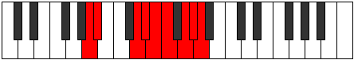 |
| [3555](https://ianring.com/musictheory/scales/3555) | [Pylyllic](ModeDSharpPylyllic.md) | D# | D#, E, G#, A, A#, B, C#, D, D# |  |
| [3555](https://ianring.com/musictheory/scales/3555) | [Pylyllic](ModeEFlatPylyllic.md) | Eb | Eb, E, Ab, A, Bb, B, Db, D, Eb |  |
| [3555](https://ianring.com/musictheory/scales/3555) | [Pylyllic](ModeASharpPylyllic.md) | A# | A#, B, D#, E, F, F#, G#, A, A# |  |
| [3555](https://ianring.com/musictheory/scales/3555) | [Pylyllic](ModeBFlatPylyllic.md) | Bb | Bb, B, Eb, E, F, Gb, Ab, A, Bb |  |
| [3557](https://ianring.com/musictheory/scales/3557) | [Thycryllic](ModeASharpThycryllic.md) | A# | A#, C, D#, E, F, F#, G#, A, A# |  |
| [3557](https://ianring.com/musictheory/scales/3557) | [Thycryllic](ModeBFlatThycryllic.md) | Bb | Bb, C, Eb, E, F, Gb, Ab, A, Bb |  |
| [3557](https://ianring.com/musictheory/scales/3557) | [Thycryllic](ModeDNaturalThycryllic.md) | D | D, E, G, G#, A, A#, C, C#, D |  |
| [3559](https://ianring.com/musictheory/scales/3559) | [Aerathygic](ModeDNaturalAerathygic.md) | D | D, D#, E, G, G#, A, A#, C, C#, D |  |
| [3559](https://ianring.com/musictheory/scales/3559) | [Aerathygic](ModeGSharpAerathygic.md) | G# | G#, A, A#, C#, D, D#, E, F#, G, G# |  |
| [3559](https://ianring.com/musictheory/scales/3559) | [Aerathygic](ModeAFlatAerathygic.md) | Ab | Ab, A, Bb, Db, D, Eb, E, Gb, G, Ab |  |
| [3559](https://ianring.com/musictheory/scales/3559) | [Aerathygic](ModeDSharpAerathygic.md) | D# | D#, E, F, G#, A, A#, B, C#, D, D# |  |
| [3559](https://ianring.com/musictheory/scales/3559) | [Aerathygic](ModeEFlatAerathygic.md) | Eb | Eb, E, F, Ab, A, Bb, B, Db, D, Eb |  |
| [3559](https://ianring.com/musictheory/scales/3559) | [Aerathygic](ModeASharpAerathygic.md) | A# | A#, B, C, D#, E, F, F#, G#, A, A# |  |
| [3559](https://ianring.com/musictheory/scales/3559) | [Aerathygic](ModeBFlatAerathygic.md) | Bb | Bb, B, C, Eb, E, F, Gb, Ab, A, Bb |  |
| [3559](https://ianring.com/musictheory/scales/3559) | [Aerathygic](ModeANaturalAerathygic.md) | A | A, A#, B, D, D#, E, F, G, G#, A |  |
| [3561](https://ianring.com/musictheory/scales/3561) | [Pothyllic](ModeASharpPothyllic.md) | A# | A#, C#, D#, E, F, F#, G#, A, A# |  |
| [3561](https://ianring.com/musictheory/scales/3561) | [Pothyllic](ModeBFlatPothyllic.md) | Bb | Bb, Db, Eb, E, F, Gb, Ab, A, Bb |  |
| [3563](https://ianring.com/musictheory/scales/3563) | [Ionoptygic](ModeANaturalIonoptygic.md) | A | A, A#, C, D, D#, E, F, G, G#, A |  |
| [3563](https://ianring.com/musictheory/scales/3563) | [Ionoptygic](ModeDSharpIonoptygic.md) | D# | D#, E, F#, G#, A, A#, B, C#, D, D# |  |
| [3563](https://ianring.com/musictheory/scales/3563) | [Ionoptygic](ModeEFlatIonoptygic.md) | Eb | Eb, E, Gb, Ab, A, Bb, B, Db, D, Eb |  |
| [3563](https://ianring.com/musictheory/scales/3563) | [Ionoptygic](ModeASharpIonoptygic.md) | A# | A#, B, C#, D#, E, F, F#, G#, A, A# |  |
| [3563](https://ianring.com/musictheory/scales/3563) | [Ionoptygic](ModeBFlatIonoptygic.md) | Bb | Bb, B, Db, Eb, E, F, Gb, Ab, A, Bb |  |
| [3565](https://ianring.com/musictheory/scales/3565) | [Aeolorygic](ModeASharpAeolorygic.md) | A# | A#, C, C#, D#, E, F, F#, G#, A, A# |  |
| [3565](https://ianring.com/musictheory/scales/3565) | [Aeolorygic](ModeBFlatAeolorygic.md) | Bb | Bb, C, Db, Eb, E, F, Gb, Ab, A, Bb |  |
| [3565](https://ianring.com/musictheory/scales/3565) | [Aeolorygic](ModeDNaturalAeolorygic.md) | D | D, E, F, G, G#, A, A#, C, C#, D |  |
| [3567](https://ianring.com/musictheory/scales/3567) | [Epityllian](ModeDNaturalEpityllian.md) | D | D, D#, E, F, G, G#, A, A#, C, C#, D |  |
| [3567](https://ianring.com/musictheory/scales/3567) | [Epityllian](ModeASharpEpityllian.md) | A# | A#, B, C, C#, D#, E, F, F#, G#, A, A# |  |
| [3567](https://ianring.com/musictheory/scales/3567) | [Epityllian](ModeBFlatEpityllian.md) | Bb | Bb, B, C, Db, Eb, E, F, Gb, Ab, A, Bb |  |
| [3567](https://ianring.com/musictheory/scales/3567) | [Epityllian](ModeDSharpEpityllian.md) | D# | D#, E, F, F#, G#, A, A#, B, C#, D, D# | 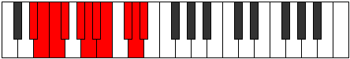 |
| [3567](https://ianring.com/musictheory/scales/3567) | [Epityllian](ModeEFlatEpityllian.md) | Eb | Eb, E, F, Gb, Ab, A, Bb, B, Db, D, Eb |  |
| [3567](https://ianring.com/musictheory/scales/3567) | [Epityllian](ModeANaturalEpityllian.md) | A | A, A#, B, C, D, D#, E, F, G, G#, A |  |
| [3567](https://ianring.com/musictheory/scales/3567) | [Epityllian](ModeGSharpEpityllian.md) | G# | G#, A, A#, B, C#, D, D#, E, F#, G, G# |  |
| [3567](https://ianring.com/musictheory/scales/3567) | [Epityllian](ModeAFlatEpityllian.md) | Ab | Ab, A, Bb, B, Db, D, Eb, E, Gb, G, Ab |  |
| [3569](https://ianring.com/musictheory/scales/3569) | [Aeoladyllic](ModeASharpAeoladyllic.md) | A# | A#, D, D#, E, F, F#, G#, A, A# |  |
| [3569](https://ianring.com/musictheory/scales/3569) | [Aeoladyllic](ModeBFlatAeoladyllic.md) | Bb | Bb, D, Eb, E, F, Gb, Ab, A, Bb |  |
| [3569](https://ianring.com/musictheory/scales/3569) | [Aeoladyllic](ModeENaturalAeoladyllic.md) | E | E, G#, A, A#, B, C, D, D#, E |  |
| [3571](https://ianring.com/musictheory/scales/3571) | [Dyrygic](ModeANaturalDyrygic.md) | A | A, A#, C#, D, D#, E, F, G, G#, A |  |
| [3571](https://ianring.com/musictheory/scales/3571) | [Dyrygic](ModeENaturalDyrygic.md) | E | E, F, G#, A, A#, B, C, D, D#, E |  |
| [3571](https://ianring.com/musictheory/scales/3571) | [Dyrygic](ModeASharpDyrygic.md) | A# | A#, B, D, D#, E, F, F#, G#, A, A# |  |
| [3571](https://ianring.com/musictheory/scales/3571) | [Dyrygic](ModeBFlatDyrygic.md) | Bb | Bb, B, D, Eb, E, F, Gb, Ab, A, Bb |  |
| [3571](https://ianring.com/musictheory/scales/3571) | [Dyrygic](ModeDSharpDyrygic.md) | D# | D#, E, G, G#, A, A#, B, C#, D, D# |  |
| [3571](https://ianring.com/musictheory/scales/3571) | [Dyrygic](ModeEFlatDyrygic.md) | Eb | Eb, E, G, Ab, A, Bb, B, Db, D, Eb |  |
| [3573](https://ianring.com/musictheory/scales/3573) | [Kaptygic](ModeASharpKaptygic.md) | A# | A#, C, D, D#, E, F, F#, G#, A, A# |  |
| [3573](https://ianring.com/musictheory/scales/3573) | [Kaptygic](ModeBFlatKaptygic.md) | Bb | Bb, C, D, Eb, E, F, Gb, Ab, A, Bb |  |
| [3573](https://ianring.com/musictheory/scales/3573) | [Kaptygic](ModeDNaturalKaptygic.md) | D | D, E, F#, G, G#, A, A#, C, C#, D |  |
| [3573](https://ianring.com/musictheory/scales/3573) | [Kaptygic](ModeENaturalKaptygic.md) | E | E, F#, G#, A, A#, B, C, D, D#, E |  |
| [3575](https://ianring.com/musictheory/scales/3575) | [Mogyllian](ModeDNaturalMogyllian.md) | D | D, D#, E, F#, G, G#, A, A#, C, C#, D |  |
| [3575](https://ianring.com/musictheory/scales/3575) | [Mogyllian](ModeGSharpMogyllian.md) | G# | G#, A, A#, C, C#, D, D#, E, F#, G, G# |  |
| [3575](https://ianring.com/musictheory/scales/3575) | [Mogyllian](ModeAFlatMogyllian.md) | Ab | Ab, A, Bb, C, Db, D, Eb, E, Gb, G, Ab |  |
| [3575](https://ianring.com/musictheory/scales/3575) | [Mogyllian](ModeENaturalMogyllian.md) | E | E, F, F#, G#, A, A#, B, C, D, D#, E |  |
| [3575](https://ianring.com/musictheory/scales/3575) | [Mogyllian](ModeASharpMogyllian.md) | A# | A#, B, C, D, D#, E, F, F#, G#, A, A# |  |
| [3575](https://ianring.com/musictheory/scales/3575) | [Mogyllian](ModeBFlatMogyllian.md) | Bb | Bb, B, C, D, Eb, E, F, Gb, Ab, A, Bb |  |
| [3575](https://ianring.com/musictheory/scales/3575) | [Mogyllian](ModeDSharpMogyllian.md) | D# | D#, E, F, G, G#, A, A#, B, C#, D, D# |  |
| [3575](https://ianring.com/musictheory/scales/3575) | [Mogyllian](ModeEFlatMogyllian.md) | Eb | Eb, E, F, G, Ab, A, Bb, B, Db, D, Eb |  |
| [3575](https://ianring.com/musictheory/scales/3575) | [Mogyllian](ModeANaturalMogyllian.md) | A | A, A#, B, C#, D, D#, E, F, G, G#, A |  |
| [3577](https://ianring.com/musictheory/scales/3577) | [Loptygic](ModeASharpLoptygic.md) | A# | A#, C#, D, D#, E, F, F#, G#, A, A# |  |
| [3577](https://ianring.com/musictheory/scales/3577) | [Loptygic](ModeBFlatLoptygic.md) | Bb | Bb, Db, D, Eb, E, F, Gb, Ab, A, Bb |  |
| [3577](https://ianring.com/musictheory/scales/3577) | [Loptygic](ModeFNaturalLoptygic.md) | F | F, G#, A, A#, B, C, C#, D#, E, F |  |
| [3577](https://ianring.com/musictheory/scales/3577) | [Loptygic](ModeENaturalLoptygic.md) | E | E, G, G#, A, A#, B, C, D, D#, E |  |
| [3579](https://ianring.com/musictheory/scales/3579) | [Zyphyllian](ModeANaturalZyphyllian.md) | A | A, A#, C, C#, D, D#, E, F, G, G#, A |  |
| [3579](https://ianring.com/musictheory/scales/3579) | [Zyphyllian](ModeFNaturalZyphyllian.md) | F | F, F#, G#, A, A#, B, C, C#, D#, E, F |  |
| [3579](https://ianring.com/musictheory/scales/3579) | [Zyphyllian](ModeASharpZyphyllian.md) | A# | A#, B, C#, D, D#, E, F, F#, G#, A, A# |  |
| [3579](https://ianring.com/musictheory/scales/3579) | [Zyphyllian](ModeBFlatZyphyllian.md) | Bb | Bb, B, Db, D, Eb, E, F, Gb, Ab, A, Bb |  |
| [3579](https://ianring.com/musictheory/scales/3579) | [Zyphyllian](ModeENaturalZyphyllian.md) | E | E, F, G, G#, A, A#, B, C, D, D#, E |  |
| [3579](https://ianring.com/musictheory/scales/3579) | [Zyphyllian](ModeDSharpZyphyllian.md) | D# | D#, E, F#, G, G#, A, A#, B, C#, D, D# |  |
| [3579](https://ianring.com/musictheory/scales/3579) | [Zyphyllian](ModeEFlatZyphyllian.md) | Eb | Eb, E, Gb, G, Ab, A, Bb, B, Db, D, Eb |  |
| [3581](https://ianring.com/musictheory/scales/3581) | [Epocryllian](ModeASharpEpocryllian.md) | A# | A#, C, C#, D, D#, E, F, F#, G#, A, A# |  |
| [3581](https://ianring.com/musictheory/scales/3581) | [Epocryllian](ModeBFlatEpocryllian.md) | Bb | Bb, C, Db, D, Eb, E, F, Gb, Ab, A, Bb |  |
| [3581](https://ianring.com/musictheory/scales/3581) | [Epocryllian](ModeDNaturalEpocryllian.md) | D | D, E, F, F#, G, G#, A, A#, C, C#, D |  |
| [3581](https://ianring.com/musictheory/scales/3581) | [Epocryllian](ModeFSharpEpocryllian.md) | F# | F#, G#, A, A#, B, C, C#, D, E, F, F# |  |
| [3581](https://ianring.com/musictheory/scales/3581) | [Epocryllian](ModeGFlatEpocryllian.md) | Gb | Gb, Ab, A, Bb, B, C, Db, D, E, F, Gb |  |
| [3581](https://ianring.com/musictheory/scales/3581) | [Epocryllian](ModeFNaturalEpocryllian.md) | F | F, G, G#, A, A#, B, C, C#, D#, E, F |  |
| [3581](https://ianring.com/musictheory/scales/3581) | [Epocryllian](ModeENaturalEpocryllian.md) | E | E, F#, G, G#, A, A#, B, C, D, D#, E |  |
| [3583](https://ianring.com/musictheory/scales/3583) | [Zylatic](ModeDNaturalZylatic.md) | D | D, D#, E, F, F#, G, G#, A, A#, C, C#, D |  |
| [3583](https://ianring.com/musictheory/scales/3583) | [Zylatic](ModeASharpZylatic.md) | A# | A#, B, C, C#, D, D#, E, F, F#, G#, A, A# |  |
| [3583](https://ianring.com/musictheory/scales/3583) | [Zylatic](ModeBFlatZylatic.md) | Bb | Bb, B, C, Db, D, Eb, E, F, Gb, Ab, A, Bb |  |
| [3583](https://ianring.com/musictheory/scales/3583) | [Zylatic](ModeANaturalZylatic.md) | A | A, A#, B, C, C#, D, D#, E, F, G, G#, A |  |
| [3583](https://ianring.com/musictheory/scales/3583) | [Zylatic](ModeGSharpZylatic.md) | G# | G#, A, A#, B, C, C#, D, D#, E, F#, G, G# |  |
| [3583](https://ianring.com/musictheory/scales/3583) | [Zylatic](ModeAFlatZylatic.md) | Ab | Ab, A, Bb, B, C, Db, D, Eb, E, Gb, G, Ab |  |
| [3583](https://ianring.com/musictheory/scales/3583) | [Zylatic](ModeFSharpZylatic.md) | F# | F#, G, G#, A, A#, B, C, C#, D, E, F, F# |  |
| [3583](https://ianring.com/musictheory/scales/3583) | [Zylatic](ModeGFlatZylatic.md) | Gb | Gb, G, Ab, A, Bb, B, C, Db, D, E, F, Gb |  |
| [3583](https://ianring.com/musictheory/scales/3583) | [Zylatic](ModeFNaturalZylatic.md) | F | F, F#, G, G#, A, A#, B, C, C#, D#, E, F |  |
| [3583](https://ianring.com/musictheory/scales/3583) | [Zylatic](ModeENaturalZylatic.md) | E | E, F, F#, G, G#, A, A#, B, C, D, D#, E |  |
| [3583](https://ianring.com/musictheory/scales/3583) | [Zylatic](ModeDSharpZylatic.md) | D# | D#, E, F, F#, G, G#, A, A#, B, C#, D, D# |  |
| [3583](https://ianring.com/musictheory/scales/3583) | [Zylatic](ModeEFlatZylatic.md) | Eb | Eb, E, F, Gb, G, Ab, A, Bb, B, Db, D, Eb |  |
| [3619](https://ianring.com/musictheory/scales/3619) | [Thanimic](ModeBNaturalThanimic.md) | B | B, C, D##, F###, G##, A#, B |  |
| [3621](https://ianring.com/musictheory/scales/3621) | [Gylimic](ModeBNaturalGylimic.md) | B | B, C#, D##, F###, G##, A#, B |  |
| [3623](https://ianring.com/musictheory/scales/3623) | [Aerocrian](ModeBNaturalAerocrian.md) | B | B, C, Db, E, F###, G##, A#, B |  |
| [3625](https://ianring.com/musictheory/scales/3625) | [Podimic](ModeBNaturalPodimic.md) | B | B, C##, D##, F###, G##, A#, B |  |
| [3627](https://ianring.com/musictheory/scales/3627) | [Kalian](ModeBNaturalKalian.md) | B | B, C, D, E, F###, G##, A#, B |  |
| [3629](https://ianring.com/musictheory/scales/3629) | [Boptian](ModeBNaturalBoptian.md) | B | B, C#, D, E, F###, G##, A#, B |  |
| [3631](https://ianring.com/musictheory/scales/3631) | [Gydyllic](ModeGNaturalGydyllic.md) | G | G, G#, A, A#, C, E, F, F#, G |  |
| [3631](https://ianring.com/musictheory/scales/3631) | [Gydyllic](ModeBNaturalGydyllic.md) | B | B, C, C#, D, E, G#, A, A#, B |  |
| [3633](https://ianring.com/musictheory/scales/3633) | [Daptimic](ModeBNaturalDaptimic.md) | B | B, C###, D##, F###, G##, A#, B |  |
| [3635](https://ianring.com/musictheory/scales/3635) | [Katygian](ModeBNaturalKatygian.md) | B | B, C, D#, E, F###, G##, A#, B |  |
| [3637](https://ianring.com/musictheory/scales/3637) | [Kygian](ModeBNaturalKygian.md) | B | B, C#, D#, E, F###, G##, A#, B |  |
| [3639](https://ianring.com/musictheory/scales/3639) | [Paptyllic](ModeBNaturalPaptyllic.md) | B | B, C, C#, D#, E, G#, A, A#, B |  |
| [3641](https://ianring.com/musictheory/scales/3641) | [Thocrian](ModeFNaturalThocrian.md) | F | F, G#, A, Bb, C##, D#, E, F |  |
| [3641](https://ianring.com/musictheory/scales/3641) | [Thocrian](ModeBNaturalThocrian.md) | B | B, C##, D#, E, F###, G##, A#, B |  |
| [3643](https://ianring.com/musictheory/scales/3643) | [Kydyllic](ModeFNaturalKydyllic.md) | F | F, F#, G#, A, A#, D, D#, E, F |  |
| [3643](https://ianring.com/musictheory/scales/3643) | [Kydyllic](ModeBNaturalKydyllic.md) | B | B, C, D, D#, E, G#, A, A#, B |  |
| [3645](https://ianring.com/musictheory/scales/3645) | [Zycryllic](ModeFNaturalZycryllic.md) | F | F, G, G#, A, A#, D, D#, E, F |  |
| [3645](https://ianring.com/musictheory/scales/3645) | [Zycryllic](ModeBNaturalZycryllic.md) | B | B, C#, D, D#, E, G#, A, A#, B |  |
| [3645](https://ianring.com/musictheory/scales/3645) | [Zycryllic](ModeFSharpZycryllic.md) | F# | F#, G#, A, A#, B, D#, E, F, F# |  |
| [3645](https://ianring.com/musictheory/scales/3645) | [Zycryllic](ModeGFlatZycryllic.md) | Gb | Gb, Ab, A, Bb, B, Eb, E, F, Gb |  |
| [3647](https://ianring.com/musictheory/scales/3647) | [Eporygic](ModeFNaturalEporygic.md) | F | F, F#, G, G#, A, A#, D, D#, E, F |  |
| [3647](https://ianring.com/musictheory/scales/3647) | [Eporygic](ModeBNaturalEporygic.md) | B | B, C, C#, D, D#, E, G#, A, A#, B |  |
| [3647](https://ianring.com/musictheory/scales/3647) | [Eporygic](ModeGNaturalEporygic.md) | G | G, G#, A, A#, B, C, E, F, F#, G |  |
| [3647](https://ianring.com/musictheory/scales/3647) | [Eporygic](ModeFSharpEporygic.md) | F# | F#, G, G#, A, A#, B, D#, E, F, F# |  |
| [3647](https://ianring.com/musictheory/scales/3647) | [Eporygic](ModeGFlatEporygic.md) | Gb | Gb, G, Ab, A, Bb, B, Eb, E, F, Gb |  |
| [3653](https://ianring.com/musictheory/scales/3653) | [Sathimic](ModeASharpSathimic.md) | A# | A#, B#, D##, E###, F###, G##, A# |  |
| [3653](https://ianring.com/musictheory/scales/3653) | [Sathimic](ModeBFlatSathimic.md) | Bb | Bb, C, D##, E###, F###, G##, Bb |  |
| [3655](https://ianring.com/musictheory/scales/3655) | [Mathian](ModeASharpMathian.md) | A# | A#, B, C, D##, E###, F###, G##, A# |  |
| [3655](https://ianring.com/musictheory/scales/3655) | [Mathian](ModeBFlatMathian.md) | Bb | Bb, Cb, Dbb, E, F##, G#, A, Bb |  |
| [3657](https://ianring.com/musictheory/scales/3657) | [Epynimic](ModeASharpEpynimic.md) | A# | A#, B##, D##, E###, F###, G##, A# |  |
| [3657](https://ianring.com/musictheory/scales/3657) | [Epynimic](ModeBFlatEpynimic.md) | Bb | Bb, C#, D##, E###, F###, G##, Bb |  |
| [3659](https://ianring.com/musictheory/scales/3659) | [Polian](ModeASharpPolian.md) | A# | A#, B, C#, D##, E###, F###, G##, A# | 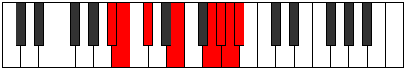 |
| [3659](https://ianring.com/musictheory/scales/3659) | [Polian](ModeBFlatPolian.md) | Bb | Bb, Cb, Db, E, F##, G#, A, Bb |  |
| [3661](https://ianring.com/musictheory/scales/3661) | [Mixodorian](ModeASharpMixodorian.md) | A# | A#, B#, C#, D##, E###, F###, G##, A# |  |
| [3661](https://ianring.com/musictheory/scales/3661) | [Mixodorian](ModeBFlatMixodorian.md) | Bb | Bb, C, Db, E, F##, G#, A, Bb |  |
| [3663](https://ianring.com/musictheory/scales/3663) | [Sonyllic](ModeGNaturalSonyllic.md) | G | G, G#, A, A#, C#, E, F, F#, G |  |
| [3663](https://ianring.com/musictheory/scales/3663) | [Sonyllic](ModeASharpSonyllic.md) | A# | A#, B, C, C#, E, G, G#, A, A# |  |
| [3663](https://ianring.com/musictheory/scales/3663) | [Sonyllic](ModeBFlatSonyllic.md) | Bb | Bb, B, C, Db, E, G, Ab, A, Bb |  |
| [3665](https://ianring.com/musictheory/scales/3665) | [Stalimic](ModeASharpStalimic.md) | A# | A#, B###, D##, E###, F###, G##, A# |  |
| [3665](https://ianring.com/musictheory/scales/3665) | [Stalimic](ModeBFlatStalimic.md) | Bb | Bb, C##, D##, E###, F###, G##, Bb |  |
| [3667](https://ianring.com/musictheory/scales/3667) | [Kaptian](ModeASharpKaptian.md) | A# | A#, B, C##, D##, E###, F###, G##, A# |  |
| [3667](https://ianring.com/musictheory/scales/3667) | [Kaptian](ModeBFlatKaptian.md) | Bb | Bb, Cb, D, E, F##, G#, A, Bb |  |
| [3669](https://ianring.com/musictheory/scales/3669) | [Mothian](ModeASharpMothian.md) | A# | A#, B#, C##, D##, E###, F###, G##, A# |  |
| [3669](https://ianring.com/musictheory/scales/3669) | [Mothian](ModeBFlatMothian.md) | Bb | Bb, C, D, E, F##, G#, A, Bb |  |
| [3671](https://ianring.com/musictheory/scales/3671) | [Aeonyllic](ModeASharpAeonyllic.md) | A# | A#, B, C, D, E, G, G#, A, A# |  |
| [3671](https://ianring.com/musictheory/scales/3671) | [Aeonyllic](ModeBFlatAeonyllic.md) | Bb | Bb, B, C, D, E, G, Ab, A, Bb |  |
| [3673](https://ianring.com/musictheory/scales/3673) | [Ranian](ModeASharpRanian.md) | A# | A#, B##, C##, D##, E###, F###, G##, A# |  |
| [3673](https://ianring.com/musictheory/scales/3673) | [Ranian](ModeBFlatRanian.md) | Bb | Bb, C#, D, E, F##, G#, A, Bb |  |
| [3675](https://ianring.com/musictheory/scales/3675) | [Monyllic](ModeASharpMonyllic.md) | A# | A#, B, C#, D, E, G, G#, A, A# |  |
| [3675](https://ianring.com/musictheory/scales/3675) | [Monyllic](ModeBFlatMonyllic.md) | Bb | Bb, B, Db, D, E, G, Ab, A, Bb |  |
| [3677](https://ianring.com/musictheory/scales/3677) | [Katylyllic](ModeFSharpKatylyllic.md) | F# | F#, G#, A, A#, C, D#, E, F, F# |  |
| [3677](https://ianring.com/musictheory/scales/3677) | [Katylyllic](ModeGFlatKatylyllic.md) | Gb | Gb, Ab, A, Bb, C, Eb, E, F, Gb |  |
| [3677](https://ianring.com/musictheory/scales/3677) | [Katylyllic](ModeASharpKatylyllic.md) | A# | A#, C, C#, D, E, G, G#, A, A# |  |
| [3677](https://ianring.com/musictheory/scales/3677) | [Katylyllic](ModeBFlatKatylyllic.md) | Bb | Bb, C, Db, D, E, G, Ab, A, Bb |  |
| [3679](https://ianring.com/musictheory/scales/3679) | [Rycrygic](ModeFSharpRycrygic.md) | F# | F#, G, G#, A, A#, C, D#, E, F, F# |  |
| [3679](https://ianring.com/musictheory/scales/3679) | [Rycrygic](ModeGFlatRycrygic.md) | Gb | Gb, G, Ab, A, Bb, C, Eb, E, F, Gb |  |
| [3679](https://ianring.com/musictheory/scales/3679) | [Rycrygic](ModeASharpRycrygic.md) | A# | A#, B, C, C#, D, E, G, G#, A, A# |  |
| [3679](https://ianring.com/musictheory/scales/3679) | [Rycrygic](ModeBFlatRycrygic.md) | Bb | Bb, B, C, Db, D, E, G, Ab, A, Bb |  |
| [3679](https://ianring.com/musictheory/scales/3679) | [Rycrygic](ModeGNaturalRycrygic.md) | G | G, G#, A, A#, B, C#, E, F, F#, G |  |
| [3683](https://ianring.com/musictheory/scales/3683) | [Dycrian](ModeBNaturalDycrian.md) | B | B, C, D##, E#, F###, G##, A#, B |  |
| [3683](https://ianring.com/musictheory/scales/3683) | [Dycrian](ModeASharpDycrian.md) | A# | A#, B, C###, D##, E###, F###, G##, A# |  |
| [3683](https://ianring.com/musictheory/scales/3683) | [Dycrian](ModeBFlatDycrian.md) | Bb | Bb, Cb, D#, E, F##, G#, A, Bb |  |
| [3685](https://ianring.com/musictheory/scales/3685) | [Kodian](ModeASharpKodian.md) | A# | A#, B#, C###, D##, E###, F###, G##, A# |  |
| [3685](https://ianring.com/musictheory/scales/3685) | [Kodian](ModeBFlatKodian.md) | Bb | Bb, C, D#, E, F##, G#, A, Bb |  |
| [3685](https://ianring.com/musictheory/scales/3685) | [Kodian](ModeBNaturalKodian.md) | B | B, C#, D##, E#, F###, G##, A#, B |  |
| [3687](https://ianring.com/musictheory/scales/3687) | [Zonyllic](ModeBNaturalZonyllic.md) | B | B, C, C#, E, F, G#, A, A#, B |  |
| [3687](https://ianring.com/musictheory/scales/3687) | [Zonyllic](ModeASharpZonyllic.md) | A# | A#, B, C, D#, E, G, G#, A, A# |  |
| [3687](https://ianring.com/musictheory/scales/3687) | [Zonyllic](ModeBFlatZonyllic.md) | Bb | Bb, B, C, Eb, E, G, Ab, A, Bb |  |
| [3689](https://ianring.com/musictheory/scales/3689) | [Katocrian](ModeASharpKatocrian.md) | A# | A#, B##, C###, D##, E###, F###, G##, A# |  |
| [3689](https://ianring.com/musictheory/scales/3689) | [Katocrian](ModeBFlatKatocrian.md) | Bb | Bb, C#, D#, E, F##, G#, A, Bb |  |
| [3689](https://ianring.com/musictheory/scales/3689) | [Katocrian](ModeBNaturalKatocrian.md) | B | B, C##, D##, E#, F###, G##, A#, B |  |
| [3691](https://ianring.com/musictheory/scales/3691) | [Badyllic](ModeBNaturalBadyllic.md) | B | B, C, D, E, F, G#, A, A#, B |  |
| [3691](https://ianring.com/musictheory/scales/3691) | [Badyllic](ModeASharpBadyllic.md) | A# | A#, B, C#, D#, E, G, G#, A, A# |  |
| [3691](https://ianring.com/musictheory/scales/3691) | [Badyllic](ModeBFlatBadyllic.md) | Bb | Bb, B, Db, Eb, E, G, Ab, A, Bb |  |
| [3693](https://ianring.com/musictheory/scales/3693) | [Epaptyllic](ModeASharpEpaptyllic.md) | A# | A#, C, C#, D#, E, G, G#, A, A# |  |
| [3693](https://ianring.com/musictheory/scales/3693) | [Epaptyllic](ModeBFlatEpaptyllic.md) | Bb | Bb, C, Db, Eb, E, G, Ab, A, Bb |  |
| [3693](https://ianring.com/musictheory/scales/3693) | [Epaptyllic](ModeBNaturalEpaptyllic.md) | B | B, C#, D, E, F, G#, A, A#, B |  |
| [3695](https://ianring.com/musictheory/scales/3695) | [Kodygic](ModeGNaturalKodygic.md) | G | G, G#, A, A#, C, C#, E, F, F#, G |  |
| [3695](https://ianring.com/musictheory/scales/3695) | [Kodygic](ModeBNaturalKodygic.md) | B | B, C, C#, D, E, F, G#, A, A#, B |  |
| [3695](https://ianring.com/musictheory/scales/3695) | [Kodygic](ModeASharpKodygic.md) | A# | A#, B, C, C#, D#, E, G, G#, A, A# |  |
| [3695](https://ianring.com/musictheory/scales/3695) | [Kodygic](ModeBFlatKodygic.md) | Bb | Bb, B, C, Db, Eb, E, G, Ab, A, Bb |  |
| [3697](https://ianring.com/musictheory/scales/3697) | [Ionarian](ModeENaturalIonarian.md) | E | E, F###, G##, A#, B##, C##, D#, E | 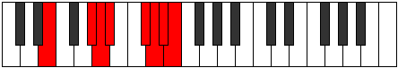 |
| [3697](https://ianring.com/musictheory/scales/3697) | [Ionarian](ModeASharpIonarian.md) | A# | A#, B###, C###, D##, E###, F###, G##, A# |  |
| [3697](https://ianring.com/musictheory/scales/3697) | [Ionarian](ModeBFlatIonarian.md) | Bb | Bb, C##, D#, E, F##, G#, A, Bb |  |
| [3697](https://ianring.com/musictheory/scales/3697) | [Ionarian](ModeBNaturalIonarian.md) | B | B, C###, D##, E#, F###, G##, A#, B |  |
| [3699](https://ianring.com/musictheory/scales/3699) | [Aeolylyllic](ModeENaturalAeolylyllic.md) | E | E, F, G#, A, A#, C#, D, D#, E |  |
| [3699](https://ianring.com/musictheory/scales/3699) | [Aeolylyllic](ModeBNaturalAeolylyllic.md) | B | B, C, D#, E, F, G#, A, A#, B |  |
| [3699](https://ianring.com/musictheory/scales/3699) | [Aeolylyllic](ModeASharpAeolylyllic.md) | A# | A#, B, D, D#, E, G, G#, A, A# |  |
| [3699](https://ianring.com/musictheory/scales/3699) | [Aeolylyllic](ModeBFlatAeolylyllic.md) | Bb | Bb, B, D, Eb, E, G, Ab, A, Bb |  |
| [3701](https://ianring.com/musictheory/scales/3701) | [Bagyllic](ModeENaturalBagyllic.md) | E | E, F#, G#, A, A#, C#, D, D#, E |  |
| [3701](https://ianring.com/musictheory/scales/3701) | [Bagyllic](ModeASharpBagyllic.md) | A# | A#, C, D, D#, E, G, G#, A, A# |  |
| [3701](https://ianring.com/musictheory/scales/3701) | [Bagyllic](ModeBFlatBagyllic.md) | Bb | Bb, C, D, Eb, E, G, Ab, A, Bb |  |
| [3701](https://ianring.com/musictheory/scales/3701) | [Bagyllic](ModeBNaturalBagyllic.md) | B | B, C#, D#, E, F, G#, A, A#, B |  |
| [3703](https://ianring.com/musictheory/scales/3703) | [Katalygic](ModeENaturalKatalygic.md) | E | E, F, F#, G#, A, A#, C#, D, D#, E |  |
| [3703](https://ianring.com/musictheory/scales/3703) | [Katalygic](ModeBNaturalKatalygic.md) | B | B, C, C#, D#, E, F, G#, A, A#, B |  |
| [3703](https://ianring.com/musictheory/scales/3703) | [Katalygic](ModeASharpKatalygic.md) | A# | A#, B, C, D, D#, E, G, G#, A, A# |  |
| [3703](https://ianring.com/musictheory/scales/3703) | [Katalygic](ModeBFlatKatalygic.md) | Bb | Bb, B, C, D, Eb, E, G, Ab, A, Bb |  |
| [3705](https://ianring.com/musictheory/scales/3705) | [Sydyllic](ModeENaturalSydyllic.md) | E | E, G, G#, A, A#, C#, D, D#, E |  |
| [3705](https://ianring.com/musictheory/scales/3705) | [Sydyllic](ModeASharpSydyllic.md) | A# | A#, C#, D, D#, E, G, G#, A, A# |  |
| [3705](https://ianring.com/musictheory/scales/3705) | [Sydyllic](ModeBFlatSydyllic.md) | Bb | Bb, Db, D, Eb, E, G, Ab, A, Bb |  |
| [3705](https://ianring.com/musictheory/scales/3705) | [Sydyllic](ModeFNaturalSydyllic.md) | F | F, G#, A, A#, B, D, D#, E, F |  |
| [3705](https://ianring.com/musictheory/scales/3705) | [Sydyllic](ModeBNaturalSydyllic.md) | B | B, D, D#, E, F, G#, A, A#, B |  |
| [3707](https://ianring.com/musictheory/scales/3707) | [Rynygic](ModeENaturalRynygic.md) | E | E, F, G, G#, A, A#, C#, D, D#, E |  |
| [3707](https://ianring.com/musictheory/scales/3707) | [Rynygic](ModeBNaturalRynygic.md) | B | B, C, D, D#, E, F, G#, A, A#, B |  |
| [3707](https://ianring.com/musictheory/scales/3707) | [Rynygic](ModeFNaturalRynygic.md) | F | F, F#, G#, A, A#, B, D, D#, E, F |  |
| [3707](https://ianring.com/musictheory/scales/3707) | [Rynygic](ModeASharpRynygic.md) | A# | A#, B, C#, D, D#, E, G, G#, A, A# |  |
| [3707](https://ianring.com/musictheory/scales/3707) | [Rynygic](ModeBFlatRynygic.md) | Bb | Bb, B, Db, D, Eb, E, G, Ab, A, Bb |  |
| [3709](https://ianring.com/musictheory/scales/3709) | [Locrygic](ModeASharpLocrygic.md) | A# | A#, C, C#, D, D#, E, G, G#, A, A# |  |
| [3709](https://ianring.com/musictheory/scales/3709) | [Locrygic](ModeBFlatLocrygic.md) | Bb | Bb, C, Db, D, Eb, E, G, Ab, A, Bb |  |
| [3709](https://ianring.com/musictheory/scales/3709) | [Locrygic](ModeENaturalLocrygic.md) | E | E, F#, G, G#, A, A#, C#, D, D#, E |  |
| [3709](https://ianring.com/musictheory/scales/3709) | [Locrygic](ModeBNaturalLocrygic.md) | B | B, C#, D, D#, E, F, G#, A, A#, B |  |
| [3709](https://ianring.com/musictheory/scales/3709) | [Locrygic](ModeFSharpLocrygic.md) | F# | F#, G#, A, A#, B, C, D#, E, F, F# |  |
| [3709](https://ianring.com/musictheory/scales/3709) | [Locrygic](ModeGFlatLocrygic.md) | Gb | Gb, Ab, A, Bb, B, C, Eb, E, F, Gb |  |
| [3709](https://ianring.com/musictheory/scales/3709) | [Locrygic](ModeFNaturalLocrygic.md) | F | F, G, G#, A, A#, B, D, D#, E, F |  |
| [3711](https://ianring.com/musictheory/scales/3711) | [Dycryllian](ModeENaturalDycryllian.md) | E | E, F, F#, G, G#, A, A#, C#, D, D#, E |  |
| [3711](https://ianring.com/musictheory/scales/3711) | [Dycryllian](ModeBNaturalDycryllian.md) | B | B, C, C#, D, D#, E, F, G#, A, A#, B |  |
| [3711](https://ianring.com/musictheory/scales/3711) | [Dycryllian](ModeASharpDycryllian.md) | A# | A#, B, C, C#, D, D#, E, G, G#, A, A# |  |
| [3711](https://ianring.com/musictheory/scales/3711) | [Dycryllian](ModeBFlatDycryllian.md) | Bb | Bb, B, C, Db, D, Eb, E, G, Ab, A, Bb |  |
| [3711](https://ianring.com/musictheory/scales/3711) | [Dycryllian](ModeGNaturalDycryllian.md) | G | G, G#, A, A#, B, C, C#, E, F, F#, G |  |
| [3711](https://ianring.com/musictheory/scales/3711) | [Dycryllian](ModeFSharpDycryllian.md) | F# | F#, G, G#, A, A#, B, C, D#, E, F, F# |  |
| [3711](https://ianring.com/musictheory/scales/3711) | [Dycryllian](ModeGFlatDycryllian.md) | Gb | Gb, G, Ab, A, Bb, B, C, Eb, E, F, Gb |  |
| [3711](https://ianring.com/musictheory/scales/3711) | [Dycryllian](ModeFNaturalDycryllian.md) | F | F, F#, G, G#, A, A#, B, D, D#, E, F |  |
| [3723](https://ianring.com/musictheory/scales/3723) | [Myptian](ModeANaturalMyptian.md) | A | A, Bb, C, D##, E##, F##, G#, A |  |
| [3727](https://ianring.com/musictheory/scales/3727) | [Tholyllic](ModeGNaturalTholyllic.md) | G | G, G#, A, A#, D, E, F, F#, G |  |
| [3727](https://ianring.com/musictheory/scales/3727) | [Tholyllic](ModeANaturalTholyllic.md) | A | A, A#, B, C, E, F#, G, G#, A | 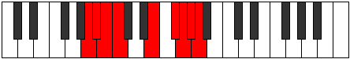 |
| [3731](https://ianring.com/musictheory/scales/3731) | [Aeryrian](ModeANaturalAeryrian.md) | A | A, Bb, C#, D##, E##, F##, G#, A |  |
| [3735](https://ianring.com/musictheory/scales/3735) | [Ionagyllic](ModeANaturalIonagyllic.md) | A | A, A#, B, C#, E, F#, G, G#, A |  |
| [3739](https://ianring.com/musictheory/scales/3739) | [Ioninyllic](ModeANaturalIoninyllic.md) | A | A, A#, C, C#, E, F#, G, G#, A |  |
| [3741](https://ianring.com/musictheory/scales/3741) | [Zydyllic](ModeFSharpZydyllic.md) | F# | F#, G#, A, A#, C#, D#, E, F, F# |  |
| [3741](https://ianring.com/musictheory/scales/3741) | [Zydyllic](ModeGFlatZydyllic.md) | Gb | Gb, Ab, A, Bb, Db, Eb, E, F, Gb |  |
| [3743](https://ianring.com/musictheory/scales/3743) | [Thadygic](ModeFSharpThadygic.md) | F# | F#, G, G#, A, A#, C#, D#, E, F, F# |  |
| [3743](https://ianring.com/musictheory/scales/3743) | [Thadygic](ModeGFlatThadygic.md) | Gb | Gb, G, Ab, A, Bb, Db, Eb, E, F, Gb |  |
| [3743](https://ianring.com/musictheory/scales/3743) | [Thadygic](ModeANaturalThadygic.md) | A | A, A#, B, C, C#, E, F#, G, G#, A |  |
| [3743](https://ianring.com/musictheory/scales/3743) | [Thadygic](ModeGNaturalThadygic.md) | G | G, G#, A, A#, B, D, E, F, F#, G |  |
| [3747](https://ianring.com/musictheory/scales/3747) | [Myrian](ModeANaturalMyrian.md) | A | A, Bb, C##, D##, E##, F##, G#, A |  |
| [3747](https://ianring.com/musictheory/scales/3747) | [Myrian](ModeBNaturalMyrian.md) | B | B, C, D##, E##, F###, G##, A#, B |  |
| [3749](https://ianring.com/musictheory/scales/3749) | [Zothian](ModeBNaturalZothian.md) | B | B, C#, D##, E##, F###, G##, A#, B |  |
| [3751](https://ianring.com/musictheory/scales/3751) | [Aerathyllic](ModeBNaturalAerathyllic.md) | B | B, C, C#, E, F#, G#, A, A#, B |  |
| [3751](https://ianring.com/musictheory/scales/3751) | [Aerathyllic](ModeANaturalAerathyllic.md) | A | A, A#, B, D, E, F#, G, G#, A |  |
| [3753](https://ianring.com/musictheory/scales/3753) | [Phraptian](ModeBNaturalPhraptian.md) | B | B, C##, D##, E##, F###, G##, A#, B |  |
| [3755](https://ianring.com/musictheory/scales/3755) | [Phryryllic](ModeANaturalPhryryllic.md) | A | A, A#, C, D, E, F#, G, G#, A |  |
| [3755](https://ianring.com/musictheory/scales/3755) | [Phryryllic](ModeBNaturalPhryryllic.md) | B | B, C, D, E, F#, G#, A, A#, B |  |
| [3757](https://ianring.com/musictheory/scales/3757) | [Goptyllic](ModeBNaturalGoptyllic.md) | B | B, C#, D, E, F#, G#, A, A#, B |  |
| [3759](https://ianring.com/musictheory/scales/3759) | [Darygic](ModeGNaturalDarygic.md) | G | G, G#, A, A#, C, D, E, F, F#, G |  |
| [3759](https://ianring.com/musictheory/scales/3759) | [Darygic](ModeBNaturalDarygic.md) | B | B, C, C#, D, E, F#, G#, A, A#, B |  |
| [3759](https://ianring.com/musictheory/scales/3759) | [Darygic](ModeANaturalDarygic.md) | A | A, A#, B, C, D, E, F#, G, G#, A |  |
| [3761](https://ianring.com/musictheory/scales/3761) | [Ionythian](ModeBNaturalIonythian.md) | B | B, C###, D##, E##, F###, G##, A#, B |  |
| [3763](https://ianring.com/musictheory/scales/3763) | [Modyllic](ModeANaturalModyllic.md) | A | A, A#, C#, D, E, F#, G, G#, A |  |
| [3763](https://ianring.com/musictheory/scales/3763) | [Modyllic](ModeBNaturalModyllic.md) | B | B, C, D#, E, F#, G#, A, A#, B |  |
| [3765](https://ianring.com/musictheory/scales/3765) | [Aerycryllic](ModeBNaturalAerycryllic.md) | B | B, C#, D#, E, F#, G#, A, A#, B |  |
| [3767](https://ianring.com/musictheory/scales/3767) | [Bacrygic](ModeBNaturalBacrygic.md) | B | B, C, C#, D#, E, F#, G#, A, A#, B |  |
| [3767](https://ianring.com/musictheory/scales/3767) | [Bacrygic](ModeANaturalBacrygic.md) | A | A, A#, B, C#, D, E, F#, G, G#, A |  |
| [3769](https://ianring.com/musictheory/scales/3769) | [Aeracryllic](ModeFNaturalAeracryllic.md) | F | F, G#, A, A#, C, D, D#, E, F |  |
| [3769](https://ianring.com/musictheory/scales/3769) | [Aeracryllic](ModeBNaturalAeracryllic.md) | B | B, D, D#, E, F#, G#, A, A#, B |  |
| [3771](https://ianring.com/musictheory/scales/3771) | [Stophygic](ModeFNaturalStophygic.md) | F | F, F#, G#, A, A#, C, D, D#, E, F |  |
| [3771](https://ianring.com/musictheory/scales/3771) | [Stophygic](ModeANaturalStophygic.md) | A | A, A#, C, C#, D, E, F#, G, G#, A |  |
| [3771](https://ianring.com/musictheory/scales/3771) | [Stophygic](ModeBNaturalStophygic.md) | B | B, C, D, D#, E, F#, G#, A, A#, B |  |
| [3773](https://ianring.com/musictheory/scales/3773) | [Sorygic](ModeFNaturalSorygic.md) | F | F, G, G#, A, A#, C, D, D#, E, F |  |
| [3773](https://ianring.com/musictheory/scales/3773) | [Sorygic](ModeBNaturalSorygic.md) | B | B, C#, D, D#, E, F#, G#, A, A#, B |  |
| [3773](https://ianring.com/musictheory/scales/3773) | [Sorygic](ModeFSharpSorygic.md) | F# | F#, G#, A, A#, B, C#, D#, E, F, F# |  |
| [3773](https://ianring.com/musictheory/scales/3773) | [Sorygic](ModeGFlatSorygic.md) | Gb | Gb, Ab, A, Bb, B, Db, Eb, E, F, Gb |  |
| [3775](https://ianring.com/musictheory/scales/3775) | [Loptyllian](ModeFNaturalLoptyllian.md) | F | F, F#, G, G#, A, A#, C, D, D#, E, F |  |
| [3775](https://ianring.com/musictheory/scales/3775) | [Loptyllian](ModeBNaturalLoptyllian.md) | B | B, C, C#, D, D#, E, F#, G#, A, A#, B |  |
| [3775](https://ianring.com/musictheory/scales/3775) | [Loptyllian](ModeANaturalLoptyllian.md) | A | A, A#, B, C, C#, D, E, F#, G, G#, A |  |
| [3775](https://ianring.com/musictheory/scales/3775) | [Loptyllian](ModeGNaturalLoptyllian.md) | G | G, G#, A, A#, B, C, D, E, F, F#, G |  |
| [3775](https://ianring.com/musictheory/scales/3775) | [Loptyllian](ModeFSharpLoptyllian.md) | F# | F#, G, G#, A, A#, B, C#, D#, E, F, F# |  |
| [3775](https://ianring.com/musictheory/scales/3775) | [Loptyllian](ModeGFlatLoptyllian.md) | Gb | Gb, G, Ab, A, Bb, B, Db, Eb, E, F, Gb |  |
| [3781](https://ianring.com/musictheory/scales/3781) | [Gyphian](ModeASharpGyphian.md) | A# | A#, B#, D##, E#, F##, G#, A, A# |  |
| [3781](https://ianring.com/musictheory/scales/3781) | [Gyphian](ModeBFlatGyphian.md) | Bb | Bb, C, D##, E#, F##, G#, A, Bb |  |
| [3783](https://ianring.com/musictheory/scales/3783) | [Phrygyllic](ModeASharpPhrygyllic.md) | A# | A#, B, C, E, F, G, G#, A, A# |  |
| [3783](https://ianring.com/musictheory/scales/3783) | [Phrygyllic](ModeBFlatPhrygyllic.md) | Bb | Bb, B, C, E, F, G, Ab, A, Bb |  |
| [3783](https://ianring.com/musictheory/scales/3783) | [Phrygyllic](ModeANaturalPhrygyllic.md) | A | A, A#, B, D#, E, F#, G, G#, A |  |
| [3785](https://ianring.com/musictheory/scales/3785) | [Epagian](ModeASharpEpagian.md) | A# | A#, B##, D##, E#, F##, G#, A, A# |  |
| [3785](https://ianring.com/musictheory/scales/3785) | [Epagian](ModeBFlatEpagian.md) | Bb | Bb, C#, D##, E#, F##, G#, A, Bb |  |
| [3787](https://ianring.com/musictheory/scales/3787) | [Kagyllic](ModeANaturalKagyllic.md) | A | A, A#, C, D#, E, F#, G, G#, A |  |
| [3787](https://ianring.com/musictheory/scales/3787) | [Kagyllic](ModeASharpKagyllic.md) | A# | A#, B, C#, E, F, G, G#, A, A# |  |
| [3787](https://ianring.com/musictheory/scales/3787) | [Kagyllic](ModeBFlatKagyllic.md) | Bb | Bb, B, Db, E, F, G, Ab, A, Bb |  |
| [3789](https://ianring.com/musictheory/scales/3789) | [Eporyllic](ModeASharpEporyllic.md) | A# | A#, C, C#, E, F, G, G#, A, A# |  |
| [3789](https://ianring.com/musictheory/scales/3789) | [Eporyllic](ModeBFlatEporyllic.md) | Bb | Bb, C, Db, E, F, G, Ab, A, Bb |  |
| [3791](https://ianring.com/musictheory/scales/3791) | [Stodygic](ModeGNaturalStodygic.md) | G | G, G#, A, A#, C#, D, E, F, F#, G |  |
| [3791](https://ianring.com/musictheory/scales/3791) | [Stodygic](ModeASharpStodygic.md) | A# | A#, B, C, C#, E, F, G, G#, A, A# |  |
| [3791](https://ianring.com/musictheory/scales/3791) | [Stodygic](ModeBFlatStodygic.md) | Bb | Bb, B, C, Db, E, F, G, Ab, A, Bb |  |
| [3791](https://ianring.com/musictheory/scales/3791) | [Stodygic](ModeANaturalStodygic.md) | A | A, A#, B, C, D#, E, F#, G, G#, A |  |
| [3793](https://ianring.com/musictheory/scales/3793) | [Aeopian](ModeASharpAeopian.md) | A# | A#, B###, D##, E#, F##, G#, A, A# |  |
| [3793](https://ianring.com/musictheory/scales/3793) | [Aeopian](ModeBFlatAeopian.md) | Bb | Bb, C##, D##, E#, F##, G#, A, Bb |  |
| [3795](https://ianring.com/musictheory/scales/3795) | [Epothyllic](ModeANaturalEpothyllic.md) | A | A, A#, C#, D#, E, F#, G, G#, A |  |
| [3795](https://ianring.com/musictheory/scales/3795) | [Epothyllic](ModeASharpEpothyllic.md) | A# | A#, B, D, E, F, G, G#, A, A# |  |
| [3795](https://ianring.com/musictheory/scales/3795) | [Epothyllic](ModeBFlatEpothyllic.md) | Bb | Bb, B, D, E, F, G, Ab, A, Bb |  |
| [3797](https://ianring.com/musictheory/scales/3797) | [Rocryllic](ModeASharpRocryllic.md) | A# | A#, C, D, E, F, G, G#, A, A# |  |
| [3797](https://ianring.com/musictheory/scales/3797) | [Rocryllic](ModeBFlatRocryllic.md) | Bb | Bb, C, D, E, F, G, Ab, A, Bb |  |
| [3799](https://ianring.com/musictheory/scales/3799) | [Aeralygic](ModeASharpAeralygic.md) | A# | A#, B, C, D, E, F, G, G#, A, A# |  |
| [3799](https://ianring.com/musictheory/scales/3799) | [Aeralygic](ModeBFlatAeralygic.md) | Bb | Bb, B, C, D, E, F, G, Ab, A, Bb |  |
| [3799](https://ianring.com/musictheory/scales/3799) | [Aeralygic](ModeANaturalAeralygic.md) | A | A, A#, B, C#, D#, E, F#, G, G#, A |  |
| [3801](https://ianring.com/musictheory/scales/3801) | [Maptyllic](ModeASharpMaptyllic.md) | A# | A#, C#, D, E, F, G, G#, A, A# |  |
| [3801](https://ianring.com/musictheory/scales/3801) | [Maptyllic](ModeBFlatMaptyllic.md) | Bb | Bb, Db, D, E, F, G, Ab, A, Bb |  |
| [3803](https://ianring.com/musictheory/scales/3803) | [Epidygic](ModeANaturalEpidygic.md) | A | A, A#, C, C#, D#, E, F#, G, G#, A |  |
| [3803](https://ianring.com/musictheory/scales/3803) | [Epidygic](ModeASharpEpidygic.md) | A# | A#, B, C#, D, E, F, G, G#, A, A# |  |
| [3803](https://ianring.com/musictheory/scales/3803) | [Epidygic](ModeBFlatEpidygic.md) | Bb | Bb, B, Db, D, E, F, G, Ab, A, Bb |  |
| [3805](https://ianring.com/musictheory/scales/3805) | [Moptygic](ModeFSharpMoptygic.md) | F# | F#, G#, A, A#, C, C#, D#, E, F, F# |  |
| [3805](https://ianring.com/musictheory/scales/3805) | [Moptygic](ModeGFlatMoptygic.md) | Gb | Gb, Ab, A, Bb, C, Db, Eb, E, F, Gb |  |
| [3805](https://ianring.com/musictheory/scales/3805) | [Moptygic](ModeASharpMoptygic.md) | A# | A#, C, C#, D, E, F, G, G#, A, A# |  |
| [3805](https://ianring.com/musictheory/scales/3805) | [Moptygic](ModeBFlatMoptygic.md) | Bb | Bb, C, Db, D, E, F, G, Ab, A, Bb |  |
| [3807](https://ianring.com/musictheory/scales/3807) | [Bagyllian](ModeFSharpBagyllian.md) | F# | F#, G, G#, A, A#, C, C#, D#, E, F, F# |  |
| [3807](https://ianring.com/musictheory/scales/3807) | [Bagyllian](ModeGFlatBagyllian.md) | Gb | Gb, G, Ab, A, Bb, C, Db, Eb, E, F, Gb |  |
| [3807](https://ianring.com/musictheory/scales/3807) | [Bagyllian](ModeASharpBagyllian.md) | A# | A#, B, C, C#, D, E, F, G, G#, A, A# |  |
| [3807](https://ianring.com/musictheory/scales/3807) | [Bagyllian](ModeBFlatBagyllian.md) | Bb | Bb, B, C, Db, D, E, F, G, Ab, A, Bb |  |
| [3807](https://ianring.com/musictheory/scales/3807) | [Bagyllian](ModeANaturalBagyllian.md) | A | A, A#, B, C, C#, D#, E, F#, G, G#, A |  |
| [3807](https://ianring.com/musictheory/scales/3807) | [Bagyllian](ModeGNaturalBagyllian.md) | G | G, G#, A, A#, B, C#, D, E, F, F#, G |  |
| [3811](https://ianring.com/musictheory/scales/3811) | [Epogyllic](ModeDSharpEpogyllic.md) | D# | D#, E, G#, A, A#, C, C#, D, D# |  |
| [3811](https://ianring.com/musictheory/scales/3811) | [Epogyllic](ModeEFlatEpogyllic.md) | Eb | Eb, E, Ab, A, Bb, C, Db, D, Eb |  |
| [3811](https://ianring.com/musictheory/scales/3811) | [Epogyllic](ModeANaturalEpogyllic.md) | A | A, A#, D, D#, E, F#, G, G#, A |  |
| [3811](https://ianring.com/musictheory/scales/3811) | [Epogyllic](ModeBNaturalEpogyllic.md) | B | B, C, E, F, F#, G#, A, A#, B |  |
| [3811](https://ianring.com/musictheory/scales/3811) | [Epogyllic](ModeASharpEpogyllic.md) | A# | A#, B, D#, E, F, G, G#, A, A# |  |
| [3811](https://ianring.com/musictheory/scales/3811) | [Epogyllic](ModeBFlatEpogyllic.md) | Bb | Bb, B, Eb, E, F, G, Ab, A, Bb |  |
| [3813](https://ianring.com/musictheory/scales/3813) | [Aeologyllic](ModeASharpAeologyllic.md) | A# | A#, C, D#, E, F, G, G#, A, A# |  |
| [3813](https://ianring.com/musictheory/scales/3813) | [Aeologyllic](ModeBFlatAeologyllic.md) | Bb | Bb, C, Eb, E, F, G, Ab, A, Bb |  |
| [3813](https://ianring.com/musictheory/scales/3813) | [Aeologyllic](ModeBNaturalAeologyllic.md) | B | B, C#, E, F, F#, G#, A, A#, B |  |
| [3815](https://ianring.com/musictheory/scales/3815) | [Mylygic](ModeDSharpMylygic.md) | D# | D#, E, F, G#, A, A#, C, C#, D, D# |  |
| [3815](https://ianring.com/musictheory/scales/3815) | [Mylygic](ModeEFlatMylygic.md) | Eb | Eb, E, F, Ab, A, Bb, C, Db, D, Eb |  |
| [3815](https://ianring.com/musictheory/scales/3815) | [Mylygic](ModeBNaturalMylygic.md) | B | B, C, C#, E, F, F#, G#, A, A#, B |  |
| [3815](https://ianring.com/musictheory/scales/3815) | [Mylygic](ModeASharpMylygic.md) | A# | A#, B, C, D#, E, F, G, G#, A, A# |  |
| [3815](https://ianring.com/musictheory/scales/3815) | [Mylygic](ModeBFlatMylygic.md) | Bb | Bb, B, C, Eb, E, F, G, Ab, A, Bb |  |
| [3815](https://ianring.com/musictheory/scales/3815) | [Mylygic](ModeANaturalMylygic.md) | A | A, A#, B, D, D#, E, F#, G, G#, A |  |
| [3817](https://ianring.com/musictheory/scales/3817) | [Zoryllic](ModeASharpZoryllic.md) | A# | A#, C#, D#, E, F, G, G#, A, A# |  |
| [3817](https://ianring.com/musictheory/scales/3817) | [Zoryllic](ModeBFlatZoryllic.md) | Bb | Bb, Db, Eb, E, F, G, Ab, A, Bb |  |
| [3817](https://ianring.com/musictheory/scales/3817) | [Zoryllic](ModeBNaturalZoryllic.md) | B | B, D, E, F, F#, G#, A, A#, B |  |
| [3819](https://ianring.com/musictheory/scales/3819) | [Aeolanygic](ModeDSharpAeolanygic.md) | D# | D#, E, F#, G#, A, A#, C, C#, D, D# |  |
| [3819](https://ianring.com/musictheory/scales/3819) | [Aeolanygic](ModeEFlatAeolanygic.md) | Eb | Eb, E, Gb, Ab, A, Bb, C, Db, D, Eb |  |
| [3819](https://ianring.com/musictheory/scales/3819) | [Aeolanygic](ModeANaturalAeolanygic.md) | A | A, A#, C, D, D#, E, F#, G, G#, A |  |
| [3819](https://ianring.com/musictheory/scales/3819) | [Aeolanygic](ModeBNaturalAeolanygic.md) | B | B, C, D, E, F, F#, G#, A, A#, B |  |
| [3819](https://ianring.com/musictheory/scales/3819) | [Aeolanygic](ModeASharpAeolanygic.md) | A# | A#, B, C#, D#, E, F, G, G#, A, A# |  |
| [3819](https://ianring.com/musictheory/scales/3819) | [Aeolanygic](ModeBFlatAeolanygic.md) | Bb | Bb, B, Db, Eb, E, F, G, Ab, A, Bb |  |
| [3821](https://ianring.com/musictheory/scales/3821) | [Epyrygic](ModeASharpEpyrygic.md) | A# | A#, C, C#, D#, E, F, G, G#, A, A# |  |
| [3821](https://ianring.com/musictheory/scales/3821) | [Epyrygic](ModeBFlatEpyrygic.md) | Bb | Bb, C, Db, Eb, E, F, G, Ab, A, Bb |  |
| [3821](https://ianring.com/musictheory/scales/3821) | [Epyrygic](ModeBNaturalEpyrygic.md) | B | B, C#, D, E, F, F#, G#, A, A#, B |  |
| [3823](https://ianring.com/musictheory/scales/3823) | [Epinyllian](ModeDSharpEpinyllian.md) | D# | D#, E, F, F#, G#, A, A#, C, C#, D, D# |  |
| [3823](https://ianring.com/musictheory/scales/3823) | [Epinyllian](ModeEFlatEpinyllian.md) | Eb | Eb, E, F, Gb, Ab, A, Bb, C, Db, D, Eb |  |
| [3823](https://ianring.com/musictheory/scales/3823) | [Epinyllian](ModeGNaturalEpinyllian.md) | G | G, G#, A, A#, C, C#, D, E, F, F#, G |  |
| [3823](https://ianring.com/musictheory/scales/3823) | [Epinyllian](ModeBNaturalEpinyllian.md) | B | B, C, C#, D, E, F, F#, G#, A, A#, B |  |
| [3823](https://ianring.com/musictheory/scales/3823) | [Epinyllian](ModeASharpEpinyllian.md) | A# | A#, B, C, C#, D#, E, F, G, G#, A, A# |  |
| [3823](https://ianring.com/musictheory/scales/3823) | [Epinyllian](ModeBFlatEpinyllian.md) | Bb | Bb, B, C, Db, Eb, E, F, G, Ab, A, Bb |  |
| [3823](https://ianring.com/musictheory/scales/3823) | [Epinyllian](ModeANaturalEpinyllian.md) | A | A, A#, B, C, D, D#, E, F#, G, G#, A |  |
| [3825](https://ianring.com/musictheory/scales/3825) | [Pynyllic](ModeASharpPynyllic.md) | A# | A#, D, D#, E, F, G, G#, A, A# |  |
| [3825](https://ianring.com/musictheory/scales/3825) | [Pynyllic](ModeBFlatPynyllic.md) | Bb | Bb, D, Eb, E, F, G, Ab, A, Bb |  |
| [3825](https://ianring.com/musictheory/scales/3825) | [Pynyllic](ModeENaturalPynyllic.md) | E | E, G#, A, A#, B, C#, D, D#, E |  |
| [3825](https://ianring.com/musictheory/scales/3825) | [Pynyllic](ModeBNaturalPynyllic.md) | B | B, D#, E, F, F#, G#, A, A#, B |  |
| [3827](https://ianring.com/musictheory/scales/3827) | [Dorygic](ModeDSharpDorygic.md) | D# | D#, E, G, G#, A, A#, C, C#, D, D# |  |
| [3827](https://ianring.com/musictheory/scales/3827) | [Dorygic](ModeEFlatDorygic.md) | Eb | Eb, E, G, Ab, A, Bb, C, Db, D, Eb |  |
| [3827](https://ianring.com/musictheory/scales/3827) | [Dorygic](ModeANaturalDorygic.md) | A | A, A#, C#, D, D#, E, F#, G, G#, A |  |
| [3827](https://ianring.com/musictheory/scales/3827) | [Dorygic](ModeENaturalDorygic.md) | E | E, F, G#, A, A#, B, C#, D, D#, E |  |
| [3827](https://ianring.com/musictheory/scales/3827) | [Dorygic](ModeBNaturalDorygic.md) | B | B, C, D#, E, F, F#, G#, A, A#, B |  |
| [3827](https://ianring.com/musictheory/scales/3827) | [Dorygic](ModeASharpDorygic.md) | A# | A#, B, D, D#, E, F, G, G#, A, A# |  |
| [3827](https://ianring.com/musictheory/scales/3827) | [Dorygic](ModeBFlatDorygic.md) | Bb | Bb, B, D, Eb, E, F, G, Ab, A, Bb |  |
| [3829](https://ianring.com/musictheory/scales/3829) | [Aerycrygic](ModeASharpAerycrygic.md) | A# | A#, C, D, D#, E, F, G, G#, A, A# |  |
| [3829](https://ianring.com/musictheory/scales/3829) | [Aerycrygic](ModeBFlatAerycrygic.md) | Bb | Bb, C, D, Eb, E, F, G, Ab, A, Bb |  |
| [3829](https://ianring.com/musictheory/scales/3829) | [Aerycrygic](ModeENaturalAerycrygic.md) | E | E, F#, G#, A, A#, B, C#, D, D#, E |  |
| [3829](https://ianring.com/musictheory/scales/3829) | [Aerycrygic](ModeBNaturalAerycrygic.md) | B | B, C#, D#, E, F, F#, G#, A, A#, B |  |
| [3831](https://ianring.com/musictheory/scales/3831) | [Ionyllian](ModeDSharpIonyllian.md) | D# | D#, E, F, G, G#, A, A#, C, C#, D, D# |  |
| [3831](https://ianring.com/musictheory/scales/3831) | [Ionyllian](ModeEFlatIonyllian.md) | Eb | Eb, E, F, G, Ab, A, Bb, C, Db, D, Eb |  |
| [3831](https://ianring.com/musictheory/scales/3831) | [Ionyllian](ModeBNaturalIonyllian.md) | B | B, C, C#, D#, E, F, F#, G#, A, A#, B |  |
| [3831](https://ianring.com/musictheory/scales/3831) | [Ionyllian](ModeENaturalIonyllian.md) | E | E, F, F#, G#, A, A#, B, C#, D, D#, E |  |
| [3831](https://ianring.com/musictheory/scales/3831) | [Ionyllian](ModeASharpIonyllian.md) | A# | A#, B, C, D, D#, E, F, G, G#, A, A# |  |
| [3831](https://ianring.com/musictheory/scales/3831) | [Ionyllian](ModeBFlatIonyllian.md) | Bb | Bb, B, C, D, Eb, E, F, G, Ab, A, Bb |  |
| [3831](https://ianring.com/musictheory/scales/3831) | [Ionyllian](ModeANaturalIonyllian.md) | A | A, A#, B, C#, D, D#, E, F#, G, G#, A |  |
| [3833](https://ianring.com/musictheory/scales/3833) | [Dycrygic](ModeASharpDycrygic.md) | A# | A#, C#, D, D#, E, F, G, G#, A, A# |  |
| [3833](https://ianring.com/musictheory/scales/3833) | [Dycrygic](ModeBFlatDycrygic.md) | Bb | Bb, Db, D, Eb, E, F, G, Ab, A, Bb |  |
| [3833](https://ianring.com/musictheory/scales/3833) | [Dycrygic](ModeFNaturalDycrygic.md) | F | F, G#, A, A#, B, C, D, D#, E, F |  |
| [3833](https://ianring.com/musictheory/scales/3833) | [Dycrygic](ModeBNaturalDycrygic.md) | B | B, D, D#, E, F, F#, G#, A, A#, B |  |
| [3833](https://ianring.com/musictheory/scales/3833) | [Dycrygic](ModeENaturalDycrygic.md) | E | E, G, G#, A, A#, B, C#, D, D#, E |  |
| [3835](https://ianring.com/musictheory/scales/3835) | [Katodyllian](ModeDSharpKatodyllian.md) | D# | D#, E, F#, G, G#, A, A#, C, C#, D, D# |  |
| [3835](https://ianring.com/musictheory/scales/3835) | [Katodyllian](ModeEFlatKatodyllian.md) | Eb | Eb, E, Gb, G, Ab, A, Bb, C, Db, D, Eb |  |
| [3835](https://ianring.com/musictheory/scales/3835) | [Katodyllian](ModeANaturalKatodyllian.md) | A | A, A#, C, C#, D, D#, E, F#, G, G#, A |  |
| [3835](https://ianring.com/musictheory/scales/3835) | [Katodyllian](ModeFNaturalKatodyllian.md) | F | F, F#, G#, A, A#, B, C, D, D#, E, F |  |
| [3835](https://ianring.com/musictheory/scales/3835) | [Katodyllian](ModeBNaturalKatodyllian.md) | B | B, C, D, D#, E, F, F#, G#, A, A#, B |  |
| [3835](https://ianring.com/musictheory/scales/3835) | [Katodyllian](ModeENaturalKatodyllian.md) | E | E, F, G, G#, A, A#, B, C#, D, D#, E |  |
| [3835](https://ianring.com/musictheory/scales/3835) | [Katodyllian](ModeASharpKatodyllian.md) | A# | A#, B, C#, D, D#, E, F, G, G#, A, A# |  |
| [3835](https://ianring.com/musictheory/scales/3835) | [Katodyllian](ModeBFlatKatodyllian.md) | Bb | Bb, B, Db, D, Eb, E, F, G, Ab, A, Bb |  |
| [3837](https://ianring.com/musictheory/scales/3837) | [Garyllian](ModeASharpGaryllian.md) | A# | A#, C, C#, D, D#, E, F, G, G#, A, A# |  |
| [3837](https://ianring.com/musictheory/scales/3837) | [Garyllian](ModeBFlatGaryllian.md) | Bb | Bb, C, Db, D, Eb, E, F, G, Ab, A, Bb |  |
| [3837](https://ianring.com/musictheory/scales/3837) | [Garyllian](ModeFSharpGaryllian.md) | F# | F#, G#, A, A#, B, C, C#, D#, E, F, F# |  |
| [3837](https://ianring.com/musictheory/scales/3837) | [Garyllian](ModeGFlatGaryllian.md) | Gb | Gb, Ab, A, Bb, B, C, Db, Eb, E, F, Gb |  |
| [3837](https://ianring.com/musictheory/scales/3837) | [Garyllian](ModeBNaturalGaryllian.md) | B | B, C#, D, D#, E, F, F#, G#, A, A#, B |  |
| [3837](https://ianring.com/musictheory/scales/3837) | [Garyllian](ModeFNaturalGaryllian.md) | F | F, G, G#, A, A#, B, C, D, D#, E, F |  |
| [3837](https://ianring.com/musictheory/scales/3837) | [Garyllian](ModeENaturalGaryllian.md) | E | E, F#, G, G#, A, A#, B, C#, D, D#, E |  |
| [3839](https://ianring.com/musictheory/scales/3839) | [Mixolatic](ModeDSharpMixolatic.md) | D# | D#, E, F, F#, G, G#, A, A#, C, C#, D, D# |  |
| [3839](https://ianring.com/musictheory/scales/3839) | [Mixolatic](ModeEFlatMixolatic.md) | Eb | Eb, E, F, Gb, G, Ab, A, Bb, C, Db, D, Eb |  |
| [3839](https://ianring.com/musictheory/scales/3839) | [Mixolatic](ModeBNaturalMixolatic.md) | B | B, C, C#, D, D#, E, F, F#, G#, A, A#, B |  |
| [3839](https://ianring.com/musictheory/scales/3839) | [Mixolatic](ModeASharpMixolatic.md) | A# | A#, B, C, C#, D, D#, E, F, G, G#, A, A# |  |
| [3839](https://ianring.com/musictheory/scales/3839) | [Mixolatic](ModeBFlatMixolatic.md) | Bb | Bb, B, C, Db, D, Eb, E, F, G, Ab, A, Bb |  |
| [3839](https://ianring.com/musictheory/scales/3839) | [Mixolatic](ModeANaturalMixolatic.md) | A | A, A#, B, C, C#, D, D#, E, F#, G, G#, A |  |
| [3839](https://ianring.com/musictheory/scales/3839) | [Mixolatic](ModeGNaturalMixolatic.md) | G | G, G#, A, A#, B, C, C#, D, E, F, F#, G |  |
| [3839](https://ianring.com/musictheory/scales/3839) | [Mixolatic](ModeFSharpMixolatic.md) | F# | F#, G, G#, A, A#, B, C, C#, D#, E, F, F# |  |
| [3839](https://ianring.com/musictheory/scales/3839) | [Mixolatic](ModeGFlatMixolatic.md) | Gb | Gb, G, Ab, A, Bb, B, C, Db, Eb, E, F, Gb |  |
| [3839](https://ianring.com/musictheory/scales/3839) | [Mixolatic](ModeFNaturalMixolatic.md) | F | F, F#, G, G#, A, A#, B, C, D, D#, E, F |  |
| [3839](https://ianring.com/musictheory/scales/3839) | [Mixolatic](ModeENaturalMixolatic.md) | E | E, F, F#, G, G#, A, A#, B, C#, D, D#, E |  |
| [3857](https://ianring.com/musictheory/scales/3857) | [Ponimic](ModeCNaturalPonimic.md) | C | C, D##, F###, G##, A#, B, C |  |
| [3859](https://ianring.com/musictheory/scales/3859) | [Aeolarian](ModeCNaturalAeolarian.md) | C | C, Db, E, F###, G##, A#, B, C |  |
| [3861](https://ianring.com/musictheory/scales/3861) | [Phroptian](ModeCNaturalPhroptian.md) | C | C, D, E, F###, G##, A#, B, C |  |
| [3863](https://ianring.com/musictheory/scales/3863) | [Eparyllic](ModeGSharpEparyllic.md) | G# | G#, A, A#, C, E, F, F#, G, G# |  |
| [3863](https://ianring.com/musictheory/scales/3863) | [Eparyllic](ModeAFlatEparyllic.md) | Ab | Ab, A, Bb, C, E, F, Gb, G, Ab |  |
| [3863](https://ianring.com/musictheory/scales/3863) | [Eparyllic](ModeCNaturalEparyllic.md) | C | C, C#, D, E, G#, A, A#, B, C |  |
| [3865](https://ianring.com/musictheory/scales/3865) | [Starian](ModeCNaturalStarian.md) | C | C, D#, E, F###, G##, A#, B, C |  |
| [3867](https://ianring.com/musictheory/scales/3867) | [Storyllic](ModeCNaturalStoryllic.md) | C | C, C#, D#, E, G#, A, A#, B, C |  |
| [3869](https://ianring.com/musictheory/scales/3869) | [Bygyllic](ModeFSharpBygyllic.md) | F# | F#, G#, A, A#, D, D#, E, F, F# |  |
| [3869](https://ianring.com/musictheory/scales/3869) | [Bygyllic](ModeGFlatBygyllic.md) | Gb | Gb, Ab, A, Bb, D, Eb, E, F, Gb | 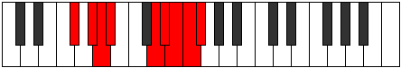 |
| [3869](https://ianring.com/musictheory/scales/3869) | [Bygyllic](ModeCNaturalBygyllic.md) | C | C, D, D#, E, G#, A, A#, B, C |  |
| [3871](https://ianring.com/musictheory/scales/3871) | [Aerynygic](ModeFSharpAerynygic.md) | F# | F#, G, G#, A, A#, D, D#, E, F, F# |  |
| [3871](https://ianring.com/musictheory/scales/3871) | [Aerynygic](ModeGFlatAerynygic.md) | Gb | Gb, G, Ab, A, Bb, D, Eb, E, F, Gb |  |
| [3871](https://ianring.com/musictheory/scales/3871) | [Aerynygic](ModeCNaturalAerynygic.md) | C | C, C#, D, D#, E, G#, A, A#, B, C |  |
| [3871](https://ianring.com/musictheory/scales/3871) | [Aerynygic](ModeGSharpAerynygic.md) | G# | G#, A, A#, B, C, E, F, F#, G, G# |  |
| [3871](https://ianring.com/musictheory/scales/3871) | [Aerynygic](ModeAFlatAerynygic.md) | Ab | Ab, A, Bb, B, C, E, F, Gb, G, Ab |  |
| [3871](https://ianring.com/musictheory/scales/3871) | [Aerynygic](ModeGNaturalAerynygic.md) | G | G, G#, A, A#, B, D#, E, F, F#, G |  |
| [3875](https://ianring.com/musictheory/scales/3875) | [Aeryptian](ModeBNaturalAeryptian.md) | B | B, C, D##, E###, F###, G##, A#, B |  |
| [3877](https://ianring.com/musictheory/scales/3877) | [Thanian](ModeBNaturalThanian.md) | B | B, C#, D##, E###, F###, G##, A#, B |  |
| [3879](https://ianring.com/musictheory/scales/3879) | [Pathyllic](ModeGSharpPathyllic.md) | G# | G#, A, A#, C#, E, F, F#, G, G# |  |
| [3879](https://ianring.com/musictheory/scales/3879) | [Pathyllic](ModeAFlatPathyllic.md) | Ab | Ab, A, Bb, Db, E, F, Gb, G, Ab |  |
| [3879](https://ianring.com/musictheory/scales/3879) | [Pathyllic](ModeBNaturalPathyllic.md) | B | B, C, C#, E, G, G#, A, A#, B |  |
| [3881](https://ianring.com/musictheory/scales/3881) | [Morian](ModeBNaturalMorian.md) | B | B, C##, D##, E###, F###, G##, A#, B |  |
| [3883](https://ianring.com/musictheory/scales/3883) | [Kyryllic](ModeBNaturalKyryllic.md) | B | B, C, D, E, G, G#, A, A#, B |  |
| [3885](https://ianring.com/musictheory/scales/3885) | [Styryllic](ModeBNaturalStyryllic.md) | B | B, C#, D, E, G, G#, A, A#, B |  |
| [3887](https://ianring.com/musictheory/scales/3887) | [Phrathygic](ModeGNaturalPhrathygic.md) | G | G, G#, A, A#, C, D#, E, F, F#, G |  |
| [3887](https://ianring.com/musictheory/scales/3887) | [Phrathygic](ModeBNaturalPhrathygic.md) | B | B, C, C#, D, E, G, G#, A, A#, B |  |
| [3887](https://ianring.com/musictheory/scales/3887) | [Phrathygic](ModeGSharpPhrathygic.md) | G# | G#, A, A#, B, C#, E, F, F#, G, G# |  |
| [3887](https://ianring.com/musictheory/scales/3887) | [Phrathygic](ModeAFlatPhrathygic.md) | Ab | Ab, A, Bb, B, Db, E, F, Gb, G, Ab |  |
| [3889](https://ianring.com/musictheory/scales/3889) | [Parian](ModeCNaturalParian.md) | C | C, D##, E#, F###, G##, A#, B, C |  |
| [3889](https://ianring.com/musictheory/scales/3889) | [Parian](ModeBNaturalParian.md) | B | B, C###, D##, E###, F###, G##, A#, B |  |
| [3891](https://ianring.com/musictheory/scales/3891) | [Ryryllic](ModeCNaturalRyryllic.md) | C | C, C#, E, F, G#, A, A#, B, C |  |
| [3891](https://ianring.com/musictheory/scales/3891) | [Ryryllic](ModeBNaturalRyryllic.md) | B | B, C, D#, E, G, G#, A, A#, B |  |
| [3893](https://ianring.com/musictheory/scales/3893) | [Phrocryllic](ModeCNaturalPhrocryllic.md) | C | C, D, E, F, G#, A, A#, B, C |  |
| [3893](https://ianring.com/musictheory/scales/3893) | [Phrocryllic](ModeBNaturalPhrocryllic.md) | B | B, C#, D#, E, G, G#, A, A#, B |  |
| [3895](https://ianring.com/musictheory/scales/3895) | [Eparygic](ModeGSharpEparygic.md) | G# | G#, A, A#, C, C#, E, F, F#, G, G# |  |
| [3895](https://ianring.com/musictheory/scales/3895) | [Eparygic](ModeAFlatEparygic.md) | Ab | Ab, A, Bb, C, Db, E, F, Gb, G, Ab |  |
| [3895](https://ianring.com/musictheory/scales/3895) | [Eparygic](ModeCNaturalEparygic.md) | C | C, C#, D, E, F, G#, A, A#, B, C |  |
| [3895](https://ianring.com/musictheory/scales/3895) | [Eparygic](ModeBNaturalEparygic.md) | B | B, C, C#, D#, E, G, G#, A, A#, B |  |
| [3897](https://ianring.com/musictheory/scales/3897) | [Locryllic](ModeFNaturalLocryllic.md) | F | F, G#, A, A#, C#, D, D#, E, F |  |
| [3897](https://ianring.com/musictheory/scales/3897) | [Locryllic](ModeCNaturalLocryllic.md) | C | C, D#, E, F, G#, A, A#, B, C |  |
| [3897](https://ianring.com/musictheory/scales/3897) | [Locryllic](ModeBNaturalLocryllic.md) | B | B, D, D#, E, G, G#, A, A#, B |  |
| [3899](https://ianring.com/musictheory/scales/3899) | [Katorygic](ModeFNaturalKatorygic.md) | F | F, F#, G#, A, A#, C#, D, D#, E, F |  |
| [3899](https://ianring.com/musictheory/scales/3899) | [Katorygic](ModeCNaturalKatorygic.md) | C | C, C#, D#, E, F, G#, A, A#, B, C |  |
| [3899](https://ianring.com/musictheory/scales/3899) | [Katorygic](ModeBNaturalKatorygic.md) | B | B, C, D, D#, E, G, G#, A, A#, B |  |
| [3901](https://ianring.com/musictheory/scales/3901) | [Bycrygic](ModeFNaturalBycrygic.md) | F | F, G, G#, A, A#, C#, D, D#, E, F |  |
| [3901](https://ianring.com/musictheory/scales/3901) | [Bycrygic](ModeCNaturalBycrygic.md) | C | C, D, D#, E, F, G#, A, A#, B, C |  |
| [3901](https://ianring.com/musictheory/scales/3901) | [Bycrygic](ModeFSharpBycrygic.md) | F# | F#, G#, A, A#, B, D, D#, E, F, F# |  |
| [3901](https://ianring.com/musictheory/scales/3901) | [Bycrygic](ModeGFlatBycrygic.md) | Gb | Gb, Ab, A, Bb, B, D, Eb, E, F, Gb |  |
| [3901](https://ianring.com/musictheory/scales/3901) | [Bycrygic](ModeBNaturalBycrygic.md) | B | B, C#, D, D#, E, G, G#, A, A#, B |  |
| [3903](https://ianring.com/musictheory/scales/3903) | [Aeogyllian](ModeFNaturalAeogyllian.md) | F | F, F#, G, G#, A, A#, C#, D, D#, E, F |  |
| [3903](https://ianring.com/musictheory/scales/3903) | [Aeogyllian](ModeCNaturalAeogyllian.md) | C | C, C#, D, D#, E, F, G#, A, A#, B, C |  |
| [3903](https://ianring.com/musictheory/scales/3903) | [Aeogyllian](ModeBNaturalAeogyllian.md) | B | B, C, C#, D, D#, E, G, G#, A, A#, B |  |
| [3903](https://ianring.com/musictheory/scales/3903) | [Aeogyllian](ModeGSharpAeogyllian.md) | G# | G#, A, A#, B, C, C#, E, F, F#, G, G# |  |
| [3903](https://ianring.com/musictheory/scales/3903) | [Aeogyllian](ModeAFlatAeogyllian.md) | Ab | Ab, A, Bb, B, C, Db, E, F, Gb, G, Ab |  |
| [3903](https://ianring.com/musictheory/scales/3903) | [Aeogyllian](ModeGNaturalAeogyllian.md) | G | G, G#, A, A#, B, C, D#, E, F, F#, G |  |
| [3903](https://ianring.com/musictheory/scales/3903) | [Aeogyllian](ModeFSharpAeogyllian.md) | F# | F#, G, G#, A, A#, B, D, D#, E, F, F# |  |
| [3903](https://ianring.com/musictheory/scales/3903) | [Aeogyllian](ModeGFlatAeogyllian.md) | Gb | Gb, G, Ab, A, Bb, B, D, Eb, E, F, Gb |  |
| [3909](https://ianring.com/musictheory/scales/3909) | [Rydian](ModeASharpRydian.md) | A# | A#, B#, D##, E##, F##, G#, A, A# |  |
| [3909](https://ianring.com/musictheory/scales/3909) | [Rydian](ModeBFlatRydian.md) | Bb | Bb, C, D##, E##, F##, G#, A, Bb |  |
| [3911](https://ianring.com/musictheory/scales/3911) | [Katyryllic](ModeGSharpKatyryllic.md) | G# | G#, A, A#, D, E, F, F#, G, G# |  |
| [3911](https://ianring.com/musictheory/scales/3911) | [Katyryllic](ModeAFlatKatyryllic.md) | Ab | Ab, A, Bb, D, E, F, Gb, G, Ab |  |
| [3911](https://ianring.com/musictheory/scales/3911) | [Katyryllic](ModeASharpKatyryllic.md) | A# | A#, B, C, E, F#, G, G#, A, A# |  |
| [3911](https://ianring.com/musictheory/scales/3911) | [Katyryllic](ModeBFlatKatyryllic.md) | Bb | Bb, B, C, E, Gb, G, Ab, A, Bb |  |
| [3913](https://ianring.com/musictheory/scales/3913) | [Bonian](ModeASharpBonian.md) | A# | A#, B##, D##, E##, F##, G#, A, A# |  |
| [3913](https://ianring.com/musictheory/scales/3913) | [Bonian](ModeBFlatBonian.md) | Bb | Bb, C#, D##, E##, F##, G#, A, Bb |  |
| [3915](https://ianring.com/musictheory/scales/3915) | [Gogyllic](ModeASharpGogyllic.md) | A# | A#, B, C#, E, F#, G, G#, A, A# |  |
| [3915](https://ianring.com/musictheory/scales/3915) | [Gogyllic](ModeBFlatGogyllic.md) | Bb | Bb, B, Db, E, Gb, G, Ab, A, Bb |  |
| [3917](https://ianring.com/musictheory/scales/3917) | [Epaphyllic](ModeASharpEpaphyllic.md) | A# | A#, C, C#, E, F#, G, G#, A, A# |  |
| [3917](https://ianring.com/musictheory/scales/3917) | [Epaphyllic](ModeBFlatEpaphyllic.md) | Bb | Bb, C, Db, E, Gb, G, Ab, A, Bb |  |
| [3919](https://ianring.com/musictheory/scales/3919) | [Lynygic](ModeGNaturalLynygic.md) | G | G, G#, A, A#, C#, D#, E, F, F#, G |  |
| [3919](https://ianring.com/musictheory/scales/3919) | [Lynygic](ModeASharpLynygic.md) | A# | A#, B, C, C#, E, F#, G, G#, A, A# |  |
| [3919](https://ianring.com/musictheory/scales/3919) | [Lynygic](ModeBFlatLynygic.md) | Bb | Bb, B, C, Db, E, Gb, G, Ab, A, Bb |  |
| [3919](https://ianring.com/musictheory/scales/3919) | [Lynygic](ModeGSharpLynygic.md) | G# | G#, A, A#, B, D, E, F, F#, G, G# |  |
| [3919](https://ianring.com/musictheory/scales/3919) | [Lynygic](ModeAFlatLynygic.md) | Ab | Ab, A, Bb, B, D, E, F, Gb, G, Ab |  |
| [3921](https://ianring.com/musictheory/scales/3921) | [Pythian](ModeASharpPythian.md) | A# | A#, B###, D##, E##, F##, G#, A, A# |  |
| [3921](https://ianring.com/musictheory/scales/3921) | [Pythian](ModeBFlatPythian.md) | Bb | Bb, C##, D##, E##, F##, G#, A, Bb |  |
| [3921](https://ianring.com/musictheory/scales/3921) | [Pythian](ModeCNaturalPythian.md) | C | C, D##, E##, F###, G##, A#, B, C |  |
| [3923](https://ianring.com/musictheory/scales/3923) | [Stoptyllic](ModeCNaturalStoptyllic.md) | C | C, C#, E, F#, G#, A, A#, B, C |  |
| [3923](https://ianring.com/musictheory/scales/3923) | [Stoptyllic](ModeASharpStoptyllic.md) | A# | A#, B, D, E, F#, G, G#, A, A# |  |
| [3923](https://ianring.com/musictheory/scales/3923) | [Stoptyllic](ModeBFlatStoptyllic.md) | Bb | Bb, B, D, E, Gb, G, Ab, A, Bb |  |
| [3925](https://ianring.com/musictheory/scales/3925) | [Thyryllic](ModeASharpThyryllic.md) | A# | A#, C, D, E, F#, G, G#, A, A# |  |
| [3925](https://ianring.com/musictheory/scales/3925) | [Thyryllic](ModeBFlatThyryllic.md) | Bb | Bb, C, D, E, Gb, G, Ab, A, Bb |  |
| [3925](https://ianring.com/musictheory/scales/3925) | [Thyryllic](ModeCNaturalThyryllic.md) | C | C, D, E, F#, G#, A, A#, B, C |  |
| [3927](https://ianring.com/musictheory/scales/3927) | [Monygic](ModeGSharpMonygic.md) | G# | G#, A, A#, C, D, E, F, F#, G, G# |  |
| [3927](https://ianring.com/musictheory/scales/3927) | [Monygic](ModeAFlatMonygic.md) | Ab | Ab, A, Bb, C, D, E, F, Gb, G, Ab |  |
| [3927](https://ianring.com/musictheory/scales/3927) | [Monygic](ModeCNaturalMonygic.md) | C | C, C#, D, E, F#, G#, A, A#, B, C |  |
| [3927](https://ianring.com/musictheory/scales/3927) | [Monygic](ModeASharpMonygic.md) | A# | A#, B, C, D, E, F#, G, G#, A, A# |  |
| [3927](https://ianring.com/musictheory/scales/3927) | [Monygic](ModeBFlatMonygic.md) | Bb | Bb, B, C, D, E, Gb, G, Ab, A, Bb |  |
| [3929](https://ianring.com/musictheory/scales/3929) | [Aeolothyllic](ModeASharpAeolothyllic.md) | A# | A#, C#, D, E, F#, G, G#, A, A# |  |
| [3929](https://ianring.com/musictheory/scales/3929) | [Aeolothyllic](ModeBFlatAeolothyllic.md) | Bb | Bb, Db, D, E, Gb, G, Ab, A, Bb |  |
| [3929](https://ianring.com/musictheory/scales/3929) | [Aeolothyllic](ModeCNaturalAeolothyllic.md) | C | C, D#, E, F#, G#, A, A#, B, C |  |
| [3931](https://ianring.com/musictheory/scales/3931) | [Aerygic](ModeCNaturalAerygic.md) | C | C, C#, D#, E, F#, G#, A, A#, B, C |  |
| [3931](https://ianring.com/musictheory/scales/3931) | [Aerygic](ModeASharpAerygic.md) | A# | A#, B, C#, D, E, F#, G, G#, A, A# |  |
| [3931](https://ianring.com/musictheory/scales/3931) | [Aerygic](ModeBFlatAerygic.md) | Bb | Bb, B, Db, D, E, Gb, G, Ab, A, Bb |  |
| [3933](https://ianring.com/musictheory/scales/3933) | [Ionidygic](ModeFSharpIonidygic.md) | F# | F#, G#, A, A#, C, D, D#, E, F, F# |  |
| [3933](https://ianring.com/musictheory/scales/3933) | [Ionidygic](ModeGFlatIonidygic.md) | Gb | Gb, Ab, A, Bb, C, D, Eb, E, F, Gb |  |
| [3933](https://ianring.com/musictheory/scales/3933) | [Ionidygic](ModeASharpIonidygic.md) | A# | A#, C, C#, D, E, F#, G, G#, A, A# |  |
| [3933](https://ianring.com/musictheory/scales/3933) | [Ionidygic](ModeBFlatIonidygic.md) | Bb | Bb, C, Db, D, E, Gb, G, Ab, A, Bb |  |
| [3933](https://ianring.com/musictheory/scales/3933) | [Ionidygic](ModeCNaturalIonidygic.md) | C | C, D, D#, E, F#, G#, A, A#, B, C |  |
| [3935](https://ianring.com/musictheory/scales/3935) | [Kataphyllian](ModeFSharpKataphyllian.md) | F# | F#, G, G#, A, A#, C, D, D#, E, F, F# |  |
| [3935](https://ianring.com/musictheory/scales/3935) | [Kataphyllian](ModeGFlatKataphyllian.md) | Gb | Gb, G, Ab, A, Bb, C, D, Eb, E, F, Gb |  |
| [3935](https://ianring.com/musictheory/scales/3935) | [Kataphyllian](ModeCNaturalKataphyllian.md) | C | C, C#, D, D#, E, F#, G#, A, A#, B, C |  |
| [3935](https://ianring.com/musictheory/scales/3935) | [Kataphyllian](ModeASharpKataphyllian.md) | A# | A#, B, C, C#, D, E, F#, G, G#, A, A# |  |
| [3935](https://ianring.com/musictheory/scales/3935) | [Kataphyllian](ModeBFlatKataphyllian.md) | Bb | Bb, B, C, Db, D, E, Gb, G, Ab, A, Bb |  |
| [3935](https://ianring.com/musictheory/scales/3935) | [Kataphyllian](ModeGSharpKataphyllian.md) | G# | G#, A, A#, B, C, D, E, F, F#, G, G# |  |
| [3935](https://ianring.com/musictheory/scales/3935) | [Kataphyllian](ModeAFlatKataphyllian.md) | Ab | Ab, A, Bb, B, C, D, E, F, Gb, G, Ab |  |
| [3935](https://ianring.com/musictheory/scales/3935) | [Kataphyllian](ModeGNaturalKataphyllian.md) | G | G, G#, A, A#, B, C#, D#, E, F, F#, G |  |
| [3939](https://ianring.com/musictheory/scales/3939) | [Dogyllic](ModeBNaturalDogyllic.md) | B | B, C, E, F, G, G#, A, A#, B |  |
| [3939](https://ianring.com/musictheory/scales/3939) | [Dogyllic](ModeASharpDogyllic.md) | A# | A#, B, D#, E, F#, G, G#, A, A# |  |
| [3939](https://ianring.com/musictheory/scales/3939) | [Dogyllic](ModeBFlatDogyllic.md) | Bb | Bb, B, Eb, E, Gb, G, Ab, A, Bb |  |
| [3941](https://ianring.com/musictheory/scales/3941) | [Stathyllic](ModeASharpStathyllic.md) | A# | A#, C, D#, E, F#, G, G#, A, A# |  |
| [3941](https://ianring.com/musictheory/scales/3941) | [Stathyllic](ModeBFlatStathyllic.md) | Bb | Bb, C, Eb, E, Gb, G, Ab, A, Bb |  |
| [3941](https://ianring.com/musictheory/scales/3941) | [Stathyllic](ModeBNaturalStathyllic.md) | B | B, C#, E, F, G, G#, A, A#, B |  |
| [3943](https://ianring.com/musictheory/scales/3943) | [Zynygic](ModeGSharpZynygic.md) | G# | G#, A, A#, C#, D, E, F, F#, G, G# |  |
| [3943](https://ianring.com/musictheory/scales/3943) | [Zynygic](ModeAFlatZynygic.md) | Ab | Ab, A, Bb, Db, D, E, F, Gb, G, Ab |  |
| [3943](https://ianring.com/musictheory/scales/3943) | [Zynygic](ModeBNaturalZynygic.md) | B | B, C, C#, E, F, G, G#, A, A#, B |  |
| [3943](https://ianring.com/musictheory/scales/3943) | [Zynygic](ModeASharpZynygic.md) | A# | A#, B, C, D#, E, F#, G, G#, A, A# |  |
| [3943](https://ianring.com/musictheory/scales/3943) | [Zynygic](ModeBFlatZynygic.md) | Bb | Bb, B, C, Eb, E, Gb, G, Ab, A, Bb |  |
| [3945](https://ianring.com/musictheory/scales/3945) | [Lydyllic](ModeASharpLydyllic.md) | A# | A#, C#, D#, E, F#, G, G#, A, A# |  |
| [3945](https://ianring.com/musictheory/scales/3945) | [Lydyllic](ModeBFlatLydyllic.md) | Bb | Bb, Db, Eb, E, Gb, G, Ab, A, Bb |  |
| [3945](https://ianring.com/musictheory/scales/3945) | [Lydyllic](ModeBNaturalLydyllic.md) | B | B, D, E, F, G, G#, A, A#, B |  |
| [3947](https://ianring.com/musictheory/scales/3947) | [Ryptygic](ModeBNaturalRyptygic.md) | B | B, C, D, E, F, G, G#, A, A#, B |  |
| [3947](https://ianring.com/musictheory/scales/3947) | [Ryptygic](ModeASharpRyptygic.md) | A# | A#, B, C#, D#, E, F#, G, G#, A, A# |  |
| [3947](https://ianring.com/musictheory/scales/3947) | [Ryptygic](ModeBFlatRyptygic.md) | Bb | Bb, B, Db, Eb, E, Gb, G, Ab, A, Bb |  |
| [3949](https://ianring.com/musictheory/scales/3949) | [Koptygic](ModeASharpKoptygic.md) | A# | A#, C, C#, D#, E, F#, G, G#, A, A# |  |
| [3949](https://ianring.com/musictheory/scales/3949) | [Koptygic](ModeBFlatKoptygic.md) | Bb | Bb, C, Db, Eb, E, Gb, G, Ab, A, Bb |  |
| [3949](https://ianring.com/musictheory/scales/3949) | [Koptygic](ModeBNaturalKoptygic.md) | B | B, C#, D, E, F, G, G#, A, A#, B |  |
| [3951](https://ianring.com/musictheory/scales/3951) | [Mathyllian](ModeGNaturalMathyllian.md) | G | G, G#, A, A#, C, C#, D#, E, F, F#, G |  |
| [3951](https://ianring.com/musictheory/scales/3951) | [Mathyllian](ModeBNaturalMathyllian.md) | B | B, C, C#, D, E, F, G, G#, A, A#, B |  |
| [3951](https://ianring.com/musictheory/scales/3951) | [Mathyllian](ModeASharpMathyllian.md) | A# | A#, B, C, C#, D#, E, F#, G, G#, A, A# |  |
| [3951](https://ianring.com/musictheory/scales/3951) | [Mathyllian](ModeBFlatMathyllian.md) | Bb | Bb, B, C, Db, Eb, E, Gb, G, Ab, A, Bb |  |
| [3951](https://ianring.com/musictheory/scales/3951) | [Mathyllian](ModeGSharpMathyllian.md) | G# | G#, A, A#, B, C#, D, E, F, F#, G, G# |  |
| [3951](https://ianring.com/musictheory/scales/3951) | [Mathyllian](ModeAFlatMathyllian.md) | Ab | Ab, A, Bb, B, Db, D, E, F, Gb, G, Ab |  |
| [3953](https://ianring.com/musictheory/scales/3953) | [Thagyllic](ModeENaturalThagyllic.md) | E | E, G#, A, A#, C, C#, D, D#, E |  |
| [3953](https://ianring.com/musictheory/scales/3953) | [Thagyllic](ModeASharpThagyllic.md) | A# | A#, D, D#, E, F#, G, G#, A, A# |  |
| [3953](https://ianring.com/musictheory/scales/3953) | [Thagyllic](ModeBFlatThagyllic.md) | Bb | Bb, D, Eb, E, Gb, G, Ab, A, Bb |  |
| [3953](https://ianring.com/musictheory/scales/3953) | [Thagyllic](ModeCNaturalThagyllic.md) | C | C, E, F, F#, G#, A, A#, B, C |  |
| [3953](https://ianring.com/musictheory/scales/3953) | [Thagyllic](ModeBNaturalThagyllic.md) | B | B, D#, E, F, G, G#, A, A#, B |  |
| [3955](https://ianring.com/musictheory/scales/3955) | [Galygic](ModeENaturalGalygic.md) | E | E, F, G#, A, A#, C, C#, D, D#, E |  |
| [3955](https://ianring.com/musictheory/scales/3955) | [Galygic](ModeCNaturalGalygic.md) | C | C, C#, E, F, F#, G#, A, A#, B, C |  |
| [3955](https://ianring.com/musictheory/scales/3955) | [Galygic](ModeBNaturalGalygic.md) | B | B, C, D#, E, F, G, G#, A, A#, B |  |
| [3955](https://ianring.com/musictheory/scales/3955) | [Galygic](ModeASharpGalygic.md) | A# | A#, B, D, D#, E, F#, G, G#, A, A# |  |
| [3955](https://ianring.com/musictheory/scales/3955) | [Galygic](ModeBFlatGalygic.md) | Bb | Bb, B, D, Eb, E, Gb, G, Ab, A, Bb |  |
| [3957](https://ianring.com/musictheory/scales/3957) | [Porygic](ModeENaturalPorygic.md) | E | E, F#, G#, A, A#, C, C#, D, D#, E |  |
| [3957](https://ianring.com/musictheory/scales/3957) | [Porygic](ModeASharpPorygic.md) | A# | A#, C, D, D#, E, F#, G, G#, A, A# |  |
| [3957](https://ianring.com/musictheory/scales/3957) | [Porygic](ModeBFlatPorygic.md) | Bb | Bb, C, D, Eb, E, Gb, G, Ab, A, Bb |  |
| [3957](https://ianring.com/musictheory/scales/3957) | [Porygic](ModeCNaturalPorygic.md) | C | C, D, E, F, F#, G#, A, A#, B, C |  |
| [3957](https://ianring.com/musictheory/scales/3957) | [Porygic](ModeBNaturalPorygic.md) | B | B, C#, D#, E, F, G, G#, A, A#, B |  |
| [3959](https://ianring.com/musictheory/scales/3959) | [Katagyllian](ModeENaturalKatagyllian.md) | E | E, F, F#, G#, A, A#, C, C#, D, D#, E |  |
| [3959](https://ianring.com/musictheory/scales/3959) | [Katagyllian](ModeGSharpKatagyllian.md) | G# | G#, A, A#, C, C#, D, E, F, F#, G, G# |  |
| [3959](https://ianring.com/musictheory/scales/3959) | [Katagyllian](ModeAFlatKatagyllian.md) | Ab | Ab, A, Bb, C, Db, D, E, F, Gb, G, Ab |  |
| [3959](https://ianring.com/musictheory/scales/3959) | [Katagyllian](ModeCNaturalKatagyllian.md) | C | C, C#, D, E, F, F#, G#, A, A#, B, C |  |
| [3959](https://ianring.com/musictheory/scales/3959) | [Katagyllian](ModeBNaturalKatagyllian.md) | B | B, C, C#, D#, E, F, G, G#, A, A#, B |  |
| [3959](https://ianring.com/musictheory/scales/3959) | [Katagyllian](ModeASharpKatagyllian.md) | A# | A#, B, C, D, D#, E, F#, G, G#, A, A# |  |
| [3959](https://ianring.com/musictheory/scales/3959) | [Katagyllian](ModeBFlatKatagyllian.md) | Bb | Bb, B, C, D, Eb, E, Gb, G, Ab, A, Bb |  |
| [3961](https://ianring.com/musictheory/scales/3961) | [Mixolydygic](ModeENaturalMixolydygic.md) | E | E, G, G#, A, A#, C, C#, D, D#, E |  |
| [3961](https://ianring.com/musictheory/scales/3961) | [Mixolydygic](ModeASharpMixolydygic.md) | A# | A#, C#, D, D#, E, F#, G, G#, A, A# |  |
| [3961](https://ianring.com/musictheory/scales/3961) | [Mixolydygic](ModeBFlatMixolydygic.md) | Bb | Bb, Db, D, Eb, E, Gb, G, Ab, A, Bb |  |
| [3961](https://ianring.com/musictheory/scales/3961) | [Mixolydygic](ModeFNaturalMixolydygic.md) | F | F, G#, A, A#, B, C#, D, D#, E, F |  |
| [3961](https://ianring.com/musictheory/scales/3961) | [Mixolydygic](ModeCNaturalMixolydygic.md) | C | C, D#, E, F, F#, G#, A, A#, B, C |  |
| [3961](https://ianring.com/musictheory/scales/3961) | [Mixolydygic](ModeBNaturalMixolydygic.md) | B | B, D, D#, E, F, G, G#, A, A#, B |  |
| [3963](https://ianring.com/musictheory/scales/3963) | [Aeoryllian](ModeENaturalAeoryllian.md) | E | E, F, G, G#, A, A#, C, C#, D, D#, E |  |
| [3963](https://ianring.com/musictheory/scales/3963) | [Aeoryllian](ModeCNaturalAeoryllian.md) | C | C, C#, D#, E, F, F#, G#, A, A#, B, C |  |
| [3963](https://ianring.com/musictheory/scales/3963) | [Aeoryllian](ModeFNaturalAeoryllian.md) | F | F, F#, G#, A, A#, B, C#, D, D#, E, F |  |
| [3963](https://ianring.com/musictheory/scales/3963) | [Aeoryllian](ModeBNaturalAeoryllian.md) | B | B, C, D, D#, E, F, G, G#, A, A#, B |  |
| [3963](https://ianring.com/musictheory/scales/3963) | [Aeoryllian](ModeASharpAeoryllian.md) | A# | A#, B, C#, D, D#, E, F#, G, G#, A, A# |  |
| [3963](https://ianring.com/musictheory/scales/3963) | [Aeoryllian](ModeBFlatAeoryllian.md) | Bb | Bb, B, Db, D, Eb, E, Gb, G, Ab, A, Bb |  |
| [3965](https://ianring.com/musictheory/scales/3965) | [Thydyllian](ModeENaturalThydyllian.md) | E | E, F#, G, G#, A, A#, C, C#, D, D#, E |  |
| [3965](https://ianring.com/musictheory/scales/3965) | [Thydyllian](ModeASharpThydyllian.md) | A# | A#, C, C#, D, D#, E, F#, G, G#, A, A# |  |
| [3965](https://ianring.com/musictheory/scales/3965) | [Thydyllian](ModeBFlatThydyllian.md) | Bb | Bb, C, Db, D, Eb, E, Gb, G, Ab, A, Bb |  |
| [3965](https://ianring.com/musictheory/scales/3965) | [Thydyllian](ModeCNaturalThydyllian.md) | C | C, D, D#, E, F, F#, G#, A, A#, B, C |  |
| [3965](https://ianring.com/musictheory/scales/3965) | [Thydyllian](ModeFSharpThydyllian.md) | F# | F#, G#, A, A#, B, C, D, D#, E, F, F# |  |
| [3965](https://ianring.com/musictheory/scales/3965) | [Thydyllian](ModeGFlatThydyllian.md) | Gb | Gb, Ab, A, Bb, B, C, D, Eb, E, F, Gb |  |
| [3965](https://ianring.com/musictheory/scales/3965) | [Thydyllian](ModeFNaturalThydyllian.md) | F | F, G, G#, A, A#, B, C#, D, D#, E, F |  |
| [3965](https://ianring.com/musictheory/scales/3965) | [Thydyllian](ModeBNaturalThydyllian.md) | B | B, C#, D, D#, E, F, G, G#, A, A#, B |  |
| [3967](https://ianring.com/musictheory/scales/3967) | [Soratic](ModeENaturalSoratic.md) | E | E, F, F#, G, G#, A, A#, C, C#, D, D#, E |  |
| [3967](https://ianring.com/musictheory/scales/3967) | [Soratic](ModeCNaturalSoratic.md) | C | C, C#, D, D#, E, F, F#, G#, A, A#, B, C |  |
| [3967](https://ianring.com/musictheory/scales/3967) | [Soratic](ModeBNaturalSoratic.md) | B | B, C, C#, D, D#, E, F, G, G#, A, A#, B |  |
| [3967](https://ianring.com/musictheory/scales/3967) | [Soratic](ModeASharpSoratic.md) | A# | A#, B, C, C#, D, D#, E, F#, G, G#, A, A# |  |
| [3967](https://ianring.com/musictheory/scales/3967) | [Soratic](ModeBFlatSoratic.md) | Bb | Bb, B, C, Db, D, Eb, E, Gb, G, Ab, A, Bb |  |
| [3967](https://ianring.com/musictheory/scales/3967) | [Soratic](ModeGSharpSoratic.md) | G# | G#, A, A#, B, C, C#, D, E, F, F#, G, G# |  |
| [3967](https://ianring.com/musictheory/scales/3967) | [Soratic](ModeAFlatSoratic.md) | Ab | Ab, A, Bb, B, C, Db, D, E, F, Gb, G, Ab |  |
| [3967](https://ianring.com/musictheory/scales/3967) | [Soratic](ModeGNaturalSoratic.md) | G | G, G#, A, A#, B, C, C#, D#, E, F, F#, G |  |
| [3967](https://ianring.com/musictheory/scales/3967) | [Soratic](ModeFSharpSoratic.md) | F# | F#, G, G#, A, A#, B, C, D, D#, E, F, F# |  |
| [3967](https://ianring.com/musictheory/scales/3967) | [Soratic](ModeGFlatSoratic.md) | Gb | Gb, G, Ab, A, Bb, B, C, D, Eb, E, F, Gb |  |
| [3967](https://ianring.com/musictheory/scales/3967) | [Soratic](ModeFNaturalSoratic.md) | F | F, F#, G, G#, A, A#, B, C#, D, D#, E, F |  |
| [3977](https://ianring.com/musictheory/scales/3977) | [Kythian](ModeCSharpKythian.md) | C# | C#, D##, F###, G##, A#, B, C, C# |  |
| [3977](https://ianring.com/musictheory/scales/3977) | [Kythian](ModeDFlatKythian.md) | Db | Db, E, F###, G##, A#, B, C, Db |  |
| [3979](https://ianring.com/musictheory/scales/3979) | [Dynyllic](ModeANaturalDynyllic.md) | A | A, A#, C, E, F, F#, G, G#, A |  |
| [3979](https://ianring.com/musictheory/scales/3979) | [Dynyllic](ModeCSharpDynyllic.md) | C# | C#, D, E, G#, A, A#, B, C, C# |  |
| [3979](https://ianring.com/musictheory/scales/3979) | [Dynyllic](ModeDFlatDynyllic.md) | Db | Db, D, E, Ab, A, Bb, B, C, Db |  |
| [3981](https://ianring.com/musictheory/scales/3981) | [Phrycryllic](ModeCSharpPhrycryllic.md) | C# | C#, D#, E, G#, A, A#, B, C, C# |  |
| [3981](https://ianring.com/musictheory/scales/3981) | [Phrycryllic](ModeDFlatPhrycryllic.md) | Db | Db, Eb, E, Ab, A, Bb, B, C, Db |  |
| [3983](https://ianring.com/musictheory/scales/3983) | [Thyptygic](ModeGNaturalThyptygic.md) | G | G, G#, A, A#, D, D#, E, F, F#, G |  |
| [3983](https://ianring.com/musictheory/scales/3983) | [Thyptygic](ModeCSharpThyptygic.md) | C# | C#, D, D#, E, G#, A, A#, B, C, C# |  |
| [3983](https://ianring.com/musictheory/scales/3983) | [Thyptygic](ModeDFlatThyptygic.md) | Db | Db, D, Eb, E, Ab, A, Bb, B, C, Db |  |
| [3983](https://ianring.com/musictheory/scales/3983) | [Thyptygic](ModeANaturalThyptygic.md) | A | A, A#, B, C, E, F, F#, G, G#, A |  |
| [3983](https://ianring.com/musictheory/scales/3983) | [Thyptygic](ModeGSharpThyptygic.md) | G# | G#, A, A#, B, D#, E, F, F#, G, G# |  |
| [3983](https://ianring.com/musictheory/scales/3983) | [Thyptygic](ModeAFlatThyptygic.md) | Ab | Ab, A, Bb, B, Eb, E, F, Gb, G, Ab |  |
| [3985](https://ianring.com/musictheory/scales/3985) | [Thadian](ModeCNaturalThadian.md) | C | C, D##, E###, F###, G##, A#, B, C |  |
| [3987](https://ianring.com/musictheory/scales/3987) | [Loryllic](ModeANaturalLoryllic.md) | A | A, A#, C#, E, F, F#, G, G#, A |  |
| [3987](https://ianring.com/musictheory/scales/3987) | [Loryllic](ModeCNaturalLoryllic.md) | C | C, C#, E, G, G#, A, A#, B, C | 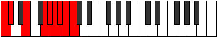 |
| [3989](https://ianring.com/musictheory/scales/3989) | [Sythyllic](ModeCNaturalSythyllic.md) | C | C, D, E, G, G#, A, A#, B, C |  |
| [3991](https://ianring.com/musictheory/scales/3991) | [Badygic](ModeGSharpBadygic.md) | G# | G#, A, A#, C, D#, E, F, F#, G, G# |  |
| [3991](https://ianring.com/musictheory/scales/3991) | [Badygic](ModeAFlatBadygic.md) | Ab | Ab, A, Bb, C, Eb, E, F, Gb, G, Ab |  |
| [3991](https://ianring.com/musictheory/scales/3991) | [Badygic](ModeCNaturalBadygic.md) | C | C, C#, D, E, G, G#, A, A#, B, C |  |
| [3991](https://ianring.com/musictheory/scales/3991) | [Badygic](ModeANaturalBadygic.md) | A | A, A#, B, C#, E, F, F#, G, G#, A |  |
| [3993](https://ianring.com/musictheory/scales/3993) | [Ioniptyllic](ModeCSharpIoniptyllic.md) | C# | C#, E, F, G#, A, A#, B, C, C# |  |
| [3993](https://ianring.com/musictheory/scales/3993) | [Ioniptyllic](ModeDFlatIoniptyllic.md) | Db | Db, E, F, Ab, A, Bb, B, C, Db |  |
| [3993](https://ianring.com/musictheory/scales/3993) | [Ioniptyllic](ModeCNaturalIoniptyllic.md) | C | C, D#, E, G, G#, A, A#, B, C |  |
| [3995](https://ianring.com/musictheory/scales/3995) | [Ionygic](ModeANaturalIonygic.md) | A | A, A#, C, C#, E, F, F#, G, G#, A |  |
| [3995](https://ianring.com/musictheory/scales/3995) | [Ionygic](ModeCSharpIonygic.md) | C# | C#, D, E, F, G#, A, A#, B, C, C# |  |
| [3995](https://ianring.com/musictheory/scales/3995) | [Ionygic](ModeDFlatIonygic.md) | Db | Db, D, E, F, Ab, A, Bb, B, C, Db |  |
| [3995](https://ianring.com/musictheory/scales/3995) | [Ionygic](ModeCNaturalIonygic.md) | C | C, C#, D#, E, G, G#, A, A#, B, C |  |
| [3997](https://ianring.com/musictheory/scales/3997) | [Dogygic](ModeFSharpDogygic.md) | F# | F#, G#, A, A#, C#, D, D#, E, F, F# |  |
| [3997](https://ianring.com/musictheory/scales/3997) | [Dogygic](ModeGFlatDogygic.md) | Gb | Gb, Ab, A, Bb, Db, D, Eb, E, F, Gb |  |
| [3997](https://ianring.com/musictheory/scales/3997) | [Dogygic](ModeCSharpDogygic.md) | C# | C#, D#, E, F, G#, A, A#, B, C, C# |  |
| [3997](https://ianring.com/musictheory/scales/3997) | [Dogygic](ModeDFlatDogygic.md) | Db | Db, Eb, E, F, Ab, A, Bb, B, C, Db |  |
| [3997](https://ianring.com/musictheory/scales/3997) | [Dogygic](ModeCNaturalDogygic.md) | C | C, D, D#, E, G, G#, A, A#, B, C |  |
| [3999](https://ianring.com/musictheory/scales/3999) | [Dydyllian](ModeFSharpDydyllian.md) | F# | F#, G, G#, A, A#, C#, D, D#, E, F, F# |  |
| [3999](https://ianring.com/musictheory/scales/3999) | [Dydyllian](ModeGFlatDydyllian.md) | Gb | Gb, G, Ab, A, Bb, Db, D, Eb, E, F, Gb |  |
| [3999](https://ianring.com/musictheory/scales/3999) | [Dydyllian](ModeCSharpDydyllian.md) | C# | C#, D, D#, E, F, G#, A, A#, B, C, C# |  |
| [3999](https://ianring.com/musictheory/scales/3999) | [Dydyllian](ModeDFlatDydyllian.md) | Db | Db, D, Eb, E, F, Ab, A, Bb, B, C, Db |  |
| [3999](https://ianring.com/musictheory/scales/3999) | [Dydyllian](ModeCNaturalDydyllian.md) | C | C, C#, D, D#, E, G, G#, A, A#, B, C |  |
| [3999](https://ianring.com/musictheory/scales/3999) | [Dydyllian](ModeANaturalDydyllian.md) | A | A, A#, B, C, C#, E, F, F#, G, G#, A |  |
| [3999](https://ianring.com/musictheory/scales/3999) | [Dydyllian](ModeGSharpDydyllian.md) | G# | G#, A, A#, B, C, D#, E, F, F#, G, G# |  |
| [3999](https://ianring.com/musictheory/scales/3999) | [Dydyllian](ModeAFlatDydyllian.md) | Ab | Ab, A, Bb, B, C, Eb, E, F, Gb, G, Ab |  |
| [3999](https://ianring.com/musictheory/scales/3999) | [Dydyllian](ModeGNaturalDydyllian.md) | G | G, G#, A, A#, B, D, D#, E, F, F#, G |  |
| [4003](https://ianring.com/musictheory/scales/4003) | [Sadyllic](ModeANaturalSadyllic.md) | A | A, A#, D, E, F, F#, G, G#, A |  |
| [4003](https://ianring.com/musictheory/scales/4003) | [Sadyllic](ModeBNaturalSadyllic.md) | B | B, C, E, F#, G, G#, A, A#, B |  |
| [4005](https://ianring.com/musictheory/scales/4005) | [Phradyllic](ModeBNaturalPhradyllic.md) | B | B, C#, E, F#, G, G#, A, A#, B |  |
| [4007](https://ianring.com/musictheory/scales/4007) | [Doptygic](ModeGSharpDoptygic.md) | G# | G#, A, A#, C#, D#, E, F, F#, G, G# |  |
| [4007](https://ianring.com/musictheory/scales/4007) | [Doptygic](ModeAFlatDoptygic.md) | Ab | Ab, A, Bb, Db, Eb, E, F, Gb, G, Ab |  |
| [4007](https://ianring.com/musictheory/scales/4007) | [Doptygic](ModeBNaturalDoptygic.md) | B | B, C, C#, E, F#, G, G#, A, A#, B |  |
| [4007](https://ianring.com/musictheory/scales/4007) | [Doptygic](ModeANaturalDoptygic.md) | A | A, A#, B, D, E, F, F#, G, G#, A |  |
| [4009](https://ianring.com/musictheory/scales/4009) | [Phranyllic](ModeCSharpPhranyllic.md) | C# | C#, E, F#, G#, A, A#, B, C, C# |  |
| [4009](https://ianring.com/musictheory/scales/4009) | [Phranyllic](ModeDFlatPhranyllic.md) | Db | Db, E, Gb, Ab, A, Bb, B, C, Db |  |
| [4009](https://ianring.com/musictheory/scales/4009) | [Phranyllic](ModeBNaturalPhranyllic.md) | B | B, D, E, F#, G, G#, A, A#, B |  |
| [4011](https://ianring.com/musictheory/scales/4011) | [Styrygic](ModeANaturalStyrygic.md) | A | A, A#, C, D, E, F, F#, G, G#, A |  |
| [4011](https://ianring.com/musictheory/scales/4011) | [Styrygic](ModeCSharpStyrygic.md) | C# | C#, D, E, F#, G#, A, A#, B, C, C# |  |
| [4011](https://ianring.com/musictheory/scales/4011) | [Styrygic](ModeDFlatStyrygic.md) | Db | Db, D, E, Gb, Ab, A, Bb, B, C, Db |  |
| [4011](https://ianring.com/musictheory/scales/4011) | [Styrygic](ModeBNaturalStyrygic.md) | B | B, C, D, E, F#, G, G#, A, A#, B |  |
| [4013](https://ianring.com/musictheory/scales/4013) | [Dathygic](ModeCSharpDathygic.md) | C# | C#, D#, E, F#, G#, A, A#, B, C, C# |  |
| [4013](https://ianring.com/musictheory/scales/4013) | [Dathygic](ModeDFlatDathygic.md) | Db | Db, Eb, E, Gb, Ab, A, Bb, B, C, Db |  |
| [4013](https://ianring.com/musictheory/scales/4013) | [Dathygic](ModeBNaturalDathygic.md) | B | B, C#, D, E, F#, G, G#, A, A#, B |  |
| [4015](https://ianring.com/musictheory/scales/4015) | [Phradyllian](ModeGNaturalPhradyllian.md) | G | G, G#, A, A#, C, D, D#, E, F, F#, G |  |
| [4015](https://ianring.com/musictheory/scales/4015) | [Phradyllian](ModeCSharpPhradyllian.md) | C# | C#, D, D#, E, F#, G#, A, A#, B, C, C# |  |
| [4015](https://ianring.com/musictheory/scales/4015) | [Phradyllian](ModeDFlatPhradyllian.md) | Db | Db, D, Eb, E, Gb, Ab, A, Bb, B, C, Db |  |
| [4015](https://ianring.com/musictheory/scales/4015) | [Phradyllian](ModeBNaturalPhradyllian.md) | B | B, C, C#, D, E, F#, G, G#, A, A#, B |  |
| [4015](https://ianring.com/musictheory/scales/4015) | [Phradyllian](ModeANaturalPhradyllian.md) | A | A, A#, B, C, D, E, F, F#, G, G#, A |  |
| [4015](https://ianring.com/musictheory/scales/4015) | [Phradyllian](ModeGSharpPhradyllian.md) | G# | G#, A, A#, B, C#, D#, E, F, F#, G, G# |  |
| [4015](https://ianring.com/musictheory/scales/4015) | [Phradyllian](ModeAFlatPhradyllian.md) | Ab | Ab, A, Bb, B, Db, Eb, E, F, Gb, G, Ab |  |
| [4017](https://ianring.com/musictheory/scales/4017) | [Dolyllic](ModeCNaturalDolyllic.md) | C | C, E, F, G, G#, A, A#, B, C |  |
| [4017](https://ianring.com/musictheory/scales/4017) | [Dolyllic](ModeBNaturalDolyllic.md) | B | B, D#, E, F#, G, G#, A, A#, B |  |
| [4019](https://ianring.com/musictheory/scales/4019) | [Lonygic](ModeANaturalLonygic.md) | A | A, A#, C#, D, E, F, F#, G, G#, A |  |
| [4019](https://ianring.com/musictheory/scales/4019) | [Lonygic](ModeCNaturalLonygic.md) | C | C, C#, E, F, G, G#, A, A#, B, C |  |
| [4019](https://ianring.com/musictheory/scales/4019) | [Lonygic](ModeBNaturalLonygic.md) | B | B, C, D#, E, F#, G, G#, A, A#, B |  |
| [4021](https://ianring.com/musictheory/scales/4021) | [Bagygic](ModeCNaturalBagygic.md) | C | C, D, E, F, G, G#, A, A#, B, C |  |
| [4021](https://ianring.com/musictheory/scales/4021) | [Bagygic](ModeBNaturalBagygic.md) | B | B, C#, D#, E, F#, G, G#, A, A#, B |  |
| [4023](https://ianring.com/musictheory/scales/4023) | [Styptyllian](ModeGSharpStyptyllian.md) | G# | G#, A, A#, C, C#, D#, E, F, F#, G, G# |  |
| [4023](https://ianring.com/musictheory/scales/4023) | [Styptyllian](ModeAFlatStyptyllian.md) | Ab | Ab, A, Bb, C, Db, Eb, E, F, Gb, G, Ab |  |
| [4023](https://ianring.com/musictheory/scales/4023) | [Styptyllian](ModeCNaturalStyptyllian.md) | C | C, C#, D, E, F, G, G#, A, A#, B, C |  |
| [4023](https://ianring.com/musictheory/scales/4023) | [Styptyllian](ModeBNaturalStyptyllian.md) | B | B, C, C#, D#, E, F#, G, G#, A, A#, B |  |
| [4023](https://ianring.com/musictheory/scales/4023) | [Styptyllian](ModeANaturalStyptyllian.md) | A | A, A#, B, C#, D, E, F, F#, G, G#, A |  |
| [4025](https://ianring.com/musictheory/scales/4025) | [Kalygic](ModeFNaturalKalygic.md) | F | F, G#, A, A#, C, C#, D, D#, E, F |  |
| [4025](https://ianring.com/musictheory/scales/4025) | [Kalygic](ModeCSharpKalygic.md) | C# | C#, E, F, F#, G#, A, A#, B, C, C# |  |
| [4025](https://ianring.com/musictheory/scales/4025) | [Kalygic](ModeDFlatKalygic.md) | Db | Db, E, F, Gb, Ab, A, Bb, B, C, Db |  |
| [4025](https://ianring.com/musictheory/scales/4025) | [Kalygic](ModeCNaturalKalygic.md) | C | C, D#, E, F, G, G#, A, A#, B, C |  |
| [4025](https://ianring.com/musictheory/scales/4025) | [Kalygic](ModeBNaturalKalygic.md) | B | B, D, D#, E, F#, G, G#, A, A#, B |  |
| [4027](https://ianring.com/musictheory/scales/4027) | [Ragyllian](ModeFNaturalRagyllian.md) | F | F, F#, G#, A, A#, C, C#, D, D#, E, F |  |
| [4027](https://ianring.com/musictheory/scales/4027) | [Ragyllian](ModeANaturalRagyllian.md) | A | A, A#, C, C#, D, E, F, F#, G, G#, A |  |
| [4027](https://ianring.com/musictheory/scales/4027) | [Ragyllian](ModeCSharpRagyllian.md) | C# | C#, D, E, F, F#, G#, A, A#, B, C, C# |  |
| [4027](https://ianring.com/musictheory/scales/4027) | [Ragyllian](ModeDFlatRagyllian.md) | Db | Db, D, E, F, Gb, Ab, A, Bb, B, C, Db |  |
| [4027](https://ianring.com/musictheory/scales/4027) | [Ragyllian](ModeCNaturalRagyllian.md) | C | C, C#, D#, E, F, G, G#, A, A#, B, C |  |
| [4027](https://ianring.com/musictheory/scales/4027) | [Ragyllian](ModeBNaturalRagyllian.md) | B | B, C, D, D#, E, F#, G, G#, A, A#, B |  |
| [4029](https://ianring.com/musictheory/scales/4029) | [Aerycryllian](ModeFNaturalAerycryllian.md) | F | F, G, G#, A, A#, C, C#, D, D#, E, F |  |
| [4029](https://ianring.com/musictheory/scales/4029) | [Aerycryllian](ModeCSharpAerycryllian.md) | C# | C#, D#, E, F, F#, G#, A, A#, B, C, C# |  |
| [4029](https://ianring.com/musictheory/scales/4029) | [Aerycryllian](ModeDFlatAerycryllian.md) | Db | Db, Eb, E, F, Gb, Ab, A, Bb, B, C, Db |  |
| [4029](https://ianring.com/musictheory/scales/4029) | [Aerycryllian](ModeFSharpAerycryllian.md) | F# | F#, G#, A, A#, B, C#, D, D#, E, F, F# |  |
| [4029](https://ianring.com/musictheory/scales/4029) | [Aerycryllian](ModeGFlatAerycryllian.md) | Gb | Gb, Ab, A, Bb, B, Db, D, Eb, E, F, Gb |  |
| [4029](https://ianring.com/musictheory/scales/4029) | [Aerycryllian](ModeCNaturalAerycryllian.md) | C | C, D, D#, E, F, G, G#, A, A#, B, C |  |
| [4029](https://ianring.com/musictheory/scales/4029) | [Aerycryllian](ModeBNaturalAerycryllian.md) | B | B, C#, D, D#, E, F#, G, G#, A, A#, B |  |
| [4031](https://ianring.com/musictheory/scales/4031) | [Godatic](ModeFNaturalGodatic.md) | F | F, F#, G, G#, A, A#, C, C#, D, D#, E, F |  |
| [4031](https://ianring.com/musictheory/scales/4031) | [Godatic](ModeCSharpGodatic.md) | C# | C#, D, D#, E, F, F#, G#, A, A#, B, C, C# |  |
| [4031](https://ianring.com/musictheory/scales/4031) | [Godatic](ModeDFlatGodatic.md) | Db | Db, D, Eb, E, F, Gb, Ab, A, Bb, B, C, Db |  |
| [4031](https://ianring.com/musictheory/scales/4031) | [Godatic](ModeCNaturalGodatic.md) | C | C, C#, D, D#, E, F, G, G#, A, A#, B, C |  |
| [4031](https://ianring.com/musictheory/scales/4031) | [Godatic](ModeBNaturalGodatic.md) | B | B, C, C#, D, D#, E, F#, G, G#, A, A#, B |  |
| [4031](https://ianring.com/musictheory/scales/4031) | [Godatic](ModeANaturalGodatic.md) | A | A, A#, B, C, C#, D, E, F, F#, G, G#, A |  |
| [4031](https://ianring.com/musictheory/scales/4031) | [Godatic](ModeGSharpGodatic.md) | G# | G#, A, A#, B, C, C#, D#, E, F, F#, G, G# |  |
| [4031](https://ianring.com/musictheory/scales/4031) | [Godatic](ModeAFlatGodatic.md) | Ab | Ab, A, Bb, B, C, Db, Eb, E, F, Gb, G, Ab |  |
| [4031](https://ianring.com/musictheory/scales/4031) | [Godatic](ModeGNaturalGodatic.md) | G | G, G#, A, A#, B, C, D, D#, E, F, F#, G |  |
| [4031](https://ianring.com/musictheory/scales/4031) | [Godatic](ModeFSharpGodatic.md) | F# | F#, G, G#, A, A#, B, C#, D, D#, E, F, F# |  |
| [4031](https://ianring.com/musictheory/scales/4031) | [Godatic](ModeGFlatGodatic.md) | Gb | Gb, G, Ab, A, Bb, B, Db, D, Eb, E, F, Gb |  |
| [4037](https://ianring.com/musictheory/scales/4037) | [Ionyllic](ModeASharpIonyllic.md) | A# | A#, C, E, F, F#, G, G#, A, A# |  |
| [4037](https://ianring.com/musictheory/scales/4037) | [Ionyllic](ModeBFlatIonyllic.md) | Bb | Bb, C, E, F, Gb, G, Ab, A, Bb |  |
| [4037](https://ianring.com/musictheory/scales/4037) | [Ionyllic](ModeDNaturalIonyllic.md) | D | D, E, G#, A, A#, B, C, C#, D |  |
| [4039](https://ianring.com/musictheory/scales/4039) | [Ionogygic](ModeGSharpIonogygic.md) | G# | G#, A, A#, D, D#, E, F, F#, G, G# |  |
| [4039](https://ianring.com/musictheory/scales/4039) | [Ionogygic](ModeAFlatIonogygic.md) | Ab | Ab, A, Bb, D, Eb, E, F, Gb, G, Ab |  |
| [4039](https://ianring.com/musictheory/scales/4039) | [Ionogygic](ModeDNaturalIonogygic.md) | D | D, D#, E, G#, A, A#, B, C, C#, D |  |
| [4039](https://ianring.com/musictheory/scales/4039) | [Ionogygic](ModeASharpIonogygic.md) | A# | A#, B, C, E, F, F#, G, G#, A, A# |  |
| [4039](https://ianring.com/musictheory/scales/4039) | [Ionogygic](ModeBFlatIonogygic.md) | Bb | Bb, B, C, E, F, Gb, G, Ab, A, Bb |  |
| [4039](https://ianring.com/musictheory/scales/4039) | [Ionogygic](ModeANaturalIonogygic.md) | A | A, A#, B, D#, E, F, F#, G, G#, A |  |
| [4041](https://ianring.com/musictheory/scales/4041) | [Zaryllic](ModeASharpZaryllic.md) | A# | A#, C#, E, F, F#, G, G#, A, A# |  |
| [4041](https://ianring.com/musictheory/scales/4041) | [Zaryllic](ModeBFlatZaryllic.md) | Bb | Bb, Db, E, F, Gb, G, Ab, A, Bb |  |
| [4041](https://ianring.com/musictheory/scales/4041) | [Zaryllic](ModeCSharpZaryllic.md) | C# | C#, E, G, G#, A, A#, B, C, C# |  |
| [4041](https://ianring.com/musictheory/scales/4041) | [Zaryllic](ModeDFlatZaryllic.md) | Db | Db, E, G, Ab, A, Bb, B, C, Db |  |
| [4043](https://ianring.com/musictheory/scales/4043) | [Phrocrygic](ModeANaturalPhrocrygic.md) | A | A, A#, C, D#, E, F, F#, G, G#, A |  |
| [4043](https://ianring.com/musictheory/scales/4043) | [Phrocrygic](ModeCSharpPhrocrygic.md) | C# | C#, D, E, G, G#, A, A#, B, C, C# |  |
| [4043](https://ianring.com/musictheory/scales/4043) | [Phrocrygic](ModeDFlatPhrocrygic.md) | Db | Db, D, E, G, Ab, A, Bb, B, C, Db |  |
| [4043](https://ianring.com/musictheory/scales/4043) | [Phrocrygic](ModeASharpPhrocrygic.md) | A# | A#, B, C#, E, F, F#, G, G#, A, A# |  |
| [4043](https://ianring.com/musictheory/scales/4043) | [Phrocrygic](ModeBFlatPhrocrygic.md) | Bb | Bb, B, Db, E, F, Gb, G, Ab, A, Bb |  |
| [4045](https://ianring.com/musictheory/scales/4045) | [Gyptygic](ModeASharpGyptygic.md) | A# | A#, C, C#, E, F, F#, G, G#, A, A# |  |
| [4045](https://ianring.com/musictheory/scales/4045) | [Gyptygic](ModeBFlatGyptygic.md) | Bb | Bb, C, Db, E, F, Gb, G, Ab, A, Bb |  |
| [4045](https://ianring.com/musictheory/scales/4045) | [Gyptygic](ModeDNaturalGyptygic.md) | D | D, E, F, G#, A, A#, B, C, C#, D | 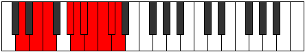 |
| [4045](https://ianring.com/musictheory/scales/4045) | [Gyptygic](ModeCSharpGyptygic.md) | C# | C#, D#, E, G, G#, A, A#, B, C, C# |  |
| [4045](https://ianring.com/musictheory/scales/4045) | [Gyptygic](ModeDFlatGyptygic.md) | Db | Db, Eb, E, G, Ab, A, Bb, B, C, Db |  |
| [4047](https://ianring.com/musictheory/scales/4047) | [Thogyllian](ModeGNaturalThogyllian.md) | G | G, G#, A, A#, C#, D, D#, E, F, F#, G |  |
| [4047](https://ianring.com/musictheory/scales/4047) | [Thogyllian](ModeDNaturalThogyllian.md) | D | D, D#, E, F, G#, A, A#, B, C, C#, D |  |
| [4047](https://ianring.com/musictheory/scales/4047) | [Thogyllian](ModeCSharpThogyllian.md) | C# | C#, D, D#, E, G, G#, A, A#, B, C, C# |  |
| [4047](https://ianring.com/musictheory/scales/4047) | [Thogyllian](ModeDFlatThogyllian.md) | Db | Db, D, Eb, E, G, Ab, A, Bb, B, C, Db |  |
| [4047](https://ianring.com/musictheory/scales/4047) | [Thogyllian](ModeASharpThogyllian.md) | A# | A#, B, C, C#, E, F, F#, G, G#, A, A# |  |
| [4047](https://ianring.com/musictheory/scales/4047) | [Thogyllian](ModeBFlatThogyllian.md) | Bb | Bb, B, C, Db, E, F, Gb, G, Ab, A, Bb |  |
| [4047](https://ianring.com/musictheory/scales/4047) | [Thogyllian](ModeANaturalThogyllian.md) | A | A, A#, B, C, D#, E, F, F#, G, G#, A |  |
| [4047](https://ianring.com/musictheory/scales/4047) | [Thogyllian](ModeGSharpThogyllian.md) | G# | G#, A, A#, B, D, D#, E, F, F#, G, G# |  |
| [4047](https://ianring.com/musictheory/scales/4047) | [Thogyllian](ModeAFlatThogyllian.md) | Ab | Ab, A, Bb, B, D, Eb, E, F, Gb, G, Ab |  |
| [4049](https://ianring.com/musictheory/scales/4049) | [Stycryllic](ModeASharpStycryllic.md) | A# | A#, D, E, F, F#, G, G#, A, A# |  |
| [4049](https://ianring.com/musictheory/scales/4049) | [Stycryllic](ModeBFlatStycryllic.md) | Bb | Bb, D, E, F, Gb, G, Ab, A, Bb |  |
| [4049](https://ianring.com/musictheory/scales/4049) | [Stycryllic](ModeCNaturalStycryllic.md) | C | C, E, F#, G, G#, A, A#, B, C |  |
| [4051](https://ianring.com/musictheory/scales/4051) | [Ionilygic](ModeANaturalIonilygic.md) | A | A, A#, C#, D#, E, F, F#, G, G#, A |  |
| [4051](https://ianring.com/musictheory/scales/4051) | [Ionilygic](ModeCNaturalIonilygic.md) | C | C, C#, E, F#, G, G#, A, A#, B, C |  |
| [4051](https://ianring.com/musictheory/scales/4051) | [Ionilygic](ModeASharpIonilygic.md) | A# | A#, B, D, E, F, F#, G, G#, A, A# |  |
| [4051](https://ianring.com/musictheory/scales/4051) | [Ionilygic](ModeBFlatIonilygic.md) | Bb | Bb, B, D, E, F, Gb, G, Ab, A, Bb |  |
| [4053](https://ianring.com/musictheory/scales/4053) | [Kyrygic](ModeASharpKyrygic.md) | A# | A#, C, D, E, F, F#, G, G#, A, A# |  |
| [4053](https://ianring.com/musictheory/scales/4053) | [Kyrygic](ModeBFlatKyrygic.md) | Bb | Bb, C, D, E, F, Gb, G, Ab, A, Bb |  |
| [4053](https://ianring.com/musictheory/scales/4053) | [Kyrygic](ModeDNaturalKyrygic.md) | D | D, E, F#, G#, A, A#, B, C, C#, D |  |
| [4053](https://ianring.com/musictheory/scales/4053) | [Kyrygic](ModeCNaturalKyrygic.md) | C | C, D, E, F#, G, G#, A, A#, B, C |  |
| [4055](https://ianring.com/musictheory/scales/4055) | [Dagyllian](ModeGSharpDagyllian.md) | G# | G#, A, A#, C, D, D#, E, F, F#, G, G# |  |
| [4055](https://ianring.com/musictheory/scales/4055) | [Dagyllian](ModeAFlatDagyllian.md) | Ab | Ab, A, Bb, C, D, Eb, E, F, Gb, G, Ab |  |
| [4055](https://ianring.com/musictheory/scales/4055) | [Dagyllian](ModeDNaturalDagyllian.md) | D | D, D#, E, F#, G#, A, A#, B, C, C#, D |  |
| [4055](https://ianring.com/musictheory/scales/4055) | [Dagyllian](ModeCNaturalDagyllian.md) | C | C, C#, D, E, F#, G, G#, A, A#, B, C |  |
| [4055](https://ianring.com/musictheory/scales/4055) | [Dagyllian](ModeASharpDagyllian.md) | A# | A#, B, C, D, E, F, F#, G, G#, A, A# |  |
| [4055](https://ianring.com/musictheory/scales/4055) | [Dagyllian](ModeBFlatDagyllian.md) | Bb | Bb, B, C, D, E, F, Gb, G, Ab, A, Bb |  |
| [4055](https://ianring.com/musictheory/scales/4055) | [Dagyllian](ModeANaturalDagyllian.md) | A | A, A#, B, C#, D#, E, F, F#, G, G#, A |  |
| [4057](https://ianring.com/musictheory/scales/4057) | [Phrygic](ModeASharpPhrygic.md) | A# | A#, C#, D, E, F, F#, G, G#, A, A# |  |
| [4057](https://ianring.com/musictheory/scales/4057) | [Phrygic](ModeBFlatPhrygic.md) | Bb | Bb, Db, D, E, F, Gb, G, Ab, A, Bb |  |
| [4057](https://ianring.com/musictheory/scales/4057) | [Phrygic](ModeCSharpPhrygic.md) | C# | C#, E, F, G, G#, A, A#, B, C, C# |  |
| [4057](https://ianring.com/musictheory/scales/4057) | [Phrygic](ModeDFlatPhrygic.md) | Db | Db, E, F, G, Ab, A, Bb, B, C, Db |  |
| [4057](https://ianring.com/musictheory/scales/4057) | [Phrygic](ModeCNaturalPhrygic.md) | C | C, D#, E, F#, G, G#, A, A#, B, C |  |
| [4059](https://ianring.com/musictheory/scales/4059) | [Zolyllian](ModeANaturalZolyllian.md) | A | A, A#, C, C#, D#, E, F, F#, G, G#, A |  |
| [4059](https://ianring.com/musictheory/scales/4059) | [Zolyllian](ModeCSharpZolyllian.md) | C# | C#, D, E, F, G, G#, A, A#, B, C, C# |  |
| [4059](https://ianring.com/musictheory/scales/4059) | [Zolyllian](ModeDFlatZolyllian.md) | Db | Db, D, E, F, G, Ab, A, Bb, B, C, Db |  |
| [4059](https://ianring.com/musictheory/scales/4059) | [Zolyllian](ModeCNaturalZolyllian.md) | C | C, C#, D#, E, F#, G, G#, A, A#, B, C |  |
| [4059](https://ianring.com/musictheory/scales/4059) | [Zolyllian](ModeASharpZolyllian.md) | A# | A#, B, C#, D, E, F, F#, G, G#, A, A# |  |
| [4059](https://ianring.com/musictheory/scales/4059) | [Zolyllian](ModeBFlatZolyllian.md) | Bb | Bb, B, Db, D, E, F, Gb, G, Ab, A, Bb |  |
| [4061](https://ianring.com/musictheory/scales/4061) | [Staptyllian](ModeFSharpStaptyllian.md) | F# | F#, G#, A, A#, C, C#, D, D#, E, F, F# |  |
| [4061](https://ianring.com/musictheory/scales/4061) | [Staptyllian](ModeGFlatStaptyllian.md) | Gb | Gb, Ab, A, Bb, C, Db, D, Eb, E, F, Gb |  |
| [4061](https://ianring.com/musictheory/scales/4061) | [Staptyllian](ModeASharpStaptyllian.md) | A# | A#, C, C#, D, E, F, F#, G, G#, A, A# |  |
| [4061](https://ianring.com/musictheory/scales/4061) | [Staptyllian](ModeBFlatStaptyllian.md) | Bb | Bb, C, Db, D, E, F, Gb, G, Ab, A, Bb |  |
| [4061](https://ianring.com/musictheory/scales/4061) | [Staptyllian](ModeDNaturalStaptyllian.md) | D | D, E, F, F#, G#, A, A#, B, C, C#, D |  |
| [4061](https://ianring.com/musictheory/scales/4061) | [Staptyllian](ModeCSharpStaptyllian.md) | C# | C#, D#, E, F, G, G#, A, A#, B, C, C# |  |
| [4061](https://ianring.com/musictheory/scales/4061) | [Staptyllian](ModeDFlatStaptyllian.md) | Db | Db, Eb, E, F, G, Ab, A, Bb, B, C, Db |  |
| [4061](https://ianring.com/musictheory/scales/4061) | [Staptyllian](ModeCNaturalStaptyllian.md) | C | C, D, D#, E, F#, G, G#, A, A#, B, C |  |
| [4063](https://ianring.com/musictheory/scales/4063) | [Eptatic](ModeFSharpEptatic.md) | F# | F#, G, G#, A, A#, C, C#, D, D#, E, F, F# |  |
| [4063](https://ianring.com/musictheory/scales/4063) | [Eptatic](ModeGFlatEptatic.md) | Gb | Gb, G, Ab, A, Bb, C, Db, D, Eb, E, F, Gb |  |
| [4063](https://ianring.com/musictheory/scales/4063) | [Eptatic](ModeDNaturalEptatic.md) | D | D, D#, E, F, F#, G#, A, A#, B, C, C#, D |  |
| [4063](https://ianring.com/musictheory/scales/4063) | [Eptatic](ModeCSharpEptatic.md) | C# | C#, D, D#, E, F, G, G#, A, A#, B, C, C# |  |
| [4063](https://ianring.com/musictheory/scales/4063) | [Eptatic](ModeDFlatEptatic.md) | Db | Db, D, Eb, E, F, G, Ab, A, Bb, B, C, Db |  |
| [4063](https://ianring.com/musictheory/scales/4063) | [Eptatic](ModeCNaturalEptatic.md) | C | C, C#, D, D#, E, F#, G, G#, A, A#, B, C |  |
| [4063](https://ianring.com/musictheory/scales/4063) | [Eptatic](ModeASharpEptatic.md) | A# | A#, B, C, C#, D, E, F, F#, G, G#, A, A# |  |
| [4063](https://ianring.com/musictheory/scales/4063) | [Eptatic](ModeBFlatEptatic.md) | Bb | Bb, B, C, Db, D, E, F, Gb, G, Ab, A, Bb |  |
| [4063](https://ianring.com/musictheory/scales/4063) | [Eptatic](ModeANaturalEptatic.md) | A | A, A#, B, C, C#, D#, E, F, F#, G, G#, A |  |
| [4063](https://ianring.com/musictheory/scales/4063) | [Eptatic](ModeGSharpEptatic.md) | G# | G#, A, A#, B, C, D, D#, E, F, F#, G, G# |  |
| [4063](https://ianring.com/musictheory/scales/4063) | [Eptatic](ModeAFlatEptatic.md) | Ab | Ab, A, Bb, B, C, D, Eb, E, F, Gb, G, Ab |  |
| [4063](https://ianring.com/musictheory/scales/4063) | [Eptatic](ModeGNaturalEptatic.md) | G | G, G#, A, A#, B, C#, D, D#, E, F, F#, G |  |
| [4067](https://ianring.com/musictheory/scales/4067) | [Aeolarygic](ModeANaturalAeolarygic.md) | A | A, A#, D, D#, E, F, F#, G, G#, A |  |
| [4067](https://ianring.com/musictheory/scales/4067) | [Aeolarygic](ModeDSharpAeolarygic.md) | D# | D#, E, G#, A, A#, B, C, C#, D, D# |  |
| [4067](https://ianring.com/musictheory/scales/4067) | [Aeolarygic](ModeEFlatAeolarygic.md) | Eb | Eb, E, Ab, A, Bb, B, C, Db, D, Eb |  |
| [4067](https://ianring.com/musictheory/scales/4067) | [Aeolarygic](ModeBNaturalAeolarygic.md) | B | B, C, E, F, F#, G, G#, A, A#, B |  |
| [4067](https://ianring.com/musictheory/scales/4067) | [Aeolarygic](ModeASharpAeolarygic.md) | A# | A#, B, D#, E, F, F#, G, G#, A, A# |  |
| [4067](https://ianring.com/musictheory/scales/4067) | [Aeolarygic](ModeBFlatAeolarygic.md) | Bb | Bb, B, Eb, E, F, Gb, G, Ab, A, Bb |  |
| [4069](https://ianring.com/musictheory/scales/4069) | [Starygic](ModeASharpStarygic.md) | A# | A#, C, D#, E, F, F#, G, G#, A, A# |  |
| [4069](https://ianring.com/musictheory/scales/4069) | [Starygic](ModeBFlatStarygic.md) | Bb | Bb, C, Eb, E, F, Gb, G, Ab, A, Bb |  |
| [4069](https://ianring.com/musictheory/scales/4069) | [Starygic](ModeDNaturalStarygic.md) | D | D, E, G, G#, A, A#, B, C, C#, D |  |
| [4069](https://ianring.com/musictheory/scales/4069) | [Starygic](ModeBNaturalStarygic.md) | B | B, C#, E, F, F#, G, G#, A, A#, B |  |
| [4071](https://ianring.com/musictheory/scales/4071) | [Rygyllian](ModeGSharpRygyllian.md) | G# | G#, A, A#, C#, D, D#, E, F, F#, G, G# |  |
| [4071](https://ianring.com/musictheory/scales/4071) | [Rygyllian](ModeAFlatRygyllian.md) | Ab | Ab, A, Bb, Db, D, Eb, E, F, Gb, G, Ab |  |
| [4071](https://ianring.com/musictheory/scales/4071) | [Rygyllian](ModeDSharpRygyllian.md) | D# | D#, E, F, G#, A, A#, B, C, C#, D, D# |  |
| [4071](https://ianring.com/musictheory/scales/4071) | [Rygyllian](ModeEFlatRygyllian.md) | Eb | Eb, E, F, Ab, A, Bb, B, C, Db, D, Eb |  |
| [4071](https://ianring.com/musictheory/scales/4071) | [Rygyllian](ModeDNaturalRygyllian.md) | D | D, D#, E, G, G#, A, A#, B, C, C#, D |  |
| [4071](https://ianring.com/musictheory/scales/4071) | [Rygyllian](ModeBNaturalRygyllian.md) | B | B, C, C#, E, F, F#, G, G#, A, A#, B |  |
| [4071](https://ianring.com/musictheory/scales/4071) | [Rygyllian](ModeASharpRygyllian.md) | A# | A#, B, C, D#, E, F, F#, G, G#, A, A# |  |
| [4071](https://ianring.com/musictheory/scales/4071) | [Rygyllian](ModeBFlatRygyllian.md) | Bb | Bb, B, C, Eb, E, F, Gb, G, Ab, A, Bb |  |
| [4071](https://ianring.com/musictheory/scales/4071) | [Rygyllian](ModeANaturalRygyllian.md) | A | A, A#, B, D, D#, E, F, F#, G, G#, A |  |
| [4073](https://ianring.com/musictheory/scales/4073) | [Sathygic](ModeASharpSathygic.md) | A# | A#, C#, D#, E, F, F#, G, G#, A, A# |  |
| [4073](https://ianring.com/musictheory/scales/4073) | [Sathygic](ModeBFlatSathygic.md) | Bb | Bb, Db, Eb, E, F, Gb, G, Ab, A, Bb |  |
| [4073](https://ianring.com/musictheory/scales/4073) | [Sathygic](ModeCSharpSathygic.md) | C# | C#, E, F#, G, G#, A, A#, B, C, C# |  |
| [4073](https://ianring.com/musictheory/scales/4073) | [Sathygic](ModeDFlatSathygic.md) | Db | Db, E, Gb, G, Ab, A, Bb, B, C, Db |  |
| [4073](https://ianring.com/musictheory/scales/4073) | [Sathygic](ModeBNaturalSathygic.md) | B | B, D, E, F, F#, G, G#, A, A#, B |  |
| [4075](https://ianring.com/musictheory/scales/4075) | [Katyllian](ModeANaturalKatyllian.md) | A | A, A#, C, D, D#, E, F, F#, G, G#, A |  |
| [4075](https://ianring.com/musictheory/scales/4075) | [Katyllian](ModeDSharpKatyllian.md) | D# | D#, E, F#, G#, A, A#, B, C, C#, D, D# |  |
| [4075](https://ianring.com/musictheory/scales/4075) | [Katyllian](ModeEFlatKatyllian.md) | Eb | Eb, E, Gb, Ab, A, Bb, B, C, Db, D, Eb |  |
| [4075](https://ianring.com/musictheory/scales/4075) | [Katyllian](ModeCSharpKatyllian.md) | C# | C#, D, E, F#, G, G#, A, A#, B, C, C# |  |
| [4075](https://ianring.com/musictheory/scales/4075) | [Katyllian](ModeDFlatKatyllian.md) | Db | Db, D, E, Gb, G, Ab, A, Bb, B, C, Db |  |
| [4075](https://ianring.com/musictheory/scales/4075) | [Katyllian](ModeBNaturalKatyllian.md) | B | B, C, D, E, F, F#, G, G#, A, A#, B |  |
| [4075](https://ianring.com/musictheory/scales/4075) | [Katyllian](ModeASharpKatyllian.md) | A# | A#, B, C#, D#, E, F, F#, G, G#, A, A# |  |
| [4075](https://ianring.com/musictheory/scales/4075) | [Katyllian](ModeBFlatKatyllian.md) | Bb | Bb, B, Db, Eb, E, F, Gb, G, Ab, A, Bb |  |
| [4077](https://ianring.com/musictheory/scales/4077) | [Gothyllian](ModeASharpGothyllian.md) | A# | A#, C, C#, D#, E, F, F#, G, G#, A, A# |  |
| [4077](https://ianring.com/musictheory/scales/4077) | [Gothyllian](ModeBFlatGothyllian.md) | Bb | Bb, C, Db, Eb, E, F, Gb, G, Ab, A, Bb |  |
| [4077](https://ianring.com/musictheory/scales/4077) | [Gothyllian](ModeDNaturalGothyllian.md) | D | D, E, F, G, G#, A, A#, B, C, C#, D |  |
| [4077](https://ianring.com/musictheory/scales/4077) | [Gothyllian](ModeCSharpGothyllian.md) | C# | C#, D#, E, F#, G, G#, A, A#, B, C, C# |  |
| [4077](https://ianring.com/musictheory/scales/4077) | [Gothyllian](ModeDFlatGothyllian.md) | Db | Db, Eb, E, Gb, G, Ab, A, Bb, B, C, Db |  |
| [4077](https://ianring.com/musictheory/scales/4077) | [Gothyllian](ModeBNaturalGothyllian.md) | B | B, C#, D, E, F, F#, G, G#, A, A#, B |  |
| [4079](https://ianring.com/musictheory/scales/4079) | [Ionatic](ModeGNaturalIonatic.md) | G | G, G#, A, A#, C, C#, D, D#, E, F, F#, G |  |
| [4079](https://ianring.com/musictheory/scales/4079) | [Ionatic](ModeDSharpIonatic.md) | D# | D#, E, F, F#, G#, A, A#, B, C, C#, D, D# |  |
| [4079](https://ianring.com/musictheory/scales/4079) | [Ionatic](ModeEFlatIonatic.md) | Eb | Eb, E, F, Gb, Ab, A, Bb, B, C, Db, D, Eb |  |
| [4079](https://ianring.com/musictheory/scales/4079) | [Ionatic](ModeDNaturalIonatic.md) | D | D, D#, E, F, G, G#, A, A#, B, C, C#, D |  |
| [4079](https://ianring.com/musictheory/scales/4079) | [Ionatic](ModeCSharpIonatic.md) | C# | C#, D, D#, E, F#, G, G#, A, A#, B, C, C# |  |
| [4079](https://ianring.com/musictheory/scales/4079) | [Ionatic](ModeDFlatIonatic.md) | Db | Db, D, Eb, E, Gb, G, Ab, A, Bb, B, C, Db |  |
| [4079](https://ianring.com/musictheory/scales/4079) | [Ionatic](ModeBNaturalIonatic.md) | B | B, C, C#, D, E, F, F#, G, G#, A, A#, B |  |
| [4079](https://ianring.com/musictheory/scales/4079) | [Ionatic](ModeASharpIonatic.md) | A# | A#, B, C, C#, D#, E, F, F#, G, G#, A, A# |  |
| [4079](https://ianring.com/musictheory/scales/4079) | [Ionatic](ModeBFlatIonatic.md) | Bb | Bb, B, C, Db, Eb, E, F, Gb, G, Ab, A, Bb |  |
| [4079](https://ianring.com/musictheory/scales/4079) | [Ionatic](ModeANaturalIonatic.md) | A | A, A#, B, C, D, D#, E, F, F#, G, G#, A |  |
| [4079](https://ianring.com/musictheory/scales/4079) | [Ionatic](ModeGSharpIonatic.md) | G# | G#, A, A#, B, C#, D, D#, E, F, F#, G, G# |  |
| [4079](https://ianring.com/musictheory/scales/4079) | [Ionatic](ModeAFlatIonatic.md) | Ab | Ab, A, Bb, B, Db, D, Eb, E, F, Gb, G, Ab |  |
| [4081](https://ianring.com/musictheory/scales/4081) | [Manygic](ModeASharpManygic.md) | A# | A#, D, D#, E, F, F#, G, G#, A, A# |  |
| [4081](https://ianring.com/musictheory/scales/4081) | [Manygic](ModeBFlatManygic.md) | Bb | Bb, D, Eb, E, F, Gb, G, Ab, A, Bb |  |
| [4081](https://ianring.com/musictheory/scales/4081) | [Manygic](ModeENaturalManygic.md) | E | E, G#, A, A#, B, C, C#, D, D#, E |  |
| [4081](https://ianring.com/musictheory/scales/4081) | [Manygic](ModeCNaturalManygic.md) | C | C, E, F, F#, G, G#, A, A#, B, C |  |
| [4081](https://ianring.com/musictheory/scales/4081) | [Manygic](ModeBNaturalManygic.md) | B | B, D#, E, F, F#, G, G#, A, A#, B |  |
| [4083](https://ianring.com/musictheory/scales/4083) | [Bathyllian](ModeANaturalBathyllian.md) | A | A, A#, C#, D, D#, E, F, F#, G, G#, A |  |
| [4083](https://ianring.com/musictheory/scales/4083) | [Bathyllian](ModeENaturalBathyllian.md) | E | E, F, G#, A, A#, B, C, C#, D, D#, E |  |
| [4083](https://ianring.com/musictheory/scales/4083) | [Bathyllian](ModeDSharpBathyllian.md) | D# | D#, E, G, G#, A, A#, B, C, C#, D, D# |  |
| [4083](https://ianring.com/musictheory/scales/4083) | [Bathyllian](ModeEFlatBathyllian.md) | Eb | Eb, E, G, Ab, A, Bb, B, C, Db, D, Eb |  |
| [4083](https://ianring.com/musictheory/scales/4083) | [Bathyllian](ModeCNaturalBathyllian.md) | C | C, C#, E, F, F#, G, G#, A, A#, B, C |  |
| [4083](https://ianring.com/musictheory/scales/4083) | [Bathyllian](ModeBNaturalBathyllian.md) | B | B, C, D#, E, F, F#, G, G#, A, A#, B |  |
| [4083](https://ianring.com/musictheory/scales/4083) | [Bathyllian](ModeASharpBathyllian.md) | A# | A#, B, D, D#, E, F, F#, G, G#, A, A# |  |
| [4083](https://ianring.com/musictheory/scales/4083) | [Bathyllian](ModeBFlatBathyllian.md) | Bb | Bb, B, D, Eb, E, F, Gb, G, Ab, A, Bb |  |
| [4085](https://ianring.com/musictheory/scales/4085) | [Sydyllian](ModeASharpSydyllian.md) | A# | A#, C, D, D#, E, F, F#, G, G#, A, A# |  |
| [4085](https://ianring.com/musictheory/scales/4085) | [Sydyllian](ModeBFlatSydyllian.md) | Bb | Bb, C, D, Eb, E, F, Gb, G, Ab, A, Bb |  |
| [4085](https://ianring.com/musictheory/scales/4085) | [Sydyllian](ModeENaturalSydyllian.md) | E | E, F#, G#, A, A#, B, C, C#, D, D#, E |  |
| [4085](https://ianring.com/musictheory/scales/4085) | [Sydyllian](ModeDNaturalSydyllian.md) | D | D, E, F#, G, G#, A, A#, B, C, C#, D |  |
| [4085](https://ianring.com/musictheory/scales/4085) | [Sydyllian](ModeCNaturalSydyllian.md) | C | C, D, E, F, F#, G, G#, A, A#, B, C |  |
| [4085](https://ianring.com/musictheory/scales/4085) | [Sydyllian](ModeBNaturalSydyllian.md) | B | B, C#, D#, E, F, F#, G, G#, A, A#, B |  |
| [4087](https://ianring.com/musictheory/scales/4087) | [Aeolatic](ModeGSharpAeolatic.md) | G# | G#, A, A#, C, C#, D, D#, E, F, F#, G, G# |  |
| [4087](https://ianring.com/musictheory/scales/4087) | [Aeolatic](ModeAFlatAeolatic.md) | Ab | Ab, A, Bb, C, Db, D, Eb, E, F, Gb, G, Ab |  |
| [4087](https://ianring.com/musictheory/scales/4087) | [Aeolatic](ModeENaturalAeolatic.md) | E | E, F, F#, G#, A, A#, B, C, C#, D, D#, E |  |
| [4087](https://ianring.com/musictheory/scales/4087) | [Aeolatic](ModeDSharpAeolatic.md) | D# | D#, E, F, G, G#, A, A#, B, C, C#, D, D# |  |
| [4087](https://ianring.com/musictheory/scales/4087) | [Aeolatic](ModeEFlatAeolatic.md) | Eb | Eb, E, F, G, Ab, A, Bb, B, C, Db, D, Eb |  |
| [4087](https://ianring.com/musictheory/scales/4087) | [Aeolatic](ModeDNaturalAeolatic.md) | D | D, D#, E, F#, G, G#, A, A#, B, C, C#, D |  |
| [4087](https://ianring.com/musictheory/scales/4087) | [Aeolatic](ModeCNaturalAeolatic.md) | C | C, C#, D, E, F, F#, G, G#, A, A#, B, C |  |
| [4087](https://ianring.com/musictheory/scales/4087) | [Aeolatic](ModeBNaturalAeolatic.md) | B | B, C, C#, D#, E, F, F#, G, G#, A, A#, B |  |
| [4087](https://ianring.com/musictheory/scales/4087) | [Aeolatic](ModeASharpAeolatic.md) | A# | A#, B, C, D, D#, E, F, F#, G, G#, A, A# |  |
| [4087](https://ianring.com/musictheory/scales/4087) | [Aeolatic](ModeBFlatAeolatic.md) | Bb | Bb, B, C, D, Eb, E, F, Gb, G, Ab, A, Bb |  |
| [4087](https://ianring.com/musictheory/scales/4087) | [Aeolatic](ModeANaturalAeolatic.md) | A | A, A#, B, C#, D, D#, E, F, F#, G, G#, A |  |
| [4089](https://ianring.com/musictheory/scales/4089) | [Katoryllian](ModeASharpKatoryllian.md) | A# | A#, C#, D, D#, E, F, F#, G, G#, A, A# |  |
| [4089](https://ianring.com/musictheory/scales/4089) | [Katoryllian](ModeBFlatKatoryllian.md) | Bb | Bb, Db, D, Eb, E, F, Gb, G, Ab, A, Bb |  |
| [4089](https://ianring.com/musictheory/scales/4089) | [Katoryllian](ModeFNaturalKatoryllian.md) | F | F, G#, A, A#, B, C, C#, D, D#, E, F |  |
| [4089](https://ianring.com/musictheory/scales/4089) | [Katoryllian](ModeENaturalKatoryllian.md) | E | E, G, G#, A, A#, B, C, C#, D, D#, E |  |
| [4089](https://ianring.com/musictheory/scales/4089) | [Katoryllian](ModeCSharpKatoryllian.md) | C# | C#, E, F, F#, G, G#, A, A#, B, C, C# |  |
| [4089](https://ianring.com/musictheory/scales/4089) | [Katoryllian](ModeDFlatKatoryllian.md) | Db | Db, E, F, Gb, G, Ab, A, Bb, B, C, Db |  |
| [4089](https://ianring.com/musictheory/scales/4089) | [Katoryllian](ModeCNaturalKatoryllian.md) | C | C, D#, E, F, F#, G, G#, A, A#, B, C |  |
| [4089](https://ianring.com/musictheory/scales/4089) | [Katoryllian](ModeBNaturalKatoryllian.md) | B | B, D, D#, E, F, F#, G, G#, A, A#, B |  |
| [4091](https://ianring.com/musictheory/scales/4091) | [Thydatic](ModeANaturalThydatic.md) | A | A, A#, C, C#, D, D#, E, F, F#, G, G#, A |  |
| [4091](https://ianring.com/musictheory/scales/4091) | [Thydatic](ModeFNaturalThydatic.md) | F | F, F#, G#, A, A#, B, C, C#, D, D#, E, F |  |
| [4091](https://ianring.com/musictheory/scales/4091) | [Thydatic](ModeENaturalThydatic.md) | E | E, F, G, G#, A, A#, B, C, C#, D, D#, E |  |
| [4091](https://ianring.com/musictheory/scales/4091) | [Thydatic](ModeDSharpThydatic.md) | D# | D#, E, F#, G, G#, A, A#, B, C, C#, D, D# |  |
| [4091](https://ianring.com/musictheory/scales/4091) | [Thydatic](ModeEFlatThydatic.md) | Eb | Eb, E, Gb, G, Ab, A, Bb, B, C, Db, D, Eb |  |
| [4091](https://ianring.com/musictheory/scales/4091) | [Thydatic](ModeCSharpThydatic.md) | C# | C#, D, E, F, F#, G, G#, A, A#, B, C, C# |  |
| [4091](https://ianring.com/musictheory/scales/4091) | [Thydatic](ModeDFlatThydatic.md) | Db | Db, D, E, F, Gb, G, Ab, A, Bb, B, C, Db |  |
| [4091](https://ianring.com/musictheory/scales/4091) | [Thydatic](ModeCNaturalThydatic.md) | C | C, C#, D#, E, F, F#, G, G#, A, A#, B, C |  |
| [4091](https://ianring.com/musictheory/scales/4091) | [Thydatic](ModeBNaturalThydatic.md) | B | B, C, D, D#, E, F, F#, G, G#, A, A#, B |  |
| [4091](https://ianring.com/musictheory/scales/4091) | [Thydatic](ModeASharpThydatic.md) | A# | A#, B, C#, D, D#, E, F, F#, G, G#, A, A# |  |
| [4091](https://ianring.com/musictheory/scales/4091) | [Thydatic](ModeBFlatThydatic.md) | Bb | Bb, B, Db, D, Eb, E, F, Gb, G, Ab, A, Bb |  |
| [4093](https://ianring.com/musictheory/scales/4093) | [Aerycratic](ModeASharpAerycratic.md) | A# | A#, C, C#, D, D#, E, F, F#, G, G#, A, A# |  |
| [4093](https://ianring.com/musictheory/scales/4093) | [Aerycratic](ModeBFlatAerycratic.md) | Bb | Bb, C, Db, D, Eb, E, F, Gb, G, Ab, A, Bb |  |
| [4093](https://ianring.com/musictheory/scales/4093) | [Aerycratic](ModeFSharpAerycratic.md) | F# | F#, G#, A, A#, B, C, C#, D, D#, E, F, F# |  |
| [4093](https://ianring.com/musictheory/scales/4093) | [Aerycratic](ModeGFlatAerycratic.md) | Gb | Gb, Ab, A, Bb, B, C, Db, D, Eb, E, F, Gb |  |
| [4093](https://ianring.com/musictheory/scales/4093) | [Aerycratic](ModeFNaturalAerycratic.md) | F | F, G, G#, A, A#, B, C, C#, D, D#, E, F |  |
| [4093](https://ianring.com/musictheory/scales/4093) | [Aerycratic](ModeENaturalAerycratic.md) | E | E, F#, G, G#, A, A#, B, C, C#, D, D#, E |  |
| [4093](https://ianring.com/musictheory/scales/4093) | [Aerycratic](ModeDNaturalAerycratic.md) | D | D, E, F, F#, G, G#, A, A#, B, C, C#, D |  |
| [4093](https://ianring.com/musictheory/scales/4093) | [Aerycratic](ModeCSharpAerycratic.md) | C# | C#, D#, E, F, F#, G, G#, A, A#, B, C, C# |  |
| [4093](https://ianring.com/musictheory/scales/4093) | [Aerycratic](ModeDFlatAerycratic.md) | Db | Db, Eb, E, F, Gb, G, Ab, A, Bb, B, C, Db |  |
| [4093](https://ianring.com/musictheory/scales/4093) | [Aerycratic](ModeCNaturalAerycratic.md) | C | C, D, D#, E, F, F#, G, G#, A, A#, B, C |  |
| [4093](https://ianring.com/musictheory/scales/4093) | [Aerycratic](ModeBNaturalAerycratic.md) | B | B, C#, D, D#, E, F, F#, G, G#, A, A#, B |  |
| [4095](https://ianring.com/musictheory/scales/4095) | [Chromatic](ModeCNaturalChromatic.md) | C | C, C#, D, D#, E, F, F#, G, G#, A, A#, B, C |  |
| [4095](https://ianring.com/musictheory/scales/4095) | [Chromatic](ModeCSharpChromatic.md) | C# | C#, D, D#, E, F, F#, G, G#, A, A#, B, C, C# |  |
| [4095](https://ianring.com/musictheory/scales/4095) | [Chromatic](ModeDFlatChromatic.md) | Db | Db, D, Eb, E, F, Gb, G, Ab, A, Bb, B, C, Db |  |
| [4095](https://ianring.com/musictheory/scales/4095) | [Chromatic](ModeDNaturalChromatic.md) | D | D, D#, E, F, F#, G, G#, A, A#, B, C, C#, D |  |
| [4095](https://ianring.com/musictheory/scales/4095) | [Chromatic](ModeDSharpChromatic.md) | D# | D#, E, F, F#, G, G#, A, A#, B, C, C#, D, D# |  |
| [4095](https://ianring.com/musictheory/scales/4095) | [Chromatic](ModeEFlatChromatic.md) | Eb | Eb, E, F, Gb, G, Ab, A, Bb, B, C, Db, D, Eb |  |
| [4095](https://ianring.com/musictheory/scales/4095) | [Chromatic](ModeENaturalChromatic.md) | E | E, F, F#, G, G#, A, A#, B, C, C#, D, D#, E |  |
| [4095](https://ianring.com/musictheory/scales/4095) | [Chromatic](ModeFNaturalChromatic.md) | F | F, F#, G, G#, A, A#, B, C, C#, D, D#, E, F |  |
| [4095](https://ianring.com/musictheory/scales/4095) | [Chromatic](ModeFSharpChromatic.md) | F# | F#, G, G#, A, A#, B, C, C#, D, D#, E, F, F# |  |
| [4095](https://ianring.com/musictheory/scales/4095) | [Chromatic](ModeGFlatChromatic.md) | Gb | Gb, G, Ab, A, Bb, B, C, Db, D, Eb, E, F, Gb |  |
| [4095](https://ianring.com/musictheory/scales/4095) | [Chromatic](ModeGNaturalChromatic.md) | G | G, G#, A, A#, B, C, C#, D, D#, E, F, F#, G |  |
| [4095](https://ianring.com/musictheory/scales/4095) | [Chromatic](ModeGSharpChromatic.md) | G# | G#, A, A#, B, C, C#, D, D#, E, F, F#, G, G# |  |
| [4095](https://ianring.com/musictheory/scales/4095) | [Chromatic](ModeAFlatChromatic.md) | Ab | Ab, A, Bb, B, C, Db, D, Eb, E, F, Gb, G, Ab |  |
| [4095](https://ianring.com/musictheory/scales/4095) | [Chromatic](ModeANaturalChromatic.md) | A | A, A#, B, C, C#, D, D#, E, F, F#, G, G#, A |  |
| [4095](https://ianring.com/musictheory/scales/4095) | [Chromatic](ModeASharpChromatic.md) | A# | A#, B, C, C#, D, D#, E, F, F#, G, G#, A, A# |  |
| [4095](https://ianring.com/musictheory/scales/4095) | [Chromatic](ModeBFlatChromatic.md) | Bb | Bb, B, C, Db, D, Eb, E, F, Gb, G, Ab, A, Bb |  |
| [4095](https://ianring.com/musictheory/scales/4095) | [Chromatic](ModeBNaturalChromatic.md) | B | B, C, C#, D, D#, E, F, F#, G, G#, A, A#, B |  |
