# ANaturalSuspendedSecondDoubleFlatFifth

## Links

- [Documentation](index.md)
- [Scales Index](Scales.md)
- [Modes Index](Modes.md)
- [Chords Index](Chords.md)

## Root

A

## Notes

| Position | Notes | Illustration |
|----------|------|--------------|
| RootPosition | A,B,D |  |
| FirstInversion | B,D,A | 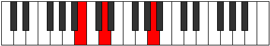 |
| SecondInversion | D,A,B | 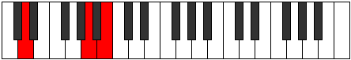 |
## Modes

| Number | Mode | Tonic | Notes | Illustration |
|--------|------|-------|-------|--------------|
| [293](https://ianring.com/musictheory/scales/293) | [Zoptic](ModeANaturalZoptic.md) | A | A, B, D, F, A |  |
| [295](https://ianring.com/musictheory/scales/295) | [Gyritonic](ModeANaturalGyritonic.md) | A | A, A#, B, D, F, A |  |
| [297](https://ianring.com/musictheory/scales/297) | [Mynic](ModeFSharpMynic.md) | F# | F#, A, B, D, F# |  |
| [297](https://ianring.com/musictheory/scales/297) | [Mynic](ModeGFlatMynic.md) | Gb | Gb, A, B, D, Gb |  |
| [299](https://ianring.com/musictheory/scales/299) | [Phratonic](ModeFSharpPhratonic.md) | F# | F#, G, A, B, D, F# |  |
| [299](https://ianring.com/musictheory/scales/299) | [Phratonic](ModeGFlatPhratonic.md) | Gb | Gb, G, A, B, D, Gb |  |
| [301](https://ianring.com/musictheory/scales/301) | [Zythitonic](ModeANaturalZythitonic.md) | A | A, B, C, D, F, A |  |
| [301](https://ianring.com/musictheory/scales/301) | [Zythitonic](ModeFSharpZythitonic.md) | F# | F#, G#, A, B, D, F# |  |
| [301](https://ianring.com/musictheory/scales/301) | [Zythitonic](ModeGFlatZythitonic.md) | Gb | Gb, Ab, A, B, D, Gb |  |
| [303](https://ianring.com/musictheory/scales/303) | [Golimic](ModeANaturalGolimic.md) | A | A, Bb, Cb, Dbb, Ebb, F, A |  |
| [309](https://ianring.com/musictheory/scales/309) | [Palitonic](ModeANaturalPalitonic.md) | A | A, B, C#, D, F, A |  |
| [311](https://ianring.com/musictheory/scales/311) | [Stagimic](ModeANaturalStagimic.md) | A | A, Bb, Cb, Db, Ebb, F, A |  |
| [313](https://ianring.com/musictheory/scales/313) | [Goritonic](ModeFSharpGoritonic.md) | F# | F#, A, A#, B, D, F# |  |
| [313](https://ianring.com/musictheory/scales/313) | [Goritonic](ModeGFlatGoritonic.md) | Gb | Gb, A, Bb, B, D, Gb |  |
| [315](https://ianring.com/musictheory/scales/315) | [Stodimic](ModeFSharpStodimic.md) | F# | F#, G, A, Bb, Cb, D, F# |  |
| [317](https://ianring.com/musictheory/scales/317) | [Korimic](ModeANaturalKorimic.md) | A | A, B, C, Db, Ebb, F, A |  |
| [317](https://ianring.com/musictheory/scales/317) | [Korimic](ModeFSharpKorimic.md) | F# | F#, G#, A, Bb, Cb, D, F# |  |
| [319](https://ianring.com/musictheory/scales/319) | [Epodian](ModeANaturalEpodian.md) | A | A, Bb, Cb, Dbb, Ebbb, Fbbb, Gbb, A |  |
| [331](https://ianring.com/musictheory/scales/331) | [Byptitonic](ModeGSharpByptitonic.md) | G# | G#, A, B, D, E, G# |  |
| [331](https://ianring.com/musictheory/scales/331) | [Byptitonic](ModeAFlatByptitonic.md) | Ab | Ab, A, B, D, E, Ab |  |
| [335](https://ianring.com/musictheory/scales/335) | [Zanimic](ModeGSharpZanimic.md) | G# | G#, A, Bb, Cb, D, E, G# |  |
| [347](https://ianring.com/musictheory/scales/347) | [Barimic](ModeGSharpBarimic.md) | G# | G#, A, B, C, D, E, G# |  |
| [351](https://ianring.com/musictheory/scales/351) | [Epanian](ModeGSharpEpanian.md) | G# | G#, A, Bb, Cb, Dbb, Ebb, Fb, G# |  |
| [357](https://ianring.com/musictheory/scales/357) | [Banitonic](ModeANaturalBanitonic.md) | A | A, B, D, D#, F, A |  |
| [359](https://ianring.com/musictheory/scales/359) | [Bothimic](ModeANaturalBothimic.md) | A | A, Bb, Cb, D, Eb, F, A |  |
| [361](https://ianring.com/musictheory/scales/361) | [Bocritonic](ModeFSharpBocritonic.md) | F# | F#, A, B, C, D, F# |  |
| [361](https://ianring.com/musictheory/scales/361) | [Bocritonic](ModeGFlatBocritonic.md) | Gb | Gb, A, B, C, D, Gb |  |
| [363](https://ianring.com/musictheory/scales/363) | [Soptimic](ModeFSharpSoptimic.md) | F# | F#, G, A, B, C, D, F# |  |
| [363](https://ianring.com/musictheory/scales/363) | [Soptimic](ModeGSharpSoptimic.md) | G# | G#, A, B, C#, D, E, G# |  |
| [365](https://ianring.com/musictheory/scales/365) | [Marimic](ModeANaturalMarimic.md) | A | A, B, C, D, Eb, F, A |  |
| [365](https://ianring.com/musictheory/scales/365) | [Marimic](ModeFSharpMarimic.md) | F# | F#, G#, A, B, C, D, F# |  |
| [367](https://ianring.com/musictheory/scales/367) | [Aerodian](ModeANaturalAerodian.md) | A | A, Bb, Cb, Dbb, Ebb, Fbb, Gbb, A |  |
| [367](https://ianring.com/musictheory/scales/367) | [Aerodian](ModeGSharpAerodian.md) | G# | G#, A, Bb, Cb, Db, Ebb, Fb, G# |  |
| [373](https://ianring.com/musictheory/scales/373) | [Epagimic](ModeANaturalEpagimic.md) | A | A, B, C#, D, Eb, F, A |  |
| [375](https://ianring.com/musictheory/scales/375) | [Sodian](ModeANaturalSodian.md) | A | A, Bb, Cb, Db, Ebb, Fbb, Gbb, A |  |
| [377](https://ianring.com/musictheory/scales/377) | [Kathimic](ModeGFlatKathimic.md) | Gb | Gb, A, Bb, Cb, Dbb, Ebb, Gb |  |
| [379](https://ianring.com/musictheory/scales/379) | [Aeragian](ModeGSharpAeragian.md) | G# | G#, A, B, C, Db, Ebb, Fb, G# |  |
| [379](https://ianring.com/musictheory/scales/379) | [Aeragian](ModeFSharpAeragian.md) | F# | F#, G, A, Bb, Cb, Dbb, Ebb, F# |  |
| [381](https://ianring.com/musictheory/scales/381) | [Kogian](ModeANaturalKogian.md) | A | A, B, C, Db, Ebb, Fbb, Gbb, A |  |
| [381](https://ianring.com/musictheory/scales/381) | [Kogian](ModeFSharpKogian.md) | F# | F#, G#, A, Bb, Cb, Dbb, Ebb, F# |  |
| [383](https://ianring.com/musictheory/scales/383) | [Logyllic](ModeANaturalLogyllic.md) | A | A, A#, B, C, C#, D, D#, F, A |  |
| [383](https://ianring.com/musictheory/scales/383) | [Logyllic](ModeGSharpLogyllic.md) | G# | G#, A, A#, B, C, C#, D, E, G# |  |
| [383](https://ianring.com/musictheory/scales/383) | [Logyllic](ModeAFlatLogyllic.md) | Ab | Ab, A, Bb, B, C, Db, D, E, Ab |  |
| [383](https://ianring.com/musictheory/scales/383) | [Logyllic](ModeFSharpLogyllic.md) | F# | F#, G, G#, A, A#, B, C, D, F# |  |
| [383](https://ianring.com/musictheory/scales/383) | [Logyllic](ModeGFlatLogyllic.md) | Gb | Gb, G, Ab, A, Bb, B, C, D, Gb |  |
| [405](https://ianring.com/musictheory/scales/405) | [Danitonic](ModeGNaturalDanitonic.md) | G | G, A, B, D, D#, G | 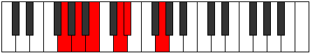 |
| [413](https://ianring.com/musictheory/scales/413) | [Ganimic](ModeGNaturalGanimic.md) | G | G, A, Bb, Cb, D, Eb, G |  |
| [421](https://ianring.com/musictheory/scales/421) | [Ionitonic](ModeANaturalIonitonic.md) | A | A, B, D, E, F, A |  |
| [423](https://ianring.com/musictheory/scales/423) | [Sogimic](ModeANaturalSogimic.md) | A | A, Bb, Cb, D, E, F, A |  |
| [425](https://ianring.com/musictheory/scales/425) | [Daditonic](ModeFSharpDaditonic.md) | F# | F#, A, B, C#, D, F# |  |
| [425](https://ianring.com/musictheory/scales/425) | [Daditonic](ModeGFlatDaditonic.md) | Gb | Gb, A, B, Db, D, Gb |  |
| [427](https://ianring.com/musictheory/scales/427) | [Zothimic](ModeFSharpZothimic.md) | F# | F#, G, A, B, C#, D, F# |  |
| [429](https://ianring.com/musictheory/scales/429) | [Koptimic](ModeANaturalKoptimic.md) | A | A, B, C, D, E, F, A |  |
| [429](https://ianring.com/musictheory/scales/429) | [Koptimic](ModeFSharpKoptimic.md) | F# | F#, G#, A, B, C#, D, F# |  |
| [431](https://ianring.com/musictheory/scales/431) | [Epyrian](ModeANaturalEpyrian.md) | A | A, Bb, Cb, Dbb, Ebb, Fb, Gbb, A |  |
| [437](https://ianring.com/musictheory/scales/437) | [Ronimic](ModeANaturalRonimic.md) | A | A, B, C#, D, E, F, A |  |
| [437](https://ianring.com/musictheory/scales/437) | [Ronimic](ModeGNaturalRonimic.md) | G | G, A, B, C, D, Eb, G |  |
| [439](https://ianring.com/musictheory/scales/439) | [Bythian](ModeANaturalBythian.md) | A | A, Bb, Cb, Db, Ebb, Fb, Gbb, A |  |
| [441](https://ianring.com/musictheory/scales/441) | [Thycrimic](ModeGFlatThycrimic.md) | Gb | Gb, A, Bb, Cb, Db, Ebb, Gb |  |
| [443](https://ianring.com/musictheory/scales/443) | [Kothian](ModeFSharpKothian.md) | F# | F#, G, A, Bb, Cb, Db, Ebb, F# |  |
| [445](https://ianring.com/musictheory/scales/445) | [Gocrian](ModeANaturalGocrian.md) | A | A, B, C, Db, Ebb, Fb, Gbb, A |  |
| [445](https://ianring.com/musictheory/scales/445) | [Gocrian](ModeGNaturalGocrian.md) | G | G, A, Bb, Cb, Dbb, Ebb, Fbb, G |  |
| [445](https://ianring.com/musictheory/scales/445) | [Gocrian](ModeFSharpGocrian.md) | F# | F#, G#, A, Bb, Cb, Db, Ebb, F# |  |
| [447](https://ianring.com/musictheory/scales/447) | [Thyphyllic](ModeANaturalThyphyllic.md) | A | A, A#, B, C, C#, D, E, F, A |  |
| [447](https://ianring.com/musictheory/scales/447) | [Thyphyllic](ModeGNaturalThyphyllic.md) | G | G, G#, A, A#, B, C, D, D#, G |  |
| [447](https://ianring.com/musictheory/scales/447) | [Thyphyllic](ModeFSharpThyphyllic.md) | F# | F#, G, G#, A, A#, B, C#, D, F# |  |
| [447](https://ianring.com/musictheory/scales/447) | [Thyphyllic](ModeGFlatThyphyllic.md) | Gb | Gb, G, Ab, A, Bb, B, Db, D, Gb |  |
| [459](https://ianring.com/musictheory/scales/459) | [Zaptimic](ModeGSharpZaptimic.md) | G# | G#, A, B, C##, D#, E, G# |  |
| [463](https://ianring.com/musictheory/scales/463) | [Zythian](ModeGSharpZythian.md) | G# | G#, A, Bb, Cb, D, Eb, Fb, G# |  |
| [469](https://ianring.com/musictheory/scales/469) | [Katyrimic](ModeGNaturalKatyrimic.md) | G | G, A, B, C#, D, Eb, G | 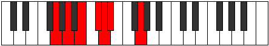 |
| [475](https://ianring.com/musictheory/scales/475) | [Aeolygian](ModeGSharpAeolygian.md) | G# | G#, A, B, C, D, Eb, Fb, G# |  |
| [477](https://ianring.com/musictheory/scales/477) | [Stacrian](ModeGNaturalStacrian.md) | G | G, A, Bb, Cb, Db, Ebb, Fbb, G |  |
| [479](https://ianring.com/musictheory/scales/479) | [Kocryllic](ModeGSharpKocryllic.md) | G# | G#, A, A#, B, C, D, D#, E, G# |  |
| [479](https://ianring.com/musictheory/scales/479) | [Kocryllic](ModeAFlatKocryllic.md) | Ab | Ab, A, Bb, B, C, D, Eb, E, Ab |  |
| [479](https://ianring.com/musictheory/scales/479) | [Kocryllic](ModeGNaturalKocryllic.md) | G | G, G#, A, A#, B, C#, D, D#, G |  |
| [485](https://ianring.com/musictheory/scales/485) | [Stoptimic](ModeANaturalStoptimic.md) | A | A, B, C##, D#, E, F, A | 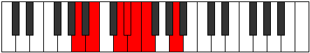 |
| [487](https://ianring.com/musictheory/scales/487) | [Dynian](ModeANaturalDynian.md) | A | A, Bb, Cb, D, Eb, Fb, Gbb, A |  |
| [489](https://ianring.com/musictheory/scales/489) | [Phrathimic](ModeGFlatPhrathimic.md) | Gb | Gb, A, B, C, Db, Ebb, Gb |  |
| [491](https://ianring.com/musictheory/scales/491) | [Aeolyrian](ModeFSharpAeolyrian.md) | F# | F#, G, A, B, C, Db, Ebb, F# |  |
| [491](https://ianring.com/musictheory/scales/491) | [Aeolyrian](ModeGSharpAeolyrian.md) | G# | G#, A, B, C#, D, Eb, Fb, G# |  |
| [493](https://ianring.com/musictheory/scales/493) | [Rygian](ModeANaturalRygian.md) | A | A, B, C, D, Eb, Fb, Gbb, A |  |
| [493](https://ianring.com/musictheory/scales/493) | [Rygian](ModeFSharpRygian.md) | F# | F#, G#, A, B, C, Db, Ebb, F# |  |
| [495](https://ianring.com/musictheory/scales/495) | [Bocryllic](ModeFSharpBocryllic.md) | F# | F#, G, G#, A, B, C, C#, D, F# |  |
| [495](https://ianring.com/musictheory/scales/495) | [Bocryllic](ModeGFlatBocryllic.md) | Gb | Gb, G, Ab, A, B, C, Db, D, Gb |  |
| [495](https://ianring.com/musictheory/scales/495) | [Bocryllic](ModeANaturalBocryllic.md) | A | A, A#, B, C, D, D#, E, F, A |  |
| [495](https://ianring.com/musictheory/scales/495) | [Bocryllic](ModeGSharpBocryllic.md) | G# | G#, A, A#, B, C#, D, D#, E, G# |  |
| [495](https://ianring.com/musictheory/scales/495) | [Bocryllic](ModeAFlatBocryllic.md) | Ab | Ab, A, Bb, B, Db, D, Eb, E, Ab |  |
| [501](https://ianring.com/musictheory/scales/501) | [Katylian](ModeANaturalKatylian.md) | A | A, B, C#, D, Eb, Fb, Gbb, A |  |
| [501](https://ianring.com/musictheory/scales/501) | [Katylian](ModeGNaturalKatylian.md) | G | G, A, B, C, Db, Ebb, Fbb, G |  |
| [503](https://ianring.com/musictheory/scales/503) | [Thoptyllic](ModeGNaturalThoptyllic.md) | G | G, G#, A, B, C, C#, D, D#, G |  |
| [503](https://ianring.com/musictheory/scales/503) | [Thoptyllic](ModeANaturalThoptyllic.md) | A | A, A#, B, C#, D, D#, E, F, A |  |
| [505](https://ianring.com/musictheory/scales/505) | [Sanian](ModeGFlatSanian.md) | Gb | Gb, A, Bb, Cb, Dbb, Ebbb, Fbbb, Gb |  |
| [507](https://ianring.com/musictheory/scales/507) | [Moryllic](ModeGSharpMoryllic.md) | G# | G#, A, B, C, C#, D, D#, E, G# |  |
| [507](https://ianring.com/musictheory/scales/507) | [Moryllic](ModeAFlatMoryllic.md) | Ab | Ab, A, B, C, Db, D, Eb, E, Ab |  |
| [507](https://ianring.com/musictheory/scales/507) | [Moryllic](ModeFSharpMoryllic.md) | F# | F#, G, A, A#, B, C, C#, D, F# |  |
| [507](https://ianring.com/musictheory/scales/507) | [Moryllic](ModeGFlatMoryllic.md) | Gb | Gb, G, A, Bb, B, C, Db, D, Gb |  |
| [509](https://ianring.com/musictheory/scales/509) | [Ionothyllic](ModeANaturalIonothyllic.md) | A | A, B, C, C#, D, D#, E, F, A |  |
| [509](https://ianring.com/musictheory/scales/509) | [Ionothyllic](ModeGNaturalIonothyllic.md) | G | G, A, A#, B, C, C#, D, D#, G |  |
| [509](https://ianring.com/musictheory/scales/509) | [Ionothyllic](ModeFSharpIonothyllic.md) | F# | F#, G#, A, A#, B, C, C#, D, F# |  |
| [509](https://ianring.com/musictheory/scales/509) | [Ionothyllic](ModeGFlatIonothyllic.md) | Gb | Gb, Ab, A, Bb, B, C, Db, D, Gb |  |
| [511](https://ianring.com/musictheory/scales/511) | [Polygic](ModeANaturalPolygic.md) | A | A, A#, B, C, C#, D, D#, E, F, A |  |
| [511](https://ianring.com/musictheory/scales/511) | [Polygic](ModeGSharpPolygic.md) | G# | G#, A, A#, B, C, C#, D, D#, E, G# |  |
| [511](https://ianring.com/musictheory/scales/511) | [Polygic](ModeAFlatPolygic.md) | Ab | Ab, A, Bb, B, C, Db, D, Eb, E, Ab |  |
| [511](https://ianring.com/musictheory/scales/511) | [Polygic](ModeGNaturalPolygic.md) | G | G, G#, A, A#, B, C, C#, D, D#, G |  |
| [511](https://ianring.com/musictheory/scales/511) | [Polygic](ModeFSharpPolygic.md) | F# | F#, G, G#, A, A#, B, C, C#, D, F# |  |
| [511](https://ianring.com/musictheory/scales/511) | [Polygic](ModeGFlatPolygic.md) | Gb | Gb, G, Ab, A, Bb, B, C, Db, D, Gb |  |
| [549](https://ianring.com/musictheory/scales/549) | [Rothic](ModeANaturalRothic.md) | A | A, B, D, F#, A |  |
| [551](https://ianring.com/musictheory/scales/551) | [Aeoloditonic](ModeANaturalAeoloditonic.md) | A | A, A#, B, D, F#, A |  |
| [557](https://ianring.com/musictheory/scales/557) | [Gythitonic](ModeANaturalGythitonic.md) | A | A, B, C, D, F#, A | 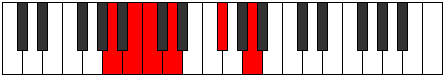 |
| [559](https://ianring.com/musictheory/scales/559) | [Lylimic](ModeANaturalLylimic.md) | A | A, Bb, Cb, Dbb, Ebb, F#, A |  |
| [565](https://ianring.com/musictheory/scales/565) | [Aeolyphritonic](ModeANaturalAeolyphritonic.md) | A | A, B, C#, D, F#, A |  |
| [567](https://ianring.com/musictheory/scales/567) | [Aeoladimic](ModeANaturalAeoladimic.md) | A | A, Bb, Cb, Db, Ebb, F#, A |  |
| [573](https://ianring.com/musictheory/scales/573) | [Saptimic](ModeANaturalSaptimic.md) | A | A, B, C, Db, Ebb, F#, A |  |
| [575](https://ianring.com/musictheory/scales/575) | [Ionydian](ModeANaturalIonydian.md) | A | A, Bb, Cb, Dbb, Ebbb, Fbbb, Gb, A |  |
| [587](https://ianring.com/musictheory/scales/587) | [Pathitonic](ModeGSharpPathitonic.md) | G# | G#, A, B, D, F, G# |  |
| [587](https://ianring.com/musictheory/scales/587) | [Pathitonic](ModeAFlatPathitonic.md) | Ab | Ab, A, B, D, F, Ab |  |
| [591](https://ianring.com/musictheory/scales/591) | [Gaptimic](ModeGSharpGaptimic.md) | G# | G#, A, Bb, Cb, D, E#, G# |  |
| [593](https://ianring.com/musictheory/scales/593) | [Saric](ModeFNaturalSaric.md) | F | F, A, B, D, F |  |
| [595](https://ianring.com/musictheory/scales/595) | [Sogitonic](ModeFNaturalSogitonic.md) | F | F, F#, A, B, D, F |  |
| [597](https://ianring.com/musictheory/scales/597) | [Thonitonic](ModeFNaturalThonitonic.md) | F | F, G, A, B, D, F |  |
| [601](https://ianring.com/musictheory/scales/601) | [Bycritonic](ModeFNaturalBycritonic.md) | F | F, G#, A, B, D, F |  |
| [603](https://ianring.com/musictheory/scales/603) | [Aeolygimic](ModeGSharpAeolygimic.md) | G# | G#, A, B, C, D, E#, G# |  |
| [607](https://ianring.com/musictheory/scales/607) | [Kadian](ModeGSharpKadian.md) | G# | G#, A, Bb, Cb, Dbb, Ebb, F, G# |  |
| [613](https://ianring.com/musictheory/scales/613) | [Phralitonic](ModeANaturalPhralitonic.md) | A | A, B, D, D#, F#, A |  |
| [615](https://ianring.com/musictheory/scales/615) | [Phrothimic](ModeANaturalPhrothimic.md) | A | A, Bb, Cb, D, Eb, F#, A |  |
| [619](https://ianring.com/musictheory/scales/619) | [Parimic](ModeGSharpParimic.md) | G# | G#, A, B, C#, D, E#, G# |  |
| [621](https://ianring.com/musictheory/scales/621) | [Kyrimic](ModeANaturalKyrimic.md) | A | A, B, C, D, Eb, F#, A |  |
| [623](https://ianring.com/musictheory/scales/623) | [Sycrian](ModeANaturalSycrian.md) | A | A, Bb, Cb, Dbb, Ebb, Fbb, Gb, A |  |
| [623](https://ianring.com/musictheory/scales/623) | [Sycrian](ModeGSharpSycrian.md) | G# | G#, A, Bb, Cb, Db, Ebb, F, G# |  |
| [625](https://ianring.com/musictheory/scales/625) | [Ionyptitonic](ModeFNaturalIonyptitonic.md) | F | F, A, A#, B, D, F |  |
| [627](https://ianring.com/musictheory/scales/627) | [Mogimic](ModeFNaturalMogimic.md) | F | F, Gb, A, Bb, Cb, D, F |  |
| [629](https://ianring.com/musictheory/scales/629) | [Aeronimic](ModeANaturalAeronimic.md) | A | A, B, C#, D, Eb, F#, A |  |
| [629](https://ianring.com/musictheory/scales/629) | [Aeronimic](ModeFNaturalAeronimic.md) | F | F, G, A, Bb, Cb, D, F |  |
| [631](https://ianring.com/musictheory/scales/631) | [Zygian](ModeANaturalZygian.md) | A | A, Bb, Cb, Db, Ebb, Fbb, Gb, A |  |
| [633](https://ianring.com/musictheory/scales/633) | [Kydimic](ModeFNaturalKydimic.md) | F | F, G#, A, Bb, Cb, D, F |  |
| [635](https://ianring.com/musictheory/scales/635) | [Epolian](ModeGSharpEpolian.md) | G# | G#, A, B, C, Db, Ebb, F, G# |  |
| [637](https://ianring.com/musictheory/scales/637) | [Katodian](ModeANaturalKatodian.md) | A | A, B, C, Db, Ebb, Fbb, Gb, A |  |
| [639](https://ianring.com/musictheory/scales/639) | [Ionaryllic](ModeANaturalIonaryllic.md) | A | A, A#, B, C, C#, D, D#, F#, A |  |
| [639](https://ianring.com/musictheory/scales/639) | [Ionaryllic](ModeGSharpIonaryllic.md) | G# | G#, A, A#, B, C, C#, D, F, G# |  |
| [639](https://ianring.com/musictheory/scales/639) | [Ionaryllic](ModeAFlatIonaryllic.md) | Ab | Ab, A, Bb, B, C, Db, D, F, Ab |  |
| [639](https://ianring.com/musictheory/scales/639) | [Ionaryllic](ModeFNaturalIonaryllic.md) | F | F, F#, G, G#, A, A#, B, D, F |  |
| [649](https://ianring.com/musictheory/scales/649) | [Byptic](ModeDNaturalByptic.md) | D | D, F, A, B, D |  |
| [651](https://ianring.com/musictheory/scales/651) | [Golitonic](ModeDNaturalGolitonic.md) | D | D, D#, F, A, B, D |  |
| [653](https://ianring.com/musictheory/scales/653) | [Stathitonic](ModeDNaturalStathitonic.md) | D | D, E, F, A, B, D |  |
| [655](https://ianring.com/musictheory/scales/655) | [Kataptimic](ModeDNaturalKataptimic.md) | D | D, Eb, Fb, Gbb, A, B, D |  |
| [657](https://ianring.com/musictheory/scales/657) | [Epathic](ModeDNaturalEpathic.md) | D | D, F#, A, B, D | 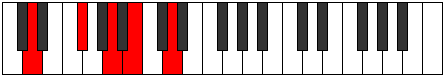 |
| [659](https://ianring.com/musictheory/scales/659) | [Soptitonic](ModeDNaturalSoptitonic.md) | D | D, D#, F#, A, B, D | 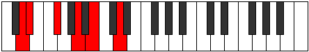 |
| [661](https://ianring.com/musictheory/scales/661) | [Pentatonic](ModeDNaturalPentatonic.md) | D | D, E, F#, A, B, D |  |
| [661](https://ianring.com/musictheory/scales/661) | [Pentatonic](ModeGNaturalPentatonic.md) | G | G, A, B, D, E, G |  |
| [663](https://ianring.com/musictheory/scales/663) | [Phrynimic](ModeDNaturalPhrynimic.md) | D | D, Eb, Fb, Gb, A, B, D |  |
| [665](https://ianring.com/musictheory/scales/665) | [Mythitonic](ModeDNaturalMythitonic.md) | D | D, F, F#, A, B, D |  |
| [667](https://ianring.com/musictheory/scales/667) | [Rodimic](ModeDNaturalRodimic.md) | D | D, Eb, F, Gb, A, B, D |  |
| [669](https://ianring.com/musictheory/scales/669) | [Gycrimic](ModeDNaturalGycrimic.md) | D | D, E, F, Gb, A, B, D |  |
| [669](https://ianring.com/musictheory/scales/669) | [Gycrimic](ModeGNaturalGycrimic.md) | G | G, A, Bb, Cb, D, E, G |  |
| [675](https://ianring.com/musictheory/scales/675) | [Zyditonic](ModeDNaturalZyditonic.md) | D | D, D#, G, A, B, D |  |
| [677](https://ianring.com/musictheory/scales/677) | [Mynitonic](ModeANaturalMynitonic.md) | A | A, B, D, E, F#, A |  |
| [677](https://ianring.com/musictheory/scales/677) | [Mynitonic](ModeDNaturalMynitonic.md) | D | D, E, G, A, B, D |  |
| [679](https://ianring.com/musictheory/scales/679) | [Lanimic](ModeDNaturalLanimic.md) | D | D, Eb, Fb, G, A, B, D |  |
| [679](https://ianring.com/musictheory/scales/679) | [Lanimic](ModeANaturalLanimic.md) | A | A, Bb, Cb, D, E, F#, A |  |
| [681](https://ianring.com/musictheory/scales/681) | [Sylitonic](ModeDNaturalSylitonic.md) | D | D, F, G, A, B, D |  |
| [683](https://ianring.com/musictheory/scales/683) | [Stogimic](ModeDNaturalStogimic.md) | D | D, Eb, F, G, A, B, D | 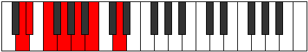 |
| [685](https://ianring.com/musictheory/scales/685) | [Aerathimic](ModeANaturalAerathimic.md) | A | A, B, C, D, E, F#, A |  |
| [685](https://ianring.com/musictheory/scales/685) | [Aerathimic](ModeDNaturalAerathimic.md) | D | D, E, F, G, A, B, D |  |
| [687](https://ianring.com/musictheory/scales/687) | [Aeolythian](ModeANaturalAeolythian.md) | A | A, Bb, Cb, Dbb, Ebb, Fb, Gb, A |  |
| [689](https://ianring.com/musictheory/scales/689) | [Lothitonic](ModeDNaturalLothitonic.md) | D | D, F#, G, A, B, D |  |
| [691](https://ianring.com/musictheory/scales/691) | [Zydimic](ModeDNaturalZydimic.md) | D | D, Eb, F#, G, A, B, D |  |
| [693](https://ianring.com/musictheory/scales/693) | [Mynimic](ModeANaturalMynimic.md) | A | A, B, C#, D, E, F#, A | 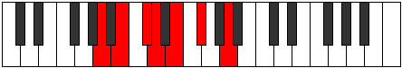 |
| [693](https://ianring.com/musictheory/scales/693) | [Mynimic](ModeGNaturalMynimic.md) | G | G, A, B, C, D, E, G |  |
| [693](https://ianring.com/musictheory/scales/693) | [Mynimic](ModeDNaturalMynimic.md) | D | D, E, F#, G, A, B, D |  |
| [695](https://ianring.com/musictheory/scales/695) | [Sarian](ModeANaturalSarian.md) | A | A, Bb, Cb, Db, Ebb, Fb, Gb, A |  |
| [697](https://ianring.com/musictheory/scales/697) | [Lagimic](ModeDNaturalLagimic.md) | D | D, E#, F#, G, A, B, D |  |
| [701](https://ianring.com/musictheory/scales/701) | [Mixonyphian](ModeANaturalMixonyphian.md) | A | A, B, C, Db, Ebb, Fb, Gb, A |  |
| [701](https://ianring.com/musictheory/scales/701) | [Mixonyphian](ModeGNaturalMixonyphian.md) | G | G, A, Bb, Cb, Dbb, Ebb, Fb, G |  |
| [703](https://ianring.com/musictheory/scales/703) | [Aerocryllic](ModeDNaturalAerocryllic.md) | D | D, D#, E, F, F#, G, A, B, D |  |
| [703](https://ianring.com/musictheory/scales/703) | [Aerocryllic](ModeANaturalAerocryllic.md) | A | A, A#, B, C, C#, D, E, F#, A |  |
| [703](https://ianring.com/musictheory/scales/703) | [Aerocryllic](ModeGNaturalAerocryllic.md) | G | G, G#, A, A#, B, C, D, E, G |  |
| [709](https://ianring.com/musictheory/scales/709) | [Ionycritonic](ModeDNaturalIonycritonic.md) | D | D, E, G#, A, B, D | 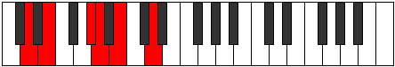 |
| [711](https://ianring.com/musictheory/scales/711) | [Epyrimic](ModeDNaturalEpyrimic.md) | D | D, Eb, Fb, G#, A, B, D |  |
| [713](https://ianring.com/musictheory/scales/713) | [Thoptitonic](ModeDNaturalThoptitonic.md) | D | D, F, G#, A, B, D |  |
| [715](https://ianring.com/musictheory/scales/715) | [Dodimic](ModeDNaturalDodimic.md) | D | D, Eb, F, G#, A, B, D |  |
| [715](https://ianring.com/musictheory/scales/715) | [Dodimic](ModeGSharpDodimic.md) | G# | G#, A, B, C##, D#, E#, G# |  |
| [717](https://ianring.com/musictheory/scales/717) | [Gythimic](ModeDNaturalGythimic.md) | D | D, E, F, G#, A, B, D |  |
| [719](https://ianring.com/musictheory/scales/719) | [Kanian](ModeGSharpKanian.md) | G# | G#, A, Bb, Cb, D, Eb, F, G# |  |
| [721](https://ianring.com/musictheory/scales/721) | [Aeolacritonic](ModeFNaturalAeolacritonic.md) | F | F, A, B, C, D, F |  |
| [721](https://ianring.com/musictheory/scales/721) | [Aeolacritonic](ModeDNaturalAeolacritonic.md) | D | D, F#, G#, A, B, D |  |
| [723](https://ianring.com/musictheory/scales/723) | [Ionadimic](ModeFNaturalIonadimic.md) | F | F, Gb, A, B, C, D, F |  |
| [723](https://ianring.com/musictheory/scales/723) | [Ionadimic](ModeDNaturalIonadimic.md) | D | D, Eb, F#, G#, A, B, D |  |
| [725](https://ianring.com/musictheory/scales/725) | [Lonimic](ModeGNaturalLonimic.md) | G | G, A, B, C#, D, E, G |  |
| [725](https://ianring.com/musictheory/scales/725) | [Lonimic](ModeFNaturalLonimic.md) | F | F, G, A, B, C, D, F |  |
| [725](https://ianring.com/musictheory/scales/725) | [Lonimic](ModeDNaturalLonimic.md) | D | D, E, F#, G#, A, B, D |  |
| [729](https://ianring.com/musictheory/scales/729) | [Stygimic](ModeFNaturalStygimic.md) | F | F, G#, A, B, C, D, F |  |
| [729](https://ianring.com/musictheory/scales/729) | [Stygimic](ModeDNaturalStygimic.md) | D | D, E#, F#, G#, A, B, D |  |
| [731](https://ianring.com/musictheory/scales/731) | [Ionorian](ModeGSharpIonorian.md) | G# | G#, A, B, C, D, Eb, F, G# |  |
| [733](https://ianring.com/musictheory/scales/733) | [Donian](ModeGNaturalDonian.md) | G | G, A, Bb, Cb, Db, Ebb, Fb, G |  |
| [735](https://ianring.com/musictheory/scales/735) | [Sylyllic](ModeDNaturalSylyllic.md) | D | D, D#, E, F, F#, G#, A, B, D |  |
| [735](https://ianring.com/musictheory/scales/735) | [Sylyllic](ModeFNaturalSylyllic.md) | F | F, F#, G, G#, A, B, C, D, F |  |
| [735](https://ianring.com/musictheory/scales/735) | [Sylyllic](ModeGSharpSylyllic.md) | G# | G#, A, A#, B, C, D, D#, F, G# |  |
| [735](https://ianring.com/musictheory/scales/735) | [Sylyllic](ModeAFlatSylyllic.md) | Ab | Ab, A, Bb, B, C, D, Eb, F, Ab |  |
| [735](https://ianring.com/musictheory/scales/735) | [Sylyllic](ModeGNaturalSylyllic.md) | G | G, G#, A, A#, B, C#, D, E, G |  |
| [739](https://ianring.com/musictheory/scales/739) | [Rorimic](ModeDNaturalRorimic.md) | D | D, Eb, F##, G#, A, B, D |  |
| [741](https://ianring.com/musictheory/scales/741) | [Gathimic](ModeANaturalGathimic.md) | A | A, B, C##, D#, E, F#, A |  |
| [741](https://ianring.com/musictheory/scales/741) | [Gathimic](ModeDNaturalGathimic.md) | D | D, E, F##, G#, A, B, D |  |
| [743](https://ianring.com/musictheory/scales/743) | [Lanian](ModeANaturalLanian.md) | A | A, Bb, Cb, D, Eb, Fb, Gb, A |  |
| [745](https://ianring.com/musictheory/scales/745) | [Kolimic](ModeDNaturalKolimic.md) | D | D, E#, F##, G#, A, B, D |  |
| [747](https://ianring.com/musictheory/scales/747) | [Lynian](ModeGSharpLynian.md) | G# | G#, A, B, C#, D, Eb, F, G# |  |
| [749](https://ianring.com/musictheory/scales/749) | [Aeologian](ModeANaturalAeologian.md) | A | A, B, C, D, Eb, Fb, Gb, A |  |
| [751](https://ianring.com/musictheory/scales/751) | [Epacryllic](ModeDNaturalEpacryllic.md) | D | D, D#, E, F, G, G#, A, B, D |  |
| [751](https://ianring.com/musictheory/scales/751) | [Epacryllic](ModeANaturalEpacryllic.md) | A | A, A#, B, C, D, D#, E, F#, A |  |
| [751](https://ianring.com/musictheory/scales/751) | [Epacryllic](ModeGSharpEpacryllic.md) | G# | G#, A, A#, B, C#, D, D#, F, G# |  |
| [751](https://ianring.com/musictheory/scales/751) | [Epacryllic](ModeAFlatEpacryllic.md) | Ab | Ab, A, Bb, B, Db, D, Eb, F, Ab |  |
| [753](https://ianring.com/musictheory/scales/753) | [Kytrimic](ModeDNaturalKytrimic.md) | D | D, E##, F##, G#, A, B, D |  |
| [755](https://ianring.com/musictheory/scales/755) | [Phrythian](ModeFNaturalPhrythian.md) | F | F, Gb, A, Bb, Cb, Dbb, Ebb, F |  |
| [757](https://ianring.com/musictheory/scales/757) | [Ionyptian](ModeANaturalIonyptian.md) | A | A, B, C#, D, Eb, Fb, Gb, A |  |
| [757](https://ianring.com/musictheory/scales/757) | [Ionyptian](ModeGNaturalIonyptian.md) | G | G, A, B, C, Db, Ebb, Fb, G |  |
| [757](https://ianring.com/musictheory/scales/757) | [Ionyptian](ModeFNaturalIonyptian.md) | F | F, G, A, Bb, Cb, Dbb, Ebb, F |  |
| [759](https://ianring.com/musictheory/scales/759) | [Katalyllic](ModeGNaturalKatalyllic.md) | G | G, G#, A, B, C, C#, D, E, G |  |
| [759](https://ianring.com/musictheory/scales/759) | [Katalyllic](ModeDNaturalKatalyllic.md) | D | D, D#, E, F#, G, G#, A, B, D |  |
| [759](https://ianring.com/musictheory/scales/759) | [Katalyllic](ModeANaturalKatalyllic.md) | A | A, A#, B, C#, D, D#, E, F#, A |  |
| [759](https://ianring.com/musictheory/scales/759) | [Katalyllic](ModeFNaturalKatalyllic.md) | F | F, F#, G, A, A#, B, C, D, F | 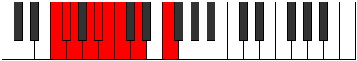 |
| [761](https://ianring.com/musictheory/scales/761) | [Ponian](ModeFNaturalPonian.md) | F | F, G#, A, Bb, Cb, Dbb, Ebb, F |  |
| [763](https://ianring.com/musictheory/scales/763) | [Doryllic](ModeGSharpDoryllic.md) | G# | G#, A, B, C, C#, D, D#, F, G# |  |
| [763](https://ianring.com/musictheory/scales/763) | [Doryllic](ModeAFlatDoryllic.md) | Ab | Ab, A, B, C, Db, D, Eb, F, Ab |  |
| [763](https://ianring.com/musictheory/scales/763) | [Doryllic](ModeDNaturalDoryllic.md) | D | D, D#, F, F#, G, G#, A, B, D |  |
| [763](https://ianring.com/musictheory/scales/763) | [Doryllic](ModeFNaturalDoryllic.md) | F | F, F#, G#, A, A#, B, C, D, F |  |
| [765](https://ianring.com/musictheory/scales/765) | [Mixonyphyllic](ModeANaturalMixonyphyllic.md) | A | A, B, C, C#, D, D#, E, F#, A |  |
| [765](https://ianring.com/musictheory/scales/765) | [Mixonyphyllic](ModeDNaturalMixonyphyllic.md) | D | D, E, F, F#, G, G#, A, B, D |  |
| [765](https://ianring.com/musictheory/scales/765) | [Mixonyphyllic](ModeGNaturalMixonyphyllic.md) | G | G, A, A#, B, C, C#, D, E, G |  |
| [765](https://ianring.com/musictheory/scales/765) | [Mixonyphyllic](ModeFNaturalMixonyphyllic.md) | F | F, G, G#, A, A#, B, C, D, F |  |
| [767](https://ianring.com/musictheory/scales/767) | [Raptygic](ModeDNaturalRaptygic.md) | D | D, D#, E, F, F#, G, G#, A, B, D |  |
| [767](https://ianring.com/musictheory/scales/767) | [Raptygic](ModeANaturalRaptygic.md) | A | A, A#, B, C, C#, D, D#, E, F#, A |  |
| [767](https://ianring.com/musictheory/scales/767) | [Raptygic](ModeGSharpRaptygic.md) | G# | G#, A, A#, B, C, C#, D, D#, F, G# |  |
| [767](https://ianring.com/musictheory/scales/767) | [Raptygic](ModeAFlatRaptygic.md) | Ab | Ab, A, Bb, B, C, Db, D, Eb, F, Ab |  |
| [767](https://ianring.com/musictheory/scales/767) | [Raptygic](ModeGNaturalRaptygic.md) | G | G, G#, A, A#, B, C, C#, D, E, G |  |
| [767](https://ianring.com/musictheory/scales/767) | [Raptygic](ModeFNaturalRaptygic.md) | F | F, F#, G, G#, A, A#, B, C, D, F |  |
| [805](https://ianring.com/musictheory/scales/805) | [Rothitonic](ModeANaturalRothitonic.md) | A | A, B, D, F, F#, A |  |
| [807](https://ianring.com/musictheory/scales/807) | [Epadimic](ModeANaturalEpadimic.md) | A | A, Bb, Cb, D, E#, F#, A |  |
| [809](https://ianring.com/musictheory/scales/809) | [Dogitonic](ModeFSharpDogitonic.md) | F# | F#, A, B, D, D#, F# |  |
| [809](https://ianring.com/musictheory/scales/809) | [Dogitonic](ModeGFlatDogitonic.md) | Gb | Gb, A, B, D, Eb, Gb |  |
| [811](https://ianring.com/musictheory/scales/811) | [Radimic](ModeFSharpRadimic.md) | F# | F#, G, A, B, C##, D#, F# |  |
| [813](https://ianring.com/musictheory/scales/813) | [Larimic](ModeANaturalLarimic.md) | A | A, B, C, D, E#, F#, A |  |
| [813](https://ianring.com/musictheory/scales/813) | [Larimic](ModeFSharpLarimic.md) | F# | F#, G#, A, B, C##, D#, F# |  |
| [815](https://ianring.com/musictheory/scales/815) | [Bolian](ModeANaturalBolian.md) | A | A, Bb, Cb, Dbb, Ebb, F, Gb, A |  |
| [821](https://ianring.com/musictheory/scales/821) | [Aeranimic](ModeANaturalAeranimic.md) | A | A, B, C#, D, E#, F#, A | 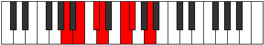 |
| [823](https://ianring.com/musictheory/scales/823) | [Stodian](ModeANaturalStodian.md) | A | A, Bb, Cb, Db, Ebb, F, Gb, A |  |
| [825](https://ianring.com/musictheory/scales/825) | [Thyptimic](ModeGFlatThyptimic.md) | Gb | Gb, A, Bb, Cb, D, Eb, Gb |  |
| [827](https://ianring.com/musictheory/scales/827) | [Mixolocrian](ModeFSharpMixolocrian.md) | F# | F#, G, A, Bb, Cb, D, Eb, F# |  |
| [829](https://ianring.com/musictheory/scales/829) | [Lygian](ModeANaturalLygian.md) | A | A, B, C, Db, Ebb, F, Gb, A |  |
| [829](https://ianring.com/musictheory/scales/829) | [Lygian](ModeFSharpLygian.md) | F# | F#, G#, A, Bb, Cb, D, Eb, F# |  |
| [831](https://ianring.com/musictheory/scales/831) | [Rodyllic](ModeANaturalRodyllic.md) | A | A, A#, B, C, C#, D, F, F#, A |  |
| [831](https://ianring.com/musictheory/scales/831) | [Rodyllic](ModeFSharpRodyllic.md) | F# | F#, G, G#, A, A#, B, D, D#, F# |  |
| [831](https://ianring.com/musictheory/scales/831) | [Rodyllic](ModeGFlatRodyllic.md) | Gb | Gb, G, Ab, A, Bb, B, D, Eb, Gb |  |
| [843](https://ianring.com/musictheory/scales/843) | [Molimic](ModeGSharpMolimic.md) | G# | G#, A, B, C##, D##, E#, G# |  |
| [847](https://ianring.com/musictheory/scales/847) | [Ganian](ModeGSharpGanian.md) | G# | G#, A, Bb, Cb, D, E, F, G# |  |
| [849](https://ianring.com/musictheory/scales/849) | [Aerynitonic](ModeFNaturalAerynitonic.md) | F | F, A, B, C#, D, F |  |
| [851](https://ianring.com/musictheory/scales/851) | [Aerylimic](ModeFNaturalAerylimic.md) | F | F, Gb, A, B, C#, D, F |  |
| [853](https://ianring.com/musictheory/scales/853) | [Epothimic](ModeFNaturalEpothimic.md) | F | F, G, A, B, C#, D, F |  |
| [857](https://ianring.com/musictheory/scales/857) | [Aeolydimic](ModeFNaturalAeolydimic.md) | F | F, G#, A, B, C#, D, F |  |
| [859](https://ianring.com/musictheory/scales/859) | [Pathian](ModeGSharpPathian.md) | G# | G#, A, B, C, D, E, F, G# |  |
| [863](https://ianring.com/musictheory/scales/863) | [Pyryllic](ModeFNaturalPyryllic.md) | F | F, F#, G, G#, A, B, C#, D, F |  |
| [863](https://ianring.com/musictheory/scales/863) | [Pyryllic](ModeGSharpPyryllic.md) | G# | G#, A, A#, B, C, D, E, F, G# |  |
| [863](https://ianring.com/musictheory/scales/863) | [Pyryllic](ModeAFlatPyryllic.md) | Ab | Ab, A, Bb, B, C, D, E, F, Ab |  |
| [869](https://ianring.com/musictheory/scales/869) | [Kothimic](ModeANaturalKothimic.md) | A | A, B, C##, D#, E#, F#, A |  |
| [871](https://ianring.com/musictheory/scales/871) | [Epadian](ModeANaturalEpadian.md) | A | A, Bb, Cb, D, Eb, F, Gb, A |  |
| [873](https://ianring.com/musictheory/scales/873) | [Bagimic](ModeGFlatBagimic.md) | Gb | Gb, A, B, C, D, Eb, Gb |  |
| [875](https://ianring.com/musictheory/scales/875) | [Stothian](ModeFSharpStothian.md) | F# | F#, G, A, B, C, D, Eb, F# |  |
| [875](https://ianring.com/musictheory/scales/875) | [Stothian](ModeGSharpStothian.md) | G# | G#, A, B, C#, D, E, F, G# |  |
| [877](https://ianring.com/musictheory/scales/877) | [Aeraptian](ModeANaturalAeraptian.md) | A | A, B, C, D, Eb, F, Gb, A |  |
| [877](https://ianring.com/musictheory/scales/877) | [Aeraptian](ModeFSharpAeraptian.md) | F# | F#, G#, A, B, C, D, Eb, F# |  |
| [879](https://ianring.com/musictheory/scales/879) | [Aeolocryllic](ModeFSharpAeolocryllic.md) | F# | F#, G, G#, A, B, C, D, D#, F# |  |
| [879](https://ianring.com/musictheory/scales/879) | [Aeolocryllic](ModeGFlatAeolocryllic.md) | Gb | Gb, G, Ab, A, B, C, D, Eb, Gb |  |
| [879](https://ianring.com/musictheory/scales/879) | [Aeolocryllic](ModeANaturalAeolocryllic.md) | A | A, A#, B, C, D, D#, F, F#, A |  |
| [879](https://ianring.com/musictheory/scales/879) | [Aeolocryllic](ModeGSharpAeolocryllic.md) | G# | G#, A, A#, B, C#, D, E, F, G# |  |
| [879](https://ianring.com/musictheory/scales/879) | [Aeolocryllic](ModeAFlatAeolocryllic.md) | Ab | Ab, A, Bb, B, Db, D, E, F, Ab |  |
| [883](https://ianring.com/musictheory/scales/883) | [Ralian](ModeFNaturalRalian.md) | F | F, Gb, A, Bb, Cb, Db, Ebb, F |  |
| [885](https://ianring.com/musictheory/scales/885) | [Sathian](ModeANaturalSathian.md) | A | A, B, C#, D, Eb, F, Gb, A |  |
| [885](https://ianring.com/musictheory/scales/885) | [Sathian](ModeFNaturalSathian.md) | F | F, G, A, Bb, Cb, Db, Ebb, F |  |
| [887](https://ianring.com/musictheory/scales/887) | [Sathyllic](ModeANaturalSathyllic.md) | A | A, A#, B, C#, D, D#, F, F#, A | 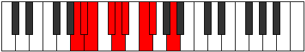 |
| [887](https://ianring.com/musictheory/scales/887) | [Sathyllic](ModeFNaturalSathyllic.md) | F | F, F#, G, A, A#, B, C#, D, F |  |
| [889](https://ianring.com/musictheory/scales/889) | [Borian](ModeGFlatBorian.md) | Gb | Gb, A, Bb, Cb, Dbb, Ebb, Fbb, Gb |  |
| [889](https://ianring.com/musictheory/scales/889) | [Borian](ModeFNaturalBorian.md) | F | F, G#, A, Bb, Cb, Db, Ebb, F |  |
| [891](https://ianring.com/musictheory/scales/891) | [Ionilyllic](ModeGSharpIonilyllic.md) | G# | G#, A, B, C, C#, D, E, F, G# |  |
| [891](https://ianring.com/musictheory/scales/891) | [Ionilyllic](ModeAFlatIonilyllic.md) | Ab | Ab, A, B, C, Db, D, E, F, Ab |  |
| [891](https://ianring.com/musictheory/scales/891) | [Ionilyllic](ModeFSharpIonilyllic.md) | F# | F#, G, A, A#, B, C, D, D#, F# |  |
| [891](https://ianring.com/musictheory/scales/891) | [Ionilyllic](ModeGFlatIonilyllic.md) | Gb | Gb, G, A, Bb, B, C, D, Eb, Gb |  |
| [891](https://ianring.com/musictheory/scales/891) | [Ionilyllic](ModeFNaturalIonilyllic.md) | F | F, F#, G#, A, A#, B, C#, D, F |  |
| [893](https://ianring.com/musictheory/scales/893) | [Pycryllic](ModeANaturalPycryllic.md) | A | A, B, C, C#, D, D#, F, F#, A |  |
| [893](https://ianring.com/musictheory/scales/893) | [Pycryllic](ModeFSharpPycryllic.md) | F# | F#, G#, A, A#, B, C, D, D#, F# |  |
| [893](https://ianring.com/musictheory/scales/893) | [Pycryllic](ModeGFlatPycryllic.md) | Gb | Gb, Ab, A, Bb, B, C, D, Eb, Gb |  |
| [893](https://ianring.com/musictheory/scales/893) | [Pycryllic](ModeFNaturalPycryllic.md) | F | F, G, G#, A, A#, B, C#, D, F |  |
| [895](https://ianring.com/musictheory/scales/895) | [Aeolathygic](ModeANaturalAeolathygic.md) | A | A, A#, B, C, C#, D, D#, F, F#, A |  |
| [895](https://ianring.com/musictheory/scales/895) | [Aeolathygic](ModeGSharpAeolathygic.md) | G# | G#, A, A#, B, C, C#, D, E, F, G# |  |
| [895](https://ianring.com/musictheory/scales/895) | [Aeolathygic](ModeAFlatAeolathygic.md) | Ab | Ab, A, Bb, B, C, Db, D, E, F, Ab |  |
| [895](https://ianring.com/musictheory/scales/895) | [Aeolathygic](ModeFSharpAeolathygic.md) | F# | F#, G, G#, A, A#, B, C, D, D#, F# |  |
| [895](https://ianring.com/musictheory/scales/895) | [Aeolathygic](ModeGFlatAeolathygic.md) | Gb | Gb, G, Ab, A, Bb, B, C, D, Eb, Gb |  |
| [895](https://ianring.com/musictheory/scales/895) | [Aeolathygic](ModeFNaturalAeolathygic.md) | F | F, F#, G, G#, A, A#, B, C#, D, F |  |
| [905](https://ianring.com/musictheory/scales/905) | [Bylitonic](ModeDNaturalBylitonic.md) | D | D, F, A, A#, B, D |  |
| [911](https://ianring.com/musictheory/scales/911) | [Radian](ModeDNaturalRadian.md) | D | D, Eb, Fb, Gbb, A, Bb, Cb, D |  |
| [913](https://ianring.com/musictheory/scales/913) | [Aeolyritonic](ModeDNaturalAeolyritonic.md) | D | D, F#, A, A#, B, D |  |
| [917](https://ianring.com/musictheory/scales/917) | [Dygimic](ModeGNaturalDygimic.md) | G | G, A, B, C##, D#, E, G |  |
| [919](https://ianring.com/musictheory/scales/919) | [Gathian](ModeDNaturalGathian.md) | D | D, Eb, Fb, Gb, A, Bb, Cb, D | 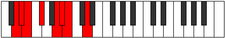 |
| [923](https://ianring.com/musictheory/scales/923) | [Ionodian](ModeDNaturalIonodian.md) | D | D, Eb, F, Gb, A, Bb, Cb, D |  |
| [925](https://ianring.com/musictheory/scales/925) | [Mythian](ModeDNaturalMythian.md) | D | D, E, F, Gb, A, Bb, Cb, D | 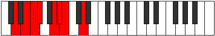 |
| [925](https://ianring.com/musictheory/scales/925) | [Mythian](ModeGNaturalMythian.md) | G | G, A, Bb, Cb, D, Eb, Fb, G |  |
| [927](https://ianring.com/musictheory/scales/927) | [Koptyllic](ModeDNaturalKoptyllic.md) | D | D, D#, E, F, F#, A, A#, B, D |  |
| [927](https://ianring.com/musictheory/scales/927) | [Koptyllic](ModeGNaturalKoptyllic.md) | G | G, G#, A, A#, B, D, D#, E, G |  |
| [933](https://ianring.com/musictheory/scales/933) | [Dadimic](ModeANaturalDadimic.md) | A | A, B, C##, D##, E#, F#, A |  |
| [935](https://ianring.com/musictheory/scales/935) | [Katarian](ModeANaturalKatarian.md) | A | A, Bb, Cb, D, E, F, Gb, A |  |
| [935](https://ianring.com/musictheory/scales/935) | [Katarian](ModeDNaturalKatarian.md) | D | D, Eb, Fb, G, A, Bb, Cb, D |  |
| [937](https://ianring.com/musictheory/scales/937) | [Stothimic](ModeGFlatStothimic.md) | Gb | Gb, A, B, C#, D, Eb, Gb |  |
| [939](https://ianring.com/musictheory/scales/939) | [Dyptian](ModeFSharpDyptian.md) | F# | F#, G, A, B, C#, D, Eb, F# |  |
| [939](https://ianring.com/musictheory/scales/939) | [Dyptian](ModeDNaturalDyptian.md) | D | D, Eb, F, G, A, Bb, Cb, D |  |
| [941](https://ianring.com/musictheory/scales/941) | [Phrorian](ModeANaturalPhrorian.md) | A | A, B, C, D, E, F, Gb, A |  |
| [941](https://ianring.com/musictheory/scales/941) | [Phrorian](ModeFSharpPhrorian.md) | F# | F#, G#, A, B, C#, D, Eb, F# |  |
| [941](https://ianring.com/musictheory/scales/941) | [Phrorian](ModeDNaturalPhrorian.md) | D | D, E, F, G, A, Bb, Cb, D |  |
| [943](https://ianring.com/musictheory/scales/943) | [Aerygyllic](ModeFSharpAerygyllic.md) | F# | F#, G, G#, A, B, C#, D, D#, F# |  |
| [943](https://ianring.com/musictheory/scales/943) | [Aerygyllic](ModeGFlatAerygyllic.md) | Gb | Gb, G, Ab, A, B, Db, D, Eb, Gb |  |
| [943](https://ianring.com/musictheory/scales/943) | [Aerygyllic](ModeANaturalAerygyllic.md) | A | A, A#, B, C, D, E, F, F#, A |  |
| [943](https://ianring.com/musictheory/scales/943) | [Aerygyllic](ModeDNaturalAerygyllic.md) | D | D, D#, E, F, G, A, A#, B, D |  |
| [947](https://ianring.com/musictheory/scales/947) | [Modian](ModeDNaturalModian.md) | D | D, Eb, F#, G, A, Bb, Cb, D |  |
| [949](https://ianring.com/musictheory/scales/949) | [Ionagian](ModeANaturalIonagian.md) | A | A, B, C#, D, E, F, Gb, A |  |
| [949](https://ianring.com/musictheory/scales/949) | [Ionagian](ModeGNaturalIonagian.md) | G | G, A, B, C, D, Eb, Fb, G |  |
| [949](https://ianring.com/musictheory/scales/949) | [Ionagian](ModeDNaturalIonagian.md) | D | D, E, F#, G, A, Bb, Cb, D |  |
| [951](https://ianring.com/musictheory/scales/951) | [Thogyllic](ModeGNaturalThogyllic.md) | G | G, G#, A, B, C, D, D#, E, G |  |
| [951](https://ianring.com/musictheory/scales/951) | [Thogyllic](ModeANaturalThogyllic.md) | A | A, A#, B, C#, D, E, F, F#, A | 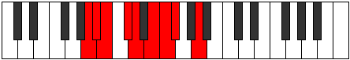 |
| [951](https://ianring.com/musictheory/scales/951) | [Thogyllic](ModeDNaturalThogyllic.md) | D | D, D#, E, F#, G, A, A#, B, D |  |
| [953](https://ianring.com/musictheory/scales/953) | [Stoptian](ModeGFlatStoptian.md) | Gb | Gb, A, Bb, Cb, Db, Ebb, Fbb, Gb |  |
| [953](https://ianring.com/musictheory/scales/953) | [Stoptian](ModeDNaturalStoptian.md) | D | D, E#, F#, G, A, Bb, Cb, D |  |
| [955](https://ianring.com/musictheory/scales/955) | [Ionogyllic](ModeFSharpIonogyllic.md) | F# | F#, G, A, A#, B, C#, D, D#, F# |  |
| [955](https://ianring.com/musictheory/scales/955) | [Ionogyllic](ModeGFlatIonogyllic.md) | Gb | Gb, G, A, Bb, B, Db, D, Eb, Gb |  |
| [955](https://ianring.com/musictheory/scales/955) | [Ionogyllic](ModeDNaturalIonogyllic.md) | D | D, D#, F, F#, G, A, A#, B, D |  |
| [957](https://ianring.com/musictheory/scales/957) | [Phronyllic](ModeANaturalPhronyllic.md) | A | A, B, C, C#, D, E, F, F#, A |  |
| [957](https://ianring.com/musictheory/scales/957) | [Phronyllic](ModeGNaturalPhronyllic.md) | G | G, A, A#, B, C, D, D#, E, G |  |
| [957](https://ianring.com/musictheory/scales/957) | [Phronyllic](ModeDNaturalPhronyllic.md) | D | D, E, F, F#, G, A, A#, B, D |  |
| [957](https://ianring.com/musictheory/scales/957) | [Phronyllic](ModeFSharpPhronyllic.md) | F# | F#, G#, A, A#, B, C#, D, D#, F# |  |
| [957](https://ianring.com/musictheory/scales/957) | [Phronyllic](ModeGFlatPhronyllic.md) | Gb | Gb, Ab, A, Bb, B, Db, D, Eb, Gb |  |
| [959](https://ianring.com/musictheory/scales/959) | [Katylygic](ModeANaturalKatylygic.md) | A | A, A#, B, C, C#, D, E, F, F#, A |  |
| [959](https://ianring.com/musictheory/scales/959) | [Katylygic](ModeDNaturalKatylygic.md) | D | D, D#, E, F, F#, G, A, A#, B, D |  |
| [959](https://ianring.com/musictheory/scales/959) | [Katylygic](ModeGNaturalKatylygic.md) | G | G, G#, A, A#, B, C, D, D#, E, G |  |
| [959](https://ianring.com/musictheory/scales/959) | [Katylygic](ModeFSharpKatylygic.md) | F# | F#, G, G#, A, A#, B, C#, D, D#, F# |  |
| [959](https://ianring.com/musictheory/scales/959) | [Katylygic](ModeGFlatKatylygic.md) | Gb | Gb, G, Ab, A, Bb, B, Db, D, Eb, Gb |  |
| [967](https://ianring.com/musictheory/scales/967) | [Aeolanian](ModeDNaturalAeolanian.md) | D | D, Eb, Fb, G#, A, Bb, Cb, D |  |
| [971](https://ianring.com/musictheory/scales/971) | [Ladian](ModeGSharpLadian.md) | G# | G#, A, B, C##, D#, E, F, G# |  |
| [971](https://ianring.com/musictheory/scales/971) | [Ladian](ModeDNaturalLadian.md) | D | D, Eb, F, G#, A, Bb, Cb, D |  |
| [973](https://ianring.com/musictheory/scales/973) | [Phryptian](ModeDNaturalPhryptian.md) | D | D, E, F, G#, A, Bb, Cb, D |  |
| [975](https://ianring.com/musictheory/scales/975) | [Katogyllic](ModeDNaturalKatogyllic.md) | D | D, D#, E, F, G#, A, A#, B, D |  |
| [975](https://ianring.com/musictheory/scales/975) | [Katogyllic](ModeGSharpKatogyllic.md) | G# | G#, A, A#, B, D, D#, E, F, G# |  |
| [975](https://ianring.com/musictheory/scales/975) | [Katogyllic](ModeAFlatKatogyllic.md) | Ab | Ab, A, Bb, B, D, Eb, E, F, Ab |  |
| [979](https://ianring.com/musictheory/scales/979) | [Thogian](ModeFNaturalThogian.md) | F | F, Gb, A, B, C, Db, Ebb, F |  |
| [979](https://ianring.com/musictheory/scales/979) | [Thogian](ModeDNaturalThogian.md) | D | D, Eb, F#, G#, A, Bb, Cb, D |  |
| [981](https://ianring.com/musictheory/scales/981) | [Bacrian](ModeGNaturalBacrian.md) | G | G, A, B, C#, D, Eb, Fb, G |  |
| [981](https://ianring.com/musictheory/scales/981) | [Bacrian](ModeFNaturalBacrian.md) | F | F, G, A, B, C, Db, Ebb, F |  |
| [981](https://ianring.com/musictheory/scales/981) | [Bacrian](ModeDNaturalBacrian.md) | D | D, E, F#, G#, A, Bb, Cb, D |  |
| [983](https://ianring.com/musictheory/scales/983) | [Epygyllic](ModeFNaturalEpygyllic.md) | F | F, F#, G, A, B, C, C#, D, F |  |
| [983](https://ianring.com/musictheory/scales/983) | [Epygyllic](ModeGNaturalEpygyllic.md) | G | G, G#, A, B, C#, D, D#, E, G |  |
| [983](https://ianring.com/musictheory/scales/983) | [Epygyllic](ModeDNaturalEpygyllic.md) | D | D, D#, E, F#, G#, A, A#, B, D |  |
| [985](https://ianring.com/musictheory/scales/985) | [Raptian](ModeFNaturalRaptian.md) | F | F, G#, A, B, C, Db, Ebb, F |  |
| [985](https://ianring.com/musictheory/scales/985) | [Raptian](ModeDNaturalRaptian.md) | D | D, E#, F#, G#, A, Bb, Cb, D |  |
| [987](https://ianring.com/musictheory/scales/987) | [Aeraptyllic](ModeGSharpAeraptyllic.md) | G# | G#, A, B, C, D, D#, E, F, G# |  |
| [987](https://ianring.com/musictheory/scales/987) | [Aeraptyllic](ModeAFlatAeraptyllic.md) | Ab | Ab, A, B, C, D, Eb, E, F, Ab |  |
| [987](https://ianring.com/musictheory/scales/987) | [Aeraptyllic](ModeFNaturalAeraptyllic.md) | F | F, F#, G#, A, B, C, C#, D, F |  |
| [987](https://ianring.com/musictheory/scales/987) | [Aeraptyllic](ModeDNaturalAeraptyllic.md) | D | D, D#, F, F#, G#, A, A#, B, D |  |
| [989](https://ianring.com/musictheory/scales/989) | [Phrolyllic](ModeFNaturalPhrolyllic.md) | F | F, G, G#, A, B, C, C#, D, F |  |
| [989](https://ianring.com/musictheory/scales/989) | [Phrolyllic](ModeGNaturalPhrolyllic.md) | G | G, A, A#, B, C#, D, D#, E, G |  |
| [989](https://ianring.com/musictheory/scales/989) | [Phrolyllic](ModeDNaturalPhrolyllic.md) | D | D, E, F, F#, G#, A, A#, B, D |  |
| [991](https://ianring.com/musictheory/scales/991) | [Aeolygic](ModeFNaturalAeolygic.md) | F | F, F#, G, G#, A, B, C, C#, D, F |  |
| [991](https://ianring.com/musictheory/scales/991) | [Aeolygic](ModeGSharpAeolygic.md) | G# | G#, A, A#, B, C, D, D#, E, F, G# |  |
| [991](https://ianring.com/musictheory/scales/991) | [Aeolygic](ModeAFlatAeolygic.md) | Ab | Ab, A, Bb, B, C, D, Eb, E, F, Ab |  |
| [991](https://ianring.com/musictheory/scales/991) | [Aeolygic](ModeDNaturalAeolygic.md) | D | D, D#, E, F, F#, G#, A, A#, B, D |  |
| [991](https://ianring.com/musictheory/scales/991) | [Aeolygic](ModeGNaturalAeolygic.md) | G | G, G#, A, A#, B, C#, D, D#, E, G |  |
| [995](https://ianring.com/musictheory/scales/995) | [Phrathian](ModeDNaturalPhrathian.md) | D | D, Eb, F##, G#, A, Bb, Cb, D |  |
| [997](https://ianring.com/musictheory/scales/997) | [Rycrian](ModeANaturalRycrian.md) | A | A, B, C##, D#, E, F, Gb, A |  |
| [997](https://ianring.com/musictheory/scales/997) | [Rycrian](ModeDNaturalRycrian.md) | D | D, E, F##, G#, A, Bb, Cb, D |  |
| [999](https://ianring.com/musictheory/scales/999) | [Bylyllic](ModeANaturalBylyllic.md) | A | A, A#, B, D, D#, E, F, F#, A |  |
| [999](https://ianring.com/musictheory/scales/999) | [Bylyllic](ModeDNaturalBylyllic.md) | D | D, D#, E, G, G#, A, A#, B, D |  |
| [1001](https://ianring.com/musictheory/scales/1001) | [Badian](ModeGFlatBadian.md) | Gb | Gb, A, B, C, Db, Ebb, Fbb, Gb |  |
| [1001](https://ianring.com/musictheory/scales/1001) | [Badian](ModeDNaturalBadian.md) | D | D, E#, F##, G#, A, Bb, Cb, D |  |
| [1003](https://ianring.com/musictheory/scales/1003) | [Ionyryllic](ModeFSharpIonyryllic.md) | F# | F#, G, A, B, C, C#, D, D#, F# |  |
| [1003](https://ianring.com/musictheory/scales/1003) | [Ionyryllic](ModeGFlatIonyryllic.md) | Gb | Gb, G, A, B, C, Db, D, Eb, Gb |  |
| [1003](https://ianring.com/musictheory/scales/1003) | [Ionyryllic](ModeGSharpIonyryllic.md) | G# | G#, A, B, C#, D, D#, E, F, G# |  |
| [1003](https://ianring.com/musictheory/scales/1003) | [Ionyryllic](ModeAFlatIonyryllic.md) | Ab | Ab, A, B, Db, D, Eb, E, F, Ab |  |
| [1003](https://ianring.com/musictheory/scales/1003) | [Ionyryllic](ModeDNaturalIonyryllic.md) | D | D, D#, F, G, G#, A, A#, B, D |  |
| [1005](https://ianring.com/musictheory/scales/1005) | [Radyllic](ModeANaturalRadyllic.md) | A | A, B, C, D, D#, E, F, F#, A |  |
| [1005](https://ianring.com/musictheory/scales/1005) | [Radyllic](ModeFSharpRadyllic.md) | F# | F#, G#, A, B, C, C#, D, D#, F# |  |
| [1005](https://ianring.com/musictheory/scales/1005) | [Radyllic](ModeGFlatRadyllic.md) | Gb | Gb, Ab, A, B, C, Db, D, Eb, Gb |  |
| [1005](https://ianring.com/musictheory/scales/1005) | [Radyllic](ModeDNaturalRadyllic.md) | D | D, E, F, G, G#, A, A#, B, D |  |
| [1007](https://ianring.com/musictheory/scales/1007) | [Ionycrygic](ModeFSharpIonycrygic.md) | F# | F#, G, G#, A, B, C, C#, D, D#, F# |  |
| [1007](https://ianring.com/musictheory/scales/1007) | [Ionycrygic](ModeGFlatIonycrygic.md) | Gb | Gb, G, Ab, A, B, C, Db, D, Eb, Gb |  |
| [1007](https://ianring.com/musictheory/scales/1007) | [Ionycrygic](ModeANaturalIonycrygic.md) | A | A, A#, B, C, D, D#, E, F, F#, A |  |
| [1007](https://ianring.com/musictheory/scales/1007) | [Ionycrygic](ModeGSharpIonycrygic.md) | G# | G#, A, A#, B, C#, D, D#, E, F, G# |  |
| [1007](https://ianring.com/musictheory/scales/1007) | [Ionycrygic](ModeAFlatIonycrygic.md) | Ab | Ab, A, Bb, B, Db, D, Eb, E, F, Ab |  |
| [1007](https://ianring.com/musictheory/scales/1007) | [Ionycrygic](ModeDNaturalIonycrygic.md) | D | D, D#, E, F, G, G#, A, A#, B, D |  |
| [1009](https://ianring.com/musictheory/scales/1009) | [Katyptian](ModeDNaturalKatyptian.md) | D | D, E##, F##, G#, A, Bb, Cb, D |  |
| [1011](https://ianring.com/musictheory/scales/1011) | [Kycryllic](ModeFNaturalKycryllic.md) | F | F, F#, A, A#, B, C, C#, D, F |  |
| [1011](https://ianring.com/musictheory/scales/1011) | [Kycryllic](ModeDNaturalKycryllic.md) | D | D, D#, F#, G, G#, A, A#, B, D |  |
| [1013](https://ianring.com/musictheory/scales/1013) | [Stydyllic](ModeANaturalStydyllic.md) | A | A, B, C#, D, D#, E, F, F#, A |  |
| [1013](https://ianring.com/musictheory/scales/1013) | [Stydyllic](ModeGNaturalStydyllic.md) | G | G, A, B, C, C#, D, D#, E, G | 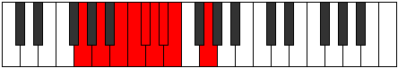 |
| [1013](https://ianring.com/musictheory/scales/1013) | [Stydyllic](ModeFNaturalStydyllic.md) | F | F, G, A, A#, B, C, C#, D, F |  |
| [1013](https://ianring.com/musictheory/scales/1013) | [Stydyllic](ModeDNaturalStydyllic.md) | D | D, E, F#, G, G#, A, A#, B, D |  |
| [1015](https://ianring.com/musictheory/scales/1015) | [Ionodygic](ModeGNaturalIonodygic.md) | G | G, G#, A, B, C, C#, D, D#, E, G |  |
| [1015](https://ianring.com/musictheory/scales/1015) | [Ionodygic](ModeANaturalIonodygic.md) | A | A, A#, B, C#, D, D#, E, F, F#, A |  |
| [1015](https://ianring.com/musictheory/scales/1015) | [Ionodygic](ModeFNaturalIonodygic.md) | F | F, F#, G, A, A#, B, C, C#, D, F |  |
| [1015](https://ianring.com/musictheory/scales/1015) | [Ionodygic](ModeDNaturalIonodygic.md) | D | D, D#, E, F#, G, G#, A, A#, B, D |  |
| [1017](https://ianring.com/musictheory/scales/1017) | [Dythyllic](ModeFSharpDythyllic.md) | F# | F#, A, A#, B, C, C#, D, D#, F# |  |
| [1017](https://ianring.com/musictheory/scales/1017) | [Dythyllic](ModeGFlatDythyllic.md) | Gb | Gb, A, Bb, B, C, Db, D, Eb, Gb |  |
| [1017](https://ianring.com/musictheory/scales/1017) | [Dythyllic](ModeFNaturalDythyllic.md) | F | F, G#, A, A#, B, C, C#, D, F |  |
| [1017](https://ianring.com/musictheory/scales/1017) | [Dythyllic](ModeDNaturalDythyllic.md) | D | D, F, F#, G, G#, A, A#, B, D |  |
| [1019](https://ianring.com/musictheory/scales/1019) | [Aeranygic](ModeGSharpAeranygic.md) | G# | G#, A, B, C, C#, D, D#, E, F, G# |  |
| [1019](https://ianring.com/musictheory/scales/1019) | [Aeranygic](ModeAFlatAeranygic.md) | Ab | Ab, A, B, C, Db, D, Eb, E, F, Ab |  |
| [1019](https://ianring.com/musictheory/scales/1019) | [Aeranygic](ModeFSharpAeranygic.md) | F# | F#, G, A, A#, B, C, C#, D, D#, F# |  |
| [1019](https://ianring.com/musictheory/scales/1019) | [Aeranygic](ModeGFlatAeranygic.md) | Gb | Gb, G, A, Bb, B, C, Db, D, Eb, Gb |  |
| [1019](https://ianring.com/musictheory/scales/1019) | [Aeranygic](ModeFNaturalAeranygic.md) | F | F, F#, G#, A, A#, B, C, C#, D, F |  |
| [1019](https://ianring.com/musictheory/scales/1019) | [Aeranygic](ModeDNaturalAeranygic.md) | D | D, D#, F, F#, G, G#, A, A#, B, D |  |
| [1021](https://ianring.com/musictheory/scales/1021) | [Ladygic](ModeANaturalLadygic.md) | A | A, B, C, C#, D, D#, E, F, F#, A |  |
| [1021](https://ianring.com/musictheory/scales/1021) | [Ladygic](ModeGNaturalLadygic.md) | G | G, A, A#, B, C, C#, D, D#, E, G |  |
| [1021](https://ianring.com/musictheory/scales/1021) | [Ladygic](ModeFSharpLadygic.md) | F# | F#, G#, A, A#, B, C, C#, D, D#, F# |  |
| [1021](https://ianring.com/musictheory/scales/1021) | [Ladygic](ModeGFlatLadygic.md) | Gb | Gb, Ab, A, Bb, B, C, Db, D, Eb, Gb |  |
| [1021](https://ianring.com/musictheory/scales/1021) | [Ladygic](ModeFNaturalLadygic.md) | F | F, G, G#, A, A#, B, C, C#, D, F |  |
| [1021](https://ianring.com/musictheory/scales/1021) | [Ladygic](ModeDNaturalLadygic.md) | D | D, E, F, F#, G, G#, A, A#, B, D |  |
| [1023](https://ianring.com/musictheory/scales/1023) | [Dodyllian](ModeANaturalDodyllian.md) | A | A, A#, B, C, C#, D, D#, E, F, F#, A |  |
| [1023](https://ianring.com/musictheory/scales/1023) | [Dodyllian](ModeGSharpDodyllian.md) | G# | G#, A, A#, B, C, C#, D, D#, E, F, G# |  |
| [1023](https://ianring.com/musictheory/scales/1023) | [Dodyllian](ModeAFlatDodyllian.md) | Ab | Ab, A, Bb, B, C, Db, D, Eb, E, F, Ab |  |
| [1023](https://ianring.com/musictheory/scales/1023) | [Dodyllian](ModeGNaturalDodyllian.md) | G | G, G#, A, A#, B, C, C#, D, D#, E, G |  |
| [1023](https://ianring.com/musictheory/scales/1023) | [Dodyllian](ModeFSharpDodyllian.md) | F# | F#, G, G#, A, A#, B, C, C#, D, D#, F# |  |
| [1023](https://ianring.com/musictheory/scales/1023) | [Dodyllian](ModeGFlatDodyllian.md) | Gb | Gb, G, Ab, A, Bb, B, C, Db, D, Eb, Gb |  |
| [1023](https://ianring.com/musictheory/scales/1023) | [Dodyllian](ModeFNaturalDodyllian.md) | F | F, F#, G, G#, A, A#, B, C, C#, D, F |  |
| [1023](https://ianring.com/musictheory/scales/1023) | [Dodyllian](ModeDNaturalDodyllian.md) | D | D, D#, E, F, F#, G, G#, A, A#, B, D |  |
| [1097](https://ianring.com/musictheory/scales/1097) | [Aeraphic](ModeBNaturalAeraphic.md) | B | B, D, F, A, B |  |
| [1099](https://ianring.com/musictheory/scales/1099) | [Dyritonic](ModeBNaturalDyritonic.md) | B | B, C, D, F, A, B |  |
| [1099](https://ianring.com/musictheory/scales/1099) | [Dyritonic](ModeGSharpDyritonic.md) | G# | G#, A, B, D, F#, G# |  |
| [1099](https://ianring.com/musictheory/scales/1099) | [Dyritonic](ModeAFlatDyritonic.md) | Ab | Ab, A, B, D, Gb, Ab |  |
| [1101](https://ianring.com/musictheory/scales/1101) | [Stothitonic](ModeBNaturalStothitonic.md) | B | B, C#, D, F, A, B | 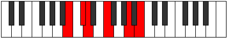 |
| [1103](https://ianring.com/musictheory/scales/1103) | [Lynimic](ModeGSharpLynimic.md) | G# | G#, A, Bb, Cb, D, E##, G# |  |
| [1113](https://ianring.com/musictheory/scales/1113) | [Aeronitonic](ModeBNaturalAeronitonic.md) | B | B, D, D#, F, A, B |  |
| [1115](https://ianring.com/musictheory/scales/1115) | [Locrimic](ModeGSharpLocrimic.md) | G# | G#, A, B, C, D, E##, G# |  |
| [1119](https://ianring.com/musictheory/scales/1119) | [Rarian](ModeBNaturalRarian.md) | B | B, C, Db, Ebb, Fbb, Gbb, A, B |  |
| [1119](https://ianring.com/musictheory/scales/1119) | [Rarian](ModeGSharpRarian.md) | G# | G#, A, Bb, Cb, Dbb, Ebb, F#, G# |  |
| [1125](https://ianring.com/musictheory/scales/1125) | [Ionaritonic](ModeANaturalIonaritonic.md) | A | A, B, D, D#, G, A |  |
| [1127](https://ianring.com/musictheory/scales/1127) | [Eparimic](ModeANaturalEparimic.md) | A | A, Bb, Cb, D, Eb, F##, A |  |
| [1129](https://ianring.com/musictheory/scales/1129) | [Phrynitonic](ModeBNaturalPhrynitonic.md) | B | B, D, E, F, A, B |  |
| [1131](https://ianring.com/musictheory/scales/1131) | [Thocrimic](ModeGSharpThocrimic.md) | G# | G#, A, B, C#, D, E##, G# |  |
| [1133](https://ianring.com/musictheory/scales/1133) | [Stycrimic](ModeANaturalStycrimic.md) | A | A, B, C, D, Eb, F##, A |  |
| [1135](https://ianring.com/musictheory/scales/1135) | [Katolian](ModeBNaturalKatolian.md) | B | B, C, Db, Ebb, Fb, Gbb, A, B |  |
| [1135](https://ianring.com/musictheory/scales/1135) | [Katolian](ModeANaturalKatolian.md) | A | A, Bb, Cb, Dbb, Ebb, Fbb, G, A |  |
| [1135](https://ianring.com/musictheory/scales/1135) | [Katolian](ModeGSharpKatolian.md) | G# | G#, A, Bb, Cb, Db, Ebb, F#, G# |  |
| [1141](https://ianring.com/musictheory/scales/1141) | [Rynimic](ModeANaturalRynimic.md) | A | A, B, C#, D, Eb, F##, A |  |
| [1143](https://ianring.com/musictheory/scales/1143) | [Styrian](ModeANaturalStyrian.md) | A | A, Bb, Cb, Db, Ebb, Fbb, G, A |  |
| [1147](https://ianring.com/musictheory/scales/1147) | [Epynian](ModeBNaturalEpynian.md) | B | B, C, D, Eb, Fb, Gbb, A, B |  |
| [1147](https://ianring.com/musictheory/scales/1147) | [Epynian](ModeGSharpEpynian.md) | G# | G#, A, B, C, Db, Ebb, F#, G# |  |
| [1149](https://ianring.com/musictheory/scales/1149) | [Bydian](ModeBNaturalBydian.md) | B | B, C#, D, Eb, Fb, Gbb, A, B |  |
| [1149](https://ianring.com/musictheory/scales/1149) | [Bydian](ModeANaturalBydian.md) | A | A, B, C, Db, Ebb, Fbb, G, A |  |
| [1151](https://ianring.com/musictheory/scales/1151) | [Mythyllic](ModeBNaturalMythyllic.md) | B | B, C, C#, D, D#, E, F, A, B |  |
| [1151](https://ianring.com/musictheory/scales/1151) | [Mythyllic](ModeANaturalMythyllic.md) | A | A, A#, B, C, C#, D, D#, G, A |  |
| [1151](https://ianring.com/musictheory/scales/1151) | [Mythyllic](ModeGSharpMythyllic.md) | G# | G#, A, A#, B, C, C#, D, F#, G# |  |
| [1151](https://ianring.com/musictheory/scales/1151) | [Mythyllic](ModeAFlatMythyllic.md) | Ab | Ab, A, Bb, B, C, Db, D, Gb, Ab |  |
| [1161](https://ianring.com/musictheory/scales/1161) | [Eporic](ModeBNaturalEporic.md) | B | B, D, F#, A, B |  |
| [1163](https://ianring.com/musictheory/scales/1163) | [Pagitonic](ModeBNaturalPagitonic.md) | B | B, C, D, F#, A, B |  |
| [1165](https://ianring.com/musictheory/scales/1165) | [Gycritonic](ModeBNaturalGycritonic.md) | B | B, C#, D, F#, A, B |  |
| [1173](https://ianring.com/musictheory/scales/1173) | [Phropitonic](ModeGNaturalPhropitonic.md) | G | G, A, B, D, F, G |  |
| [1177](https://ianring.com/musictheory/scales/1177) | [Garitonic](ModeBNaturalGaritonic.md) | B | B, D, D#, F#, A, B |  |
| [1181](https://ianring.com/musictheory/scales/1181) | [Katagimic](ModeGNaturalKatagimic.md) | G | G, A, Bb, Cb, D, E#, G |  |
| [1183](https://ianring.com/musictheory/scales/1183) | [Sadian](ModeBNaturalSadian.md) | B | B, C, Db, Ebb, Fbb, Gb, A, B |  |
| [1187](https://ianring.com/musictheory/scales/1187) | [Thalitonic](ModeENaturalThalitonic.md) | E | E, F, A, B, D, E |  |
| [1189](https://ianring.com/musictheory/scales/1189) | [Thaptitonic](ModeENaturalThaptitonic.md) | E | E, F#, A, B, D, E | 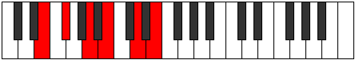 |
| [1189](https://ianring.com/musictheory/scales/1189) | [Thaptitonic](ModeANaturalThaptitonic.md) | A | A, B, D, E, G, A |  |
| [1191](https://ianring.com/musictheory/scales/1191) | [Pyrimic](ModeENaturalPyrimic.md) | E | E, F, Gb, A, B, C##, E |  |
| [1191](https://ianring.com/musictheory/scales/1191) | [Pyrimic](ModeANaturalPyrimic.md) | A | A, Bb, Cb, D, E, F##, A |  |
| [1193](https://ianring.com/musictheory/scales/1193) | [Rocritonic](ModeBNaturalRocritonic.md) | B | B, D, E, F#, A, B | 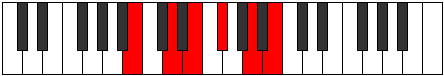 |
| [1193](https://ianring.com/musictheory/scales/1193) | [Rocritonic](ModeENaturalRocritonic.md) | E | E, G, A, B, D, E |  |
| [1195](https://ianring.com/musictheory/scales/1195) | [Sarimic](ModeENaturalSarimic.md) | E | E, F, G, A, B, C##, E |  |
| [1197](https://ianring.com/musictheory/scales/1197) | [Rocrimic](ModeANaturalRocrimic.md) | A | A, B, C, D, E, F##, A |  |
| [1197](https://ianring.com/musictheory/scales/1197) | [Rocrimic](ModeENaturalRocrimic.md) | E | E, F#, G, A, B, C##, E |  |
| [1199](https://ianring.com/musictheory/scales/1199) | [Magian](ModeBNaturalMagian.md) | B | B, C, Db, Ebb, Fb, Gb, A, B |  |
| [1199](https://ianring.com/musictheory/scales/1199) | [Magian](ModeANaturalMagian.md) | A | A, Bb, Cb, Dbb, Ebb, Fb, G, A |  |
| [1201](https://ianring.com/musictheory/scales/1201) | [Aeracritonic](ModeENaturalAeracritonic.md) | E | E, G#, A, B, D, E |  |
| [1203](https://ianring.com/musictheory/scales/1203) | [Pagimic](ModeENaturalPagimic.md) | E | E, F, G#, A, B, C##, E |  |
| [1205](https://ianring.com/musictheory/scales/1205) | [Ionycrimic](ModeANaturalIonycrimic.md) | A | A, B, C#, D, E, F##, A |  |
| [1205](https://ianring.com/musictheory/scales/1205) | [Ionycrimic](ModeGNaturalIonycrimic.md) | G | G, A, B, C, D, E#, G |  |
| [1205](https://ianring.com/musictheory/scales/1205) | [Ionycrimic](ModeENaturalIonycrimic.md) | E | E, F#, G#, A, B, C##, E |  |
| [1207](https://ianring.com/musictheory/scales/1207) | [Aeoloptian](ModeANaturalAeoloptian.md) | A | A, Bb, Cb, Db, Ebb, Fb, G, A |  |
| [1209](https://ianring.com/musictheory/scales/1209) | [Ionynimic](ModeENaturalIonynimic.md) | E | E, F##, G#, A, B, C##, E |  |
| [1211](https://ianring.com/musictheory/scales/1211) | [Zadian](ModeBNaturalZadian.md) | B | B, C, D, Eb, Fb, Gb, A, B |  |
| [1213](https://ianring.com/musictheory/scales/1213) | [Gyrian](ModeBNaturalGyrian.md) | B | B, C#, D, Eb, Fb, Gb, A, B |  |
| [1213](https://ianring.com/musictheory/scales/1213) | [Gyrian](ModeANaturalGyrian.md) | A | A, B, C, Db, Ebb, Fb, G, A |  |
| [1213](https://ianring.com/musictheory/scales/1213) | [Gyrian](ModeGNaturalGyrian.md) | G | G, A, Bb, Cb, Dbb, Ebb, F, G |  |
| [1215](https://ianring.com/musictheory/scales/1215) | [Aeolanyllic](ModeBNaturalAeolanyllic.md) | B | B, C, C#, D, D#, E, F#, A, B |  |
| [1215](https://ianring.com/musictheory/scales/1215) | [Aeolanyllic](ModeENaturalAeolanyllic.md) | E | E, F, F#, G, G#, A, B, D, E |  |
| [1215](https://ianring.com/musictheory/scales/1215) | [Aeolanyllic](ModeANaturalAeolanyllic.md) | A | A, A#, B, C, C#, D, E, G, A |  |
| [1215](https://ianring.com/musictheory/scales/1215) | [Aeolanyllic](ModeGNaturalAeolanyllic.md) | G | G, G#, A, A#, B, C, D, F, G |  |
| [1225](https://ianring.com/musictheory/scales/1225) | [Lyditonic](ModeBNaturalLyditonic.md) | B | B, D, F, F#, A, B |  |
| [1227](https://ianring.com/musictheory/scales/1227) | [Thacrimic](ModeGSharpThacrimic.md) | G# | G#, A, B, C##, D#, E##, G# |  |
| [1231](https://ianring.com/musictheory/scales/1231) | [Logian](ModeBNaturalLogian.md) | B | B, C, Db, Ebb, F, Gb, A, B |  |
| [1231](https://ianring.com/musictheory/scales/1231) | [Logian](ModeGSharpLogian.md) | G# | G#, A, Bb, Cb, D, Eb, F#, G# |  |
| [1237](https://ianring.com/musictheory/scales/1237) | [Salimic](ModeGNaturalSalimic.md) | G | G, A, B, C#, D, E#, G |  |
| [1243](https://ianring.com/musictheory/scales/1243) | [Epylian](ModeBNaturalEpylian.md) | B | B, C, D, Eb, F, Gb, A, B |  |
| [1243](https://ianring.com/musictheory/scales/1243) | [Epylian](ModeGSharpEpylian.md) | G# | G#, A, B, C, D, Eb, F#, G# | 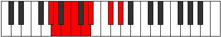 |
| [1245](https://ianring.com/musictheory/scales/1245) | [Lathian](ModeBNaturalLathian.md) | B | B, C#, D, Eb, F, Gb, A, B |  |
| [1245](https://ianring.com/musictheory/scales/1245) | [Lathian](ModeGNaturalLathian.md) | G | G, A, Bb, Cb, Db, Ebb, F, G |  |
| [1247](https://ianring.com/musictheory/scales/1247) | [Mygyllic](ModeBNaturalMygyllic.md) | B | B, C, C#, D, D#, F, F#, A, B |  |
| [1247](https://ianring.com/musictheory/scales/1247) | [Mygyllic](ModeGSharpMygyllic.md) | G# | G#, A, A#, B, C, D, D#, F#, G# |  |
| [1247](https://ianring.com/musictheory/scales/1247) | [Mygyllic](ModeAFlatMygyllic.md) | Ab | Ab, A, Bb, B, C, D, Eb, Gb, Ab |  |
| [1247](https://ianring.com/musictheory/scales/1247) | [Mygyllic](ModeGNaturalMygyllic.md) | G | G, G#, A, A#, B, C#, D, F, G |  |
| [1253](https://ianring.com/musictheory/scales/1253) | [Zolimic](ModeANaturalZolimic.md) | A | A, B, C##, D#, E, F##, A |  |
| [1255](https://ianring.com/musictheory/scales/1255) | [Sogian](ModeENaturalSogian.md) | E | E, F, Gb, A, Bb, Cb, D, E |  |
| [1255](https://ianring.com/musictheory/scales/1255) | [Sogian](ModeANaturalSogian.md) | A | A, Bb, Cb, D, Eb, Fb, G, A |  |
| [1259](https://ianring.com/musictheory/scales/1259) | [Stadian](ModeBNaturalStadian.md) | B | B, C, D, E, F, Gb, A, B |  |
| [1259](https://ianring.com/musictheory/scales/1259) | [Stadian](ModeGSharpStadian.md) | G# | G#, A, B, C#, D, Eb, F#, G# |  |
| [1259](https://ianring.com/musictheory/scales/1259) | [Stadian](ModeENaturalStadian.md) | E | E, F, G, A, Bb, Cb, D, E |  |
| [1261](https://ianring.com/musictheory/scales/1261) | [Aeodian](ModeBNaturalAeodian.md) | B | B, C#, D, E, F, Gb, A, B |  |
| [1261](https://ianring.com/musictheory/scales/1261) | [Aeodian](ModeANaturalAeodian.md) | A | A, B, C, D, Eb, Fb, G, A |  |
| [1261](https://ianring.com/musictheory/scales/1261) | [Aeodian](ModeENaturalAeodian.md) | E | E, F#, G, A, Bb, Cb, D, E |  |
| [1263](https://ianring.com/musictheory/scales/1263) | [Stynyllic](ModeBNaturalStynyllic.md) | B | B, C, C#, D, E, F, F#, A, B |  |
| [1263](https://ianring.com/musictheory/scales/1263) | [Stynyllic](ModeANaturalStynyllic.md) | A | A, A#, B, C, D, D#, E, G, A | 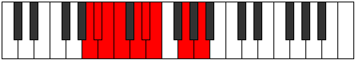 |
| [1263](https://ianring.com/musictheory/scales/1263) | [Stynyllic](ModeENaturalStynyllic.md) | E | E, F, F#, G, A, A#, B, D, E |  |
| [1263](https://ianring.com/musictheory/scales/1263) | [Stynyllic](ModeGSharpStynyllic.md) | G# | G#, A, A#, B, C#, D, D#, F#, G# |  |
| [1263](https://ianring.com/musictheory/scales/1263) | [Stynyllic](ModeAFlatStynyllic.md) | Ab | Ab, A, Bb, B, Db, D, Eb, Gb, Ab |  |
| [1267](https://ianring.com/musictheory/scales/1267) | [Katynian](ModeENaturalKatynian.md) | E | E, F, G#, A, Bb, Cb, D, E |  |
| [1269](https://ianring.com/musictheory/scales/1269) | [Katythian](ModeANaturalKatythian.md) | A | A, B, C#, D, Eb, Fb, G, A |  |
| [1269](https://ianring.com/musictheory/scales/1269) | [Katythian](ModeGNaturalKatythian.md) | G | G, A, B, C, Db, Ebb, F, G |  |
| [1269](https://ianring.com/musictheory/scales/1269) | [Katythian](ModeENaturalKatythian.md) | E | E, F#, G#, A, Bb, Cb, D, E |  |
| [1271](https://ianring.com/musictheory/scales/1271) | [Kolyllic](ModeGNaturalKolyllic.md) | G | G, G#, A, B, C, C#, D, F, G |  |
| [1271](https://ianring.com/musictheory/scales/1271) | [Kolyllic](ModeANaturalKolyllic.md) | A | A, A#, B, C#, D, D#, E, G, A |  |
| [1271](https://ianring.com/musictheory/scales/1271) | [Kolyllic](ModeENaturalKolyllic.md) | E | E, F, F#, G#, A, A#, B, D, E |  |
| [1273](https://ianring.com/musictheory/scales/1273) | [Ronian](ModeBNaturalRonian.md) | B | B, C##, D#, E, F, Gb, A, B |  |
| [1273](https://ianring.com/musictheory/scales/1273) | [Ronian](ModeENaturalRonian.md) | E | E, F##, G#, A, Bb, Cb, D, E |  |
| [1275](https://ianring.com/musictheory/scales/1275) | [Stagyllic](ModeBNaturalStagyllic.md) | B | B, C, D, D#, E, F, F#, A, B | 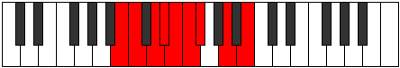 |
| [1275](https://ianring.com/musictheory/scales/1275) | [Stagyllic](ModeGSharpStagyllic.md) | G# | G#, A, B, C, C#, D, D#, F#, G# |  |
| [1275](https://ianring.com/musictheory/scales/1275) | [Stagyllic](ModeAFlatStagyllic.md) | Ab | Ab, A, B, C, Db, D, Eb, Gb, Ab |  |
| [1275](https://ianring.com/musictheory/scales/1275) | [Stagyllic](ModeENaturalStagyllic.md) | E | E, F, G, G#, A, A#, B, D, E |  |
| [1277](https://ianring.com/musictheory/scales/1277) | [Zadyllic](ModeBNaturalZadyllic.md) | B | B, C#, D, D#, E, F, F#, A, B |  |
| [1277](https://ianring.com/musictheory/scales/1277) | [Zadyllic](ModeANaturalZadyllic.md) | A | A, B, C, C#, D, D#, E, G, A |  |
| [1277](https://ianring.com/musictheory/scales/1277) | [Zadyllic](ModeGNaturalZadyllic.md) | G | G, A, A#, B, C, C#, D, F, G |  |
| [1277](https://ianring.com/musictheory/scales/1277) | [Zadyllic](ModeENaturalZadyllic.md) | E | E, F#, G, G#, A, A#, B, D, E |  |
| [1279](https://ianring.com/musictheory/scales/1279) | [Sarygic](ModeBNaturalSarygic.md) | B | B, C, C#, D, D#, E, F, F#, A, B |  |
| [1279](https://ianring.com/musictheory/scales/1279) | [Sarygic](ModeANaturalSarygic.md) | A | A, A#, B, C, C#, D, D#, E, G, A |  |
| [1279](https://ianring.com/musictheory/scales/1279) | [Sarygic](ModeGSharpSarygic.md) | G# | G#, A, A#, B, C, C#, D, D#, F#, G# |  |
| [1279](https://ianring.com/musictheory/scales/1279) | [Sarygic](ModeAFlatSarygic.md) | Ab | Ab, A, Bb, B, C, Db, D, Eb, Gb, Ab |  |
| [1279](https://ianring.com/musictheory/scales/1279) | [Sarygic](ModeGNaturalSarygic.md) | G | G, G#, A, A#, B, C, C#, D, F, G |  |
| [1279](https://ianring.com/musictheory/scales/1279) | [Sarygic](ModeENaturalSarygic.md) | E | E, F, F#, G, G#, A, A#, B, D, E |  |
| [1299](https://ianring.com/musictheory/scales/1299) | [Aerophitonic](ModeCSharpAerophitonic.md) | C# | C#, D, F, A, B, C# |  |
| [1299](https://ianring.com/musictheory/scales/1299) | [Aerophitonic](ModeDFlatAerophitonic.md) | Db | Db, D, F, A, B, Db |  |
| [1303](https://ianring.com/musictheory/scales/1303) | [Epolimic](ModeDFlatEpolimic.md) | Db | Db, Ebb, Fbb, Gbb, A, B, Db |  |
| [1305](https://ianring.com/musictheory/scales/1305) | [Dynitonic](ModeBNaturalDynitonic.md) | B | B, D, D#, G, A, B |  |
| [1307](https://ianring.com/musictheory/scales/1307) | [Katorimic](ModeDFlatKatorimic.md) | Db | Db, Ebb, Fb, Gbb, A, B, Db |  |
| [1311](https://ianring.com/musictheory/scales/1311) | [Bynian](ModeCSharpBynian.md) | C# | C#, D, Eb, Fb, Gbb, A, B, C# |  |
| [1311](https://ianring.com/musictheory/scales/1311) | [Bynian](ModeBNaturalBynian.md) | B | B, C, Db, Ebb, Fbb, G, A, B | 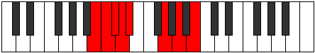 |
| [1315](https://ianring.com/musictheory/scales/1315) | [Pyritonic](ModeCSharpPyritonic.md) | C# | C#, D, F#, A, B, C# |  |
| [1315](https://ianring.com/musictheory/scales/1315) | [Pyritonic](ModeDFlatPyritonic.md) | Db | Db, D, Gb, A, B, Db |  |
| [1317](https://ianring.com/musictheory/scales/1317) | [Staditonic](ModeANaturalStaditonic.md) | A | A, B, D, F, G, A |  |
| [1319](https://ianring.com/musictheory/scales/1319) | [Phronimic](ModeDFlatPhronimic.md) | Db | Db, Ebb, Fbb, Gb, A, B, Db |  |
| [1319](https://ianring.com/musictheory/scales/1319) | [Phronimic](ModeANaturalPhronimic.md) | A | A, Bb, Cb, D, E#, F##, A |  |
| [1321](https://ianring.com/musictheory/scales/1321) | [Epathitonic](ModeFSharpEpathitonic.md) | F# | F#, A, B, D, E, F# | 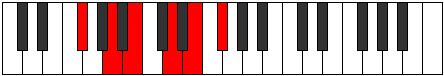 |
| [1321](https://ianring.com/musictheory/scales/1321) | [Epathitonic](ModeGFlatEpathitonic.md) | Gb | Gb, A, B, D, E, Gb |  |
| [1321](https://ianring.com/musictheory/scales/1321) | [Epathitonic](ModeBNaturalEpathitonic.md) | B | B, D, E, G, A, B |  |
| [1323](https://ianring.com/musictheory/scales/1323) | [Eporimic](ModeDFlatEporimic.md) | Db | Db, Ebb, Fb, Gb, A, B, Db |  |
| [1323](https://ianring.com/musictheory/scales/1323) | [Eporimic](ModeFSharpEporimic.md) | F# | F#, G, A, B, C##, D##, F# |  |
| [1325](https://ianring.com/musictheory/scales/1325) | [Phradimic](ModeANaturalPhradimic.md) | A | A, B, C, D, E#, F##, A |  |
| [1325](https://ianring.com/musictheory/scales/1325) | [Phradimic](ModeFSharpPhradimic.md) | F# | F#, G#, A, B, C##, D##, F# |  |
| [1327](https://ianring.com/musictheory/scales/1327) | [Zalian](ModeCSharpZalian.md) | C# | C#, D, Eb, Fb, Gb, A, B, C# |  |
| [1327](https://ianring.com/musictheory/scales/1327) | [Zalian](ModeBNaturalZalian.md) | B | B, C, Db, Ebb, Fb, G, A, B |  |
| [1327](https://ianring.com/musictheory/scales/1327) | [Zalian](ModeANaturalZalian.md) | A | A, Bb, Cb, Dbb, Ebb, F, G, A |  |
| [1331](https://ianring.com/musictheory/scales/1331) | [Dolimic](ModeDFlatDolimic.md) | Db | Db, Ebb, F, Gb, A, B, Db |  |
| [1333](https://ianring.com/musictheory/scales/1333) | [Lyptimic](ModeANaturalLyptimic.md) | A | A, B, C#, D, E#, F##, A |  |
| [1335](https://ianring.com/musictheory/scales/1335) | [Aeralian](ModeCSharpAeralian.md) | C# | C#, D, Eb, F, Gb, A, B, C# |  |
| [1335](https://ianring.com/musictheory/scales/1335) | [Aeralian](ModeANaturalAeralian.md) | A | A, Bb, Cb, Db, Ebb, F, G, A |  |
| [1337](https://ianring.com/musictheory/scales/1337) | [Epogimic](ModeGFlatEpogimic.md) | Gb | Gb, A, Bb, Cb, D, E, Gb |  |
| [1339](https://ianring.com/musictheory/scales/1339) | [Kycrian](ModeCSharpKycrian.md) | C# | C#, D, E, F, Gb, A, B, C# |  |
| [1339](https://ianring.com/musictheory/scales/1339) | [Kycrian](ModeBNaturalKycrian.md) | B | B, C, D, Eb, Fb, G, A, B |  |
| [1339](https://ianring.com/musictheory/scales/1339) | [Kycrian](ModeFSharpKycrian.md) | F# | F#, G, A, Bb, Cb, D, E, F# |  |
| [1341](https://ianring.com/musictheory/scales/1341) | [Madian](ModeBNaturalMadian.md) | B | B, C#, D, Eb, Fb, G, A, B |  |
| [1341](https://ianring.com/musictheory/scales/1341) | [Madian](ModeANaturalMadian.md) | A | A, B, C, Db, Ebb, F, G, A |  |
| [1341](https://ianring.com/musictheory/scales/1341) | [Madian](ModeFSharpMadian.md) | F# | F#, G#, A, Bb, Cb, D, E, F# |  |
| [1343](https://ianring.com/musictheory/scales/1343) | [Zalyllic](ModeCSharpZalyllic.md) | C# | C#, D, D#, E, F, F#, A, B, C# |  |
| [1343](https://ianring.com/musictheory/scales/1343) | [Zalyllic](ModeDFlatZalyllic.md) | Db | Db, D, Eb, E, F, Gb, A, B, Db | 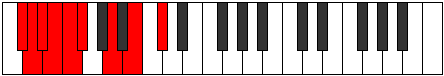 |
| [1343](https://ianring.com/musictheory/scales/1343) | [Zalyllic](ModeBNaturalZalyllic.md) | B | B, C, C#, D, D#, E, G, A, B |  |
| [1343](https://ianring.com/musictheory/scales/1343) | [Zalyllic](ModeANaturalZalyllic.md) | A | A, A#, B, C, C#, D, F, G, A |  |
| [1343](https://ianring.com/musictheory/scales/1343) | [Zalyllic](ModeFSharpZalyllic.md) | F# | F#, G, G#, A, A#, B, D, E, F# |  |
| [1343](https://ianring.com/musictheory/scales/1343) | [Zalyllic](ModeGFlatZalyllic.md) | Gb | Gb, G, Ab, A, Bb, B, D, E, Gb |  |
| [1351](https://ianring.com/musictheory/scales/1351) | [Aeraptimic](ModeDFlatAeraptimic.md) | Db | Db, Ebb, Fbb, G, A, B, Db |  |
| [1353](https://ianring.com/musictheory/scales/1353) | [Kataritonic](ModeBNaturalKataritonic.md) | B | B, D, F, G, A, B |  |
| [1355](https://ianring.com/musictheory/scales/1355) | [Aeolorimic](ModeDFlatAeolorimic.md) | Db | Db, Ebb, Fb, G, A, B, Db |  |
| [1355](https://ianring.com/musictheory/scales/1355) | [Aeolorimic](ModeGSharpAeolorimic.md) | G# | G#, A, B, C##, D##, E##, G# |  |
| [1359](https://ianring.com/musictheory/scales/1359) | [Aerygian](ModeCSharpAerygian.md) | C# | C#, D, Eb, Fb, G, A, B, C# |  |
| [1359](https://ianring.com/musictheory/scales/1359) | [Aerygian](ModeBNaturalAerygian.md) | B | B, C, Db, Ebb, F, G, A, B |  |
| [1359](https://ianring.com/musictheory/scales/1359) | [Aerygian](ModeGSharpAerygian.md) | G# | G#, A, Bb, Cb, D, E, F#, G# |  |
| [1363](https://ianring.com/musictheory/scales/1363) | [Gygimic](ModeDFlatGygimic.md) | Db | Db, Ebb, F, G, A, B, Db |  |
| [1367](https://ianring.com/musictheory/scales/1367) | [Pyptian](ModeCSharpPyptian.md) | C# | C#, D, Eb, F, G, A, B, C# |  |
| [1371](https://ianring.com/musictheory/scales/1371) | [Ionadian](ModeBNaturalIonadian.md) | B | B, C, D, Eb, F, G, A, B |  |
| [1371](https://ianring.com/musictheory/scales/1371) | [Ionadian](ModeCSharpIonadian.md) | C# | C#, D, E, F, G, A, B, C# |  |
| [1371](https://ianring.com/musictheory/scales/1371) | [Ionadian](ModeGSharpIonadian.md) | G# | G#, A, B, C, D, E, F#, G# |  |
| [1373](https://ianring.com/musictheory/scales/1373) | [Storian](ModeBNaturalStorian.md) | B | B, C#, D, Eb, F, G, A, B |  |
| [1375](https://ianring.com/musictheory/scales/1375) | [Bothyllic](ModeBNaturalBothyllic.md) | B | B, C, C#, D, D#, F, G, A, B |  |
| [1375](https://ianring.com/musictheory/scales/1375) | [Bothyllic](ModeCSharpBothyllic.md) | C# | C#, D, D#, E, F, G, A, B, C# |  |
| [1375](https://ianring.com/musictheory/scales/1375) | [Bothyllic](ModeDFlatBothyllic.md) | Db | Db, D, Eb, E, F, G, A, B, Db |  |
| [1375](https://ianring.com/musictheory/scales/1375) | [Bothyllic](ModeGSharpBothyllic.md) | G# | G#, A, A#, B, C, D, E, F#, G# |  |
| [1375](https://ianring.com/musictheory/scales/1375) | [Bothyllic](ModeAFlatBothyllic.md) | Ab | Ab, A, Bb, B, C, D, E, Gb, Ab |  |
| [1379](https://ianring.com/musictheory/scales/1379) | [Kycrimic](ModeDFlatKycrimic.md) | Db | Db, Ebb, F#, G, A, B, Db |  |
| [1381](https://ianring.com/musictheory/scales/1381) | [Padimic](ModeANaturalPadimic.md) | A | A, B, C##, D#, E#, F##, A |  |
| [1383](https://ianring.com/musictheory/scales/1383) | [Pynian](ModeCSharpPynian.md) | C# | C#, D, Eb, F#, G, A, B, C# |  |
| [1383](https://ianring.com/musictheory/scales/1383) | [Pynian](ModeANaturalPynian.md) | A | A, Bb, Cb, D, Eb, F, G, A |  |
| [1385](https://ianring.com/musictheory/scales/1385) | [Phracrimic](ModeGFlatPhracrimic.md) | Gb | Gb, A, B, C, D, E, Gb |  |
| [1387](https://ianring.com/musictheory/scales/1387) | [Locrian](ModeBNaturalLocrian.md) | B | B, C, D, E, F, G, A, B |  |
| [1387](https://ianring.com/musictheory/scales/1387) | [Locrian](ModeFSharpLocrian.md) | F# | F#, G, A, B, C, D, E, F# |  |
| [1387](https://ianring.com/musictheory/scales/1387) | [Locrian](ModeCSharpLocrian.md) | C# | C#, D, E, F#, G, A, B, C# |  |
| [1387](https://ianring.com/musictheory/scales/1387) | [Locrian](ModeGSharpLocrian.md) | G# | G#, A, B, C#, D, E, F#, G# |  |
| [1389](https://ianring.com/musictheory/scales/1389) | [Lorian](ModeANaturalLorian.md) | A | A, B, C, D, Eb, F, G, A | 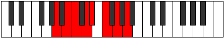 |
| [1389](https://ianring.com/musictheory/scales/1389) | [Lorian](ModeBNaturalLorian.md) | B | B, C#, D, E, F, G, A, B |  |
| [1389](https://ianring.com/musictheory/scales/1389) | [Lorian](ModeFSharpLorian.md) | F# | F#, G#, A, B, C, D, E, F# |  |
| [1391](https://ianring.com/musictheory/scales/1391) | [Aeradyllic](ModeBNaturalAeradyllic.md) | B | B, C, C#, D, E, F, G, A, B |  |
| [1391](https://ianring.com/musictheory/scales/1391) | [Aeradyllic](ModeCSharpAeradyllic.md) | C# | C#, D, D#, E, F#, G, A, B, C# |  |
| [1391](https://ianring.com/musictheory/scales/1391) | [Aeradyllic](ModeDFlatAeradyllic.md) | Db | Db, D, Eb, E, Gb, G, A, B, Db |  |
| [1391](https://ianring.com/musictheory/scales/1391) | [Aeradyllic](ModeFSharpAeradyllic.md) | F# | F#, G, G#, A, B, C, D, E, F# |  |
| [1391](https://ianring.com/musictheory/scales/1391) | [Aeradyllic](ModeGFlatAeradyllic.md) | Gb | Gb, G, Ab, A, B, C, D, E, Gb |  |
| [1391](https://ianring.com/musictheory/scales/1391) | [Aeradyllic](ModeANaturalAeradyllic.md) | A | A, A#, B, C, D, D#, F, G, A |  |
| [1391](https://ianring.com/musictheory/scales/1391) | [Aeradyllic](ModeGSharpAeradyllic.md) | G# | G#, A, A#, B, C#, D, E, F#, G# |  |
| [1391](https://ianring.com/musictheory/scales/1391) | [Aeradyllic](ModeAFlatAeradyllic.md) | Ab | Ab, A, Bb, B, Db, D, E, Gb, Ab |  |
| [1395](https://ianring.com/musictheory/scales/1395) | [Mixonorian](ModeCSharpMixonorian.md) | C# | C#, D, E#, F#, G, A, B, C# |  |
| [1397](https://ianring.com/musictheory/scales/1397) | [Gothian](ModeANaturalGothian.md) | A | A, B, C#, D, Eb, F, G, A |  |
| [1399](https://ianring.com/musictheory/scales/1399) | [Syryllic](ModeCSharpSyryllic.md) | C# | C#, D, D#, F, F#, G, A, B, C# |  |
| [1399](https://ianring.com/musictheory/scales/1399) | [Syryllic](ModeDFlatSyryllic.md) | Db | Db, D, Eb, F, Gb, G, A, B, Db |  |
| [1399](https://ianring.com/musictheory/scales/1399) | [Syryllic](ModeANaturalSyryllic.md) | A | A, A#, B, C#, D, D#, F, G, A |  |
| [1401](https://ianring.com/musictheory/scales/1401) | [Pagian](ModeBNaturalPagian.md) | B | B, C##, D#, E, F, G, A, B |  |
| [1401](https://ianring.com/musictheory/scales/1401) | [Pagian](ModeGFlatPagian.md) | Gb | Gb, A, Bb, Cb, Dbb, Ebb, Fb, Gb |  |
| [1403](https://ianring.com/musictheory/scales/1403) | [Epinyllic](ModeBNaturalEpinyllic.md) | B | B, C, D, D#, E, F, G, A, B |  |
| [1403](https://ianring.com/musictheory/scales/1403) | [Epinyllic](ModeCSharpEpinyllic.md) | C# | C#, D, E, F, F#, G, A, B, C# |  |
| [1403](https://ianring.com/musictheory/scales/1403) | [Epinyllic](ModeDFlatEpinyllic.md) | Db | Db, D, E, F, Gb, G, A, B, Db |  |
| [1403](https://ianring.com/musictheory/scales/1403) | [Epinyllic](ModeGSharpEpinyllic.md) | G# | G#, A, B, C, C#, D, E, F#, G# |  |
| [1403](https://ianring.com/musictheory/scales/1403) | [Epinyllic](ModeAFlatEpinyllic.md) | Ab | Ab, A, B, C, Db, D, E, Gb, Ab |  |
| [1403](https://ianring.com/musictheory/scales/1403) | [Epinyllic](ModeFSharpEpinyllic.md) | F# | F#, G, A, A#, B, C, D, E, F# |  |
| [1403](https://ianring.com/musictheory/scales/1403) | [Epinyllic](ModeGFlatEpinyllic.md) | Gb | Gb, G, A, Bb, B, C, D, E, Gb |  |
| [1405](https://ianring.com/musictheory/scales/1405) | [Goryllic](ModeANaturalGoryllic.md) | A | A, B, C, C#, D, D#, F, G, A |  |
| [1405](https://ianring.com/musictheory/scales/1405) | [Goryllic](ModeBNaturalGoryllic.md) | B | B, C#, D, D#, E, F, G, A, B |  |
| [1405](https://ianring.com/musictheory/scales/1405) | [Goryllic](ModeFSharpGoryllic.md) | F# | F#, G#, A, A#, B, C, D, E, F# |  |
| [1405](https://ianring.com/musictheory/scales/1405) | [Goryllic](ModeGFlatGoryllic.md) | Gb | Gb, Ab, A, Bb, B, C, D, E, Gb |  |
| [1407](https://ianring.com/musictheory/scales/1407) | [Tharygic](ModeBNaturalTharygic.md) | B | B, C, C#, D, D#, E, F, G, A, B |  |
| [1407](https://ianring.com/musictheory/scales/1407) | [Tharygic](ModeCSharpTharygic.md) | C# | C#, D, D#, E, F, F#, G, A, B, C# |  |
| [1407](https://ianring.com/musictheory/scales/1407) | [Tharygic](ModeDFlatTharygic.md) | Db | Db, D, Eb, E, F, Gb, G, A, B, Db | 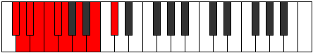 |
| [1407](https://ianring.com/musictheory/scales/1407) | [Tharygic](ModeANaturalTharygic.md) | A | A, A#, B, C, C#, D, D#, F, G, A | 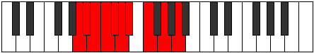 |
| [1407](https://ianring.com/musictheory/scales/1407) | [Tharygic](ModeGSharpTharygic.md) | G# | G#, A, A#, B, C, C#, D, E, F#, G# |  |
| [1407](https://ianring.com/musictheory/scales/1407) | [Tharygic](ModeAFlatTharygic.md) | Ab | Ab, A, Bb, B, C, Db, D, E, Gb, Ab |  |
| [1407](https://ianring.com/musictheory/scales/1407) | [Tharygic](ModeFSharpTharygic.md) | F# | F#, G, G#, A, A#, B, C, D, E, F# |  |
| [1407](https://ianring.com/musictheory/scales/1407) | [Tharygic](ModeGFlatTharygic.md) | Gb | Gb, G, Ab, A, Bb, B, C, D, E, Gb |  |
| [1417](https://ianring.com/musictheory/scales/1417) | [Zoptitonic](ModeBNaturalZoptitonic.md) | B | B, D, F#, G, A, B |  |
| [1419](https://ianring.com/musictheory/scales/1419) | [Zalimic](ModeDFlatZalimic.md) | Db | Db, Ebb, Fb, G#, A, B, Db |  |
| [1423](https://ianring.com/musictheory/scales/1423) | [Doptian](ModeBNaturalDoptian.md) | B | B, C, Db, Ebb, F#, G, A, B |  |
| [1423](https://ianring.com/musictheory/scales/1423) | [Doptian](ModeCSharpDoptian.md) | C# | C#, D, Eb, Fb, G#, A, B, C# |  |
| [1427](https://ianring.com/musictheory/scales/1427) | [Lolimic](ModeDFlatLolimic.md) | Db | Db, Ebb, F, G#, A, B, Db |  |
| [1429](https://ianring.com/musictheory/scales/1429) | [Bythimic](ModeGNaturalBythimic.md) | G | G, A, B, C##, D#, E#, G |  |
| [1431](https://ianring.com/musictheory/scales/1431) | [Phragian](ModeCSharpPhragian.md) | C# | C#, D, Eb, F, G#, A, B, C# |  |
| [1435](https://ianring.com/musictheory/scales/1435) | [Phronian](ModeBNaturalPhronian.md) | B | B, C, D, Eb, F#, G, A, B |  |
| [1435](https://ianring.com/musictheory/scales/1435) | [Phronian](ModeCSharpPhronian.md) | C# | C#, D, E, F, G#, A, B, C# |  |
| [1437](https://ianring.com/musictheory/scales/1437) | [Aeolycrian](ModeBNaturalAeolycrian.md) | B | B, C#, D, Eb, F#, G, A, B |  |
| [1437](https://ianring.com/musictheory/scales/1437) | [Aeolycrian](ModeGNaturalAeolycrian.md) | G | G, A, Bb, Cb, D, Eb, F, G |  |
| [1439](https://ianring.com/musictheory/scales/1439) | [Rolyllic](ModeBNaturalRolyllic.md) | B | B, C, C#, D, D#, F#, G, A, B |  |
| [1439](https://ianring.com/musictheory/scales/1439) | [Rolyllic](ModeCSharpRolyllic.md) | C# | C#, D, D#, E, F, G#, A, B, C# |  |
| [1439](https://ianring.com/musictheory/scales/1439) | [Rolyllic](ModeDFlatRolyllic.md) | Db | Db, D, Eb, E, F, Ab, A, B, Db |  |
| [1439](https://ianring.com/musictheory/scales/1439) | [Rolyllic](ModeGNaturalRolyllic.md) | G | G, G#, A, A#, B, D, D#, F, G |  |
| [1443](https://ianring.com/musictheory/scales/1443) | [Ionarimic](ModeDFlatIonarimic.md) | Db | Db, Ebb, F#, G#, A, B, Db |  |
| [1445](https://ianring.com/musictheory/scales/1445) | [Byptimic](ModeANaturalByptimic.md) | A | A, B, C##, D##, E#, F##, A |  |
| [1447](https://ianring.com/musictheory/scales/1447) | [Mixopyrian](ModeENaturalMixopyrian.md) | E | E, F, Gb, A, B, C, D, E |  |
| [1447](https://ianring.com/musictheory/scales/1447) | [Mixopyrian](ModeCSharpMixopyrian.md) | C# | C#, D, Eb, F#, G#, A, B, C# |  |
| [1447](https://ianring.com/musictheory/scales/1447) | [Mixopyrian](ModeANaturalMixopyrian.md) | A | A, Bb, Cb, D, E, F, G, A |  |
| [1449](https://ianring.com/musictheory/scales/1449) | [Epathimic](ModeGFlatEpathimic.md) | Gb | Gb, A, B, C#, D, E, Gb |  |
| [1451](https://ianring.com/musictheory/scales/1451) | [Phrygian](ModeENaturalPhrygian.md) | E | E, F, G, A, B, C, D, E |  |
| [1451](https://ianring.com/musictheory/scales/1451) | [Phrygian](ModeBNaturalPhrygian.md) | B | B, C, D, E, F#, G, A, B |  |
| [1451](https://ianring.com/musictheory/scales/1451) | [Phrygian](ModeFSharpPhrygian.md) | F# | F#, G, A, B, C#, D, E, F# |  |
| [1451](https://ianring.com/musictheory/scales/1451) | [Phrygian](ModeCSharpPhrygian.md) | C# | C#, D, E, F#, G#, A, B, C# |  |
| [1453](https://ianring.com/musictheory/scales/1453) | [Aeolian](ModeANaturalAeolian.md) | A | A, B, C, D, E, F, G, A |  |
| [1453](https://ianring.com/musictheory/scales/1453) | [Aeolian](ModeENaturalAeolian.md) | E | E, F#, G, A, B, C, D, E |  |
| [1453](https://ianring.com/musictheory/scales/1453) | [Aeolian](ModeBNaturalAeolian.md) | B | B, C#, D, E, F#, G, A, B |  |
| [1453](https://ianring.com/musictheory/scales/1453) | [Aeolian](ModeFSharpAeolian.md) | F# | F#, G#, A, B, C#, D, E, F# |  |
| [1455](https://ianring.com/musictheory/scales/1455) | [Soryllic](ModeBNaturalSoryllic.md) | B | B, C, C#, D, E, F#, G, A, B |  |
| [1455](https://ianring.com/musictheory/scales/1455) | [Soryllic](ModeENaturalSoryllic.md) | E | E, F, F#, G, A, B, C, D, E |  |
| [1455](https://ianring.com/musictheory/scales/1455) | [Soryllic](ModeCSharpSoryllic.md) | C# | C#, D, D#, E, F#, G#, A, B, C# |  |
| [1455](https://ianring.com/musictheory/scales/1455) | [Soryllic](ModeDFlatSoryllic.md) | Db | Db, D, Eb, E, Gb, Ab, A, B, Db |  |
| [1455](https://ianring.com/musictheory/scales/1455) | [Soryllic](ModeFSharpSoryllic.md) | F# | F#, G, G#, A, B, C#, D, E, F# |  |
| [1455](https://ianring.com/musictheory/scales/1455) | [Soryllic](ModeGFlatSoryllic.md) | Gb | Gb, G, Ab, A, B, Db, D, E, Gb |  |
| [1455](https://ianring.com/musictheory/scales/1455) | [Soryllic](ModeANaturalSoryllic.md) | A | A, A#, B, C, D, E, F, G, A |  |
| [1459](https://ianring.com/musictheory/scales/1459) | [Ionalian](ModeENaturalIonalian.md) | E | E, F, G#, A, B, C, D, E |  |
| [1459](https://ianring.com/musictheory/scales/1459) | [Ionalian](ModeCSharpIonalian.md) | C# | C#, D, E#, F#, G#, A, B, C# |  |
| [1461](https://ianring.com/musictheory/scales/1461) | [Stydian](ModeGNaturalStydian.md) | G | G, A, B, C, D, Eb, F, G |  |
| [1461](https://ianring.com/musictheory/scales/1461) | [Stydian](ModeANaturalStydian.md) | A | A, B, C#, D, E, F, G, A |  |
| [1461](https://ianring.com/musictheory/scales/1461) | [Stydian](ModeENaturalStydian.md) | E | E, F#, G#, A, B, C, D, E |  |
| [1463](https://ianring.com/musictheory/scales/1463) | [Zaptyllic](ModeCSharpZaptyllic.md) | C# | C#, D, D#, F, F#, G#, A, B, C# |  |
| [1463](https://ianring.com/musictheory/scales/1463) | [Zaptyllic](ModeDFlatZaptyllic.md) | Db | Db, D, Eb, F, Gb, Ab, A, B, Db |  |
| [1463](https://ianring.com/musictheory/scales/1463) | [Zaptyllic](ModeENaturalZaptyllic.md) | E | E, F, F#, G#, A, B, C, D, E |  |
| [1463](https://ianring.com/musictheory/scales/1463) | [Zaptyllic](ModeGNaturalZaptyllic.md) | G | G, G#, A, B, C, D, D#, F, G |  |
| [1463](https://ianring.com/musictheory/scales/1463) | [Zaptyllic](ModeANaturalZaptyllic.md) | A | A, A#, B, C#, D, E, F, G, A |  |
| [1465](https://ianring.com/musictheory/scales/1465) | [Aerathian](ModeBNaturalAerathian.md) | B | B, C##, D#, E, F#, G, A, B |  |
| [1465](https://ianring.com/musictheory/scales/1465) | [Aerathian](ModeENaturalAerathian.md) | E | E, F##, G#, A, B, C, D, E |  |
| [1465](https://ianring.com/musictheory/scales/1465) | [Aerathian](ModeGFlatAerathian.md) | Gb | Gb, A, Bb, Cb, Db, Ebb, Fb, Gb |  |
| [1467](https://ianring.com/musictheory/scales/1467) | [Thydyllic](ModeBNaturalThydyllic.md) | B | B, C, D, D#, E, F#, G, A, B |  |
| [1467](https://ianring.com/musictheory/scales/1467) | [Thydyllic](ModeCSharpThydyllic.md) | C# | C#, D, E, F, F#, G#, A, B, C# |  |
| [1467](https://ianring.com/musictheory/scales/1467) | [Thydyllic](ModeDFlatThydyllic.md) | Db | Db, D, E, F, Gb, Ab, A, B, Db |  |
| [1467](https://ianring.com/musictheory/scales/1467) | [Thydyllic](ModeENaturalThydyllic.md) | E | E, F, G, G#, A, B, C, D, E |  |
| [1467](https://ianring.com/musictheory/scales/1467) | [Thydyllic](ModeFSharpThydyllic.md) | F# | F#, G, A, A#, B, C#, D, E, F# |  |
| [1467](https://ianring.com/musictheory/scales/1467) | [Thydyllic](ModeGFlatThydyllic.md) | Gb | Gb, G, A, Bb, B, Db, D, E, Gb |  |
| [1469](https://ianring.com/musictheory/scales/1469) | [Epiryllic](ModeANaturalEpiryllic.md) | A | A, B, C, C#, D, E, F, G, A |  |
| [1469](https://ianring.com/musictheory/scales/1469) | [Epiryllic](ModeBNaturalEpiryllic.md) | B | B, C#, D, D#, E, F#, G, A, B |  |
| [1469](https://ianring.com/musictheory/scales/1469) | [Epiryllic](ModeENaturalEpiryllic.md) | E | E, F#, G, G#, A, B, C, D, E |  |
| [1469](https://ianring.com/musictheory/scales/1469) | [Epiryllic](ModeGNaturalEpiryllic.md) | G | G, A, A#, B, C, D, D#, F, G |  |
| [1469](https://ianring.com/musictheory/scales/1469) | [Epiryllic](ModeFSharpEpiryllic.md) | F# | F#, G#, A, A#, B, C#, D, E, F# |  |
| [1469](https://ianring.com/musictheory/scales/1469) | [Epiryllic](ModeGFlatEpiryllic.md) | Gb | Gb, Ab, A, Bb, B, Db, D, E, Gb |  |
| [1471](https://ianring.com/musictheory/scales/1471) | [Radygic](ModeBNaturalRadygic.md) | B | B, C, C#, D, D#, E, F#, G, A, B |  |
| [1471](https://ianring.com/musictheory/scales/1471) | [Radygic](ModeCSharpRadygic.md) | C# | C#, D, D#, E, F, F#, G#, A, B, C# |  |
| [1471](https://ianring.com/musictheory/scales/1471) | [Radygic](ModeDFlatRadygic.md) | Db | Db, D, Eb, E, F, Gb, Ab, A, B, Db |  |
| [1471](https://ianring.com/musictheory/scales/1471) | [Radygic](ModeENaturalRadygic.md) | E | E, F, F#, G, G#, A, B, C, D, E |  |
| [1471](https://ianring.com/musictheory/scales/1471) | [Radygic](ModeANaturalRadygic.md) | A | A, A#, B, C, C#, D, E, F, G, A |  |
| [1471](https://ianring.com/musictheory/scales/1471) | [Radygic](ModeGNaturalRadygic.md) | G | G, G#, A, A#, B, C, D, D#, F, G |  |
| [1471](https://ianring.com/musictheory/scales/1471) | [Radygic](ModeFSharpRadygic.md) | F# | F#, G, G#, A, A#, B, C#, D, E, F# |  |
| [1471](https://ianring.com/musictheory/scales/1471) | [Radygic](ModeGFlatRadygic.md) | Gb | Gb, G, Ab, A, Bb, B, Db, D, E, Gb |  |
| [1479](https://ianring.com/musictheory/scales/1479) | [Aeolagian](ModeCSharpAeolagian.md) | C# | C#, D, Eb, F##, G#, A, B, C# |  |
| [1483](https://ianring.com/musictheory/scales/1483) | [Dygian](ModeBNaturalDygian.md) | B | B, C, D, E#, F#, G, A, B |  |
| [1483](https://ianring.com/musictheory/scales/1483) | [Dygian](ModeGSharpDygian.md) | G# | G#, A, B, C##, D#, E, F#, G# |  |
| [1483](https://ianring.com/musictheory/scales/1483) | [Dygian](ModeCSharpDygian.md) | C# | C#, D, E, F##, G#, A, B, C# |  |
| [1485](https://ianring.com/musictheory/scales/1485) | [Tyrian](ModeBNaturalTyrian.md) | B | B, C#, D, E#, F#, G, A, B |  |
| [1487](https://ianring.com/musictheory/scales/1487) | [Lycryllic](ModeBNaturalLycryllic.md) | B | B, C, C#, D, F, F#, G, A, B |  |
| [1487](https://ianring.com/musictheory/scales/1487) | [Lycryllic](ModeCSharpLycryllic.md) | C# | C#, D, D#, E, G, G#, A, B, C# |  |
| [1487](https://ianring.com/musictheory/scales/1487) | [Lycryllic](ModeDFlatLycryllic.md) | Db | Db, D, Eb, E, G, Ab, A, B, Db |  |
| [1487](https://ianring.com/musictheory/scales/1487) | [Lycryllic](ModeGSharpLycryllic.md) | G# | G#, A, A#, B, D, D#, E, F#, G# |  |
| [1487](https://ianring.com/musictheory/scales/1487) | [Lycryllic](ModeAFlatLycryllic.md) | Ab | Ab, A, Bb, B, D, Eb, E, Gb, Ab |  |
| [1491](https://ianring.com/musictheory/scales/1491) | [Rynian](ModeCSharpRynian.md) | C# | C#, D, E#, F##, G#, A, B, C# |  |
| [1493](https://ianring.com/musictheory/scales/1493) | [Phryrian](ModeGNaturalPhryrian.md) | G | G, A, B, C#, D, Eb, F, G |  |
| [1495](https://ianring.com/musictheory/scales/1495) | [Kaptyllic](ModeCSharpKaptyllic.md) | C# | C#, D, D#, F, G, G#, A, B, C# |  |
| [1495](https://ianring.com/musictheory/scales/1495) | [Kaptyllic](ModeDFlatKaptyllic.md) | Db | Db, D, Eb, F, G, Ab, A, B, Db |  |
| [1495](https://ianring.com/musictheory/scales/1495) | [Kaptyllic](ModeGNaturalKaptyllic.md) | G | G, G#, A, B, C#, D, D#, F, G |  |
| [1497](https://ianring.com/musictheory/scales/1497) | [Ionanian](ModeBNaturalIonanian.md) | B | B, C##, D#, E#, F#, G, A, B |  |
| [1499](https://ianring.com/musictheory/scales/1499) | [Stonyllic](ModeBNaturalStonyllic.md) | B | B, C, D, D#, F, F#, G, A, B |  |
| [1499](https://ianring.com/musictheory/scales/1499) | [Stonyllic](ModeGSharpStonyllic.md) | G# | G#, A, B, C, D, D#, E, F#, G# |  |
| [1499](https://ianring.com/musictheory/scales/1499) | [Stonyllic](ModeAFlatStonyllic.md) | Ab | Ab, A, B, C, D, Eb, E, Gb, Ab |  |
| [1499](https://ianring.com/musictheory/scales/1499) | [Stonyllic](ModeCSharpStonyllic.md) | C# | C#, D, E, F, G, G#, A, B, C# |  |
| [1499](https://ianring.com/musictheory/scales/1499) | [Stonyllic](ModeDFlatStonyllic.md) | Db | Db, D, E, F, G, Ab, A, B, Db |  |
| [1501](https://ianring.com/musictheory/scales/1501) | [Stygyllic](ModeBNaturalStygyllic.md) | B | B, C#, D, D#, F, F#, G, A, B | 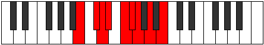 |
| [1501](https://ianring.com/musictheory/scales/1501) | [Stygyllic](ModeGNaturalStygyllic.md) | G | G, A, A#, B, C#, D, D#, F, G | 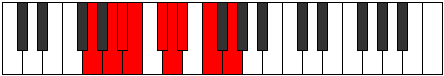 |
| [1503](https://ianring.com/musictheory/scales/1503) | [Padygic](ModeBNaturalPadygic.md) | B | B, C, C#, D, D#, F, F#, G, A, B |  |
| [1503](https://ianring.com/musictheory/scales/1503) | [Padygic](ModeCSharpPadygic.md) | C# | C#, D, D#, E, F, G, G#, A, B, C# |  |
| [1503](https://ianring.com/musictheory/scales/1503) | [Padygic](ModeDFlatPadygic.md) | Db | Db, D, Eb, E, F, G, Ab, A, B, Db |  |
| [1503](https://ianring.com/musictheory/scales/1503) | [Padygic](ModeGSharpPadygic.md) | G# | G#, A, A#, B, C, D, D#, E, F#, G# |  |
| [1503](https://ianring.com/musictheory/scales/1503) | [Padygic](ModeAFlatPadygic.md) | Ab | Ab, A, Bb, B, C, D, Eb, E, Gb, Ab |  |
| [1503](https://ianring.com/musictheory/scales/1503) | [Padygic](ModeGNaturalPadygic.md) | G | G, G#, A, A#, B, C#, D, D#, F, G |  |
| [1507](https://ianring.com/musictheory/scales/1507) | [Zynian](ModeCSharpZynian.md) | C# | C#, D, E##, F##, G#, A, B, C# |  |
| [1509](https://ianring.com/musictheory/scales/1509) | [Ragian](ModeANaturalRagian.md) | A | A, B, C##, D#, E, F, G, A | 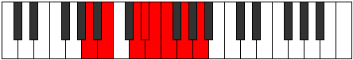 |
| [1511](https://ianring.com/musictheory/scales/1511) | [Styptyllic](ModeCSharpStyptyllic.md) | C# | C#, D, D#, F#, G, G#, A, B, C# |  |
| [1511](https://ianring.com/musictheory/scales/1511) | [Styptyllic](ModeDFlatStyptyllic.md) | Db | Db, D, Eb, Gb, G, Ab, A, B, Db |  |
| [1511](https://ianring.com/musictheory/scales/1511) | [Styptyllic](ModeENaturalStyptyllic.md) | E | E, F, F#, A, A#, B, C, D, E |  |
| [1511](https://ianring.com/musictheory/scales/1511) | [Styptyllic](ModeANaturalStyptyllic.md) | A | A, A#, B, D, D#, E, F, G, A |  |
| [1513](https://ianring.com/musictheory/scales/1513) | [Stathian](ModeGFlatStathian.md) | Gb | Gb, A, B, C, Db, Ebb, Fb, Gb |  |
| [1513](https://ianring.com/musictheory/scales/1513) | [Stathian](ModeBNaturalStathian.md) | B | B, C##, D##, E#, F#, G, A, B |  |
| [1515](https://ianring.com/musictheory/scales/1515) | [Solyllic](ModeFSharpSolyllic.md) | F# | F#, G, A, B, C, C#, D, E, F# |  |
| [1515](https://ianring.com/musictheory/scales/1515) | [Solyllic](ModeGFlatSolyllic.md) | Gb | Gb, G, A, B, C, Db, D, E, Gb |  |
| [1515](https://ianring.com/musictheory/scales/1515) | [Solyllic](ModeBNaturalSolyllic.md) | B | B, C, D, E, F, F#, G, A, B |  |
| [1515](https://ianring.com/musictheory/scales/1515) | [Solyllic](ModeGSharpSolyllic.md) | G# | G#, A, B, C#, D, D#, E, F#, G# |  |
| [1515](https://ianring.com/musictheory/scales/1515) | [Solyllic](ModeAFlatSolyllic.md) | Ab | Ab, A, B, Db, D, Eb, E, Gb, Ab |  |
| [1515](https://ianring.com/musictheory/scales/1515) | [Solyllic](ModeCSharpSolyllic.md) | C# | C#, D, E, F#, G, G#, A, B, C# |  |
| [1515](https://ianring.com/musictheory/scales/1515) | [Solyllic](ModeDFlatSolyllic.md) | Db | Db, D, E, Gb, G, Ab, A, B, Db |  |
| [1515](https://ianring.com/musictheory/scales/1515) | [Solyllic](ModeENaturalSolyllic.md) | E | E, F, G, A, A#, B, C, D, E |  |
| [1517](https://ianring.com/musictheory/scales/1517) | [Sagyllic](ModeANaturalSagyllic.md) | A | A, B, C, D, D#, E, F, G, A |  |
| [1517](https://ianring.com/musictheory/scales/1517) | [Sagyllic](ModeBNaturalSagyllic.md) | B | B, C#, D, E, F, F#, G, A, B |  |
| [1517](https://ianring.com/musictheory/scales/1517) | [Sagyllic](ModeFSharpSagyllic.md) | F# | F#, G#, A, B, C, C#, D, E, F# |  |
| [1517](https://ianring.com/musictheory/scales/1517) | [Sagyllic](ModeGFlatSagyllic.md) | Gb | Gb, Ab, A, B, C, Db, D, E, Gb |  |
| [1517](https://ianring.com/musictheory/scales/1517) | [Sagyllic](ModeENaturalSagyllic.md) | E | E, F#, G, A, A#, B, C, D, E |  |
| [1519](https://ianring.com/musictheory/scales/1519) | [Solygic](ModeBNaturalSolygic.md) | B | B, C, C#, D, E, F, F#, G, A, B |  |
| [1519](https://ianring.com/musictheory/scales/1519) | [Solygic](ModeFSharpSolygic.md) | F# | F#, G, G#, A, B, C, C#, D, E, F# |  |
| [1519](https://ianring.com/musictheory/scales/1519) | [Solygic](ModeGFlatSolygic.md) | Gb | Gb, G, Ab, A, B, C, Db, D, E, Gb |  |
| [1519](https://ianring.com/musictheory/scales/1519) | [Solygic](ModeCSharpSolygic.md) | C# | C#, D, D#, E, F#, G, G#, A, B, C# |  |
| [1519](https://ianring.com/musictheory/scales/1519) | [Solygic](ModeDFlatSolygic.md) | Db | Db, D, Eb, E, Gb, G, Ab, A, B, Db |  |
| [1519](https://ianring.com/musictheory/scales/1519) | [Solygic](ModeANaturalSolygic.md) | A | A, A#, B, C, D, D#, E, F, G, A |  |
| [1519](https://ianring.com/musictheory/scales/1519) | [Solygic](ModeENaturalSolygic.md) | E | E, F, F#, G, A, A#, B, C, D, E |  |
| [1519](https://ianring.com/musictheory/scales/1519) | [Solygic](ModeGSharpSolygic.md) | G# | G#, A, A#, B, C#, D, D#, E, F#, G# |  |
| [1519](https://ianring.com/musictheory/scales/1519) | [Solygic](ModeAFlatSolygic.md) | Ab | Ab, A, Bb, B, Db, D, Eb, E, Gb, Ab |  |
| [1523](https://ianring.com/musictheory/scales/1523) | [Zothyllic](ModeCSharpZothyllic.md) | C# | C#, D, F, F#, G, G#, A, B, C# |  |
| [1523](https://ianring.com/musictheory/scales/1523) | [Zothyllic](ModeDFlatZothyllic.md) | Db | Db, D, F, Gb, G, Ab, A, B, Db |  |
| [1523](https://ianring.com/musictheory/scales/1523) | [Zothyllic](ModeENaturalZothyllic.md) | E | E, F, G#, A, A#, B, C, D, E |  |
| [1525](https://ianring.com/musictheory/scales/1525) | [Sodyllic](ModeGNaturalSodyllic.md) | G | G, A, B, C, C#, D, D#, F, G |  |
| [1525](https://ianring.com/musictheory/scales/1525) | [Sodyllic](ModeANaturalSodyllic.md) | A | A, B, C#, D, D#, E, F, G, A |  |
| [1525](https://ianring.com/musictheory/scales/1525) | [Sodyllic](ModeENaturalSodyllic.md) | E | E, F#, G#, A, A#, B, C, D, E |  |
| [1527](https://ianring.com/musictheory/scales/1527) | [Aeolyrygic](ModeGNaturalAeolyrygic.md) | G | G, G#, A, B, C, C#, D, D#, F, G |  |
| [1527](https://ianring.com/musictheory/scales/1527) | [Aeolyrygic](ModeCSharpAeolyrygic.md) | C# | C#, D, D#, F, F#, G, G#, A, B, C# |  |
| [1527](https://ianring.com/musictheory/scales/1527) | [Aeolyrygic](ModeDFlatAeolyrygic.md) | Db | Db, D, Eb, F, Gb, G, Ab, A, B, Db |  |
| [1527](https://ianring.com/musictheory/scales/1527) | [Aeolyrygic](ModeANaturalAeolyrygic.md) | A | A, A#, B, C#, D, D#, E, F, G, A |  |
| [1527](https://ianring.com/musictheory/scales/1527) | [Aeolyrygic](ModeENaturalAeolyrygic.md) | E | E, F, F#, G#, A, A#, B, C, D, E |  |
| [1529](https://ianring.com/musictheory/scales/1529) | [Kataryllic](ModeBNaturalKataryllic.md) | B | B, D, D#, E, F, F#, G, A, B |  |
| [1529](https://ianring.com/musictheory/scales/1529) | [Kataryllic](ModeFSharpKataryllic.md) | F# | F#, A, A#, B, C, C#, D, E, F# | 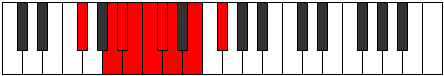 |
| [1529](https://ianring.com/musictheory/scales/1529) | [Kataryllic](ModeGFlatKataryllic.md) | Gb | Gb, A, Bb, B, C, Db, D, E, Gb |  |
| [1529](https://ianring.com/musictheory/scales/1529) | [Kataryllic](ModeENaturalKataryllic.md) | E | E, G, G#, A, A#, B, C, D, E |  |
| [1531](https://ianring.com/musictheory/scales/1531) | [Styptygic](ModeBNaturalStyptygic.md) | B | B, C, D, D#, E, F, F#, G, A, B |  |
| [1531](https://ianring.com/musictheory/scales/1531) | [Styptygic](ModeGSharpStyptygic.md) | G# | G#, A, B, C, C#, D, D#, E, F#, G# |  |
| [1531](https://ianring.com/musictheory/scales/1531) | [Styptygic](ModeAFlatStyptygic.md) | Ab | Ab, A, B, C, Db, D, Eb, E, Gb, Ab |  |
| [1531](https://ianring.com/musictheory/scales/1531) | [Styptygic](ModeCSharpStyptygic.md) | C# | C#, D, E, F, F#, G, G#, A, B, C# |  |
| [1531](https://ianring.com/musictheory/scales/1531) | [Styptygic](ModeDFlatStyptygic.md) | Db | Db, D, E, F, Gb, G, Ab, A, B, Db |  |
| [1531](https://ianring.com/musictheory/scales/1531) | [Styptygic](ModeFSharpStyptygic.md) | F# | F#, G, A, A#, B, C, C#, D, E, F# |  |
| [1531](https://ianring.com/musictheory/scales/1531) | [Styptygic](ModeGFlatStyptygic.md) | Gb | Gb, G, A, Bb, B, C, Db, D, E, Gb |  |
| [1531](https://ianring.com/musictheory/scales/1531) | [Styptygic](ModeENaturalStyptygic.md) | E | E, F, G, G#, A, A#, B, C, D, E |  |
| [1533](https://ianring.com/musictheory/scales/1533) | [Katycrygic](ModeANaturalKatycrygic.md) | A | A, B, C, C#, D, D#, E, F, G, A |  |
| [1533](https://ianring.com/musictheory/scales/1533) | [Katycrygic](ModeBNaturalKatycrygic.md) | B | B, C#, D, D#, E, F, F#, G, A, B |  |
| [1533](https://ianring.com/musictheory/scales/1533) | [Katycrygic](ModeGNaturalKatycrygic.md) | G | G, A, A#, B, C, C#, D, D#, F, G |  |
| [1533](https://ianring.com/musictheory/scales/1533) | [Katycrygic](ModeFSharpKatycrygic.md) | F# | F#, G#, A, A#, B, C, C#, D, E, F# |  |
| [1533](https://ianring.com/musictheory/scales/1533) | [Katycrygic](ModeGFlatKatycrygic.md) | Gb | Gb, Ab, A, Bb, B, C, Db, D, E, Gb |  |
| [1533](https://ianring.com/musictheory/scales/1533) | [Katycrygic](ModeENaturalKatycrygic.md) | E | E, F#, G, G#, A, A#, B, C, D, E |  |
| [1535](https://ianring.com/musictheory/scales/1535) | [Mixodyllian](ModeBNaturalMixodyllian.md) | B | B, C, C#, D, D#, E, F, F#, G, A, B |  |
| [1535](https://ianring.com/musictheory/scales/1535) | [Mixodyllian](ModeCSharpMixodyllian.md) | C# | C#, D, D#, E, F, F#, G, G#, A, B, C# |  |
| [1535](https://ianring.com/musictheory/scales/1535) | [Mixodyllian](ModeDFlatMixodyllian.md) | Db | Db, D, Eb, E, F, Gb, G, Ab, A, B, Db |  |
| [1535](https://ianring.com/musictheory/scales/1535) | [Mixodyllian](ModeANaturalMixodyllian.md) | A | A, A#, B, C, C#, D, D#, E, F, G, A |  |
| [1535](https://ianring.com/musictheory/scales/1535) | [Mixodyllian](ModeGSharpMixodyllian.md) | G# | G#, A, A#, B, C, C#, D, D#, E, F#, G# |  |
| [1535](https://ianring.com/musictheory/scales/1535) | [Mixodyllian](ModeAFlatMixodyllian.md) | Ab | Ab, A, Bb, B, C, Db, D, Eb, E, Gb, Ab |  |
| [1535](https://ianring.com/musictheory/scales/1535) | [Mixodyllian](ModeGNaturalMixodyllian.md) | G | G, G#, A, A#, B, C, C#, D, D#, F, G |  |
| [1535](https://ianring.com/musictheory/scales/1535) | [Mixodyllian](ModeFSharpMixodyllian.md) | F# | F#, G, G#, A, A#, B, C, C#, D, E, F# |  |
| [1535](https://ianring.com/musictheory/scales/1535) | [Mixodyllian](ModeGFlatMixodyllian.md) | Gb | Gb, G, Ab, A, Bb, B, C, Db, D, E, Gb |  |
| [1535](https://ianring.com/musictheory/scales/1535) | [Mixodyllian](ModeENaturalMixodyllian.md) | E | E, F, F#, G, G#, A, A#, B, C, D, E |  |
| [1573](https://ianring.com/musictheory/scales/1573) | [Saritonic](ModeANaturalSaritonic.md) | A | A, B, D, F#, G, A |  |
| [1575](https://ianring.com/musictheory/scales/1575) | [Zycrimic](ModeANaturalZycrimic.md) | A | A, Bb, Cb, D, E##, F##, A |  |
| [1577](https://ianring.com/musictheory/scales/1577) | [Lonitonic](ModeBNaturalLonitonic.md) | B | B, D, E, G#, A, B | 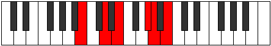 |
| [1581](https://ianring.com/musictheory/scales/1581) | [Gyrimic](ModeANaturalGyrimic.md) | A | A, B, C, D, E##, F##, A |  |
| [1583](https://ianring.com/musictheory/scales/1583) | [Salian](ModeBNaturalSalian.md) | B | B, C, Db, Ebb, Fb, G#, A, B |  |
| [1583](https://ianring.com/musictheory/scales/1583) | [Salian](ModeANaturalSalian.md) | A | A, Bb, Cb, Dbb, Ebb, F#, G, A |  |
| [1589](https://ianring.com/musictheory/scales/1589) | [Ionagimic](ModeANaturalIonagimic.md) | A | A, B, C#, D, E##, F##, A |  |
| [1591](https://ianring.com/musictheory/scales/1591) | [Rodian](ModeANaturalRodian.md) | A | A, Bb, Cb, Db, Ebb, F#, G, A |  |
| [1595](https://ianring.com/musictheory/scales/1595) | [Dacrian](ModeBNaturalDacrian.md) | B | B, C, D, Eb, Fb, G#, A, B | 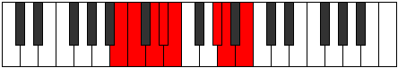 |
| [1597](https://ianring.com/musictheory/scales/1597) | [Aeolodian](ModeANaturalAeolodian.md) | A | A, B, C, Db, Ebb, F#, G, A |  |
| [1597](https://ianring.com/musictheory/scales/1597) | [Aeolodian](ModeBNaturalAeolodian.md) | B | B, C#, D, Eb, Fb, G#, A, B |  |
| [1599](https://ianring.com/musictheory/scales/1599) | [Pocryllic](ModeBNaturalPocryllic.md) | B | B, C, C#, D, D#, E, G#, A, B |  |
| [1599](https://ianring.com/musictheory/scales/1599) | [Pocryllic](ModeANaturalPocryllic.md) | A | A, A#, B, C, C#, D, F#, G, A |  |
| [1609](https://ianring.com/musictheory/scales/1609) | [Thyritonic](ModeBNaturalThyritonic.md) | B | B, D, F, G#, A, B | 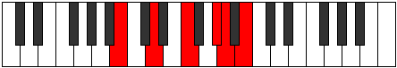 |
| [1611](https://ianring.com/musictheory/scales/1611) | [Dacrimic](ModeGSharpDacrimic.md) | G# | G#, A, B, C##, D###, E##, G# |  |
| [1615](https://ianring.com/musictheory/scales/1615) | [Sydian](ModeBNaturalSydian.md) | B | B, C, Db, Ebb, F, G#, A, B |  |
| [1615](https://ianring.com/musictheory/scales/1615) | [Sydian](ModeGSharpSydian.md) | G# | G#, A, Bb, Cb, D, E#, F#, G# |  |
| [1617](https://ianring.com/musictheory/scales/1617) | [Phronitonic](ModeFNaturalPhronitonic.md) | F | F, A, B, D, D#, F | 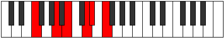 |
| [1619](https://ianring.com/musictheory/scales/1619) | [Monimic](ModeFNaturalMonimic.md) | F | F, Gb, A, B, C##, D#, F |  |
| [1621](https://ianring.com/musictheory/scales/1621) | [Aeolathimic](ModeFNaturalAeolathimic.md) | F | F, G, A, B, C##, D#, F |  |
| [1625](https://ianring.com/musictheory/scales/1625) | [Lythimic](ModeFNaturalLythimic.md) | F | F, G#, A, B, C##, D#, F |  |
| [1627](https://ianring.com/musictheory/scales/1627) | [Zyptian](ModeBNaturalZyptian.md) | B | B, C, D, Eb, F, G#, A, B |  |
| [1627](https://ianring.com/musictheory/scales/1627) | [Zyptian](ModeGSharpZyptian.md) | G# | G#, A, B, C, D, E#, F#, G# |  |
| [1629](https://ianring.com/musictheory/scales/1629) | [Synian](ModeBNaturalSynian.md) | B | B, C#, D, Eb, F, G#, A, B |  |
| [1631](https://ianring.com/musictheory/scales/1631) | [Rynyllic](ModeBNaturalRynyllic.md) | B | B, C, C#, D, D#, F, G#, A, B |  |
| [1631](https://ianring.com/musictheory/scales/1631) | [Rynyllic](ModeFNaturalRynyllic.md) | F | F, F#, G, G#, A, B, D, D#, F |  |
| [1631](https://ianring.com/musictheory/scales/1631) | [Rynyllic](ModeGSharpRynyllic.md) | G# | G#, A, A#, B, C, D, F, F#, G# |  |
| [1631](https://ianring.com/musictheory/scales/1631) | [Rynyllic](ModeAFlatRynyllic.md) | Ab | Ab, A, Bb, B, C, D, F, Gb, Ab |  |
| [1637](https://ianring.com/musictheory/scales/1637) | [Syptimic](ModeANaturalSyptimic.md) | A | A, B, C##, D#, E##, F##, A |  |
| [1639](https://ianring.com/musictheory/scales/1639) | [Aeolothian](ModeANaturalAeolothian.md) | A | A, Bb, Cb, D, Eb, F#, G, A | 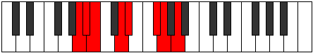 |
| [1643](https://ianring.com/musictheory/scales/1643) | [Thyptian](ModeBNaturalThyptian.md) | B | B, C, D, E, F, G#, A, B |  |
| [1643](https://ianring.com/musictheory/scales/1643) | [Thyptian](ModeGSharpThyptian.md) | G# | G#, A, B, C#, D, E#, F#, G# |  |
| [1645](https://ianring.com/musictheory/scales/1645) | [Katagian](ModeANaturalKatagian.md) | A | A, B, C, D, Eb, F#, G, A |  |
| [1645](https://ianring.com/musictheory/scales/1645) | [Katagian](ModeBNaturalKatagian.md) | B | B, C#, D, E, F, G#, A, B |  |
| [1647](https://ianring.com/musictheory/scales/1647) | [Polyllic](ModeBNaturalPolyllic.md) | B | B, C, C#, D, E, F, G#, A, B |  |
| [1647](https://ianring.com/musictheory/scales/1647) | [Polyllic](ModeANaturalPolyllic.md) | A | A, A#, B, C, D, D#, F#, G, A |  |
| [1647](https://ianring.com/musictheory/scales/1647) | [Polyllic](ModeGSharpPolyllic.md) | G# | G#, A, A#, B, C#, D, F, F#, G# |  |
| [1647](https://ianring.com/musictheory/scales/1647) | [Polyllic](ModeAFlatPolyllic.md) | Ab | Ab, A, Bb, B, Db, D, F, Gb, Ab |  |
| [1651](https://ianring.com/musictheory/scales/1651) | [Mogian](ModeFNaturalMogian.md) | F | F, Gb, A, Bb, Cb, D, Eb, F |  |
| [1653](https://ianring.com/musictheory/scales/1653) | [Gylian](ModeANaturalGylian.md) | A | A, B, C#, D, Eb, F#, G, A |  |
| [1653](https://ianring.com/musictheory/scales/1653) | [Gylian](ModeFNaturalGylian.md) | F | F, G, A, Bb, Cb, D, Eb, F |  |
| [1655](https://ianring.com/musictheory/scales/1655) | [Katygyllic](ModeANaturalKatygyllic.md) | A | A, A#, B, C#, D, D#, F#, G, A |  |
| [1655](https://ianring.com/musictheory/scales/1655) | [Katygyllic](ModeFNaturalKatygyllic.md) | F | F, F#, G, A, A#, B, D, D#, F |  |
| [1657](https://ianring.com/musictheory/scales/1657) | [Ionothian](ModeBNaturalIonothian.md) | B | B, C##, D#, E, F, G#, A, B |  |
| [1657](https://ianring.com/musictheory/scales/1657) | [Ionothian](ModeFNaturalIonothian.md) | F | F, G#, A, Bb, Cb, D, Eb, F |  |
| [1659](https://ianring.com/musictheory/scales/1659) | [Magyllic](ModeBNaturalMagyllic.md) | B | B, C, D, D#, E, F, G#, A, B |  |
| [1659](https://ianring.com/musictheory/scales/1659) | [Magyllic](ModeGSharpMagyllic.md) | G# | G#, A, B, C, C#, D, F, F#, G# |  |
| [1659](https://ianring.com/musictheory/scales/1659) | [Magyllic](ModeAFlatMagyllic.md) | Ab | Ab, A, B, C, Db, D, F, Gb, Ab |  |
| [1659](https://ianring.com/musictheory/scales/1659) | [Magyllic](ModeFNaturalMagyllic.md) | F | F, F#, G#, A, A#, B, D, D#, F |  |
| [1661](https://ianring.com/musictheory/scales/1661) | [Gonyllic](ModeANaturalGonyllic.md) | A | A, B, C, C#, D, D#, F#, G, A |  |
| [1661](https://ianring.com/musictheory/scales/1661) | [Gonyllic](ModeBNaturalGonyllic.md) | B | B, C#, D, D#, E, F, G#, A, B |  |
| [1661](https://ianring.com/musictheory/scales/1661) | [Gonyllic](ModeFNaturalGonyllic.md) | F | F, G, G#, A, A#, B, D, D#, F |  |
| [1663](https://ianring.com/musictheory/scales/1663) | [Lydygic](ModeBNaturalLydygic.md) | B | B, C, C#, D, D#, E, F, G#, A, B |  |
| [1663](https://ianring.com/musictheory/scales/1663) | [Lydygic](ModeANaturalLydygic.md) | A | A, A#, B, C, C#, D, D#, F#, G, A |  |
| [1663](https://ianring.com/musictheory/scales/1663) | [Lydygic](ModeGSharpLydygic.md) | G# | G#, A, A#, B, C, C#, D, F, F#, G# |  |
| [1663](https://ianring.com/musictheory/scales/1663) | [Lydygic](ModeAFlatLydygic.md) | Ab | Ab, A, Bb, B, C, Db, D, F, Gb, Ab |  |
| [1663](https://ianring.com/musictheory/scales/1663) | [Lydygic](ModeFNaturalLydygic.md) | F | F, F#, G, G#, A, A#, B, D, D#, F |  |
| [1673](https://ianring.com/musictheory/scales/1673) | [Thocritonic](ModeDNaturalThocritonic.md) | D | D, F, A, B, C, D | 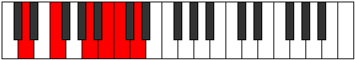 |
| [1673](https://ianring.com/musictheory/scales/1673) | [Thocritonic](ModeBNaturalThocritonic.md) | B | B, D, F#, G#, A, B |  |
| [1679](https://ianring.com/musictheory/scales/1679) | [Kydian](ModeDNaturalKydian.md) | D | D, Eb, Fb, Gbb, A, B, C, D |  |
| [1679](https://ianring.com/musictheory/scales/1679) | [Kydian](ModeBNaturalKydian.md) | B | B, C, Db, Ebb, F#, G#, A, B |  |
| [1681](https://ianring.com/musictheory/scales/1681) | [Ionaditonic](ModeDNaturalIonaditonic.md) | D | D, F#, A, B, C, D | 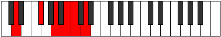 |
| [1685](https://ianring.com/musictheory/scales/1685) | [Zeracrimic](ModeGNaturalZeracrimic.md) | G | G, A, B, C##, D##, E#, G |  |
| [1687](https://ianring.com/musictheory/scales/1687) | [Phralian](ModeDNaturalPhralian.md) | D | D, Eb, Fb, Gb, A, B, C, D |  |
| [1691](https://ianring.com/musictheory/scales/1691) | [Kathian](ModeDNaturalKathian.md) | D | D, Eb, F, Gb, A, B, C, D |  |
| [1691](https://ianring.com/musictheory/scales/1691) | [Kathian](ModeBNaturalKathian.md) | B | B, C, D, Eb, F#, G#, A, B |  |
| [1693](https://ianring.com/musictheory/scales/1693) | [Dogian](ModeDNaturalDogian.md) | D | D, E, F, Gb, A, B, C, D |  |
| [1693](https://ianring.com/musictheory/scales/1693) | [Dogian](ModeBNaturalDogian.md) | B | B, C#, D, Eb, F#, G#, A, B |  |
| [1693](https://ianring.com/musictheory/scales/1693) | [Dogian](ModeGNaturalDogian.md) | G | G, A, Bb, Cb, D, E, F, G |  |
| [1695](https://ianring.com/musictheory/scales/1695) | [Phrodyllic](ModeDNaturalPhrodyllic.md) | D | D, D#, E, F, F#, A, B, C, D |  |
| [1695](https://ianring.com/musictheory/scales/1695) | [Phrodyllic](ModeBNaturalPhrodyllic.md) | B | B, C, C#, D, D#, F#, G#, A, B |  |
| [1695](https://ianring.com/musictheory/scales/1695) | [Phrodyllic](ModeGNaturalPhrodyllic.md) | G | G, G#, A, A#, B, D, E, F, G |  |
| [1701](https://ianring.com/musictheory/scales/1701) | [Lothimic](ModeANaturalLothimic.md) | A | A, B, C##, D##, E##, F##, A |  |
| [1703](https://ianring.com/musictheory/scales/1703) | [Zaptian](ModeENaturalZaptian.md) | E | E, F, Gb, A, B, C#, D, E |  |
| [1703](https://ianring.com/musictheory/scales/1703) | [Zaptian](ModeDNaturalZaptian.md) | D | D, Eb, Fb, G, A, B, C, D |  |
| [1703](https://ianring.com/musictheory/scales/1703) | [Zaptian](ModeANaturalZaptian.md) | A | A, Bb, Cb, D, E, F#, G, A |  |
| [1707](https://ianring.com/musictheory/scales/1707) | [Mixolythian](ModeDNaturalMixolythian.md) | D | D, Eb, F, G, A, B, C, D |  |
| [1707](https://ianring.com/musictheory/scales/1707) | [Mixolythian](ModeENaturalMixolythian.md) | E | E, F, G, A, B, C#, D, E |  |
| [1707](https://ianring.com/musictheory/scales/1707) | [Mixolythian](ModeBNaturalMixolythian.md) | B | B, C, D, E, F#, G#, A, B |  |
| [1709](https://ianring.com/musictheory/scales/1709) | [Dorian](ModeDNaturalDorian.md) | D | D, E, F, G, A, B, C, D |  |
| [1709](https://ianring.com/musictheory/scales/1709) | [Dorian](ModeANaturalDorian.md) | A | A, B, C, D, E, F#, G, A |  |
| [1709](https://ianring.com/musictheory/scales/1709) | [Dorian](ModeENaturalDorian.md) | E | E, F#, G, A, B, C#, D, E |  |
| [1709](https://ianring.com/musictheory/scales/1709) | [Dorian](ModeBNaturalDorian.md) | B | B, C#, D, E, F#, G#, A, B |  |
| [1711](https://ianring.com/musictheory/scales/1711) | [Ragyllic](ModeDNaturalRagyllic.md) | D | D, D#, E, F, G, A, B, C, D |  |
| [1711](https://ianring.com/musictheory/scales/1711) | [Ragyllic](ModeENaturalRagyllic.md) | E | E, F, F#, G, A, B, C#, D, E |  |
| [1711](https://ianring.com/musictheory/scales/1711) | [Ragyllic](ModeBNaturalRagyllic.md) | B | B, C, C#, D, E, F#, G#, A, B |  |
| [1711](https://ianring.com/musictheory/scales/1711) | [Ragyllic](ModeANaturalRagyllic.md) | A | A, A#, B, C, D, E, F#, G, A |  |
| [1715](https://ianring.com/musictheory/scales/1715) | [Aeronian](ModeDNaturalAeronian.md) | D | D, Eb, F#, G, A, B, C, D |  |
| [1715](https://ianring.com/musictheory/scales/1715) | [Aeronian](ModeENaturalAeronian.md) | E | E, F, G#, A, B, C#, D, E |  |
| [1717](https://ianring.com/musictheory/scales/1717) | [Mixolydian](ModeGNaturalMixolydian.md) | G | G, A, B, C, D, E, F, G |  |
| [1717](https://ianring.com/musictheory/scales/1717) | [Mixolydian](ModeDNaturalMixolydian.md) | D | D, E, F#, G, A, B, C, D |  |
| [1717](https://ianring.com/musictheory/scales/1717) | [Mixolydian](ModeANaturalMixolydian.md) | A | A, B, C#, D, E, F#, G, A |  |
| [1717](https://ianring.com/musictheory/scales/1717) | [Mixolydian](ModeENaturalMixolydian.md) | E | E, F#, G#, A, B, C#, D, E |  |
| [1719](https://ianring.com/musictheory/scales/1719) | [Lyryllic](ModeDNaturalLyryllic.md) | D | D, D#, E, F#, G, A, B, C, D |  |
| [1719](https://ianring.com/musictheory/scales/1719) | [Lyryllic](ModeENaturalLyryllic.md) | E | E, F, F#, G#, A, B, C#, D, E |  |
| [1719](https://ianring.com/musictheory/scales/1719) | [Lyryllic](ModeGNaturalLyryllic.md) | G | G, G#, A, B, C, D, E, F, G |  |
| [1719](https://ianring.com/musictheory/scales/1719) | [Lyryllic](ModeANaturalLyryllic.md) | A | A, A#, B, C#, D, E, F#, G, A |  |
| [1721](https://ianring.com/musictheory/scales/1721) | [Ionycrian](ModeDNaturalIonycrian.md) | D | D, E#, F#, G, A, B, C, D |  |
| [1721](https://ianring.com/musictheory/scales/1721) | [Ionycrian](ModeBNaturalIonycrian.md) | B | B, C##, D#, E, F#, G#, A, B |  |
| [1721](https://ianring.com/musictheory/scales/1721) | [Ionycrian](ModeENaturalIonycrian.md) | E | E, F##, G#, A, B, C#, D, E |  |
| [1723](https://ianring.com/musictheory/scales/1723) | [Poryllic](ModeDNaturalPoryllic.md) | D | D, D#, F, F#, G, A, B, C, D |  |
| [1723](https://ianring.com/musictheory/scales/1723) | [Poryllic](ModeBNaturalPoryllic.md) | B | B, C, D, D#, E, F#, G#, A, B |  |
| [1723](https://ianring.com/musictheory/scales/1723) | [Poryllic](ModeENaturalPoryllic.md) | E | E, F, G, G#, A, B, C#, D, E |  |
| [1725](https://ianring.com/musictheory/scales/1725) | [Mixodyllic](ModeANaturalMixodyllic.md) | A | A, B, C, C#, D, E, F#, G, A |  |
| [1725](https://ianring.com/musictheory/scales/1725) | [Mixodyllic](ModeDNaturalMixodyllic.md) | D | D, E, F, F#, G, A, B, C, D |  |
| [1725](https://ianring.com/musictheory/scales/1725) | [Mixodyllic](ModeBNaturalMixodyllic.md) | B | B, C#, D, D#, E, F#, G#, A, B |  |
| [1725](https://ianring.com/musictheory/scales/1725) | [Mixodyllic](ModeENaturalMixodyllic.md) | E | E, F#, G, G#, A, B, C#, D, E |  |
| [1725](https://ianring.com/musictheory/scales/1725) | [Mixodyllic](ModeGNaturalMixodyllic.md) | G | G, A, A#, B, C, D, E, F, G |  |
| [1727](https://ianring.com/musictheory/scales/1727) | [Sydygic](ModeDNaturalSydygic.md) | D | D, D#, E, F, F#, G, A, B, C, D |  |
| [1727](https://ianring.com/musictheory/scales/1727) | [Sydygic](ModeBNaturalSydygic.md) | B | B, C, C#, D, D#, E, F#, G#, A, B |  |
| [1727](https://ianring.com/musictheory/scales/1727) | [Sydygic](ModeENaturalSydygic.md) | E | E, F, F#, G, G#, A, B, C#, D, E |  |
| [1727](https://ianring.com/musictheory/scales/1727) | [Sydygic](ModeANaturalSydygic.md) | A | A, A#, B, C, C#, D, E, F#, G, A |  |
| [1727](https://ianring.com/musictheory/scales/1727) | [Sydygic](ModeGNaturalSydygic.md) | G | G, G#, A, A#, B, C, D, E, F, G |  |
| [1735](https://ianring.com/musictheory/scales/1735) | [Dagian](ModeDNaturalDagian.md) | D | D, Eb, Fb, G#, A, B, C, D |  |
| [1739](https://ianring.com/musictheory/scales/1739) | [Phrylian](ModeDNaturalPhrylian.md) | D | D, Eb, F, G#, A, B, C, D |  |
| [1739](https://ianring.com/musictheory/scales/1739) | [Phrylian](ModeBNaturalPhrylian.md) | B | B, C, D, E#, F#, G#, A, B |  |
| [1739](https://ianring.com/musictheory/scales/1739) | [Phrylian](ModeGSharpPhrylian.md) | G# | G#, A, B, C##, D#, E#, F#, G# |  |
| [1741](https://ianring.com/musictheory/scales/1741) | [Katycrian](ModeDNaturalKatycrian.md) | D | D, E, F, G#, A, B, C, D |  |
| [1741](https://ianring.com/musictheory/scales/1741) | [Katycrian](ModeBNaturalKatycrian.md) | B | B, C#, D, E#, F#, G#, A, B |  |
| [1743](https://ianring.com/musictheory/scales/1743) | [Epigyllic](ModeDNaturalEpigyllic.md) | D | D, D#, E, F, G#, A, B, C, D |  |
| [1743](https://ianring.com/musictheory/scales/1743) | [Epigyllic](ModeBNaturalEpigyllic.md) | B | B, C, C#, D, F, F#, G#, A, B | 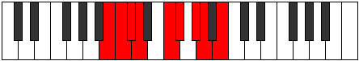 |
| [1743](https://ianring.com/musictheory/scales/1743) | [Epigyllic](ModeGSharpEpigyllic.md) | G# | G#, A, A#, B, D, D#, F, F#, G# |  |
| [1743](https://ianring.com/musictheory/scales/1743) | [Epigyllic](ModeAFlatEpigyllic.md) | Ab | Ab, A, Bb, B, D, Eb, F, Gb, Ab |  |
| [1747](https://ianring.com/musictheory/scales/1747) | [Epalian](ModeFNaturalEpalian.md) | F | F, Gb, A, B, C, D, Eb, F |  |
| [1747](https://ianring.com/musictheory/scales/1747) | [Epalian](ModeDNaturalEpalian.md) | D | D, Eb, F#, G#, A, B, C, D |  |
| [1749](https://ianring.com/musictheory/scales/1749) | [Lythian](ModeFNaturalLythian.md) | F | F, G, A, B, C, D, Eb, F |  |
| [1749](https://ianring.com/musictheory/scales/1749) | [Lythian](ModeGNaturalLythian.md) | G | G, A, B, C#, D, E, F, G |  |
| [1749](https://ianring.com/musictheory/scales/1749) | [Lythian](ModeDNaturalLythian.md) | D | D, E, F#, G#, A, B, C, D |  |
| [1751](https://ianring.com/musictheory/scales/1751) | [Aeolyryllic](ModeFNaturalAeolyryllic.md) | F | F, F#, G, A, B, C, D, D#, F |  |
| [1751](https://ianring.com/musictheory/scales/1751) | [Aeolyryllic](ModeDNaturalAeolyryllic.md) | D | D, D#, E, F#, G#, A, B, C, D |  |
| [1751](https://ianring.com/musictheory/scales/1751) | [Aeolyryllic](ModeGNaturalAeolyryllic.md) | G | G, G#, A, B, C#, D, E, F, G |  |
| [1753](https://ianring.com/musictheory/scales/1753) | [Mycrian](ModeFNaturalMycrian.md) | F | F, G#, A, B, C, D, Eb, F |  |
| [1753](https://ianring.com/musictheory/scales/1753) | [Mycrian](ModeDNaturalMycrian.md) | D | D, E#, F#, G#, A, B, C, D |  |
| [1753](https://ianring.com/musictheory/scales/1753) | [Mycrian](ModeBNaturalMycrian.md) | B | B, C##, D#, E#, F#, G#, A, B |  |
| [1755](https://ianring.com/musictheory/scales/1755) | [MinorDiminished](ModeDNaturalMinorDiminished.md) | D | D, D#, F, F#, G#, A, B, C, D |  |
| [1755](https://ianring.com/musictheory/scales/1755) | [MinorDiminished](ModeFNaturalMinorDiminished.md) | F | F, F#, G#, A, B, C, D, D#, F |  |
| [1755](https://ianring.com/musictheory/scales/1755) | [MinorDiminished](ModeGSharpMinorDiminished.md) | G# | G#, A, B, C, D, D#, F, F#, G# |  |
| [1755](https://ianring.com/musictheory/scales/1755) | [MinorDiminished](ModeAFlatMinorDiminished.md) | Ab | Ab, A, B, C, D, Eb, F, Gb, Ab | 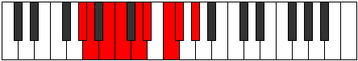 |
| [1755](https://ianring.com/musictheory/scales/1755) | [MinorDiminished](ModeBNaturalMinorDiminished.md) | B | B, C, D, D#, F, F#, G#, A, B |  |
| [1757](https://ianring.com/musictheory/scales/1757) | [Ionyphyllic](ModeBNaturalIonyphyllic.md) | B | B, C#, D, D#, F, F#, G#, A, B |  |
| [1757](https://ianring.com/musictheory/scales/1757) | [Ionyphyllic](ModeDNaturalIonyphyllic.md) | D | D, E, F, F#, G#, A, B, C, D |  |
| [1757](https://ianring.com/musictheory/scales/1757) | [Ionyphyllic](ModeFNaturalIonyphyllic.md) | F | F, G, G#, A, B, C, D, D#, F |  |
| [1757](https://ianring.com/musictheory/scales/1757) | [Ionyphyllic](ModeGNaturalIonyphyllic.md) | G | G, A, A#, B, C#, D, E, F, G |  |
| [1759](https://ianring.com/musictheory/scales/1759) | [Pylygic](ModeBNaturalPylygic.md) | B | B, C, C#, D, D#, F, F#, G#, A, B |  |
| [1759](https://ianring.com/musictheory/scales/1759) | [Pylygic](ModeDNaturalPylygic.md) | D | D, D#, E, F, F#, G#, A, B, C, D |  |
| [1759](https://ianring.com/musictheory/scales/1759) | [Pylygic](ModeFNaturalPylygic.md) | F | F, F#, G, G#, A, B, C, D, D#, F |  |
| [1759](https://ianring.com/musictheory/scales/1759) | [Pylygic](ModeGSharpPylygic.md) | G# | G#, A, A#, B, C, D, D#, F, F#, G# |  |
| [1759](https://ianring.com/musictheory/scales/1759) | [Pylygic](ModeAFlatPylygic.md) | Ab | Ab, A, Bb, B, C, D, Eb, F, Gb, Ab |  |
| [1759](https://ianring.com/musictheory/scales/1759) | [Pylygic](ModeGNaturalPylygic.md) | G | G, G#, A, A#, B, C#, D, E, F, G |  |
| [1763](https://ianring.com/musictheory/scales/1763) | [Katalian](ModeDNaturalKatalian.md) | D | D, Eb, F##, G#, A, B, C, D |  |
| [1765](https://ianring.com/musictheory/scales/1765) | [Lonian](ModeANaturalLonian.md) | A | A, B, C##, D#, E, F#, G, A |  |
| [1765](https://ianring.com/musictheory/scales/1765) | [Lonian](ModeDNaturalLonian.md) | D | D, E, F##, G#, A, B, C, D |  |
| [1767](https://ianring.com/musictheory/scales/1767) | [Dyryllic](ModeDNaturalDyryllic.md) | D | D, D#, E, G, G#, A, B, C, D |  |
| [1767](https://ianring.com/musictheory/scales/1767) | [Dyryllic](ModeENaturalDyryllic.md) | E | E, F, F#, A, A#, B, C#, D, E |  |
| [1767](https://ianring.com/musictheory/scales/1767) | [Dyryllic](ModeANaturalDyryllic.md) | A | A, A#, B, D, D#, E, F#, G, A |  |
| [1769](https://ianring.com/musictheory/scales/1769) | [Rythian](ModeBNaturalRythian.md) | B | B, C##, D##, E#, F#, G#, A, B |  |
| [1769](https://ianring.com/musictheory/scales/1769) | [Rythian](ModeDNaturalRythian.md) | D | D, E#, F##, G#, A, B, C, D |  |
| [1771](https://ianring.com/musictheory/scales/1771) | [Stylyllic](ModeGSharpStylyllic.md) | G# | G#, A, B, C#, D, D#, F, F#, G# |  |
| [1771](https://ianring.com/musictheory/scales/1771) | [Stylyllic](ModeAFlatStylyllic.md) | Ab | Ab, A, B, Db, D, Eb, F, Gb, Ab |  |
| [1771](https://ianring.com/musictheory/scales/1771) | [Stylyllic](ModeBNaturalStylyllic.md) | B | B, C, D, E, F, F#, G#, A, B |  |
| [1771](https://ianring.com/musictheory/scales/1771) | [Stylyllic](ModeDNaturalStylyllic.md) | D | D, D#, F, G, G#, A, B, C, D |  |
| [1771](https://ianring.com/musictheory/scales/1771) | [Stylyllic](ModeENaturalStylyllic.md) | E | E, F, G, A, A#, B, C#, D, E |  |
| [1773](https://ianring.com/musictheory/scales/1773) | [Aeoloryllic](ModeANaturalAeoloryllic.md) | A | A, B, C, D, D#, E, F#, G, A | 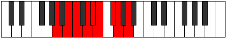 |
| [1773](https://ianring.com/musictheory/scales/1773) | [Aeoloryllic](ModeBNaturalAeoloryllic.md) | B | B, C#, D, E, F, F#, G#, A, B |  |
| [1773](https://ianring.com/musictheory/scales/1773) | [Aeoloryllic](ModeDNaturalAeoloryllic.md) | D | D, E, F, G, G#, A, B, C, D |  |
| [1773](https://ianring.com/musictheory/scales/1773) | [Aeoloryllic](ModeENaturalAeoloryllic.md) | E | E, F#, G, A, A#, B, C#, D, E |  |
| [1775](https://ianring.com/musictheory/scales/1775) | [Lyrygic](ModeBNaturalLyrygic.md) | B | B, C, C#, D, E, F, F#, G#, A, B |  |
| [1775](https://ianring.com/musictheory/scales/1775) | [Lyrygic](ModeDNaturalLyrygic.md) | D | D, D#, E, F, G, G#, A, B, C, D |  |
| [1775](https://ianring.com/musictheory/scales/1775) | [Lyrygic](ModeANaturalLyrygic.md) | A | A, A#, B, C, D, D#, E, F#, G, A |  |
| [1775](https://ianring.com/musictheory/scales/1775) | [Lyrygic](ModeENaturalLyrygic.md) | E | E, F, F#, G, A, A#, B, C#, D, E |  |
| [1775](https://ianring.com/musictheory/scales/1775) | [Lyrygic](ModeGSharpLyrygic.md) | G# | G#, A, A#, B, C#, D, D#, F, F#, G# |  |
| [1775](https://ianring.com/musictheory/scales/1775) | [Lyrygic](ModeAFlatLyrygic.md) | Ab | Ab, A, Bb, B, Db, D, Eb, F, Gb, Ab |  |
| [1777](https://ianring.com/musictheory/scales/1777) | [Saptian](ModeDNaturalSaptian.md) | D | D, E##, F##, G#, A, B, C, D |  |
| [1779](https://ianring.com/musictheory/scales/1779) | [Aerythyllic](ModeDNaturalAerythyllic.md) | D | D, D#, F#, G, G#, A, B, C, D |  |
| [1779](https://ianring.com/musictheory/scales/1779) | [Aerythyllic](ModeFNaturalAerythyllic.md) | F | F, F#, A, A#, B, C, D, D#, F |  |
| [1779](https://ianring.com/musictheory/scales/1779) | [Aerythyllic](ModeENaturalAerythyllic.md) | E | E, F, G#, A, A#, B, C#, D, E |  |
| [1781](https://ianring.com/musictheory/scales/1781) | [Gocryllic](ModeGNaturalGocryllic.md) | G | G, A, B, C, C#, D, E, F, G |  |
| [1781](https://ianring.com/musictheory/scales/1781) | [Gocryllic](ModeANaturalGocryllic.md) | A | A, B, C#, D, D#, E, F#, G, A |  |
| [1781](https://ianring.com/musictheory/scales/1781) | [Gocryllic](ModeDNaturalGocryllic.md) | D | D, E, F#, G, G#, A, B, C, D |  |
| [1781](https://ianring.com/musictheory/scales/1781) | [Gocryllic](ModeFNaturalGocryllic.md) | F | F, G, A, A#, B, C, D, D#, F |  |
| [1781](https://ianring.com/musictheory/scales/1781) | [Gocryllic](ModeENaturalGocryllic.md) | E | E, F#, G#, A, A#, B, C#, D, E |  |
| [1783](https://ianring.com/musictheory/scales/1783) | [Danygic](ModeGNaturalDanygic.md) | G | G, G#, A, B, C, C#, D, E, F, G |  |
| [1783](https://ianring.com/musictheory/scales/1783) | [Danygic](ModeDNaturalDanygic.md) | D | D, D#, E, F#, G, G#, A, B, C, D |  |
| [1783](https://ianring.com/musictheory/scales/1783) | [Danygic](ModeANaturalDanygic.md) | A | A, A#, B, C#, D, D#, E, F#, G, A |  |
| [1783](https://ianring.com/musictheory/scales/1783) | [Danygic](ModeFNaturalDanygic.md) | F | F, F#, G, A, A#, B, C, D, D#, F |  |
| [1783](https://ianring.com/musictheory/scales/1783) | [Danygic](ModeENaturalDanygic.md) | E | E, F, F#, G#, A, A#, B, C#, D, E |  |
| [1785](https://ianring.com/musictheory/scales/1785) | [Tharyllic](ModeBNaturalTharyllic.md) | B | B, D, D#, E, F, F#, G#, A, B |  |
| [1785](https://ianring.com/musictheory/scales/1785) | [Tharyllic](ModeDNaturalTharyllic.md) | D | D, F, F#, G, G#, A, B, C, D |  |
| [1785](https://ianring.com/musictheory/scales/1785) | [Tharyllic](ModeFNaturalTharyllic.md) | F | F, G#, A, A#, B, C, D, D#, F |  |
| [1785](https://ianring.com/musictheory/scales/1785) | [Tharyllic](ModeENaturalTharyllic.md) | E | E, G, G#, A, A#, B, C#, D, E |  |
| [1787](https://ianring.com/musictheory/scales/1787) | [Mycrygic](ModeGSharpMycrygic.md) | G# | G#, A, B, C, C#, D, D#, F, F#, G# |  |
| [1787](https://ianring.com/musictheory/scales/1787) | [Mycrygic](ModeAFlatMycrygic.md) | Ab | Ab, A, B, C, Db, D, Eb, F, Gb, Ab |  |
| [1787](https://ianring.com/musictheory/scales/1787) | [Mycrygic](ModeBNaturalMycrygic.md) | B | B, C, D, D#, E, F, F#, G#, A, B |  |
| [1787](https://ianring.com/musictheory/scales/1787) | [Mycrygic](ModeDNaturalMycrygic.md) | D | D, D#, F, F#, G, G#, A, B, C, D |  |
| [1787](https://ianring.com/musictheory/scales/1787) | [Mycrygic](ModeFNaturalMycrygic.md) | F | F, F#, G#, A, A#, B, C, D, D#, F |  |
| [1787](https://ianring.com/musictheory/scales/1787) | [Mycrygic](ModeENaturalMycrygic.md) | E | E, F, G, G#, A, A#, B, C#, D, E |  |
| [1789](https://ianring.com/musictheory/scales/1789) | [Katagygic](ModeANaturalKatagygic.md) | A | A, B, C, C#, D, D#, E, F#, G, A |  |
| [1789](https://ianring.com/musictheory/scales/1789) | [Katagygic](ModeBNaturalKatagygic.md) | B | B, C#, D, D#, E, F, F#, G#, A, B |  |
| [1789](https://ianring.com/musictheory/scales/1789) | [Katagygic](ModeDNaturalKatagygic.md) | D | D, E, F, F#, G, G#, A, B, C, D |  |
| [1789](https://ianring.com/musictheory/scales/1789) | [Katagygic](ModeGNaturalKatagygic.md) | G | G, A, A#, B, C, C#, D, E, F, G |  |
| [1789](https://ianring.com/musictheory/scales/1789) | [Katagygic](ModeFNaturalKatagygic.md) | F | F, G, G#, A, A#, B, C, D, D#, F |  |
| [1789](https://ianring.com/musictheory/scales/1789) | [Katagygic](ModeENaturalKatagygic.md) | E | E, F#, G, G#, A, A#, B, C#, D, E |  |
| [1791](https://ianring.com/musictheory/scales/1791) | [Aerygyllian](ModeBNaturalAerygyllian.md) | B | B, C, C#, D, D#, E, F, F#, G#, A, B |  |
| [1791](https://ianring.com/musictheory/scales/1791) | [Aerygyllian](ModeDNaturalAerygyllian.md) | D | D, D#, E, F, F#, G, G#, A, B, C, D |  |
| [1791](https://ianring.com/musictheory/scales/1791) | [Aerygyllian](ModeANaturalAerygyllian.md) | A | A, A#, B, C, C#, D, D#, E, F#, G, A |  |
| [1791](https://ianring.com/musictheory/scales/1791) | [Aerygyllian](ModeGSharpAerygyllian.md) | G# | G#, A, A#, B, C, C#, D, D#, F, F#, G# |  |
| [1791](https://ianring.com/musictheory/scales/1791) | [Aerygyllian](ModeAFlatAerygyllian.md) | Ab | Ab, A, Bb, B, C, Db, D, Eb, F, Gb, Ab |  |
| [1791](https://ianring.com/musictheory/scales/1791) | [Aerygyllian](ModeGNaturalAerygyllian.md) | G | G, G#, A, A#, B, C, C#, D, E, F, G |  |
| [1791](https://ianring.com/musictheory/scales/1791) | [Aerygyllian](ModeFNaturalAerygyllian.md) | F | F, F#, G, G#, A, A#, B, C, D, D#, F |  |
| [1791](https://ianring.com/musictheory/scales/1791) | [Aerygyllian](ModeENaturalAerygyllian.md) | E | E, F, F#, G, G#, A, A#, B, C#, D, E |  |
| [1815](https://ianring.com/musictheory/scales/1815) | [Godian](ModeDFlatGodian.md) | Db | Db, Ebb, Fbb, Gbb, A, Bb, Cb, Db |  |
| [1819](https://ianring.com/musictheory/scales/1819) | [Pydian](ModeBNaturalPydian.md) | B | B, C, D, Eb, F##, G#, A, B |  |
| [1819](https://ianring.com/musictheory/scales/1819) | [Pydian](ModeDFlatPydian.md) | Db | Db, Ebb, Fb, Gbb, A, Bb, Cb, Db |  |
| [1821](https://ianring.com/musictheory/scales/1821) | [Aeradian](ModeBNaturalAeradian.md) | B | B, C#, D, Eb, F##, G#, A, B |  |
| [1823](https://ianring.com/musictheory/scales/1823) | [Phralyllic](ModeBNaturalPhralyllic.md) | B | B, C, C#, D, D#, G, G#, A, B |  |
| [1823](https://ianring.com/musictheory/scales/1823) | [Phralyllic](ModeCSharpPhralyllic.md) | C# | C#, D, D#, E, F, A, A#, B, C# |  |
| [1823](https://ianring.com/musictheory/scales/1823) | [Phralyllic](ModeDFlatPhralyllic.md) | Db | Db, D, Eb, E, F, A, Bb, B, Db |  |
| [1829](https://ianring.com/musictheory/scales/1829) | [Pathimic](ModeANaturalPathimic.md) | A | A, B, C##, D###, E##, F##, A |  |
| [1831](https://ianring.com/musictheory/scales/1831) | [Pothian](ModeDFlatPothian.md) | Db | Db, Ebb, Fbb, Gb, A, Bb, Cb, Db | 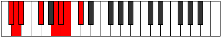 |
| [1831](https://ianring.com/musictheory/scales/1831) | [Pothian](ModeANaturalPothian.md) | A | A, Bb, Cb, D, E#, F#, G, A |  |
| [1833](https://ianring.com/musictheory/scales/1833) | [Ionacrimic](ModeGFlatIonacrimic.md) | Gb | Gb, A, B, C##, D#, E, Gb |  |
| [1835](https://ianring.com/musictheory/scales/1835) | [Byptian](ModeFSharpByptian.md) | F# | F#, G, A, B, C##, D#, E, F# |  |
| [1835](https://ianring.com/musictheory/scales/1835) | [Byptian](ModeBNaturalByptian.md) | B | B, C, D, E, F##, G#, A, B |  |
| [1835](https://ianring.com/musictheory/scales/1835) | [Byptian](ModeDFlatByptian.md) | Db | Db, Ebb, Fb, Gb, A, Bb, Cb, Db |  |
| [1837](https://ianring.com/musictheory/scales/1837) | [Dalian](ModeANaturalDalian.md) | A | A, B, C, D, E#, F#, G, A |  |
| [1837](https://ianring.com/musictheory/scales/1837) | [Dalian](ModeFSharpDalian.md) | F# | F#, G#, A, B, C##, D#, E, F# |  |
| [1837](https://ianring.com/musictheory/scales/1837) | [Dalian](ModeBNaturalDalian.md) | B | B, C#, D, E, F##, G#, A, B |  |
| [1839](https://ianring.com/musictheory/scales/1839) | [Zogyllic](ModeBNaturalZogyllic.md) | B | B, C, C#, D, E, G, G#, A, B |  |
| [1839](https://ianring.com/musictheory/scales/1839) | [Zogyllic](ModeFSharpZogyllic.md) | F# | F#, G, G#, A, B, D, D#, E, F# |  |
| [1839](https://ianring.com/musictheory/scales/1839) | [Zogyllic](ModeGFlatZogyllic.md) | Gb | Gb, G, Ab, A, B, D, Eb, E, Gb |  |
| [1839](https://ianring.com/musictheory/scales/1839) | [Zogyllic](ModeCSharpZogyllic.md) | C# | C#, D, D#, E, F#, A, A#, B, C# |  |
| [1839](https://ianring.com/musictheory/scales/1839) | [Zogyllic](ModeDFlatZogyllic.md) | Db | Db, D, Eb, E, Gb, A, Bb, B, Db |  |
| [1839](https://ianring.com/musictheory/scales/1839) | [Zogyllic](ModeANaturalZogyllic.md) | A | A, A#, B, C, D, F, F#, G, A | 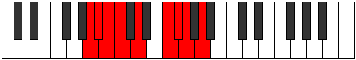 |
| [1843](https://ianring.com/musictheory/scales/1843) | [Ionygian](ModeDFlatIonygian.md) | Db | Db, Ebb, F, Gb, A, Bb, Cb, Db |  |
| [1845](https://ianring.com/musictheory/scales/1845) | [Lagian](ModeANaturalLagian.md) | A | A, B, C#, D, E#, F#, G, A |  |
| [1847](https://ianring.com/musictheory/scales/1847) | [Thacryllic](ModeCSharpThacryllic.md) | C# | C#, D, D#, F, F#, A, A#, B, C# |  |
| [1847](https://ianring.com/musictheory/scales/1847) | [Thacryllic](ModeDFlatThacryllic.md) | Db | Db, D, Eb, F, Gb, A, Bb, B, Db |  |
| [1847](https://ianring.com/musictheory/scales/1847) | [Thacryllic](ModeANaturalThacryllic.md) | A | A, A#, B, C#, D, F, F#, G, A |  |
| [1849](https://ianring.com/musictheory/scales/1849) | [Epogian](ModeBNaturalEpogian.md) | B | B, C##, D#, E, F##, G#, A, B |  |
| [1849](https://ianring.com/musictheory/scales/1849) | [Epogian](ModeGFlatEpogian.md) | Gb | Gb, A, Bb, Cb, D, Eb, Fb, Gb |  |
| [1851](https://ianring.com/musictheory/scales/1851) | [Zacryllic](ModeBNaturalZacryllic.md) | B | B, C, D, D#, E, G, G#, A, B |  |
| [1851](https://ianring.com/musictheory/scales/1851) | [Zacryllic](ModeCSharpZacryllic.md) | C# | C#, D, E, F, F#, A, A#, B, C# |  |
| [1851](https://ianring.com/musictheory/scales/1851) | [Zacryllic](ModeDFlatZacryllic.md) | Db | Db, D, E, F, Gb, A, Bb, B, Db |  |
| [1851](https://ianring.com/musictheory/scales/1851) | [Zacryllic](ModeFSharpZacryllic.md) | F# | F#, G, A, A#, B, D, D#, E, F# |  |
| [1851](https://ianring.com/musictheory/scales/1851) | [Zacryllic](ModeGFlatZacryllic.md) | Gb | Gb, G, A, Bb, B, D, Eb, E, Gb |  |
| [1853](https://ianring.com/musictheory/scales/1853) | [Phrynyllic](ModeANaturalPhrynyllic.md) | A | A, B, C, C#, D, F, F#, G, A |  |
| [1853](https://ianring.com/musictheory/scales/1853) | [Phrynyllic](ModeBNaturalPhrynyllic.md) | B | B, C#, D, D#, E, G, G#, A, B |  |
| [1853](https://ianring.com/musictheory/scales/1853) | [Phrynyllic](ModeFSharpPhrynyllic.md) | F# | F#, G#, A, A#, B, D, D#, E, F# |  |
| [1853](https://ianring.com/musictheory/scales/1853) | [Phrynyllic](ModeGFlatPhrynyllic.md) | Gb | Gb, Ab, A, Bb, B, D, Eb, E, Gb |  |
| [1855](https://ianring.com/musictheory/scales/1855) | [Marygic](ModeBNaturalMarygic.md) | B | B, C, C#, D, D#, E, G, G#, A, B |  |
| [1855](https://ianring.com/musictheory/scales/1855) | [Marygic](ModeCSharpMarygic.md) | C# | C#, D, D#, E, F, F#, A, A#, B, C# |  |
| [1855](https://ianring.com/musictheory/scales/1855) | [Marygic](ModeDFlatMarygic.md) | Db | Db, D, Eb, E, F, Gb, A, Bb, B, Db |  |
| [1855](https://ianring.com/musictheory/scales/1855) | [Marygic](ModeANaturalMarygic.md) | A | A, A#, B, C, C#, D, F, F#, G, A |  |
| [1855](https://ianring.com/musictheory/scales/1855) | [Marygic](ModeFSharpMarygic.md) | F# | F#, G, G#, A, A#, B, D, D#, E, F# |  |
| [1855](https://ianring.com/musictheory/scales/1855) | [Marygic](ModeGFlatMarygic.md) | Gb | Gb, G, Ab, A, Bb, B, D, Eb, E, Gb |  |
| [1863](https://ianring.com/musictheory/scales/1863) | [Pycrian](ModeDFlatPycrian.md) | Db | Db, Ebb, Fbb, G, A, Bb, Cb, Db |  |
| [1867](https://ianring.com/musictheory/scales/1867) | [Solian](ModeGSharpSolian.md) | G# | G#, A, B, C##, D##, E#, F#, G# |  |
| [1867](https://ianring.com/musictheory/scales/1867) | [Solian](ModeBNaturalSolian.md) | B | B, C, D, E#, F##, G#, A, B |  |
| [1867](https://ianring.com/musictheory/scales/1867) | [Solian](ModeDFlatSolian.md) | Db | Db, Ebb, Fb, G, A, Bb, Cb, Db |  |
| [1869](https://ianring.com/musictheory/scales/1869) | [Katyrian](ModeBNaturalKatyrian.md) | B | B, C#, D, E#, F##, G#, A, B |  |
| [1871](https://ianring.com/musictheory/scales/1871) | [Aeolyllic](ModeBNaturalAeolyllic.md) | B | B, C, C#, D, F, G, G#, A, B | 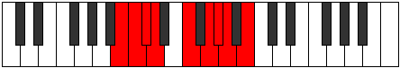 |
| [1871](https://ianring.com/musictheory/scales/1871) | [Aeolyllic](ModeCSharpAeolyllic.md) | C# | C#, D, D#, E, G, A, A#, B, C# |  |
| [1871](https://ianring.com/musictheory/scales/1871) | [Aeolyllic](ModeDFlatAeolyllic.md) | Db | Db, D, Eb, E, G, A, Bb, B, Db |  |
| [1871](https://ianring.com/musictheory/scales/1871) | [Aeolyllic](ModeGSharpAeolyllic.md) | G# | G#, A, A#, B, D, E, F, F#, G# |  |
| [1871](https://ianring.com/musictheory/scales/1871) | [Aeolyllic](ModeAFlatAeolyllic.md) | Ab | Ab, A, Bb, B, D, E, F, Gb, Ab |  |
| [1875](https://ianring.com/musictheory/scales/1875) | [Epyphian](ModeFNaturalEpyphian.md) | F | F, Gb, A, B, C#, D, Eb, F |  |
| [1875](https://ianring.com/musictheory/scales/1875) | [Epyphian](ModeDFlatEpyphian.md) | Db | Db, Ebb, F, G, A, Bb, Cb, Db |  |
| [1877](https://ianring.com/musictheory/scales/1877) | [Aeroptian](ModeFNaturalAeroptian.md) | F | F, G, A, B, C#, D, Eb, F |  |
| [1879](https://ianring.com/musictheory/scales/1879) | [Mixoryllic](ModeFNaturalMixoryllic.md) | F | F, F#, G, A, B, C#, D, D#, F |  |
| [1879](https://ianring.com/musictheory/scales/1879) | [Mixoryllic](ModeCSharpMixoryllic.md) | C# | C#, D, D#, F, G, A, A#, B, C# |  |
| [1879](https://ianring.com/musictheory/scales/1879) | [Mixoryllic](ModeDFlatMixoryllic.md) | Db | Db, D, Eb, F, G, A, Bb, B, Db |  |
| [1881](https://ianring.com/musictheory/scales/1881) | [Korian](ModeFNaturalKorian.md) | F | F, G#, A, B, C#, D, Eb, F |  |
| [1881](https://ianring.com/musictheory/scales/1881) | [Korian](ModeBNaturalKorian.md) | B | B, C##, D#, E#, F##, G#, A, B |  |
| [1883](https://ianring.com/musictheory/scales/1883) | [Mixopyryllic](ModeFNaturalMixopyryllic.md) | F | F, F#, G#, A, B, C#, D, D#, F |  |
| [1883](https://ianring.com/musictheory/scales/1883) | [Mixopyryllic](ModeGSharpMixopyryllic.md) | G# | G#, A, B, C, D, E, F, F#, G# |  |
| [1883](https://ianring.com/musictheory/scales/1883) | [Mixopyryllic](ModeAFlatMixopyryllic.md) | Ab | Ab, A, B, C, D, E, F, Gb, Ab |  |
| [1883](https://ianring.com/musictheory/scales/1883) | [Mixopyryllic](ModeBNaturalMixopyryllic.md) | B | B, C, D, D#, F, G, G#, A, B |  |
| [1883](https://ianring.com/musictheory/scales/1883) | [Mixopyryllic](ModeCSharpMixopyryllic.md) | C# | C#, D, E, F, G, A, A#, B, C# |  |
| [1883](https://ianring.com/musictheory/scales/1883) | [Mixopyryllic](ModeDFlatMixopyryllic.md) | Db | Db, D, E, F, G, A, Bb, B, Db |  |
| [1885](https://ianring.com/musictheory/scales/1885) | [Epidyllic](ModeFNaturalEpidyllic.md) | F | F, G, G#, A, B, C#, D, D#, F |  |
| [1885](https://ianring.com/musictheory/scales/1885) | [Epidyllic](ModeBNaturalEpidyllic.md) | B | B, C#, D, D#, F, G, G#, A, B |  |
| [1887](https://ianring.com/musictheory/scales/1887) | [Aerocrygic](ModeBNaturalAerocrygic.md) | B | B, C, C#, D, D#, F, G, G#, A, B |  |
| [1887](https://ianring.com/musictheory/scales/1887) | [Aerocrygic](ModeFNaturalAerocrygic.md) | F | F, F#, G, G#, A, B, C#, D, D#, F |  |
| [1887](https://ianring.com/musictheory/scales/1887) | [Aerocrygic](ModeCSharpAerocrygic.md) | C# | C#, D, D#, E, F, G, A, A#, B, C# |  |
| [1887](https://ianring.com/musictheory/scales/1887) | [Aerocrygic](ModeDFlatAerocrygic.md) | Db | Db, D, Eb, E, F, G, A, Bb, B, Db |  |
| [1887](https://ianring.com/musictheory/scales/1887) | [Aerocrygic](ModeGSharpAerocrygic.md) | G# | G#, A, A#, B, C, D, E, F, F#, G# |  |
| [1887](https://ianring.com/musictheory/scales/1887) | [Aerocrygic](ModeAFlatAerocrygic.md) | Ab | Ab, A, Bb, B, C, D, E, F, Gb, Ab |  |
| [1891](https://ianring.com/musictheory/scales/1891) | [Thalian](ModeDFlatThalian.md) | Db | Db, Ebb, F#, G, A, Bb, Cb, Db |  |
| [1893](https://ianring.com/musictheory/scales/1893) | [Ionylian](ModeANaturalIonylian.md) | A | A, B, C##, D#, E#, F#, G, A | 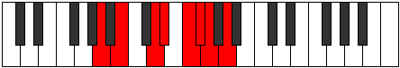 |
| [1895](https://ianring.com/musictheory/scales/1895) | [Salyllic](ModeCSharpSalyllic.md) | C# | C#, D, D#, F#, G, A, A#, B, C# |  |
| [1895](https://ianring.com/musictheory/scales/1895) | [Salyllic](ModeDFlatSalyllic.md) | Db | Db, D, Eb, Gb, G, A, Bb, B, Db |  |
| [1895](https://ianring.com/musictheory/scales/1895) | [Salyllic](ModeANaturalSalyllic.md) | A | A, A#, B, D, D#, F, F#, G, A |  |
| [1897](https://ianring.com/musictheory/scales/1897) | [Ionopian](ModeGFlatIonopian.md) | Gb | Gb, A, B, C, D, Eb, Fb, Gb |  |
| [1897](https://ianring.com/musictheory/scales/1897) | [Ionopian](ModeBNaturalIonopian.md) | B | B, C##, D##, E#, F##, G#, A, B |  |
| [1899](https://ianring.com/musictheory/scales/1899) | [Moptyllic](ModeFSharpMoptyllic.md) | F# | F#, G, A, B, C, D, D#, E, F# |  |
| [1899](https://ianring.com/musictheory/scales/1899) | [Moptyllic](ModeGFlatMoptyllic.md) | Gb | Gb, G, A, B, C, D, Eb, E, Gb |  |
| [1899](https://ianring.com/musictheory/scales/1899) | [Moptyllic](ModeGSharpMoptyllic.md) | G# | G#, A, B, C#, D, E, F, F#, G# |  |
| [1899](https://ianring.com/musictheory/scales/1899) | [Moptyllic](ModeAFlatMoptyllic.md) | Ab | Ab, A, B, Db, D, E, F, Gb, Ab |  |
| [1899](https://ianring.com/musictheory/scales/1899) | [Moptyllic](ModeBNaturalMoptyllic.md) | B | B, C, D, E, F, G, G#, A, B |  |
| [1899](https://ianring.com/musictheory/scales/1899) | [Moptyllic](ModeCSharpMoptyllic.md) | C# | C#, D, E, F#, G, A, A#, B, C# |  |
| [1899](https://ianring.com/musictheory/scales/1899) | [Moptyllic](ModeDFlatMoptyllic.md) | Db | Db, D, E, Gb, G, A, Bb, B, Db |  |
| [1901](https://ianring.com/musictheory/scales/1901) | [Ionidyllic](ModeANaturalIonidyllic.md) | A | A, B, C, D, D#, F, F#, G, A |  |
| [1901](https://ianring.com/musictheory/scales/1901) | [Ionidyllic](ModeFSharpIonidyllic.md) | F# | F#, G#, A, B, C, D, D#, E, F# |  |
| [1901](https://ianring.com/musictheory/scales/1901) | [Ionidyllic](ModeGFlatIonidyllic.md) | Gb | Gb, Ab, A, B, C, D, Eb, E, Gb |  |
| [1901](https://ianring.com/musictheory/scales/1901) | [Ionidyllic](ModeBNaturalIonidyllic.md) | B | B, C#, D, E, F, G, G#, A, B |  |
| [1903](https://ianring.com/musictheory/scales/1903) | [Rocrygic](ModeBNaturalRocrygic.md) | B | B, C, C#, D, E, F, G, G#, A, B |  |
| [1903](https://ianring.com/musictheory/scales/1903) | [Rocrygic](ModeFSharpRocrygic.md) | F# | F#, G, G#, A, B, C, D, D#, E, F# |  |
| [1903](https://ianring.com/musictheory/scales/1903) | [Rocrygic](ModeGFlatRocrygic.md) | Gb | Gb, G, Ab, A, B, C, D, Eb, E, Gb |  |
| [1903](https://ianring.com/musictheory/scales/1903) | [Rocrygic](ModeCSharpRocrygic.md) | C# | C#, D, D#, E, F#, G, A, A#, B, C# |  |
| [1903](https://ianring.com/musictheory/scales/1903) | [Rocrygic](ModeDFlatRocrygic.md) | Db | Db, D, Eb, E, Gb, G, A, Bb, B, Db |  |
| [1903](https://ianring.com/musictheory/scales/1903) | [Rocrygic](ModeANaturalRocrygic.md) | A | A, A#, B, C, D, D#, F, F#, G, A |  |
| [1903](https://ianring.com/musictheory/scales/1903) | [Rocrygic](ModeGSharpRocrygic.md) | G# | G#, A, A#, B, C#, D, E, F, F#, G# |  |
| [1903](https://ianring.com/musictheory/scales/1903) | [Rocrygic](ModeAFlatRocrygic.md) | Ab | Ab, A, Bb, B, Db, D, E, F, Gb, Ab |  |
| [1907](https://ianring.com/musictheory/scales/1907) | [Lynyllic](ModeFNaturalLynyllic.md) | F | F, F#, A, A#, B, C#, D, D#, F |  |
| [1907](https://ianring.com/musictheory/scales/1907) | [Lynyllic](ModeCSharpLynyllic.md) | C# | C#, D, F, F#, G, A, A#, B, C# |  |
| [1907](https://ianring.com/musictheory/scales/1907) | [Lynyllic](ModeDFlatLynyllic.md) | Db | Db, D, F, Gb, G, A, Bb, B, Db |  |
| [1909](https://ianring.com/musictheory/scales/1909) | [Epicryllic](ModeANaturalEpicryllic.md) | A | A, B, C#, D, D#, F, F#, G, A |  |
| [1909](https://ianring.com/musictheory/scales/1909) | [Epicryllic](ModeFNaturalEpicryllic.md) | F | F, G, A, A#, B, C#, D, D#, F |  |
| [1911](https://ianring.com/musictheory/scales/1911) | [Stynygic](ModeCSharpStynygic.md) | C# | C#, D, D#, F, F#, G, A, A#, B, C# |  |
| [1911](https://ianring.com/musictheory/scales/1911) | [Stynygic](ModeDFlatStynygic.md) | Db | Db, D, Eb, F, Gb, G, A, Bb, B, Db |  |
| [1911](https://ianring.com/musictheory/scales/1911) | [Stynygic](ModeFNaturalStynygic.md) | F | F, F#, G, A, A#, B, C#, D, D#, F |  |
| [1911](https://ianring.com/musictheory/scales/1911) | [Stynygic](ModeANaturalStynygic.md) | A | A, A#, B, C#, D, D#, F, F#, G, A |  |
| [1913](https://ianring.com/musictheory/scales/1913) | [Zagyllic](ModeBNaturalZagyllic.md) | B | B, D, D#, E, F, G, G#, A, B |  |
| [1913](https://ianring.com/musictheory/scales/1913) | [Zagyllic](ModeFSharpZagyllic.md) | F# | F#, A, A#, B, C, D, D#, E, F# |  |
| [1913](https://ianring.com/musictheory/scales/1913) | [Zagyllic](ModeGFlatZagyllic.md) | Gb | Gb, A, Bb, B, C, D, Eb, E, Gb |  |
| [1913](https://ianring.com/musictheory/scales/1913) | [Zagyllic](ModeFNaturalZagyllic.md) | F | F, G#, A, A#, B, C#, D, D#, F |  |
| [1915](https://ianring.com/musictheory/scales/1915) | [Thydygic](ModeGSharpThydygic.md) | G# | G#, A, B, C, C#, D, E, F, F#, G# |  |
| [1915](https://ianring.com/musictheory/scales/1915) | [Thydygic](ModeAFlatThydygic.md) | Ab | Ab, A, B, C, Db, D, E, F, Gb, Ab |  |
| [1915](https://ianring.com/musictheory/scales/1915) | [Thydygic](ModeBNaturalThydygic.md) | B | B, C, D, D#, E, F, G, G#, A, B |  |
| [1915](https://ianring.com/musictheory/scales/1915) | [Thydygic](ModeFSharpThydygic.md) | F# | F#, G, A, A#, B, C, D, D#, E, F# |  |
| [1915](https://ianring.com/musictheory/scales/1915) | [Thydygic](ModeGFlatThydygic.md) | Gb | Gb, G, A, Bb, B, C, D, Eb, E, Gb |  |
| [1915](https://ianring.com/musictheory/scales/1915) | [Thydygic](ModeCSharpThydygic.md) | C# | C#, D, E, F, F#, G, A, A#, B, C# |  |
| [1915](https://ianring.com/musictheory/scales/1915) | [Thydygic](ModeDFlatThydygic.md) | Db | Db, D, E, F, Gb, G, A, Bb, B, Db |  |
| [1915](https://ianring.com/musictheory/scales/1915) | [Thydygic](ModeFNaturalThydygic.md) | F | F, F#, G#, A, A#, B, C#, D, D#, F |  |
| [1917](https://ianring.com/musictheory/scales/1917) | [Sacrygic](ModeANaturalSacrygic.md) | A | A, B, C, C#, D, D#, F, F#, G, A |  |
| [1917](https://ianring.com/musictheory/scales/1917) | [Sacrygic](ModeBNaturalSacrygic.md) | B | B, C#, D, D#, E, F, G, G#, A, B |  |
| [1917](https://ianring.com/musictheory/scales/1917) | [Sacrygic](ModeFSharpSacrygic.md) | F# | F#, G#, A, A#, B, C, D, D#, E, F# |  |
| [1917](https://ianring.com/musictheory/scales/1917) | [Sacrygic](ModeGFlatSacrygic.md) | Gb | Gb, Ab, A, Bb, B, C, D, Eb, E, Gb |  |
| [1917](https://ianring.com/musictheory/scales/1917) | [Sacrygic](ModeFNaturalSacrygic.md) | F | F, G, G#, A, A#, B, C#, D, D#, F |  |
| [1919](https://ianring.com/musictheory/scales/1919) | [Rocryllian](ModeBNaturalRocryllian.md) | B | B, C, C#, D, D#, E, F, G, G#, A, B |  |
| [1919](https://ianring.com/musictheory/scales/1919) | [Rocryllian](ModeANaturalRocryllian.md) | A | A, A#, B, C, C#, D, D#, F, F#, G, A |  |
| [1919](https://ianring.com/musictheory/scales/1919) | [Rocryllian](ModeCSharpRocryllian.md) | C# | C#, D, D#, E, F, F#, G, A, A#, B, C# |  |
| [1919](https://ianring.com/musictheory/scales/1919) | [Rocryllian](ModeDFlatRocryllian.md) | Db | Db, D, Eb, E, F, Gb, G, A, Bb, B, Db |  |
| [1919](https://ianring.com/musictheory/scales/1919) | [Rocryllian](ModeGSharpRocryllian.md) | G# | G#, A, A#, B, C, C#, D, E, F, F#, G# |  |
| [1919](https://ianring.com/musictheory/scales/1919) | [Rocryllian](ModeAFlatRocryllian.md) | Ab | Ab, A, Bb, B, C, Db, D, E, F, Gb, Ab |  |
| [1919](https://ianring.com/musictheory/scales/1919) | [Rocryllian](ModeFSharpRocryllian.md) | F# | F#, G, G#, A, A#, B, C, D, D#, E, F# |  |
| [1919](https://ianring.com/musictheory/scales/1919) | [Rocryllian](ModeGFlatRocryllian.md) | Gb | Gb, G, Ab, A, Bb, B, C, D, Eb, E, Gb |  |
| [1919](https://ianring.com/musictheory/scales/1919) | [Rocryllian](ModeFNaturalRocryllian.md) | F | F, F#, G, G#, A, A#, B, C#, D, D#, F |  |
| [1929](https://ianring.com/musictheory/scales/1929) | [Aeolycrimic](ModeBNaturalAeolycrimic.md) | B | B, C##, E##, F##, G#, A, B |  |
| [1931](https://ianring.com/musictheory/scales/1931) | [Stogian](ModeBNaturalStogian.md) | B | B, C, D, E##, F##, G#, A, B |  |
| [1931](https://ianring.com/musictheory/scales/1931) | [Stogian](ModeDFlatStogian.md) | Db | Db, Ebb, Fb, G#, A, Bb, Cb, Db |  |
| [1933](https://ianring.com/musictheory/scales/1933) | [Mocrian](ModeBNaturalMocrian.md) | B | B, C#, D, E##, F##, G#, A, B |  |
| [1935](https://ianring.com/musictheory/scales/1935) | [Mycryllic](ModeBNaturalMycryllic.md) | B | B, C, C#, D, F#, G, G#, A, B |  |
| [1935](https://ianring.com/musictheory/scales/1935) | [Mycryllic](ModeDNaturalMycryllic.md) | D | D, D#, E, F, A, A#, B, C, D |  |
| [1935](https://ianring.com/musictheory/scales/1935) | [Mycryllic](ModeCSharpMycryllic.md) | C# | C#, D, D#, E, G#, A, A#, B, C# |  |
| [1935](https://ianring.com/musictheory/scales/1935) | [Mycryllic](ModeDFlatMycryllic.md) | Db | Db, D, Eb, E, Ab, A, Bb, B, Db |  |
| [1939](https://ianring.com/musictheory/scales/1939) | [Dathian](ModeDFlatDathian.md) | Db | Db, Ebb, F, G#, A, Bb, Cb, Db |  |
| [1941](https://ianring.com/musictheory/scales/1941) | [Aeranian](ModeGNaturalAeranian.md) | G | G, A, B, C##, D#, E, F, G |  |
| [1943](https://ianring.com/musictheory/scales/1943) | [Malyllic](ModeGNaturalMalyllic.md) | G | G, G#, A, B, D, D#, E, F, G |  |
| [1943](https://ianring.com/musictheory/scales/1943) | [Malyllic](ModeDNaturalMalyllic.md) | D | D, D#, E, F#, A, A#, B, C, D |  |
| [1943](https://ianring.com/musictheory/scales/1943) | [Malyllic](ModeCSharpMalyllic.md) | C# | C#, D, D#, F, G#, A, A#, B, C# |  |
| [1943](https://ianring.com/musictheory/scales/1943) | [Malyllic](ModeDFlatMalyllic.md) | Db | Db, D, Eb, F, Ab, A, Bb, B, Db |  |
| [1945](https://ianring.com/musictheory/scales/1945) | [Zarian](ModeBNaturalZarian.md) | B | B, C##, D#, E##, F##, G#, A, B |  |
| [1947](https://ianring.com/musictheory/scales/1947) | [Ionoyllic](ModeBNaturalIonoyllic.md) | B | B, C, D, D#, F#, G, G#, A, B |  |
| [1947](https://ianring.com/musictheory/scales/1947) | [Ionoyllic](ModeDNaturalIonoyllic.md) | D | D, D#, F, F#, A, A#, B, C, D |  |
| [1947](https://ianring.com/musictheory/scales/1947) | [Ionoyllic](ModeCSharpIonoyllic.md) | C# | C#, D, E, F, G#, A, A#, B, C# |  |
| [1947](https://ianring.com/musictheory/scales/1947) | [Ionoyllic](ModeDFlatIonoyllic.md) | Db | Db, D, E, F, Ab, A, Bb, B, Db |  |
| [1949](https://ianring.com/musictheory/scales/1949) | [Mathyllic](ModeBNaturalMathyllic.md) | B | B, C#, D, D#, F#, G, G#, A, B |  |
| [1949](https://ianring.com/musictheory/scales/1949) | [Mathyllic](ModeDNaturalMathyllic.md) | D | D, E, F, F#, A, A#, B, C, D |  |
| [1949](https://ianring.com/musictheory/scales/1949) | [Mathyllic](ModeGNaturalMathyllic.md) | G | G, A, A#, B, D, D#, E, F, G |  |
| [1951](https://ianring.com/musictheory/scales/1951) | [Gonygic](ModeBNaturalGonygic.md) | B | B, C, C#, D, D#, F#, G, G#, A, B |  |
| [1951](https://ianring.com/musictheory/scales/1951) | [Gonygic](ModeDNaturalGonygic.md) | D | D, D#, E, F, F#, A, A#, B, C, D |  |
| [1951](https://ianring.com/musictheory/scales/1951) | [Gonygic](ModeCSharpGonygic.md) | C# | C#, D, D#, E, F, G#, A, A#, B, C# |  |
| [1951](https://ianring.com/musictheory/scales/1951) | [Gonygic](ModeDFlatGonygic.md) | Db | Db, D, Eb, E, F, Ab, A, Bb, B, Db |  |
| [1951](https://ianring.com/musictheory/scales/1951) | [Gonygic](ModeGNaturalGonygic.md) | G | G, G#, A, A#, B, D, D#, E, F, G |  |
| [1955](https://ianring.com/musictheory/scales/1955) | [Sonian](ModeDFlatSonian.md) | Db | Db, Ebb, F#, G#, A, Bb, Cb, Db |  |
| [1957](https://ianring.com/musictheory/scales/1957) | [Pyrian](ModeANaturalPyrian.md) | A | A, B, C##, D##, E#, F#, G, A |  |
| [1959](https://ianring.com/musictheory/scales/1959) | [Katolyllic](ModeENaturalKatolyllic.md) | E | E, F, F#, A, B, C, C#, D, E |  |
| [1959](https://ianring.com/musictheory/scales/1959) | [Katolyllic](ModeDNaturalKatolyllic.md) | D | D, D#, E, G, A, A#, B, C, D |  |
| [1959](https://ianring.com/musictheory/scales/1959) | [Katolyllic](ModeANaturalKatolyllic.md) | A | A, A#, B, D, E, F, F#, G, A |  |
| [1959](https://ianring.com/musictheory/scales/1959) | [Katolyllic](ModeCSharpKatolyllic.md) | C# | C#, D, D#, F#, G#, A, A#, B, C# |  |
| [1959](https://ianring.com/musictheory/scales/1959) | [Katolyllic](ModeDFlatKatolyllic.md) | Db | Db, D, Eb, Gb, Ab, A, Bb, B, Db |  |
| [1961](https://ianring.com/musictheory/scales/1961) | [Soptian](ModeGFlatSoptian.md) | Gb | Gb, A, B, C#, D, Eb, Fb, Gb |  |
| [1961](https://ianring.com/musictheory/scales/1961) | [Soptian](ModeBNaturalSoptian.md) | B | B, C##, D##, E##, F##, G#, A, B |  |
| [1963](https://ianring.com/musictheory/scales/1963) | [Epocryllic](ModeENaturalEpocryllic.md) | E | E, F, G, A, B, C, C#, D, E |  |
| [1963](https://ianring.com/musictheory/scales/1963) | [Epocryllic](ModeFSharpEpocryllic.md) | F# | F#, G, A, B, C#, D, D#, E, F# |  |
| [1963](https://ianring.com/musictheory/scales/1963) | [Epocryllic](ModeGFlatEpocryllic.md) | Gb | Gb, G, A, B, Db, D, Eb, E, Gb |  |
| [1963](https://ianring.com/musictheory/scales/1963) | [Epocryllic](ModeBNaturalEpocryllic.md) | B | B, C, D, E, F#, G, G#, A, B |  |
| [1963](https://ianring.com/musictheory/scales/1963) | [Epocryllic](ModeDNaturalEpocryllic.md) | D | D, D#, F, G, A, A#, B, C, D |  |
| [1963](https://ianring.com/musictheory/scales/1963) | [Epocryllic](ModeCSharpEpocryllic.md) | C# | C#, D, E, F#, G#, A, A#, B, C# |  |
| [1963](https://ianring.com/musictheory/scales/1963) | [Epocryllic](ModeDFlatEpocryllic.md) | Db | Db, D, E, Gb, Ab, A, Bb, B, Db |  |
| [1965](https://ianring.com/musictheory/scales/1965) | [Gadyllic](ModeENaturalGadyllic.md) | E | E, F#, G, A, B, C, C#, D, E |  |
| [1965](https://ianring.com/musictheory/scales/1965) | [Gadyllic](ModeANaturalGadyllic.md) | A | A, B, C, D, E, F, F#, G, A |  |
| [1965](https://ianring.com/musictheory/scales/1965) | [Gadyllic](ModeFSharpGadyllic.md) | F# | F#, G#, A, B, C#, D, D#, E, F# |  |
| [1965](https://ianring.com/musictheory/scales/1965) | [Gadyllic](ModeGFlatGadyllic.md) | Gb | Gb, Ab, A, B, Db, D, Eb, E, Gb |  |
| [1965](https://ianring.com/musictheory/scales/1965) | [Gadyllic](ModeBNaturalGadyllic.md) | B | B, C#, D, E, F#, G, G#, A, B |  |
| [1965](https://ianring.com/musictheory/scales/1965) | [Gadyllic](ModeDNaturalGadyllic.md) | D | D, E, F, G, A, A#, B, C, D |  |
| [1967](https://ianring.com/musictheory/scales/1967) | [Godygic](ModeENaturalGodygic.md) | E | E, F, F#, G, A, B, C, C#, D, E |  |
| [1967](https://ianring.com/musictheory/scales/1967) | [Godygic](ModeBNaturalGodygic.md) | B | B, C, C#, D, E, F#, G, G#, A, B |  |
| [1967](https://ianring.com/musictheory/scales/1967) | [Godygic](ModeFSharpGodygic.md) | F# | F#, G, G#, A, B, C#, D, D#, E, F# |  |
| [1967](https://ianring.com/musictheory/scales/1967) | [Godygic](ModeGFlatGodygic.md) | Gb | Gb, G, Ab, A, B, Db, D, Eb, E, Gb |  |
| [1967](https://ianring.com/musictheory/scales/1967) | [Godygic](ModeDNaturalGodygic.md) | D | D, D#, E, F, G, A, A#, B, C, D |  |
| [1967](https://ianring.com/musictheory/scales/1967) | [Godygic](ModeANaturalGodygic.md) | A | A, A#, B, C, D, E, F, F#, G, A |  |
| [1967](https://ianring.com/musictheory/scales/1967) | [Godygic](ModeCSharpGodygic.md) | C# | C#, D, D#, E, F#, G#, A, A#, B, C# |  |
| [1967](https://ianring.com/musictheory/scales/1967) | [Godygic](ModeDFlatGodygic.md) | Db | Db, D, Eb, E, Gb, Ab, A, Bb, B, Db |  |
| [1971](https://ianring.com/musictheory/scales/1971) | [Aerynyllic](ModeENaturalAerynyllic.md) | E | E, F, G#, A, B, C, C#, D, E |  |
| [1971](https://ianring.com/musictheory/scales/1971) | [Aerynyllic](ModeDNaturalAerynyllic.md) | D | D, D#, F#, G, A, A#, B, C, D |  |
| [1971](https://ianring.com/musictheory/scales/1971) | [Aerynyllic](ModeCSharpAerynyllic.md) | C# | C#, D, F, F#, G#, A, A#, B, C# |  |
| [1971](https://ianring.com/musictheory/scales/1971) | [Aerynyllic](ModeDFlatAerynyllic.md) | Db | Db, D, F, Gb, Ab, A, Bb, B, Db |  |
| [1973](https://ianring.com/musictheory/scales/1973) | [Zyryllic](ModeGNaturalZyryllic.md) | G | G, A, B, C, D, D#, E, F, G |  |
| [1973](https://ianring.com/musictheory/scales/1973) | [Zyryllic](ModeANaturalZyryllic.md) | A | A, B, C#, D, E, F, F#, G, A |  |
| [1973](https://ianring.com/musictheory/scales/1973) | [Zyryllic](ModeENaturalZyryllic.md) | E | E, F#, G#, A, B, C, C#, D, E |  |
| [1973](https://ianring.com/musictheory/scales/1973) | [Zyryllic](ModeDNaturalZyryllic.md) | D | D, E, F#, G, A, A#, B, C, D |  |
| [1975](https://ianring.com/musictheory/scales/1975) | [Ionocrygic](ModeENaturalIonocrygic.md) | E | E, F, F#, G#, A, B, C, C#, D, E |  |
| [1975](https://ianring.com/musictheory/scales/1975) | [Ionocrygic](ModeGNaturalIonocrygic.md) | G | G, G#, A, B, C, D, D#, E, F, G |  |
| [1975](https://ianring.com/musictheory/scales/1975) | [Ionocrygic](ModeDNaturalIonocrygic.md) | D | D, D#, E, F#, G, A, A#, B, C, D |  |
| [1975](https://ianring.com/musictheory/scales/1975) | [Ionocrygic](ModeANaturalIonocrygic.md) | A | A, A#, B, C#, D, E, F, F#, G, A |  |
| [1975](https://ianring.com/musictheory/scales/1975) | [Ionocrygic](ModeCSharpIonocrygic.md) | C# | C#, D, D#, F, F#, G#, A, A#, B, C# |  |
| [1975](https://ianring.com/musictheory/scales/1975) | [Ionocrygic](ModeDFlatIonocrygic.md) | Db | Db, D, Eb, F, Gb, Ab, A, Bb, B, Db |  |
| [1977](https://ianring.com/musictheory/scales/1977) | [Dagyllic](ModeENaturalDagyllic.md) | E | E, G, G#, A, B, C, C#, D, E |  |
| [1977](https://ianring.com/musictheory/scales/1977) | [Dagyllic](ModeBNaturalDagyllic.md) | B | B, D, D#, E, F#, G, G#, A, B |  |
| [1977](https://ianring.com/musictheory/scales/1977) | [Dagyllic](ModeFSharpDagyllic.md) | F# | F#, A, A#, B, C#, D, D#, E, F# |  |
| [1977](https://ianring.com/musictheory/scales/1977) | [Dagyllic](ModeGFlatDagyllic.md) | Gb | Gb, A, Bb, B, Db, D, Eb, E, Gb |  |
| [1977](https://ianring.com/musictheory/scales/1977) | [Dagyllic](ModeDNaturalDagyllic.md) | D | D, F, F#, G, A, A#, B, C, D |  |
| [1979](https://ianring.com/musictheory/scales/1979) | [Aeradygic](ModeENaturalAeradygic.md) | E | E, F, G, G#, A, B, C, C#, D, E |  |
| [1979](https://ianring.com/musictheory/scales/1979) | [Aeradygic](ModeBNaturalAeradygic.md) | B | B, C, D, D#, E, F#, G, G#, A, B |  |
| [1979](https://ianring.com/musictheory/scales/1979) | [Aeradygic](ModeFSharpAeradygic.md) | F# | F#, G, A, A#, B, C#, D, D#, E, F# |  |
| [1979](https://ianring.com/musictheory/scales/1979) | [Aeradygic](ModeGFlatAeradygic.md) | Gb | Gb, G, A, Bb, B, Db, D, Eb, E, Gb |  |
| [1979](https://ianring.com/musictheory/scales/1979) | [Aeradygic](ModeDNaturalAeradygic.md) | D | D, D#, F, F#, G, A, A#, B, C, D |  |
| [1979](https://ianring.com/musictheory/scales/1979) | [Aeradygic](ModeCSharpAeradygic.md) | C# | C#, D, E, F, F#, G#, A, A#, B, C# |  |
| [1979](https://ianring.com/musictheory/scales/1979) | [Aeradygic](ModeDFlatAeradygic.md) | Db | Db, D, E, F, Gb, Ab, A, Bb, B, Db |  |
| [1981](https://ianring.com/musictheory/scales/1981) | [Gadygic](ModeANaturalGadygic.md) | A | A, B, C, C#, D, E, F, F#, G, A |  |
| [1981](https://ianring.com/musictheory/scales/1981) | [Gadygic](ModeENaturalGadygic.md) | E | E, F#, G, G#, A, B, C, C#, D, E |  |
| [1981](https://ianring.com/musictheory/scales/1981) | [Gadygic](ModeBNaturalGadygic.md) | B | B, C#, D, D#, E, F#, G, G#, A, B |  |
| [1981](https://ianring.com/musictheory/scales/1981) | [Gadygic](ModeGNaturalGadygic.md) | G | G, A, A#, B, C, D, D#, E, F, G |  |
| [1981](https://ianring.com/musictheory/scales/1981) | [Gadygic](ModeDNaturalGadygic.md) | D | D, E, F, F#, G, A, A#, B, C, D |  |
| [1981](https://ianring.com/musictheory/scales/1981) | [Gadygic](ModeFSharpGadygic.md) | F# | F#, G#, A, A#, B, C#, D, D#, E, F# |  |
| [1981](https://ianring.com/musictheory/scales/1981) | [Gadygic](ModeGFlatGadygic.md) | Gb | Gb, Ab, A, Bb, B, Db, D, Eb, E, Gb |  |
| [1983](https://ianring.com/musictheory/scales/1983) | [Soryllian](ModeBNaturalSoryllian.md) | B | B, C, C#, D, D#, E, F#, G, G#, A, B |  |
| [1983](https://ianring.com/musictheory/scales/1983) | [Soryllian](ModeENaturalSoryllian.md) | E | E, F, F#, G, G#, A, B, C, C#, D, E |  |
| [1983](https://ianring.com/musictheory/scales/1983) | [Soryllian](ModeANaturalSoryllian.md) | A | A, A#, B, C, C#, D, E, F, F#, G, A |  |
| [1983](https://ianring.com/musictheory/scales/1983) | [Soryllian](ModeDNaturalSoryllian.md) | D | D, D#, E, F, F#, G, A, A#, B, C, D |  |
| [1983](https://ianring.com/musictheory/scales/1983) | [Soryllian](ModeCSharpSoryllian.md) | C# | C#, D, D#, E, F, F#, G#, A, A#, B, C# |  |
| [1983](https://ianring.com/musictheory/scales/1983) | [Soryllian](ModeDFlatSoryllian.md) | Db | Db, D, Eb, E, F, Gb, Ab, A, Bb, B, Db |  |
| [1983](https://ianring.com/musictheory/scales/1983) | [Soryllian](ModeGNaturalSoryllian.md) | G | G, G#, A, A#, B, C, D, D#, E, F, G |  |
| [1983](https://ianring.com/musictheory/scales/1983) | [Soryllian](ModeFSharpSoryllian.md) | F# | F#, G, G#, A, A#, B, C#, D, D#, E, F# |  |
| [1983](https://ianring.com/musictheory/scales/1983) | [Soryllian](ModeGFlatSoryllian.md) | Gb | Gb, G, Ab, A, Bb, B, Db, D, Eb, E, Gb |  |
| [1991](https://ianring.com/musictheory/scales/1991) | [Phryptyllic](ModeDNaturalPhryptyllic.md) | D | D, D#, E, G#, A, A#, B, C, D |  |
| [1991](https://ianring.com/musictheory/scales/1991) | [Phryptyllic](ModeCSharpPhryptyllic.md) | C# | C#, D, D#, G, G#, A, A#, B, C# |  |
| [1991](https://ianring.com/musictheory/scales/1991) | [Phryptyllic](ModeDFlatPhryptyllic.md) | Db | Db, D, Eb, G, Ab, A, Bb, B, Db |  |
| [1993](https://ianring.com/musictheory/scales/1993) | [Katoptian](ModeBNaturalKatoptian.md) | B | B, C##, D###, E##, F##, G#, A, B | 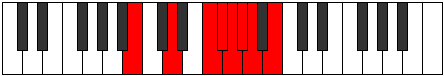 |
| [1995](https://ianring.com/musictheory/scales/1995) | [Aeolacryllic](ModeGSharpAeolacryllic.md) | G# | G#, A, B, D, D#, E, F, F#, G# |  |
| [1995](https://ianring.com/musictheory/scales/1995) | [Aeolacryllic](ModeAFlatAeolacryllic.md) | Ab | Ab, A, B, D, Eb, E, F, Gb, Ab |  |
| [1995](https://ianring.com/musictheory/scales/1995) | [Aeolacryllic](ModeBNaturalAeolacryllic.md) | B | B, C, D, F, F#, G, G#, A, B |  |
| [1995](https://ianring.com/musictheory/scales/1995) | [Aeolacryllic](ModeDNaturalAeolacryllic.md) | D | D, D#, F, G#, A, A#, B, C, D |  |
| [1995](https://ianring.com/musictheory/scales/1995) | [Aeolacryllic](ModeCSharpAeolacryllic.md) | C# | C#, D, E, G, G#, A, A#, B, C# |  |
| [1995](https://ianring.com/musictheory/scales/1995) | [Aeolacryllic](ModeDFlatAeolacryllic.md) | Db | Db, D, E, G, Ab, A, Bb, B, Db |  |
| [1997](https://ianring.com/musictheory/scales/1997) | [Staryllic](ModeBNaturalStaryllic.md) | B | B, C#, D, F, F#, G, G#, A, B |  |
| [1997](https://ianring.com/musictheory/scales/1997) | [Staryllic](ModeDNaturalStaryllic.md) | D | D, E, F, G#, A, A#, B, C, D |  |
| [1999](https://ianring.com/musictheory/scales/1999) | [Zacrygic](ModeBNaturalZacrygic.md) | B | B, C, C#, D, F, F#, G, G#, A, B |  |
| [1999](https://ianring.com/musictheory/scales/1999) | [Zacrygic](ModeDNaturalZacrygic.md) | D | D, D#, E, F, G#, A, A#, B, C, D |  |
| [1999](https://ianring.com/musictheory/scales/1999) | [Zacrygic](ModeGSharpZacrygic.md) | G# | G#, A, A#, B, D, D#, E, F, F#, G# |  |
| [1999](https://ianring.com/musictheory/scales/1999) | [Zacrygic](ModeAFlatZacrygic.md) | Ab | Ab, A, Bb, B, D, Eb, E, F, Gb, Ab |  |
| [1999](https://ianring.com/musictheory/scales/1999) | [Zacrygic](ModeCSharpZacrygic.md) | C# | C#, D, D#, E, G, G#, A, A#, B, C# |  |
| [1999](https://ianring.com/musictheory/scales/1999) | [Zacrygic](ModeDFlatZacrygic.md) | Db | Db, D, Eb, E, G, Ab, A, Bb, B, Db |  |
| [2003](https://ianring.com/musictheory/scales/2003) | [Lolyllic](ModeFNaturalLolyllic.md) | F | F, F#, A, B, C, C#, D, D#, F |  |
| [2003](https://ianring.com/musictheory/scales/2003) | [Lolyllic](ModeDNaturalLolyllic.md) | D | D, D#, F#, G#, A, A#, B, C, D |  |
| [2003](https://ianring.com/musictheory/scales/2003) | [Lolyllic](ModeCSharpLolyllic.md) | C# | C#, D, F, G, G#, A, A#, B, C# |  |
| [2003](https://ianring.com/musictheory/scales/2003) | [Lolyllic](ModeDFlatLolyllic.md) | Db | Db, D, F, G, Ab, A, Bb, B, Db |  |
| [2005](https://ianring.com/musictheory/scales/2005) | [Gygyllic](ModeFNaturalGygyllic.md) | F | F, G, A, B, C, C#, D, D#, F |  |
| [2005](https://ianring.com/musictheory/scales/2005) | [Gygyllic](ModeGNaturalGygyllic.md) | G | G, A, B, C#, D, D#, E, F, G |  |
| [2005](https://ianring.com/musictheory/scales/2005) | [Gygyllic](ModeDNaturalGygyllic.md) | D | D, E, F#, G#, A, A#, B, C, D |  |
| [2007](https://ianring.com/musictheory/scales/2007) | [Stonygic](ModeFNaturalStonygic.md) | F | F, F#, G, A, B, C, C#, D, D#, F |  |
| [2007](https://ianring.com/musictheory/scales/2007) | [Stonygic](ModeGNaturalStonygic.md) | G | G, G#, A, B, C#, D, D#, E, F, G |  |
| [2007](https://ianring.com/musictheory/scales/2007) | [Stonygic](ModeDNaturalStonygic.md) | D | D, D#, E, F#, G#, A, A#, B, C, D |  |
| [2007](https://ianring.com/musictheory/scales/2007) | [Stonygic](ModeCSharpStonygic.md) | C# | C#, D, D#, F, G, G#, A, A#, B, C# |  |
| [2007](https://ianring.com/musictheory/scales/2007) | [Stonygic](ModeDFlatStonygic.md) | Db | Db, D, Eb, F, G, Ab, A, Bb, B, Db |  |
| [2009](https://ianring.com/musictheory/scales/2009) | [Stacryllic](ModeFNaturalStacryllic.md) | F | F, G#, A, B, C, C#, D, D#, F |  |
| [2009](https://ianring.com/musictheory/scales/2009) | [Stacryllic](ModeBNaturalStacryllic.md) | B | B, D, D#, F, F#, G, G#, A, B |  |
| [2009](https://ianring.com/musictheory/scales/2009) | [Stacryllic](ModeDNaturalStacryllic.md) | D | D, F, F#, G#, A, A#, B, C, D |  |
| [2011](https://ianring.com/musictheory/scales/2011) | [Raphygic](ModeFNaturalRaphygic.md) | F | F, F#, G#, A, B, C, C#, D, D#, F |  |
| [2011](https://ianring.com/musictheory/scales/2011) | [Raphygic](ModeGSharpRaphygic.md) | G# | G#, A, B, C, D, D#, E, F, F#, G# |  |
| [2011](https://ianring.com/musictheory/scales/2011) | [Raphygic](ModeAFlatRaphygic.md) | Ab | Ab, A, B, C, D, Eb, E, F, Gb, Ab |  |
| [2011](https://ianring.com/musictheory/scales/2011) | [Raphygic](ModeBNaturalRaphygic.md) | B | B, C, D, D#, F, F#, G, G#, A, B |  |
| [2011](https://ianring.com/musictheory/scales/2011) | [Raphygic](ModeDNaturalRaphygic.md) | D | D, D#, F, F#, G#, A, A#, B, C, D | 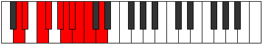 |
| [2011](https://ianring.com/musictheory/scales/2011) | [Raphygic](ModeCSharpRaphygic.md) | C# | C#, D, E, F, G, G#, A, A#, B, C# |  |
| [2011](https://ianring.com/musictheory/scales/2011) | [Raphygic](ModeDFlatRaphygic.md) | Db | Db, D, E, F, G, Ab, A, Bb, B, Db |  |
| [2013](https://ianring.com/musictheory/scales/2013) | [Mocrygic](ModeFNaturalMocrygic.md) | F | F, G, G#, A, B, C, C#, D, D#, F |  |
| [2013](https://ianring.com/musictheory/scales/2013) | [Mocrygic](ModeBNaturalMocrygic.md) | B | B, C#, D, D#, F, F#, G, G#, A, B |  |
| [2013](https://ianring.com/musictheory/scales/2013) | [Mocrygic](ModeGNaturalMocrygic.md) | G | G, A, A#, B, C#, D, D#, E, F, G |  |
| [2013](https://ianring.com/musictheory/scales/2013) | [Mocrygic](ModeDNaturalMocrygic.md) | D | D, E, F, F#, G#, A, A#, B, C, D |  |
| [2015](https://ianring.com/musictheory/scales/2015) | [Epiryllian](ModeFNaturalEpiryllian.md) | F | F, F#, G, G#, A, B, C, C#, D, D#, F |  |
| [2015](https://ianring.com/musictheory/scales/2015) | [Epiryllian](ModeBNaturalEpiryllian.md) | B | B, C, C#, D, D#, F, F#, G, G#, A, B |  |
| [2015](https://ianring.com/musictheory/scales/2015) | [Epiryllian](ModeDNaturalEpiryllian.md) | D | D, D#, E, F, F#, G#, A, A#, B, C, D |  |
| [2015](https://ianring.com/musictheory/scales/2015) | [Epiryllian](ModeGSharpEpiryllian.md) | G# | G#, A, A#, B, C, D, D#, E, F, F#, G# |  |
| [2015](https://ianring.com/musictheory/scales/2015) | [Epiryllian](ModeAFlatEpiryllian.md) | Ab | Ab, A, Bb, B, C, D, Eb, E, F, Gb, Ab |  |
| [2015](https://ianring.com/musictheory/scales/2015) | [Epiryllian](ModeCSharpEpiryllian.md) | C# | C#, D, D#, E, F, G, G#, A, A#, B, C# |  |
| [2015](https://ianring.com/musictheory/scales/2015) | [Epiryllian](ModeDFlatEpiryllian.md) | Db | Db, D, Eb, E, F, G, Ab, A, Bb, B, Db |  |
| [2015](https://ianring.com/musictheory/scales/2015) | [Epiryllian](ModeGNaturalEpiryllian.md) | G | G, G#, A, A#, B, C#, D, D#, E, F, G |  |
| [2019](https://ianring.com/musictheory/scales/2019) | [Palyllic](ModeENaturalPalyllic.md) | E | E, F, A, A#, B, C, C#, D, E |  |
| [2019](https://ianring.com/musictheory/scales/2019) | [Palyllic](ModeDNaturalPalyllic.md) | D | D, D#, G, G#, A, A#, B, C, D |  |
| [2019](https://ianring.com/musictheory/scales/2019) | [Palyllic](ModeCSharpPalyllic.md) | C# | C#, D, F#, G, G#, A, A#, B, C# |  |
| [2019](https://ianring.com/musictheory/scales/2019) | [Palyllic](ModeDFlatPalyllic.md) | Db | Db, D, Gb, G, Ab, A, Bb, B, Db |  |
| [2021](https://ianring.com/musictheory/scales/2021) | [Katycryllic](ModeANaturalKatycryllic.md) | A | A, B, D, D#, E, F, F#, G, A |  |
| [2021](https://ianring.com/musictheory/scales/2021) | [Katycryllic](ModeENaturalKatycryllic.md) | E | E, F#, A, A#, B, C, C#, D, E |  |
| [2021](https://ianring.com/musictheory/scales/2021) | [Katycryllic](ModeDNaturalKatycryllic.md) | D | D, E, G, G#, A, A#, B, C, D |  |
| [2023](https://ianring.com/musictheory/scales/2023) | [Zodygic](ModeENaturalZodygic.md) | E | E, F, F#, A, A#, B, C, C#, D, E |  |
| [2023](https://ianring.com/musictheory/scales/2023) | [Zodygic](ModeANaturalZodygic.md) | A | A, A#, B, D, D#, E, F, F#, G, A |  |
| [2023](https://ianring.com/musictheory/scales/2023) | [Zodygic](ModeDNaturalZodygic.md) | D | D, D#, E, G, G#, A, A#, B, C, D |  |
| [2023](https://ianring.com/musictheory/scales/2023) | [Zodygic](ModeCSharpZodygic.md) | C# | C#, D, D#, F#, G, G#, A, A#, B, C# |  |
| [2023](https://ianring.com/musictheory/scales/2023) | [Zodygic](ModeDFlatZodygic.md) | Db | Db, D, Eb, Gb, G, Ab, A, Bb, B, Db |  |
| [2025](https://ianring.com/musictheory/scales/2025) | [Mixolydyllic](ModeFSharpMixolydyllic.md) | F# | F#, A, B, C, C#, D, D#, E, F# |  |
| [2025](https://ianring.com/musictheory/scales/2025) | [Mixolydyllic](ModeGFlatMixolydyllic.md) | Gb | Gb, A, B, C, Db, D, Eb, E, Gb |  |
| [2025](https://ianring.com/musictheory/scales/2025) | [Mixolydyllic](ModeBNaturalMixolydyllic.md) | B | B, D, E, F, F#, G, G#, A, B |  |
| [2025](https://ianring.com/musictheory/scales/2025) | [Mixolydyllic](ModeENaturalMixolydyllic.md) | E | E, G, A, A#, B, C, C#, D, E |  |
| [2025](https://ianring.com/musictheory/scales/2025) | [Mixolydyllic](ModeDNaturalMixolydyllic.md) | D | D, F, G, G#, A, A#, B, C, D |  |
| [2027](https://ianring.com/musictheory/scales/2027) | [Boptygic](ModeFSharpBoptygic.md) | F# | F#, G, A, B, C, C#, D, D#, E, F# |  |
| [2027](https://ianring.com/musictheory/scales/2027) | [Boptygic](ModeGFlatBoptygic.md) | Gb | Gb, G, A, B, C, Db, D, Eb, E, Gb |  |
| [2027](https://ianring.com/musictheory/scales/2027) | [Boptygic](ModeGSharpBoptygic.md) | G# | G#, A, B, C#, D, D#, E, F, F#, G# |  |
| [2027](https://ianring.com/musictheory/scales/2027) | [Boptygic](ModeAFlatBoptygic.md) | Ab | Ab, A, B, Db, D, Eb, E, F, Gb, Ab |  |
| [2027](https://ianring.com/musictheory/scales/2027) | [Boptygic](ModeBNaturalBoptygic.md) | B | B, C, D, E, F, F#, G, G#, A, B |  |
| [2027](https://ianring.com/musictheory/scales/2027) | [Boptygic](ModeENaturalBoptygic.md) | E | E, F, G, A, A#, B, C, C#, D, E |  |
| [2027](https://ianring.com/musictheory/scales/2027) | [Boptygic](ModeDNaturalBoptygic.md) | D | D, D#, F, G, G#, A, A#, B, C, D |  |
| [2027](https://ianring.com/musictheory/scales/2027) | [Boptygic](ModeCSharpBoptygic.md) | C# | C#, D, E, F#, G, G#, A, A#, B, C# |  |
| [2027](https://ianring.com/musictheory/scales/2027) | [Boptygic](ModeDFlatBoptygic.md) | Db | Db, D, E, Gb, G, Ab, A, Bb, B, Db |  |
| [2029](https://ianring.com/musictheory/scales/2029) | [Mathygic](ModeANaturalMathygic.md) | A | A, B, C, D, D#, E, F, F#, G, A |  |
| [2029](https://ianring.com/musictheory/scales/2029) | [Mathygic](ModeFSharpMathygic.md) | F# | F#, G#, A, B, C, C#, D, D#, E, F# |  |
| [2029](https://ianring.com/musictheory/scales/2029) | [Mathygic](ModeGFlatMathygic.md) | Gb | Gb, Ab, A, B, C, Db, D, Eb, E, Gb |  |
| [2029](https://ianring.com/musictheory/scales/2029) | [Mathygic](ModeBNaturalMathygic.md) | B | B, C#, D, E, F, F#, G, G#, A, B |  |
| [2029](https://ianring.com/musictheory/scales/2029) | [Mathygic](ModeENaturalMathygic.md) | E | E, F#, G, A, A#, B, C, C#, D, E |  |
| [2029](https://ianring.com/musictheory/scales/2029) | [Mathygic](ModeDNaturalMathygic.md) | D | D, E, F, G, G#, A, A#, B, C, D |  |
| [2031](https://ianring.com/musictheory/scales/2031) | [Gadyllian](ModeFSharpGadyllian.md) | F# | F#, G, G#, A, B, C, C#, D, D#, E, F# |  |
| [2031](https://ianring.com/musictheory/scales/2031) | [Gadyllian](ModeGFlatGadyllian.md) | Gb | Gb, G, Ab, A, B, C, Db, D, Eb, E, Gb |  |
| [2031](https://ianring.com/musictheory/scales/2031) | [Gadyllian](ModeBNaturalGadyllian.md) | B | B, C, C#, D, E, F, F#, G, G#, A, B |  |
| [2031](https://ianring.com/musictheory/scales/2031) | [Gadyllian](ModeENaturalGadyllian.md) | E | E, F, F#, G, A, A#, B, C, C#, D, E |  |
| [2031](https://ianring.com/musictheory/scales/2031) | [Gadyllian](ModeANaturalGadyllian.md) | A | A, A#, B, C, D, D#, E, F, F#, G, A |  |
| [2031](https://ianring.com/musictheory/scales/2031) | [Gadyllian](ModeGSharpGadyllian.md) | G# | G#, A, A#, B, C#, D, D#, E, F, F#, G# |  |
| [2031](https://ianring.com/musictheory/scales/2031) | [Gadyllian](ModeAFlatGadyllian.md) | Ab | Ab, A, Bb, B, Db, D, Eb, E, F, Gb, Ab |  |
| [2031](https://ianring.com/musictheory/scales/2031) | [Gadyllian](ModeDNaturalGadyllian.md) | D | D, D#, E, F, G, G#, A, A#, B, C, D |  |
| [2031](https://ianring.com/musictheory/scales/2031) | [Gadyllian](ModeCSharpGadyllian.md) | C# | C#, D, D#, E, F#, G, G#, A, A#, B, C# |  |
| [2031](https://ianring.com/musictheory/scales/2031) | [Gadyllian](ModeDFlatGadyllian.md) | Db | Db, D, Eb, E, Gb, G, Ab, A, Bb, B, Db |  |
| [2033](https://ianring.com/musictheory/scales/2033) | [Stolyllic](ModeFNaturalStolyllic.md) | F | F, A, A#, B, C, C#, D, D#, F |  |
| [2033](https://ianring.com/musictheory/scales/2033) | [Stolyllic](ModeENaturalStolyllic.md) | E | E, G#, A, A#, B, C, C#, D, E |  |
| [2033](https://ianring.com/musictheory/scales/2033) | [Stolyllic](ModeDNaturalStolyllic.md) | D | D, F#, G, G#, A, A#, B, C, D |  |
| [2035](https://ianring.com/musictheory/scales/2035) | [Aerythygic](ModeFNaturalAerythygic.md) | F | F, F#, A, A#, B, C, C#, D, D#, F |  |
| [2035](https://ianring.com/musictheory/scales/2035) | [Aerythygic](ModeENaturalAerythygic.md) | E | E, F, G#, A, A#, B, C, C#, D, E |  |
| [2035](https://ianring.com/musictheory/scales/2035) | [Aerythygic](ModeDNaturalAerythygic.md) | D | D, D#, F#, G, G#, A, A#, B, C, D |  |
| [2035](https://ianring.com/musictheory/scales/2035) | [Aerythygic](ModeCSharpAerythygic.md) | C# | C#, D, F, F#, G, G#, A, A#, B, C# |  |
| [2035](https://ianring.com/musictheory/scales/2035) | [Aerythygic](ModeDFlatAerythygic.md) | Db | Db, D, F, Gb, G, Ab, A, Bb, B, Db |  |
| [2037](https://ianring.com/musictheory/scales/2037) | [Sythygic](ModeGNaturalSythygic.md) | G | G, A, B, C, C#, D, D#, E, F, G |  |
| [2037](https://ianring.com/musictheory/scales/2037) | [Sythygic](ModeANaturalSythygic.md) | A | A, B, C#, D, D#, E, F, F#, G, A |  |
| [2037](https://ianring.com/musictheory/scales/2037) | [Sythygic](ModeFNaturalSythygic.md) | F | F, G, A, A#, B, C, C#, D, D#, F |  |
| [2037](https://ianring.com/musictheory/scales/2037) | [Sythygic](ModeENaturalSythygic.md) | E | E, F#, G#, A, A#, B, C, C#, D, E |  |
| [2037](https://ianring.com/musictheory/scales/2037) | [Sythygic](ModeDNaturalSythygic.md) | D | D, E, F#, G, G#, A, A#, B, C, D |  |
| [2039](https://ianring.com/musictheory/scales/2039) | [Danyllian](ModeGNaturalDanyllian.md) | G | G, G#, A, B, C, C#, D, D#, E, F, G |  |
| [2039](https://ianring.com/musictheory/scales/2039) | [Danyllian](ModeFNaturalDanyllian.md) | F | F, F#, G, A, A#, B, C, C#, D, D#, F |  |
| [2039](https://ianring.com/musictheory/scales/2039) | [Danyllian](ModeANaturalDanyllian.md) | A | A, A#, B, C#, D, D#, E, F, F#, G, A |  |
| [2039](https://ianring.com/musictheory/scales/2039) | [Danyllian](ModeENaturalDanyllian.md) | E | E, F, F#, G#, A, A#, B, C, C#, D, E |  |
| [2039](https://ianring.com/musictheory/scales/2039) | [Danyllian](ModeDNaturalDanyllian.md) | D | D, D#, E, F#, G, G#, A, A#, B, C, D |  |
| [2039](https://ianring.com/musictheory/scales/2039) | [Danyllian](ModeCSharpDanyllian.md) | C# | C#, D, D#, F, F#, G, G#, A, A#, B, C# |  |
| [2039](https://ianring.com/musictheory/scales/2039) | [Danyllian](ModeDFlatDanyllian.md) | Db | Db, D, Eb, F, Gb, G, Ab, A, Bb, B, Db |  |
| [2041](https://ianring.com/musictheory/scales/2041) | [Aeolacrygic](ModeBNaturalAeolacrygic.md) | B | B, D, D#, E, F, F#, G, G#, A, B |  |
| [2041](https://ianring.com/musictheory/scales/2041) | [Aeolacrygic](ModeFSharpAeolacrygic.md) | F# | F#, A, A#, B, C, C#, D, D#, E, F# |  |
| [2041](https://ianring.com/musictheory/scales/2041) | [Aeolacrygic](ModeGFlatAeolacrygic.md) | Gb | Gb, A, Bb, B, C, Db, D, Eb, E, Gb |  |
| [2041](https://ianring.com/musictheory/scales/2041) | [Aeolacrygic](ModeFNaturalAeolacrygic.md) | F | F, G#, A, A#, B, C, C#, D, D#, F |  |
| [2041](https://ianring.com/musictheory/scales/2041) | [Aeolacrygic](ModeENaturalAeolacrygic.md) | E | E, G, G#, A, A#, B, C, C#, D, E |  |
| [2041](https://ianring.com/musictheory/scales/2041) | [Aeolacrygic](ModeDNaturalAeolacrygic.md) | D | D, F, F#, G, G#, A, A#, B, C, D |  |
| [2043](https://ianring.com/musictheory/scales/2043) | [Lythyllian](ModeGSharpLythyllian.md) | G# | G#, A, B, C, C#, D, D#, E, F, F#, G# |  |
| [2043](https://ianring.com/musictheory/scales/2043) | [Lythyllian](ModeAFlatLythyllian.md) | Ab | Ab, A, B, C, Db, D, Eb, E, F, Gb, Ab |  |
| [2043](https://ianring.com/musictheory/scales/2043) | [Lythyllian](ModeBNaturalLythyllian.md) | B | B, C, D, D#, E, F, F#, G, G#, A, B |  |
| [2043](https://ianring.com/musictheory/scales/2043) | [Lythyllian](ModeFSharpLythyllian.md) | F# | F#, G, A, A#, B, C, C#, D, D#, E, F# |  |
| [2043](https://ianring.com/musictheory/scales/2043) | [Lythyllian](ModeGFlatLythyllian.md) | Gb | Gb, G, A, Bb, B, C, Db, D, Eb, E, Gb |  |
| [2043](https://ianring.com/musictheory/scales/2043) | [Lythyllian](ModeFNaturalLythyllian.md) | F | F, F#, G#, A, A#, B, C, C#, D, D#, F |  |
| [2043](https://ianring.com/musictheory/scales/2043) | [Lythyllian](ModeENaturalLythyllian.md) | E | E, F, G, G#, A, A#, B, C, C#, D, E |  |
| [2043](https://ianring.com/musictheory/scales/2043) | [Lythyllian](ModeDNaturalLythyllian.md) | D | D, D#, F, F#, G, G#, A, A#, B, C, D |  |
| [2043](https://ianring.com/musictheory/scales/2043) | [Lythyllian](ModeCSharpLythyllian.md) | C# | C#, D, E, F, F#, G, G#, A, A#, B, C# |  |
| [2043](https://ianring.com/musictheory/scales/2043) | [Lythyllian](ModeDFlatLythyllian.md) | Db | Db, D, E, F, Gb, G, Ab, A, Bb, B, Db |  |
| [2045](https://ianring.com/musictheory/scales/2045) | [Katogyllian](ModeANaturalKatogyllian.md) | A | A, B, C, C#, D, D#, E, F, F#, G, A |  |
| [2045](https://ianring.com/musictheory/scales/2045) | [Katogyllian](ModeBNaturalKatogyllian.md) | B | B, C#, D, D#, E, F, F#, G, G#, A, B |  |
| [2045](https://ianring.com/musictheory/scales/2045) | [Katogyllian](ModeGNaturalKatogyllian.md) | G | G, A, A#, B, C, C#, D, D#, E, F, G |  |
| [2045](https://ianring.com/musictheory/scales/2045) | [Katogyllian](ModeFSharpKatogyllian.md) | F# | F#, G#, A, A#, B, C, C#, D, D#, E, F# |  |
| [2045](https://ianring.com/musictheory/scales/2045) | [Katogyllian](ModeGFlatKatogyllian.md) | Gb | Gb, Ab, A, Bb, B, C, Db, D, Eb, E, Gb |  |
| [2045](https://ianring.com/musictheory/scales/2045) | [Katogyllian](ModeFNaturalKatogyllian.md) | F | F, G, G#, A, A#, B, C, C#, D, D#, F |  |
| [2045](https://ianring.com/musictheory/scales/2045) | [Katogyllian](ModeENaturalKatogyllian.md) | E | E, F#, G, G#, A, A#, B, C, C#, D, E |  |
| [2045](https://ianring.com/musictheory/scales/2045) | [Katogyllian](ModeDNaturalKatogyllian.md) | D | D, E, F, F#, G, G#, A, A#, B, C, D |  |
| [2047](https://ianring.com/musictheory/scales/2047) | [Monatic](ModeBNaturalMonatic.md) | B | B, C, C#, D, D#, E, F, F#, G, G#, A, B |  |
| [2047](https://ianring.com/musictheory/scales/2047) | [Monatic](ModeANaturalMonatic.md) | A | A, A#, B, C, C#, D, D#, E, F, F#, G, A |  |
| [2047](https://ianring.com/musictheory/scales/2047) | [Monatic](ModeGSharpMonatic.md) | G# | G#, A, A#, B, C, C#, D, D#, E, F, F#, G# |  |
| [2047](https://ianring.com/musictheory/scales/2047) | [Monatic](ModeAFlatMonatic.md) | Ab | Ab, A, Bb, B, C, Db, D, Eb, E, F, Gb, Ab |  |
| [2047](https://ianring.com/musictheory/scales/2047) | [Monatic](ModeGNaturalMonatic.md) | G | G, G#, A, A#, B, C, C#, D, D#, E, F, G |  |
| [2047](https://ianring.com/musictheory/scales/2047) | [Monatic](ModeFSharpMonatic.md) | F# | F#, G, G#, A, A#, B, C, C#, D, D#, E, F# |  |
| [2047](https://ianring.com/musictheory/scales/2047) | [Monatic](ModeGFlatMonatic.md) | Gb | Gb, G, Ab, A, Bb, B, C, Db, D, Eb, E, Gb |  |
| [2047](https://ianring.com/musictheory/scales/2047) | [Monatic](ModeFNaturalMonatic.md) | F | F, F#, G, G#, A, A#, B, C, C#, D, D#, F |  |
| [2047](https://ianring.com/musictheory/scales/2047) | [Monatic](ModeENaturalMonatic.md) | E | E, F, F#, G, G#, A, A#, B, C, C#, D, E |  |
| [2047](https://ianring.com/musictheory/scales/2047) | [Monatic](ModeDNaturalMonatic.md) | D | D, D#, E, F, F#, G, G#, A, A#, B, C, D |  |
| [2047](https://ianring.com/musictheory/scales/2047) | [Monatic](ModeCSharpMonatic.md) | C# | C#, D, D#, E, F, F#, G, G#, A, A#, B, C# |  |
| [2047](https://ianring.com/musictheory/scales/2047) | [Monatic](ModeDFlatMonatic.md) | Db | Db, D, Eb, E, F, Gb, G, Ab, A, Bb, B, Db |  |
| [2195](https://ianring.com/musictheory/scales/2195) | [Zalitonic](ModeASharpZalitonic.md) | A# | A#, B, D, F, A, A# |  |
| [2195](https://ianring.com/musictheory/scales/2195) | [Zalitonic](ModeBFlatZalitonic.md) | Bb | Bb, B, D, F, A, Bb |  |
| [2197](https://ianring.com/musictheory/scales/2197) | [Aerathitonic](ModeGNaturalAerathitonic.md) | G | G, A, B, D, F#, G |  |
| [2205](https://ianring.com/musictheory/scales/2205) | [Ionocrimic](ModeGNaturalIonocrimic.md) | G | G, A, Bb, Cb, D, E##, G |  |
| [2207](https://ianring.com/musictheory/scales/2207) | [Mygian](ModeBFlatMygian.md) | Bb | Bb, Cb, Dbb, Ebbb, Fbbb, Gbb, A, Bb |  |
| [2213](https://ianring.com/musictheory/scales/2213) | [Daritonic](ModeANaturalDaritonic.md) | A | A, B, D, E, G#, A |  |
| [2215](https://ianring.com/musictheory/scales/2215) | [Ranimic](ModeANaturalRanimic.md) | A | A, Bb, Cb, D, E, F###, A |  |
| [2221](https://ianring.com/musictheory/scales/2221) | [Poptimic](ModeANaturalPoptimic.md) | A | A, B, C, D, E, F###, A |  |
| [2223](https://ianring.com/musictheory/scales/2223) | [Konian](ModeANaturalKonian.md) | A | A, Bb, Cb, Dbb, Ebb, Fb, G#, A |  |
| [2229](https://ianring.com/musictheory/scales/2229) | [Ionyptimic](ModeGNaturalIonyptimic.md) | G | G, A, B, C, D, E##, G |  |
| [2229](https://ianring.com/musictheory/scales/2229) | [Ionyptimic](ModeANaturalIonyptimic.md) | A | A, B, C#, D, E, F###, A |  |
| [2231](https://ianring.com/musictheory/scales/2231) | [Macrian](ModeBFlatMacrian.md) | Bb | Bb, Cb, Dbb, Ebb, Fbb, Gbb, A, Bb |  |
| [2231](https://ianring.com/musictheory/scales/2231) | [Macrian](ModeANaturalMacrian.md) | A | A, Bb, Cb, Db, Ebb, Fb, G#, A |  |
| [2235](https://ianring.com/musictheory/scales/2235) | [Bathian](ModeBFlatBathian.md) | Bb | Bb, Cb, Db, Ebb, Fbb, Gbb, A, Bb |  |
| [2237](https://ianring.com/musictheory/scales/2237) | [Epothian](ModeANaturalEpothian.md) | A | A, B, C, Db, Ebb, Fb, G#, A |  |
| [2237](https://ianring.com/musictheory/scales/2237) | [Epothian](ModeGNaturalEpothian.md) | G | G, A, Bb, Cb, Dbb, Ebb, F#, G |  |
| [2239](https://ianring.com/musictheory/scales/2239) | [Dacryllic](ModeASharpDacryllic.md) | A# | A#, B, C, C#, D, D#, F, A, A# |  |
| [2239](https://ianring.com/musictheory/scales/2239) | [Dacryllic](ModeBFlatDacryllic.md) | Bb | Bb, B, C, Db, D, Eb, F, A, Bb |  |
| [2239](https://ianring.com/musictheory/scales/2239) | [Dacryllic](ModeANaturalDacryllic.md) | A | A, A#, B, C, C#, D, E, G#, A |  |
| [2239](https://ianring.com/musictheory/scales/2239) | [Dacryllic](ModeGNaturalDacryllic.md) | G | G, G#, A, A#, B, C, D, F#, G |  |
| [2251](https://ianring.com/musictheory/scales/2251) | [Zodimic](ModeGSharpZodimic.md) | G# | G#, A, B, C##, D#, E###, G# |  |
| [2255](https://ianring.com/musictheory/scales/2255) | [Dylian](ModeGSharpDylian.md) | G# | G#, A, Bb, Cb, D, Eb, F##, G# |  |
| [2261](https://ianring.com/musictheory/scales/2261) | [Phrolimic](ModeGNaturalPhrolimic.md) | G | G, A, B, C#, D, E##, G |  |
| [2263](https://ianring.com/musictheory/scales/2263) | [Lycrian](ModeBFlatLycrian.md) | Bb | Bb, Cb, Dbb, Ebb, Fb, Gbb, A, Bb |  |
| [2267](https://ianring.com/musictheory/scales/2267) | [Padian](ModeGSharpPadian.md) | G# | G#, A, B, C, D, Eb, F##, G# |  |
| [2267](https://ianring.com/musictheory/scales/2267) | [Padian](ModeBFlatPadian.md) | Bb | Bb, Cb, Db, Ebb, Fb, Gbb, A, Bb |  |
| [2269](https://ianring.com/musictheory/scales/2269) | [Pygian](ModeGNaturalPygian.md) | G | G, A, Bb, Cb, Db, Ebb, F#, G |  |
| [2271](https://ianring.com/musictheory/scales/2271) | [Poptyllic](ModeASharpPoptyllic.md) | A# | A#, B, C, C#, D, E, F, A, A# |  |
| [2271](https://ianring.com/musictheory/scales/2271) | [Poptyllic](ModeBFlatPoptyllic.md) | Bb | Bb, B, C, Db, D, E, F, A, Bb |  |
| [2271](https://ianring.com/musictheory/scales/2271) | [Poptyllic](ModeGSharpPoptyllic.md) | G# | G#, A, A#, B, C, D, D#, G, G# |  |
| [2271](https://ianring.com/musictheory/scales/2271) | [Poptyllic](ModeAFlatPoptyllic.md) | Ab | Ab, A, Bb, B, C, D, Eb, G, Ab |  |
| [2271](https://ianring.com/musictheory/scales/2271) | [Poptyllic](ModeGNaturalPoptyllic.md) | G | G, G#, A, A#, B, C#, D, F#, G |  |
| [2277](https://ianring.com/musictheory/scales/2277) | [Kagimic](ModeANaturalKagimic.md) | A | A, B, C##, D#, E, F###, A |  |
| [2279](https://ianring.com/musictheory/scales/2279) | [Dyrian](ModeANaturalDyrian.md) | A | A, Bb, Cb, D, Eb, Fb, G#, A |  |
| [2283](https://ianring.com/musictheory/scales/2283) | [Aeolyptian](ModeGSharpAeolyptian.md) | G# | G#, A, B, C#, D, Eb, F##, G# |  |
| [2285](https://ianring.com/musictheory/scales/2285) | [Aerogian](ModeANaturalAerogian.md) | A | A, B, C, D, Eb, Fb, G#, A |  |
| [2287](https://ianring.com/musictheory/scales/2287) | [Lodyllic](ModeANaturalLodyllic.md) | A | A, A#, B, C, D, D#, E, G#, A |  |
| [2287](https://ianring.com/musictheory/scales/2287) | [Lodyllic](ModeGSharpLodyllic.md) | G# | G#, A, A#, B, C#, D, D#, G, G# |  |
| [2287](https://ianring.com/musictheory/scales/2287) | [Lodyllic](ModeAFlatLodyllic.md) | Ab | Ab, A, Bb, B, Db, D, Eb, G, Ab |  |
| [2291](https://ianring.com/musictheory/scales/2291) | [Zydian](ModeBFlatZydian.md) | Bb | Bb, Cb, D, Eb, Fb, Gbb, A, Bb |  |
| [2293](https://ianring.com/musictheory/scales/2293) | [Gorian](ModeGNaturalGorian.md) | G | G, A, B, C, Db, Ebb, F#, G |  |
| [2293](https://ianring.com/musictheory/scales/2293) | [Gorian](ModeANaturalGorian.md) | A | A, B, C#, D, Eb, Fb, G#, A |  |
| [2295](https://ianring.com/musictheory/scales/2295) | [Kogyllic](ModeGNaturalKogyllic.md) | G | G, G#, A, B, C, C#, D, F#, G |  |
| [2295](https://ianring.com/musictheory/scales/2295) | [Kogyllic](ModeASharpKogyllic.md) | A# | A#, B, C, D, D#, E, F, A, A# |  |
| [2295](https://ianring.com/musictheory/scales/2295) | [Kogyllic](ModeBFlatKogyllic.md) | Bb | Bb, B, C, D, Eb, E, F, A, Bb |  |
| [2295](https://ianring.com/musictheory/scales/2295) | [Kogyllic](ModeANaturalKogyllic.md) | A | A, A#, B, C#, D, D#, E, G#, A |  |
| [2299](https://ianring.com/musictheory/scales/2299) | [Phraptyllic](ModeGSharpPhraptyllic.md) | G# | G#, A, B, C, C#, D, D#, G, G# |  |
| [2299](https://ianring.com/musictheory/scales/2299) | [Phraptyllic](ModeAFlatPhraptyllic.md) | Ab | Ab, A, B, C, Db, D, Eb, G, Ab |  |
| [2299](https://ianring.com/musictheory/scales/2299) | [Phraptyllic](ModeASharpPhraptyllic.md) | A# | A#, B, C#, D, D#, E, F, A, A# |  |
| [2299](https://ianring.com/musictheory/scales/2299) | [Phraptyllic](ModeBFlatPhraptyllic.md) | Bb | Bb, B, Db, D, Eb, E, F, A, Bb |  |
| [2301](https://ianring.com/musictheory/scales/2301) | [Bydyllic](ModeANaturalBydyllic.md) | A | A, B, C, C#, D, D#, E, G#, A |  |
| [2301](https://ianring.com/musictheory/scales/2301) | [Bydyllic](ModeGNaturalBydyllic.md) | G | G, A, A#, B, C, C#, D, F#, G |  |
| [2303](https://ianring.com/musictheory/scales/2303) | [Stanygic](ModeASharpStanygic.md) | A# | A#, B, C, C#, D, D#, E, F, A, A# |  |
| [2303](https://ianring.com/musictheory/scales/2303) | [Stanygic](ModeBFlatStanygic.md) | Bb | Bb, B, C, Db, D, Eb, E, F, A, Bb |  |
| [2303](https://ianring.com/musictheory/scales/2303) | [Stanygic](ModeANaturalStanygic.md) | A | A, A#, B, C, C#, D, D#, E, G#, A |  |
| [2303](https://ianring.com/musictheory/scales/2303) | [Stanygic](ModeGSharpStanygic.md) | G# | G#, A, A#, B, C, C#, D, D#, G, G# |  |
| [2303](https://ianring.com/musictheory/scales/2303) | [Stanygic](ModeAFlatStanygic.md) | Ab | Ab, A, Bb, B, C, Db, D, Eb, G, Ab |  |
| [2303](https://ianring.com/musictheory/scales/2303) | [Stanygic](ModeGNaturalStanygic.md) | G | G, G#, A, A#, B, C, C#, D, F#, G |  |
| [2323](https://ianring.com/musictheory/scales/2323) | [Doptitonic](ModeASharpDoptitonic.md) | A# | A#, B, D, F#, A, A# |  |
| [2323](https://ianring.com/musictheory/scales/2323) | [Doptitonic](ModeBFlatDoptitonic.md) | Bb | Bb, B, D, Gb, A, Bb |  |
| [2335](https://ianring.com/musictheory/scales/2335) | [Epydian](ModeBFlatEpydian.md) | Bb | Bb, Cb, Dbb, Ebbb, Fbbb, Gb, A, Bb |  |
| [2341](https://ianring.com/musictheory/scales/2341) | [Myditonic](ModeANaturalMyditonic.md) | A | A, B, D, F, G#, A |  |
| [2343](https://ianring.com/musictheory/scales/2343) | [Tharimic](ModeANaturalTharimic.md) | A | A, Bb, Cb, D, E#, F###, A |  |
| [2345](https://ianring.com/musictheory/scales/2345) | [Gothitonic](ModeFSharpGothitonic.md) | F# | F#, A, B, D, F, F# |  |
| [2345](https://ianring.com/musictheory/scales/2345) | [Gothitonic](ModeGFlatGothitonic.md) | Gb | Gb, A, B, D, F, Gb |  |
| [2347](https://ianring.com/musictheory/scales/2347) | [Thothimic](ModeFSharpThothimic.md) | F# | F#, G, A, B, C##, D###, F# |  |
| [2349](https://ianring.com/musictheory/scales/2349) | [Aerogimic](ModeANaturalAerogimic.md) | A | A, B, C, D, E#, F###, A |  |
| [2349](https://ianring.com/musictheory/scales/2349) | [Aerogimic](ModeFSharpAerogimic.md) | F# | F#, G#, A, B, C##, D###, F# |  |
| [2351](https://ianring.com/musictheory/scales/2351) | [Gynian](ModeANaturalGynian.md) | A | A, Bb, Cb, Dbb, Ebb, F, G#, A |  |
| [2357](https://ianring.com/musictheory/scales/2357) | [Ionaptimic](ModeANaturalIonaptimic.md) | A | A, B, C#, D, E#, F###, A |  |
| [2359](https://ianring.com/musictheory/scales/2359) | [Gadian](ModeBFlatGadian.md) | Bb | Bb, Cb, Dbb, Ebb, Fbb, Gb, A, Bb |  |
| [2359](https://ianring.com/musictheory/scales/2359) | [Gadian](ModeANaturalGadian.md) | A | A, Bb, Cb, Db, Ebb, F, G#, A |  |
| [2361](https://ianring.com/musictheory/scales/2361) | [Docrimic](ModeGFlatDocrimic.md) | Gb | Gb, A, Bb, Cb, D, E#, Gb |  |
| [2363](https://ianring.com/musictheory/scales/2363) | [Kataptian](ModeBFlatKataptian.md) | Bb | Bb, Cb, Db, Ebb, Fbb, Gb, A, Bb |  |
| [2363](https://ianring.com/musictheory/scales/2363) | [Kataptian](ModeFSharpKataptian.md) | F# | F#, G, A, Bb, Cb, D, E#, F# |  |
| [2365](https://ianring.com/musictheory/scales/2365) | [Sythian](ModeANaturalSythian.md) | A | A, B, C, Db, Ebb, F, G#, A |  |
| [2365](https://ianring.com/musictheory/scales/2365) | [Sythian](ModeFSharpSythian.md) | F# | F#, G#, A, Bb, Cb, D, E#, F# |  |
| [2367](https://ianring.com/musictheory/scales/2367) | [Laryllic](ModeASharpLaryllic.md) | A# | A#, B, C, C#, D, D#, F#, A, A# |  |
| [2367](https://ianring.com/musictheory/scales/2367) | [Laryllic](ModeBFlatLaryllic.md) | Bb | Bb, B, C, Db, D, Eb, Gb, A, Bb |  |
| [2367](https://ianring.com/musictheory/scales/2367) | [Laryllic](ModeANaturalLaryllic.md) | A | A, A#, B, C, C#, D, F, G#, A |  |
| [2367](https://ianring.com/musictheory/scales/2367) | [Laryllic](ModeFSharpLaryllic.md) | F# | F#, G, G#, A, A#, B, D, F, F# |  |
| [2367](https://ianring.com/musictheory/scales/2367) | [Laryllic](ModeGFlatLaryllic.md) | Gb | Gb, G, Ab, A, Bb, B, D, F, Gb |  |
| [2373](https://ianring.com/musictheory/scales/2373) | [Dyptitonic](ModeDSharpDyptitonic.md) | D# | D#, F, A, B, D, D# |  |
| [2373](https://ianring.com/musictheory/scales/2373) | [Dyptitonic](ModeEFlatDyptitonic.md) | Eb | Eb, F, A, B, D, Eb |  |
| [2375](https://ianring.com/musictheory/scales/2375) | [Aeolaptimic](ModeEFlatAeolaptimic.md) | Eb | Eb, Fb, Gbb, A, B, C##, Eb |  |
| [2377](https://ianring.com/musictheory/scales/2377) | [Thoditonic](ModeDSharpThoditonic.md) | D# | D#, F#, A, B, D, D# |  |
| [2377](https://ianring.com/musictheory/scales/2377) | [Thoditonic](ModeEFlatThoditonic.md) | Eb | Eb, Gb, A, B, D, Eb |  |
| [2379](https://ianring.com/musictheory/scales/2379) | [Stathimic](ModeEFlatStathimic.md) | Eb | Eb, Fb, Gb, A, B, C##, Eb |  |
| [2379](https://ianring.com/musictheory/scales/2379) | [Stathimic](ModeGSharpStathimic.md) | G# | G#, A, B, C##, D##, E###, G# |  |
| [2381](https://ianring.com/musictheory/scales/2381) | [Sorimic](ModeEFlatSorimic.md) | Eb | Eb, F, Gb, A, B, C##, Eb |  |
| [2383](https://ianring.com/musictheory/scales/2383) | [Katorian](ModeDSharpKatorian.md) | D# | D#, E, F, Gb, A, B, C##, D# |  |
| [2383](https://ianring.com/musictheory/scales/2383) | [Katorian](ModeGSharpKatorian.md) | G# | G#, A, Bb, Cb, D, E, F##, G# |  |
| [2385](https://ianring.com/musictheory/scales/2385) | [Aeolanitonic](ModeDSharpAeolanitonic.md) | D# | D#, G, A, B, D, D# |  |
| [2385](https://ianring.com/musictheory/scales/2385) | [Aeolanitonic](ModeEFlatAeolanitonic.md) | Eb | Eb, G, A, B, D, Eb |  |
| [2387](https://ianring.com/musictheory/scales/2387) | [Paptimic](ModeEFlatPaptimic.md) | Eb | Eb, Fb, G, A, B, C##, Eb |  |
| [2389](https://ianring.com/musictheory/scales/2389) | [Thynimic](ModeEFlatThynimic.md) | Eb | Eb, F, G, A, B, C##, Eb |  |
| [2391](https://ianring.com/musictheory/scales/2391) | [Molian](ModeDSharpMolian.md) | D# | D#, E, F, G, A, B, C##, D# |  |
| [2391](https://ianring.com/musictheory/scales/2391) | [Molian](ModeBFlatMolian.md) | Bb | Bb, Cb, Dbb, Ebb, Fb, Gb, A, Bb |  |
| [2393](https://ianring.com/musictheory/scales/2393) | [Zathimic](ModeEFlatZathimic.md) | Eb | Eb, F#, G, A, B, C##, Eb |  |
| [2395](https://ianring.com/musictheory/scales/2395) | [Zoptian](ModeDSharpZoptian.md) | D# | D#, E, F#, G, A, B, C##, D# |  |
| [2395](https://ianring.com/musictheory/scales/2395) | [Zoptian](ModeGSharpZoptian.md) | G# | G#, A, B, C, D, E, F##, G# |  |
| [2395](https://ianring.com/musictheory/scales/2395) | [Zoptian](ModeBFlatZoptian.md) | Bb | Bb, Cb, Db, Ebb, Fb, Gb, A, Bb |  |
| [2397](https://ianring.com/musictheory/scales/2397) | [Stagian](ModeDSharpStagian.md) | D# | D#, E#, F#, G, A, B, C##, D# |  |
| [2399](https://ianring.com/musictheory/scales/2399) | [Zanyllic](ModeDSharpZanyllic.md) | D# | D#, E, F, F#, G, A, B, D, D# |  |
| [2399](https://ianring.com/musictheory/scales/2399) | [Zanyllic](ModeEFlatZanyllic.md) | Eb | Eb, E, F, Gb, G, A, B, D, Eb |  |
| [2399](https://ianring.com/musictheory/scales/2399) | [Zanyllic](ModeASharpZanyllic.md) | A# | A#, B, C, C#, D, E, F#, A, A# |  |
| [2399](https://ianring.com/musictheory/scales/2399) | [Zanyllic](ModeBFlatZanyllic.md) | Bb | Bb, B, C, Db, D, E, Gb, A, Bb |  |
| [2399](https://ianring.com/musictheory/scales/2399) | [Zanyllic](ModeGSharpZanyllic.md) | G# | G#, A, A#, B, C, D, E, G, G# |  |
| [2399](https://ianring.com/musictheory/scales/2399) | [Zanyllic](ModeAFlatZanyllic.md) | Ab | Ab, A, Bb, B, C, D, E, G, Ab |  |
| [2403](https://ianring.com/musictheory/scales/2403) | [Lycrimic](ModeEFlatLycrimic.md) | Eb | Eb, Fb, G#, A, B, C##, Eb |  |
| [2405](https://ianring.com/musictheory/scales/2405) | [Katalimic](ModeEFlatKatalimic.md) | Eb | Eb, F, G#, A, B, C##, Eb |  |
| [2405](https://ianring.com/musictheory/scales/2405) | [Katalimic](ModeANaturalKatalimic.md) | A | A, B, C##, D#, E#, F###, A |  |
| [2407](https://ianring.com/musictheory/scales/2407) | [Zylian](ModeDSharpZylian.md) | D# | D#, E, F, G#, A, B, C##, D# |  |
| [2407](https://ianring.com/musictheory/scales/2407) | [Zylian](ModeANaturalZylian.md) | A | A, Bb, Cb, D, Eb, F, G#, A |  |
| [2409](https://ianring.com/musictheory/scales/2409) | [Zacrimic](ModeGFlatZacrimic.md) | Gb | Gb, A, B, C, D, E#, Gb |  |
| [2409](https://ianring.com/musictheory/scales/2409) | [Zacrimic](ModeEFlatZacrimic.md) | Eb | Eb, F#, G#, A, B, C##, Eb |  |
| [2411](https://ianring.com/musictheory/scales/2411) | [Aeolorian](ModeFSharpAeolorian.md) | F# | F#, G, A, B, C, D, E#, F# |  |
| [2411](https://ianring.com/musictheory/scales/2411) | [Aeolorian](ModeDSharpAeolorian.md) | D# | D#, E, F#, G#, A, B, C##, D# |  |
| [2411](https://ianring.com/musictheory/scales/2411) | [Aeolorian](ModeGSharpAeolorian.md) | G# | G#, A, B, C#, D, E, F##, G# |  |
| [2413](https://ianring.com/musictheory/scales/2413) | [Phrydian](ModeANaturalPhrydian.md) | A | A, B, C, D, Eb, F, G#, A |  |
| [2413](https://ianring.com/musictheory/scales/2413) | [Phrydian](ModeFSharpPhrydian.md) | F# | F#, G#, A, B, C, D, E#, F# |  |
| [2413](https://ianring.com/musictheory/scales/2413) | [Phrydian](ModeDSharpPhrydian.md) | D# | D#, E#, F#, G#, A, B, C##, D# |  |
| [2415](https://ianring.com/musictheory/scales/2415) | [Lothyllic](ModeDSharpLothyllic.md) | D# | D#, E, F, F#, G#, A, B, D, D# |  |
| [2415](https://ianring.com/musictheory/scales/2415) | [Lothyllic](ModeEFlatLothyllic.md) | Eb | Eb, E, F, Gb, Ab, A, B, D, Eb |  |
| [2415](https://ianring.com/musictheory/scales/2415) | [Lothyllic](ModeFSharpLothyllic.md) | F# | F#, G, G#, A, B, C, D, F, F# |  |
| [2415](https://ianring.com/musictheory/scales/2415) | [Lothyllic](ModeGFlatLothyllic.md) | Gb | Gb, G, Ab, A, B, C, D, F, Gb |  |
| [2415](https://ianring.com/musictheory/scales/2415) | [Lothyllic](ModeANaturalLothyllic.md) | A | A, A#, B, C, D, D#, F, G#, A |  |
| [2415](https://ianring.com/musictheory/scales/2415) | [Lothyllic](ModeGSharpLothyllic.md) | G# | G#, A, A#, B, C#, D, E, G, G# |  |
| [2415](https://ianring.com/musictheory/scales/2415) | [Lothyllic](ModeAFlatLothyllic.md) | Ab | Ab, A, Bb, B, Db, D, E, G, Ab |  |
| [2417](https://ianring.com/musictheory/scales/2417) | [Kanimic](ModeEFlatKanimic.md) | Eb | Eb, F##, G#, A, B, C##, Eb |  |
| [2419](https://ianring.com/musictheory/scales/2419) | [Paptian](ModeDSharpPaptian.md) | D# | D#, E, F##, G#, A, B, C##, D# |  |
| [2419](https://ianring.com/musictheory/scales/2419) | [Paptian](ModeBFlatPaptian.md) | Bb | Bb, Cb, D, Eb, Fb, Gb, A, Bb |  |
| [2421](https://ianring.com/musictheory/scales/2421) | [Malian](ModeANaturalMalian.md) | A | A, B, C#, D, Eb, F, G#, A |  |
| [2421](https://ianring.com/musictheory/scales/2421) | [Malian](ModeDSharpMalian.md) | D# | D#, E#, F##, G#, A, B, C##, D# |  |
| [2423](https://ianring.com/musictheory/scales/2423) | [Thorcryllic](ModeDSharpThorcryllic.md) | D# | D#, E, F, G, G#, A, B, D, D# |  |
| [2423](https://ianring.com/musictheory/scales/2423) | [Thorcryllic](ModeEFlatThorcryllic.md) | Eb | Eb, E, F, G, Ab, A, B, D, Eb |  |
| [2423](https://ianring.com/musictheory/scales/2423) | [Thorcryllic](ModeASharpThorcryllic.md) | A# | A#, B, C, D, D#, E, F#, A, A# |  |
| [2423](https://ianring.com/musictheory/scales/2423) | [Thorcryllic](ModeBFlatThorcryllic.md) | Bb | Bb, B, C, D, Eb, E, Gb, A, Bb |  |
| [2423](https://ianring.com/musictheory/scales/2423) | [Thorcryllic](ModeANaturalThorcryllic.md) | A | A, A#, B, C#, D, D#, F, G#, A |  |
| [2425](https://ianring.com/musictheory/scales/2425) | [Rorian](ModeDSharpRorian.md) | D# | D#, E##, F##, G#, A, B, C##, D# |  |
| [2425](https://ianring.com/musictheory/scales/2425) | [Rorian](ModeGFlatRorian.md) | Gb | Gb, A, Bb, Cb, Dbb, Ebb, F, Gb |  |
| [2427](https://ianring.com/musictheory/scales/2427) | [Katoryllic](ModeGSharpKatoryllic.md) | G# | G#, A, B, C, C#, D, E, G, G# |  |
| [2427](https://ianring.com/musictheory/scales/2427) | [Katoryllic](ModeAFlatKatoryllic.md) | Ab | Ab, A, B, C, Db, D, E, G, Ab |  |
| [2427](https://ianring.com/musictheory/scales/2427) | [Katoryllic](ModeDSharpKatoryllic.md) | D# | D#, E, F#, G, G#, A, B, D, D# |  |
| [2427](https://ianring.com/musictheory/scales/2427) | [Katoryllic](ModeEFlatKatoryllic.md) | Eb | Eb, E, Gb, G, Ab, A, B, D, Eb |  |
| [2427](https://ianring.com/musictheory/scales/2427) | [Katoryllic](ModeASharpKatoryllic.md) | A# | A#, B, C#, D, D#, E, F#, A, A# |  |
| [2427](https://ianring.com/musictheory/scales/2427) | [Katoryllic](ModeBFlatKatoryllic.md) | Bb | Bb, B, Db, D, Eb, E, Gb, A, Bb |  |
| [2427](https://ianring.com/musictheory/scales/2427) | [Katoryllic](ModeFSharpKatoryllic.md) | F# | F#, G, A, A#, B, C, D, F, F# |  |
| [2427](https://ianring.com/musictheory/scales/2427) | [Katoryllic](ModeGFlatKatoryllic.md) | Gb | Gb, G, A, Bb, B, C, D, F, Gb |  |
| [2429](https://ianring.com/musictheory/scales/2429) | [Kadyllic](ModeANaturalKadyllic.md) | A | A, B, C, C#, D, D#, F, G#, A |  |
| [2429](https://ianring.com/musictheory/scales/2429) | [Kadyllic](ModeDSharpKadyllic.md) | D# | D#, F, F#, G, G#, A, B, D, D# |  |
| [2429](https://ianring.com/musictheory/scales/2429) | [Kadyllic](ModeEFlatKadyllic.md) | Eb | Eb, F, Gb, G, Ab, A, B, D, Eb |  |
| [2429](https://ianring.com/musictheory/scales/2429) | [Kadyllic](ModeFSharpKadyllic.md) | F# | F#, G#, A, A#, B, C, D, F, F# |  |
| [2429](https://ianring.com/musictheory/scales/2429) | [Kadyllic](ModeGFlatKadyllic.md) | Gb | Gb, Ab, A, Bb, B, C, D, F, Gb |  |
| [2431](https://ianring.com/musictheory/scales/2431) | [Gythygic](ModeDSharpGythygic.md) | D# | D#, E, F, F#, G, G#, A, B, D, D# |  |
| [2431](https://ianring.com/musictheory/scales/2431) | [Gythygic](ModeEFlatGythygic.md) | Eb | Eb, E, F, Gb, G, Ab, A, B, D, Eb |  |
| [2431](https://ianring.com/musictheory/scales/2431) | [Gythygic](ModeASharpGythygic.md) | A# | A#, B, C, C#, D, D#, E, F#, A, A# |  |
| [2431](https://ianring.com/musictheory/scales/2431) | [Gythygic](ModeBFlatGythygic.md) | Bb | Bb, B, C, Db, D, Eb, E, Gb, A, Bb |  |
| [2431](https://ianring.com/musictheory/scales/2431) | [Gythygic](ModeANaturalGythygic.md) | A | A, A#, B, C, C#, D, D#, F, G#, A |  |
| [2431](https://ianring.com/musictheory/scales/2431) | [Gythygic](ModeGSharpGythygic.md) | G# | G#, A, A#, B, C, C#, D, E, G, G# |  |
| [2431](https://ianring.com/musictheory/scales/2431) | [Gythygic](ModeAFlatGythygic.md) | Ab | Ab, A, Bb, B, C, Db, D, E, G, Ab |  |
| [2431](https://ianring.com/musictheory/scales/2431) | [Gythygic](ModeFSharpGythygic.md) | F# | F#, G, G#, A, A#, B, C, D, F, F# |  |
| [2431](https://ianring.com/musictheory/scales/2431) | [Gythygic](ModeGFlatGythygic.md) | Gb | Gb, G, Ab, A, Bb, B, C, D, F, Gb |  |
| [2453](https://ianring.com/musictheory/scales/2453) | [Stonimic](ModeGNaturalStonimic.md) | G | G, A, B, C##, D#, E##, G |  |
| [2455](https://ianring.com/musictheory/scales/2455) | [Bothian](ModeBFlatBothian.md) | Bb | Bb, Cb, Dbb, Ebb, F, Gb, A, Bb |  |
| [2459](https://ianring.com/musictheory/scales/2459) | [Ionocrian](ModeBFlatIonocrian.md) | Bb | Bb, Cb, Db, Ebb, F, Gb, A, Bb |  |
| [2461](https://ianring.com/musictheory/scales/2461) | [Sagian](ModeGNaturalSagian.md) | G | G, A, Bb, Cb, D, Eb, F#, G |  |
| [2463](https://ianring.com/musictheory/scales/2463) | [Ionathyllic](ModeASharpIonathyllic.md) | A# | A#, B, C, C#, D, F, F#, A, A# |  |
| [2463](https://ianring.com/musictheory/scales/2463) | [Ionathyllic](ModeBFlatIonathyllic.md) | Bb | Bb, B, C, Db, D, F, Gb, A, Bb |  |
| [2463](https://ianring.com/musictheory/scales/2463) | [Ionathyllic](ModeGNaturalIonathyllic.md) | G | G, G#, A, A#, B, D, D#, F#, G |  |
| [2469](https://ianring.com/musictheory/scales/2469) | [Staptimic](ModeANaturalStaptimic.md) | A | A, B, C##, D##, E#, F###, A |  |
| [2471](https://ianring.com/musictheory/scales/2471) | [Eparian](ModeANaturalEparian.md) | A | A, Bb, Cb, D, E, F, G#, A |  |
| [2473](https://ianring.com/musictheory/scales/2473) | [Mothimic](ModeGFlatMothimic.md) | Gb | Gb, A, B, C#, D, E#, Gb |  |
| [2475](https://ianring.com/musictheory/scales/2475) | [Aerylian](ModeFSharpAerylian.md) | F# | F#, G, A, B, C#, D, E#, F# |  |
| [2477](https://ianring.com/musictheory/scales/2477) | [Mydian](ModeANaturalMydian.md) | A | A, B, C, D, E, F, G#, A |  |
| [2477](https://ianring.com/musictheory/scales/2477) | [Mydian](ModeFSharpMydian.md) | F# | F#, G#, A, B, C#, D, E#, F# |  |
| [2479](https://ianring.com/musictheory/scales/2479) | [Rycryllic](ModeFSharpRycryllic.md) | F# | F#, G, G#, A, B, C#, D, F, F# |  |
| [2479](https://ianring.com/musictheory/scales/2479) | [Rycryllic](ModeGFlatRycryllic.md) | Gb | Gb, G, Ab, A, B, Db, D, F, Gb |  |
| [2479](https://ianring.com/musictheory/scales/2479) | [Rycryllic](ModeANaturalRycryllic.md) | A | A, A#, B, C, D, E, F, G#, A |  |
| [2483](https://ianring.com/musictheory/scales/2483) | [Aerynian](ModeBFlatAerynian.md) | Bb | Bb, Cb, D, Eb, F, Gb, A, Bb |  |
| [2485](https://ianring.com/musictheory/scales/2485) | [Aerorian](ModeGNaturalAerorian.md) | G | G, A, B, C, D, Eb, F#, G |  |
| [2485](https://ianring.com/musictheory/scales/2485) | [Aerorian](ModeANaturalAerorian.md) | A | A, B, C#, D, E, F, G#, A |  |
| [2487](https://ianring.com/musictheory/scales/2487) | [Phroptyllic](ModeGNaturalPhroptyllic.md) | G | G, G#, A, B, C, D, D#, F#, G |  |
| [2487](https://ianring.com/musictheory/scales/2487) | [Phroptyllic](ModeASharpPhroptyllic.md) | A# | A#, B, C, D, D#, F, F#, A, A# |  |
| [2487](https://ianring.com/musictheory/scales/2487) | [Phroptyllic](ModeBFlatPhroptyllic.md) | Bb | Bb, B, C, D, Eb, F, Gb, A, Bb |  |
| [2487](https://ianring.com/musictheory/scales/2487) | [Phroptyllic](ModeANaturalPhroptyllic.md) | A | A, A#, B, C#, D, E, F, G#, A |  |
| [2489](https://ianring.com/musictheory/scales/2489) | [Syrian](ModeGFlatSyrian.md) | Gb | Gb, A, Bb, Cb, Db, Ebb, F, Gb |  |
| [2491](https://ianring.com/musictheory/scales/2491) | [Layllic](ModeASharpLayllic.md) | A# | A#, B, C#, D, D#, F, F#, A, A# |  |
| [2491](https://ianring.com/musictheory/scales/2491) | [Layllic](ModeBFlatLayllic.md) | Bb | Bb, B, Db, D, Eb, F, Gb, A, Bb |  |
| [2491](https://ianring.com/musictheory/scales/2491) | [Layllic](ModeFSharpLayllic.md) | F# | F#, G, A, A#, B, C#, D, F, F# |  |
| [2491](https://ianring.com/musictheory/scales/2491) | [Layllic](ModeGFlatLayllic.md) | Gb | Gb, G, A, Bb, B, Db, D, F, Gb |  |
| [2493](https://ianring.com/musictheory/scales/2493) | [Manyllic](ModeANaturalManyllic.md) | A | A, B, C, C#, D, E, F, G#, A |  |
| [2493](https://ianring.com/musictheory/scales/2493) | [Manyllic](ModeGNaturalManyllic.md) | G | G, A, A#, B, C, D, D#, F#, G |  |
| [2493](https://ianring.com/musictheory/scales/2493) | [Manyllic](ModeFSharpManyllic.md) | F# | F#, G#, A, A#, B, C#, D, F, F# |  |
| [2493](https://ianring.com/musictheory/scales/2493) | [Manyllic](ModeGFlatManyllic.md) | Gb | Gb, Ab, A, Bb, B, Db, D, F, Gb |  |
| [2495](https://ianring.com/musictheory/scales/2495) | [Aeolocrygic](ModeASharpAeolocrygic.md) | A# | A#, B, C, C#, D, D#, F, F#, A, A# |  |
| [2495](https://ianring.com/musictheory/scales/2495) | [Aeolocrygic](ModeBFlatAeolocrygic.md) | Bb | Bb, B, C, Db, D, Eb, F, Gb, A, Bb |  |
| [2495](https://ianring.com/musictheory/scales/2495) | [Aeolocrygic](ModeANaturalAeolocrygic.md) | A | A, A#, B, C, C#, D, E, F, G#, A |  |
| [2495](https://ianring.com/musictheory/scales/2495) | [Aeolocrygic](ModeGNaturalAeolocrygic.md) | G | G, G#, A, A#, B, C, D, D#, F#, G |  |
| [2495](https://ianring.com/musictheory/scales/2495) | [Aeolocrygic](ModeFSharpAeolocrygic.md) | F# | F#, G, G#, A, A#, B, C#, D, F, F# |  |
| [2495](https://ianring.com/musictheory/scales/2495) | [Aeolocrygic](ModeGFlatAeolocrygic.md) | Gb | Gb, G, Ab, A, Bb, B, Db, D, F, Gb |  |
| [2503](https://ianring.com/musictheory/scales/2503) | [Stonian](ModeEFlatStonian.md) | Eb | Eb, Fb, Gbb, A, Bb, Cb, D, Eb |  |
| [2507](https://ianring.com/musictheory/scales/2507) | [Ionyphian](ModeGSharpIonyphian.md) | G# | G#, A, B, C##, D#, E, F##, G# |  |
| [2507](https://ianring.com/musictheory/scales/2507) | [Ionyphian](ModeEFlatIonyphian.md) | Eb | Eb, Fb, Gb, A, Bb, Cb, D, Eb |  |
| [2509](https://ianring.com/musictheory/scales/2509) | [Bogian](ModeEFlatBogian.md) | Eb | Eb, F, Gb, A, Bb, Cb, D, Eb |  |
| [2511](https://ianring.com/musictheory/scales/2511) | [Epyryllic](ModeDSharpEpyryllic.md) | D# | D#, E, F, F#, A, A#, B, D, D# |  |
| [2511](https://ianring.com/musictheory/scales/2511) | [Epyryllic](ModeEFlatEpyryllic.md) | Eb | Eb, E, F, Gb, A, Bb, B, D, Eb |  |
| [2511](https://ianring.com/musictheory/scales/2511) | [Epyryllic](ModeGSharpEpyryllic.md) | G# | G#, A, A#, B, D, D#, E, G, G# |  |
| [2511](https://ianring.com/musictheory/scales/2511) | [Epyryllic](ModeAFlatEpyryllic.md) | Ab | Ab, A, Bb, B, D, Eb, E, G, Ab |  |
| [2515](https://ianring.com/musictheory/scales/2515) | [Stylian](ModeBFlatStylian.md) | Bb | Bb, Cb, D, E, F, Gb, A, Bb |  |
| [2515](https://ianring.com/musictheory/scales/2515) | [Stylian](ModeEFlatStylian.md) | Eb | Eb, Fb, G, A, Bb, Cb, D, Eb |  |
| [2517](https://ianring.com/musictheory/scales/2517) | [Ryphian](ModeGNaturalRyphian.md) | G | G, A, B, C#, D, Eb, F#, G |  |
| [2517](https://ianring.com/musictheory/scales/2517) | [Ryphian](ModeEFlatRyphian.md) | Eb | Eb, F, G, A, Bb, Cb, D, Eb |  |
| [2519](https://ianring.com/musictheory/scales/2519) | [Dathyllic](ModeGNaturalDathyllic.md) | G | G, G#, A, B, C#, D, D#, F#, G |  |
| [2519](https://ianring.com/musictheory/scales/2519) | [Dathyllic](ModeASharpDathyllic.md) | A# | A#, B, C, D, E, F, F#, A, A# |  |
| [2519](https://ianring.com/musictheory/scales/2519) | [Dathyllic](ModeBFlatDathyllic.md) | Bb | Bb, B, C, D, E, F, Gb, A, Bb |  |
| [2519](https://ianring.com/musictheory/scales/2519) | [Dathyllic](ModeDSharpDathyllic.md) | D# | D#, E, F, G, A, A#, B, D, D# |  |
| [2519](https://ianring.com/musictheory/scales/2519) | [Dathyllic](ModeEFlatDathyllic.md) | Eb | Eb, E, F, G, A, Bb, B, D, Eb |  |
| [2521](https://ianring.com/musictheory/scales/2521) | [Barian](ModeEFlatBarian.md) | Eb | Eb, F#, G, A, Bb, Cb, D, Eb |  |
| [2523](https://ianring.com/musictheory/scales/2523) | [Rygyllic](ModeGSharpRygyllic.md) | G# | G#, A, B, C, D, D#, E, G, G# |  |
| [2523](https://ianring.com/musictheory/scales/2523) | [Rygyllic](ModeAFlatRygyllic.md) | Ab | Ab, A, B, C, D, Eb, E, G, Ab |  |
| [2523](https://ianring.com/musictheory/scales/2523) | [Rygyllic](ModeASharpRygyllic.md) | A# | A#, B, C#, D, E, F, F#, A, A# |  |
| [2523](https://ianring.com/musictheory/scales/2523) | [Rygyllic](ModeBFlatRygyllic.md) | Bb | Bb, B, Db, D, E, F, Gb, A, Bb |  |
| [2523](https://ianring.com/musictheory/scales/2523) | [Rygyllic](ModeDSharpRygyllic.md) | D# | D#, E, F#, G, A, A#, B, D, D# |  |
| [2523](https://ianring.com/musictheory/scales/2523) | [Rygyllic](ModeEFlatRygyllic.md) | Eb | Eb, E, Gb, G, A, Bb, B, D, Eb |  |
| [2525](https://ianring.com/musictheory/scales/2525) | [Aeolaryllic](ModeGNaturalAeolaryllic.md) | G | G, A, A#, B, C#, D, D#, F#, G |  |
| [2525](https://ianring.com/musictheory/scales/2525) | [Aeolaryllic](ModeDSharpAeolaryllic.md) | D# | D#, F, F#, G, A, A#, B, D, D# |  |
| [2525](https://ianring.com/musictheory/scales/2525) | [Aeolaryllic](ModeEFlatAeolaryllic.md) | Eb | Eb, F, Gb, G, A, Bb, B, D, Eb |  |
| [2527](https://ianring.com/musictheory/scales/2527) | [Phradygic](ModeASharpPhradygic.md) | A# | A#, B, C, C#, D, E, F, F#, A, A# |  |
| [2527](https://ianring.com/musictheory/scales/2527) | [Phradygic](ModeBFlatPhradygic.md) | Bb | Bb, B, C, Db, D, E, F, Gb, A, Bb |  |
| [2527](https://ianring.com/musictheory/scales/2527) | [Phradygic](ModeDSharpPhradygic.md) | D# | D#, E, F, F#, G, A, A#, B, D, D# |  |
| [2527](https://ianring.com/musictheory/scales/2527) | [Phradygic](ModeEFlatPhradygic.md) | Eb | Eb, E, F, Gb, G, A, Bb, B, D, Eb |  |
| [2527](https://ianring.com/musictheory/scales/2527) | [Phradygic](ModeGSharpPhradygic.md) | G# | G#, A, A#, B, C, D, D#, E, G, G# |  |
| [2527](https://ianring.com/musictheory/scales/2527) | [Phradygic](ModeAFlatPhradygic.md) | Ab | Ab, A, Bb, B, C, D, Eb, E, G, Ab |  |
| [2527](https://ianring.com/musictheory/scales/2527) | [Phradygic](ModeGNaturalPhradygic.md) | G | G, G#, A, A#, B, C#, D, D#, F#, G |  |
| [2531](https://ianring.com/musictheory/scales/2531) | [Danian](ModeEFlatDanian.md) | Eb | Eb, Fb, G#, A, Bb, Cb, D, Eb |  |
| [2533](https://ianring.com/musictheory/scales/2533) | [Podian](ModeANaturalPodian.md) | A | A, B, C##, D#, E, F, G#, A |  |
| [2533](https://ianring.com/musictheory/scales/2533) | [Podian](ModeEFlatPodian.md) | Eb | Eb, F, G#, A, Bb, Cb, D, Eb |  |
| [2535](https://ianring.com/musictheory/scales/2535) | [Zygyllic](ModeDSharpZygyllic.md) | D# | D#, E, F, G#, A, A#, B, D, D# |  |
| [2535](https://ianring.com/musictheory/scales/2535) | [Zygyllic](ModeEFlatZygyllic.md) | Eb | Eb, E, F, Ab, A, Bb, B, D, Eb |  |
| [2535](https://ianring.com/musictheory/scales/2535) | [Zygyllic](ModeANaturalZygyllic.md) | A | A, A#, B, D, D#, E, F, G#, A |  |
| [2537](https://ianring.com/musictheory/scales/2537) | [Laptian](ModeGFlatLaptian.md) | Gb | Gb, A, B, C, Db, Ebb, F, Gb |  |
| [2537](https://ianring.com/musictheory/scales/2537) | [Laptian](ModeEFlatLaptian.md) | Eb | Eb, F#, G#, A, Bb, Cb, D, Eb |  |
| [2539](https://ianring.com/musictheory/scales/2539) | [Thonyllic](ModeFSharpThonyllic.md) | F# | F#, G, A, B, C, C#, D, F, F# |  |
| [2539](https://ianring.com/musictheory/scales/2539) | [Thonyllic](ModeGFlatThonyllic.md) | Gb | Gb, G, A, B, C, Db, D, F, Gb |  |
| [2539](https://ianring.com/musictheory/scales/2539) | [Thonyllic](ModeGSharpThonyllic.md) | G# | G#, A, B, C#, D, D#, E, G, G# |  |
| [2539](https://ianring.com/musictheory/scales/2539) | [Thonyllic](ModeAFlatThonyllic.md) | Ab | Ab, A, B, Db, D, Eb, E, G, Ab |  |
| [2539](https://ianring.com/musictheory/scales/2539) | [Thonyllic](ModeDSharpThonyllic.md) | D# | D#, E, F#, G#, A, A#, B, D, D# |  |
| [2539](https://ianring.com/musictheory/scales/2539) | [Thonyllic](ModeEFlatThonyllic.md) | Eb | Eb, E, Gb, Ab, A, Bb, B, D, Eb |  |
| [2541](https://ianring.com/musictheory/scales/2541) | [Katadyllic](ModeANaturalKatadyllic.md) | A | A, B, C, D, D#, E, F, G#, A |  |
| [2541](https://ianring.com/musictheory/scales/2541) | [Katadyllic](ModeFSharpKatadyllic.md) | F# | F#, G#, A, B, C, C#, D, F, F# |  |
| [2541](https://ianring.com/musictheory/scales/2541) | [Katadyllic](ModeGFlatKatadyllic.md) | Gb | Gb, Ab, A, B, C, Db, D, F, Gb |  |
| [2541](https://ianring.com/musictheory/scales/2541) | [Katadyllic](ModeDSharpKatadyllic.md) | D# | D#, F, F#, G#, A, A#, B, D, D# |  |
| [2541](https://ianring.com/musictheory/scales/2541) | [Katadyllic](ModeEFlatKatadyllic.md) | Eb | Eb, F, Gb, Ab, A, Bb, B, D, Eb |  |
| [2543](https://ianring.com/musictheory/scales/2543) | [Dydygic](ModeFSharpDydygic.md) | F# | F#, G, G#, A, B, C, C#, D, F, F# |  |
| [2543](https://ianring.com/musictheory/scales/2543) | [Dydygic](ModeGFlatDydygic.md) | Gb | Gb, G, Ab, A, B, C, Db, D, F, Gb |  |
| [2543](https://ianring.com/musictheory/scales/2543) | [Dydygic](ModeANaturalDydygic.md) | A | A, A#, B, C, D, D#, E, F, G#, A |  |
| [2543](https://ianring.com/musictheory/scales/2543) | [Dydygic](ModeDSharpDydygic.md) | D# | D#, E, F, F#, G#, A, A#, B, D, D# |  |
| [2543](https://ianring.com/musictheory/scales/2543) | [Dydygic](ModeEFlatDydygic.md) | Eb | Eb, E, F, Gb, Ab, A, Bb, B, D, Eb |  |
| [2543](https://ianring.com/musictheory/scales/2543) | [Dydygic](ModeGSharpDydygic.md) | G# | G#, A, A#, B, C#, D, D#, E, G, G# |  |
| [2543](https://ianring.com/musictheory/scales/2543) | [Dydygic](ModeAFlatDydygic.md) | Ab | Ab, A, Bb, B, Db, D, Eb, E, G, Ab |  |
| [2545](https://ianring.com/musictheory/scales/2545) | [Thycrian](ModeEFlatThycrian.md) | Eb | Eb, F##, G#, A, Bb, Cb, D, Eb |  |
| [2547](https://ianring.com/musictheory/scales/2547) | [Sogyllic](ModeASharpSogyllic.md) | A# | A#, B, D, D#, E, F, F#, A, A# |  |
| [2547](https://ianring.com/musictheory/scales/2547) | [Sogyllic](ModeBFlatSogyllic.md) | Bb | Bb, B, D, Eb, E, F, Gb, A, Bb |  |
| [2547](https://ianring.com/musictheory/scales/2547) | [Sogyllic](ModeDSharpSogyllic.md) | D# | D#, E, G, G#, A, A#, B, D, D# |  |
| [2547](https://ianring.com/musictheory/scales/2547) | [Sogyllic](ModeEFlatSogyllic.md) | Eb | Eb, E, G, Ab, A, Bb, B, D, Eb |  |
| [2549](https://ianring.com/musictheory/scales/2549) | [Rydyllic](ModeGNaturalRydyllic.md) | G | G, A, B, C, C#, D, D#, F#, G |  |
| [2549](https://ianring.com/musictheory/scales/2549) | [Rydyllic](ModeANaturalRydyllic.md) | A | A, B, C#, D, D#, E, F, G#, A |  |
| [2549](https://ianring.com/musictheory/scales/2549) | [Rydyllic](ModeDSharpRydyllic.md) | D# | D#, F, G, G#, A, A#, B, D, D# |  |
| [2549](https://ianring.com/musictheory/scales/2549) | [Rydyllic](ModeEFlatRydyllic.md) | Eb | Eb, F, G, Ab, A, Bb, B, D, Eb |  |
| [2551](https://ianring.com/musictheory/scales/2551) | [Zoptygic](ModeGNaturalZoptygic.md) | G | G, G#, A, B, C, C#, D, D#, F#, G |  |
| [2551](https://ianring.com/musictheory/scales/2551) | [Zoptygic](ModeASharpZoptygic.md) | A# | A#, B, C, D, D#, E, F, F#, A, A# |  |
| [2551](https://ianring.com/musictheory/scales/2551) | [Zoptygic](ModeBFlatZoptygic.md) | Bb | Bb, B, C, D, Eb, E, F, Gb, A, Bb |  |
| [2551](https://ianring.com/musictheory/scales/2551) | [Zoptygic](ModeANaturalZoptygic.md) | A | A, A#, B, C#, D, D#, E, F, G#, A |  |
| [2551](https://ianring.com/musictheory/scales/2551) | [Zoptygic](ModeDSharpZoptygic.md) | D# | D#, E, F, G, G#, A, A#, B, D, D# |  |
| [2551](https://ianring.com/musictheory/scales/2551) | [Zoptygic](ModeEFlatZoptygic.md) | Eb | Eb, E, F, G, Ab, A, Bb, B, D, Eb |  |
| [2553](https://ianring.com/musictheory/scales/2553) | [Aeolaptyllic](ModeFSharpAeolaptyllic.md) | F# | F#, A, A#, B, C, C#, D, F, F# |  |
| [2553](https://ianring.com/musictheory/scales/2553) | [Aeolaptyllic](ModeGFlatAeolaptyllic.md) | Gb | Gb, A, Bb, B, C, Db, D, F, Gb |  |
| [2553](https://ianring.com/musictheory/scales/2553) | [Aeolaptyllic](ModeDSharpAeolaptyllic.md) | D# | D#, F#, G, G#, A, A#, B, D, D# |  |
| [2553](https://ianring.com/musictheory/scales/2553) | [Aeolaptyllic](ModeEFlatAeolaptyllic.md) | Eb | Eb, Gb, G, Ab, A, Bb, B, D, Eb |  |
| [2555](https://ianring.com/musictheory/scales/2555) | [Bythygic](ModeGSharpBythygic.md) | G# | G#, A, B, C, C#, D, D#, E, G, G# |  |
| [2555](https://ianring.com/musictheory/scales/2555) | [Bythygic](ModeAFlatBythygic.md) | Ab | Ab, A, B, C, Db, D, Eb, E, G, Ab |  |
| [2555](https://ianring.com/musictheory/scales/2555) | [Bythygic](ModeASharpBythygic.md) | A# | A#, B, C#, D, D#, E, F, F#, A, A# |  |
| [2555](https://ianring.com/musictheory/scales/2555) | [Bythygic](ModeBFlatBythygic.md) | Bb | Bb, B, Db, D, Eb, E, F, Gb, A, Bb |  |
| [2555](https://ianring.com/musictheory/scales/2555) | [Bythygic](ModeFSharpBythygic.md) | F# | F#, G, A, A#, B, C, C#, D, F, F# |  |
| [2555](https://ianring.com/musictheory/scales/2555) | [Bythygic](ModeGFlatBythygic.md) | Gb | Gb, G, A, Bb, B, C, Db, D, F, Gb |  |
| [2555](https://ianring.com/musictheory/scales/2555) | [Bythygic](ModeDSharpBythygic.md) | D# | D#, E, F#, G, G#, A, A#, B, D, D# |  |
| [2555](https://ianring.com/musictheory/scales/2555) | [Bythygic](ModeEFlatBythygic.md) | Eb | Eb, E, Gb, G, Ab, A, Bb, B, D, Eb |  |
| [2557](https://ianring.com/musictheory/scales/2557) | [Dothygic](ModeANaturalDothygic.md) | A | A, B, C, C#, D, D#, E, F, G#, A |  |
| [2557](https://ianring.com/musictheory/scales/2557) | [Dothygic](ModeGNaturalDothygic.md) | G | G, A, A#, B, C, C#, D, D#, F#, G |  |
| [2557](https://ianring.com/musictheory/scales/2557) | [Dothygic](ModeFSharpDothygic.md) | F# | F#, G#, A, A#, B, C, C#, D, F, F# |  |
| [2557](https://ianring.com/musictheory/scales/2557) | [Dothygic](ModeGFlatDothygic.md) | Gb | Gb, Ab, A, Bb, B, C, Db, D, F, Gb |  |
| [2557](https://ianring.com/musictheory/scales/2557) | [Dothygic](ModeDSharpDothygic.md) | D# | D#, F, F#, G, G#, A, A#, B, D, D# |  |
| [2557](https://ianring.com/musictheory/scales/2557) | [Dothygic](ModeEFlatDothygic.md) | Eb | Eb, F, Gb, G, Ab, A, Bb, B, D, Eb |  |
| [2559](https://ianring.com/musictheory/scales/2559) | [Zogyllian](ModeASharpZogyllian.md) | A# | A#, B, C, C#, D, D#, E, F, F#, A, A# |  |
| [2559](https://ianring.com/musictheory/scales/2559) | [Zogyllian](ModeBFlatZogyllian.md) | Bb | Bb, B, C, Db, D, Eb, E, F, Gb, A, Bb |  |
| [2559](https://ianring.com/musictheory/scales/2559) | [Zogyllian](ModeANaturalZogyllian.md) | A | A, A#, B, C, C#, D, D#, E, F, G#, A |  |
| [2559](https://ianring.com/musictheory/scales/2559) | [Zogyllian](ModeGSharpZogyllian.md) | G# | G#, A, A#, B, C, C#, D, D#, E, G, G# |  |
| [2559](https://ianring.com/musictheory/scales/2559) | [Zogyllian](ModeAFlatZogyllian.md) | Ab | Ab, A, Bb, B, C, Db, D, Eb, E, G, Ab |  |
| [2559](https://ianring.com/musictheory/scales/2559) | [Zogyllian](ModeGNaturalZogyllian.md) | G | G, G#, A, A#, B, C, C#, D, D#, F#, G |  |
| [2559](https://ianring.com/musictheory/scales/2559) | [Zogyllian](ModeFSharpZogyllian.md) | F# | F#, G, G#, A, A#, B, C, C#, D, F, F# |  |
| [2559](https://ianring.com/musictheory/scales/2559) | [Zogyllian](ModeGFlatZogyllian.md) | Gb | Gb, G, Ab, A, Bb, B, C, Db, D, F, Gb |  |
| [2559](https://ianring.com/musictheory/scales/2559) | [Zogyllian](ModeDSharpZogyllian.md) | D# | D#, E, F, F#, G, G#, A, A#, B, D, D# |  |
| [2559](https://ianring.com/musictheory/scales/2559) | [Zogyllian](ModeEFlatZogyllian.md) | Eb | Eb, E, F, Gb, G, Ab, A, Bb, B, D, Eb |  |
| [2597](https://ianring.com/musictheory/scales/2597) | [Koptitonic](ModeCNaturalKoptitonic.md) | C | C, D, F, A, B, C |  |
| [2597](https://ianring.com/musictheory/scales/2597) | [Koptitonic](ModeANaturalKoptitonic.md) | A | A, B, D, F#, G#, A |  |
| [2599](https://ianring.com/musictheory/scales/2599) | [Malimic](ModeANaturalMalimic.md) | A | A, Bb, Cb, D, E##, F###, A |  |
| [2605](https://ianring.com/musictheory/scales/2605) | [Rylimic](ModeANaturalRylimic.md) | A | A, B, C, D, E##, F###, A |  |
| [2607](https://ianring.com/musictheory/scales/2607) | [Aerolian](ModeCNaturalAerolian.md) | C | C, Db, Ebb, Fbb, Gbb, A, B, C |  |
| [2607](https://ianring.com/musictheory/scales/2607) | [Aerolian](ModeANaturalAerolian.md) | A | A, Bb, Cb, Dbb, Ebb, F#, G#, A |  |
| [2613](https://ianring.com/musictheory/scales/2613) | [Aeolanimic](ModeANaturalAeolanimic.md) | A | A, B, C#, D, E##, F###, A |  |
| [2615](https://ianring.com/musictheory/scales/2615) | [Thoptian](ModeCNaturalThoptian.md) | C | C, Db, Ebb, Fb, Gbb, A, B, C |  |
| [2615](https://ianring.com/musictheory/scales/2615) | [Thoptian](ModeBFlatThoptian.md) | Bb | Bb, Cb, Dbb, Ebb, Fbb, G, A, Bb |  |
| [2615](https://ianring.com/musictheory/scales/2615) | [Thoptian](ModeANaturalThoptian.md) | A | A, Bb, Cb, Db, Ebb, F#, G#, A |  |
| [2619](https://ianring.com/musictheory/scales/2619) | [Ionyrian](ModeBFlatIonyrian.md) | Bb | Bb, Cb, Db, Ebb, Fbb, G, A, Bb |  |
| [2621](https://ianring.com/musictheory/scales/2621) | [Ionogian](ModeCNaturalIonogian.md) | C | C, D, Eb, Fb, Gbb, A, B, C |  |
| [2621](https://ianring.com/musictheory/scales/2621) | [Ionogian](ModeANaturalIonogian.md) | A | A, B, C, Db, Ebb, F#, G#, A |  |
| [2623](https://ianring.com/musictheory/scales/2623) | [Aerylyllic](ModeCNaturalAerylyllic.md) | C | C, C#, D, D#, E, F, A, B, C |  |
| [2623](https://ianring.com/musictheory/scales/2623) | [Aerylyllic](ModeASharpAerylyllic.md) | A# | A#, B, C, C#, D, D#, G, A, A# |  |
| [2623](https://ianring.com/musictheory/scales/2623) | [Aerylyllic](ModeBFlatAerylyllic.md) | Bb | Bb, B, C, Db, D, Eb, G, A, Bb |  |
| [2623](https://ianring.com/musictheory/scales/2623) | [Aerylyllic](ModeANaturalAerylyllic.md) | A | A, A#, B, C, C#, D, F#, G#, A |  |
| [2629](https://ianring.com/musictheory/scales/2629) | [Aeolythitonic](ModeCNaturalAeolythitonic.md) | C | C, D, F#, A, B, C |  |
| [2635](https://ianring.com/musictheory/scales/2635) | [Gocrimic](ModeGSharpGocrimic.md) | G# | G#, A, B, C##, D###, E###, G# |  |
| [2639](https://ianring.com/musictheory/scales/2639) | [Dothian](ModeCNaturalDothian.md) | C | C, Db, Ebb, Fbb, Gb, A, B, C |  |
| [2639](https://ianring.com/musictheory/scales/2639) | [Dothian](ModeGSharpDothian.md) | G# | G#, A, Bb, Cb, D, E#, F##, G# |  |
| [2641](https://ianring.com/musictheory/scales/2641) | [Gathitonic](ModeFNaturalGathitonic.md) | F | F, A, B, D, E, F |  |
| [2643](https://ianring.com/musictheory/scales/2643) | [Lydimic](ModeFNaturalLydimic.md) | F | F, Gb, A, B, C##, D##, F |  |
| [2645](https://ianring.com/musictheory/scales/2645) | [Zoptimic](ModeFNaturalZoptimic.md) | F | F, G, A, B, C##, D##, F |  |
| [2647](https://ianring.com/musictheory/scales/2647) | [Dadian](ModeCNaturalDadian.md) | C | C, Db, Ebb, Fb, Gb, A, B, C |  |
| [2647](https://ianring.com/musictheory/scales/2647) | [Dadian](ModeBFlatDadian.md) | Bb | Bb, Cb, Dbb, Ebb, Fb, G, A, Bb |  |
| [2649](https://ianring.com/musictheory/scales/2649) | [Aeolythimic](ModeFNaturalAeolythimic.md) | F | F, G#, A, B, C##, D##, F |  |
| [2651](https://ianring.com/musictheory/scales/2651) | [Panian](ModeGSharpPanian.md) | G# | G#, A, B, C, D, E#, F##, G# |  |
| [2651](https://ianring.com/musictheory/scales/2651) | [Panian](ModeBFlatPanian.md) | Bb | Bb, Cb, Db, Ebb, Fb, G, A, Bb |  |
| [2653](https://ianring.com/musictheory/scales/2653) | [Sygian](ModeCNaturalSygian.md) | C | C, D, Eb, Fb, Gb, A, B, C |  |
| [2655](https://ianring.com/musictheory/scales/2655) | [Thocryllic](ModeCNaturalThocryllic.md) | C | C, C#, D, D#, E, F#, A, B, C |  |
| [2655](https://ianring.com/musictheory/scales/2655) | [Thocryllic](ModeFNaturalThocryllic.md) | F | F, F#, G, G#, A, B, D, E, F |  |
| [2655](https://ianring.com/musictheory/scales/2655) | [Thocryllic](ModeASharpThocryllic.md) | A# | A#, B, C, C#, D, E, G, A, A# |  |
| [2655](https://ianring.com/musictheory/scales/2655) | [Thocryllic](ModeBFlatThocryllic.md) | Bb | Bb, B, C, Db, D, E, G, A, Bb |  |
| [2655](https://ianring.com/musictheory/scales/2655) | [Thocryllic](ModeGSharpThocryllic.md) | G# | G#, A, A#, B, C, D, F, G, G# |  |
| [2655](https://ianring.com/musictheory/scales/2655) | [Thocryllic](ModeAFlatThocryllic.md) | Ab | Ab, A, Bb, B, C, D, F, G, Ab |  |
| [2661](https://ianring.com/musictheory/scales/2661) | [Stydimic](ModeANaturalStydimic.md) | A | A, B, C##, D#, E##, F###, A |  |
| [2663](https://ianring.com/musictheory/scales/2663) | [Lalian](ModeCNaturalLalian.md) | C | C, Db, Ebb, F, Gb, A, B, C |  |
| [2663](https://ianring.com/musictheory/scales/2663) | [Lalian](ModeANaturalLalian.md) | A | A, Bb, Cb, D, Eb, F#, G#, A |  |
| [2667](https://ianring.com/musictheory/scales/2667) | [Byrian](ModeGSharpByrian.md) | G# | G#, A, B, C#, D, E#, F##, G# |  |
| [2669](https://ianring.com/musictheory/scales/2669) | [Gamian](ModeCNaturalGamian.md) | C | C, D, Eb, F, Gb, A, B, C |  |
| [2669](https://ianring.com/musictheory/scales/2669) | [Gamian](ModeANaturalGamian.md) | A | A, B, C, D, Eb, F#, G#, A |  |
| [2671](https://ianring.com/musictheory/scales/2671) | [Lylyllic](ModeCNaturalLylyllic.md) | C | C, C#, D, D#, F, F#, A, B, C |  |
| [2671](https://ianring.com/musictheory/scales/2671) | [Lylyllic](ModeANaturalLylyllic.md) | A | A, A#, B, C, D, D#, F#, G#, A |  |
| [2671](https://ianring.com/musictheory/scales/2671) | [Lylyllic](ModeGSharpLylyllic.md) | G# | G#, A, A#, B, C#, D, F, G, G# |  |
| [2671](https://ianring.com/musictheory/scales/2671) | [Lylyllic](ModeAFlatLylyllic.md) | Ab | Ab, A, Bb, B, Db, D, F, G, Ab |  |
| [2675](https://ianring.com/musictheory/scales/2675) | [Gogian](ModeFNaturalGogian.md) | F | F, Gb, A, Bb, Cb, D, E, F |  |
| [2675](https://ianring.com/musictheory/scales/2675) | [Gogian](ModeBFlatGogian.md) | Bb | Bb, Cb, D, Eb, Fb, G, A, Bb |  |
| [2677](https://ianring.com/musictheory/scales/2677) | [Thodian](ModeCNaturalThodian.md) | C | C, D, E, F, Gb, A, B, C |  |
| [2677](https://ianring.com/musictheory/scales/2677) | [Thodian](ModeANaturalThodian.md) | A | A, B, C#, D, Eb, F#, G#, A |  |
| [2677](https://ianring.com/musictheory/scales/2677) | [Thodian](ModeFNaturalThodian.md) | F | F, G, A, Bb, Cb, D, E, F |  |
| [2679](https://ianring.com/musictheory/scales/2679) | [Rathyllic](ModeCNaturalRathyllic.md) | C | C, C#, D, E, F, F#, A, B, C |  |
| [2679](https://ianring.com/musictheory/scales/2679) | [Rathyllic](ModeASharpRathyllic.md) | A# | A#, B, C, D, D#, E, G, A, A# |  |
| [2679](https://ianring.com/musictheory/scales/2679) | [Rathyllic](ModeBFlatRathyllic.md) | Bb | Bb, B, C, D, Eb, E, G, A, Bb |  |
| [2679](https://ianring.com/musictheory/scales/2679) | [Rathyllic](ModeFNaturalRathyllic.md) | F | F, F#, G, A, A#, B, D, E, F |  |
| [2679](https://ianring.com/musictheory/scales/2679) | [Rathyllic](ModeANaturalRathyllic.md) | A | A, A#, B, C#, D, D#, F#, G#, A |  |
| [2681](https://ianring.com/musictheory/scales/2681) | [Aerycrian](ModeFNaturalAerycrian.md) | F | F, G#, A, Bb, Cb, D, E, F |  |
| [2683](https://ianring.com/musictheory/scales/2683) | [Thodyllic](ModeGSharpThodyllic.md) | G# | G#, A, B, C, C#, D, F, G, G# |  |
| [2683](https://ianring.com/musictheory/scales/2683) | [Thodyllic](ModeAFlatThodyllic.md) | Ab | Ab, A, B, C, Db, D, F, G, Ab |  |
| [2683](https://ianring.com/musictheory/scales/2683) | [Thodyllic](ModeASharpThodyllic.md) | A# | A#, B, C#, D, D#, E, G, A, A# |  |
| [2683](https://ianring.com/musictheory/scales/2683) | [Thodyllic](ModeBFlatThodyllic.md) | Bb | Bb, B, Db, D, Eb, E, G, A, Bb |  |
| [2683](https://ianring.com/musictheory/scales/2683) | [Thodyllic](ModeFNaturalThodyllic.md) | F | F, F#, G#, A, A#, B, D, E, F |  |
| [2685](https://ianring.com/musictheory/scales/2685) | [Ionoryllic](ModeCNaturalIonoryllic.md) | C | C, D, D#, E, F, F#, A, B, C |  |
| [2685](https://ianring.com/musictheory/scales/2685) | [Ionoryllic](ModeANaturalIonoryllic.md) | A | A, B, C, C#, D, D#, F#, G#, A |  |
| [2685](https://ianring.com/musictheory/scales/2685) | [Ionoryllic](ModeFNaturalIonoryllic.md) | F | F, G, G#, A, A#, B, D, E, F |  |
| [2687](https://ianring.com/musictheory/scales/2687) | [Thacrygic](ModeCNaturalThacrygic.md) | C | C, C#, D, D#, E, F, F#, A, B, C |  |
| [2687](https://ianring.com/musictheory/scales/2687) | [Thacrygic](ModeASharpThacrygic.md) | A# | A#, B, C, C#, D, D#, E, G, A, A# |  |
| [2687](https://ianring.com/musictheory/scales/2687) | [Thacrygic](ModeBFlatThacrygic.md) | Bb | Bb, B, C, Db, D, Eb, E, G, A, Bb |  |
| [2687](https://ianring.com/musictheory/scales/2687) | [Thacrygic](ModeANaturalThacrygic.md) | A | A, A#, B, C, C#, D, D#, F#, G#, A |  |
| [2687](https://ianring.com/musictheory/scales/2687) | [Thacrygic](ModeGSharpThacrygic.md) | G# | G#, A, A#, B, C, C#, D, F, G, G# |  |
| [2687](https://ianring.com/musictheory/scales/2687) | [Thacrygic](ModeAFlatThacrygic.md) | Ab | Ab, A, Bb, B, C, Db, D, F, G, Ab |  |
| [2687](https://ianring.com/musictheory/scales/2687) | [Thacrygic](ModeFNaturalThacrygic.md) | F | F, F#, G, G#, A, A#, B, D, E, F |  |
| [2697](https://ianring.com/musictheory/scales/2697) | [Katagitonic](ModeDNaturalKatagitonic.md) | D | D, F, A, B, C#, D |  |
| [2703](https://ianring.com/musictheory/scales/2703) | [Galian](ModeDNaturalGalian.md) | D | D, Eb, Fb, Gbb, A, B, C#, D |  |
| [2703](https://ianring.com/musictheory/scales/2703) | [Galian](ModeCNaturalGalian.md) | C | C, Db, Ebb, Fbb, G, A, B, C |  |
| [2705](https://ianring.com/musictheory/scales/2705) | [Magitonic](ModeDNaturalMagitonic.md) | D | D, F#, A, B, C#, D |  |
| [2709](https://ianring.com/musictheory/scales/2709) | [Thaptimic](ModeGNaturalThaptimic.md) | G | G, A, B, C##, D##, E##, G |  |
| [2711](https://ianring.com/musictheory/scales/2711) | [Stolian](ModeDNaturalStolian.md) | D | D, Eb, Fb, Gb, A, B, C#, D |  |
| [2711](https://ianring.com/musictheory/scales/2711) | [Stolian](ModeCNaturalStolian.md) | C | C, Db, Ebb, Fb, G, A, B, C |  |
| [2711](https://ianring.com/musictheory/scales/2711) | [Stolian](ModeBFlatStolian.md) | Bb | Bb, Cb, Dbb, Ebb, F, G, A, Bb |  |
| [2715](https://ianring.com/musictheory/scales/2715) | [Kynian](ModeDNaturalKynian.md) | D | D, Eb, F, Gb, A, B, C#, D |  |
| [2715](https://ianring.com/musictheory/scales/2715) | [Kynian](ModeBFlatKynian.md) | Bb | Bb, Cb, Db, Ebb, F, G, A, Bb |  |
| [2717](https://ianring.com/musictheory/scales/2717) | [Epygian](ModeDNaturalEpygian.md) | D | D, E, F, Gb, A, B, C#, D |  |
| [2717](https://ianring.com/musictheory/scales/2717) | [Epygian](ModeCNaturalEpygian.md) | C | C, D, Eb, Fb, G, A, B, C |  |
| [2717](https://ianring.com/musictheory/scales/2717) | [Epygian](ModeGNaturalEpygian.md) | G | G, A, Bb, Cb, D, E, F#, G |  |
| [2719](https://ianring.com/musictheory/scales/2719) | [Zocryllic](ModeDNaturalZocryllic.md) | D | D, D#, E, F, F#, A, B, C#, D |  |
| [2719](https://ianring.com/musictheory/scales/2719) | [Zocryllic](ModeCNaturalZocryllic.md) | C | C, C#, D, D#, E, G, A, B, C |  |
| [2719](https://ianring.com/musictheory/scales/2719) | [Zocryllic](ModeASharpZocryllic.md) | A# | A#, B, C, C#, D, F, G, A, A# |  |
| [2719](https://ianring.com/musictheory/scales/2719) | [Zocryllic](ModeBFlatZocryllic.md) | Bb | Bb, B, C, Db, D, F, G, A, Bb |  |
| [2719](https://ianring.com/musictheory/scales/2719) | [Zocryllic](ModeGNaturalZocryllic.md) | G | G, G#, A, A#, B, D, E, F#, G |  |
| [2725](https://ianring.com/musictheory/scales/2725) | [Gonimic](ModeANaturalGonimic.md) | A | A, B, C##, D##, E##, F###, A |  |
| [2727](https://ianring.com/musictheory/scales/2727) | [Pylian](ModeDNaturalPylian.md) | D | D, Eb, Fb, G, A, B, C#, D |  |
| [2727](https://ianring.com/musictheory/scales/2727) | [Pylian](ModeCNaturalPylian.md) | C | C, Db, Ebb, F, G, A, B, C |  |
| [2727](https://ianring.com/musictheory/scales/2727) | [Pylian](ModeANaturalPylian.md) | A | A, Bb, Cb, D, E, F#, G#, A |  |
| [2731](https://ianring.com/musictheory/scales/2731) | [Thydian](ModeDNaturalThydian.md) | D | D, Eb, F, G, A, B, C#, D |  |
| [2733](https://ianring.com/musictheory/scales/2733) | [Bocrian](ModeCNaturalBocrian.md) | C | C, D, Eb, F, G, A, B, C |  |
| [2733](https://ianring.com/musictheory/scales/2733) | [Bocrian](ModeDNaturalBocrian.md) | D | D, E, F, G, A, B, C#, D |  |
| [2733](https://ianring.com/musictheory/scales/2733) | [Bocrian](ModeANaturalBocrian.md) | A | A, B, C, D, E, F#, G#, A |  |
| [2735](https://ianring.com/musictheory/scales/2735) | [Gynyllic](ModeCNaturalGynyllic.md) | C | C, C#, D, D#, F, G, A, B, C |  |
| [2735](https://ianring.com/musictheory/scales/2735) | [Gynyllic](ModeDNaturalGynyllic.md) | D | D, D#, E, F, G, A, B, C#, D |  |
| [2735](https://ianring.com/musictheory/scales/2735) | [Gynyllic](ModeANaturalGynyllic.md) | A | A, A#, B, C, D, E, F#, G#, A |  |
| [2739](https://ianring.com/musictheory/scales/2739) | [Zanian](ModeDNaturalZanian.md) | D | D, Eb, F#, G, A, B, C#, D |  |
| [2739](https://ianring.com/musictheory/scales/2739) | [Zanian](ModeBFlatZanian.md) | Bb | Bb, Cb, D, Eb, F, G, A, Bb |  |
| [2741](https://ianring.com/musictheory/scales/2741) | [Ionian](ModeCNaturalIonian.md) | C | C, D, E, F, G, A, B, C |  |
| [2741](https://ianring.com/musictheory/scales/2741) | [Ionian](ModeGNaturalIonian.md) | G | G, A, B, C, D, E, F#, G |  |
| [2741](https://ianring.com/musictheory/scales/2741) | [Ionian](ModeDNaturalIonian.md) | D | D, E, F#, G, A, B, C#, D |  |
| [2741](https://ianring.com/musictheory/scales/2741) | [Ionian](ModeANaturalIonian.md) | A | A, B, C#, D, E, F#, G#, A |  |
| [2743](https://ianring.com/musictheory/scales/2743) | [Staptyllic](ModeCNaturalStaptyllic.md) | C | C, C#, D, E, F, G, A, B, C |  |
| [2743](https://ianring.com/musictheory/scales/2743) | [Staptyllic](ModeDNaturalStaptyllic.md) | D | D, D#, E, F#, G, A, B, C#, D |  |
| [2743](https://ianring.com/musictheory/scales/2743) | [Staptyllic](ModeGNaturalStaptyllic.md) | G | G, G#, A, B, C, D, E, F#, G |  |
| [2743](https://ianring.com/musictheory/scales/2743) | [Staptyllic](ModeASharpStaptyllic.md) | A# | A#, B, C, D, D#, F, G, A, A# |  |
| [2743](https://ianring.com/musictheory/scales/2743) | [Staptyllic](ModeBFlatStaptyllic.md) | Bb | Bb, B, C, D, Eb, F, G, A, Bb |  |
| [2743](https://ianring.com/musictheory/scales/2743) | [Staptyllic](ModeANaturalStaptyllic.md) | A | A, A#, B, C#, D, E, F#, G#, A |  |
| [2745](https://ianring.com/musictheory/scales/2745) | [Dolian](ModeDNaturalDolian.md) | D | D, E#, F#, G, A, B, C#, D |  |
| [2747](https://ianring.com/musictheory/scales/2747) | [Stythyllic](ModeDNaturalStythyllic.md) | D | D, D#, F, F#, G, A, B, C#, D |  |
| [2747](https://ianring.com/musictheory/scales/2747) | [Stythyllic](ModeASharpStythyllic.md) | A# | A#, B, C#, D, D#, F, G, A, A# |  |
| [2747](https://ianring.com/musictheory/scales/2747) | [Stythyllic](ModeBFlatStythyllic.md) | Bb | Bb, B, Db, D, Eb, F, G, A, Bb |  |
| [2749](https://ianring.com/musictheory/scales/2749) | [Katagyllic](ModeCNaturalKatagyllic.md) | C | C, D, D#, E, F, G, A, B, C |  |
| [2749](https://ianring.com/musictheory/scales/2749) | [Katagyllic](ModeDNaturalKatagyllic.md) | D | D, E, F, F#, G, A, B, C#, D |  |
| [2749](https://ianring.com/musictheory/scales/2749) | [Katagyllic](ModeANaturalKatagyllic.md) | A | A, B, C, C#, D, E, F#, G#, A |  |
| [2749](https://ianring.com/musictheory/scales/2749) | [Katagyllic](ModeGNaturalKatagyllic.md) | G | G, A, A#, B, C, D, E, F#, G |  |
| [2751](https://ianring.com/musictheory/scales/2751) | [Sylygic](ModeCNaturalSylygic.md) | C | C, C#, D, D#, E, F, G, A, B, C |  |
| [2751](https://ianring.com/musictheory/scales/2751) | [Sylygic](ModeDNaturalSylygic.md) | D | D, D#, E, F, F#, G, A, B, C#, D |  |
| [2751](https://ianring.com/musictheory/scales/2751) | [Sylygic](ModeASharpSylygic.md) | A# | A#, B, C, C#, D, D#, F, G, A, A# |  |
| [2751](https://ianring.com/musictheory/scales/2751) | [Sylygic](ModeBFlatSylygic.md) | Bb | Bb, B, C, Db, D, Eb, F, G, A, Bb |  |
| [2751](https://ianring.com/musictheory/scales/2751) | [Sylygic](ModeANaturalSylygic.md) | A | A, A#, B, C, C#, D, E, F#, G#, A |  |
| [2751](https://ianring.com/musictheory/scales/2751) | [Sylygic](ModeGNaturalSylygic.md) | G | G, G#, A, A#, B, C, D, E, F#, G |  |
| [2759](https://ianring.com/musictheory/scales/2759) | [Aeraphian](ModeCNaturalAeraphian.md) | C | C, Db, Ebb, F#, G, A, B, C |  |
| [2759](https://ianring.com/musictheory/scales/2759) | [Aeraphian](ModeDNaturalAeraphian.md) | D | D, Eb, Fb, G#, A, B, C#, D |  |
| [2763](https://ianring.com/musictheory/scales/2763) | [Manian](ModeDNaturalManian.md) | D | D, Eb, F, G#, A, B, C#, D |  |
| [2763](https://ianring.com/musictheory/scales/2763) | [Manian](ModeGSharpManian.md) | G# | G#, A, B, C##, D#, E#, F##, G# |  |
| [2765](https://ianring.com/musictheory/scales/2765) | [Banian](ModeCNaturalBanian.md) | C | C, D, Eb, F#, G, A, B, C |  |
| [2765](https://ianring.com/musictheory/scales/2765) | [Banian](ModeDNaturalBanian.md) | D | D, E, F, G#, A, B, C#, D |  |
| [2767](https://ianring.com/musictheory/scales/2767) | [Katydyllic](ModeCNaturalKatydyllic.md) | C | C, C#, D, D#, F#, G, A, B, C |  |
| [2767](https://ianring.com/musictheory/scales/2767) | [Katydyllic](ModeDNaturalKatydyllic.md) | D | D, D#, E, F, G#, A, B, C#, D |  |
| [2767](https://ianring.com/musictheory/scales/2767) | [Katydyllic](ModeGSharpKatydyllic.md) | G# | G#, A, A#, B, D, D#, F, G, G# |  |
| [2767](https://ianring.com/musictheory/scales/2767) | [Katydyllic](ModeAFlatKatydyllic.md) | Ab | Ab, A, Bb, B, D, Eb, F, G, Ab |  |
| [2771](https://ianring.com/musictheory/scales/2771) | [Garian](ModeFNaturalGarian.md) | F | F, Gb, A, B, C, D, E, F |  |
| [2771](https://ianring.com/musictheory/scales/2771) | [Garian](ModeDNaturalGarian.md) | D | D, Eb, F#, G#, A, B, C#, D |  |
| [2771](https://ianring.com/musictheory/scales/2771) | [Garian](ModeBFlatGarian.md) | Bb | Bb, Cb, D, E, F, G, A, Bb |  |
| [2773](https://ianring.com/musictheory/scales/2773) | [Lydian](ModeFNaturalLydian.md) | F | F, G, A, B, C, D, E, F |  |
| [2773](https://ianring.com/musictheory/scales/2773) | [Lydian](ModeCNaturalLydian.md) | C | C, D, E, F#, G, A, B, C |  |
| [2773](https://ianring.com/musictheory/scales/2773) | [Lydian](ModeGNaturalLydian.md) | G | G, A, B, C#, D, E, F#, G |  |
| [2773](https://ianring.com/musictheory/scales/2773) | [Lydian](ModeDNaturalLydian.md) | D | D, E, F#, G#, A, B, C#, D |  |
| [2775](https://ianring.com/musictheory/scales/2775) | [Godyllic](ModeCNaturalGodyllic.md) | C | C, C#, D, E, F#, G, A, B, C |  |
| [2775](https://ianring.com/musictheory/scales/2775) | [Godyllic](ModeFNaturalGodyllic.md) | F | F, F#, G, A, B, C, D, E, F |  |
| [2775](https://ianring.com/musictheory/scales/2775) | [Godyllic](ModeDNaturalGodyllic.md) | D | D, D#, E, F#, G#, A, B, C#, D |  |
| [2775](https://ianring.com/musictheory/scales/2775) | [Godyllic](ModeGNaturalGodyllic.md) | G | G, G#, A, B, C#, D, E, F#, G |  |
| [2775](https://ianring.com/musictheory/scales/2775) | [Godyllic](ModeASharpGodyllic.md) | A# | A#, B, C, D, E, F, G, A, A# |  |
| [2775](https://ianring.com/musictheory/scales/2775) | [Godyllic](ModeBFlatGodyllic.md) | Bb | Bb, B, C, D, E, F, G, A, Bb |  |
| [2777](https://ianring.com/musictheory/scales/2777) | [Bycrian](ModeFNaturalBycrian.md) | F | F, G#, A, B, C, D, E, F |  |
| [2777](https://ianring.com/musictheory/scales/2777) | [Bycrian](ModeDNaturalBycrian.md) | D | D, E#, F#, G#, A, B, C#, D |  |
| [2779](https://ianring.com/musictheory/scales/2779) | [Garyllic](ModeDNaturalGaryllic.md) | D | D, D#, F, F#, G#, A, B, C#, D |  |
| [2779](https://ianring.com/musictheory/scales/2779) | [Garyllic](ModeFNaturalGaryllic.md) | F | F, F#, G#, A, B, C, D, E, F |  |
| [2779](https://ianring.com/musictheory/scales/2779) | [Garyllic](ModeGSharpGaryllic.md) | G# | G#, A, B, C, D, D#, F, G, G# |  |
| [2779](https://ianring.com/musictheory/scales/2779) | [Garyllic](ModeAFlatGaryllic.md) | Ab | Ab, A, B, C, D, Eb, F, G, Ab |  |
| [2779](https://ianring.com/musictheory/scales/2779) | [Garyllic](ModeASharpGaryllic.md) | A# | A#, B, C#, D, E, F, G, A, A# |  |
| [2779](https://ianring.com/musictheory/scales/2779) | [Garyllic](ModeBFlatGaryllic.md) | Bb | Bb, B, Db, D, E, F, G, A, Bb |  |
| [2781](https://ianring.com/musictheory/scales/2781) | [Gycryllic](ModeCNaturalGycryllic.md) | C | C, D, D#, E, F#, G, A, B, C |  |
| [2781](https://ianring.com/musictheory/scales/2781) | [Gycryllic](ModeDNaturalGycryllic.md) | D | D, E, F, F#, G#, A, B, C#, D |  |
| [2781](https://ianring.com/musictheory/scales/2781) | [Gycryllic](ModeFNaturalGycryllic.md) | F | F, G, G#, A, B, C, D, E, F |  |
| [2781](https://ianring.com/musictheory/scales/2781) | [Gycryllic](ModeGNaturalGycryllic.md) | G | G, A, A#, B, C#, D, E, F#, G |  |
| [2783](https://ianring.com/musictheory/scales/2783) | [Gothygic](ModeCNaturalGothygic.md) | C | C, C#, D, D#, E, F#, G, A, B, C |  |
| [2783](https://ianring.com/musictheory/scales/2783) | [Gothygic](ModeDNaturalGothygic.md) | D | D, D#, E, F, F#, G#, A, B, C#, D |  |
| [2783](https://ianring.com/musictheory/scales/2783) | [Gothygic](ModeFNaturalGothygic.md) | F | F, F#, G, G#, A, B, C, D, E, F |  |
| [2783](https://ianring.com/musictheory/scales/2783) | [Gothygic](ModeASharpGothygic.md) | A# | A#, B, C, C#, D, E, F, G, A, A# |  |
| [2783](https://ianring.com/musictheory/scales/2783) | [Gothygic](ModeBFlatGothygic.md) | Bb | Bb, B, C, Db, D, E, F, G, A, Bb |  |
| [2783](https://ianring.com/musictheory/scales/2783) | [Gothygic](ModeGSharpGothygic.md) | G# | G#, A, A#, B, C, D, D#, F, G, G# |  |
| [2783](https://ianring.com/musictheory/scales/2783) | [Gothygic](ModeAFlatGothygic.md) | Ab | Ab, A, Bb, B, C, D, Eb, F, G, Ab |  |
| [2783](https://ianring.com/musictheory/scales/2783) | [Gothygic](ModeGNaturalGothygic.md) | G | G, G#, A, A#, B, C#, D, E, F#, G |  |
| [2787](https://ianring.com/musictheory/scales/2787) | [Zyrian](ModeDNaturalZyrian.md) | D | D, Eb, F##, G#, A, B, C#, D |  |
| [2789](https://ianring.com/musictheory/scales/2789) | [Zolian](ModeCNaturalZolian.md) | C | C, D, E#, F#, G, A, B, C |  |
| [2789](https://ianring.com/musictheory/scales/2789) | [Zolian](ModeANaturalZolian.md) | A | A, B, C##, D#, E, F#, G#, A |  |
| [2789](https://ianring.com/musictheory/scales/2789) | [Zolian](ModeDNaturalZolian.md) | D | D, E, F##, G#, A, B, C#, D |  |
| [2791](https://ianring.com/musictheory/scales/2791) | [Ionyptyllic](ModeCNaturalIonyptyllic.md) | C | C, C#, D, F, F#, G, A, B, C |  |
| [2791](https://ianring.com/musictheory/scales/2791) | [Ionyptyllic](ModeDNaturalIonyptyllic.md) | D | D, D#, E, G, G#, A, B, C#, D |  |
| [2791](https://ianring.com/musictheory/scales/2791) | [Ionyptyllic](ModeANaturalIonyptyllic.md) | A | A, A#, B, D, D#, E, F#, G#, A |  |
| [2793](https://ianring.com/musictheory/scales/2793) | [Eporian](ModeDNaturalEporian.md) | D | D, E#, F##, G#, A, B, C#, D |  |
| [2797](https://ianring.com/musictheory/scales/2797) | [Stalyllic](ModeCNaturalStalyllic.md) | C | C, D, D#, F, F#, G, A, B, C |  |
| [2797](https://ianring.com/musictheory/scales/2797) | [Stalyllic](ModeANaturalStalyllic.md) | A | A, B, C, D, D#, E, F#, G#, A |  |
| [2797](https://ianring.com/musictheory/scales/2797) | [Stalyllic](ModeDNaturalStalyllic.md) | D | D, E, F, G, G#, A, B, C#, D |  |
| [2799](https://ianring.com/musictheory/scales/2799) | [Epilygic](ModeCNaturalEpilygic.md) | C | C, C#, D, D#, F, F#, G, A, B, C |  |
| [2799](https://ianring.com/musictheory/scales/2799) | [Epilygic](ModeDNaturalEpilygic.md) | D | D, D#, E, F, G, G#, A, B, C#, D |  |
| [2799](https://ianring.com/musictheory/scales/2799) | [Epilygic](ModeANaturalEpilygic.md) | A | A, A#, B, C, D, D#, E, F#, G#, A |  |
| [2799](https://ianring.com/musictheory/scales/2799) | [Epilygic](ModeGSharpEpilygic.md) | G# | G#, A, A#, B, C#, D, D#, F, G, G# |  |
| [2799](https://ianring.com/musictheory/scales/2799) | [Epilygic](ModeAFlatEpilygic.md) | Ab | Ab, A, Bb, B, Db, D, Eb, F, G, Ab |  |
| [2801](https://ianring.com/musictheory/scales/2801) | [Zogian](ModeDNaturalZogian.md) | D | D, E##, F##, G#, A, B, C#, D |  |
| [2803](https://ianring.com/musictheory/scales/2803) | [Zolyllic](ModeDNaturalZolyllic.md) | D | D, D#, F#, G, G#, A, B, C#, D |  |
| [2803](https://ianring.com/musictheory/scales/2803) | [Zolyllic](ModeFNaturalZolyllic.md) | F | F, F#, A, A#, B, C, D, E, F |  |
| [2803](https://ianring.com/musictheory/scales/2803) | [Zolyllic](ModeASharpZolyllic.md) | A# | A#, B, D, D#, E, F, G, A, A# |  |
| [2803](https://ianring.com/musictheory/scales/2803) | [Zolyllic](ModeBFlatZolyllic.md) | Bb | Bb, B, D, Eb, E, F, G, A, Bb |  |
| [2805](https://ianring.com/musictheory/scales/2805) | [Zylyllic](ModeGNaturalZylyllic.md) | G | G, A, B, C, C#, D, E, F#, G |  |
| [2805](https://ianring.com/musictheory/scales/2805) | [Zylyllic](ModeCNaturalZylyllic.md) | C | C, D, E, F, F#, G, A, B, C |  |
| [2805](https://ianring.com/musictheory/scales/2805) | [Zylyllic](ModeANaturalZylyllic.md) | A | A, B, C#, D, D#, E, F#, G#, A |  |
| [2805](https://ianring.com/musictheory/scales/2805) | [Zylyllic](ModeDNaturalZylyllic.md) | D | D, E, F#, G, G#, A, B, C#, D |  |
| [2805](https://ianring.com/musictheory/scales/2805) | [Zylyllic](ModeFNaturalZylyllic.md) | F | F, G, A, A#, B, C, D, E, F |  |
| [2807](https://ianring.com/musictheory/scales/2807) | [Zylygic](ModeCNaturalZylygic.md) | C | C, C#, D, E, F, F#, G, A, B, C |  |
| [2807](https://ianring.com/musictheory/scales/2807) | [Zylygic](ModeGNaturalZylygic.md) | G | G, G#, A, B, C, C#, D, E, F#, G |  |
| [2807](https://ianring.com/musictheory/scales/2807) | [Zylygic](ModeDNaturalZylygic.md) | D | D, D#, E, F#, G, G#, A, B, C#, D |  |
| [2807](https://ianring.com/musictheory/scales/2807) | [Zylygic](ModeASharpZylygic.md) | A# | A#, B, C, D, D#, E, F, G, A, A# |  |
| [2807](https://ianring.com/musictheory/scales/2807) | [Zylygic](ModeBFlatZylygic.md) | Bb | Bb, B, C, D, Eb, E, F, G, A, Bb |  |
| [2807](https://ianring.com/musictheory/scales/2807) | [Zylygic](ModeFNaturalZylygic.md) | F | F, F#, G, A, A#, B, C, D, E, F |  |
| [2807](https://ianring.com/musictheory/scales/2807) | [Zylygic](ModeANaturalZylygic.md) | A | A, A#, B, C#, D, D#, E, F#, G#, A |  |
| [2809](https://ianring.com/musictheory/scales/2809) | [Gythyllic](ModeDNaturalGythyllic.md) | D | D, F, F#, G, G#, A, B, C#, D |  |
| [2809](https://ianring.com/musictheory/scales/2809) | [Gythyllic](ModeFNaturalGythyllic.md) | F | F, G#, A, A#, B, C, D, E, F |  |
| [2811](https://ianring.com/musictheory/scales/2811) | [Barygic](ModeGSharpBarygic.md) | G# | G#, A, B, C, C#, D, D#, F, G, G# |  |
| [2811](https://ianring.com/musictheory/scales/2811) | [Barygic](ModeAFlatBarygic.md) | Ab | Ab, A, B, C, Db, D, Eb, F, G, Ab |  |
| [2811](https://ianring.com/musictheory/scales/2811) | [Barygic](ModeDNaturalBarygic.md) | D | D, D#, F, F#, G, G#, A, B, C#, D |  |
| [2811](https://ianring.com/musictheory/scales/2811) | [Barygic](ModeASharpBarygic.md) | A# | A#, B, C#, D, D#, E, F, G, A, A# |  |
| [2811](https://ianring.com/musictheory/scales/2811) | [Barygic](ModeBFlatBarygic.md) | Bb | Bb, B, Db, D, Eb, E, F, G, A, Bb |  |
| [2811](https://ianring.com/musictheory/scales/2811) | [Barygic](ModeFNaturalBarygic.md) | F | F, F#, G#, A, A#, B, C, D, E, F |  |
| [2813](https://ianring.com/musictheory/scales/2813) | [Zolygic](ModeCNaturalZolygic.md) | C | C, D, D#, E, F, F#, G, A, B, C |  |
| [2813](https://ianring.com/musictheory/scales/2813) | [Zolygic](ModeANaturalZolygic.md) | A | A, B, C, C#, D, D#, E, F#, G#, A |  |
| [2813](https://ianring.com/musictheory/scales/2813) | [Zolygic](ModeDNaturalZolygic.md) | D | D, E, F, F#, G, G#, A, B, C#, D |  |
| [2813](https://ianring.com/musictheory/scales/2813) | [Zolygic](ModeGNaturalZolygic.md) | G | G, A, A#, B, C, C#, D, E, F#, G |  |
| [2813](https://ianring.com/musictheory/scales/2813) | [Zolygic](ModeFNaturalZolygic.md) | F | F, G, G#, A, A#, B, C, D, E, F |  |
| [2815](https://ianring.com/musictheory/scales/2815) | [Aeradyllian](ModeCNaturalAeradyllian.md) | C | C, C#, D, D#, E, F, F#, G, A, B, C |  |
| [2815](https://ianring.com/musictheory/scales/2815) | [Aeradyllian](ModeDNaturalAeradyllian.md) | D | D, D#, E, F, F#, G, G#, A, B, C#, D |  |
| [2815](https://ianring.com/musictheory/scales/2815) | [Aeradyllian](ModeASharpAeradyllian.md) | A# | A#, B, C, C#, D, D#, E, F, G, A, A# |  |
| [2815](https://ianring.com/musictheory/scales/2815) | [Aeradyllian](ModeBFlatAeradyllian.md) | Bb | Bb, B, C, Db, D, Eb, E, F, G, A, Bb |  |
| [2815](https://ianring.com/musictheory/scales/2815) | [Aeradyllian](ModeANaturalAeradyllian.md) | A | A, A#, B, C, C#, D, D#, E, F#, G#, A |  |
| [2815](https://ianring.com/musictheory/scales/2815) | [Aeradyllian](ModeGSharpAeradyllian.md) | G# | G#, A, A#, B, C, C#, D, D#, F, G, G# |  |
| [2815](https://ianring.com/musictheory/scales/2815) | [Aeradyllian](ModeAFlatAeradyllian.md) | Ab | Ab, A, Bb, B, C, Db, D, Eb, F, G, Ab |  |
| [2815](https://ianring.com/musictheory/scales/2815) | [Aeradyllian](ModeGNaturalAeradyllian.md) | G | G, G#, A, A#, B, C, C#, D, E, F#, G |  |
| [2815](https://ianring.com/musictheory/scales/2815) | [Aeradyllian](ModeFNaturalAeradyllian.md) | F | F, F#, G, G#, A, A#, B, C, D, E, F |  |
| [2839](https://ianring.com/musictheory/scales/2839) | [Lyptian](ModeCNaturalLyptian.md) | C | C, Db, Ebb, Fb, G#, A, B, C |  |
| [2839](https://ianring.com/musictheory/scales/2839) | [Lyptian](ModeBFlatLyptian.md) | Bb | Bb, Cb, Dbb, Ebb, F#, G, A, Bb |  |
| [2843](https://ianring.com/musictheory/scales/2843) | [Sorian](ModeBFlatSorian.md) | Bb | Bb, Cb, Db, Ebb, F#, G, A, Bb |  |
| [2845](https://ianring.com/musictheory/scales/2845) | [Baptian](ModeCNaturalBaptian.md) | C | C, D, Eb, Fb, G#, A, B, C |  |
| [2847](https://ianring.com/musictheory/scales/2847) | [Phracryllic](ModeCNaturalPhracryllic.md) | C | C, C#, D, D#, E, G#, A, B, C |  |
| [2847](https://ianring.com/musictheory/scales/2847) | [Phracryllic](ModeASharpPhracryllic.md) | A# | A#, B, C, C#, D, F#, G, A, A# |  |
| [2847](https://ianring.com/musictheory/scales/2847) | [Phracryllic](ModeBFlatPhracryllic.md) | Bb | Bb, B, C, Db, D, Gb, G, A, Bb |  |
| [2853](https://ianring.com/musictheory/scales/2853) | [Baptimic](ModeANaturalBaptimic.md) | A | A, B, C##, D###, E##, F###, A |  |
| [2855](https://ianring.com/musictheory/scales/2855) | [Epocrian](ModeCNaturalEpocrian.md) | C | C, Db, Ebb, F, G#, A, B, C |  |
| [2855](https://ianring.com/musictheory/scales/2855) | [Epocrian](ModeANaturalEpocrian.md) | A | A, Bb, Cb, D, E#, F#, G#, A |  |
| [2857](https://ianring.com/musictheory/scales/2857) | [Stythimic](ModeGFlatStythimic.md) | Gb | Gb, A, B, C##, D#, E#, Gb |  |
| [2859](https://ianring.com/musictheory/scales/2859) | [Phrycrian](ModeFSharpPhrycrian.md) | F# | F#, G, A, B, C##, D#, E#, F# |  |
| [2861](https://ianring.com/musictheory/scales/2861) | [Katothian](ModeCNaturalKatothian.md) | C | C, D, Eb, F, G#, A, B, C |  |
| [2861](https://ianring.com/musictheory/scales/2861) | [Katothian](ModeANaturalKatothian.md) | A | A, B, C, D, E#, F#, G#, A |  |
| [2861](https://ianring.com/musictheory/scales/2861) | [Katothian](ModeFSharpKatothian.md) | F# | F#, G#, A, B, C##, D#, E#, F# |  |
| [2863](https://ianring.com/musictheory/scales/2863) | [Aerogyllic](ModeCNaturalAerogyllic.md) | C | C, C#, D, D#, F, G#, A, B, C |  |
| [2863](https://ianring.com/musictheory/scales/2863) | [Aerogyllic](ModeFSharpAerogyllic.md) | F# | F#, G, G#, A, B, D, D#, F, F# |  |
| [2863](https://ianring.com/musictheory/scales/2863) | [Aerogyllic](ModeGFlatAerogyllic.md) | Gb | Gb, G, Ab, A, B, D, Eb, F, Gb |  |
| [2863](https://ianring.com/musictheory/scales/2863) | [Aerogyllic](ModeANaturalAerogyllic.md) | A | A, A#, B, C, D, F, F#, G#, A |  |
| [2867](https://ianring.com/musictheory/scales/2867) | [Socrian](ModeBFlatSocrian.md) | Bb | Bb, Cb, D, Eb, F#, G, A, Bb |  |
| [2869](https://ianring.com/musictheory/scales/2869) | [Phrothian](ModeCNaturalPhrothian.md) | C | C, D, E, F, G#, A, B, C |  |
| [2869](https://ianring.com/musictheory/scales/2869) | [Phrothian](ModeANaturalPhrothian.md) | A | A, B, C#, D, E#, F#, G#, A |  |
| [2871](https://ianring.com/musictheory/scales/2871) | [Stanyllic](ModeCNaturalStanyllic.md) | C | C, C#, D, E, F, G#, A, B, C |  |
| [2871](https://ianring.com/musictheory/scales/2871) | [Stanyllic](ModeASharpStanyllic.md) | A# | A#, B, C, D, D#, F#, G, A, A# |  |
| [2871](https://ianring.com/musictheory/scales/2871) | [Stanyllic](ModeBFlatStanyllic.md) | Bb | Bb, B, C, D, Eb, Gb, G, A, Bb |  |
| [2871](https://ianring.com/musictheory/scales/2871) | [Stanyllic](ModeANaturalStanyllic.md) | A | A, A#, B, C#, D, F, F#, G#, A |  |
| [2873](https://ianring.com/musictheory/scales/2873) | [Docrian](ModeGFlatDocrian.md) | Gb | Gb, A, Bb, Cb, D, Eb, F, Gb |  |
| [2875](https://ianring.com/musictheory/scales/2875) | [Ganyllic](ModeASharpGanyllic.md) | A# | A#, B, C#, D, D#, F#, G, A, A# |  |
| [2875](https://ianring.com/musictheory/scales/2875) | [Ganyllic](ModeBFlatGanyllic.md) | Bb | Bb, B, Db, D, Eb, Gb, G, A, Bb |  |
| [2875](https://ianring.com/musictheory/scales/2875) | [Ganyllic](ModeFSharpGanyllic.md) | F# | F#, G, A, A#, B, D, D#, F, F# |  |
| [2875](https://ianring.com/musictheory/scales/2875) | [Ganyllic](ModeGFlatGanyllic.md) | Gb | Gb, G, A, Bb, B, D, Eb, F, Gb |  |
| [2877](https://ianring.com/musictheory/scales/2877) | [Phrylyllic](ModeCNaturalPhrylyllic.md) | C | C, D, D#, E, F, G#, A, B, C |  |
| [2877](https://ianring.com/musictheory/scales/2877) | [Phrylyllic](ModeANaturalPhrylyllic.md) | A | A, B, C, C#, D, F, F#, G#, A |  |
| [2877](https://ianring.com/musictheory/scales/2877) | [Phrylyllic](ModeFSharpPhrylyllic.md) | F# | F#, G#, A, A#, B, D, D#, F, F# |  |
| [2877](https://ianring.com/musictheory/scales/2877) | [Phrylyllic](ModeGFlatPhrylyllic.md) | Gb | Gb, Ab, A, Bb, B, D, Eb, F, Gb |  |
| [2879](https://ianring.com/musictheory/scales/2879) | [Stadygic](ModeCNaturalStadygic.md) | C | C, C#, D, D#, E, F, G#, A, B, C |  |
| [2879](https://ianring.com/musictheory/scales/2879) | [Stadygic](ModeASharpStadygic.md) | A# | A#, B, C, C#, D, D#, F#, G, A, A# |  |
| [2879](https://ianring.com/musictheory/scales/2879) | [Stadygic](ModeBFlatStadygic.md) | Bb | Bb, B, C, Db, D, Eb, Gb, G, A, Bb |  |
| [2879](https://ianring.com/musictheory/scales/2879) | [Stadygic](ModeANaturalStadygic.md) | A | A, A#, B, C, C#, D, F, F#, G#, A |  |
| [2879](https://ianring.com/musictheory/scales/2879) | [Stadygic](ModeFSharpStadygic.md) | F# | F#, G, G#, A, A#, B, D, D#, F, F# |  |
| [2879](https://ianring.com/musictheory/scales/2879) | [Stadygic](ModeGFlatStadygic.md) | Gb | Gb, G, Ab, A, Bb, B, D, Eb, F, Gb |  |
| [2887](https://ianring.com/musictheory/scales/2887) | [Gaptian](ModeEFlatGaptian.md) | Eb | Eb, Fb, Gbb, A, B, C, D, Eb |  |
| [2887](https://ianring.com/musictheory/scales/2887) | [Gaptian](ModeCNaturalGaptian.md) | C | C, Db, Ebb, F#, G#, A, B, C |  |
| [2891](https://ianring.com/musictheory/scales/2891) | [Phrogian](ModeEFlatPhrogian.md) | Eb | Eb, Fb, Gb, A, B, C, D, Eb |  |
| [2891](https://ianring.com/musictheory/scales/2891) | [Phrogian](ModeGSharpPhrogian.md) | G# | G#, A, B, C##, D##, E#, F##, G# |  |
| [2893](https://ianring.com/musictheory/scales/2893) | [Lylian](ModeEFlatLylian.md) | Eb | Eb, F, Gb, A, B, C, D, Eb |  |
| [2893](https://ianring.com/musictheory/scales/2893) | [Lylian](ModeCNaturalLylian.md) | C | C, D, Eb, F#, G#, A, B, C |  |
| [2895](https://ianring.com/musictheory/scales/2895) | [Aeragyllic](ModeDSharpAeragyllic.md) | D# | D#, E, F, F#, A, B, C, D, D# |  |
| [2895](https://ianring.com/musictheory/scales/2895) | [Aeragyllic](ModeEFlatAeragyllic.md) | Eb | Eb, E, F, Gb, A, B, C, D, Eb |  |
| [2895](https://ianring.com/musictheory/scales/2895) | [Aeragyllic](ModeCNaturalAeragyllic.md) | C | C, C#, D, D#, F#, G#, A, B, C |  |
| [2895](https://ianring.com/musictheory/scales/2895) | [Aeragyllic](ModeGSharpAeragyllic.md) | G# | G#, A, A#, B, D, E, F, G, G# |  |
| [2895](https://ianring.com/musictheory/scales/2895) | [Aeragyllic](ModeAFlatAeragyllic.md) | Ab | Ab, A, Bb, B, D, E, F, G, Ab |  |
| [2899](https://ianring.com/musictheory/scales/2899) | [Kagian](ModeFNaturalKagian.md) | F | F, Gb, A, B, C#, D, E, F |  |
| [2899](https://ianring.com/musictheory/scales/2899) | [Kagian](ModeEFlatKagian.md) | Eb | Eb, Fb, G, A, B, C, D, Eb |  |
| [2899](https://ianring.com/musictheory/scales/2899) | [Kagian](ModeBFlatKagian.md) | Bb | Bb, Cb, D, E, F#, G, A, Bb |  |
| [2901](https://ianring.com/musictheory/scales/2901) | [Larian](ModeEFlatLarian.md) | Eb | Eb, F, G, A, B, C, D, Eb |  |
| [2901](https://ianring.com/musictheory/scales/2901) | [Larian](ModeFNaturalLarian.md) | F | F, G, A, B, C#, D, E, F |  |
| [2901](https://ianring.com/musictheory/scales/2901) | [Larian](ModeCNaturalLarian.md) | C | C, D, E, F#, G#, A, B, C |  |
| [2903](https://ianring.com/musictheory/scales/2903) | [Gothyllic](ModeDSharpGothyllic.md) | D# | D#, E, F, G, A, B, C, D, D# |  |
| [2903](https://ianring.com/musictheory/scales/2903) | [Gothyllic](ModeEFlatGothyllic.md) | Eb | Eb, E, F, G, A, B, C, D, Eb |  |
| [2903](https://ianring.com/musictheory/scales/2903) | [Gothyllic](ModeFNaturalGothyllic.md) | F | F, F#, G, A, B, C#, D, E, F |  |
| [2903](https://ianring.com/musictheory/scales/2903) | [Gothyllic](ModeCNaturalGothyllic.md) | C | C, C#, D, E, F#, G#, A, B, C |  |
| [2903](https://ianring.com/musictheory/scales/2903) | [Gothyllic](ModeASharpGothyllic.md) | A# | A#, B, C, D, E, F#, G, A, A# |  |
| [2903](https://ianring.com/musictheory/scales/2903) | [Gothyllic](ModeBFlatGothyllic.md) | Bb | Bb, B, C, D, E, Gb, G, A, Bb |  |
| [2905](https://ianring.com/musictheory/scales/2905) | [Palian](ModeEFlatPalian.md) | Eb | Eb, F#, G, A, B, C, D, Eb |  |
| [2905](https://ianring.com/musictheory/scales/2905) | [Palian](ModeFNaturalPalian.md) | F | F, G#, A, B, C#, D, E, F |  |
| [2907](https://ianring.com/musictheory/scales/2907) | [Mogyllic](ModeDSharpMogyllic.md) | D# | D#, E, F#, G, A, B, C, D, D# |  |
| [2907](https://ianring.com/musictheory/scales/2907) | [Mogyllic](ModeEFlatMogyllic.md) | Eb | Eb, E, Gb, G, A, B, C, D, Eb |  |
| [2907](https://ianring.com/musictheory/scales/2907) | [Mogyllic](ModeFNaturalMogyllic.md) | F | F, F#, G#, A, B, C#, D, E, F |  |
| [2907](https://ianring.com/musictheory/scales/2907) | [Mogyllic](ModeGSharpMogyllic.md) | G# | G#, A, B, C, D, E, F, G, G# |  |
| [2907](https://ianring.com/musictheory/scales/2907) | [Mogyllic](ModeAFlatMogyllic.md) | Ab | Ab, A, B, C, D, E, F, G, Ab |  |
| [2907](https://ianring.com/musictheory/scales/2907) | [Mogyllic](ModeASharpMogyllic.md) | A# | A#, B, C#, D, E, F#, G, A, A# |  |
| [2907](https://ianring.com/musictheory/scales/2907) | [Mogyllic](ModeBFlatMogyllic.md) | Bb | Bb, B, Db, D, E, Gb, G, A, Bb |  |
| [2909](https://ianring.com/musictheory/scales/2909) | [Mocryllic](ModeDSharpMocryllic.md) | D# | D#, F, F#, G, A, B, C, D, D# |  |
| [2909](https://ianring.com/musictheory/scales/2909) | [Mocryllic](ModeEFlatMocryllic.md) | Eb | Eb, F, Gb, G, A, B, C, D, Eb |  |
| [2909](https://ianring.com/musictheory/scales/2909) | [Mocryllic](ModeCNaturalMocryllic.md) | C | C, D, D#, E, F#, G#, A, B, C |  |
| [2909](https://ianring.com/musictheory/scales/2909) | [Mocryllic](ModeFNaturalMocryllic.md) | F | F, G, G#, A, B, C#, D, E, F |  |
| [2911](https://ianring.com/musictheory/scales/2911) | [Katygic](ModeDSharpKatygic.md) | D# | D#, E, F, F#, G, A, B, C, D, D# |  |
| [2911](https://ianring.com/musictheory/scales/2911) | [Katygic](ModeEFlatKatygic.md) | Eb | Eb, E, F, Gb, G, A, B, C, D, Eb |  |
| [2911](https://ianring.com/musictheory/scales/2911) | [Katygic](ModeCNaturalKatygic.md) | C | C, C#, D, D#, E, F#, G#, A, B, C |  |
| [2911](https://ianring.com/musictheory/scales/2911) | [Katygic](ModeFNaturalKatygic.md) | F | F, F#, G, G#, A, B, C#, D, E, F |  |
| [2911](https://ianring.com/musictheory/scales/2911) | [Katygic](ModeASharpKatygic.md) | A# | A#, B, C, C#, D, E, F#, G, A, A# |  |
| [2911](https://ianring.com/musictheory/scales/2911) | [Katygic](ModeBFlatKatygic.md) | Bb | Bb, B, C, Db, D, E, Gb, G, A, Bb |  |
| [2911](https://ianring.com/musictheory/scales/2911) | [Katygic](ModeGSharpKatygic.md) | G# | G#, A, A#, B, C, D, E, F, G, G# |  |
| [2911](https://ianring.com/musictheory/scales/2911) | [Katygic](ModeAFlatKatygic.md) | Ab | Ab, A, Bb, B, C, D, E, F, G, Ab |  |
| [2915](https://ianring.com/musictheory/scales/2915) | [Aeolydian](ModeEFlatAeolydian.md) | Eb | Eb, Fb, G#, A, B, C, D, Eb |  |
| [2917](https://ianring.com/musictheory/scales/2917) | [Kocrian](ModeEFlatKocrian.md) | Eb | Eb, F, G#, A, B, C, D, Eb |  |
| [2917](https://ianring.com/musictheory/scales/2917) | [Kocrian](ModeCNaturalKocrian.md) | C | C, D, E#, F#, G#, A, B, C |  |
| [2917](https://ianring.com/musictheory/scales/2917) | [Kocrian](ModeANaturalKocrian.md) | A | A, B, C##, D#, E#, F#, G#, A |  |
| [2919](https://ianring.com/musictheory/scales/2919) | [Molyllic](ModeDSharpMolyllic.md) | D# | D#, E, F, G#, A, B, C, D, D# |  |
| [2919](https://ianring.com/musictheory/scales/2919) | [Molyllic](ModeEFlatMolyllic.md) | Eb | Eb, E, F, Ab, A, B, C, D, Eb |  |
| [2919](https://ianring.com/musictheory/scales/2919) | [Molyllic](ModeCNaturalMolyllic.md) | C | C, C#, D, F, F#, G#, A, B, C |  |
| [2919](https://ianring.com/musictheory/scales/2919) | [Molyllic](ModeANaturalMolyllic.md) | A | A, A#, B, D, D#, F, F#, G#, A |  |
| [2921](https://ianring.com/musictheory/scales/2921) | [Pogian](ModeGFlatPogian.md) | Gb | Gb, A, B, C, D, Eb, F, Gb |  |
| [2921](https://ianring.com/musictheory/scales/2921) | [Pogian](ModeEFlatPogian.md) | Eb | Eb, F#, G#, A, B, C, D, Eb |  |
| [2923](https://ianring.com/musictheory/scales/2923) | [Baryllic](ModeFSharpBaryllic.md) | F# | F#, G, A, B, C, D, D#, F, F# |  |
| [2923](https://ianring.com/musictheory/scales/2923) | [Baryllic](ModeGFlatBaryllic.md) | Gb | Gb, G, A, B, C, D, Eb, F, Gb |  |
| [2923](https://ianring.com/musictheory/scales/2923) | [Baryllic](ModeDSharpBaryllic.md) | D# | D#, E, F#, G#, A, B, C, D, D# |  |
| [2923](https://ianring.com/musictheory/scales/2923) | [Baryllic](ModeEFlatBaryllic.md) | Eb | Eb, E, Gb, Ab, A, B, C, D, Eb |  |
| [2923](https://ianring.com/musictheory/scales/2923) | [Baryllic](ModeGSharpBaryllic.md) | G# | G#, A, B, C#, D, E, F, G, G# |  |
| [2923](https://ianring.com/musictheory/scales/2923) | [Baryllic](ModeAFlatBaryllic.md) | Ab | Ab, A, B, Db, D, E, F, G, Ab |  |
| [2925](https://ianring.com/musictheory/scales/2925) | [MajorDiminished](ModeCNaturalMajorDiminished.md) | C | C, D, D#, F, F#, G#, A, B, C |  |
| [2925](https://ianring.com/musictheory/scales/2925) | [MajorDiminished](ModeDSharpMajorDiminished.md) | D# | D#, F, F#, G#, A, B, C, D, D# |  |
| [2925](https://ianring.com/musictheory/scales/2925) | [MajorDiminished](ModeEFlatMajorDiminished.md) | Eb | Eb, F, Gb, Ab, A, B, C, D, Eb |  |
| [2925](https://ianring.com/musictheory/scales/2925) | [MajorDiminished](ModeFSharpMajorDiminished.md) | F# | F#, G#, A, B, C, D, D#, F, F# |  |
| [2925](https://ianring.com/musictheory/scales/2925) | [MajorDiminished](ModeGFlatMajorDiminished.md) | Gb | Gb, Ab, A, B, C, D, Eb, F, Gb |  |
| [2925](https://ianring.com/musictheory/scales/2925) | [MajorDiminished](ModeANaturalMajorDiminished.md) | A | A, B, C, D, D#, F, F#, G#, A |  |
| [2927](https://ianring.com/musictheory/scales/2927) | [Rodygic](ModeCNaturalRodygic.md) | C | C, C#, D, D#, F, F#, G#, A, B, C |  |
| [2927](https://ianring.com/musictheory/scales/2927) | [Rodygic](ModeDSharpRodygic.md) | D# | D#, E, F, F#, G#, A, B, C, D, D# |  |
| [2927](https://ianring.com/musictheory/scales/2927) | [Rodygic](ModeEFlatRodygic.md) | Eb | Eb, E, F, Gb, Ab, A, B, C, D, Eb |  |
| [2927](https://ianring.com/musictheory/scales/2927) | [Rodygic](ModeFSharpRodygic.md) | F# | F#, G, G#, A, B, C, D, D#, F, F# |  |
| [2927](https://ianring.com/musictheory/scales/2927) | [Rodygic](ModeGFlatRodygic.md) | Gb | Gb, G, Ab, A, B, C, D, Eb, F, Gb |  |
| [2927](https://ianring.com/musictheory/scales/2927) | [Rodygic](ModeANaturalRodygic.md) | A | A, A#, B, C, D, D#, F, F#, G#, A |  |
| [2927](https://ianring.com/musictheory/scales/2927) | [Rodygic](ModeGSharpRodygic.md) | G# | G#, A, A#, B, C#, D, E, F, G, G# |  |
| [2927](https://ianring.com/musictheory/scales/2927) | [Rodygic](ModeAFlatRodygic.md) | Ab | Ab, A, Bb, B, Db, D, E, F, G, Ab |  |
| [2929](https://ianring.com/musictheory/scales/2929) | [Aeolathian](ModeEFlatAeolathian.md) | Eb | Eb, F##, G#, A, B, C, D, Eb |  |
| [2931](https://ianring.com/musictheory/scales/2931) | [Zathyllic](ModeDSharpZathyllic.md) | D# | D#, E, G, G#, A, B, C, D, D# |  |
| [2931](https://ianring.com/musictheory/scales/2931) | [Zathyllic](ModeEFlatZathyllic.md) | Eb | Eb, E, G, Ab, A, B, C, D, Eb |  |
| [2931](https://ianring.com/musictheory/scales/2931) | [Zathyllic](ModeFNaturalZathyllic.md) | F | F, F#, A, A#, B, C#, D, E, F |  |
| [2931](https://ianring.com/musictheory/scales/2931) | [Zathyllic](ModeASharpZathyllic.md) | A# | A#, B, D, D#, E, F#, G, A, A# |  |
| [2931](https://ianring.com/musictheory/scales/2931) | [Zathyllic](ModeBFlatZathyllic.md) | Bb | Bb, B, D, Eb, E, Gb, G, A, Bb |  |
| [2933](https://ianring.com/musictheory/scales/2933) | [Dalyllic](ModeANaturalDalyllic.md) | A | A, B, C#, D, D#, F, F#, G#, A |  |
| [2933](https://ianring.com/musictheory/scales/2933) | [Dalyllic](ModeCNaturalDalyllic.md) | C | C, D, E, F, F#, G#, A, B, C |  |
| [2933](https://ianring.com/musictheory/scales/2933) | [Dalyllic](ModeDSharpDalyllic.md) | D# | D#, F, G, G#, A, B, C, D, D# |  |
| [2933](https://ianring.com/musictheory/scales/2933) | [Dalyllic](ModeEFlatDalyllic.md) | Eb | Eb, F, G, Ab, A, B, C, D, Eb |  |
| [2933](https://ianring.com/musictheory/scales/2933) | [Dalyllic](ModeFNaturalDalyllic.md) | F | F, G, A, A#, B, C#, D, E, F |  |
| [2935](https://ianring.com/musictheory/scales/2935) | [Modygic](ModeCNaturalModygic.md) | C | C, C#, D, E, F, F#, G#, A, B, C |  |
| [2935](https://ianring.com/musictheory/scales/2935) | [Modygic](ModeDSharpModygic.md) | D# | D#, E, F, G, G#, A, B, C, D, D# |  |
| [2935](https://ianring.com/musictheory/scales/2935) | [Modygic](ModeEFlatModygic.md) | Eb | Eb, E, F, G, Ab, A, B, C, D, Eb |  |
| [2935](https://ianring.com/musictheory/scales/2935) | [Modygic](ModeASharpModygic.md) | A# | A#, B, C, D, D#, E, F#, G, A, A# |  |
| [2935](https://ianring.com/musictheory/scales/2935) | [Modygic](ModeBFlatModygic.md) | Bb | Bb, B, C, D, Eb, E, Gb, G, A, Bb |  |
| [2935](https://ianring.com/musictheory/scales/2935) | [Modygic](ModeFNaturalModygic.md) | F | F, F#, G, A, A#, B, C#, D, E, F |  |
| [2935](https://ianring.com/musictheory/scales/2935) | [Modygic](ModeANaturalModygic.md) | A | A, A#, B, C#, D, D#, F, F#, G#, A |  |
| [2937](https://ianring.com/musictheory/scales/2937) | [Aeolathyllic](ModeDSharpAeolathyllic.md) | D# | D#, F#, G, G#, A, B, C, D, D# |  |
| [2937](https://ianring.com/musictheory/scales/2937) | [Aeolathyllic](ModeEFlatAeolathyllic.md) | Eb | Eb, Gb, G, Ab, A, B, C, D, Eb |  |
| [2937](https://ianring.com/musictheory/scales/2937) | [Aeolathyllic](ModeFSharpAeolathyllic.md) | F# | F#, A, A#, B, C, D, D#, F, F# |  |
| [2937](https://ianring.com/musictheory/scales/2937) | [Aeolathyllic](ModeGFlatAeolathyllic.md) | Gb | Gb, A, Bb, B, C, D, Eb, F, Gb |  |
| [2937](https://ianring.com/musictheory/scales/2937) | [Aeolathyllic](ModeFNaturalAeolathyllic.md) | F | F, G#, A, A#, B, C#, D, E, F |  |
| [2939](https://ianring.com/musictheory/scales/2939) | [Goptygic](ModeGSharpGoptygic.md) | G# | G#, A, B, C, C#, D, E, F, G, G# |  |
| [2939](https://ianring.com/musictheory/scales/2939) | [Goptygic](ModeAFlatGoptygic.md) | Ab | Ab, A, B, C, Db, D, E, F, G, Ab |  |
| [2939](https://ianring.com/musictheory/scales/2939) | [Goptygic](ModeDSharpGoptygic.md) | D# | D#, E, F#, G, G#, A, B, C, D, D# |  |
| [2939](https://ianring.com/musictheory/scales/2939) | [Goptygic](ModeEFlatGoptygic.md) | Eb | Eb, E, Gb, G, Ab, A, B, C, D, Eb |  |
| [2939](https://ianring.com/musictheory/scales/2939) | [Goptygic](ModeASharpGoptygic.md) | A# | A#, B, C#, D, D#, E, F#, G, A, A# |  |
| [2939](https://ianring.com/musictheory/scales/2939) | [Goptygic](ModeBFlatGoptygic.md) | Bb | Bb, B, Db, D, Eb, E, Gb, G, A, Bb |  |
| [2939](https://ianring.com/musictheory/scales/2939) | [Goptygic](ModeFSharpGoptygic.md) | F# | F#, G, A, A#, B, C, D, D#, F, F# |  |
| [2939](https://ianring.com/musictheory/scales/2939) | [Goptygic](ModeGFlatGoptygic.md) | Gb | Gb, G, A, Bb, B, C, D, Eb, F, Gb |  |
| [2939](https://ianring.com/musictheory/scales/2939) | [Goptygic](ModeFNaturalGoptygic.md) | F | F, F#, G#, A, A#, B, C#, D, E, F |  |
| [2941](https://ianring.com/musictheory/scales/2941) | [Laptygic](ModeANaturalLaptygic.md) | A | A, B, C, C#, D, D#, F, F#, G#, A |  |
| [2941](https://ianring.com/musictheory/scales/2941) | [Laptygic](ModeCNaturalLaptygic.md) | C | C, D, D#, E, F, F#, G#, A, B, C |  |
| [2941](https://ianring.com/musictheory/scales/2941) | [Laptygic](ModeDSharpLaptygic.md) | D# | D#, F, F#, G, G#, A, B, C, D, D# |  |
| [2941](https://ianring.com/musictheory/scales/2941) | [Laptygic](ModeEFlatLaptygic.md) | Eb | Eb, F, Gb, G, Ab, A, B, C, D, Eb |  |
| [2941](https://ianring.com/musictheory/scales/2941) | [Laptygic](ModeFSharpLaptygic.md) | F# | F#, G#, A, A#, B, C, D, D#, F, F# |  |
| [2941](https://ianring.com/musictheory/scales/2941) | [Laptygic](ModeGFlatLaptygic.md) | Gb | Gb, Ab, A, Bb, B, C, D, Eb, F, Gb |  |
| [2941](https://ianring.com/musictheory/scales/2941) | [Laptygic](ModeFNaturalLaptygic.md) | F | F, G, G#, A, A#, B, C#, D, E, F |  |
| [2943](https://ianring.com/musictheory/scales/2943) | [Dathyllian](ModeCNaturalDathyllian.md) | C | C, C#, D, D#, E, F, F#, G#, A, B, C |  |
| [2943](https://ianring.com/musictheory/scales/2943) | [Dathyllian](ModeDSharpDathyllian.md) | D# | D#, E, F, F#, G, G#, A, B, C, D, D# |  |
| [2943](https://ianring.com/musictheory/scales/2943) | [Dathyllian](ModeEFlatDathyllian.md) | Eb | Eb, E, F, Gb, G, Ab, A, B, C, D, Eb |  |
| [2943](https://ianring.com/musictheory/scales/2943) | [Dathyllian](ModeASharpDathyllian.md) | A# | A#, B, C, C#, D, D#, E, F#, G, A, A# |  |
| [2943](https://ianring.com/musictheory/scales/2943) | [Dathyllian](ModeBFlatDathyllian.md) | Bb | Bb, B, C, Db, D, Eb, E, Gb, G, A, Bb |  |
| [2943](https://ianring.com/musictheory/scales/2943) | [Dathyllian](ModeANaturalDathyllian.md) | A | A, A#, B, C, C#, D, D#, F, F#, G#, A |  |
| [2943](https://ianring.com/musictheory/scales/2943) | [Dathyllian](ModeGSharpDathyllian.md) | G# | G#, A, A#, B, C, C#, D, E, F, G, G# |  |
| [2943](https://ianring.com/musictheory/scales/2943) | [Dathyllian](ModeAFlatDathyllian.md) | Ab | Ab, A, Bb, B, C, Db, D, E, F, G, Ab |  |
| [2943](https://ianring.com/musictheory/scales/2943) | [Dathyllian](ModeFSharpDathyllian.md) | F# | F#, G, G#, A, A#, B, C, D, D#, F, F# |  |
| [2943](https://ianring.com/musictheory/scales/2943) | [Dathyllian](ModeGFlatDathyllian.md) | Gb | Gb, G, Ab, A, Bb, B, C, D, Eb, F, Gb |  |
| [2943](https://ianring.com/musictheory/scales/2943) | [Dathyllian](ModeFNaturalDathyllian.md) | F | F, F#, G, G#, A, A#, B, C#, D, E, F |  |
| [2957](https://ianring.com/musictheory/scales/2957) | [Thygian](ModeCNaturalThygian.md) | C | C, D, Eb, F##, G#, A, B, C |  |
| [2959](https://ianring.com/musictheory/scales/2959) | [Dygyllic](ModeCNaturalDygyllic.md) | C | C, C#, D, D#, G, G#, A, B, C |  |
| [2959](https://ianring.com/musictheory/scales/2959) | [Dygyllic](ModeDNaturalDygyllic.md) | D | D, D#, E, F, A, A#, B, C#, D |  |
| [2963](https://ianring.com/musictheory/scales/2963) | [Bygian](ModeBFlatBygian.md) | Bb | Bb, Cb, D, E#, F#, G, A, Bb |  |
| [2965](https://ianring.com/musictheory/scales/2965) | [Darian](ModeGNaturalDarian.md) | G | G, A, B, C##, D#, E, F#, G |  |
| [2965](https://ianring.com/musictheory/scales/2965) | [Darian](ModeCNaturalDarian.md) | C | C, D, E, F##, G#, A, B, C |  |
| [2967](https://ianring.com/musictheory/scales/2967) | [Madyllic](ModeCNaturalMadyllic.md) | C | C, C#, D, E, G, G#, A, B, C |  |
| [2967](https://ianring.com/musictheory/scales/2967) | [Madyllic](ModeGNaturalMadyllic.md) | G | G, G#, A, B, D, D#, E, F#, G |  |
| [2967](https://ianring.com/musictheory/scales/2967) | [Madyllic](ModeDNaturalMadyllic.md) | D | D, D#, E, F#, A, A#, B, C#, D |  |
| [2967](https://ianring.com/musictheory/scales/2967) | [Madyllic](ModeASharpMadyllic.md) | A# | A#, B, C, D, F, F#, G, A, A# |  |
| [2967](https://ianring.com/musictheory/scales/2967) | [Madyllic](ModeBFlatMadyllic.md) | Bb | Bb, B, C, D, F, Gb, G, A, Bb |  |
| [2971](https://ianring.com/musictheory/scales/2971) | [Aeolynyllic](ModeDNaturalAeolynyllic.md) | D | D, D#, F, F#, A, A#, B, C#, D |  |
| [2971](https://ianring.com/musictheory/scales/2971) | [Aeolynyllic](ModeASharpAeolynyllic.md) | A# | A#, B, C#, D, F, F#, G, A, A# |  |
| [2971](https://ianring.com/musictheory/scales/2971) | [Aeolynyllic](ModeBFlatAeolynyllic.md) | Bb | Bb, B, Db, D, F, Gb, G, A, Bb |  |
| [2973](https://ianring.com/musictheory/scales/2973) | [Panyllic](ModeCNaturalPanyllic.md) | C | C, D, D#, E, G, G#, A, B, C |  |
| [2973](https://ianring.com/musictheory/scales/2973) | [Panyllic](ModeDNaturalPanyllic.md) | D | D, E, F, F#, A, A#, B, C#, D |  |
| [2973](https://ianring.com/musictheory/scales/2973) | [Panyllic](ModeGNaturalPanyllic.md) | G | G, A, A#, B, D, D#, E, F#, G |  |
| [2975](https://ianring.com/musictheory/scales/2975) | [Gaptygic](ModeCNaturalGaptygic.md) | C | C, C#, D, D#, E, G, G#, A, B, C |  |
| [2975](https://ianring.com/musictheory/scales/2975) | [Gaptygic](ModeDNaturalGaptygic.md) | D | D, D#, E, F, F#, A, A#, B, C#, D |  |
| [2975](https://ianring.com/musictheory/scales/2975) | [Gaptygic](ModeASharpGaptygic.md) | A# | A#, B, C, C#, D, F, F#, G, A, A# |  |
| [2975](https://ianring.com/musictheory/scales/2975) | [Gaptygic](ModeBFlatGaptygic.md) | Bb | Bb, B, C, Db, D, F, Gb, G, A, Bb |  |
| [2975](https://ianring.com/musictheory/scales/2975) | [Gaptygic](ModeGNaturalGaptygic.md) | G | G, G#, A, A#, B, D, D#, E, F#, G |  |
| [2981](https://ianring.com/musictheory/scales/2981) | [Ionolian](ModeANaturalIonolian.md) | A | A, B, C##, D##, E#, F#, G#, A |  |
| [2981](https://ianring.com/musictheory/scales/2981) | [Ionolian](ModeCNaturalIonolian.md) | C | C, D, E#, F##, G#, A, B, C |  |
| [2983](https://ianring.com/musictheory/scales/2983) | [Zythyllic](ModeCNaturalZythyllic.md) | C | C, C#, D, F, G, G#, A, B, C |  |
| [2983](https://ianring.com/musictheory/scales/2983) | [Zythyllic](ModeDNaturalZythyllic.md) | D | D, D#, E, G, A, A#, B, C#, D |  |
| [2983](https://ianring.com/musictheory/scales/2983) | [Zythyllic](ModeANaturalZythyllic.md) | A | A, A#, B, D, E, F, F#, G#, A |  |
| [2985](https://ianring.com/musictheory/scales/2985) | [Epacrian](ModeGFlatEpacrian.md) | Gb | Gb, A, B, C#, D, Eb, F, Gb |  |
| [2987](https://ianring.com/musictheory/scales/2987) | [Thanyllic](ModeFSharpThanyllic.md) | F# | F#, G, A, B, C#, D, D#, F, F# |  |
| [2987](https://ianring.com/musictheory/scales/2987) | [Thanyllic](ModeGFlatThanyllic.md) | Gb | Gb, G, A, B, Db, D, Eb, F, Gb |  |
| [2987](https://ianring.com/musictheory/scales/2987) | [Thanyllic](ModeDNaturalThanyllic.md) | D | D, D#, F, G, A, A#, B, C#, D |  |
| [2989](https://ianring.com/musictheory/scales/2989) | [Ionacryllic](ModeFSharpIonacryllic.md) | F# | F#, G#, A, B, C#, D, D#, F, F# |  |
| [2989](https://ianring.com/musictheory/scales/2989) | [Ionacryllic](ModeGFlatIonacryllic.md) | Gb | Gb, Ab, A, B, Db, D, Eb, F, Gb |  |
| [2989](https://ianring.com/musictheory/scales/2989) | [Ionacryllic](ModeANaturalIonacryllic.md) | A | A, B, C, D, E, F, F#, G#, A |  |
| [2989](https://ianring.com/musictheory/scales/2989) | [Ionacryllic](ModeCNaturalIonacryllic.md) | C | C, D, D#, F, G, G#, A, B, C |  |
| [2989](https://ianring.com/musictheory/scales/2989) | [Ionacryllic](ModeDNaturalIonacryllic.md) | D | D, E, F, G, A, A#, B, C#, D |  |
| [2991](https://ianring.com/musictheory/scales/2991) | [Zanygic](ModeCNaturalZanygic.md) | C | C, C#, D, D#, F, G, G#, A, B, C |  |
| [2991](https://ianring.com/musictheory/scales/2991) | [Zanygic](ModeFSharpZanygic.md) | F# | F#, G, G#, A, B, C#, D, D#, F, F# |  |
| [2991](https://ianring.com/musictheory/scales/2991) | [Zanygic](ModeGFlatZanygic.md) | Gb | Gb, G, Ab, A, B, Db, D, Eb, F, Gb |  |
| [2991](https://ianring.com/musictheory/scales/2991) | [Zanygic](ModeDNaturalZanygic.md) | D | D, D#, E, F, G, A, A#, B, C#, D |  |
| [2991](https://ianring.com/musictheory/scales/2991) | [Zanygic](ModeANaturalZanygic.md) | A | A, A#, B, C, D, E, F, F#, G#, A |  |
| [2995](https://ianring.com/musictheory/scales/2995) | [Sanyllic](ModeDNaturalSanyllic.md) | D | D, D#, F#, G, A, A#, B, C#, D |  |
| [2995](https://ianring.com/musictheory/scales/2995) | [Sanyllic](ModeASharpSanyllic.md) | A# | A#, B, D, D#, F, F#, G, A, A# |  |
| [2995](https://ianring.com/musictheory/scales/2995) | [Sanyllic](ModeBFlatSanyllic.md) | Bb | Bb, B, D, Eb, F, Gb, G, A, Bb |  |
| [2997](https://ianring.com/musictheory/scales/2997) | [Ionoptyllic](ModeGNaturalIonoptyllic.md) | G | G, A, B, C, D, D#, E, F#, G |  |
| [2997](https://ianring.com/musictheory/scales/2997) | [Ionoptyllic](ModeANaturalIonoptyllic.md) | A | A, B, C#, D, E, F, F#, G#, A |  |
| [2997](https://ianring.com/musictheory/scales/2997) | [Ionoptyllic](ModeCNaturalIonoptyllic.md) | C | C, D, E, F, G, G#, A, B, C |  |
| [2997](https://ianring.com/musictheory/scales/2997) | [Ionoptyllic](ModeDNaturalIonoptyllic.md) | D | D, E, F#, G, A, A#, B, C#, D |  |
| [2999](https://ianring.com/musictheory/scales/2999) | [Zyrygic](ModeCNaturalZyrygic.md) | C | C, C#, D, E, F, G, G#, A, B, C |  |
| [2999](https://ianring.com/musictheory/scales/2999) | [Zyrygic](ModeGNaturalZyrygic.md) | G | G, G#, A, B, C, D, D#, E, F#, G |  |
| [2999](https://ianring.com/musictheory/scales/2999) | [Zyrygic](ModeDNaturalZyrygic.md) | D | D, D#, E, F#, G, A, A#, B, C#, D |  |
| [2999](https://ianring.com/musictheory/scales/2999) | [Zyrygic](ModeASharpZyrygic.md) | A# | A#, B, C, D, D#, F, F#, G, A, A# |  |
| [2999](https://ianring.com/musictheory/scales/2999) | [Zyrygic](ModeBFlatZyrygic.md) | Bb | Bb, B, C, D, Eb, F, Gb, G, A, Bb |  |
| [2999](https://ianring.com/musictheory/scales/2999) | [Zyrygic](ModeANaturalZyrygic.md) | A | A, A#, B, C#, D, E, F, F#, G#, A |  |
| [3001](https://ianring.com/musictheory/scales/3001) | [Lonyllic](ModeFSharpLonyllic.md) | F# | F#, A, A#, B, C#, D, D#, F, F# |  |
| [3001](https://ianring.com/musictheory/scales/3001) | [Lonyllic](ModeGFlatLonyllic.md) | Gb | Gb, A, Bb, B, Db, D, Eb, F, Gb |  |
| [3001](https://ianring.com/musictheory/scales/3001) | [Lonyllic](ModeDNaturalLonyllic.md) | D | D, F, F#, G, A, A#, B, C#, D |  |
| [3003](https://ianring.com/musictheory/scales/3003) | [Zydygic](ModeDNaturalZydygic.md) | D | D, D#, F, F#, G, A, A#, B, C#, D |  |
| [3003](https://ianring.com/musictheory/scales/3003) | [Zydygic](ModeFSharpZydygic.md) | F# | F#, G, A, A#, B, C#, D, D#, F, F# |  |
| [3003](https://ianring.com/musictheory/scales/3003) | [Zydygic](ModeGFlatZydygic.md) | Gb | Gb, G, A, Bb, B, Db, D, Eb, F, Gb |  |
| [3003](https://ianring.com/musictheory/scales/3003) | [Zydygic](ModeASharpZydygic.md) | A# | A#, B, C#, D, D#, F, F#, G, A, A# |  |
| [3003](https://ianring.com/musictheory/scales/3003) | [Zydygic](ModeBFlatZydygic.md) | Bb | Bb, B, Db, D, Eb, F, Gb, G, A, Bb |  |
| [3005](https://ianring.com/musictheory/scales/3005) | [Gycrygic](ModeANaturalGycrygic.md) | A | A, B, C, C#, D, E, F, F#, G#, A |  |
| [3005](https://ianring.com/musictheory/scales/3005) | [Gycrygic](ModeCNaturalGycrygic.md) | C | C, D, D#, E, F, G, G#, A, B, C |  |
| [3005](https://ianring.com/musictheory/scales/3005) | [Gycrygic](ModeGNaturalGycrygic.md) | G | G, A, A#, B, C, D, D#, E, F#, G |  |
| [3005](https://ianring.com/musictheory/scales/3005) | [Gycrygic](ModeDNaturalGycrygic.md) | D | D, E, F, F#, G, A, A#, B, C#, D |  |
| [3005](https://ianring.com/musictheory/scales/3005) | [Gycrygic](ModeFSharpGycrygic.md) | F# | F#, G#, A, A#, B, C#, D, D#, F, F# |  |
| [3005](https://ianring.com/musictheory/scales/3005) | [Gycrygic](ModeGFlatGycrygic.md) | Gb | Gb, Ab, A, Bb, B, Db, D, Eb, F, Gb |  |
| [3007](https://ianring.com/musictheory/scales/3007) | [Zyryllian](ModeCNaturalZyryllian.md) | C | C, C#, D, D#, E, F, G, G#, A, B, C |  |
| [3007](https://ianring.com/musictheory/scales/3007) | [Zyryllian](ModeASharpZyryllian.md) | A# | A#, B, C, C#, D, D#, F, F#, G, A, A# |  |
| [3007](https://ianring.com/musictheory/scales/3007) | [Zyryllian](ModeBFlatZyryllian.md) | Bb | Bb, B, C, Db, D, Eb, F, Gb, G, A, Bb |  |
| [3007](https://ianring.com/musictheory/scales/3007) | [Zyryllian](ModeDNaturalZyryllian.md) | D | D, D#, E, F, F#, G, A, A#, B, C#, D |  |
| [3007](https://ianring.com/musictheory/scales/3007) | [Zyryllian](ModeANaturalZyryllian.md) | A | A, A#, B, C, C#, D, E, F, F#, G#, A |  |
| [3007](https://ianring.com/musictheory/scales/3007) | [Zyryllian](ModeGNaturalZyryllian.md) | G | G, G#, A, A#, B, C, D, D#, E, F#, G |  |
| [3007](https://ianring.com/musictheory/scales/3007) | [Zyryllian](ModeFSharpZyryllian.md) | F# | F#, G, G#, A, A#, B, C#, D, D#, F, F# |  |
| [3007](https://ianring.com/musictheory/scales/3007) | [Zyryllian](ModeGFlatZyryllian.md) | Gb | Gb, G, Ab, A, Bb, B, Db, D, Eb, F, Gb |  |
| [3013](https://ianring.com/musictheory/scales/3013) | [Thynian](ModeCNaturalThynian.md) | C | C, D, E##, F##, G#, A, B, C |  |
| [3015](https://ianring.com/musictheory/scales/3015) | [Laptyllic](ModeCNaturalLaptyllic.md) | C | C, C#, D, F#, G, G#, A, B, C |  |
| [3015](https://ianring.com/musictheory/scales/3015) | [Laptyllic](ModeDSharpLaptyllic.md) | D# | D#, E, F, A, A#, B, C, D, D# |  |
| [3015](https://ianring.com/musictheory/scales/3015) | [Laptyllic](ModeEFlatLaptyllic.md) | Eb | Eb, E, F, A, Bb, B, C, D, Eb |  |
| [3015](https://ianring.com/musictheory/scales/3015) | [Laptyllic](ModeDNaturalLaptyllic.md) | D | D, D#, E, G#, A, A#, B, C#, D |  |
| [3019](https://ianring.com/musictheory/scales/3019) | [Mydyllic](ModeGSharpMydyllic.md) | G# | G#, A, B, D, D#, E, F, G, G# |  |
| [3019](https://ianring.com/musictheory/scales/3019) | [Mydyllic](ModeAFlatMydyllic.md) | Ab | Ab, A, B, D, Eb, E, F, G, Ab |  |
| [3019](https://ianring.com/musictheory/scales/3019) | [Mydyllic](ModeDSharpMydyllic.md) | D# | D#, E, F#, A, A#, B, C, D, D# |  |
| [3019](https://ianring.com/musictheory/scales/3019) | [Mydyllic](ModeEFlatMydyllic.md) | Eb | Eb, E, Gb, A, Bb, B, C, D, Eb |  |
| [3019](https://ianring.com/musictheory/scales/3019) | [Mydyllic](ModeDNaturalMydyllic.md) | D | D, D#, F, G#, A, A#, B, C#, D |  |
| [3021](https://ianring.com/musictheory/scales/3021) | [Gyptyllic](ModeCNaturalGyptyllic.md) | C | C, D, D#, F#, G, G#, A, B, C |  |
| [3021](https://ianring.com/musictheory/scales/3021) | [Gyptyllic](ModeDSharpGyptyllic.md) | D# | D#, F, F#, A, A#, B, C, D, D# |  |
| [3021](https://ianring.com/musictheory/scales/3021) | [Gyptyllic](ModeEFlatGyptyllic.md) | Eb | Eb, F, Gb, A, Bb, B, C, D, Eb |  |
| [3021](https://ianring.com/musictheory/scales/3021) | [Gyptyllic](ModeDNaturalGyptyllic.md) | D | D, E, F, G#, A, A#, B, C#, D |  |
| [3023](https://ianring.com/musictheory/scales/3023) | [Aeracrygic](ModeCNaturalAeracrygic.md) | C | C, C#, D, D#, F#, G, G#, A, B, C |  |
| [3023](https://ianring.com/musictheory/scales/3023) | [Aeracrygic](ModeDSharpAeracrygic.md) | D# | D#, E, F, F#, A, A#, B, C, D, D# |  |
| [3023](https://ianring.com/musictheory/scales/3023) | [Aeracrygic](ModeEFlatAeracrygic.md) | Eb | Eb, E, F, Gb, A, Bb, B, C, D, Eb |  |
| [3023](https://ianring.com/musictheory/scales/3023) | [Aeracrygic](ModeDNaturalAeracrygic.md) | D | D, D#, E, F, G#, A, A#, B, C#, D |  |
| [3023](https://ianring.com/musictheory/scales/3023) | [Aeracrygic](ModeGSharpAeracrygic.md) | G# | G#, A, A#, B, D, D#, E, F, G, G# |  |
| [3023](https://ianring.com/musictheory/scales/3023) | [Aeracrygic](ModeAFlatAeracrygic.md) | Ab | Ab, A, Bb, B, D, Eb, E, F, G, Ab |  |
| [3027](https://ianring.com/musictheory/scales/3027) | [Rythyllic](ModeFNaturalRythyllic.md) | F | F, F#, A, B, C, C#, D, E, F |  |
| [3027](https://ianring.com/musictheory/scales/3027) | [Rythyllic](ModeDSharpRythyllic.md) | D# | D#, E, G, A, A#, B, C, D, D# |  |
| [3027](https://ianring.com/musictheory/scales/3027) | [Rythyllic](ModeEFlatRythyllic.md) | Eb | Eb, E, G, A, Bb, B, C, D, Eb |  |
| [3027](https://ianring.com/musictheory/scales/3027) | [Rythyllic](ModeASharpRythyllic.md) | A# | A#, B, D, E, F, F#, G, A, A# |  |
| [3027](https://ianring.com/musictheory/scales/3027) | [Rythyllic](ModeBFlatRythyllic.md) | Bb | Bb, B, D, E, F, Gb, G, A, Bb |  |
| [3027](https://ianring.com/musictheory/scales/3027) | [Rythyllic](ModeDNaturalRythyllic.md) | D | D, D#, F#, G#, A, A#, B, C#, D |  |
| [3029](https://ianring.com/musictheory/scales/3029) | [Ionocryllic](ModeFNaturalIonocryllic.md) | F | F, G, A, B, C, C#, D, E, F |  |
| [3029](https://ianring.com/musictheory/scales/3029) | [Ionocryllic](ModeGNaturalIonocryllic.md) | G | G, A, B, C#, D, D#, E, F#, G |  |
| [3029](https://ianring.com/musictheory/scales/3029) | [Ionocryllic](ModeCNaturalIonocryllic.md) | C | C, D, E, F#, G, G#, A, B, C |  |
| [3029](https://ianring.com/musictheory/scales/3029) | [Ionocryllic](ModeDSharpIonocryllic.md) | D# | D#, F, G, A, A#, B, C, D, D# |  |
| [3029](https://ianring.com/musictheory/scales/3029) | [Ionocryllic](ModeEFlatIonocryllic.md) | Eb | Eb, F, G, A, Bb, B, C, D, Eb |  |
| [3029](https://ianring.com/musictheory/scales/3029) | [Ionocryllic](ModeDNaturalIonocryllic.md) | D | D, E, F#, G#, A, A#, B, C#, D |  |
| [3031](https://ianring.com/musictheory/scales/3031) | [Epithygic](ModeFNaturalEpithygic.md) | F | F, F#, G, A, B, C, C#, D, E, F |  |
| [3031](https://ianring.com/musictheory/scales/3031) | [Epithygic](ModeCNaturalEpithygic.md) | C | C, C#, D, E, F#, G, G#, A, B, C |  |
| [3031](https://ianring.com/musictheory/scales/3031) | [Epithygic](ModeGNaturalEpithygic.md) | G | G, G#, A, B, C#, D, D#, E, F#, G |  |
| [3031](https://ianring.com/musictheory/scales/3031) | [Epithygic](ModeDSharpEpithygic.md) | D# | D#, E, F, G, A, A#, B, C, D, D# |  |
| [3031](https://ianring.com/musictheory/scales/3031) | [Epithygic](ModeEFlatEpithygic.md) | Eb | Eb, E, F, G, A, Bb, B, C, D, Eb |  |
| [3031](https://ianring.com/musictheory/scales/3031) | [Epithygic](ModeASharpEpithygic.md) | A# | A#, B, C, D, E, F, F#, G, A, A# |  |
| [3031](https://ianring.com/musictheory/scales/3031) | [Epithygic](ModeBFlatEpithygic.md) | Bb | Bb, B, C, D, E, F, Gb, G, A, Bb |  |
| [3031](https://ianring.com/musictheory/scales/3031) | [Epithygic](ModeDNaturalEpithygic.md) | D | D, D#, E, F#, G#, A, A#, B, C#, D |  |
| [3033](https://ianring.com/musictheory/scales/3033) | [Doptyllic](ModeFNaturalDoptyllic.md) | F | F, G#, A, B, C, C#, D, E, F |  |
| [3033](https://ianring.com/musictheory/scales/3033) | [Doptyllic](ModeDSharpDoptyllic.md) | D# | D#, F#, G, A, A#, B, C, D, D# |  |
| [3033](https://ianring.com/musictheory/scales/3033) | [Doptyllic](ModeEFlatDoptyllic.md) | Eb | Eb, Gb, G, A, Bb, B, C, D, Eb |  |
| [3033](https://ianring.com/musictheory/scales/3033) | [Doptyllic](ModeDNaturalDoptyllic.md) | D | D, F, F#, G#, A, A#, B, C#, D |  |
| [3035](https://ianring.com/musictheory/scales/3035) | [Gocrygic](ModeFNaturalGocrygic.md) | F | F, F#, G#, A, B, C, C#, D, E, F |  |
| [3035](https://ianring.com/musictheory/scales/3035) | [Gocrygic](ModeGSharpGocrygic.md) | G# | G#, A, B, C, D, D#, E, F, G, G# |  |
| [3035](https://ianring.com/musictheory/scales/3035) | [Gocrygic](ModeAFlatGocrygic.md) | Ab | Ab, A, B, C, D, Eb, E, F, G, Ab |  |
| [3035](https://ianring.com/musictheory/scales/3035) | [Gocrygic](ModeDSharpGocrygic.md) | D# | D#, E, F#, G, A, A#, B, C, D, D# |  |
| [3035](https://ianring.com/musictheory/scales/3035) | [Gocrygic](ModeEFlatGocrygic.md) | Eb | Eb, E, Gb, G, A, Bb, B, C, D, Eb |  |
| [3035](https://ianring.com/musictheory/scales/3035) | [Gocrygic](ModeASharpGocrygic.md) | A# | A#, B, C#, D, E, F, F#, G, A, A# |  |
| [3035](https://ianring.com/musictheory/scales/3035) | [Gocrygic](ModeBFlatGocrygic.md) | Bb | Bb, B, Db, D, E, F, Gb, G, A, Bb |  |
| [3035](https://ianring.com/musictheory/scales/3035) | [Gocrygic](ModeDNaturalGocrygic.md) | D | D, D#, F, F#, G#, A, A#, B, C#, D |  |
| [3037](https://ianring.com/musictheory/scales/3037) | [Staptygic](ModeFNaturalStaptygic.md) | F | F, G, G#, A, B, C, C#, D, E, F |  |
| [3037](https://ianring.com/musictheory/scales/3037) | [Staptygic](ModeCNaturalStaptygic.md) | C | C, D, D#, E, F#, G, G#, A, B, C |  |
| [3037](https://ianring.com/musictheory/scales/3037) | [Staptygic](ModeGNaturalStaptygic.md) | G | G, A, A#, B, C#, D, D#, E, F#, G |  |
| [3037](https://ianring.com/musictheory/scales/3037) | [Staptygic](ModeDSharpStaptygic.md) | D# | D#, F, F#, G, A, A#, B, C, D, D# |  |
| [3037](https://ianring.com/musictheory/scales/3037) | [Staptygic](ModeEFlatStaptygic.md) | Eb | Eb, F, Gb, G, A, Bb, B, C, D, Eb |  |
| [3037](https://ianring.com/musictheory/scales/3037) | [Staptygic](ModeDNaturalStaptygic.md) | D | D, E, F, F#, G#, A, A#, B, C#, D |  |
| [3039](https://ianring.com/musictheory/scales/3039) | [Godyllian](ModeCNaturalGodyllian.md) | C | C, C#, D, D#, E, F#, G, G#, A, B, C |  |
| [3039](https://ianring.com/musictheory/scales/3039) | [Godyllian](ModeFNaturalGodyllian.md) | F | F, F#, G, G#, A, B, C, C#, D, E, F |  |
| [3039](https://ianring.com/musictheory/scales/3039) | [Godyllian](ModeASharpGodyllian.md) | A# | A#, B, C, C#, D, E, F, F#, G, A, A# |  |
| [3039](https://ianring.com/musictheory/scales/3039) | [Godyllian](ModeBFlatGodyllian.md) | Bb | Bb, B, C, Db, D, E, F, Gb, G, A, Bb |  |
| [3039](https://ianring.com/musictheory/scales/3039) | [Godyllian](ModeDSharpGodyllian.md) | D# | D#, E, F, F#, G, A, A#, B, C, D, D# |  |
| [3039](https://ianring.com/musictheory/scales/3039) | [Godyllian](ModeEFlatGodyllian.md) | Eb | Eb, E, F, Gb, G, A, Bb, B, C, D, Eb |  |
| [3039](https://ianring.com/musictheory/scales/3039) | [Godyllian](ModeDNaturalGodyllian.md) | D | D, D#, E, F, F#, G#, A, A#, B, C#, D |  |
| [3039](https://ianring.com/musictheory/scales/3039) | [Godyllian](ModeGSharpGodyllian.md) | G# | G#, A, A#, B, C, D, D#, E, F, G, G# |  |
| [3039](https://ianring.com/musictheory/scales/3039) | [Godyllian](ModeAFlatGodyllian.md) | Ab | Ab, A, Bb, B, C, D, Eb, E, F, G, Ab |  |
| [3039](https://ianring.com/musictheory/scales/3039) | [Godyllian](ModeGNaturalGodyllian.md) | G | G, G#, A, A#, B, C#, D, D#, E, F#, G |  |
| [3043](https://ianring.com/musictheory/scales/3043) | [Ionayllic](ModeDSharpIonayllic.md) | D# | D#, E, G#, A, A#, B, C, D, D# |  |
| [3043](https://ianring.com/musictheory/scales/3043) | [Ionayllic](ModeEFlatIonayllic.md) | Eb | Eb, E, Ab, A, Bb, B, C, D, Eb |  |
| [3043](https://ianring.com/musictheory/scales/3043) | [Ionayllic](ModeDNaturalIonayllic.md) | D | D, D#, G, G#, A, A#, B, C#, D |  |
| [3045](https://ianring.com/musictheory/scales/3045) | [Raptyllic](ModeANaturalRaptyllic.md) | A | A, B, D, D#, E, F, F#, G#, A |  |
| [3045](https://ianring.com/musictheory/scales/3045) | [Raptyllic](ModeCNaturalRaptyllic.md) | C | C, D, F, F#, G, G#, A, B, C |  |
| [3045](https://ianring.com/musictheory/scales/3045) | [Raptyllic](ModeDSharpRaptyllic.md) | D# | D#, F, G#, A, A#, B, C, D, D# |  |
| [3045](https://ianring.com/musictheory/scales/3045) | [Raptyllic](ModeEFlatRaptyllic.md) | Eb | Eb, F, Ab, A, Bb, B, C, D, Eb |  |
| [3045](https://ianring.com/musictheory/scales/3045) | [Raptyllic](ModeDNaturalRaptyllic.md) | D | D, E, G, G#, A, A#, B, C#, D |  |
| [3047](https://ianring.com/musictheory/scales/3047) | [Panygic](ModeCNaturalPanygic.md) | C | C, C#, D, F, F#, G, G#, A, B, C |  |
| [3047](https://ianring.com/musictheory/scales/3047) | [Panygic](ModeDSharpPanygic.md) | D# | D#, E, F, G#, A, A#, B, C, D, D# |  |
| [3047](https://ianring.com/musictheory/scales/3047) | [Panygic](ModeEFlatPanygic.md) | Eb | Eb, E, F, Ab, A, Bb, B, C, D, Eb |  |
| [3047](https://ianring.com/musictheory/scales/3047) | [Panygic](ModeANaturalPanygic.md) | A | A, A#, B, D, D#, E, F, F#, G#, A |  |
| [3047](https://ianring.com/musictheory/scales/3047) | [Panygic](ModeDNaturalPanygic.md) | D | D, D#, E, G, G#, A, A#, B, C#, D |  |
| [3049](https://ianring.com/musictheory/scales/3049) | [Aeronyllic](ModeFSharpAeronyllic.md) | F# | F#, A, B, C, C#, D, D#, F, F# |  |
| [3049](https://ianring.com/musictheory/scales/3049) | [Aeronyllic](ModeGFlatAeronyllic.md) | Gb | Gb, A, B, C, Db, D, Eb, F, Gb |  |
| [3049](https://ianring.com/musictheory/scales/3049) | [Aeronyllic](ModeDSharpAeronyllic.md) | D# | D#, F#, G#, A, A#, B, C, D, D# |  |
| [3049](https://ianring.com/musictheory/scales/3049) | [Aeronyllic](ModeEFlatAeronyllic.md) | Eb | Eb, Gb, Ab, A, Bb, B, C, D, Eb |  |
| [3049](https://ianring.com/musictheory/scales/3049) | [Aeronyllic](ModeDNaturalAeronyllic.md) | D | D, F, G, G#, A, A#, B, C#, D |  |
| [3051](https://ianring.com/musictheory/scales/3051) | [Stalygic](ModeFSharpStalygic.md) | F# | F#, G, A, B, C, C#, D, D#, F, F# |  |
| [3051](https://ianring.com/musictheory/scales/3051) | [Stalygic](ModeGFlatStalygic.md) | Gb | Gb, G, A, B, C, Db, D, Eb, F, Gb |  |
| [3051](https://ianring.com/musictheory/scales/3051) | [Stalygic](ModeGSharpStalygic.md) | G# | G#, A, B, C#, D, D#, E, F, G, G# |  |
| [3051](https://ianring.com/musictheory/scales/3051) | [Stalygic](ModeAFlatStalygic.md) | Ab | Ab, A, B, Db, D, Eb, E, F, G, Ab |  |
| [3051](https://ianring.com/musictheory/scales/3051) | [Stalygic](ModeDSharpStalygic.md) | D# | D#, E, F#, G#, A, A#, B, C, D, D# |  |
| [3051](https://ianring.com/musictheory/scales/3051) | [Stalygic](ModeEFlatStalygic.md) | Eb | Eb, E, Gb, Ab, A, Bb, B, C, D, Eb |  |
| [3051](https://ianring.com/musictheory/scales/3051) | [Stalygic](ModeDNaturalStalygic.md) | D | D, D#, F, G, G#, A, A#, B, C#, D |  |
| [3053](https://ianring.com/musictheory/scales/3053) | [Zycrygic](ModeFSharpZycrygic.md) | F# | F#, G#, A, B, C, C#, D, D#, F, F# |  |
| [3053](https://ianring.com/musictheory/scales/3053) | [Zycrygic](ModeGFlatZycrygic.md) | Gb | Gb, Ab, A, B, C, Db, D, Eb, F, Gb |  |
| [3053](https://ianring.com/musictheory/scales/3053) | [Zycrygic](ModeANaturalZycrygic.md) | A | A, B, C, D, D#, E, F, F#, G#, A |  |
| [3053](https://ianring.com/musictheory/scales/3053) | [Zycrygic](ModeCNaturalZycrygic.md) | C | C, D, D#, F, F#, G, G#, A, B, C |  |
| [3053](https://ianring.com/musictheory/scales/3053) | [Zycrygic](ModeDSharpZycrygic.md) | D# | D#, F, F#, G#, A, A#, B, C, D, D# |  |
| [3053](https://ianring.com/musictheory/scales/3053) | [Zycrygic](ModeEFlatZycrygic.md) | Eb | Eb, F, Gb, Ab, A, Bb, B, C, D, Eb |  |
| [3053](https://ianring.com/musictheory/scales/3053) | [Zycrygic](ModeDNaturalZycrygic.md) | D | D, E, F, G, G#, A, A#, B, C#, D |  |
| [3055](https://ianring.com/musictheory/scales/3055) | [Lyryllian](ModeCNaturalLyryllian.md) | C | C, C#, D, D#, F, F#, G, G#, A, B, C |  |
| [3055](https://ianring.com/musictheory/scales/3055) | [Lyryllian](ModeFSharpLyryllian.md) | F# | F#, G, G#, A, B, C, C#, D, D#, F, F# |  |
| [3055](https://ianring.com/musictheory/scales/3055) | [Lyryllian](ModeGFlatLyryllian.md) | Gb | Gb, G, Ab, A, B, C, Db, D, Eb, F, Gb |  |
| [3055](https://ianring.com/musictheory/scales/3055) | [Lyryllian](ModeDSharpLyryllian.md) | D# | D#, E, F, F#, G#, A, A#, B, C, D, D# |  |
| [3055](https://ianring.com/musictheory/scales/3055) | [Lyryllian](ModeEFlatLyryllian.md) | Eb | Eb, E, F, Gb, Ab, A, Bb, B, C, D, Eb |  |
| [3055](https://ianring.com/musictheory/scales/3055) | [Lyryllian](ModeANaturalLyryllian.md) | A | A, A#, B, C, D, D#, E, F, F#, G#, A |  |
| [3055](https://ianring.com/musictheory/scales/3055) | [Lyryllian](ModeDNaturalLyryllian.md) | D | D, D#, E, F, G, G#, A, A#, B, C#, D |  |
| [3055](https://ianring.com/musictheory/scales/3055) | [Lyryllian](ModeGSharpLyryllian.md) | G# | G#, A, A#, B, C#, D, D#, E, F, G, G# |  |
| [3055](https://ianring.com/musictheory/scales/3055) | [Lyryllian](ModeAFlatLyryllian.md) | Ab | Ab, A, Bb, B, Db, D, Eb, E, F, G, Ab |  |
| [3057](https://ianring.com/musictheory/scales/3057) | [Phroryllic](ModeFNaturalPhroryllic.md) | F | F, A, A#, B, C, C#, D, E, F |  |
| [3057](https://ianring.com/musictheory/scales/3057) | [Phroryllic](ModeDSharpPhroryllic.md) | D# | D#, G, G#, A, A#, B, C, D, D# |  |
| [3057](https://ianring.com/musictheory/scales/3057) | [Phroryllic](ModeEFlatPhroryllic.md) | Eb | Eb, G, Ab, A, Bb, B, C, D, Eb |  |
| [3057](https://ianring.com/musictheory/scales/3057) | [Phroryllic](ModeDNaturalPhroryllic.md) | D | D, F#, G, G#, A, A#, B, C#, D |  |
| [3059](https://ianring.com/musictheory/scales/3059) | [Madygic](ModeFNaturalMadygic.md) | F | F, F#, A, A#, B, C, C#, D, E, F |  |
| [3059](https://ianring.com/musictheory/scales/3059) | [Madygic](ModeASharpMadygic.md) | A# | A#, B, D, D#, E, F, F#, G, A, A# |  |
| [3059](https://ianring.com/musictheory/scales/3059) | [Madygic](ModeBFlatMadygic.md) | Bb | Bb, B, D, Eb, E, F, Gb, G, A, Bb |  |
| [3059](https://ianring.com/musictheory/scales/3059) | [Madygic](ModeDSharpMadygic.md) | D# | D#, E, G, G#, A, A#, B, C, D, D# |  |
| [3059](https://ianring.com/musictheory/scales/3059) | [Madygic](ModeEFlatMadygic.md) | Eb | Eb, E, G, Ab, A, Bb, B, C, D, Eb |  |
| [3059](https://ianring.com/musictheory/scales/3059) | [Madygic](ModeDNaturalMadygic.md) | D | D, D#, F#, G, G#, A, A#, B, C#, D |  |
| [3061](https://ianring.com/musictheory/scales/3061) | [Apinygic](ModeGNaturalApinygic.md) | G | G, A, B, C, C#, D, D#, E, F#, G |  |
| [3061](https://ianring.com/musictheory/scales/3061) | [Apinygic](ModeANaturalApinygic.md) | A | A, B, C#, D, D#, E, F, F#, G#, A |  |
| [3061](https://ianring.com/musictheory/scales/3061) | [Apinygic](ModeCNaturalApinygic.md) | C | C, D, E, F, F#, G, G#, A, B, C |  |
| [3061](https://ianring.com/musictheory/scales/3061) | [Apinygic](ModeFNaturalApinygic.md) | F | F, G, A, A#, B, C, C#, D, E, F |  |
| [3061](https://ianring.com/musictheory/scales/3061) | [Apinygic](ModeDSharpApinygic.md) | D# | D#, F, G, G#, A, A#, B, C, D, D# |  |
| [3061](https://ianring.com/musictheory/scales/3061) | [Apinygic](ModeEFlatApinygic.md) | Eb | Eb, F, G, Ab, A, Bb, B, C, D, Eb |  |
| [3061](https://ianring.com/musictheory/scales/3061) | [Apinygic](ModeDNaturalApinygic.md) | D | D, E, F#, G, G#, A, A#, B, C#, D |  |
| [3063](https://ianring.com/musictheory/scales/3063) | [Solyllian](ModeGNaturalSolyllian.md) | G | G, G#, A, B, C, C#, D, D#, E, F#, G |  |
| [3063](https://ianring.com/musictheory/scales/3063) | [Solyllian](ModeCNaturalSolyllian.md) | C | C, C#, D, E, F, F#, G, G#, A, B, C |  |
| [3063](https://ianring.com/musictheory/scales/3063) | [Solyllian](ModeFNaturalSolyllian.md) | F | F, F#, G, A, A#, B, C, C#, D, E, F |  |
| [3063](https://ianring.com/musictheory/scales/3063) | [Solyllian](ModeASharpSolyllian.md) | A# | A#, B, C, D, D#, E, F, F#, G, A, A# |  |
| [3063](https://ianring.com/musictheory/scales/3063) | [Solyllian](ModeBFlatSolyllian.md) | Bb | Bb, B, C, D, Eb, E, F, Gb, G, A, Bb |  |
| [3063](https://ianring.com/musictheory/scales/3063) | [Solyllian](ModeANaturalSolyllian.md) | A | A, A#, B, C#, D, D#, E, F, F#, G#, A |  |
| [3063](https://ianring.com/musictheory/scales/3063) | [Solyllian](ModeDSharpSolyllian.md) | D# | D#, E, F, G, G#, A, A#, B, C, D, D# |  |
| [3063](https://ianring.com/musictheory/scales/3063) | [Solyllian](ModeEFlatSolyllian.md) | Eb | Eb, E, F, G, Ab, A, Bb, B, C, D, Eb |  |
| [3063](https://ianring.com/musictheory/scales/3063) | [Solyllian](ModeDNaturalSolyllian.md) | D | D, D#, E, F#, G, G#, A, A#, B, C#, D |  |
| [3065](https://ianring.com/musictheory/scales/3065) | [Zothygic](ModeFSharpZothygic.md) | F# | F#, A, A#, B, C, C#, D, D#, F, F# |  |
| [3065](https://ianring.com/musictheory/scales/3065) | [Zothygic](ModeGFlatZothygic.md) | Gb | Gb, A, Bb, B, C, Db, D, Eb, F, Gb |  |
| [3065](https://ianring.com/musictheory/scales/3065) | [Zothygic](ModeFNaturalZothygic.md) | F | F, G#, A, A#, B, C, C#, D, E, F |  |
| [3065](https://ianring.com/musictheory/scales/3065) | [Zothygic](ModeDSharpZothygic.md) | D# | D#, F#, G, G#, A, A#, B, C, D, D# |  |
| [3065](https://ianring.com/musictheory/scales/3065) | [Zothygic](ModeEFlatZothygic.md) | Eb | Eb, Gb, G, Ab, A, Bb, B, C, D, Eb |  |
| [3065](https://ianring.com/musictheory/scales/3065) | [Zothygic](ModeDNaturalZothygic.md) | D | D, F, F#, G, G#, A, A#, B, C#, D |  |
| [3067](https://ianring.com/musictheory/scales/3067) | [Goptyllian](ModeGSharpGoptyllian.md) | G# | G#, A, B, C, C#, D, D#, E, F, G, G# |  |
| [3067](https://ianring.com/musictheory/scales/3067) | [Goptyllian](ModeAFlatGoptyllian.md) | Ab | Ab, A, B, C, Db, D, Eb, E, F, G, Ab |  |
| [3067](https://ianring.com/musictheory/scales/3067) | [Goptyllian](ModeFSharpGoptyllian.md) | F# | F#, G, A, A#, B, C, C#, D, D#, F, F# |  |
| [3067](https://ianring.com/musictheory/scales/3067) | [Goptyllian](ModeGFlatGoptyllian.md) | Gb | Gb, G, A, Bb, B, C, Db, D, Eb, F, Gb |  |
| [3067](https://ianring.com/musictheory/scales/3067) | [Goptyllian](ModeASharpGoptyllian.md) | A# | A#, B, C#, D, D#, E, F, F#, G, A, A# |  |
| [3067](https://ianring.com/musictheory/scales/3067) | [Goptyllian](ModeBFlatGoptyllian.md) | Bb | Bb, B, Db, D, Eb, E, F, Gb, G, A, Bb |  |
| [3067](https://ianring.com/musictheory/scales/3067) | [Goptyllian](ModeFNaturalGoptyllian.md) | F | F, F#, G#, A, A#, B, C, C#, D, E, F |  |
| [3067](https://ianring.com/musictheory/scales/3067) | [Goptyllian](ModeDSharpGoptyllian.md) | D# | D#, E, F#, G, G#, A, A#, B, C, D, D# |  |
| [3067](https://ianring.com/musictheory/scales/3067) | [Goptyllian](ModeEFlatGoptyllian.md) | Eb | Eb, E, Gb, G, Ab, A, Bb, B, C, D, Eb |  |
| [3067](https://ianring.com/musictheory/scales/3067) | [Goptyllian](ModeDNaturalGoptyllian.md) | D | D, D#, F, F#, G, G#, A, A#, B, C#, D |  |
| [3069](https://ianring.com/musictheory/scales/3069) | [Bacryllian](ModeANaturalBacryllian.md) | A | A, B, C, C#, D, D#, E, F, F#, G#, A |  |
| [3069](https://ianring.com/musictheory/scales/3069) | [Bacryllian](ModeCNaturalBacryllian.md) | C | C, D, D#, E, F, F#, G, G#, A, B, C |  |
| [3069](https://ianring.com/musictheory/scales/3069) | [Bacryllian](ModeGNaturalBacryllian.md) | G | G, A, A#, B, C, C#, D, D#, E, F#, G |  |
| [3069](https://ianring.com/musictheory/scales/3069) | [Bacryllian](ModeFSharpBacryllian.md) | F# | F#, G#, A, A#, B, C, C#, D, D#, F, F# |  |
| [3069](https://ianring.com/musictheory/scales/3069) | [Bacryllian](ModeGFlatBacryllian.md) | Gb | Gb, Ab, A, Bb, B, C, Db, D, Eb, F, Gb |  |
| [3069](https://ianring.com/musictheory/scales/3069) | [Bacryllian](ModeFNaturalBacryllian.md) | F | F, G, G#, A, A#, B, C, C#, D, E, F |  |
| [3069](https://ianring.com/musictheory/scales/3069) | [Bacryllian](ModeDSharpBacryllian.md) | D# | D#, F, F#, G, G#, A, A#, B, C, D, D# |  |
| [3069](https://ianring.com/musictheory/scales/3069) | [Bacryllian](ModeEFlatBacryllian.md) | Eb | Eb, F, Gb, G, Ab, A, Bb, B, C, D, Eb |  |
| [3069](https://ianring.com/musictheory/scales/3069) | [Bacryllian](ModeDNaturalBacryllian.md) | D | D, E, F, F#, G, G#, A, A#, B, C#, D |  |
| [3071](https://ianring.com/musictheory/scales/3071) | [Solatic](ModeCNaturalSolatic.md) | C | C, C#, D, D#, E, F, F#, G, G#, A, B, C |  |
| [3071](https://ianring.com/musictheory/scales/3071) | [Solatic](ModeASharpSolatic.md) | A# | A#, B, C, C#, D, D#, E, F, F#, G, A, A# |  |
| [3071](https://ianring.com/musictheory/scales/3071) | [Solatic](ModeBFlatSolatic.md) | Bb | Bb, B, C, Db, D, Eb, E, F, Gb, G, A, Bb |  |
| [3071](https://ianring.com/musictheory/scales/3071) | [Solatic](ModeANaturalSolatic.md) | A | A, A#, B, C, C#, D, D#, E, F, F#, G#, A |  |
| [3071](https://ianring.com/musictheory/scales/3071) | [Solatic](ModeGSharpSolatic.md) | G# | G#, A, A#, B, C, C#, D, D#, E, F, G, G# |  |
| [3071](https://ianring.com/musictheory/scales/3071) | [Solatic](ModeAFlatSolatic.md) | Ab | Ab, A, Bb, B, C, Db, D, Eb, E, F, G, Ab |  |
| [3071](https://ianring.com/musictheory/scales/3071) | [Solatic](ModeGNaturalSolatic.md) | G | G, G#, A, A#, B, C, C#, D, D#, E, F#, G |  |
| [3071](https://ianring.com/musictheory/scales/3071) | [Solatic](ModeFSharpSolatic.md) | F# | F#, G, G#, A, A#, B, C, C#, D, D#, F, F# |  |
| [3071](https://ianring.com/musictheory/scales/3071) | [Solatic](ModeGFlatSolatic.md) | Gb | Gb, G, Ab, A, Bb, B, C, Db, D, Eb, F, Gb |  |
| [3071](https://ianring.com/musictheory/scales/3071) | [Solatic](ModeFNaturalSolatic.md) | F | F, F#, G, G#, A, A#, B, C, C#, D, E, F |  |
| [3071](https://ianring.com/musictheory/scales/3071) | [Solatic](ModeDSharpSolatic.md) | D# | D#, E, F, F#, G, G#, A, A#, B, C, D, D# |  |
| [3071](https://ianring.com/musictheory/scales/3071) | [Solatic](ModeEFlatSolatic.md) | Eb | Eb, E, F, Gb, G, Ab, A, Bb, B, C, D, Eb |  |
| [3071](https://ianring.com/musictheory/scales/3071) | [Solatic](ModeDNaturalSolatic.md) | D | D, D#, E, F, F#, G, G#, A, A#, B, C#, D |  |
| [3145](https://ianring.com/musictheory/scales/3145) | [Stolitonic](ModeBNaturalStolitonic.md) | B | B, D, F, A, A#, B |  |
| [3147](https://ianring.com/musictheory/scales/3147) | [Ryrimic](ModeGSharpRyrimic.md) | G# | G#, A, B, C##, E##, F##, G# |  |
| [3151](https://ianring.com/musictheory/scales/3151) | [Pacrian](ModeGSharpPacrian.md) | G# | G#, A, Bb, Cb, D, E##, F##, G# |  |
| [3159](https://ianring.com/musictheory/scales/3159) | [Stocrian](ModeBFlatStocrian.md) | Bb | Bb, Cb, Dbb, Ebb, Fb, G#, A, Bb |  |
| [3163](https://ianring.com/musictheory/scales/3163) | [Rogian](ModeGSharpRogian.md) | G# | G#, A, B, C, D, E##, F##, G# |  |
| [3163](https://ianring.com/musictheory/scales/3163) | [Rogian](ModeBFlatRogian.md) | Bb | Bb, Cb, Db, Ebb, Fb, G#, A, Bb |  |
| [3167](https://ianring.com/musictheory/scales/3167) | [Thynyllic](ModeBNaturalThynyllic.md) | B | B, C, C#, D, D#, F, A, A#, B |  |
| [3167](https://ianring.com/musictheory/scales/3167) | [Thynyllic](ModeASharpThynyllic.md) | A# | A#, B, C, C#, D, E, G#, A, A# |  |
| [3167](https://ianring.com/musictheory/scales/3167) | [Thynyllic](ModeBFlatThynyllic.md) | Bb | Bb, B, C, Db, D, E, Ab, A, Bb |  |
| [3167](https://ianring.com/musictheory/scales/3167) | [Thynyllic](ModeGSharpThynyllic.md) | G# | G#, A, A#, B, C, D, F#, G, G# |  |
| [3167](https://ianring.com/musictheory/scales/3167) | [Thynyllic](ModeAFlatThynyllic.md) | Ab | Ab, A, Bb, B, C, D, Gb, G, Ab |  |
| [3173](https://ianring.com/musictheory/scales/3173) | [Zarimic](ModeANaturalZarimic.md) | A | A, B, C##, D#, E###, F###, A |  |
| [3175](https://ianring.com/musictheory/scales/3175) | [Eponian](ModeANaturalEponian.md) | A | A, Bb, Cb, D, Eb, F##, G#, A |  |
| [3179](https://ianring.com/musictheory/scales/3179) | [Daptian](ModeGSharpDaptian.md) | G# | G#, A, B, C#, D, E##, F##, G# |  |
| [3181](https://ianring.com/musictheory/scales/3181) | [Rolian](ModeANaturalRolian.md) | A | A, B, C, D, Eb, F##, G#, A |  |
| [3183](https://ianring.com/musictheory/scales/3183) | [Mixonyllic](ModeBNaturalMixonyllic.md) | B | B, C, C#, D, E, F, A, A#, B |  |
| [3183](https://ianring.com/musictheory/scales/3183) | [Mixonyllic](ModeANaturalMixonyllic.md) | A | A, A#, B, C, D, D#, G, G#, A |  |
| [3183](https://ianring.com/musictheory/scales/3183) | [Mixonyllic](ModeGSharpMixonyllic.md) | G# | G#, A, A#, B, C#, D, F#, G, G# |  |
| [3183](https://ianring.com/musictheory/scales/3183) | [Mixonyllic](ModeAFlatMixonyllic.md) | Ab | Ab, A, Bb, B, Db, D, Gb, G, Ab |  |
| [3187](https://ianring.com/musictheory/scales/3187) | [Koptian](ModeBFlatKoptian.md) | Bb | Bb, Cb, D, Eb, Fb, G#, A, Bb |  |
| [3189](https://ianring.com/musictheory/scales/3189) | [Aeolonian](ModeANaturalAeolonian.md) | A | A, B, C#, D, Eb, F##, G#, A |  |
| [3191](https://ianring.com/musictheory/scales/3191) | [Bynyllic](ModeASharpBynyllic.md) | A# | A#, B, C, D, D#, E, G#, A, A# |  |
| [3191](https://ianring.com/musictheory/scales/3191) | [Bynyllic](ModeBFlatBynyllic.md) | Bb | Bb, B, C, D, Eb, E, Ab, A, Bb |  |
| [3191](https://ianring.com/musictheory/scales/3191) | [Bynyllic](ModeANaturalBynyllic.md) | A | A, A#, B, C#, D, D#, G, G#, A |  |
| [3195](https://ianring.com/musictheory/scales/3195) | [Raryllic](ModeGSharpRaryllic.md) | G# | G#, A, B, C, C#, D, F#, G, G# |  |
| [3195](https://ianring.com/musictheory/scales/3195) | [Raryllic](ModeAFlatRaryllic.md) | Ab | Ab, A, B, C, Db, D, Gb, G, Ab |  |
| [3195](https://ianring.com/musictheory/scales/3195) | [Raryllic](ModeBNaturalRaryllic.md) | B | B, C, D, D#, E, F, A, A#, B |  |
| [3195](https://ianring.com/musictheory/scales/3195) | [Raryllic](ModeASharpRaryllic.md) | A# | A#, B, C#, D, D#, E, G#, A, A# |  |
| [3195](https://ianring.com/musictheory/scales/3195) | [Raryllic](ModeBFlatRaryllic.md) | Bb | Bb, B, Db, D, Eb, E, Ab, A, Bb |  |
| [3197](https://ianring.com/musictheory/scales/3197) | [Gylyllic](ModeANaturalGylyllic.md) | A | A, B, C, C#, D, D#, G, G#, A |  |
| [3197](https://ianring.com/musictheory/scales/3197) | [Gylyllic](ModeBNaturalGylyllic.md) | B | B, C#, D, D#, E, F, A, A#, B |  |
| [3199](https://ianring.com/musictheory/scales/3199) | [Thaptygic](ModeBNaturalThaptygic.md) | B | B, C, C#, D, D#, E, F, A, A#, B |  |
| [3199](https://ianring.com/musictheory/scales/3199) | [Thaptygic](ModeASharpThaptygic.md) | A# | A#, B, C, C#, D, D#, E, G#, A, A# |  |
| [3199](https://ianring.com/musictheory/scales/3199) | [Thaptygic](ModeBFlatThaptygic.md) | Bb | Bb, B, C, Db, D, Eb, E, Ab, A, Bb |  |
| [3199](https://ianring.com/musictheory/scales/3199) | [Thaptygic](ModeANaturalThaptygic.md) | A | A, A#, B, C, C#, D, D#, G, G#, A |  |
| [3199](https://ianring.com/musictheory/scales/3199) | [Thaptygic](ModeGSharpThaptygic.md) | G# | G#, A, A#, B, C, C#, D, F#, G, G# |  |
| [3199](https://ianring.com/musictheory/scales/3199) | [Thaptygic](ModeAFlatThaptygic.md) | Ab | Ab, A, Bb, B, C, Db, D, Gb, G, Ab |  |
| [3209](https://ianring.com/musictheory/scales/3209) | [Aeraphitonic](ModeBNaturalAeraphitonic.md) | B | B, D, F#, A, A#, B |  |
| [3221](https://ianring.com/musictheory/scales/3221) | [Bycrimic](ModeGNaturalBycrimic.md) | G | G, A, B, C##, D###, E##, G |  |
| [3223](https://ianring.com/musictheory/scales/3223) | [Thyphian](ModeBFlatThyphian.md) | Bb | Bb, Cb, Dbb, Ebb, F, G#, A, Bb |  |
| [3227](https://ianring.com/musictheory/scales/3227) | [Aeolocrian](ModeBFlatAeolocrian.md) | Bb | Bb, Cb, Db, Ebb, F, G#, A, Bb |  |
| [3229](https://ianring.com/musictheory/scales/3229) | [Aeolaptian](ModeGNaturalAeolaptian.md) | G | G, A, Bb, Cb, D, E#, F#, G |  |
| [3231](https://ianring.com/musictheory/scales/3231) | [Kataptyllic](ModeBNaturalKataptyllic.md) | B | B, C, C#, D, D#, F#, A, A#, B |  |
| [3231](https://ianring.com/musictheory/scales/3231) | [Kataptyllic](ModeASharpKataptyllic.md) | A# | A#, B, C, C#, D, F, G#, A, A# |  |
| [3231](https://ianring.com/musictheory/scales/3231) | [Kataptyllic](ModeBFlatKataptyllic.md) | Bb | Bb, B, C, Db, D, F, Ab, A, Bb |  |
| [3231](https://ianring.com/musictheory/scales/3231) | [Kataptyllic](ModeGNaturalKataptyllic.md) | G | G, G#, A, A#, B, D, F, F#, G |  |
| [3237](https://ianring.com/musictheory/scales/3237) | [Thatimic](ModeANaturalThatimic.md) | A | A, B, C##, D##, E###, F###, A |  |
| [3239](https://ianring.com/musictheory/scales/3239) | [Epythian](ModeENaturalEpythian.md) | E | E, F, Gb, A, B, C##, D#, E |  |
| [3239](https://ianring.com/musictheory/scales/3239) | [Epythian](ModeANaturalEpythian.md) | A | A, Bb, Cb, D, E, F##, G#, A |  |
| [3243](https://ianring.com/musictheory/scales/3243) | [Staptian](ModeENaturalStaptian.md) | E | E, F, G, A, B, C##, D#, E |  |
| [3245](https://ianring.com/musictheory/scales/3245) | [Aeracrian](ModeENaturalAeracrian.md) | E | E, F#, G, A, B, C##, D#, E |  |
| [3245](https://ianring.com/musictheory/scales/3245) | [Aeracrian](ModeANaturalAeracrian.md) | A | A, B, C, D, E, F##, G#, A |  |
| [3247](https://ianring.com/musictheory/scales/3247) | [Aeolonyllic](ModeENaturalAeolonyllic.md) | E | E, F, F#, G, A, B, D, D#, E |  |
| [3247](https://ianring.com/musictheory/scales/3247) | [Aeolonyllic](ModeBNaturalAeolonyllic.md) | B | B, C, C#, D, E, F#, A, A#, B |  |
| [3247](https://ianring.com/musictheory/scales/3247) | [Aeolonyllic](ModeANaturalAeolonyllic.md) | A | A, A#, B, C, D, E, G, G#, A |  |
| [3251](https://ianring.com/musictheory/scales/3251) | [Zodian](ModeENaturalZodian.md) | E | E, F, G#, A, B, C##, D#, E |  |
| [3251](https://ianring.com/musictheory/scales/3251) | [Zodian](ModeBFlatZodian.md) | Bb | Bb, Cb, D, Eb, F, G#, A, Bb |  |
| [3253](https://ianring.com/musictheory/scales/3253) | [Gonian](ModeGNaturalGonian.md) | G | G, A, B, C, D, E#, F#, G |  |
| [3253](https://ianring.com/musictheory/scales/3253) | [Gonian](ModeENaturalGonian.md) | E | E, F#, G#, A, B, C##, D#, E |  |
| [3253](https://ianring.com/musictheory/scales/3253) | [Gonian](ModeANaturalGonian.md) | A | A, B, C#, D, E, F##, G#, A |  |
| [3255](https://ianring.com/musictheory/scales/3255) | [Daryllic](ModeENaturalDaryllic.md) | E | E, F, F#, G#, A, B, D, D#, E |  |
| [3255](https://ianring.com/musictheory/scales/3255) | [Daryllic](ModeGNaturalDaryllic.md) | G | G, G#, A, B, C, D, F, F#, G |  |
| [3255](https://ianring.com/musictheory/scales/3255) | [Daryllic](ModeASharpDaryllic.md) | A# | A#, B, C, D, D#, F, G#, A, A# |  |
| [3255](https://ianring.com/musictheory/scales/3255) | [Daryllic](ModeBFlatDaryllic.md) | Bb | Bb, B, C, D, Eb, F, Ab, A, Bb |  |
| [3255](https://ianring.com/musictheory/scales/3255) | [Daryllic](ModeANaturalDaryllic.md) | A | A, A#, B, C#, D, E, G, G#, A |  |
| [3257](https://ianring.com/musictheory/scales/3257) | [Ionacrian](ModeENaturalIonacrian.md) | E | E, F##, G#, A, B, C##, D#, E |  |
| [3259](https://ianring.com/musictheory/scales/3259) | [Loptyllic](ModeENaturalLoptyllic.md) | E | E, F, G, G#, A, B, D, D#, E |  |
| [3259](https://ianring.com/musictheory/scales/3259) | [Loptyllic](ModeBNaturalLoptyllic.md) | B | B, C, D, D#, E, F#, A, A#, B |  |
| [3259](https://ianring.com/musictheory/scales/3259) | [Loptyllic](ModeASharpLoptyllic.md) | A# | A#, B, C#, D, D#, F, G#, A, A# |  |
| [3259](https://ianring.com/musictheory/scales/3259) | [Loptyllic](ModeBFlatLoptyllic.md) | Bb | Bb, B, Db, D, Eb, F, Ab, A, Bb |  |
| [3261](https://ianring.com/musictheory/scales/3261) | [Dodyllic](ModeANaturalDodyllic.md) | A | A, B, C, C#, D, E, G, G#, A |  |
| [3261](https://ianring.com/musictheory/scales/3261) | [Dodyllic](ModeENaturalDodyllic.md) | E | E, F#, G, G#, A, B, D, D#, E |  |
| [3261](https://ianring.com/musictheory/scales/3261) | [Dodyllic](ModeBNaturalDodyllic.md) | B | B, C#, D, D#, E, F#, A, A#, B |  |
| [3261](https://ianring.com/musictheory/scales/3261) | [Dodyllic](ModeGNaturalDodyllic.md) | G | G, A, A#, B, C, D, F, F#, G |  |
| [3263](https://ianring.com/musictheory/scales/3263) | [Pyrygic](ModeENaturalPyrygic.md) | E | E, F, F#, G, G#, A, B, D, D#, E |  |
| [3263](https://ianring.com/musictheory/scales/3263) | [Pyrygic](ModeBNaturalPyrygic.md) | B | B, C, C#, D, D#, E, F#, A, A#, B |  |
| [3263](https://ianring.com/musictheory/scales/3263) | [Pyrygic](ModeASharpPyrygic.md) | A# | A#, B, C, C#, D, D#, F, G#, A, A# |  |
| [3263](https://ianring.com/musictheory/scales/3263) | [Pyrygic](ModeBFlatPyrygic.md) | Bb | Bb, B, C, Db, D, Eb, F, Ab, A, Bb |  |
| [3263](https://ianring.com/musictheory/scales/3263) | [Pyrygic](ModeANaturalPyrygic.md) | A | A, A#, B, C, C#, D, E, G, G#, A |  |
| [3263](https://ianring.com/musictheory/scales/3263) | [Pyrygic](ModeGNaturalPyrygic.md) | G | G, G#, A, A#, B, C, D, F, F#, G |  |
| [3275](https://ianring.com/musictheory/scales/3275) | [Katadian](ModeGSharpKatadian.md) | G# | G#, A, B, C##, D#, E##, F##, G# |  |
| [3279](https://ianring.com/musictheory/scales/3279) | [Pythyllic](ModeBNaturalPythyllic.md) | B | B, C, C#, D, F, F#, A, A#, B |  |
| [3279](https://ianring.com/musictheory/scales/3279) | [Pythyllic](ModeGSharpPythyllic.md) | G# | G#, A, A#, B, D, D#, F#, G, G# |  |
| [3279](https://ianring.com/musictheory/scales/3279) | [Pythyllic](ModeAFlatPythyllic.md) | Ab | Ab, A, Bb, B, D, Eb, Gb, G, Ab |  |
| [3283](https://ianring.com/musictheory/scales/3283) | [Lyrian](ModeBFlatLyrian.md) | Bb | Bb, Cb, D, E, F, G#, A, Bb |  |
| [3285](https://ianring.com/musictheory/scales/3285) | [Zagian](ModeGNaturalZagian.md) | G | G, A, B, C#, D, E#, F#, G |  |
| [3287](https://ianring.com/musictheory/scales/3287) | [Phrathyllic](ModeGNaturalPhrathyllic.md) | G | G, G#, A, B, C#, D, F, F#, G |  |
| [3287](https://ianring.com/musictheory/scales/3287) | [Phrathyllic](ModeASharpPhrathyllic.md) | A# | A#, B, C, D, E, F, G#, A, A# |  |
| [3287](https://ianring.com/musictheory/scales/3287) | [Phrathyllic](ModeBFlatPhrathyllic.md) | Bb | Bb, B, C, D, E, F, Ab, A, Bb |  |
| [3291](https://ianring.com/musictheory/scales/3291) | [Kodyllic](ModeGSharpKodyllic.md) | G# | G#, A, B, C, D, D#, F#, G, G# |  |
| [3291](https://ianring.com/musictheory/scales/3291) | [Kodyllic](ModeAFlatKodyllic.md) | Ab | Ab, A, B, C, D, Eb, Gb, G, Ab |  |
| [3291](https://ianring.com/musictheory/scales/3291) | [Kodyllic](ModeBNaturalKodyllic.md) | B | B, C, D, D#, F, F#, A, A#, B |  |
| [3291](https://ianring.com/musictheory/scales/3291) | [Kodyllic](ModeASharpKodyllic.md) | A# | A#, B, C#, D, E, F, G#, A, A# |  |
| [3291](https://ianring.com/musictheory/scales/3291) | [Kodyllic](ModeBFlatKodyllic.md) | Bb | Bb, B, Db, D, E, F, Ab, A, Bb |  |
| [3293](https://ianring.com/musictheory/scales/3293) | [Saryllic](ModeBNaturalSaryllic.md) | B | B, C#, D, D#, F, F#, A, A#, B |  |
| [3293](https://ianring.com/musictheory/scales/3293) | [Saryllic](ModeGNaturalSaryllic.md) | G | G, A, A#, B, C#, D, F, F#, G |  |
| [3295](https://ianring.com/musictheory/scales/3295) | [Phroptygic](ModeBNaturalPhroptygic.md) | B | B, C, C#, D, D#, F, F#, A, A#, B |  |
| [3295](https://ianring.com/musictheory/scales/3295) | [Phroptygic](ModeASharpPhroptygic.md) | A# | A#, B, C, C#, D, E, F, G#, A, A# |  |
| [3295](https://ianring.com/musictheory/scales/3295) | [Phroptygic](ModeBFlatPhroptygic.md) | Bb | Bb, B, C, Db, D, E, F, Ab, A, Bb |  |
| [3295](https://ianring.com/musictheory/scales/3295) | [Phroptygic](ModeGSharpPhroptygic.md) | G# | G#, A, A#, B, C, D, D#, F#, G, G# |  |
| [3295](https://ianring.com/musictheory/scales/3295) | [Phroptygic](ModeAFlatPhroptygic.md) | Ab | Ab, A, Bb, B, C, D, Eb, Gb, G, Ab |  |
| [3295](https://ianring.com/musictheory/scales/3295) | [Phroptygic](ModeGNaturalPhroptygic.md) | G | G, G#, A, A#, B, C#, D, F, F#, G |  |
| [3301](https://ianring.com/musictheory/scales/3301) | [Phrynian](ModeANaturalPhrynian.md) | A | A, B, C##, D#, E, F##, G#, A |  |
| [3303](https://ianring.com/musictheory/scales/3303) | [Soptyllic](ModeENaturalSoptyllic.md) | E | E, F, F#, A, A#, B, D, D#, E |  |
| [3303](https://ianring.com/musictheory/scales/3303) | [Soptyllic](ModeANaturalSoptyllic.md) | A | A, A#, B, D, D#, E, G, G#, A |  |
| [3307](https://ianring.com/musictheory/scales/3307) | [Boptyllic](ModeGSharpBoptyllic.md) | G# | G#, A, B, C#, D, D#, F#, G, G# |  |
| [3307](https://ianring.com/musictheory/scales/3307) | [Boptyllic](ModeAFlatBoptyllic.md) | Ab | Ab, A, B, Db, D, Eb, Gb, G, Ab |  |
| [3307](https://ianring.com/musictheory/scales/3307) | [Boptyllic](ModeBNaturalBoptyllic.md) | B | B, C, D, E, F, F#, A, A#, B |  |
| [3307](https://ianring.com/musictheory/scales/3307) | [Boptyllic](ModeENaturalBoptyllic.md) | E | E, F, G, A, A#, B, D, D#, E |  |
| [3309](https://ianring.com/musictheory/scales/3309) | [Bycryllic](ModeANaturalBycryllic.md) | A | A, B, C, D, D#, E, G, G#, A |  |
| [3309](https://ianring.com/musictheory/scales/3309) | [Bycryllic](ModeBNaturalBycryllic.md) | B | B, C#, D, E, F, F#, A, A#, B |  |
| [3309](https://ianring.com/musictheory/scales/3309) | [Bycryllic](ModeENaturalBycryllic.md) | E | E, F#, G, A, A#, B, D, D#, E |  |
| [3311](https://ianring.com/musictheory/scales/3311) | [Mixodygic](ModeBNaturalMixodygic.md) | B | B, C, C#, D, E, F, F#, A, A#, B |  |
| [3311](https://ianring.com/musictheory/scales/3311) | [Mixodygic](ModeENaturalMixodygic.md) | E | E, F, F#, G, A, A#, B, D, D#, E |  |
| [3311](https://ianring.com/musictheory/scales/3311) | [Mixodygic](ModeANaturalMixodygic.md) | A | A, A#, B, C, D, D#, E, G, G#, A |  |
| [3311](https://ianring.com/musictheory/scales/3311) | [Mixodygic](ModeGSharpMixodygic.md) | G# | G#, A, A#, B, C#, D, D#, F#, G, G# |  |
| [3311](https://ianring.com/musictheory/scales/3311) | [Mixodygic](ModeAFlatMixodygic.md) | Ab | Ab, A, Bb, B, Db, D, Eb, Gb, G, Ab |  |
| [3315](https://ianring.com/musictheory/scales/3315) | [Aeralyllic](ModeENaturalAeralyllic.md) | E | E, F, G#, A, A#, B, D, D#, E |  |
| [3315](https://ianring.com/musictheory/scales/3315) | [Aeralyllic](ModeASharpAeralyllic.md) | A# | A#, B, D, D#, E, F, G#, A, A# |  |
| [3315](https://ianring.com/musictheory/scales/3315) | [Aeralyllic](ModeBFlatAeralyllic.md) | Bb | Bb, B, D, Eb, E, F, Ab, A, Bb |  |
| [3317](https://ianring.com/musictheory/scales/3317) | [Lanyllic](ModeGNaturalLanyllic.md) | G | G, A, B, C, C#, D, F, F#, G |  |
| [3317](https://ianring.com/musictheory/scales/3317) | [Lanyllic](ModeANaturalLanyllic.md) | A | A, B, C#, D, D#, E, G, G#, A |  |
| [3317](https://ianring.com/musictheory/scales/3317) | [Lanyllic](ModeENaturalLanyllic.md) | E | E, F#, G#, A, A#, B, D, D#, E |  |
| [3319](https://ianring.com/musictheory/scales/3319) | [Tholygic](ModeGNaturalTholygic.md) | G | G, G#, A, B, C, C#, D, F, F#, G |  |
| [3319](https://ianring.com/musictheory/scales/3319) | [Tholygic](ModeASharpTholygic.md) | A# | A#, B, C, D, D#, E, F, G#, A, A# |  |
| [3319](https://ianring.com/musictheory/scales/3319) | [Tholygic](ModeBFlatTholygic.md) | Bb | Bb, B, C, D, Eb, E, F, Ab, A, Bb |  |
| [3319](https://ianring.com/musictheory/scales/3319) | [Tholygic](ModeENaturalTholygic.md) | E | E, F, F#, G#, A, A#, B, D, D#, E |  |
| [3319](https://ianring.com/musictheory/scales/3319) | [Tholygic](ModeANaturalTholygic.md) | A | A, A#, B, C#, D, D#, E, G, G#, A |  |
| [3321](https://ianring.com/musictheory/scales/3321) | [Ionycryllic](ModeBNaturalIonycryllic.md) | B | B, D, D#, E, F, F#, A, A#, B |  |
| [3321](https://ianring.com/musictheory/scales/3321) | [Ionycryllic](ModeENaturalIonycryllic.md) | E | E, G, G#, A, A#, B, D, D#, E |  |
| [3323](https://ianring.com/musictheory/scales/3323) | [Phrygygic](ModeGSharpPhrygygic.md) | G# | G#, A, B, C, C#, D, D#, F#, G, G# |  |
| [3323](https://ianring.com/musictheory/scales/3323) | [Phrygygic](ModeAFlatPhrygygic.md) | Ab | Ab, A, B, C, Db, D, Eb, Gb, G, Ab |  |
| [3323](https://ianring.com/musictheory/scales/3323) | [Phrygygic](ModeBNaturalPhrygygic.md) | B | B, C, D, D#, E, F, F#, A, A#, B |  |
| [3323](https://ianring.com/musictheory/scales/3323) | [Phrygygic](ModeASharpPhrygygic.md) | A# | A#, B, C#, D, D#, E, F, G#, A, A# |  |
| [3323](https://ianring.com/musictheory/scales/3323) | [Phrygygic](ModeBFlatPhrygygic.md) | Bb | Bb, B, Db, D, Eb, E, F, Ab, A, Bb |  |
| [3323](https://ianring.com/musictheory/scales/3323) | [Phrygygic](ModeENaturalPhrygygic.md) | E | E, F, G, G#, A, A#, B, D, D#, E |  |
| [3325](https://ianring.com/musictheory/scales/3325) | [Epygic](ModeANaturalEpygic.md) | A | A, B, C, C#, D, D#, E, G, G#, A |  |
| [3325](https://ianring.com/musictheory/scales/3325) | [Epygic](ModeBNaturalEpygic.md) | B | B, C#, D, D#, E, F, F#, A, A#, B |  |
| [3325](https://ianring.com/musictheory/scales/3325) | [Epygic](ModeGNaturalEpygic.md) | G | G, A, A#, B, C, C#, D, F, F#, G |  |
| [3325](https://ianring.com/musictheory/scales/3325) | [Epygic](ModeENaturalEpygic.md) | E | E, F#, G, G#, A, A#, B, D, D#, E |  |
| [3327](https://ianring.com/musictheory/scales/3327) | [Madyllian](ModeBNaturalMadyllian.md) | B | B, C, C#, D, D#, E, F, F#, A, A#, B |  |
| [3327](https://ianring.com/musictheory/scales/3327) | [Madyllian](ModeASharpMadyllian.md) | A# | A#, B, C, C#, D, D#, E, F, G#, A, A# |  |
| [3327](https://ianring.com/musictheory/scales/3327) | [Madyllian](ModeBFlatMadyllian.md) | Bb | Bb, B, C, Db, D, Eb, E, F, Ab, A, Bb |  |
| [3327](https://ianring.com/musictheory/scales/3327) | [Madyllian](ModeANaturalMadyllian.md) | A | A, A#, B, C, C#, D, D#, E, G, G#, A |  |
| [3327](https://ianring.com/musictheory/scales/3327) | [Madyllian](ModeGSharpMadyllian.md) | G# | G#, A, A#, B, C, C#, D, D#, F#, G, G# |  |
| [3327](https://ianring.com/musictheory/scales/3327) | [Madyllian](ModeAFlatMadyllian.md) | Ab | Ab, A, Bb, B, C, Db, D, Eb, Gb, G, Ab |  |
| [3327](https://ianring.com/musictheory/scales/3327) | [Madyllian](ModeGNaturalMadyllian.md) | G | G, G#, A, A#, B, C, C#, D, F, F#, G |  |
| [3327](https://ianring.com/musictheory/scales/3327) | [Madyllian](ModeENaturalMadyllian.md) | E | E, F, F#, G, G#, A, A#, B, D, D#, E |  |
| [3351](https://ianring.com/musictheory/scales/3351) | [Karian](ModeDFlatKarian.md) | Db | Db, Ebb, Fbb, Gbb, A, B, C, Db |  |
| [3351](https://ianring.com/musictheory/scales/3351) | [Karian](ModeBFlatKarian.md) | Bb | Bb, Cb, Dbb, Ebb, F#, G#, A, Bb |  |
| [3355](https://ianring.com/musictheory/scales/3355) | [Bagian](ModeDFlatBagian.md) | Db | Db, Ebb, Fb, Gbb, A, B, C, Db |  |
| [3355](https://ianring.com/musictheory/scales/3355) | [Bagian](ModeBFlatBagian.md) | Bb | Bb, Cb, Db, Ebb, F#, G#, A, Bb |  |
| [3359](https://ianring.com/musictheory/scales/3359) | [Bonyllic](ModeCSharpBonyllic.md) | C# | C#, D, D#, E, F, A, B, C, C# |  |
| [3359](https://ianring.com/musictheory/scales/3359) | [Bonyllic](ModeDFlatBonyllic.md) | Db | Db, D, Eb, E, F, A, B, C, Db |  |
| [3359](https://ianring.com/musictheory/scales/3359) | [Bonyllic](ModeBNaturalBonyllic.md) | B | B, C, C#, D, D#, G, A, A#, B |  |
| [3359](https://ianring.com/musictheory/scales/3359) | [Bonyllic](ModeASharpBonyllic.md) | A# | A#, B, C, C#, D, F#, G#, A, A# |  |
| [3359](https://ianring.com/musictheory/scales/3359) | [Bonyllic](ModeBFlatBonyllic.md) | Bb | Bb, B, C, Db, D, Gb, Ab, A, Bb |  |
| [3365](https://ianring.com/musictheory/scales/3365) | [Katolimic](ModeANaturalKatolimic.md) | A | A, B, C##, D###, E###, F###, A |  |
| [3367](https://ianring.com/musictheory/scales/3367) | [Moptian](ModeDFlatMoptian.md) | Db | Db, Ebb, Fbb, Gb, A, B, C, Db |  |
| [3367](https://ianring.com/musictheory/scales/3367) | [Moptian](ModeANaturalMoptian.md) | A | A, Bb, Cb, D, E#, F##, G#, A |  |
| [3369](https://ianring.com/musictheory/scales/3369) | [Mixolimic](ModeGFlatMixolimic.md) | Gb | Gb, A, B, C##, D##, E#, Gb |  |
| [3371](https://ianring.com/musictheory/scales/3371) | [Aeolylian](ModeDFlatAeolylian.md) | Db | Db, Ebb, Fb, Gb, A, B, C, Db |  |
| [3371](https://ianring.com/musictheory/scales/3371) | [Aeolylian](ModeFSharpAeolylian.md) | F# | F#, G, A, B, C##, D##, E#, F# |  |
| [3373](https://ianring.com/musictheory/scales/3373) | [Lodian](ModeFSharpLodian.md) | F# | F#, G#, A, B, C##, D##, E#, F# |  |
| [3373](https://ianring.com/musictheory/scales/3373) | [Lodian](ModeANaturalLodian.md) | A | A, B, C, D, E#, F##, G#, A |  |
| [3375](https://ianring.com/musictheory/scales/3375) | [Kygyllic](ModeCSharpKygyllic.md) | C# | C#, D, D#, E, F#, A, B, C, C# |  |
| [3375](https://ianring.com/musictheory/scales/3375) | [Kygyllic](ModeDFlatKygyllic.md) | Db | Db, D, Eb, E, Gb, A, B, C, Db |  |
| [3375](https://ianring.com/musictheory/scales/3375) | [Kygyllic](ModeFSharpKygyllic.md) | F# | F#, G, G#, A, B, D, E, F, F# |  |
| [3375](https://ianring.com/musictheory/scales/3375) | [Kygyllic](ModeGFlatKygyllic.md) | Gb | Gb, G, Ab, A, B, D, E, F, Gb |  |
| [3375](https://ianring.com/musictheory/scales/3375) | [Kygyllic](ModeBNaturalKygyllic.md) | B | B, C, C#, D, E, G, A, A#, B |  |
| [3375](https://ianring.com/musictheory/scales/3375) | [Kygyllic](ModeANaturalKygyllic.md) | A | A, A#, B, C, D, F, G, G#, A |  |
| [3379](https://ianring.com/musictheory/scales/3379) | [Sothian](ModeDFlatSothian.md) | Db | Db, Ebb, F, Gb, A, B, C, Db |  |
| [3379](https://ianring.com/musictheory/scales/3379) | [Sothian](ModeBFlatSothian.md) | Bb | Bb, Cb, D, Eb, F#, G#, A, Bb |  |
| [3381](https://ianring.com/musictheory/scales/3381) | [Katanian](ModeANaturalKatanian.md) | A | A, B, C#, D, E#, F##, G#, A |  |
| [3383](https://ianring.com/musictheory/scales/3383) | [Daptyllic](ModeCSharpDaptyllic.md) | C# | C#, D, D#, F, F#, A, B, C, C# |  |
| [3383](https://ianring.com/musictheory/scales/3383) | [Daptyllic](ModeDFlatDaptyllic.md) | Db | Db, D, Eb, F, Gb, A, B, C, Db |  |
| [3383](https://ianring.com/musictheory/scales/3383) | [Daptyllic](ModeASharpDaptyllic.md) | A# | A#, B, C, D, D#, F#, G#, A, A# |  |
| [3383](https://ianring.com/musictheory/scales/3383) | [Daptyllic](ModeBFlatDaptyllic.md) | Bb | Bb, B, C, D, Eb, Gb, Ab, A, Bb |  |
| [3383](https://ianring.com/musictheory/scales/3383) | [Daptyllic](ModeANaturalDaptyllic.md) | A | A, A#, B, C#, D, F, G, G#, A |  |
| [3385](https://ianring.com/musictheory/scales/3385) | [Rothian](ModeGFlatRothian.md) | Gb | Gb, A, Bb, Cb, D, E, F, Gb |  |
| [3387](https://ianring.com/musictheory/scales/3387) | [Aeryptyllic](ModeCSharpAeryptyllic.md) | C# | C#, D, E, F, F#, A, B, C, C# |  |
| [3387](https://ianring.com/musictheory/scales/3387) | [Aeryptyllic](ModeDFlatAeryptyllic.md) | Db | Db, D, E, F, Gb, A, B, C, Db |  |
| [3387](https://ianring.com/musictheory/scales/3387) | [Aeryptyllic](ModeBNaturalAeryptyllic.md) | B | B, C, D, D#, E, G, A, A#, B |  |
| [3387](https://ianring.com/musictheory/scales/3387) | [Aeryptyllic](ModeFSharpAeryptyllic.md) | F# | F#, G, A, A#, B, D, E, F, F# |  |
| [3387](https://ianring.com/musictheory/scales/3387) | [Aeryptyllic](ModeGFlatAeryptyllic.md) | Gb | Gb, G, A, Bb, B, D, E, F, Gb |  |
| [3387](https://ianring.com/musictheory/scales/3387) | [Aeryptyllic](ModeASharpAeryptyllic.md) | A# | A#, B, C#, D, D#, F#, G#, A, A# |  |
| [3387](https://ianring.com/musictheory/scales/3387) | [Aeryptyllic](ModeBFlatAeryptyllic.md) | Bb | Bb, B, Db, D, Eb, Gb, Ab, A, Bb |  |
| [3389](https://ianring.com/musictheory/scales/3389) | [Socryllic](ModeANaturalSocryllic.md) | A | A, B, C, C#, D, F, G, G#, A |  |
| [3389](https://ianring.com/musictheory/scales/3389) | [Socryllic](ModeBNaturalSocryllic.md) | B | B, C#, D, D#, E, G, A, A#, B |  |
| [3389](https://ianring.com/musictheory/scales/3389) | [Socryllic](ModeFSharpSocryllic.md) | F# | F#, G#, A, A#, B, D, E, F, F# |  |
| [3389](https://ianring.com/musictheory/scales/3389) | [Socryllic](ModeGFlatSocryllic.md) | Gb | Gb, Ab, A, Bb, B, D, E, F, Gb |  |
| [3391](https://ianring.com/musictheory/scales/3391) | [Aeolynygic](ModeCSharpAeolynygic.md) | C# | C#, D, D#, E, F, F#, A, B, C, C# |  |
| [3391](https://ianring.com/musictheory/scales/3391) | [Aeolynygic](ModeDFlatAeolynygic.md) | Db | Db, D, Eb, E, F, Gb, A, B, C, Db |  |
| [3391](https://ianring.com/musictheory/scales/3391) | [Aeolynygic](ModeBNaturalAeolynygic.md) | B | B, C, C#, D, D#, E, G, A, A#, B |  |
| [3391](https://ianring.com/musictheory/scales/3391) | [Aeolynygic](ModeASharpAeolynygic.md) | A# | A#, B, C, C#, D, D#, F#, G#, A, A# |  |
| [3391](https://ianring.com/musictheory/scales/3391) | [Aeolynygic](ModeBFlatAeolynygic.md) | Bb | Bb, B, C, Db, D, Eb, Gb, Ab, A, Bb |  |
| [3391](https://ianring.com/musictheory/scales/3391) | [Aeolynygic](ModeANaturalAeolynygic.md) | A | A, A#, B, C, C#, D, F, G, G#, A |  |
| [3391](https://ianring.com/musictheory/scales/3391) | [Aeolynygic](ModeFSharpAeolynygic.md) | F# | F#, G, G#, A, A#, B, D, E, F, F# |  |
| [3391](https://ianring.com/musictheory/scales/3391) | [Aeolynygic](ModeGFlatAeolynygic.md) | Gb | Gb, G, Ab, A, Bb, B, D, E, F, Gb |  |
| [3399](https://ianring.com/musictheory/scales/3399) | [Zonian](ModeEFlatZonian.md) | Eb | Eb, Fb, Gbb, A, B, C#, D, Eb |  |
| [3399](https://ianring.com/musictheory/scales/3399) | [Zonian](ModeDFlatZonian.md) | Db | Db, Ebb, Fbb, G, A, B, C, Db |  |
| [3403](https://ianring.com/musictheory/scales/3403) | [Bylian](ModeEFlatBylian.md) | Eb | Eb, Fb, Gb, A, B, C#, D, Eb |  |
| [3403](https://ianring.com/musictheory/scales/3403) | [Bylian](ModeDFlatBylian.md) | Db | Db, Ebb, Fb, G, A, B, C, Db |  |
| [3403](https://ianring.com/musictheory/scales/3403) | [Bylian](ModeGSharpBylian.md) | G# | G#, A, B, C##, D##, E##, F##, G# |  |
| [3405](https://ianring.com/musictheory/scales/3405) | [Stynian](ModeEFlatStynian.md) | Eb | Eb, F, Gb, A, B, C#, D, Eb |  |
| [3407](https://ianring.com/musictheory/scales/3407) | [Katocryllic](ModeDSharpKatocryllic.md) | D# | D#, E, F, F#, A, B, C#, D, D# |  |
| [3407](https://ianring.com/musictheory/scales/3407) | [Katocryllic](ModeEFlatKatocryllic.md) | Eb | Eb, E, F, Gb, A, B, Db, D, Eb |  |
| [3407](https://ianring.com/musictheory/scales/3407) | [Katocryllic](ModeCSharpKatocryllic.md) | C# | C#, D, D#, E, G, A, B, C, C# |  |
| [3407](https://ianring.com/musictheory/scales/3407) | [Katocryllic](ModeDFlatKatocryllic.md) | Db | Db, D, Eb, E, G, A, B, C, Db |  |
| [3407](https://ianring.com/musictheory/scales/3407) | [Katocryllic](ModeBNaturalKatocryllic.md) | B | B, C, C#, D, F, G, A, A#, B |  |
| [3407](https://ianring.com/musictheory/scales/3407) | [Katocryllic](ModeGSharpKatocryllic.md) | G# | G#, A, A#, B, D, E, F#, G, G# |  |
| [3407](https://ianring.com/musictheory/scales/3407) | [Katocryllic](ModeAFlatKatocryllic.md) | Ab | Ab, A, Bb, B, D, E, Gb, G, Ab |  |
| [3411](https://ianring.com/musictheory/scales/3411) | [Ionathian](ModeEFlatIonathian.md) | Eb | Eb, Fb, G, A, B, C#, D, Eb |  |
| [3411](https://ianring.com/musictheory/scales/3411) | [Ionathian](ModeDFlatIonathian.md) | Db | Db, Ebb, F, G, A, B, C, Db |  |
| [3411](https://ianring.com/musictheory/scales/3411) | [Ionathian](ModeBFlatIonathian.md) | Bb | Bb, Cb, D, E, F#, G#, A, Bb |  |
| [3413](https://ianring.com/musictheory/scales/3413) | [Aeolynian](ModeEFlatAeolynian.md) | Eb | Eb, F, G, A, B, C#, D, Eb |  |
| [3415](https://ianring.com/musictheory/scales/3415) | [Ionaptyllic](ModeCSharpIonaptyllic.md) | C# | C#, D, D#, F, G, A, B, C, C# |  |
| [3415](https://ianring.com/musictheory/scales/3415) | [Ionaptyllic](ModeDFlatIonaptyllic.md) | Db | Db, D, Eb, F, G, A, B, C, Db |  |
| [3415](https://ianring.com/musictheory/scales/3415) | [Ionaptyllic](ModeDSharpIonaptyllic.md) | D# | D#, E, F, G, A, B, C#, D, D# |  |
| [3415](https://ianring.com/musictheory/scales/3415) | [Ionaptyllic](ModeEFlatIonaptyllic.md) | Eb | Eb, E, F, G, A, B, Db, D, Eb |  |
| [3415](https://ianring.com/musictheory/scales/3415) | [Ionaptyllic](ModeASharpIonaptyllic.md) | A# | A#, B, C, D, E, F#, G#, A, A# |  |
| [3415](https://ianring.com/musictheory/scales/3415) | [Ionaptyllic](ModeBFlatIonaptyllic.md) | Bb | Bb, B, C, D, E, Gb, Ab, A, Bb |  |
| [3417](https://ianring.com/musictheory/scales/3417) | [Golian](ModeEFlatGolian.md) | Eb | Eb, F#, G, A, B, C#, D, Eb |  |
| [3419](https://ianring.com/musictheory/scales/3419) | [Danyllic](ModeCSharpDanyllic.md) | C# | C#, D, E, F, G, A, B, C, C# |  |
| [3419](https://ianring.com/musictheory/scales/3419) | [Danyllic](ModeDFlatDanyllic.md) | Db | Db, D, E, F, G, A, B, C, Db |  |
| [3419](https://ianring.com/musictheory/scales/3419) | [Danyllic](ModeDSharpDanyllic.md) | D# | D#, E, F#, G, A, B, C#, D, D# |  |
| [3419](https://ianring.com/musictheory/scales/3419) | [Danyllic](ModeEFlatDanyllic.md) | Eb | Eb, E, Gb, G, A, B, Db, D, Eb |  |
| [3419](https://ianring.com/musictheory/scales/3419) | [Danyllic](ModeGSharpDanyllic.md) | G# | G#, A, B, C, D, E, F#, G, G# |  |
| [3419](https://ianring.com/musictheory/scales/3419) | [Danyllic](ModeAFlatDanyllic.md) | Ab | Ab, A, B, C, D, E, Gb, G, Ab |  |
| [3419](https://ianring.com/musictheory/scales/3419) | [Danyllic](ModeBNaturalDanyllic.md) | B | B, C, D, D#, F, G, A, A#, B |  |
| [3419](https://ianring.com/musictheory/scales/3419) | [Danyllic](ModeASharpDanyllic.md) | A# | A#, B, C#, D, E, F#, G#, A, A# |  |
| [3419](https://ianring.com/musictheory/scales/3419) | [Danyllic](ModeBFlatDanyllic.md) | Bb | Bb, B, Db, D, E, Gb, Ab, A, Bb |  |
| [3421](https://ianring.com/musictheory/scales/3421) | [Aerothyllic](ModeDSharpAerothyllic.md) | D# | D#, F, F#, G, A, B, C#, D, D# |  |
| [3421](https://ianring.com/musictheory/scales/3421) | [Aerothyllic](ModeEFlatAerothyllic.md) | Eb | Eb, F, Gb, G, A, B, Db, D, Eb |  |
| [3421](https://ianring.com/musictheory/scales/3421) | [Aerothyllic](ModeBNaturalAerothyllic.md) | B | B, C#, D, D#, F, G, A, A#, B |  |
| [3423](https://ianring.com/musictheory/scales/3423) | [Lothygic](ModeCSharpLothygic.md) | C# | C#, D, D#, E, F, G, A, B, C, C# |  |
| [3423](https://ianring.com/musictheory/scales/3423) | [Lothygic](ModeDFlatLothygic.md) | Db | Db, D, Eb, E, F, G, A, B, C, Db |  |
| [3423](https://ianring.com/musictheory/scales/3423) | [Lothygic](ModeDSharpLothygic.md) | D# | D#, E, F, F#, G, A, B, C#, D, D# |  |
| [3423](https://ianring.com/musictheory/scales/3423) | [Lothygic](ModeEFlatLothygic.md) | Eb | Eb, E, F, Gb, G, A, B, Db, D, Eb |  |
| [3423](https://ianring.com/musictheory/scales/3423) | [Lothygic](ModeBNaturalLothygic.md) | B | B, C, C#, D, D#, F, G, A, A#, B |  |
| [3423](https://ianring.com/musictheory/scales/3423) | [Lothygic](ModeASharpLothygic.md) | A# | A#, B, C, C#, D, E, F#, G#, A, A# |  |
| [3423](https://ianring.com/musictheory/scales/3423) | [Lothygic](ModeBFlatLothygic.md) | Bb | Bb, B, C, Db, D, E, Gb, Ab, A, Bb |  |
| [3423](https://ianring.com/musictheory/scales/3423) | [Lothygic](ModeGSharpLothygic.md) | G# | G#, A, A#, B, C, D, E, F#, G, G# |  |
| [3423](https://ianring.com/musictheory/scales/3423) | [Lothygic](ModeAFlatLothygic.md) | Ab | Ab, A, Bb, B, C, D, E, Gb, G, Ab |  |
| [3427](https://ianring.com/musictheory/scales/3427) | [Zacrian](ModeDFlatZacrian.md) | Db | Db, Ebb, F#, G, A, B, C, Db |  |
| [3427](https://ianring.com/musictheory/scales/3427) | [Zacrian](ModeEFlatZacrian.md) | Eb | Eb, Fb, G#, A, B, C#, D, Eb |  |
| [3429](https://ianring.com/musictheory/scales/3429) | [Marian](ModeEFlatMarian.md) | Eb | Eb, F, G#, A, B, C#, D, Eb |  |
| [3429](https://ianring.com/musictheory/scales/3429) | [Marian](ModeANaturalMarian.md) | A | A, B, C##, D#, E#, F##, G#, A |  |
| [3431](https://ianring.com/musictheory/scales/3431) | [Zyptyllic](ModeCSharpZyptyllic.md) | C# | C#, D, D#, F#, G, A, B, C, C# |  |
| [3431](https://ianring.com/musictheory/scales/3431) | [Zyptyllic](ModeDFlatZyptyllic.md) | Db | Db, D, Eb, Gb, G, A, B, C, Db |  |
| [3431](https://ianring.com/musictheory/scales/3431) | [Zyptyllic](ModeDSharpZyptyllic.md) | D# | D#, E, F, G#, A, B, C#, D, D# |  |
| [3431](https://ianring.com/musictheory/scales/3431) | [Zyptyllic](ModeEFlatZyptyllic.md) | Eb | Eb, E, F, Ab, A, B, Db, D, Eb |  |
| [3431](https://ianring.com/musictheory/scales/3431) | [Zyptyllic](ModeANaturalZyptyllic.md) | A | A, A#, B, D, D#, F, G, G#, A |  |
| [3433](https://ianring.com/musictheory/scales/3433) | [Thonian](ModeGFlatThonian.md) | Gb | Gb, A, B, C, D, E, F, Gb |  |
| [3433](https://ianring.com/musictheory/scales/3433) | [Thonian](ModeEFlatThonian.md) | Eb | Eb, F#, G#, A, B, C#, D, Eb |  |
| [3435](https://ianring.com/musictheory/scales/3435) | [Epiphyllic](ModeCSharpEpiphyllic.md) | C# | C#, D, E, F#, G, A, B, C, C# |  |
| [3435](https://ianring.com/musictheory/scales/3435) | [Epiphyllic](ModeDFlatEpiphyllic.md) | Db | Db, D, E, Gb, G, A, B, C, Db |  |
| [3435](https://ianring.com/musictheory/scales/3435) | [Epiphyllic](ModeFSharpEpiphyllic.md) | F# | F#, G, A, B, C, D, E, F, F# |  |
| [3435](https://ianring.com/musictheory/scales/3435) | [Epiphyllic](ModeGFlatEpiphyllic.md) | Gb | Gb, G, A, B, C, D, E, F, Gb |  |
| [3435](https://ianring.com/musictheory/scales/3435) | [Epiphyllic](ModeDSharpEpiphyllic.md) | D# | D#, E, F#, G#, A, B, C#, D, D# |  |
| [3435](https://ianring.com/musictheory/scales/3435) | [Epiphyllic](ModeEFlatEpiphyllic.md) | Eb | Eb, E, Gb, Ab, A, B, Db, D, Eb |  |
| [3435](https://ianring.com/musictheory/scales/3435) | [Epiphyllic](ModeGSharpEpiphyllic.md) | G# | G#, A, B, C#, D, E, F#, G, G# |  |
| [3435](https://ianring.com/musictheory/scales/3435) | [Epiphyllic](ModeAFlatEpiphyllic.md) | Ab | Ab, A, B, Db, D, E, Gb, G, Ab |  |
| [3435](https://ianring.com/musictheory/scales/3435) | [Epiphyllic](ModeBNaturalEpiphyllic.md) | B | B, C, D, E, F, G, A, A#, B |  |
| [3437](https://ianring.com/musictheory/scales/3437) | [Gathyllic](ModeDSharpGathyllic.md) | D# | D#, F, F#, G#, A, B, C#, D, D# |  |
| [3437](https://ianring.com/musictheory/scales/3437) | [Gathyllic](ModeEFlatGathyllic.md) | Eb | Eb, F, Gb, Ab, A, B, Db, D, Eb |  |
| [3437](https://ianring.com/musictheory/scales/3437) | [Gathyllic](ModeFSharpGathyllic.md) | F# | F#, G#, A, B, C, D, E, F, F# |  |
| [3437](https://ianring.com/musictheory/scales/3437) | [Gathyllic](ModeGFlatGathyllic.md) | Gb | Gb, Ab, A, B, C, D, E, F, Gb |  |
| [3437](https://ianring.com/musictheory/scales/3437) | [Gathyllic](ModeANaturalGathyllic.md) | A | A, B, C, D, D#, F, G, G#, A |  |
| [3437](https://ianring.com/musictheory/scales/3437) | [Gathyllic](ModeBNaturalGathyllic.md) | B | B, C#, D, E, F, G, A, A#, B |  |
| [3439](https://ianring.com/musictheory/scales/3439) | [Lythygic](ModeCSharpLythygic.md) | C# | C#, D, D#, E, F#, G, A, B, C, C# |  |
| [3439](https://ianring.com/musictheory/scales/3439) | [Lythygic](ModeDFlatLythygic.md) | Db | Db, D, Eb, E, Gb, G, A, B, C, Db |  |
| [3439](https://ianring.com/musictheory/scales/3439) | [Lythygic](ModeDSharpLythygic.md) | D# | D#, E, F, F#, G#, A, B, C#, D, D# |  |
| [3439](https://ianring.com/musictheory/scales/3439) | [Lythygic](ModeEFlatLythygic.md) | Eb | Eb, E, F, Gb, Ab, A, B, Db, D, Eb |  |
| [3439](https://ianring.com/musictheory/scales/3439) | [Lythygic](ModeFSharpLythygic.md) | F# | F#, G, G#, A, B, C, D, E, F, F# |  |
| [3439](https://ianring.com/musictheory/scales/3439) | [Lythygic](ModeGFlatLythygic.md) | Gb | Gb, G, Ab, A, B, C, D, E, F, Gb |  |
| [3439](https://ianring.com/musictheory/scales/3439) | [Lythygic](ModeBNaturalLythygic.md) | B | B, C, C#, D, E, F, G, A, A#, B |  |
| [3439](https://ianring.com/musictheory/scales/3439) | [Lythygic](ModeANaturalLythygic.md) | A | A, A#, B, C, D, D#, F, G, G#, A |  |
| [3439](https://ianring.com/musictheory/scales/3439) | [Lythygic](ModeGSharpLythygic.md) | G# | G#, A, A#, B, C#, D, E, F#, G, G# |  |
| [3439](https://ianring.com/musictheory/scales/3439) | [Lythygic](ModeAFlatLythygic.md) | Ab | Ab, A, Bb, B, Db, D, E, Gb, G, Ab |  |
| [3441](https://ianring.com/musictheory/scales/3441) | [Thacrian](ModeEFlatThacrian.md) | Eb | Eb, F##, G#, A, B, C#, D, Eb |  |
| [3443](https://ianring.com/musictheory/scales/3443) | [Epathyllic](ModeCSharpEpathyllic.md) | C# | C#, D, F, F#, G, A, B, C, C# |  |
| [3443](https://ianring.com/musictheory/scales/3443) | [Epathyllic](ModeDFlatEpathyllic.md) | Db | Db, D, F, Gb, G, A, B, C, Db |  |
| [3443](https://ianring.com/musictheory/scales/3443) | [Epathyllic](ModeDSharpEpathyllic.md) | D# | D#, E, G, G#, A, B, C#, D, D# |  |
| [3443](https://ianring.com/musictheory/scales/3443) | [Epathyllic](ModeEFlatEpathyllic.md) | Eb | Eb, E, G, Ab, A, B, Db, D, Eb |  |
| [3443](https://ianring.com/musictheory/scales/3443) | [Epathyllic](ModeASharpEpathyllic.md) | A# | A#, B, D, D#, E, F#, G#, A, A# |  |
| [3443](https://ianring.com/musictheory/scales/3443) | [Epathyllic](ModeBFlatEpathyllic.md) | Bb | Bb, B, D, Eb, E, Gb, Ab, A, Bb |  |
| [3445](https://ianring.com/musictheory/scales/3445) | [Epotyllic](ModeDSharpEpotyllic.md) | D# | D#, F, G, G#, A, B, C#, D, D# |  |
| [3445](https://ianring.com/musictheory/scales/3445) | [Epotyllic](ModeEFlatEpotyllic.md) | Eb | Eb, F, G, Ab, A, B, Db, D, Eb |  |
| [3445](https://ianring.com/musictheory/scales/3445) | [Epotyllic](ModeANaturalEpotyllic.md) | A | A, B, C#, D, D#, F, G, G#, A |  |
| [3447](https://ianring.com/musictheory/scales/3447) | [Kynygic](ModeCSharpKynygic.md) | C# | C#, D, D#, F, F#, G, A, B, C, C# |  |
| [3447](https://ianring.com/musictheory/scales/3447) | [Kynygic](ModeDFlatKynygic.md) | Db | Db, D, Eb, F, Gb, G, A, B, C, Db |  |
| [3447](https://ianring.com/musictheory/scales/3447) | [Kynygic](ModeDSharpKynygic.md) | D# | D#, E, F, G, G#, A, B, C#, D, D# |  |
| [3447](https://ianring.com/musictheory/scales/3447) | [Kynygic](ModeEFlatKynygic.md) | Eb | Eb, E, F, G, Ab, A, B, Db, D, Eb |  |
| [3447](https://ianring.com/musictheory/scales/3447) | [Kynygic](ModeASharpKynygic.md) | A# | A#, B, C, D, D#, E, F#, G#, A, A# |  |
| [3447](https://ianring.com/musictheory/scales/3447) | [Kynygic](ModeBFlatKynygic.md) | Bb | Bb, B, C, D, Eb, E, Gb, Ab, A, Bb |  |
| [3447](https://ianring.com/musictheory/scales/3447) | [Kynygic](ModeANaturalKynygic.md) | A | A, A#, B, C#, D, D#, F, G, G#, A |  |
| [3449](https://ianring.com/musictheory/scales/3449) | [Bacryllic](ModeDSharpBacryllic.md) | D# | D#, F#, G, G#, A, B, C#, D, D# |  |
| [3449](https://ianring.com/musictheory/scales/3449) | [Bacryllic](ModeEFlatBacryllic.md) | Eb | Eb, Gb, G, Ab, A, B, Db, D, Eb |  |
| [3449](https://ianring.com/musictheory/scales/3449) | [Bacryllic](ModeFSharpBacryllic.md) | F# | F#, A, A#, B, C, D, E, F, F# |  |
| [3449](https://ianring.com/musictheory/scales/3449) | [Bacryllic](ModeGFlatBacryllic.md) | Gb | Gb, A, Bb, B, C, D, E, F, Gb |  |
| [3449](https://ianring.com/musictheory/scales/3449) | [Bacryllic](ModeBNaturalBacryllic.md) | B | B, D, D#, E, F, G, A, A#, B |  |
| [3451](https://ianring.com/musictheory/scales/3451) | [Garygic](ModeCSharpGarygic.md) | C# | C#, D, E, F, F#, G, A, B, C, C# |  |
| [3451](https://ianring.com/musictheory/scales/3451) | [Garygic](ModeDFlatGarygic.md) | Db | Db, D, E, F, Gb, G, A, B, C, Db |  |
| [3451](https://ianring.com/musictheory/scales/3451) | [Garygic](ModeGSharpGarygic.md) | G# | G#, A, B, C, C#, D, E, F#, G, G# |  |
| [3451](https://ianring.com/musictheory/scales/3451) | [Garygic](ModeAFlatGarygic.md) | Ab | Ab, A, B, C, Db, D, E, Gb, G, Ab |  |
| [3451](https://ianring.com/musictheory/scales/3451) | [Garygic](ModeDSharpGarygic.md) | D# | D#, E, F#, G, G#, A, B, C#, D, D# |  |
| [3451](https://ianring.com/musictheory/scales/3451) | [Garygic](ModeEFlatGarygic.md) | Eb | Eb, E, Gb, G, Ab, A, B, Db, D, Eb |  |
| [3451](https://ianring.com/musictheory/scales/3451) | [Garygic](ModeBNaturalGarygic.md) | B | B, C, D, D#, E, F, G, A, A#, B |  |
| [3451](https://ianring.com/musictheory/scales/3451) | [Garygic](ModeFSharpGarygic.md) | F# | F#, G, A, A#, B, C, D, E, F, F# |  |
| [3451](https://ianring.com/musictheory/scales/3451) | [Garygic](ModeGFlatGarygic.md) | Gb | Gb, G, A, Bb, B, C, D, E, F, Gb |  |
| [3451](https://ianring.com/musictheory/scales/3451) | [Garygic](ModeASharpGarygic.md) | A# | A#, B, C#, D, D#, E, F#, G#, A, A# |  |
| [3451](https://ianring.com/musictheory/scales/3451) | [Garygic](ModeBFlatGarygic.md) | Bb | Bb, B, Db, D, Eb, E, Gb, Ab, A, Bb |  |
| [3453](https://ianring.com/musictheory/scales/3453) | [Katarygic](ModeANaturalKatarygic.md) | A | A, B, C, C#, D, D#, F, G, G#, A |  |
| [3453](https://ianring.com/musictheory/scales/3453) | [Katarygic](ModeDSharpKatarygic.md) | D# | D#, F, F#, G, G#, A, B, C#, D, D# |  |
| [3453](https://ianring.com/musictheory/scales/3453) | [Katarygic](ModeEFlatKatarygic.md) | Eb | Eb, F, Gb, G, Ab, A, B, Db, D, Eb |  |
| [3453](https://ianring.com/musictheory/scales/3453) | [Katarygic](ModeBNaturalKatarygic.md) | B | B, C#, D, D#, E, F, G, A, A#, B |  |
| [3453](https://ianring.com/musictheory/scales/3453) | [Katarygic](ModeFSharpKatarygic.md) | F# | F#, G#, A, A#, B, C, D, E, F, F# |  |
| [3453](https://ianring.com/musictheory/scales/3453) | [Katarygic](ModeGFlatKatarygic.md) | Gb | Gb, Ab, A, Bb, B, C, D, E, F, Gb |  |
| [3455](https://ianring.com/musictheory/scales/3455) | [Ryptyllian](ModeCSharpRyptyllian.md) | C# | C#, D, D#, E, F, F#, G, A, B, C, C# |  |
| [3455](https://ianring.com/musictheory/scales/3455) | [Ryptyllian](ModeDFlatRyptyllian.md) | Db | Db, D, Eb, E, F, Gb, G, A, B, C, Db |  |
| [3455](https://ianring.com/musictheory/scales/3455) | [Ryptyllian](ModeDSharpRyptyllian.md) | D# | D#, E, F, F#, G, G#, A, B, C#, D, D# |  |
| [3455](https://ianring.com/musictheory/scales/3455) | [Ryptyllian](ModeEFlatRyptyllian.md) | Eb | Eb, E, F, Gb, G, Ab, A, B, Db, D, Eb |  |
| [3455](https://ianring.com/musictheory/scales/3455) | [Ryptyllian](ModeBNaturalRyptyllian.md) | B | B, C, C#, D, D#, E, F, G, A, A#, B |  |
| [3455](https://ianring.com/musictheory/scales/3455) | [Ryptyllian](ModeASharpRyptyllian.md) | A# | A#, B, C, C#, D, D#, E, F#, G#, A, A# |  |
| [3455](https://ianring.com/musictheory/scales/3455) | [Ryptyllian](ModeBFlatRyptyllian.md) | Bb | Bb, B, C, Db, D, Eb, E, Gb, Ab, A, Bb |  |
| [3455](https://ianring.com/musictheory/scales/3455) | [Ryptyllian](ModeANaturalRyptyllian.md) | A | A, A#, B, C, C#, D, D#, F, G, G#, A |  |
| [3455](https://ianring.com/musictheory/scales/3455) | [Ryptyllian](ModeGSharpRyptyllian.md) | G# | G#, A, A#, B, C, C#, D, E, F#, G, G# |  |
| [3455](https://ianring.com/musictheory/scales/3455) | [Ryptyllian](ModeAFlatRyptyllian.md) | Ab | Ab, A, Bb, B, C, Db, D, E, Gb, G, Ab |  |
| [3455](https://ianring.com/musictheory/scales/3455) | [Ryptyllian](ModeFSharpRyptyllian.md) | F# | F#, G, G#, A, A#, B, C, D, E, F, F# |  |
| [3455](https://ianring.com/musictheory/scales/3455) | [Ryptyllian](ModeGFlatRyptyllian.md) | Gb | Gb, G, Ab, A, Bb, B, C, D, E, F, Gb |  |
| [3467](https://ianring.com/musictheory/scales/3467) | [Katonian](ModeDFlatKatonian.md) | Db | Db, Ebb, Fb, G#, A, B, C, Db |  |
| [3471](https://ianring.com/musictheory/scales/3471) | [Gyryllic](ModeCSharpGyryllic.md) | C# | C#, D, D#, E, G#, A, B, C, C# |  |
| [3471](https://ianring.com/musictheory/scales/3471) | [Gyryllic](ModeDFlatGyryllic.md) | Db | Db, D, Eb, E, Ab, A, B, C, Db |  |
| [3471](https://ianring.com/musictheory/scales/3471) | [Gyryllic](ModeBNaturalGyryllic.md) | B | B, C, C#, D, F#, G, A, A#, B |  |
| [3475](https://ianring.com/musictheory/scales/3475) | [Kylian](ModeDFlatKylian.md) | Db | Db, Ebb, F, G#, A, B, C, Db |  |
| [3475](https://ianring.com/musictheory/scales/3475) | [Kylian](ModeBFlatKylian.md) | Bb | Bb, Cb, D, E#, F#, G#, A, Bb |  |
| [3477](https://ianring.com/musictheory/scales/3477) | [Kyptian](ModeGNaturalKyptian.md) | G | G, A, B, C##, D#, E#, F#, G |  |
| [3479](https://ianring.com/musictheory/scales/3479) | [Rothyllic](ModeCSharpRothyllic.md) | C# | C#, D, D#, F, G#, A, B, C, C# |  |
| [3479](https://ianring.com/musictheory/scales/3479) | [Rothyllic](ModeDFlatRothyllic.md) | Db | Db, D, Eb, F, Ab, A, B, C, Db |  |
| [3479](https://ianring.com/musictheory/scales/3479) | [Rothyllic](ModeGNaturalRothyllic.md) | G | G, G#, A, B, D, D#, F, F#, G |  |
| [3479](https://ianring.com/musictheory/scales/3479) | [Rothyllic](ModeASharpRothyllic.md) | A# | A#, B, C, D, F, F#, G#, A, A# |  |
| [3479](https://ianring.com/musictheory/scales/3479) | [Rothyllic](ModeBFlatRothyllic.md) | Bb | Bb, B, C, D, F, Gb, Ab, A, Bb |  |
| [3483](https://ianring.com/musictheory/scales/3483) | [Mixotharyllic](ModeCSharpMixotharyllic.md) | C# | C#, D, E, F, G#, A, B, C, C# |  |
| [3483](https://ianring.com/musictheory/scales/3483) | [Mixotharyllic](ModeDFlatMixotharyllic.md) | Db | Db, D, E, F, Ab, A, B, C, Db |  |
| [3483](https://ianring.com/musictheory/scales/3483) | [Mixotharyllic](ModeBNaturalMixotharyllic.md) | B | B, C, D, D#, F#, G, A, A#, B |  |
| [3483](https://ianring.com/musictheory/scales/3483) | [Mixotharyllic](ModeASharpMixotharyllic.md) | A# | A#, B, C#, D, F, F#, G#, A, A# |  |
| [3483](https://ianring.com/musictheory/scales/3483) | [Mixotharyllic](ModeBFlatMixotharyllic.md) | Bb | Bb, B, Db, D, F, Gb, Ab, A, Bb |  |
| [3485](https://ianring.com/musictheory/scales/3485) | [Kyptyllic](ModeBNaturalKyptyllic.md) | B | B, C#, D, D#, F#, G, A, A#, B |  |
| [3485](https://ianring.com/musictheory/scales/3485) | [Kyptyllic](ModeGNaturalKyptyllic.md) | G | G, A, A#, B, D, D#, F, F#, G |  |
| [3487](https://ianring.com/musictheory/scales/3487) | [Byptygic](ModeCSharpByptygic.md) | C# | C#, D, D#, E, F, G#, A, B, C, C# |  |
| [3487](https://ianring.com/musictheory/scales/3487) | [Byptygic](ModeDFlatByptygic.md) | Db | Db, D, Eb, E, F, Ab, A, B, C, Db |  |
| [3487](https://ianring.com/musictheory/scales/3487) | [Byptygic](ModeBNaturalByptygic.md) | B | B, C, C#, D, D#, F#, G, A, A#, B |  |
| [3487](https://ianring.com/musictheory/scales/3487) | [Byptygic](ModeASharpByptygic.md) | A# | A#, B, C, C#, D, F, F#, G#, A, A# |  |
| [3487](https://ianring.com/musictheory/scales/3487) | [Byptygic](ModeBFlatByptygic.md) | Bb | Bb, B, C, Db, D, F, Gb, Ab, A, Bb |  |
| [3487](https://ianring.com/musictheory/scales/3487) | [Byptygic](ModeGNaturalByptygic.md) | G | G, G#, A, A#, B, D, D#, F, F#, G |  |
| [3491](https://ianring.com/musictheory/scales/3491) | [Tharian](ModeDFlatTharian.md) | Db | Db, Ebb, F#, G#, A, B, C, Db |  |
| [3493](https://ianring.com/musictheory/scales/3493) | [Rathian](ModeANaturalRathian.md) | A | A, B, C##, D##, E#, F##, G#, A |  |
| [3495](https://ianring.com/musictheory/scales/3495) | [Banyllic](ModeENaturalBanyllic.md) | E | E, F, F#, A, B, C, D, D#, E |  |
| [3495](https://ianring.com/musictheory/scales/3495) | [Banyllic](ModeCSharpBanyllic.md) | C# | C#, D, D#, F#, G#, A, B, C, C# |  |
| [3495](https://ianring.com/musictheory/scales/3495) | [Banyllic](ModeDFlatBanyllic.md) | Db | Db, D, Eb, Gb, Ab, A, B, C, Db |  |
| [3495](https://ianring.com/musictheory/scales/3495) | [Banyllic](ModeANaturalBanyllic.md) | A | A, A#, B, D, E, F, G, G#, A |  |
| [3497](https://ianring.com/musictheory/scales/3497) | [Phrolian](ModeGFlatPhrolian.md) | Gb | Gb, A, B, C#, D, E, F, Gb |  |
| [3499](https://ianring.com/musictheory/scales/3499) | [Lythyllic](ModeENaturalLythyllic.md) | E | E, F, G, A, B, C, D, D#, E |  |
| [3499](https://ianring.com/musictheory/scales/3499) | [Lythyllic](ModeFSharpLythyllic.md) | F# | F#, G, A, B, C#, D, E, F, F# |  |
| [3499](https://ianring.com/musictheory/scales/3499) | [Lythyllic](ModeGFlatLythyllic.md) | Gb | Gb, G, A, B, Db, D, E, F, Gb |  |
| [3499](https://ianring.com/musictheory/scales/3499) | [Lythyllic](ModeCSharpLythyllic.md) | C# | C#, D, E, F#, G#, A, B, C, C# |  |
| [3499](https://ianring.com/musictheory/scales/3499) | [Lythyllic](ModeDFlatLythyllic.md) | Db | Db, D, E, Gb, Ab, A, B, C, Db |  |
| [3499](https://ianring.com/musictheory/scales/3499) | [Lythyllic](ModeBNaturalLythyllic.md) | B | B, C, D, E, F#, G, A, A#, B |  |
| [3501](https://ianring.com/musictheory/scales/3501) | [Katodyllic](ModeENaturalKatodyllic.md) | E | E, F#, G, A, B, C, D, D#, E |  |
| [3501](https://ianring.com/musictheory/scales/3501) | [Katodyllic](ModeFSharpKatodyllic.md) | F# | F#, G#, A, B, C#, D, E, F, F# |  |
| [3501](https://ianring.com/musictheory/scales/3501) | [Katodyllic](ModeGFlatKatodyllic.md) | Gb | Gb, Ab, A, B, Db, D, E, F, Gb |  |
| [3501](https://ianring.com/musictheory/scales/3501) | [Katodyllic](ModeANaturalKatodyllic.md) | A | A, B, C, D, E, F, G, G#, A |  |
| [3501](https://ianring.com/musictheory/scales/3501) | [Katodyllic](ModeBNaturalKatodyllic.md) | B | B, C#, D, E, F#, G, A, A#, B |  |
| [3503](https://ianring.com/musictheory/scales/3503) | [Zyphygic](ModeENaturalZyphygic.md) | E | E, F, F#, G, A, B, C, D, D#, E |  |
| [3503](https://ianring.com/musictheory/scales/3503) | [Zyphygic](ModeCSharpZyphygic.md) | C# | C#, D, D#, E, F#, G#, A, B, C, C# |  |
| [3503](https://ianring.com/musictheory/scales/3503) | [Zyphygic](ModeDFlatZyphygic.md) | Db | Db, D, Eb, E, Gb, Ab, A, B, C, Db |  |
| [3503](https://ianring.com/musictheory/scales/3503) | [Zyphygic](ModeFSharpZyphygic.md) | F# | F#, G, G#, A, B, C#, D, E, F, F# |  |
| [3503](https://ianring.com/musictheory/scales/3503) | [Zyphygic](ModeGFlatZyphygic.md) | Gb | Gb, G, Ab, A, B, Db, D, E, F, Gb |  |
| [3503](https://ianring.com/musictheory/scales/3503) | [Zyphygic](ModeBNaturalZyphygic.md) | B | B, C, C#, D, E, F#, G, A, A#, B |  |
| [3503](https://ianring.com/musictheory/scales/3503) | [Zyphygic](ModeANaturalZyphygic.md) | A | A, A#, B, C, D, E, F, G, G#, A |  |
| [3507](https://ianring.com/musictheory/scales/3507) | [Ponyllic](ModeENaturalPonyllic.md) | E | E, F, G#, A, B, C, D, D#, E |  |
| [3507](https://ianring.com/musictheory/scales/3507) | [Ponyllic](ModeCSharpPonyllic.md) | C# | C#, D, F, F#, G#, A, B, C, C# |  |
| [3507](https://ianring.com/musictheory/scales/3507) | [Ponyllic](ModeDFlatPonyllic.md) | Db | Db, D, F, Gb, Ab, A, B, C, Db |  |
| [3507](https://ianring.com/musictheory/scales/3507) | [Ponyllic](ModeASharpPonyllic.md) | A# | A#, B, D, D#, F, F#, G#, A, A# |  |
| [3507](https://ianring.com/musictheory/scales/3507) | [Ponyllic](ModeBFlatPonyllic.md) | Bb | Bb, B, D, Eb, F, Gb, Ab, A, Bb |  |
| [3509](https://ianring.com/musictheory/scales/3509) | [Stogyllic](ModeGNaturalStogyllic.md) | G | G, A, B, C, D, D#, F, F#, G |  |
| [3509](https://ianring.com/musictheory/scales/3509) | [Stogyllic](ModeENaturalStogyllic.md) | E | E, F#, G#, A, B, C, D, D#, E |  |
| [3509](https://ianring.com/musictheory/scales/3509) | [Stogyllic](ModeANaturalStogyllic.md) | A | A, B, C#, D, E, F, G, G#, A |  |
| [3511](https://ianring.com/musictheory/scales/3511) | [Epolygic](ModeCSharpEpolygic.md) | C# | C#, D, D#, F, F#, G#, A, B, C, C# |  |
| [3511](https://ianring.com/musictheory/scales/3511) | [Epolygic](ModeDFlatEpolygic.md) | Db | Db, D, Eb, F, Gb, Ab, A, B, C, Db |  |
| [3511](https://ianring.com/musictheory/scales/3511) | [Epolygic](ModeENaturalEpolygic.md) | E | E, F, F#, G#, A, B, C, D, D#, E |  |
| [3511](https://ianring.com/musictheory/scales/3511) | [Epolygic](ModeGNaturalEpolygic.md) | G | G, G#, A, B, C, D, D#, F, F#, G |  |
| [3511](https://ianring.com/musictheory/scales/3511) | [Epolygic](ModeASharpEpolygic.md) | A# | A#, B, C, D, D#, F, F#, G#, A, A# |  |
| [3511](https://ianring.com/musictheory/scales/3511) | [Epolygic](ModeBFlatEpolygic.md) | Bb | Bb, B, C, D, Eb, F, Gb, Ab, A, Bb |  |
| [3511](https://ianring.com/musictheory/scales/3511) | [Epolygic](ModeANaturalEpolygic.md) | A | A, A#, B, C#, D, E, F, G, G#, A |  |
| [3513](https://ianring.com/musictheory/scales/3513) | [Dydyllic](ModeENaturalDydyllic.md) | E | E, G, G#, A, B, C, D, D#, E |  |
| [3513](https://ianring.com/musictheory/scales/3513) | [Dydyllic](ModeFSharpDydyllic.md) | F# | F#, A, A#, B, C#, D, E, F, F# |  |
| [3513](https://ianring.com/musictheory/scales/3513) | [Dydyllic](ModeGFlatDydyllic.md) | Gb | Gb, A, Bb, B, Db, D, E, F, Gb |  |
| [3513](https://ianring.com/musictheory/scales/3513) | [Dydyllic](ModeBNaturalDydyllic.md) | B | B, D, D#, E, F#, G, A, A#, B |  |
| [3515](https://ianring.com/musictheory/scales/3515) | [Katodygic](ModeCSharpKatodygic.md) | C# | C#, D, E, F, F#, G#, A, B, C, C# |  |
| [3515](https://ianring.com/musictheory/scales/3515) | [Katodygic](ModeDFlatKatodygic.md) | Db | Db, D, E, F, Gb, Ab, A, B, C, Db |  |
| [3515](https://ianring.com/musictheory/scales/3515) | [Katodygic](ModeENaturalKatodygic.md) | E | E, F, G, G#, A, B, C, D, D#, E |  |
| [3515](https://ianring.com/musictheory/scales/3515) | [Katodygic](ModeBNaturalKatodygic.md) | B | B, C, D, D#, E, F#, G, A, A#, B |  |
| [3515](https://ianring.com/musictheory/scales/3515) | [Katodygic](ModeFSharpKatodygic.md) | F# | F#, G, A, A#, B, C#, D, E, F, F# |  |
| [3515](https://ianring.com/musictheory/scales/3515) | [Katodygic](ModeGFlatKatodygic.md) | Gb | Gb, G, A, Bb, B, Db, D, E, F, Gb |  |
| [3515](https://ianring.com/musictheory/scales/3515) | [Katodygic](ModeASharpKatodygic.md) | A# | A#, B, C#, D, D#, F, F#, G#, A, A# |  |
| [3515](https://ianring.com/musictheory/scales/3515) | [Katodygic](ModeBFlatKatodygic.md) | Bb | Bb, B, Db, D, Eb, F, Gb, Ab, A, Bb |  |
| [3517](https://ianring.com/musictheory/scales/3517) | [Epocrygic](ModeANaturalEpocrygic.md) | A | A, B, C, C#, D, E, F, G, G#, A |  |
| [3517](https://ianring.com/musictheory/scales/3517) | [Epocrygic](ModeENaturalEpocrygic.md) | E | E, F#, G, G#, A, B, C, D, D#, E |  |
| [3517](https://ianring.com/musictheory/scales/3517) | [Epocrygic](ModeBNaturalEpocrygic.md) | B | B, C#, D, D#, E, F#, G, A, A#, B |  |
| [3517](https://ianring.com/musictheory/scales/3517) | [Epocrygic](ModeGNaturalEpocrygic.md) | G | G, A, A#, B, C, D, D#, F, F#, G |  |
| [3517](https://ianring.com/musictheory/scales/3517) | [Epocrygic](ModeFSharpEpocrygic.md) | F# | F#, G#, A, A#, B, C#, D, E, F, F# |  |
| [3517](https://ianring.com/musictheory/scales/3517) | [Epocrygic](ModeGFlatEpocrygic.md) | Gb | Gb, Ab, A, Bb, B, Db, D, E, F, Gb |  |
| [3519](https://ianring.com/musictheory/scales/3519) | [Boptyllian](ModeCSharpBoptyllian.md) | C# | C#, D, D#, E, F, F#, G#, A, B, C, C# |  |
| [3519](https://ianring.com/musictheory/scales/3519) | [Boptyllian](ModeDFlatBoptyllian.md) | Db | Db, D, Eb, E, F, Gb, Ab, A, B, C, Db |  |
| [3519](https://ianring.com/musictheory/scales/3519) | [Boptyllian](ModeENaturalBoptyllian.md) | E | E, F, F#, G, G#, A, B, C, D, D#, E |  |
| [3519](https://ianring.com/musictheory/scales/3519) | [Boptyllian](ModeBNaturalBoptyllian.md) | B | B, C, C#, D, D#, E, F#, G, A, A#, B |  |
| [3519](https://ianring.com/musictheory/scales/3519) | [Boptyllian](ModeASharpBoptyllian.md) | A# | A#, B, C, C#, D, D#, F, F#, G#, A, A# |  |
| [3519](https://ianring.com/musictheory/scales/3519) | [Boptyllian](ModeBFlatBoptyllian.md) | Bb | Bb, B, C, Db, D, Eb, F, Gb, Ab, A, Bb |  |
| [3519](https://ianring.com/musictheory/scales/3519) | [Boptyllian](ModeANaturalBoptyllian.md) | A | A, A#, B, C, C#, D, E, F, G, G#, A |  |
| [3519](https://ianring.com/musictheory/scales/3519) | [Boptyllian](ModeGNaturalBoptyllian.md) | G | G, G#, A, A#, B, C, D, D#, F, F#, G |  |
| [3519](https://ianring.com/musictheory/scales/3519) | [Boptyllian](ModeFSharpBoptyllian.md) | F# | F#, G, G#, A, A#, B, C#, D, E, F, F# |  |
| [3519](https://ianring.com/musictheory/scales/3519) | [Boptyllian](ModeGFlatBoptyllian.md) | Gb | Gb, G, Ab, A, Bb, B, Db, D, E, F, Gb |  |
| [3527](https://ianring.com/musictheory/scales/3527) | [Ronyllic](ModeCSharpRonyllic.md) | C# | C#, D, D#, G, G#, A, B, C, C# |  |
| [3527](https://ianring.com/musictheory/scales/3527) | [Ronyllic](ModeDFlatRonyllic.md) | Db | Db, D, Eb, G, Ab, A, B, C, Db |  |
| [3527](https://ianring.com/musictheory/scales/3527) | [Ronyllic](ModeDSharpRonyllic.md) | D# | D#, E, F, A, A#, B, C#, D, D# |  |
| [3527](https://ianring.com/musictheory/scales/3527) | [Ronyllic](ModeEFlatRonyllic.md) | Eb | Eb, E, F, A, Bb, B, Db, D, Eb |  |
| [3531](https://ianring.com/musictheory/scales/3531) | [Dycryllic](ModeCSharpDycryllic.md) | C# | C#, D, E, G, G#, A, B, C, C# |  |
| [3531](https://ianring.com/musictheory/scales/3531) | [Dycryllic](ModeDFlatDycryllic.md) | Db | Db, D, E, G, Ab, A, B, C, Db |  |
| [3531](https://ianring.com/musictheory/scales/3531) | [Dycryllic](ModeGSharpDycryllic.md) | G# | G#, A, B, D, D#, E, F#, G, G# |  |
| [3531](https://ianring.com/musictheory/scales/3531) | [Dycryllic](ModeAFlatDycryllic.md) | Ab | Ab, A, B, D, Eb, E, Gb, G, Ab |  |
| [3531](https://ianring.com/musictheory/scales/3531) | [Dycryllic](ModeDSharpDycryllic.md) | D# | D#, E, F#, A, A#, B, C#, D, D# |  |
| [3531](https://ianring.com/musictheory/scales/3531) | [Dycryllic](ModeEFlatDycryllic.md) | Eb | Eb, E, Gb, A, Bb, B, Db, D, Eb |  |
| [3531](https://ianring.com/musictheory/scales/3531) | [Dycryllic](ModeBNaturalDycryllic.md) | B | B, C, D, F, F#, G, A, A#, B |  |
| [3533](https://ianring.com/musictheory/scales/3533) | [Thadyllic](ModeDSharpThadyllic.md) | D# | D#, F, F#, A, A#, B, C#, D, D# |  |
| [3533](https://ianring.com/musictheory/scales/3533) | [Thadyllic](ModeEFlatThadyllic.md) | Eb | Eb, F, Gb, A, Bb, B, Db, D, Eb |  |
| [3533](https://ianring.com/musictheory/scales/3533) | [Thadyllic](ModeBNaturalThadyllic.md) | B | B, C#, D, F, F#, G, A, A#, B |  |
| [3535](https://ianring.com/musictheory/scales/3535) | [Aeroptygic](ModeCSharpAeroptygic.md) | C# | C#, D, D#, E, G, G#, A, B, C, C# |  |
| [3535](https://ianring.com/musictheory/scales/3535) | [Aeroptygic](ModeDFlatAeroptygic.md) | Db | Db, D, Eb, E, G, Ab, A, B, C, Db |  |
| [3535](https://ianring.com/musictheory/scales/3535) | [Aeroptygic](ModeDSharpAeroptygic.md) | D# | D#, E, F, F#, A, A#, B, C#, D, D# |  |
| [3535](https://ianring.com/musictheory/scales/3535) | [Aeroptygic](ModeEFlatAeroptygic.md) | Eb | Eb, E, F, Gb, A, Bb, B, Db, D, Eb |  |
| [3535](https://ianring.com/musictheory/scales/3535) | [Aeroptygic](ModeBNaturalAeroptygic.md) | B | B, C, C#, D, F, F#, G, A, A#, B |  |
| [3535](https://ianring.com/musictheory/scales/3535) | [Aeroptygic](ModeGSharpAeroptygic.md) | G# | G#, A, A#, B, D, D#, E, F#, G, G# |  |
| [3535](https://ianring.com/musictheory/scales/3535) | [Aeroptygic](ModeAFlatAeroptygic.md) | Ab | Ab, A, Bb, B, D, Eb, E, Gb, G, Ab |  |
| [3539](https://ianring.com/musictheory/scales/3539) | [Aeoryllic](ModeCSharpAeoryllic.md) | C# | C#, D, F, G, G#, A, B, C, C# |  |
| [3539](https://ianring.com/musictheory/scales/3539) | [Aeoryllic](ModeDFlatAeoryllic.md) | Db | Db, D, F, G, Ab, A, B, C, Db |  |
| [3539](https://ianring.com/musictheory/scales/3539) | [Aeoryllic](ModeDSharpAeoryllic.md) | D# | D#, E, G, A, A#, B, C#, D, D# |  |
| [3539](https://ianring.com/musictheory/scales/3539) | [Aeoryllic](ModeEFlatAeoryllic.md) | Eb | Eb, E, G, A, Bb, B, Db, D, Eb |  |
| [3539](https://ianring.com/musictheory/scales/3539) | [Aeoryllic](ModeASharpAeoryllic.md) | A# | A#, B, D, E, F, F#, G#, A, A# |  |
| [3539](https://ianring.com/musictheory/scales/3539) | [Aeoryllic](ModeBFlatAeoryllic.md) | Bb | Bb, B, D, E, F, Gb, Ab, A, Bb |  |
| [3541](https://ianring.com/musictheory/scales/3541) | [Racryllic](ModeGNaturalRacryllic.md) | G | G, A, B, C#, D, D#, F, F#, G |  |
| [3541](https://ianring.com/musictheory/scales/3541) | [Racryllic](ModeDSharpRacryllic.md) | D# | D#, F, G, A, A#, B, C#, D, D# |  |
| [3541](https://ianring.com/musictheory/scales/3541) | [Racryllic](ModeEFlatRacryllic.md) | Eb | Eb, F, G, A, Bb, B, Db, D, Eb |  |
| [3543](https://ianring.com/musictheory/scales/3543) | [Aeolonygic](ModeCSharpAeolonygic.md) | C# | C#, D, D#, F, G, G#, A, B, C, C# |  |
| [3543](https://ianring.com/musictheory/scales/3543) | [Aeolonygic](ModeDFlatAeolonygic.md) | Db | Db, D, Eb, F, G, Ab, A, B, C, Db |  |
| [3543](https://ianring.com/musictheory/scales/3543) | [Aeolonygic](ModeGNaturalAeolonygic.md) | G | G, G#, A, B, C#, D, D#, F, F#, G |  |
| [3543](https://ianring.com/musictheory/scales/3543) | [Aeolonygic](ModeDSharpAeolonygic.md) | D# | D#, E, F, G, A, A#, B, C#, D, D# |  |
| [3543](https://ianring.com/musictheory/scales/3543) | [Aeolonygic](ModeEFlatAeolonygic.md) | Eb | Eb, E, F, G, A, Bb, B, Db, D, Eb |  |
| [3543](https://ianring.com/musictheory/scales/3543) | [Aeolonygic](ModeASharpAeolonygic.md) | A# | A#, B, C, D, E, F, F#, G#, A, A# |  |
| [3543](https://ianring.com/musictheory/scales/3543) | [Aeolonygic](ModeBFlatAeolonygic.md) | Bb | Bb, B, C, D, E, F, Gb, Ab, A, Bb |  |
| [3545](https://ianring.com/musictheory/scales/3545) | [Thyptyllic](ModeDSharpThyptyllic.md) | D# | D#, F#, G, A, A#, B, C#, D, D# |  |
| [3545](https://ianring.com/musictheory/scales/3545) | [Thyptyllic](ModeEFlatThyptyllic.md) | Eb | Eb, Gb, G, A, Bb, B, Db, D, Eb |  |
| [3545](https://ianring.com/musictheory/scales/3545) | [Thyptyllic](ModeBNaturalThyptyllic.md) | B | B, D, D#, F, F#, G, A, A#, B |  |
| [3547](https://ianring.com/musictheory/scales/3547) | [Sadygic](ModeCSharpSadygic.md) | C# | C#, D, E, F, G, G#, A, B, C, C# |  |
| [3547](https://ianring.com/musictheory/scales/3547) | [Sadygic](ModeDFlatSadygic.md) | Db | Db, D, E, F, G, Ab, A, B, C, Db |  |
| [3547](https://ianring.com/musictheory/scales/3547) | [Sadygic](ModeGSharpSadygic.md) | G# | G#, A, B, C, D, D#, E, F#, G, G# |  |
| [3547](https://ianring.com/musictheory/scales/3547) | [Sadygic](ModeAFlatSadygic.md) | Ab | Ab, A, B, C, D, Eb, E, Gb, G, Ab |  |
| [3547](https://ianring.com/musictheory/scales/3547) | [Sadygic](ModeDSharpSadygic.md) | D# | D#, E, F#, G, A, A#, B, C#, D, D# |  |
| [3547](https://ianring.com/musictheory/scales/3547) | [Sadygic](ModeEFlatSadygic.md) | Eb | Eb, E, Gb, G, A, Bb, B, Db, D, Eb |  |
| [3547](https://ianring.com/musictheory/scales/3547) | [Sadygic](ModeBNaturalSadygic.md) | B | B, C, D, D#, F, F#, G, A, A#, B |  |
| [3547](https://ianring.com/musictheory/scales/3547) | [Sadygic](ModeASharpSadygic.md) | A# | A#, B, C#, D, E, F, F#, G#, A, A# |  |
| [3547](https://ianring.com/musictheory/scales/3547) | [Sadygic](ModeBFlatSadygic.md) | Bb | Bb, B, Db, D, E, F, Gb, Ab, A, Bb |  |
| [3549](https://ianring.com/musictheory/scales/3549) | [Phronygic](ModeDSharpPhronygic.md) | D# | D#, F, F#, G, A, A#, B, C#, D, D# |  |
| [3549](https://ianring.com/musictheory/scales/3549) | [Phronygic](ModeEFlatPhronygic.md) | Eb | Eb, F, Gb, G, A, Bb, B, Db, D, Eb |  |
| [3549](https://ianring.com/musictheory/scales/3549) | [Phronygic](ModeGNaturalPhronygic.md) | G | G, A, A#, B, C#, D, D#, F, F#, G |  |
| [3549](https://ianring.com/musictheory/scales/3549) | [Phronygic](ModeBNaturalPhronygic.md) | B | B, C#, D, D#, F, F#, G, A, A#, B |  |
| [3551](https://ianring.com/musictheory/scales/3551) | [Sagyllian](ModeCSharpSagyllian.md) | C# | C#, D, D#, E, F, G, G#, A, B, C, C# |  |
| [3551](https://ianring.com/musictheory/scales/3551) | [Sagyllian](ModeDFlatSagyllian.md) | Db | Db, D, Eb, E, F, G, Ab, A, B, C, Db |  |
| [3551](https://ianring.com/musictheory/scales/3551) | [Sagyllian](ModeBNaturalSagyllian.md) | B | B, C, C#, D, D#, F, F#, G, A, A#, B |  |
| [3551](https://ianring.com/musictheory/scales/3551) | [Sagyllian](ModeDSharpSagyllian.md) | D# | D#, E, F, F#, G, A, A#, B, C#, D, D# |  |
| [3551](https://ianring.com/musictheory/scales/3551) | [Sagyllian](ModeEFlatSagyllian.md) | Eb | Eb, E, F, Gb, G, A, Bb, B, Db, D, Eb |  |
| [3551](https://ianring.com/musictheory/scales/3551) | [Sagyllian](ModeASharpSagyllian.md) | A# | A#, B, C, C#, D, E, F, F#, G#, A, A# |  |
| [3551](https://ianring.com/musictheory/scales/3551) | [Sagyllian](ModeBFlatSagyllian.md) | Bb | Bb, B, C, Db, D, E, F, Gb, Ab, A, Bb |  |
| [3551](https://ianring.com/musictheory/scales/3551) | [Sagyllian](ModeGSharpSagyllian.md) | G# | G#, A, A#, B, C, D, D#, E, F#, G, G# |  |
| [3551](https://ianring.com/musictheory/scales/3551) | [Sagyllian](ModeAFlatSagyllian.md) | Ab | Ab, A, Bb, B, C, D, Eb, E, Gb, G, Ab |  |
| [3551](https://ianring.com/musictheory/scales/3551) | [Sagyllian](ModeGNaturalSagyllian.md) | G | G, G#, A, A#, B, C#, D, D#, F, F#, G |  |
| [3555](https://ianring.com/musictheory/scales/3555) | [Pylyllic](ModeCSharpPylyllic.md) | C# | C#, D, F#, G, G#, A, B, C, C# |  |
| [3555](https://ianring.com/musictheory/scales/3555) | [Pylyllic](ModeDFlatPylyllic.md) | Db | Db, D, Gb, G, Ab, A, B, C, Db |  |
| [3555](https://ianring.com/musictheory/scales/3555) | [Pylyllic](ModeENaturalPylyllic.md) | E | E, F, A, A#, B, C, D, D#, E |  |
| [3555](https://ianring.com/musictheory/scales/3555) | [Pylyllic](ModeDSharpPylyllic.md) | D# | D#, E, G#, A, A#, B, C#, D, D# |  |
| [3555](https://ianring.com/musictheory/scales/3555) | [Pylyllic](ModeEFlatPylyllic.md) | Eb | Eb, E, Ab, A, Bb, B, Db, D, Eb |  |
| [3557](https://ianring.com/musictheory/scales/3557) | [Thycryllic](ModeANaturalThycryllic.md) | A | A, B, D, D#, E, F, G, G#, A |  |
| [3557](https://ianring.com/musictheory/scales/3557) | [Thycryllic](ModeENaturalThycryllic.md) | E | E, F#, A, A#, B, C, D, D#, E |  |
| [3557](https://ianring.com/musictheory/scales/3557) | [Thycryllic](ModeDSharpThycryllic.md) | D# | D#, F, G#, A, A#, B, C#, D, D# |  |
| [3557](https://ianring.com/musictheory/scales/3557) | [Thycryllic](ModeEFlatThycryllic.md) | Eb | Eb, F, Ab, A, Bb, B, Db, D, Eb |  |
| [3559](https://ianring.com/musictheory/scales/3559) | [Aerathygic](ModeCSharpAerathygic.md) | C# | C#, D, D#, F#, G, G#, A, B, C, C# |  |
| [3559](https://ianring.com/musictheory/scales/3559) | [Aerathygic](ModeDFlatAerathygic.md) | Db | Db, D, Eb, Gb, G, Ab, A, B, C, Db |  |
| [3559](https://ianring.com/musictheory/scales/3559) | [Aerathygic](ModeENaturalAerathygic.md) | E | E, F, F#, A, A#, B, C, D, D#, E |  |
| [3559](https://ianring.com/musictheory/scales/3559) | [Aerathygic](ModeDSharpAerathygic.md) | D# | D#, E, F, G#, A, A#, B, C#, D, D# |  |
| [3559](https://ianring.com/musictheory/scales/3559) | [Aerathygic](ModeEFlatAerathygic.md) | Eb | Eb, E, F, Ab, A, Bb, B, Db, D, Eb |  |
| [3559](https://ianring.com/musictheory/scales/3559) | [Aerathygic](ModeANaturalAerathygic.md) | A | A, A#, B, D, D#, E, F, G, G#, A |  |
| [3561](https://ianring.com/musictheory/scales/3561) | [Pothyllic](ModeFSharpPothyllic.md) | F# | F#, A, B, C, C#, D, E, F, F# |  |
| [3561](https://ianring.com/musictheory/scales/3561) | [Pothyllic](ModeGFlatPothyllic.md) | Gb | Gb, A, B, C, Db, D, E, F, Gb |  |
| [3561](https://ianring.com/musictheory/scales/3561) | [Pothyllic](ModeENaturalPothyllic.md) | E | E, G, A, A#, B, C, D, D#, E |  |
| [3561](https://ianring.com/musictheory/scales/3561) | [Pothyllic](ModeBNaturalPothyllic.md) | B | B, D, E, F, F#, G, A, A#, B |  |
| [3561](https://ianring.com/musictheory/scales/3561) | [Pothyllic](ModeDSharpPothyllic.md) | D# | D#, F#, G#, A, A#, B, C#, D, D# |  |
| [3561](https://ianring.com/musictheory/scales/3561) | [Pothyllic](ModeEFlatPothyllic.md) | Eb | Eb, Gb, Ab, A, Bb, B, Db, D, Eb |  |
| [3563](https://ianring.com/musictheory/scales/3563) | [Ionoptygic](ModeFSharpIonoptygic.md) | F# | F#, G, A, B, C, C#, D, E, F, F# |  |
| [3563](https://ianring.com/musictheory/scales/3563) | [Ionoptygic](ModeGFlatIonoptygic.md) | Gb | Gb, G, A, B, C, Db, D, E, F, Gb |  |
| [3563](https://ianring.com/musictheory/scales/3563) | [Ionoptygic](ModeCSharpIonoptygic.md) | C# | C#, D, E, F#, G, G#, A, B, C, C# |  |
| [3563](https://ianring.com/musictheory/scales/3563) | [Ionoptygic](ModeDFlatIonoptygic.md) | Db | Db, D, E, Gb, G, Ab, A, B, C, Db |  |
| [3563](https://ianring.com/musictheory/scales/3563) | [Ionoptygic](ModeGSharpIonoptygic.md) | G# | G#, A, B, C#, D, D#, E, F#, G, G# |  |
| [3563](https://ianring.com/musictheory/scales/3563) | [Ionoptygic](ModeAFlatIonoptygic.md) | Ab | Ab, A, B, Db, D, Eb, E, Gb, G, Ab |  |
| [3563](https://ianring.com/musictheory/scales/3563) | [Ionoptygic](ModeENaturalIonoptygic.md) | E | E, F, G, A, A#, B, C, D, D#, E |  |
| [3563](https://ianring.com/musictheory/scales/3563) | [Ionoptygic](ModeBNaturalIonoptygic.md) | B | B, C, D, E, F, F#, G, A, A#, B |  |
| [3563](https://ianring.com/musictheory/scales/3563) | [Ionoptygic](ModeDSharpIonoptygic.md) | D# | D#, E, F#, G#, A, A#, B, C#, D, D# |  |
| [3563](https://ianring.com/musictheory/scales/3563) | [Ionoptygic](ModeEFlatIonoptygic.md) | Eb | Eb, E, Gb, Ab, A, Bb, B, Db, D, Eb |  |
| [3565](https://ianring.com/musictheory/scales/3565) | [Aeolorygic](ModeFSharpAeolorygic.md) | F# | F#, G#, A, B, C, C#, D, E, F, F# |  |
| [3565](https://ianring.com/musictheory/scales/3565) | [Aeolorygic](ModeGFlatAeolorygic.md) | Gb | Gb, Ab, A, B, C, Db, D, E, F, Gb |  |
| [3565](https://ianring.com/musictheory/scales/3565) | [Aeolorygic](ModeANaturalAeolorygic.md) | A | A, B, C, D, D#, E, F, G, G#, A |  |
| [3565](https://ianring.com/musictheory/scales/3565) | [Aeolorygic](ModeENaturalAeolorygic.md) | E | E, F#, G, A, A#, B, C, D, D#, E |  |
| [3565](https://ianring.com/musictheory/scales/3565) | [Aeolorygic](ModeBNaturalAeolorygic.md) | B | B, C#, D, E, F, F#, G, A, A#, B |  |
| [3565](https://ianring.com/musictheory/scales/3565) | [Aeolorygic](ModeDSharpAeolorygic.md) | D# | D#, F, F#, G#, A, A#, B, C#, D, D# |  |
| [3565](https://ianring.com/musictheory/scales/3565) | [Aeolorygic](ModeEFlatAeolorygic.md) | Eb | Eb, F, Gb, Ab, A, Bb, B, Db, D, Eb |  |
| [3567](https://ianring.com/musictheory/scales/3567) | [Epityllian](ModeCSharpEpityllian.md) | C# | C#, D, D#, E, F#, G, G#, A, B, C, C# |  |
| [3567](https://ianring.com/musictheory/scales/3567) | [Epityllian](ModeDFlatEpityllian.md) | Db | Db, D, Eb, E, Gb, G, Ab, A, B, C, Db |  |
| [3567](https://ianring.com/musictheory/scales/3567) | [Epityllian](ModeFSharpEpityllian.md) | F# | F#, G, G#, A, B, C, C#, D, E, F, F# |  |
| [3567](https://ianring.com/musictheory/scales/3567) | [Epityllian](ModeGFlatEpityllian.md) | Gb | Gb, G, Ab, A, B, C, Db, D, E, F, Gb |  |
| [3567](https://ianring.com/musictheory/scales/3567) | [Epityllian](ModeBNaturalEpityllian.md) | B | B, C, C#, D, E, F, F#, G, A, A#, B |  |
| [3567](https://ianring.com/musictheory/scales/3567) | [Epityllian](ModeENaturalEpityllian.md) | E | E, F, F#, G, A, A#, B, C, D, D#, E |  |
| [3567](https://ianring.com/musictheory/scales/3567) | [Epityllian](ModeDSharpEpityllian.md) | D# | D#, E, F, F#, G#, A, A#, B, C#, D, D# |  |
| [3567](https://ianring.com/musictheory/scales/3567) | [Epityllian](ModeEFlatEpityllian.md) | Eb | Eb, E, F, Gb, Ab, A, Bb, B, Db, D, Eb |  |
| [3567](https://ianring.com/musictheory/scales/3567) | [Epityllian](ModeANaturalEpityllian.md) | A | A, A#, B, C, D, D#, E, F, G, G#, A |  |
| [3567](https://ianring.com/musictheory/scales/3567) | [Epityllian](ModeGSharpEpityllian.md) | G# | G#, A, A#, B, C#, D, D#, E, F#, G, G# |  |
| [3567](https://ianring.com/musictheory/scales/3567) | [Epityllian](ModeAFlatEpityllian.md) | Ab | Ab, A, Bb, B, Db, D, Eb, E, Gb, G, Ab |  |
| [3569](https://ianring.com/musictheory/scales/3569) | [Aeoladyllic](ModeENaturalAeoladyllic.md) | E | E, G#, A, A#, B, C, D, D#, E |  |
| [3569](https://ianring.com/musictheory/scales/3569) | [Aeoladyllic](ModeDSharpAeoladyllic.md) | D# | D#, G, G#, A, A#, B, C#, D, D# |  |
| [3569](https://ianring.com/musictheory/scales/3569) | [Aeoladyllic](ModeEFlatAeoladyllic.md) | Eb | Eb, G, Ab, A, Bb, B, Db, D, Eb |  |
| [3571](https://ianring.com/musictheory/scales/3571) | [Dyrygic](ModeCSharpDyrygic.md) | C# | C#, D, F, F#, G, G#, A, B, C, C# |  |
| [3571](https://ianring.com/musictheory/scales/3571) | [Dyrygic](ModeDFlatDyrygic.md) | Db | Db, D, F, Gb, G, Ab, A, B, C, Db |  |
| [3571](https://ianring.com/musictheory/scales/3571) | [Dyrygic](ModeENaturalDyrygic.md) | E | E, F, G#, A, A#, B, C, D, D#, E |  |
| [3571](https://ianring.com/musictheory/scales/3571) | [Dyrygic](ModeASharpDyrygic.md) | A# | A#, B, D, D#, E, F, F#, G#, A, A# |  |
| [3571](https://ianring.com/musictheory/scales/3571) | [Dyrygic](ModeBFlatDyrygic.md) | Bb | Bb, B, D, Eb, E, F, Gb, Ab, A, Bb |  |
| [3571](https://ianring.com/musictheory/scales/3571) | [Dyrygic](ModeDSharpDyrygic.md) | D# | D#, E, G, G#, A, A#, B, C#, D, D# |  |
| [3571](https://ianring.com/musictheory/scales/3571) | [Dyrygic](ModeEFlatDyrygic.md) | Eb | Eb, E, G, Ab, A, Bb, B, Db, D, Eb |  |
| [3573](https://ianring.com/musictheory/scales/3573) | [Kaptygic](ModeGNaturalKaptygic.md) | G | G, A, B, C, C#, D, D#, F, F#, G |  |
| [3573](https://ianring.com/musictheory/scales/3573) | [Kaptygic](ModeANaturalKaptygic.md) | A | A, B, C#, D, D#, E, F, G, G#, A |  |
| [3573](https://ianring.com/musictheory/scales/3573) | [Kaptygic](ModeENaturalKaptygic.md) | E | E, F#, G#, A, A#, B, C, D, D#, E |  |
| [3573](https://ianring.com/musictheory/scales/3573) | [Kaptygic](ModeDSharpKaptygic.md) | D# | D#, F, G, G#, A, A#, B, C#, D, D# |  |
| [3573](https://ianring.com/musictheory/scales/3573) | [Kaptygic](ModeEFlatKaptygic.md) | Eb | Eb, F, G, Ab, A, Bb, B, Db, D, Eb |  |
| [3575](https://ianring.com/musictheory/scales/3575) | [Mogyllian](ModeCSharpMogyllian.md) | C# | C#, D, D#, F, F#, G, G#, A, B, C, C# |  |
| [3575](https://ianring.com/musictheory/scales/3575) | [Mogyllian](ModeDFlatMogyllian.md) | Db | Db, D, Eb, F, Gb, G, Ab, A, B, C, Db |  |
| [3575](https://ianring.com/musictheory/scales/3575) | [Mogyllian](ModeGNaturalMogyllian.md) | G | G, G#, A, B, C, C#, D, D#, F, F#, G |  |
| [3575](https://ianring.com/musictheory/scales/3575) | [Mogyllian](ModeENaturalMogyllian.md) | E | E, F, F#, G#, A, A#, B, C, D, D#, E |  |
| [3575](https://ianring.com/musictheory/scales/3575) | [Mogyllian](ModeASharpMogyllian.md) | A# | A#, B, C, D, D#, E, F, F#, G#, A, A# |  |
| [3575](https://ianring.com/musictheory/scales/3575) | [Mogyllian](ModeBFlatMogyllian.md) | Bb | Bb, B, C, D, Eb, E, F, Gb, Ab, A, Bb |  |
| [3575](https://ianring.com/musictheory/scales/3575) | [Mogyllian](ModeDSharpMogyllian.md) | D# | D#, E, F, G, G#, A, A#, B, C#, D, D# |  |
| [3575](https://ianring.com/musictheory/scales/3575) | [Mogyllian](ModeEFlatMogyllian.md) | Eb | Eb, E, F, G, Ab, A, Bb, B, Db, D, Eb |  |
| [3575](https://ianring.com/musictheory/scales/3575) | [Mogyllian](ModeANaturalMogyllian.md) | A | A, A#, B, C#, D, D#, E, F, G, G#, A |  |
| [3577](https://ianring.com/musictheory/scales/3577) | [Loptygic](ModeFSharpLoptygic.md) | F# | F#, A, A#, B, C, C#, D, E, F, F# |  |
| [3577](https://ianring.com/musictheory/scales/3577) | [Loptygic](ModeGFlatLoptygic.md) | Gb | Gb, A, Bb, B, C, Db, D, E, F, Gb |  |
| [3577](https://ianring.com/musictheory/scales/3577) | [Loptygic](ModeBNaturalLoptygic.md) | B | B, D, D#, E, F, F#, G, A, A#, B |  |
| [3577](https://ianring.com/musictheory/scales/3577) | [Loptygic](ModeENaturalLoptygic.md) | E | E, G, G#, A, A#, B, C, D, D#, E |  |
| [3577](https://ianring.com/musictheory/scales/3577) | [Loptygic](ModeDSharpLoptygic.md) | D# | D#, F#, G, G#, A, A#, B, C#, D, D# |  |
| [3577](https://ianring.com/musictheory/scales/3577) | [Loptygic](ModeEFlatLoptygic.md) | Eb | Eb, Gb, G, Ab, A, Bb, B, Db, D, Eb |  |
| [3579](https://ianring.com/musictheory/scales/3579) | [Zyphyllian](ModeGSharpZyphyllian.md) | G# | G#, A, B, C, C#, D, D#, E, F#, G, G# |  |
| [3579](https://ianring.com/musictheory/scales/3579) | [Zyphyllian](ModeAFlatZyphyllian.md) | Ab | Ab, A, B, C, Db, D, Eb, E, Gb, G, Ab |  |
| [3579](https://ianring.com/musictheory/scales/3579) | [Zyphyllian](ModeCSharpZyphyllian.md) | C# | C#, D, E, F, F#, G, G#, A, B, C, C# |  |
| [3579](https://ianring.com/musictheory/scales/3579) | [Zyphyllian](ModeDFlatZyphyllian.md) | Db | Db, D, E, F, Gb, G, Ab, A, B, C, Db |  |
| [3579](https://ianring.com/musictheory/scales/3579) | [Zyphyllian](ModeFSharpZyphyllian.md) | F# | F#, G, A, A#, B, C, C#, D, E, F, F# |  |
| [3579](https://ianring.com/musictheory/scales/3579) | [Zyphyllian](ModeGFlatZyphyllian.md) | Gb | Gb, G, A, Bb, B, C, Db, D, E, F, Gb |  |
| [3579](https://ianring.com/musictheory/scales/3579) | [Zyphyllian](ModeBNaturalZyphyllian.md) | B | B, C, D, D#, E, F, F#, G, A, A#, B |  |
| [3579](https://ianring.com/musictheory/scales/3579) | [Zyphyllian](ModeASharpZyphyllian.md) | A# | A#, B, C#, D, D#, E, F, F#, G#, A, A# |  |
| [3579](https://ianring.com/musictheory/scales/3579) | [Zyphyllian](ModeBFlatZyphyllian.md) | Bb | Bb, B, Db, D, Eb, E, F, Gb, Ab, A, Bb |  |
| [3579](https://ianring.com/musictheory/scales/3579) | [Zyphyllian](ModeENaturalZyphyllian.md) | E | E, F, G, G#, A, A#, B, C, D, D#, E |  |
| [3579](https://ianring.com/musictheory/scales/3579) | [Zyphyllian](ModeDSharpZyphyllian.md) | D# | D#, E, F#, G, G#, A, A#, B, C#, D, D# |  |
| [3579](https://ianring.com/musictheory/scales/3579) | [Zyphyllian](ModeEFlatZyphyllian.md) | Eb | Eb, E, Gb, G, Ab, A, Bb, B, Db, D, Eb |  |
| [3581](https://ianring.com/musictheory/scales/3581) | [Epocryllian](ModeANaturalEpocryllian.md) | A | A, B, C, C#, D, D#, E, F, G, G#, A |  |
| [3581](https://ianring.com/musictheory/scales/3581) | [Epocryllian](ModeGNaturalEpocryllian.md) | G | G, A, A#, B, C, C#, D, D#, F, F#, G |  |
| [3581](https://ianring.com/musictheory/scales/3581) | [Epocryllian](ModeBNaturalEpocryllian.md) | B | B, C#, D, D#, E, F, F#, G, A, A#, B |  |
| [3581](https://ianring.com/musictheory/scales/3581) | [Epocryllian](ModeFSharpEpocryllian.md) | F# | F#, G#, A, A#, B, C, C#, D, E, F, F# |  |
| [3581](https://ianring.com/musictheory/scales/3581) | [Epocryllian](ModeGFlatEpocryllian.md) | Gb | Gb, Ab, A, Bb, B, C, Db, D, E, F, Gb |  |
| [3581](https://ianring.com/musictheory/scales/3581) | [Epocryllian](ModeENaturalEpocryllian.md) | E | E, F#, G, G#, A, A#, B, C, D, D#, E |  |
| [3581](https://ianring.com/musictheory/scales/3581) | [Epocryllian](ModeDSharpEpocryllian.md) | D# | D#, F, F#, G, G#, A, A#, B, C#, D, D# |  |
| [3581](https://ianring.com/musictheory/scales/3581) | [Epocryllian](ModeEFlatEpocryllian.md) | Eb | Eb, F, Gb, G, Ab, A, Bb, B, Db, D, Eb |  |
| [3583](https://ianring.com/musictheory/scales/3583) | [Zylatic](ModeCSharpZylatic.md) | C# | C#, D, D#, E, F, F#, G, G#, A, B, C, C# |  |
| [3583](https://ianring.com/musictheory/scales/3583) | [Zylatic](ModeDFlatZylatic.md) | Db | Db, D, Eb, E, F, Gb, G, Ab, A, B, C, Db |  |
| [3583](https://ianring.com/musictheory/scales/3583) | [Zylatic](ModeBNaturalZylatic.md) | B | B, C, C#, D, D#, E, F, F#, G, A, A#, B |  |
| [3583](https://ianring.com/musictheory/scales/3583) | [Zylatic](ModeASharpZylatic.md) | A# | A#, B, C, C#, D, D#, E, F, F#, G#, A, A# |  |
| [3583](https://ianring.com/musictheory/scales/3583) | [Zylatic](ModeBFlatZylatic.md) | Bb | Bb, B, C, Db, D, Eb, E, F, Gb, Ab, A, Bb |  |
| [3583](https://ianring.com/musictheory/scales/3583) | [Zylatic](ModeANaturalZylatic.md) | A | A, A#, B, C, C#, D, D#, E, F, G, G#, A |  |
| [3583](https://ianring.com/musictheory/scales/3583) | [Zylatic](ModeGSharpZylatic.md) | G# | G#, A, A#, B, C, C#, D, D#, E, F#, G, G# |  |
| [3583](https://ianring.com/musictheory/scales/3583) | [Zylatic](ModeAFlatZylatic.md) | Ab | Ab, A, Bb, B, C, Db, D, Eb, E, Gb, G, Ab |  |
| [3583](https://ianring.com/musictheory/scales/3583) | [Zylatic](ModeGNaturalZylatic.md) | G | G, G#, A, A#, B, C, C#, D, D#, F, F#, G |  |
| [3583](https://ianring.com/musictheory/scales/3583) | [Zylatic](ModeFSharpZylatic.md) | F# | F#, G, G#, A, A#, B, C, C#, D, E, F, F# |  |
| [3583](https://ianring.com/musictheory/scales/3583) | [Zylatic](ModeGFlatZylatic.md) | Gb | Gb, G, Ab, A, Bb, B, C, Db, D, E, F, Gb |  |
| [3583](https://ianring.com/musictheory/scales/3583) | [Zylatic](ModeENaturalZylatic.md) | E | E, F, F#, G, G#, A, A#, B, C, D, D#, E |  |
| [3583](https://ianring.com/musictheory/scales/3583) | [Zylatic](ModeDSharpZylatic.md) | D# | D#, E, F, F#, G, G#, A, A#, B, C#, D, D# |  |
| [3583](https://ianring.com/musictheory/scales/3583) | [Zylatic](ModeEFlatZylatic.md) | Eb | Eb, E, F, Gb, G, Ab, A, Bb, B, Db, D, Eb |  |
| [3621](https://ianring.com/musictheory/scales/3621) | [Gylimic](ModeANaturalGylimic.md) | A | A, B, C##, E##, F##, G#, A |  |
| [3623](https://ianring.com/musictheory/scales/3623) | [Aerocrian](ModeANaturalAerocrian.md) | A | A, Bb, Cb, D, E##, F##, G#, A |  |
| [3629](https://ianring.com/musictheory/scales/3629) | [Boptian](ModeANaturalBoptian.md) | A | A, B, C, D, E##, F##, G#, A |  |
| [3631](https://ianring.com/musictheory/scales/3631) | [Gydyllic](ModeCNaturalGydyllic.md) | C | C, C#, D, D#, F, A, A#, B, C |  |
| [3631](https://ianring.com/musictheory/scales/3631) | [Gydyllic](ModeBNaturalGydyllic.md) | B | B, C, C#, D, E, G#, A, A#, B |  |
| [3631](https://ianring.com/musictheory/scales/3631) | [Gydyllic](ModeANaturalGydyllic.md) | A | A, A#, B, C, D, F#, G, G#, A |  |
| [3635](https://ianring.com/musictheory/scales/3635) | [Katygian](ModeBFlatKatygian.md) | Bb | Bb, Cb, D, Eb, F##, G#, A, Bb |  |
| [3637](https://ianring.com/musictheory/scales/3637) | [Kygian](ModeANaturalKygian.md) | A | A, B, C#, D, E##, F##, G#, A |  |
| [3639](https://ianring.com/musictheory/scales/3639) | [Paptyllic](ModeCNaturalPaptyllic.md) | C | C, C#, D, E, F, A, A#, B, C |  |
| [3639](https://ianring.com/musictheory/scales/3639) | [Paptyllic](ModeASharpPaptyllic.md) | A# | A#, B, C, D, D#, G, G#, A, A# |  |
| [3639](https://ianring.com/musictheory/scales/3639) | [Paptyllic](ModeBFlatPaptyllic.md) | Bb | Bb, B, C, D, Eb, G, Ab, A, Bb |  |
| [3639](https://ianring.com/musictheory/scales/3639) | [Paptyllic](ModeANaturalPaptyllic.md) | A | A, A#, B, C#, D, F#, G, G#, A |  |
| [3643](https://ianring.com/musictheory/scales/3643) | [Kydyllic](ModeBNaturalKydyllic.md) | B | B, C, D, D#, E, G#, A, A#, B |  |
| [3643](https://ianring.com/musictheory/scales/3643) | [Kydyllic](ModeASharpKydyllic.md) | A# | A#, B, C#, D, D#, G, G#, A, A# |  |
| [3643](https://ianring.com/musictheory/scales/3643) | [Kydyllic](ModeBFlatKydyllic.md) | Bb | Bb, B, Db, D, Eb, G, Ab, A, Bb |  |
| [3645](https://ianring.com/musictheory/scales/3645) | [Zycryllic](ModeANaturalZycryllic.md) | A | A, B, C, C#, D, F#, G, G#, A |  |
| [3645](https://ianring.com/musictheory/scales/3645) | [Zycryllic](ModeCNaturalZycryllic.md) | C | C, D, D#, E, F, A, A#, B, C |  |
| [3645](https://ianring.com/musictheory/scales/3645) | [Zycryllic](ModeBNaturalZycryllic.md) | B | B, C#, D, D#, E, G#, A, A#, B |  |
| [3647](https://ianring.com/musictheory/scales/3647) | [Eporygic](ModeCNaturalEporygic.md) | C | C, C#, D, D#, E, F, A, A#, B, C |  |
| [3647](https://ianring.com/musictheory/scales/3647) | [Eporygic](ModeBNaturalEporygic.md) | B | B, C, C#, D, D#, E, G#, A, A#, B |  |
| [3647](https://ianring.com/musictheory/scales/3647) | [Eporygic](ModeASharpEporygic.md) | A# | A#, B, C, C#, D, D#, G, G#, A, A# |  |
| [3647](https://ianring.com/musictheory/scales/3647) | [Eporygic](ModeBFlatEporygic.md) | Bb | Bb, B, C, Db, D, Eb, G, Ab, A, Bb |  |
| [3647](https://ianring.com/musictheory/scales/3647) | [Eporygic](ModeANaturalEporygic.md) | A | A, A#, B, C, C#, D, F#, G, G#, A |  |
| [3659](https://ianring.com/musictheory/scales/3659) | [Polian](ModeGSharpPolian.md) | G# | G#, A, B, C##, D###, E##, F##, G# |  |
| [3663](https://ianring.com/musictheory/scales/3663) | [Sonyllic](ModeCNaturalSonyllic.md) | C | C, C#, D, D#, F#, A, A#, B, C |  |
| [3663](https://ianring.com/musictheory/scales/3663) | [Sonyllic](ModeBNaturalSonyllic.md) | B | B, C, C#, D, F, G#, A, A#, B |  |
| [3663](https://ianring.com/musictheory/scales/3663) | [Sonyllic](ModeGSharpSonyllic.md) | G# | G#, A, A#, B, D, F, F#, G, G# |  |
| [3663](https://ianring.com/musictheory/scales/3663) | [Sonyllic](ModeAFlatSonyllic.md) | Ab | Ab, A, Bb, B, D, F, Gb, G, Ab |  |
| [3667](https://ianring.com/musictheory/scales/3667) | [Kaptian](ModeFNaturalKaptian.md) | F | F, Gb, A, B, C##, D#, E, F |  |
| [3667](https://ianring.com/musictheory/scales/3667) | [Kaptian](ModeBFlatKaptian.md) | Bb | Bb, Cb, D, E, F##, G#, A, Bb |  |
| [3669](https://ianring.com/musictheory/scales/3669) | [Mothian](ModeFNaturalMothian.md) | F | F, G, A, B, C##, D#, E, F |  |
| [3671](https://ianring.com/musictheory/scales/3671) | [Aeonyllic](ModeFNaturalAeonyllic.md) | F | F, F#, G, A, B, D, D#, E, F |  |
| [3671](https://ianring.com/musictheory/scales/3671) | [Aeonyllic](ModeCNaturalAeonyllic.md) | C | C, C#, D, E, F#, A, A#, B, C |  |
| [3671](https://ianring.com/musictheory/scales/3671) | [Aeonyllic](ModeASharpAeonyllic.md) | A# | A#, B, C, D, E, G, G#, A, A# |  |
| [3671](https://ianring.com/musictheory/scales/3671) | [Aeonyllic](ModeBFlatAeonyllic.md) | Bb | Bb, B, C, D, E, G, Ab, A, Bb |  |
| [3673](https://ianring.com/musictheory/scales/3673) | [Ranian](ModeFNaturalRanian.md) | F | F, G#, A, B, C##, D#, E, F |  |
| [3675](https://ianring.com/musictheory/scales/3675) | [Monyllic](ModeFNaturalMonyllic.md) | F | F, F#, G#, A, B, D, D#, E, F |  |
| [3675](https://ianring.com/musictheory/scales/3675) | [Monyllic](ModeGSharpMonyllic.md) | G# | G#, A, B, C, D, F, F#, G, G# |  |
| [3675](https://ianring.com/musictheory/scales/3675) | [Monyllic](ModeAFlatMonyllic.md) | Ab | Ab, A, B, C, D, F, Gb, G, Ab |  |
| [3675](https://ianring.com/musictheory/scales/3675) | [Monyllic](ModeBNaturalMonyllic.md) | B | B, C, D, D#, F, G#, A, A#, B |  |
| [3675](https://ianring.com/musictheory/scales/3675) | [Monyllic](ModeASharpMonyllic.md) | A# | A#, B, C#, D, E, G, G#, A, A# |  |
| [3675](https://ianring.com/musictheory/scales/3675) | [Monyllic](ModeBFlatMonyllic.md) | Bb | Bb, B, Db, D, E, G, Ab, A, Bb |  |
| [3677](https://ianring.com/musictheory/scales/3677) | [Katylyllic](ModeFNaturalKatylyllic.md) | F | F, G, G#, A, B, D, D#, E, F |  |
| [3677](https://ianring.com/musictheory/scales/3677) | [Katylyllic](ModeCNaturalKatylyllic.md) | C | C, D, D#, E, F#, A, A#, B, C |  |
| [3677](https://ianring.com/musictheory/scales/3677) | [Katylyllic](ModeBNaturalKatylyllic.md) | B | B, C#, D, D#, F, G#, A, A#, B |  |
| [3679](https://ianring.com/musictheory/scales/3679) | [Rycrygic](ModeFNaturalRycrygic.md) | F | F, F#, G, G#, A, B, D, D#, E, F |  |
| [3679](https://ianring.com/musictheory/scales/3679) | [Rycrygic](ModeCNaturalRycrygic.md) | C | C, C#, D, D#, E, F#, A, A#, B, C |  |
| [3679](https://ianring.com/musictheory/scales/3679) | [Rycrygic](ModeBNaturalRycrygic.md) | B | B, C, C#, D, D#, F, G#, A, A#, B |  |
| [3679](https://ianring.com/musictheory/scales/3679) | [Rycrygic](ModeASharpRycrygic.md) | A# | A#, B, C, C#, D, E, G, G#, A, A# |  |
| [3679](https://ianring.com/musictheory/scales/3679) | [Rycrygic](ModeBFlatRycrygic.md) | Bb | Bb, B, C, Db, D, E, G, Ab, A, Bb |  |
| [3679](https://ianring.com/musictheory/scales/3679) | [Rycrygic](ModeGSharpRycrygic.md) | G# | G#, A, A#, B, C, D, F, F#, G, G# |  |
| [3679](https://ianring.com/musictheory/scales/3679) | [Rycrygic](ModeAFlatRycrygic.md) | Ab | Ab, A, Bb, B, C, D, F, Gb, G, Ab |  |
| [3685](https://ianring.com/musictheory/scales/3685) | [Kodian](ModeANaturalKodian.md) | A | A, B, C##, D#, E##, F##, G#, A |  |
| [3687](https://ianring.com/musictheory/scales/3687) | [Zonyllic](ModeCNaturalZonyllic.md) | C | C, C#, D, F, F#, A, A#, B, C |  |
| [3687](https://ianring.com/musictheory/scales/3687) | [Zonyllic](ModeANaturalZonyllic.md) | A | A, A#, B, D, D#, F#, G, G#, A |  |
| [3691](https://ianring.com/musictheory/scales/3691) | [Badyllic](ModeGSharpBadyllic.md) | G# | G#, A, B, C#, D, F, F#, G, G# |  |
| [3691](https://ianring.com/musictheory/scales/3691) | [Badyllic](ModeAFlatBadyllic.md) | Ab | Ab, A, B, Db, D, F, Gb, G, Ab |  |
| [3691](https://ianring.com/musictheory/scales/3691) | [Badyllic](ModeBNaturalBadyllic.md) | B | B, C, D, E, F, G#, A, A#, B |  |
| [3693](https://ianring.com/musictheory/scales/3693) | [Epaptyllic](ModeANaturalEpaptyllic.md) | A | A, B, C, D, D#, F#, G, G#, A |  |
| [3693](https://ianring.com/musictheory/scales/3693) | [Epaptyllic](ModeCNaturalEpaptyllic.md) | C | C, D, D#, F, F#, A, A#, B, C |  |
| [3693](https://ianring.com/musictheory/scales/3693) | [Epaptyllic](ModeBNaturalEpaptyllic.md) | B | B, C#, D, E, F, G#, A, A#, B |  |
| [3695](https://ianring.com/musictheory/scales/3695) | [Kodygic](ModeCNaturalKodygic.md) | C | C, C#, D, D#, F, F#, A, A#, B, C |  |
| [3695](https://ianring.com/musictheory/scales/3695) | [Kodygic](ModeBNaturalKodygic.md) | B | B, C, C#, D, E, F, G#, A, A#, B |  |
| [3695](https://ianring.com/musictheory/scales/3695) | [Kodygic](ModeANaturalKodygic.md) | A | A, A#, B, C, D, D#, F#, G, G#, A |  |
| [3695](https://ianring.com/musictheory/scales/3695) | [Kodygic](ModeGSharpKodygic.md) | G# | G#, A, A#, B, C#, D, F, F#, G, G# |  |
| [3695](https://ianring.com/musictheory/scales/3695) | [Kodygic](ModeAFlatKodygic.md) | Ab | Ab, A, Bb, B, Db, D, F, Gb, G, Ab |  |
| [3699](https://ianring.com/musictheory/scales/3699) | [Aeolylyllic](ModeFNaturalAeolylyllic.md) | F | F, F#, A, A#, B, D, D#, E, F |  |
| [3699](https://ianring.com/musictheory/scales/3699) | [Aeolylyllic](ModeASharpAeolylyllic.md) | A# | A#, B, D, D#, E, G, G#, A, A# |  |
| [3699](https://ianring.com/musictheory/scales/3699) | [Aeolylyllic](ModeBFlatAeolylyllic.md) | Bb | Bb, B, D, Eb, E, G, Ab, A, Bb |  |
| [3701](https://ianring.com/musictheory/scales/3701) | [Bagyllic](ModeANaturalBagyllic.md) | A | A, B, C#, D, D#, F#, G, G#, A |  |
| [3701](https://ianring.com/musictheory/scales/3701) | [Bagyllic](ModeCNaturalBagyllic.md) | C | C, D, E, F, F#, A, A#, B, C |  |
| [3701](https://ianring.com/musictheory/scales/3701) | [Bagyllic](ModeFNaturalBagyllic.md) | F | F, G, A, A#, B, D, D#, E, F |  |
| [3703](https://ianring.com/musictheory/scales/3703) | [Katalygic](ModeCNaturalKatalygic.md) | C | C, C#, D, E, F, F#, A, A#, B, C |  |
| [3703](https://ianring.com/musictheory/scales/3703) | [Katalygic](ModeFNaturalKatalygic.md) | F | F, F#, G, A, A#, B, D, D#, E, F |  |
| [3703](https://ianring.com/musictheory/scales/3703) | [Katalygic](ModeASharpKatalygic.md) | A# | A#, B, C, D, D#, E, G, G#, A, A# |  |
| [3703](https://ianring.com/musictheory/scales/3703) | [Katalygic](ModeBFlatKatalygic.md) | Bb | Bb, B, C, D, Eb, E, G, Ab, A, Bb |  |
| [3703](https://ianring.com/musictheory/scales/3703) | [Katalygic](ModeANaturalKatalygic.md) | A | A, A#, B, C#, D, D#, F#, G, G#, A |  |
| [3705](https://ianring.com/musictheory/scales/3705) | [Sydyllic](ModeFNaturalSydyllic.md) | F | F, G#, A, A#, B, D, D#, E, F |  |
| [3705](https://ianring.com/musictheory/scales/3705) | [Sydyllic](ModeBNaturalSydyllic.md) | B | B, D, D#, E, F, G#, A, A#, B |  |
| [3707](https://ianring.com/musictheory/scales/3707) | [Rynygic](ModeGSharpRynygic.md) | G# | G#, A, B, C, C#, D, F, F#, G, G# |  |
| [3707](https://ianring.com/musictheory/scales/3707) | [Rynygic](ModeAFlatRynygic.md) | Ab | Ab, A, B, C, Db, D, F, Gb, G, Ab |  |
| [3707](https://ianring.com/musictheory/scales/3707) | [Rynygic](ModeBNaturalRynygic.md) | B | B, C, D, D#, E, F, G#, A, A#, B |  |
| [3707](https://ianring.com/musictheory/scales/3707) | [Rynygic](ModeFNaturalRynygic.md) | F | F, F#, G#, A, A#, B, D, D#, E, F |  |
| [3707](https://ianring.com/musictheory/scales/3707) | [Rynygic](ModeASharpRynygic.md) | A# | A#, B, C#, D, D#, E, G, G#, A, A# |  |
| [3707](https://ianring.com/musictheory/scales/3707) | [Rynygic](ModeBFlatRynygic.md) | Bb | Bb, B, Db, D, Eb, E, G, Ab, A, Bb |  |
| [3709](https://ianring.com/musictheory/scales/3709) | [Locrygic](ModeANaturalLocrygic.md) | A | A, B, C, C#, D, D#, F#, G, G#, A |  |
| [3709](https://ianring.com/musictheory/scales/3709) | [Locrygic](ModeCNaturalLocrygic.md) | C | C, D, D#, E, F, F#, A, A#, B, C |  |
| [3709](https://ianring.com/musictheory/scales/3709) | [Locrygic](ModeBNaturalLocrygic.md) | B | B, C#, D, D#, E, F, G#, A, A#, B |  |
| [3709](https://ianring.com/musictheory/scales/3709) | [Locrygic](ModeFNaturalLocrygic.md) | F | F, G, G#, A, A#, B, D, D#, E, F |  |
| [3711](https://ianring.com/musictheory/scales/3711) | [Dycryllian](ModeCNaturalDycryllian.md) | C | C, C#, D, D#, E, F, F#, A, A#, B, C |  |
| [3711](https://ianring.com/musictheory/scales/3711) | [Dycryllian](ModeBNaturalDycryllian.md) | B | B, C, C#, D, D#, E, F, G#, A, A#, B |  |
| [3711](https://ianring.com/musictheory/scales/3711) | [Dycryllian](ModeASharpDycryllian.md) | A# | A#, B, C, C#, D, D#, E, G, G#, A, A# |  |
| [3711](https://ianring.com/musictheory/scales/3711) | [Dycryllian](ModeBFlatDycryllian.md) | Bb | Bb, B, C, Db, D, Eb, E, G, Ab, A, Bb |  |
| [3711](https://ianring.com/musictheory/scales/3711) | [Dycryllian](ModeANaturalDycryllian.md) | A | A, A#, B, C, C#, D, D#, F#, G, G#, A |  |
| [3711](https://ianring.com/musictheory/scales/3711) | [Dycryllian](ModeGSharpDycryllian.md) | G# | G#, A, A#, B, C, C#, D, F, F#, G, G# |  |
| [3711](https://ianring.com/musictheory/scales/3711) | [Dycryllian](ModeAFlatDycryllian.md) | Ab | Ab, A, Bb, B, C, Db, D, F, Gb, G, Ab |  |
| [3711](https://ianring.com/musictheory/scales/3711) | [Dycryllian](ModeFNaturalDycryllian.md) | F | F, F#, G, G#, A, A#, B, D, D#, E, F |  |
| [3727](https://ianring.com/musictheory/scales/3727) | [Tholyllic](ModeDNaturalTholyllic.md) | D | D, D#, E, F, A, B, C, C#, D |  |
| [3727](https://ianring.com/musictheory/scales/3727) | [Tholyllic](ModeCNaturalTholyllic.md) | C | C, C#, D, D#, G, A, A#, B, C |  |
| [3727](https://ianring.com/musictheory/scales/3727) | [Tholyllic](ModeBNaturalTholyllic.md) | B | B, C, C#, D, F#, G#, A, A#, B |  |
| [3731](https://ianring.com/musictheory/scales/3731) | [Aeryrian](ModeBFlatAeryrian.md) | Bb | Bb, Cb, D, E#, F##, G#, A, Bb |  |
| [3733](https://ianring.com/musictheory/scales/3733) | [Gycrian](ModeGNaturalGycrian.md) | G | G, A, B, C##, D##, E#, F#, G |  |
| [3735](https://ianring.com/musictheory/scales/3735) | [Ionagyllic](ModeDNaturalIonagyllic.md) | D | D, D#, E, F#, A, B, C, C#, D |  |
| [3735](https://ianring.com/musictheory/scales/3735) | [Ionagyllic](ModeGNaturalIonagyllic.md) | G | G, G#, A, B, D, E, F, F#, G |  |
| [3735](https://ianring.com/musictheory/scales/3735) | [Ionagyllic](ModeCNaturalIonagyllic.md) | C | C, C#, D, E, G, A, A#, B, C |  |
| [3735](https://ianring.com/musictheory/scales/3735) | [Ionagyllic](ModeASharpIonagyllic.md) | A# | A#, B, C, D, F, G, G#, A, A# |  |
| [3735](https://ianring.com/musictheory/scales/3735) | [Ionagyllic](ModeBFlatIonagyllic.md) | Bb | Bb, B, C, D, F, G, Ab, A, Bb |  |
| [3739](https://ianring.com/musictheory/scales/3739) | [Ioninyllic](ModeDNaturalIoninyllic.md) | D | D, D#, F, F#, A, B, C, C#, D |  |
| [3739](https://ianring.com/musictheory/scales/3739) | [Ioninyllic](ModeBNaturalIoninyllic.md) | B | B, C, D, D#, F#, G#, A, A#, B |  |
| [3739](https://ianring.com/musictheory/scales/3739) | [Ioninyllic](ModeASharpIoninyllic.md) | A# | A#, B, C#, D, F, G, G#, A, A# |  |
| [3739](https://ianring.com/musictheory/scales/3739) | [Ioninyllic](ModeBFlatIoninyllic.md) | Bb | Bb, B, Db, D, F, G, Ab, A, Bb |  |
| [3741](https://ianring.com/musictheory/scales/3741) | [Zydyllic](ModeDNaturalZydyllic.md) | D | D, E, F, F#, A, B, C, C#, D |  |
| [3741](https://ianring.com/musictheory/scales/3741) | [Zydyllic](ModeCNaturalZydyllic.md) | C | C, D, D#, E, G, A, A#, B, C |  |
| [3741](https://ianring.com/musictheory/scales/3741) | [Zydyllic](ModeGNaturalZydyllic.md) | G | G, A, A#, B, D, E, F, F#, G |  |
| [3741](https://ianring.com/musictheory/scales/3741) | [Zydyllic](ModeBNaturalZydyllic.md) | B | B, C#, D, D#, F#, G#, A, A#, B |  |
| [3743](https://ianring.com/musictheory/scales/3743) | [Thadygic](ModeDNaturalThadygic.md) | D | D, D#, E, F, F#, A, B, C, C#, D |  |
| [3743](https://ianring.com/musictheory/scales/3743) | [Thadygic](ModeCNaturalThadygic.md) | C | C, C#, D, D#, E, G, A, A#, B, C |  |
| [3743](https://ianring.com/musictheory/scales/3743) | [Thadygic](ModeBNaturalThadygic.md) | B | B, C, C#, D, D#, F#, G#, A, A#, B |  |
| [3743](https://ianring.com/musictheory/scales/3743) | [Thadygic](ModeASharpThadygic.md) | A# | A#, B, C, C#, D, F, G, G#, A, A# |  |
| [3743](https://ianring.com/musictheory/scales/3743) | [Thadygic](ModeBFlatThadygic.md) | Bb | Bb, B, C, Db, D, F, G, Ab, A, Bb |  |
| [3743](https://ianring.com/musictheory/scales/3743) | [Thadygic](ModeGNaturalThadygic.md) | G | G, G#, A, A#, B, D, E, F, F#, G |  |
| [3749](https://ianring.com/musictheory/scales/3749) | [Zothian](ModeANaturalZothian.md) | A | A, B, C##, D##, E##, F##, G#, A |  |
| [3751](https://ianring.com/musictheory/scales/3751) | [Aerathyllic](ModeENaturalAerathyllic.md) | E | E, F, F#, A, B, C#, D, D#, E |  |
| [3751](https://ianring.com/musictheory/scales/3751) | [Aerathyllic](ModeDNaturalAerathyllic.md) | D | D, D#, E, G, A, B, C, C#, D |  |
| [3751](https://ianring.com/musictheory/scales/3751) | [Aerathyllic](ModeCNaturalAerathyllic.md) | C | C, C#, D, F, G, A, A#, B, C |  |
| [3751](https://ianring.com/musictheory/scales/3751) | [Aerathyllic](ModeANaturalAerathyllic.md) | A | A, A#, B, D, E, F#, G, G#, A |  |
| [3755](https://ianring.com/musictheory/scales/3755) | [Phryryllic](ModeDNaturalPhryryllic.md) | D | D, D#, F, G, A, B, C, C#, D |  |
| [3755](https://ianring.com/musictheory/scales/3755) | [Phryryllic](ModeENaturalPhryryllic.md) | E | E, F, G, A, B, C#, D, D#, E |  |
| [3755](https://ianring.com/musictheory/scales/3755) | [Phryryllic](ModeBNaturalPhryryllic.md) | B | B, C, D, E, F#, G#, A, A#, B |  |
| [3757](https://ianring.com/musictheory/scales/3757) | [Goptyllic](ModeDNaturalGoptyllic.md) | D | D, E, F, G, A, B, C, C#, D |  |
| [3757](https://ianring.com/musictheory/scales/3757) | [Goptyllic](ModeENaturalGoptyllic.md) | E | E, F#, G, A, B, C#, D, D#, E |  |
| [3757](https://ianring.com/musictheory/scales/3757) | [Goptyllic](ModeANaturalGoptyllic.md) | A | A, B, C, D, E, F#, G, G#, A |  |
| [3757](https://ianring.com/musictheory/scales/3757) | [Goptyllic](ModeCNaturalGoptyllic.md) | C | C, D, D#, F, G, A, A#, B, C |  |
| [3757](https://ianring.com/musictheory/scales/3757) | [Goptyllic](ModeBNaturalGoptyllic.md) | B | B, C#, D, E, F#, G#, A, A#, B |  |
| [3759](https://ianring.com/musictheory/scales/3759) | [Darygic](ModeDNaturalDarygic.md) | D | D, D#, E, F, G, A, B, C, C#, D |  |
| [3759](https://ianring.com/musictheory/scales/3759) | [Darygic](ModeENaturalDarygic.md) | E | E, F, F#, G, A, B, C#, D, D#, E |  |
| [3759](https://ianring.com/musictheory/scales/3759) | [Darygic](ModeCNaturalDarygic.md) | C | C, C#, D, D#, F, G, A, A#, B, C |  |
| [3759](https://ianring.com/musictheory/scales/3759) | [Darygic](ModeBNaturalDarygic.md) | B | B, C, C#, D, E, F#, G#, A, A#, B |  |
| [3759](https://ianring.com/musictheory/scales/3759) | [Darygic](ModeANaturalDarygic.md) | A | A, A#, B, C, D, E, F#, G, G#, A |  |
| [3763](https://ianring.com/musictheory/scales/3763) | [Modyllic](ModeDNaturalModyllic.md) | D | D, D#, F#, G, A, B, C, C#, D |  |
| [3763](https://ianring.com/musictheory/scales/3763) | [Modyllic](ModeENaturalModyllic.md) | E | E, F, G#, A, B, C#, D, D#, E |  |
| [3763](https://ianring.com/musictheory/scales/3763) | [Modyllic](ModeASharpModyllic.md) | A# | A#, B, D, D#, F, G, G#, A, A# |  |
| [3763](https://ianring.com/musictheory/scales/3763) | [Modyllic](ModeBFlatModyllic.md) | Bb | Bb, B, D, Eb, F, G, Ab, A, Bb |  |
| [3765](https://ianring.com/musictheory/scales/3765) | [Aerycryllic](ModeDNaturalAerycryllic.md) | D | D, E, F#, G, A, B, C, C#, D |  |
| [3765](https://ianring.com/musictheory/scales/3765) | [Aerycryllic](ModeGNaturalAerycryllic.md) | G | G, A, B, C, D, E, F, F#, G |  |
| [3765](https://ianring.com/musictheory/scales/3765) | [Aerycryllic](ModeENaturalAerycryllic.md) | E | E, F#, G#, A, B, C#, D, D#, E |  |
| [3765](https://ianring.com/musictheory/scales/3765) | [Aerycryllic](ModeANaturalAerycryllic.md) | A | A, B, C#, D, E, F#, G, G#, A |  |
| [3765](https://ianring.com/musictheory/scales/3765) | [Aerycryllic](ModeCNaturalAerycryllic.md) | C | C, D, E, F, G, A, A#, B, C |  |
| [3767](https://ianring.com/musictheory/scales/3767) | [Bacrygic](ModeDNaturalBacrygic.md) | D | D, D#, E, F#, G, A, B, C, C#, D |  |
| [3767](https://ianring.com/musictheory/scales/3767) | [Bacrygic](ModeENaturalBacrygic.md) | E | E, F, F#, G#, A, B, C#, D, D#, E |  |
| [3767](https://ianring.com/musictheory/scales/3767) | [Bacrygic](ModeGNaturalBacrygic.md) | G | G, G#, A, B, C, D, E, F, F#, G |  |
| [3767](https://ianring.com/musictheory/scales/3767) | [Bacrygic](ModeCNaturalBacrygic.md) | C | C, C#, D, E, F, G, A, A#, B, C |  |
| [3767](https://ianring.com/musictheory/scales/3767) | [Bacrygic](ModeASharpBacrygic.md) | A# | A#, B, C, D, D#, F, G, G#, A, A# |  |
| [3767](https://ianring.com/musictheory/scales/3767) | [Bacrygic](ModeBFlatBacrygic.md) | Bb | Bb, B, C, D, Eb, F, G, Ab, A, Bb |  |
| [3767](https://ianring.com/musictheory/scales/3767) | [Bacrygic](ModeANaturalBacrygic.md) | A | A, A#, B, C#, D, E, F#, G, G#, A |  |
| [3769](https://ianring.com/musictheory/scales/3769) | [Aeracryllic](ModeDNaturalAeracryllic.md) | D | D, F, F#, G, A, B, C, C#, D |  |
| [3769](https://ianring.com/musictheory/scales/3769) | [Aeracryllic](ModeENaturalAeracryllic.md) | E | E, G, G#, A, B, C#, D, D#, E |  |
| [3769](https://ianring.com/musictheory/scales/3769) | [Aeracryllic](ModeBNaturalAeracryllic.md) | B | B, D, D#, E, F#, G#, A, A#, B |  |
| [3771](https://ianring.com/musictheory/scales/3771) | [Stophygic](ModeDNaturalStophygic.md) | D | D, D#, F, F#, G, A, B, C, C#, D |  |
| [3771](https://ianring.com/musictheory/scales/3771) | [Stophygic](ModeENaturalStophygic.md) | E | E, F, G, G#, A, B, C#, D, D#, E |  |
| [3771](https://ianring.com/musictheory/scales/3771) | [Stophygic](ModeBNaturalStophygic.md) | B | B, C, D, D#, E, F#, G#, A, A#, B |  |
| [3771](https://ianring.com/musictheory/scales/3771) | [Stophygic](ModeASharpStophygic.md) | A# | A#, B, C#, D, D#, F, G, G#, A, A# |  |
| [3771](https://ianring.com/musictheory/scales/3771) | [Stophygic](ModeBFlatStophygic.md) | Bb | Bb, B, Db, D, Eb, F, G, Ab, A, Bb |  |
| [3773](https://ianring.com/musictheory/scales/3773) | [Sorygic](ModeDNaturalSorygic.md) | D | D, E, F, F#, G, A, B, C, C#, D |  |
| [3773](https://ianring.com/musictheory/scales/3773) | [Sorygic](ModeANaturalSorygic.md) | A | A, B, C, C#, D, E, F#, G, G#, A |  |
| [3773](https://ianring.com/musictheory/scales/3773) | [Sorygic](ModeENaturalSorygic.md) | E | E, F#, G, G#, A, B, C#, D, D#, E |  |
| [3773](https://ianring.com/musictheory/scales/3773) | [Sorygic](ModeCNaturalSorygic.md) | C | C, D, D#, E, F, G, A, A#, B, C |  |
| [3773](https://ianring.com/musictheory/scales/3773) | [Sorygic](ModeGNaturalSorygic.md) | G | G, A, A#, B, C, D, E, F, F#, G |  |
| [3773](https://ianring.com/musictheory/scales/3773) | [Sorygic](ModeBNaturalSorygic.md) | B | B, C#, D, D#, E, F#, G#, A, A#, B |  |
| [3775](https://ianring.com/musictheory/scales/3775) | [Loptyllian](ModeDNaturalLoptyllian.md) | D | D, D#, E, F, F#, G, A, B, C, C#, D |  |
| [3775](https://ianring.com/musictheory/scales/3775) | [Loptyllian](ModeENaturalLoptyllian.md) | E | E, F, F#, G, G#, A, B, C#, D, D#, E |  |
| [3775](https://ianring.com/musictheory/scales/3775) | [Loptyllian](ModeCNaturalLoptyllian.md) | C | C, C#, D, D#, E, F, G, A, A#, B, C |  |
| [3775](https://ianring.com/musictheory/scales/3775) | [Loptyllian](ModeBNaturalLoptyllian.md) | B | B, C, C#, D, D#, E, F#, G#, A, A#, B |  |
| [3775](https://ianring.com/musictheory/scales/3775) | [Loptyllian](ModeASharpLoptyllian.md) | A# | A#, B, C, C#, D, D#, F, G, G#, A, A# |  |
| [3775](https://ianring.com/musictheory/scales/3775) | [Loptyllian](ModeBFlatLoptyllian.md) | Bb | Bb, B, C, Db, D, Eb, F, G, Ab, A, Bb |  |
| [3775](https://ianring.com/musictheory/scales/3775) | [Loptyllian](ModeANaturalLoptyllian.md) | A | A, A#, B, C, C#, D, E, F#, G, G#, A |  |
| [3775](https://ianring.com/musictheory/scales/3775) | [Loptyllian](ModeGNaturalLoptyllian.md) | G | G, G#, A, A#, B, C, D, E, F, F#, G |  |
| [3783](https://ianring.com/musictheory/scales/3783) | [Phrygyllic](ModeDNaturalPhrygyllic.md) | D | D, D#, E, G#, A, B, C, C#, D |  |
| [3783](https://ianring.com/musictheory/scales/3783) | [Phrygyllic](ModeCNaturalPhrygyllic.md) | C | C, C#, D, F#, G, A, A#, B, C |  |
| [3787](https://ianring.com/musictheory/scales/3787) | [Kagyllic](ModeDNaturalKagyllic.md) | D | D, D#, F, G#, A, B, C, C#, D |  |
| [3787](https://ianring.com/musictheory/scales/3787) | [Kagyllic](ModeGSharpKagyllic.md) | G# | G#, A, B, D, D#, F, F#, G, G# |  |
| [3787](https://ianring.com/musictheory/scales/3787) | [Kagyllic](ModeAFlatKagyllic.md) | Ab | Ab, A, B, D, Eb, F, Gb, G, Ab |  |
| [3787](https://ianring.com/musictheory/scales/3787) | [Kagyllic](ModeBNaturalKagyllic.md) | B | B, C, D, F, F#, G#, A, A#, B |  |
| [3789](https://ianring.com/musictheory/scales/3789) | [Eporyllic](ModeDNaturalEporyllic.md) | D | D, E, F, G#, A, B, C, C#, D |  |
| [3789](https://ianring.com/musictheory/scales/3789) | [Eporyllic](ModeCNaturalEporyllic.md) | C | C, D, D#, F#, G, A, A#, B, C |  |
| [3789](https://ianring.com/musictheory/scales/3789) | [Eporyllic](ModeBNaturalEporyllic.md) | B | B, C#, D, F, F#, G#, A, A#, B |  |
| [3791](https://ianring.com/musictheory/scales/3791) | [Stodygic](ModeDNaturalStodygic.md) | D | D, D#, E, F, G#, A, B, C, C#, D |  |
| [3791](https://ianring.com/musictheory/scales/3791) | [Stodygic](ModeCNaturalStodygic.md) | C | C, C#, D, D#, F#, G, A, A#, B, C |  |
| [3791](https://ianring.com/musictheory/scales/3791) | [Stodygic](ModeBNaturalStodygic.md) | B | B, C, C#, D, F, F#, G#, A, A#, B |  |
| [3791](https://ianring.com/musictheory/scales/3791) | [Stodygic](ModeGSharpStodygic.md) | G# | G#, A, A#, B, D, D#, F, F#, G, G# |  |
| [3791](https://ianring.com/musictheory/scales/3791) | [Stodygic](ModeAFlatStodygic.md) | Ab | Ab, A, Bb, B, D, Eb, F, Gb, G, Ab |  |
| [3795](https://ianring.com/musictheory/scales/3795) | [Epothyllic](ModeFNaturalEpothyllic.md) | F | F, F#, A, B, C, D, D#, E, F |  |
| [3795](https://ianring.com/musictheory/scales/3795) | [Epothyllic](ModeDNaturalEpothyllic.md) | D | D, D#, F#, G#, A, B, C, C#, D |  |
| [3795](https://ianring.com/musictheory/scales/3795) | [Epothyllic](ModeASharpEpothyllic.md) | A# | A#, B, D, E, F, G, G#, A, A# |  |
| [3795](https://ianring.com/musictheory/scales/3795) | [Epothyllic](ModeBFlatEpothyllic.md) | Bb | Bb, B, D, E, F, G, Ab, A, Bb |  |
| [3797](https://ianring.com/musictheory/scales/3797) | [Rocryllic](ModeFNaturalRocryllic.md) | F | F, G, A, B, C, D, D#, E, F |  |
| [3797](https://ianring.com/musictheory/scales/3797) | [Rocryllic](ModeGNaturalRocryllic.md) | G | G, A, B, C#, D, E, F, F#, G |  |
| [3797](https://ianring.com/musictheory/scales/3797) | [Rocryllic](ModeDNaturalRocryllic.md) | D | D, E, F#, G#, A, B, C, C#, D |  |
| [3797](https://ianring.com/musictheory/scales/3797) | [Rocryllic](ModeCNaturalRocryllic.md) | C | C, D, E, F#, G, A, A#, B, C |  |
| [3799](https://ianring.com/musictheory/scales/3799) | [Aeralygic](ModeFNaturalAeralygic.md) | F | F, F#, G, A, B, C, D, D#, E, F |  |
| [3799](https://ianring.com/musictheory/scales/3799) | [Aeralygic](ModeDNaturalAeralygic.md) | D | D, D#, E, F#, G#, A, B, C, C#, D |  |
| [3799](https://ianring.com/musictheory/scales/3799) | [Aeralygic](ModeGNaturalAeralygic.md) | G | G, G#, A, B, C#, D, E, F, F#, G |  |
| [3799](https://ianring.com/musictheory/scales/3799) | [Aeralygic](ModeCNaturalAeralygic.md) | C | C, C#, D, E, F#, G, A, A#, B, C |  |
| [3799](https://ianring.com/musictheory/scales/3799) | [Aeralygic](ModeASharpAeralygic.md) | A# | A#, B, C, D, E, F, G, G#, A, A# |  |
| [3799](https://ianring.com/musictheory/scales/3799) | [Aeralygic](ModeBFlatAeralygic.md) | Bb | Bb, B, C, D, E, F, G, Ab, A, Bb |  |
| [3801](https://ianring.com/musictheory/scales/3801) | [Maptyllic](ModeFNaturalMaptyllic.md) | F | F, G#, A, B, C, D, D#, E, F |  |
| [3801](https://ianring.com/musictheory/scales/3801) | [Maptyllic](ModeDNaturalMaptyllic.md) | D | D, F, F#, G#, A, B, C, C#, D |  |
| [3801](https://ianring.com/musictheory/scales/3801) | [Maptyllic](ModeBNaturalMaptyllic.md) | B | B, D, D#, F, F#, G#, A, A#, B |  |
| [3803](https://ianring.com/musictheory/scales/3803) | [Epidygic](ModeDNaturalEpidygic.md) | D | D, D#, F, F#, G#, A, B, C, C#, D |  |
| [3803](https://ianring.com/musictheory/scales/3803) | [Epidygic](ModeFNaturalEpidygic.md) | F | F, F#, G#, A, B, C, D, D#, E, F |  |
| [3803](https://ianring.com/musictheory/scales/3803) | [Epidygic](ModeGSharpEpidygic.md) | G# | G#, A, B, C, D, D#, F, F#, G, G# |  |
| [3803](https://ianring.com/musictheory/scales/3803) | [Epidygic](ModeAFlatEpidygic.md) | Ab | Ab, A, B, C, D, Eb, F, Gb, G, Ab |  |
| [3803](https://ianring.com/musictheory/scales/3803) | [Epidygic](ModeBNaturalEpidygic.md) | B | B, C, D, D#, F, F#, G#, A, A#, B |  |
| [3803](https://ianring.com/musictheory/scales/3803) | [Epidygic](ModeASharpEpidygic.md) | A# | A#, B, C#, D, E, F, G, G#, A, A# |  |
| [3803](https://ianring.com/musictheory/scales/3803) | [Epidygic](ModeBFlatEpidygic.md) | Bb | Bb, B, Db, D, E, F, G, Ab, A, Bb |  |
| [3805](https://ianring.com/musictheory/scales/3805) | [Moptygic](ModeDNaturalMoptygic.md) | D | D, E, F, F#, G#, A, B, C, C#, D |  |
| [3805](https://ianring.com/musictheory/scales/3805) | [Moptygic](ModeFNaturalMoptygic.md) | F | F, G, G#, A, B, C, D, D#, E, F |  |
| [3805](https://ianring.com/musictheory/scales/3805) | [Moptygic](ModeCNaturalMoptygic.md) | C | C, D, D#, E, F#, G, A, A#, B, C |  |
| [3805](https://ianring.com/musictheory/scales/3805) | [Moptygic](ModeGNaturalMoptygic.md) | G | G, A, A#, B, C#, D, E, F, F#, G |  |
| [3805](https://ianring.com/musictheory/scales/3805) | [Moptygic](ModeBNaturalMoptygic.md) | B | B, C#, D, D#, F, F#, G#, A, A#, B |  |
| [3807](https://ianring.com/musictheory/scales/3807) | [Bagyllian](ModeDNaturalBagyllian.md) | D | D, D#, E, F, F#, G#, A, B, C, C#, D |  |
| [3807](https://ianring.com/musictheory/scales/3807) | [Bagyllian](ModeFNaturalBagyllian.md) | F | F, F#, G, G#, A, B, C, D, D#, E, F |  |
| [3807](https://ianring.com/musictheory/scales/3807) | [Bagyllian](ModeCNaturalBagyllian.md) | C | C, C#, D, D#, E, F#, G, A, A#, B, C |  |
| [3807](https://ianring.com/musictheory/scales/3807) | [Bagyllian](ModeBNaturalBagyllian.md) | B | B, C, C#, D, D#, F, F#, G#, A, A#, B |  |
| [3807](https://ianring.com/musictheory/scales/3807) | [Bagyllian](ModeASharpBagyllian.md) | A# | A#, B, C, C#, D, E, F, G, G#, A, A# |  |
| [3807](https://ianring.com/musictheory/scales/3807) | [Bagyllian](ModeBFlatBagyllian.md) | Bb | Bb, B, C, Db, D, E, F, G, Ab, A, Bb |  |
| [3807](https://ianring.com/musictheory/scales/3807) | [Bagyllian](ModeGSharpBagyllian.md) | G# | G#, A, A#, B, C, D, D#, F, F#, G, G# |  |
| [3807](https://ianring.com/musictheory/scales/3807) | [Bagyllian](ModeAFlatBagyllian.md) | Ab | Ab, A, Bb, B, C, D, Eb, F, Gb, G, Ab |  |
| [3807](https://ianring.com/musictheory/scales/3807) | [Bagyllian](ModeGNaturalBagyllian.md) | G | G, G#, A, A#, B, C#, D, E, F, F#, G |  |
| [3811](https://ianring.com/musictheory/scales/3811) | [Epogyllic](ModeDNaturalEpogyllic.md) | D | D, D#, G, G#, A, B, C, C#, D |  |
| [3811](https://ianring.com/musictheory/scales/3811) | [Epogyllic](ModeENaturalEpogyllic.md) | E | E, F, A, A#, B, C#, D, D#, E |  |
| [3813](https://ianring.com/musictheory/scales/3813) | [Aeologyllic](ModeDNaturalAeologyllic.md) | D | D, E, G, G#, A, B, C, C#, D |  |
| [3813](https://ianring.com/musictheory/scales/3813) | [Aeologyllic](ModeANaturalAeologyllic.md) | A | A, B, D, D#, E, F#, G, G#, A |  |
| [3813](https://ianring.com/musictheory/scales/3813) | [Aeologyllic](ModeENaturalAeologyllic.md) | E | E, F#, A, A#, B, C#, D, D#, E |  |
| [3813](https://ianring.com/musictheory/scales/3813) | [Aeologyllic](ModeCNaturalAeologyllic.md) | C | C, D, F, F#, G, A, A#, B, C |  |
| [3815](https://ianring.com/musictheory/scales/3815) | [Mylygic](ModeDNaturalMylygic.md) | D | D, D#, E, G, G#, A, B, C, C#, D |  |
| [3815](https://ianring.com/musictheory/scales/3815) | [Mylygic](ModeENaturalMylygic.md) | E | E, F, F#, A, A#, B, C#, D, D#, E |  |
| [3815](https://ianring.com/musictheory/scales/3815) | [Mylygic](ModeCNaturalMylygic.md) | C | C, C#, D, F, F#, G, A, A#, B, C |  |
| [3815](https://ianring.com/musictheory/scales/3815) | [Mylygic](ModeANaturalMylygic.md) | A | A, A#, B, D, D#, E, F#, G, G#, A |  |
| [3817](https://ianring.com/musictheory/scales/3817) | [Zoryllic](ModeDNaturalZoryllic.md) | D | D, F, G, G#, A, B, C, C#, D |  |
| [3817](https://ianring.com/musictheory/scales/3817) | [Zoryllic](ModeENaturalZoryllic.md) | E | E, G, A, A#, B, C#, D, D#, E |  |
| [3817](https://ianring.com/musictheory/scales/3817) | [Zoryllic](ModeBNaturalZoryllic.md) | B | B, D, E, F, F#, G#, A, A#, B |  |
| [3819](https://ianring.com/musictheory/scales/3819) | [Aeolanygic](ModeDNaturalAeolanygic.md) | D | D, D#, F, G, G#, A, B, C, C#, D |  |
| [3819](https://ianring.com/musictheory/scales/3819) | [Aeolanygic](ModeGSharpAeolanygic.md) | G# | G#, A, B, C#, D, D#, F, F#, G, G# |  |
| [3819](https://ianring.com/musictheory/scales/3819) | [Aeolanygic](ModeAFlatAeolanygic.md) | Ab | Ab, A, B, Db, D, Eb, F, Gb, G, Ab |  |
| [3819](https://ianring.com/musictheory/scales/3819) | [Aeolanygic](ModeENaturalAeolanygic.md) | E | E, F, G, A, A#, B, C#, D, D#, E |  |
| [3819](https://ianring.com/musictheory/scales/3819) | [Aeolanygic](ModeBNaturalAeolanygic.md) | B | B, C, D, E, F, F#, G#, A, A#, B |  |
| [3821](https://ianring.com/musictheory/scales/3821) | [Epyrygic](ModeDNaturalEpyrygic.md) | D | D, E, F, G, G#, A, B, C, C#, D |  |
| [3821](https://ianring.com/musictheory/scales/3821) | [Epyrygic](ModeANaturalEpyrygic.md) | A | A, B, C, D, D#, E, F#, G, G#, A |  |
| [3821](https://ianring.com/musictheory/scales/3821) | [Epyrygic](ModeENaturalEpyrygic.md) | E | E, F#, G, A, A#, B, C#, D, D#, E |  |
| [3821](https://ianring.com/musictheory/scales/3821) | [Epyrygic](ModeCNaturalEpyrygic.md) | C | C, D, D#, F, F#, G, A, A#, B, C |  |
| [3821](https://ianring.com/musictheory/scales/3821) | [Epyrygic](ModeBNaturalEpyrygic.md) | B | B, C#, D, E, F, F#, G#, A, A#, B |  |
| [3823](https://ianring.com/musictheory/scales/3823) | [Epinyllian](ModeDNaturalEpinyllian.md) | D | D, D#, E, F, G, G#, A, B, C, C#, D |  |
| [3823](https://ianring.com/musictheory/scales/3823) | [Epinyllian](ModeCNaturalEpinyllian.md) | C | C, C#, D, D#, F, F#, G, A, A#, B, C |  |
| [3823](https://ianring.com/musictheory/scales/3823) | [Epinyllian](ModeENaturalEpinyllian.md) | E | E, F, F#, G, A, A#, B, C#, D, D#, E |  |
| [3823](https://ianring.com/musictheory/scales/3823) | [Epinyllian](ModeBNaturalEpinyllian.md) | B | B, C, C#, D, E, F, F#, G#, A, A#, B |  |
| [3823](https://ianring.com/musictheory/scales/3823) | [Epinyllian](ModeANaturalEpinyllian.md) | A | A, A#, B, C, D, D#, E, F#, G, G#, A |  |
| [3823](https://ianring.com/musictheory/scales/3823) | [Epinyllian](ModeGSharpEpinyllian.md) | G# | G#, A, A#, B, C#, D, D#, F, F#, G, G# |  |
| [3823](https://ianring.com/musictheory/scales/3823) | [Epinyllian](ModeAFlatEpinyllian.md) | Ab | Ab, A, Bb, B, Db, D, Eb, F, Gb, G, Ab |  |
| [3825](https://ianring.com/musictheory/scales/3825) | [Pynyllic](ModeDNaturalPynyllic.md) | D | D, F#, G, G#, A, B, C, C#, D |  |
| [3825](https://ianring.com/musictheory/scales/3825) | [Pynyllic](ModeFNaturalPynyllic.md) | F | F, A, A#, B, C, D, D#, E, F |  |
| [3825](https://ianring.com/musictheory/scales/3825) | [Pynyllic](ModeENaturalPynyllic.md) | E | E, G#, A, A#, B, C#, D, D#, E |  |
| [3827](https://ianring.com/musictheory/scales/3827) | [Dorygic](ModeDNaturalDorygic.md) | D | D, D#, F#, G, G#, A, B, C, C#, D |  |
| [3827](https://ianring.com/musictheory/scales/3827) | [Dorygic](ModeFNaturalDorygic.md) | F | F, F#, A, A#, B, C, D, D#, E, F |  |
| [3827](https://ianring.com/musictheory/scales/3827) | [Dorygic](ModeENaturalDorygic.md) | E | E, F, G#, A, A#, B, C#, D, D#, E |  |
| [3827](https://ianring.com/musictheory/scales/3827) | [Dorygic](ModeASharpDorygic.md) | A# | A#, B, D, D#, E, F, G, G#, A, A# |  |
| [3827](https://ianring.com/musictheory/scales/3827) | [Dorygic](ModeBFlatDorygic.md) | Bb | Bb, B, D, Eb, E, F, G, Ab, A, Bb |  |
| [3829](https://ianring.com/musictheory/scales/3829) | [Aerycrygic](ModeGNaturalAerycrygic.md) | G | G, A, B, C, C#, D, E, F, F#, G |  |
| [3829](https://ianring.com/musictheory/scales/3829) | [Aerycrygic](ModeDNaturalAerycrygic.md) | D | D, E, F#, G, G#, A, B, C, C#, D |  |
| [3829](https://ianring.com/musictheory/scales/3829) | [Aerycrygic](ModeANaturalAerycrygic.md) | A | A, B, C#, D, D#, E, F#, G, G#, A |  |
| [3829](https://ianring.com/musictheory/scales/3829) | [Aerycrygic](ModeFNaturalAerycrygic.md) | F | F, G, A, A#, B, C, D, D#, E, F |  |
| [3829](https://ianring.com/musictheory/scales/3829) | [Aerycrygic](ModeCNaturalAerycrygic.md) | C | C, D, E, F, F#, G, A, A#, B, C |  |
| [3829](https://ianring.com/musictheory/scales/3829) | [Aerycrygic](ModeENaturalAerycrygic.md) | E | E, F#, G#, A, A#, B, C#, D, D#, E |  |
| [3831](https://ianring.com/musictheory/scales/3831) | [Ionyllian](ModeDNaturalIonyllian.md) | D | D, D#, E, F#, G, G#, A, B, C, C#, D |  |
| [3831](https://ianring.com/musictheory/scales/3831) | [Ionyllian](ModeGNaturalIonyllian.md) | G | G, G#, A, B, C, C#, D, E, F, F#, G |  |
| [3831](https://ianring.com/musictheory/scales/3831) | [Ionyllian](ModeCNaturalIonyllian.md) | C | C, C#, D, E, F, F#, G, A, A#, B, C |  |
| [3831](https://ianring.com/musictheory/scales/3831) | [Ionyllian](ModeFNaturalIonyllian.md) | F | F, F#, G, A, A#, B, C, D, D#, E, F |  |
| [3831](https://ianring.com/musictheory/scales/3831) | [Ionyllian](ModeENaturalIonyllian.md) | E | E, F, F#, G#, A, A#, B, C#, D, D#, E |  |
| [3831](https://ianring.com/musictheory/scales/3831) | [Ionyllian](ModeASharpIonyllian.md) | A# | A#, B, C, D, D#, E, F, G, G#, A, A# |  |
| [3831](https://ianring.com/musictheory/scales/3831) | [Ionyllian](ModeBFlatIonyllian.md) | Bb | Bb, B, C, D, Eb, E, F, G, Ab, A, Bb |  |
| [3831](https://ianring.com/musictheory/scales/3831) | [Ionyllian](ModeANaturalIonyllian.md) | A | A, A#, B, C#, D, D#, E, F#, G, G#, A |  |
| [3833](https://ianring.com/musictheory/scales/3833) | [Dycrygic](ModeDNaturalDycrygic.md) | D | D, F, F#, G, G#, A, B, C, C#, D |  |
| [3833](https://ianring.com/musictheory/scales/3833) | [Dycrygic](ModeFNaturalDycrygic.md) | F | F, G#, A, A#, B, C, D, D#, E, F |  |
| [3833](https://ianring.com/musictheory/scales/3833) | [Dycrygic](ModeBNaturalDycrygic.md) | B | B, D, D#, E, F, F#, G#, A, A#, B |  |
| [3833](https://ianring.com/musictheory/scales/3833) | [Dycrygic](ModeENaturalDycrygic.md) | E | E, G, G#, A, A#, B, C#, D, D#, E |  |
| [3835](https://ianring.com/musictheory/scales/3835) | [Katodyllian](ModeDNaturalKatodyllian.md) | D | D, D#, F, F#, G, G#, A, B, C, C#, D |  |
| [3835](https://ianring.com/musictheory/scales/3835) | [Katodyllian](ModeGSharpKatodyllian.md) | G# | G#, A, B, C, C#, D, D#, F, F#, G, G# |  |
| [3835](https://ianring.com/musictheory/scales/3835) | [Katodyllian](ModeAFlatKatodyllian.md) | Ab | Ab, A, B, C, Db, D, Eb, F, Gb, G, Ab |  |
| [3835](https://ianring.com/musictheory/scales/3835) | [Katodyllian](ModeFNaturalKatodyllian.md) | F | F, F#, G#, A, A#, B, C, D, D#, E, F |  |
| [3835](https://ianring.com/musictheory/scales/3835) | [Katodyllian](ModeBNaturalKatodyllian.md) | B | B, C, D, D#, E, F, F#, G#, A, A#, B |  |
| [3835](https://ianring.com/musictheory/scales/3835) | [Katodyllian](ModeENaturalKatodyllian.md) | E | E, F, G, G#, A, A#, B, C#, D, D#, E |  |
| [3835](https://ianring.com/musictheory/scales/3835) | [Katodyllian](ModeASharpKatodyllian.md) | A# | A#, B, C#, D, D#, E, F, G, G#, A, A# |  |
| [3835](https://ianring.com/musictheory/scales/3835) | [Katodyllian](ModeBFlatKatodyllian.md) | Bb | Bb, B, Db, D, Eb, E, F, G, Ab, A, Bb |  |
| [3837](https://ianring.com/musictheory/scales/3837) | [Garyllian](ModeANaturalGaryllian.md) | A | A, B, C, C#, D, D#, E, F#, G, G#, A |  |
| [3837](https://ianring.com/musictheory/scales/3837) | [Garyllian](ModeDNaturalGaryllian.md) | D | D, E, F, F#, G, G#, A, B, C, C#, D |  |
| [3837](https://ianring.com/musictheory/scales/3837) | [Garyllian](ModeGNaturalGaryllian.md) | G | G, A, A#, B, C, C#, D, E, F, F#, G |  |
| [3837](https://ianring.com/musictheory/scales/3837) | [Garyllian](ModeCNaturalGaryllian.md) | C | C, D, D#, E, F, F#, G, A, A#, B, C |  |
| [3837](https://ianring.com/musictheory/scales/3837) | [Garyllian](ModeBNaturalGaryllian.md) | B | B, C#, D, D#, E, F, F#, G#, A, A#, B |  |
| [3837](https://ianring.com/musictheory/scales/3837) | [Garyllian](ModeFNaturalGaryllian.md) | F | F, G, G#, A, A#, B, C, D, D#, E, F |  |
| [3837](https://ianring.com/musictheory/scales/3837) | [Garyllian](ModeENaturalGaryllian.md) | E | E, F#, G, G#, A, A#, B, C#, D, D#, E |  |
| [3839](https://ianring.com/musictheory/scales/3839) | [Mixolatic](ModeDNaturalMixolatic.md) | D | D, D#, E, F, F#, G, G#, A, B, C, C#, D |  |
| [3839](https://ianring.com/musictheory/scales/3839) | [Mixolatic](ModeCNaturalMixolatic.md) | C | C, C#, D, D#, E, F, F#, G, A, A#, B, C |  |
| [3839](https://ianring.com/musictheory/scales/3839) | [Mixolatic](ModeBNaturalMixolatic.md) | B | B, C, C#, D, D#, E, F, F#, G#, A, A#, B |  |
| [3839](https://ianring.com/musictheory/scales/3839) | [Mixolatic](ModeASharpMixolatic.md) | A# | A#, B, C, C#, D, D#, E, F, G, G#, A, A# |  |
| [3839](https://ianring.com/musictheory/scales/3839) | [Mixolatic](ModeBFlatMixolatic.md) | Bb | Bb, B, C, Db, D, Eb, E, F, G, Ab, A, Bb |  |
| [3839](https://ianring.com/musictheory/scales/3839) | [Mixolatic](ModeANaturalMixolatic.md) | A | A, A#, B, C, C#, D, D#, E, F#, G, G#, A |  |
| [3839](https://ianring.com/musictheory/scales/3839) | [Mixolatic](ModeGSharpMixolatic.md) | G# | G#, A, A#, B, C, C#, D, D#, F, F#, G, G# |  |
| [3839](https://ianring.com/musictheory/scales/3839) | [Mixolatic](ModeAFlatMixolatic.md) | Ab | Ab, A, Bb, B, C, Db, D, Eb, F, Gb, G, Ab |  |
| [3839](https://ianring.com/musictheory/scales/3839) | [Mixolatic](ModeGNaturalMixolatic.md) | G | G, G#, A, A#, B, C, C#, D, E, F, F#, G |  |
| [3839](https://ianring.com/musictheory/scales/3839) | [Mixolatic](ModeFNaturalMixolatic.md) | F | F, F#, G, G#, A, A#, B, C, D, D#, E, F |  |
| [3839](https://ianring.com/musictheory/scales/3839) | [Mixolatic](ModeENaturalMixolatic.md) | E | E, F, F#, G, G#, A, A#, B, C#, D, D#, E |  |
| [3859](https://ianring.com/musictheory/scales/3859) | [Aeolarian](ModeASharpAeolarian.md) | A# | A#, B, C##, E##, F##, G#, A, A# |  |
| [3859](https://ianring.com/musictheory/scales/3859) | [Aeolarian](ModeBFlatAeolarian.md) | Bb | Bb, Cb, D, E##, F##, G#, A, Bb |  |
| [3863](https://ianring.com/musictheory/scales/3863) | [Eparyllic](ModeCSharpEparyllic.md) | C# | C#, D, D#, F, A, A#, B, C, C# |  |
| [3863](https://ianring.com/musictheory/scales/3863) | [Eparyllic](ModeDFlatEparyllic.md) | Db | Db, D, Eb, F, A, Bb, B, C, Db |  |
| [3863](https://ianring.com/musictheory/scales/3863) | [Eparyllic](ModeCNaturalEparyllic.md) | C | C, C#, D, E, G#, A, A#, B, C |  |
| [3863](https://ianring.com/musictheory/scales/3863) | [Eparyllic](ModeASharpEparyllic.md) | A# | A#, B, C, D, F#, G, G#, A, A# |  |
| [3863](https://ianring.com/musictheory/scales/3863) | [Eparyllic](ModeBFlatEparyllic.md) | Bb | Bb, B, C, D, Gb, G, Ab, A, Bb |  |
| [3867](https://ianring.com/musictheory/scales/3867) | [Storyllic](ModeCSharpStoryllic.md) | C# | C#, D, E, F, A, A#, B, C, C# |  |
| [3867](https://ianring.com/musictheory/scales/3867) | [Storyllic](ModeDFlatStoryllic.md) | Db | Db, D, E, F, A, Bb, B, C, Db |  |
| [3867](https://ianring.com/musictheory/scales/3867) | [Storyllic](ModeBNaturalStoryllic.md) | B | B, C, D, D#, G, G#, A, A#, B |  |
| [3867](https://ianring.com/musictheory/scales/3867) | [Storyllic](ModeASharpStoryllic.md) | A# | A#, B, C#, D, F#, G, G#, A, A# |  |
| [3867](https://ianring.com/musictheory/scales/3867) | [Storyllic](ModeBFlatStoryllic.md) | Bb | Bb, B, Db, D, Gb, G, Ab, A, Bb |  |
| [3869](https://ianring.com/musictheory/scales/3869) | [Bygyllic](ModeCNaturalBygyllic.md) | C | C, D, D#, E, G#, A, A#, B, C |  |
| [3869](https://ianring.com/musictheory/scales/3869) | [Bygyllic](ModeBNaturalBygyllic.md) | B | B, C#, D, D#, G, G#, A, A#, B |  |
| [3871](https://ianring.com/musictheory/scales/3871) | [Aerynygic](ModeCSharpAerynygic.md) | C# | C#, D, D#, E, F, A, A#, B, C, C# |  |
| [3871](https://ianring.com/musictheory/scales/3871) | [Aerynygic](ModeDFlatAerynygic.md) | Db | Db, D, Eb, E, F, A, Bb, B, C, Db |  |
| [3871](https://ianring.com/musictheory/scales/3871) | [Aerynygic](ModeCNaturalAerynygic.md) | C | C, C#, D, D#, E, G#, A, A#, B, C |  |
| [3871](https://ianring.com/musictheory/scales/3871) | [Aerynygic](ModeBNaturalAerynygic.md) | B | B, C, C#, D, D#, G, G#, A, A#, B |  |
| [3871](https://ianring.com/musictheory/scales/3871) | [Aerynygic](ModeASharpAerynygic.md) | A# | A#, B, C, C#, D, F#, G, G#, A, A# |  |
| [3871](https://ianring.com/musictheory/scales/3871) | [Aerynygic](ModeBFlatAerynygic.md) | Bb | Bb, B, C, Db, D, Gb, G, Ab, A, Bb |  |
| [3877](https://ianring.com/musictheory/scales/3877) | [Thanian](ModeANaturalThanian.md) | A | A, B, C##, D###, E##, F##, G#, A |  |
| [3879](https://ianring.com/musictheory/scales/3879) | [Pathyllic](ModeCSharpPathyllic.md) | C# | C#, D, D#, F#, A, A#, B, C, C# |  |
| [3879](https://ianring.com/musictheory/scales/3879) | [Pathyllic](ModeDFlatPathyllic.md) | Db | Db, D, Eb, Gb, A, Bb, B, C, Db |  |
| [3879](https://ianring.com/musictheory/scales/3879) | [Pathyllic](ModeCNaturalPathyllic.md) | C | C, C#, D, F, G#, A, A#, B, C |  |
| [3879](https://ianring.com/musictheory/scales/3879) | [Pathyllic](ModeANaturalPathyllic.md) | A | A, A#, B, D, F, F#, G, G#, A |  |
| [3881](https://ianring.com/musictheory/scales/3881) | [Morian](ModeGFlatMorian.md) | Gb | Gb, A, B, C##, D#, E, F, Gb |  |
| [3883](https://ianring.com/musictheory/scales/3883) | [Kyryllic](ModeFSharpKyryllic.md) | F# | F#, G, A, B, D, D#, E, F, F# |  |
| [3883](https://ianring.com/musictheory/scales/3883) | [Kyryllic](ModeGFlatKyryllic.md) | Gb | Gb, G, A, B, D, Eb, E, F, Gb |  |
| [3883](https://ianring.com/musictheory/scales/3883) | [Kyryllic](ModeCSharpKyryllic.md) | C# | C#, D, E, F#, A, A#, B, C, C# |  |
| [3883](https://ianring.com/musictheory/scales/3883) | [Kyryllic](ModeDFlatKyryllic.md) | Db | Db, D, E, Gb, A, Bb, B, C, Db |  |
| [3883](https://ianring.com/musictheory/scales/3883) | [Kyryllic](ModeBNaturalKyryllic.md) | B | B, C, D, E, G, G#, A, A#, B |  |
| [3885](https://ianring.com/musictheory/scales/3885) | [Styryllic](ModeFSharpStyryllic.md) | F# | F#, G#, A, B, D, D#, E, F, F# |  |
| [3885](https://ianring.com/musictheory/scales/3885) | [Styryllic](ModeGFlatStyryllic.md) | Gb | Gb, Ab, A, B, D, Eb, E, F, Gb |  |
| [3885](https://ianring.com/musictheory/scales/3885) | [Styryllic](ModeANaturalStyryllic.md) | A | A, B, C, D, F, F#, G, G#, A |  |
| [3885](https://ianring.com/musictheory/scales/3885) | [Styryllic](ModeCNaturalStyryllic.md) | C | C, D, D#, F, G#, A, A#, B, C |  |
| [3885](https://ianring.com/musictheory/scales/3885) | [Styryllic](ModeBNaturalStyryllic.md) | B | B, C#, D, E, G, G#, A, A#, B |  |
| [3887](https://ianring.com/musictheory/scales/3887) | [Phrathygic](ModeFSharpPhrathygic.md) | F# | F#, G, G#, A, B, D, D#, E, F, F# |  |
| [3887](https://ianring.com/musictheory/scales/3887) | [Phrathygic](ModeGFlatPhrathygic.md) | Gb | Gb, G, Ab, A, B, D, Eb, E, F, Gb |  |
| [3887](https://ianring.com/musictheory/scales/3887) | [Phrathygic](ModeCSharpPhrathygic.md) | C# | C#, D, D#, E, F#, A, A#, B, C, C# |  |
| [3887](https://ianring.com/musictheory/scales/3887) | [Phrathygic](ModeDFlatPhrathygic.md) | Db | Db, D, Eb, E, Gb, A, Bb, B, C, Db |  |
| [3887](https://ianring.com/musictheory/scales/3887) | [Phrathygic](ModeCNaturalPhrathygic.md) | C | C, C#, D, D#, F, G#, A, A#, B, C |  |
| [3887](https://ianring.com/musictheory/scales/3887) | [Phrathygic](ModeBNaturalPhrathygic.md) | B | B, C, C#, D, E, G, G#, A, A#, B |  |
| [3887](https://ianring.com/musictheory/scales/3887) | [Phrathygic](ModeANaturalPhrathygic.md) | A | A, A#, B, C, D, F, F#, G, G#, A |  |
| [3891](https://ianring.com/musictheory/scales/3891) | [Ryryllic](ModeCSharpRyryllic.md) | C# | C#, D, F, F#, A, A#, B, C, C# |  |
| [3891](https://ianring.com/musictheory/scales/3891) | [Ryryllic](ModeDFlatRyryllic.md) | Db | Db, D, F, Gb, A, Bb, B, C, Db |  |
| [3891](https://ianring.com/musictheory/scales/3891) | [Ryryllic](ModeASharpRyryllic.md) | A# | A#, B, D, D#, F#, G, G#, A, A# |  |
| [3891](https://ianring.com/musictheory/scales/3891) | [Ryryllic](ModeBFlatRyryllic.md) | Bb | Bb, B, D, Eb, Gb, G, Ab, A, Bb |  |
| [3893](https://ianring.com/musictheory/scales/3893) | [Phrocryllic](ModeANaturalPhrocryllic.md) | A | A, B, C#, D, F, F#, G, G#, A |  |
| [3893](https://ianring.com/musictheory/scales/3893) | [Phrocryllic](ModeCNaturalPhrocryllic.md) | C | C, D, E, F, G#, A, A#, B, C |  |
| [3895](https://ianring.com/musictheory/scales/3895) | [Eparygic](ModeCSharpEparygic.md) | C# | C#, D, D#, F, F#, A, A#, B, C, C# |  |
| [3895](https://ianring.com/musictheory/scales/3895) | [Eparygic](ModeDFlatEparygic.md) | Db | Db, D, Eb, F, Gb, A, Bb, B, C, Db |  |
| [3895](https://ianring.com/musictheory/scales/3895) | [Eparygic](ModeCNaturalEparygic.md) | C | C, C#, D, E, F, G#, A, A#, B, C |  |
| [3895](https://ianring.com/musictheory/scales/3895) | [Eparygic](ModeASharpEparygic.md) | A# | A#, B, C, D, D#, F#, G, G#, A, A# |  |
| [3895](https://ianring.com/musictheory/scales/3895) | [Eparygic](ModeBFlatEparygic.md) | Bb | Bb, B, C, D, Eb, Gb, G, Ab, A, Bb |  |
| [3895](https://ianring.com/musictheory/scales/3895) | [Eparygic](ModeANaturalEparygic.md) | A | A, A#, B, C#, D, F, F#, G, G#, A |  |
| [3897](https://ianring.com/musictheory/scales/3897) | [Locryllic](ModeFSharpLocryllic.md) | F# | F#, A, A#, B, D, D#, E, F, F# |  |
| [3897](https://ianring.com/musictheory/scales/3897) | [Locryllic](ModeGFlatLocryllic.md) | Gb | Gb, A, Bb, B, D, Eb, E, F, Gb |  |
| [3897](https://ianring.com/musictheory/scales/3897) | [Locryllic](ModeBNaturalLocryllic.md) | B | B, D, D#, E, G, G#, A, A#, B |  |
| [3899](https://ianring.com/musictheory/scales/3899) | [Katorygic](ModeCSharpKatorygic.md) | C# | C#, D, E, F, F#, A, A#, B, C, C# |  |
| [3899](https://ianring.com/musictheory/scales/3899) | [Katorygic](ModeDFlatKatorygic.md) | Db | Db, D, E, F, Gb, A, Bb, B, C, Db |  |
| [3899](https://ianring.com/musictheory/scales/3899) | [Katorygic](ModeFSharpKatorygic.md) | F# | F#, G, A, A#, B, D, D#, E, F, F# |  |
| [3899](https://ianring.com/musictheory/scales/3899) | [Katorygic](ModeGFlatKatorygic.md) | Gb | Gb, G, A, Bb, B, D, Eb, E, F, Gb |  |
| [3899](https://ianring.com/musictheory/scales/3899) | [Katorygic](ModeBNaturalKatorygic.md) | B | B, C, D, D#, E, G, G#, A, A#, B |  |
| [3899](https://ianring.com/musictheory/scales/3899) | [Katorygic](ModeASharpKatorygic.md) | A# | A#, B, C#, D, D#, F#, G, G#, A, A# |  |
| [3899](https://ianring.com/musictheory/scales/3899) | [Katorygic](ModeBFlatKatorygic.md) | Bb | Bb, B, Db, D, Eb, Gb, G, Ab, A, Bb |  |
| [3901](https://ianring.com/musictheory/scales/3901) | [Bycrygic](ModeANaturalBycrygic.md) | A | A, B, C, C#, D, F, F#, G, G#, A |  |
| [3901](https://ianring.com/musictheory/scales/3901) | [Bycrygic](ModeCNaturalBycrygic.md) | C | C, D, D#, E, F, G#, A, A#, B, C |  |
| [3901](https://ianring.com/musictheory/scales/3901) | [Bycrygic](ModeFSharpBycrygic.md) | F# | F#, G#, A, A#, B, D, D#, E, F, F# |  |
| [3901](https://ianring.com/musictheory/scales/3901) | [Bycrygic](ModeGFlatBycrygic.md) | Gb | Gb, Ab, A, Bb, B, D, Eb, E, F, Gb |  |
| [3901](https://ianring.com/musictheory/scales/3901) | [Bycrygic](ModeBNaturalBycrygic.md) | B | B, C#, D, D#, E, G, G#, A, A#, B |  |
| [3903](https://ianring.com/musictheory/scales/3903) | [Aeogyllian](ModeCSharpAeogyllian.md) | C# | C#, D, D#, E, F, F#, A, A#, B, C, C# |  |
| [3903](https://ianring.com/musictheory/scales/3903) | [Aeogyllian](ModeDFlatAeogyllian.md) | Db | Db, D, Eb, E, F, Gb, A, Bb, B, C, Db |  |
| [3903](https://ianring.com/musictheory/scales/3903) | [Aeogyllian](ModeCNaturalAeogyllian.md) | C | C, C#, D, D#, E, F, G#, A, A#, B, C |  |
| [3903](https://ianring.com/musictheory/scales/3903) | [Aeogyllian](ModeBNaturalAeogyllian.md) | B | B, C, C#, D, D#, E, G, G#, A, A#, B |  |
| [3903](https://ianring.com/musictheory/scales/3903) | [Aeogyllian](ModeASharpAeogyllian.md) | A# | A#, B, C, C#, D, D#, F#, G, G#, A, A# |  |
| [3903](https://ianring.com/musictheory/scales/3903) | [Aeogyllian](ModeBFlatAeogyllian.md) | Bb | Bb, B, C, Db, D, Eb, Gb, G, Ab, A, Bb |  |
| [3903](https://ianring.com/musictheory/scales/3903) | [Aeogyllian](ModeANaturalAeogyllian.md) | A | A, A#, B, C, C#, D, F, F#, G, G#, A |  |
| [3903](https://ianring.com/musictheory/scales/3903) | [Aeogyllian](ModeFSharpAeogyllian.md) | F# | F#, G, G#, A, A#, B, D, D#, E, F, F# |  |
| [3903](https://ianring.com/musictheory/scales/3903) | [Aeogyllian](ModeGFlatAeogyllian.md) | Gb | Gb, G, Ab, A, Bb, B, D, Eb, E, F, Gb |  |
| [3911](https://ianring.com/musictheory/scales/3911) | [Katyryllic](ModeDSharpKatyryllic.md) | D# | D#, E, F, A, B, C, C#, D, D# |  |
| [3911](https://ianring.com/musictheory/scales/3911) | [Katyryllic](ModeEFlatKatyryllic.md) | Eb | Eb, E, F, A, B, C, Db, D, Eb |  |
| [3911](https://ianring.com/musictheory/scales/3911) | [Katyryllic](ModeCSharpKatyryllic.md) | C# | C#, D, D#, G, A, A#, B, C, C# |  |
| [3911](https://ianring.com/musictheory/scales/3911) | [Katyryllic](ModeDFlatKatyryllic.md) | Db | Db, D, Eb, G, A, Bb, B, C, Db |  |
| [3911](https://ianring.com/musictheory/scales/3911) | [Katyryllic](ModeCNaturalKatyryllic.md) | C | C, C#, D, F#, G#, A, A#, B, C |  |
| [3915](https://ianring.com/musictheory/scales/3915) | [Gogyllic](ModeDSharpGogyllic.md) | D# | D#, E, F#, A, B, C, C#, D, D# |  |
| [3915](https://ianring.com/musictheory/scales/3915) | [Gogyllic](ModeEFlatGogyllic.md) | Eb | Eb, E, Gb, A, B, C, Db, D, Eb |  |
| [3915](https://ianring.com/musictheory/scales/3915) | [Gogyllic](ModeGSharpGogyllic.md) | G# | G#, A, B, D, E, F, F#, G, G# |  |
| [3915](https://ianring.com/musictheory/scales/3915) | [Gogyllic](ModeAFlatGogyllic.md) | Ab | Ab, A, B, D, E, F, Gb, G, Ab |  |
| [3915](https://ianring.com/musictheory/scales/3915) | [Gogyllic](ModeCSharpGogyllic.md) | C# | C#, D, E, G, A, A#, B, C, C# |  |
| [3915](https://ianring.com/musictheory/scales/3915) | [Gogyllic](ModeDFlatGogyllic.md) | Db | Db, D, E, G, A, Bb, B, C, Db |  |
| [3915](https://ianring.com/musictheory/scales/3915) | [Gogyllic](ModeBNaturalGogyllic.md) | B | B, C, D, F, G, G#, A, A#, B |  |
| [3917](https://ianring.com/musictheory/scales/3917) | [Epaphyllic](ModeDSharpEpaphyllic.md) | D# | D#, F, F#, A, B, C, C#, D, D# |  |
| [3917](https://ianring.com/musictheory/scales/3917) | [Epaphyllic](ModeEFlatEpaphyllic.md) | Eb | Eb, F, Gb, A, B, C, Db, D, Eb |  |
| [3917](https://ianring.com/musictheory/scales/3917) | [Epaphyllic](ModeCNaturalEpaphyllic.md) | C | C, D, D#, F#, G#, A, A#, B, C |  |
| [3917](https://ianring.com/musictheory/scales/3917) | [Epaphyllic](ModeBNaturalEpaphyllic.md) | B | B, C#, D, F, G, G#, A, A#, B |  |
| [3919](https://ianring.com/musictheory/scales/3919) | [Lynygic](ModeDSharpLynygic.md) | D# | D#, E, F, F#, A, B, C, C#, D, D# |  |
| [3919](https://ianring.com/musictheory/scales/3919) | [Lynygic](ModeEFlatLynygic.md) | Eb | Eb, E, F, Gb, A, B, C, Db, D, Eb |  |
| [3919](https://ianring.com/musictheory/scales/3919) | [Lynygic](ModeCSharpLynygic.md) | C# | C#, D, D#, E, G, A, A#, B, C, C# |  |
| [3919](https://ianring.com/musictheory/scales/3919) | [Lynygic](ModeDFlatLynygic.md) | Db | Db, D, Eb, E, G, A, Bb, B, C, Db |  |
| [3919](https://ianring.com/musictheory/scales/3919) | [Lynygic](ModeCNaturalLynygic.md) | C | C, C#, D, D#, F#, G#, A, A#, B, C |  |
| [3919](https://ianring.com/musictheory/scales/3919) | [Lynygic](ModeBNaturalLynygic.md) | B | B, C, C#, D, F, G, G#, A, A#, B |  |
| [3919](https://ianring.com/musictheory/scales/3919) | [Lynygic](ModeGSharpLynygic.md) | G# | G#, A, A#, B, D, E, F, F#, G, G# |  |
| [3919](https://ianring.com/musictheory/scales/3919) | [Lynygic](ModeAFlatLynygic.md) | Ab | Ab, A, Bb, B, D, E, F, Gb, G, Ab |  |
| [3923](https://ianring.com/musictheory/scales/3923) | [Stoptyllic](ModeFNaturalStoptyllic.md) | F | F, F#, A, B, C#, D, D#, E, F |  |
| [3923](https://ianring.com/musictheory/scales/3923) | [Stoptyllic](ModeDSharpStoptyllic.md) | D# | D#, E, G, A, B, C, C#, D, D# |  |
| [3923](https://ianring.com/musictheory/scales/3923) | [Stoptyllic](ModeEFlatStoptyllic.md) | Eb | Eb, E, G, A, B, C, Db, D, Eb |  |
| [3923](https://ianring.com/musictheory/scales/3923) | [Stoptyllic](ModeCSharpStoptyllic.md) | C# | C#, D, F, G, A, A#, B, C, C# |  |
| [3923](https://ianring.com/musictheory/scales/3923) | [Stoptyllic](ModeDFlatStoptyllic.md) | Db | Db, D, F, G, A, Bb, B, C, Db |  |
| [3923](https://ianring.com/musictheory/scales/3923) | [Stoptyllic](ModeASharpStoptyllic.md) | A# | A#, B, D, E, F#, G, G#, A, A# |  |
| [3923](https://ianring.com/musictheory/scales/3923) | [Stoptyllic](ModeBFlatStoptyllic.md) | Bb | Bb, B, D, E, Gb, G, Ab, A, Bb |  |
| [3925](https://ianring.com/musictheory/scales/3925) | [Thyryllic](ModeDSharpThyryllic.md) | D# | D#, F, G, A, B, C, C#, D, D# |  |
| [3925](https://ianring.com/musictheory/scales/3925) | [Thyryllic](ModeEFlatThyryllic.md) | Eb | Eb, F, G, A, B, C, Db, D, Eb |  |
| [3925](https://ianring.com/musictheory/scales/3925) | [Thyryllic](ModeFNaturalThyryllic.md) | F | F, G, A, B, C#, D, D#, E, F |  |
| [3925](https://ianring.com/musictheory/scales/3925) | [Thyryllic](ModeCNaturalThyryllic.md) | C | C, D, E, F#, G#, A, A#, B, C |  |
| [3927](https://ianring.com/musictheory/scales/3927) | [Monygic](ModeDSharpMonygic.md) | D# | D#, E, F, G, A, B, C, C#, D, D# |  |
| [3927](https://ianring.com/musictheory/scales/3927) | [Monygic](ModeEFlatMonygic.md) | Eb | Eb, E, F, G, A, B, C, Db, D, Eb |  |
| [3927](https://ianring.com/musictheory/scales/3927) | [Monygic](ModeFNaturalMonygic.md) | F | F, F#, G, A, B, C#, D, D#, E, F |  |
| [3927](https://ianring.com/musictheory/scales/3927) | [Monygic](ModeCSharpMonygic.md) | C# | C#, D, D#, F, G, A, A#, B, C, C# |  |
| [3927](https://ianring.com/musictheory/scales/3927) | [Monygic](ModeDFlatMonygic.md) | Db | Db, D, Eb, F, G, A, Bb, B, C, Db |  |
| [3927](https://ianring.com/musictheory/scales/3927) | [Monygic](ModeCNaturalMonygic.md) | C | C, C#, D, E, F#, G#, A, A#, B, C |  |
| [3927](https://ianring.com/musictheory/scales/3927) | [Monygic](ModeASharpMonygic.md) | A# | A#, B, C, D, E, F#, G, G#, A, A# |  |
| [3927](https://ianring.com/musictheory/scales/3927) | [Monygic](ModeBFlatMonygic.md) | Bb | Bb, B, C, D, E, Gb, G, Ab, A, Bb |  |
| [3929](https://ianring.com/musictheory/scales/3929) | [Aeolothyllic](ModeDSharpAeolothyllic.md) | D# | D#, F#, G, A, B, C, C#, D, D# |  |
| [3929](https://ianring.com/musictheory/scales/3929) | [Aeolothyllic](ModeEFlatAeolothyllic.md) | Eb | Eb, Gb, G, A, B, C, Db, D, Eb |  |
| [3929](https://ianring.com/musictheory/scales/3929) | [Aeolothyllic](ModeFNaturalAeolothyllic.md) | F | F, G#, A, B, C#, D, D#, E, F |  |
| [3929](https://ianring.com/musictheory/scales/3929) | [Aeolothyllic](ModeBNaturalAeolothyllic.md) | B | B, D, D#, F, G, G#, A, A#, B |  |
| [3931](https://ianring.com/musictheory/scales/3931) | [Aerygic](ModeDSharpAerygic.md) | D# | D#, E, F#, G, A, B, C, C#, D, D# |  |
| [3931](https://ianring.com/musictheory/scales/3931) | [Aerygic](ModeEFlatAerygic.md) | Eb | Eb, E, Gb, G, A, B, C, Db, D, Eb |  |
| [3931](https://ianring.com/musictheory/scales/3931) | [Aerygic](ModeFNaturalAerygic.md) | F | F, F#, G#, A, B, C#, D, D#, E, F |  |
| [3931](https://ianring.com/musictheory/scales/3931) | [Aerygic](ModeGSharpAerygic.md) | G# | G#, A, B, C, D, E, F, F#, G, G# |  |
| [3931](https://ianring.com/musictheory/scales/3931) | [Aerygic](ModeAFlatAerygic.md) | Ab | Ab, A, B, C, D, E, F, Gb, G, Ab |  |
| [3931](https://ianring.com/musictheory/scales/3931) | [Aerygic](ModeCSharpAerygic.md) | C# | C#, D, E, F, G, A, A#, B, C, C# |  |
| [3931](https://ianring.com/musictheory/scales/3931) | [Aerygic](ModeDFlatAerygic.md) | Db | Db, D, E, F, G, A, Bb, B, C, Db |  |
| [3931](https://ianring.com/musictheory/scales/3931) | [Aerygic](ModeBNaturalAerygic.md) | B | B, C, D, D#, F, G, G#, A, A#, B |  |
| [3931](https://ianring.com/musictheory/scales/3931) | [Aerygic](ModeASharpAerygic.md) | A# | A#, B, C#, D, E, F#, G, G#, A, A# |  |
| [3931](https://ianring.com/musictheory/scales/3931) | [Aerygic](ModeBFlatAerygic.md) | Bb | Bb, B, Db, D, E, Gb, G, Ab, A, Bb |  |
| [3933](https://ianring.com/musictheory/scales/3933) | [Ionidygic](ModeDSharpIonidygic.md) | D# | D#, F, F#, G, A, B, C, C#, D, D# |  |
| [3933](https://ianring.com/musictheory/scales/3933) | [Ionidygic](ModeEFlatIonidygic.md) | Eb | Eb, F, Gb, G, A, B, C, Db, D, Eb |  |
| [3933](https://ianring.com/musictheory/scales/3933) | [Ionidygic](ModeFNaturalIonidygic.md) | F | F, G, G#, A, B, C#, D, D#, E, F |  |
| [3933](https://ianring.com/musictheory/scales/3933) | [Ionidygic](ModeCNaturalIonidygic.md) | C | C, D, D#, E, F#, G#, A, A#, B, C |  |
| [3933](https://ianring.com/musictheory/scales/3933) | [Ionidygic](ModeBNaturalIonidygic.md) | B | B, C#, D, D#, F, G, G#, A, A#, B |  |
| [3935](https://ianring.com/musictheory/scales/3935) | [Kataphyllian](ModeDSharpKataphyllian.md) | D# | D#, E, F, F#, G, A, B, C, C#, D, D# |  |
| [3935](https://ianring.com/musictheory/scales/3935) | [Kataphyllian](ModeEFlatKataphyllian.md) | Eb | Eb, E, F, Gb, G, A, B, C, Db, D, Eb |  |
| [3935](https://ianring.com/musictheory/scales/3935) | [Kataphyllian](ModeFNaturalKataphyllian.md) | F | F, F#, G, G#, A, B, C#, D, D#, E, F |  |
| [3935](https://ianring.com/musictheory/scales/3935) | [Kataphyllian](ModeCSharpKataphyllian.md) | C# | C#, D, D#, E, F, G, A, A#, B, C, C# |  |
| [3935](https://ianring.com/musictheory/scales/3935) | [Kataphyllian](ModeDFlatKataphyllian.md) | Db | Db, D, Eb, E, F, G, A, Bb, B, C, Db |  |
| [3935](https://ianring.com/musictheory/scales/3935) | [Kataphyllian](ModeCNaturalKataphyllian.md) | C | C, C#, D, D#, E, F#, G#, A, A#, B, C |  |
| [3935](https://ianring.com/musictheory/scales/3935) | [Kataphyllian](ModeBNaturalKataphyllian.md) | B | B, C, C#, D, D#, F, G, G#, A, A#, B |  |
| [3935](https://ianring.com/musictheory/scales/3935) | [Kataphyllian](ModeASharpKataphyllian.md) | A# | A#, B, C, C#, D, E, F#, G, G#, A, A# |  |
| [3935](https://ianring.com/musictheory/scales/3935) | [Kataphyllian](ModeBFlatKataphyllian.md) | Bb | Bb, B, C, Db, D, E, Gb, G, Ab, A, Bb |  |
| [3935](https://ianring.com/musictheory/scales/3935) | [Kataphyllian](ModeGSharpKataphyllian.md) | G# | G#, A, A#, B, C, D, E, F, F#, G, G# |  |
| [3935](https://ianring.com/musictheory/scales/3935) | [Kataphyllian](ModeAFlatKataphyllian.md) | Ab | Ab, A, Bb, B, C, D, E, F, Gb, G, Ab |  |
| [3939](https://ianring.com/musictheory/scales/3939) | [Dogyllic](ModeDSharpDogyllic.md) | D# | D#, E, G#, A, B, C, C#, D, D# |  |
| [3939](https://ianring.com/musictheory/scales/3939) | [Dogyllic](ModeEFlatDogyllic.md) | Eb | Eb, E, Ab, A, B, C, Db, D, Eb |  |
| [3939](https://ianring.com/musictheory/scales/3939) | [Dogyllic](ModeCSharpDogyllic.md) | C# | C#, D, F#, G, A, A#, B, C, C# |  |
| [3939](https://ianring.com/musictheory/scales/3939) | [Dogyllic](ModeDFlatDogyllic.md) | Db | Db, D, Gb, G, A, Bb, B, C, Db |  |
| [3941](https://ianring.com/musictheory/scales/3941) | [Stathyllic](ModeDSharpStathyllic.md) | D# | D#, F, G#, A, B, C, C#, D, D# |  |
| [3941](https://ianring.com/musictheory/scales/3941) | [Stathyllic](ModeEFlatStathyllic.md) | Eb | Eb, F, Ab, A, B, C, Db, D, Eb |  |
| [3941](https://ianring.com/musictheory/scales/3941) | [Stathyllic](ModeANaturalStathyllic.md) | A | A, B, D, D#, F, F#, G, G#, A |  |
| [3941](https://ianring.com/musictheory/scales/3941) | [Stathyllic](ModeCNaturalStathyllic.md) | C | C, D, F, F#, G#, A, A#, B, C |  |
| [3943](https://ianring.com/musictheory/scales/3943) | [Zynygic](ModeDSharpZynygic.md) | D# | D#, E, F, G#, A, B, C, C#, D, D# |  |
| [3943](https://ianring.com/musictheory/scales/3943) | [Zynygic](ModeEFlatZynygic.md) | Eb | Eb, E, F, Ab, A, B, C, Db, D, Eb |  |
| [3943](https://ianring.com/musictheory/scales/3943) | [Zynygic](ModeCSharpZynygic.md) | C# | C#, D, D#, F#, G, A, A#, B, C, C# |  |
| [3943](https://ianring.com/musictheory/scales/3943) | [Zynygic](ModeDFlatZynygic.md) | Db | Db, D, Eb, Gb, G, A, Bb, B, C, Db |  |
| [3943](https://ianring.com/musictheory/scales/3943) | [Zynygic](ModeCNaturalZynygic.md) | C | C, C#, D, F, F#, G#, A, A#, B, C |  |
| [3943](https://ianring.com/musictheory/scales/3943) | [Zynygic](ModeANaturalZynygic.md) | A | A, A#, B, D, D#, F, F#, G, G#, A |  |
| [3945](https://ianring.com/musictheory/scales/3945) | [Lydyllic](ModeFSharpLydyllic.md) | F# | F#, A, B, C, D, D#, E, F, F# |  |
| [3945](https://ianring.com/musictheory/scales/3945) | [Lydyllic](ModeGFlatLydyllic.md) | Gb | Gb, A, B, C, D, Eb, E, F, Gb |  |
| [3945](https://ianring.com/musictheory/scales/3945) | [Lydyllic](ModeDSharpLydyllic.md) | D# | D#, F#, G#, A, B, C, C#, D, D# |  |
| [3945](https://ianring.com/musictheory/scales/3945) | [Lydyllic](ModeEFlatLydyllic.md) | Eb | Eb, Gb, Ab, A, B, C, Db, D, Eb |  |
| [3945](https://ianring.com/musictheory/scales/3945) | [Lydyllic](ModeBNaturalLydyllic.md) | B | B, D, E, F, G, G#, A, A#, B |  |
| [3947](https://ianring.com/musictheory/scales/3947) | [Ryptygic](ModeFSharpRyptygic.md) | F# | F#, G, A, B, C, D, D#, E, F, F# |  |
| [3947](https://ianring.com/musictheory/scales/3947) | [Ryptygic](ModeGFlatRyptygic.md) | Gb | Gb, G, A, B, C, D, Eb, E, F, Gb |  |
| [3947](https://ianring.com/musictheory/scales/3947) | [Ryptygic](ModeDSharpRyptygic.md) | D# | D#, E, F#, G#, A, B, C, C#, D, D# |  |
| [3947](https://ianring.com/musictheory/scales/3947) | [Ryptygic](ModeEFlatRyptygic.md) | Eb | Eb, E, Gb, Ab, A, B, C, Db, D, Eb |  |
| [3947](https://ianring.com/musictheory/scales/3947) | [Ryptygic](ModeGSharpRyptygic.md) | G# | G#, A, B, C#, D, E, F, F#, G, G# |  |
| [3947](https://ianring.com/musictheory/scales/3947) | [Ryptygic](ModeAFlatRyptygic.md) | Ab | Ab, A, B, Db, D, E, F, Gb, G, Ab |  |
| [3947](https://ianring.com/musictheory/scales/3947) | [Ryptygic](ModeCSharpRyptygic.md) | C# | C#, D, E, F#, G, A, A#, B, C, C# |  |
| [3947](https://ianring.com/musictheory/scales/3947) | [Ryptygic](ModeDFlatRyptygic.md) | Db | Db, D, E, Gb, G, A, Bb, B, C, Db |  |
| [3947](https://ianring.com/musictheory/scales/3947) | [Ryptygic](ModeBNaturalRyptygic.md) | B | B, C, D, E, F, G, G#, A, A#, B |  |
| [3949](https://ianring.com/musictheory/scales/3949) | [Koptygic](ModeDSharpKoptygic.md) | D# | D#, F, F#, G#, A, B, C, C#, D, D# |  |
| [3949](https://ianring.com/musictheory/scales/3949) | [Koptygic](ModeEFlatKoptygic.md) | Eb | Eb, F, Gb, Ab, A, B, C, Db, D, Eb |  |
| [3949](https://ianring.com/musictheory/scales/3949) | [Koptygic](ModeFSharpKoptygic.md) | F# | F#, G#, A, B, C, D, D#, E, F, F# |  |
| [3949](https://ianring.com/musictheory/scales/3949) | [Koptygic](ModeGFlatKoptygic.md) | Gb | Gb, Ab, A, B, C, D, Eb, E, F, Gb |  |
| [3949](https://ianring.com/musictheory/scales/3949) | [Koptygic](ModeANaturalKoptygic.md) | A | A, B, C, D, D#, F, F#, G, G#, A |  |
| [3949](https://ianring.com/musictheory/scales/3949) | [Koptygic](ModeCNaturalKoptygic.md) | C | C, D, D#, F, F#, G#, A, A#, B, C |  |
| [3949](https://ianring.com/musictheory/scales/3949) | [Koptygic](ModeBNaturalKoptygic.md) | B | B, C#, D, E, F, G, G#, A, A#, B |  |
| [3951](https://ianring.com/musictheory/scales/3951) | [Mathyllian](ModeDSharpMathyllian.md) | D# | D#, E, F, F#, G#, A, B, C, C#, D, D# |  |
| [3951](https://ianring.com/musictheory/scales/3951) | [Mathyllian](ModeEFlatMathyllian.md) | Eb | Eb, E, F, Gb, Ab, A, B, C, Db, D, Eb |  |
| [3951](https://ianring.com/musictheory/scales/3951) | [Mathyllian](ModeFSharpMathyllian.md) | F# | F#, G, G#, A, B, C, D, D#, E, F, F# |  |
| [3951](https://ianring.com/musictheory/scales/3951) | [Mathyllian](ModeGFlatMathyllian.md) | Gb | Gb, G, Ab, A, B, C, D, Eb, E, F, Gb |  |
| [3951](https://ianring.com/musictheory/scales/3951) | [Mathyllian](ModeCSharpMathyllian.md) | C# | C#, D, D#, E, F#, G, A, A#, B, C, C# |  |
| [3951](https://ianring.com/musictheory/scales/3951) | [Mathyllian](ModeDFlatMathyllian.md) | Db | Db, D, Eb, E, Gb, G, A, Bb, B, C, Db |  |
| [3951](https://ianring.com/musictheory/scales/3951) | [Mathyllian](ModeCNaturalMathyllian.md) | C | C, C#, D, D#, F, F#, G#, A, A#, B, C |  |
| [3951](https://ianring.com/musictheory/scales/3951) | [Mathyllian](ModeBNaturalMathyllian.md) | B | B, C, C#, D, E, F, G, G#, A, A#, B |  |
| [3951](https://ianring.com/musictheory/scales/3951) | [Mathyllian](ModeANaturalMathyllian.md) | A | A, A#, B, C, D, D#, F, F#, G, G#, A |  |
| [3951](https://ianring.com/musictheory/scales/3951) | [Mathyllian](ModeGSharpMathyllian.md) | G# | G#, A, A#, B, C#, D, E, F, F#, G, G# |  |
| [3951](https://ianring.com/musictheory/scales/3951) | [Mathyllian](ModeAFlatMathyllian.md) | Ab | Ab, A, Bb, B, Db, D, E, F, Gb, G, Ab |  |
| [3953](https://ianring.com/musictheory/scales/3953) | [Thagyllic](ModeDSharpThagyllic.md) | D# | D#, G, G#, A, B, C, C#, D, D# |  |
| [3953](https://ianring.com/musictheory/scales/3953) | [Thagyllic](ModeEFlatThagyllic.md) | Eb | Eb, G, Ab, A, B, C, Db, D, Eb |  |
| [3953](https://ianring.com/musictheory/scales/3953) | [Thagyllic](ModeFNaturalThagyllic.md) | F | F, A, A#, B, C#, D, D#, E, F |  |
| [3955](https://ianring.com/musictheory/scales/3955) | [Galygic](ModeDSharpGalygic.md) | D# | D#, E, G, G#, A, B, C, C#, D, D# |  |
| [3955](https://ianring.com/musictheory/scales/3955) | [Galygic](ModeEFlatGalygic.md) | Eb | Eb, E, G, Ab, A, B, C, Db, D, Eb |  |
| [3955](https://ianring.com/musictheory/scales/3955) | [Galygic](ModeFNaturalGalygic.md) | F | F, F#, A, A#, B, C#, D, D#, E, F |  |
| [3955](https://ianring.com/musictheory/scales/3955) | [Galygic](ModeCSharpGalygic.md) | C# | C#, D, F, F#, G, A, A#, B, C, C# |  |
| [3955](https://ianring.com/musictheory/scales/3955) | [Galygic](ModeDFlatGalygic.md) | Db | Db, D, F, Gb, G, A, Bb, B, C, Db |  |
| [3955](https://ianring.com/musictheory/scales/3955) | [Galygic](ModeASharpGalygic.md) | A# | A#, B, D, D#, E, F#, G, G#, A, A# |  |
| [3955](https://ianring.com/musictheory/scales/3955) | [Galygic](ModeBFlatGalygic.md) | Bb | Bb, B, D, Eb, E, Gb, G, Ab, A, Bb |  |
| [3957](https://ianring.com/musictheory/scales/3957) | [Porygic](ModeDSharpPorygic.md) | D# | D#, F, G, G#, A, B, C, C#, D, D# |  |
| [3957](https://ianring.com/musictheory/scales/3957) | [Porygic](ModeEFlatPorygic.md) | Eb | Eb, F, G, Ab, A, B, C, Db, D, Eb |  |
| [3957](https://ianring.com/musictheory/scales/3957) | [Porygic](ModeANaturalPorygic.md) | A | A, B, C#, D, D#, F, F#, G, G#, A |  |
| [3957](https://ianring.com/musictheory/scales/3957) | [Porygic](ModeFNaturalPorygic.md) | F | F, G, A, A#, B, C#, D, D#, E, F |  |
| [3957](https://ianring.com/musictheory/scales/3957) | [Porygic](ModeCNaturalPorygic.md) | C | C, D, E, F, F#, G#, A, A#, B, C |  |
| [3959](https://ianring.com/musictheory/scales/3959) | [Katagyllian](ModeDSharpKatagyllian.md) | D# | D#, E, F, G, G#, A, B, C, C#, D, D# |  |
| [3959](https://ianring.com/musictheory/scales/3959) | [Katagyllian](ModeEFlatKatagyllian.md) | Eb | Eb, E, F, G, Ab, A, B, C, Db, D, Eb |  |
| [3959](https://ianring.com/musictheory/scales/3959) | [Katagyllian](ModeCSharpKatagyllian.md) | C# | C#, D, D#, F, F#, G, A, A#, B, C, C# |  |
| [3959](https://ianring.com/musictheory/scales/3959) | [Katagyllian](ModeDFlatKatagyllian.md) | Db | Db, D, Eb, F, Gb, G, A, Bb, B, C, Db |  |
| [3959](https://ianring.com/musictheory/scales/3959) | [Katagyllian](ModeFNaturalKatagyllian.md) | F | F, F#, G, A, A#, B, C#, D, D#, E, F |  |
| [3959](https://ianring.com/musictheory/scales/3959) | [Katagyllian](ModeCNaturalKatagyllian.md) | C | C, C#, D, E, F, F#, G#, A, A#, B, C |  |
| [3959](https://ianring.com/musictheory/scales/3959) | [Katagyllian](ModeASharpKatagyllian.md) | A# | A#, B, C, D, D#, E, F#, G, G#, A, A# |  |
| [3959](https://ianring.com/musictheory/scales/3959) | [Katagyllian](ModeBFlatKatagyllian.md) | Bb | Bb, B, C, D, Eb, E, Gb, G, Ab, A, Bb |  |
| [3959](https://ianring.com/musictheory/scales/3959) | [Katagyllian](ModeANaturalKatagyllian.md) | A | A, A#, B, C#, D, D#, F, F#, G, G#, A |  |
| [3961](https://ianring.com/musictheory/scales/3961) | [Mixolydygic](ModeDSharpMixolydygic.md) | D# | D#, F#, G, G#, A, B, C, C#, D, D# |  |
| [3961](https://ianring.com/musictheory/scales/3961) | [Mixolydygic](ModeEFlatMixolydygic.md) | Eb | Eb, Gb, G, Ab, A, B, C, Db, D, Eb |  |
| [3961](https://ianring.com/musictheory/scales/3961) | [Mixolydygic](ModeFSharpMixolydygic.md) | F# | F#, A, A#, B, C, D, D#, E, F, F# |  |
| [3961](https://ianring.com/musictheory/scales/3961) | [Mixolydygic](ModeGFlatMixolydygic.md) | Gb | Gb, A, Bb, B, C, D, Eb, E, F, Gb |  |
| [3961](https://ianring.com/musictheory/scales/3961) | [Mixolydygic](ModeFNaturalMixolydygic.md) | F | F, G#, A, A#, B, C#, D, D#, E, F |  |
| [3961](https://ianring.com/musictheory/scales/3961) | [Mixolydygic](ModeBNaturalMixolydygic.md) | B | B, D, D#, E, F, G, G#, A, A#, B |  |
| [3963](https://ianring.com/musictheory/scales/3963) | [Aeoryllian](ModeDSharpAeoryllian.md) | D# | D#, E, F#, G, G#, A, B, C, C#, D, D# |  |
| [3963](https://ianring.com/musictheory/scales/3963) | [Aeoryllian](ModeEFlatAeoryllian.md) | Eb | Eb, E, Gb, G, Ab, A, B, C, Db, D, Eb |  |
| [3963](https://ianring.com/musictheory/scales/3963) | [Aeoryllian](ModeGSharpAeoryllian.md) | G# | G#, A, B, C, C#, D, E, F, F#, G, G# |  |
| [3963](https://ianring.com/musictheory/scales/3963) | [Aeoryllian](ModeAFlatAeoryllian.md) | Ab | Ab, A, B, C, Db, D, E, F, Gb, G, Ab |  |
| [3963](https://ianring.com/musictheory/scales/3963) | [Aeoryllian](ModeCSharpAeoryllian.md) | C# | C#, D, E, F, F#, G, A, A#, B, C, C# |  |
| [3963](https://ianring.com/musictheory/scales/3963) | [Aeoryllian](ModeDFlatAeoryllian.md) | Db | Db, D, E, F, Gb, G, A, Bb, B, C, Db |  |
| [3963](https://ianring.com/musictheory/scales/3963) | [Aeoryllian](ModeFSharpAeoryllian.md) | F# | F#, G, A, A#, B, C, D, D#, E, F, F# |  |
| [3963](https://ianring.com/musictheory/scales/3963) | [Aeoryllian](ModeGFlatAeoryllian.md) | Gb | Gb, G, A, Bb, B, C, D, Eb, E, F, Gb |  |
| [3963](https://ianring.com/musictheory/scales/3963) | [Aeoryllian](ModeFNaturalAeoryllian.md) | F | F, F#, G#, A, A#, B, C#, D, D#, E, F |  |
| [3963](https://ianring.com/musictheory/scales/3963) | [Aeoryllian](ModeBNaturalAeoryllian.md) | B | B, C, D, D#, E, F, G, G#, A, A#, B |  |
| [3963](https://ianring.com/musictheory/scales/3963) | [Aeoryllian](ModeASharpAeoryllian.md) | A# | A#, B, C#, D, D#, E, F#, G, G#, A, A# |  |
| [3963](https://ianring.com/musictheory/scales/3963) | [Aeoryllian](ModeBFlatAeoryllian.md) | Bb | Bb, B, Db, D, Eb, E, Gb, G, Ab, A, Bb |  |
| [3965](https://ianring.com/musictheory/scales/3965) | [Thydyllian](ModeDSharpThydyllian.md) | D# | D#, F, F#, G, G#, A, B, C, C#, D, D# |  |
| [3965](https://ianring.com/musictheory/scales/3965) | [Thydyllian](ModeEFlatThydyllian.md) | Eb | Eb, F, Gb, G, Ab, A, B, C, Db, D, Eb |  |
| [3965](https://ianring.com/musictheory/scales/3965) | [Thydyllian](ModeANaturalThydyllian.md) | A | A, B, C, C#, D, D#, F, F#, G, G#, A |  |
| [3965](https://ianring.com/musictheory/scales/3965) | [Thydyllian](ModeCNaturalThydyllian.md) | C | C, D, D#, E, F, F#, G#, A, A#, B, C |  |
| [3965](https://ianring.com/musictheory/scales/3965) | [Thydyllian](ModeFSharpThydyllian.md) | F# | F#, G#, A, A#, B, C, D, D#, E, F, F# |  |
| [3965](https://ianring.com/musictheory/scales/3965) | [Thydyllian](ModeGFlatThydyllian.md) | Gb | Gb, Ab, A, Bb, B, C, D, Eb, E, F, Gb |  |
| [3965](https://ianring.com/musictheory/scales/3965) | [Thydyllian](ModeFNaturalThydyllian.md) | F | F, G, G#, A, A#, B, C#, D, D#, E, F |  |
| [3965](https://ianring.com/musictheory/scales/3965) | [Thydyllian](ModeBNaturalThydyllian.md) | B | B, C#, D, D#, E, F, G, G#, A, A#, B |  |
| [3967](https://ianring.com/musictheory/scales/3967) | [Soratic](ModeDSharpSoratic.md) | D# | D#, E, F, F#, G, G#, A, B, C, C#, D, D# |  |
| [3967](https://ianring.com/musictheory/scales/3967) | [Soratic](ModeEFlatSoratic.md) | Eb | Eb, E, F, Gb, G, Ab, A, B, C, Db, D, Eb |  |
| [3967](https://ianring.com/musictheory/scales/3967) | [Soratic](ModeCSharpSoratic.md) | C# | C#, D, D#, E, F, F#, G, A, A#, B, C, C# |  |
| [3967](https://ianring.com/musictheory/scales/3967) | [Soratic](ModeDFlatSoratic.md) | Db | Db, D, Eb, E, F, Gb, G, A, Bb, B, C, Db |  |
| [3967](https://ianring.com/musictheory/scales/3967) | [Soratic](ModeCNaturalSoratic.md) | C | C, C#, D, D#, E, F, F#, G#, A, A#, B, C |  |
| [3967](https://ianring.com/musictheory/scales/3967) | [Soratic](ModeBNaturalSoratic.md) | B | B, C, C#, D, D#, E, F, G, G#, A, A#, B |  |
| [3967](https://ianring.com/musictheory/scales/3967) | [Soratic](ModeASharpSoratic.md) | A# | A#, B, C, C#, D, D#, E, F#, G, G#, A, A# |  |
| [3967](https://ianring.com/musictheory/scales/3967) | [Soratic](ModeBFlatSoratic.md) | Bb | Bb, B, C, Db, D, Eb, E, Gb, G, Ab, A, Bb |  |
| [3967](https://ianring.com/musictheory/scales/3967) | [Soratic](ModeANaturalSoratic.md) | A | A, A#, B, C, C#, D, D#, F, F#, G, G#, A |  |
| [3967](https://ianring.com/musictheory/scales/3967) | [Soratic](ModeGSharpSoratic.md) | G# | G#, A, A#, B, C, C#, D, E, F, F#, G, G# |  |
| [3967](https://ianring.com/musictheory/scales/3967) | [Soratic](ModeAFlatSoratic.md) | Ab | Ab, A, Bb, B, C, Db, D, E, F, Gb, G, Ab |  |
| [3967](https://ianring.com/musictheory/scales/3967) | [Soratic](ModeFSharpSoratic.md) | F# | F#, G, G#, A, A#, B, C, D, D#, E, F, F# |  |
| [3967](https://ianring.com/musictheory/scales/3967) | [Soratic](ModeGFlatSoratic.md) | Gb | Gb, G, Ab, A, Bb, B, C, D, Eb, E, F, Gb |  |
| [3967](https://ianring.com/musictheory/scales/3967) | [Soratic](ModeFNaturalSoratic.md) | F | F, F#, G, G#, A, A#, B, C#, D, D#, E, F |  |
| [3977](https://ianring.com/musictheory/scales/3977) | [Kythian](ModeBNaturalKythian.md) | B | B, C##, E##, F##, G#, A, Bb, B |  |
| [3979](https://ianring.com/musictheory/scales/3979) | [Dynyllic](ModeDNaturalDynyllic.md) | D | D, D#, F, A, A#, B, C, C#, D |  |
| [3979](https://ianring.com/musictheory/scales/3979) | [Dynyllic](ModeCSharpDynyllic.md) | C# | C#, D, E, G#, A, A#, B, C, C# |  |
| [3979](https://ianring.com/musictheory/scales/3979) | [Dynyllic](ModeDFlatDynyllic.md) | Db | Db, D, E, Ab, A, Bb, B, C, Db |  |
| [3979](https://ianring.com/musictheory/scales/3979) | [Dynyllic](ModeBNaturalDynyllic.md) | B | B, C, D, F#, G, G#, A, A#, B |  |
| [3981](https://ianring.com/musictheory/scales/3981) | [Phrycryllic](ModeDNaturalPhrycryllic.md) | D | D, E, F, A, A#, B, C, C#, D |  |
| [3981](https://ianring.com/musictheory/scales/3981) | [Phrycryllic](ModeCNaturalPhrycryllic.md) | C | C, D, D#, G, G#, A, A#, B, C |  |
| [3981](https://ianring.com/musictheory/scales/3981) | [Phrycryllic](ModeBNaturalPhrycryllic.md) | B | B, C#, D, F#, G, G#, A, A#, B |  |
| [3983](https://ianring.com/musictheory/scales/3983) | [Thyptygic](ModeDNaturalThyptygic.md) | D | D, D#, E, F, A, A#, B, C, C#, D |  |
| [3983](https://ianring.com/musictheory/scales/3983) | [Thyptygic](ModeCSharpThyptygic.md) | C# | C#, D, D#, E, G#, A, A#, B, C, C# |  |
| [3983](https://ianring.com/musictheory/scales/3983) | [Thyptygic](ModeDFlatThyptygic.md) | Db | Db, D, Eb, E, Ab, A, Bb, B, C, Db |  |
| [3983](https://ianring.com/musictheory/scales/3983) | [Thyptygic](ModeCNaturalThyptygic.md) | C | C, C#, D, D#, G, G#, A, A#, B, C |  |
| [3983](https://ianring.com/musictheory/scales/3983) | [Thyptygic](ModeBNaturalThyptygic.md) | B | B, C, C#, D, F#, G, G#, A, A#, B |  |
| [3987](https://ianring.com/musictheory/scales/3987) | [Loryllic](ModeDNaturalLoryllic.md) | D | D, D#, F#, A, A#, B, C, C#, D |  |
| [3987](https://ianring.com/musictheory/scales/3987) | [Loryllic](ModeCSharpLoryllic.md) | C# | C#, D, F, G#, A, A#, B, C, C# |  |
| [3987](https://ianring.com/musictheory/scales/3987) | [Loryllic](ModeDFlatLoryllic.md) | Db | Db, D, F, Ab, A, Bb, B, C, Db |  |
| [3987](https://ianring.com/musictheory/scales/3987) | [Loryllic](ModeASharpLoryllic.md) | A# | A#, B, D, F, F#, G, G#, A, A# |  |
| [3987](https://ianring.com/musictheory/scales/3987) | [Loryllic](ModeBFlatLoryllic.md) | Bb | Bb, B, D, F, Gb, G, Ab, A, Bb |  |
| [3989](https://ianring.com/musictheory/scales/3989) | [Sythyllic](ModeGNaturalSythyllic.md) | G | G, A, B, D, D#, E, F, F#, G |  |
| [3989](https://ianring.com/musictheory/scales/3989) | [Sythyllic](ModeDNaturalSythyllic.md) | D | D, E, F#, A, A#, B, C, C#, D |  |
| [3989](https://ianring.com/musictheory/scales/3989) | [Sythyllic](ModeCNaturalSythyllic.md) | C | C, D, E, G, G#, A, A#, B, C |  |
| [3991](https://ianring.com/musictheory/scales/3991) | [Badygic](ModeGNaturalBadygic.md) | G | G, G#, A, B, D, D#, E, F, F#, G |  |
| [3991](https://ianring.com/musictheory/scales/3991) | [Badygic](ModeDNaturalBadygic.md) | D | D, D#, E, F#, A, A#, B, C, C#, D |  |
| [3991](https://ianring.com/musictheory/scales/3991) | [Badygic](ModeCSharpBadygic.md) | C# | C#, D, D#, F, G#, A, A#, B, C, C# |  |
| [3991](https://ianring.com/musictheory/scales/3991) | [Badygic](ModeDFlatBadygic.md) | Db | Db, D, Eb, F, Ab, A, Bb, B, C, Db |  |
| [3991](https://ianring.com/musictheory/scales/3991) | [Badygic](ModeCNaturalBadygic.md) | C | C, C#, D, E, G, G#, A, A#, B, C |  |
| [3991](https://ianring.com/musictheory/scales/3991) | [Badygic](ModeASharpBadygic.md) | A# | A#, B, C, D, F, F#, G, G#, A, A# |  |
| [3991](https://ianring.com/musictheory/scales/3991) | [Badygic](ModeBFlatBadygic.md) | Bb | Bb, B, C, D, F, Gb, G, Ab, A, Bb |  |
| [3993](https://ianring.com/musictheory/scales/3993) | [Ioniptyllic](ModeDNaturalIoniptyllic.md) | D | D, F, F#, A, A#, B, C, C#, D |  |
| [3993](https://ianring.com/musictheory/scales/3993) | [Ioniptyllic](ModeBNaturalIoniptyllic.md) | B | B, D, D#, F#, G, G#, A, A#, B |  |
| [3995](https://ianring.com/musictheory/scales/3995) | [Ionygic](ModeDNaturalIonygic.md) | D | D, D#, F, F#, A, A#, B, C, C#, D |  |
| [3995](https://ianring.com/musictheory/scales/3995) | [Ionygic](ModeCSharpIonygic.md) | C# | C#, D, E, F, G#, A, A#, B, C, C# |  |
| [3995](https://ianring.com/musictheory/scales/3995) | [Ionygic](ModeDFlatIonygic.md) | Db | Db, D, E, F, Ab, A, Bb, B, C, Db |  |
| [3995](https://ianring.com/musictheory/scales/3995) | [Ionygic](ModeBNaturalIonygic.md) | B | B, C, D, D#, F#, G, G#, A, A#, B |  |
| [3995](https://ianring.com/musictheory/scales/3995) | [Ionygic](ModeASharpIonygic.md) | A# | A#, B, C#, D, F, F#, G, G#, A, A# |  |
| [3995](https://ianring.com/musictheory/scales/3995) | [Ionygic](ModeBFlatIonygic.md) | Bb | Bb, B, Db, D, F, Gb, G, Ab, A, Bb |  |
| [3997](https://ianring.com/musictheory/scales/3997) | [Dogygic](ModeDNaturalDogygic.md) | D | D, E, F, F#, A, A#, B, C, C#, D |  |
| [3997](https://ianring.com/musictheory/scales/3997) | [Dogygic](ModeGNaturalDogygic.md) | G | G, A, A#, B, D, D#, E, F, F#, G |  |
| [3997](https://ianring.com/musictheory/scales/3997) | [Dogygic](ModeCNaturalDogygic.md) | C | C, D, D#, E, G, G#, A, A#, B, C |  |
| [3997](https://ianring.com/musictheory/scales/3997) | [Dogygic](ModeBNaturalDogygic.md) | B | B, C#, D, D#, F#, G, G#, A, A#, B |  |
| [3999](https://ianring.com/musictheory/scales/3999) | [Dydyllian](ModeDNaturalDydyllian.md) | D | D, D#, E, F, F#, A, A#, B, C, C#, D |  |
| [3999](https://ianring.com/musictheory/scales/3999) | [Dydyllian](ModeCSharpDydyllian.md) | C# | C#, D, D#, E, F, G#, A, A#, B, C, C# |  |
| [3999](https://ianring.com/musictheory/scales/3999) | [Dydyllian](ModeDFlatDydyllian.md) | Db | Db, D, Eb, E, F, Ab, A, Bb, B, C, Db |  |
| [3999](https://ianring.com/musictheory/scales/3999) | [Dydyllian](ModeCNaturalDydyllian.md) | C | C, C#, D, D#, E, G, G#, A, A#, B, C |  |
| [3999](https://ianring.com/musictheory/scales/3999) | [Dydyllian](ModeBNaturalDydyllian.md) | B | B, C, C#, D, D#, F#, G, G#, A, A#, B |  |
| [3999](https://ianring.com/musictheory/scales/3999) | [Dydyllian](ModeASharpDydyllian.md) | A# | A#, B, C, C#, D, F, F#, G, G#, A, A# |  |
| [3999](https://ianring.com/musictheory/scales/3999) | [Dydyllian](ModeBFlatDydyllian.md) | Bb | Bb, B, C, Db, D, F, Gb, G, Ab, A, Bb |  |
| [3999](https://ianring.com/musictheory/scales/3999) | [Dydyllian](ModeGNaturalDydyllian.md) | G | G, G#, A, A#, B, D, D#, E, F, F#, G |  |
| [4003](https://ianring.com/musictheory/scales/4003) | [Sadyllic](ModeENaturalSadyllic.md) | E | E, F, A, B, C, C#, D, D#, E |  |
| [4003](https://ianring.com/musictheory/scales/4003) | [Sadyllic](ModeDNaturalSadyllic.md) | D | D, D#, G, A, A#, B, C, C#, D |  |
| [4003](https://ianring.com/musictheory/scales/4003) | [Sadyllic](ModeCSharpSadyllic.md) | C# | C#, D, F#, G#, A, A#, B, C, C# |  |
| [4003](https://ianring.com/musictheory/scales/4003) | [Sadyllic](ModeDFlatSadyllic.md) | Db | Db, D, Gb, Ab, A, Bb, B, C, Db |  |
| [4005](https://ianring.com/musictheory/scales/4005) | [Phradyllic](ModeENaturalPhradyllic.md) | E | E, F#, A, B, C, C#, D, D#, E |  |
| [4005](https://ianring.com/musictheory/scales/4005) | [Phradyllic](ModeANaturalPhradyllic.md) | A | A, B, D, E, F, F#, G, G#, A |  |
| [4005](https://ianring.com/musictheory/scales/4005) | [Phradyllic](ModeDNaturalPhradyllic.md) | D | D, E, G, A, A#, B, C, C#, D |  |
| [4005](https://ianring.com/musictheory/scales/4005) | [Phradyllic](ModeCNaturalPhradyllic.md) | C | C, D, F, G, G#, A, A#, B, C |  |
| [4007](https://ianring.com/musictheory/scales/4007) | [Doptygic](ModeENaturalDoptygic.md) | E | E, F, F#, A, B, C, C#, D, D#, E |  |
| [4007](https://ianring.com/musictheory/scales/4007) | [Doptygic](ModeDNaturalDoptygic.md) | D | D, D#, E, G, A, A#, B, C, C#, D |  |
| [4007](https://ianring.com/musictheory/scales/4007) | [Doptygic](ModeCSharpDoptygic.md) | C# | C#, D, D#, F#, G#, A, A#, B, C, C# |  |
| [4007](https://ianring.com/musictheory/scales/4007) | [Doptygic](ModeDFlatDoptygic.md) | Db | Db, D, Eb, Gb, Ab, A, Bb, B, C, Db |  |
| [4007](https://ianring.com/musictheory/scales/4007) | [Doptygic](ModeCNaturalDoptygic.md) | C | C, C#, D, F, G, G#, A, A#, B, C |  |
| [4007](https://ianring.com/musictheory/scales/4007) | [Doptygic](ModeANaturalDoptygic.md) | A | A, A#, B, D, E, F, F#, G, G#, A |  |
| [4009](https://ianring.com/musictheory/scales/4009) | [Phranyllic](ModeFSharpPhranyllic.md) | F# | F#, A, B, C#, D, D#, E, F, F# |  |
| [4009](https://ianring.com/musictheory/scales/4009) | [Phranyllic](ModeGFlatPhranyllic.md) | Gb | Gb, A, B, Db, D, Eb, E, F, Gb |  |
| [4009](https://ianring.com/musictheory/scales/4009) | [Phranyllic](ModeENaturalPhranyllic.md) | E | E, G, A, B, C, C#, D, D#, E |  |
| [4009](https://ianring.com/musictheory/scales/4009) | [Phranyllic](ModeDNaturalPhranyllic.md) | D | D, F, G, A, A#, B, C, C#, D |  |
| [4009](https://ianring.com/musictheory/scales/4009) | [Phranyllic](ModeBNaturalPhranyllic.md) | B | B, D, E, F#, G, G#, A, A#, B |  |
| [4011](https://ianring.com/musictheory/scales/4011) | [Styrygic](ModeENaturalStyrygic.md) | E | E, F, G, A, B, C, C#, D, D#, E |  |
| [4011](https://ianring.com/musictheory/scales/4011) | [Styrygic](ModeFSharpStyrygic.md) | F# | F#, G, A, B, C#, D, D#, E, F, F# |  |
| [4011](https://ianring.com/musictheory/scales/4011) | [Styrygic](ModeGFlatStyrygic.md) | Gb | Gb, G, A, B, Db, D, Eb, E, F, Gb |  |
| [4011](https://ianring.com/musictheory/scales/4011) | [Styrygic](ModeDNaturalStyrygic.md) | D | D, D#, F, G, A, A#, B, C, C#, D |  |
| [4011](https://ianring.com/musictheory/scales/4011) | [Styrygic](ModeCSharpStyrygic.md) | C# | C#, D, E, F#, G#, A, A#, B, C, C# |  |
| [4011](https://ianring.com/musictheory/scales/4011) | [Styrygic](ModeDFlatStyrygic.md) | Db | Db, D, E, Gb, Ab, A, Bb, B, C, Db |  |
| [4011](https://ianring.com/musictheory/scales/4011) | [Styrygic](ModeBNaturalStyrygic.md) | B | B, C, D, E, F#, G, G#, A, A#, B |  |
| [4013](https://ianring.com/musictheory/scales/4013) | [Dathygic](ModeENaturalDathygic.md) | E | E, F#, G, A, B, C, C#, D, D#, E |  |
| [4013](https://ianring.com/musictheory/scales/4013) | [Dathygic](ModeFSharpDathygic.md) | F# | F#, G#, A, B, C#, D, D#, E, F, F# |  |
| [4013](https://ianring.com/musictheory/scales/4013) | [Dathygic](ModeGFlatDathygic.md) | Gb | Gb, Ab, A, B, Db, D, Eb, E, F, Gb |  |
| [4013](https://ianring.com/musictheory/scales/4013) | [Dathygic](ModeANaturalDathygic.md) | A | A, B, C, D, E, F, F#, G, G#, A |  |
| [4013](https://ianring.com/musictheory/scales/4013) | [Dathygic](ModeDNaturalDathygic.md) | D | D, E, F, G, A, A#, B, C, C#, D |  |
| [4013](https://ianring.com/musictheory/scales/4013) | [Dathygic](ModeCNaturalDathygic.md) | C | C, D, D#, F, G, G#, A, A#, B, C |  |
| [4013](https://ianring.com/musictheory/scales/4013) | [Dathygic](ModeBNaturalDathygic.md) | B | B, C#, D, E, F#, G, G#, A, A#, B |  |
| [4015](https://ianring.com/musictheory/scales/4015) | [Phradyllian](ModeENaturalPhradyllian.md) | E | E, F, F#, G, A, B, C, C#, D, D#, E |  |
| [4015](https://ianring.com/musictheory/scales/4015) | [Phradyllian](ModeFSharpPhradyllian.md) | F# | F#, G, G#, A, B, C#, D, D#, E, F, F# |  |
| [4015](https://ianring.com/musictheory/scales/4015) | [Phradyllian](ModeGFlatPhradyllian.md) | Gb | Gb, G, Ab, A, B, Db, D, Eb, E, F, Gb |  |
| [4015](https://ianring.com/musictheory/scales/4015) | [Phradyllian](ModeDNaturalPhradyllian.md) | D | D, D#, E, F, G, A, A#, B, C, C#, D |  |
| [4015](https://ianring.com/musictheory/scales/4015) | [Phradyllian](ModeCSharpPhradyllian.md) | C# | C#, D, D#, E, F#, G#, A, A#, B, C, C# |  |
| [4015](https://ianring.com/musictheory/scales/4015) | [Phradyllian](ModeDFlatPhradyllian.md) | Db | Db, D, Eb, E, Gb, Ab, A, Bb, B, C, Db |  |
| [4015](https://ianring.com/musictheory/scales/4015) | [Phradyllian](ModeCNaturalPhradyllian.md) | C | C, C#, D, D#, F, G, G#, A, A#, B, C |  |
| [4015](https://ianring.com/musictheory/scales/4015) | [Phradyllian](ModeBNaturalPhradyllian.md) | B | B, C, C#, D, E, F#, G, G#, A, A#, B |  |
| [4015](https://ianring.com/musictheory/scales/4015) | [Phradyllian](ModeANaturalPhradyllian.md) | A | A, A#, B, C, D, E, F, F#, G, G#, A |  |
| [4017](https://ianring.com/musictheory/scales/4017) | [Dolyllic](ModeENaturalDolyllic.md) | E | E, G#, A, B, C, C#, D, D#, E |  |
| [4017](https://ianring.com/musictheory/scales/4017) | [Dolyllic](ModeDNaturalDolyllic.md) | D | D, F#, G, A, A#, B, C, C#, D |  |
| [4019](https://ianring.com/musictheory/scales/4019) | [Lonygic](ModeENaturalLonygic.md) | E | E, F, G#, A, B, C, C#, D, D#, E |  |
| [4019](https://ianring.com/musictheory/scales/4019) | [Lonygic](ModeDNaturalLonygic.md) | D | D, D#, F#, G, A, A#, B, C, C#, D |  |
| [4019](https://ianring.com/musictheory/scales/4019) | [Lonygic](ModeCSharpLonygic.md) | C# | C#, D, F, F#, G#, A, A#, B, C, C# |  |
| [4019](https://ianring.com/musictheory/scales/4019) | [Lonygic](ModeDFlatLonygic.md) | Db | Db, D, F, Gb, Ab, A, Bb, B, C, Db |  |
| [4019](https://ianring.com/musictheory/scales/4019) | [Lonygic](ModeASharpLonygic.md) | A# | A#, B, D, D#, F, F#, G, G#, A, A# |  |
| [4019](https://ianring.com/musictheory/scales/4019) | [Lonygic](ModeBFlatLonygic.md) | Bb | Bb, B, D, Eb, F, Gb, G, Ab, A, Bb |  |
| [4021](https://ianring.com/musictheory/scales/4021) | [Bagygic](ModeGNaturalBagygic.md) | G | G, A, B, C, D, D#, E, F, F#, G |  |
| [4021](https://ianring.com/musictheory/scales/4021) | [Bagygic](ModeENaturalBagygic.md) | E | E, F#, G#, A, B, C, C#, D, D#, E |  |
| [4021](https://ianring.com/musictheory/scales/4021) | [Bagygic](ModeANaturalBagygic.md) | A | A, B, C#, D, E, F, F#, G, G#, A |  |
| [4021](https://ianring.com/musictheory/scales/4021) | [Bagygic](ModeDNaturalBagygic.md) | D | D, E, F#, G, A, A#, B, C, C#, D |  |
| [4021](https://ianring.com/musictheory/scales/4021) | [Bagygic](ModeCNaturalBagygic.md) | C | C, D, E, F, G, G#, A, A#, B, C |  |
| [4023](https://ianring.com/musictheory/scales/4023) | [Styptyllian](ModeENaturalStyptyllian.md) | E | E, F, F#, G#, A, B, C, C#, D, D#, E |  |
| [4023](https://ianring.com/musictheory/scales/4023) | [Styptyllian](ModeGNaturalStyptyllian.md) | G | G, G#, A, B, C, D, D#, E, F, F#, G |  |
| [4023](https://ianring.com/musictheory/scales/4023) | [Styptyllian](ModeDNaturalStyptyllian.md) | D | D, D#, E, F#, G, A, A#, B, C, C#, D |  |
| [4023](https://ianring.com/musictheory/scales/4023) | [Styptyllian](ModeCSharpStyptyllian.md) | C# | C#, D, D#, F, F#, G#, A, A#, B, C, C# |  |
| [4023](https://ianring.com/musictheory/scales/4023) | [Styptyllian](ModeDFlatStyptyllian.md) | Db | Db, D, Eb, F, Gb, Ab, A, Bb, B, C, Db |  |
| [4023](https://ianring.com/musictheory/scales/4023) | [Styptyllian](ModeCNaturalStyptyllian.md) | C | C, C#, D, E, F, G, G#, A, A#, B, C |  |
| [4023](https://ianring.com/musictheory/scales/4023) | [Styptyllian](ModeASharpStyptyllian.md) | A# | A#, B, C, D, D#, F, F#, G, G#, A, A# |  |
| [4023](https://ianring.com/musictheory/scales/4023) | [Styptyllian](ModeBFlatStyptyllian.md) | Bb | Bb, B, C, D, Eb, F, Gb, G, Ab, A, Bb |  |
| [4023](https://ianring.com/musictheory/scales/4023) | [Styptyllian](ModeANaturalStyptyllian.md) | A | A, A#, B, C#, D, E, F, F#, G, G#, A |  |
| [4025](https://ianring.com/musictheory/scales/4025) | [Kalygic](ModeENaturalKalygic.md) | E | E, G, G#, A, B, C, C#, D, D#, E |  |
| [4025](https://ianring.com/musictheory/scales/4025) | [Kalygic](ModeFSharpKalygic.md) | F# | F#, A, A#, B, C#, D, D#, E, F, F# |  |
| [4025](https://ianring.com/musictheory/scales/4025) | [Kalygic](ModeGFlatKalygic.md) | Gb | Gb, A, Bb, B, Db, D, Eb, E, F, Gb |  |
| [4025](https://ianring.com/musictheory/scales/4025) | [Kalygic](ModeDNaturalKalygic.md) | D | D, F, F#, G, A, A#, B, C, C#, D |  |
| [4025](https://ianring.com/musictheory/scales/4025) | [Kalygic](ModeBNaturalKalygic.md) | B | B, D, D#, E, F#, G, G#, A, A#, B |  |
| [4027](https://ianring.com/musictheory/scales/4027) | [Ragyllian](ModeENaturalRagyllian.md) | E | E, F, G, G#, A, B, C, C#, D, D#, E |  |
| [4027](https://ianring.com/musictheory/scales/4027) | [Ragyllian](ModeDNaturalRagyllian.md) | D | D, D#, F, F#, G, A, A#, B, C, C#, D |  |
| [4027](https://ianring.com/musictheory/scales/4027) | [Ragyllian](ModeFSharpRagyllian.md) | F# | F#, G, A, A#, B, C#, D, D#, E, F, F# |  |
| [4027](https://ianring.com/musictheory/scales/4027) | [Ragyllian](ModeGFlatRagyllian.md) | Gb | Gb, G, A, Bb, B, Db, D, Eb, E, F, Gb |  |
| [4027](https://ianring.com/musictheory/scales/4027) | [Ragyllian](ModeCSharpRagyllian.md) | C# | C#, D, E, F, F#, G#, A, A#, B, C, C# |  |
| [4027](https://ianring.com/musictheory/scales/4027) | [Ragyllian](ModeDFlatRagyllian.md) | Db | Db, D, E, F, Gb, Ab, A, Bb, B, C, Db |  |
| [4027](https://ianring.com/musictheory/scales/4027) | [Ragyllian](ModeBNaturalRagyllian.md) | B | B, C, D, D#, E, F#, G, G#, A, A#, B |  |
| [4027](https://ianring.com/musictheory/scales/4027) | [Ragyllian](ModeASharpRagyllian.md) | A# | A#, B, C#, D, D#, F, F#, G, G#, A, A# |  |
| [4027](https://ianring.com/musictheory/scales/4027) | [Ragyllian](ModeBFlatRagyllian.md) | Bb | Bb, B, Db, D, Eb, F, Gb, G, Ab, A, Bb |  |
| [4029](https://ianring.com/musictheory/scales/4029) | [Aerycryllian](ModeENaturalAerycryllian.md) | E | E, F#, G, G#, A, B, C, C#, D, D#, E |  |
| [4029](https://ianring.com/musictheory/scales/4029) | [Aerycryllian](ModeANaturalAerycryllian.md) | A | A, B, C, C#, D, E, F, F#, G, G#, A |  |
| [4029](https://ianring.com/musictheory/scales/4029) | [Aerycryllian](ModeDNaturalAerycryllian.md) | D | D, E, F, F#, G, A, A#, B, C, C#, D |  |
| [4029](https://ianring.com/musictheory/scales/4029) | [Aerycryllian](ModeGNaturalAerycryllian.md) | G | G, A, A#, B, C, D, D#, E, F, F#, G |  |
| [4029](https://ianring.com/musictheory/scales/4029) | [Aerycryllian](ModeFSharpAerycryllian.md) | F# | F#, G#, A, A#, B, C#, D, D#, E, F, F# |  |
| [4029](https://ianring.com/musictheory/scales/4029) | [Aerycryllian](ModeGFlatAerycryllian.md) | Gb | Gb, Ab, A, Bb, B, Db, D, Eb, E, F, Gb |  |
| [4029](https://ianring.com/musictheory/scales/4029) | [Aerycryllian](ModeCNaturalAerycryllian.md) | C | C, D, D#, E, F, G, G#, A, A#, B, C |  |
| [4029](https://ianring.com/musictheory/scales/4029) | [Aerycryllian](ModeBNaturalAerycryllian.md) | B | B, C#, D, D#, E, F#, G, G#, A, A#, B |  |
| [4031](https://ianring.com/musictheory/scales/4031) | [Godatic](ModeENaturalGodatic.md) | E | E, F, F#, G, G#, A, B, C, C#, D, D#, E |  |
| [4031](https://ianring.com/musictheory/scales/4031) | [Godatic](ModeDNaturalGodatic.md) | D | D, D#, E, F, F#, G, A, A#, B, C, C#, D |  |
| [4031](https://ianring.com/musictheory/scales/4031) | [Godatic](ModeCSharpGodatic.md) | C# | C#, D, D#, E, F, F#, G#, A, A#, B, C, C# |  |
| [4031](https://ianring.com/musictheory/scales/4031) | [Godatic](ModeDFlatGodatic.md) | Db | Db, D, Eb, E, F, Gb, Ab, A, Bb, B, C, Db |  |
| [4031](https://ianring.com/musictheory/scales/4031) | [Godatic](ModeCNaturalGodatic.md) | C | C, C#, D, D#, E, F, G, G#, A, A#, B, C |  |
| [4031](https://ianring.com/musictheory/scales/4031) | [Godatic](ModeBNaturalGodatic.md) | B | B, C, C#, D, D#, E, F#, G, G#, A, A#, B |  |
| [4031](https://ianring.com/musictheory/scales/4031) | [Godatic](ModeASharpGodatic.md) | A# | A#, B, C, C#, D, D#, F, F#, G, G#, A, A# |  |
| [4031](https://ianring.com/musictheory/scales/4031) | [Godatic](ModeBFlatGodatic.md) | Bb | Bb, B, C, Db, D, Eb, F, Gb, G, Ab, A, Bb |  |
| [4031](https://ianring.com/musictheory/scales/4031) | [Godatic](ModeANaturalGodatic.md) | A | A, A#, B, C, C#, D, E, F, F#, G, G#, A |  |
| [4031](https://ianring.com/musictheory/scales/4031) | [Godatic](ModeGNaturalGodatic.md) | G | G, G#, A, A#, B, C, D, D#, E, F, F#, G |  |
| [4031](https://ianring.com/musictheory/scales/4031) | [Godatic](ModeFSharpGodatic.md) | F# | F#, G, G#, A, A#, B, C#, D, D#, E, F, F# |  |
| [4031](https://ianring.com/musictheory/scales/4031) | [Godatic](ModeGFlatGodatic.md) | Gb | Gb, G, Ab, A, Bb, B, Db, D, Eb, E, F, Gb |  |
| [4037](https://ianring.com/musictheory/scales/4037) | [Ionyllic](ModeDSharpIonyllic.md) | D# | D#, F, A, A#, B, C, C#, D, D# |  |
| [4037](https://ianring.com/musictheory/scales/4037) | [Ionyllic](ModeEFlatIonyllic.md) | Eb | Eb, F, A, Bb, B, C, Db, D, Eb |  |
| [4037](https://ianring.com/musictheory/scales/4037) | [Ionyllic](ModeDNaturalIonyllic.md) | D | D, E, G#, A, A#, B, C, C#, D |  |
| [4037](https://ianring.com/musictheory/scales/4037) | [Ionyllic](ModeCNaturalIonyllic.md) | C | C, D, F#, G, G#, A, A#, B, C |  |
| [4039](https://ianring.com/musictheory/scales/4039) | [Ionogygic](ModeDSharpIonogygic.md) | D# | D#, E, F, A, A#, B, C, C#, D, D# |  |
| [4039](https://ianring.com/musictheory/scales/4039) | [Ionogygic](ModeEFlatIonogygic.md) | Eb | Eb, E, F, A, Bb, B, C, Db, D, Eb |  |
| [4039](https://ianring.com/musictheory/scales/4039) | [Ionogygic](ModeDNaturalIonogygic.md) | D | D, D#, E, G#, A, A#, B, C, C#, D |  |
| [4039](https://ianring.com/musictheory/scales/4039) | [Ionogygic](ModeCSharpIonogygic.md) | C# | C#, D, D#, G, G#, A, A#, B, C, C# |  |
| [4039](https://ianring.com/musictheory/scales/4039) | [Ionogygic](ModeDFlatIonogygic.md) | Db | Db, D, Eb, G, Ab, A, Bb, B, C, Db |  |
| [4039](https://ianring.com/musictheory/scales/4039) | [Ionogygic](ModeCNaturalIonogygic.md) | C | C, C#, D, F#, G, G#, A, A#, B, C |  |
| [4041](https://ianring.com/musictheory/scales/4041) | [Zaryllic](ModeDSharpZaryllic.md) | D# | D#, F#, A, A#, B, C, C#, D, D# |  |
| [4041](https://ianring.com/musictheory/scales/4041) | [Zaryllic](ModeEFlatZaryllic.md) | Eb | Eb, Gb, A, Bb, B, C, Db, D, Eb |  |
| [4041](https://ianring.com/musictheory/scales/4041) | [Zaryllic](ModeDNaturalZaryllic.md) | D | D, F, G#, A, A#, B, C, C#, D |  |
| [4041](https://ianring.com/musictheory/scales/4041) | [Zaryllic](ModeBNaturalZaryllic.md) | B | B, D, F, F#, G, G#, A, A#, B |  |
| [4043](https://ianring.com/musictheory/scales/4043) | [Phrocrygic](ModeGSharpPhrocrygic.md) | G# | G#, A, B, D, D#, E, F, F#, G, G# |  |
| [4043](https://ianring.com/musictheory/scales/4043) | [Phrocrygic](ModeAFlatPhrocrygic.md) | Ab | Ab, A, B, D, Eb, E, F, Gb, G, Ab |  |
| [4043](https://ianring.com/musictheory/scales/4043) | [Phrocrygic](ModeDSharpPhrocrygic.md) | D# | D#, E, F#, A, A#, B, C, C#, D, D# |  |
| [4043](https://ianring.com/musictheory/scales/4043) | [Phrocrygic](ModeEFlatPhrocrygic.md) | Eb | Eb, E, Gb, A, Bb, B, C, Db, D, Eb |  |
| [4043](https://ianring.com/musictheory/scales/4043) | [Phrocrygic](ModeDNaturalPhrocrygic.md) | D | D, D#, F, G#, A, A#, B, C, C#, D |  |
| [4043](https://ianring.com/musictheory/scales/4043) | [Phrocrygic](ModeCSharpPhrocrygic.md) | C# | C#, D, E, G, G#, A, A#, B, C, C# |  |
| [4043](https://ianring.com/musictheory/scales/4043) | [Phrocrygic](ModeDFlatPhrocrygic.md) | Db | Db, D, E, G, Ab, A, Bb, B, C, Db |  |
| [4043](https://ianring.com/musictheory/scales/4043) | [Phrocrygic](ModeBNaturalPhrocrygic.md) | B | B, C, D, F, F#, G, G#, A, A#, B |  |
| [4045](https://ianring.com/musictheory/scales/4045) | [Gyptygic](ModeDSharpGyptygic.md) | D# | D#, F, F#, A, A#, B, C, C#, D, D# |  |
| [4045](https://ianring.com/musictheory/scales/4045) | [Gyptygic](ModeEFlatGyptygic.md) | Eb | Eb, F, Gb, A, Bb, B, C, Db, D, Eb |  |
| [4045](https://ianring.com/musictheory/scales/4045) | [Gyptygic](ModeDNaturalGyptygic.md) | D | D, E, F, G#, A, A#, B, C, C#, D |  |
| [4045](https://ianring.com/musictheory/scales/4045) | [Gyptygic](ModeCNaturalGyptygic.md) | C | C, D, D#, F#, G, G#, A, A#, B, C |  |
| [4045](https://ianring.com/musictheory/scales/4045) | [Gyptygic](ModeBNaturalGyptygic.md) | B | B, C#, D, F, F#, G, G#, A, A#, B |  |
| [4047](https://ianring.com/musictheory/scales/4047) | [Thogyllian](ModeDSharpThogyllian.md) | D# | D#, E, F, F#, A, A#, B, C, C#, D, D# |  |
| [4047](https://ianring.com/musictheory/scales/4047) | [Thogyllian](ModeEFlatThogyllian.md) | Eb | Eb, E, F, Gb, A, Bb, B, C, Db, D, Eb |  |
| [4047](https://ianring.com/musictheory/scales/4047) | [Thogyllian](ModeDNaturalThogyllian.md) | D | D, D#, E, F, G#, A, A#, B, C, C#, D |  |
| [4047](https://ianring.com/musictheory/scales/4047) | [Thogyllian](ModeCSharpThogyllian.md) | C# | C#, D, D#, E, G, G#, A, A#, B, C, C# |  |
| [4047](https://ianring.com/musictheory/scales/4047) | [Thogyllian](ModeDFlatThogyllian.md) | Db | Db, D, Eb, E, G, Ab, A, Bb, B, C, Db |  |
| [4047](https://ianring.com/musictheory/scales/4047) | [Thogyllian](ModeCNaturalThogyllian.md) | C | C, C#, D, D#, F#, G, G#, A, A#, B, C |  |
| [4047](https://ianring.com/musictheory/scales/4047) | [Thogyllian](ModeBNaturalThogyllian.md) | B | B, C, C#, D, F, F#, G, G#, A, A#, B |  |
| [4047](https://ianring.com/musictheory/scales/4047) | [Thogyllian](ModeGSharpThogyllian.md) | G# | G#, A, A#, B, D, D#, E, F, F#, G, G# |  |
| [4047](https://ianring.com/musictheory/scales/4047) | [Thogyllian](ModeAFlatThogyllian.md) | Ab | Ab, A, Bb, B, D, Eb, E, F, Gb, G, Ab |  |
| [4049](https://ianring.com/musictheory/scales/4049) | [Stycryllic](ModeFNaturalStycryllic.md) | F | F, A, B, C, C#, D, D#, E, F |  |
| [4049](https://ianring.com/musictheory/scales/4049) | [Stycryllic](ModeDSharpStycryllic.md) | D# | D#, G, A, A#, B, C, C#, D, D# |  |
| [4049](https://ianring.com/musictheory/scales/4049) | [Stycryllic](ModeEFlatStycryllic.md) | Eb | Eb, G, A, Bb, B, C, Db, D, Eb |  |
| [4049](https://ianring.com/musictheory/scales/4049) | [Stycryllic](ModeDNaturalStycryllic.md) | D | D, F#, G#, A, A#, B, C, C#, D |  |
| [4051](https://ianring.com/musictheory/scales/4051) | [Ionilygic](ModeFNaturalIonilygic.md) | F | F, F#, A, B, C, C#, D, D#, E, F |  |
| [4051](https://ianring.com/musictheory/scales/4051) | [Ionilygic](ModeDSharpIonilygic.md) | D# | D#, E, G, A, A#, B, C, C#, D, D# |  |
| [4051](https://ianring.com/musictheory/scales/4051) | [Ionilygic](ModeEFlatIonilygic.md) | Eb | Eb, E, G, A, Bb, B, C, Db, D, Eb |  |
| [4051](https://ianring.com/musictheory/scales/4051) | [Ionilygic](ModeDNaturalIonilygic.md) | D | D, D#, F#, G#, A, A#, B, C, C#, D |  |
| [4051](https://ianring.com/musictheory/scales/4051) | [Ionilygic](ModeCSharpIonilygic.md) | C# | C#, D, F, G, G#, A, A#, B, C, C# |  |
| [4051](https://ianring.com/musictheory/scales/4051) | [Ionilygic](ModeDFlatIonilygic.md) | Db | Db, D, F, G, Ab, A, Bb, B, C, Db |  |
| [4051](https://ianring.com/musictheory/scales/4051) | [Ionilygic](ModeASharpIonilygic.md) | A# | A#, B, D, E, F, F#, G, G#, A, A# |  |
| [4051](https://ianring.com/musictheory/scales/4051) | [Ionilygic](ModeBFlatIonilygic.md) | Bb | Bb, B, D, E, F, Gb, G, Ab, A, Bb |  |
| [4053](https://ianring.com/musictheory/scales/4053) | [Kyrygic](ModeFNaturalKyrygic.md) | F | F, G, A, B, C, C#, D, D#, E, F |  |
| [4053](https://ianring.com/musictheory/scales/4053) | [Kyrygic](ModeGNaturalKyrygic.md) | G | G, A, B, C#, D, D#, E, F, F#, G |  |
| [4053](https://ianring.com/musictheory/scales/4053) | [Kyrygic](ModeDSharpKyrygic.md) | D# | D#, F, G, A, A#, B, C, C#, D, D# |  |
| [4053](https://ianring.com/musictheory/scales/4053) | [Kyrygic](ModeEFlatKyrygic.md) | Eb | Eb, F, G, A, Bb, B, C, Db, D, Eb |  |
| [4053](https://ianring.com/musictheory/scales/4053) | [Kyrygic](ModeDNaturalKyrygic.md) | D | D, E, F#, G#, A, A#, B, C, C#, D |  |
| [4053](https://ianring.com/musictheory/scales/4053) | [Kyrygic](ModeCNaturalKyrygic.md) | C | C, D, E, F#, G, G#, A, A#, B, C |  |
| [4055](https://ianring.com/musictheory/scales/4055) | [Dagyllian](ModeFNaturalDagyllian.md) | F | F, F#, G, A, B, C, C#, D, D#, E, F |  |
| [4055](https://ianring.com/musictheory/scales/4055) | [Dagyllian](ModeGNaturalDagyllian.md) | G | G, G#, A, B, C#, D, D#, E, F, F#, G |  |
| [4055](https://ianring.com/musictheory/scales/4055) | [Dagyllian](ModeDSharpDagyllian.md) | D# | D#, E, F, G, A, A#, B, C, C#, D, D# |  |
| [4055](https://ianring.com/musictheory/scales/4055) | [Dagyllian](ModeEFlatDagyllian.md) | Eb | Eb, E, F, G, A, Bb, B, C, Db, D, Eb |  |
| [4055](https://ianring.com/musictheory/scales/4055) | [Dagyllian](ModeDNaturalDagyllian.md) | D | D, D#, E, F#, G#, A, A#, B, C, C#, D |  |
| [4055](https://ianring.com/musictheory/scales/4055) | [Dagyllian](ModeCSharpDagyllian.md) | C# | C#, D, D#, F, G, G#, A, A#, B, C, C# |  |
| [4055](https://ianring.com/musictheory/scales/4055) | [Dagyllian](ModeDFlatDagyllian.md) | Db | Db, D, Eb, F, G, Ab, A, Bb, B, C, Db |  |
| [4055](https://ianring.com/musictheory/scales/4055) | [Dagyllian](ModeCNaturalDagyllian.md) | C | C, C#, D, E, F#, G, G#, A, A#, B, C |  |
| [4055](https://ianring.com/musictheory/scales/4055) | [Dagyllian](ModeASharpDagyllian.md) | A# | A#, B, C, D, E, F, F#, G, G#, A, A# |  |
| [4055](https://ianring.com/musictheory/scales/4055) | [Dagyllian](ModeBFlatDagyllian.md) | Bb | Bb, B, C, D, E, F, Gb, G, Ab, A, Bb |  |
| [4057](https://ianring.com/musictheory/scales/4057) | [Phrygic](ModeFNaturalPhrygic.md) | F | F, G#, A, B, C, C#, D, D#, E, F |  |
| [4057](https://ianring.com/musictheory/scales/4057) | [Phrygic](ModeDSharpPhrygic.md) | D# | D#, F#, G, A, A#, B, C, C#, D, D# |  |
| [4057](https://ianring.com/musictheory/scales/4057) | [Phrygic](ModeEFlatPhrygic.md) | Eb | Eb, Gb, G, A, Bb, B, C, Db, D, Eb |  |
| [4057](https://ianring.com/musictheory/scales/4057) | [Phrygic](ModeDNaturalPhrygic.md) | D | D, F, F#, G#, A, A#, B, C, C#, D |  |
| [4057](https://ianring.com/musictheory/scales/4057) | [Phrygic](ModeBNaturalPhrygic.md) | B | B, D, D#, F, F#, G, G#, A, A#, B |  |
| [4059](https://ianring.com/musictheory/scales/4059) | [Zolyllian](ModeFNaturalZolyllian.md) | F | F, F#, G#, A, B, C, C#, D, D#, E, F |  |
| [4059](https://ianring.com/musictheory/scales/4059) | [Zolyllian](ModeGSharpZolyllian.md) | G# | G#, A, B, C, D, D#, E, F, F#, G, G# |  |
| [4059](https://ianring.com/musictheory/scales/4059) | [Zolyllian](ModeAFlatZolyllian.md) | Ab | Ab, A, B, C, D, Eb, E, F, Gb, G, Ab |  |
| [4059](https://ianring.com/musictheory/scales/4059) | [Zolyllian](ModeDSharpZolyllian.md) | D# | D#, E, F#, G, A, A#, B, C, C#, D, D# |  |
| [4059](https://ianring.com/musictheory/scales/4059) | [Zolyllian](ModeEFlatZolyllian.md) | Eb | Eb, E, Gb, G, A, Bb, B, C, Db, D, Eb |  |
| [4059](https://ianring.com/musictheory/scales/4059) | [Zolyllian](ModeDNaturalZolyllian.md) | D | D, D#, F, F#, G#, A, A#, B, C, C#, D |  |
| [4059](https://ianring.com/musictheory/scales/4059) | [Zolyllian](ModeCSharpZolyllian.md) | C# | C#, D, E, F, G, G#, A, A#, B, C, C# |  |
| [4059](https://ianring.com/musictheory/scales/4059) | [Zolyllian](ModeDFlatZolyllian.md) | Db | Db, D, E, F, G, Ab, A, Bb, B, C, Db |  |
| [4059](https://ianring.com/musictheory/scales/4059) | [Zolyllian](ModeBNaturalZolyllian.md) | B | B, C, D, D#, F, F#, G, G#, A, A#, B |  |
| [4059](https://ianring.com/musictheory/scales/4059) | [Zolyllian](ModeASharpZolyllian.md) | A# | A#, B, C#, D, E, F, F#, G, G#, A, A# |  |
| [4059](https://ianring.com/musictheory/scales/4059) | [Zolyllian](ModeBFlatZolyllian.md) | Bb | Bb, B, Db, D, E, F, Gb, G, Ab, A, Bb |  |
| [4061](https://ianring.com/musictheory/scales/4061) | [Staptyllian](ModeFNaturalStaptyllian.md) | F | F, G, G#, A, B, C, C#, D, D#, E, F |  |
| [4061](https://ianring.com/musictheory/scales/4061) | [Staptyllian](ModeDSharpStaptyllian.md) | D# | D#, F, F#, G, A, A#, B, C, C#, D, D# |  |
| [4061](https://ianring.com/musictheory/scales/4061) | [Staptyllian](ModeEFlatStaptyllian.md) | Eb | Eb, F, Gb, G, A, Bb, B, C, Db, D, Eb |  |
| [4061](https://ianring.com/musictheory/scales/4061) | [Staptyllian](ModeGNaturalStaptyllian.md) | G | G, A, A#, B, C#, D, D#, E, F, F#, G |  |
| [4061](https://ianring.com/musictheory/scales/4061) | [Staptyllian](ModeDNaturalStaptyllian.md) | D | D, E, F, F#, G#, A, A#, B, C, C#, D |  |
| [4061](https://ianring.com/musictheory/scales/4061) | [Staptyllian](ModeCNaturalStaptyllian.md) | C | C, D, D#, E, F#, G, G#, A, A#, B, C |  |
| [4061](https://ianring.com/musictheory/scales/4061) | [Staptyllian](ModeBNaturalStaptyllian.md) | B | B, C#, D, D#, F, F#, G, G#, A, A#, B |  |
| [4063](https://ianring.com/musictheory/scales/4063) | [Eptatic](ModeFNaturalEptatic.md) | F | F, F#, G, G#, A, B, C, C#, D, D#, E, F |  |
| [4063](https://ianring.com/musictheory/scales/4063) | [Eptatic](ModeDSharpEptatic.md) | D# | D#, E, F, F#, G, A, A#, B, C, C#, D, D# |  |
| [4063](https://ianring.com/musictheory/scales/4063) | [Eptatic](ModeEFlatEptatic.md) | Eb | Eb, E, F, Gb, G, A, Bb, B, C, Db, D, Eb |  |
| [4063](https://ianring.com/musictheory/scales/4063) | [Eptatic](ModeDNaturalEptatic.md) | D | D, D#, E, F, F#, G#, A, A#, B, C, C#, D |  |
| [4063](https://ianring.com/musictheory/scales/4063) | [Eptatic](ModeCSharpEptatic.md) | C# | C#, D, D#, E, F, G, G#, A, A#, B, C, C# |  |
| [4063](https://ianring.com/musictheory/scales/4063) | [Eptatic](ModeDFlatEptatic.md) | Db | Db, D, Eb, E, F, G, Ab, A, Bb, B, C, Db |  |
| [4063](https://ianring.com/musictheory/scales/4063) | [Eptatic](ModeCNaturalEptatic.md) | C | C, C#, D, D#, E, F#, G, G#, A, A#, B, C |  |
| [4063](https://ianring.com/musictheory/scales/4063) | [Eptatic](ModeBNaturalEptatic.md) | B | B, C, C#, D, D#, F, F#, G, G#, A, A#, B |  |
| [4063](https://ianring.com/musictheory/scales/4063) | [Eptatic](ModeASharpEptatic.md) | A# | A#, B, C, C#, D, E, F, F#, G, G#, A, A# |  |
| [4063](https://ianring.com/musictheory/scales/4063) | [Eptatic](ModeBFlatEptatic.md) | Bb | Bb, B, C, Db, D, E, F, Gb, G, Ab, A, Bb |  |
| [4063](https://ianring.com/musictheory/scales/4063) | [Eptatic](ModeGSharpEptatic.md) | G# | G#, A, A#, B, C, D, D#, E, F, F#, G, G# |  |
| [4063](https://ianring.com/musictheory/scales/4063) | [Eptatic](ModeAFlatEptatic.md) | Ab | Ab, A, Bb, B, C, D, Eb, E, F, Gb, G, Ab |  |
| [4063](https://ianring.com/musictheory/scales/4063) | [Eptatic](ModeGNaturalEptatic.md) | G | G, G#, A, A#, B, C#, D, D#, E, F, F#, G |  |
| [4067](https://ianring.com/musictheory/scales/4067) | [Aeolarygic](ModeENaturalAeolarygic.md) | E | E, F, A, A#, B, C, C#, D, D#, E |  |
| [4067](https://ianring.com/musictheory/scales/4067) | [Aeolarygic](ModeDSharpAeolarygic.md) | D# | D#, E, G#, A, A#, B, C, C#, D, D# |  |
| [4067](https://ianring.com/musictheory/scales/4067) | [Aeolarygic](ModeEFlatAeolarygic.md) | Eb | Eb, E, Ab, A, Bb, B, C, Db, D, Eb |  |
| [4067](https://ianring.com/musictheory/scales/4067) | [Aeolarygic](ModeDNaturalAeolarygic.md) | D | D, D#, G, G#, A, A#, B, C, C#, D |  |
| [4067](https://ianring.com/musictheory/scales/4067) | [Aeolarygic](ModeCSharpAeolarygic.md) | C# | C#, D, F#, G, G#, A, A#, B, C, C# |  |
| [4067](https://ianring.com/musictheory/scales/4067) | [Aeolarygic](ModeDFlatAeolarygic.md) | Db | Db, D, Gb, G, Ab, A, Bb, B, C, Db |  |
| [4069](https://ianring.com/musictheory/scales/4069) | [Starygic](ModeANaturalStarygic.md) | A | A, B, D, D#, E, F, F#, G, G#, A |  |
| [4069](https://ianring.com/musictheory/scales/4069) | [Starygic](ModeENaturalStarygic.md) | E | E, F#, A, A#, B, C, C#, D, D#, E |  |
| [4069](https://ianring.com/musictheory/scales/4069) | [Starygic](ModeDSharpStarygic.md) | D# | D#, F, G#, A, A#, B, C, C#, D, D# |  |
| [4069](https://ianring.com/musictheory/scales/4069) | [Starygic](ModeEFlatStarygic.md) | Eb | Eb, F, Ab, A, Bb, B, C, Db, D, Eb |  |
| [4069](https://ianring.com/musictheory/scales/4069) | [Starygic](ModeDNaturalStarygic.md) | D | D, E, G, G#, A, A#, B, C, C#, D |  |
| [4069](https://ianring.com/musictheory/scales/4069) | [Starygic](ModeCNaturalStarygic.md) | C | C, D, F, F#, G, G#, A, A#, B, C |  |
| [4071](https://ianring.com/musictheory/scales/4071) | [Rygyllian](ModeENaturalRygyllian.md) | E | E, F, F#, A, A#, B, C, C#, D, D#, E |  |
| [4071](https://ianring.com/musictheory/scales/4071) | [Rygyllian](ModeDSharpRygyllian.md) | D# | D#, E, F, G#, A, A#, B, C, C#, D, D# |  |
| [4071](https://ianring.com/musictheory/scales/4071) | [Rygyllian](ModeEFlatRygyllian.md) | Eb | Eb, E, F, Ab, A, Bb, B, C, Db, D, Eb |  |
| [4071](https://ianring.com/musictheory/scales/4071) | [Rygyllian](ModeDNaturalRygyllian.md) | D | D, D#, E, G, G#, A, A#, B, C, C#, D |  |
| [4071](https://ianring.com/musictheory/scales/4071) | [Rygyllian](ModeCSharpRygyllian.md) | C# | C#, D, D#, F#, G, G#, A, A#, B, C, C# |  |
| [4071](https://ianring.com/musictheory/scales/4071) | [Rygyllian](ModeDFlatRygyllian.md) | Db | Db, D, Eb, Gb, G, Ab, A, Bb, B, C, Db |  |
| [4071](https://ianring.com/musictheory/scales/4071) | [Rygyllian](ModeCNaturalRygyllian.md) | C | C, C#, D, F, F#, G, G#, A, A#, B, C |  |
| [4071](https://ianring.com/musictheory/scales/4071) | [Rygyllian](ModeANaturalRygyllian.md) | A | A, A#, B, D, D#, E, F, F#, G, G#, A |  |
| [4073](https://ianring.com/musictheory/scales/4073) | [Sathygic](ModeFSharpSathygic.md) | F# | F#, A, B, C, C#, D, D#, E, F, F# |  |
| [4073](https://ianring.com/musictheory/scales/4073) | [Sathygic](ModeGFlatSathygic.md) | Gb | Gb, A, B, C, Db, D, Eb, E, F, Gb |  |
| [4073](https://ianring.com/musictheory/scales/4073) | [Sathygic](ModeENaturalSathygic.md) | E | E, G, A, A#, B, C, C#, D, D#, E |  |
| [4073](https://ianring.com/musictheory/scales/4073) | [Sathygic](ModeDSharpSathygic.md) | D# | D#, F#, G#, A, A#, B, C, C#, D, D# |  |
| [4073](https://ianring.com/musictheory/scales/4073) | [Sathygic](ModeEFlatSathygic.md) | Eb | Eb, Gb, Ab, A, Bb, B, C, Db, D, Eb |  |
| [4073](https://ianring.com/musictheory/scales/4073) | [Sathygic](ModeDNaturalSathygic.md) | D | D, F, G, G#, A, A#, B, C, C#, D |  |
| [4073](https://ianring.com/musictheory/scales/4073) | [Sathygic](ModeBNaturalSathygic.md) | B | B, D, E, F, F#, G, G#, A, A#, B |  |
| [4075](https://ianring.com/musictheory/scales/4075) | [Katyllian](ModeFSharpKatyllian.md) | F# | F#, G, A, B, C, C#, D, D#, E, F, F# |  |
| [4075](https://ianring.com/musictheory/scales/4075) | [Katyllian](ModeGFlatKatyllian.md) | Gb | Gb, G, A, B, C, Db, D, Eb, E, F, Gb |  |
| [4075](https://ianring.com/musictheory/scales/4075) | [Katyllian](ModeGSharpKatyllian.md) | G# | G#, A, B, C#, D, D#, E, F, F#, G, G# |  |
| [4075](https://ianring.com/musictheory/scales/4075) | [Katyllian](ModeAFlatKatyllian.md) | Ab | Ab, A, B, Db, D, Eb, E, F, Gb, G, Ab |  |
| [4075](https://ianring.com/musictheory/scales/4075) | [Katyllian](ModeENaturalKatyllian.md) | E | E, F, G, A, A#, B, C, C#, D, D#, E |  |
| [4075](https://ianring.com/musictheory/scales/4075) | [Katyllian](ModeDSharpKatyllian.md) | D# | D#, E, F#, G#, A, A#, B, C, C#, D, D# |  |
| [4075](https://ianring.com/musictheory/scales/4075) | [Katyllian](ModeEFlatKatyllian.md) | Eb | Eb, E, Gb, Ab, A, Bb, B, C, Db, D, Eb |  |
| [4075](https://ianring.com/musictheory/scales/4075) | [Katyllian](ModeDNaturalKatyllian.md) | D | D, D#, F, G, G#, A, A#, B, C, C#, D |  |
| [4075](https://ianring.com/musictheory/scales/4075) | [Katyllian](ModeCSharpKatyllian.md) | C# | C#, D, E, F#, G, G#, A, A#, B, C, C# |  |
| [4075](https://ianring.com/musictheory/scales/4075) | [Katyllian](ModeDFlatKatyllian.md) | Db | Db, D, E, Gb, G, Ab, A, Bb, B, C, Db |  |
| [4075](https://ianring.com/musictheory/scales/4075) | [Katyllian](ModeBNaturalKatyllian.md) | B | B, C, D, E, F, F#, G, G#, A, A#, B |  |
| [4077](https://ianring.com/musictheory/scales/4077) | [Gothyllian](ModeFSharpGothyllian.md) | F# | F#, G#, A, B, C, C#, D, D#, E, F, F# |  |
| [4077](https://ianring.com/musictheory/scales/4077) | [Gothyllian](ModeGFlatGothyllian.md) | Gb | Gb, Ab, A, B, C, Db, D, Eb, E, F, Gb |  |
| [4077](https://ianring.com/musictheory/scales/4077) | [Gothyllian](ModeANaturalGothyllian.md) | A | A, B, C, D, D#, E, F, F#, G, G#, A |  |
| [4077](https://ianring.com/musictheory/scales/4077) | [Gothyllian](ModeENaturalGothyllian.md) | E | E, F#, G, A, A#, B, C, C#, D, D#, E |  |
| [4077](https://ianring.com/musictheory/scales/4077) | [Gothyllian](ModeDSharpGothyllian.md) | D# | D#, F, F#, G#, A, A#, B, C, C#, D, D# |  |
| [4077](https://ianring.com/musictheory/scales/4077) | [Gothyllian](ModeEFlatGothyllian.md) | Eb | Eb, F, Gb, Ab, A, Bb, B, C, Db, D, Eb |  |
| [4077](https://ianring.com/musictheory/scales/4077) | [Gothyllian](ModeDNaturalGothyllian.md) | D | D, E, F, G, G#, A, A#, B, C, C#, D |  |
| [4077](https://ianring.com/musictheory/scales/4077) | [Gothyllian](ModeCNaturalGothyllian.md) | C | C, D, D#, F, F#, G, G#, A, A#, B, C |  |
| [4077](https://ianring.com/musictheory/scales/4077) | [Gothyllian](ModeBNaturalGothyllian.md) | B | B, C#, D, E, F, F#, G, G#, A, A#, B |  |
| [4079](https://ianring.com/musictheory/scales/4079) | [Ionatic](ModeFSharpIonatic.md) | F# | F#, G, G#, A, B, C, C#, D, D#, E, F, F# |  |
| [4079](https://ianring.com/musictheory/scales/4079) | [Ionatic](ModeGFlatIonatic.md) | Gb | Gb, G, Ab, A, B, C, Db, D, Eb, E, F, Gb |  |
| [4079](https://ianring.com/musictheory/scales/4079) | [Ionatic](ModeENaturalIonatic.md) | E | E, F, F#, G, A, A#, B, C, C#, D, D#, E |  |
| [4079](https://ianring.com/musictheory/scales/4079) | [Ionatic](ModeDSharpIonatic.md) | D# | D#, E, F, F#, G#, A, A#, B, C, C#, D, D# |  |
| [4079](https://ianring.com/musictheory/scales/4079) | [Ionatic](ModeEFlatIonatic.md) | Eb | Eb, E, F, Gb, Ab, A, Bb, B, C, Db, D, Eb |  |
| [4079](https://ianring.com/musictheory/scales/4079) | [Ionatic](ModeDNaturalIonatic.md) | D | D, D#, E, F, G, G#, A, A#, B, C, C#, D |  |
| [4079](https://ianring.com/musictheory/scales/4079) | [Ionatic](ModeCSharpIonatic.md) | C# | C#, D, D#, E, F#, G, G#, A, A#, B, C, C# |  |
| [4079](https://ianring.com/musictheory/scales/4079) | [Ionatic](ModeDFlatIonatic.md) | Db | Db, D, Eb, E, Gb, G, Ab, A, Bb, B, C, Db |  |
| [4079](https://ianring.com/musictheory/scales/4079) | [Ionatic](ModeCNaturalIonatic.md) | C | C, C#, D, D#, F, F#, G, G#, A, A#, B, C |  |
| [4079](https://ianring.com/musictheory/scales/4079) | [Ionatic](ModeBNaturalIonatic.md) | B | B, C, C#, D, E, F, F#, G, G#, A, A#, B |  |
| [4079](https://ianring.com/musictheory/scales/4079) | [Ionatic](ModeANaturalIonatic.md) | A | A, A#, B, C, D, D#, E, F, F#, G, G#, A |  |
| [4079](https://ianring.com/musictheory/scales/4079) | [Ionatic](ModeGSharpIonatic.md) | G# | G#, A, A#, B, C#, D, D#, E, F, F#, G, G# |  |
| [4079](https://ianring.com/musictheory/scales/4079) | [Ionatic](ModeAFlatIonatic.md) | Ab | Ab, A, Bb, B, Db, D, Eb, E, F, Gb, G, Ab |  |
| [4081](https://ianring.com/musictheory/scales/4081) | [Manygic](ModeFNaturalManygic.md) | F | F, A, A#, B, C, C#, D, D#, E, F |  |
| [4081](https://ianring.com/musictheory/scales/4081) | [Manygic](ModeENaturalManygic.md) | E | E, G#, A, A#, B, C, C#, D, D#, E |  |
| [4081](https://ianring.com/musictheory/scales/4081) | [Manygic](ModeDSharpManygic.md) | D# | D#, G, G#, A, A#, B, C, C#, D, D# |  |
| [4081](https://ianring.com/musictheory/scales/4081) | [Manygic](ModeEFlatManygic.md) | Eb | Eb, G, Ab, A, Bb, B, C, Db, D, Eb |  |
| [4081](https://ianring.com/musictheory/scales/4081) | [Manygic](ModeDNaturalManygic.md) | D | D, F#, G, G#, A, A#, B, C, C#, D |  |
| [4083](https://ianring.com/musictheory/scales/4083) | [Bathyllian](ModeFNaturalBathyllian.md) | F | F, F#, A, A#, B, C, C#, D, D#, E, F |  |
| [4083](https://ianring.com/musictheory/scales/4083) | [Bathyllian](ModeENaturalBathyllian.md) | E | E, F, G#, A, A#, B, C, C#, D, D#, E |  |
| [4083](https://ianring.com/musictheory/scales/4083) | [Bathyllian](ModeDSharpBathyllian.md) | D# | D#, E, G, G#, A, A#, B, C, C#, D, D# |  |
| [4083](https://ianring.com/musictheory/scales/4083) | [Bathyllian](ModeEFlatBathyllian.md) | Eb | Eb, E, G, Ab, A, Bb, B, C, Db, D, Eb |  |
| [4083](https://ianring.com/musictheory/scales/4083) | [Bathyllian](ModeDNaturalBathyllian.md) | D | D, D#, F#, G, G#, A, A#, B, C, C#, D |  |
| [4083](https://ianring.com/musictheory/scales/4083) | [Bathyllian](ModeCSharpBathyllian.md) | C# | C#, D, F, F#, G, G#, A, A#, B, C, C# |  |
| [4083](https://ianring.com/musictheory/scales/4083) | [Bathyllian](ModeDFlatBathyllian.md) | Db | Db, D, F, Gb, G, Ab, A, Bb, B, C, Db |  |
| [4083](https://ianring.com/musictheory/scales/4083) | [Bathyllian](ModeASharpBathyllian.md) | A# | A#, B, D, D#, E, F, F#, G, G#, A, A# |  |
| [4083](https://ianring.com/musictheory/scales/4083) | [Bathyllian](ModeBFlatBathyllian.md) | Bb | Bb, B, D, Eb, E, F, Gb, G, Ab, A, Bb |  |
| [4085](https://ianring.com/musictheory/scales/4085) | [Sydyllian](ModeGNaturalSydyllian.md) | G | G, A, B, C, C#, D, D#, E, F, F#, G |  |
| [4085](https://ianring.com/musictheory/scales/4085) | [Sydyllian](ModeANaturalSydyllian.md) | A | A, B, C#, D, D#, E, F, F#, G, G#, A |  |
| [4085](https://ianring.com/musictheory/scales/4085) | [Sydyllian](ModeFNaturalSydyllian.md) | F | F, G, A, A#, B, C, C#, D, D#, E, F |  |
| [4085](https://ianring.com/musictheory/scales/4085) | [Sydyllian](ModeENaturalSydyllian.md) | E | E, F#, G#, A, A#, B, C, C#, D, D#, E |  |
| [4085](https://ianring.com/musictheory/scales/4085) | [Sydyllian](ModeDSharpSydyllian.md) | D# | D#, F, G, G#, A, A#, B, C, C#, D, D# |  |
| [4085](https://ianring.com/musictheory/scales/4085) | [Sydyllian](ModeEFlatSydyllian.md) | Eb | Eb, F, G, Ab, A, Bb, B, C, Db, D, Eb |  |
| [4085](https://ianring.com/musictheory/scales/4085) | [Sydyllian](ModeDNaturalSydyllian.md) | D | D, E, F#, G, G#, A, A#, B, C, C#, D |  |
| [4085](https://ianring.com/musictheory/scales/4085) | [Sydyllian](ModeCNaturalSydyllian.md) | C | C, D, E, F, F#, G, G#, A, A#, B, C |  |
| [4087](https://ianring.com/musictheory/scales/4087) | [Aeolatic](ModeGNaturalAeolatic.md) | G | G, G#, A, B, C, C#, D, D#, E, F, F#, G |  |
| [4087](https://ianring.com/musictheory/scales/4087) | [Aeolatic](ModeFNaturalAeolatic.md) | F | F, F#, G, A, A#, B, C, C#, D, D#, E, F |  |
| [4087](https://ianring.com/musictheory/scales/4087) | [Aeolatic](ModeENaturalAeolatic.md) | E | E, F, F#, G#, A, A#, B, C, C#, D, D#, E |  |
| [4087](https://ianring.com/musictheory/scales/4087) | [Aeolatic](ModeDSharpAeolatic.md) | D# | D#, E, F, G, G#, A, A#, B, C, C#, D, D# |  |
| [4087](https://ianring.com/musictheory/scales/4087) | [Aeolatic](ModeEFlatAeolatic.md) | Eb | Eb, E, F, G, Ab, A, Bb, B, C, Db, D, Eb |  |
| [4087](https://ianring.com/musictheory/scales/4087) | [Aeolatic](ModeDNaturalAeolatic.md) | D | D, D#, E, F#, G, G#, A, A#, B, C, C#, D |  |
| [4087](https://ianring.com/musictheory/scales/4087) | [Aeolatic](ModeCSharpAeolatic.md) | C# | C#, D, D#, F, F#, G, G#, A, A#, B, C, C# |  |
| [4087](https://ianring.com/musictheory/scales/4087) | [Aeolatic](ModeDFlatAeolatic.md) | Db | Db, D, Eb, F, Gb, G, Ab, A, Bb, B, C, Db |  |
| [4087](https://ianring.com/musictheory/scales/4087) | [Aeolatic](ModeCNaturalAeolatic.md) | C | C, C#, D, E, F, F#, G, G#, A, A#, B, C |  |
| [4087](https://ianring.com/musictheory/scales/4087) | [Aeolatic](ModeASharpAeolatic.md) | A# | A#, B, C, D, D#, E, F, F#, G, G#, A, A# |  |
| [4087](https://ianring.com/musictheory/scales/4087) | [Aeolatic](ModeBFlatAeolatic.md) | Bb | Bb, B, C, D, Eb, E, F, Gb, G, Ab, A, Bb |  |
| [4087](https://ianring.com/musictheory/scales/4087) | [Aeolatic](ModeANaturalAeolatic.md) | A | A, A#, B, C#, D, D#, E, F, F#, G, G#, A |  |
| [4089](https://ianring.com/musictheory/scales/4089) | [Katoryllian](ModeFSharpKatoryllian.md) | F# | F#, A, A#, B, C, C#, D, D#, E, F, F# |  |
| [4089](https://ianring.com/musictheory/scales/4089) | [Katoryllian](ModeGFlatKatoryllian.md) | Gb | Gb, A, Bb, B, C, Db, D, Eb, E, F, Gb |  |
| [4089](https://ianring.com/musictheory/scales/4089) | [Katoryllian](ModeFNaturalKatoryllian.md) | F | F, G#, A, A#, B, C, C#, D, D#, E, F |  |
| [4089](https://ianring.com/musictheory/scales/4089) | [Katoryllian](ModeENaturalKatoryllian.md) | E | E, G, G#, A, A#, B, C, C#, D, D#, E |  |
| [4089](https://ianring.com/musictheory/scales/4089) | [Katoryllian](ModeDSharpKatoryllian.md) | D# | D#, F#, G, G#, A, A#, B, C, C#, D, D# |  |
| [4089](https://ianring.com/musictheory/scales/4089) | [Katoryllian](ModeEFlatKatoryllian.md) | Eb | Eb, Gb, G, Ab, A, Bb, B, C, Db, D, Eb |  |
| [4089](https://ianring.com/musictheory/scales/4089) | [Katoryllian](ModeDNaturalKatoryllian.md) | D | D, F, F#, G, G#, A, A#, B, C, C#, D |  |
| [4089](https://ianring.com/musictheory/scales/4089) | [Katoryllian](ModeBNaturalKatoryllian.md) | B | B, D, D#, E, F, F#, G, G#, A, A#, B |  |
| [4091](https://ianring.com/musictheory/scales/4091) | [Thydatic](ModeGSharpThydatic.md) | G# | G#, A, B, C, C#, D, D#, E, F, F#, G, G# |  |
| [4091](https://ianring.com/musictheory/scales/4091) | [Thydatic](ModeAFlatThydatic.md) | Ab | Ab, A, B, C, Db, D, Eb, E, F, Gb, G, Ab |  |
| [4091](https://ianring.com/musictheory/scales/4091) | [Thydatic](ModeFSharpThydatic.md) | F# | F#, G, A, A#, B, C, C#, D, D#, E, F, F# |  |
| [4091](https://ianring.com/musictheory/scales/4091) | [Thydatic](ModeGFlatThydatic.md) | Gb | Gb, G, A, Bb, B, C, Db, D, Eb, E, F, Gb |  |
| [4091](https://ianring.com/musictheory/scales/4091) | [Thydatic](ModeFNaturalThydatic.md) | F | F, F#, G#, A, A#, B, C, C#, D, D#, E, F |  |
| [4091](https://ianring.com/musictheory/scales/4091) | [Thydatic](ModeENaturalThydatic.md) | E | E, F, G, G#, A, A#, B, C, C#, D, D#, E |  |
| [4091](https://ianring.com/musictheory/scales/4091) | [Thydatic](ModeDSharpThydatic.md) | D# | D#, E, F#, G, G#, A, A#, B, C, C#, D, D# |  |
| [4091](https://ianring.com/musictheory/scales/4091) | [Thydatic](ModeEFlatThydatic.md) | Eb | Eb, E, Gb, G, Ab, A, Bb, B, C, Db, D, Eb |  |
| [4091](https://ianring.com/musictheory/scales/4091) | [Thydatic](ModeDNaturalThydatic.md) | D | D, D#, F, F#, G, G#, A, A#, B, C, C#, D |  |
| [4091](https://ianring.com/musictheory/scales/4091) | [Thydatic](ModeCSharpThydatic.md) | C# | C#, D, E, F, F#, G, G#, A, A#, B, C, C# |  |
| [4091](https://ianring.com/musictheory/scales/4091) | [Thydatic](ModeDFlatThydatic.md) | Db | Db, D, E, F, Gb, G, Ab, A, Bb, B, C, Db |  |
| [4091](https://ianring.com/musictheory/scales/4091) | [Thydatic](ModeBNaturalThydatic.md) | B | B, C, D, D#, E, F, F#, G, G#, A, A#, B |  |
| [4091](https://ianring.com/musictheory/scales/4091) | [Thydatic](ModeASharpThydatic.md) | A# | A#, B, C#, D, D#, E, F, F#, G, G#, A, A# |  |
| [4091](https://ianring.com/musictheory/scales/4091) | [Thydatic](ModeBFlatThydatic.md) | Bb | Bb, B, Db, D, Eb, E, F, Gb, G, Ab, A, Bb |  |
| [4093](https://ianring.com/musictheory/scales/4093) | [Aerycratic](ModeANaturalAerycratic.md) | A | A, B, C, C#, D, D#, E, F, F#, G, G#, A |  |
| [4093](https://ianring.com/musictheory/scales/4093) | [Aerycratic](ModeGNaturalAerycratic.md) | G | G, A, A#, B, C, C#, D, D#, E, F, F#, G |  |
| [4093](https://ianring.com/musictheory/scales/4093) | [Aerycratic](ModeFSharpAerycratic.md) | F# | F#, G#, A, A#, B, C, C#, D, D#, E, F, F# |  |
| [4093](https://ianring.com/musictheory/scales/4093) | [Aerycratic](ModeGFlatAerycratic.md) | Gb | Gb, Ab, A, Bb, B, C, Db, D, Eb, E, F, Gb |  |
| [4093](https://ianring.com/musictheory/scales/4093) | [Aerycratic](ModeFNaturalAerycratic.md) | F | F, G, G#, A, A#, B, C, C#, D, D#, E, F |  |
| [4093](https://ianring.com/musictheory/scales/4093) | [Aerycratic](ModeENaturalAerycratic.md) | E | E, F#, G, G#, A, A#, B, C, C#, D, D#, E |  |
| [4093](https://ianring.com/musictheory/scales/4093) | [Aerycratic](ModeDSharpAerycratic.md) | D# | D#, F, F#, G, G#, A, A#, B, C, C#, D, D# |  |
| [4093](https://ianring.com/musictheory/scales/4093) | [Aerycratic](ModeEFlatAerycratic.md) | Eb | Eb, F, Gb, G, Ab, A, Bb, B, C, Db, D, Eb |  |
| [4093](https://ianring.com/musictheory/scales/4093) | [Aerycratic](ModeDNaturalAerycratic.md) | D | D, E, F, F#, G, G#, A, A#, B, C, C#, D |  |
| [4093](https://ianring.com/musictheory/scales/4093) | [Aerycratic](ModeCNaturalAerycratic.md) | C | C, D, D#, E, F, F#, G, G#, A, A#, B, C |  |
| [4093](https://ianring.com/musictheory/scales/4093) | [Aerycratic](ModeBNaturalAerycratic.md) | B | B, C#, D, D#, E, F, F#, G, G#, A, A#, B |  |
| [4095](https://ianring.com/musictheory/scales/4095) | [Chromatic](ModeCNaturalChromatic.md) | C | C, C#, D, D#, E, F, F#, G, G#, A, A#, B, C |  |
| [4095](https://ianring.com/musictheory/scales/4095) | [Chromatic](ModeCSharpChromatic.md) | C# | C#, D, D#, E, F, F#, G, G#, A, A#, B, C, C# |  |
| [4095](https://ianring.com/musictheory/scales/4095) | [Chromatic](ModeDFlatChromatic.md) | Db | Db, D, Eb, E, F, Gb, G, Ab, A, Bb, B, C, Db |  |
| [4095](https://ianring.com/musictheory/scales/4095) | [Chromatic](ModeDNaturalChromatic.md) | D | D, D#, E, F, F#, G, G#, A, A#, B, C, C#, D |  |
| [4095](https://ianring.com/musictheory/scales/4095) | [Chromatic](ModeDSharpChromatic.md) | D# | D#, E, F, F#, G, G#, A, A#, B, C, C#, D, D# |  |
| [4095](https://ianring.com/musictheory/scales/4095) | [Chromatic](ModeEFlatChromatic.md) | Eb | Eb, E, F, Gb, G, Ab, A, Bb, B, C, Db, D, Eb |  |
| [4095](https://ianring.com/musictheory/scales/4095) | [Chromatic](ModeENaturalChromatic.md) | E | E, F, F#, G, G#, A, A#, B, C, C#, D, D#, E |  |
| [4095](https://ianring.com/musictheory/scales/4095) | [Chromatic](ModeFNaturalChromatic.md) | F | F, F#, G, G#, A, A#, B, C, C#, D, D#, E, F |  |
| [4095](https://ianring.com/musictheory/scales/4095) | [Chromatic](ModeFSharpChromatic.md) | F# | F#, G, G#, A, A#, B, C, C#, D, D#, E, F, F# |  |
| [4095](https://ianring.com/musictheory/scales/4095) | [Chromatic](ModeGFlatChromatic.md) | Gb | Gb, G, Ab, A, Bb, B, C, Db, D, Eb, E, F, Gb |  |
| [4095](https://ianring.com/musictheory/scales/4095) | [Chromatic](ModeGNaturalChromatic.md) | G | G, G#, A, A#, B, C, C#, D, D#, E, F, F#, G |  |
| [4095](https://ianring.com/musictheory/scales/4095) | [Chromatic](ModeGSharpChromatic.md) | G# | G#, A, A#, B, C, C#, D, D#, E, F, F#, G, G# |  |
| [4095](https://ianring.com/musictheory/scales/4095) | [Chromatic](ModeAFlatChromatic.md) | Ab | Ab, A, Bb, B, C, Db, D, Eb, E, F, Gb, G, Ab |  |
| [4095](https://ianring.com/musictheory/scales/4095) | [Chromatic](ModeANaturalChromatic.md) | A | A, A#, B, C, C#, D, D#, E, F, F#, G, G#, A |  |
| [4095](https://ianring.com/musictheory/scales/4095) | [Chromatic](ModeASharpChromatic.md) | A# | A#, B, C, C#, D, D#, E, F, F#, G, G#, A, A# |  |
| [4095](https://ianring.com/musictheory/scales/4095) | [Chromatic](ModeBFlatChromatic.md) | Bb | Bb, B, C, Db, D, Eb, E, F, Gb, G, Ab, A, Bb |  |
| [4095](https://ianring.com/musictheory/scales/4095) | [Chromatic](ModeBNaturalChromatic.md) | B | B, C, C#, D, D#, E, F, F#, G, G#, A, A#, B |  |
