# ASharpDominantSeventhFlatNinthFlatThirteenth

## Links

- [Documentation](README.md)
- [Scales Index](Scales.md)
- [Modes Index](Modes.md)
- [Chords Index](Chords.md)

## Root

A#

## Notes

| Position | Notes | Illustration |
|----------|------|--------------|
| RootPosition | A#,C##,E#,G#,B,F# |  |
| FirstInversion | C##,E#,G#,B,F#,A# | 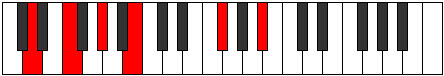 |
| SecondInversion | E#,G#,B,F#,A#,C## | 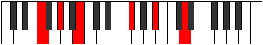 |
| ThirdInversion | G#,B,F#,A#,C##,E# | 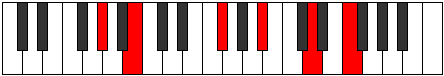 |
| FourthInversion | B,F#,A#,C##,E#,G# | 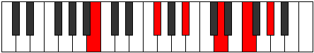 |
| FifthInversion | F#,A#,C##,E#,G#,B | 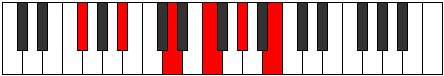 |
## Modes

| Number | Mode | Tonic | Notes | Illustration |
|--------|------|-------|-------|--------------|
| [619](https://ianring.com/musictheory/scales/619) | [Parimic](ModeFNaturalParimic.md) | F | F, Gb, Ab, Bb, Cb, D, F |  |
| [623](https://ianring.com/musictheory/scales/623) | [Sycrian](ModeFNaturalSycrian.md) | F | F, Gb, Abb, Bbbb, Cbb, Dbbb, Ebb, F |  |
| [635](https://ianring.com/musictheory/scales/635) | [Epolian](ModeFNaturalEpolian.md) | F | F, Gb, Ab, Bbb, Cbb, Dbbb, Ebb, F |  |
| [639](https://ianring.com/musictheory/scales/639) | [Ionaryllic](ModeFNaturalIonaryllic.md) | F | F, F#, G, G#, A, A#, B, D, F |  |
| [747](https://ianring.com/musictheory/scales/747) | [Lynian](ModeFNaturalLynian.md) | F | F, Gb, Ab, Bb, Cb, Dbb, Ebb, F |  |
| [751](https://ianring.com/musictheory/scales/751) | [Epacryllic](ModeFNaturalEpacryllic.md) | F | F, F#, G, G#, A#, B, C, D, F |  |
| [763](https://ianring.com/musictheory/scales/763) | [Doryllic](ModeFNaturalDoryllic.md) | F | F, F#, G#, A, A#, B, C, D, F |  |
| [767](https://ianring.com/musictheory/scales/767) | [Raptygic](ModeFNaturalRaptygic.md) | F | F, F#, G, G#, A, A#, B, C, D, F |  |
| [857](https://ianring.com/musictheory/scales/857) | [Aeolydimic](ModeDNaturalAeolydimic.md) | D | D, E#, F#, G#, A#, B, D |  |
| [859](https://ianring.com/musictheory/scales/859) | [Pathian](ModeDNaturalPathian.md) | D | D, Eb, F, Gb, Ab, Bb, Cb, D |  |
| [861](https://ianring.com/musictheory/scales/861) | [Rylian](ModeDNaturalRylian.md) | D | D, E, F, Gb, Ab, Bb, Cb, D |  |
| [863](https://ianring.com/musictheory/scales/863) | [Pyryllic](ModeDNaturalPyryllic.md) | D | D, D#, E, F, F#, G#, A#, B, D |  |
| [875](https://ianring.com/musictheory/scales/875) | [Stothian](ModeFNaturalStothian.md) | F | F, Gb, Ab, Bb, Cb, Db, Ebb, F |  |
| [879](https://ianring.com/musictheory/scales/879) | [Aeolocryllic](ModeFNaturalAeolocryllic.md) | F | F, F#, G, G#, A#, B, C#, D, F |  |
| [889](https://ianring.com/musictheory/scales/889) | [Borian](ModeDNaturalBorian.md) | D | D, E#, F#, G, Ab, Bb, Cb, D |  |
| [891](https://ianring.com/musictheory/scales/891) | [Ionilyllic](ModeDNaturalIonilyllic.md) | D | D, D#, F, F#, G, G#, A#, B, D |  |
| [891](https://ianring.com/musictheory/scales/891) | [Ionilyllic](ModeFNaturalIonilyllic.md) | F | F, F#, G#, A, A#, B, C#, D, F |  |
| [893](https://ianring.com/musictheory/scales/893) | [Pycryllic](ModeDNaturalPycryllic.md) | D | D, E, F, F#, G, G#, A#, B, D |  |
| [895](https://ianring.com/musictheory/scales/895) | [Aeolathygic](ModeDNaturalAeolathygic.md) | D | D, D#, E, F, F#, G, G#, A#, B, D |  |
| [895](https://ianring.com/musictheory/scales/895) | [Aeolathygic](ModeFNaturalAeolathygic.md) | F | F, F#, G, G#, A, A#, B, C#, D, F |  |
| [985](https://ianring.com/musictheory/scales/985) | [Raptian](ModeDNaturalRaptian.md) | D | D, E#, F#, G#, A, Bb, Cb, D |  |
| [987](https://ianring.com/musictheory/scales/987) | [Aeraptyllic](ModeDNaturalAeraptyllic.md) | D | D, D#, F, F#, G#, A, A#, B, D |  |
| [989](https://ianring.com/musictheory/scales/989) | [Phrolyllic](ModeDNaturalPhrolyllic.md) | D | D, E, F, F#, G#, A, A#, B, D |  |
| [991](https://ianring.com/musictheory/scales/991) | [Aeolygic](ModeDNaturalAeolygic.md) | D | D, D#, E, F, F#, G#, A, A#, B, D |  |
| [1003](https://ianring.com/musictheory/scales/1003) | [Ionyryllic](ModeFNaturalIonyryllic.md) | F | F, F#, G#, A#, B, C, C#, D, F |  |
| [1007](https://ianring.com/musictheory/scales/1007) | [Ionycrygic](ModeFNaturalIonycrygic.md) | F | F, F#, G, G#, A#, B, C, C#, D, F |  |
| [1017](https://ianring.com/musictheory/scales/1017) | [Dythyllic](ModeDNaturalDythyllic.md) | D | D, F, F#, G, G#, A, A#, B, D |  |
| [1019](https://ianring.com/musictheory/scales/1019) | [Aeranygic](ModeFNaturalAeranygic.md) | F | F, F#, G#, A, A#, B, C, C#, D, F |  |
| [1019](https://ianring.com/musictheory/scales/1019) | [Aeranygic](ModeDNaturalAeranygic.md) | D | D, D#, F, F#, G, G#, A, A#, B, D |  |
| [1021](https://ianring.com/musictheory/scales/1021) | [Ladygic](ModeDNaturalLadygic.md) | D | D, E, F, F#, G, G#, A, A#, B, D |  |
| [1023](https://ianring.com/musictheory/scales/1023) | [Dodyllian](ModeFNaturalDodyllian.md) | F | F, F#, G, G#, A, A#, B, C, C#, D, F |  |
| [1023](https://ianring.com/musictheory/scales/1023) | [Dodyllian](ModeDNaturalDodyllian.md) | D | D, D#, E, F, F#, G, G#, A, A#, B, D |  |
| [1239](https://ianring.com/musictheory/scales/1239) | [Epaptian](ModeENaturalEpaptian.md) | E | E, F, Gb, Ab, Bb, Cb, D, E |  |
| [1247](https://ianring.com/musictheory/scales/1247) | [Mygyllic](ModeENaturalMygyllic.md) | E | E, F, F#, G, G#, A#, B, D, E |  |
| [1271](https://ianring.com/musictheory/scales/1271) | [Kolyllic](ModeENaturalKolyllic.md) | E | E, F, F#, G#, A, A#, B, D, E |  |
| [1279](https://ianring.com/musictheory/scales/1279) | [Sarygic](ModeENaturalSarygic.md) | E | E, F, F#, G, G#, A, A#, B, D, E |  |
| [1427](https://ianring.com/musictheory/scales/1427) | [Lolimic](ModeASharpLolimic.md) | A# | A#, B, C##, D###, E##, F###, A# |  |
| [1427](https://ianring.com/musictheory/scales/1427) | [Lolimic](ModeBFlatLolimic.md) | Bb | Bb, Cb, D, E#, F#, G#, Bb |  |
| [1431](https://ianring.com/musictheory/scales/1431) | [Phragian](ModeASharpPhragian.md) | A# | A#, B, C, D, E#, F#, G#, A# |  |
| [1431](https://ianring.com/musictheory/scales/1431) | [Phragian](ModeBFlatPhragian.md) | Bb | Bb, Cb, Dbb, Ebb, F, Gb, Ab, Bb |  |
| [1435](https://ianring.com/musictheory/scales/1435) | [Phronian](ModeASharpPhronian.md) | A# | A#, B, C#, D, E#, F#, G#, A# | 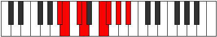 |
| [1435](https://ianring.com/musictheory/scales/1435) | [Phronian](ModeBFlatPhronian.md) | Bb | Bb, Cb, Db, Ebb, F, Gb, Ab, Bb |  |
| [1439](https://ianring.com/musictheory/scales/1439) | [Rolyllic](ModeASharpRolyllic.md) | A# | A#, B, C, C#, D, F, F#, G#, A# |  |
| [1439](https://ianring.com/musictheory/scales/1439) | [Rolyllic](ModeBFlatRolyllic.md) | Bb | Bb, B, C, Db, D, F, Gb, Ab, Bb |  |
| [1459](https://ianring.com/musictheory/scales/1459) | [Ionalian](ModeASharpIonalian.md) | A# | A#, B, C##, D#, E#, F#, G#, A# |  |
| [1459](https://ianring.com/musictheory/scales/1459) | [Ionalian](ModeBFlatIonalian.md) | Bb | Bb, Cb, D, Eb, F, Gb, Ab, Bb |  |
| [1463](https://ianring.com/musictheory/scales/1463) | [Zaptyllic](ModeASharpZaptyllic.md) | A# | A#, B, C, D, D#, F, F#, G#, A# |  |
| [1463](https://ianring.com/musictheory/scales/1463) | [Zaptyllic](ModeBFlatZaptyllic.md) | Bb | Bb, B, C, D, Eb, F, Gb, Ab, Bb |  |
| [1467](https://ianring.com/musictheory/scales/1467) | [Thydyllic](ModeASharpThydyllic.md) | A# | A#, B, C#, D, D#, F, F#, G#, A# |  |
| [1467](https://ianring.com/musictheory/scales/1467) | [Thydyllic](ModeBFlatThydyllic.md) | Bb | Bb, B, Db, D, Eb, F, Gb, Ab, Bb |  |
| [1471](https://ianring.com/musictheory/scales/1471) | [Radygic](ModeASharpRadygic.md) | A# | A#, B, C, C#, D, D#, F, F#, G#, A# |  |
| [1471](https://ianring.com/musictheory/scales/1471) | [Radygic](ModeBFlatRadygic.md) | Bb | Bb, B, C, Db, D, Eb, F, Gb, Ab, Bb |  |
| [1491](https://ianring.com/musictheory/scales/1491) | [Rynian](ModeASharpRynian.md) | A# | A#, B, C##, D##, E#, F#, G#, A# |  |
| [1491](https://ianring.com/musictheory/scales/1491) | [Rynian](ModeBFlatRynian.md) | Bb | Bb, Cb, D, E, F, Gb, Ab, Bb |  |
| [1495](https://ianring.com/musictheory/scales/1495) | [Kaptyllic](ModeENaturalKaptyllic.md) | E | E, F, F#, G#, A#, B, C, D, E |  |
| [1495](https://ianring.com/musictheory/scales/1495) | [Kaptyllic](ModeASharpKaptyllic.md) | A# | A#, B, C, D, E, F, F#, G#, A# |  |
| [1495](https://ianring.com/musictheory/scales/1495) | [Kaptyllic](ModeBFlatKaptyllic.md) | Bb | Bb, B, C, D, E, F, Gb, Ab, Bb |  |
| [1499](https://ianring.com/musictheory/scales/1499) | [Stonyllic](ModeASharpStonyllic.md) | A# | A#, B, C#, D, E, F, F#, G#, A# |  |
| [1499](https://ianring.com/musictheory/scales/1499) | [Stonyllic](ModeBFlatStonyllic.md) | Bb | Bb, B, Db, D, E, F, Gb, Ab, Bb |  |
| [1503](https://ianring.com/musictheory/scales/1503) | [Padygic](ModeASharpPadygic.md) | A# | A#, B, C, C#, D, E, F, F#, G#, A# |  |
| [1503](https://ianring.com/musictheory/scales/1503) | [Padygic](ModeBFlatPadygic.md) | Bb | Bb, B, C, Db, D, E, F, Gb, Ab, Bb |  |
| [1503](https://ianring.com/musictheory/scales/1503) | [Padygic](ModeENaturalPadygic.md) | E | E, F, F#, G, G#, A#, B, C, D, E |  |
| [1523](https://ianring.com/musictheory/scales/1523) | [Zothyllic](ModeASharpZothyllic.md) | A# | A#, B, D, D#, E, F, F#, G#, A# |  |
| [1523](https://ianring.com/musictheory/scales/1523) | [Zothyllic](ModeBFlatZothyllic.md) | Bb | Bb, B, D, Eb, E, F, Gb, Ab, Bb |  |
| [1527](https://ianring.com/musictheory/scales/1527) | [Aeolyrygic](ModeASharpAeolyrygic.md) | A# | A#, B, C, D, D#, E, F, F#, G#, A# |  |
| [1527](https://ianring.com/musictheory/scales/1527) | [Aeolyrygic](ModeBFlatAeolyrygic.md) | Bb | Bb, B, C, D, Eb, E, F, Gb, Ab, Bb |  |
| [1527](https://ianring.com/musictheory/scales/1527) | [Aeolyrygic](ModeENaturalAeolyrygic.md) | E | E, F, F#, G#, A, A#, B, C, D, E |  |
| [1531](https://ianring.com/musictheory/scales/1531) | [Styptygic](ModeASharpStyptygic.md) | A# | A#, B, C#, D, D#, E, F, F#, G#, A# |  |
| [1531](https://ianring.com/musictheory/scales/1531) | [Styptygic](ModeBFlatStyptygic.md) | Bb | Bb, B, Db, D, Eb, E, F, Gb, Ab, Bb |  |
| [1535](https://ianring.com/musictheory/scales/1535) | [Mixodyllian](ModeASharpMixodyllian.md) | A# | A#, B, C, C#, D, D#, E, F, F#, G#, A# |  |
| [1535](https://ianring.com/musictheory/scales/1535) | [Mixodyllian](ModeBFlatMixodyllian.md) | Bb | Bb, B, C, Db, D, Eb, E, F, Gb, Ab, Bb |  |
| [1535](https://ianring.com/musictheory/scales/1535) | [Mixodyllian](ModeENaturalMixodyllian.md) | E | E, F, F#, G, G#, A, A#, B, C, D, E |  |
| [1613](https://ianring.com/musictheory/scales/1613) | [Thylimic](ModeGSharpThylimic.md) | G# | G#, A#, B, C##, D###, E##, G# |  |
| [1613](https://ianring.com/musictheory/scales/1613) | [Thylimic](ModeAFlatThylimic.md) | Ab | Ab, Bb, Cb, D, E#, F#, Ab |  |
| [1615](https://ianring.com/musictheory/scales/1615) | [Sydian](ModeGSharpSydian.md) | G# | G#, A, Bb, Cb, D, E#, F#, G# |  |
| [1615](https://ianring.com/musictheory/scales/1615) | [Sydian](ModeAFlatSydian.md) | Ab | Ab, Bbb, Cbb, Dbbb, Ebb, F, Gb, Ab |  |
| [1629](https://ianring.com/musictheory/scales/1629) | [Synian](ModeGSharpSynian.md) | G# | G#, A#, B, C, D, E#, F#, G# |  |
| [1629](https://ianring.com/musictheory/scales/1629) | [Synian](ModeAFlatSynian.md) | Ab | Ab, Bb, Cb, Dbb, Ebb, F, Gb, Ab |  |
| [1631](https://ianring.com/musictheory/scales/1631) | [Rynyllic](ModeGSharpRynyllic.md) | G# | G#, A, A#, B, C, D, F, F#, G# |  |
| [1631](https://ianring.com/musictheory/scales/1631) | [Rynyllic](ModeAFlatRynyllic.md) | Ab | Ab, A, Bb, B, C, D, F, Gb, Ab |  |
| [1643](https://ianring.com/musictheory/scales/1643) | [Thyptian](ModeFNaturalThyptian.md) | F | F, Gb, Ab, Bb, Cb, D, Eb, F |  |
| [1645](https://ianring.com/musictheory/scales/1645) | [Katagian](ModeGSharpKatagian.md) | G# | G#, A#, B, C#, D, E#, F#, G# |  |
| [1645](https://ianring.com/musictheory/scales/1645) | [Katagian](ModeAFlatKatagian.md) | Ab | Ab, Bb, Cb, Db, Ebb, F, Gb, Ab |  |
| [1647](https://ianring.com/musictheory/scales/1647) | [Polyllic](ModeFNaturalPolyllic.md) | F | F, F#, G, G#, A#, B, D, D#, F |  |
| [1647](https://ianring.com/musictheory/scales/1647) | [Polyllic](ModeGSharpPolyllic.md) | G# | G#, A, A#, B, C#, D, F, F#, G# |  |
| [1647](https://ianring.com/musictheory/scales/1647) | [Polyllic](ModeAFlatPolyllic.md) | Ab | Ab, A, Bb, B, Db, D, F, Gb, Ab |  |
| [1659](https://ianring.com/musictheory/scales/1659) | [Magyllic](ModeFNaturalMagyllic.md) | F | F, F#, G#, A, A#, B, D, D#, F |  |
| [1661](https://ianring.com/musictheory/scales/1661) | [Gonyllic](ModeGSharpGonyllic.md) | G# | G#, A#, B, C, C#, D, F, F#, G# |  |
| [1661](https://ianring.com/musictheory/scales/1661) | [Gonyllic](ModeAFlatGonyllic.md) | Ab | Ab, Bb, B, C, Db, D, F, Gb, Ab |  |
| [1663](https://ianring.com/musictheory/scales/1663) | [Lydygic](ModeGSharpLydygic.md) | G# | G#, A, A#, B, C, C#, D, F, F#, G# |  |
| [1663](https://ianring.com/musictheory/scales/1663) | [Lydygic](ModeAFlatLydygic.md) | Ab | Ab, A, Bb, B, C, Db, D, F, Gb, Ab |  |
| [1663](https://ianring.com/musictheory/scales/1663) | [Lydygic](ModeFNaturalLydygic.md) | F | F, F#, G, G#, A, A#, B, D, D#, F |  |
| [1715](https://ianring.com/musictheory/scales/1715) | [Aeronian](ModeCSharpAeronian.md) | C# | C#, D, E#, F#, G#, A#, B, C# |  |
| [1715](https://ianring.com/musictheory/scales/1715) | [Aeronian](ModeDFlatAeronian.md) | Db | Db, Ebb, F, Gb, Ab, Bb, Cb, Db |  |
| [1719](https://ianring.com/musictheory/scales/1719) | [Lyryllic](ModeCSharpLyryllic.md) | C# | C#, D, D#, F, F#, G#, A#, B, C# |  |
| [1719](https://ianring.com/musictheory/scales/1719) | [Lyryllic](ModeDFlatLyryllic.md) | Db | Db, D, Eb, F, Gb, Ab, Bb, B, Db |  |
| [1723](https://ianring.com/musictheory/scales/1723) | [Poryllic](ModeCSharpPoryllic.md) | C# | C#, D, E, F, F#, G#, A#, B, C# |  |
| [1723](https://ianring.com/musictheory/scales/1723) | [Poryllic](ModeDFlatPoryllic.md) | Db | Db, D, E, F, Gb, Ab, Bb, B, Db |  |
| [1727](https://ianring.com/musictheory/scales/1727) | [Sydygic](ModeCSharpSydygic.md) | C# | C#, D, D#, E, F, F#, G#, A#, B, C# |  |
| [1727](https://ianring.com/musictheory/scales/1727) | [Sydygic](ModeDFlatSydygic.md) | Db | Db, D, Eb, E, F, Gb, Ab, Bb, B, Db |  |
| [1741](https://ianring.com/musictheory/scales/1741) | [Katycrian](ModeGSharpKatycrian.md) | G# | G#, A#, B, C##, D#, E#, F#, G# |  |
| [1741](https://ianring.com/musictheory/scales/1741) | [Katycrian](ModeAFlatKatycrian.md) | Ab | Ab, Bb, Cb, D, Eb, F, Gb, Ab |  |
| [1743](https://ianring.com/musictheory/scales/1743) | [Epigyllic](ModeGSharpEpigyllic.md) | G# | G#, A, A#, B, D, D#, F, F#, G# |  |
| [1743](https://ianring.com/musictheory/scales/1743) | [Epigyllic](ModeAFlatEpigyllic.md) | Ab | Ab, A, Bb, B, D, Eb, F, Gb, Ab |  |
| [1751](https://ianring.com/musictheory/scales/1751) | [Aeolyryllic](ModeENaturalAeolyryllic.md) | E | E, F, F#, G#, A#, B, C#, D, E |  |
| [1757](https://ianring.com/musictheory/scales/1757) | [Ionyphyllic](ModeGSharpIonyphyllic.md) | G# | G#, A#, B, C, D, D#, F, F#, G# |  |
| [1757](https://ianring.com/musictheory/scales/1757) | [Ionyphyllic](ModeAFlatIonyphyllic.md) | Ab | Ab, Bb, B, C, D, Eb, F, Gb, Ab |  |
| [1759](https://ianring.com/musictheory/scales/1759) | [Pylygic](ModeENaturalPylygic.md) | E | E, F, F#, G, G#, A#, B, C#, D, E |  |
| [1759](https://ianring.com/musictheory/scales/1759) | [Pylygic](ModeGSharpPylygic.md) | G# | G#, A, A#, B, C, D, D#, F, F#, G# |  |
| [1759](https://ianring.com/musictheory/scales/1759) | [Pylygic](ModeAFlatPylygic.md) | Ab | Ab, A, Bb, B, C, D, Eb, F, Gb, Ab |  |
| [1771](https://ianring.com/musictheory/scales/1771) | [Stylyllic](ModeFNaturalStylyllic.md) | F | F, F#, G#, A#, B, C, D, D#, F |  |
| [1773](https://ianring.com/musictheory/scales/1773) | [Aeoloryllic](ModeGSharpAeoloryllic.md) | G# | G#, A#, B, C#, D, D#, F, F#, G# |  |
| [1773](https://ianring.com/musictheory/scales/1773) | [Aeoloryllic](ModeAFlatAeoloryllic.md) | Ab | Ab, Bb, B, Db, D, Eb, F, Gb, Ab |  |
| [1775](https://ianring.com/musictheory/scales/1775) | [Lyrygic](ModeFNaturalLyrygic.md) | F | F, F#, G, G#, A#, B, C, D, D#, F |  |
| [1775](https://ianring.com/musictheory/scales/1775) | [Lyrygic](ModeGSharpLyrygic.md) | G# | G#, A, A#, B, C#, D, D#, F, F#, G# |  |
| [1775](https://ianring.com/musictheory/scales/1775) | [Lyrygic](ModeAFlatLyrygic.md) | Ab | Ab, A, Bb, B, Db, D, Eb, F, Gb, Ab |  |
| [1779](https://ianring.com/musictheory/scales/1779) | [Aerythyllic](ModeCSharpAerythyllic.md) | C# | C#, D, F, F#, G, G#, A#, B, C# |  |
| [1779](https://ianring.com/musictheory/scales/1779) | [Aerythyllic](ModeDFlatAerythyllic.md) | Db | Db, D, F, Gb, G, Ab, Bb, B, Db |  |
| [1783](https://ianring.com/musictheory/scales/1783) | [Danygic](ModeCSharpDanygic.md) | C# | C#, D, D#, F, F#, G, G#, A#, B, C# |  |
| [1783](https://ianring.com/musictheory/scales/1783) | [Danygic](ModeDFlatDanygic.md) | Db | Db, D, Eb, F, Gb, G, Ab, Bb, B, Db |  |
| [1783](https://ianring.com/musictheory/scales/1783) | [Danygic](ModeENaturalDanygic.md) | E | E, F, F#, G#, A, A#, B, C#, D, E |  |
| [1787](https://ianring.com/musictheory/scales/1787) | [Mycrygic](ModeCSharpMycrygic.md) | C# | C#, D, E, F, F#, G, G#, A#, B, C# |  |
| [1787](https://ianring.com/musictheory/scales/1787) | [Mycrygic](ModeDFlatMycrygic.md) | Db | Db, D, E, F, Gb, G, Ab, Bb, B, Db |  |
| [1787](https://ianring.com/musictheory/scales/1787) | [Mycrygic](ModeFNaturalMycrygic.md) | F | F, F#, G#, A, A#, B, C, D, D#, F |  |
| [1789](https://ianring.com/musictheory/scales/1789) | [Katagygic](ModeGSharpKatagygic.md) | G# | G#, A#, B, C, C#, D, D#, F, F#, G# |  |
| [1789](https://ianring.com/musictheory/scales/1789) | [Katagygic](ModeAFlatKatagygic.md) | Ab | Ab, Bb, B, C, Db, D, Eb, F, Gb, Ab |  |
| [1791](https://ianring.com/musictheory/scales/1791) | [Aerygyllian](ModeCSharpAerygyllian.md) | C# | C#, D, D#, E, F, F#, G, G#, A#, B, C# |  |
| [1791](https://ianring.com/musictheory/scales/1791) | [Aerygyllian](ModeDFlatAerygyllian.md) | Db | Db, D, Eb, E, F, Gb, G, Ab, Bb, B, Db |  |
| [1791](https://ianring.com/musictheory/scales/1791) | [Aerygyllian](ModeGSharpAerygyllian.md) | G# | G#, A, A#, B, C, C#, D, D#, F, F#, G# |  |
| [1791](https://ianring.com/musictheory/scales/1791) | [Aerygyllian](ModeAFlatAerygyllian.md) | Ab | Ab, A, Bb, B, C, Db, D, Eb, F, Gb, Ab |  |
| [1791](https://ianring.com/musictheory/scales/1791) | [Aerygyllian](ModeFNaturalAerygyllian.md) | F | F, F#, G, G#, A, A#, B, C, D, D#, F |  |
| [1791](https://ianring.com/musictheory/scales/1791) | [Aerygyllian](ModeENaturalAerygyllian.md) | E | E, F, F#, G, G#, A, A#, B, C#, D, E |  |
| [1869](https://ianring.com/musictheory/scales/1869) | [Katyrian](ModeGSharpKatyrian.md) | G# | G#, A#, B, C##, D##, E#, F#, G# |  |
| [1869](https://ianring.com/musictheory/scales/1869) | [Katyrian](ModeAFlatKatyrian.md) | Ab | Ab, Bb, Cb, D, E, F, Gb, Ab | 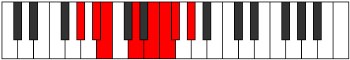 |
| [1871](https://ianring.com/musictheory/scales/1871) | [Aeolyllic](ModeGSharpAeolyllic.md) | G# | G#, A, A#, B, D, E, F, F#, G# |  |
| [1871](https://ianring.com/musictheory/scales/1871) | [Aeolyllic](ModeAFlatAeolyllic.md) | Ab | Ab, A, Bb, B, D, E, F, Gb, Ab |  |
| [1881](https://ianring.com/musictheory/scales/1881) | [Korian](ModeDNaturalKorian.md) | D | D, E#, F#, G#, A#, B, C, D |  |
| [1883](https://ianring.com/musictheory/scales/1883) | [Mixopyryllic](ModeDNaturalMixopyryllic.md) | D | D, D#, F, F#, G#, A#, B, C, D |  |
| [1885](https://ianring.com/musictheory/scales/1885) | [Epidyllic](ModeDNaturalEpidyllic.md) | D | D, E, F, F#, G#, A#, B, C, D |  |
| [1885](https://ianring.com/musictheory/scales/1885) | [Epidyllic](ModeGSharpEpidyllic.md) | G# | G#, A#, B, C, D, E, F, F#, G# |  |
| [1885](https://ianring.com/musictheory/scales/1885) | [Epidyllic](ModeAFlatEpidyllic.md) | Ab | Ab, Bb, B, C, D, E, F, Gb, Ab |  |
| [1887](https://ianring.com/musictheory/scales/1887) | [Aerocrygic](ModeDNaturalAerocrygic.md) | D | D, D#, E, F, F#, G#, A#, B, C, D |  |
| [1887](https://ianring.com/musictheory/scales/1887) | [Aerocrygic](ModeGSharpAerocrygic.md) | G# | G#, A, A#, B, C, D, E, F, F#, G# |  |
| [1887](https://ianring.com/musictheory/scales/1887) | [Aerocrygic](ModeAFlatAerocrygic.md) | Ab | Ab, A, Bb, B, C, D, E, F, Gb, Ab |  |
| [1899](https://ianring.com/musictheory/scales/1899) | [Moptyllic](ModeFNaturalMoptyllic.md) | F | F, F#, G#, A#, B, C#, D, D#, F |  |
| [1901](https://ianring.com/musictheory/scales/1901) | [Ionidyllic](ModeGSharpIonidyllic.md) | G# | G#, A#, B, C#, D, E, F, F#, G# |  |
| [1901](https://ianring.com/musictheory/scales/1901) | [Ionidyllic](ModeAFlatIonidyllic.md) | Ab | Ab, Bb, B, Db, D, E, F, Gb, Ab |  |
| [1903](https://ianring.com/musictheory/scales/1903) | [Rocrygic](ModeFNaturalRocrygic.md) | F | F, F#, G, G#, A#, B, C#, D, D#, F |  |
| [1903](https://ianring.com/musictheory/scales/1903) | [Rocrygic](ModeGSharpRocrygic.md) | G# | G#, A, A#, B, C#, D, E, F, F#, G# |  |
| [1903](https://ianring.com/musictheory/scales/1903) | [Rocrygic](ModeAFlatRocrygic.md) | Ab | Ab, A, Bb, B, Db, D, E, F, Gb, Ab |  |
| [1913](https://ianring.com/musictheory/scales/1913) | [Zagyllic](ModeDNaturalZagyllic.md) | D | D, F, F#, G, G#, A#, B, C, D |  |
| [1915](https://ianring.com/musictheory/scales/1915) | [Thydygic](ModeDNaturalThydygic.md) | D | D, D#, F, F#, G, G#, A#, B, C, D |  |
| [1915](https://ianring.com/musictheory/scales/1915) | [Thydygic](ModeFNaturalThydygic.md) | F | F, F#, G#, A, A#, B, C#, D, D#, F | 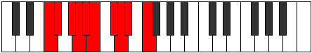 |
| [1917](https://ianring.com/musictheory/scales/1917) | [Sacrygic](ModeGSharpSacrygic.md) | G# | G#, A#, B, C, C#, D, E, F, F#, G# |  |
| [1917](https://ianring.com/musictheory/scales/1917) | [Sacrygic](ModeAFlatSacrygic.md) | Ab | Ab, Bb, B, C, Db, D, E, F, Gb, Ab |  |
| [1917](https://ianring.com/musictheory/scales/1917) | [Sacrygic](ModeDNaturalSacrygic.md) | D | D, E, F, F#, G, G#, A#, B, C, D |  |
| [1919](https://ianring.com/musictheory/scales/1919) | [Rocryllian](ModeDNaturalRocryllian.md) | D | D, D#, E, F, F#, G, G#, A#, B, C, D |  |
| [1919](https://ianring.com/musictheory/scales/1919) | [Rocryllian](ModeGSharpRocryllian.md) | G# | G#, A, A#, B, C, C#, D, E, F, F#, G# |  |
| [1919](https://ianring.com/musictheory/scales/1919) | [Rocryllian](ModeAFlatRocryllian.md) | Ab | Ab, A, Bb, B, C, Db, D, E, F, Gb, Ab |  |
| [1919](https://ianring.com/musictheory/scales/1919) | [Rocryllian](ModeFNaturalRocryllian.md) | F | F, F#, G, G#, A, A#, B, C#, D, D#, F |  |
| [1939](https://ianring.com/musictheory/scales/1939) | [Dathian](ModeASharpDathian.md) | A# | A#, B, C##, D###, E##, F##, G#, A# |  |
| [1939](https://ianring.com/musictheory/scales/1939) | [Dathian](ModeBFlatDathian.md) | Bb | Bb, Cb, D, E#, F#, G, Ab, Bb |  |
| [1943](https://ianring.com/musictheory/scales/1943) | [Malyllic](ModeASharpMalyllic.md) | A# | A#, B, C, D, F, F#, G, G#, A# |  |
| [1943](https://ianring.com/musictheory/scales/1943) | [Malyllic](ModeBFlatMalyllic.md) | Bb | Bb, B, C, D, F, Gb, G, Ab, Bb |  |
| [1947](https://ianring.com/musictheory/scales/1947) | [Ionoyllic](ModeASharpIonoyllic.md) | A# | A#, B, C#, D, F, F#, G, G#, A# |  |
| [1947](https://ianring.com/musictheory/scales/1947) | [Ionoyllic](ModeBFlatIonoyllic.md) | Bb | Bb, B, Db, D, F, Gb, G, Ab, Bb |  |
| [1951](https://ianring.com/musictheory/scales/1951) | [Gonygic](ModeASharpGonygic.md) | A# | A#, B, C, C#, D, F, F#, G, G#, A# |  |
| [1951](https://ianring.com/musictheory/scales/1951) | [Gonygic](ModeBFlatGonygic.md) | Bb | Bb, B, C, Db, D, F, Gb, G, Ab, Bb |  |
| [1971](https://ianring.com/musictheory/scales/1971) | [Aerynyllic](ModeASharpAerynyllic.md) | A# | A#, B, D, D#, F, F#, G, G#, A# |  |
| [1971](https://ianring.com/musictheory/scales/1971) | [Aerynyllic](ModeBFlatAerynyllic.md) | Bb | Bb, B, D, Eb, F, Gb, G, Ab, Bb |  |
| [1971](https://ianring.com/musictheory/scales/1971) | [Aerynyllic](ModeCSharpAerynyllic.md) | C# | C#, D, F, F#, G#, A, A#, B, C# |  |
| [1971](https://ianring.com/musictheory/scales/1971) | [Aerynyllic](ModeDFlatAerynyllic.md) | Db | Db, D, F, Gb, Ab, A, Bb, B, Db |  |
| [1975](https://ianring.com/musictheory/scales/1975) | [Ionocrygic](ModeASharpIonocrygic.md) | A# | A#, B, C, D, D#, F, F#, G, G#, A# |  |
| [1975](https://ianring.com/musictheory/scales/1975) | [Ionocrygic](ModeBFlatIonocrygic.md) | Bb | Bb, B, C, D, Eb, F, Gb, G, Ab, Bb |  |
| [1975](https://ianring.com/musictheory/scales/1975) | [Ionocrygic](ModeCSharpIonocrygic.md) | C# | C#, D, D#, F, F#, G#, A, A#, B, C# |  |
| [1975](https://ianring.com/musictheory/scales/1975) | [Ionocrygic](ModeDFlatIonocrygic.md) | Db | Db, D, Eb, F, Gb, Ab, A, Bb, B, Db |  |
| [1979](https://ianring.com/musictheory/scales/1979) | [Aeradygic](ModeASharpAeradygic.md) | A# | A#, B, C#, D, D#, F, F#, G, G#, A# |  |
| [1979](https://ianring.com/musictheory/scales/1979) | [Aeradygic](ModeBFlatAeradygic.md) | Bb | Bb, B, Db, D, Eb, F, Gb, G, Ab, Bb |  |
| [1979](https://ianring.com/musictheory/scales/1979) | [Aeradygic](ModeCSharpAeradygic.md) | C# | C#, D, E, F, F#, G#, A, A#, B, C# |  |
| [1979](https://ianring.com/musictheory/scales/1979) | [Aeradygic](ModeDFlatAeradygic.md) | Db | Db, D, E, F, Gb, Ab, A, Bb, B, Db |  |
| [1983](https://ianring.com/musictheory/scales/1983) | [Soryllian](ModeASharpSoryllian.md) | A# | A#, B, C, C#, D, D#, F, F#, G, G#, A# |  |
| [1983](https://ianring.com/musictheory/scales/1983) | [Soryllian](ModeBFlatSoryllian.md) | Bb | Bb, B, C, Db, D, Eb, F, Gb, G, Ab, Bb |  |
| [1983](https://ianring.com/musictheory/scales/1983) | [Soryllian](ModeCSharpSoryllian.md) | C# | C#, D, D#, E, F, F#, G#, A, A#, B, C# |  |
| [1983](https://ianring.com/musictheory/scales/1983) | [Soryllian](ModeDFlatSoryllian.md) | Db | Db, D, Eb, E, F, Gb, Ab, A, Bb, B, Db |  |
| [1997](https://ianring.com/musictheory/scales/1997) | [Staryllic](ModeGSharpStaryllic.md) | G# | G#, A#, B, D, D#, E, F, F#, G# |  |
| [1997](https://ianring.com/musictheory/scales/1997) | [Staryllic](ModeAFlatStaryllic.md) | Ab | Ab, Bb, B, D, Eb, E, F, Gb, Ab |  |
| [1999](https://ianring.com/musictheory/scales/1999) | [Zacrygic](ModeGSharpZacrygic.md) | G# | G#, A, A#, B, D, D#, E, F, F#, G# |  |
| [1999](https://ianring.com/musictheory/scales/1999) | [Zacrygic](ModeAFlatZacrygic.md) | Ab | Ab, A, Bb, B, D, Eb, E, F, Gb, Ab |  |
| [2003](https://ianring.com/musictheory/scales/2003) | [Lolyllic](ModeASharpLolyllic.md) | A# | A#, B, D, E, F, F#, G, G#, A# | 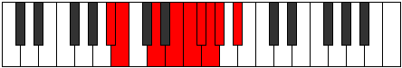 |
| [2003](https://ianring.com/musictheory/scales/2003) | [Lolyllic](ModeBFlatLolyllic.md) | Bb | Bb, B, D, E, F, Gb, G, Ab, Bb |  |
| [2007](https://ianring.com/musictheory/scales/2007) | [Stonygic](ModeENaturalStonygic.md) | E | E, F, F#, G#, A#, B, C, C#, D, E |  |
| [2007](https://ianring.com/musictheory/scales/2007) | [Stonygic](ModeASharpStonygic.md) | A# | A#, B, C, D, E, F, F#, G, G#, A# |  |
| [2007](https://ianring.com/musictheory/scales/2007) | [Stonygic](ModeBFlatStonygic.md) | Bb | Bb, B, C, D, E, F, Gb, G, Ab, Bb |  |
| [2009](https://ianring.com/musictheory/scales/2009) | [Stacryllic](ModeDNaturalStacryllic.md) | D | D, F, F#, G#, A, A#, B, C, D |  |
| [2011](https://ianring.com/musictheory/scales/2011) | [Raphygic](ModeASharpRaphygic.md) | A# | A#, B, C#, D, E, F, F#, G, G#, A# |  |
| [2011](https://ianring.com/musictheory/scales/2011) | [Raphygic](ModeBFlatRaphygic.md) | Bb | Bb, B, Db, D, E, F, Gb, G, Ab, Bb |  |
| [2011](https://ianring.com/musictheory/scales/2011) | [Raphygic](ModeDNaturalRaphygic.md) | D | D, D#, F, F#, G#, A, A#, B, C, D |  |
| [2013](https://ianring.com/musictheory/scales/2013) | [Mocrygic](ModeGSharpMocrygic.md) | G# | G#, A#, B, C, D, D#, E, F, F#, G# |  |
| [2013](https://ianring.com/musictheory/scales/2013) | [Mocrygic](ModeAFlatMocrygic.md) | Ab | Ab, Bb, B, C, D, Eb, E, F, Gb, Ab |  |
| [2013](https://ianring.com/musictheory/scales/2013) | [Mocrygic](ModeDNaturalMocrygic.md) | D | D, E, F, F#, G#, A, A#, B, C, D |  |
| [2015](https://ianring.com/musictheory/scales/2015) | [Epiryllian](ModeENaturalEpiryllian.md) | E | E, F, F#, G, G#, A#, B, C, C#, D, E |  |
| [2015](https://ianring.com/musictheory/scales/2015) | [Epiryllian](ModeASharpEpiryllian.md) | A# | A#, B, C, C#, D, E, F, F#, G, G#, A# |  |
| [2015](https://ianring.com/musictheory/scales/2015) | [Epiryllian](ModeBFlatEpiryllian.md) | Bb | Bb, B, C, Db, D, E, F, Gb, G, Ab, Bb |  |
| [2015](https://ianring.com/musictheory/scales/2015) | [Epiryllian](ModeDNaturalEpiryllian.md) | D | D, D#, E, F, F#, G#, A, A#, B, C, D |  |
| [2015](https://ianring.com/musictheory/scales/2015) | [Epiryllian](ModeGSharpEpiryllian.md) | G# | G#, A, A#, B, C, D, D#, E, F, F#, G# |  |
| [2015](https://ianring.com/musictheory/scales/2015) | [Epiryllian](ModeAFlatEpiryllian.md) | Ab | Ab, A, Bb, B, C, D, Eb, E, F, Gb, Ab |  |
| [2027](https://ianring.com/musictheory/scales/2027) | [Boptygic](ModeFNaturalBoptygic.md) | F | F, F#, G#, A#, B, C, C#, D, D#, F |  |
| [2029](https://ianring.com/musictheory/scales/2029) | [Mathygic](ModeGSharpMathygic.md) | G# | G#, A#, B, C#, D, D#, E, F, F#, G# |  |
| [2029](https://ianring.com/musictheory/scales/2029) | [Mathygic](ModeAFlatMathygic.md) | Ab | Ab, Bb, B, Db, D, Eb, E, F, Gb, Ab |  |
| [2031](https://ianring.com/musictheory/scales/2031) | [Gadyllian](ModeFNaturalGadyllian.md) | F | F, F#, G, G#, A#, B, C, C#, D, D#, F |  |
| [2031](https://ianring.com/musictheory/scales/2031) | [Gadyllian](ModeGSharpGadyllian.md) | G# | G#, A, A#, B, C#, D, D#, E, F, F#, G# |  |
| [2031](https://ianring.com/musictheory/scales/2031) | [Gadyllian](ModeAFlatGadyllian.md) | Ab | Ab, A, Bb, B, Db, D, Eb, E, F, Gb, Ab |  |
| [2035](https://ianring.com/musictheory/scales/2035) | [Aerythygic](ModeASharpAerythygic.md) | A# | A#, B, D, D#, E, F, F#, G, G#, A# |  |
| [2035](https://ianring.com/musictheory/scales/2035) | [Aerythygic](ModeBFlatAerythygic.md) | Bb | Bb, B, D, Eb, E, F, Gb, G, Ab, Bb |  |
| [2035](https://ianring.com/musictheory/scales/2035) | [Aerythygic](ModeCSharpAerythygic.md) | C# | C#, D, F, F#, G, G#, A, A#, B, C# |  |
| [2035](https://ianring.com/musictheory/scales/2035) | [Aerythygic](ModeDFlatAerythygic.md) | Db | Db, D, F, Gb, G, Ab, A, Bb, B, Db |  |
| [2039](https://ianring.com/musictheory/scales/2039) | [Danyllian](ModeASharpDanyllian.md) | A# | A#, B, C, D, D#, E, F, F#, G, G#, A# |  |
| [2039](https://ianring.com/musictheory/scales/2039) | [Danyllian](ModeBFlatDanyllian.md) | Bb | Bb, B, C, D, Eb, E, F, Gb, G, Ab, Bb |  |
| [2039](https://ianring.com/musictheory/scales/2039) | [Danyllian](ModeENaturalDanyllian.md) | E | E, F, F#, G#, A, A#, B, C, C#, D, E |  |
| [2039](https://ianring.com/musictheory/scales/2039) | [Danyllian](ModeCSharpDanyllian.md) | C# | C#, D, D#, F, F#, G, G#, A, A#, B, C# |  |
| [2039](https://ianring.com/musictheory/scales/2039) | [Danyllian](ModeDFlatDanyllian.md) | Db | Db, D, Eb, F, Gb, G, Ab, A, Bb, B, Db |  |
| [2041](https://ianring.com/musictheory/scales/2041) | [Aeolacrygic](ModeDNaturalAeolacrygic.md) | D | D, F, F#, G, G#, A, A#, B, C, D |  |
| [2043](https://ianring.com/musictheory/scales/2043) | [Lythyllian](ModeASharpLythyllian.md) | A# | A#, B, C#, D, D#, E, F, F#, G, G#, A# |  |
| [2043](https://ianring.com/musictheory/scales/2043) | [Lythyllian](ModeBFlatLythyllian.md) | Bb | Bb, B, Db, D, Eb, E, F, Gb, G, Ab, Bb |  |
| [2043](https://ianring.com/musictheory/scales/2043) | [Lythyllian](ModeFNaturalLythyllian.md) | F | F, F#, G#, A, A#, B, C, C#, D, D#, F |  |
| [2043](https://ianring.com/musictheory/scales/2043) | [Lythyllian](ModeDNaturalLythyllian.md) | D | D, D#, F, F#, G, G#, A, A#, B, C, D |  |
| [2043](https://ianring.com/musictheory/scales/2043) | [Lythyllian](ModeCSharpLythyllian.md) | C# | C#, D, E, F, F#, G, G#, A, A#, B, C# |  |
| [2043](https://ianring.com/musictheory/scales/2043) | [Lythyllian](ModeDFlatLythyllian.md) | Db | Db, D, E, F, Gb, G, Ab, A, Bb, B, Db |  |
| [2045](https://ianring.com/musictheory/scales/2045) | [Katogyllian](ModeGSharpKatogyllian.md) | G# | G#, A#, B, C, C#, D, D#, E, F, F#, G# |  |
| [2045](https://ianring.com/musictheory/scales/2045) | [Katogyllian](ModeAFlatKatogyllian.md) | Ab | Ab, Bb, B, C, Db, D, Eb, E, F, Gb, Ab |  |
| [2045](https://ianring.com/musictheory/scales/2045) | [Katogyllian](ModeDNaturalKatogyllian.md) | D | D, E, F, F#, G, G#, A, A#, B, C, D |  |
| [2047](https://ianring.com/musictheory/scales/2047) | [Monatic](ModeASharpMonatic.md) | A# | A#, B, C, C#, D, D#, E, F, F#, G, G#, A# |  |
| [2047](https://ianring.com/musictheory/scales/2047) | [Monatic](ModeBFlatMonatic.md) | Bb | Bb, B, C, Db, D, Eb, E, F, Gb, G, Ab, Bb |  |
| [2047](https://ianring.com/musictheory/scales/2047) | [Monatic](ModeGSharpMonatic.md) | G# | G#, A, A#, B, C, C#, D, D#, E, F, F#, G# |  |
| [2047](https://ianring.com/musictheory/scales/2047) | [Monatic](ModeAFlatMonatic.md) | Ab | Ab, A, Bb, B, C, Db, D, Eb, E, F, Gb, Ab |  |
| [2047](https://ianring.com/musictheory/scales/2047) | [Monatic](ModeFNaturalMonatic.md) | F | F, F#, G, G#, A, A#, B, C, C#, D, D#, F |  |
| [2047](https://ianring.com/musictheory/scales/2047) | [Monatic](ModeENaturalMonatic.md) | E | E, F, F#, G, G#, A, A#, B, C, C#, D, E |  |
| [2047](https://ianring.com/musictheory/scales/2047) | [Monatic](ModeDNaturalMonatic.md) | D | D, D#, E, F, F#, G, G#, A, A#, B, C, D |  |
| [2047](https://ianring.com/musictheory/scales/2047) | [Monatic](ModeCSharpMonatic.md) | C# | C#, D, D#, E, F, F#, G, G#, A, A#, B, C# |  |
| [2047](https://ianring.com/musictheory/scales/2047) | [Monatic](ModeDFlatMonatic.md) | Db | Db, D, Eb, E, F, Gb, G, Ab, A, Bb, B, Db |  |
| [2357](https://ianring.com/musictheory/scales/2357) | [Ionaptimic](ModeFSharpIonaptimic.md) | F# | F#, G#, A#, B, C##, D###, F# |  |
| [2357](https://ianring.com/musictheory/scales/2357) | [Ionaptimic](ModeGFlatIonaptimic.md) | Gb | Gb, Ab, Bb, Cb, D, E#, Gb | 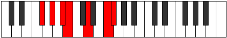 |
| [2359](https://ianring.com/musictheory/scales/2359) | [Gadian](ModeFSharpGadian.md) | F# | F#, G, Ab, Bb, Cb, D, E#, F# |  |
| [2359](https://ianring.com/musictheory/scales/2359) | [Gadian](ModeGFlatGadian.md) | Gb | Gb, Abb, Bbbb, Cbb, Dbbb, Ebb, F, Gb |  |
| [2365](https://ianring.com/musictheory/scales/2365) | [Sythian](ModeFSharpSythian.md) | F# | F#, G#, A, Bb, Cb, D, E#, F# |  |
| [2365](https://ianring.com/musictheory/scales/2365) | [Sythian](ModeGFlatSythian.md) | Gb | Gb, Ab, Bbb, Cbb, Dbbb, Ebb, F, Gb |  |
| [2367](https://ianring.com/musictheory/scales/2367) | [Laryllic](ModeFSharpLaryllic.md) | F# | F#, G, G#, A, A#, B, D, F, F# |  |
| [2367](https://ianring.com/musictheory/scales/2367) | [Laryllic](ModeGFlatLaryllic.md) | Gb | Gb, G, Ab, A, Bb, B, D, F, Gb |  |
| [2421](https://ianring.com/musictheory/scales/2421) | [Malian](ModeFSharpMalian.md) | F# | F#, G#, A#, B, C, D, E#, F# |  |
| [2421](https://ianring.com/musictheory/scales/2421) | [Malian](ModeGFlatMalian.md) | Gb | Gb, Ab, Bb, Cb, Dbb, Ebb, F, Gb |  |
| [2423](https://ianring.com/musictheory/scales/2423) | [Thorcryllic](ModeFSharpThorcryllic.md) | F# | F#, G, G#, A#, B, C, D, F, F# |  |
| [2423](https://ianring.com/musictheory/scales/2423) | [Thorcryllic](ModeGFlatThorcryllic.md) | Gb | Gb, G, Ab, Bb, B, C, D, F, Gb |  |
| [2429](https://ianring.com/musictheory/scales/2429) | [Kadyllic](ModeFSharpKadyllic.md) | F# | F#, G#, A, A#, B, C, D, F, F# |  |
| [2429](https://ianring.com/musictheory/scales/2429) | [Kadyllic](ModeGFlatKadyllic.md) | Gb | Gb, Ab, A, Bb, B, C, D, F, Gb |  |
| [2431](https://ianring.com/musictheory/scales/2431) | [Gythygic](ModeFSharpGythygic.md) | F# | F#, G, G#, A, A#, B, C, D, F, F# |  |
| [2431](https://ianring.com/musictheory/scales/2431) | [Gythygic](ModeGFlatGythygic.md) | Gb | Gb, G, Ab, A, Bb, B, C, D, F, Gb |  |
| [2477](https://ianring.com/musictheory/scales/2477) | [Mydian](ModeDSharpMydian.md) | D# | D#, E#, F#, G#, A#, B, C##, D# |  |
| [2477](https://ianring.com/musictheory/scales/2477) | [Mydian](ModeEFlatMydian.md) | Eb | Eb, F, Gb, Ab, Bb, Cb, D, Eb |  |
| [2479](https://ianring.com/musictheory/scales/2479) | [Rycryllic](ModeDSharpRycryllic.md) | D# | D#, E, F, F#, G#, A#, B, D, D# |  |
| [2479](https://ianring.com/musictheory/scales/2479) | [Rycryllic](ModeEFlatRycryllic.md) | Eb | Eb, E, F, Gb, Ab, Bb, B, D, Eb |  |
| [2485](https://ianring.com/musictheory/scales/2485) | [Aerorian](ModeFSharpAerorian.md) | F# | F#, G#, A#, B, C#, D, E#, F# |  |
| [2485](https://ianring.com/musictheory/scales/2485) | [Aerorian](ModeGFlatAerorian.md) | Gb | Gb, Ab, Bb, Cb, Db, Ebb, F, Gb |  |
| [2487](https://ianring.com/musictheory/scales/2487) | [Phroptyllic](ModeFSharpPhroptyllic.md) | F# | F#, G, G#, A#, B, C#, D, F, F# |  |
| [2487](https://ianring.com/musictheory/scales/2487) | [Phroptyllic](ModeGFlatPhroptyllic.md) | Gb | Gb, G, Ab, Bb, B, Db, D, F, Gb |  |
| [2493](https://ianring.com/musictheory/scales/2493) | [Manyllic](ModeDSharpManyllic.md) | D# | D#, F, F#, G, G#, A#, B, D, D# |  |
| [2493](https://ianring.com/musictheory/scales/2493) | [Manyllic](ModeEFlatManyllic.md) | Eb | Eb, F, Gb, G, Ab, Bb, B, D, Eb |  |
| [2493](https://ianring.com/musictheory/scales/2493) | [Manyllic](ModeFSharpManyllic.md) | F# | F#, G#, A, A#, B, C#, D, F, F# |  |
| [2493](https://ianring.com/musictheory/scales/2493) | [Manyllic](ModeGFlatManyllic.md) | Gb | Gb, Ab, A, Bb, B, Db, D, F, Gb |  |
| [2495](https://ianring.com/musictheory/scales/2495) | [Aeolocrygic](ModeDSharpAeolocrygic.md) | D# | D#, E, F, F#, G, G#, A#, B, D, D# |  |
| [2495](https://ianring.com/musictheory/scales/2495) | [Aeolocrygic](ModeEFlatAeolocrygic.md) | Eb | Eb, E, F, Gb, G, Ab, Bb, B, D, Eb |  |
| [2495](https://ianring.com/musictheory/scales/2495) | [Aeolocrygic](ModeFSharpAeolocrygic.md) | F# | F#, G, G#, A, A#, B, C#, D, F, F# |  |
| [2495](https://ianring.com/musictheory/scales/2495) | [Aeolocrygic](ModeGFlatAeolocrygic.md) | Gb | Gb, G, Ab, A, Bb, B, Db, D, F, Gb |  |
| [2541](https://ianring.com/musictheory/scales/2541) | [Katadyllic](ModeDSharpKatadyllic.md) | D# | D#, F, F#, G#, A, A#, B, D, D# |  |
| [2541](https://ianring.com/musictheory/scales/2541) | [Katadyllic](ModeEFlatKatadyllic.md) | Eb | Eb, F, Gb, Ab, A, Bb, B, D, Eb |  |
| [2543](https://ianring.com/musictheory/scales/2543) | [Dydygic](ModeDSharpDydygic.md) | D# | D#, E, F, F#, G#, A, A#, B, D, D# |  |
| [2543](https://ianring.com/musictheory/scales/2543) | [Dydygic](ModeEFlatDydygic.md) | Eb | Eb, E, F, Gb, Ab, A, Bb, B, D, Eb |  |
| [2549](https://ianring.com/musictheory/scales/2549) | [Rydyllic](ModeFSharpRydyllic.md) | F# | F#, G#, A#, B, C, C#, D, F, F# |  |
| [2549](https://ianring.com/musictheory/scales/2549) | [Rydyllic](ModeGFlatRydyllic.md) | Gb | Gb, Ab, Bb, B, C, Db, D, F, Gb |  |
| [2551](https://ianring.com/musictheory/scales/2551) | [Zoptygic](ModeFSharpZoptygic.md) | F# | F#, G, G#, A#, B, C, C#, D, F, F# |  |
| [2551](https://ianring.com/musictheory/scales/2551) | [Zoptygic](ModeGFlatZoptygic.md) | Gb | Gb, G, Ab, Bb, B, C, Db, D, F, Gb |  |
| [2557](https://ianring.com/musictheory/scales/2557) | [Dothygic](ModeFSharpDothygic.md) | F# | F#, G#, A, A#, B, C, C#, D, F, F# |  |
| [2557](https://ianring.com/musictheory/scales/2557) | [Dothygic](ModeGFlatDothygic.md) | Gb | Gb, Ab, A, Bb, B, C, Db, D, F, Gb |  |
| [2557](https://ianring.com/musictheory/scales/2557) | [Dothygic](ModeDSharpDothygic.md) | D# | D#, F, F#, G, G#, A, A#, B, D, D# |  |
| [2557](https://ianring.com/musictheory/scales/2557) | [Dothygic](ModeEFlatDothygic.md) | Eb | Eb, F, Gb, G, Ab, A, Bb, B, D, Eb |  |
| [2559](https://ianring.com/musictheory/scales/2559) | [Zogyllian](ModeFSharpZogyllian.md) | F# | F#, G, G#, A, A#, B, C, C#, D, F, F# |  |
| [2559](https://ianring.com/musictheory/scales/2559) | [Zogyllian](ModeGFlatZogyllian.md) | Gb | Gb, G, Ab, A, Bb, B, C, Db, D, F, Gb |  |
| [2559](https://ianring.com/musictheory/scales/2559) | [Zogyllian](ModeDSharpZogyllian.md) | D# | D#, E, F, F#, G, G#, A, A#, B, D, D# |  |
| [2559](https://ianring.com/musictheory/scales/2559) | [Zogyllian](ModeEFlatZogyllian.md) | Eb | Eb, E, F, Gb, G, Ab, A, Bb, B, D, Eb |  |
| [2667](https://ianring.com/musictheory/scales/2667) | [Byrian](ModeFNaturalByrian.md) | F | F, Gb, Ab, Bb, Cb, D, E, F |  |
| [2671](https://ianring.com/musictheory/scales/2671) | [Lylyllic](ModeFNaturalLylyllic.md) | F | F, F#, G, G#, A#, B, D, E, F | 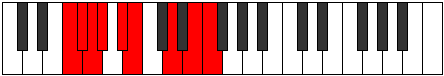 |
| [2683](https://ianring.com/musictheory/scales/2683) | [Thodyllic](ModeFNaturalThodyllic.md) | F | F, F#, G#, A, A#, B, D, E, F |  |
| [2687](https://ianring.com/musictheory/scales/2687) | [Thacrygic](ModeFNaturalThacrygic.md) | F | F, F#, G, G#, A, A#, B, D, E, F |  |
| [2761](https://ianring.com/musictheory/scales/2761) | [Dagimic](ModeBNaturalDagimic.md) | B | B, C##, D###, E##, F###, G###, B |  |
| [2763](https://ianring.com/musictheory/scales/2763) | [Manian](ModeBNaturalManian.md) | B | B, C, D, E#, F#, G#, A#, B |  |
| [2765](https://ianring.com/musictheory/scales/2765) | [Banian](ModeBNaturalBanian.md) | B | B, C#, D, E#, F#, G#, A#, B |  |
| [2767](https://ianring.com/musictheory/scales/2767) | [Katydyllic](ModeBNaturalKatydyllic.md) | B | B, C, C#, D, F, F#, G#, A#, B |  |
| [2777](https://ianring.com/musictheory/scales/2777) | [Bycrian](ModeBNaturalBycrian.md) | B | B, C##, D#, E#, F#, G#, A#, B | 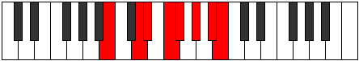 |
| [2779](https://ianring.com/musictheory/scales/2779) | [Garyllic](ModeBNaturalGaryllic.md) | B | B, C, D, D#, F, F#, G#, A#, B |  |
| [2781](https://ianring.com/musictheory/scales/2781) | [Gycryllic](ModeBNaturalGycryllic.md) | B | B, C#, D, D#, F, F#, G#, A#, B |  |
| [2783](https://ianring.com/musictheory/scales/2783) | [Gothygic](ModeBNaturalGothygic.md) | B | B, C, C#, D, D#, F, F#, G#, A#, B |  |
| [2793](https://ianring.com/musictheory/scales/2793) | [Eporian](ModeBNaturalEporian.md) | B | B, C##, D##, E#, F#, G#, A#, B |  |
| [2797](https://ianring.com/musictheory/scales/2797) | [Stalyllic](ModeBNaturalStalyllic.md) | B | B, C#, D, E, F, F#, G#, A#, B |  |
| [2799](https://ianring.com/musictheory/scales/2799) | [Epilygic](ModeBNaturalEpilygic.md) | B | B, C, C#, D, E, F, F#, G#, A#, B |  |
| [2799](https://ianring.com/musictheory/scales/2799) | [Epilygic](ModeFNaturalEpilygic.md) | F | F, F#, G, G#, A#, B, C, D, E, F |  |
| [2809](https://ianring.com/musictheory/scales/2809) | [Gythyllic](ModeBNaturalGythyllic.md) | B | B, D, D#, E, F, F#, G#, A#, B |  |
| [2811](https://ianring.com/musictheory/scales/2811) | [Barygic](ModeBNaturalBarygic.md) | B | B, C, D, D#, E, F, F#, G#, A#, B | 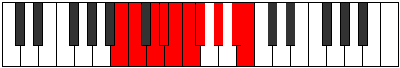 |
| [2811](https://ianring.com/musictheory/scales/2811) | [Barygic](ModeFNaturalBarygic.md) | F | F, F#, G#, A, A#, B, C, D, E, F |  |
| [2813](https://ianring.com/musictheory/scales/2813) | [Zolygic](ModeBNaturalZolygic.md) | B | B, C#, D, D#, E, F, F#, G#, A#, B |  |
| [2815](https://ianring.com/musictheory/scales/2815) | [Aeradyllian](ModeBNaturalAeradyllian.md) | B | B, C, C#, D, D#, E, F, F#, G#, A#, B |  |
| [2815](https://ianring.com/musictheory/scales/2815) | [Aeradyllian](ModeFNaturalAeradyllian.md) | F | F, F#, G, G#, A, A#, B, C, D, E, F |  |
| [2855](https://ianring.com/musictheory/scales/2855) | [Epocrian](ModeANaturalEpocrian.md) | A | A, Bb, Cb, D, E#, F#, G#, A |  |
| [2863](https://ianring.com/musictheory/scales/2863) | [Aerogyllic](ModeANaturalAerogyllic.md) | A | A, A#, B, C, D, F, F#, G#, A |  |
| [2869](https://ianring.com/musictheory/scales/2869) | [Phrothian](ModeFSharpPhrothian.md) | F# | F#, G#, A#, B, C##, D#, E#, F# |  |
| [2869](https://ianring.com/musictheory/scales/2869) | [Phrothian](ModeGFlatPhrothian.md) | Gb | Gb, Ab, Bb, Cb, D, Eb, F, Gb |  |
| [2871](https://ianring.com/musictheory/scales/2871) | [Stanyllic](ModeFSharpStanyllic.md) | F# | F#, G, G#, A#, B, D, D#, F, F# |  |
| [2871](https://ianring.com/musictheory/scales/2871) | [Stanyllic](ModeGFlatStanyllic.md) | Gb | Gb, G, Ab, Bb, B, D, Eb, F, Gb |  |
| [2871](https://ianring.com/musictheory/scales/2871) | [Stanyllic](ModeANaturalStanyllic.md) | A | A, A#, B, C#, D, F, F#, G#, A |  |
| [2877](https://ianring.com/musictheory/scales/2877) | [Phrylyllic](ModeFSharpPhrylyllic.md) | F# | F#, G#, A, A#, B, D, D#, F, F# |  |
| [2877](https://ianring.com/musictheory/scales/2877) | [Phrylyllic](ModeGFlatPhrylyllic.md) | Gb | Gb, Ab, A, Bb, B, D, Eb, F, Gb |  |
| [2879](https://ianring.com/musictheory/scales/2879) | [Stadygic](ModeANaturalStadygic.md) | A | A, A#, B, C, C#, D, F, F#, G#, A |  |
| [2879](https://ianring.com/musictheory/scales/2879) | [Stadygic](ModeFSharpStadygic.md) | F# | F#, G, G#, A, A#, B, D, D#, F, F# |  |
| [2879](https://ianring.com/musictheory/scales/2879) | [Stadygic](ModeGFlatStadygic.md) | Gb | Gb, G, Ab, A, Bb, B, D, Eb, F, Gb |  |
| [2905](https://ianring.com/musictheory/scales/2905) | [Palian](ModeDNaturalPalian.md) | D | D, E#, F#, G#, A#, B, C#, D | 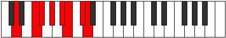 |
| [2907](https://ianring.com/musictheory/scales/2907) | [Mogyllic](ModeDNaturalMogyllic.md) | D | D, D#, F, F#, G#, A#, B, C#, D |  |
| [2909](https://ianring.com/musictheory/scales/2909) | [Mocryllic](ModeDNaturalMocryllic.md) | D | D, E, F, F#, G#, A#, B, C#, D |  |
| [2911](https://ianring.com/musictheory/scales/2911) | [Katygic](ModeDNaturalKatygic.md) | D | D, D#, E, F, F#, G#, A#, B, C#, D |  |
| [2919](https://ianring.com/musictheory/scales/2919) | [Molyllic](ModeANaturalMolyllic.md) | A | A, A#, B, D, D#, F, F#, G#, A |  |
| [2923](https://ianring.com/musictheory/scales/2923) | [Baryllic](ModeFNaturalBaryllic.md) | F | F, F#, G#, A#, B, C#, D, E, F |  |
| [2927](https://ianring.com/musictheory/scales/2927) | [Rodygic](ModeFNaturalRodygic.md) | F | F, F#, G, G#, A#, B, C#, D, E, F |  |
| [2927](https://ianring.com/musictheory/scales/2927) | [Rodygic](ModeANaturalRodygic.md) | A | A, A#, B, C, D, D#, F, F#, G#, A |  |
| [2933](https://ianring.com/musictheory/scales/2933) | [Dalyllic](ModeFSharpDalyllic.md) | F# | F#, G#, A#, B, C, D, D#, F, F# |  |
| [2933](https://ianring.com/musictheory/scales/2933) | [Dalyllic](ModeGFlatDalyllic.md) | Gb | Gb, Ab, Bb, B, C, D, Eb, F, Gb |  |
| [2935](https://ianring.com/musictheory/scales/2935) | [Modygic](ModeFSharpModygic.md) | F# | F#, G, G#, A#, B, C, D, D#, F, F# |  |
| [2935](https://ianring.com/musictheory/scales/2935) | [Modygic](ModeGFlatModygic.md) | Gb | Gb, G, Ab, Bb, B, C, D, Eb, F, Gb |  |
| [2935](https://ianring.com/musictheory/scales/2935) | [Modygic](ModeANaturalModygic.md) | A | A, A#, B, C#, D, D#, F, F#, G#, A |  |
| [2937](https://ianring.com/musictheory/scales/2937) | [Aeolathyllic](ModeDNaturalAeolathyllic.md) | D | D, F, F#, G, G#, A#, B, C#, D |  |
| [2939](https://ianring.com/musictheory/scales/2939) | [Goptygic](ModeDNaturalGoptygic.md) | D | D, D#, F, F#, G, G#, A#, B, C#, D |  |
| [2939](https://ianring.com/musictheory/scales/2939) | [Goptygic](ModeFNaturalGoptygic.md) | F | F, F#, G#, A, A#, B, C#, D, E, F |  |
| [2941](https://ianring.com/musictheory/scales/2941) | [Laptygic](ModeDNaturalLaptygic.md) | D | D, E, F, F#, G, G#, A#, B, C#, D |  |
| [2941](https://ianring.com/musictheory/scales/2941) | [Laptygic](ModeFSharpLaptygic.md) | F# | F#, G#, A, A#, B, C, D, D#, F, F# |  |
| [2941](https://ianring.com/musictheory/scales/2941) | [Laptygic](ModeGFlatLaptygic.md) | Gb | Gb, Ab, A, Bb, B, C, D, Eb, F, Gb |  |
| [2943](https://ianring.com/musictheory/scales/2943) | [Dathyllian](ModeDNaturalDathyllian.md) | D | D, D#, E, F, F#, G, G#, A#, B, C#, D |  |
| [2943](https://ianring.com/musictheory/scales/2943) | [Dathyllian](ModeANaturalDathyllian.md) | A | A, A#, B, C, C#, D, D#, F, F#, G#, A |  |
| [2943](https://ianring.com/musictheory/scales/2943) | [Dathyllian](ModeFSharpDathyllian.md) | F# | F#, G, G#, A, A#, B, C, D, D#, F, F# |  |
| [2943](https://ianring.com/musictheory/scales/2943) | [Dathyllian](ModeGFlatDathyllian.md) | Gb | Gb, G, Ab, A, Bb, B, C, D, Eb, F, Gb |  |
| [2943](https://ianring.com/musictheory/scales/2943) | [Dathyllian](ModeFNaturalDathyllian.md) | F | F, F#, G, G#, A, A#, B, C#, D, E, F |  |
| [2983](https://ianring.com/musictheory/scales/2983) | [Zythyllic](ModeANaturalZythyllic.md) | A | A, A#, B, D, E, F, F#, G#, A |  |
| [2989](https://ianring.com/musictheory/scales/2989) | [Ionacryllic](ModeDSharpIonacryllic.md) | D# | D#, F, F#, G#, A#, B, C, D, D# |  |
| [2989](https://ianring.com/musictheory/scales/2989) | [Ionacryllic](ModeEFlatIonacryllic.md) | Eb | Eb, F, Gb, Ab, Bb, B, C, D, Eb |  |
| [2991](https://ianring.com/musictheory/scales/2991) | [Zanygic](ModeDSharpZanygic.md) | D# | D#, E, F, F#, G#, A#, B, C, D, D# |  |
| [2991](https://ianring.com/musictheory/scales/2991) | [Zanygic](ModeEFlatZanygic.md) | Eb | Eb, E, F, Gb, Ab, Bb, B, C, D, Eb |  |
| [2991](https://ianring.com/musictheory/scales/2991) | [Zanygic](ModeANaturalZanygic.md) | A | A, A#, B, C, D, E, F, F#, G#, A |  |
| [2997](https://ianring.com/musictheory/scales/2997) | [Ionoptyllic](ModeFSharpIonoptyllic.md) | F# | F#, G#, A#, B, C#, D, D#, F, F# |  |
| [2997](https://ianring.com/musictheory/scales/2997) | [Ionoptyllic](ModeGFlatIonoptyllic.md) | Gb | Gb, Ab, Bb, B, Db, D, Eb, F, Gb |  |
| [2999](https://ianring.com/musictheory/scales/2999) | [Zyrygic](ModeFSharpZyrygic.md) | F# | F#, G, G#, A#, B, C#, D, D#, F, F# |  |
| [2999](https://ianring.com/musictheory/scales/2999) | [Zyrygic](ModeGFlatZyrygic.md) | Gb | Gb, G, Ab, Bb, B, Db, D, Eb, F, Gb |  |
| [2999](https://ianring.com/musictheory/scales/2999) | [Zyrygic](ModeANaturalZyrygic.md) | A | A, A#, B, C#, D, E, F, F#, G#, A |  |
| [3005](https://ianring.com/musictheory/scales/3005) | [Gycrygic](ModeDSharpGycrygic.md) | D# | D#, F, F#, G, G#, A#, B, C, D, D# |  |
| [3005](https://ianring.com/musictheory/scales/3005) | [Gycrygic](ModeEFlatGycrygic.md) | Eb | Eb, F, Gb, G, Ab, Bb, B, C, D, Eb |  |
| [3005](https://ianring.com/musictheory/scales/3005) | [Gycrygic](ModeFSharpGycrygic.md) | F# | F#, G#, A, A#, B, C#, D, D#, F, F# |  |
| [3005](https://ianring.com/musictheory/scales/3005) | [Gycrygic](ModeGFlatGycrygic.md) | Gb | Gb, Ab, A, Bb, B, Db, D, Eb, F, Gb |  |
| [3007](https://ianring.com/musictheory/scales/3007) | [Zyryllian](ModeDSharpZyryllian.md) | D# | D#, E, F, F#, G, G#, A#, B, C, D, D# |  |
| [3007](https://ianring.com/musictheory/scales/3007) | [Zyryllian](ModeEFlatZyryllian.md) | Eb | Eb, E, F, Gb, G, Ab, Bb, B, C, D, Eb |  |
| [3007](https://ianring.com/musictheory/scales/3007) | [Zyryllian](ModeANaturalZyryllian.md) | A | A, A#, B, C, C#, D, E, F, F#, G#, A |  |
| [3007](https://ianring.com/musictheory/scales/3007) | [Zyryllian](ModeFSharpZyryllian.md) | F# | F#, G, G#, A, A#, B, C#, D, D#, F, F# |  |
| [3007](https://ianring.com/musictheory/scales/3007) | [Zyryllian](ModeGFlatZyryllian.md) | Gb | Gb, G, Ab, A, Bb, B, Db, D, Eb, F, Gb |  |
| [3017](https://ianring.com/musictheory/scales/3017) | [Gacrian](ModeBNaturalGacrian.md) | B | B, C##, D###, E##, F##, G#, A#, B | 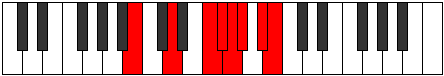 |
| [3019](https://ianring.com/musictheory/scales/3019) | [Mydyllic](ModeBNaturalMydyllic.md) | B | B, C, D, F, F#, G, G#, A#, B |  |
| [3021](https://ianring.com/musictheory/scales/3021) | [Gyptyllic](ModeBNaturalGyptyllic.md) | B | B, C#, D, F, F#, G, G#, A#, B |  |
| [3023](https://ianring.com/musictheory/scales/3023) | [Aeracrygic](ModeBNaturalAeracrygic.md) | B | B, C, C#, D, F, F#, G, G#, A#, B |  |
| [3033](https://ianring.com/musictheory/scales/3033) | [Doptyllic](ModeBNaturalDoptyllic.md) | B | B, D, D#, F, F#, G, G#, A#, B |  |
| [3033](https://ianring.com/musictheory/scales/3033) | [Doptyllic](ModeDNaturalDoptyllic.md) | D | D, F, F#, G#, A, A#, B, C#, D |  |
| [3035](https://ianring.com/musictheory/scales/3035) | [Gocrygic](ModeBNaturalGocrygic.md) | B | B, C, D, D#, F, F#, G, G#, A#, B |  |
| [3035](https://ianring.com/musictheory/scales/3035) | [Gocrygic](ModeDNaturalGocrygic.md) | D | D, D#, F, F#, G#, A, A#, B, C#, D |  |
| [3037](https://ianring.com/musictheory/scales/3037) | [Staptygic](ModeBNaturalStaptygic.md) | B | B, C#, D, D#, F, F#, G, G#, A#, B |  |
| [3037](https://ianring.com/musictheory/scales/3037) | [Staptygic](ModeDNaturalStaptygic.md) | D | D, E, F, F#, G#, A, A#, B, C#, D |  |
| [3039](https://ianring.com/musictheory/scales/3039) | [Godyllian](ModeBNaturalGodyllian.md) | B | B, C, C#, D, D#, F, F#, G, G#, A#, B |  |
| [3039](https://ianring.com/musictheory/scales/3039) | [Godyllian](ModeDNaturalGodyllian.md) | D | D, D#, E, F, F#, G#, A, A#, B, C#, D |  |
| [3047](https://ianring.com/musictheory/scales/3047) | [Panygic](ModeANaturalPanygic.md) | A | A, A#, B, D, D#, E, F, F#, G#, A |  |
| [3049](https://ianring.com/musictheory/scales/3049) | [Aeronyllic](ModeBNaturalAeronyllic.md) | B | B, D, E, F, F#, G, G#, A#, B |  |
| [3051](https://ianring.com/musictheory/scales/3051) | [Stalygic](ModeFNaturalStalygic.md) | F | F, F#, G#, A#, B, C, C#, D, E, F |  |
| [3051](https://ianring.com/musictheory/scales/3051) | [Stalygic](ModeBNaturalStalygic.md) | B | B, C, D, E, F, F#, G, G#, A#, B | 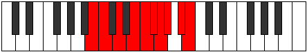 |
| [3053](https://ianring.com/musictheory/scales/3053) | [Zycrygic](ModeBNaturalZycrygic.md) | B | B, C#, D, E, F, F#, G, G#, A#, B |  |
| [3053](https://ianring.com/musictheory/scales/3053) | [Zycrygic](ModeDSharpZycrygic.md) | D# | D#, F, F#, G#, A, A#, B, C, D, D# |  |
| [3053](https://ianring.com/musictheory/scales/3053) | [Zycrygic](ModeEFlatZycrygic.md) | Eb | Eb, F, Gb, Ab, A, Bb, B, C, D, Eb |  |
| [3055](https://ianring.com/musictheory/scales/3055) | [Lyryllian](ModeFNaturalLyryllian.md) | F | F, F#, G, G#, A#, B, C, C#, D, E, F |  |
| [3055](https://ianring.com/musictheory/scales/3055) | [Lyryllian](ModeBNaturalLyryllian.md) | B | B, C, C#, D, E, F, F#, G, G#, A#, B |  |
| [3055](https://ianring.com/musictheory/scales/3055) | [Lyryllian](ModeDSharpLyryllian.md) | D# | D#, E, F, F#, G#, A, A#, B, C, D, D# |  |
| [3055](https://ianring.com/musictheory/scales/3055) | [Lyryllian](ModeEFlatLyryllian.md) | Eb | Eb, E, F, Gb, Ab, A, Bb, B, C, D, Eb |  |
| [3055](https://ianring.com/musictheory/scales/3055) | [Lyryllian](ModeANaturalLyryllian.md) | A | A, A#, B, C, D, D#, E, F, F#, G#, A |  |
| [3061](https://ianring.com/musictheory/scales/3061) | [Apinygic](ModeFSharpApinygic.md) | F# | F#, G#, A#, B, C, C#, D, D#, F, F# |  |
| [3061](https://ianring.com/musictheory/scales/3061) | [Apinygic](ModeGFlatApinygic.md) | Gb | Gb, Ab, Bb, B, C, Db, D, Eb, F, Gb |  |
| [3063](https://ianring.com/musictheory/scales/3063) | [Solyllian](ModeFSharpSolyllian.md) | F# | F#, G, G#, A#, B, C, C#, D, D#, F, F# |  |
| [3063](https://ianring.com/musictheory/scales/3063) | [Solyllian](ModeGFlatSolyllian.md) | Gb | Gb, G, Ab, Bb, B, C, Db, D, Eb, F, Gb |  |
| [3063](https://ianring.com/musictheory/scales/3063) | [Solyllian](ModeANaturalSolyllian.md) | A | A, A#, B, C#, D, D#, E, F, F#, G#, A |  |
| [3065](https://ianring.com/musictheory/scales/3065) | [Zothygic](ModeBNaturalZothygic.md) | B | B, D, D#, E, F, F#, G, G#, A#, B |  |
| [3065](https://ianring.com/musictheory/scales/3065) | [Zothygic](ModeDNaturalZothygic.md) | D | D, F, F#, G, G#, A, A#, B, C#, D |  |
| [3067](https://ianring.com/musictheory/scales/3067) | [Goptyllian](ModeBNaturalGoptyllian.md) | B | B, C, D, D#, E, F, F#, G, G#, A#, B |  |
| [3067](https://ianring.com/musictheory/scales/3067) | [Goptyllian](ModeFNaturalGoptyllian.md) | F | F, F#, G#, A, A#, B, C, C#, D, E, F |  |
| [3067](https://ianring.com/musictheory/scales/3067) | [Goptyllian](ModeDNaturalGoptyllian.md) | D | D, D#, F, F#, G, G#, A, A#, B, C#, D |  |
| [3069](https://ianring.com/musictheory/scales/3069) | [Bacryllian](ModeBNaturalBacryllian.md) | B | B, C#, D, D#, E, F, F#, G, G#, A#, B |  |
| [3069](https://ianring.com/musictheory/scales/3069) | [Bacryllian](ModeFSharpBacryllian.md) | F# | F#, G#, A, A#, B, C, C#, D, D#, F, F# |  |
| [3069](https://ianring.com/musictheory/scales/3069) | [Bacryllian](ModeGFlatBacryllian.md) | Gb | Gb, Ab, A, Bb, B, C, Db, D, Eb, F, Gb |  |
| [3069](https://ianring.com/musictheory/scales/3069) | [Bacryllian](ModeDSharpBacryllian.md) | D# | D#, F, F#, G, G#, A, A#, B, C, D, D# |  |
| [3069](https://ianring.com/musictheory/scales/3069) | [Bacryllian](ModeEFlatBacryllian.md) | Eb | Eb, F, Gb, G, Ab, A, Bb, B, C, D, Eb |  |
| [3069](https://ianring.com/musictheory/scales/3069) | [Bacryllian](ModeDNaturalBacryllian.md) | D | D, E, F, F#, G, G#, A, A#, B, C#, D |  |
| [3071](https://ianring.com/musictheory/scales/3071) | [Solatic](ModeBNaturalSolatic.md) | B | B, C, C#, D, D#, E, F, F#, G, G#, A#, B |  |
| [3071](https://ianring.com/musictheory/scales/3071) | [Solatic](ModeANaturalSolatic.md) | A | A, A#, B, C, C#, D, D#, E, F, F#, G#, A |  |
| [3071](https://ianring.com/musictheory/scales/3071) | [Solatic](ModeFSharpSolatic.md) | F# | F#, G, G#, A, A#, B, C, C#, D, D#, F, F# |  |
| [3071](https://ianring.com/musictheory/scales/3071) | [Solatic](ModeGFlatSolatic.md) | Gb | Gb, G, Ab, A, Bb, B, C, Db, D, Eb, F, Gb |  |
| [3071](https://ianring.com/musictheory/scales/3071) | [Solatic](ModeFNaturalSolatic.md) | F | F, F#, G, G#, A, A#, B, C, C#, D, E, F |  |
| [3071](https://ianring.com/musictheory/scales/3071) | [Solatic](ModeDSharpSolatic.md) | D# | D#, E, F, F#, G, G#, A, A#, B, C, D, D# |  |
| [3071](https://ianring.com/musictheory/scales/3071) | [Solatic](ModeEFlatSolatic.md) | Eb | Eb, E, F, Gb, G, Ab, A, Bb, B, C, D, Eb |  |
| [3071](https://ianring.com/musictheory/scales/3071) | [Solatic](ModeDNaturalSolatic.md) | D | D, D#, E, F, F#, G, G#, A, A#, B, C#, D |  |
| [3227](https://ianring.com/musictheory/scales/3227) | [Aeolocrian](ModeGNaturalAeolocrian.md) | G | G, Ab, Bb, Cb, D, E#, F#, G |  |
| [3231](https://ianring.com/musictheory/scales/3231) | [Kataptyllic](ModeGNaturalKataptyllic.md) | G | G, G#, A, A#, B, D, F, F#, G |  |
| [3259](https://ianring.com/musictheory/scales/3259) | [Loptyllic](ModeGNaturalLoptyllic.md) | G | G, G#, A#, B, C, D, F, F#, G |  |
| [3263](https://ianring.com/musictheory/scales/3263) | [Pyrygic](ModeGNaturalPyrygic.md) | G | G, G#, A, A#, B, C, D, F, F#, G |  |
| [3287](https://ianring.com/musictheory/scales/3287) | [Phrathyllic](ModeENaturalPhrathyllic.md) | E | E, F, F#, G#, A#, B, D, D#, E |  |
| [3291](https://ianring.com/musictheory/scales/3291) | [Kodyllic](ModeGNaturalKodyllic.md) | G | G, G#, A#, B, C#, D, F, F#, G |  |
| [3295](https://ianring.com/musictheory/scales/3295) | [Phroptygic](ModeENaturalPhroptygic.md) | E | E, F, F#, G, G#, A#, B, D, D#, E |  |
| [3295](https://ianring.com/musictheory/scales/3295) | [Phroptygic](ModeGNaturalPhroptygic.md) | G | G, G#, A, A#, B, C#, D, F, F#, G |  |
| [3319](https://ianring.com/musictheory/scales/3319) | [Tholygic](ModeENaturalTholygic.md) | E | E, F, F#, G#, A, A#, B, D, D#, E |  |
| [3323](https://ianring.com/musictheory/scales/3323) | [Phrygygic](ModeGNaturalPhrygygic.md) | G | G, G#, A#, B, C, C#, D, F, F#, G |  |
| [3327](https://ianring.com/musictheory/scales/3327) | [Madyllian](ModeGNaturalMadyllian.md) | G | G, G#, A, A#, B, C, C#, D, F, F#, G |  |
| [3327](https://ianring.com/musictheory/scales/3327) | [Madyllian](ModeENaturalMadyllian.md) | E | E, F, F#, G, G#, A, A#, B, D, D#, E |  |
| [3381](https://ianring.com/musictheory/scales/3381) | [Katanian](ModeFSharpKatanian.md) | F# | F#, G#, A#, B, C##, D##, E#, F# |  |
| [3381](https://ianring.com/musictheory/scales/3381) | [Katanian](ModeGFlatKatanian.md) | Gb | Gb, Ab, Bb, Cb, D, E, F, Gb |  |
| [3383](https://ianring.com/musictheory/scales/3383) | [Daptyllic](ModeFSharpDaptyllic.md) | F# | F#, G, G#, A#, B, D, E, F, F# |  |
| [3383](https://ianring.com/musictheory/scales/3383) | [Daptyllic](ModeGFlatDaptyllic.md) | Gb | Gb, G, Ab, Bb, B, D, E, F, Gb |  |
| [3389](https://ianring.com/musictheory/scales/3389) | [Socryllic](ModeFSharpSocryllic.md) | F# | F#, G#, A, A#, B, D, E, F, F# |  |
| [3389](https://ianring.com/musictheory/scales/3389) | [Socryllic](ModeGFlatSocryllic.md) | Gb | Gb, Ab, A, Bb, B, D, E, F, Gb |  |
| [3391](https://ianring.com/musictheory/scales/3391) | [Aeolynygic](ModeFSharpAeolynygic.md) | F# | F#, G, G#, A, A#, B, D, E, F, F# |  |
| [3391](https://ianring.com/musictheory/scales/3391) | [Aeolynygic](ModeGFlatAeolynygic.md) | Gb | Gb, G, Ab, A, Bb, B, D, E, F, Gb |  |
| [3429](https://ianring.com/musictheory/scales/3429) | [Marian](ModeCNaturalMarian.md) | C | C, D, E#, F#, G#, A#, B, C |  |
| [3431](https://ianring.com/musictheory/scales/3431) | [Zyptyllic](ModeCNaturalZyptyllic.md) | C | C, C#, D, F, F#, G#, A#, B, C |  |
| [3437](https://ianring.com/musictheory/scales/3437) | [Gathyllic](ModeCNaturalGathyllic.md) | C | C, D, D#, F, F#, G#, A#, B, C |  |
| [3439](https://ianring.com/musictheory/scales/3439) | [Lythygic](ModeCNaturalLythygic.md) | C | C, C#, D, D#, F, F#, G#, A#, B, C |  |
| [3445](https://ianring.com/musictheory/scales/3445) | [Epotyllic](ModeCNaturalEpotyllic.md) | C | C, D, E, F, F#, G#, A#, B, C |  |
| [3445](https://ianring.com/musictheory/scales/3445) | [Epotyllic](ModeFSharpEpotyllic.md) | F# | F#, G#, A#, B, C, D, E, F, F# |  |
| [3445](https://ianring.com/musictheory/scales/3445) | [Epotyllic](ModeGFlatEpotyllic.md) | Gb | Gb, Ab, Bb, B, C, D, E, F, Gb |  |
| [3447](https://ianring.com/musictheory/scales/3447) | [Kynygic](ModeCNaturalKynygic.md) | C | C, C#, D, E, F, F#, G#, A#, B, C |  |
| [3447](https://ianring.com/musictheory/scales/3447) | [Kynygic](ModeFSharpKynygic.md) | F# | F#, G, G#, A#, B, C, D, E, F, F# |  |
| [3447](https://ianring.com/musictheory/scales/3447) | [Kynygic](ModeGFlatKynygic.md) | Gb | Gb, G, Ab, Bb, B, C, D, E, F, Gb |  |
| [3453](https://ianring.com/musictheory/scales/3453) | [Katarygic](ModeCNaturalKatarygic.md) | C | C, D, D#, E, F, F#, G#, A#, B, C |  |
| [3453](https://ianring.com/musictheory/scales/3453) | [Katarygic](ModeFSharpKatarygic.md) | F# | F#, G#, A, A#, B, C, D, E, F, F# |  |
| [3453](https://ianring.com/musictheory/scales/3453) | [Katarygic](ModeGFlatKatarygic.md) | Gb | Gb, Ab, A, Bb, B, C, D, E, F, Gb |  |
| [3455](https://ianring.com/musictheory/scales/3455) | [Ryptyllian](ModeCNaturalRyptyllian.md) | C | C, C#, D, D#, E, F, F#, G#, A#, B, C |  |
| [3455](https://ianring.com/musictheory/scales/3455) | [Ryptyllian](ModeFSharpRyptyllian.md) | F# | F#, G, G#, A, A#, B, C, D, E, F, F# |  |
| [3455](https://ianring.com/musictheory/scales/3455) | [Ryptyllian](ModeGFlatRyptyllian.md) | Gb | Gb, G, Ab, A, Bb, B, C, D, E, F, Gb |  |
| [3475](https://ianring.com/musictheory/scales/3475) | [Kylian](ModeASharpKylian.md) | A# | A#, B, C##, D###, E##, F###, G##, A# |  |
| [3475](https://ianring.com/musictheory/scales/3475) | [Kylian](ModeBFlatKylian.md) | Bb | Bb, Cb, D, E#, F#, G#, A, Bb |  |
| [3479](https://ianring.com/musictheory/scales/3479) | [Rothyllic](ModeASharpRothyllic.md) | A# | A#, B, C, D, F, F#, G#, A, A# |  |
| [3479](https://ianring.com/musictheory/scales/3479) | [Rothyllic](ModeBFlatRothyllic.md) | Bb | Bb, B, C, D, F, Gb, Ab, A, Bb |  |
| [3483](https://ianring.com/musictheory/scales/3483) | [Mixotharyllic](ModeGNaturalMixotharyllic.md) | G | G, G#, A#, B, D, D#, F, F#, G |  |
| [3483](https://ianring.com/musictheory/scales/3483) | [Mixotharyllic](ModeASharpMixotharyllic.md) | A# | A#, B, C#, D, F, F#, G#, A, A# |  |
| [3483](https://ianring.com/musictheory/scales/3483) | [Mixotharyllic](ModeBFlatMixotharyllic.md) | Bb | Bb, B, Db, D, F, Gb, Ab, A, Bb |  |
| [3487](https://ianring.com/musictheory/scales/3487) | [Byptygic](ModeASharpByptygic.md) | A# | A#, B, C, C#, D, F, F#, G#, A, A# |  |
| [3487](https://ianring.com/musictheory/scales/3487) | [Byptygic](ModeBFlatByptygic.md) | Bb | Bb, B, C, Db, D, F, Gb, Ab, A, Bb |  |
| [3487](https://ianring.com/musictheory/scales/3487) | [Byptygic](ModeGNaturalByptygic.md) | G | G, G#, A, A#, B, D, D#, F, F#, G |  |
| [3501](https://ianring.com/musictheory/scales/3501) | [Katodyllic](ModeDSharpKatodyllic.md) | D# | D#, F, F#, G#, A#, B, C#, D, D# |  |
| [3501](https://ianring.com/musictheory/scales/3501) | [Katodyllic](ModeEFlatKatodyllic.md) | Eb | Eb, F, Gb, Ab, Bb, B, Db, D, Eb |  |
| [3503](https://ianring.com/musictheory/scales/3503) | [Zyphygic](ModeDSharpZyphygic.md) | D# | D#, E, F, F#, G#, A#, B, C#, D, D# |  |
| [3503](https://ianring.com/musictheory/scales/3503) | [Zyphygic](ModeEFlatZyphygic.md) | Eb | Eb, E, F, Gb, Ab, Bb, B, Db, D, Eb |  |
| [3507](https://ianring.com/musictheory/scales/3507) | [Ponyllic](ModeASharpPonyllic.md) | A# | A#, B, D, D#, F, F#, G#, A, A# |  |
| [3507](https://ianring.com/musictheory/scales/3507) | [Ponyllic](ModeBFlatPonyllic.md) | Bb | Bb, B, D, Eb, F, Gb, Ab, A, Bb |  |
| [3509](https://ianring.com/musictheory/scales/3509) | [Stogyllic](ModeFSharpStogyllic.md) | F# | F#, G#, A#, B, C#, D, E, F, F# |  |
| [3509](https://ianring.com/musictheory/scales/3509) | [Stogyllic](ModeGFlatStogyllic.md) | Gb | Gb, Ab, Bb, B, Db, D, E, F, Gb |  |
| [3511](https://ianring.com/musictheory/scales/3511) | [Epolygic](ModeFSharpEpolygic.md) | F# | F#, G, G#, A#, B, C#, D, E, F, F# |  |
| [3511](https://ianring.com/musictheory/scales/3511) | [Epolygic](ModeGFlatEpolygic.md) | Gb | Gb, G, Ab, Bb, B, Db, D, E, F, Gb |  |
| [3511](https://ianring.com/musictheory/scales/3511) | [Epolygic](ModeASharpEpolygic.md) | A# | A#, B, C, D, D#, F, F#, G#, A, A# |  |
| [3511](https://ianring.com/musictheory/scales/3511) | [Epolygic](ModeBFlatEpolygic.md) | Bb | Bb, B, C, D, Eb, F, Gb, Ab, A, Bb |  |
| [3515](https://ianring.com/musictheory/scales/3515) | [Katodygic](ModeGNaturalKatodygic.md) | G | G, G#, A#, B, C, D, D#, F, F#, G |  |
| [3515](https://ianring.com/musictheory/scales/3515) | [Katodygic](ModeASharpKatodygic.md) | A# | A#, B, C#, D, D#, F, F#, G#, A, A# |  |
| [3515](https://ianring.com/musictheory/scales/3515) | [Katodygic](ModeBFlatKatodygic.md) | Bb | Bb, B, Db, D, Eb, F, Gb, Ab, A, Bb |  |
| [3517](https://ianring.com/musictheory/scales/3517) | [Epocrygic](ModeDSharpEpocrygic.md) | D# | D#, F, F#, G, G#, A#, B, C#, D, D# |  |
| [3517](https://ianring.com/musictheory/scales/3517) | [Epocrygic](ModeEFlatEpocrygic.md) | Eb | Eb, F, Gb, G, Ab, Bb, B, Db, D, Eb |  |
| [3517](https://ianring.com/musictheory/scales/3517) | [Epocrygic](ModeFSharpEpocrygic.md) | F# | F#, G#, A, A#, B, C#, D, E, F, F# |  |
| [3517](https://ianring.com/musictheory/scales/3517) | [Epocrygic](ModeGFlatEpocrygic.md) | Gb | Gb, Ab, A, Bb, B, Db, D, E, F, Gb |  |
| [3519](https://ianring.com/musictheory/scales/3519) | [Boptyllian](ModeDSharpBoptyllian.md) | D# | D#, E, F, F#, G, G#, A#, B, C#, D, D# |  |
| [3519](https://ianring.com/musictheory/scales/3519) | [Boptyllian](ModeEFlatBoptyllian.md) | Eb | Eb, E, F, Gb, G, Ab, Bb, B, Db, D, Eb |  |
| [3519](https://ianring.com/musictheory/scales/3519) | [Boptyllian](ModeASharpBoptyllian.md) | A# | A#, B, C, C#, D, D#, F, F#, G#, A, A# |  |
| [3519](https://ianring.com/musictheory/scales/3519) | [Boptyllian](ModeBFlatBoptyllian.md) | Bb | Bb, B, C, Db, D, Eb, F, Gb, Ab, A, Bb |  |
| [3519](https://ianring.com/musictheory/scales/3519) | [Boptyllian](ModeGNaturalBoptyllian.md) | G | G, G#, A, A#, B, C, D, D#, F, F#, G |  |
| [3519](https://ianring.com/musictheory/scales/3519) | [Boptyllian](ModeFSharpBoptyllian.md) | F# | F#, G, G#, A, A#, B, C#, D, E, F, F# |  |
| [3519](https://ianring.com/musictheory/scales/3519) | [Boptyllian](ModeGFlatBoptyllian.md) | Gb | Gb, G, Ab, A, Bb, B, Db, D, E, F, Gb |  |
| [3539](https://ianring.com/musictheory/scales/3539) | [Aeoryllic](ModeASharpAeoryllic.md) | A# | A#, B, D, E, F, F#, G#, A, A# |  |
| [3539](https://ianring.com/musictheory/scales/3539) | [Aeoryllic](ModeBFlatAeoryllic.md) | Bb | Bb, B, D, E, F, Gb, Ab, A, Bb |  |
| [3543](https://ianring.com/musictheory/scales/3543) | [Aeolonygic](ModeENaturalAeolonygic.md) | E | E, F, F#, G#, A#, B, C, D, D#, E |  |
| [3543](https://ianring.com/musictheory/scales/3543) | [Aeolonygic](ModeASharpAeolonygic.md) | A# | A#, B, C, D, E, F, F#, G#, A, A# |  |
| [3543](https://ianring.com/musictheory/scales/3543) | [Aeolonygic](ModeBFlatAeolonygic.md) | Bb | Bb, B, C, D, E, F, Gb, Ab, A, Bb |  |
| [3547](https://ianring.com/musictheory/scales/3547) | [Sadygic](ModeGNaturalSadygic.md) | G | G, G#, A#, B, C#, D, D#, F, F#, G |  |
| [3547](https://ianring.com/musictheory/scales/3547) | [Sadygic](ModeASharpSadygic.md) | A# | A#, B, C#, D, E, F, F#, G#, A, A# |  |
| [3547](https://ianring.com/musictheory/scales/3547) | [Sadygic](ModeBFlatSadygic.md) | Bb | Bb, B, Db, D, E, F, Gb, Ab, A, Bb |  |
| [3551](https://ianring.com/musictheory/scales/3551) | [Sagyllian](ModeENaturalSagyllian.md) | E | E, F, F#, G, G#, A#, B, C, D, D#, E |  |
| [3551](https://ianring.com/musictheory/scales/3551) | [Sagyllian](ModeASharpSagyllian.md) | A# | A#, B, C, C#, D, E, F, F#, G#, A, A# |  |
| [3551](https://ianring.com/musictheory/scales/3551) | [Sagyllian](ModeBFlatSagyllian.md) | Bb | Bb, B, C, Db, D, E, F, Gb, Ab, A, Bb |  |
| [3551](https://ianring.com/musictheory/scales/3551) | [Sagyllian](ModeGNaturalSagyllian.md) | G | G, G#, A, A#, B, C#, D, D#, F, F#, G |  |
| [3557](https://ianring.com/musictheory/scales/3557) | [Thycryllic](ModeCNaturalThycryllic.md) | C | C, D, F, F#, G, G#, A#, B, C |  |
| [3559](https://ianring.com/musictheory/scales/3559) | [Aerathygic](ModeCNaturalAerathygic.md) | C | C, C#, D, F, F#, G, G#, A#, B, C |  |
| [3565](https://ianring.com/musictheory/scales/3565) | [Aeolorygic](ModeCNaturalAeolorygic.md) | C | C, D, D#, F, F#, G, G#, A#, B, C |  |
| [3565](https://ianring.com/musictheory/scales/3565) | [Aeolorygic](ModeDSharpAeolorygic.md) | D# | D#, F, F#, G#, A, A#, B, C#, D, D# |  |
| [3565](https://ianring.com/musictheory/scales/3565) | [Aeolorygic](ModeEFlatAeolorygic.md) | Eb | Eb, F, Gb, Ab, A, Bb, B, Db, D, Eb |  |
| [3567](https://ianring.com/musictheory/scales/3567) | [Epityllian](ModeCNaturalEpityllian.md) | C | C, C#, D, D#, F, F#, G, G#, A#, B, C |  |
| [3567](https://ianring.com/musictheory/scales/3567) | [Epityllian](ModeDSharpEpityllian.md) | D# | D#, E, F, F#, G#, A, A#, B, C#, D, D# |  |
| [3567](https://ianring.com/musictheory/scales/3567) | [Epityllian](ModeEFlatEpityllian.md) | Eb | Eb, E, F, Gb, Ab, A, Bb, B, Db, D, Eb |  |
| [3571](https://ianring.com/musictheory/scales/3571) | [Dyrygic](ModeASharpDyrygic.md) | A# | A#, B, D, D#, E, F, F#, G#, A, A# |  |
| [3571](https://ianring.com/musictheory/scales/3571) | [Dyrygic](ModeBFlatDyrygic.md) | Bb | Bb, B, D, Eb, E, F, Gb, Ab, A, Bb |  |
| [3573](https://ianring.com/musictheory/scales/3573) | [Kaptygic](ModeFSharpKaptygic.md) | F# | F#, G#, A#, B, C, C#, D, E, F, F# |  |
| [3573](https://ianring.com/musictheory/scales/3573) | [Kaptygic](ModeGFlatKaptygic.md) | Gb | Gb, Ab, Bb, B, C, Db, D, E, F, Gb |  |
| [3573](https://ianring.com/musictheory/scales/3573) | [Kaptygic](ModeCNaturalKaptygic.md) | C | C, D, E, F, F#, G, G#, A#, B, C |  |
| [3575](https://ianring.com/musictheory/scales/3575) | [Mogyllian](ModeCNaturalMogyllian.md) | C | C, C#, D, E, F, F#, G, G#, A#, B, C |  |
| [3575](https://ianring.com/musictheory/scales/3575) | [Mogyllian](ModeFSharpMogyllian.md) | F# | F#, G, G#, A#, B, C, C#, D, E, F, F# |  |
| [3575](https://ianring.com/musictheory/scales/3575) | [Mogyllian](ModeGFlatMogyllian.md) | Gb | Gb, G, Ab, Bb, B, C, Db, D, E, F, Gb |  |
| [3575](https://ianring.com/musictheory/scales/3575) | [Mogyllian](ModeENaturalMogyllian.md) | E | E, F, F#, G#, A, A#, B, C, D, D#, E |  |
| [3575](https://ianring.com/musictheory/scales/3575) | [Mogyllian](ModeASharpMogyllian.md) | A# | A#, B, C, D, D#, E, F, F#, G#, A, A# |  |
| [3575](https://ianring.com/musictheory/scales/3575) | [Mogyllian](ModeBFlatMogyllian.md) | Bb | Bb, B, C, D, Eb, E, F, Gb, Ab, A, Bb |  |
| [3579](https://ianring.com/musictheory/scales/3579) | [Zyphyllian](ModeGNaturalZyphyllian.md) | G | G, G#, A#, B, C, C#, D, D#, F, F#, G |  |
| [3579](https://ianring.com/musictheory/scales/3579) | [Zyphyllian](ModeASharpZyphyllian.md) | A# | A#, B, C#, D, D#, E, F, F#, G#, A, A# |  |
| [3579](https://ianring.com/musictheory/scales/3579) | [Zyphyllian](ModeBFlatZyphyllian.md) | Bb | Bb, B, Db, D, Eb, E, F, Gb, Ab, A, Bb |  |
| [3581](https://ianring.com/musictheory/scales/3581) | [Epocryllian](ModeCNaturalEpocryllian.md) | C | C, D, D#, E, F, F#, G, G#, A#, B, C |  |
| [3581](https://ianring.com/musictheory/scales/3581) | [Epocryllian](ModeFSharpEpocryllian.md) | F# | F#, G#, A, A#, B, C, C#, D, E, F, F# |  |
| [3581](https://ianring.com/musictheory/scales/3581) | [Epocryllian](ModeGFlatEpocryllian.md) | Gb | Gb, Ab, A, Bb, B, C, Db, D, E, F, Gb |  |
| [3581](https://ianring.com/musictheory/scales/3581) | [Epocryllian](ModeDSharpEpocryllian.md) | D# | D#, F, F#, G, G#, A, A#, B, C#, D, D# |  |
| [3581](https://ianring.com/musictheory/scales/3581) | [Epocryllian](ModeEFlatEpocryllian.md) | Eb | Eb, F, Gb, G, Ab, A, Bb, B, Db, D, Eb |  |
| [3583](https://ianring.com/musictheory/scales/3583) | [Zylatic](ModeCNaturalZylatic.md) | C | C, C#, D, D#, E, F, F#, G, G#, A#, B, C |  |
| [3583](https://ianring.com/musictheory/scales/3583) | [Zylatic](ModeASharpZylatic.md) | A# | A#, B, C, C#, D, D#, E, F, F#, G#, A, A# |  |
| [3583](https://ianring.com/musictheory/scales/3583) | [Zylatic](ModeBFlatZylatic.md) | Bb | Bb, B, C, Db, D, Eb, E, F, Gb, Ab, A, Bb |  |
| [3583](https://ianring.com/musictheory/scales/3583) | [Zylatic](ModeGNaturalZylatic.md) | G | G, G#, A, A#, B, C, C#, D, D#, F, F#, G |  |
| [3583](https://ianring.com/musictheory/scales/3583) | [Zylatic](ModeFSharpZylatic.md) | F# | F#, G, G#, A, A#, B, C, C#, D, E, F, F# |  |
| [3583](https://ianring.com/musictheory/scales/3583) | [Zylatic](ModeGFlatZylatic.md) | Gb | Gb, G, Ab, A, Bb, B, C, Db, D, E, F, Gb |  |
| [3583](https://ianring.com/musictheory/scales/3583) | [Zylatic](ModeENaturalZylatic.md) | E | E, F, F#, G, G#, A, A#, B, C, D, D#, E |  |
| [3583](https://ianring.com/musictheory/scales/3583) | [Zylatic](ModeDSharpZylatic.md) | D# | D#, E, F, F#, G, G#, A, A#, B, C#, D, D# |  |
| [3583](https://ianring.com/musictheory/scales/3583) | [Zylatic](ModeEFlatZylatic.md) | Eb | Eb, E, F, Gb, G, Ab, A, Bb, B, Db, D, Eb |  |
| [3661](https://ianring.com/musictheory/scales/3661) | [Mixodorian](ModeGSharpMixodorian.md) | G# | G#, A#, B, C##, D###, E##, F##, G# |  |
| [3661](https://ianring.com/musictheory/scales/3661) | [Mixodorian](ModeAFlatMixodorian.md) | Ab | Ab, Bb, Cb, D, E#, F#, G, Ab |  |
| [3663](https://ianring.com/musictheory/scales/3663) | [Sonyllic](ModeGSharpSonyllic.md) | G# | G#, A, A#, B, D, F, F#, G, G# |  |
| [3663](https://ianring.com/musictheory/scales/3663) | [Sonyllic](ModeAFlatSonyllic.md) | Ab | Ab, A, Bb, B, D, F, Gb, G, Ab |  |
| [3677](https://ianring.com/musictheory/scales/3677) | [Katylyllic](ModeGSharpKatylyllic.md) | G# | G#, A#, B, C, D, F, F#, G, G# |  |
| [3677](https://ianring.com/musictheory/scales/3677) | [Katylyllic](ModeAFlatKatylyllic.md) | Ab | Ab, Bb, B, C, D, F, Gb, G, Ab |  |
| [3679](https://ianring.com/musictheory/scales/3679) | [Rycrygic](ModeGSharpRycrygic.md) | G# | G#, A, A#, B, C, D, F, F#, G, G# |  |
| [3679](https://ianring.com/musictheory/scales/3679) | [Rycrygic](ModeAFlatRycrygic.md) | Ab | Ab, A, Bb, B, C, D, F, Gb, G, Ab |  |
| [3691](https://ianring.com/musictheory/scales/3691) | [Badyllic](ModeFNaturalBadyllic.md) | F | F, F#, G#, A#, B, D, D#, E, F |  |
| [3693](https://ianring.com/musictheory/scales/3693) | [Epaptyllic](ModeGSharpEpaptyllic.md) | G# | G#, A#, B, C#, D, F, F#, G, G# |  |
| [3693](https://ianring.com/musictheory/scales/3693) | [Epaptyllic](ModeAFlatEpaptyllic.md) | Ab | Ab, Bb, B, Db, D, F, Gb, G, Ab |  |
| [3695](https://ianring.com/musictheory/scales/3695) | [Kodygic](ModeFNaturalKodygic.md) | F | F, F#, G, G#, A#, B, D, D#, E, F |  |
| [3695](https://ianring.com/musictheory/scales/3695) | [Kodygic](ModeGSharpKodygic.md) | G# | G#, A, A#, B, C#, D, F, F#, G, G# |  |
| [3695](https://ianring.com/musictheory/scales/3695) | [Kodygic](ModeAFlatKodygic.md) | Ab | Ab, A, Bb, B, Db, D, F, Gb, G, Ab |  |
| [3707](https://ianring.com/musictheory/scales/3707) | [Rynygic](ModeFNaturalRynygic.md) | F | F, F#, G#, A, A#, B, D, D#, E, F |  |
| [3709](https://ianring.com/musictheory/scales/3709) | [Locrygic](ModeGSharpLocrygic.md) | G# | G#, A#, B, C, C#, D, F, F#, G, G# |  |
| [3709](https://ianring.com/musictheory/scales/3709) | [Locrygic](ModeAFlatLocrygic.md) | Ab | Ab, Bb, B, C, Db, D, F, Gb, G, Ab |  |
| [3711](https://ianring.com/musictheory/scales/3711) | [Dycryllian](ModeGSharpDycryllian.md) | G# | G#, A, A#, B, C, C#, D, F, F#, G, G# |  |
| [3711](https://ianring.com/musictheory/scales/3711) | [Dycryllian](ModeAFlatDycryllian.md) | Ab | Ab, A, Bb, B, C, Db, D, F, Gb, G, Ab |  |
| [3711](https://ianring.com/musictheory/scales/3711) | [Dycryllian](ModeFNaturalDycryllian.md) | F | F, F#, G, G#, A, A#, B, D, D#, E, F |  |
| [3739](https://ianring.com/musictheory/scales/3739) | [Ioninyllic](ModeGNaturalIoninyllic.md) | G | G, G#, A#, B, D, E, F, F#, G |  |
| [3743](https://ianring.com/musictheory/scales/3743) | [Thadygic](ModeGNaturalThadygic.md) | G | G, G#, A, A#, B, D, E, F, F#, G |  |
| [3763](https://ianring.com/musictheory/scales/3763) | [Modyllic](ModeCSharpModyllic.md) | C# | C#, D, F, F#, G#, A#, B, C, C# |  |
| [3763](https://ianring.com/musictheory/scales/3763) | [Modyllic](ModeDFlatModyllic.md) | Db | Db, D, F, Gb, Ab, Bb, B, C, Db |  |
| [3767](https://ianring.com/musictheory/scales/3767) | [Bacrygic](ModeCSharpBacrygic.md) | C# | C#, D, D#, F, F#, G#, A#, B, C, C# |  |
| [3767](https://ianring.com/musictheory/scales/3767) | [Bacrygic](ModeDFlatBacrygic.md) | Db | Db, D, Eb, F, Gb, Ab, Bb, B, C, Db |  |
| [3771](https://ianring.com/musictheory/scales/3771) | [Stophygic](ModeCSharpStophygic.md) | C# | C#, D, E, F, F#, G#, A#, B, C, C# |  |
| [3771](https://ianring.com/musictheory/scales/3771) | [Stophygic](ModeDFlatStophygic.md) | Db | Db, D, E, F, Gb, Ab, Bb, B, C, Db |  |
| [3771](https://ianring.com/musictheory/scales/3771) | [Stophygic](ModeGNaturalStophygic.md) | G | G, G#, A#, B, C, D, E, F, F#, G |  |
| [3775](https://ianring.com/musictheory/scales/3775) | [Loptyllian](ModeCSharpLoptyllian.md) | C# | C#, D, D#, E, F, F#, G#, A#, B, C, C# |  |
| [3775](https://ianring.com/musictheory/scales/3775) | [Loptyllian](ModeDFlatLoptyllian.md) | Db | Db, D, Eb, E, F, Gb, Ab, Bb, B, C, Db |  |
| [3775](https://ianring.com/musictheory/scales/3775) | [Loptyllian](ModeGNaturalLoptyllian.md) | G | G, G#, A, A#, B, C, D, E, F, F#, G |  |
| [3785](https://ianring.com/musictheory/scales/3785) | [Epagian](ModeBNaturalEpagian.md) | B | B, C##, D###, E##, F###, G##, A#, B |  |
| [3787](https://ianring.com/musictheory/scales/3787) | [Kagyllic](ModeBNaturalKagyllic.md) | B | B, C, D, F, F#, G#, A, A#, B |  |
| [3789](https://ianring.com/musictheory/scales/3789) | [Eporyllic](ModeGSharpEporyllic.md) | G# | G#, A#, B, D, D#, F, F#, G, G# |  |
| [3789](https://ianring.com/musictheory/scales/3789) | [Eporyllic](ModeAFlatEporyllic.md) | Ab | Ab, Bb, B, D, Eb, F, Gb, G, Ab |  |
| [3789](https://ianring.com/musictheory/scales/3789) | [Eporyllic](ModeBNaturalEporyllic.md) | B | B, C#, D, F, F#, G#, A, A#, B |  |
| [3791](https://ianring.com/musictheory/scales/3791) | [Stodygic](ModeBNaturalStodygic.md) | B | B, C, C#, D, F, F#, G#, A, A#, B |  |
| [3791](https://ianring.com/musictheory/scales/3791) | [Stodygic](ModeGSharpStodygic.md) | G# | G#, A, A#, B, D, D#, F, F#, G, G# |  |
| [3791](https://ianring.com/musictheory/scales/3791) | [Stodygic](ModeAFlatStodygic.md) | Ab | Ab, A, Bb, B, D, Eb, F, Gb, G, Ab |  |
| [3799](https://ianring.com/musictheory/scales/3799) | [Aeralygic](ModeENaturalAeralygic.md) | E | E, F, F#, G#, A#, B, C#, D, D#, E |  |
| [3801](https://ianring.com/musictheory/scales/3801) | [Maptyllic](ModeBNaturalMaptyllic.md) | B | B, D, D#, F, F#, G#, A, A#, B |  |
| [3803](https://ianring.com/musictheory/scales/3803) | [Epidygic](ModeGNaturalEpidygic.md) | G | G, G#, A#, B, C#, D, E, F, F#, G |  |
| [3803](https://ianring.com/musictheory/scales/3803) | [Epidygic](ModeBNaturalEpidygic.md) | B | B, C, D, D#, F, F#, G#, A, A#, B |  |
| [3805](https://ianring.com/musictheory/scales/3805) | [Moptygic](ModeGSharpMoptygic.md) | G# | G#, A#, B, C, D, D#, F, F#, G, G# |  |
| [3805](https://ianring.com/musictheory/scales/3805) | [Moptygic](ModeAFlatMoptygic.md) | Ab | Ab, Bb, B, C, D, Eb, F, Gb, G, Ab |  |
| [3805](https://ianring.com/musictheory/scales/3805) | [Moptygic](ModeBNaturalMoptygic.md) | B | B, C#, D, D#, F, F#, G#, A, A#, B |  |
| [3807](https://ianring.com/musictheory/scales/3807) | [Bagyllian](ModeENaturalBagyllian.md) | E | E, F, F#, G, G#, A#, B, C#, D, D#, E |  |
| [3807](https://ianring.com/musictheory/scales/3807) | [Bagyllian](ModeBNaturalBagyllian.md) | B | B, C, C#, D, D#, F, F#, G#, A, A#, B |  |
| [3807](https://ianring.com/musictheory/scales/3807) | [Bagyllian](ModeGSharpBagyllian.md) | G# | G#, A, A#, B, C, D, D#, F, F#, G, G# |  |
| [3807](https://ianring.com/musictheory/scales/3807) | [Bagyllian](ModeAFlatBagyllian.md) | Ab | Ab, A, Bb, B, C, D, Eb, F, Gb, G, Ab |  |
| [3807](https://ianring.com/musictheory/scales/3807) | [Bagyllian](ModeGNaturalBagyllian.md) | G | G, G#, A, A#, B, C#, D, E, F, F#, G |  |
| [3817](https://ianring.com/musictheory/scales/3817) | [Zoryllic](ModeBNaturalZoryllic.md) | B | B, D, E, F, F#, G#, A, A#, B |  |
| [3819](https://ianring.com/musictheory/scales/3819) | [Aeolanygic](ModeFNaturalAeolanygic.md) | F | F, F#, G#, A#, B, C, D, D#, E, F |  |
| [3819](https://ianring.com/musictheory/scales/3819) | [Aeolanygic](ModeBNaturalAeolanygic.md) | B | B, C, D, E, F, F#, G#, A, A#, B |  |
| [3821](https://ianring.com/musictheory/scales/3821) | [Epyrygic](ModeGSharpEpyrygic.md) | G# | G#, A#, B, C#, D, D#, F, F#, G, G# |  |
| [3821](https://ianring.com/musictheory/scales/3821) | [Epyrygic](ModeAFlatEpyrygic.md) | Ab | Ab, Bb, B, Db, D, Eb, F, Gb, G, Ab |  |
| [3821](https://ianring.com/musictheory/scales/3821) | [Epyrygic](ModeBNaturalEpyrygic.md) | B | B, C#, D, E, F, F#, G#, A, A#, B |  |
| [3823](https://ianring.com/musictheory/scales/3823) | [Epinyllian](ModeFNaturalEpinyllian.md) | F | F, F#, G, G#, A#, B, C, D, D#, E, F |  |
| [3823](https://ianring.com/musictheory/scales/3823) | [Epinyllian](ModeBNaturalEpinyllian.md) | B | B, C, C#, D, E, F, F#, G#, A, A#, B |  |
| [3823](https://ianring.com/musictheory/scales/3823) | [Epinyllian](ModeGSharpEpinyllian.md) | G# | G#, A, A#, B, C#, D, D#, F, F#, G, G# |  |
| [3823](https://ianring.com/musictheory/scales/3823) | [Epinyllian](ModeAFlatEpinyllian.md) | Ab | Ab, A, Bb, B, Db, D, Eb, F, Gb, G, Ab |  |
| [3827](https://ianring.com/musictheory/scales/3827) | [Dorygic](ModeCSharpDorygic.md) | C# | C#, D, F, F#, G, G#, A#, B, C, C# |  |
| [3827](https://ianring.com/musictheory/scales/3827) | [Dorygic](ModeDFlatDorygic.md) | Db | Db, D, F, Gb, G, Ab, Bb, B, C, Db |  |
| [3831](https://ianring.com/musictheory/scales/3831) | [Ionyllian](ModeCSharpIonyllian.md) | C# | C#, D, D#, F, F#, G, G#, A#, B, C, C# |  |
| [3831](https://ianring.com/musictheory/scales/3831) | [Ionyllian](ModeDFlatIonyllian.md) | Db | Db, D, Eb, F, Gb, G, Ab, Bb, B, C, Db |  |
| [3831](https://ianring.com/musictheory/scales/3831) | [Ionyllian](ModeENaturalIonyllian.md) | E | E, F, F#, G#, A, A#, B, C#, D, D#, E |  |
| [3833](https://ianring.com/musictheory/scales/3833) | [Dycrygic](ModeBNaturalDycrygic.md) | B | B, D, D#, E, F, F#, G#, A, A#, B |  |
| [3835](https://ianring.com/musictheory/scales/3835) | [Katodyllian](ModeCSharpKatodyllian.md) | C# | C#, D, E, F, F#, G, G#, A#, B, C, C# |  |
| [3835](https://ianring.com/musictheory/scales/3835) | [Katodyllian](ModeDFlatKatodyllian.md) | Db | Db, D, E, F, Gb, G, Ab, Bb, B, C, Db |  |
| [3835](https://ianring.com/musictheory/scales/3835) | [Katodyllian](ModeGNaturalKatodyllian.md) | G | G, G#, A#, B, C, C#, D, E, F, F#, G |  |
| [3835](https://ianring.com/musictheory/scales/3835) | [Katodyllian](ModeFNaturalKatodyllian.md) | F | F, F#, G#, A, A#, B, C, D, D#, E, F |  |
| [3835](https://ianring.com/musictheory/scales/3835) | [Katodyllian](ModeBNaturalKatodyllian.md) | B | B, C, D, D#, E, F, F#, G#, A, A#, B |  |
| [3837](https://ianring.com/musictheory/scales/3837) | [Garyllian](ModeGSharpGaryllian.md) | G# | G#, A#, B, C, C#, D, D#, F, F#, G, G# |  |
| [3837](https://ianring.com/musictheory/scales/3837) | [Garyllian](ModeAFlatGaryllian.md) | Ab | Ab, Bb, B, C, Db, D, Eb, F, Gb, G, Ab |  |
| [3837](https://ianring.com/musictheory/scales/3837) | [Garyllian](ModeBNaturalGaryllian.md) | B | B, C#, D, D#, E, F, F#, G#, A, A#, B | 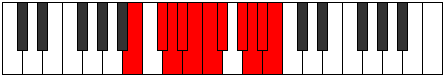 |
| [3839](https://ianring.com/musictheory/scales/3839) | [Mixolatic](ModeCSharpMixolatic.md) | C# | C#, D, D#, E, F, F#, G, G#, A#, B, C, C# |  |
| [3839](https://ianring.com/musictheory/scales/3839) | [Mixolatic](ModeDFlatMixolatic.md) | Db | Db, D, Eb, E, F, Gb, G, Ab, Bb, B, C, Db |  |
| [3839](https://ianring.com/musictheory/scales/3839) | [Mixolatic](ModeBNaturalMixolatic.md) | B | B, C, C#, D, D#, E, F, F#, G#, A, A#, B |  |
| [3839](https://ianring.com/musictheory/scales/3839) | [Mixolatic](ModeGSharpMixolatic.md) | G# | G#, A, A#, B, C, C#, D, D#, F, F#, G, G# |  |
| [3839](https://ianring.com/musictheory/scales/3839) | [Mixolatic](ModeAFlatMixolatic.md) | Ab | Ab, A, Bb, B, C, Db, D, Eb, F, Gb, G, Ab |  |
| [3839](https://ianring.com/musictheory/scales/3839) | [Mixolatic](ModeGNaturalMixolatic.md) | G | G, G#, A, A#, B, C, C#, D, E, F, F#, G |  |
| [3839](https://ianring.com/musictheory/scales/3839) | [Mixolatic](ModeFNaturalMixolatic.md) | F | F, F#, G, G#, A, A#, B, C, D, D#, E, F |  |
| [3839](https://ianring.com/musictheory/scales/3839) | [Mixolatic](ModeENaturalMixolatic.md) | E | E, F, F#, G, G#, A, A#, B, C#, D, D#, E |  |
| [3879](https://ianring.com/musictheory/scales/3879) | [Pathyllic](ModeANaturalPathyllic.md) | A | A, A#, B, D, F, F#, G, G#, A |  |
| [3887](https://ianring.com/musictheory/scales/3887) | [Phrathygic](ModeANaturalPhrathygic.md) | A | A, A#, B, C, D, F, F#, G, G#, A |  |
| [3893](https://ianring.com/musictheory/scales/3893) | [Phrocryllic](ModeFSharpPhrocryllic.md) | F# | F#, G#, A#, B, D, D#, E, F, F# |  |
| [3893](https://ianring.com/musictheory/scales/3893) | [Phrocryllic](ModeGFlatPhrocryllic.md) | Gb | Gb, Ab, Bb, B, D, Eb, E, F, Gb |  |
| [3895](https://ianring.com/musictheory/scales/3895) | [Eparygic](ModeFSharpEparygic.md) | F# | F#, G, G#, A#, B, D, D#, E, F, F# |  |
| [3895](https://ianring.com/musictheory/scales/3895) | [Eparygic](ModeGFlatEparygic.md) | Gb | Gb, G, Ab, Bb, B, D, Eb, E, F, Gb |  |
| [3895](https://ianring.com/musictheory/scales/3895) | [Eparygic](ModeANaturalEparygic.md) | A | A, A#, B, C#, D, F, F#, G, G#, A |  |
| [3901](https://ianring.com/musictheory/scales/3901) | [Bycrygic](ModeFSharpBycrygic.md) | F# | F#, G#, A, A#, B, D, D#, E, F, F# |  |
| [3901](https://ianring.com/musictheory/scales/3901) | [Bycrygic](ModeGFlatBycrygic.md) | Gb | Gb, Ab, A, Bb, B, D, Eb, E, F, Gb |  |
| [3903](https://ianring.com/musictheory/scales/3903) | [Aeogyllian](ModeANaturalAeogyllian.md) | A | A, A#, B, C, C#, D, F, F#, G, G#, A |  |
| [3903](https://ianring.com/musictheory/scales/3903) | [Aeogyllian](ModeFSharpAeogyllian.md) | F# | F#, G, G#, A, A#, B, D, D#, E, F, F# |  |
| [3903](https://ianring.com/musictheory/scales/3903) | [Aeogyllian](ModeGFlatAeogyllian.md) | Gb | Gb, G, Ab, A, Bb, B, D, Eb, E, F, Gb |  |
| [3917](https://ianring.com/musictheory/scales/3917) | [Epaphyllic](ModeGSharpEpaphyllic.md) | G# | G#, A#, B, D, E, F, F#, G, G# |  |
| [3917](https://ianring.com/musictheory/scales/3917) | [Epaphyllic](ModeAFlatEpaphyllic.md) | Ab | Ab, Bb, B, D, E, F, Gb, G, Ab |  |
| [3919](https://ianring.com/musictheory/scales/3919) | [Lynygic](ModeGSharpLynygic.md) | G# | G#, A, A#, B, D, E, F, F#, G, G# |  |
| [3919](https://ianring.com/musictheory/scales/3919) | [Lynygic](ModeAFlatLynygic.md) | Ab | Ab, A, Bb, B, D, E, F, Gb, G, Ab |  |
| [3929](https://ianring.com/musictheory/scales/3929) | [Aeolothyllic](ModeDNaturalAeolothyllic.md) | D | D, F, F#, G#, A#, B, C, C#, D |  |
| [3931](https://ianring.com/musictheory/scales/3931) | [Aerygic](ModeDNaturalAerygic.md) | D | D, D#, F, F#, G#, A#, B, C, C#, D |  |
| [3933](https://ianring.com/musictheory/scales/3933) | [Ionidygic](ModeDNaturalIonidygic.md) | D | D, E, F, F#, G#, A#, B, C, C#, D |  |
| [3933](https://ianring.com/musictheory/scales/3933) | [Ionidygic](ModeGSharpIonidygic.md) | G# | G#, A#, B, C, D, E, F, F#, G, G# |  |
| [3933](https://ianring.com/musictheory/scales/3933) | [Ionidygic](ModeAFlatIonidygic.md) | Ab | Ab, Bb, B, C, D, E, F, Gb, G, Ab |  |
| [3935](https://ianring.com/musictheory/scales/3935) | [Kataphyllian](ModeDNaturalKataphyllian.md) | D | D, D#, E, F, F#, G#, A#, B, C, C#, D |  |
| [3935](https://ianring.com/musictheory/scales/3935) | [Kataphyllian](ModeGSharpKataphyllian.md) | G# | G#, A, A#, B, C, D, E, F, F#, G, G# |  |
| [3935](https://ianring.com/musictheory/scales/3935) | [Kataphyllian](ModeAFlatKataphyllian.md) | Ab | Ab, A, Bb, B, C, D, E, F, Gb, G, Ab |  |
| [3941](https://ianring.com/musictheory/scales/3941) | [Stathyllic](ModeCNaturalStathyllic.md) | C | C, D, F, F#, G#, A, A#, B, C |  |
| [3943](https://ianring.com/musictheory/scales/3943) | [Zynygic](ModeCNaturalZynygic.md) | C | C, C#, D, F, F#, G#, A, A#, B, C |  |
| [3943](https://ianring.com/musictheory/scales/3943) | [Zynygic](ModeANaturalZynygic.md) | A | A, A#, B, D, D#, F, F#, G, G#, A |  |
| [3947](https://ianring.com/musictheory/scales/3947) | [Ryptygic](ModeFNaturalRyptygic.md) | F | F, F#, G#, A#, B, C#, D, D#, E, F |  |
| [3949](https://ianring.com/musictheory/scales/3949) | [Koptygic](ModeGSharpKoptygic.md) | G# | G#, A#, B, C#, D, E, F, F#, G, G# |  |
| [3949](https://ianring.com/musictheory/scales/3949) | [Koptygic](ModeAFlatKoptygic.md) | Ab | Ab, Bb, B, Db, D, E, F, Gb, G, Ab |  |
| [3949](https://ianring.com/musictheory/scales/3949) | [Koptygic](ModeCNaturalKoptygic.md) | C | C, D, D#, F, F#, G#, A, A#, B, C |  |
| [3951](https://ianring.com/musictheory/scales/3951) | [Mathyllian](ModeFNaturalMathyllian.md) | F | F, F#, G, G#, A#, B, C#, D, D#, E, F |  |
| [3951](https://ianring.com/musictheory/scales/3951) | [Mathyllian](ModeCNaturalMathyllian.md) | C | C, C#, D, D#, F, F#, G#, A, A#, B, C |  |
| [3951](https://ianring.com/musictheory/scales/3951) | [Mathyllian](ModeANaturalMathyllian.md) | A | A, A#, B, C, D, D#, F, F#, G, G#, A |  |
| [3951](https://ianring.com/musictheory/scales/3951) | [Mathyllian](ModeGSharpMathyllian.md) | G# | G#, A, A#, B, C#, D, E, F, F#, G, G# |  |
| [3951](https://ianring.com/musictheory/scales/3951) | [Mathyllian](ModeAFlatMathyllian.md) | Ab | Ab, A, Bb, B, Db, D, E, F, Gb, G, Ab |  |
| [3957](https://ianring.com/musictheory/scales/3957) | [Porygic](ModeFSharpPorygic.md) | F# | F#, G#, A#, B, C, D, D#, E, F, F# |  |
| [3957](https://ianring.com/musictheory/scales/3957) | [Porygic](ModeGFlatPorygic.md) | Gb | Gb, Ab, Bb, B, C, D, Eb, E, F, Gb |  |
| [3957](https://ianring.com/musictheory/scales/3957) | [Porygic](ModeCNaturalPorygic.md) | C | C, D, E, F, F#, G#, A, A#, B, C |  |
| [3959](https://ianring.com/musictheory/scales/3959) | [Katagyllian](ModeFSharpKatagyllian.md) | F# | F#, G, G#, A#, B, C, D, D#, E, F, F# |  |
| [3959](https://ianring.com/musictheory/scales/3959) | [Katagyllian](ModeGFlatKatagyllian.md) | Gb | Gb, G, Ab, Bb, B, C, D, Eb, E, F, Gb |  |
| [3959](https://ianring.com/musictheory/scales/3959) | [Katagyllian](ModeCNaturalKatagyllian.md) | C | C, C#, D, E, F, F#, G#, A, A#, B, C |  |
| [3959](https://ianring.com/musictheory/scales/3959) | [Katagyllian](ModeANaturalKatagyllian.md) | A | A, A#, B, C#, D, D#, F, F#, G, G#, A |  |
| [3961](https://ianring.com/musictheory/scales/3961) | [Mixolydygic](ModeDNaturalMixolydygic.md) | D | D, F, F#, G, G#, A#, B, C, C#, D |  |
| [3963](https://ianring.com/musictheory/scales/3963) | [Aeoryllian](ModeDNaturalAeoryllian.md) | D | D, D#, F, F#, G, G#, A#, B, C, C#, D |  |
| [3963](https://ianring.com/musictheory/scales/3963) | [Aeoryllian](ModeFNaturalAeoryllian.md) | F | F, F#, G#, A, A#, B, C#, D, D#, E, F |  |
| [3965](https://ianring.com/musictheory/scales/3965) | [Thydyllian](ModeDNaturalThydyllian.md) | D | D, E, F, F#, G, G#, A#, B, C, C#, D |  |
| [3965](https://ianring.com/musictheory/scales/3965) | [Thydyllian](ModeGSharpThydyllian.md) | G# | G#, A#, B, C, C#, D, E, F, F#, G, G# |  |
| [3965](https://ianring.com/musictheory/scales/3965) | [Thydyllian](ModeAFlatThydyllian.md) | Ab | Ab, Bb, B, C, Db, D, E, F, Gb, G, Ab |  |
| [3965](https://ianring.com/musictheory/scales/3965) | [Thydyllian](ModeCNaturalThydyllian.md) | C | C, D, D#, E, F, F#, G#, A, A#, B, C |  |
| [3965](https://ianring.com/musictheory/scales/3965) | [Thydyllian](ModeFSharpThydyllian.md) | F# | F#, G#, A, A#, B, C, D, D#, E, F, F# |  |
| [3965](https://ianring.com/musictheory/scales/3965) | [Thydyllian](ModeGFlatThydyllian.md) | Gb | Gb, Ab, A, Bb, B, C, D, Eb, E, F, Gb |  |
| [3967](https://ianring.com/musictheory/scales/3967) | [Soratic](ModeDNaturalSoratic.md) | D | D, D#, E, F, F#, G, G#, A#, B, C, C#, D |  |
| [3967](https://ianring.com/musictheory/scales/3967) | [Soratic](ModeCNaturalSoratic.md) | C | C, C#, D, D#, E, F, F#, G#, A, A#, B, C |  |
| [3967](https://ianring.com/musictheory/scales/3967) | [Soratic](ModeANaturalSoratic.md) | A | A, A#, B, C, C#, D, D#, F, F#, G, G#, A |  |
| [3967](https://ianring.com/musictheory/scales/3967) | [Soratic](ModeGSharpSoratic.md) | G# | G#, A, A#, B, C, C#, D, E, F, F#, G, G# |  |
| [3967](https://ianring.com/musictheory/scales/3967) | [Soratic](ModeAFlatSoratic.md) | Ab | Ab, A, Bb, B, C, Db, D, E, F, Gb, G, Ab |  |
| [3967](https://ianring.com/musictheory/scales/3967) | [Soratic](ModeFSharpSoratic.md) | F# | F#, G, G#, A, A#, B, C, D, D#, E, F, F# |  |
| [3967](https://ianring.com/musictheory/scales/3967) | [Soratic](ModeGFlatSoratic.md) | Gb | Gb, G, Ab, A, Bb, B, C, D, Eb, E, F, Gb |  |
| [3967](https://ianring.com/musictheory/scales/3967) | [Soratic](ModeFNaturalSoratic.md) | F | F, F#, G, G#, A, A#, B, C#, D, D#, E, F |  |
| [3987](https://ianring.com/musictheory/scales/3987) | [Loryllic](ModeASharpLoryllic.md) | A# | A#, B, D, F, F#, G, G#, A, A# |  |
| [3987](https://ianring.com/musictheory/scales/3987) | [Loryllic](ModeBFlatLoryllic.md) | Bb | Bb, B, D, F, Gb, G, Ab, A, Bb |  |
| [3991](https://ianring.com/musictheory/scales/3991) | [Badygic](ModeASharpBadygic.md) | A# | A#, B, C, D, F, F#, G, G#, A, A# |  |
| [3991](https://ianring.com/musictheory/scales/3991) | [Badygic](ModeBFlatBadygic.md) | Bb | Bb, B, C, D, F, Gb, G, Ab, A, Bb |  |
| [3995](https://ianring.com/musictheory/scales/3995) | [Ionygic](ModeGNaturalIonygic.md) | G | G, G#, A#, B, D, D#, E, F, F#, G |  |
| [3995](https://ianring.com/musictheory/scales/3995) | [Ionygic](ModeASharpIonygic.md) | A# | A#, B, C#, D, F, F#, G, G#, A, A# |  |
| [3995](https://ianring.com/musictheory/scales/3995) | [Ionygic](ModeBFlatIonygic.md) | Bb | Bb, B, Db, D, F, Gb, G, Ab, A, Bb |  |
| [3999](https://ianring.com/musictheory/scales/3999) | [Dydyllian](ModeASharpDydyllian.md) | A# | A#, B, C, C#, D, F, F#, G, G#, A, A# |  |
| [3999](https://ianring.com/musictheory/scales/3999) | [Dydyllian](ModeBFlatDydyllian.md) | Bb | Bb, B, C, Db, D, F, Gb, G, Ab, A, Bb |  |
| [3999](https://ianring.com/musictheory/scales/3999) | [Dydyllian](ModeGNaturalDydyllian.md) | G | G, G#, A, A#, B, D, D#, E, F, F#, G |  |
| [4007](https://ianring.com/musictheory/scales/4007) | [Doptygic](ModeANaturalDoptygic.md) | A | A, A#, B, D, E, F, F#, G, G#, A |  |
| [4013](https://ianring.com/musictheory/scales/4013) | [Dathygic](ModeDSharpDathygic.md) | D# | D#, F, F#, G#, A#, B, C, C#, D, D# |  |
| [4013](https://ianring.com/musictheory/scales/4013) | [Dathygic](ModeEFlatDathygic.md) | Eb | Eb, F, Gb, Ab, Bb, B, C, Db, D, Eb |  |
| [4015](https://ianring.com/musictheory/scales/4015) | [Phradyllian](ModeDSharpPhradyllian.md) | D# | D#, E, F, F#, G#, A#, B, C, C#, D, D# |  |
| [4015](https://ianring.com/musictheory/scales/4015) | [Phradyllian](ModeEFlatPhradyllian.md) | Eb | Eb, E, F, Gb, Ab, Bb, B, C, Db, D, Eb |  |
| [4015](https://ianring.com/musictheory/scales/4015) | [Phradyllian](ModeANaturalPhradyllian.md) | A | A, A#, B, C, D, E, F, F#, G, G#, A |  |
| [4019](https://ianring.com/musictheory/scales/4019) | [Lonygic](ModeCSharpLonygic.md) | C# | C#, D, F, F#, G#, A, A#, B, C, C# |  |
| [4019](https://ianring.com/musictheory/scales/4019) | [Lonygic](ModeDFlatLonygic.md) | Db | Db, D, F, Gb, Ab, A, Bb, B, C, Db |  |
| [4019](https://ianring.com/musictheory/scales/4019) | [Lonygic](ModeASharpLonygic.md) | A# | A#, B, D, D#, F, F#, G, G#, A, A# |  |
| [4019](https://ianring.com/musictheory/scales/4019) | [Lonygic](ModeBFlatLonygic.md) | Bb | Bb, B, D, Eb, F, Gb, G, Ab, A, Bb |  |
| [4021](https://ianring.com/musictheory/scales/4021) | [Bagygic](ModeFSharpBagygic.md) | F# | F#, G#, A#, B, C#, D, D#, E, F, F# |  |
| [4021](https://ianring.com/musictheory/scales/4021) | [Bagygic](ModeGFlatBagygic.md) | Gb | Gb, Ab, Bb, B, Db, D, Eb, E, F, Gb |  |
| [4023](https://ianring.com/musictheory/scales/4023) | [Styptyllian](ModeFSharpStyptyllian.md) | F# | F#, G, G#, A#, B, C#, D, D#, E, F, F# |  |
| [4023](https://ianring.com/musictheory/scales/4023) | [Styptyllian](ModeGFlatStyptyllian.md) | Gb | Gb, G, Ab, Bb, B, Db, D, Eb, E, F, Gb |  |
| [4023](https://ianring.com/musictheory/scales/4023) | [Styptyllian](ModeCSharpStyptyllian.md) | C# | C#, D, D#, F, F#, G#, A, A#, B, C, C# |  |
| [4023](https://ianring.com/musictheory/scales/4023) | [Styptyllian](ModeDFlatStyptyllian.md) | Db | Db, D, Eb, F, Gb, Ab, A, Bb, B, C, Db |  |
| [4023](https://ianring.com/musictheory/scales/4023) | [Styptyllian](ModeASharpStyptyllian.md) | A# | A#, B, C, D, D#, F, F#, G, G#, A, A# |  |
| [4023](https://ianring.com/musictheory/scales/4023) | [Styptyllian](ModeBFlatStyptyllian.md) | Bb | Bb, B, C, D, Eb, F, Gb, G, Ab, A, Bb |  |
| [4023](https://ianring.com/musictheory/scales/4023) | [Styptyllian](ModeANaturalStyptyllian.md) | A | A, A#, B, C#, D, E, F, F#, G, G#, A |  |
| [4027](https://ianring.com/musictheory/scales/4027) | [Ragyllian](ModeGNaturalRagyllian.md) | G | G, G#, A#, B, C, D, D#, E, F, F#, G |  |
| [4027](https://ianring.com/musictheory/scales/4027) | [Ragyllian](ModeCSharpRagyllian.md) | C# | C#, D, E, F, F#, G#, A, A#, B, C, C# |  |
| [4027](https://ianring.com/musictheory/scales/4027) | [Ragyllian](ModeDFlatRagyllian.md) | Db | Db, D, E, F, Gb, Ab, A, Bb, B, C, Db |  |
| [4027](https://ianring.com/musictheory/scales/4027) | [Ragyllian](ModeASharpRagyllian.md) | A# | A#, B, C#, D, D#, F, F#, G, G#, A, A# |  |
| [4027](https://ianring.com/musictheory/scales/4027) | [Ragyllian](ModeBFlatRagyllian.md) | Bb | Bb, B, Db, D, Eb, F, Gb, G, Ab, A, Bb |  |
| [4029](https://ianring.com/musictheory/scales/4029) | [Aerycryllian](ModeDSharpAerycryllian.md) | D# | D#, F, F#, G, G#, A#, B, C, C#, D, D# |  |
| [4029](https://ianring.com/musictheory/scales/4029) | [Aerycryllian](ModeEFlatAerycryllian.md) | Eb | Eb, F, Gb, G, Ab, Bb, B, C, Db, D, Eb |  |
| [4029](https://ianring.com/musictheory/scales/4029) | [Aerycryllian](ModeFSharpAerycryllian.md) | F# | F#, G#, A, A#, B, C#, D, D#, E, F, F# |  |
| [4029](https://ianring.com/musictheory/scales/4029) | [Aerycryllian](ModeGFlatAerycryllian.md) | Gb | Gb, Ab, A, Bb, B, Db, D, Eb, E, F, Gb |  |
| [4031](https://ianring.com/musictheory/scales/4031) | [Godatic](ModeDSharpGodatic.md) | D# | D#, E, F, F#, G, G#, A#, B, C, C#, D, D# |  |
| [4031](https://ianring.com/musictheory/scales/4031) | [Godatic](ModeEFlatGodatic.md) | Eb | Eb, E, F, Gb, G, Ab, Bb, B, C, Db, D, Eb |  |
| [4031](https://ianring.com/musictheory/scales/4031) | [Godatic](ModeCSharpGodatic.md) | C# | C#, D, D#, E, F, F#, G#, A, A#, B, C, C# |  |
| [4031](https://ianring.com/musictheory/scales/4031) | [Godatic](ModeDFlatGodatic.md) | Db | Db, D, Eb, E, F, Gb, Ab, A, Bb, B, C, Db |  |
| [4031](https://ianring.com/musictheory/scales/4031) | [Godatic](ModeASharpGodatic.md) | A# | A#, B, C, C#, D, D#, F, F#, G, G#, A, A# |  |
| [4031](https://ianring.com/musictheory/scales/4031) | [Godatic](ModeBFlatGodatic.md) | Bb | Bb, B, C, Db, D, Eb, F, Gb, G, Ab, A, Bb |  |
| [4031](https://ianring.com/musictheory/scales/4031) | [Godatic](ModeANaturalGodatic.md) | A | A, A#, B, C, C#, D, E, F, F#, G, G#, A |  |
| [4031](https://ianring.com/musictheory/scales/4031) | [Godatic](ModeGNaturalGodatic.md) | G | G, G#, A, A#, B, C, D, D#, E, F, F#, G |  |
| [4031](https://ianring.com/musictheory/scales/4031) | [Godatic](ModeFSharpGodatic.md) | F# | F#, G, G#, A, A#, B, C#, D, D#, E, F, F# |  |
| [4031](https://ianring.com/musictheory/scales/4031) | [Godatic](ModeGFlatGodatic.md) | Gb | Gb, G, Ab, A, Bb, B, Db, D, Eb, E, F, Gb |  |
| [4041](https://ianring.com/musictheory/scales/4041) | [Zaryllic](ModeBNaturalZaryllic.md) | B | B, D, F, F#, G, G#, A, A#, B |  |
| [4043](https://ianring.com/musictheory/scales/4043) | [Phrocrygic](ModeBNaturalPhrocrygic.md) | B | B, C, D, F, F#, G, G#, A, A#, B |  |
| [4045](https://ianring.com/musictheory/scales/4045) | [Gyptygic](ModeGSharpGyptygic.md) | G# | G#, A#, B, D, D#, E, F, F#, G, G# |  |
| [4045](https://ianring.com/musictheory/scales/4045) | [Gyptygic](ModeAFlatGyptygic.md) | Ab | Ab, Bb, B, D, Eb, E, F, Gb, G, Ab |  |
| [4045](https://ianring.com/musictheory/scales/4045) | [Gyptygic](ModeBNaturalGyptygic.md) | B | B, C#, D, F, F#, G, G#, A, A#, B |  |
| [4047](https://ianring.com/musictheory/scales/4047) | [Thogyllian](ModeBNaturalThogyllian.md) | B | B, C, C#, D, F, F#, G, G#, A, A#, B |  |
| [4047](https://ianring.com/musictheory/scales/4047) | [Thogyllian](ModeGSharpThogyllian.md) | G# | G#, A, A#, B, D, D#, E, F, F#, G, G# |  |
| [4047](https://ianring.com/musictheory/scales/4047) | [Thogyllian](ModeAFlatThogyllian.md) | Ab | Ab, A, Bb, B, D, Eb, E, F, Gb, G, Ab |  |
| [4051](https://ianring.com/musictheory/scales/4051) | [Ionilygic](ModeASharpIonilygic.md) | A# | A#, B, D, E, F, F#, G, G#, A, A# |  |
| [4051](https://ianring.com/musictheory/scales/4051) | [Ionilygic](ModeBFlatIonilygic.md) | Bb | Bb, B, D, E, F, Gb, G, Ab, A, Bb |  |
| [4055](https://ianring.com/musictheory/scales/4055) | [Dagyllian](ModeENaturalDagyllian.md) | E | E, F, F#, G#, A#, B, C, C#, D, D#, E |  |
| [4055](https://ianring.com/musictheory/scales/4055) | [Dagyllian](ModeASharpDagyllian.md) | A# | A#, B, C, D, E, F, F#, G, G#, A, A# |  |
| [4055](https://ianring.com/musictheory/scales/4055) | [Dagyllian](ModeBFlatDagyllian.md) | Bb | Bb, B, C, D, E, F, Gb, G, Ab, A, Bb |  |
| [4057](https://ianring.com/musictheory/scales/4057) | [Phrygic](ModeDNaturalPhrygic.md) | D | D, F, F#, G#, A, A#, B, C, C#, D |  |
| [4057](https://ianring.com/musictheory/scales/4057) | [Phrygic](ModeBNaturalPhrygic.md) | B | B, D, D#, F, F#, G, G#, A, A#, B |  |
| [4059](https://ianring.com/musictheory/scales/4059) | [Zolyllian](ModeGNaturalZolyllian.md) | G | G, G#, A#, B, C#, D, D#, E, F, F#, G |  |
| [4059](https://ianring.com/musictheory/scales/4059) | [Zolyllian](ModeDNaturalZolyllian.md) | D | D, D#, F, F#, G#, A, A#, B, C, C#, D |  |
| [4059](https://ianring.com/musictheory/scales/4059) | [Zolyllian](ModeBNaturalZolyllian.md) | B | B, C, D, D#, F, F#, G, G#, A, A#, B |  |
| [4059](https://ianring.com/musictheory/scales/4059) | [Zolyllian](ModeASharpZolyllian.md) | A# | A#, B, C#, D, E, F, F#, G, G#, A, A# |  |
| [4059](https://ianring.com/musictheory/scales/4059) | [Zolyllian](ModeBFlatZolyllian.md) | Bb | Bb, B, Db, D, E, F, Gb, G, Ab, A, Bb |  |
| [4061](https://ianring.com/musictheory/scales/4061) | [Staptyllian](ModeGSharpStaptyllian.md) | G# | G#, A#, B, C, D, D#, E, F, F#, G, G# |  |
| [4061](https://ianring.com/musictheory/scales/4061) | [Staptyllian](ModeAFlatStaptyllian.md) | Ab | Ab, Bb, B, C, D, Eb, E, F, Gb, G, Ab |  |
| [4061](https://ianring.com/musictheory/scales/4061) | [Staptyllian](ModeDNaturalStaptyllian.md) | D | D, E, F, F#, G#, A, A#, B, C, C#, D |  |
| [4061](https://ianring.com/musictheory/scales/4061) | [Staptyllian](ModeBNaturalStaptyllian.md) | B | B, C#, D, D#, F, F#, G, G#, A, A#, B |  |
| [4063](https://ianring.com/musictheory/scales/4063) | [Eptatic](ModeENaturalEptatic.md) | E | E, F, F#, G, G#, A#, B, C, C#, D, D#, E |  |
| [4063](https://ianring.com/musictheory/scales/4063) | [Eptatic](ModeDNaturalEptatic.md) | D | D, D#, E, F, F#, G#, A, A#, B, C, C#, D |  |
| [4063](https://ianring.com/musictheory/scales/4063) | [Eptatic](ModeBNaturalEptatic.md) | B | B, C, C#, D, D#, F, F#, G, G#, A, A#, B |  |
| [4063](https://ianring.com/musictheory/scales/4063) | [Eptatic](ModeASharpEptatic.md) | A# | A#, B, C, C#, D, E, F, F#, G, G#, A, A# |  |
| [4063](https://ianring.com/musictheory/scales/4063) | [Eptatic](ModeBFlatEptatic.md) | Bb | Bb, B, C, Db, D, E, F, Gb, G, Ab, A, Bb |  |
| [4063](https://ianring.com/musictheory/scales/4063) | [Eptatic](ModeGSharpEptatic.md) | G# | G#, A, A#, B, C, D, D#, E, F, F#, G, G# |  |
| [4063](https://ianring.com/musictheory/scales/4063) | [Eptatic](ModeAFlatEptatic.md) | Ab | Ab, A, Bb, B, C, D, Eb, E, F, Gb, G, Ab |  |
| [4063](https://ianring.com/musictheory/scales/4063) | [Eptatic](ModeGNaturalEptatic.md) | G | G, G#, A, A#, B, C#, D, D#, E, F, F#, G |  |
| [4069](https://ianring.com/musictheory/scales/4069) | [Starygic](ModeCNaturalStarygic.md) | C | C, D, F, F#, G, G#, A, A#, B, C |  |
| [4071](https://ianring.com/musictheory/scales/4071) | [Rygyllian](ModeCNaturalRygyllian.md) | C | C, C#, D, F, F#, G, G#, A, A#, B, C |  |
| [4071](https://ianring.com/musictheory/scales/4071) | [Rygyllian](ModeANaturalRygyllian.md) | A | A, A#, B, D, D#, E, F, F#, G, G#, A |  |
| [4073](https://ianring.com/musictheory/scales/4073) | [Sathygic](ModeBNaturalSathygic.md) | B | B, D, E, F, F#, G, G#, A, A#, B |  |
| [4075](https://ianring.com/musictheory/scales/4075) | [Katyllian](ModeFNaturalKatyllian.md) | F | F, F#, G#, A#, B, C, C#, D, D#, E, F |  |
| [4075](https://ianring.com/musictheory/scales/4075) | [Katyllian](ModeBNaturalKatyllian.md) | B | B, C, D, E, F, F#, G, G#, A, A#, B |  |
| [4077](https://ianring.com/musictheory/scales/4077) | [Gothyllian](ModeGSharpGothyllian.md) | G# | G#, A#, B, C#, D, D#, E, F, F#, G, G# |  |
| [4077](https://ianring.com/musictheory/scales/4077) | [Gothyllian](ModeAFlatGothyllian.md) | Ab | Ab, Bb, B, Db, D, Eb, E, F, Gb, G, Ab |  |
| [4077](https://ianring.com/musictheory/scales/4077) | [Gothyllian](ModeDSharpGothyllian.md) | D# | D#, F, F#, G#, A, A#, B, C, C#, D, D# |  |
| [4077](https://ianring.com/musictheory/scales/4077) | [Gothyllian](ModeEFlatGothyllian.md) | Eb | Eb, F, Gb, Ab, A, Bb, B, C, Db, D, Eb |  |
| [4077](https://ianring.com/musictheory/scales/4077) | [Gothyllian](ModeCNaturalGothyllian.md) | C | C, D, D#, F, F#, G, G#, A, A#, B, C |  |
| [4077](https://ianring.com/musictheory/scales/4077) | [Gothyllian](ModeBNaturalGothyllian.md) | B | B, C#, D, E, F, F#, G, G#, A, A#, B |  |
| [4079](https://ianring.com/musictheory/scales/4079) | [Ionatic](ModeFNaturalIonatic.md) | F | F, F#, G, G#, A#, B, C, C#, D, D#, E, F |  |
| [4079](https://ianring.com/musictheory/scales/4079) | [Ionatic](ModeDSharpIonatic.md) | D# | D#, E, F, F#, G#, A, A#, B, C, C#, D, D# |  |
| [4079](https://ianring.com/musictheory/scales/4079) | [Ionatic](ModeEFlatIonatic.md) | Eb | Eb, E, F, Gb, Ab, A, Bb, B, C, Db, D, Eb |  |
| [4079](https://ianring.com/musictheory/scales/4079) | [Ionatic](ModeCNaturalIonatic.md) | C | C, C#, D, D#, F, F#, G, G#, A, A#, B, C |  |
| [4079](https://ianring.com/musictheory/scales/4079) | [Ionatic](ModeBNaturalIonatic.md) | B | B, C, C#, D, E, F, F#, G, G#, A, A#, B |  |
| [4079](https://ianring.com/musictheory/scales/4079) | [Ionatic](ModeANaturalIonatic.md) | A | A, A#, B, C, D, D#, E, F, F#, G, G#, A |  |
| [4079](https://ianring.com/musictheory/scales/4079) | [Ionatic](ModeGSharpIonatic.md) | G# | G#, A, A#, B, C#, D, D#, E, F, F#, G, G# |  |
| [4079](https://ianring.com/musictheory/scales/4079) | [Ionatic](ModeAFlatIonatic.md) | Ab | Ab, A, Bb, B, Db, D, Eb, E, F, Gb, G, Ab |  |
| [4083](https://ianring.com/musictheory/scales/4083) | [Bathyllian](ModeCSharpBathyllian.md) | C# | C#, D, F, F#, G, G#, A, A#, B, C, C# |  |
| [4083](https://ianring.com/musictheory/scales/4083) | [Bathyllian](ModeDFlatBathyllian.md) | Db | Db, D, F, Gb, G, Ab, A, Bb, B, C, Db |  |
| [4083](https://ianring.com/musictheory/scales/4083) | [Bathyllian](ModeASharpBathyllian.md) | A# | A#, B, D, D#, E, F, F#, G, G#, A, A# |  |
| [4083](https://ianring.com/musictheory/scales/4083) | [Bathyllian](ModeBFlatBathyllian.md) | Bb | Bb, B, D, Eb, E, F, Gb, G, Ab, A, Bb |  |
| [4085](https://ianring.com/musictheory/scales/4085) | [Sydyllian](ModeFSharpSydyllian.md) | F# | F#, G#, A#, B, C, C#, D, D#, E, F, F# |  |
| [4085](https://ianring.com/musictheory/scales/4085) | [Sydyllian](ModeGFlatSydyllian.md) | Gb | Gb, Ab, Bb, B, C, Db, D, Eb, E, F, Gb |  |
| [4085](https://ianring.com/musictheory/scales/4085) | [Sydyllian](ModeCNaturalSydyllian.md) | C | C, D, E, F, F#, G, G#, A, A#, B, C |  |
| [4087](https://ianring.com/musictheory/scales/4087) | [Aeolatic](ModeFSharpAeolatic.md) | F# | F#, G, G#, A#, B, C, C#, D, D#, E, F, F# |  |
| [4087](https://ianring.com/musictheory/scales/4087) | [Aeolatic](ModeGFlatAeolatic.md) | Gb | Gb, G, Ab, Bb, B, C, Db, D, Eb, E, F, Gb |  |
| [4087](https://ianring.com/musictheory/scales/4087) | [Aeolatic](ModeENaturalAeolatic.md) | E | E, F, F#, G#, A, A#, B, C, C#, D, D#, E |  |
| [4087](https://ianring.com/musictheory/scales/4087) | [Aeolatic](ModeCSharpAeolatic.md) | C# | C#, D, D#, F, F#, G, G#, A, A#, B, C, C# |  |
| [4087](https://ianring.com/musictheory/scales/4087) | [Aeolatic](ModeDFlatAeolatic.md) | Db | Db, D, Eb, F, Gb, G, Ab, A, Bb, B, C, Db |  |
| [4087](https://ianring.com/musictheory/scales/4087) | [Aeolatic](ModeCNaturalAeolatic.md) | C | C, C#, D, E, F, F#, G, G#, A, A#, B, C |  |
| [4087](https://ianring.com/musictheory/scales/4087) | [Aeolatic](ModeASharpAeolatic.md) | A# | A#, B, C, D, D#, E, F, F#, G, G#, A, A# |  |
| [4087](https://ianring.com/musictheory/scales/4087) | [Aeolatic](ModeBFlatAeolatic.md) | Bb | Bb, B, C, D, Eb, E, F, Gb, G, Ab, A, Bb |  |
| [4087](https://ianring.com/musictheory/scales/4087) | [Aeolatic](ModeANaturalAeolatic.md) | A | A, A#, B, C#, D, D#, E, F, F#, G, G#, A |  |
| [4089](https://ianring.com/musictheory/scales/4089) | [Katoryllian](ModeDNaturalKatoryllian.md) | D | D, F, F#, G, G#, A, A#, B, C, C#, D |  |
| [4089](https://ianring.com/musictheory/scales/4089) | [Katoryllian](ModeBNaturalKatoryllian.md) | B | B, D, D#, E, F, F#, G, G#, A, A#, B |  |
| [4091](https://ianring.com/musictheory/scales/4091) | [Thydatic](ModeGNaturalThydatic.md) | G | G, G#, A#, B, C, C#, D, D#, E, F, F#, G |  |
| [4091](https://ianring.com/musictheory/scales/4091) | [Thydatic](ModeFNaturalThydatic.md) | F | F, F#, G#, A, A#, B, C, C#, D, D#, E, F |  |
| [4091](https://ianring.com/musictheory/scales/4091) | [Thydatic](ModeDNaturalThydatic.md) | D | D, D#, F, F#, G, G#, A, A#, B, C, C#, D |  |
| [4091](https://ianring.com/musictheory/scales/4091) | [Thydatic](ModeCSharpThydatic.md) | C# | C#, D, E, F, F#, G, G#, A, A#, B, C, C# |  |
| [4091](https://ianring.com/musictheory/scales/4091) | [Thydatic](ModeDFlatThydatic.md) | Db | Db, D, E, F, Gb, G, Ab, A, Bb, B, C, Db |  |
| [4091](https://ianring.com/musictheory/scales/4091) | [Thydatic](ModeBNaturalThydatic.md) | B | B, C, D, D#, E, F, F#, G, G#, A, A#, B |  |
| [4091](https://ianring.com/musictheory/scales/4091) | [Thydatic](ModeASharpThydatic.md) | A# | A#, B, C#, D, D#, E, F, F#, G, G#, A, A# |  |
| [4091](https://ianring.com/musictheory/scales/4091) | [Thydatic](ModeBFlatThydatic.md) | Bb | Bb, B, Db, D, Eb, E, F, Gb, G, Ab, A, Bb |  |
| [4093](https://ianring.com/musictheory/scales/4093) | [Aerycratic](ModeGSharpAerycratic.md) | G# | G#, A#, B, C, C#, D, D#, E, F, F#, G, G# |  |
| [4093](https://ianring.com/musictheory/scales/4093) | [Aerycratic](ModeAFlatAerycratic.md) | Ab | Ab, Bb, B, C, Db, D, Eb, E, F, Gb, G, Ab |  |
| [4093](https://ianring.com/musictheory/scales/4093) | [Aerycratic](ModeFSharpAerycratic.md) | F# | F#, G#, A, A#, B, C, C#, D, D#, E, F, F# |  |
| [4093](https://ianring.com/musictheory/scales/4093) | [Aerycratic](ModeGFlatAerycratic.md) | Gb | Gb, Ab, A, Bb, B, C, Db, D, Eb, E, F, Gb |  |
| [4093](https://ianring.com/musictheory/scales/4093) | [Aerycratic](ModeDSharpAerycratic.md) | D# | D#, F, F#, G, G#, A, A#, B, C, C#, D, D# |  |
| [4093](https://ianring.com/musictheory/scales/4093) | [Aerycratic](ModeEFlatAerycratic.md) | Eb | Eb, F, Gb, G, Ab, A, Bb, B, C, Db, D, Eb |  |
| [4093](https://ianring.com/musictheory/scales/4093) | [Aerycratic](ModeDNaturalAerycratic.md) | D | D, E, F, F#, G, G#, A, A#, B, C, C#, D |  |
| [4093](https://ianring.com/musictheory/scales/4093) | [Aerycratic](ModeCNaturalAerycratic.md) | C | C, D, D#, E, F, F#, G, G#, A, A#, B, C |  |
| [4093](https://ianring.com/musictheory/scales/4093) | [Aerycratic](ModeBNaturalAerycratic.md) | B | B, C#, D, D#, E, F, F#, G, G#, A, A#, B |  |
| [4095](https://ianring.com/musictheory/scales/4095) | [Chromatic](ModeCNaturalChromatic.md) | C | C, C#, D, D#, E, F, F#, G, G#, A, A#, B, C |  |
| [4095](https://ianring.com/musictheory/scales/4095) | [Chromatic](ModeCSharpChromatic.md) | C# | C#, D, D#, E, F, F#, G, G#, A, A#, B, C, C# |  |
| [4095](https://ianring.com/musictheory/scales/4095) | [Chromatic](ModeDFlatChromatic.md) | Db | Db, D, Eb, E, F, Gb, G, Ab, A, Bb, B, C, Db |  |
| [4095](https://ianring.com/musictheory/scales/4095) | [Chromatic](ModeDNaturalChromatic.md) | D | D, D#, E, F, F#, G, G#, A, A#, B, C, C#, D |  |
| [4095](https://ianring.com/musictheory/scales/4095) | [Chromatic](ModeDSharpChromatic.md) | D# | D#, E, F, F#, G, G#, A, A#, B, C, C#, D, D# |  |
| [4095](https://ianring.com/musictheory/scales/4095) | [Chromatic](ModeEFlatChromatic.md) | Eb | Eb, E, F, Gb, G, Ab, A, Bb, B, C, Db, D, Eb |  |
| [4095](https://ianring.com/musictheory/scales/4095) | [Chromatic](ModeENaturalChromatic.md) | E | E, F, F#, G, G#, A, A#, B, C, C#, D, D#, E |  |
| [4095](https://ianring.com/musictheory/scales/4095) | [Chromatic](ModeFNaturalChromatic.md) | F | F, F#, G, G#, A, A#, B, C, C#, D, D#, E, F |  |
| [4095](https://ianring.com/musictheory/scales/4095) | [Chromatic](ModeFSharpChromatic.md) | F# | F#, G, G#, A, A#, B, C, C#, D, D#, E, F, F# |  |
| [4095](https://ianring.com/musictheory/scales/4095) | [Chromatic](ModeGFlatChromatic.md) | Gb | Gb, G, Ab, A, Bb, B, C, Db, D, Eb, E, F, Gb |  |
| [4095](https://ianring.com/musictheory/scales/4095) | [Chromatic](ModeGNaturalChromatic.md) | G | G, G#, A, A#, B, C, C#, D, D#, E, F, F#, G |  |
| [4095](https://ianring.com/musictheory/scales/4095) | [Chromatic](ModeGSharpChromatic.md) | G# | G#, A, A#, B, C, C#, D, D#, E, F, F#, G, G# |  |
| [4095](https://ianring.com/musictheory/scales/4095) | [Chromatic](ModeAFlatChromatic.md) | Ab | Ab, A, Bb, B, C, Db, D, Eb, E, F, Gb, G, Ab |  |
| [4095](https://ianring.com/musictheory/scales/4095) | [Chromatic](ModeANaturalChromatic.md) | A | A, A#, B, C, C#, D, D#, E, F, F#, G, G#, A |  |
| [4095](https://ianring.com/musictheory/scales/4095) | [Chromatic](ModeASharpChromatic.md) | A# | A#, B, C, C#, D, D#, E, F, F#, G, G#, A, A# |  |
| [4095](https://ianring.com/musictheory/scales/4095) | [Chromatic](ModeBFlatChromatic.md) | Bb | Bb, B, C, Db, D, Eb, E, F, Gb, G, Ab, A, Bb |  |
| [4095](https://ianring.com/musictheory/scales/4095) | [Chromatic](ModeBNaturalChromatic.md) | B | B, C, C#, D, D#, E, F, F#, G, G#, A, A#, B |  |
