# ASharpDominantSeventhSharpNinth

## Links

- [Documentation](README.md)
- [Scales Index](Scales.md)
- [Modes Index](Modes.md)
- [Chords Index](Chords.md)

## Root

A#

## Diagram

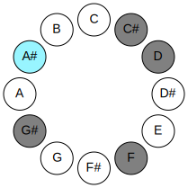

## Notes

| Position | Notes | Illustration |
|----------|------|--------------|
| RootPosition | A#,C##,E#,G#,B## |  |
| FirstInversion | C##,E#,G#,B##,A# | 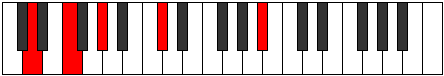 |
| SecondInversion | E#,G#,B##,A#,C## | 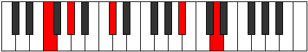 |
| ThirdInversion | G#,B##,A#,C##,E# | 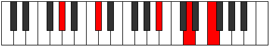 |
| FourthInversion | B##,A#,C##,E#,G# | 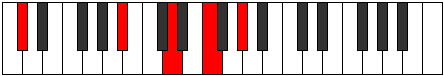 |
## Modes

| Number | Mode | Tonic | Notes | Illustration |
|--------|------|-------|-------|--------------|
| [613](https://ianring.com/musictheory/scales/613) | [Phralitonic](ModeGSharpPhralitonic.md) | G# | G#, A#, C#, D, F, G# |  |
| [613](https://ianring.com/musictheory/scales/613) | [Phralitonic](ModeAFlatPhralitonic.md) | Ab | Ab, Bb, Db, D, F, Ab |  |
| [615](https://ianring.com/musictheory/scales/615) | [Phrothimic](ModeGSharpPhrothimic.md) | G# | G#, A, Bb, C#, D, E#, G# |  |
| [615](https://ianring.com/musictheory/scales/615) | [Phrothimic](ModeAFlatPhrothimic.md) | Ab | Ab, Bbb, Cbb, Db, Ebb, F, Ab |  |
| [621](https://ianring.com/musictheory/scales/621) | [Kyrimic](ModeGSharpKyrimic.md) | G# | G#, A#, B, C#, D, E#, G# |  |
| [621](https://ianring.com/musictheory/scales/621) | [Kyrimic](ModeAFlatKyrimic.md) | Ab | Ab, Bb, Cb, Db, Ebb, F, Ab |  |
| [623](https://ianring.com/musictheory/scales/623) | [Sycrian](ModeGSharpSycrian.md) | G# | G#, A, Bb, Cb, Db, Ebb, F, G# |  |
| [623](https://ianring.com/musictheory/scales/623) | [Sycrian](ModeAFlatSycrian.md) | Ab | Ab, Bbb, Cbb, Dbbb, Ebbb, Fbbb, Gbb, Ab |  |
| [629](https://ianring.com/musictheory/scales/629) | [Aeronimic](ModeGSharpAeronimic.md) | G# | G#, A#, B#, C#, D, E#, G# |  |
| [629](https://ianring.com/musictheory/scales/629) | [Aeronimic](ModeAFlatAeronimic.md) | Ab | Ab, Bb, C, Db, Ebb, F, Ab |  |
| [631](https://ianring.com/musictheory/scales/631) | [Zygian](ModeGSharpZygian.md) | G# | G#, A, Bb, C, Db, Ebb, F, G# |  |
| [631](https://ianring.com/musictheory/scales/631) | [Zygian](ModeAFlatZygian.md) | Ab | Ab, Bbb, Cbb, Dbb, Ebbb, Fbbb, Gbb, Ab |  |
| [637](https://ianring.com/musictheory/scales/637) | [Katodian](ModeGSharpKatodian.md) | G# | G#, A#, B, C, Db, Ebb, F, G# |  |
| [637](https://ianring.com/musictheory/scales/637) | [Katodian](ModeAFlatKatodian.md) | Ab | Ab, Bb, Cb, Dbb, Ebbb, Fbbb, Gbb, Ab |  |
| [639](https://ianring.com/musictheory/scales/639) | [Ionaryllic](ModeGSharpIonaryllic.md) | G# | G#, A, A#, B, C, C#, D, F, G# |  |
| [639](https://ianring.com/musictheory/scales/639) | [Ionaryllic](ModeAFlatIonaryllic.md) | Ab | Ab, A, Bb, B, C, Db, D, F, Ab |  |
| [659](https://ianring.com/musictheory/scales/659) | [Soptitonic](ModeCSharpSoptitonic.md) | C# | C#, D, F, G#, A#, C# |  |
| [659](https://ianring.com/musictheory/scales/659) | [Soptitonic](ModeDFlatSoptitonic.md) | Db | Db, D, F, Ab, Bb, Db | 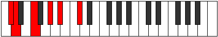 |
| [663](https://ianring.com/musictheory/scales/663) | [Phrynimic](ModeCSharpPhrynimic.md) | C# | C#, D, Eb, F, G#, A#, C# |  |
| [663](https://ianring.com/musictheory/scales/663) | [Phrynimic](ModeDFlatPhrynimic.md) | Db | Db, Ebb, Fbb, Gbb, Ab, Bb, Db |  |
| [667](https://ianring.com/musictheory/scales/667) | [Rodimic](ModeCSharpRodimic.md) | C# | C#, D, E, F, G#, A#, C# |  |
| [667](https://ianring.com/musictheory/scales/667) | [Rodimic](ModeDFlatRodimic.md) | Db | Db, Ebb, Fb, Gbb, Ab, Bb, Db |  |
| [671](https://ianring.com/musictheory/scales/671) | [Stycrian](ModeCSharpStycrian.md) | C# | C#, D, Eb, Fb, Gbb, Ab, Bb, C# |  |
| [671](https://ianring.com/musictheory/scales/671) | [Stycrian](ModeDFlatStycrian.md) | Db | Db, Ebb, Fbb, Gbbb, D###, F###, G###, Db |  |
| [691](https://ianring.com/musictheory/scales/691) | [Zydimic](ModeCSharpZydimic.md) | C# | C#, D, E#, F#, G#, A#, C# |  |
| [691](https://ianring.com/musictheory/scales/691) | [Zydimic](ModeDFlatZydimic.md) | Db | Db, Ebb, F, Gb, Ab, Bb, Db |  |
| [695](https://ianring.com/musictheory/scales/695) | [Sarian](ModeCSharpSarian.md) | C# | C#, D, Eb, F, Gb, Ab, Bb, C# |  |
| [695](https://ianring.com/musictheory/scales/695) | [Sarian](ModeDFlatSarian.md) | Db | Db, Ebb, Fbb, Gbb, Abbb, Bbbb, Cbb, Db |  |
| [699](https://ianring.com/musictheory/scales/699) | [Aerothian](ModeCSharpAerothian.md) | C# | C#, D, E, F, Gb, Ab, Bb, C# |  |
| [699](https://ianring.com/musictheory/scales/699) | [Aerothian](ModeDFlatAerothian.md) | Db | Db, Ebb, Fb, Gbb, Abbb, Bbbb, Cbb, Db |  |
| [703](https://ianring.com/musictheory/scales/703) | [Aerocryllic](ModeCSharpAerocryllic.md) | C# | C#, D, D#, E, F, F#, G#, A#, C# |  |
| [703](https://ianring.com/musictheory/scales/703) | [Aerocryllic](ModeDFlatAerocryllic.md) | Db | Db, D, Eb, E, F, Gb, Ab, Bb, Db |  |
| [723](https://ianring.com/musictheory/scales/723) | [Ionadimic](ModeCSharpIonadimic.md) | C# | C#, D, E#, F##, G#, A#, C# |  |
| [723](https://ianring.com/musictheory/scales/723) | [Ionadimic](ModeDFlatIonadimic.md) | Db | Db, Ebb, F, G, Ab, Bb, Db |  |
| [727](https://ianring.com/musictheory/scales/727) | [Phradian](ModeCSharpPhradian.md) | C# | C#, D, Eb, F, G, Ab, Bb, C# |  |
| [727](https://ianring.com/musictheory/scales/727) | [Phradian](ModeDFlatPhradian.md) | Db | Db, Ebb, Fbb, Gbb, Abb, Bbbb, Cbb, Db |  |
| [731](https://ianring.com/musictheory/scales/731) | [Ionorian](ModeCSharpIonorian.md) | C# | C#, D, E, F, G, Ab, Bb, C# |  |
| [731](https://ianring.com/musictheory/scales/731) | [Ionorian](ModeDFlatIonorian.md) | Db | Db, Ebb, Fb, Gbb, Abb, Bbbb, Cbb, Db |  |
| [735](https://ianring.com/musictheory/scales/735) | [Sylyllic](ModeCSharpSylyllic.md) | C# | C#, D, D#, E, F, G, G#, A#, C# |  |
| [735](https://ianring.com/musictheory/scales/735) | [Sylyllic](ModeDFlatSylyllic.md) | Db | Db, D, Eb, E, F, G, Ab, Bb, Db |  |
| [741](https://ianring.com/musictheory/scales/741) | [Gathimic](ModeGSharpGathimic.md) | G# | G#, A#, B##, C##, D#, E#, G# |  |
| [741](https://ianring.com/musictheory/scales/741) | [Gathimic](ModeAFlatGathimic.md) | Ab | Ab, Bb, C#, D, Eb, F, Ab |  |
| [743](https://ianring.com/musictheory/scales/743) | [Lanian](ModeGSharpLanian.md) | G# | G#, A, Bb, C#, D, Eb, F, G# |  |
| [743](https://ianring.com/musictheory/scales/743) | [Lanian](ModeAFlatLanian.md) | Ab | Ab, Bbb, Cbb, Db, Ebb, Fbb, Gbb, Ab |  |
| [749](https://ianring.com/musictheory/scales/749) | [Aeologian](ModeGSharpAeologian.md) | G# | G#, A#, B, C#, D, Eb, F, G# | 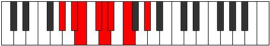 |
| [749](https://ianring.com/musictheory/scales/749) | [Aeologian](ModeAFlatAeologian.md) | Ab | Ab, Bb, Cb, Db, Ebb, Fbb, Gbb, Ab |  |
| [751](https://ianring.com/musictheory/scales/751) | [Epacryllic](ModeGSharpEpacryllic.md) | G# | G#, A, A#, B, C#, D, D#, F, G# |  |
| [751](https://ianring.com/musictheory/scales/751) | [Epacryllic](ModeAFlatEpacryllic.md) | Ab | Ab, A, Bb, B, Db, D, Eb, F, Ab |  |
| [755](https://ianring.com/musictheory/scales/755) | [Phrythian](ModeCSharpPhrythian.md) | C# | C#, D, E#, F#, G, Ab, Bb, C# |  |
| [755](https://ianring.com/musictheory/scales/755) | [Phrythian](ModeDFlatPhrythian.md) | Db | Db, Ebb, F, Gb, Abb, Bbbb, Cbb, Db |  |
| [757](https://ianring.com/musictheory/scales/757) | [Ionyptian](ModeGSharpIonyptian.md) | G# | G#, A#, B#, C#, D, Eb, F, G# |  |
| [757](https://ianring.com/musictheory/scales/757) | [Ionyptian](ModeAFlatIonyptian.md) | Ab | Ab, Bb, C, Db, Ebb, Fbb, Gbb, Ab |  |
| [759](https://ianring.com/musictheory/scales/759) | [Katalyllic](ModeCSharpKatalyllic.md) | C# | C#, D, D#, F, F#, G, G#, A#, C# |  |
| [759](https://ianring.com/musictheory/scales/759) | [Katalyllic](ModeDFlatKatalyllic.md) | Db | Db, D, Eb, F, Gb, G, Ab, Bb, Db |  |
| [759](https://ianring.com/musictheory/scales/759) | [Katalyllic](ModeGSharpKatalyllic.md) | G# | G#, A, A#, C, C#, D, D#, F, G# |  |
| [759](https://ianring.com/musictheory/scales/759) | [Katalyllic](ModeAFlatKatalyllic.md) | Ab | Ab, A, Bb, C, Db, D, Eb, F, Ab |  |
| [763](https://ianring.com/musictheory/scales/763) | [Doryllic](ModeCSharpDoryllic.md) | C# | C#, D, E, F, F#, G, G#, A#, C# |  |
| [763](https://ianring.com/musictheory/scales/763) | [Doryllic](ModeDFlatDoryllic.md) | Db | Db, D, E, F, Gb, G, Ab, Bb, Db |  |
| [765](https://ianring.com/musictheory/scales/765) | [Mixonyphyllic](ModeGSharpMixonyphyllic.md) | G# | G#, A#, B, C, C#, D, D#, F, G# |  |
| [765](https://ianring.com/musictheory/scales/765) | [Mixonyphyllic](ModeAFlatMixonyphyllic.md) | Ab | Ab, Bb, B, C, Db, D, Eb, F, Ab |  |
| [767](https://ianring.com/musictheory/scales/767) | [Raptygic](ModeCSharpRaptygic.md) | C# | C#, D, D#, E, F, F#, G, G#, A#, C# |  |
| [767](https://ianring.com/musictheory/scales/767) | [Raptygic](ModeDFlatRaptygic.md) | Db | Db, D, Eb, E, F, Gb, G, Ab, Bb, Db |  |
| [767](https://ianring.com/musictheory/scales/767) | [Raptygic](ModeGSharpRaptygic.md) | G# | G#, A, A#, B, C, C#, D, D#, F, G# |  |
| [767](https://ianring.com/musictheory/scales/767) | [Raptygic](ModeAFlatRaptygic.md) | Ab | Ab, A, Bb, B, C, Db, D, Eb, F, Ab |  |
| [809](https://ianring.com/musictheory/scales/809) | [Dogitonic](ModeFNaturalDogitonic.md) | F | F, G#, A#, C#, D, F | 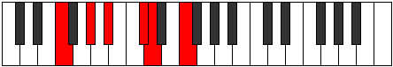 |
| [811](https://ianring.com/musictheory/scales/811) | [Radimic](ModeFNaturalRadimic.md) | F | F, Gb, Ab, Bb, C#, D, F |  |
| [813](https://ianring.com/musictheory/scales/813) | [Larimic](ModeFNaturalLarimic.md) | F | F, G, Ab, Bb, C#, D, F |  |
| [815](https://ianring.com/musictheory/scales/815) | [Bolian](ModeFNaturalBolian.md) | F | F, Gb, Abb, Bbbb, Cbb, Db, Ebb, F |  |
| [825](https://ianring.com/musictheory/scales/825) | [Thyptimic](ModeFNaturalThyptimic.md) | F | F, G#, A, Bb, C#, D, F |  |
| [827](https://ianring.com/musictheory/scales/827) | [Mixolocrian](ModeFNaturalMixolocrian.md) | F | F, Gb, Ab, Bbb, Cbb, Db, Ebb, F |  |
| [829](https://ianring.com/musictheory/scales/829) | [Lygian](ModeFNaturalLygian.md) | F | F, G, Ab, Bbb, Cbb, Db, Ebb, F |  |
| [831](https://ianring.com/musictheory/scales/831) | [Rodyllic](ModeFNaturalRodyllic.md) | F | F, F#, G, G#, A, A#, C#, D, F |  |
| [869](https://ianring.com/musictheory/scales/869) | [Kothimic](ModeGSharpKothimic.md) | G# | G#, A#, B##, C##, D##, E#, G# |  |
| [869](https://ianring.com/musictheory/scales/869) | [Kothimic](ModeAFlatKothimic.md) | Ab | Ab, Bb, C#, D, E, F, Ab |  |
| [871](https://ianring.com/musictheory/scales/871) | [Epadian](ModeGSharpEpadian.md) | G# | G#, A, Bb, C#, D, E, F, G# |  |
| [871](https://ianring.com/musictheory/scales/871) | [Epadian](ModeAFlatEpadian.md) | Ab | Ab, Bbb, Cbb, Db, Ebb, Fb, Gbb, Ab |  |
| [873](https://ianring.com/musictheory/scales/873) | [Bagimic](ModeFNaturalBagimic.md) | F | F, G#, A#, B, C#, D, F |  |
| [875](https://ianring.com/musictheory/scales/875) | [Stothian](ModeFNaturalStothian.md) | F | F, Gb, Ab, Bb, Cb, Db, Ebb, F |  |
| [877](https://ianring.com/musictheory/scales/877) | [Aeraptian](ModeGSharpAeraptian.md) | G# | G#, A#, B, C#, D, E, F, G# |  |
| [877](https://ianring.com/musictheory/scales/877) | [Aeraptian](ModeAFlatAeraptian.md) | Ab | Ab, Bb, Cb, Db, Ebb, Fb, Gbb, Ab |  |
| [877](https://ianring.com/musictheory/scales/877) | [Aeraptian](ModeFNaturalAeraptian.md) | F | F, G, Ab, Bb, Cb, Db, Ebb, F |  |
| [879](https://ianring.com/musictheory/scales/879) | [Aeolocryllic](ModeFNaturalAeolocryllic.md) | F | F, F#, G, G#, A#, B, C#, D, F |  |
| [879](https://ianring.com/musictheory/scales/879) | [Aeolocryllic](ModeGSharpAeolocryllic.md) | G# | G#, A, A#, B, C#, D, E, F, G# |  |
| [879](https://ianring.com/musictheory/scales/879) | [Aeolocryllic](ModeAFlatAeolocryllic.md) | Ab | Ab, A, Bb, B, Db, D, E, F, Ab |  |
| [885](https://ianring.com/musictheory/scales/885) | [Sathian](ModeGSharpSathian.md) | G# | G#, A#, B#, C#, D, E, F, G# |  |
| [885](https://ianring.com/musictheory/scales/885) | [Sathian](ModeAFlatSathian.md) | Ab | Ab, Bb, C, Db, Ebb, Fb, Gbb, Ab |  |
| [887](https://ianring.com/musictheory/scales/887) | [Sathyllic](ModeGSharpSathyllic.md) | G# | G#, A, A#, C, C#, D, E, F, G# |  |
| [887](https://ianring.com/musictheory/scales/887) | [Sathyllic](ModeAFlatSathyllic.md) | Ab | Ab, A, Bb, C, Db, D, E, F, Ab |  |
| [889](https://ianring.com/musictheory/scales/889) | [Borian](ModeFNaturalBorian.md) | F | F, G#, A, Bb, Cb, Db, Ebb, F |  |
| [891](https://ianring.com/musictheory/scales/891) | [Ionilyllic](ModeFNaturalIonilyllic.md) | F | F, F#, G#, A, A#, B, C#, D, F |  |
| [893](https://ianring.com/musictheory/scales/893) | [Pycryllic](ModeGSharpPycryllic.md) | G# | G#, A#, B, C, C#, D, E, F, G# |  |
| [893](https://ianring.com/musictheory/scales/893) | [Pycryllic](ModeAFlatPycryllic.md) | Ab | Ab, Bb, B, C, Db, D, E, F, Ab |  |
| [893](https://ianring.com/musictheory/scales/893) | [Pycryllic](ModeFNaturalPycryllic.md) | F | F, G, G#, A, A#, B, C#, D, F |  |
| [895](https://ianring.com/musictheory/scales/895) | [Aeolathygic](ModeGSharpAeolathygic.md) | G# | G#, A, A#, B, C, C#, D, E, F, G# |  |
| [895](https://ianring.com/musictheory/scales/895) | [Aeolathygic](ModeAFlatAeolathygic.md) | Ab | Ab, A, Bb, B, C, Db, D, E, F, Ab |  |
| [895](https://ianring.com/musictheory/scales/895) | [Aeolathygic](ModeFNaturalAeolathygic.md) | F | F, F#, G, G#, A, A#, B, C#, D, F |  |
| [915](https://ianring.com/musictheory/scales/915) | [Loptimic](ModeCSharpLoptimic.md) | C# | C#, D, E#, F###, G##, A#, C# |  |
| [915](https://ianring.com/musictheory/scales/915) | [Loptimic](ModeDFlatLoptimic.md) | Db | Db, Ebb, F, G#, A, Bb, Db |  |
| [919](https://ianring.com/musictheory/scales/919) | [Gathian](ModeCSharpGathian.md) | C# | C#, D, Eb, F, G#, A, Bb, C# |  |
| [919](https://ianring.com/musictheory/scales/919) | [Gathian](ModeDFlatGathian.md) | Db | Db, Ebb, Fbb, Gbb, Ab, Bbb, Cbb, Db |  |
| [923](https://ianring.com/musictheory/scales/923) | [Ionodian](ModeCSharpIonodian.md) | C# | C#, D, E, F, G#, A, Bb, C# |  |
| [923](https://ianring.com/musictheory/scales/923) | [Ionodian](ModeDFlatIonodian.md) | Db | Db, Ebb, Fb, Gbb, Ab, Bbb, Cbb, Db |  |
| [927](https://ianring.com/musictheory/scales/927) | [Koptyllic](ModeCSharpKoptyllic.md) | C# | C#, D, D#, E, F, G#, A, A#, C# |  |
| [927](https://ianring.com/musictheory/scales/927) | [Koptyllic](ModeDFlatKoptyllic.md) | Db | Db, D, Eb, E, F, Ab, A, Bb, Db |  |
| [937](https://ianring.com/musictheory/scales/937) | [Stothimic](ModeFNaturalStothimic.md) | F | F, G#, A#, B#, C#, D, F |  |
| [939](https://ianring.com/musictheory/scales/939) | [Dyptian](ModeFNaturalDyptian.md) | F | F, Gb, Ab, Bb, C, Db, Ebb, F |  |
| [941](https://ianring.com/musictheory/scales/941) | [Phrorian](ModeFNaturalPhrorian.md) | F | F, G, Ab, Bb, C, Db, Ebb, F |  |
| [943](https://ianring.com/musictheory/scales/943) | [Aerygyllic](ModeFNaturalAerygyllic.md) | F | F, F#, G, G#, A#, C, C#, D, F |  |
| [947](https://ianring.com/musictheory/scales/947) | [Modian](ModeCSharpModian.md) | C# | C#, D, E#, F#, G#, A, Bb, C# |  |
| [947](https://ianring.com/musictheory/scales/947) | [Modian](ModeDFlatModian.md) | Db | Db, Ebb, F, Gb, Ab, Bbb, Cbb, Db |  |
| [951](https://ianring.com/musictheory/scales/951) | [Thogyllic](ModeCSharpThogyllic.md) | C# | C#, D, D#, F, F#, G#, A, A#, C# |  |
| [951](https://ianring.com/musictheory/scales/951) | [Thogyllic](ModeDFlatThogyllic.md) | Db | Db, D, Eb, F, Gb, Ab, A, Bb, Db |  |
| [953](https://ianring.com/musictheory/scales/953) | [Stoptian](ModeFNaturalStoptian.md) | F | F, G#, A, Bb, C, Db, Ebb, F |  |
| [955](https://ianring.com/musictheory/scales/955) | [Ionogyllic](ModeFNaturalIonogyllic.md) | F | F, F#, G#, A, A#, C, C#, D, F |  |
| [955](https://ianring.com/musictheory/scales/955) | [Ionogyllic](ModeCSharpIonogyllic.md) | C# | C#, D, E, F, F#, G#, A, A#, C# |  |
| [955](https://ianring.com/musictheory/scales/955) | [Ionogyllic](ModeDFlatIonogyllic.md) | Db | Db, D, E, F, Gb, Ab, A, Bb, Db |  |
| [957](https://ianring.com/musictheory/scales/957) | [Phronyllic](ModeFNaturalPhronyllic.md) | F | F, G, G#, A, A#, C, C#, D, F |  |
| [959](https://ianring.com/musictheory/scales/959) | [Katylygic](ModeCSharpKatylygic.md) | C# | C#, D, D#, E, F, F#, G#, A, A#, C# |  |
| [959](https://ianring.com/musictheory/scales/959) | [Katylygic](ModeDFlatKatylygic.md) | Db | Db, D, Eb, E, F, Gb, Ab, A, Bb, Db |  |
| [959](https://ianring.com/musictheory/scales/959) | [Katylygic](ModeFNaturalKatylygic.md) | F | F, F#, G, G#, A, A#, C, C#, D, F |  |
| [979](https://ianring.com/musictheory/scales/979) | [Thogian](ModeCSharpThogian.md) | C# | C#, D, E#, F##, G#, A, Bb, C# |  |
| [979](https://ianring.com/musictheory/scales/979) | [Thogian](ModeDFlatThogian.md) | Db | Db, Ebb, F, G, Ab, Bbb, Cbb, Db |  |
| [983](https://ianring.com/musictheory/scales/983) | [Epygyllic](ModeCSharpEpygyllic.md) | C# | C#, D, D#, F, G, G#, A, A#, C# |  |
| [983](https://ianring.com/musictheory/scales/983) | [Epygyllic](ModeDFlatEpygyllic.md) | Db | Db, D, Eb, F, G, Ab, A, Bb, Db |  |
| [987](https://ianring.com/musictheory/scales/987) | [Aeraptyllic](ModeCSharpAeraptyllic.md) | C# | C#, D, E, F, G, G#, A, A#, C# |  |
| [987](https://ianring.com/musictheory/scales/987) | [Aeraptyllic](ModeDFlatAeraptyllic.md) | Db | Db, D, E, F, G, Ab, A, Bb, Db |  |
| [991](https://ianring.com/musictheory/scales/991) | [Aeolygic](ModeCSharpAeolygic.md) | C# | C#, D, D#, E, F, G, G#, A, A#, C# |  |
| [991](https://ianring.com/musictheory/scales/991) | [Aeolygic](ModeDFlatAeolygic.md) | Db | Db, D, Eb, E, F, G, Ab, A, Bb, Db |  |
| [997](https://ianring.com/musictheory/scales/997) | [Rycrian](ModeGSharpRycrian.md) | G# | G#, A#, B##, C##, D#, E, F, G# |  |
| [997](https://ianring.com/musictheory/scales/997) | [Rycrian](ModeAFlatRycrian.md) | Ab | Ab, Bb, C#, D, Eb, Fb, Gbb, Ab |  |
| [999](https://ianring.com/musictheory/scales/999) | [Bylyllic](ModeGSharpBylyllic.md) | G# | G#, A, A#, C#, D, D#, E, F, G# |  |
| [999](https://ianring.com/musictheory/scales/999) | [Bylyllic](ModeAFlatBylyllic.md) | Ab | Ab, A, Bb, Db, D, Eb, E, F, Ab |  |
| [1001](https://ianring.com/musictheory/scales/1001) | [Badian](ModeFNaturalBadian.md) | F | F, G#, A#, B, C, Db, Ebb, F |  |
| [1003](https://ianring.com/musictheory/scales/1003) | [Ionyryllic](ModeFNaturalIonyryllic.md) | F | F, F#, G#, A#, B, C, C#, D, F |  |
| [1005](https://ianring.com/musictheory/scales/1005) | [Radyllic](ModeGSharpRadyllic.md) | G# | G#, A#, B, C#, D, D#, E, F, G# |  |
| [1005](https://ianring.com/musictheory/scales/1005) | [Radyllic](ModeAFlatRadyllic.md) | Ab | Ab, Bb, B, Db, D, Eb, E, F, Ab |  |
| [1005](https://ianring.com/musictheory/scales/1005) | [Radyllic](ModeFNaturalRadyllic.md) | F | F, G, G#, A#, B, C, C#, D, F |  |
| [1007](https://ianring.com/musictheory/scales/1007) | [Ionycrygic](ModeFNaturalIonycrygic.md) | F | F, F#, G, G#, A#, B, C, C#, D, F |  |
| [1007](https://ianring.com/musictheory/scales/1007) | [Ionycrygic](ModeGSharpIonycrygic.md) | G# | G#, A, A#, B, C#, D, D#, E, F, G# |  |
| [1007](https://ianring.com/musictheory/scales/1007) | [Ionycrygic](ModeAFlatIonycrygic.md) | Ab | Ab, A, Bb, B, Db, D, Eb, E, F, Ab |  |
| [1011](https://ianring.com/musictheory/scales/1011) | [Kycryllic](ModeCSharpKycryllic.md) | C# | C#, D, F, F#, G, G#, A, A#, C# |  |
| [1011](https://ianring.com/musictheory/scales/1011) | [Kycryllic](ModeDFlatKycryllic.md) | Db | Db, D, F, Gb, G, Ab, A, Bb, Db |  |
| [1013](https://ianring.com/musictheory/scales/1013) | [Stydyllic](ModeGSharpStydyllic.md) | G# | G#, A#, C, C#, D, D#, E, F, G# |  |
| [1013](https://ianring.com/musictheory/scales/1013) | [Stydyllic](ModeAFlatStydyllic.md) | Ab | Ab, Bb, C, Db, D, Eb, E, F, Ab |  |
| [1015](https://ianring.com/musictheory/scales/1015) | [Ionodygic](ModeGSharpIonodygic.md) | G# | G#, A, A#, C, C#, D, D#, E, F, G# |  |
| [1015](https://ianring.com/musictheory/scales/1015) | [Ionodygic](ModeAFlatIonodygic.md) | Ab | Ab, A, Bb, C, Db, D, Eb, E, F, Ab |  |
| [1015](https://ianring.com/musictheory/scales/1015) | [Ionodygic](ModeCSharpIonodygic.md) | C# | C#, D, D#, F, F#, G, G#, A, A#, C# |  |
| [1015](https://ianring.com/musictheory/scales/1015) | [Ionodygic](ModeDFlatIonodygic.md) | Db | Db, D, Eb, F, Gb, G, Ab, A, Bb, Db |  |
| [1017](https://ianring.com/musictheory/scales/1017) | [Dythyllic](ModeFNaturalDythyllic.md) | F | F, G#, A, A#, B, C, C#, D, F |  |
| [1019](https://ianring.com/musictheory/scales/1019) | [Aeranygic](ModeCSharpAeranygic.md) | C# | C#, D, E, F, F#, G, G#, A, A#, C# |  |
| [1019](https://ianring.com/musictheory/scales/1019) | [Aeranygic](ModeDFlatAeranygic.md) | Db | Db, D, E, F, Gb, G, Ab, A, Bb, Db |  |
| [1019](https://ianring.com/musictheory/scales/1019) | [Aeranygic](ModeFNaturalAeranygic.md) | F | F, F#, G#, A, A#, B, C, C#, D, F | 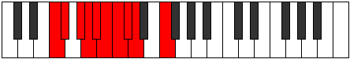 |
| [1021](https://ianring.com/musictheory/scales/1021) | [Ladygic](ModeGSharpLadygic.md) | G# | G#, A#, B, C, C#, D, D#, E, F, G# |  |
| [1021](https://ianring.com/musictheory/scales/1021) | [Ladygic](ModeAFlatLadygic.md) | Ab | Ab, Bb, B, C, Db, D, Eb, E, F, Ab |  |
| [1021](https://ianring.com/musictheory/scales/1021) | [Ladygic](ModeFNaturalLadygic.md) | F | F, G, G#, A, A#, B, C, C#, D, F |  |
| [1023](https://ianring.com/musictheory/scales/1023) | [Dodyllian](ModeCSharpDodyllian.md) | C# | C#, D, D#, E, F, F#, G, G#, A, A#, C# |  |
| [1023](https://ianring.com/musictheory/scales/1023) | [Dodyllian](ModeDFlatDodyllian.md) | Db | Db, D, Eb, E, F, Gb, G, Ab, A, Bb, Db |  |
| [1023](https://ianring.com/musictheory/scales/1023) | [Dodyllian](ModeGSharpDodyllian.md) | G# | G#, A, A#, B, C, C#, D, D#, E, F, G# |  |
| [1023](https://ianring.com/musictheory/scales/1023) | [Dodyllian](ModeAFlatDodyllian.md) | Ab | Ab, A, Bb, B, C, Db, D, Eb, E, F, Ab |  |
| [1023](https://ianring.com/musictheory/scales/1023) | [Dodyllian](ModeFNaturalDodyllian.md) | F | F, F#, G, G#, A, A#, B, C, C#, D, F |  |
| [1177](https://ianring.com/musictheory/scales/1177) | [Garitonic](ModeASharpGaritonic.md) | A# | A#, C#, D, F, G#, A# |  |
| [1177](https://ianring.com/musictheory/scales/1177) | [Garitonic](ModeBFlatGaritonic.md) | Bb | Bb, Db, D, F, Ab, Bb |  |
| [1179](https://ianring.com/musictheory/scales/1179) | [Sonimic](ModeASharpSonimic.md) | A# | A#, B, C#, D, E#, F###, A# |  |
| [1179](https://ianring.com/musictheory/scales/1179) | [Sonimic](ModeBFlatSonimic.md) | Bb | Bb, Cb, Db, Ebb, F, G#, Bb |  |
| [1181](https://ianring.com/musictheory/scales/1181) | [Katagimic](ModeASharpKatagimic.md) | A# | A#, B#, C#, D, E#, F###, A# |  |
| [1181](https://ianring.com/musictheory/scales/1181) | [Katagimic](ModeBFlatKatagimic.md) | Bb | Bb, C, Db, Ebb, F, G#, Bb |  |
| [1183](https://ianring.com/musictheory/scales/1183) | [Sadian](ModeASharpSadian.md) | A# | A#, B, C, Db, Ebb, F, G#, A# |  |
| [1183](https://ianring.com/musictheory/scales/1183) | [Sadian](ModeBFlatSadian.md) | Bb | Bb, Cb, Dbb, Ebbb, Fbbb, Gbb, Ab, Bb |  |
| [1209](https://ianring.com/musictheory/scales/1209) | [Ionynimic](ModeASharpIonynimic.md) | A# | A#, B##, C##, D#, E#, F###, A# |  |
| [1209](https://ianring.com/musictheory/scales/1209) | [Ionynimic](ModeBFlatIonynimic.md) | Bb | Bb, C#, D, Eb, F, G#, Bb |  |
| [1211](https://ianring.com/musictheory/scales/1211) | [Zadian](ModeASharpZadian.md) | A# | A#, B, C#, D, Eb, F, G#, A# |  |
| [1211](https://ianring.com/musictheory/scales/1211) | [Zadian](ModeBFlatZadian.md) | Bb | Bb, Cb, Db, Ebb, Fbb, Gbb, Ab, Bb |  |
| [1213](https://ianring.com/musictheory/scales/1213) | [Gyrian](ModeASharpGyrian.md) | A# | A#, B#, C#, D, Eb, F, G#, A# |  |
| [1213](https://ianring.com/musictheory/scales/1213) | [Gyrian](ModeBFlatGyrian.md) | Bb | Bb, C, Db, Ebb, Fbb, Gbb, Ab, Bb |  |
| [1215](https://ianring.com/musictheory/scales/1215) | [Aeolanyllic](ModeASharpAeolanyllic.md) | A# | A#, B, C, C#, D, D#, F, G#, A# |  |
| [1215](https://ianring.com/musictheory/scales/1215) | [Aeolanyllic](ModeBFlatAeolanyllic.md) | Bb | Bb, B, C, Db, D, Eb, F, Ab, Bb |  |
| [1227](https://ianring.com/musictheory/scales/1227) | [Thacrimic](ModeGNaturalThacrimic.md) | G | G, Ab, Bb, C#, D, E#, G |  |
| [1231](https://ianring.com/musictheory/scales/1231) | [Logian](ModeGNaturalLogian.md) | G | G, Ab, Bbb, Cbb, Db, Ebb, F, G |  |
| [1241](https://ianring.com/musictheory/scales/1241) | [Pygimic](ModeASharpPygimic.md) | A# | A#, B##, C##, D##, E#, F###, A# |  |
| [1241](https://ianring.com/musictheory/scales/1241) | [Pygimic](ModeBFlatPygimic.md) | Bb | Bb, C#, D, E, F, G#, Bb |  |
| [1243](https://ianring.com/musictheory/scales/1243) | [Epylian](ModeASharpEpylian.md) | A# | A#, B, C#, D, E, F, G#, A# |  |
| [1243](https://ianring.com/musictheory/scales/1243) | [Epylian](ModeBFlatEpylian.md) | Bb | Bb, Cb, Db, Ebb, Fb, Gbb, Ab, Bb |  |
| [1243](https://ianring.com/musictheory/scales/1243) | [Epylian](ModeGNaturalEpylian.md) | G | G, Ab, Bb, Cb, Db, Ebb, F, G |  |
| [1245](https://ianring.com/musictheory/scales/1245) | [Lathian](ModeASharpLathian.md) | A# | A#, B#, C#, D, E, F, G#, A# |  |
| [1245](https://ianring.com/musictheory/scales/1245) | [Lathian](ModeBFlatLathian.md) | Bb | Bb, C, Db, Ebb, Fb, Gbb, Ab, Bb |  |
| [1247](https://ianring.com/musictheory/scales/1247) | [Mygyllic](ModeASharpMygyllic.md) | A# | A#, B, C, C#, D, E, F, G#, A# |  |
| [1247](https://ianring.com/musictheory/scales/1247) | [Mygyllic](ModeBFlatMygyllic.md) | Bb | Bb, B, C, Db, D, E, F, Ab, Bb |  |
| [1247](https://ianring.com/musictheory/scales/1247) | [Mygyllic](ModeGNaturalMygyllic.md) | G | G, G#, A, A#, B, C#, D, F, G |  |
| [1259](https://ianring.com/musictheory/scales/1259) | [Stadian](ModeGNaturalStadian.md) | G | G, Ab, Bb, C, Db, Ebb, F, G |  |
| [1263](https://ianring.com/musictheory/scales/1263) | [Stynyllic](ModeGNaturalStynyllic.md) | G | G, G#, A, A#, C, C#, D, F, G |  |
| [1273](https://ianring.com/musictheory/scales/1273) | [Ronian](ModeASharpRonian.md) | A# | A#, B##, C##, D#, E, F, G#, A# |  |
| [1273](https://ianring.com/musictheory/scales/1273) | [Ronian](ModeBFlatRonian.md) | Bb | Bb, C#, D, Eb, Fb, Gbb, Ab, Bb |  |
| [1275](https://ianring.com/musictheory/scales/1275) | [Stagyllic](ModeASharpStagyllic.md) | A# | A#, B, C#, D, D#, E, F, G#, A# |  |
| [1275](https://ianring.com/musictheory/scales/1275) | [Stagyllic](ModeBFlatStagyllic.md) | Bb | Bb, B, Db, D, Eb, E, F, Ab, Bb |  |
| [1275](https://ianring.com/musictheory/scales/1275) | [Stagyllic](ModeGNaturalStagyllic.md) | G | G, G#, A#, B, C, C#, D, F, G |  |
| [1277](https://ianring.com/musictheory/scales/1277) | [Zadyllic](ModeASharpZadyllic.md) | A# | A#, C, C#, D, D#, E, F, G#, A# |  |
| [1277](https://ianring.com/musictheory/scales/1277) | [Zadyllic](ModeBFlatZadyllic.md) | Bb | Bb, C, Db, D, Eb, E, F, Ab, Bb |  |
| [1279](https://ianring.com/musictheory/scales/1279) | [Sarygic](ModeASharpSarygic.md) | A# | A#, B, C, C#, D, D#, E, F, G#, A# |  |
| [1279](https://ianring.com/musictheory/scales/1279) | [Sarygic](ModeBFlatSarygic.md) | Bb | Bb, B, C, Db, D, Eb, E, F, Ab, Bb |  |
| [1279](https://ianring.com/musictheory/scales/1279) | [Sarygic](ModeGNaturalSarygic.md) | G | G, G#, A, A#, B, C, C#, D, F, G |  |
| [1319](https://ianring.com/musictheory/scales/1319) | [Phronimic](ModeCNaturalPhronimic.md) | C | C, Db, Ebb, F, G#, A#, C |  |
| [1327](https://ianring.com/musictheory/scales/1327) | [Zalian](ModeCNaturalZalian.md) | C | C, Db, Ebb, Fbb, Gbb, Ab, Bb, C |  |
| [1335](https://ianring.com/musictheory/scales/1335) | [Aeralian](ModeCNaturalAeralian.md) | C | C, Db, Ebb, Fb, Gbb, Ab, Bb, C |  |
| [1343](https://ianring.com/musictheory/scales/1343) | [Zalyllic](ModeCNaturalZalyllic.md) | C | C, C#, D, D#, E, F, G#, A#, C |  |
| [1383](https://ianring.com/musictheory/scales/1383) | [Pynian](ModeCNaturalPynian.md) | C | C, Db, Ebb, F, Gb, Ab, Bb, C |  |
| [1391](https://ianring.com/musictheory/scales/1391) | [Aeradyllic](ModeCNaturalAeradyllic.md) | C | C, C#, D, D#, F, F#, G#, A#, C |  |
| [1399](https://ianring.com/musictheory/scales/1399) | [Syryllic](ModeCNaturalSyryllic.md) | C | C, C#, D, E, F, F#, G#, A#, C |  |
| [1407](https://ianring.com/musictheory/scales/1407) | [Tharygic](ModeCNaturalTharygic.md) | C | C, C#, D, D#, E, F, F#, G#, A#, C |  |
| [1433](https://ianring.com/musictheory/scales/1433) | [Dynimic](ModeASharpDynimic.md) | A# | A#, B##, C##, D###, E##, F###, A# |  |
| [1433](https://ianring.com/musictheory/scales/1433) | [Dynimic](ModeBFlatDynimic.md) | Bb | Bb, C#, D, E#, F#, G#, Bb |  |
| [1435](https://ianring.com/musictheory/scales/1435) | [Phronian](ModeASharpPhronian.md) | A# | A#, B, C#, D, E#, F#, G#, A# |  |
| [1435](https://ianring.com/musictheory/scales/1435) | [Phronian](ModeBFlatPhronian.md) | Bb | Bb, Cb, Db, Ebb, F, Gb, Ab, Bb |  |
| [1437](https://ianring.com/musictheory/scales/1437) | [Aeolycrian](ModeASharpAeolycrian.md) | A# | A#, B#, C#, D, E#, F#, G#, A# |  |
| [1437](https://ianring.com/musictheory/scales/1437) | [Aeolycrian](ModeBFlatAeolycrian.md) | Bb | Bb, C, Db, Ebb, F, Gb, Ab, Bb |  |
| [1439](https://ianring.com/musictheory/scales/1439) | [Rolyllic](ModeASharpRolyllic.md) | A# | A#, B, C, C#, D, F, F#, G#, A# |  |
| [1439](https://ianring.com/musictheory/scales/1439) | [Rolyllic](ModeBFlatRolyllic.md) | Bb | Bb, B, C, Db, D, F, Gb, Ab, Bb |  |
| [1447](https://ianring.com/musictheory/scales/1447) | [Mixopyrian](ModeCNaturalMixopyrian.md) | C | C, Db, Ebb, F, G, Ab, Bb, C |  |
| [1455](https://ianring.com/musictheory/scales/1455) | [Soryllic](ModeCNaturalSoryllic.md) | C | C, C#, D, D#, F, G, G#, A#, C |  |
| [1463](https://ianring.com/musictheory/scales/1463) | [Zaptyllic](ModeCNaturalZaptyllic.md) | C | C, C#, D, E, F, G, G#, A#, C |  |
| [1465](https://ianring.com/musictheory/scales/1465) | [Aerathian](ModeASharpAerathian.md) | A# | A#, B##, C##, D#, E#, F#, G#, A# |  |
| [1465](https://ianring.com/musictheory/scales/1465) | [Aerathian](ModeBFlatAerathian.md) | Bb | Bb, C#, D, Eb, F, Gb, Ab, Bb |  |
| [1467](https://ianring.com/musictheory/scales/1467) | [Thydyllic](ModeASharpThydyllic.md) | A# | A#, B, C#, D, D#, F, F#, G#, A# |  |
| [1467](https://ianring.com/musictheory/scales/1467) | [Thydyllic](ModeBFlatThydyllic.md) | Bb | Bb, B, Db, D, Eb, F, Gb, Ab, Bb |  |
| [1469](https://ianring.com/musictheory/scales/1469) | [Epiryllic](ModeASharpEpiryllic.md) | A# | A#, C, C#, D, D#, F, F#, G#, A# |  |
| [1469](https://ianring.com/musictheory/scales/1469) | [Epiryllic](ModeBFlatEpiryllic.md) | Bb | Bb, C, Db, D, Eb, F, Gb, Ab, Bb |  |
| [1471](https://ianring.com/musictheory/scales/1471) | [Radygic](ModeCNaturalRadygic.md) | C | C, C#, D, D#, E, F, G, G#, A#, C |  |
| [1471](https://ianring.com/musictheory/scales/1471) | [Radygic](ModeASharpRadygic.md) | A# | A#, B, C, C#, D, D#, F, F#, G#, A# |  |
| [1471](https://ianring.com/musictheory/scales/1471) | [Radygic](ModeBFlatRadygic.md) | Bb | Bb, B, C, Db, D, Eb, F, Gb, Ab, Bb | 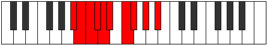 |
| [1483](https://ianring.com/musictheory/scales/1483) | [Dygian](ModeGNaturalDygian.md) | G | G, Ab, Bb, C#, D, Eb, F, G |  |
| [1487](https://ianring.com/musictheory/scales/1487) | [Lycryllic](ModeGNaturalLycryllic.md) | G | G, G#, A, A#, C#, D, D#, F, G |  |
| [1497](https://ianring.com/musictheory/scales/1497) | [Ionanian](ModeASharpIonanian.md) | A# | A#, B##, C##, D##, E#, F#, G#, A# |  |
| [1497](https://ianring.com/musictheory/scales/1497) | [Ionanian](ModeBFlatIonanian.md) | Bb | Bb, C#, D, E, F, Gb, Ab, Bb |  |
| [1499](https://ianring.com/musictheory/scales/1499) | [Stonyllic](ModeASharpStonyllic.md) | A# | A#, B, C#, D, E, F, F#, G#, A# |  |
| [1499](https://ianring.com/musictheory/scales/1499) | [Stonyllic](ModeBFlatStonyllic.md) | Bb | Bb, B, Db, D, E, F, Gb, Ab, Bb |  |
| [1499](https://ianring.com/musictheory/scales/1499) | [Stonyllic](ModeGNaturalStonyllic.md) | G | G, G#, A#, B, C#, D, D#, F, G |  |
| [1501](https://ianring.com/musictheory/scales/1501) | [Stygyllic](ModeASharpStygyllic.md) | A# | A#, C, C#, D, E, F, F#, G#, A# |  |
| [1501](https://ianring.com/musictheory/scales/1501) | [Stygyllic](ModeBFlatStygyllic.md) | Bb | Bb, C, Db, D, E, F, Gb, Ab, Bb |  |
| [1503](https://ianring.com/musictheory/scales/1503) | [Padygic](ModeASharpPadygic.md) | A# | A#, B, C, C#, D, E, F, F#, G#, A# |  |
| [1503](https://ianring.com/musictheory/scales/1503) | [Padygic](ModeBFlatPadygic.md) | Bb | Bb, B, C, Db, D, E, F, Gb, Ab, Bb |  |
| [1503](https://ianring.com/musictheory/scales/1503) | [Padygic](ModeGNaturalPadygic.md) | G | G, G#, A, A#, B, C#, D, D#, F, G |  |
| [1511](https://ianring.com/musictheory/scales/1511) | [Styptyllic](ModeCNaturalStyptyllic.md) | C | C, C#, D, F, F#, G, G#, A#, C |  |
| [1515](https://ianring.com/musictheory/scales/1515) | [Solyllic](ModeGNaturalSolyllic.md) | G | G, G#, A#, C, C#, D, D#, F, G |  |
| [1519](https://ianring.com/musictheory/scales/1519) | [Solygic](ModeCNaturalSolygic.md) | C | C, C#, D, D#, F, F#, G, G#, A#, C |  |
| [1519](https://ianring.com/musictheory/scales/1519) | [Solygic](ModeGNaturalSolygic.md) | G | G, G#, A, A#, C, C#, D, D#, F, G |  |
| [1527](https://ianring.com/musictheory/scales/1527) | [Aeolyrygic](ModeCNaturalAeolyrygic.md) | C | C, C#, D, E, F, F#, G, G#, A#, C |  |
| [1529](https://ianring.com/musictheory/scales/1529) | [Kataryllic](ModeASharpKataryllic.md) | A# | A#, C#, D, D#, E, F, F#, G#, A# |  |
| [1529](https://ianring.com/musictheory/scales/1529) | [Kataryllic](ModeBFlatKataryllic.md) | Bb | Bb, Db, D, Eb, E, F, Gb, Ab, Bb |  |
| [1531](https://ianring.com/musictheory/scales/1531) | [Styptygic](ModeASharpStyptygic.md) | A# | A#, B, C#, D, D#, E, F, F#, G#, A# |  |
| [1531](https://ianring.com/musictheory/scales/1531) | [Styptygic](ModeBFlatStyptygic.md) | Bb | Bb, B, Db, D, Eb, E, F, Gb, Ab, Bb |  |
| [1531](https://ianring.com/musictheory/scales/1531) | [Styptygic](ModeGNaturalStyptygic.md) | G | G, G#, A#, B, C, C#, D, D#, F, G |  |
| [1533](https://ianring.com/musictheory/scales/1533) | [Katycrygic](ModeASharpKatycrygic.md) | A# | A#, C, C#, D, D#, E, F, F#, G#, A# |  |
| [1533](https://ianring.com/musictheory/scales/1533) | [Katycrygic](ModeBFlatKatycrygic.md) | Bb | Bb, C, Db, D, Eb, E, F, Gb, Ab, Bb |  |
| [1535](https://ianring.com/musictheory/scales/1535) | [Mixodyllian](ModeCNaturalMixodyllian.md) | C | C, C#, D, D#, E, F, F#, G, G#, A#, C |  |
| [1535](https://ianring.com/musictheory/scales/1535) | [Mixodyllian](ModeASharpMixodyllian.md) | A# | A#, B, C, C#, D, D#, E, F, F#, G#, A# |  |
| [1535](https://ianring.com/musictheory/scales/1535) | [Mixodyllian](ModeBFlatMixodyllian.md) | Bb | Bb, B, C, Db, D, Eb, E, F, Gb, Ab, Bb |  |
| [1535](https://ianring.com/musictheory/scales/1535) | [Mixodyllian](ModeGNaturalMixodyllian.md) | G | G, G#, A, A#, B, C, C#, D, D#, F, G |  |
| [1619](https://ianring.com/musictheory/scales/1619) | [Monimic](ModeENaturalMonimic.md) | E | E, F, G#, A#, B##, C##, E |  |
| [1623](https://ianring.com/musictheory/scales/1623) | [Lothian](ModeENaturalLothian.md) | E | E, F, Gb, Ab, Bb, C#, D, E |  |
| [1627](https://ianring.com/musictheory/scales/1627) | [Zyptian](ModeENaturalZyptian.md) | E | E, F, G, Ab, Bb, C#, D, E |  |
| [1631](https://ianring.com/musictheory/scales/1631) | [Rynyllic](ModeENaturalRynyllic.md) | E | E, F, F#, G, G#, A#, C#, D, E |  |
| [1637](https://ianring.com/musictheory/scales/1637) | [Syptimic](ModeGSharpSyptimic.md) | G# | G#, A#, B##, C##, D###, E##, G# |  |
| [1637](https://ianring.com/musictheory/scales/1637) | [Syptimic](ModeAFlatSyptimic.md) | Ab | Ab, Bb, C#, D, E#, F#, Ab |  |
| [1639](https://ianring.com/musictheory/scales/1639) | [Aeolothian](ModeGSharpAeolothian.md) | G# | G#, A, Bb, C#, D, E#, F#, G# |  |
| [1639](https://ianring.com/musictheory/scales/1639) | [Aeolothian](ModeAFlatAeolothian.md) | Ab | Ab, Bbb, Cbb, Db, Ebb, F, Gb, Ab |  |
| [1645](https://ianring.com/musictheory/scales/1645) | [Katagian](ModeGSharpKatagian.md) | G# | G#, A#, B, C#, D, E#, F#, G# |  |
| [1645](https://ianring.com/musictheory/scales/1645) | [Katagian](ModeAFlatKatagian.md) | Ab | Ab, Bb, Cb, Db, Ebb, F, Gb, Ab |  |
| [1647](https://ianring.com/musictheory/scales/1647) | [Polyllic](ModeGSharpPolyllic.md) | G# | G#, A, A#, B, C#, D, F, F#, G# |  |
| [1647](https://ianring.com/musictheory/scales/1647) | [Polyllic](ModeAFlatPolyllic.md) | Ab | Ab, A, Bb, B, Db, D, F, Gb, Ab |  |
| [1651](https://ianring.com/musictheory/scales/1651) | [Mogian](ModeENaturalMogian.md) | E | E, F, G#, A, Bb, C#, D, E |  |
| [1653](https://ianring.com/musictheory/scales/1653) | [Gylian](ModeGSharpGylian.md) | G# | G#, A#, B#, C#, D, E#, F#, G# |  |
| [1653](https://ianring.com/musictheory/scales/1653) | [Gylian](ModeAFlatGylian.md) | Ab | Ab, Bb, C, Db, Ebb, F, Gb, Ab |  |
| [1655](https://ianring.com/musictheory/scales/1655) | [Katygyllic](ModeGSharpKatygyllic.md) | G# | G#, A, A#, C, C#, D, F, F#, G# |  |
| [1655](https://ianring.com/musictheory/scales/1655) | [Katygyllic](ModeAFlatKatygyllic.md) | Ab | Ab, A, Bb, C, Db, D, F, Gb, Ab |  |
| [1655](https://ianring.com/musictheory/scales/1655) | [Katygyllic](ModeENaturalKatygyllic.md) | E | E, F, F#, G#, A, A#, C#, D, E |  |
| [1659](https://ianring.com/musictheory/scales/1659) | [Magyllic](ModeENaturalMagyllic.md) | E | E, F, G, G#, A, A#, C#, D, E |  |
| [1661](https://ianring.com/musictheory/scales/1661) | [Gonyllic](ModeGSharpGonyllic.md) | G# | G#, A#, B, C, C#, D, F, F#, G# |  |
| [1661](https://ianring.com/musictheory/scales/1661) | [Gonyllic](ModeAFlatGonyllic.md) | Ab | Ab, Bb, B, C, Db, D, F, Gb, Ab |  |
| [1663](https://ianring.com/musictheory/scales/1663) | [Lydygic](ModeENaturalLydygic.md) | E | E, F, F#, G, G#, A, A#, C#, D, E |  |
| [1663](https://ianring.com/musictheory/scales/1663) | [Lydygic](ModeGSharpLydygic.md) | G# | G#, A, A#, B, C, C#, D, F, F#, G# |  |
| [1663](https://ianring.com/musictheory/scales/1663) | [Lydygic](ModeAFlatLydygic.md) | Ab | Ab, A, Bb, B, C, Db, D, F, Gb, Ab |  |
| [1683](https://ianring.com/musictheory/scales/1683) | [Rygimic](ModeCSharpRygimic.md) | C# | C#, D, E#, F###, G###, A##, C# |  |
| [1683](https://ianring.com/musictheory/scales/1683) | [Rygimic](ModeDFlatRygimic.md) | Db | Db, Ebb, F, G#, A#, B, Db |  |
| [1687](https://ianring.com/musictheory/scales/1687) | [Phralian](ModeCSharpPhralian.md) | C# | C#, D, Eb, F, G#, A#, B, C# |  |
| [1687](https://ianring.com/musictheory/scales/1687) | [Phralian](ModeDFlatPhralian.md) | Db | Db, Ebb, Fbb, Gbb, Ab, Bb, Cb, Db |  |
| [1689](https://ianring.com/musictheory/scales/1689) | [Lorimic](ModeASharpLorimic.md) | A# | A#, B##, C##, D###, E###, F###, A# |  |
| [1689](https://ianring.com/musictheory/scales/1689) | [Lorimic](ModeBFlatLorimic.md) | Bb | Bb, C#, D, E#, F##, G#, Bb |  |
| [1691](https://ianring.com/musictheory/scales/1691) | [Kathian](ModeCSharpKathian.md) | C# | C#, D, E, F, G#, A#, B, C# |  |
| [1691](https://ianring.com/musictheory/scales/1691) | [Kathian](ModeDFlatKathian.md) | Db | Db, Ebb, Fb, Gbb, Ab, Bb, Cb, Db |  |
| [1691](https://ianring.com/musictheory/scales/1691) | [Kathian](ModeASharpKathian.md) | A# | A#, B, C#, D, E#, F##, G#, A# |  |
| [1691](https://ianring.com/musictheory/scales/1691) | [Kathian](ModeBFlatKathian.md) | Bb | Bb, Cb, Db, Ebb, F, G, Ab, Bb |  |
| [1693](https://ianring.com/musictheory/scales/1693) | [Dogian](ModeASharpDogian.md) | A# | A#, B#, C#, D, E#, F##, G#, A# |  |
| [1693](https://ianring.com/musictheory/scales/1693) | [Dogian](ModeBFlatDogian.md) | Bb | Bb, C, Db, Ebb, F, G, Ab, Bb |  |
| [1695](https://ianring.com/musictheory/scales/1695) | [Phrodyllic](ModeCSharpPhrodyllic.md) | C# | C#, D, D#, E, F, G#, A#, B, C# |  |
| [1695](https://ianring.com/musictheory/scales/1695) | [Phrodyllic](ModeDFlatPhrodyllic.md) | Db | Db, D, Eb, E, F, Ab, Bb, B, Db |  |
| [1695](https://ianring.com/musictheory/scales/1695) | [Phrodyllic](ModeASharpPhrodyllic.md) | A# | A#, B, C, C#, D, F, G, G#, A# |  |
| [1695](https://ianring.com/musictheory/scales/1695) | [Phrodyllic](ModeBFlatPhrodyllic.md) | Bb | Bb, B, C, Db, D, F, G, Ab, Bb |  |
| [1715](https://ianring.com/musictheory/scales/1715) | [Aeronian](ModeCSharpAeronian.md) | C# | C#, D, E#, F#, G#, A#, B, C# |  |
| [1715](https://ianring.com/musictheory/scales/1715) | [Aeronian](ModeDFlatAeronian.md) | Db | Db, Ebb, F, Gb, Ab, Bb, Cb, Db |  |
| [1719](https://ianring.com/musictheory/scales/1719) | [Lyryllic](ModeCSharpLyryllic.md) | C# | C#, D, D#, F, F#, G#, A#, B, C# |  |
| [1719](https://ianring.com/musictheory/scales/1719) | [Lyryllic](ModeDFlatLyryllic.md) | Db | Db, D, Eb, F, Gb, Ab, Bb, B, Db |  |
| [1721](https://ianring.com/musictheory/scales/1721) | [Ionycrian](ModeASharpIonycrian.md) | A# | A#, B##, C##, D#, E#, F##, G#, A# |  |
| [1721](https://ianring.com/musictheory/scales/1721) | [Ionycrian](ModeBFlatIonycrian.md) | Bb | Bb, C#, D, Eb, F, G, Ab, Bb |  |
| [1723](https://ianring.com/musictheory/scales/1723) | [Poryllic](ModeCSharpPoryllic.md) | C# | C#, D, E, F, F#, G#, A#, B, C# |  |
| [1723](https://ianring.com/musictheory/scales/1723) | [Poryllic](ModeDFlatPoryllic.md) | Db | Db, D, E, F, Gb, Ab, Bb, B, Db |  |
| [1723](https://ianring.com/musictheory/scales/1723) | [Poryllic](ModeASharpPoryllic.md) | A# | A#, B, C#, D, D#, F, G, G#, A# |  |
| [1723](https://ianring.com/musictheory/scales/1723) | [Poryllic](ModeBFlatPoryllic.md) | Bb | Bb, B, Db, D, Eb, F, G, Ab, Bb |  |
| [1725](https://ianring.com/musictheory/scales/1725) | [Mixodyllic](ModeASharpMixodyllic.md) | A# | A#, C, C#, D, D#, F, G, G#, A# |  |
| [1725](https://ianring.com/musictheory/scales/1725) | [Mixodyllic](ModeBFlatMixodyllic.md) | Bb | Bb, C, Db, D, Eb, F, G, Ab, Bb |  |
| [1727](https://ianring.com/musictheory/scales/1727) | [Sydygic](ModeCSharpSydygic.md) | C# | C#, D, D#, E, F, F#, G#, A#, B, C# |  |
| [1727](https://ianring.com/musictheory/scales/1727) | [Sydygic](ModeDFlatSydygic.md) | Db | Db, D, Eb, E, F, Gb, Ab, Bb, B, Db |  |
| [1727](https://ianring.com/musictheory/scales/1727) | [Sydygic](ModeASharpSydygic.md) | A# | A#, B, C, C#, D, D#, F, G, G#, A# |  |
| [1727](https://ianring.com/musictheory/scales/1727) | [Sydygic](ModeBFlatSydygic.md) | Bb | Bb, B, C, Db, D, Eb, F, G, Ab, Bb |  |
| [1739](https://ianring.com/musictheory/scales/1739) | [Phrylian](ModeGNaturalPhrylian.md) | G | G, Ab, Bb, C#, D, E, F, G |  |
| [1743](https://ianring.com/musictheory/scales/1743) | [Epigyllic](ModeGNaturalEpigyllic.md) | G | G, G#, A, A#, C#, D, E, F, G |  |
| [1747](https://ianring.com/musictheory/scales/1747) | [Epalian](ModeENaturalEpalian.md) | E | E, F, G#, A#, B, C#, D, E |  |
| [1747](https://ianring.com/musictheory/scales/1747) | [Epalian](ModeCSharpEpalian.md) | C# | C#, D, E#, F##, G#, A#, B, C# |  |
| [1747](https://ianring.com/musictheory/scales/1747) | [Epalian](ModeDFlatEpalian.md) | Db | Db, Ebb, F, G, Ab, Bb, Cb, Db |  |
| [1751](https://ianring.com/musictheory/scales/1751) | [Aeolyryllic](ModeENaturalAeolyryllic.md) | E | E, F, F#, G#, A#, B, C#, D, E |  |
| [1751](https://ianring.com/musictheory/scales/1751) | [Aeolyryllic](ModeCSharpAeolyryllic.md) | C# | C#, D, D#, F, G, G#, A#, B, C# |  |
| [1751](https://ianring.com/musictheory/scales/1751) | [Aeolyryllic](ModeDFlatAeolyryllic.md) | Db | Db, D, Eb, F, G, Ab, Bb, B, Db |  |
| [1753](https://ianring.com/musictheory/scales/1753) | [Mycrian](ModeASharpMycrian.md) | A# | A#, B##, C##, D##, E#, F##, G#, A# |  |
| [1753](https://ianring.com/musictheory/scales/1753) | [Mycrian](ModeBFlatMycrian.md) | Bb | Bb, C#, D, E, F, G, Ab, Bb |  |
| [1755](https://ianring.com/musictheory/scales/1755) | [MinorDiminished](ModeCSharpMinorDiminished.md) | C# | C#, D, E, F, G, G#, A#, B, C# |  |
| [1755](https://ianring.com/musictheory/scales/1755) | [MinorDiminished](ModeDFlatMinorDiminished.md) | Db | Db, D, E, F, G, Ab, Bb, B, Db |  |
| [1755](https://ianring.com/musictheory/scales/1755) | [MinorDiminished](ModeENaturalMinorDiminished.md) | E | E, F, G, G#, A#, B, C#, D, E |  |
| [1755](https://ianring.com/musictheory/scales/1755) | [MinorDiminished](ModeGNaturalMinorDiminished.md) | G | G, G#, A#, B, C#, D, E, F, G |  |
| [1755](https://ianring.com/musictheory/scales/1755) | [MinorDiminished](ModeASharpMinorDiminished.md) | A# | A#, B, C#, D, E, F, G, G#, A# |  |
| [1755](https://ianring.com/musictheory/scales/1755) | [MinorDiminished](ModeBFlatMinorDiminished.md) | Bb | Bb, B, Db, D, E, F, G, Ab, Bb |  |
| [1757](https://ianring.com/musictheory/scales/1757) | [Ionyphyllic](ModeASharpIonyphyllic.md) | A# | A#, C, C#, D, E, F, G, G#, A# |  |
| [1757](https://ianring.com/musictheory/scales/1757) | [Ionyphyllic](ModeBFlatIonyphyllic.md) | Bb | Bb, C, Db, D, E, F, G, Ab, Bb |  |
| [1759](https://ianring.com/musictheory/scales/1759) | [Pylygic](ModeASharpPylygic.md) | A# | A#, B, C, C#, D, E, F, G, G#, A# |  |
| [1759](https://ianring.com/musictheory/scales/1759) | [Pylygic](ModeBFlatPylygic.md) | Bb | Bb, B, C, Db, D, E, F, G, Ab, Bb |  |
| [1759](https://ianring.com/musictheory/scales/1759) | [Pylygic](ModeCSharpPylygic.md) | C# | C#, D, D#, E, F, G, G#, A#, B, C# |  |
| [1759](https://ianring.com/musictheory/scales/1759) | [Pylygic](ModeDFlatPylygic.md) | Db | Db, D, Eb, E, F, G, Ab, Bb, B, Db |  |
| [1759](https://ianring.com/musictheory/scales/1759) | [Pylygic](ModeENaturalPylygic.md) | E | E, F, F#, G, G#, A#, B, C#, D, E |  |
| [1759](https://ianring.com/musictheory/scales/1759) | [Pylygic](ModeGNaturalPylygic.md) | G | G, G#, A, A#, B, C#, D, E, F, G |  |
| [1765](https://ianring.com/musictheory/scales/1765) | [Lonian](ModeGSharpLonian.md) | G# | G#, A#, B##, C##, D#, E#, F#, G# |  |
| [1765](https://ianring.com/musictheory/scales/1765) | [Lonian](ModeAFlatLonian.md) | Ab | Ab, Bb, C#, D, Eb, F, Gb, Ab |  |
| [1767](https://ianring.com/musictheory/scales/1767) | [Dyryllic](ModeGSharpDyryllic.md) | G# | G#, A, A#, C#, D, D#, F, F#, G# |  |
| [1767](https://ianring.com/musictheory/scales/1767) | [Dyryllic](ModeAFlatDyryllic.md) | Ab | Ab, A, Bb, Db, D, Eb, F, Gb, Ab |  |
| [1771](https://ianring.com/musictheory/scales/1771) | [Stylyllic](ModeGNaturalStylyllic.md) | G | G, G#, A#, C, C#, D, E, F, G |  |
| [1773](https://ianring.com/musictheory/scales/1773) | [Aeoloryllic](ModeGSharpAeoloryllic.md) | G# | G#, A#, B, C#, D, D#, F, F#, G# |  |
| [1773](https://ianring.com/musictheory/scales/1773) | [Aeoloryllic](ModeAFlatAeoloryllic.md) | Ab | Ab, Bb, B, Db, D, Eb, F, Gb, Ab |  |
| [1775](https://ianring.com/musictheory/scales/1775) | [Lyrygic](ModeGNaturalLyrygic.md) | G | G, G#, A, A#, C, C#, D, E, F, G |  |
| [1775](https://ianring.com/musictheory/scales/1775) | [Lyrygic](ModeGSharpLyrygic.md) | G# | G#, A, A#, B, C#, D, D#, F, F#, G# |  |
| [1775](https://ianring.com/musictheory/scales/1775) | [Lyrygic](ModeAFlatLyrygic.md) | Ab | Ab, A, Bb, B, Db, D, Eb, F, Gb, Ab |  |
| [1779](https://ianring.com/musictheory/scales/1779) | [Aerythyllic](ModeCSharpAerythyllic.md) | C# | C#, D, F, F#, G, G#, A#, B, C# |  |
| [1779](https://ianring.com/musictheory/scales/1779) | [Aerythyllic](ModeDFlatAerythyllic.md) | Db | Db, D, F, Gb, G, Ab, Bb, B, Db |  |
| [1779](https://ianring.com/musictheory/scales/1779) | [Aerythyllic](ModeENaturalAerythyllic.md) | E | E, F, G#, A, A#, B, C#, D, E |  |
| [1781](https://ianring.com/musictheory/scales/1781) | [Gocryllic](ModeGSharpGocryllic.md) | G# | G#, A#, C, C#, D, D#, F, F#, G# |  |
| [1781](https://ianring.com/musictheory/scales/1781) | [Gocryllic](ModeAFlatGocryllic.md) | Ab | Ab, Bb, C, Db, D, Eb, F, Gb, Ab |  |
| [1783](https://ianring.com/musictheory/scales/1783) | [Danygic](ModeGSharpDanygic.md) | G# | G#, A, A#, C, C#, D, D#, F, F#, G# |  |
| [1783](https://ianring.com/musictheory/scales/1783) | [Danygic](ModeAFlatDanygic.md) | Ab | Ab, A, Bb, C, Db, D, Eb, F, Gb, Ab |  |
| [1783](https://ianring.com/musictheory/scales/1783) | [Danygic](ModeCSharpDanygic.md) | C# | C#, D, D#, F, F#, G, G#, A#, B, C# |  |
| [1783](https://ianring.com/musictheory/scales/1783) | [Danygic](ModeDFlatDanygic.md) | Db | Db, D, Eb, F, Gb, G, Ab, Bb, B, Db |  |
| [1783](https://ianring.com/musictheory/scales/1783) | [Danygic](ModeENaturalDanygic.md) | E | E, F, F#, G#, A, A#, B, C#, D, E |  |
| [1785](https://ianring.com/musictheory/scales/1785) | [Tharyllic](ModeASharpTharyllic.md) | A# | A#, C#, D, D#, E, F, G, G#, A# |  |
| [1785](https://ianring.com/musictheory/scales/1785) | [Tharyllic](ModeBFlatTharyllic.md) | Bb | Bb, Db, D, Eb, E, F, G, Ab, Bb |  |
| [1787](https://ianring.com/musictheory/scales/1787) | [Mycrygic](ModeGNaturalMycrygic.md) | G | G, G#, A#, B, C, C#, D, E, F, G |  |
| [1787](https://ianring.com/musictheory/scales/1787) | [Mycrygic](ModeASharpMycrygic.md) | A# | A#, B, C#, D, D#, E, F, G, G#, A# |  |
| [1787](https://ianring.com/musictheory/scales/1787) | [Mycrygic](ModeBFlatMycrygic.md) | Bb | Bb, B, Db, D, Eb, E, F, G, Ab, Bb |  |
| [1787](https://ianring.com/musictheory/scales/1787) | [Mycrygic](ModeCSharpMycrygic.md) | C# | C#, D, E, F, F#, G, G#, A#, B, C# |  |
| [1787](https://ianring.com/musictheory/scales/1787) | [Mycrygic](ModeDFlatMycrygic.md) | Db | Db, D, E, F, Gb, G, Ab, Bb, B, Db |  |
| [1787](https://ianring.com/musictheory/scales/1787) | [Mycrygic](ModeENaturalMycrygic.md) | E | E, F, G, G#, A, A#, B, C#, D, E |  |
| [1789](https://ianring.com/musictheory/scales/1789) | [Katagygic](ModeASharpKatagygic.md) | A# | A#, C, C#, D, D#, E, F, G, G#, A# |  |
| [1789](https://ianring.com/musictheory/scales/1789) | [Katagygic](ModeBFlatKatagygic.md) | Bb | Bb, C, Db, D, Eb, E, F, G, Ab, Bb |  |
| [1789](https://ianring.com/musictheory/scales/1789) | [Katagygic](ModeGSharpKatagygic.md) | G# | G#, A#, B, C, C#, D, D#, F, F#, G# |  |
| [1789](https://ianring.com/musictheory/scales/1789) | [Katagygic](ModeAFlatKatagygic.md) | Ab | Ab, Bb, B, C, Db, D, Eb, F, Gb, Ab |  |
| [1791](https://ianring.com/musictheory/scales/1791) | [Aerygyllian](ModeASharpAerygyllian.md) | A# | A#, B, C, C#, D, D#, E, F, G, G#, A# |  |
| [1791](https://ianring.com/musictheory/scales/1791) | [Aerygyllian](ModeBFlatAerygyllian.md) | Bb | Bb, B, C, Db, D, Eb, E, F, G, Ab, Bb |  |
| [1791](https://ianring.com/musictheory/scales/1791) | [Aerygyllian](ModeCSharpAerygyllian.md) | C# | C#, D, D#, E, F, F#, G, G#, A#, B, C# |  |
| [1791](https://ianring.com/musictheory/scales/1791) | [Aerygyllian](ModeDFlatAerygyllian.md) | Db | Db, D, Eb, E, F, Gb, G, Ab, Bb, B, Db |  |
| [1791](https://ianring.com/musictheory/scales/1791) | [Aerygyllian](ModeGSharpAerygyllian.md) | G# | G#, A, A#, B, C, C#, D, D#, F, F#, G# |  |
| [1791](https://ianring.com/musictheory/scales/1791) | [Aerygyllian](ModeAFlatAerygyllian.md) | Ab | Ab, A, Bb, B, C, Db, D, Eb, F, Gb, Ab |  |
| [1791](https://ianring.com/musictheory/scales/1791) | [Aerygyllian](ModeGNaturalAerygyllian.md) | G | G, G#, A, A#, B, C, C#, D, E, F, G |  |
| [1791](https://ianring.com/musictheory/scales/1791) | [Aerygyllian](ModeENaturalAerygyllian.md) | E | E, F, F#, G, G#, A, A#, B, C#, D, E |  |
| [1831](https://ianring.com/musictheory/scales/1831) | [Pothian](ModeCNaturalPothian.md) | C | C, Db, Ebb, F, G#, A, Bb, C |  |
| [1833](https://ianring.com/musictheory/scales/1833) | [Ionacrimic](ModeFNaturalIonacrimic.md) | F | F, G#, A#, B##, C##, D#, F | 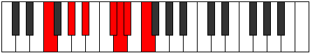 |
| [1835](https://ianring.com/musictheory/scales/1835) | [Byptian](ModeFNaturalByptian.md) | F | F, Gb, Ab, Bb, C#, D, Eb, F |  |
| [1837](https://ianring.com/musictheory/scales/1837) | [Dalian](ModeFNaturalDalian.md) | F | F, G, Ab, Bb, C#, D, Eb, F |  |
| [1839](https://ianring.com/musictheory/scales/1839) | [Zogyllic](ModeFNaturalZogyllic.md) | F | F, F#, G, G#, A#, C#, D, D#, F |  |
| [1839](https://ianring.com/musictheory/scales/1839) | [Zogyllic](ModeCNaturalZogyllic.md) | C | C, C#, D, D#, F, G#, A, A#, C |  |
| [1847](https://ianring.com/musictheory/scales/1847) | [Thacryllic](ModeCNaturalThacryllic.md) | C | C, C#, D, E, F, G#, A, A#, C |  |
| [1849](https://ianring.com/musictheory/scales/1849) | [Epogian](ModeFNaturalEpogian.md) | F | F, G#, A, Bb, C#, D, Eb, F |  |
| [1851](https://ianring.com/musictheory/scales/1851) | [Zacryllic](ModeFNaturalZacryllic.md) | F | F, F#, G#, A, A#, C#, D, D#, F |  |
| [1853](https://ianring.com/musictheory/scales/1853) | [Phrynyllic](ModeFNaturalPhrynyllic.md) | F | F, G, G#, A, A#, C#, D, D#, F | 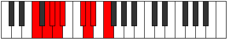 |
| [1855](https://ianring.com/musictheory/scales/1855) | [Marygic](ModeCNaturalMarygic.md) | C | C, C#, D, D#, E, F, G#, A, A#, C | 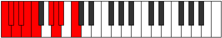 |
| [1855](https://ianring.com/musictheory/scales/1855) | [Marygic](ModeFNaturalMarygic.md) | F | F, F#, G, G#, A, A#, C#, D, D#, F |  |
| [1875](https://ianring.com/musictheory/scales/1875) | [Epyphian](ModeENaturalEpyphian.md) | E | E, F, G#, A#, B#, C#, D, E |  |
| [1879](https://ianring.com/musictheory/scales/1879) | [Mixoryllic](ModeENaturalMixoryllic.md) | E | E, F, F#, G#, A#, C, C#, D, E |  |
| [1883](https://ianring.com/musictheory/scales/1883) | [Mixopyryllic](ModeENaturalMixopyryllic.md) | E | E, F, G, G#, A#, C, C#, D, E |  |
| [1887](https://ianring.com/musictheory/scales/1887) | [Aerocrygic](ModeENaturalAerocrygic.md) | E | E, F, F#, G, G#, A#, C, C#, D, E |  |
| [1893](https://ianring.com/musictheory/scales/1893) | [Ionylian](ModeGSharpIonylian.md) | G# | G#, A#, B##, C##, D##, E#, F#, G# |  |
| [1893](https://ianring.com/musictheory/scales/1893) | [Ionylian](ModeAFlatIonylian.md) | Ab | Ab, Bb, C#, D, E, F, Gb, Ab |  |
| [1895](https://ianring.com/musictheory/scales/1895) | [Salyllic](ModeCNaturalSalyllic.md) | C | C, C#, D, F, F#, G#, A, A#, C |  |
| [1895](https://ianring.com/musictheory/scales/1895) | [Salyllic](ModeGSharpSalyllic.md) | G# | G#, A, A#, C#, D, E, F, F#, G# |  |
| [1895](https://ianring.com/musictheory/scales/1895) | [Salyllic](ModeAFlatSalyllic.md) | Ab | Ab, A, Bb, Db, D, E, F, Gb, Ab |  |
| [1897](https://ianring.com/musictheory/scales/1897) | [Ionopian](ModeFNaturalIonopian.md) | F | F, G#, A#, B, C#, D, Eb, F |  |
| [1899](https://ianring.com/musictheory/scales/1899) | [Moptyllic](ModeFNaturalMoptyllic.md) | F | F, F#, G#, A#, B, C#, D, D#, F |  |
| [1901](https://ianring.com/musictheory/scales/1901) | [Ionidyllic](ModeGSharpIonidyllic.md) | G# | G#, A#, B, C#, D, E, F, F#, G# |  |
| [1901](https://ianring.com/musictheory/scales/1901) | [Ionidyllic](ModeAFlatIonidyllic.md) | Ab | Ab, Bb, B, Db, D, E, F, Gb, Ab |  |
| [1901](https://ianring.com/musictheory/scales/1901) | [Ionidyllic](ModeFNaturalIonidyllic.md) | F | F, G, G#, A#, B, C#, D, D#, F |  |
| [1903](https://ianring.com/musictheory/scales/1903) | [Rocrygic](ModeCNaturalRocrygic.md) | C | C, C#, D, D#, F, F#, G#, A, A#, C |  |
| [1903](https://ianring.com/musictheory/scales/1903) | [Rocrygic](ModeFNaturalRocrygic.md) | F | F, F#, G, G#, A#, B, C#, D, D#, F |  |
| [1903](https://ianring.com/musictheory/scales/1903) | [Rocrygic](ModeGSharpRocrygic.md) | G# | G#, A, A#, B, C#, D, E, F, F#, G# |  |
| [1903](https://ianring.com/musictheory/scales/1903) | [Rocrygic](ModeAFlatRocrygic.md) | Ab | Ab, A, Bb, B, Db, D, E, F, Gb, Ab |  |
| [1907](https://ianring.com/musictheory/scales/1907) | [Lynyllic](ModeENaturalLynyllic.md) | E | E, F, G#, A, A#, C, C#, D, E |  |
| [1909](https://ianring.com/musictheory/scales/1909) | [Epicryllic](ModeGSharpEpicryllic.md) | G# | G#, A#, C, C#, D, E, F, F#, G# |  |
| [1909](https://ianring.com/musictheory/scales/1909) | [Epicryllic](ModeAFlatEpicryllic.md) | Ab | Ab, Bb, C, Db, D, E, F, Gb, Ab |  |
| [1911](https://ianring.com/musictheory/scales/1911) | [Stynygic](ModeCNaturalStynygic.md) | C | C, C#, D, E, F, F#, G#, A, A#, C |  |
| [1911](https://ianring.com/musictheory/scales/1911) | [Stynygic](ModeENaturalStynygic.md) | E | E, F, F#, G#, A, A#, C, C#, D, E |  |
| [1911](https://ianring.com/musictheory/scales/1911) | [Stynygic](ModeGSharpStynygic.md) | G# | G#, A, A#, C, C#, D, E, F, F#, G# |  |
| [1911](https://ianring.com/musictheory/scales/1911) | [Stynygic](ModeAFlatStynygic.md) | Ab | Ab, A, Bb, C, Db, D, E, F, Gb, Ab |  |
| [1913](https://ianring.com/musictheory/scales/1913) | [Zagyllic](ModeFNaturalZagyllic.md) | F | F, G#, A, A#, B, C#, D, D#, F |  |
| [1915](https://ianring.com/musictheory/scales/1915) | [Thydygic](ModeENaturalThydygic.md) | E | E, F, G, G#, A, A#, C, C#, D, E |  |
| [1915](https://ianring.com/musictheory/scales/1915) | [Thydygic](ModeFNaturalThydygic.md) | F | F, F#, G#, A, A#, B, C#, D, D#, F |  |
| [1917](https://ianring.com/musictheory/scales/1917) | [Sacrygic](ModeGSharpSacrygic.md) | G# | G#, A#, B, C, C#, D, E, F, F#, G# |  |
| [1917](https://ianring.com/musictheory/scales/1917) | [Sacrygic](ModeAFlatSacrygic.md) | Ab | Ab, Bb, B, C, Db, D, E, F, Gb, Ab |  |
| [1917](https://ianring.com/musictheory/scales/1917) | [Sacrygic](ModeFNaturalSacrygic.md) | F | F, G, G#, A, A#, B, C#, D, D#, F |  |
| [1919](https://ianring.com/musictheory/scales/1919) | [Rocryllian](ModeCNaturalRocryllian.md) | C | C, C#, D, D#, E, F, F#, G#, A, A#, C |  |
| [1919](https://ianring.com/musictheory/scales/1919) | [Rocryllian](ModeENaturalRocryllian.md) | E | E, F, F#, G, G#, A, A#, C, C#, D, E |  |
| [1919](https://ianring.com/musictheory/scales/1919) | [Rocryllian](ModeGSharpRocryllian.md) | G# | G#, A, A#, B, C, C#, D, E, F, F#, G# |  |
| [1919](https://ianring.com/musictheory/scales/1919) | [Rocryllian](ModeAFlatRocryllian.md) | Ab | Ab, A, Bb, B, C, Db, D, E, F, Gb, Ab |  |
| [1919](https://ianring.com/musictheory/scales/1919) | [Rocryllian](ModeFNaturalRocryllian.md) | F | F, F#, G, G#, A, A#, B, C#, D, D#, F |  |
| [1939](https://ianring.com/musictheory/scales/1939) | [Dathian](ModeCSharpDathian.md) | C# | C#, D, E#, F###, G##, A#, B, C# |  |
| [1939](https://ianring.com/musictheory/scales/1939) | [Dathian](ModeDFlatDathian.md) | Db | Db, Ebb, F, G#, A, Bb, Cb, Db |  |
| [1943](https://ianring.com/musictheory/scales/1943) | [Malyllic](ModeCSharpMalyllic.md) | C# | C#, D, D#, F, G#, A, A#, B, C# |  |
| [1943](https://ianring.com/musictheory/scales/1943) | [Malyllic](ModeDFlatMalyllic.md) | Db | Db, D, Eb, F, Ab, A, Bb, B, Db |  |
| [1945](https://ianring.com/musictheory/scales/1945) | [Zarian](ModeASharpZarian.md) | A# | A#, B##, C##, D###, E##, F##, G#, A# |  |
| [1945](https://ianring.com/musictheory/scales/1945) | [Zarian](ModeBFlatZarian.md) | Bb | Bb, C#, D, E#, F#, G, Ab, Bb |  |
| [1947](https://ianring.com/musictheory/scales/1947) | [Ionoyllic](ModeASharpIonoyllic.md) | A# | A#, B, C#, D, F, F#, G, G#, A# |  |
| [1947](https://ianring.com/musictheory/scales/1947) | [Ionoyllic](ModeBFlatIonoyllic.md) | Bb | Bb, B, Db, D, F, Gb, G, Ab, Bb |  |
| [1947](https://ianring.com/musictheory/scales/1947) | [Ionoyllic](ModeCSharpIonoyllic.md) | C# | C#, D, E, F, G#, A, A#, B, C# |  |
| [1947](https://ianring.com/musictheory/scales/1947) | [Ionoyllic](ModeDFlatIonoyllic.md) | Db | Db, D, E, F, Ab, A, Bb, B, Db |  |
| [1949](https://ianring.com/musictheory/scales/1949) | [Mathyllic](ModeASharpMathyllic.md) | A# | A#, C, C#, D, F, F#, G, G#, A# |  |
| [1949](https://ianring.com/musictheory/scales/1949) | [Mathyllic](ModeBFlatMathyllic.md) | Bb | Bb, C, Db, D, F, Gb, G, Ab, Bb |  |
| [1951](https://ianring.com/musictheory/scales/1951) | [Gonygic](ModeASharpGonygic.md) | A# | A#, B, C, C#, D, F, F#, G, G#, A# |  |
| [1951](https://ianring.com/musictheory/scales/1951) | [Gonygic](ModeBFlatGonygic.md) | Bb | Bb, B, C, Db, D, F, Gb, G, Ab, Bb |  |
| [1951](https://ianring.com/musictheory/scales/1951) | [Gonygic](ModeCSharpGonygic.md) | C# | C#, D, D#, E, F, G#, A, A#, B, C# |  |
| [1951](https://ianring.com/musictheory/scales/1951) | [Gonygic](ModeDFlatGonygic.md) | Db | Db, D, Eb, E, F, Ab, A, Bb, B, Db |  |
| [1959](https://ianring.com/musictheory/scales/1959) | [Katolyllic](ModeCNaturalKatolyllic.md) | C | C, C#, D, F, G, G#, A, A#, C |  |
| [1961](https://ianring.com/musictheory/scales/1961) | [Soptian](ModeFNaturalSoptian.md) | F | F, G#, A#, B#, C#, D, Eb, F |  |
| [1963](https://ianring.com/musictheory/scales/1963) | [Epocryllic](ModeFNaturalEpocryllic.md) | F | F, F#, G#, A#, C, C#, D, D#, F |  |
| [1965](https://ianring.com/musictheory/scales/1965) | [Gadyllic](ModeFNaturalGadyllic.md) | F | F, G, G#, A#, C, C#, D, D#, F |  |
| [1967](https://ianring.com/musictheory/scales/1967) | [Godygic](ModeFNaturalGodygic.md) | F | F, F#, G, G#, A#, C, C#, D, D#, F |  |
| [1967](https://ianring.com/musictheory/scales/1967) | [Godygic](ModeCNaturalGodygic.md) | C | C, C#, D, D#, F, G, G#, A, A#, C |  |
| [1971](https://ianring.com/musictheory/scales/1971) | [Aerynyllic](ModeCSharpAerynyllic.md) | C# | C#, D, F, F#, G#, A, A#, B, C# |  |
| [1971](https://ianring.com/musictheory/scales/1971) | [Aerynyllic](ModeDFlatAerynyllic.md) | Db | Db, D, F, Gb, Ab, A, Bb, B, Db |  |
| [1975](https://ianring.com/musictheory/scales/1975) | [Ionocrygic](ModeCNaturalIonocrygic.md) | C | C, C#, D, E, F, G, G#, A, A#, C |  |
| [1975](https://ianring.com/musictheory/scales/1975) | [Ionocrygic](ModeCSharpIonocrygic.md) | C# | C#, D, D#, F, F#, G#, A, A#, B, C# |  |
| [1975](https://ianring.com/musictheory/scales/1975) | [Ionocrygic](ModeDFlatIonocrygic.md) | Db | Db, D, Eb, F, Gb, Ab, A, Bb, B, Db |  |
| [1977](https://ianring.com/musictheory/scales/1977) | [Dagyllic](ModeASharpDagyllic.md) | A# | A#, C#, D, D#, F, F#, G, G#, A# |  |
| [1977](https://ianring.com/musictheory/scales/1977) | [Dagyllic](ModeBFlatDagyllic.md) | Bb | Bb, Db, D, Eb, F, Gb, G, Ab, Bb |  |
| [1977](https://ianring.com/musictheory/scales/1977) | [Dagyllic](ModeFNaturalDagyllic.md) | F | F, G#, A, A#, C, C#, D, D#, F |  |
| [1979](https://ianring.com/musictheory/scales/1979) | [Aeradygic](ModeFNaturalAeradygic.md) | F | F, F#, G#, A, A#, C, C#, D, D#, F |  |
| [1979](https://ianring.com/musictheory/scales/1979) | [Aeradygic](ModeASharpAeradygic.md) | A# | A#, B, C#, D, D#, F, F#, G, G#, A# |  |
| [1979](https://ianring.com/musictheory/scales/1979) | [Aeradygic](ModeBFlatAeradygic.md) | Bb | Bb, B, Db, D, Eb, F, Gb, G, Ab, Bb |  |
| [1979](https://ianring.com/musictheory/scales/1979) | [Aeradygic](ModeCSharpAeradygic.md) | C# | C#, D, E, F, F#, G#, A, A#, B, C# |  |
| [1979](https://ianring.com/musictheory/scales/1979) | [Aeradygic](ModeDFlatAeradygic.md) | Db | Db, D, E, F, Gb, Ab, A, Bb, B, Db |  |
| [1981](https://ianring.com/musictheory/scales/1981) | [Gadygic](ModeASharpGadygic.md) | A# | A#, C, C#, D, D#, F, F#, G, G#, A# |  |
| [1981](https://ianring.com/musictheory/scales/1981) | [Gadygic](ModeBFlatGadygic.md) | Bb | Bb, C, Db, D, Eb, F, Gb, G, Ab, Bb |  |
| [1981](https://ianring.com/musictheory/scales/1981) | [Gadygic](ModeFNaturalGadygic.md) | F | F, G, G#, A, A#, C, C#, D, D#, F |  |
| [1983](https://ianring.com/musictheory/scales/1983) | [Soryllian](ModeCNaturalSoryllian.md) | C | C, C#, D, D#, E, F, G, G#, A, A#, C |  |
| [1983](https://ianring.com/musictheory/scales/1983) | [Soryllian](ModeFNaturalSoryllian.md) | F | F, F#, G, G#, A, A#, C, C#, D, D#, F |  |
| [1983](https://ianring.com/musictheory/scales/1983) | [Soryllian](ModeASharpSoryllian.md) | A# | A#, B, C, C#, D, D#, F, F#, G, G#, A# |  |
| [1983](https://ianring.com/musictheory/scales/1983) | [Soryllian](ModeBFlatSoryllian.md) | Bb | Bb, B, C, Db, D, Eb, F, Gb, G, Ab, Bb |  |
| [1983](https://ianring.com/musictheory/scales/1983) | [Soryllian](ModeCSharpSoryllian.md) | C# | C#, D, D#, E, F, F#, G#, A, A#, B, C# |  |
| [1983](https://ianring.com/musictheory/scales/1983) | [Soryllian](ModeDFlatSoryllian.md) | Db | Db, D, Eb, E, F, Gb, Ab, A, Bb, B, Db |  |
| [1995](https://ianring.com/musictheory/scales/1995) | [Aeolacryllic](ModeGNaturalAeolacryllic.md) | G | G, G#, A#, C#, D, D#, E, F, G |  |
| [1999](https://ianring.com/musictheory/scales/1999) | [Zacrygic](ModeGNaturalZacrygic.md) | G | G, G#, A, A#, C#, D, D#, E, F, G |  |
| [2003](https://ianring.com/musictheory/scales/2003) | [Lolyllic](ModeENaturalLolyllic.md) | E | E, F, G#, A#, B, C, C#, D, E |  |
| [2003](https://ianring.com/musictheory/scales/2003) | [Lolyllic](ModeCSharpLolyllic.md) | C# | C#, D, F, G, G#, A, A#, B, C# |  |
| [2003](https://ianring.com/musictheory/scales/2003) | [Lolyllic](ModeDFlatLolyllic.md) | Db | Db, D, F, G, Ab, A, Bb, B, Db |  |
| [2007](https://ianring.com/musictheory/scales/2007) | [Stonygic](ModeENaturalStonygic.md) | E | E, F, F#, G#, A#, B, C, C#, D, E |  |
| [2007](https://ianring.com/musictheory/scales/2007) | [Stonygic](ModeCSharpStonygic.md) | C# | C#, D, D#, F, G, G#, A, A#, B, C# |  |
| [2007](https://ianring.com/musictheory/scales/2007) | [Stonygic](ModeDFlatStonygic.md) | Db | Db, D, Eb, F, G, Ab, A, Bb, B, Db |  |
| [2009](https://ianring.com/musictheory/scales/2009) | [Stacryllic](ModeASharpStacryllic.md) | A# | A#, C#, D, E, F, F#, G, G#, A# |  |
| [2009](https://ianring.com/musictheory/scales/2009) | [Stacryllic](ModeBFlatStacryllic.md) | Bb | Bb, Db, D, E, F, Gb, G, Ab, Bb |  |
| [2011](https://ianring.com/musictheory/scales/2011) | [Raphygic](ModeENaturalRaphygic.md) | E | E, F, G, G#, A#, B, C, C#, D, E |  |
| [2011](https://ianring.com/musictheory/scales/2011) | [Raphygic](ModeGNaturalRaphygic.md) | G | G, G#, A#, B, C#, D, D#, E, F, G |  |
| [2011](https://ianring.com/musictheory/scales/2011) | [Raphygic](ModeASharpRaphygic.md) | A# | A#, B, C#, D, E, F, F#, G, G#, A# |  |
| [2011](https://ianring.com/musictheory/scales/2011) | [Raphygic](ModeBFlatRaphygic.md) | Bb | Bb, B, Db, D, E, F, Gb, G, Ab, Bb |  |
| [2011](https://ianring.com/musictheory/scales/2011) | [Raphygic](ModeCSharpRaphygic.md) | C# | C#, D, E, F, G, G#, A, A#, B, C# |  |
| [2011](https://ianring.com/musictheory/scales/2011) | [Raphygic](ModeDFlatRaphygic.md) | Db | Db, D, E, F, G, Ab, A, Bb, B, Db |  |
| [2013](https://ianring.com/musictheory/scales/2013) | [Mocrygic](ModeASharpMocrygic.md) | A# | A#, C, C#, D, E, F, F#, G, G#, A# |  |
| [2013](https://ianring.com/musictheory/scales/2013) | [Mocrygic](ModeBFlatMocrygic.md) | Bb | Bb, C, Db, D, E, F, Gb, G, Ab, Bb |  |
| [2015](https://ianring.com/musictheory/scales/2015) | [Epiryllian](ModeENaturalEpiryllian.md) | E | E, F, F#, G, G#, A#, B, C, C#, D, E |  |
| [2015](https://ianring.com/musictheory/scales/2015) | [Epiryllian](ModeASharpEpiryllian.md) | A# | A#, B, C, C#, D, E, F, F#, G, G#, A# |  |
| [2015](https://ianring.com/musictheory/scales/2015) | [Epiryllian](ModeBFlatEpiryllian.md) | Bb | Bb, B, C, Db, D, E, F, Gb, G, Ab, Bb |  |
| [2015](https://ianring.com/musictheory/scales/2015) | [Epiryllian](ModeCSharpEpiryllian.md) | C# | C#, D, D#, E, F, G, G#, A, A#, B, C# |  |
| [2015](https://ianring.com/musictheory/scales/2015) | [Epiryllian](ModeDFlatEpiryllian.md) | Db | Db, D, Eb, E, F, G, Ab, A, Bb, B, Db |  |
| [2015](https://ianring.com/musictheory/scales/2015) | [Epiryllian](ModeGNaturalEpiryllian.md) | G | G, G#, A, A#, B, C#, D, D#, E, F, G |  |
| [2021](https://ianring.com/musictheory/scales/2021) | [Katycryllic](ModeGSharpKatycryllic.md) | G# | G#, A#, C#, D, D#, E, F, F#, G# |  |
| [2021](https://ianring.com/musictheory/scales/2021) | [Katycryllic](ModeAFlatKatycryllic.md) | Ab | Ab, Bb, Db, D, Eb, E, F, Gb, Ab |  |
| [2023](https://ianring.com/musictheory/scales/2023) | [Zodygic](ModeGSharpZodygic.md) | G# | G#, A, A#, C#, D, D#, E, F, F#, G# |  |
| [2023](https://ianring.com/musictheory/scales/2023) | [Zodygic](ModeAFlatZodygic.md) | Ab | Ab, A, Bb, Db, D, Eb, E, F, Gb, Ab |  |
| [2023](https://ianring.com/musictheory/scales/2023) | [Zodygic](ModeCNaturalZodygic.md) | C | C, C#, D, F, F#, G, G#, A, A#, C |  |
| [2025](https://ianring.com/musictheory/scales/2025) | [Mixolydyllic](ModeFNaturalMixolydyllic.md) | F | F, G#, A#, B, C, C#, D, D#, F |  |
| [2027](https://ianring.com/musictheory/scales/2027) | [Boptygic](ModeGNaturalBoptygic.md) | G | G, G#, A#, C, C#, D, D#, E, F, G |  |
| [2027](https://ianring.com/musictheory/scales/2027) | [Boptygic](ModeFNaturalBoptygic.md) | F | F, F#, G#, A#, B, C, C#, D, D#, F |  |
| [2029](https://ianring.com/musictheory/scales/2029) | [Mathygic](ModeGSharpMathygic.md) | G# | G#, A#, B, C#, D, D#, E, F, F#, G# |  |
| [2029](https://ianring.com/musictheory/scales/2029) | [Mathygic](ModeAFlatMathygic.md) | Ab | Ab, Bb, B, Db, D, Eb, E, F, Gb, Ab |  |
| [2029](https://ianring.com/musictheory/scales/2029) | [Mathygic](ModeFNaturalMathygic.md) | F | F, G, G#, A#, B, C, C#, D, D#, F |  |
| [2031](https://ianring.com/musictheory/scales/2031) | [Gadyllian](ModeGNaturalGadyllian.md) | G | G, G#, A, A#, C, C#, D, D#, E, F, G |  |
| [2031](https://ianring.com/musictheory/scales/2031) | [Gadyllian](ModeCNaturalGadyllian.md) | C | C, C#, D, D#, F, F#, G, G#, A, A#, C |  |
| [2031](https://ianring.com/musictheory/scales/2031) | [Gadyllian](ModeFNaturalGadyllian.md) | F | F, F#, G, G#, A#, B, C, C#, D, D#, F |  |
| [2031](https://ianring.com/musictheory/scales/2031) | [Gadyllian](ModeGSharpGadyllian.md) | G# | G#, A, A#, B, C#, D, D#, E, F, F#, G# |  |
| [2031](https://ianring.com/musictheory/scales/2031) | [Gadyllian](ModeAFlatGadyllian.md) | Ab | Ab, A, Bb, B, Db, D, Eb, E, F, Gb, Ab |  |
| [2035](https://ianring.com/musictheory/scales/2035) | [Aerythygic](ModeENaturalAerythygic.md) | E | E, F, G#, A, A#, B, C, C#, D, E |  |
| [2035](https://ianring.com/musictheory/scales/2035) | [Aerythygic](ModeCSharpAerythygic.md) | C# | C#, D, F, F#, G, G#, A, A#, B, C# |  |
| [2035](https://ianring.com/musictheory/scales/2035) | [Aerythygic](ModeDFlatAerythygic.md) | Db | Db, D, F, Gb, G, Ab, A, Bb, B, Db |  |
| [2037](https://ianring.com/musictheory/scales/2037) | [Sythygic](ModeGSharpSythygic.md) | G# | G#, A#, C, C#, D, D#, E, F, F#, G# |  |
| [2037](https://ianring.com/musictheory/scales/2037) | [Sythygic](ModeAFlatSythygic.md) | Ab | Ab, Bb, C, Db, D, Eb, E, F, Gb, Ab |  |
| [2039](https://ianring.com/musictheory/scales/2039) | [Danyllian](ModeGSharpDanyllian.md) | G# | G#, A, A#, C, C#, D, D#, E, F, F#, G# |  |
| [2039](https://ianring.com/musictheory/scales/2039) | [Danyllian](ModeAFlatDanyllian.md) | Ab | Ab, A, Bb, C, Db, D, Eb, E, F, Gb, Ab |  |
| [2039](https://ianring.com/musictheory/scales/2039) | [Danyllian](ModeCNaturalDanyllian.md) | C | C, C#, D, E, F, F#, G, G#, A, A#, C |  |
| [2039](https://ianring.com/musictheory/scales/2039) | [Danyllian](ModeENaturalDanyllian.md) | E | E, F, F#, G#, A, A#, B, C, C#, D, E |  |
| [2039](https://ianring.com/musictheory/scales/2039) | [Danyllian](ModeCSharpDanyllian.md) | C# | C#, D, D#, F, F#, G, G#, A, A#, B, C# |  |
| [2039](https://ianring.com/musictheory/scales/2039) | [Danyllian](ModeDFlatDanyllian.md) | Db | Db, D, Eb, F, Gb, G, Ab, A, Bb, B, Db |  |
| [2041](https://ianring.com/musictheory/scales/2041) | [Aeolacrygic](ModeASharpAeolacrygic.md) | A# | A#, C#, D, D#, E, F, F#, G, G#, A# |  |
| [2041](https://ianring.com/musictheory/scales/2041) | [Aeolacrygic](ModeBFlatAeolacrygic.md) | Bb | Bb, Db, D, Eb, E, F, Gb, G, Ab, Bb |  |
| [2041](https://ianring.com/musictheory/scales/2041) | [Aeolacrygic](ModeFNaturalAeolacrygic.md) | F | F, G#, A, A#, B, C, C#, D, D#, F |  |
| [2043](https://ianring.com/musictheory/scales/2043) | [Lythyllian](ModeGNaturalLythyllian.md) | G | G, G#, A#, B, C, C#, D, D#, E, F, G |  |
| [2043](https://ianring.com/musictheory/scales/2043) | [Lythyllian](ModeASharpLythyllian.md) | A# | A#, B, C#, D, D#, E, F, F#, G, G#, A# |  |
| [2043](https://ianring.com/musictheory/scales/2043) | [Lythyllian](ModeBFlatLythyllian.md) | Bb | Bb, B, Db, D, Eb, E, F, Gb, G, Ab, Bb |  |
| [2043](https://ianring.com/musictheory/scales/2043) | [Lythyllian](ModeFNaturalLythyllian.md) | F | F, F#, G#, A, A#, B, C, C#, D, D#, F |  |
| [2043](https://ianring.com/musictheory/scales/2043) | [Lythyllian](ModeENaturalLythyllian.md) | E | E, F, G, G#, A, A#, B, C, C#, D, E |  |
| [2043](https://ianring.com/musictheory/scales/2043) | [Lythyllian](ModeCSharpLythyllian.md) | C# | C#, D, E, F, F#, G, G#, A, A#, B, C# |  |
| [2043](https://ianring.com/musictheory/scales/2043) | [Lythyllian](ModeDFlatLythyllian.md) | Db | Db, D, E, F, Gb, G, Ab, A, Bb, B, Db |  |
| [2045](https://ianring.com/musictheory/scales/2045) | [Katogyllian](ModeASharpKatogyllian.md) | A# | A#, C, C#, D, D#, E, F, F#, G, G#, A# |  |
| [2045](https://ianring.com/musictheory/scales/2045) | [Katogyllian](ModeBFlatKatogyllian.md) | Bb | Bb, C, Db, D, Eb, E, F, Gb, G, Ab, Bb |  |
| [2045](https://ianring.com/musictheory/scales/2045) | [Katogyllian](ModeGSharpKatogyllian.md) | G# | G#, A#, B, C, C#, D, D#, E, F, F#, G# |  |
| [2045](https://ianring.com/musictheory/scales/2045) | [Katogyllian](ModeAFlatKatogyllian.md) | Ab | Ab, Bb, B, C, Db, D, Eb, E, F, Gb, Ab |  |
| [2045](https://ianring.com/musictheory/scales/2045) | [Katogyllian](ModeFNaturalKatogyllian.md) | F | F, G, G#, A, A#, B, C, C#, D, D#, F |  |
| [2047](https://ianring.com/musictheory/scales/2047) | [Monatic](ModeCNaturalMonatic.md) | C | C, C#, D, D#, E, F, F#, G, G#, A, A#, C |  |
| [2047](https://ianring.com/musictheory/scales/2047) | [Monatic](ModeASharpMonatic.md) | A# | A#, B, C, C#, D, D#, E, F, F#, G, G#, A# |  |
| [2047](https://ianring.com/musictheory/scales/2047) | [Monatic](ModeBFlatMonatic.md) | Bb | Bb, B, C, Db, D, Eb, E, F, Gb, G, Ab, Bb |  |
| [2047](https://ianring.com/musictheory/scales/2047) | [Monatic](ModeGSharpMonatic.md) | G# | G#, A, A#, B, C, C#, D, D#, E, F, F#, G# |  |
| [2047](https://ianring.com/musictheory/scales/2047) | [Monatic](ModeAFlatMonatic.md) | Ab | Ab, A, Bb, B, C, Db, D, Eb, E, F, Gb, Ab |  |
| [2047](https://ianring.com/musictheory/scales/2047) | [Monatic](ModeGNaturalMonatic.md) | G | G, G#, A, A#, B, C, C#, D, D#, E, F, G |  |
| [2047](https://ianring.com/musictheory/scales/2047) | [Monatic](ModeFNaturalMonatic.md) | F | F, F#, G, G#, A, A#, B, C, C#, D, D#, F |  |
| [2047](https://ianring.com/musictheory/scales/2047) | [Monatic](ModeENaturalMonatic.md) | E | E, F, F#, G, G#, A, A#, B, C, C#, D, E |  |
| [2047](https://ianring.com/musictheory/scales/2047) | [Monatic](ModeCSharpMonatic.md) | C# | C#, D, D#, E, F, F#, G, G#, A, A#, B, C# |  |
| [2047](https://ianring.com/musictheory/scales/2047) | [Monatic](ModeDFlatMonatic.md) | Db | Db, D, Eb, E, F, Gb, G, Ab, A, Bb, B, Db |  |
| [2355](https://ianring.com/musictheory/scales/2355) | [Katycrimic](ModeANaturalKatycrimic.md) | A | A, Bb, C#, D, E#, F###, A |  |
| [2359](https://ianring.com/musictheory/scales/2359) | [Gadian](ModeANaturalGadian.md) | A | A, Bb, Cb, Db, Ebb, F, G#, A |  |
| [2363](https://ianring.com/musictheory/scales/2363) | [Kataptian](ModeANaturalKataptian.md) | A | A, Bb, C, Db, Ebb, F, G#, A |  |
| [2367](https://ianring.com/musictheory/scales/2367) | [Laryllic](ModeANaturalLaryllic.md) | A | A, A#, B, C, C#, D, F, G#, A |  |
| [2377](https://ianring.com/musictheory/scales/2377) | [Thoditonic](ModeDNaturalThoditonic.md) | D | D, F, G#, A#, C#, D |  |
| [2379](https://ianring.com/musictheory/scales/2379) | [Stathimic](ModeDNaturalStathimic.md) | D | D, Eb, F, G#, A#, B##, D |  |
| [2381](https://ianring.com/musictheory/scales/2381) | [Sorimic](ModeDNaturalSorimic.md) | D | D, E, F, G#, A#, B##, D |  |
| [2383](https://ianring.com/musictheory/scales/2383) | [Katorian](ModeDNaturalKatorian.md) | D | D, Eb, Fb, Gbb, Ab, Bb, C#, D |  |
| [2393](https://ianring.com/musictheory/scales/2393) | [Zathimic](ModeDNaturalZathimic.md) | D | D, E#, F#, G#, A#, B##, D |  |
| [2395](https://ianring.com/musictheory/scales/2395) | [Zoptian](ModeDNaturalZoptian.md) | D | D, Eb, F, Gb, Ab, Bb, C#, D |  |
| [2397](https://ianring.com/musictheory/scales/2397) | [Stagian](ModeDNaturalStagian.md) | D | D, E, F, Gb, Ab, Bb, C#, D |  |
| [2399](https://ianring.com/musictheory/scales/2399) | [Zanyllic](ModeDNaturalZanyllic.md) | D | D, D#, E, F, F#, G#, A#, C#, D |  |
| [2409](https://ianring.com/musictheory/scales/2409) | [Zacrimic](ModeDNaturalZacrimic.md) | D | D, E#, F##, G#, A#, B##, D |  |
| [2411](https://ianring.com/musictheory/scales/2411) | [Aeolorian](ModeDNaturalAeolorian.md) | D | D, Eb, F, G, Ab, Bb, C#, D |  |
| [2413](https://ianring.com/musictheory/scales/2413) | [Phrydian](ModeDNaturalPhrydian.md) | D | D, E, F, G, Ab, Bb, C#, D |  |
| [2415](https://ianring.com/musictheory/scales/2415) | [Lothyllic](ModeDNaturalLothyllic.md) | D | D, D#, E, F, G, G#, A#, C#, D |  |
| [2419](https://ianring.com/musictheory/scales/2419) | [Paptian](ModeANaturalPaptian.md) | A | A, Bb, C#, D, Eb, F, G#, A |  |
| [2423](https://ianring.com/musictheory/scales/2423) | [Thorcryllic](ModeANaturalThorcryllic.md) | A | A, A#, B, C#, D, D#, F, G#, A | 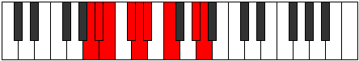 |
| [2425](https://ianring.com/musictheory/scales/2425) | [Rorian](ModeDNaturalRorian.md) | D | D, E#, F#, G, Ab, Bb, C#, D |  |
| [2427](https://ianring.com/musictheory/scales/2427) | [Katoryllic](ModeDNaturalKatoryllic.md) | D | D, D#, F, F#, G, G#, A#, C#, D |  |
| [2427](https://ianring.com/musictheory/scales/2427) | [Katoryllic](ModeANaturalKatoryllic.md) | A | A, A#, C, C#, D, D#, F, G#, A |  |
| [2429](https://ianring.com/musictheory/scales/2429) | [Kadyllic](ModeDNaturalKadyllic.md) | D | D, E, F, F#, G, G#, A#, C#, D |  |
| [2431](https://ianring.com/musictheory/scales/2431) | [Gythygic](ModeDNaturalGythygic.md) | D | D, D#, E, F, F#, G, G#, A#, C#, D |  |
| [2431](https://ianring.com/musictheory/scales/2431) | [Gythygic](ModeANaturalGythygic.md) | A | A, A#, B, C, C#, D, D#, F, G#, A |  |
| [2453](https://ianring.com/musictheory/scales/2453) | [Stonimic](ModeFSharpStonimic.md) | F# | F#, G#, A#, B##, C##, D###, F# |  |
| [2453](https://ianring.com/musictheory/scales/2453) | [Stonimic](ModeGFlatStonimic.md) | Gb | Gb, Ab, Bb, C#, D, E#, Gb |  |
| [2455](https://ianring.com/musictheory/scales/2455) | [Bothian](ModeFSharpBothian.md) | F# | F#, G, Ab, Bb, C#, D, E#, F# |  |
| [2455](https://ianring.com/musictheory/scales/2455) | [Bothian](ModeGFlatBothian.md) | Gb | Gb, Abb, Bbbb, Cbb, Db, Ebb, F, Gb |  |
| [2461](https://ianring.com/musictheory/scales/2461) | [Sagian](ModeFSharpSagian.md) | F# | F#, G#, A, Bb, C#, D, E#, F# |  |
| [2461](https://ianring.com/musictheory/scales/2461) | [Sagian](ModeGFlatSagian.md) | Gb | Gb, Ab, Bbb, Cbb, Db, Ebb, F, Gb |  |
| [2463](https://ianring.com/musictheory/scales/2463) | [Ionathyllic](ModeFSharpIonathyllic.md) | F# | F#, G, G#, A, A#, C#, D, F, F# |  |
| [2463](https://ianring.com/musictheory/scales/2463) | [Ionathyllic](ModeGFlatIonathyllic.md) | Gb | Gb, G, Ab, A, Bb, Db, D, F, Gb |  |
| [2483](https://ianring.com/musictheory/scales/2483) | [Aerynian](ModeANaturalAerynian.md) | A | A, Bb, C#, D, E, F, G#, A |  |
| [2485](https://ianring.com/musictheory/scales/2485) | [Aerorian](ModeFSharpAerorian.md) | F# | F#, G#, A#, B, C#, D, E#, F# |  |
| [2485](https://ianring.com/musictheory/scales/2485) | [Aerorian](ModeGFlatAerorian.md) | Gb | Gb, Ab, Bb, Cb, Db, Ebb, F, Gb |  |
| [2487](https://ianring.com/musictheory/scales/2487) | [Phroptyllic](ModeFSharpPhroptyllic.md) | F# | F#, G, G#, A#, B, C#, D, F, F# |  |
| [2487](https://ianring.com/musictheory/scales/2487) | [Phroptyllic](ModeGFlatPhroptyllic.md) | Gb | Gb, G, Ab, Bb, B, Db, D, F, Gb |  |
| [2487](https://ianring.com/musictheory/scales/2487) | [Phroptyllic](ModeANaturalPhroptyllic.md) | A | A, A#, B, C#, D, E, F, G#, A |  |
| [2491](https://ianring.com/musictheory/scales/2491) | [Layllic](ModeANaturalLayllic.md) | A | A, A#, C, C#, D, E, F, G#, A |  |
| [2493](https://ianring.com/musictheory/scales/2493) | [Manyllic](ModeFSharpManyllic.md) | F# | F#, G#, A, A#, B, C#, D, F, F# |  |
| [2493](https://ianring.com/musictheory/scales/2493) | [Manyllic](ModeGFlatManyllic.md) | Gb | Gb, Ab, A, Bb, B, Db, D, F, Gb |  |
| [2495](https://ianring.com/musictheory/scales/2495) | [Aeolocrygic](ModeANaturalAeolocrygic.md) | A | A, A#, B, C, C#, D, E, F, G#, A |  |
| [2495](https://ianring.com/musictheory/scales/2495) | [Aeolocrygic](ModeFSharpAeolocrygic.md) | F# | F#, G, G#, A, A#, B, C#, D, F, F# |  |
| [2495](https://ianring.com/musictheory/scales/2495) | [Aeolocrygic](ModeGFlatAeolocrygic.md) | Gb | Gb, G, Ab, A, Bb, B, Db, D, F, Gb |  |
| [2505](https://ianring.com/musictheory/scales/2505) | [Mydimic](ModeDNaturalMydimic.md) | D | D, E#, F###, G##, A#, B##, D |  |
| [2507](https://ianring.com/musictheory/scales/2507) | [Ionyphian](ModeDNaturalIonyphian.md) | D | D, Eb, F, G#, A, Bb, C#, D |  |
| [2509](https://ianring.com/musictheory/scales/2509) | [Bogian](ModeDNaturalBogian.md) | D | D, E, F, G#, A, Bb, C#, D |  |
| [2511](https://ianring.com/musictheory/scales/2511) | [Epyryllic](ModeDNaturalEpyryllic.md) | D | D, D#, E, F, G#, A, A#, C#, D |  |
| [2517](https://ianring.com/musictheory/scales/2517) | [Ryphian](ModeFSharpRyphian.md) | F# | F#, G#, A#, B#, C#, D, E#, F# |  |
| [2517](https://ianring.com/musictheory/scales/2517) | [Ryphian](ModeGFlatRyphian.md) | Gb | Gb, Ab, Bb, C, Db, Ebb, F, Gb |  |
| [2519](https://ianring.com/musictheory/scales/2519) | [Dathyllic](ModeFSharpDathyllic.md) | F# | F#, G, G#, A#, C, C#, D, F, F# |  |
| [2519](https://ianring.com/musictheory/scales/2519) | [Dathyllic](ModeGFlatDathyllic.md) | Gb | Gb, G, Ab, Bb, C, Db, D, F, Gb |  |
| [2521](https://ianring.com/musictheory/scales/2521) | [Barian](ModeDNaturalBarian.md) | D | D, E#, F#, G#, A, Bb, C#, D |  |
| [2523](https://ianring.com/musictheory/scales/2523) | [Rygyllic](ModeDNaturalRygyllic.md) | D | D, D#, F, F#, G#, A, A#, C#, D |  |
| [2525](https://ianring.com/musictheory/scales/2525) | [Aeolaryllic](ModeFSharpAeolaryllic.md) | F# | F#, G#, A, A#, C, C#, D, F, F# |  |
| [2525](https://ianring.com/musictheory/scales/2525) | [Aeolaryllic](ModeGFlatAeolaryllic.md) | Gb | Gb, Ab, A, Bb, C, Db, D, F, Gb |  |
| [2525](https://ianring.com/musictheory/scales/2525) | [Aeolaryllic](ModeDNaturalAeolaryllic.md) | D | D, E, F, F#, G#, A, A#, C#, D |  |
| [2527](https://ianring.com/musictheory/scales/2527) | [Phradygic](ModeDNaturalPhradygic.md) | D | D, D#, E, F, F#, G#, A, A#, C#, D |  |
| [2527](https://ianring.com/musictheory/scales/2527) | [Phradygic](ModeFSharpPhradygic.md) | F# | F#, G, G#, A, A#, C, C#, D, F, F# |  |
| [2527](https://ianring.com/musictheory/scales/2527) | [Phradygic](ModeGFlatPhradygic.md) | Gb | Gb, G, Ab, A, Bb, C, Db, D, F, Gb |  |
| [2537](https://ianring.com/musictheory/scales/2537) | [Laptian](ModeDNaturalLaptian.md) | D | D, E#, F##, G#, A, Bb, C#, D |  |
| [2539](https://ianring.com/musictheory/scales/2539) | [Thonyllic](ModeDNaturalThonyllic.md) | D | D, D#, F, G, G#, A, A#, C#, D |  |
| [2541](https://ianring.com/musictheory/scales/2541) | [Katadyllic](ModeDNaturalKatadyllic.md) | D | D, E, F, G, G#, A, A#, C#, D |  |
| [2543](https://ianring.com/musictheory/scales/2543) | [Dydygic](ModeDNaturalDydygic.md) | D | D, D#, E, F, G, G#, A, A#, C#, D |  |
| [2547](https://ianring.com/musictheory/scales/2547) | [Sogyllic](ModeANaturalSogyllic.md) | A | A, A#, C#, D, D#, E, F, G#, A |  |
| [2549](https://ianring.com/musictheory/scales/2549) | [Rydyllic](ModeFSharpRydyllic.md) | F# | F#, G#, A#, B, C, C#, D, F, F# |  |
| [2549](https://ianring.com/musictheory/scales/2549) | [Rydyllic](ModeGFlatRydyllic.md) | Gb | Gb, Ab, Bb, B, C, Db, D, F, Gb |  |
| [2551](https://ianring.com/musictheory/scales/2551) | [Zoptygic](ModeFSharpZoptygic.md) | F# | F#, G, G#, A#, B, C, C#, D, F, F# |  |
| [2551](https://ianring.com/musictheory/scales/2551) | [Zoptygic](ModeGFlatZoptygic.md) | Gb | Gb, G, Ab, Bb, B, C, Db, D, F, Gb |  |
| [2551](https://ianring.com/musictheory/scales/2551) | [Zoptygic](ModeANaturalZoptygic.md) | A | A, A#, B, C#, D, D#, E, F, G#, A |  |
| [2553](https://ianring.com/musictheory/scales/2553) | [Aeolaptyllic](ModeDNaturalAeolaptyllic.md) | D | D, F, F#, G, G#, A, A#, C#, D |  |
| [2555](https://ianring.com/musictheory/scales/2555) | [Bythygic](ModeANaturalBythygic.md) | A | A, A#, C, C#, D, D#, E, F, G#, A |  |
| [2555](https://ianring.com/musictheory/scales/2555) | [Bythygic](ModeDNaturalBythygic.md) | D | D, D#, F, F#, G, G#, A, A#, C#, D |  |
| [2557](https://ianring.com/musictheory/scales/2557) | [Dothygic](ModeDNaturalDothygic.md) | D | D, E, F, F#, G, G#, A, A#, C#, D |  |
| [2557](https://ianring.com/musictheory/scales/2557) | [Dothygic](ModeFSharpDothygic.md) | F# | F#, G#, A, A#, B, C, C#, D, F, F# |  |
| [2557](https://ianring.com/musictheory/scales/2557) | [Dothygic](ModeGFlatDothygic.md) | Gb | Gb, Ab, A, Bb, B, C, Db, D, F, Gb |  |
| [2559](https://ianring.com/musictheory/scales/2559) | [Zogyllian](ModeDNaturalZogyllian.md) | D | D, D#, E, F, F#, G, G#, A, A#, C#, D | 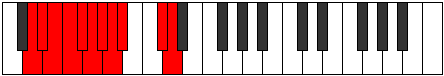 |
| [2559](https://ianring.com/musictheory/scales/2559) | [Zogyllian](ModeANaturalZogyllian.md) | A | A, A#, B, C, C#, D, D#, E, F, G#, A |  |
| [2559](https://ianring.com/musictheory/scales/2559) | [Zogyllian](ModeFSharpZogyllian.md) | F# | F#, G, G#, A, A#, B, C, C#, D, F, F# |  |
| [2559](https://ianring.com/musictheory/scales/2559) | [Zogyllian](ModeGFlatZogyllian.md) | Gb | Gb, G, Ab, A, Bb, B, C, Db, D, F, Gb |  |
| [2637](https://ianring.com/musictheory/scales/2637) | [Aeolonimic](ModeBNaturalAeolonimic.md) | B | B, C#, D, E#, F###, G###, B |  |
| [2639](https://ianring.com/musictheory/scales/2639) | [Dothian](ModeBNaturalDothian.md) | B | B, C, Db, Ebb, F, G#, A#, B |  |
| [2653](https://ianring.com/musictheory/scales/2653) | [Sygian](ModeBNaturalSygian.md) | B | B, C#, D, Eb, F, G#, A#, B |  |
| [2655](https://ianring.com/musictheory/scales/2655) | [Thocryllic](ModeBNaturalThocryllic.md) | B | B, C, C#, D, D#, F, G#, A#, B |  |
| [2661](https://ianring.com/musictheory/scales/2661) | [Stydimic](ModeGSharpStydimic.md) | G# | G#, A#, B##, C##, D###, E###, G# |  |
| [2661](https://ianring.com/musictheory/scales/2661) | [Stydimic](ModeAFlatStydimic.md) | Ab | Ab, Bb, C#, D, E#, F##, Ab |  |
| [2663](https://ianring.com/musictheory/scales/2663) | [Lalian](ModeGSharpLalian.md) | G# | G#, A, Bb, C#, D, E#, F##, G# |  |
| [2663](https://ianring.com/musictheory/scales/2663) | [Lalian](ModeAFlatLalian.md) | Ab | Ab, Bbb, Cbb, Db, Ebb, F, G, Ab |  |
| [2669](https://ianring.com/musictheory/scales/2669) | [Gamian](ModeBNaturalGamian.md) | B | B, C#, D, E, F, G#, A#, B |  |
| [2669](https://ianring.com/musictheory/scales/2669) | [Gamian](ModeGSharpGamian.md) | G# | G#, A#, B, C#, D, E#, F##, G# |  |
| [2669](https://ianring.com/musictheory/scales/2669) | [Gamian](ModeAFlatGamian.md) | Ab | Ab, Bb, Cb, Db, Ebb, F, G, Ab |  |
| [2671](https://ianring.com/musictheory/scales/2671) | [Lylyllic](ModeBNaturalLylyllic.md) | B | B, C, C#, D, E, F, G#, A#, B |  |
| [2671](https://ianring.com/musictheory/scales/2671) | [Lylyllic](ModeGSharpLylyllic.md) | G# | G#, A, A#, B, C#, D, F, G, G# |  |
| [2671](https://ianring.com/musictheory/scales/2671) | [Lylyllic](ModeAFlatLylyllic.md) | Ab | Ab, A, Bb, B, Db, D, F, G, Ab |  |
| [2677](https://ianring.com/musictheory/scales/2677) | [Thodian](ModeGSharpThodian.md) | G# | G#, A#, B#, C#, D, E#, F##, G# |  |
| [2677](https://ianring.com/musictheory/scales/2677) | [Thodian](ModeAFlatThodian.md) | Ab | Ab, Bb, C, Db, Ebb, F, G, Ab |  |
| [2679](https://ianring.com/musictheory/scales/2679) | [Rathyllic](ModeGSharpRathyllic.md) | G# | G#, A, A#, C, C#, D, F, G, G# |  |
| [2679](https://ianring.com/musictheory/scales/2679) | [Rathyllic](ModeAFlatRathyllic.md) | Ab | Ab, A, Bb, C, Db, D, F, G, Ab |  |
| [2685](https://ianring.com/musictheory/scales/2685) | [Ionoryllic](ModeBNaturalIonoryllic.md) | B | B, C#, D, D#, E, F, G#, A#, B |  |
| [2685](https://ianring.com/musictheory/scales/2685) | [Ionoryllic](ModeGSharpIonoryllic.md) | G# | G#, A#, B, C, C#, D, F, G, G# |  |
| [2685](https://ianring.com/musictheory/scales/2685) | [Ionoryllic](ModeAFlatIonoryllic.md) | Ab | Ab, Bb, B, C, Db, D, F, G, Ab |  |
| [2687](https://ianring.com/musictheory/scales/2687) | [Thacrygic](ModeBNaturalThacrygic.md) | B | B, C, C#, D, D#, E, F, G#, A#, B |  |
| [2687](https://ianring.com/musictheory/scales/2687) | [Thacrygic](ModeGSharpThacrygic.md) | G# | G#, A, A#, B, C, C#, D, F, G, G# |  |
| [2687](https://ianring.com/musictheory/scales/2687) | [Thacrygic](ModeAFlatThacrygic.md) | Ab | Ab, A, Bb, B, C, Db, D, F, G, Ab |  |
| [2707](https://ianring.com/musictheory/scales/2707) | [Banimic](ModeCSharpBanimic.md) | C# | C#, D, E#, F###, G###, A###, C# |  |
| [2707](https://ianring.com/musictheory/scales/2707) | [Banimic](ModeDFlatBanimic.md) | Db | Db, Ebb, F, G#, A#, B#, Db |  |
| [2711](https://ianring.com/musictheory/scales/2711) | [Stolian](ModeCSharpStolian.md) | C# | C#, D, Eb, F, G#, A#, B#, C# |  |
| [2711](https://ianring.com/musictheory/scales/2711) | [Stolian](ModeDFlatStolian.md) | Db | Db, Ebb, Fbb, Gbb, Ab, Bb, C, Db |  |
| [2715](https://ianring.com/musictheory/scales/2715) | [Kynian](ModeCSharpKynian.md) | C# | C#, D, E, F, G#, A#, B#, C# |  |
| [2715](https://ianring.com/musictheory/scales/2715) | [Kynian](ModeDFlatKynian.md) | Db | Db, Ebb, Fb, Gbb, Ab, Bb, C, Db |  |
| [2719](https://ianring.com/musictheory/scales/2719) | [Zocryllic](ModeCSharpZocryllic.md) | C# | C#, D, D#, E, F, G#, A#, C, C# |  |
| [2719](https://ianring.com/musictheory/scales/2719) | [Zocryllic](ModeDFlatZocryllic.md) | Db | Db, D, Eb, E, F, Ab, Bb, C, Db |  |
| [2739](https://ianring.com/musictheory/scales/2739) | [Zanian](ModeCSharpZanian.md) | C# | C#, D, E#, F#, G#, A#, B#, C# |  |
| [2739](https://ianring.com/musictheory/scales/2739) | [Zanian](ModeDFlatZanian.md) | Db | Db, Ebb, F, Gb, Ab, Bb, C, Db |  |
| [2743](https://ianring.com/musictheory/scales/2743) | [Staptyllic](ModeCSharpStaptyllic.md) | C# | C#, D, D#, F, F#, G#, A#, C, C# |  |
| [2743](https://ianring.com/musictheory/scales/2743) | [Staptyllic](ModeDFlatStaptyllic.md) | Db | Db, D, Eb, F, Gb, Ab, Bb, C, Db |  |
| [2747](https://ianring.com/musictheory/scales/2747) | [Stythyllic](ModeCSharpStythyllic.md) | C# | C#, D, E, F, F#, G#, A#, C, C# |  |
| [2747](https://ianring.com/musictheory/scales/2747) | [Stythyllic](ModeDFlatStythyllic.md) | Db | Db, D, E, F, Gb, Ab, Bb, C, Db |  |
| [2751](https://ianring.com/musictheory/scales/2751) | [Sylygic](ModeCSharpSylygic.md) | C# | C#, D, D#, E, F, F#, G#, A#, C, C# |  |
| [2751](https://ianring.com/musictheory/scales/2751) | [Sylygic](ModeDFlatSylygic.md) | Db | Db, D, Eb, E, F, Gb, Ab, Bb, C, Db |  |
| [2765](https://ianring.com/musictheory/scales/2765) | [Banian](ModeBNaturalBanian.md) | B | B, C#, D, E#, F#, G#, A#, B | 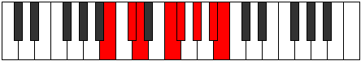 |
| [2767](https://ianring.com/musictheory/scales/2767) | [Katydyllic](ModeBNaturalKatydyllic.md) | B | B, C, C#, D, F, F#, G#, A#, B |  |
| [2771](https://ianring.com/musictheory/scales/2771) | [Garian](ModeCSharpGarian.md) | C# | C#, D, E#, F##, G#, A#, B#, C# |  |
| [2771](https://ianring.com/musictheory/scales/2771) | [Garian](ModeDFlatGarian.md) | Db | Db, Ebb, F, G, Ab, Bb, C, Db |  |
| [2775](https://ianring.com/musictheory/scales/2775) | [Godyllic](ModeCSharpGodyllic.md) | C# | C#, D, D#, F, G, G#, A#, C, C# |  |
| [2775](https://ianring.com/musictheory/scales/2775) | [Godyllic](ModeDFlatGodyllic.md) | Db | Db, D, Eb, F, G, Ab, Bb, C, Db |  |
| [2779](https://ianring.com/musictheory/scales/2779) | [Garyllic](ModeCSharpGaryllic.md) | C# | C#, D, E, F, G, G#, A#, C, C# |  |
| [2779](https://ianring.com/musictheory/scales/2779) | [Garyllic](ModeDFlatGaryllic.md) | Db | Db, D, E, F, G, Ab, Bb, C, Db |  |
| [2781](https://ianring.com/musictheory/scales/2781) | [Gycryllic](ModeBNaturalGycryllic.md) | B | B, C#, D, D#, F, F#, G#, A#, B |  |
| [2783](https://ianring.com/musictheory/scales/2783) | [Gothygic](ModeCSharpGothygic.md) | C# | C#, D, D#, E, F, G, G#, A#, C, C# |  |
| [2783](https://ianring.com/musictheory/scales/2783) | [Gothygic](ModeDFlatGothygic.md) | Db | Db, D, Eb, E, F, G, Ab, Bb, C, Db |  |
| [2783](https://ianring.com/musictheory/scales/2783) | [Gothygic](ModeBNaturalGothygic.md) | B | B, C, C#, D, D#, F, F#, G#, A#, B |  |
| [2789](https://ianring.com/musictheory/scales/2789) | [Zolian](ModeGSharpZolian.md) | G# | G#, A#, B##, C##, D#, E#, F##, G# |  |
| [2789](https://ianring.com/musictheory/scales/2789) | [Zolian](ModeAFlatZolian.md) | Ab | Ab, Bb, C#, D, Eb, F, G, Ab |  |
| [2791](https://ianring.com/musictheory/scales/2791) | [Ionyptyllic](ModeGSharpIonyptyllic.md) | G# | G#, A, A#, C#, D, D#, F, G, G# |  |
| [2791](https://ianring.com/musictheory/scales/2791) | [Ionyptyllic](ModeAFlatIonyptyllic.md) | Ab | Ab, A, Bb, Db, D, Eb, F, G, Ab |  |
| [2797](https://ianring.com/musictheory/scales/2797) | [Stalyllic](ModeBNaturalStalyllic.md) | B | B, C#, D, E, F, F#, G#, A#, B |  |
| [2797](https://ianring.com/musictheory/scales/2797) | [Stalyllic](ModeGSharpStalyllic.md) | G# | G#, A#, B, C#, D, D#, F, G, G# |  |
| [2797](https://ianring.com/musictheory/scales/2797) | [Stalyllic](ModeAFlatStalyllic.md) | Ab | Ab, Bb, B, Db, D, Eb, F, G, Ab |  |
| [2799](https://ianring.com/musictheory/scales/2799) | [Epilygic](ModeBNaturalEpilygic.md) | B | B, C, C#, D, E, F, F#, G#, A#, B |  |
| [2799](https://ianring.com/musictheory/scales/2799) | [Epilygic](ModeGSharpEpilygic.md) | G# | G#, A, A#, B, C#, D, D#, F, G, G# |  |
| [2799](https://ianring.com/musictheory/scales/2799) | [Epilygic](ModeAFlatEpilygic.md) | Ab | Ab, A, Bb, B, Db, D, Eb, F, G, Ab |  |
| [2803](https://ianring.com/musictheory/scales/2803) | [Zolyllic](ModeCSharpZolyllic.md) | C# | C#, D, F, F#, G, G#, A#, C, C# |  |
| [2803](https://ianring.com/musictheory/scales/2803) | [Zolyllic](ModeDFlatZolyllic.md) | Db | Db, D, F, Gb, G, Ab, Bb, C, Db |  |
| [2805](https://ianring.com/musictheory/scales/2805) | [Zylyllic](ModeGSharpZylyllic.md) | G# | G#, A#, C, C#, D, D#, F, G, G# |  |
| [2805](https://ianring.com/musictheory/scales/2805) | [Zylyllic](ModeAFlatZylyllic.md) | Ab | Ab, Bb, C, Db, D, Eb, F, G, Ab |  |
| [2807](https://ianring.com/musictheory/scales/2807) | [Zylygic](ModeCSharpZylygic.md) | C# | C#, D, D#, F, F#, G, G#, A#, C, C# |  |
| [2807](https://ianring.com/musictheory/scales/2807) | [Zylygic](ModeDFlatZylygic.md) | Db | Db, D, Eb, F, Gb, G, Ab, Bb, C, Db |  |
| [2807](https://ianring.com/musictheory/scales/2807) | [Zylygic](ModeGSharpZylygic.md) | G# | G#, A, A#, C, C#, D, D#, F, G, G# | 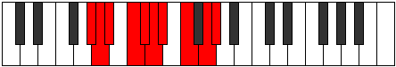 |
| [2807](https://ianring.com/musictheory/scales/2807) | [Zylygic](ModeAFlatZylygic.md) | Ab | Ab, A, Bb, C, Db, D, Eb, F, G, Ab |  |
| [2811](https://ianring.com/musictheory/scales/2811) | [Barygic](ModeCSharpBarygic.md) | C# | C#, D, E, F, F#, G, G#, A#, C, C# |  |
| [2811](https://ianring.com/musictheory/scales/2811) | [Barygic](ModeDFlatBarygic.md) | Db | Db, D, E, F, Gb, G, Ab, Bb, C, Db |  |
| [2813](https://ianring.com/musictheory/scales/2813) | [Zolygic](ModeBNaturalZolygic.md) | B | B, C#, D, D#, E, F, F#, G#, A#, B |  |
| [2813](https://ianring.com/musictheory/scales/2813) | [Zolygic](ModeGSharpZolygic.md) | G# | G#, A#, B, C, C#, D, D#, F, G, G# |  |
| [2813](https://ianring.com/musictheory/scales/2813) | [Zolygic](ModeAFlatZolygic.md) | Ab | Ab, Bb, B, C, Db, D, Eb, F, G, Ab |  |
| [2815](https://ianring.com/musictheory/scales/2815) | [Aeradyllian](ModeCSharpAeradyllian.md) | C# | C#, D, D#, E, F, F#, G, G#, A#, C, C# |  |
| [2815](https://ianring.com/musictheory/scales/2815) | [Aeradyllian](ModeDFlatAeradyllian.md) | Db | Db, D, Eb, E, F, Gb, G, Ab, Bb, C, Db |  |
| [2815](https://ianring.com/musictheory/scales/2815) | [Aeradyllian](ModeBNaturalAeradyllian.md) | B | B, C, C#, D, D#, E, F, F#, G#, A#, B |  |
| [2815](https://ianring.com/musictheory/scales/2815) | [Aeradyllian](ModeGSharpAeradyllian.md) | G# | G#, A, A#, B, C, C#, D, D#, F, G, G# | 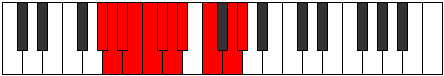 |
| [2815](https://ianring.com/musictheory/scales/2815) | [Aeradyllian](ModeAFlatAeradyllian.md) | Ab | Ab, A, Bb, B, C, Db, D, Eb, F, G, Ab |  |
| [2857](https://ianring.com/musictheory/scales/2857) | [Stythimic](ModeFNaturalStythimic.md) | F | F, G#, A#, B##, C##, D##, F |  |
| [2859](https://ianring.com/musictheory/scales/2859) | [Phrycrian](ModeFNaturalPhrycrian.md) | F | F, Gb, Ab, Bb, C#, D, E, F |  |
| [2861](https://ianring.com/musictheory/scales/2861) | [Katothian](ModeFNaturalKatothian.md) | F | F, G, Ab, Bb, C#, D, E, F |  |
| [2863](https://ianring.com/musictheory/scales/2863) | [Aerogyllic](ModeFNaturalAerogyllic.md) | F | F, F#, G, G#, A#, C#, D, E, F |  |
| [2867](https://ianring.com/musictheory/scales/2867) | [Socrian](ModeANaturalSocrian.md) | A | A, Bb, C#, D, E#, F#, G#, A |  |
| [2871](https://ianring.com/musictheory/scales/2871) | [Stanyllic](ModeANaturalStanyllic.md) | A | A, A#, B, C#, D, F, F#, G#, A |  |
| [2873](https://ianring.com/musictheory/scales/2873) | [Docrian](ModeFNaturalDocrian.md) | F | F, G#, A, Bb, C#, D, E, F |  |
| [2875](https://ianring.com/musictheory/scales/2875) | [Ganyllic](ModeANaturalGanyllic.md) | A | A, A#, C, C#, D, F, F#, G#, A |  |
| [2875](https://ianring.com/musictheory/scales/2875) | [Ganyllic](ModeFNaturalGanyllic.md) | F | F, F#, G#, A, A#, C#, D, E, F |  |
| [2877](https://ianring.com/musictheory/scales/2877) | [Phrylyllic](ModeFNaturalPhrylyllic.md) | F | F, G, G#, A, A#, C#, D, E, F |  |
| [2879](https://ianring.com/musictheory/scales/2879) | [Stadygic](ModeFNaturalStadygic.md) | F | F, F#, G, G#, A, A#, C#, D, E, F |  |
| [2879](https://ianring.com/musictheory/scales/2879) | [Stadygic](ModeANaturalStadygic.md) | A | A, A#, B, C, C#, D, F, F#, G#, A |  |
| [2889](https://ianring.com/musictheory/scales/2889) | [Thoptimic](ModeDNaturalThoptimic.md) | D | D, E#, F###, G###, A##, B##, D |  |
| [2891](https://ianring.com/musictheory/scales/2891) | [Phrogian](ModeDNaturalPhrogian.md) | D | D, Eb, F, G#, A#, B, C#, D |  |
| [2893](https://ianring.com/musictheory/scales/2893) | [Lylian](ModeDNaturalLylian.md) | D | D, E, F, G#, A#, B, C#, D |  |
| [2893](https://ianring.com/musictheory/scales/2893) | [Lylian](ModeBNaturalLylian.md) | B | B, C#, D, E#, F##, G#, A#, B |  |
| [2895](https://ianring.com/musictheory/scales/2895) | [Aeragyllic](ModeDNaturalAeragyllic.md) | D | D, D#, E, F, G#, A#, B, C#, D |  |
| [2895](https://ianring.com/musictheory/scales/2895) | [Aeragyllic](ModeBNaturalAeragyllic.md) | B | B, C, C#, D, F, G, G#, A#, B |  |
| [2905](https://ianring.com/musictheory/scales/2905) | [Palian](ModeDNaturalPalian.md) | D | D, E#, F#, G#, A#, B, C#, D |  |
| [2907](https://ianring.com/musictheory/scales/2907) | [Mogyllic](ModeDNaturalMogyllic.md) | D | D, D#, F, F#, G#, A#, B, C#, D |  |
| [2909](https://ianring.com/musictheory/scales/2909) | [Mocryllic](ModeDNaturalMocryllic.md) | D | D, E, F, F#, G#, A#, B, C#, D |  |
| [2909](https://ianring.com/musictheory/scales/2909) | [Mocryllic](ModeBNaturalMocryllic.md) | B | B, C#, D, D#, F, G, G#, A#, B |  |
| [2911](https://ianring.com/musictheory/scales/2911) | [Katygic](ModeDNaturalKatygic.md) | D | D, D#, E, F, F#, G#, A#, B, C#, D |  |
| [2911](https://ianring.com/musictheory/scales/2911) | [Katygic](ModeBNaturalKatygic.md) | B | B, C, C#, D, D#, F, G, G#, A#, B |  |
| [2917](https://ianring.com/musictheory/scales/2917) | [Kocrian](ModeGSharpKocrian.md) | G# | G#, A#, B##, C##, D##, E#, F##, G# |  |
| [2917](https://ianring.com/musictheory/scales/2917) | [Kocrian](ModeAFlatKocrian.md) | Ab | Ab, Bb, C#, D, E, F, G, Ab |  |
| [2919](https://ianring.com/musictheory/scales/2919) | [Molyllic](ModeGSharpMolyllic.md) | G# | G#, A, A#, C#, D, E, F, G, G# |  |
| [2919](https://ianring.com/musictheory/scales/2919) | [Molyllic](ModeAFlatMolyllic.md) | Ab | Ab, A, Bb, Db, D, E, F, G, Ab |  |
| [2921](https://ianring.com/musictheory/scales/2921) | [Pogian](ModeFNaturalPogian.md) | F | F, G#, A#, B, C#, D, E, F |  |
| [2921](https://ianring.com/musictheory/scales/2921) | [Pogian](ModeDNaturalPogian.md) | D | D, E#, F##, G#, A#, B, C#, D |  |
| [2923](https://ianring.com/musictheory/scales/2923) | [Baryllic](ModeFNaturalBaryllic.md) | F | F, F#, G#, A#, B, C#, D, E, F |  |
| [2923](https://ianring.com/musictheory/scales/2923) | [Baryllic](ModeDNaturalBaryllic.md) | D | D, D#, F, G, G#, A#, B, C#, D |  |
| [2925](https://ianring.com/musictheory/scales/2925) | [MajorDiminished](ModeDNaturalMajorDiminished.md) | D | D, E, F, G, G#, A#, B, C#, D |  |
| [2925](https://ianring.com/musictheory/scales/2925) | [MajorDiminished](ModeFNaturalMajorDiminished.md) | F | F, G, G#, A#, B, C#, D, E, F |  |
| [2925](https://ianring.com/musictheory/scales/2925) | [MajorDiminished](ModeGSharpMajorDiminished.md) | G# | G#, A#, B, C#, D, E, F, G, G# |  |
| [2925](https://ianring.com/musictheory/scales/2925) | [MajorDiminished](ModeAFlatMajorDiminished.md) | Ab | Ab, Bb, B, Db, D, E, F, G, Ab |  |
| [2925](https://ianring.com/musictheory/scales/2925) | [MajorDiminished](ModeBNaturalMajorDiminished.md) | B | B, C#, D, E, F, G, G#, A#, B |  |
| [2927](https://ianring.com/musictheory/scales/2927) | [Rodygic](ModeBNaturalRodygic.md) | B | B, C, C#, D, E, F, G, G#, A#, B |  |
| [2927](https://ianring.com/musictheory/scales/2927) | [Rodygic](ModeDNaturalRodygic.md) | D | D, D#, E, F, G, G#, A#, B, C#, D |  |
| [2927](https://ianring.com/musictheory/scales/2927) | [Rodygic](ModeFNaturalRodygic.md) | F | F, F#, G, G#, A#, B, C#, D, E, F |  |
| [2927](https://ianring.com/musictheory/scales/2927) | [Rodygic](ModeGSharpRodygic.md) | G# | G#, A, A#, B, C#, D, E, F, G, G# |  |
| [2927](https://ianring.com/musictheory/scales/2927) | [Rodygic](ModeAFlatRodygic.md) | Ab | Ab, A, Bb, B, Db, D, E, F, G, Ab |  |
| [2931](https://ianring.com/musictheory/scales/2931) | [Zathyllic](ModeANaturalZathyllic.md) | A | A, A#, C#, D, D#, F, F#, G#, A |  |
| [2933](https://ianring.com/musictheory/scales/2933) | [Dalyllic](ModeGSharpDalyllic.md) | G# | G#, A#, C, C#, D, E, F, G, G# |  |
| [2933](https://ianring.com/musictheory/scales/2933) | [Dalyllic](ModeAFlatDalyllic.md) | Ab | Ab, Bb, C, Db, D, E, F, G, Ab |  |
| [2935](https://ianring.com/musictheory/scales/2935) | [Modygic](ModeGSharpModygic.md) | G# | G#, A, A#, C, C#, D, E, F, G, G# |  |
| [2935](https://ianring.com/musictheory/scales/2935) | [Modygic](ModeAFlatModygic.md) | Ab | Ab, A, Bb, C, Db, D, E, F, G, Ab |  |
| [2935](https://ianring.com/musictheory/scales/2935) | [Modygic](ModeANaturalModygic.md) | A | A, A#, B, C#, D, D#, F, F#, G#, A |  |
| [2937](https://ianring.com/musictheory/scales/2937) | [Aeolathyllic](ModeDNaturalAeolathyllic.md) | D | D, F, F#, G, G#, A#, B, C#, D |  |
| [2937](https://ianring.com/musictheory/scales/2937) | [Aeolathyllic](ModeFNaturalAeolathyllic.md) | F | F, G#, A, A#, B, C#, D, E, F |  |
| [2939](https://ianring.com/musictheory/scales/2939) | [Goptygic](ModeANaturalGoptygic.md) | A | A, A#, C, C#, D, D#, F, F#, G#, A |  |
| [2939](https://ianring.com/musictheory/scales/2939) | [Goptygic](ModeDNaturalGoptygic.md) | D | D, D#, F, F#, G, G#, A#, B, C#, D |  |
| [2939](https://ianring.com/musictheory/scales/2939) | [Goptygic](ModeFNaturalGoptygic.md) | F | F, F#, G#, A, A#, B, C#, D, E, F |  |
| [2941](https://ianring.com/musictheory/scales/2941) | [Laptygic](ModeGSharpLaptygic.md) | G# | G#, A#, B, C, C#, D, E, F, G, G# |  |
| [2941](https://ianring.com/musictheory/scales/2941) | [Laptygic](ModeAFlatLaptygic.md) | Ab | Ab, Bb, B, C, Db, D, E, F, G, Ab |  |
| [2941](https://ianring.com/musictheory/scales/2941) | [Laptygic](ModeBNaturalLaptygic.md) | B | B, C#, D, D#, E, F, G, G#, A#, B |  |
| [2941](https://ianring.com/musictheory/scales/2941) | [Laptygic](ModeDNaturalLaptygic.md) | D | D, E, F, F#, G, G#, A#, B, C#, D |  |
| [2941](https://ianring.com/musictheory/scales/2941) | [Laptygic](ModeFNaturalLaptygic.md) | F | F, G, G#, A, A#, B, C#, D, E, F |  |
| [2943](https://ianring.com/musictheory/scales/2943) | [Dathyllian](ModeBNaturalDathyllian.md) | B | B, C, C#, D, D#, E, F, G, G#, A#, B |  |
| [2943](https://ianring.com/musictheory/scales/2943) | [Dathyllian](ModeDNaturalDathyllian.md) | D | D, D#, E, F, F#, G, G#, A#, B, C#, D |  |
| [2943](https://ianring.com/musictheory/scales/2943) | [Dathyllian](ModeANaturalDathyllian.md) | A | A, A#, B, C, C#, D, D#, F, F#, G#, A | 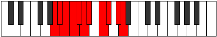 |
| [2943](https://ianring.com/musictheory/scales/2943) | [Dathyllian](ModeGSharpDathyllian.md) | G# | G#, A, A#, B, C, C#, D, E, F, G, G# |  |
| [2943](https://ianring.com/musictheory/scales/2943) | [Dathyllian](ModeAFlatDathyllian.md) | Ab | Ab, A, Bb, B, C, Db, D, E, F, G, Ab |  |
| [2943](https://ianring.com/musictheory/scales/2943) | [Dathyllian](ModeFNaturalDathyllian.md) | F | F, F#, G, G#, A, A#, B, C#, D, E, F |  |
| [2963](https://ianring.com/musictheory/scales/2963) | [Bygian](ModeCSharpBygian.md) | C# | C#, D, E#, F###, G##, A#, B#, C# |  |
| [2963](https://ianring.com/musictheory/scales/2963) | [Bygian](ModeDFlatBygian.md) | Db | Db, Ebb, F, G#, A, Bb, C, Db |  |
| [2965](https://ianring.com/musictheory/scales/2965) | [Darian](ModeFSharpDarian.md) | F# | F#, G#, A#, B##, C##, D#, E#, F# |  |
| [2965](https://ianring.com/musictheory/scales/2965) | [Darian](ModeGFlatDarian.md) | Gb | Gb, Ab, Bb, C#, D, Eb, F, Gb |  |
| [2967](https://ianring.com/musictheory/scales/2967) | [Madyllic](ModeFSharpMadyllic.md) | F# | F#, G, G#, A#, C#, D, D#, F, F# |  |
| [2967](https://ianring.com/musictheory/scales/2967) | [Madyllic](ModeGFlatMadyllic.md) | Gb | Gb, G, Ab, Bb, Db, D, Eb, F, Gb |  |
| [2967](https://ianring.com/musictheory/scales/2967) | [Madyllic](ModeCSharpMadyllic.md) | C# | C#, D, D#, F, G#, A, A#, C, C# |  |
| [2967](https://ianring.com/musictheory/scales/2967) | [Madyllic](ModeDFlatMadyllic.md) | Db | Db, D, Eb, F, Ab, A, Bb, C, Db |  |
| [2971](https://ianring.com/musictheory/scales/2971) | [Aeolynyllic](ModeCSharpAeolynyllic.md) | C# | C#, D, E, F, G#, A, A#, C, C# |  |
| [2971](https://ianring.com/musictheory/scales/2971) | [Aeolynyllic](ModeDFlatAeolynyllic.md) | Db | Db, D, E, F, Ab, A, Bb, C, Db |  |
| [2973](https://ianring.com/musictheory/scales/2973) | [Panyllic](ModeFSharpPanyllic.md) | F# | F#, G#, A, A#, C#, D, D#, F, F# |  |
| [2973](https://ianring.com/musictheory/scales/2973) | [Panyllic](ModeGFlatPanyllic.md) | Gb | Gb, Ab, A, Bb, Db, D, Eb, F, Gb |  |
| [2975](https://ianring.com/musictheory/scales/2975) | [Gaptygic](ModeCSharpGaptygic.md) | C# | C#, D, D#, E, F, G#, A, A#, C, C# |  |
| [2975](https://ianring.com/musictheory/scales/2975) | [Gaptygic](ModeDFlatGaptygic.md) | Db | Db, D, Eb, E, F, Ab, A, Bb, C, Db |  |
| [2975](https://ianring.com/musictheory/scales/2975) | [Gaptygic](ModeFSharpGaptygic.md) | F# | F#, G, G#, A, A#, C#, D, D#, F, F# |  |
| [2975](https://ianring.com/musictheory/scales/2975) | [Gaptygic](ModeGFlatGaptygic.md) | Gb | Gb, G, Ab, A, Bb, Db, D, Eb, F, Gb |  |
| [2985](https://ianring.com/musictheory/scales/2985) | [Epacrian](ModeFNaturalEpacrian.md) | F | F, G#, A#, B#, C#, D, E, F |  |
| [2987](https://ianring.com/musictheory/scales/2987) | [Thanyllic](ModeFNaturalThanyllic.md) | F | F, F#, G#, A#, C, C#, D, E, F |  |
| [2989](https://ianring.com/musictheory/scales/2989) | [Ionacryllic](ModeFNaturalIonacryllic.md) | F | F, G, G#, A#, C, C#, D, E, F |  |
| [2991](https://ianring.com/musictheory/scales/2991) | [Zanygic](ModeFNaturalZanygic.md) | F | F, F#, G, G#, A#, C, C#, D, E, F |  |
| [2995](https://ianring.com/musictheory/scales/2995) | [Sanyllic](ModeCSharpSanyllic.md) | C# | C#, D, F, F#, G#, A, A#, C, C# |  |
| [2995](https://ianring.com/musictheory/scales/2995) | [Sanyllic](ModeDFlatSanyllic.md) | Db | Db, D, F, Gb, Ab, A, Bb, C, Db |  |
| [2995](https://ianring.com/musictheory/scales/2995) | [Sanyllic](ModeANaturalSanyllic.md) | A | A, A#, C#, D, E, F, F#, G#, A |  |
| [2997](https://ianring.com/musictheory/scales/2997) | [Ionoptyllic](ModeFSharpIonoptyllic.md) | F# | F#, G#, A#, B, C#, D, D#, F, F# |  |
| [2997](https://ianring.com/musictheory/scales/2997) | [Ionoptyllic](ModeGFlatIonoptyllic.md) | Gb | Gb, Ab, Bb, B, Db, D, Eb, F, Gb |  |
| [2999](https://ianring.com/musictheory/scales/2999) | [Zyrygic](ModeCSharpZyrygic.md) | C# | C#, D, D#, F, F#, G#, A, A#, C, C# |  |
| [2999](https://ianring.com/musictheory/scales/2999) | [Zyrygic](ModeDFlatZyrygic.md) | Db | Db, D, Eb, F, Gb, Ab, A, Bb, C, Db |  |
| [2999](https://ianring.com/musictheory/scales/2999) | [Zyrygic](ModeFSharpZyrygic.md) | F# | F#, G, G#, A#, B, C#, D, D#, F, F# |  |
| [2999](https://ianring.com/musictheory/scales/2999) | [Zyrygic](ModeGFlatZyrygic.md) | Gb | Gb, G, Ab, Bb, B, Db, D, Eb, F, Gb |  |
| [2999](https://ianring.com/musictheory/scales/2999) | [Zyrygic](ModeANaturalZyrygic.md) | A | A, A#, B, C#, D, E, F, F#, G#, A |  |
| [3001](https://ianring.com/musictheory/scales/3001) | [Lonyllic](ModeFNaturalLonyllic.md) | F | F, G#, A, A#, C, C#, D, E, F |  |
| [3003](https://ianring.com/musictheory/scales/3003) | [Zydygic](ModeCSharpZydygic.md) | C# | C#, D, E, F, F#, G#, A, A#, C, C# |  |
| [3003](https://ianring.com/musictheory/scales/3003) | [Zydygic](ModeDFlatZydygic.md) | Db | Db, D, E, F, Gb, Ab, A, Bb, C, Db |  |
| [3003](https://ianring.com/musictheory/scales/3003) | [Zydygic](ModeFNaturalZydygic.md) | F | F, F#, G#, A, A#, C, C#, D, E, F |  |
| [3003](https://ianring.com/musictheory/scales/3003) | [Zydygic](ModeANaturalZydygic.md) | A | A, A#, C, C#, D, E, F, F#, G#, A |  |
| [3005](https://ianring.com/musictheory/scales/3005) | [Gycrygic](ModeFNaturalGycrygic.md) | F | F, G, G#, A, A#, C, C#, D, E, F |  |
| [3005](https://ianring.com/musictheory/scales/3005) | [Gycrygic](ModeFSharpGycrygic.md) | F# | F#, G#, A, A#, B, C#, D, D#, F, F# |  |
| [3005](https://ianring.com/musictheory/scales/3005) | [Gycrygic](ModeGFlatGycrygic.md) | Gb | Gb, Ab, A, Bb, B, Db, D, Eb, F, Gb |  |
| [3007](https://ianring.com/musictheory/scales/3007) | [Zyryllian](ModeCSharpZyryllian.md) | C# | C#, D, D#, E, F, F#, G#, A, A#, C, C# |  |
| [3007](https://ianring.com/musictheory/scales/3007) | [Zyryllian](ModeDFlatZyryllian.md) | Db | Db, D, Eb, E, F, Gb, Ab, A, Bb, C, Db |  |
| [3007](https://ianring.com/musictheory/scales/3007) | [Zyryllian](ModeFNaturalZyryllian.md) | F | F, F#, G, G#, A, A#, C, C#, D, E, F |  |
| [3007](https://ianring.com/musictheory/scales/3007) | [Zyryllian](ModeANaturalZyryllian.md) | A | A, A#, B, C, C#, D, E, F, F#, G#, A |  |
| [3007](https://ianring.com/musictheory/scales/3007) | [Zyryllian](ModeFSharpZyryllian.md) | F# | F#, G, G#, A, A#, B, C#, D, D#, F, F# |  |
| [3007](https://ianring.com/musictheory/scales/3007) | [Zyryllian](ModeGFlatZyryllian.md) | Gb | Gb, G, Ab, A, Bb, B, Db, D, Eb, F, Gb |  |
| [3017](https://ianring.com/musictheory/scales/3017) | [Gacrian](ModeDNaturalGacrian.md) | D | D, E#, F###, G##, A#, B, C#, D |  |
| [3019](https://ianring.com/musictheory/scales/3019) | [Mydyllic](ModeDNaturalMydyllic.md) | D | D, D#, F, G#, A, A#, B, C#, D |  |
| [3021](https://ianring.com/musictheory/scales/3021) | [Gyptyllic](ModeBNaturalGyptyllic.md) | B | B, C#, D, F, F#, G, G#, A#, B |  |
| [3021](https://ianring.com/musictheory/scales/3021) | [Gyptyllic](ModeDNaturalGyptyllic.md) | D | D, E, F, G#, A, A#, B, C#, D |  |
| [3023](https://ianring.com/musictheory/scales/3023) | [Aeracrygic](ModeBNaturalAeracrygic.md) | B | B, C, C#, D, F, F#, G, G#, A#, B |  |
| [3023](https://ianring.com/musictheory/scales/3023) | [Aeracrygic](ModeDNaturalAeracrygic.md) | D | D, D#, E, F, G#, A, A#, B, C#, D |  |
| [3027](https://ianring.com/musictheory/scales/3027) | [Rythyllic](ModeCSharpRythyllic.md) | C# | C#, D, F, G, G#, A, A#, C, C# |  |
| [3027](https://ianring.com/musictheory/scales/3027) | [Rythyllic](ModeDFlatRythyllic.md) | Db | Db, D, F, G, Ab, A, Bb, C, Db |  |
| [3029](https://ianring.com/musictheory/scales/3029) | [Ionocryllic](ModeFSharpIonocryllic.md) | F# | F#, G#, A#, C, C#, D, D#, F, F# |  |
| [3029](https://ianring.com/musictheory/scales/3029) | [Ionocryllic](ModeGFlatIonocryllic.md) | Gb | Gb, Ab, Bb, C, Db, D, Eb, F, Gb |  |
| [3031](https://ianring.com/musictheory/scales/3031) | [Epithygic](ModeFSharpEpithygic.md) | F# | F#, G, G#, A#, C, C#, D, D#, F, F# |  |
| [3031](https://ianring.com/musictheory/scales/3031) | [Epithygic](ModeGFlatEpithygic.md) | Gb | Gb, G, Ab, Bb, C, Db, D, Eb, F, Gb |  |
| [3031](https://ianring.com/musictheory/scales/3031) | [Epithygic](ModeCSharpEpithygic.md) | C# | C#, D, D#, F, G, G#, A, A#, C, C# |  |
| [3031](https://ianring.com/musictheory/scales/3031) | [Epithygic](ModeDFlatEpithygic.md) | Db | Db, D, Eb, F, G, Ab, A, Bb, C, Db |  |
| [3033](https://ianring.com/musictheory/scales/3033) | [Doptyllic](ModeDNaturalDoptyllic.md) | D | D, F, F#, G#, A, A#, B, C#, D |  |
| [3035](https://ianring.com/musictheory/scales/3035) | [Gocrygic](ModeCSharpGocrygic.md) | C# | C#, D, E, F, G, G#, A, A#, C, C# |  |
| [3035](https://ianring.com/musictheory/scales/3035) | [Gocrygic](ModeDFlatGocrygic.md) | Db | Db, D, E, F, G, Ab, A, Bb, C, Db |  |
| [3035](https://ianring.com/musictheory/scales/3035) | [Gocrygic](ModeDNaturalGocrygic.md) | D | D, D#, F, F#, G#, A, A#, B, C#, D |  |
| [3037](https://ianring.com/musictheory/scales/3037) | [Staptygic](ModeFSharpStaptygic.md) | F# | F#, G#, A, A#, C, C#, D, D#, F, F# |  |
| [3037](https://ianring.com/musictheory/scales/3037) | [Staptygic](ModeGFlatStaptygic.md) | Gb | Gb, Ab, A, Bb, C, Db, D, Eb, F, Gb |  |
| [3037](https://ianring.com/musictheory/scales/3037) | [Staptygic](ModeBNaturalStaptygic.md) | B | B, C#, D, D#, F, F#, G, G#, A#, B |  |
| [3037](https://ianring.com/musictheory/scales/3037) | [Staptygic](ModeDNaturalStaptygic.md) | D | D, E, F, F#, G#, A, A#, B, C#, D |  |
| [3039](https://ianring.com/musictheory/scales/3039) | [Godyllian](ModeCSharpGodyllian.md) | C# | C#, D, D#, E, F, G, G#, A, A#, C, C# |  |
| [3039](https://ianring.com/musictheory/scales/3039) | [Godyllian](ModeDFlatGodyllian.md) | Db | Db, D, Eb, E, F, G, Ab, A, Bb, C, Db |  |
| [3039](https://ianring.com/musictheory/scales/3039) | [Godyllian](ModeFSharpGodyllian.md) | F# | F#, G, G#, A, A#, C, C#, D, D#, F, F# |  |
| [3039](https://ianring.com/musictheory/scales/3039) | [Godyllian](ModeGFlatGodyllian.md) | Gb | Gb, G, Ab, A, Bb, C, Db, D, Eb, F, Gb |  |
| [3039](https://ianring.com/musictheory/scales/3039) | [Godyllian](ModeBNaturalGodyllian.md) | B | B, C, C#, D, D#, F, F#, G, G#, A#, B |  |
| [3039](https://ianring.com/musictheory/scales/3039) | [Godyllian](ModeDNaturalGodyllian.md) | D | D, D#, E, F, F#, G#, A, A#, B, C#, D |  |
| [3045](https://ianring.com/musictheory/scales/3045) | [Raptyllic](ModeGSharpRaptyllic.md) | G# | G#, A#, C#, D, D#, E, F, G, G# |  |
| [3045](https://ianring.com/musictheory/scales/3045) | [Raptyllic](ModeAFlatRaptyllic.md) | Ab | Ab, Bb, Db, D, Eb, E, F, G, Ab |  |
| [3047](https://ianring.com/musictheory/scales/3047) | [Panygic](ModeGSharpPanygic.md) | G# | G#, A, A#, C#, D, D#, E, F, G, G# |  |
| [3047](https://ianring.com/musictheory/scales/3047) | [Panygic](ModeAFlatPanygic.md) | Ab | Ab, A, Bb, Db, D, Eb, E, F, G, Ab |  |
| [3049](https://ianring.com/musictheory/scales/3049) | [Aeronyllic](ModeFNaturalAeronyllic.md) | F | F, G#, A#, B, C, C#, D, E, F |  |
| [3049](https://ianring.com/musictheory/scales/3049) | [Aeronyllic](ModeDNaturalAeronyllic.md) | D | D, F, G, G#, A, A#, B, C#, D |  |
| [3051](https://ianring.com/musictheory/scales/3051) | [Stalygic](ModeFNaturalStalygic.md) | F | F, F#, G#, A#, B, C, C#, D, E, F |  |
| [3051](https://ianring.com/musictheory/scales/3051) | [Stalygic](ModeDNaturalStalygic.md) | D | D, D#, F, G, G#, A, A#, B, C#, D |  |
| [3053](https://ianring.com/musictheory/scales/3053) | [Zycrygic](ModeFNaturalZycrygic.md) | F | F, G, G#, A#, B, C, C#, D, E, F |  |
| [3053](https://ianring.com/musictheory/scales/3053) | [Zycrygic](ModeGSharpZycrygic.md) | G# | G#, A#, B, C#, D, D#, E, F, G, G# |  |
| [3053](https://ianring.com/musictheory/scales/3053) | [Zycrygic](ModeAFlatZycrygic.md) | Ab | Ab, Bb, B, Db, D, Eb, E, F, G, Ab |  |
| [3053](https://ianring.com/musictheory/scales/3053) | [Zycrygic](ModeBNaturalZycrygic.md) | B | B, C#, D, E, F, F#, G, G#, A#, B |  |
| [3053](https://ianring.com/musictheory/scales/3053) | [Zycrygic](ModeDNaturalZycrygic.md) | D | D, E, F, G, G#, A, A#, B, C#, D |  |
| [3055](https://ianring.com/musictheory/scales/3055) | [Lyryllian](ModeFNaturalLyryllian.md) | F | F, F#, G, G#, A#, B, C, C#, D, E, F |  |
| [3055](https://ianring.com/musictheory/scales/3055) | [Lyryllian](ModeBNaturalLyryllian.md) | B | B, C, C#, D, E, F, F#, G, G#, A#, B |  |
| [3055](https://ianring.com/musictheory/scales/3055) | [Lyryllian](ModeDNaturalLyryllian.md) | D | D, D#, E, F, G, G#, A, A#, B, C#, D |  |
| [3055](https://ianring.com/musictheory/scales/3055) | [Lyryllian](ModeGSharpLyryllian.md) | G# | G#, A, A#, B, C#, D, D#, E, F, G, G# |  |
| [3055](https://ianring.com/musictheory/scales/3055) | [Lyryllian](ModeAFlatLyryllian.md) | Ab | Ab, A, Bb, B, Db, D, Eb, E, F, G, Ab |  |
| [3059](https://ianring.com/musictheory/scales/3059) | [Madygic](ModeANaturalMadygic.md) | A | A, A#, C#, D, D#, E, F, F#, G#, A |  |
| [3059](https://ianring.com/musictheory/scales/3059) | [Madygic](ModeCSharpMadygic.md) | C# | C#, D, F, F#, G, G#, A, A#, C, C# |  |
| [3059](https://ianring.com/musictheory/scales/3059) | [Madygic](ModeDFlatMadygic.md) | Db | Db, D, F, Gb, G, Ab, A, Bb, C, Db |  |
| [3061](https://ianring.com/musictheory/scales/3061) | [Apinygic](ModeGSharpApinygic.md) | G# | G#, A#, C, C#, D, D#, E, F, G, G# |  |
| [3061](https://ianring.com/musictheory/scales/3061) | [Apinygic](ModeAFlatApinygic.md) | Ab | Ab, Bb, C, Db, D, Eb, E, F, G, Ab |  |
| [3061](https://ianring.com/musictheory/scales/3061) | [Apinygic](ModeFSharpApinygic.md) | F# | F#, G#, A#, B, C, C#, D, D#, F, F# |  |
| [3061](https://ianring.com/musictheory/scales/3061) | [Apinygic](ModeGFlatApinygic.md) | Gb | Gb, Ab, Bb, B, C, Db, D, Eb, F, Gb |  |
| [3063](https://ianring.com/musictheory/scales/3063) | [Solyllian](ModeGSharpSolyllian.md) | G# | G#, A, A#, C, C#, D, D#, E, F, G, G# |  |
| [3063](https://ianring.com/musictheory/scales/3063) | [Solyllian](ModeAFlatSolyllian.md) | Ab | Ab, A, Bb, C, Db, D, Eb, E, F, G, Ab |  |
| [3063](https://ianring.com/musictheory/scales/3063) | [Solyllian](ModeCSharpSolyllian.md) | C# | C#, D, D#, F, F#, G, G#, A, A#, C, C# |  |
| [3063](https://ianring.com/musictheory/scales/3063) | [Solyllian](ModeDFlatSolyllian.md) | Db | Db, D, Eb, F, Gb, G, Ab, A, Bb, C, Db |  |
| [3063](https://ianring.com/musictheory/scales/3063) | [Solyllian](ModeFSharpSolyllian.md) | F# | F#, G, G#, A#, B, C, C#, D, D#, F, F# |  |
| [3063](https://ianring.com/musictheory/scales/3063) | [Solyllian](ModeGFlatSolyllian.md) | Gb | Gb, G, Ab, Bb, B, C, Db, D, Eb, F, Gb |  |
| [3063](https://ianring.com/musictheory/scales/3063) | [Solyllian](ModeANaturalSolyllian.md) | A | A, A#, B, C#, D, D#, E, F, F#, G#, A |  |
| [3065](https://ianring.com/musictheory/scales/3065) | [Zothygic](ModeFNaturalZothygic.md) | F | F, G#, A, A#, B, C, C#, D, E, F |  |
| [3065](https://ianring.com/musictheory/scales/3065) | [Zothygic](ModeDNaturalZothygic.md) | D | D, F, F#, G, G#, A, A#, B, C#, D |  |
| [3067](https://ianring.com/musictheory/scales/3067) | [Goptyllian](ModeANaturalGoptyllian.md) | A | A, A#, C, C#, D, D#, E, F, F#, G#, A |  |
| [3067](https://ianring.com/musictheory/scales/3067) | [Goptyllian](ModeCSharpGoptyllian.md) | C# | C#, D, E, F, F#, G, G#, A, A#, C, C# |  |
| [3067](https://ianring.com/musictheory/scales/3067) | [Goptyllian](ModeDFlatGoptyllian.md) | Db | Db, D, E, F, Gb, G, Ab, A, Bb, C, Db |  |
| [3067](https://ianring.com/musictheory/scales/3067) | [Goptyllian](ModeFNaturalGoptyllian.md) | F | F, F#, G#, A, A#, B, C, C#, D, E, F |  |
| [3067](https://ianring.com/musictheory/scales/3067) | [Goptyllian](ModeDNaturalGoptyllian.md) | D | D, D#, F, F#, G, G#, A, A#, B, C#, D |  |
| [3069](https://ianring.com/musictheory/scales/3069) | [Bacryllian](ModeGSharpBacryllian.md) | G# | G#, A#, B, C, C#, D, D#, E, F, G, G# |  |
| [3069](https://ianring.com/musictheory/scales/3069) | [Bacryllian](ModeAFlatBacryllian.md) | Ab | Ab, Bb, B, C, Db, D, Eb, E, F, G, Ab |  |
| [3069](https://ianring.com/musictheory/scales/3069) | [Bacryllian](ModeBNaturalBacryllian.md) | B | B, C#, D, D#, E, F, F#, G, G#, A#, B |  |
| [3069](https://ianring.com/musictheory/scales/3069) | [Bacryllian](ModeFSharpBacryllian.md) | F# | F#, G#, A, A#, B, C, C#, D, D#, F, F# |  |
| [3069](https://ianring.com/musictheory/scales/3069) | [Bacryllian](ModeGFlatBacryllian.md) | Gb | Gb, Ab, A, Bb, B, C, Db, D, Eb, F, Gb |  |
| [3069](https://ianring.com/musictheory/scales/3069) | [Bacryllian](ModeFNaturalBacryllian.md) | F | F, G, G#, A, A#, B, C, C#, D, E, F |  |
| [3069](https://ianring.com/musictheory/scales/3069) | [Bacryllian](ModeDNaturalBacryllian.md) | D | D, E, F, F#, G, G#, A, A#, B, C#, D |  |
| [3071](https://ianring.com/musictheory/scales/3071) | [Solatic](ModeCSharpSolatic.md) | C# | C#, D, D#, E, F, F#, G, G#, A, A#, C, C# |  |
| [3071](https://ianring.com/musictheory/scales/3071) | [Solatic](ModeDFlatSolatic.md) | Db | Db, D, Eb, E, F, Gb, G, Ab, A, Bb, C, Db |  |
| [3071](https://ianring.com/musictheory/scales/3071) | [Solatic](ModeBNaturalSolatic.md) | B | B, C, C#, D, D#, E, F, F#, G, G#, A#, B |  |
| [3071](https://ianring.com/musictheory/scales/3071) | [Solatic](ModeANaturalSolatic.md) | A | A, A#, B, C, C#, D, D#, E, F, F#, G#, A |  |
| [3071](https://ianring.com/musictheory/scales/3071) | [Solatic](ModeGSharpSolatic.md) | G# | G#, A, A#, B, C, C#, D, D#, E, F, G, G# |  |
| [3071](https://ianring.com/musictheory/scales/3071) | [Solatic](ModeAFlatSolatic.md) | Ab | Ab, A, Bb, B, C, Db, D, Eb, E, F, G, Ab |  |
| [3071](https://ianring.com/musictheory/scales/3071) | [Solatic](ModeFSharpSolatic.md) | F# | F#, G, G#, A, A#, B, C, C#, D, D#, F, F# |  |
| [3071](https://ianring.com/musictheory/scales/3071) | [Solatic](ModeGFlatSolatic.md) | Gb | Gb, G, Ab, A, Bb, B, C, Db, D, Eb, F, Gb |  |
| [3071](https://ianring.com/musictheory/scales/3071) | [Solatic](ModeFNaturalSolatic.md) | F | F, F#, G, G#, A, A#, B, C, C#, D, E, F |  |
| [3071](https://ianring.com/musictheory/scales/3071) | [Solatic](ModeDNaturalSolatic.md) | D | D, D#, E, F, F#, G, G#, A, A#, B, C#, D |  |
| [3225](https://ianring.com/musictheory/scales/3225) | [Ionalimic](ModeASharpIonalimic.md) | A# | A#, B##, C##, D###, F###, G##, A# |  |
| [3225](https://ianring.com/musictheory/scales/3225) | [Ionalimic](ModeBFlatIonalimic.md) | Bb | Bb, C#, D, E#, F###, G##, Bb |  |
| [3227](https://ianring.com/musictheory/scales/3227) | [Aeolocrian](ModeASharpAeolocrian.md) | A# | A#, B, C#, D, E#, F###, G##, A# |  |
| [3227](https://ianring.com/musictheory/scales/3227) | [Aeolocrian](ModeBFlatAeolocrian.md) | Bb | Bb, Cb, Db, Ebb, F, G#, A, Bb |  |
| [3229](https://ianring.com/musictheory/scales/3229) | [Aeolaptian](ModeASharpAeolaptian.md) | A# | A#, B#, C#, D, E#, F###, G##, A# |  |
| [3229](https://ianring.com/musictheory/scales/3229) | [Aeolaptian](ModeBFlatAeolaptian.md) | Bb | Bb, C, Db, Ebb, F, G#, A, Bb |  |
| [3231](https://ianring.com/musictheory/scales/3231) | [Kataptyllic](ModeASharpKataptyllic.md) | A# | A#, B, C, C#, D, F, G#, A, A# |  |
| [3231](https://ianring.com/musictheory/scales/3231) | [Kataptyllic](ModeBFlatKataptyllic.md) | Bb | Bb, B, C, Db, D, F, Ab, A, Bb |  |
| [3237](https://ianring.com/musictheory/scales/3237) | [Thatimic](ModeDSharpThatimic.md) | D# | D#, E#, F###, G###, Db, Ebb, D# |  |
| [3237](https://ianring.com/musictheory/scales/3237) | [Thatimic](ModeEFlatThatimic.md) | Eb | Eb, F, G#, A#, B##, C##, Eb |  |
| [3239](https://ianring.com/musictheory/scales/3239) | [Epythian](ModeDSharpEpythian.md) | D# | D#, E, F, G#, A#, B##, C##, D# |  |
| [3239](https://ianring.com/musictheory/scales/3239) | [Epythian](ModeEFlatEpythian.md) | Eb | Eb, Fb, Gbb, Ab, Bb, C#, D, Eb |  |
| [3245](https://ianring.com/musictheory/scales/3245) | [Aeracrian](ModeDSharpAeracrian.md) | D# | D#, E#, F#, G#, A#, B##, C##, D# |  |
| [3245](https://ianring.com/musictheory/scales/3245) | [Aeracrian](ModeEFlatAeracrian.md) | Eb | Eb, F, Gb, Ab, Bb, C#, D, Eb |  |
| [3247](https://ianring.com/musictheory/scales/3247) | [Aeolonyllic](ModeDSharpAeolonyllic.md) | D# | D#, E, F, F#, G#, A#, C#, D, D# |  |
| [3247](https://ianring.com/musictheory/scales/3247) | [Aeolonyllic](ModeEFlatAeolonyllic.md) | Eb | Eb, E, F, Gb, Ab, Bb, Db, D, Eb |  |
| [3253](https://ianring.com/musictheory/scales/3253) | [Gonian](ModeDSharpGonian.md) | D# | D#, E#, F##, G#, A#, B##, C##, D# |  |
| [3253](https://ianring.com/musictheory/scales/3253) | [Gonian](ModeEFlatGonian.md) | Eb | Eb, F, G, Ab, Bb, C#, D, Eb |  |
| [3255](https://ianring.com/musictheory/scales/3255) | [Daryllic](ModeDSharpDaryllic.md) | D# | D#, E, F, G, G#, A#, C#, D, D# |  |
| [3255](https://ianring.com/musictheory/scales/3255) | [Daryllic](ModeEFlatDaryllic.md) | Eb | Eb, E, F, G, Ab, Bb, Db, D, Eb |  |
| [3257](https://ianring.com/musictheory/scales/3257) | [Ionacrian](ModeASharpIonacrian.md) | A# | A#, B##, C##, D#, E#, F###, G##, A# |  |
| [3257](https://ianring.com/musictheory/scales/3257) | [Ionacrian](ModeBFlatIonacrian.md) | Bb | Bb, C#, D, Eb, F, G#, A, Bb |  |
| [3259](https://ianring.com/musictheory/scales/3259) | [Loptyllic](ModeASharpLoptyllic.md) | A# | A#, B, C#, D, D#, F, G#, A, A# |  |
| [3259](https://ianring.com/musictheory/scales/3259) | [Loptyllic](ModeBFlatLoptyllic.md) | Bb | Bb, B, Db, D, Eb, F, Ab, A, Bb |  |
| [3261](https://ianring.com/musictheory/scales/3261) | [Dodyllic](ModeDSharpDodyllic.md) | D# | D#, F, F#, G, G#, A#, C#, D, D# |  |
| [3261](https://ianring.com/musictheory/scales/3261) | [Dodyllic](ModeEFlatDodyllic.md) | Eb | Eb, F, Gb, G, Ab, Bb, Db, D, Eb |  |
| [3261](https://ianring.com/musictheory/scales/3261) | [Dodyllic](ModeASharpDodyllic.md) | A# | A#, C, C#, D, D#, F, G#, A, A# |  |
| [3261](https://ianring.com/musictheory/scales/3261) | [Dodyllic](ModeBFlatDodyllic.md) | Bb | Bb, C, Db, D, Eb, F, Ab, A, Bb |  |
| [3263](https://ianring.com/musictheory/scales/3263) | [Pyrygic](ModeDSharpPyrygic.md) | D# | D#, E, F, F#, G, G#, A#, C#, D, D# |  |
| [3263](https://ianring.com/musictheory/scales/3263) | [Pyrygic](ModeEFlatPyrygic.md) | Eb | Eb, E, F, Gb, G, Ab, Bb, Db, D, Eb |  |
| [3263](https://ianring.com/musictheory/scales/3263) | [Pyrygic](ModeASharpPyrygic.md) | A# | A#, B, C, C#, D, D#, F, G#, A, A# |  |
| [3263](https://ianring.com/musictheory/scales/3263) | [Pyrygic](ModeBFlatPyrygic.md) | Bb | Bb, B, C, Db, D, Eb, F, Ab, A, Bb |  |
| [3275](https://ianring.com/musictheory/scales/3275) | [Katadian](ModeGNaturalKatadian.md) | G | G, Ab, Bb, C#, D, E#, F#, G |  |
| [3279](https://ianring.com/musictheory/scales/3279) | [Pythyllic](ModeGNaturalPythyllic.md) | G | G, G#, A, A#, C#, D, F, F#, G |  |
| [3289](https://ianring.com/musictheory/scales/3289) | [Loptian](ModeASharpLoptian.md) | A# | A#, B##, C##, D##, E#, F###, G##, A# |  |
| [3289](https://ianring.com/musictheory/scales/3289) | [Loptian](ModeBFlatLoptian.md) | Bb | Bb, C#, D, E, F, G#, A, Bb |  |
| [3291](https://ianring.com/musictheory/scales/3291) | [Kodyllic](ModeGNaturalKodyllic.md) | G | G, G#, A#, B, C#, D, F, F#, G |  |
| [3291](https://ianring.com/musictheory/scales/3291) | [Kodyllic](ModeASharpKodyllic.md) | A# | A#, B, C#, D, E, F, G#, A, A# |  |
| [3291](https://ianring.com/musictheory/scales/3291) | [Kodyllic](ModeBFlatKodyllic.md) | Bb | Bb, B, Db, D, E, F, Ab, A, Bb |  |
| [3293](https://ianring.com/musictheory/scales/3293) | [Saryllic](ModeASharpSaryllic.md) | A# | A#, C, C#, D, E, F, G#, A, A# |  |
| [3293](https://ianring.com/musictheory/scales/3293) | [Saryllic](ModeBFlatSaryllic.md) | Bb | Bb, C, Db, D, E, F, Ab, A, Bb |  |
| [3295](https://ianring.com/musictheory/scales/3295) | [Phroptygic](ModeASharpPhroptygic.md) | A# | A#, B, C, C#, D, E, F, G#, A, A# |  |
| [3295](https://ianring.com/musictheory/scales/3295) | [Phroptygic](ModeBFlatPhroptygic.md) | Bb | Bb, B, C, Db, D, E, F, Ab, A, Bb |  |
| [3295](https://ianring.com/musictheory/scales/3295) | [Phroptygic](ModeGNaturalPhroptygic.md) | G | G, G#, A, A#, B, C#, D, F, F#, G |  |
| [3301](https://ianring.com/musictheory/scales/3301) | [Phrynian](ModeDSharpPhrynian.md) | D# | D#, E#, F###, G##, A#, B##, C##, D# |  |
| [3301](https://ianring.com/musictheory/scales/3301) | [Phrynian](ModeEFlatPhrynian.md) | Eb | Eb, F, G#, A, Bb, C#, D, Eb |  |
| [3303](https://ianring.com/musictheory/scales/3303) | [Soptyllic](ModeDSharpSoptyllic.md) | D# | D#, E, F, G#, A, A#, C#, D, D# |  |
| [3303](https://ianring.com/musictheory/scales/3303) | [Soptyllic](ModeEFlatSoptyllic.md) | Eb | Eb, E, F, Ab, A, Bb, Db, D, Eb |  |
| [3307](https://ianring.com/musictheory/scales/3307) | [Boptyllic](ModeGNaturalBoptyllic.md) | G | G, G#, A#, C, C#, D, F, F#, G |  |
| [3309](https://ianring.com/musictheory/scales/3309) | [Bycryllic](ModeDSharpBycryllic.md) | D# | D#, F, F#, G#, A, A#, C#, D, D# |  |
| [3309](https://ianring.com/musictheory/scales/3309) | [Bycryllic](ModeEFlatBycryllic.md) | Eb | Eb, F, Gb, Ab, A, Bb, Db, D, Eb |  |
| [3311](https://ianring.com/musictheory/scales/3311) | [Mixodygic](ModeDSharpMixodygic.md) | D# | D#, E, F, F#, G#, A, A#, C#, D, D# |  |
| [3311](https://ianring.com/musictheory/scales/3311) | [Mixodygic](ModeEFlatMixodygic.md) | Eb | Eb, E, F, Gb, Ab, A, Bb, Db, D, Eb |  |
| [3311](https://ianring.com/musictheory/scales/3311) | [Mixodygic](ModeGNaturalMixodygic.md) | G | G, G#, A, A#, C, C#, D, F, F#, G |  |
| [3317](https://ianring.com/musictheory/scales/3317) | [Lanyllic](ModeDSharpLanyllic.md) | D# | D#, F, G, G#, A, A#, C#, D, D# |  |
| [3317](https://ianring.com/musictheory/scales/3317) | [Lanyllic](ModeEFlatLanyllic.md) | Eb | Eb, F, G, Ab, A, Bb, Db, D, Eb |  |
| [3319](https://ianring.com/musictheory/scales/3319) | [Tholygic](ModeDSharpTholygic.md) | D# | D#, E, F, G, G#, A, A#, C#, D, D# |  |
| [3319](https://ianring.com/musictheory/scales/3319) | [Tholygic](ModeEFlatTholygic.md) | Eb | Eb, E, F, G, Ab, A, Bb, Db, D, Eb |  |
| [3321](https://ianring.com/musictheory/scales/3321) | [Ionycryllic](ModeASharpIonycryllic.md) | A# | A#, C#, D, D#, E, F, G#, A, A# |  |
| [3321](https://ianring.com/musictheory/scales/3321) | [Ionycryllic](ModeBFlatIonycryllic.md) | Bb | Bb, Db, D, Eb, E, F, Ab, A, Bb |  |
| [3323](https://ianring.com/musictheory/scales/3323) | [Phrygygic](ModeGNaturalPhrygygic.md) | G | G, G#, A#, B, C, C#, D, F, F#, G |  |
| [3323](https://ianring.com/musictheory/scales/3323) | [Phrygygic](ModeASharpPhrygygic.md) | A# | A#, B, C#, D, D#, E, F, G#, A, A# |  |
| [3323](https://ianring.com/musictheory/scales/3323) | [Phrygygic](ModeBFlatPhrygygic.md) | Bb | Bb, B, Db, D, Eb, E, F, Ab, A, Bb |  |
| [3325](https://ianring.com/musictheory/scales/3325) | [Epygic](ModeASharpEpygic.md) | A# | A#, C, C#, D, D#, E, F, G#, A, A# |  |
| [3325](https://ianring.com/musictheory/scales/3325) | [Epygic](ModeBFlatEpygic.md) | Bb | Bb, C, Db, D, Eb, E, F, Ab, A, Bb |  |
| [3325](https://ianring.com/musictheory/scales/3325) | [Epygic](ModeDSharpEpygic.md) | D# | D#, F, F#, G, G#, A, A#, C#, D, D# |  |
| [3325](https://ianring.com/musictheory/scales/3325) | [Epygic](ModeEFlatEpygic.md) | Eb | Eb, F, Gb, G, Ab, A, Bb, Db, D, Eb |  |
| [3327](https://ianring.com/musictheory/scales/3327) | [Madyllian](ModeDSharpMadyllian.md) | D# | D#, E, F, F#, G, G#, A, A#, C#, D, D# |  |
| [3327](https://ianring.com/musictheory/scales/3327) | [Madyllian](ModeEFlatMadyllian.md) | Eb | Eb, E, F, Gb, G, Ab, A, Bb, Db, D, Eb |  |
| [3327](https://ianring.com/musictheory/scales/3327) | [Madyllian](ModeASharpMadyllian.md) | A# | A#, B, C, C#, D, D#, E, F, G#, A, A# |  |
| [3327](https://ianring.com/musictheory/scales/3327) | [Madyllian](ModeBFlatMadyllian.md) | Bb | Bb, B, C, Db, D, Eb, E, F, Ab, A, Bb |  |
| [3327](https://ianring.com/musictheory/scales/3327) | [Madyllian](ModeGNaturalMadyllian.md) | G | G, G#, A, A#, B, C, C#, D, F, F#, G |  |
| [3367](https://ianring.com/musictheory/scales/3367) | [Moptian](ModeCNaturalMoptian.md) | C | C, Db, Ebb, F, G#, A#, B, C |  |
| [3375](https://ianring.com/musictheory/scales/3375) | [Kygyllic](ModeCNaturalKygyllic.md) | C | C, C#, D, D#, F, G#, A#, B, C |  |
| [3379](https://ianring.com/musictheory/scales/3379) | [Sothian](ModeANaturalSothian.md) | A | A, Bb, C#, D, E#, F##, G#, A |  |
| [3383](https://ianring.com/musictheory/scales/3383) | [Daptyllic](ModeCNaturalDaptyllic.md) | C | C, C#, D, E, F, G#, A#, B, C |  |
| [3383](https://ianring.com/musictheory/scales/3383) | [Daptyllic](ModeANaturalDaptyllic.md) | A | A, A#, B, C#, D, F, G, G#, A |  |
| [3387](https://ianring.com/musictheory/scales/3387) | [Aeryptyllic](ModeANaturalAeryptyllic.md) | A | A, A#, C, C#, D, F, G, G#, A |  |
| [3391](https://ianring.com/musictheory/scales/3391) | [Aeolynygic](ModeCNaturalAeolynygic.md) | C | C, C#, D, D#, E, F, G#, A#, B, C |  |
| [3391](https://ianring.com/musictheory/scales/3391) | [Aeolynygic](ModeANaturalAeolynygic.md) | A | A, A#, B, C, C#, D, F, G, G#, A |  |
| [3401](https://ianring.com/musictheory/scales/3401) | [Palimic](ModeDNaturalPalimic.md) | D | D, E#, F###, G###, A###, B##, D |  |
| [3403](https://ianring.com/musictheory/scales/3403) | [Bylian](ModeDNaturalBylian.md) | D | D, Eb, F, G#, A#, B#, C#, D |  |
| [3405](https://ianring.com/musictheory/scales/3405) | [Stynian](ModeDNaturalStynian.md) | D | D, E, F, G#, A#, B#, C#, D |  |
| [3407](https://ianring.com/musictheory/scales/3407) | [Katocryllic](ModeDNaturalKatocryllic.md) | D | D, D#, E, F, G#, A#, C, C#, D |  |
| [3417](https://ianring.com/musictheory/scales/3417) | [Golian](ModeDNaturalGolian.md) | D | D, E#, F#, G#, A#, B#, C#, D |  |
| [3419](https://ianring.com/musictheory/scales/3419) | [Danyllic](ModeDNaturalDanyllic.md) | D | D, D#, F, F#, G#, A#, C, C#, D |  |
| [3421](https://ianring.com/musictheory/scales/3421) | [Aerothyllic](ModeDNaturalAerothyllic.md) | D | D, E, F, F#, G#, A#, C, C#, D |  |
| [3423](https://ianring.com/musictheory/scales/3423) | [Lothygic](ModeDNaturalLothygic.md) | D | D, D#, E, F, F#, G#, A#, C, C#, D |  |
| [3431](https://ianring.com/musictheory/scales/3431) | [Zyptyllic](ModeCNaturalZyptyllic.md) | C | C, C#, D, F, F#, G#, A#, B, C |  |
| [3433](https://ianring.com/musictheory/scales/3433) | [Thonian](ModeDNaturalThonian.md) | D | D, E#, F##, G#, A#, B#, C#, D |  |
| [3435](https://ianring.com/musictheory/scales/3435) | [Epiphyllic](ModeDNaturalEpiphyllic.md) | D | D, D#, F, G, G#, A#, C, C#, D |  |
| [3437](https://ianring.com/musictheory/scales/3437) | [Gathyllic](ModeDNaturalGathyllic.md) | D | D, E, F, G, G#, A#, C, C#, D |  |
| [3439](https://ianring.com/musictheory/scales/3439) | [Lythygic](ModeDNaturalLythygic.md) | D | D, D#, E, F, G, G#, A#, C, C#, D |  |
| [3439](https://ianring.com/musictheory/scales/3439) | [Lythygic](ModeCNaturalLythygic.md) | C | C, C#, D, D#, F, F#, G#, A#, B, C |  |
| [3443](https://ianring.com/musictheory/scales/3443) | [Epathyllic](ModeANaturalEpathyllic.md) | A | A, A#, C#, D, D#, F, G, G#, A |  |
| [3447](https://ianring.com/musictheory/scales/3447) | [Kynygic](ModeCNaturalKynygic.md) | C | C, C#, D, E, F, F#, G#, A#, B, C |  |
| [3447](https://ianring.com/musictheory/scales/3447) | [Kynygic](ModeANaturalKynygic.md) | A | A, A#, B, C#, D, D#, F, G, G#, A |  |
| [3449](https://ianring.com/musictheory/scales/3449) | [Bacryllic](ModeDNaturalBacryllic.md) | D | D, F, F#, G, G#, A#, C, C#, D |  |
| [3451](https://ianring.com/musictheory/scales/3451) | [Garygic](ModeDNaturalGarygic.md) | D | D, D#, F, F#, G, G#, A#, C, C#, D |  |
| [3451](https://ianring.com/musictheory/scales/3451) | [Garygic](ModeANaturalGarygic.md) | A | A, A#, C, C#, D, D#, F, G, G#, A |  |
| [3453](https://ianring.com/musictheory/scales/3453) | [Katarygic](ModeDNaturalKatarygic.md) | D | D, E, F, F#, G, G#, A#, C, C#, D |  |
| [3455](https://ianring.com/musictheory/scales/3455) | [Ryptyllian](ModeDNaturalRyptyllian.md) | D | D, D#, E, F, F#, G, G#, A#, C, C#, D |  |
| [3455](https://ianring.com/musictheory/scales/3455) | [Ryptyllian](ModeCNaturalRyptyllian.md) | C | C, C#, D, D#, E, F, F#, G#, A#, B, C | 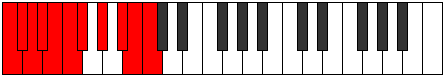 |
| [3455](https://ianring.com/musictheory/scales/3455) | [Ryptyllian](ModeANaturalRyptyllian.md) | A | A, A#, B, C, C#, D, D#, F, G, G#, A |  |
| [3477](https://ianring.com/musictheory/scales/3477) | [Kyptian](ModeFSharpKyptian.md) | F# | F#, G#, A#, B##, C##, D##, E#, F# |  |
| [3477](https://ianring.com/musictheory/scales/3477) | [Kyptian](ModeGFlatKyptian.md) | Gb | Gb, Ab, Bb, C#, D, E, F, Gb |  |
| [3479](https://ianring.com/musictheory/scales/3479) | [Rothyllic](ModeFSharpRothyllic.md) | F# | F#, G, G#, A#, C#, D, E, F, F# |  |
| [3479](https://ianring.com/musictheory/scales/3479) | [Rothyllic](ModeGFlatRothyllic.md) | Gb | Gb, G, Ab, Bb, Db, D, E, F, Gb |  |
| [3481](https://ianring.com/musictheory/scales/3481) | [Katathian](ModeASharpKatathian.md) | A# | A#, B##, C##, D###, E##, F###, G##, A# |  |
| [3481](https://ianring.com/musictheory/scales/3481) | [Katathian](ModeBFlatKatathian.md) | Bb | Bb, C#, D, E#, F#, G#, A, Bb |  |
| [3483](https://ianring.com/musictheory/scales/3483) | [Mixotharyllic](ModeASharpMixotharyllic.md) | A# | A#, B, C#, D, F, F#, G#, A, A# |  |
| [3483](https://ianring.com/musictheory/scales/3483) | [Mixotharyllic](ModeBFlatMixotharyllic.md) | Bb | Bb, B, Db, D, F, Gb, Ab, A, Bb |  |
| [3485](https://ianring.com/musictheory/scales/3485) | [Kyptyllic](ModeASharpKyptyllic.md) | A# | A#, C, C#, D, F, F#, G#, A, A# |  |
| [3485](https://ianring.com/musictheory/scales/3485) | [Kyptyllic](ModeBFlatKyptyllic.md) | Bb | Bb, C, Db, D, F, Gb, Ab, A, Bb |  |
| [3485](https://ianring.com/musictheory/scales/3485) | [Kyptyllic](ModeFSharpKyptyllic.md) | F# | F#, G#, A, A#, C#, D, E, F, F# |  |
| [3485](https://ianring.com/musictheory/scales/3485) | [Kyptyllic](ModeGFlatKyptyllic.md) | Gb | Gb, Ab, A, Bb, Db, D, E, F, Gb |  |
| [3487](https://ianring.com/musictheory/scales/3487) | [Byptygic](ModeFSharpByptygic.md) | F# | F#, G, G#, A, A#, C#, D, E, F, F# |  |
| [3487](https://ianring.com/musictheory/scales/3487) | [Byptygic](ModeGFlatByptygic.md) | Gb | Gb, G, Ab, A, Bb, Db, D, E, F, Gb |  |
| [3487](https://ianring.com/musictheory/scales/3487) | [Byptygic](ModeASharpByptygic.md) | A# | A#, B, C, C#, D, F, F#, G#, A, A# |  |
| [3487](https://ianring.com/musictheory/scales/3487) | [Byptygic](ModeBFlatByptygic.md) | Bb | Bb, B, C, Db, D, F, Gb, Ab, A, Bb |  |
| [3493](https://ianring.com/musictheory/scales/3493) | [Rathian](ModeDSharpRathian.md) | D# | D#, E#, F###, G###, A##, B##, C##, D# |  |
| [3493](https://ianring.com/musictheory/scales/3493) | [Rathian](ModeEFlatRathian.md) | Eb | Eb, F, G#, A#, B, C#, D, Eb |  |
| [3495](https://ianring.com/musictheory/scales/3495) | [Banyllic](ModeDSharpBanyllic.md) | D# | D#, E, F, G#, A#, B, C#, D, D# |  |
| [3495](https://ianring.com/musictheory/scales/3495) | [Banyllic](ModeEFlatBanyllic.md) | Eb | Eb, E, F, Ab, Bb, B, Db, D, Eb |  |
| [3495](https://ianring.com/musictheory/scales/3495) | [Banyllic](ModeCNaturalBanyllic.md) | C | C, C#, D, F, G, G#, A#, B, C |  |
| [3501](https://ianring.com/musictheory/scales/3501) | [Katodyllic](ModeDSharpKatodyllic.md) | D# | D#, F, F#, G#, A#, B, C#, D, D# |  |
| [3501](https://ianring.com/musictheory/scales/3501) | [Katodyllic](ModeEFlatKatodyllic.md) | Eb | Eb, F, Gb, Ab, Bb, B, Db, D, Eb |  |
| [3503](https://ianring.com/musictheory/scales/3503) | [Zyphygic](ModeDSharpZyphygic.md) | D# | D#, E, F, F#, G#, A#, B, C#, D, D# |  |
| [3503](https://ianring.com/musictheory/scales/3503) | [Zyphygic](ModeEFlatZyphygic.md) | Eb | Eb, E, F, Gb, Ab, Bb, B, Db, D, Eb |  |
| [3503](https://ianring.com/musictheory/scales/3503) | [Zyphygic](ModeCNaturalZyphygic.md) | C | C, C#, D, D#, F, G, G#, A#, B, C |  |
| [3507](https://ianring.com/musictheory/scales/3507) | [Ponyllic](ModeANaturalPonyllic.md) | A | A, A#, C#, D, E, F, G, G#, A |  |
| [3509](https://ianring.com/musictheory/scales/3509) | [Stogyllic](ModeFSharpStogyllic.md) | F# | F#, G#, A#, B, C#, D, E, F, F# |  |
| [3509](https://ianring.com/musictheory/scales/3509) | [Stogyllic](ModeGFlatStogyllic.md) | Gb | Gb, Ab, Bb, B, Db, D, E, F, Gb |  |
| [3509](https://ianring.com/musictheory/scales/3509) | [Stogyllic](ModeDSharpStogyllic.md) | D# | D#, F, G, G#, A#, B, C#, D, D# |  |
| [3509](https://ianring.com/musictheory/scales/3509) | [Stogyllic](ModeEFlatStogyllic.md) | Eb | Eb, F, G, Ab, Bb, B, Db, D, Eb |  |
| [3511](https://ianring.com/musictheory/scales/3511) | [Epolygic](ModeCNaturalEpolygic.md) | C | C, C#, D, E, F, G, G#, A#, B, C |  |
| [3511](https://ianring.com/musictheory/scales/3511) | [Epolygic](ModeDSharpEpolygic.md) | D# | D#, E, F, G, G#, A#, B, C#, D, D# |  |
| [3511](https://ianring.com/musictheory/scales/3511) | [Epolygic](ModeEFlatEpolygic.md) | Eb | Eb, E, F, G, Ab, Bb, B, Db, D, Eb |  |
| [3511](https://ianring.com/musictheory/scales/3511) | [Epolygic](ModeFSharpEpolygic.md) | F# | F#, G, G#, A#, B, C#, D, E, F, F# |  |
| [3511](https://ianring.com/musictheory/scales/3511) | [Epolygic](ModeGFlatEpolygic.md) | Gb | Gb, G, Ab, Bb, B, Db, D, E, F, Gb |  |
| [3511](https://ianring.com/musictheory/scales/3511) | [Epolygic](ModeANaturalEpolygic.md) | A | A, A#, B, C#, D, E, F, G, G#, A |  |
| [3513](https://ianring.com/musictheory/scales/3513) | [Dydyllic](ModeASharpDydyllic.md) | A# | A#, C#, D, D#, F, F#, G#, A, A# |  |
| [3513](https://ianring.com/musictheory/scales/3513) | [Dydyllic](ModeBFlatDydyllic.md) | Bb | Bb, Db, D, Eb, F, Gb, Ab, A, Bb |  |
| [3515](https://ianring.com/musictheory/scales/3515) | [Katodygic](ModeANaturalKatodygic.md) | A | A, A#, C, C#, D, E, F, G, G#, A |  |
| [3515](https://ianring.com/musictheory/scales/3515) | [Katodygic](ModeASharpKatodygic.md) | A# | A#, B, C#, D, D#, F, F#, G#, A, A# |  |
| [3515](https://ianring.com/musictheory/scales/3515) | [Katodygic](ModeBFlatKatodygic.md) | Bb | Bb, B, Db, D, Eb, F, Gb, Ab, A, Bb |  |
| [3517](https://ianring.com/musictheory/scales/3517) | [Epocrygic](ModeASharpEpocrygic.md) | A# | A#, C, C#, D, D#, F, F#, G#, A, A# |  |
| [3517](https://ianring.com/musictheory/scales/3517) | [Epocrygic](ModeBFlatEpocrygic.md) | Bb | Bb, C, Db, D, Eb, F, Gb, Ab, A, Bb |  |
| [3517](https://ianring.com/musictheory/scales/3517) | [Epocrygic](ModeDSharpEpocrygic.md) | D# | D#, F, F#, G, G#, A#, B, C#, D, D# |  |
| [3517](https://ianring.com/musictheory/scales/3517) | [Epocrygic](ModeEFlatEpocrygic.md) | Eb | Eb, F, Gb, G, Ab, Bb, B, Db, D, Eb |  |
| [3517](https://ianring.com/musictheory/scales/3517) | [Epocrygic](ModeFSharpEpocrygic.md) | F# | F#, G#, A, A#, B, C#, D, E, F, F# |  |
| [3517](https://ianring.com/musictheory/scales/3517) | [Epocrygic](ModeGFlatEpocrygic.md) | Gb | Gb, Ab, A, Bb, B, Db, D, E, F, Gb |  |
| [3519](https://ianring.com/musictheory/scales/3519) | [Boptyllian](ModeCNaturalBoptyllian.md) | C | C, C#, D, D#, E, F, G, G#, A#, B, C |  |
| [3519](https://ianring.com/musictheory/scales/3519) | [Boptyllian](ModeDSharpBoptyllian.md) | D# | D#, E, F, F#, G, G#, A#, B, C#, D, D# |  |
| [3519](https://ianring.com/musictheory/scales/3519) | [Boptyllian](ModeEFlatBoptyllian.md) | Eb | Eb, E, F, Gb, G, Ab, Bb, B, Db, D, Eb |  |
| [3519](https://ianring.com/musictheory/scales/3519) | [Boptyllian](ModeASharpBoptyllian.md) | A# | A#, B, C, C#, D, D#, F, F#, G#, A, A# |  |
| [3519](https://ianring.com/musictheory/scales/3519) | [Boptyllian](ModeBFlatBoptyllian.md) | Bb | Bb, B, C, Db, D, Eb, F, Gb, Ab, A, Bb |  |
| [3519](https://ianring.com/musictheory/scales/3519) | [Boptyllian](ModeANaturalBoptyllian.md) | A | A, A#, B, C, C#, D, E, F, G, G#, A |  |
| [3519](https://ianring.com/musictheory/scales/3519) | [Boptyllian](ModeFSharpBoptyllian.md) | F# | F#, G, G#, A, A#, B, C#, D, E, F, F# |  |
| [3519](https://ianring.com/musictheory/scales/3519) | [Boptyllian](ModeGFlatBoptyllian.md) | Gb | Gb, G, Ab, A, Bb, B, Db, D, E, F, Gb |  |
| [3529](https://ianring.com/musictheory/scales/3529) | [Stalian](ModeDNaturalStalian.md) | D | D, E#, F###, G##, A#, B#, C#, D |  |
| [3531](https://ianring.com/musictheory/scales/3531) | [Dycryllic](ModeGNaturalDycryllic.md) | G | G, G#, A#, C#, D, D#, F, F#, G |  |
| [3531](https://ianring.com/musictheory/scales/3531) | [Dycryllic](ModeDNaturalDycryllic.md) | D | D, D#, F, G#, A, A#, C, C#, D |  |
| [3533](https://ianring.com/musictheory/scales/3533) | [Thadyllic](ModeDNaturalThadyllic.md) | D | D, E, F, G#, A, A#, C, C#, D |  |
| [3535](https://ianring.com/musictheory/scales/3535) | [Aeroptygic](ModeDNaturalAeroptygic.md) | D | D, D#, E, F, G#, A, A#, C, C#, D |  |
| [3535](https://ianring.com/musictheory/scales/3535) | [Aeroptygic](ModeGNaturalAeroptygic.md) | G | G, G#, A, A#, C#, D, D#, F, F#, G |  |
| [3541](https://ianring.com/musictheory/scales/3541) | [Racryllic](ModeFSharpRacryllic.md) | F# | F#, G#, A#, C, C#, D, E, F, F# |  |
| [3541](https://ianring.com/musictheory/scales/3541) | [Racryllic](ModeGFlatRacryllic.md) | Gb | Gb, Ab, Bb, C, Db, D, E, F, Gb |  |
| [3543](https://ianring.com/musictheory/scales/3543) | [Aeolonygic](ModeFSharpAeolonygic.md) | F# | F#, G, G#, A#, C, C#, D, E, F, F# |  |
| [3543](https://ianring.com/musictheory/scales/3543) | [Aeolonygic](ModeGFlatAeolonygic.md) | Gb | Gb, G, Ab, Bb, C, Db, D, E, F, Gb |  |
| [3545](https://ianring.com/musictheory/scales/3545) | [Thyptyllic](ModeDNaturalThyptyllic.md) | D | D, F, F#, G#, A, A#, C, C#, D |  |
| [3545](https://ianring.com/musictheory/scales/3545) | [Thyptyllic](ModeASharpThyptyllic.md) | A# | A#, C#, D, E, F, F#, G#, A, A# |  |
| [3545](https://ianring.com/musictheory/scales/3545) | [Thyptyllic](ModeBFlatThyptyllic.md) | Bb | Bb, Db, D, E, F, Gb, Ab, A, Bb |  |
| [3547](https://ianring.com/musictheory/scales/3547) | [Sadygic](ModeDNaturalSadygic.md) | D | D, D#, F, F#, G#, A, A#, C, C#, D |  |
| [3547](https://ianring.com/musictheory/scales/3547) | [Sadygic](ModeGNaturalSadygic.md) | G | G, G#, A#, B, C#, D, D#, F, F#, G |  |
| [3547](https://ianring.com/musictheory/scales/3547) | [Sadygic](ModeASharpSadygic.md) | A# | A#, B, C#, D, E, F, F#, G#, A, A# |  |
| [3547](https://ianring.com/musictheory/scales/3547) | [Sadygic](ModeBFlatSadygic.md) | Bb | Bb, B, Db, D, E, F, Gb, Ab, A, Bb |  |
| [3549](https://ianring.com/musictheory/scales/3549) | [Phronygic](ModeDNaturalPhronygic.md) | D | D, E, F, F#, G#, A, A#, C, C#, D |  |
| [3549](https://ianring.com/musictheory/scales/3549) | [Phronygic](ModeFSharpPhronygic.md) | F# | F#, G#, A, A#, C, C#, D, E, F, F# |  |
| [3549](https://ianring.com/musictheory/scales/3549) | [Phronygic](ModeGFlatPhronygic.md) | Gb | Gb, Ab, A, Bb, C, Db, D, E, F, Gb |  |
| [3549](https://ianring.com/musictheory/scales/3549) | [Phronygic](ModeASharpPhronygic.md) | A# | A#, C, C#, D, E, F, F#, G#, A, A# |  |
| [3549](https://ianring.com/musictheory/scales/3549) | [Phronygic](ModeBFlatPhronygic.md) | Bb | Bb, C, Db, D, E, F, Gb, Ab, A, Bb |  |
| [3551](https://ianring.com/musictheory/scales/3551) | [Sagyllian](ModeDNaturalSagyllian.md) | D | D, D#, E, F, F#, G#, A, A#, C, C#, D |  |
| [3551](https://ianring.com/musictheory/scales/3551) | [Sagyllian](ModeFSharpSagyllian.md) | F# | F#, G, G#, A, A#, C, C#, D, E, F, F# |  |
| [3551](https://ianring.com/musictheory/scales/3551) | [Sagyllian](ModeGFlatSagyllian.md) | Gb | Gb, G, Ab, A, Bb, C, Db, D, E, F, Gb |  |
| [3551](https://ianring.com/musictheory/scales/3551) | [Sagyllian](ModeASharpSagyllian.md) | A# | A#, B, C, C#, D, E, F, F#, G#, A, A# |  |
| [3551](https://ianring.com/musictheory/scales/3551) | [Sagyllian](ModeBFlatSagyllian.md) | Bb | Bb, B, C, Db, D, E, F, Gb, Ab, A, Bb |  |
| [3551](https://ianring.com/musictheory/scales/3551) | [Sagyllian](ModeGNaturalSagyllian.md) | G | G, G#, A, A#, B, C#, D, D#, F, F#, G |  |
| [3557](https://ianring.com/musictheory/scales/3557) | [Thycryllic](ModeDSharpThycryllic.md) | D# | D#, F, G#, A, A#, B, C#, D, D# |  |
| [3557](https://ianring.com/musictheory/scales/3557) | [Thycryllic](ModeEFlatThycryllic.md) | Eb | Eb, F, Ab, A, Bb, B, Db, D, Eb |  |
| [3559](https://ianring.com/musictheory/scales/3559) | [Aerathygic](ModeCNaturalAerathygic.md) | C | C, C#, D, F, F#, G, G#, A#, B, C |  |
| [3559](https://ianring.com/musictheory/scales/3559) | [Aerathygic](ModeDSharpAerathygic.md) | D# | D#, E, F, G#, A, A#, B, C#, D, D# |  |
| [3559](https://ianring.com/musictheory/scales/3559) | [Aerathygic](ModeEFlatAerathygic.md) | Eb | Eb, E, F, Ab, A, Bb, B, Db, D, Eb |  |
| [3561](https://ianring.com/musictheory/scales/3561) | [Pothyllic](ModeDNaturalPothyllic.md) | D | D, F, G, G#, A, A#, C, C#, D |  |
| [3563](https://ianring.com/musictheory/scales/3563) | [Ionoptygic](ModeGNaturalIonoptygic.md) | G | G, G#, A#, C, C#, D, D#, F, F#, G |  |
| [3563](https://ianring.com/musictheory/scales/3563) | [Ionoptygic](ModeDNaturalIonoptygic.md) | D | D, D#, F, G, G#, A, A#, C, C#, D |  |
| [3565](https://ianring.com/musictheory/scales/3565) | [Aeolorygic](ModeDNaturalAeolorygic.md) | D | D, E, F, G, G#, A, A#, C, C#, D |  |
| [3565](https://ianring.com/musictheory/scales/3565) | [Aeolorygic](ModeDSharpAeolorygic.md) | D# | D#, F, F#, G#, A, A#, B, C#, D, D# | 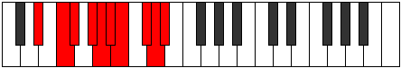 |
| [3565](https://ianring.com/musictheory/scales/3565) | [Aeolorygic](ModeEFlatAeolorygic.md) | Eb | Eb, F, Gb, Ab, A, Bb, B, Db, D, Eb |  |
| [3567](https://ianring.com/musictheory/scales/3567) | [Epityllian](ModeDNaturalEpityllian.md) | D | D, D#, E, F, G, G#, A, A#, C, C#, D |  |
| [3567](https://ianring.com/musictheory/scales/3567) | [Epityllian](ModeGNaturalEpityllian.md) | G | G, G#, A, A#, C, C#, D, D#, F, F#, G |  |
| [3567](https://ianring.com/musictheory/scales/3567) | [Epityllian](ModeCNaturalEpityllian.md) | C | C, C#, D, D#, F, F#, G, G#, A#, B, C |  |
| [3567](https://ianring.com/musictheory/scales/3567) | [Epityllian](ModeDSharpEpityllian.md) | D# | D#, E, F, F#, G#, A, A#, B, C#, D, D# |  |
| [3567](https://ianring.com/musictheory/scales/3567) | [Epityllian](ModeEFlatEpityllian.md) | Eb | Eb, E, F, Gb, Ab, A, Bb, B, Db, D, Eb |  |
| [3571](https://ianring.com/musictheory/scales/3571) | [Dyrygic](ModeANaturalDyrygic.md) | A | A, A#, C#, D, D#, E, F, G, G#, A |  |
| [3573](https://ianring.com/musictheory/scales/3573) | [Kaptygic](ModeFSharpKaptygic.md) | F# | F#, G#, A#, B, C, C#, D, E, F, F# |  |
| [3573](https://ianring.com/musictheory/scales/3573) | [Kaptygic](ModeGFlatKaptygic.md) | Gb | Gb, Ab, Bb, B, C, Db, D, E, F, Gb |  |
| [3573](https://ianring.com/musictheory/scales/3573) | [Kaptygic](ModeDSharpKaptygic.md) | D# | D#, F, G, G#, A, A#, B, C#, D, D# |  |
| [3573](https://ianring.com/musictheory/scales/3573) | [Kaptygic](ModeEFlatKaptygic.md) | Eb | Eb, F, G, Ab, A, Bb, B, Db, D, Eb |  |
| [3575](https://ianring.com/musictheory/scales/3575) | [Mogyllian](ModeCNaturalMogyllian.md) | C | C, C#, D, E, F, F#, G, G#, A#, B, C |  |
| [3575](https://ianring.com/musictheory/scales/3575) | [Mogyllian](ModeFSharpMogyllian.md) | F# | F#, G, G#, A#, B, C, C#, D, E, F, F# |  |
| [3575](https://ianring.com/musictheory/scales/3575) | [Mogyllian](ModeGFlatMogyllian.md) | Gb | Gb, G, Ab, Bb, B, C, Db, D, E, F, Gb |  |
| [3575](https://ianring.com/musictheory/scales/3575) | [Mogyllian](ModeDSharpMogyllian.md) | D# | D#, E, F, G, G#, A, A#, B, C#, D, D# |  |
| [3575](https://ianring.com/musictheory/scales/3575) | [Mogyllian](ModeEFlatMogyllian.md) | Eb | Eb, E, F, G, Ab, A, Bb, B, Db, D, Eb |  |
| [3575](https://ianring.com/musictheory/scales/3575) | [Mogyllian](ModeANaturalMogyllian.md) | A | A, A#, B, C#, D, D#, E, F, G, G#, A |  |
| [3577](https://ianring.com/musictheory/scales/3577) | [Loptygic](ModeASharpLoptygic.md) | A# | A#, C#, D, D#, E, F, F#, G#, A, A# |  |
| [3577](https://ianring.com/musictheory/scales/3577) | [Loptygic](ModeBFlatLoptygic.md) | Bb | Bb, Db, D, Eb, E, F, Gb, Ab, A, Bb |  |
| [3577](https://ianring.com/musictheory/scales/3577) | [Loptygic](ModeDNaturalLoptygic.md) | D | D, F, F#, G, G#, A, A#, C, C#, D |  |
| [3579](https://ianring.com/musictheory/scales/3579) | [Zyphyllian](ModeANaturalZyphyllian.md) | A | A, A#, C, C#, D, D#, E, F, G, G#, A |  |
| [3579](https://ianring.com/musictheory/scales/3579) | [Zyphyllian](ModeDNaturalZyphyllian.md) | D | D, D#, F, F#, G, G#, A, A#, C, C#, D |  |
| [3579](https://ianring.com/musictheory/scales/3579) | [Zyphyllian](ModeGNaturalZyphyllian.md) | G | G, G#, A#, B, C, C#, D, D#, F, F#, G |  |
| [3579](https://ianring.com/musictheory/scales/3579) | [Zyphyllian](ModeASharpZyphyllian.md) | A# | A#, B, C#, D, D#, E, F, F#, G#, A, A# |  |
| [3579](https://ianring.com/musictheory/scales/3579) | [Zyphyllian](ModeBFlatZyphyllian.md) | Bb | Bb, B, Db, D, Eb, E, F, Gb, Ab, A, Bb |  |
| [3581](https://ianring.com/musictheory/scales/3581) | [Epocryllian](ModeASharpEpocryllian.md) | A# | A#, C, C#, D, D#, E, F, F#, G#, A, A# |  |
| [3581](https://ianring.com/musictheory/scales/3581) | [Epocryllian](ModeBFlatEpocryllian.md) | Bb | Bb, C, Db, D, Eb, E, F, Gb, Ab, A, Bb |  |
| [3581](https://ianring.com/musictheory/scales/3581) | [Epocryllian](ModeDNaturalEpocryllian.md) | D | D, E, F, F#, G, G#, A, A#, C, C#, D |  |
| [3581](https://ianring.com/musictheory/scales/3581) | [Epocryllian](ModeFSharpEpocryllian.md) | F# | F#, G#, A, A#, B, C, C#, D, E, F, F# |  |
| [3581](https://ianring.com/musictheory/scales/3581) | [Epocryllian](ModeGFlatEpocryllian.md) | Gb | Gb, Ab, A, Bb, B, C, Db, D, E, F, Gb |  |
| [3581](https://ianring.com/musictheory/scales/3581) | [Epocryllian](ModeDSharpEpocryllian.md) | D# | D#, F, F#, G, G#, A, A#, B, C#, D, D# |  |
| [3581](https://ianring.com/musictheory/scales/3581) | [Epocryllian](ModeEFlatEpocryllian.md) | Eb | Eb, F, Gb, G, Ab, A, Bb, B, Db, D, Eb |  |
| [3583](https://ianring.com/musictheory/scales/3583) | [Zylatic](ModeDNaturalZylatic.md) | D | D, D#, E, F, F#, G, G#, A, A#, C, C#, D |  |
| [3583](https://ianring.com/musictheory/scales/3583) | [Zylatic](ModeCNaturalZylatic.md) | C | C, C#, D, D#, E, F, F#, G, G#, A#, B, C |  |
| [3583](https://ianring.com/musictheory/scales/3583) | [Zylatic](ModeASharpZylatic.md) | A# | A#, B, C, C#, D, D#, E, F, F#, G#, A, A# |  |
| [3583](https://ianring.com/musictheory/scales/3583) | [Zylatic](ModeBFlatZylatic.md) | Bb | Bb, B, C, Db, D, Eb, E, F, Gb, Ab, A, Bb |  |
| [3583](https://ianring.com/musictheory/scales/3583) | [Zylatic](ModeANaturalZylatic.md) | A | A, A#, B, C, C#, D, D#, E, F, G, G#, A |  |
| [3583](https://ianring.com/musictheory/scales/3583) | [Zylatic](ModeGNaturalZylatic.md) | G | G, G#, A, A#, B, C, C#, D, D#, F, F#, G |  |
| [3583](https://ianring.com/musictheory/scales/3583) | [Zylatic](ModeFSharpZylatic.md) | F# | F#, G, G#, A, A#, B, C, C#, D, E, F, F# |  |
| [3583](https://ianring.com/musictheory/scales/3583) | [Zylatic](ModeGFlatZylatic.md) | Gb | Gb, G, Ab, A, Bb, B, C, Db, D, E, F, Gb |  |
| [3583](https://ianring.com/musictheory/scales/3583) | [Zylatic](ModeDSharpZylatic.md) | D# | D#, E, F, F#, G, G#, A, A#, B, C#, D, D# |  |
| [3583](https://ianring.com/musictheory/scales/3583) | [Zylatic](ModeEFlatZylatic.md) | Eb | Eb, E, F, Gb, G, Ab, A, Bb, B, Db, D, Eb |  |
| [3661](https://ianring.com/musictheory/scales/3661) | [Mixodorian](ModeBNaturalMixodorian.md) | B | B, C#, D, E#, F###, G##, A#, B |  |
| [3663](https://ianring.com/musictheory/scales/3663) | [Sonyllic](ModeBNaturalSonyllic.md) | B | B, C, C#, D, F, G#, A, A#, B |  |
| [3667](https://ianring.com/musictheory/scales/3667) | [Kaptian](ModeENaturalKaptian.md) | E | E, F, G#, A#, B##, C##, D#, E |  |
| [3671](https://ianring.com/musictheory/scales/3671) | [Aeonyllic](ModeENaturalAeonyllic.md) | E | E, F, F#, G#, A#, C#, D, D#, E |  |
| [3675](https://ianring.com/musictheory/scales/3675) | [Monyllic](ModeENaturalMonyllic.md) | E | E, F, G, G#, A#, C#, D, D#, E |  |
| [3677](https://ianring.com/musictheory/scales/3677) | [Katylyllic](ModeBNaturalKatylyllic.md) | B | B, C#, D, D#, F, G#, A, A#, B |  |
| [3679](https://ianring.com/musictheory/scales/3679) | [Rycrygic](ModeENaturalRycrygic.md) | E | E, F, F#, G, G#, A#, C#, D, D#, E |  |
| [3679](https://ianring.com/musictheory/scales/3679) | [Rycrygic](ModeBNaturalRycrygic.md) | B | B, C, C#, D, D#, F, G#, A, A#, B |  |
| [3685](https://ianring.com/musictheory/scales/3685) | [Kodian](ModeGSharpKodian.md) | G# | G#, A#, B##, C##, D###, E##, F##, G# |  |
| [3685](https://ianring.com/musictheory/scales/3685) | [Kodian](ModeAFlatKodian.md) | Ab | Ab, Bb, C#, D, E#, F#, G, Ab |  |
| [3687](https://ianring.com/musictheory/scales/3687) | [Zonyllic](ModeGSharpZonyllic.md) | G# | G#, A, A#, C#, D, F, F#, G, G# |  |
| [3687](https://ianring.com/musictheory/scales/3687) | [Zonyllic](ModeAFlatZonyllic.md) | Ab | Ab, A, Bb, Db, D, F, Gb, G, Ab |  |
| [3693](https://ianring.com/musictheory/scales/3693) | [Epaptyllic](ModeGSharpEpaptyllic.md) | G# | G#, A#, B, C#, D, F, F#, G, G# |  |
| [3693](https://ianring.com/musictheory/scales/3693) | [Epaptyllic](ModeAFlatEpaptyllic.md) | Ab | Ab, Bb, B, Db, D, F, Gb, G, Ab |  |
| [3693](https://ianring.com/musictheory/scales/3693) | [Epaptyllic](ModeBNaturalEpaptyllic.md) | B | B, C#, D, E, F, G#, A, A#, B |  |
| [3695](https://ianring.com/musictheory/scales/3695) | [Kodygic](ModeBNaturalKodygic.md) | B | B, C, C#, D, E, F, G#, A, A#, B |  |
| [3695](https://ianring.com/musictheory/scales/3695) | [Kodygic](ModeGSharpKodygic.md) | G# | G#, A, A#, B, C#, D, F, F#, G, G# |  |
| [3695](https://ianring.com/musictheory/scales/3695) | [Kodygic](ModeAFlatKodygic.md) | Ab | Ab, A, Bb, B, Db, D, F, Gb, G, Ab |  |
| [3699](https://ianring.com/musictheory/scales/3699) | [Aeolylyllic](ModeENaturalAeolylyllic.md) | E | E, F, G#, A, A#, C#, D, D#, E |  |
| [3701](https://ianring.com/musictheory/scales/3701) | [Bagyllic](ModeGSharpBagyllic.md) | G# | G#, A#, C, C#, D, F, F#, G, G# |  |
| [3701](https://ianring.com/musictheory/scales/3701) | [Bagyllic](ModeAFlatBagyllic.md) | Ab | Ab, Bb, C, Db, D, F, Gb, G, Ab |  |
| [3703](https://ianring.com/musictheory/scales/3703) | [Katalygic](ModeENaturalKatalygic.md) | E | E, F, F#, G#, A, A#, C#, D, D#, E |  |
| [3703](https://ianring.com/musictheory/scales/3703) | [Katalygic](ModeGSharpKatalygic.md) | G# | G#, A, A#, C, C#, D, F, F#, G, G# |  |
| [3703](https://ianring.com/musictheory/scales/3703) | [Katalygic](ModeAFlatKatalygic.md) | Ab | Ab, A, Bb, C, Db, D, F, Gb, G, Ab |  |
| [3707](https://ianring.com/musictheory/scales/3707) | [Rynygic](ModeENaturalRynygic.md) | E | E, F, G, G#, A, A#, C#, D, D#, E |  |
| [3709](https://ianring.com/musictheory/scales/3709) | [Locrygic](ModeGSharpLocrygic.md) | G# | G#, A#, B, C, C#, D, F, F#, G, G# |  |
| [3709](https://ianring.com/musictheory/scales/3709) | [Locrygic](ModeAFlatLocrygic.md) | Ab | Ab, Bb, B, C, Db, D, F, Gb, G, Ab |  |
| [3709](https://ianring.com/musictheory/scales/3709) | [Locrygic](ModeBNaturalLocrygic.md) | B | B, C#, D, D#, E, F, G#, A, A#, B |  |
| [3711](https://ianring.com/musictheory/scales/3711) | [Dycryllian](ModeENaturalDycryllian.md) | E | E, F, F#, G, G#, A, A#, C#, D, D#, E |  |
| [3711](https://ianring.com/musictheory/scales/3711) | [Dycryllian](ModeBNaturalDycryllian.md) | B | B, C, C#, D, D#, E, F, G#, A, A#, B |  |
| [3711](https://ianring.com/musictheory/scales/3711) | [Dycryllian](ModeGSharpDycryllian.md) | G# | G#, A, A#, B, C, C#, D, F, F#, G, G# |  |
| [3711](https://ianring.com/musictheory/scales/3711) | [Dycryllian](ModeAFlatDycryllian.md) | Ab | Ab, A, Bb, B, C, Db, D, F, Gb, G, Ab |  |
| [3731](https://ianring.com/musictheory/scales/3731) | [Aeryrian](ModeCSharpAeryrian.md) | C# | C#, D, E#, F###, G###, A##, B#, C# |  |
| [3731](https://ianring.com/musictheory/scales/3731) | [Aeryrian](ModeDFlatAeryrian.md) | Db | Db, Ebb, F, G#, A#, B, C, Db |  |
| [3735](https://ianring.com/musictheory/scales/3735) | [Ionagyllic](ModeCSharpIonagyllic.md) | C# | C#, D, D#, F, G#, A#, B, C, C# |  |
| [3735](https://ianring.com/musictheory/scales/3735) | [Ionagyllic](ModeDFlatIonagyllic.md) | Db | Db, D, Eb, F, Ab, Bb, B, C, Db |  |
| [3737](https://ianring.com/musictheory/scales/3737) | [Phrocrian](ModeASharpPhrocrian.md) | A# | A#, B##, C##, D###, E###, F###, G##, A# |  |
| [3737](https://ianring.com/musictheory/scales/3737) | [Phrocrian](ModeBFlatPhrocrian.md) | Bb | Bb, C#, D, E#, F##, G#, A, Bb |  |
| [3739](https://ianring.com/musictheory/scales/3739) | [Ioninyllic](ModeCSharpIoninyllic.md) | C# | C#, D, E, F, G#, A#, B, C, C# |  |
| [3739](https://ianring.com/musictheory/scales/3739) | [Ioninyllic](ModeDFlatIoninyllic.md) | Db | Db, D, E, F, Ab, Bb, B, C, Db |  |
| [3739](https://ianring.com/musictheory/scales/3739) | [Ioninyllic](ModeASharpIoninyllic.md) | A# | A#, B, C#, D, F, G, G#, A, A# |  |
| [3739](https://ianring.com/musictheory/scales/3739) | [Ioninyllic](ModeBFlatIoninyllic.md) | Bb | Bb, B, Db, D, F, G, Ab, A, Bb |  |
| [3741](https://ianring.com/musictheory/scales/3741) | [Zydyllic](ModeASharpZydyllic.md) | A# | A#, C, C#, D, F, G, G#, A, A# |  |
| [3741](https://ianring.com/musictheory/scales/3741) | [Zydyllic](ModeBFlatZydyllic.md) | Bb | Bb, C, Db, D, F, G, Ab, A, Bb |  |
| [3743](https://ianring.com/musictheory/scales/3743) | [Thadygic](ModeCSharpThadygic.md) | C# | C#, D, D#, E, F, G#, A#, B, C, C# |  |
| [3743](https://ianring.com/musictheory/scales/3743) | [Thadygic](ModeDFlatThadygic.md) | Db | Db, D, Eb, E, F, Ab, Bb, B, C, Db |  |
| [3743](https://ianring.com/musictheory/scales/3743) | [Thadygic](ModeASharpThadygic.md) | A# | A#, B, C, C#, D, F, G, G#, A, A# |  |
| [3743](https://ianring.com/musictheory/scales/3743) | [Thadygic](ModeBFlatThadygic.md) | Bb | Bb, B, C, Db, D, F, G, Ab, A, Bb |  |
| [3749](https://ianring.com/musictheory/scales/3749) | [Zothian](ModeDSharpZothian.md) | D# | D#, E#, F###, G###, A###, B##, C##, D# |  |
| [3749](https://ianring.com/musictheory/scales/3749) | [Zothian](ModeEFlatZothian.md) | Eb | Eb, F, G#, A#, B#, C#, D, Eb |  |
| [3751](https://ianring.com/musictheory/scales/3751) | [Aerathyllic](ModeDSharpAerathyllic.md) | D# | D#, E, F, G#, A#, C, C#, D, D# |  |
| [3751](https://ianring.com/musictheory/scales/3751) | [Aerathyllic](ModeEFlatAerathyllic.md) | Eb | Eb, E, F, Ab, Bb, C, Db, D, Eb |  |
| [3757](https://ianring.com/musictheory/scales/3757) | [Goptyllic](ModeDSharpGoptyllic.md) | D# | D#, F, F#, G#, A#, C, C#, D, D# |  |
| [3757](https://ianring.com/musictheory/scales/3757) | [Goptyllic](ModeEFlatGoptyllic.md) | Eb | Eb, F, Gb, Ab, Bb, C, Db, D, Eb |  |
| [3759](https://ianring.com/musictheory/scales/3759) | [Darygic](ModeDSharpDarygic.md) | D# | D#, E, F, F#, G#, A#, C, C#, D, D# |  |
| [3759](https://ianring.com/musictheory/scales/3759) | [Darygic](ModeEFlatDarygic.md) | Eb | Eb, E, F, Gb, Ab, Bb, C, Db, D, Eb |  |
| [3763](https://ianring.com/musictheory/scales/3763) | [Modyllic](ModeCSharpModyllic.md) | C# | C#, D, F, F#, G#, A#, B, C, C# |  |
| [3763](https://ianring.com/musictheory/scales/3763) | [Modyllic](ModeDFlatModyllic.md) | Db | Db, D, F, Gb, Ab, Bb, B, C, Db |  |
| [3765](https://ianring.com/musictheory/scales/3765) | [Aerycryllic](ModeDSharpAerycryllic.md) | D# | D#, F, G, G#, A#, C, C#, D, D# |  |
| [3765](https://ianring.com/musictheory/scales/3765) | [Aerycryllic](ModeEFlatAerycryllic.md) | Eb | Eb, F, G, Ab, Bb, C, Db, D, Eb |  |
| [3767](https://ianring.com/musictheory/scales/3767) | [Bacrygic](ModeDSharpBacrygic.md) | D# | D#, E, F, G, G#, A#, C, C#, D, D# |  |
| [3767](https://ianring.com/musictheory/scales/3767) | [Bacrygic](ModeEFlatBacrygic.md) | Eb | Eb, E, F, G, Ab, Bb, C, Db, D, Eb |  |
| [3767](https://ianring.com/musictheory/scales/3767) | [Bacrygic](ModeCSharpBacrygic.md) | C# | C#, D, D#, F, F#, G#, A#, B, C, C# |  |
| [3767](https://ianring.com/musictheory/scales/3767) | [Bacrygic](ModeDFlatBacrygic.md) | Db | Db, D, Eb, F, Gb, Ab, Bb, B, C, Db |  |
| [3769](https://ianring.com/musictheory/scales/3769) | [Aeracryllic](ModeASharpAeracryllic.md) | A# | A#, C#, D, D#, F, G, G#, A, A# |  |
| [3769](https://ianring.com/musictheory/scales/3769) | [Aeracryllic](ModeBFlatAeracryllic.md) | Bb | Bb, Db, D, Eb, F, G, Ab, A, Bb |  |
| [3771](https://ianring.com/musictheory/scales/3771) | [Stophygic](ModeCSharpStophygic.md) | C# | C#, D, E, F, F#, G#, A#, B, C, C# |  |
| [3771](https://ianring.com/musictheory/scales/3771) | [Stophygic](ModeDFlatStophygic.md) | Db | Db, D, E, F, Gb, Ab, Bb, B, C, Db |  |
| [3771](https://ianring.com/musictheory/scales/3771) | [Stophygic](ModeASharpStophygic.md) | A# | A#, B, C#, D, D#, F, G, G#, A, A# |  |
| [3771](https://ianring.com/musictheory/scales/3771) | [Stophygic](ModeBFlatStophygic.md) | Bb | Bb, B, Db, D, Eb, F, G, Ab, A, Bb |  |
| [3773](https://ianring.com/musictheory/scales/3773) | [Sorygic](ModeDSharpSorygic.md) | D# | D#, F, F#, G, G#, A#, C, C#, D, D# |  |
| [3773](https://ianring.com/musictheory/scales/3773) | [Sorygic](ModeEFlatSorygic.md) | Eb | Eb, F, Gb, G, Ab, Bb, C, Db, D, Eb |  |
| [3773](https://ianring.com/musictheory/scales/3773) | [Sorygic](ModeASharpSorygic.md) | A# | A#, C, C#, D, D#, F, G, G#, A, A# |  |
| [3773](https://ianring.com/musictheory/scales/3773) | [Sorygic](ModeBFlatSorygic.md) | Bb | Bb, C, Db, D, Eb, F, G, Ab, A, Bb |  |
| [3775](https://ianring.com/musictheory/scales/3775) | [Loptyllian](ModeDSharpLoptyllian.md) | D# | D#, E, F, F#, G, G#, A#, C, C#, D, D# |  |
| [3775](https://ianring.com/musictheory/scales/3775) | [Loptyllian](ModeEFlatLoptyllian.md) | Eb | Eb, E, F, Gb, G, Ab, Bb, C, Db, D, Eb |  |
| [3775](https://ianring.com/musictheory/scales/3775) | [Loptyllian](ModeCSharpLoptyllian.md) | C# | C#, D, D#, E, F, F#, G#, A#, B, C, C# |  |
| [3775](https://ianring.com/musictheory/scales/3775) | [Loptyllian](ModeDFlatLoptyllian.md) | Db | Db, D, Eb, E, F, Gb, Ab, Bb, B, C, Db |  |
| [3775](https://ianring.com/musictheory/scales/3775) | [Loptyllian](ModeASharpLoptyllian.md) | A# | A#, B, C, C#, D, D#, F, G, G#, A, A# |  |
| [3775](https://ianring.com/musictheory/scales/3775) | [Loptyllian](ModeBFlatLoptyllian.md) | Bb | Bb, B, C, Db, D, Eb, F, G, Ab, A, Bb |  |
| [3787](https://ianring.com/musictheory/scales/3787) | [Kagyllic](ModeGNaturalKagyllic.md) | G | G, G#, A#, C#, D, E, F, F#, G |  |
| [3789](https://ianring.com/musictheory/scales/3789) | [Eporyllic](ModeBNaturalEporyllic.md) | B | B, C#, D, F, F#, G#, A, A#, B |  |
| [3791](https://ianring.com/musictheory/scales/3791) | [Stodygic](ModeGNaturalStodygic.md) | G | G, G#, A, A#, C#, D, E, F, F#, G |  |
| [3791](https://ianring.com/musictheory/scales/3791) | [Stodygic](ModeBNaturalStodygic.md) | B | B, C, C#, D, F, F#, G#, A, A#, B |  |
| [3795](https://ianring.com/musictheory/scales/3795) | [Epothyllic](ModeENaturalEpothyllic.md) | E | E, F, G#, A#, B, C#, D, D#, E |  |
| [3795](https://ianring.com/musictheory/scales/3795) | [Epothyllic](ModeCSharpEpothyllic.md) | C# | C#, D, F, G, G#, A#, B, C, C# |  |
| [3795](https://ianring.com/musictheory/scales/3795) | [Epothyllic](ModeDFlatEpothyllic.md) | Db | Db, D, F, G, Ab, Bb, B, C, Db |  |
| [3799](https://ianring.com/musictheory/scales/3799) | [Aeralygic](ModeENaturalAeralygic.md) | E | E, F, F#, G#, A#, B, C#, D, D#, E |  |
| [3799](https://ianring.com/musictheory/scales/3799) | [Aeralygic](ModeCSharpAeralygic.md) | C# | C#, D, D#, F, G, G#, A#, B, C, C# |  |
| [3799](https://ianring.com/musictheory/scales/3799) | [Aeralygic](ModeDFlatAeralygic.md) | Db | Db, D, Eb, F, G, Ab, Bb, B, C, Db |  |
| [3801](https://ianring.com/musictheory/scales/3801) | [Maptyllic](ModeASharpMaptyllic.md) | A# | A#, C#, D, E, F, G, G#, A, A# |  |
| [3801](https://ianring.com/musictheory/scales/3801) | [Maptyllic](ModeBFlatMaptyllic.md) | Bb | Bb, Db, D, E, F, G, Ab, A, Bb |  |
| [3803](https://ianring.com/musictheory/scales/3803) | [Epidygic](ModeCSharpEpidygic.md) | C# | C#, D, E, F, G, G#, A#, B, C, C# |  |
| [3803](https://ianring.com/musictheory/scales/3803) | [Epidygic](ModeDFlatEpidygic.md) | Db | Db, D, E, F, G, Ab, Bb, B, C, Db |  |
| [3803](https://ianring.com/musictheory/scales/3803) | [Epidygic](ModeENaturalEpidygic.md) | E | E, F, G, G#, A#, B, C#, D, D#, E |  |
| [3803](https://ianring.com/musictheory/scales/3803) | [Epidygic](ModeGNaturalEpidygic.md) | G | G, G#, A#, B, C#, D, E, F, F#, G |  |
| [3803](https://ianring.com/musictheory/scales/3803) | [Epidygic](ModeASharpEpidygic.md) | A# | A#, B, C#, D, E, F, G, G#, A, A# |  |
| [3803](https://ianring.com/musictheory/scales/3803) | [Epidygic](ModeBFlatEpidygic.md) | Bb | Bb, B, Db, D, E, F, G, Ab, A, Bb |  |
| [3805](https://ianring.com/musictheory/scales/3805) | [Moptygic](ModeASharpMoptygic.md) | A# | A#, C, C#, D, E, F, G, G#, A, A# |  |
| [3805](https://ianring.com/musictheory/scales/3805) | [Moptygic](ModeBFlatMoptygic.md) | Bb | Bb, C, Db, D, E, F, G, Ab, A, Bb |  |
| [3805](https://ianring.com/musictheory/scales/3805) | [Moptygic](ModeBNaturalMoptygic.md) | B | B, C#, D, D#, F, F#, G#, A, A#, B |  |
| [3807](https://ianring.com/musictheory/scales/3807) | [Bagyllian](ModeCSharpBagyllian.md) | C# | C#, D, D#, E, F, G, G#, A#, B, C, C# |  |
| [3807](https://ianring.com/musictheory/scales/3807) | [Bagyllian](ModeDFlatBagyllian.md) | Db | Db, D, Eb, E, F, G, Ab, Bb, B, C, Db |  |
| [3807](https://ianring.com/musictheory/scales/3807) | [Bagyllian](ModeENaturalBagyllian.md) | E | E, F, F#, G, G#, A#, B, C#, D, D#, E |  |
| [3807](https://ianring.com/musictheory/scales/3807) | [Bagyllian](ModeBNaturalBagyllian.md) | B | B, C, C#, D, D#, F, F#, G#, A, A#, B |  |
| [3807](https://ianring.com/musictheory/scales/3807) | [Bagyllian](ModeASharpBagyllian.md) | A# | A#, B, C, C#, D, E, F, G, G#, A, A# |  |
| [3807](https://ianring.com/musictheory/scales/3807) | [Bagyllian](ModeBFlatBagyllian.md) | Bb | Bb, B, C, Db, D, E, F, G, Ab, A, Bb |  |
| [3807](https://ianring.com/musictheory/scales/3807) | [Bagyllian](ModeGNaturalBagyllian.md) | G | G, G#, A, A#, B, C#, D, E, F, F#, G |  |
| [3813](https://ianring.com/musictheory/scales/3813) | [Aeologyllic](ModeGSharpAeologyllic.md) | G# | G#, A#, C#, D, D#, F, F#, G, G# |  |
| [3813](https://ianring.com/musictheory/scales/3813) | [Aeologyllic](ModeAFlatAeologyllic.md) | Ab | Ab, Bb, Db, D, Eb, F, Gb, G, Ab |  |
| [3813](https://ianring.com/musictheory/scales/3813) | [Aeologyllic](ModeDSharpAeologyllic.md) | D# | D#, F, G#, A, A#, C, C#, D, D# |  |
| [3813](https://ianring.com/musictheory/scales/3813) | [Aeologyllic](ModeEFlatAeologyllic.md) | Eb | Eb, F, Ab, A, Bb, C, Db, D, Eb |  |
| [3815](https://ianring.com/musictheory/scales/3815) | [Mylygic](ModeDSharpMylygic.md) | D# | D#, E, F, G#, A, A#, C, C#, D, D# |  |
| [3815](https://ianring.com/musictheory/scales/3815) | [Mylygic](ModeEFlatMylygic.md) | Eb | Eb, E, F, Ab, A, Bb, C, Db, D, Eb |  |
| [3815](https://ianring.com/musictheory/scales/3815) | [Mylygic](ModeGSharpMylygic.md) | G# | G#, A, A#, C#, D, D#, F, F#, G, G# |  |
| [3815](https://ianring.com/musictheory/scales/3815) | [Mylygic](ModeAFlatMylygic.md) | Ab | Ab, A, Bb, Db, D, Eb, F, Gb, G, Ab |  |
| [3819](https://ianring.com/musictheory/scales/3819) | [Aeolanygic](ModeGNaturalAeolanygic.md) | G | G, G#, A#, C, C#, D, E, F, F#, G |  |
| [3821](https://ianring.com/musictheory/scales/3821) | [Epyrygic](ModeDSharpEpyrygic.md) | D# | D#, F, F#, G#, A, A#, C, C#, D, D# |  |
| [3821](https://ianring.com/musictheory/scales/3821) | [Epyrygic](ModeEFlatEpyrygic.md) | Eb | Eb, F, Gb, Ab, A, Bb, C, Db, D, Eb |  |
| [3821](https://ianring.com/musictheory/scales/3821) | [Epyrygic](ModeGSharpEpyrygic.md) | G# | G#, A#, B, C#, D, D#, F, F#, G, G# |  |
| [3821](https://ianring.com/musictheory/scales/3821) | [Epyrygic](ModeAFlatEpyrygic.md) | Ab | Ab, Bb, B, Db, D, Eb, F, Gb, G, Ab |  |
| [3821](https://ianring.com/musictheory/scales/3821) | [Epyrygic](ModeBNaturalEpyrygic.md) | B | B, C#, D, E, F, F#, G#, A, A#, B |  |
| [3823](https://ianring.com/musictheory/scales/3823) | [Epinyllian](ModeDSharpEpinyllian.md) | D# | D#, E, F, F#, G#, A, A#, C, C#, D, D# |  |
| [3823](https://ianring.com/musictheory/scales/3823) | [Epinyllian](ModeEFlatEpinyllian.md) | Eb | Eb, E, F, Gb, Ab, A, Bb, C, Db, D, Eb |  |
| [3823](https://ianring.com/musictheory/scales/3823) | [Epinyllian](ModeGNaturalEpinyllian.md) | G | G, G#, A, A#, C, C#, D, E, F, F#, G |  |
| [3823](https://ianring.com/musictheory/scales/3823) | [Epinyllian](ModeBNaturalEpinyllian.md) | B | B, C, C#, D, E, F, F#, G#, A, A#, B |  |
| [3823](https://ianring.com/musictheory/scales/3823) | [Epinyllian](ModeGSharpEpinyllian.md) | G# | G#, A, A#, B, C#, D, D#, F, F#, G, G# |  |
| [3823](https://ianring.com/musictheory/scales/3823) | [Epinyllian](ModeAFlatEpinyllian.md) | Ab | Ab, A, Bb, B, Db, D, Eb, F, Gb, G, Ab |  |
| [3827](https://ianring.com/musictheory/scales/3827) | [Dorygic](ModeCSharpDorygic.md) | C# | C#, D, F, F#, G, G#, A#, B, C, C# |  |
| [3827](https://ianring.com/musictheory/scales/3827) | [Dorygic](ModeDFlatDorygic.md) | Db | Db, D, F, Gb, G, Ab, Bb, B, C, Db |  |
| [3827](https://ianring.com/musictheory/scales/3827) | [Dorygic](ModeENaturalDorygic.md) | E | E, F, G#, A, A#, B, C#, D, D#, E |  |
| [3829](https://ianring.com/musictheory/scales/3829) | [Aerycrygic](ModeGSharpAerycrygic.md) | G# | G#, A#, C, C#, D, D#, F, F#, G, G# |  |
| [3829](https://ianring.com/musictheory/scales/3829) | [Aerycrygic](ModeAFlatAerycrygic.md) | Ab | Ab, Bb, C, Db, D, Eb, F, Gb, G, Ab |  |
| [3829](https://ianring.com/musictheory/scales/3829) | [Aerycrygic](ModeDSharpAerycrygic.md) | D# | D#, F, G, G#, A, A#, C, C#, D, D# |  |
| [3829](https://ianring.com/musictheory/scales/3829) | [Aerycrygic](ModeEFlatAerycrygic.md) | Eb | Eb, F, G, Ab, A, Bb, C, Db, D, Eb |  |
| [3831](https://ianring.com/musictheory/scales/3831) | [Ionyllian](ModeDSharpIonyllian.md) | D# | D#, E, F, G, G#, A, A#, C, C#, D, D# |  |
| [3831](https://ianring.com/musictheory/scales/3831) | [Ionyllian](ModeEFlatIonyllian.md) | Eb | Eb, E, F, G, Ab, A, Bb, C, Db, D, Eb |  |
| [3831](https://ianring.com/musictheory/scales/3831) | [Ionyllian](ModeGSharpIonyllian.md) | G# | G#, A, A#, C, C#, D, D#, F, F#, G, G# |  |
| [3831](https://ianring.com/musictheory/scales/3831) | [Ionyllian](ModeAFlatIonyllian.md) | Ab | Ab, A, Bb, C, Db, D, Eb, F, Gb, G, Ab |  |
| [3831](https://ianring.com/musictheory/scales/3831) | [Ionyllian](ModeCSharpIonyllian.md) | C# | C#, D, D#, F, F#, G, G#, A#, B, C, C# |  |
| [3831](https://ianring.com/musictheory/scales/3831) | [Ionyllian](ModeDFlatIonyllian.md) | Db | Db, D, Eb, F, Gb, G, Ab, Bb, B, C, Db |  |
| [3831](https://ianring.com/musictheory/scales/3831) | [Ionyllian](ModeENaturalIonyllian.md) | E | E, F, F#, G#, A, A#, B, C#, D, D#, E |  |
| [3833](https://ianring.com/musictheory/scales/3833) | [Dycrygic](ModeASharpDycrygic.md) | A# | A#, C#, D, D#, E, F, G, G#, A, A# |  |
| [3833](https://ianring.com/musictheory/scales/3833) | [Dycrygic](ModeBFlatDycrygic.md) | Bb | Bb, Db, D, Eb, E, F, G, Ab, A, Bb |  |
| [3835](https://ianring.com/musictheory/scales/3835) | [Katodyllian](ModeCSharpKatodyllian.md) | C# | C#, D, E, F, F#, G, G#, A#, B, C, C# |  |
| [3835](https://ianring.com/musictheory/scales/3835) | [Katodyllian](ModeDFlatKatodyllian.md) | Db | Db, D, E, F, Gb, G, Ab, Bb, B, C, Db |  |
| [3835](https://ianring.com/musictheory/scales/3835) | [Katodyllian](ModeGNaturalKatodyllian.md) | G | G, G#, A#, B, C, C#, D, E, F, F#, G |  |
| [3835](https://ianring.com/musictheory/scales/3835) | [Katodyllian](ModeENaturalKatodyllian.md) | E | E, F, G, G#, A, A#, B, C#, D, D#, E |  |
| [3835](https://ianring.com/musictheory/scales/3835) | [Katodyllian](ModeASharpKatodyllian.md) | A# | A#, B, C#, D, D#, E, F, G, G#, A, A# |  |
| [3835](https://ianring.com/musictheory/scales/3835) | [Katodyllian](ModeBFlatKatodyllian.md) | Bb | Bb, B, Db, D, Eb, E, F, G, Ab, A, Bb |  |
| [3837](https://ianring.com/musictheory/scales/3837) | [Garyllian](ModeASharpGaryllian.md) | A# | A#, C, C#, D, D#, E, F, G, G#, A, A# |  |
| [3837](https://ianring.com/musictheory/scales/3837) | [Garyllian](ModeBFlatGaryllian.md) | Bb | Bb, C, Db, D, Eb, E, F, G, Ab, A, Bb |  |
| [3837](https://ianring.com/musictheory/scales/3837) | [Garyllian](ModeDSharpGaryllian.md) | D# | D#, F, F#, G, G#, A, A#, C, C#, D, D# |  |
| [3837](https://ianring.com/musictheory/scales/3837) | [Garyllian](ModeEFlatGaryllian.md) | Eb | Eb, F, Gb, G, Ab, A, Bb, C, Db, D, Eb |  |
| [3837](https://ianring.com/musictheory/scales/3837) | [Garyllian](ModeGSharpGaryllian.md) | G# | G#, A#, B, C, C#, D, D#, F, F#, G, G# |  |
| [3837](https://ianring.com/musictheory/scales/3837) | [Garyllian](ModeAFlatGaryllian.md) | Ab | Ab, Bb, B, C, Db, D, Eb, F, Gb, G, Ab |  |
| [3837](https://ianring.com/musictheory/scales/3837) | [Garyllian](ModeBNaturalGaryllian.md) | B | B, C#, D, D#, E, F, F#, G#, A, A#, B |  |
| [3839](https://ianring.com/musictheory/scales/3839) | [Mixolatic](ModeDSharpMixolatic.md) | D# | D#, E, F, F#, G, G#, A, A#, C, C#, D, D# |  |
| [3839](https://ianring.com/musictheory/scales/3839) | [Mixolatic](ModeEFlatMixolatic.md) | Eb | Eb, E, F, Gb, G, Ab, A, Bb, C, Db, D, Eb |  |
| [3839](https://ianring.com/musictheory/scales/3839) | [Mixolatic](ModeCSharpMixolatic.md) | C# | C#, D, D#, E, F, F#, G, G#, A#, B, C, C# |  |
| [3839](https://ianring.com/musictheory/scales/3839) | [Mixolatic](ModeDFlatMixolatic.md) | Db | Db, D, Eb, E, F, Gb, G, Ab, Bb, B, C, Db |  |
| [3839](https://ianring.com/musictheory/scales/3839) | [Mixolatic](ModeBNaturalMixolatic.md) | B | B, C, C#, D, D#, E, F, F#, G#, A, A#, B |  |
| [3839](https://ianring.com/musictheory/scales/3839) | [Mixolatic](ModeASharpMixolatic.md) | A# | A#, B, C, C#, D, D#, E, F, G, G#, A, A# |  |
| [3839](https://ianring.com/musictheory/scales/3839) | [Mixolatic](ModeBFlatMixolatic.md) | Bb | Bb, B, C, Db, D, Eb, E, F, G, Ab, A, Bb |  |
| [3839](https://ianring.com/musictheory/scales/3839) | [Mixolatic](ModeGSharpMixolatic.md) | G# | G#, A, A#, B, C, C#, D, D#, F, F#, G, G# |  |
| [3839](https://ianring.com/musictheory/scales/3839) | [Mixolatic](ModeAFlatMixolatic.md) | Ab | Ab, A, Bb, B, C, Db, D, Eb, F, Gb, G, Ab |  |
| [3839](https://ianring.com/musictheory/scales/3839) | [Mixolatic](ModeGNaturalMixolatic.md) | G | G, G#, A, A#, B, C, C#, D, E, F, F#, G |  |
| [3839](https://ianring.com/musictheory/scales/3839) | [Mixolatic](ModeENaturalMixolatic.md) | E | E, F, F#, G, G#, A, A#, B, C#, D, D#, E |  |
| [3879](https://ianring.com/musictheory/scales/3879) | [Pathyllic](ModeCNaturalPathyllic.md) | C | C, C#, D, F, G#, A, A#, B, C |  |
| [3881](https://ianring.com/musictheory/scales/3881) | [Morian](ModeFNaturalMorian.md) | F | F, G#, A#, B##, C##, D#, E, F |  |
| [3883](https://ianring.com/musictheory/scales/3883) | [Kyryllic](ModeFNaturalKyryllic.md) | F | F, F#, G#, A#, C#, D, D#, E, F |  |
| [3885](https://ianring.com/musictheory/scales/3885) | [Styryllic](ModeFNaturalStyryllic.md) | F | F, G, G#, A#, C#, D, D#, E, F |  |
| [3887](https://ianring.com/musictheory/scales/3887) | [Phrathygic](ModeFNaturalPhrathygic.md) | F | F, F#, G, G#, A#, C#, D, D#, E, F |  |
| [3887](https://ianring.com/musictheory/scales/3887) | [Phrathygic](ModeCNaturalPhrathygic.md) | C | C, C#, D, D#, F, G#, A, A#, B, C |  |
| [3891](https://ianring.com/musictheory/scales/3891) | [Ryryllic](ModeANaturalRyryllic.md) | A | A, A#, C#, D, F, F#, G, G#, A |  |
| [3895](https://ianring.com/musictheory/scales/3895) | [Eparygic](ModeCNaturalEparygic.md) | C | C, C#, D, E, F, G#, A, A#, B, C |  |
| [3895](https://ianring.com/musictheory/scales/3895) | [Eparygic](ModeANaturalEparygic.md) | A | A, A#, B, C#, D, F, F#, G, G#, A |  |
| [3897](https://ianring.com/musictheory/scales/3897) | [Locryllic](ModeFNaturalLocryllic.md) | F | F, G#, A, A#, C#, D, D#, E, F |  |
| [3899](https://ianring.com/musictheory/scales/3899) | [Katorygic](ModeFNaturalKatorygic.md) | F | F, F#, G#, A, A#, C#, D, D#, E, F |  |
| [3899](https://ianring.com/musictheory/scales/3899) | [Katorygic](ModeANaturalKatorygic.md) | A | A, A#, C, C#, D, F, F#, G, G#, A |  |
| [3901](https://ianring.com/musictheory/scales/3901) | [Bycrygic](ModeFNaturalBycrygic.md) | F | F, G, G#, A, A#, C#, D, D#, E, F |  |
| [3903](https://ianring.com/musictheory/scales/3903) | [Aeogyllian](ModeFNaturalAeogyllian.md) | F | F, F#, G, G#, A, A#, C#, D, D#, E, F |  |
| [3903](https://ianring.com/musictheory/scales/3903) | [Aeogyllian](ModeCNaturalAeogyllian.md) | C | C, C#, D, D#, E, F, G#, A, A#, B, C |  |
| [3903](https://ianring.com/musictheory/scales/3903) | [Aeogyllian](ModeANaturalAeogyllian.md) | A | A, A#, B, C, C#, D, F, F#, G, G#, A |  |
| [3913](https://ianring.com/musictheory/scales/3913) | [Bonian](ModeDNaturalBonian.md) | D | D, E#, F###, G###, A##, B#, C#, D |  |
| [3915](https://ianring.com/musictheory/scales/3915) | [Gogyllic](ModeDNaturalGogyllic.md) | D | D, D#, F, G#, A#, B, C, C#, D |  |
| [3917](https://ianring.com/musictheory/scales/3917) | [Epaphyllic](ModeDNaturalEpaphyllic.md) | D | D, E, F, G#, A#, B, C, C#, D |  |
| [3917](https://ianring.com/musictheory/scales/3917) | [Epaphyllic](ModeBNaturalEpaphyllic.md) | B | B, C#, D, F, G, G#, A, A#, B |  |
| [3919](https://ianring.com/musictheory/scales/3919) | [Lynygic](ModeDNaturalLynygic.md) | D | D, D#, E, F, G#, A#, B, C, C#, D |  |
| [3919](https://ianring.com/musictheory/scales/3919) | [Lynygic](ModeBNaturalLynygic.md) | B | B, C, C#, D, F, G, G#, A, A#, B |  |
| [3923](https://ianring.com/musictheory/scales/3923) | [Stoptyllic](ModeENaturalStoptyllic.md) | E | E, F, G#, A#, C, C#, D, D#, E |  |
| [3927](https://ianring.com/musictheory/scales/3927) | [Monygic](ModeENaturalMonygic.md) | E | E, F, F#, G#, A#, C, C#, D, D#, E |  |
| [3929](https://ianring.com/musictheory/scales/3929) | [Aeolothyllic](ModeDNaturalAeolothyllic.md) | D | D, F, F#, G#, A#, B, C, C#, D |  |
| [3931](https://ianring.com/musictheory/scales/3931) | [Aerygic](ModeENaturalAerygic.md) | E | E, F, G, G#, A#, C, C#, D, D#, E |  |
| [3931](https://ianring.com/musictheory/scales/3931) | [Aerygic](ModeDNaturalAerygic.md) | D | D, D#, F, F#, G#, A#, B, C, C#, D |  |
| [3933](https://ianring.com/musictheory/scales/3933) | [Ionidygic](ModeDNaturalIonidygic.md) | D | D, E, F, F#, G#, A#, B, C, C#, D |  |
| [3933](https://ianring.com/musictheory/scales/3933) | [Ionidygic](ModeBNaturalIonidygic.md) | B | B, C#, D, D#, F, G, G#, A, A#, B |  |
| [3935](https://ianring.com/musictheory/scales/3935) | [Kataphyllian](ModeENaturalKataphyllian.md) | E | E, F, F#, G, G#, A#, C, C#, D, D#, E |  |
| [3935](https://ianring.com/musictheory/scales/3935) | [Kataphyllian](ModeDNaturalKataphyllian.md) | D | D, D#, E, F, F#, G#, A#, B, C, C#, D |  |
| [3935](https://ianring.com/musictheory/scales/3935) | [Kataphyllian](ModeBNaturalKataphyllian.md) | B | B, C, C#, D, D#, F, G, G#, A, A#, B |  |
| [3941](https://ianring.com/musictheory/scales/3941) | [Stathyllic](ModeGSharpStathyllic.md) | G# | G#, A#, C#, D, E, F, F#, G, G# |  |
| [3941](https://ianring.com/musictheory/scales/3941) | [Stathyllic](ModeAFlatStathyllic.md) | Ab | Ab, Bb, Db, D, E, F, Gb, G, Ab |  |
| [3943](https://ianring.com/musictheory/scales/3943) | [Zynygic](ModeGSharpZynygic.md) | G# | G#, A, A#, C#, D, E, F, F#, G, G# |  |
| [3943](https://ianring.com/musictheory/scales/3943) | [Zynygic](ModeAFlatZynygic.md) | Ab | Ab, A, Bb, Db, D, E, F, Gb, G, Ab |  |
| [3943](https://ianring.com/musictheory/scales/3943) | [Zynygic](ModeCNaturalZynygic.md) | C | C, C#, D, F, F#, G#, A, A#, B, C |  |
| [3945](https://ianring.com/musictheory/scales/3945) | [Lydyllic](ModeFNaturalLydyllic.md) | F | F, G#, A#, B, C#, D, D#, E, F |  |
| [3945](https://ianring.com/musictheory/scales/3945) | [Lydyllic](ModeDNaturalLydyllic.md) | D | D, F, G, G#, A#, B, C, C#, D |  |
| [3947](https://ianring.com/musictheory/scales/3947) | [Ryptygic](ModeFNaturalRyptygic.md) | F | F, F#, G#, A#, B, C#, D, D#, E, F |  |
| [3947](https://ianring.com/musictheory/scales/3947) | [Ryptygic](ModeDNaturalRyptygic.md) | D | D, D#, F, G, G#, A#, B, C, C#, D |  |
| [3949](https://ianring.com/musictheory/scales/3949) | [Koptygic](ModeDNaturalKoptygic.md) | D | D, E, F, G, G#, A#, B, C, C#, D |  |
| [3949](https://ianring.com/musictheory/scales/3949) | [Koptygic](ModeFNaturalKoptygic.md) | F | F, G, G#, A#, B, C#, D, D#, E, F |  |
| [3949](https://ianring.com/musictheory/scales/3949) | [Koptygic](ModeGSharpKoptygic.md) | G# | G#, A#, B, C#, D, E, F, F#, G, G# |  |
| [3949](https://ianring.com/musictheory/scales/3949) | [Koptygic](ModeAFlatKoptygic.md) | Ab | Ab, Bb, B, Db, D, E, F, Gb, G, Ab |  |
| [3949](https://ianring.com/musictheory/scales/3949) | [Koptygic](ModeBNaturalKoptygic.md) | B | B, C#, D, E, F, G, G#, A, A#, B |  |
| [3951](https://ianring.com/musictheory/scales/3951) | [Mathyllian](ModeDNaturalMathyllian.md) | D | D, D#, E, F, G, G#, A#, B, C, C#, D |  |
| [3951](https://ianring.com/musictheory/scales/3951) | [Mathyllian](ModeFNaturalMathyllian.md) | F | F, F#, G, G#, A#, B, C#, D, D#, E, F |  |
| [3951](https://ianring.com/musictheory/scales/3951) | [Mathyllian](ModeCNaturalMathyllian.md) | C | C, C#, D, D#, F, F#, G#, A, A#, B, C |  |
| [3951](https://ianring.com/musictheory/scales/3951) | [Mathyllian](ModeBNaturalMathyllian.md) | B | B, C, C#, D, E, F, G, G#, A, A#, B |  |
| [3951](https://ianring.com/musictheory/scales/3951) | [Mathyllian](ModeGSharpMathyllian.md) | G# | G#, A, A#, B, C#, D, E, F, F#, G, G# |  |
| [3951](https://ianring.com/musictheory/scales/3951) | [Mathyllian](ModeAFlatMathyllian.md) | Ab | Ab, A, Bb, B, Db, D, E, F, Gb, G, Ab |  |
| [3955](https://ianring.com/musictheory/scales/3955) | [Galygic](ModeENaturalGalygic.md) | E | E, F, G#, A, A#, C, C#, D, D#, E |  |
| [3955](https://ianring.com/musictheory/scales/3955) | [Galygic](ModeANaturalGalygic.md) | A | A, A#, C#, D, D#, F, F#, G, G#, A |  |
| [3957](https://ianring.com/musictheory/scales/3957) | [Porygic](ModeGSharpPorygic.md) | G# | G#, A#, C, C#, D, E, F, F#, G, G# |  |
| [3957](https://ianring.com/musictheory/scales/3957) | [Porygic](ModeAFlatPorygic.md) | Ab | Ab, Bb, C, Db, D, E, F, Gb, G, Ab |  |
| [3959](https://ianring.com/musictheory/scales/3959) | [Katagyllian](ModeENaturalKatagyllian.md) | E | E, F, F#, G#, A, A#, C, C#, D, D#, E |  |
| [3959](https://ianring.com/musictheory/scales/3959) | [Katagyllian](ModeGSharpKatagyllian.md) | G# | G#, A, A#, C, C#, D, E, F, F#, G, G# |  |
| [3959](https://ianring.com/musictheory/scales/3959) | [Katagyllian](ModeAFlatKatagyllian.md) | Ab | Ab, A, Bb, C, Db, D, E, F, Gb, G, Ab |  |
| [3959](https://ianring.com/musictheory/scales/3959) | [Katagyllian](ModeCNaturalKatagyllian.md) | C | C, C#, D, E, F, F#, G#, A, A#, B, C |  |
| [3959](https://ianring.com/musictheory/scales/3959) | [Katagyllian](ModeANaturalKatagyllian.md) | A | A, A#, B, C#, D, D#, F, F#, G, G#, A |  |
| [3961](https://ianring.com/musictheory/scales/3961) | [Mixolydygic](ModeDNaturalMixolydygic.md) | D | D, F, F#, G, G#, A#, B, C, C#, D |  |
| [3961](https://ianring.com/musictheory/scales/3961) | [Mixolydygic](ModeFNaturalMixolydygic.md) | F | F, G#, A, A#, B, C#, D, D#, E, F |  |
| [3963](https://ianring.com/musictheory/scales/3963) | [Aeoryllian](ModeENaturalAeoryllian.md) | E | E, F, G, G#, A, A#, C, C#, D, D#, E |  |
| [3963](https://ianring.com/musictheory/scales/3963) | [Aeoryllian](ModeANaturalAeoryllian.md) | A | A, A#, C, C#, D, D#, F, F#, G, G#, A |  |
| [3963](https://ianring.com/musictheory/scales/3963) | [Aeoryllian](ModeDNaturalAeoryllian.md) | D | D, D#, F, F#, G, G#, A#, B, C, C#, D |  |
| [3963](https://ianring.com/musictheory/scales/3963) | [Aeoryllian](ModeFNaturalAeoryllian.md) | F | F, F#, G#, A, A#, B, C#, D, D#, E, F |  |
| [3965](https://ianring.com/musictheory/scales/3965) | [Thydyllian](ModeDNaturalThydyllian.md) | D | D, E, F, F#, G, G#, A#, B, C, C#, D |  |
| [3965](https://ianring.com/musictheory/scales/3965) | [Thydyllian](ModeGSharpThydyllian.md) | G# | G#, A#, B, C, C#, D, E, F, F#, G, G# |  |
| [3965](https://ianring.com/musictheory/scales/3965) | [Thydyllian](ModeAFlatThydyllian.md) | Ab | Ab, Bb, B, C, Db, D, E, F, Gb, G, Ab |  |
| [3965](https://ianring.com/musictheory/scales/3965) | [Thydyllian](ModeFNaturalThydyllian.md) | F | F, G, G#, A, A#, B, C#, D, D#, E, F |  |
| [3965](https://ianring.com/musictheory/scales/3965) | [Thydyllian](ModeBNaturalThydyllian.md) | B | B, C#, D, D#, E, F, G, G#, A, A#, B |  |
| [3967](https://ianring.com/musictheory/scales/3967) | [Soratic](ModeENaturalSoratic.md) | E | E, F, F#, G, G#, A, A#, C, C#, D, D#, E |  |
| [3967](https://ianring.com/musictheory/scales/3967) | [Soratic](ModeDNaturalSoratic.md) | D | D, D#, E, F, F#, G, G#, A#, B, C, C#, D |  |
| [3967](https://ianring.com/musictheory/scales/3967) | [Soratic](ModeCNaturalSoratic.md) | C | C, C#, D, D#, E, F, F#, G#, A, A#, B, C |  |
| [3967](https://ianring.com/musictheory/scales/3967) | [Soratic](ModeBNaturalSoratic.md) | B | B, C, C#, D, D#, E, F, G, G#, A, A#, B |  |
| [3967](https://ianring.com/musictheory/scales/3967) | [Soratic](ModeANaturalSoratic.md) | A | A, A#, B, C, C#, D, D#, F, F#, G, G#, A |  |
| [3967](https://ianring.com/musictheory/scales/3967) | [Soratic](ModeGSharpSoratic.md) | G# | G#, A, A#, B, C, C#, D, E, F, F#, G, G# |  |
| [3967](https://ianring.com/musictheory/scales/3967) | [Soratic](ModeAFlatSoratic.md) | Ab | Ab, A, Bb, B, C, Db, D, E, F, Gb, G, Ab |  |
| [3967](https://ianring.com/musictheory/scales/3967) | [Soratic](ModeFNaturalSoratic.md) | F | F, F#, G, G#, A, A#, B, C#, D, D#, E, F |  |
| [3987](https://ianring.com/musictheory/scales/3987) | [Loryllic](ModeCSharpLoryllic.md) | C# | C#, D, F, G#, A, A#, B, C, C# |  |
| [3987](https://ianring.com/musictheory/scales/3987) | [Loryllic](ModeDFlatLoryllic.md) | Db | Db, D, F, Ab, A, Bb, B, C, Db |  |
| [3989](https://ianring.com/musictheory/scales/3989) | [Sythyllic](ModeFSharpSythyllic.md) | F# | F#, G#, A#, C#, D, D#, E, F, F# |  |
| [3989](https://ianring.com/musictheory/scales/3989) | [Sythyllic](ModeGFlatSythyllic.md) | Gb | Gb, Ab, Bb, Db, D, Eb, E, F, Gb |  |
| [3991](https://ianring.com/musictheory/scales/3991) | [Badygic](ModeFSharpBadygic.md) | F# | F#, G, G#, A#, C#, D, D#, E, F, F# |  |
| [3991](https://ianring.com/musictheory/scales/3991) | [Badygic](ModeGFlatBadygic.md) | Gb | Gb, G, Ab, Bb, Db, D, Eb, E, F, Gb |  |
| [3991](https://ianring.com/musictheory/scales/3991) | [Badygic](ModeCSharpBadygic.md) | C# | C#, D, D#, F, G#, A, A#, B, C, C# |  |
| [3991](https://ianring.com/musictheory/scales/3991) | [Badygic](ModeDFlatBadygic.md) | Db | Db, D, Eb, F, Ab, A, Bb, B, C, Db |  |
| [3993](https://ianring.com/musictheory/scales/3993) | [Ioniptyllic](ModeASharpIoniptyllic.md) | A# | A#, C#, D, F, F#, G, G#, A, A# |  |
| [3993](https://ianring.com/musictheory/scales/3993) | [Ioniptyllic](ModeBFlatIoniptyllic.md) | Bb | Bb, Db, D, F, Gb, G, Ab, A, Bb |  |
| [3995](https://ianring.com/musictheory/scales/3995) | [Ionygic](ModeCSharpIonygic.md) | C# | C#, D, E, F, G#, A, A#, B, C, C# |  |
| [3995](https://ianring.com/musictheory/scales/3995) | [Ionygic](ModeDFlatIonygic.md) | Db | Db, D, E, F, Ab, A, Bb, B, C, Db |  |
| [3995](https://ianring.com/musictheory/scales/3995) | [Ionygic](ModeASharpIonygic.md) | A# | A#, B, C#, D, F, F#, G, G#, A, A# | 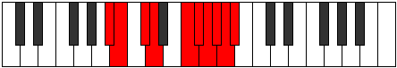 |
| [3995](https://ianring.com/musictheory/scales/3995) | [Ionygic](ModeBFlatIonygic.md) | Bb | Bb, B, Db, D, F, Gb, G, Ab, A, Bb |  |
| [3997](https://ianring.com/musictheory/scales/3997) | [Dogygic](ModeFSharpDogygic.md) | F# | F#, G#, A, A#, C#, D, D#, E, F, F# |  |
| [3997](https://ianring.com/musictheory/scales/3997) | [Dogygic](ModeGFlatDogygic.md) | Gb | Gb, Ab, A, Bb, Db, D, Eb, E, F, Gb |  |
| [3997](https://ianring.com/musictheory/scales/3997) | [Dogygic](ModeASharpDogygic.md) | A# | A#, C, C#, D, F, F#, G, G#, A, A# |  |
| [3997](https://ianring.com/musictheory/scales/3997) | [Dogygic](ModeBFlatDogygic.md) | Bb | Bb, C, Db, D, F, Gb, G, Ab, A, Bb |  |
| [3999](https://ianring.com/musictheory/scales/3999) | [Dydyllian](ModeFSharpDydyllian.md) | F# | F#, G, G#, A, A#, C#, D, D#, E, F, F# |  |
| [3999](https://ianring.com/musictheory/scales/3999) | [Dydyllian](ModeGFlatDydyllian.md) | Gb | Gb, G, Ab, A, Bb, Db, D, Eb, E, F, Gb |  |
| [3999](https://ianring.com/musictheory/scales/3999) | [Dydyllian](ModeCSharpDydyllian.md) | C# | C#, D, D#, E, F, G#, A, A#, B, C, C# |  |
| [3999](https://ianring.com/musictheory/scales/3999) | [Dydyllian](ModeDFlatDydyllian.md) | Db | Db, D, Eb, E, F, Ab, A, Bb, B, C, Db |  |
| [3999](https://ianring.com/musictheory/scales/3999) | [Dydyllian](ModeASharpDydyllian.md) | A# | A#, B, C, C#, D, F, F#, G, G#, A, A# |  |
| [3999](https://ianring.com/musictheory/scales/3999) | [Dydyllian](ModeBFlatDydyllian.md) | Bb | Bb, B, C, Db, D, F, Gb, G, Ab, A, Bb |  |
| [4005](https://ianring.com/musictheory/scales/4005) | [Phradyllic](ModeDSharpPhradyllic.md) | D# | D#, F, G#, A#, B, C, C#, D, D# |  |
| [4005](https://ianring.com/musictheory/scales/4005) | [Phradyllic](ModeEFlatPhradyllic.md) | Eb | Eb, F, Ab, Bb, B, C, Db, D, Eb |  |
| [4007](https://ianring.com/musictheory/scales/4007) | [Doptygic](ModeDSharpDoptygic.md) | D# | D#, E, F, G#, A#, B, C, C#, D, D# |  |
| [4007](https://ianring.com/musictheory/scales/4007) | [Doptygic](ModeEFlatDoptygic.md) | Eb | Eb, E, F, Ab, Bb, B, C, Db, D, Eb |  |
| [4007](https://ianring.com/musictheory/scales/4007) | [Doptygic](ModeCNaturalDoptygic.md) | C | C, C#, D, F, G, G#, A, A#, B, C |  |
| [4009](https://ianring.com/musictheory/scales/4009) | [Phranyllic](ModeFNaturalPhranyllic.md) | F | F, G#, A#, C, C#, D, D#, E, F |  |
| [4011](https://ianring.com/musictheory/scales/4011) | [Styrygic](ModeFNaturalStyrygic.md) | F | F, F#, G#, A#, C, C#, D, D#, E, F |  |
| [4013](https://ianring.com/musictheory/scales/4013) | [Dathygic](ModeFNaturalDathygic.md) | F | F, G, G#, A#, C, C#, D, D#, E, F |  |
| [4013](https://ianring.com/musictheory/scales/4013) | [Dathygic](ModeDSharpDathygic.md) | D# | D#, F, F#, G#, A#, B, C, C#, D, D# |  |
| [4013](https://ianring.com/musictheory/scales/4013) | [Dathygic](ModeEFlatDathygic.md) | Eb | Eb, F, Gb, Ab, Bb, B, C, Db, D, Eb |  |
| [4015](https://ianring.com/musictheory/scales/4015) | [Phradyllian](ModeFNaturalPhradyllian.md) | F | F, F#, G, G#, A#, C, C#, D, D#, E, F |  |
| [4015](https://ianring.com/musictheory/scales/4015) | [Phradyllian](ModeDSharpPhradyllian.md) | D# | D#, E, F, F#, G#, A#, B, C, C#, D, D# |  |
| [4015](https://ianring.com/musictheory/scales/4015) | [Phradyllian](ModeEFlatPhradyllian.md) | Eb | Eb, E, F, Gb, Ab, Bb, B, C, Db, D, Eb |  |
| [4015](https://ianring.com/musictheory/scales/4015) | [Phradyllian](ModeCNaturalPhradyllian.md) | C | C, C#, D, D#, F, G, G#, A, A#, B, C |  |
| [4019](https://ianring.com/musictheory/scales/4019) | [Lonygic](ModeANaturalLonygic.md) | A | A, A#, C#, D, E, F, F#, G, G#, A |  |
| [4019](https://ianring.com/musictheory/scales/4019) | [Lonygic](ModeCSharpLonygic.md) | C# | C#, D, F, F#, G#, A, A#, B, C, C# |  |
| [4019](https://ianring.com/musictheory/scales/4019) | [Lonygic](ModeDFlatLonygic.md) | Db | Db, D, F, Gb, Ab, A, Bb, B, C, Db |  |
| [4021](https://ianring.com/musictheory/scales/4021) | [Bagygic](ModeFSharpBagygic.md) | F# | F#, G#, A#, B, C#, D, D#, E, F, F# |  |
| [4021](https://ianring.com/musictheory/scales/4021) | [Bagygic](ModeGFlatBagygic.md) | Gb | Gb, Ab, Bb, B, Db, D, Eb, E, F, Gb |  |
| [4021](https://ianring.com/musictheory/scales/4021) | [Bagygic](ModeDSharpBagygic.md) | D# | D#, F, G, G#, A#, B, C, C#, D, D# |  |
| [4021](https://ianring.com/musictheory/scales/4021) | [Bagygic](ModeEFlatBagygic.md) | Eb | Eb, F, G, Ab, Bb, B, C, Db, D, Eb |  |
| [4023](https://ianring.com/musictheory/scales/4023) | [Styptyllian](ModeDSharpStyptyllian.md) | D# | D#, E, F, G, G#, A#, B, C, C#, D, D# |  |
| [4023](https://ianring.com/musictheory/scales/4023) | [Styptyllian](ModeEFlatStyptyllian.md) | Eb | Eb, E, F, G, Ab, Bb, B, C, Db, D, Eb |  |
| [4023](https://ianring.com/musictheory/scales/4023) | [Styptyllian](ModeFSharpStyptyllian.md) | F# | F#, G, G#, A#, B, C#, D, D#, E, F, F# |  |
| [4023](https://ianring.com/musictheory/scales/4023) | [Styptyllian](ModeGFlatStyptyllian.md) | Gb | Gb, G, Ab, Bb, B, Db, D, Eb, E, F, Gb |  |
| [4023](https://ianring.com/musictheory/scales/4023) | [Styptyllian](ModeCSharpStyptyllian.md) | C# | C#, D, D#, F, F#, G#, A, A#, B, C, C# |  |
| [4023](https://ianring.com/musictheory/scales/4023) | [Styptyllian](ModeDFlatStyptyllian.md) | Db | Db, D, Eb, F, Gb, Ab, A, Bb, B, C, Db |  |
| [4023](https://ianring.com/musictheory/scales/4023) | [Styptyllian](ModeCNaturalStyptyllian.md) | C | C, C#, D, E, F, G, G#, A, A#, B, C |  |
| [4023](https://ianring.com/musictheory/scales/4023) | [Styptyllian](ModeANaturalStyptyllian.md) | A | A, A#, B, C#, D, E, F, F#, G, G#, A |  |
| [4025](https://ianring.com/musictheory/scales/4025) | [Kalygic](ModeFNaturalKalygic.md) | F | F, G#, A, A#, C, C#, D, D#, E, F |  |
| [4025](https://ianring.com/musictheory/scales/4025) | [Kalygic](ModeASharpKalygic.md) | A# | A#, C#, D, D#, F, F#, G, G#, A, A# |  |
| [4025](https://ianring.com/musictheory/scales/4025) | [Kalygic](ModeBFlatKalygic.md) | Bb | Bb, Db, D, Eb, F, Gb, G, Ab, A, Bb |  |
| [4027](https://ianring.com/musictheory/scales/4027) | [Ragyllian](ModeFNaturalRagyllian.md) | F | F, F#, G#, A, A#, C, C#, D, D#, E, F |  |
| [4027](https://ianring.com/musictheory/scales/4027) | [Ragyllian](ModeANaturalRagyllian.md) | A | A, A#, C, C#, D, E, F, F#, G, G#, A |  |
| [4027](https://ianring.com/musictheory/scales/4027) | [Ragyllian](ModeCSharpRagyllian.md) | C# | C#, D, E, F, F#, G#, A, A#, B, C, C# |  |
| [4027](https://ianring.com/musictheory/scales/4027) | [Ragyllian](ModeDFlatRagyllian.md) | Db | Db, D, E, F, Gb, Ab, A, Bb, B, C, Db |  |
| [4027](https://ianring.com/musictheory/scales/4027) | [Ragyllian](ModeASharpRagyllian.md) | A# | A#, B, C#, D, D#, F, F#, G, G#, A, A# |  |
| [4027](https://ianring.com/musictheory/scales/4027) | [Ragyllian](ModeBFlatRagyllian.md) | Bb | Bb, B, Db, D, Eb, F, Gb, G, Ab, A, Bb |  |
| [4029](https://ianring.com/musictheory/scales/4029) | [Aerycryllian](ModeFNaturalAerycryllian.md) | F | F, G, G#, A, A#, C, C#, D, D#, E, F |  |
| [4029](https://ianring.com/musictheory/scales/4029) | [Aerycryllian](ModeASharpAerycryllian.md) | A# | A#, C, C#, D, D#, F, F#, G, G#, A, A# |  |
| [4029](https://ianring.com/musictheory/scales/4029) | [Aerycryllian](ModeBFlatAerycryllian.md) | Bb | Bb, C, Db, D, Eb, F, Gb, G, Ab, A, Bb |  |
| [4029](https://ianring.com/musictheory/scales/4029) | [Aerycryllian](ModeDSharpAerycryllian.md) | D# | D#, F, F#, G, G#, A#, B, C, C#, D, D# |  |
| [4029](https://ianring.com/musictheory/scales/4029) | [Aerycryllian](ModeEFlatAerycryllian.md) | Eb | Eb, F, Gb, G, Ab, Bb, B, C, Db, D, Eb |  |
| [4029](https://ianring.com/musictheory/scales/4029) | [Aerycryllian](ModeFSharpAerycryllian.md) | F# | F#, G#, A, A#, B, C#, D, D#, E, F, F# |  |
| [4029](https://ianring.com/musictheory/scales/4029) | [Aerycryllian](ModeGFlatAerycryllian.md) | Gb | Gb, Ab, A, Bb, B, Db, D, Eb, E, F, Gb |  |
| [4031](https://ianring.com/musictheory/scales/4031) | [Godatic](ModeFNaturalGodatic.md) | F | F, F#, G, G#, A, A#, C, C#, D, D#, E, F |  |
| [4031](https://ianring.com/musictheory/scales/4031) | [Godatic](ModeDSharpGodatic.md) | D# | D#, E, F, F#, G, G#, A#, B, C, C#, D, D# |  |
| [4031](https://ianring.com/musictheory/scales/4031) | [Godatic](ModeEFlatGodatic.md) | Eb | Eb, E, F, Gb, G, Ab, Bb, B, C, Db, D, Eb |  |
| [4031](https://ianring.com/musictheory/scales/4031) | [Godatic](ModeCSharpGodatic.md) | C# | C#, D, D#, E, F, F#, G#, A, A#, B, C, C# |  |
| [4031](https://ianring.com/musictheory/scales/4031) | [Godatic](ModeDFlatGodatic.md) | Db | Db, D, Eb, E, F, Gb, Ab, A, Bb, B, C, Db |  |
| [4031](https://ianring.com/musictheory/scales/4031) | [Godatic](ModeCNaturalGodatic.md) | C | C, C#, D, D#, E, F, G, G#, A, A#, B, C |  |
| [4031](https://ianring.com/musictheory/scales/4031) | [Godatic](ModeASharpGodatic.md) | A# | A#, B, C, C#, D, D#, F, F#, G, G#, A, A# |  |
| [4031](https://ianring.com/musictheory/scales/4031) | [Godatic](ModeBFlatGodatic.md) | Bb | Bb, B, C, Db, D, Eb, F, Gb, G, Ab, A, Bb |  |
| [4031](https://ianring.com/musictheory/scales/4031) | [Godatic](ModeANaturalGodatic.md) | A | A, A#, B, C, C#, D, E, F, F#, G, G#, A |  |
| [4031](https://ianring.com/musictheory/scales/4031) | [Godatic](ModeFSharpGodatic.md) | F# | F#, G, G#, A, A#, B, C#, D, D#, E, F, F# |  |
| [4031](https://ianring.com/musictheory/scales/4031) | [Godatic](ModeGFlatGodatic.md) | Gb | Gb, G, Ab, A, Bb, B, Db, D, Eb, E, F, Gb |  |
| [4041](https://ianring.com/musictheory/scales/4041) | [Zaryllic](ModeDNaturalZaryllic.md) | D | D, F, G#, A, A#, B, C, C#, D |  |
| [4043](https://ianring.com/musictheory/scales/4043) | [Phrocrygic](ModeGNaturalPhrocrygic.md) | G | G, G#, A#, C#, D, D#, E, F, F#, G |  |
| [4043](https://ianring.com/musictheory/scales/4043) | [Phrocrygic](ModeDNaturalPhrocrygic.md) | D | D, D#, F, G#, A, A#, B, C, C#, D |  |
| [4045](https://ianring.com/musictheory/scales/4045) | [Gyptygic](ModeDNaturalGyptygic.md) | D | D, E, F, G#, A, A#, B, C, C#, D |  |
| [4045](https://ianring.com/musictheory/scales/4045) | [Gyptygic](ModeBNaturalGyptygic.md) | B | B, C#, D, F, F#, G, G#, A, A#, B |  |
| [4047](https://ianring.com/musictheory/scales/4047) | [Thogyllian](ModeGNaturalThogyllian.md) | G | G, G#, A, A#, C#, D, D#, E, F, F#, G |  |
| [4047](https://ianring.com/musictheory/scales/4047) | [Thogyllian](ModeDNaturalThogyllian.md) | D | D, D#, E, F, G#, A, A#, B, C, C#, D |  |
| [4047](https://ianring.com/musictheory/scales/4047) | [Thogyllian](ModeBNaturalThogyllian.md) | B | B, C, C#, D, F, F#, G, G#, A, A#, B |  |
| [4051](https://ianring.com/musictheory/scales/4051) | [Ionilygic](ModeENaturalIonilygic.md) | E | E, F, G#, A#, B, C, C#, D, D#, E |  |
| [4051](https://ianring.com/musictheory/scales/4051) | [Ionilygic](ModeCSharpIonilygic.md) | C# | C#, D, F, G, G#, A, A#, B, C, C# |  |
| [4051](https://ianring.com/musictheory/scales/4051) | [Ionilygic](ModeDFlatIonilygic.md) | Db | Db, D, F, G, Ab, A, Bb, B, C, Db |  |
| [4053](https://ianring.com/musictheory/scales/4053) | [Kyrygic](ModeFSharpKyrygic.md) | F# | F#, G#, A#, C, C#, D, D#, E, F, F# |  |
| [4053](https://ianring.com/musictheory/scales/4053) | [Kyrygic](ModeGFlatKyrygic.md) | Gb | Gb, Ab, Bb, C, Db, D, Eb, E, F, Gb |  |
| [4055](https://ianring.com/musictheory/scales/4055) | [Dagyllian](ModeFSharpDagyllian.md) | F# | F#, G, G#, A#, C, C#, D, D#, E, F, F# |  |
| [4055](https://ianring.com/musictheory/scales/4055) | [Dagyllian](ModeGFlatDagyllian.md) | Gb | Gb, G, Ab, Bb, C, Db, D, Eb, E, F, Gb |  |
| [4055](https://ianring.com/musictheory/scales/4055) | [Dagyllian](ModeENaturalDagyllian.md) | E | E, F, F#, G#, A#, B, C, C#, D, D#, E |  |
| [4055](https://ianring.com/musictheory/scales/4055) | [Dagyllian](ModeCSharpDagyllian.md) | C# | C#, D, D#, F, G, G#, A, A#, B, C, C# |  |
| [4055](https://ianring.com/musictheory/scales/4055) | [Dagyllian](ModeDFlatDagyllian.md) | Db | Db, D, Eb, F, G, Ab, A, Bb, B, C, Db |  |
| [4057](https://ianring.com/musictheory/scales/4057) | [Phrygic](ModeASharpPhrygic.md) | A# | A#, C#, D, E, F, F#, G, G#, A, A# |  |
| [4057](https://ianring.com/musictheory/scales/4057) | [Phrygic](ModeBFlatPhrygic.md) | Bb | Bb, Db, D, E, F, Gb, G, Ab, A, Bb |  |
| [4057](https://ianring.com/musictheory/scales/4057) | [Phrygic](ModeDNaturalPhrygic.md) | D | D, F, F#, G#, A, A#, B, C, C#, D |  |
| [4059](https://ianring.com/musictheory/scales/4059) | [Zolyllian](ModeENaturalZolyllian.md) | E | E, F, G, G#, A#, B, C, C#, D, D#, E |  |
| [4059](https://ianring.com/musictheory/scales/4059) | [Zolyllian](ModeGNaturalZolyllian.md) | G | G, G#, A#, B, C#, D, D#, E, F, F#, G |  |
| [4059](https://ianring.com/musictheory/scales/4059) | [Zolyllian](ModeDNaturalZolyllian.md) | D | D, D#, F, F#, G#, A, A#, B, C, C#, D |  |
| [4059](https://ianring.com/musictheory/scales/4059) | [Zolyllian](ModeCSharpZolyllian.md) | C# | C#, D, E, F, G, G#, A, A#, B, C, C# |  |
| [4059](https://ianring.com/musictheory/scales/4059) | [Zolyllian](ModeDFlatZolyllian.md) | Db | Db, D, E, F, G, Ab, A, Bb, B, C, Db |  |
| [4059](https://ianring.com/musictheory/scales/4059) | [Zolyllian](ModeASharpZolyllian.md) | A# | A#, B, C#, D, E, F, F#, G, G#, A, A# |  |
| [4059](https://ianring.com/musictheory/scales/4059) | [Zolyllian](ModeBFlatZolyllian.md) | Bb | Bb, B, Db, D, E, F, Gb, G, Ab, A, Bb |  |
| [4061](https://ianring.com/musictheory/scales/4061) | [Staptyllian](ModeFSharpStaptyllian.md) | F# | F#, G#, A, A#, C, C#, D, D#, E, F, F# |  |
| [4061](https://ianring.com/musictheory/scales/4061) | [Staptyllian](ModeGFlatStaptyllian.md) | Gb | Gb, Ab, A, Bb, C, Db, D, Eb, E, F, Gb |  |
| [4061](https://ianring.com/musictheory/scales/4061) | [Staptyllian](ModeASharpStaptyllian.md) | A# | A#, C, C#, D, E, F, F#, G, G#, A, A# |  |
| [4061](https://ianring.com/musictheory/scales/4061) | [Staptyllian](ModeBFlatStaptyllian.md) | Bb | Bb, C, Db, D, E, F, Gb, G, Ab, A, Bb |  |
| [4061](https://ianring.com/musictheory/scales/4061) | [Staptyllian](ModeDNaturalStaptyllian.md) | D | D, E, F, F#, G#, A, A#, B, C, C#, D |  |
| [4061](https://ianring.com/musictheory/scales/4061) | [Staptyllian](ModeBNaturalStaptyllian.md) | B | B, C#, D, D#, F, F#, G, G#, A, A#, B |  |
| [4063](https://ianring.com/musictheory/scales/4063) | [Eptatic](ModeFSharpEptatic.md) | F# | F#, G, G#, A, A#, C, C#, D, D#, E, F, F# |  |
| [4063](https://ianring.com/musictheory/scales/4063) | [Eptatic](ModeGFlatEptatic.md) | Gb | Gb, G, Ab, A, Bb, C, Db, D, Eb, E, F, Gb |  |
| [4063](https://ianring.com/musictheory/scales/4063) | [Eptatic](ModeENaturalEptatic.md) | E | E, F, F#, G, G#, A#, B, C, C#, D, D#, E |  |
| [4063](https://ianring.com/musictheory/scales/4063) | [Eptatic](ModeDNaturalEptatic.md) | D | D, D#, E, F, F#, G#, A, A#, B, C, C#, D |  |
| [4063](https://ianring.com/musictheory/scales/4063) | [Eptatic](ModeCSharpEptatic.md) | C# | C#, D, D#, E, F, G, G#, A, A#, B, C, C# |  |
| [4063](https://ianring.com/musictheory/scales/4063) | [Eptatic](ModeDFlatEptatic.md) | Db | Db, D, Eb, E, F, G, Ab, A, Bb, B, C, Db |  |
| [4063](https://ianring.com/musictheory/scales/4063) | [Eptatic](ModeBNaturalEptatic.md) | B | B, C, C#, D, D#, F, F#, G, G#, A, A#, B |  |
| [4063](https://ianring.com/musictheory/scales/4063) | [Eptatic](ModeASharpEptatic.md) | A# | A#, B, C, C#, D, E, F, F#, G, G#, A, A# |  |
| [4063](https://ianring.com/musictheory/scales/4063) | [Eptatic](ModeBFlatEptatic.md) | Bb | Bb, B, C, Db, D, E, F, Gb, G, Ab, A, Bb |  |
| [4063](https://ianring.com/musictheory/scales/4063) | [Eptatic](ModeGNaturalEptatic.md) | G | G, G#, A, A#, B, C#, D, D#, E, F, F#, G |  |
| [4069](https://ianring.com/musictheory/scales/4069) | [Starygic](ModeGSharpStarygic.md) | G# | G#, A#, C#, D, D#, E, F, F#, G, G# |  |
| [4069](https://ianring.com/musictheory/scales/4069) | [Starygic](ModeAFlatStarygic.md) | Ab | Ab, Bb, Db, D, Eb, E, F, Gb, G, Ab |  |
| [4069](https://ianring.com/musictheory/scales/4069) | [Starygic](ModeDSharpStarygic.md) | D# | D#, F, G#, A, A#, B, C, C#, D, D# |  |
| [4069](https://ianring.com/musictheory/scales/4069) | [Starygic](ModeEFlatStarygic.md) | Eb | Eb, F, Ab, A, Bb, B, C, Db, D, Eb |  |
| [4071](https://ianring.com/musictheory/scales/4071) | [Rygyllian](ModeGSharpRygyllian.md) | G# | G#, A, A#, C#, D, D#, E, F, F#, G, G# |  |
| [4071](https://ianring.com/musictheory/scales/4071) | [Rygyllian](ModeAFlatRygyllian.md) | Ab | Ab, A, Bb, Db, D, Eb, E, F, Gb, G, Ab |  |
| [4071](https://ianring.com/musictheory/scales/4071) | [Rygyllian](ModeDSharpRygyllian.md) | D# | D#, E, F, G#, A, A#, B, C, C#, D, D# |  |
| [4071](https://ianring.com/musictheory/scales/4071) | [Rygyllian](ModeEFlatRygyllian.md) | Eb | Eb, E, F, Ab, A, Bb, B, C, Db, D, Eb |  |
| [4071](https://ianring.com/musictheory/scales/4071) | [Rygyllian](ModeCNaturalRygyllian.md) | C | C, C#, D, F, F#, G, G#, A, A#, B, C |  |
| [4073](https://ianring.com/musictheory/scales/4073) | [Sathygic](ModeFNaturalSathygic.md) | F | F, G#, A#, B, C, C#, D, D#, E, F |  |
| [4073](https://ianring.com/musictheory/scales/4073) | [Sathygic](ModeDNaturalSathygic.md) | D | D, F, G, G#, A, A#, B, C, C#, D |  |
| [4075](https://ianring.com/musictheory/scales/4075) | [Katyllian](ModeGNaturalKatyllian.md) | G | G, G#, A#, C, C#, D, D#, E, F, F#, G |  |
| [4075](https://ianring.com/musictheory/scales/4075) | [Katyllian](ModeFNaturalKatyllian.md) | F | F, F#, G#, A#, B, C, C#, D, D#, E, F |  |
| [4075](https://ianring.com/musictheory/scales/4075) | [Katyllian](ModeDNaturalKatyllian.md) | D | D, D#, F, G, G#, A, A#, B, C, C#, D |  |
| [4077](https://ianring.com/musictheory/scales/4077) | [Gothyllian](ModeFNaturalGothyllian.md) | F | F, G, G#, A#, B, C, C#, D, D#, E, F |  |
| [4077](https://ianring.com/musictheory/scales/4077) | [Gothyllian](ModeGSharpGothyllian.md) | G# | G#, A#, B, C#, D, D#, E, F, F#, G, G# |  |
| [4077](https://ianring.com/musictheory/scales/4077) | [Gothyllian](ModeAFlatGothyllian.md) | Ab | Ab, Bb, B, Db, D, Eb, E, F, Gb, G, Ab |  |
| [4077](https://ianring.com/musictheory/scales/4077) | [Gothyllian](ModeDSharpGothyllian.md) | D# | D#, F, F#, G#, A, A#, B, C, C#, D, D# |  |
| [4077](https://ianring.com/musictheory/scales/4077) | [Gothyllian](ModeEFlatGothyllian.md) | Eb | Eb, F, Gb, Ab, A, Bb, B, C, Db, D, Eb |  |
| [4077](https://ianring.com/musictheory/scales/4077) | [Gothyllian](ModeDNaturalGothyllian.md) | D | D, E, F, G, G#, A, A#, B, C, C#, D |  |
| [4077](https://ianring.com/musictheory/scales/4077) | [Gothyllian](ModeBNaturalGothyllian.md) | B | B, C#, D, E, F, F#, G, G#, A, A#, B |  |
| [4079](https://ianring.com/musictheory/scales/4079) | [Ionatic](ModeGNaturalIonatic.md) | G | G, G#, A, A#, C, C#, D, D#, E, F, F#, G |  |
| [4079](https://ianring.com/musictheory/scales/4079) | [Ionatic](ModeFNaturalIonatic.md) | F | F, F#, G, G#, A#, B, C, C#, D, D#, E, F |  |
| [4079](https://ianring.com/musictheory/scales/4079) | [Ionatic](ModeDSharpIonatic.md) | D# | D#, E, F, F#, G#, A, A#, B, C, C#, D, D# |  |
| [4079](https://ianring.com/musictheory/scales/4079) | [Ionatic](ModeEFlatIonatic.md) | Eb | Eb, E, F, Gb, Ab, A, Bb, B, C, Db, D, Eb |  |
| [4079](https://ianring.com/musictheory/scales/4079) | [Ionatic](ModeDNaturalIonatic.md) | D | D, D#, E, F, G, G#, A, A#, B, C, C#, D |  |
| [4079](https://ianring.com/musictheory/scales/4079) | [Ionatic](ModeCNaturalIonatic.md) | C | C, C#, D, D#, F, F#, G, G#, A, A#, B, C |  |
| [4079](https://ianring.com/musictheory/scales/4079) | [Ionatic](ModeBNaturalIonatic.md) | B | B, C, C#, D, E, F, F#, G, G#, A, A#, B |  |
| [4079](https://ianring.com/musictheory/scales/4079) | [Ionatic](ModeGSharpIonatic.md) | G# | G#, A, A#, B, C#, D, D#, E, F, F#, G, G# |  |
| [4079](https://ianring.com/musictheory/scales/4079) | [Ionatic](ModeAFlatIonatic.md) | Ab | Ab, A, Bb, B, Db, D, Eb, E, F, Gb, G, Ab |  |
| [4083](https://ianring.com/musictheory/scales/4083) | [Bathyllian](ModeANaturalBathyllian.md) | A | A, A#, C#, D, D#, E, F, F#, G, G#, A |  |
| [4083](https://ianring.com/musictheory/scales/4083) | [Bathyllian](ModeENaturalBathyllian.md) | E | E, F, G#, A, A#, B, C, C#, D, D#, E |  |
| [4083](https://ianring.com/musictheory/scales/4083) | [Bathyllian](ModeCSharpBathyllian.md) | C# | C#, D, F, F#, G, G#, A, A#, B, C, C# |  |
| [4083](https://ianring.com/musictheory/scales/4083) | [Bathyllian](ModeDFlatBathyllian.md) | Db | Db, D, F, Gb, G, Ab, A, Bb, B, C, Db |  |
| [4085](https://ianring.com/musictheory/scales/4085) | [Sydyllian](ModeGSharpSydyllian.md) | G# | G#, A#, C, C#, D, D#, E, F, F#, G, G# |  |
| [4085](https://ianring.com/musictheory/scales/4085) | [Sydyllian](ModeAFlatSydyllian.md) | Ab | Ab, Bb, C, Db, D, Eb, E, F, Gb, G, Ab |  |
| [4085](https://ianring.com/musictheory/scales/4085) | [Sydyllian](ModeFSharpSydyllian.md) | F# | F#, G#, A#, B, C, C#, D, D#, E, F, F# |  |
| [4085](https://ianring.com/musictheory/scales/4085) | [Sydyllian](ModeGFlatSydyllian.md) | Gb | Gb, Ab, Bb, B, C, Db, D, Eb, E, F, Gb |  |
| [4085](https://ianring.com/musictheory/scales/4085) | [Sydyllian](ModeDSharpSydyllian.md) | D# | D#, F, G, G#, A, A#, B, C, C#, D, D# |  |
| [4085](https://ianring.com/musictheory/scales/4085) | [Sydyllian](ModeEFlatSydyllian.md) | Eb | Eb, F, G, Ab, A, Bb, B, C, Db, D, Eb |  |
| [4087](https://ianring.com/musictheory/scales/4087) | [Aeolatic](ModeGSharpAeolatic.md) | G# | G#, A, A#, C, C#, D, D#, E, F, F#, G, G# |  |
| [4087](https://ianring.com/musictheory/scales/4087) | [Aeolatic](ModeAFlatAeolatic.md) | Ab | Ab, A, Bb, C, Db, D, Eb, E, F, Gb, G, Ab |  |
| [4087](https://ianring.com/musictheory/scales/4087) | [Aeolatic](ModeFSharpAeolatic.md) | F# | F#, G, G#, A#, B, C, C#, D, D#, E, F, F# |  |
| [4087](https://ianring.com/musictheory/scales/4087) | [Aeolatic](ModeGFlatAeolatic.md) | Gb | Gb, G, Ab, Bb, B, C, Db, D, Eb, E, F, Gb |  |
| [4087](https://ianring.com/musictheory/scales/4087) | [Aeolatic](ModeENaturalAeolatic.md) | E | E, F, F#, G#, A, A#, B, C, C#, D, D#, E |  |
| [4087](https://ianring.com/musictheory/scales/4087) | [Aeolatic](ModeDSharpAeolatic.md) | D# | D#, E, F, G, G#, A, A#, B, C, C#, D, D# |  |
| [4087](https://ianring.com/musictheory/scales/4087) | [Aeolatic](ModeEFlatAeolatic.md) | Eb | Eb, E, F, G, Ab, A, Bb, B, C, Db, D, Eb |  |
| [4087](https://ianring.com/musictheory/scales/4087) | [Aeolatic](ModeCSharpAeolatic.md) | C# | C#, D, D#, F, F#, G, G#, A, A#, B, C, C# |  |
| [4087](https://ianring.com/musictheory/scales/4087) | [Aeolatic](ModeDFlatAeolatic.md) | Db | Db, D, Eb, F, Gb, G, Ab, A, Bb, B, C, Db |  |
| [4087](https://ianring.com/musictheory/scales/4087) | [Aeolatic](ModeCNaturalAeolatic.md) | C | C, C#, D, E, F, F#, G, G#, A, A#, B, C |  |
| [4087](https://ianring.com/musictheory/scales/4087) | [Aeolatic](ModeANaturalAeolatic.md) | A | A, A#, B, C#, D, D#, E, F, F#, G, G#, A |  |
| [4089](https://ianring.com/musictheory/scales/4089) | [Katoryllian](ModeASharpKatoryllian.md) | A# | A#, C#, D, D#, E, F, F#, G, G#, A, A# |  |
| [4089](https://ianring.com/musictheory/scales/4089) | [Katoryllian](ModeBFlatKatoryllian.md) | Bb | Bb, Db, D, Eb, E, F, Gb, G, Ab, A, Bb |  |
| [4089](https://ianring.com/musictheory/scales/4089) | [Katoryllian](ModeFNaturalKatoryllian.md) | F | F, G#, A, A#, B, C, C#, D, D#, E, F |  |
| [4089](https://ianring.com/musictheory/scales/4089) | [Katoryllian](ModeDNaturalKatoryllian.md) | D | D, F, F#, G, G#, A, A#, B, C, C#, D |  |
| [4091](https://ianring.com/musictheory/scales/4091) | [Thydatic](ModeANaturalThydatic.md) | A | A, A#, C, C#, D, D#, E, F, F#, G, G#, A |  |
| [4091](https://ianring.com/musictheory/scales/4091) | [Thydatic](ModeGNaturalThydatic.md) | G | G, G#, A#, B, C, C#, D, D#, E, F, F#, G | 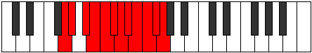 |
| [4091](https://ianring.com/musictheory/scales/4091) | [Thydatic](ModeFNaturalThydatic.md) | F | F, F#, G#, A, A#, B, C, C#, D, D#, E, F |  |
| [4091](https://ianring.com/musictheory/scales/4091) | [Thydatic](ModeENaturalThydatic.md) | E | E, F, G, G#, A, A#, B, C, C#, D, D#, E |  |
| [4091](https://ianring.com/musictheory/scales/4091) | [Thydatic](ModeDNaturalThydatic.md) | D | D, D#, F, F#, G, G#, A, A#, B, C, C#, D |  |
| [4091](https://ianring.com/musictheory/scales/4091) | [Thydatic](ModeCSharpThydatic.md) | C# | C#, D, E, F, F#, G, G#, A, A#, B, C, C# |  |
| [4091](https://ianring.com/musictheory/scales/4091) | [Thydatic](ModeDFlatThydatic.md) | Db | Db, D, E, F, Gb, G, Ab, A, Bb, B, C, Db |  |
| [4091](https://ianring.com/musictheory/scales/4091) | [Thydatic](ModeASharpThydatic.md) | A# | A#, B, C#, D, D#, E, F, F#, G, G#, A, A# |  |
| [4091](https://ianring.com/musictheory/scales/4091) | [Thydatic](ModeBFlatThydatic.md) | Bb | Bb, B, Db, D, Eb, E, F, Gb, G, Ab, A, Bb |  |
| [4093](https://ianring.com/musictheory/scales/4093) | [Aerycratic](ModeASharpAerycratic.md) | A# | A#, C, C#, D, D#, E, F, F#, G, G#, A, A# |  |
| [4093](https://ianring.com/musictheory/scales/4093) | [Aerycratic](ModeBFlatAerycratic.md) | Bb | Bb, C, Db, D, Eb, E, F, Gb, G, Ab, A, Bb |  |
| [4093](https://ianring.com/musictheory/scales/4093) | [Aerycratic](ModeGSharpAerycratic.md) | G# | G#, A#, B, C, C#, D, D#, E, F, F#, G, G# |  |
| [4093](https://ianring.com/musictheory/scales/4093) | [Aerycratic](ModeAFlatAerycratic.md) | Ab | Ab, Bb, B, C, Db, D, Eb, E, F, Gb, G, Ab |  |
| [4093](https://ianring.com/musictheory/scales/4093) | [Aerycratic](ModeFSharpAerycratic.md) | F# | F#, G#, A, A#, B, C, C#, D, D#, E, F, F# |  |
| [4093](https://ianring.com/musictheory/scales/4093) | [Aerycratic](ModeGFlatAerycratic.md) | Gb | Gb, Ab, A, Bb, B, C, Db, D, Eb, E, F, Gb |  |
| [4093](https://ianring.com/musictheory/scales/4093) | [Aerycratic](ModeFNaturalAerycratic.md) | F | F, G, G#, A, A#, B, C, C#, D, D#, E, F |  |
| [4093](https://ianring.com/musictheory/scales/4093) | [Aerycratic](ModeDSharpAerycratic.md) | D# | D#, F, F#, G, G#, A, A#, B, C, C#, D, D# |  |
| [4093](https://ianring.com/musictheory/scales/4093) | [Aerycratic](ModeEFlatAerycratic.md) | Eb | Eb, F, Gb, G, Ab, A, Bb, B, C, Db, D, Eb |  |
| [4093](https://ianring.com/musictheory/scales/4093) | [Aerycratic](ModeDNaturalAerycratic.md) | D | D, E, F, F#, G, G#, A, A#, B, C, C#, D |  |
| [4093](https://ianring.com/musictheory/scales/4093) | [Aerycratic](ModeBNaturalAerycratic.md) | B | B, C#, D, D#, E, F, F#, G, G#, A, A#, B |  |
| [4095](https://ianring.com/musictheory/scales/4095) | [Chromatic](ModeCNaturalChromatic.md) | C | C, C#, D, D#, E, F, F#, G, G#, A, A#, B, C |  |
| [4095](https://ianring.com/musictheory/scales/4095) | [Chromatic](ModeCSharpChromatic.md) | C# | C#, D, D#, E, F, F#, G, G#, A, A#, B, C, C# |  |
| [4095](https://ianring.com/musictheory/scales/4095) | [Chromatic](ModeDFlatChromatic.md) | Db | Db, D, Eb, E, F, Gb, G, Ab, A, Bb, B, C, Db |  |
| [4095](https://ianring.com/musictheory/scales/4095) | [Chromatic](ModeDNaturalChromatic.md) | D | D, D#, E, F, F#, G, G#, A, A#, B, C, C#, D |  |
| [4095](https://ianring.com/musictheory/scales/4095) | [Chromatic](ModeDSharpChromatic.md) | D# | D#, E, F, F#, G, G#, A, A#, B, C, C#, D, D# |  |
| [4095](https://ianring.com/musictheory/scales/4095) | [Chromatic](ModeEFlatChromatic.md) | Eb | Eb, E, F, Gb, G, Ab, A, Bb, B, C, Db, D, Eb |  |
| [4095](https://ianring.com/musictheory/scales/4095) | [Chromatic](ModeENaturalChromatic.md) | E | E, F, F#, G, G#, A, A#, B, C, C#, D, D#, E |  |
| [4095](https://ianring.com/musictheory/scales/4095) | [Chromatic](ModeFNaturalChromatic.md) | F | F, F#, G, G#, A, A#, B, C, C#, D, D#, E, F |  |
| [4095](https://ianring.com/musictheory/scales/4095) | [Chromatic](ModeFSharpChromatic.md) | F# | F#, G, G#, A, A#, B, C, C#, D, D#, E, F, F# |  |
| [4095](https://ianring.com/musictheory/scales/4095) | [Chromatic](ModeGFlatChromatic.md) | Gb | Gb, G, Ab, A, Bb, B, C, Db, D, Eb, E, F, Gb |  |
| [4095](https://ianring.com/musictheory/scales/4095) | [Chromatic](ModeGNaturalChromatic.md) | G | G, G#, A, A#, B, C, C#, D, D#, E, F, F#, G |  |
| [4095](https://ianring.com/musictheory/scales/4095) | [Chromatic](ModeGSharpChromatic.md) | G# | G#, A, A#, B, C, C#, D, D#, E, F, F#, G, G# |  |
| [4095](https://ianring.com/musictheory/scales/4095) | [Chromatic](ModeAFlatChromatic.md) | Ab | Ab, A, Bb, B, C, Db, D, Eb, E, F, Gb, G, Ab |  |
| [4095](https://ianring.com/musictheory/scales/4095) | [Chromatic](ModeANaturalChromatic.md) | A | A, A#, B, C, C#, D, D#, E, F, F#, G, G#, A |  |
| [4095](https://ianring.com/musictheory/scales/4095) | [Chromatic](ModeASharpChromatic.md) | A# | A#, B, C, C#, D, D#, E, F, F#, G, G#, A, A# |  |
| [4095](https://ianring.com/musictheory/scales/4095) | [Chromatic](ModeBFlatChromatic.md) | Bb | Bb, B, C, Db, D, Eb, E, F, Gb, G, Ab, A, Bb |  |
| [4095](https://ianring.com/musictheory/scales/4095) | [Chromatic](ModeBNaturalChromatic.md) | B | B, C, C#, D, D#, E, F, F#, G, G#, A, A#, B |  |
