# ASharpMajorSixthSuspendedSecondFlatFifth

## Links

- [Documentation](README.md)
- [Scales Index](Scales.md)
- [Modes Index](Modes.md)
- [Chords Index](Chords.md)

## Root

A#

## Diagram

## Notes

| Position | Notes | Illustration |
|----------|------|--------------|
| RootPosition | A#,B#,E,F## |  |
| FirstInversion | B#,E,F##,A# |  |
| SecondInversion | E,F##,A#,B# |  |
| ThirdInversion | F##,A#,B#,E | 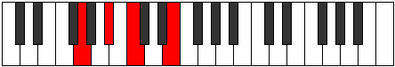 |
## Modes

| Number | Mode | Tonic | Notes | Illustration |
|--------|------|-------|-------|--------------|
| [329](https://ianring.com/musictheory/scales/329) | [Lonic](ModeENaturalLonic.md) | E | E, G, A#, C, E |  |
| [331](https://ianring.com/musictheory/scales/331) | [Byptitonic](ModeENaturalByptitonic.md) | E | E, F, G, A#, C, E |  |
| [333](https://ianring.com/musictheory/scales/333) | [Bogitonic](ModeENaturalBogitonic.md) | E | E, F#, G, A#, C, E |  |
| [335](https://ianring.com/musictheory/scales/335) | [Zanimic](ModeENaturalZanimic.md) | E | E, F, Gb, Abb, Bb, C, E |  |
| [345](https://ianring.com/musictheory/scales/345) | [Gylitonic](ModeENaturalGylitonic.md) | E | E, G, G#, A#, C, E |  |
| [347](https://ianring.com/musictheory/scales/347) | [Barimic](ModeENaturalBarimic.md) | E | E, F, G, Ab, Bb, C, E |  |
| [349](https://ianring.com/musictheory/scales/349) | [Borimic](ModeENaturalBorimic.md) | E | E, F#, G, Ab, Bb, C, E | 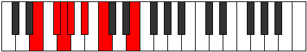 |
| [351](https://ianring.com/musictheory/scales/351) | [Epanian](ModeENaturalEpanian.md) | E | E, F, Gb, Abb, Bbbb, Cbb, Dbb, E |  |
| [361](https://ianring.com/musictheory/scales/361) | [Bocritonic](ModeENaturalBocritonic.md) | E | E, G, A, A#, C, E |  |
| [363](https://ianring.com/musictheory/scales/363) | [Soptimic](ModeENaturalSoptimic.md) | E | E, F, G, A, Bb, C, E |  |
| [365](https://ianring.com/musictheory/scales/365) | [Marimic](ModeENaturalMarimic.md) | E | E, F#, G, A, Bb, C, E |  |
| [367](https://ianring.com/musictheory/scales/367) | [Aerodian](ModeENaturalAerodian.md) | E | E, F, Gb, Abb, Bbb, Cbb, Dbb, E |  |
| [377](https://ianring.com/musictheory/scales/377) | [Kathimic](ModeENaturalKathimic.md) | E | E, F##, G#, A, Bb, C, E | 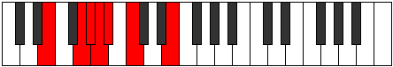 |
| [379](https://ianring.com/musictheory/scales/379) | [Aeragian](ModeENaturalAeragian.md) | E | E, F, G, Ab, Bbb, Cbb, Dbb, E |  |
| [381](https://ianring.com/musictheory/scales/381) | [Kogian](ModeENaturalKogian.md) | E | E, F#, G, Ab, Bbb, Cbb, Dbb, E |  |
| [383](https://ianring.com/musictheory/scales/383) | [Logyllic](ModeENaturalLogyllic.md) | E | E, F, F#, G, G#, A, A#, C, E |  |
| [457](https://ianring.com/musictheory/scales/457) | [Staptitonic](ModeENaturalStaptitonic.md) | E | E, G, A#, B, C, E |  |
| [459](https://ianring.com/musictheory/scales/459) | [Zaptimic](ModeENaturalZaptimic.md) | E | E, F, G, A#, B, C, E |  |
| [461](https://ianring.com/musictheory/scales/461) | [Madimic](ModeENaturalMadimic.md) | E | E, F#, G, A#, B, C, E |  |
| [463](https://ianring.com/musictheory/scales/463) | [Zythian](ModeENaturalZythian.md) | E | E, F, Gb, Abb, Bb, Cb, Dbb, E |  |
| [473](https://ianring.com/musictheory/scales/473) | [Aeralimic](ModeENaturalAeralimic.md) | E | E, F##, G#, A#, B, C, E |  |
| [475](https://ianring.com/musictheory/scales/475) | [Aeolygian](ModeENaturalAeolygian.md) | E | E, F, G, Ab, Bb, Cb, Dbb, E |  |
| [477](https://ianring.com/musictheory/scales/477) | [Stacrian](ModeENaturalStacrian.md) | E | E, F#, G, Ab, Bb, Cb, Dbb, E |  |
| [479](https://ianring.com/musictheory/scales/479) | [Kocryllic](ModeENaturalKocryllic.md) | E | E, F, F#, G, G#, A#, B, C, E |  |
| [489](https://ianring.com/musictheory/scales/489) | [Phrathimic](ModeENaturalPhrathimic.md) | E | E, F##, G##, A#, B, C, E |  |
| [491](https://ianring.com/musictheory/scales/491) | [Aeolyrian](ModeENaturalAeolyrian.md) | E | E, F, G, A, Bb, Cb, Dbb, E |  |
| [493](https://ianring.com/musictheory/scales/493) | [Rygian](ModeENaturalRygian.md) | E | E, F#, G, A, Bb, Cb, Dbb, E |  |
| [495](https://ianring.com/musictheory/scales/495) | [Bocryllic](ModeENaturalBocryllic.md) | E | E, F, F#, G, A, A#, B, C, E |  |
| [505](https://ianring.com/musictheory/scales/505) | [Sanian](ModeENaturalSanian.md) | E | E, F##, G#, A, Bb, Cb, Dbb, E |  |
| [507](https://ianring.com/musictheory/scales/507) | [Moryllic](ModeENaturalMoryllic.md) | E | E, F, G, G#, A, A#, B, C, E |  |
| [509](https://ianring.com/musictheory/scales/509) | [Ionothyllic](ModeENaturalIonothyllic.md) | E | E, F#, G, G#, A, A#, B, C, E |  |
| [511](https://ianring.com/musictheory/scales/511) | [Polygic](ModeENaturalPolygic.md) | E | E, F, F#, G, G#, A, A#, B, C, E |  |
| [553](https://ianring.com/musictheory/scales/553) | [Phradic](ModeGNaturalPhradic.md) | G | G, A#, C, E, G |  |
| [555](https://ianring.com/musictheory/scales/555) | [Aeolycritonic](ModeGNaturalAeolycritonic.md) | G | G, G#, A#, C, E, G |  |
| [557](https://ianring.com/musictheory/scales/557) | [Gythitonic](ModeGNaturalGythitonic.md) | G | G, A, A#, C, E, G |  |
| [559](https://ianring.com/musictheory/scales/559) | [Lylimic](ModeGNaturalLylimic.md) | G | G, Ab, Bbb, Cbb, Dbb, E, G |  |
| [569](https://ianring.com/musictheory/scales/569) | [Mothitonic](ModeGNaturalMothitonic.md) | G | G, A#, B, C, E, G |  |
| [571](https://ianring.com/musictheory/scales/571) | [Kynimic](ModeGNaturalKynimic.md) | G | G, Ab, Bb, Cb, Dbb, E, G |  |
| [573](https://ianring.com/musictheory/scales/573) | [Saptimic](ModeGNaturalSaptimic.md) | G | G, A, Bb, Cb, Dbb, E, G |  |
| [575](https://ianring.com/musictheory/scales/575) | [Ionydian](ModeGNaturalIonydian.md) | G | G, Ab, Bbb, Cbb, Dbbb, Dbb, E, G |  |
| [581](https://ianring.com/musictheory/scales/581) | [Bolic](ModeASharpBolic.md) | A# | A#, C, E, G, A# |  |
| [581](https://ianring.com/musictheory/scales/581) | [Bolic](ModeBFlatBolic.md) | Bb | Bb, C, E, G, Bb | 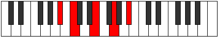 |
| [583](https://ianring.com/musictheory/scales/583) | [Aeritonic](ModeASharpAeritonic.md) | A# | A#, B, C, E, G, A# |  |
| [583](https://ianring.com/musictheory/scales/583) | [Aeritonic](ModeBFlatAeritonic.md) | Bb | Bb, B, C, E, G, Bb |  |
| [589](https://ianring.com/musictheory/scales/589) | [Ionalitonic](ModeASharpIonalitonic.md) | A# | A#, C, C#, E, G, A# |  |
| [589](https://ianring.com/musictheory/scales/589) | [Ionalitonic](ModeBFlatIonalitonic.md) | Bb | Bb, C, Db, E, G, Bb |  |
| [591](https://ianring.com/musictheory/scales/591) | [Gaptimic](ModeASharpGaptimic.md) | A# | A#, B, C, Db, E, F##, A# |  |
| [591](https://ianring.com/musictheory/scales/591) | [Gaptimic](ModeBFlatGaptimic.md) | Bb | Bb, Cb, Dbb, Ebbb, Fb, G, Bb |  |
| [597](https://ianring.com/musictheory/scales/597) | [Thonitonic](ModeASharpThonitonic.md) | A# | A#, C, D, E, G, A# |  |
| [597](https://ianring.com/musictheory/scales/597) | [Thonitonic](ModeBFlatThonitonic.md) | Bb | Bb, C, D, E, G, Bb |  |
| [599](https://ianring.com/musictheory/scales/599) | [Thyrimic](ModeASharpThyrimic.md) | A# | A#, B, C, D, E, F##, A# |  |
| [599](https://ianring.com/musictheory/scales/599) | [Thyrimic](ModeBFlatThyrimic.md) | Bb | Bb, Cb, Dbb, Ebb, Fb, G, Bb |  |
| [605](https://ianring.com/musictheory/scales/605) | [Dycrimic](ModeASharpDycrimic.md) | A# | A#, B#, C#, D, E, F##, A# |  |
| [605](https://ianring.com/musictheory/scales/605) | [Dycrimic](ModeBFlatDycrimic.md) | Bb | Bb, C, Db, Ebb, Fb, G, Bb |  |
| [607](https://ianring.com/musictheory/scales/607) | [Kadian](ModeASharpKadian.md) | A# | A#, B, C, Db, Ebb, Fb, G, A# |  |
| [607](https://ianring.com/musictheory/scales/607) | [Kadian](ModeBFlatKadian.md) | Bb | Bb, Cb, Dbb, Ebbb, Fbbb, Gbbb, Abb, Bb |  |
| [613](https://ianring.com/musictheory/scales/613) | [Phralitonic](ModeASharpPhralitonic.md) | A# | A#, C, D#, E, G, A# |  |
| [613](https://ianring.com/musictheory/scales/613) | [Phralitonic](ModeBFlatPhralitonic.md) | Bb | Bb, C, Eb, E, G, Bb |  |
| [615](https://ianring.com/musictheory/scales/615) | [Phrothimic](ModeASharpPhrothimic.md) | A# | A#, B, C, D#, E, F##, A# |  |
| [615](https://ianring.com/musictheory/scales/615) | [Phrothimic](ModeBFlatPhrothimic.md) | Bb | Bb, Cb, Dbb, Eb, Fb, G, Bb |  |
| [617](https://ianring.com/musictheory/scales/617) | [Katycritonic](ModeGNaturalKatycritonic.md) | G | G, A#, C, C#, E, G |  |
| [619](https://ianring.com/musictheory/scales/619) | [Parimic](ModeGNaturalParimic.md) | G | G, Ab, Bb, C, Db, E, G |  |
| [621](https://ianring.com/musictheory/scales/621) | [Kyrimic](ModeASharpKyrimic.md) | A# | A#, B#, C#, D#, E, F##, A# |  |
| [621](https://ianring.com/musictheory/scales/621) | [Kyrimic](ModeBFlatKyrimic.md) | Bb | Bb, C, Db, Eb, Fb, G, Bb |  |
| [621](https://ianring.com/musictheory/scales/621) | [Kyrimic](ModeGNaturalKyrimic.md) | G | G, A, Bb, C, Db, E, G |  |
| [623](https://ianring.com/musictheory/scales/623) | [Sycrian](ModeGNaturalSycrian.md) | G | G, Ab, Bbb, Cbb, Dbb, Ebbb, Fb, G |  |
| [623](https://ianring.com/musictheory/scales/623) | [Sycrian](ModeASharpSycrian.md) | A# | A#, B, C, Db, Eb, Fb, G, A# |  |
| [623](https://ianring.com/musictheory/scales/623) | [Sycrian](ModeBFlatSycrian.md) | Bb | Bb, Cb, Dbb, Ebbb, Fbb, Gbbb, Abb, Bb |  |
| [629](https://ianring.com/musictheory/scales/629) | [Aeronimic](ModeASharpAeronimic.md) | A# | A#, B#, C##, D#, E, F##, A# |  |
| [629](https://ianring.com/musictheory/scales/629) | [Aeronimic](ModeBFlatAeronimic.md) | Bb | Bb, C, D, Eb, Fb, G, Bb |  |
| [631](https://ianring.com/musictheory/scales/631) | [Zygian](ModeASharpZygian.md) | A# | A#, B, C, D, Eb, Fb, G, A# |  |
| [631](https://ianring.com/musictheory/scales/631) | [Zygian](ModeBFlatZygian.md) | Bb | Bb, Cb, Dbb, Ebb, Fbb, Gbbb, Abb, Bb |  |
| [633](https://ianring.com/musictheory/scales/633) | [Kydimic](ModeGNaturalKydimic.md) | G | G, A#, B, C, Db, E, G |  |
| [635](https://ianring.com/musictheory/scales/635) | [Epolian](ModeGNaturalEpolian.md) | G | G, Ab, Bb, Cb, Dbb, Ebbb, Fb, G |  |
| [637](https://ianring.com/musictheory/scales/637) | [Katodian](ModeASharpKatodian.md) | A# | A#, B#, C#, D, Eb, Fb, G, A# |  |
| [637](https://ianring.com/musictheory/scales/637) | [Katodian](ModeBFlatKatodian.md) | Bb | Bb, C, Db, Ebb, Fbb, Gbbb, Abb, Bb |  |
| [637](https://ianring.com/musictheory/scales/637) | [Katodian](ModeGNaturalKatodian.md) | G | G, A, Bb, Cb, Dbb, Ebbb, Fb, G |  |
| [639](https://ianring.com/musictheory/scales/639) | [Ionaryllic](ModeASharpIonaryllic.md) | A# | A#, B, C, C#, D, D#, E, G, A# |  |
| [639](https://ianring.com/musictheory/scales/639) | [Ionaryllic](ModeBFlatIonaryllic.md) | Bb | Bb, B, C, Db, D, Eb, E, G, Bb |  |
| [639](https://ianring.com/musictheory/scales/639) | [Ionaryllic](ModeGNaturalIonaryllic.md) | G | G, G#, A, A#, B, C, C#, E, G |  |
| [659](https://ianring.com/musictheory/scales/659) | [Soptitonic](ModeDSharpSoptitonic.md) | D# | D#, E, G, A#, C, D# |  |
| [659](https://ianring.com/musictheory/scales/659) | [Soptitonic](ModeEFlatSoptitonic.md) | Eb | Eb, E, G, Bb, C, Eb |  |
| [663](https://ianring.com/musictheory/scales/663) | [Phrynimic](ModeDSharpPhrynimic.md) | D# | D#, E, F, G, A#, B#, D# |  |
| [663](https://ianring.com/musictheory/scales/663) | [Phrynimic](ModeEFlatPhrynimic.md) | Eb | Eb, Fb, Gbb, Abb, Bb, C, Eb |  |
| [667](https://ianring.com/musictheory/scales/667) | [Rodimic](ModeDSharpRodimic.md) | D# | D#, E, F#, G, A#, B#, D# |  |
| [667](https://ianring.com/musictheory/scales/667) | [Rodimic](ModeEFlatRodimic.md) | Eb | Eb, Fb, Gb, Abb, Bb, C, Eb |  |
| [671](https://ianring.com/musictheory/scales/671) | [Stycrian](ModeDSharpStycrian.md) | D# | D#, E, F, Gb, Abb, Bb, C, D# |  |
| [671](https://ianring.com/musictheory/scales/671) | [Stycrian](ModeEFlatStycrian.md) | Eb | Eb, Fb, Gbb, Abbb, E###, Cbb, Dbb, Eb |  |
| [681](https://ianring.com/musictheory/scales/681) | [Sylitonic](ModeGNaturalSylitonic.md) | G | G, A#, C, D, E, G |  |
| [683](https://ianring.com/musictheory/scales/683) | [Stogimic](ModeGNaturalStogimic.md) | G | G, Ab, Bb, C, D, E, G |  |
| [685](https://ianring.com/musictheory/scales/685) | [Aerathimic](ModeGNaturalAerathimic.md) | G | G, A, Bb, C, D, E, G |  |
| [687](https://ianring.com/musictheory/scales/687) | [Aeolythian](ModeGNaturalAeolythian.md) | G | G, Ab, Bbb, Cbb, Dbb, Ebb, Fb, G |  |
| [691](https://ianring.com/musictheory/scales/691) | [Zydimic](ModeDSharpZydimic.md) | D# | D#, E, F##, G#, A#, B#, D# |  |
| [691](https://ianring.com/musictheory/scales/691) | [Zydimic](ModeEFlatZydimic.md) | Eb | Eb, Fb, G, Ab, Bb, C, Eb |  |
| [695](https://ianring.com/musictheory/scales/695) | [Sarian](ModeDSharpSarian.md) | D# | D#, E, F, G, Ab, Bb, C, D# |  |
| [695](https://ianring.com/musictheory/scales/695) | [Sarian](ModeEFlatSarian.md) | Eb | Eb, Fb, Gbb, Abb, Bbbb, Cbb, Dbb, Eb |  |
| [697](https://ianring.com/musictheory/scales/697) | [Lagimic](ModeGNaturalLagimic.md) | G | G, A#, B, C, D, E, G |  |
| [699](https://ianring.com/musictheory/scales/699) | [Aerothian](ModeDSharpAerothian.md) | D# | D#, E, F#, G, Ab, Bb, C, D# |  |
| [699](https://ianring.com/musictheory/scales/699) | [Aerothian](ModeEFlatAerothian.md) | Eb | Eb, Fb, Gb, Abb, Bbbb, Cbb, Dbb, Eb |  |
| [699](https://ianring.com/musictheory/scales/699) | [Aerothian](ModeGNaturalAerothian.md) | G | G, Ab, Bb, Cb, Dbb, Ebb, Fb, G |  |
| [701](https://ianring.com/musictheory/scales/701) | [Mixonyphian](ModeGNaturalMixonyphian.md) | G | G, A, Bb, Cb, Dbb, Ebb, Fb, G |  |
| [703](https://ianring.com/musictheory/scales/703) | [Aerocryllic](ModeDSharpAerocryllic.md) | D# | D#, E, F, F#, G, G#, A#, C, D# |  |
| [703](https://ianring.com/musictheory/scales/703) | [Aerocryllic](ModeEFlatAerocryllic.md) | Eb | Eb, E, F, Gb, G, Ab, Bb, C, Eb |  |
| [703](https://ianring.com/musictheory/scales/703) | [Aerocryllic](ModeGNaturalAerocryllic.md) | G | G, G#, A, A#, B, C, D, E, G |  |
| [709](https://ianring.com/musictheory/scales/709) | [Ionycritonic](ModeASharpIonycritonic.md) | A# | A#, C, E, F, G, A# |  |
| [709](https://ianring.com/musictheory/scales/709) | [Ionycritonic](ModeBFlatIonycritonic.md) | Bb | Bb, C, E, F, G, Bb | 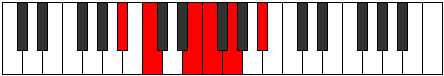 |
| [711](https://ianring.com/musictheory/scales/711) | [Epyrimic](ModeASharpEpyrimic.md) | A# | A#, B, C, D##, E#, F##, A# | 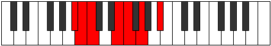 |
| [711](https://ianring.com/musictheory/scales/711) | [Epyrimic](ModeBFlatEpyrimic.md) | Bb | Bb, Cb, Dbb, E, F, G, Bb |  |
| [717](https://ianring.com/musictheory/scales/717) | [Gythimic](ModeASharpGythimic.md) | A# | A#, B#, C#, D##, E#, F##, A# |  |
| [717](https://ianring.com/musictheory/scales/717) | [Gythimic](ModeBFlatGythimic.md) | Bb | Bb, C, Db, E, F, G, Bb |  |
| [719](https://ianring.com/musictheory/scales/719) | [Kanian](ModeASharpKanian.md) | A# | A#, B, C, Db, E, F, G, A# |  |
| [719](https://ianring.com/musictheory/scales/719) | [Kanian](ModeBFlatKanian.md) | Bb | Bb, Cb, Dbb, Ebbb, Fb, Gbb, Abb, Bb |  |
| [723](https://ianring.com/musictheory/scales/723) | [Ionadimic](ModeDSharpIonadimic.md) | D# | D#, E, F##, G##, A#, B#, D# |  |
| [723](https://ianring.com/musictheory/scales/723) | [Ionadimic](ModeEFlatIonadimic.md) | Eb | Eb, Fb, G, A, Bb, C, Eb |  |
| [725](https://ianring.com/musictheory/scales/725) | [Lonimic](ModeASharpLonimic.md) | A# | A#, B#, C##, D##, E#, F##, A# | 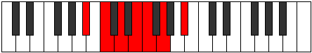 |
| [725](https://ianring.com/musictheory/scales/725) | [Lonimic](ModeBFlatLonimic.md) | Bb | Bb, C, D, E, F, G, Bb |  |
| [727](https://ianring.com/musictheory/scales/727) | [Phradian](ModeDSharpPhradian.md) | D# | D#, E, F, G, A, Bb, C, D# |  |
| [727](https://ianring.com/musictheory/scales/727) | [Phradian](ModeEFlatPhradian.md) | Eb | Eb, Fb, Gbb, Abb, Bbb, Cbb, Dbb, Eb |  |
| [727](https://ianring.com/musictheory/scales/727) | [Phradian](ModeASharpPhradian.md) | A# | A#, B, C, D, E, F, G, A# |  |
| [727](https://ianring.com/musictheory/scales/727) | [Phradian](ModeBFlatPhradian.md) | Bb | Bb, Cb, Dbb, Ebb, Fb, Gbb, Abb, Bb |  |
| [731](https://ianring.com/musictheory/scales/731) | [Ionorian](ModeDSharpIonorian.md) | D# | D#, E, F#, G, A, Bb, C, D# |  |
| [731](https://ianring.com/musictheory/scales/731) | [Ionorian](ModeEFlatIonorian.md) | Eb | Eb, Fb, Gb, Abb, Bbb, Cbb, Dbb, Eb |  |
| [733](https://ianring.com/musictheory/scales/733) | [Donian](ModeASharpDonian.md) | A# | A#, B#, C#, D, E, F, G, A# |  |
| [733](https://ianring.com/musictheory/scales/733) | [Donian](ModeBFlatDonian.md) | Bb | Bb, C, Db, Ebb, Fb, Gbb, Abb, Bb |  |
| [735](https://ianring.com/musictheory/scales/735) | [Sylyllic](ModeDSharpSylyllic.md) | D# | D#, E, F, F#, G, A, A#, C, D# |  |
| [735](https://ianring.com/musictheory/scales/735) | [Sylyllic](ModeEFlatSylyllic.md) | Eb | Eb, E, F, Gb, G, A, Bb, C, Eb |  |
| [735](https://ianring.com/musictheory/scales/735) | [Sylyllic](ModeASharpSylyllic.md) | A# | A#, B, C, C#, D, E, F, G, A# |  |
| [735](https://ianring.com/musictheory/scales/735) | [Sylyllic](ModeBFlatSylyllic.md) | Bb | Bb, B, C, Db, D, E, F, G, Bb |  |
| [741](https://ianring.com/musictheory/scales/741) | [Gathimic](ModeASharpGathimic.md) | A# | A#, B#, C###, D##, E#, F##, A# |  |
| [741](https://ianring.com/musictheory/scales/741) | [Gathimic](ModeBFlatGathimic.md) | Bb | Bb, C, D#, E, F, G, Bb |  |
| [743](https://ianring.com/musictheory/scales/743) | [Lanian](ModeASharpLanian.md) | A# | A#, B, C, D#, E, F, G, A# |  |
| [743](https://ianring.com/musictheory/scales/743) | [Lanian](ModeBFlatLanian.md) | Bb | Bb, Cb, Dbb, Eb, Fb, Gbb, Abb, Bb |  |
| [745](https://ianring.com/musictheory/scales/745) | [Kolimic](ModeGNaturalKolimic.md) | G | G, A#, B#, C#, D, E, G |  |
| [747](https://ianring.com/musictheory/scales/747) | [Lynian](ModeGNaturalLynian.md) | G | G, Ab, Bb, C, Db, Ebb, Fb, G |  |
| [749](https://ianring.com/musictheory/scales/749) | [Aeologian](ModeASharpAeologian.md) | A# | A#, B#, C#, D#, E, F, G, A# |  |
| [749](https://ianring.com/musictheory/scales/749) | [Aeologian](ModeBFlatAeologian.md) | Bb | Bb, C, Db, Eb, Fb, Gbb, Abb, Bb |  |
| [749](https://ianring.com/musictheory/scales/749) | [Aeologian](ModeGNaturalAeologian.md) | G | G, A, Bb, C, Db, Ebb, Fb, G | 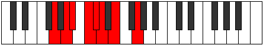 |
| [751](https://ianring.com/musictheory/scales/751) | [Epacryllic](ModeGNaturalEpacryllic.md) | G | G, G#, A, A#, C, C#, D, E, G |  |
| [751](https://ianring.com/musictheory/scales/751) | [Epacryllic](ModeASharpEpacryllic.md) | A# | A#, B, C, C#, D#, E, F, G, A# |  |
| [751](https://ianring.com/musictheory/scales/751) | [Epacryllic](ModeBFlatEpacryllic.md) | Bb | Bb, B, C, Db, Eb, E, F, G, Bb |  |
| [755](https://ianring.com/musictheory/scales/755) | [Phrythian](ModeDSharpPhrythian.md) | D# | D#, E, F##, G#, A, Bb, C, D# |  |
| [755](https://ianring.com/musictheory/scales/755) | [Phrythian](ModeEFlatPhrythian.md) | Eb | Eb, Fb, G, Ab, Bbb, Cbb, Dbb, Eb |  |
| [757](https://ianring.com/musictheory/scales/757) | [Ionyptian](ModeASharpIonyptian.md) | A# | A#, B#, C##, D#, E, F, G, A# |  |
| [757](https://ianring.com/musictheory/scales/757) | [Ionyptian](ModeBFlatIonyptian.md) | Bb | Bb, C, D, Eb, Fb, Gbb, Abb, Bb |  |
| [759](https://ianring.com/musictheory/scales/759) | [Katalyllic](ModeDSharpKatalyllic.md) | D# | D#, E, F, G, G#, A, A#, C, D# |  |
| [759](https://ianring.com/musictheory/scales/759) | [Katalyllic](ModeEFlatKatalyllic.md) | Eb | Eb, E, F, G, Ab, A, Bb, C, Eb |  |
| [759](https://ianring.com/musictheory/scales/759) | [Katalyllic](ModeASharpKatalyllic.md) | A# | A#, B, C, D, D#, E, F, G, A# |  |
| [759](https://ianring.com/musictheory/scales/759) | [Katalyllic](ModeBFlatKatalyllic.md) | Bb | Bb, B, C, D, Eb, E, F, G, Bb |  |
| [761](https://ianring.com/musictheory/scales/761) | [Ponian](ModeGNaturalPonian.md) | G | G, A#, B, C, Db, Ebb, Fb, G | 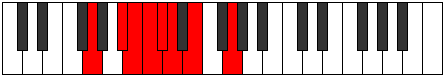 |
| [763](https://ianring.com/musictheory/scales/763) | [Doryllic](ModeDSharpDoryllic.md) | D# | D#, E, F#, G, G#, A, A#, C, D# |  |
| [763](https://ianring.com/musictheory/scales/763) | [Doryllic](ModeEFlatDoryllic.md) | Eb | Eb, E, Gb, G, Ab, A, Bb, C, Eb |  |
| [763](https://ianring.com/musictheory/scales/763) | [Doryllic](ModeGNaturalDoryllic.md) | G | G, G#, A#, B, C, C#, D, E, G |  |
| [765](https://ianring.com/musictheory/scales/765) | [Mixonyphyllic](ModeASharpMixonyphyllic.md) | A# | A#, C, C#, D, D#, E, F, G, A# |  |
| [765](https://ianring.com/musictheory/scales/765) | [Mixonyphyllic](ModeBFlatMixonyphyllic.md) | Bb | Bb, C, Db, D, Eb, E, F, G, Bb |  |
| [765](https://ianring.com/musictheory/scales/765) | [Mixonyphyllic](ModeGNaturalMixonyphyllic.md) | G | G, A, A#, B, C, C#, D, E, G |  |
| [767](https://ianring.com/musictheory/scales/767) | [Raptygic](ModeDSharpRaptygic.md) | D# | D#, E, F, F#, G, G#, A, A#, C, D# |  |
| [767](https://ianring.com/musictheory/scales/767) | [Raptygic](ModeEFlatRaptygic.md) | Eb | Eb, E, F, Gb, G, Ab, A, Bb, C, Eb |  |
| [767](https://ianring.com/musictheory/scales/767) | [Raptygic](ModeASharpRaptygic.md) | A# | A#, B, C, C#, D, D#, E, F, G, A# |  |
| [767](https://ianring.com/musictheory/scales/767) | [Raptygic](ModeBFlatRaptygic.md) | Bb | Bb, B, C, Db, D, Eb, E, F, G, Bb |  |
| [767](https://ianring.com/musictheory/scales/767) | [Raptygic](ModeGNaturalRaptygic.md) | G | G, G#, A, A#, B, C, C#, D, E, G |  |
| [809](https://ianring.com/musictheory/scales/809) | [Dogitonic](ModeGNaturalDogitonic.md) | G | G, A#, C, D#, E, G |  |
| [811](https://ianring.com/musictheory/scales/811) | [Radimic](ModeGNaturalRadimic.md) | G | G, Ab, Bb, C, D#, E, G |  |
| [813](https://ianring.com/musictheory/scales/813) | [Larimic](ModeGNaturalLarimic.md) | G | G, A, Bb, C, D#, E, G |  |
| [815](https://ianring.com/musictheory/scales/815) | [Bolian](ModeGNaturalBolian.md) | G | G, Ab, Bbb, Cbb, Dbb, Eb, Fb, G |  |
| [825](https://ianring.com/musictheory/scales/825) | [Thyptimic](ModeGNaturalThyptimic.md) | G | G, A#, B, C, D#, E, G |  |
| [827](https://ianring.com/musictheory/scales/827) | [Mixolocrian](ModeGNaturalMixolocrian.md) | G | G, Ab, Bb, Cb, Dbb, Eb, Fb, G |  |
| [829](https://ianring.com/musictheory/scales/829) | [Lygian](ModeGNaturalLygian.md) | G | G, A, Bb, Cb, Dbb, Eb, Fb, G |  |
| [831](https://ianring.com/musictheory/scales/831) | [Rodyllic](ModeGNaturalRodyllic.md) | G | G, G#, A, A#, B, C, D#, E, G |  |
| [837](https://ianring.com/musictheory/scales/837) | [Epaditonic](ModeASharpEpaditonic.md) | A# | A#, C, E, F#, G, A# |  |
| [837](https://ianring.com/musictheory/scales/837) | [Epaditonic](ModeBFlatEpaditonic.md) | Bb | Bb, C, E, Gb, G, Bb |  |
| [839](https://ianring.com/musictheory/scales/839) | [Ionathimic](ModeASharpIonathimic.md) | A# | A#, B, C, D##, E##, F##, A# |  |
| [839](https://ianring.com/musictheory/scales/839) | [Ionathimic](ModeBFlatIonathimic.md) | Bb | Bb, Cb, Dbb, E, F#, G, Bb |  |
| [841](https://ianring.com/musictheory/scales/841) | [Phrothitonic](ModeENaturalPhrothitonic.md) | E | E, G, A#, C, C#, E |  |
| [843](https://ianring.com/musictheory/scales/843) | [Molimic](ModeENaturalMolimic.md) | E | E, F, G, A#, B#, C#, E |  |
| [845](https://ianring.com/musictheory/scales/845) | [Zyrimic](ModeENaturalZyrimic.md) | E | E, F#, G, A#, B#, C#, E |  |
| [845](https://ianring.com/musictheory/scales/845) | [Zyrimic](ModeASharpZyrimic.md) | A# | A#, B#, C#, D##, E##, F##, A# |  |
| [845](https://ianring.com/musictheory/scales/845) | [Zyrimic](ModeBFlatZyrimic.md) | Bb | Bb, C, Db, E, F#, G, Bb |  |
| [847](https://ianring.com/musictheory/scales/847) | [Ganian](ModeENaturalGanian.md) | E | E, F, Gb, Abb, Bb, C, Db, E |  |
| [847](https://ianring.com/musictheory/scales/847) | [Ganian](ModeASharpGanian.md) | A# | A#, B, C, Db, E, F#, G, A# |  |
| [847](https://ianring.com/musictheory/scales/847) | [Ganian](ModeBFlatGanian.md) | Bb | Bb, Cb, Dbb, Ebbb, Fb, Gb, Abb, Bb |  |
| [853](https://ianring.com/musictheory/scales/853) | [Epothimic](ModeASharpEpothimic.md) | A# | A#, B#, C##, D##, E##, F##, A# |  |
| [853](https://ianring.com/musictheory/scales/853) | [Epothimic](ModeBFlatEpothimic.md) | Bb | Bb, C, D, E, F#, G, Bb |  |
| [855](https://ianring.com/musictheory/scales/855) | [Porian](ModeASharpPorian.md) | A# | A#, B, C, D, E, F#, G, A# |  |
| [855](https://ianring.com/musictheory/scales/855) | [Porian](ModeBFlatPorian.md) | Bb | Bb, Cb, Dbb, Ebb, Fb, Gb, Abb, Bb |  |
| [857](https://ianring.com/musictheory/scales/857) | [Aeolydimic](ModeENaturalAeolydimic.md) | E | E, F##, G#, A#, B#, C#, E | 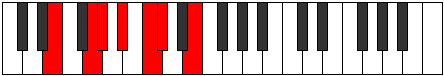 |
| [859](https://ianring.com/musictheory/scales/859) | [Pathian](ModeENaturalPathian.md) | E | E, F, G, Ab, Bb, C, Db, E |  |
| [861](https://ianring.com/musictheory/scales/861) | [Rylian](ModeASharpRylian.md) | A# | A#, B#, C#, D, E, F#, G, A# |  |
| [861](https://ianring.com/musictheory/scales/861) | [Rylian](ModeBFlatRylian.md) | Bb | Bb, C, Db, Ebb, Fb, Gb, Abb, Bb |  |
| [861](https://ianring.com/musictheory/scales/861) | [Rylian](ModeENaturalRylian.md) | E | E, F#, G, Ab, Bb, C, Db, E |  |
| [863](https://ianring.com/musictheory/scales/863) | [Pyryllic](ModeENaturalPyryllic.md) | E | E, F, F#, G, G#, A#, C, C#, E |  |
| [863](https://ianring.com/musictheory/scales/863) | [Pyryllic](ModeASharpPyryllic.md) | A# | A#, B, C, C#, D, E, F#, G, A# |  |
| [863](https://ianring.com/musictheory/scales/863) | [Pyryllic](ModeBFlatPyryllic.md) | Bb | Bb, B, C, Db, D, E, Gb, G, Bb |  |
| [869](https://ianring.com/musictheory/scales/869) | [Kothimic](ModeASharpKothimic.md) | A# | A#, B#, C###, D##, E##, F##, A# |  |
| [869](https://ianring.com/musictheory/scales/869) | [Kothimic](ModeBFlatKothimic.md) | Bb | Bb, C, D#, E, F#, G, Bb |  |
| [871](https://ianring.com/musictheory/scales/871) | [Epadian](ModeASharpEpadian.md) | A# | A#, B, C, D#, E, F#, G, A# |  |
| [871](https://ianring.com/musictheory/scales/871) | [Epadian](ModeBFlatEpadian.md) | Bb | Bb, Cb, Dbb, Eb, Fb, Gb, Abb, Bb |  |
| [873](https://ianring.com/musictheory/scales/873) | [Bagimic](ModeGNaturalBagimic.md) | G | G, A#, B#, C#, D#, E, G |  |
| [873](https://ianring.com/musictheory/scales/873) | [Bagimic](ModeENaturalBagimic.md) | E | E, F##, G##, A#, B#, C#, E |  |
| [875](https://ianring.com/musictheory/scales/875) | [Stothian](ModeGNaturalStothian.md) | G | G, Ab, Bb, C, Db, Eb, Fb, G |  |
| [875](https://ianring.com/musictheory/scales/875) | [Stothian](ModeENaturalStothian.md) | E | E, F, G, A, Bb, C, Db, E |  |
| [877](https://ianring.com/musictheory/scales/877) | [Aeraptian](ModeASharpAeraptian.md) | A# | A#, B#, C#, D#, E, F#, G, A# |  |
| [877](https://ianring.com/musictheory/scales/877) | [Aeraptian](ModeBFlatAeraptian.md) | Bb | Bb, C, Db, Eb, Fb, Gb, Abb, Bb |  |
| [877](https://ianring.com/musictheory/scales/877) | [Aeraptian](ModeGNaturalAeraptian.md) | G | G, A, Bb, C, Db, Eb, Fb, G |  |
| [877](https://ianring.com/musictheory/scales/877) | [Aeraptian](ModeENaturalAeraptian.md) | E | E, F#, G, A, Bb, C, Db, E |  |
| [879](https://ianring.com/musictheory/scales/879) | [Aeolocryllic](ModeENaturalAeolocryllic.md) | E | E, F, F#, G, A, A#, C, C#, E |  |
| [879](https://ianring.com/musictheory/scales/879) | [Aeolocryllic](ModeGNaturalAeolocryllic.md) | G | G, G#, A, A#, C, C#, D#, E, G |  |
| [879](https://ianring.com/musictheory/scales/879) | [Aeolocryllic](ModeASharpAeolocryllic.md) | A# | A#, B, C, C#, D#, E, F#, G, A# |  |
| [879](https://ianring.com/musictheory/scales/879) | [Aeolocryllic](ModeBFlatAeolocryllic.md) | Bb | Bb, B, C, Db, Eb, E, Gb, G, Bb |  |
| [885](https://ianring.com/musictheory/scales/885) | [Sathian](ModeASharpSathian.md) | A# | A#, B#, C##, D#, E, F#, G, A# |  |
| [885](https://ianring.com/musictheory/scales/885) | [Sathian](ModeBFlatSathian.md) | Bb | Bb, C, D, Eb, Fb, Gb, Abb, Bb |  |
| [887](https://ianring.com/musictheory/scales/887) | [Sathyllic](ModeASharpSathyllic.md) | A# | A#, B, C, D, D#, E, F#, G, A# |  |
| [887](https://ianring.com/musictheory/scales/887) | [Sathyllic](ModeBFlatSathyllic.md) | Bb | Bb, B, C, D, Eb, E, Gb, G, Bb |  |
| [889](https://ianring.com/musictheory/scales/889) | [Borian](ModeENaturalBorian.md) | E | E, F##, G#, A, Bb, C, Db, E |  |
| [889](https://ianring.com/musictheory/scales/889) | [Borian](ModeGNaturalBorian.md) | G | G, A#, B, C, Db, Eb, Fb, G |  |
| [891](https://ianring.com/musictheory/scales/891) | [Ionilyllic](ModeENaturalIonilyllic.md) | E | E, F, G, G#, A, A#, C, C#, E |  |
| [891](https://ianring.com/musictheory/scales/891) | [Ionilyllic](ModeGNaturalIonilyllic.md) | G | G, G#, A#, B, C, C#, D#, E, G |  |
| [893](https://ianring.com/musictheory/scales/893) | [Pycryllic](ModeASharpPycryllic.md) | A# | A#, C, C#, D, D#, E, F#, G, A# |  |
| [893](https://ianring.com/musictheory/scales/893) | [Pycryllic](ModeBFlatPycryllic.md) | Bb | Bb, C, Db, D, Eb, E, Gb, G, Bb |  |
| [893](https://ianring.com/musictheory/scales/893) | [Pycryllic](ModeENaturalPycryllic.md) | E | E, F#, G, G#, A, A#, C, C#, E |  |
| [893](https://ianring.com/musictheory/scales/893) | [Pycryllic](ModeGNaturalPycryllic.md) | G | G, A, A#, B, C, C#, D#, E, G |  |
| [895](https://ianring.com/musictheory/scales/895) | [Aeolathygic](ModeENaturalAeolathygic.md) | E | E, F, F#, G, G#, A, A#, C, C#, E |  |
| [895](https://ianring.com/musictheory/scales/895) | [Aeolathygic](ModeASharpAeolathygic.md) | A# | A#, B, C, C#, D, D#, E, F#, G, A# |  |
| [895](https://ianring.com/musictheory/scales/895) | [Aeolathygic](ModeBFlatAeolathygic.md) | Bb | Bb, B, C, Db, D, Eb, E, Gb, G, Bb |  |
| [895](https://ianring.com/musictheory/scales/895) | [Aeolathygic](ModeGNaturalAeolathygic.md) | G | G, G#, A, A#, B, C, C#, D#, E, G |  |
| [915](https://ianring.com/musictheory/scales/915) | [Loptimic](ModeDSharpLoptimic.md) | D# | D#, E, F##, G###, A##, B#, D# |  |
| [915](https://ianring.com/musictheory/scales/915) | [Loptimic](ModeEFlatLoptimic.md) | Eb | Eb, Fb, G, A#, B, C, Eb |  |
| [919](https://ianring.com/musictheory/scales/919) | [Gathian](ModeDSharpGathian.md) | D# | D#, E, F, G, A#, B, C, D# |  |
| [919](https://ianring.com/musictheory/scales/919) | [Gathian](ModeEFlatGathian.md) | Eb | Eb, Fb, Gbb, Abb, Bb, Cb, Dbb, Eb |  |
| [923](https://ianring.com/musictheory/scales/923) | [Ionodian](ModeDSharpIonodian.md) | D# | D#, E, F#, G, A#, B, C, D# |  |
| [923](https://ianring.com/musictheory/scales/923) | [Ionodian](ModeEFlatIonodian.md) | Eb | Eb, Fb, Gb, Abb, Bb, Cb, Dbb, Eb |  |
| [927](https://ianring.com/musictheory/scales/927) | [Koptyllic](ModeDSharpKoptyllic.md) | D# | D#, E, F, F#, G, A#, B, C, D# |  |
| [927](https://ianring.com/musictheory/scales/927) | [Koptyllic](ModeEFlatKoptyllic.md) | Eb | Eb, E, F, Gb, G, Bb, B, C, Eb |  |
| [937](https://ianring.com/musictheory/scales/937) | [Stothimic](ModeGNaturalStothimic.md) | G | G, A#, B#, C##, D#, E, G |  |
| [939](https://ianring.com/musictheory/scales/939) | [Dyptian](ModeGNaturalDyptian.md) | G | G, Ab, Bb, C, D, Eb, Fb, G |  |
| [941](https://ianring.com/musictheory/scales/941) | [Phrorian](ModeGNaturalPhrorian.md) | G | G, A, Bb, C, D, Eb, Fb, G |  |
| [943](https://ianring.com/musictheory/scales/943) | [Aerygyllic](ModeGNaturalAerygyllic.md) | G | G, G#, A, A#, C, D, D#, E, G |  |
| [947](https://ianring.com/musictheory/scales/947) | [Modian](ModeDSharpModian.md) | D# | D#, E, F##, G#, A#, B, C, D# |  |
| [947](https://ianring.com/musictheory/scales/947) | [Modian](ModeEFlatModian.md) | Eb | Eb, Fb, G, Ab, Bb, Cb, Dbb, Eb |  |
| [951](https://ianring.com/musictheory/scales/951) | [Thogyllic](ModeDSharpThogyllic.md) | D# | D#, E, F, G, G#, A#, B, C, D# |  |
| [951](https://ianring.com/musictheory/scales/951) | [Thogyllic](ModeEFlatThogyllic.md) | Eb | Eb, E, F, G, Ab, Bb, B, C, Eb |  |
| [953](https://ianring.com/musictheory/scales/953) | [Stoptian](ModeGNaturalStoptian.md) | G | G, A#, B, C, D, Eb, Fb, G |  |
| [955](https://ianring.com/musictheory/scales/955) | [Ionogyllic](ModeGNaturalIonogyllic.md) | G | G, G#, A#, B, C, D, D#, E, G |  |
| [955](https://ianring.com/musictheory/scales/955) | [Ionogyllic](ModeDSharpIonogyllic.md) | D# | D#, E, F#, G, G#, A#, B, C, D# |  |
| [955](https://ianring.com/musictheory/scales/955) | [Ionogyllic](ModeEFlatIonogyllic.md) | Eb | Eb, E, Gb, G, Ab, Bb, B, C, Eb |  |
| [957](https://ianring.com/musictheory/scales/957) | [Phronyllic](ModeGNaturalPhronyllic.md) | G | G, A, A#, B, C, D, D#, E, G |  |
| [959](https://ianring.com/musictheory/scales/959) | [Katylygic](ModeDSharpKatylygic.md) | D# | D#, E, F, F#, G, G#, A#, B, C, D# |  |
| [959](https://ianring.com/musictheory/scales/959) | [Katylygic](ModeEFlatKatylygic.md) | Eb | Eb, E, F, Gb, G, Ab, Bb, B, C, Eb |  |
| [959](https://ianring.com/musictheory/scales/959) | [Katylygic](ModeGNaturalKatylygic.md) | G | G, G#, A, A#, B, C, D, D#, E, G |  |
| [965](https://ianring.com/musictheory/scales/965) | [Ionothimic](ModeASharpIonothimic.md) | A# | A#, B#, D##, E#, F#, G, A# |  |
| [965](https://ianring.com/musictheory/scales/965) | [Ionothimic](ModeBFlatIonothimic.md) | Bb | Bb, C, D##, E#, F#, G, Bb |  |
| [967](https://ianring.com/musictheory/scales/967) | [Aeolanian](ModeASharpAeolanian.md) | A# | A#, B, C, D##, E#, F#, G, A# |  |
| [967](https://ianring.com/musictheory/scales/967) | [Aeolanian](ModeBFlatAeolanian.md) | Bb | Bb, Cb, Dbb, E, F, Gb, Abb, Bb |  |
| [969](https://ianring.com/musictheory/scales/969) | [Ionogimic](ModeENaturalIonogimic.md) | E | E, F##, G###, A##, B#, C#, E | 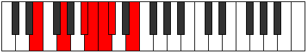 |
| [971](https://ianring.com/musictheory/scales/971) | [Ladian](ModeENaturalLadian.md) | E | E, F, G, A#, B, C, Db, E |  |
| [973](https://ianring.com/musictheory/scales/973) | [Phryptian](ModeASharpPhryptian.md) | A# | A#, B#, C#, D##, E#, F#, G, A# |  |
| [973](https://ianring.com/musictheory/scales/973) | [Phryptian](ModeBFlatPhryptian.md) | Bb | Bb, C, Db, E, F, Gb, Abb, Bb |  |
| [973](https://ianring.com/musictheory/scales/973) | [Phryptian](ModeENaturalPhryptian.md) | E | E, F#, G, A#, B, C, Db, E |  |
| [975](https://ianring.com/musictheory/scales/975) | [Katogyllic](ModeENaturalKatogyllic.md) | E | E, F, F#, G, A#, B, C, C#, E |  |
| [975](https://ianring.com/musictheory/scales/975) | [Katogyllic](ModeASharpKatogyllic.md) | A# | A#, B, C, C#, E, F, F#, G, A# |  |
| [975](https://ianring.com/musictheory/scales/975) | [Katogyllic](ModeBFlatKatogyllic.md) | Bb | Bb, B, C, Db, E, F, Gb, G, Bb |  |
| [979](https://ianring.com/musictheory/scales/979) | [Thogian](ModeDSharpThogian.md) | D# | D#, E, F##, G##, A#, B, C, D# |  |
| [979](https://ianring.com/musictheory/scales/979) | [Thogian](ModeEFlatThogian.md) | Eb | Eb, Fb, G, A, Bb, Cb, Dbb, Eb |  |
| [981](https://ianring.com/musictheory/scales/981) | [Bacrian](ModeASharpBacrian.md) | A# | A#, B#, C##, D##, E#, F#, G, A# |  |
| [981](https://ianring.com/musictheory/scales/981) | [Bacrian](ModeBFlatBacrian.md) | Bb | Bb, C, D, E, F, Gb, Abb, Bb |  |
| [983](https://ianring.com/musictheory/scales/983) | [Epygyllic](ModeASharpEpygyllic.md) | A# | A#, B, C, D, E, F, F#, G, A# |  |
| [983](https://ianring.com/musictheory/scales/983) | [Epygyllic](ModeBFlatEpygyllic.md) | Bb | Bb, B, C, D, E, F, Gb, G, Bb |  |
| [983](https://ianring.com/musictheory/scales/983) | [Epygyllic](ModeDSharpEpygyllic.md) | D# | D#, E, F, G, A, A#, B, C, D# |  |
| [983](https://ianring.com/musictheory/scales/983) | [Epygyllic](ModeEFlatEpygyllic.md) | Eb | Eb, E, F, G, A, Bb, B, C, Eb |  |
| [985](https://ianring.com/musictheory/scales/985) | [Raptian](ModeENaturalRaptian.md) | E | E, F##, G#, A#, B, C, Db, E |  |
| [987](https://ianring.com/musictheory/scales/987) | [Aeraptyllic](ModeENaturalAeraptyllic.md) | E | E, F, G, G#, A#, B, C, C#, E |  |
| [987](https://ianring.com/musictheory/scales/987) | [Aeraptyllic](ModeDSharpAeraptyllic.md) | D# | D#, E, F#, G, A, A#, B, C, D# |  |
| [987](https://ianring.com/musictheory/scales/987) | [Aeraptyllic](ModeEFlatAeraptyllic.md) | Eb | Eb, E, Gb, G, A, Bb, B, C, Eb |  |
| [989](https://ianring.com/musictheory/scales/989) | [Phrolyllic](ModeASharpPhrolyllic.md) | A# | A#, C, C#, D, E, F, F#, G, A# |  |
| [989](https://ianring.com/musictheory/scales/989) | [Phrolyllic](ModeBFlatPhrolyllic.md) | Bb | Bb, C, Db, D, E, F, Gb, G, Bb |  |
| [989](https://ianring.com/musictheory/scales/989) | [Phrolyllic](ModeENaturalPhrolyllic.md) | E | E, F#, G, G#, A#, B, C, C#, E |  |
| [991](https://ianring.com/musictheory/scales/991) | [Aeolygic](ModeASharpAeolygic.md) | A# | A#, B, C, C#, D, E, F, F#, G, A# |  |
| [991](https://ianring.com/musictheory/scales/991) | [Aeolygic](ModeBFlatAeolygic.md) | Bb | Bb, B, C, Db, D, E, F, Gb, G, Bb |  |
| [991](https://ianring.com/musictheory/scales/991) | [Aeolygic](ModeENaturalAeolygic.md) | E | E, F, F#, G, G#, A#, B, C, C#, E |  |
| [991](https://ianring.com/musictheory/scales/991) | [Aeolygic](ModeDSharpAeolygic.md) | D# | D#, E, F, F#, G, A, A#, B, C, D# |  |
| [991](https://ianring.com/musictheory/scales/991) | [Aeolygic](ModeEFlatAeolygic.md) | Eb | Eb, E, F, Gb, G, A, Bb, B, C, Eb |  |
| [997](https://ianring.com/musictheory/scales/997) | [Rycrian](ModeASharpRycrian.md) | A# | A#, B#, C###, D##, E#, F#, G, A# |  |
| [997](https://ianring.com/musictheory/scales/997) | [Rycrian](ModeBFlatRycrian.md) | Bb | Bb, C, D#, E, F, Gb, Abb, Bb | 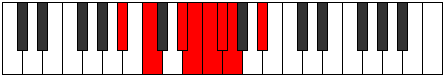 |
| [999](https://ianring.com/musictheory/scales/999) | [Bylyllic](ModeASharpBylyllic.md) | A# | A#, B, C, D#, E, F, F#, G, A# |  |
| [999](https://ianring.com/musictheory/scales/999) | [Bylyllic](ModeBFlatBylyllic.md) | Bb | Bb, B, C, Eb, E, F, Gb, G, Bb |  |
| [1001](https://ianring.com/musictheory/scales/1001) | [Badian](ModeGNaturalBadian.md) | G | G, A#, B#, C#, D, Eb, Fb, G |  |
| [1001](https://ianring.com/musictheory/scales/1001) | [Badian](ModeENaturalBadian.md) | E | E, F##, G##, A#, B, C, Db, E |  |
| [1003](https://ianring.com/musictheory/scales/1003) | [Ionyryllic](ModeGNaturalIonyryllic.md) | G | G, G#, A#, C, C#, D, D#, E, G |  |
| [1003](https://ianring.com/musictheory/scales/1003) | [Ionyryllic](ModeENaturalIonyryllic.md) | E | E, F, G, A, A#, B, C, C#, E |  |
| [1005](https://ianring.com/musictheory/scales/1005) | [Radyllic](ModeASharpRadyllic.md) | A# | A#, C, C#, D#, E, F, F#, G, A# |  |
| [1005](https://ianring.com/musictheory/scales/1005) | [Radyllic](ModeBFlatRadyllic.md) | Bb | Bb, C, Db, Eb, E, F, Gb, G, Bb |  |
| [1005](https://ianring.com/musictheory/scales/1005) | [Radyllic](ModeGNaturalRadyllic.md) | G | G, A, A#, C, C#, D, D#, E, G |  |
| [1005](https://ianring.com/musictheory/scales/1005) | [Radyllic](ModeENaturalRadyllic.md) | E | E, F#, G, A, A#, B, C, C#, E |  |
| [1007](https://ianring.com/musictheory/scales/1007) | [Ionycrygic](ModeGNaturalIonycrygic.md) | G | G, G#, A, A#, C, C#, D, D#, E, G |  |
| [1007](https://ianring.com/musictheory/scales/1007) | [Ionycrygic](ModeASharpIonycrygic.md) | A# | A#, B, C, C#, D#, E, F, F#, G, A# |  |
| [1007](https://ianring.com/musictheory/scales/1007) | [Ionycrygic](ModeBFlatIonycrygic.md) | Bb | Bb, B, C, Db, Eb, E, F, Gb, G, Bb |  |
| [1007](https://ianring.com/musictheory/scales/1007) | [Ionycrygic](ModeENaturalIonycrygic.md) | E | E, F, F#, G, A, A#, B, C, C#, E |  |
| [1011](https://ianring.com/musictheory/scales/1011) | [Kycryllic](ModeDSharpKycryllic.md) | D# | D#, E, G, G#, A, A#, B, C, D# |  |
| [1011](https://ianring.com/musictheory/scales/1011) | [Kycryllic](ModeEFlatKycryllic.md) | Eb | Eb, E, G, Ab, A, Bb, B, C, Eb |  |
| [1013](https://ianring.com/musictheory/scales/1013) | [Stydyllic](ModeASharpStydyllic.md) | A# | A#, C, D, D#, E, F, F#, G, A# |  |
| [1013](https://ianring.com/musictheory/scales/1013) | [Stydyllic](ModeBFlatStydyllic.md) | Bb | Bb, C, D, Eb, E, F, Gb, G, Bb |  |
| [1015](https://ianring.com/musictheory/scales/1015) | [Ionodygic](ModeASharpIonodygic.md) | A# | A#, B, C, D, D#, E, F, F#, G, A# | 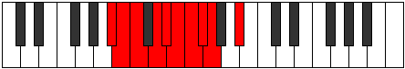 |
| [1015](https://ianring.com/musictheory/scales/1015) | [Ionodygic](ModeBFlatIonodygic.md) | Bb | Bb, B, C, D, Eb, E, F, Gb, G, Bb |  |
| [1015](https://ianring.com/musictheory/scales/1015) | [Ionodygic](ModeDSharpIonodygic.md) | D# | D#, E, F, G, G#, A, A#, B, C, D# |  |
| [1015](https://ianring.com/musictheory/scales/1015) | [Ionodygic](ModeEFlatIonodygic.md) | Eb | Eb, E, F, G, Ab, A, Bb, B, C, Eb |  |
| [1017](https://ianring.com/musictheory/scales/1017) | [Dythyllic](ModeGNaturalDythyllic.md) | G | G, A#, B, C, C#, D, D#, E, G |  |
| [1017](https://ianring.com/musictheory/scales/1017) | [Dythyllic](ModeENaturalDythyllic.md) | E | E, G, G#, A, A#, B, C, C#, E |  |
| [1019](https://ianring.com/musictheory/scales/1019) | [Aeranygic](ModeGNaturalAeranygic.md) | G | G, G#, A#, B, C, C#, D, D#, E, G |  |
| [1019](https://ianring.com/musictheory/scales/1019) | [Aeranygic](ModeENaturalAeranygic.md) | E | E, F, G, G#, A, A#, B, C, C#, E |  |
| [1019](https://ianring.com/musictheory/scales/1019) | [Aeranygic](ModeDSharpAeranygic.md) | D# | D#, E, F#, G, G#, A, A#, B, C, D# |  |
| [1019](https://ianring.com/musictheory/scales/1019) | [Aeranygic](ModeEFlatAeranygic.md) | Eb | Eb, E, Gb, G, Ab, A, Bb, B, C, Eb |  |
| [1021](https://ianring.com/musictheory/scales/1021) | [Ladygic](ModeASharpLadygic.md) | A# | A#, C, C#, D, D#, E, F, F#, G, A# |  |
| [1021](https://ianring.com/musictheory/scales/1021) | [Ladygic](ModeBFlatLadygic.md) | Bb | Bb, C, Db, D, Eb, E, F, Gb, G, Bb |  |
| [1021](https://ianring.com/musictheory/scales/1021) | [Ladygic](ModeGNaturalLadygic.md) | G | G, A, A#, B, C, C#, D, D#, E, G |  |
| [1021](https://ianring.com/musictheory/scales/1021) | [Ladygic](ModeENaturalLadygic.md) | E | E, F#, G, G#, A, A#, B, C, C#, E |  |
| [1023](https://ianring.com/musictheory/scales/1023) | [Dodyllian](ModeASharpDodyllian.md) | A# | A#, B, C, C#, D, D#, E, F, F#, G, A# |  |
| [1023](https://ianring.com/musictheory/scales/1023) | [Dodyllian](ModeBFlatDodyllian.md) | Bb | Bb, B, C, Db, D, Eb, E, F, Gb, G, Bb |  |
| [1023](https://ianring.com/musictheory/scales/1023) | [Dodyllian](ModeGNaturalDodyllian.md) | G | G, G#, A, A#, B, C, C#, D, D#, E, G |  |
| [1023](https://ianring.com/musictheory/scales/1023) | [Dodyllian](ModeENaturalDodyllian.md) | E | E, F, F#, G, G#, A, A#, B, C, C#, E |  |
| [1023](https://ianring.com/musictheory/scales/1023) | [Dodyllian](ModeDSharpDodyllian.md) | D# | D#, E, F, F#, G, G#, A, A#, B, C, D# |  |
| [1023](https://ianring.com/musictheory/scales/1023) | [Dodyllian](ModeEFlatDodyllian.md) | Eb | Eb, E, F, Gb, G, Ab, A, Bb, B, C, Eb |  |
| [1107](https://ianring.com/musictheory/scales/1107) | [Mogitonic](ModeFSharpMogitonic.md) | F# | F#, G, A#, C, E, F# |  |
| [1107](https://ianring.com/musictheory/scales/1107) | [Mogitonic](ModeGFlatMogitonic.md) | Gb | Gb, G, Bb, C, E, Gb |  |
| [1111](https://ianring.com/musictheory/scales/1111) | [Sycrimic](ModeFSharpSycrimic.md) | F# | F#, G, Ab, Bb, C, D##, F# |  |
| [1111](https://ianring.com/musictheory/scales/1111) | [Sycrimic](ModeGFlatSycrimic.md) | Gb | Gb, Abb, Bbbb, Cbb, Dbb, E, Gb |  |
| [1115](https://ianring.com/musictheory/scales/1115) | [Locrimic](ModeFSharpLocrimic.md) | F# | F#, G, A, Bb, C, D##, F# |  |
| [1115](https://ianring.com/musictheory/scales/1115) | [Locrimic](ModeGFlatLocrimic.md) | Gb | Gb, Abb, Bbb, Cbb, Dbb, E, Gb | 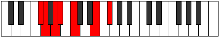 |
| [1119](https://ianring.com/musictheory/scales/1119) | [Rarian](ModeFSharpRarian.md) | F# | F#, G, Ab, Bbb, Cbb, Dbb, E, F# |  |
| [1119](https://ianring.com/musictheory/scales/1119) | [Rarian](ModeGFlatRarian.md) | Gb | Gb, Abb, Bbbb, Cbbb, Cbb, Dbb, E, Gb |  |
| [1139](https://ianring.com/musictheory/scales/1139) | [Aerygimic](ModeFSharpAerygimic.md) | F# | F#, G, A#, B, C, D##, F# |  |
| [1139](https://ianring.com/musictheory/scales/1139) | [Aerygimic](ModeGFlatAerygimic.md) | Gb | Gb, Abb, Bb, Cb, Dbb, E, Gb | 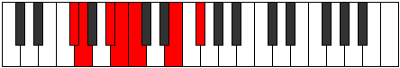 |
| [1143](https://ianring.com/musictheory/scales/1143) | [Styrian](ModeFSharpStyrian.md) | F# | F#, G, Ab, Bb, Cb, Dbb, E, F# |  |
| [1143](https://ianring.com/musictheory/scales/1143) | [Styrian](ModeGFlatStyrian.md) | Gb | Gb, Abb, Bbbb, Cbb, Dbbb, Dbb, E, Gb |  |
| [1147](https://ianring.com/musictheory/scales/1147) | [Epynian](ModeFSharpEpynian.md) | F# | F#, G, A, Bb, Cb, Dbb, E, F# |  |
| [1147](https://ianring.com/musictheory/scales/1147) | [Epynian](ModeGFlatEpynian.md) | Gb | Gb, Abb, Bbb, Cbb, Dbbb, Dbb, E, Gb |  |
| [1151](https://ianring.com/musictheory/scales/1151) | [Mythyllic](ModeFSharpMythyllic.md) | F# | F#, G, G#, A, A#, B, C, E, F# |  |
| [1151](https://ianring.com/musictheory/scales/1151) | [Mythyllic](ModeGFlatMythyllic.md) | Gb | Gb, G, Ab, A, Bb, B, C, E, Gb |  |
| [1163](https://ianring.com/musictheory/scales/1163) | [Pagitonic](ModeANaturalPagitonic.md) | A | A, A#, C, E, G, A |  |
| [1167](https://ianring.com/musictheory/scales/1167) | [Aerodimic](ModeANaturalAerodimic.md) | A | A, Bb, Cb, Dbb, E, F##, A |  |
| [1169](https://ianring.com/musictheory/scales/1169) | [Daric](ModeCNaturalDaric.md) | C | C, E, G, A#, C |  |
| [1171](https://ianring.com/musictheory/scales/1171) | [Loptitonic](ModeCNaturalLoptitonic.md) | C | C, C#, E, G, A#, C |  |
| [1173](https://ianring.com/musictheory/scales/1173) | [Phropitonic](ModeCNaturalPhropitonic.md) | C | C, D, E, G, A#, C |  |
| [1175](https://ianring.com/musictheory/scales/1175) | [Epycrimic](ModeCNaturalEpycrimic.md) | C | C, Db, Ebb, Fb, G, A#, C |  |
| [1177](https://ianring.com/musictheory/scales/1177) | [Garitonic](ModeCNaturalGaritonic.md) | C | C, D#, E, G, A#, C |  |
| [1179](https://ianring.com/musictheory/scales/1179) | [Sonimic](ModeCNaturalSonimic.md) | C | C, Db, Eb, Fb, G, A#, C |  |
| [1179](https://ianring.com/musictheory/scales/1179) | [Sonimic](ModeANaturalSonimic.md) | A | A, Bb, C, Db, E, F##, A |  |
| [1181](https://ianring.com/musictheory/scales/1181) | [Katagimic](ModeCNaturalKatagimic.md) | C | C, D, Eb, Fb, G, A#, C |  |
| [1183](https://ianring.com/musictheory/scales/1183) | [Sadian](ModeCNaturalSadian.md) | C | C, Db, Ebb, Fbb, Gbbb, Abb, Bb, C |  |
| [1183](https://ianring.com/musictheory/scales/1183) | [Sadian](ModeANaturalSadian.md) | A | A, Bb, Cb, Dbb, Ebbb, Fb, G, A |  |
| [1195](https://ianring.com/musictheory/scales/1195) | [Sarimic](ModeANaturalSarimic.md) | A | A, Bb, C, D, E, F##, A |  |
| [1199](https://ianring.com/musictheory/scales/1199) | [Magian](ModeANaturalMagian.md) | A | A, Bb, Cb, Dbb, Ebb, Fb, G, A |  |
| [1201](https://ianring.com/musictheory/scales/1201) | [Aeracritonic](ModeCNaturalAeracritonic.md) | C | C, E, F, G, A#, C |  |
| [1203](https://ianring.com/musictheory/scales/1203) | [Pagimic](ModeCNaturalPagimic.md) | C | C, Db, E, F, G, A#, C |  |
| [1205](https://ianring.com/musictheory/scales/1205) | [Ionycrimic](ModeCNaturalIonycrimic.md) | C | C, D, E, F, G, A#, C |  |
| [1207](https://ianring.com/musictheory/scales/1207) | [Aeoloptian](ModeCNaturalAeoloptian.md) | C | C, Db, Ebb, Fb, Gbb, Abb, Bb, C |  |
| [1209](https://ianring.com/musictheory/scales/1209) | [Ionynimic](ModeCNaturalIonynimic.md) | C | C, D#, E, F, G, A#, C |  |
| [1211](https://ianring.com/musictheory/scales/1211) | [Zadian](ModeCNaturalZadian.md) | C | C, Db, Eb, Fb, Gbb, Abb, Bb, C |  |
| [1211](https://ianring.com/musictheory/scales/1211) | [Zadian](ModeANaturalZadian.md) | A | A, Bb, C, Db, Ebb, Fb, G, A |  |
| [1213](https://ianring.com/musictheory/scales/1213) | [Gyrian](ModeCNaturalGyrian.md) | C | C, D, Eb, Fb, Gbb, Abb, Bb, C |  |
| [1215](https://ianring.com/musictheory/scales/1215) | [Aeolanyllic](ModeCNaturalAeolanyllic.md) | C | C, C#, D, D#, E, F, G, A#, C |  |
| [1215](https://ianring.com/musictheory/scales/1215) | [Aeolanyllic](ModeANaturalAeolanyllic.md) | A | A, A#, B, C, C#, D, E, G, A |  |
| [1227](https://ianring.com/musictheory/scales/1227) | [Thacrimic](ModeANaturalThacrimic.md) | A | A, Bb, C, D#, E, F##, A |  |
| [1231](https://ianring.com/musictheory/scales/1231) | [Logian](ModeANaturalLogian.md) | A | A, Bb, Cb, Dbb, Eb, Fb, G, A |  |
| [1233](https://ianring.com/musictheory/scales/1233) | [Ionoditonic](ModeCNaturalIonoditonic.md) | C | C, E, F#, G, A#, C |  |
| [1235](https://ianring.com/musictheory/scales/1235) | [Stylimic](ModeCNaturalStylimic.md) | C | C, Db, E, F#, G, A#, C |  |
| [1235](https://ianring.com/musictheory/scales/1235) | [Stylimic](ModeFSharpStylimic.md) | F# | F#, G, A#, B#, C#, D##, F# |  |
| [1235](https://ianring.com/musictheory/scales/1235) | [Stylimic](ModeGFlatStylimic.md) | Gb | Gb, Abb, Bb, C, Db, E, Gb |  |
| [1237](https://ianring.com/musictheory/scales/1237) | [Salimic](ModeCNaturalSalimic.md) | C | C, D, E, F#, G, A#, C |  |
| [1239](https://ianring.com/musictheory/scales/1239) | [Epaptian](ModeCNaturalEpaptian.md) | C | C, Db, Ebb, Fb, Gb, Abb, Bb, C |  |
| [1239](https://ianring.com/musictheory/scales/1239) | [Epaptian](ModeFSharpEpaptian.md) | F# | F#, G, Ab, Bb, C, Db, E, F# |  |
| [1239](https://ianring.com/musictheory/scales/1239) | [Epaptian](ModeGFlatEpaptian.md) | Gb | Gb, Abb, Bbbb, Cbb, Dbb, Ebbb, Fb, Gb |  |
| [1241](https://ianring.com/musictheory/scales/1241) | [Pygimic](ModeCNaturalPygimic.md) | C | C, D#, E, F#, G, A#, C |  |
| [1243](https://ianring.com/musictheory/scales/1243) | [Epylian](ModeCNaturalEpylian.md) | C | C, Db, Eb, Fb, Gb, Abb, Bb, C |  |
| [1243](https://ianring.com/musictheory/scales/1243) | [Epylian](ModeANaturalEpylian.md) | A | A, Bb, C, Db, Eb, Fb, G, A |  |
| [1243](https://ianring.com/musictheory/scales/1243) | [Epylian](ModeFSharpEpylian.md) | F# | F#, G, A, Bb, C, Db, E, F# |  |
| [1243](https://ianring.com/musictheory/scales/1243) | [Epylian](ModeGFlatEpylian.md) | Gb | Gb, Abb, Bbb, Cbb, Dbb, Ebbb, Fb, Gb |  |
| [1245](https://ianring.com/musictheory/scales/1245) | [Lathian](ModeCNaturalLathian.md) | C | C, D, Eb, Fb, Gb, Abb, Bb, C |  |
| [1247](https://ianring.com/musictheory/scales/1247) | [Mygyllic](ModeCNaturalMygyllic.md) | C | C, C#, D, D#, E, F#, G, A#, C |  |
| [1247](https://ianring.com/musictheory/scales/1247) | [Mygyllic](ModeFSharpMygyllic.md) | F# | F#, G, G#, A, A#, C, C#, E, F# |  |
| [1247](https://ianring.com/musictheory/scales/1247) | [Mygyllic](ModeGFlatMygyllic.md) | Gb | Gb, G, Ab, A, Bb, C, Db, E, Gb |  |
| [1247](https://ianring.com/musictheory/scales/1247) | [Mygyllic](ModeANaturalMygyllic.md) | A | A, A#, B, C, C#, D#, E, G, A |  |
| [1259](https://ianring.com/musictheory/scales/1259) | [Stadian](ModeANaturalStadian.md) | A | A, Bb, C, D, Eb, Fb, G, A |  |
| [1263](https://ianring.com/musictheory/scales/1263) | [Stynyllic](ModeANaturalStynyllic.md) | A | A, A#, B, C, D, D#, E, G, A |  |
| [1265](https://ianring.com/musictheory/scales/1265) | [Pynimic](ModeCNaturalPynimic.md) | C | C, D##, E#, F#, G, A#, C |  |
| [1267](https://ianring.com/musictheory/scales/1267) | [Katynian](ModeCNaturalKatynian.md) | C | C, Db, E, F, Gb, Abb, Bb, C |  |
| [1267](https://ianring.com/musictheory/scales/1267) | [Katynian](ModeFSharpKatynian.md) | F# | F#, G, A#, B, C, Db, E, F# |  |
| [1267](https://ianring.com/musictheory/scales/1267) | [Katynian](ModeGFlatKatynian.md) | Gb | Gb, Abb, Bb, Cb, Dbb, Ebbb, Fb, Gb |  |
| [1269](https://ianring.com/musictheory/scales/1269) | [Katythian](ModeCNaturalKatythian.md) | C | C, D, E, F, Gb, Abb, Bb, C |  |
| [1271](https://ianring.com/musictheory/scales/1271) | [Kolyllic](ModeCNaturalKolyllic.md) | C | C, C#, D, E, F, F#, G, A#, C |  |
| [1271](https://ianring.com/musictheory/scales/1271) | [Kolyllic](ModeFSharpKolyllic.md) | F# | F#, G, G#, A#, B, C, C#, E, F# |  |
| [1271](https://ianring.com/musictheory/scales/1271) | [Kolyllic](ModeGFlatKolyllic.md) | Gb | Gb, G, Ab, Bb, B, C, Db, E, Gb |  |
| [1273](https://ianring.com/musictheory/scales/1273) | [Ronian](ModeCNaturalRonian.md) | C | C, D#, E, F, Gb, Abb, Bb, C |  |
| [1275](https://ianring.com/musictheory/scales/1275) | [Stagyllic](ModeCNaturalStagyllic.md) | C | C, C#, D#, E, F, F#, G, A#, C |  |
| [1275](https://ianring.com/musictheory/scales/1275) | [Stagyllic](ModeANaturalStagyllic.md) | A | A, A#, C, C#, D, D#, E, G, A |  |
| [1275](https://ianring.com/musictheory/scales/1275) | [Stagyllic](ModeFSharpStagyllic.md) | F# | F#, G, A, A#, B, C, C#, E, F# |  |
| [1275](https://ianring.com/musictheory/scales/1275) | [Stagyllic](ModeGFlatStagyllic.md) | Gb | Gb, G, A, Bb, B, C, Db, E, Gb |  |
| [1277](https://ianring.com/musictheory/scales/1277) | [Zadyllic](ModeCNaturalZadyllic.md) | C | C, D, D#, E, F, F#, G, A#, C |  |
| [1279](https://ianring.com/musictheory/scales/1279) | [Sarygic](ModeCNaturalSarygic.md) | C | C, C#, D, D#, E, F, F#, G, A#, C |  |
| [1279](https://ianring.com/musictheory/scales/1279) | [Sarygic](ModeANaturalSarygic.md) | A | A, A#, B, C, C#, D, D#, E, G, A |  |
| [1279](https://ianring.com/musictheory/scales/1279) | [Sarygic](ModeFSharpSarygic.md) | F# | F#, G, G#, A, A#, B, C, C#, E, F# |  |
| [1279](https://ianring.com/musictheory/scales/1279) | [Sarygic](ModeGFlatSarygic.md) | Gb | Gb, G, Ab, A, Bb, B, C, Db, E, Gb |  |
| [1317](https://ianring.com/musictheory/scales/1317) | [Staditonic](ModeDNaturalStaditonic.md) | D | D, E, G, A#, C, D | 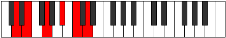 |
| [1319](https://ianring.com/musictheory/scales/1319) | [Phronimic](ModeDNaturalPhronimic.md) | D | D, Eb, Fb, G, A#, B#, D |  |
| [1325](https://ianring.com/musictheory/scales/1325) | [Phradimic](ModeDNaturalPhradimic.md) | D | D, E, F, G, A#, B#, D |  |
| [1327](https://ianring.com/musictheory/scales/1327) | [Zalian](ModeDNaturalZalian.md) | D | D, Eb, Fb, Gbb, Abb, Bb, C, D |  |
| [1333](https://ianring.com/musictheory/scales/1333) | [Lyptimic](ModeDNaturalLyptimic.md) | D | D, E, F#, G, A#, B#, D |  |
| [1335](https://ianring.com/musictheory/scales/1335) | [Aeralian](ModeDNaturalAeralian.md) | D | D, Eb, Fb, Gb, Abb, Bb, C, D | 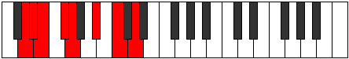 |
| [1341](https://ianring.com/musictheory/scales/1341) | [Madian](ModeDNaturalMadian.md) | D | D, E, F, Gb, Abb, Bb, C, D |  |
| [1343](https://ianring.com/musictheory/scales/1343) | [Zalyllic](ModeDNaturalZalyllic.md) | D | D, D#, E, F, F#, G, A#, C, D | 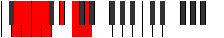 |
| [1353](https://ianring.com/musictheory/scales/1353) | [Kataritonic](ModeENaturalKataritonic.md) | E | E, G, A#, C, D, E |  |
| [1355](https://ianring.com/musictheory/scales/1355) | [Aeolorimic](ModeENaturalAeolorimic.md) | E | E, F, G, A#, B#, C##, E |  |
| [1357](https://ianring.com/musictheory/scales/1357) | [Katonimic](ModeENaturalKatonimic.md) | E | E, F#, G, A#, B#, C##, E |  |
| [1359](https://ianring.com/musictheory/scales/1359) | [Aerygian](ModeENaturalAerygian.md) | E | E, F, Gb, Abb, Bb, C, D, E |  |
| [1363](https://ianring.com/musictheory/scales/1363) | [Gygimic](ModeFSharpGygimic.md) | F# | F#, G, A#, B#, C##, D##, F# |  |
| [1363](https://ianring.com/musictheory/scales/1363) | [Gygimic](ModeGFlatGygimic.md) | Gb | Gb, Abb, Bb, C, D, E, Gb |  |
| [1367](https://ianring.com/musictheory/scales/1367) | [Pyptian](ModeFSharpPyptian.md) | F# | F#, G, Ab, Bb, C, D, E, F# |  |
| [1367](https://ianring.com/musictheory/scales/1367) | [Pyptian](ModeGFlatPyptian.md) | Gb | Gb, Abb, Bbbb, Cbb, Dbb, Ebb, Fb, Gb |  |
| [1369](https://ianring.com/musictheory/scales/1369) | [Boptimic](ModeENaturalBoptimic.md) | E | E, F##, G#, A#, B#, C##, E |  |
| [1371](https://ianring.com/musictheory/scales/1371) | [Ionadian](ModeENaturalIonadian.md) | E | E, F, G, Ab, Bb, C, D, E | 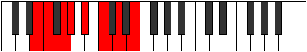 |
| [1371](https://ianring.com/musictheory/scales/1371) | [Ionadian](ModeFSharpIonadian.md) | F# | F#, G, A, Bb, C, D, E, F# |  |
| [1371](https://ianring.com/musictheory/scales/1371) | [Ionadian](ModeGFlatIonadian.md) | Gb | Gb, Abb, Bbb, Cbb, Dbb, Ebb, Fb, Gb |  |
| [1373](https://ianring.com/musictheory/scales/1373) | [Storian](ModeENaturalStorian.md) | E | E, F#, G, Ab, Bb, C, D, E |  |
| [1375](https://ianring.com/musictheory/scales/1375) | [Bothyllic](ModeENaturalBothyllic.md) | E | E, F, F#, G, G#, A#, C, D, E |  |
| [1375](https://ianring.com/musictheory/scales/1375) | [Bothyllic](ModeFSharpBothyllic.md) | F# | F#, G, G#, A, A#, C, D, E, F# |  |
| [1375](https://ianring.com/musictheory/scales/1375) | [Bothyllic](ModeGFlatBothyllic.md) | Gb | Gb, G, Ab, A, Bb, C, D, E, Gb |  |
| [1381](https://ianring.com/musictheory/scales/1381) | [Padimic](ModeDNaturalPadimic.md) | D | D, E, F##, G#, A#, B#, D |  |
| [1383](https://ianring.com/musictheory/scales/1383) | [Pynian](ModeDNaturalPynian.md) | D | D, Eb, Fb, G, Ab, Bb, C, D |  |
| [1385](https://ianring.com/musictheory/scales/1385) | [Phracrimic](ModeENaturalPhracrimic.md) | E | E, F##, G##, A#, B#, C##, E |  |
| [1387](https://ianring.com/musictheory/scales/1387) | [Locrian](ModeENaturalLocrian.md) | E | E, F, G, A, Bb, C, D, E |  |
| [1389](https://ianring.com/musictheory/scales/1389) | [Lorian](ModeDNaturalLorian.md) | D | D, E, F, G, Ab, Bb, C, D |  |
| [1389](https://ianring.com/musictheory/scales/1389) | [Lorian](ModeENaturalLorian.md) | E | E, F#, G, A, Bb, C, D, E |  |
| [1391](https://ianring.com/musictheory/scales/1391) | [Aeradyllic](ModeDNaturalAeradyllic.md) | D | D, D#, E, F, G, G#, A#, C, D |  |
| [1391](https://ianring.com/musictheory/scales/1391) | [Aeradyllic](ModeENaturalAeradyllic.md) | E | E, F, F#, G, A, A#, C, D, E |  |
| [1395](https://ianring.com/musictheory/scales/1395) | [Mixonorian](ModeFSharpMixonorian.md) | F# | F#, G, A#, B, C, D, E, F# |  |
| [1395](https://ianring.com/musictheory/scales/1395) | [Mixonorian](ModeGFlatMixonorian.md) | Gb | Gb, Abb, Bb, Cb, Dbb, Ebb, Fb, Gb |  |
| [1397](https://ianring.com/musictheory/scales/1397) | [Gothian](ModeDNaturalGothian.md) | D | D, E, F#, G, Ab, Bb, C, D |  |
| [1399](https://ianring.com/musictheory/scales/1399) | [Syryllic](ModeDNaturalSyryllic.md) | D | D, D#, E, F#, G, G#, A#, C, D |  |
| [1399](https://ianring.com/musictheory/scales/1399) | [Syryllic](ModeFSharpSyryllic.md) | F# | F#, G, G#, A#, B, C, D, E, F# |  |
| [1399](https://ianring.com/musictheory/scales/1399) | [Syryllic](ModeGFlatSyryllic.md) | Gb | Gb, G, Ab, Bb, B, C, D, E, Gb |  |
| [1401](https://ianring.com/musictheory/scales/1401) | [Pagian](ModeENaturalPagian.md) | E | E, F##, G#, A, Bb, C, D, E |  |
| [1403](https://ianring.com/musictheory/scales/1403) | [Epinyllic](ModeENaturalEpinyllic.md) | E | E, F, G, G#, A, A#, C, D, E |  |
| [1403](https://ianring.com/musictheory/scales/1403) | [Epinyllic](ModeFSharpEpinyllic.md) | F# | F#, G, A, A#, B, C, D, E, F# |  |
| [1403](https://ianring.com/musictheory/scales/1403) | [Epinyllic](ModeGFlatEpinyllic.md) | Gb | Gb, G, A, Bb, B, C, D, E, Gb |  |
| [1405](https://ianring.com/musictheory/scales/1405) | [Goryllic](ModeDNaturalGoryllic.md) | D | D, E, F, F#, G, G#, A#, C, D |  |
| [1405](https://ianring.com/musictheory/scales/1405) | [Goryllic](ModeENaturalGoryllic.md) | E | E, F#, G, G#, A, A#, C, D, E |  |
| [1407](https://ianring.com/musictheory/scales/1407) | [Tharygic](ModeDNaturalTharygic.md) | D | D, D#, E, F, F#, G, G#, A#, C, D |  |
| [1407](https://ianring.com/musictheory/scales/1407) | [Tharygic](ModeENaturalTharygic.md) | E | E, F, F#, G, G#, A, A#, C, D, E |  |
| [1407](https://ianring.com/musictheory/scales/1407) | [Tharygic](ModeFSharpTharygic.md) | F# | F#, G, G#, A, A#, B, C, D, E, F# |  |
| [1407](https://ianring.com/musictheory/scales/1407) | [Tharygic](ModeGFlatTharygic.md) | Gb | Gb, G, Ab, A, Bb, B, C, D, E, Gb |  |
| [1419](https://ianring.com/musictheory/scales/1419) | [Zalimic](ModeANaturalZalimic.md) | A | A, Bb, C, D##, E#, F##, A |  |
| [1423](https://ianring.com/musictheory/scales/1423) | [Doptian](ModeANaturalDoptian.md) | A | A, Bb, Cb, Dbb, E, F, G, A |  |
| [1425](https://ianring.com/musictheory/scales/1425) | [Ryphitonic](ModeCNaturalRyphitonic.md) | C | C, E, G, G#, A#, C |  |
| [1427](https://ianring.com/musictheory/scales/1427) | [Lolimic](ModeCNaturalLolimic.md) | C | C, Db, E, F##, G#, A#, C |  |
| [1429](https://ianring.com/musictheory/scales/1429) | [Bythimic](ModeCNaturalBythimic.md) | C | C, D, E, F##, G#, A#, C |  |
| [1431](https://ianring.com/musictheory/scales/1431) | [Phragian](ModeCNaturalPhragian.md) | C | C, Db, Ebb, Fb, G, Ab, Bb, C |  |
| [1433](https://ianring.com/musictheory/scales/1433) | [Dynimic](ModeCNaturalDynimic.md) | C | C, D#, E, F##, G#, A#, C |  |
| [1435](https://ianring.com/musictheory/scales/1435) | [Phronian](ModeCNaturalPhronian.md) | C | C, Db, Eb, Fb, G, Ab, Bb, C |  |
| [1435](https://ianring.com/musictheory/scales/1435) | [Phronian](ModeANaturalPhronian.md) | A | A, Bb, C, Db, E, F, G, A |  |
| [1437](https://ianring.com/musictheory/scales/1437) | [Aeolycrian](ModeCNaturalAeolycrian.md) | C | C, D, Eb, Fb, G, Ab, Bb, C |  |
| [1439](https://ianring.com/musictheory/scales/1439) | [Rolyllic](ModeCNaturalRolyllic.md) | C | C, C#, D, D#, E, G, G#, A#, C |  |
| [1439](https://ianring.com/musictheory/scales/1439) | [Rolyllic](ModeANaturalRolyllic.md) | A | A, A#, B, C, C#, E, F, G, A |  |
| [1445](https://ianring.com/musictheory/scales/1445) | [Byptimic](ModeDNaturalByptimic.md) | D | D, E, F##, G##, A#, B#, D |  |
| [1447](https://ianring.com/musictheory/scales/1447) | [Mixopyrian](ModeDNaturalMixopyrian.md) | D | D, Eb, Fb, G, A, Bb, C, D |  |
| [1451](https://ianring.com/musictheory/scales/1451) | [Phrygian](ModeANaturalPhrygian.md) | A | A, Bb, C, D, E, F, G, A |  |
| [1453](https://ianring.com/musictheory/scales/1453) | [Aeolian](ModeDNaturalAeolian.md) | D | D, E, F, G, A, Bb, C, D |  |
| [1455](https://ianring.com/musictheory/scales/1455) | [Soryllic](ModeDNaturalSoryllic.md) | D | D, D#, E, F, G, A, A#, C, D |  |
| [1455](https://ianring.com/musictheory/scales/1455) | [Soryllic](ModeANaturalSoryllic.md) | A | A, A#, B, C, D, E, F, G, A |  |
| [1457](https://ianring.com/musictheory/scales/1457) | [Modimic](ModeCNaturalModimic.md) | C | C, D##, E#, F##, G#, A#, C |  |
| [1459](https://ianring.com/musictheory/scales/1459) | [Ionalian](ModeCNaturalIonalian.md) | C | C, Db, E, F, G, Ab, Bb, C |  |
| [1461](https://ianring.com/musictheory/scales/1461) | [Stydian](ModeCNaturalStydian.md) | C | C, D, E, F, G, Ab, Bb, C |  |
| [1461](https://ianring.com/musictheory/scales/1461) | [Stydian](ModeDNaturalStydian.md) | D | D, E, F#, G, A, Bb, C, D |  |
| [1463](https://ianring.com/musictheory/scales/1463) | [Zaptyllic](ModeCNaturalZaptyllic.md) | C | C, C#, D, E, F, G, G#, A#, C |  |
| [1463](https://ianring.com/musictheory/scales/1463) | [Zaptyllic](ModeDNaturalZaptyllic.md) | D | D, D#, E, F#, G, A, A#, C, D |  |
| [1465](https://ianring.com/musictheory/scales/1465) | [Aerathian](ModeCNaturalAerathian.md) | C | C, D#, E, F, G, Ab, Bb, C |  |
| [1467](https://ianring.com/musictheory/scales/1467) | [Thydyllic](ModeCNaturalThydyllic.md) | C | C, C#, D#, E, F, G, G#, A#, C |  |
| [1467](https://ianring.com/musictheory/scales/1467) | [Thydyllic](ModeANaturalThydyllic.md) | A | A, A#, C, C#, D, E, F, G, A |  |
| [1469](https://ianring.com/musictheory/scales/1469) | [Epiryllic](ModeCNaturalEpiryllic.md) | C | C, D, D#, E, F, G, G#, A#, C |  |
| [1469](https://ianring.com/musictheory/scales/1469) | [Epiryllic](ModeDNaturalEpiryllic.md) | D | D, E, F, F#, G, A, A#, C, D |  |
| [1471](https://ianring.com/musictheory/scales/1471) | [Radygic](ModeCNaturalRadygic.md) | C | C, C#, D, D#, E, F, G, G#, A#, C |  |
| [1471](https://ianring.com/musictheory/scales/1471) | [Radygic](ModeDNaturalRadygic.md) | D | D, D#, E, F, F#, G, A, A#, C, D |  |
| [1471](https://ianring.com/musictheory/scales/1471) | [Radygic](ModeANaturalRadygic.md) | A | A, A#, B, C, C#, D, E, F, G, A |  |
| [1481](https://ianring.com/musictheory/scales/1481) | [Zagimic](ModeENaturalZagimic.md) | E | E, F##, G###, A##, B#, C##, E |  |
| [1483](https://ianring.com/musictheory/scales/1483) | [Dygian](ModeANaturalDygian.md) | A | A, Bb, C, D#, E, F, G, A |  |
| [1483](https://ianring.com/musictheory/scales/1483) | [Dygian](ModeENaturalDygian.md) | E | E, F, G, A#, B, C, D, E |  |
| [1485](https://ianring.com/musictheory/scales/1485) | [Tyrian](ModeENaturalTyrian.md) | E | E, F#, G, A#, B, C, D, E |  |
| [1487](https://ianring.com/musictheory/scales/1487) | [Lycryllic](ModeENaturalLycryllic.md) | E | E, F, F#, G, A#, B, C, D, E |  |
| [1487](https://ianring.com/musictheory/scales/1487) | [Lycryllic](ModeANaturalLycryllic.md) | A | A, A#, B, C, D#, E, F, G, A |  |
| [1489](https://ianring.com/musictheory/scales/1489) | [Gacrimic](ModeCNaturalGacrimic.md) | C | C, D##, E##, F##, G#, A#, C |  |
| [1491](https://ianring.com/musictheory/scales/1491) | [Rynian](ModeFSharpRynian.md) | F# | F#, G, A#, B#, C#, D, E, F# |  |
| [1491](https://ianring.com/musictheory/scales/1491) | [Rynian](ModeGFlatRynian.md) | Gb | Gb, Abb, Bb, C, Db, Ebb, Fb, Gb |  |
| [1491](https://ianring.com/musictheory/scales/1491) | [Rynian](ModeCNaturalRynian.md) | C | C, Db, E, F#, G, Ab, Bb, C |  |
| [1493](https://ianring.com/musictheory/scales/1493) | [Phryrian](ModeCNaturalPhryrian.md) | C | C, D, E, F#, G, Ab, Bb, C |  |
| [1495](https://ianring.com/musictheory/scales/1495) | [Kaptyllic](ModeCNaturalKaptyllic.md) | C | C, C#, D, E, F#, G, G#, A#, C |  |
| [1495](https://ianring.com/musictheory/scales/1495) | [Kaptyllic](ModeFSharpKaptyllic.md) | F# | F#, G, G#, A#, C, C#, D, E, F# |  |
| [1495](https://ianring.com/musictheory/scales/1495) | [Kaptyllic](ModeGFlatKaptyllic.md) | Gb | Gb, G, Ab, Bb, C, Db, D, E, Gb |  |
| [1497](https://ianring.com/musictheory/scales/1497) | [Ionanian](ModeCNaturalIonanian.md) | C | C, D#, E, F#, G, Ab, Bb, C |  |
| [1497](https://ianring.com/musictheory/scales/1497) | [Ionanian](ModeENaturalIonanian.md) | E | E, F##, G#, A#, B, C, D, E |  |
| [1499](https://ianring.com/musictheory/scales/1499) | [Stonyllic](ModeCNaturalStonyllic.md) | C | C, C#, D#, E, F#, G, G#, A#, C |  |
| [1499](https://ianring.com/musictheory/scales/1499) | [Stonyllic](ModeANaturalStonyllic.md) | A | A, A#, C, C#, D#, E, F, G, A |  |
| [1499](https://ianring.com/musictheory/scales/1499) | [Stonyllic](ModeFSharpStonyllic.md) | F# | F#, G, A, A#, C, C#, D, E, F# |  |
| [1499](https://ianring.com/musictheory/scales/1499) | [Stonyllic](ModeGFlatStonyllic.md) | Gb | Gb, G, A, Bb, C, Db, D, E, Gb |  |
| [1499](https://ianring.com/musictheory/scales/1499) | [Stonyllic](ModeENaturalStonyllic.md) | E | E, F, G, G#, A#, B, C, D, E |  |
| [1501](https://ianring.com/musictheory/scales/1501) | [Stygyllic](ModeCNaturalStygyllic.md) | C | C, D, D#, E, F#, G, G#, A#, C |  |
| [1501](https://ianring.com/musictheory/scales/1501) | [Stygyllic](ModeENaturalStygyllic.md) | E | E, F#, G, G#, A#, B, C, D, E |  |
| [1503](https://ianring.com/musictheory/scales/1503) | [Padygic](ModeCNaturalPadygic.md) | C | C, C#, D, D#, E, F#, G, G#, A#, C |  |
| [1503](https://ianring.com/musictheory/scales/1503) | [Padygic](ModeFSharpPadygic.md) | F# | F#, G, G#, A, A#, C, C#, D, E, F# |  |
| [1503](https://ianring.com/musictheory/scales/1503) | [Padygic](ModeGFlatPadygic.md) | Gb | Gb, G, Ab, A, Bb, C, Db, D, E, Gb |  |
| [1503](https://ianring.com/musictheory/scales/1503) | [Padygic](ModeENaturalPadygic.md) | E | E, F, F#, G, G#, A#, B, C, D, E |  |
| [1503](https://ianring.com/musictheory/scales/1503) | [Padygic](ModeANaturalPadygic.md) | A | A, A#, B, C, C#, D#, E, F, G, A |  |
| [1509](https://ianring.com/musictheory/scales/1509) | [Ragian](ModeDNaturalRagian.md) | D | D, E, F##, G#, A, Bb, C, D |  |
| [1511](https://ianring.com/musictheory/scales/1511) | [Styptyllic](ModeDNaturalStyptyllic.md) | D | D, D#, E, G, G#, A, A#, C, D |  |
| [1513](https://ianring.com/musictheory/scales/1513) | [Stathian](ModeENaturalStathian.md) | E | E, F##, G##, A#, B, C, D, E |  |
| [1515](https://ianring.com/musictheory/scales/1515) | [Solyllic](ModeANaturalSolyllic.md) | A | A, A#, C, D, D#, E, F, G, A | 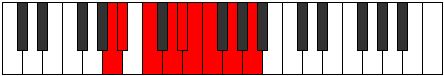 |
| [1515](https://ianring.com/musictheory/scales/1515) | [Solyllic](ModeENaturalSolyllic.md) | E | E, F, G, A, A#, B, C, D, E |  |
| [1517](https://ianring.com/musictheory/scales/1517) | [Sagyllic](ModeDNaturalSagyllic.md) | D | D, E, F, G, G#, A, A#, C, D |  |
| [1517](https://ianring.com/musictheory/scales/1517) | [Sagyllic](ModeENaturalSagyllic.md) | E | E, F#, G, A, A#, B, C, D, E |  |
| [1519](https://ianring.com/musictheory/scales/1519) | [Solygic](ModeDNaturalSolygic.md) | D | D, D#, E, F, G, G#, A, A#, C, D |  |
| [1519](https://ianring.com/musictheory/scales/1519) | [Solygic](ModeANaturalSolygic.md) | A | A, A#, B, C, D, D#, E, F, G, A |  |
| [1519](https://ianring.com/musictheory/scales/1519) | [Solygic](ModeENaturalSolygic.md) | E | E, F, F#, G, A, A#, B, C, D, E |  |
| [1521](https://ianring.com/musictheory/scales/1521) | [Stanian](ModeCNaturalStanian.md) | C | C, D##, E#, F#, G, Ab, Bb, C |  |
| [1523](https://ianring.com/musictheory/scales/1523) | [Zothyllic](ModeCNaturalZothyllic.md) | C | C, C#, E, F, F#, G, G#, A#, C |  |
| [1523](https://ianring.com/musictheory/scales/1523) | [Zothyllic](ModeFSharpZothyllic.md) | F# | F#, G, A#, B, C, C#, D, E, F# |  |
| [1523](https://ianring.com/musictheory/scales/1523) | [Zothyllic](ModeGFlatZothyllic.md) | Gb | Gb, G, Bb, B, C, Db, D, E, Gb |  |
| [1525](https://ianring.com/musictheory/scales/1525) | [Sodyllic](ModeCNaturalSodyllic.md) | C | C, D, E, F, F#, G, G#, A#, C |  |
| [1525](https://ianring.com/musictheory/scales/1525) | [Sodyllic](ModeDNaturalSodyllic.md) | D | D, E, F#, G, G#, A, A#, C, D |  |
| [1527](https://ianring.com/musictheory/scales/1527) | [Aeolyrygic](ModeCNaturalAeolyrygic.md) | C | C, C#, D, E, F, F#, G, G#, A#, C |  |
| [1527](https://ianring.com/musictheory/scales/1527) | [Aeolyrygic](ModeDNaturalAeolyrygic.md) | D | D, D#, E, F#, G, G#, A, A#, C, D |  |
| [1527](https://ianring.com/musictheory/scales/1527) | [Aeolyrygic](ModeFSharpAeolyrygic.md) | F# | F#, G, G#, A#, B, C, C#, D, E, F# |  |
| [1527](https://ianring.com/musictheory/scales/1527) | [Aeolyrygic](ModeGFlatAeolyrygic.md) | Gb | Gb, G, Ab, Bb, B, C, Db, D, E, Gb |  |
| [1529](https://ianring.com/musictheory/scales/1529) | [Kataryllic](ModeCNaturalKataryllic.md) | C | C, D#, E, F, F#, G, G#, A#, C |  |
| [1529](https://ianring.com/musictheory/scales/1529) | [Kataryllic](ModeENaturalKataryllic.md) | E | E, G, G#, A, A#, B, C, D, E |  |
| [1531](https://ianring.com/musictheory/scales/1531) | [Styptygic](ModeCNaturalStyptygic.md) | C | C, C#, D#, E, F, F#, G, G#, A#, C |  |
| [1531](https://ianring.com/musictheory/scales/1531) | [Styptygic](ModeANaturalStyptygic.md) | A | A, A#, C, C#, D, D#, E, F, G, A |  |
| [1531](https://ianring.com/musictheory/scales/1531) | [Styptygic](ModeFSharpStyptygic.md) | F# | F#, G, A, A#, B, C, C#, D, E, F# |  |
| [1531](https://ianring.com/musictheory/scales/1531) | [Styptygic](ModeGFlatStyptygic.md) | Gb | Gb, G, A, Bb, B, C, Db, D, E, Gb |  |
| [1531](https://ianring.com/musictheory/scales/1531) | [Styptygic](ModeENaturalStyptygic.md) | E | E, F, G, G#, A, A#, B, C, D, E |  |
| [1533](https://ianring.com/musictheory/scales/1533) | [Katycrygic](ModeCNaturalKatycrygic.md) | C | C, D, D#, E, F, F#, G, G#, A#, C |  |
| [1533](https://ianring.com/musictheory/scales/1533) | [Katycrygic](ModeDNaturalKatycrygic.md) | D | D, E, F, F#, G, G#, A, A#, C, D |  |
| [1533](https://ianring.com/musictheory/scales/1533) | [Katycrygic](ModeENaturalKatycrygic.md) | E | E, F#, G, G#, A, A#, B, C, D, E |  |
| [1535](https://ianring.com/musictheory/scales/1535) | [Mixodyllian](ModeCNaturalMixodyllian.md) | C | C, C#, D, D#, E, F, F#, G, G#, A#, C |  |
| [1535](https://ianring.com/musictheory/scales/1535) | [Mixodyllian](ModeDNaturalMixodyllian.md) | D | D, D#, E, F, F#, G, G#, A, A#, C, D |  |
| [1535](https://ianring.com/musictheory/scales/1535) | [Mixodyllian](ModeANaturalMixodyllian.md) | A | A, A#, B, C, C#, D, D#, E, F, G, A |  |
| [1535](https://ianring.com/musictheory/scales/1535) | [Mixodyllian](ModeFSharpMixodyllian.md) | F# | F#, G, G#, A, A#, B, C, C#, D, E, F# |  |
| [1535](https://ianring.com/musictheory/scales/1535) | [Mixodyllian](ModeGFlatMixodyllian.md) | Gb | Gb, G, Ab, A, Bb, B, C, Db, D, E, Gb |  |
| [1535](https://ianring.com/musictheory/scales/1535) | [Mixodyllian](ModeENaturalMixodyllian.md) | E | E, F, F#, G, G#, A, A#, B, C, D, E |  |
| [1577](https://ianring.com/musictheory/scales/1577) | [Lonitonic](ModeGNaturalLonitonic.md) | G | G, A#, C, E, F, G |  |
| [1579](https://ianring.com/musictheory/scales/1579) | [Sagimic](ModeGNaturalSagimic.md) | G | G, Ab, Bb, C, D##, E#, G |  |
| [1581](https://ianring.com/musictheory/scales/1581) | [Gyrimic](ModeGNaturalGyrimic.md) | G | G, A, Bb, C, D##, E#, G |  |
| [1583](https://ianring.com/musictheory/scales/1583) | [Salian](ModeGNaturalSalian.md) | G | G, Ab, Bbb, Cbb, Dbb, E, F, G |  |
| [1593](https://ianring.com/musictheory/scales/1593) | [Zogimic](ModeGNaturalZogimic.md) | G | G, A#, B, C, D##, E#, G |  |
| [1595](https://ianring.com/musictheory/scales/1595) | [Dacrian](ModeGNaturalDacrian.md) | G | G, Ab, Bb, Cb, Dbb, E, F, G |  |
| [1597](https://ianring.com/musictheory/scales/1597) | [Aeolodian](ModeGNaturalAeolodian.md) | G | G, A, Bb, Cb, Dbb, E, F, G |  |
| [1599](https://ianring.com/musictheory/scales/1599) | [Pocryllic](ModeGNaturalPocryllic.md) | G | G, G#, A, A#, B, C, E, F, G |  |
| [1605](https://ianring.com/musictheory/scales/1605) | [Zanitonic](ModeASharpZanitonic.md) | A# | A#, C, E, G, G#, A# |  |
| [1605](https://ianring.com/musictheory/scales/1605) | [Zanitonic](ModeBFlatZanitonic.md) | Bb | Bb, C, E, G, Ab, Bb |  |
| [1607](https://ianring.com/musictheory/scales/1607) | [Epytimic](ModeASharpEpytimic.md) | A# | A#, B, C, D##, E###, F###, A# |  |
| [1607](https://ianring.com/musictheory/scales/1607) | [Epytimic](ModeBFlatEpytimic.md) | Bb | Bb, Cb, Dbb, E, F##, G#, Bb |  |
| [1613](https://ianring.com/musictheory/scales/1613) | [Thylimic](ModeASharpThylimic.md) | A# | A#, B#, C#, D##, E###, F###, A# |  |
| [1613](https://ianring.com/musictheory/scales/1613) | [Thylimic](ModeBFlatThylimic.md) | Bb | Bb, C, Db, E, F##, G#, Bb |  |
| [1615](https://ianring.com/musictheory/scales/1615) | [Sydian](ModeASharpSydian.md) | A# | A#, B, C, Db, E, F##, G#, A# |  |
| [1615](https://ianring.com/musictheory/scales/1615) | [Sydian](ModeBFlatSydian.md) | Bb | Bb, Cb, Dbb, Ebbb, Fb, G, Ab, Bb |  |
| [1619](https://ianring.com/musictheory/scales/1619) | [Monimic](ModeFSharpMonimic.md) | F# | F#, G, A#, B#, C###, D##, F# |  |
| [1619](https://ianring.com/musictheory/scales/1619) | [Monimic](ModeGFlatMonimic.md) | Gb | Gb, Abb, Bb, C, D#, E, Gb |  |
| [1621](https://ianring.com/musictheory/scales/1621) | [Aeolathimic](ModeASharpAeolathimic.md) | A# | A#, B#, C##, D##, E###, F###, A# |  |
| [1621](https://ianring.com/musictheory/scales/1621) | [Aeolathimic](ModeBFlatAeolathimic.md) | Bb | Bb, C, D, E, F##, G#, Bb |  |
| [1623](https://ianring.com/musictheory/scales/1623) | [Lothian](ModeFSharpLothian.md) | F# | F#, G, Ab, Bb, C, D#, E, F# |  |
| [1623](https://ianring.com/musictheory/scales/1623) | [Lothian](ModeGFlatLothian.md) | Gb | Gb, Abb, Bbbb, Cbb, Dbb, Eb, Fb, Gb |  |
| [1623](https://ianring.com/musictheory/scales/1623) | [Lothian](ModeASharpLothian.md) | A# | A#, B, C, D, E, F##, G#, A# |  |
| [1623](https://ianring.com/musictheory/scales/1623) | [Lothian](ModeBFlatLothian.md) | Bb | Bb, Cb, Dbb, Ebb, Fb, G, Ab, Bb |  |
| [1627](https://ianring.com/musictheory/scales/1627) | [Zyptian](ModeFSharpZyptian.md) | F# | F#, G, A, Bb, C, D#, E, F# |  |
| [1627](https://ianring.com/musictheory/scales/1627) | [Zyptian](ModeGFlatZyptian.md) | Gb | Gb, Abb, Bbb, Cbb, Dbb, Eb, Fb, Gb |  |
| [1629](https://ianring.com/musictheory/scales/1629) | [Synian](ModeASharpSynian.md) | A# | A#, B#, C#, D, E, F##, G#, A# |  |
| [1629](https://ianring.com/musictheory/scales/1629) | [Synian](ModeBFlatSynian.md) | Bb | Bb, C, Db, Ebb, Fb, G, Ab, Bb |  |
| [1631](https://ianring.com/musictheory/scales/1631) | [Rynyllic](ModeFSharpRynyllic.md) | F# | F#, G, G#, A, A#, C, D#, E, F# |  |
| [1631](https://ianring.com/musictheory/scales/1631) | [Rynyllic](ModeGFlatRynyllic.md) | Gb | Gb, G, Ab, A, Bb, C, Eb, E, Gb |  |
| [1631](https://ianring.com/musictheory/scales/1631) | [Rynyllic](ModeASharpRynyllic.md) | A# | A#, B, C, C#, D, E, G, G#, A# |  |
| [1631](https://ianring.com/musictheory/scales/1631) | [Rynyllic](ModeBFlatRynyllic.md) | Bb | Bb, B, C, Db, D, E, G, Ab, Bb |  |
| [1637](https://ianring.com/musictheory/scales/1637) | [Syptimic](ModeASharpSyptimic.md) | A# | A#, B#, C###, D##, E###, F###, A# |  |
| [1637](https://ianring.com/musictheory/scales/1637) | [Syptimic](ModeBFlatSyptimic.md) | Bb | Bb, C, D#, E, F##, G#, Bb |  |
| [1639](https://ianring.com/musictheory/scales/1639) | [Aeolothian](ModeASharpAeolothian.md) | A# | A#, B, C, D#, E, F##, G#, A# |  |
| [1639](https://ianring.com/musictheory/scales/1639) | [Aeolothian](ModeBFlatAeolothian.md) | Bb | Bb, Cb, Dbb, Eb, Fb, G, Ab, Bb |  |
| [1641](https://ianring.com/musictheory/scales/1641) | [Bocrimic](ModeGNaturalBocrimic.md) | G | G, A#, B#, C#, D##, E#, G |  |
| [1643](https://ianring.com/musictheory/scales/1643) | [Thyptian](ModeGNaturalThyptian.md) | G | G, Ab, Bb, C, Db, E, F, G |  |
| [1645](https://ianring.com/musictheory/scales/1645) | [Katagian](ModeASharpKatagian.md) | A# | A#, B#, C#, D#, E, F##, G#, A# |  |
| [1645](https://ianring.com/musictheory/scales/1645) | [Katagian](ModeBFlatKatagian.md) | Bb | Bb, C, Db, Eb, Fb, G, Ab, Bb |  |
| [1645](https://ianring.com/musictheory/scales/1645) | [Katagian](ModeGNaturalKatagian.md) | G | G, A, Bb, C, Db, E, F, G |  |
| [1647](https://ianring.com/musictheory/scales/1647) | [Polyllic](ModeGNaturalPolyllic.md) | G | G, G#, A, A#, C, C#, E, F, G |  |
| [1647](https://ianring.com/musictheory/scales/1647) | [Polyllic](ModeASharpPolyllic.md) | A# | A#, B, C, C#, D#, E, G, G#, A# |  |
| [1647](https://ianring.com/musictheory/scales/1647) | [Polyllic](ModeBFlatPolyllic.md) | Bb | Bb, B, C, Db, Eb, E, G, Ab, Bb |  |
| [1651](https://ianring.com/musictheory/scales/1651) | [Mogian](ModeFSharpMogian.md) | F# | F#, G, A#, B, C, D#, E, F# |  |
| [1651](https://ianring.com/musictheory/scales/1651) | [Mogian](ModeGFlatMogian.md) | Gb | Gb, Abb, Bb, Cb, Dbb, Eb, Fb, Gb |  |
| [1653](https://ianring.com/musictheory/scales/1653) | [Gylian](ModeASharpGylian.md) | A# | A#, B#, C##, D#, E, F##, G#, A# |  |
| [1653](https://ianring.com/musictheory/scales/1653) | [Gylian](ModeBFlatGylian.md) | Bb | Bb, C, D, Eb, Fb, G, Ab, Bb |  |
| [1655](https://ianring.com/musictheory/scales/1655) | [Katygyllic](ModeASharpKatygyllic.md) | A# | A#, B, C, D, D#, E, G, G#, A# |  |
| [1655](https://ianring.com/musictheory/scales/1655) | [Katygyllic](ModeBFlatKatygyllic.md) | Bb | Bb, B, C, D, Eb, E, G, Ab, Bb | 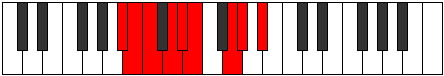 |
| [1655](https://ianring.com/musictheory/scales/1655) | [Katygyllic](ModeFSharpKatygyllic.md) | F# | F#, G, G#, A#, B, C, D#, E, F# |  |
| [1655](https://ianring.com/musictheory/scales/1655) | [Katygyllic](ModeGFlatKatygyllic.md) | Gb | Gb, G, Ab, Bb, B, C, Eb, E, Gb |  |
| [1657](https://ianring.com/musictheory/scales/1657) | [Ionothian](ModeGNaturalIonothian.md) | G | G, A#, B, C, Db, E, F, G |  |
| [1659](https://ianring.com/musictheory/scales/1659) | [Magyllic](ModeGNaturalMagyllic.md) | G | G, G#, A#, B, C, C#, E, F, G |  |
| [1659](https://ianring.com/musictheory/scales/1659) | [Magyllic](ModeFSharpMagyllic.md) | F# | F#, G, A, A#, B, C, D#, E, F# |  |
| [1659](https://ianring.com/musictheory/scales/1659) | [Magyllic](ModeGFlatMagyllic.md) | Gb | Gb, G, A, Bb, B, C, Eb, E, Gb |  |
| [1661](https://ianring.com/musictheory/scales/1661) | [Gonyllic](ModeASharpGonyllic.md) | A# | A#, C, C#, D, D#, E, G, G#, A# |  |
| [1661](https://ianring.com/musictheory/scales/1661) | [Gonyllic](ModeBFlatGonyllic.md) | Bb | Bb, C, Db, D, Eb, E, G, Ab, Bb |  |
| [1661](https://ianring.com/musictheory/scales/1661) | [Gonyllic](ModeGNaturalGonyllic.md) | G | G, A, A#, B, C, C#, E, F, G |  |
| [1663](https://ianring.com/musictheory/scales/1663) | [Lydygic](ModeASharpLydygic.md) | A# | A#, B, C, C#, D, D#, E, G, G#, A# |  |
| [1663](https://ianring.com/musictheory/scales/1663) | [Lydygic](ModeBFlatLydygic.md) | Bb | Bb, B, C, Db, D, Eb, E, G, Ab, Bb |  |
| [1663](https://ianring.com/musictheory/scales/1663) | [Lydygic](ModeGNaturalLydygic.md) | G | G, G#, A, A#, B, C, C#, E, F, G |  |
| [1663](https://ianring.com/musictheory/scales/1663) | [Lydygic](ModeFSharpLydygic.md) | F# | F#, G, G#, A, A#, B, C, D#, E, F# |  |
| [1663](https://ianring.com/musictheory/scales/1663) | [Lydygic](ModeGFlatLydygic.md) | Gb | Gb, G, Ab, A, Bb, B, C, Eb, E, Gb |  |
| [1675](https://ianring.com/musictheory/scales/1675) | [Epatimic](ModeANaturalEpatimic.md) | A | A, Bb, C, D##, E##, F##, A | 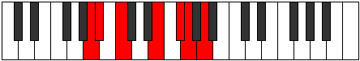 |
| [1679](https://ianring.com/musictheory/scales/1679) | [Kydian](ModeANaturalKydian.md) | A | A, Bb, Cb, Dbb, E, F#, G, A |  |
| [1681](https://ianring.com/musictheory/scales/1681) | [Ionaditonic](ModeCNaturalIonaditonic.md) | C | C, E, G, A, A#, C |  |
| [1683](https://ianring.com/musictheory/scales/1683) | [Rygimic](ModeDSharpRygimic.md) | D# | D#, E, F##, G###, A###, B##, D# |  |
| [1683](https://ianring.com/musictheory/scales/1683) | [Rygimic](ModeEFlatRygimic.md) | Eb | Eb, Fb, G, A#, B#, C#, Eb |  |
| [1683](https://ianring.com/musictheory/scales/1683) | [Rygimic](ModeCNaturalRygimic.md) | C | C, Db, E, F##, G##, A#, C |  |
| [1685](https://ianring.com/musictheory/scales/1685) | [Zeracrimic](ModeCNaturalZeracrimic.md) | C | C, D, E, F##, G##, A#, C |  |
| [1687](https://ianring.com/musictheory/scales/1687) | [Phralian](ModeDSharpPhralian.md) | D# | D#, E, F, G, A#, B#, C#, D# |  |
| [1687](https://ianring.com/musictheory/scales/1687) | [Phralian](ModeEFlatPhralian.md) | Eb | Eb, Fb, Gbb, Abb, Bb, C, Db, Eb |  |
| [1687](https://ianring.com/musictheory/scales/1687) | [Phralian](ModeCNaturalPhralian.md) | C | C, Db, Ebb, Fb, G, A, Bb, C |  |
| [1689](https://ianring.com/musictheory/scales/1689) | [Lorimic](ModeCNaturalLorimic.md) | C | C, D#, E, F##, G##, A#, C |  |
| [1691](https://ianring.com/musictheory/scales/1691) | [Kathian](ModeDSharpKathian.md) | D# | D#, E, F#, G, A#, B#, C#, D# |  |
| [1691](https://ianring.com/musictheory/scales/1691) | [Kathian](ModeEFlatKathian.md) | Eb | Eb, Fb, Gb, Abb, Bb, C, Db, Eb |  |
| [1691](https://ianring.com/musictheory/scales/1691) | [Kathian](ModeCNaturalKathian.md) | C | C, Db, Eb, Fb, G, A, Bb, C |  |
| [1691](https://ianring.com/musictheory/scales/1691) | [Kathian](ModeANaturalKathian.md) | A | A, Bb, C, Db, E, F#, G, A |  |
| [1693](https://ianring.com/musictheory/scales/1693) | [Dogian](ModeCNaturalDogian.md) | C | C, D, Eb, Fb, G, A, Bb, C |  |
| [1695](https://ianring.com/musictheory/scales/1695) | [Phrodyllic](ModeDSharpPhrodyllic.md) | D# | D#, E, F, F#, G, A#, C, C#, D# |  |
| [1695](https://ianring.com/musictheory/scales/1695) | [Phrodyllic](ModeEFlatPhrodyllic.md) | Eb | Eb, E, F, Gb, G, Bb, C, Db, Eb |  |
| [1695](https://ianring.com/musictheory/scales/1695) | [Phrodyllic](ModeCNaturalPhrodyllic.md) | C | C, C#, D, D#, E, G, A, A#, C |  |
| [1695](https://ianring.com/musictheory/scales/1695) | [Phrodyllic](ModeANaturalPhrodyllic.md) | A | A, A#, B, C, C#, E, F#, G, A |  |
| [1705](https://ianring.com/musictheory/scales/1705) | [Darmic](ModeGNaturalDarmic.md) | G | G, A#, B#, C##, D##, E#, G |  |
| [1707](https://ianring.com/musictheory/scales/1707) | [Mixolythian](ModeGNaturalMixolythian.md) | G | G, Ab, Bb, C, D, E, F, G |  |
| [1707](https://ianring.com/musictheory/scales/1707) | [Mixolythian](ModeANaturalMixolythian.md) | A | A, Bb, C, D, E, F#, G, A |  |
| [1709](https://ianring.com/musictheory/scales/1709) | [Dorian](ModeGNaturalDorian.md) | G | G, A, Bb, C, D, E, F, G |  |
| [1711](https://ianring.com/musictheory/scales/1711) | [Ragyllic](ModeGNaturalRagyllic.md) | G | G, G#, A, A#, C, D, E, F, G |  |
| [1711](https://ianring.com/musictheory/scales/1711) | [Ragyllic](ModeANaturalRagyllic.md) | A | A, A#, B, C, D, E, F#, G, A |  |
| [1713](https://ianring.com/musictheory/scales/1713) | [Garimic](ModeCNaturalGarimic.md) | C | C, D##, E#, F##, G##, A#, C |  |
| [1715](https://ianring.com/musictheory/scales/1715) | [Aeronian](ModeDSharpAeronian.md) | D# | D#, E, F##, G#, A#, B#, C#, D# |  |
| [1715](https://ianring.com/musictheory/scales/1715) | [Aeronian](ModeEFlatAeronian.md) | Eb | Eb, Fb, G, Ab, Bb, C, Db, Eb |  |
| [1715](https://ianring.com/musictheory/scales/1715) | [Aeronian](ModeCNaturalAeronian.md) | C | C, Db, E, F, G, A, Bb, C |  |
| [1717](https://ianring.com/musictheory/scales/1717) | [Mixolydian](ModeCNaturalMixolydian.md) | C | C, D, E, F, G, A, Bb, C |  |
| [1719](https://ianring.com/musictheory/scales/1719) | [Lyryllic](ModeDSharpLyryllic.md) | D# | D#, E, F, G, G#, A#, C, C#, D# |  |
| [1719](https://ianring.com/musictheory/scales/1719) | [Lyryllic](ModeEFlatLyryllic.md) | Eb | Eb, E, F, G, Ab, Bb, C, Db, Eb |  |
| [1719](https://ianring.com/musictheory/scales/1719) | [Lyryllic](ModeCNaturalLyryllic.md) | C | C, C#, D, E, F, G, A, A#, C |  |
| [1721](https://ianring.com/musictheory/scales/1721) | [Ionycrian](ModeCNaturalIonycrian.md) | C | C, D#, E, F, G, A, Bb, C |  |
| [1721](https://ianring.com/musictheory/scales/1721) | [Ionycrian](ModeGNaturalIonycrian.md) | G | G, A#, B, C, D, E, F, G |  |
| [1723](https://ianring.com/musictheory/scales/1723) | [Poryllic](ModeDSharpPoryllic.md) | D# | D#, E, F#, G, G#, A#, C, C#, D# |  |
| [1723](https://ianring.com/musictheory/scales/1723) | [Poryllic](ModeEFlatPoryllic.md) | Eb | Eb, E, Gb, G, Ab, Bb, C, Db, Eb |  |
| [1723](https://ianring.com/musictheory/scales/1723) | [Poryllic](ModeCNaturalPoryllic.md) | C | C, C#, D#, E, F, G, A, A#, C |  |
| [1723](https://ianring.com/musictheory/scales/1723) | [Poryllic](ModeANaturalPoryllic.md) | A | A, A#, C, C#, D, E, F#, G, A |  |
| [1723](https://ianring.com/musictheory/scales/1723) | [Poryllic](ModeGNaturalPoryllic.md) | G | G, G#, A#, B, C, D, E, F, G |  |
| [1725](https://ianring.com/musictheory/scales/1725) | [Mixodyllic](ModeCNaturalMixodyllic.md) | C | C, D, D#, E, F, G, A, A#, C |  |
| [1725](https://ianring.com/musictheory/scales/1725) | [Mixodyllic](ModeGNaturalMixodyllic.md) | G | G, A, A#, B, C, D, E, F, G |  |
| [1727](https://ianring.com/musictheory/scales/1727) | [Sydygic](ModeDSharpSydygic.md) | D# | D#, E, F, F#, G, G#, A#, C, C#, D# | 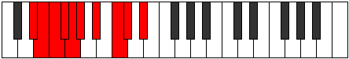 |
| [1727](https://ianring.com/musictheory/scales/1727) | [Sydygic](ModeEFlatSydygic.md) | Eb | Eb, E, F, Gb, G, Ab, Bb, C, Db, Eb |  |
| [1727](https://ianring.com/musictheory/scales/1727) | [Sydygic](ModeCNaturalSydygic.md) | C | C, C#, D, D#, E, F, G, A, A#, C |  |
| [1727](https://ianring.com/musictheory/scales/1727) | [Sydygic](ModeANaturalSydygic.md) | A | A, A#, B, C, C#, D, E, F#, G, A |  |
| [1727](https://ianring.com/musictheory/scales/1727) | [Sydygic](ModeGNaturalSydygic.md) | G | G, G#, A, A#, B, C, D, E, F, G |  |
| [1733](https://ianring.com/musictheory/scales/1733) | [Socrimic](ModeASharpSocrimic.md) | A# | A#, B#, D##, E#, F##, G#, A# |  |
| [1733](https://ianring.com/musictheory/scales/1733) | [Socrimic](ModeBFlatSocrimic.md) | Bb | Bb, C, D##, E#, F##, G#, Bb |  |
| [1735](https://ianring.com/musictheory/scales/1735) | [Dagian](ModeASharpDagian.md) | A# | A#, B, C, D##, E#, F##, G#, A# |  |
| [1735](https://ianring.com/musictheory/scales/1735) | [Dagian](ModeBFlatDagian.md) | Bb | Bb, Cb, Dbb, E, F, G, Ab, Bb |  |
| [1739](https://ianring.com/musictheory/scales/1739) | [Phrylian](ModeANaturalPhrylian.md) | A | A, Bb, C, D#, E, F#, G, A |  |
| [1741](https://ianring.com/musictheory/scales/1741) | [Katycrian](ModeASharpKatycrian.md) | A# | A#, B#, C#, D##, E#, F##, G#, A# |  |
| [1741](https://ianring.com/musictheory/scales/1741) | [Katycrian](ModeBFlatKatycrian.md) | Bb | Bb, C, Db, E, F, G, Ab, Bb |  |
| [1743](https://ianring.com/musictheory/scales/1743) | [Epigyllic](ModeASharpEpigyllic.md) | A# | A#, B, C, C#, E, F, G, G#, A# |  |
| [1743](https://ianring.com/musictheory/scales/1743) | [Epigyllic](ModeBFlatEpigyllic.md) | Bb | Bb, B, C, Db, E, F, G, Ab, Bb |  |
| [1743](https://ianring.com/musictheory/scales/1743) | [Epigyllic](ModeANaturalEpigyllic.md) | A | A, A#, B, C, D#, E, F#, G, A |  |
| [1745](https://ianring.com/musictheory/scales/1745) | [Manimic](ModeCNaturalManimic.md) | C | C, D##, E##, F##, G##, A#, C |  |
| [1747](https://ianring.com/musictheory/scales/1747) | [Epalian](ModeFSharpEpalian.md) | F# | F#, G, A#, B#, C#, D#, E, F# |  |
| [1747](https://ianring.com/musictheory/scales/1747) | [Epalian](ModeGFlatEpalian.md) | Gb | Gb, Abb, Bb, C, Db, Eb, Fb, Gb |  |
| [1747](https://ianring.com/musictheory/scales/1747) | [Epalian](ModeDSharpEpalian.md) | D# | D#, E, F##, G##, A#, B#, C#, D# |  |
| [1747](https://ianring.com/musictheory/scales/1747) | [Epalian](ModeEFlatEpalian.md) | Eb | Eb, Fb, G, A, Bb, C, Db, Eb | 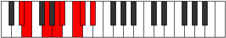 |
| [1747](https://ianring.com/musictheory/scales/1747) | [Epalian](ModeCNaturalEpalian.md) | C | C, Db, E, F#, G, A, Bb, C |  |
| [1749](https://ianring.com/musictheory/scales/1749) | [Lythian](ModeASharpLythian.md) | A# | A#, B#, C##, D##, E#, F##, G#, A# |  |
| [1749](https://ianring.com/musictheory/scales/1749) | [Lythian](ModeBFlatLythian.md) | Bb | Bb, C, D, E, F, G, Ab, Bb |  |
| [1749](https://ianring.com/musictheory/scales/1749) | [Lythian](ModeCNaturalLythian.md) | C | C, D, E, F#, G, A, Bb, C | 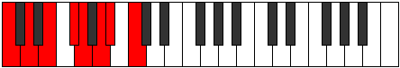 |
| [1751](https://ianring.com/musictheory/scales/1751) | [Aeolyryllic](ModeFSharpAeolyryllic.md) | F# | F#, G, G#, A#, C, C#, D#, E, F# |  |
| [1751](https://ianring.com/musictheory/scales/1751) | [Aeolyryllic](ModeGFlatAeolyryllic.md) | Gb | Gb, G, Ab, Bb, C, Db, Eb, E, Gb |  |
| [1751](https://ianring.com/musictheory/scales/1751) | [Aeolyryllic](ModeDSharpAeolyryllic.md) | D# | D#, E, F, G, A, A#, C, C#, D# |  |
| [1751](https://ianring.com/musictheory/scales/1751) | [Aeolyryllic](ModeEFlatAeolyryllic.md) | Eb | Eb, E, F, G, A, Bb, C, Db, Eb |  |
| [1751](https://ianring.com/musictheory/scales/1751) | [Aeolyryllic](ModeCNaturalAeolyryllic.md) | C | C, C#, D, E, F#, G, A, A#, C |  |
| [1751](https://ianring.com/musictheory/scales/1751) | [Aeolyryllic](ModeASharpAeolyryllic.md) | A# | A#, B, C, D, E, F, G, G#, A# |  |
| [1751](https://ianring.com/musictheory/scales/1751) | [Aeolyryllic](ModeBFlatAeolyryllic.md) | Bb | Bb, B, C, D, E, F, G, Ab, Bb |  |
| [1753](https://ianring.com/musictheory/scales/1753) | [Mycrian](ModeCNaturalMycrian.md) | C | C, D#, E, F#, G, A, Bb, C |  |
| [1755](https://ianring.com/musictheory/scales/1755) | [MinorDiminished](ModeCNaturalMinorDiminished.md) | C | C, C#, D#, E, F#, G, A, A#, C |  |
| [1755](https://ianring.com/musictheory/scales/1755) | [MinorDiminished](ModeDSharpMinorDiminished.md) | D# | D#, E, F#, G, A, A#, C, C#, D# |  |
| [1755](https://ianring.com/musictheory/scales/1755) | [MinorDiminished](ModeEFlatMinorDiminished.md) | Eb | Eb, E, Gb, G, A, Bb, C, Db, Eb |  |
| [1755](https://ianring.com/musictheory/scales/1755) | [MinorDiminished](ModeFSharpMinorDiminished.md) | F# | F#, G, A, A#, C, C#, D#, E, F# |  |
| [1755](https://ianring.com/musictheory/scales/1755) | [MinorDiminished](ModeGFlatMinorDiminished.md) | Gb | Gb, G, A, Bb, C, Db, Eb, E, Gb |  |
| [1755](https://ianring.com/musictheory/scales/1755) | [MinorDiminished](ModeANaturalMinorDiminished.md) | A | A, A#, C, C#, D#, E, F#, G, A |  |
| [1757](https://ianring.com/musictheory/scales/1757) | [Ionyphyllic](ModeASharpIonyphyllic.md) | A# | A#, C, C#, D, E, F, G, G#, A# |  |
| [1757](https://ianring.com/musictheory/scales/1757) | [Ionyphyllic](ModeBFlatIonyphyllic.md) | Bb | Bb, C, Db, D, E, F, G, Ab, Bb |  |
| [1757](https://ianring.com/musictheory/scales/1757) | [Ionyphyllic](ModeCNaturalIonyphyllic.md) | C | C, D, D#, E, F#, G, A, A#, C |  |
| [1759](https://ianring.com/musictheory/scales/1759) | [Pylygic](ModeCNaturalPylygic.md) | C | C, C#, D, D#, E, F#, G, A, A#, C |  |
| [1759](https://ianring.com/musictheory/scales/1759) | [Pylygic](ModeDSharpPylygic.md) | D# | D#, E, F, F#, G, A, A#, C, C#, D# |  |
| [1759](https://ianring.com/musictheory/scales/1759) | [Pylygic](ModeEFlatPylygic.md) | Eb | Eb, E, F, Gb, G, A, Bb, C, Db, Eb |  |
| [1759](https://ianring.com/musictheory/scales/1759) | [Pylygic](ModeFSharpPylygic.md) | F# | F#, G, G#, A, A#, C, C#, D#, E, F# |  |
| [1759](https://ianring.com/musictheory/scales/1759) | [Pylygic](ModeGFlatPylygic.md) | Gb | Gb, G, Ab, A, Bb, C, Db, Eb, E, Gb |  |
| [1759](https://ianring.com/musictheory/scales/1759) | [Pylygic](ModeASharpPylygic.md) | A# | A#, B, C, C#, D, E, F, G, G#, A# |  |
| [1759](https://ianring.com/musictheory/scales/1759) | [Pylygic](ModeBFlatPylygic.md) | Bb | Bb, B, C, Db, D, E, F, G, Ab, Bb |  |
| [1759](https://ianring.com/musictheory/scales/1759) | [Pylygic](ModeANaturalPylygic.md) | A | A, A#, B, C, C#, D#, E, F#, G, A |  |
| [1765](https://ianring.com/musictheory/scales/1765) | [Lonian](ModeASharpLonian.md) | A# | A#, B#, C###, D##, E#, F##, G#, A# |  |
| [1765](https://ianring.com/musictheory/scales/1765) | [Lonian](ModeBFlatLonian.md) | Bb | Bb, C, D#, E, F, G, Ab, Bb |  |
| [1767](https://ianring.com/musictheory/scales/1767) | [Dyryllic](ModeASharpDyryllic.md) | A# | A#, B, C, D#, E, F, G, G#, A# |  |
| [1767](https://ianring.com/musictheory/scales/1767) | [Dyryllic](ModeBFlatDyryllic.md) | Bb | Bb, B, C, Eb, E, F, G, Ab, Bb |  |
| [1769](https://ianring.com/musictheory/scales/1769) | [Rythian](ModeGNaturalRythian.md) | G | G, A#, B#, C#, D, E, F, G |  |
| [1771](https://ianring.com/musictheory/scales/1771) | [Stylyllic](ModeGNaturalStylyllic.md) | G | G, G#, A#, C, C#, D, E, F, G |  |
| [1771](https://ianring.com/musictheory/scales/1771) | [Stylyllic](ModeANaturalStylyllic.md) | A | A, A#, C, D, D#, E, F#, G, A |  |
| [1773](https://ianring.com/musictheory/scales/1773) | [Aeoloryllic](ModeASharpAeoloryllic.md) | A# | A#, C, C#, D#, E, F, G, G#, A# |  |
| [1773](https://ianring.com/musictheory/scales/1773) | [Aeoloryllic](ModeBFlatAeoloryllic.md) | Bb | Bb, C, Db, Eb, E, F, G, Ab, Bb |  |
| [1773](https://ianring.com/musictheory/scales/1773) | [Aeoloryllic](ModeGNaturalAeoloryllic.md) | G | G, A, A#, C, C#, D, E, F, G |  |
| [1775](https://ianring.com/musictheory/scales/1775) | [Lyrygic](ModeGNaturalLyrygic.md) | G | G, G#, A, A#, C, C#, D, E, F, G |  |
| [1775](https://ianring.com/musictheory/scales/1775) | [Lyrygic](ModeASharpLyrygic.md) | A# | A#, B, C, C#, D#, E, F, G, G#, A# |  |
| [1775](https://ianring.com/musictheory/scales/1775) | [Lyrygic](ModeBFlatLyrygic.md) | Bb | Bb, B, C, Db, Eb, E, F, G, Ab, Bb |  |
| [1775](https://ianring.com/musictheory/scales/1775) | [Lyrygic](ModeANaturalLyrygic.md) | A | A, A#, B, C, D, D#, E, F#, G, A |  |
| [1777](https://ianring.com/musictheory/scales/1777) | [Saptian](ModeCNaturalSaptian.md) | C | C, D##, E#, F#, G, A, Bb, C |  |
| [1779](https://ianring.com/musictheory/scales/1779) | [Aerythyllic](ModeCNaturalAerythyllic.md) | C | C, C#, E, F, F#, G, A, A#, C |  |
| [1779](https://ianring.com/musictheory/scales/1779) | [Aerythyllic](ModeDSharpAerythyllic.md) | D# | D#, E, G, G#, A, A#, C, C#, D# |  |
| [1779](https://ianring.com/musictheory/scales/1779) | [Aerythyllic](ModeEFlatAerythyllic.md) | Eb | Eb, E, G, Ab, A, Bb, C, Db, Eb |  |
| [1779](https://ianring.com/musictheory/scales/1779) | [Aerythyllic](ModeFSharpAerythyllic.md) | F# | F#, G, A#, B, C, C#, D#, E, F# |  |
| [1779](https://ianring.com/musictheory/scales/1779) | [Aerythyllic](ModeGFlatAerythyllic.md) | Gb | Gb, G, Bb, B, C, Db, Eb, E, Gb |  |
| [1781](https://ianring.com/musictheory/scales/1781) | [Gocryllic](ModeASharpGocryllic.md) | A# | A#, C, D, D#, E, F, G, G#, A# |  |
| [1781](https://ianring.com/musictheory/scales/1781) | [Gocryllic](ModeBFlatGocryllic.md) | Bb | Bb, C, D, Eb, E, F, G, Ab, Bb |  |
| [1781](https://ianring.com/musictheory/scales/1781) | [Gocryllic](ModeCNaturalGocryllic.md) | C | C, D, E, F, F#, G, A, A#, C |  |
| [1783](https://ianring.com/musictheory/scales/1783) | [Danygic](ModeCNaturalDanygic.md) | C | C, C#, D, E, F, F#, G, A, A#, C |  |
| [1783](https://ianring.com/musictheory/scales/1783) | [Danygic](ModeDSharpDanygic.md) | D# | D#, E, F, G, G#, A, A#, C, C#, D# |  |
| [1783](https://ianring.com/musictheory/scales/1783) | [Danygic](ModeEFlatDanygic.md) | Eb | Eb, E, F, G, Ab, A, Bb, C, Db, Eb |  |
| [1783](https://ianring.com/musictheory/scales/1783) | [Danygic](ModeASharpDanygic.md) | A# | A#, B, C, D, D#, E, F, G, G#, A# |  |
| [1783](https://ianring.com/musictheory/scales/1783) | [Danygic](ModeBFlatDanygic.md) | Bb | Bb, B, C, D, Eb, E, F, G, Ab, Bb |  |
| [1783](https://ianring.com/musictheory/scales/1783) | [Danygic](ModeFSharpDanygic.md) | F# | F#, G, G#, A#, B, C, C#, D#, E, F# |  |
| [1783](https://ianring.com/musictheory/scales/1783) | [Danygic](ModeGFlatDanygic.md) | Gb | Gb, G, Ab, Bb, B, C, Db, Eb, E, Gb |  |
| [1785](https://ianring.com/musictheory/scales/1785) | [Tharyllic](ModeCNaturalTharyllic.md) | C | C, D#, E, F, F#, G, A, A#, C |  |
| [1785](https://ianring.com/musictheory/scales/1785) | [Tharyllic](ModeGNaturalTharyllic.md) | G | G, A#, B, C, C#, D, E, F, G |  |
| [1787](https://ianring.com/musictheory/scales/1787) | [Mycrygic](ModeANaturalMycrygic.md) | A | A, A#, C, C#, D, D#, E, F#, G, A |  |
| [1787](https://ianring.com/musictheory/scales/1787) | [Mycrygic](ModeCNaturalMycrygic.md) | C | C, C#, D#, E, F, F#, G, A, A#, C |  |
| [1787](https://ianring.com/musictheory/scales/1787) | [Mycrygic](ModeDSharpMycrygic.md) | D# | D#, E, F#, G, G#, A, A#, C, C#, D# |  |
| [1787](https://ianring.com/musictheory/scales/1787) | [Mycrygic](ModeEFlatMycrygic.md) | Eb | Eb, E, Gb, G, Ab, A, Bb, C, Db, Eb |  |
| [1787](https://ianring.com/musictheory/scales/1787) | [Mycrygic](ModeGNaturalMycrygic.md) | G | G, G#, A#, B, C, C#, D, E, F, G |  |
| [1787](https://ianring.com/musictheory/scales/1787) | [Mycrygic](ModeFSharpMycrygic.md) | F# | F#, G, A, A#, B, C, C#, D#, E, F# |  |
| [1787](https://ianring.com/musictheory/scales/1787) | [Mycrygic](ModeGFlatMycrygic.md) | Gb | Gb, G, A, Bb, B, C, Db, Eb, E, Gb |  |
| [1789](https://ianring.com/musictheory/scales/1789) | [Katagygic](ModeASharpKatagygic.md) | A# | A#, C, C#, D, D#, E, F, G, G#, A# |  |
| [1789](https://ianring.com/musictheory/scales/1789) | [Katagygic](ModeBFlatKatagygic.md) | Bb | Bb, C, Db, D, Eb, E, F, G, Ab, Bb |  |
| [1789](https://ianring.com/musictheory/scales/1789) | [Katagygic](ModeCNaturalKatagygic.md) | C | C, D, D#, E, F, F#, G, A, A#, C |  |
| [1789](https://ianring.com/musictheory/scales/1789) | [Katagygic](ModeGNaturalKatagygic.md) | G | G, A, A#, B, C, C#, D, E, F, G |  |
| [1791](https://ianring.com/musictheory/scales/1791) | [Aerygyllian](ModeCNaturalAerygyllian.md) | C | C, C#, D, D#, E, F, F#, G, A, A#, C |  |
| [1791](https://ianring.com/musictheory/scales/1791) | [Aerygyllian](ModeDSharpAerygyllian.md) | D# | D#, E, F, F#, G, G#, A, A#, C, C#, D# |  |
| [1791](https://ianring.com/musictheory/scales/1791) | [Aerygyllian](ModeEFlatAerygyllian.md) | Eb | Eb, E, F, Gb, G, Ab, A, Bb, C, Db, Eb |  |
| [1791](https://ianring.com/musictheory/scales/1791) | [Aerygyllian](ModeASharpAerygyllian.md) | A# | A#, B, C, C#, D, D#, E, F, G, G#, A# |  |
| [1791](https://ianring.com/musictheory/scales/1791) | [Aerygyllian](ModeBFlatAerygyllian.md) | Bb | Bb, B, C, Db, D, Eb, E, F, G, Ab, Bb |  |
| [1791](https://ianring.com/musictheory/scales/1791) | [Aerygyllian](ModeANaturalAerygyllian.md) | A | A, A#, B, C, C#, D, D#, E, F#, G, A |  |
| [1791](https://ianring.com/musictheory/scales/1791) | [Aerygyllian](ModeGNaturalAerygyllian.md) | G | G, G#, A, A#, B, C, C#, D, E, F, G |  |
| [1791](https://ianring.com/musictheory/scales/1791) | [Aerygyllian](ModeFSharpAerygyllian.md) | F# | F#, G, G#, A, A#, B, C, C#, D#, E, F# |  |
| [1791](https://ianring.com/musictheory/scales/1791) | [Aerygyllian](ModeGFlatAerygyllian.md) | Gb | Gb, G, Ab, A, Bb, B, C, Db, Eb, E, Gb |  |
| [1829](https://ianring.com/musictheory/scales/1829) | [Pathimic](ModeDNaturalPathimic.md) | D | D, E, F##, G###, A##, B#, D |  |
| [1831](https://ianring.com/musictheory/scales/1831) | [Pothian](ModeDNaturalPothian.md) | D | D, Eb, Fb, G, A#, B, C, D |  |
| [1833](https://ianring.com/musictheory/scales/1833) | [Ionacrimic](ModeGNaturalIonacrimic.md) | G | G, A#, B#, C###, D##, E#, G |  |
| [1835](https://ianring.com/musictheory/scales/1835) | [Byptian](ModeGNaturalByptian.md) | G | G, Ab, Bb, C, D#, E, F, G |  |
| [1837](https://ianring.com/musictheory/scales/1837) | [Dalian](ModeGNaturalDalian.md) | G | G, A, Bb, C, D#, E, F, G | 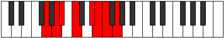 |
| [1837](https://ianring.com/musictheory/scales/1837) | [Dalian](ModeDNaturalDalian.md) | D | D, E, F, G, A#, B, C, D |  |
| [1839](https://ianring.com/musictheory/scales/1839) | [Zogyllic](ModeGNaturalZogyllic.md) | G | G, G#, A, A#, C, D#, E, F, G |  |
| [1839](https://ianring.com/musictheory/scales/1839) | [Zogyllic](ModeDNaturalZogyllic.md) | D | D, D#, E, F, G, A#, B, C, D |  |
| [1845](https://ianring.com/musictheory/scales/1845) | [Lagian](ModeDNaturalLagian.md) | D | D, E, F#, G, A#, B, C, D |  |
| [1847](https://ianring.com/musictheory/scales/1847) | [Thacryllic](ModeDNaturalThacryllic.md) | D | D, D#, E, F#, G, A#, B, C, D |  |
| [1849](https://ianring.com/musictheory/scales/1849) | [Epogian](ModeGNaturalEpogian.md) | G | G, A#, B, C, D#, E, F, G |  |
| [1851](https://ianring.com/musictheory/scales/1851) | [Zacryllic](ModeGNaturalZacryllic.md) | G | G, G#, A#, B, C, D#, E, F, G |  |
| [1853](https://ianring.com/musictheory/scales/1853) | [Phrynyllic](ModeDNaturalPhrynyllic.md) | D | D, E, F, F#, G, A#, B, C, D |  |
| [1853](https://ianring.com/musictheory/scales/1853) | [Phrynyllic](ModeGNaturalPhrynyllic.md) | G | G, A, A#, B, C, D#, E, F, G |  |
| [1855](https://ianring.com/musictheory/scales/1855) | [Marygic](ModeDNaturalMarygic.md) | D | D, D#, E, F, F#, G, A#, B, C, D |  |
| [1855](https://ianring.com/musictheory/scales/1855) | [Marygic](ModeGNaturalMarygic.md) | G | G, G#, A, A#, B, C, D#, E, F, G |  |
| [1861](https://ianring.com/musictheory/scales/1861) | [Phrygimic](ModeASharpPhrygimic.md) | A# | A#, B#, D##, E##, F##, G#, A# |  |
| [1861](https://ianring.com/musictheory/scales/1861) | [Phrygimic](ModeBFlatPhrygimic.md) | Bb | Bb, C, D##, E##, F##, G#, Bb |  |
| [1863](https://ianring.com/musictheory/scales/1863) | [Pycrian](ModeASharpPycrian.md) | A# | A#, B, C, D##, E##, F##, G#, A# |  |
| [1863](https://ianring.com/musictheory/scales/1863) | [Pycrian](ModeBFlatPycrian.md) | Bb | Bb, Cb, Dbb, E, F#, G, Ab, Bb |  |
| [1865](https://ianring.com/musictheory/scales/1865) | [Thagimic](ModeENaturalThagimic.md) | E | E, F##, G###, A###, B##, C##, E |  |
| [1867](https://ianring.com/musictheory/scales/1867) | [Solian](ModeENaturalSolian.md) | E | E, F, G, A#, B#, C#, D, E |  |
| [1869](https://ianring.com/musictheory/scales/1869) | [Katyrian](ModeENaturalKatyrian.md) | E | E, F#, G, A#, B#, C#, D, E |  |
| [1869](https://ianring.com/musictheory/scales/1869) | [Katyrian](ModeASharpKatyrian.md) | A# | A#, B#, C#, D##, E##, F##, G#, A# |  |
| [1869](https://ianring.com/musictheory/scales/1869) | [Katyrian](ModeBFlatKatyrian.md) | Bb | Bb, C, Db, E, F#, G, Ab, Bb |  |
| [1871](https://ianring.com/musictheory/scales/1871) | [Aeolyllic](ModeENaturalAeolyllic.md) | E | E, F, F#, G, A#, C, C#, D, E |  |
| [1871](https://ianring.com/musictheory/scales/1871) | [Aeolyllic](ModeASharpAeolyllic.md) | A# | A#, B, C, C#, E, F#, G, G#, A# |  |
| [1871](https://ianring.com/musictheory/scales/1871) | [Aeolyllic](ModeBFlatAeolyllic.md) | Bb | Bb, B, C, Db, E, Gb, G, Ab, Bb |  |
| [1875](https://ianring.com/musictheory/scales/1875) | [Epyphian](ModeFSharpEpyphian.md) | F# | F#, G, A#, B#, C##, D#, E, F# |  |
| [1875](https://ianring.com/musictheory/scales/1875) | [Epyphian](ModeGFlatEpyphian.md) | Gb | Gb, Abb, Bb, C, D, Eb, Fb, Gb |  |
| [1877](https://ianring.com/musictheory/scales/1877) | [Aeroptian](ModeASharpAeroptian.md) | A# | A#, B#, C##, D##, E##, F##, G#, A# |  |
| [1877](https://ianring.com/musictheory/scales/1877) | [Aeroptian](ModeBFlatAeroptian.md) | Bb | Bb, C, D, E, F#, G, Ab, Bb |  |
| [1879](https://ianring.com/musictheory/scales/1879) | [Mixoryllic](ModeFSharpMixoryllic.md) | F# | F#, G, G#, A#, C, D, D#, E, F# |  |
| [1879](https://ianring.com/musictheory/scales/1879) | [Mixoryllic](ModeGFlatMixoryllic.md) | Gb | Gb, G, Ab, Bb, C, D, Eb, E, Gb |  |
| [1879](https://ianring.com/musictheory/scales/1879) | [Mixoryllic](ModeASharpMixoryllic.md) | A# | A#, B, C, D, E, F#, G, G#, A# |  |
| [1879](https://ianring.com/musictheory/scales/1879) | [Mixoryllic](ModeBFlatMixoryllic.md) | Bb | Bb, B, C, D, E, Gb, G, Ab, Bb |  |
| [1881](https://ianring.com/musictheory/scales/1881) | [Korian](ModeENaturalKorian.md) | E | E, F##, G#, A#, B#, C#, D, E |  |
| [1883](https://ianring.com/musictheory/scales/1883) | [Mixopyryllic](ModeENaturalMixopyryllic.md) | E | E, F, G, G#, A#, C, C#, D, E |  |
| [1883](https://ianring.com/musictheory/scales/1883) | [Mixopyryllic](ModeFSharpMixopyryllic.md) | F# | F#, G, A, A#, C, D, D#, E, F# |  |
| [1883](https://ianring.com/musictheory/scales/1883) | [Mixopyryllic](ModeGFlatMixopyryllic.md) | Gb | Gb, G, A, Bb, C, D, Eb, E, Gb |  |
| [1885](https://ianring.com/musictheory/scales/1885) | [Epidyllic](ModeENaturalEpidyllic.md) | E | E, F#, G, G#, A#, C, C#, D, E |  |
| [1885](https://ianring.com/musictheory/scales/1885) | [Epidyllic](ModeASharpEpidyllic.md) | A# | A#, C, C#, D, E, F#, G, G#, A# |  |
| [1885](https://ianring.com/musictheory/scales/1885) | [Epidyllic](ModeBFlatEpidyllic.md) | Bb | Bb, C, Db, D, E, Gb, G, Ab, Bb |  |
| [1887](https://ianring.com/musictheory/scales/1887) | [Aerocrygic](ModeENaturalAerocrygic.md) | E | E, F, F#, G, G#, A#, C, C#, D, E |  |
| [1887](https://ianring.com/musictheory/scales/1887) | [Aerocrygic](ModeFSharpAerocrygic.md) | F# | F#, G, G#, A, A#, C, D, D#, E, F# |  |
| [1887](https://ianring.com/musictheory/scales/1887) | [Aerocrygic](ModeGFlatAerocrygic.md) | Gb | Gb, G, Ab, A, Bb, C, D, Eb, E, Gb |  |
| [1887](https://ianring.com/musictheory/scales/1887) | [Aerocrygic](ModeASharpAerocrygic.md) | A# | A#, B, C, C#, D, E, F#, G, G#, A# |  |
| [1887](https://ianring.com/musictheory/scales/1887) | [Aerocrygic](ModeBFlatAerocrygic.md) | Bb | Bb, B, C, Db, D, E, Gb, G, Ab, Bb |  |
| [1893](https://ianring.com/musictheory/scales/1893) | [Ionylian](ModeASharpIonylian.md) | A# | A#, B#, C###, D##, E##, F##, G#, A# |  |
| [1893](https://ianring.com/musictheory/scales/1893) | [Ionylian](ModeBFlatIonylian.md) | Bb | Bb, C, D#, E, F#, G, Ab, Bb |  |
| [1893](https://ianring.com/musictheory/scales/1893) | [Ionylian](ModeDNaturalIonylian.md) | D | D, E, F##, G#, A#, B, C, D |  |
| [1895](https://ianring.com/musictheory/scales/1895) | [Salyllic](ModeDNaturalSalyllic.md) | D | D, D#, E, G, G#, A#, B, C, D |  |
| [1895](https://ianring.com/musictheory/scales/1895) | [Salyllic](ModeASharpSalyllic.md) | A# | A#, B, C, D#, E, F#, G, G#, A# |  |
| [1895](https://ianring.com/musictheory/scales/1895) | [Salyllic](ModeBFlatSalyllic.md) | Bb | Bb, B, C, Eb, E, Gb, G, Ab, Bb |  |
| [1897](https://ianring.com/musictheory/scales/1897) | [Ionopian](ModeGNaturalIonopian.md) | G | G, A#, B#, C#, D#, E, F, G |  |
| [1897](https://ianring.com/musictheory/scales/1897) | [Ionopian](ModeENaturalIonopian.md) | E | E, F##, G##, A#, B#, C#, D, E | 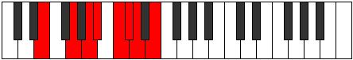 |
| [1899](https://ianring.com/musictheory/scales/1899) | [Moptyllic](ModeGNaturalMoptyllic.md) | G | G, G#, A#, C, C#, D#, E, F, G |  |
| [1899](https://ianring.com/musictheory/scales/1899) | [Moptyllic](ModeENaturalMoptyllic.md) | E | E, F, G, A, A#, C, C#, D, E |  |
| [1901](https://ianring.com/musictheory/scales/1901) | [Ionidyllic](ModeASharpIonidyllic.md) | A# | A#, C, C#, D#, E, F#, G, G#, A# |  |
| [1901](https://ianring.com/musictheory/scales/1901) | [Ionidyllic](ModeBFlatIonidyllic.md) | Bb | Bb, C, Db, Eb, E, Gb, G, Ab, Bb |  |
| [1901](https://ianring.com/musictheory/scales/1901) | [Ionidyllic](ModeGNaturalIonidyllic.md) | G | G, A, A#, C, C#, D#, E, F, G |  |
| [1901](https://ianring.com/musictheory/scales/1901) | [Ionidyllic](ModeENaturalIonidyllic.md) | E | E, F#, G, A, A#, C, C#, D, E |  |
| [1901](https://ianring.com/musictheory/scales/1901) | [Ionidyllic](ModeDNaturalIonidyllic.md) | D | D, E, F, G, G#, A#, B, C, D |  |
| [1903](https://ianring.com/musictheory/scales/1903) | [Rocrygic](ModeENaturalRocrygic.md) | E | E, F, F#, G, A, A#, C, C#, D, E |  |
| [1903](https://ianring.com/musictheory/scales/1903) | [Rocrygic](ModeGNaturalRocrygic.md) | G | G, G#, A, A#, C, C#, D#, E, F, G |  |
| [1903](https://ianring.com/musictheory/scales/1903) | [Rocrygic](ModeDNaturalRocrygic.md) | D | D, D#, E, F, G, G#, A#, B, C, D |  |
| [1903](https://ianring.com/musictheory/scales/1903) | [Rocrygic](ModeASharpRocrygic.md) | A# | A#, B, C, C#, D#, E, F#, G, G#, A# |  |
| [1903](https://ianring.com/musictheory/scales/1903) | [Rocrygic](ModeBFlatRocrygic.md) | Bb | Bb, B, C, Db, Eb, E, Gb, G, Ab, Bb |  |
| [1907](https://ianring.com/musictheory/scales/1907) | [Lynyllic](ModeFSharpLynyllic.md) | F# | F#, G, A#, B, C, D, D#, E, F# |  |
| [1907](https://ianring.com/musictheory/scales/1907) | [Lynyllic](ModeGFlatLynyllic.md) | Gb | Gb, G, Bb, B, C, D, Eb, E, Gb |  |
| [1909](https://ianring.com/musictheory/scales/1909) | [Epicryllic](ModeASharpEpicryllic.md) | A# | A#, C, D, D#, E, F#, G, G#, A# |  |
| [1909](https://ianring.com/musictheory/scales/1909) | [Epicryllic](ModeBFlatEpicryllic.md) | Bb | Bb, C, D, Eb, E, Gb, G, Ab, Bb |  |
| [1909](https://ianring.com/musictheory/scales/1909) | [Epicryllic](ModeDNaturalEpicryllic.md) | D | D, E, F#, G, G#, A#, B, C, D |  |
| [1911](https://ianring.com/musictheory/scales/1911) | [Stynygic](ModeDNaturalStynygic.md) | D | D, D#, E, F#, G, G#, A#, B, C, D |  |
| [1911](https://ianring.com/musictheory/scales/1911) | [Stynygic](ModeFSharpStynygic.md) | F# | F#, G, G#, A#, B, C, D, D#, E, F# |  |
| [1911](https://ianring.com/musictheory/scales/1911) | [Stynygic](ModeGFlatStynygic.md) | Gb | Gb, G, Ab, Bb, B, C, D, Eb, E, Gb |  |
| [1911](https://ianring.com/musictheory/scales/1911) | [Stynygic](ModeASharpStynygic.md) | A# | A#, B, C, D, D#, E, F#, G, G#, A# |  |
| [1911](https://ianring.com/musictheory/scales/1911) | [Stynygic](ModeBFlatStynygic.md) | Bb | Bb, B, C, D, Eb, E, Gb, G, Ab, Bb |  |
| [1913](https://ianring.com/musictheory/scales/1913) | [Zagyllic](ModeENaturalZagyllic.md) | E | E, G, G#, A, A#, C, C#, D, E |  |
| [1913](https://ianring.com/musictheory/scales/1913) | [Zagyllic](ModeGNaturalZagyllic.md) | G | G, A#, B, C, C#, D#, E, F, G |  |
| [1915](https://ianring.com/musictheory/scales/1915) | [Thydygic](ModeENaturalThydygic.md) | E | E, F, G, G#, A, A#, C, C#, D, E |  |
| [1915](https://ianring.com/musictheory/scales/1915) | [Thydygic](ModeGNaturalThydygic.md) | G | G, G#, A#, B, C, C#, D#, E, F, G |  |
| [1915](https://ianring.com/musictheory/scales/1915) | [Thydygic](ModeFSharpThydygic.md) | F# | F#, G, A, A#, B, C, D, D#, E, F# |  |
| [1915](https://ianring.com/musictheory/scales/1915) | [Thydygic](ModeGFlatThydygic.md) | Gb | Gb, G, A, Bb, B, C, D, Eb, E, Gb |  |
| [1917](https://ianring.com/musictheory/scales/1917) | [Sacrygic](ModeASharpSacrygic.md) | A# | A#, C, C#, D, D#, E, F#, G, G#, A# |  |
| [1917](https://ianring.com/musictheory/scales/1917) | [Sacrygic](ModeBFlatSacrygic.md) | Bb | Bb, C, Db, D, Eb, E, Gb, G, Ab, Bb |  |
| [1917](https://ianring.com/musictheory/scales/1917) | [Sacrygic](ModeENaturalSacrygic.md) | E | E, F#, G, G#, A, A#, C, C#, D, E |  |
| [1917](https://ianring.com/musictheory/scales/1917) | [Sacrygic](ModeDNaturalSacrygic.md) | D | D, E, F, F#, G, G#, A#, B, C, D |  |
| [1917](https://ianring.com/musictheory/scales/1917) | [Sacrygic](ModeGNaturalSacrygic.md) | G | G, A, A#, B, C, C#, D#, E, F, G |  |
| [1919](https://ianring.com/musictheory/scales/1919) | [Rocryllian](ModeENaturalRocryllian.md) | E | E, F, F#, G, G#, A, A#, C, C#, D, E |  |
| [1919](https://ianring.com/musictheory/scales/1919) | [Rocryllian](ModeASharpRocryllian.md) | A# | A#, B, C, C#, D, D#, E, F#, G, G#, A# |  |
| [1919](https://ianring.com/musictheory/scales/1919) | [Rocryllian](ModeBFlatRocryllian.md) | Bb | Bb, B, C, Db, D, Eb, E, Gb, G, Ab, Bb |  |
| [1919](https://ianring.com/musictheory/scales/1919) | [Rocryllian](ModeDNaturalRocryllian.md) | D | D, D#, E, F, F#, G, G#, A#, B, C, D |  |
| [1919](https://ianring.com/musictheory/scales/1919) | [Rocryllian](ModeGNaturalRocryllian.md) | G | G, G#, A, A#, B, C, C#, D#, E, F, G |  |
| [1919](https://ianring.com/musictheory/scales/1919) | [Rocryllian](ModeFSharpRocryllian.md) | F# | F#, G, G#, A, A#, B, C, D, D#, E, F# |  |
| [1919](https://ianring.com/musictheory/scales/1919) | [Rocryllian](ModeGFlatRocryllian.md) | Gb | Gb, G, Ab, A, Bb, B, C, D, Eb, E, Gb |  |
| [1931](https://ianring.com/musictheory/scales/1931) | [Stogian](ModeANaturalStogian.md) | A | A, Bb, C, D##, E#, F#, G, A |  |
| [1935](https://ianring.com/musictheory/scales/1935) | [Mycryllic](ModeANaturalMycryllic.md) | A | A, A#, B, C, E, F, F#, G, A |  |
| [1937](https://ianring.com/musictheory/scales/1937) | [Galimic](ModeCNaturalGalimic.md) | C | C, D##, E###, F###, G##, A#, C |  |
| [1939](https://ianring.com/musictheory/scales/1939) | [Dathian](ModeCNaturalDathian.md) | C | C, Db, E, F##, G#, A, Bb, C |  |
| [1939](https://ianring.com/musictheory/scales/1939) | [Dathian](ModeDSharpDathian.md) | D# | D#, E, F##, G###, A##, B#, C#, D# |  |
| [1939](https://ianring.com/musictheory/scales/1939) | [Dathian](ModeEFlatDathian.md) | Eb | Eb, Fb, G, A#, B, C, Db, Eb |  |
| [1941](https://ianring.com/musictheory/scales/1941) | [Aeranian](ModeCNaturalAeranian.md) | C | C, D, E, F##, G#, A, Bb, C |  |
| [1943](https://ianring.com/musictheory/scales/1943) | [Malyllic](ModeCNaturalMalyllic.md) | C | C, C#, D, E, G, G#, A, A#, C |  |
| [1943](https://ianring.com/musictheory/scales/1943) | [Malyllic](ModeDSharpMalyllic.md) | D# | D#, E, F, G, A#, B, C, C#, D# |  |
| [1943](https://ianring.com/musictheory/scales/1943) | [Malyllic](ModeEFlatMalyllic.md) | Eb | Eb, E, F, G, Bb, B, C, Db, Eb |  |
| [1945](https://ianring.com/musictheory/scales/1945) | [Zarian](ModeCNaturalZarian.md) | C | C, D#, E, F##, G#, A, Bb, C |  |
| [1947](https://ianring.com/musictheory/scales/1947) | [Ionoyllic](ModeANaturalIonoyllic.md) | A | A, A#, C, C#, E, F, F#, G, A |  |
| [1947](https://ianring.com/musictheory/scales/1947) | [Ionoyllic](ModeCNaturalIonoyllic.md) | C | C, C#, D#, E, G, G#, A, A#, C |  |
| [1947](https://ianring.com/musictheory/scales/1947) | [Ionoyllic](ModeDSharpIonoyllic.md) | D# | D#, E, F#, G, A#, B, C, C#, D# |  |
| [1947](https://ianring.com/musictheory/scales/1947) | [Ionoyllic](ModeEFlatIonoyllic.md) | Eb | Eb, E, Gb, G, Bb, B, C, Db, Eb |  |
| [1949](https://ianring.com/musictheory/scales/1949) | [Mathyllic](ModeCNaturalMathyllic.md) | C | C, D, D#, E, G, G#, A, A#, C |  |
| [1951](https://ianring.com/musictheory/scales/1951) | [Gonygic](ModeCNaturalGonygic.md) | C | C, C#, D, D#, E, G, G#, A, A#, C |  |
| [1951](https://ianring.com/musictheory/scales/1951) | [Gonygic](ModeDSharpGonygic.md) | D# | D#, E, F, F#, G, A#, B, C, C#, D# |  |
| [1951](https://ianring.com/musictheory/scales/1951) | [Gonygic](ModeEFlatGonygic.md) | Eb | Eb, E, F, Gb, G, Bb, B, C, Db, Eb |  |
| [1951](https://ianring.com/musictheory/scales/1951) | [Gonygic](ModeANaturalGonygic.md) | A | A, A#, B, C, C#, E, F, F#, G, A |  |
| [1957](https://ianring.com/musictheory/scales/1957) | [Pyrian](ModeDNaturalPyrian.md) | D | D, E, F##, G##, A#, B, C, D |  |
| [1959](https://ianring.com/musictheory/scales/1959) | [Katolyllic](ModeDNaturalKatolyllic.md) | D | D, D#, E, G, A, A#, B, C, D |  |
| [1961](https://ianring.com/musictheory/scales/1961) | [Soptian](ModeGNaturalSoptian.md) | G | G, A#, B#, C##, D#, E, F, G |  |
| [1963](https://ianring.com/musictheory/scales/1963) | [Epocryllic](ModeGNaturalEpocryllic.md) | G | G, G#, A#, C, D, D#, E, F, G |  |
| [1963](https://ianring.com/musictheory/scales/1963) | [Epocryllic](ModeANaturalEpocryllic.md) | A | A, A#, C, D, E, F, F#, G, A |  |
| [1965](https://ianring.com/musictheory/scales/1965) | [Gadyllic](ModeGNaturalGadyllic.md) | G | G, A, A#, C, D, D#, E, F, G |  |
| [1965](https://ianring.com/musictheory/scales/1965) | [Gadyllic](ModeDNaturalGadyllic.md) | D | D, E, F, G, A, A#, B, C, D |  |
| [1967](https://ianring.com/musictheory/scales/1967) | [Godygic](ModeGNaturalGodygic.md) | G | G, G#, A, A#, C, D, D#, E, F, G |  |
| [1967](https://ianring.com/musictheory/scales/1967) | [Godygic](ModeDNaturalGodygic.md) | D | D, D#, E, F, G, A, A#, B, C, D |  |
| [1967](https://ianring.com/musictheory/scales/1967) | [Godygic](ModeANaturalGodygic.md) | A | A, A#, B, C, D, E, F, F#, G, A |  |
| [1969](https://ianring.com/musictheory/scales/1969) | [Zorian](ModeCNaturalZorian.md) | C | C, D##, E#, F##, G#, A, Bb, C |  |
| [1971](https://ianring.com/musictheory/scales/1971) | [Aerynyllic](ModeCNaturalAerynyllic.md) | C | C, C#, E, F, G, G#, A, A#, C |  |
| [1971](https://ianring.com/musictheory/scales/1971) | [Aerynyllic](ModeDSharpAerynyllic.md) | D# | D#, E, G, G#, A#, B, C, C#, D# |  |
| [1971](https://ianring.com/musictheory/scales/1971) | [Aerynyllic](ModeEFlatAerynyllic.md) | Eb | Eb, E, G, Ab, Bb, B, C, Db, Eb |  |
| [1973](https://ianring.com/musictheory/scales/1973) | [Zyryllic](ModeCNaturalZyryllic.md) | C | C, D, E, F, G, G#, A, A#, C |  |
| [1973](https://ianring.com/musictheory/scales/1973) | [Zyryllic](ModeDNaturalZyryllic.md) | D | D, E, F#, G, A, A#, B, C, D |  |
| [1975](https://ianring.com/musictheory/scales/1975) | [Ionocrygic](ModeCNaturalIonocrygic.md) | C | C, C#, D, E, F, G, G#, A, A#, C |  |
| [1975](https://ianring.com/musictheory/scales/1975) | [Ionocrygic](ModeDSharpIonocrygic.md) | D# | D#, E, F, G, G#, A#, B, C, C#, D# |  |
| [1975](https://ianring.com/musictheory/scales/1975) | [Ionocrygic](ModeEFlatIonocrygic.md) | Eb | Eb, E, F, G, Ab, Bb, B, C, Db, Eb |  |
| [1975](https://ianring.com/musictheory/scales/1975) | [Ionocrygic](ModeDNaturalIonocrygic.md) | D | D, D#, E, F#, G, A, A#, B, C, D |  |
| [1977](https://ianring.com/musictheory/scales/1977) | [Dagyllic](ModeCNaturalDagyllic.md) | C | C, D#, E, F, G, G#, A, A#, C |  |
| [1977](https://ianring.com/musictheory/scales/1977) | [Dagyllic](ModeGNaturalDagyllic.md) | G | G, A#, B, C, D, D#, E, F, G |  |
| [1979](https://ianring.com/musictheory/scales/1979) | [Aeradygic](ModeANaturalAeradygic.md) | A | A, A#, C, C#, D, E, F, F#, G, A |  |
| [1979](https://ianring.com/musictheory/scales/1979) | [Aeradygic](ModeCNaturalAeradygic.md) | C | C, C#, D#, E, F, G, G#, A, A#, C |  |
| [1979](https://ianring.com/musictheory/scales/1979) | [Aeradygic](ModeGNaturalAeradygic.md) | G | G, G#, A#, B, C, D, D#, E, F, G |  |
| [1979](https://ianring.com/musictheory/scales/1979) | [Aeradygic](ModeDSharpAeradygic.md) | D# | D#, E, F#, G, G#, A#, B, C, C#, D# |  |
| [1979](https://ianring.com/musictheory/scales/1979) | [Aeradygic](ModeEFlatAeradygic.md) | Eb | Eb, E, Gb, G, Ab, Bb, B, C, Db, Eb |  |
| [1981](https://ianring.com/musictheory/scales/1981) | [Gadygic](ModeCNaturalGadygic.md) | C | C, D, D#, E, F, G, G#, A, A#, C |  |
| [1981](https://ianring.com/musictheory/scales/1981) | [Gadygic](ModeGNaturalGadygic.md) | G | G, A, A#, B, C, D, D#, E, F, G |  |
| [1981](https://ianring.com/musictheory/scales/1981) | [Gadygic](ModeDNaturalGadygic.md) | D | D, E, F, F#, G, A, A#, B, C, D |  |
| [1983](https://ianring.com/musictheory/scales/1983) | [Soryllian](ModeCNaturalSoryllian.md) | C | C, C#, D, D#, E, F, G, G#, A, A#, C |  |
| [1983](https://ianring.com/musictheory/scales/1983) | [Soryllian](ModeDSharpSoryllian.md) | D# | D#, E, F, F#, G, G#, A#, B, C, C#, D# |  |
| [1983](https://ianring.com/musictheory/scales/1983) | [Soryllian](ModeEFlatSoryllian.md) | Eb | Eb, E, F, Gb, G, Ab, Bb, B, C, Db, Eb |  |
| [1983](https://ianring.com/musictheory/scales/1983) | [Soryllian](ModeANaturalSoryllian.md) | A | A, A#, B, C, C#, D, E, F, F#, G, A |  |
| [1983](https://ianring.com/musictheory/scales/1983) | [Soryllian](ModeDNaturalSoryllian.md) | D | D, D#, E, F, F#, G, A, A#, B, C, D |  |
| [1983](https://ianring.com/musictheory/scales/1983) | [Soryllian](ModeGNaturalSoryllian.md) | G | G, G#, A, A#, B, C, D, D#, E, F, G |  |
| [1989](https://ianring.com/musictheory/scales/1989) | [Dydian](ModeASharpDydian.md) | A# | A#, B#, D##, E#, F#, G, Ab, A# |  |
| [1989](https://ianring.com/musictheory/scales/1989) | [Dydian](ModeBFlatDydian.md) | Bb | Bb, C, D##, E#, F#, G, Ab, Bb |  |
| [1991](https://ianring.com/musictheory/scales/1991) | [Phryptyllic](ModeASharpPhryptyllic.md) | A# | A#, B, C, E, F, F#, G, G#, A# |  |
| [1991](https://ianring.com/musictheory/scales/1991) | [Phryptyllic](ModeBFlatPhryptyllic.md) | Bb | Bb, B, C, E, F, Gb, G, Ab, Bb |  |
| [1993](https://ianring.com/musictheory/scales/1993) | [Katoptian](ModeENaturalKatoptian.md) | E | E, F##, G###, A##, B#, C#, D, E |  |
| [1995](https://ianring.com/musictheory/scales/1995) | [Aeolacryllic](ModeANaturalAeolacryllic.md) | A | A, A#, C, D#, E, F, F#, G, A |  |
| [1995](https://ianring.com/musictheory/scales/1995) | [Aeolacryllic](ModeENaturalAeolacryllic.md) | E | E, F, G, A#, B, C, C#, D, E |  |
| [1997](https://ianring.com/musictheory/scales/1997) | [Staryllic](ModeASharpStaryllic.md) | A# | A#, C, C#, E, F, F#, G, G#, A# |  |
| [1997](https://ianring.com/musictheory/scales/1997) | [Staryllic](ModeBFlatStaryllic.md) | Bb | Bb, C, Db, E, F, Gb, G, Ab, Bb |  |
| [1997](https://ianring.com/musictheory/scales/1997) | [Staryllic](ModeENaturalStaryllic.md) | E | E, F#, G, A#, B, C, C#, D, E |  |
| [1999](https://ianring.com/musictheory/scales/1999) | [Zacrygic](ModeENaturalZacrygic.md) | E | E, F, F#, G, A#, B, C, C#, D, E |  |
| [1999](https://ianring.com/musictheory/scales/1999) | [Zacrygic](ModeASharpZacrygic.md) | A# | A#, B, C, C#, E, F, F#, G, G#, A# |  |
| [1999](https://ianring.com/musictheory/scales/1999) | [Zacrygic](ModeBFlatZacrygic.md) | Bb | Bb, B, C, Db, E, F, Gb, G, Ab, Bb |  |
| [1999](https://ianring.com/musictheory/scales/1999) | [Zacrygic](ModeANaturalZacrygic.md) | A | A, A#, B, C, D#, E, F, F#, G, A |  |
| [2001](https://ianring.com/musictheory/scales/2001) | [Gydian](ModeCNaturalGydian.md) | C | C, D##, E##, F##, G#, A, Bb, C |  |
| [2003](https://ianring.com/musictheory/scales/2003) | [Lolyllic](ModeFSharpLolyllic.md) | F# | F#, G, A#, C, C#, D, D#, E, F# |  |
| [2003](https://ianring.com/musictheory/scales/2003) | [Lolyllic](ModeGFlatLolyllic.md) | Gb | Gb, G, Bb, C, Db, D, Eb, E, Gb |  |
| [2003](https://ianring.com/musictheory/scales/2003) | [Lolyllic](ModeCNaturalLolyllic.md) | C | C, C#, E, F#, G, G#, A, A#, C |  |
| [2003](https://ianring.com/musictheory/scales/2003) | [Lolyllic](ModeDSharpLolyllic.md) | D# | D#, E, G, A, A#, B, C, C#, D# |  |
| [2003](https://ianring.com/musictheory/scales/2003) | [Lolyllic](ModeEFlatLolyllic.md) | Eb | Eb, E, G, A, Bb, B, C, Db, Eb |  |
| [2005](https://ianring.com/musictheory/scales/2005) | [Gygyllic](ModeASharpGygyllic.md) | A# | A#, C, D, E, F, F#, G, G#, A# |  |
| [2005](https://ianring.com/musictheory/scales/2005) | [Gygyllic](ModeBFlatGygyllic.md) | Bb | Bb, C, D, E, F, Gb, G, Ab, Bb |  |
| [2005](https://ianring.com/musictheory/scales/2005) | [Gygyllic](ModeCNaturalGygyllic.md) | C | C, D, E, F#, G, G#, A, A#, C |  |
| [2007](https://ianring.com/musictheory/scales/2007) | [Stonygic](ModeFSharpStonygic.md) | F# | F#, G, G#, A#, C, C#, D, D#, E, F# |  |
| [2007](https://ianring.com/musictheory/scales/2007) | [Stonygic](ModeGFlatStonygic.md) | Gb | Gb, G, Ab, Bb, C, Db, D, Eb, E, Gb | 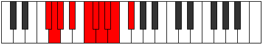 |
| [2007](https://ianring.com/musictheory/scales/2007) | [Stonygic](ModeCNaturalStonygic.md) | C | C, C#, D, E, F#, G, G#, A, A#, C |  |
| [2007](https://ianring.com/musictheory/scales/2007) | [Stonygic](ModeASharpStonygic.md) | A# | A#, B, C, D, E, F, F#, G, G#, A# |  |
| [2007](https://ianring.com/musictheory/scales/2007) | [Stonygic](ModeBFlatStonygic.md) | Bb | Bb, B, C, D, E, F, Gb, G, Ab, Bb |  |
| [2007](https://ianring.com/musictheory/scales/2007) | [Stonygic](ModeDSharpStonygic.md) | D# | D#, E, F, G, A, A#, B, C, C#, D# |  |
| [2007](https://ianring.com/musictheory/scales/2007) | [Stonygic](ModeEFlatStonygic.md) | Eb | Eb, E, F, G, A, Bb, B, C, Db, Eb |  |
| [2009](https://ianring.com/musictheory/scales/2009) | [Stacryllic](ModeCNaturalStacryllic.md) | C | C, D#, E, F#, G, G#, A, A#, C |  |
| [2009](https://ianring.com/musictheory/scales/2009) | [Stacryllic](ModeENaturalStacryllic.md) | E | E, G, G#, A#, B, C, C#, D, E |  |
| [2011](https://ianring.com/musictheory/scales/2011) | [Raphygic](ModeFSharpRaphygic.md) | F# | F#, G, A, A#, C, C#, D, D#, E, F# |  |
| [2011](https://ianring.com/musictheory/scales/2011) | [Raphygic](ModeGFlatRaphygic.md) | Gb | Gb, G, A, Bb, C, Db, D, Eb, E, Gb |  |
| [2011](https://ianring.com/musictheory/scales/2011) | [Raphygic](ModeANaturalRaphygic.md) | A | A, A#, C, C#, D#, E, F, F#, G, A |  |
| [2011](https://ianring.com/musictheory/scales/2011) | [Raphygic](ModeCNaturalRaphygic.md) | C | C, C#, D#, E, F#, G, G#, A, A#, C |  |
| [2011](https://ianring.com/musictheory/scales/2011) | [Raphygic](ModeENaturalRaphygic.md) | E | E, F, G, G#, A#, B, C, C#, D, E |  |
| [2011](https://ianring.com/musictheory/scales/2011) | [Raphygic](ModeDSharpRaphygic.md) | D# | D#, E, F#, G, A, A#, B, C, C#, D# |  |
| [2011](https://ianring.com/musictheory/scales/2011) | [Raphygic](ModeEFlatRaphygic.md) | Eb | Eb, E, Gb, G, A, Bb, B, C, Db, Eb |  |
| [2013](https://ianring.com/musictheory/scales/2013) | [Mocrygic](ModeASharpMocrygic.md) | A# | A#, C, C#, D, E, F, F#, G, G#, A# |  |
| [2013](https://ianring.com/musictheory/scales/2013) | [Mocrygic](ModeBFlatMocrygic.md) | Bb | Bb, C, Db, D, E, F, Gb, G, Ab, Bb |  |
| [2013](https://ianring.com/musictheory/scales/2013) | [Mocrygic](ModeCNaturalMocrygic.md) | C | C, D, D#, E, F#, G, G#, A, A#, C |  |
| [2013](https://ianring.com/musictheory/scales/2013) | [Mocrygic](ModeENaturalMocrygic.md) | E | E, F#, G, G#, A#, B, C, C#, D, E |  |
| [2015](https://ianring.com/musictheory/scales/2015) | [Epiryllian](ModeCNaturalEpiryllian.md) | C | C, C#, D, D#, E, F#, G, G#, A, A#, C |  |
| [2015](https://ianring.com/musictheory/scales/2015) | [Epiryllian](ModeFSharpEpiryllian.md) | F# | F#, G, G#, A, A#, C, C#, D, D#, E, F# |  |
| [2015](https://ianring.com/musictheory/scales/2015) | [Epiryllian](ModeGFlatEpiryllian.md) | Gb | Gb, G, Ab, A, Bb, C, Db, D, Eb, E, Gb |  |
| [2015](https://ianring.com/musictheory/scales/2015) | [Epiryllian](ModeENaturalEpiryllian.md) | E | E, F, F#, G, G#, A#, B, C, C#, D, E |  |
| [2015](https://ianring.com/musictheory/scales/2015) | [Epiryllian](ModeASharpEpiryllian.md) | A# | A#, B, C, C#, D, E, F, F#, G, G#, A# |  |
| [2015](https://ianring.com/musictheory/scales/2015) | [Epiryllian](ModeBFlatEpiryllian.md) | Bb | Bb, B, C, Db, D, E, F, Gb, G, Ab, Bb |  |
| [2015](https://ianring.com/musictheory/scales/2015) | [Epiryllian](ModeDSharpEpiryllian.md) | D# | D#, E, F, F#, G, A, A#, B, C, C#, D# |  |
| [2015](https://ianring.com/musictheory/scales/2015) | [Epiryllian](ModeEFlatEpiryllian.md) | Eb | Eb, E, F, Gb, G, A, Bb, B, C, Db, Eb |  |
| [2015](https://ianring.com/musictheory/scales/2015) | [Epiryllian](ModeANaturalEpiryllian.md) | A | A, A#, B, C, C#, D#, E, F, F#, G, A |  |
| [2021](https://ianring.com/musictheory/scales/2021) | [Katycryllic](ModeASharpKatycryllic.md) | A# | A#, C, D#, E, F, F#, G, G#, A# |  |
| [2021](https://ianring.com/musictheory/scales/2021) | [Katycryllic](ModeBFlatKatycryllic.md) | Bb | Bb, C, Eb, E, F, Gb, G, Ab, Bb |  |
| [2021](https://ianring.com/musictheory/scales/2021) | [Katycryllic](ModeDNaturalKatycryllic.md) | D | D, E, G, G#, A, A#, B, C, D |  |
| [2023](https://ianring.com/musictheory/scales/2023) | [Zodygic](ModeASharpZodygic.md) | A# | A#, B, C, D#, E, F, F#, G, G#, A# |  |
| [2023](https://ianring.com/musictheory/scales/2023) | [Zodygic](ModeBFlatZodygic.md) | Bb | Bb, B, C, Eb, E, F, Gb, G, Ab, Bb |  |
| [2023](https://ianring.com/musictheory/scales/2023) | [Zodygic](ModeDNaturalZodygic.md) | D | D, D#, E, G, G#, A, A#, B, C, D |  |
| [2025](https://ianring.com/musictheory/scales/2025) | [Mixolydyllic](ModeGNaturalMixolydyllic.md) | G | G, A#, C, C#, D, D#, E, F, G | 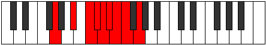 |
| [2025](https://ianring.com/musictheory/scales/2025) | [Mixolydyllic](ModeENaturalMixolydyllic.md) | E | E, G, A, A#, B, C, C#, D, E |  |
| [2027](https://ianring.com/musictheory/scales/2027) | [Boptygic](ModeGNaturalBoptygic.md) | G | G, G#, A#, C, C#, D, D#, E, F, G |  |
| [2027](https://ianring.com/musictheory/scales/2027) | [Boptygic](ModeANaturalBoptygic.md) | A | A, A#, C, D, D#, E, F, F#, G, A |  |
| [2027](https://ianring.com/musictheory/scales/2027) | [Boptygic](ModeENaturalBoptygic.md) | E | E, F, G, A, A#, B, C, C#, D, E |  |
| [2029](https://ianring.com/musictheory/scales/2029) | [Mathygic](ModeASharpMathygic.md) | A# | A#, C, C#, D#, E, F, F#, G, G#, A# |  |
| [2029](https://ianring.com/musictheory/scales/2029) | [Mathygic](ModeBFlatMathygic.md) | Bb | Bb, C, Db, Eb, E, F, Gb, G, Ab, Bb |  |
| [2029](https://ianring.com/musictheory/scales/2029) | [Mathygic](ModeGNaturalMathygic.md) | G | G, A, A#, C, C#, D, D#, E, F, G |  |
| [2029](https://ianring.com/musictheory/scales/2029) | [Mathygic](ModeENaturalMathygic.md) | E | E, F#, G, A, A#, B, C, C#, D, E |  |
| [2029](https://ianring.com/musictheory/scales/2029) | [Mathygic](ModeDNaturalMathygic.md) | D | D, E, F, G, G#, A, A#, B, C, D |  |
| [2031](https://ianring.com/musictheory/scales/2031) | [Gadyllian](ModeGNaturalGadyllian.md) | G | G, G#, A, A#, C, C#, D, D#, E, F, G |  |
| [2031](https://ianring.com/musictheory/scales/2031) | [Gadyllian](ModeASharpGadyllian.md) | A# | A#, B, C, C#, D#, E, F, F#, G, G#, A# |  |
| [2031](https://ianring.com/musictheory/scales/2031) | [Gadyllian](ModeBFlatGadyllian.md) | Bb | Bb, B, C, Db, Eb, E, F, Gb, G, Ab, Bb |  |
| [2031](https://ianring.com/musictheory/scales/2031) | [Gadyllian](ModeENaturalGadyllian.md) | E | E, F, F#, G, A, A#, B, C, C#, D, E |  |
| [2031](https://ianring.com/musictheory/scales/2031) | [Gadyllian](ModeANaturalGadyllian.md) | A | A, A#, B, C, D, D#, E, F, F#, G, A |  |
| [2031](https://ianring.com/musictheory/scales/2031) | [Gadyllian](ModeDNaturalGadyllian.md) | D | D, D#, E, F, G, G#, A, A#, B, C, D |  |
| [2033](https://ianring.com/musictheory/scales/2033) | [Stolyllic](ModeCNaturalStolyllic.md) | C | C, E, F, F#, G, G#, A, A#, C |  |
| [2035](https://ianring.com/musictheory/scales/2035) | [Aerythygic](ModeCNaturalAerythygic.md) | C | C, C#, E, F, F#, G, G#, A, A#, C |  |
| [2035](https://ianring.com/musictheory/scales/2035) | [Aerythygic](ModeFSharpAerythygic.md) | F# | F#, G, A#, B, C, C#, D, D#, E, F# |  |
| [2035](https://ianring.com/musictheory/scales/2035) | [Aerythygic](ModeGFlatAerythygic.md) | Gb | Gb, G, Bb, B, C, Db, D, Eb, E, Gb |  |
| [2035](https://ianring.com/musictheory/scales/2035) | [Aerythygic](ModeDSharpAerythygic.md) | D# | D#, E, G, G#, A, A#, B, C, C#, D# |  |
| [2035](https://ianring.com/musictheory/scales/2035) | [Aerythygic](ModeEFlatAerythygic.md) | Eb | Eb, E, G, Ab, A, Bb, B, C, Db, Eb |  |
| [2037](https://ianring.com/musictheory/scales/2037) | [Sythygic](ModeASharpSythygic.md) | A# | A#, C, D, D#, E, F, F#, G, G#, A# |  |
| [2037](https://ianring.com/musictheory/scales/2037) | [Sythygic](ModeBFlatSythygic.md) | Bb | Bb, C, D, Eb, E, F, Gb, G, Ab, Bb |  |
| [2037](https://ianring.com/musictheory/scales/2037) | [Sythygic](ModeCNaturalSythygic.md) | C | C, D, E, F, F#, G, G#, A, A#, C |  |
| [2037](https://ianring.com/musictheory/scales/2037) | [Sythygic](ModeDNaturalSythygic.md) | D | D, E, F#, G, G#, A, A#, B, C, D |  |
| [2039](https://ianring.com/musictheory/scales/2039) | [Danyllian](ModeCNaturalDanyllian.md) | C | C, C#, D, E, F, F#, G, G#, A, A#, C |  |
| [2039](https://ianring.com/musictheory/scales/2039) | [Danyllian](ModeFSharpDanyllian.md) | F# | F#, G, G#, A#, B, C, C#, D, D#, E, F# |  |
| [2039](https://ianring.com/musictheory/scales/2039) | [Danyllian](ModeGFlatDanyllian.md) | Gb | Gb, G, Ab, Bb, B, C, Db, D, Eb, E, Gb |  |
| [2039](https://ianring.com/musictheory/scales/2039) | [Danyllian](ModeASharpDanyllian.md) | A# | A#, B, C, D, D#, E, F, F#, G, G#, A# |  |
| [2039](https://ianring.com/musictheory/scales/2039) | [Danyllian](ModeBFlatDanyllian.md) | Bb | Bb, B, C, D, Eb, E, F, Gb, G, Ab, Bb |  |
| [2039](https://ianring.com/musictheory/scales/2039) | [Danyllian](ModeDSharpDanyllian.md) | D# | D#, E, F, G, G#, A, A#, B, C, C#, D# |  |
| [2039](https://ianring.com/musictheory/scales/2039) | [Danyllian](ModeEFlatDanyllian.md) | Eb | Eb, E, F, G, Ab, A, Bb, B, C, Db, Eb |  |
| [2039](https://ianring.com/musictheory/scales/2039) | [Danyllian](ModeDNaturalDanyllian.md) | D | D, D#, E, F#, G, G#, A, A#, B, C, D |  |
| [2041](https://ianring.com/musictheory/scales/2041) | [Aeolacrygic](ModeCNaturalAeolacrygic.md) | C | C, D#, E, F, F#, G, G#, A, A#, C |  |
| [2041](https://ianring.com/musictheory/scales/2041) | [Aeolacrygic](ModeGNaturalAeolacrygic.md) | G | G, A#, B, C, C#, D, D#, E, F, G |  |
| [2041](https://ianring.com/musictheory/scales/2041) | [Aeolacrygic](ModeENaturalAeolacrygic.md) | E | E, G, G#, A, A#, B, C, C#, D, E |  |
| [2043](https://ianring.com/musictheory/scales/2043) | [Lythyllian](ModeANaturalLythyllian.md) | A | A, A#, C, C#, D, D#, E, F, F#, G, A |  |
| [2043](https://ianring.com/musictheory/scales/2043) | [Lythyllian](ModeCNaturalLythyllian.md) | C | C, C#, D#, E, F, F#, G, G#, A, A#, C |  |
| [2043](https://ianring.com/musictheory/scales/2043) | [Lythyllian](ModeGNaturalLythyllian.md) | G | G, G#, A#, B, C, C#, D, D#, E, F, G |  |
| [2043](https://ianring.com/musictheory/scales/2043) | [Lythyllian](ModeFSharpLythyllian.md) | F# | F#, G, A, A#, B, C, C#, D, D#, E, F# |  |
| [2043](https://ianring.com/musictheory/scales/2043) | [Lythyllian](ModeGFlatLythyllian.md) | Gb | Gb, G, A, Bb, B, C, Db, D, Eb, E, Gb |  |
| [2043](https://ianring.com/musictheory/scales/2043) | [Lythyllian](ModeENaturalLythyllian.md) | E | E, F, G, G#, A, A#, B, C, C#, D, E |  |
| [2043](https://ianring.com/musictheory/scales/2043) | [Lythyllian](ModeDSharpLythyllian.md) | D# | D#, E, F#, G, G#, A, A#, B, C, C#, D# |  |
| [2043](https://ianring.com/musictheory/scales/2043) | [Lythyllian](ModeEFlatLythyllian.md) | Eb | Eb, E, Gb, G, Ab, A, Bb, B, C, Db, Eb |  |
| [2045](https://ianring.com/musictheory/scales/2045) | [Katogyllian](ModeASharpKatogyllian.md) | A# | A#, C, C#, D, D#, E, F, F#, G, G#, A# |  |
| [2045](https://ianring.com/musictheory/scales/2045) | [Katogyllian](ModeBFlatKatogyllian.md) | Bb | Bb, C, Db, D, Eb, E, F, Gb, G, Ab, Bb |  |
| [2045](https://ianring.com/musictheory/scales/2045) | [Katogyllian](ModeCNaturalKatogyllian.md) | C | C, D, D#, E, F, F#, G, G#, A, A#, C |  |
| [2045](https://ianring.com/musictheory/scales/2045) | [Katogyllian](ModeGNaturalKatogyllian.md) | G | G, A, A#, B, C, C#, D, D#, E, F, G |  |
| [2045](https://ianring.com/musictheory/scales/2045) | [Katogyllian](ModeENaturalKatogyllian.md) | E | E, F#, G, G#, A, A#, B, C, C#, D, E |  |
| [2045](https://ianring.com/musictheory/scales/2045) | [Katogyllian](ModeDNaturalKatogyllian.md) | D | D, E, F, F#, G, G#, A, A#, B, C, D |  |
| [2047](https://ianring.com/musictheory/scales/2047) | [Monatic](ModeCNaturalMonatic.md) | C | C, C#, D, D#, E, F, F#, G, G#, A, A#, C |  |
| [2047](https://ianring.com/musictheory/scales/2047) | [Monatic](ModeASharpMonatic.md) | A# | A#, B, C, C#, D, D#, E, F, F#, G, G#, A# |  |
| [2047](https://ianring.com/musictheory/scales/2047) | [Monatic](ModeBFlatMonatic.md) | Bb | Bb, B, C, Db, D, Eb, E, F, Gb, G, Ab, Bb |  |
| [2047](https://ianring.com/musictheory/scales/2047) | [Monatic](ModeANaturalMonatic.md) | A | A, A#, B, C, C#, D, D#, E, F, F#, G, A |  |
| [2047](https://ianring.com/musictheory/scales/2047) | [Monatic](ModeGNaturalMonatic.md) | G | G, G#, A, A#, B, C, C#, D, D#, E, F, G |  |
| [2047](https://ianring.com/musictheory/scales/2047) | [Monatic](ModeFSharpMonatic.md) | F# | F#, G, G#, A, A#, B, C, C#, D, D#, E, F# |  |
| [2047](https://ianring.com/musictheory/scales/2047) | [Monatic](ModeGFlatMonatic.md) | Gb | Gb, G, Ab, A, Bb, B, C, Db, D, Eb, E, Gb |  |
| [2047](https://ianring.com/musictheory/scales/2047) | [Monatic](ModeENaturalMonatic.md) | E | E, F, F#, G, G#, A, A#, B, C, C#, D, E |  |
| [2047](https://ianring.com/musictheory/scales/2047) | [Monatic](ModeDSharpMonatic.md) | D# | D#, E, F, F#, G, G#, A, A#, B, C, C#, D# |  |
| [2047](https://ianring.com/musictheory/scales/2047) | [Monatic](ModeEFlatMonatic.md) | Eb | Eb, E, F, Gb, G, Ab, A, Bb, B, C, Db, Eb |  |
| [2047](https://ianring.com/musictheory/scales/2047) | [Monatic](ModeDNaturalMonatic.md) | D | D, D#, E, F, F#, G, G#, A, A#, B, C, D |  |
| [2213](https://ianring.com/musictheory/scales/2213) | [Daritonic](ModeFNaturalDaritonic.md) | F | F, G, A#, C, E, F | 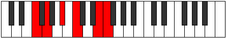 |
| [2215](https://ianring.com/musictheory/scales/2215) | [Ranimic](ModeFNaturalRanimic.md) | F | F, Gb, Abb, Bb, C, D##, F |  |
| [2221](https://ianring.com/musictheory/scales/2221) | [Poptimic](ModeFNaturalPoptimic.md) | F | F, G, Ab, Bb, C, D##, F |  |
| [2223](https://ianring.com/musictheory/scales/2223) | [Konian](ModeFNaturalKonian.md) | F | F, Gb, Abb, Bbbb, Cbb, Dbb, E, F |  |
| [2229](https://ianring.com/musictheory/scales/2229) | [Ionyptimic](ModeFNaturalIonyptimic.md) | F | F, G, A, Bb, C, D##, F |  |
| [2231](https://ianring.com/musictheory/scales/2231) | [Macrian](ModeFNaturalMacrian.md) | F | F, Gb, Abb, Bbb, Cbb, Dbb, E, F |  |
| [2237](https://ianring.com/musictheory/scales/2237) | [Epothian](ModeFNaturalEpothian.md) | F | F, G, Ab, Bbb, Cbb, Dbb, E, F |  |
| [2239](https://ianring.com/musictheory/scales/2239) | [Dacryllic](ModeFNaturalDacryllic.md) | F | F, F#, G, G#, A, A#, C, E, F |  |
| [2277](https://ianring.com/musictheory/scales/2277) | [Kagimic](ModeFNaturalKagimic.md) | F | F, G, A#, B, C, D##, F |  |
| [2279](https://ianring.com/musictheory/scales/2279) | [Dyrian](ModeFNaturalDyrian.md) | F | F, Gb, Abb, Bb, Cb, Dbb, E, F |  |
| [2285](https://ianring.com/musictheory/scales/2285) | [Aerogian](ModeFNaturalAerogian.md) | F | F, G, Ab, Bb, Cb, Dbb, E, F |  |
| [2287](https://ianring.com/musictheory/scales/2287) | [Lodyllic](ModeFNaturalLodyllic.md) | F | F, F#, G, G#, A#, B, C, E, F |  |
| [2293](https://ianring.com/musictheory/scales/2293) | [Gorian](ModeFNaturalGorian.md) | F | F, G, A, Bb, Cb, Dbb, E, F |  |
| [2295](https://ianring.com/musictheory/scales/2295) | [Kogyllic](ModeFNaturalKogyllic.md) | F | F, F#, G, A, A#, B, C, E, F |  |
| [2301](https://ianring.com/musictheory/scales/2301) | [Bydyllic](ModeFNaturalBydyllic.md) | F | F, G, G#, A, A#, B, C, E, F |  |
| [2303](https://ianring.com/musictheory/scales/2303) | [Stanygic](ModeFNaturalStanygic.md) | F | F, F#, G, G#, A, A#, B, C, E, F |  |
| [2325](https://ianring.com/musictheory/scales/2325) | [Pynitonic](ModeGSharpPynitonic.md) | G# | G#, A#, C, E, G, G# | 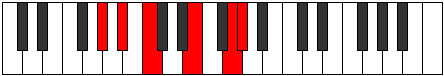 |
| [2325](https://ianring.com/musictheory/scales/2325) | [Pynitonic](ModeAFlatPynitonic.md) | Ab | Ab, Bb, C, E, G, Ab |  |
| [2327](https://ianring.com/musictheory/scales/2327) | [Epalimic](ModeGSharpEpalimic.md) | G# | G#, A, Bb, C, D##, E###, G# |  |
| [2327](https://ianring.com/musictheory/scales/2327) | [Epalimic](ModeAFlatEpalimic.md) | Ab | Ab, Bbb, Cbb, Dbb, E, F##, Ab |  |
| [2333](https://ianring.com/musictheory/scales/2333) | [Stynimic](ModeGSharpStynimic.md) | G# | G#, A#, B, C, D##, E###, G# |  |
| [2333](https://ianring.com/musictheory/scales/2333) | [Stynimic](ModeAFlatStynimic.md) | Ab | Ab, Bb, Cb, Dbb, E, F##, Ab |  |
| [2335](https://ianring.com/musictheory/scales/2335) | [Epydian](ModeGSharpEpydian.md) | G# | G#, A, Bb, Cb, Dbb, E, F##, G# |  |
| [2335](https://ianring.com/musictheory/scales/2335) | [Epydian](ModeAFlatEpydian.md) | Ab | Ab, Bbb, Cbb, Dbbb, Dbb, E, F##, Ab |  |
| [2339](https://ianring.com/musictheory/scales/2339) | [Ragitonic](ModeBNaturalRagitonic.md) | B | B, C, E, G, A#, B |  |
| [2343](https://ianring.com/musictheory/scales/2343) | [Tharimic](ModeBNaturalTharimic.md) | B | B, C, Db, E, F##, G###, B |  |
| [2347](https://ianring.com/musictheory/scales/2347) | [Thothimic](ModeBNaturalThothimic.md) | B | B, C, D, E, F##, G###, B |  |
| [2351](https://ianring.com/musictheory/scales/2351) | [Gynian](ModeBNaturalGynian.md) | B | B, C, Db, Ebb, Fb, G, A#, B |  |
| [2355](https://ianring.com/musictheory/scales/2355) | [Katycrimic](ModeBNaturalKatycrimic.md) | B | B, C, D#, E, F##, G###, B |  |
| [2357](https://ianring.com/musictheory/scales/2357) | [Ionaptimic](ModeGSharpIonaptimic.md) | G# | G#, A#, B#, C#, D##, E###, G# |  |
| [2357](https://ianring.com/musictheory/scales/2357) | [Ionaptimic](ModeAFlatIonaptimic.md) | Ab | Ab, Bb, C, Db, E, F##, Ab |  |
| [2359](https://ianring.com/musictheory/scales/2359) | [Gadian](ModeGSharpGadian.md) | G# | G#, A, Bb, C, Db, E, F##, G# |  |
| [2359](https://ianring.com/musictheory/scales/2359) | [Gadian](ModeAFlatGadian.md) | Ab | Ab, Bbb, Cbb, Dbb, Ebbb, Fb, G, Ab |  |
| [2359](https://ianring.com/musictheory/scales/2359) | [Gadian](ModeBNaturalGadian.md) | B | B, C, Db, Eb, Fb, G, A#, B |  |
| [2363](https://ianring.com/musictheory/scales/2363) | [Kataptian](ModeBNaturalKataptian.md) | B | B, C, D, Eb, Fb, G, A#, B |  |
| [2365](https://ianring.com/musictheory/scales/2365) | [Sythian](ModeGSharpSythian.md) | G# | G#, A#, B, C, Db, E, F##, G# |  |
| [2365](https://ianring.com/musictheory/scales/2365) | [Sythian](ModeAFlatSythian.md) | Ab | Ab, Bb, Cb, Dbb, Ebbb, Fb, G, Ab |  |
| [2367](https://ianring.com/musictheory/scales/2367) | [Laryllic](ModeBNaturalLaryllic.md) | B | B, C, C#, D, D#, E, G, A#, B |  |
| [2367](https://ianring.com/musictheory/scales/2367) | [Laryllic](ModeGSharpLaryllic.md) | G# | G#, A, A#, B, C, C#, E, G, G# |  |
| [2367](https://ianring.com/musictheory/scales/2367) | [Laryllic](ModeAFlatLaryllic.md) | Ab | Ab, A, Bb, B, C, Db, E, G, Ab |  |
| [2377](https://ianring.com/musictheory/scales/2377) | [Thoditonic](ModeENaturalThoditonic.md) | E | E, G, A#, C, D#, E |  |
| [2379](https://ianring.com/musictheory/scales/2379) | [Stathimic](ModeENaturalStathimic.md) | E | E, F, G, A#, B#, C###, E |  |
| [2381](https://ianring.com/musictheory/scales/2381) | [Sorimic](ModeENaturalSorimic.md) | E | E, F#, G, A#, B#, C###, E |  |
| [2383](https://ianring.com/musictheory/scales/2383) | [Katorian](ModeENaturalKatorian.md) | E | E, F, Gb, Abb, Bb, C, D#, E |  |
| [2389](https://ianring.com/musictheory/scales/2389) | [Thynimic](ModeGSharpThynimic.md) | G# | G#, A#, B#, C##, D##, E###, G# |  |
| [2389](https://ianring.com/musictheory/scales/2389) | [Thynimic](ModeAFlatThynimic.md) | Ab | Ab, Bb, C, D, E, F##, Ab |  |
| [2391](https://ianring.com/musictheory/scales/2391) | [Molian](ModeGSharpMolian.md) | G# | G#, A, Bb, C, D, E, F##, G# |  |
| [2391](https://ianring.com/musictheory/scales/2391) | [Molian](ModeAFlatMolian.md) | Ab | Ab, Bbb, Cbb, Dbb, Ebb, Fb, G, Ab |  |
| [2393](https://ianring.com/musictheory/scales/2393) | [Zathimic](ModeENaturalZathimic.md) | E | E, F##, G#, A#, B#, C###, E |  |
| [2395](https://ianring.com/musictheory/scales/2395) | [Zoptian](ModeENaturalZoptian.md) | E | E, F, G, Ab, Bb, C, D#, E |  |
| [2397](https://ianring.com/musictheory/scales/2397) | [Stagian](ModeENaturalStagian.md) | E | E, F#, G, Ab, Bb, C, D#, E |  |
| [2397](https://ianring.com/musictheory/scales/2397) | [Stagian](ModeGSharpStagian.md) | G# | G#, A#, B, C, D, E, F##, G# |  |
| [2397](https://ianring.com/musictheory/scales/2397) | [Stagian](ModeAFlatStagian.md) | Ab | Ab, Bb, Cb, Dbb, Ebb, Fb, G, Ab |  |
| [2399](https://ianring.com/musictheory/scales/2399) | [Zanyllic](ModeENaturalZanyllic.md) | E | E, F, F#, G, G#, A#, C, D#, E |  |
| [2399](https://ianring.com/musictheory/scales/2399) | [Zanyllic](ModeGSharpZanyllic.md) | G# | G#, A, A#, B, C, D, E, G, G# |  |
| [2399](https://ianring.com/musictheory/scales/2399) | [Zanyllic](ModeAFlatZanyllic.md) | Ab | Ab, A, Bb, B, C, D, E, G, Ab |  |
| [2403](https://ianring.com/musictheory/scales/2403) | [Lycrimic](ModeBNaturalLycrimic.md) | B | B, C, D##, E#, F##, G###, B |  |
| [2407](https://ianring.com/musictheory/scales/2407) | [Zylian](ModeBNaturalZylian.md) | B | B, C, Db, E, F, G, A#, B |  |
| [2409](https://ianring.com/musictheory/scales/2409) | [Zacrimic](ModeENaturalZacrimic.md) | E | E, F##, G##, A#, B#, C###, E |  |
| [2411](https://ianring.com/musictheory/scales/2411) | [Aeolorian](ModeENaturalAeolorian.md) | E | E, F, G, A, Bb, C, D#, E |  |
| [2411](https://ianring.com/musictheory/scales/2411) | [Aeolorian](ModeBNaturalAeolorian.md) | B | B, C, D, E, F, G, A#, B |  |
| [2413](https://ianring.com/musictheory/scales/2413) | [Phrydian](ModeENaturalPhrydian.md) | E | E, F#, G, A, Bb, C, D#, E |  |
| [2415](https://ianring.com/musictheory/scales/2415) | [Lothyllic](ModeENaturalLothyllic.md) | E | E, F, F#, G, A, A#, C, D#, E |  |
| [2415](https://ianring.com/musictheory/scales/2415) | [Lothyllic](ModeBNaturalLothyllic.md) | B | B, C, C#, D, E, F, G, A#, B |  |
| [2419](https://ianring.com/musictheory/scales/2419) | [Paptian](ModeBNaturalPaptian.md) | B | B, C, D#, E, F, G, A#, B |  |
| [2421](https://ianring.com/musictheory/scales/2421) | [Malian](ModeGSharpMalian.md) | G# | G#, A#, B#, C#, D, E, F##, G# |  |
| [2421](https://ianring.com/musictheory/scales/2421) | [Malian](ModeAFlatMalian.md) | Ab | Ab, Bb, C, Db, Ebb, Fb, G, Ab |  |
| [2423](https://ianring.com/musictheory/scales/2423) | [Thorcryllic](ModeGSharpThorcryllic.md) | G# | G#, A, A#, C, C#, D, E, G, G# |  |
| [2423](https://ianring.com/musictheory/scales/2423) | [Thorcryllic](ModeAFlatThorcryllic.md) | Ab | Ab, A, Bb, C, Db, D, E, G, Ab |  |
| [2423](https://ianring.com/musictheory/scales/2423) | [Thorcryllic](ModeBNaturalThorcryllic.md) | B | B, C, C#, D#, E, F, G, A#, B |  |
| [2425](https://ianring.com/musictheory/scales/2425) | [Rorian](ModeENaturalRorian.md) | E | E, F##, G#, A, Bb, C, D#, E |  |
| [2427](https://ianring.com/musictheory/scales/2427) | [Katoryllic](ModeENaturalKatoryllic.md) | E | E, F, G, G#, A, A#, C, D#, E |  |
| [2427](https://ianring.com/musictheory/scales/2427) | [Katoryllic](ModeBNaturalKatoryllic.md) | B | B, C, D, D#, E, F, G, A#, B |  |
| [2429](https://ianring.com/musictheory/scales/2429) | [Kadyllic](ModeENaturalKadyllic.md) | E | E, F#, G, G#, A, A#, C, D#, E |  |
| [2429](https://ianring.com/musictheory/scales/2429) | [Kadyllic](ModeGSharpKadyllic.md) | G# | G#, A#, B, C, C#, D, E, G, G# |  |
| [2429](https://ianring.com/musictheory/scales/2429) | [Kadyllic](ModeAFlatKadyllic.md) | Ab | Ab, Bb, B, C, Db, D, E, G, Ab |  |
| [2431](https://ianring.com/musictheory/scales/2431) | [Gythygic](ModeENaturalGythygic.md) | E | E, F, F#, G, G#, A, A#, C, D#, E |  |
| [2431](https://ianring.com/musictheory/scales/2431) | [Gythygic](ModeBNaturalGythygic.md) | B | B, C, C#, D, D#, E, F, G, A#, B |  |
| [2431](https://ianring.com/musictheory/scales/2431) | [Gythygic](ModeGSharpGythygic.md) | G# | G#, A, A#, B, C, C#, D, E, G, G# |  |
| [2431](https://ianring.com/musictheory/scales/2431) | [Gythygic](ModeAFlatGythygic.md) | Ab | Ab, A, Bb, B, C, Db, D, E, G, Ab |  |
| [2453](https://ianring.com/musictheory/scales/2453) | [Stonimic](ModeGSharpStonimic.md) | G# | G#, A#, B#, C###, D##, E###, G# |  |
| [2453](https://ianring.com/musictheory/scales/2453) | [Stonimic](ModeAFlatStonimic.md) | Ab | Ab, Bb, C, D#, E, F##, Ab |  |
| [2455](https://ianring.com/musictheory/scales/2455) | [Bothian](ModeGSharpBothian.md) | G# | G#, A, Bb, C, D#, E, F##, G# |  |
| [2455](https://ianring.com/musictheory/scales/2455) | [Bothian](ModeAFlatBothian.md) | Ab | Ab, Bbb, Cbb, Dbb, Eb, Fb, G, Ab |  |
| [2461](https://ianring.com/musictheory/scales/2461) | [Sagian](ModeGSharpSagian.md) | G# | G#, A#, B, C, D#, E, F##, G# |  |
| [2461](https://ianring.com/musictheory/scales/2461) | [Sagian](ModeAFlatSagian.md) | Ab | Ab, Bb, Cb, Dbb, Eb, Fb, G, Ab |  |
| [2463](https://ianring.com/musictheory/scales/2463) | [Ionathyllic](ModeGSharpIonathyllic.md) | G# | G#, A, A#, B, C, D#, E, G, G# |  |
| [2463](https://ianring.com/musictheory/scales/2463) | [Ionathyllic](ModeAFlatIonathyllic.md) | Ab | Ab, A, Bb, B, C, Eb, E, G, Ab |  |
| [2467](https://ianring.com/musictheory/scales/2467) | [Morimic](ModeBNaturalMorimic.md) | B | B, C, D##, E##, F##, G###, B |  |
| [2469](https://ianring.com/musictheory/scales/2469) | [Staptimic](ModeFNaturalStaptimic.md) | F | F, G, A#, B#, C#, D##, F |  |
| [2471](https://ianring.com/musictheory/scales/2471) | [Eparian](ModeFNaturalEparian.md) | F | F, Gb, Abb, Bb, C, Db, E, F |  |
| [2471](https://ianring.com/musictheory/scales/2471) | [Eparian](ModeBNaturalEparian.md) | B | B, C, Db, E, F#, G, A#, B |  |
| [2475](https://ianring.com/musictheory/scales/2475) | [Aerylian](ModeBNaturalAerylian.md) | B | B, C, D, E, F#, G, A#, B |  |
| [2477](https://ianring.com/musictheory/scales/2477) | [Mydian](ModeFNaturalMydian.md) | F | F, G, Ab, Bb, C, Db, E, F |  |
| [2479](https://ianring.com/musictheory/scales/2479) | [Rycryllic](ModeFNaturalRycryllic.md) | F | F, F#, G, G#, A#, C, C#, E, F |  |
| [2479](https://ianring.com/musictheory/scales/2479) | [Rycryllic](ModeBNaturalRycryllic.md) | B | B, C, C#, D, E, F#, G, A#, B |  |
| [2483](https://ianring.com/musictheory/scales/2483) | [Aerynian](ModeBNaturalAerynian.md) | B | B, C, D#, E, F#, G, A#, B |  |
| [2485](https://ianring.com/musictheory/scales/2485) | [Aerorian](ModeGSharpAerorian.md) | G# | G#, A#, B#, C#, D#, E, F##, G# |  |
| [2485](https://ianring.com/musictheory/scales/2485) | [Aerorian](ModeAFlatAerorian.md) | Ab | Ab, Bb, C, Db, Eb, Fb, G, Ab |  |
| [2485](https://ianring.com/musictheory/scales/2485) | [Aerorian](ModeFNaturalAerorian.md) | F | F, G, A, Bb, C, Db, E, F |  |
| [2487](https://ianring.com/musictheory/scales/2487) | [Phroptyllic](ModeFNaturalPhroptyllic.md) | F | F, F#, G, A, A#, C, C#, E, F |  |
| [2487](https://ianring.com/musictheory/scales/2487) | [Phroptyllic](ModeGSharpPhroptyllic.md) | G# | G#, A, A#, C, C#, D#, E, G, G# |  |
| [2487](https://ianring.com/musictheory/scales/2487) | [Phroptyllic](ModeAFlatPhroptyllic.md) | Ab | Ab, A, Bb, C, Db, Eb, E, G, Ab |  |
| [2487](https://ianring.com/musictheory/scales/2487) | [Phroptyllic](ModeBNaturalPhroptyllic.md) | B | B, C, C#, D#, E, F#, G, A#, B |  |
| [2491](https://ianring.com/musictheory/scales/2491) | [Layllic](ModeBNaturalLayllic.md) | B | B, C, D, D#, E, F#, G, A#, B |  |
| [2493](https://ianring.com/musictheory/scales/2493) | [Manyllic](ModeFNaturalManyllic.md) | F | F, G, G#, A, A#, C, C#, E, F |  |
| [2493](https://ianring.com/musictheory/scales/2493) | [Manyllic](ModeGSharpManyllic.md) | G# | G#, A#, B, C, C#, D#, E, G, G# |  |
| [2493](https://ianring.com/musictheory/scales/2493) | [Manyllic](ModeAFlatManyllic.md) | Ab | Ab, Bb, B, C, Db, Eb, E, G, Ab |  |
| [2495](https://ianring.com/musictheory/scales/2495) | [Aeolocrygic](ModeFNaturalAeolocrygic.md) | F | F, F#, G, G#, A, A#, C, C#, E, F |  |
| [2495](https://ianring.com/musictheory/scales/2495) | [Aeolocrygic](ModeBNaturalAeolocrygic.md) | B | B, C, C#, D, D#, E, F#, G, A#, B |  |
| [2495](https://ianring.com/musictheory/scales/2495) | [Aeolocrygic](ModeGSharpAeolocrygic.md) | G# | G#, A, A#, B, C, C#, D#, E, G, G# |  |
| [2495](https://ianring.com/musictheory/scales/2495) | [Aeolocrygic](ModeAFlatAeolocrygic.md) | Ab | Ab, A, Bb, B, C, Db, Eb, E, G, Ab |  |
| [2505](https://ianring.com/musictheory/scales/2505) | [Mydimic](ModeENaturalMydimic.md) | E | E, F##, G###, A##, B#, C###, E |  |
| [2507](https://ianring.com/musictheory/scales/2507) | [Ionyphian](ModeENaturalIonyphian.md) | E | E, F, G, A#, B, C, D#, E |  |
| [2509](https://ianring.com/musictheory/scales/2509) | [Bogian](ModeENaturalBogian.md) | E | E, F#, G, A#, B, C, D#, E |  |
| [2511](https://ianring.com/musictheory/scales/2511) | [Epyryllic](ModeENaturalEpyryllic.md) | E | E, F, F#, G, A#, B, C, D#, E |  |
| [2517](https://ianring.com/musictheory/scales/2517) | [Ryphian](ModeGSharpRyphian.md) | G# | G#, A#, B#, C##, D#, E, F##, G# |  |
| [2517](https://ianring.com/musictheory/scales/2517) | [Ryphian](ModeAFlatRyphian.md) | Ab | Ab, Bb, C, D, Eb, Fb, G, Ab |  |
| [2519](https://ianring.com/musictheory/scales/2519) | [Dathyllic](ModeGSharpDathyllic.md) | G# | G#, A, A#, C, D, D#, E, G, G# |  |
| [2519](https://ianring.com/musictheory/scales/2519) | [Dathyllic](ModeAFlatDathyllic.md) | Ab | Ab, A, Bb, C, D, Eb, E, G, Ab |  |
| [2521](https://ianring.com/musictheory/scales/2521) | [Barian](ModeENaturalBarian.md) | E | E, F##, G#, A#, B, C, D#, E |  |
| [2523](https://ianring.com/musictheory/scales/2523) | [Rygyllic](ModeENaturalRygyllic.md) | E | E, F, G, G#, A#, B, C, D#, E |  |
| [2525](https://ianring.com/musictheory/scales/2525) | [Aeolaryllic](ModeGSharpAeolaryllic.md) | G# | G#, A#, B, C, D, D#, E, G, G# |  |
| [2525](https://ianring.com/musictheory/scales/2525) | [Aeolaryllic](ModeAFlatAeolaryllic.md) | Ab | Ab, Bb, B, C, D, Eb, E, G, Ab |  |
| [2525](https://ianring.com/musictheory/scales/2525) | [Aeolaryllic](ModeENaturalAeolaryllic.md) | E | E, F#, G, G#, A#, B, C, D#, E |  |
| [2527](https://ianring.com/musictheory/scales/2527) | [Phradygic](ModeENaturalPhradygic.md) | E | E, F, F#, G, G#, A#, B, C, D#, E |  |
| [2527](https://ianring.com/musictheory/scales/2527) | [Phradygic](ModeGSharpPhradygic.md) | G# | G#, A, A#, B, C, D, D#, E, G, G# |  |
| [2527](https://ianring.com/musictheory/scales/2527) | [Phradygic](ModeAFlatPhradygic.md) | Ab | Ab, A, Bb, B, C, D, Eb, E, G, Ab |  |
| [2531](https://ianring.com/musictheory/scales/2531) | [Danian](ModeBNaturalDanian.md) | B | B, C, D##, E#, F#, G, A#, B |  |
| [2533](https://ianring.com/musictheory/scales/2533) | [Podian](ModeFNaturalPodian.md) | F | F, G, A#, B, C, Db, E, F |  |
| [2535](https://ianring.com/musictheory/scales/2535) | [Zygyllic](ModeFNaturalZygyllic.md) | F | F, F#, G, A#, B, C, C#, E, F |  |
| [2535](https://ianring.com/musictheory/scales/2535) | [Zygyllic](ModeBNaturalZygyllic.md) | B | B, C, C#, E, F, F#, G, A#, B |  |
| [2537](https://ianring.com/musictheory/scales/2537) | [Laptian](ModeENaturalLaptian.md) | E | E, F##, G##, A#, B, C, D#, E |  |
| [2539](https://ianring.com/musictheory/scales/2539) | [Thonyllic](ModeBNaturalThonyllic.md) | B | B, C, D, E, F, F#, G, A#, B |  |
| [2539](https://ianring.com/musictheory/scales/2539) | [Thonyllic](ModeENaturalThonyllic.md) | E | E, F, G, A, A#, B, C, D#, E |  |
| [2541](https://ianring.com/musictheory/scales/2541) | [Katadyllic](ModeFNaturalKatadyllic.md) | F | F, G, G#, A#, B, C, C#, E, F |  |
| [2541](https://ianring.com/musictheory/scales/2541) | [Katadyllic](ModeENaturalKatadyllic.md) | E | E, F#, G, A, A#, B, C, D#, E |  |
| [2543](https://ianring.com/musictheory/scales/2543) | [Dydygic](ModeBNaturalDydygic.md) | B | B, C, C#, D, E, F, F#, G, A#, B |  |
| [2543](https://ianring.com/musictheory/scales/2543) | [Dydygic](ModeFNaturalDydygic.md) | F | F, F#, G, G#, A#, B, C, C#, E, F |  |
| [2543](https://ianring.com/musictheory/scales/2543) | [Dydygic](ModeENaturalDydygic.md) | E | E, F, F#, G, A, A#, B, C, D#, E |  |
| [2547](https://ianring.com/musictheory/scales/2547) | [Sogyllic](ModeBNaturalSogyllic.md) | B | B, C, D#, E, F, F#, G, A#, B | 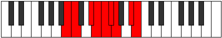 |
| [2549](https://ianring.com/musictheory/scales/2549) | [Rydyllic](ModeGSharpRydyllic.md) | G# | G#, A#, C, C#, D, D#, E, G, G# |  |
| [2549](https://ianring.com/musictheory/scales/2549) | [Rydyllic](ModeAFlatRydyllic.md) | Ab | Ab, Bb, C, Db, D, Eb, E, G, Ab |  |
| [2549](https://ianring.com/musictheory/scales/2549) | [Rydyllic](ModeFNaturalRydyllic.md) | F | F, G, A, A#, B, C, C#, E, F |  |
| [2551](https://ianring.com/musictheory/scales/2551) | [Zoptygic](ModeGSharpZoptygic.md) | G# | G#, A, A#, C, C#, D, D#, E, G, G# |  |
| [2551](https://ianring.com/musictheory/scales/2551) | [Zoptygic](ModeAFlatZoptygic.md) | Ab | Ab, A, Bb, C, Db, D, Eb, E, G, Ab |  |
| [2551](https://ianring.com/musictheory/scales/2551) | [Zoptygic](ModeBNaturalZoptygic.md) | B | B, C, C#, D#, E, F, F#, G, A#, B |  |
| [2551](https://ianring.com/musictheory/scales/2551) | [Zoptygic](ModeFNaturalZoptygic.md) | F | F, F#, G, A, A#, B, C, C#, E, F |  |
| [2553](https://ianring.com/musictheory/scales/2553) | [Aeolaptyllic](ModeENaturalAeolaptyllic.md) | E | E, G, G#, A, A#, B, C, D#, E |  |
| [2555](https://ianring.com/musictheory/scales/2555) | [Bythygic](ModeBNaturalBythygic.md) | B | B, C, D, D#, E, F, F#, G, A#, B |  |
| [2555](https://ianring.com/musictheory/scales/2555) | [Bythygic](ModeENaturalBythygic.md) | E | E, F, G, G#, A, A#, B, C, D#, E |  |
| [2557](https://ianring.com/musictheory/scales/2557) | [Dothygic](ModeGSharpDothygic.md) | G# | G#, A#, B, C, C#, D, D#, E, G, G# |  |
| [2557](https://ianring.com/musictheory/scales/2557) | [Dothygic](ModeAFlatDothygic.md) | Ab | Ab, Bb, B, C, Db, D, Eb, E, G, Ab |  |
| [2557](https://ianring.com/musictheory/scales/2557) | [Dothygic](ModeFNaturalDothygic.md) | F | F, G, G#, A, A#, B, C, C#, E, F |  |
| [2557](https://ianring.com/musictheory/scales/2557) | [Dothygic](ModeENaturalDothygic.md) | E | E, F#, G, G#, A, A#, B, C, D#, E |  |
| [2559](https://ianring.com/musictheory/scales/2559) | [Zogyllian](ModeBNaturalZogyllian.md) | B | B, C, C#, D, D#, E, F, F#, G, A#, B |  |
| [2559](https://ianring.com/musictheory/scales/2559) | [Zogyllian](ModeGSharpZogyllian.md) | G# | G#, A, A#, B, C, C#, D, D#, E, G, G# |  |
| [2559](https://ianring.com/musictheory/scales/2559) | [Zogyllian](ModeAFlatZogyllian.md) | Ab | Ab, A, Bb, B, C, Db, D, Eb, E, G, Ab |  |
| [2559](https://ianring.com/musictheory/scales/2559) | [Zogyllian](ModeFNaturalZogyllian.md) | F | F, F#, G, G#, A, A#, B, C, C#, E, F |  |
| [2559](https://ianring.com/musictheory/scales/2559) | [Zogyllian](ModeENaturalZogyllian.md) | E | E, F, F#, G, G#, A, A#, B, C, D#, E |  |
| [2601](https://ianring.com/musictheory/scales/2601) | [Docritonic](ModeGNaturalDocritonic.md) | G | G, A#, C, E, F#, G |  |
| [2603](https://ianring.com/musictheory/scales/2603) | [Gadimic](ModeGNaturalGadimic.md) | G | G, Ab, Bb, C, D##, E##, G |  |
| [2605](https://ianring.com/musictheory/scales/2605) | [Rylimic](ModeGNaturalRylimic.md) | G | G, A, Bb, C, D##, E##, G |  |
| [2607](https://ianring.com/musictheory/scales/2607) | [Aerolian](ModeGNaturalAerolian.md) | G | G, Ab, Bbb, Cbb, Dbb, E, F#, G |  |
| [2617](https://ianring.com/musictheory/scales/2617) | [Pylimic](ModeGNaturalPylimic.md) | G | G, A#, B, C, D##, E##, G |  |
| [2619](https://ianring.com/musictheory/scales/2619) | [Ionyrian](ModeGNaturalIonyrian.md) | G | G, Ab, Bb, Cb, Dbb, E, F#, G |  |
| [2621](https://ianring.com/musictheory/scales/2621) | [Ionogian](ModeGNaturalIonogian.md) | G | G, A, Bb, Cb, Dbb, E, F#, G |  |
| [2623](https://ianring.com/musictheory/scales/2623) | [Aerylyllic](ModeGNaturalAerylyllic.md) | G | G, G#, A, A#, B, C, E, F#, G |  |
| [2629](https://ianring.com/musictheory/scales/2629) | [Aeolythitonic](ModeASharpAeolythitonic.md) | A# | A#, C, E, G, A, A# |  |
| [2629](https://ianring.com/musictheory/scales/2629) | [Aeolythitonic](ModeBFlatAeolythitonic.md) | Bb | Bb, C, E, G, A, Bb |  |
| [2631](https://ianring.com/musictheory/scales/2631) | [Macrimic](ModeASharpMacrimic.md) | A# | A#, B, C, D##, E###, Cbbb, A# |  |
| [2631](https://ianring.com/musictheory/scales/2631) | [Macrimic](ModeBFlatMacrimic.md) | Bb | Bb, Cb, Dbb, E, F##, G##, Bb |  |
| [2633](https://ianring.com/musictheory/scales/2633) | [Mixitonic](ModeCSharpMixitonic.md) | C# | C#, E, G, A#, C, C# |  |
| [2633](https://ianring.com/musictheory/scales/2633) | [Mixitonic](ModeDFlatMixitonic.md) | Db | Db, E, G, Bb, C, Db |  |
| [2635](https://ianring.com/musictheory/scales/2635) | [Gocrimic](ModeCSharpGocrimic.md) | C# | C#, D, E, F##, G###, A###, C# |  |
| [2635](https://ianring.com/musictheory/scales/2635) | [Gocrimic](ModeDFlatGocrimic.md) | Db | Db, Ebb, Fb, G, A#, B#, Db |  |
| [2637](https://ianring.com/musictheory/scales/2637) | [Aeolonimic](ModeCSharpAeolonimic.md) | C# | C#, D#, E, F##, G###, A###, C# |  |
| [2637](https://ianring.com/musictheory/scales/2637) | [Aeolonimic](ModeDFlatAeolonimic.md) | Db | Db, Eb, Fb, G, A#, B#, Db |  |
| [2637](https://ianring.com/musictheory/scales/2637) | [Aeolonimic](ModeASharpAeolonimic.md) | A# | A#, B#, C#, D##, E###, Cbbb, A# |  |
| [2637](https://ianring.com/musictheory/scales/2637) | [Aeolonimic](ModeBFlatAeolonimic.md) | Bb | Bb, C, Db, E, F##, G##, Bb |  |
| [2639](https://ianring.com/musictheory/scales/2639) | [Dothian](ModeCSharpDothian.md) | C# | C#, D, Eb, Fb, G, A#, B#, C# |  |
| [2639](https://ianring.com/musictheory/scales/2639) | [Dothian](ModeDFlatDothian.md) | Db | Db, Ebb, Fbb, Gbbb, Abb, Bb, C, Db |  |
| [2639](https://ianring.com/musictheory/scales/2639) | [Dothian](ModeASharpDothian.md) | A# | A#, B, C, Db, E, F##, G##, A# |  |
| [2639](https://ianring.com/musictheory/scales/2639) | [Dothian](ModeBFlatDothian.md) | Bb | Bb, Cb, Dbb, Ebbb, Fb, G, A, Bb |  |
| [2645](https://ianring.com/musictheory/scales/2645) | [Zoptimic](ModeASharpZoptimic.md) | A# | A#, B#, C##, D##, E###, Cbbb, A# |  |
| [2645](https://ianring.com/musictheory/scales/2645) | [Zoptimic](ModeBFlatZoptimic.md) | Bb | Bb, C, D, E, F##, G##, Bb |  |
| [2647](https://ianring.com/musictheory/scales/2647) | [Dadian](ModeASharpDadian.md) | A# | A#, B, C, D, E, F##, G##, A# |  |
| [2647](https://ianring.com/musictheory/scales/2647) | [Dadian](ModeBFlatDadian.md) | Bb | Bb, Cb, Dbb, Ebb, Fb, G, A, Bb |  |
| [2649](https://ianring.com/musictheory/scales/2649) | [Aeolythimic](ModeCSharpAeolythimic.md) | C# | C#, D##, E#, F##, G###, A###, C# |  |
| [2649](https://ianring.com/musictheory/scales/2649) | [Aeolythimic](ModeDFlatAeolythimic.md) | Db | Db, E, F, G, A#, B#, Db |  |
| [2651](https://ianring.com/musictheory/scales/2651) | [Panian](ModeCSharpPanian.md) | C# | C#, D, E, F, G, A#, B#, C# |  |
| [2651](https://ianring.com/musictheory/scales/2651) | [Panian](ModeDFlatPanian.md) | Db | Db, Ebb, Fb, Gbb, Abb, Bb, C, Db |  |
| [2653](https://ianring.com/musictheory/scales/2653) | [Sygian](ModeCSharpSygian.md) | C# | C#, D#, E, F, G, A#, B#, C# |  |
| [2653](https://ianring.com/musictheory/scales/2653) | [Sygian](ModeDFlatSygian.md) | Db | Db, Eb, Fb, Gbb, Abb, Bb, C, Db |  |
| [2653](https://ianring.com/musictheory/scales/2653) | [Sygian](ModeASharpSygian.md) | A# | A#, B#, C#, D, E, F##, G##, A# |  |
| [2653](https://ianring.com/musictheory/scales/2653) | [Sygian](ModeBFlatSygian.md) | Bb | Bb, C, Db, Ebb, Fb, G, A, Bb |  |
| [2655](https://ianring.com/musictheory/scales/2655) | [Thocryllic](ModeCSharpThocryllic.md) | C# | C#, D, D#, E, F, G, A#, C, C# |  |
| [2655](https://ianring.com/musictheory/scales/2655) | [Thocryllic](ModeDFlatThocryllic.md) | Db | Db, D, Eb, E, F, G, Bb, C, Db |  |
| [2655](https://ianring.com/musictheory/scales/2655) | [Thocryllic](ModeASharpThocryllic.md) | A# | A#, B, C, C#, D, E, G, A, A# |  |
| [2655](https://ianring.com/musictheory/scales/2655) | [Thocryllic](ModeBFlatThocryllic.md) | Bb | Bb, B, C, Db, D, E, G, A, Bb |  |
| [2661](https://ianring.com/musictheory/scales/2661) | [Stydimic](ModeASharpStydimic.md) | A# | A#, B#, C###, D##, E###, Cbbb, A# |  |
| [2661](https://ianring.com/musictheory/scales/2661) | [Stydimic](ModeBFlatStydimic.md) | Bb | Bb, C, D#, E, F##, G##, Bb |  |
| [2663](https://ianring.com/musictheory/scales/2663) | [Lalian](ModeASharpLalian.md) | A# | A#, B, C, D#, E, F##, G##, A# |  |
| [2663](https://ianring.com/musictheory/scales/2663) | [Lalian](ModeBFlatLalian.md) | Bb | Bb, Cb, Dbb, Eb, Fb, G, A, Bb |  |
| [2665](https://ianring.com/musictheory/scales/2665) | [Aeradimic](ModeCSharpAeradimic.md) | C# | C#, D##, E##, F##, G###, A###, C# |  |
| [2665](https://ianring.com/musictheory/scales/2665) | [Aeradimic](ModeDFlatAeradimic.md) | Db | Db, E, F#, G, A#, B#, Db |  |
| [2665](https://ianring.com/musictheory/scales/2665) | [Aeradimic](ModeGNaturalAeradimic.md) | G | G, A#, B#, C#, D##, E##, G |  |
| [2667](https://ianring.com/musictheory/scales/2667) | [Byrian](ModeCSharpByrian.md) | C# | C#, D, E, F#, G, A#, B#, C# |  |
| [2667](https://ianring.com/musictheory/scales/2667) | [Byrian](ModeDFlatByrian.md) | Db | Db, Ebb, Fb, Gb, Abb, Bb, C, Db |  |
| [2667](https://ianring.com/musictheory/scales/2667) | [Byrian](ModeGNaturalByrian.md) | G | G, Ab, Bb, C, Db, E, F#, G |  |
| [2669](https://ianring.com/musictheory/scales/2669) | [Gamian](ModeCSharpGamian.md) | C# | C#, D#, E, F#, G, A#, B#, C# |  |
| [2669](https://ianring.com/musictheory/scales/2669) | [Gamian](ModeDFlatGamian.md) | Db | Db, Eb, Fb, Gb, Abb, Bb, C, Db |  |
| [2669](https://ianring.com/musictheory/scales/2669) | [Gamian](ModeASharpGamian.md) | A# | A#, B#, C#, D#, E, F##, G##, A# |  |
| [2669](https://ianring.com/musictheory/scales/2669) | [Gamian](ModeBFlatGamian.md) | Bb | Bb, C, Db, Eb, Fb, G, A, Bb |  |
| [2669](https://ianring.com/musictheory/scales/2669) | [Gamian](ModeGNaturalGamian.md) | G | G, A, Bb, C, Db, E, F#, G |  |
| [2671](https://ianring.com/musictheory/scales/2671) | [Lylyllic](ModeCSharpLylyllic.md) | C# | C#, D, D#, E, F#, G, A#, C, C# |  |
| [2671](https://ianring.com/musictheory/scales/2671) | [Lylyllic](ModeDFlatLylyllic.md) | Db | Db, D, Eb, E, Gb, G, Bb, C, Db |  |
| [2671](https://ianring.com/musictheory/scales/2671) | [Lylyllic](ModeGNaturalLylyllic.md) | G | G, G#, A, A#, C, C#, E, F#, G |  |
| [2671](https://ianring.com/musictheory/scales/2671) | [Lylyllic](ModeASharpLylyllic.md) | A# | A#, B, C, C#, D#, E, G, A, A# |  |
| [2671](https://ianring.com/musictheory/scales/2671) | [Lylyllic](ModeBFlatLylyllic.md) | Bb | Bb, B, C, Db, Eb, E, G, A, Bb |  |
| [2677](https://ianring.com/musictheory/scales/2677) | [Thodian](ModeASharpThodian.md) | A# | A#, B#, C##, D#, E, F##, G##, A# |  |
| [2677](https://ianring.com/musictheory/scales/2677) | [Thodian](ModeBFlatThodian.md) | Bb | Bb, C, D, Eb, Fb, G, A, Bb |  |
| [2679](https://ianring.com/musictheory/scales/2679) | [Rathyllic](ModeASharpRathyllic.md) | A# | A#, B, C, D, D#, E, G, A, A# |  |
| [2679](https://ianring.com/musictheory/scales/2679) | [Rathyllic](ModeBFlatRathyllic.md) | Bb | Bb, B, C, D, Eb, E, G, A, Bb |  |
| [2681](https://ianring.com/musictheory/scales/2681) | [Aerycrian](ModeCSharpAerycrian.md) | C# | C#, D##, E#, F#, G, A#, B#, C# |  |
| [2681](https://ianring.com/musictheory/scales/2681) | [Aerycrian](ModeDFlatAerycrian.md) | Db | Db, E, F, Gb, Abb, Bb, C, Db |  |
| [2681](https://ianring.com/musictheory/scales/2681) | [Aerycrian](ModeGNaturalAerycrian.md) | G | G, A#, B, C, Db, E, F#, G |  |
| [2683](https://ianring.com/musictheory/scales/2683) | [Thodyllic](ModeCSharpThodyllic.md) | C# | C#, D, E, F, F#, G, A#, C, C# |  |
| [2683](https://ianring.com/musictheory/scales/2683) | [Thodyllic](ModeDFlatThodyllic.md) | Db | Db, D, E, F, Gb, G, Bb, C, Db |  |
| [2683](https://ianring.com/musictheory/scales/2683) | [Thodyllic](ModeGNaturalThodyllic.md) | G | G, G#, A#, B, C, C#, E, F#, G |  |
| [2685](https://ianring.com/musictheory/scales/2685) | [Ionoryllic](ModeCSharpIonoryllic.md) | C# | C#, D#, E, F, F#, G, A#, C, C# |  |
| [2685](https://ianring.com/musictheory/scales/2685) | [Ionoryllic](ModeDFlatIonoryllic.md) | Db | Db, Eb, E, F, Gb, G, Bb, C, Db |  |
| [2685](https://ianring.com/musictheory/scales/2685) | [Ionoryllic](ModeASharpIonoryllic.md) | A# | A#, C, C#, D, D#, E, G, A, A# |  |
| [2685](https://ianring.com/musictheory/scales/2685) | [Ionoryllic](ModeBFlatIonoryllic.md) | Bb | Bb, C, Db, D, Eb, E, G, A, Bb |  |
| [2685](https://ianring.com/musictheory/scales/2685) | [Ionoryllic](ModeGNaturalIonoryllic.md) | G | G, A, A#, B, C, C#, E, F#, G |  |
| [2687](https://ianring.com/musictheory/scales/2687) | [Thacrygic](ModeCSharpThacrygic.md) | C# | C#, D, D#, E, F, F#, G, A#, C, C# |  |
| [2687](https://ianring.com/musictheory/scales/2687) | [Thacrygic](ModeDFlatThacrygic.md) | Db | Db, D, Eb, E, F, Gb, G, Bb, C, Db |  |
| [2687](https://ianring.com/musictheory/scales/2687) | [Thacrygic](ModeASharpThacrygic.md) | A# | A#, B, C, C#, D, D#, E, G, A, A# |  |
| [2687](https://ianring.com/musictheory/scales/2687) | [Thacrygic](ModeBFlatThacrygic.md) | Bb | Bb, B, C, Db, D, Eb, E, G, A, Bb |  |
| [2687](https://ianring.com/musictheory/scales/2687) | [Thacrygic](ModeGNaturalThacrygic.md) | G | G, G#, A, A#, B, C, C#, E, F#, G |  |
| [2707](https://ianring.com/musictheory/scales/2707) | [Banimic](ModeDSharpBanimic.md) | D# | D#, E, F##, G###, A###, B###, D# |  |
| [2707](https://ianring.com/musictheory/scales/2707) | [Banimic](ModeEFlatBanimic.md) | Eb | Eb, Fb, G, A#, B#, C##, Eb |  |
| [2711](https://ianring.com/musictheory/scales/2711) | [Stolian](ModeDSharpStolian.md) | D# | D#, E, F, G, A#, B#, C##, D# |  |
| [2711](https://ianring.com/musictheory/scales/2711) | [Stolian](ModeEFlatStolian.md) | Eb | Eb, Fb, Gbb, Abb, Bb, C, D, Eb |  |
| [2715](https://ianring.com/musictheory/scales/2715) | [Kynian](ModeDSharpKynian.md) | D# | D#, E, F#, G, A#, B#, C##, D# |  |
| [2715](https://ianring.com/musictheory/scales/2715) | [Kynian](ModeEFlatKynian.md) | Eb | Eb, Fb, Gb, Abb, Bb, C, D, Eb |  |
| [2719](https://ianring.com/musictheory/scales/2719) | [Zocryllic](ModeDSharpZocryllic.md) | D# | D#, E, F, F#, G, A#, C, D, D# |  |
| [2719](https://ianring.com/musictheory/scales/2719) | [Zocryllic](ModeEFlatZocryllic.md) | Eb | Eb, E, F, Gb, G, Bb, C, D, Eb |  |
| [2725](https://ianring.com/musictheory/scales/2725) | [Gonimic](ModeFNaturalGonimic.md) | F | F, G, A#, B#, C##, D##, F |  |
| [2727](https://ianring.com/musictheory/scales/2727) | [Pylian](ModeFNaturalPylian.md) | F | F, Gb, Abb, Bb, C, D, E, F |  |
| [2729](https://ianring.com/musictheory/scales/2729) | [Aeragimic](ModeGNaturalAeragimic.md) | G | G, A#, B#, C##, D##, E##, G | 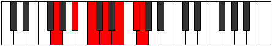 |
| [2731](https://ianring.com/musictheory/scales/2731) | [Thydian](ModeGNaturalThydian.md) | G | G, Ab, Bb, C, D, E, F#, G | 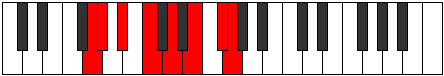 |
| [2733](https://ianring.com/musictheory/scales/2733) | [Bocrian](ModeFNaturalBocrian.md) | F | F, G, Ab, Bb, C, D, E, F |  |
| [2733](https://ianring.com/musictheory/scales/2733) | [Bocrian](ModeGNaturalBocrian.md) | G | G, A, Bb, C, D, E, F#, G |  |
| [2735](https://ianring.com/musictheory/scales/2735) | [Gynyllic](ModeFNaturalGynyllic.md) | F | F, F#, G, G#, A#, C, D, E, F |  |
| [2735](https://ianring.com/musictheory/scales/2735) | [Gynyllic](ModeGNaturalGynyllic.md) | G | G, G#, A, A#, C, D, E, F#, G |  |
| [2739](https://ianring.com/musictheory/scales/2739) | [Zanian](ModeDSharpZanian.md) | D# | D#, E, F##, G#, A#, B#, C##, D# |  |
| [2739](https://ianring.com/musictheory/scales/2739) | [Zanian](ModeEFlatZanian.md) | Eb | Eb, Fb, G, Ab, Bb, C, D, Eb |  |
| [2741](https://ianring.com/musictheory/scales/2741) | [Ionian](ModeFNaturalIonian.md) | F | F, G, A, Bb, C, D, E, F |  |
| [2743](https://ianring.com/musictheory/scales/2743) | [Staptyllic](ModeDSharpStaptyllic.md) | D# | D#, E, F, G, G#, A#, C, D, D# |  |
| [2743](https://ianring.com/musictheory/scales/2743) | [Staptyllic](ModeEFlatStaptyllic.md) | Eb | Eb, E, F, G, Ab, Bb, C, D, Eb |  |
| [2743](https://ianring.com/musictheory/scales/2743) | [Staptyllic](ModeFNaturalStaptyllic.md) | F | F, F#, G, A, A#, C, D, E, F |  |
| [2745](https://ianring.com/musictheory/scales/2745) | [Dolian](ModeGNaturalDolian.md) | G | G, A#, B, C, D, E, F#, G |  |
| [2747](https://ianring.com/musictheory/scales/2747) | [Stythyllic](ModeDSharpStythyllic.md) | D# | D#, E, F#, G, G#, A#, C, D, D# | 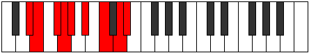 |
| [2747](https://ianring.com/musictheory/scales/2747) | [Stythyllic](ModeEFlatStythyllic.md) | Eb | Eb, E, Gb, G, Ab, Bb, C, D, Eb |  |
| [2747](https://ianring.com/musictheory/scales/2747) | [Stythyllic](ModeGNaturalStythyllic.md) | G | G, G#, A#, B, C, D, E, F#, G |  |
| [2749](https://ianring.com/musictheory/scales/2749) | [Katagyllic](ModeFNaturalKatagyllic.md) | F | F, G, G#, A, A#, C, D, E, F |  |
| [2749](https://ianring.com/musictheory/scales/2749) | [Katagyllic](ModeGNaturalKatagyllic.md) | G | G, A, A#, B, C, D, E, F#, G |  |
| [2751](https://ianring.com/musictheory/scales/2751) | [Sylygic](ModeDSharpSylygic.md) | D# | D#, E, F, F#, G, G#, A#, C, D, D# |  |
| [2751](https://ianring.com/musictheory/scales/2751) | [Sylygic](ModeEFlatSylygic.md) | Eb | Eb, E, F, Gb, G, Ab, Bb, C, D, Eb |  |
| [2751](https://ianring.com/musictheory/scales/2751) | [Sylygic](ModeFNaturalSylygic.md) | F | F, F#, G, G#, A, A#, C, D, E, F |  |
| [2751](https://ianring.com/musictheory/scales/2751) | [Sylygic](ModeGNaturalSylygic.md) | G | G, G#, A, A#, B, C, D, E, F#, G |  |
| [2757](https://ianring.com/musictheory/scales/2757) | [Stolimic](ModeASharpStolimic.md) | A# | A#, B#, D##, E#, F##, G##, A# |  |
| [2757](https://ianring.com/musictheory/scales/2757) | [Stolimic](ModeBFlatStolimic.md) | Bb | Bb, C, D##, E#, F##, G##, Bb | 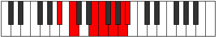 |
| [2759](https://ianring.com/musictheory/scales/2759) | [Aeraphian](ModeASharpAeraphian.md) | A# | A#, B, C, D##, E#, F##, G##, A# | 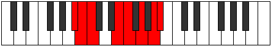 |
| [2759](https://ianring.com/musictheory/scales/2759) | [Aeraphian](ModeBFlatAeraphian.md) | Bb | Bb, Cb, Dbb, E, F, G, A, Bb |  |
| [2761](https://ianring.com/musictheory/scales/2761) | [Dagimic](ModeCSharpDagimic.md) | C# | C#, D##, E###, F###, G###, A###, C# |  |
| [2761](https://ianring.com/musictheory/scales/2761) | [Dagimic](ModeDFlatDagimic.md) | Db | Db, E, F##, G#, A#, B#, Db |  |
| [2763](https://ianring.com/musictheory/scales/2763) | [Manian](ModeCSharpManian.md) | C# | C#, D, E, F##, G#, A#, B#, C# |  |
| [2763](https://ianring.com/musictheory/scales/2763) | [Manian](ModeDFlatManian.md) | Db | Db, Ebb, Fb, G, Ab, Bb, C, Db |  |
| [2765](https://ianring.com/musictheory/scales/2765) | [Banian](ModeCSharpBanian.md) | C# | C#, D#, E, F##, G#, A#, B#, C# |  |
| [2765](https://ianring.com/musictheory/scales/2765) | [Banian](ModeDFlatBanian.md) | Db | Db, Eb, Fb, G, Ab, Bb, C, Db |  |
| [2765](https://ianring.com/musictheory/scales/2765) | [Banian](ModeASharpBanian.md) | A# | A#, B#, C#, D##, E#, F##, G##, A# |  |
| [2765](https://ianring.com/musictheory/scales/2765) | [Banian](ModeBFlatBanian.md) | Bb | Bb, C, Db, E, F, G, A, Bb |  |
| [2767](https://ianring.com/musictheory/scales/2767) | [Katydyllic](ModeCSharpKatydyllic.md) | C# | C#, D, D#, E, G, G#, A#, C, C# |  |
| [2767](https://ianring.com/musictheory/scales/2767) | [Katydyllic](ModeDFlatKatydyllic.md) | Db | Db, D, Eb, E, G, Ab, Bb, C, Db |  |
| [2767](https://ianring.com/musictheory/scales/2767) | [Katydyllic](ModeASharpKatydyllic.md) | A# | A#, B, C, C#, E, F, G, A, A# |  |
| [2767](https://ianring.com/musictheory/scales/2767) | [Katydyllic](ModeBFlatKatydyllic.md) | Bb | Bb, B, C, Db, E, F, G, A, Bb |  |
| [2771](https://ianring.com/musictheory/scales/2771) | [Garian](ModeDSharpGarian.md) | D# | D#, E, F##, G##, A#, B#, C##, D# |  |
| [2771](https://ianring.com/musictheory/scales/2771) | [Garian](ModeEFlatGarian.md) | Eb | Eb, Fb, G, A, Bb, C, D, Eb |  |
| [2773](https://ianring.com/musictheory/scales/2773) | [Lydian](ModeASharpLydian.md) | A# | A#, B#, C##, D##, E#, F##, G##, A# |  |
| [2773](https://ianring.com/musictheory/scales/2773) | [Lydian](ModeBFlatLydian.md) | Bb | Bb, C, D, E, F, G, A, Bb |  |
| [2775](https://ianring.com/musictheory/scales/2775) | [Godyllic](ModeDSharpGodyllic.md) | D# | D#, E, F, G, A, A#, C, D, D# |  |
| [2775](https://ianring.com/musictheory/scales/2775) | [Godyllic](ModeEFlatGodyllic.md) | Eb | Eb, E, F, G, A, Bb, C, D, Eb |  |
| [2775](https://ianring.com/musictheory/scales/2775) | [Godyllic](ModeASharpGodyllic.md) | A# | A#, B, C, D, E, F, G, A, A# |  |
| [2775](https://ianring.com/musictheory/scales/2775) | [Godyllic](ModeBFlatGodyllic.md) | Bb | Bb, B, C, D, E, F, G, A, Bb |  |
| [2777](https://ianring.com/musictheory/scales/2777) | [Bycrian](ModeCSharpBycrian.md) | C# | C#, D##, E#, F##, G#, A#, B#, C# |  |
| [2777](https://ianring.com/musictheory/scales/2777) | [Bycrian](ModeDFlatBycrian.md) | Db | Db, E, F, G, Ab, Bb, C, Db |  |
| [2779](https://ianring.com/musictheory/scales/2779) | [Garyllic](ModeCSharpGaryllic.md) | C# | C#, D, E, F, G, G#, A#, C, C# |  |
| [2779](https://ianring.com/musictheory/scales/2779) | [Garyllic](ModeDFlatGaryllic.md) | Db | Db, D, E, F, G, Ab, Bb, C, Db |  |
| [2779](https://ianring.com/musictheory/scales/2779) | [Garyllic](ModeDSharpGaryllic.md) | D# | D#, E, F#, G, A, A#, C, D, D# |  |
| [2779](https://ianring.com/musictheory/scales/2779) | [Garyllic](ModeEFlatGaryllic.md) | Eb | Eb, E, Gb, G, A, Bb, C, D, Eb |  |
| [2781](https://ianring.com/musictheory/scales/2781) | [Gycryllic](ModeCSharpGycryllic.md) | C# | C#, D#, E, F, G, G#, A#, C, C# |  |
| [2781](https://ianring.com/musictheory/scales/2781) | [Gycryllic](ModeDFlatGycryllic.md) | Db | Db, Eb, E, F, G, Ab, Bb, C, Db |  |
| [2781](https://ianring.com/musictheory/scales/2781) | [Gycryllic](ModeASharpGycryllic.md) | A# | A#, C, C#, D, E, F, G, A, A# |  |
| [2781](https://ianring.com/musictheory/scales/2781) | [Gycryllic](ModeBFlatGycryllic.md) | Bb | Bb, C, Db, D, E, F, G, A, Bb |  |
| [2783](https://ianring.com/musictheory/scales/2783) | [Gothygic](ModeCSharpGothygic.md) | C# | C#, D, D#, E, F, G, G#, A#, C, C# |  |
| [2783](https://ianring.com/musictheory/scales/2783) | [Gothygic](ModeDFlatGothygic.md) | Db | Db, D, Eb, E, F, G, Ab, Bb, C, Db |  |
| [2783](https://ianring.com/musictheory/scales/2783) | [Gothygic](ModeDSharpGothygic.md) | D# | D#, E, F, F#, G, A, A#, C, D, D# |  |
| [2783](https://ianring.com/musictheory/scales/2783) | [Gothygic](ModeEFlatGothygic.md) | Eb | Eb, E, F, Gb, G, A, Bb, C, D, Eb |  |
| [2783](https://ianring.com/musictheory/scales/2783) | [Gothygic](ModeASharpGothygic.md) | A# | A#, B, C, C#, D, E, F, G, A, A# |  |
| [2783](https://ianring.com/musictheory/scales/2783) | [Gothygic](ModeBFlatGothygic.md) | Bb | Bb, B, C, Db, D, E, F, G, A, Bb |  |
| [2789](https://ianring.com/musictheory/scales/2789) | [Zolian](ModeASharpZolian.md) | A# | A#, B#, C###, D##, E#, F##, G##, A# |  |
| [2789](https://ianring.com/musictheory/scales/2789) | [Zolian](ModeBFlatZolian.md) | Bb | Bb, C, D#, E, F, G, A, Bb |  |
| [2789](https://ianring.com/musictheory/scales/2789) | [Zolian](ModeFNaturalZolian.md) | F | F, G, A#, B, C, D, E, F |  |
| [2791](https://ianring.com/musictheory/scales/2791) | [Ionyptyllic](ModeFNaturalIonyptyllic.md) | F | F, F#, G, A#, B, C, D, E, F |  |
| [2791](https://ianring.com/musictheory/scales/2791) | [Ionyptyllic](ModeASharpIonyptyllic.md) | A# | A#, B, C, D#, E, F, G, A, A# |  |
| [2791](https://ianring.com/musictheory/scales/2791) | [Ionyptyllic](ModeBFlatIonyptyllic.md) | Bb | Bb, B, C, Eb, E, F, G, A, Bb |  |
| [2793](https://ianring.com/musictheory/scales/2793) | [Eporian](ModeGNaturalEporian.md) | G | G, A#, B#, C#, D, E, F#, G |  |
| [2793](https://ianring.com/musictheory/scales/2793) | [Eporian](ModeCSharpEporian.md) | C# | C#, D##, E##, F##, G#, A#, B#, C# |  |
| [2793](https://ianring.com/musictheory/scales/2793) | [Eporian](ModeDFlatEporian.md) | Db | Db, E, F#, G, Ab, Bb, C, Db |  |
| [2797](https://ianring.com/musictheory/scales/2797) | [Stalyllic](ModeCSharpStalyllic.md) | C# | C#, D#, E, F#, G, G#, A#, C, C# |  |
| [2797](https://ianring.com/musictheory/scales/2797) | [Stalyllic](ModeDFlatStalyllic.md) | Db | Db, Eb, E, Gb, G, Ab, Bb, C, Db |  |
| [2797](https://ianring.com/musictheory/scales/2797) | [Stalyllic](ModeASharpStalyllic.md) | A# | A#, C, C#, D#, E, F, G, A, A# |  |
| [2797](https://ianring.com/musictheory/scales/2797) | [Stalyllic](ModeBFlatStalyllic.md) | Bb | Bb, C, Db, Eb, E, F, G, A, Bb |  |
| [2797](https://ianring.com/musictheory/scales/2797) | [Stalyllic](ModeGNaturalStalyllic.md) | G | G, A, A#, C, C#, D, E, F#, G |  |
| [2797](https://ianring.com/musictheory/scales/2797) | [Stalyllic](ModeFNaturalStalyllic.md) | F | F, G, G#, A#, B, C, D, E, F |  |
| [2799](https://ianring.com/musictheory/scales/2799) | [Epilygic](ModeCSharpEpilygic.md) | C# | C#, D, D#, E, F#, G, G#, A#, C, C# |  |
| [2799](https://ianring.com/musictheory/scales/2799) | [Epilygic](ModeDFlatEpilygic.md) | Db | Db, D, Eb, E, Gb, G, Ab, Bb, C, Db |  |
| [2799](https://ianring.com/musictheory/scales/2799) | [Epilygic](ModeGNaturalEpilygic.md) | G | G, G#, A, A#, C, C#, D, E, F#, G |  |
| [2799](https://ianring.com/musictheory/scales/2799) | [Epilygic](ModeFNaturalEpilygic.md) | F | F, F#, G, G#, A#, B, C, D, E, F |  |
| [2799](https://ianring.com/musictheory/scales/2799) | [Epilygic](ModeASharpEpilygic.md) | A# | A#, B, C, C#, D#, E, F, G, A, A# |  |
| [2799](https://ianring.com/musictheory/scales/2799) | [Epilygic](ModeBFlatEpilygic.md) | Bb | Bb, B, C, Db, Eb, E, F, G, A, Bb |  |
| [2803](https://ianring.com/musictheory/scales/2803) | [Zolyllic](ModeDSharpZolyllic.md) | D# | D#, E, G, G#, A, A#, C, D, D# |  |
| [2803](https://ianring.com/musictheory/scales/2803) | [Zolyllic](ModeEFlatZolyllic.md) | Eb | Eb, E, G, Ab, A, Bb, C, D, Eb |  |
| [2805](https://ianring.com/musictheory/scales/2805) | [Zylyllic](ModeASharpZylyllic.md) | A# | A#, C, D, D#, E, F, G, A, A# |  |
| [2805](https://ianring.com/musictheory/scales/2805) | [Zylyllic](ModeBFlatZylyllic.md) | Bb | Bb, C, D, Eb, E, F, G, A, Bb |  |
| [2805](https://ianring.com/musictheory/scales/2805) | [Zylyllic](ModeFNaturalZylyllic.md) | F | F, G, A, A#, B, C, D, E, F |  |
| [2807](https://ianring.com/musictheory/scales/2807) | [Zylygic](ModeDSharpZylygic.md) | D# | D#, E, F, G, G#, A, A#, C, D, D# |  |
| [2807](https://ianring.com/musictheory/scales/2807) | [Zylygic](ModeEFlatZylygic.md) | Eb | Eb, E, F, G, Ab, A, Bb, C, D, Eb |  |
| [2807](https://ianring.com/musictheory/scales/2807) | [Zylygic](ModeASharpZylygic.md) | A# | A#, B, C, D, D#, E, F, G, A, A# |  |
| [2807](https://ianring.com/musictheory/scales/2807) | [Zylygic](ModeBFlatZylygic.md) | Bb | Bb, B, C, D, Eb, E, F, G, A, Bb |  |
| [2807](https://ianring.com/musictheory/scales/2807) | [Zylygic](ModeFNaturalZylygic.md) | F | F, F#, G, A, A#, B, C, D, E, F |  |
| [2809](https://ianring.com/musictheory/scales/2809) | [Gythyllic](ModeCSharpGythyllic.md) | C# | C#, E, F, F#, G, G#, A#, C, C# |  |
| [2809](https://ianring.com/musictheory/scales/2809) | [Gythyllic](ModeDFlatGythyllic.md) | Db | Db, E, F, Gb, G, Ab, Bb, C, Db |  |
| [2809](https://ianring.com/musictheory/scales/2809) | [Gythyllic](ModeGNaturalGythyllic.md) | G | G, A#, B, C, C#, D, E, F#, G |  |
| [2811](https://ianring.com/musictheory/scales/2811) | [Barygic](ModeCSharpBarygic.md) | C# | C#, D, E, F, F#, G, G#, A#, C, C# |  |
| [2811](https://ianring.com/musictheory/scales/2811) | [Barygic](ModeDFlatBarygic.md) | Db | Db, D, E, F, Gb, G, Ab, Bb, C, Db |  |
| [2811](https://ianring.com/musictheory/scales/2811) | [Barygic](ModeDSharpBarygic.md) | D# | D#, E, F#, G, G#, A, A#, C, D, D# |  |
| [2811](https://ianring.com/musictheory/scales/2811) | [Barygic](ModeEFlatBarygic.md) | Eb | Eb, E, Gb, G, Ab, A, Bb, C, D, Eb |  |
| [2811](https://ianring.com/musictheory/scales/2811) | [Barygic](ModeGNaturalBarygic.md) | G | G, G#, A#, B, C, C#, D, E, F#, G |  |
| [2813](https://ianring.com/musictheory/scales/2813) | [Zolygic](ModeCSharpZolygic.md) | C# | C#, D#, E, F, F#, G, G#, A#, C, C# |  |
| [2813](https://ianring.com/musictheory/scales/2813) | [Zolygic](ModeDFlatZolygic.md) | Db | Db, Eb, E, F, Gb, G, Ab, Bb, C, Db |  |
| [2813](https://ianring.com/musictheory/scales/2813) | [Zolygic](ModeASharpZolygic.md) | A# | A#, C, C#, D, D#, E, F, G, A, A# |  |
| [2813](https://ianring.com/musictheory/scales/2813) | [Zolygic](ModeBFlatZolygic.md) | Bb | Bb, C, Db, D, Eb, E, F, G, A, Bb |  |
| [2813](https://ianring.com/musictheory/scales/2813) | [Zolygic](ModeGNaturalZolygic.md) | G | G, A, A#, B, C, C#, D, E, F#, G |  |
| [2813](https://ianring.com/musictheory/scales/2813) | [Zolygic](ModeFNaturalZolygic.md) | F | F, G, G#, A, A#, B, C, D, E, F |  |
| [2815](https://ianring.com/musictheory/scales/2815) | [Aeradyllian](ModeCSharpAeradyllian.md) | C# | C#, D, D#, E, F, F#, G, G#, A#, C, C# |  |
| [2815](https://ianring.com/musictheory/scales/2815) | [Aeradyllian](ModeDFlatAeradyllian.md) | Db | Db, D, Eb, E, F, Gb, G, Ab, Bb, C, Db |  |
| [2815](https://ianring.com/musictheory/scales/2815) | [Aeradyllian](ModeDSharpAeradyllian.md) | D# | D#, E, F, F#, G, G#, A, A#, C, D, D# |  |
| [2815](https://ianring.com/musictheory/scales/2815) | [Aeradyllian](ModeEFlatAeradyllian.md) | Eb | Eb, E, F, Gb, G, Ab, A, Bb, C, D, Eb |  |
| [2815](https://ianring.com/musictheory/scales/2815) | [Aeradyllian](ModeASharpAeradyllian.md) | A# | A#, B, C, C#, D, D#, E, F, G, A, A# |  |
| [2815](https://ianring.com/musictheory/scales/2815) | [Aeradyllian](ModeBFlatAeradyllian.md) | Bb | Bb, B, C, Db, D, Eb, E, F, G, A, Bb |  |
| [2815](https://ianring.com/musictheory/scales/2815) | [Aeradyllian](ModeGNaturalAeradyllian.md) | G | G, G#, A, A#, B, C, C#, D, E, F#, G |  |
| [2815](https://ianring.com/musictheory/scales/2815) | [Aeradyllian](ModeFNaturalAeradyllian.md) | F | F, F#, G, G#, A, A#, B, C, D, E, F |  |
| [2837](https://ianring.com/musictheory/scales/2837) | [Aelothimic](ModeGSharpAelothimic.md) | G# | G#, A#, B#, D##, E#, F##, G# |  |
| [2837](https://ianring.com/musictheory/scales/2837) | [Aelothimic](ModeAFlatAelothimic.md) | Ab | Ab, Bb, C, D##, E#, F##, Ab |  |
| [2839](https://ianring.com/musictheory/scales/2839) | [Lyptian](ModeGSharpLyptian.md) | G# | G#, A, Bb, C, D##, E#, F##, G# |  |
| [2839](https://ianring.com/musictheory/scales/2839) | [Lyptian](ModeAFlatLyptian.md) | Ab | Ab, Bbb, Cbb, Dbb, E, F, G, Ab |  |
| [2845](https://ianring.com/musictheory/scales/2845) | [Baptian](ModeGSharpBaptian.md) | G# | G#, A#, B, C, D##, E#, F##, G# |  |
| [2845](https://ianring.com/musictheory/scales/2845) | [Baptian](ModeAFlatBaptian.md) | Ab | Ab, Bb, Cb, Dbb, E, F, G, Ab |  |
| [2847](https://ianring.com/musictheory/scales/2847) | [Phracryllic](ModeGSharpPhracryllic.md) | G# | G#, A, A#, B, C, E, F, G, G# |  |
| [2847](https://ianring.com/musictheory/scales/2847) | [Phracryllic](ModeAFlatPhracryllic.md) | Ab | Ab, A, Bb, B, C, E, F, G, Ab |  |
| [2851](https://ianring.com/musictheory/scales/2851) | [Katoptimic](ModeBNaturalKatoptimic.md) | B | B, C, D##, E###, F###, G###, B |  |
| [2855](https://ianring.com/musictheory/scales/2855) | [Epocrian](ModeBNaturalEpocrian.md) | B | B, C, Db, E, F##, G#, A#, B |  |
| [2857](https://ianring.com/musictheory/scales/2857) | [Stythimic](ModeGNaturalStythimic.md) | G | G, A#, B#, C###, D##, E##, G |  |
| [2859](https://ianring.com/musictheory/scales/2859) | [Phrycrian](ModeGNaturalPhrycrian.md) | G | G, Ab, Bb, C, D#, E, F#, G |  |
| [2859](https://ianring.com/musictheory/scales/2859) | [Phrycrian](ModeBNaturalPhrycrian.md) | B | B, C, D, E, F##, G#, A#, B |  |
| [2861](https://ianring.com/musictheory/scales/2861) | [Katothian](ModeGNaturalKatothian.md) | G | G, A, Bb, C, D#, E, F#, G |  |
| [2863](https://ianring.com/musictheory/scales/2863) | [Aerogyllic](ModeGNaturalAerogyllic.md) | G | G, G#, A, A#, C, D#, E, F#, G |  |
| [2863](https://ianring.com/musictheory/scales/2863) | [Aerogyllic](ModeBNaturalAerogyllic.md) | B | B, C, C#, D, E, G, G#, A#, B |  |
| [2867](https://ianring.com/musictheory/scales/2867) | [Socrian](ModeBNaturalSocrian.md) | B | B, C, D#, E, F##, G#, A#, B | 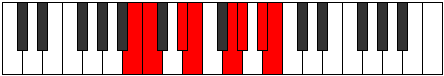 |
| [2869](https://ianring.com/musictheory/scales/2869) | [Phrothian](ModeGSharpPhrothian.md) | G# | G#, A#, B#, C#, D##, E#, F##, G# |  |
| [2869](https://ianring.com/musictheory/scales/2869) | [Phrothian](ModeAFlatPhrothian.md) | Ab | Ab, Bb, C, Db, E, F, G, Ab |  |
| [2871](https://ianring.com/musictheory/scales/2871) | [Stanyllic](ModeGSharpStanyllic.md) | G# | G#, A, A#, C, C#, E, F, G, G# |  |
| [2871](https://ianring.com/musictheory/scales/2871) | [Stanyllic](ModeAFlatStanyllic.md) | Ab | Ab, A, Bb, C, Db, E, F, G, Ab |  |
| [2871](https://ianring.com/musictheory/scales/2871) | [Stanyllic](ModeBNaturalStanyllic.md) | B | B, C, C#, D#, E, G, G#, A#, B |  |
| [2873](https://ianring.com/musictheory/scales/2873) | [Docrian](ModeGNaturalDocrian.md) | G | G, A#, B, C, D#, E, F#, G |  |
| [2875](https://ianring.com/musictheory/scales/2875) | [Ganyllic](ModeBNaturalGanyllic.md) | B | B, C, D, D#, E, G, G#, A#, B |  |
| [2875](https://ianring.com/musictheory/scales/2875) | [Ganyllic](ModeGNaturalGanyllic.md) | G | G, G#, A#, B, C, D#, E, F#, G |  |
| [2877](https://ianring.com/musictheory/scales/2877) | [Phrylyllic](ModeGSharpPhrylyllic.md) | G# | G#, A#, B, C, C#, E, F, G, G# |  |
| [2877](https://ianring.com/musictheory/scales/2877) | [Phrylyllic](ModeAFlatPhrylyllic.md) | Ab | Ab, Bb, B, C, Db, E, F, G, Ab |  |
| [2877](https://ianring.com/musictheory/scales/2877) | [Phrylyllic](ModeGNaturalPhrylyllic.md) | G | G, A, A#, B, C, D#, E, F#, G |  |
| [2879](https://ianring.com/musictheory/scales/2879) | [Stadygic](ModeBNaturalStadygic.md) | B | B, C, C#, D, D#, E, G, G#, A#, B |  |
| [2879](https://ianring.com/musictheory/scales/2879) | [Stadygic](ModeGSharpStadygic.md) | G# | G#, A, A#, B, C, C#, E, F, G, G# |  |
| [2879](https://ianring.com/musictheory/scales/2879) | [Stadygic](ModeAFlatStadygic.md) | Ab | Ab, A, Bb, B, C, Db, E, F, G, Ab |  |
| [2879](https://ianring.com/musictheory/scales/2879) | [Stadygic](ModeGNaturalStadygic.md) | G | G, G#, A, A#, B, C, D#, E, F#, G |  |
| [2885](https://ianring.com/musictheory/scales/2885) | [Byrimic](ModeASharpByrimic.md) | A# | A#, B#, D##, E##, F##, G##, A# |  |
| [2885](https://ianring.com/musictheory/scales/2885) | [Byrimic](ModeBFlatByrimic.md) | Bb | Bb, C, D##, E##, F##, G##, Bb |  |
| [2887](https://ianring.com/musictheory/scales/2887) | [Gaptian](ModeASharpGaptian.md) | A# | A#, B, C, D##, E##, F##, G##, A# |  |
| [2887](https://ianring.com/musictheory/scales/2887) | [Gaptian](ModeBFlatGaptian.md) | Bb | Bb, Cb, Dbb, E, F#, G, A, Bb |  |
| [2889](https://ianring.com/musictheory/scales/2889) | [Thoptimic](ModeENaturalThoptimic.md) | E | E, F##, G###, A###, B##, C###, E |  |
| [2889](https://ianring.com/musictheory/scales/2889) | [Thoptimic](ModeCSharpThoptimic.md) | C# | C#, D##, E###, Cbbb, Cbb, Dbb, C# |  |
| [2889](https://ianring.com/musictheory/scales/2889) | [Thoptimic](ModeDFlatThoptimic.md) | Db | Db, E, F##, G##, A#, B#, Db |  |
| [2891](https://ianring.com/musictheory/scales/2891) | [Phrogian](ModeENaturalPhrogian.md) | E | E, F, G, A#, B#, C#, D#, E |  |
| [2891](https://ianring.com/musictheory/scales/2891) | [Phrogian](ModeCSharpPhrogian.md) | C# | C#, D, E, F##, G##, A#, B#, C# |  |
| [2891](https://ianring.com/musictheory/scales/2891) | [Phrogian](ModeDFlatPhrogian.md) | Db | Db, Ebb, Fb, G, A, Bb, C, Db |  |
| [2893](https://ianring.com/musictheory/scales/2893) | [Lylian](ModeENaturalLylian.md) | E | E, F#, G, A#, B#, C#, D#, E |  |
| [2893](https://ianring.com/musictheory/scales/2893) | [Lylian](ModeCSharpLylian.md) | C# | C#, D#, E, F##, G##, A#, B#, C# |  |
| [2893](https://ianring.com/musictheory/scales/2893) | [Lylian](ModeDFlatLylian.md) | Db | Db, Eb, Fb, G, A, Bb, C, Db |  |
| [2893](https://ianring.com/musictheory/scales/2893) | [Lylian](ModeASharpLylian.md) | A# | A#, B#, C#, D##, E##, F##, G##, A# |  |
| [2893](https://ianring.com/musictheory/scales/2893) | [Lylian](ModeBFlatLylian.md) | Bb | Bb, C, Db, E, F#, G, A, Bb |  |
| [2895](https://ianring.com/musictheory/scales/2895) | [Aeragyllic](ModeENaturalAeragyllic.md) | E | E, F, F#, G, A#, C, C#, D#, E |  |
| [2895](https://ianring.com/musictheory/scales/2895) | [Aeragyllic](ModeCSharpAeragyllic.md) | C# | C#, D, D#, E, G, A, A#, C, C# |  |
| [2895](https://ianring.com/musictheory/scales/2895) | [Aeragyllic](ModeDFlatAeragyllic.md) | Db | Db, D, Eb, E, G, A, Bb, C, Db |  |
| [2895](https://ianring.com/musictheory/scales/2895) | [Aeragyllic](ModeASharpAeragyllic.md) | A# | A#, B, C, C#, E, F#, G, A, A# |  |
| [2895](https://ianring.com/musictheory/scales/2895) | [Aeragyllic](ModeBFlatAeragyllic.md) | Bb | Bb, B, C, Db, E, Gb, G, A, Bb |  |
| [2901](https://ianring.com/musictheory/scales/2901) | [Larian](ModeGSharpLarian.md) | G# | G#, A#, B#, C##, D##, E#, F##, G# |  |
| [2901](https://ianring.com/musictheory/scales/2901) | [Larian](ModeAFlatLarian.md) | Ab | Ab, Bb, C, D, E, F, G, Ab |  |
| [2901](https://ianring.com/musictheory/scales/2901) | [Larian](ModeASharpLarian.md) | A# | A#, B#, C##, D##, E##, F##, G##, A# |  |
| [2901](https://ianring.com/musictheory/scales/2901) | [Larian](ModeBFlatLarian.md) | Bb | Bb, C, D, E, F#, G, A, Bb |  |
| [2903](https://ianring.com/musictheory/scales/2903) | [Gothyllic](ModeGSharpGothyllic.md) | G# | G#, A, A#, C, D, E, F, G, G# |  |
| [2903](https://ianring.com/musictheory/scales/2903) | [Gothyllic](ModeAFlatGothyllic.md) | Ab | Ab, A, Bb, C, D, E, F, G, Ab |  |
| [2903](https://ianring.com/musictheory/scales/2903) | [Gothyllic](ModeASharpGothyllic.md) | A# | A#, B, C, D, E, F#, G, A, A# |  |
| [2903](https://ianring.com/musictheory/scales/2903) | [Gothyllic](ModeBFlatGothyllic.md) | Bb | Bb, B, C, D, E, Gb, G, A, Bb |  |
| [2905](https://ianring.com/musictheory/scales/2905) | [Palian](ModeENaturalPalian.md) | E | E, F##, G#, A#, B#, C#, D#, E |  |
| [2905](https://ianring.com/musictheory/scales/2905) | [Palian](ModeCSharpPalian.md) | C# | C#, D##, E#, F##, G##, A#, B#, C# |  |
| [2905](https://ianring.com/musictheory/scales/2905) | [Palian](ModeDFlatPalian.md) | Db | Db, E, F, G, A, Bb, C, Db | 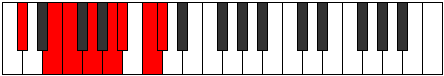 |
| [2907](https://ianring.com/musictheory/scales/2907) | [Mogyllic](ModeENaturalMogyllic.md) | E | E, F, G, G#, A#, C, C#, D#, E |  |
| [2907](https://ianring.com/musictheory/scales/2907) | [Mogyllic](ModeCSharpMogyllic.md) | C# | C#, D, E, F, G, A, A#, C, C# |  |
| [2907](https://ianring.com/musictheory/scales/2907) | [Mogyllic](ModeDFlatMogyllic.md) | Db | Db, D, E, F, G, A, Bb, C, Db |  |
| [2909](https://ianring.com/musictheory/scales/2909) | [Mocryllic](ModeENaturalMocryllic.md) | E | E, F#, G, G#, A#, C, C#, D#, E |  |
| [2909](https://ianring.com/musictheory/scales/2909) | [Mocryllic](ModeCSharpMocryllic.md) | C# | C#, D#, E, F, G, A, A#, C, C# |  |
| [2909](https://ianring.com/musictheory/scales/2909) | [Mocryllic](ModeDFlatMocryllic.md) | Db | Db, Eb, E, F, G, A, Bb, C, Db |  |
| [2909](https://ianring.com/musictheory/scales/2909) | [Mocryllic](ModeASharpMocryllic.md) | A# | A#, C, C#, D, E, F#, G, A, A# |  |
| [2909](https://ianring.com/musictheory/scales/2909) | [Mocryllic](ModeBFlatMocryllic.md) | Bb | Bb, C, Db, D, E, Gb, G, A, Bb | 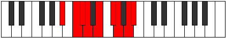 |
| [2909](https://ianring.com/musictheory/scales/2909) | [Mocryllic](ModeGSharpMocryllic.md) | G# | G#, A#, B, C, D, E, F, G, G# |  |
| [2909](https://ianring.com/musictheory/scales/2909) | [Mocryllic](ModeAFlatMocryllic.md) | Ab | Ab, Bb, B, C, D, E, F, G, Ab |  |
| [2911](https://ianring.com/musictheory/scales/2911) | [Katygic](ModeENaturalKatygic.md) | E | E, F, F#, G, G#, A#, C, C#, D#, E |  |
| [2911](https://ianring.com/musictheory/scales/2911) | [Katygic](ModeCSharpKatygic.md) | C# | C#, D, D#, E, F, G, A, A#, C, C# |  |
| [2911](https://ianring.com/musictheory/scales/2911) | [Katygic](ModeDFlatKatygic.md) | Db | Db, D, Eb, E, F, G, A, Bb, C, Db |  |
| [2911](https://ianring.com/musictheory/scales/2911) | [Katygic](ModeASharpKatygic.md) | A# | A#, B, C, C#, D, E, F#, G, A, A# |  |
| [2911](https://ianring.com/musictheory/scales/2911) | [Katygic](ModeBFlatKatygic.md) | Bb | Bb, B, C, Db, D, E, Gb, G, A, Bb |  |
| [2911](https://ianring.com/musictheory/scales/2911) | [Katygic](ModeGSharpKatygic.md) | G# | G#, A, A#, B, C, D, E, F, G, G# |  |
| [2911](https://ianring.com/musictheory/scales/2911) | [Katygic](ModeAFlatKatygic.md) | Ab | Ab, A, Bb, B, C, D, E, F, G, Ab |  |
| [2915](https://ianring.com/musictheory/scales/2915) | [Aeolydian](ModeBNaturalAeolydian.md) | B | B, C, D##, E#, F##, G#, A#, B |  |
| [2917](https://ianring.com/musictheory/scales/2917) | [Kocrian](ModeASharpKocrian.md) | A# | A#, B#, C###, D##, E##, F##, G##, A# |  |
| [2917](https://ianring.com/musictheory/scales/2917) | [Kocrian](ModeBFlatKocrian.md) | Bb | Bb, C, D#, E, F#, G, A, Bb |  |
| [2919](https://ianring.com/musictheory/scales/2919) | [Molyllic](ModeBNaturalMolyllic.md) | B | B, C, C#, E, F, G, G#, A#, B |  |
| [2919](https://ianring.com/musictheory/scales/2919) | [Molyllic](ModeASharpMolyllic.md) | A# | A#, B, C, D#, E, F#, G, A, A# |  |
| [2919](https://ianring.com/musictheory/scales/2919) | [Molyllic](ModeBFlatMolyllic.md) | Bb | Bb, B, C, Eb, E, Gb, G, A, Bb |  |
| [2921](https://ianring.com/musictheory/scales/2921) | [Pogian](ModeGNaturalPogian.md) | G | G, A#, B#, C#, D#, E, F#, G |  |
| [2921](https://ianring.com/musictheory/scales/2921) | [Pogian](ModeENaturalPogian.md) | E | E, F##, G##, A#, B#, C#, D#, E |  |
| [2921](https://ianring.com/musictheory/scales/2921) | [Pogian](ModeCSharpPogian.md) | C# | C#, D##, E##, F##, G##, A#, B#, C# |  |
| [2921](https://ianring.com/musictheory/scales/2921) | [Pogian](ModeDFlatPogian.md) | Db | Db, E, F#, G, A, Bb, C, Db |  |
| [2923](https://ianring.com/musictheory/scales/2923) | [Baryllic](ModeGNaturalBaryllic.md) | G | G, G#, A#, C, C#, D#, E, F#, G |  |
| [2923](https://ianring.com/musictheory/scales/2923) | [Baryllic](ModeENaturalBaryllic.md) | E | E, F, G, A, A#, C, C#, D#, E | 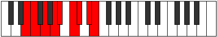 |
| [2923](https://ianring.com/musictheory/scales/2923) | [Baryllic](ModeCSharpBaryllic.md) | C# | C#, D, E, F#, G, A, A#, C, C# |  |
| [2923](https://ianring.com/musictheory/scales/2923) | [Baryllic](ModeDFlatBaryllic.md) | Db | Db, D, E, Gb, G, A, Bb, C, Db |  |
| [2923](https://ianring.com/musictheory/scales/2923) | [Baryllic](ModeBNaturalBaryllic.md) | B | B, C, D, E, F, G, G#, A#, B |  |
| [2925](https://ianring.com/musictheory/scales/2925) | [MajorDiminished](ModeCSharpMajorDiminished.md) | C# | C#, D#, E, F#, G, A, A#, C, C# |  |
| [2925](https://ianring.com/musictheory/scales/2925) | [MajorDiminished](ModeDFlatMajorDiminished.md) | Db | Db, Eb, E, Gb, G, A, Bb, C, Db |  |
| [2925](https://ianring.com/musictheory/scales/2925) | [MajorDiminished](ModeENaturalMajorDiminished.md) | E | E, F#, G, A, A#, C, C#, D#, E |  |
| [2925](https://ianring.com/musictheory/scales/2925) | [MajorDiminished](ModeGNaturalMajorDiminished.md) | G | G, A, A#, C, C#, D#, E, F#, G |  |
| [2925](https://ianring.com/musictheory/scales/2925) | [MajorDiminished](ModeASharpMajorDiminished.md) | A# | A#, C, C#, D#, E, F#, G, A, A# |  |
| [2925](https://ianring.com/musictheory/scales/2925) | [MajorDiminished](ModeBFlatMajorDiminished.md) | Bb | Bb, C, Db, Eb, E, Gb, G, A, Bb |  |
| [2927](https://ianring.com/musictheory/scales/2927) | [Rodygic](ModeCSharpRodygic.md) | C# | C#, D, D#, E, F#, G, A, A#, C, C# |  |
| [2927](https://ianring.com/musictheory/scales/2927) | [Rodygic](ModeDFlatRodygic.md) | Db | Db, D, Eb, E, Gb, G, A, Bb, C, Db |  |
| [2927](https://ianring.com/musictheory/scales/2927) | [Rodygic](ModeENaturalRodygic.md) | E | E, F, F#, G, A, A#, C, C#, D#, E |  |
| [2927](https://ianring.com/musictheory/scales/2927) | [Rodygic](ModeGNaturalRodygic.md) | G | G, G#, A, A#, C, C#, D#, E, F#, G |  |
| [2927](https://ianring.com/musictheory/scales/2927) | [Rodygic](ModeBNaturalRodygic.md) | B | B, C, C#, D, E, F, G, G#, A#, B |  |
| [2927](https://ianring.com/musictheory/scales/2927) | [Rodygic](ModeASharpRodygic.md) | A# | A#, B, C, C#, D#, E, F#, G, A, A# |  |
| [2927](https://ianring.com/musictheory/scales/2927) | [Rodygic](ModeBFlatRodygic.md) | Bb | Bb, B, C, Db, Eb, E, Gb, G, A, Bb |  |
| [2931](https://ianring.com/musictheory/scales/2931) | [Zathyllic](ModeBNaturalZathyllic.md) | B | B, C, D#, E, F, G, G#, A#, B |  |
| [2933](https://ianring.com/musictheory/scales/2933) | [Dalyllic](ModeGSharpDalyllic.md) | G# | G#, A#, C, C#, D, E, F, G, G# |  |
| [2933](https://ianring.com/musictheory/scales/2933) | [Dalyllic](ModeAFlatDalyllic.md) | Ab | Ab, Bb, C, Db, D, E, F, G, Ab |  |
| [2933](https://ianring.com/musictheory/scales/2933) | [Dalyllic](ModeASharpDalyllic.md) | A# | A#, C, D, D#, E, F#, G, A, A# |  |
| [2933](https://ianring.com/musictheory/scales/2933) | [Dalyllic](ModeBFlatDalyllic.md) | Bb | Bb, C, D, Eb, E, Gb, G, A, Bb |  |
| [2935](https://ianring.com/musictheory/scales/2935) | [Modygic](ModeGSharpModygic.md) | G# | G#, A, A#, C, C#, D, E, F, G, G# |  |
| [2935](https://ianring.com/musictheory/scales/2935) | [Modygic](ModeAFlatModygic.md) | Ab | Ab, A, Bb, C, Db, D, E, F, G, Ab |  |
| [2935](https://ianring.com/musictheory/scales/2935) | [Modygic](ModeBNaturalModygic.md) | B | B, C, C#, D#, E, F, G, G#, A#, B |  |
| [2935](https://ianring.com/musictheory/scales/2935) | [Modygic](ModeASharpModygic.md) | A# | A#, B, C, D, D#, E, F#, G, A, A# |  |
| [2935](https://ianring.com/musictheory/scales/2935) | [Modygic](ModeBFlatModygic.md) | Bb | Bb, B, C, D, Eb, E, Gb, G, A, Bb |  |
| [2937](https://ianring.com/musictheory/scales/2937) | [Aeolathyllic](ModeCSharpAeolathyllic.md) | C# | C#, E, F, F#, G, A, A#, C, C# |  |
| [2937](https://ianring.com/musictheory/scales/2937) | [Aeolathyllic](ModeDFlatAeolathyllic.md) | Db | Db, E, F, Gb, G, A, Bb, C, Db |  |
| [2937](https://ianring.com/musictheory/scales/2937) | [Aeolathyllic](ModeENaturalAeolathyllic.md) | E | E, G, G#, A, A#, C, C#, D#, E |  |
| [2937](https://ianring.com/musictheory/scales/2937) | [Aeolathyllic](ModeGNaturalAeolathyllic.md) | G | G, A#, B, C, C#, D#, E, F#, G |  |
| [2939](https://ianring.com/musictheory/scales/2939) | [Goptygic](ModeCSharpGoptygic.md) | C# | C#, D, E, F, F#, G, A, A#, C, C# |  |
| [2939](https://ianring.com/musictheory/scales/2939) | [Goptygic](ModeDFlatGoptygic.md) | Db | Db, D, E, F, Gb, G, A, Bb, C, Db |  |
| [2939](https://ianring.com/musictheory/scales/2939) | [Goptygic](ModeENaturalGoptygic.md) | E | E, F, G, G#, A, A#, C, C#, D#, E |  |
| [2939](https://ianring.com/musictheory/scales/2939) | [Goptygic](ModeBNaturalGoptygic.md) | B | B, C, D, D#, E, F, G, G#, A#, B |  |
| [2939](https://ianring.com/musictheory/scales/2939) | [Goptygic](ModeGNaturalGoptygic.md) | G | G, G#, A#, B, C, C#, D#, E, F#, G |  |
| [2941](https://ianring.com/musictheory/scales/2941) | [Laptygic](ModeASharpLaptygic.md) | A# | A#, C, C#, D, D#, E, F#, G, A, A# |  |
| [2941](https://ianring.com/musictheory/scales/2941) | [Laptygic](ModeBFlatLaptygic.md) | Bb | Bb, C, Db, D, Eb, E, Gb, G, A, Bb |  |
| [2941](https://ianring.com/musictheory/scales/2941) | [Laptygic](ModeCSharpLaptygic.md) | C# | C#, D#, E, F, F#, G, A, A#, C, C# |  |
| [2941](https://ianring.com/musictheory/scales/2941) | [Laptygic](ModeDFlatLaptygic.md) | Db | Db, Eb, E, F, Gb, G, A, Bb, C, Db |  |
| [2941](https://ianring.com/musictheory/scales/2941) | [Laptygic](ModeENaturalLaptygic.md) | E | E, F#, G, G#, A, A#, C, C#, D#, E |  |
| [2941](https://ianring.com/musictheory/scales/2941) | [Laptygic](ModeGSharpLaptygic.md) | G# | G#, A#, B, C, C#, D, E, F, G, G# |  |
| [2941](https://ianring.com/musictheory/scales/2941) | [Laptygic](ModeAFlatLaptygic.md) | Ab | Ab, Bb, B, C, Db, D, E, F, G, Ab |  |
| [2941](https://ianring.com/musictheory/scales/2941) | [Laptygic](ModeGNaturalLaptygic.md) | G | G, A, A#, B, C, C#, D#, E, F#, G |  |
| [2943](https://ianring.com/musictheory/scales/2943) | [Dathyllian](ModeCSharpDathyllian.md) | C# | C#, D, D#, E, F, F#, G, A, A#, C, C# |  |
| [2943](https://ianring.com/musictheory/scales/2943) | [Dathyllian](ModeDFlatDathyllian.md) | Db | Db, D, Eb, E, F, Gb, G, A, Bb, C, Db |  |
| [2943](https://ianring.com/musictheory/scales/2943) | [Dathyllian](ModeENaturalDathyllian.md) | E | E, F, F#, G, G#, A, A#, C, C#, D#, E |  |
| [2943](https://ianring.com/musictheory/scales/2943) | [Dathyllian](ModeBNaturalDathyllian.md) | B | B, C, C#, D, D#, E, F, G, G#, A#, B |  |
| [2943](https://ianring.com/musictheory/scales/2943) | [Dathyllian](ModeASharpDathyllian.md) | A# | A#, B, C, C#, D, D#, E, F#, G, A, A# |  |
| [2943](https://ianring.com/musictheory/scales/2943) | [Dathyllian](ModeBFlatDathyllian.md) | Bb | Bb, B, C, Db, D, Eb, E, Gb, G, A, Bb |  |
| [2943](https://ianring.com/musictheory/scales/2943) | [Dathyllian](ModeGSharpDathyllian.md) | G# | G#, A, A#, B, C, C#, D, E, F, G, G# |  |
| [2943](https://ianring.com/musictheory/scales/2943) | [Dathyllian](ModeAFlatDathyllian.md) | Ab | Ab, A, Bb, B, C, Db, D, E, F, G, Ab |  |
| [2943](https://ianring.com/musictheory/scales/2943) | [Dathyllian](ModeGNaturalDathyllian.md) | G | G, G#, A, A#, B, C, C#, D#, E, F#, G |  |
| [2963](https://ianring.com/musictheory/scales/2963) | [Bygian](ModeDSharpBygian.md) | D# | D#, E, F##, G###, A##, B#, C##, D# |  |
| [2963](https://ianring.com/musictheory/scales/2963) | [Bygian](ModeEFlatBygian.md) | Eb | Eb, Fb, G, A#, B, C, D, Eb |  |
| [2965](https://ianring.com/musictheory/scales/2965) | [Darian](ModeGSharpDarian.md) | G# | G#, A#, B#, C###, D##, E#, F##, G# |  |
| [2965](https://ianring.com/musictheory/scales/2965) | [Darian](ModeAFlatDarian.md) | Ab | Ab, Bb, C, D#, E, F, G, Ab |  |
| [2967](https://ianring.com/musictheory/scales/2967) | [Madyllic](ModeGSharpMadyllic.md) | G# | G#, A, A#, C, D#, E, F, G, G# |  |
| [2967](https://ianring.com/musictheory/scales/2967) | [Madyllic](ModeAFlatMadyllic.md) | Ab | Ab, A, Bb, C, Eb, E, F, G, Ab |  |
| [2967](https://ianring.com/musictheory/scales/2967) | [Madyllic](ModeDSharpMadyllic.md) | D# | D#, E, F, G, A#, B, C, D, D# |  |
| [2967](https://ianring.com/musictheory/scales/2967) | [Madyllic](ModeEFlatMadyllic.md) | Eb | Eb, E, F, G, Bb, B, C, D, Eb |  |
| [2971](https://ianring.com/musictheory/scales/2971) | [Aeolynyllic](ModeDSharpAeolynyllic.md) | D# | D#, E, F#, G, A#, B, C, D, D# |  |
| [2971](https://ianring.com/musictheory/scales/2971) | [Aeolynyllic](ModeEFlatAeolynyllic.md) | Eb | Eb, E, Gb, G, Bb, B, C, D, Eb |  |
| [2973](https://ianring.com/musictheory/scales/2973) | [Panyllic](ModeGSharpPanyllic.md) | G# | G#, A#, B, C, D#, E, F, G, G# |  |
| [2973](https://ianring.com/musictheory/scales/2973) | [Panyllic](ModeAFlatPanyllic.md) | Ab | Ab, Bb, B, C, Eb, E, F, G, Ab |  |
| [2975](https://ianring.com/musictheory/scales/2975) | [Gaptygic](ModeDSharpGaptygic.md) | D# | D#, E, F, F#, G, A#, B, C, D, D# |  |
| [2975](https://ianring.com/musictheory/scales/2975) | [Gaptygic](ModeEFlatGaptygic.md) | Eb | Eb, E, F, Gb, G, Bb, B, C, D, Eb |  |
| [2975](https://ianring.com/musictheory/scales/2975) | [Gaptygic](ModeGSharpGaptygic.md) | G# | G#, A, A#, B, C, D#, E, F, G, G# |  |
| [2975](https://ianring.com/musictheory/scales/2975) | [Gaptygic](ModeAFlatGaptygic.md) | Ab | Ab, A, Bb, B, C, Eb, E, F, G, Ab |  |
| [2979](https://ianring.com/musictheory/scales/2979) | [Gyptian](ModeBNaturalGyptian.md) | B | B, C, D##, E##, F##, G#, A#, B |  |
| [2981](https://ianring.com/musictheory/scales/2981) | [Ionolian](ModeFNaturalIonolian.md) | F | F, G, A#, B#, C#, D, E, F |  |
| [2983](https://ianring.com/musictheory/scales/2983) | [Zythyllic](ModeFNaturalZythyllic.md) | F | F, F#, G, A#, C, C#, D, E, F |  |
| [2983](https://ianring.com/musictheory/scales/2983) | [Zythyllic](ModeBNaturalZythyllic.md) | B | B, C, C#, E, F#, G, G#, A#, B |  |
| [2985](https://ianring.com/musictheory/scales/2985) | [Epacrian](ModeGNaturalEpacrian.md) | G | G, A#, B#, C##, D#, E, F#, G |  |
| [2987](https://ianring.com/musictheory/scales/2987) | [Thanyllic](ModeGNaturalThanyllic.md) | G | G, G#, A#, C, D, D#, E, F#, G |  |
| [2987](https://ianring.com/musictheory/scales/2987) | [Thanyllic](ModeBNaturalThanyllic.md) | B | B, C, D, E, F#, G, G#, A#, B |  |
| [2989](https://ianring.com/musictheory/scales/2989) | [Ionacryllic](ModeFNaturalIonacryllic.md) | F | F, G, G#, A#, C, C#, D, E, F |  |
| [2989](https://ianring.com/musictheory/scales/2989) | [Ionacryllic](ModeGNaturalIonacryllic.md) | G | G, A, A#, C, D, D#, E, F#, G |  |
| [2991](https://ianring.com/musictheory/scales/2991) | [Zanygic](ModeFNaturalZanygic.md) | F | F, F#, G, G#, A#, C, C#, D, E, F |  |
| [2991](https://ianring.com/musictheory/scales/2991) | [Zanygic](ModeGNaturalZanygic.md) | G | G, G#, A, A#, C, D, D#, E, F#, G |  |
| [2991](https://ianring.com/musictheory/scales/2991) | [Zanygic](ModeBNaturalZanygic.md) | B | B, C, C#, D, E, F#, G, G#, A#, B |  |
| [2995](https://ianring.com/musictheory/scales/2995) | [Sanyllic](ModeDSharpSanyllic.md) | D# | D#, E, G, G#, A#, B, C, D, D# |  |
| [2995](https://ianring.com/musictheory/scales/2995) | [Sanyllic](ModeEFlatSanyllic.md) | Eb | Eb, E, G, Ab, Bb, B, C, D, Eb |  |
| [2995](https://ianring.com/musictheory/scales/2995) | [Sanyllic](ModeBNaturalSanyllic.md) | B | B, C, D#, E, F#, G, G#, A#, B |  |
| [2997](https://ianring.com/musictheory/scales/2997) | [Ionoptyllic](ModeGSharpIonoptyllic.md) | G# | G#, A#, C, C#, D#, E, F, G, G# |  |
| [2997](https://ianring.com/musictheory/scales/2997) | [Ionoptyllic](ModeAFlatIonoptyllic.md) | Ab | Ab, Bb, C, Db, Eb, E, F, G, Ab |  |
| [2997](https://ianring.com/musictheory/scales/2997) | [Ionoptyllic](ModeFNaturalIonoptyllic.md) | F | F, G, A, A#, C, C#, D, E, F |  |
| [2999](https://ianring.com/musictheory/scales/2999) | [Zyrygic](ModeFNaturalZyrygic.md) | F | F, F#, G, A, A#, C, C#, D, E, F |  |
| [2999](https://ianring.com/musictheory/scales/2999) | [Zyrygic](ModeGSharpZyrygic.md) | G# | G#, A, A#, C, C#, D#, E, F, G, G# |  |
| [2999](https://ianring.com/musictheory/scales/2999) | [Zyrygic](ModeAFlatZyrygic.md) | Ab | Ab, A, Bb, C, Db, Eb, E, F, G, Ab |  |
| [2999](https://ianring.com/musictheory/scales/2999) | [Zyrygic](ModeDSharpZyrygic.md) | D# | D#, E, F, G, G#, A#, B, C, D, D# |  |
| [2999](https://ianring.com/musictheory/scales/2999) | [Zyrygic](ModeEFlatZyrygic.md) | Eb | Eb, E, F, G, Ab, Bb, B, C, D, Eb |  |
| [2999](https://ianring.com/musictheory/scales/2999) | [Zyrygic](ModeBNaturalZyrygic.md) | B | B, C, C#, D#, E, F#, G, G#, A#, B |  |
| [3001](https://ianring.com/musictheory/scales/3001) | [Lonyllic](ModeGNaturalLonyllic.md) | G | G, A#, B, C, D, D#, E, F#, G |  |
| [3003](https://ianring.com/musictheory/scales/3003) | [Zydygic](ModeDSharpZydygic.md) | D# | D#, E, F#, G, G#, A#, B, C, D, D# |  |
| [3003](https://ianring.com/musictheory/scales/3003) | [Zydygic](ModeEFlatZydygic.md) | Eb | Eb, E, Gb, G, Ab, Bb, B, C, D, Eb |  |
| [3003](https://ianring.com/musictheory/scales/3003) | [Zydygic](ModeGNaturalZydygic.md) | G | G, G#, A#, B, C, D, D#, E, F#, G |  |
| [3003](https://ianring.com/musictheory/scales/3003) | [Zydygic](ModeBNaturalZydygic.md) | B | B, C, D, D#, E, F#, G, G#, A#, B |  |
| [3005](https://ianring.com/musictheory/scales/3005) | [Gycrygic](ModeFNaturalGycrygic.md) | F | F, G, G#, A, A#, C, C#, D, E, F |  |
| [3005](https://ianring.com/musictheory/scales/3005) | [Gycrygic](ModeGSharpGycrygic.md) | G# | G#, A#, B, C, C#, D#, E, F, G, G# |  |
| [3005](https://ianring.com/musictheory/scales/3005) | [Gycrygic](ModeAFlatGycrygic.md) | Ab | Ab, Bb, B, C, Db, Eb, E, F, G, Ab |  |
| [3005](https://ianring.com/musictheory/scales/3005) | [Gycrygic](ModeGNaturalGycrygic.md) | G | G, A, A#, B, C, D, D#, E, F#, G |  |
| [3007](https://ianring.com/musictheory/scales/3007) | [Zyryllian](ModeFNaturalZyryllian.md) | F | F, F#, G, G#, A, A#, C, C#, D, E, F |  |
| [3007](https://ianring.com/musictheory/scales/3007) | [Zyryllian](ModeBNaturalZyryllian.md) | B | B, C, C#, D, D#, E, F#, G, G#, A#, B |  |
| [3007](https://ianring.com/musictheory/scales/3007) | [Zyryllian](ModeDSharpZyryllian.md) | D# | D#, E, F, F#, G, G#, A#, B, C, D, D# |  |
| [3007](https://ianring.com/musictheory/scales/3007) | [Zyryllian](ModeEFlatZyryllian.md) | Eb | Eb, E, F, Gb, G, Ab, Bb, B, C, D, Eb |  |
| [3007](https://ianring.com/musictheory/scales/3007) | [Zyryllian](ModeGSharpZyryllian.md) | G# | G#, A, A#, B, C, C#, D#, E, F, G, G# |  |
| [3007](https://ianring.com/musictheory/scales/3007) | [Zyryllian](ModeAFlatZyryllian.md) | Ab | Ab, A, Bb, B, C, Db, Eb, E, F, G, Ab |  |
| [3007](https://ianring.com/musictheory/scales/3007) | [Zyryllian](ModeGNaturalZyryllian.md) | G | G, G#, A, A#, B, C, D, D#, E, F#, G |  |
| [3013](https://ianring.com/musictheory/scales/3013) | [Thynian](ModeASharpThynian.md) | A# | A#, B#, D##, E#, F#, G, A, A# |  |
| [3013](https://ianring.com/musictheory/scales/3013) | [Thynian](ModeBFlatThynian.md) | Bb | Bb, C, D##, E#, F#, G, A, Bb |  |
| [3015](https://ianring.com/musictheory/scales/3015) | [Laptyllic](ModeASharpLaptyllic.md) | A# | A#, B, C, E, F, F#, G, A, A# |  |
| [3015](https://ianring.com/musictheory/scales/3015) | [Laptyllic](ModeBFlatLaptyllic.md) | Bb | Bb, B, C, E, F, Gb, G, A, Bb |  |
| [3017](https://ianring.com/musictheory/scales/3017) | [Gacrian](ModeCSharpGacrian.md) | C# | C#, D##, E###, F###, G##, A#, B#, C# |  |
| [3017](https://ianring.com/musictheory/scales/3017) | [Gacrian](ModeDFlatGacrian.md) | Db | Db, E, F##, G#, A, Bb, C, Db |  |
| [3017](https://ianring.com/musictheory/scales/3017) | [Gacrian](ModeENaturalGacrian.md) | E | E, F##, G###, A##, B#, C#, D#, E |  |
| [3019](https://ianring.com/musictheory/scales/3019) | [Mydyllic](ModeCSharpMydyllic.md) | C# | C#, D, E, G, G#, A, A#, C, C# |  |
| [3019](https://ianring.com/musictheory/scales/3019) | [Mydyllic](ModeDFlatMydyllic.md) | Db | Db, D, E, G, Ab, A, Bb, C, Db |  |
| [3019](https://ianring.com/musictheory/scales/3019) | [Mydyllic](ModeENaturalMydyllic.md) | E | E, F, G, A#, B, C, C#, D#, E |  |
| [3021](https://ianring.com/musictheory/scales/3021) | [Gyptyllic](ModeASharpGyptyllic.md) | A# | A#, C, C#, E, F, F#, G, A, A# |  |
| [3021](https://ianring.com/musictheory/scales/3021) | [Gyptyllic](ModeBFlatGyptyllic.md) | Bb | Bb, C, Db, E, F, Gb, G, A, Bb |  |
| [3021](https://ianring.com/musictheory/scales/3021) | [Gyptyllic](ModeCSharpGyptyllic.md) | C# | C#, D#, E, G, G#, A, A#, C, C# |  |
| [3021](https://ianring.com/musictheory/scales/3021) | [Gyptyllic](ModeDFlatGyptyllic.md) | Db | Db, Eb, E, G, Ab, A, Bb, C, Db |  |
| [3021](https://ianring.com/musictheory/scales/3021) | [Gyptyllic](ModeENaturalGyptyllic.md) | E | E, F#, G, A#, B, C, C#, D#, E |  |
| [3023](https://ianring.com/musictheory/scales/3023) | [Aeracrygic](ModeCSharpAeracrygic.md) | C# | C#, D, D#, E, G, G#, A, A#, C, C# |  |
| [3023](https://ianring.com/musictheory/scales/3023) | [Aeracrygic](ModeDFlatAeracrygic.md) | Db | Db, D, Eb, E, G, Ab, A, Bb, C, Db |  |
| [3023](https://ianring.com/musictheory/scales/3023) | [Aeracrygic](ModeENaturalAeracrygic.md) | E | E, F, F#, G, A#, B, C, C#, D#, E |  |
| [3023](https://ianring.com/musictheory/scales/3023) | [Aeracrygic](ModeASharpAeracrygic.md) | A# | A#, B, C, C#, E, F, F#, G, A, A# |  |
| [3023](https://ianring.com/musictheory/scales/3023) | [Aeracrygic](ModeBFlatAeracrygic.md) | Bb | Bb, B, C, Db, E, F, Gb, G, A, Bb |  |
| [3027](https://ianring.com/musictheory/scales/3027) | [Rythyllic](ModeDSharpRythyllic.md) | D# | D#, E, G, A, A#, B, C, D, D# |  |
| [3027](https://ianring.com/musictheory/scales/3027) | [Rythyllic](ModeEFlatRythyllic.md) | Eb | Eb, E, G, A, Bb, B, C, D, Eb |  |
| [3029](https://ianring.com/musictheory/scales/3029) | [Ionocryllic](ModeGSharpIonocryllic.md) | G# | G#, A#, C, D, D#, E, F, G, G# |  |
| [3029](https://ianring.com/musictheory/scales/3029) | [Ionocryllic](ModeAFlatIonocryllic.md) | Ab | Ab, Bb, C, D, Eb, E, F, G, Ab |  |
| [3029](https://ianring.com/musictheory/scales/3029) | [Ionocryllic](ModeASharpIonocryllic.md) | A# | A#, C, D, E, F, F#, G, A, A# |  |
| [3029](https://ianring.com/musictheory/scales/3029) | [Ionocryllic](ModeBFlatIonocryllic.md) | Bb | Bb, C, D, E, F, Gb, G, A, Bb |  |
| [3031](https://ianring.com/musictheory/scales/3031) | [Epithygic](ModeGSharpEpithygic.md) | G# | G#, A, A#, C, D, D#, E, F, G, G# |  |
| [3031](https://ianring.com/musictheory/scales/3031) | [Epithygic](ModeAFlatEpithygic.md) | Ab | Ab, A, Bb, C, D, Eb, E, F, G, Ab |  |
| [3031](https://ianring.com/musictheory/scales/3031) | [Epithygic](ModeDSharpEpithygic.md) | D# | D#, E, F, G, A, A#, B, C, D, D# |  |
| [3031](https://ianring.com/musictheory/scales/3031) | [Epithygic](ModeEFlatEpithygic.md) | Eb | Eb, E, F, G, A, Bb, B, C, D, Eb |  |
| [3031](https://ianring.com/musictheory/scales/3031) | [Epithygic](ModeASharpEpithygic.md) | A# | A#, B, C, D, E, F, F#, G, A, A# |  |
| [3031](https://ianring.com/musictheory/scales/3031) | [Epithygic](ModeBFlatEpithygic.md) | Bb | Bb, B, C, D, E, F, Gb, G, A, Bb |  |
| [3033](https://ianring.com/musictheory/scales/3033) | [Doptyllic](ModeCSharpDoptyllic.md) | C# | C#, E, F, G, G#, A, A#, C, C# |  |
| [3033](https://ianring.com/musictheory/scales/3033) | [Doptyllic](ModeDFlatDoptyllic.md) | Db | Db, E, F, G, Ab, A, Bb, C, Db |  |
| [3033](https://ianring.com/musictheory/scales/3033) | [Doptyllic](ModeENaturalDoptyllic.md) | E | E, G, G#, A#, B, C, C#, D#, E |  |
| [3035](https://ianring.com/musictheory/scales/3035) | [Gocrygic](ModeCSharpGocrygic.md) | C# | C#, D, E, F, G, G#, A, A#, C, C# |  |
| [3035](https://ianring.com/musictheory/scales/3035) | [Gocrygic](ModeDFlatGocrygic.md) | Db | Db, D, E, F, G, Ab, A, Bb, C, Db |  |
| [3035](https://ianring.com/musictheory/scales/3035) | [Gocrygic](ModeENaturalGocrygic.md) | E | E, F, G, G#, A#, B, C, C#, D#, E |  |
| [3035](https://ianring.com/musictheory/scales/3035) | [Gocrygic](ModeDSharpGocrygic.md) | D# | D#, E, F#, G, A, A#, B, C, D, D# |  |
| [3035](https://ianring.com/musictheory/scales/3035) | [Gocrygic](ModeEFlatGocrygic.md) | Eb | Eb, E, Gb, G, A, Bb, B, C, D, Eb |  |
| [3037](https://ianring.com/musictheory/scales/3037) | [Staptygic](ModeASharpStaptygic.md) | A# | A#, C, C#, D, E, F, F#, G, A, A# |  |
| [3037](https://ianring.com/musictheory/scales/3037) | [Staptygic](ModeBFlatStaptygic.md) | Bb | Bb, C, Db, D, E, F, Gb, G, A, Bb |  |
| [3037](https://ianring.com/musictheory/scales/3037) | [Staptygic](ModeCSharpStaptygic.md) | C# | C#, D#, E, F, G, G#, A, A#, C, C# |  |
| [3037](https://ianring.com/musictheory/scales/3037) | [Staptygic](ModeDFlatStaptygic.md) | Db | Db, Eb, E, F, G, Ab, A, Bb, C, Db |  |
| [3037](https://ianring.com/musictheory/scales/3037) | [Staptygic](ModeGSharpStaptygic.md) | G# | G#, A#, B, C, D, D#, E, F, G, G# |  |
| [3037](https://ianring.com/musictheory/scales/3037) | [Staptygic](ModeAFlatStaptygic.md) | Ab | Ab, Bb, B, C, D, Eb, E, F, G, Ab |  |
| [3037](https://ianring.com/musictheory/scales/3037) | [Staptygic](ModeENaturalStaptygic.md) | E | E, F#, G, G#, A#, B, C, C#, D#, E |  |
| [3039](https://ianring.com/musictheory/scales/3039) | [Godyllian](ModeCSharpGodyllian.md) | C# | C#, D, D#, E, F, G, G#, A, A#, C, C# |  |
| [3039](https://ianring.com/musictheory/scales/3039) | [Godyllian](ModeDFlatGodyllian.md) | Db | Db, D, Eb, E, F, G, Ab, A, Bb, C, Db |  |
| [3039](https://ianring.com/musictheory/scales/3039) | [Godyllian](ModeENaturalGodyllian.md) | E | E, F, F#, G, G#, A#, B, C, C#, D#, E |  |
| [3039](https://ianring.com/musictheory/scales/3039) | [Godyllian](ModeASharpGodyllian.md) | A# | A#, B, C, C#, D, E, F, F#, G, A, A# |  |
| [3039](https://ianring.com/musictheory/scales/3039) | [Godyllian](ModeBFlatGodyllian.md) | Bb | Bb, B, C, Db, D, E, F, Gb, G, A, Bb |  |
| [3039](https://ianring.com/musictheory/scales/3039) | [Godyllian](ModeDSharpGodyllian.md) | D# | D#, E, F, F#, G, A, A#, B, C, D, D# |  |
| [3039](https://ianring.com/musictheory/scales/3039) | [Godyllian](ModeEFlatGodyllian.md) | Eb | Eb, E, F, Gb, G, A, Bb, B, C, D, Eb |  |
| [3039](https://ianring.com/musictheory/scales/3039) | [Godyllian](ModeGSharpGodyllian.md) | G# | G#, A, A#, B, C, D, D#, E, F, G, G# |  |
| [3039](https://ianring.com/musictheory/scales/3039) | [Godyllian](ModeAFlatGodyllian.md) | Ab | Ab, A, Bb, B, C, D, Eb, E, F, G, Ab |  |
| [3043](https://ianring.com/musictheory/scales/3043) | [Ionayllic](ModeBNaturalIonayllic.md) | B | B, C, E, F, F#, G, G#, A#, B |  |
| [3045](https://ianring.com/musictheory/scales/3045) | [Raptyllic](ModeASharpRaptyllic.md) | A# | A#, C, D#, E, F, F#, G, A, A# |  |
| [3045](https://ianring.com/musictheory/scales/3045) | [Raptyllic](ModeBFlatRaptyllic.md) | Bb | Bb, C, Eb, E, F, Gb, G, A, Bb |  |
| [3045](https://ianring.com/musictheory/scales/3045) | [Raptyllic](ModeFNaturalRaptyllic.md) | F | F, G, A#, B, C, C#, D, E, F |  |
| [3047](https://ianring.com/musictheory/scales/3047) | [Panygic](ModeFNaturalPanygic.md) | F | F, F#, G, A#, B, C, C#, D, E, F |  |
| [3047](https://ianring.com/musictheory/scales/3047) | [Panygic](ModeBNaturalPanygic.md) | B | B, C, C#, E, F, F#, G, G#, A#, B |  |
| [3047](https://ianring.com/musictheory/scales/3047) | [Panygic](ModeASharpPanygic.md) | A# | A#, B, C, D#, E, F, F#, G, A, A# |  |
| [3047](https://ianring.com/musictheory/scales/3047) | [Panygic](ModeBFlatPanygic.md) | Bb | Bb, B, C, Eb, E, F, Gb, G, A, Bb |  |
| [3049](https://ianring.com/musictheory/scales/3049) | [Aeronyllic](ModeGNaturalAeronyllic.md) | G | G, A#, C, C#, D, D#, E, F#, G |  |
| [3049](https://ianring.com/musictheory/scales/3049) | [Aeronyllic](ModeCSharpAeronyllic.md) | C# | C#, E, F#, G, G#, A, A#, C, C# |  |
| [3049](https://ianring.com/musictheory/scales/3049) | [Aeronyllic](ModeDFlatAeronyllic.md) | Db | Db, E, Gb, G, Ab, A, Bb, C, Db |  |
| [3049](https://ianring.com/musictheory/scales/3049) | [Aeronyllic](ModeENaturalAeronyllic.md) | E | E, G, A, A#, B, C, C#, D#, E |  |
| [3051](https://ianring.com/musictheory/scales/3051) | [Stalygic](ModeGNaturalStalygic.md) | G | G, G#, A#, C, C#, D, D#, E, F#, G |  |
| [3051](https://ianring.com/musictheory/scales/3051) | [Stalygic](ModeCSharpStalygic.md) | C# | C#, D, E, F#, G, G#, A, A#, C, C# |  |
| [3051](https://ianring.com/musictheory/scales/3051) | [Stalygic](ModeDFlatStalygic.md) | Db | Db, D, E, Gb, G, Ab, A, Bb, C, Db |  |
| [3051](https://ianring.com/musictheory/scales/3051) | [Stalygic](ModeBNaturalStalygic.md) | B | B, C, D, E, F, F#, G, G#, A#, B |  |
| [3051](https://ianring.com/musictheory/scales/3051) | [Stalygic](ModeENaturalStalygic.md) | E | E, F, G, A, A#, B, C, C#, D#, E | 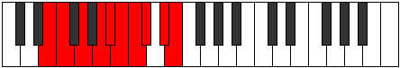 |
| [3053](https://ianring.com/musictheory/scales/3053) | [Zycrygic](ModeGNaturalZycrygic.md) | G | G, A, A#, C, C#, D, D#, E, F#, G |  |
| [3053](https://ianring.com/musictheory/scales/3053) | [Zycrygic](ModeASharpZycrygic.md) | A# | A#, C, C#, D#, E, F, F#, G, A, A# |  |
| [3053](https://ianring.com/musictheory/scales/3053) | [Zycrygic](ModeBFlatZycrygic.md) | Bb | Bb, C, Db, Eb, E, F, Gb, G, A, Bb |  |
| [3053](https://ianring.com/musictheory/scales/3053) | [Zycrygic](ModeCSharpZycrygic.md) | C# | C#, D#, E, F#, G, G#, A, A#, C, C# |  |
| [3053](https://ianring.com/musictheory/scales/3053) | [Zycrygic](ModeDFlatZycrygic.md) | Db | Db, Eb, E, Gb, G, Ab, A, Bb, C, Db |  |
| [3053](https://ianring.com/musictheory/scales/3053) | [Zycrygic](ModeFNaturalZycrygic.md) | F | F, G, G#, A#, B, C, C#, D, E, F |  |
| [3053](https://ianring.com/musictheory/scales/3053) | [Zycrygic](ModeENaturalZycrygic.md) | E | E, F#, G, A, A#, B, C, C#, D#, E |  |
| [3055](https://ianring.com/musictheory/scales/3055) | [Lyryllian](ModeCSharpLyryllian.md) | C# | C#, D, D#, E, F#, G, G#, A, A#, C, C# |  |
| [3055](https://ianring.com/musictheory/scales/3055) | [Lyryllian](ModeDFlatLyryllian.md) | Db | Db, D, Eb, E, Gb, G, Ab, A, Bb, C, Db |  |
| [3055](https://ianring.com/musictheory/scales/3055) | [Lyryllian](ModeGNaturalLyryllian.md) | G | G, G#, A, A#, C, C#, D, D#, E, F#, G |  |
| [3055](https://ianring.com/musictheory/scales/3055) | [Lyryllian](ModeFNaturalLyryllian.md) | F | F, F#, G, G#, A#, B, C, C#, D, E, F |  |
| [3055](https://ianring.com/musictheory/scales/3055) | [Lyryllian](ModeBNaturalLyryllian.md) | B | B, C, C#, D, E, F, F#, G, G#, A#, B |  |
| [3055](https://ianring.com/musictheory/scales/3055) | [Lyryllian](ModeENaturalLyryllian.md) | E | E, F, F#, G, A, A#, B, C, C#, D#, E |  |
| [3055](https://ianring.com/musictheory/scales/3055) | [Lyryllian](ModeASharpLyryllian.md) | A# | A#, B, C, C#, D#, E, F, F#, G, A, A# |  |
| [3055](https://ianring.com/musictheory/scales/3055) | [Lyryllian](ModeBFlatLyryllian.md) | Bb | Bb, B, C, Db, Eb, E, F, Gb, G, A, Bb |  |
| [3059](https://ianring.com/musictheory/scales/3059) | [Madygic](ModeBNaturalMadygic.md) | B | B, C, D#, E, F, F#, G, G#, A#, B |  |
| [3059](https://ianring.com/musictheory/scales/3059) | [Madygic](ModeDSharpMadygic.md) | D# | D#, E, G, G#, A, A#, B, C, D, D# |  |
| [3059](https://ianring.com/musictheory/scales/3059) | [Madygic](ModeEFlatMadygic.md) | Eb | Eb, E, G, Ab, A, Bb, B, C, D, Eb |  |
| [3061](https://ianring.com/musictheory/scales/3061) | [Apinygic](ModeGSharpApinygic.md) | G# | G#, A#, C, C#, D, D#, E, F, G, G# |  |
| [3061](https://ianring.com/musictheory/scales/3061) | [Apinygic](ModeAFlatApinygic.md) | Ab | Ab, Bb, C, Db, D, Eb, E, F, G, Ab |  |
| [3061](https://ianring.com/musictheory/scales/3061) | [Apinygic](ModeASharpApinygic.md) | A# | A#, C, D, D#, E, F, F#, G, A, A# |  |
| [3061](https://ianring.com/musictheory/scales/3061) | [Apinygic](ModeBFlatApinygic.md) | Bb | Bb, C, D, Eb, E, F, Gb, G, A, Bb |  |
| [3061](https://ianring.com/musictheory/scales/3061) | [Apinygic](ModeFNaturalApinygic.md) | F | F, G, A, A#, B, C, C#, D, E, F |  |
| [3063](https://ianring.com/musictheory/scales/3063) | [Solyllian](ModeGSharpSolyllian.md) | G# | G#, A, A#, C, C#, D, D#, E, F, G, G# |  |
| [3063](https://ianring.com/musictheory/scales/3063) | [Solyllian](ModeAFlatSolyllian.md) | Ab | Ab, A, Bb, C, Db, D, Eb, E, F, G, Ab |  |
| [3063](https://ianring.com/musictheory/scales/3063) | [Solyllian](ModeBNaturalSolyllian.md) | B | B, C, C#, D#, E, F, F#, G, G#, A#, B |  |
| [3063](https://ianring.com/musictheory/scales/3063) | [Solyllian](ModeFNaturalSolyllian.md) | F | F, F#, G, A, A#, B, C, C#, D, E, F |  |
| [3063](https://ianring.com/musictheory/scales/3063) | [Solyllian](ModeASharpSolyllian.md) | A# | A#, B, C, D, D#, E, F, F#, G, A, A# |  |
| [3063](https://ianring.com/musictheory/scales/3063) | [Solyllian](ModeBFlatSolyllian.md) | Bb | Bb, B, C, D, Eb, E, F, Gb, G, A, Bb |  |
| [3063](https://ianring.com/musictheory/scales/3063) | [Solyllian](ModeDSharpSolyllian.md) | D# | D#, E, F, G, G#, A, A#, B, C, D, D# |  |
| [3063](https://ianring.com/musictheory/scales/3063) | [Solyllian](ModeEFlatSolyllian.md) | Eb | Eb, E, F, G, Ab, A, Bb, B, C, D, Eb |  |
| [3065](https://ianring.com/musictheory/scales/3065) | [Zothygic](ModeCSharpZothygic.md) | C# | C#, E, F, F#, G, G#, A, A#, C, C# |  |
| [3065](https://ianring.com/musictheory/scales/3065) | [Zothygic](ModeDFlatZothygic.md) | Db | Db, E, F, Gb, G, Ab, A, Bb, C, Db |  |
| [3065](https://ianring.com/musictheory/scales/3065) | [Zothygic](ModeGNaturalZothygic.md) | G | G, A#, B, C, C#, D, D#, E, F#, G |  |
| [3065](https://ianring.com/musictheory/scales/3065) | [Zothygic](ModeENaturalZothygic.md) | E | E, G, G#, A, A#, B, C, C#, D#, E |  |
| [3067](https://ianring.com/musictheory/scales/3067) | [Goptyllian](ModeCSharpGoptyllian.md) | C# | C#, D, E, F, F#, G, G#, A, A#, C, C# |  |
| [3067](https://ianring.com/musictheory/scales/3067) | [Goptyllian](ModeDFlatGoptyllian.md) | Db | Db, D, E, F, Gb, G, Ab, A, Bb, C, Db |  |
| [3067](https://ianring.com/musictheory/scales/3067) | [Goptyllian](ModeGNaturalGoptyllian.md) | G | G, G#, A#, B, C, C#, D, D#, E, F#, G |  |
| [3067](https://ianring.com/musictheory/scales/3067) | [Goptyllian](ModeBNaturalGoptyllian.md) | B | B, C, D, D#, E, F, F#, G, G#, A#, B |  |
| [3067](https://ianring.com/musictheory/scales/3067) | [Goptyllian](ModeENaturalGoptyllian.md) | E | E, F, G, G#, A, A#, B, C, C#, D#, E |  |
| [3067](https://ianring.com/musictheory/scales/3067) | [Goptyllian](ModeDSharpGoptyllian.md) | D# | D#, E, F#, G, G#, A, A#, B, C, D, D# |  |
| [3067](https://ianring.com/musictheory/scales/3067) | [Goptyllian](ModeEFlatGoptyllian.md) | Eb | Eb, E, Gb, G, Ab, A, Bb, B, C, D, Eb |  |
| [3069](https://ianring.com/musictheory/scales/3069) | [Bacryllian](ModeASharpBacryllian.md) | A# | A#, C, C#, D, D#, E, F, F#, G, A, A# |  |
| [3069](https://ianring.com/musictheory/scales/3069) | [Bacryllian](ModeBFlatBacryllian.md) | Bb | Bb, C, Db, D, Eb, E, F, Gb, G, A, Bb |  |
| [3069](https://ianring.com/musictheory/scales/3069) | [Bacryllian](ModeCSharpBacryllian.md) | C# | C#, D#, E, F, F#, G, G#, A, A#, C, C# |  |
| [3069](https://ianring.com/musictheory/scales/3069) | [Bacryllian](ModeDFlatBacryllian.md) | Db | Db, Eb, E, F, Gb, G, Ab, A, Bb, C, Db |  |
| [3069](https://ianring.com/musictheory/scales/3069) | [Bacryllian](ModeGSharpBacryllian.md) | G# | G#, A#, B, C, C#, D, D#, E, F, G, G# |  |
| [3069](https://ianring.com/musictheory/scales/3069) | [Bacryllian](ModeAFlatBacryllian.md) | Ab | Ab, Bb, B, C, Db, D, Eb, E, F, G, Ab |  |
| [3069](https://ianring.com/musictheory/scales/3069) | [Bacryllian](ModeGNaturalBacryllian.md) | G | G, A, A#, B, C, C#, D, D#, E, F#, G |  |
| [3069](https://ianring.com/musictheory/scales/3069) | [Bacryllian](ModeFNaturalBacryllian.md) | F | F, G, G#, A, A#, B, C, C#, D, E, F |  |
| [3069](https://ianring.com/musictheory/scales/3069) | [Bacryllian](ModeENaturalBacryllian.md) | E | E, F#, G, G#, A, A#, B, C, C#, D#, E |  |
| [3071](https://ianring.com/musictheory/scales/3071) | [Solatic](ModeCSharpSolatic.md) | C# | C#, D, D#, E, F, F#, G, G#, A, A#, C, C# |  |
| [3071](https://ianring.com/musictheory/scales/3071) | [Solatic](ModeDFlatSolatic.md) | Db | Db, D, Eb, E, F, Gb, G, Ab, A, Bb, C, Db |  |
| [3071](https://ianring.com/musictheory/scales/3071) | [Solatic](ModeBNaturalSolatic.md) | B | B, C, C#, D, D#, E, F, F#, G, G#, A#, B |  |
| [3071](https://ianring.com/musictheory/scales/3071) | [Solatic](ModeASharpSolatic.md) | A# | A#, B, C, C#, D, D#, E, F, F#, G, A, A# |  |
| [3071](https://ianring.com/musictheory/scales/3071) | [Solatic](ModeBFlatSolatic.md) | Bb | Bb, B, C, Db, D, Eb, E, F, Gb, G, A, Bb |  |
| [3071](https://ianring.com/musictheory/scales/3071) | [Solatic](ModeGSharpSolatic.md) | G# | G#, A, A#, B, C, C#, D, D#, E, F, G, G# |  |
| [3071](https://ianring.com/musictheory/scales/3071) | [Solatic](ModeAFlatSolatic.md) | Ab | Ab, A, Bb, B, C, Db, D, Eb, E, F, G, Ab |  |
| [3071](https://ianring.com/musictheory/scales/3071) | [Solatic](ModeGNaturalSolatic.md) | G | G, G#, A, A#, B, C, C#, D, D#, E, F#, G |  |
| [3071](https://ianring.com/musictheory/scales/3071) | [Solatic](ModeFNaturalSolatic.md) | F | F, F#, G, G#, A, A#, B, C, C#, D, E, F | 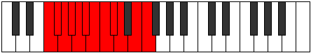 |
| [3071](https://ianring.com/musictheory/scales/3071) | [Solatic](ModeENaturalSolatic.md) | E | E, F, F#, G, G#, A, A#, B, C, C#, D#, E |  |
| [3071](https://ianring.com/musictheory/scales/3071) | [Solatic](ModeDSharpSolatic.md) | D# | D#, E, F, F#, G, G#, A, A#, B, C, D, D# |  |
| [3071](https://ianring.com/musictheory/scales/3071) | [Solatic](ModeEFlatSolatic.md) | Eb | Eb, E, F, Gb, G, Ab, A, Bb, B, C, D, Eb |  |
| [3155](https://ianring.com/musictheory/scales/3155) | [Ladimic](ModeFSharpLadimic.md) | F# | F#, G, A#, B#, D##, E#, F# |  |
| [3155](https://ianring.com/musictheory/scales/3155) | [Ladimic](ModeGFlatLadimic.md) | Gb | Gb, Abb, Bb, C, D##, E#, Gb |  |
| [3159](https://ianring.com/musictheory/scales/3159) | [Stocrian](ModeFSharpStocrian.md) | F# | F#, G, Ab, Bb, C, D##, E#, F# |  |
| [3159](https://ianring.com/musictheory/scales/3159) | [Stocrian](ModeGFlatStocrian.md) | Gb | Gb, Abb, Bbbb, Cbb, Dbb, E, F, Gb |  |
| [3163](https://ianring.com/musictheory/scales/3163) | [Rogian](ModeFSharpRogian.md) | F# | F#, G, A, Bb, C, D##, E#, F# |  |
| [3163](https://ianring.com/musictheory/scales/3163) | [Rogian](ModeGFlatRogian.md) | Gb | Gb, Abb, Bbb, Cbb, Dbb, E, F, Gb |  |
| [3167](https://ianring.com/musictheory/scales/3167) | [Thynyllic](ModeFSharpThynyllic.md) | F# | F#, G, G#, A, A#, C, E, F, F# |  |
| [3167](https://ianring.com/musictheory/scales/3167) | [Thynyllic](ModeGFlatThynyllic.md) | Gb | Gb, G, Ab, A, Bb, C, E, F, Gb |  |
| [3187](https://ianring.com/musictheory/scales/3187) | [Koptian](ModeFSharpKoptian.md) | F# | F#, G, A#, B, C, D##, E#, F# |  |
| [3187](https://ianring.com/musictheory/scales/3187) | [Koptian](ModeGFlatKoptian.md) | Gb | Gb, Abb, Bb, Cb, Dbb, E, F, Gb | 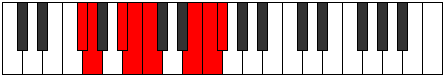 |
| [3191](https://ianring.com/musictheory/scales/3191) | [Bynyllic](ModeFSharpBynyllic.md) | F# | F#, G, G#, A#, B, C, E, F, F# |  |
| [3191](https://ianring.com/musictheory/scales/3191) | [Bynyllic](ModeGFlatBynyllic.md) | Gb | Gb, G, Ab, Bb, B, C, E, F, Gb |  |
| [3195](https://ianring.com/musictheory/scales/3195) | [Raryllic](ModeFSharpRaryllic.md) | F# | F#, G, A, A#, B, C, E, F, F# |  |
| [3195](https://ianring.com/musictheory/scales/3195) | [Raryllic](ModeGFlatRaryllic.md) | Gb | Gb, G, A, Bb, B, C, E, F, Gb |  |
| [3199](https://ianring.com/musictheory/scales/3199) | [Thaptygic](ModeFSharpThaptygic.md) | F# | F#, G, G#, A, A#, B, C, E, F, F# |  |
| [3199](https://ianring.com/musictheory/scales/3199) | [Thaptygic](ModeGFlatThaptygic.md) | Gb | Gb, G, Ab, A, Bb, B, C, E, F, Gb |  |
| [3211](https://ianring.com/musictheory/scales/3211) | [Epacrimic](ModeANaturalEpacrimic.md) | A | A, Bb, C, D##, E###, F###, A |  |
| [3215](https://ianring.com/musictheory/scales/3215) | [Katydian](ModeANaturalKatydian.md) | A | A, Bb, Cb, Dbb, E, F##, G#, A |  |
| [3217](https://ianring.com/musictheory/scales/3217) | [Molitonic](ModeCNaturalMolitonic.md) | C | C, E, G, A#, B, C |  |
| [3219](https://ianring.com/musictheory/scales/3219) | [Ionaphimic](ModeCNaturalIonaphimic.md) | C | C, Db, E, F##, G###, A##, C |  |
| [3221](https://ianring.com/musictheory/scales/3221) | [Bycrimic](ModeCNaturalBycrimic.md) | C | C, D, E, F##, G###, A##, C |  |
| [3223](https://ianring.com/musictheory/scales/3223) | [Thyphian](ModeCNaturalThyphian.md) | C | C, Db, Ebb, Fb, G, A#, B, C |  |
| [3225](https://ianring.com/musictheory/scales/3225) | [Ionalimic](ModeCNaturalIonalimic.md) | C | C, D#, E, F##, G###, A##, C |  |
| [3227](https://ianring.com/musictheory/scales/3227) | [Aeolocrian](ModeANaturalAeolocrian.md) | A | A, Bb, C, Db, E, F##, G#, A |  |
| [3227](https://ianring.com/musictheory/scales/3227) | [Aeolocrian](ModeCNaturalAeolocrian.md) | C | C, Db, Eb, Fb, G, A#, B, C |  |
| [3229](https://ianring.com/musictheory/scales/3229) | [Aeolaptian](ModeCNaturalAeolaptian.md) | C | C, D, Eb, Fb, G, A#, B, C |  |
| [3231](https://ianring.com/musictheory/scales/3231) | [Kataptyllic](ModeCNaturalKataptyllic.md) | C | C, C#, D, D#, E, G, A#, B, C |  |
| [3231](https://ianring.com/musictheory/scales/3231) | [Kataptyllic](ModeANaturalKataptyllic.md) | A | A, A#, B, C, C#, E, G, G#, A |  |
| [3237](https://ianring.com/musictheory/scales/3237) | [Thatimic](ModeFNaturalThatimic.md) | F | F, G, A#, B#, C###, D##, F |  |
| [3239](https://ianring.com/musictheory/scales/3239) | [Epythian](ModeFNaturalEpythian.md) | F | F, Gb, Abb, Bb, C, D#, E, F |  |
| [3243](https://ianring.com/musictheory/scales/3243) | [Staptian](ModeANaturalStaptian.md) | A | A, Bb, C, D, E, F##, G#, A |  |
| [3245](https://ianring.com/musictheory/scales/3245) | [Aeracrian](ModeFNaturalAeracrian.md) | F | F, G, Ab, Bb, C, D#, E, F |  |
| [3247](https://ianring.com/musictheory/scales/3247) | [Aeolonyllic](ModeFNaturalAeolonyllic.md) | F | F, F#, G, G#, A#, C, D#, E, F |  |
| [3247](https://ianring.com/musictheory/scales/3247) | [Aeolonyllic](ModeANaturalAeolonyllic.md) | A | A, A#, B, C, D, E, G, G#, A |  |
| [3249](https://ianring.com/musictheory/scales/3249) | [Epygimic](ModeCNaturalEpygimic.md) | C | C, D##, E#, F##, G###, A##, C |  |
| [3251](https://ianring.com/musictheory/scales/3251) | [Zodian](ModeCNaturalZodian.md) | C | C, Db, E, F, G, A#, B, C |  |
| [3253](https://ianring.com/musictheory/scales/3253) | [Gonian](ModeFNaturalGonian.md) | F | F, G, A, Bb, C, D#, E, F |  |
| [3253](https://ianring.com/musictheory/scales/3253) | [Gonian](ModeCNaturalGonian.md) | C | C, D, E, F, G, A#, B, C |  |
| [3255](https://ianring.com/musictheory/scales/3255) | [Daryllic](ModeFNaturalDaryllic.md) | F | F, F#, G, A, A#, C, D#, E, F |  |
| [3255](https://ianring.com/musictheory/scales/3255) | [Daryllic](ModeCNaturalDaryllic.md) | C | C, C#, D, E, F, G, A#, B, C |  |
| [3257](https://ianring.com/musictheory/scales/3257) | [Ionacrian](ModeCNaturalIonacrian.md) | C | C, D#, E, F, G, A#, B, C |  |
| [3259](https://ianring.com/musictheory/scales/3259) | [Loptyllic](ModeANaturalLoptyllic.md) | A | A, A#, C, C#, D, E, G, G#, A |  |
| [3259](https://ianring.com/musictheory/scales/3259) | [Loptyllic](ModeCNaturalLoptyllic.md) | C | C, C#, D#, E, F, G, A#, B, C |  |
| [3261](https://ianring.com/musictheory/scales/3261) | [Dodyllic](ModeFNaturalDodyllic.md) | F | F, G, G#, A, A#, C, D#, E, F |  |
| [3261](https://ianring.com/musictheory/scales/3261) | [Dodyllic](ModeCNaturalDodyllic.md) | C | C, D, D#, E, F, G, A#, B, C |  |
| [3263](https://ianring.com/musictheory/scales/3263) | [Pyrygic](ModeFNaturalPyrygic.md) | F | F, F#, G, G#, A, A#, C, D#, E, F |  |
| [3263](https://ianring.com/musictheory/scales/3263) | [Pyrygic](ModeCNaturalPyrygic.md) | C | C, C#, D, D#, E, F, G, A#, B, C |  |
| [3263](https://ianring.com/musictheory/scales/3263) | [Pyrygic](ModeANaturalPyrygic.md) | A | A, A#, B, C, C#, D, E, G, G#, A |  |
| [3275](https://ianring.com/musictheory/scales/3275) | [Katadian](ModeANaturalKatadian.md) | A | A, Bb, C, D#, E, F##, G#, A |  |
| [3279](https://ianring.com/musictheory/scales/3279) | [Pythyllic](ModeANaturalPythyllic.md) | A | A, A#, B, C, D#, E, G, G#, A |  |
| [3281](https://ianring.com/musictheory/scales/3281) | [Katythimic](ModeCNaturalKatythimic.md) | C | C, D##, E##, F##, G###, A##, C |  |
| [3283](https://ianring.com/musictheory/scales/3283) | [Lyrian](ModeFSharpLyrian.md) | F# | F#, G, A#, B#, C#, D##, E#, F# |  |
| [3283](https://ianring.com/musictheory/scales/3283) | [Lyrian](ModeGFlatLyrian.md) | Gb | Gb, Abb, Bb, C, Db, E, F, Gb |  |
| [3283](https://ianring.com/musictheory/scales/3283) | [Lyrian](ModeCNaturalLyrian.md) | C | C, Db, E, F#, G, A#, B, C |  |
| [3285](https://ianring.com/musictheory/scales/3285) | [Zagian](ModeCNaturalZagian.md) | C | C, D, E, F#, G, A#, B, C |  |
| [3287](https://ianring.com/musictheory/scales/3287) | [Phrathyllic](ModeFSharpPhrathyllic.md) | F# | F#, G, G#, A#, C, C#, E, F, F# |  |
| [3287](https://ianring.com/musictheory/scales/3287) | [Phrathyllic](ModeGFlatPhrathyllic.md) | Gb | Gb, G, Ab, Bb, C, Db, E, F, Gb |  |
| [3287](https://ianring.com/musictheory/scales/3287) | [Phrathyllic](ModeCNaturalPhrathyllic.md) | C | C, C#, D, E, F#, G, A#, B, C |  |
| [3289](https://ianring.com/musictheory/scales/3289) | [Loptian](ModeCNaturalLoptian.md) | C | C, D#, E, F#, G, A#, B, C |  |
| [3291](https://ianring.com/musictheory/scales/3291) | [Kodyllic](ModeFSharpKodyllic.md) | F# | F#, G, A, A#, C, C#, E, F, F# |  |
| [3291](https://ianring.com/musictheory/scales/3291) | [Kodyllic](ModeGFlatKodyllic.md) | Gb | Gb, G, A, Bb, C, Db, E, F, Gb |  |
| [3291](https://ianring.com/musictheory/scales/3291) | [Kodyllic](ModeANaturalKodyllic.md) | A | A, A#, C, C#, D#, E, G, G#, A |  |
| [3291](https://ianring.com/musictheory/scales/3291) | [Kodyllic](ModeCNaturalKodyllic.md) | C | C, C#, D#, E, F#, G, A#, B, C |  |
| [3293](https://ianring.com/musictheory/scales/3293) | [Saryllic](ModeCNaturalSaryllic.md) | C | C, D, D#, E, F#, G, A#, B, C |  |
| [3295](https://ianring.com/musictheory/scales/3295) | [Phroptygic](ModeFSharpPhroptygic.md) | F# | F#, G, G#, A, A#, C, C#, E, F, F# |  |
| [3295](https://ianring.com/musictheory/scales/3295) | [Phroptygic](ModeGFlatPhroptygic.md) | Gb | Gb, G, Ab, A, Bb, C, Db, E, F, Gb |  |
| [3295](https://ianring.com/musictheory/scales/3295) | [Phroptygic](ModeCNaturalPhroptygic.md) | C | C, C#, D, D#, E, F#, G, A#, B, C |  |
| [3295](https://ianring.com/musictheory/scales/3295) | [Phroptygic](ModeANaturalPhroptygic.md) | A | A, A#, B, C, C#, D#, E, G, G#, A |  |
| [3301](https://ianring.com/musictheory/scales/3301) | [Phrynian](ModeFNaturalPhrynian.md) | F | F, G, A#, B, C, D#, E, F |  |
| [3303](https://ianring.com/musictheory/scales/3303) | [Soptyllic](ModeFNaturalSoptyllic.md) | F | F, F#, G, A#, B, C, D#, E, F |  |
| [3307](https://ianring.com/musictheory/scales/3307) | [Boptyllic](ModeANaturalBoptyllic.md) | A | A, A#, C, D, D#, E, G, G#, A |  |
| [3309](https://ianring.com/musictheory/scales/3309) | [Bycryllic](ModeFNaturalBycryllic.md) | F | F, G, G#, A#, B, C, D#, E, F |  |
| [3311](https://ianring.com/musictheory/scales/3311) | [Mixodygic](ModeFNaturalMixodygic.md) | F | F, F#, G, G#, A#, B, C, D#, E, F |  |
| [3311](https://ianring.com/musictheory/scales/3311) | [Mixodygic](ModeANaturalMixodygic.md) | A | A, A#, B, C, D, D#, E, G, G#, A |  |
| [3313](https://ianring.com/musictheory/scales/3313) | [Aeolacrian](ModeCNaturalAeolacrian.md) | C | C, D##, E#, F#, G, A#, B, C | 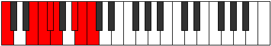 |
| [3315](https://ianring.com/musictheory/scales/3315) | [Aeralyllic](ModeCNaturalAeralyllic.md) | C | C, C#, E, F, F#, G, A#, B, C |  |
| [3315](https://ianring.com/musictheory/scales/3315) | [Aeralyllic](ModeFSharpAeralyllic.md) | F# | F#, G, A#, B, C, C#, E, F, F# |  |
| [3315](https://ianring.com/musictheory/scales/3315) | [Aeralyllic](ModeGFlatAeralyllic.md) | Gb | Gb, G, Bb, B, C, Db, E, F, Gb |  |
| [3317](https://ianring.com/musictheory/scales/3317) | [Lanyllic](ModeCNaturalLanyllic.md) | C | C, D, E, F, F#, G, A#, B, C |  |
| [3317](https://ianring.com/musictheory/scales/3317) | [Lanyllic](ModeFNaturalLanyllic.md) | F | F, G, A, A#, B, C, D#, E, F |  |
| [3319](https://ianring.com/musictheory/scales/3319) | [Tholygic](ModeCNaturalTholygic.md) | C | C, C#, D, E, F, F#, G, A#, B, C |  |
| [3319](https://ianring.com/musictheory/scales/3319) | [Tholygic](ModeFSharpTholygic.md) | F# | F#, G, G#, A#, B, C, C#, E, F, F# |  |
| [3319](https://ianring.com/musictheory/scales/3319) | [Tholygic](ModeGFlatTholygic.md) | Gb | Gb, G, Ab, Bb, B, C, Db, E, F, Gb |  |
| [3319](https://ianring.com/musictheory/scales/3319) | [Tholygic](ModeFNaturalTholygic.md) | F | F, F#, G, A, A#, B, C, D#, E, F |  |
| [3321](https://ianring.com/musictheory/scales/3321) | [Ionycryllic](ModeCNaturalIonycryllic.md) | C | C, D#, E, F, F#, G, A#, B, C |  |
| [3323](https://ianring.com/musictheory/scales/3323) | [Phrygygic](ModeANaturalPhrygygic.md) | A | A, A#, C, C#, D, D#, E, G, G#, A |  |
| [3323](https://ianring.com/musictheory/scales/3323) | [Phrygygic](ModeCNaturalPhrygygic.md) | C | C, C#, D#, E, F, F#, G, A#, B, C |  |
| [3323](https://ianring.com/musictheory/scales/3323) | [Phrygygic](ModeFSharpPhrygygic.md) | F# | F#, G, A, A#, B, C, C#, E, F, F# |  |
| [3323](https://ianring.com/musictheory/scales/3323) | [Phrygygic](ModeGFlatPhrygygic.md) | Gb | Gb, G, A, Bb, B, C, Db, E, F, Gb |  |
| [3325](https://ianring.com/musictheory/scales/3325) | [Epygic](ModeCNaturalEpygic.md) | C | C, D, D#, E, F, F#, G, A#, B, C |  |
| [3325](https://ianring.com/musictheory/scales/3325) | [Epygic](ModeFNaturalEpygic.md) | F | F, G, G#, A, A#, B, C, D#, E, F |  |
| [3327](https://ianring.com/musictheory/scales/3327) | [Madyllian](ModeCNaturalMadyllian.md) | C | C, C#, D, D#, E, F, F#, G, A#, B, C |  |
| [3327](https://ianring.com/musictheory/scales/3327) | [Madyllian](ModeANaturalMadyllian.md) | A | A, A#, B, C, C#, D, D#, E, G, G#, A |  |
| [3327](https://ianring.com/musictheory/scales/3327) | [Madyllian](ModeFSharpMadyllian.md) | F# | F#, G, G#, A, A#, B, C, C#, E, F, F# |  |
| [3327](https://ianring.com/musictheory/scales/3327) | [Madyllian](ModeGFlatMadyllian.md) | Gb | Gb, G, Ab, A, Bb, B, C, Db, E, F, Gb |  |
| [3327](https://ianring.com/musictheory/scales/3327) | [Madyllian](ModeFNaturalMadyllian.md) | F | F, F#, G, G#, A, A#, B, C, D#, E, F |  |
| [3349](https://ianring.com/musictheory/scales/3349) | [Aeolocrimic](ModeGSharpAeolocrimic.md) | G# | G#, A#, B#, D##, E##, F##, G# |  |
| [3349](https://ianring.com/musictheory/scales/3349) | [Aeolocrimic](ModeAFlatAeolocrimic.md) | Ab | Ab, Bb, C, D##, E##, F##, Ab |  |
| [3351](https://ianring.com/musictheory/scales/3351) | [Karian](ModeGSharpKarian.md) | G# | G#, A, Bb, C, D##, E##, F##, G# |  |
| [3351](https://ianring.com/musictheory/scales/3351) | [Karian](ModeAFlatKarian.md) | Ab | Ab, Bbb, Cbb, Dbb, E, F#, G, Ab |  |
| [3357](https://ianring.com/musictheory/scales/3357) | [Phrodian](ModeGSharpPhrodian.md) | G# | G#, A#, B, C, D##, E##, F##, G# |  |
| [3357](https://ianring.com/musictheory/scales/3357) | [Phrodian](ModeAFlatPhrodian.md) | Ab | Ab, Bb, Cb, Dbb, E, F#, G, Ab |  |
| [3359](https://ianring.com/musictheory/scales/3359) | [Bonyllic](ModeGSharpBonyllic.md) | G# | G#, A, A#, B, C, E, F#, G, G# |  |
| [3359](https://ianring.com/musictheory/scales/3359) | [Bonyllic](ModeAFlatBonyllic.md) | Ab | Ab, A, Bb, B, C, E, Gb, G, Ab |  |
| [3363](https://ianring.com/musictheory/scales/3363) | [Rogimic](ModeBNaturalRogimic.md) | B | B, C, D##, E###, Cbbb, Cbb, B |  |
| [3365](https://ianring.com/musictheory/scales/3365) | [Katolimic](ModeDNaturalKatolimic.md) | D | D, E, F##, G###, A###, B##, D |  |
| [3367](https://ianring.com/musictheory/scales/3367) | [Moptian](ModeDNaturalMoptian.md) | D | D, Eb, Fb, G, A#, B#, C#, D |  |
| [3367](https://ianring.com/musictheory/scales/3367) | [Moptian](ModeBNaturalMoptian.md) | B | B, C, Db, E, F##, G##, A#, B |  |
| [3371](https://ianring.com/musictheory/scales/3371) | [Aeolylian](ModeBNaturalAeolylian.md) | B | B, C, D, E, F##, G##, A#, B |  |
| [3373](https://ianring.com/musictheory/scales/3373) | [Lodian](ModeDNaturalLodian.md) | D | D, E, F, G, A#, B#, C#, D | 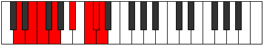 |
| [3375](https://ianring.com/musictheory/scales/3375) | [Kygyllic](ModeDNaturalKygyllic.md) | D | D, D#, E, F, G, A#, C, C#, D |  |
| [3375](https://ianring.com/musictheory/scales/3375) | [Kygyllic](ModeBNaturalKygyllic.md) | B | B, C, C#, D, E, G, A, A#, B |  |
| [3379](https://ianring.com/musictheory/scales/3379) | [Sothian](ModeBNaturalSothian.md) | B | B, C, D#, E, F##, G##, A#, B | 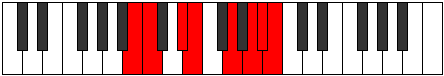 |
| [3381](https://ianring.com/musictheory/scales/3381) | [Katanian](ModeDNaturalKatanian.md) | D | D, E, F#, G, A#, B#, C#, D |  |
| [3381](https://ianring.com/musictheory/scales/3381) | [Katanian](ModeGSharpKatanian.md) | G# | G#, A#, B#, C#, D##, E##, F##, G# |  |
| [3381](https://ianring.com/musictheory/scales/3381) | [Katanian](ModeAFlatKatanian.md) | Ab | Ab, Bb, C, Db, E, F#, G, Ab |  |
| [3383](https://ianring.com/musictheory/scales/3383) | [Daptyllic](ModeDNaturalDaptyllic.md) | D | D, D#, E, F#, G, A#, C, C#, D |  |
| [3383](https://ianring.com/musictheory/scales/3383) | [Daptyllic](ModeGSharpDaptyllic.md) | G# | G#, A, A#, C, C#, E, F#, G, G# |  |
| [3383](https://ianring.com/musictheory/scales/3383) | [Daptyllic](ModeAFlatDaptyllic.md) | Ab | Ab, A, Bb, C, Db, E, Gb, G, Ab |  |
| [3383](https://ianring.com/musictheory/scales/3383) | [Daptyllic](ModeBNaturalDaptyllic.md) | B | B, C, C#, D#, E, G, A, A#, B | 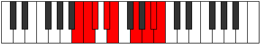 |
| [3387](https://ianring.com/musictheory/scales/3387) | [Aeryptyllic](ModeBNaturalAeryptyllic.md) | B | B, C, D, D#, E, G, A, A#, B |  |
| [3389](https://ianring.com/musictheory/scales/3389) | [Socryllic](ModeDNaturalSocryllic.md) | D | D, E, F, F#, G, A#, C, C#, D |  |
| [3389](https://ianring.com/musictheory/scales/3389) | [Socryllic](ModeGSharpSocryllic.md) | G# | G#, A#, B, C, C#, E, F#, G, G# |  |
| [3389](https://ianring.com/musictheory/scales/3389) | [Socryllic](ModeAFlatSocryllic.md) | Ab | Ab, Bb, B, C, Db, E, Gb, G, Ab |  |
| [3391](https://ianring.com/musictheory/scales/3391) | [Aeolynygic](ModeDNaturalAeolynygic.md) | D | D, D#, E, F, F#, G, A#, C, C#, D |  |
| [3391](https://ianring.com/musictheory/scales/3391) | [Aeolynygic](ModeBNaturalAeolynygic.md) | B | B, C, C#, D, D#, E, G, A, A#, B |  |
| [3391](https://ianring.com/musictheory/scales/3391) | [Aeolynygic](ModeGSharpAeolynygic.md) | G# | G#, A, A#, B, C, C#, E, F#, G, G# |  |
| [3391](https://ianring.com/musictheory/scales/3391) | [Aeolynygic](ModeAFlatAeolynygic.md) | Ab | Ab, A, Bb, B, C, Db, E, Gb, G, Ab |  |
| [3401](https://ianring.com/musictheory/scales/3401) | [Palimic](ModeENaturalPalimic.md) | E | E, F##, G###, A###, B###, C###, E |  |
| [3403](https://ianring.com/musictheory/scales/3403) | [Bylian](ModeENaturalBylian.md) | E | E, F, G, A#, B#, C##, D#, E |  |
| [3405](https://ianring.com/musictheory/scales/3405) | [Stynian](ModeENaturalStynian.md) | E | E, F#, G, A#, B#, C##, D#, E |  |
| [3407](https://ianring.com/musictheory/scales/3407) | [Katocryllic](ModeENaturalKatocryllic.md) | E | E, F, F#, G, A#, C, D, D#, E |  |
| [3411](https://ianring.com/musictheory/scales/3411) | [Ionathian](ModeFSharpIonathian.md) | F# | F#, G, A#, B#, C##, D##, E#, F# |  |
| [3411](https://ianring.com/musictheory/scales/3411) | [Ionathian](ModeGFlatIonathian.md) | Gb | Gb, Abb, Bb, C, D, E, F, Gb |  |
| [3413](https://ianring.com/musictheory/scales/3413) | [Aeolynian](ModeGSharpAeolynian.md) | G# | G#, A#, B#, C##, D##, E##, F##, G# |  |
| [3413](https://ianring.com/musictheory/scales/3413) | [Aeolynian](ModeAFlatAeolynian.md) | Ab | Ab, Bb, C, D, E, F#, G, Ab |  |
| [3415](https://ianring.com/musictheory/scales/3415) | [Ionaptyllic](ModeFSharpIonaptyllic.md) | F# | F#, G, G#, A#, C, D, E, F, F# |  |
| [3415](https://ianring.com/musictheory/scales/3415) | [Ionaptyllic](ModeGFlatIonaptyllic.md) | Gb | Gb, G, Ab, Bb, C, D, E, F, Gb |  |
| [3415](https://ianring.com/musictheory/scales/3415) | [Ionaptyllic](ModeGSharpIonaptyllic.md) | G# | G#, A, A#, C, D, E, F#, G, G# |  |
| [3415](https://ianring.com/musictheory/scales/3415) | [Ionaptyllic](ModeAFlatIonaptyllic.md) | Ab | Ab, A, Bb, C, D, E, Gb, G, Ab |  |
| [3417](https://ianring.com/musictheory/scales/3417) | [Golian](ModeENaturalGolian.md) | E | E, F##, G#, A#, B#, C##, D#, E | 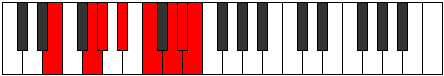 |
| [3419](https://ianring.com/musictheory/scales/3419) | [Danyllic](ModeENaturalDanyllic.md) | E | E, F, G, G#, A#, C, D, D#, E |  |
| [3419](https://ianring.com/musictheory/scales/3419) | [Danyllic](ModeFSharpDanyllic.md) | F# | F#, G, A, A#, C, D, E, F, F# |  |
| [3419](https://ianring.com/musictheory/scales/3419) | [Danyllic](ModeGFlatDanyllic.md) | Gb | Gb, G, A, Bb, C, D, E, F, Gb |  |
| [3421](https://ianring.com/musictheory/scales/3421) | [Aerothyllic](ModeENaturalAerothyllic.md) | E | E, F#, G, G#, A#, C, D, D#, E |  |
| [3421](https://ianring.com/musictheory/scales/3421) | [Aerothyllic](ModeGSharpAerothyllic.md) | G# | G#, A#, B, C, D, E, F#, G, G# | 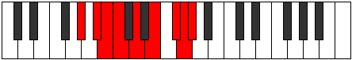 |
| [3421](https://ianring.com/musictheory/scales/3421) | [Aerothyllic](ModeAFlatAerothyllic.md) | Ab | Ab, Bb, B, C, D, E, Gb, G, Ab |  |
| [3423](https://ianring.com/musictheory/scales/3423) | [Lothygic](ModeENaturalLothygic.md) | E | E, F, F#, G, G#, A#, C, D, D#, E |  |
| [3423](https://ianring.com/musictheory/scales/3423) | [Lothygic](ModeFSharpLothygic.md) | F# | F#, G, G#, A, A#, C, D, E, F, F# |  |
| [3423](https://ianring.com/musictheory/scales/3423) | [Lothygic](ModeGFlatLothygic.md) | Gb | Gb, G, Ab, A, Bb, C, D, E, F, Gb |  |
| [3423](https://ianring.com/musictheory/scales/3423) | [Lothygic](ModeGSharpLothygic.md) | G# | G#, A, A#, B, C, D, E, F#, G, G# |  |
| [3423](https://ianring.com/musictheory/scales/3423) | [Lothygic](ModeAFlatLothygic.md) | Ab | Ab, A, Bb, B, C, D, E, Gb, G, Ab |  |
| [3427](https://ianring.com/musictheory/scales/3427) | [Zacrian](ModeBNaturalZacrian.md) | B | B, C, D##, E#, F##, G##, A#, B |  |
| [3429](https://ianring.com/musictheory/scales/3429) | [Marian](ModeDNaturalMarian.md) | D | D, E, F##, G#, A#, B#, C#, D |  |
| [3431](https://ianring.com/musictheory/scales/3431) | [Zyptyllic](ModeDNaturalZyptyllic.md) | D | D, D#, E, G, G#, A#, C, C#, D |  |
| [3431](https://ianring.com/musictheory/scales/3431) | [Zyptyllic](ModeBNaturalZyptyllic.md) | B | B, C, C#, E, F, G, A, A#, B |  |
| [3433](https://ianring.com/musictheory/scales/3433) | [Thonian](ModeENaturalThonian.md) | E | E, F##, G##, A#, B#, C##, D#, E |  |
| [3435](https://ianring.com/musictheory/scales/3435) | [Epiphyllic](ModeENaturalEpiphyllic.md) | E | E, F, G, A, A#, C, D, D#, E |  |
| [3435](https://ianring.com/musictheory/scales/3435) | [Epiphyllic](ModeBNaturalEpiphyllic.md) | B | B, C, D, E, F, G, A, A#, B |  |
| [3437](https://ianring.com/musictheory/scales/3437) | [Gathyllic](ModeDNaturalGathyllic.md) | D | D, E, F, G, G#, A#, C, C#, D |  |
| [3437](https://ianring.com/musictheory/scales/3437) | [Gathyllic](ModeENaturalGathyllic.md) | E | E, F#, G, A, A#, C, D, D#, E |  |
| [3439](https://ianring.com/musictheory/scales/3439) | [Lythygic](ModeDNaturalLythygic.md) | D | D, D#, E, F, G, G#, A#, C, C#, D |  |
| [3439](https://ianring.com/musictheory/scales/3439) | [Lythygic](ModeENaturalLythygic.md) | E | E, F, F#, G, A, A#, C, D, D#, E |  |
| [3439](https://ianring.com/musictheory/scales/3439) | [Lythygic](ModeBNaturalLythygic.md) | B | B, C, C#, D, E, F, G, A, A#, B |  |
| [3443](https://ianring.com/musictheory/scales/3443) | [Epathyllic](ModeFSharpEpathyllic.md) | F# | F#, G, A#, B, C, D, E, F, F# |  |
| [3443](https://ianring.com/musictheory/scales/3443) | [Epathyllic](ModeGFlatEpathyllic.md) | Gb | Gb, G, Bb, B, C, D, E, F, Gb |  |
| [3443](https://ianring.com/musictheory/scales/3443) | [Epathyllic](ModeBNaturalEpathyllic.md) | B | B, C, D#, E, F, G, A, A#, B |  |
| [3445](https://ianring.com/musictheory/scales/3445) | [Epotyllic](ModeDNaturalEpotyllic.md) | D | D, E, F#, G, G#, A#, C, C#, D |  |
| [3445](https://ianring.com/musictheory/scales/3445) | [Epotyllic](ModeGSharpEpotyllic.md) | G# | G#, A#, C, C#, D, E, F#, G, G# |  |
| [3445](https://ianring.com/musictheory/scales/3445) | [Epotyllic](ModeAFlatEpotyllic.md) | Ab | Ab, Bb, C, Db, D, E, Gb, G, Ab |  |
| [3447](https://ianring.com/musictheory/scales/3447) | [Kynygic](ModeDNaturalKynygic.md) | D | D, D#, E, F#, G, G#, A#, C, C#, D |  |
| [3447](https://ianring.com/musictheory/scales/3447) | [Kynygic](ModeGSharpKynygic.md) | G# | G#, A, A#, C, C#, D, E, F#, G, G# |  |
| [3447](https://ianring.com/musictheory/scales/3447) | [Kynygic](ModeAFlatKynygic.md) | Ab | Ab, A, Bb, C, Db, D, E, Gb, G, Ab |  |
| [3447](https://ianring.com/musictheory/scales/3447) | [Kynygic](ModeFSharpKynygic.md) | F# | F#, G, G#, A#, B, C, D, E, F, F# |  |
| [3447](https://ianring.com/musictheory/scales/3447) | [Kynygic](ModeGFlatKynygic.md) | Gb | Gb, G, Ab, Bb, B, C, D, E, F, Gb |  |
| [3447](https://ianring.com/musictheory/scales/3447) | [Kynygic](ModeBNaturalKynygic.md) | B | B, C, C#, D#, E, F, G, A, A#, B |  |
| [3449](https://ianring.com/musictheory/scales/3449) | [Bacryllic](ModeENaturalBacryllic.md) | E | E, G, G#, A, A#, C, D, D#, E |  |
| [3451](https://ianring.com/musictheory/scales/3451) | [Garygic](ModeENaturalGarygic.md) | E | E, F, G, G#, A, A#, C, D, D#, E |  |
| [3451](https://ianring.com/musictheory/scales/3451) | [Garygic](ModeBNaturalGarygic.md) | B | B, C, D, D#, E, F, G, A, A#, B |  |
| [3451](https://ianring.com/musictheory/scales/3451) | [Garygic](ModeFSharpGarygic.md) | F# | F#, G, A, A#, B, C, D, E, F, F# |  |
| [3451](https://ianring.com/musictheory/scales/3451) | [Garygic](ModeGFlatGarygic.md) | Gb | Gb, G, A, Bb, B, C, D, E, F, Gb |  |
| [3453](https://ianring.com/musictheory/scales/3453) | [Katarygic](ModeDNaturalKatarygic.md) | D | D, E, F, F#, G, G#, A#, C, C#, D |  |
| [3453](https://ianring.com/musictheory/scales/3453) | [Katarygic](ModeENaturalKatarygic.md) | E | E, F#, G, G#, A, A#, C, D, D#, E |  |
| [3453](https://ianring.com/musictheory/scales/3453) | [Katarygic](ModeGSharpKatarygic.md) | G# | G#, A#, B, C, C#, D, E, F#, G, G# |  |
| [3453](https://ianring.com/musictheory/scales/3453) | [Katarygic](ModeAFlatKatarygic.md) | Ab | Ab, Bb, B, C, Db, D, E, Gb, G, Ab |  |
| [3455](https://ianring.com/musictheory/scales/3455) | [Ryptyllian](ModeDNaturalRyptyllian.md) | D | D, D#, E, F, F#, G, G#, A#, C, C#, D |  |
| [3455](https://ianring.com/musictheory/scales/3455) | [Ryptyllian](ModeENaturalRyptyllian.md) | E | E, F, F#, G, G#, A, A#, C, D, D#, E |  |
| [3455](https://ianring.com/musictheory/scales/3455) | [Ryptyllian](ModeBNaturalRyptyllian.md) | B | B, C, C#, D, D#, E, F, G, A, A#, B |  |
| [3455](https://ianring.com/musictheory/scales/3455) | [Ryptyllian](ModeGSharpRyptyllian.md) | G# | G#, A, A#, B, C, C#, D, E, F#, G, G# |  |
| [3455](https://ianring.com/musictheory/scales/3455) | [Ryptyllian](ModeAFlatRyptyllian.md) | Ab | Ab, A, Bb, B, C, Db, D, E, Gb, G, Ab |  |
| [3455](https://ianring.com/musictheory/scales/3455) | [Ryptyllian](ModeFSharpRyptyllian.md) | F# | F#, G, G#, A, A#, B, C, D, E, F, F# |  |
| [3455](https://ianring.com/musictheory/scales/3455) | [Ryptyllian](ModeGFlatRyptyllian.md) | Gb | Gb, G, Ab, A, Bb, B, C, D, E, F, Gb |  |
| [3467](https://ianring.com/musictheory/scales/3467) | [Katonian](ModeANaturalKatonian.md) | A | A, Bb, C, D##, E#, F##, G#, A |  |
| [3471](https://ianring.com/musictheory/scales/3471) | [Gyryllic](ModeANaturalGyryllic.md) | A | A, A#, B, C, E, F, G, G#, A |  |
| [3473](https://ianring.com/musictheory/scales/3473) | [Lathimic](ModeCNaturalLathimic.md) | C | C, D##, E###, F###, G###, A##, C |  |
| [3475](https://ianring.com/musictheory/scales/3475) | [Kylian](ModeCNaturalKylian.md) | C | C, Db, E, F##, G#, A#, B, C |  |
| [3477](https://ianring.com/musictheory/scales/3477) | [Kyptian](ModeGSharpKyptian.md) | G# | G#, A#, B#, C###, D##, E##, F##, G# |  |
| [3477](https://ianring.com/musictheory/scales/3477) | [Kyptian](ModeAFlatKyptian.md) | Ab | Ab, Bb, C, D#, E, F#, G, Ab |  |
| [3477](https://ianring.com/musictheory/scales/3477) | [Kyptian](ModeCNaturalKyptian.md) | C | C, D, E, F##, G#, A#, B, C |  |
| [3479](https://ianring.com/musictheory/scales/3479) | [Rothyllic](ModeGSharpRothyllic.md) | G# | G#, A, A#, C, D#, E, F#, G, G# |  |
| [3479](https://ianring.com/musictheory/scales/3479) | [Rothyllic](ModeAFlatRothyllic.md) | Ab | Ab, A, Bb, C, Eb, E, Gb, G, Ab |  |
| [3479](https://ianring.com/musictheory/scales/3479) | [Rothyllic](ModeCNaturalRothyllic.md) | C | C, C#, D, E, G, G#, A#, B, C |  |
| [3481](https://ianring.com/musictheory/scales/3481) | [Katathian](ModeCNaturalKatathian.md) | C | C, D#, E, F##, G#, A#, B, C |  |
| [3483](https://ianring.com/musictheory/scales/3483) | [Mixotharyllic](ModeANaturalMixotharyllic.md) | A | A, A#, C, C#, E, F, G, G#, A |  |
| [3483](https://ianring.com/musictheory/scales/3483) | [Mixotharyllic](ModeCNaturalMixotharyllic.md) | C | C, C#, D#, E, G, G#, A#, B, C |  |
| [3485](https://ianring.com/musictheory/scales/3485) | [Kyptyllic](ModeCNaturalKyptyllic.md) | C | C, D, D#, E, G, G#, A#, B, C |  |
| [3485](https://ianring.com/musictheory/scales/3485) | [Kyptyllic](ModeGSharpKyptyllic.md) | G# | G#, A#, B, C, D#, E, F#, G, G# |  |
| [3485](https://ianring.com/musictheory/scales/3485) | [Kyptyllic](ModeAFlatKyptyllic.md) | Ab | Ab, Bb, B, C, Eb, E, Gb, G, Ab |  |
| [3487](https://ianring.com/musictheory/scales/3487) | [Byptygic](ModeCNaturalByptygic.md) | C | C, C#, D, D#, E, G, G#, A#, B, C |  |
| [3487](https://ianring.com/musictheory/scales/3487) | [Byptygic](ModeANaturalByptygic.md) | A | A, A#, B, C, C#, E, F, G, G#, A |  |
| [3487](https://ianring.com/musictheory/scales/3487) | [Byptygic](ModeGSharpByptygic.md) | G# | G#, A, A#, B, C, D#, E, F#, G, G# |  |
| [3487](https://ianring.com/musictheory/scales/3487) | [Byptygic](ModeAFlatByptygic.md) | Ab | Ab, A, Bb, B, C, Eb, E, Gb, G, Ab |  |
| [3491](https://ianring.com/musictheory/scales/3491) | [Tharian](ModeBNaturalTharian.md) | B | B, C, D##, E##, F##, G##, A#, B |  |
| [3493](https://ianring.com/musictheory/scales/3493) | [Rathian](ModeFNaturalRathian.md) | F | F, G, A#, B#, C#, D#, E, F |  |
| [3493](https://ianring.com/musictheory/scales/3493) | [Rathian](ModeDNaturalRathian.md) | D | D, E, F##, G##, A#, B#, C#, D |  |
| [3495](https://ianring.com/musictheory/scales/3495) | [Banyllic](ModeFNaturalBanyllic.md) | F | F, F#, G, A#, C, C#, D#, E, F |  |
| [3495](https://ianring.com/musictheory/scales/3495) | [Banyllic](ModeDNaturalBanyllic.md) | D | D, D#, E, G, A, A#, C, C#, D |  |
| [3495](https://ianring.com/musictheory/scales/3495) | [Banyllic](ModeBNaturalBanyllic.md) | B | B, C, C#, E, F#, G, A, A#, B |  |
| [3499](https://ianring.com/musictheory/scales/3499) | [Lythyllic](ModeANaturalLythyllic.md) | A | A, A#, C, D, E, F, G, G#, A |  |
| [3499](https://ianring.com/musictheory/scales/3499) | [Lythyllic](ModeBNaturalLythyllic.md) | B | B, C, D, E, F#, G, A, A#, B |  |
| [3501](https://ianring.com/musictheory/scales/3501) | [Katodyllic](ModeFNaturalKatodyllic.md) | F | F, G, G#, A#, C, C#, D#, E, F |  |
| [3501](https://ianring.com/musictheory/scales/3501) | [Katodyllic](ModeDNaturalKatodyllic.md) | D | D, E, F, G, A, A#, C, C#, D |  |
| [3503](https://ianring.com/musictheory/scales/3503) | [Zyphygic](ModeFNaturalZyphygic.md) | F | F, F#, G, G#, A#, C, C#, D#, E, F |  |
| [3503](https://ianring.com/musictheory/scales/3503) | [Zyphygic](ModeDNaturalZyphygic.md) | D | D, D#, E, F, G, A, A#, C, C#, D |  |
| [3503](https://ianring.com/musictheory/scales/3503) | [Zyphygic](ModeBNaturalZyphygic.md) | B | B, C, C#, D, E, F#, G, A, A#, B |  |
| [3503](https://ianring.com/musictheory/scales/3503) | [Zyphygic](ModeANaturalZyphygic.md) | A | A, A#, B, C, D, E, F, G, G#, A |  |
| [3505](https://ianring.com/musictheory/scales/3505) | [Stygian](ModeCNaturalStygian.md) | C | C, D##, E#, F##, G#, A#, B, C |  |
| [3507](https://ianring.com/musictheory/scales/3507) | [Ponyllic](ModeCNaturalPonyllic.md) | C | C, C#, E, F, G, G#, A#, B, C |  |
| [3507](https://ianring.com/musictheory/scales/3507) | [Ponyllic](ModeBNaturalPonyllic.md) | B | B, C, D#, E, F#, G, A, A#, B |  |
| [3509](https://ianring.com/musictheory/scales/3509) | [Stogyllic](ModeGSharpStogyllic.md) | G# | G#, A#, C, C#, D#, E, F#, G, G# |  |
| [3509](https://ianring.com/musictheory/scales/3509) | [Stogyllic](ModeAFlatStogyllic.md) | Ab | Ab, Bb, C, Db, Eb, E, Gb, G, Ab |  |
| [3509](https://ianring.com/musictheory/scales/3509) | [Stogyllic](ModeFNaturalStogyllic.md) | F | F, G, A, A#, C, C#, D#, E, F |  |
| [3509](https://ianring.com/musictheory/scales/3509) | [Stogyllic](ModeDNaturalStogyllic.md) | D | D, E, F#, G, A, A#, C, C#, D |  |
| [3509](https://ianring.com/musictheory/scales/3509) | [Stogyllic](ModeCNaturalStogyllic.md) | C | C, D, E, F, G, G#, A#, B, C |  |
| [3511](https://ianring.com/musictheory/scales/3511) | [Epolygic](ModeDNaturalEpolygic.md) | D | D, D#, E, F#, G, A, A#, C, C#, D |  |
| [3511](https://ianring.com/musictheory/scales/3511) | [Epolygic](ModeFNaturalEpolygic.md) | F | F, F#, G, A, A#, C, C#, D#, E, F |  |
| [3511](https://ianring.com/musictheory/scales/3511) | [Epolygic](ModeGSharpEpolygic.md) | G# | G#, A, A#, C, C#, D#, E, F#, G, G# |  |
| [3511](https://ianring.com/musictheory/scales/3511) | [Epolygic](ModeAFlatEpolygic.md) | Ab | Ab, A, Bb, C, Db, Eb, E, Gb, G, Ab |  |
| [3511](https://ianring.com/musictheory/scales/3511) | [Epolygic](ModeCNaturalEpolygic.md) | C | C, C#, D, E, F, G, G#, A#, B, C |  |
| [3511](https://ianring.com/musictheory/scales/3511) | [Epolygic](ModeBNaturalEpolygic.md) | B | B, C, C#, D#, E, F#, G, A, A#, B |  |
| [3513](https://ianring.com/musictheory/scales/3513) | [Dydyllic](ModeCNaturalDydyllic.md) | C | C, D#, E, F, G, G#, A#, B, C |  |
| [3515](https://ianring.com/musictheory/scales/3515) | [Katodygic](ModeANaturalKatodygic.md) | A | A, A#, C, C#, D, E, F, G, G#, A |  |
| [3515](https://ianring.com/musictheory/scales/3515) | [Katodygic](ModeCNaturalKatodygic.md) | C | C, C#, D#, E, F, G, G#, A#, B, C |  |
| [3515](https://ianring.com/musictheory/scales/3515) | [Katodygic](ModeBNaturalKatodygic.md) | B | B, C, D, D#, E, F#, G, A, A#, B |  |
| [3517](https://ianring.com/musictheory/scales/3517) | [Epocrygic](ModeDNaturalEpocrygic.md) | D | D, E, F, F#, G, A, A#, C, C#, D |  |
| [3517](https://ianring.com/musictheory/scales/3517) | [Epocrygic](ModeFNaturalEpocrygic.md) | F | F, G, G#, A, A#, C, C#, D#, E, F |  |
| [3517](https://ianring.com/musictheory/scales/3517) | [Epocrygic](ModeCNaturalEpocrygic.md) | C | C, D, D#, E, F, G, G#, A#, B, C |  |
| [3517](https://ianring.com/musictheory/scales/3517) | [Epocrygic](ModeGSharpEpocrygic.md) | G# | G#, A#, B, C, C#, D#, E, F#, G, G# |  |
| [3517](https://ianring.com/musictheory/scales/3517) | [Epocrygic](ModeAFlatEpocrygic.md) | Ab | Ab, Bb, B, C, Db, Eb, E, Gb, G, Ab |  |
| [3519](https://ianring.com/musictheory/scales/3519) | [Boptyllian](ModeDNaturalBoptyllian.md) | D | D, D#, E, F, F#, G, A, A#, C, C#, D |  |
| [3519](https://ianring.com/musictheory/scales/3519) | [Boptyllian](ModeFNaturalBoptyllian.md) | F | F, F#, G, G#, A, A#, C, C#, D#, E, F |  |
| [3519](https://ianring.com/musictheory/scales/3519) | [Boptyllian](ModeCNaturalBoptyllian.md) | C | C, C#, D, D#, E, F, G, G#, A#, B, C |  |
| [3519](https://ianring.com/musictheory/scales/3519) | [Boptyllian](ModeBNaturalBoptyllian.md) | B | B, C, C#, D, D#, E, F#, G, A, A#, B |  |
| [3519](https://ianring.com/musictheory/scales/3519) | [Boptyllian](ModeANaturalBoptyllian.md) | A | A, A#, B, C, C#, D, E, F, G, G#, A |  |
| [3519](https://ianring.com/musictheory/scales/3519) | [Boptyllian](ModeGSharpBoptyllian.md) | G# | G#, A, A#, B, C, C#, D#, E, F#, G, G# |  |
| [3519](https://ianring.com/musictheory/scales/3519) | [Boptyllian](ModeAFlatBoptyllian.md) | Ab | Ab, A, Bb, B, C, Db, Eb, E, Gb, G, Ab |  |
| [3529](https://ianring.com/musictheory/scales/3529) | [Stalian](ModeENaturalStalian.md) | E | E, F##, G###, A##, B#, C##, D#, E |  |
| [3531](https://ianring.com/musictheory/scales/3531) | [Dycryllic](ModeANaturalDycryllic.md) | A | A, A#, C, D#, E, F, G, G#, A |  |
| [3531](https://ianring.com/musictheory/scales/3531) | [Dycryllic](ModeENaturalDycryllic.md) | E | E, F, G, A#, B, C, D, D#, E |  |
| [3533](https://ianring.com/musictheory/scales/3533) | [Thadyllic](ModeENaturalThadyllic.md) | E | E, F#, G, A#, B, C, D, D#, E |  |
| [3535](https://ianring.com/musictheory/scales/3535) | [Aeroptygic](ModeENaturalAeroptygic.md) | E | E, F, F#, G, A#, B, C, D, D#, E |  |
| [3535](https://ianring.com/musictheory/scales/3535) | [Aeroptygic](ModeANaturalAeroptygic.md) | A | A, A#, B, C, D#, E, F, G, G#, A |  |
| [3537](https://ianring.com/musictheory/scales/3537) | [Katogian](ModeCNaturalKatogian.md) | C | C, D##, E##, F##, G#, A#, B, C |  |
| [3539](https://ianring.com/musictheory/scales/3539) | [Aeoryllic](ModeFSharpAeoryllic.md) | F# | F#, G, A#, C, C#, D, E, F, F# |  |
| [3539](https://ianring.com/musictheory/scales/3539) | [Aeoryllic](ModeGFlatAeoryllic.md) | Gb | Gb, G, Bb, C, Db, D, E, F, Gb |  |
| [3539](https://ianring.com/musictheory/scales/3539) | [Aeoryllic](ModeCNaturalAeoryllic.md) | C | C, C#, E, F#, G, G#, A#, B, C |  |
| [3541](https://ianring.com/musictheory/scales/3541) | [Racryllic](ModeGSharpRacryllic.md) | G# | G#, A#, C, D, D#, E, F#, G, G# |  |
| [3541](https://ianring.com/musictheory/scales/3541) | [Racryllic](ModeAFlatRacryllic.md) | Ab | Ab, Bb, C, D, Eb, E, Gb, G, Ab |  |
| [3541](https://ianring.com/musictheory/scales/3541) | [Racryllic](ModeCNaturalRacryllic.md) | C | C, D, E, F#, G, G#, A#, B, C |  |
| [3543](https://ianring.com/musictheory/scales/3543) | [Aeolonygic](ModeFSharpAeolonygic.md) | F# | F#, G, G#, A#, C, C#, D, E, F, F# |  |
| [3543](https://ianring.com/musictheory/scales/3543) | [Aeolonygic](ModeGFlatAeolonygic.md) | Gb | Gb, G, Ab, Bb, C, Db, D, E, F, Gb |  |
| [3543](https://ianring.com/musictheory/scales/3543) | [Aeolonygic](ModeGSharpAeolonygic.md) | G# | G#, A, A#, C, D, D#, E, F#, G, G# |  |
| [3543](https://ianring.com/musictheory/scales/3543) | [Aeolonygic](ModeAFlatAeolonygic.md) | Ab | Ab, A, Bb, C, D, Eb, E, Gb, G, Ab |  |
| [3543](https://ianring.com/musictheory/scales/3543) | [Aeolonygic](ModeCNaturalAeolonygic.md) | C | C, C#, D, E, F#, G, G#, A#, B, C |  |
| [3545](https://ianring.com/musictheory/scales/3545) | [Thyptyllic](ModeENaturalThyptyllic.md) | E | E, G, G#, A#, B, C, D, D#, E |  |
| [3545](https://ianring.com/musictheory/scales/3545) | [Thyptyllic](ModeCNaturalThyptyllic.md) | C | C, D#, E, F#, G, G#, A#, B, C |  |
| [3547](https://ianring.com/musictheory/scales/3547) | [Sadygic](ModeFSharpSadygic.md) | F# | F#, G, A, A#, C, C#, D, E, F, F# |  |
| [3547](https://ianring.com/musictheory/scales/3547) | [Sadygic](ModeGFlatSadygic.md) | Gb | Gb, G, A, Bb, C, Db, D, E, F, Gb |  |
| [3547](https://ianring.com/musictheory/scales/3547) | [Sadygic](ModeANaturalSadygic.md) | A | A, A#, C, C#, D#, E, F, G, G#, A |  |
| [3547](https://ianring.com/musictheory/scales/3547) | [Sadygic](ModeENaturalSadygic.md) | E | E, F, G, G#, A#, B, C, D, D#, E |  |
| [3547](https://ianring.com/musictheory/scales/3547) | [Sadygic](ModeCNaturalSadygic.md) | C | C, C#, D#, E, F#, G, G#, A#, B, C |  |
| [3549](https://ianring.com/musictheory/scales/3549) | [Phronygic](ModeCNaturalPhronygic.md) | C | C, D, D#, E, F#, G, G#, A#, B, C |  |
| [3549](https://ianring.com/musictheory/scales/3549) | [Phronygic](ModeENaturalPhronygic.md) | E | E, F#, G, G#, A#, B, C, D, D#, E |  |
| [3549](https://ianring.com/musictheory/scales/3549) | [Phronygic](ModeGSharpPhronygic.md) | G# | G#, A#, B, C, D, D#, E, F#, G, G# |  |
| [3549](https://ianring.com/musictheory/scales/3549) | [Phronygic](ModeAFlatPhronygic.md) | Ab | Ab, Bb, B, C, D, Eb, E, Gb, G, Ab |  |
| [3551](https://ianring.com/musictheory/scales/3551) | [Sagyllian](ModeFSharpSagyllian.md) | F# | F#, G, G#, A, A#, C, C#, D, E, F, F# |  |
| [3551](https://ianring.com/musictheory/scales/3551) | [Sagyllian](ModeGFlatSagyllian.md) | Gb | Gb, G, Ab, A, Bb, C, Db, D, E, F, Gb |  |
| [3551](https://ianring.com/musictheory/scales/3551) | [Sagyllian](ModeCNaturalSagyllian.md) | C | C, C#, D, D#, E, F#, G, G#, A#, B, C |  |
| [3551](https://ianring.com/musictheory/scales/3551) | [Sagyllian](ModeENaturalSagyllian.md) | E | E, F, F#, G, G#, A#, B, C, D, D#, E |  |
| [3551](https://ianring.com/musictheory/scales/3551) | [Sagyllian](ModeANaturalSagyllian.md) | A | A, A#, B, C, C#, D#, E, F, G, G#, A |  |
| [3551](https://ianring.com/musictheory/scales/3551) | [Sagyllian](ModeGSharpSagyllian.md) | G# | G#, A, A#, B, C, D, D#, E, F#, G, G# |  |
| [3551](https://ianring.com/musictheory/scales/3551) | [Sagyllian](ModeAFlatSagyllian.md) | Ab | Ab, A, Bb, B, C, D, Eb, E, Gb, G, Ab |  |
| [3555](https://ianring.com/musictheory/scales/3555) | [Pylyllic](ModeBNaturalPylyllic.md) | B | B, C, E, F, F#, G, A, A#, B |  |
| [3557](https://ianring.com/musictheory/scales/3557) | [Thycryllic](ModeDNaturalThycryllic.md) | D | D, E, G, G#, A, A#, C, C#, D |  |
| [3557](https://ianring.com/musictheory/scales/3557) | [Thycryllic](ModeFNaturalThycryllic.md) | F | F, G, A#, B, C, C#, D#, E, F |  |
| [3559](https://ianring.com/musictheory/scales/3559) | [Aerathygic](ModeDNaturalAerathygic.md) | D | D, D#, E, G, G#, A, A#, C, C#, D |  |
| [3559](https://ianring.com/musictheory/scales/3559) | [Aerathygic](ModeFNaturalAerathygic.md) | F | F, F#, G, A#, B, C, C#, D#, E, F |  |
| [3559](https://ianring.com/musictheory/scales/3559) | [Aerathygic](ModeBNaturalAerathygic.md) | B | B, C, C#, E, F, F#, G, A, A#, B |  |
| [3561](https://ianring.com/musictheory/scales/3561) | [Pothyllic](ModeENaturalPothyllic.md) | E | E, G, A, A#, B, C, D, D#, E |  |
| [3563](https://ianring.com/musictheory/scales/3563) | [Ionoptygic](ModeANaturalIonoptygic.md) | A | A, A#, C, D, D#, E, F, G, G#, A |  |
| [3563](https://ianring.com/musictheory/scales/3563) | [Ionoptygic](ModeENaturalIonoptygic.md) | E | E, F, G, A, A#, B, C, D, D#, E |  |
| [3563](https://ianring.com/musictheory/scales/3563) | [Ionoptygic](ModeBNaturalIonoptygic.md) | B | B, C, D, E, F, F#, G, A, A#, B |  |
| [3565](https://ianring.com/musictheory/scales/3565) | [Aeolorygic](ModeDNaturalAeolorygic.md) | D | D, E, F, G, G#, A, A#, C, C#, D |  |
| [3565](https://ianring.com/musictheory/scales/3565) | [Aeolorygic](ModeFNaturalAeolorygic.md) | F | F, G, G#, A#, B, C, C#, D#, E, F |  |
| [3565](https://ianring.com/musictheory/scales/3565) | [Aeolorygic](ModeENaturalAeolorygic.md) | E | E, F#, G, A, A#, B, C, D, D#, E |  |
| [3567](https://ianring.com/musictheory/scales/3567) | [Epityllian](ModeDNaturalEpityllian.md) | D | D, D#, E, F, G, G#, A, A#, C, C#, D |  |
| [3567](https://ianring.com/musictheory/scales/3567) | [Epityllian](ModeFNaturalEpityllian.md) | F | F, F#, G, G#, A#, B, C, C#, D#, E, F |  |
| [3567](https://ianring.com/musictheory/scales/3567) | [Epityllian](ModeBNaturalEpityllian.md) | B | B, C, C#, D, E, F, F#, G, A, A#, B |  |
| [3567](https://ianring.com/musictheory/scales/3567) | [Epityllian](ModeENaturalEpityllian.md) | E | E, F, F#, G, A, A#, B, C, D, D#, E |  |
| [3567](https://ianring.com/musictheory/scales/3567) | [Epityllian](ModeANaturalEpityllian.md) | A | A, A#, B, C, D, D#, E, F, G, G#, A |  |
| [3569](https://ianring.com/musictheory/scales/3569) | [Aeoladyllic](ModeCNaturalAeoladyllic.md) | C | C, E, F, F#, G, G#, A#, B, C |  |
| [3571](https://ianring.com/musictheory/scales/3571) | [Dyrygic](ModeFSharpDyrygic.md) | F# | F#, G, A#, B, C, C#, D, E, F, F# |  |
| [3571](https://ianring.com/musictheory/scales/3571) | [Dyrygic](ModeGFlatDyrygic.md) | Gb | Gb, G, Bb, B, C, Db, D, E, F, Gb |  |
| [3571](https://ianring.com/musictheory/scales/3571) | [Dyrygic](ModeCNaturalDyrygic.md) | C | C, C#, E, F, F#, G, G#, A#, B, C |  |
| [3571](https://ianring.com/musictheory/scales/3571) | [Dyrygic](ModeBNaturalDyrygic.md) | B | B, C, D#, E, F, F#, G, A, A#, B |  |
| [3573](https://ianring.com/musictheory/scales/3573) | [Kaptygic](ModeGSharpKaptygic.md) | G# | G#, A#, C, C#, D, D#, E, F#, G, G# |  |
| [3573](https://ianring.com/musictheory/scales/3573) | [Kaptygic](ModeAFlatKaptygic.md) | Ab | Ab, Bb, C, Db, D, Eb, E, Gb, G, Ab |  |
| [3573](https://ianring.com/musictheory/scales/3573) | [Kaptygic](ModeDNaturalKaptygic.md) | D | D, E, F#, G, G#, A, A#, C, C#, D |  |
| [3573](https://ianring.com/musictheory/scales/3573) | [Kaptygic](ModeCNaturalKaptygic.md) | C | C, D, E, F, F#, G, G#, A#, B, C |  |
| [3573](https://ianring.com/musictheory/scales/3573) | [Kaptygic](ModeFNaturalKaptygic.md) | F | F, G, A, A#, B, C, C#, D#, E, F |  |
| [3575](https://ianring.com/musictheory/scales/3575) | [Mogyllian](ModeDNaturalMogyllian.md) | D | D, D#, E, F#, G, G#, A, A#, C, C#, D |  |
| [3575](https://ianring.com/musictheory/scales/3575) | [Mogyllian](ModeGSharpMogyllian.md) | G# | G#, A, A#, C, C#, D, D#, E, F#, G, G# |  |
| [3575](https://ianring.com/musictheory/scales/3575) | [Mogyllian](ModeAFlatMogyllian.md) | Ab | Ab, A, Bb, C, Db, D, Eb, E, Gb, G, Ab |  |
| [3575](https://ianring.com/musictheory/scales/3575) | [Mogyllian](ModeCNaturalMogyllian.md) | C | C, C#, D, E, F, F#, G, G#, A#, B, C |  |
| [3575](https://ianring.com/musictheory/scales/3575) | [Mogyllian](ModeFSharpMogyllian.md) | F# | F#, G, G#, A#, B, C, C#, D, E, F, F# |  |
| [3575](https://ianring.com/musictheory/scales/3575) | [Mogyllian](ModeGFlatMogyllian.md) | Gb | Gb, G, Ab, Bb, B, C, Db, D, E, F, Gb |  |
| [3575](https://ianring.com/musictheory/scales/3575) | [Mogyllian](ModeFNaturalMogyllian.md) | F | F, F#, G, A, A#, B, C, C#, D#, E, F |  |
| [3575](https://ianring.com/musictheory/scales/3575) | [Mogyllian](ModeBNaturalMogyllian.md) | B | B, C, C#, D#, E, F, F#, G, A, A#, B |  |
| [3577](https://ianring.com/musictheory/scales/3577) | [Loptygic](ModeCNaturalLoptygic.md) | C | C, D#, E, F, F#, G, G#, A#, B, C |  |
| [3577](https://ianring.com/musictheory/scales/3577) | [Loptygic](ModeENaturalLoptygic.md) | E | E, G, G#, A, A#, B, C, D, D#, E |  |
| [3579](https://ianring.com/musictheory/scales/3579) | [Zyphyllian](ModeANaturalZyphyllian.md) | A | A, A#, C, C#, D, D#, E, F, G, G#, A |  |
| [3579](https://ianring.com/musictheory/scales/3579) | [Zyphyllian](ModeCNaturalZyphyllian.md) | C | C, C#, D#, E, F, F#, G, G#, A#, B, C |  |
| [3579](https://ianring.com/musictheory/scales/3579) | [Zyphyllian](ModeFSharpZyphyllian.md) | F# | F#, G, A, A#, B, C, C#, D, E, F, F# |  |
| [3579](https://ianring.com/musictheory/scales/3579) | [Zyphyllian](ModeGFlatZyphyllian.md) | Gb | Gb, G, A, Bb, B, C, Db, D, E, F, Gb |  |
| [3579](https://ianring.com/musictheory/scales/3579) | [Zyphyllian](ModeBNaturalZyphyllian.md) | B | B, C, D, D#, E, F, F#, G, A, A#, B |  |
| [3579](https://ianring.com/musictheory/scales/3579) | [Zyphyllian](ModeENaturalZyphyllian.md) | E | E, F, G, G#, A, A#, B, C, D, D#, E |  |
| [3581](https://ianring.com/musictheory/scales/3581) | [Epocryllian](ModeDNaturalEpocryllian.md) | D | D, E, F, F#, G, G#, A, A#, C, C#, D |  |
| [3581](https://ianring.com/musictheory/scales/3581) | [Epocryllian](ModeGSharpEpocryllian.md) | G# | G#, A#, B, C, C#, D, D#, E, F#, G, G# |  |
| [3581](https://ianring.com/musictheory/scales/3581) | [Epocryllian](ModeAFlatEpocryllian.md) | Ab | Ab, Bb, B, C, Db, D, Eb, E, Gb, G, Ab |  |
| [3581](https://ianring.com/musictheory/scales/3581) | [Epocryllian](ModeCNaturalEpocryllian.md) | C | C, D, D#, E, F, F#, G, G#, A#, B, C |  |
| [3581](https://ianring.com/musictheory/scales/3581) | [Epocryllian](ModeFNaturalEpocryllian.md) | F | F, G, G#, A, A#, B, C, C#, D#, E, F |  |
| [3581](https://ianring.com/musictheory/scales/3581) | [Epocryllian](ModeENaturalEpocryllian.md) | E | E, F#, G, G#, A, A#, B, C, D, D#, E |  |
| [3583](https://ianring.com/musictheory/scales/3583) | [Zylatic](ModeDNaturalZylatic.md) | D | D, D#, E, F, F#, G, G#, A, A#, C, C#, D |  |
| [3583](https://ianring.com/musictheory/scales/3583) | [Zylatic](ModeCNaturalZylatic.md) | C | C, C#, D, D#, E, F, F#, G, G#, A#, B, C |  |
| [3583](https://ianring.com/musictheory/scales/3583) | [Zylatic](ModeBNaturalZylatic.md) | B | B, C, C#, D, D#, E, F, F#, G, A, A#, B |  |
| [3583](https://ianring.com/musictheory/scales/3583) | [Zylatic](ModeANaturalZylatic.md) | A | A, A#, B, C, C#, D, D#, E, F, G, G#, A |  |
| [3583](https://ianring.com/musictheory/scales/3583) | [Zylatic](ModeGSharpZylatic.md) | G# | G#, A, A#, B, C, C#, D, D#, E, F#, G, G# |  |
| [3583](https://ianring.com/musictheory/scales/3583) | [Zylatic](ModeAFlatZylatic.md) | Ab | Ab, A, Bb, B, C, Db, D, Eb, E, Gb, G, Ab |  |
| [3583](https://ianring.com/musictheory/scales/3583) | [Zylatic](ModeFSharpZylatic.md) | F# | F#, G, G#, A, A#, B, C, C#, D, E, F, F# |  |
| [3583](https://ianring.com/musictheory/scales/3583) | [Zylatic](ModeGFlatZylatic.md) | Gb | Gb, G, Ab, A, Bb, B, C, Db, D, E, F, Gb |  |
| [3583](https://ianring.com/musictheory/scales/3583) | [Zylatic](ModeFNaturalZylatic.md) | F | F, F#, G, G#, A, A#, B, C, C#, D#, E, F |  |
| [3583](https://ianring.com/musictheory/scales/3583) | [Zylatic](ModeENaturalZylatic.md) | E | E, F, F#, G, G#, A, A#, B, C, D, D#, E |  |
| [3625](https://ianring.com/musictheory/scales/3625) | [Podimic](ModeGNaturalPodimic.md) | G | G, A#, B#, D##, E#, F#, G |  |
| [3627](https://ianring.com/musictheory/scales/3627) | [Kalian](ModeGNaturalKalian.md) | G | G, Ab, Bb, C, D##, E#, F#, G |  |
| [3629](https://ianring.com/musictheory/scales/3629) | [Boptian](ModeGNaturalBoptian.md) | G | G, A, Bb, C, D##, E#, F#, G |  |
| [3631](https://ianring.com/musictheory/scales/3631) | [Gydyllic](ModeGNaturalGydyllic.md) | G | G, G#, A, A#, C, E, F, F#, G |  |
| [3641](https://ianring.com/musictheory/scales/3641) | [Thocrian](ModeGNaturalThocrian.md) | G | G, A#, B, C, D##, E#, F#, G |  |
| [3643](https://ianring.com/musictheory/scales/3643) | [Kydyllic](ModeGNaturalKydyllic.md) | G | G, G#, A#, B, C, E, F, F#, G |  |
| [3645](https://ianring.com/musictheory/scales/3645) | [Zycryllic](ModeGNaturalZycryllic.md) | G | G, A, A#, B, C, E, F, F#, G |  |
| [3647](https://ianring.com/musictheory/scales/3647) | [Eporygic](ModeGNaturalEporygic.md) | G | G, G#, A, A#, B, C, E, F, F#, G |  |
| [3653](https://ianring.com/musictheory/scales/3653) | [Sathimic](ModeASharpSathimic.md) | A# | A#, B#, D##, E###, F###, G##, A# |  |
| [3653](https://ianring.com/musictheory/scales/3653) | [Sathimic](ModeBFlatSathimic.md) | Bb | Bb, C, D##, E###, F###, G##, Bb |  |
| [3655](https://ianring.com/musictheory/scales/3655) | [Mathian](ModeASharpMathian.md) | A# | A#, B, C, D##, E###, F###, G##, A# |  |
| [3655](https://ianring.com/musictheory/scales/3655) | [Mathian](ModeBFlatMathian.md) | Bb | Bb, Cb, Dbb, E, F##, G#, A, Bb |  |
| [3657](https://ianring.com/musictheory/scales/3657) | [Epynimic](ModeCSharpEpynimic.md) | C# | C#, D##, E###, Cbb, Dbbb, Dbb, C# |  |
| [3657](https://ianring.com/musictheory/scales/3657) | [Epynimic](ModeDFlatEpynimic.md) | Db | Db, E, F##, G###, A##, B#, Db |  |
| [3659](https://ianring.com/musictheory/scales/3659) | [Polian](ModeCSharpPolian.md) | C# | C#, D, E, F##, G###, A##, B#, C# |  |
| [3659](https://ianring.com/musictheory/scales/3659) | [Polian](ModeDFlatPolian.md) | Db | Db, Ebb, Fb, G, A#, B, C, Db |  |
| [3661](https://ianring.com/musictheory/scales/3661) | [Mixodorian](ModeASharpMixodorian.md) | A# | A#, B#, C#, D##, E###, F###, G##, A# |  |
| [3661](https://ianring.com/musictheory/scales/3661) | [Mixodorian](ModeBFlatMixodorian.md) | Bb | Bb, C, Db, E, F##, G#, A, Bb |  |
| [3661](https://ianring.com/musictheory/scales/3661) | [Mixodorian](ModeCSharpMixodorian.md) | C# | C#, D#, E, F##, G###, A##, B#, C# |  |
| [3661](https://ianring.com/musictheory/scales/3661) | [Mixodorian](ModeDFlatMixodorian.md) | Db | Db, Eb, Fb, G, A#, B, C, Db |  |
| [3663](https://ianring.com/musictheory/scales/3663) | [Sonyllic](ModeCSharpSonyllic.md) | C# | C#, D, D#, E, G, A#, B, C, C# |  |
| [3663](https://ianring.com/musictheory/scales/3663) | [Sonyllic](ModeDFlatSonyllic.md) | Db | Db, D, Eb, E, G, Bb, B, C, Db |  |
| [3663](https://ianring.com/musictheory/scales/3663) | [Sonyllic](ModeASharpSonyllic.md) | A# | A#, B, C, C#, E, G, G#, A, A# |  |
| [3663](https://ianring.com/musictheory/scales/3663) | [Sonyllic](ModeBFlatSonyllic.md) | Bb | Bb, B, C, Db, E, G, Ab, A, Bb |  |
| [3667](https://ianring.com/musictheory/scales/3667) | [Kaptian](ModeFSharpKaptian.md) | F# | F#, G, A#, B#, C###, D##, E#, F# |  |
| [3667](https://ianring.com/musictheory/scales/3667) | [Kaptian](ModeGFlatKaptian.md) | Gb | Gb, Abb, Bb, C, D#, E, F, Gb |  |
| [3669](https://ianring.com/musictheory/scales/3669) | [Mothian](ModeASharpMothian.md) | A# | A#, B#, C##, D##, E###, F###, G##, A# |  |
| [3669](https://ianring.com/musictheory/scales/3669) | [Mothian](ModeBFlatMothian.md) | Bb | Bb, C, D, E, F##, G#, A, Bb |  |
| [3671](https://ianring.com/musictheory/scales/3671) | [Aeonyllic](ModeFSharpAeonyllic.md) | F# | F#, G, G#, A#, C, D#, E, F, F# |  |
| [3671](https://ianring.com/musictheory/scales/3671) | [Aeonyllic](ModeGFlatAeonyllic.md) | Gb | Gb, G, Ab, Bb, C, Eb, E, F, Gb |  |
| [3671](https://ianring.com/musictheory/scales/3671) | [Aeonyllic](ModeASharpAeonyllic.md) | A# | A#, B, C, D, E, G, G#, A, A# |  |
| [3671](https://ianring.com/musictheory/scales/3671) | [Aeonyllic](ModeBFlatAeonyllic.md) | Bb | Bb, B, C, D, E, G, Ab, A, Bb |  |
| [3673](https://ianring.com/musictheory/scales/3673) | [Ranian](ModeCSharpRanian.md) | C# | C#, D##, E#, F##, G###, A##, B#, C# |  |
| [3673](https://ianring.com/musictheory/scales/3673) | [Ranian](ModeDFlatRanian.md) | Db | Db, E, F, G, A#, B, C, Db |  |
| [3675](https://ianring.com/musictheory/scales/3675) | [Monyllic](ModeFSharpMonyllic.md) | F# | F#, G, A, A#, C, D#, E, F, F# |  |
| [3675](https://ianring.com/musictheory/scales/3675) | [Monyllic](ModeGFlatMonyllic.md) | Gb | Gb, G, A, Bb, C, Eb, E, F, Gb |  |
| [3675](https://ianring.com/musictheory/scales/3675) | [Monyllic](ModeCSharpMonyllic.md) | C# | C#, D, E, F, G, A#, B, C, C# |  |
| [3675](https://ianring.com/musictheory/scales/3675) | [Monyllic](ModeDFlatMonyllic.md) | Db | Db, D, E, F, G, Bb, B, C, Db |  |
| [3677](https://ianring.com/musictheory/scales/3677) | [Katylyllic](ModeASharpKatylyllic.md) | A# | A#, C, C#, D, E, G, G#, A, A# |  |
| [3677](https://ianring.com/musictheory/scales/3677) | [Katylyllic](ModeBFlatKatylyllic.md) | Bb | Bb, C, Db, D, E, G, Ab, A, Bb |  |
| [3677](https://ianring.com/musictheory/scales/3677) | [Katylyllic](ModeCSharpKatylyllic.md) | C# | C#, D#, E, F, G, A#, B, C, C# |  |
| [3677](https://ianring.com/musictheory/scales/3677) | [Katylyllic](ModeDFlatKatylyllic.md) | Db | Db, Eb, E, F, G, Bb, B, C, Db |  |
| [3679](https://ianring.com/musictheory/scales/3679) | [Rycrygic](ModeFSharpRycrygic.md) | F# | F#, G, G#, A, A#, C, D#, E, F, F# |  |
| [3679](https://ianring.com/musictheory/scales/3679) | [Rycrygic](ModeGFlatRycrygic.md) | Gb | Gb, G, Ab, A, Bb, C, Eb, E, F, Gb |  |
| [3679](https://ianring.com/musictheory/scales/3679) | [Rycrygic](ModeCSharpRycrygic.md) | C# | C#, D, D#, E, F, G, A#, B, C, C# |  |
| [3679](https://ianring.com/musictheory/scales/3679) | [Rycrygic](ModeDFlatRycrygic.md) | Db | Db, D, Eb, E, F, G, Bb, B, C, Db |  |
| [3679](https://ianring.com/musictheory/scales/3679) | [Rycrygic](ModeASharpRycrygic.md) | A# | A#, B, C, C#, D, E, G, G#, A, A# |  |
| [3679](https://ianring.com/musictheory/scales/3679) | [Rycrygic](ModeBFlatRycrygic.md) | Bb | Bb, B, C, Db, D, E, G, Ab, A, Bb |  |
| [3685](https://ianring.com/musictheory/scales/3685) | [Kodian](ModeASharpKodian.md) | A# | A#, B#, C###, D##, E###, F###, G##, A# |  |
| [3685](https://ianring.com/musictheory/scales/3685) | [Kodian](ModeBFlatKodian.md) | Bb | Bb, C, D#, E, F##, G#, A, Bb |  |
| [3687](https://ianring.com/musictheory/scales/3687) | [Zonyllic](ModeASharpZonyllic.md) | A# | A#, B, C, D#, E, G, G#, A, A# |  |
| [3687](https://ianring.com/musictheory/scales/3687) | [Zonyllic](ModeBFlatZonyllic.md) | Bb | Bb, B, C, Eb, E, G, Ab, A, Bb |  |
| [3689](https://ianring.com/musictheory/scales/3689) | [Katocrian](ModeGNaturalKatocrian.md) | G | G, A#, B#, C#, D##, E#, F#, G |  |
| [3689](https://ianring.com/musictheory/scales/3689) | [Katocrian](ModeCSharpKatocrian.md) | C# | C#, D##, E##, F##, G###, A##, B#, C# |  |
| [3689](https://ianring.com/musictheory/scales/3689) | [Katocrian](ModeDFlatKatocrian.md) | Db | Db, E, F#, G, A#, B, C, Db |  |
| [3691](https://ianring.com/musictheory/scales/3691) | [Badyllic](ModeGNaturalBadyllic.md) | G | G, G#, A#, C, C#, E, F, F#, G |  |
| [3691](https://ianring.com/musictheory/scales/3691) | [Badyllic](ModeCSharpBadyllic.md) | C# | C#, D, E, F#, G, A#, B, C, C# |  |
| [3691](https://ianring.com/musictheory/scales/3691) | [Badyllic](ModeDFlatBadyllic.md) | Db | Db, D, E, Gb, G, Bb, B, C, Db |  |
| [3693](https://ianring.com/musictheory/scales/3693) | [Epaptyllic](ModeGNaturalEpaptyllic.md) | G | G, A, A#, C, C#, E, F, F#, G |  |
| [3693](https://ianring.com/musictheory/scales/3693) | [Epaptyllic](ModeASharpEpaptyllic.md) | A# | A#, C, C#, D#, E, G, G#, A, A# |  |
| [3693](https://ianring.com/musictheory/scales/3693) | [Epaptyllic](ModeBFlatEpaptyllic.md) | Bb | Bb, C, Db, Eb, E, G, Ab, A, Bb |  |
| [3693](https://ianring.com/musictheory/scales/3693) | [Epaptyllic](ModeCSharpEpaptyllic.md) | C# | C#, D#, E, F#, G, A#, B, C, C# |  |
| [3693](https://ianring.com/musictheory/scales/3693) | [Epaptyllic](ModeDFlatEpaptyllic.md) | Db | Db, Eb, E, Gb, G, Bb, B, C, Db |  |
| [3695](https://ianring.com/musictheory/scales/3695) | [Kodygic](ModeGNaturalKodygic.md) | G | G, G#, A, A#, C, C#, E, F, F#, G |  |
| [3695](https://ianring.com/musictheory/scales/3695) | [Kodygic](ModeCSharpKodygic.md) | C# | C#, D, D#, E, F#, G, A#, B, C, C# |  |
| [3695](https://ianring.com/musictheory/scales/3695) | [Kodygic](ModeDFlatKodygic.md) | Db | Db, D, Eb, E, Gb, G, Bb, B, C, Db |  |
| [3695](https://ianring.com/musictheory/scales/3695) | [Kodygic](ModeASharpKodygic.md) | A# | A#, B, C, C#, D#, E, G, G#, A, A# |  |
| [3695](https://ianring.com/musictheory/scales/3695) | [Kodygic](ModeBFlatKodygic.md) | Bb | Bb, B, C, Db, Eb, E, G, Ab, A, Bb |  |
| [3699](https://ianring.com/musictheory/scales/3699) | [Aeolylyllic](ModeFSharpAeolylyllic.md) | F# | F#, G, A#, B, C, D#, E, F, F# |  |
| [3699](https://ianring.com/musictheory/scales/3699) | [Aeolylyllic](ModeGFlatAeolylyllic.md) | Gb | Gb, G, Bb, B, C, Eb, E, F, Gb |  |
| [3701](https://ianring.com/musictheory/scales/3701) | [Bagyllic](ModeASharpBagyllic.md) | A# | A#, C, D, D#, E, G, G#, A, A# |  |
| [3701](https://ianring.com/musictheory/scales/3701) | [Bagyllic](ModeBFlatBagyllic.md) | Bb | Bb, C, D, Eb, E, G, Ab, A, Bb |  |
| [3703](https://ianring.com/musictheory/scales/3703) | [Katalygic](ModeFSharpKatalygic.md) | F# | F#, G, G#, A#, B, C, D#, E, F, F# |  |
| [3703](https://ianring.com/musictheory/scales/3703) | [Katalygic](ModeGFlatKatalygic.md) | Gb | Gb, G, Ab, Bb, B, C, Eb, E, F, Gb |  |
| [3703](https://ianring.com/musictheory/scales/3703) | [Katalygic](ModeASharpKatalygic.md) | A# | A#, B, C, D, D#, E, G, G#, A, A# |  |
| [3703](https://ianring.com/musictheory/scales/3703) | [Katalygic](ModeBFlatKatalygic.md) | Bb | Bb, B, C, D, Eb, E, G, Ab, A, Bb |  |
| [3705](https://ianring.com/musictheory/scales/3705) | [Sydyllic](ModeCSharpSydyllic.md) | C# | C#, E, F, F#, G, A#, B, C, C# |  |
| [3705](https://ianring.com/musictheory/scales/3705) | [Sydyllic](ModeDFlatSydyllic.md) | Db | Db, E, F, Gb, G, Bb, B, C, Db |  |
| [3705](https://ianring.com/musictheory/scales/3705) | [Sydyllic](ModeGNaturalSydyllic.md) | G | G, A#, B, C, C#, E, F, F#, G |  |
| [3707](https://ianring.com/musictheory/scales/3707) | [Rynygic](ModeCSharpRynygic.md) | C# | C#, D, E, F, F#, G, A#, B, C, C# |  |
| [3707](https://ianring.com/musictheory/scales/3707) | [Rynygic](ModeDFlatRynygic.md) | Db | Db, D, E, F, Gb, G, Bb, B, C, Db |  |
| [3707](https://ianring.com/musictheory/scales/3707) | [Rynygic](ModeGNaturalRynygic.md) | G | G, G#, A#, B, C, C#, E, F, F#, G |  |
| [3707](https://ianring.com/musictheory/scales/3707) | [Rynygic](ModeFSharpRynygic.md) | F# | F#, G, A, A#, B, C, D#, E, F, F# |  |
| [3707](https://ianring.com/musictheory/scales/3707) | [Rynygic](ModeGFlatRynygic.md) | Gb | Gb, G, A, Bb, B, C, Eb, E, F, Gb |  |
| [3709](https://ianring.com/musictheory/scales/3709) | [Locrygic](ModeASharpLocrygic.md) | A# | A#, C, C#, D, D#, E, G, G#, A, A# |  |
| [3709](https://ianring.com/musictheory/scales/3709) | [Locrygic](ModeBFlatLocrygic.md) | Bb | Bb, C, Db, D, Eb, E, G, Ab, A, Bb |  |
| [3709](https://ianring.com/musictheory/scales/3709) | [Locrygic](ModeCSharpLocrygic.md) | C# | C#, D#, E, F, F#, G, A#, B, C, C# |  |
| [3709](https://ianring.com/musictheory/scales/3709) | [Locrygic](ModeDFlatLocrygic.md) | Db | Db, Eb, E, F, Gb, G, Bb, B, C, Db |  |
| [3709](https://ianring.com/musictheory/scales/3709) | [Locrygic](ModeGNaturalLocrygic.md) | G | G, A, A#, B, C, C#, E, F, F#, G |  |
| [3711](https://ianring.com/musictheory/scales/3711) | [Dycryllian](ModeCSharpDycryllian.md) | C# | C#, D, D#, E, F, F#, G, A#, B, C, C# |  |
| [3711](https://ianring.com/musictheory/scales/3711) | [Dycryllian](ModeDFlatDycryllian.md) | Db | Db, D, Eb, E, F, Gb, G, Bb, B, C, Db |  |
| [3711](https://ianring.com/musictheory/scales/3711) | [Dycryllian](ModeASharpDycryllian.md) | A# | A#, B, C, C#, D, D#, E, G, G#, A, A# |  |
| [3711](https://ianring.com/musictheory/scales/3711) | [Dycryllian](ModeBFlatDycryllian.md) | Bb | Bb, B, C, Db, D, Eb, E, G, Ab, A, Bb |  |
| [3711](https://ianring.com/musictheory/scales/3711) | [Dycryllian](ModeGNaturalDycryllian.md) | G | G, G#, A, A#, B, C, C#, E, F, F#, G |  |
| [3711](https://ianring.com/musictheory/scales/3711) | [Dycryllian](ModeFSharpDycryllian.md) | F# | F#, G, G#, A, A#, B, C, D#, E, F, F# |  |
| [3711](https://ianring.com/musictheory/scales/3711) | [Dycryllian](ModeGFlatDycryllian.md) | Gb | Gb, G, Ab, A, Bb, B, C, Eb, E, F, Gb |  |
| [3723](https://ianring.com/musictheory/scales/3723) | [Myptian](ModeANaturalMyptian.md) | A | A, Bb, C, D##, E##, F##, G#, A |  |
| [3727](https://ianring.com/musictheory/scales/3727) | [Tholyllic](ModeANaturalTholyllic.md) | A | A, A#, B, C, E, F#, G, G#, A |  |
| [3729](https://ianring.com/musictheory/scales/3729) | [Starimic](ModeCNaturalStarimic.md) | C | C, D##, E###, Cbbb, Cbb, Dbbb, C |  |
| [3731](https://ianring.com/musictheory/scales/3731) | [Aeryrian](ModeDSharpAeryrian.md) | D# | D#, E, F##, G###, A###, B##, C##, D# |  |
| [3731](https://ianring.com/musictheory/scales/3731) | [Aeryrian](ModeEFlatAeryrian.md) | Eb | Eb, Fb, G, A#, B#, C#, D, Eb |  |
| [3731](https://ianring.com/musictheory/scales/3731) | [Aeryrian](ModeCNaturalAeryrian.md) | C | C, Db, E, F##, G##, A#, B, C |  |
| [3733](https://ianring.com/musictheory/scales/3733) | [Gycrian](ModeCNaturalGycrian.md) | C | C, D, E, F##, G##, A#, B, C |  |
| [3735](https://ianring.com/musictheory/scales/3735) | [Ionagyllic](ModeDSharpIonagyllic.md) | D# | D#, E, F, G, A#, C, C#, D, D# |  |
| [3735](https://ianring.com/musictheory/scales/3735) | [Ionagyllic](ModeEFlatIonagyllic.md) | Eb | Eb, E, F, G, Bb, C, Db, D, Eb |  |
| [3735](https://ianring.com/musictheory/scales/3735) | [Ionagyllic](ModeCNaturalIonagyllic.md) | C | C, C#, D, E, G, A, A#, B, C |  |
| [3737](https://ianring.com/musictheory/scales/3737) | [Phrocrian](ModeCNaturalPhrocrian.md) | C | C, D#, E, F##, G##, A#, B, C |  |
| [3739](https://ianring.com/musictheory/scales/3739) | [Ioninyllic](ModeDSharpIoninyllic.md) | D# | D#, E, F#, G, A#, C, C#, D, D# |  |
| [3739](https://ianring.com/musictheory/scales/3739) | [Ioninyllic](ModeEFlatIoninyllic.md) | Eb | Eb, E, Gb, G, Bb, C, Db, D, Eb |  |
| [3739](https://ianring.com/musictheory/scales/3739) | [Ioninyllic](ModeANaturalIoninyllic.md) | A | A, A#, C, C#, E, F#, G, G#, A |  |
| [3739](https://ianring.com/musictheory/scales/3739) | [Ioninyllic](ModeCNaturalIoninyllic.md) | C | C, C#, D#, E, G, A, A#, B, C |  |
| [3741](https://ianring.com/musictheory/scales/3741) | [Zydyllic](ModeCNaturalZydyllic.md) | C | C, D, D#, E, G, A, A#, B, C |  |
| [3743](https://ianring.com/musictheory/scales/3743) | [Thadygic](ModeDSharpThadygic.md) | D# | D#, E, F, F#, G, A#, C, C#, D, D# |  |
| [3743](https://ianring.com/musictheory/scales/3743) | [Thadygic](ModeEFlatThadygic.md) | Eb | Eb, E, F, Gb, G, Bb, C, Db, D, Eb |  |
| [3743](https://ianring.com/musictheory/scales/3743) | [Thadygic](ModeCNaturalThadygic.md) | C | C, C#, D, D#, E, G, A, A#, B, C |  |
| [3743](https://ianring.com/musictheory/scales/3743) | [Thadygic](ModeANaturalThadygic.md) | A | A, A#, B, C, C#, E, F#, G, G#, A |  |
| [3749](https://ianring.com/musictheory/scales/3749) | [Zothian](ModeFNaturalZothian.md) | F | F, G, A#, B#, C##, D#, E, F |  |
| [3751](https://ianring.com/musictheory/scales/3751) | [Aerathyllic](ModeFNaturalAerathyllic.md) | F | F, F#, G, A#, C, D, D#, E, F |  |
| [3753](https://ianring.com/musictheory/scales/3753) | [Phraptian](ModeGNaturalPhraptian.md) | G | G, A#, B#, C##, D##, E#, F#, G |  |
| [3755](https://ianring.com/musictheory/scales/3755) | [Phryryllic](ModeGNaturalPhryryllic.md) | G | G, G#, A#, C, D, E, F, F#, G |  |
| [3755](https://ianring.com/musictheory/scales/3755) | [Phryryllic](ModeANaturalPhryryllic.md) | A | A, A#, C, D, E, F#, G, G#, A |  |
| [3757](https://ianring.com/musictheory/scales/3757) | [Goptyllic](ModeFNaturalGoptyllic.md) | F | F, G, G#, A#, C, D, D#, E, F |  |
| [3757](https://ianring.com/musictheory/scales/3757) | [Goptyllic](ModeGNaturalGoptyllic.md) | G | G, A, A#, C, D, E, F, F#, G |  |
| [3759](https://ianring.com/musictheory/scales/3759) | [Darygic](ModeFNaturalDarygic.md) | F | F, F#, G, G#, A#, C, D, D#, E, F |  |
| [3759](https://ianring.com/musictheory/scales/3759) | [Darygic](ModeGNaturalDarygic.md) | G | G, G#, A, A#, C, D, E, F, F#, G |  |
| [3759](https://ianring.com/musictheory/scales/3759) | [Darygic](ModeANaturalDarygic.md) | A | A, A#, B, C, D, E, F#, G, G#, A |  |
| [3761](https://ianring.com/musictheory/scales/3761) | [Ionythian](ModeCNaturalIonythian.md) | C | C, D##, E#, F##, G##, A#, B, C |  |
| [3763](https://ianring.com/musictheory/scales/3763) | [Modyllic](ModeDSharpModyllic.md) | D# | D#, E, G, G#, A#, C, C#, D, D# |  |
| [3763](https://ianring.com/musictheory/scales/3763) | [Modyllic](ModeEFlatModyllic.md) | Eb | Eb, E, G, Ab, Bb, C, Db, D, Eb |  |
| [3763](https://ianring.com/musictheory/scales/3763) | [Modyllic](ModeCNaturalModyllic.md) | C | C, C#, E, F, G, A, A#, B, C |  |
| [3765](https://ianring.com/musictheory/scales/3765) | [Aerycryllic](ModeFNaturalAerycryllic.md) | F | F, G, A, A#, C, D, D#, E, F |  |
| [3765](https://ianring.com/musictheory/scales/3765) | [Aerycryllic](ModeCNaturalAerycryllic.md) | C | C, D, E, F, G, A, A#, B, C |  |
| [3767](https://ianring.com/musictheory/scales/3767) | [Bacrygic](ModeDSharpBacrygic.md) | D# | D#, E, F, G, G#, A#, C, C#, D, D# |  |
| [3767](https://ianring.com/musictheory/scales/3767) | [Bacrygic](ModeEFlatBacrygic.md) | Eb | Eb, E, F, G, Ab, Bb, C, Db, D, Eb |  |
| [3767](https://ianring.com/musictheory/scales/3767) | [Bacrygic](ModeFNaturalBacrygic.md) | F | F, F#, G, A, A#, C, D, D#, E, F |  |
| [3767](https://ianring.com/musictheory/scales/3767) | [Bacrygic](ModeCNaturalBacrygic.md) | C | C, C#, D, E, F, G, A, A#, B, C |  |
| [3769](https://ianring.com/musictheory/scales/3769) | [Aeracryllic](ModeGNaturalAeracryllic.md) | G | G, A#, B, C, D, E, F, F#, G |  |
| [3769](https://ianring.com/musictheory/scales/3769) | [Aeracryllic](ModeCNaturalAeracryllic.md) | C | C, D#, E, F, G, A, A#, B, C |  |
| [3771](https://ianring.com/musictheory/scales/3771) | [Stophygic](ModeDSharpStophygic.md) | D# | D#, E, F#, G, G#, A#, C, C#, D, D# |  |
| [3771](https://ianring.com/musictheory/scales/3771) | [Stophygic](ModeEFlatStophygic.md) | Eb | Eb, E, Gb, G, Ab, Bb, C, Db, D, Eb |  |
| [3771](https://ianring.com/musictheory/scales/3771) | [Stophygic](ModeANaturalStophygic.md) | A | A, A#, C, C#, D, E, F#, G, G#, A |  |
| [3771](https://ianring.com/musictheory/scales/3771) | [Stophygic](ModeGNaturalStophygic.md) | G | G, G#, A#, B, C, D, E, F, F#, G |  |
| [3771](https://ianring.com/musictheory/scales/3771) | [Stophygic](ModeCNaturalStophygic.md) | C | C, C#, D#, E, F, G, A, A#, B, C |  |
| [3773](https://ianring.com/musictheory/scales/3773) | [Sorygic](ModeFNaturalSorygic.md) | F | F, G, G#, A, A#, C, D, D#, E, F |  |
| [3773](https://ianring.com/musictheory/scales/3773) | [Sorygic](ModeCNaturalSorygic.md) | C | C, D, D#, E, F, G, A, A#, B, C |  |
| [3773](https://ianring.com/musictheory/scales/3773) | [Sorygic](ModeGNaturalSorygic.md) | G | G, A, A#, B, C, D, E, F, F#, G |  |
| [3775](https://ianring.com/musictheory/scales/3775) | [Loptyllian](ModeDSharpLoptyllian.md) | D# | D#, E, F, F#, G, G#, A#, C, C#, D, D# |  |
| [3775](https://ianring.com/musictheory/scales/3775) | [Loptyllian](ModeEFlatLoptyllian.md) | Eb | Eb, E, F, Gb, G, Ab, Bb, C, Db, D, Eb |  |
| [3775](https://ianring.com/musictheory/scales/3775) | [Loptyllian](ModeFNaturalLoptyllian.md) | F | F, F#, G, G#, A, A#, C, D, D#, E, F |  |
| [3775](https://ianring.com/musictheory/scales/3775) | [Loptyllian](ModeCNaturalLoptyllian.md) | C | C, C#, D, D#, E, F, G, A, A#, B, C |  |
| [3775](https://ianring.com/musictheory/scales/3775) | [Loptyllian](ModeANaturalLoptyllian.md) | A | A, A#, B, C, C#, D, E, F#, G, G#, A |  |
| [3775](https://ianring.com/musictheory/scales/3775) | [Loptyllian](ModeGNaturalLoptyllian.md) | G | G, G#, A, A#, B, C, D, E, F, F#, G |  |
| [3781](https://ianring.com/musictheory/scales/3781) | [Gyphian](ModeASharpGyphian.md) | A# | A#, B#, D##, E#, F##, G#, A, A# |  |
| [3781](https://ianring.com/musictheory/scales/3781) | [Gyphian](ModeBFlatGyphian.md) | Bb | Bb, C, D##, E#, F##, G#, A, Bb |  |
| [3783](https://ianring.com/musictheory/scales/3783) | [Phrygyllic](ModeASharpPhrygyllic.md) | A# | A#, B, C, E, F, G, G#, A, A# |  |
| [3783](https://ianring.com/musictheory/scales/3783) | [Phrygyllic](ModeBFlatPhrygyllic.md) | Bb | Bb, B, C, E, F, G, Ab, A, Bb |  |
| [3785](https://ianring.com/musictheory/scales/3785) | [Epagian](ModeCSharpEpagian.md) | C# | C#, D##, E###, F###, G###, A##, B#, C# |  |
| [3785](https://ianring.com/musictheory/scales/3785) | [Epagian](ModeDFlatEpagian.md) | Db | Db, E, F##, G#, A#, B, C, Db |  |
| [3787](https://ianring.com/musictheory/scales/3787) | [Kagyllic](ModeANaturalKagyllic.md) | A | A, A#, C, D#, E, F#, G, G#, A |  |
| [3787](https://ianring.com/musictheory/scales/3787) | [Kagyllic](ModeCSharpKagyllic.md) | C# | C#, D, E, G, G#, A#, B, C, C# |  |
| [3787](https://ianring.com/musictheory/scales/3787) | [Kagyllic](ModeDFlatKagyllic.md) | Db | Db, D, E, G, Ab, Bb, B, C, Db |  |
| [3789](https://ianring.com/musictheory/scales/3789) | [Eporyllic](ModeASharpEporyllic.md) | A# | A#, C, C#, E, F, G, G#, A, A# |  |
| [3789](https://ianring.com/musictheory/scales/3789) | [Eporyllic](ModeBFlatEporyllic.md) | Bb | Bb, C, Db, E, F, G, Ab, A, Bb |  |
| [3789](https://ianring.com/musictheory/scales/3789) | [Eporyllic](ModeCSharpEporyllic.md) | C# | C#, D#, E, G, G#, A#, B, C, C# |  |
| [3789](https://ianring.com/musictheory/scales/3789) | [Eporyllic](ModeDFlatEporyllic.md) | Db | Db, Eb, E, G, Ab, Bb, B, C, Db |  |
| [3791](https://ianring.com/musictheory/scales/3791) | [Stodygic](ModeCSharpStodygic.md) | C# | C#, D, D#, E, G, G#, A#, B, C, C# |  |
| [3791](https://ianring.com/musictheory/scales/3791) | [Stodygic](ModeDFlatStodygic.md) | Db | Db, D, Eb, E, G, Ab, Bb, B, C, Db |  |
| [3791](https://ianring.com/musictheory/scales/3791) | [Stodygic](ModeASharpStodygic.md) | A# | A#, B, C, C#, E, F, G, G#, A, A# |  |
| [3791](https://ianring.com/musictheory/scales/3791) | [Stodygic](ModeBFlatStodygic.md) | Bb | Bb, B, C, Db, E, F, G, Ab, A, Bb |  |
| [3791](https://ianring.com/musictheory/scales/3791) | [Stodygic](ModeANaturalStodygic.md) | A | A, A#, B, C, D#, E, F#, G, G#, A |  |
| [3793](https://ianring.com/musictheory/scales/3793) | [Aeopian](ModeCNaturalAeopian.md) | C | C, D##, E##, F##, G##, A#, B, C |  |
| [3795](https://ianring.com/musictheory/scales/3795) | [Epothyllic](ModeFSharpEpothyllic.md) | F# | F#, G, A#, C, C#, D#, E, F, F# |  |
| [3795](https://ianring.com/musictheory/scales/3795) | [Epothyllic](ModeGFlatEpothyllic.md) | Gb | Gb, G, Bb, C, Db, Eb, E, F, Gb |  |
| [3795](https://ianring.com/musictheory/scales/3795) | [Epothyllic](ModeDSharpEpothyllic.md) | D# | D#, E, G, A, A#, C, C#, D, D# |  |
| [3795](https://ianring.com/musictheory/scales/3795) | [Epothyllic](ModeEFlatEpothyllic.md) | Eb | Eb, E, G, A, Bb, C, Db, D, Eb |  |
| [3795](https://ianring.com/musictheory/scales/3795) | [Epothyllic](ModeCNaturalEpothyllic.md) | C | C, C#, E, F#, G, A, A#, B, C |  |
| [3797](https://ianring.com/musictheory/scales/3797) | [Rocryllic](ModeASharpRocryllic.md) | A# | A#, C, D, E, F, G, G#, A, A# |  |
| [3797](https://ianring.com/musictheory/scales/3797) | [Rocryllic](ModeBFlatRocryllic.md) | Bb | Bb, C, D, E, F, G, Ab, A, Bb |  |
| [3797](https://ianring.com/musictheory/scales/3797) | [Rocryllic](ModeCNaturalRocryllic.md) | C | C, D, E, F#, G, A, A#, B, C |  |
| [3799](https://ianring.com/musictheory/scales/3799) | [Aeralygic](ModeFSharpAeralygic.md) | F# | F#, G, G#, A#, C, C#, D#, E, F, F# |  |
| [3799](https://ianring.com/musictheory/scales/3799) | [Aeralygic](ModeGFlatAeralygic.md) | Gb | Gb, G, Ab, Bb, C, Db, Eb, E, F, Gb |  |
| [3799](https://ianring.com/musictheory/scales/3799) | [Aeralygic](ModeDSharpAeralygic.md) | D# | D#, E, F, G, A, A#, C, C#, D, D# |  |
| [3799](https://ianring.com/musictheory/scales/3799) | [Aeralygic](ModeEFlatAeralygic.md) | Eb | Eb, E, F, G, A, Bb, C, Db, D, Eb |  |
| [3799](https://ianring.com/musictheory/scales/3799) | [Aeralygic](ModeCNaturalAeralygic.md) | C | C, C#, D, E, F#, G, A, A#, B, C |  |
| [3799](https://ianring.com/musictheory/scales/3799) | [Aeralygic](ModeASharpAeralygic.md) | A# | A#, B, C, D, E, F, G, G#, A, A# |  |
| [3799](https://ianring.com/musictheory/scales/3799) | [Aeralygic](ModeBFlatAeralygic.md) | Bb | Bb, B, C, D, E, F, G, Ab, A, Bb |  |
| [3801](https://ianring.com/musictheory/scales/3801) | [Maptyllic](ModeCSharpMaptyllic.md) | C# | C#, E, F, G, G#, A#, B, C, C# |  |
| [3801](https://ianring.com/musictheory/scales/3801) | [Maptyllic](ModeDFlatMaptyllic.md) | Db | Db, E, F, G, Ab, Bb, B, C, Db |  |
| [3801](https://ianring.com/musictheory/scales/3801) | [Maptyllic](ModeCNaturalMaptyllic.md) | C | C, D#, E, F#, G, A, A#, B, C |  |
| [3803](https://ianring.com/musictheory/scales/3803) | [Epidygic](ModeDSharpEpidygic.md) | D# | D#, E, F#, G, A, A#, C, C#, D, D# |  |
| [3803](https://ianring.com/musictheory/scales/3803) | [Epidygic](ModeEFlatEpidygic.md) | Eb | Eb, E, Gb, G, A, Bb, C, Db, D, Eb |  |
| [3803](https://ianring.com/musictheory/scales/3803) | [Epidygic](ModeFSharpEpidygic.md) | F# | F#, G, A, A#, C, C#, D#, E, F, F# |  |
| [3803](https://ianring.com/musictheory/scales/3803) | [Epidygic](ModeGFlatEpidygic.md) | Gb | Gb, G, A, Bb, C, Db, Eb, E, F, Gb |  |
| [3803](https://ianring.com/musictheory/scales/3803) | [Epidygic](ModeANaturalEpidygic.md) | A | A, A#, C, C#, D#, E, F#, G, G#, A |  |
| [3803](https://ianring.com/musictheory/scales/3803) | [Epidygic](ModeCSharpEpidygic.md) | C# | C#, D, E, F, G, G#, A#, B, C, C# |  |
| [3803](https://ianring.com/musictheory/scales/3803) | [Epidygic](ModeDFlatEpidygic.md) | Db | Db, D, E, F, G, Ab, Bb, B, C, Db |  |
| [3803](https://ianring.com/musictheory/scales/3803) | [Epidygic](ModeCNaturalEpidygic.md) | C | C, C#, D#, E, F#, G, A, A#, B, C |  |
| [3805](https://ianring.com/musictheory/scales/3805) | [Moptygic](ModeASharpMoptygic.md) | A# | A#, C, C#, D, E, F, G, G#, A, A# |  |
| [3805](https://ianring.com/musictheory/scales/3805) | [Moptygic](ModeBFlatMoptygic.md) | Bb | Bb, C, Db, D, E, F, G, Ab, A, Bb |  |
| [3805](https://ianring.com/musictheory/scales/3805) | [Moptygic](ModeCSharpMoptygic.md) | C# | C#, D#, E, F, G, G#, A#, B, C, C# |  |
| [3805](https://ianring.com/musictheory/scales/3805) | [Moptygic](ModeDFlatMoptygic.md) | Db | Db, Eb, E, F, G, Ab, Bb, B, C, Db |  |
| [3805](https://ianring.com/musictheory/scales/3805) | [Moptygic](ModeCNaturalMoptygic.md) | C | C, D, D#, E, F#, G, A, A#, B, C |  |
| [3807](https://ianring.com/musictheory/scales/3807) | [Bagyllian](ModeDSharpBagyllian.md) | D# | D#, E, F, F#, G, A, A#, C, C#, D, D# |  |
| [3807](https://ianring.com/musictheory/scales/3807) | [Bagyllian](ModeEFlatBagyllian.md) | Eb | Eb, E, F, Gb, G, A, Bb, C, Db, D, Eb |  |
| [3807](https://ianring.com/musictheory/scales/3807) | [Bagyllian](ModeFSharpBagyllian.md) | F# | F#, G, G#, A, A#, C, C#, D#, E, F, F# |  |
| [3807](https://ianring.com/musictheory/scales/3807) | [Bagyllian](ModeGFlatBagyllian.md) | Gb | Gb, G, Ab, A, Bb, C, Db, Eb, E, F, Gb |  |
| [3807](https://ianring.com/musictheory/scales/3807) | [Bagyllian](ModeCSharpBagyllian.md) | C# | C#, D, D#, E, F, G, G#, A#, B, C, C# |  |
| [3807](https://ianring.com/musictheory/scales/3807) | [Bagyllian](ModeDFlatBagyllian.md) | Db | Db, D, Eb, E, F, G, Ab, Bb, B, C, Db |  |
| [3807](https://ianring.com/musictheory/scales/3807) | [Bagyllian](ModeCNaturalBagyllian.md) | C | C, C#, D, D#, E, F#, G, A, A#, B, C |  |
| [3807](https://ianring.com/musictheory/scales/3807) | [Bagyllian](ModeASharpBagyllian.md) | A# | A#, B, C, C#, D, E, F, G, G#, A, A# |  |
| [3807](https://ianring.com/musictheory/scales/3807) | [Bagyllian](ModeBFlatBagyllian.md) | Bb | Bb, B, C, Db, D, E, F, G, Ab, A, Bb |  |
| [3807](https://ianring.com/musictheory/scales/3807) | [Bagyllian](ModeANaturalBagyllian.md) | A | A, A#, B, C, C#, D#, E, F#, G, G#, A |  |
| [3813](https://ianring.com/musictheory/scales/3813) | [Aeologyllic](ModeASharpAeologyllic.md) | A# | A#, C, D#, E, F, G, G#, A, A# |  |
| [3813](https://ianring.com/musictheory/scales/3813) | [Aeologyllic](ModeBFlatAeologyllic.md) | Bb | Bb, C, Eb, E, F, G, Ab, A, Bb |  |
| [3813](https://ianring.com/musictheory/scales/3813) | [Aeologyllic](ModeFNaturalAeologyllic.md) | F | F, G, A#, B, C, D, D#, E, F |  |
| [3815](https://ianring.com/musictheory/scales/3815) | [Mylygic](ModeFNaturalMylygic.md) | F | F, F#, G, A#, B, C, D, D#, E, F |  |
| [3815](https://ianring.com/musictheory/scales/3815) | [Mylygic](ModeASharpMylygic.md) | A# | A#, B, C, D#, E, F, G, G#, A, A# |  |
| [3815](https://ianring.com/musictheory/scales/3815) | [Mylygic](ModeBFlatMylygic.md) | Bb | Bb, B, C, Eb, E, F, G, Ab, A, Bb |  |
| [3817](https://ianring.com/musictheory/scales/3817) | [Zoryllic](ModeGNaturalZoryllic.md) | G | G, A#, C, C#, D, E, F, F#, G |  |
| [3817](https://ianring.com/musictheory/scales/3817) | [Zoryllic](ModeCSharpZoryllic.md) | C# | C#, E, F#, G, G#, A#, B, C, C# |  |
| [3817](https://ianring.com/musictheory/scales/3817) | [Zoryllic](ModeDFlatZoryllic.md) | Db | Db, E, Gb, G, Ab, Bb, B, C, Db |  |
| [3819](https://ianring.com/musictheory/scales/3819) | [Aeolanygic](ModeGNaturalAeolanygic.md) | G | G, G#, A#, C, C#, D, E, F, F#, G |  |
| [3819](https://ianring.com/musictheory/scales/3819) | [Aeolanygic](ModeANaturalAeolanygic.md) | A | A, A#, C, D, D#, E, F#, G, G#, A |  |
| [3819](https://ianring.com/musictheory/scales/3819) | [Aeolanygic](ModeCSharpAeolanygic.md) | C# | C#, D, E, F#, G, G#, A#, B, C, C# |  |
| [3819](https://ianring.com/musictheory/scales/3819) | [Aeolanygic](ModeDFlatAeolanygic.md) | Db | Db, D, E, Gb, G, Ab, Bb, B, C, Db |  |
| [3821](https://ianring.com/musictheory/scales/3821) | [Epyrygic](ModeGNaturalEpyrygic.md) | G | G, A, A#, C, C#, D, E, F, F#, G |  |
| [3821](https://ianring.com/musictheory/scales/3821) | [Epyrygic](ModeASharpEpyrygic.md) | A# | A#, C, C#, D#, E, F, G, G#, A, A# |  |
| [3821](https://ianring.com/musictheory/scales/3821) | [Epyrygic](ModeBFlatEpyrygic.md) | Bb | Bb, C, Db, Eb, E, F, G, Ab, A, Bb |  |
| [3821](https://ianring.com/musictheory/scales/3821) | [Epyrygic](ModeFNaturalEpyrygic.md) | F | F, G, G#, A#, B, C, D, D#, E, F |  |
| [3821](https://ianring.com/musictheory/scales/3821) | [Epyrygic](ModeCSharpEpyrygic.md) | C# | C#, D#, E, F#, G, G#, A#, B, C, C# |  |
| [3821](https://ianring.com/musictheory/scales/3821) | [Epyrygic](ModeDFlatEpyrygic.md) | Db | Db, Eb, E, Gb, G, Ab, Bb, B, C, Db |  |
| [3823](https://ianring.com/musictheory/scales/3823) | [Epinyllian](ModeGNaturalEpinyllian.md) | G | G, G#, A, A#, C, C#, D, E, F, F#, G |  |
| [3823](https://ianring.com/musictheory/scales/3823) | [Epinyllian](ModeCSharpEpinyllian.md) | C# | C#, D, D#, E, F#, G, G#, A#, B, C, C# |  |
| [3823](https://ianring.com/musictheory/scales/3823) | [Epinyllian](ModeDFlatEpinyllian.md) | Db | Db, D, Eb, E, Gb, G, Ab, Bb, B, C, Db |  |
| [3823](https://ianring.com/musictheory/scales/3823) | [Epinyllian](ModeFNaturalEpinyllian.md) | F | F, F#, G, G#, A#, B, C, D, D#, E, F |  |
| [3823](https://ianring.com/musictheory/scales/3823) | [Epinyllian](ModeASharpEpinyllian.md) | A# | A#, B, C, C#, D#, E, F, G, G#, A, A# |  |
| [3823](https://ianring.com/musictheory/scales/3823) | [Epinyllian](ModeBFlatEpinyllian.md) | Bb | Bb, B, C, Db, Eb, E, F, G, Ab, A, Bb |  |
| [3823](https://ianring.com/musictheory/scales/3823) | [Epinyllian](ModeANaturalEpinyllian.md) | A | A, A#, B, C, D, D#, E, F#, G, G#, A |  |
| [3825](https://ianring.com/musictheory/scales/3825) | [Pynyllic](ModeCNaturalPynyllic.md) | C | C, E, F, F#, G, A, A#, B, C |  |
| [3827](https://ianring.com/musictheory/scales/3827) | [Dorygic](ModeDSharpDorygic.md) | D# | D#, E, G, G#, A, A#, C, C#, D, D# |  |
| [3827](https://ianring.com/musictheory/scales/3827) | [Dorygic](ModeEFlatDorygic.md) | Eb | Eb, E, G, Ab, A, Bb, C, Db, D, Eb |  |
| [3827](https://ianring.com/musictheory/scales/3827) | [Dorygic](ModeFSharpDorygic.md) | F# | F#, G, A#, B, C, C#, D#, E, F, F# |  |
| [3827](https://ianring.com/musictheory/scales/3827) | [Dorygic](ModeGFlatDorygic.md) | Gb | Gb, G, Bb, B, C, Db, Eb, E, F, Gb |  |
| [3827](https://ianring.com/musictheory/scales/3827) | [Dorygic](ModeCNaturalDorygic.md) | C | C, C#, E, F, F#, G, A, A#, B, C |  |
| [3829](https://ianring.com/musictheory/scales/3829) | [Aerycrygic](ModeASharpAerycrygic.md) | A# | A#, C, D, D#, E, F, G, G#, A, A# |  |
| [3829](https://ianring.com/musictheory/scales/3829) | [Aerycrygic](ModeBFlatAerycrygic.md) | Bb | Bb, C, D, Eb, E, F, G, Ab, A, Bb |  |
| [3829](https://ianring.com/musictheory/scales/3829) | [Aerycrygic](ModeFNaturalAerycrygic.md) | F | F, G, A, A#, B, C, D, D#, E, F |  |
| [3829](https://ianring.com/musictheory/scales/3829) | [Aerycrygic](ModeCNaturalAerycrygic.md) | C | C, D, E, F, F#, G, A, A#, B, C |  |
| [3831](https://ianring.com/musictheory/scales/3831) | [Ionyllian](ModeDSharpIonyllian.md) | D# | D#, E, F, G, G#, A, A#, C, C#, D, D# |  |
| [3831](https://ianring.com/musictheory/scales/3831) | [Ionyllian](ModeEFlatIonyllian.md) | Eb | Eb, E, F, G, Ab, A, Bb, C, Db, D, Eb |  |
| [3831](https://ianring.com/musictheory/scales/3831) | [Ionyllian](ModeFSharpIonyllian.md) | F# | F#, G, G#, A#, B, C, C#, D#, E, F, F# |  |
| [3831](https://ianring.com/musictheory/scales/3831) | [Ionyllian](ModeGFlatIonyllian.md) | Gb | Gb, G, Ab, Bb, B, C, Db, Eb, E, F, Gb |  |
| [3831](https://ianring.com/musictheory/scales/3831) | [Ionyllian](ModeCNaturalIonyllian.md) | C | C, C#, D, E, F, F#, G, A, A#, B, C |  |
| [3831](https://ianring.com/musictheory/scales/3831) | [Ionyllian](ModeFNaturalIonyllian.md) | F | F, F#, G, A, A#, B, C, D, D#, E, F |  |
| [3831](https://ianring.com/musictheory/scales/3831) | [Ionyllian](ModeASharpIonyllian.md) | A# | A#, B, C, D, D#, E, F, G, G#, A, A# |  |
| [3831](https://ianring.com/musictheory/scales/3831) | [Ionyllian](ModeBFlatIonyllian.md) | Bb | Bb, B, C, D, Eb, E, F, G, Ab, A, Bb |  |
| [3833](https://ianring.com/musictheory/scales/3833) | [Dycrygic](ModeGNaturalDycrygic.md) | G | G, A#, B, C, C#, D, E, F, F#, G |  |
| [3833](https://ianring.com/musictheory/scales/3833) | [Dycrygic](ModeCSharpDycrygic.md) | C# | C#, E, F, F#, G, G#, A#, B, C, C# |  |
| [3833](https://ianring.com/musictheory/scales/3833) | [Dycrygic](ModeDFlatDycrygic.md) | Db | Db, E, F, Gb, G, Ab, Bb, B, C, Db |  |
| [3833](https://ianring.com/musictheory/scales/3833) | [Dycrygic](ModeCNaturalDycrygic.md) | C | C, D#, E, F, F#, G, A, A#, B, C |  |
| [3835](https://ianring.com/musictheory/scales/3835) | [Katodyllian](ModeDSharpKatodyllian.md) | D# | D#, E, F#, G, G#, A, A#, C, C#, D, D# |  |
| [3835](https://ianring.com/musictheory/scales/3835) | [Katodyllian](ModeEFlatKatodyllian.md) | Eb | Eb, E, Gb, G, Ab, A, Bb, C, Db, D, Eb |  |
| [3835](https://ianring.com/musictheory/scales/3835) | [Katodyllian](ModeANaturalKatodyllian.md) | A | A, A#, C, C#, D, D#, E, F#, G, G#, A |  |
| [3835](https://ianring.com/musictheory/scales/3835) | [Katodyllian](ModeCSharpKatodyllian.md) | C# | C#, D, E, F, F#, G, G#, A#, B, C, C# |  |
| [3835](https://ianring.com/musictheory/scales/3835) | [Katodyllian](ModeDFlatKatodyllian.md) | Db | Db, D, E, F, Gb, G, Ab, Bb, B, C, Db |  |
| [3835](https://ianring.com/musictheory/scales/3835) | [Katodyllian](ModeGNaturalKatodyllian.md) | G | G, G#, A#, B, C, C#, D, E, F, F#, G |  |
| [3835](https://ianring.com/musictheory/scales/3835) | [Katodyllian](ModeCNaturalKatodyllian.md) | C | C, C#, D#, E, F, F#, G, A, A#, B, C |  |
| [3835](https://ianring.com/musictheory/scales/3835) | [Katodyllian](ModeFSharpKatodyllian.md) | F# | F#, G, A, A#, B, C, C#, D#, E, F, F# |  |
| [3835](https://ianring.com/musictheory/scales/3835) | [Katodyllian](ModeGFlatKatodyllian.md) | Gb | Gb, G, A, Bb, B, C, Db, Eb, E, F, Gb |  |
| [3837](https://ianring.com/musictheory/scales/3837) | [Garyllian](ModeASharpGaryllian.md) | A# | A#, C, C#, D, D#, E, F, G, G#, A, A# |  |
| [3837](https://ianring.com/musictheory/scales/3837) | [Garyllian](ModeBFlatGaryllian.md) | Bb | Bb, C, Db, D, Eb, E, F, G, Ab, A, Bb |  |
| [3837](https://ianring.com/musictheory/scales/3837) | [Garyllian](ModeCSharpGaryllian.md) | C# | C#, D#, E, F, F#, G, G#, A#, B, C, C# |  |
| [3837](https://ianring.com/musictheory/scales/3837) | [Garyllian](ModeDFlatGaryllian.md) | Db | Db, Eb, E, F, Gb, G, Ab, Bb, B, C, Db |  |
| [3837](https://ianring.com/musictheory/scales/3837) | [Garyllian](ModeGNaturalGaryllian.md) | G | G, A, A#, B, C, C#, D, E, F, F#, G |  |
| [3837](https://ianring.com/musictheory/scales/3837) | [Garyllian](ModeCNaturalGaryllian.md) | C | C, D, D#, E, F, F#, G, A, A#, B, C |  |
| [3837](https://ianring.com/musictheory/scales/3837) | [Garyllian](ModeFNaturalGaryllian.md) | F | F, G, G#, A, A#, B, C, D, D#, E, F |  |
| [3839](https://ianring.com/musictheory/scales/3839) | [Mixolatic](ModeDSharpMixolatic.md) | D# | D#, E, F, F#, G, G#, A, A#, C, C#, D, D# |  |
| [3839](https://ianring.com/musictheory/scales/3839) | [Mixolatic](ModeEFlatMixolatic.md) | Eb | Eb, E, F, Gb, G, Ab, A, Bb, C, Db, D, Eb |  |
| [3839](https://ianring.com/musictheory/scales/3839) | [Mixolatic](ModeCSharpMixolatic.md) | C# | C#, D, D#, E, F, F#, G, G#, A#, B, C, C# |  |
| [3839](https://ianring.com/musictheory/scales/3839) | [Mixolatic](ModeDFlatMixolatic.md) | Db | Db, D, Eb, E, F, Gb, G, Ab, Bb, B, C, Db |  |
| [3839](https://ianring.com/musictheory/scales/3839) | [Mixolatic](ModeCNaturalMixolatic.md) | C | C, C#, D, D#, E, F, F#, G, A, A#, B, C |  |
| [3839](https://ianring.com/musictheory/scales/3839) | [Mixolatic](ModeASharpMixolatic.md) | A# | A#, B, C, C#, D, D#, E, F, G, G#, A, A# |  |
| [3839](https://ianring.com/musictheory/scales/3839) | [Mixolatic](ModeBFlatMixolatic.md) | Bb | Bb, B, C, Db, D, Eb, E, F, G, Ab, A, Bb |  |
| [3839](https://ianring.com/musictheory/scales/3839) | [Mixolatic](ModeANaturalMixolatic.md) | A | A, A#, B, C, C#, D, D#, E, F#, G, G#, A |  |
| [3839](https://ianring.com/musictheory/scales/3839) | [Mixolatic](ModeGNaturalMixolatic.md) | G | G, G#, A, A#, B, C, C#, D, E, F, F#, G |  |
| [3839](https://ianring.com/musictheory/scales/3839) | [Mixolatic](ModeFSharpMixolatic.md) | F# | F#, G, G#, A, A#, B, C, C#, D#, E, F, F# |  |
| [3839](https://ianring.com/musictheory/scales/3839) | [Mixolatic](ModeGFlatMixolatic.md) | Gb | Gb, G, Ab, A, Bb, B, C, Db, Eb, E, F, Gb |  |
| [3839](https://ianring.com/musictheory/scales/3839) | [Mixolatic](ModeFNaturalMixolatic.md) | F | F, F#, G, G#, A, A#, B, C, D, D#, E, F |  |
| [3861](https://ianring.com/musictheory/scales/3861) | [Phroptian](ModeGSharpPhroptian.md) | G# | G#, A#, B#, D##, E#, F#, G, G# |  |
| [3861](https://ianring.com/musictheory/scales/3861) | [Phroptian](ModeAFlatPhroptian.md) | Ab | Ab, Bb, C, D##, E#, F#, G, Ab |  |
| [3863](https://ianring.com/musictheory/scales/3863) | [Eparyllic](ModeGSharpEparyllic.md) | G# | G#, A, A#, C, E, F, F#, G, G# |  |
| [3863](https://ianring.com/musictheory/scales/3863) | [Eparyllic](ModeAFlatEparyllic.md) | Ab | Ab, A, Bb, C, E, F, Gb, G, Ab |  |
| [3869](https://ianring.com/musictheory/scales/3869) | [Bygyllic](ModeGSharpBygyllic.md) | G# | G#, A#, B, C, E, F, F#, G, G# |  |
| [3869](https://ianring.com/musictheory/scales/3869) | [Bygyllic](ModeAFlatBygyllic.md) | Ab | Ab, Bb, B, C, E, F, Gb, G, Ab |  |
| [3871](https://ianring.com/musictheory/scales/3871) | [Aerynygic](ModeGSharpAerynygic.md) | G# | G#, A, A#, B, C, E, F, F#, G, G# |  |
| [3871](https://ianring.com/musictheory/scales/3871) | [Aerynygic](ModeAFlatAerynygic.md) | Ab | Ab, A, Bb, B, C, E, F, Gb, G, Ab |  |
| [3875](https://ianring.com/musictheory/scales/3875) | [Aeryptian](ModeBNaturalAeryptian.md) | B | B, C, D##, E###, F###, G##, A#, B |  |
| [3877](https://ianring.com/musictheory/scales/3877) | [Thanian](ModeDNaturalThanian.md) | D | D, E, F##, G###, A##, B#, C#, D |  |
| [3879](https://ianring.com/musictheory/scales/3879) | [Pathyllic](ModeDNaturalPathyllic.md) | D | D, D#, E, G, A#, B, C, C#, D |  |
| [3879](https://ianring.com/musictheory/scales/3879) | [Pathyllic](ModeBNaturalPathyllic.md) | B | B, C, C#, E, G, G#, A, A#, B |  |
| [3881](https://ianring.com/musictheory/scales/3881) | [Morian](ModeGNaturalMorian.md) | G | G, A#, B#, C###, D##, E#, F#, G |  |
| [3883](https://ianring.com/musictheory/scales/3883) | [Kyryllic](ModeGNaturalKyryllic.md) | G | G, G#, A#, C, D#, E, F, F#, G |  |
| [3883](https://ianring.com/musictheory/scales/3883) | [Kyryllic](ModeBNaturalKyryllic.md) | B | B, C, D, E, G, G#, A, A#, B |  |
| [3885](https://ianring.com/musictheory/scales/3885) | [Styryllic](ModeGNaturalStyryllic.md) | G | G, A, A#, C, D#, E, F, F#, G |  |
| [3885](https://ianring.com/musictheory/scales/3885) | [Styryllic](ModeDNaturalStyryllic.md) | D | D, E, F, G, A#, B, C, C#, D |  |
| [3887](https://ianring.com/musictheory/scales/3887) | [Phrathygic](ModeGNaturalPhrathygic.md) | G | G, G#, A, A#, C, D#, E, F, F#, G |  |
| [3887](https://ianring.com/musictheory/scales/3887) | [Phrathygic](ModeDNaturalPhrathygic.md) | D | D, D#, E, F, G, A#, B, C, C#, D |  |
| [3887](https://ianring.com/musictheory/scales/3887) | [Phrathygic](ModeBNaturalPhrathygic.md) | B | B, C, C#, D, E, G, G#, A, A#, B |  |
| [3891](https://ianring.com/musictheory/scales/3891) | [Ryryllic](ModeBNaturalRyryllic.md) | B | B, C, D#, E, G, G#, A, A#, B |  |
| [3893](https://ianring.com/musictheory/scales/3893) | [Phrocryllic](ModeGSharpPhrocryllic.md) | G# | G#, A#, C, C#, E, F, F#, G, G# |  |
| [3893](https://ianring.com/musictheory/scales/3893) | [Phrocryllic](ModeAFlatPhrocryllic.md) | Ab | Ab, Bb, C, Db, E, F, Gb, G, Ab |  |
| [3893](https://ianring.com/musictheory/scales/3893) | [Phrocryllic](ModeDNaturalPhrocryllic.md) | D | D, E, F#, G, A#, B, C, C#, D |  |
| [3895](https://ianring.com/musictheory/scales/3895) | [Eparygic](ModeGSharpEparygic.md) | G# | G#, A, A#, C, C#, E, F, F#, G, G# |  |
| [3895](https://ianring.com/musictheory/scales/3895) | [Eparygic](ModeAFlatEparygic.md) | Ab | Ab, A, Bb, C, Db, E, F, Gb, G, Ab |  |
| [3895](https://ianring.com/musictheory/scales/3895) | [Eparygic](ModeDNaturalEparygic.md) | D | D, D#, E, F#, G, A#, B, C, C#, D |  |
| [3895](https://ianring.com/musictheory/scales/3895) | [Eparygic](ModeBNaturalEparygic.md) | B | B, C, C#, D#, E, G, G#, A, A#, B |  |
| [3897](https://ianring.com/musictheory/scales/3897) | [Locryllic](ModeGNaturalLocryllic.md) | G | G, A#, B, C, D#, E, F, F#, G |  |
| [3899](https://ianring.com/musictheory/scales/3899) | [Katorygic](ModeGNaturalKatorygic.md) | G | G, G#, A#, B, C, D#, E, F, F#, G |  |
| [3899](https://ianring.com/musictheory/scales/3899) | [Katorygic](ModeBNaturalKatorygic.md) | B | B, C, D, D#, E, G, G#, A, A#, B |  |
| [3901](https://ianring.com/musictheory/scales/3901) | [Bycrygic](ModeDNaturalBycrygic.md) | D | D, E, F, F#, G, A#, B, C, C#, D |  |
| [3901](https://ianring.com/musictheory/scales/3901) | [Bycrygic](ModeGSharpBycrygic.md) | G# | G#, A#, B, C, C#, E, F, F#, G, G# |  |
| [3901](https://ianring.com/musictheory/scales/3901) | [Bycrygic](ModeAFlatBycrygic.md) | Ab | Ab, Bb, B, C, Db, E, F, Gb, G, Ab |  |
| [3901](https://ianring.com/musictheory/scales/3901) | [Bycrygic](ModeGNaturalBycrygic.md) | G | G, A, A#, B, C, D#, E, F, F#, G |  |
| [3903](https://ianring.com/musictheory/scales/3903) | [Aeogyllian](ModeDNaturalAeogyllian.md) | D | D, D#, E, F, F#, G, A#, B, C, C#, D |  |
| [3903](https://ianring.com/musictheory/scales/3903) | [Aeogyllian](ModeBNaturalAeogyllian.md) | B | B, C, C#, D, D#, E, G, G#, A, A#, B |  |
| [3903](https://ianring.com/musictheory/scales/3903) | [Aeogyllian](ModeGSharpAeogyllian.md) | G# | G#, A, A#, B, C, C#, E, F, F#, G, G# |  |
| [3903](https://ianring.com/musictheory/scales/3903) | [Aeogyllian](ModeAFlatAeogyllian.md) | Ab | Ab, A, Bb, B, C, Db, E, F, Gb, G, Ab |  |
| [3903](https://ianring.com/musictheory/scales/3903) | [Aeogyllian](ModeGNaturalAeogyllian.md) | G | G, G#, A, A#, B, C, D#, E, F, F#, G |  |
| [3909](https://ianring.com/musictheory/scales/3909) | [Rydian](ModeASharpRydian.md) | A# | A#, B#, D##, E##, F##, G#, A, A# |  |
| [3909](https://ianring.com/musictheory/scales/3909) | [Rydian](ModeBFlatRydian.md) | Bb | Bb, C, D##, E##, F##, G#, A, Bb |  |
| [3911](https://ianring.com/musictheory/scales/3911) | [Katyryllic](ModeASharpKatyryllic.md) | A# | A#, B, C, E, F#, G, G#, A, A# |  |
| [3911](https://ianring.com/musictheory/scales/3911) | [Katyryllic](ModeBFlatKatyryllic.md) | Bb | Bb, B, C, E, Gb, G, Ab, A, Bb |  |
| [3913](https://ianring.com/musictheory/scales/3913) | [Bonian](ModeENaturalBonian.md) | E | E, F##, G###, A###, B##, C##, D#, E |  |
| [3913](https://ianring.com/musictheory/scales/3913) | [Bonian](ModeCSharpBonian.md) | C# | C#, D##, E###, Cbbb, Cbb, Dbbb, Dbb, C# |  |
| [3913](https://ianring.com/musictheory/scales/3913) | [Bonian](ModeDFlatBonian.md) | Db | Db, E, F##, G##, A#, B, C, Db |  |
| [3915](https://ianring.com/musictheory/scales/3915) | [Gogyllic](ModeENaturalGogyllic.md) | E | E, F, G, A#, C, C#, D, D#, E |  |
| [3915](https://ianring.com/musictheory/scales/3915) | [Gogyllic](ModeCSharpGogyllic.md) | C# | C#, D, E, G, A, A#, B, C, C# |  |
| [3915](https://ianring.com/musictheory/scales/3915) | [Gogyllic](ModeDFlatGogyllic.md) | Db | Db, D, E, G, A, Bb, B, C, Db |  |
| [3917](https://ianring.com/musictheory/scales/3917) | [Epaphyllic](ModeENaturalEpaphyllic.md) | E | E, F#, G, A#, C, C#, D, D#, E |  |
| [3917](https://ianring.com/musictheory/scales/3917) | [Epaphyllic](ModeASharpEpaphyllic.md) | A# | A#, C, C#, E, F#, G, G#, A, A# |  |
| [3917](https://ianring.com/musictheory/scales/3917) | [Epaphyllic](ModeBFlatEpaphyllic.md) | Bb | Bb, C, Db, E, Gb, G, Ab, A, Bb |  |
| [3917](https://ianring.com/musictheory/scales/3917) | [Epaphyllic](ModeCSharpEpaphyllic.md) | C# | C#, D#, E, G, A, A#, B, C, C# |  |
| [3917](https://ianring.com/musictheory/scales/3917) | [Epaphyllic](ModeDFlatEpaphyllic.md) | Db | Db, Eb, E, G, A, Bb, B, C, Db |  |
| [3919](https://ianring.com/musictheory/scales/3919) | [Lynygic](ModeENaturalLynygic.md) | E | E, F, F#, G, A#, C, C#, D, D#, E |  |
| [3919](https://ianring.com/musictheory/scales/3919) | [Lynygic](ModeCSharpLynygic.md) | C# | C#, D, D#, E, G, A, A#, B, C, C# |  |
| [3919](https://ianring.com/musictheory/scales/3919) | [Lynygic](ModeDFlatLynygic.md) | Db | Db, D, Eb, E, G, A, Bb, B, C, Db |  |
| [3919](https://ianring.com/musictheory/scales/3919) | [Lynygic](ModeASharpLynygic.md) | A# | A#, B, C, C#, E, F#, G, G#, A, A# |  |
| [3919](https://ianring.com/musictheory/scales/3919) | [Lynygic](ModeBFlatLynygic.md) | Bb | Bb, B, C, Db, E, Gb, G, Ab, A, Bb |  |
| [3923](https://ianring.com/musictheory/scales/3923) | [Stoptyllic](ModeFSharpStoptyllic.md) | F# | F#, G, A#, C, D, D#, E, F, F# |  |
| [3923](https://ianring.com/musictheory/scales/3923) | [Stoptyllic](ModeGFlatStoptyllic.md) | Gb | Gb, G, Bb, C, D, Eb, E, F, Gb |  |
| [3925](https://ianring.com/musictheory/scales/3925) | [Thyryllic](ModeGSharpThyryllic.md) | G# | G#, A#, C, D, E, F, F#, G, G# |  |
| [3925](https://ianring.com/musictheory/scales/3925) | [Thyryllic](ModeAFlatThyryllic.md) | Ab | Ab, Bb, C, D, E, F, Gb, G, Ab |  |
| [3925](https://ianring.com/musictheory/scales/3925) | [Thyryllic](ModeASharpThyryllic.md) | A# | A#, C, D, E, F#, G, G#, A, A# |  |
| [3925](https://ianring.com/musictheory/scales/3925) | [Thyryllic](ModeBFlatThyryllic.md) | Bb | Bb, C, D, E, Gb, G, Ab, A, Bb |  |
| [3927](https://ianring.com/musictheory/scales/3927) | [Monygic](ModeFSharpMonygic.md) | F# | F#, G, G#, A#, C, D, D#, E, F, F# |  |
| [3927](https://ianring.com/musictheory/scales/3927) | [Monygic](ModeGFlatMonygic.md) | Gb | Gb, G, Ab, Bb, C, D, Eb, E, F, Gb |  |
| [3927](https://ianring.com/musictheory/scales/3927) | [Monygic](ModeGSharpMonygic.md) | G# | G#, A, A#, C, D, E, F, F#, G, G# |  |
| [3927](https://ianring.com/musictheory/scales/3927) | [Monygic](ModeAFlatMonygic.md) | Ab | Ab, A, Bb, C, D, E, F, Gb, G, Ab |  |
| [3927](https://ianring.com/musictheory/scales/3927) | [Monygic](ModeASharpMonygic.md) | A# | A#, B, C, D, E, F#, G, G#, A, A# |  |
| [3927](https://ianring.com/musictheory/scales/3927) | [Monygic](ModeBFlatMonygic.md) | Bb | Bb, B, C, D, E, Gb, G, Ab, A, Bb |  |
| [3929](https://ianring.com/musictheory/scales/3929) | [Aeolothyllic](ModeENaturalAeolothyllic.md) | E | E, G, G#, A#, C, C#, D, D#, E |  |
| [3929](https://ianring.com/musictheory/scales/3929) | [Aeolothyllic](ModeCSharpAeolothyllic.md) | C# | C#, E, F, G, A, A#, B, C, C# |  |
| [3929](https://ianring.com/musictheory/scales/3929) | [Aeolothyllic](ModeDFlatAeolothyllic.md) | Db | Db, E, F, G, A, Bb, B, C, Db |  |
| [3931](https://ianring.com/musictheory/scales/3931) | [Aerygic](ModeENaturalAerygic.md) | E | E, F, G, G#, A#, C, C#, D, D#, E |  |
| [3931](https://ianring.com/musictheory/scales/3931) | [Aerygic](ModeFSharpAerygic.md) | F# | F#, G, A, A#, C, D, D#, E, F, F# |  |
| [3931](https://ianring.com/musictheory/scales/3931) | [Aerygic](ModeGFlatAerygic.md) | Gb | Gb, G, A, Bb, C, D, Eb, E, F, Gb |  |
| [3931](https://ianring.com/musictheory/scales/3931) | [Aerygic](ModeCSharpAerygic.md) | C# | C#, D, E, F, G, A, A#, B, C, C# |  |
| [3931](https://ianring.com/musictheory/scales/3931) | [Aerygic](ModeDFlatAerygic.md) | Db | Db, D, E, F, G, A, Bb, B, C, Db |  |
| [3933](https://ianring.com/musictheory/scales/3933) | [Ionidygic](ModeENaturalIonidygic.md) | E | E, F#, G, G#, A#, C, C#, D, D#, E |  |
| [3933](https://ianring.com/musictheory/scales/3933) | [Ionidygic](ModeASharpIonidygic.md) | A# | A#, C, C#, D, E, F#, G, G#, A, A# |  |
| [3933](https://ianring.com/musictheory/scales/3933) | [Ionidygic](ModeBFlatIonidygic.md) | Bb | Bb, C, Db, D, E, Gb, G, Ab, A, Bb |  |
| [3933](https://ianring.com/musictheory/scales/3933) | [Ionidygic](ModeGSharpIonidygic.md) | G# | G#, A#, B, C, D, E, F, F#, G, G# |  |
| [3933](https://ianring.com/musictheory/scales/3933) | [Ionidygic](ModeAFlatIonidygic.md) | Ab | Ab, Bb, B, C, D, E, F, Gb, G, Ab |  |
| [3933](https://ianring.com/musictheory/scales/3933) | [Ionidygic](ModeCSharpIonidygic.md) | C# | C#, D#, E, F, G, A, A#, B, C, C# |  |
| [3933](https://ianring.com/musictheory/scales/3933) | [Ionidygic](ModeDFlatIonidygic.md) | Db | Db, Eb, E, F, G, A, Bb, B, C, Db |  |
| [3935](https://ianring.com/musictheory/scales/3935) | [Kataphyllian](ModeENaturalKataphyllian.md) | E | E, F, F#, G, G#, A#, C, C#, D, D#, E |  |
| [3935](https://ianring.com/musictheory/scales/3935) | [Kataphyllian](ModeFSharpKataphyllian.md) | F# | F#, G, G#, A, A#, C, D, D#, E, F, F# |  |
| [3935](https://ianring.com/musictheory/scales/3935) | [Kataphyllian](ModeGFlatKataphyllian.md) | Gb | Gb, G, Ab, A, Bb, C, D, Eb, E, F, Gb |  |
| [3935](https://ianring.com/musictheory/scales/3935) | [Kataphyllian](ModeCSharpKataphyllian.md) | C# | C#, D, D#, E, F, G, A, A#, B, C, C# |  |
| [3935](https://ianring.com/musictheory/scales/3935) | [Kataphyllian](ModeDFlatKataphyllian.md) | Db | Db, D, Eb, E, F, G, A, Bb, B, C, Db |  |
| [3935](https://ianring.com/musictheory/scales/3935) | [Kataphyllian](ModeASharpKataphyllian.md) | A# | A#, B, C, C#, D, E, F#, G, G#, A, A# |  |
| [3935](https://ianring.com/musictheory/scales/3935) | [Kataphyllian](ModeBFlatKataphyllian.md) | Bb | Bb, B, C, Db, D, E, Gb, G, Ab, A, Bb |  |
| [3935](https://ianring.com/musictheory/scales/3935) | [Kataphyllian](ModeGSharpKataphyllian.md) | G# | G#, A, A#, B, C, D, E, F, F#, G, G# |  |
| [3935](https://ianring.com/musictheory/scales/3935) | [Kataphyllian](ModeAFlatKataphyllian.md) | Ab | Ab, A, Bb, B, C, D, E, F, Gb, G, Ab |  |
| [3939](https://ianring.com/musictheory/scales/3939) | [Dogyllic](ModeBNaturalDogyllic.md) | B | B, C, E, F, G, G#, A, A#, B |  |
| [3941](https://ianring.com/musictheory/scales/3941) | [Stathyllic](ModeASharpStathyllic.md) | A# | A#, C, D#, E, F#, G, G#, A, A# |  |
| [3941](https://ianring.com/musictheory/scales/3941) | [Stathyllic](ModeBFlatStathyllic.md) | Bb | Bb, C, Eb, E, Gb, G, Ab, A, Bb |  |
| [3941](https://ianring.com/musictheory/scales/3941) | [Stathyllic](ModeDNaturalStathyllic.md) | D | D, E, G, G#, A#, B, C, C#, D |  |
| [3943](https://ianring.com/musictheory/scales/3943) | [Zynygic](ModeDNaturalZynygic.md) | D | D, D#, E, G, G#, A#, B, C, C#, D |  |
| [3943](https://ianring.com/musictheory/scales/3943) | [Zynygic](ModeBNaturalZynygic.md) | B | B, C, C#, E, F, G, G#, A, A#, B |  |
| [3943](https://ianring.com/musictheory/scales/3943) | [Zynygic](ModeASharpZynygic.md) | A# | A#, B, C, D#, E, F#, G, G#, A, A# |  |
| [3943](https://ianring.com/musictheory/scales/3943) | [Zynygic](ModeBFlatZynygic.md) | Bb | Bb, B, C, Eb, E, Gb, G, Ab, A, Bb |  |
| [3945](https://ianring.com/musictheory/scales/3945) | [Lydyllic](ModeGNaturalLydyllic.md) | G | G, A#, C, C#, D#, E, F, F#, G |  |
| [3945](https://ianring.com/musictheory/scales/3945) | [Lydyllic](ModeENaturalLydyllic.md) | E | E, G, A, A#, C, C#, D, D#, E |  |
| [3945](https://ianring.com/musictheory/scales/3945) | [Lydyllic](ModeCSharpLydyllic.md) | C# | C#, E, F#, G, A, A#, B, C, C# |  |
| [3945](https://ianring.com/musictheory/scales/3945) | [Lydyllic](ModeDFlatLydyllic.md) | Db | Db, E, Gb, G, A, Bb, B, C, Db |  |
| [3947](https://ianring.com/musictheory/scales/3947) | [Ryptygic](ModeGNaturalRyptygic.md) | G | G, G#, A#, C, C#, D#, E, F, F#, G |  |
| [3947](https://ianring.com/musictheory/scales/3947) | [Ryptygic](ModeENaturalRyptygic.md) | E | E, F, G, A, A#, C, C#, D, D#, E |  |
| [3947](https://ianring.com/musictheory/scales/3947) | [Ryptygic](ModeCSharpRyptygic.md) | C# | C#, D, E, F#, G, A, A#, B, C, C# |  |
| [3947](https://ianring.com/musictheory/scales/3947) | [Ryptygic](ModeDFlatRyptygic.md) | Db | Db, D, E, Gb, G, A, Bb, B, C, Db |  |
| [3947](https://ianring.com/musictheory/scales/3947) | [Ryptygic](ModeBNaturalRyptygic.md) | B | B, C, D, E, F, G, G#, A, A#, B |  |
| [3949](https://ianring.com/musictheory/scales/3949) | [Koptygic](ModeENaturalKoptygic.md) | E | E, F#, G, A, A#, C, C#, D, D#, E |  |
| [3949](https://ianring.com/musictheory/scales/3949) | [Koptygic](ModeGNaturalKoptygic.md) | G | G, A, A#, C, C#, D#, E, F, F#, G |  |
| [3949](https://ianring.com/musictheory/scales/3949) | [Koptygic](ModeASharpKoptygic.md) | A# | A#, C, C#, D#, E, F#, G, G#, A, A# |  |
| [3949](https://ianring.com/musictheory/scales/3949) | [Koptygic](ModeBFlatKoptygic.md) | Bb | Bb, C, Db, Eb, E, Gb, G, Ab, A, Bb |  |
| [3949](https://ianring.com/musictheory/scales/3949) | [Koptygic](ModeDNaturalKoptygic.md) | D | D, E, F, G, G#, A#, B, C, C#, D |  |
| [3949](https://ianring.com/musictheory/scales/3949) | [Koptygic](ModeCSharpKoptygic.md) | C# | C#, D#, E, F#, G, A, A#, B, C, C# |  |
| [3949](https://ianring.com/musictheory/scales/3949) | [Koptygic](ModeDFlatKoptygic.md) | Db | Db, Eb, E, Gb, G, A, Bb, B, C, Db |  |
| [3951](https://ianring.com/musictheory/scales/3951) | [Mathyllian](ModeENaturalMathyllian.md) | E | E, F, F#, G, A, A#, C, C#, D, D#, E |  |
| [3951](https://ianring.com/musictheory/scales/3951) | [Mathyllian](ModeGNaturalMathyllian.md) | G | G, G#, A, A#, C, C#, D#, E, F, F#, G |  |
| [3951](https://ianring.com/musictheory/scales/3951) | [Mathyllian](ModeDNaturalMathyllian.md) | D | D, D#, E, F, G, G#, A#, B, C, C#, D |  |
| [3951](https://ianring.com/musictheory/scales/3951) | [Mathyllian](ModeCSharpMathyllian.md) | C# | C#, D, D#, E, F#, G, A, A#, B, C, C# |  |
| [3951](https://ianring.com/musictheory/scales/3951) | [Mathyllian](ModeDFlatMathyllian.md) | Db | Db, D, Eb, E, Gb, G, A, Bb, B, C, Db |  |
| [3951](https://ianring.com/musictheory/scales/3951) | [Mathyllian](ModeBNaturalMathyllian.md) | B | B, C, C#, D, E, F, G, G#, A, A#, B |  |
| [3951](https://ianring.com/musictheory/scales/3951) | [Mathyllian](ModeASharpMathyllian.md) | A# | A#, B, C, C#, D#, E, F#, G, G#, A, A# |  |
| [3951](https://ianring.com/musictheory/scales/3951) | [Mathyllian](ModeBFlatMathyllian.md) | Bb | Bb, B, C, Db, Eb, E, Gb, G, Ab, A, Bb |  |
| [3955](https://ianring.com/musictheory/scales/3955) | [Galygic](ModeFSharpGalygic.md) | F# | F#, G, A#, B, C, D, D#, E, F, F# |  |
| [3955](https://ianring.com/musictheory/scales/3955) | [Galygic](ModeGFlatGalygic.md) | Gb | Gb, G, Bb, B, C, D, Eb, E, F, Gb |  |
| [3955](https://ianring.com/musictheory/scales/3955) | [Galygic](ModeBNaturalGalygic.md) | B | B, C, D#, E, F, G, G#, A, A#, B |  |
| [3957](https://ianring.com/musictheory/scales/3957) | [Porygic](ModeGSharpPorygic.md) | G# | G#, A#, C, C#, D, E, F, F#, G, G# |  |
| [3957](https://ianring.com/musictheory/scales/3957) | [Porygic](ModeAFlatPorygic.md) | Ab | Ab, Bb, C, Db, D, E, F, Gb, G, Ab |  |
| [3957](https://ianring.com/musictheory/scales/3957) | [Porygic](ModeASharpPorygic.md) | A# | A#, C, D, D#, E, F#, G, G#, A, A# |  |
| [3957](https://ianring.com/musictheory/scales/3957) | [Porygic](ModeBFlatPorygic.md) | Bb | Bb, C, D, Eb, E, Gb, G, Ab, A, Bb |  |
| [3957](https://ianring.com/musictheory/scales/3957) | [Porygic](ModeDNaturalPorygic.md) | D | D, E, F#, G, G#, A#, B, C, C#, D |  |
| [3959](https://ianring.com/musictheory/scales/3959) | [Katagyllian](ModeGSharpKatagyllian.md) | G# | G#, A, A#, C, C#, D, E, F, F#, G, G# |  |
| [3959](https://ianring.com/musictheory/scales/3959) | [Katagyllian](ModeAFlatKatagyllian.md) | Ab | Ab, A, Bb, C, Db, D, E, F, Gb, G, Ab |  |
| [3959](https://ianring.com/musictheory/scales/3959) | [Katagyllian](ModeDNaturalKatagyllian.md) | D | D, D#, E, F#, G, G#, A#, B, C, C#, D |  |
| [3959](https://ianring.com/musictheory/scales/3959) | [Katagyllian](ModeFSharpKatagyllian.md) | F# | F#, G, G#, A#, B, C, D, D#, E, F, F# |  |
| [3959](https://ianring.com/musictheory/scales/3959) | [Katagyllian](ModeGFlatKatagyllian.md) | Gb | Gb, G, Ab, Bb, B, C, D, Eb, E, F, Gb |  |
| [3959](https://ianring.com/musictheory/scales/3959) | [Katagyllian](ModeBNaturalKatagyllian.md) | B | B, C, C#, D#, E, F, G, G#, A, A#, B |  |
| [3959](https://ianring.com/musictheory/scales/3959) | [Katagyllian](ModeASharpKatagyllian.md) | A# | A#, B, C, D, D#, E, F#, G, G#, A, A# |  |
| [3959](https://ianring.com/musictheory/scales/3959) | [Katagyllian](ModeBFlatKatagyllian.md) | Bb | Bb, B, C, D, Eb, E, Gb, G, Ab, A, Bb |  |
| [3961](https://ianring.com/musictheory/scales/3961) | [Mixolydygic](ModeENaturalMixolydygic.md) | E | E, G, G#, A, A#, C, C#, D, D#, E |  |
| [3961](https://ianring.com/musictheory/scales/3961) | [Mixolydygic](ModeGNaturalMixolydygic.md) | G | G, A#, B, C, C#, D#, E, F, F#, G |  |
| [3961](https://ianring.com/musictheory/scales/3961) | [Mixolydygic](ModeCSharpMixolydygic.md) | C# | C#, E, F, F#, G, A, A#, B, C, C# |  |
| [3961](https://ianring.com/musictheory/scales/3961) | [Mixolydygic](ModeDFlatMixolydygic.md) | Db | Db, E, F, Gb, G, A, Bb, B, C, Db |  |
| [3963](https://ianring.com/musictheory/scales/3963) | [Aeoryllian](ModeENaturalAeoryllian.md) | E | E, F, G, G#, A, A#, C, C#, D, D#, E |  |
| [3963](https://ianring.com/musictheory/scales/3963) | [Aeoryllian](ModeGNaturalAeoryllian.md) | G | G, G#, A#, B, C, C#, D#, E, F, F#, G |  |
| [3963](https://ianring.com/musictheory/scales/3963) | [Aeoryllian](ModeCSharpAeoryllian.md) | C# | C#, D, E, F, F#, G, A, A#, B, C, C# |  |
| [3963](https://ianring.com/musictheory/scales/3963) | [Aeoryllian](ModeDFlatAeoryllian.md) | Db | Db, D, E, F, Gb, G, A, Bb, B, C, Db |  |
| [3963](https://ianring.com/musictheory/scales/3963) | [Aeoryllian](ModeFSharpAeoryllian.md) | F# | F#, G, A, A#, B, C, D, D#, E, F, F# |  |
| [3963](https://ianring.com/musictheory/scales/3963) | [Aeoryllian](ModeGFlatAeoryllian.md) | Gb | Gb, G, A, Bb, B, C, D, Eb, E, F, Gb |  |
| [3963](https://ianring.com/musictheory/scales/3963) | [Aeoryllian](ModeBNaturalAeoryllian.md) | B | B, C, D, D#, E, F, G, G#, A, A#, B |  |
| [3965](https://ianring.com/musictheory/scales/3965) | [Thydyllian](ModeENaturalThydyllian.md) | E | E, F#, G, G#, A, A#, C, C#, D, D#, E |  |
| [3965](https://ianring.com/musictheory/scales/3965) | [Thydyllian](ModeASharpThydyllian.md) | A# | A#, C, C#, D, D#, E, F#, G, G#, A, A# |  |
| [3965](https://ianring.com/musictheory/scales/3965) | [Thydyllian](ModeBFlatThydyllian.md) | Bb | Bb, C, Db, D, Eb, E, Gb, G, Ab, A, Bb |  |
| [3965](https://ianring.com/musictheory/scales/3965) | [Thydyllian](ModeDNaturalThydyllian.md) | D | D, E, F, F#, G, G#, A#, B, C, C#, D |  |
| [3965](https://ianring.com/musictheory/scales/3965) | [Thydyllian](ModeGSharpThydyllian.md) | G# | G#, A#, B, C, C#, D, E, F, F#, G, G# |  |
| [3965](https://ianring.com/musictheory/scales/3965) | [Thydyllian](ModeAFlatThydyllian.md) | Ab | Ab, Bb, B, C, Db, D, E, F, Gb, G, Ab |  |
| [3965](https://ianring.com/musictheory/scales/3965) | [Thydyllian](ModeCSharpThydyllian.md) | C# | C#, D#, E, F, F#, G, A, A#, B, C, C# |  |
| [3965](https://ianring.com/musictheory/scales/3965) | [Thydyllian](ModeDFlatThydyllian.md) | Db | Db, Eb, E, F, Gb, G, A, Bb, B, C, Db |  |
| [3965](https://ianring.com/musictheory/scales/3965) | [Thydyllian](ModeGNaturalThydyllian.md) | G | G, A, A#, B, C, C#, D#, E, F, F#, G |  |
| [3967](https://ianring.com/musictheory/scales/3967) | [Soratic](ModeENaturalSoratic.md) | E | E, F, F#, G, G#, A, A#, C, C#, D, D#, E |  |
| [3967](https://ianring.com/musictheory/scales/3967) | [Soratic](ModeDNaturalSoratic.md) | D | D, D#, E, F, F#, G, G#, A#, B, C, C#, D |  |
| [3967](https://ianring.com/musictheory/scales/3967) | [Soratic](ModeCSharpSoratic.md) | C# | C#, D, D#, E, F, F#, G, A, A#, B, C, C# |  |
| [3967](https://ianring.com/musictheory/scales/3967) | [Soratic](ModeDFlatSoratic.md) | Db | Db, D, Eb, E, F, Gb, G, A, Bb, B, C, Db |  |
| [3967](https://ianring.com/musictheory/scales/3967) | [Soratic](ModeBNaturalSoratic.md) | B | B, C, C#, D, D#, E, F, G, G#, A, A#, B |  |
| [3967](https://ianring.com/musictheory/scales/3967) | [Soratic](ModeASharpSoratic.md) | A# | A#, B, C, C#, D, D#, E, F#, G, G#, A, A# |  |
| [3967](https://ianring.com/musictheory/scales/3967) | [Soratic](ModeBFlatSoratic.md) | Bb | Bb, B, C, Db, D, Eb, E, Gb, G, Ab, A, Bb |  |
| [3967](https://ianring.com/musictheory/scales/3967) | [Soratic](ModeGSharpSoratic.md) | G# | G#, A, A#, B, C, C#, D, E, F, F#, G, G# |  |
| [3967](https://ianring.com/musictheory/scales/3967) | [Soratic](ModeAFlatSoratic.md) | Ab | Ab, A, Bb, B, C, Db, D, E, F, Gb, G, Ab |  |
| [3967](https://ianring.com/musictheory/scales/3967) | [Soratic](ModeGNaturalSoratic.md) | G | G, G#, A, A#, B, C, C#, D#, E, F, F#, G |  |
| [3967](https://ianring.com/musictheory/scales/3967) | [Soratic](ModeFSharpSoratic.md) | F# | F#, G, G#, A, A#, B, C, D, D#, E, F, F# |  |
| [3967](https://ianring.com/musictheory/scales/3967) | [Soratic](ModeGFlatSoratic.md) | Gb | Gb, G, Ab, A, Bb, B, C, D, Eb, E, F, Gb |  |
| [3979](https://ianring.com/musictheory/scales/3979) | [Dynyllic](ModeANaturalDynyllic.md) | A | A, A#, C, E, F, F#, G, G#, A |  |
| [3983](https://ianring.com/musictheory/scales/3983) | [Thyptygic](ModeANaturalThyptygic.md) | A | A, A#, B, C, E, F, F#, G, G#, A |  |
| [3985](https://ianring.com/musictheory/scales/3985) | [Thadian](ModeCNaturalThadian.md) | C | C, D##, E###, F###, G##, A#, B, C |  |
| [3987](https://ianring.com/musictheory/scales/3987) | [Loryllic](ModeDSharpLoryllic.md) | D# | D#, E, G, A#, B, C, C#, D, D# |  |
| [3987](https://ianring.com/musictheory/scales/3987) | [Loryllic](ModeEFlatLoryllic.md) | Eb | Eb, E, G, Bb, B, C, Db, D, Eb |  |
| [3987](https://ianring.com/musictheory/scales/3987) | [Loryllic](ModeCNaturalLoryllic.md) | C | C, C#, E, G, G#, A, A#, B, C |  |
| [3989](https://ianring.com/musictheory/scales/3989) | [Sythyllic](ModeGSharpSythyllic.md) | G# | G#, A#, C, D#, E, F, F#, G, G# |  |
| [3989](https://ianring.com/musictheory/scales/3989) | [Sythyllic](ModeAFlatSythyllic.md) | Ab | Ab, Bb, C, Eb, E, F, Gb, G, Ab |  |
| [3989](https://ianring.com/musictheory/scales/3989) | [Sythyllic](ModeCNaturalSythyllic.md) | C | C, D, E, G, G#, A, A#, B, C |  |
| [3991](https://ianring.com/musictheory/scales/3991) | [Badygic](ModeGSharpBadygic.md) | G# | G#, A, A#, C, D#, E, F, F#, G, G# |  |
| [3991](https://ianring.com/musictheory/scales/3991) | [Badygic](ModeAFlatBadygic.md) | Ab | Ab, A, Bb, C, Eb, E, F, Gb, G, Ab |  |
| [3991](https://ianring.com/musictheory/scales/3991) | [Badygic](ModeDSharpBadygic.md) | D# | D#, E, F, G, A#, B, C, C#, D, D# |  |
| [3991](https://ianring.com/musictheory/scales/3991) | [Badygic](ModeEFlatBadygic.md) | Eb | Eb, E, F, G, Bb, B, C, Db, D, Eb |  |
| [3991](https://ianring.com/musictheory/scales/3991) | [Badygic](ModeCNaturalBadygic.md) | C | C, C#, D, E, G, G#, A, A#, B, C |  |
| [3993](https://ianring.com/musictheory/scales/3993) | [Ioniptyllic](ModeCNaturalIoniptyllic.md) | C | C, D#, E, G, G#, A, A#, B, C |  |
| [3995](https://ianring.com/musictheory/scales/3995) | [Ionygic](ModeANaturalIonygic.md) | A | A, A#, C, C#, E, F, F#, G, G#, A |  |
| [3995](https://ianring.com/musictheory/scales/3995) | [Ionygic](ModeDSharpIonygic.md) | D# | D#, E, F#, G, A#, B, C, C#, D, D# |  |
| [3995](https://ianring.com/musictheory/scales/3995) | [Ionygic](ModeEFlatIonygic.md) | Eb | Eb, E, Gb, G, Bb, B, C, Db, D, Eb |  |
| [3995](https://ianring.com/musictheory/scales/3995) | [Ionygic](ModeCNaturalIonygic.md) | C | C, C#, D#, E, G, G#, A, A#, B, C |  |
| [3997](https://ianring.com/musictheory/scales/3997) | [Dogygic](ModeGSharpDogygic.md) | G# | G#, A#, B, C, D#, E, F, F#, G, G# |  |
| [3997](https://ianring.com/musictheory/scales/3997) | [Dogygic](ModeAFlatDogygic.md) | Ab | Ab, Bb, B, C, Eb, E, F, Gb, G, Ab |  |
| [3997](https://ianring.com/musictheory/scales/3997) | [Dogygic](ModeCNaturalDogygic.md) | C | C, D, D#, E, G, G#, A, A#, B, C |  |
| [3999](https://ianring.com/musictheory/scales/3999) | [Dydyllian](ModeDSharpDydyllian.md) | D# | D#, E, F, F#, G, A#, B, C, C#, D, D# |  |
| [3999](https://ianring.com/musictheory/scales/3999) | [Dydyllian](ModeEFlatDydyllian.md) | Eb | Eb, E, F, Gb, G, Bb, B, C, Db, D, Eb |  |
| [3999](https://ianring.com/musictheory/scales/3999) | [Dydyllian](ModeCNaturalDydyllian.md) | C | C, C#, D, D#, E, G, G#, A, A#, B, C |  |
| [3999](https://ianring.com/musictheory/scales/3999) | [Dydyllian](ModeANaturalDydyllian.md) | A | A, A#, B, C, C#, E, F, F#, G, G#, A |  |
| [3999](https://ianring.com/musictheory/scales/3999) | [Dydyllian](ModeGSharpDydyllian.md) | G# | G#, A, A#, B, C, D#, E, F, F#, G, G# |  |
| [3999](https://ianring.com/musictheory/scales/3999) | [Dydyllian](ModeAFlatDydyllian.md) | Ab | Ab, A, Bb, B, C, Eb, E, F, Gb, G, Ab |  |
| [4003](https://ianring.com/musictheory/scales/4003) | [Sadyllic](ModeBNaturalSadyllic.md) | B | B, C, E, F#, G, G#, A, A#, B |  |
| [4005](https://ianring.com/musictheory/scales/4005) | [Phradyllic](ModeFNaturalPhradyllic.md) | F | F, G, A#, C, C#, D, D#, E, F |  |
| [4005](https://ianring.com/musictheory/scales/4005) | [Phradyllic](ModeDNaturalPhradyllic.md) | D | D, E, G, A, A#, B, C, C#, D |  |
| [4007](https://ianring.com/musictheory/scales/4007) | [Doptygic](ModeFNaturalDoptygic.md) | F | F, F#, G, A#, C, C#, D, D#, E, F |  |
| [4007](https://ianring.com/musictheory/scales/4007) | [Doptygic](ModeDNaturalDoptygic.md) | D | D, D#, E, G, A, A#, B, C, C#, D |  |
| [4007](https://ianring.com/musictheory/scales/4007) | [Doptygic](ModeBNaturalDoptygic.md) | B | B, C, C#, E, F#, G, G#, A, A#, B |  |
| [4009](https://ianring.com/musictheory/scales/4009) | [Phranyllic](ModeGNaturalPhranyllic.md) | G | G, A#, C, D, D#, E, F, F#, G |  |
| [4011](https://ianring.com/musictheory/scales/4011) | [Styrygic](ModeGNaturalStyrygic.md) | G | G, G#, A#, C, D, D#, E, F, F#, G |  |
| [4011](https://ianring.com/musictheory/scales/4011) | [Styrygic](ModeANaturalStyrygic.md) | A | A, A#, C, D, E, F, F#, G, G#, A |  |
| [4011](https://ianring.com/musictheory/scales/4011) | [Styrygic](ModeBNaturalStyrygic.md) | B | B, C, D, E, F#, G, G#, A, A#, B |  |
| [4013](https://ianring.com/musictheory/scales/4013) | [Dathygic](ModeFNaturalDathygic.md) | F | F, G, G#, A#, C, C#, D, D#, E, F |  |
| [4013](https://ianring.com/musictheory/scales/4013) | [Dathygic](ModeGNaturalDathygic.md) | G | G, A, A#, C, D, D#, E, F, F#, G |  |
| [4013](https://ianring.com/musictheory/scales/4013) | [Dathygic](ModeDNaturalDathygic.md) | D | D, E, F, G, A, A#, B, C, C#, D |  |
| [4015](https://ianring.com/musictheory/scales/4015) | [Phradyllian](ModeFNaturalPhradyllian.md) | F | F, F#, G, G#, A#, C, C#, D, D#, E, F |  |
| [4015](https://ianring.com/musictheory/scales/4015) | [Phradyllian](ModeGNaturalPhradyllian.md) | G | G, G#, A, A#, C, D, D#, E, F, F#, G |  |
| [4015](https://ianring.com/musictheory/scales/4015) | [Phradyllian](ModeDNaturalPhradyllian.md) | D | D, D#, E, F, G, A, A#, B, C, C#, D |  |
| [4015](https://ianring.com/musictheory/scales/4015) | [Phradyllian](ModeBNaturalPhradyllian.md) | B | B, C, C#, D, E, F#, G, G#, A, A#, B |  |
| [4015](https://ianring.com/musictheory/scales/4015) | [Phradyllian](ModeANaturalPhradyllian.md) | A | A, A#, B, C, D, E, F, F#, G, G#, A |  |
| [4017](https://ianring.com/musictheory/scales/4017) | [Dolyllic](ModeCNaturalDolyllic.md) | C | C, E, F, G, G#, A, A#, B, C |  |
| [4019](https://ianring.com/musictheory/scales/4019) | [Lonygic](ModeDSharpLonygic.md) | D# | D#, E, G, G#, A#, B, C, C#, D, D# |  |
| [4019](https://ianring.com/musictheory/scales/4019) | [Lonygic](ModeEFlatLonygic.md) | Eb | Eb, E, G, Ab, Bb, B, C, Db, D, Eb |  |
| [4019](https://ianring.com/musictheory/scales/4019) | [Lonygic](ModeCNaturalLonygic.md) | C | C, C#, E, F, G, G#, A, A#, B, C |  |
| [4019](https://ianring.com/musictheory/scales/4019) | [Lonygic](ModeBNaturalLonygic.md) | B | B, C, D#, E, F#, G, G#, A, A#, B |  |
| [4021](https://ianring.com/musictheory/scales/4021) | [Bagygic](ModeGSharpBagygic.md) | G# | G#, A#, C, C#, D#, E, F, F#, G, G# |  |
| [4021](https://ianring.com/musictheory/scales/4021) | [Bagygic](ModeAFlatBagygic.md) | Ab | Ab, Bb, C, Db, Eb, E, F, Gb, G, Ab |  |
| [4021](https://ianring.com/musictheory/scales/4021) | [Bagygic](ModeFNaturalBagygic.md) | F | F, G, A, A#, C, C#, D, D#, E, F |  |
| [4021](https://ianring.com/musictheory/scales/4021) | [Bagygic](ModeDNaturalBagygic.md) | D | D, E, F#, G, A, A#, B, C, C#, D |  |
| [4021](https://ianring.com/musictheory/scales/4021) | [Bagygic](ModeCNaturalBagygic.md) | C | C, D, E, F, G, G#, A, A#, B, C |  |
| [4023](https://ianring.com/musictheory/scales/4023) | [Styptyllian](ModeFNaturalStyptyllian.md) | F | F, F#, G, A, A#, C, C#, D, D#, E, F |  |
| [4023](https://ianring.com/musictheory/scales/4023) | [Styptyllian](ModeGSharpStyptyllian.md) | G# | G#, A, A#, C, C#, D#, E, F, F#, G, G# |  |
| [4023](https://ianring.com/musictheory/scales/4023) | [Styptyllian](ModeAFlatStyptyllian.md) | Ab | Ab, A, Bb, C, Db, Eb, E, F, Gb, G, Ab |  |
| [4023](https://ianring.com/musictheory/scales/4023) | [Styptyllian](ModeDSharpStyptyllian.md) | D# | D#, E, F, G, G#, A#, B, C, C#, D, D# |  |
| [4023](https://ianring.com/musictheory/scales/4023) | [Styptyllian](ModeEFlatStyptyllian.md) | Eb | Eb, E, F, G, Ab, Bb, B, C, Db, D, Eb |  |
| [4023](https://ianring.com/musictheory/scales/4023) | [Styptyllian](ModeDNaturalStyptyllian.md) | D | D, D#, E, F#, G, A, A#, B, C, C#, D |  |
| [4023](https://ianring.com/musictheory/scales/4023) | [Styptyllian](ModeCNaturalStyptyllian.md) | C | C, C#, D, E, F, G, G#, A, A#, B, C |  |
| [4023](https://ianring.com/musictheory/scales/4023) | [Styptyllian](ModeBNaturalStyptyllian.md) | B | B, C, C#, D#, E, F#, G, G#, A, A#, B |  |
| [4025](https://ianring.com/musictheory/scales/4025) | [Kalygic](ModeGNaturalKalygic.md) | G | G, A#, B, C, D, D#, E, F, F#, G |  |
| [4025](https://ianring.com/musictheory/scales/4025) | [Kalygic](ModeCNaturalKalygic.md) | C | C, D#, E, F, G, G#, A, A#, B, C |  |
| [4027](https://ianring.com/musictheory/scales/4027) | [Ragyllian](ModeANaturalRagyllian.md) | A | A, A#, C, C#, D, E, F, F#, G, G#, A |  |
| [4027](https://ianring.com/musictheory/scales/4027) | [Ragyllian](ModeDSharpRagyllian.md) | D# | D#, E, F#, G, G#, A#, B, C, C#, D, D# |  |
| [4027](https://ianring.com/musictheory/scales/4027) | [Ragyllian](ModeEFlatRagyllian.md) | Eb | Eb, E, Gb, G, Ab, Bb, B, C, Db, D, Eb |  |
| [4027](https://ianring.com/musictheory/scales/4027) | [Ragyllian](ModeGNaturalRagyllian.md) | G | G, G#, A#, B, C, D, D#, E, F, F#, G |  |
| [4027](https://ianring.com/musictheory/scales/4027) | [Ragyllian](ModeCNaturalRagyllian.md) | C | C, C#, D#, E, F, G, G#, A, A#, B, C |  |
| [4027](https://ianring.com/musictheory/scales/4027) | [Ragyllian](ModeBNaturalRagyllian.md) | B | B, C, D, D#, E, F#, G, G#, A, A#, B |  |
| [4029](https://ianring.com/musictheory/scales/4029) | [Aerycryllian](ModeFNaturalAerycryllian.md) | F | F, G, G#, A, A#, C, C#, D, D#, E, F |  |
| [4029](https://ianring.com/musictheory/scales/4029) | [Aerycryllian](ModeGSharpAerycryllian.md) | G# | G#, A#, B, C, C#, D#, E, F, F#, G, G# |  |
| [4029](https://ianring.com/musictheory/scales/4029) | [Aerycryllian](ModeAFlatAerycryllian.md) | Ab | Ab, Bb, B, C, Db, Eb, E, F, Gb, G, Ab |  |
| [4029](https://ianring.com/musictheory/scales/4029) | [Aerycryllian](ModeDNaturalAerycryllian.md) | D | D, E, F, F#, G, A, A#, B, C, C#, D |  |
| [4029](https://ianring.com/musictheory/scales/4029) | [Aerycryllian](ModeGNaturalAerycryllian.md) | G | G, A, A#, B, C, D, D#, E, F, F#, G |  |
| [4029](https://ianring.com/musictheory/scales/4029) | [Aerycryllian](ModeCNaturalAerycryllian.md) | C | C, D, D#, E, F, G, G#, A, A#, B, C |  |
| [4031](https://ianring.com/musictheory/scales/4031) | [Godatic](ModeFNaturalGodatic.md) | F | F, F#, G, G#, A, A#, C, C#, D, D#, E, F |  |
| [4031](https://ianring.com/musictheory/scales/4031) | [Godatic](ModeDSharpGodatic.md) | D# | D#, E, F, F#, G, G#, A#, B, C, C#, D, D# |  |
| [4031](https://ianring.com/musictheory/scales/4031) | [Godatic](ModeEFlatGodatic.md) | Eb | Eb, E, F, Gb, G, Ab, Bb, B, C, Db, D, Eb |  |
| [4031](https://ianring.com/musictheory/scales/4031) | [Godatic](ModeDNaturalGodatic.md) | D | D, D#, E, F, F#, G, A, A#, B, C, C#, D |  |
| [4031](https://ianring.com/musictheory/scales/4031) | [Godatic](ModeCNaturalGodatic.md) | C | C, C#, D, D#, E, F, G, G#, A, A#, B, C |  |
| [4031](https://ianring.com/musictheory/scales/4031) | [Godatic](ModeBNaturalGodatic.md) | B | B, C, C#, D, D#, E, F#, G, G#, A, A#, B |  |
| [4031](https://ianring.com/musictheory/scales/4031) | [Godatic](ModeANaturalGodatic.md) | A | A, A#, B, C, C#, D, E, F, F#, G, G#, A |  |
| [4031](https://ianring.com/musictheory/scales/4031) | [Godatic](ModeGSharpGodatic.md) | G# | G#, A, A#, B, C, C#, D#, E, F, F#, G, G# |  |
| [4031](https://ianring.com/musictheory/scales/4031) | [Godatic](ModeAFlatGodatic.md) | Ab | Ab, A, Bb, B, C, Db, Eb, E, F, Gb, G, Ab |  |
| [4031](https://ianring.com/musictheory/scales/4031) | [Godatic](ModeGNaturalGodatic.md) | G | G, G#, A, A#, B, C, D, D#, E, F, F#, G |  |
| [4037](https://ianring.com/musictheory/scales/4037) | [Ionyllic](ModeASharpIonyllic.md) | A# | A#, C, E, F, F#, G, G#, A, A# |  |
| [4037](https://ianring.com/musictheory/scales/4037) | [Ionyllic](ModeBFlatIonyllic.md) | Bb | Bb, C, E, F, Gb, G, Ab, A, Bb |  |
| [4039](https://ianring.com/musictheory/scales/4039) | [Ionogygic](ModeASharpIonogygic.md) | A# | A#, B, C, E, F, F#, G, G#, A, A# |  |
| [4039](https://ianring.com/musictheory/scales/4039) | [Ionogygic](ModeBFlatIonogygic.md) | Bb | Bb, B, C, E, F, Gb, G, Ab, A, Bb |  |
| [4041](https://ianring.com/musictheory/scales/4041) | [Zaryllic](ModeENaturalZaryllic.md) | E | E, G, A#, B, C, C#, D, D#, E |  |
| [4041](https://ianring.com/musictheory/scales/4041) | [Zaryllic](ModeCSharpZaryllic.md) | C# | C#, E, G, G#, A, A#, B, C, C# |  |
| [4041](https://ianring.com/musictheory/scales/4041) | [Zaryllic](ModeDFlatZaryllic.md) | Db | Db, E, G, Ab, A, Bb, B, C, Db |  |
| [4043](https://ianring.com/musictheory/scales/4043) | [Phrocrygic](ModeANaturalPhrocrygic.md) | A | A, A#, C, D#, E, F, F#, G, G#, A |  |
| [4043](https://ianring.com/musictheory/scales/4043) | [Phrocrygic](ModeENaturalPhrocrygic.md) | E | E, F, G, A#, B, C, C#, D, D#, E |  |
| [4043](https://ianring.com/musictheory/scales/4043) | [Phrocrygic](ModeCSharpPhrocrygic.md) | C# | C#, D, E, G, G#, A, A#, B, C, C# |  |
| [4043](https://ianring.com/musictheory/scales/4043) | [Phrocrygic](ModeDFlatPhrocrygic.md) | Db | Db, D, E, G, Ab, A, Bb, B, C, Db |  |
| [4045](https://ianring.com/musictheory/scales/4045) | [Gyptygic](ModeASharpGyptygic.md) | A# | A#, C, C#, E, F, F#, G, G#, A, A# |  |
| [4045](https://ianring.com/musictheory/scales/4045) | [Gyptygic](ModeBFlatGyptygic.md) | Bb | Bb, C, Db, E, F, Gb, G, Ab, A, Bb |  |
| [4045](https://ianring.com/musictheory/scales/4045) | [Gyptygic](ModeENaturalGyptygic.md) | E | E, F#, G, A#, B, C, C#, D, D#, E |  |
| [4045](https://ianring.com/musictheory/scales/4045) | [Gyptygic](ModeCSharpGyptygic.md) | C# | C#, D#, E, G, G#, A, A#, B, C, C# |  |
| [4045](https://ianring.com/musictheory/scales/4045) | [Gyptygic](ModeDFlatGyptygic.md) | Db | Db, Eb, E, G, Ab, A, Bb, B, C, Db |  |
| [4047](https://ianring.com/musictheory/scales/4047) | [Thogyllian](ModeENaturalThogyllian.md) | E | E, F, F#, G, A#, B, C, C#, D, D#, E |  |
| [4047](https://ianring.com/musictheory/scales/4047) | [Thogyllian](ModeCSharpThogyllian.md) | C# | C#, D, D#, E, G, G#, A, A#, B, C, C# |  |
| [4047](https://ianring.com/musictheory/scales/4047) | [Thogyllian](ModeDFlatThogyllian.md) | Db | Db, D, Eb, E, G, Ab, A, Bb, B, C, Db |  |
| [4047](https://ianring.com/musictheory/scales/4047) | [Thogyllian](ModeASharpThogyllian.md) | A# | A#, B, C, C#, E, F, F#, G, G#, A, A# |  |
| [4047](https://ianring.com/musictheory/scales/4047) | [Thogyllian](ModeBFlatThogyllian.md) | Bb | Bb, B, C, Db, E, F, Gb, G, Ab, A, Bb |  |
| [4047](https://ianring.com/musictheory/scales/4047) | [Thogyllian](ModeANaturalThogyllian.md) | A | A, A#, B, C, D#, E, F, F#, G, G#, A |  |
| [4049](https://ianring.com/musictheory/scales/4049) | [Stycryllic](ModeCNaturalStycryllic.md) | C | C, E, F#, G, G#, A, A#, B, C |  |
| [4051](https://ianring.com/musictheory/scales/4051) | [Ionilygic](ModeFSharpIonilygic.md) | F# | F#, G, A#, C, C#, D, D#, E, F, F# |  |
| [4051](https://ianring.com/musictheory/scales/4051) | [Ionilygic](ModeGFlatIonilygic.md) | Gb | Gb, G, Bb, C, Db, D, Eb, E, F, Gb |  |
| [4051](https://ianring.com/musictheory/scales/4051) | [Ionilygic](ModeDSharpIonilygic.md) | D# | D#, E, G, A, A#, B, C, C#, D, D# |  |
| [4051](https://ianring.com/musictheory/scales/4051) | [Ionilygic](ModeEFlatIonilygic.md) | Eb | Eb, E, G, A, Bb, B, C, Db, D, Eb |  |
| [4051](https://ianring.com/musictheory/scales/4051) | [Ionilygic](ModeCNaturalIonilygic.md) | C | C, C#, E, F#, G, G#, A, A#, B, C |  |
| [4053](https://ianring.com/musictheory/scales/4053) | [Kyrygic](ModeGSharpKyrygic.md) | G# | G#, A#, C, D, D#, E, F, F#, G, G# |  |
| [4053](https://ianring.com/musictheory/scales/4053) | [Kyrygic](ModeAFlatKyrygic.md) | Ab | Ab, Bb, C, D, Eb, E, F, Gb, G, Ab |  |
| [4053](https://ianring.com/musictheory/scales/4053) | [Kyrygic](ModeASharpKyrygic.md) | A# | A#, C, D, E, F, F#, G, G#, A, A# |  |
| [4053](https://ianring.com/musictheory/scales/4053) | [Kyrygic](ModeBFlatKyrygic.md) | Bb | Bb, C, D, E, F, Gb, G, Ab, A, Bb |  |
| [4053](https://ianring.com/musictheory/scales/4053) | [Kyrygic](ModeCNaturalKyrygic.md) | C | C, D, E, F#, G, G#, A, A#, B, C |  |
| [4055](https://ianring.com/musictheory/scales/4055) | [Dagyllian](ModeFSharpDagyllian.md) | F# | F#, G, G#, A#, C, C#, D, D#, E, F, F# |  |
| [4055](https://ianring.com/musictheory/scales/4055) | [Dagyllian](ModeGFlatDagyllian.md) | Gb | Gb, G, Ab, Bb, C, Db, D, Eb, E, F, Gb |  |
| [4055](https://ianring.com/musictheory/scales/4055) | [Dagyllian](ModeGSharpDagyllian.md) | G# | G#, A, A#, C, D, D#, E, F, F#, G, G# |  |
| [4055](https://ianring.com/musictheory/scales/4055) | [Dagyllian](ModeAFlatDagyllian.md) | Ab | Ab, A, Bb, C, D, Eb, E, F, Gb, G, Ab |  |
| [4055](https://ianring.com/musictheory/scales/4055) | [Dagyllian](ModeDSharpDagyllian.md) | D# | D#, E, F, G, A, A#, B, C, C#, D, D# |  |
| [4055](https://ianring.com/musictheory/scales/4055) | [Dagyllian](ModeEFlatDagyllian.md) | Eb | Eb, E, F, G, A, Bb, B, C, Db, D, Eb |  |
| [4055](https://ianring.com/musictheory/scales/4055) | [Dagyllian](ModeCNaturalDagyllian.md) | C | C, C#, D, E, F#, G, G#, A, A#, B, C |  |
| [4055](https://ianring.com/musictheory/scales/4055) | [Dagyllian](ModeASharpDagyllian.md) | A# | A#, B, C, D, E, F, F#, G, G#, A, A# |  |
| [4055](https://ianring.com/musictheory/scales/4055) | [Dagyllian](ModeBFlatDagyllian.md) | Bb | Bb, B, C, D, E, F, Gb, G, Ab, A, Bb |  |
| [4057](https://ianring.com/musictheory/scales/4057) | [Phrygic](ModeENaturalPhrygic.md) | E | E, G, G#, A#, B, C, C#, D, D#, E |  |
| [4057](https://ianring.com/musictheory/scales/4057) | [Phrygic](ModeCSharpPhrygic.md) | C# | C#, E, F, G, G#, A, A#, B, C, C# |  |
| [4057](https://ianring.com/musictheory/scales/4057) | [Phrygic](ModeDFlatPhrygic.md) | Db | Db, E, F, G, Ab, A, Bb, B, C, Db |  |
| [4057](https://ianring.com/musictheory/scales/4057) | [Phrygic](ModeCNaturalPhrygic.md) | C | C, D#, E, F#, G, G#, A, A#, B, C |  |
| [4059](https://ianring.com/musictheory/scales/4059) | [Zolyllian](ModeFSharpZolyllian.md) | F# | F#, G, A, A#, C, C#, D, D#, E, F, F# |  |
| [4059](https://ianring.com/musictheory/scales/4059) | [Zolyllian](ModeGFlatZolyllian.md) | Gb | Gb, G, A, Bb, C, Db, D, Eb, E, F, Gb |  |
| [4059](https://ianring.com/musictheory/scales/4059) | [Zolyllian](ModeANaturalZolyllian.md) | A | A, A#, C, C#, D#, E, F, F#, G, G#, A |  |
| [4059](https://ianring.com/musictheory/scales/4059) | [Zolyllian](ModeENaturalZolyllian.md) | E | E, F, G, G#, A#, B, C, C#, D, D#, E |  |
| [4059](https://ianring.com/musictheory/scales/4059) | [Zolyllian](ModeDSharpZolyllian.md) | D# | D#, E, F#, G, A, A#, B, C, C#, D, D# |  |
| [4059](https://ianring.com/musictheory/scales/4059) | [Zolyllian](ModeEFlatZolyllian.md) | Eb | Eb, E, Gb, G, A, Bb, B, C, Db, D, Eb |  |
| [4059](https://ianring.com/musictheory/scales/4059) | [Zolyllian](ModeCSharpZolyllian.md) | C# | C#, D, E, F, G, G#, A, A#, B, C, C# |  |
| [4059](https://ianring.com/musictheory/scales/4059) | [Zolyllian](ModeDFlatZolyllian.md) | Db | Db, D, E, F, G, Ab, A, Bb, B, C, Db |  |
| [4059](https://ianring.com/musictheory/scales/4059) | [Zolyllian](ModeCNaturalZolyllian.md) | C | C, C#, D#, E, F#, G, G#, A, A#, B, C |  |
| [4061](https://ianring.com/musictheory/scales/4061) | [Staptyllian](ModeASharpStaptyllian.md) | A# | A#, C, C#, D, E, F, F#, G, G#, A, A# |  |
| [4061](https://ianring.com/musictheory/scales/4061) | [Staptyllian](ModeBFlatStaptyllian.md) | Bb | Bb, C, Db, D, E, F, Gb, G, Ab, A, Bb |  |
| [4061](https://ianring.com/musictheory/scales/4061) | [Staptyllian](ModeENaturalStaptyllian.md) | E | E, F#, G, G#, A#, B, C, C#, D, D#, E |  |
| [4061](https://ianring.com/musictheory/scales/4061) | [Staptyllian](ModeGSharpStaptyllian.md) | G# | G#, A#, B, C, D, D#, E, F, F#, G, G# |  |
| [4061](https://ianring.com/musictheory/scales/4061) | [Staptyllian](ModeAFlatStaptyllian.md) | Ab | Ab, Bb, B, C, D, Eb, E, F, Gb, G, Ab |  |
| [4061](https://ianring.com/musictheory/scales/4061) | [Staptyllian](ModeCSharpStaptyllian.md) | C# | C#, D#, E, F, G, G#, A, A#, B, C, C# |  |
| [4061](https://ianring.com/musictheory/scales/4061) | [Staptyllian](ModeDFlatStaptyllian.md) | Db | Db, Eb, E, F, G, Ab, A, Bb, B, C, Db |  |
| [4061](https://ianring.com/musictheory/scales/4061) | [Staptyllian](ModeCNaturalStaptyllian.md) | C | C, D, D#, E, F#, G, G#, A, A#, B, C |  |
| [4063](https://ianring.com/musictheory/scales/4063) | [Eptatic](ModeFSharpEptatic.md) | F# | F#, G, G#, A, A#, C, C#, D, D#, E, F, F# |  |
| [4063](https://ianring.com/musictheory/scales/4063) | [Eptatic](ModeGFlatEptatic.md) | Gb | Gb, G, Ab, A, Bb, C, Db, D, Eb, E, F, Gb |  |
| [4063](https://ianring.com/musictheory/scales/4063) | [Eptatic](ModeENaturalEptatic.md) | E | E, F, F#, G, G#, A#, B, C, C#, D, D#, E |  |
| [4063](https://ianring.com/musictheory/scales/4063) | [Eptatic](ModeDSharpEptatic.md) | D# | D#, E, F, F#, G, A, A#, B, C, C#, D, D# |  |
| [4063](https://ianring.com/musictheory/scales/4063) | [Eptatic](ModeEFlatEptatic.md) | Eb | Eb, E, F, Gb, G, A, Bb, B, C, Db, D, Eb |  |
| [4063](https://ianring.com/musictheory/scales/4063) | [Eptatic](ModeCSharpEptatic.md) | C# | C#, D, D#, E, F, G, G#, A, A#, B, C, C# |  |
| [4063](https://ianring.com/musictheory/scales/4063) | [Eptatic](ModeDFlatEptatic.md) | Db | Db, D, Eb, E, F, G, Ab, A, Bb, B, C, Db |  |
| [4063](https://ianring.com/musictheory/scales/4063) | [Eptatic](ModeCNaturalEptatic.md) | C | C, C#, D, D#, E, F#, G, G#, A, A#, B, C |  |
| [4063](https://ianring.com/musictheory/scales/4063) | [Eptatic](ModeASharpEptatic.md) | A# | A#, B, C, C#, D, E, F, F#, G, G#, A, A# |  |
| [4063](https://ianring.com/musictheory/scales/4063) | [Eptatic](ModeBFlatEptatic.md) | Bb | Bb, B, C, Db, D, E, F, Gb, G, Ab, A, Bb |  |
| [4063](https://ianring.com/musictheory/scales/4063) | [Eptatic](ModeANaturalEptatic.md) | A | A, A#, B, C, C#, D#, E, F, F#, G, G#, A |  |
| [4063](https://ianring.com/musictheory/scales/4063) | [Eptatic](ModeGSharpEptatic.md) | G# | G#, A, A#, B, C, D, D#, E, F, F#, G, G# |  |
| [4063](https://ianring.com/musictheory/scales/4063) | [Eptatic](ModeAFlatEptatic.md) | Ab | Ab, A, Bb, B, C, D, Eb, E, F, Gb, G, Ab |  |
| [4067](https://ianring.com/musictheory/scales/4067) | [Aeolarygic](ModeBNaturalAeolarygic.md) | B | B, C, E, F, F#, G, G#, A, A#, B |  |
| [4069](https://ianring.com/musictheory/scales/4069) | [Starygic](ModeASharpStarygic.md) | A# | A#, C, D#, E, F, F#, G, G#, A, A# |  |
| [4069](https://ianring.com/musictheory/scales/4069) | [Starygic](ModeBFlatStarygic.md) | Bb | Bb, C, Eb, E, F, Gb, G, Ab, A, Bb |  |
| [4069](https://ianring.com/musictheory/scales/4069) | [Starygic](ModeFNaturalStarygic.md) | F | F, G, A#, B, C, C#, D, D#, E, F |  |
| [4069](https://ianring.com/musictheory/scales/4069) | [Starygic](ModeDNaturalStarygic.md) | D | D, E, G, G#, A, A#, B, C, C#, D |  |
| [4071](https://ianring.com/musictheory/scales/4071) | [Rygyllian](ModeFNaturalRygyllian.md) | F | F, F#, G, A#, B, C, C#, D, D#, E, F |  |
| [4071](https://ianring.com/musictheory/scales/4071) | [Rygyllian](ModeDNaturalRygyllian.md) | D | D, D#, E, G, G#, A, A#, B, C, C#, D |  |
| [4071](https://ianring.com/musictheory/scales/4071) | [Rygyllian](ModeBNaturalRygyllian.md) | B | B, C, C#, E, F, F#, G, G#, A, A#, B |  |
| [4071](https://ianring.com/musictheory/scales/4071) | [Rygyllian](ModeASharpRygyllian.md) | A# | A#, B, C, D#, E, F, F#, G, G#, A, A# |  |
| [4071](https://ianring.com/musictheory/scales/4071) | [Rygyllian](ModeBFlatRygyllian.md) | Bb | Bb, B, C, Eb, E, F, Gb, G, Ab, A, Bb |  |
| [4073](https://ianring.com/musictheory/scales/4073) | [Sathygic](ModeGNaturalSathygic.md) | G | G, A#, C, C#, D, D#, E, F, F#, G |  |
| [4073](https://ianring.com/musictheory/scales/4073) | [Sathygic](ModeENaturalSathygic.md) | E | E, G, A, A#, B, C, C#, D, D#, E |  |
| [4073](https://ianring.com/musictheory/scales/4073) | [Sathygic](ModeCSharpSathygic.md) | C# | C#, E, F#, G, G#, A, A#, B, C, C# |  |
| [4073](https://ianring.com/musictheory/scales/4073) | [Sathygic](ModeDFlatSathygic.md) | Db | Db, E, Gb, G, Ab, A, Bb, B, C, Db |  |
| [4075](https://ianring.com/musictheory/scales/4075) | [Katyllian](ModeGNaturalKatyllian.md) | G | G, G#, A#, C, C#, D, D#, E, F, F#, G |  |
| [4075](https://ianring.com/musictheory/scales/4075) | [Katyllian](ModeANaturalKatyllian.md) | A | A, A#, C, D, D#, E, F, F#, G, G#, A |  |
| [4075](https://ianring.com/musictheory/scales/4075) | [Katyllian](ModeENaturalKatyllian.md) | E | E, F, G, A, A#, B, C, C#, D, D#, E |  |
| [4075](https://ianring.com/musictheory/scales/4075) | [Katyllian](ModeCSharpKatyllian.md) | C# | C#, D, E, F#, G, G#, A, A#, B, C, C# |  |
| [4075](https://ianring.com/musictheory/scales/4075) | [Katyllian](ModeDFlatKatyllian.md) | Db | Db, D, E, Gb, G, Ab, A, Bb, B, C, Db |  |
| [4075](https://ianring.com/musictheory/scales/4075) | [Katyllian](ModeBNaturalKatyllian.md) | B | B, C, D, E, F, F#, G, G#, A, A#, B |  |
| [4077](https://ianring.com/musictheory/scales/4077) | [Gothyllian](ModeGNaturalGothyllian.md) | G | G, A, A#, C, C#, D, D#, E, F, F#, G |  |
| [4077](https://ianring.com/musictheory/scales/4077) | [Gothyllian](ModeASharpGothyllian.md) | A# | A#, C, C#, D#, E, F, F#, G, G#, A, A# |  |
| [4077](https://ianring.com/musictheory/scales/4077) | [Gothyllian](ModeBFlatGothyllian.md) | Bb | Bb, C, Db, Eb, E, F, Gb, G, Ab, A, Bb |  |
| [4077](https://ianring.com/musictheory/scales/4077) | [Gothyllian](ModeFNaturalGothyllian.md) | F | F, G, G#, A#, B, C, C#, D, D#, E, F |  |
| [4077](https://ianring.com/musictheory/scales/4077) | [Gothyllian](ModeENaturalGothyllian.md) | E | E, F#, G, A, A#, B, C, C#, D, D#, E |  |
| [4077](https://ianring.com/musictheory/scales/4077) | [Gothyllian](ModeDNaturalGothyllian.md) | D | D, E, F, G, G#, A, A#, B, C, C#, D |  |
| [4077](https://ianring.com/musictheory/scales/4077) | [Gothyllian](ModeCSharpGothyllian.md) | C# | C#, D#, E, F#, G, G#, A, A#, B, C, C# |  |
| [4077](https://ianring.com/musictheory/scales/4077) | [Gothyllian](ModeDFlatGothyllian.md) | Db | Db, Eb, E, Gb, G, Ab, A, Bb, B, C, Db |  |
| [4079](https://ianring.com/musictheory/scales/4079) | [Ionatic](ModeGNaturalIonatic.md) | G | G, G#, A, A#, C, C#, D, D#, E, F, F#, G |  |
| [4079](https://ianring.com/musictheory/scales/4079) | [Ionatic](ModeFNaturalIonatic.md) | F | F, F#, G, G#, A#, B, C, C#, D, D#, E, F |  |
| [4079](https://ianring.com/musictheory/scales/4079) | [Ionatic](ModeENaturalIonatic.md) | E | E, F, F#, G, A, A#, B, C, C#, D, D#, E |  |
| [4079](https://ianring.com/musictheory/scales/4079) | [Ionatic](ModeDNaturalIonatic.md) | D | D, D#, E, F, G, G#, A, A#, B, C, C#, D |  |
| [4079](https://ianring.com/musictheory/scales/4079) | [Ionatic](ModeCSharpIonatic.md) | C# | C#, D, D#, E, F#, G, G#, A, A#, B, C, C# |  |
| [4079](https://ianring.com/musictheory/scales/4079) | [Ionatic](ModeDFlatIonatic.md) | Db | Db, D, Eb, E, Gb, G, Ab, A, Bb, B, C, Db |  |
| [4079](https://ianring.com/musictheory/scales/4079) | [Ionatic](ModeBNaturalIonatic.md) | B | B, C, C#, D, E, F, F#, G, G#, A, A#, B |  |
| [4079](https://ianring.com/musictheory/scales/4079) | [Ionatic](ModeASharpIonatic.md) | A# | A#, B, C, C#, D#, E, F, F#, G, G#, A, A# |  |
| [4079](https://ianring.com/musictheory/scales/4079) | [Ionatic](ModeBFlatIonatic.md) | Bb | Bb, B, C, Db, Eb, E, F, Gb, G, Ab, A, Bb |  |
| [4079](https://ianring.com/musictheory/scales/4079) | [Ionatic](ModeANaturalIonatic.md) | A | A, A#, B, C, D, D#, E, F, F#, G, G#, A |  |
| [4081](https://ianring.com/musictheory/scales/4081) | [Manygic](ModeCNaturalManygic.md) | C | C, E, F, F#, G, G#, A, A#, B, C |  |
| [4083](https://ianring.com/musictheory/scales/4083) | [Bathyllian](ModeFSharpBathyllian.md) | F# | F#, G, A#, B, C, C#, D, D#, E, F, F# |  |
| [4083](https://ianring.com/musictheory/scales/4083) | [Bathyllian](ModeGFlatBathyllian.md) | Gb | Gb, G, Bb, B, C, Db, D, Eb, E, F, Gb |  |
| [4083](https://ianring.com/musictheory/scales/4083) | [Bathyllian](ModeDSharpBathyllian.md) | D# | D#, E, G, G#, A, A#, B, C, C#, D, D# |  |
| [4083](https://ianring.com/musictheory/scales/4083) | [Bathyllian](ModeEFlatBathyllian.md) | Eb | Eb, E, G, Ab, A, Bb, B, C, Db, D, Eb |  |
| [4083](https://ianring.com/musictheory/scales/4083) | [Bathyllian](ModeCNaturalBathyllian.md) | C | C, C#, E, F, F#, G, G#, A, A#, B, C |  |
| [4083](https://ianring.com/musictheory/scales/4083) | [Bathyllian](ModeBNaturalBathyllian.md) | B | B, C, D#, E, F, F#, G, G#, A, A#, B |  |
| [4085](https://ianring.com/musictheory/scales/4085) | [Sydyllian](ModeGSharpSydyllian.md) | G# | G#, A#, C, C#, D, D#, E, F, F#, G, G# |  |
| [4085](https://ianring.com/musictheory/scales/4085) | [Sydyllian](ModeAFlatSydyllian.md) | Ab | Ab, Bb, C, Db, D, Eb, E, F, Gb, G, Ab |  |
| [4085](https://ianring.com/musictheory/scales/4085) | [Sydyllian](ModeASharpSydyllian.md) | A# | A#, C, D, D#, E, F, F#, G, G#, A, A# |  |
| [4085](https://ianring.com/musictheory/scales/4085) | [Sydyllian](ModeBFlatSydyllian.md) | Bb | Bb, C, D, Eb, E, F, Gb, G, Ab, A, Bb |  |
| [4085](https://ianring.com/musictheory/scales/4085) | [Sydyllian](ModeFNaturalSydyllian.md) | F | F, G, A, A#, B, C, C#, D, D#, E, F |  |
| [4085](https://ianring.com/musictheory/scales/4085) | [Sydyllian](ModeDNaturalSydyllian.md) | D | D, E, F#, G, G#, A, A#, B, C, C#, D |  |
| [4085](https://ianring.com/musictheory/scales/4085) | [Sydyllian](ModeCNaturalSydyllian.md) | C | C, D, E, F, F#, G, G#, A, A#, B, C |  |
| [4087](https://ianring.com/musictheory/scales/4087) | [Aeolatic](ModeGSharpAeolatic.md) | G# | G#, A, A#, C, C#, D, D#, E, F, F#, G, G# |  |
| [4087](https://ianring.com/musictheory/scales/4087) | [Aeolatic](ModeAFlatAeolatic.md) | Ab | Ab, A, Bb, C, Db, D, Eb, E, F, Gb, G, Ab |  |
| [4087](https://ianring.com/musictheory/scales/4087) | [Aeolatic](ModeFSharpAeolatic.md) | F# | F#, G, G#, A#, B, C, C#, D, D#, E, F, F# |  |
| [4087](https://ianring.com/musictheory/scales/4087) | [Aeolatic](ModeGFlatAeolatic.md) | Gb | Gb, G, Ab, Bb, B, C, Db, D, Eb, E, F, Gb |  |
| [4087](https://ianring.com/musictheory/scales/4087) | [Aeolatic](ModeFNaturalAeolatic.md) | F | F, F#, G, A, A#, B, C, C#, D, D#, E, F |  |
| [4087](https://ianring.com/musictheory/scales/4087) | [Aeolatic](ModeDSharpAeolatic.md) | D# | D#, E, F, G, G#, A, A#, B, C, C#, D, D# |  |
| [4087](https://ianring.com/musictheory/scales/4087) | [Aeolatic](ModeEFlatAeolatic.md) | Eb | Eb, E, F, G, Ab, A, Bb, B, C, Db, D, Eb |  |
| [4087](https://ianring.com/musictheory/scales/4087) | [Aeolatic](ModeDNaturalAeolatic.md) | D | D, D#, E, F#, G, G#, A, A#, B, C, C#, D |  |
| [4087](https://ianring.com/musictheory/scales/4087) | [Aeolatic](ModeCNaturalAeolatic.md) | C | C, C#, D, E, F, F#, G, G#, A, A#, B, C |  |
| [4087](https://ianring.com/musictheory/scales/4087) | [Aeolatic](ModeBNaturalAeolatic.md) | B | B, C, C#, D#, E, F, F#, G, G#, A, A#, B |  |
| [4087](https://ianring.com/musictheory/scales/4087) | [Aeolatic](ModeASharpAeolatic.md) | A# | A#, B, C, D, D#, E, F, F#, G, G#, A, A# |  |
| [4087](https://ianring.com/musictheory/scales/4087) | [Aeolatic](ModeBFlatAeolatic.md) | Bb | Bb, B, C, D, Eb, E, F, Gb, G, Ab, A, Bb |  |
| [4089](https://ianring.com/musictheory/scales/4089) | [Katoryllian](ModeGNaturalKatoryllian.md) | G | G, A#, B, C, C#, D, D#, E, F, F#, G |  |
| [4089](https://ianring.com/musictheory/scales/4089) | [Katoryllian](ModeENaturalKatoryllian.md) | E | E, G, G#, A, A#, B, C, C#, D, D#, E |  |
| [4089](https://ianring.com/musictheory/scales/4089) | [Katoryllian](ModeCSharpKatoryllian.md) | C# | C#, E, F, F#, G, G#, A, A#, B, C, C# |  |
| [4089](https://ianring.com/musictheory/scales/4089) | [Katoryllian](ModeDFlatKatoryllian.md) | Db | Db, E, F, Gb, G, Ab, A, Bb, B, C, Db |  |
| [4089](https://ianring.com/musictheory/scales/4089) | [Katoryllian](ModeCNaturalKatoryllian.md) | C | C, D#, E, F, F#, G, G#, A, A#, B, C |  |
| [4091](https://ianring.com/musictheory/scales/4091) | [Thydatic](ModeANaturalThydatic.md) | A | A, A#, C, C#, D, D#, E, F, F#, G, G#, A |  |
| [4091](https://ianring.com/musictheory/scales/4091) | [Thydatic](ModeGNaturalThydatic.md) | G | G, G#, A#, B, C, C#, D, D#, E, F, F#, G |  |
| [4091](https://ianring.com/musictheory/scales/4091) | [Thydatic](ModeFSharpThydatic.md) | F# | F#, G, A, A#, B, C, C#, D, D#, E, F, F# |  |
| [4091](https://ianring.com/musictheory/scales/4091) | [Thydatic](ModeGFlatThydatic.md) | Gb | Gb, G, A, Bb, B, C, Db, D, Eb, E, F, Gb |  |
| [4091](https://ianring.com/musictheory/scales/4091) | [Thydatic](ModeENaturalThydatic.md) | E | E, F, G, G#, A, A#, B, C, C#, D, D#, E |  |
| [4091](https://ianring.com/musictheory/scales/4091) | [Thydatic](ModeDSharpThydatic.md) | D# | D#, E, F#, G, G#, A, A#, B, C, C#, D, D# |  |
| [4091](https://ianring.com/musictheory/scales/4091) | [Thydatic](ModeEFlatThydatic.md) | Eb | Eb, E, Gb, G, Ab, A, Bb, B, C, Db, D, Eb |  |
| [4091](https://ianring.com/musictheory/scales/4091) | [Thydatic](ModeCSharpThydatic.md) | C# | C#, D, E, F, F#, G, G#, A, A#, B, C, C# |  |
| [4091](https://ianring.com/musictheory/scales/4091) | [Thydatic](ModeDFlatThydatic.md) | Db | Db, D, E, F, Gb, G, Ab, A, Bb, B, C, Db |  |
| [4091](https://ianring.com/musictheory/scales/4091) | [Thydatic](ModeCNaturalThydatic.md) | C | C, C#, D#, E, F, F#, G, G#, A, A#, B, C |  |
| [4091](https://ianring.com/musictheory/scales/4091) | [Thydatic](ModeBNaturalThydatic.md) | B | B, C, D, D#, E, F, F#, G, G#, A, A#, B |  |
| [4093](https://ianring.com/musictheory/scales/4093) | [Aerycratic](ModeASharpAerycratic.md) | A# | A#, C, C#, D, D#, E, F, F#, G, G#, A, A# |  |
| [4093](https://ianring.com/musictheory/scales/4093) | [Aerycratic](ModeBFlatAerycratic.md) | Bb | Bb, C, Db, D, Eb, E, F, Gb, G, Ab, A, Bb |  |
| [4093](https://ianring.com/musictheory/scales/4093) | [Aerycratic](ModeGSharpAerycratic.md) | G# | G#, A#, B, C, C#, D, D#, E, F, F#, G, G# |  |
| [4093](https://ianring.com/musictheory/scales/4093) | [Aerycratic](ModeAFlatAerycratic.md) | Ab | Ab, Bb, B, C, Db, D, Eb, E, F, Gb, G, Ab |  |
| [4093](https://ianring.com/musictheory/scales/4093) | [Aerycratic](ModeGNaturalAerycratic.md) | G | G, A, A#, B, C, C#, D, D#, E, F, F#, G |  |
| [4093](https://ianring.com/musictheory/scales/4093) | [Aerycratic](ModeFNaturalAerycratic.md) | F | F, G, G#, A, A#, B, C, C#, D, D#, E, F |  |
| [4093](https://ianring.com/musictheory/scales/4093) | [Aerycratic](ModeENaturalAerycratic.md) | E | E, F#, G, G#, A, A#, B, C, C#, D, D#, E |  |
| [4093](https://ianring.com/musictheory/scales/4093) | [Aerycratic](ModeDNaturalAerycratic.md) | D | D, E, F, F#, G, G#, A, A#, B, C, C#, D |  |
| [4093](https://ianring.com/musictheory/scales/4093) | [Aerycratic](ModeCSharpAerycratic.md) | C# | C#, D#, E, F, F#, G, G#, A, A#, B, C, C# |  |
| [4093](https://ianring.com/musictheory/scales/4093) | [Aerycratic](ModeDFlatAerycratic.md) | Db | Db, Eb, E, F, Gb, G, Ab, A, Bb, B, C, Db |  |
| [4093](https://ianring.com/musictheory/scales/4093) | [Aerycratic](ModeCNaturalAerycratic.md) | C | C, D, D#, E, F, F#, G, G#, A, A#, B, C |  |
| [4095](https://ianring.com/musictheory/scales/4095) | [Chromatic](ModeCNaturalChromatic.md) | C | C, C#, D, D#, E, F, F#, G, G#, A, A#, B, C |  |
| [4095](https://ianring.com/musictheory/scales/4095) | [Chromatic](ModeCSharpChromatic.md) | C# | C#, D, D#, E, F, F#, G, G#, A, A#, B, C, C# |  |
| [4095](https://ianring.com/musictheory/scales/4095) | [Chromatic](ModeDFlatChromatic.md) | Db | Db, D, Eb, E, F, Gb, G, Ab, A, Bb, B, C, Db |  |
| [4095](https://ianring.com/musictheory/scales/4095) | [Chromatic](ModeDNaturalChromatic.md) | D | D, D#, E, F, F#, G, G#, A, A#, B, C, C#, D |  |
| [4095](https://ianring.com/musictheory/scales/4095) | [Chromatic](ModeDSharpChromatic.md) | D# | D#, E, F, F#, G, G#, A, A#, B, C, C#, D, D# |  |
| [4095](https://ianring.com/musictheory/scales/4095) | [Chromatic](ModeEFlatChromatic.md) | Eb | Eb, E, F, Gb, G, Ab, A, Bb, B, C, Db, D, Eb |  |
| [4095](https://ianring.com/musictheory/scales/4095) | [Chromatic](ModeENaturalChromatic.md) | E | E, F, F#, G, G#, A, A#, B, C, C#, D, D#, E |  |
| [4095](https://ianring.com/musictheory/scales/4095) | [Chromatic](ModeFNaturalChromatic.md) | F | F, F#, G, G#, A, A#, B, C, C#, D, D#, E, F |  |
| [4095](https://ianring.com/musictheory/scales/4095) | [Chromatic](ModeFSharpChromatic.md) | F# | F#, G, G#, A, A#, B, C, C#, D, D#, E, F, F# |  |
| [4095](https://ianring.com/musictheory/scales/4095) | [Chromatic](ModeGFlatChromatic.md) | Gb | Gb, G, Ab, A, Bb, B, C, Db, D, Eb, E, F, Gb |  |
| [4095](https://ianring.com/musictheory/scales/4095) | [Chromatic](ModeGNaturalChromatic.md) | G | G, G#, A, A#, B, C, C#, D, D#, E, F, F#, G |  |
| [4095](https://ianring.com/musictheory/scales/4095) | [Chromatic](ModeGSharpChromatic.md) | G# | G#, A, A#, B, C, C#, D, D#, E, F, F#, G, G# |  |
| [4095](https://ianring.com/musictheory/scales/4095) | [Chromatic](ModeAFlatChromatic.md) | Ab | Ab, A, Bb, B, C, Db, D, Eb, E, F, Gb, G, Ab |  |
| [4095](https://ianring.com/musictheory/scales/4095) | [Chromatic](ModeANaturalChromatic.md) | A | A, A#, B, C, C#, D, D#, E, F, F#, G, G#, A |  |
| [4095](https://ianring.com/musictheory/scales/4095) | [Chromatic](ModeASharpChromatic.md) | A# | A#, B, C, C#, D, D#, E, F, F#, G, G#, A, A# |  |
| [4095](https://ianring.com/musictheory/scales/4095) | [Chromatic](ModeBFlatChromatic.md) | Bb | Bb, B, C, Db, D, Eb, E, F, Gb, G, Ab, A, Bb |  |
| [4095](https://ianring.com/musictheory/scales/4095) | [Chromatic](ModeBNaturalChromatic.md) | B | B, C, C#, D, D#, E, F, F#, G, G#, A, A#, B |  |
