# ASharpMinorMajorEleventh

## Links

- [Documentation](README.md)
- [Scales Index](Scales.md)
- [Modes Index](Modes.md)
- [Chords Index](Chords.md)

## Root

A#

## Diagram

## Notes

| Position | Notes | Illustration |
|----------|------|--------------|
| RootPosition | A#,C#,E#,G##,B#,D# |  |
| FirstInversion | C#,E#,G##,B#,D#,A# | 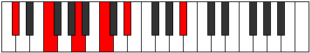 |
| SecondInversion | E#,G##,B#,D#,A#,C# |  |
| ThirdInversion | G##,B#,D#,A#,C#,E# |  |
| FourthInversion | B#,D#,A#,C#,E#,G## | 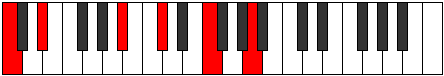 |
| FifthInversion | D#,A#,C#,E#,G##,B# | 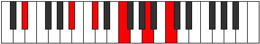 |
## Modes

| Number | Mode | Tonic | Notes | Illustration |
|--------|------|-------|-------|--------------|
| [347](https://ianring.com/musictheory/scales/347) | [Barimic](ModeANaturalBarimic.md) | A | A, Bb, C, Db, Eb, F, A |  |
| [351](https://ianring.com/musictheory/scales/351) | [Epanian](ModeANaturalEpanian.md) | A | A, Bb, Cb, Dbb, Ebbb, Fbb, Gbb, A |  |
| [379](https://ianring.com/musictheory/scales/379) | [Aeragian](ModeANaturalAeragian.md) | A | A, Bb, C, Db, Ebb, Fbb, Gbb, A |  |
| [383](https://ianring.com/musictheory/scales/383) | [Logyllic](ModeANaturalLogyllic.md) | A | A, A#, B, C, C#, D, D#, F, A | 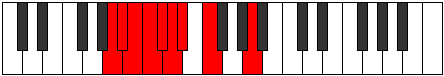 |
| [475](https://ianring.com/musictheory/scales/475) | [Aeolygian](ModeANaturalAeolygian.md) | A | A, Bb, C, Db, Eb, Fb, Gbb, A |  |
| [479](https://ianring.com/musictheory/scales/479) | [Kocryllic](ModeANaturalKocryllic.md) | A | A, A#, B, C, C#, D#, E, F, A |  |
| [507](https://ianring.com/musictheory/scales/507) | [Moryllic](ModeANaturalMoryllic.md) | A | A, A#, C, C#, D, D#, E, F, A |  |
| [511](https://ianring.com/musictheory/scales/511) | [Polygic](ModeANaturalPolygic.md) | A | A, A#, B, C, C#, D, D#, E, F, A |  |
| [695](https://ianring.com/musictheory/scales/695) | [Sarian](ModeGSharpSarian.md) | G# | G#, A, Bb, C, Db, Eb, F, G# |  |
| [695](https://ianring.com/musictheory/scales/695) | [Sarian](ModeAFlatSarian.md) | Ab | Ab, Bbb, Cbb, Dbb, Ebbb, Fbb, Gbb, Ab |  |
| [703](https://ianring.com/musictheory/scales/703) | [Aerocryllic](ModeGSharpAerocryllic.md) | G# | G#, A, A#, B, C, C#, D#, F, G# |  |
| [703](https://ianring.com/musictheory/scales/703) | [Aerocryllic](ModeAFlatAerocryllic.md) | Ab | Ab, A, Bb, B, C, Db, Eb, F, Ab |  |
| [759](https://ianring.com/musictheory/scales/759) | [Katalyllic](ModeGSharpKatalyllic.md) | G# | G#, A, A#, C, C#, D, D#, F, G# |  |
| [759](https://ianring.com/musictheory/scales/759) | [Katalyllic](ModeAFlatKatalyllic.md) | Ab | Ab, A, Bb, C, Db, D, Eb, F, Ab |  |
| [767](https://ianring.com/musictheory/scales/767) | [Raptygic](ModeGSharpRaptygic.md) | G# | G#, A, A#, B, C, C#, D, D#, F, G# |  |
| [767](https://ianring.com/musictheory/scales/767) | [Raptygic](ModeAFlatRaptygic.md) | Ab | Ab, A, Bb, B, C, Db, D, Eb, F, Ab |  |
| [859](https://ianring.com/musictheory/scales/859) | [Pathian](ModeANaturalPathian.md) | A | A, Bb, C, Db, Eb, F, Gb, A |  |
| [863](https://ianring.com/musictheory/scales/863) | [Pyryllic](ModeANaturalPyryllic.md) | A | A, A#, B, C, C#, D#, F, F#, A |  |
| [891](https://ianring.com/musictheory/scales/891) | [Ionilyllic](ModeANaturalIonilyllic.md) | A | A, A#, C, C#, D, D#, F, F#, A |  |
| [895](https://ianring.com/musictheory/scales/895) | [Aeolathygic](ModeANaturalAeolathygic.md) | A | A, A#, B, C, C#, D, D#, F, F#, A |  |
| [951](https://ianring.com/musictheory/scales/951) | [Thogyllic](ModeGSharpThogyllic.md) | G# | G#, A, A#, C, C#, D#, E, F, G# |  |
| [951](https://ianring.com/musictheory/scales/951) | [Thogyllic](ModeAFlatThogyllic.md) | Ab | Ab, A, Bb, C, Db, Eb, E, F, Ab |  |
| [959](https://ianring.com/musictheory/scales/959) | [Katylygic](ModeGSharpKatylygic.md) | G# | G#, A, A#, B, C, C#, D#, E, F, G# |  |
| [959](https://ianring.com/musictheory/scales/959) | [Katylygic](ModeAFlatKatylygic.md) | Ab | Ab, A, Bb, B, C, Db, Eb, E, F, Ab |  |
| [987](https://ianring.com/musictheory/scales/987) | [Aeraptyllic](ModeANaturalAeraptyllic.md) | A | A, A#, C, C#, D#, E, F, F#, A |  |
| [991](https://ianring.com/musictheory/scales/991) | [Aeolygic](ModeANaturalAeolygic.md) | A | A, A#, B, C, C#, D#, E, F, F#, A |  |
| [1015](https://ianring.com/musictheory/scales/1015) | [Ionodygic](ModeGSharpIonodygic.md) | G# | G#, A, A#, C, C#, D, D#, E, F, G# |  |
| [1015](https://ianring.com/musictheory/scales/1015) | [Ionodygic](ModeAFlatIonodygic.md) | Ab | Ab, A, Bb, C, Db, D, Eb, E, F, Ab |  |
| [1019](https://ianring.com/musictheory/scales/1019) | [Aeranygic](ModeANaturalAeranygic.md) | A | A, A#, C, C#, D, D#, E, F, F#, A |  |
| [1023](https://ianring.com/musictheory/scales/1023) | [Dodyllian](ModeANaturalDodyllian.md) | A | A, A#, B, C, C#, D, D#, E, F, F#, A |  |
| [1023](https://ianring.com/musictheory/scales/1023) | [Dodyllian](ModeGSharpDodyllian.md) | G# | G#, A, A#, B, C, C#, D, D#, E, F, G# |  |
| [1023](https://ianring.com/musictheory/scales/1023) | [Dodyllian](ModeAFlatDodyllian.md) | Ab | Ab, A, Bb, B, C, Db, D, Eb, E, F, Ab |  |
| [1371](https://ianring.com/musictheory/scales/1371) | [Ionadian](ModeANaturalIonadian.md) | A | A, Bb, C, Db, Eb, F, G, A |  |
| [1375](https://ianring.com/musictheory/scales/1375) | [Bothyllic](ModeANaturalBothyllic.md) | A | A, A#, B, C, C#, D#, F, G, A |  |
| [1389](https://ianring.com/musictheory/scales/1389) | [Lorian](ModeGNaturalLorian.md) | G | G, A, Bb, C, Db, Eb, F, G |  |
| [1391](https://ianring.com/musictheory/scales/1391) | [Aeradyllic](ModeGNaturalAeradyllic.md) | G | G, G#, A, A#, C, C#, D#, F, G |  |
| [1403](https://ianring.com/musictheory/scales/1403) | [Epinyllic](ModeANaturalEpinyllic.md) | A | A, A#, C, C#, D, D#, F, G, A |  |
| [1405](https://ianring.com/musictheory/scales/1405) | [Goryllic](ModeGNaturalGoryllic.md) | G | G, A, A#, B, C, C#, D#, F, G |  |
| [1407](https://ianring.com/musictheory/scales/1407) | [Tharygic](ModeANaturalTharygic.md) | A | A, A#, B, C, C#, D, D#, F, G, A |  |
| [1407](https://ianring.com/musictheory/scales/1407) | [Tharygic](ModeGNaturalTharygic.md) | G | G, G#, A, A#, B, C, C#, D#, F, G |  |
| [1457](https://ianring.com/musictheory/scales/1457) | [Modimic](ModeFNaturalModimic.md) | F | F, G##, A#, B#, C#, D#, F |  |
| [1459](https://ianring.com/musictheory/scales/1459) | [Ionalian](ModeFNaturalIonalian.md) | F | F, Gb, A, Bb, C, Db, Eb, F |  |
| [1461](https://ianring.com/musictheory/scales/1461) | [Stydian](ModeFNaturalStydian.md) | F | F, G, A, Bb, C, Db, Eb, F |  |
| [1463](https://ianring.com/musictheory/scales/1463) | [Zaptyllic](ModeFNaturalZaptyllic.md) | F | F, F#, G, A, A#, C, C#, D#, F |  |
| [1465](https://ianring.com/musictheory/scales/1465) | [Aerathian](ModeFNaturalAerathian.md) | F | F, G#, A, Bb, C, Db, Eb, F |  |
| [1467](https://ianring.com/musictheory/scales/1467) | [Thydyllic](ModeFNaturalThydyllic.md) | F | F, F#, G#, A, A#, C, C#, D#, F |  |
| [1469](https://ianring.com/musictheory/scales/1469) | [Epiryllic](ModeFNaturalEpiryllic.md) | F | F, G, G#, A, A#, C, C#, D#, F |  |
| [1471](https://ianring.com/musictheory/scales/1471) | [Radygic](ModeFNaturalRadygic.md) | F | F, F#, G, G#, A, A#, C, C#, D#, F |  |
| [1499](https://ianring.com/musictheory/scales/1499) | [Stonyllic](ModeANaturalStonyllic.md) | A | A, A#, C, C#, D#, E, F, G, A |  |
| [1503](https://ianring.com/musictheory/scales/1503) | [Padygic](ModeANaturalPadygic.md) | A | A, A#, B, C, C#, D#, E, F, G, A |  |
| [1517](https://ianring.com/musictheory/scales/1517) | [Sagyllic](ModeGNaturalSagyllic.md) | G | G, A, A#, C, C#, D, D#, F, G |  |
| [1519](https://ianring.com/musictheory/scales/1519) | [Solygic](ModeGNaturalSolygic.md) | G | G, G#, A, A#, C, C#, D, D#, F, G |  |
| [1521](https://ianring.com/musictheory/scales/1521) | [Stanian](ModeFNaturalStanian.md) | F | F, G##, A#, B, C, Db, Eb, F |  |
| [1523](https://ianring.com/musictheory/scales/1523) | [Zothyllic](ModeFNaturalZothyllic.md) | F | F, F#, A, A#, B, C, C#, D#, F |  |
| [1525](https://ianring.com/musictheory/scales/1525) | [Sodyllic](ModeFNaturalSodyllic.md) | F | F, G, A, A#, B, C, C#, D#, F |  |
| [1527](https://ianring.com/musictheory/scales/1527) | [Aeolyrygic](ModeFNaturalAeolyrygic.md) | F | F, F#, G, A, A#, B, C, C#, D#, F |  |
| [1529](https://ianring.com/musictheory/scales/1529) | [Kataryllic](ModeFNaturalKataryllic.md) | F | F, G#, A, A#, B, C, C#, D#, F |  |
| [1531](https://ianring.com/musictheory/scales/1531) | [Styptygic](ModeANaturalStyptygic.md) | A | A, A#, C, C#, D, D#, E, F, G, A |  |
| [1531](https://ianring.com/musictheory/scales/1531) | [Styptygic](ModeFNaturalStyptygic.md) | F | F, F#, G#, A, A#, B, C, C#, D#, F |  |
| [1533](https://ianring.com/musictheory/scales/1533) | [Katycrygic](ModeGNaturalKatycrygic.md) | G | G, A, A#, B, C, C#, D, D#, F, G |  |
| [1533](https://ianring.com/musictheory/scales/1533) | [Katycrygic](ModeFNaturalKatycrygic.md) | F | F, G, G#, A, A#, B, C, C#, D#, F |  |
| [1535](https://ianring.com/musictheory/scales/1535) | [Mixodyllian](ModeANaturalMixodyllian.md) | A | A, A#, B, C, C#, D, D#, E, F, G, A |  |
| [1535](https://ianring.com/musictheory/scales/1535) | [Mixodyllian](ModeGNaturalMixodyllian.md) | G | G, G#, A, A#, B, C, C#, D, D#, F, G |  |
| [1535](https://ianring.com/musictheory/scales/1535) | [Mixodyllian](ModeFNaturalMixodyllian.md) | F | F, F#, G, G#, A, A#, B, C, C#, D#, F |  |
| [1579](https://ianring.com/musictheory/scales/1579) | [Sagimic](ModeCNaturalSagimic.md) | C | C, Db, Eb, F, G##, A#, C |  |
| [1583](https://ianring.com/musictheory/scales/1583) | [Salian](ModeCNaturalSalian.md) | C | C, Db, Ebb, Fbb, Gbb, A, Bb, C |  |
| [1595](https://ianring.com/musictheory/scales/1595) | [Dacrian](ModeCNaturalDacrian.md) | C | C, Db, Eb, Fb, Gbb, A, Bb, C |  |
| [1599](https://ianring.com/musictheory/scales/1599) | [Pocryllic](ModeCNaturalPocryllic.md) | C | C, C#, D, D#, E, F, A, A#, C |  |
| [1643](https://ianring.com/musictheory/scales/1643) | [Thyptian](ModeCNaturalThyptian.md) | C | C, Db, Eb, F, Gb, A, Bb, C |  |
| [1647](https://ianring.com/musictheory/scales/1647) | [Polyllic](ModeCNaturalPolyllic.md) | C | C, C#, D, D#, F, F#, A, A#, C |  |
| [1659](https://ianring.com/musictheory/scales/1659) | [Magyllic](ModeCNaturalMagyllic.md) | C | C, C#, D#, E, F, F#, A, A#, C |  |
| [1663](https://ianring.com/musictheory/scales/1663) | [Lydygic](ModeCNaturalLydygic.md) | C | C, C#, D, D#, E, F, F#, A, A#, C |  |
| [1707](https://ianring.com/musictheory/scales/1707) | [Mixolythian](ModeCNaturalMixolythian.md) | C | C, Db, Eb, F, G, A, Bb, C |  |
| [1711](https://ianring.com/musictheory/scales/1711) | [Ragyllic](ModeCNaturalRagyllic.md) | C | C, C#, D, D#, F, G, A, A#, C |  |
| [1719](https://ianring.com/musictheory/scales/1719) | [Lyryllic](ModeGSharpLyryllic.md) | G# | G#, A, A#, C, C#, D#, F, F#, G# |  |
| [1719](https://ianring.com/musictheory/scales/1719) | [Lyryllic](ModeAFlatLyryllic.md) | Ab | Ab, A, Bb, C, Db, Eb, F, Gb, Ab |  |
| [1723](https://ianring.com/musictheory/scales/1723) | [Poryllic](ModeCNaturalPoryllic.md) | C | C, C#, D#, E, F, G, A, A#, C |  |
| [1727](https://ianring.com/musictheory/scales/1727) | [Sydygic](ModeCNaturalSydygic.md) | C | C, C#, D, D#, E, F, G, A, A#, C |  |
| [1727](https://ianring.com/musictheory/scales/1727) | [Sydygic](ModeGSharpSydygic.md) | G# | G#, A, A#, B, C, C#, D#, F, F#, G# |  |
| [1727](https://ianring.com/musictheory/scales/1727) | [Sydygic](ModeAFlatSydygic.md) | Ab | Ab, A, Bb, B, C, Db, Eb, F, Gb, Ab |  |
| [1733](https://ianring.com/musictheory/scales/1733) | [Socrimic](ModeDSharpSocrimic.md) | D# | D#, E#, Cbbb, Cbb, Dbb, Ebbb, D# |  |
| [1733](https://ianring.com/musictheory/scales/1733) | [Socrimic](ModeEFlatSocrimic.md) | Eb | Eb, F, G##, A#, B#, C#, Eb |  |
| [1735](https://ianring.com/musictheory/scales/1735) | [Dagian](ModeDSharpDagian.md) | D# | D#, E, F, G##, A#, B#, C#, D# |  |
| [1735](https://ianring.com/musictheory/scales/1735) | [Dagian](ModeEFlatDagian.md) | Eb | Eb, Fb, Gbb, A, Bb, C, Db, Eb |  |
| [1741](https://ianring.com/musictheory/scales/1741) | [Katycrian](ModeDSharpKatycrian.md) | D# | D#, E#, F#, G##, A#, B#, C#, D# |  |
| [1741](https://ianring.com/musictheory/scales/1741) | [Katycrian](ModeEFlatKatycrian.md) | Eb | Eb, F, Gb, A, Bb, C, Db, Eb |  |
| [1743](https://ianring.com/musictheory/scales/1743) | [Epigyllic](ModeDSharpEpigyllic.md) | D# | D#, E, F, F#, A, A#, C, C#, D# |  |
| [1743](https://ianring.com/musictheory/scales/1743) | [Epigyllic](ModeEFlatEpigyllic.md) | Eb | Eb, E, F, Gb, A, Bb, C, Db, Eb |  |
| [1749](https://ianring.com/musictheory/scales/1749) | [Lythian](ModeDSharpLythian.md) | D# | D#, E#, F##, G##, A#, B#, C#, D# |  |
| [1749](https://ianring.com/musictheory/scales/1749) | [Lythian](ModeEFlatLythian.md) | Eb | Eb, F, G, A, Bb, C, Db, Eb |  |
| [1751](https://ianring.com/musictheory/scales/1751) | [Aeolyryllic](ModeDSharpAeolyryllic.md) | D# | D#, E, F, G, A, A#, C, C#, D# |  |
| [1751](https://ianring.com/musictheory/scales/1751) | [Aeolyryllic](ModeEFlatAeolyryllic.md) | Eb | Eb, E, F, G, A, Bb, C, Db, Eb |  |
| [1757](https://ianring.com/musictheory/scales/1757) | [Ionyphyllic](ModeDSharpIonyphyllic.md) | D# | D#, F, F#, G, A, A#, C, C#, D# |  |
| [1757](https://ianring.com/musictheory/scales/1757) | [Ionyphyllic](ModeEFlatIonyphyllic.md) | Eb | Eb, F, Gb, G, A, Bb, C, Db, Eb |  |
| [1759](https://ianring.com/musictheory/scales/1759) | [Pylygic](ModeDSharpPylygic.md) | D# | D#, E, F, F#, G, A, A#, C, C#, D# |  |
| [1759](https://ianring.com/musictheory/scales/1759) | [Pylygic](ModeEFlatPylygic.md) | Eb | Eb, E, F, Gb, G, A, Bb, C, Db, Eb |  |
| [1765](https://ianring.com/musictheory/scales/1765) | [Lonian](ModeDSharpLonian.md) | D# | D#, E#, F###, G##, A#, B#, C#, D# |  |
| [1765](https://ianring.com/musictheory/scales/1765) | [Lonian](ModeEFlatLonian.md) | Eb | Eb, F, G#, A, Bb, C, Db, Eb |  |
| [1767](https://ianring.com/musictheory/scales/1767) | [Dyryllic](ModeDSharpDyryllic.md) | D# | D#, E, F, G#, A, A#, C, C#, D# |  |
| [1767](https://ianring.com/musictheory/scales/1767) | [Dyryllic](ModeEFlatDyryllic.md) | Eb | Eb, E, F, Ab, A, Bb, C, Db, Eb |  |
| [1771](https://ianring.com/musictheory/scales/1771) | [Stylyllic](ModeCNaturalStylyllic.md) | C | C, C#, D#, F, F#, G, A, A#, C |  |
| [1773](https://ianring.com/musictheory/scales/1773) | [Aeoloryllic](ModeDSharpAeoloryllic.md) | D# | D#, F, F#, G#, A, A#, C, C#, D# |  |
| [1773](https://ianring.com/musictheory/scales/1773) | [Aeoloryllic](ModeEFlatAeoloryllic.md) | Eb | Eb, F, Gb, Ab, A, Bb, C, Db, Eb |  |
| [1775](https://ianring.com/musictheory/scales/1775) | [Lyrygic](ModeCNaturalLyrygic.md) | C | C, C#, D, D#, F, F#, G, A, A#, C |  |
| [1775](https://ianring.com/musictheory/scales/1775) | [Lyrygic](ModeDSharpLyrygic.md) | D# | D#, E, F, F#, G#, A, A#, C, C#, D# |  |
| [1775](https://ianring.com/musictheory/scales/1775) | [Lyrygic](ModeEFlatLyrygic.md) | Eb | Eb, E, F, Gb, Ab, A, Bb, C, Db, Eb |  |
| [1781](https://ianring.com/musictheory/scales/1781) | [Gocryllic](ModeDSharpGocryllic.md) | D# | D#, F, G, G#, A, A#, C, C#, D# |  |
| [1781](https://ianring.com/musictheory/scales/1781) | [Gocryllic](ModeEFlatGocryllic.md) | Eb | Eb, F, G, Ab, A, Bb, C, Db, Eb |  |
| [1783](https://ianring.com/musictheory/scales/1783) | [Danygic](ModeGSharpDanygic.md) | G# | G#, A, A#, C, C#, D, D#, F, F#, G# |  |
| [1783](https://ianring.com/musictheory/scales/1783) | [Danygic](ModeAFlatDanygic.md) | Ab | Ab, A, Bb, C, Db, D, Eb, F, Gb, Ab |  |
| [1783](https://ianring.com/musictheory/scales/1783) | [Danygic](ModeDSharpDanygic.md) | D# | D#, E, F, G, G#, A, A#, C, C#, D# |  |
| [1783](https://ianring.com/musictheory/scales/1783) | [Danygic](ModeEFlatDanygic.md) | Eb | Eb, E, F, G, Ab, A, Bb, C, Db, Eb | 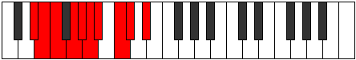 |
| [1787](https://ianring.com/musictheory/scales/1787) | [Mycrygic](ModeCNaturalMycrygic.md) | C | C, C#, D#, E, F, F#, G, A, A#, C |  |
| [1789](https://ianring.com/musictheory/scales/1789) | [Katagygic](ModeDSharpKatagygic.md) | D# | D#, F, F#, G, G#, A, A#, C, C#, D# |  |
| [1789](https://ianring.com/musictheory/scales/1789) | [Katagygic](ModeEFlatKatagygic.md) | Eb | Eb, F, Gb, G, Ab, A, Bb, C, Db, Eb |  |
| [1791](https://ianring.com/musictheory/scales/1791) | [Aerygyllian](ModeCNaturalAerygyllian.md) | C | C, C#, D, D#, E, F, F#, G, A, A#, C |  |
| [1791](https://ianring.com/musictheory/scales/1791) | [Aerygyllian](ModeDSharpAerygyllian.md) | D# | D#, E, F, F#, G, G#, A, A#, C, C#, D# |  |
| [1791](https://ianring.com/musictheory/scales/1791) | [Aerygyllian](ModeEFlatAerygyllian.md) | Eb | Eb, E, F, Gb, G, Ab, A, Bb, C, Db, Eb |  |
| [1791](https://ianring.com/musictheory/scales/1791) | [Aerygyllian](ModeGSharpAerygyllian.md) | G# | G#, A, A#, B, C, C#, D, D#, F, F#, G# |  |
| [1791](https://ianring.com/musictheory/scales/1791) | [Aerygyllian](ModeAFlatAerygyllian.md) | Ab | Ab, A, Bb, B, C, Db, D, Eb, F, Gb, Ab |  |
| [1835](https://ianring.com/musictheory/scales/1835) | [Byptian](ModeCNaturalByptian.md) | C | C, Db, Eb, F, G#, A, Bb, C |  |
| [1839](https://ianring.com/musictheory/scales/1839) | [Zogyllic](ModeCNaturalZogyllic.md) | C | C, C#, D, D#, F, G#, A, A#, C |  |
| [1851](https://ianring.com/musictheory/scales/1851) | [Zacryllic](ModeCNaturalZacryllic.md) | C | C, C#, D#, E, F, G#, A, A#, C |  |
| [1855](https://ianring.com/musictheory/scales/1855) | [Marygic](ModeCNaturalMarygic.md) | C | C, C#, D, D#, E, F, G#, A, A#, C |  |
| [1883](https://ianring.com/musictheory/scales/1883) | [Mixopyryllic](ModeANaturalMixopyryllic.md) | A | A, A#, C, C#, D#, F, F#, G, A |  |
| [1887](https://ianring.com/musictheory/scales/1887) | [Aerocrygic](ModeANaturalAerocrygic.md) | A | A, A#, B, C, C#, D#, F, F#, G, A |  |
| [1899](https://ianring.com/musictheory/scales/1899) | [Moptyllic](ModeCNaturalMoptyllic.md) | C | C, C#, D#, F, F#, G#, A, A#, C |  |
| [1901](https://ianring.com/musictheory/scales/1901) | [Ionidyllic](ModeGNaturalIonidyllic.md) | G | G, A, A#, C, C#, D#, E, F, G |  |
| [1903](https://ianring.com/musictheory/scales/1903) | [Rocrygic](ModeCNaturalRocrygic.md) | C | C, C#, D, D#, F, F#, G#, A, A#, C |  |
| [1903](https://ianring.com/musictheory/scales/1903) | [Rocrygic](ModeGNaturalRocrygic.md) | G | G, G#, A, A#, C, C#, D#, E, F, G |  |
| [1915](https://ianring.com/musictheory/scales/1915) | [Thydygic](ModeANaturalThydygic.md) | A | A, A#, C, C#, D, D#, F, F#, G, A |  |
| [1915](https://ianring.com/musictheory/scales/1915) | [Thydygic](ModeCNaturalThydygic.md) | C | C, C#, D#, E, F, F#, G#, A, A#, C |  |
| [1917](https://ianring.com/musictheory/scales/1917) | [Sacrygic](ModeGNaturalSacrygic.md) | G | G, A, A#, B, C, C#, D#, E, F, G |  |
| [1919](https://ianring.com/musictheory/scales/1919) | [Rocryllian](ModeCNaturalRocryllian.md) | C | C, C#, D, D#, E, F, F#, G#, A, A#, C |  |
| [1919](https://ianring.com/musictheory/scales/1919) | [Rocryllian](ModeANaturalRocryllian.md) | A | A, A#, B, C, C#, D, D#, F, F#, G, A |  |
| [1919](https://ianring.com/musictheory/scales/1919) | [Rocryllian](ModeGNaturalRocryllian.md) | G | G, G#, A, A#, B, C, C#, D#, E, F, G |  |
| [1963](https://ianring.com/musictheory/scales/1963) | [Epocryllic](ModeCNaturalEpocryllic.md) | C | C, C#, D#, F, G, G#, A, A#, C |  |
| [1967](https://ianring.com/musictheory/scales/1967) | [Godygic](ModeCNaturalGodygic.md) | C | C, C#, D, D#, F, G, G#, A, A#, C |  |
| [1969](https://ianring.com/musictheory/scales/1969) | [Zorian](ModeFNaturalZorian.md) | F | F, G##, A#, B#, C#, D, Eb, F |  |
| [1971](https://ianring.com/musictheory/scales/1971) | [Aerynyllic](ModeFNaturalAerynyllic.md) | F | F, F#, A, A#, C, C#, D, D#, F |  |
| [1973](https://ianring.com/musictheory/scales/1973) | [Zyryllic](ModeFNaturalZyryllic.md) | F | F, G, A, A#, C, C#, D, D#, F |  |
| [1975](https://ianring.com/musictheory/scales/1975) | [Ionocrygic](ModeFNaturalIonocrygic.md) | F | F, F#, G, A, A#, C, C#, D, D#, F |  |
| [1975](https://ianring.com/musictheory/scales/1975) | [Ionocrygic](ModeGSharpIonocrygic.md) | G# | G#, A, A#, C, C#, D#, E, F, F#, G# |  |
| [1975](https://ianring.com/musictheory/scales/1975) | [Ionocrygic](ModeAFlatIonocrygic.md) | Ab | Ab, A, Bb, C, Db, Eb, E, F, Gb, Ab |  |
| [1977](https://ianring.com/musictheory/scales/1977) | [Dagyllic](ModeFNaturalDagyllic.md) | F | F, G#, A, A#, C, C#, D, D#, F |  |
| [1979](https://ianring.com/musictheory/scales/1979) | [Aeradygic](ModeFNaturalAeradygic.md) | F | F, F#, G#, A, A#, C, C#, D, D#, F |  |
| [1979](https://ianring.com/musictheory/scales/1979) | [Aeradygic](ModeCNaturalAeradygic.md) | C | C, C#, D#, E, F, G, G#, A, A#, C |  |
| [1981](https://ianring.com/musictheory/scales/1981) | [Gadygic](ModeFNaturalGadygic.md) | F | F, G, G#, A, A#, C, C#, D, D#, F |  |
| [1983](https://ianring.com/musictheory/scales/1983) | [Soryllian](ModeCNaturalSoryllian.md) | C | C, C#, D, D#, E, F, G, G#, A, A#, C |  |
| [1983](https://ianring.com/musictheory/scales/1983) | [Soryllian](ModeFNaturalSoryllian.md) | F | F, F#, G, G#, A, A#, C, C#, D, D#, F |  |
| [1983](https://ianring.com/musictheory/scales/1983) | [Soryllian](ModeGSharpSoryllian.md) | G# | G#, A, A#, B, C, C#, D#, E, F, F#, G# |  |
| [1983](https://ianring.com/musictheory/scales/1983) | [Soryllian](ModeAFlatSoryllian.md) | Ab | Ab, A, Bb, B, C, Db, Eb, E, F, Gb, Ab |  |
| [1989](https://ianring.com/musictheory/scales/1989) | [Dydian](ModeDSharpDydian.md) | D# | D#, E#, Cbbb, Cbb, Dbbb, Dbb, Ebbb, D# |  |
| [1989](https://ianring.com/musictheory/scales/1989) | [Dydian](ModeEFlatDydian.md) | Eb | Eb, F, G##, A#, B, C, Db, Eb |  |
| [1991](https://ianring.com/musictheory/scales/1991) | [Phryptyllic](ModeDSharpPhryptyllic.md) | D# | D#, E, F, A, A#, B, C, C#, D# |  |
| [1991](https://ianring.com/musictheory/scales/1991) | [Phryptyllic](ModeEFlatPhryptyllic.md) | Eb | Eb, E, F, A, Bb, B, C, Db, Eb |  |
| [1997](https://ianring.com/musictheory/scales/1997) | [Staryllic](ModeDSharpStaryllic.md) | D# | D#, F, F#, A, A#, B, C, C#, D# |  |
| [1997](https://ianring.com/musictheory/scales/1997) | [Staryllic](ModeEFlatStaryllic.md) | Eb | Eb, F, Gb, A, Bb, B, C, Db, Eb | 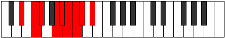 |
| [1999](https://ianring.com/musictheory/scales/1999) | [Zacrygic](ModeDSharpZacrygic.md) | D# | D#, E, F, F#, A, A#, B, C, C#, D# |  |
| [1999](https://ianring.com/musictheory/scales/1999) | [Zacrygic](ModeEFlatZacrygic.md) | Eb | Eb, E, F, Gb, A, Bb, B, C, Db, Eb |  |
| [2005](https://ianring.com/musictheory/scales/2005) | [Gygyllic](ModeDSharpGygyllic.md) | D# | D#, F, G, A, A#, B, C, C#, D# |  |
| [2005](https://ianring.com/musictheory/scales/2005) | [Gygyllic](ModeEFlatGygyllic.md) | Eb | Eb, F, G, A, Bb, B, C, Db, Eb |  |
| [2007](https://ianring.com/musictheory/scales/2007) | [Stonygic](ModeDSharpStonygic.md) | D# | D#, E, F, G, A, A#, B, C, C#, D# |  |
| [2007](https://ianring.com/musictheory/scales/2007) | [Stonygic](ModeEFlatStonygic.md) | Eb | Eb, E, F, G, A, Bb, B, C, Db, Eb |  |
| [2011](https://ianring.com/musictheory/scales/2011) | [Raphygic](ModeANaturalRaphygic.md) | A | A, A#, C, C#, D#, E, F, F#, G, A |  |
| [2013](https://ianring.com/musictheory/scales/2013) | [Mocrygic](ModeDSharpMocrygic.md) | D# | D#, F, F#, G, A, A#, B, C, C#, D# |  |
| [2013](https://ianring.com/musictheory/scales/2013) | [Mocrygic](ModeEFlatMocrygic.md) | Eb | Eb, F, Gb, G, A, Bb, B, C, Db, Eb |  |
| [2015](https://ianring.com/musictheory/scales/2015) | [Epiryllian](ModeDSharpEpiryllian.md) | D# | D#, E, F, F#, G, A, A#, B, C, C#, D# |  |
| [2015](https://ianring.com/musictheory/scales/2015) | [Epiryllian](ModeEFlatEpiryllian.md) | Eb | Eb, E, F, Gb, G, A, Bb, B, C, Db, Eb |  |
| [2015](https://ianring.com/musictheory/scales/2015) | [Epiryllian](ModeANaturalEpiryllian.md) | A | A, A#, B, C, C#, D#, E, F, F#, G, A |  |
| [2021](https://ianring.com/musictheory/scales/2021) | [Katycryllic](ModeDSharpKatycryllic.md) | D# | D#, F, G#, A, A#, B, C, C#, D# |  |
| [2021](https://ianring.com/musictheory/scales/2021) | [Katycryllic](ModeEFlatKatycryllic.md) | Eb | Eb, F, Ab, A, Bb, B, C, Db, Eb |  |
| [2023](https://ianring.com/musictheory/scales/2023) | [Zodygic](ModeDSharpZodygic.md) | D# | D#, E, F, G#, A, A#, B, C, C#, D# |  |
| [2023](https://ianring.com/musictheory/scales/2023) | [Zodygic](ModeEFlatZodygic.md) | Eb | Eb, E, F, Ab, A, Bb, B, C, Db, Eb |  |
| [2027](https://ianring.com/musictheory/scales/2027) | [Boptygic](ModeCNaturalBoptygic.md) | C | C, C#, D#, F, F#, G, G#, A, A#, C |  |
| [2029](https://ianring.com/musictheory/scales/2029) | [Mathygic](ModeGNaturalMathygic.md) | G | G, A, A#, C, C#, D, D#, E, F, G |  |
| [2029](https://ianring.com/musictheory/scales/2029) | [Mathygic](ModeDSharpMathygic.md) | D# | D#, F, F#, G#, A, A#, B, C, C#, D# |  |
| [2029](https://ianring.com/musictheory/scales/2029) | [Mathygic](ModeEFlatMathygic.md) | Eb | Eb, F, Gb, Ab, A, Bb, B, C, Db, Eb |  |
| [2031](https://ianring.com/musictheory/scales/2031) | [Gadyllian](ModeGNaturalGadyllian.md) | G | G, G#, A, A#, C, C#, D, D#, E, F, G |  |
| [2031](https://ianring.com/musictheory/scales/2031) | [Gadyllian](ModeCNaturalGadyllian.md) | C | C, C#, D, D#, F, F#, G, G#, A, A#, C |  |
| [2031](https://ianring.com/musictheory/scales/2031) | [Gadyllian](ModeDSharpGadyllian.md) | D# | D#, E, F, F#, G#, A, A#, B, C, C#, D# |  |
| [2031](https://ianring.com/musictheory/scales/2031) | [Gadyllian](ModeEFlatGadyllian.md) | Eb | Eb, E, F, Gb, Ab, A, Bb, B, C, Db, Eb |  |
| [2033](https://ianring.com/musictheory/scales/2033) | [Stolyllic](ModeFNaturalStolyllic.md) | F | F, A, A#, B, C, C#, D, D#, F |  |
| [2035](https://ianring.com/musictheory/scales/2035) | [Aerythygic](ModeFNaturalAerythygic.md) | F | F, F#, A, A#, B, C, C#, D, D#, F |  |
| [2037](https://ianring.com/musictheory/scales/2037) | [Sythygic](ModeFNaturalSythygic.md) | F | F, G, A, A#, B, C, C#, D, D#, F |  |
| [2037](https://ianring.com/musictheory/scales/2037) | [Sythygic](ModeDSharpSythygic.md) | D# | D#, F, G, G#, A, A#, B, C, C#, D# |  |
| [2037](https://ianring.com/musictheory/scales/2037) | [Sythygic](ModeEFlatSythygic.md) | Eb | Eb, F, G, Ab, A, Bb, B, C, Db, Eb |  |
| [2039](https://ianring.com/musictheory/scales/2039) | [Danyllian](ModeGSharpDanyllian.md) | G# | G#, A, A#, C, C#, D, D#, E, F, F#, G# |  |
| [2039](https://ianring.com/musictheory/scales/2039) | [Danyllian](ModeAFlatDanyllian.md) | Ab | Ab, A, Bb, C, Db, D, Eb, E, F, Gb, Ab |  |
| [2039](https://ianring.com/musictheory/scales/2039) | [Danyllian](ModeFNaturalDanyllian.md) | F | F, F#, G, A, A#, B, C, C#, D, D#, F |  |
| [2039](https://ianring.com/musictheory/scales/2039) | [Danyllian](ModeDSharpDanyllian.md) | D# | D#, E, F, G, G#, A, A#, B, C, C#, D# |  |
| [2039](https://ianring.com/musictheory/scales/2039) | [Danyllian](ModeEFlatDanyllian.md) | Eb | Eb, E, F, G, Ab, A, Bb, B, C, Db, Eb |  |
| [2041](https://ianring.com/musictheory/scales/2041) | [Aeolacrygic](ModeFNaturalAeolacrygic.md) | F | F, G#, A, A#, B, C, C#, D, D#, F |  |
| [2043](https://ianring.com/musictheory/scales/2043) | [Lythyllian](ModeANaturalLythyllian.md) | A | A, A#, C, C#, D, D#, E, F, F#, G, A |  |
| [2043](https://ianring.com/musictheory/scales/2043) | [Lythyllian](ModeCNaturalLythyllian.md) | C | C, C#, D#, E, F, F#, G, G#, A, A#, C |  |
| [2043](https://ianring.com/musictheory/scales/2043) | [Lythyllian](ModeFNaturalLythyllian.md) | F | F, F#, G#, A, A#, B, C, C#, D, D#, F |  |
| [2045](https://ianring.com/musictheory/scales/2045) | [Katogyllian](ModeGNaturalKatogyllian.md) | G | G, A, A#, B, C, C#, D, D#, E, F, G |  |
| [2045](https://ianring.com/musictheory/scales/2045) | [Katogyllian](ModeFNaturalKatogyllian.md) | F | F, G, G#, A, A#, B, C, C#, D, D#, F |  |
| [2045](https://ianring.com/musictheory/scales/2045) | [Katogyllian](ModeDSharpKatogyllian.md) | D# | D#, F, F#, G, G#, A, A#, B, C, C#, D# |  |
| [2045](https://ianring.com/musictheory/scales/2045) | [Katogyllian](ModeEFlatKatogyllian.md) | Eb | Eb, F, Gb, G, Ab, A, Bb, B, C, Db, Eb |  |
| [2047](https://ianring.com/musictheory/scales/2047) | [Monatic](ModeCNaturalMonatic.md) | C | C, C#, D, D#, E, F, F#, G, G#, A, A#, C |  |
| [2047](https://ianring.com/musictheory/scales/2047) | [Monatic](ModeANaturalMonatic.md) | A | A, A#, B, C, C#, D, D#, E, F, F#, G, A |  |
| [2047](https://ianring.com/musictheory/scales/2047) | [Monatic](ModeGSharpMonatic.md) | G# | G#, A, A#, B, C, C#, D, D#, E, F, F#, G# |  |
| [2047](https://ianring.com/musictheory/scales/2047) | [Monatic](ModeAFlatMonatic.md) | Ab | Ab, A, Bb, B, C, Db, D, Eb, E, F, Gb, Ab |  |
| [2047](https://ianring.com/musictheory/scales/2047) | [Monatic](ModeGNaturalMonatic.md) | G | G, G#, A, A#, B, C, C#, D, D#, E, F, G |  |
| [2047](https://ianring.com/musictheory/scales/2047) | [Monatic](ModeFNaturalMonatic.md) | F | F, F#, G, G#, A, A#, B, C, C#, D, D#, F |  |
| [2047](https://ianring.com/musictheory/scales/2047) | [Monatic](ModeDSharpMonatic.md) | D# | D#, E, F, F#, G, G#, A, A#, B, C, C#, D# |  |
| [2047](https://ianring.com/musictheory/scales/2047) | [Monatic](ModeEFlatMonatic.md) | Eb | Eb, E, F, Gb, G, Ab, A, Bb, B, C, Db, Eb |  |
| [2221](https://ianring.com/musictheory/scales/2221) | [Poptimic](ModeASharpPoptimic.md) | A# | A#, B#, C#, D#, E#, Cbbb, A# |  |
| [2221](https://ianring.com/musictheory/scales/2221) | [Poptimic](ModeBFlatPoptimic.md) | Bb | Bb, C, Db, Eb, F, G##, Bb |  |
| [2223](https://ianring.com/musictheory/scales/2223) | [Konian](ModeASharpKonian.md) | A# | A#, B, C, Db, Eb, F, G##, A# |  |
| [2223](https://ianring.com/musictheory/scales/2223) | [Konian](ModeBFlatKonian.md) | Bb | Bb, Cb, Dbb, Ebbb, Fbb, Gbb, A, Bb |  |
| [2237](https://ianring.com/musictheory/scales/2237) | [Epothian](ModeASharpEpothian.md) | A# | A#, B#, C#, D, Eb, F, G##, A# |  |
| [2237](https://ianring.com/musictheory/scales/2237) | [Epothian](ModeBFlatEpothian.md) | Bb | Bb, C, Db, Ebb, Fbb, Gbb, A, Bb |  |
| [2239](https://ianring.com/musictheory/scales/2239) | [Dacryllic](ModeASharpDacryllic.md) | A# | A#, B, C, C#, D, D#, F, A, A# |  |
| [2239](https://ianring.com/musictheory/scales/2239) | [Dacryllic](ModeBFlatDacryllic.md) | Bb | Bb, B, C, Db, D, Eb, F, A, Bb |  |
| [2285](https://ianring.com/musictheory/scales/2285) | [Aerogian](ModeASharpAerogian.md) | A# | A#, B#, C#, D#, E, F, G##, A# |  |
| [2285](https://ianring.com/musictheory/scales/2285) | [Aerogian](ModeBFlatAerogian.md) | Bb | Bb, C, Db, Eb, Fb, Gbb, A, Bb |  |
| [2287](https://ianring.com/musictheory/scales/2287) | [Lodyllic](ModeASharpLodyllic.md) | A# | A#, B, C, C#, D#, E, F, A, A# |  |
| [2287](https://ianring.com/musictheory/scales/2287) | [Lodyllic](ModeBFlatLodyllic.md) | Bb | Bb, B, C, Db, Eb, E, F, A, Bb |  |
| [2301](https://ianring.com/musictheory/scales/2301) | [Bydyllic](ModeASharpBydyllic.md) | A# | A#, C, C#, D, D#, E, F, A, A# |  |
| [2301](https://ianring.com/musictheory/scales/2301) | [Bydyllic](ModeBFlatBydyllic.md) | Bb | Bb, C, Db, D, Eb, E, F, A, Bb |  |
| [2303](https://ianring.com/musictheory/scales/2303) | [Stanygic](ModeASharpStanygic.md) | A# | A#, B, C, C#, D, D#, E, F, A, A# |  |
| [2303](https://ianring.com/musictheory/scales/2303) | [Stanygic](ModeBFlatStanygic.md) | Bb | Bb, B, C, Db, D, Eb, E, F, A, Bb |  |
| [2395](https://ianring.com/musictheory/scales/2395) | [Zoptian](ModeANaturalZoptian.md) | A | A, Bb, C, Db, Eb, F, G#, A |  |
| [2399](https://ianring.com/musictheory/scales/2399) | [Zanyllic](ModeANaturalZanyllic.md) | A | A, A#, B, C, C#, D#, F, G#, A |  |
| [2427](https://ianring.com/musictheory/scales/2427) | [Katoryllic](ModeANaturalKatoryllic.md) | A | A, A#, C, C#, D, D#, F, G#, A |  |
| [2431](https://ianring.com/musictheory/scales/2431) | [Gythygic](ModeANaturalGythygic.md) | A | A, A#, B, C, C#, D, D#, F, G#, A |  |
| [2477](https://ianring.com/musictheory/scales/2477) | [Mydian](ModeASharpMydian.md) | A# | A#, B#, C#, D#, E#, F#, G##, A# |  |
| [2477](https://ianring.com/musictheory/scales/2477) | [Mydian](ModeBFlatMydian.md) | Bb | Bb, C, Db, Eb, F, Gb, A, Bb |  |
| [2479](https://ianring.com/musictheory/scales/2479) | [Rycryllic](ModeASharpRycryllic.md) | A# | A#, B, C, C#, D#, F, F#, A, A# |  |
| [2479](https://ianring.com/musictheory/scales/2479) | [Rycryllic](ModeBFlatRycryllic.md) | Bb | Bb, B, C, Db, Eb, F, Gb, A, Bb |  |
| [2493](https://ianring.com/musictheory/scales/2493) | [Manyllic](ModeASharpManyllic.md) | A# | A#, C, C#, D, D#, F, F#, A, A# |  |
| [2493](https://ianring.com/musictheory/scales/2493) | [Manyllic](ModeBFlatManyllic.md) | Bb | Bb, C, Db, D, Eb, F, Gb, A, Bb |  |
| [2495](https://ianring.com/musictheory/scales/2495) | [Aeolocrygic](ModeASharpAeolocrygic.md) | A# | A#, B, C, C#, D, D#, F, F#, A, A# |  |
| [2495](https://ianring.com/musictheory/scales/2495) | [Aeolocrygic](ModeBFlatAeolocrygic.md) | Bb | Bb, B, C, Db, D, Eb, F, Gb, A, Bb |  |
| [2523](https://ianring.com/musictheory/scales/2523) | [Rygyllic](ModeANaturalRygyllic.md) | A | A, A#, C, C#, D#, E, F, G#, A |  |
| [2527](https://ianring.com/musictheory/scales/2527) | [Phradygic](ModeANaturalPhradygic.md) | A | A, A#, B, C, C#, D#, E, F, G#, A |  |
| [2541](https://ianring.com/musictheory/scales/2541) | [Katadyllic](ModeASharpKatadyllic.md) | A# | A#, C, C#, D#, E, F, F#, A, A# |  |
| [2541](https://ianring.com/musictheory/scales/2541) | [Katadyllic](ModeBFlatKatadyllic.md) | Bb | Bb, C, Db, Eb, E, F, Gb, A, Bb |  |
| [2543](https://ianring.com/musictheory/scales/2543) | [Dydygic](ModeASharpDydygic.md) | A# | A#, B, C, C#, D#, E, F, F#, A, A# |  |
| [2543](https://ianring.com/musictheory/scales/2543) | [Dydygic](ModeBFlatDydygic.md) | Bb | Bb, B, C, Db, Eb, E, F, Gb, A, Bb |  |
| [2555](https://ianring.com/musictheory/scales/2555) | [Bythygic](ModeANaturalBythygic.md) | A | A, A#, C, C#, D, D#, E, F, G#, A |  |
| [2557](https://ianring.com/musictheory/scales/2557) | [Dothygic](ModeASharpDothygic.md) | A# | A#, C, C#, D, D#, E, F, F#, A, A# |  |
| [2557](https://ianring.com/musictheory/scales/2557) | [Dothygic](ModeBFlatDothygic.md) | Bb | Bb, C, Db, D, Eb, E, F, Gb, A, Bb |  |
| [2559](https://ianring.com/musictheory/scales/2559) | [Zogyllian](ModeASharpZogyllian.md) | A# | A#, B, C, C#, D, D#, E, F, F#, A, A# |  |
| [2559](https://ianring.com/musictheory/scales/2559) | [Zogyllian](ModeBFlatZogyllian.md) | Bb | Bb, B, C, Db, D, Eb, E, F, Gb, A, Bb |  |
| [2559](https://ianring.com/musictheory/scales/2559) | [Zogyllian](ModeANaturalZogyllian.md) | A | A, A#, B, C, C#, D, D#, E, F, G#, A |  |
| [2733](https://ianring.com/musictheory/scales/2733) | [Bocrian](ModeASharpBocrian.md) | A# | A#, B#, C#, D#, E#, F##, G##, A# |  |
| [2733](https://ianring.com/musictheory/scales/2733) | [Bocrian](ModeBFlatBocrian.md) | Bb | Bb, C, Db, Eb, F, G, A, Bb |  |
| [2735](https://ianring.com/musictheory/scales/2735) | [Gynyllic](ModeASharpGynyllic.md) | A# | A#, B, C, C#, D#, F, G, A, A# |  |
| [2735](https://ianring.com/musictheory/scales/2735) | [Gynyllic](ModeBFlatGynyllic.md) | Bb | Bb, B, C, Db, Eb, F, G, A, Bb |  |
| [2743](https://ianring.com/musictheory/scales/2743) | [Staptyllic](ModeGSharpStaptyllic.md) | G# | G#, A, A#, C, C#, D#, F, G, G# |  |
| [2743](https://ianring.com/musictheory/scales/2743) | [Staptyllic](ModeAFlatStaptyllic.md) | Ab | Ab, A, Bb, C, Db, Eb, F, G, Ab |  |
| [2749](https://ianring.com/musictheory/scales/2749) | [Katagyllic](ModeASharpKatagyllic.md) | A# | A#, C, C#, D, D#, F, G, A, A# |  |
| [2749](https://ianring.com/musictheory/scales/2749) | [Katagyllic](ModeBFlatKatagyllic.md) | Bb | Bb, C, Db, D, Eb, F, G, A, Bb |  |
| [2751](https://ianring.com/musictheory/scales/2751) | [Sylygic](ModeASharpSylygic.md) | A# | A#, B, C, C#, D, D#, F, G, A, A# |  |
| [2751](https://ianring.com/musictheory/scales/2751) | [Sylygic](ModeBFlatSylygic.md) | Bb | Bb, B, C, Db, D, Eb, F, G, A, Bb |  |
| [2751](https://ianring.com/musictheory/scales/2751) | [Sylygic](ModeGSharpSylygic.md) | G# | G#, A, A#, B, C, C#, D#, F, G, G# |  |
| [2751](https://ianring.com/musictheory/scales/2751) | [Sylygic](ModeAFlatSylygic.md) | Ab | Ab, A, Bb, B, C, Db, Eb, F, G, Ab |  |
| [2777](https://ianring.com/musictheory/scales/2777) | [Bycrian](ModeFSharpBycrian.md) | F# | F#, G##, A#, B#, C#, D#, E#, F# |  |
| [2777](https://ianring.com/musictheory/scales/2777) | [Bycrian](ModeGFlatBycrian.md) | Gb | Gb, A, Bb, C, Db, Eb, F, Gb |  |
| [2779](https://ianring.com/musictheory/scales/2779) | [Garyllic](ModeFSharpGaryllic.md) | F# | F#, G, A, A#, C, C#, D#, F, F# |  |
| [2779](https://ianring.com/musictheory/scales/2779) | [Garyllic](ModeGFlatGaryllic.md) | Gb | Gb, G, A, Bb, C, Db, Eb, F, Gb |  |
| [2781](https://ianring.com/musictheory/scales/2781) | [Gycryllic](ModeFSharpGycryllic.md) | F# | F#, G#, A, A#, C, C#, D#, F, F# |  |
| [2781](https://ianring.com/musictheory/scales/2781) | [Gycryllic](ModeGFlatGycryllic.md) | Gb | Gb, Ab, A, Bb, C, Db, Eb, F, Gb |  |
| [2783](https://ianring.com/musictheory/scales/2783) | [Gothygic](ModeFSharpGothygic.md) | F# | F#, G, G#, A, A#, C, C#, D#, F, F# |  |
| [2783](https://ianring.com/musictheory/scales/2783) | [Gothygic](ModeGFlatGothygic.md) | Gb | Gb, G, Ab, A, Bb, C, Db, Eb, F, Gb |  |
| [2797](https://ianring.com/musictheory/scales/2797) | [Stalyllic](ModeASharpStalyllic.md) | A# | A#, C, C#, D#, E, F, G, A, A# |  |
| [2797](https://ianring.com/musictheory/scales/2797) | [Stalyllic](ModeBFlatStalyllic.md) | Bb | Bb, C, Db, Eb, E, F, G, A, Bb |  |
| [2799](https://ianring.com/musictheory/scales/2799) | [Epilygic](ModeASharpEpilygic.md) | A# | A#, B, C, C#, D#, E, F, G, A, A# |  |
| [2799](https://ianring.com/musictheory/scales/2799) | [Epilygic](ModeBFlatEpilygic.md) | Bb | Bb, B, C, Db, Eb, E, F, G, A, Bb |  |
| [2807](https://ianring.com/musictheory/scales/2807) | [Zylygic](ModeGSharpZylygic.md) | G# | G#, A, A#, C, C#, D, D#, F, G, G# |  |
| [2807](https://ianring.com/musictheory/scales/2807) | [Zylygic](ModeAFlatZylygic.md) | Ab | Ab, A, Bb, C, Db, D, Eb, F, G, Ab |  |
| [2809](https://ianring.com/musictheory/scales/2809) | [Gythyllic](ModeFSharpGythyllic.md) | F# | F#, A, A#, B, C, C#, D#, F, F# |  |
| [2809](https://ianring.com/musictheory/scales/2809) | [Gythyllic](ModeGFlatGythyllic.md) | Gb | Gb, A, Bb, B, C, Db, Eb, F, Gb |  |
| [2811](https://ianring.com/musictheory/scales/2811) | [Barygic](ModeFSharpBarygic.md) | F# | F#, G, A, A#, B, C, C#, D#, F, F# |  |
| [2811](https://ianring.com/musictheory/scales/2811) | [Barygic](ModeGFlatBarygic.md) | Gb | Gb, G, A, Bb, B, C, Db, Eb, F, Gb |  |
| [2813](https://ianring.com/musictheory/scales/2813) | [Zolygic](ModeASharpZolygic.md) | A# | A#, C, C#, D, D#, E, F, G, A, A# |  |
| [2813](https://ianring.com/musictheory/scales/2813) | [Zolygic](ModeBFlatZolygic.md) | Bb | Bb, C, Db, D, Eb, E, F, G, A, Bb |  |
| [2813](https://ianring.com/musictheory/scales/2813) | [Zolygic](ModeFSharpZolygic.md) | F# | F#, G#, A, A#, B, C, C#, D#, F, F# |  |
| [2813](https://ianring.com/musictheory/scales/2813) | [Zolygic](ModeGFlatZolygic.md) | Gb | Gb, Ab, A, Bb, B, C, Db, Eb, F, Gb |  |
| [2815](https://ianring.com/musictheory/scales/2815) | [Aeradyllian](ModeASharpAeradyllian.md) | A# | A#, B, C, C#, D, D#, E, F, G, A, A# |  |
| [2815](https://ianring.com/musictheory/scales/2815) | [Aeradyllian](ModeBFlatAeradyllian.md) | Bb | Bb, B, C, Db, D, Eb, E, F, G, A, Bb |  |
| [2815](https://ianring.com/musictheory/scales/2815) | [Aeradyllian](ModeGSharpAeradyllian.md) | G# | G#, A, A#, B, C, C#, D, D#, F, G, G# |  |
| [2815](https://ianring.com/musictheory/scales/2815) | [Aeradyllian](ModeAFlatAeradyllian.md) | Ab | Ab, A, Bb, B, C, Db, D, Eb, F, G, Ab |  |
| [2815](https://ianring.com/musictheory/scales/2815) | [Aeradyllian](ModeFSharpAeradyllian.md) | F# | F#, G, G#, A, A#, B, C, C#, D#, F, F# |  |
| [2815](https://ianring.com/musictheory/scales/2815) | [Aeradyllian](ModeGFlatAeradyllian.md) | Gb | Gb, G, Ab, A, Bb, B, C, Db, Eb, F, Gb |  |
| [2837](https://ianring.com/musictheory/scales/2837) | [Aelothimic](ModeCSharpAelothimic.md) | C# | C#, D#, E#, Cbbb, Cbb, Dbb, C# |  |
| [2837](https://ianring.com/musictheory/scales/2837) | [Aelothimic](ModeDFlatAelothimic.md) | Db | Db, Eb, F, G##, A#, B#, Db |  |
| [2839](https://ianring.com/musictheory/scales/2839) | [Lyptian](ModeCSharpLyptian.md) | C# | C#, D, Eb, F, G##, A#, B#, C# |  |
| [2839](https://ianring.com/musictheory/scales/2839) | [Lyptian](ModeDFlatLyptian.md) | Db | Db, Ebb, Fbb, Gbb, A, Bb, C, Db |  |
| [2845](https://ianring.com/musictheory/scales/2845) | [Baptian](ModeCSharpBaptian.md) | C# | C#, D#, E, F, G##, A#, B#, C# |  |
| [2845](https://ianring.com/musictheory/scales/2845) | [Baptian](ModeDFlatBaptian.md) | Db | Db, Eb, Fb, Gbb, A, Bb, C, Db |  |
| [2847](https://ianring.com/musictheory/scales/2847) | [Phracryllic](ModeCSharpPhracryllic.md) | C# | C#, D, D#, E, F, A, A#, C, C# |  |
| [2847](https://ianring.com/musictheory/scales/2847) | [Phracryllic](ModeDFlatPhracryllic.md) | Db | Db, D, Eb, E, F, A, Bb, C, Db |  |
| [2869](https://ianring.com/musictheory/scales/2869) | [Phrothian](ModeCSharpPhrothian.md) | C# | C#, D#, E#, F#, G##, A#, B#, C# |  |
| [2869](https://ianring.com/musictheory/scales/2869) | [Phrothian](ModeDFlatPhrothian.md) | Db | Db, Eb, F, Gb, A, Bb, C, Db |  |
| [2871](https://ianring.com/musictheory/scales/2871) | [Stanyllic](ModeCSharpStanyllic.md) | C# | C#, D, D#, F, F#, A, A#, C, C# |  |
| [2871](https://ianring.com/musictheory/scales/2871) | [Stanyllic](ModeDFlatStanyllic.md) | Db | Db, D, Eb, F, Gb, A, Bb, C, Db |  |
| [2877](https://ianring.com/musictheory/scales/2877) | [Phrylyllic](ModeCSharpPhrylyllic.md) | C# | C#, D#, E, F, F#, A, A#, C, C# |  |
| [2877](https://ianring.com/musictheory/scales/2877) | [Phrylyllic](ModeDFlatPhrylyllic.md) | Db | Db, Eb, E, F, Gb, A, Bb, C, Db |  |
| [2879](https://ianring.com/musictheory/scales/2879) | [Stadygic](ModeCSharpStadygic.md) | C# | C#, D, D#, E, F, F#, A, A#, C, C# |  |
| [2879](https://ianring.com/musictheory/scales/2879) | [Stadygic](ModeDFlatStadygic.md) | Db | Db, D, Eb, E, F, Gb, A, Bb, C, Db |  |
| [2901](https://ianring.com/musictheory/scales/2901) | [Larian](ModeCSharpLarian.md) | C# | C#, D#, E#, F##, G##, A#, B#, C# |  |
| [2901](https://ianring.com/musictheory/scales/2901) | [Larian](ModeDFlatLarian.md) | Db | Db, Eb, F, G, A, Bb, C, Db |  |
| [2903](https://ianring.com/musictheory/scales/2903) | [Gothyllic](ModeCSharpGothyllic.md) | C# | C#, D, D#, F, G, A, A#, C, C# |  |
| [2903](https://ianring.com/musictheory/scales/2903) | [Gothyllic](ModeDFlatGothyllic.md) | Db | Db, D, Eb, F, G, A, Bb, C, Db |  |
| [2907](https://ianring.com/musictheory/scales/2907) | [Mogyllic](ModeANaturalMogyllic.md) | A | A, A#, C, C#, D#, F, F#, G#, A |  |
| [2909](https://ianring.com/musictheory/scales/2909) | [Mocryllic](ModeCSharpMocryllic.md) | C# | C#, D#, E, F, G, A, A#, C, C# |  |
| [2909](https://ianring.com/musictheory/scales/2909) | [Mocryllic](ModeDFlatMocryllic.md) | Db | Db, Eb, E, F, G, A, Bb, C, Db |  |
| [2911](https://ianring.com/musictheory/scales/2911) | [Katygic](ModeCSharpKatygic.md) | C# | C#, D, D#, E, F, G, A, A#, C, C# |  |
| [2911](https://ianring.com/musictheory/scales/2911) | [Katygic](ModeDFlatKatygic.md) | Db | Db, D, Eb, E, F, G, A, Bb, C, Db |  |
| [2911](https://ianring.com/musictheory/scales/2911) | [Katygic](ModeANaturalKatygic.md) | A | A, A#, B, C, C#, D#, F, F#, G#, A |  |
| [2915](https://ianring.com/musictheory/scales/2915) | [Aeolydian](ModeENaturalAeolydian.md) | E | E, F, G##, A#, B#, C#, D#, E | 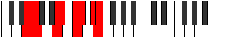 |
| [2919](https://ianring.com/musictheory/scales/2919) | [Molyllic](ModeENaturalMolyllic.md) | E | E, F, F#, A, A#, C, C#, D#, E |  |
| [2923](https://ianring.com/musictheory/scales/2923) | [Baryllic](ModeENaturalBaryllic.md) | E | E, F, G, A, A#, C, C#, D#, E |  |
| [2927](https://ianring.com/musictheory/scales/2927) | [Rodygic](ModeENaturalRodygic.md) | E | E, F, F#, G, A, A#, C, C#, D#, E |  |
| [2931](https://ianring.com/musictheory/scales/2931) | [Zathyllic](ModeENaturalZathyllic.md) | E | E, F, G#, A, A#, C, C#, D#, E |  |
| [2933](https://ianring.com/musictheory/scales/2933) | [Dalyllic](ModeCSharpDalyllic.md) | C# | C#, D#, F, F#, G, A, A#, C, C# |  |
| [2933](https://ianring.com/musictheory/scales/2933) | [Dalyllic](ModeDFlatDalyllic.md) | Db | Db, Eb, F, Gb, G, A, Bb, C, Db |  |
| [2935](https://ianring.com/musictheory/scales/2935) | [Modygic](ModeCSharpModygic.md) | C# | C#, D, D#, F, F#, G, A, A#, C, C# |  |
| [2935](https://ianring.com/musictheory/scales/2935) | [Modygic](ModeDFlatModygic.md) | Db | Db, D, Eb, F, Gb, G, A, Bb, C, Db |  |
| [2935](https://ianring.com/musictheory/scales/2935) | [Modygic](ModeENaturalModygic.md) | E | E, F, F#, G#, A, A#, C, C#, D#, E |  |
| [2939](https://ianring.com/musictheory/scales/2939) | [Goptygic](ModeANaturalGoptygic.md) | A | A, A#, C, C#, D, D#, F, F#, G#, A |  |
| [2939](https://ianring.com/musictheory/scales/2939) | [Goptygic](ModeENaturalGoptygic.md) | E | E, F, G, G#, A, A#, C, C#, D#, E |  |
| [2941](https://ianring.com/musictheory/scales/2941) | [Laptygic](ModeCSharpLaptygic.md) | C# | C#, D#, E, F, F#, G, A, A#, C, C# |  |
| [2941](https://ianring.com/musictheory/scales/2941) | [Laptygic](ModeDFlatLaptygic.md) | Db | Db, Eb, E, F, Gb, G, A, Bb, C, Db |  |
| [2943](https://ianring.com/musictheory/scales/2943) | [Dathyllian](ModeCSharpDathyllian.md) | C# | C#, D, D#, E, F, F#, G, A, A#, C, C# |  |
| [2943](https://ianring.com/musictheory/scales/2943) | [Dathyllian](ModeDFlatDathyllian.md) | Db | Db, D, Eb, E, F, Gb, G, A, Bb, C, Db |  |
| [2943](https://ianring.com/musictheory/scales/2943) | [Dathyllian](ModeENaturalDathyllian.md) | E | E, F, F#, G, G#, A, A#, C, C#, D#, E |  |
| [2943](https://ianring.com/musictheory/scales/2943) | [Dathyllian](ModeANaturalDathyllian.md) | A | A, A#, B, C, C#, D, D#, F, F#, G#, A |  |
| [2965](https://ianring.com/musictheory/scales/2965) | [Darian](ModeCSharpDarian.md) | C# | C#, D#, E#, F###, G##, A#, B#, C# |  |
| [2965](https://ianring.com/musictheory/scales/2965) | [Darian](ModeDFlatDarian.md) | Db | Db, Eb, F, G#, A, Bb, C, Db |  |
| [2967](https://ianring.com/musictheory/scales/2967) | [Madyllic](ModeCSharpMadyllic.md) | C# | C#, D, D#, F, G#, A, A#, C, C# |  |
| [2967](https://ianring.com/musictheory/scales/2967) | [Madyllic](ModeDFlatMadyllic.md) | Db | Db, D, Eb, F, Ab, A, Bb, C, Db |  |
| [2973](https://ianring.com/musictheory/scales/2973) | [Panyllic](ModeCSharpPanyllic.md) | C# | C#, D#, E, F, G#, A, A#, C, C# |  |
| [2973](https://ianring.com/musictheory/scales/2973) | [Panyllic](ModeDFlatPanyllic.md) | Db | Db, Eb, E, F, Ab, A, Bb, C, Db |  |
| [2975](https://ianring.com/musictheory/scales/2975) | [Gaptygic](ModeCSharpGaptygic.md) | C# | C#, D, D#, E, F, G#, A, A#, C, C# |  |
| [2975](https://ianring.com/musictheory/scales/2975) | [Gaptygic](ModeDFlatGaptygic.md) | Db | Db, D, Eb, E, F, Ab, A, Bb, C, Db |  |
| [2989](https://ianring.com/musictheory/scales/2989) | [Ionacryllic](ModeASharpIonacryllic.md) | A# | A#, C, C#, D#, F, F#, G, A, A# |  |
| [2989](https://ianring.com/musictheory/scales/2989) | [Ionacryllic](ModeBFlatIonacryllic.md) | Bb | Bb, C, Db, Eb, F, Gb, G, A, Bb |  |
| [2991](https://ianring.com/musictheory/scales/2991) | [Zanygic](ModeASharpZanygic.md) | A# | A#, B, C, C#, D#, F, F#, G, A, A# |  |
| [2991](https://ianring.com/musictheory/scales/2991) | [Zanygic](ModeBFlatZanygic.md) | Bb | Bb, B, C, Db, Eb, F, Gb, G, A, Bb |  |
| [2997](https://ianring.com/musictheory/scales/2997) | [Ionoptyllic](ModeCSharpIonoptyllic.md) | C# | C#, D#, F, F#, G#, A, A#, C, C# |  |
| [2997](https://ianring.com/musictheory/scales/2997) | [Ionoptyllic](ModeDFlatIonoptyllic.md) | Db | Db, Eb, F, Gb, Ab, A, Bb, C, Db |  |
| [2999](https://ianring.com/musictheory/scales/2999) | [Zyrygic](ModeCSharpZyrygic.md) | C# | C#, D, D#, F, F#, G#, A, A#, C, C# |  |
| [2999](https://ianring.com/musictheory/scales/2999) | [Zyrygic](ModeDFlatZyrygic.md) | Db | Db, D, Eb, F, Gb, Ab, A, Bb, C, Db |  |
| [2999](https://ianring.com/musictheory/scales/2999) | [Zyrygic](ModeGSharpZyrygic.md) | G# | G#, A, A#, C, C#, D#, E, F, G, G# |  |
| [2999](https://ianring.com/musictheory/scales/2999) | [Zyrygic](ModeAFlatZyrygic.md) | Ab | Ab, A, Bb, C, Db, Eb, E, F, G, Ab |  |
| [3005](https://ianring.com/musictheory/scales/3005) | [Gycrygic](ModeASharpGycrygic.md) | A# | A#, C, C#, D, D#, F, F#, G, A, A# |  |
| [3005](https://ianring.com/musictheory/scales/3005) | [Gycrygic](ModeBFlatGycrygic.md) | Bb | Bb, C, Db, D, Eb, F, Gb, G, A, Bb |  |
| [3005](https://ianring.com/musictheory/scales/3005) | [Gycrygic](ModeCSharpGycrygic.md) | C# | C#, D#, E, F, F#, G#, A, A#, C, C# |  |
| [3005](https://ianring.com/musictheory/scales/3005) | [Gycrygic](ModeDFlatGycrygic.md) | Db | Db, Eb, E, F, Gb, Ab, A, Bb, C, Db |  |
| [3007](https://ianring.com/musictheory/scales/3007) | [Zyryllian](ModeCSharpZyryllian.md) | C# | C#, D, D#, E, F, F#, G#, A, A#, C, C# |  |
| [3007](https://ianring.com/musictheory/scales/3007) | [Zyryllian](ModeDFlatZyryllian.md) | Db | Db, D, Eb, E, F, Gb, Ab, A, Bb, C, Db |  |
| [3007](https://ianring.com/musictheory/scales/3007) | [Zyryllian](ModeASharpZyryllian.md) | A# | A#, B, C, C#, D, D#, F, F#, G, A, A# |  |
| [3007](https://ianring.com/musictheory/scales/3007) | [Zyryllian](ModeBFlatZyryllian.md) | Bb | Bb, B, C, Db, D, Eb, F, Gb, G, A, Bb |  |
| [3007](https://ianring.com/musictheory/scales/3007) | [Zyryllian](ModeGSharpZyryllian.md) | G# | G#, A, A#, B, C, C#, D#, E, F, G, G# |  |
| [3007](https://ianring.com/musictheory/scales/3007) | [Zyryllian](ModeAFlatZyryllian.md) | Ab | Ab, A, Bb, B, C, Db, Eb, E, F, G, Ab |  |
| [3029](https://ianring.com/musictheory/scales/3029) | [Ionocryllic](ModeCSharpIonocryllic.md) | C# | C#, D#, F, G, G#, A, A#, C, C# |  |
| [3029](https://ianring.com/musictheory/scales/3029) | [Ionocryllic](ModeDFlatIonocryllic.md) | Db | Db, Eb, F, G, Ab, A, Bb, C, Db |  |
| [3031](https://ianring.com/musictheory/scales/3031) | [Epithygic](ModeCSharpEpithygic.md) | C# | C#, D, D#, F, G, G#, A, A#, C, C# |  |
| [3031](https://ianring.com/musictheory/scales/3031) | [Epithygic](ModeDFlatEpithygic.md) | Db | Db, D, Eb, F, G, Ab, A, Bb, C, Db |  |
| [3033](https://ianring.com/musictheory/scales/3033) | [Doptyllic](ModeFSharpDoptyllic.md) | F# | F#, A, A#, C, C#, D, D#, F, F# |  |
| [3033](https://ianring.com/musictheory/scales/3033) | [Doptyllic](ModeGFlatDoptyllic.md) | Gb | Gb, A, Bb, C, Db, D, Eb, F, Gb |  |
| [3035](https://ianring.com/musictheory/scales/3035) | [Gocrygic](ModeFSharpGocrygic.md) | F# | F#, G, A, A#, C, C#, D, D#, F, F# |  |
| [3035](https://ianring.com/musictheory/scales/3035) | [Gocrygic](ModeGFlatGocrygic.md) | Gb | Gb, G, A, Bb, C, Db, D, Eb, F, Gb |  |
| [3035](https://ianring.com/musictheory/scales/3035) | [Gocrygic](ModeANaturalGocrygic.md) | A | A, A#, C, C#, D#, E, F, F#, G#, A |  |
| [3037](https://ianring.com/musictheory/scales/3037) | [Staptygic](ModeFSharpStaptygic.md) | F# | F#, G#, A, A#, C, C#, D, D#, F, F# |  |
| [3037](https://ianring.com/musictheory/scales/3037) | [Staptygic](ModeGFlatStaptygic.md) | Gb | Gb, Ab, A, Bb, C, Db, D, Eb, F, Gb |  |
| [3037](https://ianring.com/musictheory/scales/3037) | [Staptygic](ModeCSharpStaptygic.md) | C# | C#, D#, E, F, G, G#, A, A#, C, C# |  |
| [3037](https://ianring.com/musictheory/scales/3037) | [Staptygic](ModeDFlatStaptygic.md) | Db | Db, Eb, E, F, G, Ab, A, Bb, C, Db |  |
| [3039](https://ianring.com/musictheory/scales/3039) | [Godyllian](ModeCSharpGodyllian.md) | C# | C#, D, D#, E, F, G, G#, A, A#, C, C# |  |
| [3039](https://ianring.com/musictheory/scales/3039) | [Godyllian](ModeDFlatGodyllian.md) | Db | Db, D, Eb, E, F, G, Ab, A, Bb, C, Db |  |
| [3039](https://ianring.com/musictheory/scales/3039) | [Godyllian](ModeFSharpGodyllian.md) | F# | F#, G, G#, A, A#, C, C#, D, D#, F, F# |  |
| [3039](https://ianring.com/musictheory/scales/3039) | [Godyllian](ModeGFlatGodyllian.md) | Gb | Gb, G, Ab, A, Bb, C, Db, D, Eb, F, Gb |  |
| [3039](https://ianring.com/musictheory/scales/3039) | [Godyllian](ModeANaturalGodyllian.md) | A | A, A#, B, C, C#, D#, E, F, F#, G#, A |  |
| [3043](https://ianring.com/musictheory/scales/3043) | [Ionayllic](ModeENaturalIonayllic.md) | E | E, F, A, A#, B, C, C#, D#, E |  |
| [3047](https://ianring.com/musictheory/scales/3047) | [Panygic](ModeENaturalPanygic.md) | E | E, F, F#, A, A#, B, C, C#, D#, E |  |
| [3051](https://ianring.com/musictheory/scales/3051) | [Stalygic](ModeENaturalStalygic.md) | E | E, F, G, A, A#, B, C, C#, D#, E |  |
| [3053](https://ianring.com/musictheory/scales/3053) | [Zycrygic](ModeASharpZycrygic.md) | A# | A#, C, C#, D#, E, F, F#, G, A, A# |  |
| [3053](https://ianring.com/musictheory/scales/3053) | [Zycrygic](ModeBFlatZycrygic.md) | Bb | Bb, C, Db, Eb, E, F, Gb, G, A, Bb |  |
| [3055](https://ianring.com/musictheory/scales/3055) | [Lyryllian](ModeENaturalLyryllian.md) | E | E, F, F#, G, A, A#, B, C, C#, D#, E |  |
| [3055](https://ianring.com/musictheory/scales/3055) | [Lyryllian](ModeASharpLyryllian.md) | A# | A#, B, C, C#, D#, E, F, F#, G, A, A# |  |
| [3055](https://ianring.com/musictheory/scales/3055) | [Lyryllian](ModeBFlatLyryllian.md) | Bb | Bb, B, C, Db, Eb, E, F, Gb, G, A, Bb |  |
| [3059](https://ianring.com/musictheory/scales/3059) | [Madygic](ModeENaturalMadygic.md) | E | E, F, G#, A, A#, B, C, C#, D#, E |  |
| [3061](https://ianring.com/musictheory/scales/3061) | [Apinygic](ModeCSharpApinygic.md) | C# | C#, D#, F, F#, G, G#, A, A#, C, C# |  |
| [3061](https://ianring.com/musictheory/scales/3061) | [Apinygic](ModeDFlatApinygic.md) | Db | Db, Eb, F, Gb, G, Ab, A, Bb, C, Db |  |
| [3063](https://ianring.com/musictheory/scales/3063) | [Solyllian](ModeGSharpSolyllian.md) | G# | G#, A, A#, C, C#, D, D#, E, F, G, G# |  |
| [3063](https://ianring.com/musictheory/scales/3063) | [Solyllian](ModeAFlatSolyllian.md) | Ab | Ab, A, Bb, C, Db, D, Eb, E, F, G, Ab |  |
| [3063](https://ianring.com/musictheory/scales/3063) | [Solyllian](ModeCSharpSolyllian.md) | C# | C#, D, D#, F, F#, G, G#, A, A#, C, C# |  |
| [3063](https://ianring.com/musictheory/scales/3063) | [Solyllian](ModeDFlatSolyllian.md) | Db | Db, D, Eb, F, Gb, G, Ab, A, Bb, C, Db |  |
| [3063](https://ianring.com/musictheory/scales/3063) | [Solyllian](ModeENaturalSolyllian.md) | E | E, F, F#, G#, A, A#, B, C, C#, D#, E |  |
| [3065](https://ianring.com/musictheory/scales/3065) | [Zothygic](ModeFSharpZothygic.md) | F# | F#, A, A#, B, C, C#, D, D#, F, F# |  |
| [3065](https://ianring.com/musictheory/scales/3065) | [Zothygic](ModeGFlatZothygic.md) | Gb | Gb, A, Bb, B, C, Db, D, Eb, F, Gb |  |
| [3067](https://ianring.com/musictheory/scales/3067) | [Goptyllian](ModeANaturalGoptyllian.md) | A | A, A#, C, C#, D, D#, E, F, F#, G#, A |  |
| [3067](https://ianring.com/musictheory/scales/3067) | [Goptyllian](ModeFSharpGoptyllian.md) | F# | F#, G, A, A#, B, C, C#, D, D#, F, F# |  |
| [3067](https://ianring.com/musictheory/scales/3067) | [Goptyllian](ModeGFlatGoptyllian.md) | Gb | Gb, G, A, Bb, B, C, Db, D, Eb, F, Gb |  |
| [3067](https://ianring.com/musictheory/scales/3067) | [Goptyllian](ModeENaturalGoptyllian.md) | E | E, F, G, G#, A, A#, B, C, C#, D#, E |  |
| [3069](https://ianring.com/musictheory/scales/3069) | [Bacryllian](ModeASharpBacryllian.md) | A# | A#, C, C#, D, D#, E, F, F#, G, A, A# |  |
| [3069](https://ianring.com/musictheory/scales/3069) | [Bacryllian](ModeBFlatBacryllian.md) | Bb | Bb, C, Db, D, Eb, E, F, Gb, G, A, Bb |  |
| [3069](https://ianring.com/musictheory/scales/3069) | [Bacryllian](ModeCSharpBacryllian.md) | C# | C#, D#, E, F, F#, G, G#, A, A#, C, C# |  |
| [3069](https://ianring.com/musictheory/scales/3069) | [Bacryllian](ModeDFlatBacryllian.md) | Db | Db, Eb, E, F, Gb, G, Ab, A, Bb, C, Db |  |
| [3069](https://ianring.com/musictheory/scales/3069) | [Bacryllian](ModeFSharpBacryllian.md) | F# | F#, G#, A, A#, B, C, C#, D, D#, F, F# |  |
| [3069](https://ianring.com/musictheory/scales/3069) | [Bacryllian](ModeGFlatBacryllian.md) | Gb | Gb, Ab, A, Bb, B, C, Db, D, Eb, F, Gb |  |
| [3071](https://ianring.com/musictheory/scales/3071) | [Solatic](ModeCSharpSolatic.md) | C# | C#, D, D#, E, F, F#, G, G#, A, A#, C, C# |  |
| [3071](https://ianring.com/musictheory/scales/3071) | [Solatic](ModeDFlatSolatic.md) | Db | Db, D, Eb, E, F, Gb, G, Ab, A, Bb, C, Db |  |
| [3071](https://ianring.com/musictheory/scales/3071) | [Solatic](ModeASharpSolatic.md) | A# | A#, B, C, C#, D, D#, E, F, F#, G, A, A# |  |
| [3071](https://ianring.com/musictheory/scales/3071) | [Solatic](ModeBFlatSolatic.md) | Bb | Bb, B, C, Db, D, Eb, E, F, Gb, G, A, Bb |  |
| [3071](https://ianring.com/musictheory/scales/3071) | [Solatic](ModeANaturalSolatic.md) | A | A, A#, B, C, C#, D, D#, E, F, F#, G#, A |  |
| [3071](https://ianring.com/musictheory/scales/3071) | [Solatic](ModeGSharpSolatic.md) | G# | G#, A, A#, B, C, C#, D, D#, E, F, G, G# |  |
| [3071](https://ianring.com/musictheory/scales/3071) | [Solatic](ModeAFlatSolatic.md) | Ab | Ab, A, Bb, B, C, Db, D, Eb, E, F, G, Ab |  |
| [3071](https://ianring.com/musictheory/scales/3071) | [Solatic](ModeFSharpSolatic.md) | F# | F#, G, G#, A, A#, B, C, C#, D, D#, F, F# |  |
| [3071](https://ianring.com/musictheory/scales/3071) | [Solatic](ModeGFlatSolatic.md) | Gb | Gb, G, Ab, A, Bb, B, C, Db, D, Eb, F, Gb |  |
| [3071](https://ianring.com/musictheory/scales/3071) | [Solatic](ModeENaturalSolatic.md) | E | E, F, F#, G, G#, A, A#, B, C, C#, D#, E |  |
| [3159](https://ianring.com/musictheory/scales/3159) | [Stocrian](ModeBNaturalStocrian.md) | B | B, C, Db, Eb, F, G##, A#, B | 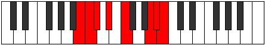 |
| [3167](https://ianring.com/musictheory/scales/3167) | [Thynyllic](ModeBNaturalThynyllic.md) | B | B, C, C#, D, D#, F, A, A#, B |  |
| [3191](https://ianring.com/musictheory/scales/3191) | [Bynyllic](ModeBNaturalBynyllic.md) | B | B, C, C#, D#, E, F, A, A#, B |  |
| [3199](https://ianring.com/musictheory/scales/3199) | [Thaptygic](ModeBNaturalThaptygic.md) | B | B, C, C#, D, D#, E, F, A, A#, B |  |
| [3245](https://ianring.com/musictheory/scales/3245) | [Aeracrian](ModeASharpAeracrian.md) | A# | A#, B#, C#, D#, E#, F###, G##, A# |  |
| [3245](https://ianring.com/musictheory/scales/3245) | [Aeracrian](ModeBFlatAeracrian.md) | Bb | Bb, C, Db, Eb, F, G#, A, Bb |  |
| [3247](https://ianring.com/musictheory/scales/3247) | [Aeolonyllic](ModeASharpAeolonyllic.md) | A# | A#, B, C, C#, D#, F, G#, A, A# |  |
| [3247](https://ianring.com/musictheory/scales/3247) | [Aeolonyllic](ModeBFlatAeolonyllic.md) | Bb | Bb, B, C, Db, Eb, F, Ab, A, Bb |  |
| [3261](https://ianring.com/musictheory/scales/3261) | [Dodyllic](ModeASharpDodyllic.md) | A# | A#, C, C#, D, D#, F, G#, A, A# |  |
| [3261](https://ianring.com/musictheory/scales/3261) | [Dodyllic](ModeBFlatDodyllic.md) | Bb | Bb, C, Db, D, Eb, F, Ab, A, Bb |  |
| [3263](https://ianring.com/musictheory/scales/3263) | [Pyrygic](ModeASharpPyrygic.md) | A# | A#, B, C, C#, D, D#, F, G#, A, A# |  |
| [3263](https://ianring.com/musictheory/scales/3263) | [Pyrygic](ModeBFlatPyrygic.md) | Bb | Bb, B, C, Db, D, Eb, F, Ab, A, Bb |  |
| [3287](https://ianring.com/musictheory/scales/3287) | [Phrathyllic](ModeBNaturalPhrathyllic.md) | B | B, C, C#, D#, F, F#, A, A#, B |  |
| [3295](https://ianring.com/musictheory/scales/3295) | [Phroptygic](ModeBNaturalPhroptygic.md) | B | B, C, C#, D, D#, F, F#, A, A#, B |  |
| [3309](https://ianring.com/musictheory/scales/3309) | [Bycryllic](ModeASharpBycryllic.md) | A# | A#, C, C#, D#, E, F, G#, A, A# |  |
| [3309](https://ianring.com/musictheory/scales/3309) | [Bycryllic](ModeBFlatBycryllic.md) | Bb | Bb, C, Db, Eb, E, F, Ab, A, Bb |  |
| [3311](https://ianring.com/musictheory/scales/3311) | [Mixodygic](ModeASharpMixodygic.md) | A# | A#, B, C, C#, D#, E, F, G#, A, A# |  |
| [3311](https://ianring.com/musictheory/scales/3311) | [Mixodygic](ModeBFlatMixodygic.md) | Bb | Bb, B, C, Db, Eb, E, F, Ab, A, Bb |  |
| [3319](https://ianring.com/musictheory/scales/3319) | [Tholygic](ModeBNaturalTholygic.md) | B | B, C, C#, D#, E, F, F#, A, A#, B |  |
| [3325](https://ianring.com/musictheory/scales/3325) | [Epygic](ModeASharpEpygic.md) | A# | A#, C, C#, D, D#, E, F, G#, A, A# |  |
| [3325](https://ianring.com/musictheory/scales/3325) | [Epygic](ModeBFlatEpygic.md) | Bb | Bb, C, Db, D, Eb, E, F, Ab, A, Bb |  |
| [3327](https://ianring.com/musictheory/scales/3327) | [Madyllian](ModeBNaturalMadyllian.md) | B | B, C, C#, D, D#, E, F, F#, A, A#, B |  |
| [3327](https://ianring.com/musictheory/scales/3327) | [Madyllian](ModeASharpMadyllian.md) | A# | A#, B, C, C#, D, D#, E, F, G#, A, A# |  |
| [3327](https://ianring.com/musictheory/scales/3327) | [Madyllian](ModeBFlatMadyllian.md) | Bb | Bb, B, C, Db, D, Eb, E, F, Ab, A, Bb |  |
| [3415](https://ianring.com/musictheory/scales/3415) | [Ionaptyllic](ModeBNaturalIonaptyllic.md) | B | B, C, C#, D#, F, G, A, A#, B |  |
| [3419](https://ianring.com/musictheory/scales/3419) | [Danyllic](ModeANaturalDanyllic.md) | A | A, A#, C, C#, D#, F, G, G#, A |  |
| [3423](https://ianring.com/musictheory/scales/3423) | [Lothygic](ModeBNaturalLothygic.md) | B | B, C, C#, D, D#, F, G, A, A#, B |  |
| [3423](https://ianring.com/musictheory/scales/3423) | [Lothygic](ModeANaturalLothygic.md) | A | A, A#, B, C, C#, D#, F, G, G#, A |  |
| [3437](https://ianring.com/musictheory/scales/3437) | [Gathyllic](ModeGNaturalGathyllic.md) | G | G, A, A#, C, C#, D#, F, F#, G |  |
| [3439](https://ianring.com/musictheory/scales/3439) | [Lythygic](ModeGNaturalLythygic.md) | G | G, G#, A, A#, C, C#, D#, F, F#, G |  |
| [3447](https://ianring.com/musictheory/scales/3447) | [Kynygic](ModeBNaturalKynygic.md) | B | B, C, C#, D#, E, F, G, A, A#, B |  |
| [3451](https://ianring.com/musictheory/scales/3451) | [Garygic](ModeANaturalGarygic.md) | A | A, A#, C, C#, D, D#, F, G, G#, A |  |
| [3453](https://ianring.com/musictheory/scales/3453) | [Katarygic](ModeGNaturalKatarygic.md) | G | G, A, A#, B, C, C#, D#, F, F#, G |  |
| [3455](https://ianring.com/musictheory/scales/3455) | [Ryptyllian](ModeBNaturalRyptyllian.md) | B | B, C, C#, D, D#, E, F, G, A, A#, B |  |
| [3455](https://ianring.com/musictheory/scales/3455) | [Ryptyllian](ModeANaturalRyptyllian.md) | A | A, A#, B, C, C#, D, D#, F, G, G#, A |  |
| [3455](https://ianring.com/musictheory/scales/3455) | [Ryptyllian](ModeGNaturalRyptyllian.md) | G | G, G#, A, A#, B, C, C#, D#, F, F#, G |  |
| [3467](https://ianring.com/musictheory/scales/3467) | [Katonian](ModeDNaturalKatonian.md) | D | D, Eb, F, G##, A#, B#, C#, D |  |
| [3471](https://ianring.com/musictheory/scales/3471) | [Gyryllic](ModeDNaturalGyryllic.md) | D | D, D#, E, F, A, A#, C, C#, D |  |
| [3483](https://ianring.com/musictheory/scales/3483) | [Mixotharyllic](ModeDNaturalMixotharyllic.md) | D | D, D#, F, F#, A, A#, C, C#, D |  |
| [3487](https://ianring.com/musictheory/scales/3487) | [Byptygic](ModeDNaturalByptygic.md) | D | D, D#, E, F, F#, A, A#, C, C#, D |  |
| [3499](https://ianring.com/musictheory/scales/3499) | [Lythyllic](ModeDNaturalLythyllic.md) | D | D, D#, F, G, A, A#, C, C#, D |  |
| [3501](https://ianring.com/musictheory/scales/3501) | [Katodyllic](ModeASharpKatodyllic.md) | A# | A#, C, C#, D#, F, F#, G#, A, A# |  |
| [3501](https://ianring.com/musictheory/scales/3501) | [Katodyllic](ModeBFlatKatodyllic.md) | Bb | Bb, C, Db, Eb, F, Gb, Ab, A, Bb |  |
| [3503](https://ianring.com/musictheory/scales/3503) | [Zyphygic](ModeDNaturalZyphygic.md) | D | D, D#, E, F, G, A, A#, C, C#, D |  |
| [3503](https://ianring.com/musictheory/scales/3503) | [Zyphygic](ModeASharpZyphygic.md) | A# | A#, B, C, C#, D#, F, F#, G#, A, A# |  |
| [3503](https://ianring.com/musictheory/scales/3503) | [Zyphygic](ModeBFlatZyphygic.md) | Bb | Bb, B, C, Db, Eb, F, Gb, Ab, A, Bb |  |
| [3505](https://ianring.com/musictheory/scales/3505) | [Stygian](ModeFNaturalStygian.md) | F | F, G##, A#, B#, C#, D#, E, F | 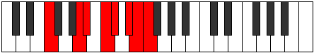 |
| [3507](https://ianring.com/musictheory/scales/3507) | [Ponyllic](ModeFNaturalPonyllic.md) | F | F, F#, A, A#, C, C#, D#, E, F |  |
| [3509](https://ianring.com/musictheory/scales/3509) | [Stogyllic](ModeFNaturalStogyllic.md) | F | F, G, A, A#, C, C#, D#, E, F |  |
| [3511](https://ianring.com/musictheory/scales/3511) | [Epolygic](ModeFNaturalEpolygic.md) | F | F, F#, G, A, A#, C, C#, D#, E, F |  |
| [3513](https://ianring.com/musictheory/scales/3513) | [Dydyllic](ModeFNaturalDydyllic.md) | F | F, G#, A, A#, C, C#, D#, E, F |  |
| [3515](https://ianring.com/musictheory/scales/3515) | [Katodygic](ModeDNaturalKatodygic.md) | D | D, D#, F, F#, G, A, A#, C, C#, D |  |
| [3515](https://ianring.com/musictheory/scales/3515) | [Katodygic](ModeFNaturalKatodygic.md) | F | F, F#, G#, A, A#, C, C#, D#, E, F |  |
| [3517](https://ianring.com/musictheory/scales/3517) | [Epocrygic](ModeASharpEpocrygic.md) | A# | A#, C, C#, D, D#, F, F#, G#, A, A# |  |
| [3517](https://ianring.com/musictheory/scales/3517) | [Epocrygic](ModeBFlatEpocrygic.md) | Bb | Bb, C, Db, D, Eb, F, Gb, Ab, A, Bb |  |
| [3517](https://ianring.com/musictheory/scales/3517) | [Epocrygic](ModeFNaturalEpocrygic.md) | F | F, G, G#, A, A#, C, C#, D#, E, F |  |
| [3519](https://ianring.com/musictheory/scales/3519) | [Boptyllian](ModeDNaturalBoptyllian.md) | D | D, D#, E, F, F#, G, A, A#, C, C#, D |  |
| [3519](https://ianring.com/musictheory/scales/3519) | [Boptyllian](ModeFNaturalBoptyllian.md) | F | F, F#, G, G#, A, A#, C, C#, D#, E, F |  |
| [3519](https://ianring.com/musictheory/scales/3519) | [Boptyllian](ModeASharpBoptyllian.md) | A# | A#, B, C, C#, D, D#, F, F#, G#, A, A# |  |
| [3519](https://ianring.com/musictheory/scales/3519) | [Boptyllian](ModeBFlatBoptyllian.md) | Bb | Bb, B, C, Db, D, Eb, F, Gb, Ab, A, Bb |  |
| [3531](https://ianring.com/musictheory/scales/3531) | [Dycryllic](ModeDNaturalDycryllic.md) | D | D, D#, F, G#, A, A#, C, C#, D |  |
| [3535](https://ianring.com/musictheory/scales/3535) | [Aeroptygic](ModeDNaturalAeroptygic.md) | D | D, D#, E, F, G#, A, A#, C, C#, D |  |
| [3543](https://ianring.com/musictheory/scales/3543) | [Aeolonygic](ModeBNaturalAeolonygic.md) | B | B, C, C#, D#, F, F#, G, A, A#, B |  |
| [3547](https://ianring.com/musictheory/scales/3547) | [Sadygic](ModeDNaturalSadygic.md) | D | D, D#, F, F#, G#, A, A#, C, C#, D |  |
| [3547](https://ianring.com/musictheory/scales/3547) | [Sadygic](ModeANaturalSadygic.md) | A | A, A#, C, C#, D#, E, F, G, G#, A |  |
| [3551](https://ianring.com/musictheory/scales/3551) | [Sagyllian](ModeDNaturalSagyllian.md) | D | D, D#, E, F, F#, G#, A, A#, C, C#, D |  |
| [3551](https://ianring.com/musictheory/scales/3551) | [Sagyllian](ModeBNaturalSagyllian.md) | B | B, C, C#, D, D#, F, F#, G, A, A#, B |  |
| [3551](https://ianring.com/musictheory/scales/3551) | [Sagyllian](ModeANaturalSagyllian.md) | A | A, A#, B, C, C#, D#, E, F, G, G#, A |  |
| [3563](https://ianring.com/musictheory/scales/3563) | [Ionoptygic](ModeDNaturalIonoptygic.md) | D | D, D#, F, G, G#, A, A#, C, C#, D |  |
| [3565](https://ianring.com/musictheory/scales/3565) | [Aeolorygic](ModeGNaturalAeolorygic.md) | G | G, A, A#, C, C#, D, D#, F, F#, G |  |
| [3565](https://ianring.com/musictheory/scales/3565) | [Aeolorygic](ModeASharpAeolorygic.md) | A# | A#, C, C#, D#, E, F, F#, G#, A, A# |  |
| [3565](https://ianring.com/musictheory/scales/3565) | [Aeolorygic](ModeBFlatAeolorygic.md) | Bb | Bb, C, Db, Eb, E, F, Gb, Ab, A, Bb |  |
| [3567](https://ianring.com/musictheory/scales/3567) | [Epityllian](ModeDNaturalEpityllian.md) | D | D, D#, E, F, G, G#, A, A#, C, C#, D |  |
| [3567](https://ianring.com/musictheory/scales/3567) | [Epityllian](ModeGNaturalEpityllian.md) | G | G, G#, A, A#, C, C#, D, D#, F, F#, G |  |
| [3567](https://ianring.com/musictheory/scales/3567) | [Epityllian](ModeASharpEpityllian.md) | A# | A#, B, C, C#, D#, E, F, F#, G#, A, A# |  |
| [3567](https://ianring.com/musictheory/scales/3567) | [Epityllian](ModeBFlatEpityllian.md) | Bb | Bb, B, C, Db, Eb, E, F, Gb, Ab, A, Bb |  |
| [3569](https://ianring.com/musictheory/scales/3569) | [Aeoladyllic](ModeFNaturalAeoladyllic.md) | F | F, A, A#, B, C, C#, D#, E, F |  |
| [3571](https://ianring.com/musictheory/scales/3571) | [Dyrygic](ModeFNaturalDyrygic.md) | F | F, F#, A, A#, B, C, C#, D#, E, F |  |
| [3573](https://ianring.com/musictheory/scales/3573) | [Kaptygic](ModeFNaturalKaptygic.md) | F | F, G, A, A#, B, C, C#, D#, E, F |  |
| [3575](https://ianring.com/musictheory/scales/3575) | [Mogyllian](ModeFNaturalMogyllian.md) | F | F, F#, G, A, A#, B, C, C#, D#, E, F |  |
| [3575](https://ianring.com/musictheory/scales/3575) | [Mogyllian](ModeBNaturalMogyllian.md) | B | B, C, C#, D#, E, F, F#, G, A, A#, B |  |
| [3577](https://ianring.com/musictheory/scales/3577) | [Loptygic](ModeFNaturalLoptygic.md) | F | F, G#, A, A#, B, C, C#, D#, E, F |  |
| [3579](https://ianring.com/musictheory/scales/3579) | [Zyphyllian](ModeANaturalZyphyllian.md) | A | A, A#, C, C#, D, D#, E, F, G, G#, A |  |
| [3579](https://ianring.com/musictheory/scales/3579) | [Zyphyllian](ModeDNaturalZyphyllian.md) | D | D, D#, F, F#, G, G#, A, A#, C, C#, D |  |
| [3579](https://ianring.com/musictheory/scales/3579) | [Zyphyllian](ModeFNaturalZyphyllian.md) | F | F, F#, G#, A, A#, B, C, C#, D#, E, F |  |
| [3581](https://ianring.com/musictheory/scales/3581) | [Epocryllian](ModeASharpEpocryllian.md) | A# | A#, C, C#, D, D#, E, F, F#, G#, A, A# |  |
| [3581](https://ianring.com/musictheory/scales/3581) | [Epocryllian](ModeBFlatEpocryllian.md) | Bb | Bb, C, Db, D, Eb, E, F, Gb, Ab, A, Bb |  |
| [3581](https://ianring.com/musictheory/scales/3581) | [Epocryllian](ModeGNaturalEpocryllian.md) | G | G, A, A#, B, C, C#, D, D#, F, F#, G |  |
| [3581](https://ianring.com/musictheory/scales/3581) | [Epocryllian](ModeFNaturalEpocryllian.md) | F | F, G, G#, A, A#, B, C, C#, D#, E, F |  |
| [3583](https://ianring.com/musictheory/scales/3583) | [Zylatic](ModeDNaturalZylatic.md) | D | D, D#, E, F, F#, G, G#, A, A#, C, C#, D |  |
| [3583](https://ianring.com/musictheory/scales/3583) | [Zylatic](ModeBNaturalZylatic.md) | B | B, C, C#, D, D#, E, F, F#, G, A, A#, B |  |
| [3583](https://ianring.com/musictheory/scales/3583) | [Zylatic](ModeASharpZylatic.md) | A# | A#, B, C, C#, D, D#, E, F, F#, G#, A, A# |  |
| [3583](https://ianring.com/musictheory/scales/3583) | [Zylatic](ModeBFlatZylatic.md) | Bb | Bb, B, C, Db, D, Eb, E, F, Gb, Ab, A, Bb |  |
| [3583](https://ianring.com/musictheory/scales/3583) | [Zylatic](ModeANaturalZylatic.md) | A | A, A#, B, C, C#, D, D#, E, F, G, G#, A |  |
| [3583](https://ianring.com/musictheory/scales/3583) | [Zylatic](ModeGNaturalZylatic.md) | G | G, G#, A, A#, B, C, C#, D, D#, F, F#, G |  |
| [3583](https://ianring.com/musictheory/scales/3583) | [Zylatic](ModeFNaturalZylatic.md) | F | F, F#, G, G#, A, A#, B, C, C#, D#, E, F |  |
| [3627](https://ianring.com/musictheory/scales/3627) | [Kalian](ModeCNaturalKalian.md) | C | C, Db, Eb, F, G##, A#, B, C |  |
| [3631](https://ianring.com/musictheory/scales/3631) | [Gydyllic](ModeCNaturalGydyllic.md) | C | C, C#, D, D#, F, A, A#, B, C |  |
| [3643](https://ianring.com/musictheory/scales/3643) | [Kydyllic](ModeCNaturalKydyllic.md) | C | C, C#, D#, E, F, A, A#, B, C |  |
| [3647](https://ianring.com/musictheory/scales/3647) | [Eporygic](ModeCNaturalEporygic.md) | C | C, C#, D, D#, E, F, A, A#, B, C |  |
| [3671](https://ianring.com/musictheory/scales/3671) | [Aeonyllic](ModeBNaturalAeonyllic.md) | B | B, C, C#, D#, F, G#, A, A#, B |  |
| [3679](https://ianring.com/musictheory/scales/3679) | [Rycrygic](ModeBNaturalRycrygic.md) | B | B, C, C#, D, D#, F, G#, A, A#, B |  |
| [3691](https://ianring.com/musictheory/scales/3691) | [Badyllic](ModeCNaturalBadyllic.md) | C | C, C#, D#, F, F#, A, A#, B, C |  |
| [3695](https://ianring.com/musictheory/scales/3695) | [Kodygic](ModeCNaturalKodygic.md) | C | C, C#, D, D#, F, F#, A, A#, B, C |  |
| [3703](https://ianring.com/musictheory/scales/3703) | [Katalygic](ModeBNaturalKatalygic.md) | B | B, C, C#, D#, E, F, G#, A, A#, B |  |
| [3707](https://ianring.com/musictheory/scales/3707) | [Rynygic](ModeCNaturalRynygic.md) | C | C, C#, D#, E, F, F#, A, A#, B, C |  |
| [3711](https://ianring.com/musictheory/scales/3711) | [Dycryllian](ModeCNaturalDycryllian.md) | C | C, C#, D, D#, E, F, F#, A, A#, B, C |  |
| [3711](https://ianring.com/musictheory/scales/3711) | [Dycryllian](ModeBNaturalDycryllian.md) | B | B, C, C#, D, D#, E, F, G#, A, A#, B |  |
| [3755](https://ianring.com/musictheory/scales/3755) | [Phryryllic](ModeCNaturalPhryryllic.md) | C | C, C#, D#, F, G, A, A#, B, C |  |
| [3757](https://ianring.com/musictheory/scales/3757) | [Goptyllic](ModeASharpGoptyllic.md) | A# | A#, C, C#, D#, F, G, G#, A, A# |  |
| [3757](https://ianring.com/musictheory/scales/3757) | [Goptyllic](ModeBFlatGoptyllic.md) | Bb | Bb, C, Db, Eb, F, G, Ab, A, Bb |  |
| [3759](https://ianring.com/musictheory/scales/3759) | [Darygic](ModeCNaturalDarygic.md) | C | C, C#, D, D#, F, G, A, A#, B, C |  |
| [3759](https://ianring.com/musictheory/scales/3759) | [Darygic](ModeASharpDarygic.md) | A# | A#, B, C, C#, D#, F, G, G#, A, A# |  |
| [3759](https://ianring.com/musictheory/scales/3759) | [Darygic](ModeBFlatDarygic.md) | Bb | Bb, B, C, Db, Eb, F, G, Ab, A, Bb |  |
| [3767](https://ianring.com/musictheory/scales/3767) | [Bacrygic](ModeGSharpBacrygic.md) | G# | G#, A, A#, C, C#, D#, F, F#, G, G# |  |
| [3767](https://ianring.com/musictheory/scales/3767) | [Bacrygic](ModeAFlatBacrygic.md) | Ab | Ab, A, Bb, C, Db, Eb, F, Gb, G, Ab |  |
| [3771](https://ianring.com/musictheory/scales/3771) | [Stophygic](ModeCNaturalStophygic.md) | C | C, C#, D#, E, F, G, A, A#, B, C |  |
| [3773](https://ianring.com/musictheory/scales/3773) | [Sorygic](ModeASharpSorygic.md) | A# | A#, C, C#, D, D#, F, G, G#, A, A# |  |
| [3773](https://ianring.com/musictheory/scales/3773) | [Sorygic](ModeBFlatSorygic.md) | Bb | Bb, C, Db, D, Eb, F, G, Ab, A, Bb |  |
| [3775](https://ianring.com/musictheory/scales/3775) | [Loptyllian](ModeCNaturalLoptyllian.md) | C | C, C#, D, D#, E, F, G, A, A#, B, C |  |
| [3775](https://ianring.com/musictheory/scales/3775) | [Loptyllian](ModeASharpLoptyllian.md) | A# | A#, B, C, C#, D, D#, F, G, G#, A, A# |  |
| [3775](https://ianring.com/musictheory/scales/3775) | [Loptyllian](ModeBFlatLoptyllian.md) | Bb | Bb, B, C, Db, D, Eb, F, G, Ab, A, Bb |  |
| [3775](https://ianring.com/musictheory/scales/3775) | [Loptyllian](ModeGSharpLoptyllian.md) | G# | G#, A, A#, B, C, C#, D#, F, F#, G, G# |  |
| [3775](https://ianring.com/musictheory/scales/3775) | [Loptyllian](ModeAFlatLoptyllian.md) | Ab | Ab, A, Bb, B, C, Db, Eb, F, Gb, G, Ab |  |
| [3781](https://ianring.com/musictheory/scales/3781) | [Gyphian](ModeDSharpGyphian.md) | D# | D#, E#, Cbbb, Cbb, Dbb, Ebbb, Fbbb, D# |  |
| [3781](https://ianring.com/musictheory/scales/3781) | [Gyphian](ModeEFlatGyphian.md) | Eb | Eb, F, G##, A#, B#, C#, D, Eb |  |
| [3783](https://ianring.com/musictheory/scales/3783) | [Phrygyllic](ModeDSharpPhrygyllic.md) | D# | D#, E, F, A, A#, C, C#, D, D# |  |
| [3783](https://ianring.com/musictheory/scales/3783) | [Phrygyllic](ModeEFlatPhrygyllic.md) | Eb | Eb, E, F, A, Bb, C, Db, D, Eb |  |
| [3789](https://ianring.com/musictheory/scales/3789) | [Eporyllic](ModeDSharpEporyllic.md) | D# | D#, F, F#, A, A#, C, C#, D, D# |  |
| [3789](https://ianring.com/musictheory/scales/3789) | [Eporyllic](ModeEFlatEporyllic.md) | Eb | Eb, F, Gb, A, Bb, C, Db, D, Eb |  |
| [3791](https://ianring.com/musictheory/scales/3791) | [Stodygic](ModeDSharpStodygic.md) | D# | D#, E, F, F#, A, A#, C, C#, D, D# |  |
| [3791](https://ianring.com/musictheory/scales/3791) | [Stodygic](ModeEFlatStodygic.md) | Eb | Eb, E, F, Gb, A, Bb, C, Db, D, Eb |  |
| [3797](https://ianring.com/musictheory/scales/3797) | [Rocryllic](ModeDSharpRocryllic.md) | D# | D#, F, G, A, A#, C, C#, D, D# |  |
| [3797](https://ianring.com/musictheory/scales/3797) | [Rocryllic](ModeEFlatRocryllic.md) | Eb | Eb, F, G, A, Bb, C, Db, D, Eb |  |
| [3799](https://ianring.com/musictheory/scales/3799) | [Aeralygic](ModeDSharpAeralygic.md) | D# | D#, E, F, G, A, A#, C, C#, D, D# |  |
| [3799](https://ianring.com/musictheory/scales/3799) | [Aeralygic](ModeEFlatAeralygic.md) | Eb | Eb, E, F, G, A, Bb, C, Db, D, Eb |  |
| [3799](https://ianring.com/musictheory/scales/3799) | [Aeralygic](ModeBNaturalAeralygic.md) | B | B, C, C#, D#, F, F#, G#, A, A#, B |  |
| [3801](https://ianring.com/musictheory/scales/3801) | [Maptyllic](ModeFSharpMaptyllic.md) | F# | F#, A, A#, C, C#, D#, E, F, F# |  |
| [3801](https://ianring.com/musictheory/scales/3801) | [Maptyllic](ModeGFlatMaptyllic.md) | Gb | Gb, A, Bb, C, Db, Eb, E, F, Gb |  |
| [3803](https://ianring.com/musictheory/scales/3803) | [Epidygic](ModeFSharpEpidygic.md) | F# | F#, G, A, A#, C, C#, D#, E, F, F# |  |
| [3803](https://ianring.com/musictheory/scales/3803) | [Epidygic](ModeGFlatEpidygic.md) | Gb | Gb, G, A, Bb, C, Db, Eb, E, F, Gb |  |
| [3805](https://ianring.com/musictheory/scales/3805) | [Moptygic](ModeDSharpMoptygic.md) | D# | D#, F, F#, G, A, A#, C, C#, D, D# |  |
| [3805](https://ianring.com/musictheory/scales/3805) | [Moptygic](ModeEFlatMoptygic.md) | Eb | Eb, F, Gb, G, A, Bb, C, Db, D, Eb |  |
| [3805](https://ianring.com/musictheory/scales/3805) | [Moptygic](ModeFSharpMoptygic.md) | F# | F#, G#, A, A#, C, C#, D#, E, F, F# |  |
| [3805](https://ianring.com/musictheory/scales/3805) | [Moptygic](ModeGFlatMoptygic.md) | Gb | Gb, Ab, A, Bb, C, Db, Eb, E, F, Gb |  |
| [3807](https://ianring.com/musictheory/scales/3807) | [Bagyllian](ModeDSharpBagyllian.md) | D# | D#, E, F, F#, G, A, A#, C, C#, D, D# |  |
| [3807](https://ianring.com/musictheory/scales/3807) | [Bagyllian](ModeEFlatBagyllian.md) | Eb | Eb, E, F, Gb, G, A, Bb, C, Db, D, Eb |  |
| [3807](https://ianring.com/musictheory/scales/3807) | [Bagyllian](ModeFSharpBagyllian.md) | F# | F#, G, G#, A, A#, C, C#, D#, E, F, F# |  |
| [3807](https://ianring.com/musictheory/scales/3807) | [Bagyllian](ModeGFlatBagyllian.md) | Gb | Gb, G, Ab, A, Bb, C, Db, Eb, E, F, Gb |  |
| [3807](https://ianring.com/musictheory/scales/3807) | [Bagyllian](ModeBNaturalBagyllian.md) | B | B, C, C#, D, D#, F, F#, G#, A, A#, B |  |
| [3813](https://ianring.com/musictheory/scales/3813) | [Aeologyllic](ModeDSharpAeologyllic.md) | D# | D#, F, G#, A, A#, C, C#, D, D# |  |
| [3813](https://ianring.com/musictheory/scales/3813) | [Aeologyllic](ModeEFlatAeologyllic.md) | Eb | Eb, F, Ab, A, Bb, C, Db, D, Eb |  |
| [3815](https://ianring.com/musictheory/scales/3815) | [Mylygic](ModeDSharpMylygic.md) | D# | D#, E, F, G#, A, A#, C, C#, D, D# |  |
| [3815](https://ianring.com/musictheory/scales/3815) | [Mylygic](ModeEFlatMylygic.md) | Eb | Eb, E, F, Ab, A, Bb, C, Db, D, Eb |  |
| [3819](https://ianring.com/musictheory/scales/3819) | [Aeolanygic](ModeCNaturalAeolanygic.md) | C | C, C#, D#, F, F#, G, A, A#, B, C |  |
| [3821](https://ianring.com/musictheory/scales/3821) | [Epyrygic](ModeDSharpEpyrygic.md) | D# | D#, F, F#, G#, A, A#, C, C#, D, D# |  |
| [3821](https://ianring.com/musictheory/scales/3821) | [Epyrygic](ModeEFlatEpyrygic.md) | Eb | Eb, F, Gb, Ab, A, Bb, C, Db, D, Eb |  |
| [3821](https://ianring.com/musictheory/scales/3821) | [Epyrygic](ModeASharpEpyrygic.md) | A# | A#, C, C#, D#, E, F, G, G#, A, A# |  |
| [3821](https://ianring.com/musictheory/scales/3821) | [Epyrygic](ModeBFlatEpyrygic.md) | Bb | Bb, C, Db, Eb, E, F, G, Ab, A, Bb |  |
| [3823](https://ianring.com/musictheory/scales/3823) | [Epinyllian](ModeDSharpEpinyllian.md) | D# | D#, E, F, F#, G#, A, A#, C, C#, D, D# |  |
| [3823](https://ianring.com/musictheory/scales/3823) | [Epinyllian](ModeEFlatEpinyllian.md) | Eb | Eb, E, F, Gb, Ab, A, Bb, C, Db, D, Eb | 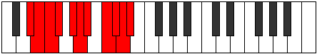 |
| [3823](https://ianring.com/musictheory/scales/3823) | [Epinyllian](ModeCNaturalEpinyllian.md) | C | C, C#, D, D#, F, F#, G, A, A#, B, C |  |
| [3823](https://ianring.com/musictheory/scales/3823) | [Epinyllian](ModeASharpEpinyllian.md) | A# | A#, B, C, C#, D#, E, F, G, G#, A, A# |  |
| [3823](https://ianring.com/musictheory/scales/3823) | [Epinyllian](ModeBFlatEpinyllian.md) | Bb | Bb, B, C, Db, Eb, E, F, G, Ab, A, Bb |  |
| [3829](https://ianring.com/musictheory/scales/3829) | [Aerycrygic](ModeDSharpAerycrygic.md) | D# | D#, F, G, G#, A, A#, C, C#, D, D# |  |
| [3829](https://ianring.com/musictheory/scales/3829) | [Aerycrygic](ModeEFlatAerycrygic.md) | Eb | Eb, F, G, Ab, A, Bb, C, Db, D, Eb |  |
| [3831](https://ianring.com/musictheory/scales/3831) | [Ionyllian](ModeDSharpIonyllian.md) | D# | D#, E, F, G, G#, A, A#, C, C#, D, D# |  |
| [3831](https://ianring.com/musictheory/scales/3831) | [Ionyllian](ModeEFlatIonyllian.md) | Eb | Eb, E, F, G, Ab, A, Bb, C, Db, D, Eb |  |
| [3831](https://ianring.com/musictheory/scales/3831) | [Ionyllian](ModeGSharpIonyllian.md) | G# | G#, A, A#, C, C#, D, D#, F, F#, G, G# |  |
| [3831](https://ianring.com/musictheory/scales/3831) | [Ionyllian](ModeAFlatIonyllian.md) | Ab | Ab, A, Bb, C, Db, D, Eb, F, Gb, G, Ab |  |
| [3831](https://ianring.com/musictheory/scales/3831) | [Ionyllian](ModeBNaturalIonyllian.md) | B | B, C, C#, D#, E, F, F#, G#, A, A#, B |  |
| [3833](https://ianring.com/musictheory/scales/3833) | [Dycrygic](ModeFSharpDycrygic.md) | F# | F#, A, A#, B, C, C#, D#, E, F, F# |  |
| [3833](https://ianring.com/musictheory/scales/3833) | [Dycrygic](ModeGFlatDycrygic.md) | Gb | Gb, A, Bb, B, C, Db, Eb, E, F, Gb |  |
| [3835](https://ianring.com/musictheory/scales/3835) | [Katodyllian](ModeCNaturalKatodyllian.md) | C | C, C#, D#, E, F, F#, G, A, A#, B, C |  |
| [3835](https://ianring.com/musictheory/scales/3835) | [Katodyllian](ModeFSharpKatodyllian.md) | F# | F#, G, A, A#, B, C, C#, D#, E, F, F# |  |
| [3835](https://ianring.com/musictheory/scales/3835) | [Katodyllian](ModeGFlatKatodyllian.md) | Gb | Gb, G, A, Bb, B, C, Db, Eb, E, F, Gb |  |
| [3837](https://ianring.com/musictheory/scales/3837) | [Garyllian](ModeASharpGaryllian.md) | A# | A#, C, C#, D, D#, E, F, G, G#, A, A# |  |
| [3837](https://ianring.com/musictheory/scales/3837) | [Garyllian](ModeBFlatGaryllian.md) | Bb | Bb, C, Db, D, Eb, E, F, G, Ab, A, Bb |  |
| [3837](https://ianring.com/musictheory/scales/3837) | [Garyllian](ModeDSharpGaryllian.md) | D# | D#, F, F#, G, G#, A, A#, C, C#, D, D# |  |
| [3837](https://ianring.com/musictheory/scales/3837) | [Garyllian](ModeEFlatGaryllian.md) | Eb | Eb, F, Gb, G, Ab, A, Bb, C, Db, D, Eb |  |
| [3837](https://ianring.com/musictheory/scales/3837) | [Garyllian](ModeFSharpGaryllian.md) | F# | F#, G#, A, A#, B, C, C#, D#, E, F, F# |  |
| [3837](https://ianring.com/musictheory/scales/3837) | [Garyllian](ModeGFlatGaryllian.md) | Gb | Gb, Ab, A, Bb, B, C, Db, Eb, E, F, Gb |  |
| [3839](https://ianring.com/musictheory/scales/3839) | [Mixolatic](ModeDSharpMixolatic.md) | D# | D#, E, F, F#, G, G#, A, A#, C, C#, D, D# |  |
| [3839](https://ianring.com/musictheory/scales/3839) | [Mixolatic](ModeEFlatMixolatic.md) | Eb | Eb, E, F, Gb, G, Ab, A, Bb, C, Db, D, Eb |  |
| [3839](https://ianring.com/musictheory/scales/3839) | [Mixolatic](ModeCNaturalMixolatic.md) | C | C, C#, D, D#, E, F, F#, G, A, A#, B, C |  |
| [3839](https://ianring.com/musictheory/scales/3839) | [Mixolatic](ModeBNaturalMixolatic.md) | B | B, C, C#, D, D#, E, F, F#, G#, A, A#, B |  |
| [3839](https://ianring.com/musictheory/scales/3839) | [Mixolatic](ModeASharpMixolatic.md) | A# | A#, B, C, C#, D, D#, E, F, G, G#, A, A# |  |
| [3839](https://ianring.com/musictheory/scales/3839) | [Mixolatic](ModeBFlatMixolatic.md) | Bb | Bb, B, C, Db, D, Eb, E, F, G, Ab, A, Bb |  |
| [3839](https://ianring.com/musictheory/scales/3839) | [Mixolatic](ModeGSharpMixolatic.md) | G# | G#, A, A#, B, C, C#, D, D#, F, F#, G, G# |  |
| [3839](https://ianring.com/musictheory/scales/3839) | [Mixolatic](ModeAFlatMixolatic.md) | Ab | Ab, A, Bb, B, C, Db, D, Eb, F, Gb, G, Ab |  |
| [3839](https://ianring.com/musictheory/scales/3839) | [Mixolatic](ModeFSharpMixolatic.md) | F# | F#, G, G#, A, A#, B, C, C#, D#, E, F, F# |  |
| [3839](https://ianring.com/musictheory/scales/3839) | [Mixolatic](ModeGFlatMixolatic.md) | Gb | Gb, G, Ab, A, Bb, B, C, Db, Eb, E, F, Gb |  |
| [3861](https://ianring.com/musictheory/scales/3861) | [Phroptian](ModeCSharpPhroptian.md) | C# | C#, D#, E#, Cbbb, Cbb, Dbbb, Dbb, C# |  |
| [3861](https://ianring.com/musictheory/scales/3861) | [Phroptian](ModeDFlatPhroptian.md) | Db | Db, Eb, F, G##, A#, B, C, Db |  |
| [3863](https://ianring.com/musictheory/scales/3863) | [Eparyllic](ModeCSharpEparyllic.md) | C# | C#, D, D#, F, A, A#, B, C, C# |  |
| [3863](https://ianring.com/musictheory/scales/3863) | [Eparyllic](ModeDFlatEparyllic.md) | Db | Db, D, Eb, F, A, Bb, B, C, Db |  |
| [3869](https://ianring.com/musictheory/scales/3869) | [Bygyllic](ModeCSharpBygyllic.md) | C# | C#, D#, E, F, A, A#, B, C, C# |  |
| [3869](https://ianring.com/musictheory/scales/3869) | [Bygyllic](ModeDFlatBygyllic.md) | Db | Db, Eb, E, F, A, Bb, B, C, Db |  |
| [3871](https://ianring.com/musictheory/scales/3871) | [Aerynygic](ModeCSharpAerynygic.md) | C# | C#, D, D#, E, F, A, A#, B, C, C# |  |
| [3871](https://ianring.com/musictheory/scales/3871) | [Aerynygic](ModeDFlatAerynygic.md) | Db | Db, D, Eb, E, F, A, Bb, B, C, Db |  |
| [3883](https://ianring.com/musictheory/scales/3883) | [Kyryllic](ModeCNaturalKyryllic.md) | C | C, C#, D#, F, G#, A, A#, B, C |  |
| [3887](https://ianring.com/musictheory/scales/3887) | [Phrathygic](ModeCNaturalPhrathygic.md) | C | C, C#, D, D#, F, G#, A, A#, B, C |  |
| [3893](https://ianring.com/musictheory/scales/3893) | [Phrocryllic](ModeCSharpPhrocryllic.md) | C# | C#, D#, F, F#, A, A#, B, C, C# |  |
| [3893](https://ianring.com/musictheory/scales/3893) | [Phrocryllic](ModeDFlatPhrocryllic.md) | Db | Db, Eb, F, Gb, A, Bb, B, C, Db |  |
| [3895](https://ianring.com/musictheory/scales/3895) | [Eparygic](ModeCSharpEparygic.md) | C# | C#, D, D#, F, F#, A, A#, B, C, C# |  |
| [3895](https://ianring.com/musictheory/scales/3895) | [Eparygic](ModeDFlatEparygic.md) | Db | Db, D, Eb, F, Gb, A, Bb, B, C, Db |  |
| [3899](https://ianring.com/musictheory/scales/3899) | [Katorygic](ModeCNaturalKatorygic.md) | C | C, C#, D#, E, F, G#, A, A#, B, C |  |
| [3901](https://ianring.com/musictheory/scales/3901) | [Bycrygic](ModeCSharpBycrygic.md) | C# | C#, D#, E, F, F#, A, A#, B, C, C# |  |
| [3901](https://ianring.com/musictheory/scales/3901) | [Bycrygic](ModeDFlatBycrygic.md) | Db | Db, Eb, E, F, Gb, A, Bb, B, C, Db |  |
| [3903](https://ianring.com/musictheory/scales/3903) | [Aeogyllian](ModeCSharpAeogyllian.md) | C# | C#, D, D#, E, F, F#, A, A#, B, C, C# |  |
| [3903](https://ianring.com/musictheory/scales/3903) | [Aeogyllian](ModeDFlatAeogyllian.md) | Db | Db, D, Eb, E, F, Gb, A, Bb, B, C, Db |  |
| [3903](https://ianring.com/musictheory/scales/3903) | [Aeogyllian](ModeCNaturalAeogyllian.md) | C | C, C#, D, D#, E, F, G#, A, A#, B, C |  |
| [3925](https://ianring.com/musictheory/scales/3925) | [Thyryllic](ModeCSharpThyryllic.md) | C# | C#, D#, F, G, A, A#, B, C, C# |  |
| [3925](https://ianring.com/musictheory/scales/3925) | [Thyryllic](ModeDFlatThyryllic.md) | Db | Db, Eb, F, G, A, Bb, B, C, Db |  |
| [3927](https://ianring.com/musictheory/scales/3927) | [Monygic](ModeCSharpMonygic.md) | C# | C#, D, D#, F, G, A, A#, B, C, C# |  |
| [3927](https://ianring.com/musictheory/scales/3927) | [Monygic](ModeDFlatMonygic.md) | Db | Db, D, Eb, F, G, A, Bb, B, C, Db |  |
| [3927](https://ianring.com/musictheory/scales/3927) | [Monygic](ModeBNaturalMonygic.md) | B | B, C, C#, D#, F, G, G#, A, A#, B |  |
| [3931](https://ianring.com/musictheory/scales/3931) | [Aerygic](ModeANaturalAerygic.md) | A | A, A#, C, C#, D#, F, F#, G, G#, A |  |
| [3933](https://ianring.com/musictheory/scales/3933) | [Ionidygic](ModeCSharpIonidygic.md) | C# | C#, D#, E, F, G, A, A#, B, C, C# |  |
| [3933](https://ianring.com/musictheory/scales/3933) | [Ionidygic](ModeDFlatIonidygic.md) | Db | Db, Eb, E, F, G, A, Bb, B, C, Db |  |
| [3935](https://ianring.com/musictheory/scales/3935) | [Kataphyllian](ModeCSharpKataphyllian.md) | C# | C#, D, D#, E, F, G, A, A#, B, C, C# |  |
| [3935](https://ianring.com/musictheory/scales/3935) | [Kataphyllian](ModeDFlatKataphyllian.md) | Db | Db, D, Eb, E, F, G, A, Bb, B, C, Db |  |
| [3935](https://ianring.com/musictheory/scales/3935) | [Kataphyllian](ModeBNaturalKataphyllian.md) | B | B, C, C#, D, D#, F, G, G#, A, A#, B |  |
| [3935](https://ianring.com/musictheory/scales/3935) | [Kataphyllian](ModeANaturalKataphyllian.md) | A | A, A#, B, C, C#, D#, F, F#, G, G#, A |  |
| [3939](https://ianring.com/musictheory/scales/3939) | [Dogyllic](ModeENaturalDogyllic.md) | E | E, F, A, A#, C, C#, D, D#, E |  |
| [3943](https://ianring.com/musictheory/scales/3943) | [Zynygic](ModeENaturalZynygic.md) | E | E, F, F#, A, A#, C, C#, D, D#, E |  |
| [3947](https://ianring.com/musictheory/scales/3947) | [Ryptygic](ModeENaturalRyptygic.md) | E | E, F, G, A, A#, C, C#, D, D#, E |  |
| [3947](https://ianring.com/musictheory/scales/3947) | [Ryptygic](ModeCNaturalRyptygic.md) | C | C, C#, D#, F, F#, G#, A, A#, B, C |  |
| [3949](https://ianring.com/musictheory/scales/3949) | [Koptygic](ModeGNaturalKoptygic.md) | G | G, A, A#, C, C#, D#, E, F, F#, G |  |
| [3951](https://ianring.com/musictheory/scales/3951) | [Mathyllian](ModeENaturalMathyllian.md) | E | E, F, F#, G, A, A#, C, C#, D, D#, E |  |
| [3951](https://ianring.com/musictheory/scales/3951) | [Mathyllian](ModeGNaturalMathyllian.md) | G | G, G#, A, A#, C, C#, D#, E, F, F#, G | 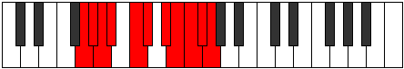 |
| [3951](https://ianring.com/musictheory/scales/3951) | [Mathyllian](ModeCNaturalMathyllian.md) | C | C, C#, D, D#, F, F#, G#, A, A#, B, C |  |
| [3955](https://ianring.com/musictheory/scales/3955) | [Galygic](ModeENaturalGalygic.md) | E | E, F, G#, A, A#, C, C#, D, D#, E |  |
| [3957](https://ianring.com/musictheory/scales/3957) | [Porygic](ModeCSharpPorygic.md) | C# | C#, D#, F, F#, G, A, A#, B, C, C# |  |
| [3957](https://ianring.com/musictheory/scales/3957) | [Porygic](ModeDFlatPorygic.md) | Db | Db, Eb, F, Gb, G, A, Bb, B, C, Db |  |
| [3959](https://ianring.com/musictheory/scales/3959) | [Katagyllian](ModeENaturalKatagyllian.md) | E | E, F, F#, G#, A, A#, C, C#, D, D#, E |  |
| [3959](https://ianring.com/musictheory/scales/3959) | [Katagyllian](ModeCSharpKatagyllian.md) | C# | C#, D, D#, F, F#, G, A, A#, B, C, C# |  |
| [3959](https://ianring.com/musictheory/scales/3959) | [Katagyllian](ModeDFlatKatagyllian.md) | Db | Db, D, Eb, F, Gb, G, A, Bb, B, C, Db |  |
| [3959](https://ianring.com/musictheory/scales/3959) | [Katagyllian](ModeBNaturalKatagyllian.md) | B | B, C, C#, D#, E, F, G, G#, A, A#, B |  |
| [3963](https://ianring.com/musictheory/scales/3963) | [Aeoryllian](ModeENaturalAeoryllian.md) | E | E, F, G, G#, A, A#, C, C#, D, D#, E |  |
| [3963](https://ianring.com/musictheory/scales/3963) | [Aeoryllian](ModeANaturalAeoryllian.md) | A | A, A#, C, C#, D, D#, F, F#, G, G#, A |  |
| [3963](https://ianring.com/musictheory/scales/3963) | [Aeoryllian](ModeCNaturalAeoryllian.md) | C | C, C#, D#, E, F, F#, G#, A, A#, B, C |  |
| [3965](https://ianring.com/musictheory/scales/3965) | [Thydyllian](ModeCSharpThydyllian.md) | C# | C#, D#, E, F, F#, G, A, A#, B, C, C# |  |
| [3965](https://ianring.com/musictheory/scales/3965) | [Thydyllian](ModeDFlatThydyllian.md) | Db | Db, Eb, E, F, Gb, G, A, Bb, B, C, Db |  |
| [3965](https://ianring.com/musictheory/scales/3965) | [Thydyllian](ModeGNaturalThydyllian.md) | G | G, A, A#, B, C, C#, D#, E, F, F#, G |  |
| [3967](https://ianring.com/musictheory/scales/3967) | [Soratic](ModeENaturalSoratic.md) | E | E, F, F#, G, G#, A, A#, C, C#, D, D#, E |  |
| [3967](https://ianring.com/musictheory/scales/3967) | [Soratic](ModeCSharpSoratic.md) | C# | C#, D, D#, E, F, F#, G, A, A#, B, C, C# |  |
| [3967](https://ianring.com/musictheory/scales/3967) | [Soratic](ModeDFlatSoratic.md) | Db | Db, D, Eb, E, F, Gb, G, A, Bb, B, C, Db |  |
| [3967](https://ianring.com/musictheory/scales/3967) | [Soratic](ModeCNaturalSoratic.md) | C | C, C#, D, D#, E, F, F#, G#, A, A#, B, C |  |
| [3967](https://ianring.com/musictheory/scales/3967) | [Soratic](ModeBNaturalSoratic.md) | B | B, C, C#, D, D#, E, F, G, G#, A, A#, B |  |
| [3967](https://ianring.com/musictheory/scales/3967) | [Soratic](ModeANaturalSoratic.md) | A | A, A#, B, C, C#, D, D#, F, F#, G, G#, A |  |
| [3967](https://ianring.com/musictheory/scales/3967) | [Soratic](ModeGNaturalSoratic.md) | G | G, G#, A, A#, B, C, C#, D#, E, F, F#, G |  |
| [3979](https://ianring.com/musictheory/scales/3979) | [Dynyllic](ModeDNaturalDynyllic.md) | D | D, D#, F, A, A#, B, C, C#, D |  |
| [3983](https://ianring.com/musictheory/scales/3983) | [Thyptygic](ModeDNaturalThyptygic.md) | D | D, D#, E, F, A, A#, B, C, C#, D | 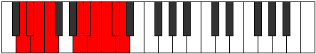 |
| [3989](https://ianring.com/musictheory/scales/3989) | [Sythyllic](ModeCSharpSythyllic.md) | C# | C#, D#, F, G#, A, A#, B, C, C# |  |
| [3989](https://ianring.com/musictheory/scales/3989) | [Sythyllic](ModeDFlatSythyllic.md) | Db | Db, Eb, F, Ab, A, Bb, B, C, Db |  |
| [3991](https://ianring.com/musictheory/scales/3991) | [Badygic](ModeCSharpBadygic.md) | C# | C#, D, D#, F, G#, A, A#, B, C, C# |  |
| [3991](https://ianring.com/musictheory/scales/3991) | [Badygic](ModeDFlatBadygic.md) | Db | Db, D, Eb, F, Ab, A, Bb, B, C, Db |  |
| [3995](https://ianring.com/musictheory/scales/3995) | [Ionygic](ModeDNaturalIonygic.md) | D | D, D#, F, F#, A, A#, B, C, C#, D |  |
| [3997](https://ianring.com/musictheory/scales/3997) | [Dogygic](ModeCSharpDogygic.md) | C# | C#, D#, E, F, G#, A, A#, B, C, C# |  |
| [3997](https://ianring.com/musictheory/scales/3997) | [Dogygic](ModeDFlatDogygic.md) | Db | Db, Eb, E, F, Ab, A, Bb, B, C, Db |  |
| [3999](https://ianring.com/musictheory/scales/3999) | [Dydyllian](ModeDNaturalDydyllian.md) | D | D, D#, E, F, F#, A, A#, B, C, C#, D |  |
| [3999](https://ianring.com/musictheory/scales/3999) | [Dydyllian](ModeCSharpDydyllian.md) | C# | C#, D, D#, E, F, G#, A, A#, B, C, C# |  |
| [3999](https://ianring.com/musictheory/scales/3999) | [Dydyllian](ModeDFlatDydyllian.md) | Db | Db, D, Eb, E, F, Ab, A, Bb, B, C, Db |  |
| [4011](https://ianring.com/musictheory/scales/4011) | [Styrygic](ModeDNaturalStyrygic.md) | D | D, D#, F, G, A, A#, B, C, C#, D |  |
| [4011](https://ianring.com/musictheory/scales/4011) | [Styrygic](ModeCNaturalStyrygic.md) | C | C, C#, D#, F, G, G#, A, A#, B, C |  |
| [4013](https://ianring.com/musictheory/scales/4013) | [Dathygic](ModeASharpDathygic.md) | A# | A#, C, C#, D#, F, F#, G, G#, A, A# |  |
| [4013](https://ianring.com/musictheory/scales/4013) | [Dathygic](ModeBFlatDathygic.md) | Bb | Bb, C, Db, Eb, F, Gb, G, Ab, A, Bb |  |
| [4015](https://ianring.com/musictheory/scales/4015) | [Phradyllian](ModeDNaturalPhradyllian.md) | D | D, D#, E, F, G, A, A#, B, C, C#, D |  |
| [4015](https://ianring.com/musictheory/scales/4015) | [Phradyllian](ModeCNaturalPhradyllian.md) | C | C, C#, D, D#, F, G, G#, A, A#, B, C |  |
| [4015](https://ianring.com/musictheory/scales/4015) | [Phradyllian](ModeASharpPhradyllian.md) | A# | A#, B, C, C#, D#, F, F#, G, G#, A, A# |  |
| [4015](https://ianring.com/musictheory/scales/4015) | [Phradyllian](ModeBFlatPhradyllian.md) | Bb | Bb, B, C, Db, Eb, F, Gb, G, Ab, A, Bb |  |
| [4017](https://ianring.com/musictheory/scales/4017) | [Dolyllic](ModeFNaturalDolyllic.md) | F | F, A, A#, C, C#, D, D#, E, F |  |
| [4019](https://ianring.com/musictheory/scales/4019) | [Lonygic](ModeFNaturalLonygic.md) | F | F, F#, A, A#, C, C#, D, D#, E, F |  |
| [4021](https://ianring.com/musictheory/scales/4021) | [Bagygic](ModeFNaturalBagygic.md) | F | F, G, A, A#, C, C#, D, D#, E, F |  |
| [4021](https://ianring.com/musictheory/scales/4021) | [Bagygic](ModeCSharpBagygic.md) | C# | C#, D#, F, F#, G#, A, A#, B, C, C# |  |
| [4021](https://ianring.com/musictheory/scales/4021) | [Bagygic](ModeDFlatBagygic.md) | Db | Db, Eb, F, Gb, Ab, A, Bb, B, C, Db |  |
| [4023](https://ianring.com/musictheory/scales/4023) | [Styptyllian](ModeFNaturalStyptyllian.md) | F | F, F#, G, A, A#, C, C#, D, D#, E, F |  |
| [4023](https://ianring.com/musictheory/scales/4023) | [Styptyllian](ModeGSharpStyptyllian.md) | G# | G#, A, A#, C, C#, D#, E, F, F#, G, G# |  |
| [4023](https://ianring.com/musictheory/scales/4023) | [Styptyllian](ModeAFlatStyptyllian.md) | Ab | Ab, A, Bb, C, Db, Eb, E, F, Gb, G, Ab |  |
| [4023](https://ianring.com/musictheory/scales/4023) | [Styptyllian](ModeCSharpStyptyllian.md) | C# | C#, D, D#, F, F#, G#, A, A#, B, C, C# |  |
| [4023](https://ianring.com/musictheory/scales/4023) | [Styptyllian](ModeDFlatStyptyllian.md) | Db | Db, D, Eb, F, Gb, Ab, A, Bb, B, C, Db |  |
| [4025](https://ianring.com/musictheory/scales/4025) | [Kalygic](ModeFNaturalKalygic.md) | F | F, G#, A, A#, C, C#, D, D#, E, F |  |
| [4027](https://ianring.com/musictheory/scales/4027) | [Ragyllian](ModeFNaturalRagyllian.md) | F | F, F#, G#, A, A#, C, C#, D, D#, E, F |  |
| [4027](https://ianring.com/musictheory/scales/4027) | [Ragyllian](ModeDNaturalRagyllian.md) | D | D, D#, F, F#, G, A, A#, B, C, C#, D |  |
| [4027](https://ianring.com/musictheory/scales/4027) | [Ragyllian](ModeCNaturalRagyllian.md) | C | C, C#, D#, E, F, G, G#, A, A#, B, C |  |
| [4029](https://ianring.com/musictheory/scales/4029) | [Aerycryllian](ModeFNaturalAerycryllian.md) | F | F, G, G#, A, A#, C, C#, D, D#, E, F |  |
| [4029](https://ianring.com/musictheory/scales/4029) | [Aerycryllian](ModeASharpAerycryllian.md) | A# | A#, C, C#, D, D#, F, F#, G, G#, A, A# |  |
| [4029](https://ianring.com/musictheory/scales/4029) | [Aerycryllian](ModeBFlatAerycryllian.md) | Bb | Bb, C, Db, D, Eb, F, Gb, G, Ab, A, Bb |  |
| [4029](https://ianring.com/musictheory/scales/4029) | [Aerycryllian](ModeCSharpAerycryllian.md) | C# | C#, D#, E, F, F#, G#, A, A#, B, C, C# |  |
| [4029](https://ianring.com/musictheory/scales/4029) | [Aerycryllian](ModeDFlatAerycryllian.md) | Db | Db, Eb, E, F, Gb, Ab, A, Bb, B, C, Db |  |
| [4031](https://ianring.com/musictheory/scales/4031) | [Godatic](ModeFNaturalGodatic.md) | F | F, F#, G, G#, A, A#, C, C#, D, D#, E, F |  |
| [4031](https://ianring.com/musictheory/scales/4031) | [Godatic](ModeDNaturalGodatic.md) | D | D, D#, E, F, F#, G, A, A#, B, C, C#, D |  |
| [4031](https://ianring.com/musictheory/scales/4031) | [Godatic](ModeCSharpGodatic.md) | C# | C#, D, D#, E, F, F#, G#, A, A#, B, C, C# |  |
| [4031](https://ianring.com/musictheory/scales/4031) | [Godatic](ModeDFlatGodatic.md) | Db | Db, D, Eb, E, F, Gb, Ab, A, Bb, B, C, Db |  |
| [4031](https://ianring.com/musictheory/scales/4031) | [Godatic](ModeCNaturalGodatic.md) | C | C, C#, D, D#, E, F, G, G#, A, A#, B, C |  |
| [4031](https://ianring.com/musictheory/scales/4031) | [Godatic](ModeASharpGodatic.md) | A# | A#, B, C, C#, D, D#, F, F#, G, G#, A, A# |  |
| [4031](https://ianring.com/musictheory/scales/4031) | [Godatic](ModeBFlatGodatic.md) | Bb | Bb, B, C, Db, D, Eb, F, Gb, G, Ab, A, Bb |  |
| [4031](https://ianring.com/musictheory/scales/4031) | [Godatic](ModeGSharpGodatic.md) | G# | G#, A, A#, B, C, C#, D#, E, F, F#, G, G# |  |
| [4031](https://ianring.com/musictheory/scales/4031) | [Godatic](ModeAFlatGodatic.md) | Ab | Ab, A, Bb, B, C, Db, Eb, E, F, Gb, G, Ab |  |
| [4037](https://ianring.com/musictheory/scales/4037) | [Ionyllic](ModeDSharpIonyllic.md) | D# | D#, F, A, A#, B, C, C#, D, D# |  |
| [4037](https://ianring.com/musictheory/scales/4037) | [Ionyllic](ModeEFlatIonyllic.md) | Eb | Eb, F, A, Bb, B, C, Db, D, Eb |  |
| [4039](https://ianring.com/musictheory/scales/4039) | [Ionogygic](ModeDSharpIonogygic.md) | D# | D#, E, F, A, A#, B, C, C#, D, D# |  |
| [4039](https://ianring.com/musictheory/scales/4039) | [Ionogygic](ModeEFlatIonogygic.md) | Eb | Eb, E, F, A, Bb, B, C, Db, D, Eb |  |
| [4043](https://ianring.com/musictheory/scales/4043) | [Phrocrygic](ModeDNaturalPhrocrygic.md) | D | D, D#, F, G#, A, A#, B, C, C#, D |  |
| [4045](https://ianring.com/musictheory/scales/4045) | [Gyptygic](ModeDSharpGyptygic.md) | D# | D#, F, F#, A, A#, B, C, C#, D, D# |  |
| [4045](https://ianring.com/musictheory/scales/4045) | [Gyptygic](ModeEFlatGyptygic.md) | Eb | Eb, F, Gb, A, Bb, B, C, Db, D, Eb |  |
| [4047](https://ianring.com/musictheory/scales/4047) | [Thogyllian](ModeDSharpThogyllian.md) | D# | D#, E, F, F#, A, A#, B, C, C#, D, D# |  |
| [4047](https://ianring.com/musictheory/scales/4047) | [Thogyllian](ModeEFlatThogyllian.md) | Eb | Eb, E, F, Gb, A, Bb, B, C, Db, D, Eb |  |
| [4047](https://ianring.com/musictheory/scales/4047) | [Thogyllian](ModeDNaturalThogyllian.md) | D | D, D#, E, F, G#, A, A#, B, C, C#, D |  |
| [4053](https://ianring.com/musictheory/scales/4053) | [Kyrygic](ModeDSharpKyrygic.md) | D# | D#, F, G, A, A#, B, C, C#, D, D# |  |
| [4053](https://ianring.com/musictheory/scales/4053) | [Kyrygic](ModeEFlatKyrygic.md) | Eb | Eb, F, G, A, Bb, B, C, Db, D, Eb |  |
| [4053](https://ianring.com/musictheory/scales/4053) | [Kyrygic](ModeCSharpKyrygic.md) | C# | C#, D#, F, G, G#, A, A#, B, C, C# |  |
| [4053](https://ianring.com/musictheory/scales/4053) | [Kyrygic](ModeDFlatKyrygic.md) | Db | Db, Eb, F, G, Ab, A, Bb, B, C, Db |  |
| [4055](https://ianring.com/musictheory/scales/4055) | [Dagyllian](ModeDSharpDagyllian.md) | D# | D#, E, F, G, A, A#, B, C, C#, D, D# |  |
| [4055](https://ianring.com/musictheory/scales/4055) | [Dagyllian](ModeEFlatDagyllian.md) | Eb | Eb, E, F, G, A, Bb, B, C, Db, D, Eb |  |
| [4055](https://ianring.com/musictheory/scales/4055) | [Dagyllian](ModeCSharpDagyllian.md) | C# | C#, D, D#, F, G, G#, A, A#, B, C, C# |  |
| [4055](https://ianring.com/musictheory/scales/4055) | [Dagyllian](ModeDFlatDagyllian.md) | Db | Db, D, Eb, F, G, Ab, A, Bb, B, C, Db |  |
| [4055](https://ianring.com/musictheory/scales/4055) | [Dagyllian](ModeBNaturalDagyllian.md) | B | B, C, C#, D#, F, F#, G, G#, A, A#, B |  |
| [4057](https://ianring.com/musictheory/scales/4057) | [Phrygic](ModeFSharpPhrygic.md) | F# | F#, A, A#, C, C#, D, D#, E, F, F# |  |
| [4057](https://ianring.com/musictheory/scales/4057) | [Phrygic](ModeGFlatPhrygic.md) | Gb | Gb, A, Bb, C, Db, D, Eb, E, F, Gb |  |
| [4059](https://ianring.com/musictheory/scales/4059) | [Zolyllian](ModeFSharpZolyllian.md) | F# | F#, G, A, A#, C, C#, D, D#, E, F, F# |  |
| [4059](https://ianring.com/musictheory/scales/4059) | [Zolyllian](ModeGFlatZolyllian.md) | Gb | Gb, G, A, Bb, C, Db, D, Eb, E, F, Gb |  |
| [4059](https://ianring.com/musictheory/scales/4059) | [Zolyllian](ModeANaturalZolyllian.md) | A | A, A#, C, C#, D#, E, F, F#, G, G#, A |  |
| [4059](https://ianring.com/musictheory/scales/4059) | [Zolyllian](ModeDNaturalZolyllian.md) | D | D, D#, F, F#, G#, A, A#, B, C, C#, D |  |
| [4061](https://ianring.com/musictheory/scales/4061) | [Staptyllian](ModeFSharpStaptyllian.md) | F# | F#, G#, A, A#, C, C#, D, D#, E, F, F# |  |
| [4061](https://ianring.com/musictheory/scales/4061) | [Staptyllian](ModeGFlatStaptyllian.md) | Gb | Gb, Ab, A, Bb, C, Db, D, Eb, E, F, Gb |  |
| [4061](https://ianring.com/musictheory/scales/4061) | [Staptyllian](ModeDSharpStaptyllian.md) | D# | D#, F, F#, G, A, A#, B, C, C#, D, D# |  |
| [4061](https://ianring.com/musictheory/scales/4061) | [Staptyllian](ModeEFlatStaptyllian.md) | Eb | Eb, F, Gb, G, A, Bb, B, C, Db, D, Eb |  |
| [4061](https://ianring.com/musictheory/scales/4061) | [Staptyllian](ModeCSharpStaptyllian.md) | C# | C#, D#, E, F, G, G#, A, A#, B, C, C# |  |
| [4061](https://ianring.com/musictheory/scales/4061) | [Staptyllian](ModeDFlatStaptyllian.md) | Db | Db, Eb, E, F, G, Ab, A, Bb, B, C, Db |  |
| [4063](https://ianring.com/musictheory/scales/4063) | [Eptatic](ModeFSharpEptatic.md) | F# | F#, G, G#, A, A#, C, C#, D, D#, E, F, F# |  |
| [4063](https://ianring.com/musictheory/scales/4063) | [Eptatic](ModeGFlatEptatic.md) | Gb | Gb, G, Ab, A, Bb, C, Db, D, Eb, E, F, Gb |  |
| [4063](https://ianring.com/musictheory/scales/4063) | [Eptatic](ModeDSharpEptatic.md) | D# | D#, E, F, F#, G, A, A#, B, C, C#, D, D# |  |
| [4063](https://ianring.com/musictheory/scales/4063) | [Eptatic](ModeEFlatEptatic.md) | Eb | Eb, E, F, Gb, G, A, Bb, B, C, Db, D, Eb |  |
| [4063](https://ianring.com/musictheory/scales/4063) | [Eptatic](ModeDNaturalEptatic.md) | D | D, D#, E, F, F#, G#, A, A#, B, C, C#, D |  |
| [4063](https://ianring.com/musictheory/scales/4063) | [Eptatic](ModeCSharpEptatic.md) | C# | C#, D, D#, E, F, G, G#, A, A#, B, C, C# |  |
| [4063](https://ianring.com/musictheory/scales/4063) | [Eptatic](ModeDFlatEptatic.md) | Db | Db, D, Eb, E, F, G, Ab, A, Bb, B, C, Db |  |
| [4063](https://ianring.com/musictheory/scales/4063) | [Eptatic](ModeBNaturalEptatic.md) | B | B, C, C#, D, D#, F, F#, G, G#, A, A#, B |  |
| [4063](https://ianring.com/musictheory/scales/4063) | [Eptatic](ModeANaturalEptatic.md) | A | A, A#, B, C, C#, D#, E, F, F#, G, G#, A |  |
| [4067](https://ianring.com/musictheory/scales/4067) | [Aeolarygic](ModeENaturalAeolarygic.md) | E | E, F, A, A#, B, C, C#, D, D#, E |  |
| [4069](https://ianring.com/musictheory/scales/4069) | [Starygic](ModeDSharpStarygic.md) | D# | D#, F, G#, A, A#, B, C, C#, D, D# |  |
| [4069](https://ianring.com/musictheory/scales/4069) | [Starygic](ModeEFlatStarygic.md) | Eb | Eb, F, Ab, A, Bb, B, C, Db, D, Eb |  |
| [4071](https://ianring.com/musictheory/scales/4071) | [Rygyllian](ModeENaturalRygyllian.md) | E | E, F, F#, A, A#, B, C, C#, D, D#, E |  |
| [4071](https://ianring.com/musictheory/scales/4071) | [Rygyllian](ModeDSharpRygyllian.md) | D# | D#, E, F, G#, A, A#, B, C, C#, D, D# |  |
| [4071](https://ianring.com/musictheory/scales/4071) | [Rygyllian](ModeEFlatRygyllian.md) | Eb | Eb, E, F, Ab, A, Bb, B, C, Db, D, Eb |  |
| [4075](https://ianring.com/musictheory/scales/4075) | [Katyllian](ModeENaturalKatyllian.md) | E | E, F, G, A, A#, B, C, C#, D, D#, E |  |
| [4075](https://ianring.com/musictheory/scales/4075) | [Katyllian](ModeDNaturalKatyllian.md) | D | D, D#, F, G, G#, A, A#, B, C, C#, D |  |
| [4075](https://ianring.com/musictheory/scales/4075) | [Katyllian](ModeCNaturalKatyllian.md) | C | C, C#, D#, F, F#, G, G#, A, A#, B, C |  |
| [4077](https://ianring.com/musictheory/scales/4077) | [Gothyllian](ModeGNaturalGothyllian.md) | G | G, A, A#, C, C#, D, D#, E, F, F#, G |  |
| [4077](https://ianring.com/musictheory/scales/4077) | [Gothyllian](ModeASharpGothyllian.md) | A# | A#, C, C#, D#, E, F, F#, G, G#, A, A# |  |
| [4077](https://ianring.com/musictheory/scales/4077) | [Gothyllian](ModeBFlatGothyllian.md) | Bb | Bb, C, Db, Eb, E, F, Gb, G, Ab, A, Bb |  |
| [4077](https://ianring.com/musictheory/scales/4077) | [Gothyllian](ModeDSharpGothyllian.md) | D# | D#, F, F#, G#, A, A#, B, C, C#, D, D# |  |
| [4077](https://ianring.com/musictheory/scales/4077) | [Gothyllian](ModeEFlatGothyllian.md) | Eb | Eb, F, Gb, Ab, A, Bb, B, C, Db, D, Eb |  |
| [4079](https://ianring.com/musictheory/scales/4079) | [Ionatic](ModeGNaturalIonatic.md) | G | G, G#, A, A#, C, C#, D, D#, E, F, F#, G |  |
| [4079](https://ianring.com/musictheory/scales/4079) | [Ionatic](ModeENaturalIonatic.md) | E | E, F, F#, G, A, A#, B, C, C#, D, D#, E |  |
| [4079](https://ianring.com/musictheory/scales/4079) | [Ionatic](ModeDSharpIonatic.md) | D# | D#, E, F, F#, G#, A, A#, B, C, C#, D, D# |  |
| [4079](https://ianring.com/musictheory/scales/4079) | [Ionatic](ModeEFlatIonatic.md) | Eb | Eb, E, F, Gb, Ab, A, Bb, B, C, Db, D, Eb |  |
| [4079](https://ianring.com/musictheory/scales/4079) | [Ionatic](ModeDNaturalIonatic.md) | D | D, D#, E, F, G, G#, A, A#, B, C, C#, D |  |
| [4079](https://ianring.com/musictheory/scales/4079) | [Ionatic](ModeCNaturalIonatic.md) | C | C, C#, D, D#, F, F#, G, G#, A, A#, B, C |  |
| [4079](https://ianring.com/musictheory/scales/4079) | [Ionatic](ModeASharpIonatic.md) | A# | A#, B, C, C#, D#, E, F, F#, G, G#, A, A# |  |
| [4079](https://ianring.com/musictheory/scales/4079) | [Ionatic](ModeBFlatIonatic.md) | Bb | Bb, B, C, Db, Eb, E, F, Gb, G, Ab, A, Bb |  |
| [4081](https://ianring.com/musictheory/scales/4081) | [Manygic](ModeFNaturalManygic.md) | F | F, A, A#, B, C, C#, D, D#, E, F |  |
| [4083](https://ianring.com/musictheory/scales/4083) | [Bathyllian](ModeFNaturalBathyllian.md) | F | F, F#, A, A#, B, C, C#, D, D#, E, F |  |
| [4083](https://ianring.com/musictheory/scales/4083) | [Bathyllian](ModeENaturalBathyllian.md) | E | E, F, G#, A, A#, B, C, C#, D, D#, E |  |
| [4085](https://ianring.com/musictheory/scales/4085) | [Sydyllian](ModeFNaturalSydyllian.md) | F | F, G, A, A#, B, C, C#, D, D#, E, F |  |
| [4085](https://ianring.com/musictheory/scales/4085) | [Sydyllian](ModeDSharpSydyllian.md) | D# | D#, F, G, G#, A, A#, B, C, C#, D, D# |  |
| [4085](https://ianring.com/musictheory/scales/4085) | [Sydyllian](ModeEFlatSydyllian.md) | Eb | Eb, F, G, Ab, A, Bb, B, C, Db, D, Eb |  |
| [4085](https://ianring.com/musictheory/scales/4085) | [Sydyllian](ModeCSharpSydyllian.md) | C# | C#, D#, F, F#, G, G#, A, A#, B, C, C# |  |
| [4085](https://ianring.com/musictheory/scales/4085) | [Sydyllian](ModeDFlatSydyllian.md) | Db | Db, Eb, F, Gb, G, Ab, A, Bb, B, C, Db |  |
| [4087](https://ianring.com/musictheory/scales/4087) | [Aeolatic](ModeGSharpAeolatic.md) | G# | G#, A, A#, C, C#, D, D#, E, F, F#, G, G# |  |
| [4087](https://ianring.com/musictheory/scales/4087) | [Aeolatic](ModeAFlatAeolatic.md) | Ab | Ab, A, Bb, C, Db, D, Eb, E, F, Gb, G, Ab |  |
| [4087](https://ianring.com/musictheory/scales/4087) | [Aeolatic](ModeFNaturalAeolatic.md) | F | F, F#, G, A, A#, B, C, C#, D, D#, E, F |  |
| [4087](https://ianring.com/musictheory/scales/4087) | [Aeolatic](ModeENaturalAeolatic.md) | E | E, F, F#, G#, A, A#, B, C, C#, D, D#, E |  |
| [4087](https://ianring.com/musictheory/scales/4087) | [Aeolatic](ModeDSharpAeolatic.md) | D# | D#, E, F, G, G#, A, A#, B, C, C#, D, D# |  |
| [4087](https://ianring.com/musictheory/scales/4087) | [Aeolatic](ModeEFlatAeolatic.md) | Eb | Eb, E, F, G, Ab, A, Bb, B, C, Db, D, Eb |  |
| [4087](https://ianring.com/musictheory/scales/4087) | [Aeolatic](ModeCSharpAeolatic.md) | C# | C#, D, D#, F, F#, G, G#, A, A#, B, C, C# |  |
| [4087](https://ianring.com/musictheory/scales/4087) | [Aeolatic](ModeDFlatAeolatic.md) | Db | Db, D, Eb, F, Gb, G, Ab, A, Bb, B, C, Db |  |
| [4087](https://ianring.com/musictheory/scales/4087) | [Aeolatic](ModeBNaturalAeolatic.md) | B | B, C, C#, D#, E, F, F#, G, G#, A, A#, B |  |
| [4089](https://ianring.com/musictheory/scales/4089) | [Katoryllian](ModeFSharpKatoryllian.md) | F# | F#, A, A#, B, C, C#, D, D#, E, F, F# |  |
| [4089](https://ianring.com/musictheory/scales/4089) | [Katoryllian](ModeGFlatKatoryllian.md) | Gb | Gb, A, Bb, B, C, Db, D, Eb, E, F, Gb |  |
| [4089](https://ianring.com/musictheory/scales/4089) | [Katoryllian](ModeFNaturalKatoryllian.md) | F | F, G#, A, A#, B, C, C#, D, D#, E, F |  |
| [4091](https://ianring.com/musictheory/scales/4091) | [Thydatic](ModeANaturalThydatic.md) | A | A, A#, C, C#, D, D#, E, F, F#, G, G#, A |  |
| [4091](https://ianring.com/musictheory/scales/4091) | [Thydatic](ModeFSharpThydatic.md) | F# | F#, G, A, A#, B, C, C#, D, D#, E, F, F# |  |
| [4091](https://ianring.com/musictheory/scales/4091) | [Thydatic](ModeGFlatThydatic.md) | Gb | Gb, G, A, Bb, B, C, Db, D, Eb, E, F, Gb |  |
| [4091](https://ianring.com/musictheory/scales/4091) | [Thydatic](ModeFNaturalThydatic.md) | F | F, F#, G#, A, A#, B, C, C#, D, D#, E, F |  |
| [4091](https://ianring.com/musictheory/scales/4091) | [Thydatic](ModeENaturalThydatic.md) | E | E, F, G, G#, A, A#, B, C, C#, D, D#, E |  |
| [4091](https://ianring.com/musictheory/scales/4091) | [Thydatic](ModeDNaturalThydatic.md) | D | D, D#, F, F#, G, G#, A, A#, B, C, C#, D |  |
| [4091](https://ianring.com/musictheory/scales/4091) | [Thydatic](ModeCNaturalThydatic.md) | C | C, C#, D#, E, F, F#, G, G#, A, A#, B, C |  |
| [4093](https://ianring.com/musictheory/scales/4093) | [Aerycratic](ModeASharpAerycratic.md) | A# | A#, C, C#, D, D#, E, F, F#, G, G#, A, A# |  |
| [4093](https://ianring.com/musictheory/scales/4093) | [Aerycratic](ModeBFlatAerycratic.md) | Bb | Bb, C, Db, D, Eb, E, F, Gb, G, Ab, A, Bb |  |
| [4093](https://ianring.com/musictheory/scales/4093) | [Aerycratic](ModeGNaturalAerycratic.md) | G | G, A, A#, B, C, C#, D, D#, E, F, F#, G |  |
| [4093](https://ianring.com/musictheory/scales/4093) | [Aerycratic](ModeFSharpAerycratic.md) | F# | F#, G#, A, A#, B, C, C#, D, D#, E, F, F# |  |
| [4093](https://ianring.com/musictheory/scales/4093) | [Aerycratic](ModeGFlatAerycratic.md) | Gb | Gb, Ab, A, Bb, B, C, Db, D, Eb, E, F, Gb |  |
| [4093](https://ianring.com/musictheory/scales/4093) | [Aerycratic](ModeFNaturalAerycratic.md) | F | F, G, G#, A, A#, B, C, C#, D, D#, E, F |  |
| [4093](https://ianring.com/musictheory/scales/4093) | [Aerycratic](ModeDSharpAerycratic.md) | D# | D#, F, F#, G, G#, A, A#, B, C, C#, D, D# |  |
| [4093](https://ianring.com/musictheory/scales/4093) | [Aerycratic](ModeEFlatAerycratic.md) | Eb | Eb, F, Gb, G, Ab, A, Bb, B, C, Db, D, Eb |  |
| [4093](https://ianring.com/musictheory/scales/4093) | [Aerycratic](ModeCSharpAerycratic.md) | C# | C#, D#, E, F, F#, G, G#, A, A#, B, C, C# |  |
| [4093](https://ianring.com/musictheory/scales/4093) | [Aerycratic](ModeDFlatAerycratic.md) | Db | Db, Eb, E, F, Gb, G, Ab, A, Bb, B, C, Db |  |
| [4095](https://ianring.com/musictheory/scales/4095) | [Chromatic](ModeCNaturalChromatic.md) | C | C, C#, D, D#, E, F, F#, G, G#, A, A#, B, C |  |
| [4095](https://ianring.com/musictheory/scales/4095) | [Chromatic](ModeCSharpChromatic.md) | C# | C#, D, D#, E, F, F#, G, G#, A, A#, B, C, C# |  |
| [4095](https://ianring.com/musictheory/scales/4095) | [Chromatic](ModeDFlatChromatic.md) | Db | Db, D, Eb, E, F, Gb, G, Ab, A, Bb, B, C, Db |  |
| [4095](https://ianring.com/musictheory/scales/4095) | [Chromatic](ModeDNaturalChromatic.md) | D | D, D#, E, F, F#, G, G#, A, A#, B, C, C#, D |  |
| [4095](https://ianring.com/musictheory/scales/4095) | [Chromatic](ModeDSharpChromatic.md) | D# | D#, E, F, F#, G, G#, A, A#, B, C, C#, D, D# |  |
| [4095](https://ianring.com/musictheory/scales/4095) | [Chromatic](ModeEFlatChromatic.md) | Eb | Eb, E, F, Gb, G, Ab, A, Bb, B, C, Db, D, Eb |  |
| [4095](https://ianring.com/musictheory/scales/4095) | [Chromatic](ModeENaturalChromatic.md) | E | E, F, F#, G, G#, A, A#, B, C, C#, D, D#, E |  |
| [4095](https://ianring.com/musictheory/scales/4095) | [Chromatic](ModeFNaturalChromatic.md) | F | F, F#, G, G#, A, A#, B, C, C#, D, D#, E, F |  |
| [4095](https://ianring.com/musictheory/scales/4095) | [Chromatic](ModeFSharpChromatic.md) | F# | F#, G, G#, A, A#, B, C, C#, D, D#, E, F, F# |  |
| [4095](https://ianring.com/musictheory/scales/4095) | [Chromatic](ModeGFlatChromatic.md) | Gb | Gb, G, Ab, A, Bb, B, C, Db, D, Eb, E, F, Gb |  |
| [4095](https://ianring.com/musictheory/scales/4095) | [Chromatic](ModeGNaturalChromatic.md) | G | G, G#, A, A#, B, C, C#, D, D#, E, F, F#, G |  |
| [4095](https://ianring.com/musictheory/scales/4095) | [Chromatic](ModeGSharpChromatic.md) | G# | G#, A, A#, B, C, C#, D, D#, E, F, F#, G, G# |  |
| [4095](https://ianring.com/musictheory/scales/4095) | [Chromatic](ModeAFlatChromatic.md) | Ab | Ab, A, Bb, B, C, Db, D, Eb, E, F, Gb, G, Ab |  |
| [4095](https://ianring.com/musictheory/scales/4095) | [Chromatic](ModeANaturalChromatic.md) | A | A, A#, B, C, C#, D, D#, E, F, F#, G, G#, A |  |
| [4095](https://ianring.com/musictheory/scales/4095) | [Chromatic](ModeASharpChromatic.md) | A# | A#, B, C, C#, D, D#, E, F, F#, G, G#, A, A# |  |
| [4095](https://ianring.com/musictheory/scales/4095) | [Chromatic](ModeBFlatChromatic.md) | Bb | Bb, B, C, Db, D, Eb, E, F, Gb, G, Ab, A, Bb |  |
| [4095](https://ianring.com/musictheory/scales/4095) | [Chromatic](ModeBNaturalChromatic.md) | B | B, C, C#, D, D#, E, F, F#, G, G#, A, A#, B |  |
