# ASharpMinorMajorSeventh

## Links

- [Documentation](index.md)
- [Scales Index](Scales.md)
- [Modes Index](Modes.md)
- [Chords Index](Chords.md)

## Root

A#

## Notes

| Position | Notes | Illustration |
|----------|------|--------------|
| RootPosition | A#,C#,E#,G## |  |
| FirstInversion | C#,E#,G##,A# | 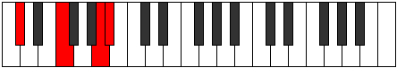 |
| SecondInversion | E#,G##,A#,C# | 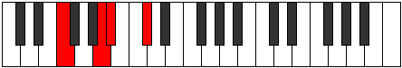 |
| ThirdInversion | G##,A#,C#,E# | 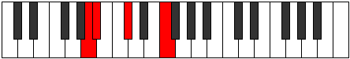 |
## Modes

| Number | Mode | Tonic | Notes | Illustration |
|--------|------|-------|-------|--------------|
| [275](https://ianring.com/musictheory/scales/275) | [Dalic](ModeANaturalDalic.md) | A | A, A#, C#, F, A | 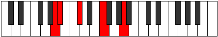 |
| [279](https://ianring.com/musictheory/scales/279) | [Poditonic](ModeANaturalPoditonic.md) | A | A, A#, B, C#, F, A |  |
| [283](https://ianring.com/musictheory/scales/283) | [Aerylitonic](ModeANaturalAerylitonic.md) | A | A, A#, C, C#, F, A |  |
| [287](https://ianring.com/musictheory/scales/287) | [Gynimic](ModeANaturalGynimic.md) | A | A, Bb, Cb, Dbb, Ebbb, F, A |  |
| [305](https://ianring.com/musictheory/scales/305) | [Gonic](ModeFNaturalGonic.md) | F | F, A, A#, C#, F |  |
| [307](https://ianring.com/musictheory/scales/307) | [Phrolitonic](ModeANaturalPhrolitonic.md) | A | A, A#, C#, D, F, A |  |
| [307](https://ianring.com/musictheory/scales/307) | [Phrolitonic](ModeFNaturalPhrolitonic.md) | F | F, F#, A, A#, C#, F | 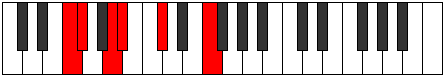 |
| [309](https://ianring.com/musictheory/scales/309) | [Palitonic](ModeFNaturalPalitonic.md) | F | F, G, A, A#, C#, F |  |
| [311](https://ianring.com/musictheory/scales/311) | [Stagimic](ModeANaturalStagimic.md) | A | A, Bb, Cb, Db, Ebb, F, A |  |
| [313](https://ianring.com/musictheory/scales/313) | [Goritonic](ModeFNaturalGoritonic.md) | F | F, G#, A, A#, C#, F |  |
| [315](https://ianring.com/musictheory/scales/315) | [Stodimic](ModeANaturalStodimic.md) | A | A, Bb, C, Db, Ebb, F, A |  |
| [319](https://ianring.com/musictheory/scales/319) | [Epodian](ModeANaturalEpodian.md) | A | A, Bb, Cb, Dbb, Ebbb, Fbbb, Gbb, A |  |
| [339](https://ianring.com/musictheory/scales/339) | [Zaptitonic](ModeANaturalZaptitonic.md) | A | A, A#, C#, D#, F, A |  |
| [343](https://ianring.com/musictheory/scales/343) | [Ionorimic](ModeANaturalIonorimic.md) | A | A, Bb, Cb, Db, Eb, F, A |  |
| [347](https://ianring.com/musictheory/scales/347) | [Barimic](ModeANaturalBarimic.md) | A | A, Bb, C, Db, Eb, F, A |  |
| [351](https://ianring.com/musictheory/scales/351) | [Epanian](ModeANaturalEpanian.md) | A | A, Bb, Cb, Dbb, Ebbb, Fbb, Gbb, A |  |
| [369](https://ianring.com/musictheory/scales/369) | [Laditonic](ModeFNaturalLaditonic.md) | F | F, A, A#, B, C#, F |  |
| [371](https://ianring.com/musictheory/scales/371) | [Rythimic](ModeANaturalRythimic.md) | A | A, Bb, C#, D, Eb, F, A |  |
| [371](https://ianring.com/musictheory/scales/371) | [Rythimic](ModeFNaturalRythimic.md) | F | F, Gb, A, Bb, Cb, Db, F |  |
| [373](https://ianring.com/musictheory/scales/373) | [Epagimic](ModeFNaturalEpagimic.md) | F | F, G, A, Bb, Cb, Db, F |  |
| [375](https://ianring.com/musictheory/scales/375) | [Sodian](ModeANaturalSodian.md) | A | A, Bb, Cb, Db, Ebb, Fbb, Gbb, A |  |
| [377](https://ianring.com/musictheory/scales/377) | [Kathimic](ModeFNaturalKathimic.md) | F | F, G#, A, Bb, Cb, Db, F |  |
| [379](https://ianring.com/musictheory/scales/379) | [Aeragian](ModeANaturalAeragian.md) | A | A, Bb, C, Db, Ebb, Fbb, Gbb, A |  |
| [383](https://ianring.com/musictheory/scales/383) | [Logyllic](ModeANaturalLogyllic.md) | A | A, A#, B, C, C#, D, D#, F, A |  |
| [383](https://ianring.com/musictheory/scales/383) | [Logyllic](ModeFNaturalLogyllic.md) | F | F, F#, G, G#, A, A#, B, C#, F |  |
| [403](https://ianring.com/musictheory/scales/403) | [Daptitonic](ModeANaturalDaptitonic.md) | A | A, A#, C#, E, F, A |  |
| [407](https://ianring.com/musictheory/scales/407) | [Zylimic](ModeANaturalZylimic.md) | A | A, Bb, Cb, Db, E, F, A |  |
| [411](https://ianring.com/musictheory/scales/411) | [Lygimic](ModeANaturalLygimic.md) | A | A, Bb, C, Db, E, F, A |  |
| [415](https://ianring.com/musictheory/scales/415) | [Aeoladian](ModeANaturalAeoladian.md) | A | A, Bb, Cb, Dbb, Ebbb, Fb, Gbb, A |  |
| [433](https://ianring.com/musictheory/scales/433) | [Poritonic](ModeFNaturalPoritonic.md) | F | F, A, A#, C, C#, F |  |
| [435](https://ianring.com/musictheory/scales/435) | [Ionolimic](ModeANaturalIonolimic.md) | A | A, Bb, C#, D, E, F, A |  |
| [435](https://ianring.com/musictheory/scales/435) | [Ionolimic](ModeFNaturalIonolimic.md) | F | F, Gb, A, Bb, C, Db, F |  |
| [437](https://ianring.com/musictheory/scales/437) | [Ronimic](ModeFNaturalRonimic.md) | F | F, G, A, Bb, C, Db, F |  |
| [439](https://ianring.com/musictheory/scales/439) | [Bythian](ModeANaturalBythian.md) | A | A, Bb, Cb, Db, Ebb, Fb, Gbb, A |  |
| [441](https://ianring.com/musictheory/scales/441) | [Thycrimic](ModeFNaturalThycrimic.md) | F | F, G#, A, Bb, C, Db, F |  |
| [443](https://ianring.com/musictheory/scales/443) | [Kothian](ModeANaturalKothian.md) | A | A, Bb, C, Db, Ebb, Fb, Gbb, A |  |
| [447](https://ianring.com/musictheory/scales/447) | [Thyphyllic](ModeFNaturalThyphyllic.md) | F | F, F#, G, G#, A, A#, C, C#, F |  |
| [447](https://ianring.com/musictheory/scales/447) | [Thyphyllic](ModeANaturalThyphyllic.md) | A | A, A#, B, C, C#, D, E, F, A |  |
| [467](https://ianring.com/musictheory/scales/467) | [Phrogimic](ModeANaturalPhrogimic.md) | A | A, Bb, C#, D#, E, F, A |  |
| [471](https://ianring.com/musictheory/scales/471) | [Dodian](ModeANaturalDodian.md) | A | A, Bb, Cb, Db, Eb, Fb, Gbb, A |  |
| [475](https://ianring.com/musictheory/scales/475) | [Aeolygian](ModeANaturalAeolygian.md) | A | A, Bb, C, Db, Eb, Fb, Gbb, A |  |
| [479](https://ianring.com/musictheory/scales/479) | [Kocryllic](ModeANaturalKocryllic.md) | A | A, A#, B, C, C#, D#, E, F, A |  |
| [497](https://ianring.com/musictheory/scales/497) | [Kadimic](ModeFNaturalKadimic.md) | F | F, G##, A#, B, C, Db, F |  |
| [499](https://ianring.com/musictheory/scales/499) | [Ionaptian](ModeANaturalIonaptian.md) | A | A, Bb, C#, D, Eb, Fb, Gbb, A |  |
| [499](https://ianring.com/musictheory/scales/499) | [Ionaptian](ModeFNaturalIonaptian.md) | F | F, Gb, A, Bb, Cb, Dbb, Ebbb, F |  |
| [501](https://ianring.com/musictheory/scales/501) | [Katylian](ModeFNaturalKatylian.md) | F | F, G, A, Bb, Cb, Dbb, Ebbb, F |  |
| [503](https://ianring.com/musictheory/scales/503) | [Thoptyllic](ModeANaturalThoptyllic.md) | A | A, A#, B, C#, D, D#, E, F, A |  |
| [503](https://ianring.com/musictheory/scales/503) | [Thoptyllic](ModeFNaturalThoptyllic.md) | F | F, F#, G, A, A#, B, C, C#, F |  |
| [505](https://ianring.com/musictheory/scales/505) | [Sanian](ModeFNaturalSanian.md) | F | F, G#, A, Bb, Cb, Dbb, Ebbb, F |  |
| [507](https://ianring.com/musictheory/scales/507) | [Moryllic](ModeANaturalMoryllic.md) | A | A, A#, C, C#, D, D#, E, F, A |  |
| [507](https://ianring.com/musictheory/scales/507) | [Moryllic](ModeFNaturalMoryllic.md) | F | F, F#, G#, A, A#, B, C, C#, F |  |
| [509](https://ianring.com/musictheory/scales/509) | [Ionothyllic](ModeFNaturalIonothyllic.md) | F | F, G, G#, A, A#, B, C, C#, F |  |
| [511](https://ianring.com/musictheory/scales/511) | [Polygic](ModeANaturalPolygic.md) | A | A, A#, B, C, C#, D, D#, E, F, A |  |
| [511](https://ianring.com/musictheory/scales/511) | [Polygic](ModeFNaturalPolygic.md) | F | F, F#, G, G#, A, A#, B, C, C#, F |  |
| [551](https://ianring.com/musictheory/scales/551) | [Aeoloditonic](ModeGSharpAeoloditonic.md) | G# | G#, A, A#, C#, F, G# |  |
| [551](https://ianring.com/musictheory/scales/551) | [Aeoloditonic](ModeAFlatAeoloditonic.md) | Ab | Ab, A, Bb, Db, F, Ab |  |
| [559](https://ianring.com/musictheory/scales/559) | [Lylimic](ModeGSharpLylimic.md) | G# | G#, A, Bb, Cb, Db, E#, G# |  |
| [567](https://ianring.com/musictheory/scales/567) | [Aeoladimic](ModeGSharpAeoladimic.md) | G# | G#, A, Bb, C, Db, E#, G# |  |
| [575](https://ianring.com/musictheory/scales/575) | [Ionydian](ModeGSharpIonydian.md) | G# | G#, A, Bb, Cb, Dbb, Ebbb, F, G# |  |
| [611](https://ianring.com/musictheory/scales/611) | [Zynitonic](ModeENaturalZynitonic.md) | E | E, F, A, A#, C#, E |  |
| [615](https://ianring.com/musictheory/scales/615) | [Phrothimic](ModeENaturalPhrothimic.md) | E | E, F, Gb, A, Bb, C#, E |  |
| [615](https://ianring.com/musictheory/scales/615) | [Phrothimic](ModeGSharpPhrothimic.md) | G# | G#, A, Bb, C#, D, E#, G# |  |
| [619](https://ianring.com/musictheory/scales/619) | [Parimic](ModeENaturalParimic.md) | E | E, F, G, A, Bb, C#, E |  |
| [623](https://ianring.com/musictheory/scales/623) | [Sycrian](ModeGSharpSycrian.md) | G# | G#, A, Bb, Cb, Db, Ebb, F, G# |  |
| [627](https://ianring.com/musictheory/scales/627) | [Mogimic](ModeENaturalMogimic.md) | E | E, F, G#, A, Bb, C#, E |  |
| [631](https://ianring.com/musictheory/scales/631) | [Zygian](ModeGSharpZygian.md) | G# | G#, A, Bb, C, Db, Ebb, F, G# |  |
| [639](https://ianring.com/musictheory/scales/639) | [Ionaryllic](ModeENaturalIonaryllic.md) | E | E, F, F#, G, G#, A, A#, C#, E |  |
| [639](https://ianring.com/musictheory/scales/639) | [Ionaryllic](ModeGSharpIonaryllic.md) | G# | G#, A, A#, B, C, C#, D, F, G# |  |
| [639](https://ianring.com/musictheory/scales/639) | [Ionaryllic](ModeAFlatIonaryllic.md) | Ab | Ab, A, Bb, B, C, Db, D, F, Ab |  |
| [679](https://ianring.com/musictheory/scales/679) | [Lanimic](ModeGSharpLanimic.md) | G# | G#, A, Bb, C#, D#, E#, G# |  |
| [687](https://ianring.com/musictheory/scales/687) | [Aeolythian](ModeGSharpAeolythian.md) | G# | G#, A, Bb, Cb, Db, Eb, F, G# |  |
| [695](https://ianring.com/musictheory/scales/695) | [Sarian](ModeGSharpSarian.md) | G# | G#, A, Bb, C, Db, Eb, F, G# |  |
| [703](https://ianring.com/musictheory/scales/703) | [Aerocryllic](ModeGSharpAerocryllic.md) | G# | G#, A, A#, B, C, C#, D#, F, G# | 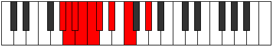 |
| [703](https://ianring.com/musictheory/scales/703) | [Aerocryllic](ModeAFlatAerocryllic.md) | Ab | Ab, A, Bb, B, C, Db, Eb, F, Ab |  |
| [739](https://ianring.com/musictheory/scales/739) | [Rorimic](ModeENaturalRorimic.md) | E | E, F, G##, A#, B, C#, E |  |
| [743](https://ianring.com/musictheory/scales/743) | [Lanian](ModeGSharpLanian.md) | G# | G#, A, Bb, C#, D, Eb, F, G# |  |
| [743](https://ianring.com/musictheory/scales/743) | [Lanian](ModeENaturalLanian.md) | E | E, F, Gb, A, Bb, Cb, Db, E |  |
| [747](https://ianring.com/musictheory/scales/747) | [Lynian](ModeENaturalLynian.md) | E | E, F, G, A, Bb, Cb, Db, E |  |
| [751](https://ianring.com/musictheory/scales/751) | [Epacryllic](ModeENaturalEpacryllic.md) | E | E, F, F#, G, A, A#, B, C#, E |  |
| [751](https://ianring.com/musictheory/scales/751) | [Epacryllic](ModeGSharpEpacryllic.md) | G# | G#, A, A#, B, C#, D, D#, F, G# |  |
| [751](https://ianring.com/musictheory/scales/751) | [Epacryllic](ModeAFlatEpacryllic.md) | Ab | Ab, A, Bb, B, Db, D, Eb, F, Ab |  |
| [755](https://ianring.com/musictheory/scales/755) | [Phrythian](ModeENaturalPhrythian.md) | E | E, F, G#, A, Bb, Cb, Db, E |  |
| [759](https://ianring.com/musictheory/scales/759) | [Katalyllic](ModeGSharpKatalyllic.md) | G# | G#, A, A#, C, C#, D, D#, F, G# |  |
| [759](https://ianring.com/musictheory/scales/759) | [Katalyllic](ModeAFlatKatalyllic.md) | Ab | Ab, A, Bb, C, Db, D, Eb, F, Ab |  |
| [759](https://ianring.com/musictheory/scales/759) | [Katalyllic](ModeENaturalKatalyllic.md) | E | E, F, F#, G#, A, A#, B, C#, E |  |
| [763](https://ianring.com/musictheory/scales/763) | [Doryllic](ModeENaturalDoryllic.md) | E | E, F, G, G#, A, A#, B, C#, E |  |
| [767](https://ianring.com/musictheory/scales/767) | [Raptygic](ModeGSharpRaptygic.md) | G# | G#, A, A#, B, C, C#, D, D#, F, G# |  |
| [767](https://ianring.com/musictheory/scales/767) | [Raptygic](ModeAFlatRaptygic.md) | Ab | Ab, A, Bb, B, C, Db, D, Eb, F, Ab |  |
| [767](https://ianring.com/musictheory/scales/767) | [Raptygic](ModeENaturalRaptygic.md) | E | E, F, F#, G, G#, A, A#, B, C#, E |  |
| [785](https://ianring.com/musictheory/scales/785) | [Aeoloric](ModeCSharpAeoloric.md) | C# | C#, F, A, A#, C# |  |
| [785](https://ianring.com/musictheory/scales/785) | [Aeoloric](ModeDFlatAeoloric.md) | Db | Db, F, A, Bb, Db |  |
| [787](https://ianring.com/musictheory/scales/787) | [Aeolapritonic](ModeCSharpAeolapritonic.md) | C# | C#, D, F, A, A#, C# |  |
| [787](https://ianring.com/musictheory/scales/787) | [Aeolapritonic](ModeDFlatAeolapritonic.md) | Db | Db, D, F, A, Bb, Db |  |
| [787](https://ianring.com/musictheory/scales/787) | [Aeolapritonic](ModeANaturalAeolapritonic.md) | A | A, A#, C#, F, F#, A |  |
| [789](https://ianring.com/musictheory/scales/789) | [Zogitonic](ModeCSharpZogitonic.md) | C# | C#, D#, F, A, A#, C# |  |
| [789](https://ianring.com/musictheory/scales/789) | [Zogitonic](ModeDFlatZogitonic.md) | Db | Db, Eb, F, A, Bb, Db |  |
| [791](https://ianring.com/musictheory/scales/791) | [Aeoloptimic](ModeCSharpAeoloptimic.md) | C# | C#, D, Eb, F, G##, A#, C# |  |
| [791](https://ianring.com/musictheory/scales/791) | [Aeoloptimic](ModeDFlatAeoloptimic.md) | Db | Db, Ebb, Fbb, Gbb, A, Bb, Db | 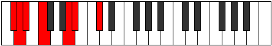 |
| [791](https://ianring.com/musictheory/scales/791) | [Aeoloptimic](ModeANaturalAeoloptimic.md) | A | A, Bb, Cb, Db, E#, F#, A |  |
| [793](https://ianring.com/musictheory/scales/793) | [Mocritonic](ModeCSharpMocritonic.md) | C# | C#, E, F, A, A#, C# | 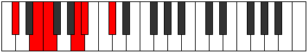 |
| [793](https://ianring.com/musictheory/scales/793) | [Mocritonic](ModeDFlatMocritonic.md) | Db | Db, E, F, A, Bb, Db |  |
| [795](https://ianring.com/musictheory/scales/795) | [Aeologimic](ModeCSharpAeologimic.md) | C# | C#, D, E, F, G##, A#, C# |  |
| [795](https://ianring.com/musictheory/scales/795) | [Aeologimic](ModeDFlatAeologimic.md) | Db | Db, Ebb, Fb, Gbb, A, Bb, Db |  |
| [795](https://ianring.com/musictheory/scales/795) | [Aeologimic](ModeANaturalAeologimic.md) | A | A, Bb, C, Db, E#, F#, A |  |
| [797](https://ianring.com/musictheory/scales/797) | [Katocrimic](ModeCSharpKatocrimic.md) | C# | C#, D#, E, F, G##, A#, C# |  |
| [797](https://ianring.com/musictheory/scales/797) | [Katocrimic](ModeDFlatKatocrimic.md) | Db | Db, Eb, Fb, Gbb, A, Bb, Db |  |
| [799](https://ianring.com/musictheory/scales/799) | [Lolian](ModeCSharpLolian.md) | C# | C#, D, Eb, Fb, Gbb, A, Bb, C# |  |
| [799](https://ianring.com/musictheory/scales/799) | [Lolian](ModeANaturalLolian.md) | A | A, Bb, Cb, Dbb, Ebbb, F, Gb, A |  |
| [807](https://ianring.com/musictheory/scales/807) | [Epadimic](ModeGSharpEpadimic.md) | G# | G#, A, Bb, C#, D##, E#, G# |  |
| [815](https://ianring.com/musictheory/scales/815) | [Bolian](ModeGSharpBolian.md) | G# | G#, A, Bb, Cb, Db, E, F, G# |  |
| [817](https://ianring.com/musictheory/scales/817) | [Zothitonic](ModeFNaturalZothitonic.md) | F | F, A, A#, C#, D, F |  |
| [817](https://ianring.com/musictheory/scales/817) | [Zothitonic](ModeCSharpZothitonic.md) | C# | C#, F, F#, A, A#, C# |  |
| [817](https://ianring.com/musictheory/scales/817) | [Zothitonic](ModeDFlatZothitonic.md) | Db | Db, F, Gb, A, Bb, Db |  |
| [819](https://ianring.com/musictheory/scales/819) | [Aerythimic](ModeCSharpAerythimic.md) | C# | C#, D, E#, F#, G##, A#, C# |  |
| [819](https://ianring.com/musictheory/scales/819) | [Aerythimic](ModeDFlatAerythimic.md) | Db | Db, Ebb, F, Gb, A, Bb, Db |  |
| [819](https://ianring.com/musictheory/scales/819) | [Aerythimic](ModeFNaturalAerythimic.md) | F | F, Gb, A, Bb, C#, D, F |  |
| [819](https://ianring.com/musictheory/scales/819) | [Aerythimic](ModeANaturalAerythimic.md) | A | A, Bb, C#, D, E#, F#, A |  |
| [821](https://ianring.com/musictheory/scales/821) | [Aeranimic](ModeCSharpAeranimic.md) | C# | C#, D#, E#, F#, G##, A#, C# |  |
| [821](https://ianring.com/musictheory/scales/821) | [Aeranimic](ModeDFlatAeranimic.md) | Db | Db, Eb, F, Gb, A, Bb, Db |  |
| [821](https://ianring.com/musictheory/scales/821) | [Aeranimic](ModeFNaturalAeranimic.md) | F | F, G, A, Bb, C#, D, F |  |
| [823](https://ianring.com/musictheory/scales/823) | [Stodian](ModeCSharpStodian.md) | C# | C#, D, Eb, F, Gb, A, Bb, C# |  |
| [823](https://ianring.com/musictheory/scales/823) | [Stodian](ModeGSharpStodian.md) | G# | G#, A, Bb, C, Db, E, F, G# |  |
| [823](https://ianring.com/musictheory/scales/823) | [Stodian](ModeANaturalStodian.md) | A | A, Bb, Cb, Db, Ebb, F, Gb, A |  |
| [825](https://ianring.com/musictheory/scales/825) | [Thyptimic](ModeCSharpThyptimic.md) | C# | C#, D##, E#, F#, G##, A#, C# |  |
| [825](https://ianring.com/musictheory/scales/825) | [Thyptimic](ModeDFlatThyptimic.md) | Db | Db, E, F, Gb, A, Bb, Db |  |
| [825](https://ianring.com/musictheory/scales/825) | [Thyptimic](ModeFNaturalThyptimic.md) | F | F, G#, A, Bb, C#, D, F |  |
| [827](https://ianring.com/musictheory/scales/827) | [Mixolocrian](ModeANaturalMixolocrian.md) | A | A, Bb, C, Db, Ebb, F, Gb, A |  |
| [827](https://ianring.com/musictheory/scales/827) | [Mixolocrian](ModeCSharpMixolocrian.md) | C# | C#, D, E, F, Gb, A, Bb, C# |  |
| [829](https://ianring.com/musictheory/scales/829) | [Lygian](ModeCSharpLygian.md) | C# | C#, D#, E, F, Gb, A, Bb, C# |  |
| [831](https://ianring.com/musictheory/scales/831) | [Rodyllic](ModeCSharpRodyllic.md) | C# | C#, D, D#, E, F, F#, A, A#, C# |  |
| [831](https://ianring.com/musictheory/scales/831) | [Rodyllic](ModeDFlatRodyllic.md) | Db | Db, D, Eb, E, F, Gb, A, Bb, Db |  |
| [831](https://ianring.com/musictheory/scales/831) | [Rodyllic](ModeFNaturalRodyllic.md) | F | F, F#, G, G#, A, A#, C#, D, F | 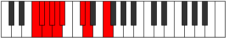 |
| [831](https://ianring.com/musictheory/scales/831) | [Rodyllic](ModeANaturalRodyllic.md) | A | A, A#, B, C, C#, D, F, F#, A |  |
| [831](https://ianring.com/musictheory/scales/831) | [Rodyllic](ModeGSharpRodyllic.md) | G# | G#, A, A#, B, C, C#, E, F, G# |  |
| [831](https://ianring.com/musictheory/scales/831) | [Rodyllic](ModeAFlatRodyllic.md) | Ab | Ab, A, Bb, B, C, Db, E, F, Ab |  |
| [849](https://ianring.com/musictheory/scales/849) | [Aerynitonic](ModeCSharpAerynitonic.md) | C# | C#, F, G, A, A#, C# |  |
| [849](https://ianring.com/musictheory/scales/849) | [Aerynitonic](ModeDFlatAerynitonic.md) | Db | Db, F, G, A, Bb, Db |  |
| [851](https://ianring.com/musictheory/scales/851) | [Aerylimic](ModeANaturalAerylimic.md) | A | A, Bb, C#, D#, E#, F#, A | 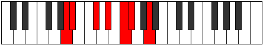 |
| [851](https://ianring.com/musictheory/scales/851) | [Aerylimic](ModeCSharpAerylimic.md) | C# | C#, D, E#, F##, G##, A#, C# |  |
| [851](https://ianring.com/musictheory/scales/851) | [Aerylimic](ModeDFlatAerylimic.md) | Db | Db, Ebb, F, G, A, Bb, Db |  |
| [853](https://ianring.com/musictheory/scales/853) | [Epothimic](ModeCSharpEpothimic.md) | C# | C#, D#, E#, F##, G##, A#, C# |  |
| [853](https://ianring.com/musictheory/scales/853) | [Epothimic](ModeDFlatEpothimic.md) | Db | Db, Eb, F, G, A, Bb, Db |  |
| [855](https://ianring.com/musictheory/scales/855) | [Porian](ModeCSharpPorian.md) | C# | C#, D, Eb, F, G, A, Bb, C# |  |
| [855](https://ianring.com/musictheory/scales/855) | [Porian](ModeANaturalPorian.md) | A | A, Bb, Cb, Db, Eb, F, Gb, A |  |
| [857](https://ianring.com/musictheory/scales/857) | [Aeolydimic](ModeCSharpAeolydimic.md) | C# | C#, D##, E#, F##, G##, A#, C# |  |
| [857](https://ianring.com/musictheory/scales/857) | [Aeolydimic](ModeDFlatAeolydimic.md) | Db | Db, E, F, G, A, Bb, Db |  |
| [859](https://ianring.com/musictheory/scales/859) | [Pathian](ModeANaturalPathian.md) | A | A, Bb, C, Db, Eb, F, Gb, A |  |
| [859](https://ianring.com/musictheory/scales/859) | [Pathian](ModeCSharpPathian.md) | C# | C#, D, E, F, G, A, Bb, C# |  |
| [861](https://ianring.com/musictheory/scales/861) | [Rylian](ModeCSharpRylian.md) | C# | C#, D#, E, F, G, A, Bb, C# |  |
| [863](https://ianring.com/musictheory/scales/863) | [Pyryllic](ModeCSharpPyryllic.md) | C# | C#, D, D#, E, F, G, A, A#, C# |  |
| [863](https://ianring.com/musictheory/scales/863) | [Pyryllic](ModeDFlatPyryllic.md) | Db | Db, D, Eb, E, F, G, A, Bb, Db |  |
| [863](https://ianring.com/musictheory/scales/863) | [Pyryllic](ModeANaturalPyryllic.md) | A | A, A#, B, C, C#, D#, F, F#, A |  |
| [867](https://ianring.com/musictheory/scales/867) | [Phrocrimic](ModeENaturalPhrocrimic.md) | E | E, F, G##, A#, B#, C#, E |  |
| [871](https://ianring.com/musictheory/scales/871) | [Epadian](ModeENaturalEpadian.md) | E | E, F, Gb, A, Bb, C, Db, E |  |
| [871](https://ianring.com/musictheory/scales/871) | [Epadian](ModeGSharpEpadian.md) | G# | G#, A, Bb, C#, D, E, F, G# |  |
| [875](https://ianring.com/musictheory/scales/875) | [Stothian](ModeENaturalStothian.md) | E | E, F, G, A, Bb, C, Db, E |  |
| [879](https://ianring.com/musictheory/scales/879) | [Aeolocryllic](ModeENaturalAeolocryllic.md) | E | E, F, F#, G, A, A#, C, C#, E |  |
| [879](https://ianring.com/musictheory/scales/879) | [Aeolocryllic](ModeGSharpAeolocryllic.md) | G# | G#, A, A#, B, C#, D, E, F, G# |  |
| [879](https://ianring.com/musictheory/scales/879) | [Aeolocryllic](ModeAFlatAeolocryllic.md) | Ab | Ab, A, Bb, B, Db, D, E, F, Ab |  |
| [881](https://ianring.com/musictheory/scales/881) | [Aerothimic](ModeCSharpAerothimic.md) | C# | C#, D###, E##, F##, G##, A#, C# |  |
| [881](https://ianring.com/musictheory/scales/881) | [Aerothimic](ModeDFlatAerothimic.md) | Db | Db, E#, F#, G, A, Bb, Db |  |
| [881](https://ianring.com/musictheory/scales/881) | [Aerothimic](ModeFNaturalAerothimic.md) | F | F, G##, A#, B, C#, D, F |  |
| [883](https://ianring.com/musictheory/scales/883) | [Ralian](ModeANaturalRalian.md) | A | A, Bb, C#, D, Eb, F, Gb, A |  |
| [883](https://ianring.com/musictheory/scales/883) | [Ralian](ModeCSharpRalian.md) | C# | C#, D, E#, F#, G, A, Bb, C# |  |
| [883](https://ianring.com/musictheory/scales/883) | [Ralian](ModeENaturalRalian.md) | E | E, F, G#, A, Bb, C, Db, E |  |
| [883](https://ianring.com/musictheory/scales/883) | [Ralian](ModeFNaturalRalian.md) | F | F, Gb, A, Bb, Cb, Db, Ebb, F |  |
| [885](https://ianring.com/musictheory/scales/885) | [Sathian](ModeCSharpSathian.md) | C# | C#, D#, E#, F#, G, A, Bb, C# |  |
| [885](https://ianring.com/musictheory/scales/885) | [Sathian](ModeFNaturalSathian.md) | F | F, G, A, Bb, Cb, Db, Ebb, F | 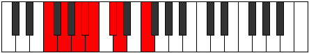 |
| [887](https://ianring.com/musictheory/scales/887) | [Sathyllic](ModeCSharpSathyllic.md) | C# | C#, D, D#, F, F#, G, A, A#, C# |  |
| [887](https://ianring.com/musictheory/scales/887) | [Sathyllic](ModeDFlatSathyllic.md) | Db | Db, D, Eb, F, Gb, G, A, Bb, Db |  |
| [887](https://ianring.com/musictheory/scales/887) | [Sathyllic](ModeGSharpSathyllic.md) | G# | G#, A, A#, C, C#, D, E, F, G# |  |
| [887](https://ianring.com/musictheory/scales/887) | [Sathyllic](ModeAFlatSathyllic.md) | Ab | Ab, A, Bb, C, Db, D, E, F, Ab |  |
| [887](https://ianring.com/musictheory/scales/887) | [Sathyllic](ModeENaturalSathyllic.md) | E | E, F, F#, G#, A, A#, C, C#, E |  |
| [887](https://ianring.com/musictheory/scales/887) | [Sathyllic](ModeANaturalSathyllic.md) | A | A, A#, B, C#, D, D#, F, F#, A |  |
| [887](https://ianring.com/musictheory/scales/887) | [Sathyllic](ModeFNaturalSathyllic.md) | F | F, F#, G, A, A#, B, C#, D, F |  |
| [889](https://ianring.com/musictheory/scales/889) | [Borian](ModeCSharpBorian.md) | C# | C#, D##, E#, F#, G, A, Bb, C# |  |
| [889](https://ianring.com/musictheory/scales/889) | [Borian](ModeFNaturalBorian.md) | F | F, G#, A, Bb, Cb, Db, Ebb, F |  |
| [891](https://ianring.com/musictheory/scales/891) | [Ionilyllic](ModeANaturalIonilyllic.md) | A | A, A#, C, C#, D, D#, F, F#, A |  |
| [891](https://ianring.com/musictheory/scales/891) | [Ionilyllic](ModeCSharpIonilyllic.md) | C# | C#, D, E, F, F#, G, A, A#, C# |  |
| [891](https://ianring.com/musictheory/scales/891) | [Ionilyllic](ModeDFlatIonilyllic.md) | Db | Db, D, E, F, Gb, G, A, Bb, Db |  |
| [891](https://ianring.com/musictheory/scales/891) | [Ionilyllic](ModeENaturalIonilyllic.md) | E | E, F, G, G#, A, A#, C, C#, E |  |
| [891](https://ianring.com/musictheory/scales/891) | [Ionilyllic](ModeFNaturalIonilyllic.md) | F | F, F#, G#, A, A#, B, C#, D, F |  |
| [893](https://ianring.com/musictheory/scales/893) | [Pycryllic](ModeCSharpPycryllic.md) | C# | C#, D#, E, F, F#, G, A, A#, C# |  |
| [893](https://ianring.com/musictheory/scales/893) | [Pycryllic](ModeDFlatPycryllic.md) | Db | Db, Eb, E, F, Gb, G, A, Bb, Db |  |
| [893](https://ianring.com/musictheory/scales/893) | [Pycryllic](ModeFNaturalPycryllic.md) | F | F, G, G#, A, A#, B, C#, D, F |  |
| [895](https://ianring.com/musictheory/scales/895) | [Aeolathygic](ModeCSharpAeolathygic.md) | C# | C#, D, D#, E, F, F#, G, A, A#, C# |  |
| [895](https://ianring.com/musictheory/scales/895) | [Aeolathygic](ModeDFlatAeolathygic.md) | Db | Db, D, Eb, E, F, Gb, G, A, Bb, Db |  |
| [895](https://ianring.com/musictheory/scales/895) | [Aeolathygic](ModeENaturalAeolathygic.md) | E | E, F, F#, G, G#, A, A#, C, C#, E |  |
| [895](https://ianring.com/musictheory/scales/895) | [Aeolathygic](ModeANaturalAeolathygic.md) | A | A, A#, B, C, C#, D, D#, F, F#, A |  |
| [895](https://ianring.com/musictheory/scales/895) | [Aeolathygic](ModeGSharpAeolathygic.md) | G# | G#, A, A#, B, C, C#, D, E, F, G# |  |
| [895](https://ianring.com/musictheory/scales/895) | [Aeolathygic](ModeAFlatAeolathygic.md) | Ab | Ab, A, Bb, B, C, Db, D, E, F, Ab |  |
| [895](https://ianring.com/musictheory/scales/895) | [Aeolathygic](ModeFNaturalAeolathygic.md) | F | F, F#, G, G#, A, A#, B, C#, D, F |  |
| [913](https://ianring.com/musictheory/scales/913) | [Aeolyritonic](ModeCSharpAeolyritonic.md) | C# | C#, F, G#, A, A#, C# |  |
| [913](https://ianring.com/musictheory/scales/913) | [Aeolyritonic](ModeDFlatAeolyritonic.md) | Db | Db, F, Ab, A, Bb, Db |  |
| [915](https://ianring.com/musictheory/scales/915) | [Loptimic](ModeANaturalLoptimic.md) | A | A, Bb, C#, D##, E#, F#, A |  |
| [915](https://ianring.com/musictheory/scales/915) | [Loptimic](ModeCSharpLoptimic.md) | C# | C#, D, E#, F###, G##, A#, C# |  |
| [915](https://ianring.com/musictheory/scales/915) | [Loptimic](ModeDFlatLoptimic.md) | Db | Db, Ebb, F, G#, A, Bb, Db |  |
| [917](https://ianring.com/musictheory/scales/917) | [Dygimic](ModeCSharpDygimic.md) | C# | C#, D#, E#, F###, G##, A#, C# |  |
| [917](https://ianring.com/musictheory/scales/917) | [Dygimic](ModeDFlatDygimic.md) | Db | Db, Eb, F, G#, A, Bb, Db |  |
| [919](https://ianring.com/musictheory/scales/919) | [Gathian](ModeCSharpGathian.md) | C# | C#, D, Eb, F, G#, A, Bb, C# |  |
| [919](https://ianring.com/musictheory/scales/919) | [Gathian](ModeANaturalGathian.md) | A | A, Bb, Cb, Db, E, F, Gb, A |  |
| [921](https://ianring.com/musictheory/scales/921) | [Bogimic](ModeCSharpBogimic.md) | C# | C#, D##, E#, F###, G##, A#, C# | 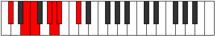 |
| [921](https://ianring.com/musictheory/scales/921) | [Bogimic](ModeDFlatBogimic.md) | Db | Db, E, F, G#, A, Bb, Db |  |
| [923](https://ianring.com/musictheory/scales/923) | [Ionodian](ModeANaturalIonodian.md) | A | A, Bb, C, Db, E, F, Gb, A |  |
| [923](https://ianring.com/musictheory/scales/923) | [Ionodian](ModeCSharpIonodian.md) | C# | C#, D, E, F, G#, A, Bb, C# |  |
| [925](https://ianring.com/musictheory/scales/925) | [Mythian](ModeCSharpMythian.md) | C# | C#, D#, E, F, G#, A, Bb, C# |  |
| [927](https://ianring.com/musictheory/scales/927) | [Koptyllic](ModeCSharpKoptyllic.md) | C# | C#, D, D#, E, F, G#, A, A#, C# |  |
| [927](https://ianring.com/musictheory/scales/927) | [Koptyllic](ModeDFlatKoptyllic.md) | Db | Db, D, Eb, E, F, Ab, A, Bb, Db |  |
| [927](https://ianring.com/musictheory/scales/927) | [Koptyllic](ModeANaturalKoptyllic.md) | A | A, A#, B, C, C#, E, F, F#, A |  |
| [935](https://ianring.com/musictheory/scales/935) | [Katarian](ModeGSharpKatarian.md) | G# | G#, A, Bb, C#, D#, E, F, G# |  |
| [943](https://ianring.com/musictheory/scales/943) | [Aerygyllic](ModeGSharpAerygyllic.md) | G# | G#, A, A#, B, C#, D#, E, F, G# |  |
| [943](https://ianring.com/musictheory/scales/943) | [Aerygyllic](ModeAFlatAerygyllic.md) | Ab | Ab, A, Bb, B, Db, Eb, E, F, Ab |  |
| [945](https://ianring.com/musictheory/scales/945) | [Syrimic](ModeFNaturalSyrimic.md) | F | F, G##, A#, B#, C#, D, F |  |
| [945](https://ianring.com/musictheory/scales/945) | [Syrimic](ModeCSharpSyrimic.md) | C# | C#, D###, E##, F###, G##, A#, C# |  |
| [945](https://ianring.com/musictheory/scales/945) | [Syrimic](ModeDFlatSyrimic.md) | Db | Db, E#, F#, G#, A, Bb, Db | 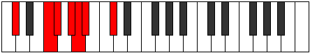 |
| [947](https://ianring.com/musictheory/scales/947) | [Modian](ModeFNaturalModian.md) | F | F, Gb, A, Bb, C, Db, Ebb, F |  |
| [947](https://ianring.com/musictheory/scales/947) | [Modian](ModeANaturalModian.md) | A | A, Bb, C#, D, E, F, Gb, A |  |
| [947](https://ianring.com/musictheory/scales/947) | [Modian](ModeCSharpModian.md) | C# | C#, D, E#, F#, G#, A, Bb, C# |  |
| [949](https://ianring.com/musictheory/scales/949) | [Ionagian](ModeFNaturalIonagian.md) | F | F, G, A, Bb, C, Db, Ebb, F |  |
| [949](https://ianring.com/musictheory/scales/949) | [Ionagian](ModeCSharpIonagian.md) | C# | C#, D#, E#, F#, G#, A, Bb, C# |  |
| [951](https://ianring.com/musictheory/scales/951) | [Thogyllic](ModeFNaturalThogyllic.md) | F | F, F#, G, A, A#, C, C#, D, F |  |
| [951](https://ianring.com/musictheory/scales/951) | [Thogyllic](ModeGSharpThogyllic.md) | G# | G#, A, A#, C, C#, D#, E, F, G# |  |
| [951](https://ianring.com/musictheory/scales/951) | [Thogyllic](ModeAFlatThogyllic.md) | Ab | Ab, A, Bb, C, Db, Eb, E, F, Ab |  |
| [951](https://ianring.com/musictheory/scales/951) | [Thogyllic](ModeCSharpThogyllic.md) | C# | C#, D, D#, F, F#, G#, A, A#, C# |  |
| [951](https://ianring.com/musictheory/scales/951) | [Thogyllic](ModeDFlatThogyllic.md) | Db | Db, D, Eb, F, Gb, Ab, A, Bb, Db |  |
| [951](https://ianring.com/musictheory/scales/951) | [Thogyllic](ModeANaturalThogyllic.md) | A | A, A#, B, C#, D, E, F, F#, A |  |
| [953](https://ianring.com/musictheory/scales/953) | [Stoptian](ModeFNaturalStoptian.md) | F | F, G#, A, Bb, C, Db, Ebb, F |  |
| [953](https://ianring.com/musictheory/scales/953) | [Stoptian](ModeCSharpStoptian.md) | C# | C#, D##, E#, F#, G#, A, Bb, C# |  |
| [955](https://ianring.com/musictheory/scales/955) | [Ionogyllic](ModeANaturalIonogyllic.md) | A | A, A#, C, C#, D, E, F, F#, A |  |
| [955](https://ianring.com/musictheory/scales/955) | [Ionogyllic](ModeFNaturalIonogyllic.md) | F | F, F#, G#, A, A#, C, C#, D, F |  |
| [955](https://ianring.com/musictheory/scales/955) | [Ionogyllic](ModeCSharpIonogyllic.md) | C# | C#, D, E, F, F#, G#, A, A#, C# |  |
| [955](https://ianring.com/musictheory/scales/955) | [Ionogyllic](ModeDFlatIonogyllic.md) | Db | Db, D, E, F, Gb, Ab, A, Bb, Db |  |
| [957](https://ianring.com/musictheory/scales/957) | [Phronyllic](ModeCSharpPhronyllic.md) | C# | C#, D#, E, F, F#, G#, A, A#, C# |  |
| [957](https://ianring.com/musictheory/scales/957) | [Phronyllic](ModeDFlatPhronyllic.md) | Db | Db, Eb, E, F, Gb, Ab, A, Bb, Db |  |
| [957](https://ianring.com/musictheory/scales/957) | [Phronyllic](ModeFNaturalPhronyllic.md) | F | F, G, G#, A, A#, C, C#, D, F |  |
| [959](https://ianring.com/musictheory/scales/959) | [Katylygic](ModeCSharpKatylygic.md) | C# | C#, D, D#, E, F, F#, G#, A, A#, C# |  |
| [959](https://ianring.com/musictheory/scales/959) | [Katylygic](ModeDFlatKatylygic.md) | Db | Db, D, Eb, E, F, Gb, Ab, A, Bb, Db |  |
| [959](https://ianring.com/musictheory/scales/959) | [Katylygic](ModeFNaturalKatylygic.md) | F | F, F#, G, G#, A, A#, C, C#, D, F |  |
| [959](https://ianring.com/musictheory/scales/959) | [Katylygic](ModeANaturalKatylygic.md) | A | A, A#, B, C, C#, D, E, F, F#, A |  |
| [959](https://ianring.com/musictheory/scales/959) | [Katylygic](ModeGSharpKatylygic.md) | G# | G#, A, A#, B, C, C#, D#, E, F, G# |  |
| [959](https://ianring.com/musictheory/scales/959) | [Katylygic](ModeAFlatKatylygic.md) | Ab | Ab, A, Bb, B, C, Db, Eb, E, F, Ab |  |
| [977](https://ianring.com/musictheory/scales/977) | [Kocrimic](ModeCSharpKocrimic.md) | C# | C#, D###, E###, F###, G##, A#, C# |  |
| [977](https://ianring.com/musictheory/scales/977) | [Kocrimic](ModeDFlatKocrimic.md) | Db | Db, E#, F##, G#, A, Bb, Db |  |
| [979](https://ianring.com/musictheory/scales/979) | [Thogian](ModeANaturalThogian.md) | A | A, Bb, C#, D#, E, F, Gb, A |  |
| [979](https://ianring.com/musictheory/scales/979) | [Thogian](ModeCSharpThogian.md) | C# | C#, D, E#, F##, G#, A, Bb, C# |  |
| [981](https://ianring.com/musictheory/scales/981) | [Bacrian](ModeCSharpBacrian.md) | C# | C#, D#, E#, F##, G#, A, Bb, C# |  |
| [983](https://ianring.com/musictheory/scales/983) | [Epygyllic](ModeCSharpEpygyllic.md) | C# | C#, D, D#, F, G, G#, A, A#, C# |  |
| [983](https://ianring.com/musictheory/scales/983) | [Epygyllic](ModeDFlatEpygyllic.md) | Db | Db, D, Eb, F, G, Ab, A, Bb, Db |  |
| [983](https://ianring.com/musictheory/scales/983) | [Epygyllic](ModeANaturalEpygyllic.md) | A | A, A#, B, C#, D#, E, F, F#, A |  |
| [985](https://ianring.com/musictheory/scales/985) | [Raptian](ModeCSharpRaptian.md) | C# | C#, D##, E#, F##, G#, A, Bb, C# |  |
| [987](https://ianring.com/musictheory/scales/987) | [Aeraptyllic](ModeANaturalAeraptyllic.md) | A | A, A#, C, C#, D#, E, F, F#, A |  |
| [987](https://ianring.com/musictheory/scales/987) | [Aeraptyllic](ModeCSharpAeraptyllic.md) | C# | C#, D, E, F, G, G#, A, A#, C# |  |
| [987](https://ianring.com/musictheory/scales/987) | [Aeraptyllic](ModeDFlatAeraptyllic.md) | Db | Db, D, E, F, G, Ab, A, Bb, Db |  |
| [989](https://ianring.com/musictheory/scales/989) | [Phrolyllic](ModeCSharpPhrolyllic.md) | C# | C#, D#, E, F, G, G#, A, A#, C# |  |
| [989](https://ianring.com/musictheory/scales/989) | [Phrolyllic](ModeDFlatPhrolyllic.md) | Db | Db, Eb, E, F, G, Ab, A, Bb, Db |  |
| [991](https://ianring.com/musictheory/scales/991) | [Aeolygic](ModeCSharpAeolygic.md) | C# | C#, D, D#, E, F, G, G#, A, A#, C# |  |
| [991](https://ianring.com/musictheory/scales/991) | [Aeolygic](ModeDFlatAeolygic.md) | Db | Db, D, Eb, E, F, G, Ab, A, Bb, Db |  |
| [991](https://ianring.com/musictheory/scales/991) | [Aeolygic](ModeANaturalAeolygic.md) | A | A, A#, B, C, C#, D#, E, F, F#, A |  |
| [995](https://ianring.com/musictheory/scales/995) | [Phrathian](ModeENaturalPhrathian.md) | E | E, F, G##, A#, B, C, Db, E |  |
| [999](https://ianring.com/musictheory/scales/999) | [Bylyllic](ModeGSharpBylyllic.md) | G# | G#, A, A#, C#, D, D#, E, F, G# |  |
| [999](https://ianring.com/musictheory/scales/999) | [Bylyllic](ModeAFlatBylyllic.md) | Ab | Ab, A, Bb, Db, D, Eb, E, F, Ab |  |
| [999](https://ianring.com/musictheory/scales/999) | [Bylyllic](ModeENaturalBylyllic.md) | E | E, F, F#, A, A#, B, C, C#, E |  |
| [1003](https://ianring.com/musictheory/scales/1003) | [Ionyryllic](ModeENaturalIonyryllic.md) | E | E, F, G, A, A#, B, C, C#, E |  |
| [1007](https://ianring.com/musictheory/scales/1007) | [Ionycrygic](ModeENaturalIonycrygic.md) | E | E, F, F#, G, A, A#, B, C, C#, E |  |
| [1007](https://ianring.com/musictheory/scales/1007) | [Ionycrygic](ModeGSharpIonycrygic.md) | G# | G#, A, A#, B, C#, D, D#, E, F, G# |  |
| [1007](https://ianring.com/musictheory/scales/1007) | [Ionycrygic](ModeAFlatIonycrygic.md) | Ab | Ab, A, Bb, B, Db, D, Eb, E, F, Ab |  |
| [1009](https://ianring.com/musictheory/scales/1009) | [Katyptian](ModeCSharpKatyptian.md) | C# | C#, D###, E##, F##, G#, A, Bb, C# |  |
| [1009](https://ianring.com/musictheory/scales/1009) | [Katyptian](ModeFNaturalKatyptian.md) | F | F, G##, A#, B, C, Db, Ebb, F |  |
| [1011](https://ianring.com/musictheory/scales/1011) | [Kycryllic](ModeANaturalKycryllic.md) | A | A, A#, C#, D, D#, E, F, F#, A |  |
| [1011](https://ianring.com/musictheory/scales/1011) | [Kycryllic](ModeCSharpKycryllic.md) | C# | C#, D, F, F#, G, G#, A, A#, C# |  |
| [1011](https://ianring.com/musictheory/scales/1011) | [Kycryllic](ModeDFlatKycryllic.md) | Db | Db, D, F, Gb, G, Ab, A, Bb, Db |  |
| [1011](https://ianring.com/musictheory/scales/1011) | [Kycryllic](ModeFNaturalKycryllic.md) | F | F, F#, A, A#, B, C, C#, D, F |  |
| [1011](https://ianring.com/musictheory/scales/1011) | [Kycryllic](ModeENaturalKycryllic.md) | E | E, F, G#, A, A#, B, C, C#, E |  |
| [1013](https://ianring.com/musictheory/scales/1013) | [Stydyllic](ModeCSharpStydyllic.md) | C# | C#, D#, F, F#, G, G#, A, A#, C# |  |
| [1013](https://ianring.com/musictheory/scales/1013) | [Stydyllic](ModeDFlatStydyllic.md) | Db | Db, Eb, F, Gb, G, Ab, A, Bb, Db |  |
| [1013](https://ianring.com/musictheory/scales/1013) | [Stydyllic](ModeFNaturalStydyllic.md) | F | F, G, A, A#, B, C, C#, D, F |  |
| [1015](https://ianring.com/musictheory/scales/1015) | [Ionodygic](ModeGSharpIonodygic.md) | G# | G#, A, A#, C, C#, D, D#, E, F, G# |  |
| [1015](https://ianring.com/musictheory/scales/1015) | [Ionodygic](ModeAFlatIonodygic.md) | Ab | Ab, A, Bb, C, Db, D, Eb, E, F, Ab |  |
| [1015](https://ianring.com/musictheory/scales/1015) | [Ionodygic](ModeCSharpIonodygic.md) | C# | C#, D, D#, F, F#, G, G#, A, A#, C# |  |
| [1015](https://ianring.com/musictheory/scales/1015) | [Ionodygic](ModeDFlatIonodygic.md) | Db | Db, D, Eb, F, Gb, G, Ab, A, Bb, Db |  |
| [1015](https://ianring.com/musictheory/scales/1015) | [Ionodygic](ModeANaturalIonodygic.md) | A | A, A#, B, C#, D, D#, E, F, F#, A |  |
| [1015](https://ianring.com/musictheory/scales/1015) | [Ionodygic](ModeFNaturalIonodygic.md) | F | F, F#, G, A, A#, B, C, C#, D, F |  |
| [1015](https://ianring.com/musictheory/scales/1015) | [Ionodygic](ModeENaturalIonodygic.md) | E | E, F, F#, G#, A, A#, B, C, C#, E |  |
| [1017](https://ianring.com/musictheory/scales/1017) | [Dythyllic](ModeCSharpDythyllic.md) | C# | C#, E, F, F#, G, G#, A, A#, C# |  |
| [1017](https://ianring.com/musictheory/scales/1017) | [Dythyllic](ModeDFlatDythyllic.md) | Db | Db, E, F, Gb, G, Ab, A, Bb, Db |  |
| [1017](https://ianring.com/musictheory/scales/1017) | [Dythyllic](ModeFNaturalDythyllic.md) | F | F, G#, A, A#, B, C, C#, D, F |  |
| [1019](https://ianring.com/musictheory/scales/1019) | [Aeranygic](ModeANaturalAeranygic.md) | A | A, A#, C, C#, D, D#, E, F, F#, A |  |
| [1019](https://ianring.com/musictheory/scales/1019) | [Aeranygic](ModeCSharpAeranygic.md) | C# | C#, D, E, F, F#, G, G#, A, A#, C# |  |
| [1019](https://ianring.com/musictheory/scales/1019) | [Aeranygic](ModeDFlatAeranygic.md) | Db | Db, D, E, F, Gb, G, Ab, A, Bb, Db |  |
| [1019](https://ianring.com/musictheory/scales/1019) | [Aeranygic](ModeFNaturalAeranygic.md) | F | F, F#, G#, A, A#, B, C, C#, D, F |  |
| [1019](https://ianring.com/musictheory/scales/1019) | [Aeranygic](ModeENaturalAeranygic.md) | E | E, F, G, G#, A, A#, B, C, C#, E |  |
| [1021](https://ianring.com/musictheory/scales/1021) | [Ladygic](ModeCSharpLadygic.md) | C# | C#, D#, E, F, F#, G, G#, A, A#, C# |  |
| [1021](https://ianring.com/musictheory/scales/1021) | [Ladygic](ModeDFlatLadygic.md) | Db | Db, Eb, E, F, Gb, G, Ab, A, Bb, Db |  |
| [1021](https://ianring.com/musictheory/scales/1021) | [Ladygic](ModeFNaturalLadygic.md) | F | F, G, G#, A, A#, B, C, C#, D, F |  |
| [1023](https://ianring.com/musictheory/scales/1023) | [Dodyllian](ModeCSharpDodyllian.md) | C# | C#, D, D#, E, F, F#, G, G#, A, A#, C# |  |
| [1023](https://ianring.com/musictheory/scales/1023) | [Dodyllian](ModeDFlatDodyllian.md) | Db | Db, D, Eb, E, F, Gb, G, Ab, A, Bb, Db |  |
| [1023](https://ianring.com/musictheory/scales/1023) | [Dodyllian](ModeANaturalDodyllian.md) | A | A, A#, B, C, C#, D, D#, E, F, F#, A |  |
| [1023](https://ianring.com/musictheory/scales/1023) | [Dodyllian](ModeGSharpDodyllian.md) | G# | G#, A, A#, B, C, C#, D, D#, E, F, G# |  |
| [1023](https://ianring.com/musictheory/scales/1023) | [Dodyllian](ModeAFlatDodyllian.md) | Ab | Ab, A, Bb, B, C, Db, D, Eb, E, F, Ab |  |
| [1023](https://ianring.com/musictheory/scales/1023) | [Dodyllian](ModeFNaturalDodyllian.md) | F | F, F#, G, G#, A, A#, B, C, C#, D, F |  |
| [1023](https://ianring.com/musictheory/scales/1023) | [Dodyllian](ModeENaturalDodyllian.md) | E | E, F, F#, G, G#, A, A#, B, C, C#, E |  |
| [1101](https://ianring.com/musictheory/scales/1101) | [Stothitonic](ModeGNaturalStothitonic.md) | G | G, A, A#, C#, F, G |  |
| [1117](https://ianring.com/musictheory/scales/1117) | [Raptimic](ModeGNaturalRaptimic.md) | G | G, A, Bb, Cb, Db, E#, G |  |
| [1133](https://ianring.com/musictheory/scales/1133) | [Stycrimic](ModeGNaturalStycrimic.md) | G | G, A, Bb, C, Db, E#, G |  |
| [1149](https://ianring.com/musictheory/scales/1149) | [Bydian](ModeGNaturalBydian.md) | G | G, A, Bb, Cb, Dbb, Ebbb, F, G |  |
| [1151](https://ianring.com/musictheory/scales/1151) | [Mythyllic](ModeGNaturalMythyllic.md) | G | G, G#, A, A#, B, C, C#, F, G |  |
| [1221](https://ianring.com/musictheory/scales/1221) | [Epyritonic](ModeDSharpEpyritonic.md) | D# | D#, F, A, A#, C#, D# |  |
| [1221](https://ianring.com/musictheory/scales/1221) | [Epyritonic](ModeEFlatEpyritonic.md) | Eb | Eb, F, A, Bb, Db, Eb |  |
| [1223](https://ianring.com/musictheory/scales/1223) | [Phryptimic](ModeDSharpPhryptimic.md) | D# | D#, E, F, G##, A#, B##, D# |  |
| [1223](https://ianring.com/musictheory/scales/1223) | [Phryptimic](ModeEFlatPhryptimic.md) | Eb | Eb, Fb, Gbb, A, Bb, C#, Eb |  |
| [1229](https://ianring.com/musictheory/scales/1229) | [Ragimic](ModeDSharpRagimic.md) | D# | D#, E#, F#, G##, A#, B##, D# |  |
| [1229](https://ianring.com/musictheory/scales/1229) | [Ragimic](ModeEFlatRagimic.md) | Eb | Eb, F, Gb, A, Bb, C#, Eb | 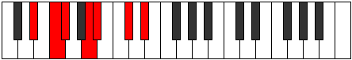 |
| [1229](https://ianring.com/musictheory/scales/1229) | [Ragimic](ModeGNaturalRagimic.md) | G | G, A, Bb, C#, D, E#, G | 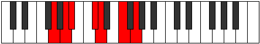 |
| [1231](https://ianring.com/musictheory/scales/1231) | [Logian](ModeDSharpLogian.md) | D# | D#, E, F, Gb, A, Bb, C#, D# |  |
| [1237](https://ianring.com/musictheory/scales/1237) | [Salimic](ModeDSharpSalimic.md) | D# | D#, E#, F##, G##, A#, B##, D# |  |
| [1237](https://ianring.com/musictheory/scales/1237) | [Salimic](ModeEFlatSalimic.md) | Eb | Eb, F, G, A, Bb, C#, Eb |  |
| [1239](https://ianring.com/musictheory/scales/1239) | [Epaptian](ModeDSharpEpaptian.md) | D# | D#, E, F, G, A, Bb, C#, D# |  |
| [1245](https://ianring.com/musictheory/scales/1245) | [Lathian](ModeDSharpLathian.md) | D# | D#, E#, F#, G, A, Bb, C#, D# |  |
| [1245](https://ianring.com/musictheory/scales/1245) | [Lathian](ModeGNaturalLathian.md) | G | G, A, Bb, Cb, Db, Ebb, F, G |  |
| [1247](https://ianring.com/musictheory/scales/1247) | [Mygyllic](ModeDSharpMygyllic.md) | D# | D#, E, F, F#, G, A, A#, C#, D# |  |
| [1247](https://ianring.com/musictheory/scales/1247) | [Mygyllic](ModeEFlatMygyllic.md) | Eb | Eb, E, F, Gb, G, A, Bb, Db, Eb |  |
| [1247](https://ianring.com/musictheory/scales/1247) | [Mygyllic](ModeGNaturalMygyllic.md) | G | G, G#, A, A#, B, C#, D, F, G |  |
| [1253](https://ianring.com/musictheory/scales/1253) | [Zolimic](ModeDSharpZolimic.md) | D# | D#, E#, F###, G##, A#, B##, D# |  |
| [1253](https://ianring.com/musictheory/scales/1253) | [Zolimic](ModeEFlatZolimic.md) | Eb | Eb, F, G#, A, Bb, C#, Eb |  |
| [1255](https://ianring.com/musictheory/scales/1255) | [Sogian](ModeDSharpSogian.md) | D# | D#, E, F, G#, A, Bb, C#, D# |  |
| [1261](https://ianring.com/musictheory/scales/1261) | [Aeodian](ModeGNaturalAeodian.md) | G | G, A, Bb, C, Db, Ebb, F, G |  |
| [1261](https://ianring.com/musictheory/scales/1261) | [Aeodian](ModeDSharpAeodian.md) | D# | D#, E#, F#, G#, A, Bb, C#, D# |  |
| [1263](https://ianring.com/musictheory/scales/1263) | [Stynyllic](ModeDSharpStynyllic.md) | D# | D#, E, F, F#, G#, A, A#, C#, D# |  |
| [1263](https://ianring.com/musictheory/scales/1263) | [Stynyllic](ModeEFlatStynyllic.md) | Eb | Eb, E, F, Gb, Ab, A, Bb, Db, Eb |  |
| [1263](https://ianring.com/musictheory/scales/1263) | [Stynyllic](ModeGNaturalStynyllic.md) | G | G, G#, A, A#, C, C#, D, F, G |  |
| [1269](https://ianring.com/musictheory/scales/1269) | [Katythian](ModeDSharpKatythian.md) | D# | D#, E#, F##, G#, A, Bb, C#, D# |  |
| [1271](https://ianring.com/musictheory/scales/1271) | [Kolyllic](ModeDSharpKolyllic.md) | D# | D#, E, F, G, G#, A, A#, C#, D# |  |
| [1271](https://ianring.com/musictheory/scales/1271) | [Kolyllic](ModeEFlatKolyllic.md) | Eb | Eb, E, F, G, Ab, A, Bb, Db, Eb |  |
| [1277](https://ianring.com/musictheory/scales/1277) | [Zadyllic](ModeDSharpZadyllic.md) | D# | D#, F, F#, G, G#, A, A#, C#, D# |  |
| [1277](https://ianring.com/musictheory/scales/1277) | [Zadyllic](ModeEFlatZadyllic.md) | Eb | Eb, F, Gb, G, Ab, A, Bb, Db, Eb |  |
| [1277](https://ianring.com/musictheory/scales/1277) | [Zadyllic](ModeGNaturalZadyllic.md) | G | G, A, A#, B, C, C#, D, F, G |  |
| [1279](https://ianring.com/musictheory/scales/1279) | [Sarygic](ModeDSharpSarygic.md) | D# | D#, E, F, F#, G, G#, A, A#, C#, D# |  |
| [1279](https://ianring.com/musictheory/scales/1279) | [Sarygic](ModeEFlatSarygic.md) | Eb | Eb, E, F, Gb, G, Ab, A, Bb, Db, Eb |  |
| [1279](https://ianring.com/musictheory/scales/1279) | [Sarygic](ModeGNaturalSarygic.md) | G | G, G#, A, A#, B, C, C#, D, F, G |  |
| [1299](https://ianring.com/musictheory/scales/1299) | [Aerophitonic](ModeANaturalAerophitonic.md) | A | A, A#, C#, F, G, A |  |
| [1303](https://ianring.com/musictheory/scales/1303) | [Epolimic](ModeANaturalEpolimic.md) | A | A, Bb, Cb, Db, E#, F##, A |  |
| [1307](https://ianring.com/musictheory/scales/1307) | [Katorimic](ModeANaturalKatorimic.md) | A | A, Bb, C, Db, E#, F##, A |  |
| [1311](https://ianring.com/musictheory/scales/1311) | [Bynian](ModeANaturalBynian.md) | A | A, Bb, Cb, Dbb, Ebbb, F, G, A |  |
| [1329](https://ianring.com/musictheory/scales/1329) | [Epygitonic](ModeFNaturalEpygitonic.md) | F | F, A, A#, C#, D#, F |  |
| [1331](https://ianring.com/musictheory/scales/1331) | [Dolimic](ModeFNaturalDolimic.md) | F | F, Gb, A, Bb, C#, D#, F |  |
| [1331](https://ianring.com/musictheory/scales/1331) | [Dolimic](ModeANaturalDolimic.md) | A | A, Bb, C#, D, E#, F##, A |  |
| [1333](https://ianring.com/musictheory/scales/1333) | [Lyptimic](ModeFNaturalLyptimic.md) | F | F, G, A, Bb, C#, D#, F |  |
| [1335](https://ianring.com/musictheory/scales/1335) | [Aeralian](ModeANaturalAeralian.md) | A | A, Bb, Cb, Db, Ebb, F, G, A |  |
| [1337](https://ianring.com/musictheory/scales/1337) | [Epogimic](ModeFNaturalEpogimic.md) | F | F, G#, A, Bb, C#, D#, F |  |
| [1339](https://ianring.com/musictheory/scales/1339) | [Kycrian](ModeANaturalKycrian.md) | A | A, Bb, C, Db, Ebb, F, G, A |  |
| [1343](https://ianring.com/musictheory/scales/1343) | [Zalyllic](ModeFNaturalZalyllic.md) | F | F, F#, G, G#, A, A#, C#, D#, F |  |
| [1343](https://ianring.com/musictheory/scales/1343) | [Zalyllic](ModeANaturalZalyllic.md) | A | A, A#, B, C, C#, D, F, G, A |  |
| [1357](https://ianring.com/musictheory/scales/1357) | [Katonimic](ModeGNaturalKatonimic.md) | G | G, A, Bb, C#, D#, E#, G |  |
| [1363](https://ianring.com/musictheory/scales/1363) | [Gygimic](ModeANaturalGygimic.md) | A | A, Bb, C#, D#, E#, F##, A |  |
| [1367](https://ianring.com/musictheory/scales/1367) | [Pyptian](ModeANaturalPyptian.md) | A | A, Bb, Cb, Db, Eb, F, G, A |  |
| [1371](https://ianring.com/musictheory/scales/1371) | [Ionadian](ModeANaturalIonadian.md) | A | A, Bb, C, Db, Eb, F, G, A |  |
| [1373](https://ianring.com/musictheory/scales/1373) | [Storian](ModeGNaturalStorian.md) | G | G, A, Bb, Cb, Db, Eb, F, G |  |
| [1375](https://ianring.com/musictheory/scales/1375) | [Bothyllic](ModeANaturalBothyllic.md) | A | A, A#, B, C, C#, D#, F, G, A |  |
| [1375](https://ianring.com/musictheory/scales/1375) | [Bothyllic](ModeGNaturalBothyllic.md) | G | G, G#, A, A#, B, C#, D#, F, G |  |
| [1389](https://ianring.com/musictheory/scales/1389) | [Lorian](ModeGNaturalLorian.md) | G | G, A, Bb, C, Db, Eb, F, G |  |
| [1391](https://ianring.com/musictheory/scales/1391) | [Aeradyllic](ModeGNaturalAeradyllic.md) | G | G, G#, A, A#, C, C#, D#, F, G |  |
| [1393](https://ianring.com/musictheory/scales/1393) | [Mycrimic](ModeFNaturalMycrimic.md) | F | F, G##, A#, B, C#, D#, F |  |
| [1395](https://ianring.com/musictheory/scales/1395) | [Mixonorian](ModeANaturalMixonorian.md) | A | A, Bb, C#, D, Eb, F, G, A |  |
| [1395](https://ianring.com/musictheory/scales/1395) | [Mixonorian](ModeFNaturalMixonorian.md) | F | F, Gb, A, Bb, Cb, Db, Eb, F |  |
| [1397](https://ianring.com/musictheory/scales/1397) | [Gothian](ModeFNaturalGothian.md) | F | F, G, A, Bb, Cb, Db, Eb, F |  |
| [1399](https://ianring.com/musictheory/scales/1399) | [Syryllic](ModeANaturalSyryllic.md) | A | A, A#, B, C#, D, D#, F, G, A |  |
| [1399](https://ianring.com/musictheory/scales/1399) | [Syryllic](ModeFNaturalSyryllic.md) | F | F, F#, G, A, A#, B, C#, D#, F |  |
| [1401](https://ianring.com/musictheory/scales/1401) | [Pagian](ModeFNaturalPagian.md) | F | F, G#, A, Bb, Cb, Db, Eb, F |  |
| [1403](https://ianring.com/musictheory/scales/1403) | [Epinyllic](ModeANaturalEpinyllic.md) | A | A, A#, C, C#, D, D#, F, G, A |  |
| [1403](https://ianring.com/musictheory/scales/1403) | [Epinyllic](ModeFNaturalEpinyllic.md) | F | F, F#, G#, A, A#, B, C#, D#, F |  |
| [1405](https://ianring.com/musictheory/scales/1405) | [Goryllic](ModeGNaturalGoryllic.md) | G | G, A, A#, B, C, C#, D#, F, G |  |
| [1405](https://ianring.com/musictheory/scales/1405) | [Goryllic](ModeFNaturalGoryllic.md) | F | F, G, G#, A, A#, B, C#, D#, F |  |
| [1407](https://ianring.com/musictheory/scales/1407) | [Tharygic](ModeANaturalTharygic.md) | A | A, A#, B, C, C#, D, D#, F, G, A |  |
| [1407](https://ianring.com/musictheory/scales/1407) | [Tharygic](ModeGNaturalTharygic.md) | G | G, G#, A, A#, B, C, C#, D#, F, G |  |
| [1407](https://ianring.com/musictheory/scales/1407) | [Tharygic](ModeFNaturalTharygic.md) | F | F, F#, G, G#, A, A#, B, C#, D#, F |  |
| [1427](https://ianring.com/musictheory/scales/1427) | [Lolimic](ModeANaturalLolimic.md) | A | A, Bb, C#, D##, E#, F##, A |  |
| [1431](https://ianring.com/musictheory/scales/1431) | [Phragian](ModeANaturalPhragian.md) | A | A, Bb, Cb, Db, E, F, G, A |  |
| [1435](https://ianring.com/musictheory/scales/1435) | [Phronian](ModeANaturalPhronian.md) | A | A, Bb, C, Db, E, F, G, A |  |
| [1439](https://ianring.com/musictheory/scales/1439) | [Rolyllic](ModeANaturalRolyllic.md) | A | A, A#, B, C, C#, E, F, G, A |  |
| [1457](https://ianring.com/musictheory/scales/1457) | [Modimic](ModeFNaturalModimic.md) | F | F, G##, A#, B#, C#, D#, F |  |
| [1459](https://ianring.com/musictheory/scales/1459) | [Ionalian](ModeFNaturalIonalian.md) | F | F, Gb, A, Bb, C, Db, Eb, F |  |
| [1459](https://ianring.com/musictheory/scales/1459) | [Ionalian](ModeANaturalIonalian.md) | A | A, Bb, C#, D, E, F, G, A |  |
| [1461](https://ianring.com/musictheory/scales/1461) | [Stydian](ModeFNaturalStydian.md) | F | F, G, A, Bb, C, Db, Eb, F |  |
| [1463](https://ianring.com/musictheory/scales/1463) | [Zaptyllic](ModeFNaturalZaptyllic.md) | F | F, F#, G, A, A#, C, C#, D#, F |  |
| [1463](https://ianring.com/musictheory/scales/1463) | [Zaptyllic](ModeANaturalZaptyllic.md) | A | A, A#, B, C#, D, E, F, G, A |  |
| [1465](https://ianring.com/musictheory/scales/1465) | [Aerathian](ModeFNaturalAerathian.md) | F | F, G#, A, Bb, C, Db, Eb, F |  |
| [1467](https://ianring.com/musictheory/scales/1467) | [Thydyllic](ModeANaturalThydyllic.md) | A | A, A#, C, C#, D, E, F, G, A |  |
| [1467](https://ianring.com/musictheory/scales/1467) | [Thydyllic](ModeFNaturalThydyllic.md) | F | F, F#, G#, A, A#, C, C#, D#, F |  |
| [1469](https://ianring.com/musictheory/scales/1469) | [Epiryllic](ModeFNaturalEpiryllic.md) | F | F, G, G#, A, A#, C, C#, D#, F |  |
| [1471](https://ianring.com/musictheory/scales/1471) | [Radygic](ModeFNaturalRadygic.md) | F | F, F#, G, G#, A, A#, C, C#, D#, F |  |
| [1471](https://ianring.com/musictheory/scales/1471) | [Radygic](ModeANaturalRadygic.md) | A | A, A#, B, C, C#, D, E, F, G, A |  |
| [1477](https://ianring.com/musictheory/scales/1477) | [Phrylimic](ModeEFlatPhrylimic.md) | Eb | Eb, F, G##, A#, B, C#, Eb |  |
| [1479](https://ianring.com/musictheory/scales/1479) | [Aeolagian](ModeDSharpAeolagian.md) | D# | D#, E, F, G##, A#, B, C#, D# |  |
| [1479](https://ianring.com/musictheory/scales/1479) | [Aeolagian](ModeEFlatAeolagian.md) | Eb | Eb, Fb, Gbb, A, Bb, Cb, Db, Eb |  |
| [1485](https://ianring.com/musictheory/scales/1485) | [Tyrian](ModeGNaturalTyrian.md) | G | G, A, Bb, C#, D, Eb, F, G |  |
| [1485](https://ianring.com/musictheory/scales/1485) | [Tyrian](ModeDSharpTyrian.md) | D# | D#, E#, F#, G##, A#, B, C#, D# |  |
| [1485](https://ianring.com/musictheory/scales/1485) | [Tyrian](ModeEFlatTyrian.md) | Eb | Eb, F, Gb, A, Bb, Cb, Db, Eb |  |
| [1487](https://ianring.com/musictheory/scales/1487) | [Lycryllic](ModeGNaturalLycryllic.md) | G | G, G#, A, A#, C#, D, D#, F, G |  |
| [1487](https://ianring.com/musictheory/scales/1487) | [Lycryllic](ModeDSharpLycryllic.md) | D# | D#, E, F, F#, A, A#, B, C#, D# |  |
| [1487](https://ianring.com/musictheory/scales/1487) | [Lycryllic](ModeEFlatLycryllic.md) | Eb | Eb, E, F, Gb, A, Bb, B, Db, Eb |  |
| [1491](https://ianring.com/musictheory/scales/1491) | [Rynian](ModeANaturalRynian.md) | A | A, Bb, C#, D#, E, F, G, A |  |
| [1493](https://ianring.com/musictheory/scales/1493) | [Phryrian](ModeDSharpPhryrian.md) | D# | D#, E#, F##, G##, A#, B, C#, D# |  |
| [1493](https://ianring.com/musictheory/scales/1493) | [Phryrian](ModeEFlatPhryrian.md) | Eb | Eb, F, G, A, Bb, Cb, Db, Eb |  |
| [1495](https://ianring.com/musictheory/scales/1495) | [Kaptyllic](ModeDSharpKaptyllic.md) | D# | D#, E, F, G, A, A#, B, C#, D# |  |
| [1495](https://ianring.com/musictheory/scales/1495) | [Kaptyllic](ModeEFlatKaptyllic.md) | Eb | Eb, E, F, G, A, Bb, B, Db, Eb |  |
| [1495](https://ianring.com/musictheory/scales/1495) | [Kaptyllic](ModeANaturalKaptyllic.md) | A | A, A#, B, C#, D#, E, F, G, A | 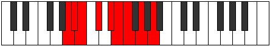 |
| [1499](https://ianring.com/musictheory/scales/1499) | [Stonyllic](ModeANaturalStonyllic.md) | A | A, A#, C, C#, D#, E, F, G, A |  |
| [1501](https://ianring.com/musictheory/scales/1501) | [Stygyllic](ModeGNaturalStygyllic.md) | G | G, A, A#, B, C#, D, D#, F, G |  |
| [1501](https://ianring.com/musictheory/scales/1501) | [Stygyllic](ModeDSharpStygyllic.md) | D# | D#, F, F#, G, A, A#, B, C#, D# |  |
| [1501](https://ianring.com/musictheory/scales/1501) | [Stygyllic](ModeEFlatStygyllic.md) | Eb | Eb, F, Gb, G, A, Bb, B, Db, Eb |  |
| [1503](https://ianring.com/musictheory/scales/1503) | [Padygic](ModeANaturalPadygic.md) | A | A, A#, B, C, C#, D#, E, F, G, A |  |
| [1503](https://ianring.com/musictheory/scales/1503) | [Padygic](ModeDSharpPadygic.md) | D# | D#, E, F, F#, G, A, A#, B, C#, D# |  |
| [1503](https://ianring.com/musictheory/scales/1503) | [Padygic](ModeEFlatPadygic.md) | Eb | Eb, E, F, Gb, G, A, Bb, B, Db, Eb |  |
| [1503](https://ianring.com/musictheory/scales/1503) | [Padygic](ModeGNaturalPadygic.md) | G | G, G#, A, A#, B, C#, D, D#, F, G |  |
| [1509](https://ianring.com/musictheory/scales/1509) | [Ragian](ModeDSharpRagian.md) | D# | D#, E#, F###, G##, A#, B, C#, D# |  |
| [1509](https://ianring.com/musictheory/scales/1509) | [Ragian](ModeEFlatRagian.md) | Eb | Eb, F, G#, A, Bb, Cb, Db, Eb |  |
| [1511](https://ianring.com/musictheory/scales/1511) | [Styptyllic](ModeDSharpStyptyllic.md) | D# | D#, E, F, G#, A, A#, B, C#, D# |  |
| [1511](https://ianring.com/musictheory/scales/1511) | [Styptyllic](ModeEFlatStyptyllic.md) | Eb | Eb, E, F, Ab, A, Bb, B, Db, Eb | 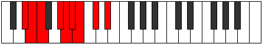 |
| [1517](https://ianring.com/musictheory/scales/1517) | [Sagyllic](ModeGNaturalSagyllic.md) | G | G, A, A#, C, C#, D, D#, F, G |  |
| [1517](https://ianring.com/musictheory/scales/1517) | [Sagyllic](ModeDSharpSagyllic.md) | D# | D#, F, F#, G#, A, A#, B, C#, D# |  |
| [1517](https://ianring.com/musictheory/scales/1517) | [Sagyllic](ModeEFlatSagyllic.md) | Eb | Eb, F, Gb, Ab, A, Bb, B, Db, Eb |  |
| [1519](https://ianring.com/musictheory/scales/1519) | [Solygic](ModeGNaturalSolygic.md) | G | G, G#, A, A#, C, C#, D, D#, F, G |  |
| [1519](https://ianring.com/musictheory/scales/1519) | [Solygic](ModeDSharpSolygic.md) | D# | D#, E, F, F#, G#, A, A#, B, C#, D# |  |
| [1519](https://ianring.com/musictheory/scales/1519) | [Solygic](ModeEFlatSolygic.md) | Eb | Eb, E, F, Gb, Ab, A, Bb, B, Db, Eb |  |
| [1521](https://ianring.com/musictheory/scales/1521) | [Stanian](ModeFNaturalStanian.md) | F | F, G##, A#, B, C, Db, Eb, F |  |
| [1523](https://ianring.com/musictheory/scales/1523) | [Zothyllic](ModeANaturalZothyllic.md) | A | A, A#, C#, D, D#, E, F, G, A |  |
| [1523](https://ianring.com/musictheory/scales/1523) | [Zothyllic](ModeFNaturalZothyllic.md) | F | F, F#, A, A#, B, C, C#, D#, F |  |
| [1525](https://ianring.com/musictheory/scales/1525) | [Sodyllic](ModeFNaturalSodyllic.md) | F | F, G, A, A#, B, C, C#, D#, F |  |
| [1525](https://ianring.com/musictheory/scales/1525) | [Sodyllic](ModeDSharpSodyllic.md) | D# | D#, F, G, G#, A, A#, B, C#, D# |  |
| [1525](https://ianring.com/musictheory/scales/1525) | [Sodyllic](ModeEFlatSodyllic.md) | Eb | Eb, F, G, Ab, A, Bb, B, Db, Eb |  |
| [1527](https://ianring.com/musictheory/scales/1527) | [Aeolyrygic](ModeANaturalAeolyrygic.md) | A | A, A#, B, C#, D, D#, E, F, G, A |  |
| [1527](https://ianring.com/musictheory/scales/1527) | [Aeolyrygic](ModeFNaturalAeolyrygic.md) | F | F, F#, G, A, A#, B, C, C#, D#, F |  |
| [1527](https://ianring.com/musictheory/scales/1527) | [Aeolyrygic](ModeDSharpAeolyrygic.md) | D# | D#, E, F, G, G#, A, A#, B, C#, D# |  |
| [1527](https://ianring.com/musictheory/scales/1527) | [Aeolyrygic](ModeEFlatAeolyrygic.md) | Eb | Eb, E, F, G, Ab, A, Bb, B, Db, Eb |  |
| [1529](https://ianring.com/musictheory/scales/1529) | [Kataryllic](ModeFNaturalKataryllic.md) | F | F, G#, A, A#, B, C, C#, D#, F |  |
| [1531](https://ianring.com/musictheory/scales/1531) | [Styptygic](ModeANaturalStyptygic.md) | A | A, A#, C, C#, D, D#, E, F, G, A | 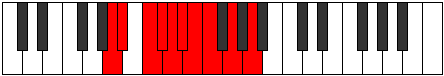 |
| [1531](https://ianring.com/musictheory/scales/1531) | [Styptygic](ModeFNaturalStyptygic.md) | F | F, F#, G#, A, A#, B, C, C#, D#, F |  |
| [1533](https://ianring.com/musictheory/scales/1533) | [Katycrygic](ModeGNaturalKatycrygic.md) | G | G, A, A#, B, C, C#, D, D#, F, G |  |
| [1533](https://ianring.com/musictheory/scales/1533) | [Katycrygic](ModeFNaturalKatycrygic.md) | F | F, G, G#, A, A#, B, C, C#, D#, F |  |
| [1533](https://ianring.com/musictheory/scales/1533) | [Katycrygic](ModeDSharpKatycrygic.md) | D# | D#, F, F#, G, G#, A, A#, B, C#, D# |  |
| [1533](https://ianring.com/musictheory/scales/1533) | [Katycrygic](ModeEFlatKatycrygic.md) | Eb | Eb, F, Gb, G, Ab, A, Bb, B, Db, Eb |  |
| [1535](https://ianring.com/musictheory/scales/1535) | [Mixodyllian](ModeANaturalMixodyllian.md) | A | A, A#, B, C, C#, D, D#, E, F, G, A |  |
| [1535](https://ianring.com/musictheory/scales/1535) | [Mixodyllian](ModeGNaturalMixodyllian.md) | G | G, G#, A, A#, B, C, C#, D, D#, F, G |  |
| [1535](https://ianring.com/musictheory/scales/1535) | [Mixodyllian](ModeFNaturalMixodyllian.md) | F | F, F#, G, G#, A, A#, B, C, C#, D#, F |  |
| [1535](https://ianring.com/musictheory/scales/1535) | [Mixodyllian](ModeDSharpMixodyllian.md) | D# | D#, E, F, F#, G, G#, A, A#, B, C#, D# |  |
| [1535](https://ianring.com/musictheory/scales/1535) | [Mixodyllian](ModeEFlatMixodyllian.md) | Eb | Eb, E, F, Gb, G, Ab, A, Bb, B, Db, Eb |  |
| [1571](https://ianring.com/musictheory/scales/1571) | [Lagitonic](ModeCNaturalLagitonic.md) | C | C, C#, F, A, A#, C |  |
| [1575](https://ianring.com/musictheory/scales/1575) | [Zycrimic](ModeCNaturalZycrimic.md) | C | C, Db, Ebb, F, G##, A#, C |  |
| [1575](https://ianring.com/musictheory/scales/1575) | [Zycrimic](ModeGSharpZycrimic.md) | G# | G#, A, Bb, C#, D###, E##, G# |  |
| [1579](https://ianring.com/musictheory/scales/1579) | [Sagimic](ModeCNaturalSagimic.md) | C | C, Db, Eb, F, G##, A#, C |  |
| [1583](https://ianring.com/musictheory/scales/1583) | [Salian](ModeCNaturalSalian.md) | C | C, Db, Ebb, Fbb, Gbb, A, Bb, C |  |
| [1583](https://ianring.com/musictheory/scales/1583) | [Salian](ModeGSharpSalian.md) | G# | G#, A, Bb, Cb, Db, E#, F#, G# | 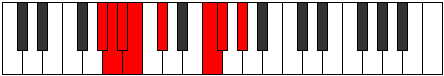 |
| [1587](https://ianring.com/musictheory/scales/1587) | [Lalimic](ModeCNaturalLalimic.md) | C | C, Db, E, F, G##, A#, C |  |
| [1591](https://ianring.com/musictheory/scales/1591) | [Rodian](ModeCNaturalRodian.md) | C | C, Db, Ebb, Fb, Gbb, A, Bb, C |  |
| [1591](https://ianring.com/musictheory/scales/1591) | [Rodian](ModeGSharpRodian.md) | G# | G#, A, Bb, C, Db, E#, F#, G# |  |
| [1595](https://ianring.com/musictheory/scales/1595) | [Dacrian](ModeCNaturalDacrian.md) | C | C, Db, Eb, Fb, Gbb, A, Bb, C |  |
| [1599](https://ianring.com/musictheory/scales/1599) | [Pocryllic](ModeCNaturalPocryllic.md) | C | C, C#, D, D#, E, F, A, A#, C |  |
| [1599](https://ianring.com/musictheory/scales/1599) | [Pocryllic](ModeGSharpPocryllic.md) | G# | G#, A, A#, B, C, C#, F, F#, G# |  |
| [1599](https://ianring.com/musictheory/scales/1599) | [Pocryllic](ModeAFlatPocryllic.md) | Ab | Ab, A, Bb, B, C, Db, F, Gb, Ab |  |
| [1613](https://ianring.com/musictheory/scales/1613) | [Thylimic](ModeGNaturalThylimic.md) | G | G, A, Bb, C#, D##, E#, G |  |
| [1629](https://ianring.com/musictheory/scales/1629) | [Synian](ModeGNaturalSynian.md) | G | G, A, Bb, Cb, Db, E, F, G |  |
| [1631](https://ianring.com/musictheory/scales/1631) | [Rynyllic](ModeGNaturalRynyllic.md) | G | G, G#, A, A#, B, C#, E, F, G |  |
| [1635](https://ianring.com/musictheory/scales/1635) | [Sygimic](ModeENaturalSygimic.md) | E | E, F, G##, A#, B##, C##, E |  |
| [1635](https://ianring.com/musictheory/scales/1635) | [Sygimic](ModeCNaturalSygimic.md) | C | C, Db, E#, F#, G##, A#, C | 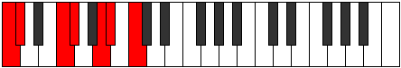 |
| [1639](https://ianring.com/musictheory/scales/1639) | [Aeolothian](ModeCNaturalAeolothian.md) | C | C, Db, Ebb, F, Gb, A, Bb, C |  |
| [1639](https://ianring.com/musictheory/scales/1639) | [Aeolothian](ModeENaturalAeolothian.md) | E | E, F, Gb, A, Bb, C#, D, E |  |
| [1639](https://ianring.com/musictheory/scales/1639) | [Aeolothian](ModeGSharpAeolothian.md) | G# | G#, A, Bb, C#, D, E#, F#, G# |  |
| [1643](https://ianring.com/musictheory/scales/1643) | [Thyptian](ModeCNaturalThyptian.md) | C | C, Db, Eb, F, Gb, A, Bb, C |  |
| [1643](https://ianring.com/musictheory/scales/1643) | [Thyptian](ModeENaturalThyptian.md) | E | E, F, G, A, Bb, C#, D, E |  |
| [1645](https://ianring.com/musictheory/scales/1645) | [Katagian](ModeGNaturalKatagian.md) | G | G, A, Bb, C, Db, E, F, G |  |
| [1647](https://ianring.com/musictheory/scales/1647) | [Polyllic](ModeCNaturalPolyllic.md) | C | C, C#, D, D#, F, F#, A, A#, C |  |
| [1647](https://ianring.com/musictheory/scales/1647) | [Polyllic](ModeENaturalPolyllic.md) | E | E, F, F#, G, A, A#, C#, D, E |  |
| [1647](https://ianring.com/musictheory/scales/1647) | [Polyllic](ModeGNaturalPolyllic.md) | G | G, G#, A, A#, C, C#, E, F, G | 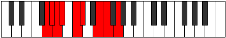 |
| [1647](https://ianring.com/musictheory/scales/1647) | [Polyllic](ModeGSharpPolyllic.md) | G# | G#, A, A#, B, C#, D, F, F#, G# |  |
| [1647](https://ianring.com/musictheory/scales/1647) | [Polyllic](ModeAFlatPolyllic.md) | Ab | Ab, A, Bb, B, Db, D, F, Gb, Ab |  |
| [1651](https://ianring.com/musictheory/scales/1651) | [Mogian](ModeCNaturalMogian.md) | C | C, Db, E, F, Gb, A, Bb, C |  |
| [1651](https://ianring.com/musictheory/scales/1651) | [Mogian](ModeENaturalMogian.md) | E | E, F, G#, A, Bb, C#, D, E |  |
| [1655](https://ianring.com/musictheory/scales/1655) | [Katygyllic](ModeCNaturalKatygyllic.md) | C | C, C#, D, E, F, F#, A, A#, C |  |
| [1655](https://ianring.com/musictheory/scales/1655) | [Katygyllic](ModeGSharpKatygyllic.md) | G# | G#, A, A#, C, C#, D, F, F#, G# |  |
| [1655](https://ianring.com/musictheory/scales/1655) | [Katygyllic](ModeAFlatKatygyllic.md) | Ab | Ab, A, Bb, C, Db, D, F, Gb, Ab |  |
| [1655](https://ianring.com/musictheory/scales/1655) | [Katygyllic](ModeENaturalKatygyllic.md) | E | E, F, F#, G#, A, A#, C#, D, E |  |
| [1659](https://ianring.com/musictheory/scales/1659) | [Magyllic](ModeCNaturalMagyllic.md) | C | C, C#, D#, E, F, F#, A, A#, C |  |
| [1659](https://ianring.com/musictheory/scales/1659) | [Magyllic](ModeENaturalMagyllic.md) | E | E, F, G, G#, A, A#, C#, D, E |  |
| [1661](https://ianring.com/musictheory/scales/1661) | [Gonyllic](ModeGNaturalGonyllic.md) | G | G, A, A#, B, C, C#, E, F, G |  |
| [1663](https://ianring.com/musictheory/scales/1663) | [Lydygic](ModeCNaturalLydygic.md) | C | C, C#, D, D#, E, F, F#, A, A#, C |  |
| [1663](https://ianring.com/musictheory/scales/1663) | [Lydygic](ModeENaturalLydygic.md) | E | E, F, F#, G, G#, A, A#, C#, D, E |  |
| [1663](https://ianring.com/musictheory/scales/1663) | [Lydygic](ModeGSharpLydygic.md) | G# | G#, A, A#, B, C, C#, D, F, F#, G# |  |
| [1663](https://ianring.com/musictheory/scales/1663) | [Lydygic](ModeAFlatLydygic.md) | Ab | Ab, A, Bb, B, C, Db, D, F, Gb, Ab |  |
| [1663](https://ianring.com/musictheory/scales/1663) | [Lydygic](ModeGNaturalLydygic.md) | G | G, G#, A, A#, B, C, C#, E, F, G |  |
| [1699](https://ianring.com/musictheory/scales/1699) | [Kaptimic](ModeCNaturalKaptimic.md) | C | C, Db, E#, F##, G##, A#, C |  |
| [1703](https://ianring.com/musictheory/scales/1703) | [Zaptian](ModeCNaturalZaptian.md) | C | C, Db, Ebb, F, G, A, Bb, C |  |
| [1703](https://ianring.com/musictheory/scales/1703) | [Zaptian](ModeGSharpZaptian.md) | G# | G#, A, Bb, C#, D#, E#, F#, G# |  |
| [1707](https://ianring.com/musictheory/scales/1707) | [Mixolythian](ModeCNaturalMixolythian.md) | C | C, Db, Eb, F, G, A, Bb, C |  |
| [1711](https://ianring.com/musictheory/scales/1711) | [Ragyllic](ModeCNaturalRagyllic.md) | C | C, C#, D, D#, F, G, A, A#, C |  |
| [1711](https://ianring.com/musictheory/scales/1711) | [Ragyllic](ModeGSharpRagyllic.md) | G# | G#, A, A#, B, C#, D#, F, F#, G# |  |
| [1711](https://ianring.com/musictheory/scales/1711) | [Ragyllic](ModeAFlatRagyllic.md) | Ab | Ab, A, Bb, B, Db, Eb, F, Gb, Ab |  |
| [1715](https://ianring.com/musictheory/scales/1715) | [Aeronian](ModeCNaturalAeronian.md) | C | C, Db, E, F, G, A, Bb, C |  |
| [1719](https://ianring.com/musictheory/scales/1719) | [Lyryllic](ModeCNaturalLyryllic.md) | C | C, C#, D, E, F, G, A, A#, C |  |
| [1719](https://ianring.com/musictheory/scales/1719) | [Lyryllic](ModeGSharpLyryllic.md) | G# | G#, A, A#, C, C#, D#, F, F#, G# |  |
| [1719](https://ianring.com/musictheory/scales/1719) | [Lyryllic](ModeAFlatLyryllic.md) | Ab | Ab, A, Bb, C, Db, Eb, F, Gb, Ab |  |
| [1723](https://ianring.com/musictheory/scales/1723) | [Poryllic](ModeCNaturalPoryllic.md) | C | C, C#, D#, E, F, G, A, A#, C |  |
| [1727](https://ianring.com/musictheory/scales/1727) | [Sydygic](ModeCNaturalSydygic.md) | C | C, C#, D, D#, E, F, G, A, A#, C |  |
| [1727](https://ianring.com/musictheory/scales/1727) | [Sydygic](ModeGSharpSydygic.md) | G# | G#, A, A#, B, C, C#, D#, F, F#, G# |  |
| [1727](https://ianring.com/musictheory/scales/1727) | [Sydygic](ModeAFlatSydygic.md) | Ab | Ab, A, Bb, B, C, Db, Eb, F, Gb, Ab |  |
| [1733](https://ianring.com/musictheory/scales/1733) | [Socrimic](ModeEFlatSocrimic.md) | Eb | Eb, F, G##, A#, B#, C#, Eb |  |
| [1735](https://ianring.com/musictheory/scales/1735) | [Dagian](ModeDSharpDagian.md) | D# | D#, E, F, G##, A#, B#, C#, D# |  |
| [1735](https://ianring.com/musictheory/scales/1735) | [Dagian](ModeEFlatDagian.md) | Eb | Eb, Fb, Gbb, A, Bb, C, Db, Eb |  |
| [1741](https://ianring.com/musictheory/scales/1741) | [Katycrian](ModeDSharpKatycrian.md) | D# | D#, E#, F#, G##, A#, B#, C#, D# |  |
| [1741](https://ianring.com/musictheory/scales/1741) | [Katycrian](ModeEFlatKatycrian.md) | Eb | Eb, F, Gb, A, Bb, C, Db, Eb |  |
| [1741](https://ianring.com/musictheory/scales/1741) | [Katycrian](ModeGNaturalKatycrian.md) | G | G, A, Bb, C#, D, E, F, G |  |
| [1743](https://ianring.com/musictheory/scales/1743) | [Epigyllic](ModeDSharpEpigyllic.md) | D# | D#, E, F, F#, A, A#, C, C#, D# |  |
| [1743](https://ianring.com/musictheory/scales/1743) | [Epigyllic](ModeEFlatEpigyllic.md) | Eb | Eb, E, F, Gb, A, Bb, C, Db, Eb |  |
| [1743](https://ianring.com/musictheory/scales/1743) | [Epigyllic](ModeGNaturalEpigyllic.md) | G | G, G#, A, A#, C#, D, E, F, G |  |
| [1749](https://ianring.com/musictheory/scales/1749) | [Lythian](ModeDSharpLythian.md) | D# | D#, E#, F##, G##, A#, B#, C#, D# |  |
| [1749](https://ianring.com/musictheory/scales/1749) | [Lythian](ModeEFlatLythian.md) | Eb | Eb, F, G, A, Bb, C, Db, Eb |  |
| [1751](https://ianring.com/musictheory/scales/1751) | [Aeolyryllic](ModeDSharpAeolyryllic.md) | D# | D#, E, F, G, A, A#, C, C#, D# |  |
| [1751](https://ianring.com/musictheory/scales/1751) | [Aeolyryllic](ModeEFlatAeolyryllic.md) | Eb | Eb, E, F, G, A, Bb, C, Db, Eb |  |
| [1757](https://ianring.com/musictheory/scales/1757) | [Ionyphyllic](ModeDSharpIonyphyllic.md) | D# | D#, F, F#, G, A, A#, C, C#, D# |  |
| [1757](https://ianring.com/musictheory/scales/1757) | [Ionyphyllic](ModeEFlatIonyphyllic.md) | Eb | Eb, F, Gb, G, A, Bb, C, Db, Eb |  |
| [1757](https://ianring.com/musictheory/scales/1757) | [Ionyphyllic](ModeGNaturalIonyphyllic.md) | G | G, A, A#, B, C#, D, E, F, G |  |
| [1759](https://ianring.com/musictheory/scales/1759) | [Pylygic](ModeDSharpPylygic.md) | D# | D#, E, F, F#, G, A, A#, C, C#, D# |  |
| [1759](https://ianring.com/musictheory/scales/1759) | [Pylygic](ModeEFlatPylygic.md) | Eb | Eb, E, F, Gb, G, A, Bb, C, Db, Eb |  |
| [1759](https://ianring.com/musictheory/scales/1759) | [Pylygic](ModeGNaturalPylygic.md) | G | G, G#, A, A#, B, C#, D, E, F, G |  |
| [1763](https://ianring.com/musictheory/scales/1763) | [Katalian](ModeCNaturalKatalian.md) | C | C, Db, E#, F#, G, A, Bb, C |  |
| [1763](https://ianring.com/musictheory/scales/1763) | [Katalian](ModeENaturalKatalian.md) | E | E, F, G##, A#, B, C#, D, E |  |
| [1765](https://ianring.com/musictheory/scales/1765) | [Lonian](ModeDSharpLonian.md) | D# | D#, E#, F###, G##, A#, B#, C#, D# |  |
| [1765](https://ianring.com/musictheory/scales/1765) | [Lonian](ModeEFlatLonian.md) | Eb | Eb, F, G#, A, Bb, C, Db, Eb |  |
| [1767](https://ianring.com/musictheory/scales/1767) | [Dyryllic](ModeCNaturalDyryllic.md) | C | C, C#, D, F, F#, G, A, A#, C |  |
| [1767](https://ianring.com/musictheory/scales/1767) | [Dyryllic](ModeDSharpDyryllic.md) | D# | D#, E, F, G#, A, A#, C, C#, D# |  |
| [1767](https://ianring.com/musictheory/scales/1767) | [Dyryllic](ModeEFlatDyryllic.md) | Eb | Eb, E, F, Ab, A, Bb, C, Db, Eb |  |
| [1767](https://ianring.com/musictheory/scales/1767) | [Dyryllic](ModeGSharpDyryllic.md) | G# | G#, A, A#, C#, D, D#, F, F#, G# |  |
| [1767](https://ianring.com/musictheory/scales/1767) | [Dyryllic](ModeAFlatDyryllic.md) | Ab | Ab, A, Bb, Db, D, Eb, F, Gb, Ab |  |
| [1767](https://ianring.com/musictheory/scales/1767) | [Dyryllic](ModeENaturalDyryllic.md) | E | E, F, F#, A, A#, B, C#, D, E |  |
| [1771](https://ianring.com/musictheory/scales/1771) | [Stylyllic](ModeCNaturalStylyllic.md) | C | C, C#, D#, F, F#, G, A, A#, C |  |
| [1771](https://ianring.com/musictheory/scales/1771) | [Stylyllic](ModeENaturalStylyllic.md) | E | E, F, G, A, A#, B, C#, D, E |  |
| [1773](https://ianring.com/musictheory/scales/1773) | [Aeoloryllic](ModeGNaturalAeoloryllic.md) | G | G, A, A#, C, C#, D, E, F, G |  |
| [1773](https://ianring.com/musictheory/scales/1773) | [Aeoloryllic](ModeDSharpAeoloryllic.md) | D# | D#, F, F#, G#, A, A#, C, C#, D# |  |
| [1773](https://ianring.com/musictheory/scales/1773) | [Aeoloryllic](ModeEFlatAeoloryllic.md) | Eb | Eb, F, Gb, Ab, A, Bb, C, Db, Eb |  |
| [1775](https://ianring.com/musictheory/scales/1775) | [Lyrygic](ModeCNaturalLyrygic.md) | C | C, C#, D, D#, F, F#, G, A, A#, C |  |
| [1775](https://ianring.com/musictheory/scales/1775) | [Lyrygic](ModeDSharpLyrygic.md) | D# | D#, E, F, F#, G#, A, A#, C, C#, D# |  |
| [1775](https://ianring.com/musictheory/scales/1775) | [Lyrygic](ModeEFlatLyrygic.md) | Eb | Eb, E, F, Gb, Ab, A, Bb, C, Db, Eb |  |
| [1775](https://ianring.com/musictheory/scales/1775) | [Lyrygic](ModeGNaturalLyrygic.md) | G | G, G#, A, A#, C, C#, D, E, F, G |  |
| [1775](https://ianring.com/musictheory/scales/1775) | [Lyrygic](ModeENaturalLyrygic.md) | E | E, F, F#, G, A, A#, B, C#, D, E |  |
| [1775](https://ianring.com/musictheory/scales/1775) | [Lyrygic](ModeGSharpLyrygic.md) | G# | G#, A, A#, B, C#, D, D#, F, F#, G# |  |
| [1775](https://ianring.com/musictheory/scales/1775) | [Lyrygic](ModeAFlatLyrygic.md) | Ab | Ab, A, Bb, B, Db, D, Eb, F, Gb, Ab |  |
| [1779](https://ianring.com/musictheory/scales/1779) | [Aerythyllic](ModeCNaturalAerythyllic.md) | C | C, C#, E, F, F#, G, A, A#, C |  |
| [1779](https://ianring.com/musictheory/scales/1779) | [Aerythyllic](ModeENaturalAerythyllic.md) | E | E, F, G#, A, A#, B, C#, D, E |  |
| [1781](https://ianring.com/musictheory/scales/1781) | [Gocryllic](ModeDSharpGocryllic.md) | D# | D#, F, G, G#, A, A#, C, C#, D# |  |
| [1781](https://ianring.com/musictheory/scales/1781) | [Gocryllic](ModeEFlatGocryllic.md) | Eb | Eb, F, G, Ab, A, Bb, C, Db, Eb |  |
| [1783](https://ianring.com/musictheory/scales/1783) | [Danygic](ModeCNaturalDanygic.md) | C | C, C#, D, E, F, F#, G, A, A#, C |  |
| [1783](https://ianring.com/musictheory/scales/1783) | [Danygic](ModeGSharpDanygic.md) | G# | G#, A, A#, C, C#, D, D#, F, F#, G# |  |
| [1783](https://ianring.com/musictheory/scales/1783) | [Danygic](ModeAFlatDanygic.md) | Ab | Ab, A, Bb, C, Db, D, Eb, F, Gb, Ab |  |
| [1783](https://ianring.com/musictheory/scales/1783) | [Danygic](ModeDSharpDanygic.md) | D# | D#, E, F, G, G#, A, A#, C, C#, D# |  |
| [1783](https://ianring.com/musictheory/scales/1783) | [Danygic](ModeEFlatDanygic.md) | Eb | Eb, E, F, G, Ab, A, Bb, C, Db, Eb |  |
| [1783](https://ianring.com/musictheory/scales/1783) | [Danygic](ModeENaturalDanygic.md) | E | E, F, F#, G#, A, A#, B, C#, D, E |  |
| [1787](https://ianring.com/musictheory/scales/1787) | [Mycrygic](ModeCNaturalMycrygic.md) | C | C, C#, D#, E, F, F#, G, A, A#, C |  |
| [1787](https://ianring.com/musictheory/scales/1787) | [Mycrygic](ModeENaturalMycrygic.md) | E | E, F, G, G#, A, A#, B, C#, D, E |  |
| [1789](https://ianring.com/musictheory/scales/1789) | [Katagygic](ModeDSharpKatagygic.md) | D# | D#, F, F#, G, G#, A, A#, C, C#, D# |  |
| [1789](https://ianring.com/musictheory/scales/1789) | [Katagygic](ModeEFlatKatagygic.md) | Eb | Eb, F, Gb, G, Ab, A, Bb, C, Db, Eb |  |
| [1789](https://ianring.com/musictheory/scales/1789) | [Katagygic](ModeGNaturalKatagygic.md) | G | G, A, A#, B, C, C#, D, E, F, G |  |
| [1791](https://ianring.com/musictheory/scales/1791) | [Aerygyllian](ModeCNaturalAerygyllian.md) | C | C, C#, D, D#, E, F, F#, G, A, A#, C |  |
| [1791](https://ianring.com/musictheory/scales/1791) | [Aerygyllian](ModeDSharpAerygyllian.md) | D# | D#, E, F, F#, G, G#, A, A#, C, C#, D# |  |
| [1791](https://ianring.com/musictheory/scales/1791) | [Aerygyllian](ModeEFlatAerygyllian.md) | Eb | Eb, E, F, Gb, G, Ab, A, Bb, C, Db, Eb |  |
| [1791](https://ianring.com/musictheory/scales/1791) | [Aerygyllian](ModeGSharpAerygyllian.md) | G# | G#, A, A#, B, C, C#, D, D#, F, F#, G# |  |
| [1791](https://ianring.com/musictheory/scales/1791) | [Aerygyllian](ModeAFlatAerygyllian.md) | Ab | Ab, A, Bb, B, C, Db, D, Eb, F, Gb, Ab |  |
| [1791](https://ianring.com/musictheory/scales/1791) | [Aerygyllian](ModeGNaturalAerygyllian.md) | G | G, G#, A, A#, B, C, C#, D, E, F, G |  |
| [1791](https://ianring.com/musictheory/scales/1791) | [Aerygyllian](ModeENaturalAerygyllian.md) | E | E, F, F#, G, G#, A, A#, B, C#, D, E |  |
| [1809](https://ianring.com/musictheory/scales/1809) | [Ranitonic](ModeCSharpRanitonic.md) | C# | C#, F, A, A#, B, C# |  |
| [1809](https://ianring.com/musictheory/scales/1809) | [Ranitonic](ModeDFlatRanitonic.md) | Db | Db, F, A, Bb, B, Db |  |
| [1811](https://ianring.com/musictheory/scales/1811) | [Kyptimic](ModeANaturalKyptimic.md) | A | A, Bb, C#, D###, E##, F##, A |  |
| [1811](https://ianring.com/musictheory/scales/1811) | [Kyptimic](ModeDFlatKyptimic.md) | Db | Db, Ebb, F, G##, A#, B, Db |  |
| [1813](https://ianring.com/musictheory/scales/1813) | [Katothimic](ModeDFlatKatothimic.md) | Db | Db, Eb, F, G##, A#, B, Db | 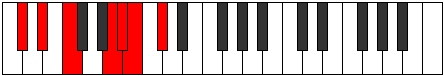 |
| [1815](https://ianring.com/musictheory/scales/1815) | [Godian](ModeCSharpGodian.md) | C# | C#, D, Eb, F, G##, A#, B, C# |  |
| [1815](https://ianring.com/musictheory/scales/1815) | [Godian](ModeDFlatGodian.md) | Db | Db, Ebb, Fbb, Gbb, A, Bb, Cb, Db |  |
| [1815](https://ianring.com/musictheory/scales/1815) | [Godian](ModeANaturalGodian.md) | A | A, Bb, Cb, Db, E#, F#, G, A |  |
| [1817](https://ianring.com/musictheory/scales/1817) | [Phrythimic](ModeDFlatPhrythimic.md) | Db | Db, E, F, G##, A#, B, Db |  |
| [1819](https://ianring.com/musictheory/scales/1819) | [Pydian](ModeANaturalPydian.md) | A | A, Bb, C, Db, E#, F#, G, A |  |
| [1819](https://ianring.com/musictheory/scales/1819) | [Pydian](ModeCSharpPydian.md) | C# | C#, D, E, F, G##, A#, B, C# |  |
| [1819](https://ianring.com/musictheory/scales/1819) | [Pydian](ModeDFlatPydian.md) | Db | Db, Ebb, Fb, Gbb, A, Bb, Cb, Db |  |
| [1821](https://ianring.com/musictheory/scales/1821) | [Aeradian](ModeCSharpAeradian.md) | C# | C#, D#, E, F, G##, A#, B, C# |  |
| [1821](https://ianring.com/musictheory/scales/1821) | [Aeradian](ModeDFlatAeradian.md) | Db | Db, Eb, Fb, Gbb, A, Bb, Cb, Db |  |
| [1823](https://ianring.com/musictheory/scales/1823) | [Phralyllic](ModeCSharpPhralyllic.md) | C# | C#, D, D#, E, F, A, A#, B, C# |  |
| [1823](https://ianring.com/musictheory/scales/1823) | [Phralyllic](ModeDFlatPhralyllic.md) | Db | Db, D, Eb, E, F, A, Bb, B, Db |  |
| [1823](https://ianring.com/musictheory/scales/1823) | [Phralyllic](ModeANaturalPhralyllic.md) | A | A, A#, B, C, C#, F, F#, G, A |  |
| [1827](https://ianring.com/musictheory/scales/1827) | [Katygimic](ModeCNaturalKatygimic.md) | C | C, Db, E#, F###, G##, A#, C |  |
| [1831](https://ianring.com/musictheory/scales/1831) | [Pothian](ModeCNaturalPothian.md) | C | C, Db, Ebb, F, G#, A, Bb, C |  |
| [1831](https://ianring.com/musictheory/scales/1831) | [Pothian](ModeGSharpPothian.md) | G# | G#, A, Bb, C#, D##, E#, F#, G# |  |
| [1835](https://ianring.com/musictheory/scales/1835) | [Byptian](ModeCNaturalByptian.md) | C | C, Db, Eb, F, G#, A, Bb, C |  |
| [1839](https://ianring.com/musictheory/scales/1839) | [Zogyllic](ModeCNaturalZogyllic.md) | C | C, C#, D, D#, F, G#, A, A#, C |  |
| [1839](https://ianring.com/musictheory/scales/1839) | [Zogyllic](ModeGSharpZogyllic.md) | G# | G#, A, A#, B, C#, E, F, F#, G# |  |
| [1839](https://ianring.com/musictheory/scales/1839) | [Zogyllic](ModeAFlatZogyllic.md) | Ab | Ab, A, Bb, B, Db, E, F, Gb, Ab |  |
| [1841](https://ianring.com/musictheory/scales/1841) | [Thogimic](ModeFNaturalThogimic.md) | F | F, G##, A#, B##, C##, D#, F |  |
| [1841](https://ianring.com/musictheory/scales/1841) | [Thogimic](ModeDFlatThogimic.md) | Db | Db, E#, F#, G##, A#, B, Db |  |
| [1843](https://ianring.com/musictheory/scales/1843) | [Ionygian](ModeFNaturalIonygian.md) | F | F, Gb, A, Bb, C#, D, Eb, F |  |
| [1843](https://ianring.com/musictheory/scales/1843) | [Ionygian](ModeANaturalIonygian.md) | A | A, Bb, C#, D, E#, F#, G, A |  |
| [1843](https://ianring.com/musictheory/scales/1843) | [Ionygian](ModeCNaturalIonygian.md) | C | C, Db, E, F, G#, A, Bb, C |  |
| [1843](https://ianring.com/musictheory/scales/1843) | [Ionygian](ModeCSharpIonygian.md) | C# | C#, D, E#, F#, G##, A#, B, C# |  |
| [1843](https://ianring.com/musictheory/scales/1843) | [Ionygian](ModeDFlatIonygian.md) | Db | Db, Ebb, F, Gb, A, Bb, Cb, Db |  |
| [1845](https://ianring.com/musictheory/scales/1845) | [Lagian](ModeFNaturalLagian.md) | F | F, G, A, Bb, C#, D, Eb, F |  |
| [1845](https://ianring.com/musictheory/scales/1845) | [Lagian](ModeCSharpLagian.md) | C# | C#, D#, E#, F#, G##, A#, B, C# |  |
| [1845](https://ianring.com/musictheory/scales/1845) | [Lagian](ModeDFlatLagian.md) | Db | Db, Eb, F, Gb, A, Bb, Cb, Db |  |
| [1847](https://ianring.com/musictheory/scales/1847) | [Thacryllic](ModeFNaturalThacryllic.md) | F | F, F#, G, A, A#, C#, D, D#, F |  |
| [1847](https://ianring.com/musictheory/scales/1847) | [Thacryllic](ModeCNaturalThacryllic.md) | C | C, C#, D, E, F, G#, A, A#, C |  |
| [1847](https://ianring.com/musictheory/scales/1847) | [Thacryllic](ModeGSharpThacryllic.md) | G# | G#, A, A#, C, C#, E, F, F#, G# |  |
| [1847](https://ianring.com/musictheory/scales/1847) | [Thacryllic](ModeAFlatThacryllic.md) | Ab | Ab, A, Bb, C, Db, E, F, Gb, Ab |  |
| [1847](https://ianring.com/musictheory/scales/1847) | [Thacryllic](ModeCSharpThacryllic.md) | C# | C#, D, D#, F, F#, A, A#, B, C# |  |
| [1847](https://ianring.com/musictheory/scales/1847) | [Thacryllic](ModeDFlatThacryllic.md) | Db | Db, D, Eb, F, Gb, A, Bb, B, Db |  |
| [1847](https://ianring.com/musictheory/scales/1847) | [Thacryllic](ModeANaturalThacryllic.md) | A | A, A#, B, C#, D, F, F#, G, A |  |
| [1849](https://ianring.com/musictheory/scales/1849) | [Epogian](ModeFNaturalEpogian.md) | F | F, G#, A, Bb, C#, D, Eb, F |  |
| [1849](https://ianring.com/musictheory/scales/1849) | [Epogian](ModeCSharpEpogian.md) | C# | C#, D##, E#, F#, G##, A#, B, C# |  |
| [1849](https://ianring.com/musictheory/scales/1849) | [Epogian](ModeDFlatEpogian.md) | Db | Db, E, F, Gb, A, Bb, Cb, Db |  |
| [1851](https://ianring.com/musictheory/scales/1851) | [Zacryllic](ModeANaturalZacryllic.md) | A | A, A#, C, C#, D, F, F#, G, A |  |
| [1851](https://ianring.com/musictheory/scales/1851) | [Zacryllic](ModeCNaturalZacryllic.md) | C | C, C#, D#, E, F, G#, A, A#, C |  |
| [1851](https://ianring.com/musictheory/scales/1851) | [Zacryllic](ModeFNaturalZacryllic.md) | F | F, F#, G#, A, A#, C#, D, D#, F |  |
| [1851](https://ianring.com/musictheory/scales/1851) | [Zacryllic](ModeCSharpZacryllic.md) | C# | C#, D, E, F, F#, A, A#, B, C# |  |
| [1851](https://ianring.com/musictheory/scales/1851) | [Zacryllic](ModeDFlatZacryllic.md) | Db | Db, D, E, F, Gb, A, Bb, B, Db |  |
| [1853](https://ianring.com/musictheory/scales/1853) | [Phrynyllic](ModeFNaturalPhrynyllic.md) | F | F, G, G#, A, A#, C#, D, D#, F |  |
| [1853](https://ianring.com/musictheory/scales/1853) | [Phrynyllic](ModeCSharpPhrynyllic.md) | C# | C#, D#, E, F, F#, A, A#, B, C# |  |
| [1853](https://ianring.com/musictheory/scales/1853) | [Phrynyllic](ModeDFlatPhrynyllic.md) | Db | Db, Eb, E, F, Gb, A, Bb, B, Db |  |
| [1855](https://ianring.com/musictheory/scales/1855) | [Marygic](ModeCNaturalMarygic.md) | C | C, C#, D, D#, E, F, G#, A, A#, C |  |
| [1855](https://ianring.com/musictheory/scales/1855) | [Marygic](ModeFNaturalMarygic.md) | F | F, F#, G, G#, A, A#, C#, D, D#, F |  |
| [1855](https://ianring.com/musictheory/scales/1855) | [Marygic](ModeCSharpMarygic.md) | C# | C#, D, D#, E, F, F#, A, A#, B, C# |  |
| [1855](https://ianring.com/musictheory/scales/1855) | [Marygic](ModeDFlatMarygic.md) | Db | Db, D, Eb, E, F, Gb, A, Bb, B, Db |  |
| [1855](https://ianring.com/musictheory/scales/1855) | [Marygic](ModeANaturalMarygic.md) | A | A, A#, B, C, C#, D, F, F#, G, A |  |
| [1855](https://ianring.com/musictheory/scales/1855) | [Marygic](ModeGSharpMarygic.md) | G# | G#, A, A#, B, C, C#, E, F, F#, G# |  |
| [1855](https://ianring.com/musictheory/scales/1855) | [Marygic](ModeAFlatMarygic.md) | Ab | Ab, A, Bb, B, C, Db, E, F, Gb, Ab |  |
| [1869](https://ianring.com/musictheory/scales/1869) | [Katyrian](ModeGNaturalKatyrian.md) | G | G, A, Bb, C#, D#, E, F, G |  |
| [1871](https://ianring.com/musictheory/scales/1871) | [Aeolyllic](ModeGNaturalAeolyllic.md) | G | G, G#, A, A#, C#, D#, E, F, G | 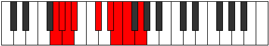 |
| [1873](https://ianring.com/musictheory/scales/1873) | [Dathimic](ModeDFlatDathimic.md) | Db | Db, E#, F##, G##, A#, B, Db |  |
| [1875](https://ianring.com/musictheory/scales/1875) | [Epyphian](ModeANaturalEpyphian.md) | A | A, Bb, C#, D#, E#, F#, G, A |  |
| [1875](https://ianring.com/musictheory/scales/1875) | [Epyphian](ModeCSharpEpyphian.md) | C# | C#, D, E#, F##, G##, A#, B, C# |  |
| [1875](https://ianring.com/musictheory/scales/1875) | [Epyphian](ModeDFlatEpyphian.md) | Db | Db, Ebb, F, G, A, Bb, Cb, Db |  |
| [1877](https://ianring.com/musictheory/scales/1877) | [Aeroptian](ModeCSharpAeroptian.md) | C# | C#, D#, E#, F##, G##, A#, B, C# |  |
| [1877](https://ianring.com/musictheory/scales/1877) | [Aeroptian](ModeDFlatAeroptian.md) | Db | Db, Eb, F, G, A, Bb, Cb, Db |  |
| [1879](https://ianring.com/musictheory/scales/1879) | [Mixoryllic](ModeCSharpMixoryllic.md) | C# | C#, D, D#, F, G, A, A#, B, C# |  |
| [1879](https://ianring.com/musictheory/scales/1879) | [Mixoryllic](ModeDFlatMixoryllic.md) | Db | Db, D, Eb, F, G, A, Bb, B, Db |  |
| [1879](https://ianring.com/musictheory/scales/1879) | [Mixoryllic](ModeANaturalMixoryllic.md) | A | A, A#, B, C#, D#, F, F#, G, A |  |
| [1881](https://ianring.com/musictheory/scales/1881) | [Korian](ModeCSharpKorian.md) | C# | C#, D##, E#, F##, G##, A#, B, C# |  |
| [1881](https://ianring.com/musictheory/scales/1881) | [Korian](ModeDFlatKorian.md) | Db | Db, E, F, G, A, Bb, Cb, Db |  |
| [1883](https://ianring.com/musictheory/scales/1883) | [Mixopyryllic](ModeANaturalMixopyryllic.md) | A | A, A#, C, C#, D#, F, F#, G, A |  |
| [1883](https://ianring.com/musictheory/scales/1883) | [Mixopyryllic](ModeCSharpMixopyryllic.md) | C# | C#, D, E, F, G, A, A#, B, C# | 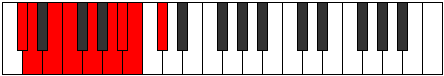 |
| [1883](https://ianring.com/musictheory/scales/1883) | [Mixopyryllic](ModeDFlatMixopyryllic.md) | Db | Db, D, E, F, G, A, Bb, B, Db |  |
| [1885](https://ianring.com/musictheory/scales/1885) | [Epidyllic](ModeCSharpEpidyllic.md) | C# | C#, D#, E, F, G, A, A#, B, C# |  |
| [1885](https://ianring.com/musictheory/scales/1885) | [Epidyllic](ModeDFlatEpidyllic.md) | Db | Db, Eb, E, F, G, A, Bb, B, Db |  |
| [1885](https://ianring.com/musictheory/scales/1885) | [Epidyllic](ModeGNaturalEpidyllic.md) | G | G, A, A#, B, C#, D#, E, F, G |  |
| [1887](https://ianring.com/musictheory/scales/1887) | [Aerocrygic](ModeCSharpAerocrygic.md) | C# | C#, D, D#, E, F, G, A, A#, B, C# |  |
| [1887](https://ianring.com/musictheory/scales/1887) | [Aerocrygic](ModeDFlatAerocrygic.md) | Db | Db, D, Eb, E, F, G, A, Bb, B, Db |  |
| [1887](https://ianring.com/musictheory/scales/1887) | [Aerocrygic](ModeANaturalAerocrygic.md) | A | A, A#, B, C, C#, D#, F, F#, G, A |  |
| [1887](https://ianring.com/musictheory/scales/1887) | [Aerocrygic](ModeGNaturalAerocrygic.md) | G | G, G#, A, A#, B, C#, D#, E, F, G |  |
| [1891](https://ianring.com/musictheory/scales/1891) | [Thalian](ModeENaturalThalian.md) | E | E, F, G##, A#, B#, C#, D, E |  |
| [1891](https://ianring.com/musictheory/scales/1891) | [Thalian](ModeCNaturalThalian.md) | C | C, Db, E#, F#, G#, A, Bb, C |  |
| [1895](https://ianring.com/musictheory/scales/1895) | [Salyllic](ModeENaturalSalyllic.md) | E | E, F, F#, A, A#, C, C#, D, E |  |
| [1895](https://ianring.com/musictheory/scales/1895) | [Salyllic](ModeCNaturalSalyllic.md) | C | C, C#, D, F, F#, G#, A, A#, C |  |
| [1895](https://ianring.com/musictheory/scales/1895) | [Salyllic](ModeGSharpSalyllic.md) | G# | G#, A, A#, C#, D, E, F, F#, G# |  |
| [1895](https://ianring.com/musictheory/scales/1895) | [Salyllic](ModeAFlatSalyllic.md) | Ab | Ab, A, Bb, Db, D, E, F, Gb, Ab |  |
| [1899](https://ianring.com/musictheory/scales/1899) | [Moptyllic](ModeENaturalMoptyllic.md) | E | E, F, G, A, A#, C, C#, D, E |  |
| [1899](https://ianring.com/musictheory/scales/1899) | [Moptyllic](ModeCNaturalMoptyllic.md) | C | C, C#, D#, F, F#, G#, A, A#, C |  |
| [1901](https://ianring.com/musictheory/scales/1901) | [Ionidyllic](ModeGNaturalIonidyllic.md) | G | G, A, A#, C, C#, D#, E, F, G |  |
| [1903](https://ianring.com/musictheory/scales/1903) | [Rocrygic](ModeENaturalRocrygic.md) | E | E, F, F#, G, A, A#, C, C#, D, E |  |
| [1903](https://ianring.com/musictheory/scales/1903) | [Rocrygic](ModeCNaturalRocrygic.md) | C | C, C#, D, D#, F, F#, G#, A, A#, C |  |
| [1903](https://ianring.com/musictheory/scales/1903) | [Rocrygic](ModeGNaturalRocrygic.md) | G | G, G#, A, A#, C, C#, D#, E, F, G |  |
| [1903](https://ianring.com/musictheory/scales/1903) | [Rocrygic](ModeGSharpRocrygic.md) | G# | G#, A, A#, B, C#, D, E, F, F#, G# |  |
| [1903](https://ianring.com/musictheory/scales/1903) | [Rocrygic](ModeAFlatRocrygic.md) | Ab | Ab, A, Bb, B, Db, D, E, F, Gb, Ab |  |
| [1905](https://ianring.com/musictheory/scales/1905) | [Katacrian](ModeFNaturalKatacrian.md) | F | F, G##, A#, B, C#, D, Eb, F |  |
| [1905](https://ianring.com/musictheory/scales/1905) | [Katacrian](ModeCSharpKatacrian.md) | C# | C#, D###, E##, F##, G##, A#, B, C# |  |
| [1905](https://ianring.com/musictheory/scales/1905) | [Katacrian](ModeDFlatKatacrian.md) | Db | Db, E#, F#, G, A, Bb, Cb, Db |  |
| [1907](https://ianring.com/musictheory/scales/1907) | [Lynyllic](ModeANaturalLynyllic.md) | A | A, A#, C#, D, D#, F, F#, G, A |  |
| [1907](https://ianring.com/musictheory/scales/1907) | [Lynyllic](ModeENaturalLynyllic.md) | E | E, F, G#, A, A#, C, C#, D, E |  |
| [1907](https://ianring.com/musictheory/scales/1907) | [Lynyllic](ModeCNaturalLynyllic.md) | C | C, C#, E, F, F#, G#, A, A#, C | 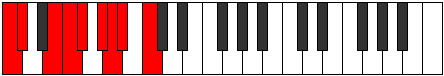 |
| [1907](https://ianring.com/musictheory/scales/1907) | [Lynyllic](ModeFNaturalLynyllic.md) | F | F, F#, A, A#, B, C#, D, D#, F |  |
| [1907](https://ianring.com/musictheory/scales/1907) | [Lynyllic](ModeCSharpLynyllic.md) | C# | C#, D, F, F#, G, A, A#, B, C# |  |
| [1907](https://ianring.com/musictheory/scales/1907) | [Lynyllic](ModeDFlatLynyllic.md) | Db | Db, D, F, Gb, G, A, Bb, B, Db |  |
| [1909](https://ianring.com/musictheory/scales/1909) | [Epicryllic](ModeFNaturalEpicryllic.md) | F | F, G, A, A#, B, C#, D, D#, F |  |
| [1909](https://ianring.com/musictheory/scales/1909) | [Epicryllic](ModeCSharpEpicryllic.md) | C# | C#, D#, F, F#, G, A, A#, B, C# |  |
| [1909](https://ianring.com/musictheory/scales/1909) | [Epicryllic](ModeDFlatEpicryllic.md) | Db | Db, Eb, F, Gb, G, A, Bb, B, Db |  |
| [1911](https://ianring.com/musictheory/scales/1911) | [Stynygic](ModeCNaturalStynygic.md) | C | C, C#, D, E, F, F#, G#, A, A#, C |  |
| [1911](https://ianring.com/musictheory/scales/1911) | [Stynygic](ModeENaturalStynygic.md) | E | E, F, F#, G#, A, A#, C, C#, D, E |  |
| [1911](https://ianring.com/musictheory/scales/1911) | [Stynygic](ModeGSharpStynygic.md) | G# | G#, A, A#, C, C#, D, E, F, F#, G# |  |
| [1911](https://ianring.com/musictheory/scales/1911) | [Stynygic](ModeAFlatStynygic.md) | Ab | Ab, A, Bb, C, Db, D, E, F, Gb, Ab |  |
| [1911](https://ianring.com/musictheory/scales/1911) | [Stynygic](ModeCSharpStynygic.md) | C# | C#, D, D#, F, F#, G, A, A#, B, C# |  |
| [1911](https://ianring.com/musictheory/scales/1911) | [Stynygic](ModeDFlatStynygic.md) | Db | Db, D, Eb, F, Gb, G, A, Bb, B, Db |  |
| [1911](https://ianring.com/musictheory/scales/1911) | [Stynygic](ModeFNaturalStynygic.md) | F | F, F#, G, A, A#, B, C#, D, D#, F |  |
| [1911](https://ianring.com/musictheory/scales/1911) | [Stynygic](ModeANaturalStynygic.md) | A | A, A#, B, C#, D, D#, F, F#, G, A |  |
| [1913](https://ianring.com/musictheory/scales/1913) | [Zagyllic](ModeCSharpZagyllic.md) | C# | C#, E, F, F#, G, A, A#, B, C# |  |
| [1913](https://ianring.com/musictheory/scales/1913) | [Zagyllic](ModeDFlatZagyllic.md) | Db | Db, E, F, Gb, G, A, Bb, B, Db |  |
| [1913](https://ianring.com/musictheory/scales/1913) | [Zagyllic](ModeFNaturalZagyllic.md) | F | F, G#, A, A#, B, C#, D, D#, F |  |
| [1915](https://ianring.com/musictheory/scales/1915) | [Thydygic](ModeANaturalThydygic.md) | A | A, A#, C, C#, D, D#, F, F#, G, A |  |
| [1915](https://ianring.com/musictheory/scales/1915) | [Thydygic](ModeCNaturalThydygic.md) | C | C, C#, D#, E, F, F#, G#, A, A#, C |  |
| [1915](https://ianring.com/musictheory/scales/1915) | [Thydygic](ModeENaturalThydygic.md) | E | E, F, G, G#, A, A#, C, C#, D, E |  |
| [1915](https://ianring.com/musictheory/scales/1915) | [Thydygic](ModeCSharpThydygic.md) | C# | C#, D, E, F, F#, G, A, A#, B, C# |  |
| [1915](https://ianring.com/musictheory/scales/1915) | [Thydygic](ModeDFlatThydygic.md) | Db | Db, D, E, F, Gb, G, A, Bb, B, Db |  |
| [1915](https://ianring.com/musictheory/scales/1915) | [Thydygic](ModeFNaturalThydygic.md) | F | F, F#, G#, A, A#, B, C#, D, D#, F |  |
| [1917](https://ianring.com/musictheory/scales/1917) | [Sacrygic](ModeGNaturalSacrygic.md) | G | G, A, A#, B, C, C#, D#, E, F, G |  |
| [1917](https://ianring.com/musictheory/scales/1917) | [Sacrygic](ModeCSharpSacrygic.md) | C# | C#, D#, E, F, F#, G, A, A#, B, C# |  |
| [1917](https://ianring.com/musictheory/scales/1917) | [Sacrygic](ModeDFlatSacrygic.md) | Db | Db, Eb, E, F, Gb, G, A, Bb, B, Db |  |
| [1917](https://ianring.com/musictheory/scales/1917) | [Sacrygic](ModeFNaturalSacrygic.md) | F | F, G, G#, A, A#, B, C#, D, D#, F |  |
| [1919](https://ianring.com/musictheory/scales/1919) | [Rocryllian](ModeCNaturalRocryllian.md) | C | C, C#, D, D#, E, F, F#, G#, A, A#, C |  |
| [1919](https://ianring.com/musictheory/scales/1919) | [Rocryllian](ModeENaturalRocryllian.md) | E | E, F, F#, G, G#, A, A#, C, C#, D, E |  |
| [1919](https://ianring.com/musictheory/scales/1919) | [Rocryllian](ModeANaturalRocryllian.md) | A | A, A#, B, C, C#, D, D#, F, F#, G, A |  |
| [1919](https://ianring.com/musictheory/scales/1919) | [Rocryllian](ModeCSharpRocryllian.md) | C# | C#, D, D#, E, F, F#, G, A, A#, B, C# |  |
| [1919](https://ianring.com/musictheory/scales/1919) | [Rocryllian](ModeDFlatRocryllian.md) | Db | Db, D, Eb, E, F, Gb, G, A, Bb, B, Db |  |
| [1919](https://ianring.com/musictheory/scales/1919) | [Rocryllian](ModeGSharpRocryllian.md) | G# | G#, A, A#, B, C, C#, D, E, F, F#, G# |  |
| [1919](https://ianring.com/musictheory/scales/1919) | [Rocryllian](ModeAFlatRocryllian.md) | Ab | Ab, A, Bb, B, C, Db, D, E, F, Gb, Ab |  |
| [1919](https://ianring.com/musictheory/scales/1919) | [Rocryllian](ModeGNaturalRocryllian.md) | G | G, G#, A, A#, B, C, C#, D#, E, F, G |  |
| [1919](https://ianring.com/musictheory/scales/1919) | [Rocryllian](ModeFNaturalRocryllian.md) | F | F, F#, G, G#, A, A#, B, C#, D, D#, F |  |
| [1937](https://ianring.com/musictheory/scales/1937) | [Galimic](ModeCSharpGalimic.md) | C# | C#, D###, F###, G##, A#, B, C# |  |
| [1937](https://ianring.com/musictheory/scales/1937) | [Galimic](ModeDFlatGalimic.md) | Db | Db, E#, F###, G##, A#, B, Db |  |
| [1939](https://ianring.com/musictheory/scales/1939) | [Dathian](ModeANaturalDathian.md) | A | A, Bb, C#, D##, E#, F#, G, A |  |
| [1939](https://ianring.com/musictheory/scales/1939) | [Dathian](ModeCSharpDathian.md) | C# | C#, D, E#, F###, G##, A#, B, C# |  |
| [1939](https://ianring.com/musictheory/scales/1939) | [Dathian](ModeDFlatDathian.md) | Db | Db, Ebb, F, G#, A, Bb, Cb, Db | 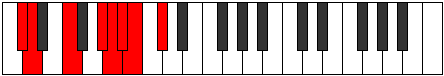 |
| [1941](https://ianring.com/musictheory/scales/1941) | [Aeranian](ModeCSharpAeranian.md) | C# | C#, D#, E#, F###, G##, A#, B, C# |  |
| [1941](https://ianring.com/musictheory/scales/1941) | [Aeranian](ModeDFlatAeranian.md) | Db | Db, Eb, F, G#, A, Bb, Cb, Db |  |
| [1943](https://ianring.com/musictheory/scales/1943) | [Malyllic](ModeANaturalMalyllic.md) | A | A, A#, B, C#, E, F, F#, G, A |  |
| [1943](https://ianring.com/musictheory/scales/1943) | [Malyllic](ModeCSharpMalyllic.md) | C# | C#, D, D#, F, G#, A, A#, B, C# |  |
| [1943](https://ianring.com/musictheory/scales/1943) | [Malyllic](ModeDFlatMalyllic.md) | Db | Db, D, Eb, F, Ab, A, Bb, B, Db |  |
| [1945](https://ianring.com/musictheory/scales/1945) | [Zarian](ModeCSharpZarian.md) | C# | C#, D##, E#, F###, G##, A#, B, C# |  |
| [1945](https://ianring.com/musictheory/scales/1945) | [Zarian](ModeDFlatZarian.md) | Db | Db, E, F, G#, A, Bb, Cb, Db |  |
| [1947](https://ianring.com/musictheory/scales/1947) | [Ionoyllic](ModeANaturalIonoyllic.md) | A | A, A#, C, C#, E, F, F#, G, A |  |
| [1947](https://ianring.com/musictheory/scales/1947) | [Ionoyllic](ModeCSharpIonoyllic.md) | C# | C#, D, E, F, G#, A, A#, B, C# |  |
| [1947](https://ianring.com/musictheory/scales/1947) | [Ionoyllic](ModeDFlatIonoyllic.md) | Db | Db, D, E, F, Ab, A, Bb, B, Db |  |
| [1949](https://ianring.com/musictheory/scales/1949) | [Mathyllic](ModeCSharpMathyllic.md) | C# | C#, D#, E, F, G#, A, A#, B, C# |  |
| [1949](https://ianring.com/musictheory/scales/1949) | [Mathyllic](ModeDFlatMathyllic.md) | Db | Db, Eb, E, F, Ab, A, Bb, B, Db |  |
| [1951](https://ianring.com/musictheory/scales/1951) | [Gonygic](ModeANaturalGonygic.md) | A | A, A#, B, C, C#, E, F, F#, G, A |  |
| [1951](https://ianring.com/musictheory/scales/1951) | [Gonygic](ModeCSharpGonygic.md) | C# | C#, D, D#, E, F, G#, A, A#, B, C# |  |
| [1951](https://ianring.com/musictheory/scales/1951) | [Gonygic](ModeDFlatGonygic.md) | Db | Db, D, Eb, E, F, Ab, A, Bb, B, Db |  |
| [1955](https://ianring.com/musictheory/scales/1955) | [Sonian](ModeCNaturalSonian.md) | C | C, Db, E#, F##, G#, A, Bb, C |  |
| [1959](https://ianring.com/musictheory/scales/1959) | [Katolyllic](ModeGSharpKatolyllic.md) | G# | G#, A, A#, C#, D#, E, F, F#, G# |  |
| [1959](https://ianring.com/musictheory/scales/1959) | [Katolyllic](ModeAFlatKatolyllic.md) | Ab | Ab, A, Bb, Db, Eb, E, F, Gb, Ab |  |
| [1959](https://ianring.com/musictheory/scales/1959) | [Katolyllic](ModeCNaturalKatolyllic.md) | C | C, C#, D, F, G, G#, A, A#, C |  |
| [1963](https://ianring.com/musictheory/scales/1963) | [Epocryllic](ModeCNaturalEpocryllic.md) | C | C, C#, D#, F, G, G#, A, A#, C |  |
| [1967](https://ianring.com/musictheory/scales/1967) | [Godygic](ModeCNaturalGodygic.md) | C | C, C#, D, D#, F, G, G#, A, A#, C |  |
| [1967](https://ianring.com/musictheory/scales/1967) | [Godygic](ModeGSharpGodygic.md) | G# | G#, A, A#, B, C#, D#, E, F, F#, G# |  |
| [1967](https://ianring.com/musictheory/scales/1967) | [Godygic](ModeAFlatGodygic.md) | Ab | Ab, A, Bb, B, Db, Eb, E, F, Gb, Ab |  |
| [1969](https://ianring.com/musictheory/scales/1969) | [Zorian](ModeFNaturalZorian.md) | F | F, G##, A#, B#, C#, D, Eb, F |  |
| [1969](https://ianring.com/musictheory/scales/1969) | [Zorian](ModeCSharpZorian.md) | C# | C#, D###, E##, F###, G##, A#, B, C# |  |
| [1969](https://ianring.com/musictheory/scales/1969) | [Zorian](ModeDFlatZorian.md) | Db | Db, E#, F#, G#, A, Bb, Cb, Db |  |
| [1971](https://ianring.com/musictheory/scales/1971) | [Aerynyllic](ModeFNaturalAerynyllic.md) | F | F, F#, A, A#, C, C#, D, D#, F |  |
| [1971](https://ianring.com/musictheory/scales/1971) | [Aerynyllic](ModeANaturalAerynyllic.md) | A | A, A#, C#, D, E, F, F#, G, A |  |
| [1971](https://ianring.com/musictheory/scales/1971) | [Aerynyllic](ModeCNaturalAerynyllic.md) | C | C, C#, E, F, G, G#, A, A#, C |  |
| [1971](https://ianring.com/musictheory/scales/1971) | [Aerynyllic](ModeCSharpAerynyllic.md) | C# | C#, D, F, F#, G#, A, A#, B, C# |  |
| [1971](https://ianring.com/musictheory/scales/1971) | [Aerynyllic](ModeDFlatAerynyllic.md) | Db | Db, D, F, Gb, Ab, A, Bb, B, Db |  |
| [1973](https://ianring.com/musictheory/scales/1973) | [Zyryllic](ModeFNaturalZyryllic.md) | F | F, G, A, A#, C, C#, D, D#, F |  |
| [1973](https://ianring.com/musictheory/scales/1973) | [Zyryllic](ModeCSharpZyryllic.md) | C# | C#, D#, F, F#, G#, A, A#, B, C# |  |
| [1973](https://ianring.com/musictheory/scales/1973) | [Zyryllic](ModeDFlatZyryllic.md) | Db | Db, Eb, F, Gb, Ab, A, Bb, B, Db |  |
| [1975](https://ianring.com/musictheory/scales/1975) | [Ionocrygic](ModeFNaturalIonocrygic.md) | F | F, F#, G, A, A#, C, C#, D, D#, F |  |
| [1975](https://ianring.com/musictheory/scales/1975) | [Ionocrygic](ModeGSharpIonocrygic.md) | G# | G#, A, A#, C, C#, D#, E, F, F#, G# |  |
| [1975](https://ianring.com/musictheory/scales/1975) | [Ionocrygic](ModeAFlatIonocrygic.md) | Ab | Ab, A, Bb, C, Db, Eb, E, F, Gb, Ab |  |
| [1975](https://ianring.com/musictheory/scales/1975) | [Ionocrygic](ModeCNaturalIonocrygic.md) | C | C, C#, D, E, F, G, G#, A, A#, C |  |
| [1975](https://ianring.com/musictheory/scales/1975) | [Ionocrygic](ModeANaturalIonocrygic.md) | A | A, A#, B, C#, D, E, F, F#, G, A |  |
| [1975](https://ianring.com/musictheory/scales/1975) | [Ionocrygic](ModeCSharpIonocrygic.md) | C# | C#, D, D#, F, F#, G#, A, A#, B, C# |  |
| [1975](https://ianring.com/musictheory/scales/1975) | [Ionocrygic](ModeDFlatIonocrygic.md) | Db | Db, D, Eb, F, Gb, Ab, A, Bb, B, Db |  |
| [1977](https://ianring.com/musictheory/scales/1977) | [Dagyllic](ModeFNaturalDagyllic.md) | F | F, G#, A, A#, C, C#, D, D#, F | 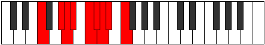 |
| [1977](https://ianring.com/musictheory/scales/1977) | [Dagyllic](ModeCSharpDagyllic.md) | C# | C#, E, F, F#, G#, A, A#, B, C# |  |
| [1977](https://ianring.com/musictheory/scales/1977) | [Dagyllic](ModeDFlatDagyllic.md) | Db | Db, E, F, Gb, Ab, A, Bb, B, Db |  |
| [1979](https://ianring.com/musictheory/scales/1979) | [Aeradygic](ModeANaturalAeradygic.md) | A | A, A#, C, C#, D, E, F, F#, G, A |  |
| [1979](https://ianring.com/musictheory/scales/1979) | [Aeradygic](ModeFNaturalAeradygic.md) | F | F, F#, G#, A, A#, C, C#, D, D#, F |  |
| [1979](https://ianring.com/musictheory/scales/1979) | [Aeradygic](ModeCNaturalAeradygic.md) | C | C, C#, D#, E, F, G, G#, A, A#, C |  |
| [1979](https://ianring.com/musictheory/scales/1979) | [Aeradygic](ModeCSharpAeradygic.md) | C# | C#, D, E, F, F#, G#, A, A#, B, C# |  |
| [1979](https://ianring.com/musictheory/scales/1979) | [Aeradygic](ModeDFlatAeradygic.md) | Db | Db, D, E, F, Gb, Ab, A, Bb, B, Db |  |
| [1981](https://ianring.com/musictheory/scales/1981) | [Gadygic](ModeFNaturalGadygic.md) | F | F, G, G#, A, A#, C, C#, D, D#, F |  |
| [1981](https://ianring.com/musictheory/scales/1981) | [Gadygic](ModeCSharpGadygic.md) | C# | C#, D#, E, F, F#, G#, A, A#, B, C# |  |
| [1981](https://ianring.com/musictheory/scales/1981) | [Gadygic](ModeDFlatGadygic.md) | Db | Db, Eb, E, F, Gb, Ab, A, Bb, B, Db |  |
| [1983](https://ianring.com/musictheory/scales/1983) | [Soryllian](ModeCNaturalSoryllian.md) | C | C, C#, D, D#, E, F, G, G#, A, A#, C |  |
| [1983](https://ianring.com/musictheory/scales/1983) | [Soryllian](ModeFNaturalSoryllian.md) | F | F, F#, G, G#, A, A#, C, C#, D, D#, F |  |
| [1983](https://ianring.com/musictheory/scales/1983) | [Soryllian](ModeANaturalSoryllian.md) | A | A, A#, B, C, C#, D, E, F, F#, G, A |  |
| [1983](https://ianring.com/musictheory/scales/1983) | [Soryllian](ModeGSharpSoryllian.md) | G# | G#, A, A#, B, C, C#, D#, E, F, F#, G# |  |
| [1983](https://ianring.com/musictheory/scales/1983) | [Soryllian](ModeAFlatSoryllian.md) | Ab | Ab, A, Bb, B, C, Db, Eb, E, F, Gb, Ab |  |
| [1983](https://ianring.com/musictheory/scales/1983) | [Soryllian](ModeCSharpSoryllian.md) | C# | C#, D, D#, E, F, F#, G#, A, A#, B, C# |  |
| [1983](https://ianring.com/musictheory/scales/1983) | [Soryllian](ModeDFlatSoryllian.md) | Db | Db, D, Eb, E, F, Gb, Ab, A, Bb, B, Db |  |
| [1989](https://ianring.com/musictheory/scales/1989) | [Dydian](ModeEFlatDydian.md) | Eb | Eb, F, G##, A#, B, C, Db, Eb |  |
| [1991](https://ianring.com/musictheory/scales/1991) | [Phryptyllic](ModeDSharpPhryptyllic.md) | D# | D#, E, F, A, A#, B, C, C#, D# |  |
| [1991](https://ianring.com/musictheory/scales/1991) | [Phryptyllic](ModeEFlatPhryptyllic.md) | Eb | Eb, E, F, A, Bb, B, C, Db, Eb |  |
| [1997](https://ianring.com/musictheory/scales/1997) | [Staryllic](ModeGNaturalStaryllic.md) | G | G, A, A#, C#, D, D#, E, F, G |  |
| [1997](https://ianring.com/musictheory/scales/1997) | [Staryllic](ModeDSharpStaryllic.md) | D# | D#, F, F#, A, A#, B, C, C#, D# |  |
| [1997](https://ianring.com/musictheory/scales/1997) | [Staryllic](ModeEFlatStaryllic.md) | Eb | Eb, F, Gb, A, Bb, B, C, Db, Eb |  |
| [1999](https://ianring.com/musictheory/scales/1999) | [Zacrygic](ModeGNaturalZacrygic.md) | G | G, G#, A, A#, C#, D, D#, E, F, G |  |
| [1999](https://ianring.com/musictheory/scales/1999) | [Zacrygic](ModeDSharpZacrygic.md) | D# | D#, E, F, F#, A, A#, B, C, C#, D# |  |
| [1999](https://ianring.com/musictheory/scales/1999) | [Zacrygic](ModeEFlatZacrygic.md) | Eb | Eb, E, F, Gb, A, Bb, B, C, Db, Eb |  |
| [2001](https://ianring.com/musictheory/scales/2001) | [Gydian](ModeCSharpGydian.md) | C# | C#, D###, E###, F###, G##, A#, B, C# |  |
| [2001](https://ianring.com/musictheory/scales/2001) | [Gydian](ModeDFlatGydian.md) | Db | Db, E#, F##, G#, A, Bb, Cb, Db |  |
| [2003](https://ianring.com/musictheory/scales/2003) | [Lolyllic](ModeANaturalLolyllic.md) | A | A, A#, C#, D#, E, F, F#, G, A |  |
| [2003](https://ianring.com/musictheory/scales/2003) | [Lolyllic](ModeCSharpLolyllic.md) | C# | C#, D, F, G, G#, A, A#, B, C# |  |
| [2003](https://ianring.com/musictheory/scales/2003) | [Lolyllic](ModeDFlatLolyllic.md) | Db | Db, D, F, G, Ab, A, Bb, B, Db |  |
| [2005](https://ianring.com/musictheory/scales/2005) | [Gygyllic](ModeDSharpGygyllic.md) | D# | D#, F, G, A, A#, B, C, C#, D# |  |
| [2005](https://ianring.com/musictheory/scales/2005) | [Gygyllic](ModeEFlatGygyllic.md) | Eb | Eb, F, G, A, Bb, B, C, Db, Eb |  |
| [2005](https://ianring.com/musictheory/scales/2005) | [Gygyllic](ModeCSharpGygyllic.md) | C# | C#, D#, F, G, G#, A, A#, B, C# |  |
| [2005](https://ianring.com/musictheory/scales/2005) | [Gygyllic](ModeDFlatGygyllic.md) | Db | Db, Eb, F, G, Ab, A, Bb, B, Db |  |
| [2007](https://ianring.com/musictheory/scales/2007) | [Stonygic](ModeDSharpStonygic.md) | D# | D#, E, F, G, A, A#, B, C, C#, D# |  |
| [2007](https://ianring.com/musictheory/scales/2007) | [Stonygic](ModeEFlatStonygic.md) | Eb | Eb, E, F, G, A, Bb, B, C, Db, Eb |  |
| [2007](https://ianring.com/musictheory/scales/2007) | [Stonygic](ModeANaturalStonygic.md) | A | A, A#, B, C#, D#, E, F, F#, G, A |  |
| [2007](https://ianring.com/musictheory/scales/2007) | [Stonygic](ModeCSharpStonygic.md) | C# | C#, D, D#, F, G, G#, A, A#, B, C# |  |
| [2007](https://ianring.com/musictheory/scales/2007) | [Stonygic](ModeDFlatStonygic.md) | Db | Db, D, Eb, F, G, Ab, A, Bb, B, Db |  |
| [2009](https://ianring.com/musictheory/scales/2009) | [Stacryllic](ModeCSharpStacryllic.md) | C# | C#, E, F, G, G#, A, A#, B, C# |  |
| [2009](https://ianring.com/musictheory/scales/2009) | [Stacryllic](ModeDFlatStacryllic.md) | Db | Db, E, F, G, Ab, A, Bb, B, Db |  |
| [2011](https://ianring.com/musictheory/scales/2011) | [Raphygic](ModeANaturalRaphygic.md) | A | A, A#, C, C#, D#, E, F, F#, G, A |  |
| [2011](https://ianring.com/musictheory/scales/2011) | [Raphygic](ModeCSharpRaphygic.md) | C# | C#, D, E, F, G, G#, A, A#, B, C# |  |
| [2011](https://ianring.com/musictheory/scales/2011) | [Raphygic](ModeDFlatRaphygic.md) | Db | Db, D, E, F, G, Ab, A, Bb, B, Db |  |
| [2013](https://ianring.com/musictheory/scales/2013) | [Mocrygic](ModeGNaturalMocrygic.md) | G | G, A, A#, B, C#, D, D#, E, F, G |  |
| [2013](https://ianring.com/musictheory/scales/2013) | [Mocrygic](ModeDSharpMocrygic.md) | D# | D#, F, F#, G, A, A#, B, C, C#, D# |  |
| [2013](https://ianring.com/musictheory/scales/2013) | [Mocrygic](ModeEFlatMocrygic.md) | Eb | Eb, F, Gb, G, A, Bb, B, C, Db, Eb |  |
| [2013](https://ianring.com/musictheory/scales/2013) | [Mocrygic](ModeCSharpMocrygic.md) | C# | C#, D#, E, F, G, G#, A, A#, B, C# |  |
| [2013](https://ianring.com/musictheory/scales/2013) | [Mocrygic](ModeDFlatMocrygic.md) | Db | Db, Eb, E, F, G, Ab, A, Bb, B, Db |  |
| [2015](https://ianring.com/musictheory/scales/2015) | [Epiryllian](ModeDSharpEpiryllian.md) | D# | D#, E, F, F#, G, A, A#, B, C, C#, D# |  |
| [2015](https://ianring.com/musictheory/scales/2015) | [Epiryllian](ModeEFlatEpiryllian.md) | Eb | Eb, E, F, Gb, G, A, Bb, B, C, Db, Eb |  |
| [2015](https://ianring.com/musictheory/scales/2015) | [Epiryllian](ModeANaturalEpiryllian.md) | A | A, A#, B, C, C#, D#, E, F, F#, G, A |  |
| [2015](https://ianring.com/musictheory/scales/2015) | [Epiryllian](ModeCSharpEpiryllian.md) | C# | C#, D, D#, E, F, G, G#, A, A#, B, C# |  |
| [2015](https://ianring.com/musictheory/scales/2015) | [Epiryllian](ModeDFlatEpiryllian.md) | Db | Db, D, Eb, E, F, G, Ab, A, Bb, B, Db |  |
| [2015](https://ianring.com/musictheory/scales/2015) | [Epiryllian](ModeGNaturalEpiryllian.md) | G | G, G#, A, A#, B, C#, D, D#, E, F, G |  |
| [2019](https://ianring.com/musictheory/scales/2019) | [Palyllic](ModeCNaturalPalyllic.md) | C | C, C#, F, F#, G, G#, A, A#, C |  |
| [2019](https://ianring.com/musictheory/scales/2019) | [Palyllic](ModeENaturalPalyllic.md) | E | E, F, A, A#, B, C, C#, D, E |  |
| [2021](https://ianring.com/musictheory/scales/2021) | [Katycryllic](ModeDSharpKatycryllic.md) | D# | D#, F, G#, A, A#, B, C, C#, D# |  |
| [2021](https://ianring.com/musictheory/scales/2021) | [Katycryllic](ModeEFlatKatycryllic.md) | Eb | Eb, F, Ab, A, Bb, B, C, Db, Eb |  |
| [2023](https://ianring.com/musictheory/scales/2023) | [Zodygic](ModeGSharpZodygic.md) | G# | G#, A, A#, C#, D, D#, E, F, F#, G# |  |
| [2023](https://ianring.com/musictheory/scales/2023) | [Zodygic](ModeAFlatZodygic.md) | Ab | Ab, A, Bb, Db, D, Eb, E, F, Gb, Ab |  |
| [2023](https://ianring.com/musictheory/scales/2023) | [Zodygic](ModeCNaturalZodygic.md) | C | C, C#, D, F, F#, G, G#, A, A#, C |  |
| [2023](https://ianring.com/musictheory/scales/2023) | [Zodygic](ModeENaturalZodygic.md) | E | E, F, F#, A, A#, B, C, C#, D, E |  |
| [2023](https://ianring.com/musictheory/scales/2023) | [Zodygic](ModeDSharpZodygic.md) | D# | D#, E, F, G#, A, A#, B, C, C#, D# |  |
| [2023](https://ianring.com/musictheory/scales/2023) | [Zodygic](ModeEFlatZodygic.md) | Eb | Eb, E, F, Ab, A, Bb, B, C, Db, Eb |  |
| [2027](https://ianring.com/musictheory/scales/2027) | [Boptygic](ModeCNaturalBoptygic.md) | C | C, C#, D#, F, F#, G, G#, A, A#, C |  |
| [2027](https://ianring.com/musictheory/scales/2027) | [Boptygic](ModeENaturalBoptygic.md) | E | E, F, G, A, A#, B, C, C#, D, E |  |
| [2029](https://ianring.com/musictheory/scales/2029) | [Mathygic](ModeGNaturalMathygic.md) | G | G, A, A#, C, C#, D, D#, E, F, G |  |
| [2029](https://ianring.com/musictheory/scales/2029) | [Mathygic](ModeDSharpMathygic.md) | D# | D#, F, F#, G#, A, A#, B, C, C#, D# |  |
| [2029](https://ianring.com/musictheory/scales/2029) | [Mathygic](ModeEFlatMathygic.md) | Eb | Eb, F, Gb, Ab, A, Bb, B, C, Db, Eb |  |
| [2031](https://ianring.com/musictheory/scales/2031) | [Gadyllian](ModeGNaturalGadyllian.md) | G | G, G#, A, A#, C, C#, D, D#, E, F, G |  |
| [2031](https://ianring.com/musictheory/scales/2031) | [Gadyllian](ModeCNaturalGadyllian.md) | C | C, C#, D, D#, F, F#, G, G#, A, A#, C |  |
| [2031](https://ianring.com/musictheory/scales/2031) | [Gadyllian](ModeENaturalGadyllian.md) | E | E, F, F#, G, A, A#, B, C, C#, D, E |  |
| [2031](https://ianring.com/musictheory/scales/2031) | [Gadyllian](ModeDSharpGadyllian.md) | D# | D#, E, F, F#, G#, A, A#, B, C, C#, D# |  |
| [2031](https://ianring.com/musictheory/scales/2031) | [Gadyllian](ModeEFlatGadyllian.md) | Eb | Eb, E, F, Gb, Ab, A, Bb, B, C, Db, Eb |  |
| [2031](https://ianring.com/musictheory/scales/2031) | [Gadyllian](ModeGSharpGadyllian.md) | G# | G#, A, A#, B, C#, D, D#, E, F, F#, G# |  |
| [2031](https://ianring.com/musictheory/scales/2031) | [Gadyllian](ModeAFlatGadyllian.md) | Ab | Ab, A, Bb, B, Db, D, Eb, E, F, Gb, Ab |  |
| [2033](https://ianring.com/musictheory/scales/2033) | [Stolyllic](ModeFNaturalStolyllic.md) | F | F, A, A#, B, C, C#, D, D#, F |  |
| [2033](https://ianring.com/musictheory/scales/2033) | [Stolyllic](ModeCSharpStolyllic.md) | C# | C#, F, F#, G, G#, A, A#, B, C# |  |
| [2033](https://ianring.com/musictheory/scales/2033) | [Stolyllic](ModeDFlatStolyllic.md) | Db | Db, F, Gb, G, Ab, A, Bb, B, Db |  |
| [2035](https://ianring.com/musictheory/scales/2035) | [Aerythygic](ModeANaturalAerythygic.md) | A | A, A#, C#, D, D#, E, F, F#, G, A |  |
| [2035](https://ianring.com/musictheory/scales/2035) | [Aerythygic](ModeCNaturalAerythygic.md) | C | C, C#, E, F, F#, G, G#, A, A#, C |  |
| [2035](https://ianring.com/musictheory/scales/2035) | [Aerythygic](ModeFNaturalAerythygic.md) | F | F, F#, A, A#, B, C, C#, D, D#, F |  |
| [2035](https://ianring.com/musictheory/scales/2035) | [Aerythygic](ModeENaturalAerythygic.md) | E | E, F, G#, A, A#, B, C, C#, D, E |  |
| [2035](https://ianring.com/musictheory/scales/2035) | [Aerythygic](ModeCSharpAerythygic.md) | C# | C#, D, F, F#, G, G#, A, A#, B, C# |  |
| [2035](https://ianring.com/musictheory/scales/2035) | [Aerythygic](ModeDFlatAerythygic.md) | Db | Db, D, F, Gb, G, Ab, A, Bb, B, Db |  |
| [2037](https://ianring.com/musictheory/scales/2037) | [Sythygic](ModeFNaturalSythygic.md) | F | F, G, A, A#, B, C, C#, D, D#, F |  |
| [2037](https://ianring.com/musictheory/scales/2037) | [Sythygic](ModeDSharpSythygic.md) | D# | D#, F, G, G#, A, A#, B, C, C#, D# |  |
| [2037](https://ianring.com/musictheory/scales/2037) | [Sythygic](ModeEFlatSythygic.md) | Eb | Eb, F, G, Ab, A, Bb, B, C, Db, Eb |  |
| [2037](https://ianring.com/musictheory/scales/2037) | [Sythygic](ModeCSharpSythygic.md) | C# | C#, D#, F, F#, G, G#, A, A#, B, C# |  |
| [2037](https://ianring.com/musictheory/scales/2037) | [Sythygic](ModeDFlatSythygic.md) | Db | Db, Eb, F, Gb, G, Ab, A, Bb, B, Db |  |
| [2039](https://ianring.com/musictheory/scales/2039) | [Danyllian](ModeGSharpDanyllian.md) | G# | G#, A, A#, C, C#, D, D#, E, F, F#, G# |  |
| [2039](https://ianring.com/musictheory/scales/2039) | [Danyllian](ModeAFlatDanyllian.md) | Ab | Ab, A, Bb, C, Db, D, Eb, E, F, Gb, Ab |  |
| [2039](https://ianring.com/musictheory/scales/2039) | [Danyllian](ModeCNaturalDanyllian.md) | C | C, C#, D, E, F, F#, G, G#, A, A#, C |  |
| [2039](https://ianring.com/musictheory/scales/2039) | [Danyllian](ModeFNaturalDanyllian.md) | F | F, F#, G, A, A#, B, C, C#, D, D#, F |  |
| [2039](https://ianring.com/musictheory/scales/2039) | [Danyllian](ModeANaturalDanyllian.md) | A | A, A#, B, C#, D, D#, E, F, F#, G, A |  |
| [2039](https://ianring.com/musictheory/scales/2039) | [Danyllian](ModeENaturalDanyllian.md) | E | E, F, F#, G#, A, A#, B, C, C#, D, E |  |
| [2039](https://ianring.com/musictheory/scales/2039) | [Danyllian](ModeDSharpDanyllian.md) | D# | D#, E, F, G, G#, A, A#, B, C, C#, D# |  |
| [2039](https://ianring.com/musictheory/scales/2039) | [Danyllian](ModeEFlatDanyllian.md) | Eb | Eb, E, F, G, Ab, A, Bb, B, C, Db, Eb |  |
| [2039](https://ianring.com/musictheory/scales/2039) | [Danyllian](ModeCSharpDanyllian.md) | C# | C#, D, D#, F, F#, G, G#, A, A#, B, C# |  |
| [2039](https://ianring.com/musictheory/scales/2039) | [Danyllian](ModeDFlatDanyllian.md) | Db | Db, D, Eb, F, Gb, G, Ab, A, Bb, B, Db |  |
| [2041](https://ianring.com/musictheory/scales/2041) | [Aeolacrygic](ModeFNaturalAeolacrygic.md) | F | F, G#, A, A#, B, C, C#, D, D#, F |  |
| [2041](https://ianring.com/musictheory/scales/2041) | [Aeolacrygic](ModeCSharpAeolacrygic.md) | C# | C#, E, F, F#, G, G#, A, A#, B, C# |  |
| [2041](https://ianring.com/musictheory/scales/2041) | [Aeolacrygic](ModeDFlatAeolacrygic.md) | Db | Db, E, F, Gb, G, Ab, A, Bb, B, Db |  |
| [2043](https://ianring.com/musictheory/scales/2043) | [Lythyllian](ModeANaturalLythyllian.md) | A | A, A#, C, C#, D, D#, E, F, F#, G, A |  |
| [2043](https://ianring.com/musictheory/scales/2043) | [Lythyllian](ModeCNaturalLythyllian.md) | C | C, C#, D#, E, F, F#, G, G#, A, A#, C |  |
| [2043](https://ianring.com/musictheory/scales/2043) | [Lythyllian](ModeFNaturalLythyllian.md) | F | F, F#, G#, A, A#, B, C, C#, D, D#, F |  |
| [2043](https://ianring.com/musictheory/scales/2043) | [Lythyllian](ModeENaturalLythyllian.md) | E | E, F, G, G#, A, A#, B, C, C#, D, E |  |
| [2043](https://ianring.com/musictheory/scales/2043) | [Lythyllian](ModeCSharpLythyllian.md) | C# | C#, D, E, F, F#, G, G#, A, A#, B, C# |  |
| [2043](https://ianring.com/musictheory/scales/2043) | [Lythyllian](ModeDFlatLythyllian.md) | Db | Db, D, E, F, Gb, G, Ab, A, Bb, B, Db |  |
| [2045](https://ianring.com/musictheory/scales/2045) | [Katogyllian](ModeGNaturalKatogyllian.md) | G | G, A, A#, B, C, C#, D, D#, E, F, G |  |
| [2045](https://ianring.com/musictheory/scales/2045) | [Katogyllian](ModeFNaturalKatogyllian.md) | F | F, G, G#, A, A#, B, C, C#, D, D#, F |  |
| [2045](https://ianring.com/musictheory/scales/2045) | [Katogyllian](ModeDSharpKatogyllian.md) | D# | D#, F, F#, G, G#, A, A#, B, C, C#, D# |  |
| [2045](https://ianring.com/musictheory/scales/2045) | [Katogyllian](ModeEFlatKatogyllian.md) | Eb | Eb, F, Gb, G, Ab, A, Bb, B, C, Db, Eb |  |
| [2045](https://ianring.com/musictheory/scales/2045) | [Katogyllian](ModeCSharpKatogyllian.md) | C# | C#, D#, E, F, F#, G, G#, A, A#, B, C# |  |
| [2045](https://ianring.com/musictheory/scales/2045) | [Katogyllian](ModeDFlatKatogyllian.md) | Db | Db, Eb, E, F, Gb, G, Ab, A, Bb, B, Db |  |
| [2047](https://ianring.com/musictheory/scales/2047) | [Monatic](ModeCNaturalMonatic.md) | C | C, C#, D, D#, E, F, F#, G, G#, A, A#, C |  |
| [2047](https://ianring.com/musictheory/scales/2047) | [Monatic](ModeANaturalMonatic.md) | A | A, A#, B, C, C#, D, D#, E, F, F#, G, A |  |
| [2047](https://ianring.com/musictheory/scales/2047) | [Monatic](ModeGSharpMonatic.md) | G# | G#, A, A#, B, C, C#, D, D#, E, F, F#, G# |  |
| [2047](https://ianring.com/musictheory/scales/2047) | [Monatic](ModeAFlatMonatic.md) | Ab | Ab, A, Bb, B, C, Db, D, Eb, E, F, Gb, Ab |  |
| [2047](https://ianring.com/musictheory/scales/2047) | [Monatic](ModeGNaturalMonatic.md) | G | G, G#, A, A#, B, C, C#, D, D#, E, F, G |  |
| [2047](https://ianring.com/musictheory/scales/2047) | [Monatic](ModeFNaturalMonatic.md) | F | F, F#, G, G#, A, A#, B, C, C#, D, D#, F |  |
| [2047](https://ianring.com/musictheory/scales/2047) | [Monatic](ModeENaturalMonatic.md) | E | E, F, F#, G, G#, A, A#, B, C, C#, D, E |  |
| [2047](https://ianring.com/musictheory/scales/2047) | [Monatic](ModeDSharpMonatic.md) | D# | D#, E, F, F#, G, G#, A, A#, B, C, C#, D# |  |
| [2047](https://ianring.com/musictheory/scales/2047) | [Monatic](ModeEFlatMonatic.md) | Eb | Eb, E, F, Gb, G, Ab, A, Bb, B, C, Db, Eb |  |
| [2047](https://ianring.com/musictheory/scales/2047) | [Monatic](ModeCSharpMonatic.md) | C# | C#, D, D#, E, F, F#, G, G#, A, A#, B, C# |  |
| [2047](https://ianring.com/musictheory/scales/2047) | [Monatic](ModeDFlatMonatic.md) | Db | Db, D, Eb, E, F, Gb, G, Ab, A, Bb, B, Db |  |
| [2185](https://ianring.com/musictheory/scales/2185) | [Dygic](ModeASharpDygic.md) | A# | A#, C#, F, A, A# |  |
| [2185](https://ianring.com/musictheory/scales/2185) | [Dygic](ModeBFlatDygic.md) | Bb | Bb, Db, F, A, Bb |  |
| [2187](https://ianring.com/musictheory/scales/2187) | [Ionothitonic](ModeASharpIonothitonic.md) | A# | A#, B, C#, F, A, A# |  |
| [2187](https://ianring.com/musictheory/scales/2187) | [Ionothitonic](ModeBFlatIonothitonic.md) | Bb | Bb, B, Db, F, A, Bb |  |
| [2189](https://ianring.com/musictheory/scales/2189) | [Zagitonic](ModeASharpZagitonic.md) | A# | A#, C, C#, F, A, A# |  |
| [2189](https://ianring.com/musictheory/scales/2189) | [Zagitonic](ModeBFlatZagitonic.md) | Bb | Bb, C, Db, F, A, Bb |  |
| [2191](https://ianring.com/musictheory/scales/2191) | [Thydimic](ModeASharpThydimic.md) | A# | A#, B, C, Db, E#, Cbbb, A# |  |
| [2191](https://ianring.com/musictheory/scales/2191) | [Thydimic](ModeBFlatThydimic.md) | Bb | Bb, Cb, Dbb, Ebbb, F, G##, Bb |  |
| [2201](https://ianring.com/musictheory/scales/2201) | [Ionagitonic](ModeASharpIonagitonic.md) | A# | A#, C#, D, F, A, A# |  |
| [2201](https://ianring.com/musictheory/scales/2201) | [Ionagitonic](ModeBFlatIonagitonic.md) | Bb | Bb, Db, D, F, A, Bb |  |
| [2201](https://ianring.com/musictheory/scales/2201) | [Ionagitonic](ModeFSharpIonagitonic.md) | F# | F#, A, A#, C#, F, F# |  |
| [2201](https://ianring.com/musictheory/scales/2201) | [Ionagitonic](ModeGFlatIonagitonic.md) | Gb | Gb, A, Bb, Db, F, Gb |  |
| [2203](https://ianring.com/musictheory/scales/2203) | [Dorimic](ModeFSharpDorimic.md) | F# | F#, G, A, Bb, C#, D###, F# |  |
| [2203](https://ianring.com/musictheory/scales/2203) | [Dorimic](ModeASharpDorimic.md) | A# | A#, B, C#, D, E#, Cbbb, A# |  |
| [2203](https://ianring.com/musictheory/scales/2203) | [Dorimic](ModeBFlatDorimic.md) | Bb | Bb, Cb, Db, Ebb, F, G##, Bb |  |
| [2205](https://ianring.com/musictheory/scales/2205) | [Ionocrimic](ModeASharpIonocrimic.md) | A# | A#, B#, C#, D, E#, Cbbb, A# |  |
| [2205](https://ianring.com/musictheory/scales/2205) | [Ionocrimic](ModeBFlatIonocrimic.md) | Bb | Bb, C, Db, Ebb, F, G##, Bb |  |
| [2205](https://ianring.com/musictheory/scales/2205) | [Ionocrimic](ModeFSharpIonocrimic.md) | F# | F#, G#, A, Bb, C#, D###, F# | 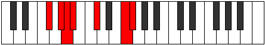 |
| [2207](https://ianring.com/musictheory/scales/2207) | [Mygian](ModeASharpMygian.md) | A# | A#, B, C, Db, Ebb, F, G##, A# |  |
| [2207](https://ianring.com/musictheory/scales/2207) | [Mygian](ModeBFlatMygian.md) | Bb | Bb, Cb, Dbb, Ebbb, Fbbb, Gbb, A, Bb |  |
| [2217](https://ianring.com/musictheory/scales/2217) | [Kagitonic](ModeASharpKagitonic.md) | A# | A#, C#, D#, F, A, A# |  |
| [2217](https://ianring.com/musictheory/scales/2217) | [Kagitonic](ModeBFlatKagitonic.md) | Bb | Bb, Db, Eb, F, A, Bb |  |
| [2219](https://ianring.com/musictheory/scales/2219) | [Phrydimic](ModeASharpPhrydimic.md) | A# | A#, B, C#, D#, E#, Cbbb, A# |  |
| [2219](https://ianring.com/musictheory/scales/2219) | [Phrydimic](ModeBFlatPhrydimic.md) | Bb | Bb, Cb, Db, Eb, F, G##, Bb |  |
| [2221](https://ianring.com/musictheory/scales/2221) | [Poptimic](ModeASharpPoptimic.md) | A# | A#, B#, C#, D#, E#, Cbbb, A# |  |
| [2221](https://ianring.com/musictheory/scales/2221) | [Poptimic](ModeBFlatPoptimic.md) | Bb | Bb, C, Db, Eb, F, G##, Bb |  |
| [2223](https://ianring.com/musictheory/scales/2223) | [Konian](ModeASharpKonian.md) | A# | A#, B, C, Db, Eb, F, G##, A# |  |
| [2223](https://ianring.com/musictheory/scales/2223) | [Konian](ModeBFlatKonian.md) | Bb | Bb, Cb, Dbb, Ebbb, Fbb, Gbb, A, Bb |  |
| [2233](https://ianring.com/musictheory/scales/2233) | [Donimic](ModeASharpDonimic.md) | A# | A#, B##, C##, D#, E#, Cbbb, A# |  |
| [2233](https://ianring.com/musictheory/scales/2233) | [Donimic](ModeBFlatDonimic.md) | Bb | Bb, C#, D, Eb, F, G##, Bb |  |
| [2233](https://ianring.com/musictheory/scales/2233) | [Donimic](ModeFSharpDonimic.md) | F# | F#, G##, A#, B, C#, D###, F# |  |
| [2233](https://ianring.com/musictheory/scales/2233) | [Donimic](ModeGFlatDonimic.md) | Gb | Gb, A, Bb, Cb, Db, E#, Gb |  |
| [2235](https://ianring.com/musictheory/scales/2235) | [Bathian](ModeASharpBathian.md) | A# | A#, B, C#, D, Eb, F, G##, A# |  |
| [2235](https://ianring.com/musictheory/scales/2235) | [Bathian](ModeBFlatBathian.md) | Bb | Bb, Cb, Db, Ebb, Fbb, Gbb, A, Bb |  |
| [2235](https://ianring.com/musictheory/scales/2235) | [Bathian](ModeFSharpBathian.md) | F# | F#, G, A, Bb, Cb, Db, E#, F# |  |
| [2237](https://ianring.com/musictheory/scales/2237) | [Epothian](ModeASharpEpothian.md) | A# | A#, B#, C#, D, Eb, F, G##, A# |  |
| [2237](https://ianring.com/musictheory/scales/2237) | [Epothian](ModeBFlatEpothian.md) | Bb | Bb, C, Db, Ebb, Fbb, Gbb, A, Bb |  |
| [2237](https://ianring.com/musictheory/scales/2237) | [Epothian](ModeFSharpEpothian.md) | F# | F#, G#, A, Bb, Cb, Db, E#, F# |  |
| [2239](https://ianring.com/musictheory/scales/2239) | [Dacryllic](ModeASharpDacryllic.md) | A# | A#, B, C, C#, D, D#, F, A, A# |  |
| [2239](https://ianring.com/musictheory/scales/2239) | [Dacryllic](ModeBFlatDacryllic.md) | Bb | Bb, B, C, Db, D, Eb, F, A, Bb |  |
| [2239](https://ianring.com/musictheory/scales/2239) | [Dacryllic](ModeFSharpDacryllic.md) | F# | F#, G, G#, A, A#, B, C#, F, F# |  |
| [2239](https://ianring.com/musictheory/scales/2239) | [Dacryllic](ModeGFlatDacryllic.md) | Gb | Gb, G, Ab, A, Bb, B, Db, F, Gb |  |
| [2249](https://ianring.com/musictheory/scales/2249) | [Kygitonic](ModeASharpKygitonic.md) | A# | A#, C#, E, F, A, A# |  |
| [2249](https://ianring.com/musictheory/scales/2249) | [Kygitonic](ModeBFlatKygitonic.md) | Bb | Bb, Db, E, F, A, Bb |  |
| [2251](https://ianring.com/musictheory/scales/2251) | [Zodimic](ModeASharpZodimic.md) | A# | A#, B, C#, D##, E#, Cbbb, A# |  |
| [2251](https://ianring.com/musictheory/scales/2251) | [Zodimic](ModeBFlatZodimic.md) | Bb | Bb, Cb, Db, E, F, G##, Bb |  |
| [2253](https://ianring.com/musictheory/scales/2253) | [Logimic](ModeASharpLogimic.md) | A# | A#, B#, C#, D##, E#, Cbbb, A# |  |
| [2253](https://ianring.com/musictheory/scales/2253) | [Logimic](ModeBFlatLogimic.md) | Bb | Bb, C, Db, E, F, G##, Bb |  |
| [2255](https://ianring.com/musictheory/scales/2255) | [Dylian](ModeASharpDylian.md) | A# | A#, B, C, Db, E, F, G##, A# |  |
| [2255](https://ianring.com/musictheory/scales/2255) | [Dylian](ModeBFlatDylian.md) | Bb | Bb, Cb, Dbb, Ebbb, Fb, Gbb, A, Bb |  |
| [2265](https://ianring.com/musictheory/scales/2265) | [Ionophimic](ModeASharpIonophimic.md) | A# | A#, B##, C##, D##, E#, Cbbb, A# |  |
| [2265](https://ianring.com/musictheory/scales/2265) | [Ionophimic](ModeBFlatIonophimic.md) | Bb | Bb, C#, D, E, F, G##, Bb |  |
| [2265](https://ianring.com/musictheory/scales/2265) | [Ionophimic](ModeFSharpIonophimic.md) | F# | F#, G##, A#, B#, C#, D###, F# |  |
| [2265](https://ianring.com/musictheory/scales/2265) | [Ionophimic](ModeGFlatIonophimic.md) | Gb | Gb, A, Bb, C, Db, E#, Gb |  |
| [2267](https://ianring.com/musictheory/scales/2267) | [Padian](ModeFSharpPadian.md) | F# | F#, G, A, Bb, C, Db, E#, F# |  |
| [2267](https://ianring.com/musictheory/scales/2267) | [Padian](ModeASharpPadian.md) | A# | A#, B, C#, D, E, F, G##, A# |  |
| [2267](https://ianring.com/musictheory/scales/2267) | [Padian](ModeBFlatPadian.md) | Bb | Bb, Cb, Db, Ebb, Fb, Gbb, A, Bb |  |
| [2269](https://ianring.com/musictheory/scales/2269) | [Pygian](ModeASharpPygian.md) | A# | A#, B#, C#, D, E, F, G##, A# |  |
| [2269](https://ianring.com/musictheory/scales/2269) | [Pygian](ModeBFlatPygian.md) | Bb | Bb, C, Db, Ebb, Fb, Gbb, A, Bb |  |
| [2269](https://ianring.com/musictheory/scales/2269) | [Pygian](ModeFSharpPygian.md) | F# | F#, G#, A, Bb, C, Db, E#, F# |  |
| [2271](https://ianring.com/musictheory/scales/2271) | [Poptyllic](ModeFSharpPoptyllic.md) | F# | F#, G, G#, A, A#, C, C#, F, F# |  |
| [2271](https://ianring.com/musictheory/scales/2271) | [Poptyllic](ModeGFlatPoptyllic.md) | Gb | Gb, G, Ab, A, Bb, C, Db, F, Gb |  |
| [2271](https://ianring.com/musictheory/scales/2271) | [Poptyllic](ModeASharpPoptyllic.md) | A# | A#, B, C, C#, D, E, F, A, A# |  |
| [2271](https://ianring.com/musictheory/scales/2271) | [Poptyllic](ModeBFlatPoptyllic.md) | Bb | Bb, B, C, Db, D, E, F, A, Bb |  |
| [2281](https://ianring.com/musictheory/scales/2281) | [Rathimic](ModeASharpRathimic.md) | A# | A#, B##, C###, D##, E#, Cbbb, A# |  |
| [2281](https://ianring.com/musictheory/scales/2281) | [Rathimic](ModeBFlatRathimic.md) | Bb | Bb, C#, D#, E, F, G##, Bb |  |
| [2283](https://ianring.com/musictheory/scales/2283) | [Aeolyptian](ModeASharpAeolyptian.md) | A# | A#, B, C#, D#, E, F, G##, A# |  |
| [2283](https://ianring.com/musictheory/scales/2283) | [Aeolyptian](ModeBFlatAeolyptian.md) | Bb | Bb, Cb, Db, Eb, Fb, Gbb, A, Bb |  |
| [2285](https://ianring.com/musictheory/scales/2285) | [Aerogian](ModeASharpAerogian.md) | A# | A#, B#, C#, D#, E, F, G##, A# |  |
| [2285](https://ianring.com/musictheory/scales/2285) | [Aerogian](ModeBFlatAerogian.md) | Bb | Bb, C, Db, Eb, Fb, Gbb, A, Bb |  |
| [2287](https://ianring.com/musictheory/scales/2287) | [Lodyllic](ModeASharpLodyllic.md) | A# | A#, B, C, C#, D#, E, F, A, A# |  |
| [2287](https://ianring.com/musictheory/scales/2287) | [Lodyllic](ModeBFlatLodyllic.md) | Bb | Bb, B, C, Db, Eb, E, F, A, Bb |  |
| [2297](https://ianring.com/musictheory/scales/2297) | [Thylian](ModeASharpThylian.md) | A# | A#, B##, C##, D#, E, F, G##, A# |  |
| [2297](https://ianring.com/musictheory/scales/2297) | [Thylian](ModeBFlatThylian.md) | Bb | Bb, C#, D, Eb, Fb, Gbb, A, Bb |  |
| [2297](https://ianring.com/musictheory/scales/2297) | [Thylian](ModeFSharpThylian.md) | F# | F#, G##, A#, B, C, Db, E#, F# |  |
| [2297](https://ianring.com/musictheory/scales/2297) | [Thylian](ModeGFlatThylian.md) | Gb | Gb, A, Bb, Cb, Dbb, Ebbb, F, Gb |  |
| [2299](https://ianring.com/musictheory/scales/2299) | [Phraptyllic](ModeASharpPhraptyllic.md) | A# | A#, B, C#, D, D#, E, F, A, A# |  |
| [2299](https://ianring.com/musictheory/scales/2299) | [Phraptyllic](ModeBFlatPhraptyllic.md) | Bb | Bb, B, Db, D, Eb, E, F, A, Bb |  |
| [2299](https://ianring.com/musictheory/scales/2299) | [Phraptyllic](ModeFSharpPhraptyllic.md) | F# | F#, G, A, A#, B, C, C#, F, F# |  |
| [2299](https://ianring.com/musictheory/scales/2299) | [Phraptyllic](ModeGFlatPhraptyllic.md) | Gb | Gb, G, A, Bb, B, C, Db, F, Gb |  |
| [2301](https://ianring.com/musictheory/scales/2301) | [Bydyllic](ModeASharpBydyllic.md) | A# | A#, C, C#, D, D#, E, F, A, A# |  |
| [2301](https://ianring.com/musictheory/scales/2301) | [Bydyllic](ModeBFlatBydyllic.md) | Bb | Bb, C, Db, D, Eb, E, F, A, Bb |  |
| [2301](https://ianring.com/musictheory/scales/2301) | [Bydyllic](ModeFSharpBydyllic.md) | F# | F#, G#, A, A#, B, C, C#, F, F# |  |
| [2301](https://ianring.com/musictheory/scales/2301) | [Bydyllic](ModeGFlatBydyllic.md) | Gb | Gb, Ab, A, Bb, B, C, Db, F, Gb |  |
| [2303](https://ianring.com/musictheory/scales/2303) | [Stanygic](ModeASharpStanygic.md) | A# | A#, B, C, C#, D, D#, E, F, A, A# |  |
| [2303](https://ianring.com/musictheory/scales/2303) | [Stanygic](ModeBFlatStanygic.md) | Bb | Bb, B, C, Db, D, Eb, E, F, A, Bb |  |
| [2303](https://ianring.com/musictheory/scales/2303) | [Stanygic](ModeFSharpStanygic.md) | F# | F#, G, G#, A, A#, B, C, C#, F, F# |  |
| [2303](https://ianring.com/musictheory/scales/2303) | [Stanygic](ModeGFlatStanygic.md) | Gb | Gb, G, Ab, A, Bb, B, C, Db, F, Gb |  |
| [2323](https://ianring.com/musictheory/scales/2323) | [Doptitonic](ModeANaturalDoptitonic.md) | A | A, A#, C#, F, G#, A |  |
| [2327](https://ianring.com/musictheory/scales/2327) | [Epalimic](ModeANaturalEpalimic.md) | A | A, Bb, Cb, Db, E#, F###, A |  |
| [2331](https://ianring.com/musictheory/scales/2331) | [Dylimic](ModeANaturalDylimic.md) | A | A, Bb, C, Db, E#, F###, A | 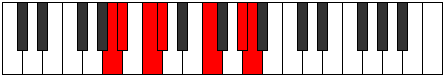 |
| [2335](https://ianring.com/musictheory/scales/2335) | [Epydian](ModeANaturalEpydian.md) | A | A, Bb, Cb, Dbb, Ebbb, F, G#, A |  |
| [2353](https://ianring.com/musictheory/scales/2353) | [Lycritonic](ModeFNaturalLycritonic.md) | F | F, A, A#, C#, E, F |  |
| [2355](https://ianring.com/musictheory/scales/2355) | [Katycrimic](ModeFNaturalKatycrimic.md) | F | F, Gb, A, Bb, C#, D##, F |  |
| [2355](https://ianring.com/musictheory/scales/2355) | [Katycrimic](ModeANaturalKatycrimic.md) | A | A, Bb, C#, D, E#, F###, A |  |
| [2357](https://ianring.com/musictheory/scales/2357) | [Ionaptimic](ModeFNaturalIonaptimic.md) | F | F, G, A, Bb, C#, D##, F |  |
| [2359](https://ianring.com/musictheory/scales/2359) | [Gadian](ModeANaturalGadian.md) | A | A, Bb, Cb, Db, Ebb, F, G#, A |  |
| [2361](https://ianring.com/musictheory/scales/2361) | [Docrimic](ModeFNaturalDocrimic.md) | F | F, G#, A, Bb, C#, D##, F |  |
| [2363](https://ianring.com/musictheory/scales/2363) | [Kataptian](ModeANaturalKataptian.md) | A | A, Bb, C, Db, Ebb, F, G#, A |  |
| [2367](https://ianring.com/musictheory/scales/2367) | [Laryllic](ModeFNaturalLaryllic.md) | F | F, F#, G, G#, A, A#, C#, E, F |  |
| [2367](https://ianring.com/musictheory/scales/2367) | [Laryllic](ModeANaturalLaryllic.md) | A | A, A#, B, C, C#, D, F, G#, A |  |
| [2387](https://ianring.com/musictheory/scales/2387) | [Paptimic](ModeANaturalPaptimic.md) | A | A, Bb, C#, D#, E#, F###, A |  |
| [2391](https://ianring.com/musictheory/scales/2391) | [Molian](ModeANaturalMolian.md) | A | A, Bb, Cb, Db, Eb, F, G#, A | 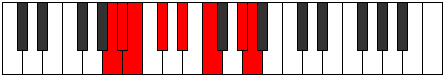 |
| [2395](https://ianring.com/musictheory/scales/2395) | [Zoptian](ModeANaturalZoptian.md) | A | A, Bb, C, Db, Eb, F, G#, A |  |
| [2399](https://ianring.com/musictheory/scales/2399) | [Zanyllic](ModeANaturalZanyllic.md) | A | A, A#, B, C, C#, D#, F, G#, A |  |
| [2417](https://ianring.com/musictheory/scales/2417) | [Kanimic](ModeFNaturalKanimic.md) | F | F, G##, A#, B, C#, D##, F |  |
| [2419](https://ianring.com/musictheory/scales/2419) | [Paptian](ModeANaturalPaptian.md) | A | A, Bb, C#, D, Eb, F, G#, A |  |
| [2419](https://ianring.com/musictheory/scales/2419) | [Paptian](ModeFNaturalPaptian.md) | F | F, Gb, A, Bb, Cb, Db, E, F |  |
| [2421](https://ianring.com/musictheory/scales/2421) | [Malian](ModeFNaturalMalian.md) | F | F, G, A, Bb, Cb, Db, E, F |  |
| [2423](https://ianring.com/musictheory/scales/2423) | [Thorcryllic](ModeFNaturalThorcryllic.md) | F | F, F#, G, A, A#, B, C#, E, F |  |
| [2423](https://ianring.com/musictheory/scales/2423) | [Thorcryllic](ModeANaturalThorcryllic.md) | A | A, A#, B, C#, D, D#, F, G#, A |  |
| [2425](https://ianring.com/musictheory/scales/2425) | [Rorian](ModeFNaturalRorian.md) | F | F, G#, A, Bb, Cb, Db, E, F |  |
| [2427](https://ianring.com/musictheory/scales/2427) | [Katoryllic](ModeANaturalKatoryllic.md) | A | A, A#, C, C#, D, D#, F, G#, A |  |
| [2427](https://ianring.com/musictheory/scales/2427) | [Katoryllic](ModeFNaturalKatoryllic.md) | F | F, F#, G#, A, A#, B, C#, E, F |  |
| [2429](https://ianring.com/musictheory/scales/2429) | [Kadyllic](ModeFNaturalKadyllic.md) | F | F, G, G#, A, A#, B, C#, E, F |  |
| [2431](https://ianring.com/musictheory/scales/2431) | [Gythygic](ModeANaturalGythygic.md) | A | A, A#, B, C, C#, D, D#, F, G#, A |  |
| [2431](https://ianring.com/musictheory/scales/2431) | [Gythygic](ModeFNaturalGythygic.md) | F | F, F#, G, G#, A, A#, B, C#, E, F |  |
| [2441](https://ianring.com/musictheory/scales/2441) | [Kyritonic](ModeDNaturalKyritonic.md) | D | D, F, A, A#, C#, D |  |
| [2441](https://ianring.com/musictheory/scales/2441) | [Kyritonic](ModeASharpKyritonic.md) | A# | A#, C#, F, F#, A, A# |  |
| [2441](https://ianring.com/musictheory/scales/2441) | [Kyritonic](ModeBFlatKyritonic.md) | Bb | Bb, Db, F, Gb, A, Bb |  |
| [2443](https://ianring.com/musictheory/scales/2443) | [Panimic](ModeDNaturalPanimic.md) | D | D, Eb, F, G##, A#, B##, D |  |
| [2443](https://ianring.com/musictheory/scales/2443) | [Panimic](ModeASharpPanimic.md) | A# | A#, B, C#, D###, E##, Cbbb, A# |  |
| [2443](https://ianring.com/musictheory/scales/2443) | [Panimic](ModeBFlatPanimic.md) | Bb | Bb, Cb, Db, E#, F#, G##, Bb |  |
| [2445](https://ianring.com/musictheory/scales/2445) | [Zadimic](ModeDNaturalZadimic.md) | D | D, E, F, G##, A#, B##, D |  |
| [2445](https://ianring.com/musictheory/scales/2445) | [Zadimic](ModeASharpZadimic.md) | A# | A#, B#, C#, D###, E##, Cbbb, A# |  |
| [2445](https://ianring.com/musictheory/scales/2445) | [Zadimic](ModeBFlatZadimic.md) | Bb | Bb, C, Db, E#, F#, G##, Bb |  |
| [2447](https://ianring.com/musictheory/scales/2447) | [Thagian](ModeDNaturalThagian.md) | D | D, Eb, Fb, Gbb, A, Bb, C#, D |  |
| [2447](https://ianring.com/musictheory/scales/2447) | [Thagian](ModeASharpThagian.md) | A# | A#, B, C, Db, E#, F#, G##, A# |  |
| [2447](https://ianring.com/musictheory/scales/2447) | [Thagian](ModeBFlatThagian.md) | Bb | Bb, Cb, Dbb, Ebbb, F, Gb, A, Bb |  |
| [2451](https://ianring.com/musictheory/scales/2451) | [Aerynimic](ModeANaturalAerynimic.md) | A | A, Bb, C#, D##, E#, F###, A |  |
| [2455](https://ianring.com/musictheory/scales/2455) | [Bothian](ModeANaturalBothian.md) | A | A, Bb, Cb, Db, E, F, G#, A |  |
| [2457](https://ianring.com/musictheory/scales/2457) | [Ionythimic](ModeDNaturalIonythimic.md) | D | D, E#, F#, G##, A#, B##, D |  |
| [2457](https://ianring.com/musictheory/scales/2457) | [Ionythimic](ModeFSharpIonythimic.md) | F# | F#, G##, A#, B##, C##, D###, F# |  |
| [2457](https://ianring.com/musictheory/scales/2457) | [Ionythimic](ModeGFlatIonythimic.md) | Gb | Gb, A, Bb, C#, D, E#, Gb | 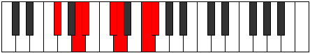 |
| [2457](https://ianring.com/musictheory/scales/2457) | [Ionythimic](ModeASharpIonythimic.md) | A# | A#, B##, C##, D###, E##, Cbbb, A# |  |
| [2457](https://ianring.com/musictheory/scales/2457) | [Ionythimic](ModeBFlatIonythimic.md) | Bb | Bb, C#, D, E#, F#, G##, Bb |  |
| [2459](https://ianring.com/musictheory/scales/2459) | [Ionocrian](ModeDNaturalIonocrian.md) | D | D, Eb, F, Gb, A, Bb, C#, D |  |
| [2459](https://ianring.com/musictheory/scales/2459) | [Ionocrian](ModeFSharpIonocrian.md) | F# | F#, G, A, Bb, C#, D, E#, F# |  |
| [2459](https://ianring.com/musictheory/scales/2459) | [Ionocrian](ModeANaturalIonocrian.md) | A | A, Bb, C, Db, E, F, G#, A |  |
| [2459](https://ianring.com/musictheory/scales/2459) | [Ionocrian](ModeASharpIonocrian.md) | A# | A#, B, C#, D, E#, F#, G##, A# |  |
| [2459](https://ianring.com/musictheory/scales/2459) | [Ionocrian](ModeBFlatIonocrian.md) | Bb | Bb, Cb, Db, Ebb, F, Gb, A, Bb |  |
| [2461](https://ianring.com/musictheory/scales/2461) | [Sagian](ModeASharpSagian.md) | A# | A#, B#, C#, D, E#, F#, G##, A# |  |
| [2461](https://ianring.com/musictheory/scales/2461) | [Sagian](ModeBFlatSagian.md) | Bb | Bb, C, Db, Ebb, F, Gb, A, Bb |  |
| [2461](https://ianring.com/musictheory/scales/2461) | [Sagian](ModeDNaturalSagian.md) | D | D, E, F, Gb, A, Bb, C#, D |  |
| [2461](https://ianring.com/musictheory/scales/2461) | [Sagian](ModeFSharpSagian.md) | F# | F#, G#, A, Bb, C#, D, E#, F# |  |
| [2463](https://ianring.com/musictheory/scales/2463) | [Ionathyllic](ModeDNaturalIonathyllic.md) | D | D, D#, E, F, F#, A, A#, C#, D |  |
| [2463](https://ianring.com/musictheory/scales/2463) | [Ionathyllic](ModeFSharpIonathyllic.md) | F# | F#, G, G#, A, A#, C#, D, F, F# |  |
| [2463](https://ianring.com/musictheory/scales/2463) | [Ionathyllic](ModeGFlatIonathyllic.md) | Gb | Gb, G, Ab, A, Bb, Db, D, F, Gb |  |
| [2463](https://ianring.com/musictheory/scales/2463) | [Ionathyllic](ModeASharpIonathyllic.md) | A# | A#, B, C, C#, D, F, F#, A, A# |  |
| [2463](https://ianring.com/musictheory/scales/2463) | [Ionathyllic](ModeBFlatIonathyllic.md) | Bb | Bb, B, C, Db, D, F, Gb, A, Bb |  |
| [2463](https://ianring.com/musictheory/scales/2463) | [Ionathyllic](ModeANaturalIonathyllic.md) | A | A, A#, B, C, C#, E, F, G#, A |  |
| [2473](https://ianring.com/musictheory/scales/2473) | [Mothimic](ModeASharpMothimic.md) | A# | A#, B##, C###, D###, E##, Cbbb, A# |  |
| [2473](https://ianring.com/musictheory/scales/2473) | [Mothimic](ModeBFlatMothimic.md) | Bb | Bb, C#, D#, E#, F#, G##, Bb | 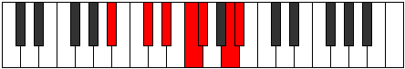 |
| [2473](https://ianring.com/musictheory/scales/2473) | [Mothimic](ModeDNaturalMothimic.md) | D | D, E#, F##, G##, A#, B##, D |  |
| [2475](https://ianring.com/musictheory/scales/2475) | [Aerylian](ModeDNaturalAerylian.md) | D | D, Eb, F, G, A, Bb, C#, D |  |
| [2475](https://ianring.com/musictheory/scales/2475) | [Aerylian](ModeASharpAerylian.md) | A# | A#, B, C#, D#, E#, F#, G##, A# |  |
| [2475](https://ianring.com/musictheory/scales/2475) | [Aerylian](ModeBFlatAerylian.md) | Bb | Bb, Cb, Db, Eb, F, Gb, A, Bb |  |
| [2477](https://ianring.com/musictheory/scales/2477) | [Mydian](ModeASharpMydian.md) | A# | A#, B#, C#, D#, E#, F#, G##, A# |  |
| [2477](https://ianring.com/musictheory/scales/2477) | [Mydian](ModeBFlatMydian.md) | Bb | Bb, C, Db, Eb, F, Gb, A, Bb |  |
| [2477](https://ianring.com/musictheory/scales/2477) | [Mydian](ModeDNaturalMydian.md) | D | D, E, F, G, A, Bb, C#, D |  |
| [2479](https://ianring.com/musictheory/scales/2479) | [Rycryllic](ModeDNaturalRycryllic.md) | D | D, D#, E, F, G, A, A#, C#, D |  |
| [2479](https://ianring.com/musictheory/scales/2479) | [Rycryllic](ModeASharpRycryllic.md) | A# | A#, B, C, C#, D#, F, F#, A, A# |  |
| [2479](https://ianring.com/musictheory/scales/2479) | [Rycryllic](ModeBFlatRycryllic.md) | Bb | Bb, B, C, Db, Eb, F, Gb, A, Bb |  |
| [2481](https://ianring.com/musictheory/scales/2481) | [Laptimic](ModeFNaturalLaptimic.md) | F | F, G##, A#, B#, C#, D##, F |  |
| [2483](https://ianring.com/musictheory/scales/2483) | [Aerynian](ModeFNaturalAerynian.md) | F | F, Gb, A, Bb, C, Db, E, F |  |
| [2483](https://ianring.com/musictheory/scales/2483) | [Aerynian](ModeANaturalAerynian.md) | A | A, Bb, C#, D, E, F, G#, A |  |
| [2485](https://ianring.com/musictheory/scales/2485) | [Aerorian](ModeFNaturalAerorian.md) | F | F, G, A, Bb, C, Db, E, F |  |
| [2487](https://ianring.com/musictheory/scales/2487) | [Phroptyllic](ModeFNaturalPhroptyllic.md) | F | F, F#, G, A, A#, C, C#, E, F |  |
| [2487](https://ianring.com/musictheory/scales/2487) | [Phroptyllic](ModeANaturalPhroptyllic.md) | A | A, A#, B, C#, D, E, F, G#, A |  |
| [2489](https://ianring.com/musictheory/scales/2489) | [Syrian](ModeASharpSyrian.md) | A# | A#, B##, C##, D#, E#, F#, G##, A# |  |
| [2489](https://ianring.com/musictheory/scales/2489) | [Syrian](ModeBFlatSyrian.md) | Bb | Bb, C#, D, Eb, F, Gb, A, Bb |  |
| [2489](https://ianring.com/musictheory/scales/2489) | [Syrian](ModeDNaturalSyrian.md) | D | D, E#, F#, G, A, Bb, C#, D |  |
| [2489](https://ianring.com/musictheory/scales/2489) | [Syrian](ModeFNaturalSyrian.md) | F | F, G#, A, Bb, C, Db, E, F |  |
| [2489](https://ianring.com/musictheory/scales/2489) | [Syrian](ModeFSharpSyrian.md) | F# | F#, G##, A#, B, C#, D, E#, F# |  |
| [2489](https://ianring.com/musictheory/scales/2489) | [Syrian](ModeGFlatSyrian.md) | Gb | Gb, A, Bb, Cb, Db, Ebb, F, Gb |  |
| [2491](https://ianring.com/musictheory/scales/2491) | [Layllic](ModeDNaturalLayllic.md) | D | D, D#, F, F#, G, A, A#, C#, D |  |
| [2491](https://ianring.com/musictheory/scales/2491) | [Layllic](ModeANaturalLayllic.md) | A | A, A#, C, C#, D, E, F, G#, A |  |
| [2491](https://ianring.com/musictheory/scales/2491) | [Layllic](ModeFNaturalLayllic.md) | F | F, F#, G#, A, A#, C, C#, E, F |  |
| [2491](https://ianring.com/musictheory/scales/2491) | [Layllic](ModeASharpLayllic.md) | A# | A#, B, C#, D, D#, F, F#, A, A# |  |
| [2491](https://ianring.com/musictheory/scales/2491) | [Layllic](ModeBFlatLayllic.md) | Bb | Bb, B, Db, D, Eb, F, Gb, A, Bb |  |
| [2491](https://ianring.com/musictheory/scales/2491) | [Layllic](ModeFSharpLayllic.md) | F# | F#, G, A, A#, B, C#, D, F, F# |  |
| [2491](https://ianring.com/musictheory/scales/2491) | [Layllic](ModeGFlatLayllic.md) | Gb | Gb, G, A, Bb, B, Db, D, F, Gb |  |
| [2493](https://ianring.com/musictheory/scales/2493) | [Manyllic](ModeASharpManyllic.md) | A# | A#, C, C#, D, D#, F, F#, A, A# |  |
| [2493](https://ianring.com/musictheory/scales/2493) | [Manyllic](ModeBFlatManyllic.md) | Bb | Bb, C, Db, D, Eb, F, Gb, A, Bb |  |
| [2493](https://ianring.com/musictheory/scales/2493) | [Manyllic](ModeDNaturalManyllic.md) | D | D, E, F, F#, G, A, A#, C#, D |  |
| [2493](https://ianring.com/musictheory/scales/2493) | [Manyllic](ModeFNaturalManyllic.md) | F | F, G, G#, A, A#, C, C#, E, F |  |
| [2493](https://ianring.com/musictheory/scales/2493) | [Manyllic](ModeFSharpManyllic.md) | F# | F#, G#, A, A#, B, C#, D, F, F# |  |
| [2493](https://ianring.com/musictheory/scales/2493) | [Manyllic](ModeGFlatManyllic.md) | Gb | Gb, Ab, A, Bb, B, Db, D, F, Gb |  |
| [2495](https://ianring.com/musictheory/scales/2495) | [Aeolocrygic](ModeDNaturalAeolocrygic.md) | D | D, D#, E, F, F#, G, A, A#, C#, D |  |
| [2495](https://ianring.com/musictheory/scales/2495) | [Aeolocrygic](ModeFNaturalAeolocrygic.md) | F | F, F#, G, G#, A, A#, C, C#, E, F |  |
| [2495](https://ianring.com/musictheory/scales/2495) | [Aeolocrygic](ModeASharpAeolocrygic.md) | A# | A#, B, C, C#, D, D#, F, F#, A, A# |  |
| [2495](https://ianring.com/musictheory/scales/2495) | [Aeolocrygic](ModeBFlatAeolocrygic.md) | Bb | Bb, B, C, Db, D, Eb, F, Gb, A, Bb |  |
| [2495](https://ianring.com/musictheory/scales/2495) | [Aeolocrygic](ModeANaturalAeolocrygic.md) | A | A, A#, B, C, C#, D, E, F, G#, A |  |
| [2495](https://ianring.com/musictheory/scales/2495) | [Aeolocrygic](ModeFSharpAeolocrygic.md) | F# | F#, G, G#, A, A#, B, C#, D, F, F# |  |
| [2495](https://ianring.com/musictheory/scales/2495) | [Aeolocrygic](ModeGFlatAeolocrygic.md) | Gb | Gb, G, Ab, A, Bb, B, Db, D, F, Gb |  |
| [2505](https://ianring.com/musictheory/scales/2505) | [Mydimic](ModeASharpMydimic.md) | A# | A#, B##, D##, E#, F#, G##, A# |  |
| [2505](https://ianring.com/musictheory/scales/2505) | [Mydimic](ModeBFlatMydimic.md) | Bb | Bb, C#, D##, E#, F#, G##, Bb | 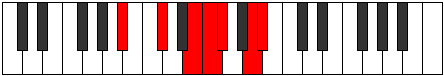 |
| [2505](https://ianring.com/musictheory/scales/2505) | [Mydimic](ModeDNaturalMydimic.md) | D | D, E#, F###, G##, A#, B##, D |  |
| [2507](https://ianring.com/musictheory/scales/2507) | [Ionyphian](ModeDNaturalIonyphian.md) | D | D, Eb, F, G#, A, Bb, C#, D |  |
| [2507](https://ianring.com/musictheory/scales/2507) | [Ionyphian](ModeASharpIonyphian.md) | A# | A#, B, C#, D##, E#, F#, G##, A# |  |
| [2507](https://ianring.com/musictheory/scales/2507) | [Ionyphian](ModeBFlatIonyphian.md) | Bb | Bb, Cb, Db, E, F, Gb, A, Bb |  |
| [2509](https://ianring.com/musictheory/scales/2509) | [Bogian](ModeASharpBogian.md) | A# | A#, B#, C#, D##, E#, F#, G##, A# |  |
| [2509](https://ianring.com/musictheory/scales/2509) | [Bogian](ModeBFlatBogian.md) | Bb | Bb, C, Db, E, F, Gb, A, Bb |  |
| [2509](https://ianring.com/musictheory/scales/2509) | [Bogian](ModeDNaturalBogian.md) | D | D, E, F, G#, A, Bb, C#, D |  |
| [2511](https://ianring.com/musictheory/scales/2511) | [Epyryllic](ModeDNaturalEpyryllic.md) | D | D, D#, E, F, G#, A, A#, C#, D |  |
| [2511](https://ianring.com/musictheory/scales/2511) | [Epyryllic](ModeASharpEpyryllic.md) | A# | A#, B, C, C#, E, F, F#, A, A# |  |
| [2511](https://ianring.com/musictheory/scales/2511) | [Epyryllic](ModeBFlatEpyryllic.md) | Bb | Bb, B, C, Db, E, F, Gb, A, Bb |  |
| [2515](https://ianring.com/musictheory/scales/2515) | [Stylian](ModeANaturalStylian.md) | A | A, Bb, C#, D#, E, F, G#, A |  |
| [2519](https://ianring.com/musictheory/scales/2519) | [Dathyllic](ModeANaturalDathyllic.md) | A | A, A#, B, C#, D#, E, F, G#, A |  |
| [2521](https://ianring.com/musictheory/scales/2521) | [Barian](ModeFSharpBarian.md) | F# | F#, G##, A#, B#, C#, D, E#, F# |  |
| [2521](https://ianring.com/musictheory/scales/2521) | [Barian](ModeGFlatBarian.md) | Gb | Gb, A, Bb, C, Db, Ebb, F, Gb |  |
| [2521](https://ianring.com/musictheory/scales/2521) | [Barian](ModeASharpBarian.md) | A# | A#, B##, C##, D##, E#, F#, G##, A# |  |
| [2521](https://ianring.com/musictheory/scales/2521) | [Barian](ModeBFlatBarian.md) | Bb | Bb, C#, D, E, F, Gb, A, Bb |  |
| [2521](https://ianring.com/musictheory/scales/2521) | [Barian](ModeDNaturalBarian.md) | D | D, E#, F#, G#, A, Bb, C#, D |  |
| [2523](https://ianring.com/musictheory/scales/2523) | [Rygyllic](ModeFSharpRygyllic.md) | F# | F#, G, A, A#, C, C#, D, F, F# |  |
| [2523](https://ianring.com/musictheory/scales/2523) | [Rygyllic](ModeGFlatRygyllic.md) | Gb | Gb, G, A, Bb, C, Db, D, F, Gb | 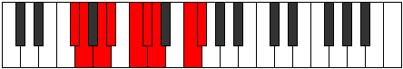 |
| [2523](https://ianring.com/musictheory/scales/2523) | [Rygyllic](ModeANaturalRygyllic.md) | A | A, A#, C, C#, D#, E, F, G#, A |  |
| [2523](https://ianring.com/musictheory/scales/2523) | [Rygyllic](ModeDNaturalRygyllic.md) | D | D, D#, F, F#, G#, A, A#, C#, D |  |
| [2523](https://ianring.com/musictheory/scales/2523) | [Rygyllic](ModeASharpRygyllic.md) | A# | A#, B, C#, D, E, F, F#, A, A# |  |
| [2523](https://ianring.com/musictheory/scales/2523) | [Rygyllic](ModeBFlatRygyllic.md) | Bb | Bb, B, Db, D, E, F, Gb, A, Bb |  |
| [2525](https://ianring.com/musictheory/scales/2525) | [Aeolaryllic](ModeASharpAeolaryllic.md) | A# | A#, C, C#, D, E, F, F#, A, A# |  |
| [2525](https://ianring.com/musictheory/scales/2525) | [Aeolaryllic](ModeBFlatAeolaryllic.md) | Bb | Bb, C, Db, D, E, F, Gb, A, Bb |  |
| [2525](https://ianring.com/musictheory/scales/2525) | [Aeolaryllic](ModeFSharpAeolaryllic.md) | F# | F#, G#, A, A#, C, C#, D, F, F# |  |
| [2525](https://ianring.com/musictheory/scales/2525) | [Aeolaryllic](ModeGFlatAeolaryllic.md) | Gb | Gb, Ab, A, Bb, C, Db, D, F, Gb |  |
| [2525](https://ianring.com/musictheory/scales/2525) | [Aeolaryllic](ModeDNaturalAeolaryllic.md) | D | D, E, F, F#, G#, A, A#, C#, D |  |
| [2527](https://ianring.com/musictheory/scales/2527) | [Phradygic](ModeDNaturalPhradygic.md) | D | D, D#, E, F, F#, G#, A, A#, C#, D |  |
| [2527](https://ianring.com/musictheory/scales/2527) | [Phradygic](ModeFSharpPhradygic.md) | F# | F#, G, G#, A, A#, C, C#, D, F, F# |  |
| [2527](https://ianring.com/musictheory/scales/2527) | [Phradygic](ModeGFlatPhradygic.md) | Gb | Gb, G, Ab, A, Bb, C, Db, D, F, Gb |  |
| [2527](https://ianring.com/musictheory/scales/2527) | [Phradygic](ModeASharpPhradygic.md) | A# | A#, B, C, C#, D, E, F, F#, A, A# |  |
| [2527](https://ianring.com/musictheory/scales/2527) | [Phradygic](ModeBFlatPhradygic.md) | Bb | Bb, B, C, Db, D, E, F, Gb, A, Bb |  |
| [2527](https://ianring.com/musictheory/scales/2527) | [Phradygic](ModeANaturalPhradygic.md) | A | A, A#, B, C, C#, D#, E, F, G#, A |  |
| [2537](https://ianring.com/musictheory/scales/2537) | [Laptian](ModeASharpLaptian.md) | A# | A#, B##, C###, D##, E#, F#, G##, A# |  |
| [2537](https://ianring.com/musictheory/scales/2537) | [Laptian](ModeBFlatLaptian.md) | Bb | Bb, C#, D#, E, F, Gb, A, Bb |  |
| [2537](https://ianring.com/musictheory/scales/2537) | [Laptian](ModeDNaturalLaptian.md) | D | D, E#, F##, G#, A, Bb, C#, D |  |
| [2539](https://ianring.com/musictheory/scales/2539) | [Thonyllic](ModeDNaturalThonyllic.md) | D | D, D#, F, G, G#, A, A#, C#, D |  |
| [2539](https://ianring.com/musictheory/scales/2539) | [Thonyllic](ModeASharpThonyllic.md) | A# | A#, B, C#, D#, E, F, F#, A, A# |  |
| [2539](https://ianring.com/musictheory/scales/2539) | [Thonyllic](ModeBFlatThonyllic.md) | Bb | Bb, B, Db, Eb, E, F, Gb, A, Bb |  |
| [2541](https://ianring.com/musictheory/scales/2541) | [Katadyllic](ModeASharpKatadyllic.md) | A# | A#, C, C#, D#, E, F, F#, A, A# |  |
| [2541](https://ianring.com/musictheory/scales/2541) | [Katadyllic](ModeBFlatKatadyllic.md) | Bb | Bb, C, Db, Eb, E, F, Gb, A, Bb |  |
| [2541](https://ianring.com/musictheory/scales/2541) | [Katadyllic](ModeDNaturalKatadyllic.md) | D | D, E, F, G, G#, A, A#, C#, D |  |
| [2543](https://ianring.com/musictheory/scales/2543) | [Dydygic](ModeDNaturalDydygic.md) | D | D, D#, E, F, G, G#, A, A#, C#, D |  |
| [2543](https://ianring.com/musictheory/scales/2543) | [Dydygic](ModeASharpDydygic.md) | A# | A#, B, C, C#, D#, E, F, F#, A, A# |  |
| [2543](https://ianring.com/musictheory/scales/2543) | [Dydygic](ModeBFlatDydygic.md) | Bb | Bb, B, C, Db, Eb, E, F, Gb, A, Bb |  |
| [2545](https://ianring.com/musictheory/scales/2545) | [Thycrian](ModeFNaturalThycrian.md) | F | F, G##, A#, B, C, Db, E, F |  |
| [2547](https://ianring.com/musictheory/scales/2547) | [Sogyllic](ModeANaturalSogyllic.md) | A | A, A#, C#, D, D#, E, F, G#, A |  |
| [2547](https://ianring.com/musictheory/scales/2547) | [Sogyllic](ModeFNaturalSogyllic.md) | F | F, F#, A, A#, B, C, C#, E, F |  |
| [2549](https://ianring.com/musictheory/scales/2549) | [Rydyllic](ModeFNaturalRydyllic.md) | F | F, G, A, A#, B, C, C#, E, F |  |
| [2551](https://ianring.com/musictheory/scales/2551) | [Zoptygic](ModeFNaturalZoptygic.md) | F | F, F#, G, A, A#, B, C, C#, E, F |  |
| [2551](https://ianring.com/musictheory/scales/2551) | [Zoptygic](ModeANaturalZoptygic.md) | A | A, A#, B, C#, D, D#, E, F, G#, A |  |
| [2553](https://ianring.com/musictheory/scales/2553) | [Aeolaptyllic](ModeASharpAeolaptyllic.md) | A# | A#, C#, D, D#, E, F, F#, A, A# |  |
| [2553](https://ianring.com/musictheory/scales/2553) | [Aeolaptyllic](ModeBFlatAeolaptyllic.md) | Bb | Bb, Db, D, Eb, E, F, Gb, A, Bb |  |
| [2553](https://ianring.com/musictheory/scales/2553) | [Aeolaptyllic](ModeDNaturalAeolaptyllic.md) | D | D, F, F#, G, G#, A, A#, C#, D |  |
| [2553](https://ianring.com/musictheory/scales/2553) | [Aeolaptyllic](ModeFSharpAeolaptyllic.md) | F# | F#, A, A#, B, C, C#, D, F, F# |  |
| [2553](https://ianring.com/musictheory/scales/2553) | [Aeolaptyllic](ModeGFlatAeolaptyllic.md) | Gb | Gb, A, Bb, B, C, Db, D, F, Gb |  |
| [2553](https://ianring.com/musictheory/scales/2553) | [Aeolaptyllic](ModeFNaturalAeolaptyllic.md) | F | F, G#, A, A#, B, C, C#, E, F |  |
| [2555](https://ianring.com/musictheory/scales/2555) | [Bythygic](ModeANaturalBythygic.md) | A | A, A#, C, C#, D, D#, E, F, G#, A |  |
| [2555](https://ianring.com/musictheory/scales/2555) | [Bythygic](ModeDNaturalBythygic.md) | D | D, D#, F, F#, G, G#, A, A#, C#, D |  |
| [2555](https://ianring.com/musictheory/scales/2555) | [Bythygic](ModeASharpBythygic.md) | A# | A#, B, C#, D, D#, E, F, F#, A, A# |  |
| [2555](https://ianring.com/musictheory/scales/2555) | [Bythygic](ModeBFlatBythygic.md) | Bb | Bb, B, Db, D, Eb, E, F, Gb, A, Bb |  |
| [2555](https://ianring.com/musictheory/scales/2555) | [Bythygic](ModeFSharpBythygic.md) | F# | F#, G, A, A#, B, C, C#, D, F, F# |  |
| [2555](https://ianring.com/musictheory/scales/2555) | [Bythygic](ModeGFlatBythygic.md) | Gb | Gb, G, A, Bb, B, C, Db, D, F, Gb |  |
| [2555](https://ianring.com/musictheory/scales/2555) | [Bythygic](ModeFNaturalBythygic.md) | F | F, F#, G#, A, A#, B, C, C#, E, F |  |
| [2557](https://ianring.com/musictheory/scales/2557) | [Dothygic](ModeASharpDothygic.md) | A# | A#, C, C#, D, D#, E, F, F#, A, A# |  |
| [2557](https://ianring.com/musictheory/scales/2557) | [Dothygic](ModeBFlatDothygic.md) | Bb | Bb, C, Db, D, Eb, E, F, Gb, A, Bb |  |
| [2557](https://ianring.com/musictheory/scales/2557) | [Dothygic](ModeDNaturalDothygic.md) | D | D, E, F, F#, G, G#, A, A#, C#, D |  |
| [2557](https://ianring.com/musictheory/scales/2557) | [Dothygic](ModeFSharpDothygic.md) | F# | F#, G#, A, A#, B, C, C#, D, F, F# |  |
| [2557](https://ianring.com/musictheory/scales/2557) | [Dothygic](ModeGFlatDothygic.md) | Gb | Gb, Ab, A, Bb, B, C, Db, D, F, Gb |  |
| [2557](https://ianring.com/musictheory/scales/2557) | [Dothygic](ModeFNaturalDothygic.md) | F | F, G, G#, A, A#, B, C, C#, E, F |  |
| [2559](https://ianring.com/musictheory/scales/2559) | [Zogyllian](ModeDNaturalZogyllian.md) | D | D, D#, E, F, F#, G, G#, A, A#, C#, D |  |
| [2559](https://ianring.com/musictheory/scales/2559) | [Zogyllian](ModeASharpZogyllian.md) | A# | A#, B, C, C#, D, D#, E, F, F#, A, A# |  |
| [2559](https://ianring.com/musictheory/scales/2559) | [Zogyllian](ModeBFlatZogyllian.md) | Bb | Bb, B, C, Db, D, Eb, E, F, Gb, A, Bb |  |
| [2559](https://ianring.com/musictheory/scales/2559) | [Zogyllian](ModeANaturalZogyllian.md) | A | A, A#, B, C, C#, D, D#, E, F, G#, A |  |
| [2559](https://ianring.com/musictheory/scales/2559) | [Zogyllian](ModeFSharpZogyllian.md) | F# | F#, G, G#, A, A#, B, C, C#, D, F, F# |  |
| [2559](https://ianring.com/musictheory/scales/2559) | [Zogyllian](ModeGFlatZogyllian.md) | Gb | Gb, G, Ab, A, Bb, B, C, Db, D, F, Gb |  |
| [2559](https://ianring.com/musictheory/scales/2559) | [Zogyllian](ModeFNaturalZogyllian.md) | F | F, F#, G, G#, A, A#, B, C, C#, E, F |  |
| [2599](https://ianring.com/musictheory/scales/2599) | [Malimic](ModeGSharpMalimic.md) | G# | G#, A, Bb, C#, D###, E###, G# |  |
| [2607](https://ianring.com/musictheory/scales/2607) | [Aerolian](ModeGSharpAerolian.md) | G# | G#, A, Bb, Cb, Db, E#, F##, G# |  |
| [2615](https://ianring.com/musictheory/scales/2615) | [Thoptian](ModeGSharpThoptian.md) | G# | G#, A, Bb, C, Db, E#, F##, G# |  |
| [2623](https://ianring.com/musictheory/scales/2623) | [Aerylyllic](ModeGSharpAerylyllic.md) | G# | G#, A, A#, B, C, C#, F, G, G# |  |
| [2623](https://ianring.com/musictheory/scales/2623) | [Aerylyllic](ModeAFlatAerylyllic.md) | Ab | Ab, A, Bb, B, C, Db, F, G, Ab |  |
| [2659](https://ianring.com/musictheory/scales/2659) | [Katynimic](ModeENaturalKatynimic.md) | E | E, F, G##, A#, B##, C###, E |  |
| [2663](https://ianring.com/musictheory/scales/2663) | [Lalian](ModeENaturalLalian.md) | E | E, F, Gb, A, Bb, C#, D#, E |  |
| [2663](https://ianring.com/musictheory/scales/2663) | [Lalian](ModeGSharpLalian.md) | G# | G#, A, Bb, C#, D, E#, F##, G# |  |
| [2667](https://ianring.com/musictheory/scales/2667) | [Byrian](ModeENaturalByrian.md) | E | E, F, G, A, Bb, C#, D#, E |  |
| [2671](https://ianring.com/musictheory/scales/2671) | [Lylyllic](ModeENaturalLylyllic.md) | E | E, F, F#, G, A, A#, C#, D#, E |  |
| [2671](https://ianring.com/musictheory/scales/2671) | [Lylyllic](ModeGSharpLylyllic.md) | G# | G#, A, A#, B, C#, D, F, G, G# |  |
| [2671](https://ianring.com/musictheory/scales/2671) | [Lylyllic](ModeAFlatLylyllic.md) | Ab | Ab, A, Bb, B, Db, D, F, G, Ab |  |
| [2675](https://ianring.com/musictheory/scales/2675) | [Gogian](ModeENaturalGogian.md) | E | E, F, G#, A, Bb, C#, D#, E | 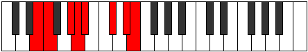 |
| [2679](https://ianring.com/musictheory/scales/2679) | [Rathyllic](ModeENaturalRathyllic.md) | E | E, F, F#, G#, A, A#, C#, D#, E |  |
| [2679](https://ianring.com/musictheory/scales/2679) | [Rathyllic](ModeGSharpRathyllic.md) | G# | G#, A, A#, C, C#, D, F, G, G# |  |
| [2679](https://ianring.com/musictheory/scales/2679) | [Rathyllic](ModeAFlatRathyllic.md) | Ab | Ab, A, Bb, C, Db, D, F, G, Ab |  |
| [2683](https://ianring.com/musictheory/scales/2683) | [Thodyllic](ModeENaturalThodyllic.md) | E | E, F, G, G#, A, A#, C#, D#, E |  |
| [2687](https://ianring.com/musictheory/scales/2687) | [Thacrygic](ModeENaturalThacrygic.md) | E | E, F, F#, G, G#, A, A#, C#, D#, E |  |
| [2687](https://ianring.com/musictheory/scales/2687) | [Thacrygic](ModeGSharpThacrygic.md) | G# | G#, A, A#, B, C, C#, D, F, G, G# |  |
| [2687](https://ianring.com/musictheory/scales/2687) | [Thacrygic](ModeAFlatThacrygic.md) | Ab | Ab, A, Bb, B, C, Db, D, F, G, Ab |  |
| [2697](https://ianring.com/musictheory/scales/2697) | [Katagitonic](ModeASharpKatagitonic.md) | A# | A#, C#, F, G, A, A# |  |
| [2697](https://ianring.com/musictheory/scales/2697) | [Katagitonic](ModeBFlatKatagitonic.md) | Bb | Bb, Db, F, G, A, Bb |  |
| [2699](https://ianring.com/musictheory/scales/2699) | [Sythimic](ModeASharpSythimic.md) | A# | A#, B, C#, D###, E###, Cbbb, A# |  |
| [2699](https://ianring.com/musictheory/scales/2699) | [Sythimic](ModeBFlatSythimic.md) | Bb | Bb, Cb, Db, E#, F##, G##, Bb |  |
| [2701](https://ianring.com/musictheory/scales/2701) | [Epythimic](ModeASharpEpythimic.md) | A# | A#, B#, C#, D###, E###, Cbbb, A# |  |
| [2701](https://ianring.com/musictheory/scales/2701) | [Epythimic](ModeBFlatEpythimic.md) | Bb | Bb, C, Db, E#, F##, G##, Bb |  |
| [2703](https://ianring.com/musictheory/scales/2703) | [Galian](ModeASharpGalian.md) | A# | A#, B, C, Db, E#, F##, G##, A# | 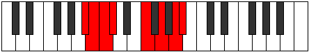 |
| [2703](https://ianring.com/musictheory/scales/2703) | [Galian](ModeBFlatGalian.md) | Bb | Bb, Cb, Dbb, Ebbb, F, G, A, Bb |  |
| [2713](https://ianring.com/musictheory/scales/2713) | [Porimic](ModeFSharpPorimic.md) | F# | F#, G##, A#, B##, C###, D###, F# |  |
| [2713](https://ianring.com/musictheory/scales/2713) | [Porimic](ModeGFlatPorimic.md) | Gb | Gb, A, Bb, C#, D#, E#, Gb | 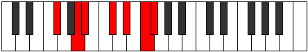 |
| [2713](https://ianring.com/musictheory/scales/2713) | [Porimic](ModeASharpPorimic.md) | A# | A#, B##, C##, D###, E###, Cbbb, A# |  |
| [2713](https://ianring.com/musictheory/scales/2713) | [Porimic](ModeBFlatPorimic.md) | Bb | Bb, C#, D, E#, F##, G##, Bb |  |
| [2715](https://ianring.com/musictheory/scales/2715) | [Kynian](ModeFSharpKynian.md) | F# | F#, G, A, Bb, C#, D#, E#, F# |  |
| [2715](https://ianring.com/musictheory/scales/2715) | [Kynian](ModeASharpKynian.md) | A# | A#, B, C#, D, E#, F##, G##, A# |  |
| [2715](https://ianring.com/musictheory/scales/2715) | [Kynian](ModeBFlatKynian.md) | Bb | Bb, Cb, Db, Ebb, F, G, A, Bb |  |
| [2717](https://ianring.com/musictheory/scales/2717) | [Epygian](ModeASharpEpygian.md) | A# | A#, B#, C#, D, E#, F##, G##, A# |  |
| [2717](https://ianring.com/musictheory/scales/2717) | [Epygian](ModeBFlatEpygian.md) | Bb | Bb, C, Db, Ebb, F, G, A, Bb |  |
| [2717](https://ianring.com/musictheory/scales/2717) | [Epygian](ModeFSharpEpygian.md) | F# | F#, G#, A, Bb, C#, D#, E#, F# |  |
| [2719](https://ianring.com/musictheory/scales/2719) | [Zocryllic](ModeFSharpZocryllic.md) | F# | F#, G, G#, A, A#, C#, D#, F, F# |  |
| [2719](https://ianring.com/musictheory/scales/2719) | [Zocryllic](ModeGFlatZocryllic.md) | Gb | Gb, G, Ab, A, Bb, Db, Eb, F, Gb |  |
| [2719](https://ianring.com/musictheory/scales/2719) | [Zocryllic](ModeASharpZocryllic.md) | A# | A#, B, C, C#, D, F, G, A, A# |  |
| [2719](https://ianring.com/musictheory/scales/2719) | [Zocryllic](ModeBFlatZocryllic.md) | Bb | Bb, B, C, Db, D, F, G, A, Bb |  |
| [2727](https://ianring.com/musictheory/scales/2727) | [Pylian](ModeGSharpPylian.md) | G# | G#, A, Bb, C#, D#, E#, F##, G# |  |
| [2729](https://ianring.com/musictheory/scales/2729) | [Aeragimic](ModeASharpAeragimic.md) | A# | A#, B##, C###, D###, E###, Cbbb, A# |  |
| [2729](https://ianring.com/musictheory/scales/2729) | [Aeragimic](ModeBFlatAeragimic.md) | Bb | Bb, C#, D#, E#, F##, G##, Bb |  |
| [2731](https://ianring.com/musictheory/scales/2731) | [Thydian](ModeASharpThydian.md) | A# | A#, B, C#, D#, E#, F##, G##, A# |  |
| [2731](https://ianring.com/musictheory/scales/2731) | [Thydian](ModeBFlatThydian.md) | Bb | Bb, Cb, Db, Eb, F, G, A, Bb |  |
| [2733](https://ianring.com/musictheory/scales/2733) | [Bocrian](ModeASharpBocrian.md) | A# | A#, B#, C#, D#, E#, F##, G##, A# |  |
| [2733](https://ianring.com/musictheory/scales/2733) | [Bocrian](ModeBFlatBocrian.md) | Bb | Bb, C, Db, Eb, F, G, A, Bb |  |
| [2735](https://ianring.com/musictheory/scales/2735) | [Gynyllic](ModeASharpGynyllic.md) | A# | A#, B, C, C#, D#, F, G, A, A# |  |
| [2735](https://ianring.com/musictheory/scales/2735) | [Gynyllic](ModeBFlatGynyllic.md) | Bb | Bb, B, C, Db, Eb, F, G, A, Bb |  |
| [2735](https://ianring.com/musictheory/scales/2735) | [Gynyllic](ModeGSharpGynyllic.md) | G# | G#, A, A#, B, C#, D#, F, G, G# |  |
| [2735](https://ianring.com/musictheory/scales/2735) | [Gynyllic](ModeAFlatGynyllic.md) | Ab | Ab, A, Bb, B, Db, Eb, F, G, Ab |  |
| [2743](https://ianring.com/musictheory/scales/2743) | [Staptyllic](ModeGSharpStaptyllic.md) | G# | G#, A, A#, C, C#, D#, F, G, G# |  |
| [2743](https://ianring.com/musictheory/scales/2743) | [Staptyllic](ModeAFlatStaptyllic.md) | Ab | Ab, A, Bb, C, Db, Eb, F, G, Ab |  |
| [2745](https://ianring.com/musictheory/scales/2745) | [Dolian](ModeASharpDolian.md) | A# | A#, B##, C##, D#, E#, F##, G##, A# |  |
| [2745](https://ianring.com/musictheory/scales/2745) | [Dolian](ModeBFlatDolian.md) | Bb | Bb, C#, D, Eb, F, G, A, Bb |  |
| [2745](https://ianring.com/musictheory/scales/2745) | [Dolian](ModeFSharpDolian.md) | F# | F#, G##, A#, B, C#, D#, E#, F# | 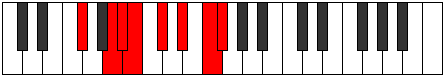 |
| [2745](https://ianring.com/musictheory/scales/2745) | [Dolian](ModeGFlatDolian.md) | Gb | Gb, A, Bb, Cb, Db, Eb, F, Gb |  |
| [2747](https://ianring.com/musictheory/scales/2747) | [Stythyllic](ModeASharpStythyllic.md) | A# | A#, B, C#, D, D#, F, G, A, A# |  |
| [2747](https://ianring.com/musictheory/scales/2747) | [Stythyllic](ModeBFlatStythyllic.md) | Bb | Bb, B, Db, D, Eb, F, G, A, Bb |  |
| [2747](https://ianring.com/musictheory/scales/2747) | [Stythyllic](ModeFSharpStythyllic.md) | F# | F#, G, A, A#, B, C#, D#, F, F# |  |
| [2747](https://ianring.com/musictheory/scales/2747) | [Stythyllic](ModeGFlatStythyllic.md) | Gb | Gb, G, A, Bb, B, Db, Eb, F, Gb |  |
| [2749](https://ianring.com/musictheory/scales/2749) | [Katagyllic](ModeASharpKatagyllic.md) | A# | A#, C, C#, D, D#, F, G, A, A# |  |
| [2749](https://ianring.com/musictheory/scales/2749) | [Katagyllic](ModeBFlatKatagyllic.md) | Bb | Bb, C, Db, D, Eb, F, G, A, Bb |  |
| [2749](https://ianring.com/musictheory/scales/2749) | [Katagyllic](ModeFSharpKatagyllic.md) | F# | F#, G#, A, A#, B, C#, D#, F, F# |  |
| [2749](https://ianring.com/musictheory/scales/2749) | [Katagyllic](ModeGFlatKatagyllic.md) | Gb | Gb, Ab, A, Bb, B, Db, Eb, F, Gb |  |
| [2751](https://ianring.com/musictheory/scales/2751) | [Sylygic](ModeASharpSylygic.md) | A# | A#, B, C, C#, D, D#, F, G, A, A# |  |
| [2751](https://ianring.com/musictheory/scales/2751) | [Sylygic](ModeBFlatSylygic.md) | Bb | Bb, B, C, Db, D, Eb, F, G, A, Bb |  |
| [2751](https://ianring.com/musictheory/scales/2751) | [Sylygic](ModeGSharpSylygic.md) | G# | G#, A, A#, B, C, C#, D#, F, G, G# |  |
| [2751](https://ianring.com/musictheory/scales/2751) | [Sylygic](ModeAFlatSylygic.md) | Ab | Ab, A, Bb, B, C, Db, Eb, F, G, Ab |  |
| [2751](https://ianring.com/musictheory/scales/2751) | [Sylygic](ModeFSharpSylygic.md) | F# | F#, G, G#, A, A#, B, C#, D#, F, F# |  |
| [2751](https://ianring.com/musictheory/scales/2751) | [Sylygic](ModeGFlatSylygic.md) | Gb | Gb, G, Ab, A, Bb, B, Db, Eb, F, Gb |  |
| [2761](https://ianring.com/musictheory/scales/2761) | [Dagimic](ModeASharpDagimic.md) | A# | A#, B##, D##, E#, F##, G##, A# |  |
| [2761](https://ianring.com/musictheory/scales/2761) | [Dagimic](ModeBFlatDagimic.md) | Bb | Bb, C#, D##, E#, F##, G##, Bb |  |
| [2763](https://ianring.com/musictheory/scales/2763) | [Manian](ModeASharpManian.md) | A# | A#, B, C#, D##, E#, F##, G##, A# |  |
| [2763](https://ianring.com/musictheory/scales/2763) | [Manian](ModeBFlatManian.md) | Bb | Bb, Cb, Db, E, F, G, A, Bb |  |
| [2765](https://ianring.com/musictheory/scales/2765) | [Banian](ModeASharpBanian.md) | A# | A#, B#, C#, D##, E#, F##, G##, A# |  |
| [2765](https://ianring.com/musictheory/scales/2765) | [Banian](ModeBFlatBanian.md) | Bb | Bb, C, Db, E, F, G, A, Bb |  |
| [2767](https://ianring.com/musictheory/scales/2767) | [Katydyllic](ModeASharpKatydyllic.md) | A# | A#, B, C, C#, E, F, G, A, A# |  |
| [2767](https://ianring.com/musictheory/scales/2767) | [Katydyllic](ModeBFlatKatydyllic.md) | Bb | Bb, B, C, Db, E, F, G, A, Bb |  |
| [2777](https://ianring.com/musictheory/scales/2777) | [Bycrian](ModeFSharpBycrian.md) | F# | F#, G##, A#, B#, C#, D#, E#, F# |  |
| [2777](https://ianring.com/musictheory/scales/2777) | [Bycrian](ModeGFlatBycrian.md) | Gb | Gb, A, Bb, C, Db, Eb, F, Gb |  |
| [2777](https://ianring.com/musictheory/scales/2777) | [Bycrian](ModeASharpBycrian.md) | A# | A#, B##, C##, D##, E#, F##, G##, A# |  |
| [2777](https://ianring.com/musictheory/scales/2777) | [Bycrian](ModeBFlatBycrian.md) | Bb | Bb, C#, D, E, F, G, A, Bb |  |
| [2779](https://ianring.com/musictheory/scales/2779) | [Garyllic](ModeFSharpGaryllic.md) | F# | F#, G, A, A#, C, C#, D#, F, F# |  |
| [2779](https://ianring.com/musictheory/scales/2779) | [Garyllic](ModeGFlatGaryllic.md) | Gb | Gb, G, A, Bb, C, Db, Eb, F, Gb |  |
| [2779](https://ianring.com/musictheory/scales/2779) | [Garyllic](ModeASharpGaryllic.md) | A# | A#, B, C#, D, E, F, G, A, A# |  |
| [2779](https://ianring.com/musictheory/scales/2779) | [Garyllic](ModeBFlatGaryllic.md) | Bb | Bb, B, Db, D, E, F, G, A, Bb |  |
| [2781](https://ianring.com/musictheory/scales/2781) | [Gycryllic](ModeASharpGycryllic.md) | A# | A#, C, C#, D, E, F, G, A, A# |  |
| [2781](https://ianring.com/musictheory/scales/2781) | [Gycryllic](ModeBFlatGycryllic.md) | Bb | Bb, C, Db, D, E, F, G, A, Bb |  |
| [2781](https://ianring.com/musictheory/scales/2781) | [Gycryllic](ModeFSharpGycryllic.md) | F# | F#, G#, A, A#, C, C#, D#, F, F# |  |
| [2781](https://ianring.com/musictheory/scales/2781) | [Gycryllic](ModeGFlatGycryllic.md) | Gb | Gb, Ab, A, Bb, C, Db, Eb, F, Gb |  |
| [2783](https://ianring.com/musictheory/scales/2783) | [Gothygic](ModeFSharpGothygic.md) | F# | F#, G, G#, A, A#, C, C#, D#, F, F# |  |
| [2783](https://ianring.com/musictheory/scales/2783) | [Gothygic](ModeGFlatGothygic.md) | Gb | Gb, G, Ab, A, Bb, C, Db, Eb, F, Gb |  |
| [2783](https://ianring.com/musictheory/scales/2783) | [Gothygic](ModeASharpGothygic.md) | A# | A#, B, C, C#, D, E, F, G, A, A# |  |
| [2783](https://ianring.com/musictheory/scales/2783) | [Gothygic](ModeBFlatGothygic.md) | Bb | Bb, B, C, Db, D, E, F, G, A, Bb |  |
| [2787](https://ianring.com/musictheory/scales/2787) | [Zyrian](ModeENaturalZyrian.md) | E | E, F, G##, A#, B, C#, D#, E | 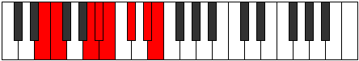 |
| [2791](https://ianring.com/musictheory/scales/2791) | [Ionyptyllic](ModeGSharpIonyptyllic.md) | G# | G#, A, A#, C#, D, D#, F, G, G# |  |
| [2791](https://ianring.com/musictheory/scales/2791) | [Ionyptyllic](ModeAFlatIonyptyllic.md) | Ab | Ab, A, Bb, Db, D, Eb, F, G, Ab |  |
| [2791](https://ianring.com/musictheory/scales/2791) | [Ionyptyllic](ModeENaturalIonyptyllic.md) | E | E, F, F#, A, A#, B, C#, D#, E |  |
| [2793](https://ianring.com/musictheory/scales/2793) | [Eporian](ModeASharpEporian.md) | A# | A#, B##, C###, D##, E#, F##, G##, A# |  |
| [2793](https://ianring.com/musictheory/scales/2793) | [Eporian](ModeBFlatEporian.md) | Bb | Bb, C#, D#, E, F, G, A, Bb |  |
| [2797](https://ianring.com/musictheory/scales/2797) | [Stalyllic](ModeASharpStalyllic.md) | A# | A#, C, C#, D#, E, F, G, A, A# |  |
| [2797](https://ianring.com/musictheory/scales/2797) | [Stalyllic](ModeBFlatStalyllic.md) | Bb | Bb, C, Db, Eb, E, F, G, A, Bb |  |
| [2799](https://ianring.com/musictheory/scales/2799) | [Epilygic](ModeASharpEpilygic.md) | A# | A#, B, C, C#, D#, E, F, G, A, A# |  |
| [2799](https://ianring.com/musictheory/scales/2799) | [Epilygic](ModeBFlatEpilygic.md) | Bb | Bb, B, C, Db, Eb, E, F, G, A, Bb |  |
| [2799](https://ianring.com/musictheory/scales/2799) | [Epilygic](ModeENaturalEpilygic.md) | E | E, F, F#, G, A, A#, B, C#, D#, E |  |
| [2799](https://ianring.com/musictheory/scales/2799) | [Epilygic](ModeGSharpEpilygic.md) | G# | G#, A, A#, B, C#, D, D#, F, G, G# |  |
| [2799](https://ianring.com/musictheory/scales/2799) | [Epilygic](ModeAFlatEpilygic.md) | Ab | Ab, A, Bb, B, Db, D, Eb, F, G, Ab |  |
| [2803](https://ianring.com/musictheory/scales/2803) | [Zolyllic](ModeENaturalZolyllic.md) | E | E, F, G#, A, A#, B, C#, D#, E |  |
| [2807](https://ianring.com/musictheory/scales/2807) | [Zylygic](ModeGSharpZylygic.md) | G# | G#, A, A#, C, C#, D, D#, F, G, G# |  |
| [2807](https://ianring.com/musictheory/scales/2807) | [Zylygic](ModeAFlatZylygic.md) | Ab | Ab, A, Bb, C, Db, D, Eb, F, G, Ab |  |
| [2807](https://ianring.com/musictheory/scales/2807) | [Zylygic](ModeENaturalZylygic.md) | E | E, F, F#, G#, A, A#, B, C#, D#, E |  |
| [2809](https://ianring.com/musictheory/scales/2809) | [Gythyllic](ModeASharpGythyllic.md) | A# | A#, C#, D, D#, E, F, G, A, A# | 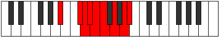 |
| [2809](https://ianring.com/musictheory/scales/2809) | [Gythyllic](ModeBFlatGythyllic.md) | Bb | Bb, Db, D, Eb, E, F, G, A, Bb |  |
| [2809](https://ianring.com/musictheory/scales/2809) | [Gythyllic](ModeFSharpGythyllic.md) | F# | F#, A, A#, B, C, C#, D#, F, F# |  |
| [2809](https://ianring.com/musictheory/scales/2809) | [Gythyllic](ModeGFlatGythyllic.md) | Gb | Gb, A, Bb, B, C, Db, Eb, F, Gb |  |
| [2811](https://ianring.com/musictheory/scales/2811) | [Barygic](ModeASharpBarygic.md) | A# | A#, B, C#, D, D#, E, F, G, A, A# |  |
| [2811](https://ianring.com/musictheory/scales/2811) | [Barygic](ModeBFlatBarygic.md) | Bb | Bb, B, Db, D, Eb, E, F, G, A, Bb | 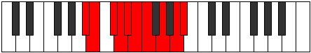 |
| [2811](https://ianring.com/musictheory/scales/2811) | [Barygic](ModeFSharpBarygic.md) | F# | F#, G, A, A#, B, C, C#, D#, F, F# |  |
| [2811](https://ianring.com/musictheory/scales/2811) | [Barygic](ModeGFlatBarygic.md) | Gb | Gb, G, A, Bb, B, C, Db, Eb, F, Gb |  |
| [2811](https://ianring.com/musictheory/scales/2811) | [Barygic](ModeENaturalBarygic.md) | E | E, F, G, G#, A, A#, B, C#, D#, E |  |
| [2813](https://ianring.com/musictheory/scales/2813) | [Zolygic](ModeASharpZolygic.md) | A# | A#, C, C#, D, D#, E, F, G, A, A# |  |
| [2813](https://ianring.com/musictheory/scales/2813) | [Zolygic](ModeBFlatZolygic.md) | Bb | Bb, C, Db, D, Eb, E, F, G, A, Bb |  |
| [2813](https://ianring.com/musictheory/scales/2813) | [Zolygic](ModeFSharpZolygic.md) | F# | F#, G#, A, A#, B, C, C#, D#, F, F# |  |
| [2813](https://ianring.com/musictheory/scales/2813) | [Zolygic](ModeGFlatZolygic.md) | Gb | Gb, Ab, A, Bb, B, C, Db, Eb, F, Gb |  |
| [2815](https://ianring.com/musictheory/scales/2815) | [Aeradyllian](ModeASharpAeradyllian.md) | A# | A#, B, C, C#, D, D#, E, F, G, A, A# |  |
| [2815](https://ianring.com/musictheory/scales/2815) | [Aeradyllian](ModeBFlatAeradyllian.md) | Bb | Bb, B, C, Db, D, Eb, E, F, G, A, Bb |  |
| [2815](https://ianring.com/musictheory/scales/2815) | [Aeradyllian](ModeGSharpAeradyllian.md) | G# | G#, A, A#, B, C, C#, D, D#, F, G, G# |  |
| [2815](https://ianring.com/musictheory/scales/2815) | [Aeradyllian](ModeAFlatAeradyllian.md) | Ab | Ab, A, Bb, B, C, Db, D, Eb, F, G, Ab |  |
| [2815](https://ianring.com/musictheory/scales/2815) | [Aeradyllian](ModeFSharpAeradyllian.md) | F# | F#, G, G#, A, A#, B, C, C#, D#, F, F# |  |
| [2815](https://ianring.com/musictheory/scales/2815) | [Aeradyllian](ModeGFlatAeradyllian.md) | Gb | Gb, G, Ab, A, Bb, B, C, Db, Eb, F, Gb |  |
| [2815](https://ianring.com/musictheory/scales/2815) | [Aeradyllian](ModeENaturalAeradyllian.md) | E | E, F, F#, G, G#, A, A#, B, C#, D#, E |  |
| [2833](https://ianring.com/musictheory/scales/2833) | [Dolitonic](ModeCSharpDolitonic.md) | C# | C#, F, A, A#, C, C# |  |
| [2833](https://ianring.com/musictheory/scales/2833) | [Dolitonic](ModeDFlatDolitonic.md) | Db | Db, F, A, Bb, C, Db |  |
| [2835](https://ianring.com/musictheory/scales/2835) | [Ionygimic](ModeDFlatIonygimic.md) | Db | Db, Ebb, F, G##, A#, B#, Db |  |
| [2835](https://ianring.com/musictheory/scales/2835) | [Ionygimic](ModeANaturalIonygimic.md) | A | A, Bb, C#, D###, E##, F###, A |  |
| [2837](https://ianring.com/musictheory/scales/2837) | [Aelothimic](ModeDFlatAelothimic.md) | Db | Db, Eb, F, G##, A#, B#, Db |  |
| [2839](https://ianring.com/musictheory/scales/2839) | [Lyptian](ModeCSharpLyptian.md) | C# | C#, D, Eb, F, G##, A#, B#, C# |  |
| [2839](https://ianring.com/musictheory/scales/2839) | [Lyptian](ModeDFlatLyptian.md) | Db | Db, Ebb, Fbb, Gbb, A, Bb, C, Db |  |
| [2839](https://ianring.com/musictheory/scales/2839) | [Lyptian](ModeANaturalLyptian.md) | A | A, Bb, Cb, Db, E#, F#, G#, A |  |
| [2841](https://ianring.com/musictheory/scales/2841) | [Sothimic](ModeDFlatSothimic.md) | Db | Db, E, F, G##, A#, B#, Db |  |
| [2843](https://ianring.com/musictheory/scales/2843) | [Sorian](ModeCSharpSorian.md) | C# | C#, D, E, F, G##, A#, B#, C# |  |
| [2843](https://ianring.com/musictheory/scales/2843) | [Sorian](ModeDFlatSorian.md) | Db | Db, Ebb, Fb, Gbb, A, Bb, C, Db |  |
| [2843](https://ianring.com/musictheory/scales/2843) | [Sorian](ModeANaturalSorian.md) | A | A, Bb, C, Db, E#, F#, G#, A |  |
| [2845](https://ianring.com/musictheory/scales/2845) | [Baptian](ModeCSharpBaptian.md) | C# | C#, D#, E, F, G##, A#, B#, C# |  |
| [2845](https://ianring.com/musictheory/scales/2845) | [Baptian](ModeDFlatBaptian.md) | Db | Db, Eb, Fb, Gbb, A, Bb, C, Db |  |
| [2847](https://ianring.com/musictheory/scales/2847) | [Phracryllic](ModeCSharpPhracryllic.md) | C# | C#, D, D#, E, F, A, A#, C, C# |  |
| [2847](https://ianring.com/musictheory/scales/2847) | [Phracryllic](ModeDFlatPhracryllic.md) | Db | Db, D, Eb, E, F, A, Bb, C, Db |  |
| [2847](https://ianring.com/musictheory/scales/2847) | [Phracryllic](ModeANaturalPhracryllic.md) | A | A, A#, B, C, C#, F, F#, G#, A |  |
| [2855](https://ianring.com/musictheory/scales/2855) | [Epocrian](ModeGSharpEpocrian.md) | G# | G#, A, Bb, C#, D##, E#, F##, G# |  |
| [2863](https://ianring.com/musictheory/scales/2863) | [Aerogyllic](ModeGSharpAerogyllic.md) | G# | G#, A, A#, B, C#, E, F, G, G# |  |
| [2863](https://ianring.com/musictheory/scales/2863) | [Aerogyllic](ModeAFlatAerogyllic.md) | Ab | Ab, A, Bb, B, Db, E, F, G, Ab |  |
| [2865](https://ianring.com/musictheory/scales/2865) | [Solimic](ModeFNaturalSolimic.md) | F | F, G##, A#, B##, C##, D##, F |  |
| [2865](https://ianring.com/musictheory/scales/2865) | [Solimic](ModeDFlatSolimic.md) | Db | Db, E#, F#, G##, A#, B#, Db |  |
| [2867](https://ianring.com/musictheory/scales/2867) | [Socrian](ModeCSharpSocrian.md) | C# | C#, D, E#, F#, G##, A#, B#, C# |  |
| [2867](https://ianring.com/musictheory/scales/2867) | [Socrian](ModeDFlatSocrian.md) | Db | Db, Ebb, F, Gb, A, Bb, C, Db |  |
| [2867](https://ianring.com/musictheory/scales/2867) | [Socrian](ModeFNaturalSocrian.md) | F | F, Gb, A, Bb, C#, D, E, F |  |
| [2867](https://ianring.com/musictheory/scales/2867) | [Socrian](ModeANaturalSocrian.md) | A | A, Bb, C#, D, E#, F#, G#, A |  |
| [2869](https://ianring.com/musictheory/scales/2869) | [Phrothian](ModeCSharpPhrothian.md) | C# | C#, D#, E#, F#, G##, A#, B#, C# |  |
| [2869](https://ianring.com/musictheory/scales/2869) | [Phrothian](ModeDFlatPhrothian.md) | Db | Db, Eb, F, Gb, A, Bb, C, Db |  |
| [2869](https://ianring.com/musictheory/scales/2869) | [Phrothian](ModeFNaturalPhrothian.md) | F | F, G, A, Bb, C#, D, E, F |  |
| [2871](https://ianring.com/musictheory/scales/2871) | [Stanyllic](ModeCSharpStanyllic.md) | C# | C#, D, D#, F, F#, A, A#, C, C# |  |
| [2871](https://ianring.com/musictheory/scales/2871) | [Stanyllic](ModeDFlatStanyllic.md) | Db | Db, D, Eb, F, Gb, A, Bb, C, Db |  |
| [2871](https://ianring.com/musictheory/scales/2871) | [Stanyllic](ModeFNaturalStanyllic.md) | F | F, F#, G, A, A#, C#, D, E, F |  |
| [2871](https://ianring.com/musictheory/scales/2871) | [Stanyllic](ModeGSharpStanyllic.md) | G# | G#, A, A#, C, C#, E, F, G, G# |  |
| [2871](https://ianring.com/musictheory/scales/2871) | [Stanyllic](ModeAFlatStanyllic.md) | Ab | Ab, A, Bb, C, Db, E, F, G, Ab |  |
| [2871](https://ianring.com/musictheory/scales/2871) | [Stanyllic](ModeANaturalStanyllic.md) | A | A, A#, B, C#, D, F, F#, G#, A |  |
| [2873](https://ianring.com/musictheory/scales/2873) | [Docrian](ModeCSharpDocrian.md) | C# | C#, D##, E#, F#, G##, A#, B#, C# |  |
| [2873](https://ianring.com/musictheory/scales/2873) | [Docrian](ModeDFlatDocrian.md) | Db | Db, E, F, Gb, A, Bb, C, Db |  |
| [2873](https://ianring.com/musictheory/scales/2873) | [Docrian](ModeFNaturalDocrian.md) | F | F, G#, A, Bb, C#, D, E, F |  |
| [2875](https://ianring.com/musictheory/scales/2875) | [Ganyllic](ModeCSharpGanyllic.md) | C# | C#, D, E, F, F#, A, A#, C, C# |  |
| [2875](https://ianring.com/musictheory/scales/2875) | [Ganyllic](ModeDFlatGanyllic.md) | Db | Db, D, E, F, Gb, A, Bb, C, Db |  |
| [2875](https://ianring.com/musictheory/scales/2875) | [Ganyllic](ModeANaturalGanyllic.md) | A | A, A#, C, C#, D, F, F#, G#, A |  |
| [2875](https://ianring.com/musictheory/scales/2875) | [Ganyllic](ModeFNaturalGanyllic.md) | F | F, F#, G#, A, A#, C#, D, E, F |  |
| [2877](https://ianring.com/musictheory/scales/2877) | [Phrylyllic](ModeCSharpPhrylyllic.md) | C# | C#, D#, E, F, F#, A, A#, C, C# |  |
| [2877](https://ianring.com/musictheory/scales/2877) | [Phrylyllic](ModeDFlatPhrylyllic.md) | Db | Db, Eb, E, F, Gb, A, Bb, C, Db |  |
| [2877](https://ianring.com/musictheory/scales/2877) | [Phrylyllic](ModeFNaturalPhrylyllic.md) | F | F, G, G#, A, A#, C#, D, E, F |  |
| [2879](https://ianring.com/musictheory/scales/2879) | [Stadygic](ModeCSharpStadygic.md) | C# | C#, D, D#, E, F, F#, A, A#, C, C# |  |
| [2879](https://ianring.com/musictheory/scales/2879) | [Stadygic](ModeDFlatStadygic.md) | Db | Db, D, Eb, E, F, Gb, A, Bb, C, Db |  |
| [2879](https://ianring.com/musictheory/scales/2879) | [Stadygic](ModeFNaturalStadygic.md) | F | F, F#, G, G#, A, A#, C#, D, E, F |  |
| [2879](https://ianring.com/musictheory/scales/2879) | [Stadygic](ModeANaturalStadygic.md) | A | A, A#, B, C, C#, D, F, F#, G#, A |  |
| [2879](https://ianring.com/musictheory/scales/2879) | [Stadygic](ModeGSharpStadygic.md) | G# | G#, A, A#, B, C, C#, E, F, G, G# |  |
| [2879](https://ianring.com/musictheory/scales/2879) | [Stadygic](ModeAFlatStadygic.md) | Ab | Ab, A, Bb, B, C, Db, E, F, G, Ab |  |
| [2897](https://ianring.com/musictheory/scales/2897) | [Rycrimic](ModeDFlatRycrimic.md) | Db | Db, E#, F##, G##, A#, B#, Db |  |
| [2899](https://ianring.com/musictheory/scales/2899) | [Kagian](ModeCSharpKagian.md) | C# | C#, D, E#, F##, G##, A#, B#, C# |  |
| [2899](https://ianring.com/musictheory/scales/2899) | [Kagian](ModeDFlatKagian.md) | Db | Db, Ebb, F, G, A, Bb, C, Db |  |
| [2899](https://ianring.com/musictheory/scales/2899) | [Kagian](ModeANaturalKagian.md) | A | A, Bb, C#, D#, E#, F#, G#, A |  |
| [2901](https://ianring.com/musictheory/scales/2901) | [Larian](ModeCSharpLarian.md) | C# | C#, D#, E#, F##, G##, A#, B#, C# |  |
| [2901](https://ianring.com/musictheory/scales/2901) | [Larian](ModeDFlatLarian.md) | Db | Db, Eb, F, G, A, Bb, C, Db |  |
| [2903](https://ianring.com/musictheory/scales/2903) | [Gothyllic](ModeCSharpGothyllic.md) | C# | C#, D, D#, F, G, A, A#, C, C# |  |
| [2903](https://ianring.com/musictheory/scales/2903) | [Gothyllic](ModeDFlatGothyllic.md) | Db | Db, D, Eb, F, G, A, Bb, C, Db |  |
| [2903](https://ianring.com/musictheory/scales/2903) | [Gothyllic](ModeANaturalGothyllic.md) | A | A, A#, B, C#, D#, F, F#, G#, A |  |
| [2905](https://ianring.com/musictheory/scales/2905) | [Palian](ModeCSharpPalian.md) | C# | C#, D##, E#, F##, G##, A#, B#, C# |  |
| [2905](https://ianring.com/musictheory/scales/2905) | [Palian](ModeDFlatPalian.md) | Db | Db, E, F, G, A, Bb, C, Db |  |
| [2907](https://ianring.com/musictheory/scales/2907) | [Mogyllic](ModeCSharpMogyllic.md) | C# | C#, D, E, F, G, A, A#, C, C# |  |
| [2907](https://ianring.com/musictheory/scales/2907) | [Mogyllic](ModeDFlatMogyllic.md) | Db | Db, D, E, F, G, A, Bb, C, Db |  |
| [2907](https://ianring.com/musictheory/scales/2907) | [Mogyllic](ModeANaturalMogyllic.md) | A | A, A#, C, C#, D#, F, F#, G#, A |  |
| [2909](https://ianring.com/musictheory/scales/2909) | [Mocryllic](ModeCSharpMocryllic.md) | C# | C#, D#, E, F, G, A, A#, C, C# |  |
| [2909](https://ianring.com/musictheory/scales/2909) | [Mocryllic](ModeDFlatMocryllic.md) | Db | Db, Eb, E, F, G, A, Bb, C, Db |  |
| [2911](https://ianring.com/musictheory/scales/2911) | [Katygic](ModeCSharpKatygic.md) | C# | C#, D, D#, E, F, G, A, A#, C, C# |  |
| [2911](https://ianring.com/musictheory/scales/2911) | [Katygic](ModeDFlatKatygic.md) | Db | Db, D, Eb, E, F, G, A, Bb, C, Db |  |
| [2911](https://ianring.com/musictheory/scales/2911) | [Katygic](ModeANaturalKatygic.md) | A | A, A#, B, C, C#, D#, F, F#, G#, A |  |
| [2915](https://ianring.com/musictheory/scales/2915) | [Aeolydian](ModeENaturalAeolydian.md) | E | E, F, G##, A#, B#, C#, D#, E |  |
| [2919](https://ianring.com/musictheory/scales/2919) | [Molyllic](ModeENaturalMolyllic.md) | E | E, F, F#, A, A#, C, C#, D#, E |  |
| [2919](https://ianring.com/musictheory/scales/2919) | [Molyllic](ModeGSharpMolyllic.md) | G# | G#, A, A#, C#, D, E, F, G, G# |  |
| [2919](https://ianring.com/musictheory/scales/2919) | [Molyllic](ModeAFlatMolyllic.md) | Ab | Ab, A, Bb, Db, D, E, F, G, Ab |  |
| [2923](https://ianring.com/musictheory/scales/2923) | [Baryllic](ModeENaturalBaryllic.md) | E | E, F, G, A, A#, C, C#, D#, E |  |
| [2927](https://ianring.com/musictheory/scales/2927) | [Rodygic](ModeENaturalRodygic.md) | E | E, F, F#, G, A, A#, C, C#, D#, E |  |
| [2927](https://ianring.com/musictheory/scales/2927) | [Rodygic](ModeGSharpRodygic.md) | G# | G#, A, A#, B, C#, D, E, F, G, G# |  |
| [2927](https://ianring.com/musictheory/scales/2927) | [Rodygic](ModeAFlatRodygic.md) | Ab | Ab, A, Bb, B, Db, D, E, F, G, Ab |  |
| [2929](https://ianring.com/musictheory/scales/2929) | [Aeolathian](ModeCSharpAeolathian.md) | C# | C#, D###, E##, F##, G##, A#, B#, C# |  |
| [2929](https://ianring.com/musictheory/scales/2929) | [Aeolathian](ModeDFlatAeolathian.md) | Db | Db, E#, F#, G, A, Bb, C, Db |  |
| [2929](https://ianring.com/musictheory/scales/2929) | [Aeolathian](ModeFNaturalAeolathian.md) | F | F, G##, A#, B, C#, D, E, F |  |
| [2931](https://ianring.com/musictheory/scales/2931) | [Zathyllic](ModeCSharpZathyllic.md) | C# | C#, D, F, F#, G, A, A#, C, C# |  |
| [2931](https://ianring.com/musictheory/scales/2931) | [Zathyllic](ModeDFlatZathyllic.md) | Db | Db, D, F, Gb, G, A, Bb, C, Db |  |
| [2931](https://ianring.com/musictheory/scales/2931) | [Zathyllic](ModeENaturalZathyllic.md) | E | E, F, G#, A, A#, C, C#, D#, E |  |
| [2931](https://ianring.com/musictheory/scales/2931) | [Zathyllic](ModeANaturalZathyllic.md) | A | A, A#, C#, D, D#, F, F#, G#, A |  |
| [2931](https://ianring.com/musictheory/scales/2931) | [Zathyllic](ModeFNaturalZathyllic.md) | F | F, F#, A, A#, B, C#, D, E, F |  |
| [2933](https://ianring.com/musictheory/scales/2933) | [Dalyllic](ModeCSharpDalyllic.md) | C# | C#, D#, F, F#, G, A, A#, C, C# |  |
| [2933](https://ianring.com/musictheory/scales/2933) | [Dalyllic](ModeDFlatDalyllic.md) | Db | Db, Eb, F, Gb, G, A, Bb, C, Db |  |
| [2933](https://ianring.com/musictheory/scales/2933) | [Dalyllic](ModeFNaturalDalyllic.md) | F | F, G, A, A#, B, C#, D, E, F |  |
| [2935](https://ianring.com/musictheory/scales/2935) | [Modygic](ModeCSharpModygic.md) | C# | C#, D, D#, F, F#, G, A, A#, C, C# |  |
| [2935](https://ianring.com/musictheory/scales/2935) | [Modygic](ModeDFlatModygic.md) | Db | Db, D, Eb, F, Gb, G, A, Bb, C, Db |  |
| [2935](https://ianring.com/musictheory/scales/2935) | [Modygic](ModeENaturalModygic.md) | E | E, F, F#, G#, A, A#, C, C#, D#, E |  |
| [2935](https://ianring.com/musictheory/scales/2935) | [Modygic](ModeGSharpModygic.md) | G# | G#, A, A#, C, C#, D, E, F, G, G# |  |
| [2935](https://ianring.com/musictheory/scales/2935) | [Modygic](ModeAFlatModygic.md) | Ab | Ab, A, Bb, C, Db, D, E, F, G, Ab |  |
| [2935](https://ianring.com/musictheory/scales/2935) | [Modygic](ModeFNaturalModygic.md) | F | F, F#, G, A, A#, B, C#, D, E, F |  |
| [2935](https://ianring.com/musictheory/scales/2935) | [Modygic](ModeANaturalModygic.md) | A | A, A#, B, C#, D, D#, F, F#, G#, A |  |
| [2937](https://ianring.com/musictheory/scales/2937) | [Aeolathyllic](ModeCSharpAeolathyllic.md) | C# | C#, E, F, F#, G, A, A#, C, C# |  |
| [2937](https://ianring.com/musictheory/scales/2937) | [Aeolathyllic](ModeDFlatAeolathyllic.md) | Db | Db, E, F, Gb, G, A, Bb, C, Db |  |
| [2937](https://ianring.com/musictheory/scales/2937) | [Aeolathyllic](ModeFNaturalAeolathyllic.md) | F | F, G#, A, A#, B, C#, D, E, F |  |
| [2939](https://ianring.com/musictheory/scales/2939) | [Goptygic](ModeCSharpGoptygic.md) | C# | C#, D, E, F, F#, G, A, A#, C, C# |  |
| [2939](https://ianring.com/musictheory/scales/2939) | [Goptygic](ModeDFlatGoptygic.md) | Db | Db, D, E, F, Gb, G, A, Bb, C, Db |  |
| [2939](https://ianring.com/musictheory/scales/2939) | [Goptygic](ModeANaturalGoptygic.md) | A | A, A#, C, C#, D, D#, F, F#, G#, A |  |
| [2939](https://ianring.com/musictheory/scales/2939) | [Goptygic](ModeENaturalGoptygic.md) | E | E, F, G, G#, A, A#, C, C#, D#, E |  |
| [2939](https://ianring.com/musictheory/scales/2939) | [Goptygic](ModeFNaturalGoptygic.md) | F | F, F#, G#, A, A#, B, C#, D, E, F |  |
| [2941](https://ianring.com/musictheory/scales/2941) | [Laptygic](ModeCSharpLaptygic.md) | C# | C#, D#, E, F, F#, G, A, A#, C, C# |  |
| [2941](https://ianring.com/musictheory/scales/2941) | [Laptygic](ModeDFlatLaptygic.md) | Db | Db, Eb, E, F, Gb, G, A, Bb, C, Db |  |
| [2941](https://ianring.com/musictheory/scales/2941) | [Laptygic](ModeFNaturalLaptygic.md) | F | F, G, G#, A, A#, B, C#, D, E, F |  |
| [2943](https://ianring.com/musictheory/scales/2943) | [Dathyllian](ModeCSharpDathyllian.md) | C# | C#, D, D#, E, F, F#, G, A, A#, C, C# |  |
| [2943](https://ianring.com/musictheory/scales/2943) | [Dathyllian](ModeDFlatDathyllian.md) | Db | Db, D, Eb, E, F, Gb, G, A, Bb, C, Db |  |
| [2943](https://ianring.com/musictheory/scales/2943) | [Dathyllian](ModeENaturalDathyllian.md) | E | E, F, F#, G, G#, A, A#, C, C#, D#, E |  |
| [2943](https://ianring.com/musictheory/scales/2943) | [Dathyllian](ModeANaturalDathyllian.md) | A | A, A#, B, C, C#, D, D#, F, F#, G#, A |  |
| [2943](https://ianring.com/musictheory/scales/2943) | [Dathyllian](ModeGSharpDathyllian.md) | G# | G#, A, A#, B, C, C#, D, E, F, G, G# |  |
| [2943](https://ianring.com/musictheory/scales/2943) | [Dathyllian](ModeAFlatDathyllian.md) | Ab | Ab, A, Bb, B, C, Db, D, E, F, G, Ab |  |
| [2943](https://ianring.com/musictheory/scales/2943) | [Dathyllian](ModeFNaturalDathyllian.md) | F | F, F#, G, G#, A, A#, B, C#, D, E, F |  |
| [2953](https://ianring.com/musictheory/scales/2953) | [Ionylimic](ModeASharpIonylimic.md) | A# | A#, B##, D###, E##, F##, G##, A# |  |
| [2953](https://ianring.com/musictheory/scales/2953) | [Ionylimic](ModeBFlatIonylimic.md) | Bb | Bb, C#, D###, E##, F##, G##, Bb |  |
| [2955](https://ianring.com/musictheory/scales/2955) | [Thorian](ModeDNaturalThorian.md) | D | D, Eb, F, G##, A#, B, C#, D |  |
| [2955](https://ianring.com/musictheory/scales/2955) | [Thorian](ModeASharpThorian.md) | A# | A#, B, C#, D###, E##, F##, G##, A# |  |
| [2955](https://ianring.com/musictheory/scales/2955) | [Thorian](ModeBFlatThorian.md) | Bb | Bb, Cb, Db, E#, F#, G, A, Bb |  |
| [2957](https://ianring.com/musictheory/scales/2957) | [Thygian](ModeASharpThygian.md) | A# | A#, B#, C#, D###, E##, F##, G##, A# |  |
| [2957](https://ianring.com/musictheory/scales/2957) | [Thygian](ModeBFlatThygian.md) | Bb | Bb, C, Db, E#, F#, G, A, Bb |  |
| [2957](https://ianring.com/musictheory/scales/2957) | [Thygian](ModeDNaturalThygian.md) | D | D, E, F, G##, A#, B, C#, D |  |
| [2959](https://ianring.com/musictheory/scales/2959) | [Dygyllic](ModeDNaturalDygyllic.md) | D | D, D#, E, F, A, A#, B, C#, D |  |
| [2959](https://ianring.com/musictheory/scales/2959) | [Dygyllic](ModeASharpDygyllic.md) | A# | A#, B, C, C#, F, F#, G, A, A# |  |
| [2959](https://ianring.com/musictheory/scales/2959) | [Dygyllic](ModeBFlatDygyllic.md) | Bb | Bb, B, C, Db, F, Gb, G, A, Bb |  |
| [2961](https://ianring.com/musictheory/scales/2961) | [Bygimic](ModeCSharpBygimic.md) | C# | C#, D###, F###, G##, A#, B#, C# |  |
| [2961](https://ianring.com/musictheory/scales/2961) | [Bygimic](ModeDFlatBygimic.md) | Db | Db, E#, F###, G##, A#, B#, Db |  |
| [2963](https://ianring.com/musictheory/scales/2963) | [Bygian](ModeCSharpBygian.md) | C# | C#, D, E#, F###, G##, A#, B#, C# |  |
| [2963](https://ianring.com/musictheory/scales/2963) | [Bygian](ModeDFlatBygian.md) | Db | Db, Ebb, F, G#, A, Bb, C, Db |  |
| [2963](https://ianring.com/musictheory/scales/2963) | [Bygian](ModeANaturalBygian.md) | A | A, Bb, C#, D##, E#, F#, G#, A |  |
| [2965](https://ianring.com/musictheory/scales/2965) | [Darian](ModeCSharpDarian.md) | C# | C#, D#, E#, F###, G##, A#, B#, C# |  |
| [2965](https://ianring.com/musictheory/scales/2965) | [Darian](ModeDFlatDarian.md) | Db | Db, Eb, F, G#, A, Bb, C, Db |  |
| [2967](https://ianring.com/musictheory/scales/2967) | [Madyllic](ModeCSharpMadyllic.md) | C# | C#, D, D#, F, G#, A, A#, C, C# |  |
| [2967](https://ianring.com/musictheory/scales/2967) | [Madyllic](ModeDFlatMadyllic.md) | Db | Db, D, Eb, F, Ab, A, Bb, C, Db |  |
| [2967](https://ianring.com/musictheory/scales/2967) | [Madyllic](ModeANaturalMadyllic.md) | A | A, A#, B, C#, E, F, F#, G#, A |  |
| [2969](https://ianring.com/musictheory/scales/2969) | [Tholian](ModeFSharpTholian.md) | F# | F#, G##, A#, B##, C##, D#, E#, F# |  |
| [2969](https://ianring.com/musictheory/scales/2969) | [Tholian](ModeGFlatTholian.md) | Gb | Gb, A, Bb, C#, D, Eb, F, Gb |  |
| [2969](https://ianring.com/musictheory/scales/2969) | [Tholian](ModeASharpTholian.md) | A# | A#, B##, C##, D###, E##, F##, G##, A# |  |
| [2969](https://ianring.com/musictheory/scales/2969) | [Tholian](ModeBFlatTholian.md) | Bb | Bb, C#, D, E#, F#, G, A, Bb |  |
| [2969](https://ianring.com/musictheory/scales/2969) | [Tholian](ModeCSharpTholian.md) | C# | C#, D##, E#, F###, G##, A#, B#, C# |  |
| [2969](https://ianring.com/musictheory/scales/2969) | [Tholian](ModeDFlatTholian.md) | Db | Db, E, F, G#, A, Bb, C, Db |  |
| [2969](https://ianring.com/musictheory/scales/2969) | [Tholian](ModeDNaturalTholian.md) | D | D, E#, F#, G##, A#, B, C#, D |  |
| [2971](https://ianring.com/musictheory/scales/2971) | [Aeolynyllic](ModeFSharpAeolynyllic.md) | F# | F#, G, A, A#, C#, D, D#, F, F# |  |
| [2971](https://ianring.com/musictheory/scales/2971) | [Aeolynyllic](ModeGFlatAeolynyllic.md) | Gb | Gb, G, A, Bb, Db, D, Eb, F, Gb |  |
| [2971](https://ianring.com/musictheory/scales/2971) | [Aeolynyllic](ModeCSharpAeolynyllic.md) | C# | C#, D, E, F, G#, A, A#, C, C# |  |
| [2971](https://ianring.com/musictheory/scales/2971) | [Aeolynyllic](ModeDFlatAeolynyllic.md) | Db | Db, D, E, F, Ab, A, Bb, C, Db |  |
| [2971](https://ianring.com/musictheory/scales/2971) | [Aeolynyllic](ModeANaturalAeolynyllic.md) | A | A, A#, C, C#, E, F, F#, G#, A |  |
| [2971](https://ianring.com/musictheory/scales/2971) | [Aeolynyllic](ModeDNaturalAeolynyllic.md) | D | D, D#, F, F#, A, A#, B, C#, D |  |
| [2971](https://ianring.com/musictheory/scales/2971) | [Aeolynyllic](ModeASharpAeolynyllic.md) | A# | A#, B, C#, D, F, F#, G, A, A# |  |
| [2971](https://ianring.com/musictheory/scales/2971) | [Aeolynyllic](ModeBFlatAeolynyllic.md) | Bb | Bb, B, Db, D, F, Gb, G, A, Bb |  |
| [2973](https://ianring.com/musictheory/scales/2973) | [Panyllic](ModeASharpPanyllic.md) | A# | A#, C, C#, D, F, F#, G, A, A# |  |
| [2973](https://ianring.com/musictheory/scales/2973) | [Panyllic](ModeBFlatPanyllic.md) | Bb | Bb, C, Db, D, F, Gb, G, A, Bb |  |
| [2973](https://ianring.com/musictheory/scales/2973) | [Panyllic](ModeCSharpPanyllic.md) | C# | C#, D#, E, F, G#, A, A#, C, C# |  |
| [2973](https://ianring.com/musictheory/scales/2973) | [Panyllic](ModeDFlatPanyllic.md) | Db | Db, Eb, E, F, Ab, A, Bb, C, Db |  |
| [2973](https://ianring.com/musictheory/scales/2973) | [Panyllic](ModeFSharpPanyllic.md) | F# | F#, G#, A, A#, C#, D, D#, F, F# |  |
| [2973](https://ianring.com/musictheory/scales/2973) | [Panyllic](ModeGFlatPanyllic.md) | Gb | Gb, Ab, A, Bb, Db, D, Eb, F, Gb |  |
| [2973](https://ianring.com/musictheory/scales/2973) | [Panyllic](ModeDNaturalPanyllic.md) | D | D, E, F, F#, A, A#, B, C#, D |  |
| [2975](https://ianring.com/musictheory/scales/2975) | [Gaptygic](ModeCSharpGaptygic.md) | C# | C#, D, D#, E, F, G#, A, A#, C, C# |  |
| [2975](https://ianring.com/musictheory/scales/2975) | [Gaptygic](ModeDFlatGaptygic.md) | Db | Db, D, Eb, E, F, Ab, A, Bb, C, Db |  |
| [2975](https://ianring.com/musictheory/scales/2975) | [Gaptygic](ModeFSharpGaptygic.md) | F# | F#, G, G#, A, A#, C#, D, D#, F, F# |  |
| [2975](https://ianring.com/musictheory/scales/2975) | [Gaptygic](ModeGFlatGaptygic.md) | Gb | Gb, G, Ab, A, Bb, Db, D, Eb, F, Gb |  |
| [2975](https://ianring.com/musictheory/scales/2975) | [Gaptygic](ModeDNaturalGaptygic.md) | D | D, D#, E, F, F#, A, A#, B, C#, D |  |
| [2975](https://ianring.com/musictheory/scales/2975) | [Gaptygic](ModeASharpGaptygic.md) | A# | A#, B, C, C#, D, F, F#, G, A, A# |  |
| [2975](https://ianring.com/musictheory/scales/2975) | [Gaptygic](ModeBFlatGaptygic.md) | Bb | Bb, B, C, Db, D, F, Gb, G, A, Bb |  |
| [2975](https://ianring.com/musictheory/scales/2975) | [Gaptygic](ModeANaturalGaptygic.md) | A | A, A#, B, C, C#, E, F, F#, G#, A |  |
| [2983](https://ianring.com/musictheory/scales/2983) | [Zythyllic](ModeGSharpZythyllic.md) | G# | G#, A, A#, C#, D#, E, F, G, G# |  |
| [2983](https://ianring.com/musictheory/scales/2983) | [Zythyllic](ModeAFlatZythyllic.md) | Ab | Ab, A, Bb, Db, Eb, E, F, G, Ab |  |
| [2985](https://ianring.com/musictheory/scales/2985) | [Epacrian](ModeASharpEpacrian.md) | A# | A#, B##, C###, D###, E##, F##, G##, A# |  |
| [2985](https://ianring.com/musictheory/scales/2985) | [Epacrian](ModeBFlatEpacrian.md) | Bb | Bb, C#, D#, E#, F#, G, A, Bb |  |
| [2985](https://ianring.com/musictheory/scales/2985) | [Epacrian](ModeDNaturalEpacrian.md) | D | D, E#, F##, G##, A#, B, C#, D |  |
| [2987](https://ianring.com/musictheory/scales/2987) | [Thanyllic](ModeDNaturalThanyllic.md) | D | D, D#, F, G, A, A#, B, C#, D |  |
| [2987](https://ianring.com/musictheory/scales/2987) | [Thanyllic](ModeASharpThanyllic.md) | A# | A#, B, C#, D#, F, F#, G, A, A# |  |
| [2987](https://ianring.com/musictheory/scales/2987) | [Thanyllic](ModeBFlatThanyllic.md) | Bb | Bb, B, Db, Eb, F, Gb, G, A, Bb |  |
| [2989](https://ianring.com/musictheory/scales/2989) | [Ionacryllic](ModeASharpIonacryllic.md) | A# | A#, C, C#, D#, F, F#, G, A, A# |  |
| [2989](https://ianring.com/musictheory/scales/2989) | [Ionacryllic](ModeBFlatIonacryllic.md) | Bb | Bb, C, Db, Eb, F, Gb, G, A, Bb |  |
| [2989](https://ianring.com/musictheory/scales/2989) | [Ionacryllic](ModeDNaturalIonacryllic.md) | D | D, E, F, G, A, A#, B, C#, D |  |
| [2991](https://ianring.com/musictheory/scales/2991) | [Zanygic](ModeDNaturalZanygic.md) | D | D, D#, E, F, G, A, A#, B, C#, D |  |
| [2991](https://ianring.com/musictheory/scales/2991) | [Zanygic](ModeASharpZanygic.md) | A# | A#, B, C, C#, D#, F, F#, G, A, A# |  |
| [2991](https://ianring.com/musictheory/scales/2991) | [Zanygic](ModeBFlatZanygic.md) | Bb | Bb, B, C, Db, Eb, F, Gb, G, A, Bb |  |
| [2991](https://ianring.com/musictheory/scales/2991) | [Zanygic](ModeGSharpZanygic.md) | G# | G#, A, A#, B, C#, D#, E, F, G, G# |  |
| [2991](https://ianring.com/musictheory/scales/2991) | [Zanygic](ModeAFlatZanygic.md) | Ab | Ab, A, Bb, B, Db, Eb, E, F, G, Ab |  |
| [2993](https://ianring.com/musictheory/scales/2993) | [Stythian](ModeFNaturalStythian.md) | F | F, G##, A#, B#, C#, D, E, F |  |
| [2993](https://ianring.com/musictheory/scales/2993) | [Stythian](ModeCSharpStythian.md) | C# | C#, D###, E##, F###, G##, A#, B#, C# |  |
| [2993](https://ianring.com/musictheory/scales/2993) | [Stythian](ModeDFlatStythian.md) | Db | Db, E#, F#, G#, A, Bb, C, Db |  |
| [2995](https://ianring.com/musictheory/scales/2995) | [Sanyllic](ModeFNaturalSanyllic.md) | F | F, F#, A, A#, C, C#, D, E, F |  |
| [2995](https://ianring.com/musictheory/scales/2995) | [Sanyllic](ModeCSharpSanyllic.md) | C# | C#, D, F, F#, G#, A, A#, C, C# |  |
| [2995](https://ianring.com/musictheory/scales/2995) | [Sanyllic](ModeDFlatSanyllic.md) | Db | Db, D, F, Gb, Ab, A, Bb, C, Db |  |
| [2995](https://ianring.com/musictheory/scales/2995) | [Sanyllic](ModeANaturalSanyllic.md) | A | A, A#, C#, D, E, F, F#, G#, A |  |
| [2997](https://ianring.com/musictheory/scales/2997) | [Ionoptyllic](ModeFNaturalIonoptyllic.md) | F | F, G, A, A#, C, C#, D, E, F |  |
| [2997](https://ianring.com/musictheory/scales/2997) | [Ionoptyllic](ModeCSharpIonoptyllic.md) | C# | C#, D#, F, F#, G#, A, A#, C, C# |  |
| [2997](https://ianring.com/musictheory/scales/2997) | [Ionoptyllic](ModeDFlatIonoptyllic.md) | Db | Db, Eb, F, Gb, Ab, A, Bb, C, Db |  |
| [2999](https://ianring.com/musictheory/scales/2999) | [Zyrygic](ModeFNaturalZyrygic.md) | F | F, F#, G, A, A#, C, C#, D, E, F |  |
| [2999](https://ianring.com/musictheory/scales/2999) | [Zyrygic](ModeCSharpZyrygic.md) | C# | C#, D, D#, F, F#, G#, A, A#, C, C# |  |
| [2999](https://ianring.com/musictheory/scales/2999) | [Zyrygic](ModeDFlatZyrygic.md) | Db | Db, D, Eb, F, Gb, Ab, A, Bb, C, Db |  |
| [2999](https://ianring.com/musictheory/scales/2999) | [Zyrygic](ModeGSharpZyrygic.md) | G# | G#, A, A#, C, C#, D#, E, F, G, G# |  |
| [2999](https://ianring.com/musictheory/scales/2999) | [Zyrygic](ModeAFlatZyrygic.md) | Ab | Ab, A, Bb, C, Db, Eb, E, F, G, Ab |  |
| [2999](https://ianring.com/musictheory/scales/2999) | [Zyrygic](ModeANaturalZyrygic.md) | A | A, A#, B, C#, D, E, F, F#, G#, A |  |
| [3001](https://ianring.com/musictheory/scales/3001) | [Lonyllic](ModeASharpLonyllic.md) | A# | A#, C#, D, D#, F, F#, G, A, A# |  |
| [3001](https://ianring.com/musictheory/scales/3001) | [Lonyllic](ModeBFlatLonyllic.md) | Bb | Bb, Db, D, Eb, F, Gb, G, A, Bb |  |
| [3001](https://ianring.com/musictheory/scales/3001) | [Lonyllic](ModeFNaturalLonyllic.md) | F | F, G#, A, A#, C, C#, D, E, F |  |
| [3001](https://ianring.com/musictheory/scales/3001) | [Lonyllic](ModeCSharpLonyllic.md) | C# | C#, E, F, F#, G#, A, A#, C, C# |  |
| [3001](https://ianring.com/musictheory/scales/3001) | [Lonyllic](ModeDFlatLonyllic.md) | Db | Db, E, F, Gb, Ab, A, Bb, C, Db |  |
| [3001](https://ianring.com/musictheory/scales/3001) | [Lonyllic](ModeFSharpLonyllic.md) | F# | F#, A, A#, B, C#, D, D#, F, F# |  |
| [3001](https://ianring.com/musictheory/scales/3001) | [Lonyllic](ModeGFlatLonyllic.md) | Gb | Gb, A, Bb, B, Db, D, Eb, F, Gb |  |
| [3001](https://ianring.com/musictheory/scales/3001) | [Lonyllic](ModeDNaturalLonyllic.md) | D | D, F, F#, G, A, A#, B, C#, D |  |
| [3003](https://ianring.com/musictheory/scales/3003) | [Zydygic](ModeCSharpZydygic.md) | C# | C#, D, E, F, F#, G#, A, A#, C, C# |  |
| [3003](https://ianring.com/musictheory/scales/3003) | [Zydygic](ModeDFlatZydygic.md) | Db | Db, D, E, F, Gb, Ab, A, Bb, C, Db |  |
| [3003](https://ianring.com/musictheory/scales/3003) | [Zydygic](ModeFNaturalZydygic.md) | F | F, F#, G#, A, A#, C, C#, D, E, F | 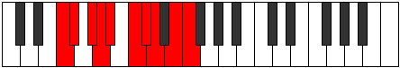 |
| [3003](https://ianring.com/musictheory/scales/3003) | [Zydygic](ModeANaturalZydygic.md) | A | A, A#, C, C#, D, E, F, F#, G#, A |  |
| [3003](https://ianring.com/musictheory/scales/3003) | [Zydygic](ModeDNaturalZydygic.md) | D | D, D#, F, F#, G, A, A#, B, C#, D |  |
| [3003](https://ianring.com/musictheory/scales/3003) | [Zydygic](ModeFSharpZydygic.md) | F# | F#, G, A, A#, B, C#, D, D#, F, F# |  |
| [3003](https://ianring.com/musictheory/scales/3003) | [Zydygic](ModeGFlatZydygic.md) | Gb | Gb, G, A, Bb, B, Db, D, Eb, F, Gb |  |
| [3003](https://ianring.com/musictheory/scales/3003) | [Zydygic](ModeASharpZydygic.md) | A# | A#, B, C#, D, D#, F, F#, G, A, A# |  |
| [3003](https://ianring.com/musictheory/scales/3003) | [Zydygic](ModeBFlatZydygic.md) | Bb | Bb, B, Db, D, Eb, F, Gb, G, A, Bb |  |
| [3005](https://ianring.com/musictheory/scales/3005) | [Gycrygic](ModeASharpGycrygic.md) | A# | A#, C, C#, D, D#, F, F#, G, A, A# |  |
| [3005](https://ianring.com/musictheory/scales/3005) | [Gycrygic](ModeBFlatGycrygic.md) | Bb | Bb, C, Db, D, Eb, F, Gb, G, A, Bb |  |
| [3005](https://ianring.com/musictheory/scales/3005) | [Gycrygic](ModeCSharpGycrygic.md) | C# | C#, D#, E, F, F#, G#, A, A#, C, C# |  |
| [3005](https://ianring.com/musictheory/scales/3005) | [Gycrygic](ModeDFlatGycrygic.md) | Db | Db, Eb, E, F, Gb, Ab, A, Bb, C, Db |  |
| [3005](https://ianring.com/musictheory/scales/3005) | [Gycrygic](ModeFNaturalGycrygic.md) | F | F, G, G#, A, A#, C, C#, D, E, F |  |
| [3005](https://ianring.com/musictheory/scales/3005) | [Gycrygic](ModeDNaturalGycrygic.md) | D | D, E, F, F#, G, A, A#, B, C#, D |  |
| [3005](https://ianring.com/musictheory/scales/3005) | [Gycrygic](ModeFSharpGycrygic.md) | F# | F#, G#, A, A#, B, C#, D, D#, F, F# |  |
| [3005](https://ianring.com/musictheory/scales/3005) | [Gycrygic](ModeGFlatGycrygic.md) | Gb | Gb, Ab, A, Bb, B, Db, D, Eb, F, Gb |  |
| [3007](https://ianring.com/musictheory/scales/3007) | [Zyryllian](ModeCSharpZyryllian.md) | C# | C#, D, D#, E, F, F#, G#, A, A#, C, C# |  |
| [3007](https://ianring.com/musictheory/scales/3007) | [Zyryllian](ModeDFlatZyryllian.md) | Db | Db, D, Eb, E, F, Gb, Ab, A, Bb, C, Db |  |
| [3007](https://ianring.com/musictheory/scales/3007) | [Zyryllian](ModeFNaturalZyryllian.md) | F | F, F#, G, G#, A, A#, C, C#, D, E, F |  |
| [3007](https://ianring.com/musictheory/scales/3007) | [Zyryllian](ModeASharpZyryllian.md) | A# | A#, B, C, C#, D, D#, F, F#, G, A, A# |  |
| [3007](https://ianring.com/musictheory/scales/3007) | [Zyryllian](ModeBFlatZyryllian.md) | Bb | Bb, B, C, Db, D, Eb, F, Gb, G, A, Bb |  |
| [3007](https://ianring.com/musictheory/scales/3007) | [Zyryllian](ModeDNaturalZyryllian.md) | D | D, D#, E, F, F#, G, A, A#, B, C#, D |  |
| [3007](https://ianring.com/musictheory/scales/3007) | [Zyryllian](ModeANaturalZyryllian.md) | A | A, A#, B, C, C#, D, E, F, F#, G#, A |  |
| [3007](https://ianring.com/musictheory/scales/3007) | [Zyryllian](ModeGSharpZyryllian.md) | G# | G#, A, A#, B, C, C#, D#, E, F, G, G# |  |
| [3007](https://ianring.com/musictheory/scales/3007) | [Zyryllian](ModeAFlatZyryllian.md) | Ab | Ab, A, Bb, B, C, Db, Eb, E, F, G, Ab |  |
| [3007](https://ianring.com/musictheory/scales/3007) | [Zyryllian](ModeFSharpZyryllian.md) | F# | F#, G, G#, A, A#, B, C#, D, D#, F, F# |  |
| [3007](https://ianring.com/musictheory/scales/3007) | [Zyryllian](ModeGFlatZyryllian.md) | Gb | Gb, G, Ab, A, Bb, B, Db, D, Eb, F, Gb |  |
| [3017](https://ianring.com/musictheory/scales/3017) | [Gacrian](ModeASharpGacrian.md) | A# | A#, B##, D##, E#, F#, G, A, A# |  |
| [3017](https://ianring.com/musictheory/scales/3017) | [Gacrian](ModeBFlatGacrian.md) | Bb | Bb, C#, D##, E#, F#, G, A, Bb |  |
| [3017](https://ianring.com/musictheory/scales/3017) | [Gacrian](ModeDNaturalGacrian.md) | D | D, E#, F###, G##, A#, B, C#, D |  |
| [3019](https://ianring.com/musictheory/scales/3019) | [Mydyllic](ModeASharpMydyllic.md) | A# | A#, B, C#, E, F, F#, G, A, A# |  |
| [3019](https://ianring.com/musictheory/scales/3019) | [Mydyllic](ModeBFlatMydyllic.md) | Bb | Bb, B, Db, E, F, Gb, G, A, Bb |  |
| [3019](https://ianring.com/musictheory/scales/3019) | [Mydyllic](ModeDNaturalMydyllic.md) | D | D, D#, F, G#, A, A#, B, C#, D |  |
| [3021](https://ianring.com/musictheory/scales/3021) | [Gyptyllic](ModeASharpGyptyllic.md) | A# | A#, C, C#, E, F, F#, G, A, A# |  |
| [3021](https://ianring.com/musictheory/scales/3021) | [Gyptyllic](ModeBFlatGyptyllic.md) | Bb | Bb, C, Db, E, F, Gb, G, A, Bb |  |
| [3021](https://ianring.com/musictheory/scales/3021) | [Gyptyllic](ModeDNaturalGyptyllic.md) | D | D, E, F, G#, A, A#, B, C#, D |  |
| [3023](https://ianring.com/musictheory/scales/3023) | [Aeracrygic](ModeASharpAeracrygic.md) | A# | A#, B, C, C#, E, F, F#, G, A, A# |  |
| [3023](https://ianring.com/musictheory/scales/3023) | [Aeracrygic](ModeBFlatAeracrygic.md) | Bb | Bb, B, C, Db, E, F, Gb, G, A, Bb |  |
| [3023](https://ianring.com/musictheory/scales/3023) | [Aeracrygic](ModeDNaturalAeracrygic.md) | D | D, D#, E, F, G#, A, A#, B, C#, D |  |
| [3025](https://ianring.com/musictheory/scales/3025) | [Epycrian](ModeCSharpEpycrian.md) | C# | C#, D###, E###, F###, G##, A#, B#, C# |  |
| [3025](https://ianring.com/musictheory/scales/3025) | [Epycrian](ModeDFlatEpycrian.md) | Db | Db, E#, F##, G#, A, Bb, C, Db |  |
| [3027](https://ianring.com/musictheory/scales/3027) | [Rythyllic](ModeANaturalRythyllic.md) | A | A, A#, C#, D#, E, F, F#, G#, A |  |
| [3027](https://ianring.com/musictheory/scales/3027) | [Rythyllic](ModeCSharpRythyllic.md) | C# | C#, D, F, G, G#, A, A#, C, C# |  |
| [3027](https://ianring.com/musictheory/scales/3027) | [Rythyllic](ModeDFlatRythyllic.md) | Db | Db, D, F, G, Ab, A, Bb, C, Db |  |
| [3029](https://ianring.com/musictheory/scales/3029) | [Ionocryllic](ModeCSharpIonocryllic.md) | C# | C#, D#, F, G, G#, A, A#, C, C# |  |
| [3029](https://ianring.com/musictheory/scales/3029) | [Ionocryllic](ModeDFlatIonocryllic.md) | Db | Db, Eb, F, G, Ab, A, Bb, C, Db |  |
| [3031](https://ianring.com/musictheory/scales/3031) | [Epithygic](ModeCSharpEpithygic.md) | C# | C#, D, D#, F, G, G#, A, A#, C, C# |  |
| [3031](https://ianring.com/musictheory/scales/3031) | [Epithygic](ModeDFlatEpithygic.md) | Db | Db, D, Eb, F, G, Ab, A, Bb, C, Db |  |
| [3031](https://ianring.com/musictheory/scales/3031) | [Epithygic](ModeANaturalEpithygic.md) | A | A, A#, B, C#, D#, E, F, F#, G#, A |  |
| [3033](https://ianring.com/musictheory/scales/3033) | [Doptyllic](ModeFSharpDoptyllic.md) | F# | F#, A, A#, C, C#, D, D#, F, F# |  |
| [3033](https://ianring.com/musictheory/scales/3033) | [Doptyllic](ModeGFlatDoptyllic.md) | Gb | Gb, A, Bb, C, Db, D, Eb, F, Gb |  |
| [3033](https://ianring.com/musictheory/scales/3033) | [Doptyllic](ModeASharpDoptyllic.md) | A# | A#, C#, D, E, F, F#, G, A, A# |  |
| [3033](https://ianring.com/musictheory/scales/3033) | [Doptyllic](ModeBFlatDoptyllic.md) | Bb | Bb, Db, D, E, F, Gb, G, A, Bb |  |
| [3033](https://ianring.com/musictheory/scales/3033) | [Doptyllic](ModeCSharpDoptyllic.md) | C# | C#, E, F, G, G#, A, A#, C, C# |  |
| [3033](https://ianring.com/musictheory/scales/3033) | [Doptyllic](ModeDFlatDoptyllic.md) | Db | Db, E, F, G, Ab, A, Bb, C, Db |  |
| [3033](https://ianring.com/musictheory/scales/3033) | [Doptyllic](ModeDNaturalDoptyllic.md) | D | D, F, F#, G#, A, A#, B, C#, D |  |
| [3035](https://ianring.com/musictheory/scales/3035) | [Gocrygic](ModeFSharpGocrygic.md) | F# | F#, G, A, A#, C, C#, D, D#, F, F# |  |
| [3035](https://ianring.com/musictheory/scales/3035) | [Gocrygic](ModeGFlatGocrygic.md) | Gb | Gb, G, A, Bb, C, Db, D, Eb, F, Gb |  |
| [3035](https://ianring.com/musictheory/scales/3035) | [Gocrygic](ModeANaturalGocrygic.md) | A | A, A#, C, C#, D#, E, F, F#, G#, A |  |
| [3035](https://ianring.com/musictheory/scales/3035) | [Gocrygic](ModeCSharpGocrygic.md) | C# | C#, D, E, F, G, G#, A, A#, C, C# |  |
| [3035](https://ianring.com/musictheory/scales/3035) | [Gocrygic](ModeDFlatGocrygic.md) | Db | Db, D, E, F, G, Ab, A, Bb, C, Db |  |
| [3035](https://ianring.com/musictheory/scales/3035) | [Gocrygic](ModeASharpGocrygic.md) | A# | A#, B, C#, D, E, F, F#, G, A, A# |  |
| [3035](https://ianring.com/musictheory/scales/3035) | [Gocrygic](ModeBFlatGocrygic.md) | Bb | Bb, B, Db, D, E, F, Gb, G, A, Bb |  |
| [3035](https://ianring.com/musictheory/scales/3035) | [Gocrygic](ModeDNaturalGocrygic.md) | D | D, D#, F, F#, G#, A, A#, B, C#, D |  |
| [3037](https://ianring.com/musictheory/scales/3037) | [Staptygic](ModeASharpStaptygic.md) | A# | A#, C, C#, D, E, F, F#, G, A, A# |  |
| [3037](https://ianring.com/musictheory/scales/3037) | [Staptygic](ModeBFlatStaptygic.md) | Bb | Bb, C, Db, D, E, F, Gb, G, A, Bb |  |
| [3037](https://ianring.com/musictheory/scales/3037) | [Staptygic](ModeFSharpStaptygic.md) | F# | F#, G#, A, A#, C, C#, D, D#, F, F# |  |
| [3037](https://ianring.com/musictheory/scales/3037) | [Staptygic](ModeGFlatStaptygic.md) | Gb | Gb, Ab, A, Bb, C, Db, D, Eb, F, Gb |  |
| [3037](https://ianring.com/musictheory/scales/3037) | [Staptygic](ModeCSharpStaptygic.md) | C# | C#, D#, E, F, G, G#, A, A#, C, C# |  |
| [3037](https://ianring.com/musictheory/scales/3037) | [Staptygic](ModeDFlatStaptygic.md) | Db | Db, Eb, E, F, G, Ab, A, Bb, C, Db |  |
| [3037](https://ianring.com/musictheory/scales/3037) | [Staptygic](ModeDNaturalStaptygic.md) | D | D, E, F, F#, G#, A, A#, B, C#, D |  |
| [3039](https://ianring.com/musictheory/scales/3039) | [Godyllian](ModeCSharpGodyllian.md) | C# | C#, D, D#, E, F, G, G#, A, A#, C, C# |  |
| [3039](https://ianring.com/musictheory/scales/3039) | [Godyllian](ModeDFlatGodyllian.md) | Db | Db, D, Eb, E, F, G, Ab, A, Bb, C, Db |  |
| [3039](https://ianring.com/musictheory/scales/3039) | [Godyllian](ModeFSharpGodyllian.md) | F# | F#, G, G#, A, A#, C, C#, D, D#, F, F# |  |
| [3039](https://ianring.com/musictheory/scales/3039) | [Godyllian](ModeGFlatGodyllian.md) | Gb | Gb, G, Ab, A, Bb, C, Db, D, Eb, F, Gb |  |
| [3039](https://ianring.com/musictheory/scales/3039) | [Godyllian](ModeASharpGodyllian.md) | A# | A#, B, C, C#, D, E, F, F#, G, A, A# |  |
| [3039](https://ianring.com/musictheory/scales/3039) | [Godyllian](ModeBFlatGodyllian.md) | Bb | Bb, B, C, Db, D, E, F, Gb, G, A, Bb |  |
| [3039](https://ianring.com/musictheory/scales/3039) | [Godyllian](ModeANaturalGodyllian.md) | A | A, A#, B, C, C#, D#, E, F, F#, G#, A |  |
| [3039](https://ianring.com/musictheory/scales/3039) | [Godyllian](ModeDNaturalGodyllian.md) | D | D, D#, E, F, F#, G#, A, A#, B, C#, D |  |
| [3043](https://ianring.com/musictheory/scales/3043) | [Ionayllic](ModeENaturalIonayllic.md) | E | E, F, A, A#, B, C, C#, D#, E | 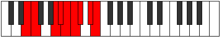 |
| [3047](https://ianring.com/musictheory/scales/3047) | [Panygic](ModeGSharpPanygic.md) | G# | G#, A, A#, C#, D, D#, E, F, G, G# |  |
| [3047](https://ianring.com/musictheory/scales/3047) | [Panygic](ModeAFlatPanygic.md) | Ab | Ab, A, Bb, Db, D, Eb, E, F, G, Ab |  |
| [3047](https://ianring.com/musictheory/scales/3047) | [Panygic](ModeENaturalPanygic.md) | E | E, F, F#, A, A#, B, C, C#, D#, E |  |
| [3049](https://ianring.com/musictheory/scales/3049) | [Aeronyllic](ModeASharpAeronyllic.md) | A# | A#, C#, D#, E, F, F#, G, A, A# |  |
| [3049](https://ianring.com/musictheory/scales/3049) | [Aeronyllic](ModeBFlatAeronyllic.md) | Bb | Bb, Db, Eb, E, F, Gb, G, A, Bb |  |
| [3049](https://ianring.com/musictheory/scales/3049) | [Aeronyllic](ModeDNaturalAeronyllic.md) | D | D, F, G, G#, A, A#, B, C#, D |  |
| [3051](https://ianring.com/musictheory/scales/3051) | [Stalygic](ModeENaturalStalygic.md) | E | E, F, G, A, A#, B, C, C#, D#, E |  |
| [3051](https://ianring.com/musictheory/scales/3051) | [Stalygic](ModeASharpStalygic.md) | A# | A#, B, C#, D#, E, F, F#, G, A, A# |  |
| [3051](https://ianring.com/musictheory/scales/3051) | [Stalygic](ModeBFlatStalygic.md) | Bb | Bb, B, Db, Eb, E, F, Gb, G, A, Bb |  |
| [3051](https://ianring.com/musictheory/scales/3051) | [Stalygic](ModeDNaturalStalygic.md) | D | D, D#, F, G, G#, A, A#, B, C#, D |  |
| [3053](https://ianring.com/musictheory/scales/3053) | [Zycrygic](ModeASharpZycrygic.md) | A# | A#, C, C#, D#, E, F, F#, G, A, A# |  |
| [3053](https://ianring.com/musictheory/scales/3053) | [Zycrygic](ModeBFlatZycrygic.md) | Bb | Bb, C, Db, Eb, E, F, Gb, G, A, Bb |  |
| [3053](https://ianring.com/musictheory/scales/3053) | [Zycrygic](ModeDNaturalZycrygic.md) | D | D, E, F, G, G#, A, A#, B, C#, D |  |
| [3055](https://ianring.com/musictheory/scales/3055) | [Lyryllian](ModeENaturalLyryllian.md) | E | E, F, F#, G, A, A#, B, C, C#, D#, E |  |
| [3055](https://ianring.com/musictheory/scales/3055) | [Lyryllian](ModeASharpLyryllian.md) | A# | A#, B, C, C#, D#, E, F, F#, G, A, A# |  |
| [3055](https://ianring.com/musictheory/scales/3055) | [Lyryllian](ModeBFlatLyryllian.md) | Bb | Bb, B, C, Db, Eb, E, F, Gb, G, A, Bb |  |
| [3055](https://ianring.com/musictheory/scales/3055) | [Lyryllian](ModeDNaturalLyryllian.md) | D | D, D#, E, F, G, G#, A, A#, B, C#, D |  |
| [3055](https://ianring.com/musictheory/scales/3055) | [Lyryllian](ModeGSharpLyryllian.md) | G# | G#, A, A#, B, C#, D, D#, E, F, G, G# |  |
| [3055](https://ianring.com/musictheory/scales/3055) | [Lyryllian](ModeAFlatLyryllian.md) | Ab | Ab, A, Bb, B, Db, D, Eb, E, F, G, Ab |  |
| [3057](https://ianring.com/musictheory/scales/3057) | [Phroryllic](ModeCSharpPhroryllic.md) | C# | C#, F, F#, G, G#, A, A#, C, C# |  |
| [3057](https://ianring.com/musictheory/scales/3057) | [Phroryllic](ModeDFlatPhroryllic.md) | Db | Db, F, Gb, G, Ab, A, Bb, C, Db |  |
| [3057](https://ianring.com/musictheory/scales/3057) | [Phroryllic](ModeFNaturalPhroryllic.md) | F | F, A, A#, B, C, C#, D, E, F |  |
| [3059](https://ianring.com/musictheory/scales/3059) | [Madygic](ModeANaturalMadygic.md) | A | A, A#, C#, D, D#, E, F, F#, G#, A | 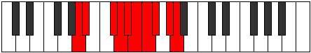 |
| [3059](https://ianring.com/musictheory/scales/3059) | [Madygic](ModeCSharpMadygic.md) | C# | C#, D, F, F#, G, G#, A, A#, C, C# |  |
| [3059](https://ianring.com/musictheory/scales/3059) | [Madygic](ModeDFlatMadygic.md) | Db | Db, D, F, Gb, G, Ab, A, Bb, C, Db |  |
| [3059](https://ianring.com/musictheory/scales/3059) | [Madygic](ModeFNaturalMadygic.md) | F | F, F#, A, A#, B, C, C#, D, E, F |  |
| [3059](https://ianring.com/musictheory/scales/3059) | [Madygic](ModeENaturalMadygic.md) | E | E, F, G#, A, A#, B, C, C#, D#, E |  |
| [3061](https://ianring.com/musictheory/scales/3061) | [Apinygic](ModeCSharpApinygic.md) | C# | C#, D#, F, F#, G, G#, A, A#, C, C# |  |
| [3061](https://ianring.com/musictheory/scales/3061) | [Apinygic](ModeDFlatApinygic.md) | Db | Db, Eb, F, Gb, G, Ab, A, Bb, C, Db |  |
| [3061](https://ianring.com/musictheory/scales/3061) | [Apinygic](ModeFNaturalApinygic.md) | F | F, G, A, A#, B, C, C#, D, E, F |  |
| [3063](https://ianring.com/musictheory/scales/3063) | [Solyllian](ModeGSharpSolyllian.md) | G# | G#, A, A#, C, C#, D, D#, E, F, G, G# |  |
| [3063](https://ianring.com/musictheory/scales/3063) | [Solyllian](ModeAFlatSolyllian.md) | Ab | Ab, A, Bb, C, Db, D, Eb, E, F, G, Ab |  |
| [3063](https://ianring.com/musictheory/scales/3063) | [Solyllian](ModeCSharpSolyllian.md) | C# | C#, D, D#, F, F#, G, G#, A, A#, C, C# |  |
| [3063](https://ianring.com/musictheory/scales/3063) | [Solyllian](ModeDFlatSolyllian.md) | Db | Db, D, Eb, F, Gb, G, Ab, A, Bb, C, Db |  |
| [3063](https://ianring.com/musictheory/scales/3063) | [Solyllian](ModeFNaturalSolyllian.md) | F | F, F#, G, A, A#, B, C, C#, D, E, F |  |
| [3063](https://ianring.com/musictheory/scales/3063) | [Solyllian](ModeENaturalSolyllian.md) | E | E, F, F#, G#, A, A#, B, C, C#, D#, E |  |
| [3063](https://ianring.com/musictheory/scales/3063) | [Solyllian](ModeANaturalSolyllian.md) | A | A, A#, B, C#, D, D#, E, F, F#, G#, A |  |
| [3065](https://ianring.com/musictheory/scales/3065) | [Zothygic](ModeASharpZothygic.md) | A# | A#, C#, D, D#, E, F, F#, G, A, A# |  |
| [3065](https://ianring.com/musictheory/scales/3065) | [Zothygic](ModeBFlatZothygic.md) | Bb | Bb, Db, D, Eb, E, F, Gb, G, A, Bb |  |
| [3065](https://ianring.com/musictheory/scales/3065) | [Zothygic](ModeCSharpZothygic.md) | C# | C#, E, F, F#, G, G#, A, A#, C, C# |  |
| [3065](https://ianring.com/musictheory/scales/3065) | [Zothygic](ModeDFlatZothygic.md) | Db | Db, E, F, Gb, G, Ab, A, Bb, C, Db |  |
| [3065](https://ianring.com/musictheory/scales/3065) | [Zothygic](ModeFSharpZothygic.md) | F# | F#, A, A#, B, C, C#, D, D#, F, F# |  |
| [3065](https://ianring.com/musictheory/scales/3065) | [Zothygic](ModeGFlatZothygic.md) | Gb | Gb, A, Bb, B, C, Db, D, Eb, F, Gb |  |
| [3065](https://ianring.com/musictheory/scales/3065) | [Zothygic](ModeFNaturalZothygic.md) | F | F, G#, A, A#, B, C, C#, D, E, F |  |
| [3065](https://ianring.com/musictheory/scales/3065) | [Zothygic](ModeDNaturalZothygic.md) | D | D, F, F#, G, G#, A, A#, B, C#, D |  |
| [3067](https://ianring.com/musictheory/scales/3067) | [Goptyllian](ModeANaturalGoptyllian.md) | A | A, A#, C, C#, D, D#, E, F, F#, G#, A |  |
| [3067](https://ianring.com/musictheory/scales/3067) | [Goptyllian](ModeCSharpGoptyllian.md) | C# | C#, D, E, F, F#, G, G#, A, A#, C, C# |  |
| [3067](https://ianring.com/musictheory/scales/3067) | [Goptyllian](ModeDFlatGoptyllian.md) | Db | Db, D, E, F, Gb, G, Ab, A, Bb, C, Db |  |
| [3067](https://ianring.com/musictheory/scales/3067) | [Goptyllian](ModeFSharpGoptyllian.md) | F# | F#, G, A, A#, B, C, C#, D, D#, F, F# | 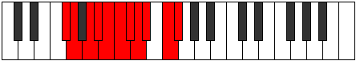 |
| [3067](https://ianring.com/musictheory/scales/3067) | [Goptyllian](ModeGFlatGoptyllian.md) | Gb | Gb, G, A, Bb, B, C, Db, D, Eb, F, Gb |  |
| [3067](https://ianring.com/musictheory/scales/3067) | [Goptyllian](ModeASharpGoptyllian.md) | A# | A#, B, C#, D, D#, E, F, F#, G, A, A# |  |
| [3067](https://ianring.com/musictheory/scales/3067) | [Goptyllian](ModeBFlatGoptyllian.md) | Bb | Bb, B, Db, D, Eb, E, F, Gb, G, A, Bb |  |
| [3067](https://ianring.com/musictheory/scales/3067) | [Goptyllian](ModeFNaturalGoptyllian.md) | F | F, F#, G#, A, A#, B, C, C#, D, E, F |  |
| [3067](https://ianring.com/musictheory/scales/3067) | [Goptyllian](ModeENaturalGoptyllian.md) | E | E, F, G, G#, A, A#, B, C, C#, D#, E |  |
| [3067](https://ianring.com/musictheory/scales/3067) | [Goptyllian](ModeDNaturalGoptyllian.md) | D | D, D#, F, F#, G, G#, A, A#, B, C#, D |  |
| [3069](https://ianring.com/musictheory/scales/3069) | [Bacryllian](ModeASharpBacryllian.md) | A# | A#, C, C#, D, D#, E, F, F#, G, A, A# |  |
| [3069](https://ianring.com/musictheory/scales/3069) | [Bacryllian](ModeBFlatBacryllian.md) | Bb | Bb, C, Db, D, Eb, E, F, Gb, G, A, Bb |  |
| [3069](https://ianring.com/musictheory/scales/3069) | [Bacryllian](ModeCSharpBacryllian.md) | C# | C#, D#, E, F, F#, G, G#, A, A#, C, C# |  |
| [3069](https://ianring.com/musictheory/scales/3069) | [Bacryllian](ModeDFlatBacryllian.md) | Db | Db, Eb, E, F, Gb, G, Ab, A, Bb, C, Db |  |
| [3069](https://ianring.com/musictheory/scales/3069) | [Bacryllian](ModeFSharpBacryllian.md) | F# | F#, G#, A, A#, B, C, C#, D, D#, F, F# |  |
| [3069](https://ianring.com/musictheory/scales/3069) | [Bacryllian](ModeGFlatBacryllian.md) | Gb | Gb, Ab, A, Bb, B, C, Db, D, Eb, F, Gb |  |
| [3069](https://ianring.com/musictheory/scales/3069) | [Bacryllian](ModeFNaturalBacryllian.md) | F | F, G, G#, A, A#, B, C, C#, D, E, F |  |
| [3069](https://ianring.com/musictheory/scales/3069) | [Bacryllian](ModeDNaturalBacryllian.md) | D | D, E, F, F#, G, G#, A, A#, B, C#, D |  |
| [3071](https://ianring.com/musictheory/scales/3071) | [Solatic](ModeCSharpSolatic.md) | C# | C#, D, D#, E, F, F#, G, G#, A, A#, C, C# |  |
| [3071](https://ianring.com/musictheory/scales/3071) | [Solatic](ModeDFlatSolatic.md) | Db | Db, D, Eb, E, F, Gb, G, Ab, A, Bb, C, Db |  |
| [3071](https://ianring.com/musictheory/scales/3071) | [Solatic](ModeASharpSolatic.md) | A# | A#, B, C, C#, D, D#, E, F, F#, G, A, A# |  |
| [3071](https://ianring.com/musictheory/scales/3071) | [Solatic](ModeBFlatSolatic.md) | Bb | Bb, B, C, Db, D, Eb, E, F, Gb, G, A, Bb |  |
| [3071](https://ianring.com/musictheory/scales/3071) | [Solatic](ModeANaturalSolatic.md) | A | A, A#, B, C, C#, D, D#, E, F, F#, G#, A |  |
| [3071](https://ianring.com/musictheory/scales/3071) | [Solatic](ModeGSharpSolatic.md) | G# | G#, A, A#, B, C, C#, D, D#, E, F, G, G# |  |
| [3071](https://ianring.com/musictheory/scales/3071) | [Solatic](ModeAFlatSolatic.md) | Ab | Ab, A, Bb, B, C, Db, D, Eb, E, F, G, Ab |  |
| [3071](https://ianring.com/musictheory/scales/3071) | [Solatic](ModeFSharpSolatic.md) | F# | F#, G, G#, A, A#, B, C, C#, D, D#, F, F# |  |
| [3071](https://ianring.com/musictheory/scales/3071) | [Solatic](ModeGFlatSolatic.md) | Gb | Gb, G, Ab, A, Bb, B, C, Db, D, Eb, F, Gb |  |
| [3071](https://ianring.com/musictheory/scales/3071) | [Solatic](ModeFNaturalSolatic.md) | F | F, F#, G, G#, A, A#, B, C, C#, D, E, F |  |
| [3071](https://ianring.com/musictheory/scales/3071) | [Solatic](ModeENaturalSolatic.md) | E | E, F, F#, G, G#, A, A#, B, C, C#, D#, E |  |
| [3071](https://ianring.com/musictheory/scales/3071) | [Solatic](ModeDNaturalSolatic.md) | D | D, D#, E, F, F#, G, G#, A, A#, B, C#, D |  |
| [3141](https://ianring.com/musictheory/scales/3141) | [Kanitonic](ModeBNaturalKanitonic.md) | B | B, C#, F, A, A#, B |  |
| [3149](https://ianring.com/musictheory/scales/3149) | [Phrycrimic](ModeGNaturalPhrycrimic.md) | G | G, A, Bb, C#, D###, E##, G |  |
| [3151](https://ianring.com/musictheory/scales/3151) | [Pacrian](ModeBNaturalPacrian.md) | B | B, C, Db, Ebb, F, G##, A#, B |  |
| [3159](https://ianring.com/musictheory/scales/3159) | [Stocrian](ModeBNaturalStocrian.md) | B | B, C, Db, Eb, F, G##, A#, B |  |
| [3165](https://ianring.com/musictheory/scales/3165) | [Mylian](ModeBNaturalMylian.md) | B | B, C#, D, Eb, F, G##, A#, B |  |
| [3165](https://ianring.com/musictheory/scales/3165) | [Mylian](ModeGNaturalMylian.md) | G | G, A, Bb, Cb, Db, E#, F#, G |  |
| [3167](https://ianring.com/musictheory/scales/3167) | [Thynyllic](ModeBNaturalThynyllic.md) | B | B, C, C#, D, D#, F, A, A#, B |  |
| [3167](https://ianring.com/musictheory/scales/3167) | [Thynyllic](ModeGNaturalThynyllic.md) | G | G, G#, A, A#, B, C#, F, F#, G |  |
| [3175](https://ianring.com/musictheory/scales/3175) | [Eponian](ModeBNaturalEponian.md) | B | B, C, Db, E, F, G##, A#, B |  |
| [3181](https://ianring.com/musictheory/scales/3181) | [Rolian](ModeGNaturalRolian.md) | G | G, A, Bb, C, Db, E#, F#, G |  |
| [3181](https://ianring.com/musictheory/scales/3181) | [Rolian](ModeBNaturalRolian.md) | B | B, C#, D, E, F, G##, A#, B |  |
| [3183](https://ianring.com/musictheory/scales/3183) | [Mixonyllic](ModeGNaturalMixonyllic.md) | G | G, G#, A, A#, C, C#, F, F#, G |  |
| [3183](https://ianring.com/musictheory/scales/3183) | [Mixonyllic](ModeBNaturalMixonyllic.md) | B | B, C, C#, D, E, F, A, A#, B |  |
| [3189](https://ianring.com/musictheory/scales/3189) | [Aeolonian](ModeBNaturalAeolonian.md) | B | B, C#, D#, E, F, G##, A#, B |  |
| [3191](https://ianring.com/musictheory/scales/3191) | [Bynyllic](ModeBNaturalBynyllic.md) | B | B, C, C#, D#, E, F, A, A#, B |  |
| [3197](https://ianring.com/musictheory/scales/3197) | [Gylyllic](ModeBNaturalGylyllic.md) | B | B, C#, D, D#, E, F, A, A#, B |  |
| [3197](https://ianring.com/musictheory/scales/3197) | [Gylyllic](ModeGNaturalGylyllic.md) | G | G, A, A#, B, C, C#, F, F#, G |  |
| [3199](https://ianring.com/musictheory/scales/3199) | [Thaptygic](ModeBNaturalThaptygic.md) | B | B, C, C#, D, D#, E, F, A, A#, B | 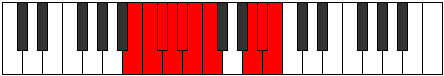 |
| [3199](https://ianring.com/musictheory/scales/3199) | [Thaptygic](ModeGNaturalThaptygic.md) | G | G, G#, A, A#, B, C, C#, F, F#, G |  |
| [3209](https://ianring.com/musictheory/scales/3209) | [Aeraphitonic](ModeASharpAeraphitonic.md) | A# | A#, C#, F, G#, A, A# | 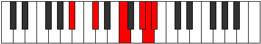 |
| [3209](https://ianring.com/musictheory/scales/3209) | [Aeraphitonic](ModeBFlatAeraphitonic.md) | Bb | Bb, Db, F, Ab, A, Bb |  |
| [3211](https://ianring.com/musictheory/scales/3211) | [Epacrimic](ModeASharpEpacrimic.md) | A# | A#, B, C#, D###, F###, G##, A# |  |
| [3211](https://ianring.com/musictheory/scales/3211) | [Epacrimic](ModeBFlatEpacrimic.md) | Bb | Bb, Cb, Db, E#, F###, G##, Bb |  |
| [3213](https://ianring.com/musictheory/scales/3213) | [Eponimic](ModeASharpEponimic.md) | A# | A#, B#, C#, D###, F###, G##, A# |  |
| [3213](https://ianring.com/musictheory/scales/3213) | [Eponimic](ModeBFlatEponimic.md) | Bb | Bb, C, Db, E#, F###, G##, Bb |  |
| [3215](https://ianring.com/musictheory/scales/3215) | [Katydian](ModeASharpKatydian.md) | A# | A#, B, C, Db, E#, F###, G##, A# |  |
| [3215](https://ianring.com/musictheory/scales/3215) | [Katydian](ModeBFlatKatydian.md) | Bb | Bb, Cb, Dbb, Ebbb, F, G#, A, Bb |  |
| [3225](https://ianring.com/musictheory/scales/3225) | [Ionalimic](ModeFSharpIonalimic.md) | F# | F#, G##, A#, B##, D##, E#, F# |  |
| [3225](https://ianring.com/musictheory/scales/3225) | [Ionalimic](ModeGFlatIonalimic.md) | Gb | Gb, A, Bb, C#, D##, E#, Gb |  |
| [3225](https://ianring.com/musictheory/scales/3225) | [Ionalimic](ModeASharpIonalimic.md) | A# | A#, B##, C##, D###, F###, G##, A# |  |
| [3225](https://ianring.com/musictheory/scales/3225) | [Ionalimic](ModeBFlatIonalimic.md) | Bb | Bb, C#, D, E#, F###, G##, Bb |  |
| [3227](https://ianring.com/musictheory/scales/3227) | [Aeolocrian](ModeFSharpAeolocrian.md) | F# | F#, G, A, Bb, C#, D##, E#, F# |  |
| [3227](https://ianring.com/musictheory/scales/3227) | [Aeolocrian](ModeASharpAeolocrian.md) | A# | A#, B, C#, D, E#, F###, G##, A# |  |
| [3227](https://ianring.com/musictheory/scales/3227) | [Aeolocrian](ModeBFlatAeolocrian.md) | Bb | Bb, Cb, Db, Ebb, F, G#, A, Bb |  |
| [3229](https://ianring.com/musictheory/scales/3229) | [Aeolaptian](ModeASharpAeolaptian.md) | A# | A#, B#, C#, D, E#, F###, G##, A# |  |
| [3229](https://ianring.com/musictheory/scales/3229) | [Aeolaptian](ModeBFlatAeolaptian.md) | Bb | Bb, C, Db, Ebb, F, G#, A, Bb |  |
| [3229](https://ianring.com/musictheory/scales/3229) | [Aeolaptian](ModeFSharpAeolaptian.md) | F# | F#, G#, A, Bb, C#, D##, E#, F# |  |
| [3231](https://ianring.com/musictheory/scales/3231) | [Kataptyllic](ModeFSharpKataptyllic.md) | F# | F#, G, G#, A, A#, C#, E, F, F# |  |
| [3231](https://ianring.com/musictheory/scales/3231) | [Kataptyllic](ModeGFlatKataptyllic.md) | Gb | Gb, G, Ab, A, Bb, Db, E, F, Gb |  |
| [3231](https://ianring.com/musictheory/scales/3231) | [Kataptyllic](ModeASharpKataptyllic.md) | A# | A#, B, C, C#, D, F, G#, A, A# |  |
| [3231](https://ianring.com/musictheory/scales/3231) | [Kataptyllic](ModeBFlatKataptyllic.md) | Bb | Bb, B, C, Db, D, F, Ab, A, Bb |  |
| [3241](https://ianring.com/musictheory/scales/3241) | [Dalimic](ModeASharpDalimic.md) | A# | A#, B##, C###, D###, F###, G##, A# |  |
| [3241](https://ianring.com/musictheory/scales/3241) | [Dalimic](ModeBFlatDalimic.md) | Bb | Bb, C#, D#, E#, F###, G##, Bb |  |
| [3243](https://ianring.com/musictheory/scales/3243) | [Staptian](ModeASharpStaptian.md) | A# | A#, B, C#, D#, E#, F###, G##, A# |  |
| [3243](https://ianring.com/musictheory/scales/3243) | [Staptian](ModeBFlatStaptian.md) | Bb | Bb, Cb, Db, Eb, F, G#, A, Bb | 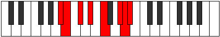 |
| [3245](https://ianring.com/musictheory/scales/3245) | [Aeracrian](ModeASharpAeracrian.md) | A# | A#, B#, C#, D#, E#, F###, G##, A# |  |
| [3245](https://ianring.com/musictheory/scales/3245) | [Aeracrian](ModeBFlatAeracrian.md) | Bb | Bb, C, Db, Eb, F, G#, A, Bb |  |
| [3247](https://ianring.com/musictheory/scales/3247) | [Aeolonyllic](ModeASharpAeolonyllic.md) | A# | A#, B, C, C#, D#, F, G#, A, A# |  |
| [3247](https://ianring.com/musictheory/scales/3247) | [Aeolonyllic](ModeBFlatAeolonyllic.md) | Bb | Bb, B, C, Db, Eb, F, Ab, A, Bb |  |
| [3257](https://ianring.com/musictheory/scales/3257) | [Ionacrian](ModeASharpIonacrian.md) | A# | A#, B##, C##, D#, E#, F###, G##, A# |  |
| [3257](https://ianring.com/musictheory/scales/3257) | [Ionacrian](ModeBFlatIonacrian.md) | Bb | Bb, C#, D, Eb, F, G#, A, Bb |  |
| [3257](https://ianring.com/musictheory/scales/3257) | [Ionacrian](ModeFSharpIonacrian.md) | F# | F#, G##, A#, B, C#, D##, E#, F# |  |
| [3257](https://ianring.com/musictheory/scales/3257) | [Ionacrian](ModeGFlatIonacrian.md) | Gb | Gb, A, Bb, Cb, Db, E, F, Gb |  |
| [3259](https://ianring.com/musictheory/scales/3259) | [Loptyllic](ModeFSharpLoptyllic.md) | F# | F#, G, A, A#, B, C#, E, F, F# |  |
| [3259](https://ianring.com/musictheory/scales/3259) | [Loptyllic](ModeGFlatLoptyllic.md) | Gb | Gb, G, A, Bb, B, Db, E, F, Gb |  |
| [3259](https://ianring.com/musictheory/scales/3259) | [Loptyllic](ModeASharpLoptyllic.md) | A# | A#, B, C#, D, D#, F, G#, A, A# |  |
| [3259](https://ianring.com/musictheory/scales/3259) | [Loptyllic](ModeBFlatLoptyllic.md) | Bb | Bb, B, Db, D, Eb, F, Ab, A, Bb |  |
| [3261](https://ianring.com/musictheory/scales/3261) | [Dodyllic](ModeASharpDodyllic.md) | A# | A#, C, C#, D, D#, F, G#, A, A# |  |
| [3261](https://ianring.com/musictheory/scales/3261) | [Dodyllic](ModeBFlatDodyllic.md) | Bb | Bb, C, Db, D, Eb, F, Ab, A, Bb |  |
| [3261](https://ianring.com/musictheory/scales/3261) | [Dodyllic](ModeFSharpDodyllic.md) | F# | F#, G#, A, A#, B, C#, E, F, F# |  |
| [3261](https://ianring.com/musictheory/scales/3261) | [Dodyllic](ModeGFlatDodyllic.md) | Gb | Gb, Ab, A, Bb, B, Db, E, F, Gb |  |
| [3263](https://ianring.com/musictheory/scales/3263) | [Pyrygic](ModeASharpPyrygic.md) | A# | A#, B, C, C#, D, D#, F, G#, A, A# | 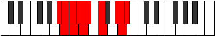 |
| [3263](https://ianring.com/musictheory/scales/3263) | [Pyrygic](ModeBFlatPyrygic.md) | Bb | Bb, B, C, Db, D, Eb, F, Ab, A, Bb |  |
| [3263](https://ianring.com/musictheory/scales/3263) | [Pyrygic](ModeFSharpPyrygic.md) | F# | F#, G, G#, A, A#, B, C#, E, F, F# |  |
| [3263](https://ianring.com/musictheory/scales/3263) | [Pyrygic](ModeGFlatPyrygic.md) | Gb | Gb, G, Ab, A, Bb, B, Db, E, F, Gb |  |
| [3269](https://ianring.com/musictheory/scales/3269) | [Lodimic](ModeEFlatLodimic.md) | Eb | Eb, F, G##, A#, B##, C##, Eb |  |
| [3271](https://ianring.com/musictheory/scales/3271) | [Kolian](ModeDSharpKolian.md) | D# | D#, E, F, G##, A#, B##, C##, D# |  |
| [3271](https://ianring.com/musictheory/scales/3271) | [Kolian](ModeEFlatKolian.md) | Eb | Eb, Fb, Gbb, A, Bb, C#, D, Eb |  |
| [3271](https://ianring.com/musictheory/scales/3271) | [Kolian](ModeBNaturalKolian.md) | B | B, C, Db, E#, F#, G##, A#, B | 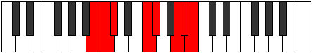 |
| [3273](https://ianring.com/musictheory/scales/3273) | [Ionodimic](ModeASharpIonodimic.md) | A# | A#, B##, D##, E#, F###, G##, A# |  |
| [3273](https://ianring.com/musictheory/scales/3273) | [Ionodimic](ModeBFlatIonodimic.md) | Bb | Bb, C#, D##, E#, F###, G##, Bb |  |
| [3275](https://ianring.com/musictheory/scales/3275) | [Katadian](ModeASharpKatadian.md) | A# | A#, B, C#, D##, E#, F###, G##, A# |  |
| [3275](https://ianring.com/musictheory/scales/3275) | [Katadian](ModeBFlatKatadian.md) | Bb | Bb, Cb, Db, E, F, G#, A, Bb |  |
| [3277](https://ianring.com/musictheory/scales/3277) | [Zycrian](ModeDSharpZycrian.md) | D# | D#, E#, F#, G##, A#, B##, C##, D# |  |
| [3277](https://ianring.com/musictheory/scales/3277) | [Zycrian](ModeEFlatZycrian.md) | Eb | Eb, F, Gb, A, Bb, C#, D, Eb |  |
| [3277](https://ianring.com/musictheory/scales/3277) | [Zycrian](ModeGNaturalZycrian.md) | G | G, A, Bb, C#, D, E#, F#, G |  |
| [3277](https://ianring.com/musictheory/scales/3277) | [Zycrian](ModeASharpZycrian.md) | A# | A#, B#, C#, D##, E#, F###, G##, A# |  |
| [3277](https://ianring.com/musictheory/scales/3277) | [Zycrian](ModeBFlatZycrian.md) | Bb | Bb, C, Db, E, F, G#, A, Bb |  |
| [3277](https://ianring.com/musictheory/scales/3277) | [Zycrian](ModeBNaturalZycrian.md) | B | B, C#, D, E#, F#, G##, A#, B |  |
| [3279](https://ianring.com/musictheory/scales/3279) | [Pythyllic](ModeDSharpPythyllic.md) | D# | D#, E, F, F#, A, A#, C#, D, D# |  |
| [3279](https://ianring.com/musictheory/scales/3279) | [Pythyllic](ModeEFlatPythyllic.md) | Eb | Eb, E, F, Gb, A, Bb, Db, D, Eb |  |
| [3279](https://ianring.com/musictheory/scales/3279) | [Pythyllic](ModeGNaturalPythyllic.md) | G | G, G#, A, A#, C#, D, F, F#, G |  |
| [3279](https://ianring.com/musictheory/scales/3279) | [Pythyllic](ModeBNaturalPythyllic.md) | B | B, C, C#, D, F, F#, A, A#, B |  |
| [3279](https://ianring.com/musictheory/scales/3279) | [Pythyllic](ModeASharpPythyllic.md) | A# | A#, B, C, C#, E, F, G#, A, A# |  |
| [3279](https://ianring.com/musictheory/scales/3279) | [Pythyllic](ModeBFlatPythyllic.md) | Bb | Bb, B, C, Db, E, F, Ab, A, Bb |  |
| [3285](https://ianring.com/musictheory/scales/3285) | [Zagian](ModeDSharpZagian.md) | D# | D#, E#, F##, G##, A#, B##, C##, D# |  |
| [3285](https://ianring.com/musictheory/scales/3285) | [Zagian](ModeEFlatZagian.md) | Eb | Eb, F, G, A, Bb, C#, D, Eb |  |
| [3285](https://ianring.com/musictheory/scales/3285) | [Zagian](ModeBNaturalZagian.md) | B | B, C#, D#, E#, F#, G##, A#, B |  |
| [3287](https://ianring.com/musictheory/scales/3287) | [Phrathyllic](ModeDSharpPhrathyllic.md) | D# | D#, E, F, G, A, A#, C#, D, D# |  |
| [3287](https://ianring.com/musictheory/scales/3287) | [Phrathyllic](ModeEFlatPhrathyllic.md) | Eb | Eb, E, F, G, A, Bb, Db, D, Eb |  |
| [3287](https://ianring.com/musictheory/scales/3287) | [Phrathyllic](ModeBNaturalPhrathyllic.md) | B | B, C, C#, D#, F, F#, A, A#, B |  |
| [3289](https://ianring.com/musictheory/scales/3289) | [Loptian](ModeFSharpLoptian.md) | F# | F#, G##, A#, B#, C#, D##, E#, F# |  |
| [3289](https://ianring.com/musictheory/scales/3289) | [Loptian](ModeGFlatLoptian.md) | Gb | Gb, A, Bb, C, Db, E, F, Gb |  |
| [3289](https://ianring.com/musictheory/scales/3289) | [Loptian](ModeASharpLoptian.md) | A# | A#, B##, C##, D##, E#, F###, G##, A# |  |
| [3289](https://ianring.com/musictheory/scales/3289) | [Loptian](ModeBFlatLoptian.md) | Bb | Bb, C#, D, E, F, G#, A, Bb |  |
| [3291](https://ianring.com/musictheory/scales/3291) | [Kodyllic](ModeFSharpKodyllic.md) | F# | F#, G, A, A#, C, C#, E, F, F# |  |
| [3291](https://ianring.com/musictheory/scales/3291) | [Kodyllic](ModeGFlatKodyllic.md) | Gb | Gb, G, A, Bb, C, Db, E, F, Gb |  |
| [3291](https://ianring.com/musictheory/scales/3291) | [Kodyllic](ModeASharpKodyllic.md) | A# | A#, B, C#, D, E, F, G#, A, A# |  |
| [3291](https://ianring.com/musictheory/scales/3291) | [Kodyllic](ModeBFlatKodyllic.md) | Bb | Bb, B, Db, D, E, F, Ab, A, Bb |  |
| [3293](https://ianring.com/musictheory/scales/3293) | [Saryllic](ModeDSharpSaryllic.md) | D# | D#, F, F#, G, A, A#, C#, D, D# |  |
| [3293](https://ianring.com/musictheory/scales/3293) | [Saryllic](ModeEFlatSaryllic.md) | Eb | Eb, F, Gb, G, A, Bb, Db, D, Eb |  |
| [3293](https://ianring.com/musictheory/scales/3293) | [Saryllic](ModeASharpSaryllic.md) | A# | A#, C, C#, D, E, F, G#, A, A# |  |
| [3293](https://ianring.com/musictheory/scales/3293) | [Saryllic](ModeBFlatSaryllic.md) | Bb | Bb, C, Db, D, E, F, Ab, A, Bb |  |
| [3293](https://ianring.com/musictheory/scales/3293) | [Saryllic](ModeFSharpSaryllic.md) | F# | F#, G#, A, A#, C, C#, E, F, F# |  |
| [3293](https://ianring.com/musictheory/scales/3293) | [Saryllic](ModeGFlatSaryllic.md) | Gb | Gb, Ab, A, Bb, C, Db, E, F, Gb |  |
| [3293](https://ianring.com/musictheory/scales/3293) | [Saryllic](ModeBNaturalSaryllic.md) | B | B, C#, D, D#, F, F#, A, A#, B |  |
| [3293](https://ianring.com/musictheory/scales/3293) | [Saryllic](ModeGNaturalSaryllic.md) | G | G, A, A#, B, C#, D, F, F#, G |  |
| [3295](https://ianring.com/musictheory/scales/3295) | [Phroptygic](ModeDSharpPhroptygic.md) | D# | D#, E, F, F#, G, A, A#, C#, D, D# |  |
| [3295](https://ianring.com/musictheory/scales/3295) | [Phroptygic](ModeEFlatPhroptygic.md) | Eb | Eb, E, F, Gb, G, A, Bb, Db, D, Eb |  |
| [3295](https://ianring.com/musictheory/scales/3295) | [Phroptygic](ModeFSharpPhroptygic.md) | F# | F#, G, G#, A, A#, C, C#, E, F, F# |  |
| [3295](https://ianring.com/musictheory/scales/3295) | [Phroptygic](ModeGFlatPhroptygic.md) | Gb | Gb, G, Ab, A, Bb, C, Db, E, F, Gb |  |
| [3295](https://ianring.com/musictheory/scales/3295) | [Phroptygic](ModeBNaturalPhroptygic.md) | B | B, C, C#, D, D#, F, F#, A, A#, B |  |
| [3295](https://ianring.com/musictheory/scales/3295) | [Phroptygic](ModeASharpPhroptygic.md) | A# | A#, B, C, C#, D, E, F, G#, A, A# |  |
| [3295](https://ianring.com/musictheory/scales/3295) | [Phroptygic](ModeBFlatPhroptygic.md) | Bb | Bb, B, C, Db, D, E, F, Ab, A, Bb |  |
| [3295](https://ianring.com/musictheory/scales/3295) | [Phroptygic](ModeGNaturalPhroptygic.md) | G | G, G#, A, A#, B, C#, D, F, F#, G |  |
| [3301](https://ianring.com/musictheory/scales/3301) | [Phrynian](ModeDSharpPhrynian.md) | D# | D#, E#, F###, G##, A#, B##, C##, D# |  |
| [3301](https://ianring.com/musictheory/scales/3301) | [Phrynian](ModeEFlatPhrynian.md) | Eb | Eb, F, G#, A, Bb, C#, D, Eb |  |
| [3301](https://ianring.com/musictheory/scales/3301) | [Phrynian](ModeBNaturalPhrynian.md) | B | B, C#, D##, E#, F#, G##, A#, B |  |
| [3303](https://ianring.com/musictheory/scales/3303) | [Soptyllic](ModeDSharpSoptyllic.md) | D# | D#, E, F, G#, A, A#, C#, D, D# |  |
| [3303](https://ianring.com/musictheory/scales/3303) | [Soptyllic](ModeEFlatSoptyllic.md) | Eb | Eb, E, F, Ab, A, Bb, Db, D, Eb |  |
| [3303](https://ianring.com/musictheory/scales/3303) | [Soptyllic](ModeBNaturalSoptyllic.md) | B | B, C, C#, E, F, F#, A, A#, B |  |
| [3305](https://ianring.com/musictheory/scales/3305) | [Epathian](ModeASharpEpathian.md) | A# | A#, B##, C###, D##, E#, F###, G##, A# |  |
| [3305](https://ianring.com/musictheory/scales/3305) | [Epathian](ModeBFlatEpathian.md) | Bb | Bb, C#, D#, E, F, G#, A, Bb |  |
| [3307](https://ianring.com/musictheory/scales/3307) | [Boptyllic](ModeASharpBoptyllic.md) | A# | A#, B, C#, D#, E, F, G#, A, A# |  |
| [3307](https://ianring.com/musictheory/scales/3307) | [Boptyllic](ModeBFlatBoptyllic.md) | Bb | Bb, B, Db, Eb, E, F, Ab, A, Bb |  |
| [3309](https://ianring.com/musictheory/scales/3309) | [Bycryllic](ModeGNaturalBycryllic.md) | G | G, A, A#, C, C#, D, F, F#, G |  |
| [3309](https://ianring.com/musictheory/scales/3309) | [Bycryllic](ModeASharpBycryllic.md) | A# | A#, C, C#, D#, E, F, G#, A, A# |  |
| [3309](https://ianring.com/musictheory/scales/3309) | [Bycryllic](ModeBFlatBycryllic.md) | Bb | Bb, C, Db, Eb, E, F, Ab, A, Bb |  |
| [3309](https://ianring.com/musictheory/scales/3309) | [Bycryllic](ModeDSharpBycryllic.md) | D# | D#, F, F#, G#, A, A#, C#, D, D# |  |
| [3309](https://ianring.com/musictheory/scales/3309) | [Bycryllic](ModeEFlatBycryllic.md) | Eb | Eb, F, Gb, Ab, A, Bb, Db, D, Eb |  |
| [3309](https://ianring.com/musictheory/scales/3309) | [Bycryllic](ModeBNaturalBycryllic.md) | B | B, C#, D, E, F, F#, A, A#, B |  |
| [3311](https://ianring.com/musictheory/scales/3311) | [Mixodygic](ModeDSharpMixodygic.md) | D# | D#, E, F, F#, G#, A, A#, C#, D, D# |  |
| [3311](https://ianring.com/musictheory/scales/3311) | [Mixodygic](ModeEFlatMixodygic.md) | Eb | Eb, E, F, Gb, Ab, A, Bb, Db, D, Eb |  |
| [3311](https://ianring.com/musictheory/scales/3311) | [Mixodygic](ModeGNaturalMixodygic.md) | G | G, G#, A, A#, C, C#, D, F, F#, G |  |
| [3311](https://ianring.com/musictheory/scales/3311) | [Mixodygic](ModeBNaturalMixodygic.md) | B | B, C, C#, D, E, F, F#, A, A#, B |  |
| [3311](https://ianring.com/musictheory/scales/3311) | [Mixodygic](ModeASharpMixodygic.md) | A# | A#, B, C, C#, D#, E, F, G#, A, A# |  |
| [3311](https://ianring.com/musictheory/scales/3311) | [Mixodygic](ModeBFlatMixodygic.md) | Bb | Bb, B, C, Db, Eb, E, F, Ab, A, Bb |  |
| [3317](https://ianring.com/musictheory/scales/3317) | [Lanyllic](ModeDSharpLanyllic.md) | D# | D#, F, G, G#, A, A#, C#, D, D# |  |
| [3317](https://ianring.com/musictheory/scales/3317) | [Lanyllic](ModeEFlatLanyllic.md) | Eb | Eb, F, G, Ab, A, Bb, Db, D, Eb |  |
| [3317](https://ianring.com/musictheory/scales/3317) | [Lanyllic](ModeBNaturalLanyllic.md) | B | B, C#, D#, E, F, F#, A, A#, B |  |
| [3319](https://ianring.com/musictheory/scales/3319) | [Tholygic](ModeDSharpTholygic.md) | D# | D#, E, F, G, G#, A, A#, C#, D, D# |  |
| [3319](https://ianring.com/musictheory/scales/3319) | [Tholygic](ModeEFlatTholygic.md) | Eb | Eb, E, F, G, Ab, A, Bb, Db, D, Eb |  |
| [3319](https://ianring.com/musictheory/scales/3319) | [Tholygic](ModeBNaturalTholygic.md) | B | B, C, C#, D#, E, F, F#, A, A#, B |  |
| [3321](https://ianring.com/musictheory/scales/3321) | [Ionycryllic](ModeASharpIonycryllic.md) | A# | A#, C#, D, D#, E, F, G#, A, A# |  |
| [3321](https://ianring.com/musictheory/scales/3321) | [Ionycryllic](ModeBFlatIonycryllic.md) | Bb | Bb, Db, D, Eb, E, F, Ab, A, Bb |  |
| [3321](https://ianring.com/musictheory/scales/3321) | [Ionycryllic](ModeFSharpIonycryllic.md) | F# | F#, A, A#, B, C, C#, E, F, F# |  |
| [3321](https://ianring.com/musictheory/scales/3321) | [Ionycryllic](ModeGFlatIonycryllic.md) | Gb | Gb, A, Bb, B, C, Db, E, F, Gb |  |
| [3323](https://ianring.com/musictheory/scales/3323) | [Phrygygic](ModeFSharpPhrygygic.md) | F# | F#, G, A, A#, B, C, C#, E, F, F# |  |
| [3323](https://ianring.com/musictheory/scales/3323) | [Phrygygic](ModeGFlatPhrygygic.md) | Gb | Gb, G, A, Bb, B, C, Db, E, F, Gb |  |
| [3323](https://ianring.com/musictheory/scales/3323) | [Phrygygic](ModeASharpPhrygygic.md) | A# | A#, B, C#, D, D#, E, F, G#, A, A# |  |
| [3323](https://ianring.com/musictheory/scales/3323) | [Phrygygic](ModeBFlatPhrygygic.md) | Bb | Bb, B, Db, D, Eb, E, F, Ab, A, Bb |  |
| [3325](https://ianring.com/musictheory/scales/3325) | [Epygic](ModeASharpEpygic.md) | A# | A#, C, C#, D, D#, E, F, G#, A, A# |  |
| [3325](https://ianring.com/musictheory/scales/3325) | [Epygic](ModeBFlatEpygic.md) | Bb | Bb, C, Db, D, Eb, E, F, Ab, A, Bb |  |
| [3325](https://ianring.com/musictheory/scales/3325) | [Epygic](ModeDSharpEpygic.md) | D# | D#, F, F#, G, G#, A, A#, C#, D, D# |  |
| [3325](https://ianring.com/musictheory/scales/3325) | [Epygic](ModeEFlatEpygic.md) | Eb | Eb, F, Gb, G, Ab, A, Bb, Db, D, Eb |  |
| [3325](https://ianring.com/musictheory/scales/3325) | [Epygic](ModeBNaturalEpygic.md) | B | B, C#, D, D#, E, F, F#, A, A#, B |  |
| [3325](https://ianring.com/musictheory/scales/3325) | [Epygic](ModeGNaturalEpygic.md) | G | G, A, A#, B, C, C#, D, F, F#, G |  |
| [3325](https://ianring.com/musictheory/scales/3325) | [Epygic](ModeFSharpEpygic.md) | F# | F#, G#, A, A#, B, C, C#, E, F, F# |  |
| [3325](https://ianring.com/musictheory/scales/3325) | [Epygic](ModeGFlatEpygic.md) | Gb | Gb, Ab, A, Bb, B, C, Db, E, F, Gb |  |
| [3327](https://ianring.com/musictheory/scales/3327) | [Madyllian](ModeDSharpMadyllian.md) | D# | D#, E, F, F#, G, G#, A, A#, C#, D, D# |  |
| [3327](https://ianring.com/musictheory/scales/3327) | [Madyllian](ModeEFlatMadyllian.md) | Eb | Eb, E, F, Gb, G, Ab, A, Bb, Db, D, Eb |  |
| [3327](https://ianring.com/musictheory/scales/3327) | [Madyllian](ModeBNaturalMadyllian.md) | B | B, C, C#, D, D#, E, F, F#, A, A#, B |  |
| [3327](https://ianring.com/musictheory/scales/3327) | [Madyllian](ModeASharpMadyllian.md) | A# | A#, B, C, C#, D, D#, E, F, G#, A, A# |  |
| [3327](https://ianring.com/musictheory/scales/3327) | [Madyllian](ModeBFlatMadyllian.md) | Bb | Bb, B, C, Db, D, Eb, E, F, Ab, A, Bb |  |
| [3327](https://ianring.com/musictheory/scales/3327) | [Madyllian](ModeGNaturalMadyllian.md) | G | G, G#, A, A#, B, C, C#, D, F, F#, G |  |
| [3327](https://ianring.com/musictheory/scales/3327) | [Madyllian](ModeFSharpMadyllian.md) | F# | F#, G, G#, A, A#, B, C, C#, E, F, F# |  |
| [3327](https://ianring.com/musictheory/scales/3327) | [Madyllian](ModeGFlatMadyllian.md) | Gb | Gb, G, Ab, A, Bb, B, C, Db, E, F, Gb |  |
| [3347](https://ianring.com/musictheory/scales/3347) | [Synimic](ModeANaturalSynimic.md) | A | A, Bb, C#, D###, E###, F###, A |  |
| [3351](https://ianring.com/musictheory/scales/3351) | [Karian](ModeANaturalKarian.md) | A | A, Bb, Cb, Db, E#, F##, G#, A |  |
| [3355](https://ianring.com/musictheory/scales/3355) | [Bagian](ModeANaturalBagian.md) | A | A, Bb, C, Db, E#, F##, G#, A |  |
| [3359](https://ianring.com/musictheory/scales/3359) | [Bonyllic](ModeANaturalBonyllic.md) | A | A, A#, B, C, C#, F, G, G#, A |  |
| [3377](https://ianring.com/musictheory/scales/3377) | [Phralimic](ModeFNaturalPhralimic.md) | F | F, G##, A#, B##, C###, D##, F |  |
| [3379](https://ianring.com/musictheory/scales/3379) | [Sothian](ModeFNaturalSothian.md) | F | F, Gb, A, Bb, C#, D#, E, F |  |
| [3379](https://ianring.com/musictheory/scales/3379) | [Sothian](ModeANaturalSothian.md) | A | A, Bb, C#, D, E#, F##, G#, A |  |
| [3381](https://ianring.com/musictheory/scales/3381) | [Katanian](ModeFNaturalKatanian.md) | F | F, G, A, Bb, C#, D#, E, F |  |
| [3383](https://ianring.com/musictheory/scales/3383) | [Daptyllic](ModeFNaturalDaptyllic.md) | F | F, F#, G, A, A#, C#, D#, E, F |  |
| [3383](https://ianring.com/musictheory/scales/3383) | [Daptyllic](ModeANaturalDaptyllic.md) | A | A, A#, B, C#, D, F, G, G#, A |  |
| [3385](https://ianring.com/musictheory/scales/3385) | [Rothian](ModeFNaturalRothian.md) | F | F, G#, A, Bb, C#, D#, E, F |  |
| [3387](https://ianring.com/musictheory/scales/3387) | [Aeryptyllic](ModeFNaturalAeryptyllic.md) | F | F, F#, G#, A, A#, C#, D#, E, F |  |
| [3387](https://ianring.com/musictheory/scales/3387) | [Aeryptyllic](ModeANaturalAeryptyllic.md) | A | A, A#, C, C#, D, F, G, G#, A |  |
| [3389](https://ianring.com/musictheory/scales/3389) | [Socryllic](ModeFNaturalSocryllic.md) | F | F, G, G#, A, A#, C#, D#, E, F |  |
| [3391](https://ianring.com/musictheory/scales/3391) | [Aeolynygic](ModeFNaturalAeolynygic.md) | F | F, F#, G, G#, A, A#, C#, D#, E, F |  |
| [3391](https://ianring.com/musictheory/scales/3391) | [Aeolynygic](ModeANaturalAeolynygic.md) | A | A, A#, B, C, C#, D, F, G, G#, A |  |
| [3399](https://ianring.com/musictheory/scales/3399) | [Zonian](ModeBNaturalZonian.md) | B | B, C, Db, E#, F##, G##, A#, B |  |
| [3405](https://ianring.com/musictheory/scales/3405) | [Stynian](ModeGNaturalStynian.md) | G | G, A, Bb, C#, D#, E#, F#, G |  |
| [3405](https://ianring.com/musictheory/scales/3405) | [Stynian](ModeBNaturalStynian.md) | B | B, C#, D, E#, F##, G##, A#, B |  |
| [3407](https://ianring.com/musictheory/scales/3407) | [Katocryllic](ModeGNaturalKatocryllic.md) | G | G, G#, A, A#, C#, D#, F, F#, G |  |
| [3407](https://ianring.com/musictheory/scales/3407) | [Katocryllic](ModeBNaturalKatocryllic.md) | B | B, C, C#, D, F, G, A, A#, B |  |
| [3411](https://ianring.com/musictheory/scales/3411) | [Ionathian](ModeANaturalIonathian.md) | A | A, Bb, C#, D#, E#, F##, G#, A |  |
| [3413](https://ianring.com/musictheory/scales/3413) | [Aeolynian](ModeBNaturalAeolynian.md) | B | B, C#, D#, E#, F##, G##, A#, B |  |
| [3415](https://ianring.com/musictheory/scales/3415) | [Ionaptyllic](ModeBNaturalIonaptyllic.md) | B | B, C, C#, D#, F, G, A, A#, B |  |
| [3415](https://ianring.com/musictheory/scales/3415) | [Ionaptyllic](ModeANaturalIonaptyllic.md) | A | A, A#, B, C#, D#, F, G, G#, A |  |
| [3419](https://ianring.com/musictheory/scales/3419) | [Danyllic](ModeANaturalDanyllic.md) | A | A, A#, C, C#, D#, F, G, G#, A |  |
| [3421](https://ianring.com/musictheory/scales/3421) | [Aerothyllic](ModeBNaturalAerothyllic.md) | B | B, C#, D, D#, F, G, A, A#, B |  |
| [3421](https://ianring.com/musictheory/scales/3421) | [Aerothyllic](ModeGNaturalAerothyllic.md) | G | G, A, A#, B, C#, D#, F, F#, G |  |
| [3423](https://ianring.com/musictheory/scales/3423) | [Lothygic](ModeBNaturalLothygic.md) | B | B, C, C#, D, D#, F, G, A, A#, B |  |
| [3423](https://ianring.com/musictheory/scales/3423) | [Lothygic](ModeANaturalLothygic.md) | A | A, A#, B, C, C#, D#, F, G, G#, A |  |
| [3423](https://ianring.com/musictheory/scales/3423) | [Lothygic](ModeGNaturalLothygic.md) | G | G, G#, A, A#, B, C#, D#, F, F#, G |  |
| [3429](https://ianring.com/musictheory/scales/3429) | [Marian](ModeBNaturalMarian.md) | B | B, C#, D##, E#, F##, G##, A#, B |  |
| [3431](https://ianring.com/musictheory/scales/3431) | [Zyptyllic](ModeBNaturalZyptyllic.md) | B | B, C, C#, E, F, G, A, A#, B |  |
| [3437](https://ianring.com/musictheory/scales/3437) | [Gathyllic](ModeGNaturalGathyllic.md) | G | G, A, A#, C, C#, D#, F, F#, G |  |
| [3437](https://ianring.com/musictheory/scales/3437) | [Gathyllic](ModeBNaturalGathyllic.md) | B | B, C#, D, E, F, G, A, A#, B |  |
| [3439](https://ianring.com/musictheory/scales/3439) | [Lythygic](ModeGNaturalLythygic.md) | G | G, G#, A, A#, C, C#, D#, F, F#, G |  |
| [3439](https://ianring.com/musictheory/scales/3439) | [Lythygic](ModeBNaturalLythygic.md) | B | B, C, C#, D, E, F, G, A, A#, B |  |
| [3441](https://ianring.com/musictheory/scales/3441) | [Thacrian](ModeFNaturalThacrian.md) | F | F, G##, A#, B, C#, D#, E, F |  |
| [3443](https://ianring.com/musictheory/scales/3443) | [Epathyllic](ModeANaturalEpathyllic.md) | A | A, A#, C#, D, D#, F, G, G#, A |  |
| [3443](https://ianring.com/musictheory/scales/3443) | [Epathyllic](ModeFNaturalEpathyllic.md) | F | F, F#, A, A#, B, C#, D#, E, F |  |
| [3445](https://ianring.com/musictheory/scales/3445) | [Epotyllic](ModeFNaturalEpotyllic.md) | F | F, G, A, A#, B, C#, D#, E, F |  |
| [3445](https://ianring.com/musictheory/scales/3445) | [Epotyllic](ModeBNaturalEpotyllic.md) | B | B, C#, D#, E, F, G, A, A#, B |  |
| [3447](https://ianring.com/musictheory/scales/3447) | [Kynygic](ModeBNaturalKynygic.md) | B | B, C, C#, D#, E, F, G, A, A#, B |  |
| [3447](https://ianring.com/musictheory/scales/3447) | [Kynygic](ModeFNaturalKynygic.md) | F | F, F#, G, A, A#, B, C#, D#, E, F |  |
| [3447](https://ianring.com/musictheory/scales/3447) | [Kynygic](ModeANaturalKynygic.md) | A | A, A#, B, C#, D, D#, F, G, G#, A |  |
| [3449](https://ianring.com/musictheory/scales/3449) | [Bacryllic](ModeFNaturalBacryllic.md) | F | F, G#, A, A#, B, C#, D#, E, F |  |
| [3451](https://ianring.com/musictheory/scales/3451) | [Garygic](ModeANaturalGarygic.md) | A | A, A#, C, C#, D, D#, F, G, G#, A |  |
| [3451](https://ianring.com/musictheory/scales/3451) | [Garygic](ModeFNaturalGarygic.md) | F | F, F#, G#, A, A#, B, C#, D#, E, F |  |
| [3453](https://ianring.com/musictheory/scales/3453) | [Katarygic](ModeBNaturalKatarygic.md) | B | B, C#, D, D#, E, F, G, A, A#, B |  |
| [3453](https://ianring.com/musictheory/scales/3453) | [Katarygic](ModeGNaturalKatarygic.md) | G | G, A, A#, B, C, C#, D#, F, F#, G |  |
| [3453](https://ianring.com/musictheory/scales/3453) | [Katarygic](ModeFNaturalKatarygic.md) | F | F, G, G#, A, A#, B, C#, D#, E, F |  |
| [3455](https://ianring.com/musictheory/scales/3455) | [Ryptyllian](ModeBNaturalRyptyllian.md) | B | B, C, C#, D, D#, E, F, G, A, A#, B |  |
| [3455](https://ianring.com/musictheory/scales/3455) | [Ryptyllian](ModeANaturalRyptyllian.md) | A | A, A#, B, C, C#, D, D#, F, G, G#, A |  |
| [3455](https://ianring.com/musictheory/scales/3455) | [Ryptyllian](ModeGNaturalRyptyllian.md) | G | G, G#, A, A#, B, C, C#, D#, F, F#, G |  |
| [3455](https://ianring.com/musictheory/scales/3455) | [Ryptyllian](ModeFNaturalRyptyllian.md) | F | F, F#, G, G#, A, A#, B, C#, D#, E, F |  |
| [3465](https://ianring.com/musictheory/scales/3465) | [Katathimic](ModeASharpKatathimic.md) | A# | A#, B##, D###, E##, F###, G##, A# |  |
| [3465](https://ianring.com/musictheory/scales/3465) | [Katathimic](ModeBFlatKatathimic.md) | Bb | Bb, C#, D###, E##, F###, G##, Bb |  |
| [3467](https://ianring.com/musictheory/scales/3467) | [Katonian](ModeDNaturalKatonian.md) | D | D, Eb, F, G##, A#, B#, C#, D |  |
| [3467](https://ianring.com/musictheory/scales/3467) | [Katonian](ModeASharpKatonian.md) | A# | A#, B, C#, D###, E##, F###, G##, A# |  |
| [3467](https://ianring.com/musictheory/scales/3467) | [Katonian](ModeBFlatKatonian.md) | Bb | Bb, Cb, Db, E#, F#, G#, A, Bb |  |
| [3469](https://ianring.com/musictheory/scales/3469) | [Monian](ModeDNaturalMonian.md) | D | D, E, F, G##, A#, B#, C#, D |  |
| [3469](https://ianring.com/musictheory/scales/3469) | [Monian](ModeASharpMonian.md) | A# | A#, B#, C#, D###, E##, F###, G##, A# |  |
| [3469](https://ianring.com/musictheory/scales/3469) | [Monian](ModeBFlatMonian.md) | Bb | Bb, C, Db, E#, F#, G#, A, Bb |  |
| [3471](https://ianring.com/musictheory/scales/3471) | [Gyryllic](ModeDNaturalGyryllic.md) | D | D, D#, E, F, A, A#, C, C#, D |  |
| [3471](https://ianring.com/musictheory/scales/3471) | [Gyryllic](ModeASharpGyryllic.md) | A# | A#, B, C, C#, F, F#, G#, A, A# |  |
| [3471](https://ianring.com/musictheory/scales/3471) | [Gyryllic](ModeBFlatGyryllic.md) | Bb | Bb, B, C, Db, F, Gb, Ab, A, Bb |  |
| [3475](https://ianring.com/musictheory/scales/3475) | [Kylian](ModeANaturalKylian.md) | A | A, Bb, C#, D##, E#, F##, G#, A |  |
| [3479](https://ianring.com/musictheory/scales/3479) | [Rothyllic](ModeANaturalRothyllic.md) | A | A, A#, B, C#, E, F, G, G#, A |  |
| [3481](https://ianring.com/musictheory/scales/3481) | [Katathian](ModeDNaturalKatathian.md) | D | D, E#, F#, G##, A#, B#, C#, D |  |
| [3481](https://ianring.com/musictheory/scales/3481) | [Katathian](ModeFSharpKatathian.md) | F# | F#, G##, A#, B##, C##, D##, E#, F# |  |
| [3481](https://ianring.com/musictheory/scales/3481) | [Katathian](ModeGFlatKatathian.md) | Gb | Gb, A, Bb, C#, D, E, F, Gb |  |
| [3481](https://ianring.com/musictheory/scales/3481) | [Katathian](ModeASharpKatathian.md) | A# | A#, B##, C##, D###, E##, F###, G##, A# |  |
| [3481](https://ianring.com/musictheory/scales/3481) | [Katathian](ModeBFlatKatathian.md) | Bb | Bb, C#, D, E#, F#, G#, A, Bb |  |
| [3483](https://ianring.com/musictheory/scales/3483) | [Mixotharyllic](ModeDNaturalMixotharyllic.md) | D | D, D#, F, F#, A, A#, C, C#, D |  |
| [3483](https://ianring.com/musictheory/scales/3483) | [Mixotharyllic](ModeFSharpMixotharyllic.md) | F# | F#, G, A, A#, C#, D, E, F, F# |  |
| [3483](https://ianring.com/musictheory/scales/3483) | [Mixotharyllic](ModeGFlatMixotharyllic.md) | Gb | Gb, G, A, Bb, Db, D, E, F, Gb |  |
| [3483](https://ianring.com/musictheory/scales/3483) | [Mixotharyllic](ModeANaturalMixotharyllic.md) | A | A, A#, C, C#, E, F, G, G#, A |  |
| [3483](https://ianring.com/musictheory/scales/3483) | [Mixotharyllic](ModeASharpMixotharyllic.md) | A# | A#, B, C#, D, F, F#, G#, A, A# |  |
| [3483](https://ianring.com/musictheory/scales/3483) | [Mixotharyllic](ModeBFlatMixotharyllic.md) | Bb | Bb, B, Db, D, F, Gb, Ab, A, Bb |  |
| [3485](https://ianring.com/musictheory/scales/3485) | [Kyptyllic](ModeDNaturalKyptyllic.md) | D | D, E, F, F#, A, A#, C, C#, D |  |
| [3485](https://ianring.com/musictheory/scales/3485) | [Kyptyllic](ModeASharpKyptyllic.md) | A# | A#, C, C#, D, F, F#, G#, A, A# |  |
| [3485](https://ianring.com/musictheory/scales/3485) | [Kyptyllic](ModeBFlatKyptyllic.md) | Bb | Bb, C, Db, D, F, Gb, Ab, A, Bb |  |
| [3485](https://ianring.com/musictheory/scales/3485) | [Kyptyllic](ModeFSharpKyptyllic.md) | F# | F#, G#, A, A#, C#, D, E, F, F# |  |
| [3485](https://ianring.com/musictheory/scales/3485) | [Kyptyllic](ModeGFlatKyptyllic.md) | Gb | Gb, Ab, A, Bb, Db, D, E, F, Gb |  |
| [3487](https://ianring.com/musictheory/scales/3487) | [Byptygic](ModeDNaturalByptygic.md) | D | D, D#, E, F, F#, A, A#, C, C#, D |  |
| [3487](https://ianring.com/musictheory/scales/3487) | [Byptygic](ModeFSharpByptygic.md) | F# | F#, G, G#, A, A#, C#, D, E, F, F# |  |
| [3487](https://ianring.com/musictheory/scales/3487) | [Byptygic](ModeGFlatByptygic.md) | Gb | Gb, G, Ab, A, Bb, Db, D, E, F, Gb |  |
| [3487](https://ianring.com/musictheory/scales/3487) | [Byptygic](ModeASharpByptygic.md) | A# | A#, B, C, C#, D, F, F#, G#, A, A# |  |
| [3487](https://ianring.com/musictheory/scales/3487) | [Byptygic](ModeBFlatByptygic.md) | Bb | Bb, B, C, Db, D, F, Gb, Ab, A, Bb |  |
| [3487](https://ianring.com/musictheory/scales/3487) | [Byptygic](ModeANaturalByptygic.md) | A | A, A#, B, C, C#, E, F, G, G#, A |  |
| [3497](https://ianring.com/musictheory/scales/3497) | [Phrolian](ModeDNaturalPhrolian.md) | D | D, E#, F##, G##, A#, B#, C#, D |  |
| [3497](https://ianring.com/musictheory/scales/3497) | [Phrolian](ModeASharpPhrolian.md) | A# | A#, B##, C###, D###, E##, F###, G##, A# |  |
| [3497](https://ianring.com/musictheory/scales/3497) | [Phrolian](ModeBFlatPhrolian.md) | Bb | Bb, C#, D#, E#, F#, G#, A, Bb |  |
| [3499](https://ianring.com/musictheory/scales/3499) | [Lythyllic](ModeDNaturalLythyllic.md) | D | D, D#, F, G, A, A#, C, C#, D |  |
| [3499](https://ianring.com/musictheory/scales/3499) | [Lythyllic](ModeASharpLythyllic.md) | A# | A#, B, C#, D#, F, F#, G#, A, A# |  |
| [3499](https://ianring.com/musictheory/scales/3499) | [Lythyllic](ModeBFlatLythyllic.md) | Bb | Bb, B, Db, Eb, F, Gb, Ab, A, Bb |  |
| [3501](https://ianring.com/musictheory/scales/3501) | [Katodyllic](ModeDNaturalKatodyllic.md) | D | D, E, F, G, A, A#, C, C#, D |  |
| [3501](https://ianring.com/musictheory/scales/3501) | [Katodyllic](ModeASharpKatodyllic.md) | A# | A#, C, C#, D#, F, F#, G#, A, A# |  |
| [3501](https://ianring.com/musictheory/scales/3501) | [Katodyllic](ModeBFlatKatodyllic.md) | Bb | Bb, C, Db, Eb, F, Gb, Ab, A, Bb |  |
| [3503](https://ianring.com/musictheory/scales/3503) | [Zyphygic](ModeDNaturalZyphygic.md) | D | D, D#, E, F, G, A, A#, C, C#, D |  |
| [3503](https://ianring.com/musictheory/scales/3503) | [Zyphygic](ModeASharpZyphygic.md) | A# | A#, B, C, C#, D#, F, F#, G#, A, A# |  |
| [3503](https://ianring.com/musictheory/scales/3503) | [Zyphygic](ModeBFlatZyphygic.md) | Bb | Bb, B, C, Db, Eb, F, Gb, Ab, A, Bb |  |
| [3505](https://ianring.com/musictheory/scales/3505) | [Stygian](ModeFNaturalStygian.md) | F | F, G##, A#, B#, C#, D#, E, F |  |
| [3507](https://ianring.com/musictheory/scales/3507) | [Ponyllic](ModeFNaturalPonyllic.md) | F | F, F#, A, A#, C, C#, D#, E, F |  |
| [3507](https://ianring.com/musictheory/scales/3507) | [Ponyllic](ModeANaturalPonyllic.md) | A | A, A#, C#, D, E, F, G, G#, A |  |
| [3509](https://ianring.com/musictheory/scales/3509) | [Stogyllic](ModeFNaturalStogyllic.md) | F | F, G, A, A#, C, C#, D#, E, F |  |
| [3511](https://ianring.com/musictheory/scales/3511) | [Epolygic](ModeFNaturalEpolygic.md) | F | F, F#, G, A, A#, C, C#, D#, E, F |  |
| [3511](https://ianring.com/musictheory/scales/3511) | [Epolygic](ModeANaturalEpolygic.md) | A | A, A#, B, C#, D, E, F, G, G#, A |  |
| [3513](https://ianring.com/musictheory/scales/3513) | [Dydyllic](ModeDNaturalDydyllic.md) | D | D, F, F#, G, A, A#, C, C#, D |  |
| [3513](https://ianring.com/musictheory/scales/3513) | [Dydyllic](ModeFNaturalDydyllic.md) | F | F, G#, A, A#, C, C#, D#, E, F |  |
| [3513](https://ianring.com/musictheory/scales/3513) | [Dydyllic](ModeASharpDydyllic.md) | A# | A#, C#, D, D#, F, F#, G#, A, A# |  |
| [3513](https://ianring.com/musictheory/scales/3513) | [Dydyllic](ModeBFlatDydyllic.md) | Bb | Bb, Db, D, Eb, F, Gb, Ab, A, Bb |  |
| [3513](https://ianring.com/musictheory/scales/3513) | [Dydyllic](ModeFSharpDydyllic.md) | F# | F#, A, A#, B, C#, D, E, F, F# |  |
| [3513](https://ianring.com/musictheory/scales/3513) | [Dydyllic](ModeGFlatDydyllic.md) | Gb | Gb, A, Bb, B, Db, D, E, F, Gb |  |
| [3515](https://ianring.com/musictheory/scales/3515) | [Katodygic](ModeDNaturalKatodygic.md) | D | D, D#, F, F#, G, A, A#, C, C#, D |  |
| [3515](https://ianring.com/musictheory/scales/3515) | [Katodygic](ModeFNaturalKatodygic.md) | F | F, F#, G#, A, A#, C, C#, D#, E, F |  |
| [3515](https://ianring.com/musictheory/scales/3515) | [Katodygic](ModeANaturalKatodygic.md) | A | A, A#, C, C#, D, E, F, G, G#, A |  |
| [3515](https://ianring.com/musictheory/scales/3515) | [Katodygic](ModeFSharpKatodygic.md) | F# | F#, G, A, A#, B, C#, D, E, F, F# |  |
| [3515](https://ianring.com/musictheory/scales/3515) | [Katodygic](ModeGFlatKatodygic.md) | Gb | Gb, G, A, Bb, B, Db, D, E, F, Gb |  |
| [3515](https://ianring.com/musictheory/scales/3515) | [Katodygic](ModeASharpKatodygic.md) | A# | A#, B, C#, D, D#, F, F#, G#, A, A# |  |
| [3515](https://ianring.com/musictheory/scales/3515) | [Katodygic](ModeBFlatKatodygic.md) | Bb | Bb, B, Db, D, Eb, F, Gb, Ab, A, Bb |  |
| [3517](https://ianring.com/musictheory/scales/3517) | [Epocrygic](ModeDNaturalEpocrygic.md) | D | D, E, F, F#, G, A, A#, C, C#, D |  |
| [3517](https://ianring.com/musictheory/scales/3517) | [Epocrygic](ModeASharpEpocrygic.md) | A# | A#, C, C#, D, D#, F, F#, G#, A, A# |  |
| [3517](https://ianring.com/musictheory/scales/3517) | [Epocrygic](ModeBFlatEpocrygic.md) | Bb | Bb, C, Db, D, Eb, F, Gb, Ab, A, Bb |  |
| [3517](https://ianring.com/musictheory/scales/3517) | [Epocrygic](ModeFNaturalEpocrygic.md) | F | F, G, G#, A, A#, C, C#, D#, E, F |  |
| [3517](https://ianring.com/musictheory/scales/3517) | [Epocrygic](ModeFSharpEpocrygic.md) | F# | F#, G#, A, A#, B, C#, D, E, F, F# |  |
| [3517](https://ianring.com/musictheory/scales/3517) | [Epocrygic](ModeGFlatEpocrygic.md) | Gb | Gb, Ab, A, Bb, B, Db, D, E, F, Gb |  |
| [3519](https://ianring.com/musictheory/scales/3519) | [Boptyllian](ModeDNaturalBoptyllian.md) | D | D, D#, E, F, F#, G, A, A#, C, C#, D |  |
| [3519](https://ianring.com/musictheory/scales/3519) | [Boptyllian](ModeFNaturalBoptyllian.md) | F | F, F#, G, G#, A, A#, C, C#, D#, E, F |  |
| [3519](https://ianring.com/musictheory/scales/3519) | [Boptyllian](ModeASharpBoptyllian.md) | A# | A#, B, C, C#, D, D#, F, F#, G#, A, A# |  |
| [3519](https://ianring.com/musictheory/scales/3519) | [Boptyllian](ModeBFlatBoptyllian.md) | Bb | Bb, B, C, Db, D, Eb, F, Gb, Ab, A, Bb |  |
| [3519](https://ianring.com/musictheory/scales/3519) | [Boptyllian](ModeANaturalBoptyllian.md) | A | A, A#, B, C, C#, D, E, F, G, G#, A |  |
| [3519](https://ianring.com/musictheory/scales/3519) | [Boptyllian](ModeFSharpBoptyllian.md) | F# | F#, G, G#, A, A#, B, C#, D, E, F, F# |  |
| [3519](https://ianring.com/musictheory/scales/3519) | [Boptyllian](ModeGFlatBoptyllian.md) | Gb | Gb, G, Ab, A, Bb, B, Db, D, E, F, Gb |  |
| [3525](https://ianring.com/musictheory/scales/3525) | [Zocrian](ModeEFlatZocrian.md) | Eb | Eb, F, G##, A#, B, C#, D, Eb |  |
| [3525](https://ianring.com/musictheory/scales/3525) | [Zocrian](ModeBNaturalZocrian.md) | B | B, C#, D###, E##, F##, G##, A#, B |  |
| [3527](https://ianring.com/musictheory/scales/3527) | [Ronyllic](ModeDSharpRonyllic.md) | D# | D#, E, F, A, A#, B, C#, D, D# |  |
| [3527](https://ianring.com/musictheory/scales/3527) | [Ronyllic](ModeEFlatRonyllic.md) | Eb | Eb, E, F, A, Bb, B, Db, D, Eb |  |
| [3527](https://ianring.com/musictheory/scales/3527) | [Ronyllic](ModeBNaturalRonyllic.md) | B | B, C, C#, F, F#, G, A, A#, B |  |
| [3529](https://ianring.com/musictheory/scales/3529) | [Stalian](ModeDNaturalStalian.md) | D | D, E#, F###, G##, A#, B#, C#, D |  |
| [3529](https://ianring.com/musictheory/scales/3529) | [Stalian](ModeASharpStalian.md) | A# | A#, B##, D##, E#, F#, G#, A, A# |  |
| [3529](https://ianring.com/musictheory/scales/3529) | [Stalian](ModeBFlatStalian.md) | Bb | Bb, C#, D##, E#, F#, G#, A, Bb |  |
| [3531](https://ianring.com/musictheory/scales/3531) | [Dycryllic](ModeDNaturalDycryllic.md) | D | D, D#, F, G#, A, A#, C, C#, D |  |
| [3531](https://ianring.com/musictheory/scales/3531) | [Dycryllic](ModeASharpDycryllic.md) | A# | A#, B, C#, E, F, F#, G#, A, A# |  |
| [3531](https://ianring.com/musictheory/scales/3531) | [Dycryllic](ModeBFlatDycryllic.md) | Bb | Bb, B, Db, E, F, Gb, Ab, A, Bb |  |
| [3533](https://ianring.com/musictheory/scales/3533) | [Thadyllic](ModeGNaturalThadyllic.md) | G | G, A, A#, C#, D, D#, F, F#, G |  |
| [3533](https://ianring.com/musictheory/scales/3533) | [Thadyllic](ModeDNaturalThadyllic.md) | D | D, E, F, G#, A, A#, C, C#, D |  |
| [3533](https://ianring.com/musictheory/scales/3533) | [Thadyllic](ModeASharpThadyllic.md) | A# | A#, C, C#, E, F, F#, G#, A, A# |  |
| [3533](https://ianring.com/musictheory/scales/3533) | [Thadyllic](ModeBFlatThadyllic.md) | Bb | Bb, C, Db, E, F, Gb, Ab, A, Bb |  |
| [3533](https://ianring.com/musictheory/scales/3533) | [Thadyllic](ModeDSharpThadyllic.md) | D# | D#, F, F#, A, A#, B, C#, D, D# |  |
| [3533](https://ianring.com/musictheory/scales/3533) | [Thadyllic](ModeEFlatThadyllic.md) | Eb | Eb, F, Gb, A, Bb, B, Db, D, Eb |  |
| [3533](https://ianring.com/musictheory/scales/3533) | [Thadyllic](ModeBNaturalThadyllic.md) | B | B, C#, D, F, F#, G, A, A#, B |  |
| [3535](https://ianring.com/musictheory/scales/3535) | [Aeroptygic](ModeDNaturalAeroptygic.md) | D | D, D#, E, F, G#, A, A#, C, C#, D |  |
| [3535](https://ianring.com/musictheory/scales/3535) | [Aeroptygic](ModeGNaturalAeroptygic.md) | G | G, G#, A, A#, C#, D, D#, F, F#, G |  |
| [3535](https://ianring.com/musictheory/scales/3535) | [Aeroptygic](ModeDSharpAeroptygic.md) | D# | D#, E, F, F#, A, A#, B, C#, D, D# |  |
| [3535](https://ianring.com/musictheory/scales/3535) | [Aeroptygic](ModeEFlatAeroptygic.md) | Eb | Eb, E, F, Gb, A, Bb, B, Db, D, Eb |  |
| [3535](https://ianring.com/musictheory/scales/3535) | [Aeroptygic](ModeBNaturalAeroptygic.md) | B | B, C, C#, D, F, F#, G, A, A#, B |  |
| [3535](https://ianring.com/musictheory/scales/3535) | [Aeroptygic](ModeASharpAeroptygic.md) | A# | A#, B, C, C#, E, F, F#, G#, A, A# |  |
| [3535](https://ianring.com/musictheory/scales/3535) | [Aeroptygic](ModeBFlatAeroptygic.md) | Bb | Bb, B, C, Db, E, F, Gb, Ab, A, Bb |  |
| [3539](https://ianring.com/musictheory/scales/3539) | [Aeoryllic](ModeANaturalAeoryllic.md) | A | A, A#, C#, D#, E, F, G, G#, A |  |
| [3541](https://ianring.com/musictheory/scales/3541) | [Racryllic](ModeDSharpRacryllic.md) | D# | D#, F, G, A, A#, B, C#, D, D# |  |
| [3541](https://ianring.com/musictheory/scales/3541) | [Racryllic](ModeEFlatRacryllic.md) | Eb | Eb, F, G, A, Bb, B, Db, D, Eb |  |
| [3541](https://ianring.com/musictheory/scales/3541) | [Racryllic](ModeBNaturalRacryllic.md) | B | B, C#, D#, F, F#, G, A, A#, B |  |
| [3543](https://ianring.com/musictheory/scales/3543) | [Aeolonygic](ModeDSharpAeolonygic.md) | D# | D#, E, F, G, A, A#, B, C#, D, D# |  |
| [3543](https://ianring.com/musictheory/scales/3543) | [Aeolonygic](ModeEFlatAeolonygic.md) | Eb | Eb, E, F, G, A, Bb, B, Db, D, Eb |  |
| [3543](https://ianring.com/musictheory/scales/3543) | [Aeolonygic](ModeBNaturalAeolonygic.md) | B | B, C, C#, D#, F, F#, G, A, A#, B |  |
| [3543](https://ianring.com/musictheory/scales/3543) | [Aeolonygic](ModeANaturalAeolonygic.md) | A | A, A#, B, C#, D#, E, F, G, G#, A |  |
| [3545](https://ianring.com/musictheory/scales/3545) | [Thyptyllic](ModeFSharpThyptyllic.md) | F# | F#, A, A#, C, C#, D, E, F, F# |  |
| [3545](https://ianring.com/musictheory/scales/3545) | [Thyptyllic](ModeGFlatThyptyllic.md) | Gb | Gb, A, Bb, C, Db, D, E, F, Gb |  |
| [3545](https://ianring.com/musictheory/scales/3545) | [Thyptyllic](ModeDNaturalThyptyllic.md) | D | D, F, F#, G#, A, A#, C, C#, D |  |
| [3545](https://ianring.com/musictheory/scales/3545) | [Thyptyllic](ModeASharpThyptyllic.md) | A# | A#, C#, D, E, F, F#, G#, A, A# |  |
| [3545](https://ianring.com/musictheory/scales/3545) | [Thyptyllic](ModeBFlatThyptyllic.md) | Bb | Bb, Db, D, E, F, Gb, Ab, A, Bb |  |
| [3547](https://ianring.com/musictheory/scales/3547) | [Sadygic](ModeFSharpSadygic.md) | F# | F#, G, A, A#, C, C#, D, E, F, F# |  |
| [3547](https://ianring.com/musictheory/scales/3547) | [Sadygic](ModeGFlatSadygic.md) | Gb | Gb, G, A, Bb, C, Db, D, E, F, Gb |  |
| [3547](https://ianring.com/musictheory/scales/3547) | [Sadygic](ModeDNaturalSadygic.md) | D | D, D#, F, F#, G#, A, A#, C, C#, D |  |
| [3547](https://ianring.com/musictheory/scales/3547) | [Sadygic](ModeANaturalSadygic.md) | A | A, A#, C, C#, D#, E, F, G, G#, A |  |
| [3547](https://ianring.com/musictheory/scales/3547) | [Sadygic](ModeASharpSadygic.md) | A# | A#, B, C#, D, E, F, F#, G#, A, A# |  |
| [3547](https://ianring.com/musictheory/scales/3547) | [Sadygic](ModeBFlatSadygic.md) | Bb | Bb, B, Db, D, E, F, Gb, Ab, A, Bb |  |
| [3549](https://ianring.com/musictheory/scales/3549) | [Phronygic](ModeDNaturalPhronygic.md) | D | D, E, F, F#, G#, A, A#, C, C#, D |  |
| [3549](https://ianring.com/musictheory/scales/3549) | [Phronygic](ModeFSharpPhronygic.md) | F# | F#, G#, A, A#, C, C#, D, E, F, F# |  |
| [3549](https://ianring.com/musictheory/scales/3549) | [Phronygic](ModeGFlatPhronygic.md) | Gb | Gb, Ab, A, Bb, C, Db, D, E, F, Gb |  |
| [3549](https://ianring.com/musictheory/scales/3549) | [Phronygic](ModeASharpPhronygic.md) | A# | A#, C, C#, D, E, F, F#, G#, A, A# |  |
| [3549](https://ianring.com/musictheory/scales/3549) | [Phronygic](ModeBFlatPhronygic.md) | Bb | Bb, C, Db, D, E, F, Gb, Ab, A, Bb |  |
| [3549](https://ianring.com/musictheory/scales/3549) | [Phronygic](ModeDSharpPhronygic.md) | D# | D#, F, F#, G, A, A#, B, C#, D, D# |  |
| [3549](https://ianring.com/musictheory/scales/3549) | [Phronygic](ModeEFlatPhronygic.md) | Eb | Eb, F, Gb, G, A, Bb, B, Db, D, Eb |  |
| [3549](https://ianring.com/musictheory/scales/3549) | [Phronygic](ModeGNaturalPhronygic.md) | G | G, A, A#, B, C#, D, D#, F, F#, G |  |
| [3549](https://ianring.com/musictheory/scales/3549) | [Phronygic](ModeBNaturalPhronygic.md) | B | B, C#, D, D#, F, F#, G, A, A#, B |  |
| [3551](https://ianring.com/musictheory/scales/3551) | [Sagyllian](ModeDNaturalSagyllian.md) | D | D, D#, E, F, F#, G#, A, A#, C, C#, D |  |
| [3551](https://ianring.com/musictheory/scales/3551) | [Sagyllian](ModeFSharpSagyllian.md) | F# | F#, G, G#, A, A#, C, C#, D, E, F, F# |  |
| [3551](https://ianring.com/musictheory/scales/3551) | [Sagyllian](ModeGFlatSagyllian.md) | Gb | Gb, G, Ab, A, Bb, C, Db, D, E, F, Gb |  |
| [3551](https://ianring.com/musictheory/scales/3551) | [Sagyllian](ModeBNaturalSagyllian.md) | B | B, C, C#, D, D#, F, F#, G, A, A#, B |  |
| [3551](https://ianring.com/musictheory/scales/3551) | [Sagyllian](ModeDSharpSagyllian.md) | D# | D#, E, F, F#, G, A, A#, B, C#, D, D# |  |
| [3551](https://ianring.com/musictheory/scales/3551) | [Sagyllian](ModeEFlatSagyllian.md) | Eb | Eb, E, F, Gb, G, A, Bb, B, Db, D, Eb |  |
| [3551](https://ianring.com/musictheory/scales/3551) | [Sagyllian](ModeASharpSagyllian.md) | A# | A#, B, C, C#, D, E, F, F#, G#, A, A# |  |
| [3551](https://ianring.com/musictheory/scales/3551) | [Sagyllian](ModeBFlatSagyllian.md) | Bb | Bb, B, C, Db, D, E, F, Gb, Ab, A, Bb |  |
| [3551](https://ianring.com/musictheory/scales/3551) | [Sagyllian](ModeANaturalSagyllian.md) | A | A, A#, B, C, C#, D#, E, F, G, G#, A |  |
| [3551](https://ianring.com/musictheory/scales/3551) | [Sagyllian](ModeGNaturalSagyllian.md) | G | G, G#, A, A#, B, C#, D, D#, F, F#, G |  |
| [3557](https://ianring.com/musictheory/scales/3557) | [Thycryllic](ModeBNaturalThycryllic.md) | B | B, C#, E, F, F#, G, A, A#, B |  |
| [3557](https://ianring.com/musictheory/scales/3557) | [Thycryllic](ModeDSharpThycryllic.md) | D# | D#, F, G#, A, A#, B, C#, D, D# |  |
| [3557](https://ianring.com/musictheory/scales/3557) | [Thycryllic](ModeEFlatThycryllic.md) | Eb | Eb, F, Ab, A, Bb, B, Db, D, Eb |  |
| [3559](https://ianring.com/musictheory/scales/3559) | [Aerathygic](ModeBNaturalAerathygic.md) | B | B, C, C#, E, F, F#, G, A, A#, B |  |
| [3559](https://ianring.com/musictheory/scales/3559) | [Aerathygic](ModeDSharpAerathygic.md) | D# | D#, E, F, G#, A, A#, B, C#, D, D# |  |
| [3559](https://ianring.com/musictheory/scales/3559) | [Aerathygic](ModeEFlatAerathygic.md) | Eb | Eb, E, F, Ab, A, Bb, B, Db, D, Eb |  |
| [3561](https://ianring.com/musictheory/scales/3561) | [Pothyllic](ModeASharpPothyllic.md) | A# | A#, C#, D#, E, F, F#, G#, A, A# |  |
| [3561](https://ianring.com/musictheory/scales/3561) | [Pothyllic](ModeBFlatPothyllic.md) | Bb | Bb, Db, Eb, E, F, Gb, Ab, A, Bb |  |
| [3561](https://ianring.com/musictheory/scales/3561) | [Pothyllic](ModeDNaturalPothyllic.md) | D | D, F, G, G#, A, A#, C, C#, D |  |
| [3563](https://ianring.com/musictheory/scales/3563) | [Ionoptygic](ModeDNaturalIonoptygic.md) | D | D, D#, F, G, G#, A, A#, C, C#, D |  |
| [3563](https://ianring.com/musictheory/scales/3563) | [Ionoptygic](ModeASharpIonoptygic.md) | A# | A#, B, C#, D#, E, F, F#, G#, A, A# |  |
| [3563](https://ianring.com/musictheory/scales/3563) | [Ionoptygic](ModeBFlatIonoptygic.md) | Bb | Bb, B, Db, Eb, E, F, Gb, Ab, A, Bb |  |
| [3565](https://ianring.com/musictheory/scales/3565) | [Aeolorygic](ModeGNaturalAeolorygic.md) | G | G, A, A#, C, C#, D, D#, F, F#, G |  |
| [3565](https://ianring.com/musictheory/scales/3565) | [Aeolorygic](ModeASharpAeolorygic.md) | A# | A#, C, C#, D#, E, F, F#, G#, A, A# |  |
| [3565](https://ianring.com/musictheory/scales/3565) | [Aeolorygic](ModeBFlatAeolorygic.md) | Bb | Bb, C, Db, Eb, E, F, Gb, Ab, A, Bb |  |
| [3565](https://ianring.com/musictheory/scales/3565) | [Aeolorygic](ModeDNaturalAeolorygic.md) | D | D, E, F, G, G#, A, A#, C, C#, D |  |
| [3565](https://ianring.com/musictheory/scales/3565) | [Aeolorygic](ModeBNaturalAeolorygic.md) | B | B, C#, D, E, F, F#, G, A, A#, B |  |
| [3565](https://ianring.com/musictheory/scales/3565) | [Aeolorygic](ModeDSharpAeolorygic.md) | D# | D#, F, F#, G#, A, A#, B, C#, D, D# |  |
| [3565](https://ianring.com/musictheory/scales/3565) | [Aeolorygic](ModeEFlatAeolorygic.md) | Eb | Eb, F, Gb, Ab, A, Bb, B, Db, D, Eb |  |
| [3567](https://ianring.com/musictheory/scales/3567) | [Epityllian](ModeDNaturalEpityllian.md) | D | D, D#, E, F, G, G#, A, A#, C, C#, D |  |
| [3567](https://ianring.com/musictheory/scales/3567) | [Epityllian](ModeGNaturalEpityllian.md) | G | G, G#, A, A#, C, C#, D, D#, F, F#, G |  |
| [3567](https://ianring.com/musictheory/scales/3567) | [Epityllian](ModeBNaturalEpityllian.md) | B | B, C, C#, D, E, F, F#, G, A, A#, B |  |
| [3567](https://ianring.com/musictheory/scales/3567) | [Epityllian](ModeASharpEpityllian.md) | A# | A#, B, C, C#, D#, E, F, F#, G#, A, A# |  |
| [3567](https://ianring.com/musictheory/scales/3567) | [Epityllian](ModeBFlatEpityllian.md) | Bb | Bb, B, C, Db, Eb, E, F, Gb, Ab, A, Bb |  |
| [3567](https://ianring.com/musictheory/scales/3567) | [Epityllian](ModeDSharpEpityllian.md) | D# | D#, E, F, F#, G#, A, A#, B, C#, D, D# |  |
| [3567](https://ianring.com/musictheory/scales/3567) | [Epityllian](ModeEFlatEpityllian.md) | Eb | Eb, E, F, Gb, Ab, A, Bb, B, Db, D, Eb |  |
| [3569](https://ianring.com/musictheory/scales/3569) | [Aeoladyllic](ModeFNaturalAeoladyllic.md) | F | F, A, A#, B, C, C#, D#, E, F |  |
| [3571](https://ianring.com/musictheory/scales/3571) | [Dyrygic](ModeANaturalDyrygic.md) | A | A, A#, C#, D, D#, E, F, G, G#, A |  |
| [3571](https://ianring.com/musictheory/scales/3571) | [Dyrygic](ModeFNaturalDyrygic.md) | F | F, F#, A, A#, B, C, C#, D#, E, F |  |
| [3573](https://ianring.com/musictheory/scales/3573) | [Kaptygic](ModeFNaturalKaptygic.md) | F | F, G, A, A#, B, C, C#, D#, E, F |  |
| [3573](https://ianring.com/musictheory/scales/3573) | [Kaptygic](ModeBNaturalKaptygic.md) | B | B, C#, D#, E, F, F#, G, A, A#, B |  |
| [3573](https://ianring.com/musictheory/scales/3573) | [Kaptygic](ModeDSharpKaptygic.md) | D# | D#, F, G, G#, A, A#, B, C#, D, D# |  |
| [3573](https://ianring.com/musictheory/scales/3573) | [Kaptygic](ModeEFlatKaptygic.md) | Eb | Eb, F, G, Ab, A, Bb, B, Db, D, Eb |  |
| [3575](https://ianring.com/musictheory/scales/3575) | [Mogyllian](ModeFNaturalMogyllian.md) | F | F, F#, G, A, A#, B, C, C#, D#, E, F |  |
| [3575](https://ianring.com/musictheory/scales/3575) | [Mogyllian](ModeBNaturalMogyllian.md) | B | B, C, C#, D#, E, F, F#, G, A, A#, B |  |
| [3575](https://ianring.com/musictheory/scales/3575) | [Mogyllian](ModeDSharpMogyllian.md) | D# | D#, E, F, G, G#, A, A#, B, C#, D, D# |  |
| [3575](https://ianring.com/musictheory/scales/3575) | [Mogyllian](ModeEFlatMogyllian.md) | Eb | Eb, E, F, G, Ab, A, Bb, B, Db, D, Eb |  |
| [3575](https://ianring.com/musictheory/scales/3575) | [Mogyllian](ModeANaturalMogyllian.md) | A | A, A#, B, C#, D, D#, E, F, G, G#, A |  |
| [3577](https://ianring.com/musictheory/scales/3577) | [Loptygic](ModeASharpLoptygic.md) | A# | A#, C#, D, D#, E, F, F#, G#, A, A# |  |
| [3577](https://ianring.com/musictheory/scales/3577) | [Loptygic](ModeBFlatLoptygic.md) | Bb | Bb, Db, D, Eb, E, F, Gb, Ab, A, Bb |  |
| [3577](https://ianring.com/musictheory/scales/3577) | [Loptygic](ModeDNaturalLoptygic.md) | D | D, F, F#, G, G#, A, A#, C, C#, D |  |
| [3577](https://ianring.com/musictheory/scales/3577) | [Loptygic](ModeFSharpLoptygic.md) | F# | F#, A, A#, B, C, C#, D, E, F, F# |  |
| [3577](https://ianring.com/musictheory/scales/3577) | [Loptygic](ModeGFlatLoptygic.md) | Gb | Gb, A, Bb, B, C, Db, D, E, F, Gb |  |
| [3577](https://ianring.com/musictheory/scales/3577) | [Loptygic](ModeFNaturalLoptygic.md) | F | F, G#, A, A#, B, C, C#, D#, E, F |  |
| [3579](https://ianring.com/musictheory/scales/3579) | [Zyphyllian](ModeANaturalZyphyllian.md) | A | A, A#, C, C#, D, D#, E, F, G, G#, A |  |
| [3579](https://ianring.com/musictheory/scales/3579) | [Zyphyllian](ModeDNaturalZyphyllian.md) | D | D, D#, F, F#, G, G#, A, A#, C, C#, D |  |
| [3579](https://ianring.com/musictheory/scales/3579) | [Zyphyllian](ModeFSharpZyphyllian.md) | F# | F#, G, A, A#, B, C, C#, D, E, F, F# |  |
| [3579](https://ianring.com/musictheory/scales/3579) | [Zyphyllian](ModeGFlatZyphyllian.md) | Gb | Gb, G, A, Bb, B, C, Db, D, E, F, Gb |  |
| [3579](https://ianring.com/musictheory/scales/3579) | [Zyphyllian](ModeFNaturalZyphyllian.md) | F | F, F#, G#, A, A#, B, C, C#, D#, E, F |  |
| [3579](https://ianring.com/musictheory/scales/3579) | [Zyphyllian](ModeASharpZyphyllian.md) | A# | A#, B, C#, D, D#, E, F, F#, G#, A, A# |  |
| [3579](https://ianring.com/musictheory/scales/3579) | [Zyphyllian](ModeBFlatZyphyllian.md) | Bb | Bb, B, Db, D, Eb, E, F, Gb, Ab, A, Bb |  |
| [3581](https://ianring.com/musictheory/scales/3581) | [Epocryllian](ModeASharpEpocryllian.md) | A# | A#, C, C#, D, D#, E, F, F#, G#, A, A# |  |
| [3581](https://ianring.com/musictheory/scales/3581) | [Epocryllian](ModeBFlatEpocryllian.md) | Bb | Bb, C, Db, D, Eb, E, F, Gb, Ab, A, Bb |  |
| [3581](https://ianring.com/musictheory/scales/3581) | [Epocryllian](ModeDNaturalEpocryllian.md) | D | D, E, F, F#, G, G#, A, A#, C, C#, D |  |
| [3581](https://ianring.com/musictheory/scales/3581) | [Epocryllian](ModeGNaturalEpocryllian.md) | G | G, A, A#, B, C, C#, D, D#, F, F#, G |  |
| [3581](https://ianring.com/musictheory/scales/3581) | [Epocryllian](ModeBNaturalEpocryllian.md) | B | B, C#, D, D#, E, F, F#, G, A, A#, B |  |
| [3581](https://ianring.com/musictheory/scales/3581) | [Epocryllian](ModeFSharpEpocryllian.md) | F# | F#, G#, A, A#, B, C, C#, D, E, F, F# |  |
| [3581](https://ianring.com/musictheory/scales/3581) | [Epocryllian](ModeGFlatEpocryllian.md) | Gb | Gb, Ab, A, Bb, B, C, Db, D, E, F, Gb |  |
| [3581](https://ianring.com/musictheory/scales/3581) | [Epocryllian](ModeFNaturalEpocryllian.md) | F | F, G, G#, A, A#, B, C, C#, D#, E, F |  |
| [3581](https://ianring.com/musictheory/scales/3581) | [Epocryllian](ModeDSharpEpocryllian.md) | D# | D#, F, F#, G, G#, A, A#, B, C#, D, D# |  |
| [3581](https://ianring.com/musictheory/scales/3581) | [Epocryllian](ModeEFlatEpocryllian.md) | Eb | Eb, F, Gb, G, Ab, A, Bb, B, Db, D, Eb |  |
| [3583](https://ianring.com/musictheory/scales/3583) | [Zylatic](ModeDNaturalZylatic.md) | D | D, D#, E, F, F#, G, G#, A, A#, C, C#, D |  |
| [3583](https://ianring.com/musictheory/scales/3583) | [Zylatic](ModeBNaturalZylatic.md) | B | B, C, C#, D, D#, E, F, F#, G, A, A#, B |  |
| [3583](https://ianring.com/musictheory/scales/3583) | [Zylatic](ModeASharpZylatic.md) | A# | A#, B, C, C#, D, D#, E, F, F#, G#, A, A# |  |
| [3583](https://ianring.com/musictheory/scales/3583) | [Zylatic](ModeBFlatZylatic.md) | Bb | Bb, B, C, Db, D, Eb, E, F, Gb, Ab, A, Bb |  |
| [3583](https://ianring.com/musictheory/scales/3583) | [Zylatic](ModeANaturalZylatic.md) | A | A, A#, B, C, C#, D, D#, E, F, G, G#, A |  |
| [3583](https://ianring.com/musictheory/scales/3583) | [Zylatic](ModeGNaturalZylatic.md) | G | G, G#, A, A#, B, C, C#, D, D#, F, F#, G |  |
| [3583](https://ianring.com/musictheory/scales/3583) | [Zylatic](ModeFSharpZylatic.md) | F# | F#, G, G#, A, A#, B, C, C#, D, E, F, F# |  |
| [3583](https://ianring.com/musictheory/scales/3583) | [Zylatic](ModeGFlatZylatic.md) | Gb | Gb, G, Ab, A, Bb, B, C, Db, D, E, F, Gb |  |
| [3583](https://ianring.com/musictheory/scales/3583) | [Zylatic](ModeFNaturalZylatic.md) | F | F, F#, G, G#, A, A#, B, C, C#, D#, E, F |  |
| [3583](https://ianring.com/musictheory/scales/3583) | [Zylatic](ModeDSharpZylatic.md) | D# | D#, E, F, F#, G, G#, A, A#, B, C#, D, D# |  |
| [3583](https://ianring.com/musictheory/scales/3583) | [Zylatic](ModeEFlatZylatic.md) | Eb | Eb, E, F, Gb, G, Ab, A, Bb, B, Db, D, Eb |  |
| [3623](https://ianring.com/musictheory/scales/3623) | [Aerocrian](ModeGSharpAerocrian.md) | G# | G#, A, Bb, C#, D###, E##, F##, G# |  |
| [3623](https://ianring.com/musictheory/scales/3623) | [Aerocrian](ModeCNaturalAerocrian.md) | C | C, Db, Ebb, F, G##, A#, B, C |  |
| [3627](https://ianring.com/musictheory/scales/3627) | [Kalian](ModeCNaturalKalian.md) | C | C, Db, Eb, F, G##, A#, B, C |  |
| [3631](https://ianring.com/musictheory/scales/3631) | [Gydyllic](ModeCNaturalGydyllic.md) | C | C, C#, D, D#, F, A, A#, B, C |  |
| [3631](https://ianring.com/musictheory/scales/3631) | [Gydyllic](ModeGSharpGydyllic.md) | G# | G#, A, A#, B, C#, F, F#, G, G# |  |
| [3631](https://ianring.com/musictheory/scales/3631) | [Gydyllic](ModeAFlatGydyllic.md) | Ab | Ab, A, Bb, B, Db, F, Gb, G, Ab |  |
| [3635](https://ianring.com/musictheory/scales/3635) | [Katygian](ModeCNaturalKatygian.md) | C | C, Db, E, F, G##, A#, B, C |  |
| [3639](https://ianring.com/musictheory/scales/3639) | [Paptyllic](ModeGSharpPaptyllic.md) | G# | G#, A, A#, C, C#, F, F#, G, G# |  |
| [3639](https://ianring.com/musictheory/scales/3639) | [Paptyllic](ModeAFlatPaptyllic.md) | Ab | Ab, A, Bb, C, Db, F, Gb, G, Ab |  |
| [3639](https://ianring.com/musictheory/scales/3639) | [Paptyllic](ModeCNaturalPaptyllic.md) | C | C, C#, D, E, F, A, A#, B, C |  |
| [3643](https://ianring.com/musictheory/scales/3643) | [Kydyllic](ModeCNaturalKydyllic.md) | C | C, C#, D#, E, F, A, A#, B, C |  |
| [3647](https://ianring.com/musictheory/scales/3647) | [Eporygic](ModeCNaturalEporygic.md) | C | C, C#, D, D#, E, F, A, A#, B, C |  |
| [3647](https://ianring.com/musictheory/scales/3647) | [Eporygic](ModeGSharpEporygic.md) | G# | G#, A, A#, B, C, C#, F, F#, G, G# |  |
| [3647](https://ianring.com/musictheory/scales/3647) | [Eporygic](ModeAFlatEporygic.md) | Ab | Ab, A, Bb, B, C, Db, F, Gb, G, Ab |  |
| [3653](https://ianring.com/musictheory/scales/3653) | [Sathimic](ModeBNaturalSathimic.md) | B | B, C#, D###, F###, G##, A#, B |  |
| [3655](https://ianring.com/musictheory/scales/3655) | [Mathian](ModeBNaturalMathian.md) | B | B, C, Db, E#, F###, G##, A#, B |  |
| [3661](https://ianring.com/musictheory/scales/3661) | [Mixodorian](ModeGNaturalMixodorian.md) | G | G, A, Bb, C#, D##, E#, F#, G |  |
| [3661](https://ianring.com/musictheory/scales/3661) | [Mixodorian](ModeBNaturalMixodorian.md) | B | B, C#, D, E#, F###, G##, A#, B |  |
| [3663](https://ianring.com/musictheory/scales/3663) | [Sonyllic](ModeGNaturalSonyllic.md) | G | G, G#, A, A#, C#, E, F, F#, G |  |
| [3663](https://ianring.com/musictheory/scales/3663) | [Sonyllic](ModeBNaturalSonyllic.md) | B | B, C, C#, D, F, G#, A, A#, B |  |
| [3669](https://ianring.com/musictheory/scales/3669) | [Mothian](ModeBNaturalMothian.md) | B | B, C#, D#, E#, F###, G##, A#, B |  |
| [3671](https://ianring.com/musictheory/scales/3671) | [Aeonyllic](ModeBNaturalAeonyllic.md) | B | B, C, C#, D#, F, G#, A, A#, B |  |
| [3677](https://ianring.com/musictheory/scales/3677) | [Katylyllic](ModeGNaturalKatylyllic.md) | G | G, A, A#, B, C#, E, F, F#, G |  |
| [3677](https://ianring.com/musictheory/scales/3677) | [Katylyllic](ModeBNaturalKatylyllic.md) | B | B, C#, D, D#, F, G#, A, A#, B |  |
| [3679](https://ianring.com/musictheory/scales/3679) | [Rycrygic](ModeBNaturalRycrygic.md) | B | B, C, C#, D, D#, F, G#, A, A#, B |  |
| [3679](https://ianring.com/musictheory/scales/3679) | [Rycrygic](ModeGNaturalRycrygic.md) | G | G, G#, A, A#, B, C#, E, F, F#, G |  |
| [3683](https://ianring.com/musictheory/scales/3683) | [Dycrian](ModeENaturalDycrian.md) | E | E, F, G##, A#, B##, C##, D#, E |  |
| [3683](https://ianring.com/musictheory/scales/3683) | [Dycrian](ModeCNaturalDycrian.md) | C | C, Db, E#, F#, G##, A#, B, C |  |
| [3685](https://ianring.com/musictheory/scales/3685) | [Kodian](ModeBNaturalKodian.md) | B | B, C#, D##, E#, F###, G##, A#, B |  |
| [3687](https://ianring.com/musictheory/scales/3687) | [Zonyllic](ModeENaturalZonyllic.md) | E | E, F, F#, A, A#, C#, D, D#, E |  |
| [3687](https://ianring.com/musictheory/scales/3687) | [Zonyllic](ModeGSharpZonyllic.md) | G# | G#, A, A#, C#, D, F, F#, G, G# |  |
| [3687](https://ianring.com/musictheory/scales/3687) | [Zonyllic](ModeAFlatZonyllic.md) | Ab | Ab, A, Bb, Db, D, F, Gb, G, Ab |  |
| [3687](https://ianring.com/musictheory/scales/3687) | [Zonyllic](ModeCNaturalZonyllic.md) | C | C, C#, D, F, F#, A, A#, B, C |  |
| [3687](https://ianring.com/musictheory/scales/3687) | [Zonyllic](ModeBNaturalZonyllic.md) | B | B, C, C#, E, F, G#, A, A#, B |  |
| [3691](https://ianring.com/musictheory/scales/3691) | [Badyllic](ModeENaturalBadyllic.md) | E | E, F, G, A, A#, C#, D, D#, E |  |
| [3691](https://ianring.com/musictheory/scales/3691) | [Badyllic](ModeCNaturalBadyllic.md) | C | C, C#, D#, F, F#, A, A#, B, C |  |
| [3693](https://ianring.com/musictheory/scales/3693) | [Epaptyllic](ModeGNaturalEpaptyllic.md) | G | G, A, A#, C, C#, E, F, F#, G |  |
| [3693](https://ianring.com/musictheory/scales/3693) | [Epaptyllic](ModeBNaturalEpaptyllic.md) | B | B, C#, D, E, F, G#, A, A#, B |  |
| [3695](https://ianring.com/musictheory/scales/3695) | [Kodygic](ModeENaturalKodygic.md) | E | E, F, F#, G, A, A#, C#, D, D#, E |  |
| [3695](https://ianring.com/musictheory/scales/3695) | [Kodygic](ModeGNaturalKodygic.md) | G | G, G#, A, A#, C, C#, E, F, F#, G |  |
| [3695](https://ianring.com/musictheory/scales/3695) | [Kodygic](ModeCNaturalKodygic.md) | C | C, C#, D, D#, F, F#, A, A#, B, C |  |
| [3695](https://ianring.com/musictheory/scales/3695) | [Kodygic](ModeBNaturalKodygic.md) | B | B, C, C#, D, E, F, G#, A, A#, B |  |
| [3695](https://ianring.com/musictheory/scales/3695) | [Kodygic](ModeGSharpKodygic.md) | G# | G#, A, A#, B, C#, D, F, F#, G, G# |  |
| [3695](https://ianring.com/musictheory/scales/3695) | [Kodygic](ModeAFlatKodygic.md) | Ab | Ab, A, Bb, B, Db, D, F, Gb, G, Ab |  |
| [3699](https://ianring.com/musictheory/scales/3699) | [Aeolylyllic](ModeENaturalAeolylyllic.md) | E | E, F, G#, A, A#, C#, D, D#, E |  |
| [3699](https://ianring.com/musictheory/scales/3699) | [Aeolylyllic](ModeCNaturalAeolylyllic.md) | C | C, C#, E, F, F#, A, A#, B, C |  |
| [3701](https://ianring.com/musictheory/scales/3701) | [Bagyllic](ModeBNaturalBagyllic.md) | B | B, C#, D#, E, F, G#, A, A#, B |  |
| [3703](https://ianring.com/musictheory/scales/3703) | [Katalygic](ModeENaturalKatalygic.md) | E | E, F, F#, G#, A, A#, C#, D, D#, E |  |
| [3703](https://ianring.com/musictheory/scales/3703) | [Katalygic](ModeGSharpKatalygic.md) | G# | G#, A, A#, C, C#, D, F, F#, G, G# |  |
| [3703](https://ianring.com/musictheory/scales/3703) | [Katalygic](ModeAFlatKatalygic.md) | Ab | Ab, A, Bb, C, Db, D, F, Gb, G, Ab |  |
| [3703](https://ianring.com/musictheory/scales/3703) | [Katalygic](ModeCNaturalKatalygic.md) | C | C, C#, D, E, F, F#, A, A#, B, C |  |
| [3703](https://ianring.com/musictheory/scales/3703) | [Katalygic](ModeBNaturalKatalygic.md) | B | B, C, C#, D#, E, F, G#, A, A#, B |  |
| [3707](https://ianring.com/musictheory/scales/3707) | [Rynygic](ModeENaturalRynygic.md) | E | E, F, G, G#, A, A#, C#, D, D#, E |  |
| [3707](https://ianring.com/musictheory/scales/3707) | [Rynygic](ModeCNaturalRynygic.md) | C | C, C#, D#, E, F, F#, A, A#, B, C |  |
| [3709](https://ianring.com/musictheory/scales/3709) | [Locrygic](ModeGNaturalLocrygic.md) | G | G, A, A#, B, C, C#, E, F, F#, G |  |
| [3709](https://ianring.com/musictheory/scales/3709) | [Locrygic](ModeBNaturalLocrygic.md) | B | B, C#, D, D#, E, F, G#, A, A#, B |  |
| [3711](https://ianring.com/musictheory/scales/3711) | [Dycryllian](ModeENaturalDycryllian.md) | E | E, F, F#, G, G#, A, A#, C#, D, D#, E |  |
| [3711](https://ianring.com/musictheory/scales/3711) | [Dycryllian](ModeCNaturalDycryllian.md) | C | C, C#, D, D#, E, F, F#, A, A#, B, C |  |
| [3711](https://ianring.com/musictheory/scales/3711) | [Dycryllian](ModeBNaturalDycryllian.md) | B | B, C, C#, D, D#, E, F, G#, A, A#, B |  |
| [3711](https://ianring.com/musictheory/scales/3711) | [Dycryllian](ModeGSharpDycryllian.md) | G# | G#, A, A#, B, C, C#, D, F, F#, G, G# |  |
| [3711](https://ianring.com/musictheory/scales/3711) | [Dycryllian](ModeAFlatDycryllian.md) | Ab | Ab, A, Bb, B, C, Db, D, F, Gb, G, Ab |  |
| [3711](https://ianring.com/musictheory/scales/3711) | [Dycryllian](ModeGNaturalDycryllian.md) | G | G, G#, A, A#, B, C, C#, E, F, F#, G |  |
| [3721](https://ianring.com/musictheory/scales/3721) | [Phragimic](ModeASharpPhragimic.md) | A# | A#, B##, D###, E###, F###, G##, A# |  |
| [3721](https://ianring.com/musictheory/scales/3721) | [Phragimic](ModeBFlatPhragimic.md) | Bb | Bb, C#, D###, E###, F###, G##, Bb |  |
| [3723](https://ianring.com/musictheory/scales/3723) | [Myptian](ModeASharpMyptian.md) | A# | A#, B, C#, D###, E###, F###, G##, A# |  |
| [3723](https://ianring.com/musictheory/scales/3723) | [Myptian](ModeBFlatMyptian.md) | Bb | Bb, Cb, Db, E#, F##, G#, A, Bb |  |
| [3725](https://ianring.com/musictheory/scales/3725) | [Kyrian](ModeASharpKyrian.md) | A# | A#, B#, C#, D###, E###, F###, G##, A# |  |
| [3725](https://ianring.com/musictheory/scales/3725) | [Kyrian](ModeBFlatKyrian.md) | Bb | Bb, C, Db, E#, F##, G#, A, Bb |  |
| [3727](https://ianring.com/musictheory/scales/3727) | [Tholyllic](ModeASharpTholyllic.md) | A# | A#, B, C, C#, F, G, G#, A, A# |  |
| [3727](https://ianring.com/musictheory/scales/3727) | [Tholyllic](ModeBFlatTholyllic.md) | Bb | Bb, B, C, Db, F, G, Ab, A, Bb |  |
| [3737](https://ianring.com/musictheory/scales/3737) | [Phrocrian](ModeFSharpPhrocrian.md) | F# | F#, G##, A#, B##, C###, D##, E#, F# |  |
| [3737](https://ianring.com/musictheory/scales/3737) | [Phrocrian](ModeGFlatPhrocrian.md) | Gb | Gb, A, Bb, C#, D#, E, F, Gb |  |
| [3737](https://ianring.com/musictheory/scales/3737) | [Phrocrian](ModeASharpPhrocrian.md) | A# | A#, B##, C##, D###, E###, F###, G##, A# |  |
| [3737](https://ianring.com/musictheory/scales/3737) | [Phrocrian](ModeBFlatPhrocrian.md) | Bb | Bb, C#, D, E#, F##, G#, A, Bb |  |
| [3739](https://ianring.com/musictheory/scales/3739) | [Ioninyllic](ModeFSharpIoninyllic.md) | F# | F#, G, A, A#, C#, D#, E, F, F# |  |
| [3739](https://ianring.com/musictheory/scales/3739) | [Ioninyllic](ModeGFlatIoninyllic.md) | Gb | Gb, G, A, Bb, Db, Eb, E, F, Gb |  |
| [3739](https://ianring.com/musictheory/scales/3739) | [Ioninyllic](ModeASharpIoninyllic.md) | A# | A#, B, C#, D, F, G, G#, A, A# |  |
| [3739](https://ianring.com/musictheory/scales/3739) | [Ioninyllic](ModeBFlatIoninyllic.md) | Bb | Bb, B, Db, D, F, G, Ab, A, Bb |  |
| [3741](https://ianring.com/musictheory/scales/3741) | [Zydyllic](ModeFSharpZydyllic.md) | F# | F#, G#, A, A#, C#, D#, E, F, F# |  |
| [3741](https://ianring.com/musictheory/scales/3741) | [Zydyllic](ModeGFlatZydyllic.md) | Gb | Gb, Ab, A, Bb, Db, Eb, E, F, Gb |  |
| [3741](https://ianring.com/musictheory/scales/3741) | [Zydyllic](ModeASharpZydyllic.md) | A# | A#, C, C#, D, F, G, G#, A, A# |  |
| [3741](https://ianring.com/musictheory/scales/3741) | [Zydyllic](ModeBFlatZydyllic.md) | Bb | Bb, C, Db, D, F, G, Ab, A, Bb |  |
| [3743](https://ianring.com/musictheory/scales/3743) | [Thadygic](ModeFSharpThadygic.md) | F# | F#, G, G#, A, A#, C#, D#, E, F, F# |  |
| [3743](https://ianring.com/musictheory/scales/3743) | [Thadygic](ModeGFlatThadygic.md) | Gb | Gb, G, Ab, A, Bb, Db, Eb, E, F, Gb |  |
| [3743](https://ianring.com/musictheory/scales/3743) | [Thadygic](ModeASharpThadygic.md) | A# | A#, B, C, C#, D, F, G, G#, A, A# |  |
| [3743](https://ianring.com/musictheory/scales/3743) | [Thadygic](ModeBFlatThadygic.md) | Bb | Bb, B, C, Db, D, F, G, Ab, A, Bb |  |
| [3747](https://ianring.com/musictheory/scales/3747) | [Myrian](ModeCNaturalMyrian.md) | C | C, Db, E#, F##, G##, A#, B, C |  |
| [3751](https://ianring.com/musictheory/scales/3751) | [Aerathyllic](ModeGSharpAerathyllic.md) | G# | G#, A, A#, C#, D#, F, F#, G, G# |  |
| [3751](https://ianring.com/musictheory/scales/3751) | [Aerathyllic](ModeAFlatAerathyllic.md) | Ab | Ab, A, Bb, Db, Eb, F, Gb, G, Ab |  |
| [3751](https://ianring.com/musictheory/scales/3751) | [Aerathyllic](ModeCNaturalAerathyllic.md) | C | C, C#, D, F, G, A, A#, B, C |  |
| [3753](https://ianring.com/musictheory/scales/3753) | [Phraptian](ModeASharpPhraptian.md) | A# | A#, B##, C###, D###, E###, F###, G##, A# |  |
| [3753](https://ianring.com/musictheory/scales/3753) | [Phraptian](ModeBFlatPhraptian.md) | Bb | Bb, C#, D#, E#, F##, G#, A, Bb |  |
| [3755](https://ianring.com/musictheory/scales/3755) | [Phryryllic](ModeCNaturalPhryryllic.md) | C | C, C#, D#, F, G, A, A#, B, C |  |
| [3755](https://ianring.com/musictheory/scales/3755) | [Phryryllic](ModeASharpPhryryllic.md) | A# | A#, B, C#, D#, F, G, G#, A, A# |  |
| [3755](https://ianring.com/musictheory/scales/3755) | [Phryryllic](ModeBFlatPhryryllic.md) | Bb | Bb, B, Db, Eb, F, G, Ab, A, Bb |  |
| [3757](https://ianring.com/musictheory/scales/3757) | [Goptyllic](ModeASharpGoptyllic.md) | A# | A#, C, C#, D#, F, G, G#, A, A# |  |
| [3757](https://ianring.com/musictheory/scales/3757) | [Goptyllic](ModeBFlatGoptyllic.md) | Bb | Bb, C, Db, Eb, F, G, Ab, A, Bb |  |
| [3759](https://ianring.com/musictheory/scales/3759) | [Darygic](ModeCNaturalDarygic.md) | C | C, C#, D, D#, F, G, A, A#, B, C |  |
| [3759](https://ianring.com/musictheory/scales/3759) | [Darygic](ModeASharpDarygic.md) | A# | A#, B, C, C#, D#, F, G, G#, A, A# |  |
| [3759](https://ianring.com/musictheory/scales/3759) | [Darygic](ModeBFlatDarygic.md) | Bb | Bb, B, C, Db, Eb, F, G, Ab, A, Bb |  |
| [3759](https://ianring.com/musictheory/scales/3759) | [Darygic](ModeGSharpDarygic.md) | G# | G#, A, A#, B, C#, D#, F, F#, G, G# |  |
| [3759](https://ianring.com/musictheory/scales/3759) | [Darygic](ModeAFlatDarygic.md) | Ab | Ab, A, Bb, B, Db, Eb, F, Gb, G, Ab |  |
| [3763](https://ianring.com/musictheory/scales/3763) | [Modyllic](ModeCNaturalModyllic.md) | C | C, C#, E, F, G, A, A#, B, C |  |
| [3767](https://ianring.com/musictheory/scales/3767) | [Bacrygic](ModeGSharpBacrygic.md) | G# | G#, A, A#, C, C#, D#, F, F#, G, G# |  |
| [3767](https://ianring.com/musictheory/scales/3767) | [Bacrygic](ModeAFlatBacrygic.md) | Ab | Ab, A, Bb, C, Db, Eb, F, Gb, G, Ab |  |
| [3767](https://ianring.com/musictheory/scales/3767) | [Bacrygic](ModeCNaturalBacrygic.md) | C | C, C#, D, E, F, G, A, A#, B, C |  |
| [3769](https://ianring.com/musictheory/scales/3769) | [Aeracryllic](ModeASharpAeracryllic.md) | A# | A#, C#, D, D#, F, G, G#, A, A# |  |
| [3769](https://ianring.com/musictheory/scales/3769) | [Aeracryllic](ModeBFlatAeracryllic.md) | Bb | Bb, Db, D, Eb, F, G, Ab, A, Bb |  |
| [3769](https://ianring.com/musictheory/scales/3769) | [Aeracryllic](ModeFSharpAeracryllic.md) | F# | F#, A, A#, B, C#, D#, E, F, F# |  |
| [3769](https://ianring.com/musictheory/scales/3769) | [Aeracryllic](ModeGFlatAeracryllic.md) | Gb | Gb, A, Bb, B, Db, Eb, E, F, Gb |  |
| [3771](https://ianring.com/musictheory/scales/3771) | [Stophygic](ModeCNaturalStophygic.md) | C | C, C#, D#, E, F, G, A, A#, B, C |  |
| [3771](https://ianring.com/musictheory/scales/3771) | [Stophygic](ModeFSharpStophygic.md) | F# | F#, G, A, A#, B, C#, D#, E, F, F# |  |
| [3771](https://ianring.com/musictheory/scales/3771) | [Stophygic](ModeGFlatStophygic.md) | Gb | Gb, G, A, Bb, B, Db, Eb, E, F, Gb |  |
| [3771](https://ianring.com/musictheory/scales/3771) | [Stophygic](ModeASharpStophygic.md) | A# | A#, B, C#, D, D#, F, G, G#, A, A# |  |
| [3771](https://ianring.com/musictheory/scales/3771) | [Stophygic](ModeBFlatStophygic.md) | Bb | Bb, B, Db, D, Eb, F, G, Ab, A, Bb |  |
| [3773](https://ianring.com/musictheory/scales/3773) | [Sorygic](ModeASharpSorygic.md) | A# | A#, C, C#, D, D#, F, G, G#, A, A# |  |
| [3773](https://ianring.com/musictheory/scales/3773) | [Sorygic](ModeBFlatSorygic.md) | Bb | Bb, C, Db, D, Eb, F, G, Ab, A, Bb |  |
| [3773](https://ianring.com/musictheory/scales/3773) | [Sorygic](ModeFSharpSorygic.md) | F# | F#, G#, A, A#, B, C#, D#, E, F, F# |  |
| [3773](https://ianring.com/musictheory/scales/3773) | [Sorygic](ModeGFlatSorygic.md) | Gb | Gb, Ab, A, Bb, B, Db, Eb, E, F, Gb |  |
| [3775](https://ianring.com/musictheory/scales/3775) | [Loptyllian](ModeCNaturalLoptyllian.md) | C | C, C#, D, D#, E, F, G, A, A#, B, C |  |
| [3775](https://ianring.com/musictheory/scales/3775) | [Loptyllian](ModeASharpLoptyllian.md) | A# | A#, B, C, C#, D, D#, F, G, G#, A, A# |  |
| [3775](https://ianring.com/musictheory/scales/3775) | [Loptyllian](ModeBFlatLoptyllian.md) | Bb | Bb, B, C, Db, D, Eb, F, G, Ab, A, Bb |  |
| [3775](https://ianring.com/musictheory/scales/3775) | [Loptyllian](ModeGSharpLoptyllian.md) | G# | G#, A, A#, B, C, C#, D#, F, F#, G, G# |  |
| [3775](https://ianring.com/musictheory/scales/3775) | [Loptyllian](ModeAFlatLoptyllian.md) | Ab | Ab, A, Bb, B, C, Db, Eb, F, Gb, G, Ab |  |
| [3775](https://ianring.com/musictheory/scales/3775) | [Loptyllian](ModeFSharpLoptyllian.md) | F# | F#, G, G#, A, A#, B, C#, D#, E, F, F# |  |
| [3775](https://ianring.com/musictheory/scales/3775) | [Loptyllian](ModeGFlatLoptyllian.md) | Gb | Gb, G, Ab, A, Bb, B, Db, Eb, E, F, Gb |  |
| [3781](https://ianring.com/musictheory/scales/3781) | [Gyphian](ModeEFlatGyphian.md) | Eb | Eb, F, G##, A#, B#, C#, D, Eb |  |
| [3781](https://ianring.com/musictheory/scales/3781) | [Gyphian](ModeBNaturalGyphian.md) | B | B, C#, D###, E##, F###, G##, A#, B |  |
| [3783](https://ianring.com/musictheory/scales/3783) | [Phrygyllic](ModeDSharpPhrygyllic.md) | D# | D#, E, F, A, A#, C, C#, D, D# |  |
| [3783](https://ianring.com/musictheory/scales/3783) | [Phrygyllic](ModeEFlatPhrygyllic.md) | Eb | Eb, E, F, A, Bb, C, Db, D, Eb |  |
| [3783](https://ianring.com/musictheory/scales/3783) | [Phrygyllic](ModeBNaturalPhrygyllic.md) | B | B, C, C#, F, F#, G#, A, A#, B |  |
| [3785](https://ianring.com/musictheory/scales/3785) | [Epagian](ModeASharpEpagian.md) | A# | A#, B##, D##, E#, F##, G#, A, A# |  |
| [3785](https://ianring.com/musictheory/scales/3785) | [Epagian](ModeBFlatEpagian.md) | Bb | Bb, C#, D##, E#, F##, G#, A, Bb |  |
| [3787](https://ianring.com/musictheory/scales/3787) | [Kagyllic](ModeASharpKagyllic.md) | A# | A#, B, C#, E, F, G, G#, A, A# |  |
| [3787](https://ianring.com/musictheory/scales/3787) | [Kagyllic](ModeBFlatKagyllic.md) | Bb | Bb, B, Db, E, F, G, Ab, A, Bb |  |
| [3789](https://ianring.com/musictheory/scales/3789) | [Eporyllic](ModeDSharpEporyllic.md) | D# | D#, F, F#, A, A#, C, C#, D, D# |  |
| [3789](https://ianring.com/musictheory/scales/3789) | [Eporyllic](ModeEFlatEporyllic.md) | Eb | Eb, F, Gb, A, Bb, C, Db, D, Eb |  |
| [3789](https://ianring.com/musictheory/scales/3789) | [Eporyllic](ModeGNaturalEporyllic.md) | G | G, A, A#, C#, D, E, F, F#, G |  |
| [3789](https://ianring.com/musictheory/scales/3789) | [Eporyllic](ModeASharpEporyllic.md) | A# | A#, C, C#, E, F, G, G#, A, A# |  |
| [3789](https://ianring.com/musictheory/scales/3789) | [Eporyllic](ModeBFlatEporyllic.md) | Bb | Bb, C, Db, E, F, G, Ab, A, Bb |  |
| [3789](https://ianring.com/musictheory/scales/3789) | [Eporyllic](ModeBNaturalEporyllic.md) | B | B, C#, D, F, F#, G#, A, A#, B |  |
| [3791](https://ianring.com/musictheory/scales/3791) | [Stodygic](ModeDSharpStodygic.md) | D# | D#, E, F, F#, A, A#, C, C#, D, D# |  |
| [3791](https://ianring.com/musictheory/scales/3791) | [Stodygic](ModeEFlatStodygic.md) | Eb | Eb, E, F, Gb, A, Bb, C, Db, D, Eb |  |
| [3791](https://ianring.com/musictheory/scales/3791) | [Stodygic](ModeGNaturalStodygic.md) | G | G, G#, A, A#, C#, D, E, F, F#, G |  |
| [3791](https://ianring.com/musictheory/scales/3791) | [Stodygic](ModeBNaturalStodygic.md) | B | B, C, C#, D, F, F#, G#, A, A#, B |  |
| [3791](https://ianring.com/musictheory/scales/3791) | [Stodygic](ModeASharpStodygic.md) | A# | A#, B, C, C#, E, F, G, G#, A, A# |  |
| [3791](https://ianring.com/musictheory/scales/3791) | [Stodygic](ModeBFlatStodygic.md) | Bb | Bb, B, C, Db, E, F, G, Ab, A, Bb |  |
| [3797](https://ianring.com/musictheory/scales/3797) | [Rocryllic](ModeDSharpRocryllic.md) | D# | D#, F, G, A, A#, C, C#, D, D# |  |
| [3797](https://ianring.com/musictheory/scales/3797) | [Rocryllic](ModeEFlatRocryllic.md) | Eb | Eb, F, G, A, Bb, C, Db, D, Eb |  |
| [3797](https://ianring.com/musictheory/scales/3797) | [Rocryllic](ModeBNaturalRocryllic.md) | B | B, C#, D#, F, F#, G#, A, A#, B |  |
| [3799](https://ianring.com/musictheory/scales/3799) | [Aeralygic](ModeDSharpAeralygic.md) | D# | D#, E, F, G, A, A#, C, C#, D, D# |  |
| [3799](https://ianring.com/musictheory/scales/3799) | [Aeralygic](ModeEFlatAeralygic.md) | Eb | Eb, E, F, G, A, Bb, C, Db, D, Eb |  |
| [3799](https://ianring.com/musictheory/scales/3799) | [Aeralygic](ModeBNaturalAeralygic.md) | B | B, C, C#, D#, F, F#, G#, A, A#, B |  |
| [3801](https://ianring.com/musictheory/scales/3801) | [Maptyllic](ModeFSharpMaptyllic.md) | F# | F#, A, A#, C, C#, D#, E, F, F# |  |
| [3801](https://ianring.com/musictheory/scales/3801) | [Maptyllic](ModeGFlatMaptyllic.md) | Gb | Gb, A, Bb, C, Db, Eb, E, F, Gb |  |
| [3801](https://ianring.com/musictheory/scales/3801) | [Maptyllic](ModeASharpMaptyllic.md) | A# | A#, C#, D, E, F, G, G#, A, A# |  |
| [3801](https://ianring.com/musictheory/scales/3801) | [Maptyllic](ModeBFlatMaptyllic.md) | Bb | Bb, Db, D, E, F, G, Ab, A, Bb |  |
| [3803](https://ianring.com/musictheory/scales/3803) | [Epidygic](ModeFSharpEpidygic.md) | F# | F#, G, A, A#, C, C#, D#, E, F, F# |  |
| [3803](https://ianring.com/musictheory/scales/3803) | [Epidygic](ModeGFlatEpidygic.md) | Gb | Gb, G, A, Bb, C, Db, Eb, E, F, Gb |  |
| [3803](https://ianring.com/musictheory/scales/3803) | [Epidygic](ModeASharpEpidygic.md) | A# | A#, B, C#, D, E, F, G, G#, A, A# |  |
| [3803](https://ianring.com/musictheory/scales/3803) | [Epidygic](ModeBFlatEpidygic.md) | Bb | Bb, B, Db, D, E, F, G, Ab, A, Bb |  |
| [3805](https://ianring.com/musictheory/scales/3805) | [Moptygic](ModeDSharpMoptygic.md) | D# | D#, F, F#, G, A, A#, C, C#, D, D# |  |
| [3805](https://ianring.com/musictheory/scales/3805) | [Moptygic](ModeEFlatMoptygic.md) | Eb | Eb, F, Gb, G, A, Bb, C, Db, D, Eb |  |
| [3805](https://ianring.com/musictheory/scales/3805) | [Moptygic](ModeFSharpMoptygic.md) | F# | F#, G#, A, A#, C, C#, D#, E, F, F# |  |
| [3805](https://ianring.com/musictheory/scales/3805) | [Moptygic](ModeGFlatMoptygic.md) | Gb | Gb, Ab, A, Bb, C, Db, Eb, E, F, Gb |  |
| [3805](https://ianring.com/musictheory/scales/3805) | [Moptygic](ModeASharpMoptygic.md) | A# | A#, C, C#, D, E, F, G, G#, A, A# |  |
| [3805](https://ianring.com/musictheory/scales/3805) | [Moptygic](ModeBFlatMoptygic.md) | Bb | Bb, C, Db, D, E, F, G, Ab, A, Bb |  |
| [3805](https://ianring.com/musictheory/scales/3805) | [Moptygic](ModeGNaturalMoptygic.md) | G | G, A, A#, B, C#, D, E, F, F#, G |  |
| [3805](https://ianring.com/musictheory/scales/3805) | [Moptygic](ModeBNaturalMoptygic.md) | B | B, C#, D, D#, F, F#, G#, A, A#, B |  |
| [3807](https://ianring.com/musictheory/scales/3807) | [Bagyllian](ModeDSharpBagyllian.md) | D# | D#, E, F, F#, G, A, A#, C, C#, D, D# |  |
| [3807](https://ianring.com/musictheory/scales/3807) | [Bagyllian](ModeEFlatBagyllian.md) | Eb | Eb, E, F, Gb, G, A, Bb, C, Db, D, Eb |  |
| [3807](https://ianring.com/musictheory/scales/3807) | [Bagyllian](ModeFSharpBagyllian.md) | F# | F#, G, G#, A, A#, C, C#, D#, E, F, F# |  |
| [3807](https://ianring.com/musictheory/scales/3807) | [Bagyllian](ModeGFlatBagyllian.md) | Gb | Gb, G, Ab, A, Bb, C, Db, Eb, E, F, Gb |  |
| [3807](https://ianring.com/musictheory/scales/3807) | [Bagyllian](ModeBNaturalBagyllian.md) | B | B, C, C#, D, D#, F, F#, G#, A, A#, B |  |
| [3807](https://ianring.com/musictheory/scales/3807) | [Bagyllian](ModeASharpBagyllian.md) | A# | A#, B, C, C#, D, E, F, G, G#, A, A# |  |
| [3807](https://ianring.com/musictheory/scales/3807) | [Bagyllian](ModeBFlatBagyllian.md) | Bb | Bb, B, C, Db, D, E, F, G, Ab, A, Bb |  |
| [3807](https://ianring.com/musictheory/scales/3807) | [Bagyllian](ModeGNaturalBagyllian.md) | G | G, G#, A, A#, B, C#, D, E, F, F#, G |  |
| [3811](https://ianring.com/musictheory/scales/3811) | [Epogyllic](ModeENaturalEpogyllic.md) | E | E, F, A, A#, B, C#, D, D#, E |  |
| [3811](https://ianring.com/musictheory/scales/3811) | [Epogyllic](ModeCNaturalEpogyllic.md) | C | C, C#, F, F#, G, A, A#, B, C |  |
| [3813](https://ianring.com/musictheory/scales/3813) | [Aeologyllic](ModeDSharpAeologyllic.md) | D# | D#, F, G#, A, A#, C, C#, D, D# |  |
| [3813](https://ianring.com/musictheory/scales/3813) | [Aeologyllic](ModeEFlatAeologyllic.md) | Eb | Eb, F, Ab, A, Bb, C, Db, D, Eb |  |
| [3813](https://ianring.com/musictheory/scales/3813) | [Aeologyllic](ModeBNaturalAeologyllic.md) | B | B, C#, E, F, F#, G#, A, A#, B |  |
| [3815](https://ianring.com/musictheory/scales/3815) | [Mylygic](ModeDSharpMylygic.md) | D# | D#, E, F, G#, A, A#, C, C#, D, D# |  |
| [3815](https://ianring.com/musictheory/scales/3815) | [Mylygic](ModeEFlatMylygic.md) | Eb | Eb, E, F, Ab, A, Bb, C, Db, D, Eb |  |
| [3815](https://ianring.com/musictheory/scales/3815) | [Mylygic](ModeGSharpMylygic.md) | G# | G#, A, A#, C#, D, D#, F, F#, G, G# |  |
| [3815](https://ianring.com/musictheory/scales/3815) | [Mylygic](ModeAFlatMylygic.md) | Ab | Ab, A, Bb, Db, D, Eb, F, Gb, G, Ab |  |
| [3815](https://ianring.com/musictheory/scales/3815) | [Mylygic](ModeENaturalMylygic.md) | E | E, F, F#, A, A#, B, C#, D, D#, E |  |
| [3815](https://ianring.com/musictheory/scales/3815) | [Mylygic](ModeCNaturalMylygic.md) | C | C, C#, D, F, F#, G, A, A#, B, C |  |
| [3815](https://ianring.com/musictheory/scales/3815) | [Mylygic](ModeBNaturalMylygic.md) | B | B, C, C#, E, F, F#, G#, A, A#, B |  |
| [3817](https://ianring.com/musictheory/scales/3817) | [Zoryllic](ModeASharpZoryllic.md) | A# | A#, C#, D#, E, F, G, G#, A, A# |  |
| [3817](https://ianring.com/musictheory/scales/3817) | [Zoryllic](ModeBFlatZoryllic.md) | Bb | Bb, Db, Eb, E, F, G, Ab, A, Bb |  |
| [3819](https://ianring.com/musictheory/scales/3819) | [Aeolanygic](ModeENaturalAeolanygic.md) | E | E, F, G, A, A#, B, C#, D, D#, E |  |
| [3819](https://ianring.com/musictheory/scales/3819) | [Aeolanygic](ModeCNaturalAeolanygic.md) | C | C, C#, D#, F, F#, G, A, A#, B, C |  |
| [3819](https://ianring.com/musictheory/scales/3819) | [Aeolanygic](ModeASharpAeolanygic.md) | A# | A#, B, C#, D#, E, F, G, G#, A, A# |  |
| [3819](https://ianring.com/musictheory/scales/3819) | [Aeolanygic](ModeBFlatAeolanygic.md) | Bb | Bb, B, Db, Eb, E, F, G, Ab, A, Bb |  |
| [3821](https://ianring.com/musictheory/scales/3821) | [Epyrygic](ModeGNaturalEpyrygic.md) | G | G, A, A#, C, C#, D, E, F, F#, G |  |
| [3821](https://ianring.com/musictheory/scales/3821) | [Epyrygic](ModeDSharpEpyrygic.md) | D# | D#, F, F#, G#, A, A#, C, C#, D, D# |  |
| [3821](https://ianring.com/musictheory/scales/3821) | [Epyrygic](ModeEFlatEpyrygic.md) | Eb | Eb, F, Gb, Ab, A, Bb, C, Db, D, Eb |  |
| [3821](https://ianring.com/musictheory/scales/3821) | [Epyrygic](ModeASharpEpyrygic.md) | A# | A#, C, C#, D#, E, F, G, G#, A, A# |  |
| [3821](https://ianring.com/musictheory/scales/3821) | [Epyrygic](ModeBFlatEpyrygic.md) | Bb | Bb, C, Db, Eb, E, F, G, Ab, A, Bb |  |
| [3821](https://ianring.com/musictheory/scales/3821) | [Epyrygic](ModeBNaturalEpyrygic.md) | B | B, C#, D, E, F, F#, G#, A, A#, B |  |
| [3823](https://ianring.com/musictheory/scales/3823) | [Epinyllian](ModeDSharpEpinyllian.md) | D# | D#, E, F, F#, G#, A, A#, C, C#, D, D# |  |
| [3823](https://ianring.com/musictheory/scales/3823) | [Epinyllian](ModeEFlatEpinyllian.md) | Eb | Eb, E, F, Gb, Ab, A, Bb, C, Db, D, Eb |  |
| [3823](https://ianring.com/musictheory/scales/3823) | [Epinyllian](ModeGNaturalEpinyllian.md) | G | G, G#, A, A#, C, C#, D, E, F, F#, G |  |
| [3823](https://ianring.com/musictheory/scales/3823) | [Epinyllian](ModeCNaturalEpinyllian.md) | C | C, C#, D, D#, F, F#, G, A, A#, B, C |  |
| [3823](https://ianring.com/musictheory/scales/3823) | [Epinyllian](ModeENaturalEpinyllian.md) | E | E, F, F#, G, A, A#, B, C#, D, D#, E |  |
| [3823](https://ianring.com/musictheory/scales/3823) | [Epinyllian](ModeBNaturalEpinyllian.md) | B | B, C, C#, D, E, F, F#, G#, A, A#, B |  |
| [3823](https://ianring.com/musictheory/scales/3823) | [Epinyllian](ModeASharpEpinyllian.md) | A# | A#, B, C, C#, D#, E, F, G, G#, A, A# |  |
| [3823](https://ianring.com/musictheory/scales/3823) | [Epinyllian](ModeBFlatEpinyllian.md) | Bb | Bb, B, C, Db, Eb, E, F, G, Ab, A, Bb |  |
| [3823](https://ianring.com/musictheory/scales/3823) | [Epinyllian](ModeGSharpEpinyllian.md) | G# | G#, A, A#, B, C#, D, D#, F, F#, G, G# |  |
| [3823](https://ianring.com/musictheory/scales/3823) | [Epinyllian](ModeAFlatEpinyllian.md) | Ab | Ab, A, Bb, B, Db, D, Eb, F, Gb, G, Ab |  |
| [3827](https://ianring.com/musictheory/scales/3827) | [Dorygic](ModeCNaturalDorygic.md) | C | C, C#, E, F, F#, G, A, A#, B, C |  |
| [3827](https://ianring.com/musictheory/scales/3827) | [Dorygic](ModeENaturalDorygic.md) | E | E, F, G#, A, A#, B, C#, D, D#, E |  |
| [3829](https://ianring.com/musictheory/scales/3829) | [Aerycrygic](ModeDSharpAerycrygic.md) | D# | D#, F, G, G#, A, A#, C, C#, D, D# |  |
| [3829](https://ianring.com/musictheory/scales/3829) | [Aerycrygic](ModeEFlatAerycrygic.md) | Eb | Eb, F, G, Ab, A, Bb, C, Db, D, Eb |  |
| [3829](https://ianring.com/musictheory/scales/3829) | [Aerycrygic](ModeBNaturalAerycrygic.md) | B | B, C#, D#, E, F, F#, G#, A, A#, B |  |
| [3831](https://ianring.com/musictheory/scales/3831) | [Ionyllian](ModeDSharpIonyllian.md) | D# | D#, E, F, G, G#, A, A#, C, C#, D, D# |  |
| [3831](https://ianring.com/musictheory/scales/3831) | [Ionyllian](ModeEFlatIonyllian.md) | Eb | Eb, E, F, G, Ab, A, Bb, C, Db, D, Eb |  |
| [3831](https://ianring.com/musictheory/scales/3831) | [Ionyllian](ModeGSharpIonyllian.md) | G# | G#, A, A#, C, C#, D, D#, F, F#, G, G# |  |
| [3831](https://ianring.com/musictheory/scales/3831) | [Ionyllian](ModeAFlatIonyllian.md) | Ab | Ab, A, Bb, C, Db, D, Eb, F, Gb, G, Ab |  |
| [3831](https://ianring.com/musictheory/scales/3831) | [Ionyllian](ModeCNaturalIonyllian.md) | C | C, C#, D, E, F, F#, G, A, A#, B, C |  |
| [3831](https://ianring.com/musictheory/scales/3831) | [Ionyllian](ModeBNaturalIonyllian.md) | B | B, C, C#, D#, E, F, F#, G#, A, A#, B |  |
| [3831](https://ianring.com/musictheory/scales/3831) | [Ionyllian](ModeENaturalIonyllian.md) | E | E, F, F#, G#, A, A#, B, C#, D, D#, E |  |
| [3833](https://ianring.com/musictheory/scales/3833) | [Dycrygic](ModeASharpDycrygic.md) | A# | A#, C#, D, D#, E, F, G, G#, A, A# |  |
| [3833](https://ianring.com/musictheory/scales/3833) | [Dycrygic](ModeBFlatDycrygic.md) | Bb | Bb, Db, D, Eb, E, F, G, Ab, A, Bb |  |
| [3833](https://ianring.com/musictheory/scales/3833) | [Dycrygic](ModeFSharpDycrygic.md) | F# | F#, A, A#, B, C, C#, D#, E, F, F# |  |
| [3833](https://ianring.com/musictheory/scales/3833) | [Dycrygic](ModeGFlatDycrygic.md) | Gb | Gb, A, Bb, B, C, Db, Eb, E, F, Gb |  |
| [3835](https://ianring.com/musictheory/scales/3835) | [Katodyllian](ModeCNaturalKatodyllian.md) | C | C, C#, D#, E, F, F#, G, A, A#, B, C |  |
| [3835](https://ianring.com/musictheory/scales/3835) | [Katodyllian](ModeFSharpKatodyllian.md) | F# | F#, G, A, A#, B, C, C#, D#, E, F, F# |  |
| [3835](https://ianring.com/musictheory/scales/3835) | [Katodyllian](ModeGFlatKatodyllian.md) | Gb | Gb, G, A, Bb, B, C, Db, Eb, E, F, Gb |  |
| [3835](https://ianring.com/musictheory/scales/3835) | [Katodyllian](ModeENaturalKatodyllian.md) | E | E, F, G, G#, A, A#, B, C#, D, D#, E |  |
| [3835](https://ianring.com/musictheory/scales/3835) | [Katodyllian](ModeASharpKatodyllian.md) | A# | A#, B, C#, D, D#, E, F, G, G#, A, A# |  |
| [3835](https://ianring.com/musictheory/scales/3835) | [Katodyllian](ModeBFlatKatodyllian.md) | Bb | Bb, B, Db, D, Eb, E, F, G, Ab, A, Bb |  |
| [3837](https://ianring.com/musictheory/scales/3837) | [Garyllian](ModeASharpGaryllian.md) | A# | A#, C, C#, D, D#, E, F, G, G#, A, A# |  |
| [3837](https://ianring.com/musictheory/scales/3837) | [Garyllian](ModeBFlatGaryllian.md) | Bb | Bb, C, Db, D, Eb, E, F, G, Ab, A, Bb |  |
| [3837](https://ianring.com/musictheory/scales/3837) | [Garyllian](ModeDSharpGaryllian.md) | D# | D#, F, F#, G, G#, A, A#, C, C#, D, D# |  |
| [3837](https://ianring.com/musictheory/scales/3837) | [Garyllian](ModeEFlatGaryllian.md) | Eb | Eb, F, Gb, G, Ab, A, Bb, C, Db, D, Eb |  |
| [3837](https://ianring.com/musictheory/scales/3837) | [Garyllian](ModeGNaturalGaryllian.md) | G | G, A, A#, B, C, C#, D, E, F, F#, G |  |
| [3837](https://ianring.com/musictheory/scales/3837) | [Garyllian](ModeFSharpGaryllian.md) | F# | F#, G#, A, A#, B, C, C#, D#, E, F, F# |  |
| [3837](https://ianring.com/musictheory/scales/3837) | [Garyllian](ModeGFlatGaryllian.md) | Gb | Gb, Ab, A, Bb, B, C, Db, Eb, E, F, Gb |  |
| [3837](https://ianring.com/musictheory/scales/3837) | [Garyllian](ModeBNaturalGaryllian.md) | B | B, C#, D, D#, E, F, F#, G#, A, A#, B |  |
| [3839](https://ianring.com/musictheory/scales/3839) | [Mixolatic](ModeDSharpMixolatic.md) | D# | D#, E, F, F#, G, G#, A, A#, C, C#, D, D# |  |
| [3839](https://ianring.com/musictheory/scales/3839) | [Mixolatic](ModeEFlatMixolatic.md) | Eb | Eb, E, F, Gb, G, Ab, A, Bb, C, Db, D, Eb |  |
| [3839](https://ianring.com/musictheory/scales/3839) | [Mixolatic](ModeCNaturalMixolatic.md) | C | C, C#, D, D#, E, F, F#, G, A, A#, B, C |  |
| [3839](https://ianring.com/musictheory/scales/3839) | [Mixolatic](ModeBNaturalMixolatic.md) | B | B, C, C#, D, D#, E, F, F#, G#, A, A#, B |  |
| [3839](https://ianring.com/musictheory/scales/3839) | [Mixolatic](ModeASharpMixolatic.md) | A# | A#, B, C, C#, D, D#, E, F, G, G#, A, A# |  |
| [3839](https://ianring.com/musictheory/scales/3839) | [Mixolatic](ModeBFlatMixolatic.md) | Bb | Bb, B, C, Db, D, Eb, E, F, G, Ab, A, Bb |  |
| [3839](https://ianring.com/musictheory/scales/3839) | [Mixolatic](ModeGSharpMixolatic.md) | G# | G#, A, A#, B, C, C#, D, D#, F, F#, G, G# |  |
| [3839](https://ianring.com/musictheory/scales/3839) | [Mixolatic](ModeAFlatMixolatic.md) | Ab | Ab, A, Bb, B, C, Db, D, Eb, F, Gb, G, Ab |  |
| [3839](https://ianring.com/musictheory/scales/3839) | [Mixolatic](ModeGNaturalMixolatic.md) | G | G, G#, A, A#, B, C, C#, D, E, F, F#, G |  |
| [3839](https://ianring.com/musictheory/scales/3839) | [Mixolatic](ModeFSharpMixolatic.md) | F# | F#, G, G#, A, A#, B, C, C#, D#, E, F, F# |  |
| [3839](https://ianring.com/musictheory/scales/3839) | [Mixolatic](ModeGFlatMixolatic.md) | Gb | Gb, G, Ab, A, Bb, B, C, Db, Eb, E, F, Gb |  |
| [3839](https://ianring.com/musictheory/scales/3839) | [Mixolatic](ModeENaturalMixolatic.md) | E | E, F, F#, G, G#, A, A#, B, C#, D, D#, E |  |
| [3859](https://ianring.com/musictheory/scales/3859) | [Aeolarian](ModeANaturalAeolarian.md) | A | A, Bb, C#, D###, E##, F##, G#, A |  |
| [3859](https://ianring.com/musictheory/scales/3859) | [Aeolarian](ModeDFlatAeolarian.md) | Db | Db, Ebb, F, G##, A#, B, C, Db |  |
| [3861](https://ianring.com/musictheory/scales/3861) | [Phroptian](ModeDFlatPhroptian.md) | Db | Db, Eb, F, G##, A#, B, C, Db |  |
| [3863](https://ianring.com/musictheory/scales/3863) | [Eparyllic](ModeCSharpEparyllic.md) | C# | C#, D, D#, F, A, A#, B, C, C# |  |
| [3863](https://ianring.com/musictheory/scales/3863) | [Eparyllic](ModeDFlatEparyllic.md) | Db | Db, D, Eb, F, A, Bb, B, C, Db |  |
| [3863](https://ianring.com/musictheory/scales/3863) | [Eparyllic](ModeANaturalEparyllic.md) | A | A, A#, B, C#, F, F#, G, G#, A |  |
| [3865](https://ianring.com/musictheory/scales/3865) | [Starian](ModeDFlatStarian.md) | Db | Db, E, F, G##, A#, B, C, Db |  |
| [3867](https://ianring.com/musictheory/scales/3867) | [Storyllic](ModeANaturalStoryllic.md) | A | A, A#, C, C#, F, F#, G, G#, A |  |
| [3867](https://ianring.com/musictheory/scales/3867) | [Storyllic](ModeCSharpStoryllic.md) | C# | C#, D, E, F, A, A#, B, C, C# |  |
| [3867](https://ianring.com/musictheory/scales/3867) | [Storyllic](ModeDFlatStoryllic.md) | Db | Db, D, E, F, A, Bb, B, C, Db |  |
| [3869](https://ianring.com/musictheory/scales/3869) | [Bygyllic](ModeCSharpBygyllic.md) | C# | C#, D#, E, F, A, A#, B, C, C# |  |
| [3869](https://ianring.com/musictheory/scales/3869) | [Bygyllic](ModeDFlatBygyllic.md) | Db | Db, Eb, E, F, A, Bb, B, C, Db |  |
| [3871](https://ianring.com/musictheory/scales/3871) | [Aerynygic](ModeCSharpAerynygic.md) | C# | C#, D, D#, E, F, A, A#, B, C, C# |  |
| [3871](https://ianring.com/musictheory/scales/3871) | [Aerynygic](ModeDFlatAerynygic.md) | Db | Db, D, Eb, E, F, A, Bb, B, C, Db |  |
| [3871](https://ianring.com/musictheory/scales/3871) | [Aerynygic](ModeANaturalAerynygic.md) | A | A, A#, B, C, C#, F, F#, G, G#, A |  |
| [3875](https://ianring.com/musictheory/scales/3875) | [Aeryptian](ModeCNaturalAeryptian.md) | C | C, Db, E#, F###, G##, A#, B, C |  |
| [3879](https://ianring.com/musictheory/scales/3879) | [Pathyllic](ModeGSharpPathyllic.md) | G# | G#, A, A#, C#, E, F, F#, G, G# |  |
| [3879](https://ianring.com/musictheory/scales/3879) | [Pathyllic](ModeAFlatPathyllic.md) | Ab | Ab, A, Bb, Db, E, F, Gb, G, Ab |  |
| [3879](https://ianring.com/musictheory/scales/3879) | [Pathyllic](ModeCNaturalPathyllic.md) | C | C, C#, D, F, G#, A, A#, B, C |  |
| [3883](https://ianring.com/musictheory/scales/3883) | [Kyryllic](ModeCNaturalKyryllic.md) | C | C, C#, D#, F, G#, A, A#, B, C |  |
| [3887](https://ianring.com/musictheory/scales/3887) | [Phrathygic](ModeCNaturalPhrathygic.md) | C | C, C#, D, D#, F, G#, A, A#, B, C |  |
| [3887](https://ianring.com/musictheory/scales/3887) | [Phrathygic](ModeGSharpPhrathygic.md) | G# | G#, A, A#, B, C#, E, F, F#, G, G# |  |
| [3887](https://ianring.com/musictheory/scales/3887) | [Phrathygic](ModeAFlatPhrathygic.md) | Ab | Ab, A, Bb, B, Db, E, F, Gb, G, Ab |  |
| [3889](https://ianring.com/musictheory/scales/3889) | [Parian](ModeFNaturalParian.md) | F | F, G##, A#, B##, C##, D#, E, F |  |
| [3889](https://ianring.com/musictheory/scales/3889) | [Parian](ModeDFlatParian.md) | Db | Db, E#, F#, G##, A#, B, C, Db |  |
| [3891](https://ianring.com/musictheory/scales/3891) | [Ryryllic](ModeFNaturalRyryllic.md) | F | F, F#, A, A#, C#, D, D#, E, F |  |
| [3891](https://ianring.com/musictheory/scales/3891) | [Ryryllic](ModeANaturalRyryllic.md) | A | A, A#, C#, D, F, F#, G, G#, A |  |
| [3891](https://ianring.com/musictheory/scales/3891) | [Ryryllic](ModeCSharpRyryllic.md) | C# | C#, D, F, F#, A, A#, B, C, C# |  |
| [3891](https://ianring.com/musictheory/scales/3891) | [Ryryllic](ModeDFlatRyryllic.md) | Db | Db, D, F, Gb, A, Bb, B, C, Db |  |
| [3891](https://ianring.com/musictheory/scales/3891) | [Ryryllic](ModeCNaturalRyryllic.md) | C | C, C#, E, F, G#, A, A#, B, C |  |
| [3893](https://ianring.com/musictheory/scales/3893) | [Phrocryllic](ModeFNaturalPhrocryllic.md) | F | F, G, A, A#, C#, D, D#, E, F |  |
| [3893](https://ianring.com/musictheory/scales/3893) | [Phrocryllic](ModeCSharpPhrocryllic.md) | C# | C#, D#, F, F#, A, A#, B, C, C# |  |
| [3893](https://ianring.com/musictheory/scales/3893) | [Phrocryllic](ModeDFlatPhrocryllic.md) | Db | Db, Eb, F, Gb, A, Bb, B, C, Db |  |
| [3895](https://ianring.com/musictheory/scales/3895) | [Eparygic](ModeFNaturalEparygic.md) | F | F, F#, G, A, A#, C#, D, D#, E, F |  |
| [3895](https://ianring.com/musictheory/scales/3895) | [Eparygic](ModeGSharpEparygic.md) | G# | G#, A, A#, C, C#, E, F, F#, G, G# |  |
| [3895](https://ianring.com/musictheory/scales/3895) | [Eparygic](ModeAFlatEparygic.md) | Ab | Ab, A, Bb, C, Db, E, F, Gb, G, Ab |  |
| [3895](https://ianring.com/musictheory/scales/3895) | [Eparygic](ModeCSharpEparygic.md) | C# | C#, D, D#, F, F#, A, A#, B, C, C# |  |
| [3895](https://ianring.com/musictheory/scales/3895) | [Eparygic](ModeDFlatEparygic.md) | Db | Db, D, Eb, F, Gb, A, Bb, B, C, Db |  |
| [3895](https://ianring.com/musictheory/scales/3895) | [Eparygic](ModeCNaturalEparygic.md) | C | C, C#, D, E, F, G#, A, A#, B, C |  |
| [3895](https://ianring.com/musictheory/scales/3895) | [Eparygic](ModeANaturalEparygic.md) | A | A, A#, B, C#, D, F, F#, G, G#, A |  |
| [3897](https://ianring.com/musictheory/scales/3897) | [Locryllic](ModeFNaturalLocryllic.md) | F | F, G#, A, A#, C#, D, D#, E, F |  |
| [3897](https://ianring.com/musictheory/scales/3897) | [Locryllic](ModeCSharpLocryllic.md) | C# | C#, E, F, F#, A, A#, B, C, C# |  |
| [3897](https://ianring.com/musictheory/scales/3897) | [Locryllic](ModeDFlatLocryllic.md) | Db | Db, E, F, Gb, A, Bb, B, C, Db |  |
| [3899](https://ianring.com/musictheory/scales/3899) | [Katorygic](ModeFNaturalKatorygic.md) | F | F, F#, G#, A, A#, C#, D, D#, E, F |  |
| [3899](https://ianring.com/musictheory/scales/3899) | [Katorygic](ModeANaturalKatorygic.md) | A | A, A#, C, C#, D, F, F#, G, G#, A |  |
| [3899](https://ianring.com/musictheory/scales/3899) | [Katorygic](ModeCSharpKatorygic.md) | C# | C#, D, E, F, F#, A, A#, B, C, C# |  |
| [3899](https://ianring.com/musictheory/scales/3899) | [Katorygic](ModeDFlatKatorygic.md) | Db | Db, D, E, F, Gb, A, Bb, B, C, Db |  |
| [3899](https://ianring.com/musictheory/scales/3899) | [Katorygic](ModeCNaturalKatorygic.md) | C | C, C#, D#, E, F, G#, A, A#, B, C |  |
| [3901](https://ianring.com/musictheory/scales/3901) | [Bycrygic](ModeFNaturalBycrygic.md) | F | F, G, G#, A, A#, C#, D, D#, E, F |  |
| [3901](https://ianring.com/musictheory/scales/3901) | [Bycrygic](ModeCSharpBycrygic.md) | C# | C#, D#, E, F, F#, A, A#, B, C, C# |  |
| [3901](https://ianring.com/musictheory/scales/3901) | [Bycrygic](ModeDFlatBycrygic.md) | Db | Db, Eb, E, F, Gb, A, Bb, B, C, Db |  |
| [3903](https://ianring.com/musictheory/scales/3903) | [Aeogyllian](ModeFNaturalAeogyllian.md) | F | F, F#, G, G#, A, A#, C#, D, D#, E, F |  |
| [3903](https://ianring.com/musictheory/scales/3903) | [Aeogyllian](ModeCSharpAeogyllian.md) | C# | C#, D, D#, E, F, F#, A, A#, B, C, C# |  |
| [3903](https://ianring.com/musictheory/scales/3903) | [Aeogyllian](ModeDFlatAeogyllian.md) | Db | Db, D, Eb, E, F, Gb, A, Bb, B, C, Db |  |
| [3903](https://ianring.com/musictheory/scales/3903) | [Aeogyllian](ModeCNaturalAeogyllian.md) | C | C, C#, D, D#, E, F, G#, A, A#, B, C |  |
| [3903](https://ianring.com/musictheory/scales/3903) | [Aeogyllian](ModeANaturalAeogyllian.md) | A | A, A#, B, C, C#, D, F, F#, G, G#, A |  |
| [3903](https://ianring.com/musictheory/scales/3903) | [Aeogyllian](ModeGSharpAeogyllian.md) | G# | G#, A, A#, B, C, C#, E, F, F#, G, G# |  |
| [3903](https://ianring.com/musictheory/scales/3903) | [Aeogyllian](ModeAFlatAeogyllian.md) | Ab | Ab, A, Bb, B, C, Db, E, F, Gb, G, Ab |  |
| [3909](https://ianring.com/musictheory/scales/3909) | [Rydian](ModeBNaturalRydian.md) | B | B, C#, D###, E###, F###, G##, A#, B |  |
| [3911](https://ianring.com/musictheory/scales/3911) | [Katyryllic](ModeBNaturalKatyryllic.md) | B | B, C, C#, F, G, G#, A, A#, B |  |
| [3917](https://ianring.com/musictheory/scales/3917) | [Epaphyllic](ModeGNaturalEpaphyllic.md) | G | G, A, A#, C#, D#, E, F, F#, G |  |
| [3917](https://ianring.com/musictheory/scales/3917) | [Epaphyllic](ModeBNaturalEpaphyllic.md) | B | B, C#, D, F, G, G#, A, A#, B |  |
| [3919](https://ianring.com/musictheory/scales/3919) | [Lynygic](ModeGNaturalLynygic.md) | G | G, G#, A, A#, C#, D#, E, F, F#, G |  |
| [3919](https://ianring.com/musictheory/scales/3919) | [Lynygic](ModeBNaturalLynygic.md) | B | B, C, C#, D, F, G, G#, A, A#, B |  |
| [3921](https://ianring.com/musictheory/scales/3921) | [Pythian](ModeDFlatPythian.md) | Db | Db, E#, F##, G##, A#, B, C, Db |  |
| [3923](https://ianring.com/musictheory/scales/3923) | [Stoptyllic](ModeANaturalStoptyllic.md) | A | A, A#, C#, D#, F, F#, G, G#, A |  |
| [3923](https://ianring.com/musictheory/scales/3923) | [Stoptyllic](ModeCSharpStoptyllic.md) | C# | C#, D, F, G, A, A#, B, C, C# |  |
| [3923](https://ianring.com/musictheory/scales/3923) | [Stoptyllic](ModeDFlatStoptyllic.md) | Db | Db, D, F, G, A, Bb, B, C, Db |  |
| [3925](https://ianring.com/musictheory/scales/3925) | [Thyryllic](ModeCSharpThyryllic.md) | C# | C#, D#, F, G, A, A#, B, C, C# |  |
| [3925](https://ianring.com/musictheory/scales/3925) | [Thyryllic](ModeDFlatThyryllic.md) | Db | Db, Eb, F, G, A, Bb, B, C, Db |  |
| [3925](https://ianring.com/musictheory/scales/3925) | [Thyryllic](ModeBNaturalThyryllic.md) | B | B, C#, D#, F, G, G#, A, A#, B |  |
| [3927](https://ianring.com/musictheory/scales/3927) | [Monygic](ModeCSharpMonygic.md) | C# | C#, D, D#, F, G, A, A#, B, C, C# |  |
| [3927](https://ianring.com/musictheory/scales/3927) | [Monygic](ModeDFlatMonygic.md) | Db | Db, D, Eb, F, G, A, Bb, B, C, Db |  |
| [3927](https://ianring.com/musictheory/scales/3927) | [Monygic](ModeBNaturalMonygic.md) | B | B, C, C#, D#, F, G, G#, A, A#, B |  |
| [3927](https://ianring.com/musictheory/scales/3927) | [Monygic](ModeANaturalMonygic.md) | A | A, A#, B, C#, D#, F, F#, G, G#, A |  |
| [3929](https://ianring.com/musictheory/scales/3929) | [Aeolothyllic](ModeCSharpAeolothyllic.md) | C# | C#, E, F, G, A, A#, B, C, C# |  |
| [3929](https://ianring.com/musictheory/scales/3929) | [Aeolothyllic](ModeDFlatAeolothyllic.md) | Db | Db, E, F, G, A, Bb, B, C, Db |  |
| [3931](https://ianring.com/musictheory/scales/3931) | [Aerygic](ModeANaturalAerygic.md) | A | A, A#, C, C#, D#, F, F#, G, G#, A |  |
| [3931](https://ianring.com/musictheory/scales/3931) | [Aerygic](ModeCSharpAerygic.md) | C# | C#, D, E, F, G, A, A#, B, C, C# |  |
| [3931](https://ianring.com/musictheory/scales/3931) | [Aerygic](ModeDFlatAerygic.md) | Db | Db, D, E, F, G, A, Bb, B, C, Db |  |
| [3933](https://ianring.com/musictheory/scales/3933) | [Ionidygic](ModeCSharpIonidygic.md) | C# | C#, D#, E, F, G, A, A#, B, C, C# |  |
| [3933](https://ianring.com/musictheory/scales/3933) | [Ionidygic](ModeDFlatIonidygic.md) | Db | Db, Eb, E, F, G, A, Bb, B, C, Db |  |
| [3933](https://ianring.com/musictheory/scales/3933) | [Ionidygic](ModeGNaturalIonidygic.md) | G | G, A, A#, B, C#, D#, E, F, F#, G |  |
| [3933](https://ianring.com/musictheory/scales/3933) | [Ionidygic](ModeBNaturalIonidygic.md) | B | B, C#, D, D#, F, G, G#, A, A#, B |  |
| [3935](https://ianring.com/musictheory/scales/3935) | [Kataphyllian](ModeCSharpKataphyllian.md) | C# | C#, D, D#, E, F, G, A, A#, B, C, C# |  |
| [3935](https://ianring.com/musictheory/scales/3935) | [Kataphyllian](ModeDFlatKataphyllian.md) | Db | Db, D, Eb, E, F, G, A, Bb, B, C, Db |  |
| [3935](https://ianring.com/musictheory/scales/3935) | [Kataphyllian](ModeBNaturalKataphyllian.md) | B | B, C, C#, D, D#, F, G, G#, A, A#, B |  |
| [3935](https://ianring.com/musictheory/scales/3935) | [Kataphyllian](ModeANaturalKataphyllian.md) | A | A, A#, B, C, C#, D#, F, F#, G, G#, A |  |
| [3935](https://ianring.com/musictheory/scales/3935) | [Kataphyllian](ModeGNaturalKataphyllian.md) | G | G, G#, A, A#, B, C#, D#, E, F, F#, G |  |
| [3939](https://ianring.com/musictheory/scales/3939) | [Dogyllic](ModeENaturalDogyllic.md) | E | E, F, A, A#, C, C#, D, D#, E |  |
| [3939](https://ianring.com/musictheory/scales/3939) | [Dogyllic](ModeCNaturalDogyllic.md) | C | C, C#, F, F#, G#, A, A#, B, C |  |
| [3941](https://ianring.com/musictheory/scales/3941) | [Stathyllic](ModeBNaturalStathyllic.md) | B | B, C#, E, F, G, G#, A, A#, B |  |
| [3943](https://ianring.com/musictheory/scales/3943) | [Zynygic](ModeENaturalZynygic.md) | E | E, F, F#, A, A#, C, C#, D, D#, E |  |
| [3943](https://ianring.com/musictheory/scales/3943) | [Zynygic](ModeGSharpZynygic.md) | G# | G#, A, A#, C#, D, E, F, F#, G, G# |  |
| [3943](https://ianring.com/musictheory/scales/3943) | [Zynygic](ModeAFlatZynygic.md) | Ab | Ab, A, Bb, Db, D, E, F, Gb, G, Ab |  |
| [3943](https://ianring.com/musictheory/scales/3943) | [Zynygic](ModeCNaturalZynygic.md) | C | C, C#, D, F, F#, G#, A, A#, B, C |  |
| [3943](https://ianring.com/musictheory/scales/3943) | [Zynygic](ModeBNaturalZynygic.md) | B | B, C, C#, E, F, G, G#, A, A#, B |  |
| [3947](https://ianring.com/musictheory/scales/3947) | [Ryptygic](ModeENaturalRyptygic.md) | E | E, F, G, A, A#, C, C#, D, D#, E |  |
| [3947](https://ianring.com/musictheory/scales/3947) | [Ryptygic](ModeCNaturalRyptygic.md) | C | C, C#, D#, F, F#, G#, A, A#, B, C |  |
| [3949](https://ianring.com/musictheory/scales/3949) | [Koptygic](ModeGNaturalKoptygic.md) | G | G, A, A#, C, C#, D#, E, F, F#, G |  |
| [3949](https://ianring.com/musictheory/scales/3949) | [Koptygic](ModeBNaturalKoptygic.md) | B | B, C#, D, E, F, G, G#, A, A#, B |  |
| [3951](https://ianring.com/musictheory/scales/3951) | [Mathyllian](ModeENaturalMathyllian.md) | E | E, F, F#, G, A, A#, C, C#, D, D#, E |  |
| [3951](https://ianring.com/musictheory/scales/3951) | [Mathyllian](ModeGNaturalMathyllian.md) | G | G, G#, A, A#, C, C#, D#, E, F, F#, G |  |
| [3951](https://ianring.com/musictheory/scales/3951) | [Mathyllian](ModeCNaturalMathyllian.md) | C | C, C#, D, D#, F, F#, G#, A, A#, B, C |  |
| [3951](https://ianring.com/musictheory/scales/3951) | [Mathyllian](ModeBNaturalMathyllian.md) | B | B, C, C#, D, E, F, G, G#, A, A#, B |  |
| [3951](https://ianring.com/musictheory/scales/3951) | [Mathyllian](ModeGSharpMathyllian.md) | G# | G#, A, A#, B, C#, D, E, F, F#, G, G# |  |
| [3951](https://ianring.com/musictheory/scales/3951) | [Mathyllian](ModeAFlatMathyllian.md) | Ab | Ab, A, Bb, B, Db, D, E, F, Gb, G, Ab |  |
| [3953](https://ianring.com/musictheory/scales/3953) | [Thagyllic](ModeFNaturalThagyllic.md) | F | F, A, A#, B, C#, D, D#, E, F |  |
| [3953](https://ianring.com/musictheory/scales/3953) | [Thagyllic](ModeCSharpThagyllic.md) | C# | C#, F, F#, G, A, A#, B, C, C# |  |
| [3953](https://ianring.com/musictheory/scales/3953) | [Thagyllic](ModeDFlatThagyllic.md) | Db | Db, F, Gb, G, A, Bb, B, C, Db |  |
| [3955](https://ianring.com/musictheory/scales/3955) | [Galygic](ModeENaturalGalygic.md) | E | E, F, G#, A, A#, C, C#, D, D#, E |  |
| [3955](https://ianring.com/musictheory/scales/3955) | [Galygic](ModeANaturalGalygic.md) | A | A, A#, C#, D, D#, F, F#, G, G#, A |  |
| [3955](https://ianring.com/musictheory/scales/3955) | [Galygic](ModeFNaturalGalygic.md) | F | F, F#, A, A#, B, C#, D, D#, E, F |  |
| [3955](https://ianring.com/musictheory/scales/3955) | [Galygic](ModeCSharpGalygic.md) | C# | C#, D, F, F#, G, A, A#, B, C, C# |  |
| [3955](https://ianring.com/musictheory/scales/3955) | [Galygic](ModeDFlatGalygic.md) | Db | Db, D, F, Gb, G, A, Bb, B, C, Db |  |
| [3955](https://ianring.com/musictheory/scales/3955) | [Galygic](ModeCNaturalGalygic.md) | C | C, C#, E, F, F#, G#, A, A#, B, C |  |
| [3957](https://ianring.com/musictheory/scales/3957) | [Porygic](ModeFNaturalPorygic.md) | F | F, G, A, A#, B, C#, D, D#, E, F |  |
| [3957](https://ianring.com/musictheory/scales/3957) | [Porygic](ModeCSharpPorygic.md) | C# | C#, D#, F, F#, G, A, A#, B, C, C# |  |
| [3957](https://ianring.com/musictheory/scales/3957) | [Porygic](ModeDFlatPorygic.md) | Db | Db, Eb, F, Gb, G, A, Bb, B, C, Db |  |
| [3957](https://ianring.com/musictheory/scales/3957) | [Porygic](ModeBNaturalPorygic.md) | B | B, C#, D#, E, F, G, G#, A, A#, B |  |
| [3959](https://ianring.com/musictheory/scales/3959) | [Katagyllian](ModeENaturalKatagyllian.md) | E | E, F, F#, G#, A, A#, C, C#, D, D#, E |  |
| [3959](https://ianring.com/musictheory/scales/3959) | [Katagyllian](ModeGSharpKatagyllian.md) | G# | G#, A, A#, C, C#, D, E, F, F#, G, G# |  |
| [3959](https://ianring.com/musictheory/scales/3959) | [Katagyllian](ModeAFlatKatagyllian.md) | Ab | Ab, A, Bb, C, Db, D, E, F, Gb, G, Ab |  |
| [3959](https://ianring.com/musictheory/scales/3959) | [Katagyllian](ModeCSharpKatagyllian.md) | C# | C#, D, D#, F, F#, G, A, A#, B, C, C# |  |
| [3959](https://ianring.com/musictheory/scales/3959) | [Katagyllian](ModeDFlatKatagyllian.md) | Db | Db, D, Eb, F, Gb, G, A, Bb, B, C, Db |  |
| [3959](https://ianring.com/musictheory/scales/3959) | [Katagyllian](ModeFNaturalKatagyllian.md) | F | F, F#, G, A, A#, B, C#, D, D#, E, F |  |
| [3959](https://ianring.com/musictheory/scales/3959) | [Katagyllian](ModeCNaturalKatagyllian.md) | C | C, C#, D, E, F, F#, G#, A, A#, B, C |  |
| [3959](https://ianring.com/musictheory/scales/3959) | [Katagyllian](ModeBNaturalKatagyllian.md) | B | B, C, C#, D#, E, F, G, G#, A, A#, B |  |
| [3959](https://ianring.com/musictheory/scales/3959) | [Katagyllian](ModeANaturalKatagyllian.md) | A | A, A#, B, C#, D, D#, F, F#, G, G#, A |  |
| [3961](https://ianring.com/musictheory/scales/3961) | [Mixolydygic](ModeCSharpMixolydygic.md) | C# | C#, E, F, F#, G, A, A#, B, C, C# |  |
| [3961](https://ianring.com/musictheory/scales/3961) | [Mixolydygic](ModeDFlatMixolydygic.md) | Db | Db, E, F, Gb, G, A, Bb, B, C, Db |  |
| [3961](https://ianring.com/musictheory/scales/3961) | [Mixolydygic](ModeFNaturalMixolydygic.md) | F | F, G#, A, A#, B, C#, D, D#, E, F |  |
| [3963](https://ianring.com/musictheory/scales/3963) | [Aeoryllian](ModeENaturalAeoryllian.md) | E | E, F, G, G#, A, A#, C, C#, D, D#, E |  |
| [3963](https://ianring.com/musictheory/scales/3963) | [Aeoryllian](ModeANaturalAeoryllian.md) | A | A, A#, C, C#, D, D#, F, F#, G, G#, A |  |
| [3963](https://ianring.com/musictheory/scales/3963) | [Aeoryllian](ModeCSharpAeoryllian.md) | C# | C#, D, E, F, F#, G, A, A#, B, C, C# |  |
| [3963](https://ianring.com/musictheory/scales/3963) | [Aeoryllian](ModeDFlatAeoryllian.md) | Db | Db, D, E, F, Gb, G, A, Bb, B, C, Db |  |
| [3963](https://ianring.com/musictheory/scales/3963) | [Aeoryllian](ModeCNaturalAeoryllian.md) | C | C, C#, D#, E, F, F#, G#, A, A#, B, C |  |
| [3963](https://ianring.com/musictheory/scales/3963) | [Aeoryllian](ModeFNaturalAeoryllian.md) | F | F, F#, G#, A, A#, B, C#, D, D#, E, F |  |
| [3965](https://ianring.com/musictheory/scales/3965) | [Thydyllian](ModeCSharpThydyllian.md) | C# | C#, D#, E, F, F#, G, A, A#, B, C, C# |  |
| [3965](https://ianring.com/musictheory/scales/3965) | [Thydyllian](ModeDFlatThydyllian.md) | Db | Db, Eb, E, F, Gb, G, A, Bb, B, C, Db |  |
| [3965](https://ianring.com/musictheory/scales/3965) | [Thydyllian](ModeGNaturalThydyllian.md) | G | G, A, A#, B, C, C#, D#, E, F, F#, G |  |
| [3965](https://ianring.com/musictheory/scales/3965) | [Thydyllian](ModeFNaturalThydyllian.md) | F | F, G, G#, A, A#, B, C#, D, D#, E, F |  |
| [3965](https://ianring.com/musictheory/scales/3965) | [Thydyllian](ModeBNaturalThydyllian.md) | B | B, C#, D, D#, E, F, G, G#, A, A#, B |  |
| [3967](https://ianring.com/musictheory/scales/3967) | [Soratic](ModeENaturalSoratic.md) | E | E, F, F#, G, G#, A, A#, C, C#, D, D#, E |  |
| [3967](https://ianring.com/musictheory/scales/3967) | [Soratic](ModeCSharpSoratic.md) | C# | C#, D, D#, E, F, F#, G, A, A#, B, C, C# |  |
| [3967](https://ianring.com/musictheory/scales/3967) | [Soratic](ModeDFlatSoratic.md) | Db | Db, D, Eb, E, F, Gb, G, A, Bb, B, C, Db |  |
| [3967](https://ianring.com/musictheory/scales/3967) | [Soratic](ModeCNaturalSoratic.md) | C | C, C#, D, D#, E, F, F#, G#, A, A#, B, C |  |
| [3967](https://ianring.com/musictheory/scales/3967) | [Soratic](ModeBNaturalSoratic.md) | B | B, C, C#, D, D#, E, F, G, G#, A, A#, B |  |
| [3967](https://ianring.com/musictheory/scales/3967) | [Soratic](ModeANaturalSoratic.md) | A | A, A#, B, C, C#, D, D#, F, F#, G, G#, A |  |
| [3967](https://ianring.com/musictheory/scales/3967) | [Soratic](ModeGSharpSoratic.md) | G# | G#, A, A#, B, C, C#, D, E, F, F#, G, G# |  |
| [3967](https://ianring.com/musictheory/scales/3967) | [Soratic](ModeAFlatSoratic.md) | Ab | Ab, A, Bb, B, C, Db, D, E, F, Gb, G, Ab |  |
| [3967](https://ianring.com/musictheory/scales/3967) | [Soratic](ModeGNaturalSoratic.md) | G | G, G#, A, A#, B, C, C#, D#, E, F, F#, G |  |
| [3967](https://ianring.com/musictheory/scales/3967) | [Soratic](ModeFNaturalSoratic.md) | F | F, F#, G, G#, A, A#, B, C#, D, D#, E, F |  |
| [3977](https://ianring.com/musictheory/scales/3977) | [Kythian](ModeASharpKythian.md) | A# | A#, B##, D###, E##, F##, G#, A, A# |  |
| [3977](https://ianring.com/musictheory/scales/3977) | [Kythian](ModeBFlatKythian.md) | Bb | Bb, C#, D###, E##, F##, G#, A, Bb |  |
| [3979](https://ianring.com/musictheory/scales/3979) | [Dynyllic](ModeDNaturalDynyllic.md) | D | D, D#, F, A, A#, B, C, C#, D |  |
| [3979](https://ianring.com/musictheory/scales/3979) | [Dynyllic](ModeASharpDynyllic.md) | A# | A#, B, C#, F, F#, G, G#, A, A# |  |
| [3979](https://ianring.com/musictheory/scales/3979) | [Dynyllic](ModeBFlatDynyllic.md) | Bb | Bb, B, Db, F, Gb, G, Ab, A, Bb |  |
| [3981](https://ianring.com/musictheory/scales/3981) | [Phrycryllic](ModeASharpPhrycryllic.md) | A# | A#, C, C#, F, F#, G, G#, A, A# |  |
| [3981](https://ianring.com/musictheory/scales/3981) | [Phrycryllic](ModeBFlatPhrycryllic.md) | Bb | Bb, C, Db, F, Gb, G, Ab, A, Bb |  |
| [3981](https://ianring.com/musictheory/scales/3981) | [Phrycryllic](ModeDNaturalPhrycryllic.md) | D | D, E, F, A, A#, B, C, C#, D |  |
| [3983](https://ianring.com/musictheory/scales/3983) | [Thyptygic](ModeDNaturalThyptygic.md) | D | D, D#, E, F, A, A#, B, C, C#, D |  |
| [3983](https://ianring.com/musictheory/scales/3983) | [Thyptygic](ModeASharpThyptygic.md) | A# | A#, B, C, C#, F, F#, G, G#, A, A# |  |
| [3983](https://ianring.com/musictheory/scales/3983) | [Thyptygic](ModeBFlatThyptygic.md) | Bb | Bb, B, C, Db, F, Gb, G, Ab, A, Bb |  |
| [3985](https://ianring.com/musictheory/scales/3985) | [Thadian](ModeCSharpThadian.md) | C# | C#, D###, F###, G##, A#, B, C, C# |  |
| [3985](https://ianring.com/musictheory/scales/3985) | [Thadian](ModeDFlatThadian.md) | Db | Db, E#, F###, G##, A#, B, C, Db |  |
| [3987](https://ianring.com/musictheory/scales/3987) | [Loryllic](ModeANaturalLoryllic.md) | A | A, A#, C#, E, F, F#, G, G#, A |  |
| [3987](https://ianring.com/musictheory/scales/3987) | [Loryllic](ModeCSharpLoryllic.md) | C# | C#, D, F, G#, A, A#, B, C, C# |  |
| [3987](https://ianring.com/musictheory/scales/3987) | [Loryllic](ModeDFlatLoryllic.md) | Db | Db, D, F, Ab, A, Bb, B, C, Db |  |
| [3989](https://ianring.com/musictheory/scales/3989) | [Sythyllic](ModeCSharpSythyllic.md) | C# | C#, D#, F, G#, A, A#, B, C, C# |  |
| [3989](https://ianring.com/musictheory/scales/3989) | [Sythyllic](ModeDFlatSythyllic.md) | Db | Db, Eb, F, Ab, A, Bb, B, C, Db |  |
| [3991](https://ianring.com/musictheory/scales/3991) | [Badygic](ModeCSharpBadygic.md) | C# | C#, D, D#, F, G#, A, A#, B, C, C# |  |
| [3991](https://ianring.com/musictheory/scales/3991) | [Badygic](ModeDFlatBadygic.md) | Db | Db, D, Eb, F, Ab, A, Bb, B, C, Db |  |
| [3991](https://ianring.com/musictheory/scales/3991) | [Badygic](ModeANaturalBadygic.md) | A | A, A#, B, C#, E, F, F#, G, G#, A |  |
| [3993](https://ianring.com/musictheory/scales/3993) | [Ioniptyllic](ModeFSharpIoniptyllic.md) | F# | F#, A, A#, C#, D, D#, E, F, F# |  |
| [3993](https://ianring.com/musictheory/scales/3993) | [Ioniptyllic](ModeGFlatIoniptyllic.md) | Gb | Gb, A, Bb, Db, D, Eb, E, F, Gb |  |
| [3993](https://ianring.com/musictheory/scales/3993) | [Ioniptyllic](ModeASharpIoniptyllic.md) | A# | A#, C#, D, F, F#, G, G#, A, A# |  |
| [3993](https://ianring.com/musictheory/scales/3993) | [Ioniptyllic](ModeBFlatIoniptyllic.md) | Bb | Bb, Db, D, F, Gb, G, Ab, A, Bb |  |
| [3993](https://ianring.com/musictheory/scales/3993) | [Ioniptyllic](ModeDNaturalIoniptyllic.md) | D | D, F, F#, A, A#, B, C, C#, D |  |
| [3993](https://ianring.com/musictheory/scales/3993) | [Ioniptyllic](ModeCSharpIoniptyllic.md) | C# | C#, E, F, G#, A, A#, B, C, C# |  |
| [3993](https://ianring.com/musictheory/scales/3993) | [Ioniptyllic](ModeDFlatIoniptyllic.md) | Db | Db, E, F, Ab, A, Bb, B, C, Db |  |
| [3995](https://ianring.com/musictheory/scales/3995) | [Ionygic](ModeFSharpIonygic.md) | F# | F#, G, A, A#, C#, D, D#, E, F, F# |  |
| [3995](https://ianring.com/musictheory/scales/3995) | [Ionygic](ModeGFlatIonygic.md) | Gb | Gb, G, A, Bb, Db, D, Eb, E, F, Gb |  |
| [3995](https://ianring.com/musictheory/scales/3995) | [Ionygic](ModeANaturalIonygic.md) | A | A, A#, C, C#, E, F, F#, G, G#, A |  |
| [3995](https://ianring.com/musictheory/scales/3995) | [Ionygic](ModeDNaturalIonygic.md) | D | D, D#, F, F#, A, A#, B, C, C#, D |  |
| [3995](https://ianring.com/musictheory/scales/3995) | [Ionygic](ModeCSharpIonygic.md) | C# | C#, D, E, F, G#, A, A#, B, C, C# |  |
| [3995](https://ianring.com/musictheory/scales/3995) | [Ionygic](ModeDFlatIonygic.md) | Db | Db, D, E, F, Ab, A, Bb, B, C, Db |  |
| [3995](https://ianring.com/musictheory/scales/3995) | [Ionygic](ModeASharpIonygic.md) | A# | A#, B, C#, D, F, F#, G, G#, A, A# |  |
| [3995](https://ianring.com/musictheory/scales/3995) | [Ionygic](ModeBFlatIonygic.md) | Bb | Bb, B, Db, D, F, Gb, G, Ab, A, Bb |  |
| [3997](https://ianring.com/musictheory/scales/3997) | [Dogygic](ModeFSharpDogygic.md) | F# | F#, G#, A, A#, C#, D, D#, E, F, F# |  |
| [3997](https://ianring.com/musictheory/scales/3997) | [Dogygic](ModeGFlatDogygic.md) | Gb | Gb, Ab, A, Bb, Db, D, Eb, E, F, Gb |  |
| [3997](https://ianring.com/musictheory/scales/3997) | [Dogygic](ModeASharpDogygic.md) | A# | A#, C, C#, D, F, F#, G, G#, A, A# |  |
| [3997](https://ianring.com/musictheory/scales/3997) | [Dogygic](ModeBFlatDogygic.md) | Bb | Bb, C, Db, D, F, Gb, G, Ab, A, Bb |  |
| [3997](https://ianring.com/musictheory/scales/3997) | [Dogygic](ModeDNaturalDogygic.md) | D | D, E, F, F#, A, A#, B, C, C#, D |  |
| [3997](https://ianring.com/musictheory/scales/3997) | [Dogygic](ModeCSharpDogygic.md) | C# | C#, D#, E, F, G#, A, A#, B, C, C# |  |
| [3997](https://ianring.com/musictheory/scales/3997) | [Dogygic](ModeDFlatDogygic.md) | Db | Db, Eb, E, F, Ab, A, Bb, B, C, Db |  |
| [3999](https://ianring.com/musictheory/scales/3999) | [Dydyllian](ModeFSharpDydyllian.md) | F# | F#, G, G#, A, A#, C#, D, D#, E, F, F# |  |
| [3999](https://ianring.com/musictheory/scales/3999) | [Dydyllian](ModeGFlatDydyllian.md) | Gb | Gb, G, Ab, A, Bb, Db, D, Eb, E, F, Gb |  |
| [3999](https://ianring.com/musictheory/scales/3999) | [Dydyllian](ModeDNaturalDydyllian.md) | D | D, D#, E, F, F#, A, A#, B, C, C#, D |  |
| [3999](https://ianring.com/musictheory/scales/3999) | [Dydyllian](ModeCSharpDydyllian.md) | C# | C#, D, D#, E, F, G#, A, A#, B, C, C# |  |
| [3999](https://ianring.com/musictheory/scales/3999) | [Dydyllian](ModeDFlatDydyllian.md) | Db | Db, D, Eb, E, F, Ab, A, Bb, B, C, Db |  |
| [3999](https://ianring.com/musictheory/scales/3999) | [Dydyllian](ModeASharpDydyllian.md) | A# | A#, B, C, C#, D, F, F#, G, G#, A, A# |  |
| [3999](https://ianring.com/musictheory/scales/3999) | [Dydyllian](ModeBFlatDydyllian.md) | Bb | Bb, B, C, Db, D, F, Gb, G, Ab, A, Bb |  |
| [3999](https://ianring.com/musictheory/scales/3999) | [Dydyllian](ModeANaturalDydyllian.md) | A | A, A#, B, C, C#, E, F, F#, G, G#, A |  |
| [4003](https://ianring.com/musictheory/scales/4003) | [Sadyllic](ModeCNaturalSadyllic.md) | C | C, C#, F, G, G#, A, A#, B, C |  |
| [4007](https://ianring.com/musictheory/scales/4007) | [Doptygic](ModeGSharpDoptygic.md) | G# | G#, A, A#, C#, D#, E, F, F#, G, G# |  |
| [4007](https://ianring.com/musictheory/scales/4007) | [Doptygic](ModeAFlatDoptygic.md) | Ab | Ab, A, Bb, Db, Eb, E, F, Gb, G, Ab |  |
| [4007](https://ianring.com/musictheory/scales/4007) | [Doptygic](ModeCNaturalDoptygic.md) | C | C, C#, D, F, G, G#, A, A#, B, C |  |
| [4009](https://ianring.com/musictheory/scales/4009) | [Phranyllic](ModeASharpPhranyllic.md) | A# | A#, C#, D#, F, F#, G, G#, A, A# |  |
| [4009](https://ianring.com/musictheory/scales/4009) | [Phranyllic](ModeBFlatPhranyllic.md) | Bb | Bb, Db, Eb, F, Gb, G, Ab, A, Bb |  |
| [4009](https://ianring.com/musictheory/scales/4009) | [Phranyllic](ModeDNaturalPhranyllic.md) | D | D, F, G, A, A#, B, C, C#, D |  |
| [4011](https://ianring.com/musictheory/scales/4011) | [Styrygic](ModeDNaturalStyrygic.md) | D | D, D#, F, G, A, A#, B, C, C#, D |  |
| [4011](https://ianring.com/musictheory/scales/4011) | [Styrygic](ModeCNaturalStyrygic.md) | C | C, C#, D#, F, G, G#, A, A#, B, C |  |
| [4011](https://ianring.com/musictheory/scales/4011) | [Styrygic](ModeASharpStyrygic.md) | A# | A#, B, C#, D#, F, F#, G, G#, A, A# |  |
| [4011](https://ianring.com/musictheory/scales/4011) | [Styrygic](ModeBFlatStyrygic.md) | Bb | Bb, B, Db, Eb, F, Gb, G, Ab, A, Bb |  |
| [4013](https://ianring.com/musictheory/scales/4013) | [Dathygic](ModeASharpDathygic.md) | A# | A#, C, C#, D#, F, F#, G, G#, A, A# |  |
| [4013](https://ianring.com/musictheory/scales/4013) | [Dathygic](ModeBFlatDathygic.md) | Bb | Bb, C, Db, Eb, F, Gb, G, Ab, A, Bb |  |
| [4013](https://ianring.com/musictheory/scales/4013) | [Dathygic](ModeDNaturalDathygic.md) | D | D, E, F, G, A, A#, B, C, C#, D |  |
| [4015](https://ianring.com/musictheory/scales/4015) | [Phradyllian](ModeDNaturalPhradyllian.md) | D | D, D#, E, F, G, A, A#, B, C, C#, D |  |
| [4015](https://ianring.com/musictheory/scales/4015) | [Phradyllian](ModeCNaturalPhradyllian.md) | C | C, C#, D, D#, F, G, G#, A, A#, B, C |  |
| [4015](https://ianring.com/musictheory/scales/4015) | [Phradyllian](ModeASharpPhradyllian.md) | A# | A#, B, C, C#, D#, F, F#, G, G#, A, A# |  |
| [4015](https://ianring.com/musictheory/scales/4015) | [Phradyllian](ModeBFlatPhradyllian.md) | Bb | Bb, B, C, Db, Eb, F, Gb, G, Ab, A, Bb |  |
| [4015](https://ianring.com/musictheory/scales/4015) | [Phradyllian](ModeGSharpPhradyllian.md) | G# | G#, A, A#, B, C#, D#, E, F, F#, G, G# |  |
| [4015](https://ianring.com/musictheory/scales/4015) | [Phradyllian](ModeAFlatPhradyllian.md) | Ab | Ab, A, Bb, B, Db, Eb, E, F, Gb, G, Ab |  |
| [4017](https://ianring.com/musictheory/scales/4017) | [Dolyllic](ModeFNaturalDolyllic.md) | F | F, A, A#, C, C#, D, D#, E, F |  |
| [4017](https://ianring.com/musictheory/scales/4017) | [Dolyllic](ModeCSharpDolyllic.md) | C# | C#, F, F#, G#, A, A#, B, C, C# |  |
| [4017](https://ianring.com/musictheory/scales/4017) | [Dolyllic](ModeDFlatDolyllic.md) | Db | Db, F, Gb, Ab, A, Bb, B, C, Db |  |
| [4019](https://ianring.com/musictheory/scales/4019) | [Lonygic](ModeFNaturalLonygic.md) | F | F, F#, A, A#, C, C#, D, D#, E, F |  |
| [4019](https://ianring.com/musictheory/scales/4019) | [Lonygic](ModeANaturalLonygic.md) | A | A, A#, C#, D, E, F, F#, G, G#, A |  |
| [4019](https://ianring.com/musictheory/scales/4019) | [Lonygic](ModeCSharpLonygic.md) | C# | C#, D, F, F#, G#, A, A#, B, C, C# |  |
| [4019](https://ianring.com/musictheory/scales/4019) | [Lonygic](ModeDFlatLonygic.md) | Db | Db, D, F, Gb, Ab, A, Bb, B, C, Db |  |
| [4019](https://ianring.com/musictheory/scales/4019) | [Lonygic](ModeCNaturalLonygic.md) | C | C, C#, E, F, G, G#, A, A#, B, C |  |
| [4021](https://ianring.com/musictheory/scales/4021) | [Bagygic](ModeFNaturalBagygic.md) | F | F, G, A, A#, C, C#, D, D#, E, F |  |
| [4021](https://ianring.com/musictheory/scales/4021) | [Bagygic](ModeCSharpBagygic.md) | C# | C#, D#, F, F#, G#, A, A#, B, C, C# |  |
| [4021](https://ianring.com/musictheory/scales/4021) | [Bagygic](ModeDFlatBagygic.md) | Db | Db, Eb, F, Gb, Ab, A, Bb, B, C, Db |  |
| [4023](https://ianring.com/musictheory/scales/4023) | [Styptyllian](ModeFNaturalStyptyllian.md) | F | F, F#, G, A, A#, C, C#, D, D#, E, F |  |
| [4023](https://ianring.com/musictheory/scales/4023) | [Styptyllian](ModeGSharpStyptyllian.md) | G# | G#, A, A#, C, C#, D#, E, F, F#, G, G# |  |
| [4023](https://ianring.com/musictheory/scales/4023) | [Styptyllian](ModeAFlatStyptyllian.md) | Ab | Ab, A, Bb, C, Db, Eb, E, F, Gb, G, Ab |  |
| [4023](https://ianring.com/musictheory/scales/4023) | [Styptyllian](ModeCSharpStyptyllian.md) | C# | C#, D, D#, F, F#, G#, A, A#, B, C, C# |  |
| [4023](https://ianring.com/musictheory/scales/4023) | [Styptyllian](ModeDFlatStyptyllian.md) | Db | Db, D, Eb, F, Gb, Ab, A, Bb, B, C, Db |  |
| [4023](https://ianring.com/musictheory/scales/4023) | [Styptyllian](ModeCNaturalStyptyllian.md) | C | C, C#, D, E, F, G, G#, A, A#, B, C |  |
| [4023](https://ianring.com/musictheory/scales/4023) | [Styptyllian](ModeANaturalStyptyllian.md) | A | A, A#, B, C#, D, E, F, F#, G, G#, A |  |
| [4025](https://ianring.com/musictheory/scales/4025) | [Kalygic](ModeFNaturalKalygic.md) | F | F, G#, A, A#, C, C#, D, D#, E, F |  |
| [4025](https://ianring.com/musictheory/scales/4025) | [Kalygic](ModeASharpKalygic.md) | A# | A#, C#, D, D#, F, F#, G, G#, A, A# |  |
| [4025](https://ianring.com/musictheory/scales/4025) | [Kalygic](ModeBFlatKalygic.md) | Bb | Bb, Db, D, Eb, F, Gb, G, Ab, A, Bb |  |
| [4025](https://ianring.com/musictheory/scales/4025) | [Kalygic](ModeFSharpKalygic.md) | F# | F#, A, A#, B, C#, D, D#, E, F, F# |  |
| [4025](https://ianring.com/musictheory/scales/4025) | [Kalygic](ModeGFlatKalygic.md) | Gb | Gb, A, Bb, B, Db, D, Eb, E, F, Gb |  |
| [4025](https://ianring.com/musictheory/scales/4025) | [Kalygic](ModeDNaturalKalygic.md) | D | D, F, F#, G, A, A#, B, C, C#, D |  |
| [4025](https://ianring.com/musictheory/scales/4025) | [Kalygic](ModeCSharpKalygic.md) | C# | C#, E, F, F#, G#, A, A#, B, C, C# |  |
| [4025](https://ianring.com/musictheory/scales/4025) | [Kalygic](ModeDFlatKalygic.md) | Db | Db, E, F, Gb, Ab, A, Bb, B, C, Db |  |
| [4027](https://ianring.com/musictheory/scales/4027) | [Ragyllian](ModeFNaturalRagyllian.md) | F | F, F#, G#, A, A#, C, C#, D, D#, E, F |  |
| [4027](https://ianring.com/musictheory/scales/4027) | [Ragyllian](ModeANaturalRagyllian.md) | A | A, A#, C, C#, D, E, F, F#, G, G#, A |  |
| [4027](https://ianring.com/musictheory/scales/4027) | [Ragyllian](ModeDNaturalRagyllian.md) | D | D, D#, F, F#, G, A, A#, B, C, C#, D |  |
| [4027](https://ianring.com/musictheory/scales/4027) | [Ragyllian](ModeFSharpRagyllian.md) | F# | F#, G, A, A#, B, C#, D, D#, E, F, F# |  |
| [4027](https://ianring.com/musictheory/scales/4027) | [Ragyllian](ModeGFlatRagyllian.md) | Gb | Gb, G, A, Bb, B, Db, D, Eb, E, F, Gb |  |
| [4027](https://ianring.com/musictheory/scales/4027) | [Ragyllian](ModeCSharpRagyllian.md) | C# | C#, D, E, F, F#, G#, A, A#, B, C, C# |  |
| [4027](https://ianring.com/musictheory/scales/4027) | [Ragyllian](ModeDFlatRagyllian.md) | Db | Db, D, E, F, Gb, Ab, A, Bb, B, C, Db |  |
| [4027](https://ianring.com/musictheory/scales/4027) | [Ragyllian](ModeCNaturalRagyllian.md) | C | C, C#, D#, E, F, G, G#, A, A#, B, C |  |
| [4027](https://ianring.com/musictheory/scales/4027) | [Ragyllian](ModeASharpRagyllian.md) | A# | A#, B, C#, D, D#, F, F#, G, G#, A, A# |  |
| [4027](https://ianring.com/musictheory/scales/4027) | [Ragyllian](ModeBFlatRagyllian.md) | Bb | Bb, B, Db, D, Eb, F, Gb, G, Ab, A, Bb |  |
| [4029](https://ianring.com/musictheory/scales/4029) | [Aerycryllian](ModeFNaturalAerycryllian.md) | F | F, G, G#, A, A#, C, C#, D, D#, E, F |  |
| [4029](https://ianring.com/musictheory/scales/4029) | [Aerycryllian](ModeASharpAerycryllian.md) | A# | A#, C, C#, D, D#, F, F#, G, G#, A, A# |  |
| [4029](https://ianring.com/musictheory/scales/4029) | [Aerycryllian](ModeBFlatAerycryllian.md) | Bb | Bb, C, Db, D, Eb, F, Gb, G, Ab, A, Bb |  |
| [4029](https://ianring.com/musictheory/scales/4029) | [Aerycryllian](ModeDNaturalAerycryllian.md) | D | D, E, F, F#, G, A, A#, B, C, C#, D |  |
| [4029](https://ianring.com/musictheory/scales/4029) | [Aerycryllian](ModeCSharpAerycryllian.md) | C# | C#, D#, E, F, F#, G#, A, A#, B, C, C# |  |
| [4029](https://ianring.com/musictheory/scales/4029) | [Aerycryllian](ModeDFlatAerycryllian.md) | Db | Db, Eb, E, F, Gb, Ab, A, Bb, B, C, Db |  |
| [4029](https://ianring.com/musictheory/scales/4029) | [Aerycryllian](ModeFSharpAerycryllian.md) | F# | F#, G#, A, A#, B, C#, D, D#, E, F, F# |  |
| [4029](https://ianring.com/musictheory/scales/4029) | [Aerycryllian](ModeGFlatAerycryllian.md) | Gb | Gb, Ab, A, Bb, B, Db, D, Eb, E, F, Gb |  |
| [4031](https://ianring.com/musictheory/scales/4031) | [Godatic](ModeFNaturalGodatic.md) | F | F, F#, G, G#, A, A#, C, C#, D, D#, E, F |  |
| [4031](https://ianring.com/musictheory/scales/4031) | [Godatic](ModeDNaturalGodatic.md) | D | D, D#, E, F, F#, G, A, A#, B, C, C#, D |  |
| [4031](https://ianring.com/musictheory/scales/4031) | [Godatic](ModeCSharpGodatic.md) | C# | C#, D, D#, E, F, F#, G#, A, A#, B, C, C# |  |
| [4031](https://ianring.com/musictheory/scales/4031) | [Godatic](ModeDFlatGodatic.md) | Db | Db, D, Eb, E, F, Gb, Ab, A, Bb, B, C, Db |  |
| [4031](https://ianring.com/musictheory/scales/4031) | [Godatic](ModeCNaturalGodatic.md) | C | C, C#, D, D#, E, F, G, G#, A, A#, B, C |  |
| [4031](https://ianring.com/musictheory/scales/4031) | [Godatic](ModeASharpGodatic.md) | A# | A#, B, C, C#, D, D#, F, F#, G, G#, A, A# |  |
| [4031](https://ianring.com/musictheory/scales/4031) | [Godatic](ModeBFlatGodatic.md) | Bb | Bb, B, C, Db, D, Eb, F, Gb, G, Ab, A, Bb |  |
| [4031](https://ianring.com/musictheory/scales/4031) | [Godatic](ModeANaturalGodatic.md) | A | A, A#, B, C, C#, D, E, F, F#, G, G#, A |  |
| [4031](https://ianring.com/musictheory/scales/4031) | [Godatic](ModeGSharpGodatic.md) | G# | G#, A, A#, B, C, C#, D#, E, F, F#, G, G# |  |
| [4031](https://ianring.com/musictheory/scales/4031) | [Godatic](ModeAFlatGodatic.md) | Ab | Ab, A, Bb, B, C, Db, Eb, E, F, Gb, G, Ab |  |
| [4031](https://ianring.com/musictheory/scales/4031) | [Godatic](ModeFSharpGodatic.md) | F# | F#, G, G#, A, A#, B, C#, D, D#, E, F, F# |  |
| [4031](https://ianring.com/musictheory/scales/4031) | [Godatic](ModeGFlatGodatic.md) | Gb | Gb, G, Ab, A, Bb, B, Db, D, Eb, E, F, Gb |  |
| [4037](https://ianring.com/musictheory/scales/4037) | [Ionyllic](ModeDSharpIonyllic.md) | D# | D#, F, A, A#, B, C, C#, D, D# |  |
| [4037](https://ianring.com/musictheory/scales/4037) | [Ionyllic](ModeEFlatIonyllic.md) | Eb | Eb, F, A, Bb, B, C, Db, D, Eb |  |
| [4037](https://ianring.com/musictheory/scales/4037) | [Ionyllic](ModeBNaturalIonyllic.md) | B | B, C#, F, F#, G, G#, A, A#, B |  |
| [4039](https://ianring.com/musictheory/scales/4039) | [Ionogygic](ModeDSharpIonogygic.md) | D# | D#, E, F, A, A#, B, C, C#, D, D# |  |
| [4039](https://ianring.com/musictheory/scales/4039) | [Ionogygic](ModeEFlatIonogygic.md) | Eb | Eb, E, F, A, Bb, B, C, Db, D, Eb |  |
| [4039](https://ianring.com/musictheory/scales/4039) | [Ionogygic](ModeBNaturalIonogygic.md) | B | B, C, C#, F, F#, G, G#, A, A#, B |  |
| [4041](https://ianring.com/musictheory/scales/4041) | [Zaryllic](ModeASharpZaryllic.md) | A# | A#, C#, E, F, F#, G, G#, A, A# |  |
| [4041](https://ianring.com/musictheory/scales/4041) | [Zaryllic](ModeBFlatZaryllic.md) | Bb | Bb, Db, E, F, Gb, G, Ab, A, Bb |  |
| [4041](https://ianring.com/musictheory/scales/4041) | [Zaryllic](ModeDNaturalZaryllic.md) | D | D, F, G#, A, A#, B, C, C#, D |  |
| [4043](https://ianring.com/musictheory/scales/4043) | [Phrocrygic](ModeDNaturalPhrocrygic.md) | D | D, D#, F, G#, A, A#, B, C, C#, D |  |
| [4043](https://ianring.com/musictheory/scales/4043) | [Phrocrygic](ModeASharpPhrocrygic.md) | A# | A#, B, C#, E, F, F#, G, G#, A, A# |  |
| [4043](https://ianring.com/musictheory/scales/4043) | [Phrocrygic](ModeBFlatPhrocrygic.md) | Bb | Bb, B, Db, E, F, Gb, G, Ab, A, Bb |  |
| [4045](https://ianring.com/musictheory/scales/4045) | [Gyptygic](ModeGNaturalGyptygic.md) | G | G, A, A#, C#, D, D#, E, F, F#, G |  |
| [4045](https://ianring.com/musictheory/scales/4045) | [Gyptygic](ModeASharpGyptygic.md) | A# | A#, C, C#, E, F, F#, G, G#, A, A# |  |
| [4045](https://ianring.com/musictheory/scales/4045) | [Gyptygic](ModeBFlatGyptygic.md) | Bb | Bb, C, Db, E, F, Gb, G, Ab, A, Bb |  |
| [4045](https://ianring.com/musictheory/scales/4045) | [Gyptygic](ModeDSharpGyptygic.md) | D# | D#, F, F#, A, A#, B, C, C#, D, D# |  |
| [4045](https://ianring.com/musictheory/scales/4045) | [Gyptygic](ModeEFlatGyptygic.md) | Eb | Eb, F, Gb, A, Bb, B, C, Db, D, Eb |  |
| [4045](https://ianring.com/musictheory/scales/4045) | [Gyptygic](ModeDNaturalGyptygic.md) | D | D, E, F, G#, A, A#, B, C, C#, D |  |
| [4045](https://ianring.com/musictheory/scales/4045) | [Gyptygic](ModeBNaturalGyptygic.md) | B | B, C#, D, F, F#, G, G#, A, A#, B |  |
| [4047](https://ianring.com/musictheory/scales/4047) | [Thogyllian](ModeGNaturalThogyllian.md) | G | G, G#, A, A#, C#, D, D#, E, F, F#, G |  |
| [4047](https://ianring.com/musictheory/scales/4047) | [Thogyllian](ModeDSharpThogyllian.md) | D# | D#, E, F, F#, A, A#, B, C, C#, D, D# |  |
| [4047](https://ianring.com/musictheory/scales/4047) | [Thogyllian](ModeEFlatThogyllian.md) | Eb | Eb, E, F, Gb, A, Bb, B, C, Db, D, Eb |  |
| [4047](https://ianring.com/musictheory/scales/4047) | [Thogyllian](ModeDNaturalThogyllian.md) | D | D, D#, E, F, G#, A, A#, B, C, C#, D |  |
| [4047](https://ianring.com/musictheory/scales/4047) | [Thogyllian](ModeBNaturalThogyllian.md) | B | B, C, C#, D, F, F#, G, G#, A, A#, B |  |
| [4047](https://ianring.com/musictheory/scales/4047) | [Thogyllian](ModeASharpThogyllian.md) | A# | A#, B, C, C#, E, F, F#, G, G#, A, A# |  |
| [4047](https://ianring.com/musictheory/scales/4047) | [Thogyllian](ModeBFlatThogyllian.md) | Bb | Bb, B, C, Db, E, F, Gb, G, Ab, A, Bb |  |
| [4049](https://ianring.com/musictheory/scales/4049) | [Stycryllic](ModeCSharpStycryllic.md) | C# | C#, F, G, G#, A, A#, B, C, C# |  |
| [4049](https://ianring.com/musictheory/scales/4049) | [Stycryllic](ModeDFlatStycryllic.md) | Db | Db, F, G, Ab, A, Bb, B, C, Db |  |
| [4051](https://ianring.com/musictheory/scales/4051) | [Ionilygic](ModeANaturalIonilygic.md) | A | A, A#, C#, D#, E, F, F#, G, G#, A |  |
| [4051](https://ianring.com/musictheory/scales/4051) | [Ionilygic](ModeCSharpIonilygic.md) | C# | C#, D, F, G, G#, A, A#, B, C, C# |  |
| [4051](https://ianring.com/musictheory/scales/4051) | [Ionilygic](ModeDFlatIonilygic.md) | Db | Db, D, F, G, Ab, A, Bb, B, C, Db |  |
| [4053](https://ianring.com/musictheory/scales/4053) | [Kyrygic](ModeDSharpKyrygic.md) | D# | D#, F, G, A, A#, B, C, C#, D, D# |  |
| [4053](https://ianring.com/musictheory/scales/4053) | [Kyrygic](ModeEFlatKyrygic.md) | Eb | Eb, F, G, A, Bb, B, C, Db, D, Eb |  |
| [4053](https://ianring.com/musictheory/scales/4053) | [Kyrygic](ModeCSharpKyrygic.md) | C# | C#, D#, F, G, G#, A, A#, B, C, C# |  |
| [4053](https://ianring.com/musictheory/scales/4053) | [Kyrygic](ModeDFlatKyrygic.md) | Db | Db, Eb, F, G, Ab, A, Bb, B, C, Db |  |
| [4053](https://ianring.com/musictheory/scales/4053) | [Kyrygic](ModeBNaturalKyrygic.md) | B | B, C#, D#, F, F#, G, G#, A, A#, B |  |
| [4055](https://ianring.com/musictheory/scales/4055) | [Dagyllian](ModeDSharpDagyllian.md) | D# | D#, E, F, G, A, A#, B, C, C#, D, D# |  |
| [4055](https://ianring.com/musictheory/scales/4055) | [Dagyllian](ModeEFlatDagyllian.md) | Eb | Eb, E, F, G, A, Bb, B, C, Db, D, Eb |  |
| [4055](https://ianring.com/musictheory/scales/4055) | [Dagyllian](ModeCSharpDagyllian.md) | C# | C#, D, D#, F, G, G#, A, A#, B, C, C# |  |
| [4055](https://ianring.com/musictheory/scales/4055) | [Dagyllian](ModeDFlatDagyllian.md) | Db | Db, D, Eb, F, G, Ab, A, Bb, B, C, Db |  |
| [4055](https://ianring.com/musictheory/scales/4055) | [Dagyllian](ModeBNaturalDagyllian.md) | B | B, C, C#, D#, F, F#, G, G#, A, A#, B |  |
| [4055](https://ianring.com/musictheory/scales/4055) | [Dagyllian](ModeANaturalDagyllian.md) | A | A, A#, B, C#, D#, E, F, F#, G, G#, A |  |
| [4057](https://ianring.com/musictheory/scales/4057) | [Phrygic](ModeFSharpPhrygic.md) | F# | F#, A, A#, C, C#, D, D#, E, F, F# |  |
| [4057](https://ianring.com/musictheory/scales/4057) | [Phrygic](ModeGFlatPhrygic.md) | Gb | Gb, A, Bb, C, Db, D, Eb, E, F, Gb |  |
| [4057](https://ianring.com/musictheory/scales/4057) | [Phrygic](ModeASharpPhrygic.md) | A# | A#, C#, D, E, F, F#, G, G#, A, A# |  |
| [4057](https://ianring.com/musictheory/scales/4057) | [Phrygic](ModeBFlatPhrygic.md) | Bb | Bb, Db, D, E, F, Gb, G, Ab, A, Bb |  |
| [4057](https://ianring.com/musictheory/scales/4057) | [Phrygic](ModeDNaturalPhrygic.md) | D | D, F, F#, G#, A, A#, B, C, C#, D |  |
| [4057](https://ianring.com/musictheory/scales/4057) | [Phrygic](ModeCSharpPhrygic.md) | C# | C#, E, F, G, G#, A, A#, B, C, C# |  |
| [4057](https://ianring.com/musictheory/scales/4057) | [Phrygic](ModeDFlatPhrygic.md) | Db | Db, E, F, G, Ab, A, Bb, B, C, Db |  |
| [4059](https://ianring.com/musictheory/scales/4059) | [Zolyllian](ModeFSharpZolyllian.md) | F# | F#, G, A, A#, C, C#, D, D#, E, F, F# |  |
| [4059](https://ianring.com/musictheory/scales/4059) | [Zolyllian](ModeGFlatZolyllian.md) | Gb | Gb, G, A, Bb, C, Db, D, Eb, E, F, Gb |  |
| [4059](https://ianring.com/musictheory/scales/4059) | [Zolyllian](ModeANaturalZolyllian.md) | A | A, A#, C, C#, D#, E, F, F#, G, G#, A |  |
| [4059](https://ianring.com/musictheory/scales/4059) | [Zolyllian](ModeDNaturalZolyllian.md) | D | D, D#, F, F#, G#, A, A#, B, C, C#, D |  |
| [4059](https://ianring.com/musictheory/scales/4059) | [Zolyllian](ModeCSharpZolyllian.md) | C# | C#, D, E, F, G, G#, A, A#, B, C, C# |  |
| [4059](https://ianring.com/musictheory/scales/4059) | [Zolyllian](ModeDFlatZolyllian.md) | Db | Db, D, E, F, G, Ab, A, Bb, B, C, Db |  |
| [4059](https://ianring.com/musictheory/scales/4059) | [Zolyllian](ModeASharpZolyllian.md) | A# | A#, B, C#, D, E, F, F#, G, G#, A, A# |  |
| [4059](https://ianring.com/musictheory/scales/4059) | [Zolyllian](ModeBFlatZolyllian.md) | Bb | Bb, B, Db, D, E, F, Gb, G, Ab, A, Bb |  |
| [4061](https://ianring.com/musictheory/scales/4061) | [Staptyllian](ModeFSharpStaptyllian.md) | F# | F#, G#, A, A#, C, C#, D, D#, E, F, F# |  |
| [4061](https://ianring.com/musictheory/scales/4061) | [Staptyllian](ModeGFlatStaptyllian.md) | Gb | Gb, Ab, A, Bb, C, Db, D, Eb, E, F, Gb |  |
| [4061](https://ianring.com/musictheory/scales/4061) | [Staptyllian](ModeASharpStaptyllian.md) | A# | A#, C, C#, D, E, F, F#, G, G#, A, A# |  |
| [4061](https://ianring.com/musictheory/scales/4061) | [Staptyllian](ModeBFlatStaptyllian.md) | Bb | Bb, C, Db, D, E, F, Gb, G, Ab, A, Bb |  |
| [4061](https://ianring.com/musictheory/scales/4061) | [Staptyllian](ModeDSharpStaptyllian.md) | D# | D#, F, F#, G, A, A#, B, C, C#, D, D# |  |
| [4061](https://ianring.com/musictheory/scales/4061) | [Staptyllian](ModeEFlatStaptyllian.md) | Eb | Eb, F, Gb, G, A, Bb, B, C, Db, D, Eb |  |
| [4061](https://ianring.com/musictheory/scales/4061) | [Staptyllian](ModeGNaturalStaptyllian.md) | G | G, A, A#, B, C#, D, D#, E, F, F#, G |  |
| [4061](https://ianring.com/musictheory/scales/4061) | [Staptyllian](ModeDNaturalStaptyllian.md) | D | D, E, F, F#, G#, A, A#, B, C, C#, D |  |
| [4061](https://ianring.com/musictheory/scales/4061) | [Staptyllian](ModeCSharpStaptyllian.md) | C# | C#, D#, E, F, G, G#, A, A#, B, C, C# |  |
| [4061](https://ianring.com/musictheory/scales/4061) | [Staptyllian](ModeDFlatStaptyllian.md) | Db | Db, Eb, E, F, G, Ab, A, Bb, B, C, Db |  |
| [4061](https://ianring.com/musictheory/scales/4061) | [Staptyllian](ModeBNaturalStaptyllian.md) | B | B, C#, D, D#, F, F#, G, G#, A, A#, B |  |
| [4063](https://ianring.com/musictheory/scales/4063) | [Eptatic](ModeFSharpEptatic.md) | F# | F#, G, G#, A, A#, C, C#, D, D#, E, F, F# |  |
| [4063](https://ianring.com/musictheory/scales/4063) | [Eptatic](ModeGFlatEptatic.md) | Gb | Gb, G, Ab, A, Bb, C, Db, D, Eb, E, F, Gb |  |
| [4063](https://ianring.com/musictheory/scales/4063) | [Eptatic](ModeDSharpEptatic.md) | D# | D#, E, F, F#, G, A, A#, B, C, C#, D, D# |  |
| [4063](https://ianring.com/musictheory/scales/4063) | [Eptatic](ModeEFlatEptatic.md) | Eb | Eb, E, F, Gb, G, A, Bb, B, C, Db, D, Eb |  |
| [4063](https://ianring.com/musictheory/scales/4063) | [Eptatic](ModeDNaturalEptatic.md) | D | D, D#, E, F, F#, G#, A, A#, B, C, C#, D |  |
| [4063](https://ianring.com/musictheory/scales/4063) | [Eptatic](ModeCSharpEptatic.md) | C# | C#, D, D#, E, F, G, G#, A, A#, B, C, C# |  |
| [4063](https://ianring.com/musictheory/scales/4063) | [Eptatic](ModeDFlatEptatic.md) | Db | Db, D, Eb, E, F, G, Ab, A, Bb, B, C, Db |  |
| [4063](https://ianring.com/musictheory/scales/4063) | [Eptatic](ModeBNaturalEptatic.md) | B | B, C, C#, D, D#, F, F#, G, G#, A, A#, B |  |
| [4063](https://ianring.com/musictheory/scales/4063) | [Eptatic](ModeASharpEptatic.md) | A# | A#, B, C, C#, D, E, F, F#, G, G#, A, A# |  |
| [4063](https://ianring.com/musictheory/scales/4063) | [Eptatic](ModeBFlatEptatic.md) | Bb | Bb, B, C, Db, D, E, F, Gb, G, Ab, A, Bb |  |
| [4063](https://ianring.com/musictheory/scales/4063) | [Eptatic](ModeANaturalEptatic.md) | A | A, A#, B, C, C#, D#, E, F, F#, G, G#, A |  |
| [4063](https://ianring.com/musictheory/scales/4063) | [Eptatic](ModeGNaturalEptatic.md) | G | G, G#, A, A#, B, C#, D, D#, E, F, F#, G |  |
| [4067](https://ianring.com/musictheory/scales/4067) | [Aeolarygic](ModeENaturalAeolarygic.md) | E | E, F, A, A#, B, C, C#, D, D#, E |  |
| [4067](https://ianring.com/musictheory/scales/4067) | [Aeolarygic](ModeCNaturalAeolarygic.md) | C | C, C#, F, F#, G, G#, A, A#, B, C |  |
| [4069](https://ianring.com/musictheory/scales/4069) | [Starygic](ModeDSharpStarygic.md) | D# | D#, F, G#, A, A#, B, C, C#, D, D# |  |
| [4069](https://ianring.com/musictheory/scales/4069) | [Starygic](ModeEFlatStarygic.md) | Eb | Eb, F, Ab, A, Bb, B, C, Db, D, Eb |  |
| [4069](https://ianring.com/musictheory/scales/4069) | [Starygic](ModeBNaturalStarygic.md) | B | B, C#, E, F, F#, G, G#, A, A#, B |  |
| [4071](https://ianring.com/musictheory/scales/4071) | [Rygyllian](ModeGSharpRygyllian.md) | G# | G#, A, A#, C#, D, D#, E, F, F#, G, G# |  |
| [4071](https://ianring.com/musictheory/scales/4071) | [Rygyllian](ModeAFlatRygyllian.md) | Ab | Ab, A, Bb, Db, D, Eb, E, F, Gb, G, Ab |  |
| [4071](https://ianring.com/musictheory/scales/4071) | [Rygyllian](ModeENaturalRygyllian.md) | E | E, F, F#, A, A#, B, C, C#, D, D#, E |  |
| [4071](https://ianring.com/musictheory/scales/4071) | [Rygyllian](ModeDSharpRygyllian.md) | D# | D#, E, F, G#, A, A#, B, C, C#, D, D# |  |
| [4071](https://ianring.com/musictheory/scales/4071) | [Rygyllian](ModeEFlatRygyllian.md) | Eb | Eb, E, F, Ab, A, Bb, B, C, Db, D, Eb |  |
| [4071](https://ianring.com/musictheory/scales/4071) | [Rygyllian](ModeCNaturalRygyllian.md) | C | C, C#, D, F, F#, G, G#, A, A#, B, C |  |
| [4071](https://ianring.com/musictheory/scales/4071) | [Rygyllian](ModeBNaturalRygyllian.md) | B | B, C, C#, E, F, F#, G, G#, A, A#, B |  |
| [4073](https://ianring.com/musictheory/scales/4073) | [Sathygic](ModeASharpSathygic.md) | A# | A#, C#, D#, E, F, F#, G, G#, A, A# |  |
| [4073](https://ianring.com/musictheory/scales/4073) | [Sathygic](ModeBFlatSathygic.md) | Bb | Bb, Db, Eb, E, F, Gb, G, Ab, A, Bb |  |
| [4073](https://ianring.com/musictheory/scales/4073) | [Sathygic](ModeDNaturalSathygic.md) | D | D, F, G, G#, A, A#, B, C, C#, D |  |
| [4075](https://ianring.com/musictheory/scales/4075) | [Katyllian](ModeENaturalKatyllian.md) | E | E, F, G, A, A#, B, C, C#, D, D#, E |  |
| [4075](https://ianring.com/musictheory/scales/4075) | [Katyllian](ModeDNaturalKatyllian.md) | D | D, D#, F, G, G#, A, A#, B, C, C#, D |  |
| [4075](https://ianring.com/musictheory/scales/4075) | [Katyllian](ModeCNaturalKatyllian.md) | C | C, C#, D#, F, F#, G, G#, A, A#, B, C |  |
| [4075](https://ianring.com/musictheory/scales/4075) | [Katyllian](ModeASharpKatyllian.md) | A# | A#, B, C#, D#, E, F, F#, G, G#, A, A# |  |
| [4075](https://ianring.com/musictheory/scales/4075) | [Katyllian](ModeBFlatKatyllian.md) | Bb | Bb, B, Db, Eb, E, F, Gb, G, Ab, A, Bb |  |
| [4077](https://ianring.com/musictheory/scales/4077) | [Gothyllian](ModeGNaturalGothyllian.md) | G | G, A, A#, C, C#, D, D#, E, F, F#, G |  |
| [4077](https://ianring.com/musictheory/scales/4077) | [Gothyllian](ModeASharpGothyllian.md) | A# | A#, C, C#, D#, E, F, F#, G, G#, A, A# |  |
| [4077](https://ianring.com/musictheory/scales/4077) | [Gothyllian](ModeBFlatGothyllian.md) | Bb | Bb, C, Db, Eb, E, F, Gb, G, Ab, A, Bb |  |
| [4077](https://ianring.com/musictheory/scales/4077) | [Gothyllian](ModeDSharpGothyllian.md) | D# | D#, F, F#, G#, A, A#, B, C, C#, D, D# |  |
| [4077](https://ianring.com/musictheory/scales/4077) | [Gothyllian](ModeEFlatGothyllian.md) | Eb | Eb, F, Gb, Ab, A, Bb, B, C, Db, D, Eb |  |
| [4077](https://ianring.com/musictheory/scales/4077) | [Gothyllian](ModeDNaturalGothyllian.md) | D | D, E, F, G, G#, A, A#, B, C, C#, D |  |
| [4077](https://ianring.com/musictheory/scales/4077) | [Gothyllian](ModeBNaturalGothyllian.md) | B | B, C#, D, E, F, F#, G, G#, A, A#, B |  |
| [4079](https://ianring.com/musictheory/scales/4079) | [Ionatic](ModeGNaturalIonatic.md) | G | G, G#, A, A#, C, C#, D, D#, E, F, F#, G |  |
| [4079](https://ianring.com/musictheory/scales/4079) | [Ionatic](ModeENaturalIonatic.md) | E | E, F, F#, G, A, A#, B, C, C#, D, D#, E |  |
| [4079](https://ianring.com/musictheory/scales/4079) | [Ionatic](ModeDSharpIonatic.md) | D# | D#, E, F, F#, G#, A, A#, B, C, C#, D, D# |  |
| [4079](https://ianring.com/musictheory/scales/4079) | [Ionatic](ModeEFlatIonatic.md) | Eb | Eb, E, F, Gb, Ab, A, Bb, B, C, Db, D, Eb |  |
| [4079](https://ianring.com/musictheory/scales/4079) | [Ionatic](ModeDNaturalIonatic.md) | D | D, D#, E, F, G, G#, A, A#, B, C, C#, D |  |
| [4079](https://ianring.com/musictheory/scales/4079) | [Ionatic](ModeCNaturalIonatic.md) | C | C, C#, D, D#, F, F#, G, G#, A, A#, B, C |  |
| [4079](https://ianring.com/musictheory/scales/4079) | [Ionatic](ModeBNaturalIonatic.md) | B | B, C, C#, D, E, F, F#, G, G#, A, A#, B |  |
| [4079](https://ianring.com/musictheory/scales/4079) | [Ionatic](ModeASharpIonatic.md) | A# | A#, B, C, C#, D#, E, F, F#, G, G#, A, A# |  |
| [4079](https://ianring.com/musictheory/scales/4079) | [Ionatic](ModeBFlatIonatic.md) | Bb | Bb, B, C, Db, Eb, E, F, Gb, G, Ab, A, Bb |  |
| [4079](https://ianring.com/musictheory/scales/4079) | [Ionatic](ModeGSharpIonatic.md) | G# | G#, A, A#, B, C#, D, D#, E, F, F#, G, G# |  |
| [4079](https://ianring.com/musictheory/scales/4079) | [Ionatic](ModeAFlatIonatic.md) | Ab | Ab, A, Bb, B, Db, D, Eb, E, F, Gb, G, Ab |  |
| [4081](https://ianring.com/musictheory/scales/4081) | [Manygic](ModeFNaturalManygic.md) | F | F, A, A#, B, C, C#, D, D#, E, F |  |
| [4081](https://ianring.com/musictheory/scales/4081) | [Manygic](ModeCSharpManygic.md) | C# | C#, F, F#, G, G#, A, A#, B, C, C# |  |
| [4081](https://ianring.com/musictheory/scales/4081) | [Manygic](ModeDFlatManygic.md) | Db | Db, F, Gb, G, Ab, A, Bb, B, C, Db |  |
| [4083](https://ianring.com/musictheory/scales/4083) | [Bathyllian](ModeANaturalBathyllian.md) | A | A, A#, C#, D, D#, E, F, F#, G, G#, A |  |
| [4083](https://ianring.com/musictheory/scales/4083) | [Bathyllian](ModeFNaturalBathyllian.md) | F | F, F#, A, A#, B, C, C#, D, D#, E, F |  |
| [4083](https://ianring.com/musictheory/scales/4083) | [Bathyllian](ModeENaturalBathyllian.md) | E | E, F, G#, A, A#, B, C, C#, D, D#, E |  |
| [4083](https://ianring.com/musictheory/scales/4083) | [Bathyllian](ModeCSharpBathyllian.md) | C# | C#, D, F, F#, G, G#, A, A#, B, C, C# |  |
| [4083](https://ianring.com/musictheory/scales/4083) | [Bathyllian](ModeDFlatBathyllian.md) | Db | Db, D, F, Gb, G, Ab, A, Bb, B, C, Db |  |
| [4083](https://ianring.com/musictheory/scales/4083) | [Bathyllian](ModeCNaturalBathyllian.md) | C | C, C#, E, F, F#, G, G#, A, A#, B, C |  |
| [4085](https://ianring.com/musictheory/scales/4085) | [Sydyllian](ModeFNaturalSydyllian.md) | F | F, G, A, A#, B, C, C#, D, D#, E, F |  |
| [4085](https://ianring.com/musictheory/scales/4085) | [Sydyllian](ModeDSharpSydyllian.md) | D# | D#, F, G, G#, A, A#, B, C, C#, D, D# |  |
| [4085](https://ianring.com/musictheory/scales/4085) | [Sydyllian](ModeEFlatSydyllian.md) | Eb | Eb, F, G, Ab, A, Bb, B, C, Db, D, Eb |  |
| [4085](https://ianring.com/musictheory/scales/4085) | [Sydyllian](ModeCSharpSydyllian.md) | C# | C#, D#, F, F#, G, G#, A, A#, B, C, C# |  |
| [4085](https://ianring.com/musictheory/scales/4085) | [Sydyllian](ModeDFlatSydyllian.md) | Db | Db, Eb, F, Gb, G, Ab, A, Bb, B, C, Db |  |
| [4085](https://ianring.com/musictheory/scales/4085) | [Sydyllian](ModeBNaturalSydyllian.md) | B | B, C#, D#, E, F, F#, G, G#, A, A#, B |  |
| [4087](https://ianring.com/musictheory/scales/4087) | [Aeolatic](ModeGSharpAeolatic.md) | G# | G#, A, A#, C, C#, D, D#, E, F, F#, G, G# |  |
| [4087](https://ianring.com/musictheory/scales/4087) | [Aeolatic](ModeAFlatAeolatic.md) | Ab | Ab, A, Bb, C, Db, D, Eb, E, F, Gb, G, Ab |  |
| [4087](https://ianring.com/musictheory/scales/4087) | [Aeolatic](ModeFNaturalAeolatic.md) | F | F, F#, G, A, A#, B, C, C#, D, D#, E, F |  |
| [4087](https://ianring.com/musictheory/scales/4087) | [Aeolatic](ModeENaturalAeolatic.md) | E | E, F, F#, G#, A, A#, B, C, C#, D, D#, E |  |
| [4087](https://ianring.com/musictheory/scales/4087) | [Aeolatic](ModeDSharpAeolatic.md) | D# | D#, E, F, G, G#, A, A#, B, C, C#, D, D# |  |
| [4087](https://ianring.com/musictheory/scales/4087) | [Aeolatic](ModeEFlatAeolatic.md) | Eb | Eb, E, F, G, Ab, A, Bb, B, C, Db, D, Eb |  |
| [4087](https://ianring.com/musictheory/scales/4087) | [Aeolatic](ModeCSharpAeolatic.md) | C# | C#, D, D#, F, F#, G, G#, A, A#, B, C, C# |  |
| [4087](https://ianring.com/musictheory/scales/4087) | [Aeolatic](ModeDFlatAeolatic.md) | Db | Db, D, Eb, F, Gb, G, Ab, A, Bb, B, C, Db |  |
| [4087](https://ianring.com/musictheory/scales/4087) | [Aeolatic](ModeCNaturalAeolatic.md) | C | C, C#, D, E, F, F#, G, G#, A, A#, B, C |  |
| [4087](https://ianring.com/musictheory/scales/4087) | [Aeolatic](ModeBNaturalAeolatic.md) | B | B, C, C#, D#, E, F, F#, G, G#, A, A#, B |  |
| [4087](https://ianring.com/musictheory/scales/4087) | [Aeolatic](ModeANaturalAeolatic.md) | A | A, A#, B, C#, D, D#, E, F, F#, G, G#, A |  |
| [4089](https://ianring.com/musictheory/scales/4089) | [Katoryllian](ModeASharpKatoryllian.md) | A# | A#, C#, D, D#, E, F, F#, G, G#, A, A# |  |
| [4089](https://ianring.com/musictheory/scales/4089) | [Katoryllian](ModeBFlatKatoryllian.md) | Bb | Bb, Db, D, Eb, E, F, Gb, G, Ab, A, Bb |  |
| [4089](https://ianring.com/musictheory/scales/4089) | [Katoryllian](ModeFSharpKatoryllian.md) | F# | F#, A, A#, B, C, C#, D, D#, E, F, F# |  |
| [4089](https://ianring.com/musictheory/scales/4089) | [Katoryllian](ModeGFlatKatoryllian.md) | Gb | Gb, A, Bb, B, C, Db, D, Eb, E, F, Gb |  |
| [4089](https://ianring.com/musictheory/scales/4089) | [Katoryllian](ModeFNaturalKatoryllian.md) | F | F, G#, A, A#, B, C, C#, D, D#, E, F |  |
| [4089](https://ianring.com/musictheory/scales/4089) | [Katoryllian](ModeDNaturalKatoryllian.md) | D | D, F, F#, G, G#, A, A#, B, C, C#, D |  |
| [4089](https://ianring.com/musictheory/scales/4089) | [Katoryllian](ModeCSharpKatoryllian.md) | C# | C#, E, F, F#, G, G#, A, A#, B, C, C# |  |
| [4089](https://ianring.com/musictheory/scales/4089) | [Katoryllian](ModeDFlatKatoryllian.md) | Db | Db, E, F, Gb, G, Ab, A, Bb, B, C, Db |  |
| [4091](https://ianring.com/musictheory/scales/4091) | [Thydatic](ModeANaturalThydatic.md) | A | A, A#, C, C#, D, D#, E, F, F#, G, G#, A |  |
| [4091](https://ianring.com/musictheory/scales/4091) | [Thydatic](ModeFSharpThydatic.md) | F# | F#, G, A, A#, B, C, C#, D, D#, E, F, F# |  |
| [4091](https://ianring.com/musictheory/scales/4091) | [Thydatic](ModeGFlatThydatic.md) | Gb | Gb, G, A, Bb, B, C, Db, D, Eb, E, F, Gb |  |
| [4091](https://ianring.com/musictheory/scales/4091) | [Thydatic](ModeFNaturalThydatic.md) | F | F, F#, G#, A, A#, B, C, C#, D, D#, E, F |  |
| [4091](https://ianring.com/musictheory/scales/4091) | [Thydatic](ModeENaturalThydatic.md) | E | E, F, G, G#, A, A#, B, C, C#, D, D#, E |  |
| [4091](https://ianring.com/musictheory/scales/4091) | [Thydatic](ModeDNaturalThydatic.md) | D | D, D#, F, F#, G, G#, A, A#, B, C, C#, D |  |
| [4091](https://ianring.com/musictheory/scales/4091) | [Thydatic](ModeCSharpThydatic.md) | C# | C#, D, E, F, F#, G, G#, A, A#, B, C, C# |  |
| [4091](https://ianring.com/musictheory/scales/4091) | [Thydatic](ModeDFlatThydatic.md) | Db | Db, D, E, F, Gb, G, Ab, A, Bb, B, C, Db |  |
| [4091](https://ianring.com/musictheory/scales/4091) | [Thydatic](ModeCNaturalThydatic.md) | C | C, C#, D#, E, F, F#, G, G#, A, A#, B, C |  |
| [4091](https://ianring.com/musictheory/scales/4091) | [Thydatic](ModeASharpThydatic.md) | A# | A#, B, C#, D, D#, E, F, F#, G, G#, A, A# |  |
| [4091](https://ianring.com/musictheory/scales/4091) | [Thydatic](ModeBFlatThydatic.md) | Bb | Bb, B, Db, D, Eb, E, F, Gb, G, Ab, A, Bb |  |
| [4093](https://ianring.com/musictheory/scales/4093) | [Aerycratic](ModeASharpAerycratic.md) | A# | A#, C, C#, D, D#, E, F, F#, G, G#, A, A# |  |
| [4093](https://ianring.com/musictheory/scales/4093) | [Aerycratic](ModeBFlatAerycratic.md) | Bb | Bb, C, Db, D, Eb, E, F, Gb, G, Ab, A, Bb |  |
| [4093](https://ianring.com/musictheory/scales/4093) | [Aerycratic](ModeGNaturalAerycratic.md) | G | G, A, A#, B, C, C#, D, D#, E, F, F#, G |  |
| [4093](https://ianring.com/musictheory/scales/4093) | [Aerycratic](ModeFSharpAerycratic.md) | F# | F#, G#, A, A#, B, C, C#, D, D#, E, F, F# |  |
| [4093](https://ianring.com/musictheory/scales/4093) | [Aerycratic](ModeGFlatAerycratic.md) | Gb | Gb, Ab, A, Bb, B, C, Db, D, Eb, E, F, Gb |  |
| [4093](https://ianring.com/musictheory/scales/4093) | [Aerycratic](ModeFNaturalAerycratic.md) | F | F, G, G#, A, A#, B, C, C#, D, D#, E, F |  |
| [4093](https://ianring.com/musictheory/scales/4093) | [Aerycratic](ModeDSharpAerycratic.md) | D# | D#, F, F#, G, G#, A, A#, B, C, C#, D, D# |  |
| [4093](https://ianring.com/musictheory/scales/4093) | [Aerycratic](ModeEFlatAerycratic.md) | Eb | Eb, F, Gb, G, Ab, A, Bb, B, C, Db, D, Eb |  |
| [4093](https://ianring.com/musictheory/scales/4093) | [Aerycratic](ModeDNaturalAerycratic.md) | D | D, E, F, F#, G, G#, A, A#, B, C, C#, D |  |
| [4093](https://ianring.com/musictheory/scales/4093) | [Aerycratic](ModeCSharpAerycratic.md) | C# | C#, D#, E, F, F#, G, G#, A, A#, B, C, C# |  |
| [4093](https://ianring.com/musictheory/scales/4093) | [Aerycratic](ModeDFlatAerycratic.md) | Db | Db, Eb, E, F, Gb, G, Ab, A, Bb, B, C, Db |  |
| [4093](https://ianring.com/musictheory/scales/4093) | [Aerycratic](ModeBNaturalAerycratic.md) | B | B, C#, D, D#, E, F, F#, G, G#, A, A#, B |  |
| [4095](https://ianring.com/musictheory/scales/4095) | [Chromatic](ModeCNaturalChromatic.md) | C | C, C#, D, D#, E, F, F#, G, G#, A, A#, B, C |  |
| [4095](https://ianring.com/musictheory/scales/4095) | [Chromatic](ModeCSharpChromatic.md) | C# | C#, D, D#, E, F, F#, G, G#, A, A#, B, C, C# |  |
| [4095](https://ianring.com/musictheory/scales/4095) | [Chromatic](ModeDFlatChromatic.md) | Db | Db, D, Eb, E, F, Gb, G, Ab, A, Bb, B, C, Db |  |
| [4095](https://ianring.com/musictheory/scales/4095) | [Chromatic](ModeDNaturalChromatic.md) | D | D, D#, E, F, F#, G, G#, A, A#, B, C, C#, D |  |
| [4095](https://ianring.com/musictheory/scales/4095) | [Chromatic](ModeDSharpChromatic.md) | D# | D#, E, F, F#, G, G#, A, A#, B, C, C#, D, D# |  |
| [4095](https://ianring.com/musictheory/scales/4095) | [Chromatic](ModeEFlatChromatic.md) | Eb | Eb, E, F, Gb, G, Ab, A, Bb, B, C, Db, D, Eb |  |
| [4095](https://ianring.com/musictheory/scales/4095) | [Chromatic](ModeENaturalChromatic.md) | E | E, F, F#, G, G#, A, A#, B, C, C#, D, D#, E |  |
| [4095](https://ianring.com/musictheory/scales/4095) | [Chromatic](ModeFNaturalChromatic.md) | F | F, F#, G, G#, A, A#, B, C, C#, D, D#, E, F |  |
| [4095](https://ianring.com/musictheory/scales/4095) | [Chromatic](ModeFSharpChromatic.md) | F# | F#, G, G#, A, A#, B, C, C#, D, D#, E, F, F# |  |
| [4095](https://ianring.com/musictheory/scales/4095) | [Chromatic](ModeGFlatChromatic.md) | Gb | Gb, G, Ab, A, Bb, B, C, Db, D, Eb, E, F, Gb |  |
| [4095](https://ianring.com/musictheory/scales/4095) | [Chromatic](ModeGNaturalChromatic.md) | G | G, G#, A, A#, B, C, C#, D, D#, E, F, F#, G |  |
| [4095](https://ianring.com/musictheory/scales/4095) | [Chromatic](ModeGSharpChromatic.md) | G# | G#, A, A#, B, C, C#, D, D#, E, F, F#, G, G# |  |
| [4095](https://ianring.com/musictheory/scales/4095) | [Chromatic](ModeAFlatChromatic.md) | Ab | Ab, A, Bb, B, C, Db, D, Eb, E, F, Gb, G, Ab |  |
| [4095](https://ianring.com/musictheory/scales/4095) | [Chromatic](ModeANaturalChromatic.md) | A | A, A#, B, C, C#, D, D#, E, F, F#, G, G#, A |  |
| [4095](https://ianring.com/musictheory/scales/4095) | [Chromatic](ModeASharpChromatic.md) | A# | A#, B, C, C#, D, D#, E, F, F#, G, G#, A, A# |  |
| [4095](https://ianring.com/musictheory/scales/4095) | [Chromatic](ModeBFlatChromatic.md) | Bb | Bb, B, C, Db, D, Eb, E, F, Gb, G, Ab, A, Bb |  |
| [4095](https://ianring.com/musictheory/scales/4095) | [Chromatic](ModeBNaturalChromatic.md) | B | B, C, C#, D, D#, E, F, F#, G, G#, A, A#, B |  |
