# ASharpMinorSharpFifth

## Links

- [Documentation](README.md)
- [Scales Index](Scales.md)
- [Modes Index](Modes.md)
- [Chords Index](Chords.md)

## Root

A#

## Notes

| Position | Notes | Illustration |
|----------|------|--------------|
| RootPosition | A#,C#,F# |  |
| FirstInversion | C#,F#,A# |  |
| SecondInversion | F#,A#,C# |  |
## Modes

| Number | Mode | Tonic | Notes | Illustration |
|--------|------|-------|-------|--------------|
| [281](https://ianring.com/musictheory/scales/281) | [Lanic](ModeASharpLanic.md) | A# | A#, C#, D, F#, A# | 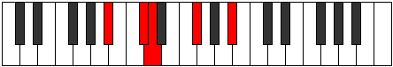 |
| [281](https://ianring.com/musictheory/scales/281) | [Lanic](ModeBFlatLanic.md) | Bb | Bb, Db, D, Gb, Bb |  |
| [283](https://ianring.com/musictheory/scales/283) | [Aerylitonic](ModeASharpAerylitonic.md) | A# | A#, B, C#, D, F#, A# |  |
| [283](https://ianring.com/musictheory/scales/283) | [Aerylitonic](ModeBFlatAerylitonic.md) | Bb | Bb, B, Db, D, Gb, Bb |  |
| [285](https://ianring.com/musictheory/scales/285) | [Zaritonic](ModeASharpZaritonic.md) | A# | A#, C, C#, D, F#, A# |  |
| [285](https://ianring.com/musictheory/scales/285) | [Zaritonic](ModeBFlatZaritonic.md) | Bb | Bb, C, Db, D, Gb, Bb |  |
| [287](https://ianring.com/musictheory/scales/287) | [Gynimic](ModeASharpGynimic.md) | A# | A#, B, C, Db, Ebb, F#, A# | 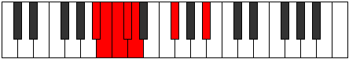 |
| [287](https://ianring.com/musictheory/scales/287) | [Gynimic](ModeBFlatGynimic.md) | Bb | Bb, Cb, Dbb, Ebbb, Fbbb, Gb, Bb |  |
| [291](https://ianring.com/musictheory/scales/291) | [Aerathic](ModeFNaturalAerathic.md) | F | F, F#, A#, C#, F |  |
| [295](https://ianring.com/musictheory/scales/295) | [Gyritonic](ModeFNaturalGyritonic.md) | F | F, F#, G, A#, C#, F |  |
| [297](https://ianring.com/musictheory/scales/297) | [Mynic](ModeASharpMynic.md) | A# | A#, C#, D#, F#, A# |  |
| [297](https://ianring.com/musictheory/scales/297) | [Mynic](ModeBFlatMynic.md) | Bb | Bb, Db, Eb, Gb, Bb |  |
| [299](https://ianring.com/musictheory/scales/299) | [Phratonic](ModeFNaturalPhratonic.md) | F | F, F#, G#, A#, C#, F |  |
| [299](https://ianring.com/musictheory/scales/299) | [Phratonic](ModeASharpPhratonic.md) | A# | A#, B, C#, D#, F#, A# |  |
| [299](https://ianring.com/musictheory/scales/299) | [Phratonic](ModeBFlatPhratonic.md) | Bb | Bb, B, Db, Eb, Gb, Bb |  |
| [301](https://ianring.com/musictheory/scales/301) | [Zythitonic](ModeASharpZythitonic.md) | A# | A#, C, C#, D#, F#, A# |  |
| [301](https://ianring.com/musictheory/scales/301) | [Zythitonic](ModeBFlatZythitonic.md) | Bb | Bb, C, Db, Eb, Gb, Bb |  |
| [303](https://ianring.com/musictheory/scales/303) | [Golimic](ModeFNaturalGolimic.md) | F | F, Gb, Abb, Bbbb, Cbb, Db, F |  |
| [303](https://ianring.com/musictheory/scales/303) | [Golimic](ModeASharpGolimic.md) | A# | A#, B, C, Db, Eb, F#, A# |  |
| [303](https://ianring.com/musictheory/scales/303) | [Golimic](ModeBFlatGolimic.md) | Bb | Bb, Cb, Dbb, Ebbb, Fbb, Gb, Bb |  |
| [307](https://ianring.com/musictheory/scales/307) | [Phrolitonic](ModeFNaturalPhrolitonic.md) | F | F, F#, A, A#, C#, F |  |
| [311](https://ianring.com/musictheory/scales/311) | [Stagimic](ModeFNaturalStagimic.md) | F | F, Gb, Abb, Bbb, Cbb, Db, F |  |
| [313](https://ianring.com/musictheory/scales/313) | [Goritonic](ModeASharpGoritonic.md) | A# | A#, C#, D, D#, F#, A# |  |
| [313](https://ianring.com/musictheory/scales/313) | [Goritonic](ModeBFlatGoritonic.md) | Bb | Bb, Db, D, Eb, Gb, Bb |  |
| [315](https://ianring.com/musictheory/scales/315) | [Stodimic](ModeFNaturalStodimic.md) | F | F, Gb, Ab, Bbb, Cbb, Db, F |  |
| [315](https://ianring.com/musictheory/scales/315) | [Stodimic](ModeASharpStodimic.md) | A# | A#, B, C#, D, Eb, F#, A# |  |
| [315](https://ianring.com/musictheory/scales/315) | [Stodimic](ModeBFlatStodimic.md) | Bb | Bb, Cb, Db, Ebb, Fbb, Gb, Bb |  |
| [317](https://ianring.com/musictheory/scales/317) | [Korimic](ModeASharpKorimic.md) | A# | A#, B#, C#, D, Eb, F#, A# |  |
| [317](https://ianring.com/musictheory/scales/317) | [Korimic](ModeBFlatKorimic.md) | Bb | Bb, C, Db, Ebb, Fbb, Gb, Bb |  |
| [319](https://ianring.com/musictheory/scales/319) | [Epodian](ModeFNaturalEpodian.md) | F | F, Gb, Abb, Bbbb, Cbbb, Cbb, Db, F |  |
| [319](https://ianring.com/musictheory/scales/319) | [Epodian](ModeASharpEpodian.md) | A# | A#, B, C, Db, Ebb, Fbb, Gb, A# |  |
| [319](https://ianring.com/musictheory/scales/319) | [Epodian](ModeBFlatEpodian.md) | Bb | Bb, Cb, Dbb, Ebbb, Fbbb, C###, E##, Bb |  |
| [329](https://ianring.com/musictheory/scales/329) | [Lonic](ModeASharpLonic.md) | A# | A#, C#, E, F#, A# |  |
| [329](https://ianring.com/musictheory/scales/329) | [Lonic](ModeBFlatLonic.md) | Bb | Bb, Db, E, Gb, Bb |  |
| [331](https://ianring.com/musictheory/scales/331) | [Byptitonic](ModeASharpByptitonic.md) | A# | A#, B, C#, E, F#, A# |  |
| [331](https://ianring.com/musictheory/scales/331) | [Byptitonic](ModeBFlatByptitonic.md) | Bb | Bb, B, Db, E, Gb, Bb |  |
| [333](https://ianring.com/musictheory/scales/333) | [Bogitonic](ModeASharpBogitonic.md) | A# | A#, C, C#, E, F#, A# |  |
| [333](https://ianring.com/musictheory/scales/333) | [Bogitonic](ModeBFlatBogitonic.md) | Bb | Bb, C, Db, E, Gb, Bb |  |
| [335](https://ianring.com/musictheory/scales/335) | [Zanimic](ModeASharpZanimic.md) | A# | A#, B, C, Db, E, F#, A# |  |
| [335](https://ianring.com/musictheory/scales/335) | [Zanimic](ModeBFlatZanimic.md) | Bb | Bb, Cb, Dbb, Ebbb, Fb, Gb, Bb |  |
| [345](https://ianring.com/musictheory/scales/345) | [Gylitonic](ModeASharpGylitonic.md) | A# | A#, C#, D, E, F#, A# |  |
| [345](https://ianring.com/musictheory/scales/345) | [Gylitonic](ModeBFlatGylitonic.md) | Bb | Bb, Db, D, E, Gb, Bb |  |
| [347](https://ianring.com/musictheory/scales/347) | [Barimic](ModeASharpBarimic.md) | A# | A#, B, C#, D, E, F#, A# |  |
| [347](https://ianring.com/musictheory/scales/347) | [Barimic](ModeBFlatBarimic.md) | Bb | Bb, Cb, Db, Ebb, Fb, Gb, Bb |  |
| [349](https://ianring.com/musictheory/scales/349) | [Borimic](ModeASharpBorimic.md) | A# | A#, B#, C#, D, E, F#, A# |  |
| [349](https://ianring.com/musictheory/scales/349) | [Borimic](ModeBFlatBorimic.md) | Bb | Bb, C, Db, Ebb, Fb, Gb, Bb |  |
| [351](https://ianring.com/musictheory/scales/351) | [Epanian](ModeASharpEpanian.md) | A# | A#, B, C, Db, Ebb, Fb, Gb, A# |  |
| [351](https://ianring.com/musictheory/scales/351) | [Epanian](ModeBFlatEpanian.md) | Bb | Bb, Cb, Dbb, Ebbb, Fbbb, Gbbb, Abbb, Bb |  |
| [355](https://ianring.com/musictheory/scales/355) | [Aeoloritonic](ModeFNaturalAeoloritonic.md) | F | F, F#, A#, B, C#, F |  |
| [359](https://ianring.com/musictheory/scales/359) | [Bothimic](ModeFNaturalBothimic.md) | F | F, Gb, Abb, Bb, Cb, Db, F |  |
| [361](https://ianring.com/musictheory/scales/361) | [Bocritonic](ModeASharpBocritonic.md) | A# | A#, C#, D#, E, F#, A# |  |
| [361](https://ianring.com/musictheory/scales/361) | [Bocritonic](ModeBFlatBocritonic.md) | Bb | Bb, Db, Eb, E, Gb, Bb | 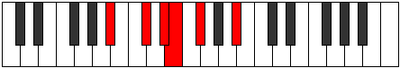 |
| [363](https://ianring.com/musictheory/scales/363) | [Soptimic](ModeASharpSoptimic.md) | A# | A#, B, C#, D#, E, F#, A# |  |
| [363](https://ianring.com/musictheory/scales/363) | [Soptimic](ModeBFlatSoptimic.md) | Bb | Bb, Cb, Db, Eb, Fb, Gb, Bb |  |
| [363](https://ianring.com/musictheory/scales/363) | [Soptimic](ModeFNaturalSoptimic.md) | F | F, Gb, Ab, Bb, Cb, Db, F |  |
| [365](https://ianring.com/musictheory/scales/365) | [Marimic](ModeASharpMarimic.md) | A# | A#, B#, C#, D#, E, F#, A# |  |
| [365](https://ianring.com/musictheory/scales/365) | [Marimic](ModeBFlatMarimic.md) | Bb | Bb, C, Db, Eb, Fb, Gb, Bb |  |
| [367](https://ianring.com/musictheory/scales/367) | [Aerodian](ModeASharpAerodian.md) | A# | A#, B, C, Db, Eb, Fb, Gb, A# |  |
| [367](https://ianring.com/musictheory/scales/367) | [Aerodian](ModeBFlatAerodian.md) | Bb | Bb, Cb, Dbb, Ebbb, Fbb, Gbbb, Abbb, Bb |  |
| [367](https://ianring.com/musictheory/scales/367) | [Aerodian](ModeFNaturalAerodian.md) | F | F, Gb, Abb, Bbbb, Cbb, Dbbb, Ebbb, F |  |
| [371](https://ianring.com/musictheory/scales/371) | [Rythimic](ModeFNaturalRythimic.md) | F | F, Gb, A, Bb, Cb, Db, F | 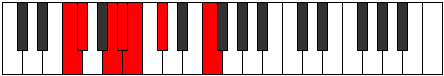 |
| [375](https://ianring.com/musictheory/scales/375) | [Sodian](ModeFNaturalSodian.md) | F | F, Gb, Abb, Bbb, Cbb, Dbbb, Ebbb, F |  |
| [377](https://ianring.com/musictheory/scales/377) | [Kathimic](ModeASharpKathimic.md) | A# | A#, B##, C##, D#, E, F#, A# |  |
| [377](https://ianring.com/musictheory/scales/377) | [Kathimic](ModeBFlatKathimic.md) | Bb | Bb, C#, D, Eb, Fb, Gb, Bb |  |
| [379](https://ianring.com/musictheory/scales/379) | [Aeragian](ModeASharpAeragian.md) | A# | A#, B, C#, D, Eb, Fb, Gb, A# |  |
| [379](https://ianring.com/musictheory/scales/379) | [Aeragian](ModeBFlatAeragian.md) | Bb | Bb, Cb, Db, Ebb, Fbb, Gbbb, Abbb, Bb |  |
| [379](https://ianring.com/musictheory/scales/379) | [Aeragian](ModeFNaturalAeragian.md) | F | F, Gb, Ab, Bbb, Cbb, Dbbb, Ebbb, F |  |
| [381](https://ianring.com/musictheory/scales/381) | [Kogian](ModeASharpKogian.md) | A# | A#, B#, C#, D, Eb, Fb, Gb, A# |  |
| [381](https://ianring.com/musictheory/scales/381) | [Kogian](ModeBFlatKogian.md) | Bb | Bb, C, Db, Ebb, Fbb, Gbbb, Abbb, Bb |  |
| [383](https://ianring.com/musictheory/scales/383) | [Logyllic](ModeASharpLogyllic.md) | A# | A#, B, C, C#, D, D#, E, F#, A# |  |
| [383](https://ianring.com/musictheory/scales/383) | [Logyllic](ModeBFlatLogyllic.md) | Bb | Bb, B, C, Db, D, Eb, E, Gb, Bb |  |
| [383](https://ianring.com/musictheory/scales/383) | [Logyllic](ModeFNaturalLogyllic.md) | F | F, F#, G, G#, A, A#, B, C#, F |  |
| [393](https://ianring.com/musictheory/scales/393) | [Lothic](ModeASharpLothic.md) | A# | A#, C#, F, F#, A# | 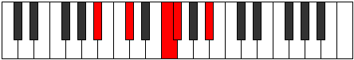 |
| [393](https://ianring.com/musictheory/scales/393) | [Lothic](ModeBFlatLothic.md) | Bb | Bb, Db, F, Gb, Bb |  |
| [395](https://ianring.com/musictheory/scales/395) | [Dalitonic](ModeASharpDalitonic.md) | A# | A#, B, C#, F, F#, A# |  |
| [395](https://ianring.com/musictheory/scales/395) | [Dalitonic](ModeBFlatDalitonic.md) | Bb | Bb, B, Db, F, Gb, Bb |  |
| [397](https://ianring.com/musictheory/scales/397) | [Epogitonic](ModeASharpEpogitonic.md) | A# | A#, C, C#, F, F#, A# |  |
| [397](https://ianring.com/musictheory/scales/397) | [Epogitonic](ModeBFlatEpogitonic.md) | Bb | Bb, C, Db, F, Gb, Bb |  |
| [399](https://ianring.com/musictheory/scales/399) | [Zynimic](ModeASharpZynimic.md) | A# | A#, B, C, Db, E#, F#, A# |  |
| [399](https://ianring.com/musictheory/scales/399) | [Zynimic](ModeBFlatZynimic.md) | Bb | Bb, Cb, Dbb, Ebbb, F, Gb, Bb |  |
| [401](https://ianring.com/musictheory/scales/401) | [Epogic](ModeFSharpEpogic.md) | F# | F#, A#, C#, D, F# |  |
| [401](https://ianring.com/musictheory/scales/401) | [Epogic](ModeGFlatEpogic.md) | Gb | Gb, Bb, Db, D, Gb |  |
| [403](https://ianring.com/musictheory/scales/403) | [Daptitonic](ModeFSharpDaptitonic.md) | F# | F#, G, A#, C#, D, F# |  |
| [403](https://ianring.com/musictheory/scales/403) | [Daptitonic](ModeGFlatDaptitonic.md) | Gb | Gb, G, Bb, Db, D, Gb |  |
| [405](https://ianring.com/musictheory/scales/405) | [Danitonic](ModeFSharpDanitonic.md) | F# | F#, G#, A#, C#, D, F# |  |
| [405](https://ianring.com/musictheory/scales/405) | [Danitonic](ModeGFlatDanitonic.md) | Gb | Gb, Ab, Bb, Db, D, Gb |  |
| [407](https://ianring.com/musictheory/scales/407) | [Zylimic](ModeFSharpZylimic.md) | F# | F#, G, Ab, Bb, C#, D, F# |  |
| [407](https://ianring.com/musictheory/scales/407) | [Zylimic](ModeGFlatZylimic.md) | Gb | Gb, Abb, Bbbb, Cbb, Db, Ebb, Gb |  |
| [409](https://ianring.com/musictheory/scales/409) | [Laritonic](ModeASharpLaritonic.md) | A# | A#, C#, D, F, F#, A# |  |
| [409](https://ianring.com/musictheory/scales/409) | [Laritonic](ModeBFlatLaritonic.md) | Bb | Bb, Db, D, F, Gb, Bb |  |
| [409](https://ianring.com/musictheory/scales/409) | [Laritonic](ModeFSharpLaritonic.md) | F# | F#, A, A#, C#, D, F# |  |
| [409](https://ianring.com/musictheory/scales/409) | [Laritonic](ModeGFlatLaritonic.md) | Gb | Gb, A, Bb, Db, D, Gb |  |
| [411](https://ianring.com/musictheory/scales/411) | [Lygimic](ModeFSharpLygimic.md) | F# | F#, G, A, Bb, C#, D, F# |  |
| [411](https://ianring.com/musictheory/scales/411) | [Lygimic](ModeGFlatLygimic.md) | Gb | Gb, Abb, Bbb, Cbb, Db, Ebb, Gb |  |
| [411](https://ianring.com/musictheory/scales/411) | [Lygimic](ModeASharpLygimic.md) | A# | A#, B, C#, D, E#, F#, A# |  |
| [411](https://ianring.com/musictheory/scales/411) | [Lygimic](ModeBFlatLygimic.md) | Bb | Bb, Cb, Db, Ebb, F, Gb, Bb |  |
| [413](https://ianring.com/musictheory/scales/413) | [Ganimic](ModeASharpGanimic.md) | A# | A#, B#, C#, D, E#, F#, A# |  |
| [413](https://ianring.com/musictheory/scales/413) | [Ganimic](ModeBFlatGanimic.md) | Bb | Bb, C, Db, Ebb, F, Gb, Bb |  |
| [413](https://ianring.com/musictheory/scales/413) | [Ganimic](ModeFSharpGanimic.md) | F# | F#, G#, A, Bb, C#, D, F# |  |
| [413](https://ianring.com/musictheory/scales/413) | [Ganimic](ModeGFlatGanimic.md) | Gb | Gb, Ab, Bbb, Cbb, Db, Ebb, Gb |  |
| [415](https://ianring.com/musictheory/scales/415) | [Aeoladian](ModeFSharpAeoladian.md) | F# | F#, G, Ab, Bbb, Cbb, Db, Ebb, F# |  |
| [415](https://ianring.com/musictheory/scales/415) | [Aeoladian](ModeGFlatAeoladian.md) | Gb | Gb, Abb, Bbbb, Cbbb, Cbb, Db, Ebb, Gb |  |
| [415](https://ianring.com/musictheory/scales/415) | [Aeoladian](ModeASharpAeoladian.md) | A# | A#, B, C, Db, Ebb, F, Gb, A# |  |
| [415](https://ianring.com/musictheory/scales/415) | [Aeoladian](ModeBFlatAeoladian.md) | Bb | Bb, Cb, Dbb, Ebbb, Fbbb, Gbb, Abbb, Bb |  |
| [419](https://ianring.com/musictheory/scales/419) | [Ionacritonic](ModeFNaturalIonacritonic.md) | F | F, F#, A#, C, C#, F |  |
| [423](https://ianring.com/musictheory/scales/423) | [Sogimic](ModeFNaturalSogimic.md) | F | F, Gb, Abb, Bb, C, Db, F |  |
| [425](https://ianring.com/musictheory/scales/425) | [Daditonic](ModeASharpDaditonic.md) | A# | A#, C#, D#, F, F#, A# |  |
| [425](https://ianring.com/musictheory/scales/425) | [Daditonic](ModeBFlatDaditonic.md) | Bb | Bb, Db, Eb, F, Gb, Bb |  |
| [427](https://ianring.com/musictheory/scales/427) | [Zothimic](ModeFNaturalZothimic.md) | F | F, Gb, Ab, Bb, C, Db, F |  |
| [427](https://ianring.com/musictheory/scales/427) | [Zothimic](ModeASharpZothimic.md) | A# | A#, B, C#, D#, E#, F#, A# |  |
| [427](https://ianring.com/musictheory/scales/427) | [Zothimic](ModeBFlatZothimic.md) | Bb | Bb, Cb, Db, Eb, F, Gb, Bb |  |
| [429](https://ianring.com/musictheory/scales/429) | [Koptimic](ModeASharpKoptimic.md) | A# | A#, B#, C#, D#, E#, F#, A# |  |
| [429](https://ianring.com/musictheory/scales/429) | [Koptimic](ModeBFlatKoptimic.md) | Bb | Bb, C, Db, Eb, F, Gb, Bb |  |
| [431](https://ianring.com/musictheory/scales/431) | [Epyrian](ModeFNaturalEpyrian.md) | F | F, Gb, Abb, Bbbb, Cbb, Dbb, Ebbb, F |  |
| [431](https://ianring.com/musictheory/scales/431) | [Epyrian](ModeASharpEpyrian.md) | A# | A#, B, C, Db, Eb, F, Gb, A# |  |
| [431](https://ianring.com/musictheory/scales/431) | [Epyrian](ModeBFlatEpyrian.md) | Bb | Bb, Cb, Dbb, Ebbb, Fbb, Gbb, Abbb, Bb |  |
| [433](https://ianring.com/musictheory/scales/433) | [Poritonic](ModeFSharpPoritonic.md) | F# | F#, A#, B, C#, D, F# |  |
| [433](https://ianring.com/musictheory/scales/433) | [Poritonic](ModeGFlatPoritonic.md) | Gb | Gb, Bb, B, Db, D, Gb |  |
| [435](https://ianring.com/musictheory/scales/435) | [Ionolimic](ModeFNaturalIonolimic.md) | F | F, Gb, A, Bb, C, Db, F |  |
| [435](https://ianring.com/musictheory/scales/435) | [Ionolimic](ModeFSharpIonolimic.md) | F# | F#, G, A#, B, C#, D, F# |  |
| [435](https://ianring.com/musictheory/scales/435) | [Ionolimic](ModeGFlatIonolimic.md) | Gb | Gb, Abb, Bb, Cb, Db, Ebb, Gb |  |
| [437](https://ianring.com/musictheory/scales/437) | [Ronimic](ModeFSharpRonimic.md) | F# | F#, G#, A#, B, C#, D, F# |  |
| [437](https://ianring.com/musictheory/scales/437) | [Ronimic](ModeGFlatRonimic.md) | Gb | Gb, Ab, Bb, Cb, Db, Ebb, Gb |  |
| [439](https://ianring.com/musictheory/scales/439) | [Bythian](ModeFNaturalBythian.md) | F | F, Gb, Abb, Bbb, Cbb, Dbb, Ebbb, F |  |
| [439](https://ianring.com/musictheory/scales/439) | [Bythian](ModeFSharpBythian.md) | F# | F#, G, Ab, Bb, Cb, Db, Ebb, F# |  |
| [439](https://ianring.com/musictheory/scales/439) | [Bythian](ModeGFlatBythian.md) | Gb | Gb, Abb, Bbbb, Cbb, Dbbb, Ebbb, Fbbb, Gb |  |
| [441](https://ianring.com/musictheory/scales/441) | [Thycrimic](ModeASharpThycrimic.md) | A# | A#, B##, C##, D#, E#, F#, A# |  |
| [441](https://ianring.com/musictheory/scales/441) | [Thycrimic](ModeBFlatThycrimic.md) | Bb | Bb, C#, D, Eb, F, Gb, Bb |  |
| [441](https://ianring.com/musictheory/scales/441) | [Thycrimic](ModeFSharpThycrimic.md) | F# | F#, G##, A#, B, C#, D, F# |  |
| [441](https://ianring.com/musictheory/scales/441) | [Thycrimic](ModeGFlatThycrimic.md) | Gb | Gb, A, Bb, Cb, Db, Ebb, Gb |  |
| [443](https://ianring.com/musictheory/scales/443) | [Kothian](ModeFNaturalKothian.md) | F | F, Gb, Ab, Bbb, Cbb, Dbb, Ebbb, F |  |
| [443](https://ianring.com/musictheory/scales/443) | [Kothian](ModeASharpKothian.md) | A# | A#, B, C#, D, Eb, F, Gb, A# |  |
| [443](https://ianring.com/musictheory/scales/443) | [Kothian](ModeBFlatKothian.md) | Bb | Bb, Cb, Db, Ebb, Fbb, Gbb, Abbb, Bb |  |
| [443](https://ianring.com/musictheory/scales/443) | [Kothian](ModeFSharpKothian.md) | F# | F#, G, A, Bb, Cb, Db, Ebb, F# |  |
| [443](https://ianring.com/musictheory/scales/443) | [Kothian](ModeGFlatKothian.md) | Gb | Gb, Abb, Bbb, Cbb, Dbbb, Ebbb, Fbbb, Gb |  |
| [445](https://ianring.com/musictheory/scales/445) | [Gocrian](ModeASharpGocrian.md) | A# | A#, B#, C#, D, Eb, F, Gb, A# |  |
| [445](https://ianring.com/musictheory/scales/445) | [Gocrian](ModeBFlatGocrian.md) | Bb | Bb, C, Db, Ebb, Fbb, Gbb, Abbb, Bb | 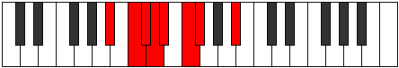 |
| [445](https://ianring.com/musictheory/scales/445) | [Gocrian](ModeFSharpGocrian.md) | F# | F#, G#, A, Bb, Cb, Db, Ebb, F# |  |
| [445](https://ianring.com/musictheory/scales/445) | [Gocrian](ModeGFlatGocrian.md) | Gb | Gb, Ab, Bbb, Cbb, Dbbb, Ebbb, Fbbb, Gb |  |
| [447](https://ianring.com/musictheory/scales/447) | [Thyphyllic](ModeFNaturalThyphyllic.md) | F | F, F#, G, G#, A, A#, C, C#, F |  |
| [447](https://ianring.com/musictheory/scales/447) | [Thyphyllic](ModeASharpThyphyllic.md) | A# | A#, B, C, C#, D, D#, F, F#, A# |  |
| [447](https://ianring.com/musictheory/scales/447) | [Thyphyllic](ModeBFlatThyphyllic.md) | Bb | Bb, B, C, Db, D, Eb, F, Gb, Bb |  |
| [447](https://ianring.com/musictheory/scales/447) | [Thyphyllic](ModeFSharpThyphyllic.md) | F# | F#, G, G#, A, A#, B, C#, D, F# |  |
| [447](https://ianring.com/musictheory/scales/447) | [Thyphyllic](ModeGFlatThyphyllic.md) | Gb | Gb, G, Ab, A, Bb, B, Db, D, Gb |  |
| [457](https://ianring.com/musictheory/scales/457) | [Staptitonic](ModeASharpStaptitonic.md) | A# | A#, C#, E, F, F#, A# |  |
| [457](https://ianring.com/musictheory/scales/457) | [Staptitonic](ModeBFlatStaptitonic.md) | Bb | Bb, Db, E, F, Gb, Bb |  |
| [459](https://ianring.com/musictheory/scales/459) | [Zaptimic](ModeASharpZaptimic.md) | A# | A#, B, C#, D##, E#, F#, A# |  |
| [459](https://ianring.com/musictheory/scales/459) | [Zaptimic](ModeBFlatZaptimic.md) | Bb | Bb, Cb, Db, E, F, Gb, Bb |  |
| [461](https://ianring.com/musictheory/scales/461) | [Madimic](ModeASharpMadimic.md) | A# | A#, B#, C#, D##, E#, F#, A# |  |
| [461](https://ianring.com/musictheory/scales/461) | [Madimic](ModeBFlatMadimic.md) | Bb | Bb, C, Db, E, F, Gb, Bb |  |
| [463](https://ianring.com/musictheory/scales/463) | [Zythian](ModeASharpZythian.md) | A# | A#, B, C, Db, E, F, Gb, A# |  |
| [463](https://ianring.com/musictheory/scales/463) | [Zythian](ModeBFlatZythian.md) | Bb | Bb, Cb, Dbb, Ebbb, Fb, Gbb, Abbb, Bb |  |
| [465](https://ianring.com/musictheory/scales/465) | [Zoditonic](ModeFSharpZoditonic.md) | F# | F#, A#, C, C#, D, F# |  |
| [465](https://ianring.com/musictheory/scales/465) | [Zoditonic](ModeGFlatZoditonic.md) | Gb | Gb, Bb, C, Db, D, Gb |  |
| [467](https://ianring.com/musictheory/scales/467) | [Phrogimic](ModeFSharpPhrogimic.md) | F# | F#, G, A#, B#, C#, D, F# |  |
| [467](https://ianring.com/musictheory/scales/467) | [Phrogimic](ModeGFlatPhrogimic.md) | Gb | Gb, Abb, Bb, C, Db, Ebb, Gb |  |
| [469](https://ianring.com/musictheory/scales/469) | [Katyrimic](ModeFSharpKatyrimic.md) | F# | F#, G#, A#, B#, C#, D, F# |  |
| [469](https://ianring.com/musictheory/scales/469) | [Katyrimic](ModeGFlatKatyrimic.md) | Gb | Gb, Ab, Bb, C, Db, Ebb, Gb |  |
| [471](https://ianring.com/musictheory/scales/471) | [Dodian](ModeFSharpDodian.md) | F# | F#, G, Ab, Bb, C, Db, Ebb, F# |  |
| [471](https://ianring.com/musictheory/scales/471) | [Dodian](ModeGFlatDodian.md) | Gb | Gb, Abb, Bbbb, Cbb, Dbb, Ebbb, Fbbb, Gb |  |
| [473](https://ianring.com/musictheory/scales/473) | [Aeralimic](ModeASharpAeralimic.md) | A# | A#, B##, C##, D##, E#, F#, A# |  |
| [473](https://ianring.com/musictheory/scales/473) | [Aeralimic](ModeBFlatAeralimic.md) | Bb | Bb, C#, D, E, F, Gb, Bb |  |
| [473](https://ianring.com/musictheory/scales/473) | [Aeralimic](ModeFSharpAeralimic.md) | F# | F#, G##, A#, B#, C#, D, F# |  |
| [473](https://ianring.com/musictheory/scales/473) | [Aeralimic](ModeGFlatAeralimic.md) | Gb | Gb, A, Bb, C, Db, Ebb, Gb |  |
| [475](https://ianring.com/musictheory/scales/475) | [Aeolygian](ModeFSharpAeolygian.md) | F# | F#, G, A, Bb, C, Db, Ebb, F# |  |
| [475](https://ianring.com/musictheory/scales/475) | [Aeolygian](ModeGFlatAeolygian.md) | Gb | Gb, Abb, Bbb, Cbb, Dbb, Ebbb, Fbbb, Gb |  |
| [475](https://ianring.com/musictheory/scales/475) | [Aeolygian](ModeASharpAeolygian.md) | A# | A#, B, C#, D, E, F, Gb, A# |  |
| [475](https://ianring.com/musictheory/scales/475) | [Aeolygian](ModeBFlatAeolygian.md) | Bb | Bb, Cb, Db, Ebb, Fb, Gbb, Abbb, Bb |  |
| [477](https://ianring.com/musictheory/scales/477) | [Stacrian](ModeASharpStacrian.md) | A# | A#, B#, C#, D, E, F, Gb, A# |  |
| [477](https://ianring.com/musictheory/scales/477) | [Stacrian](ModeBFlatStacrian.md) | Bb | Bb, C, Db, Ebb, Fb, Gbb, Abbb, Bb |  |
| [477](https://ianring.com/musictheory/scales/477) | [Stacrian](ModeFSharpStacrian.md) | F# | F#, G#, A, Bb, C, Db, Ebb, F# |  |
| [477](https://ianring.com/musictheory/scales/477) | [Stacrian](ModeGFlatStacrian.md) | Gb | Gb, Ab, Bbb, Cbb, Dbb, Ebbb, Fbbb, Gb |  |
| [479](https://ianring.com/musictheory/scales/479) | [Kocryllic](ModeFSharpKocryllic.md) | F# | F#, G, G#, A, A#, C, C#, D, F# |  |
| [479](https://ianring.com/musictheory/scales/479) | [Kocryllic](ModeGFlatKocryllic.md) | Gb | Gb, G, Ab, A, Bb, C, Db, D, Gb |  |
| [479](https://ianring.com/musictheory/scales/479) | [Kocryllic](ModeASharpKocryllic.md) | A# | A#, B, C, C#, D, E, F, F#, A# |  |
| [479](https://ianring.com/musictheory/scales/479) | [Kocryllic](ModeBFlatKocryllic.md) | Bb | Bb, B, C, Db, D, E, F, Gb, Bb |  |
| [483](https://ianring.com/musictheory/scales/483) | [Kygimic](ModeFNaturalKygimic.md) | F | F, Gb, A#, B, C, Db, F |  |
| [487](https://ianring.com/musictheory/scales/487) | [Dynian](ModeFNaturalDynian.md) | F | F, Gb, Abb, Bb, Cb, Dbb, Ebbb, F |  |
| [489](https://ianring.com/musictheory/scales/489) | [Phrathimic](ModeASharpPhrathimic.md) | A# | A#, B##, C###, D##, E#, F#, A# |  |
| [489](https://ianring.com/musictheory/scales/489) | [Phrathimic](ModeBFlatPhrathimic.md) | Bb | Bb, C#, D#, E, F, Gb, Bb |  |
| [491](https://ianring.com/musictheory/scales/491) | [Aeolyrian](ModeASharpAeolyrian.md) | A# | A#, B, C#, D#, E, F, Gb, A# |  |
| [491](https://ianring.com/musictheory/scales/491) | [Aeolyrian](ModeBFlatAeolyrian.md) | Bb | Bb, Cb, Db, Eb, Fb, Gbb, Abbb, Bb |  |
| [491](https://ianring.com/musictheory/scales/491) | [Aeolyrian](ModeFNaturalAeolyrian.md) | F | F, Gb, Ab, Bb, Cb, Dbb, Ebbb, F | 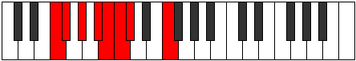 |
| [493](https://ianring.com/musictheory/scales/493) | [Rygian](ModeASharpRygian.md) | A# | A#, B#, C#, D#, E, F, Gb, A# |  |
| [493](https://ianring.com/musictheory/scales/493) | [Rygian](ModeBFlatRygian.md) | Bb | Bb, C, Db, Eb, Fb, Gbb, Abbb, Bb |  |
| [495](https://ianring.com/musictheory/scales/495) | [Bocryllic](ModeASharpBocryllic.md) | A# | A#, B, C, C#, D#, E, F, F#, A# |  |
| [495](https://ianring.com/musictheory/scales/495) | [Bocryllic](ModeBFlatBocryllic.md) | Bb | Bb, B, C, Db, Eb, E, F, Gb, Bb |  |
| [495](https://ianring.com/musictheory/scales/495) | [Bocryllic](ModeFNaturalBocryllic.md) | F | F, F#, G, G#, A#, B, C, C#, F |  |
| [497](https://ianring.com/musictheory/scales/497) | [Kadimic](ModeFSharpKadimic.md) | F# | F#, G###, A##, B#, C#, D, F# |  |
| [497](https://ianring.com/musictheory/scales/497) | [Kadimic](ModeGFlatKadimic.md) | Gb | Gb, A#, B, C, Db, Ebb, Gb |  |
| [499](https://ianring.com/musictheory/scales/499) | [Ionaptian](ModeFSharpIonaptian.md) | F# | F#, G, A#, B, C, Db, Ebb, F# |  |
| [499](https://ianring.com/musictheory/scales/499) | [Ionaptian](ModeGFlatIonaptian.md) | Gb | Gb, Abb, Bb, Cb, Dbb, Ebbb, Fbbb, Gb |  |
| [499](https://ianring.com/musictheory/scales/499) | [Ionaptian](ModeFNaturalIonaptian.md) | F | F, Gb, A, Bb, Cb, Dbb, Ebbb, F |  |
| [501](https://ianring.com/musictheory/scales/501) | [Katylian](ModeFSharpKatylian.md) | F# | F#, G#, A#, B, C, Db, Ebb, F# |  |
| [501](https://ianring.com/musictheory/scales/501) | [Katylian](ModeGFlatKatylian.md) | Gb | Gb, Ab, Bb, Cb, Dbb, Ebbb, Fbbb, Gb |  |
| [503](https://ianring.com/musictheory/scales/503) | [Thoptyllic](ModeFSharpThoptyllic.md) | F# | F#, G, G#, A#, B, C, C#, D, F# |  |
| [503](https://ianring.com/musictheory/scales/503) | [Thoptyllic](ModeGFlatThoptyllic.md) | Gb | Gb, G, Ab, Bb, B, C, Db, D, Gb |  |
| [503](https://ianring.com/musictheory/scales/503) | [Thoptyllic](ModeFNaturalThoptyllic.md) | F | F, F#, G, A, A#, B, C, C#, F |  |
| [505](https://ianring.com/musictheory/scales/505) | [Sanian](ModeASharpSanian.md) | A# | A#, B##, C##, D#, E, F, Gb, A# |  |
| [505](https://ianring.com/musictheory/scales/505) | [Sanian](ModeBFlatSanian.md) | Bb | Bb, C#, D, Eb, Fb, Gbb, Abbb, Bb |  |
| [505](https://ianring.com/musictheory/scales/505) | [Sanian](ModeFSharpSanian.md) | F# | F#, G##, A#, B, C, Db, Ebb, F# |  |
| [505](https://ianring.com/musictheory/scales/505) | [Sanian](ModeGFlatSanian.md) | Gb | Gb, A, Bb, Cb, Dbb, Ebbb, Fbbb, Gb |  |
| [507](https://ianring.com/musictheory/scales/507) | [Moryllic](ModeASharpMoryllic.md) | A# | A#, B, C#, D, D#, E, F, F#, A# |  |
| [507](https://ianring.com/musictheory/scales/507) | [Moryllic](ModeBFlatMoryllic.md) | Bb | Bb, B, Db, D, Eb, E, F, Gb, Bb |  |
| [507](https://ianring.com/musictheory/scales/507) | [Moryllic](ModeFSharpMoryllic.md) | F# | F#, G, A, A#, B, C, C#, D, F# |  |
| [507](https://ianring.com/musictheory/scales/507) | [Moryllic](ModeGFlatMoryllic.md) | Gb | Gb, G, A, Bb, B, C, Db, D, Gb |  |
| [507](https://ianring.com/musictheory/scales/507) | [Moryllic](ModeFNaturalMoryllic.md) | F | F, F#, G#, A, A#, B, C, C#, F |  |
| [509](https://ianring.com/musictheory/scales/509) | [Ionothyllic](ModeASharpIonothyllic.md) | A# | A#, C, C#, D, D#, E, F, F#, A# |  |
| [509](https://ianring.com/musictheory/scales/509) | [Ionothyllic](ModeBFlatIonothyllic.md) | Bb | Bb, C, Db, D, Eb, E, F, Gb, Bb |  |
| [509](https://ianring.com/musictheory/scales/509) | [Ionothyllic](ModeFSharpIonothyllic.md) | F# | F#, G#, A, A#, B, C, C#, D, F# |  |
| [509](https://ianring.com/musictheory/scales/509) | [Ionothyllic](ModeGFlatIonothyllic.md) | Gb | Gb, Ab, A, Bb, B, C, Db, D, Gb |  |
| [511](https://ianring.com/musictheory/scales/511) | [Polygic](ModeASharpPolygic.md) | A# | A#, B, C, C#, D, D#, E, F, F#, A# |  |
| [511](https://ianring.com/musictheory/scales/511) | [Polygic](ModeBFlatPolygic.md) | Bb | Bb, B, C, Db, D, Eb, E, F, Gb, Bb |  |
| [511](https://ianring.com/musictheory/scales/511) | [Polygic](ModeFSharpPolygic.md) | F# | F#, G, G#, A, A#, B, C, C#, D, F# |  |
| [511](https://ianring.com/musictheory/scales/511) | [Polygic](ModeGFlatPolygic.md) | Gb | Gb, G, Ab, A, Bb, B, C, Db, D, Gb |  |
| [511](https://ianring.com/musictheory/scales/511) | [Polygic](ModeFNaturalPolygic.md) | F | F, F#, G, G#, A, A#, B, C, C#, F |  |
| [547](https://ianring.com/musictheory/scales/547) | [Pyrric](ModeCSharpPyrric.md) | C# | C#, D, F#, A#, C# |  |
| [547](https://ianring.com/musictheory/scales/547) | [Pyrric](ModeDFlatPyrric.md) | Db | Db, D, Gb, Bb, Db |  |
| [549](https://ianring.com/musictheory/scales/549) | [Rothic](ModeCSharpRothic.md) | C# | C#, D#, F#, A#, C# |  |
| [549](https://ianring.com/musictheory/scales/549) | [Rothic](ModeDFlatRothic.md) | Db | Db, Eb, Gb, Bb, Db |  |
| [551](https://ianring.com/musictheory/scales/551) | [Aeoloditonic](ModeCSharpAeoloditonic.md) | C# | C#, D, D#, F#, A#, C# |  |
| [551](https://ianring.com/musictheory/scales/551) | [Aeoloditonic](ModeDFlatAeoloditonic.md) | Db | Db, D, Eb, Gb, Bb, Db |  |
| [553](https://ianring.com/musictheory/scales/553) | [Phradic](ModeCSharpPhradic.md) | C# | C#, E, F#, A#, C# |  |
| [553](https://ianring.com/musictheory/scales/553) | [Phradic](ModeDFlatPhradic.md) | Db | Db, E, Gb, Bb, Db |  |
| [555](https://ianring.com/musictheory/scales/555) | [Aeolycritonic](ModeCSharpAeolycritonic.md) | C# | C#, D, E, F#, A#, C# |  |
| [555](https://ianring.com/musictheory/scales/555) | [Aeolycritonic](ModeDFlatAeolycritonic.md) | Db | Db, D, E, Gb, Bb, Db |  |
| [557](https://ianring.com/musictheory/scales/557) | [Gythitonic](ModeCSharpGythitonic.md) | C# | C#, D#, E, F#, A#, C# |  |
| [557](https://ianring.com/musictheory/scales/557) | [Gythitonic](ModeDFlatGythitonic.md) | Db | Db, Eb, E, Gb, Bb, Db |  |
| [559](https://ianring.com/musictheory/scales/559) | [Lylimic](ModeCSharpLylimic.md) | C# | C#, D, Eb, Fb, Gb, A#, C# |  |
| [559](https://ianring.com/musictheory/scales/559) | [Lylimic](ModeDFlatLylimic.md) | Db | Db, Ebb, Fbb, Gbbb, Abbb, Bb, Db |  |
| [561](https://ianring.com/musictheory/scales/561) | [Phratic](ModeCSharpPhratic.md) | C# | C#, F, F#, A#, C# | 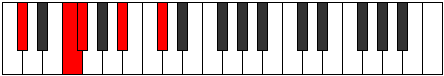 |
| [561](https://ianring.com/musictheory/scales/561) | [Phratic](ModeDFlatPhratic.md) | Db | Db, F, Gb, Bb, Db |  |
| [563](https://ianring.com/musictheory/scales/563) | [Thacritonic](ModeCSharpThacritonic.md) | C# | C#, D, F, F#, A#, C# |  |
| [563](https://ianring.com/musictheory/scales/563) | [Thacritonic](ModeDFlatThacritonic.md) | Db | Db, D, F, Gb, Bb, Db |  |
| [563](https://ianring.com/musictheory/scales/563) | [Thacritonic](ModeANaturalThacritonic.md) | A | A, A#, C#, D, F#, A |  |
| [565](https://ianring.com/musictheory/scales/565) | [Aeolyphritonic](ModeCSharpAeolyphritonic.md) | C# | C#, D#, F, F#, A#, C# |  |
| [565](https://ianring.com/musictheory/scales/565) | [Aeolyphritonic](ModeDFlatAeolyphritonic.md) | Db | Db, Eb, F, Gb, Bb, Db |  |
| [567](https://ianring.com/musictheory/scales/567) | [Aeoladimic](ModeCSharpAeoladimic.md) | C# | C#, D, Eb, F, Gb, A#, C# |  |
| [567](https://ianring.com/musictheory/scales/567) | [Aeoladimic](ModeDFlatAeoladimic.md) | Db | Db, Ebb, Fbb, Gbb, Abbb, Bb, Db |  |
| [567](https://ianring.com/musictheory/scales/567) | [Aeoladimic](ModeANaturalAeoladimic.md) | A | A, Bb, Cb, Db, Ebb, F#, A |  |
| [569](https://ianring.com/musictheory/scales/569) | [Mothitonic](ModeCSharpMothitonic.md) | C# | C#, E, F, F#, A#, C# |  |
| [569](https://ianring.com/musictheory/scales/569) | [Mothitonic](ModeDFlatMothitonic.md) | Db | Db, E, F, Gb, Bb, Db |  |
| [571](https://ianring.com/musictheory/scales/571) | [Kynimic](ModeCSharpKynimic.md) | C# | C#, D, E, F, Gb, A#, C# |  |
| [571](https://ianring.com/musictheory/scales/571) | [Kynimic](ModeDFlatKynimic.md) | Db | Db, Ebb, Fb, Gbb, Abbb, Bb, Db |  |
| [571](https://ianring.com/musictheory/scales/571) | [Kynimic](ModeANaturalKynimic.md) | A | A, Bb, C, Db, Ebb, F#, A |  |
| [573](https://ianring.com/musictheory/scales/573) | [Saptimic](ModeCSharpSaptimic.md) | C# | C#, D#, E, F, Gb, A#, C# |  |
| [573](https://ianring.com/musictheory/scales/573) | [Saptimic](ModeDFlatSaptimic.md) | Db | Db, Eb, Fb, Gbb, Abbb, Bb, Db |  |
| [575](https://ianring.com/musictheory/scales/575) | [Ionydian](ModeCSharpIonydian.md) | C# | C#, D, Eb, Fb, Gbb, Abbb, Bb, C# | 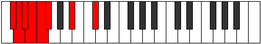 |
| [575](https://ianring.com/musictheory/scales/575) | [Ionydian](ModeDFlatIonydian.md) | Db | Db, Ebb, Fbb, Gbbb, D###, E##, Cbb, Db |  |
| [575](https://ianring.com/musictheory/scales/575) | [Ionydian](ModeANaturalIonydian.md) | A | A, Bb, Cb, Dbb, Ebbb, Fbbb, Gb, A |  |
| [581](https://ianring.com/musictheory/scales/581) | [Bolic](ModeENaturalBolic.md) | E | E, F#, A#, C#, E | 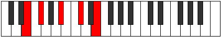 |
| [583](https://ianring.com/musictheory/scales/583) | [Aeritonic](ModeENaturalAeritonic.md) | E | E, F, F#, A#, C#, E |  |
| [589](https://ianring.com/musictheory/scales/589) | [Ionalitonic](ModeENaturalIonalitonic.md) | E | E, F#, G, A#, C#, E |  |
| [591](https://ianring.com/musictheory/scales/591) | [Gaptimic](ModeENaturalGaptimic.md) | E | E, F, Gb, Abb, Bb, C#, E |  |
| [595](https://ianring.com/musictheory/scales/595) | [Sogitonic](ModeANaturalSogitonic.md) | A | A, A#, C#, D#, F#, A | 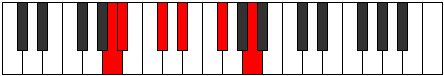 |
| [597](https://ianring.com/musictheory/scales/597) | [Thonitonic](ModeENaturalThonitonic.md) | E | E, F#, G#, A#, C#, E |  |
| [599](https://ianring.com/musictheory/scales/599) | [Thyrimic](ModeENaturalThyrimic.md) | E | E, F, Gb, Ab, Bb, C#, E |  |
| [599](https://ianring.com/musictheory/scales/599) | [Thyrimic](ModeANaturalThyrimic.md) | A | A, Bb, Cb, Db, Eb, F#, A |  |
| [603](https://ianring.com/musictheory/scales/603) | [Aeolygimic](ModeANaturalAeolygimic.md) | A | A, Bb, C, Db, Eb, F#, A |  |
| [605](https://ianring.com/musictheory/scales/605) | [Dycrimic](ModeENaturalDycrimic.md) | E | E, F#, G, Ab, Bb, C#, E |  |
| [607](https://ianring.com/musictheory/scales/607) | [Kadian](ModeENaturalKadian.md) | E | E, F, Gb, Abb, Bbbb, Cbb, Db, E |  |
| [607](https://ianring.com/musictheory/scales/607) | [Kadian](ModeANaturalKadian.md) | A | A, Bb, Cb, Dbb, Ebbb, Fbb, Gb, A |  |
| [611](https://ianring.com/musictheory/scales/611) | [Zynitonic](ModeCSharpZynitonic.md) | C# | C#, D, F#, G, A#, C# |  |
| [611](https://ianring.com/musictheory/scales/611) | [Zynitonic](ModeDFlatZynitonic.md) | Db | Db, D, Gb, G, Bb, Db |  |
| [613](https://ianring.com/musictheory/scales/613) | [Phralitonic](ModeCSharpPhralitonic.md) | C# | C#, D#, F#, G, A#, C# |  |
| [613](https://ianring.com/musictheory/scales/613) | [Phralitonic](ModeDFlatPhralitonic.md) | Db | Db, Eb, Gb, G, Bb, Db |  |
| [613](https://ianring.com/musictheory/scales/613) | [Phralitonic](ModeENaturalPhralitonic.md) | E | E, F#, A, A#, C#, E |  |
| [615](https://ianring.com/musictheory/scales/615) | [Phrothimic](ModeCSharpPhrothimic.md) | C# | C#, D, Eb, F#, G, A#, C# |  |
| [615](https://ianring.com/musictheory/scales/615) | [Phrothimic](ModeDFlatPhrothimic.md) | Db | Db, Ebb, Fbb, Gb, Abb, Bb, Db |  |
| [615](https://ianring.com/musictheory/scales/615) | [Phrothimic](ModeENaturalPhrothimic.md) | E | E, F, Gb, A, Bb, C#, E |  |
| [617](https://ianring.com/musictheory/scales/617) | [Katycritonic](ModeCSharpKatycritonic.md) | C# | C#, E, F#, G, A#, C# |  |
| [617](https://ianring.com/musictheory/scales/617) | [Katycritonic](ModeDFlatKatycritonic.md) | Db | Db, E, Gb, G, Bb, Db | 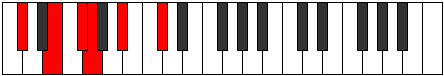 |
| [619](https://ianring.com/musictheory/scales/619) | [Parimic](ModeCSharpParimic.md) | C# | C#, D, E, F#, G, A#, C# |  |
| [619](https://ianring.com/musictheory/scales/619) | [Parimic](ModeDFlatParimic.md) | Db | Db, Ebb, Fb, Gb, Abb, Bb, Db |  |
| [621](https://ianring.com/musictheory/scales/621) | [Kyrimic](ModeCSharpKyrimic.md) | C# | C#, D#, E, F#, G, A#, C# |  |
| [621](https://ianring.com/musictheory/scales/621) | [Kyrimic](ModeDFlatKyrimic.md) | Db | Db, Eb, Fb, Gb, Abb, Bb, Db |  |
| [621](https://ianring.com/musictheory/scales/621) | [Kyrimic](ModeENaturalKyrimic.md) | E | E, F#, G, A, Bb, C#, E |  |
| [623](https://ianring.com/musictheory/scales/623) | [Sycrian](ModeCSharpSycrian.md) | C# | C#, D, Eb, Fb, Gb, Abb, Bb, C# |  |
| [623](https://ianring.com/musictheory/scales/623) | [Sycrian](ModeDFlatSycrian.md) | Db | Db, Ebb, Fbb, Gbbb, Abbb, E###, Cbb, Db |  |
| [623](https://ianring.com/musictheory/scales/623) | [Sycrian](ModeENaturalSycrian.md) | E | E, F, Gb, Abb, Bbb, Cbb, Db, E |  |
| [625](https://ianring.com/musictheory/scales/625) | [Ionyptitonic](ModeCSharpIonyptitonic.md) | C# | C#, F, F#, G, A#, C# |  |
| [625](https://ianring.com/musictheory/scales/625) | [Ionyptitonic](ModeDFlatIonyptitonic.md) | Db | Db, F, Gb, G, Bb, Db |  |
| [627](https://ianring.com/musictheory/scales/627) | [Mogimic](ModeCSharpMogimic.md) | C# | C#, D, E#, F#, G, A#, C# |  |
| [627](https://ianring.com/musictheory/scales/627) | [Mogimic](ModeDFlatMogimic.md) | Db | Db, Ebb, F, Gb, Abb, Bb, Db |  |
| [627](https://ianring.com/musictheory/scales/627) | [Mogimic](ModeANaturalMogimic.md) | A | A, Bb, C#, D, Eb, F#, A |  |
| [629](https://ianring.com/musictheory/scales/629) | [Aeronimic](ModeCSharpAeronimic.md) | C# | C#, D#, E#, F#, G, A#, C# |  |
| [629](https://ianring.com/musictheory/scales/629) | [Aeronimic](ModeDFlatAeronimic.md) | Db | Db, Eb, F, Gb, Abb, Bb, Db |  |
| [629](https://ianring.com/musictheory/scales/629) | [Aeronimic](ModeENaturalAeronimic.md) | E | E, F#, G#, A, Bb, C#, E | 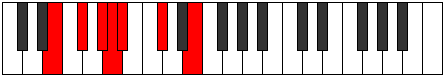 |
| [631](https://ianring.com/musictheory/scales/631) | [Zygian](ModeCSharpZygian.md) | C# | C#, D, Eb, F, Gb, Abb, Bb, C# |  |
| [631](https://ianring.com/musictheory/scales/631) | [Zygian](ModeDFlatZygian.md) | Db | Db, Ebb, Fbb, Gbb, Abbb, E###, Cbb, Db |  |
| [631](https://ianring.com/musictheory/scales/631) | [Zygian](ModeENaturalZygian.md) | E | E, F, Gb, Ab, Bbb, Cbb, Db, E |  |
| [631](https://ianring.com/musictheory/scales/631) | [Zygian](ModeANaturalZygian.md) | A | A, Bb, Cb, Db, Ebb, Fbb, Gb, A |  |
| [633](https://ianring.com/musictheory/scales/633) | [Kydimic](ModeCSharpKydimic.md) | C# | C#, D##, E#, F#, G, A#, C# |  |
| [633](https://ianring.com/musictheory/scales/633) | [Kydimic](ModeDFlatKydimic.md) | Db | Db, E, F, Gb, Abb, Bb, Db |  |
| [635](https://ianring.com/musictheory/scales/635) | [Epolian](ModeCSharpEpolian.md) | C# | C#, D, E, F, Gb, Abb, Bb, C# |  |
| [635](https://ianring.com/musictheory/scales/635) | [Epolian](ModeDFlatEpolian.md) | Db | Db, Ebb, Fb, Gbb, Abbb, E###, Cbb, Db |  |
| [635](https://ianring.com/musictheory/scales/635) | [Epolian](ModeANaturalEpolian.md) | A | A, Bb, C, Db, Ebb, Fbb, Gb, A |  |
| [637](https://ianring.com/musictheory/scales/637) | [Katodian](ModeCSharpKatodian.md) | C# | C#, D#, E, F, Gb, Abb, Bb, C# |  |
| [637](https://ianring.com/musictheory/scales/637) | [Katodian](ModeDFlatKatodian.md) | Db | Db, Eb, Fb, Gbb, Abbb, E###, Cbb, Db |  |
| [637](https://ianring.com/musictheory/scales/637) | [Katodian](ModeENaturalKatodian.md) | E | E, F#, G, Ab, Bbb, Cbb, Db, E |  |
| [639](https://ianring.com/musictheory/scales/639) | [Ionaryllic](ModeCSharpIonaryllic.md) | C# | C#, D, D#, E, F, F#, G, A#, C# |  |
| [639](https://ianring.com/musictheory/scales/639) | [Ionaryllic](ModeDFlatIonaryllic.md) | Db | Db, D, Eb, E, F, Gb, G, Bb, Db |  |
| [639](https://ianring.com/musictheory/scales/639) | [Ionaryllic](ModeENaturalIonaryllic.md) | E | E, F, F#, G, G#, A, A#, C#, E | 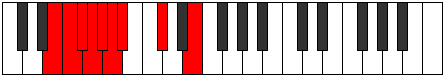 |
| [639](https://ianring.com/musictheory/scales/639) | [Ionaryllic](ModeANaturalIonaryllic.md) | A | A, A#, B, C, C#, D, D#, F#, A |  |
| [657](https://ianring.com/musictheory/scales/657) | [Epathic](ModeFSharpEpathic.md) | F# | F#, A#, C#, D#, F# | 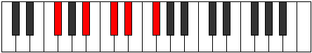 |
| [657](https://ianring.com/musictheory/scales/657) | [Epathic](ModeGFlatEpathic.md) | Gb | Gb, Bb, Db, Eb, Gb |  |
| [659](https://ianring.com/musictheory/scales/659) | [Soptitonic](ModeFSharpSoptitonic.md) | F# | F#, G, A#, C#, D#, F# |  |
| [659](https://ianring.com/musictheory/scales/659) | [Soptitonic](ModeGFlatSoptitonic.md) | Gb | Gb, G, Bb, Db, Eb, Gb |  |
| [659](https://ianring.com/musictheory/scales/659) | [Soptitonic](ModeANaturalSoptitonic.md) | A | A, A#, C#, E, F#, A |  |
| [661](https://ianring.com/musictheory/scales/661) | [Pentatonic](ModeFSharpPentatonic.md) | F# | F#, G#, A#, C#, D#, F# |  |
| [661](https://ianring.com/musictheory/scales/661) | [Pentatonic](ModeGFlatPentatonic.md) | Gb | Gb, Ab, Bb, Db, Eb, Gb |  |
| [663](https://ianring.com/musictheory/scales/663) | [Phrynimic](ModeFSharpPhrynimic.md) | F# | F#, G, Ab, Bb, C#, D#, F# |  |
| [663](https://ianring.com/musictheory/scales/663) | [Phrynimic](ModeGFlatPhrynimic.md) | Gb | Gb, Abb, Bbbb, Cbb, Db, Eb, Gb |  |
| [663](https://ianring.com/musictheory/scales/663) | [Phrynimic](ModeANaturalPhrynimic.md) | A | A, Bb, Cb, Db, E, F#, A |  |
| [665](https://ianring.com/musictheory/scales/665) | [Mythitonic](ModeFSharpMythitonic.md) | F# | F#, A, A#, C#, D#, F# |  |
| [665](https://ianring.com/musictheory/scales/665) | [Mythitonic](ModeGFlatMythitonic.md) | Gb | Gb, A, Bb, Db, Eb, Gb |  |
| [667](https://ianring.com/musictheory/scales/667) | [Rodimic](ModeANaturalRodimic.md) | A | A, Bb, C, Db, E, F#, A |  |
| [667](https://ianring.com/musictheory/scales/667) | [Rodimic](ModeFSharpRodimic.md) | F# | F#, G, A, Bb, C#, D#, F# |  |
| [667](https://ianring.com/musictheory/scales/667) | [Rodimic](ModeGFlatRodimic.md) | Gb | Gb, Abb, Bbb, Cbb, Db, Eb, Gb |  |
| [669](https://ianring.com/musictheory/scales/669) | [Gycrimic](ModeFSharpGycrimic.md) | F# | F#, G#, A, Bb, C#, D#, F# |  |
| [669](https://ianring.com/musictheory/scales/669) | [Gycrimic](ModeGFlatGycrimic.md) | Gb | Gb, Ab, Bbb, Cbb, Db, Eb, Gb |  |
| [671](https://ianring.com/musictheory/scales/671) | [Stycrian](ModeFSharpStycrian.md) | F# | F#, G, Ab, Bbb, Cbb, Db, Eb, F# |  |
| [671](https://ianring.com/musictheory/scales/671) | [Stycrian](ModeGFlatStycrian.md) | Gb | Gb, Abb, Bbbb, Cbbb, Cbb, Db, Eb, Gb |  |
| [671](https://ianring.com/musictheory/scales/671) | [Stycrian](ModeANaturalStycrian.md) | A | A, Bb, Cb, Dbb, Ebbb, Fb, Gb, A |  |
| [675](https://ianring.com/musictheory/scales/675) | [Zyditonic](ModeCSharpZyditonic.md) | C# | C#, D, F#, G#, A#, C# |  |
| [675](https://ianring.com/musictheory/scales/675) | [Zyditonic](ModeDFlatZyditonic.md) | Db | Db, D, Gb, Ab, Bb, Db |  |
| [677](https://ianring.com/musictheory/scales/677) | [Mynitonic](ModeCSharpMynitonic.md) | C# | C#, D#, F#, G#, A#, C# |  |
| [677](https://ianring.com/musictheory/scales/677) | [Mynitonic](ModeDFlatMynitonic.md) | Db | Db, Eb, Gb, Ab, Bb, Db |  |
| [679](https://ianring.com/musictheory/scales/679) | [Lanimic](ModeCSharpLanimic.md) | C# | C#, D, Eb, F#, G#, A#, C# |  |
| [679](https://ianring.com/musictheory/scales/679) | [Lanimic](ModeDFlatLanimic.md) | Db | Db, Ebb, Fbb, Gb, Ab, Bb, Db |  |
| [681](https://ianring.com/musictheory/scales/681) | [Sylitonic](ModeCSharpSylitonic.md) | C# | C#, E, F#, G#, A#, C# |  |
| [681](https://ianring.com/musictheory/scales/681) | [Sylitonic](ModeDFlatSylitonic.md) | Db | Db, E, Gb, Ab, Bb, Db |  |
| [683](https://ianring.com/musictheory/scales/683) | [Stogimic](ModeCSharpStogimic.md) | C# | C#, D, E, F#, G#, A#, C# |  |
| [683](https://ianring.com/musictheory/scales/683) | [Stogimic](ModeDFlatStogimic.md) | Db | Db, Ebb, Fb, Gb, Ab, Bb, Db |  |
| [685](https://ianring.com/musictheory/scales/685) | [Aerathimic](ModeCSharpAerathimic.md) | C# | C#, D#, E, F#, G#, A#, C# |  |
| [685](https://ianring.com/musictheory/scales/685) | [Aerathimic](ModeDFlatAerathimic.md) | Db | Db, Eb, Fb, Gb, Ab, Bb, Db |  |
| [687](https://ianring.com/musictheory/scales/687) | [Aeolythian](ModeCSharpAeolythian.md) | C# | C#, D, Eb, Fb, Gb, Ab, Bb, C# |  |
| [687](https://ianring.com/musictheory/scales/687) | [Aeolythian](ModeDFlatAeolythian.md) | Db | Db, Ebb, Fbb, Gbbb, Abbb, Bbbb, Cbb, Db |  |
| [689](https://ianring.com/musictheory/scales/689) | [Lothitonic](ModeCSharpLothitonic.md) | C# | C#, F, F#, G#, A#, C# |  |
| [689](https://ianring.com/musictheory/scales/689) | [Lothitonic](ModeDFlatLothitonic.md) | Db | Db, F, Gb, Ab, Bb, Db |  |
| [689](https://ianring.com/musictheory/scales/689) | [Lothitonic](ModeFSharpLothitonic.md) | F# | F#, A#, B, C#, D#, F# |  |
| [689](https://ianring.com/musictheory/scales/689) | [Lothitonic](ModeGFlatLothitonic.md) | Gb | Gb, Bb, B, Db, Eb, Gb |  |
| [691](https://ianring.com/musictheory/scales/691) | [Zydimic](ModeCSharpZydimic.md) | C# | C#, D, E#, F#, G#, A#, C# |  |
| [691](https://ianring.com/musictheory/scales/691) | [Zydimic](ModeDFlatZydimic.md) | Db | Db, Ebb, F, Gb, Ab, Bb, Db |  |
| [691](https://ianring.com/musictheory/scales/691) | [Zydimic](ModeANaturalZydimic.md) | A | A, Bb, C#, D, E, F#, A |  |
| [691](https://ianring.com/musictheory/scales/691) | [Zydimic](ModeFSharpZydimic.md) | F# | F#, G, A#, B, C#, D#, F# |  |
| [691](https://ianring.com/musictheory/scales/691) | [Zydimic](ModeGFlatZydimic.md) | Gb | Gb, Abb, Bb, Cb, Db, Eb, Gb |  |
| [693](https://ianring.com/musictheory/scales/693) | [Mynimic](ModeCSharpMynimic.md) | C# | C#, D#, E#, F#, G#, A#, C# |  |
| [693](https://ianring.com/musictheory/scales/693) | [Mynimic](ModeDFlatMynimic.md) | Db | Db, Eb, F, Gb, Ab, Bb, Db | 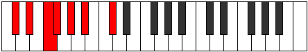 |
| [693](https://ianring.com/musictheory/scales/693) | [Mynimic](ModeFSharpMynimic.md) | F# | F#, G#, A#, B, C#, D#, F# |  |
| [693](https://ianring.com/musictheory/scales/693) | [Mynimic](ModeGFlatMynimic.md) | Gb | Gb, Ab, Bb, Cb, Db, Eb, Gb |  |
| [695](https://ianring.com/musictheory/scales/695) | [Sarian](ModeCSharpSarian.md) | C# | C#, D, Eb, F, Gb, Ab, Bb, C# |  |
| [695](https://ianring.com/musictheory/scales/695) | [Sarian](ModeDFlatSarian.md) | Db | Db, Ebb, Fbb, Gbb, Abbb, Bbbb, Cbb, Db |  |
| [695](https://ianring.com/musictheory/scales/695) | [Sarian](ModeFSharpSarian.md) | F# | F#, G, Ab, Bb, Cb, Db, Eb, F# |  |
| [695](https://ianring.com/musictheory/scales/695) | [Sarian](ModeGFlatSarian.md) | Gb | Gb, Abb, Bbbb, Cbb, Dbbb, Ebbb, Fbb, Gb |  |
| [695](https://ianring.com/musictheory/scales/695) | [Sarian](ModeANaturalSarian.md) | A | A, Bb, Cb, Db, Ebb, Fb, Gb, A |  |
| [697](https://ianring.com/musictheory/scales/697) | [Lagimic](ModeCSharpLagimic.md) | C# | C#, D##, E#, F#, G#, A#, C# |  |
| [697](https://ianring.com/musictheory/scales/697) | [Lagimic](ModeDFlatLagimic.md) | Db | Db, E, F, Gb, Ab, Bb, Db |  |
| [697](https://ianring.com/musictheory/scales/697) | [Lagimic](ModeFSharpLagimic.md) | F# | F#, G##, A#, B, C#, D#, F# |  |
| [697](https://ianring.com/musictheory/scales/697) | [Lagimic](ModeGFlatLagimic.md) | Gb | Gb, A, Bb, Cb, Db, Eb, Gb |  |
| [699](https://ianring.com/musictheory/scales/699) | [Aerothian](ModeCSharpAerothian.md) | C# | C#, D, E, F, Gb, Ab, Bb, C# |  |
| [699](https://ianring.com/musictheory/scales/699) | [Aerothian](ModeDFlatAerothian.md) | Db | Db, Ebb, Fb, Gbb, Abbb, Bbbb, Cbb, Db |  |
| [699](https://ianring.com/musictheory/scales/699) | [Aerothian](ModeANaturalAerothian.md) | A | A, Bb, C, Db, Ebb, Fb, Gb, A |  |
| [699](https://ianring.com/musictheory/scales/699) | [Aerothian](ModeFSharpAerothian.md) | F# | F#, G, A, Bb, Cb, Db, Eb, F# |  |
| [699](https://ianring.com/musictheory/scales/699) | [Aerothian](ModeGFlatAerothian.md) | Gb | Gb, Abb, Bbb, Cbb, Dbbb, Ebbb, Fbb, Gb |  |
| [701](https://ianring.com/musictheory/scales/701) | [Mixonyphian](ModeCSharpMixonyphian.md) | C# | C#, D#, E, F, Gb, Ab, Bb, C# |  |
| [701](https://ianring.com/musictheory/scales/701) | [Mixonyphian](ModeDFlatMixonyphian.md) | Db | Db, Eb, Fb, Gbb, Abbb, Bbbb, Cbb, Db |  |
| [701](https://ianring.com/musictheory/scales/701) | [Mixonyphian](ModeFSharpMixonyphian.md) | F# | F#, G#, A, Bb, Cb, Db, Eb, F# |  |
| [701](https://ianring.com/musictheory/scales/701) | [Mixonyphian](ModeGFlatMixonyphian.md) | Gb | Gb, Ab, Bbb, Cbb, Dbbb, Ebbb, Fbb, Gb |  |
| [703](https://ianring.com/musictheory/scales/703) | [Aerocryllic](ModeCSharpAerocryllic.md) | C# | C#, D, D#, E, F, F#, G#, A#, C# |  |
| [703](https://ianring.com/musictheory/scales/703) | [Aerocryllic](ModeDFlatAerocryllic.md) | Db | Db, D, Eb, E, F, Gb, Ab, Bb, Db |  |
| [703](https://ianring.com/musictheory/scales/703) | [Aerocryllic](ModeANaturalAerocryllic.md) | A | A, A#, B, C, C#, D, E, F#, A |  |
| [703](https://ianring.com/musictheory/scales/703) | [Aerocryllic](ModeFSharpAerocryllic.md) | F# | F#, G, G#, A, A#, B, C#, D#, F# |  |
| [703](https://ianring.com/musictheory/scales/703) | [Aerocryllic](ModeGFlatAerocryllic.md) | Gb | Gb, G, Ab, A, Bb, B, Db, Eb, Gb |  |
| [709](https://ianring.com/musictheory/scales/709) | [Ionycritonic](ModeENaturalIonycritonic.md) | E | E, F#, A#, B, C#, E |  |
| [711](https://ianring.com/musictheory/scales/711) | [Epyrimic](ModeENaturalEpyrimic.md) | E | E, F, Gb, A#, B, C#, E |  |
| [717](https://ianring.com/musictheory/scales/717) | [Gythimic](ModeENaturalGythimic.md) | E | E, F#, G, A#, B, C#, E |  |
| [719](https://ianring.com/musictheory/scales/719) | [Kanian](ModeENaturalKanian.md) | E | E, F, Gb, Abb, Bb, Cb, Db, E |  |
| [721](https://ianring.com/musictheory/scales/721) | [Aeolacritonic](ModeFSharpAeolacritonic.md) | F# | F#, A#, C, C#, D#, F# |  |
| [721](https://ianring.com/musictheory/scales/721) | [Aeolacritonic](ModeGFlatAeolacritonic.md) | Gb | Gb, Bb, C, Db, Eb, Gb |  |
| [723](https://ianring.com/musictheory/scales/723) | [Ionadimic](ModeFSharpIonadimic.md) | F# | F#, G, A#, B#, C#, D#, F# |  |
| [723](https://ianring.com/musictheory/scales/723) | [Ionadimic](ModeGFlatIonadimic.md) | Gb | Gb, Abb, Bb, C, Db, Eb, Gb |  |
| [723](https://ianring.com/musictheory/scales/723) | [Ionadimic](ModeANaturalIonadimic.md) | A | A, Bb, C#, D#, E, F#, A |  |
| [725](https://ianring.com/musictheory/scales/725) | [Lonimic](ModeFSharpLonimic.md) | F# | F#, G#, A#, B#, C#, D#, F# |  |
| [725](https://ianring.com/musictheory/scales/725) | [Lonimic](ModeGFlatLonimic.md) | Gb | Gb, Ab, Bb, C, Db, Eb, Gb |  |
| [725](https://ianring.com/musictheory/scales/725) | [Lonimic](ModeENaturalLonimic.md) | E | E, F#, G#, A#, B, C#, E | 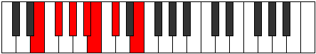 |
| [727](https://ianring.com/musictheory/scales/727) | [Phradian](ModeFSharpPhradian.md) | F# | F#, G, Ab, Bb, C, Db, Eb, F# |  |
| [727](https://ianring.com/musictheory/scales/727) | [Phradian](ModeGFlatPhradian.md) | Gb | Gb, Abb, Bbbb, Cbb, Dbb, Ebbb, Fbb, Gb |  |
| [727](https://ianring.com/musictheory/scales/727) | [Phradian](ModeENaturalPhradian.md) | E | E, F, Gb, Ab, Bb, Cb, Db, E |  |
| [727](https://ianring.com/musictheory/scales/727) | [Phradian](ModeANaturalPhradian.md) | A | A, Bb, Cb, Db, Eb, Fb, Gb, A |  |
| [729](https://ianring.com/musictheory/scales/729) | [Stygimic](ModeFSharpStygimic.md) | F# | F#, G##, A#, B#, C#, D#, F# |  |
| [729](https://ianring.com/musictheory/scales/729) | [Stygimic](ModeGFlatStygimic.md) | Gb | Gb, A, Bb, C, Db, Eb, Gb |  |
| [731](https://ianring.com/musictheory/scales/731) | [Ionorian](ModeANaturalIonorian.md) | A | A, Bb, C, Db, Eb, Fb, Gb, A |  |
| [731](https://ianring.com/musictheory/scales/731) | [Ionorian](ModeFSharpIonorian.md) | F# | F#, G, A, Bb, C, Db, Eb, F# |  |
| [731](https://ianring.com/musictheory/scales/731) | [Ionorian](ModeGFlatIonorian.md) | Gb | Gb, Abb, Bbb, Cbb, Dbb, Ebbb, Fbb, Gb |  |
| [733](https://ianring.com/musictheory/scales/733) | [Donian](ModeFSharpDonian.md) | F# | F#, G#, A, Bb, C, Db, Eb, F# |  |
| [733](https://ianring.com/musictheory/scales/733) | [Donian](ModeGFlatDonian.md) | Gb | Gb, Ab, Bbb, Cbb, Dbb, Ebbb, Fbb, Gb |  |
| [733](https://ianring.com/musictheory/scales/733) | [Donian](ModeENaturalDonian.md) | E | E, F#, G, Ab, Bb, Cb, Db, E |  |
| [735](https://ianring.com/musictheory/scales/735) | [Sylyllic](ModeFSharpSylyllic.md) | F# | F#, G, G#, A, A#, C, C#, D#, F# |  |
| [735](https://ianring.com/musictheory/scales/735) | [Sylyllic](ModeGFlatSylyllic.md) | Gb | Gb, G, Ab, A, Bb, C, Db, Eb, Gb |  |
| [735](https://ianring.com/musictheory/scales/735) | [Sylyllic](ModeENaturalSylyllic.md) | E | E, F, F#, G, G#, A#, B, C#, E |  |
| [735](https://ianring.com/musictheory/scales/735) | [Sylyllic](ModeANaturalSylyllic.md) | A | A, A#, B, C, C#, D#, E, F#, A |  |
| [739](https://ianring.com/musictheory/scales/739) | [Rorimic](ModeCSharpRorimic.md) | C# | C#, D, E##, F##, G#, A#, C# |  |
| [739](https://ianring.com/musictheory/scales/739) | [Rorimic](ModeDFlatRorimic.md) | Db | Db, Ebb, F#, G, Ab, Bb, Db |  |
| [741](https://ianring.com/musictheory/scales/741) | [Gathimic](ModeCSharpGathimic.md) | C# | C#, D#, E##, F##, G#, A#, C# |  |
| [741](https://ianring.com/musictheory/scales/741) | [Gathimic](ModeDFlatGathimic.md) | Db | Db, Eb, F#, G, Ab, Bb, Db |  |
| [741](https://ianring.com/musictheory/scales/741) | [Gathimic](ModeENaturalGathimic.md) | E | E, F#, G##, A#, B, C#, E |  |
| [743](https://ianring.com/musictheory/scales/743) | [Lanian](ModeCSharpLanian.md) | C# | C#, D, Eb, F#, G, Ab, Bb, C# |  |
| [743](https://ianring.com/musictheory/scales/743) | [Lanian](ModeDFlatLanian.md) | Db | Db, Ebb, Fbb, Gb, Abb, Bbbb, Cbb, Db |  |
| [743](https://ianring.com/musictheory/scales/743) | [Lanian](ModeENaturalLanian.md) | E | E, F, Gb, A, Bb, Cb, Db, E |  |
| [745](https://ianring.com/musictheory/scales/745) | [Kolimic](ModeCSharpKolimic.md) | C# | C#, D##, E##, F##, G#, A#, C# |  |
| [745](https://ianring.com/musictheory/scales/745) | [Kolimic](ModeDFlatKolimic.md) | Db | Db, E, F#, G, Ab, Bb, Db |  |
| [747](https://ianring.com/musictheory/scales/747) | [Lynian](ModeCSharpLynian.md) | C# | C#, D, E, F#, G, Ab, Bb, C# |  |
| [747](https://ianring.com/musictheory/scales/747) | [Lynian](ModeDFlatLynian.md) | Db | Db, Ebb, Fb, Gb, Abb, Bbbb, Cbb, Db |  |
| [749](https://ianring.com/musictheory/scales/749) | [Aeologian](ModeCSharpAeologian.md) | C# | C#, D#, E, F#, G, Ab, Bb, C# |  |
| [749](https://ianring.com/musictheory/scales/749) | [Aeologian](ModeDFlatAeologian.md) | Db | Db, Eb, Fb, Gb, Abb, Bbbb, Cbb, Db |  |
| [749](https://ianring.com/musictheory/scales/749) | [Aeologian](ModeENaturalAeologian.md) | E | E, F#, G, A, Bb, Cb, Db, E |  |
| [751](https://ianring.com/musictheory/scales/751) | [Epacryllic](ModeCSharpEpacryllic.md) | C# | C#, D, D#, E, F#, G, G#, A#, C# |  |
| [751](https://ianring.com/musictheory/scales/751) | [Epacryllic](ModeDFlatEpacryllic.md) | Db | Db, D, Eb, E, Gb, G, Ab, Bb, Db |  |
| [751](https://ianring.com/musictheory/scales/751) | [Epacryllic](ModeENaturalEpacryllic.md) | E | E, F, F#, G, A, A#, B, C#, E |  |
| [753](https://ianring.com/musictheory/scales/753) | [Kytrimic](ModeCSharpKytrimic.md) | C# | C#, D###, E##, F##, G#, A#, C# |  |
| [753](https://ianring.com/musictheory/scales/753) | [Kytrimic](ModeDFlatKytrimic.md) | Db | Db, E#, F#, G, Ab, Bb, Db |  |
| [753](https://ianring.com/musictheory/scales/753) | [Kytrimic](ModeFSharpKytrimic.md) | F# | F#, G###, A##, B#, C#, D#, F# |  |
| [753](https://ianring.com/musictheory/scales/753) | [Kytrimic](ModeGFlatKytrimic.md) | Gb | Gb, A#, B, C, Db, Eb, Gb |  |
| [755](https://ianring.com/musictheory/scales/755) | [Phrythian](ModeCSharpPhrythian.md) | C# | C#, D, E#, F#, G, Ab, Bb, C# |  |
| [755](https://ianring.com/musictheory/scales/755) | [Phrythian](ModeDFlatPhrythian.md) | Db | Db, Ebb, F, Gb, Abb, Bbbb, Cbb, Db |  |
| [755](https://ianring.com/musictheory/scales/755) | [Phrythian](ModeANaturalPhrythian.md) | A | A, Bb, C#, D, Eb, Fb, Gb, A |  |
| [755](https://ianring.com/musictheory/scales/755) | [Phrythian](ModeFSharpPhrythian.md) | F# | F#, G, A#, B, C, Db, Eb, F# |  |
| [755](https://ianring.com/musictheory/scales/755) | [Phrythian](ModeGFlatPhrythian.md) | Gb | Gb, Abb, Bb, Cb, Dbb, Ebbb, Fbb, Gb |  |
| [757](https://ianring.com/musictheory/scales/757) | [Ionyptian](ModeCSharpIonyptian.md) | C# | C#, D#, E#, F#, G, Ab, Bb, C# |  |
| [757](https://ianring.com/musictheory/scales/757) | [Ionyptian](ModeDFlatIonyptian.md) | Db | Db, Eb, F, Gb, Abb, Bbbb, Cbb, Db |  |
| [757](https://ianring.com/musictheory/scales/757) | [Ionyptian](ModeFSharpIonyptian.md) | F# | F#, G#, A#, B, C, Db, Eb, F# |  |
| [757](https://ianring.com/musictheory/scales/757) | [Ionyptian](ModeGFlatIonyptian.md) | Gb | Gb, Ab, Bb, Cb, Dbb, Ebbb, Fbb, Gb |  |
| [757](https://ianring.com/musictheory/scales/757) | [Ionyptian](ModeENaturalIonyptian.md) | E | E, F#, G#, A, Bb, Cb, Db, E |  |
| [759](https://ianring.com/musictheory/scales/759) | [Katalyllic](ModeCSharpKatalyllic.md) | C# | C#, D, D#, F, F#, G, G#, A#, C# |  |
| [759](https://ianring.com/musictheory/scales/759) | [Katalyllic](ModeDFlatKatalyllic.md) | Db | Db, D, Eb, F, Gb, G, Ab, Bb, Db |  |
| [759](https://ianring.com/musictheory/scales/759) | [Katalyllic](ModeFSharpKatalyllic.md) | F# | F#, G, G#, A#, B, C, C#, D#, F# |  |
| [759](https://ianring.com/musictheory/scales/759) | [Katalyllic](ModeGFlatKatalyllic.md) | Gb | Gb, G, Ab, Bb, B, C, Db, Eb, Gb |  |
| [759](https://ianring.com/musictheory/scales/759) | [Katalyllic](ModeANaturalKatalyllic.md) | A | A, A#, B, C#, D, D#, E, F#, A |  |
| [759](https://ianring.com/musictheory/scales/759) | [Katalyllic](ModeENaturalKatalyllic.md) | E | E, F, F#, G#, A, A#, B, C#, E |  |
| [761](https://ianring.com/musictheory/scales/761) | [Ponian](ModeCSharpPonian.md) | C# | C#, D##, E#, F#, G, Ab, Bb, C# |  |
| [761](https://ianring.com/musictheory/scales/761) | [Ponian](ModeDFlatPonian.md) | Db | Db, E, F, Gb, Abb, Bbbb, Cbb, Db |  |
| [761](https://ianring.com/musictheory/scales/761) | [Ponian](ModeFSharpPonian.md) | F# | F#, G##, A#, B, C, Db, Eb, F# |  |
| [761](https://ianring.com/musictheory/scales/761) | [Ponian](ModeGFlatPonian.md) | Gb | Gb, A, Bb, Cb, Dbb, Ebbb, Fbb, Gb |  |
| [763](https://ianring.com/musictheory/scales/763) | [Doryllic](ModeCSharpDoryllic.md) | C# | C#, D, E, F, F#, G, G#, A#, C# |  |
| [763](https://ianring.com/musictheory/scales/763) | [Doryllic](ModeDFlatDoryllic.md) | Db | Db, D, E, F, Gb, G, Ab, Bb, Db |  |
| [763](https://ianring.com/musictheory/scales/763) | [Doryllic](ModeANaturalDoryllic.md) | A | A, A#, C, C#, D, D#, E, F#, A |  |
| [763](https://ianring.com/musictheory/scales/763) | [Doryllic](ModeFSharpDoryllic.md) | F# | F#, G, A, A#, B, C, C#, D#, F# |  |
| [763](https://ianring.com/musictheory/scales/763) | [Doryllic](ModeGFlatDoryllic.md) | Gb | Gb, G, A, Bb, B, C, Db, Eb, Gb |  |
| [765](https://ianring.com/musictheory/scales/765) | [Mixonyphyllic](ModeCSharpMixonyphyllic.md) | C# | C#, D#, E, F, F#, G, G#, A#, C# |  |
| [765](https://ianring.com/musictheory/scales/765) | [Mixonyphyllic](ModeDFlatMixonyphyllic.md) | Db | Db, Eb, E, F, Gb, G, Ab, Bb, Db |  |
| [765](https://ianring.com/musictheory/scales/765) | [Mixonyphyllic](ModeFSharpMixonyphyllic.md) | F# | F#, G#, A, A#, B, C, C#, D#, F# |  |
| [765](https://ianring.com/musictheory/scales/765) | [Mixonyphyllic](ModeGFlatMixonyphyllic.md) | Gb | Gb, Ab, A, Bb, B, C, Db, Eb, Gb |  |
| [765](https://ianring.com/musictheory/scales/765) | [Mixonyphyllic](ModeENaturalMixonyphyllic.md) | E | E, F#, G, G#, A, A#, B, C#, E |  |
| [767](https://ianring.com/musictheory/scales/767) | [Raptygic](ModeCSharpRaptygic.md) | C# | C#, D, D#, E, F, F#, G, G#, A#, C# |  |
| [767](https://ianring.com/musictheory/scales/767) | [Raptygic](ModeDFlatRaptygic.md) | Db | Db, D, Eb, E, F, Gb, G, Ab, Bb, Db |  |
| [767](https://ianring.com/musictheory/scales/767) | [Raptygic](ModeANaturalRaptygic.md) | A | A, A#, B, C, C#, D, D#, E, F#, A |  |
| [767](https://ianring.com/musictheory/scales/767) | [Raptygic](ModeFSharpRaptygic.md) | F# | F#, G, G#, A, A#, B, C, C#, D#, F# |  |
| [767](https://ianring.com/musictheory/scales/767) | [Raptygic](ModeGFlatRaptygic.md) | Gb | Gb, G, Ab, A, Bb, B, C, Db, Eb, Gb |  |
| [767](https://ianring.com/musictheory/scales/767) | [Raptygic](ModeENaturalRaptygic.md) | E | E, F, F#, G, G#, A, A#, B, C#, E |  |
| [787](https://ianring.com/musictheory/scales/787) | [Aeolapritonic](ModeANaturalAeolapritonic.md) | A | A, A#, C#, F, F#, A |  |
| [791](https://ianring.com/musictheory/scales/791) | [Aeoloptimic](ModeANaturalAeoloptimic.md) | A | A, Bb, Cb, Db, E#, F#, A |  |
| [793](https://ianring.com/musictheory/scales/793) | [Mocritonic](ModeASharpMocritonic.md) | A# | A#, C#, D, F#, G, A# |  |
| [793](https://ianring.com/musictheory/scales/793) | [Mocritonic](ModeBFlatMocritonic.md) | Bb | Bb, Db, D, Gb, G, Bb |  |
| [795](https://ianring.com/musictheory/scales/795) | [Aeologimic](ModeANaturalAeologimic.md) | A | A, Bb, C, Db, E#, F#, A |  |
| [795](https://ianring.com/musictheory/scales/795) | [Aeologimic](ModeASharpAeologimic.md) | A# | A#, B, C#, D, E##, F##, A# |  |
| [795](https://ianring.com/musictheory/scales/795) | [Aeologimic](ModeBFlatAeologimic.md) | Bb | Bb, Cb, Db, Ebb, F#, G, Bb |  |
| [797](https://ianring.com/musictheory/scales/797) | [Katocrimic](ModeASharpKatocrimic.md) | A# | A#, B#, C#, D, E##, F##, A# |  |
| [797](https://ianring.com/musictheory/scales/797) | [Katocrimic](ModeBFlatKatocrimic.md) | Bb | Bb, C, Db, Ebb, F#, G, Bb |  |
| [799](https://ianring.com/musictheory/scales/799) | [Lolian](ModeASharpLolian.md) | A# | A#, B, C, Db, Ebb, F#, G, A# |  |
| [799](https://ianring.com/musictheory/scales/799) | [Lolian](ModeBFlatLolian.md) | Bb | Bb, Cb, Dbb, Ebbb, Fbbb, Gb, Abb, Bb |  |
| [799](https://ianring.com/musictheory/scales/799) | [Lolian](ModeANaturalLolian.md) | A | A, Bb, Cb, Dbb, Ebbb, F, Gb, A |  |
| [803](https://ianring.com/musictheory/scales/803) | [Loritonic](ModeFNaturalLoritonic.md) | F | F, F#, A#, C#, D, F |  |
| [803](https://ianring.com/musictheory/scales/803) | [Loritonic](ModeCSharpLoritonic.md) | C# | C#, D, F#, A, A#, C# |  |
| [803](https://ianring.com/musictheory/scales/803) | [Loritonic](ModeDFlatLoritonic.md) | Db | Db, D, Gb, A, Bb, Db |  |
| [805](https://ianring.com/musictheory/scales/805) | [Rothitonic](ModeCSharpRothitonic.md) | C# | C#, D#, F#, A, A#, C# |  |
| [805](https://ianring.com/musictheory/scales/805) | [Rothitonic](ModeDFlatRothitonic.md) | Db | Db, Eb, Gb, A, Bb, Db |  |
| [807](https://ianring.com/musictheory/scales/807) | [Epadimic](ModeFNaturalEpadimic.md) | F | F, Gb, Abb, Bb, C#, D, F |  |
| [807](https://ianring.com/musictheory/scales/807) | [Epadimic](ModeCSharpEpadimic.md) | C# | C#, D, Eb, F#, G##, A#, C# |  |
| [807](https://ianring.com/musictheory/scales/807) | [Epadimic](ModeDFlatEpadimic.md) | Db | Db, Ebb, Fbb, Gb, A, Bb, Db |  |
| [809](https://ianring.com/musictheory/scales/809) | [Dogitonic](ModeASharpDogitonic.md) | A# | A#, C#, D#, F#, G, A# |  |
| [809](https://ianring.com/musictheory/scales/809) | [Dogitonic](ModeBFlatDogitonic.md) | Bb | Bb, Db, Eb, Gb, G, Bb |  |
| [809](https://ianring.com/musictheory/scales/809) | [Dogitonic](ModeCSharpDogitonic.md) | C# | C#, E, F#, A, A#, C# |  |
| [809](https://ianring.com/musictheory/scales/809) | [Dogitonic](ModeDFlatDogitonic.md) | Db | Db, E, Gb, A, Bb, Db |  |
| [811](https://ianring.com/musictheory/scales/811) | [Radimic](ModeFNaturalRadimic.md) | F | F, Gb, Ab, Bb, C#, D, F |  |
| [811](https://ianring.com/musictheory/scales/811) | [Radimic](ModeCSharpRadimic.md) | C# | C#, D, E, F#, G##, A#, C# |  |
| [811](https://ianring.com/musictheory/scales/811) | [Radimic](ModeDFlatRadimic.md) | Db | Db, Ebb, Fb, Gb, A, Bb, Db |  |
| [811](https://ianring.com/musictheory/scales/811) | [Radimic](ModeASharpRadimic.md) | A# | A#, B, C#, D#, E##, F##, A# |  |
| [811](https://ianring.com/musictheory/scales/811) | [Radimic](ModeBFlatRadimic.md) | Bb | Bb, Cb, Db, Eb, F#, G, Bb |  |
| [813](https://ianring.com/musictheory/scales/813) | [Larimic](ModeASharpLarimic.md) | A# | A#, B#, C#, D#, E##, F##, A# |  |
| [813](https://ianring.com/musictheory/scales/813) | [Larimic](ModeBFlatLarimic.md) | Bb | Bb, C, Db, Eb, F#, G, Bb |  |
| [813](https://ianring.com/musictheory/scales/813) | [Larimic](ModeCSharpLarimic.md) | C# | C#, D#, E, F#, G##, A#, C# |  |
| [813](https://ianring.com/musictheory/scales/813) | [Larimic](ModeDFlatLarimic.md) | Db | Db, Eb, Fb, Gb, A, Bb, Db |  |
| [815](https://ianring.com/musictheory/scales/815) | [Bolian](ModeFNaturalBolian.md) | F | F, Gb, Abb, Bbbb, Cbb, Db, Ebb, F |  |
| [815](https://ianring.com/musictheory/scales/815) | [Bolian](ModeCSharpBolian.md) | C# | C#, D, Eb, Fb, Gb, A, Bb, C# |  |
| [815](https://ianring.com/musictheory/scales/815) | [Bolian](ModeDFlatBolian.md) | Db | Db, Ebb, Fbb, Gbbb, Abbb, Bbb, Cbb, Db |  |
| [815](https://ianring.com/musictheory/scales/815) | [Bolian](ModeASharpBolian.md) | A# | A#, B, C, Db, Eb, F#, G, A# |  |
| [815](https://ianring.com/musictheory/scales/815) | [Bolian](ModeBFlatBolian.md) | Bb | Bb, Cb, Dbb, Ebbb, Fbb, Gb, Abb, Bb |  |
| [817](https://ianring.com/musictheory/scales/817) | [Zothitonic](ModeCSharpZothitonic.md) | C# | C#, F, F#, A, A#, C# |  |
| [817](https://ianring.com/musictheory/scales/817) | [Zothitonic](ModeDFlatZothitonic.md) | Db | Db, F, Gb, A, Bb, Db |  |
| [819](https://ianring.com/musictheory/scales/819) | [Aerythimic](ModeCSharpAerythimic.md) | C# | C#, D, E#, F#, G##, A#, C# |  |
| [819](https://ianring.com/musictheory/scales/819) | [Aerythimic](ModeDFlatAerythimic.md) | Db | Db, Ebb, F, Gb, A, Bb, Db |  |
| [819](https://ianring.com/musictheory/scales/819) | [Aerythimic](ModeFNaturalAerythimic.md) | F | F, Gb, A, Bb, C#, D, F |  |
| [819](https://ianring.com/musictheory/scales/819) | [Aerythimic](ModeANaturalAerythimic.md) | A | A, Bb, C#, D, E#, F#, A | 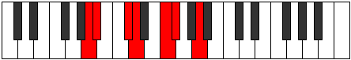 |
| [821](https://ianring.com/musictheory/scales/821) | [Aeranimic](ModeCSharpAeranimic.md) | C# | C#, D#, E#, F#, G##, A#, C# |  |
| [821](https://ianring.com/musictheory/scales/821) | [Aeranimic](ModeDFlatAeranimic.md) | Db | Db, Eb, F, Gb, A, Bb, Db |  |
| [823](https://ianring.com/musictheory/scales/823) | [Stodian](ModeCSharpStodian.md) | C# | C#, D, Eb, F, Gb, A, Bb, C# |  |
| [823](https://ianring.com/musictheory/scales/823) | [Stodian](ModeDFlatStodian.md) | Db | Db, Ebb, Fbb, Gbb, Abbb, Bbb, Cbb, Db |  |
| [823](https://ianring.com/musictheory/scales/823) | [Stodian](ModeFNaturalStodian.md) | F | F, Gb, Abb, Bbb, Cbb, Db, Ebb, F |  |
| [823](https://ianring.com/musictheory/scales/823) | [Stodian](ModeANaturalStodian.md) | A | A, Bb, Cb, Db, Ebb, F, Gb, A |  |
| [825](https://ianring.com/musictheory/scales/825) | [Thyptimic](ModeASharpThyptimic.md) | A# | A#, B##, C##, D#, E##, F##, A# |  |
| [825](https://ianring.com/musictheory/scales/825) | [Thyptimic](ModeBFlatThyptimic.md) | Bb | Bb, C#, D, Eb, F#, G, Bb |  |
| [825](https://ianring.com/musictheory/scales/825) | [Thyptimic](ModeCSharpThyptimic.md) | C# | C#, D##, E#, F#, G##, A#, C# |  |
| [825](https://ianring.com/musictheory/scales/825) | [Thyptimic](ModeDFlatThyptimic.md) | Db | Db, E, F, Gb, A, Bb, Db |  |
| [827](https://ianring.com/musictheory/scales/827) | [Mixolocrian](ModeANaturalMixolocrian.md) | A | A, Bb, C, Db, Ebb, F, Gb, A | 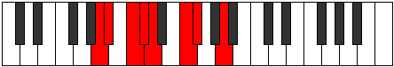 |
| [827](https://ianring.com/musictheory/scales/827) | [Mixolocrian](ModeCSharpMixolocrian.md) | C# | C#, D, E, F, Gb, A, Bb, C# |  |
| [827](https://ianring.com/musictheory/scales/827) | [Mixolocrian](ModeDFlatMixolocrian.md) | Db | Db, Ebb, Fb, Gbb, Abbb, Bbb, Cbb, Db |  |
| [827](https://ianring.com/musictheory/scales/827) | [Mixolocrian](ModeFNaturalMixolocrian.md) | F | F, Gb, Ab, Bbb, Cbb, Db, Ebb, F |  |
| [827](https://ianring.com/musictheory/scales/827) | [Mixolocrian](ModeASharpMixolocrian.md) | A# | A#, B, C#, D, Eb, F#, G, A# |  |
| [827](https://ianring.com/musictheory/scales/827) | [Mixolocrian](ModeBFlatMixolocrian.md) | Bb | Bb, Cb, Db, Ebb, Fbb, Gb, Abb, Bb |  |
| [829](https://ianring.com/musictheory/scales/829) | [Lygian](ModeASharpLygian.md) | A# | A#, B#, C#, D, Eb, F#, G, A# |  |
| [829](https://ianring.com/musictheory/scales/829) | [Lygian](ModeBFlatLygian.md) | Bb | Bb, C, Db, Ebb, Fbb, Gb, Abb, Bb |  |
| [829](https://ianring.com/musictheory/scales/829) | [Lygian](ModeCSharpLygian.md) | C# | C#, D#, E, F, Gb, A, Bb, C# |  |
| [829](https://ianring.com/musictheory/scales/829) | [Lygian](ModeDFlatLygian.md) | Db | Db, Eb, Fb, Gbb, Abbb, Bbb, Cbb, Db |  |
| [831](https://ianring.com/musictheory/scales/831) | [Rodyllic](ModeCSharpRodyllic.md) | C# | C#, D, D#, E, F, F#, A, A#, C# |  |
| [831](https://ianring.com/musictheory/scales/831) | [Rodyllic](ModeDFlatRodyllic.md) | Db | Db, D, Eb, E, F, Gb, A, Bb, Db |  |
| [831](https://ianring.com/musictheory/scales/831) | [Rodyllic](ModeFNaturalRodyllic.md) | F | F, F#, G, G#, A, A#, C#, D, F |  |
| [831](https://ianring.com/musictheory/scales/831) | [Rodyllic](ModeASharpRodyllic.md) | A# | A#, B, C, C#, D, D#, F#, G, A# |  |
| [831](https://ianring.com/musictheory/scales/831) | [Rodyllic](ModeBFlatRodyllic.md) | Bb | Bb, B, C, Db, D, Eb, Gb, G, Bb |  |
| [831](https://ianring.com/musictheory/scales/831) | [Rodyllic](ModeANaturalRodyllic.md) | A | A, A#, B, C, C#, D, F, F#, A |  |
| [837](https://ianring.com/musictheory/scales/837) | [Epaditonic](ModeENaturalEpaditonic.md) | E | E, F#, A#, C, C#, E |  |
| [839](https://ianring.com/musictheory/scales/839) | [Ionathimic](ModeENaturalIonathimic.md) | E | E, F, Gb, A#, B#, C#, E |  |
| [841](https://ianring.com/musictheory/scales/841) | [Phrothitonic](ModeASharpPhrothitonic.md) | A# | A#, C#, E, F#, G, A# |  |
| [841](https://ianring.com/musictheory/scales/841) | [Phrothitonic](ModeBFlatPhrothitonic.md) | Bb | Bb, Db, E, Gb, G, Bb |  |
| [843](https://ianring.com/musictheory/scales/843) | [Molimic](ModeASharpMolimic.md) | A# | A#, B, C#, D##, E##, F##, A# |  |
| [843](https://ianring.com/musictheory/scales/843) | [Molimic](ModeBFlatMolimic.md) | Bb | Bb, Cb, Db, E, F#, G, Bb |  |
| [845](https://ianring.com/musictheory/scales/845) | [Zyrimic](ModeENaturalZyrimic.md) | E | E, F#, G, A#, B#, C#, E |  |
| [845](https://ianring.com/musictheory/scales/845) | [Zyrimic](ModeASharpZyrimic.md) | A# | A#, B#, C#, D##, E##, F##, A# |  |
| [845](https://ianring.com/musictheory/scales/845) | [Zyrimic](ModeBFlatZyrimic.md) | Bb | Bb, C, Db, E, F#, G, Bb |  |
| [847](https://ianring.com/musictheory/scales/847) | [Ganian](ModeENaturalGanian.md) | E | E, F, Gb, Abb, Bb, C, Db, E |  |
| [847](https://ianring.com/musictheory/scales/847) | [Ganian](ModeASharpGanian.md) | A# | A#, B, C, Db, E, F#, G, A# |  |
| [847](https://ianring.com/musictheory/scales/847) | [Ganian](ModeBFlatGanian.md) | Bb | Bb, Cb, Dbb, Ebbb, Fb, Gb, Abb, Bb |  |
| [851](https://ianring.com/musictheory/scales/851) | [Aerylimic](ModeANaturalAerylimic.md) | A | A, Bb, C#, D#, E#, F#, A |  |
| [853](https://ianring.com/musictheory/scales/853) | [Epothimic](ModeENaturalEpothimic.md) | E | E, F#, G#, A#, B#, C#, E |  |
| [855](https://ianring.com/musictheory/scales/855) | [Porian](ModeENaturalPorian.md) | E | E, F, Gb, Ab, Bb, C, Db, E |  |
| [855](https://ianring.com/musictheory/scales/855) | [Porian](ModeANaturalPorian.md) | A | A, Bb, Cb, Db, Eb, F, Gb, A |  |
| [857](https://ianring.com/musictheory/scales/857) | [Aeolydimic](ModeASharpAeolydimic.md) | A# | A#, B##, C##, D##, E##, F##, A# |  |
| [857](https://ianring.com/musictheory/scales/857) | [Aeolydimic](ModeBFlatAeolydimic.md) | Bb | Bb, C#, D, E, F#, G, Bb |  |
| [859](https://ianring.com/musictheory/scales/859) | [Pathian](ModeANaturalPathian.md) | A | A, Bb, C, Db, Eb, F, Gb, A |  |
| [859](https://ianring.com/musictheory/scales/859) | [Pathian](ModeASharpPathian.md) | A# | A#, B, C#, D, E, F#, G, A# |  |
| [859](https://ianring.com/musictheory/scales/859) | [Pathian](ModeBFlatPathian.md) | Bb | Bb, Cb, Db, Ebb, Fb, Gb, Abb, Bb |  |
| [861](https://ianring.com/musictheory/scales/861) | [Rylian](ModeASharpRylian.md) | A# | A#, B#, C#, D, E, F#, G, A# |  |
| [861](https://ianring.com/musictheory/scales/861) | [Rylian](ModeBFlatRylian.md) | Bb | Bb, C, Db, Ebb, Fb, Gb, Abb, Bb |  |
| [861](https://ianring.com/musictheory/scales/861) | [Rylian](ModeENaturalRylian.md) | E | E, F#, G, Ab, Bb, C, Db, E |  |
| [863](https://ianring.com/musictheory/scales/863) | [Pyryllic](ModeENaturalPyryllic.md) | E | E, F, F#, G, G#, A#, C, C#, E |  |
| [863](https://ianring.com/musictheory/scales/863) | [Pyryllic](ModeASharpPyryllic.md) | A# | A#, B, C, C#, D, E, F#, G, A# |  |
| [863](https://ianring.com/musictheory/scales/863) | [Pyryllic](ModeBFlatPyryllic.md) | Bb | Bb, B, C, Db, D, E, Gb, G, Bb |  |
| [863](https://ianring.com/musictheory/scales/863) | [Pyryllic](ModeANaturalPyryllic.md) | A | A, A#, B, C, C#, D#, F, F#, A |  |
| [867](https://ianring.com/musictheory/scales/867) | [Phrocrimic](ModeCSharpPhrocrimic.md) | C# | C#, D, E##, F##, G##, A#, C# |  |
| [867](https://ianring.com/musictheory/scales/867) | [Phrocrimic](ModeDFlatPhrocrimic.md) | Db | Db, Ebb, F#, G, A, Bb, Db |  |
| [867](https://ianring.com/musictheory/scales/867) | [Phrocrimic](ModeFNaturalPhrocrimic.md) | F | F, Gb, A#, B, C#, D, F |  |
| [869](https://ianring.com/musictheory/scales/869) | [Kothimic](ModeENaturalKothimic.md) | E | E, F#, G##, A#, B#, C#, E |  |
| [869](https://ianring.com/musictheory/scales/869) | [Kothimic](ModeCSharpKothimic.md) | C# | C#, D#, E##, F##, G##, A#, C# |  |
| [869](https://ianring.com/musictheory/scales/869) | [Kothimic](ModeDFlatKothimic.md) | Db | Db, Eb, F#, G, A, Bb, Db |  |
| [871](https://ianring.com/musictheory/scales/871) | [Epadian](ModeENaturalEpadian.md) | E | E, F, Gb, A, Bb, C, Db, E |  |
| [871](https://ianring.com/musictheory/scales/871) | [Epadian](ModeCSharpEpadian.md) | C# | C#, D, Eb, F#, G, A, Bb, C# |  |
| [871](https://ianring.com/musictheory/scales/871) | [Epadian](ModeDFlatEpadian.md) | Db | Db, Ebb, Fbb, Gb, Abb, Bbb, Cbb, Db |  |
| [871](https://ianring.com/musictheory/scales/871) | [Epadian](ModeFNaturalEpadian.md) | F | F, Gb, Abb, Bb, Cb, Db, Ebb, F |  |
| [873](https://ianring.com/musictheory/scales/873) | [Bagimic](ModeASharpBagimic.md) | A# | A#, B##, C###, D##, E##, F##, A# |  |
| [873](https://ianring.com/musictheory/scales/873) | [Bagimic](ModeBFlatBagimic.md) | Bb | Bb, C#, D#, E, F#, G, Bb | 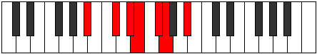 |
| [873](https://ianring.com/musictheory/scales/873) | [Bagimic](ModeCSharpBagimic.md) | C# | C#, D##, E##, F##, G##, A#, C# |  |
| [873](https://ianring.com/musictheory/scales/873) | [Bagimic](ModeDFlatBagimic.md) | Db | Db, E, F#, G, A, Bb, Db |  |
| [875](https://ianring.com/musictheory/scales/875) | [Stothian](ModeCSharpStothian.md) | C# | C#, D, E, F#, G, A, Bb, C# |  |
| [875](https://ianring.com/musictheory/scales/875) | [Stothian](ModeDFlatStothian.md) | Db | Db, Ebb, Fb, Gb, Abb, Bbb, Cbb, Db |  |
| [875](https://ianring.com/musictheory/scales/875) | [Stothian](ModeASharpStothian.md) | A# | A#, B, C#, D#, E, F#, G, A# |  |
| [875](https://ianring.com/musictheory/scales/875) | [Stothian](ModeBFlatStothian.md) | Bb | Bb, Cb, Db, Eb, Fb, Gb, Abb, Bb |  |
| [875](https://ianring.com/musictheory/scales/875) | [Stothian](ModeFNaturalStothian.md) | F | F, Gb, Ab, Bb, Cb, Db, Ebb, F |  |
| [877](https://ianring.com/musictheory/scales/877) | [Aeraptian](ModeASharpAeraptian.md) | A# | A#, B#, C#, D#, E, F#, G, A# |  |
| [877](https://ianring.com/musictheory/scales/877) | [Aeraptian](ModeBFlatAeraptian.md) | Bb | Bb, C, Db, Eb, Fb, Gb, Abb, Bb |  |
| [877](https://ianring.com/musictheory/scales/877) | [Aeraptian](ModeENaturalAeraptian.md) | E | E, F#, G, A, Bb, C, Db, E |  |
| [877](https://ianring.com/musictheory/scales/877) | [Aeraptian](ModeCSharpAeraptian.md) | C# | C#, D#, E, F#, G, A, Bb, C# |  |
| [877](https://ianring.com/musictheory/scales/877) | [Aeraptian](ModeDFlatAeraptian.md) | Db | Db, Eb, Fb, Gb, Abb, Bbb, Cbb, Db |  |
| [879](https://ianring.com/musictheory/scales/879) | [Aeolocryllic](ModeCSharpAeolocryllic.md) | C# | C#, D, D#, E, F#, G, A, A#, C# |  |
| [879](https://ianring.com/musictheory/scales/879) | [Aeolocryllic](ModeDFlatAeolocryllic.md) | Db | Db, D, Eb, E, Gb, G, A, Bb, Db |  |
| [879](https://ianring.com/musictheory/scales/879) | [Aeolocryllic](ModeENaturalAeolocryllic.md) | E | E, F, F#, G, A, A#, C, C#, E |  |
| [879](https://ianring.com/musictheory/scales/879) | [Aeolocryllic](ModeASharpAeolocryllic.md) | A# | A#, B, C, C#, D#, E, F#, G, A# |  |
| [879](https://ianring.com/musictheory/scales/879) | [Aeolocryllic](ModeBFlatAeolocryllic.md) | Bb | Bb, B, C, Db, Eb, E, Gb, G, Bb |  |
| [879](https://ianring.com/musictheory/scales/879) | [Aeolocryllic](ModeFNaturalAeolocryllic.md) | F | F, F#, G, G#, A#, B, C#, D, F |  |
| [881](https://ianring.com/musictheory/scales/881) | [Aerothimic](ModeCSharpAerothimic.md) | C# | C#, D###, E##, F##, G##, A#, C# |  |
| [881](https://ianring.com/musictheory/scales/881) | [Aerothimic](ModeDFlatAerothimic.md) | Db | Db, E#, F#, G, A, Bb, Db |  |
| [883](https://ianring.com/musictheory/scales/883) | [Ralian](ModeANaturalRalian.md) | A | A, Bb, C#, D, Eb, F, Gb, A |  |
| [883](https://ianring.com/musictheory/scales/883) | [Ralian](ModeCSharpRalian.md) | C# | C#, D, E#, F#, G, A, Bb, C# |  |
| [883](https://ianring.com/musictheory/scales/883) | [Ralian](ModeDFlatRalian.md) | Db | Db, Ebb, F, Gb, Abb, Bbb, Cbb, Db |  |
| [883](https://ianring.com/musictheory/scales/883) | [Ralian](ModeFNaturalRalian.md) | F | F, Gb, A, Bb, Cb, Db, Ebb, F |  |
| [885](https://ianring.com/musictheory/scales/885) | [Sathian](ModeCSharpSathian.md) | C# | C#, D#, E#, F#, G, A, Bb, C# |  |
| [885](https://ianring.com/musictheory/scales/885) | [Sathian](ModeDFlatSathian.md) | Db | Db, Eb, F, Gb, Abb, Bbb, Cbb, Db |  |
| [885](https://ianring.com/musictheory/scales/885) | [Sathian](ModeENaturalSathian.md) | E | E, F#, G#, A, Bb, C, Db, E |  |
| [887](https://ianring.com/musictheory/scales/887) | [Sathyllic](ModeCSharpSathyllic.md) | C# | C#, D, D#, F, F#, G, A, A#, C# |  |
| [887](https://ianring.com/musictheory/scales/887) | [Sathyllic](ModeDFlatSathyllic.md) | Db | Db, D, Eb, F, Gb, G, A, Bb, Db |  |
| [887](https://ianring.com/musictheory/scales/887) | [Sathyllic](ModeENaturalSathyllic.md) | E | E, F, F#, G#, A, A#, C, C#, E |  |
| [887](https://ianring.com/musictheory/scales/887) | [Sathyllic](ModeANaturalSathyllic.md) | A | A, A#, B, C#, D, D#, F, F#, A |  |
| [887](https://ianring.com/musictheory/scales/887) | [Sathyllic](ModeFNaturalSathyllic.md) | F | F, F#, G, A, A#, B, C#, D, F |  |
| [889](https://ianring.com/musictheory/scales/889) | [Borian](ModeASharpBorian.md) | A# | A#, B##, C##, D#, E, F#, G, A# |  |
| [889](https://ianring.com/musictheory/scales/889) | [Borian](ModeBFlatBorian.md) | Bb | Bb, C#, D, Eb, Fb, Gb, Abb, Bb |  |
| [889](https://ianring.com/musictheory/scales/889) | [Borian](ModeCSharpBorian.md) | C# | C#, D##, E#, F#, G, A, Bb, C# |  |
| [889](https://ianring.com/musictheory/scales/889) | [Borian](ModeDFlatBorian.md) | Db | Db, E, F, Gb, Abb, Bbb, Cbb, Db |  |
| [891](https://ianring.com/musictheory/scales/891) | [Ionilyllic](ModeANaturalIonilyllic.md) | A | A, A#, C, C#, D, D#, F, F#, A |  |
| [891](https://ianring.com/musictheory/scales/891) | [Ionilyllic](ModeCSharpIonilyllic.md) | C# | C#, D, E, F, F#, G, A, A#, C# |  |
| [891](https://ianring.com/musictheory/scales/891) | [Ionilyllic](ModeDFlatIonilyllic.md) | Db | Db, D, E, F, Gb, G, A, Bb, Db |  |
| [891](https://ianring.com/musictheory/scales/891) | [Ionilyllic](ModeASharpIonilyllic.md) | A# | A#, B, C#, D, D#, E, F#, G, A# |  |
| [891](https://ianring.com/musictheory/scales/891) | [Ionilyllic](ModeBFlatIonilyllic.md) | Bb | Bb, B, Db, D, Eb, E, Gb, G, Bb |  |
| [891](https://ianring.com/musictheory/scales/891) | [Ionilyllic](ModeFNaturalIonilyllic.md) | F | F, F#, G#, A, A#, B, C#, D, F |  |
| [893](https://ianring.com/musictheory/scales/893) | [Pycryllic](ModeASharpPycryllic.md) | A# | A#, C, C#, D, D#, E, F#, G, A# |  |
| [893](https://ianring.com/musictheory/scales/893) | [Pycryllic](ModeBFlatPycryllic.md) | Bb | Bb, C, Db, D, Eb, E, Gb, G, Bb |  |
| [893](https://ianring.com/musictheory/scales/893) | [Pycryllic](ModeCSharpPycryllic.md) | C# | C#, D#, E, F, F#, G, A, A#, C# |  |
| [893](https://ianring.com/musictheory/scales/893) | [Pycryllic](ModeDFlatPycryllic.md) | Db | Db, Eb, E, F, Gb, G, A, Bb, Db |  |
| [893](https://ianring.com/musictheory/scales/893) | [Pycryllic](ModeENaturalPycryllic.md) | E | E, F#, G, G#, A, A#, C, C#, E |  |
| [895](https://ianring.com/musictheory/scales/895) | [Aeolathygic](ModeCSharpAeolathygic.md) | C# | C#, D, D#, E, F, F#, G, A, A#, C# |  |
| [895](https://ianring.com/musictheory/scales/895) | [Aeolathygic](ModeDFlatAeolathygic.md) | Db | Db, D, Eb, E, F, Gb, G, A, Bb, Db |  |
| [895](https://ianring.com/musictheory/scales/895) | [Aeolathygic](ModeENaturalAeolathygic.md) | E | E, F, F#, G, G#, A, A#, C, C#, E |  |
| [895](https://ianring.com/musictheory/scales/895) | [Aeolathygic](ModeASharpAeolathygic.md) | A# | A#, B, C, C#, D, D#, E, F#, G, A# |  |
| [895](https://ianring.com/musictheory/scales/895) | [Aeolathygic](ModeBFlatAeolathygic.md) | Bb | Bb, B, C, Db, D, Eb, E, Gb, G, Bb |  |
| [895](https://ianring.com/musictheory/scales/895) | [Aeolathygic](ModeANaturalAeolathygic.md) | A | A, A#, B, C, C#, D, D#, F, F#, A |  |
| [895](https://ianring.com/musictheory/scales/895) | [Aeolathygic](ModeFNaturalAeolathygic.md) | F | F, F#, G, G#, A, A#, B, C#, D, F |  |
| [905](https://ianring.com/musictheory/scales/905) | [Bylitonic](ModeASharpBylitonic.md) | A# | A#, C#, F, F#, G, A# |  |
| [905](https://ianring.com/musictheory/scales/905) | [Bylitonic](ModeBFlatBylitonic.md) | Bb | Bb, Db, F, Gb, G, Bb |  |
| [907](https://ianring.com/musictheory/scales/907) | [Tholimic](ModeASharpTholimic.md) | A# | A#, B, C#, D###, E##, F##, A# |  |
| [907](https://ianring.com/musictheory/scales/907) | [Tholimic](ModeBFlatTholimic.md) | Bb | Bb, Cb, Db, E#, F#, G, Bb |  |
| [909](https://ianring.com/musictheory/scales/909) | [Katarimic](ModeASharpKatarimic.md) | A# | A#, B#, C#, D###, E##, F##, A# | 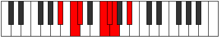 |
| [909](https://ianring.com/musictheory/scales/909) | [Katarimic](ModeBFlatKatarimic.md) | Bb | Bb, C, Db, E#, F#, G, Bb |  |
| [911](https://ianring.com/musictheory/scales/911) | [Radian](ModeASharpRadian.md) | A# | A#, B, C, Db, E#, F#, G, A# |  |
| [911](https://ianring.com/musictheory/scales/911) | [Radian](ModeBFlatRadian.md) | Bb | Bb, Cb, Dbb, Ebbb, F, Gb, Abb, Bb |  |
| [913](https://ianring.com/musictheory/scales/913) | [Aeolyritonic](ModeFSharpAeolyritonic.md) | F# | F#, A#, C#, D, D#, F# |  |
| [913](https://ianring.com/musictheory/scales/913) | [Aeolyritonic](ModeGFlatAeolyritonic.md) | Gb | Gb, Bb, Db, D, Eb, Gb |  |
| [915](https://ianring.com/musictheory/scales/915) | [Loptimic](ModeFSharpLoptimic.md) | F# | F#, G, A#, B##, C##, D#, F# |  |
| [915](https://ianring.com/musictheory/scales/915) | [Loptimic](ModeGFlatLoptimic.md) | Gb | Gb, Abb, Bb, C#, D, Eb, Gb |  |
| [915](https://ianring.com/musictheory/scales/915) | [Loptimic](ModeANaturalLoptimic.md) | A | A, Bb, C#, D##, E#, F#, A |  |
| [917](https://ianring.com/musictheory/scales/917) | [Dygimic](ModeFSharpDygimic.md) | F# | F#, G#, A#, B##, C##, D#, F# |  |
| [917](https://ianring.com/musictheory/scales/917) | [Dygimic](ModeGFlatDygimic.md) | Gb | Gb, Ab, Bb, C#, D, Eb, Gb |  |
| [919](https://ianring.com/musictheory/scales/919) | [Gathian](ModeFSharpGathian.md) | F# | F#, G, Ab, Bb, C#, D, Eb, F# |  |
| [919](https://ianring.com/musictheory/scales/919) | [Gathian](ModeGFlatGathian.md) | Gb | Gb, Abb, Bbbb, Cbb, Db, Ebb, Fbb, Gb |  |
| [919](https://ianring.com/musictheory/scales/919) | [Gathian](ModeANaturalGathian.md) | A | A, Bb, Cb, Db, E, F, Gb, A |  |
| [921](https://ianring.com/musictheory/scales/921) | [Bogimic](ModeASharpBogimic.md) | A# | A#, B##, C##, D###, E##, F##, A# |  |
| [921](https://ianring.com/musictheory/scales/921) | [Bogimic](ModeBFlatBogimic.md) | Bb | Bb, C#, D, E#, F#, G, Bb |  |
| [921](https://ianring.com/musictheory/scales/921) | [Bogimic](ModeFSharpBogimic.md) | F# | F#, G##, A#, B##, C##, D#, F# |  |
| [921](https://ianring.com/musictheory/scales/921) | [Bogimic](ModeGFlatBogimic.md) | Gb | Gb, A, Bb, C#, D, Eb, Gb |  |
| [923](https://ianring.com/musictheory/scales/923) | [Ionodian](ModeANaturalIonodian.md) | A | A, Bb, C, Db, E, F, Gb, A |  |
| [923](https://ianring.com/musictheory/scales/923) | [Ionodian](ModeFSharpIonodian.md) | F# | F#, G, A, Bb, C#, D, Eb, F# |  |
| [923](https://ianring.com/musictheory/scales/923) | [Ionodian](ModeGFlatIonodian.md) | Gb | Gb, Abb, Bbb, Cbb, Db, Ebb, Fbb, Gb |  |
| [923](https://ianring.com/musictheory/scales/923) | [Ionodian](ModeASharpIonodian.md) | A# | A#, B, C#, D, E#, F#, G, A# |  |
| [923](https://ianring.com/musictheory/scales/923) | [Ionodian](ModeBFlatIonodian.md) | Bb | Bb, Cb, Db, Ebb, F, Gb, Abb, Bb |  |
| [925](https://ianring.com/musictheory/scales/925) | [Mythian](ModeASharpMythian.md) | A# | A#, B#, C#, D, E#, F#, G, A# |  |
| [925](https://ianring.com/musictheory/scales/925) | [Mythian](ModeBFlatMythian.md) | Bb | Bb, C, Db, Ebb, F, Gb, Abb, Bb |  |
| [925](https://ianring.com/musictheory/scales/925) | [Mythian](ModeFSharpMythian.md) | F# | F#, G#, A, Bb, C#, D, Eb, F# |  |
| [925](https://ianring.com/musictheory/scales/925) | [Mythian](ModeGFlatMythian.md) | Gb | Gb, Ab, Bbb, Cbb, Db, Ebb, Fbb, Gb |  |
| [927](https://ianring.com/musictheory/scales/927) | [Koptyllic](ModeFSharpKoptyllic.md) | F# | F#, G, G#, A, A#, C#, D, D#, F# |  |
| [927](https://ianring.com/musictheory/scales/927) | [Koptyllic](ModeGFlatKoptyllic.md) | Gb | Gb, G, Ab, A, Bb, Db, D, Eb, Gb |  |
| [927](https://ianring.com/musictheory/scales/927) | [Koptyllic](ModeASharpKoptyllic.md) | A# | A#, B, C, C#, D, F, F#, G, A# |  |
| [927](https://ianring.com/musictheory/scales/927) | [Koptyllic](ModeBFlatKoptyllic.md) | Bb | Bb, B, C, Db, D, F, Gb, G, Bb |  |
| [927](https://ianring.com/musictheory/scales/927) | [Koptyllic](ModeANaturalKoptyllic.md) | A | A, A#, B, C, C#, E, F, F#, A |  |
| [931](https://ianring.com/musictheory/scales/931) | [Bacrimic](ModeFNaturalBacrimic.md) | F | F, Gb, A#, B#, C#, D, F |  |
| [931](https://ianring.com/musictheory/scales/931) | [Bacrimic](ModeCSharpBacrimic.md) | C# | C#, D, E##, F###, G##, A#, C# |  |
| [931](https://ianring.com/musictheory/scales/931) | [Bacrimic](ModeDFlatBacrimic.md) | Db | Db, Ebb, F#, G#, A, Bb, Db |  |
| [933](https://ianring.com/musictheory/scales/933) | [Dadimic](ModeCSharpDadimic.md) | C# | C#, D#, E##, F###, G##, A#, C# |  |
| [933](https://ianring.com/musictheory/scales/933) | [Dadimic](ModeDFlatDadimic.md) | Db | Db, Eb, F#, G#, A, Bb, Db |  |
| [935](https://ianring.com/musictheory/scales/935) | [Katarian](ModeFNaturalKatarian.md) | F | F, Gb, Abb, Bb, C, Db, Ebb, F |  |
| [935](https://ianring.com/musictheory/scales/935) | [Katarian](ModeCSharpKatarian.md) | C# | C#, D, Eb, F#, G#, A, Bb, C# |  |
| [935](https://ianring.com/musictheory/scales/935) | [Katarian](ModeDFlatKatarian.md) | Db | Db, Ebb, Fbb, Gb, Ab, Bbb, Cbb, Db | 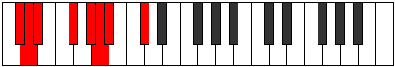 |
| [937](https://ianring.com/musictheory/scales/937) | [Stothimic](ModeASharpStothimic.md) | A# | A#, B##, C###, D###, E##, F##, A# |  |
| [937](https://ianring.com/musictheory/scales/937) | [Stothimic](ModeBFlatStothimic.md) | Bb | Bb, C#, D#, E#, F#, G, Bb |  |
| [937](https://ianring.com/musictheory/scales/937) | [Stothimic](ModeCSharpStothimic.md) | C# | C#, D##, E##, F###, G##, A#, C# |  |
| [937](https://ianring.com/musictheory/scales/937) | [Stothimic](ModeDFlatStothimic.md) | Db | Db, E, F#, G#, A, Bb, Db |  |
| [939](https://ianring.com/musictheory/scales/939) | [Dyptian](ModeFNaturalDyptian.md) | F | F, Gb, Ab, Bb, C, Db, Ebb, F |  |
| [939](https://ianring.com/musictheory/scales/939) | [Dyptian](ModeCSharpDyptian.md) | C# | C#, D, E, F#, G#, A, Bb, C# |  |
| [939](https://ianring.com/musictheory/scales/939) | [Dyptian](ModeDFlatDyptian.md) | Db | Db, Ebb, Fb, Gb, Ab, Bbb, Cbb, Db |  |
| [939](https://ianring.com/musictheory/scales/939) | [Dyptian](ModeASharpDyptian.md) | A# | A#, B, C#, D#, E#, F#, G, A# |  |
| [939](https://ianring.com/musictheory/scales/939) | [Dyptian](ModeBFlatDyptian.md) | Bb | Bb, Cb, Db, Eb, F, Gb, Abb, Bb |  |
| [941](https://ianring.com/musictheory/scales/941) | [Phrorian](ModeASharpPhrorian.md) | A# | A#, B#, C#, D#, E#, F#, G, A# |  |
| [941](https://ianring.com/musictheory/scales/941) | [Phrorian](ModeBFlatPhrorian.md) | Bb | Bb, C, Db, Eb, F, Gb, Abb, Bb |  |
| [941](https://ianring.com/musictheory/scales/941) | [Phrorian](ModeCSharpPhrorian.md) | C# | C#, D#, E, F#, G#, A, Bb, C# |  |
| [941](https://ianring.com/musictheory/scales/941) | [Phrorian](ModeDFlatPhrorian.md) | Db | Db, Eb, Fb, Gb, Ab, Bbb, Cbb, Db |  |
| [943](https://ianring.com/musictheory/scales/943) | [Aerygyllic](ModeFNaturalAerygyllic.md) | F | F, F#, G, G#, A#, C, C#, D, F |  |
| [943](https://ianring.com/musictheory/scales/943) | [Aerygyllic](ModeCSharpAerygyllic.md) | C# | C#, D, D#, E, F#, G#, A, A#, C# | 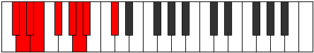 |
| [943](https://ianring.com/musictheory/scales/943) | [Aerygyllic](ModeDFlatAerygyllic.md) | Db | Db, D, Eb, E, Gb, Ab, A, Bb, Db |  |
| [943](https://ianring.com/musictheory/scales/943) | [Aerygyllic](ModeASharpAerygyllic.md) | A# | A#, B, C, C#, D#, F, F#, G, A# |  |
| [943](https://ianring.com/musictheory/scales/943) | [Aerygyllic](ModeBFlatAerygyllic.md) | Bb | Bb, B, C, Db, Eb, F, Gb, G, Bb |  |
| [945](https://ianring.com/musictheory/scales/945) | [Syrimic](ModeCSharpSyrimic.md) | C# | C#, D###, E##, F###, G##, A#, C# |  |
| [945](https://ianring.com/musictheory/scales/945) | [Syrimic](ModeDFlatSyrimic.md) | Db | Db, E#, F#, G#, A, Bb, Db |  |
| [945](https://ianring.com/musictheory/scales/945) | [Syrimic](ModeFSharpSyrimic.md) | F# | F#, G###, A##, B##, C##, D#, F# |  |
| [945](https://ianring.com/musictheory/scales/945) | [Syrimic](ModeGFlatSyrimic.md) | Gb | Gb, A#, B, C#, D, Eb, Gb |  |
| [947](https://ianring.com/musictheory/scales/947) | [Modian](ModeFNaturalModian.md) | F | F, Gb, A, Bb, C, Db, Ebb, F |  |
| [947](https://ianring.com/musictheory/scales/947) | [Modian](ModeANaturalModian.md) | A | A, Bb, C#, D, E, F, Gb, A |  |
| [947](https://ianring.com/musictheory/scales/947) | [Modian](ModeCSharpModian.md) | C# | C#, D, E#, F#, G#, A, Bb, C# |  |
| [947](https://ianring.com/musictheory/scales/947) | [Modian](ModeDFlatModian.md) | Db | Db, Ebb, F, Gb, Ab, Bbb, Cbb, Db |  |
| [947](https://ianring.com/musictheory/scales/947) | [Modian](ModeFSharpModian.md) | F# | F#, G, A#, B, C#, D, Eb, F# |  |
| [947](https://ianring.com/musictheory/scales/947) | [Modian](ModeGFlatModian.md) | Gb | Gb, Abb, Bb, Cb, Db, Ebb, Fbb, Gb |  |
| [949](https://ianring.com/musictheory/scales/949) | [Ionagian](ModeCSharpIonagian.md) | C# | C#, D#, E#, F#, G#, A, Bb, C# |  |
| [949](https://ianring.com/musictheory/scales/949) | [Ionagian](ModeDFlatIonagian.md) | Db | Db, Eb, F, Gb, Ab, Bbb, Cbb, Db |  |
| [949](https://ianring.com/musictheory/scales/949) | [Ionagian](ModeFSharpIonagian.md) | F# | F#, G#, A#, B, C#, D, Eb, F# |  |
| [949](https://ianring.com/musictheory/scales/949) | [Ionagian](ModeGFlatIonagian.md) | Gb | Gb, Ab, Bb, Cb, Db, Ebb, Fbb, Gb |  |
| [951](https://ianring.com/musictheory/scales/951) | [Thogyllic](ModeFNaturalThogyllic.md) | F | F, F#, G, A, A#, C, C#, D, F |  |
| [951](https://ianring.com/musictheory/scales/951) | [Thogyllic](ModeCSharpThogyllic.md) | C# | C#, D, D#, F, F#, G#, A, A#, C# |  |
| [951](https://ianring.com/musictheory/scales/951) | [Thogyllic](ModeDFlatThogyllic.md) | Db | Db, D, Eb, F, Gb, Ab, A, Bb, Db |  |
| [951](https://ianring.com/musictheory/scales/951) | [Thogyllic](ModeFSharpThogyllic.md) | F# | F#, G, G#, A#, B, C#, D, D#, F# |  |
| [951](https://ianring.com/musictheory/scales/951) | [Thogyllic](ModeGFlatThogyllic.md) | Gb | Gb, G, Ab, Bb, B, Db, D, Eb, Gb |  |
| [951](https://ianring.com/musictheory/scales/951) | [Thogyllic](ModeANaturalThogyllic.md) | A | A, A#, B, C#, D, E, F, F#, A |  |
| [953](https://ianring.com/musictheory/scales/953) | [Stoptian](ModeASharpStoptian.md) | A# | A#, B##, C##, D#, E#, F#, G, A# |  |
| [953](https://ianring.com/musictheory/scales/953) | [Stoptian](ModeBFlatStoptian.md) | Bb | Bb, C#, D, Eb, F, Gb, Abb, Bb |  |
| [953](https://ianring.com/musictheory/scales/953) | [Stoptian](ModeCSharpStoptian.md) | C# | C#, D##, E#, F#, G#, A, Bb, C# |  |
| [953](https://ianring.com/musictheory/scales/953) | [Stoptian](ModeDFlatStoptian.md) | Db | Db, E, F, Gb, Ab, Bbb, Cbb, Db |  |
| [953](https://ianring.com/musictheory/scales/953) | [Stoptian](ModeFSharpStoptian.md) | F# | F#, G##, A#, B, C#, D, Eb, F# |  |
| [953](https://ianring.com/musictheory/scales/953) | [Stoptian](ModeGFlatStoptian.md) | Gb | Gb, A, Bb, Cb, Db, Ebb, Fbb, Gb |  |
| [955](https://ianring.com/musictheory/scales/955) | [Ionogyllic](ModeANaturalIonogyllic.md) | A | A, A#, C, C#, D, E, F, F#, A |  |
| [955](https://ianring.com/musictheory/scales/955) | [Ionogyllic](ModeFNaturalIonogyllic.md) | F | F, F#, G#, A, A#, C, C#, D, F |  |
| [955](https://ianring.com/musictheory/scales/955) | [Ionogyllic](ModeCSharpIonogyllic.md) | C# | C#, D, E, F, F#, G#, A, A#, C# |  |
| [955](https://ianring.com/musictheory/scales/955) | [Ionogyllic](ModeDFlatIonogyllic.md) | Db | Db, D, E, F, Gb, Ab, A, Bb, Db |  |
| [955](https://ianring.com/musictheory/scales/955) | [Ionogyllic](ModeASharpIonogyllic.md) | A# | A#, B, C#, D, D#, F, F#, G, A# |  |
| [955](https://ianring.com/musictheory/scales/955) | [Ionogyllic](ModeBFlatIonogyllic.md) | Bb | Bb, B, Db, D, Eb, F, Gb, G, Bb |  |
| [955](https://ianring.com/musictheory/scales/955) | [Ionogyllic](ModeFSharpIonogyllic.md) | F# | F#, G, A, A#, B, C#, D, D#, F# |  |
| [955](https://ianring.com/musictheory/scales/955) | [Ionogyllic](ModeGFlatIonogyllic.md) | Gb | Gb, G, A, Bb, B, Db, D, Eb, Gb |  |
| [957](https://ianring.com/musictheory/scales/957) | [Phronyllic](ModeASharpPhronyllic.md) | A# | A#, C, C#, D, D#, F, F#, G, A# |  |
| [957](https://ianring.com/musictheory/scales/957) | [Phronyllic](ModeBFlatPhronyllic.md) | Bb | Bb, C, Db, D, Eb, F, Gb, G, Bb |  |
| [957](https://ianring.com/musictheory/scales/957) | [Phronyllic](ModeCSharpPhronyllic.md) | C# | C#, D#, E, F, F#, G#, A, A#, C# |  |
| [957](https://ianring.com/musictheory/scales/957) | [Phronyllic](ModeDFlatPhronyllic.md) | Db | Db, Eb, E, F, Gb, Ab, A, Bb, Db |  |
| [957](https://ianring.com/musictheory/scales/957) | [Phronyllic](ModeFSharpPhronyllic.md) | F# | F#, G#, A, A#, B, C#, D, D#, F# |  |
| [957](https://ianring.com/musictheory/scales/957) | [Phronyllic](ModeGFlatPhronyllic.md) | Gb | Gb, Ab, A, Bb, B, Db, D, Eb, Gb |  |
| [959](https://ianring.com/musictheory/scales/959) | [Katylygic](ModeCSharpKatylygic.md) | C# | C#, D, D#, E, F, F#, G#, A, A#, C# |  |
| [959](https://ianring.com/musictheory/scales/959) | [Katylygic](ModeDFlatKatylygic.md) | Db | Db, D, Eb, E, F, Gb, Ab, A, Bb, Db |  |
| [959](https://ianring.com/musictheory/scales/959) | [Katylygic](ModeFNaturalKatylygic.md) | F | F, F#, G, G#, A, A#, C, C#, D, F |  |
| [959](https://ianring.com/musictheory/scales/959) | [Katylygic](ModeASharpKatylygic.md) | A# | A#, B, C, C#, D, D#, F, F#, G, A# |  |
| [959](https://ianring.com/musictheory/scales/959) | [Katylygic](ModeBFlatKatylygic.md) | Bb | Bb, B, C, Db, D, Eb, F, Gb, G, Bb |  |
| [959](https://ianring.com/musictheory/scales/959) | [Katylygic](ModeANaturalKatylygic.md) | A | A, A#, B, C, C#, D, E, F, F#, A |  |
| [959](https://ianring.com/musictheory/scales/959) | [Katylygic](ModeFSharpKatylygic.md) | F# | F#, G, G#, A, A#, B, C#, D, D#, F# |  |
| [959](https://ianring.com/musictheory/scales/959) | [Katylygic](ModeGFlatKatylygic.md) | Gb | Gb, G, Ab, A, Bb, B, Db, D, Eb, Gb |  |
| [965](https://ianring.com/musictheory/scales/965) | [Ionothimic](ModeENaturalIonothimic.md) | E | E, F#, G###, A##, B#, C#, E |  |
| [967](https://ianring.com/musictheory/scales/967) | [Aeolanian](ModeENaturalAeolanian.md) | E | E, F, Gb, A#, B, C, Db, E |  |
| [969](https://ianring.com/musictheory/scales/969) | [Ionogimic](ModeASharpIonogimic.md) | A# | A#, B##, D##, E#, F#, G, A# |  |
| [969](https://ianring.com/musictheory/scales/969) | [Ionogimic](ModeBFlatIonogimic.md) | Bb | Bb, C#, D##, E#, F#, G, Bb |  |
| [971](https://ianring.com/musictheory/scales/971) | [Ladian](ModeASharpLadian.md) | A# | A#, B, C#, D##, E#, F#, G, A# |  |
| [971](https://ianring.com/musictheory/scales/971) | [Ladian](ModeBFlatLadian.md) | Bb | Bb, Cb, Db, E, F, Gb, Abb, Bb |  |
| [973](https://ianring.com/musictheory/scales/973) | [Phryptian](ModeASharpPhryptian.md) | A# | A#, B#, C#, D##, E#, F#, G, A# |  |
| [973](https://ianring.com/musictheory/scales/973) | [Phryptian](ModeBFlatPhryptian.md) | Bb | Bb, C, Db, E, F, Gb, Abb, Bb |  |
| [973](https://ianring.com/musictheory/scales/973) | [Phryptian](ModeENaturalPhryptian.md) | E | E, F#, G, A#, B, C, Db, E |  |
| [975](https://ianring.com/musictheory/scales/975) | [Katogyllic](ModeENaturalKatogyllic.md) | E | E, F, F#, G, A#, B, C, C#, E |  |
| [975](https://ianring.com/musictheory/scales/975) | [Katogyllic](ModeASharpKatogyllic.md) | A# | A#, B, C, C#, E, F, F#, G, A# |  |
| [975](https://ianring.com/musictheory/scales/975) | [Katogyllic](ModeBFlatKatogyllic.md) | Bb | Bb, B, C, Db, E, F, Gb, G, Bb |  |
| [977](https://ianring.com/musictheory/scales/977) | [Kocrimic](ModeFSharpKocrimic.md) | F# | F#, G###, A###, B##, C##, D#, F# |  |
| [977](https://ianring.com/musictheory/scales/977) | [Kocrimic](ModeGFlatKocrimic.md) | Gb | Gb, A#, B#, C#, D, Eb, Gb |  |
| [979](https://ianring.com/musictheory/scales/979) | [Thogian](ModeFSharpThogian.md) | F# | F#, G, A#, B#, C#, D, Eb, F# |  |
| [979](https://ianring.com/musictheory/scales/979) | [Thogian](ModeGFlatThogian.md) | Gb | Gb, Abb, Bb, C, Db, Ebb, Fbb, Gb |  |
| [979](https://ianring.com/musictheory/scales/979) | [Thogian](ModeANaturalThogian.md) | A | A, Bb, C#, D#, E, F, Gb, A |  |
| [981](https://ianring.com/musictheory/scales/981) | [Bacrian](ModeFSharpBacrian.md) | F# | F#, G#, A#, B#, C#, D, Eb, F# |  |
| [981](https://ianring.com/musictheory/scales/981) | [Bacrian](ModeGFlatBacrian.md) | Gb | Gb, Ab, Bb, C, Db, Ebb, Fbb, Gb |  |
| [981](https://ianring.com/musictheory/scales/981) | [Bacrian](ModeENaturalBacrian.md) | E | E, F#, G#, A#, B, C, Db, E |  |
| [983](https://ianring.com/musictheory/scales/983) | [Epygyllic](ModeFSharpEpygyllic.md) | F# | F#, G, G#, A#, C, C#, D, D#, F# |  |
| [983](https://ianring.com/musictheory/scales/983) | [Epygyllic](ModeGFlatEpygyllic.md) | Gb | Gb, G, Ab, Bb, C, Db, D, Eb, Gb |  |
| [983](https://ianring.com/musictheory/scales/983) | [Epygyllic](ModeENaturalEpygyllic.md) | E | E, F, F#, G#, A#, B, C, C#, E | 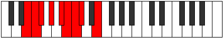 |
| [983](https://ianring.com/musictheory/scales/983) | [Epygyllic](ModeANaturalEpygyllic.md) | A | A, A#, B, C#, D#, E, F, F#, A |  |
| [985](https://ianring.com/musictheory/scales/985) | [Raptian](ModeASharpRaptian.md) | A# | A#, B##, C##, D##, E#, F#, G, A# |  |
| [985](https://ianring.com/musictheory/scales/985) | [Raptian](ModeBFlatRaptian.md) | Bb | Bb, C#, D, E, F, Gb, Abb, Bb |  |
| [985](https://ianring.com/musictheory/scales/985) | [Raptian](ModeFSharpRaptian.md) | F# | F#, G##, A#, B#, C#, D, Eb, F# |  |
| [985](https://ianring.com/musictheory/scales/985) | [Raptian](ModeGFlatRaptian.md) | Gb | Gb, A, Bb, C, Db, Ebb, Fbb, Gb |  |
| [987](https://ianring.com/musictheory/scales/987) | [Aeraptyllic](ModeANaturalAeraptyllic.md) | A | A, A#, C, C#, D#, E, F, F#, A |  |
| [987](https://ianring.com/musictheory/scales/987) | [Aeraptyllic](ModeFSharpAeraptyllic.md) | F# | F#, G, A, A#, C, C#, D, D#, F# |  |
| [987](https://ianring.com/musictheory/scales/987) | [Aeraptyllic](ModeGFlatAeraptyllic.md) | Gb | Gb, G, A, Bb, C, Db, D, Eb, Gb |  |
| [987](https://ianring.com/musictheory/scales/987) | [Aeraptyllic](ModeASharpAeraptyllic.md) | A# | A#, B, C#, D, E, F, F#, G, A# |  |
| [987](https://ianring.com/musictheory/scales/987) | [Aeraptyllic](ModeBFlatAeraptyllic.md) | Bb | Bb, B, Db, D, E, F, Gb, G, Bb |  |
| [989](https://ianring.com/musictheory/scales/989) | [Phrolyllic](ModeASharpPhrolyllic.md) | A# | A#, C, C#, D, E, F, F#, G, A# |  |
| [989](https://ianring.com/musictheory/scales/989) | [Phrolyllic](ModeBFlatPhrolyllic.md) | Bb | Bb, C, Db, D, E, F, Gb, G, Bb |  |
| [989](https://ianring.com/musictheory/scales/989) | [Phrolyllic](ModeFSharpPhrolyllic.md) | F# | F#, G#, A, A#, C, C#, D, D#, F# |  |
| [989](https://ianring.com/musictheory/scales/989) | [Phrolyllic](ModeGFlatPhrolyllic.md) | Gb | Gb, Ab, A, Bb, C, Db, D, Eb, Gb |  |
| [989](https://ianring.com/musictheory/scales/989) | [Phrolyllic](ModeENaturalPhrolyllic.md) | E | E, F#, G, G#, A#, B, C, C#, E |  |
| [991](https://ianring.com/musictheory/scales/991) | [Aeolygic](ModeFSharpAeolygic.md) | F# | F#, G, G#, A, A#, C, C#, D, D#, F# |  |
| [991](https://ianring.com/musictheory/scales/991) | [Aeolygic](ModeGFlatAeolygic.md) | Gb | Gb, G, Ab, A, Bb, C, Db, D, Eb, Gb |  |
| [991](https://ianring.com/musictheory/scales/991) | [Aeolygic](ModeASharpAeolygic.md) | A# | A#, B, C, C#, D, E, F, F#, G, A# |  |
| [991](https://ianring.com/musictheory/scales/991) | [Aeolygic](ModeBFlatAeolygic.md) | Bb | Bb, B, C, Db, D, E, F, Gb, G, Bb |  |
| [991](https://ianring.com/musictheory/scales/991) | [Aeolygic](ModeENaturalAeolygic.md) | E | E, F, F#, G, G#, A#, B, C, C#, E |  |
| [991](https://ianring.com/musictheory/scales/991) | [Aeolygic](ModeANaturalAeolygic.md) | A | A, A#, B, C, C#, D#, E, F, F#, A |  |
| [995](https://ianring.com/musictheory/scales/995) | [Phrathian](ModeCSharpPhrathian.md) | C# | C#, D, E##, F##, G#, A, Bb, C# | 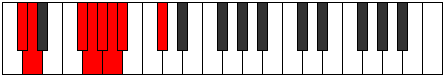 |
| [995](https://ianring.com/musictheory/scales/995) | [Phrathian](ModeDFlatPhrathian.md) | Db | Db, Ebb, F#, G, Ab, Bbb, Cbb, Db |  |
| [995](https://ianring.com/musictheory/scales/995) | [Phrathian](ModeFNaturalPhrathian.md) | F | F, Gb, A#, B, C, Db, Ebb, F |  |
| [997](https://ianring.com/musictheory/scales/997) | [Rycrian](ModeCSharpRycrian.md) | C# | C#, D#, E##, F##, G#, A, Bb, C# |  |
| [997](https://ianring.com/musictheory/scales/997) | [Rycrian](ModeDFlatRycrian.md) | Db | Db, Eb, F#, G, Ab, Bbb, Cbb, Db |  |
| [997](https://ianring.com/musictheory/scales/997) | [Rycrian](ModeENaturalRycrian.md) | E | E, F#, G##, A#, B, C, Db, E |  |
| [999](https://ianring.com/musictheory/scales/999) | [Bylyllic](ModeCSharpBylyllic.md) | C# | C#, D, D#, F#, G, G#, A, A#, C# |  |
| [999](https://ianring.com/musictheory/scales/999) | [Bylyllic](ModeDFlatBylyllic.md) | Db | Db, D, Eb, Gb, G, Ab, A, Bb, Db |  |
| [999](https://ianring.com/musictheory/scales/999) | [Bylyllic](ModeFNaturalBylyllic.md) | F | F, F#, G, A#, B, C, C#, D, F |  |
| [999](https://ianring.com/musictheory/scales/999) | [Bylyllic](ModeENaturalBylyllic.md) | E | E, F, F#, A, A#, B, C, C#, E |  |
| [1001](https://ianring.com/musictheory/scales/1001) | [Badian](ModeASharpBadian.md) | A# | A#, B##, C###, D##, E#, F#, G, A# |  |
| [1001](https://ianring.com/musictheory/scales/1001) | [Badian](ModeBFlatBadian.md) | Bb | Bb, C#, D#, E, F, Gb, Abb, Bb |  |
| [1001](https://ianring.com/musictheory/scales/1001) | [Badian](ModeCSharpBadian.md) | C# | C#, D##, E##, F##, G#, A, Bb, C# |  |
| [1001](https://ianring.com/musictheory/scales/1001) | [Badian](ModeDFlatBadian.md) | Db | Db, E, F#, G, Ab, Bbb, Cbb, Db |  |
| [1003](https://ianring.com/musictheory/scales/1003) | [Ionyryllic](ModeCSharpIonyryllic.md) | C# | C#, D, E, F#, G, G#, A, A#, C# |  |
| [1003](https://ianring.com/musictheory/scales/1003) | [Ionyryllic](ModeDFlatIonyryllic.md) | Db | Db, D, E, Gb, G, Ab, A, Bb, Db |  |
| [1003](https://ianring.com/musictheory/scales/1003) | [Ionyryllic](ModeASharpIonyryllic.md) | A# | A#, B, C#, D#, E, F, F#, G, A# |  |
| [1003](https://ianring.com/musictheory/scales/1003) | [Ionyryllic](ModeBFlatIonyryllic.md) | Bb | Bb, B, Db, Eb, E, F, Gb, G, Bb |  |
| [1003](https://ianring.com/musictheory/scales/1003) | [Ionyryllic](ModeFNaturalIonyryllic.md) | F | F, F#, G#, A#, B, C, C#, D, F |  |
| [1005](https://ianring.com/musictheory/scales/1005) | [Radyllic](ModeASharpRadyllic.md) | A# | A#, C, C#, D#, E, F, F#, G, A# |  |
| [1005](https://ianring.com/musictheory/scales/1005) | [Radyllic](ModeBFlatRadyllic.md) | Bb | Bb, C, Db, Eb, E, F, Gb, G, Bb |  |
| [1005](https://ianring.com/musictheory/scales/1005) | [Radyllic](ModeCSharpRadyllic.md) | C# | C#, D#, E, F#, G, G#, A, A#, C# |  |
| [1005](https://ianring.com/musictheory/scales/1005) | [Radyllic](ModeDFlatRadyllic.md) | Db | Db, Eb, E, Gb, G, Ab, A, Bb, Db |  |
| [1005](https://ianring.com/musictheory/scales/1005) | [Radyllic](ModeENaturalRadyllic.md) | E | E, F#, G, A, A#, B, C, C#, E |  |
| [1007](https://ianring.com/musictheory/scales/1007) | [Ionycrygic](ModeCSharpIonycrygic.md) | C# | C#, D, D#, E, F#, G, G#, A, A#, C# |  |
| [1007](https://ianring.com/musictheory/scales/1007) | [Ionycrygic](ModeDFlatIonycrygic.md) | Db | Db, D, Eb, E, Gb, G, Ab, A, Bb, Db |  |
| [1007](https://ianring.com/musictheory/scales/1007) | [Ionycrygic](ModeASharpIonycrygic.md) | A# | A#, B, C, C#, D#, E, F, F#, G, A# |  |
| [1007](https://ianring.com/musictheory/scales/1007) | [Ionycrygic](ModeBFlatIonycrygic.md) | Bb | Bb, B, C, Db, Eb, E, F, Gb, G, Bb |  |
| [1007](https://ianring.com/musictheory/scales/1007) | [Ionycrygic](ModeFNaturalIonycrygic.md) | F | F, F#, G, G#, A#, B, C, C#, D, F |  |
| [1007](https://ianring.com/musictheory/scales/1007) | [Ionycrygic](ModeENaturalIonycrygic.md) | E | E, F, F#, G, A, A#, B, C, C#, E |  |
| [1009](https://ianring.com/musictheory/scales/1009) | [Katyptian](ModeCSharpKatyptian.md) | C# | C#, D###, E##, F##, G#, A, Bb, C# |  |
| [1009](https://ianring.com/musictheory/scales/1009) | [Katyptian](ModeDFlatKatyptian.md) | Db | Db, E#, F#, G, Ab, Bbb, Cbb, Db |  |
| [1009](https://ianring.com/musictheory/scales/1009) | [Katyptian](ModeFSharpKatyptian.md) | F# | F#, G###, A##, B#, C#, D, Eb, F# |  |
| [1009](https://ianring.com/musictheory/scales/1009) | [Katyptian](ModeGFlatKatyptian.md) | Gb | Gb, A#, B, C, Db, Ebb, Fbb, Gb |  |
| [1011](https://ianring.com/musictheory/scales/1011) | [Kycryllic](ModeANaturalKycryllic.md) | A | A, A#, C#, D, D#, E, F, F#, A |  |
| [1011](https://ianring.com/musictheory/scales/1011) | [Kycryllic](ModeCSharpKycryllic.md) | C# | C#, D, F, F#, G, G#, A, A#, C# |  |
| [1011](https://ianring.com/musictheory/scales/1011) | [Kycryllic](ModeDFlatKycryllic.md) | Db | Db, D, F, Gb, G, Ab, A, Bb, Db |  |
| [1011](https://ianring.com/musictheory/scales/1011) | [Kycryllic](ModeFSharpKycryllic.md) | F# | F#, G, A#, B, C, C#, D, D#, F# |  |
| [1011](https://ianring.com/musictheory/scales/1011) | [Kycryllic](ModeGFlatKycryllic.md) | Gb | Gb, G, Bb, B, C, Db, D, Eb, Gb |  |
| [1011](https://ianring.com/musictheory/scales/1011) | [Kycryllic](ModeFNaturalKycryllic.md) | F | F, F#, A, A#, B, C, C#, D, F |  |
| [1013](https://ianring.com/musictheory/scales/1013) | [Stydyllic](ModeCSharpStydyllic.md) | C# | C#, D#, F, F#, G, G#, A, A#, C# |  |
| [1013](https://ianring.com/musictheory/scales/1013) | [Stydyllic](ModeDFlatStydyllic.md) | Db | Db, Eb, F, Gb, G, Ab, A, Bb, Db |  |
| [1013](https://ianring.com/musictheory/scales/1013) | [Stydyllic](ModeFSharpStydyllic.md) | F# | F#, G#, A#, B, C, C#, D, D#, F# |  |
| [1013](https://ianring.com/musictheory/scales/1013) | [Stydyllic](ModeGFlatStydyllic.md) | Gb | Gb, Ab, Bb, B, C, Db, D, Eb, Gb |  |
| [1013](https://ianring.com/musictheory/scales/1013) | [Stydyllic](ModeENaturalStydyllic.md) | E | E, F#, G#, A, A#, B, C, C#, E |  |
| [1015](https://ianring.com/musictheory/scales/1015) | [Ionodygic](ModeCSharpIonodygic.md) | C# | C#, D, D#, F, F#, G, G#, A, A#, C# |  |
| [1015](https://ianring.com/musictheory/scales/1015) | [Ionodygic](ModeDFlatIonodygic.md) | Db | Db, D, Eb, F, Gb, G, Ab, A, Bb, Db |  |
| [1015](https://ianring.com/musictheory/scales/1015) | [Ionodygic](ModeFSharpIonodygic.md) | F# | F#, G, G#, A#, B, C, C#, D, D#, F# |  |
| [1015](https://ianring.com/musictheory/scales/1015) | [Ionodygic](ModeGFlatIonodygic.md) | Gb | Gb, G, Ab, Bb, B, C, Db, D, Eb, Gb |  |
| [1015](https://ianring.com/musictheory/scales/1015) | [Ionodygic](ModeANaturalIonodygic.md) | A | A, A#, B, C#, D, D#, E, F, F#, A |  |
| [1015](https://ianring.com/musictheory/scales/1015) | [Ionodygic](ModeFNaturalIonodygic.md) | F | F, F#, G, A, A#, B, C, C#, D, F |  |
| [1015](https://ianring.com/musictheory/scales/1015) | [Ionodygic](ModeENaturalIonodygic.md) | E | E, F, F#, G#, A, A#, B, C, C#, E |  |
| [1017](https://ianring.com/musictheory/scales/1017) | [Dythyllic](ModeASharpDythyllic.md) | A# | A#, C#, D, D#, E, F, F#, G, A# |  |
| [1017](https://ianring.com/musictheory/scales/1017) | [Dythyllic](ModeBFlatDythyllic.md) | Bb | Bb, Db, D, Eb, E, F, Gb, G, Bb |  |
| [1017](https://ianring.com/musictheory/scales/1017) | [Dythyllic](ModeCSharpDythyllic.md) | C# | C#, E, F, F#, G, G#, A, A#, C# |  |
| [1017](https://ianring.com/musictheory/scales/1017) | [Dythyllic](ModeDFlatDythyllic.md) | Db | Db, E, F, Gb, G, Ab, A, Bb, Db |  |
| [1017](https://ianring.com/musictheory/scales/1017) | [Dythyllic](ModeFSharpDythyllic.md) | F# | F#, A, A#, B, C, C#, D, D#, F# |  |
| [1017](https://ianring.com/musictheory/scales/1017) | [Dythyllic](ModeGFlatDythyllic.md) | Gb | Gb, A, Bb, B, C, Db, D, Eb, Gb |  |
| [1019](https://ianring.com/musictheory/scales/1019) | [Aeranygic](ModeANaturalAeranygic.md) | A | A, A#, C, C#, D, D#, E, F, F#, A |  |
| [1019](https://ianring.com/musictheory/scales/1019) | [Aeranygic](ModeCSharpAeranygic.md) | C# | C#, D, E, F, F#, G, G#, A, A#, C# |  |
| [1019](https://ianring.com/musictheory/scales/1019) | [Aeranygic](ModeDFlatAeranygic.md) | Db | Db, D, E, F, Gb, G, Ab, A, Bb, Db |  |
| [1019](https://ianring.com/musictheory/scales/1019) | [Aeranygic](ModeASharpAeranygic.md) | A# | A#, B, C#, D, D#, E, F, F#, G, A# |  |
| [1019](https://ianring.com/musictheory/scales/1019) | [Aeranygic](ModeBFlatAeranygic.md) | Bb | Bb, B, Db, D, Eb, E, F, Gb, G, Bb |  |
| [1019](https://ianring.com/musictheory/scales/1019) | [Aeranygic](ModeFSharpAeranygic.md) | F# | F#, G, A, A#, B, C, C#, D, D#, F# |  |
| [1019](https://ianring.com/musictheory/scales/1019) | [Aeranygic](ModeGFlatAeranygic.md) | Gb | Gb, G, A, Bb, B, C, Db, D, Eb, Gb |  |
| [1019](https://ianring.com/musictheory/scales/1019) | [Aeranygic](ModeFNaturalAeranygic.md) | F | F, F#, G#, A, A#, B, C, C#, D, F |  |
| [1021](https://ianring.com/musictheory/scales/1021) | [Ladygic](ModeASharpLadygic.md) | A# | A#, C, C#, D, D#, E, F, F#, G, A# |  |
| [1021](https://ianring.com/musictheory/scales/1021) | [Ladygic](ModeBFlatLadygic.md) | Bb | Bb, C, Db, D, Eb, E, F, Gb, G, Bb |  |
| [1021](https://ianring.com/musictheory/scales/1021) | [Ladygic](ModeCSharpLadygic.md) | C# | C#, D#, E, F, F#, G, G#, A, A#, C# |  |
| [1021](https://ianring.com/musictheory/scales/1021) | [Ladygic](ModeDFlatLadygic.md) | Db | Db, Eb, E, F, Gb, G, Ab, A, Bb, Db |  |
| [1021](https://ianring.com/musictheory/scales/1021) | [Ladygic](ModeFSharpLadygic.md) | F# | F#, G#, A, A#, B, C, C#, D, D#, F# |  |
| [1021](https://ianring.com/musictheory/scales/1021) | [Ladygic](ModeGFlatLadygic.md) | Gb | Gb, Ab, A, Bb, B, C, Db, D, Eb, Gb |  |
| [1021](https://ianring.com/musictheory/scales/1021) | [Ladygic](ModeENaturalLadygic.md) | E | E, F#, G, G#, A, A#, B, C, C#, E |  |
| [1023](https://ianring.com/musictheory/scales/1023) | [Dodyllian](ModeCSharpDodyllian.md) | C# | C#, D, D#, E, F, F#, G, G#, A, A#, C# |  |
| [1023](https://ianring.com/musictheory/scales/1023) | [Dodyllian](ModeDFlatDodyllian.md) | Db | Db, D, Eb, E, F, Gb, G, Ab, A, Bb, Db |  |
| [1023](https://ianring.com/musictheory/scales/1023) | [Dodyllian](ModeASharpDodyllian.md) | A# | A#, B, C, C#, D, D#, E, F, F#, G, A# |  |
| [1023](https://ianring.com/musictheory/scales/1023) | [Dodyllian](ModeBFlatDodyllian.md) | Bb | Bb, B, C, Db, D, Eb, E, F, Gb, G, Bb |  |
| [1023](https://ianring.com/musictheory/scales/1023) | [Dodyllian](ModeANaturalDodyllian.md) | A | A, A#, B, C, C#, D, D#, E, F, F#, A |  |
| [1023](https://ianring.com/musictheory/scales/1023) | [Dodyllian](ModeFSharpDodyllian.md) | F# | F#, G, G#, A, A#, B, C, C#, D, D#, F# |  |
| [1023](https://ianring.com/musictheory/scales/1023) | [Dodyllian](ModeGFlatDodyllian.md) | Gb | Gb, G, Ab, A, Bb, B, C, Db, D, Eb, Gb |  |
| [1023](https://ianring.com/musictheory/scales/1023) | [Dodyllian](ModeFNaturalDodyllian.md) | F | F, F#, G, G#, A, A#, B, C, C#, D, F |  |
| [1023](https://ianring.com/musictheory/scales/1023) | [Dodyllian](ModeENaturalDodyllian.md) | E | E, F, F#, G, G#, A, A#, B, C, C#, E |  |
| [1095](https://ianring.com/musictheory/scales/1095) | [Phrythitonic](ModeCNaturalPhrythitonic.md) | C | C, C#, D, F#, A#, C | 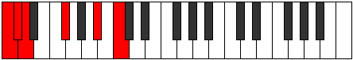 |
| [1099](https://ianring.com/musictheory/scales/1099) | [Dyritonic](ModeCNaturalDyritonic.md) | C | C, C#, D#, F#, A#, C |  |
| [1103](https://ianring.com/musictheory/scales/1103) | [Lynimic](ModeCNaturalLynimic.md) | C | C, Db, Ebb, Fbb, Gb, A#, C |  |
| [1107](https://ianring.com/musictheory/scales/1107) | [Mogitonic](ModeCNaturalMogitonic.md) | C | C, C#, E, F#, A#, C |  |
| [1111](https://ianring.com/musictheory/scales/1111) | [Sycrimic](ModeCNaturalSycrimic.md) | C | C, Db, Ebb, Fb, Gb, A#, C |  |
| [1115](https://ianring.com/musictheory/scales/1115) | [Locrimic](ModeCNaturalLocrimic.md) | C | C, Db, Eb, Fb, Gb, A#, C |  |
| [1119](https://ianring.com/musictheory/scales/1119) | [Rarian](ModeCNaturalRarian.md) | C | C, Db, Ebb, Fbb, Gbbb, Abbb, Bb, C |  |
| [1123](https://ianring.com/musictheory/scales/1123) | [Lanitonic](ModeCNaturalLanitonic.md) | C | C, C#, F, F#, A#, C |  |
| [1125](https://ianring.com/musictheory/scales/1125) | [Ionaritonic](ModeGSharpIonaritonic.md) | G# | G#, A#, C#, D, F#, G# |  |
| [1125](https://ianring.com/musictheory/scales/1125) | [Ionaritonic](ModeAFlatIonaritonic.md) | Ab | Ab, Bb, Db, D, Gb, Ab |  |
| [1127](https://ianring.com/musictheory/scales/1127) | [Eparimic](ModeCNaturalEparimic.md) | C | C, Db, Ebb, F, Gb, A#, C |  |
| [1127](https://ianring.com/musictheory/scales/1127) | [Eparimic](ModeGSharpEparimic.md) | G# | G#, A, Bb, C#, D, E##, G# |  |
| [1127](https://ianring.com/musictheory/scales/1127) | [Eparimic](ModeAFlatEparimic.md) | Ab | Ab, Bbb, Cbb, Db, Ebb, F#, Ab |  |
| [1131](https://ianring.com/musictheory/scales/1131) | [Thocrimic](ModeCNaturalThocrimic.md) | C | C, Db, Eb, F, Gb, A#, C |  |
| [1133](https://ianring.com/musictheory/scales/1133) | [Stycrimic](ModeGSharpStycrimic.md) | G# | G#, A#, B, C#, D, E##, G# |  |
| [1133](https://ianring.com/musictheory/scales/1133) | [Stycrimic](ModeAFlatStycrimic.md) | Ab | Ab, Bb, Cb, Db, Ebb, F#, Ab |  |
| [1135](https://ianring.com/musictheory/scales/1135) | [Katolian](ModeCNaturalKatolian.md) | C | C, Db, Ebb, Fbb, Gbb, Abbb, Bb, C |  |
| [1135](https://ianring.com/musictheory/scales/1135) | [Katolian](ModeGSharpKatolian.md) | G# | G#, A, Bb, Cb, Db, Ebb, F#, G# |  |
| [1135](https://ianring.com/musictheory/scales/1135) | [Katolian](ModeAFlatKatolian.md) | Ab | Ab, Bbb, Cbb, Dbbb, Ebbb, Fbbb, Gb, Ab |  |
| [1139](https://ianring.com/musictheory/scales/1139) | [Aerygimic](ModeCNaturalAerygimic.md) | C | C, Db, E, F, Gb, A#, C |  |
| [1141](https://ianring.com/musictheory/scales/1141) | [Rynimic](ModeGSharpRynimic.md) | G# | G#, A#, B#, C#, D, E##, G# |  |
| [1141](https://ianring.com/musictheory/scales/1141) | [Rynimic](ModeAFlatRynimic.md) | Ab | Ab, Bb, C, Db, Ebb, F#, Ab |  |
| [1143](https://ianring.com/musictheory/scales/1143) | [Styrian](ModeCNaturalStyrian.md) | C | C, Db, Ebb, Fb, Gbb, Abbb, Bb, C | 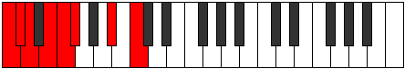 |
| [1143](https://ianring.com/musictheory/scales/1143) | [Styrian](ModeGSharpStyrian.md) | G# | G#, A, Bb, C, Db, Ebb, F#, G# |  |
| [1143](https://ianring.com/musictheory/scales/1143) | [Styrian](ModeAFlatStyrian.md) | Ab | Ab, Bbb, Cbb, Dbb, Ebbb, Fbbb, Gb, Ab |  |
| [1147](https://ianring.com/musictheory/scales/1147) | [Epynian](ModeCNaturalEpynian.md) | C | C, Db, Eb, Fb, Gbb, Abbb, Bb, C |  |
| [1149](https://ianring.com/musictheory/scales/1149) | [Bydian](ModeGSharpBydian.md) | G# | G#, A#, B, C, Db, Ebb, F#, G# |  |
| [1149](https://ianring.com/musictheory/scales/1149) | [Bydian](ModeAFlatBydian.md) | Ab | Ab, Bb, Cb, Dbb, Ebbb, Fbbb, Gb, Ab |  |
| [1151](https://ianring.com/musictheory/scales/1151) | [Mythyllic](ModeCNaturalMythyllic.md) | C | C, C#, D, D#, E, F, F#, A#, C |  |
| [1151](https://ianring.com/musictheory/scales/1151) | [Mythyllic](ModeGSharpMythyllic.md) | G# | G#, A, A#, B, C, C#, D, F#, G# |  |
| [1151](https://ianring.com/musictheory/scales/1151) | [Mythyllic](ModeAFlatMythyllic.md) | Ab | Ab, A, Bb, B, C, Db, D, Gb, Ab |  |
| [1161](https://ianring.com/musictheory/scales/1161) | [Eporic](ModeDSharpEporic.md) | D# | D#, F#, A#, C#, D# |  |
| [1161](https://ianring.com/musictheory/scales/1161) | [Eporic](ModeEFlatEporic.md) | Eb | Eb, Gb, Bb, Db, Eb |  |
| [1163](https://ianring.com/musictheory/scales/1163) | [Pagitonic](ModeDSharpPagitonic.md) | D# | D#, E, F#, A#, C#, D# |  |
| [1163](https://ianring.com/musictheory/scales/1163) | [Pagitonic](ModeEFlatPagitonic.md) | Eb | Eb, E, Gb, Bb, Db, Eb |  |
| [1165](https://ianring.com/musictheory/scales/1165) | [Gycritonic](ModeDSharpGycritonic.md) | D# | D#, F, F#, A#, C#, D# |  |
| [1165](https://ianring.com/musictheory/scales/1165) | [Gycritonic](ModeEFlatGycritonic.md) | Eb | Eb, F, Gb, Bb, Db, Eb |  |
| [1167](https://ianring.com/musictheory/scales/1167) | [Aerodimic](ModeDSharpAerodimic.md) | D# | D#, E, F, Gb, A#, B##, D# |  |
| [1167](https://ianring.com/musictheory/scales/1167) | [Aerodimic](ModeEFlatAerodimic.md) | Eb | Eb, Fb, Gbb, Abbb, Bb, C#, Eb |  |
| [1169](https://ianring.com/musictheory/scales/1169) | [Daric](ModeFSharpDaric.md) | F# | F#, A#, C#, E, F# |  |
| [1169](https://ianring.com/musictheory/scales/1169) | [Daric](ModeGFlatDaric.md) | Gb | Gb, Bb, Db, E, Gb |  |
| [1171](https://ianring.com/musictheory/scales/1171) | [Loptitonic](ModeFSharpLoptitonic.md) | F# | F#, G, A#, C#, E, F# |  |
| [1171](https://ianring.com/musictheory/scales/1171) | [Loptitonic](ModeGFlatLoptitonic.md) | Gb | Gb, G, Bb, Db, E, Gb |  |
| [1173](https://ianring.com/musictheory/scales/1173) | [Phropitonic](ModeFSharpPhropitonic.md) | F# | F#, G#, A#, C#, E, F# |  |
| [1173](https://ianring.com/musictheory/scales/1173) | [Phropitonic](ModeGFlatPhropitonic.md) | Gb | Gb, Ab, Bb, Db, E, Gb |  |
| [1175](https://ianring.com/musictheory/scales/1175) | [Epycrimic](ModeFSharpEpycrimic.md) | F# | F#, G, Ab, Bb, C#, D##, F# |  |
| [1175](https://ianring.com/musictheory/scales/1175) | [Epycrimic](ModeGFlatEpycrimic.md) | Gb | Gb, Abb, Bbbb, Cbb, Db, E, Gb |  |
| [1177](https://ianring.com/musictheory/scales/1177) | [Garitonic](ModeDSharpGaritonic.md) | D# | D#, F#, G, A#, C#, D# |  |
| [1177](https://ianring.com/musictheory/scales/1177) | [Garitonic](ModeEFlatGaritonic.md) | Eb | Eb, Gb, G, Bb, Db, Eb |  |
| [1177](https://ianring.com/musictheory/scales/1177) | [Garitonic](ModeFSharpGaritonic.md) | F# | F#, A, A#, C#, E, F# |  |
| [1177](https://ianring.com/musictheory/scales/1177) | [Garitonic](ModeGFlatGaritonic.md) | Gb | Gb, A, Bb, Db, E, Gb |  |
| [1179](https://ianring.com/musictheory/scales/1179) | [Sonimic](ModeDSharpSonimic.md) | D# | D#, E, F#, G, A#, B##, D# |  |
| [1179](https://ianring.com/musictheory/scales/1179) | [Sonimic](ModeEFlatSonimic.md) | Eb | Eb, Fb, Gb, Abb, Bb, C#, Eb |  |
| [1179](https://ianring.com/musictheory/scales/1179) | [Sonimic](ModeFSharpSonimic.md) | F# | F#, G, A, Bb, C#, D##, F# |  |
| [1179](https://ianring.com/musictheory/scales/1179) | [Sonimic](ModeGFlatSonimic.md) | Gb | Gb, Abb, Bbb, Cbb, Db, E, Gb |  |
| [1181](https://ianring.com/musictheory/scales/1181) | [Katagimic](ModeDSharpKatagimic.md) | D# | D#, E#, F#, G, A#, B##, D# |  |
| [1181](https://ianring.com/musictheory/scales/1181) | [Katagimic](ModeEFlatKatagimic.md) | Eb | Eb, F, Gb, Abb, Bb, C#, Eb |  |
| [1181](https://ianring.com/musictheory/scales/1181) | [Katagimic](ModeFSharpKatagimic.md) | F# | F#, G#, A, Bb, C#, D##, F# |  |
| [1181](https://ianring.com/musictheory/scales/1181) | [Katagimic](ModeGFlatKatagimic.md) | Gb | Gb, Ab, Bbb, Cbb, Db, E, Gb |  |
| [1183](https://ianring.com/musictheory/scales/1183) | [Sadian](ModeDSharpSadian.md) | D# | D#, E, F, Gb, Abb, Bb, C#, D# |  |
| [1183](https://ianring.com/musictheory/scales/1183) | [Sadian](ModeEFlatSadian.md) | Eb | Eb, Fb, Gbb, Abbb, E###, Cbb, Db, Eb |  |
| [1183](https://ianring.com/musictheory/scales/1183) | [Sadian](ModeFSharpSadian.md) | F# | F#, G, Ab, Bbb, Cbb, Db, E, F# |  |
| [1183](https://ianring.com/musictheory/scales/1183) | [Sadian](ModeGFlatSadian.md) | Gb | Gb, Abb, Bbbb, Cbbb, Cbb, Db, E, Gb |  |
| [1189](https://ianring.com/musictheory/scales/1189) | [Thaptitonic](ModeGSharpThaptitonic.md) | G# | G#, A#, C#, D#, F#, G# |  |
| [1189](https://ianring.com/musictheory/scales/1189) | [Thaptitonic](ModeAFlatThaptitonic.md) | Ab | Ab, Bb, Db, Eb, Gb, Ab |  |
| [1191](https://ianring.com/musictheory/scales/1191) | [Pyrimic](ModeGSharpPyrimic.md) | G# | G#, A, Bb, C#, D#, E##, G# |  |
| [1191](https://ianring.com/musictheory/scales/1191) | [Pyrimic](ModeAFlatPyrimic.md) | Ab | Ab, Bbb, Cbb, Db, Eb, F#, Ab |  |
| [1193](https://ianring.com/musictheory/scales/1193) | [Rocritonic](ModeDSharpRocritonic.md) | D# | D#, F#, G#, A#, C#, D# |  |
| [1193](https://ianring.com/musictheory/scales/1193) | [Rocritonic](ModeEFlatRocritonic.md) | Eb | Eb, Gb, Ab, Bb, Db, Eb |  |
| [1195](https://ianring.com/musictheory/scales/1195) | [Sarimic](ModeDSharpSarimic.md) | D# | D#, E, F#, G#, A#, B##, D# |  |
| [1195](https://ianring.com/musictheory/scales/1195) | [Sarimic](ModeEFlatSarimic.md) | Eb | Eb, Fb, Gb, Ab, Bb, C#, Eb |  |
| [1197](https://ianring.com/musictheory/scales/1197) | [Rocrimic](ModeDSharpRocrimic.md) | D# | D#, E#, F#, G#, A#, B##, D# |  |
| [1197](https://ianring.com/musictheory/scales/1197) | [Rocrimic](ModeEFlatRocrimic.md) | Eb | Eb, F, Gb, Ab, Bb, C#, Eb |  |
| [1197](https://ianring.com/musictheory/scales/1197) | [Rocrimic](ModeGSharpRocrimic.md) | G# | G#, A#, B, C#, D#, E##, G# |  |
| [1197](https://ianring.com/musictheory/scales/1197) | [Rocrimic](ModeAFlatRocrimic.md) | Ab | Ab, Bb, Cb, Db, Eb, F#, Ab |  |
| [1199](https://ianring.com/musictheory/scales/1199) | [Magian](ModeDSharpMagian.md) | D# | D#, E, F, Gb, Ab, Bb, C#, D# |  |
| [1199](https://ianring.com/musictheory/scales/1199) | [Magian](ModeEFlatMagian.md) | Eb | Eb, Fb, Gbb, Abbb, Bbbb, Cbb, Db, Eb |  |
| [1199](https://ianring.com/musictheory/scales/1199) | [Magian](ModeGSharpMagian.md) | G# | G#, A, Bb, Cb, Db, Eb, F#, G# |  |
| [1199](https://ianring.com/musictheory/scales/1199) | [Magian](ModeAFlatMagian.md) | Ab | Ab, Bbb, Cbb, Dbbb, Ebbb, Fbb, Gb, Ab |  |
| [1201](https://ianring.com/musictheory/scales/1201) | [Aeracritonic](ModeFSharpAeracritonic.md) | F# | F#, A#, B, C#, E, F# |  |
| [1201](https://ianring.com/musictheory/scales/1201) | [Aeracritonic](ModeGFlatAeracritonic.md) | Gb | Gb, Bb, B, Db, E, Gb |  |
| [1203](https://ianring.com/musictheory/scales/1203) | [Pagimic](ModeFSharpPagimic.md) | F# | F#, G, A#, B, C#, D##, F# |  |
| [1203](https://ianring.com/musictheory/scales/1203) | [Pagimic](ModeGFlatPagimic.md) | Gb | Gb, Abb, Bb, Cb, Db, E, Gb | 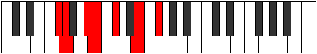 |
| [1205](https://ianring.com/musictheory/scales/1205) | [Ionycrimic](ModeGSharpIonycrimic.md) | G# | G#, A#, B#, C#, D#, E##, G# |  |
| [1205](https://ianring.com/musictheory/scales/1205) | [Ionycrimic](ModeAFlatIonycrimic.md) | Ab | Ab, Bb, C, Db, Eb, F#, Ab |  |
| [1205](https://ianring.com/musictheory/scales/1205) | [Ionycrimic](ModeFSharpIonycrimic.md) | F# | F#, G#, A#, B, C#, D##, F# |  |
| [1205](https://ianring.com/musictheory/scales/1205) | [Ionycrimic](ModeGFlatIonycrimic.md) | Gb | Gb, Ab, Bb, Cb, Db, E, Gb |  |
| [1207](https://ianring.com/musictheory/scales/1207) | [Aeoloptian](ModeGSharpAeoloptian.md) | G# | G#, A, Bb, C, Db, Eb, F#, G# |  |
| [1207](https://ianring.com/musictheory/scales/1207) | [Aeoloptian](ModeAFlatAeoloptian.md) | Ab | Ab, Bbb, Cbb, Dbb, Ebbb, Fbb, Gb, Ab |  |
| [1207](https://ianring.com/musictheory/scales/1207) | [Aeoloptian](ModeFSharpAeoloptian.md) | F# | F#, G, Ab, Bb, Cb, Db, E, F# |  |
| [1207](https://ianring.com/musictheory/scales/1207) | [Aeoloptian](ModeGFlatAeoloptian.md) | Gb | Gb, Abb, Bbbb, Cbb, Dbbb, Ebbb, Fb, Gb |  |
| [1209](https://ianring.com/musictheory/scales/1209) | [Ionynimic](ModeDSharpIonynimic.md) | D# | D#, E##, F##, G#, A#, B##, D# |  |
| [1209](https://ianring.com/musictheory/scales/1209) | [Ionynimic](ModeEFlatIonynimic.md) | Eb | Eb, F#, G, Ab, Bb, C#, Eb |  |
| [1209](https://ianring.com/musictheory/scales/1209) | [Ionynimic](ModeFSharpIonynimic.md) | F# | F#, G##, A#, B, C#, D##, F# |  |
| [1209](https://ianring.com/musictheory/scales/1209) | [Ionynimic](ModeGFlatIonynimic.md) | Gb | Gb, A, Bb, Cb, Db, E, Gb |  |
| [1211](https://ianring.com/musictheory/scales/1211) | [Zadian](ModeDSharpZadian.md) | D# | D#, E, F#, G, Ab, Bb, C#, D# |  |
| [1211](https://ianring.com/musictheory/scales/1211) | [Zadian](ModeEFlatZadian.md) | Eb | Eb, Fb, Gb, Abb, Bbbb, Cbb, Db, Eb |  |
| [1211](https://ianring.com/musictheory/scales/1211) | [Zadian](ModeFSharpZadian.md) | F# | F#, G, A, Bb, Cb, Db, E, F# |  |
| [1211](https://ianring.com/musictheory/scales/1211) | [Zadian](ModeGFlatZadian.md) | Gb | Gb, Abb, Bbb, Cbb, Dbbb, Ebbb, Fb, Gb |  |
| [1213](https://ianring.com/musictheory/scales/1213) | [Gyrian](ModeDSharpGyrian.md) | D# | D#, E#, F#, G, Ab, Bb, C#, D# |  |
| [1213](https://ianring.com/musictheory/scales/1213) | [Gyrian](ModeEFlatGyrian.md) | Eb | Eb, F, Gb, Abb, Bbbb, Cbb, Db, Eb |  |
| [1213](https://ianring.com/musictheory/scales/1213) | [Gyrian](ModeGSharpGyrian.md) | G# | G#, A#, B, C, Db, Eb, F#, G# |  |
| [1213](https://ianring.com/musictheory/scales/1213) | [Gyrian](ModeAFlatGyrian.md) | Ab | Ab, Bb, Cb, Dbb, Ebbb, Fbb, Gb, Ab |  |
| [1213](https://ianring.com/musictheory/scales/1213) | [Gyrian](ModeFSharpGyrian.md) | F# | F#, G#, A, Bb, Cb, Db, E, F# |  |
| [1213](https://ianring.com/musictheory/scales/1213) | [Gyrian](ModeGFlatGyrian.md) | Gb | Gb, Ab, Bbb, Cbb, Dbbb, Ebbb, Fb, Gb |  |
| [1215](https://ianring.com/musictheory/scales/1215) | [Aeolanyllic](ModeDSharpAeolanyllic.md) | D# | D#, E, F, F#, G, G#, A#, C#, D# |  |
| [1215](https://ianring.com/musictheory/scales/1215) | [Aeolanyllic](ModeEFlatAeolanyllic.md) | Eb | Eb, E, F, Gb, G, Ab, Bb, Db, Eb |  |
| [1215](https://ianring.com/musictheory/scales/1215) | [Aeolanyllic](ModeGSharpAeolanyllic.md) | G# | G#, A, A#, B, C, C#, D#, F#, G# |  |
| [1215](https://ianring.com/musictheory/scales/1215) | [Aeolanyllic](ModeAFlatAeolanyllic.md) | Ab | Ab, A, Bb, B, C, Db, Eb, Gb, Ab |  |
| [1215](https://ianring.com/musictheory/scales/1215) | [Aeolanyllic](ModeFSharpAeolanyllic.md) | F# | F#, G, G#, A, A#, B, C#, E, F# |  |
| [1215](https://ianring.com/musictheory/scales/1215) | [Aeolanyllic](ModeGFlatAeolanyllic.md) | Gb | Gb, G, Ab, A, Bb, B, Db, E, Gb |  |
| [1223](https://ianring.com/musictheory/scales/1223) | [Phryptimic](ModeCNaturalPhryptimic.md) | C | C, Db, Ebb, F#, G, A#, C |  |
| [1225](https://ianring.com/musictheory/scales/1225) | [Lyditonic](ModeDSharpLyditonic.md) | D# | D#, F#, A, A#, C#, D# |  |
| [1225](https://ianring.com/musictheory/scales/1225) | [Lyditonic](ModeEFlatLyditonic.md) | Eb | Eb, Gb, A, Bb, Db, Eb | 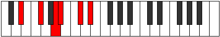 |
| [1227](https://ianring.com/musictheory/scales/1227) | [Thacrimic](ModeCNaturalThacrimic.md) | C | C, Db, Eb, F#, G, A#, C |  |
| [1227](https://ianring.com/musictheory/scales/1227) | [Thacrimic](ModeDSharpThacrimic.md) | D# | D#, E, F#, G##, A#, B##, D# |  |
| [1227](https://ianring.com/musictheory/scales/1227) | [Thacrimic](ModeEFlatThacrimic.md) | Eb | Eb, Fb, Gb, A, Bb, C#, Eb |  |
| [1229](https://ianring.com/musictheory/scales/1229) | [Ragimic](ModeDSharpRagimic.md) | D# | D#, E#, F#, G##, A#, B##, D# |  |
| [1229](https://ianring.com/musictheory/scales/1229) | [Ragimic](ModeEFlatRagimic.md) | Eb | Eb, F, Gb, A, Bb, C#, Eb |  |
| [1231](https://ianring.com/musictheory/scales/1231) | [Logian](ModeCNaturalLogian.md) | C | C, Db, Ebb, Fbb, Gb, Abb, Bb, C |  |
| [1231](https://ianring.com/musictheory/scales/1231) | [Logian](ModeDSharpLogian.md) | D# | D#, E, F, Gb, A, Bb, C#, D# |  |
| [1231](https://ianring.com/musictheory/scales/1231) | [Logian](ModeEFlatLogian.md) | Eb | Eb, Fb, Gbb, Abbb, Bbb, Cbb, Db, Eb |  |
| [1233](https://ianring.com/musictheory/scales/1233) | [Ionoditonic](ModeFSharpIonoditonic.md) | F# | F#, A#, C, C#, E, F# |  |
| [1233](https://ianring.com/musictheory/scales/1233) | [Ionoditonic](ModeGFlatIonoditonic.md) | Gb | Gb, Bb, C, Db, E, Gb |  |
| [1235](https://ianring.com/musictheory/scales/1235) | [Stylimic](ModeCNaturalStylimic.md) | C | C, Db, E, F#, G, A#, C |  |
| [1235](https://ianring.com/musictheory/scales/1235) | [Stylimic](ModeFSharpStylimic.md) | F# | F#, G, A#, B#, C#, D##, F# |  |
| [1235](https://ianring.com/musictheory/scales/1235) | [Stylimic](ModeGFlatStylimic.md) | Gb | Gb, Abb, Bb, C, Db, E, Gb |  |
| [1237](https://ianring.com/musictheory/scales/1237) | [Salimic](ModeFSharpSalimic.md) | F# | F#, G#, A#, B#, C#, D##, F# |  |
| [1237](https://ianring.com/musictheory/scales/1237) | [Salimic](ModeGFlatSalimic.md) | Gb | Gb, Ab, Bb, C, Db, E, Gb |  |
| [1239](https://ianring.com/musictheory/scales/1239) | [Epaptian](ModeCNaturalEpaptian.md) | C | C, Db, Ebb, Fb, Gb, Abb, Bb, C | 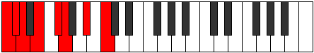 |
| [1239](https://ianring.com/musictheory/scales/1239) | [Epaptian](ModeFSharpEpaptian.md) | F# | F#, G, Ab, Bb, C, Db, E, F# |  |
| [1239](https://ianring.com/musictheory/scales/1239) | [Epaptian](ModeGFlatEpaptian.md) | Gb | Gb, Abb, Bbbb, Cbb, Dbb, Ebbb, Fb, Gb |  |
| [1241](https://ianring.com/musictheory/scales/1241) | [Pygimic](ModeFSharpPygimic.md) | F# | F#, G##, A#, B#, C#, D##, F# |  |
| [1241](https://ianring.com/musictheory/scales/1241) | [Pygimic](ModeGFlatPygimic.md) | Gb | Gb, A, Bb, C, Db, E, Gb |  |
| [1241](https://ianring.com/musictheory/scales/1241) | [Pygimic](ModeDSharpPygimic.md) | D# | D#, E##, F##, G##, A#, B##, D# |  |
| [1241](https://ianring.com/musictheory/scales/1241) | [Pygimic](ModeEFlatPygimic.md) | Eb | Eb, F#, G, A, Bb, C#, Eb |  |
| [1243](https://ianring.com/musictheory/scales/1243) | [Epylian](ModeCNaturalEpylian.md) | C | C, Db, Eb, Fb, Gb, Abb, Bb, C |  |
| [1243](https://ianring.com/musictheory/scales/1243) | [Epylian](ModeFSharpEpylian.md) | F# | F#, G, A, Bb, C, Db, E, F# |  |
| [1243](https://ianring.com/musictheory/scales/1243) | [Epylian](ModeGFlatEpylian.md) | Gb | Gb, Abb, Bbb, Cbb, Dbb, Ebbb, Fb, Gb |  |
| [1243](https://ianring.com/musictheory/scales/1243) | [Epylian](ModeDSharpEpylian.md) | D# | D#, E, F#, G, A, Bb, C#, D# |  |
| [1243](https://ianring.com/musictheory/scales/1243) | [Epylian](ModeEFlatEpylian.md) | Eb | Eb, Fb, Gb, Abb, Bbb, Cbb, Db, Eb |  |
| [1245](https://ianring.com/musictheory/scales/1245) | [Lathian](ModeDSharpLathian.md) | D# | D#, E#, F#, G, A, Bb, C#, D# |  |
| [1245](https://ianring.com/musictheory/scales/1245) | [Lathian](ModeEFlatLathian.md) | Eb | Eb, F, Gb, Abb, Bbb, Cbb, Db, Eb |  |
| [1245](https://ianring.com/musictheory/scales/1245) | [Lathian](ModeFSharpLathian.md) | F# | F#, G#, A, Bb, C, Db, E, F# |  |
| [1245](https://ianring.com/musictheory/scales/1245) | [Lathian](ModeGFlatLathian.md) | Gb | Gb, Ab, Bbb, Cbb, Dbb, Ebbb, Fb, Gb |  |
| [1247](https://ianring.com/musictheory/scales/1247) | [Mygyllic](ModeCNaturalMygyllic.md) | C | C, C#, D, D#, E, F#, G, A#, C |  |
| [1247](https://ianring.com/musictheory/scales/1247) | [Mygyllic](ModeDSharpMygyllic.md) | D# | D#, E, F, F#, G, A, A#, C#, D# |  |
| [1247](https://ianring.com/musictheory/scales/1247) | [Mygyllic](ModeEFlatMygyllic.md) | Eb | Eb, E, F, Gb, G, A, Bb, Db, Eb |  |
| [1247](https://ianring.com/musictheory/scales/1247) | [Mygyllic](ModeFSharpMygyllic.md) | F# | F#, G, G#, A, A#, C, C#, E, F# |  |
| [1247](https://ianring.com/musictheory/scales/1247) | [Mygyllic](ModeGFlatMygyllic.md) | Gb | Gb, G, Ab, A, Bb, C, Db, E, Gb |  |
| [1251](https://ianring.com/musictheory/scales/1251) | [Sylimic](ModeCNaturalSylimic.md) | C | C, Db, E#, F#, G, A#, C |  |
| [1253](https://ianring.com/musictheory/scales/1253) | [Zolimic](ModeGSharpZolimic.md) | G# | G#, A#, B##, C##, D#, E##, G# |  |
| [1253](https://ianring.com/musictheory/scales/1253) | [Zolimic](ModeAFlatZolimic.md) | Ab | Ab, Bb, C#, D, Eb, F#, Ab |  |
| [1255](https://ianring.com/musictheory/scales/1255) | [Sogian](ModeCNaturalSogian.md) | C | C, Db, Ebb, F, Gb, Abb, Bb, C |  |
| [1255](https://ianring.com/musictheory/scales/1255) | [Sogian](ModeGSharpSogian.md) | G# | G#, A, Bb, C#, D, Eb, F#, G# |  |
| [1255](https://ianring.com/musictheory/scales/1255) | [Sogian](ModeAFlatSogian.md) | Ab | Ab, Bbb, Cbb, Db, Ebb, Fbb, Gb, Ab |  |
| [1257](https://ianring.com/musictheory/scales/1257) | [Aeolyphimic](ModeDSharpAeolyphimic.md) | D# | D#, E##, F###, G##, A#, B##, D# |  |
| [1257](https://ianring.com/musictheory/scales/1257) | [Aeolyphimic](ModeEFlatAeolyphimic.md) | Eb | Eb, F#, G#, A, Bb, C#, Eb |  |
| [1259](https://ianring.com/musictheory/scales/1259) | [Stadian](ModeCNaturalStadian.md) | C | C, Db, Eb, F, Gb, Abb, Bb, C |  |
| [1259](https://ianring.com/musictheory/scales/1259) | [Stadian](ModeDSharpStadian.md) | D# | D#, E, F#, G#, A, Bb, C#, D# |  |
| [1259](https://ianring.com/musictheory/scales/1259) | [Stadian](ModeEFlatStadian.md) | Eb | Eb, Fb, Gb, Ab, Bbb, Cbb, Db, Eb |  |
| [1261](https://ianring.com/musictheory/scales/1261) | [Aeodian](ModeDSharpAeodian.md) | D# | D#, E#, F#, G#, A, Bb, C#, D# |  |
| [1261](https://ianring.com/musictheory/scales/1261) | [Aeodian](ModeEFlatAeodian.md) | Eb | Eb, F, Gb, Ab, Bbb, Cbb, Db, Eb |  |
| [1261](https://ianring.com/musictheory/scales/1261) | [Aeodian](ModeGSharpAeodian.md) | G# | G#, A#, B, C#, D, Eb, F#, G# |  |
| [1261](https://ianring.com/musictheory/scales/1261) | [Aeodian](ModeAFlatAeodian.md) | Ab | Ab, Bb, Cb, Db, Ebb, Fbb, Gb, Ab |  |
| [1263](https://ianring.com/musictheory/scales/1263) | [Stynyllic](ModeCNaturalStynyllic.md) | C | C, C#, D, D#, F, F#, G, A#, C |  |
| [1263](https://ianring.com/musictheory/scales/1263) | [Stynyllic](ModeDSharpStynyllic.md) | D# | D#, E, F, F#, G#, A, A#, C#, D# |  |
| [1263](https://ianring.com/musictheory/scales/1263) | [Stynyllic](ModeEFlatStynyllic.md) | Eb | Eb, E, F, Gb, Ab, A, Bb, Db, Eb |  |
| [1263](https://ianring.com/musictheory/scales/1263) | [Stynyllic](ModeGSharpStynyllic.md) | G# | G#, A, A#, B, C#, D, D#, F#, G# |  |
| [1263](https://ianring.com/musictheory/scales/1263) | [Stynyllic](ModeAFlatStynyllic.md) | Ab | Ab, A, Bb, B, Db, D, Eb, Gb, Ab |  |
| [1265](https://ianring.com/musictheory/scales/1265) | [Pynimic](ModeFSharpPynimic.md) | F# | F#, G###, A##, B#, C#, D##, F# |  |
| [1265](https://ianring.com/musictheory/scales/1265) | [Pynimic](ModeGFlatPynimic.md) | Gb | Gb, A#, B, C, Db, E, Gb |  |
| [1267](https://ianring.com/musictheory/scales/1267) | [Katynian](ModeCNaturalKatynian.md) | C | C, Db, E, F, Gb, Abb, Bb, C |  |
| [1267](https://ianring.com/musictheory/scales/1267) | [Katynian](ModeFSharpKatynian.md) | F# | F#, G, A#, B, C, Db, E, F# |  |
| [1267](https://ianring.com/musictheory/scales/1267) | [Katynian](ModeGFlatKatynian.md) | Gb | Gb, Abb, Bb, Cb, Dbb, Ebbb, Fb, Gb |  |
| [1269](https://ianring.com/musictheory/scales/1269) | [Katythian](ModeGSharpKatythian.md) | G# | G#, A#, B#, C#, D, Eb, F#, G# | 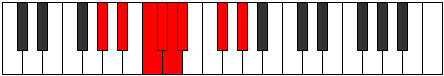 |
| [1269](https://ianring.com/musictheory/scales/1269) | [Katythian](ModeAFlatKatythian.md) | Ab | Ab, Bb, C, Db, Ebb, Fbb, Gb, Ab |  |
| [1269](https://ianring.com/musictheory/scales/1269) | [Katythian](ModeFSharpKatythian.md) | F# | F#, G#, A#, B, C, Db, E, F# |  |
| [1269](https://ianring.com/musictheory/scales/1269) | [Katythian](ModeGFlatKatythian.md) | Gb | Gb, Ab, Bb, Cb, Dbb, Ebbb, Fb, Gb |  |
| [1271](https://ianring.com/musictheory/scales/1271) | [Kolyllic](ModeCNaturalKolyllic.md) | C | C, C#, D, E, F, F#, G, A#, C |  |
| [1271](https://ianring.com/musictheory/scales/1271) | [Kolyllic](ModeGSharpKolyllic.md) | G# | G#, A, A#, C, C#, D, D#, F#, G# |  |
| [1271](https://ianring.com/musictheory/scales/1271) | [Kolyllic](ModeAFlatKolyllic.md) | Ab | Ab, A, Bb, C, Db, D, Eb, Gb, Ab |  |
| [1271](https://ianring.com/musictheory/scales/1271) | [Kolyllic](ModeFSharpKolyllic.md) | F# | F#, G, G#, A#, B, C, C#, E, F# |  |
| [1271](https://ianring.com/musictheory/scales/1271) | [Kolyllic](ModeGFlatKolyllic.md) | Gb | Gb, G, Ab, Bb, B, C, Db, E, Gb |  |
| [1273](https://ianring.com/musictheory/scales/1273) | [Ronian](ModeDSharpRonian.md) | D# | D#, E##, F##, G#, A, Bb, C#, D# |  |
| [1273](https://ianring.com/musictheory/scales/1273) | [Ronian](ModeEFlatRonian.md) | Eb | Eb, F#, G, Ab, Bbb, Cbb, Db, Eb |  |
| [1273](https://ianring.com/musictheory/scales/1273) | [Ronian](ModeFSharpRonian.md) | F# | F#, G##, A#, B, C, Db, E, F# |  |
| [1273](https://ianring.com/musictheory/scales/1273) | [Ronian](ModeGFlatRonian.md) | Gb | Gb, A, Bb, Cb, Dbb, Ebbb, Fb, Gb |  |
| [1275](https://ianring.com/musictheory/scales/1275) | [Stagyllic](ModeCNaturalStagyllic.md) | C | C, C#, D#, E, F, F#, G, A#, C |  |
| [1275](https://ianring.com/musictheory/scales/1275) | [Stagyllic](ModeDSharpStagyllic.md) | D# | D#, E, F#, G, G#, A, A#, C#, D# |  |
| [1275](https://ianring.com/musictheory/scales/1275) | [Stagyllic](ModeEFlatStagyllic.md) | Eb | Eb, E, Gb, G, Ab, A, Bb, Db, Eb |  |
| [1275](https://ianring.com/musictheory/scales/1275) | [Stagyllic](ModeFSharpStagyllic.md) | F# | F#, G, A, A#, B, C, C#, E, F# |  |
| [1275](https://ianring.com/musictheory/scales/1275) | [Stagyllic](ModeGFlatStagyllic.md) | Gb | Gb, G, A, Bb, B, C, Db, E, Gb |  |
| [1277](https://ianring.com/musictheory/scales/1277) | [Zadyllic](ModeDSharpZadyllic.md) | D# | D#, F, F#, G, G#, A, A#, C#, D# |  |
| [1277](https://ianring.com/musictheory/scales/1277) | [Zadyllic](ModeEFlatZadyllic.md) | Eb | Eb, F, Gb, G, Ab, A, Bb, Db, Eb |  |
| [1277](https://ianring.com/musictheory/scales/1277) | [Zadyllic](ModeGSharpZadyllic.md) | G# | G#, A#, B, C, C#, D, D#, F#, G# |  |
| [1277](https://ianring.com/musictheory/scales/1277) | [Zadyllic](ModeAFlatZadyllic.md) | Ab | Ab, Bb, B, C, Db, D, Eb, Gb, Ab |  |
| [1277](https://ianring.com/musictheory/scales/1277) | [Zadyllic](ModeFSharpZadyllic.md) | F# | F#, G#, A, A#, B, C, C#, E, F# |  |
| [1277](https://ianring.com/musictheory/scales/1277) | [Zadyllic](ModeGFlatZadyllic.md) | Gb | Gb, Ab, A, Bb, B, C, Db, E, Gb |  |
| [1279](https://ianring.com/musictheory/scales/1279) | [Sarygic](ModeCNaturalSarygic.md) | C | C, C#, D, D#, E, F, F#, G, A#, C |  |
| [1279](https://ianring.com/musictheory/scales/1279) | [Sarygic](ModeDSharpSarygic.md) | D# | D#, E, F, F#, G, G#, A, A#, C#, D# |  |
| [1279](https://ianring.com/musictheory/scales/1279) | [Sarygic](ModeEFlatSarygic.md) | Eb | Eb, E, F, Gb, G, Ab, A, Bb, Db, Eb |  |
| [1279](https://ianring.com/musictheory/scales/1279) | [Sarygic](ModeGSharpSarygic.md) | G# | G#, A, A#, B, C, C#, D, D#, F#, G# |  |
| [1279](https://ianring.com/musictheory/scales/1279) | [Sarygic](ModeAFlatSarygic.md) | Ab | Ab, A, Bb, B, C, Db, D, Eb, Gb, Ab |  |
| [1279](https://ianring.com/musictheory/scales/1279) | [Sarygic](ModeFSharpSarygic.md) | F# | F#, G, G#, A, A#, B, C, C#, E, F# |  |
| [1279](https://ianring.com/musictheory/scales/1279) | [Sarygic](ModeGFlatSarygic.md) | Gb | Gb, G, Ab, A, Bb, B, C, Db, E, Gb |  |
| [1305](https://ianring.com/musictheory/scales/1305) | [Dynitonic](ModeASharpDynitonic.md) | A# | A#, C#, D, F#, G#, A# |  |
| [1305](https://ianring.com/musictheory/scales/1305) | [Dynitonic](ModeBFlatDynitonic.md) | Bb | Bb, Db, D, Gb, Ab, Bb | 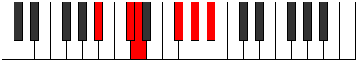 |
| [1307](https://ianring.com/musictheory/scales/1307) | [Katorimic](ModeASharpKatorimic.md) | A# | A#, B, C#, D, E##, F###, A# |  |
| [1307](https://ianring.com/musictheory/scales/1307) | [Katorimic](ModeBFlatKatorimic.md) | Bb | Bb, Cb, Db, Ebb, F#, G#, Bb |  |
| [1309](https://ianring.com/musictheory/scales/1309) | [Pogimic](ModeASharpPogimic.md) | A# | A#, B#, C#, D, E##, F###, A# |  |
| [1309](https://ianring.com/musictheory/scales/1309) | [Pogimic](ModeBFlatPogimic.md) | Bb | Bb, C, Db, Ebb, F#, G#, Bb |  |
| [1311](https://ianring.com/musictheory/scales/1311) | [Bynian](ModeASharpBynian.md) | A# | A#, B, C, Db, Ebb, F#, G#, A# |  |
| [1311](https://ianring.com/musictheory/scales/1311) | [Bynian](ModeBFlatBynian.md) | Bb | Bb, Cb, Dbb, Ebbb, Fbbb, Gb, Ab, Bb |  |
| [1315](https://ianring.com/musictheory/scales/1315) | [Pyritonic](ModeFNaturalPyritonic.md) | F | F, F#, A#, C#, D#, F |  |
| [1317](https://ianring.com/musictheory/scales/1317) | [Staditonic](ModeGSharpStaditonic.md) | G# | G#, A#, C#, E, F#, G# |  |
| [1317](https://ianring.com/musictheory/scales/1317) | [Staditonic](ModeAFlatStaditonic.md) | Ab | Ab, Bb, Db, E, Gb, Ab |  |
| [1319](https://ianring.com/musictheory/scales/1319) | [Phronimic](ModeFNaturalPhronimic.md) | F | F, Gb, Abb, Bb, C#, D#, F |  |
| [1319](https://ianring.com/musictheory/scales/1319) | [Phronimic](ModeGSharpPhronimic.md) | G# | G#, A, Bb, C#, D##, E##, G# |  |
| [1319](https://ianring.com/musictheory/scales/1319) | [Phronimic](ModeAFlatPhronimic.md) | Ab | Ab, Bbb, Cbb, Db, E, F#, Ab |  |
| [1321](https://ianring.com/musictheory/scales/1321) | [Epathitonic](ModeASharpEpathitonic.md) | A# | A#, C#, D#, F#, G#, A# |  |
| [1321](https://ianring.com/musictheory/scales/1321) | [Epathitonic](ModeBFlatEpathitonic.md) | Bb | Bb, Db, Eb, Gb, Ab, Bb |  |
| [1323](https://ianring.com/musictheory/scales/1323) | [Eporimic](ModeFNaturalEporimic.md) | F | F, Gb, Ab, Bb, C#, D#, F |  |
| [1323](https://ianring.com/musictheory/scales/1323) | [Eporimic](ModeASharpEporimic.md) | A# | A#, B, C#, D#, E##, F###, A# |  |
| [1323](https://ianring.com/musictheory/scales/1323) | [Eporimic](ModeBFlatEporimic.md) | Bb | Bb, Cb, Db, Eb, F#, G#, Bb |  |
| [1325](https://ianring.com/musictheory/scales/1325) | [Phradimic](ModeASharpPhradimic.md) | A# | A#, B#, C#, D#, E##, F###, A# |  |
| [1325](https://ianring.com/musictheory/scales/1325) | [Phradimic](ModeBFlatPhradimic.md) | Bb | Bb, C, Db, Eb, F#, G#, Bb |  |
| [1325](https://ianring.com/musictheory/scales/1325) | [Phradimic](ModeGSharpPhradimic.md) | G# | G#, A#, B, C#, D##, E##, G# |  |
| [1325](https://ianring.com/musictheory/scales/1325) | [Phradimic](ModeAFlatPhradimic.md) | Ab | Ab, Bb, Cb, Db, E, F#, Ab |  |
| [1327](https://ianring.com/musictheory/scales/1327) | [Zalian](ModeFNaturalZalian.md) | F | F, Gb, Abb, Bbbb, Cbb, Db, Eb, F |  |
| [1327](https://ianring.com/musictheory/scales/1327) | [Zalian](ModeASharpZalian.md) | A# | A#, B, C, Db, Eb, F#, G#, A# |  |
| [1327](https://ianring.com/musictheory/scales/1327) | [Zalian](ModeBFlatZalian.md) | Bb | Bb, Cb, Dbb, Ebbb, Fbb, Gb, Ab, Bb |  |
| [1327](https://ianring.com/musictheory/scales/1327) | [Zalian](ModeGSharpZalian.md) | G# | G#, A, Bb, Cb, Db, E, F#, G# |  |
| [1327](https://ianring.com/musictheory/scales/1327) | [Zalian](ModeAFlatZalian.md) | Ab | Ab, Bbb, Cbb, Dbbb, Ebbb, Fb, Gb, Ab |  |
| [1331](https://ianring.com/musictheory/scales/1331) | [Dolimic](ModeFNaturalDolimic.md) | F | F, Gb, A, Bb, C#, D#, F |  |
| [1333](https://ianring.com/musictheory/scales/1333) | [Lyptimic](ModeGSharpLyptimic.md) | G# | G#, A#, B#, C#, D##, E##, G# |  |
| [1333](https://ianring.com/musictheory/scales/1333) | [Lyptimic](ModeAFlatLyptimic.md) | Ab | Ab, Bb, C, Db, E, F#, Ab |  |
| [1335](https://ianring.com/musictheory/scales/1335) | [Aeralian](ModeFNaturalAeralian.md) | F | F, Gb, Abb, Bbb, Cbb, Db, Eb, F |  |
| [1335](https://ianring.com/musictheory/scales/1335) | [Aeralian](ModeGSharpAeralian.md) | G# | G#, A, Bb, C, Db, E, F#, G# |  |
| [1335](https://ianring.com/musictheory/scales/1335) | [Aeralian](ModeAFlatAeralian.md) | Ab | Ab, Bbb, Cbb, Dbb, Ebbb, Fb, Gb, Ab |  |
| [1337](https://ianring.com/musictheory/scales/1337) | [Epogimic](ModeASharpEpogimic.md) | A# | A#, B##, C##, D#, E##, F###, A# |  |
| [1337](https://ianring.com/musictheory/scales/1337) | [Epogimic](ModeBFlatEpogimic.md) | Bb | Bb, C#, D, Eb, F#, G#, Bb |  |
| [1339](https://ianring.com/musictheory/scales/1339) | [Kycrian](ModeFNaturalKycrian.md) | F | F, Gb, Ab, Bbb, Cbb, Db, Eb, F |  |
| [1339](https://ianring.com/musictheory/scales/1339) | [Kycrian](ModeASharpKycrian.md) | A# | A#, B, C#, D, Eb, F#, G#, A# |  |
| [1339](https://ianring.com/musictheory/scales/1339) | [Kycrian](ModeBFlatKycrian.md) | Bb | Bb, Cb, Db, Ebb, Fbb, Gb, Ab, Bb |  |
| [1341](https://ianring.com/musictheory/scales/1341) | [Madian](ModeASharpMadian.md) | A# | A#, B#, C#, D, Eb, F#, G#, A# |  |
| [1341](https://ianring.com/musictheory/scales/1341) | [Madian](ModeBFlatMadian.md) | Bb | Bb, C, Db, Ebb, Fbb, Gb, Ab, Bb |  |
| [1341](https://ianring.com/musictheory/scales/1341) | [Madian](ModeGSharpMadian.md) | G# | G#, A#, B, C, Db, E, F#, G# |  |
| [1341](https://ianring.com/musictheory/scales/1341) | [Madian](ModeAFlatMadian.md) | Ab | Ab, Bb, Cb, Dbb, Ebbb, Fb, Gb, Ab |  |
| [1343](https://ianring.com/musictheory/scales/1343) | [Zalyllic](ModeFNaturalZalyllic.md) | F | F, F#, G, G#, A, A#, C#, D#, F |  |
| [1343](https://ianring.com/musictheory/scales/1343) | [Zalyllic](ModeASharpZalyllic.md) | A# | A#, B, C, C#, D, D#, F#, G#, A# |  |
| [1343](https://ianring.com/musictheory/scales/1343) | [Zalyllic](ModeBFlatZalyllic.md) | Bb | Bb, B, C, Db, D, Eb, Gb, Ab, Bb |  |
| [1343](https://ianring.com/musictheory/scales/1343) | [Zalyllic](ModeGSharpZalyllic.md) | G# | G#, A, A#, B, C, C#, E, F#, G# |  |
| [1343](https://ianring.com/musictheory/scales/1343) | [Zalyllic](ModeAFlatZalyllic.md) | Ab | Ab, A, Bb, B, C, Db, E, Gb, Ab |  |
| [1351](https://ianring.com/musictheory/scales/1351) | [Aeraptimic](ModeCNaturalAeraptimic.md) | C | C, Db, Ebb, F#, G#, A#, C |  |
| [1353](https://ianring.com/musictheory/scales/1353) | [Kataritonic](ModeASharpKataritonic.md) | A# | A#, C#, E, F#, G#, A# |  |
| [1353](https://ianring.com/musictheory/scales/1353) | [Kataritonic](ModeBFlatKataritonic.md) | Bb | Bb, Db, E, Gb, Ab, Bb |  |
| [1355](https://ianring.com/musictheory/scales/1355) | [Aeolorimic](ModeCNaturalAeolorimic.md) | C | C, Db, Eb, F#, G#, A#, C |  |
| [1355](https://ianring.com/musictheory/scales/1355) | [Aeolorimic](ModeASharpAeolorimic.md) | A# | A#, B, C#, D##, E##, F###, A# |  |
| [1355](https://ianring.com/musictheory/scales/1355) | [Aeolorimic](ModeBFlatAeolorimic.md) | Bb | Bb, Cb, Db, E, F#, G#, Bb |  |
| [1357](https://ianring.com/musictheory/scales/1357) | [Katonimic](ModeASharpKatonimic.md) | A# | A#, B#, C#, D##, E##, F###, A# |  |
| [1357](https://ianring.com/musictheory/scales/1357) | [Katonimic](ModeBFlatKatonimic.md) | Bb | Bb, C, Db, E, F#, G#, Bb |  |
| [1359](https://ianring.com/musictheory/scales/1359) | [Aerygian](ModeCNaturalAerygian.md) | C | C, Db, Ebb, Fbb, Gb, Ab, Bb, C |  |
| [1359](https://ianring.com/musictheory/scales/1359) | [Aerygian](ModeASharpAerygian.md) | A# | A#, B, C, Db, E, F#, G#, A# |  |
| [1359](https://ianring.com/musictheory/scales/1359) | [Aerygian](ModeBFlatAerygian.md) | Bb | Bb, Cb, Dbb, Ebbb, Fb, Gb, Ab, Bb |  |
| [1363](https://ianring.com/musictheory/scales/1363) | [Gygimic](ModeCNaturalGygimic.md) | C | C, Db, E, F#, G#, A#, C |  |
| [1367](https://ianring.com/musictheory/scales/1367) | [Pyptian](ModeCNaturalPyptian.md) | C | C, Db, Ebb, Fb, Gb, Ab, Bb, C |  |
| [1369](https://ianring.com/musictheory/scales/1369) | [Boptimic](ModeASharpBoptimic.md) | A# | A#, B##, C##, D##, E##, F###, A# |  |
| [1369](https://ianring.com/musictheory/scales/1369) | [Boptimic](ModeBFlatBoptimic.md) | Bb | Bb, C#, D, E, F#, G#, Bb |  |
| [1371](https://ianring.com/musictheory/scales/1371) | [Ionadian](ModeCNaturalIonadian.md) | C | C, Db, Eb, Fb, Gb, Ab, Bb, C |  |
| [1371](https://ianring.com/musictheory/scales/1371) | [Ionadian](ModeASharpIonadian.md) | A# | A#, B, C#, D, E, F#, G#, A# |  |
| [1371](https://ianring.com/musictheory/scales/1371) | [Ionadian](ModeBFlatIonadian.md) | Bb | Bb, Cb, Db, Ebb, Fb, Gb, Ab, Bb |  |
| [1373](https://ianring.com/musictheory/scales/1373) | [Storian](ModeASharpStorian.md) | A# | A#, B#, C#, D, E, F#, G#, A# |  |
| [1373](https://ianring.com/musictheory/scales/1373) | [Storian](ModeBFlatStorian.md) | Bb | Bb, C, Db, Ebb, Fb, Gb, Ab, Bb |  |
| [1375](https://ianring.com/musictheory/scales/1375) | [Bothyllic](ModeCNaturalBothyllic.md) | C | C, C#, D, D#, E, F#, G#, A#, C |  |
| [1375](https://ianring.com/musictheory/scales/1375) | [Bothyllic](ModeASharpBothyllic.md) | A# | A#, B, C, C#, D, E, F#, G#, A# |  |
| [1375](https://ianring.com/musictheory/scales/1375) | [Bothyllic](ModeBFlatBothyllic.md) | Bb | Bb, B, C, Db, D, E, Gb, Ab, Bb |  |
| [1379](https://ianring.com/musictheory/scales/1379) | [Kycrimic](ModeCNaturalKycrimic.md) | C | C, Db, E#, F#, G#, A#, C |  |
| [1379](https://ianring.com/musictheory/scales/1379) | [Kycrimic](ModeFNaturalKycrimic.md) | F | F, Gb, A#, B, C#, D#, F |  |
| [1381](https://ianring.com/musictheory/scales/1381) | [Padimic](ModeGSharpPadimic.md) | G# | G#, A#, B##, C##, D##, E##, G# |  |
| [1381](https://ianring.com/musictheory/scales/1381) | [Padimic](ModeAFlatPadimic.md) | Ab | Ab, Bb, C#, D, E, F#, Ab |  |
| [1383](https://ianring.com/musictheory/scales/1383) | [Pynian](ModeCNaturalPynian.md) | C | C, Db, Ebb, F, Gb, Ab, Bb, C |  |
| [1383](https://ianring.com/musictheory/scales/1383) | [Pynian](ModeGSharpPynian.md) | G# | G#, A, Bb, C#, D, E, F#, G# |  |
| [1383](https://ianring.com/musictheory/scales/1383) | [Pynian](ModeAFlatPynian.md) | Ab | Ab, Bbb, Cbb, Db, Ebb, Fb, Gb, Ab |  |
| [1383](https://ianring.com/musictheory/scales/1383) | [Pynian](ModeFNaturalPynian.md) | F | F, Gb, Abb, Bb, Cb, Db, Eb, F |  |
| [1385](https://ianring.com/musictheory/scales/1385) | [Phracrimic](ModeASharpPhracrimic.md) | A# | A#, B##, C###, D##, E##, F###, A# |  |
| [1385](https://ianring.com/musictheory/scales/1385) | [Phracrimic](ModeBFlatPhracrimic.md) | Bb | Bb, C#, D#, E, F#, G#, Bb |  |
| [1387](https://ianring.com/musictheory/scales/1387) | [Locrian](ModeCNaturalLocrian.md) | C | C, Db, Eb, F, Gb, Ab, Bb, C |  |
| [1387](https://ianring.com/musictheory/scales/1387) | [Locrian](ModeASharpLocrian.md) | A# | A#, B, C#, D#, E, F#, G#, A# |  |
| [1387](https://ianring.com/musictheory/scales/1387) | [Locrian](ModeBFlatLocrian.md) | Bb | Bb, Cb, Db, Eb, Fb, Gb, Ab, Bb |  |
| [1387](https://ianring.com/musictheory/scales/1387) | [Locrian](ModeFNaturalLocrian.md) | F | F, Gb, Ab, Bb, Cb, Db, Eb, F |  |
| [1389](https://ianring.com/musictheory/scales/1389) | [Lorian](ModeASharpLorian.md) | A# | A#, B#, C#, D#, E, F#, G#, A# |  |
| [1389](https://ianring.com/musictheory/scales/1389) | [Lorian](ModeBFlatLorian.md) | Bb | Bb, C, Db, Eb, Fb, Gb, Ab, Bb | 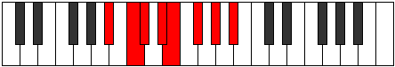 |
| [1389](https://ianring.com/musictheory/scales/1389) | [Lorian](ModeGSharpLorian.md) | G# | G#, A#, B, C#, D, E, F#, G# |  |
| [1389](https://ianring.com/musictheory/scales/1389) | [Lorian](ModeAFlatLorian.md) | Ab | Ab, Bb, Cb, Db, Ebb, Fb, Gb, Ab |  |
| [1391](https://ianring.com/musictheory/scales/1391) | [Aeradyllic](ModeCNaturalAeradyllic.md) | C | C, C#, D, D#, F, F#, G#, A#, C |  |
| [1391](https://ianring.com/musictheory/scales/1391) | [Aeradyllic](ModeASharpAeradyllic.md) | A# | A#, B, C, C#, D#, E, F#, G#, A# |  |
| [1391](https://ianring.com/musictheory/scales/1391) | [Aeradyllic](ModeBFlatAeradyllic.md) | Bb | Bb, B, C, Db, Eb, E, Gb, Ab, Bb |  |
| [1391](https://ianring.com/musictheory/scales/1391) | [Aeradyllic](ModeFNaturalAeradyllic.md) | F | F, F#, G, G#, A#, B, C#, D#, F |  |
| [1391](https://ianring.com/musictheory/scales/1391) | [Aeradyllic](ModeGSharpAeradyllic.md) | G# | G#, A, A#, B, C#, D, E, F#, G# |  |
| [1391](https://ianring.com/musictheory/scales/1391) | [Aeradyllic](ModeAFlatAeradyllic.md) | Ab | Ab, A, Bb, B, Db, D, E, Gb, Ab |  |
| [1395](https://ianring.com/musictheory/scales/1395) | [Mixonorian](ModeCNaturalMixonorian.md) | C | C, Db, E, F, Gb, Ab, Bb, C |  |
| [1395](https://ianring.com/musictheory/scales/1395) | [Mixonorian](ModeFNaturalMixonorian.md) | F | F, Gb, A, Bb, Cb, Db, Eb, F |  |
| [1397](https://ianring.com/musictheory/scales/1397) | [Gothian](ModeGSharpGothian.md) | G# | G#, A#, B#, C#, D, E, F#, G# |  |
| [1397](https://ianring.com/musictheory/scales/1397) | [Gothian](ModeAFlatGothian.md) | Ab | Ab, Bb, C, Db, Ebb, Fb, Gb, Ab |  |
| [1399](https://ianring.com/musictheory/scales/1399) | [Syryllic](ModeCNaturalSyryllic.md) | C | C, C#, D, E, F, F#, G#, A#, C |  |
| [1399](https://ianring.com/musictheory/scales/1399) | [Syryllic](ModeGSharpSyryllic.md) | G# | G#, A, A#, C, C#, D, E, F#, G# |  |
| [1399](https://ianring.com/musictheory/scales/1399) | [Syryllic](ModeAFlatSyryllic.md) | Ab | Ab, A, Bb, C, Db, D, E, Gb, Ab |  |
| [1399](https://ianring.com/musictheory/scales/1399) | [Syryllic](ModeFNaturalSyryllic.md) | F | F, F#, G, A, A#, B, C#, D#, F |  |
| [1401](https://ianring.com/musictheory/scales/1401) | [Pagian](ModeASharpPagian.md) | A# | A#, B##, C##, D#, E, F#, G#, A# |  |
| [1401](https://ianring.com/musictheory/scales/1401) | [Pagian](ModeBFlatPagian.md) | Bb | Bb, C#, D, Eb, Fb, Gb, Ab, Bb |  |
| [1403](https://ianring.com/musictheory/scales/1403) | [Epinyllic](ModeCNaturalEpinyllic.md) | C | C, C#, D#, E, F, F#, G#, A#, C |  |
| [1403](https://ianring.com/musictheory/scales/1403) | [Epinyllic](ModeASharpEpinyllic.md) | A# | A#, B, C#, D, D#, E, F#, G#, A# |  |
| [1403](https://ianring.com/musictheory/scales/1403) | [Epinyllic](ModeBFlatEpinyllic.md) | Bb | Bb, B, Db, D, Eb, E, Gb, Ab, Bb |  |
| [1403](https://ianring.com/musictheory/scales/1403) | [Epinyllic](ModeFNaturalEpinyllic.md) | F | F, F#, G#, A, A#, B, C#, D#, F |  |
| [1405](https://ianring.com/musictheory/scales/1405) | [Goryllic](ModeASharpGoryllic.md) | A# | A#, C, C#, D, D#, E, F#, G#, A# |  |
| [1405](https://ianring.com/musictheory/scales/1405) | [Goryllic](ModeBFlatGoryllic.md) | Bb | Bb, C, Db, D, Eb, E, Gb, Ab, Bb |  |
| [1405](https://ianring.com/musictheory/scales/1405) | [Goryllic](ModeGSharpGoryllic.md) | G# | G#, A#, B, C, C#, D, E, F#, G# |  |
| [1405](https://ianring.com/musictheory/scales/1405) | [Goryllic](ModeAFlatGoryllic.md) | Ab | Ab, Bb, B, C, Db, D, E, Gb, Ab |  |
| [1407](https://ianring.com/musictheory/scales/1407) | [Tharygic](ModeCNaturalTharygic.md) | C | C, C#, D, D#, E, F, F#, G#, A#, C |  |
| [1407](https://ianring.com/musictheory/scales/1407) | [Tharygic](ModeASharpTharygic.md) | A# | A#, B, C, C#, D, D#, E, F#, G#, A# |  |
| [1407](https://ianring.com/musictheory/scales/1407) | [Tharygic](ModeBFlatTharygic.md) | Bb | Bb, B, C, Db, D, Eb, E, Gb, Ab, Bb |  |
| [1407](https://ianring.com/musictheory/scales/1407) | [Tharygic](ModeGSharpTharygic.md) | G# | G#, A, A#, B, C, C#, D, E, F#, G# |  |
| [1407](https://ianring.com/musictheory/scales/1407) | [Tharygic](ModeAFlatTharygic.md) | Ab | Ab, A, Bb, B, C, Db, D, E, Gb, Ab |  |
| [1407](https://ianring.com/musictheory/scales/1407) | [Tharygic](ModeFNaturalTharygic.md) | F | F, F#, G, G#, A, A#, B, C#, D#, F |  |
| [1417](https://ianring.com/musictheory/scales/1417) | [Zoptitonic](ModeASharpZoptitonic.md) | A# | A#, C#, F, F#, G#, A# |  |
| [1417](https://ianring.com/musictheory/scales/1417) | [Zoptitonic](ModeBFlatZoptitonic.md) | Bb | Bb, Db, F, Gb, Ab, Bb |  |
| [1417](https://ianring.com/musictheory/scales/1417) | [Zoptitonic](ModeDSharpZoptitonic.md) | D# | D#, F#, A#, B, C#, D# |  |
| [1417](https://ianring.com/musictheory/scales/1417) | [Zoptitonic](ModeEFlatZoptitonic.md) | Eb | Eb, Gb, Bb, B, Db, Eb |  |
| [1419](https://ianring.com/musictheory/scales/1419) | [Zalimic](ModeDSharpZalimic.md) | D# | D#, E, F#, G###, A##, B##, D# |  |
| [1419](https://ianring.com/musictheory/scales/1419) | [Zalimic](ModeEFlatZalimic.md) | Eb | Eb, Fb, Gb, A#, B, C#, Eb |  |
| [1419](https://ianring.com/musictheory/scales/1419) | [Zalimic](ModeASharpZalimic.md) | A# | A#, B, C#, D###, E##, F###, A# |  |
| [1419](https://ianring.com/musictheory/scales/1419) | [Zalimic](ModeBFlatZalimic.md) | Bb | Bb, Cb, Db, E#, F#, G#, Bb |  |
| [1421](https://ianring.com/musictheory/scales/1421) | [Aeolaphimic](ModeASharpAeolaphimic.md) | A# | A#, B#, C#, D###, E##, F###, A# |  |
| [1421](https://ianring.com/musictheory/scales/1421) | [Aeolaphimic](ModeBFlatAeolaphimic.md) | Bb | Bb, C, Db, E#, F#, G#, Bb |  |
| [1421](https://ianring.com/musictheory/scales/1421) | [Aeolaphimic](ModeDSharpAeolaphimic.md) | D# | D#, E#, F#, G###, A##, B##, D# |  |
| [1421](https://ianring.com/musictheory/scales/1421) | [Aeolaphimic](ModeEFlatAeolaphimic.md) | Eb | Eb, F, Gb, A#, B, C#, Eb |  |
| [1423](https://ianring.com/musictheory/scales/1423) | [Doptian](ModeDSharpDoptian.md) | D# | D#, E, F, Gb, A#, B, C#, D# |  |
| [1423](https://ianring.com/musictheory/scales/1423) | [Doptian](ModeEFlatDoptian.md) | Eb | Eb, Fb, Gbb, Abbb, Bb, Cb, Db, Eb |  |
| [1423](https://ianring.com/musictheory/scales/1423) | [Doptian](ModeASharpDoptian.md) | A# | A#, B, C, Db, E#, F#, G#, A# |  |
| [1423](https://ianring.com/musictheory/scales/1423) | [Doptian](ModeBFlatDoptian.md) | Bb | Bb, Cb, Dbb, Ebbb, F, Gb, Ab, Bb |  |
| [1425](https://ianring.com/musictheory/scales/1425) | [Ryphitonic](ModeFSharpRyphitonic.md) | F# | F#, A#, C#, D, E, F# |  |
| [1425](https://ianring.com/musictheory/scales/1425) | [Ryphitonic](ModeGFlatRyphitonic.md) | Gb | Gb, Bb, Db, D, E, Gb |  |
| [1427](https://ianring.com/musictheory/scales/1427) | [Lolimic](ModeFSharpLolimic.md) | F# | F#, G, A#, B##, C##, D##, F# |  |
| [1427](https://ianring.com/musictheory/scales/1427) | [Lolimic](ModeGFlatLolimic.md) | Gb | Gb, Abb, Bb, C#, D, E, Gb |  |
| [1429](https://ianring.com/musictheory/scales/1429) | [Bythimic](ModeFSharpBythimic.md) | F# | F#, G#, A#, B##, C##, D##, F# |  |
| [1429](https://ianring.com/musictheory/scales/1429) | [Bythimic](ModeGFlatBythimic.md) | Gb | Gb, Ab, Bb, C#, D, E, Gb |  |
| [1431](https://ianring.com/musictheory/scales/1431) | [Phragian](ModeFSharpPhragian.md) | F# | F#, G, Ab, Bb, C#, D, E, F# |  |
| [1431](https://ianring.com/musictheory/scales/1431) | [Phragian](ModeGFlatPhragian.md) | Gb | Gb, Abb, Bbbb, Cbb, Db, Ebb, Fb, Gb |  |
| [1433](https://ianring.com/musictheory/scales/1433) | [Dynimic](ModeASharpDynimic.md) | A# | A#, B##, C##, D###, E##, F###, A# |  |
| [1433](https://ianring.com/musictheory/scales/1433) | [Dynimic](ModeBFlatDynimic.md) | Bb | Bb, C#, D, E#, F#, G#, Bb |  |
| [1433](https://ianring.com/musictheory/scales/1433) | [Dynimic](ModeFSharpDynimic.md) | F# | F#, G##, A#, B##, C##, D##, F# |  |
| [1433](https://ianring.com/musictheory/scales/1433) | [Dynimic](ModeGFlatDynimic.md) | Gb | Gb, A, Bb, C#, D, E, Gb |  |
| [1433](https://ianring.com/musictheory/scales/1433) | [Dynimic](ModeDSharpDynimic.md) | D# | D#, E##, F##, G###, A##, B##, D# |  |
| [1433](https://ianring.com/musictheory/scales/1433) | [Dynimic](ModeEFlatDynimic.md) | Eb | Eb, F#, G, A#, B, C#, Eb |  |
| [1435](https://ianring.com/musictheory/scales/1435) | [Phronian](ModeFSharpPhronian.md) | F# | F#, G, A, Bb, C#, D, E, F# |  |
| [1435](https://ianring.com/musictheory/scales/1435) | [Phronian](ModeGFlatPhronian.md) | Gb | Gb, Abb, Bbb, Cbb, Db, Ebb, Fb, Gb |  |
| [1435](https://ianring.com/musictheory/scales/1435) | [Phronian](ModeDSharpPhronian.md) | D# | D#, E, F#, G, A#, B, C#, D# |  |
| [1435](https://ianring.com/musictheory/scales/1435) | [Phronian](ModeEFlatPhronian.md) | Eb | Eb, Fb, Gb, Abb, Bb, Cb, Db, Eb |  |
| [1435](https://ianring.com/musictheory/scales/1435) | [Phronian](ModeASharpPhronian.md) | A# | A#, B, C#, D, E#, F#, G#, A# |  |
| [1435](https://ianring.com/musictheory/scales/1435) | [Phronian](ModeBFlatPhronian.md) | Bb | Bb, Cb, Db, Ebb, F, Gb, Ab, Bb |  |
| [1437](https://ianring.com/musictheory/scales/1437) | [Aeolycrian](ModeASharpAeolycrian.md) | A# | A#, B#, C#, D, E#, F#, G#, A# |  |
| [1437](https://ianring.com/musictheory/scales/1437) | [Aeolycrian](ModeBFlatAeolycrian.md) | Bb | Bb, C, Db, Ebb, F, Gb, Ab, Bb |  |
| [1437](https://ianring.com/musictheory/scales/1437) | [Aeolycrian](ModeFSharpAeolycrian.md) | F# | F#, G#, A, Bb, C#, D, E, F# |  |
| [1437](https://ianring.com/musictheory/scales/1437) | [Aeolycrian](ModeGFlatAeolycrian.md) | Gb | Gb, Ab, Bbb, Cbb, Db, Ebb, Fb, Gb |  |
| [1437](https://ianring.com/musictheory/scales/1437) | [Aeolycrian](ModeDSharpAeolycrian.md) | D# | D#, E#, F#, G, A#, B, C#, D# |  |
| [1437](https://ianring.com/musictheory/scales/1437) | [Aeolycrian](ModeEFlatAeolycrian.md) | Eb | Eb, F, Gb, Abb, Bb, Cb, Db, Eb |  |
| [1439](https://ianring.com/musictheory/scales/1439) | [Rolyllic](ModeFSharpRolyllic.md) | F# | F#, G, G#, A, A#, C#, D, E, F# |  |
| [1439](https://ianring.com/musictheory/scales/1439) | [Rolyllic](ModeGFlatRolyllic.md) | Gb | Gb, G, Ab, A, Bb, Db, D, E, Gb |  |
| [1439](https://ianring.com/musictheory/scales/1439) | [Rolyllic](ModeDSharpRolyllic.md) | D# | D#, E, F, F#, G, A#, B, C#, D# |  |
| [1439](https://ianring.com/musictheory/scales/1439) | [Rolyllic](ModeEFlatRolyllic.md) | Eb | Eb, E, F, Gb, G, Bb, B, Db, Eb |  |
| [1439](https://ianring.com/musictheory/scales/1439) | [Rolyllic](ModeASharpRolyllic.md) | A# | A#, B, C, C#, D, F, F#, G#, A# | 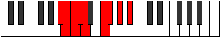 |
| [1439](https://ianring.com/musictheory/scales/1439) | [Rolyllic](ModeBFlatRolyllic.md) | Bb | Bb, B, C, Db, D, F, Gb, Ab, Bb |  |
| [1443](https://ianring.com/musictheory/scales/1443) | [Ionarimic](ModeFNaturalIonarimic.md) | F | F, Gb, A#, B#, C#, D#, F |  |
| [1445](https://ianring.com/musictheory/scales/1445) | [Byptimic](ModeGSharpByptimic.md) | G# | G#, A#, B##, C###, D##, E##, G# |  |
| [1445](https://ianring.com/musictheory/scales/1445) | [Byptimic](ModeAFlatByptimic.md) | Ab | Ab, Bb, C#, D#, E, F#, Ab |  |
| [1447](https://ianring.com/musictheory/scales/1447) | [Mixopyrian](ModeFNaturalMixopyrian.md) | F | F, Gb, Abb, Bb, C, Db, Eb, F |  |
| [1447](https://ianring.com/musictheory/scales/1447) | [Mixopyrian](ModeGSharpMixopyrian.md) | G# | G#, A, Bb, C#, D#, E, F#, G# |  |
| [1447](https://ianring.com/musictheory/scales/1447) | [Mixopyrian](ModeAFlatMixopyrian.md) | Ab | Ab, Bbb, Cbb, Db, Eb, Fb, Gb, Ab |  |
| [1449](https://ianring.com/musictheory/scales/1449) | [Epathimic](ModeASharpEpathimic.md) | A# | A#, B##, C###, D###, E##, F###, A# |  |
| [1449](https://ianring.com/musictheory/scales/1449) | [Epathimic](ModeBFlatEpathimic.md) | Bb | Bb, C#, D#, E#, F#, G#, Bb |  |
| [1449](https://ianring.com/musictheory/scales/1449) | [Epathimic](ModeDSharpEpathimic.md) | D# | D#, E##, F###, G###, A##, B##, D# |  |
| [1449](https://ianring.com/musictheory/scales/1449) | [Epathimic](ModeEFlatEpathimic.md) | Eb | Eb, F#, G#, A#, B, C#, Eb |  |
| [1451](https://ianring.com/musictheory/scales/1451) | [Phrygian](ModeFNaturalPhrygian.md) | F | F, Gb, Ab, Bb, C, Db, Eb, F |  |
| [1451](https://ianring.com/musictheory/scales/1451) | [Phrygian](ModeDSharpPhrygian.md) | D# | D#, E, F#, G#, A#, B, C#, D# |  |
| [1451](https://ianring.com/musictheory/scales/1451) | [Phrygian](ModeEFlatPhrygian.md) | Eb | Eb, Fb, Gb, Ab, Bb, Cb, Db, Eb |  |
| [1451](https://ianring.com/musictheory/scales/1451) | [Phrygian](ModeASharpPhrygian.md) | A# | A#, B, C#, D#, E#, F#, G#, A# |  |
| [1451](https://ianring.com/musictheory/scales/1451) | [Phrygian](ModeBFlatPhrygian.md) | Bb | Bb, Cb, Db, Eb, F, Gb, Ab, Bb |  |
| [1453](https://ianring.com/musictheory/scales/1453) | [Aeolian](ModeASharpAeolian.md) | A# | A#, B#, C#, D#, E#, F#, G#, A# |  |
| [1453](https://ianring.com/musictheory/scales/1453) | [Aeolian](ModeBFlatAeolian.md) | Bb | Bb, C, Db, Eb, F, Gb, Ab, Bb |  |
| [1453](https://ianring.com/musictheory/scales/1453) | [Aeolian](ModeGSharpAeolian.md) | G# | G#, A#, B, C#, D#, E, F#, G# |  |
| [1453](https://ianring.com/musictheory/scales/1453) | [Aeolian](ModeAFlatAeolian.md) | Ab | Ab, Bb, Cb, Db, Eb, Fb, Gb, Ab |  |
| [1453](https://ianring.com/musictheory/scales/1453) | [Aeolian](ModeDSharpAeolian.md) | D# | D#, E#, F#, G#, A#, B, C#, D# |  |
| [1453](https://ianring.com/musictheory/scales/1453) | [Aeolian](ModeEFlatAeolian.md) | Eb | Eb, F, Gb, Ab, Bb, Cb, Db, Eb |  |
| [1455](https://ianring.com/musictheory/scales/1455) | [Soryllic](ModeFNaturalSoryllic.md) | F | F, F#, G, G#, A#, C, C#, D#, F |  |
| [1455](https://ianring.com/musictheory/scales/1455) | [Soryllic](ModeASharpSoryllic.md) | A# | A#, B, C, C#, D#, F, F#, G#, A# |  |
| [1455](https://ianring.com/musictheory/scales/1455) | [Soryllic](ModeBFlatSoryllic.md) | Bb | Bb, B, C, Db, Eb, F, Gb, Ab, Bb |  |
| [1455](https://ianring.com/musictheory/scales/1455) | [Soryllic](ModeDSharpSoryllic.md) | D# | D#, E, F, F#, G#, A#, B, C#, D# |  |
| [1455](https://ianring.com/musictheory/scales/1455) | [Soryllic](ModeEFlatSoryllic.md) | Eb | Eb, E, F, Gb, Ab, Bb, B, Db, Eb |  |
| [1455](https://ianring.com/musictheory/scales/1455) | [Soryllic](ModeGSharpSoryllic.md) | G# | G#, A, A#, B, C#, D#, E, F#, G# |  |
| [1455](https://ianring.com/musictheory/scales/1455) | [Soryllic](ModeAFlatSoryllic.md) | Ab | Ab, A, Bb, B, Db, Eb, E, Gb, Ab |  |
| [1457](https://ianring.com/musictheory/scales/1457) | [Modimic](ModeFSharpModimic.md) | F# | F#, G###, A##, B##, C##, D##, F# |  |
| [1457](https://ianring.com/musictheory/scales/1457) | [Modimic](ModeGFlatModimic.md) | Gb | Gb, A#, B, C#, D, E, Gb |  |
| [1459](https://ianring.com/musictheory/scales/1459) | [Ionalian](ModeFNaturalIonalian.md) | F | F, Gb, A, Bb, C, Db, Eb, F |  |
| [1459](https://ianring.com/musictheory/scales/1459) | [Ionalian](ModeFSharpIonalian.md) | F# | F#, G, A#, B, C#, D, E, F# |  |
| [1459](https://ianring.com/musictheory/scales/1459) | [Ionalian](ModeGFlatIonalian.md) | Gb | Gb, Abb, Bb, Cb, Db, Ebb, Fb, Gb |  |
| [1461](https://ianring.com/musictheory/scales/1461) | [Stydian](ModeGSharpStydian.md) | G# | G#, A#, B#, C#, D#, E, F#, G# |  |
| [1461](https://ianring.com/musictheory/scales/1461) | [Stydian](ModeAFlatStydian.md) | Ab | Ab, Bb, C, Db, Eb, Fb, Gb, Ab |  |
| [1461](https://ianring.com/musictheory/scales/1461) | [Stydian](ModeFSharpStydian.md) | F# | F#, G#, A#, B, C#, D, E, F# |  |
| [1461](https://ianring.com/musictheory/scales/1461) | [Stydian](ModeGFlatStydian.md) | Gb | Gb, Ab, Bb, Cb, Db, Ebb, Fb, Gb |  |
| [1463](https://ianring.com/musictheory/scales/1463) | [Zaptyllic](ModeFNaturalZaptyllic.md) | F | F, F#, G, A, A#, C, C#, D#, F |  |
| [1463](https://ianring.com/musictheory/scales/1463) | [Zaptyllic](ModeGSharpZaptyllic.md) | G# | G#, A, A#, C, C#, D#, E, F#, G# |  |
| [1463](https://ianring.com/musictheory/scales/1463) | [Zaptyllic](ModeAFlatZaptyllic.md) | Ab | Ab, A, Bb, C, Db, Eb, E, Gb, Ab |  |
| [1463](https://ianring.com/musictheory/scales/1463) | [Zaptyllic](ModeFSharpZaptyllic.md) | F# | F#, G, G#, A#, B, C#, D, E, F# |  |
| [1463](https://ianring.com/musictheory/scales/1463) | [Zaptyllic](ModeGFlatZaptyllic.md) | Gb | Gb, G, Ab, Bb, B, Db, D, E, Gb |  |
| [1465](https://ianring.com/musictheory/scales/1465) | [Aerathian](ModeASharpAerathian.md) | A# | A#, B##, C##, D#, E#, F#, G#, A# |  |
| [1465](https://ianring.com/musictheory/scales/1465) | [Aerathian](ModeBFlatAerathian.md) | Bb | Bb, C#, D, Eb, F, Gb, Ab, Bb |  |
| [1465](https://ianring.com/musictheory/scales/1465) | [Aerathian](ModeDSharpAerathian.md) | D# | D#, E##, F##, G#, A#, B, C#, D# |  |
| [1465](https://ianring.com/musictheory/scales/1465) | [Aerathian](ModeEFlatAerathian.md) | Eb | Eb, F#, G, Ab, Bb, Cb, Db, Eb |  |
| [1465](https://ianring.com/musictheory/scales/1465) | [Aerathian](ModeFSharpAerathian.md) | F# | F#, G##, A#, B, C#, D, E, F# |  |
| [1465](https://ianring.com/musictheory/scales/1465) | [Aerathian](ModeGFlatAerathian.md) | Gb | Gb, A, Bb, Cb, Db, Ebb, Fb, Gb |  |
| [1467](https://ianring.com/musictheory/scales/1467) | [Thydyllic](ModeFNaturalThydyllic.md) | F | F, F#, G#, A, A#, C, C#, D#, F |  |
| [1467](https://ianring.com/musictheory/scales/1467) | [Thydyllic](ModeASharpThydyllic.md) | A# | A#, B, C#, D, D#, F, F#, G#, A# |  |
| [1467](https://ianring.com/musictheory/scales/1467) | [Thydyllic](ModeBFlatThydyllic.md) | Bb | Bb, B, Db, D, Eb, F, Gb, Ab, Bb |  |
| [1467](https://ianring.com/musictheory/scales/1467) | [Thydyllic](ModeDSharpThydyllic.md) | D# | D#, E, F#, G, G#, A#, B, C#, D# |  |
| [1467](https://ianring.com/musictheory/scales/1467) | [Thydyllic](ModeEFlatThydyllic.md) | Eb | Eb, E, Gb, G, Ab, Bb, B, Db, Eb |  |
| [1467](https://ianring.com/musictheory/scales/1467) | [Thydyllic](ModeFSharpThydyllic.md) | F# | F#, G, A, A#, B, C#, D, E, F# |  |
| [1467](https://ianring.com/musictheory/scales/1467) | [Thydyllic](ModeGFlatThydyllic.md) | Gb | Gb, G, A, Bb, B, Db, D, E, Gb |  |
| [1469](https://ianring.com/musictheory/scales/1469) | [Epiryllic](ModeASharpEpiryllic.md) | A# | A#, C, C#, D, D#, F, F#, G#, A# |  |
| [1469](https://ianring.com/musictheory/scales/1469) | [Epiryllic](ModeBFlatEpiryllic.md) | Bb | Bb, C, Db, D, Eb, F, Gb, Ab, Bb |  |
| [1469](https://ianring.com/musictheory/scales/1469) | [Epiryllic](ModeGSharpEpiryllic.md) | G# | G#, A#, B, C, C#, D#, E, F#, G# |  |
| [1469](https://ianring.com/musictheory/scales/1469) | [Epiryllic](ModeAFlatEpiryllic.md) | Ab | Ab, Bb, B, C, Db, Eb, E, Gb, Ab |  |
| [1469](https://ianring.com/musictheory/scales/1469) | [Epiryllic](ModeDSharpEpiryllic.md) | D# | D#, F, F#, G, G#, A#, B, C#, D# |  |
| [1469](https://ianring.com/musictheory/scales/1469) | [Epiryllic](ModeEFlatEpiryllic.md) | Eb | Eb, F, Gb, G, Ab, Bb, B, Db, Eb |  |
| [1469](https://ianring.com/musictheory/scales/1469) | [Epiryllic](ModeFSharpEpiryllic.md) | F# | F#, G#, A, A#, B, C#, D, E, F# |  |
| [1469](https://ianring.com/musictheory/scales/1469) | [Epiryllic](ModeGFlatEpiryllic.md) | Gb | Gb, Ab, A, Bb, B, Db, D, E, Gb |  |
| [1471](https://ianring.com/musictheory/scales/1471) | [Radygic](ModeFNaturalRadygic.md) | F | F, F#, G, G#, A, A#, C, C#, D#, F |  |
| [1471](https://ianring.com/musictheory/scales/1471) | [Radygic](ModeASharpRadygic.md) | A# | A#, B, C, C#, D, D#, F, F#, G#, A# |  |
| [1471](https://ianring.com/musictheory/scales/1471) | [Radygic](ModeBFlatRadygic.md) | Bb | Bb, B, C, Db, D, Eb, F, Gb, Ab, Bb |  |
| [1471](https://ianring.com/musictheory/scales/1471) | [Radygic](ModeDSharpRadygic.md) | D# | D#, E, F, F#, G, G#, A#, B, C#, D# |  |
| [1471](https://ianring.com/musictheory/scales/1471) | [Radygic](ModeEFlatRadygic.md) | Eb | Eb, E, F, Gb, G, Ab, Bb, B, Db, Eb |  |
| [1471](https://ianring.com/musictheory/scales/1471) | [Radygic](ModeGSharpRadygic.md) | G# | G#, A, A#, B, C, C#, D#, E, F#, G# |  |
| [1471](https://ianring.com/musictheory/scales/1471) | [Radygic](ModeAFlatRadygic.md) | Ab | Ab, A, Bb, B, C, Db, Eb, E, Gb, Ab |  |
| [1471](https://ianring.com/musictheory/scales/1471) | [Radygic](ModeFSharpRadygic.md) | F# | F#, G, G#, A, A#, B, C#, D, E, F# |  |
| [1471](https://ianring.com/musictheory/scales/1471) | [Radygic](ModeGFlatRadygic.md) | Gb | Gb, G, Ab, A, Bb, B, Db, D, E, Gb |  |
| [1479](https://ianring.com/musictheory/scales/1479) | [Aeolagian](ModeCNaturalAeolagian.md) | C | C, Db, Ebb, F#, G, Ab, Bb, C |  |
| [1481](https://ianring.com/musictheory/scales/1481) | [Zagimic](ModeASharpZagimic.md) | A# | A#, B##, D##, E#, F#, G#, A# |  |
| [1481](https://ianring.com/musictheory/scales/1481) | [Zagimic](ModeBFlatZagimic.md) | Bb | Bb, C#, D##, E#, F#, G#, Bb |  |
| [1481](https://ianring.com/musictheory/scales/1481) | [Zagimic](ModeDSharpZagimic.md) | D# | D#, E##, Cbbb, Cbb, Dbbb, Ebbb, D# |  |
| [1481](https://ianring.com/musictheory/scales/1481) | [Zagimic](ModeEFlatZagimic.md) | Eb | Eb, F#, G##, A#, B, C#, Eb |  |
| [1483](https://ianring.com/musictheory/scales/1483) | [Dygian](ModeCNaturalDygian.md) | C | C, Db, Eb, F#, G, Ab, Bb, C |  |
| [1483](https://ianring.com/musictheory/scales/1483) | [Dygian](ModeASharpDygian.md) | A# | A#, B, C#, D##, E#, F#, G#, A# |  |
| [1483](https://ianring.com/musictheory/scales/1483) | [Dygian](ModeBFlatDygian.md) | Bb | Bb, Cb, Db, E, F, Gb, Ab, Bb |  |
| [1483](https://ianring.com/musictheory/scales/1483) | [Dygian](ModeDSharpDygian.md) | D# | D#, E, F#, G##, A#, B, C#, D# |  |
| [1483](https://ianring.com/musictheory/scales/1483) | [Dygian](ModeEFlatDygian.md) | Eb | Eb, Fb, Gb, A, Bb, Cb, Db, Eb |  |
| [1485](https://ianring.com/musictheory/scales/1485) | [Tyrian](ModeASharpTyrian.md) | A# | A#, B#, C#, D##, E#, F#, G#, A# |  |
| [1485](https://ianring.com/musictheory/scales/1485) | [Tyrian](ModeBFlatTyrian.md) | Bb | Bb, C, Db, E, F, Gb, Ab, Bb |  |
| [1485](https://ianring.com/musictheory/scales/1485) | [Tyrian](ModeDSharpTyrian.md) | D# | D#, E#, F#, G##, A#, B, C#, D# |  |
| [1485](https://ianring.com/musictheory/scales/1485) | [Tyrian](ModeEFlatTyrian.md) | Eb | Eb, F, Gb, A, Bb, Cb, Db, Eb |  |
| [1487](https://ianring.com/musictheory/scales/1487) | [Lycryllic](ModeCNaturalLycryllic.md) | C | C, C#, D, D#, F#, G, G#, A#, C |  |
| [1487](https://ianring.com/musictheory/scales/1487) | [Lycryllic](ModeASharpLycryllic.md) | A# | A#, B, C, C#, E, F, F#, G#, A# |  |
| [1487](https://ianring.com/musictheory/scales/1487) | [Lycryllic](ModeBFlatLycryllic.md) | Bb | Bb, B, C, Db, E, F, Gb, Ab, Bb |  |
| [1487](https://ianring.com/musictheory/scales/1487) | [Lycryllic](ModeDSharpLycryllic.md) | D# | D#, E, F, F#, A, A#, B, C#, D# |  |
| [1487](https://ianring.com/musictheory/scales/1487) | [Lycryllic](ModeEFlatLycryllic.md) | Eb | Eb, E, F, Gb, A, Bb, B, Db, Eb |  |
| [1489](https://ianring.com/musictheory/scales/1489) | [Gacrimic](ModeFSharpGacrimic.md) | F# | F#, G###, A###, B##, C##, D##, F# | 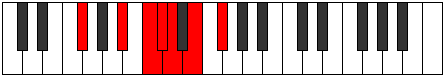 |
| [1489](https://ianring.com/musictheory/scales/1489) | [Gacrimic](ModeGFlatGacrimic.md) | Gb | Gb, A#, B#, C#, D, E, Gb |  |
| [1491](https://ianring.com/musictheory/scales/1491) | [Rynian](ModeFSharpRynian.md) | F# | F#, G, A#, B#, C#, D, E, F# |  |
| [1491](https://ianring.com/musictheory/scales/1491) | [Rynian](ModeGFlatRynian.md) | Gb | Gb, Abb, Bb, C, Db, Ebb, Fb, Gb |  |
| [1491](https://ianring.com/musictheory/scales/1491) | [Rynian](ModeCNaturalRynian.md) | C | C, Db, E, F#, G, Ab, Bb, C |  |
| [1493](https://ianring.com/musictheory/scales/1493) | [Phryrian](ModeFSharpPhryrian.md) | F# | F#, G#, A#, B#, C#, D, E, F# |  |
| [1493](https://ianring.com/musictheory/scales/1493) | [Phryrian](ModeGFlatPhryrian.md) | Gb | Gb, Ab, Bb, C, Db, Ebb, Fb, Gb |  |
| [1495](https://ianring.com/musictheory/scales/1495) | [Kaptyllic](ModeCNaturalKaptyllic.md) | C | C, C#, D, E, F#, G, G#, A#, C |  |
| [1495](https://ianring.com/musictheory/scales/1495) | [Kaptyllic](ModeFSharpKaptyllic.md) | F# | F#, G, G#, A#, C, C#, D, E, F# |  |
| [1495](https://ianring.com/musictheory/scales/1495) | [Kaptyllic](ModeGFlatKaptyllic.md) | Gb | Gb, G, Ab, Bb, C, Db, D, E, Gb |  |
| [1497](https://ianring.com/musictheory/scales/1497) | [Ionanian](ModeASharpIonanian.md) | A# | A#, B##, C##, D##, E#, F#, G#, A# |  |
| [1497](https://ianring.com/musictheory/scales/1497) | [Ionanian](ModeBFlatIonanian.md) | Bb | Bb, C#, D, E, F, Gb, Ab, Bb |  |
| [1497](https://ianring.com/musictheory/scales/1497) | [Ionanian](ModeFSharpIonanian.md) | F# | F#, G##, A#, B#, C#, D, E, F# |  |
| [1497](https://ianring.com/musictheory/scales/1497) | [Ionanian](ModeGFlatIonanian.md) | Gb | Gb, A, Bb, C, Db, Ebb, Fb, Gb |  |
| [1497](https://ianring.com/musictheory/scales/1497) | [Ionanian](ModeDSharpIonanian.md) | D# | D#, E##, F##, G##, A#, B, C#, D# |  |
| [1497](https://ianring.com/musictheory/scales/1497) | [Ionanian](ModeEFlatIonanian.md) | Eb | Eb, F#, G, A, Bb, Cb, Db, Eb |  |
| [1499](https://ianring.com/musictheory/scales/1499) | [Stonyllic](ModeCNaturalStonyllic.md) | C | C, C#, D#, E, F#, G, G#, A#, C |  |
| [1499](https://ianring.com/musictheory/scales/1499) | [Stonyllic](ModeFSharpStonyllic.md) | F# | F#, G, A, A#, C, C#, D, E, F# |  |
| [1499](https://ianring.com/musictheory/scales/1499) | [Stonyllic](ModeGFlatStonyllic.md) | Gb | Gb, G, A, Bb, C, Db, D, E, Gb |  |
| [1499](https://ianring.com/musictheory/scales/1499) | [Stonyllic](ModeASharpStonyllic.md) | A# | A#, B, C#, D, E, F, F#, G#, A# |  |
| [1499](https://ianring.com/musictheory/scales/1499) | [Stonyllic](ModeBFlatStonyllic.md) | Bb | Bb, B, Db, D, E, F, Gb, Ab, Bb |  |
| [1499](https://ianring.com/musictheory/scales/1499) | [Stonyllic](ModeDSharpStonyllic.md) | D# | D#, E, F#, G, A, A#, B, C#, D# |  |
| [1499](https://ianring.com/musictheory/scales/1499) | [Stonyllic](ModeEFlatStonyllic.md) | Eb | Eb, E, Gb, G, A, Bb, B, Db, Eb |  |
| [1501](https://ianring.com/musictheory/scales/1501) | [Stygyllic](ModeASharpStygyllic.md) | A# | A#, C, C#, D, E, F, F#, G#, A# |  |
| [1501](https://ianring.com/musictheory/scales/1501) | [Stygyllic](ModeBFlatStygyllic.md) | Bb | Bb, C, Db, D, E, F, Gb, Ab, Bb |  |
| [1501](https://ianring.com/musictheory/scales/1501) | [Stygyllic](ModeFSharpStygyllic.md) | F# | F#, G#, A, A#, C, C#, D, E, F# |  |
| [1501](https://ianring.com/musictheory/scales/1501) | [Stygyllic](ModeGFlatStygyllic.md) | Gb | Gb, Ab, A, Bb, C, Db, D, E, Gb |  |
| [1501](https://ianring.com/musictheory/scales/1501) | [Stygyllic](ModeDSharpStygyllic.md) | D# | D#, F, F#, G, A, A#, B, C#, D# |  |
| [1501](https://ianring.com/musictheory/scales/1501) | [Stygyllic](ModeEFlatStygyllic.md) | Eb | Eb, F, Gb, G, A, Bb, B, Db, Eb |  |
| [1503](https://ianring.com/musictheory/scales/1503) | [Padygic](ModeCNaturalPadygic.md) | C | C, C#, D, D#, E, F#, G, G#, A#, C |  |
| [1503](https://ianring.com/musictheory/scales/1503) | [Padygic](ModeFSharpPadygic.md) | F# | F#, G, G#, A, A#, C, C#, D, E, F# |  |
| [1503](https://ianring.com/musictheory/scales/1503) | [Padygic](ModeGFlatPadygic.md) | Gb | Gb, G, Ab, A, Bb, C, Db, D, E, Gb |  |
| [1503](https://ianring.com/musictheory/scales/1503) | [Padygic](ModeASharpPadygic.md) | A# | A#, B, C, C#, D, E, F, F#, G#, A# |  |
| [1503](https://ianring.com/musictheory/scales/1503) | [Padygic](ModeBFlatPadygic.md) | Bb | Bb, B, C, Db, D, E, F, Gb, Ab, Bb |  |
| [1503](https://ianring.com/musictheory/scales/1503) | [Padygic](ModeDSharpPadygic.md) | D# | D#, E, F, F#, G, A, A#, B, C#, D# |  |
| [1503](https://ianring.com/musictheory/scales/1503) | [Padygic](ModeEFlatPadygic.md) | Eb | Eb, E, F, Gb, G, A, Bb, B, Db, Eb |  |
| [1507](https://ianring.com/musictheory/scales/1507) | [Zynian](ModeCNaturalZynian.md) | C | C, Db, E#, F#, G, Ab, Bb, C |  |
| [1507](https://ianring.com/musictheory/scales/1507) | [Zynian](ModeFNaturalZynian.md) | F | F, Gb, A#, B, C, Db, Eb, F |  |
| [1509](https://ianring.com/musictheory/scales/1509) | [Ragian](ModeGSharpRagian.md) | G# | G#, A#, B##, C##, D#, E, F#, G# |  |
| [1509](https://ianring.com/musictheory/scales/1509) | [Ragian](ModeAFlatRagian.md) | Ab | Ab, Bb, C#, D, Eb, Fb, Gb, Ab |  |
| [1511](https://ianring.com/musictheory/scales/1511) | [Styptyllic](ModeCNaturalStyptyllic.md) | C | C, C#, D, F, F#, G, G#, A#, C |  |
| [1511](https://ianring.com/musictheory/scales/1511) | [Styptyllic](ModeGSharpStyptyllic.md) | G# | G#, A, A#, C#, D, D#, E, F#, G# |  |
| [1511](https://ianring.com/musictheory/scales/1511) | [Styptyllic](ModeAFlatStyptyllic.md) | Ab | Ab, A, Bb, Db, D, Eb, E, Gb, Ab |  |
| [1511](https://ianring.com/musictheory/scales/1511) | [Styptyllic](ModeFNaturalStyptyllic.md) | F | F, F#, G, A#, B, C, C#, D#, F |  |
| [1513](https://ianring.com/musictheory/scales/1513) | [Stathian](ModeASharpStathian.md) | A# | A#, B##, C###, D##, E#, F#, G#, A# |  |
| [1513](https://ianring.com/musictheory/scales/1513) | [Stathian](ModeBFlatStathian.md) | Bb | Bb, C#, D#, E, F, Gb, Ab, Bb |  |
| [1513](https://ianring.com/musictheory/scales/1513) | [Stathian](ModeDSharpStathian.md) | D# | D#, E##, F###, G##, A#, B, C#, D# |  |
| [1513](https://ianring.com/musictheory/scales/1513) | [Stathian](ModeEFlatStathian.md) | Eb | Eb, F#, G#, A, Bb, Cb, Db, Eb |  |
| [1515](https://ianring.com/musictheory/scales/1515) | [Solyllic](ModeCNaturalSolyllic.md) | C | C, C#, D#, F, F#, G, G#, A#, C |  |
| [1515](https://ianring.com/musictheory/scales/1515) | [Solyllic](ModeFNaturalSolyllic.md) | F | F, F#, G#, A#, B, C, C#, D#, F |  |
| [1515](https://ianring.com/musictheory/scales/1515) | [Solyllic](ModeASharpSolyllic.md) | A# | A#, B, C#, D#, E, F, F#, G#, A# |  |
| [1515](https://ianring.com/musictheory/scales/1515) | [Solyllic](ModeBFlatSolyllic.md) | Bb | Bb, B, Db, Eb, E, F, Gb, Ab, Bb |  |
| [1515](https://ianring.com/musictheory/scales/1515) | [Solyllic](ModeDSharpSolyllic.md) | D# | D#, E, F#, G#, A, A#, B, C#, D# |  |
| [1515](https://ianring.com/musictheory/scales/1515) | [Solyllic](ModeEFlatSolyllic.md) | Eb | Eb, E, Gb, Ab, A, Bb, B, Db, Eb |  |
| [1517](https://ianring.com/musictheory/scales/1517) | [Sagyllic](ModeASharpSagyllic.md) | A# | A#, C, C#, D#, E, F, F#, G#, A# |  |
| [1517](https://ianring.com/musictheory/scales/1517) | [Sagyllic](ModeBFlatSagyllic.md) | Bb | Bb, C, Db, Eb, E, F, Gb, Ab, Bb |  |
| [1517](https://ianring.com/musictheory/scales/1517) | [Sagyllic](ModeGSharpSagyllic.md) | G# | G#, A#, B, C#, D, D#, E, F#, G# |  |
| [1517](https://ianring.com/musictheory/scales/1517) | [Sagyllic](ModeAFlatSagyllic.md) | Ab | Ab, Bb, B, Db, D, Eb, E, Gb, Ab |  |
| [1517](https://ianring.com/musictheory/scales/1517) | [Sagyllic](ModeDSharpSagyllic.md) | D# | D#, F, F#, G#, A, A#, B, C#, D# |  |
| [1517](https://ianring.com/musictheory/scales/1517) | [Sagyllic](ModeEFlatSagyllic.md) | Eb | Eb, F, Gb, Ab, A, Bb, B, Db, Eb |  |
| [1519](https://ianring.com/musictheory/scales/1519) | [Solygic](ModeCNaturalSolygic.md) | C | C, C#, D, D#, F, F#, G, G#, A#, C |  |
| [1519](https://ianring.com/musictheory/scales/1519) | [Solygic](ModeASharpSolygic.md) | A# | A#, B, C, C#, D#, E, F, F#, G#, A# |  |
| [1519](https://ianring.com/musictheory/scales/1519) | [Solygic](ModeBFlatSolygic.md) | Bb | Bb, B, C, Db, Eb, E, F, Gb, Ab, Bb |  |
| [1519](https://ianring.com/musictheory/scales/1519) | [Solygic](ModeFNaturalSolygic.md) | F | F, F#, G, G#, A#, B, C, C#, D#, F |  |
| [1519](https://ianring.com/musictheory/scales/1519) | [Solygic](ModeGSharpSolygic.md) | G# | G#, A, A#, B, C#, D, D#, E, F#, G# |  |
| [1519](https://ianring.com/musictheory/scales/1519) | [Solygic](ModeAFlatSolygic.md) | Ab | Ab, A, Bb, B, Db, D, Eb, E, Gb, Ab |  |
| [1519](https://ianring.com/musictheory/scales/1519) | [Solygic](ModeDSharpSolygic.md) | D# | D#, E, F, F#, G#, A, A#, B, C#, D# |  |
| [1519](https://ianring.com/musictheory/scales/1519) | [Solygic](ModeEFlatSolygic.md) | Eb | Eb, E, F, Gb, Ab, A, Bb, B, Db, Eb |  |
| [1521](https://ianring.com/musictheory/scales/1521) | [Stanian](ModeFSharpStanian.md) | F# | F#, G###, A##, B#, C#, D, E, F# |  |
| [1521](https://ianring.com/musictheory/scales/1521) | [Stanian](ModeGFlatStanian.md) | Gb | Gb, A#, B, C, Db, Ebb, Fb, Gb |  |
| [1523](https://ianring.com/musictheory/scales/1523) | [Zothyllic](ModeCNaturalZothyllic.md) | C | C, C#, E, F, F#, G, G#, A#, C |  |
| [1523](https://ianring.com/musictheory/scales/1523) | [Zothyllic](ModeFSharpZothyllic.md) | F# | F#, G, A#, B, C, C#, D, E, F# |  |
| [1523](https://ianring.com/musictheory/scales/1523) | [Zothyllic](ModeGFlatZothyllic.md) | Gb | Gb, G, Bb, B, C, Db, D, E, Gb |  |
| [1523](https://ianring.com/musictheory/scales/1523) | [Zothyllic](ModeFNaturalZothyllic.md) | F | F, F#, A, A#, B, C, C#, D#, F |  |
| [1525](https://ianring.com/musictheory/scales/1525) | [Sodyllic](ModeGSharpSodyllic.md) | G# | G#, A#, C, C#, D, D#, E, F#, G# |  |
| [1525](https://ianring.com/musictheory/scales/1525) | [Sodyllic](ModeAFlatSodyllic.md) | Ab | Ab, Bb, C, Db, D, Eb, E, Gb, Ab |  |
| [1525](https://ianring.com/musictheory/scales/1525) | [Sodyllic](ModeFSharpSodyllic.md) | F# | F#, G#, A#, B, C, C#, D, E, F# |  |
| [1525](https://ianring.com/musictheory/scales/1525) | [Sodyllic](ModeGFlatSodyllic.md) | Gb | Gb, Ab, Bb, B, C, Db, D, E, Gb |  |
| [1527](https://ianring.com/musictheory/scales/1527) | [Aeolyrygic](ModeCNaturalAeolyrygic.md) | C | C, C#, D, E, F, F#, G, G#, A#, C |  |
| [1527](https://ianring.com/musictheory/scales/1527) | [Aeolyrygic](ModeGSharpAeolyrygic.md) | G# | G#, A, A#, C, C#, D, D#, E, F#, G# |  |
| [1527](https://ianring.com/musictheory/scales/1527) | [Aeolyrygic](ModeAFlatAeolyrygic.md) | Ab | Ab, A, Bb, C, Db, D, Eb, E, Gb, Ab |  |
| [1527](https://ianring.com/musictheory/scales/1527) | [Aeolyrygic](ModeFSharpAeolyrygic.md) | F# | F#, G, G#, A#, B, C, C#, D, E, F# |  |
| [1527](https://ianring.com/musictheory/scales/1527) | [Aeolyrygic](ModeGFlatAeolyrygic.md) | Gb | Gb, G, Ab, Bb, B, C, Db, D, E, Gb |  |
| [1527](https://ianring.com/musictheory/scales/1527) | [Aeolyrygic](ModeFNaturalAeolyrygic.md) | F | F, F#, G, A, A#, B, C, C#, D#, F |  |
| [1529](https://ianring.com/musictheory/scales/1529) | [Kataryllic](ModeASharpKataryllic.md) | A# | A#, C#, D, D#, E, F, F#, G#, A# |  |
| [1529](https://ianring.com/musictheory/scales/1529) | [Kataryllic](ModeBFlatKataryllic.md) | Bb | Bb, Db, D, Eb, E, F, Gb, Ab, Bb |  |
| [1529](https://ianring.com/musictheory/scales/1529) | [Kataryllic](ModeFSharpKataryllic.md) | F# | F#, A, A#, B, C, C#, D, E, F# |  |
| [1529](https://ianring.com/musictheory/scales/1529) | [Kataryllic](ModeGFlatKataryllic.md) | Gb | Gb, A, Bb, B, C, Db, D, E, Gb |  |
| [1529](https://ianring.com/musictheory/scales/1529) | [Kataryllic](ModeDSharpKataryllic.md) | D# | D#, F#, G, G#, A, A#, B, C#, D# |  |
| [1529](https://ianring.com/musictheory/scales/1529) | [Kataryllic](ModeEFlatKataryllic.md) | Eb | Eb, Gb, G, Ab, A, Bb, B, Db, Eb |  |
| [1531](https://ianring.com/musictheory/scales/1531) | [Styptygic](ModeCNaturalStyptygic.md) | C | C, C#, D#, E, F, F#, G, G#, A#, C |  |
| [1531](https://ianring.com/musictheory/scales/1531) | [Styptygic](ModeASharpStyptygic.md) | A# | A#, B, C#, D, D#, E, F, F#, G#, A# |  |
| [1531](https://ianring.com/musictheory/scales/1531) | [Styptygic](ModeBFlatStyptygic.md) | Bb | Bb, B, Db, D, Eb, E, F, Gb, Ab, Bb |  |
| [1531](https://ianring.com/musictheory/scales/1531) | [Styptygic](ModeFSharpStyptygic.md) | F# | F#, G, A, A#, B, C, C#, D, E, F# |  |
| [1531](https://ianring.com/musictheory/scales/1531) | [Styptygic](ModeGFlatStyptygic.md) | Gb | Gb, G, A, Bb, B, C, Db, D, E, Gb |  |
| [1531](https://ianring.com/musictheory/scales/1531) | [Styptygic](ModeFNaturalStyptygic.md) | F | F, F#, G#, A, A#, B, C, C#, D#, F |  |
| [1531](https://ianring.com/musictheory/scales/1531) | [Styptygic](ModeDSharpStyptygic.md) | D# | D#, E, F#, G, G#, A, A#, B, C#, D# |  |
| [1531](https://ianring.com/musictheory/scales/1531) | [Styptygic](ModeEFlatStyptygic.md) | Eb | Eb, E, Gb, G, Ab, A, Bb, B, Db, Eb |  |
| [1533](https://ianring.com/musictheory/scales/1533) | [Katycrygic](ModeASharpKatycrygic.md) | A# | A#, C, C#, D, D#, E, F, F#, G#, A# |  |
| [1533](https://ianring.com/musictheory/scales/1533) | [Katycrygic](ModeBFlatKatycrygic.md) | Bb | Bb, C, Db, D, Eb, E, F, Gb, Ab, Bb |  |
| [1533](https://ianring.com/musictheory/scales/1533) | [Katycrygic](ModeGSharpKatycrygic.md) | G# | G#, A#, B, C, C#, D, D#, E, F#, G# |  |
| [1533](https://ianring.com/musictheory/scales/1533) | [Katycrygic](ModeAFlatKatycrygic.md) | Ab | Ab, Bb, B, C, Db, D, Eb, E, Gb, Ab |  |
| [1533](https://ianring.com/musictheory/scales/1533) | [Katycrygic](ModeFSharpKatycrygic.md) | F# | F#, G#, A, A#, B, C, C#, D, E, F# |  |
| [1533](https://ianring.com/musictheory/scales/1533) | [Katycrygic](ModeGFlatKatycrygic.md) | Gb | Gb, Ab, A, Bb, B, C, Db, D, E, Gb |  |
| [1533](https://ianring.com/musictheory/scales/1533) | [Katycrygic](ModeDSharpKatycrygic.md) | D# | D#, F, F#, G, G#, A, A#, B, C#, D# |  |
| [1533](https://ianring.com/musictheory/scales/1533) | [Katycrygic](ModeEFlatKatycrygic.md) | Eb | Eb, F, Gb, G, Ab, A, Bb, B, Db, Eb |  |
| [1535](https://ianring.com/musictheory/scales/1535) | [Mixodyllian](ModeCNaturalMixodyllian.md) | C | C, C#, D, D#, E, F, F#, G, G#, A#, C |  |
| [1535](https://ianring.com/musictheory/scales/1535) | [Mixodyllian](ModeASharpMixodyllian.md) | A# | A#, B, C, C#, D, D#, E, F, F#, G#, A# |  |
| [1535](https://ianring.com/musictheory/scales/1535) | [Mixodyllian](ModeBFlatMixodyllian.md) | Bb | Bb, B, C, Db, D, Eb, E, F, Gb, Ab, Bb |  |
| [1535](https://ianring.com/musictheory/scales/1535) | [Mixodyllian](ModeGSharpMixodyllian.md) | G# | G#, A, A#, B, C, C#, D, D#, E, F#, G# |  |
| [1535](https://ianring.com/musictheory/scales/1535) | [Mixodyllian](ModeAFlatMixodyllian.md) | Ab | Ab, A, Bb, B, C, Db, D, Eb, E, Gb, Ab |  |
| [1535](https://ianring.com/musictheory/scales/1535) | [Mixodyllian](ModeFSharpMixodyllian.md) | F# | F#, G, G#, A, A#, B, C, C#, D, E, F# |  |
| [1535](https://ianring.com/musictheory/scales/1535) | [Mixodyllian](ModeGFlatMixodyllian.md) | Gb | Gb, G, Ab, A, Bb, B, C, Db, D, E, Gb |  |
| [1535](https://ianring.com/musictheory/scales/1535) | [Mixodyllian](ModeFNaturalMixodyllian.md) | F | F, F#, G, G#, A, A#, B, C, C#, D#, F |  |
| [1535](https://ianring.com/musictheory/scales/1535) | [Mixodyllian](ModeDSharpMixodyllian.md) | D# | D#, E, F, F#, G, G#, A, A#, B, C#, D# |  |
| [1535](https://ianring.com/musictheory/scales/1535) | [Mixodyllian](ModeEFlatMixodyllian.md) | Eb | Eb, E, F, Gb, G, Ab, A, Bb, B, Db, Eb |  |
| [1571](https://ianring.com/musictheory/scales/1571) | [Lagitonic](ModeCSharpLagitonic.md) | C# | C#, D, F#, A#, B, C# |  |
| [1571](https://ianring.com/musictheory/scales/1571) | [Lagitonic](ModeDFlatLagitonic.md) | Db | Db, D, Gb, Bb, B, Db |  |
| [1573](https://ianring.com/musictheory/scales/1573) | [Saritonic](ModeGSharpSaritonic.md) | G# | G#, A#, C#, F, F#, G# |  |
| [1573](https://ianring.com/musictheory/scales/1573) | [Saritonic](ModeAFlatSaritonic.md) | Ab | Ab, Bb, Db, F, Gb, Ab |  |
| [1573](https://ianring.com/musictheory/scales/1573) | [Saritonic](ModeCSharpSaritonic.md) | C# | C#, D#, F#, A#, B, C# |  |
| [1573](https://ianring.com/musictheory/scales/1573) | [Saritonic](ModeDFlatSaritonic.md) | Db | Db, Eb, Gb, Bb, B, Db |  |
| [1575](https://ianring.com/musictheory/scales/1575) | [Zycrimic](ModeGSharpZycrimic.md) | G# | G#, A, Bb, C#, D###, E##, G# |  |
| [1575](https://ianring.com/musictheory/scales/1575) | [Zycrimic](ModeAFlatZycrimic.md) | Ab | Ab, Bbb, Cbb, Db, E#, F#, Ab |  |
| [1575](https://ianring.com/musictheory/scales/1575) | [Zycrimic](ModeCSharpZycrimic.md) | C# | C#, D, Eb, F#, G###, A##, C# |  |
| [1575](https://ianring.com/musictheory/scales/1575) | [Zycrimic](ModeDFlatZycrimic.md) | Db | Db, Ebb, Fbb, Gb, A#, B, Db |  |
| [1577](https://ianring.com/musictheory/scales/1577) | [Lonitonic](ModeCSharpLonitonic.md) | C# | C#, E, F#, A#, B, C# |  |
| [1577](https://ianring.com/musictheory/scales/1577) | [Lonitonic](ModeDFlatLonitonic.md) | Db | Db, E, Gb, Bb, B, Db |  |
| [1579](https://ianring.com/musictheory/scales/1579) | [Sagimic](ModeCSharpSagimic.md) | C# | C#, D, E, F#, G###, A##, C# |  |
| [1579](https://ianring.com/musictheory/scales/1579) | [Sagimic](ModeDFlatSagimic.md) | Db | Db, Ebb, Fb, Gb, A#, B, Db |  |
| [1581](https://ianring.com/musictheory/scales/1581) | [Gyrimic](ModeCSharpGyrimic.md) | C# | C#, D#, E, F#, G###, A##, C# |  |
| [1581](https://ianring.com/musictheory/scales/1581) | [Gyrimic](ModeDFlatGyrimic.md) | Db | Db, Eb, Fb, Gb, A#, B, Db |  |
| [1581](https://ianring.com/musictheory/scales/1581) | [Gyrimic](ModeGSharpGyrimic.md) | G# | G#, A#, B, C#, D###, E##, G# |  |
| [1581](https://ianring.com/musictheory/scales/1581) | [Gyrimic](ModeAFlatGyrimic.md) | Ab | Ab, Bb, Cb, Db, E#, F#, Ab |  |
| [1583](https://ianring.com/musictheory/scales/1583) | [Salian](ModeCSharpSalian.md) | C# | C#, D, Eb, Fb, Gb, A#, B, C# |  |
| [1583](https://ianring.com/musictheory/scales/1583) | [Salian](ModeDFlatSalian.md) | Db | Db, Ebb, Fbb, Gbbb, Abbb, Bb, Cb, Db |  |
| [1583](https://ianring.com/musictheory/scales/1583) | [Salian](ModeGSharpSalian.md) | G# | G#, A, Bb, Cb, Db, E#, F#, G# |  |
| [1583](https://ianring.com/musictheory/scales/1583) | [Salian](ModeAFlatSalian.md) | Ab | Ab, Bbb, Cbb, Dbbb, Ebbb, F, Gb, Ab |  |
| [1585](https://ianring.com/musictheory/scales/1585) | [Phraditonic](ModeCSharpPhraditonic.md) | C# | C#, F, F#, A#, B, C# |  |
| [1585](https://ianring.com/musictheory/scales/1585) | [Phraditonic](ModeDFlatPhraditonic.md) | Db | Db, F, Gb, Bb, B, Db |  |
| [1587](https://ianring.com/musictheory/scales/1587) | [Lalimic](ModeANaturalLalimic.md) | A | A, Bb, C#, D, E##, F##, A |  |
| [1587](https://ianring.com/musictheory/scales/1587) | [Lalimic](ModeCSharpLalimic.md) | C# | C#, D, E#, F#, G###, A##, C# |  |
| [1587](https://ianring.com/musictheory/scales/1587) | [Lalimic](ModeDFlatLalimic.md) | Db | Db, Ebb, F, Gb, A#, B, Db |  |
| [1589](https://ianring.com/musictheory/scales/1589) | [Ionagimic](ModeGSharpIonagimic.md) | G# | G#, A#, B#, C#, D###, E##, G# |  |
| [1589](https://ianring.com/musictheory/scales/1589) | [Ionagimic](ModeAFlatIonagimic.md) | Ab | Ab, Bb, C, Db, E#, F#, Ab |  |
| [1589](https://ianring.com/musictheory/scales/1589) | [Ionagimic](ModeCSharpIonagimic.md) | C# | C#, D#, E#, F#, G###, A##, C# |  |
| [1589](https://ianring.com/musictheory/scales/1589) | [Ionagimic](ModeDFlatIonagimic.md) | Db | Db, Eb, F, Gb, A#, B, Db |  |
| [1591](https://ianring.com/musictheory/scales/1591) | [Rodian](ModeGSharpRodian.md) | G# | G#, A, Bb, C, Db, E#, F#, G# |  |
| [1591](https://ianring.com/musictheory/scales/1591) | [Rodian](ModeAFlatRodian.md) | Ab | Ab, Bbb, Cbb, Dbb, Ebbb, F, Gb, Ab |  |
| [1591](https://ianring.com/musictheory/scales/1591) | [Rodian](ModeCSharpRodian.md) | C# | C#, D, Eb, F, Gb, A#, B, C# |  |
| [1591](https://ianring.com/musictheory/scales/1591) | [Rodian](ModeDFlatRodian.md) | Db | Db, Ebb, Fbb, Gbb, Abbb, Bb, Cb, Db |  |
| [1591](https://ianring.com/musictheory/scales/1591) | [Rodian](ModeANaturalRodian.md) | A | A, Bb, Cb, Db, Ebb, F#, G, A |  |
| [1593](https://ianring.com/musictheory/scales/1593) | [Zogimic](ModeCSharpZogimic.md) | C# | C#, D##, E#, F#, G###, A##, C# |  |
| [1593](https://ianring.com/musictheory/scales/1593) | [Zogimic](ModeDFlatZogimic.md) | Db | Db, E, F, Gb, A#, B, Db |  |
| [1595](https://ianring.com/musictheory/scales/1595) | [Dacrian](ModeANaturalDacrian.md) | A | A, Bb, C, Db, Ebb, F#, G, A |  |
| [1595](https://ianring.com/musictheory/scales/1595) | [Dacrian](ModeCSharpDacrian.md) | C# | C#, D, E, F, Gb, A#, B, C# |  |
| [1595](https://ianring.com/musictheory/scales/1595) | [Dacrian](ModeDFlatDacrian.md) | Db | Db, Ebb, Fb, Gbb, Abbb, Bb, Cb, Db |  |
| [1597](https://ianring.com/musictheory/scales/1597) | [Aeolodian](ModeCSharpAeolodian.md) | C# | C#, D#, E, F, Gb, A#, B, C# |  |
| [1597](https://ianring.com/musictheory/scales/1597) | [Aeolodian](ModeDFlatAeolodian.md) | Db | Db, Eb, Fb, Gbb, Abbb, Bb, Cb, Db |  |
| [1597](https://ianring.com/musictheory/scales/1597) | [Aeolodian](ModeGSharpAeolodian.md) | G# | G#, A#, B, C, Db, E#, F#, G# |  |
| [1597](https://ianring.com/musictheory/scales/1597) | [Aeolodian](ModeAFlatAeolodian.md) | Ab | Ab, Bb, Cb, Dbb, Ebbb, F, Gb, Ab |  |
| [1599](https://ianring.com/musictheory/scales/1599) | [Pocryllic](ModeCSharpPocryllic.md) | C# | C#, D, D#, E, F, F#, A#, B, C# |  |
| [1599](https://ianring.com/musictheory/scales/1599) | [Pocryllic](ModeDFlatPocryllic.md) | Db | Db, D, Eb, E, F, Gb, Bb, B, Db | 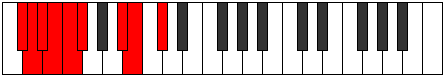 |
| [1599](https://ianring.com/musictheory/scales/1599) | [Pocryllic](ModeANaturalPocryllic.md) | A | A, A#, B, C, C#, D, F#, G, A |  |
| [1599](https://ianring.com/musictheory/scales/1599) | [Pocryllic](ModeGSharpPocryllic.md) | G# | G#, A, A#, B, C, C#, F, F#, G# |  |
| [1599](https://ianring.com/musictheory/scales/1599) | [Pocryllic](ModeAFlatPocryllic.md) | Ab | Ab, A, Bb, B, C, Db, F, Gb, Ab |  |
| [1605](https://ianring.com/musictheory/scales/1605) | [Zanitonic](ModeENaturalZanitonic.md) | E | E, F#, A#, C#, D, E |  |
| [1607](https://ianring.com/musictheory/scales/1607) | [Epytimic](ModeENaturalEpytimic.md) | E | E, F, Gb, A#, B##, C##, E |  |
| [1607](https://ianring.com/musictheory/scales/1607) | [Epytimic](ModeCNaturalEpytimic.md) | C | C, Db, Ebb, F#, G##, A#, C |  |
| [1611](https://ianring.com/musictheory/scales/1611) | [Dacrimic](ModeCNaturalDacrimic.md) | C | C, Db, Eb, F#, G##, A#, C |  |
| [1613](https://ianring.com/musictheory/scales/1613) | [Thylimic](ModeENaturalThylimic.md) | E | E, F#, G, A#, B##, C##, E |  |
| [1615](https://ianring.com/musictheory/scales/1615) | [Sydian](ModeENaturalSydian.md) | E | E, F, Gb, Abb, Bb, C#, D, E |  |
| [1615](https://ianring.com/musictheory/scales/1615) | [Sydian](ModeCNaturalSydian.md) | C | C, Db, Ebb, Fbb, Gb, A, Bb, C |  |
| [1619](https://ianring.com/musictheory/scales/1619) | [Monimic](ModeCNaturalMonimic.md) | C | C, Db, E, F#, G##, A#, C | 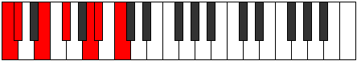 |
| [1619](https://ianring.com/musictheory/scales/1619) | [Monimic](ModeANaturalMonimic.md) | A | A, Bb, C#, D#, E##, F##, A | 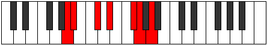 |
| [1621](https://ianring.com/musictheory/scales/1621) | [Aeolathimic](ModeENaturalAeolathimic.md) | E | E, F#, G#, A#, B##, C##, E |  |
| [1623](https://ianring.com/musictheory/scales/1623) | [Lothian](ModeENaturalLothian.md) | E | E, F, Gb, Ab, Bb, C#, D, E |  |
| [1623](https://ianring.com/musictheory/scales/1623) | [Lothian](ModeCNaturalLothian.md) | C | C, Db, Ebb, Fb, Gb, A, Bb, C |  |
| [1623](https://ianring.com/musictheory/scales/1623) | [Lothian](ModeANaturalLothian.md) | A | A, Bb, Cb, Db, Eb, F#, G, A |  |
| [1627](https://ianring.com/musictheory/scales/1627) | [Zyptian](ModeCNaturalZyptian.md) | C | C, Db, Eb, Fb, Gb, A, Bb, C |  |
| [1627](https://ianring.com/musictheory/scales/1627) | [Zyptian](ModeANaturalZyptian.md) | A | A, Bb, C, Db, Eb, F#, G, A |  |
| [1629](https://ianring.com/musictheory/scales/1629) | [Synian](ModeENaturalSynian.md) | E | E, F#, G, Ab, Bb, C#, D, E | 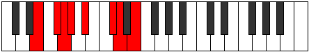 |
| [1631](https://ianring.com/musictheory/scales/1631) | [Rynyllic](ModeENaturalRynyllic.md) | E | E, F, F#, G, G#, A#, C#, D, E |  |
| [1631](https://ianring.com/musictheory/scales/1631) | [Rynyllic](ModeCNaturalRynyllic.md) | C | C, C#, D, D#, E, F#, A, A#, C |  |
| [1631](https://ianring.com/musictheory/scales/1631) | [Rynyllic](ModeANaturalRynyllic.md) | A | A, A#, B, C, C#, D#, F#, G, A |  |
| [1635](https://ianring.com/musictheory/scales/1635) | [Sygimic](ModeCNaturalSygimic.md) | C | C, Db, E#, F#, G##, A#, C |  |
| [1635](https://ianring.com/musictheory/scales/1635) | [Sygimic](ModeCSharpSygimic.md) | C# | C#, D, E##, F##, G###, A##, C# |  |
| [1635](https://ianring.com/musictheory/scales/1635) | [Sygimic](ModeDFlatSygimic.md) | Db | Db, Ebb, F#, G, A#, B, Db |  |
| [1637](https://ianring.com/musictheory/scales/1637) | [Syptimic](ModeGSharpSyptimic.md) | G# | G#, A#, B##, C##, D###, E##, G# |  |
| [1637](https://ianring.com/musictheory/scales/1637) | [Syptimic](ModeAFlatSyptimic.md) | Ab | Ab, Bb, C#, D, E#, F#, Ab |  |
| [1637](https://ianring.com/musictheory/scales/1637) | [Syptimic](ModeENaturalSyptimic.md) | E | E, F#, G##, A#, B##, C##, E |  |
| [1637](https://ianring.com/musictheory/scales/1637) | [Syptimic](ModeCSharpSyptimic.md) | C# | C#, D#, E##, F##, G###, A##, C# |  |
| [1637](https://ianring.com/musictheory/scales/1637) | [Syptimic](ModeDFlatSyptimic.md) | Db | Db, Eb, F#, G, A#, B, Db |  |
| [1639](https://ianring.com/musictheory/scales/1639) | [Aeolothian](ModeCNaturalAeolothian.md) | C | C, Db, Ebb, F, Gb, A, Bb, C |  |
| [1639](https://ianring.com/musictheory/scales/1639) | [Aeolothian](ModeENaturalAeolothian.md) | E | E, F, Gb, A, Bb, C#, D, E | 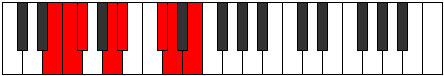 |
| [1639](https://ianring.com/musictheory/scales/1639) | [Aeolothian](ModeGSharpAeolothian.md) | G# | G#, A, Bb, C#, D, E#, F#, G# |  |
| [1639](https://ianring.com/musictheory/scales/1639) | [Aeolothian](ModeAFlatAeolothian.md) | Ab | Ab, Bbb, Cbb, Db, Ebb, F, Gb, Ab | 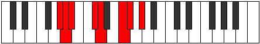 |
| [1639](https://ianring.com/musictheory/scales/1639) | [Aeolothian](ModeCSharpAeolothian.md) | C# | C#, D, Eb, F#, G, A#, B, C# |  |
| [1639](https://ianring.com/musictheory/scales/1639) | [Aeolothian](ModeDFlatAeolothian.md) | Db | Db, Ebb, Fbb, Gb, Abb, Bb, Cb, Db |  |
| [1641](https://ianring.com/musictheory/scales/1641) | [Bocrimic](ModeCSharpBocrimic.md) | C# | C#, D##, E##, F##, G###, A##, C# |  |
| [1641](https://ianring.com/musictheory/scales/1641) | [Bocrimic](ModeDFlatBocrimic.md) | Db | Db, E, F#, G, A#, B, Db |  |
| [1643](https://ianring.com/musictheory/scales/1643) | [Thyptian](ModeCNaturalThyptian.md) | C | C, Db, Eb, F, Gb, A, Bb, C |  |
| [1643](https://ianring.com/musictheory/scales/1643) | [Thyptian](ModeCSharpThyptian.md) | C# | C#, D, E, F#, G, A#, B, C# |  |
| [1643](https://ianring.com/musictheory/scales/1643) | [Thyptian](ModeDFlatThyptian.md) | Db | Db, Ebb, Fb, Gb, Abb, Bb, Cb, Db |  |
| [1645](https://ianring.com/musictheory/scales/1645) | [Katagian](ModeENaturalKatagian.md) | E | E, F#, G, A, Bb, C#, D, E |  |
| [1645](https://ianring.com/musictheory/scales/1645) | [Katagian](ModeCSharpKatagian.md) | C# | C#, D#, E, F#, G, A#, B, C# |  |
| [1645](https://ianring.com/musictheory/scales/1645) | [Katagian](ModeDFlatKatagian.md) | Db | Db, Eb, Fb, Gb, Abb, Bb, Cb, Db |  |
| [1645](https://ianring.com/musictheory/scales/1645) | [Katagian](ModeGSharpKatagian.md) | G# | G#, A#, B, C#, D, E#, F#, G# |  |
| [1645](https://ianring.com/musictheory/scales/1645) | [Katagian](ModeAFlatKatagian.md) | Ab | Ab, Bb, Cb, Db, Ebb, F, Gb, Ab |  |
| [1647](https://ianring.com/musictheory/scales/1647) | [Polyllic](ModeCNaturalPolyllic.md) | C | C, C#, D, D#, F, F#, A, A#, C |  |
| [1647](https://ianring.com/musictheory/scales/1647) | [Polyllic](ModeENaturalPolyllic.md) | E | E, F, F#, G, A, A#, C#, D, E |  |
| [1647](https://ianring.com/musictheory/scales/1647) | [Polyllic](ModeCSharpPolyllic.md) | C# | C#, D, D#, E, F#, G, A#, B, C# |  |
| [1647](https://ianring.com/musictheory/scales/1647) | [Polyllic](ModeDFlatPolyllic.md) | Db | Db, D, Eb, E, Gb, G, Bb, B, Db |  |
| [1647](https://ianring.com/musictheory/scales/1647) | [Polyllic](ModeGSharpPolyllic.md) | G# | G#, A, A#, B, C#, D, F, F#, G# |  |
| [1647](https://ianring.com/musictheory/scales/1647) | [Polyllic](ModeAFlatPolyllic.md) | Ab | Ab, A, Bb, B, Db, D, F, Gb, Ab |  |
| [1649](https://ianring.com/musictheory/scales/1649) | [Bolimic](ModeCSharpBolimic.md) | C# | C#, D###, E##, F##, G###, A##, C# |  |
| [1649](https://ianring.com/musictheory/scales/1649) | [Bolimic](ModeDFlatBolimic.md) | Db | Db, E#, F#, G, A#, B, Db |  |
| [1651](https://ianring.com/musictheory/scales/1651) | [Mogian](ModeCNaturalMogian.md) | C | C, Db, E, F, Gb, A, Bb, C |  |
| [1651](https://ianring.com/musictheory/scales/1651) | [Mogian](ModeANaturalMogian.md) | A | A, Bb, C#, D, Eb, F#, G, A | 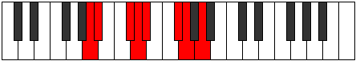 |
| [1651](https://ianring.com/musictheory/scales/1651) | [Mogian](ModeCSharpMogian.md) | C# | C#, D, E#, F#, G, A#, B, C# |  |
| [1651](https://ianring.com/musictheory/scales/1651) | [Mogian](ModeDFlatMogian.md) | Db | Db, Ebb, F, Gb, Abb, Bb, Cb, Db |  |
| [1653](https://ianring.com/musictheory/scales/1653) | [Gylian](ModeGSharpGylian.md) | G# | G#, A#, B#, C#, D, E#, F#, G# |  |
| [1653](https://ianring.com/musictheory/scales/1653) | [Gylian](ModeAFlatGylian.md) | Ab | Ab, Bb, C, Db, Ebb, F, Gb, Ab |  |
| [1653](https://ianring.com/musictheory/scales/1653) | [Gylian](ModeENaturalGylian.md) | E | E, F#, G#, A, Bb, C#, D, E |  |
| [1653](https://ianring.com/musictheory/scales/1653) | [Gylian](ModeCSharpGylian.md) | C# | C#, D#, E#, F#, G, A#, B, C# |  |
| [1653](https://ianring.com/musictheory/scales/1653) | [Gylian](ModeDFlatGylian.md) | Db | Db, Eb, F, Gb, Abb, Bb, Cb, Db |  |
| [1655](https://ianring.com/musictheory/scales/1655) | [Katygyllic](ModeCNaturalKatygyllic.md) | C | C, C#, D, E, F, F#, A, A#, C |  |
| [1655](https://ianring.com/musictheory/scales/1655) | [Katygyllic](ModeGSharpKatygyllic.md) | G# | G#, A, A#, C, C#, D, F, F#, G# |  |
| [1655](https://ianring.com/musictheory/scales/1655) | [Katygyllic](ModeAFlatKatygyllic.md) | Ab | Ab, A, Bb, C, Db, D, F, Gb, Ab |  |
| [1655](https://ianring.com/musictheory/scales/1655) | [Katygyllic](ModeENaturalKatygyllic.md) | E | E, F, F#, G#, A, A#, C#, D, E |  |
| [1655](https://ianring.com/musictheory/scales/1655) | [Katygyllic](ModeCSharpKatygyllic.md) | C# | C#, D, D#, F, F#, G, A#, B, C# |  |
| [1655](https://ianring.com/musictheory/scales/1655) | [Katygyllic](ModeDFlatKatygyllic.md) | Db | Db, D, Eb, F, Gb, G, Bb, B, Db |  |
| [1655](https://ianring.com/musictheory/scales/1655) | [Katygyllic](ModeANaturalKatygyllic.md) | A | A, A#, B, C#, D, D#, F#, G, A |  |
| [1657](https://ianring.com/musictheory/scales/1657) | [Ionothian](ModeCSharpIonothian.md) | C# | C#, D##, E#, F#, G, A#, B, C# |  |
| [1657](https://ianring.com/musictheory/scales/1657) | [Ionothian](ModeDFlatIonothian.md) | Db | Db, E, F, Gb, Abb, Bb, Cb, Db |  |
| [1659](https://ianring.com/musictheory/scales/1659) | [Magyllic](ModeCNaturalMagyllic.md) | C | C, C#, D#, E, F, F#, A, A#, C |  |
| [1659](https://ianring.com/musictheory/scales/1659) | [Magyllic](ModeANaturalMagyllic.md) | A | A, A#, C, C#, D, D#, F#, G, A |  |
| [1659](https://ianring.com/musictheory/scales/1659) | [Magyllic](ModeCSharpMagyllic.md) | C# | C#, D, E, F, F#, G, A#, B, C# |  |
| [1659](https://ianring.com/musictheory/scales/1659) | [Magyllic](ModeDFlatMagyllic.md) | Db | Db, D, E, F, Gb, G, Bb, B, Db |  |
| [1661](https://ianring.com/musictheory/scales/1661) | [Gonyllic](ModeENaturalGonyllic.md) | E | E, F#, G, G#, A, A#, C#, D, E |  |
| [1661](https://ianring.com/musictheory/scales/1661) | [Gonyllic](ModeCSharpGonyllic.md) | C# | C#, D#, E, F, F#, G, A#, B, C# |  |
| [1661](https://ianring.com/musictheory/scales/1661) | [Gonyllic](ModeDFlatGonyllic.md) | Db | Db, Eb, E, F, Gb, G, Bb, B, Db |  |
| [1661](https://ianring.com/musictheory/scales/1661) | [Gonyllic](ModeGSharpGonyllic.md) | G# | G#, A#, B, C, C#, D, F, F#, G# |  |
| [1661](https://ianring.com/musictheory/scales/1661) | [Gonyllic](ModeAFlatGonyllic.md) | Ab | Ab, Bb, B, C, Db, D, F, Gb, Ab |  |
| [1663](https://ianring.com/musictheory/scales/1663) | [Lydygic](ModeCNaturalLydygic.md) | C | C, C#, D, D#, E, F, F#, A, A#, C |  |
| [1663](https://ianring.com/musictheory/scales/1663) | [Lydygic](ModeENaturalLydygic.md) | E | E, F, F#, G, G#, A, A#, C#, D, E |  |
| [1663](https://ianring.com/musictheory/scales/1663) | [Lydygic](ModeCSharpLydygic.md) | C# | C#, D, D#, E, F, F#, G, A#, B, C# |  |
| [1663](https://ianring.com/musictheory/scales/1663) | [Lydygic](ModeDFlatLydygic.md) | Db | Db, D, Eb, E, F, Gb, G, Bb, B, Db |  |
| [1663](https://ianring.com/musictheory/scales/1663) | [Lydygic](ModeANaturalLydygic.md) | A | A, A#, B, C, C#, D, D#, F#, G, A |  |
| [1663](https://ianring.com/musictheory/scales/1663) | [Lydygic](ModeGSharpLydygic.md) | G# | G#, A, A#, B, C, C#, D, F, F#, G# |  |
| [1663](https://ianring.com/musictheory/scales/1663) | [Lydygic](ModeAFlatLydygic.md) | Ab | Ab, A, Bb, B, C, Db, D, F, Gb, Ab |  |
| [1673](https://ianring.com/musictheory/scales/1673) | [Thocritonic](ModeDSharpThocritonic.md) | D# | D#, F#, A#, C, C#, D# |  |
| [1673](https://ianring.com/musictheory/scales/1673) | [Thocritonic](ModeEFlatThocritonic.md) | Eb | Eb, Gb, Bb, C, Db, Eb |  |
| [1675](https://ianring.com/musictheory/scales/1675) | [Epatimic](ModeDSharpEpatimic.md) | D# | D#, E, F#, G###, A###, B##, D# |  |
| [1675](https://ianring.com/musictheory/scales/1675) | [Epatimic](ModeEFlatEpatimic.md) | Eb | Eb, Fb, Gb, A#, B#, C#, Eb |  |
| [1677](https://ianring.com/musictheory/scales/1677) | [Danimic](ModeDSharpDanimic.md) | D# | D#, E#, F#, G###, A###, B##, D# |  |
| [1677](https://ianring.com/musictheory/scales/1677) | [Danimic](ModeEFlatDanimic.md) | Eb | Eb, F, Gb, A#, B#, C#, Eb |  |
| [1679](https://ianring.com/musictheory/scales/1679) | [Kydian](ModeDSharpKydian.md) | D# | D#, E, F, Gb, A#, B#, C#, D# |  |
| [1679](https://ianring.com/musictheory/scales/1679) | [Kydian](ModeEFlatKydian.md) | Eb | Eb, Fb, Gbb, Abbb, Bb, C, Db, Eb |  |
| [1681](https://ianring.com/musictheory/scales/1681) | [Ionaditonic](ModeFSharpIonaditonic.md) | F# | F#, A#, C#, D#, E, F# |  |
| [1681](https://ianring.com/musictheory/scales/1681) | [Ionaditonic](ModeGFlatIonaditonic.md) | Gb | Gb, Bb, Db, Eb, E, Gb |  |
| [1683](https://ianring.com/musictheory/scales/1683) | [Rygimic](ModeFSharpRygimic.md) | F# | F#, G, A#, B##, C###, D##, F# |  |
| [1683](https://ianring.com/musictheory/scales/1683) | [Rygimic](ModeGFlatRygimic.md) | Gb | Gb, Abb, Bb, C#, D#, E, Gb |  |
| [1683](https://ianring.com/musictheory/scales/1683) | [Rygimic](ModeANaturalRygimic.md) | A | A, Bb, C#, D##, E##, F##, A |  |
| [1685](https://ianring.com/musictheory/scales/1685) | [Zeracrimic](ModeFSharpZeracrimic.md) | F# | F#, G#, A#, B##, C###, D##, F# |  |
| [1685](https://ianring.com/musictheory/scales/1685) | [Zeracrimic](ModeGFlatZeracrimic.md) | Gb | Gb, Ab, Bb, C#, D#, E, Gb |  |
| [1687](https://ianring.com/musictheory/scales/1687) | [Phralian](ModeFSharpPhralian.md) | F# | F#, G, Ab, Bb, C#, D#, E, F# |  |
| [1687](https://ianring.com/musictheory/scales/1687) | [Phralian](ModeGFlatPhralian.md) | Gb | Gb, Abb, Bbbb, Cbb, Db, Eb, Fb, Gb |  |
| [1687](https://ianring.com/musictheory/scales/1687) | [Phralian](ModeANaturalPhralian.md) | A | A, Bb, Cb, Db, E, F#, G, A |  |
| [1689](https://ianring.com/musictheory/scales/1689) | [Lorimic](ModeDSharpLorimic.md) | D# | D#, E##, F##, G###, A###, B##, D# |  |
| [1689](https://ianring.com/musictheory/scales/1689) | [Lorimic](ModeEFlatLorimic.md) | Eb | Eb, F#, G, A#, B#, C#, Eb |  |
| [1689](https://ianring.com/musictheory/scales/1689) | [Lorimic](ModeFSharpLorimic.md) | F# | F#, G##, A#, B##, C###, D##, F# |  |
| [1689](https://ianring.com/musictheory/scales/1689) | [Lorimic](ModeGFlatLorimic.md) | Gb | Gb, A, Bb, C#, D#, E, Gb |  |
| [1691](https://ianring.com/musictheory/scales/1691) | [Kathian](ModeDSharpKathian.md) | D# | D#, E, F#, G, A#, B#, C#, D# |  |
| [1691](https://ianring.com/musictheory/scales/1691) | [Kathian](ModeEFlatKathian.md) | Eb | Eb, Fb, Gb, Abb, Bb, C, Db, Eb |  |
| [1691](https://ianring.com/musictheory/scales/1691) | [Kathian](ModeANaturalKathian.md) | A | A, Bb, C, Db, E, F#, G, A |  |
| [1691](https://ianring.com/musictheory/scales/1691) | [Kathian](ModeFSharpKathian.md) | F# | F#, G, A, Bb, C#, D#, E, F# |  |
| [1691](https://ianring.com/musictheory/scales/1691) | [Kathian](ModeGFlatKathian.md) | Gb | Gb, Abb, Bbb, Cbb, Db, Eb, Fb, Gb |  |
| [1693](https://ianring.com/musictheory/scales/1693) | [Dogian](ModeDSharpDogian.md) | D# | D#, E#, F#, G, A#, B#, C#, D# |  |
| [1693](https://ianring.com/musictheory/scales/1693) | [Dogian](ModeEFlatDogian.md) | Eb | Eb, F, Gb, Abb, Bb, C, Db, Eb |  |
| [1693](https://ianring.com/musictheory/scales/1693) | [Dogian](ModeFSharpDogian.md) | F# | F#, G#, A, Bb, C#, D#, E, F# |  |
| [1693](https://ianring.com/musictheory/scales/1693) | [Dogian](ModeGFlatDogian.md) | Gb | Gb, Ab, Bbb, Cbb, Db, Eb, Fb, Gb |  |
| [1695](https://ianring.com/musictheory/scales/1695) | [Phrodyllic](ModeDSharpPhrodyllic.md) | D# | D#, E, F, F#, G, A#, C, C#, D# |  |
| [1695](https://ianring.com/musictheory/scales/1695) | [Phrodyllic](ModeEFlatPhrodyllic.md) | Eb | Eb, E, F, Gb, G, Bb, C, Db, Eb |  |
| [1695](https://ianring.com/musictheory/scales/1695) | [Phrodyllic](ModeFSharpPhrodyllic.md) | F# | F#, G, G#, A, A#, C#, D#, E, F# |  |
| [1695](https://ianring.com/musictheory/scales/1695) | [Phrodyllic](ModeGFlatPhrodyllic.md) | Gb | Gb, G, Ab, A, Bb, Db, Eb, E, Gb |  |
| [1695](https://ianring.com/musictheory/scales/1695) | [Phrodyllic](ModeANaturalPhrodyllic.md) | A | A, A#, B, C, C#, E, F#, G, A |  |
| [1699](https://ianring.com/musictheory/scales/1699) | [Kaptimic](ModeCSharpKaptimic.md) | C# | C#, D, E##, F###, G###, A##, C# |  |
| [1699](https://ianring.com/musictheory/scales/1699) | [Kaptimic](ModeDFlatKaptimic.md) | Db | Db, Ebb, F#, G#, A#, B, Db |  |
| [1701](https://ianring.com/musictheory/scales/1701) | [Lothimic](ModeGSharpLothimic.md) | G# | G#, A#, B##, C###, D###, E##, G# |  |
| [1701](https://ianring.com/musictheory/scales/1701) | [Lothimic](ModeAFlatLothimic.md) | Ab | Ab, Bb, C#, D#, E#, F#, Ab |  |
| [1701](https://ianring.com/musictheory/scales/1701) | [Lothimic](ModeCSharpLothimic.md) | C# | C#, D#, E##, F###, G###, A##, C# |  |
| [1701](https://ianring.com/musictheory/scales/1701) | [Lothimic](ModeDFlatLothimic.md) | Db | Db, Eb, F#, G#, A#, B, Db |  |
| [1703](https://ianring.com/musictheory/scales/1703) | [Zaptian](ModeGSharpZaptian.md) | G# | G#, A, Bb, C#, D#, E#, F#, G# |  |
| [1703](https://ianring.com/musictheory/scales/1703) | [Zaptian](ModeAFlatZaptian.md) | Ab | Ab, Bbb, Cbb, Db, Eb, F, Gb, Ab |  |
| [1703](https://ianring.com/musictheory/scales/1703) | [Zaptian](ModeCSharpZaptian.md) | C# | C#, D, Eb, F#, G#, A#, B, C# |  |
| [1703](https://ianring.com/musictheory/scales/1703) | [Zaptian](ModeDFlatZaptian.md) | Db | Db, Ebb, Fbb, Gb, Ab, Bb, Cb, Db |  |
| [1705](https://ianring.com/musictheory/scales/1705) | [Darmic](ModeDSharpDarmic.md) | D# | D#, E##, F###, G###, A###, B##, D# |  |
| [1705](https://ianring.com/musictheory/scales/1705) | [Darmic](ModeEFlatDarmic.md) | Eb | Eb, F#, G#, A#, B#, C#, Eb |  |
| [1705](https://ianring.com/musictheory/scales/1705) | [Darmic](ModeCSharpDarmic.md) | C# | C#, D##, E##, F###, G###, A##, C# |  |
| [1705](https://ianring.com/musictheory/scales/1705) | [Darmic](ModeDFlatDarmic.md) | Db | Db, E, F#, G#, A#, B, Db |  |
| [1707](https://ianring.com/musictheory/scales/1707) | [Mixolythian](ModeDSharpMixolythian.md) | D# | D#, E, F#, G#, A#, B#, C#, D# |  |
| [1707](https://ianring.com/musictheory/scales/1707) | [Mixolythian](ModeEFlatMixolythian.md) | Eb | Eb, Fb, Gb, Ab, Bb, C, Db, Eb |  |
| [1707](https://ianring.com/musictheory/scales/1707) | [Mixolythian](ModeCSharpMixolythian.md) | C# | C#, D, E, F#, G#, A#, B, C# |  |
| [1707](https://ianring.com/musictheory/scales/1707) | [Mixolythian](ModeDFlatMixolythian.md) | Db | Db, Ebb, Fb, Gb, Ab, Bb, Cb, Db |  |
| [1709](https://ianring.com/musictheory/scales/1709) | [Dorian](ModeDSharpDorian.md) | D# | D#, E#, F#, G#, A#, B#, C#, D# |  |
| [1709](https://ianring.com/musictheory/scales/1709) | [Dorian](ModeEFlatDorian.md) | Eb | Eb, F, Gb, Ab, Bb, C, Db, Eb |  |
| [1709](https://ianring.com/musictheory/scales/1709) | [Dorian](ModeCSharpDorian.md) | C# | C#, D#, E, F#, G#, A#, B, C# |  |
| [1709](https://ianring.com/musictheory/scales/1709) | [Dorian](ModeDFlatDorian.md) | Db | Db, Eb, Fb, Gb, Ab, Bb, Cb, Db |  |
| [1709](https://ianring.com/musictheory/scales/1709) | [Dorian](ModeGSharpDorian.md) | G# | G#, A#, B, C#, D#, E#, F#, G# |  |
| [1709](https://ianring.com/musictheory/scales/1709) | [Dorian](ModeAFlatDorian.md) | Ab | Ab, Bb, Cb, Db, Eb, F, Gb, Ab |  |
| [1711](https://ianring.com/musictheory/scales/1711) | [Ragyllic](ModeDSharpRagyllic.md) | D# | D#, E, F, F#, G#, A#, C, C#, D# |  |
| [1711](https://ianring.com/musictheory/scales/1711) | [Ragyllic](ModeEFlatRagyllic.md) | Eb | Eb, E, F, Gb, Ab, Bb, C, Db, Eb |  |
| [1711](https://ianring.com/musictheory/scales/1711) | [Ragyllic](ModeCSharpRagyllic.md) | C# | C#, D, D#, E, F#, G#, A#, B, C# |  |
| [1711](https://ianring.com/musictheory/scales/1711) | [Ragyllic](ModeDFlatRagyllic.md) | Db | Db, D, Eb, E, Gb, Ab, Bb, B, Db |  |
| [1711](https://ianring.com/musictheory/scales/1711) | [Ragyllic](ModeGSharpRagyllic.md) | G# | G#, A, A#, B, C#, D#, F, F#, G# |  |
| [1711](https://ianring.com/musictheory/scales/1711) | [Ragyllic](ModeAFlatRagyllic.md) | Ab | Ab, A, Bb, B, Db, Eb, F, Gb, Ab |  |
| [1713](https://ianring.com/musictheory/scales/1713) | [Garimic](ModeFSharpGarimic.md) | F# | F#, G###, A##, B##, C###, D##, F# |  |
| [1713](https://ianring.com/musictheory/scales/1713) | [Garimic](ModeGFlatGarimic.md) | Gb | Gb, A#, B, C#, D#, E, Gb |  |
| [1713](https://ianring.com/musictheory/scales/1713) | [Garimic](ModeCSharpGarimic.md) | C# | C#, D###, E##, F###, G###, A##, C# |  |
| [1713](https://ianring.com/musictheory/scales/1713) | [Garimic](ModeDFlatGarimic.md) | Db | Db, E#, F#, G#, A#, B, Db |  |
| [1715](https://ianring.com/musictheory/scales/1715) | [Aeronian](ModeANaturalAeronian.md) | A | A, Bb, C#, D, E, F#, G, A |  |
| [1715](https://ianring.com/musictheory/scales/1715) | [Aeronian](ModeFSharpAeronian.md) | F# | F#, G, A#, B, C#, D#, E, F# |  |
| [1715](https://ianring.com/musictheory/scales/1715) | [Aeronian](ModeGFlatAeronian.md) | Gb | Gb, Abb, Bb, Cb, Db, Eb, Fb, Gb |  |
| [1715](https://ianring.com/musictheory/scales/1715) | [Aeronian](ModeCSharpAeronian.md) | C# | C#, D, E#, F#, G#, A#, B, C# |  |
| [1715](https://ianring.com/musictheory/scales/1715) | [Aeronian](ModeDFlatAeronian.md) | Db | Db, Ebb, F, Gb, Ab, Bb, Cb, Db |  |
| [1717](https://ianring.com/musictheory/scales/1717) | [Mixolydian](ModeGSharpMixolydian.md) | G# | G#, A#, B#, C#, D#, E#, F#, G# |  |
| [1717](https://ianring.com/musictheory/scales/1717) | [Mixolydian](ModeAFlatMixolydian.md) | Ab | Ab, Bb, C, Db, Eb, F, Gb, Ab |  |
| [1717](https://ianring.com/musictheory/scales/1717) | [Mixolydian](ModeFSharpMixolydian.md) | F# | F#, G#, A#, B, C#, D#, E, F# |  |
| [1717](https://ianring.com/musictheory/scales/1717) | [Mixolydian](ModeGFlatMixolydian.md) | Gb | Gb, Ab, Bb, Cb, Db, Eb, Fb, Gb |  |
| [1717](https://ianring.com/musictheory/scales/1717) | [Mixolydian](ModeCSharpMixolydian.md) | C# | C#, D#, E#, F#, G#, A#, B, C# |  |
| [1717](https://ianring.com/musictheory/scales/1717) | [Mixolydian](ModeDFlatMixolydian.md) | Db | Db, Eb, F, Gb, Ab, Bb, Cb, Db |  |
| [1719](https://ianring.com/musictheory/scales/1719) | [Lyryllic](ModeGSharpLyryllic.md) | G# | G#, A, A#, C, C#, D#, F, F#, G# |  |
| [1719](https://ianring.com/musictheory/scales/1719) | [Lyryllic](ModeAFlatLyryllic.md) | Ab | Ab, A, Bb, C, Db, Eb, F, Gb, Ab |  |
| [1719](https://ianring.com/musictheory/scales/1719) | [Lyryllic](ModeCSharpLyryllic.md) | C# | C#, D, D#, F, F#, G#, A#, B, C# |  |
| [1719](https://ianring.com/musictheory/scales/1719) | [Lyryllic](ModeDFlatLyryllic.md) | Db | Db, D, Eb, F, Gb, Ab, Bb, B, Db |  |
| [1719](https://ianring.com/musictheory/scales/1719) | [Lyryllic](ModeFSharpLyryllic.md) | F# | F#, G, G#, A#, B, C#, D#, E, F# |  |
| [1719](https://ianring.com/musictheory/scales/1719) | [Lyryllic](ModeGFlatLyryllic.md) | Gb | Gb, G, Ab, Bb, B, Db, Eb, E, Gb |  |
| [1719](https://ianring.com/musictheory/scales/1719) | [Lyryllic](ModeANaturalLyryllic.md) | A | A, A#, B, C#, D, E, F#, G, A |  |
| [1721](https://ianring.com/musictheory/scales/1721) | [Ionycrian](ModeDSharpIonycrian.md) | D# | D#, E##, F##, G#, A#, B#, C#, D# |  |
| [1721](https://ianring.com/musictheory/scales/1721) | [Ionycrian](ModeEFlatIonycrian.md) | Eb | Eb, F#, G, Ab, Bb, C, Db, Eb |  |
| [1721](https://ianring.com/musictheory/scales/1721) | [Ionycrian](ModeCSharpIonycrian.md) | C# | C#, D##, E#, F#, G#, A#, B, C# |  |
| [1721](https://ianring.com/musictheory/scales/1721) | [Ionycrian](ModeDFlatIonycrian.md) | Db | Db, E, F, Gb, Ab, Bb, Cb, Db |  |
| [1721](https://ianring.com/musictheory/scales/1721) | [Ionycrian](ModeFSharpIonycrian.md) | F# | F#, G##, A#, B, C#, D#, E, F# |  |
| [1721](https://ianring.com/musictheory/scales/1721) | [Ionycrian](ModeGFlatIonycrian.md) | Gb | Gb, A, Bb, Cb, Db, Eb, Fb, Gb |  |
| [1723](https://ianring.com/musictheory/scales/1723) | [Poryllic](ModeDSharpPoryllic.md) | D# | D#, E, F#, G, G#, A#, C, C#, D# |  |
| [1723](https://ianring.com/musictheory/scales/1723) | [Poryllic](ModeEFlatPoryllic.md) | Eb | Eb, E, Gb, G, Ab, Bb, C, Db, Eb |  |
| [1723](https://ianring.com/musictheory/scales/1723) | [Poryllic](ModeANaturalPoryllic.md) | A | A, A#, C, C#, D, E, F#, G, A |  |
| [1723](https://ianring.com/musictheory/scales/1723) | [Poryllic](ModeCSharpPoryllic.md) | C# | C#, D, E, F, F#, G#, A#, B, C# |  |
| [1723](https://ianring.com/musictheory/scales/1723) | [Poryllic](ModeDFlatPoryllic.md) | Db | Db, D, E, F, Gb, Ab, Bb, B, Db |  |
| [1723](https://ianring.com/musictheory/scales/1723) | [Poryllic](ModeFSharpPoryllic.md) | F# | F#, G, A, A#, B, C#, D#, E, F# |  |
| [1723](https://ianring.com/musictheory/scales/1723) | [Poryllic](ModeGFlatPoryllic.md) | Gb | Gb, G, A, Bb, B, Db, Eb, E, Gb |  |
| [1725](https://ianring.com/musictheory/scales/1725) | [Mixodyllic](ModeDSharpMixodyllic.md) | D# | D#, F, F#, G, G#, A#, C, C#, D# |  |
| [1725](https://ianring.com/musictheory/scales/1725) | [Mixodyllic](ModeEFlatMixodyllic.md) | Eb | Eb, F, Gb, G, Ab, Bb, C, Db, Eb |  |
| [1725](https://ianring.com/musictheory/scales/1725) | [Mixodyllic](ModeGSharpMixodyllic.md) | G# | G#, A#, B, C, C#, D#, F, F#, G# |  |
| [1725](https://ianring.com/musictheory/scales/1725) | [Mixodyllic](ModeAFlatMixodyllic.md) | Ab | Ab, Bb, B, C, Db, Eb, F, Gb, Ab |  |
| [1725](https://ianring.com/musictheory/scales/1725) | [Mixodyllic](ModeCSharpMixodyllic.md) | C# | C#, D#, E, F, F#, G#, A#, B, C# |  |
| [1725](https://ianring.com/musictheory/scales/1725) | [Mixodyllic](ModeDFlatMixodyllic.md) | Db | Db, Eb, E, F, Gb, Ab, Bb, B, Db |  |
| [1725](https://ianring.com/musictheory/scales/1725) | [Mixodyllic](ModeFSharpMixodyllic.md) | F# | F#, G#, A, A#, B, C#, D#, E, F# |  |
| [1725](https://ianring.com/musictheory/scales/1725) | [Mixodyllic](ModeGFlatMixodyllic.md) | Gb | Gb, Ab, A, Bb, B, Db, Eb, E, Gb |  |
| [1727](https://ianring.com/musictheory/scales/1727) | [Sydygic](ModeDSharpSydygic.md) | D# | D#, E, F, F#, G, G#, A#, C, C#, D# |  |
| [1727](https://ianring.com/musictheory/scales/1727) | [Sydygic](ModeEFlatSydygic.md) | Eb | Eb, E, F, Gb, G, Ab, Bb, C, Db, Eb |  |
| [1727](https://ianring.com/musictheory/scales/1727) | [Sydygic](ModeCSharpSydygic.md) | C# | C#, D, D#, E, F, F#, G#, A#, B, C# |  |
| [1727](https://ianring.com/musictheory/scales/1727) | [Sydygic](ModeDFlatSydygic.md) | Db | Db, D, Eb, E, F, Gb, Ab, Bb, B, Db |  |
| [1727](https://ianring.com/musictheory/scales/1727) | [Sydygic](ModeANaturalSydygic.md) | A | A, A#, B, C, C#, D, E, F#, G, A |  |
| [1727](https://ianring.com/musictheory/scales/1727) | [Sydygic](ModeGSharpSydygic.md) | G# | G#, A, A#, B, C, C#, D#, F, F#, G# |  |
| [1727](https://ianring.com/musictheory/scales/1727) | [Sydygic](ModeAFlatSydygic.md) | Ab | Ab, A, Bb, B, C, Db, Eb, F, Gb, Ab |  |
| [1727](https://ianring.com/musictheory/scales/1727) | [Sydygic](ModeFSharpSydygic.md) | F# | F#, G, G#, A, A#, B, C#, D#, E, F# |  |
| [1727](https://ianring.com/musictheory/scales/1727) | [Sydygic](ModeGFlatSydygic.md) | Gb | Gb, G, Ab, A, Bb, B, Db, Eb, E, Gb |  |
| [1733](https://ianring.com/musictheory/scales/1733) | [Socrimic](ModeENaturalSocrimic.md) | E | E, F#, G###, A##, B##, C##, E |  |
| [1735](https://ianring.com/musictheory/scales/1735) | [Dagian](ModeCNaturalDagian.md) | C | C, Db, Ebb, F#, G, A, Bb, C |  |
| [1735](https://ianring.com/musictheory/scales/1735) | [Dagian](ModeENaturalDagian.md) | E | E, F, Gb, A#, B, C#, D, E |  |
| [1737](https://ianring.com/musictheory/scales/1737) | [Thalimic](ModeDSharpThalimic.md) | D# | D#, E##, Cbbb, Cbb, Dbb, Ebbb, D# |  |
| [1737](https://ianring.com/musictheory/scales/1737) | [Thalimic](ModeEFlatThalimic.md) | Eb | Eb, F#, G##, A#, B#, C#, Eb |  |
| [1739](https://ianring.com/musictheory/scales/1739) | [Phrylian](ModeDSharpPhrylian.md) | D# | D#, E, F#, G##, A#, B#, C#, D# |  |
| [1739](https://ianring.com/musictheory/scales/1739) | [Phrylian](ModeEFlatPhrylian.md) | Eb | Eb, Fb, Gb, A, Bb, C, Db, Eb |  |
| [1739](https://ianring.com/musictheory/scales/1739) | [Phrylian](ModeCNaturalPhrylian.md) | C | C, Db, Eb, F#, G, A, Bb, C |  |
| [1741](https://ianring.com/musictheory/scales/1741) | [Katycrian](ModeDSharpKatycrian.md) | D# | D#, E#, F#, G##, A#, B#, C#, D# |  |
| [1741](https://ianring.com/musictheory/scales/1741) | [Katycrian](ModeEFlatKatycrian.md) | Eb | Eb, F, Gb, A, Bb, C, Db, Eb |  |
| [1741](https://ianring.com/musictheory/scales/1741) | [Katycrian](ModeENaturalKatycrian.md) | E | E, F#, G, A#, B, C#, D, E |  |
| [1743](https://ianring.com/musictheory/scales/1743) | [Epigyllic](ModeDSharpEpigyllic.md) | D# | D#, E, F, F#, A, A#, C, C#, D# |  |
| [1743](https://ianring.com/musictheory/scales/1743) | [Epigyllic](ModeEFlatEpigyllic.md) | Eb | Eb, E, F, Gb, A, Bb, C, Db, Eb |  |
| [1743](https://ianring.com/musictheory/scales/1743) | [Epigyllic](ModeCNaturalEpigyllic.md) | C | C, C#, D, D#, F#, G, A, A#, C |  |
| [1743](https://ianring.com/musictheory/scales/1743) | [Epigyllic](ModeENaturalEpigyllic.md) | E | E, F, F#, G, A#, B, C#, D, E |  |
| [1745](https://ianring.com/musictheory/scales/1745) | [Manimic](ModeFSharpManimic.md) | F# | F#, G###, A###, B##, C###, D##, F# |  |
| [1745](https://ianring.com/musictheory/scales/1745) | [Manimic](ModeGFlatManimic.md) | Gb | Gb, A#, B#, C#, D#, E, Gb |  |
| [1747](https://ianring.com/musictheory/scales/1747) | [Epalian](ModeFSharpEpalian.md) | F# | F#, G, A#, B#, C#, D#, E, F# |  |
| [1747](https://ianring.com/musictheory/scales/1747) | [Epalian](ModeGFlatEpalian.md) | Gb | Gb, Abb, Bb, C, Db, Eb, Fb, Gb |  |
| [1747](https://ianring.com/musictheory/scales/1747) | [Epalian](ModeCNaturalEpalian.md) | C | C, Db, E, F#, G, A, Bb, C |  |
| [1747](https://ianring.com/musictheory/scales/1747) | [Epalian](ModeANaturalEpalian.md) | A | A, Bb, C#, D#, E, F#, G, A |  |
| [1749](https://ianring.com/musictheory/scales/1749) | [Lythian](ModeFSharpLythian.md) | F# | F#, G#, A#, B#, C#, D#, E, F# |  |
| [1749](https://ianring.com/musictheory/scales/1749) | [Lythian](ModeGFlatLythian.md) | Gb | Gb, Ab, Bb, C, Db, Eb, Fb, Gb |  |
| [1749](https://ianring.com/musictheory/scales/1749) | [Lythian](ModeENaturalLythian.md) | E | E, F#, G#, A#, B, C#, D, E |  |
| [1751](https://ianring.com/musictheory/scales/1751) | [Aeolyryllic](ModeFSharpAeolyryllic.md) | F# | F#, G, G#, A#, C, C#, D#, E, F# |  |
| [1751](https://ianring.com/musictheory/scales/1751) | [Aeolyryllic](ModeGFlatAeolyryllic.md) | Gb | Gb, G, Ab, Bb, C, Db, Eb, E, Gb |  |
| [1751](https://ianring.com/musictheory/scales/1751) | [Aeolyryllic](ModeCNaturalAeolyryllic.md) | C | C, C#, D, E, F#, G, A, A#, C |  |
| [1751](https://ianring.com/musictheory/scales/1751) | [Aeolyryllic](ModeENaturalAeolyryllic.md) | E | E, F, F#, G#, A#, B, C#, D, E |  |
| [1751](https://ianring.com/musictheory/scales/1751) | [Aeolyryllic](ModeANaturalAeolyryllic.md) | A | A, A#, B, C#, D#, E, F#, G, A |  |
| [1753](https://ianring.com/musictheory/scales/1753) | [Mycrian](ModeFSharpMycrian.md) | F# | F#, G##, A#, B#, C#, D#, E, F# |  |
| [1753](https://ianring.com/musictheory/scales/1753) | [Mycrian](ModeGFlatMycrian.md) | Gb | Gb, A, Bb, C, Db, Eb, Fb, Gb |  |
| [1753](https://ianring.com/musictheory/scales/1753) | [Mycrian](ModeDSharpMycrian.md) | D# | D#, E##, F##, G##, A#, B#, C#, D# |  |
| [1753](https://ianring.com/musictheory/scales/1753) | [Mycrian](ModeEFlatMycrian.md) | Eb | Eb, F#, G, A, Bb, C, Db, Eb |  |
| [1755](https://ianring.com/musictheory/scales/1755) | [MinorDiminished](ModeCNaturalMinorDiminished.md) | C | C, C#, D#, E, F#, G, A, A#, C |  |
| [1755](https://ianring.com/musictheory/scales/1755) | [MinorDiminished](ModeDSharpMinorDiminished.md) | D# | D#, E, F#, G, A, A#, C, C#, D# |  |
| [1755](https://ianring.com/musictheory/scales/1755) | [MinorDiminished](ModeEFlatMinorDiminished.md) | Eb | Eb, E, Gb, G, A, Bb, C, Db, Eb |  |
| [1755](https://ianring.com/musictheory/scales/1755) | [MinorDiminished](ModeFSharpMinorDiminished.md) | F# | F#, G, A, A#, C, C#, D#, E, F# |  |
| [1755](https://ianring.com/musictheory/scales/1755) | [MinorDiminished](ModeGFlatMinorDiminished.md) | Gb | Gb, G, A, Bb, C, Db, Eb, E, Gb |  |
| [1755](https://ianring.com/musictheory/scales/1755) | [MinorDiminished](ModeANaturalMinorDiminished.md) | A | A, A#, C, C#, D#, E, F#, G, A |  |
| [1757](https://ianring.com/musictheory/scales/1757) | [Ionyphyllic](ModeDSharpIonyphyllic.md) | D# | D#, F, F#, G, A, A#, C, C#, D# |  |
| [1757](https://ianring.com/musictheory/scales/1757) | [Ionyphyllic](ModeEFlatIonyphyllic.md) | Eb | Eb, F, Gb, G, A, Bb, C, Db, Eb |  |
| [1757](https://ianring.com/musictheory/scales/1757) | [Ionyphyllic](ModeFSharpIonyphyllic.md) | F# | F#, G#, A, A#, C, C#, D#, E, F# |  |
| [1757](https://ianring.com/musictheory/scales/1757) | [Ionyphyllic](ModeGFlatIonyphyllic.md) | Gb | Gb, Ab, A, Bb, C, Db, Eb, E, Gb |  |
| [1757](https://ianring.com/musictheory/scales/1757) | [Ionyphyllic](ModeENaturalIonyphyllic.md) | E | E, F#, G, G#, A#, B, C#, D, E |  |
| [1759](https://ianring.com/musictheory/scales/1759) | [Pylygic](ModeCNaturalPylygic.md) | C | C, C#, D, D#, E, F#, G, A, A#, C |  |
| [1759](https://ianring.com/musictheory/scales/1759) | [Pylygic](ModeDSharpPylygic.md) | D# | D#, E, F, F#, G, A, A#, C, C#, D# |  |
| [1759](https://ianring.com/musictheory/scales/1759) | [Pylygic](ModeEFlatPylygic.md) | Eb | Eb, E, F, Gb, G, A, Bb, C, Db, Eb |  |
| [1759](https://ianring.com/musictheory/scales/1759) | [Pylygic](ModeFSharpPylygic.md) | F# | F#, G, G#, A, A#, C, C#, D#, E, F# |  |
| [1759](https://ianring.com/musictheory/scales/1759) | [Pylygic](ModeGFlatPylygic.md) | Gb | Gb, G, Ab, A, Bb, C, Db, Eb, E, Gb |  |
| [1759](https://ianring.com/musictheory/scales/1759) | [Pylygic](ModeENaturalPylygic.md) | E | E, F, F#, G, G#, A#, B, C#, D, E |  |
| [1759](https://ianring.com/musictheory/scales/1759) | [Pylygic](ModeANaturalPylygic.md) | A | A, A#, B, C, C#, D#, E, F#, G, A |  |
| [1763](https://ianring.com/musictheory/scales/1763) | [Katalian](ModeCNaturalKatalian.md) | C | C, Db, E#, F#, G, A, Bb, C |  |
| [1763](https://ianring.com/musictheory/scales/1763) | [Katalian](ModeCSharpKatalian.md) | C# | C#, D, E##, F##, G#, A#, B, C# |  |
| [1763](https://ianring.com/musictheory/scales/1763) | [Katalian](ModeDFlatKatalian.md) | Db | Db, Ebb, F#, G, Ab, Bb, Cb, Db |  |
| [1765](https://ianring.com/musictheory/scales/1765) | [Lonian](ModeGSharpLonian.md) | G# | G#, A#, B##, C##, D#, E#, F#, G# |  |
| [1765](https://ianring.com/musictheory/scales/1765) | [Lonian](ModeAFlatLonian.md) | Ab | Ab, Bb, C#, D, Eb, F, Gb, Ab |  |
| [1765](https://ianring.com/musictheory/scales/1765) | [Lonian](ModeCSharpLonian.md) | C# | C#, D#, E##, F##, G#, A#, B, C# |  |
| [1765](https://ianring.com/musictheory/scales/1765) | [Lonian](ModeDFlatLonian.md) | Db | Db, Eb, F#, G, Ab, Bb, Cb, Db |  |
| [1765](https://ianring.com/musictheory/scales/1765) | [Lonian](ModeENaturalLonian.md) | E | E, F#, G##, A#, B, C#, D, E |  |
| [1767](https://ianring.com/musictheory/scales/1767) | [Dyryllic](ModeCNaturalDyryllic.md) | C | C, C#, D, F, F#, G, A, A#, C |  |
| [1767](https://ianring.com/musictheory/scales/1767) | [Dyryllic](ModeGSharpDyryllic.md) | G# | G#, A, A#, C#, D, D#, F, F#, G# |  |
| [1767](https://ianring.com/musictheory/scales/1767) | [Dyryllic](ModeAFlatDyryllic.md) | Ab | Ab, A, Bb, Db, D, Eb, F, Gb, Ab |  |
| [1767](https://ianring.com/musictheory/scales/1767) | [Dyryllic](ModeCSharpDyryllic.md) | C# | C#, D, D#, F#, G, G#, A#, B, C# |  |
| [1767](https://ianring.com/musictheory/scales/1767) | [Dyryllic](ModeDFlatDyryllic.md) | Db | Db, D, Eb, Gb, G, Ab, Bb, B, Db |  |
| [1767](https://ianring.com/musictheory/scales/1767) | [Dyryllic](ModeENaturalDyryllic.md) | E | E, F, F#, A, A#, B, C#, D, E |  |
| [1769](https://ianring.com/musictheory/scales/1769) | [Rythian](ModeDSharpRythian.md) | D# | D#, E##, F###, G##, A#, B#, C#, D# |  |
| [1769](https://ianring.com/musictheory/scales/1769) | [Rythian](ModeEFlatRythian.md) | Eb | Eb, F#, G#, A, Bb, C, Db, Eb |  |
| [1769](https://ianring.com/musictheory/scales/1769) | [Rythian](ModeCSharpRythian.md) | C# | C#, D##, E##, F##, G#, A#, B, C# |  |
| [1769](https://ianring.com/musictheory/scales/1769) | [Rythian](ModeDFlatRythian.md) | Db | Db, E, F#, G, Ab, Bb, Cb, Db |  |
| [1771](https://ianring.com/musictheory/scales/1771) | [Stylyllic](ModeCNaturalStylyllic.md) | C | C, C#, D#, F, F#, G, A, A#, C |  |
| [1771](https://ianring.com/musictheory/scales/1771) | [Stylyllic](ModeDSharpStylyllic.md) | D# | D#, E, F#, G#, A, A#, C, C#, D# |  |
| [1771](https://ianring.com/musictheory/scales/1771) | [Stylyllic](ModeEFlatStylyllic.md) | Eb | Eb, E, Gb, Ab, A, Bb, C, Db, Eb |  |
| [1771](https://ianring.com/musictheory/scales/1771) | [Stylyllic](ModeCSharpStylyllic.md) | C# | C#, D, E, F#, G, G#, A#, B, C# |  |
| [1771](https://ianring.com/musictheory/scales/1771) | [Stylyllic](ModeDFlatStylyllic.md) | Db | Db, D, E, Gb, G, Ab, Bb, B, Db |  |
| [1773](https://ianring.com/musictheory/scales/1773) | [Aeoloryllic](ModeDSharpAeoloryllic.md) | D# | D#, F, F#, G#, A, A#, C, C#, D# |  |
| [1773](https://ianring.com/musictheory/scales/1773) | [Aeoloryllic](ModeEFlatAeoloryllic.md) | Eb | Eb, F, Gb, Ab, A, Bb, C, Db, Eb |  |
| [1773](https://ianring.com/musictheory/scales/1773) | [Aeoloryllic](ModeGSharpAeoloryllic.md) | G# | G#, A#, B, C#, D, D#, F, F#, G# |  |
| [1773](https://ianring.com/musictheory/scales/1773) | [Aeoloryllic](ModeAFlatAeoloryllic.md) | Ab | Ab, Bb, B, Db, D, Eb, F, Gb, Ab |  |
| [1773](https://ianring.com/musictheory/scales/1773) | [Aeoloryllic](ModeCSharpAeoloryllic.md) | C# | C#, D#, E, F#, G, G#, A#, B, C# |  |
| [1773](https://ianring.com/musictheory/scales/1773) | [Aeoloryllic](ModeDFlatAeoloryllic.md) | Db | Db, Eb, E, Gb, G, Ab, Bb, B, Db |  |
| [1773](https://ianring.com/musictheory/scales/1773) | [Aeoloryllic](ModeENaturalAeoloryllic.md) | E | E, F#, G, A, A#, B, C#, D, E |  |
| [1775](https://ianring.com/musictheory/scales/1775) | [Lyrygic](ModeCNaturalLyrygic.md) | C | C, C#, D, D#, F, F#, G, A, A#, C |  |
| [1775](https://ianring.com/musictheory/scales/1775) | [Lyrygic](ModeDSharpLyrygic.md) | D# | D#, E, F, F#, G#, A, A#, C, C#, D# |  |
| [1775](https://ianring.com/musictheory/scales/1775) | [Lyrygic](ModeEFlatLyrygic.md) | Eb | Eb, E, F, Gb, Ab, A, Bb, C, Db, Eb |  |
| [1775](https://ianring.com/musictheory/scales/1775) | [Lyrygic](ModeCSharpLyrygic.md) | C# | C#, D, D#, E, F#, G, G#, A#, B, C# |  |
| [1775](https://ianring.com/musictheory/scales/1775) | [Lyrygic](ModeDFlatLyrygic.md) | Db | Db, D, Eb, E, Gb, G, Ab, Bb, B, Db |  |
| [1775](https://ianring.com/musictheory/scales/1775) | [Lyrygic](ModeENaturalLyrygic.md) | E | E, F, F#, G, A, A#, B, C#, D, E |  |
| [1775](https://ianring.com/musictheory/scales/1775) | [Lyrygic](ModeGSharpLyrygic.md) | G# | G#, A, A#, B, C#, D, D#, F, F#, G# |  |
| [1775](https://ianring.com/musictheory/scales/1775) | [Lyrygic](ModeAFlatLyrygic.md) | Ab | Ab, A, Bb, B, Db, D, Eb, F, Gb, Ab |  |
| [1777](https://ianring.com/musictheory/scales/1777) | [Saptian](ModeFSharpSaptian.md) | F# | F#, G###, A##, B#, C#, D#, E, F# |  |
| [1777](https://ianring.com/musictheory/scales/1777) | [Saptian](ModeGFlatSaptian.md) | Gb | Gb, A#, B, C, Db, Eb, Fb, Gb |  |
| [1777](https://ianring.com/musictheory/scales/1777) | [Saptian](ModeCSharpSaptian.md) | C# | C#, D###, E##, F##, G#, A#, B, C# |  |
| [1777](https://ianring.com/musictheory/scales/1777) | [Saptian](ModeDFlatSaptian.md) | Db | Db, E#, F#, G, Ab, Bb, Cb, Db |  |
| [1779](https://ianring.com/musictheory/scales/1779) | [Aerythyllic](ModeANaturalAerythyllic.md) | A | A, A#, C#, D, D#, E, F#, G, A |  |
| [1779](https://ianring.com/musictheory/scales/1779) | [Aerythyllic](ModeCNaturalAerythyllic.md) | C | C, C#, E, F, F#, G, A, A#, C |  |
| [1779](https://ianring.com/musictheory/scales/1779) | [Aerythyllic](ModeFSharpAerythyllic.md) | F# | F#, G, A#, B, C, C#, D#, E, F# |  |
| [1779](https://ianring.com/musictheory/scales/1779) | [Aerythyllic](ModeGFlatAerythyllic.md) | Gb | Gb, G, Bb, B, C, Db, Eb, E, Gb |  |
| [1779](https://ianring.com/musictheory/scales/1779) | [Aerythyllic](ModeCSharpAerythyllic.md) | C# | C#, D, F, F#, G, G#, A#, B, C# |  |
| [1779](https://ianring.com/musictheory/scales/1779) | [Aerythyllic](ModeDFlatAerythyllic.md) | Db | Db, D, F, Gb, G, Ab, Bb, B, Db |  |
| [1781](https://ianring.com/musictheory/scales/1781) | [Gocryllic](ModeGSharpGocryllic.md) | G# | G#, A#, C, C#, D, D#, F, F#, G# |  |
| [1781](https://ianring.com/musictheory/scales/1781) | [Gocryllic](ModeAFlatGocryllic.md) | Ab | Ab, Bb, C, Db, D, Eb, F, Gb, Ab |  |
| [1781](https://ianring.com/musictheory/scales/1781) | [Gocryllic](ModeFSharpGocryllic.md) | F# | F#, G#, A#, B, C, C#, D#, E, F# |  |
| [1781](https://ianring.com/musictheory/scales/1781) | [Gocryllic](ModeGFlatGocryllic.md) | Gb | Gb, Ab, Bb, B, C, Db, Eb, E, Gb |  |
| [1781](https://ianring.com/musictheory/scales/1781) | [Gocryllic](ModeCSharpGocryllic.md) | C# | C#, D#, F, F#, G, G#, A#, B, C# |  |
| [1781](https://ianring.com/musictheory/scales/1781) | [Gocryllic](ModeDFlatGocryllic.md) | Db | Db, Eb, F, Gb, G, Ab, Bb, B, Db |  |
| [1781](https://ianring.com/musictheory/scales/1781) | [Gocryllic](ModeENaturalGocryllic.md) | E | E, F#, G#, A, A#, B, C#, D, E |  |
| [1783](https://ianring.com/musictheory/scales/1783) | [Danygic](ModeCNaturalDanygic.md) | C | C, C#, D, E, F, F#, G, A, A#, C |  |
| [1783](https://ianring.com/musictheory/scales/1783) | [Danygic](ModeGSharpDanygic.md) | G# | G#, A, A#, C, C#, D, D#, F, F#, G# |  |
| [1783](https://ianring.com/musictheory/scales/1783) | [Danygic](ModeAFlatDanygic.md) | Ab | Ab, A, Bb, C, Db, D, Eb, F, Gb, Ab |  |
| [1783](https://ianring.com/musictheory/scales/1783) | [Danygic](ModeFSharpDanygic.md) | F# | F#, G, G#, A#, B, C, C#, D#, E, F# |  |
| [1783](https://ianring.com/musictheory/scales/1783) | [Danygic](ModeGFlatDanygic.md) | Gb | Gb, G, Ab, Bb, B, C, Db, Eb, E, Gb |  |
| [1783](https://ianring.com/musictheory/scales/1783) | [Danygic](ModeCSharpDanygic.md) | C# | C#, D, D#, F, F#, G, G#, A#, B, C# |  |
| [1783](https://ianring.com/musictheory/scales/1783) | [Danygic](ModeDFlatDanygic.md) | Db | Db, D, Eb, F, Gb, G, Ab, Bb, B, Db |  |
| [1783](https://ianring.com/musictheory/scales/1783) | [Danygic](ModeANaturalDanygic.md) | A | A, A#, B, C#, D, D#, E, F#, G, A |  |
| [1783](https://ianring.com/musictheory/scales/1783) | [Danygic](ModeENaturalDanygic.md) | E | E, F, F#, G#, A, A#, B, C#, D, E |  |
| [1785](https://ianring.com/musictheory/scales/1785) | [Tharyllic](ModeDSharpTharyllic.md) | D# | D#, F#, G, G#, A, A#, C, C#, D# |  |
| [1785](https://ianring.com/musictheory/scales/1785) | [Tharyllic](ModeEFlatTharyllic.md) | Eb | Eb, Gb, G, Ab, A, Bb, C, Db, Eb |  |
| [1785](https://ianring.com/musictheory/scales/1785) | [Tharyllic](ModeCSharpTharyllic.md) | C# | C#, E, F, F#, G, G#, A#, B, C# |  |
| [1785](https://ianring.com/musictheory/scales/1785) | [Tharyllic](ModeDFlatTharyllic.md) | Db | Db, E, F, Gb, G, Ab, Bb, B, Db |  |
| [1785](https://ianring.com/musictheory/scales/1785) | [Tharyllic](ModeFSharpTharyllic.md) | F# | F#, A, A#, B, C, C#, D#, E, F# |  |
| [1785](https://ianring.com/musictheory/scales/1785) | [Tharyllic](ModeGFlatTharyllic.md) | Gb | Gb, A, Bb, B, C, Db, Eb, E, Gb |  |
| [1787](https://ianring.com/musictheory/scales/1787) | [Mycrygic](ModeANaturalMycrygic.md) | A | A, A#, C, C#, D, D#, E, F#, G, A |  |
| [1787](https://ianring.com/musictheory/scales/1787) | [Mycrygic](ModeCNaturalMycrygic.md) | C | C, C#, D#, E, F, F#, G, A, A#, C |  |
| [1787](https://ianring.com/musictheory/scales/1787) | [Mycrygic](ModeDSharpMycrygic.md) | D# | D#, E, F#, G, G#, A, A#, C, C#, D# |  |
| [1787](https://ianring.com/musictheory/scales/1787) | [Mycrygic](ModeEFlatMycrygic.md) | Eb | Eb, E, Gb, G, Ab, A, Bb, C, Db, Eb |  |
| [1787](https://ianring.com/musictheory/scales/1787) | [Mycrygic](ModeCSharpMycrygic.md) | C# | C#, D, E, F, F#, G, G#, A#, B, C# |  |
| [1787](https://ianring.com/musictheory/scales/1787) | [Mycrygic](ModeDFlatMycrygic.md) | Db | Db, D, E, F, Gb, G, Ab, Bb, B, Db |  |
| [1787](https://ianring.com/musictheory/scales/1787) | [Mycrygic](ModeFSharpMycrygic.md) | F# | F#, G, A, A#, B, C, C#, D#, E, F# |  |
| [1787](https://ianring.com/musictheory/scales/1787) | [Mycrygic](ModeGFlatMycrygic.md) | Gb | Gb, G, A, Bb, B, C, Db, Eb, E, Gb |  |
| [1789](https://ianring.com/musictheory/scales/1789) | [Katagygic](ModeDSharpKatagygic.md) | D# | D#, F, F#, G, G#, A, A#, C, C#, D# |  |
| [1789](https://ianring.com/musictheory/scales/1789) | [Katagygic](ModeEFlatKatagygic.md) | Eb | Eb, F, Gb, G, Ab, A, Bb, C, Db, Eb |  |
| [1789](https://ianring.com/musictheory/scales/1789) | [Katagygic](ModeGSharpKatagygic.md) | G# | G#, A#, B, C, C#, D, D#, F, F#, G# |  |
| [1789](https://ianring.com/musictheory/scales/1789) | [Katagygic](ModeAFlatKatagygic.md) | Ab | Ab, Bb, B, C, Db, D, Eb, F, Gb, Ab |  |
| [1789](https://ianring.com/musictheory/scales/1789) | [Katagygic](ModeCSharpKatagygic.md) | C# | C#, D#, E, F, F#, G, G#, A#, B, C# |  |
| [1789](https://ianring.com/musictheory/scales/1789) | [Katagygic](ModeDFlatKatagygic.md) | Db | Db, Eb, E, F, Gb, G, Ab, Bb, B, Db |  |
| [1789](https://ianring.com/musictheory/scales/1789) | [Katagygic](ModeFSharpKatagygic.md) | F# | F#, G#, A, A#, B, C, C#, D#, E, F# |  |
| [1789](https://ianring.com/musictheory/scales/1789) | [Katagygic](ModeGFlatKatagygic.md) | Gb | Gb, Ab, A, Bb, B, C, Db, Eb, E, Gb |  |
| [1789](https://ianring.com/musictheory/scales/1789) | [Katagygic](ModeENaturalKatagygic.md) | E | E, F#, G, G#, A, A#, B, C#, D, E |  |
| [1791](https://ianring.com/musictheory/scales/1791) | [Aerygyllian](ModeCNaturalAerygyllian.md) | C | C, C#, D, D#, E, F, F#, G, A, A#, C |  |
| [1791](https://ianring.com/musictheory/scales/1791) | [Aerygyllian](ModeDSharpAerygyllian.md) | D# | D#, E, F, F#, G, G#, A, A#, C, C#, D# |  |
| [1791](https://ianring.com/musictheory/scales/1791) | [Aerygyllian](ModeEFlatAerygyllian.md) | Eb | Eb, E, F, Gb, G, Ab, A, Bb, C, Db, Eb |  |
| [1791](https://ianring.com/musictheory/scales/1791) | [Aerygyllian](ModeCSharpAerygyllian.md) | C# | C#, D, D#, E, F, F#, G, G#, A#, B, C# |  |
| [1791](https://ianring.com/musictheory/scales/1791) | [Aerygyllian](ModeDFlatAerygyllian.md) | Db | Db, D, Eb, E, F, Gb, G, Ab, Bb, B, Db |  |
| [1791](https://ianring.com/musictheory/scales/1791) | [Aerygyllian](ModeANaturalAerygyllian.md) | A | A, A#, B, C, C#, D, D#, E, F#, G, A |  |
| [1791](https://ianring.com/musictheory/scales/1791) | [Aerygyllian](ModeGSharpAerygyllian.md) | G# | G#, A, A#, B, C, C#, D, D#, F, F#, G# |  |
| [1791](https://ianring.com/musictheory/scales/1791) | [Aerygyllian](ModeAFlatAerygyllian.md) | Ab | Ab, A, Bb, B, C, Db, D, Eb, F, Gb, Ab |  |
| [1791](https://ianring.com/musictheory/scales/1791) | [Aerygyllian](ModeFSharpAerygyllian.md) | F# | F#, G, G#, A, A#, B, C, C#, D#, E, F# |  |
| [1791](https://ianring.com/musictheory/scales/1791) | [Aerygyllian](ModeGFlatAerygyllian.md) | Gb | Gb, G, Ab, A, Bb, B, C, Db, Eb, E, Gb |  |
| [1791](https://ianring.com/musictheory/scales/1791) | [Aerygyllian](ModeENaturalAerygyllian.md) | E | E, F, F#, G, G#, A, A#, B, C#, D, E |  |
| [1811](https://ianring.com/musictheory/scales/1811) | [Kyptimic](ModeANaturalKyptimic.md) | A | A, Bb, C#, D###, E##, F##, A |  |
| [1815](https://ianring.com/musictheory/scales/1815) | [Godian](ModeANaturalGodian.md) | A | A, Bb, Cb, Db, E#, F#, G, A |  |
| [1817](https://ianring.com/musictheory/scales/1817) | [Phrythimic](ModeASharpPhrythimic.md) | A# | A#, B##, C##, E##, F##, G#, A# |  |
| [1817](https://ianring.com/musictheory/scales/1817) | [Phrythimic](ModeBFlatPhrythimic.md) | Bb | Bb, C#, D, E##, F##, G#, Bb |  |
| [1819](https://ianring.com/musictheory/scales/1819) | [Pydian](ModeANaturalPydian.md) | A | A, Bb, C, Db, E#, F#, G, A |  |
| [1819](https://ianring.com/musictheory/scales/1819) | [Pydian](ModeASharpPydian.md) | A# | A#, B, C#, D, E##, F##, G#, A# |  |
| [1819](https://ianring.com/musictheory/scales/1819) | [Pydian](ModeBFlatPydian.md) | Bb | Bb, Cb, Db, Ebb, F#, G, Ab, Bb |  |
| [1821](https://ianring.com/musictheory/scales/1821) | [Aeradian](ModeASharpAeradian.md) | A# | A#, B#, C#, D, E##, F##, G#, A# |  |
| [1821](https://ianring.com/musictheory/scales/1821) | [Aeradian](ModeBFlatAeradian.md) | Bb | Bb, C, Db, Ebb, F#, G, Ab, Bb |  |
| [1823](https://ianring.com/musictheory/scales/1823) | [Phralyllic](ModeASharpPhralyllic.md) | A# | A#, B, C, C#, D, F#, G, G#, A# |  |
| [1823](https://ianring.com/musictheory/scales/1823) | [Phralyllic](ModeBFlatPhralyllic.md) | Bb | Bb, B, C, Db, D, Gb, G, Ab, Bb |  |
| [1823](https://ianring.com/musictheory/scales/1823) | [Phralyllic](ModeANaturalPhralyllic.md) | A | A, A#, B, C, C#, F, F#, G, A |  |
| [1827](https://ianring.com/musictheory/scales/1827) | [Katygimic](ModeFNaturalKatygimic.md) | F | F, Gb, A#, B##, C##, D#, F |  |
| [1827](https://ianring.com/musictheory/scales/1827) | [Katygimic](ModeCSharpKatygimic.md) | C# | C#, D, E##, Cbbb, Cbb, Dbbb, C# |  |
| [1827](https://ianring.com/musictheory/scales/1827) | [Katygimic](ModeDFlatKatygimic.md) | Db | Db, Ebb, F#, G##, A#, B, Db |  |
| [1829](https://ianring.com/musictheory/scales/1829) | [Pathimic](ModeGSharpPathimic.md) | G# | G#, A#, B##, D##, E#, F#, G# |  |
| [1829](https://ianring.com/musictheory/scales/1829) | [Pathimic](ModeAFlatPathimic.md) | Ab | Ab, Bb, C#, D##, E#, F#, Ab |  |
| [1829](https://ianring.com/musictheory/scales/1829) | [Pathimic](ModeCSharpPathimic.md) | C# | C#, D#, E##, Cbbb, Cbb, Dbbb, C# |  |
| [1829](https://ianring.com/musictheory/scales/1829) | [Pathimic](ModeDFlatPathimic.md) | Db | Db, Eb, F#, G##, A#, B, Db |  |
| [1831](https://ianring.com/musictheory/scales/1831) | [Pothian](ModeFNaturalPothian.md) | F | F, Gb, Abb, Bb, C#, D, Eb, F |  |
| [1831](https://ianring.com/musictheory/scales/1831) | [Pothian](ModeGSharpPothian.md) | G# | G#, A, Bb, C#, D##, E#, F#, G# |  |
| [1831](https://ianring.com/musictheory/scales/1831) | [Pothian](ModeAFlatPothian.md) | Ab | Ab, Bbb, Cbb, Db, E, F, Gb, Ab |  |
| [1831](https://ianring.com/musictheory/scales/1831) | [Pothian](ModeCSharpPothian.md) | C# | C#, D, Eb, F#, G##, A#, B, C# |  |
| [1831](https://ianring.com/musictheory/scales/1831) | [Pothian](ModeDFlatPothian.md) | Db | Db, Ebb, Fbb, Gb, A, Bb, Cb, Db |  |
| [1833](https://ianring.com/musictheory/scales/1833) | [Ionacrimic](ModeASharpIonacrimic.md) | A# | A#, B##, C###, E##, F##, G#, A# |  |
| [1833](https://ianring.com/musictheory/scales/1833) | [Ionacrimic](ModeBFlatIonacrimic.md) | Bb | Bb, C#, D#, E##, F##, G#, Bb |  |
| [1833](https://ianring.com/musictheory/scales/1833) | [Ionacrimic](ModeCSharpIonacrimic.md) | C# | C#, D##, E##, Cbbb, Cbb, Dbbb, C# |  |
| [1833](https://ianring.com/musictheory/scales/1833) | [Ionacrimic](ModeDFlatIonacrimic.md) | Db | Db, E, F#, G##, A#, B, Db |  |
| [1835](https://ianring.com/musictheory/scales/1835) | [Byptian](ModeFNaturalByptian.md) | F | F, Gb, Ab, Bb, C#, D, Eb, F |  |
| [1835](https://ianring.com/musictheory/scales/1835) | [Byptian](ModeASharpByptian.md) | A# | A#, B, C#, D#, E##, F##, G#, A# |  |
| [1835](https://ianring.com/musictheory/scales/1835) | [Byptian](ModeBFlatByptian.md) | Bb | Bb, Cb, Db, Eb, F#, G, Ab, Bb |  |
| [1835](https://ianring.com/musictheory/scales/1835) | [Byptian](ModeCSharpByptian.md) | C# | C#, D, E, F#, G##, A#, B, C# |  |
| [1835](https://ianring.com/musictheory/scales/1835) | [Byptian](ModeDFlatByptian.md) | Db | Db, Ebb, Fb, Gb, A, Bb, Cb, Db |  |
| [1837](https://ianring.com/musictheory/scales/1837) | [Dalian](ModeASharpDalian.md) | A# | A#, B#, C#, D#, E##, F##, G#, A# |  |
| [1837](https://ianring.com/musictheory/scales/1837) | [Dalian](ModeBFlatDalian.md) | Bb | Bb, C, Db, Eb, F#, G, Ab, Bb |  |
| [1837](https://ianring.com/musictheory/scales/1837) | [Dalian](ModeGSharpDalian.md) | G# | G#, A#, B, C#, D##, E#, F#, G# |  |
| [1837](https://ianring.com/musictheory/scales/1837) | [Dalian](ModeAFlatDalian.md) | Ab | Ab, Bb, Cb, Db, E, F, Gb, Ab |  |
| [1837](https://ianring.com/musictheory/scales/1837) | [Dalian](ModeCSharpDalian.md) | C# | C#, D#, E, F#, G##, A#, B, C# |  |
| [1837](https://ianring.com/musictheory/scales/1837) | [Dalian](ModeDFlatDalian.md) | Db | Db, Eb, Fb, Gb, A, Bb, Cb, Db |  |
| [1839](https://ianring.com/musictheory/scales/1839) | [Zogyllic](ModeFNaturalZogyllic.md) | F | F, F#, G, G#, A#, C#, D, D#, F |  |
| [1839](https://ianring.com/musictheory/scales/1839) | [Zogyllic](ModeASharpZogyllic.md) | A# | A#, B, C, C#, D#, F#, G, G#, A# |  |
| [1839](https://ianring.com/musictheory/scales/1839) | [Zogyllic](ModeBFlatZogyllic.md) | Bb | Bb, B, C, Db, Eb, Gb, G, Ab, Bb |  |
| [1839](https://ianring.com/musictheory/scales/1839) | [Zogyllic](ModeCSharpZogyllic.md) | C# | C#, D, D#, E, F#, A, A#, B, C# |  |
| [1839](https://ianring.com/musictheory/scales/1839) | [Zogyllic](ModeDFlatZogyllic.md) | Db | Db, D, Eb, E, Gb, A, Bb, B, Db |  |
| [1839](https://ianring.com/musictheory/scales/1839) | [Zogyllic](ModeGSharpZogyllic.md) | G# | G#, A, A#, B, C#, E, F, F#, G# |  |
| [1839](https://ianring.com/musictheory/scales/1839) | [Zogyllic](ModeAFlatZogyllic.md) | Ab | Ab, A, Bb, B, Db, E, F, Gb, Ab |  |
| [1841](https://ianring.com/musictheory/scales/1841) | [Thogimic](ModeCSharpThogimic.md) | C# | C#, D###, E##, Cbbb, Cbb, Dbbb, C# |  |
| [1841](https://ianring.com/musictheory/scales/1841) | [Thogimic](ModeDFlatThogimic.md) | Db | Db, E#, F#, G##, A#, B, Db |  |
| [1843](https://ianring.com/musictheory/scales/1843) | [Ionygian](ModeFNaturalIonygian.md) | F | F, Gb, A, Bb, C#, D, Eb, F |  |
| [1843](https://ianring.com/musictheory/scales/1843) | [Ionygian](ModeANaturalIonygian.md) | A | A, Bb, C#, D, E#, F#, G, A |  |
| [1843](https://ianring.com/musictheory/scales/1843) | [Ionygian](ModeCSharpIonygian.md) | C# | C#, D, E#, F#, G##, A#, B, C# |  |
| [1843](https://ianring.com/musictheory/scales/1843) | [Ionygian](ModeDFlatIonygian.md) | Db | Db, Ebb, F, Gb, A, Bb, Cb, Db |  |
| [1845](https://ianring.com/musictheory/scales/1845) | [Lagian](ModeGSharpLagian.md) | G# | G#, A#, B#, C#, D##, E#, F#, G# |  |
| [1845](https://ianring.com/musictheory/scales/1845) | [Lagian](ModeAFlatLagian.md) | Ab | Ab, Bb, C, Db, E, F, Gb, Ab |  |
| [1845](https://ianring.com/musictheory/scales/1845) | [Lagian](ModeCSharpLagian.md) | C# | C#, D#, E#, F#, G##, A#, B, C# |  |
| [1845](https://ianring.com/musictheory/scales/1845) | [Lagian](ModeDFlatLagian.md) | Db | Db, Eb, F, Gb, A, Bb, Cb, Db |  |
| [1847](https://ianring.com/musictheory/scales/1847) | [Thacryllic](ModeFNaturalThacryllic.md) | F | F, F#, G, A, A#, C#, D, D#, F |  |
| [1847](https://ianring.com/musictheory/scales/1847) | [Thacryllic](ModeGSharpThacryllic.md) | G# | G#, A, A#, C, C#, E, F, F#, G# |  |
| [1847](https://ianring.com/musictheory/scales/1847) | [Thacryllic](ModeAFlatThacryllic.md) | Ab | Ab, A, Bb, C, Db, E, F, Gb, Ab |  |
| [1847](https://ianring.com/musictheory/scales/1847) | [Thacryllic](ModeCSharpThacryllic.md) | C# | C#, D, D#, F, F#, A, A#, B, C# |  |
| [1847](https://ianring.com/musictheory/scales/1847) | [Thacryllic](ModeDFlatThacryllic.md) | Db | Db, D, Eb, F, Gb, A, Bb, B, Db |  |
| [1847](https://ianring.com/musictheory/scales/1847) | [Thacryllic](ModeANaturalThacryllic.md) | A | A, A#, B, C#, D, F, F#, G, A |  |
| [1849](https://ianring.com/musictheory/scales/1849) | [Epogian](ModeASharpEpogian.md) | A# | A#, B##, C##, D#, E##, F##, G#, A# |  |
| [1849](https://ianring.com/musictheory/scales/1849) | [Epogian](ModeBFlatEpogian.md) | Bb | Bb, C#, D, Eb, F#, G, Ab, Bb |  |
| [1849](https://ianring.com/musictheory/scales/1849) | [Epogian](ModeCSharpEpogian.md) | C# | C#, D##, E#, F#, G##, A#, B, C# | 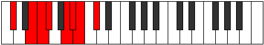 |
| [1849](https://ianring.com/musictheory/scales/1849) | [Epogian](ModeDFlatEpogian.md) | Db | Db, E, F, Gb, A, Bb, Cb, Db |  |
| [1851](https://ianring.com/musictheory/scales/1851) | [Zacryllic](ModeANaturalZacryllic.md) | A | A, A#, C, C#, D, F, F#, G, A |  |
| [1851](https://ianring.com/musictheory/scales/1851) | [Zacryllic](ModeFNaturalZacryllic.md) | F | F, F#, G#, A, A#, C#, D, D#, F |  |
| [1851](https://ianring.com/musictheory/scales/1851) | [Zacryllic](ModeASharpZacryllic.md) | A# | A#, B, C#, D, D#, F#, G, G#, A# |  |
| [1851](https://ianring.com/musictheory/scales/1851) | [Zacryllic](ModeBFlatZacryllic.md) | Bb | Bb, B, Db, D, Eb, Gb, G, Ab, Bb |  |
| [1851](https://ianring.com/musictheory/scales/1851) | [Zacryllic](ModeCSharpZacryllic.md) | C# | C#, D, E, F, F#, A, A#, B, C# |  |
| [1851](https://ianring.com/musictheory/scales/1851) | [Zacryllic](ModeDFlatZacryllic.md) | Db | Db, D, E, F, Gb, A, Bb, B, Db |  |
| [1853](https://ianring.com/musictheory/scales/1853) | [Phrynyllic](ModeASharpPhrynyllic.md) | A# | A#, C, C#, D, D#, F#, G, G#, A# |  |
| [1853](https://ianring.com/musictheory/scales/1853) | [Phrynyllic](ModeBFlatPhrynyllic.md) | Bb | Bb, C, Db, D, Eb, Gb, G, Ab, Bb |  |
| [1853](https://ianring.com/musictheory/scales/1853) | [Phrynyllic](ModeGSharpPhrynyllic.md) | G# | G#, A#, B, C, C#, E, F, F#, G# |  |
| [1853](https://ianring.com/musictheory/scales/1853) | [Phrynyllic](ModeAFlatPhrynyllic.md) | Ab | Ab, Bb, B, C, Db, E, F, Gb, Ab |  |
| [1853](https://ianring.com/musictheory/scales/1853) | [Phrynyllic](ModeCSharpPhrynyllic.md) | C# | C#, D#, E, F, F#, A, A#, B, C# |  |
| [1853](https://ianring.com/musictheory/scales/1853) | [Phrynyllic](ModeDFlatPhrynyllic.md) | Db | Db, Eb, E, F, Gb, A, Bb, B, Db |  |
| [1855](https://ianring.com/musictheory/scales/1855) | [Marygic](ModeFNaturalMarygic.md) | F | F, F#, G, G#, A, A#, C#, D, D#, F |  |
| [1855](https://ianring.com/musictheory/scales/1855) | [Marygic](ModeASharpMarygic.md) | A# | A#, B, C, C#, D, D#, F#, G, G#, A# |  |
| [1855](https://ianring.com/musictheory/scales/1855) | [Marygic](ModeBFlatMarygic.md) | Bb | Bb, B, C, Db, D, Eb, Gb, G, Ab, Bb |  |
| [1855](https://ianring.com/musictheory/scales/1855) | [Marygic](ModeCSharpMarygic.md) | C# | C#, D, D#, E, F, F#, A, A#, B, C# |  |
| [1855](https://ianring.com/musictheory/scales/1855) | [Marygic](ModeDFlatMarygic.md) | Db | Db, D, Eb, E, F, Gb, A, Bb, B, Db |  |
| [1855](https://ianring.com/musictheory/scales/1855) | [Marygic](ModeANaturalMarygic.md) | A | A, A#, B, C, C#, D, F, F#, G, A |  |
| [1855](https://ianring.com/musictheory/scales/1855) | [Marygic](ModeGSharpMarygic.md) | G# | G#, A, A#, B, C, C#, E, F, F#, G# | 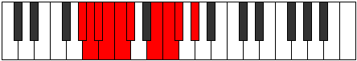 |
| [1855](https://ianring.com/musictheory/scales/1855) | [Marygic](ModeAFlatMarygic.md) | Ab | Ab, A, Bb, B, C, Db, E, F, Gb, Ab |  |
| [1861](https://ianring.com/musictheory/scales/1861) | [Phrygimic](ModeENaturalPhrygimic.md) | E | E, F#, G###, A###, B##, C##, E |  |
| [1863](https://ianring.com/musictheory/scales/1863) | [Pycrian](ModeENaturalPycrian.md) | E | E, F, Gb, A#, B#, C#, D, E |  |
| [1863](https://ianring.com/musictheory/scales/1863) | [Pycrian](ModeCNaturalPycrian.md) | C | C, Db, Ebb, F#, G#, A, Bb, C |  |
| [1865](https://ianring.com/musictheory/scales/1865) | [Thagimic](ModeASharpThagimic.md) | A# | A#, B##, D##, E##, F##, G#, A# |  |
| [1865](https://ianring.com/musictheory/scales/1865) | [Thagimic](ModeBFlatThagimic.md) | Bb | Bb, C#, D##, E##, F##, G#, Bb |  |
| [1867](https://ianring.com/musictheory/scales/1867) | [Solian](ModeCNaturalSolian.md) | C | C, Db, Eb, F#, G#, A, Bb, C |  |
| [1867](https://ianring.com/musictheory/scales/1867) | [Solian](ModeASharpSolian.md) | A# | A#, B, C#, D##, E##, F##, G#, A# |  |
| [1867](https://ianring.com/musictheory/scales/1867) | [Solian](ModeBFlatSolian.md) | Bb | Bb, Cb, Db, E, F#, G, Ab, Bb |  |
| [1869](https://ianring.com/musictheory/scales/1869) | [Katyrian](ModeENaturalKatyrian.md) | E | E, F#, G, A#, B#, C#, D, E |  |
| [1869](https://ianring.com/musictheory/scales/1869) | [Katyrian](ModeASharpKatyrian.md) | A# | A#, B#, C#, D##, E##, F##, G#, A# |  |
| [1869](https://ianring.com/musictheory/scales/1869) | [Katyrian](ModeBFlatKatyrian.md) | Bb | Bb, C, Db, E, F#, G, Ab, Bb |  |
| [1871](https://ianring.com/musictheory/scales/1871) | [Aeolyllic](ModeENaturalAeolyllic.md) | E | E, F, F#, G, A#, C, C#, D, E |  |
| [1871](https://ianring.com/musictheory/scales/1871) | [Aeolyllic](ModeCNaturalAeolyllic.md) | C | C, C#, D, D#, F#, G#, A, A#, C |  |
| [1871](https://ianring.com/musictheory/scales/1871) | [Aeolyllic](ModeASharpAeolyllic.md) | A# | A#, B, C, C#, E, F#, G, G#, A# |  |
| [1871](https://ianring.com/musictheory/scales/1871) | [Aeolyllic](ModeBFlatAeolyllic.md) | Bb | Bb, B, C, Db, E, Gb, G, Ab, Bb |  |
| [1875](https://ianring.com/musictheory/scales/1875) | [Epyphian](ModeANaturalEpyphian.md) | A | A, Bb, C#, D#, E#, F#, G, A |  |
| [1875](https://ianring.com/musictheory/scales/1875) | [Epyphian](ModeCNaturalEpyphian.md) | C | C, Db, E, F#, G#, A, Bb, C |  |
| [1877](https://ianring.com/musictheory/scales/1877) | [Aeroptian](ModeENaturalAeroptian.md) | E | E, F#, G#, A#, B#, C#, D, E | 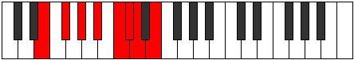 |
| [1879](https://ianring.com/musictheory/scales/1879) | [Mixoryllic](ModeENaturalMixoryllic.md) | E | E, F, F#, G#, A#, C, C#, D, E |  |
| [1879](https://ianring.com/musictheory/scales/1879) | [Mixoryllic](ModeCNaturalMixoryllic.md) | C | C, C#, D, E, F#, G#, A, A#, C |  |
| [1879](https://ianring.com/musictheory/scales/1879) | [Mixoryllic](ModeANaturalMixoryllic.md) | A | A, A#, B, C#, D#, F, F#, G, A |  |
| [1881](https://ianring.com/musictheory/scales/1881) | [Korian](ModeASharpKorian.md) | A# | A#, B##, C##, D##, E##, F##, G#, A# |  |
| [1881](https://ianring.com/musictheory/scales/1881) | [Korian](ModeBFlatKorian.md) | Bb | Bb, C#, D, E, F#, G, Ab, Bb |  |
| [1883](https://ianring.com/musictheory/scales/1883) | [Mixopyryllic](ModeANaturalMixopyryllic.md) | A | A, A#, C, C#, D#, F, F#, G, A |  |
| [1883](https://ianring.com/musictheory/scales/1883) | [Mixopyryllic](ModeCNaturalMixopyryllic.md) | C | C, C#, D#, E, F#, G#, A, A#, C |  |
| [1883](https://ianring.com/musictheory/scales/1883) | [Mixopyryllic](ModeASharpMixopyryllic.md) | A# | A#, B, C#, D, E, F#, G, G#, A# |  |
| [1883](https://ianring.com/musictheory/scales/1883) | [Mixopyryllic](ModeBFlatMixopyryllic.md) | Bb | Bb, B, Db, D, E, Gb, G, Ab, Bb |  |
| [1885](https://ianring.com/musictheory/scales/1885) | [Epidyllic](ModeENaturalEpidyllic.md) | E | E, F#, G, G#, A#, C, C#, D, E |  |
| [1885](https://ianring.com/musictheory/scales/1885) | [Epidyllic](ModeASharpEpidyllic.md) | A# | A#, C, C#, D, E, F#, G, G#, A# |  |
| [1885](https://ianring.com/musictheory/scales/1885) | [Epidyllic](ModeBFlatEpidyllic.md) | Bb | Bb, C, Db, D, E, Gb, G, Ab, Bb |  |
| [1887](https://ianring.com/musictheory/scales/1887) | [Aerocrygic](ModeENaturalAerocrygic.md) | E | E, F, F#, G, G#, A#, C, C#, D, E |  |
| [1887](https://ianring.com/musictheory/scales/1887) | [Aerocrygic](ModeCNaturalAerocrygic.md) | C | C, C#, D, D#, E, F#, G#, A, A#, C |  |
| [1887](https://ianring.com/musictheory/scales/1887) | [Aerocrygic](ModeASharpAerocrygic.md) | A# | A#, B, C, C#, D, E, F#, G, G#, A# |  |
| [1887](https://ianring.com/musictheory/scales/1887) | [Aerocrygic](ModeBFlatAerocrygic.md) | Bb | Bb, B, C, Db, D, E, Gb, G, Ab, Bb |  |
| [1887](https://ianring.com/musictheory/scales/1887) | [Aerocrygic](ModeANaturalAerocrygic.md) | A | A, A#, B, C, C#, D#, F, F#, G, A |  |
| [1891](https://ianring.com/musictheory/scales/1891) | [Thalian](ModeCNaturalThalian.md) | C | C, Db, E#, F#, G#, A, Bb, C |  |
| [1891](https://ianring.com/musictheory/scales/1891) | [Thalian](ModeFNaturalThalian.md) | F | F, Gb, A#, B, C#, D, Eb, F | 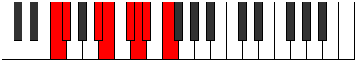 |
| [1891](https://ianring.com/musictheory/scales/1891) | [Thalian](ModeCSharpThalian.md) | C# | C#, D, E##, F##, G##, A#, B, C# |  |
| [1891](https://ianring.com/musictheory/scales/1891) | [Thalian](ModeDFlatThalian.md) | Db | Db, Ebb, F#, G, A, Bb, Cb, Db |  |
| [1893](https://ianring.com/musictheory/scales/1893) | [Ionylian](ModeGSharpIonylian.md) | G# | G#, A#, B##, C##, D##, E#, F#, G# |  |
| [1893](https://ianring.com/musictheory/scales/1893) | [Ionylian](ModeAFlatIonylian.md) | Ab | Ab, Bb, C#, D, E, F, Gb, Ab |  |
| [1893](https://ianring.com/musictheory/scales/1893) | [Ionylian](ModeENaturalIonylian.md) | E | E, F#, G##, A#, B#, C#, D, E |  |
| [1893](https://ianring.com/musictheory/scales/1893) | [Ionylian](ModeCSharpIonylian.md) | C# | C#, D#, E##, F##, G##, A#, B, C# |  |
| [1893](https://ianring.com/musictheory/scales/1893) | [Ionylian](ModeDFlatIonylian.md) | Db | Db, Eb, F#, G, A, Bb, Cb, Db |  |
| [1895](https://ianring.com/musictheory/scales/1895) | [Salyllic](ModeENaturalSalyllic.md) | E | E, F, F#, A, A#, C, C#, D, E |  |
| [1895](https://ianring.com/musictheory/scales/1895) | [Salyllic](ModeCNaturalSalyllic.md) | C | C, C#, D, F, F#, G#, A, A#, C |  |
| [1895](https://ianring.com/musictheory/scales/1895) | [Salyllic](ModeGSharpSalyllic.md) | G# | G#, A, A#, C#, D, E, F, F#, G# |  |
| [1895](https://ianring.com/musictheory/scales/1895) | [Salyllic](ModeAFlatSalyllic.md) | Ab | Ab, A, Bb, Db, D, E, F, Gb, Ab |  |
| [1895](https://ianring.com/musictheory/scales/1895) | [Salyllic](ModeFNaturalSalyllic.md) | F | F, F#, G, A#, B, C#, D, D#, F |  |
| [1895](https://ianring.com/musictheory/scales/1895) | [Salyllic](ModeCSharpSalyllic.md) | C# | C#, D, D#, F#, G, A, A#, B, C# |  |
| [1895](https://ianring.com/musictheory/scales/1895) | [Salyllic](ModeDFlatSalyllic.md) | Db | Db, D, Eb, Gb, G, A, Bb, B, Db |  |
| [1897](https://ianring.com/musictheory/scales/1897) | [Ionopian](ModeASharpIonopian.md) | A# | A#, B##, C###, D##, E##, F##, G#, A# |  |
| [1897](https://ianring.com/musictheory/scales/1897) | [Ionopian](ModeBFlatIonopian.md) | Bb | Bb, C#, D#, E, F#, G, Ab, Bb |  |
| [1897](https://ianring.com/musictheory/scales/1897) | [Ionopian](ModeCSharpIonopian.md) | C# | C#, D##, E##, F##, G##, A#, B, C# |  |
| [1897](https://ianring.com/musictheory/scales/1897) | [Ionopian](ModeDFlatIonopian.md) | Db | Db, E, F#, G, A, Bb, Cb, Db |  |
| [1899](https://ianring.com/musictheory/scales/1899) | [Moptyllic](ModeCNaturalMoptyllic.md) | C | C, C#, D#, F, F#, G#, A, A#, C |  |
| [1899](https://ianring.com/musictheory/scales/1899) | [Moptyllic](ModeFNaturalMoptyllic.md) | F | F, F#, G#, A#, B, C#, D, D#, F |  |
| [1899](https://ianring.com/musictheory/scales/1899) | [Moptyllic](ModeASharpMoptyllic.md) | A# | A#, B, C#, D#, E, F#, G, G#, A# |  |
| [1899](https://ianring.com/musictheory/scales/1899) | [Moptyllic](ModeBFlatMoptyllic.md) | Bb | Bb, B, Db, Eb, E, Gb, G, Ab, Bb |  |
| [1899](https://ianring.com/musictheory/scales/1899) | [Moptyllic](ModeCSharpMoptyllic.md) | C# | C#, D, E, F#, G, A, A#, B, C# |  |
| [1899](https://ianring.com/musictheory/scales/1899) | [Moptyllic](ModeDFlatMoptyllic.md) | Db | Db, D, E, Gb, G, A, Bb, B, Db |  |
| [1901](https://ianring.com/musictheory/scales/1901) | [Ionidyllic](ModeASharpIonidyllic.md) | A# | A#, C, C#, D#, E, F#, G, G#, A# |  |
| [1901](https://ianring.com/musictheory/scales/1901) | [Ionidyllic](ModeBFlatIonidyllic.md) | Bb | Bb, C, Db, Eb, E, Gb, G, Ab, Bb |  |
| [1901](https://ianring.com/musictheory/scales/1901) | [Ionidyllic](ModeENaturalIonidyllic.md) | E | E, F#, G, A, A#, C, C#, D, E |  |
| [1901](https://ianring.com/musictheory/scales/1901) | [Ionidyllic](ModeGSharpIonidyllic.md) | G# | G#, A#, B, C#, D, E, F, F#, G# |  |
| [1901](https://ianring.com/musictheory/scales/1901) | [Ionidyllic](ModeAFlatIonidyllic.md) | Ab | Ab, Bb, B, Db, D, E, F, Gb, Ab |  |
| [1901](https://ianring.com/musictheory/scales/1901) | [Ionidyllic](ModeCSharpIonidyllic.md) | C# | C#, D#, E, F#, G, A, A#, B, C# |  |
| [1901](https://ianring.com/musictheory/scales/1901) | [Ionidyllic](ModeDFlatIonidyllic.md) | Db | Db, Eb, E, Gb, G, A, Bb, B, Db |  |
| [1903](https://ianring.com/musictheory/scales/1903) | [Rocrygic](ModeENaturalRocrygic.md) | E | E, F, F#, G, A, A#, C, C#, D, E |  |
| [1903](https://ianring.com/musictheory/scales/1903) | [Rocrygic](ModeCNaturalRocrygic.md) | C | C, C#, D, D#, F, F#, G#, A, A#, C |  |
| [1903](https://ianring.com/musictheory/scales/1903) | [Rocrygic](ModeASharpRocrygic.md) | A# | A#, B, C, C#, D#, E, F#, G, G#, A# |  |
| [1903](https://ianring.com/musictheory/scales/1903) | [Rocrygic](ModeBFlatRocrygic.md) | Bb | Bb, B, C, Db, Eb, E, Gb, G, Ab, Bb |  |
| [1903](https://ianring.com/musictheory/scales/1903) | [Rocrygic](ModeFNaturalRocrygic.md) | F | F, F#, G, G#, A#, B, C#, D, D#, F |  |
| [1903](https://ianring.com/musictheory/scales/1903) | [Rocrygic](ModeCSharpRocrygic.md) | C# | C#, D, D#, E, F#, G, A, A#, B, C# |  |
| [1903](https://ianring.com/musictheory/scales/1903) | [Rocrygic](ModeDFlatRocrygic.md) | Db | Db, D, Eb, E, Gb, G, A, Bb, B, Db |  |
| [1903](https://ianring.com/musictheory/scales/1903) | [Rocrygic](ModeGSharpRocrygic.md) | G# | G#, A, A#, B, C#, D, E, F, F#, G# |  |
| [1903](https://ianring.com/musictheory/scales/1903) | [Rocrygic](ModeAFlatRocrygic.md) | Ab | Ab, A, Bb, B, Db, D, E, F, Gb, Ab |  |
| [1905](https://ianring.com/musictheory/scales/1905) | [Katacrian](ModeCSharpKatacrian.md) | C# | C#, D###, E##, F##, G##, A#, B, C# |  |
| [1905](https://ianring.com/musictheory/scales/1905) | [Katacrian](ModeDFlatKatacrian.md) | Db | Db, E#, F#, G, A, Bb, Cb, Db |  |
| [1907](https://ianring.com/musictheory/scales/1907) | [Lynyllic](ModeANaturalLynyllic.md) | A | A, A#, C#, D, D#, F, F#, G, A |  |
| [1907](https://ianring.com/musictheory/scales/1907) | [Lynyllic](ModeCNaturalLynyllic.md) | C | C, C#, E, F, F#, G#, A, A#, C |  |
| [1907](https://ianring.com/musictheory/scales/1907) | [Lynyllic](ModeFNaturalLynyllic.md) | F | F, F#, A, A#, B, C#, D, D#, F | 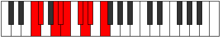 |
| [1907](https://ianring.com/musictheory/scales/1907) | [Lynyllic](ModeCSharpLynyllic.md) | C# | C#, D, F, F#, G, A, A#, B, C# |  |
| [1907](https://ianring.com/musictheory/scales/1907) | [Lynyllic](ModeDFlatLynyllic.md) | Db | Db, D, F, Gb, G, A, Bb, B, Db |  |
| [1909](https://ianring.com/musictheory/scales/1909) | [Epicryllic](ModeGSharpEpicryllic.md) | G# | G#, A#, C, C#, D, E, F, F#, G# |  |
| [1909](https://ianring.com/musictheory/scales/1909) | [Epicryllic](ModeAFlatEpicryllic.md) | Ab | Ab, Bb, C, Db, D, E, F, Gb, Ab |  |
| [1909](https://ianring.com/musictheory/scales/1909) | [Epicryllic](ModeENaturalEpicryllic.md) | E | E, F#, G#, A, A#, C, C#, D, E |  |
| [1909](https://ianring.com/musictheory/scales/1909) | [Epicryllic](ModeCSharpEpicryllic.md) | C# | C#, D#, F, F#, G, A, A#, B, C# |  |
| [1909](https://ianring.com/musictheory/scales/1909) | [Epicryllic](ModeDFlatEpicryllic.md) | Db | Db, Eb, F, Gb, G, A, Bb, B, Db |  |
| [1911](https://ianring.com/musictheory/scales/1911) | [Stynygic](ModeCNaturalStynygic.md) | C | C, C#, D, E, F, F#, G#, A, A#, C |  |
| [1911](https://ianring.com/musictheory/scales/1911) | [Stynygic](ModeENaturalStynygic.md) | E | E, F, F#, G#, A, A#, C, C#, D, E |  |
| [1911](https://ianring.com/musictheory/scales/1911) | [Stynygic](ModeGSharpStynygic.md) | G# | G#, A, A#, C, C#, D, E, F, F#, G# |  |
| [1911](https://ianring.com/musictheory/scales/1911) | [Stynygic](ModeAFlatStynygic.md) | Ab | Ab, A, Bb, C, Db, D, E, F, Gb, Ab |  |
| [1911](https://ianring.com/musictheory/scales/1911) | [Stynygic](ModeCSharpStynygic.md) | C# | C#, D, D#, F, F#, G, A, A#, B, C# |  |
| [1911](https://ianring.com/musictheory/scales/1911) | [Stynygic](ModeDFlatStynygic.md) | Db | Db, D, Eb, F, Gb, G, A, Bb, B, Db |  |
| [1911](https://ianring.com/musictheory/scales/1911) | [Stynygic](ModeFNaturalStynygic.md) | F | F, F#, G, A, A#, B, C#, D, D#, F |  |
| [1911](https://ianring.com/musictheory/scales/1911) | [Stynygic](ModeANaturalStynygic.md) | A | A, A#, B, C#, D, D#, F, F#, G, A |  |
| [1913](https://ianring.com/musictheory/scales/1913) | [Zagyllic](ModeASharpZagyllic.md) | A# | A#, C#, D, D#, E, F#, G, G#, A# |  |
| [1913](https://ianring.com/musictheory/scales/1913) | [Zagyllic](ModeBFlatZagyllic.md) | Bb | Bb, Db, D, Eb, E, Gb, G, Ab, Bb |  |
| [1913](https://ianring.com/musictheory/scales/1913) | [Zagyllic](ModeCSharpZagyllic.md) | C# | C#, E, F, F#, G, A, A#, B, C# |  |
| [1913](https://ianring.com/musictheory/scales/1913) | [Zagyllic](ModeDFlatZagyllic.md) | Db | Db, E, F, Gb, G, A, Bb, B, Db |  |
| [1915](https://ianring.com/musictheory/scales/1915) | [Thydygic](ModeANaturalThydygic.md) | A | A, A#, C, C#, D, D#, F, F#, G, A |  |
| [1915](https://ianring.com/musictheory/scales/1915) | [Thydygic](ModeCNaturalThydygic.md) | C | C, C#, D#, E, F, F#, G#, A, A#, C |  |
| [1915](https://ianring.com/musictheory/scales/1915) | [Thydygic](ModeASharpThydygic.md) | A# | A#, B, C#, D, D#, E, F#, G, G#, A# |  |
| [1915](https://ianring.com/musictheory/scales/1915) | [Thydygic](ModeBFlatThydygic.md) | Bb | Bb, B, Db, D, Eb, E, Gb, G, Ab, Bb |  |
| [1915](https://ianring.com/musictheory/scales/1915) | [Thydygic](ModeCSharpThydygic.md) | C# | C#, D, E, F, F#, G, A, A#, B, C# |  |
| [1915](https://ianring.com/musictheory/scales/1915) | [Thydygic](ModeDFlatThydygic.md) | Db | Db, D, E, F, Gb, G, A, Bb, B, Db |  |
| [1915](https://ianring.com/musictheory/scales/1915) | [Thydygic](ModeFNaturalThydygic.md) | F | F, F#, G#, A, A#, B, C#, D, D#, F |  |
| [1917](https://ianring.com/musictheory/scales/1917) | [Sacrygic](ModeASharpSacrygic.md) | A# | A#, C, C#, D, D#, E, F#, G, G#, A# |  |
| [1917](https://ianring.com/musictheory/scales/1917) | [Sacrygic](ModeBFlatSacrygic.md) | Bb | Bb, C, Db, D, Eb, E, Gb, G, Ab, Bb |  |
| [1917](https://ianring.com/musictheory/scales/1917) | [Sacrygic](ModeENaturalSacrygic.md) | E | E, F#, G, G#, A, A#, C, C#, D, E |  |
| [1917](https://ianring.com/musictheory/scales/1917) | [Sacrygic](ModeGSharpSacrygic.md) | G# | G#, A#, B, C, C#, D, E, F, F#, G# |  |
| [1917](https://ianring.com/musictheory/scales/1917) | [Sacrygic](ModeAFlatSacrygic.md) | Ab | Ab, Bb, B, C, Db, D, E, F, Gb, Ab |  |
| [1917](https://ianring.com/musictheory/scales/1917) | [Sacrygic](ModeCSharpSacrygic.md) | C# | C#, D#, E, F, F#, G, A, A#, B, C# |  |
| [1917](https://ianring.com/musictheory/scales/1917) | [Sacrygic](ModeDFlatSacrygic.md) | Db | Db, Eb, E, F, Gb, G, A, Bb, B, Db |  |
| [1919](https://ianring.com/musictheory/scales/1919) | [Rocryllian](ModeCNaturalRocryllian.md) | C | C, C#, D, D#, E, F, F#, G#, A, A#, C |  |
| [1919](https://ianring.com/musictheory/scales/1919) | [Rocryllian](ModeENaturalRocryllian.md) | E | E, F, F#, G, G#, A, A#, C, C#, D, E |  |
| [1919](https://ianring.com/musictheory/scales/1919) | [Rocryllian](ModeASharpRocryllian.md) | A# | A#, B, C, C#, D, D#, E, F#, G, G#, A# |  |
| [1919](https://ianring.com/musictheory/scales/1919) | [Rocryllian](ModeBFlatRocryllian.md) | Bb | Bb, B, C, Db, D, Eb, E, Gb, G, Ab, Bb |  |
| [1919](https://ianring.com/musictheory/scales/1919) | [Rocryllian](ModeANaturalRocryllian.md) | A | A, A#, B, C, C#, D, D#, F, F#, G, A |  |
| [1919](https://ianring.com/musictheory/scales/1919) | [Rocryllian](ModeCSharpRocryllian.md) | C# | C#, D, D#, E, F, F#, G, A, A#, B, C# |  |
| [1919](https://ianring.com/musictheory/scales/1919) | [Rocryllian](ModeDFlatRocryllian.md) | Db | Db, D, Eb, E, F, Gb, G, A, Bb, B, Db |  |
| [1919](https://ianring.com/musictheory/scales/1919) | [Rocryllian](ModeGSharpRocryllian.md) | G# | G#, A, A#, B, C, C#, D, E, F, F#, G# |  |
| [1919](https://ianring.com/musictheory/scales/1919) | [Rocryllian](ModeAFlatRocryllian.md) | Ab | Ab, A, Bb, B, C, Db, D, E, F, Gb, Ab |  |
| [1919](https://ianring.com/musictheory/scales/1919) | [Rocryllian](ModeFNaturalRocryllian.md) | F | F, F#, G, G#, A, A#, B, C#, D, D#, F |  |
| [1929](https://ianring.com/musictheory/scales/1929) | [Aeolycrimic](ModeASharpAeolycrimic.md) | A# | A#, B##, D###, E##, F##, G#, A# |  |
| [1929](https://ianring.com/musictheory/scales/1929) | [Aeolycrimic](ModeBFlatAeolycrimic.md) | Bb | Bb, C#, D###, E##, F##, G#, Bb |  |
| [1929](https://ianring.com/musictheory/scales/1929) | [Aeolycrimic](ModeDSharpAeolycrimic.md) | D# | D#, E##, Cbb, Dbbb, Dbb, Ebbb, D# |  |
| [1929](https://ianring.com/musictheory/scales/1929) | [Aeolycrimic](ModeEFlatAeolycrimic.md) | Eb | Eb, F#, G###, A##, B#, C#, Eb |  |
| [1931](https://ianring.com/musictheory/scales/1931) | [Stogian](ModeDSharpStogian.md) | D# | D#, E, F#, G###, A##, B#, C#, D# |  |
| [1931](https://ianring.com/musictheory/scales/1931) | [Stogian](ModeEFlatStogian.md) | Eb | Eb, Fb, Gb, A#, B, C, Db, Eb |  |
| [1931](https://ianring.com/musictheory/scales/1931) | [Stogian](ModeASharpStogian.md) | A# | A#, B, C#, D###, E##, F##, G#, A# |  |
| [1931](https://ianring.com/musictheory/scales/1931) | [Stogian](ModeBFlatStogian.md) | Bb | Bb, Cb, Db, E#, F#, G, Ab, Bb |  |
| [1933](https://ianring.com/musictheory/scales/1933) | [Mocrian](ModeASharpMocrian.md) | A# | A#, B#, C#, D###, E##, F##, G#, A# |  |
| [1933](https://ianring.com/musictheory/scales/1933) | [Mocrian](ModeBFlatMocrian.md) | Bb | Bb, C, Db, E#, F#, G, Ab, Bb |  |
| [1933](https://ianring.com/musictheory/scales/1933) | [Mocrian](ModeDSharpMocrian.md) | D# | D#, E#, F#, G###, A##, B#, C#, D# |  |
| [1933](https://ianring.com/musictheory/scales/1933) | [Mocrian](ModeEFlatMocrian.md) | Eb | Eb, F, Gb, A#, B, C, Db, Eb |  |
| [1935](https://ianring.com/musictheory/scales/1935) | [Mycryllic](ModeDSharpMycryllic.md) | D# | D#, E, F, F#, A#, B, C, C#, D# |  |
| [1935](https://ianring.com/musictheory/scales/1935) | [Mycryllic](ModeEFlatMycryllic.md) | Eb | Eb, E, F, Gb, Bb, B, C, Db, Eb |  |
| [1935](https://ianring.com/musictheory/scales/1935) | [Mycryllic](ModeASharpMycryllic.md) | A# | A#, B, C, C#, F, F#, G, G#, A# |  |
| [1935](https://ianring.com/musictheory/scales/1935) | [Mycryllic](ModeBFlatMycryllic.md) | Bb | Bb, B, C, Db, F, Gb, G, Ab, Bb |  |
| [1937](https://ianring.com/musictheory/scales/1937) | [Galimic](ModeFSharpGalimic.md) | F# | F#, G###, Db, Ebb, Fbb, Gbbb, F# |  |
| [1937](https://ianring.com/musictheory/scales/1937) | [Galimic](ModeGFlatGalimic.md) | Gb | Gb, A#, B##, C##, D#, E, Gb |  |
| [1939](https://ianring.com/musictheory/scales/1939) | [Dathian](ModeFSharpDathian.md) | F# | F#, G, A#, B##, C##, D#, E, F# |  |
| [1939](https://ianring.com/musictheory/scales/1939) | [Dathian](ModeGFlatDathian.md) | Gb | Gb, Abb, Bb, C#, D, Eb, Fb, Gb |  |
| [1939](https://ianring.com/musictheory/scales/1939) | [Dathian](ModeANaturalDathian.md) | A | A, Bb, C#, D##, E#, F#, G, A |  |
| [1941](https://ianring.com/musictheory/scales/1941) | [Aeranian](ModeFSharpAeranian.md) | F# | F#, G#, A#, B##, C##, D#, E, F# |  |
| [1941](https://ianring.com/musictheory/scales/1941) | [Aeranian](ModeGFlatAeranian.md) | Gb | Gb, Ab, Bb, C#, D, Eb, Fb, Gb |  |
| [1943](https://ianring.com/musictheory/scales/1943) | [Malyllic](ModeFSharpMalyllic.md) | F# | F#, G, G#, A#, C#, D, D#, E, F# |  |
| [1943](https://ianring.com/musictheory/scales/1943) | [Malyllic](ModeGFlatMalyllic.md) | Gb | Gb, G, Ab, Bb, Db, D, Eb, E, Gb |  |
| [1943](https://ianring.com/musictheory/scales/1943) | [Malyllic](ModeANaturalMalyllic.md) | A | A, A#, B, C#, E, F, F#, G, A |  |
| [1945](https://ianring.com/musictheory/scales/1945) | [Zarian](ModeASharpZarian.md) | A# | A#, B##, C##, D###, E##, F##, G#, A# |  |
| [1945](https://ianring.com/musictheory/scales/1945) | [Zarian](ModeBFlatZarian.md) | Bb | Bb, C#, D, E#, F#, G, Ab, Bb |  |
| [1945](https://ianring.com/musictheory/scales/1945) | [Zarian](ModeFSharpZarian.md) | F# | F#, G##, A#, B##, C##, D#, E, F# |  |
| [1945](https://ianring.com/musictheory/scales/1945) | [Zarian](ModeGFlatZarian.md) | Gb | Gb, A, Bb, C#, D, Eb, Fb, Gb |  |
| [1945](https://ianring.com/musictheory/scales/1945) | [Zarian](ModeDSharpZarian.md) | D# | D#, E##, F##, G###, A##, B#, C#, D# |  |
| [1945](https://ianring.com/musictheory/scales/1945) | [Zarian](ModeEFlatZarian.md) | Eb | Eb, F#, G, A#, B, C, Db, Eb |  |
| [1947](https://ianring.com/musictheory/scales/1947) | [Ionoyllic](ModeFSharpIonoyllic.md) | F# | F#, G, A, A#, C#, D, D#, E, F# |  |
| [1947](https://ianring.com/musictheory/scales/1947) | [Ionoyllic](ModeGFlatIonoyllic.md) | Gb | Gb, G, A, Bb, Db, D, Eb, E, Gb |  |
| [1947](https://ianring.com/musictheory/scales/1947) | [Ionoyllic](ModeANaturalIonoyllic.md) | A | A, A#, C, C#, E, F, F#, G, A |  |
| [1947](https://ianring.com/musictheory/scales/1947) | [Ionoyllic](ModeDSharpIonoyllic.md) | D# | D#, E, F#, G, A#, B, C, C#, D# |  |
| [1947](https://ianring.com/musictheory/scales/1947) | [Ionoyllic](ModeEFlatIonoyllic.md) | Eb | Eb, E, Gb, G, Bb, B, C, Db, Eb |  |
| [1947](https://ianring.com/musictheory/scales/1947) | [Ionoyllic](ModeASharpIonoyllic.md) | A# | A#, B, C#, D, F, F#, G, G#, A# |  |
| [1947](https://ianring.com/musictheory/scales/1947) | [Ionoyllic](ModeBFlatIonoyllic.md) | Bb | Bb, B, Db, D, F, Gb, G, Ab, Bb |  |
| [1949](https://ianring.com/musictheory/scales/1949) | [Mathyllic](ModeASharpMathyllic.md) | A# | A#, C, C#, D, F, F#, G, G#, A# |  |
| [1949](https://ianring.com/musictheory/scales/1949) | [Mathyllic](ModeBFlatMathyllic.md) | Bb | Bb, C, Db, D, F, Gb, G, Ab, Bb |  |
| [1949](https://ianring.com/musictheory/scales/1949) | [Mathyllic](ModeFSharpMathyllic.md) | F# | F#, G#, A, A#, C#, D, D#, E, F# |  |
| [1949](https://ianring.com/musictheory/scales/1949) | [Mathyllic](ModeGFlatMathyllic.md) | Gb | Gb, Ab, A, Bb, Db, D, Eb, E, Gb |  |
| [1949](https://ianring.com/musictheory/scales/1949) | [Mathyllic](ModeDSharpMathyllic.md) | D# | D#, F, F#, G, A#, B, C, C#, D# |  |
| [1949](https://ianring.com/musictheory/scales/1949) | [Mathyllic](ModeEFlatMathyllic.md) | Eb | Eb, F, Gb, G, Bb, B, C, Db, Eb |  |
| [1951](https://ianring.com/musictheory/scales/1951) | [Gonygic](ModeFSharpGonygic.md) | F# | F#, G, G#, A, A#, C#, D, D#, E, F# |  |
| [1951](https://ianring.com/musictheory/scales/1951) | [Gonygic](ModeGFlatGonygic.md) | Gb | Gb, G, Ab, A, Bb, Db, D, Eb, E, Gb |  |
| [1951](https://ianring.com/musictheory/scales/1951) | [Gonygic](ModeDSharpGonygic.md) | D# | D#, E, F, F#, G, A#, B, C, C#, D# |  |
| [1951](https://ianring.com/musictheory/scales/1951) | [Gonygic](ModeEFlatGonygic.md) | Eb | Eb, E, F, Gb, G, Bb, B, C, Db, Eb |  |
| [1951](https://ianring.com/musictheory/scales/1951) | [Gonygic](ModeASharpGonygic.md) | A# | A#, B, C, C#, D, F, F#, G, G#, A# |  |
| [1951](https://ianring.com/musictheory/scales/1951) | [Gonygic](ModeBFlatGonygic.md) | Bb | Bb, B, C, Db, D, F, Gb, G, Ab, Bb |  |
| [1951](https://ianring.com/musictheory/scales/1951) | [Gonygic](ModeANaturalGonygic.md) | A | A, A#, B, C, C#, E, F, F#, G, A |  |
| [1955](https://ianring.com/musictheory/scales/1955) | [Sonian](ModeFNaturalSonian.md) | F | F, Gb, A#, B#, C#, D, Eb, F |  |
| [1955](https://ianring.com/musictheory/scales/1955) | [Sonian](ModeCSharpSonian.md) | C# | C#, D, E##, F###, G##, A#, B, C# |  |
| [1955](https://ianring.com/musictheory/scales/1955) | [Sonian](ModeDFlatSonian.md) | Db | Db, Ebb, F#, G#, A, Bb, Cb, Db |  |
| [1957](https://ianring.com/musictheory/scales/1957) | [Pyrian](ModeGSharpPyrian.md) | G# | G#, A#, B##, C###, D##, E#, F#, G# | 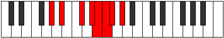 |
| [1957](https://ianring.com/musictheory/scales/1957) | [Pyrian](ModeAFlatPyrian.md) | Ab | Ab, Bb, C#, D#, E, F, Gb, Ab |  |
| [1957](https://ianring.com/musictheory/scales/1957) | [Pyrian](ModeCSharpPyrian.md) | C# | C#, D#, E##, F###, G##, A#, B, C# |  |
| [1957](https://ianring.com/musictheory/scales/1957) | [Pyrian](ModeDFlatPyrian.md) | Db | Db, Eb, F#, G#, A, Bb, Cb, Db |  |
| [1959](https://ianring.com/musictheory/scales/1959) | [Katolyllic](ModeFNaturalKatolyllic.md) | F | F, F#, G, A#, C, C#, D, D#, F |  |
| [1959](https://ianring.com/musictheory/scales/1959) | [Katolyllic](ModeGSharpKatolyllic.md) | G# | G#, A, A#, C#, D#, E, F, F#, G# |  |
| [1959](https://ianring.com/musictheory/scales/1959) | [Katolyllic](ModeAFlatKatolyllic.md) | Ab | Ab, A, Bb, Db, Eb, E, F, Gb, Ab |  |
| [1959](https://ianring.com/musictheory/scales/1959) | [Katolyllic](ModeCSharpKatolyllic.md) | C# | C#, D, D#, F#, G#, A, A#, B, C# |  |
| [1959](https://ianring.com/musictheory/scales/1959) | [Katolyllic](ModeDFlatKatolyllic.md) | Db | Db, D, Eb, Gb, Ab, A, Bb, B, Db |  |
| [1961](https://ianring.com/musictheory/scales/1961) | [Soptian](ModeASharpSoptian.md) | A# | A#, B##, C###, D###, E##, F##, G#, A# |  |
| [1961](https://ianring.com/musictheory/scales/1961) | [Soptian](ModeBFlatSoptian.md) | Bb | Bb, C#, D#, E#, F#, G, Ab, Bb |  |
| [1961](https://ianring.com/musictheory/scales/1961) | [Soptian](ModeDSharpSoptian.md) | D# | D#, E##, F###, G###, A##, B#, C#, D# |  |
| [1961](https://ianring.com/musictheory/scales/1961) | [Soptian](ModeEFlatSoptian.md) | Eb | Eb, F#, G#, A#, B, C, Db, Eb |  |
| [1961](https://ianring.com/musictheory/scales/1961) | [Soptian](ModeCSharpSoptian.md) | C# | C#, D##, E##, F###, G##, A#, B, C# |  |
| [1961](https://ianring.com/musictheory/scales/1961) | [Soptian](ModeDFlatSoptian.md) | Db | Db, E, F#, G#, A, Bb, Cb, Db |  |
| [1963](https://ianring.com/musictheory/scales/1963) | [Epocryllic](ModeFNaturalEpocryllic.md) | F | F, F#, G#, A#, C, C#, D, D#, F |  |
| [1963](https://ianring.com/musictheory/scales/1963) | [Epocryllic](ModeDSharpEpocryllic.md) | D# | D#, E, F#, G#, A#, B, C, C#, D# |  |
| [1963](https://ianring.com/musictheory/scales/1963) | [Epocryllic](ModeEFlatEpocryllic.md) | Eb | Eb, E, Gb, Ab, Bb, B, C, Db, Eb |  |
| [1963](https://ianring.com/musictheory/scales/1963) | [Epocryllic](ModeASharpEpocryllic.md) | A# | A#, B, C#, D#, F, F#, G, G#, A# |  |
| [1963](https://ianring.com/musictheory/scales/1963) | [Epocryllic](ModeBFlatEpocryllic.md) | Bb | Bb, B, Db, Eb, F, Gb, G, Ab, Bb |  |
| [1963](https://ianring.com/musictheory/scales/1963) | [Epocryllic](ModeCSharpEpocryllic.md) | C# | C#, D, E, F#, G#, A, A#, B, C# |  |
| [1963](https://ianring.com/musictheory/scales/1963) | [Epocryllic](ModeDFlatEpocryllic.md) | Db | Db, D, E, Gb, Ab, A, Bb, B, Db |  |
| [1965](https://ianring.com/musictheory/scales/1965) | [Gadyllic](ModeASharpGadyllic.md) | A# | A#, C, C#, D#, F, F#, G, G#, A# |  |
| [1965](https://ianring.com/musictheory/scales/1965) | [Gadyllic](ModeBFlatGadyllic.md) | Bb | Bb, C, Db, Eb, F, Gb, G, Ab, Bb |  |
| [1965](https://ianring.com/musictheory/scales/1965) | [Gadyllic](ModeDSharpGadyllic.md) | D# | D#, F, F#, G#, A#, B, C, C#, D# |  |
| [1965](https://ianring.com/musictheory/scales/1965) | [Gadyllic](ModeEFlatGadyllic.md) | Eb | Eb, F, Gb, Ab, Bb, B, C, Db, Eb |  |
| [1965](https://ianring.com/musictheory/scales/1965) | [Gadyllic](ModeGSharpGadyllic.md) | G# | G#, A#, B, C#, D#, E, F, F#, G# |  |
| [1965](https://ianring.com/musictheory/scales/1965) | [Gadyllic](ModeAFlatGadyllic.md) | Ab | Ab, Bb, B, Db, Eb, E, F, Gb, Ab |  |
| [1965](https://ianring.com/musictheory/scales/1965) | [Gadyllic](ModeCSharpGadyllic.md) | C# | C#, D#, E, F#, G#, A, A#, B, C# |  |
| [1965](https://ianring.com/musictheory/scales/1965) | [Gadyllic](ModeDFlatGadyllic.md) | Db | Db, Eb, E, Gb, Ab, A, Bb, B, Db |  |
| [1967](https://ianring.com/musictheory/scales/1967) | [Godygic](ModeFNaturalGodygic.md) | F | F, F#, G, G#, A#, C, C#, D, D#, F |  |
| [1967](https://ianring.com/musictheory/scales/1967) | [Godygic](ModeDSharpGodygic.md) | D# | D#, E, F, F#, G#, A#, B, C, C#, D# |  |
| [1967](https://ianring.com/musictheory/scales/1967) | [Godygic](ModeEFlatGodygic.md) | Eb | Eb, E, F, Gb, Ab, Bb, B, C, Db, Eb |  |
| [1967](https://ianring.com/musictheory/scales/1967) | [Godygic](ModeASharpGodygic.md) | A# | A#, B, C, C#, D#, F, F#, G, G#, A# |  |
| [1967](https://ianring.com/musictheory/scales/1967) | [Godygic](ModeBFlatGodygic.md) | Bb | Bb, B, C, Db, Eb, F, Gb, G, Ab, Bb |  |
| [1967](https://ianring.com/musictheory/scales/1967) | [Godygic](ModeCSharpGodygic.md) | C# | C#, D, D#, E, F#, G#, A, A#, B, C# |  |
| [1967](https://ianring.com/musictheory/scales/1967) | [Godygic](ModeDFlatGodygic.md) | Db | Db, D, Eb, E, Gb, Ab, A, Bb, B, Db |  |
| [1967](https://ianring.com/musictheory/scales/1967) | [Godygic](ModeGSharpGodygic.md) | G# | G#, A, A#, B, C#, D#, E, F, F#, G# |  |
| [1967](https://ianring.com/musictheory/scales/1967) | [Godygic](ModeAFlatGodygic.md) | Ab | Ab, A, Bb, B, Db, Eb, E, F, Gb, Ab |  |
| [1969](https://ianring.com/musictheory/scales/1969) | [Zorian](ModeFSharpZorian.md) | F# | F#, G###, A##, B##, C##, D#, E, F# |  |
| [1969](https://ianring.com/musictheory/scales/1969) | [Zorian](ModeGFlatZorian.md) | Gb | Gb, A#, B, C#, D, Eb, Fb, Gb |  |
| [1969](https://ianring.com/musictheory/scales/1969) | [Zorian](ModeCSharpZorian.md) | C# | C#, D###, E##, F###, G##, A#, B, C# |  |
| [1969](https://ianring.com/musictheory/scales/1969) | [Zorian](ModeDFlatZorian.md) | Db | Db, E#, F#, G#, A, Bb, Cb, Db |  |
| [1971](https://ianring.com/musictheory/scales/1971) | [Aerynyllic](ModeFNaturalAerynyllic.md) | F | F, F#, A, A#, C, C#, D, D#, F |  |
| [1971](https://ianring.com/musictheory/scales/1971) | [Aerynyllic](ModeANaturalAerynyllic.md) | A | A, A#, C#, D, E, F, F#, G, A |  |
| [1971](https://ianring.com/musictheory/scales/1971) | [Aerynyllic](ModeFSharpAerynyllic.md) | F# | F#, G, A#, B, C#, D, D#, E, F# |  |
| [1971](https://ianring.com/musictheory/scales/1971) | [Aerynyllic](ModeGFlatAerynyllic.md) | Gb | Gb, G, Bb, B, Db, D, Eb, E, Gb |  |
| [1971](https://ianring.com/musictheory/scales/1971) | [Aerynyllic](ModeCSharpAerynyllic.md) | C# | C#, D, F, F#, G#, A, A#, B, C# |  |
| [1971](https://ianring.com/musictheory/scales/1971) | [Aerynyllic](ModeDFlatAerynyllic.md) | Db | Db, D, F, Gb, Ab, A, Bb, B, Db |  |
| [1973](https://ianring.com/musictheory/scales/1973) | [Zyryllic](ModeGSharpZyryllic.md) | G# | G#, A#, C, C#, D#, E, F, F#, G# |  |
| [1973](https://ianring.com/musictheory/scales/1973) | [Zyryllic](ModeAFlatZyryllic.md) | Ab | Ab, Bb, C, Db, Eb, E, F, Gb, Ab |  |
| [1973](https://ianring.com/musictheory/scales/1973) | [Zyryllic](ModeFSharpZyryllic.md) | F# | F#, G#, A#, B, C#, D, D#, E, F# |  |
| [1973](https://ianring.com/musictheory/scales/1973) | [Zyryllic](ModeGFlatZyryllic.md) | Gb | Gb, Ab, Bb, B, Db, D, Eb, E, Gb |  |
| [1973](https://ianring.com/musictheory/scales/1973) | [Zyryllic](ModeCSharpZyryllic.md) | C# | C#, D#, F, F#, G#, A, A#, B, C# |  |
| [1973](https://ianring.com/musictheory/scales/1973) | [Zyryllic](ModeDFlatZyryllic.md) | Db | Db, Eb, F, Gb, Ab, A, Bb, B, Db |  |
| [1975](https://ianring.com/musictheory/scales/1975) | [Ionocrygic](ModeFNaturalIonocrygic.md) | F | F, F#, G, A, A#, C, C#, D, D#, F |  |
| [1975](https://ianring.com/musictheory/scales/1975) | [Ionocrygic](ModeGSharpIonocrygic.md) | G# | G#, A, A#, C, C#, D#, E, F, F#, G# |  |
| [1975](https://ianring.com/musictheory/scales/1975) | [Ionocrygic](ModeAFlatIonocrygic.md) | Ab | Ab, A, Bb, C, Db, Eb, E, F, Gb, Ab |  |
| [1975](https://ianring.com/musictheory/scales/1975) | [Ionocrygic](ModeFSharpIonocrygic.md) | F# | F#, G, G#, A#, B, C#, D, D#, E, F# |  |
| [1975](https://ianring.com/musictheory/scales/1975) | [Ionocrygic](ModeGFlatIonocrygic.md) | Gb | Gb, G, Ab, Bb, B, Db, D, Eb, E, Gb |  |
| [1975](https://ianring.com/musictheory/scales/1975) | [Ionocrygic](ModeANaturalIonocrygic.md) | A | A, A#, B, C#, D, E, F, F#, G, A |  |
| [1975](https://ianring.com/musictheory/scales/1975) | [Ionocrygic](ModeCSharpIonocrygic.md) | C# | C#, D, D#, F, F#, G#, A, A#, B, C# |  |
| [1975](https://ianring.com/musictheory/scales/1975) | [Ionocrygic](ModeDFlatIonocrygic.md) | Db | Db, D, Eb, F, Gb, Ab, A, Bb, B, Db |  |
| [1977](https://ianring.com/musictheory/scales/1977) | [Dagyllic](ModeASharpDagyllic.md) | A# | A#, C#, D, D#, F, F#, G, G#, A# |  |
| [1977](https://ianring.com/musictheory/scales/1977) | [Dagyllic](ModeBFlatDagyllic.md) | Bb | Bb, Db, D, Eb, F, Gb, G, Ab, Bb | 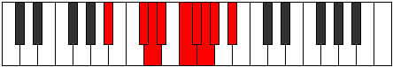 |
| [1977](https://ianring.com/musictheory/scales/1977) | [Dagyllic](ModeDSharpDagyllic.md) | D# | D#, F#, G, G#, A#, B, C, C#, D# |  |
| [1977](https://ianring.com/musictheory/scales/1977) | [Dagyllic](ModeEFlatDagyllic.md) | Eb | Eb, Gb, G, Ab, Bb, B, C, Db, Eb |  |
| [1977](https://ianring.com/musictheory/scales/1977) | [Dagyllic](ModeFSharpDagyllic.md) | F# | F#, A, A#, B, C#, D, D#, E, F# |  |
| [1977](https://ianring.com/musictheory/scales/1977) | [Dagyllic](ModeGFlatDagyllic.md) | Gb | Gb, A, Bb, B, Db, D, Eb, E, Gb |  |
| [1977](https://ianring.com/musictheory/scales/1977) | [Dagyllic](ModeCSharpDagyllic.md) | C# | C#, E, F, F#, G#, A, A#, B, C# |  |
| [1977](https://ianring.com/musictheory/scales/1977) | [Dagyllic](ModeDFlatDagyllic.md) | Db | Db, E, F, Gb, Ab, A, Bb, B, Db |  |
| [1979](https://ianring.com/musictheory/scales/1979) | [Aeradygic](ModeANaturalAeradygic.md) | A | A, A#, C, C#, D, E, F, F#, G, A |  |
| [1979](https://ianring.com/musictheory/scales/1979) | [Aeradygic](ModeFNaturalAeradygic.md) | F | F, F#, G#, A, A#, C, C#, D, D#, F |  |
| [1979](https://ianring.com/musictheory/scales/1979) | [Aeradygic](ModeDSharpAeradygic.md) | D# | D#, E, F#, G, G#, A#, B, C, C#, D# |  |
| [1979](https://ianring.com/musictheory/scales/1979) | [Aeradygic](ModeEFlatAeradygic.md) | Eb | Eb, E, Gb, G, Ab, Bb, B, C, Db, Eb |  |
| [1979](https://ianring.com/musictheory/scales/1979) | [Aeradygic](ModeASharpAeradygic.md) | A# | A#, B, C#, D, D#, F, F#, G, G#, A# |  |
| [1979](https://ianring.com/musictheory/scales/1979) | [Aeradygic](ModeBFlatAeradygic.md) | Bb | Bb, B, Db, D, Eb, F, Gb, G, Ab, Bb |  |
| [1979](https://ianring.com/musictheory/scales/1979) | [Aeradygic](ModeFSharpAeradygic.md) | F# | F#, G, A, A#, B, C#, D, D#, E, F# |  |
| [1979](https://ianring.com/musictheory/scales/1979) | [Aeradygic](ModeGFlatAeradygic.md) | Gb | Gb, G, A, Bb, B, Db, D, Eb, E, Gb |  |
| [1979](https://ianring.com/musictheory/scales/1979) | [Aeradygic](ModeCSharpAeradygic.md) | C# | C#, D, E, F, F#, G#, A, A#, B, C# |  |
| [1979](https://ianring.com/musictheory/scales/1979) | [Aeradygic](ModeDFlatAeradygic.md) | Db | Db, D, E, F, Gb, Ab, A, Bb, B, Db |  |
| [1981](https://ianring.com/musictheory/scales/1981) | [Gadygic](ModeASharpGadygic.md) | A# | A#, C, C#, D, D#, F, F#, G, G#, A# |  |
| [1981](https://ianring.com/musictheory/scales/1981) | [Gadygic](ModeBFlatGadygic.md) | Bb | Bb, C, Db, D, Eb, F, Gb, G, Ab, Bb |  |
| [1981](https://ianring.com/musictheory/scales/1981) | [Gadygic](ModeGSharpGadygic.md) | G# | G#, A#, B, C, C#, D#, E, F, F#, G# |  |
| [1981](https://ianring.com/musictheory/scales/1981) | [Gadygic](ModeAFlatGadygic.md) | Ab | Ab, Bb, B, C, Db, Eb, E, F, Gb, Ab |  |
| [1981](https://ianring.com/musictheory/scales/1981) | [Gadygic](ModeDSharpGadygic.md) | D# | D#, F, F#, G, G#, A#, B, C, C#, D# |  |
| [1981](https://ianring.com/musictheory/scales/1981) | [Gadygic](ModeEFlatGadygic.md) | Eb | Eb, F, Gb, G, Ab, Bb, B, C, Db, Eb |  |
| [1981](https://ianring.com/musictheory/scales/1981) | [Gadygic](ModeFSharpGadygic.md) | F# | F#, G#, A, A#, B, C#, D, D#, E, F# |  |
| [1981](https://ianring.com/musictheory/scales/1981) | [Gadygic](ModeGFlatGadygic.md) | Gb | Gb, Ab, A, Bb, B, Db, D, Eb, E, Gb |  |
| [1981](https://ianring.com/musictheory/scales/1981) | [Gadygic](ModeCSharpGadygic.md) | C# | C#, D#, E, F, F#, G#, A, A#, B, C# |  |
| [1981](https://ianring.com/musictheory/scales/1981) | [Gadygic](ModeDFlatGadygic.md) | Db | Db, Eb, E, F, Gb, Ab, A, Bb, B, Db |  |
| [1983](https://ianring.com/musictheory/scales/1983) | [Soryllian](ModeFNaturalSoryllian.md) | F | F, F#, G, G#, A, A#, C, C#, D, D#, F |  |
| [1983](https://ianring.com/musictheory/scales/1983) | [Soryllian](ModeASharpSoryllian.md) | A# | A#, B, C, C#, D, D#, F, F#, G, G#, A# |  |
| [1983](https://ianring.com/musictheory/scales/1983) | [Soryllian](ModeBFlatSoryllian.md) | Bb | Bb, B, C, Db, D, Eb, F, Gb, G, Ab, Bb |  |
| [1983](https://ianring.com/musictheory/scales/1983) | [Soryllian](ModeDSharpSoryllian.md) | D# | D#, E, F, F#, G, G#, A#, B, C, C#, D# |  |
| [1983](https://ianring.com/musictheory/scales/1983) | [Soryllian](ModeEFlatSoryllian.md) | Eb | Eb, E, F, Gb, G, Ab, Bb, B, C, Db, Eb |  |
| [1983](https://ianring.com/musictheory/scales/1983) | [Soryllian](ModeANaturalSoryllian.md) | A | A, A#, B, C, C#, D, E, F, F#, G, A |  |
| [1983](https://ianring.com/musictheory/scales/1983) | [Soryllian](ModeGSharpSoryllian.md) | G# | G#, A, A#, B, C, C#, D#, E, F, F#, G# |  |
| [1983](https://ianring.com/musictheory/scales/1983) | [Soryllian](ModeAFlatSoryllian.md) | Ab | Ab, A, Bb, B, C, Db, Eb, E, F, Gb, Ab |  |
| [1983](https://ianring.com/musictheory/scales/1983) | [Soryllian](ModeCSharpSoryllian.md) | C# | C#, D, D#, E, F, F#, G#, A, A#, B, C# |  |
| [1983](https://ianring.com/musictheory/scales/1983) | [Soryllian](ModeDFlatSoryllian.md) | Db | Db, D, Eb, E, F, Gb, Ab, A, Bb, B, Db |  |
| [1983](https://ianring.com/musictheory/scales/1983) | [Soryllian](ModeFSharpSoryllian.md) | F# | F#, G, G#, A, A#, B, C#, D, D#, E, F# |  |
| [1983](https://ianring.com/musictheory/scales/1983) | [Soryllian](ModeGFlatSoryllian.md) | Gb | Gb, G, Ab, A, Bb, B, Db, D, Eb, E, Gb |  |
| [1989](https://ianring.com/musictheory/scales/1989) | [Dydian](ModeENaturalDydian.md) | E | E, F#, G###, A##, B#, C#, D, E |  |
| [1991](https://ianring.com/musictheory/scales/1991) | [Phryptyllic](ModeCNaturalPhryptyllic.md) | C | C, C#, D, F#, G, G#, A, A#, C |  |
| [1991](https://ianring.com/musictheory/scales/1991) | [Phryptyllic](ModeENaturalPhryptyllic.md) | E | E, F, F#, A#, B, C, C#, D, E |  |
| [1993](https://ianring.com/musictheory/scales/1993) | [Katoptian](ModeASharpKatoptian.md) | A# | A#, B##, D##, E#, F#, G, Ab, A# |  |
| [1993](https://ianring.com/musictheory/scales/1993) | [Katoptian](ModeBFlatKatoptian.md) | Bb | Bb, C#, D##, E#, F#, G, Ab, Bb |  |
| [1993](https://ianring.com/musictheory/scales/1993) | [Katoptian](ModeDSharpKatoptian.md) | D# | D#, E##, Cbbb, Cbb, Dbbb, Dbb, Ebbb, D# |  |
| [1993](https://ianring.com/musictheory/scales/1993) | [Katoptian](ModeEFlatKatoptian.md) | Eb | Eb, F#, G##, A#, B, C, Db, Eb |  |
| [1995](https://ianring.com/musictheory/scales/1995) | [Aeolacryllic](ModeCNaturalAeolacryllic.md) | C | C, C#, D#, F#, G, G#, A, A#, C |  |
| [1995](https://ianring.com/musictheory/scales/1995) | [Aeolacryllic](ModeASharpAeolacryllic.md) | A# | A#, B, C#, E, F, F#, G, G#, A# |  |
| [1995](https://ianring.com/musictheory/scales/1995) | [Aeolacryllic](ModeBFlatAeolacryllic.md) | Bb | Bb, B, Db, E, F, Gb, G, Ab, Bb |  |
| [1995](https://ianring.com/musictheory/scales/1995) | [Aeolacryllic](ModeDSharpAeolacryllic.md) | D# | D#, E, F#, A, A#, B, C, C#, D# |  |
| [1995](https://ianring.com/musictheory/scales/1995) | [Aeolacryllic](ModeEFlatAeolacryllic.md) | Eb | Eb, E, Gb, A, Bb, B, C, Db, Eb |  |
| [1997](https://ianring.com/musictheory/scales/1997) | [Staryllic](ModeASharpStaryllic.md) | A# | A#, C, C#, E, F, F#, G, G#, A# |  |
| [1997](https://ianring.com/musictheory/scales/1997) | [Staryllic](ModeBFlatStaryllic.md) | Bb | Bb, C, Db, E, F, Gb, G, Ab, Bb |  |
| [1997](https://ianring.com/musictheory/scales/1997) | [Staryllic](ModeENaturalStaryllic.md) | E | E, F#, G, A#, B, C, C#, D, E |  |
| [1997](https://ianring.com/musictheory/scales/1997) | [Staryllic](ModeDSharpStaryllic.md) | D# | D#, F, F#, A, A#, B, C, C#, D# |  |
| [1997](https://ianring.com/musictheory/scales/1997) | [Staryllic](ModeEFlatStaryllic.md) | Eb | Eb, F, Gb, A, Bb, B, C, Db, Eb |  |
| [1999](https://ianring.com/musictheory/scales/1999) | [Zacrygic](ModeCNaturalZacrygic.md) | C | C, C#, D, D#, F#, G, G#, A, A#, C |  |
| [1999](https://ianring.com/musictheory/scales/1999) | [Zacrygic](ModeENaturalZacrygic.md) | E | E, F, F#, G, A#, B, C, C#, D, E |  |
| [1999](https://ianring.com/musictheory/scales/1999) | [Zacrygic](ModeASharpZacrygic.md) | A# | A#, B, C, C#, E, F, F#, G, G#, A# |  |
| [1999](https://ianring.com/musictheory/scales/1999) | [Zacrygic](ModeBFlatZacrygic.md) | Bb | Bb, B, C, Db, E, F, Gb, G, Ab, Bb |  |
| [1999](https://ianring.com/musictheory/scales/1999) | [Zacrygic](ModeDSharpZacrygic.md) | D# | D#, E, F, F#, A, A#, B, C, C#, D# |  |
| [1999](https://ianring.com/musictheory/scales/1999) | [Zacrygic](ModeEFlatZacrygic.md) | Eb | Eb, E, F, Gb, A, Bb, B, C, Db, Eb |  |
| [2001](https://ianring.com/musictheory/scales/2001) | [Gydian](ModeFSharpGydian.md) | F# | F#, G###, A###, B##, C##, D#, E, F# |  |
| [2001](https://ianring.com/musictheory/scales/2001) | [Gydian](ModeGFlatGydian.md) | Gb | Gb, A#, B#, C#, D, Eb, Fb, Gb |  |
| [2003](https://ianring.com/musictheory/scales/2003) | [Lolyllic](ModeFSharpLolyllic.md) | F# | F#, G, A#, C, C#, D, D#, E, F# |  |
| [2003](https://ianring.com/musictheory/scales/2003) | [Lolyllic](ModeGFlatLolyllic.md) | Gb | Gb, G, Bb, C, Db, D, Eb, E, Gb |  |
| [2003](https://ianring.com/musictheory/scales/2003) | [Lolyllic](ModeANaturalLolyllic.md) | A | A, A#, C#, D#, E, F, F#, G, A |  |
| [2003](https://ianring.com/musictheory/scales/2003) | [Lolyllic](ModeCNaturalLolyllic.md) | C | C, C#, E, F#, G, G#, A, A#, C |  |
| [2005](https://ianring.com/musictheory/scales/2005) | [Gygyllic](ModeFSharpGygyllic.md) | F# | F#, G#, A#, C, C#, D, D#, E, F# |  |
| [2005](https://ianring.com/musictheory/scales/2005) | [Gygyllic](ModeGFlatGygyllic.md) | Gb | Gb, Ab, Bb, C, Db, D, Eb, E, Gb |  |
| [2005](https://ianring.com/musictheory/scales/2005) | [Gygyllic](ModeENaturalGygyllic.md) | E | E, F#, G#, A#, B, C, C#, D, E |  |
| [2007](https://ianring.com/musictheory/scales/2007) | [Stonygic](ModeFSharpStonygic.md) | F# | F#, G, G#, A#, C, C#, D, D#, E, F# |  |
| [2007](https://ianring.com/musictheory/scales/2007) | [Stonygic](ModeGFlatStonygic.md) | Gb | Gb, G, Ab, Bb, C, Db, D, Eb, E, Gb |  |
| [2007](https://ianring.com/musictheory/scales/2007) | [Stonygic](ModeCNaturalStonygic.md) | C | C, C#, D, E, F#, G, G#, A, A#, C |  |
| [2007](https://ianring.com/musictheory/scales/2007) | [Stonygic](ModeENaturalStonygic.md) | E | E, F, F#, G#, A#, B, C, C#, D, E |  |
| [2007](https://ianring.com/musictheory/scales/2007) | [Stonygic](ModeANaturalStonygic.md) | A | A, A#, B, C#, D#, E, F, F#, G, A |  |
| [2009](https://ianring.com/musictheory/scales/2009) | [Stacryllic](ModeASharpStacryllic.md) | A# | A#, C#, D, E, F, F#, G, G#, A# |  |
| [2009](https://ianring.com/musictheory/scales/2009) | [Stacryllic](ModeBFlatStacryllic.md) | Bb | Bb, Db, D, E, F, Gb, G, Ab, Bb |  |
| [2009](https://ianring.com/musictheory/scales/2009) | [Stacryllic](ModeFSharpStacryllic.md) | F# | F#, A, A#, C, C#, D, D#, E, F# |  |
| [2009](https://ianring.com/musictheory/scales/2009) | [Stacryllic](ModeGFlatStacryllic.md) | Gb | Gb, A, Bb, C, Db, D, Eb, E, Gb |  |
| [2009](https://ianring.com/musictheory/scales/2009) | [Stacryllic](ModeDSharpStacryllic.md) | D# | D#, F#, G, A, A#, B, C, C#, D# |  |
| [2009](https://ianring.com/musictheory/scales/2009) | [Stacryllic](ModeEFlatStacryllic.md) | Eb | Eb, Gb, G, A, Bb, B, C, Db, Eb |  |
| [2011](https://ianring.com/musictheory/scales/2011) | [Raphygic](ModeFSharpRaphygic.md) | F# | F#, G, A, A#, C, C#, D, D#, E, F# |  |
| [2011](https://ianring.com/musictheory/scales/2011) | [Raphygic](ModeGFlatRaphygic.md) | Gb | Gb, G, A, Bb, C, Db, D, Eb, E, Gb |  |
| [2011](https://ianring.com/musictheory/scales/2011) | [Raphygic](ModeANaturalRaphygic.md) | A | A, A#, C, C#, D#, E, F, F#, G, A |  |
| [2011](https://ianring.com/musictheory/scales/2011) | [Raphygic](ModeCNaturalRaphygic.md) | C | C, C#, D#, E, F#, G, G#, A, A#, C |  |
| [2011](https://ianring.com/musictheory/scales/2011) | [Raphygic](ModeASharpRaphygic.md) | A# | A#, B, C#, D, E, F, F#, G, G#, A# |  |
| [2011](https://ianring.com/musictheory/scales/2011) | [Raphygic](ModeBFlatRaphygic.md) | Bb | Bb, B, Db, D, E, F, Gb, G, Ab, Bb |  |
| [2011](https://ianring.com/musictheory/scales/2011) | [Raphygic](ModeDSharpRaphygic.md) | D# | D#, E, F#, G, A, A#, B, C, C#, D# |  |
| [2011](https://ianring.com/musictheory/scales/2011) | [Raphygic](ModeEFlatRaphygic.md) | Eb | Eb, E, Gb, G, A, Bb, B, C, Db, Eb |  |
| [2013](https://ianring.com/musictheory/scales/2013) | [Mocrygic](ModeASharpMocrygic.md) | A# | A#, C, C#, D, E, F, F#, G, G#, A# |  |
| [2013](https://ianring.com/musictheory/scales/2013) | [Mocrygic](ModeBFlatMocrygic.md) | Bb | Bb, C, Db, D, E, F, Gb, G, Ab, Bb |  |
| [2013](https://ianring.com/musictheory/scales/2013) | [Mocrygic](ModeFSharpMocrygic.md) | F# | F#, G#, A, A#, C, C#, D, D#, E, F# |  |
| [2013](https://ianring.com/musictheory/scales/2013) | [Mocrygic](ModeGFlatMocrygic.md) | Gb | Gb, Ab, A, Bb, C, Db, D, Eb, E, Gb |  |
| [2013](https://ianring.com/musictheory/scales/2013) | [Mocrygic](ModeENaturalMocrygic.md) | E | E, F#, G, G#, A#, B, C, C#, D, E |  |
| [2013](https://ianring.com/musictheory/scales/2013) | [Mocrygic](ModeDSharpMocrygic.md) | D# | D#, F, F#, G, A, A#, B, C, C#, D# |  |
| [2013](https://ianring.com/musictheory/scales/2013) | [Mocrygic](ModeEFlatMocrygic.md) | Eb | Eb, F, Gb, G, A, Bb, B, C, Db, Eb |  |
| [2015](https://ianring.com/musictheory/scales/2015) | [Epiryllian](ModeCNaturalEpiryllian.md) | C | C, C#, D, D#, E, F#, G, G#, A, A#, C |  |
| [2015](https://ianring.com/musictheory/scales/2015) | [Epiryllian](ModeFSharpEpiryllian.md) | F# | F#, G, G#, A, A#, C, C#, D, D#, E, F# |  |
| [2015](https://ianring.com/musictheory/scales/2015) | [Epiryllian](ModeGFlatEpiryllian.md) | Gb | Gb, G, Ab, A, Bb, C, Db, D, Eb, E, Gb |  |
| [2015](https://ianring.com/musictheory/scales/2015) | [Epiryllian](ModeENaturalEpiryllian.md) | E | E, F, F#, G, G#, A#, B, C, C#, D, E |  |
| [2015](https://ianring.com/musictheory/scales/2015) | [Epiryllian](ModeASharpEpiryllian.md) | A# | A#, B, C, C#, D, E, F, F#, G, G#, A# |  |
| [2015](https://ianring.com/musictheory/scales/2015) | [Epiryllian](ModeBFlatEpiryllian.md) | Bb | Bb, B, C, Db, D, E, F, Gb, G, Ab, Bb |  |
| [2015](https://ianring.com/musictheory/scales/2015) | [Epiryllian](ModeDSharpEpiryllian.md) | D# | D#, E, F, F#, G, A, A#, B, C, C#, D# |  |
| [2015](https://ianring.com/musictheory/scales/2015) | [Epiryllian](ModeEFlatEpiryllian.md) | Eb | Eb, E, F, Gb, G, A, Bb, B, C, Db, Eb |  |
| [2015](https://ianring.com/musictheory/scales/2015) | [Epiryllian](ModeANaturalEpiryllian.md) | A | A, A#, B, C, C#, D#, E, F, F#, G, A |  |
| [2019](https://ianring.com/musictheory/scales/2019) | [Palyllic](ModeCNaturalPalyllic.md) | C | C, C#, F, F#, G, G#, A, A#, C |  |
| [2019](https://ianring.com/musictheory/scales/2019) | [Palyllic](ModeFNaturalPalyllic.md) | F | F, F#, A#, B, C, C#, D, D#, F |  |
| [2019](https://ianring.com/musictheory/scales/2019) | [Palyllic](ModeCSharpPalyllic.md) | C# | C#, D, F#, G, G#, A, A#, B, C# |  |
| [2019](https://ianring.com/musictheory/scales/2019) | [Palyllic](ModeDFlatPalyllic.md) | Db | Db, D, Gb, G, Ab, A, Bb, B, Db |  |
| [2021](https://ianring.com/musictheory/scales/2021) | [Katycryllic](ModeGSharpKatycryllic.md) | G# | G#, A#, C#, D, D#, E, F, F#, G# |  |
| [2021](https://ianring.com/musictheory/scales/2021) | [Katycryllic](ModeAFlatKatycryllic.md) | Ab | Ab, Bb, Db, D, Eb, E, F, Gb, Ab |  |
| [2021](https://ianring.com/musictheory/scales/2021) | [Katycryllic](ModeENaturalKatycryllic.md) | E | E, F#, A, A#, B, C, C#, D, E |  |
| [2021](https://ianring.com/musictheory/scales/2021) | [Katycryllic](ModeCSharpKatycryllic.md) | C# | C#, D#, F#, G, G#, A, A#, B, C# |  |
| [2021](https://ianring.com/musictheory/scales/2021) | [Katycryllic](ModeDFlatKatycryllic.md) | Db | Db, Eb, Gb, G, Ab, A, Bb, B, Db |  |
| [2023](https://ianring.com/musictheory/scales/2023) | [Zodygic](ModeGSharpZodygic.md) | G# | G#, A, A#, C#, D, D#, E, F, F#, G# |  |
| [2023](https://ianring.com/musictheory/scales/2023) | [Zodygic](ModeAFlatZodygic.md) | Ab | Ab, A, Bb, Db, D, Eb, E, F, Gb, Ab |  |
| [2023](https://ianring.com/musictheory/scales/2023) | [Zodygic](ModeCNaturalZodygic.md) | C | C, C#, D, F, F#, G, G#, A, A#, C |  |
| [2023](https://ianring.com/musictheory/scales/2023) | [Zodygic](ModeFNaturalZodygic.md) | F | F, F#, G, A#, B, C, C#, D, D#, F |  |
| [2023](https://ianring.com/musictheory/scales/2023) | [Zodygic](ModeENaturalZodygic.md) | E | E, F, F#, A, A#, B, C, C#, D, E |  |
| [2023](https://ianring.com/musictheory/scales/2023) | [Zodygic](ModeCSharpZodygic.md) | C# | C#, D, D#, F#, G, G#, A, A#, B, C# |  |
| [2023](https://ianring.com/musictheory/scales/2023) | [Zodygic](ModeDFlatZodygic.md) | Db | Db, D, Eb, Gb, G, Ab, A, Bb, B, Db |  |
| [2025](https://ianring.com/musictheory/scales/2025) | [Mixolydyllic](ModeASharpMixolydyllic.md) | A# | A#, C#, D#, E, F, F#, G, G#, A# |  |
| [2025](https://ianring.com/musictheory/scales/2025) | [Mixolydyllic](ModeBFlatMixolydyllic.md) | Bb | Bb, Db, Eb, E, F, Gb, G, Ab, Bb | 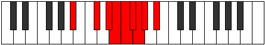 |
| [2025](https://ianring.com/musictheory/scales/2025) | [Mixolydyllic](ModeDSharpMixolydyllic.md) | D# | D#, F#, G#, A, A#, B, C, C#, D# |  |
| [2025](https://ianring.com/musictheory/scales/2025) | [Mixolydyllic](ModeEFlatMixolydyllic.md) | Eb | Eb, Gb, Ab, A, Bb, B, C, Db, Eb |  |
| [2025](https://ianring.com/musictheory/scales/2025) | [Mixolydyllic](ModeCSharpMixolydyllic.md) | C# | C#, E, F#, G, G#, A, A#, B, C# |  |
| [2025](https://ianring.com/musictheory/scales/2025) | [Mixolydyllic](ModeDFlatMixolydyllic.md) | Db | Db, E, Gb, G, Ab, A, Bb, B, Db |  |
| [2027](https://ianring.com/musictheory/scales/2027) | [Boptygic](ModeCNaturalBoptygic.md) | C | C, C#, D#, F, F#, G, G#, A, A#, C |  |
| [2027](https://ianring.com/musictheory/scales/2027) | [Boptygic](ModeFNaturalBoptygic.md) | F | F, F#, G#, A#, B, C, C#, D, D#, F |  |
| [2027](https://ianring.com/musictheory/scales/2027) | [Boptygic](ModeASharpBoptygic.md) | A# | A#, B, C#, D#, E, F, F#, G, G#, A# |  |
| [2027](https://ianring.com/musictheory/scales/2027) | [Boptygic](ModeBFlatBoptygic.md) | Bb | Bb, B, Db, Eb, E, F, Gb, G, Ab, Bb |  |
| [2027](https://ianring.com/musictheory/scales/2027) | [Boptygic](ModeDSharpBoptygic.md) | D# | D#, E, F#, G#, A, A#, B, C, C#, D# |  |
| [2027](https://ianring.com/musictheory/scales/2027) | [Boptygic](ModeEFlatBoptygic.md) | Eb | Eb, E, Gb, Ab, A, Bb, B, C, Db, Eb |  |
| [2027](https://ianring.com/musictheory/scales/2027) | [Boptygic](ModeCSharpBoptygic.md) | C# | C#, D, E, F#, G, G#, A, A#, B, C# |  |
| [2027](https://ianring.com/musictheory/scales/2027) | [Boptygic](ModeDFlatBoptygic.md) | Db | Db, D, E, Gb, G, Ab, A, Bb, B, Db |  |
| [2029](https://ianring.com/musictheory/scales/2029) | [Mathygic](ModeASharpMathygic.md) | A# | A#, C, C#, D#, E, F, F#, G, G#, A# |  |
| [2029](https://ianring.com/musictheory/scales/2029) | [Mathygic](ModeBFlatMathygic.md) | Bb | Bb, C, Db, Eb, E, F, Gb, G, Ab, Bb |  |
| [2029](https://ianring.com/musictheory/scales/2029) | [Mathygic](ModeGSharpMathygic.md) | G# | G#, A#, B, C#, D, D#, E, F, F#, G# |  |
| [2029](https://ianring.com/musictheory/scales/2029) | [Mathygic](ModeAFlatMathygic.md) | Ab | Ab, Bb, B, Db, D, Eb, E, F, Gb, Ab |  |
| [2029](https://ianring.com/musictheory/scales/2029) | [Mathygic](ModeENaturalMathygic.md) | E | E, F#, G, A, A#, B, C, C#, D, E |  |
| [2029](https://ianring.com/musictheory/scales/2029) | [Mathygic](ModeDSharpMathygic.md) | D# | D#, F, F#, G#, A, A#, B, C, C#, D# |  |
| [2029](https://ianring.com/musictheory/scales/2029) | [Mathygic](ModeEFlatMathygic.md) | Eb | Eb, F, Gb, Ab, A, Bb, B, C, Db, Eb |  |
| [2029](https://ianring.com/musictheory/scales/2029) | [Mathygic](ModeCSharpMathygic.md) | C# | C#, D#, E, F#, G, G#, A, A#, B, C# |  |
| [2029](https://ianring.com/musictheory/scales/2029) | [Mathygic](ModeDFlatMathygic.md) | Db | Db, Eb, E, Gb, G, Ab, A, Bb, B, Db |  |
| [2031](https://ianring.com/musictheory/scales/2031) | [Gadyllian](ModeCNaturalGadyllian.md) | C | C, C#, D, D#, F, F#, G, G#, A, A#, C |  |
| [2031](https://ianring.com/musictheory/scales/2031) | [Gadyllian](ModeFNaturalGadyllian.md) | F | F, F#, G, G#, A#, B, C, C#, D, D#, F |  |
| [2031](https://ianring.com/musictheory/scales/2031) | [Gadyllian](ModeASharpGadyllian.md) | A# | A#, B, C, C#, D#, E, F, F#, G, G#, A# |  |
| [2031](https://ianring.com/musictheory/scales/2031) | [Gadyllian](ModeBFlatGadyllian.md) | Bb | Bb, B, C, Db, Eb, E, F, Gb, G, Ab, Bb |  |
| [2031](https://ianring.com/musictheory/scales/2031) | [Gadyllian](ModeENaturalGadyllian.md) | E | E, F, F#, G, A, A#, B, C, C#, D, E |  |
| [2031](https://ianring.com/musictheory/scales/2031) | [Gadyllian](ModeDSharpGadyllian.md) | D# | D#, E, F, F#, G#, A, A#, B, C, C#, D# |  |
| [2031](https://ianring.com/musictheory/scales/2031) | [Gadyllian](ModeEFlatGadyllian.md) | Eb | Eb, E, F, Gb, Ab, A, Bb, B, C, Db, Eb |  |
| [2031](https://ianring.com/musictheory/scales/2031) | [Gadyllian](ModeGSharpGadyllian.md) | G# | G#, A, A#, B, C#, D, D#, E, F, F#, G# |  |
| [2031](https://ianring.com/musictheory/scales/2031) | [Gadyllian](ModeAFlatGadyllian.md) | Ab | Ab, A, Bb, B, Db, D, Eb, E, F, Gb, Ab |  |
| [2031](https://ianring.com/musictheory/scales/2031) | [Gadyllian](ModeCSharpGadyllian.md) | C# | C#, D, D#, E, F#, G, G#, A, A#, B, C# |  |
| [2031](https://ianring.com/musictheory/scales/2031) | [Gadyllian](ModeDFlatGadyllian.md) | Db | Db, D, Eb, E, Gb, G, Ab, A, Bb, B, Db |  |
| [2033](https://ianring.com/musictheory/scales/2033) | [Stolyllic](ModeFSharpStolyllic.md) | F# | F#, A#, B, C, C#, D, D#, E, F# |  |
| [2033](https://ianring.com/musictheory/scales/2033) | [Stolyllic](ModeGFlatStolyllic.md) | Gb | Gb, Bb, B, C, Db, D, Eb, E, Gb |  |
| [2033](https://ianring.com/musictheory/scales/2033) | [Stolyllic](ModeCSharpStolyllic.md) | C# | C#, F, F#, G, G#, A, A#, B, C# |  |
| [2033](https://ianring.com/musictheory/scales/2033) | [Stolyllic](ModeDFlatStolyllic.md) | Db | Db, F, Gb, G, Ab, A, Bb, B, Db |  |
| [2035](https://ianring.com/musictheory/scales/2035) | [Aerythygic](ModeANaturalAerythygic.md) | A | A, A#, C#, D, D#, E, F, F#, G, A |  |
| [2035](https://ianring.com/musictheory/scales/2035) | [Aerythygic](ModeCNaturalAerythygic.md) | C | C, C#, E, F, F#, G, G#, A, A#, C |  |
| [2035](https://ianring.com/musictheory/scales/2035) | [Aerythygic](ModeFSharpAerythygic.md) | F# | F#, G, A#, B, C, C#, D, D#, E, F# |  |
| [2035](https://ianring.com/musictheory/scales/2035) | [Aerythygic](ModeGFlatAerythygic.md) | Gb | Gb, G, Bb, B, C, Db, D, Eb, E, Gb |  |
| [2035](https://ianring.com/musictheory/scales/2035) | [Aerythygic](ModeFNaturalAerythygic.md) | F | F, F#, A, A#, B, C, C#, D, D#, F |  |
| [2035](https://ianring.com/musictheory/scales/2035) | [Aerythygic](ModeCSharpAerythygic.md) | C# | C#, D, F, F#, G, G#, A, A#, B, C# |  |
| [2035](https://ianring.com/musictheory/scales/2035) | [Aerythygic](ModeDFlatAerythygic.md) | Db | Db, D, F, Gb, G, Ab, A, Bb, B, Db |  |
| [2037](https://ianring.com/musictheory/scales/2037) | [Sythygic](ModeGSharpSythygic.md) | G# | G#, A#, C, C#, D, D#, E, F, F#, G# |  |
| [2037](https://ianring.com/musictheory/scales/2037) | [Sythygic](ModeAFlatSythygic.md) | Ab | Ab, Bb, C, Db, D, Eb, E, F, Gb, Ab |  |
| [2037](https://ianring.com/musictheory/scales/2037) | [Sythygic](ModeFSharpSythygic.md) | F# | F#, G#, A#, B, C, C#, D, D#, E, F# |  |
| [2037](https://ianring.com/musictheory/scales/2037) | [Sythygic](ModeGFlatSythygic.md) | Gb | Gb, Ab, Bb, B, C, Db, D, Eb, E, Gb |  |
| [2037](https://ianring.com/musictheory/scales/2037) | [Sythygic](ModeENaturalSythygic.md) | E | E, F#, G#, A, A#, B, C, C#, D, E |  |
| [2037](https://ianring.com/musictheory/scales/2037) | [Sythygic](ModeCSharpSythygic.md) | C# | C#, D#, F, F#, G, G#, A, A#, B, C# |  |
| [2037](https://ianring.com/musictheory/scales/2037) | [Sythygic](ModeDFlatSythygic.md) | Db | Db, Eb, F, Gb, G, Ab, A, Bb, B, Db |  |
| [2039](https://ianring.com/musictheory/scales/2039) | [Danyllian](ModeGSharpDanyllian.md) | G# | G#, A, A#, C, C#, D, D#, E, F, F#, G# |  |
| [2039](https://ianring.com/musictheory/scales/2039) | [Danyllian](ModeAFlatDanyllian.md) | Ab | Ab, A, Bb, C, Db, D, Eb, E, F, Gb, Ab |  |
| [2039](https://ianring.com/musictheory/scales/2039) | [Danyllian](ModeCNaturalDanyllian.md) | C | C, C#, D, E, F, F#, G, G#, A, A#, C |  |
| [2039](https://ianring.com/musictheory/scales/2039) | [Danyllian](ModeFSharpDanyllian.md) | F# | F#, G, G#, A#, B, C, C#, D, D#, E, F# |  |
| [2039](https://ianring.com/musictheory/scales/2039) | [Danyllian](ModeGFlatDanyllian.md) | Gb | Gb, G, Ab, Bb, B, C, Db, D, Eb, E, Gb |  |
| [2039](https://ianring.com/musictheory/scales/2039) | [Danyllian](ModeFNaturalDanyllian.md) | F | F, F#, G, A, A#, B, C, C#, D, D#, F |  |
| [2039](https://ianring.com/musictheory/scales/2039) | [Danyllian](ModeANaturalDanyllian.md) | A | A, A#, B, C#, D, D#, E, F, F#, G, A |  |
| [2039](https://ianring.com/musictheory/scales/2039) | [Danyllian](ModeENaturalDanyllian.md) | E | E, F, F#, G#, A, A#, B, C, C#, D, E |  |
| [2039](https://ianring.com/musictheory/scales/2039) | [Danyllian](ModeCSharpDanyllian.md) | C# | C#, D, D#, F, F#, G, G#, A, A#, B, C# |  |
| [2039](https://ianring.com/musictheory/scales/2039) | [Danyllian](ModeDFlatDanyllian.md) | Db | Db, D, Eb, F, Gb, G, Ab, A, Bb, B, Db |  |
| [2041](https://ianring.com/musictheory/scales/2041) | [Aeolacrygic](ModeASharpAeolacrygic.md) | A# | A#, C#, D, D#, E, F, F#, G, G#, A# |  |
| [2041](https://ianring.com/musictheory/scales/2041) | [Aeolacrygic](ModeBFlatAeolacrygic.md) | Bb | Bb, Db, D, Eb, E, F, Gb, G, Ab, Bb |  |
| [2041](https://ianring.com/musictheory/scales/2041) | [Aeolacrygic](ModeFSharpAeolacrygic.md) | F# | F#, A, A#, B, C, C#, D, D#, E, F# |  |
| [2041](https://ianring.com/musictheory/scales/2041) | [Aeolacrygic](ModeGFlatAeolacrygic.md) | Gb | Gb, A, Bb, B, C, Db, D, Eb, E, Gb |  |
| [2041](https://ianring.com/musictheory/scales/2041) | [Aeolacrygic](ModeDSharpAeolacrygic.md) | D# | D#, F#, G, G#, A, A#, B, C, C#, D# |  |
| [2041](https://ianring.com/musictheory/scales/2041) | [Aeolacrygic](ModeEFlatAeolacrygic.md) | Eb | Eb, Gb, G, Ab, A, Bb, B, C, Db, Eb |  |
| [2041](https://ianring.com/musictheory/scales/2041) | [Aeolacrygic](ModeCSharpAeolacrygic.md) | C# | C#, E, F, F#, G, G#, A, A#, B, C# |  |
| [2041](https://ianring.com/musictheory/scales/2041) | [Aeolacrygic](ModeDFlatAeolacrygic.md) | Db | Db, E, F, Gb, G, Ab, A, Bb, B, Db |  |
| [2043](https://ianring.com/musictheory/scales/2043) | [Lythyllian](ModeANaturalLythyllian.md) | A | A, A#, C, C#, D, D#, E, F, F#, G, A |  |
| [2043](https://ianring.com/musictheory/scales/2043) | [Lythyllian](ModeCNaturalLythyllian.md) | C | C, C#, D#, E, F, F#, G, G#, A, A#, C |  |
| [2043](https://ianring.com/musictheory/scales/2043) | [Lythyllian](ModeASharpLythyllian.md) | A# | A#, B, C#, D, D#, E, F, F#, G, G#, A# |  |
| [2043](https://ianring.com/musictheory/scales/2043) | [Lythyllian](ModeBFlatLythyllian.md) | Bb | Bb, B, Db, D, Eb, E, F, Gb, G, Ab, Bb |  |
| [2043](https://ianring.com/musictheory/scales/2043) | [Lythyllian](ModeFSharpLythyllian.md) | F# | F#, G, A, A#, B, C, C#, D, D#, E, F# |  |
| [2043](https://ianring.com/musictheory/scales/2043) | [Lythyllian](ModeGFlatLythyllian.md) | Gb | Gb, G, A, Bb, B, C, Db, D, Eb, E, Gb |  |
| [2043](https://ianring.com/musictheory/scales/2043) | [Lythyllian](ModeFNaturalLythyllian.md) | F | F, F#, G#, A, A#, B, C, C#, D, D#, F |  |
| [2043](https://ianring.com/musictheory/scales/2043) | [Lythyllian](ModeDSharpLythyllian.md) | D# | D#, E, F#, G, G#, A, A#, B, C, C#, D# |  |
| [2043](https://ianring.com/musictheory/scales/2043) | [Lythyllian](ModeEFlatLythyllian.md) | Eb | Eb, E, Gb, G, Ab, A, Bb, B, C, Db, Eb |  |
| [2043](https://ianring.com/musictheory/scales/2043) | [Lythyllian](ModeCSharpLythyllian.md) | C# | C#, D, E, F, F#, G, G#, A, A#, B, C# |  |
| [2043](https://ianring.com/musictheory/scales/2043) | [Lythyllian](ModeDFlatLythyllian.md) | Db | Db, D, E, F, Gb, G, Ab, A, Bb, B, Db |  |
| [2045](https://ianring.com/musictheory/scales/2045) | [Katogyllian](ModeASharpKatogyllian.md) | A# | A#, C, C#, D, D#, E, F, F#, G, G#, A# |  |
| [2045](https://ianring.com/musictheory/scales/2045) | [Katogyllian](ModeBFlatKatogyllian.md) | Bb | Bb, C, Db, D, Eb, E, F, Gb, G, Ab, Bb |  |
| [2045](https://ianring.com/musictheory/scales/2045) | [Katogyllian](ModeGSharpKatogyllian.md) | G# | G#, A#, B, C, C#, D, D#, E, F, F#, G# |  |
| [2045](https://ianring.com/musictheory/scales/2045) | [Katogyllian](ModeAFlatKatogyllian.md) | Ab | Ab, Bb, B, C, Db, D, Eb, E, F, Gb, Ab |  |
| [2045](https://ianring.com/musictheory/scales/2045) | [Katogyllian](ModeFSharpKatogyllian.md) | F# | F#, G#, A, A#, B, C, C#, D, D#, E, F# |  |
| [2045](https://ianring.com/musictheory/scales/2045) | [Katogyllian](ModeGFlatKatogyllian.md) | Gb | Gb, Ab, A, Bb, B, C, Db, D, Eb, E, Gb |  |
| [2045](https://ianring.com/musictheory/scales/2045) | [Katogyllian](ModeENaturalKatogyllian.md) | E | E, F#, G, G#, A, A#, B, C, C#, D, E |  |
| [2045](https://ianring.com/musictheory/scales/2045) | [Katogyllian](ModeDSharpKatogyllian.md) | D# | D#, F, F#, G, G#, A, A#, B, C, C#, D# |  |
| [2045](https://ianring.com/musictheory/scales/2045) | [Katogyllian](ModeEFlatKatogyllian.md) | Eb | Eb, F, Gb, G, Ab, A, Bb, B, C, Db, Eb |  |
| [2045](https://ianring.com/musictheory/scales/2045) | [Katogyllian](ModeCSharpKatogyllian.md) | C# | C#, D#, E, F, F#, G, G#, A, A#, B, C# |  |
| [2045](https://ianring.com/musictheory/scales/2045) | [Katogyllian](ModeDFlatKatogyllian.md) | Db | Db, Eb, E, F, Gb, G, Ab, A, Bb, B, Db |  |
| [2047](https://ianring.com/musictheory/scales/2047) | [Monatic](ModeCNaturalMonatic.md) | C | C, C#, D, D#, E, F, F#, G, G#, A, A#, C |  |
| [2047](https://ianring.com/musictheory/scales/2047) | [Monatic](ModeASharpMonatic.md) | A# | A#, B, C, C#, D, D#, E, F, F#, G, G#, A# |  |
| [2047](https://ianring.com/musictheory/scales/2047) | [Monatic](ModeBFlatMonatic.md) | Bb | Bb, B, C, Db, D, Eb, E, F, Gb, G, Ab, Bb |  |
| [2047](https://ianring.com/musictheory/scales/2047) | [Monatic](ModeANaturalMonatic.md) | A | A, A#, B, C, C#, D, D#, E, F, F#, G, A |  |
| [2047](https://ianring.com/musictheory/scales/2047) | [Monatic](ModeGSharpMonatic.md) | G# | G#, A, A#, B, C, C#, D, D#, E, F, F#, G# |  |
| [2047](https://ianring.com/musictheory/scales/2047) | [Monatic](ModeAFlatMonatic.md) | Ab | Ab, A, Bb, B, C, Db, D, Eb, E, F, Gb, Ab |  |
| [2047](https://ianring.com/musictheory/scales/2047) | [Monatic](ModeFSharpMonatic.md) | F# | F#, G, G#, A, A#, B, C, C#, D, D#, E, F# |  |
| [2047](https://ianring.com/musictheory/scales/2047) | [Monatic](ModeGFlatMonatic.md) | Gb | Gb, G, Ab, A, Bb, B, C, Db, D, Eb, E, Gb |  |
| [2047](https://ianring.com/musictheory/scales/2047) | [Monatic](ModeFNaturalMonatic.md) | F | F, F#, G, G#, A, A#, B, C, C#, D, D#, F |  |
| [2047](https://ianring.com/musictheory/scales/2047) | [Monatic](ModeENaturalMonatic.md) | E | E, F, F#, G, G#, A, A#, B, C, C#, D, E |  |
| [2047](https://ianring.com/musictheory/scales/2047) | [Monatic](ModeDSharpMonatic.md) | D# | D#, E, F, F#, G, G#, A, A#, B, C, C#, D# |  |
| [2047](https://ianring.com/musictheory/scales/2047) | [Monatic](ModeEFlatMonatic.md) | Eb | Eb, E, F, Gb, G, Ab, A, Bb, B, C, Db, Eb |  |
| [2047](https://ianring.com/musictheory/scales/2047) | [Monatic](ModeCSharpMonatic.md) | C# | C#, D, D#, E, F, F#, G, G#, A, A#, B, C# |  |
| [2047](https://ianring.com/musictheory/scales/2047) | [Monatic](ModeDFlatMonatic.md) | Db | Db, D, Eb, E, F, Gb, G, Ab, A, Bb, B, Db |  |
| [2189](https://ianring.com/musictheory/scales/2189) | [Zagitonic](ModeBNaturalZagitonic.md) | B | B, C#, D, F#, A#, B |  |
| [2191](https://ianring.com/musictheory/scales/2191) | [Thydimic](ModeBNaturalThydimic.md) | B | B, C, Db, Ebb, F#, G###, B |  |
| [2193](https://ianring.com/musictheory/scales/2193) | [Thaptic](ModeFSharpThaptic.md) | F# | F#, A#, C#, F, F# |  |
| [2193](https://ianring.com/musictheory/scales/2193) | [Thaptic](ModeGFlatThaptic.md) | Gb | Gb, Bb, Db, F, Gb |  |
| [2195](https://ianring.com/musictheory/scales/2195) | [Zalitonic](ModeFSharpZalitonic.md) | F# | F#, G, A#, C#, F, F# |  |
| [2195](https://ianring.com/musictheory/scales/2195) | [Zalitonic](ModeGFlatZalitonic.md) | Gb | Gb, G, Bb, Db, F, Gb |  |
| [2197](https://ianring.com/musictheory/scales/2197) | [Aerathitonic](ModeFSharpAerathitonic.md) | F# | F#, G#, A#, C#, F, F# |  |
| [2197](https://ianring.com/musictheory/scales/2197) | [Aerathitonic](ModeGFlatAerathitonic.md) | Gb | Gb, Ab, Bb, Db, F, Gb |  |
| [2197](https://ianring.com/musictheory/scales/2197) | [Aerathitonic](ModeBNaturalAerathitonic.md) | B | B, C#, D#, F#, A#, B |  |
| [2199](https://ianring.com/musictheory/scales/2199) | [Dyptimic](ModeFSharpDyptimic.md) | F# | F#, G, Ab, Bb, C#, D###, F# |  |
| [2199](https://ianring.com/musictheory/scales/2199) | [Dyptimic](ModeGFlatDyptimic.md) | Gb | Gb, Abb, Bbbb, Cbb, Db, E#, Gb |  |
| [2199](https://ianring.com/musictheory/scales/2199) | [Dyptimic](ModeBNaturalDyptimic.md) | B | B, C, Db, Eb, F#, G###, B |  |
| [2201](https://ianring.com/musictheory/scales/2201) | [Ionagitonic](ModeFSharpIonagitonic.md) | F# | F#, A, A#, C#, F, F# |  |
| [2201](https://ianring.com/musictheory/scales/2201) | [Ionagitonic](ModeGFlatIonagitonic.md) | Gb | Gb, A, Bb, Db, F, Gb |  |
| [2203](https://ianring.com/musictheory/scales/2203) | [Dorimic](ModeFSharpDorimic.md) | F# | F#, G, A, Bb, C#, D###, F# |  |
| [2203](https://ianring.com/musictheory/scales/2203) | [Dorimic](ModeGFlatDorimic.md) | Gb | Gb, Abb, Bbb, Cbb, Db, E#, Gb |  |
| [2205](https://ianring.com/musictheory/scales/2205) | [Ionocrimic](ModeFSharpIonocrimic.md) | F# | F#, G#, A, Bb, C#, D###, F# |  |
| [2205](https://ianring.com/musictheory/scales/2205) | [Ionocrimic](ModeGFlatIonocrimic.md) | Gb | Gb, Ab, Bbb, Cbb, Db, E#, Gb |  |
| [2205](https://ianring.com/musictheory/scales/2205) | [Ionocrimic](ModeBNaturalIonocrimic.md) | B | B, C#, D, Eb, F#, G###, B |  |
| [2207](https://ianring.com/musictheory/scales/2207) | [Mygian](ModeFSharpMygian.md) | F# | F#, G, Ab, Bbb, Cbb, Db, E#, F# |  |
| [2207](https://ianring.com/musictheory/scales/2207) | [Mygian](ModeGFlatMygian.md) | Gb | Gb, Abb, Bbbb, Cbbb, Cbb, Db, E#, Gb |  |
| [2207](https://ianring.com/musictheory/scales/2207) | [Mygian](ModeBNaturalMygian.md) | B | B, C, Db, Ebb, Fbb, Gb, A#, B |  |
| [2213](https://ianring.com/musictheory/scales/2213) | [Daritonic](ModeBNaturalDaritonic.md) | B | B, C#, E, F#, A#, B |  |
| [2215](https://ianring.com/musictheory/scales/2215) | [Ranimic](ModeBNaturalRanimic.md) | B | B, C, Db, E, F#, G###, B |  |
| [2221](https://ianring.com/musictheory/scales/2221) | [Poptimic](ModeBNaturalPoptimic.md) | B | B, C#, D, E, F#, G###, B |  |
| [2223](https://ianring.com/musictheory/scales/2223) | [Konian](ModeBNaturalKonian.md) | B | B, C, Db, Ebb, Fb, Gb, A#, B |  |
| [2225](https://ianring.com/musictheory/scales/2225) | [Gonitonic](ModeFSharpGonitonic.md) | F# | F#, A#, B, C#, F, F# |  |
| [2225](https://ianring.com/musictheory/scales/2225) | [Gonitonic](ModeGFlatGonitonic.md) | Gb | Gb, Bb, B, Db, F, Gb |  |
| [2227](https://ianring.com/musictheory/scales/2227) | [Katadimic](ModeFSharpKatadimic.md) | F# | F#, G, A#, B, C#, D###, F# |  |
| [2227](https://ianring.com/musictheory/scales/2227) | [Katadimic](ModeGFlatKatadimic.md) | Gb | Gb, Abb, Bb, Cb, Db, E#, Gb |  |
| [2229](https://ianring.com/musictheory/scales/2229) | [Ionyptimic](ModeBNaturalIonyptimic.md) | B | B, C#, D#, E, F#, G###, B |  |
| [2229](https://ianring.com/musictheory/scales/2229) | [Ionyptimic](ModeFSharpIonyptimic.md) | F# | F#, G#, A#, B, C#, D###, F# |  |
| [2229](https://ianring.com/musictheory/scales/2229) | [Ionyptimic](ModeGFlatIonyptimic.md) | Gb | Gb, Ab, Bb, Cb, Db, E#, Gb |  |
| [2231](https://ianring.com/musictheory/scales/2231) | [Macrian](ModeBNaturalMacrian.md) | B | B, C, Db, Eb, Fb, Gb, A#, B |  |
| [2231](https://ianring.com/musictheory/scales/2231) | [Macrian](ModeFSharpMacrian.md) | F# | F#, G, Ab, Bb, Cb, Db, E#, F# |  |
| [2231](https://ianring.com/musictheory/scales/2231) | [Macrian](ModeGFlatMacrian.md) | Gb | Gb, Abb, Bbbb, Cbb, Dbbb, Ebbb, F, Gb |  |
| [2233](https://ianring.com/musictheory/scales/2233) | [Donimic](ModeFSharpDonimic.md) | F# | F#, G##, A#, B, C#, D###, F# |  |
| [2233](https://ianring.com/musictheory/scales/2233) | [Donimic](ModeGFlatDonimic.md) | Gb | Gb, A, Bb, Cb, Db, E#, Gb |  |
| [2235](https://ianring.com/musictheory/scales/2235) | [Bathian](ModeFSharpBathian.md) | F# | F#, G, A, Bb, Cb, Db, E#, F# |  |
| [2235](https://ianring.com/musictheory/scales/2235) | [Bathian](ModeGFlatBathian.md) | Gb | Gb, Abb, Bbb, Cbb, Dbbb, Ebbb, F, Gb |  |
| [2237](https://ianring.com/musictheory/scales/2237) | [Epothian](ModeBNaturalEpothian.md) | B | B, C#, D, Eb, Fb, Gb, A#, B |  |
| [2237](https://ianring.com/musictheory/scales/2237) | [Epothian](ModeFSharpEpothian.md) | F# | F#, G#, A, Bb, Cb, Db, E#, F# |  |
| [2237](https://ianring.com/musictheory/scales/2237) | [Epothian](ModeGFlatEpothian.md) | Gb | Gb, Ab, Bbb, Cbb, Dbbb, Ebbb, F, Gb |  |
| [2239](https://ianring.com/musictheory/scales/2239) | [Dacryllic](ModeBNaturalDacryllic.md) | B | B, C, C#, D, D#, E, F#, A#, B |  |
| [2239](https://ianring.com/musictheory/scales/2239) | [Dacryllic](ModeFSharpDacryllic.md) | F# | F#, G, G#, A, A#, B, C#, F, F# |  |
| [2239](https://ianring.com/musictheory/scales/2239) | [Dacryllic](ModeGFlatDacryllic.md) | Gb | Gb, G, Ab, A, Bb, B, Db, F, Gb |  |
| [2245](https://ianring.com/musictheory/scales/2245) | [Dygitonic](ModeBNaturalDygitonic.md) | B | B, C#, F, F#, A#, B |  |
| [2247](https://ianring.com/musictheory/scales/2247) | [Aeolimic](ModeBNaturalAeolimic.md) | B | B, C, Db, E#, F#, G###, B |  |
| [2249](https://ianring.com/musictheory/scales/2249) | [Kygitonic](ModeGNaturalKygitonic.md) | G | G, A#, C#, D, F#, G |  |
| [2251](https://ianring.com/musictheory/scales/2251) | [Zodimic](ModeGNaturalZodimic.md) | G | G, Ab, Bb, C#, D, E##, G |  |
| [2253](https://ianring.com/musictheory/scales/2253) | [Logimic](ModeGNaturalLogimic.md) | G | G, A, Bb, C#, D, E##, G |  |
| [2253](https://ianring.com/musictheory/scales/2253) | [Logimic](ModeBNaturalLogimic.md) | B | B, C#, D, E#, F#, G###, B |  |
| [2255](https://ianring.com/musictheory/scales/2255) | [Dylian](ModeGNaturalDylian.md) | G | G, Ab, Bbb, Cbb, Db, Ebb, F#, G |  |
| [2255](https://ianring.com/musictheory/scales/2255) | [Dylian](ModeBNaturalDylian.md) | B | B, C, Db, Ebb, F, Gb, A#, B |  |
| [2257](https://ianring.com/musictheory/scales/2257) | [Zolitonic](ModeFSharpZolitonic.md) | F# | F#, A#, C, C#, F, F# |  |
| [2257](https://ianring.com/musictheory/scales/2257) | [Zolitonic](ModeGFlatZolitonic.md) | Gb | Gb, Bb, C, Db, F, Gb |  |
| [2259](https://ianring.com/musictheory/scales/2259) | [Gogimic](ModeFSharpGogimic.md) | F# | F#, G, A#, B#, C#, D###, F# |  |
| [2259](https://ianring.com/musictheory/scales/2259) | [Gogimic](ModeGFlatGogimic.md) | Gb | Gb, Abb, Bb, C, Db, E#, Gb |  |
| [2261](https://ianring.com/musictheory/scales/2261) | [Phrolimic](ModeFSharpPhrolimic.md) | F# | F#, G#, A#, B#, C#, D###, F# |  |
| [2261](https://ianring.com/musictheory/scales/2261) | [Phrolimic](ModeGFlatPhrolimic.md) | Gb | Gb, Ab, Bb, C, Db, E#, Gb |  |
| [2261](https://ianring.com/musictheory/scales/2261) | [Phrolimic](ModeBNaturalPhrolimic.md) | B | B, C#, D#, E#, F#, G###, B |  |
| [2263](https://ianring.com/musictheory/scales/2263) | [Lycrian](ModeFSharpLycrian.md) | F# | F#, G, Ab, Bb, C, Db, E#, F# |  |
| [2263](https://ianring.com/musictheory/scales/2263) | [Lycrian](ModeGFlatLycrian.md) | Gb | Gb, Abb, Bbbb, Cbb, Dbb, Ebbb, F, Gb |  |
| [2263](https://ianring.com/musictheory/scales/2263) | [Lycrian](ModeBNaturalLycrian.md) | B | B, C, Db, Eb, F, Gb, A#, B |  |
| [2265](https://ianring.com/musictheory/scales/2265) | [Ionophimic](ModeFSharpIonophimic.md) | F# | F#, G##, A#, B#, C#, D###, F# |  |
| [2265](https://ianring.com/musictheory/scales/2265) | [Ionophimic](ModeGFlatIonophimic.md) | Gb | Gb, A, Bb, C, Db, E#, Gb |  |
| [2265](https://ianring.com/musictheory/scales/2265) | [Ionophimic](ModeGNaturalIonophimic.md) | G | G, A#, B, C#, D, E##, G |  |
| [2267](https://ianring.com/musictheory/scales/2267) | [Padian](ModeFSharpPadian.md) | F# | F#, G, A, Bb, C, Db, E#, F# |  |
| [2267](https://ianring.com/musictheory/scales/2267) | [Padian](ModeGFlatPadian.md) | Gb | Gb, Abb, Bbb, Cbb, Dbb, Ebbb, F, Gb |  |
| [2267](https://ianring.com/musictheory/scales/2267) | [Padian](ModeGNaturalPadian.md) | G | G, Ab, Bb, Cb, Db, Ebb, F#, G |  |
| [2269](https://ianring.com/musictheory/scales/2269) | [Pygian](ModeFSharpPygian.md) | F# | F#, G#, A, Bb, C, Db, E#, F# |  |
| [2269](https://ianring.com/musictheory/scales/2269) | [Pygian](ModeGFlatPygian.md) | Gb | Gb, Ab, Bbb, Cbb, Dbb, Ebbb, F, Gb |  |
| [2269](https://ianring.com/musictheory/scales/2269) | [Pygian](ModeBNaturalPygian.md) | B | B, C#, D, Eb, F, Gb, A#, B |  |
| [2269](https://ianring.com/musictheory/scales/2269) | [Pygian](ModeGNaturalPygian.md) | G | G, A, Bb, Cb, Db, Ebb, F#, G |  |
| [2271](https://ianring.com/musictheory/scales/2271) | [Poptyllic](ModeFSharpPoptyllic.md) | F# | F#, G, G#, A, A#, C, C#, F, F# |  |
| [2271](https://ianring.com/musictheory/scales/2271) | [Poptyllic](ModeGFlatPoptyllic.md) | Gb | Gb, G, Ab, A, Bb, C, Db, F, Gb |  |
| [2271](https://ianring.com/musictheory/scales/2271) | [Poptyllic](ModeBNaturalPoptyllic.md) | B | B, C, C#, D, D#, F, F#, A#, B |  |
| [2271](https://ianring.com/musictheory/scales/2271) | [Poptyllic](ModeGNaturalPoptyllic.md) | G | G, G#, A, A#, B, C#, D, F#, G |  |
| [2277](https://ianring.com/musictheory/scales/2277) | [Kagimic](ModeBNaturalKagimic.md) | B | B, C#, D##, E#, F#, G###, B |  |
| [2279](https://ianring.com/musictheory/scales/2279) | [Dyrian](ModeBNaturalDyrian.md) | B | B, C, Db, E, F, Gb, A#, B |  |
| [2281](https://ianring.com/musictheory/scales/2281) | [Rathimic](ModeGNaturalRathimic.md) | G | G, A#, B#, C#, D, E##, G |  |
| [2283](https://ianring.com/musictheory/scales/2283) | [Aeolyptian](ModeGNaturalAeolyptian.md) | G | G, Ab, Bb, C, Db, Ebb, F#, G |  |
| [2285](https://ianring.com/musictheory/scales/2285) | [Aerogian](ModeGNaturalAerogian.md) | G | G, A, Bb, C, Db, Ebb, F#, G |  |
| [2285](https://ianring.com/musictheory/scales/2285) | [Aerogian](ModeBNaturalAerogian.md) | B | B, C#, D, E, F, Gb, A#, B |  |
| [2287](https://ianring.com/musictheory/scales/2287) | [Lodyllic](ModeGNaturalLodyllic.md) | G | G, G#, A, A#, C, C#, D, F#, G |  |
| [2287](https://ianring.com/musictheory/scales/2287) | [Lodyllic](ModeBNaturalLodyllic.md) | B | B, C, C#, D, E, F, F#, A#, B |  |
| [2289](https://ianring.com/musictheory/scales/2289) | [Mocrimic](ModeFSharpMocrimic.md) | F# | F#, G###, A##, B#, C#, D###, F# |  |
| [2289](https://ianring.com/musictheory/scales/2289) | [Mocrimic](ModeGFlatMocrimic.md) | Gb | Gb, A#, B, C, Db, E#, Gb |  |
| [2291](https://ianring.com/musictheory/scales/2291) | [Zydian](ModeFSharpZydian.md) | F# | F#, G, A#, B, C, Db, E#, F# |  |
| [2291](https://ianring.com/musictheory/scales/2291) | [Zydian](ModeGFlatZydian.md) | Gb | Gb, Abb, Bb, Cb, Dbb, Ebbb, F, Gb |  |
| [2293](https://ianring.com/musictheory/scales/2293) | [Gorian](ModeBNaturalGorian.md) | B | B, C#, D#, E, F, Gb, A#, B |  |
| [2293](https://ianring.com/musictheory/scales/2293) | [Gorian](ModeFSharpGorian.md) | F# | F#, G#, A#, B, C, Db, E#, F# |  |
| [2293](https://ianring.com/musictheory/scales/2293) | [Gorian](ModeGFlatGorian.md) | Gb | Gb, Ab, Bb, Cb, Dbb, Ebbb, F, Gb |  |
| [2295](https://ianring.com/musictheory/scales/2295) | [Kogyllic](ModeBNaturalKogyllic.md) | B | B, C, C#, D#, E, F, F#, A#, B |  |
| [2295](https://ianring.com/musictheory/scales/2295) | [Kogyllic](ModeFSharpKogyllic.md) | F# | F#, G, G#, A#, B, C, C#, F, F# |  |
| [2295](https://ianring.com/musictheory/scales/2295) | [Kogyllic](ModeGFlatKogyllic.md) | Gb | Gb, G, Ab, Bb, B, C, Db, F, Gb |  |
| [2297](https://ianring.com/musictheory/scales/2297) | [Thylian](ModeGNaturalThylian.md) | G | G, A#, B, C, Db, Ebb, F#, G |  |
| [2297](https://ianring.com/musictheory/scales/2297) | [Thylian](ModeFSharpThylian.md) | F# | F#, G##, A#, B, C, Db, E#, F# |  |
| [2297](https://ianring.com/musictheory/scales/2297) | [Thylian](ModeGFlatThylian.md) | Gb | Gb, A, Bb, Cb, Dbb, Ebbb, F, Gb |  |
| [2299](https://ianring.com/musictheory/scales/2299) | [Phraptyllic](ModeGNaturalPhraptyllic.md) | G | G, G#, A#, B, C, C#, D, F#, G |  |
| [2299](https://ianring.com/musictheory/scales/2299) | [Phraptyllic](ModeFSharpPhraptyllic.md) | F# | F#, G, A, A#, B, C, C#, F, F# |  |
| [2299](https://ianring.com/musictheory/scales/2299) | [Phraptyllic](ModeGFlatPhraptyllic.md) | Gb | Gb, G, A, Bb, B, C, Db, F, Gb |  |
| [2301](https://ianring.com/musictheory/scales/2301) | [Bydyllic](ModeBNaturalBydyllic.md) | B | B, C#, D, D#, E, F, F#, A#, B |  |
| [2301](https://ianring.com/musictheory/scales/2301) | [Bydyllic](ModeGNaturalBydyllic.md) | G | G, A, A#, B, C, C#, D, F#, G |  |
| [2301](https://ianring.com/musictheory/scales/2301) | [Bydyllic](ModeFSharpBydyllic.md) | F# | F#, G#, A, A#, B, C, C#, F, F# |  |
| [2301](https://ianring.com/musictheory/scales/2301) | [Bydyllic](ModeGFlatBydyllic.md) | Gb | Gb, Ab, A, Bb, B, C, Db, F, Gb |  |
| [2303](https://ianring.com/musictheory/scales/2303) | [Stanygic](ModeBNaturalStanygic.md) | B | B, C, C#, D, D#, E, F, F#, A#, B |  |
| [2303](https://ianring.com/musictheory/scales/2303) | [Stanygic](ModeGNaturalStanygic.md) | G | G, G#, A, A#, B, C, C#, D, F#, G |  |
| [2303](https://ianring.com/musictheory/scales/2303) | [Stanygic](ModeFSharpStanygic.md) | F# | F#, G, G#, A, A#, B, C, C#, F, F# |  |
| [2303](https://ianring.com/musictheory/scales/2303) | [Stanygic](ModeGFlatStanygic.md) | Gb | Gb, G, Ab, A, Bb, B, C, Db, F, Gb |  |
| [2321](https://ianring.com/musictheory/scales/2321) | [Zyphic](ModeDNaturalZyphic.md) | D | D, F#, A#, C#, D |  |
| [2323](https://ianring.com/musictheory/scales/2323) | [Doptitonic](ModeDNaturalDoptitonic.md) | D | D, D#, F#, A#, C#, D |  |
| [2325](https://ianring.com/musictheory/scales/2325) | [Pynitonic](ModeDNaturalPynitonic.md) | D | D, E, F#, A#, C#, D |  |
| [2327](https://ianring.com/musictheory/scales/2327) | [Epalimic](ModeDNaturalEpalimic.md) | D | D, Eb, Fb, Gb, A#, B##, D |  |
| [2329](https://ianring.com/musictheory/scales/2329) | [Styditonic](ModeDNaturalStyditonic.md) | D | D, F, F#, A#, C#, D |  |
| [2329](https://ianring.com/musictheory/scales/2329) | [Styditonic](ModeASharpStyditonic.md) | A# | A#, C#, D, F#, A, A# |  |
| [2329](https://ianring.com/musictheory/scales/2329) | [Styditonic](ModeBFlatStyditonic.md) | Bb | Bb, Db, D, Gb, A, Bb |  |
| [2331](https://ianring.com/musictheory/scales/2331) | [Dylimic](ModeDNaturalDylimic.md) | D | D, Eb, F, Gb, A#, B##, D |  |
| [2331](https://ianring.com/musictheory/scales/2331) | [Dylimic](ModeASharpDylimic.md) | A# | A#, B, C#, D, E##, Cbbb, A# |  |
| [2331](https://ianring.com/musictheory/scales/2331) | [Dylimic](ModeBFlatDylimic.md) | Bb | Bb, Cb, Db, Ebb, F#, G##, Bb |  |
| [2333](https://ianring.com/musictheory/scales/2333) | [Stynimic](ModeDNaturalStynimic.md) | D | D, E, F, Gb, A#, B##, D |  |
| [2333](https://ianring.com/musictheory/scales/2333) | [Stynimic](ModeASharpStynimic.md) | A# | A#, B#, C#, D, E##, Cbbb, A# |  |
| [2333](https://ianring.com/musictheory/scales/2333) | [Stynimic](ModeBFlatStynimic.md) | Bb | Bb, C, Db, Ebb, F#, G##, Bb |  |
| [2335](https://ianring.com/musictheory/scales/2335) | [Epydian](ModeDNaturalEpydian.md) | D | D, Eb, Fb, Gbb, Abbb, Bb, C#, D |  |
| [2335](https://ianring.com/musictheory/scales/2335) | [Epydian](ModeASharpEpydian.md) | A# | A#, B, C, Db, Ebb, F#, G##, A# |  |
| [2335](https://ianring.com/musictheory/scales/2335) | [Epydian](ModeBFlatEpydian.md) | Bb | Bb, Cb, Dbb, Ebbb, Fbbb, Gb, A, Bb |  |
| [2339](https://ianring.com/musictheory/scales/2339) | [Ragitonic](ModeFNaturalRagitonic.md) | F | F, F#, A#, C#, E, F |  |
| [2343](https://ianring.com/musictheory/scales/2343) | [Tharimic](ModeFNaturalTharimic.md) | F | F, Gb, Abb, Bb, C#, D##, F |  |
| [2345](https://ianring.com/musictheory/scales/2345) | [Gothitonic](ModeASharpGothitonic.md) | A# | A#, C#, D#, F#, A, A# |  |
| [2345](https://ianring.com/musictheory/scales/2345) | [Gothitonic](ModeBFlatGothitonic.md) | Bb | Bb, Db, Eb, Gb, A, Bb |  |
| [2347](https://ianring.com/musictheory/scales/2347) | [Thothimic](ModeFNaturalThothimic.md) | F | F, Gb, Ab, Bb, C#, D##, F |  |
| [2347](https://ianring.com/musictheory/scales/2347) | [Thothimic](ModeASharpThothimic.md) | A# | A#, B, C#, D#, E##, Cbbb, A# |  |
| [2347](https://ianring.com/musictheory/scales/2347) | [Thothimic](ModeBFlatThothimic.md) | Bb | Bb, Cb, Db, Eb, F#, G##, Bb |  |
| [2349](https://ianring.com/musictheory/scales/2349) | [Aerogimic](ModeASharpAerogimic.md) | A# | A#, B#, C#, D#, E##, Cbbb, A# |  |
| [2349](https://ianring.com/musictheory/scales/2349) | [Aerogimic](ModeBFlatAerogimic.md) | Bb | Bb, C, Db, Eb, F#, G##, Bb |  |
| [2351](https://ianring.com/musictheory/scales/2351) | [Gynian](ModeFNaturalGynian.md) | F | F, Gb, Abb, Bbbb, Cbb, Db, E, F |  |
| [2351](https://ianring.com/musictheory/scales/2351) | [Gynian](ModeASharpGynian.md) | A# | A#, B, C, Db, Eb, F#, G##, A# |  |
| [2351](https://ianring.com/musictheory/scales/2351) | [Gynian](ModeBFlatGynian.md) | Bb | Bb, Cb, Dbb, Ebbb, Fbb, Gb, A, Bb |  |
| [2353](https://ianring.com/musictheory/scales/2353) | [Lycritonic](ModeDNaturalLycritonic.md) | D | D, F#, G, A#, C#, D |  |
| [2355](https://ianring.com/musictheory/scales/2355) | [Katycrimic](ModeDNaturalKatycrimic.md) | D | D, Eb, F#, G, A#, B##, D |  |
| [2355](https://ianring.com/musictheory/scales/2355) | [Katycrimic](ModeFNaturalKatycrimic.md) | F | F, Gb, A, Bb, C#, D##, F |  |
| [2357](https://ianring.com/musictheory/scales/2357) | [Ionaptimic](ModeDNaturalIonaptimic.md) | D | D, E, F#, G, A#, B##, D |  |
| [2359](https://ianring.com/musictheory/scales/2359) | [Gadian](ModeDNaturalGadian.md) | D | D, Eb, Fb, Gb, Abb, Bb, C#, D |  |
| [2359](https://ianring.com/musictheory/scales/2359) | [Gadian](ModeFNaturalGadian.md) | F | F, Gb, Abb, Bbb, Cbb, Db, E, F |  |
| [2361](https://ianring.com/musictheory/scales/2361) | [Docrimic](ModeDNaturalDocrimic.md) | D | D, E#, F#, G, A#, B##, D |  |
| [2361](https://ianring.com/musictheory/scales/2361) | [Docrimic](ModeASharpDocrimic.md) | A# | A#, B##, C##, D#, E##, Cbbb, A# |  |
| [2361](https://ianring.com/musictheory/scales/2361) | [Docrimic](ModeBFlatDocrimic.md) | Bb | Bb, C#, D, Eb, F#, G##, Bb |  |
| [2363](https://ianring.com/musictheory/scales/2363) | [Kataptian](ModeDNaturalKataptian.md) | D | D, Eb, F, Gb, Abb, Bb, C#, D |  |
| [2363](https://ianring.com/musictheory/scales/2363) | [Kataptian](ModeFNaturalKataptian.md) | F | F, Gb, Ab, Bbb, Cbb, Db, E, F |  |
| [2363](https://ianring.com/musictheory/scales/2363) | [Kataptian](ModeASharpKataptian.md) | A# | A#, B, C#, D, Eb, F#, G##, A# |  |
| [2363](https://ianring.com/musictheory/scales/2363) | [Kataptian](ModeBFlatKataptian.md) | Bb | Bb, Cb, Db, Ebb, Fbb, Gb, A, Bb |  |
| [2365](https://ianring.com/musictheory/scales/2365) | [Sythian](ModeDNaturalSythian.md) | D | D, E, F, Gb, Abb, Bb, C#, D |  |
| [2365](https://ianring.com/musictheory/scales/2365) | [Sythian](ModeASharpSythian.md) | A# | A#, B#, C#, D, Eb, F#, G##, A# |  |
| [2365](https://ianring.com/musictheory/scales/2365) | [Sythian](ModeBFlatSythian.md) | Bb | Bb, C, Db, Ebb, Fbb, Gb, A, Bb |  |
| [2367](https://ianring.com/musictheory/scales/2367) | [Laryllic](ModeDNaturalLaryllic.md) | D | D, D#, E, F, F#, G, A#, C#, D |  |
| [2367](https://ianring.com/musictheory/scales/2367) | [Laryllic](ModeFNaturalLaryllic.md) | F | F, F#, G, G#, A, A#, C#, E, F |  |
| [2367](https://ianring.com/musictheory/scales/2367) | [Laryllic](ModeASharpLaryllic.md) | A# | A#, B, C, C#, D, D#, F#, A, A# |  |
| [2367](https://ianring.com/musictheory/scales/2367) | [Laryllic](ModeBFlatLaryllic.md) | Bb | Bb, B, C, Db, D, Eb, Gb, A, Bb |  |
| [2377](https://ianring.com/musictheory/scales/2377) | [Thoditonic](ModeGNaturalThoditonic.md) | G | G, A#, C#, D#, F#, G |  |
| [2377](https://ianring.com/musictheory/scales/2377) | [Thoditonic](ModeASharpThoditonic.md) | A# | A#, C#, E, F#, A, A# |  |
| [2377](https://ianring.com/musictheory/scales/2377) | [Thoditonic](ModeBFlatThoditonic.md) | Bb | Bb, Db, E, Gb, A, Bb |  |
| [2379](https://ianring.com/musictheory/scales/2379) | [Stathimic](ModeGNaturalStathimic.md) | G | G, Ab, Bb, C#, D#, E##, G |  |
| [2379](https://ianring.com/musictheory/scales/2379) | [Stathimic](ModeASharpStathimic.md) | A# | A#, B, C#, D##, E##, Cbbb, A# |  |
| [2379](https://ianring.com/musictheory/scales/2379) | [Stathimic](ModeBFlatStathimic.md) | Bb | Bb, Cb, Db, E, F#, G##, Bb |  |
| [2381](https://ianring.com/musictheory/scales/2381) | [Sorimic](ModeASharpSorimic.md) | A# | A#, B#, C#, D##, E##, Cbbb, A# |  |
| [2381](https://ianring.com/musictheory/scales/2381) | [Sorimic](ModeBFlatSorimic.md) | Bb | Bb, C, Db, E, F#, G##, Bb |  |
| [2381](https://ianring.com/musictheory/scales/2381) | [Sorimic](ModeGNaturalSorimic.md) | G | G, A, Bb, C#, D#, E##, G |  |
| [2383](https://ianring.com/musictheory/scales/2383) | [Katorian](ModeGNaturalKatorian.md) | G | G, Ab, Bbb, Cbb, Db, Eb, F#, G |  |
| [2383](https://ianring.com/musictheory/scales/2383) | [Katorian](ModeASharpKatorian.md) | A# | A#, B, C, Db, E, F#, G##, A# |  |
| [2383](https://ianring.com/musictheory/scales/2383) | [Katorian](ModeBFlatKatorian.md) | Bb | Bb, Cb, Dbb, Ebbb, Fb, Gb, A, Bb |  |
| [2385](https://ianring.com/musictheory/scales/2385) | [Aeolanitonic](ModeDNaturalAeolanitonic.md) | D | D, F#, G#, A#, C#, D |  |
| [2387](https://ianring.com/musictheory/scales/2387) | [Paptimic](ModeDNaturalPaptimic.md) | D | D, Eb, F#, G#, A#, B##, D |  |
| [2389](https://ianring.com/musictheory/scales/2389) | [Thynimic](ModeDNaturalThynimic.md) | D | D, E, F#, G#, A#, B##, D |  |
| [2391](https://ianring.com/musictheory/scales/2391) | [Molian](ModeDNaturalMolian.md) | D | D, Eb, Fb, Gb, Ab, Bb, C#, D |  |
| [2393](https://ianring.com/musictheory/scales/2393) | [Zathimic](ModeDNaturalZathimic.md) | D | D, E#, F#, G#, A#, B##, D |  |
| [2393](https://ianring.com/musictheory/scales/2393) | [Zathimic](ModeASharpZathimic.md) | A# | A#, B##, C##, D##, E##, Cbbb, A# |  |
| [2393](https://ianring.com/musictheory/scales/2393) | [Zathimic](ModeBFlatZathimic.md) | Bb | Bb, C#, D, E, F#, G##, Bb |  |
| [2393](https://ianring.com/musictheory/scales/2393) | [Zathimic](ModeGNaturalZathimic.md) | G | G, A#, B, C#, D#, E##, G |  |
| [2395](https://ianring.com/musictheory/scales/2395) | [Zoptian](ModeDNaturalZoptian.md) | D | D, Eb, F, Gb, Ab, Bb, C#, D |  |
| [2395](https://ianring.com/musictheory/scales/2395) | [Zoptian](ModeGNaturalZoptian.md) | G | G, Ab, Bb, Cb, Db, Eb, F#, G |  |
| [2395](https://ianring.com/musictheory/scales/2395) | [Zoptian](ModeASharpZoptian.md) | A# | A#, B, C#, D, E, F#, G##, A# |  |
| [2395](https://ianring.com/musictheory/scales/2395) | [Zoptian](ModeBFlatZoptian.md) | Bb | Bb, Cb, Db, Ebb, Fb, Gb, A, Bb |  |
| [2397](https://ianring.com/musictheory/scales/2397) | [Stagian](ModeDNaturalStagian.md) | D | D, E, F, Gb, Ab, Bb, C#, D |  |
| [2397](https://ianring.com/musictheory/scales/2397) | [Stagian](ModeASharpStagian.md) | A# | A#, B#, C#, D, E, F#, G##, A# |  |
| [2397](https://ianring.com/musictheory/scales/2397) | [Stagian](ModeBFlatStagian.md) | Bb | Bb, C, Db, Ebb, Fb, Gb, A, Bb |  |
| [2397](https://ianring.com/musictheory/scales/2397) | [Stagian](ModeGNaturalStagian.md) | G | G, A, Bb, Cb, Db, Eb, F#, G |  |
| [2399](https://ianring.com/musictheory/scales/2399) | [Zanyllic](ModeDNaturalZanyllic.md) | D | D, D#, E, F, F#, G#, A#, C#, D |  |
| [2399](https://ianring.com/musictheory/scales/2399) | [Zanyllic](ModeASharpZanyllic.md) | A# | A#, B, C, C#, D, E, F#, A, A# |  |
| [2399](https://ianring.com/musictheory/scales/2399) | [Zanyllic](ModeBFlatZanyllic.md) | Bb | Bb, B, C, Db, D, E, Gb, A, Bb |  |
| [2399](https://ianring.com/musictheory/scales/2399) | [Zanyllic](ModeGNaturalZanyllic.md) | G | G, G#, A, A#, B, C#, D#, F#, G |  |
| [2403](https://ianring.com/musictheory/scales/2403) | [Lycrimic](ModeFNaturalLycrimic.md) | F | F, Gb, A#, B, C#, D##, F |  |
| [2407](https://ianring.com/musictheory/scales/2407) | [Zylian](ModeFNaturalZylian.md) | F | F, Gb, Abb, Bb, Cb, Db, E, F |  |
| [2409](https://ianring.com/musictheory/scales/2409) | [Zacrimic](ModeGNaturalZacrimic.md) | G | G, A#, B#, C#, D#, E##, G |  |
| [2409](https://ianring.com/musictheory/scales/2409) | [Zacrimic](ModeASharpZacrimic.md) | A# | A#, B##, C###, D##, E##, Cbbb, A# |  |
| [2409](https://ianring.com/musictheory/scales/2409) | [Zacrimic](ModeBFlatZacrimic.md) | Bb | Bb, C#, D#, E, F#, G##, Bb |  |
| [2411](https://ianring.com/musictheory/scales/2411) | [Aeolorian](ModeGNaturalAeolorian.md) | G | G, Ab, Bb, C, Db, Eb, F#, G |  |
| [2411](https://ianring.com/musictheory/scales/2411) | [Aeolorian](ModeFNaturalAeolorian.md) | F | F, Gb, Ab, Bb, Cb, Db, E, F |  |
| [2411](https://ianring.com/musictheory/scales/2411) | [Aeolorian](ModeASharpAeolorian.md) | A# | A#, B, C#, D#, E, F#, G##, A# |  |
| [2411](https://ianring.com/musictheory/scales/2411) | [Aeolorian](ModeBFlatAeolorian.md) | Bb | Bb, Cb, Db, Eb, Fb, Gb, A, Bb |  |
| [2413](https://ianring.com/musictheory/scales/2413) | [Phrydian](ModeASharpPhrydian.md) | A# | A#, B#, C#, D#, E, F#, G##, A# |  |
| [2413](https://ianring.com/musictheory/scales/2413) | [Phrydian](ModeBFlatPhrydian.md) | Bb | Bb, C, Db, Eb, Fb, Gb, A, Bb |  |
| [2413](https://ianring.com/musictheory/scales/2413) | [Phrydian](ModeGNaturalPhrydian.md) | G | G, A, Bb, C, Db, Eb, F#, G |  |
| [2415](https://ianring.com/musictheory/scales/2415) | [Lothyllic](ModeGNaturalLothyllic.md) | G | G, G#, A, A#, C, C#, D#, F#, G |  |
| [2415](https://ianring.com/musictheory/scales/2415) | [Lothyllic](ModeFNaturalLothyllic.md) | F | F, F#, G, G#, A#, B, C#, E, F |  |
| [2415](https://ianring.com/musictheory/scales/2415) | [Lothyllic](ModeASharpLothyllic.md) | A# | A#, B, C, C#, D#, E, F#, A, A# |  |
| [2415](https://ianring.com/musictheory/scales/2415) | [Lothyllic](ModeBFlatLothyllic.md) | Bb | Bb, B, C, Db, Eb, E, Gb, A, Bb |  |
| [2417](https://ianring.com/musictheory/scales/2417) | [Kanimic](ModeDNaturalKanimic.md) | D | D, E##, F##, G#, A#, B##, D |  |
| [2419](https://ianring.com/musictheory/scales/2419) | [Paptian](ModeDNaturalPaptian.md) | D | D, Eb, F#, G, Ab, Bb, C#, D |  |
| [2419](https://ianring.com/musictheory/scales/2419) | [Paptian](ModeFNaturalPaptian.md) | F | F, Gb, A, Bb, Cb, Db, E, F |  |
| [2421](https://ianring.com/musictheory/scales/2421) | [Malian](ModeDNaturalMalian.md) | D | D, E, F#, G, Ab, Bb, C#, D |  |
| [2423](https://ianring.com/musictheory/scales/2423) | [Thorcryllic](ModeDNaturalThorcryllic.md) | D | D, D#, E, F#, G, G#, A#, C#, D |  |
| [2423](https://ianring.com/musictheory/scales/2423) | [Thorcryllic](ModeFNaturalThorcryllic.md) | F | F, F#, G, A, A#, B, C#, E, F |  |
| [2425](https://ianring.com/musictheory/scales/2425) | [Rorian](ModeDNaturalRorian.md) | D | D, E#, F#, G, Ab, Bb, C#, D |  |
| [2425](https://ianring.com/musictheory/scales/2425) | [Rorian](ModeASharpRorian.md) | A# | A#, B##, C##, D#, E, F#, G##, A# |  |
| [2425](https://ianring.com/musictheory/scales/2425) | [Rorian](ModeBFlatRorian.md) | Bb | Bb, C#, D, Eb, Fb, Gb, A, Bb |  |
| [2425](https://ianring.com/musictheory/scales/2425) | [Rorian](ModeGNaturalRorian.md) | G | G, A#, B, C, Db, Eb, F#, G |  |
| [2427](https://ianring.com/musictheory/scales/2427) | [Katoryllic](ModeDNaturalKatoryllic.md) | D | D, D#, F, F#, G, G#, A#, C#, D |  |
| [2427](https://ianring.com/musictheory/scales/2427) | [Katoryllic](ModeGNaturalKatoryllic.md) | G | G, G#, A#, B, C, C#, D#, F#, G |  |
| [2427](https://ianring.com/musictheory/scales/2427) | [Katoryllic](ModeASharpKatoryllic.md) | A# | A#, B, C#, D, D#, E, F#, A, A# |  |
| [2427](https://ianring.com/musictheory/scales/2427) | [Katoryllic](ModeBFlatKatoryllic.md) | Bb | Bb, B, Db, D, Eb, E, Gb, A, Bb |  |
| [2427](https://ianring.com/musictheory/scales/2427) | [Katoryllic](ModeFNaturalKatoryllic.md) | F | F, F#, G#, A, A#, B, C#, E, F |  |
| [2429](https://ianring.com/musictheory/scales/2429) | [Kadyllic](ModeDNaturalKadyllic.md) | D | D, E, F, F#, G, G#, A#, C#, D |  |
| [2429](https://ianring.com/musictheory/scales/2429) | [Kadyllic](ModeASharpKadyllic.md) | A# | A#, C, C#, D, D#, E, F#, A, A# |  |
| [2429](https://ianring.com/musictheory/scales/2429) | [Kadyllic](ModeBFlatKadyllic.md) | Bb | Bb, C, Db, D, Eb, E, Gb, A, Bb |  |
| [2429](https://ianring.com/musictheory/scales/2429) | [Kadyllic](ModeGNaturalKadyllic.md) | G | G, A, A#, B, C, C#, D#, F#, G |  |
| [2431](https://ianring.com/musictheory/scales/2431) | [Gythygic](ModeDNaturalGythygic.md) | D | D, D#, E, F, F#, G, G#, A#, C#, D |  |
| [2431](https://ianring.com/musictheory/scales/2431) | [Gythygic](ModeASharpGythygic.md) | A# | A#, B, C, C#, D, D#, E, F#, A, A# |  |
| [2431](https://ianring.com/musictheory/scales/2431) | [Gythygic](ModeBFlatGythygic.md) | Bb | Bb, B, C, Db, D, Eb, E, Gb, A, Bb |  |
| [2431](https://ianring.com/musictheory/scales/2431) | [Gythygic](ModeGNaturalGythygic.md) | G | G, G#, A, A#, B, C, C#, D#, F#, G |  |
| [2431](https://ianring.com/musictheory/scales/2431) | [Gythygic](ModeFNaturalGythygic.md) | F | F, F#, G, G#, A, A#, B, C#, E, F |  |
| [2441](https://ianring.com/musictheory/scales/2441) | [Kyritonic](ModeASharpKyritonic.md) | A# | A#, C#, F, F#, A, A# |  |
| [2441](https://ianring.com/musictheory/scales/2441) | [Kyritonic](ModeBFlatKyritonic.md) | Bb | Bb, Db, F, Gb, A, Bb |  |
| [2443](https://ianring.com/musictheory/scales/2443) | [Panimic](ModeASharpPanimic.md) | A# | A#, B, C#, D###, E##, Cbbb, A# |  |
| [2443](https://ianring.com/musictheory/scales/2443) | [Panimic](ModeBFlatPanimic.md) | Bb | Bb, Cb, Db, E#, F#, G##, Bb |  |
| [2445](https://ianring.com/musictheory/scales/2445) | [Zadimic](ModeASharpZadimic.md) | A# | A#, B#, C#, D###, E##, Cbbb, A# |  |
| [2445](https://ianring.com/musictheory/scales/2445) | [Zadimic](ModeBFlatZadimic.md) | Bb | Bb, C, Db, E#, F#, G##, Bb |  |
| [2445](https://ianring.com/musictheory/scales/2445) | [Zadimic](ModeBNaturalZadimic.md) | B | B, C#, D, E##, F##, G###, B |  |
| [2447](https://ianring.com/musictheory/scales/2447) | [Thagian](ModeBNaturalThagian.md) | B | B, C, Db, Ebb, F#, G, A#, B |  |
| [2447](https://ianring.com/musictheory/scales/2447) | [Thagian](ModeASharpThagian.md) | A# | A#, B, C, Db, E#, F#, G##, A# |  |
| [2447](https://ianring.com/musictheory/scales/2447) | [Thagian](ModeBFlatThagian.md) | Bb | Bb, Cb, Dbb, Ebbb, F, Gb, A, Bb |  |
| [2449](https://ianring.com/musictheory/scales/2449) | [Zacritonic](ModeFSharpZacritonic.md) | F# | F#, A#, C#, D, F, F# |  |
| [2449](https://ianring.com/musictheory/scales/2449) | [Zacritonic](ModeGFlatZacritonic.md) | Gb | Gb, Bb, Db, D, F, Gb |  |
| [2449](https://ianring.com/musictheory/scales/2449) | [Zacritonic](ModeDNaturalZacritonic.md) | D | D, F#, A, A#, C#, D |  |
| [2451](https://ianring.com/musictheory/scales/2451) | [Aerynimic](ModeFSharpAerynimic.md) | F# | F#, G, A#, B##, C##, D###, F# |  |
| [2451](https://ianring.com/musictheory/scales/2451) | [Aerynimic](ModeGFlatAerynimic.md) | Gb | Gb, Abb, Bb, C#, D, E#, Gb |  |
| [2451](https://ianring.com/musictheory/scales/2451) | [Aerynimic](ModeDNaturalAerynimic.md) | D | D, Eb, F#, G##, A#, B##, D |  |
| [2453](https://ianring.com/musictheory/scales/2453) | [Stonimic](ModeFSharpStonimic.md) | F# | F#, G#, A#, B##, C##, D###, F# |  |
| [2453](https://ianring.com/musictheory/scales/2453) | [Stonimic](ModeGFlatStonimic.md) | Gb | Gb, Ab, Bb, C#, D, E#, Gb |  |
| [2453](https://ianring.com/musictheory/scales/2453) | [Stonimic](ModeDNaturalStonimic.md) | D | D, E, F#, G##, A#, B##, D |  |
| [2453](https://ianring.com/musictheory/scales/2453) | [Stonimic](ModeBNaturalStonimic.md) | B | B, C#, D#, E##, F##, G###, B |  |
| [2455](https://ianring.com/musictheory/scales/2455) | [Bothian](ModeFSharpBothian.md) | F# | F#, G, Ab, Bb, C#, D, E#, F# |  |
| [2455](https://ianring.com/musictheory/scales/2455) | [Bothian](ModeGFlatBothian.md) | Gb | Gb, Abb, Bbbb, Cbb, Db, Ebb, F, Gb |  |
| [2455](https://ianring.com/musictheory/scales/2455) | [Bothian](ModeDNaturalBothian.md) | D | D, Eb, Fb, Gb, A, Bb, C#, D |  |
| [2455](https://ianring.com/musictheory/scales/2455) | [Bothian](ModeBNaturalBothian.md) | B | B, C, Db, Eb, F#, G, A#, B |  |
| [2457](https://ianring.com/musictheory/scales/2457) | [Ionythimic](ModeDNaturalIonythimic.md) | D | D, E#, F#, G##, A#, B##, D |  |
| [2457](https://ianring.com/musictheory/scales/2457) | [Ionythimic](ModeFSharpIonythimic.md) | F# | F#, G##, A#, B##, C##, D###, F# |  |
| [2457](https://ianring.com/musictheory/scales/2457) | [Ionythimic](ModeGFlatIonythimic.md) | Gb | Gb, A, Bb, C#, D, E#, Gb |  |
| [2457](https://ianring.com/musictheory/scales/2457) | [Ionythimic](ModeASharpIonythimic.md) | A# | A#, B##, C##, D###, E##, Cbbb, A# |  |
| [2457](https://ianring.com/musictheory/scales/2457) | [Ionythimic](ModeBFlatIonythimic.md) | Bb | Bb, C#, D, E#, F#, G##, Bb |  |
| [2459](https://ianring.com/musictheory/scales/2459) | [Ionocrian](ModeDNaturalIonocrian.md) | D | D, Eb, F, Gb, A, Bb, C#, D |  |
| [2459](https://ianring.com/musictheory/scales/2459) | [Ionocrian](ModeFSharpIonocrian.md) | F# | F#, G, A, Bb, C#, D, E#, F# |  |
| [2459](https://ianring.com/musictheory/scales/2459) | [Ionocrian](ModeGFlatIonocrian.md) | Gb | Gb, Abb, Bbb, Cbb, Db, Ebb, F, Gb |  |
| [2459](https://ianring.com/musictheory/scales/2459) | [Ionocrian](ModeASharpIonocrian.md) | A# | A#, B, C#, D, E#, F#, G##, A# |  |
| [2459](https://ianring.com/musictheory/scales/2459) | [Ionocrian](ModeBFlatIonocrian.md) | Bb | Bb, Cb, Db, Ebb, F, Gb, A, Bb |  |
| [2461](https://ianring.com/musictheory/scales/2461) | [Sagian](ModeASharpSagian.md) | A# | A#, B#, C#, D, E#, F#, G##, A# |  |
| [2461](https://ianring.com/musictheory/scales/2461) | [Sagian](ModeBFlatSagian.md) | Bb | Bb, C, Db, Ebb, F, Gb, A, Bb |  |
| [2461](https://ianring.com/musictheory/scales/2461) | [Sagian](ModeDNaturalSagian.md) | D | D, E, F, Gb, A, Bb, C#, D |  |
| [2461](https://ianring.com/musictheory/scales/2461) | [Sagian](ModeFSharpSagian.md) | F# | F#, G#, A, Bb, C#, D, E#, F# |  |
| [2461](https://ianring.com/musictheory/scales/2461) | [Sagian](ModeGFlatSagian.md) | Gb | Gb, Ab, Bbb, Cbb, Db, Ebb, F, Gb |  |
| [2461](https://ianring.com/musictheory/scales/2461) | [Sagian](ModeBNaturalSagian.md) | B | B, C#, D, Eb, F#, G, A#, B |  |
| [2463](https://ianring.com/musictheory/scales/2463) | [Ionathyllic](ModeDNaturalIonathyllic.md) | D | D, D#, E, F, F#, A, A#, C#, D |  |
| [2463](https://ianring.com/musictheory/scales/2463) | [Ionathyllic](ModeFSharpIonathyllic.md) | F# | F#, G, G#, A, A#, C#, D, F, F# |  |
| [2463](https://ianring.com/musictheory/scales/2463) | [Ionathyllic](ModeGFlatIonathyllic.md) | Gb | Gb, G, Ab, A, Bb, Db, D, F, Gb |  |
| [2463](https://ianring.com/musictheory/scales/2463) | [Ionathyllic](ModeBNaturalIonathyllic.md) | B | B, C, C#, D, D#, F#, G, A#, B |  |
| [2463](https://ianring.com/musictheory/scales/2463) | [Ionathyllic](ModeASharpIonathyllic.md) | A# | A#, B, C, C#, D, F, F#, A, A# |  |
| [2463](https://ianring.com/musictheory/scales/2463) | [Ionathyllic](ModeBFlatIonathyllic.md) | Bb | Bb, B, C, Db, D, F, Gb, A, Bb |  |
| [2467](https://ianring.com/musictheory/scales/2467) | [Morimic](ModeFNaturalMorimic.md) | F | F, Gb, A#, B#, C#, D##, F |  |
| [2469](https://ianring.com/musictheory/scales/2469) | [Staptimic](ModeBNaturalStaptimic.md) | B | B, C#, D##, E##, F##, G###, B |  |
| [2471](https://ianring.com/musictheory/scales/2471) | [Eparian](ModeFNaturalEparian.md) | F | F, Gb, Abb, Bb, C, Db, E, F |  |
| [2471](https://ianring.com/musictheory/scales/2471) | [Eparian](ModeBNaturalEparian.md) | B | B, C, Db, E, F#, G, A#, B |  |
| [2473](https://ianring.com/musictheory/scales/2473) | [Mothimic](ModeASharpMothimic.md) | A# | A#, B##, C###, D###, E##, Cbbb, A# |  |
| [2473](https://ianring.com/musictheory/scales/2473) | [Mothimic](ModeBFlatMothimic.md) | Bb | Bb, C#, D#, E#, F#, G##, Bb |  |
| [2475](https://ianring.com/musictheory/scales/2475) | [Aerylian](ModeFNaturalAerylian.md) | F | F, Gb, Ab, Bb, C, Db, E, F |  |
| [2475](https://ianring.com/musictheory/scales/2475) | [Aerylian](ModeASharpAerylian.md) | A# | A#, B, C#, D#, E#, F#, G##, A# |  |
| [2475](https://ianring.com/musictheory/scales/2475) | [Aerylian](ModeBFlatAerylian.md) | Bb | Bb, Cb, Db, Eb, F, Gb, A, Bb |  |
| [2477](https://ianring.com/musictheory/scales/2477) | [Mydian](ModeASharpMydian.md) | A# | A#, B#, C#, D#, E#, F#, G##, A# |  |
| [2477](https://ianring.com/musictheory/scales/2477) | [Mydian](ModeBFlatMydian.md) | Bb | Bb, C, Db, Eb, F, Gb, A, Bb |  |
| [2477](https://ianring.com/musictheory/scales/2477) | [Mydian](ModeBNaturalMydian.md) | B | B, C#, D, E, F#, G, A#, B |  |
| [2479](https://ianring.com/musictheory/scales/2479) | [Rycryllic](ModeFNaturalRycryllic.md) | F | F, F#, G, G#, A#, C, C#, E, F |  |
| [2479](https://ianring.com/musictheory/scales/2479) | [Rycryllic](ModeBNaturalRycryllic.md) | B | B, C, C#, D, E, F#, G, A#, B |  |
| [2479](https://ianring.com/musictheory/scales/2479) | [Rycryllic](ModeASharpRycryllic.md) | A# | A#, B, C, C#, D#, F, F#, A, A# |  |
| [2479](https://ianring.com/musictheory/scales/2479) | [Rycryllic](ModeBFlatRycryllic.md) | Bb | Bb, B, C, Db, Eb, F, Gb, A, Bb |  |
| [2481](https://ianring.com/musictheory/scales/2481) | [Laptimic](ModeDNaturalLaptimic.md) | D | D, E##, F##, G##, A#, B##, D |  |
| [2481](https://ianring.com/musictheory/scales/2481) | [Laptimic](ModeFSharpLaptimic.md) | F# | F#, G###, A##, B##, C##, D###, F# |  |
| [2481](https://ianring.com/musictheory/scales/2481) | [Laptimic](ModeGFlatLaptimic.md) | Gb | Gb, A#, B, C#, D, E#, Gb |  |
| [2483](https://ianring.com/musictheory/scales/2483) | [Aerynian](ModeFNaturalAerynian.md) | F | F, Gb, A, Bb, C, Db, E, F |  |
| [2483](https://ianring.com/musictheory/scales/2483) | [Aerynian](ModeDNaturalAerynian.md) | D | D, Eb, F#, G, A, Bb, C#, D |  |
| [2483](https://ianring.com/musictheory/scales/2483) | [Aerynian](ModeFSharpAerynian.md) | F# | F#, G, A#, B, C#, D, E#, F# |  |
| [2483](https://ianring.com/musictheory/scales/2483) | [Aerynian](ModeGFlatAerynian.md) | Gb | Gb, Abb, Bb, Cb, Db, Ebb, F, Gb |  |
| [2485](https://ianring.com/musictheory/scales/2485) | [Aerorian](ModeDNaturalAerorian.md) | D | D, E, F#, G, A, Bb, C#, D |  |
| [2485](https://ianring.com/musictheory/scales/2485) | [Aerorian](ModeBNaturalAerorian.md) | B | B, C#, D#, E, F#, G, A#, B |  |
| [2485](https://ianring.com/musictheory/scales/2485) | [Aerorian](ModeFSharpAerorian.md) | F# | F#, G#, A#, B, C#, D, E#, F# |  |
| [2485](https://ianring.com/musictheory/scales/2485) | [Aerorian](ModeGFlatAerorian.md) | Gb | Gb, Ab, Bb, Cb, Db, Ebb, F, Gb |  |
| [2487](https://ianring.com/musictheory/scales/2487) | [Phroptyllic](ModeDNaturalPhroptyllic.md) | D | D, D#, E, F#, G, A, A#, C#, D |  |
| [2487](https://ianring.com/musictheory/scales/2487) | [Phroptyllic](ModeFNaturalPhroptyllic.md) | F | F, F#, G, A, A#, C, C#, E, F |  |
| [2487](https://ianring.com/musictheory/scales/2487) | [Phroptyllic](ModeBNaturalPhroptyllic.md) | B | B, C, C#, D#, E, F#, G, A#, B |  |
| [2487](https://ianring.com/musictheory/scales/2487) | [Phroptyllic](ModeFSharpPhroptyllic.md) | F# | F#, G, G#, A#, B, C#, D, F, F# |  |
| [2487](https://ianring.com/musictheory/scales/2487) | [Phroptyllic](ModeGFlatPhroptyllic.md) | Gb | Gb, G, Ab, Bb, B, Db, D, F, Gb |  |
| [2489](https://ianring.com/musictheory/scales/2489) | [Syrian](ModeASharpSyrian.md) | A# | A#, B##, C##, D#, E#, F#, G##, A# |  |
| [2489](https://ianring.com/musictheory/scales/2489) | [Syrian](ModeBFlatSyrian.md) | Bb | Bb, C#, D, Eb, F, Gb, A, Bb |  |
| [2489](https://ianring.com/musictheory/scales/2489) | [Syrian](ModeDNaturalSyrian.md) | D | D, E#, F#, G, A, Bb, C#, D |  |
| [2489](https://ianring.com/musictheory/scales/2489) | [Syrian](ModeFSharpSyrian.md) | F# | F#, G##, A#, B, C#, D, E#, F# |  |
| [2489](https://ianring.com/musictheory/scales/2489) | [Syrian](ModeGFlatSyrian.md) | Gb | Gb, A, Bb, Cb, Db, Ebb, F, Gb |  |
| [2491](https://ianring.com/musictheory/scales/2491) | [Layllic](ModeDNaturalLayllic.md) | D | D, D#, F, F#, G, A, A#, C#, D |  |
| [2491](https://ianring.com/musictheory/scales/2491) | [Layllic](ModeFNaturalLayllic.md) | F | F, F#, G#, A, A#, C, C#, E, F |  |
| [2491](https://ianring.com/musictheory/scales/2491) | [Layllic](ModeASharpLayllic.md) | A# | A#, B, C#, D, D#, F, F#, A, A# |  |
| [2491](https://ianring.com/musictheory/scales/2491) | [Layllic](ModeBFlatLayllic.md) | Bb | Bb, B, Db, D, Eb, F, Gb, A, Bb |  |
| [2491](https://ianring.com/musictheory/scales/2491) | [Layllic](ModeFSharpLayllic.md) | F# | F#, G, A, A#, B, C#, D, F, F# |  |
| [2491](https://ianring.com/musictheory/scales/2491) | [Layllic](ModeGFlatLayllic.md) | Gb | Gb, G, A, Bb, B, Db, D, F, Gb |  |
| [2493](https://ianring.com/musictheory/scales/2493) | [Manyllic](ModeASharpManyllic.md) | A# | A#, C, C#, D, D#, F, F#, A, A# |  |
| [2493](https://ianring.com/musictheory/scales/2493) | [Manyllic](ModeBFlatManyllic.md) | Bb | Bb, C, Db, D, Eb, F, Gb, A, Bb |  |
| [2493](https://ianring.com/musictheory/scales/2493) | [Manyllic](ModeDNaturalManyllic.md) | D | D, E, F, F#, G, A, A#, C#, D |  |
| [2493](https://ianring.com/musictheory/scales/2493) | [Manyllic](ModeBNaturalManyllic.md) | B | B, C#, D, D#, E, F#, G, A#, B |  |
| [2493](https://ianring.com/musictheory/scales/2493) | [Manyllic](ModeFSharpManyllic.md) | F# | F#, G#, A, A#, B, C#, D, F, F# |  |
| [2493](https://ianring.com/musictheory/scales/2493) | [Manyllic](ModeGFlatManyllic.md) | Gb | Gb, Ab, A, Bb, B, Db, D, F, Gb |  |
| [2495](https://ianring.com/musictheory/scales/2495) | [Aeolocrygic](ModeDNaturalAeolocrygic.md) | D | D, D#, E, F, F#, G, A, A#, C#, D |  |
| [2495](https://ianring.com/musictheory/scales/2495) | [Aeolocrygic](ModeFNaturalAeolocrygic.md) | F | F, F#, G, G#, A, A#, C, C#, E, F |  |
| [2495](https://ianring.com/musictheory/scales/2495) | [Aeolocrygic](ModeBNaturalAeolocrygic.md) | B | B, C, C#, D, D#, E, F#, G, A#, B |  |
| [2495](https://ianring.com/musictheory/scales/2495) | [Aeolocrygic](ModeASharpAeolocrygic.md) | A# | A#, B, C, C#, D, D#, F, F#, A, A# |  |
| [2495](https://ianring.com/musictheory/scales/2495) | [Aeolocrygic](ModeBFlatAeolocrygic.md) | Bb | Bb, B, C, Db, D, Eb, F, Gb, A, Bb |  |
| [2495](https://ianring.com/musictheory/scales/2495) | [Aeolocrygic](ModeFSharpAeolocrygic.md) | F# | F#, G, G#, A, A#, B, C#, D, F, F# |  |
| [2495](https://ianring.com/musictheory/scales/2495) | [Aeolocrygic](ModeGFlatAeolocrygic.md) | Gb | Gb, G, Ab, A, Bb, B, Db, D, F, Gb |  |
| [2501](https://ianring.com/musictheory/scales/2501) | [Ralimic](ModeBNaturalRalimic.md) | B | B, C#, D###, E##, F##, G###, B |  |
| [2503](https://ianring.com/musictheory/scales/2503) | [Stonian](ModeBNaturalStonian.md) | B | B, C, Db, E#, F#, G, A#, B |  |
| [2505](https://ianring.com/musictheory/scales/2505) | [Mydimic](ModeGNaturalMydimic.md) | G | G, A#, B##, C##, D#, E##, G |  |
| [2505](https://ianring.com/musictheory/scales/2505) | [Mydimic](ModeASharpMydimic.md) | A# | A#, B##, D##, E#, F#, G##, A# |  |
| [2505](https://ianring.com/musictheory/scales/2505) | [Mydimic](ModeBFlatMydimic.md) | Bb | Bb, C#, D##, E#, F#, G##, Bb |  |
| [2507](https://ianring.com/musictheory/scales/2507) | [Ionyphian](ModeGNaturalIonyphian.md) | G | G, Ab, Bb, C#, D, Eb, F#, G |  |
| [2507](https://ianring.com/musictheory/scales/2507) | [Ionyphian](ModeASharpIonyphian.md) | A# | A#, B, C#, D##, E#, F#, G##, A# |  |
| [2507](https://ianring.com/musictheory/scales/2507) | [Ionyphian](ModeBFlatIonyphian.md) | Bb | Bb, Cb, Db, E, F, Gb, A, Bb |  |
| [2509](https://ianring.com/musictheory/scales/2509) | [Bogian](ModeASharpBogian.md) | A# | A#, B#, C#, D##, E#, F#, G##, A# |  |
| [2509](https://ianring.com/musictheory/scales/2509) | [Bogian](ModeBFlatBogian.md) | Bb | Bb, C, Db, E, F, Gb, A, Bb |  |
| [2509](https://ianring.com/musictheory/scales/2509) | [Bogian](ModeGNaturalBogian.md) | G | G, A, Bb, C#, D, Eb, F#, G |  |
| [2509](https://ianring.com/musictheory/scales/2509) | [Bogian](ModeBNaturalBogian.md) | B | B, C#, D, E#, F#, G, A#, B |  |
| [2511](https://ianring.com/musictheory/scales/2511) | [Epyryllic](ModeGNaturalEpyryllic.md) | G | G, G#, A, A#, C#, D, D#, F#, G |  |
| [2511](https://ianring.com/musictheory/scales/2511) | [Epyryllic](ModeBNaturalEpyryllic.md) | B | B, C, C#, D, F, F#, G, A#, B |  |
| [2511](https://ianring.com/musictheory/scales/2511) | [Epyryllic](ModeASharpEpyryllic.md) | A# | A#, B, C, C#, E, F, F#, A, A# |  |
| [2511](https://ianring.com/musictheory/scales/2511) | [Epyryllic](ModeBFlatEpyryllic.md) | Bb | Bb, B, C, Db, E, F, Gb, A, Bb |  |
| [2513](https://ianring.com/musictheory/scales/2513) | [Aerycrimic](ModeFSharpAerycrimic.md) | F# | F#, G###, A###, B##, C##, D###, F# |  |
| [2513](https://ianring.com/musictheory/scales/2513) | [Aerycrimic](ModeGFlatAerycrimic.md) | Gb | Gb, A#, B#, C#, D, E#, Gb |  |
| [2513](https://ianring.com/musictheory/scales/2513) | [Aerycrimic](ModeDNaturalAerycrimic.md) | D | D, E##, F###, G##, A#, B##, D |  |
| [2515](https://ianring.com/musictheory/scales/2515) | [Stylian](ModeFSharpStylian.md) | F# | F#, G, A#, B#, C#, D, E#, F# |  |
| [2515](https://ianring.com/musictheory/scales/2515) | [Stylian](ModeGFlatStylian.md) | Gb | Gb, Abb, Bb, C, Db, Ebb, F, Gb |  |
| [2515](https://ianring.com/musictheory/scales/2515) | [Stylian](ModeDNaturalStylian.md) | D | D, Eb, F#, G#, A, Bb, C#, D |  |
| [2517](https://ianring.com/musictheory/scales/2517) | [Ryphian](ModeFSharpRyphian.md) | F# | F#, G#, A#, B#, C#, D, E#, F# |  |
| [2517](https://ianring.com/musictheory/scales/2517) | [Ryphian](ModeGFlatRyphian.md) | Gb | Gb, Ab, Bb, C, Db, Ebb, F, Gb |  |
| [2517](https://ianring.com/musictheory/scales/2517) | [Ryphian](ModeDNaturalRyphian.md) | D | D, E, F#, G#, A, Bb, C#, D |  |
| [2517](https://ianring.com/musictheory/scales/2517) | [Ryphian](ModeBNaturalRyphian.md) | B | B, C#, D#, E#, F#, G, A#, B |  |
| [2519](https://ianring.com/musictheory/scales/2519) | [Dathyllic](ModeFSharpDathyllic.md) | F# | F#, G, G#, A#, C, C#, D, F, F# |  |
| [2519](https://ianring.com/musictheory/scales/2519) | [Dathyllic](ModeGFlatDathyllic.md) | Gb | Gb, G, Ab, Bb, C, Db, D, F, Gb |  |
| [2519](https://ianring.com/musictheory/scales/2519) | [Dathyllic](ModeDNaturalDathyllic.md) | D | D, D#, E, F#, G#, A, A#, C#, D |  |
| [2519](https://ianring.com/musictheory/scales/2519) | [Dathyllic](ModeBNaturalDathyllic.md) | B | B, C, C#, D#, F, F#, G, A#, B |  |
| [2521](https://ianring.com/musictheory/scales/2521) | [Barian](ModeFSharpBarian.md) | F# | F#, G##, A#, B#, C#, D, E#, F# |  |
| [2521](https://ianring.com/musictheory/scales/2521) | [Barian](ModeGFlatBarian.md) | Gb | Gb, A, Bb, C, Db, Ebb, F, Gb |  |
| [2521](https://ianring.com/musictheory/scales/2521) | [Barian](ModeASharpBarian.md) | A# | A#, B##, C##, D##, E#, F#, G##, A# |  |
| [2521](https://ianring.com/musictheory/scales/2521) | [Barian](ModeBFlatBarian.md) | Bb | Bb, C#, D, E, F, Gb, A, Bb |  |
| [2521](https://ianring.com/musictheory/scales/2521) | [Barian](ModeDNaturalBarian.md) | D | D, E#, F#, G#, A, Bb, C#, D |  |
| [2521](https://ianring.com/musictheory/scales/2521) | [Barian](ModeGNaturalBarian.md) | G | G, A#, B, C#, D, Eb, F#, G |  |
| [2523](https://ianring.com/musictheory/scales/2523) | [Rygyllic](ModeFSharpRygyllic.md) | F# | F#, G, A, A#, C, C#, D, F, F# |  |
| [2523](https://ianring.com/musictheory/scales/2523) | [Rygyllic](ModeGFlatRygyllic.md) | Gb | Gb, G, A, Bb, C, Db, D, F, Gb |  |
| [2523](https://ianring.com/musictheory/scales/2523) | [Rygyllic](ModeDNaturalRygyllic.md) | D | D, D#, F, F#, G#, A, A#, C#, D |  |
| [2523](https://ianring.com/musictheory/scales/2523) | [Rygyllic](ModeGNaturalRygyllic.md) | G | G, G#, A#, B, C#, D, D#, F#, G |  |
| [2523](https://ianring.com/musictheory/scales/2523) | [Rygyllic](ModeASharpRygyllic.md) | A# | A#, B, C#, D, E, F, F#, A, A# |  |
| [2523](https://ianring.com/musictheory/scales/2523) | [Rygyllic](ModeBFlatRygyllic.md) | Bb | Bb, B, Db, D, E, F, Gb, A, Bb |  |
| [2525](https://ianring.com/musictheory/scales/2525) | [Aeolaryllic](ModeASharpAeolaryllic.md) | A# | A#, C, C#, D, E, F, F#, A, A# |  |
| [2525](https://ianring.com/musictheory/scales/2525) | [Aeolaryllic](ModeBFlatAeolaryllic.md) | Bb | Bb, C, Db, D, E, F, Gb, A, Bb |  |
| [2525](https://ianring.com/musictheory/scales/2525) | [Aeolaryllic](ModeFSharpAeolaryllic.md) | F# | F#, G#, A, A#, C, C#, D, F, F# |  |
| [2525](https://ianring.com/musictheory/scales/2525) | [Aeolaryllic](ModeGFlatAeolaryllic.md) | Gb | Gb, Ab, A, Bb, C, Db, D, F, Gb |  |
| [2525](https://ianring.com/musictheory/scales/2525) | [Aeolaryllic](ModeDNaturalAeolaryllic.md) | D | D, E, F, F#, G#, A, A#, C#, D |  |
| [2525](https://ianring.com/musictheory/scales/2525) | [Aeolaryllic](ModeBNaturalAeolaryllic.md) | B | B, C#, D, D#, F, F#, G, A#, B |  |
| [2525](https://ianring.com/musictheory/scales/2525) | [Aeolaryllic](ModeGNaturalAeolaryllic.md) | G | G, A, A#, B, C#, D, D#, F#, G |  |
| [2527](https://ianring.com/musictheory/scales/2527) | [Phradygic](ModeDNaturalPhradygic.md) | D | D, D#, E, F, F#, G#, A, A#, C#, D |  |
| [2527](https://ianring.com/musictheory/scales/2527) | [Phradygic](ModeFSharpPhradygic.md) | F# | F#, G, G#, A, A#, C, C#, D, F, F# |  |
| [2527](https://ianring.com/musictheory/scales/2527) | [Phradygic](ModeGFlatPhradygic.md) | Gb | Gb, G, Ab, A, Bb, C, Db, D, F, Gb |  |
| [2527](https://ianring.com/musictheory/scales/2527) | [Phradygic](ModeBNaturalPhradygic.md) | B | B, C, C#, D, D#, F, F#, G, A#, B |  |
| [2527](https://ianring.com/musictheory/scales/2527) | [Phradygic](ModeASharpPhradygic.md) | A# | A#, B, C, C#, D, E, F, F#, A, A# |  |
| [2527](https://ianring.com/musictheory/scales/2527) | [Phradygic](ModeBFlatPhradygic.md) | Bb | Bb, B, C, Db, D, E, F, Gb, A, Bb |  |
| [2527](https://ianring.com/musictheory/scales/2527) | [Phradygic](ModeGNaturalPhradygic.md) | G | G, G#, A, A#, B, C#, D, D#, F#, G |  |
| [2531](https://ianring.com/musictheory/scales/2531) | [Danian](ModeFNaturalDanian.md) | F | F, Gb, A#, B, C, Db, E, F |  |
| [2533](https://ianring.com/musictheory/scales/2533) | [Podian](ModeBNaturalPodian.md) | B | B, C#, D##, E#, F#, G, A#, B |  |
| [2535](https://ianring.com/musictheory/scales/2535) | [Zygyllic](ModeFNaturalZygyllic.md) | F | F, F#, G, A#, B, C, C#, E, F |  |
| [2535](https://ianring.com/musictheory/scales/2535) | [Zygyllic](ModeBNaturalZygyllic.md) | B | B, C, C#, E, F, F#, G, A#, B |  |
| [2537](https://ianring.com/musictheory/scales/2537) | [Laptian](ModeGNaturalLaptian.md) | G | G, A#, B#, C#, D, Eb, F#, G |  |
| [2537](https://ianring.com/musictheory/scales/2537) | [Laptian](ModeASharpLaptian.md) | A# | A#, B##, C###, D##, E#, F#, G##, A# |  |
| [2537](https://ianring.com/musictheory/scales/2537) | [Laptian](ModeBFlatLaptian.md) | Bb | Bb, C#, D#, E, F, Gb, A, Bb |  |
| [2539](https://ianring.com/musictheory/scales/2539) | [Thonyllic](ModeGNaturalThonyllic.md) | G | G, G#, A#, C, C#, D, D#, F#, G |  |
| [2539](https://ianring.com/musictheory/scales/2539) | [Thonyllic](ModeFNaturalThonyllic.md) | F | F, F#, G#, A#, B, C, C#, E, F |  |
| [2539](https://ianring.com/musictheory/scales/2539) | [Thonyllic](ModeASharpThonyllic.md) | A# | A#, B, C#, D#, E, F, F#, A, A# |  |
| [2539](https://ianring.com/musictheory/scales/2539) | [Thonyllic](ModeBFlatThonyllic.md) | Bb | Bb, B, Db, Eb, E, F, Gb, A, Bb |  |
| [2541](https://ianring.com/musictheory/scales/2541) | [Katadyllic](ModeASharpKatadyllic.md) | A# | A#, C, C#, D#, E, F, F#, A, A# |  |
| [2541](https://ianring.com/musictheory/scales/2541) | [Katadyllic](ModeBFlatKatadyllic.md) | Bb | Bb, C, Db, Eb, E, F, Gb, A, Bb |  |
| [2541](https://ianring.com/musictheory/scales/2541) | [Katadyllic](ModeGNaturalKatadyllic.md) | G | G, A, A#, C, C#, D, D#, F#, G |  |
| [2541](https://ianring.com/musictheory/scales/2541) | [Katadyllic](ModeBNaturalKatadyllic.md) | B | B, C#, D, E, F, F#, G, A#, B |  |
| [2543](https://ianring.com/musictheory/scales/2543) | [Dydygic](ModeGNaturalDydygic.md) | G | G, G#, A, A#, C, C#, D, D#, F#, G |  |
| [2543](https://ianring.com/musictheory/scales/2543) | [Dydygic](ModeBNaturalDydygic.md) | B | B, C, C#, D, E, F, F#, G, A#, B |  |
| [2543](https://ianring.com/musictheory/scales/2543) | [Dydygic](ModeFNaturalDydygic.md) | F | F, F#, G, G#, A#, B, C, C#, E, F |  |
| [2543](https://ianring.com/musictheory/scales/2543) | [Dydygic](ModeASharpDydygic.md) | A# | A#, B, C, C#, D#, E, F, F#, A, A# |  |
| [2543](https://ianring.com/musictheory/scales/2543) | [Dydygic](ModeBFlatDydygic.md) | Bb | Bb, B, C, Db, Eb, E, F, Gb, A, Bb |  |
| [2545](https://ianring.com/musictheory/scales/2545) | [Thycrian](ModeDNaturalThycrian.md) | D | D, E##, F##, G#, A, Bb, C#, D |  |
| [2545](https://ianring.com/musictheory/scales/2545) | [Thycrian](ModeFSharpThycrian.md) | F# | F#, G###, A##, B#, C#, D, E#, F# |  |
| [2545](https://ianring.com/musictheory/scales/2545) | [Thycrian](ModeGFlatThycrian.md) | Gb | Gb, A#, B, C, Db, Ebb, F, Gb |  |
| [2547](https://ianring.com/musictheory/scales/2547) | [Sogyllic](ModeDNaturalSogyllic.md) | D | D, D#, F#, G, G#, A, A#, C#, D |  |
| [2547](https://ianring.com/musictheory/scales/2547) | [Sogyllic](ModeFSharpSogyllic.md) | F# | F#, G, A#, B, C, C#, D, F, F# |  |
| [2547](https://ianring.com/musictheory/scales/2547) | [Sogyllic](ModeGFlatSogyllic.md) | Gb | Gb, G, Bb, B, C, Db, D, F, Gb |  |
| [2547](https://ianring.com/musictheory/scales/2547) | [Sogyllic](ModeFNaturalSogyllic.md) | F | F, F#, A, A#, B, C, C#, E, F |  |
| [2549](https://ianring.com/musictheory/scales/2549) | [Rydyllic](ModeDNaturalRydyllic.md) | D | D, E, F#, G, G#, A, A#, C#, D |  |
| [2549](https://ianring.com/musictheory/scales/2549) | [Rydyllic](ModeBNaturalRydyllic.md) | B | B, C#, D#, E, F, F#, G, A#, B |  |
| [2549](https://ianring.com/musictheory/scales/2549) | [Rydyllic](ModeFSharpRydyllic.md) | F# | F#, G#, A#, B, C, C#, D, F, F# |  |
| [2549](https://ianring.com/musictheory/scales/2549) | [Rydyllic](ModeGFlatRydyllic.md) | Gb | Gb, Ab, Bb, B, C, Db, D, F, Gb |  |
| [2551](https://ianring.com/musictheory/scales/2551) | [Zoptygic](ModeDNaturalZoptygic.md) | D | D, D#, E, F#, G, G#, A, A#, C#, D |  |
| [2551](https://ianring.com/musictheory/scales/2551) | [Zoptygic](ModeBNaturalZoptygic.md) | B | B, C, C#, D#, E, F, F#, G, A#, B |  |
| [2551](https://ianring.com/musictheory/scales/2551) | [Zoptygic](ModeFSharpZoptygic.md) | F# | F#, G, G#, A#, B, C, C#, D, F, F# |  |
| [2551](https://ianring.com/musictheory/scales/2551) | [Zoptygic](ModeGFlatZoptygic.md) | Gb | Gb, G, Ab, Bb, B, C, Db, D, F, Gb |  |
| [2551](https://ianring.com/musictheory/scales/2551) | [Zoptygic](ModeFNaturalZoptygic.md) | F | F, F#, G, A, A#, B, C, C#, E, F |  |
| [2553](https://ianring.com/musictheory/scales/2553) | [Aeolaptyllic](ModeASharpAeolaptyllic.md) | A# | A#, C#, D, D#, E, F, F#, A, A# |  |
| [2553](https://ianring.com/musictheory/scales/2553) | [Aeolaptyllic](ModeBFlatAeolaptyllic.md) | Bb | Bb, Db, D, Eb, E, F, Gb, A, Bb |  |
| [2553](https://ianring.com/musictheory/scales/2553) | [Aeolaptyllic](ModeDNaturalAeolaptyllic.md) | D | D, F, F#, G, G#, A, A#, C#, D |  |
| [2553](https://ianring.com/musictheory/scales/2553) | [Aeolaptyllic](ModeGNaturalAeolaptyllic.md) | G | G, A#, B, C, C#, D, D#, F#, G |  |
| [2553](https://ianring.com/musictheory/scales/2553) | [Aeolaptyllic](ModeFSharpAeolaptyllic.md) | F# | F#, A, A#, B, C, C#, D, F, F# |  |
| [2553](https://ianring.com/musictheory/scales/2553) | [Aeolaptyllic](ModeGFlatAeolaptyllic.md) | Gb | Gb, A, Bb, B, C, Db, D, F, Gb |  |
| [2555](https://ianring.com/musictheory/scales/2555) | [Bythygic](ModeDNaturalBythygic.md) | D | D, D#, F, F#, G, G#, A, A#, C#, D |  |
| [2555](https://ianring.com/musictheory/scales/2555) | [Bythygic](ModeGNaturalBythygic.md) | G | G, G#, A#, B, C, C#, D, D#, F#, G |  |
| [2555](https://ianring.com/musictheory/scales/2555) | [Bythygic](ModeASharpBythygic.md) | A# | A#, B, C#, D, D#, E, F, F#, A, A# |  |
| [2555](https://ianring.com/musictheory/scales/2555) | [Bythygic](ModeBFlatBythygic.md) | Bb | Bb, B, Db, D, Eb, E, F, Gb, A, Bb |  |
| [2555](https://ianring.com/musictheory/scales/2555) | [Bythygic](ModeFSharpBythygic.md) | F# | F#, G, A, A#, B, C, C#, D, F, F# |  |
| [2555](https://ianring.com/musictheory/scales/2555) | [Bythygic](ModeGFlatBythygic.md) | Gb | Gb, G, A, Bb, B, C, Db, D, F, Gb |  |
| [2555](https://ianring.com/musictheory/scales/2555) | [Bythygic](ModeFNaturalBythygic.md) | F | F, F#, G#, A, A#, B, C, C#, E, F |  |
| [2557](https://ianring.com/musictheory/scales/2557) | [Dothygic](ModeASharpDothygic.md) | A# | A#, C, C#, D, D#, E, F, F#, A, A# |  |
| [2557](https://ianring.com/musictheory/scales/2557) | [Dothygic](ModeBFlatDothygic.md) | Bb | Bb, C, Db, D, Eb, E, F, Gb, A, Bb |  |
| [2557](https://ianring.com/musictheory/scales/2557) | [Dothygic](ModeDNaturalDothygic.md) | D | D, E, F, F#, G, G#, A, A#, C#, D |  |
| [2557](https://ianring.com/musictheory/scales/2557) | [Dothygic](ModeBNaturalDothygic.md) | B | B, C#, D, D#, E, F, F#, G, A#, B |  |
| [2557](https://ianring.com/musictheory/scales/2557) | [Dothygic](ModeGNaturalDothygic.md) | G | G, A, A#, B, C, C#, D, D#, F#, G |  |
| [2557](https://ianring.com/musictheory/scales/2557) | [Dothygic](ModeFSharpDothygic.md) | F# | F#, G#, A, A#, B, C, C#, D, F, F# |  |
| [2557](https://ianring.com/musictheory/scales/2557) | [Dothygic](ModeGFlatDothygic.md) | Gb | Gb, Ab, A, Bb, B, C, Db, D, F, Gb |  |
| [2559](https://ianring.com/musictheory/scales/2559) | [Zogyllian](ModeDNaturalZogyllian.md) | D | D, D#, E, F, F#, G, G#, A, A#, C#, D |  |
| [2559](https://ianring.com/musictheory/scales/2559) | [Zogyllian](ModeBNaturalZogyllian.md) | B | B, C, C#, D, D#, E, F, F#, G, A#, B |  |
| [2559](https://ianring.com/musictheory/scales/2559) | [Zogyllian](ModeASharpZogyllian.md) | A# | A#, B, C, C#, D, D#, E, F, F#, A, A# |  |
| [2559](https://ianring.com/musictheory/scales/2559) | [Zogyllian](ModeBFlatZogyllian.md) | Bb | Bb, B, C, Db, D, Eb, E, F, Gb, A, Bb |  |
| [2559](https://ianring.com/musictheory/scales/2559) | [Zogyllian](ModeGNaturalZogyllian.md) | G | G, G#, A, A#, B, C, C#, D, D#, F#, G |  |
| [2559](https://ianring.com/musictheory/scales/2559) | [Zogyllian](ModeFSharpZogyllian.md) | F# | F#, G, G#, A, A#, B, C, C#, D, F, F# |  |
| [2559](https://ianring.com/musictheory/scales/2559) | [Zogyllian](ModeGFlatZogyllian.md) | Gb | Gb, G, Ab, A, Bb, B, C, Db, D, F, Gb |  |
| [2559](https://ianring.com/musictheory/scales/2559) | [Zogyllian](ModeFNaturalZogyllian.md) | F | F, F#, G, G#, A, A#, B, C, C#, E, F |  |
| [2595](https://ianring.com/musictheory/scales/2595) | [Rolitonic](ModeCSharpRolitonic.md) | C# | C#, D, F#, A#, C, C# |  |
| [2595](https://ianring.com/musictheory/scales/2595) | [Rolitonic](ModeDFlatRolitonic.md) | Db | Db, D, Gb, Bb, C, Db |  |
| [2597](https://ianring.com/musictheory/scales/2597) | [Koptitonic](ModeCSharpKoptitonic.md) | C# | C#, D#, F#, A#, C, C# |  |
| [2597](https://ianring.com/musictheory/scales/2597) | [Koptitonic](ModeDFlatKoptitonic.md) | Db | Db, Eb, Gb, Bb, C, Db |  |
| [2599](https://ianring.com/musictheory/scales/2599) | [Malimic](ModeCSharpMalimic.md) | C# | C#, D, Eb, F#, G###, A###, C# |  |
| [2599](https://ianring.com/musictheory/scales/2599) | [Malimic](ModeDFlatMalimic.md) | Db | Db, Ebb, Fbb, Gb, A#, B#, Db |  |
| [2601](https://ianring.com/musictheory/scales/2601) | [Docritonic](ModeCSharpDocritonic.md) | C# | C#, E, F#, A#, C, C# |  |
| [2601](https://ianring.com/musictheory/scales/2601) | [Docritonic](ModeDFlatDocritonic.md) | Db | Db, E, Gb, Bb, C, Db |  |
| [2603](https://ianring.com/musictheory/scales/2603) | [Gadimic](ModeCSharpGadimic.md) | C# | C#, D, E, F#, G###, A###, C# |  |
| [2603](https://ianring.com/musictheory/scales/2603) | [Gadimic](ModeDFlatGadimic.md) | Db | Db, Ebb, Fb, Gb, A#, B#, Db |  |
| [2605](https://ianring.com/musictheory/scales/2605) | [Rylimic](ModeCSharpRylimic.md) | C# | C#, D#, E, F#, G###, A###, C# |  |
| [2605](https://ianring.com/musictheory/scales/2605) | [Rylimic](ModeDFlatRylimic.md) | Db | Db, Eb, Fb, Gb, A#, B#, Db |  |
| [2607](https://ianring.com/musictheory/scales/2607) | [Aerolian](ModeCSharpAerolian.md) | C# | C#, D, Eb, Fb, Gb, A#, B#, C# |  |
| [2607](https://ianring.com/musictheory/scales/2607) | [Aerolian](ModeDFlatAerolian.md) | Db | Db, Ebb, Fbb, Gbbb, Abbb, Bb, C, Db |  |
| [2609](https://ianring.com/musictheory/scales/2609) | [Paptitonic](ModeCSharpPaptitonic.md) | C# | C#, F, F#, A#, C, C# |  |
| [2609](https://ianring.com/musictheory/scales/2609) | [Paptitonic](ModeDFlatPaptitonic.md) | Db | Db, F, Gb, Bb, C, Db |  |
| [2611](https://ianring.com/musictheory/scales/2611) | [Lyrimic](ModeCSharpLyrimic.md) | C# | C#, D, E#, F#, G###, A###, C# |  |
| [2611](https://ianring.com/musictheory/scales/2611) | [Lyrimic](ModeDFlatLyrimic.md) | Db | Db, Ebb, F, Gb, A#, B#, Db |  |
| [2611](https://ianring.com/musictheory/scales/2611) | [Lyrimic](ModeANaturalLyrimic.md) | A | A, Bb, C#, D, E##, F###, A |  |
| [2613](https://ianring.com/musictheory/scales/2613) | [Aeolanimic](ModeCSharpAeolanimic.md) | C# | C#, D#, E#, F#, G###, A###, C# |  |
| [2613](https://ianring.com/musictheory/scales/2613) | [Aeolanimic](ModeDFlatAeolanimic.md) | Db | Db, Eb, F, Gb, A#, B#, Db |  |
| [2615](https://ianring.com/musictheory/scales/2615) | [Thoptian](ModeCSharpThoptian.md) | C# | C#, D, Eb, F, Gb, A#, B#, C# |  |
| [2615](https://ianring.com/musictheory/scales/2615) | [Thoptian](ModeDFlatThoptian.md) | Db | Db, Ebb, Fbb, Gbb, Abbb, Bb, C, Db |  |
| [2615](https://ianring.com/musictheory/scales/2615) | [Thoptian](ModeANaturalThoptian.md) | A | A, Bb, Cb, Db, Ebb, F#, G#, A |  |
| [2617](https://ianring.com/musictheory/scales/2617) | [Pylimic](ModeCSharpPylimic.md) | C# | C#, D##, E#, F#, G###, A###, C# |  |
| [2617](https://ianring.com/musictheory/scales/2617) | [Pylimic](ModeDFlatPylimic.md) | Db | Db, E, F, Gb, A#, B#, Db |  |
| [2619](https://ianring.com/musictheory/scales/2619) | [Ionyrian](ModeCSharpIonyrian.md) | C# | C#, D, E, F, Gb, A#, B#, C# |  |
| [2619](https://ianring.com/musictheory/scales/2619) | [Ionyrian](ModeDFlatIonyrian.md) | Db | Db, Ebb, Fb, Gbb, Abbb, Bb, C, Db |  |
| [2619](https://ianring.com/musictheory/scales/2619) | [Ionyrian](ModeANaturalIonyrian.md) | A | A, Bb, C, Db, Ebb, F#, G#, A |  |
| [2621](https://ianring.com/musictheory/scales/2621) | [Ionogian](ModeCSharpIonogian.md) | C# | C#, D#, E, F, Gb, A#, B#, C# |  |
| [2621](https://ianring.com/musictheory/scales/2621) | [Ionogian](ModeDFlatIonogian.md) | Db | Db, Eb, Fb, Gbb, Abbb, Bb, C, Db |  |
| [2623](https://ianring.com/musictheory/scales/2623) | [Aerylyllic](ModeCSharpAerylyllic.md) | C# | C#, D, D#, E, F, F#, A#, C, C# |  |
| [2623](https://ianring.com/musictheory/scales/2623) | [Aerylyllic](ModeDFlatAerylyllic.md) | Db | Db, D, Eb, E, F, Gb, Bb, C, Db |  |
| [2623](https://ianring.com/musictheory/scales/2623) | [Aerylyllic](ModeANaturalAerylyllic.md) | A | A, A#, B, C, C#, D, F#, G#, A |  |
| [2629](https://ianring.com/musictheory/scales/2629) | [Aeolythitonic](ModeENaturalAeolythitonic.md) | E | E, F#, A#, C#, D#, E |  |
| [2631](https://ianring.com/musictheory/scales/2631) | [Macrimic](ModeENaturalMacrimic.md) | E | E, F, Gb, A#, B##, C###, E |  |
| [2633](https://ianring.com/musictheory/scales/2633) | [Mixitonic](ModeGNaturalMixitonic.md) | G | G, A#, C#, E, F#, G |  |
| [2635](https://ianring.com/musictheory/scales/2635) | [Gocrimic](ModeGNaturalGocrimic.md) | G | G, Ab, Bb, C#, D##, E##, G |  |
| [2637](https://ianring.com/musictheory/scales/2637) | [Aeolonimic](ModeENaturalAeolonimic.md) | E | E, F#, G, A#, B##, C###, E |  |
| [2637](https://ianring.com/musictheory/scales/2637) | [Aeolonimic](ModeGNaturalAeolonimic.md) | G | G, A, Bb, C#, D##, E##, G |  |
| [2639](https://ianring.com/musictheory/scales/2639) | [Dothian](ModeENaturalDothian.md) | E | E, F, Gb, Abb, Bb, C#, D#, E |  |
| [2639](https://ianring.com/musictheory/scales/2639) | [Dothian](ModeGNaturalDothian.md) | G | G, Ab, Bbb, Cbb, Db, E, F#, G |  |
| [2643](https://ianring.com/musictheory/scales/2643) | [Lydimic](ModeANaturalLydimic.md) | A | A, Bb, C#, D#, E##, F###, A |  |
| [2645](https://ianring.com/musictheory/scales/2645) | [Zoptimic](ModeENaturalZoptimic.md) | E | E, F#, G#, A#, B##, C###, E |  |
| [2647](https://ianring.com/musictheory/scales/2647) | [Dadian](ModeENaturalDadian.md) | E | E, F, Gb, Ab, Bb, C#, D#, E |  |
| [2647](https://ianring.com/musictheory/scales/2647) | [Dadian](ModeANaturalDadian.md) | A | A, Bb, Cb, Db, Eb, F#, G#, A |  |
| [2649](https://ianring.com/musictheory/scales/2649) | [Aeolythimic](ModeGNaturalAeolythimic.md) | G | G, A#, B, C#, D##, E##, G |  |
| [2651](https://ianring.com/musictheory/scales/2651) | [Panian](ModeANaturalPanian.md) | A | A, Bb, C, Db, Eb, F#, G#, A |  |
| [2651](https://ianring.com/musictheory/scales/2651) | [Panian](ModeGNaturalPanian.md) | G | G, Ab, Bb, Cb, Db, E, F#, G |  |
| [2653](https://ianring.com/musictheory/scales/2653) | [Sygian](ModeENaturalSygian.md) | E | E, F#, G, Ab, Bb, C#, D#, E |  |
| [2653](https://ianring.com/musictheory/scales/2653) | [Sygian](ModeGNaturalSygian.md) | G | G, A, Bb, Cb, Db, E, F#, G |  |
| [2655](https://ianring.com/musictheory/scales/2655) | [Thocryllic](ModeENaturalThocryllic.md) | E | E, F, F#, G, G#, A#, C#, D#, E |  |
| [2655](https://ianring.com/musictheory/scales/2655) | [Thocryllic](ModeANaturalThocryllic.md) | A | A, A#, B, C, C#, D#, F#, G#, A |  |
| [2655](https://ianring.com/musictheory/scales/2655) | [Thocryllic](ModeGNaturalThocryllic.md) | G | G, G#, A, A#, B, C#, E, F#, G |  |
| [2659](https://ianring.com/musictheory/scales/2659) | [Katynimic](ModeCSharpKatynimic.md) | C# | C#, D, E##, F##, G###, A###, C# |  |
| [2659](https://ianring.com/musictheory/scales/2659) | [Katynimic](ModeDFlatKatynimic.md) | Db | Db, Ebb, F#, G, A#, B#, Db |  |
| [2661](https://ianring.com/musictheory/scales/2661) | [Stydimic](ModeCSharpStydimic.md) | C# | C#, D#, E##, F##, G###, A###, C# |  |
| [2661](https://ianring.com/musictheory/scales/2661) | [Stydimic](ModeDFlatStydimic.md) | Db | Db, Eb, F#, G, A#, B#, Db |  |
| [2661](https://ianring.com/musictheory/scales/2661) | [Stydimic](ModeENaturalStydimic.md) | E | E, F#, G##, A#, B##, C###, E |  |
| [2663](https://ianring.com/musictheory/scales/2663) | [Lalian](ModeCSharpLalian.md) | C# | C#, D, Eb, F#, G, A#, B#, C# |  |
| [2663](https://ianring.com/musictheory/scales/2663) | [Lalian](ModeDFlatLalian.md) | Db | Db, Ebb, Fbb, Gb, Abb, Bb, C, Db |  |
| [2663](https://ianring.com/musictheory/scales/2663) | [Lalian](ModeENaturalLalian.md) | E | E, F, Gb, A, Bb, C#, D#, E |  |
| [2665](https://ianring.com/musictheory/scales/2665) | [Aeradimic](ModeCSharpAeradimic.md) | C# | C#, D##, E##, F##, G###, A###, C# |  |
| [2665](https://ianring.com/musictheory/scales/2665) | [Aeradimic](ModeDFlatAeradimic.md) | Db | Db, E, F#, G, A#, B#, Db |  |
| [2665](https://ianring.com/musictheory/scales/2665) | [Aeradimic](ModeGNaturalAeradimic.md) | G | G, A#, B#, C#, D##, E##, G |  |
| [2667](https://ianring.com/musictheory/scales/2667) | [Byrian](ModeCSharpByrian.md) | C# | C#, D, E, F#, G, A#, B#, C# |  |
| [2667](https://ianring.com/musictheory/scales/2667) | [Byrian](ModeDFlatByrian.md) | Db | Db, Ebb, Fb, Gb, Abb, Bb, C, Db |  |
| [2667](https://ianring.com/musictheory/scales/2667) | [Byrian](ModeGNaturalByrian.md) | G | G, Ab, Bb, C, Db, E, F#, G |  |
| [2669](https://ianring.com/musictheory/scales/2669) | [Gamian](ModeCSharpGamian.md) | C# | C#, D#, E, F#, G, A#, B#, C# |  |
| [2669](https://ianring.com/musictheory/scales/2669) | [Gamian](ModeDFlatGamian.md) | Db | Db, Eb, Fb, Gb, Abb, Bb, C, Db |  |
| [2669](https://ianring.com/musictheory/scales/2669) | [Gamian](ModeGNaturalGamian.md) | G | G, A, Bb, C, Db, E, F#, G |  |
| [2669](https://ianring.com/musictheory/scales/2669) | [Gamian](ModeENaturalGamian.md) | E | E, F#, G, A, Bb, C#, D#, E |  |
| [2671](https://ianring.com/musictheory/scales/2671) | [Lylyllic](ModeCSharpLylyllic.md) | C# | C#, D, D#, E, F#, G, A#, C, C# |  |
| [2671](https://ianring.com/musictheory/scales/2671) | [Lylyllic](ModeDFlatLylyllic.md) | Db | Db, D, Eb, E, Gb, G, Bb, C, Db |  |
| [2671](https://ianring.com/musictheory/scales/2671) | [Lylyllic](ModeENaturalLylyllic.md) | E | E, F, F#, G, A, A#, C#, D#, E |  |
| [2671](https://ianring.com/musictheory/scales/2671) | [Lylyllic](ModeGNaturalLylyllic.md) | G | G, G#, A, A#, C, C#, E, F#, G |  |
| [2673](https://ianring.com/musictheory/scales/2673) | [Mythimic](ModeCSharpMythimic.md) | C# | C#, D###, E##, F##, G###, A###, C# |  |
| [2673](https://ianring.com/musictheory/scales/2673) | [Mythimic](ModeDFlatMythimic.md) | Db | Db, E#, F#, G, A#, B#, Db |  |
| [2675](https://ianring.com/musictheory/scales/2675) | [Gogian](ModeCSharpGogian.md) | C# | C#, D, E#, F#, G, A#, B#, C# |  |
| [2675](https://ianring.com/musictheory/scales/2675) | [Gogian](ModeDFlatGogian.md) | Db | Db, Ebb, F, Gb, Abb, Bb, C, Db |  |
| [2675](https://ianring.com/musictheory/scales/2675) | [Gogian](ModeANaturalGogian.md) | A | A, Bb, C#, D, Eb, F#, G#, A |  |
| [2677](https://ianring.com/musictheory/scales/2677) | [Thodian](ModeCSharpThodian.md) | C# | C#, D#, E#, F#, G, A#, B#, C# |  |
| [2677](https://ianring.com/musictheory/scales/2677) | [Thodian](ModeDFlatThodian.md) | Db | Db, Eb, F, Gb, Abb, Bb, C, Db |  |
| [2677](https://ianring.com/musictheory/scales/2677) | [Thodian](ModeENaturalThodian.md) | E | E, F#, G#, A, Bb, C#, D#, E |  |
| [2679](https://ianring.com/musictheory/scales/2679) | [Rathyllic](ModeCSharpRathyllic.md) | C# | C#, D, D#, F, F#, G, A#, C, C# |  |
| [2679](https://ianring.com/musictheory/scales/2679) | [Rathyllic](ModeDFlatRathyllic.md) | Db | Db, D, Eb, F, Gb, G, Bb, C, Db |  |
| [2679](https://ianring.com/musictheory/scales/2679) | [Rathyllic](ModeENaturalRathyllic.md) | E | E, F, F#, G#, A, A#, C#, D#, E |  |
| [2679](https://ianring.com/musictheory/scales/2679) | [Rathyllic](ModeANaturalRathyllic.md) | A | A, A#, B, C#, D, D#, F#, G#, A |  |
| [2681](https://ianring.com/musictheory/scales/2681) | [Aerycrian](ModeCSharpAerycrian.md) | C# | C#, D##, E#, F#, G, A#, B#, C# |  |
| [2681](https://ianring.com/musictheory/scales/2681) | [Aerycrian](ModeDFlatAerycrian.md) | Db | Db, E, F, Gb, Abb, Bb, C, Db |  |
| [2681](https://ianring.com/musictheory/scales/2681) | [Aerycrian](ModeGNaturalAerycrian.md) | G | G, A#, B, C, Db, E, F#, G |  |
| [2683](https://ianring.com/musictheory/scales/2683) | [Thodyllic](ModeCSharpThodyllic.md) | C# | C#, D, E, F, F#, G, A#, C, C# |  |
| [2683](https://ianring.com/musictheory/scales/2683) | [Thodyllic](ModeDFlatThodyllic.md) | Db | Db, D, E, F, Gb, G, Bb, C, Db |  |
| [2683](https://ianring.com/musictheory/scales/2683) | [Thodyllic](ModeANaturalThodyllic.md) | A | A, A#, C, C#, D, D#, F#, G#, A |  |
| [2683](https://ianring.com/musictheory/scales/2683) | [Thodyllic](ModeGNaturalThodyllic.md) | G | G, G#, A#, B, C, C#, E, F#, G |  |
| [2685](https://ianring.com/musictheory/scales/2685) | [Ionoryllic](ModeCSharpIonoryllic.md) | C# | C#, D#, E, F, F#, G, A#, C, C# |  |
| [2685](https://ianring.com/musictheory/scales/2685) | [Ionoryllic](ModeDFlatIonoryllic.md) | Db | Db, Eb, E, F, Gb, G, Bb, C, Db |  |
| [2685](https://ianring.com/musictheory/scales/2685) | [Ionoryllic](ModeENaturalIonoryllic.md) | E | E, F#, G, G#, A, A#, C#, D#, E |  |
| [2685](https://ianring.com/musictheory/scales/2685) | [Ionoryllic](ModeGNaturalIonoryllic.md) | G | G, A, A#, B, C, C#, E, F#, G |  |
| [2687](https://ianring.com/musictheory/scales/2687) | [Thacrygic](ModeCSharpThacrygic.md) | C# | C#, D, D#, E, F, F#, G, A#, C, C# |  |
| [2687](https://ianring.com/musictheory/scales/2687) | [Thacrygic](ModeDFlatThacrygic.md) | Db | Db, D, Eb, E, F, Gb, G, Bb, C, Db |  |
| [2687](https://ianring.com/musictheory/scales/2687) | [Thacrygic](ModeENaturalThacrygic.md) | E | E, F, F#, G, G#, A, A#, C#, D#, E |  |
| [2687](https://ianring.com/musictheory/scales/2687) | [Thacrygic](ModeANaturalThacrygic.md) | A | A, A#, B, C, C#, D, D#, F#, G#, A |  |
| [2687](https://ianring.com/musictheory/scales/2687) | [Thacrygic](ModeGNaturalThacrygic.md) | G | G, G#, A, A#, B, C, C#, E, F#, G |  |
| [2701](https://ianring.com/musictheory/scales/2701) | [Epythimic](ModeBNaturalEpythimic.md) | B | B, C#, D, E##, F###, G###, B |  |
| [2703](https://ianring.com/musictheory/scales/2703) | [Galian](ModeBNaturalGalian.md) | B | B, C, Db, Ebb, F#, G#, A#, B |  |
| [2705](https://ianring.com/musictheory/scales/2705) | [Magitonic](ModeFSharpMagitonic.md) | F# | F#, A#, C#, D#, F, F# |  |
| [2705](https://ianring.com/musictheory/scales/2705) | [Magitonic](ModeGFlatMagitonic.md) | Gb | Gb, Bb, Db, Eb, F, Gb |  |
| [2707](https://ianring.com/musictheory/scales/2707) | [Banimic](ModeFSharpBanimic.md) | F# | F#, G, A#, B##, C###, D###, F# |  |
| [2707](https://ianring.com/musictheory/scales/2707) | [Banimic](ModeGFlatBanimic.md) | Gb | Gb, Abb, Bb, C#, D#, E#, Gb |  |
| [2707](https://ianring.com/musictheory/scales/2707) | [Banimic](ModeANaturalBanimic.md) | A | A, Bb, C#, D##, E##, F###, A |  |
| [2709](https://ianring.com/musictheory/scales/2709) | [Thaptimic](ModeFSharpThaptimic.md) | F# | F#, G#, A#, B##, C###, D###, F# |  |
| [2709](https://ianring.com/musictheory/scales/2709) | [Thaptimic](ModeGFlatThaptimic.md) | Gb | Gb, Ab, Bb, C#, D#, E#, Gb |  |
| [2709](https://ianring.com/musictheory/scales/2709) | [Thaptimic](ModeBNaturalThaptimic.md) | B | B, C#, D#, E##, F###, G###, B |  |
| [2711](https://ianring.com/musictheory/scales/2711) | [Stolian](ModeFSharpStolian.md) | F# | F#, G, Ab, Bb, C#, D#, E#, F# |  |
| [2711](https://ianring.com/musictheory/scales/2711) | [Stolian](ModeGFlatStolian.md) | Gb | Gb, Abb, Bbbb, Cbb, Db, Eb, F, Gb |  |
| [2711](https://ianring.com/musictheory/scales/2711) | [Stolian](ModeBNaturalStolian.md) | B | B, C, Db, Eb, F#, G#, A#, B |  |
| [2711](https://ianring.com/musictheory/scales/2711) | [Stolian](ModeANaturalStolian.md) | A | A, Bb, Cb, Db, E, F#, G#, A |  |
| [2713](https://ianring.com/musictheory/scales/2713) | [Porimic](ModeFSharpPorimic.md) | F# | F#, G##, A#, B##, C###, D###, F# |  |
| [2713](https://ianring.com/musictheory/scales/2713) | [Porimic](ModeGFlatPorimic.md) | Gb | Gb, A, Bb, C#, D#, E#, Gb |  |
| [2715](https://ianring.com/musictheory/scales/2715) | [Kynian](ModeFSharpKynian.md) | F# | F#, G, A, Bb, C#, D#, E#, F# |  |
| [2715](https://ianring.com/musictheory/scales/2715) | [Kynian](ModeGFlatKynian.md) | Gb | Gb, Abb, Bbb, Cbb, Db, Eb, F, Gb |  |
| [2715](https://ianring.com/musictheory/scales/2715) | [Kynian](ModeANaturalKynian.md) | A | A, Bb, C, Db, E, F#, G#, A |  |
| [2717](https://ianring.com/musictheory/scales/2717) | [Epygian](ModeFSharpEpygian.md) | F# | F#, G#, A, Bb, C#, D#, E#, F# |  |
| [2717](https://ianring.com/musictheory/scales/2717) | [Epygian](ModeGFlatEpygian.md) | Gb | Gb, Ab, Bbb, Cbb, Db, Eb, F, Gb |  |
| [2717](https://ianring.com/musictheory/scales/2717) | [Epygian](ModeBNaturalEpygian.md) | B | B, C#, D, Eb, F#, G#, A#, B |  |
| [2719](https://ianring.com/musictheory/scales/2719) | [Zocryllic](ModeFSharpZocryllic.md) | F# | F#, G, G#, A, A#, C#, D#, F, F# |  |
| [2719](https://ianring.com/musictheory/scales/2719) | [Zocryllic](ModeGFlatZocryllic.md) | Gb | Gb, G, Ab, A, Bb, Db, Eb, F, Gb |  |
| [2719](https://ianring.com/musictheory/scales/2719) | [Zocryllic](ModeBNaturalZocryllic.md) | B | B, C, C#, D, D#, F#, G#, A#, B |  |
| [2719](https://ianring.com/musictheory/scales/2719) | [Zocryllic](ModeANaturalZocryllic.md) | A | A, A#, B, C, C#, E, F#, G#, A |  |
| [2723](https://ianring.com/musictheory/scales/2723) | [Epylimic](ModeCSharpEpylimic.md) | C# | C#, D, E##, F###, G###, A###, C# |  |
| [2723](https://ianring.com/musictheory/scales/2723) | [Epylimic](ModeDFlatEpylimic.md) | Db | Db, Ebb, F#, G#, A#, B#, Db |  |
| [2725](https://ianring.com/musictheory/scales/2725) | [Gonimic](ModeCSharpGonimic.md) | C# | C#, D#, E##, F###, G###, A###, C# |  |
| [2725](https://ianring.com/musictheory/scales/2725) | [Gonimic](ModeDFlatGonimic.md) | Db | Db, Eb, F#, G#, A#, B#, Db |  |
| [2725](https://ianring.com/musictheory/scales/2725) | [Gonimic](ModeBNaturalGonimic.md) | B | B, C#, D##, E##, F###, G###, B |  |
| [2727](https://ianring.com/musictheory/scales/2727) | [Pylian](ModeCSharpPylian.md) | C# | C#, D, Eb, F#, G#, A#, B#, C# |  |
| [2727](https://ianring.com/musictheory/scales/2727) | [Pylian](ModeDFlatPylian.md) | Db | Db, Ebb, Fbb, Gb, Ab, Bb, C, Db |  |
| [2727](https://ianring.com/musictheory/scales/2727) | [Pylian](ModeBNaturalPylian.md) | B | B, C, Db, E, F#, G#, A#, B |  |
| [2729](https://ianring.com/musictheory/scales/2729) | [Aeragimic](ModeCSharpAeragimic.md) | C# | C#, D##, E##, F###, G###, A###, C# |  |
| [2729](https://ianring.com/musictheory/scales/2729) | [Aeragimic](ModeDFlatAeragimic.md) | Db | Db, E, F#, G#, A#, B#, Db |  |
| [2731](https://ianring.com/musictheory/scales/2731) | [Thydian](ModeCSharpThydian.md) | C# | C#, D, E, F#, G#, A#, B#, C# |  |
| [2731](https://ianring.com/musictheory/scales/2731) | [Thydian](ModeDFlatThydian.md) | Db | Db, Ebb, Fb, Gb, Ab, Bb, C, Db |  |
| [2733](https://ianring.com/musictheory/scales/2733) | [Bocrian](ModeCSharpBocrian.md) | C# | C#, D#, E, F#, G#, A#, B#, C# |  |
| [2733](https://ianring.com/musictheory/scales/2733) | [Bocrian](ModeDFlatBocrian.md) | Db | Db, Eb, Fb, Gb, Ab, Bb, C, Db |  |
| [2733](https://ianring.com/musictheory/scales/2733) | [Bocrian](ModeBNaturalBocrian.md) | B | B, C#, D, E, F#, G#, A#, B |  |
| [2735](https://ianring.com/musictheory/scales/2735) | [Gynyllic](ModeCSharpGynyllic.md) | C# | C#, D, D#, E, F#, G#, A#, C, C# |  |
| [2735](https://ianring.com/musictheory/scales/2735) | [Gynyllic](ModeDFlatGynyllic.md) | Db | Db, D, Eb, E, Gb, Ab, Bb, C, Db |  |
| [2735](https://ianring.com/musictheory/scales/2735) | [Gynyllic](ModeBNaturalGynyllic.md) | B | B, C, C#, D, E, F#, G#, A#, B |  |
| [2737](https://ianring.com/musictheory/scales/2737) | [Bylimic](ModeCSharpBylimic.md) | C# | C#, D###, E##, F###, G###, A###, C# |  |
| [2737](https://ianring.com/musictheory/scales/2737) | [Bylimic](ModeDFlatBylimic.md) | Db | Db, E#, F#, G#, A#, B#, Db |  |
| [2737](https://ianring.com/musictheory/scales/2737) | [Bylimic](ModeFSharpBylimic.md) | F# | F#, G###, A##, B##, C###, D###, F# |  |
| [2737](https://ianring.com/musictheory/scales/2737) | [Bylimic](ModeGFlatBylimic.md) | Gb | Gb, A#, B, C#, D#, E#, Gb |  |
| [2739](https://ianring.com/musictheory/scales/2739) | [Zanian](ModeCSharpZanian.md) | C# | C#, D, E#, F#, G#, A#, B#, C# |  |
| [2739](https://ianring.com/musictheory/scales/2739) | [Zanian](ModeDFlatZanian.md) | Db | Db, Ebb, F, Gb, Ab, Bb, C, Db |  |
| [2739](https://ianring.com/musictheory/scales/2739) | [Zanian](ModeANaturalZanian.md) | A | A, Bb, C#, D, E, F#, G#, A |  |
| [2739](https://ianring.com/musictheory/scales/2739) | [Zanian](ModeFSharpZanian.md) | F# | F#, G, A#, B, C#, D#, E#, F# |  |
| [2739](https://ianring.com/musictheory/scales/2739) | [Zanian](ModeGFlatZanian.md) | Gb | Gb, Abb, Bb, Cb, Db, Eb, F, Gb |  |
| [2741](https://ianring.com/musictheory/scales/2741) | [Ionian](ModeCSharpIonian.md) | C# | C#, D#, E#, F#, G#, A#, B#, C# |  |
| [2741](https://ianring.com/musictheory/scales/2741) | [Ionian](ModeDFlatIonian.md) | Db | Db, Eb, F, Gb, Ab, Bb, C, Db |  |
| [2741](https://ianring.com/musictheory/scales/2741) | [Ionian](ModeBNaturalIonian.md) | B | B, C#, D#, E, F#, G#, A#, B |  |
| [2741](https://ianring.com/musictheory/scales/2741) | [Ionian](ModeFSharpIonian.md) | F# | F#, G#, A#, B, C#, D#, E#, F# |  |
| [2741](https://ianring.com/musictheory/scales/2741) | [Ionian](ModeGFlatIonian.md) | Gb | Gb, Ab, Bb, Cb, Db, Eb, F, Gb |  |
| [2743](https://ianring.com/musictheory/scales/2743) | [Staptyllic](ModeCSharpStaptyllic.md) | C# | C#, D, D#, F, F#, G#, A#, C, C# |  |
| [2743](https://ianring.com/musictheory/scales/2743) | [Staptyllic](ModeDFlatStaptyllic.md) | Db | Db, D, Eb, F, Gb, Ab, Bb, C, Db |  |
| [2743](https://ianring.com/musictheory/scales/2743) | [Staptyllic](ModeBNaturalStaptyllic.md) | B | B, C, C#, D#, E, F#, G#, A#, B |  |
| [2743](https://ianring.com/musictheory/scales/2743) | [Staptyllic](ModeFSharpStaptyllic.md) | F# | F#, G, G#, A#, B, C#, D#, F, F# |  |
| [2743](https://ianring.com/musictheory/scales/2743) | [Staptyllic](ModeGFlatStaptyllic.md) | Gb | Gb, G, Ab, Bb, B, Db, Eb, F, Gb |  |
| [2743](https://ianring.com/musictheory/scales/2743) | [Staptyllic](ModeANaturalStaptyllic.md) | A | A, A#, B, C#, D, E, F#, G#, A |  |
| [2745](https://ianring.com/musictheory/scales/2745) | [Dolian](ModeCSharpDolian.md) | C# | C#, D##, E#, F#, G#, A#, B#, C# |  |
| [2745](https://ianring.com/musictheory/scales/2745) | [Dolian](ModeDFlatDolian.md) | Db | Db, E, F, Gb, Ab, Bb, C, Db |  |
| [2745](https://ianring.com/musictheory/scales/2745) | [Dolian](ModeFSharpDolian.md) | F# | F#, G##, A#, B, C#, D#, E#, F# |  |
| [2745](https://ianring.com/musictheory/scales/2745) | [Dolian](ModeGFlatDolian.md) | Gb | Gb, A, Bb, Cb, Db, Eb, F, Gb |  |
| [2747](https://ianring.com/musictheory/scales/2747) | [Stythyllic](ModeCSharpStythyllic.md) | C# | C#, D, E, F, F#, G#, A#, C, C# |  |
| [2747](https://ianring.com/musictheory/scales/2747) | [Stythyllic](ModeDFlatStythyllic.md) | Db | Db, D, E, F, Gb, Ab, Bb, C, Db |  |
| [2747](https://ianring.com/musictheory/scales/2747) | [Stythyllic](ModeANaturalStythyllic.md) | A | A, A#, C, C#, D, E, F#, G#, A |  |
| [2747](https://ianring.com/musictheory/scales/2747) | [Stythyllic](ModeFSharpStythyllic.md) | F# | F#, G, A, A#, B, C#, D#, F, F# |  |
| [2747](https://ianring.com/musictheory/scales/2747) | [Stythyllic](ModeGFlatStythyllic.md) | Gb | Gb, G, A, Bb, B, Db, Eb, F, Gb |  |
| [2749](https://ianring.com/musictheory/scales/2749) | [Katagyllic](ModeCSharpKatagyllic.md) | C# | C#, D#, E, F, F#, G#, A#, C, C# |  |
| [2749](https://ianring.com/musictheory/scales/2749) | [Katagyllic](ModeDFlatKatagyllic.md) | Db | Db, Eb, E, F, Gb, Ab, Bb, C, Db |  |
| [2749](https://ianring.com/musictheory/scales/2749) | [Katagyllic](ModeBNaturalKatagyllic.md) | B | B, C#, D, D#, E, F#, G#, A#, B |  |
| [2749](https://ianring.com/musictheory/scales/2749) | [Katagyllic](ModeFSharpKatagyllic.md) | F# | F#, G#, A, A#, B, C#, D#, F, F# |  |
| [2749](https://ianring.com/musictheory/scales/2749) | [Katagyllic](ModeGFlatKatagyllic.md) | Gb | Gb, Ab, A, Bb, B, Db, Eb, F, Gb |  |
| [2751](https://ianring.com/musictheory/scales/2751) | [Sylygic](ModeCSharpSylygic.md) | C# | C#, D, D#, E, F, F#, G#, A#, C, C# |  |
| [2751](https://ianring.com/musictheory/scales/2751) | [Sylygic](ModeDFlatSylygic.md) | Db | Db, D, Eb, E, F, Gb, Ab, Bb, C, Db |  |
| [2751](https://ianring.com/musictheory/scales/2751) | [Sylygic](ModeBNaturalSylygic.md) | B | B, C, C#, D, D#, E, F#, G#, A#, B |  |
| [2751](https://ianring.com/musictheory/scales/2751) | [Sylygic](ModeANaturalSylygic.md) | A | A, A#, B, C, C#, D, E, F#, G#, A |  |
| [2751](https://ianring.com/musictheory/scales/2751) | [Sylygic](ModeFSharpSylygic.md) | F# | F#, G, G#, A, A#, B, C#, D#, F, F# |  |
| [2751](https://ianring.com/musictheory/scales/2751) | [Sylygic](ModeGFlatSylygic.md) | Gb | Gb, G, Ab, A, Bb, B, Db, Eb, F, Gb |  |
| [2757](https://ianring.com/musictheory/scales/2757) | [Stolimic](ModeENaturalStolimic.md) | E | E, F#, G###, A##, B##, C###, E |  |
| [2757](https://ianring.com/musictheory/scales/2757) | [Stolimic](ModeBNaturalStolimic.md) | B | B, C#, D###, E##, F###, G###, B |  |
| [2759](https://ianring.com/musictheory/scales/2759) | [Aeraphian](ModeENaturalAeraphian.md) | E | E, F, Gb, A#, B, C#, D#, E |  |
| [2759](https://ianring.com/musictheory/scales/2759) | [Aeraphian](ModeBNaturalAeraphian.md) | B | B, C, Db, E#, F#, G#, A#, B |  |
| [2761](https://ianring.com/musictheory/scales/2761) | [Dagimic](ModeGNaturalDagimic.md) | G | G, A#, B##, C##, D##, E##, G |  |
| [2763](https://ianring.com/musictheory/scales/2763) | [Manian](ModeGNaturalManian.md) | G | G, Ab, Bb, C#, D, E, F#, G |  |
| [2765](https://ianring.com/musictheory/scales/2765) | [Banian](ModeGNaturalBanian.md) | G | G, A, Bb, C#, D, E, F#, G |  |
| [2765](https://ianring.com/musictheory/scales/2765) | [Banian](ModeENaturalBanian.md) | E | E, F#, G, A#, B, C#, D#, E |  |
| [2765](https://ianring.com/musictheory/scales/2765) | [Banian](ModeBNaturalBanian.md) | B | B, C#, D, E#, F#, G#, A#, B |  |
| [2767](https://ianring.com/musictheory/scales/2767) | [Katydyllic](ModeGNaturalKatydyllic.md) | G | G, G#, A, A#, C#, D, E, F#, G |  |
| [2767](https://ianring.com/musictheory/scales/2767) | [Katydyllic](ModeENaturalKatydyllic.md) | E | E, F, F#, G, A#, B, C#, D#, E |  |
| [2767](https://ianring.com/musictheory/scales/2767) | [Katydyllic](ModeBNaturalKatydyllic.md) | B | B, C, C#, D, F, F#, G#, A#, B |  |
| [2769](https://ianring.com/musictheory/scales/2769) | [Dyrimic](ModeFSharpDyrimic.md) | F# | F#, G###, A###, B##, C###, D###, F# |  |
| [2769](https://ianring.com/musictheory/scales/2769) | [Dyrimic](ModeGFlatDyrimic.md) | Gb | Gb, A#, B#, C#, D#, E#, Gb |  |
| [2771](https://ianring.com/musictheory/scales/2771) | [Garian](ModeFSharpGarian.md) | F# | F#, G, A#, B#, C#, D#, E#, F# |  |
| [2771](https://ianring.com/musictheory/scales/2771) | [Garian](ModeGFlatGarian.md) | Gb | Gb, Abb, Bb, C, Db, Eb, F, Gb |  |
| [2771](https://ianring.com/musictheory/scales/2771) | [Garian](ModeANaturalGarian.md) | A | A, Bb, C#, D#, E, F#, G#, A |  |
| [2773](https://ianring.com/musictheory/scales/2773) | [Lydian](ModeFSharpLydian.md) | F# | F#, G#, A#, B#, C#, D#, E#, F# |  |
| [2773](https://ianring.com/musictheory/scales/2773) | [Lydian](ModeGFlatLydian.md) | Gb | Gb, Ab, Bb, C, Db, Eb, F, Gb |  |
| [2773](https://ianring.com/musictheory/scales/2773) | [Lydian](ModeENaturalLydian.md) | E | E, F#, G#, A#, B, C#, D#, E |  |
| [2773](https://ianring.com/musictheory/scales/2773) | [Lydian](ModeBNaturalLydian.md) | B | B, C#, D#, E#, F#, G#, A#, B |  |
| [2775](https://ianring.com/musictheory/scales/2775) | [Godyllic](ModeFSharpGodyllic.md) | F# | F#, G, G#, A#, C, C#, D#, F, F# |  |
| [2775](https://ianring.com/musictheory/scales/2775) | [Godyllic](ModeGFlatGodyllic.md) | Gb | Gb, G, Ab, Bb, C, Db, Eb, F, Gb |  |
| [2775](https://ianring.com/musictheory/scales/2775) | [Godyllic](ModeBNaturalGodyllic.md) | B | B, C, C#, D#, F, F#, G#, A#, B |  |
| [2775](https://ianring.com/musictheory/scales/2775) | [Godyllic](ModeENaturalGodyllic.md) | E | E, F, F#, G#, A#, B, C#, D#, E |  |
| [2775](https://ianring.com/musictheory/scales/2775) | [Godyllic](ModeANaturalGodyllic.md) | A | A, A#, B, C#, D#, E, F#, G#, A |  |
| [2777](https://ianring.com/musictheory/scales/2777) | [Bycrian](ModeFSharpBycrian.md) | F# | F#, G##, A#, B#, C#, D#, E#, F# |  |
| [2777](https://ianring.com/musictheory/scales/2777) | [Bycrian](ModeGFlatBycrian.md) | Gb | Gb, A, Bb, C, Db, Eb, F, Gb |  |
| [2777](https://ianring.com/musictheory/scales/2777) | [Bycrian](ModeGNaturalBycrian.md) | G | G, A#, B, C#, D, E, F#, G |  |
| [2779](https://ianring.com/musictheory/scales/2779) | [Garyllic](ModeFSharpGaryllic.md) | F# | F#, G, A, A#, C, C#, D#, F, F# |  |
| [2779](https://ianring.com/musictheory/scales/2779) | [Garyllic](ModeGFlatGaryllic.md) | Gb | Gb, G, A, Bb, C, Db, Eb, F, Gb |  |
| [2779](https://ianring.com/musictheory/scales/2779) | [Garyllic](ModeANaturalGaryllic.md) | A | A, A#, C, C#, D#, E, F#, G#, A |  |
| [2779](https://ianring.com/musictheory/scales/2779) | [Garyllic](ModeGNaturalGaryllic.md) | G | G, G#, A#, B, C#, D, E, F#, G |  |
| [2781](https://ianring.com/musictheory/scales/2781) | [Gycryllic](ModeFSharpGycryllic.md) | F# | F#, G#, A, A#, C, C#, D#, F, F# |  |
| [2781](https://ianring.com/musictheory/scales/2781) | [Gycryllic](ModeGFlatGycryllic.md) | Gb | Gb, Ab, A, Bb, C, Db, Eb, F, Gb |  |
| [2781](https://ianring.com/musictheory/scales/2781) | [Gycryllic](ModeBNaturalGycryllic.md) | B | B, C#, D, D#, F, F#, G#, A#, B |  |
| [2781](https://ianring.com/musictheory/scales/2781) | [Gycryllic](ModeENaturalGycryllic.md) | E | E, F#, G, G#, A#, B, C#, D#, E |  |
| [2781](https://ianring.com/musictheory/scales/2781) | [Gycryllic](ModeGNaturalGycryllic.md) | G | G, A, A#, B, C#, D, E, F#, G |  |
| [2783](https://ianring.com/musictheory/scales/2783) | [Gothygic](ModeFSharpGothygic.md) | F# | F#, G, G#, A, A#, C, C#, D#, F, F# |  |
| [2783](https://ianring.com/musictheory/scales/2783) | [Gothygic](ModeGFlatGothygic.md) | Gb | Gb, G, Ab, A, Bb, C, Db, Eb, F, Gb |  |
| [2783](https://ianring.com/musictheory/scales/2783) | [Gothygic](ModeBNaturalGothygic.md) | B | B, C, C#, D, D#, F, F#, G#, A#, B |  |
| [2783](https://ianring.com/musictheory/scales/2783) | [Gothygic](ModeENaturalGothygic.md) | E | E, F, F#, G, G#, A#, B, C#, D#, E |  |
| [2783](https://ianring.com/musictheory/scales/2783) | [Gothygic](ModeANaturalGothygic.md) | A | A, A#, B, C, C#, D#, E, F#, G#, A |  |
| [2783](https://ianring.com/musictheory/scales/2783) | [Gothygic](ModeGNaturalGothygic.md) | G | G, G#, A, A#, B, C#, D, E, F#, G |  |
| [2787](https://ianring.com/musictheory/scales/2787) | [Zyrian](ModeCSharpZyrian.md) | C# | C#, D, E##, F##, G#, A#, B#, C# |  |
| [2787](https://ianring.com/musictheory/scales/2787) | [Zyrian](ModeDFlatZyrian.md) | Db | Db, Ebb, F#, G, Ab, Bb, C, Db |  |
| [2789](https://ianring.com/musictheory/scales/2789) | [Zolian](ModeCSharpZolian.md) | C# | C#, D#, E##, F##, G#, A#, B#, C# |  |
| [2789](https://ianring.com/musictheory/scales/2789) | [Zolian](ModeDFlatZolian.md) | Db | Db, Eb, F#, G, Ab, Bb, C, Db |  |
| [2789](https://ianring.com/musictheory/scales/2789) | [Zolian](ModeBNaturalZolian.md) | B | B, C#, D##, E#, F#, G#, A#, B |  |
| [2789](https://ianring.com/musictheory/scales/2789) | [Zolian](ModeENaturalZolian.md) | E | E, F#, G##, A#, B, C#, D#, E |  |
| [2791](https://ianring.com/musictheory/scales/2791) | [Ionyptyllic](ModeCSharpIonyptyllic.md) | C# | C#, D, D#, F#, G, G#, A#, C, C# |  |
| [2791](https://ianring.com/musictheory/scales/2791) | [Ionyptyllic](ModeDFlatIonyptyllic.md) | Db | Db, D, Eb, Gb, G, Ab, Bb, C, Db |  |
| [2791](https://ianring.com/musictheory/scales/2791) | [Ionyptyllic](ModeBNaturalIonyptyllic.md) | B | B, C, C#, E, F, F#, G#, A#, B |  |
| [2791](https://ianring.com/musictheory/scales/2791) | [Ionyptyllic](ModeENaturalIonyptyllic.md) | E | E, F, F#, A, A#, B, C#, D#, E |  |
| [2793](https://ianring.com/musictheory/scales/2793) | [Eporian](ModeGNaturalEporian.md) | G | G, A#, B#, C#, D, E, F#, G |  |
| [2793](https://ianring.com/musictheory/scales/2793) | [Eporian](ModeCSharpEporian.md) | C# | C#, D##, E##, F##, G#, A#, B#, C# |  |
| [2793](https://ianring.com/musictheory/scales/2793) | [Eporian](ModeDFlatEporian.md) | Db | Db, E, F#, G, Ab, Bb, C, Db |  |
| [2797](https://ianring.com/musictheory/scales/2797) | [Stalyllic](ModeCSharpStalyllic.md) | C# | C#, D#, E, F#, G, G#, A#, C, C# |  |
| [2797](https://ianring.com/musictheory/scales/2797) | [Stalyllic](ModeDFlatStalyllic.md) | Db | Db, Eb, E, Gb, G, Ab, Bb, C, Db |  |
| [2797](https://ianring.com/musictheory/scales/2797) | [Stalyllic](ModeGNaturalStalyllic.md) | G | G, A, A#, C, C#, D, E, F#, G |  |
| [2797](https://ianring.com/musictheory/scales/2797) | [Stalyllic](ModeBNaturalStalyllic.md) | B | B, C#, D, E, F, F#, G#, A#, B |  |
| [2797](https://ianring.com/musictheory/scales/2797) | [Stalyllic](ModeENaturalStalyllic.md) | E | E, F#, G, A, A#, B, C#, D#, E |  |
| [2799](https://ianring.com/musictheory/scales/2799) | [Epilygic](ModeCSharpEpilygic.md) | C# | C#, D, D#, E, F#, G, G#, A#, C, C# |  |
| [2799](https://ianring.com/musictheory/scales/2799) | [Epilygic](ModeDFlatEpilygic.md) | Db | Db, D, Eb, E, Gb, G, Ab, Bb, C, Db |  |
| [2799](https://ianring.com/musictheory/scales/2799) | [Epilygic](ModeGNaturalEpilygic.md) | G | G, G#, A, A#, C, C#, D, E, F#, G |  |
| [2799](https://ianring.com/musictheory/scales/2799) | [Epilygic](ModeBNaturalEpilygic.md) | B | B, C, C#, D, E, F, F#, G#, A#, B |  |
| [2799](https://ianring.com/musictheory/scales/2799) | [Epilygic](ModeENaturalEpilygic.md) | E | E, F, F#, G, A, A#, B, C#, D#, E |  |
| [2801](https://ianring.com/musictheory/scales/2801) | [Zogian](ModeCSharpZogian.md) | C# | C#, D###, E##, F##, G#, A#, B#, C# |  |
| [2801](https://ianring.com/musictheory/scales/2801) | [Zogian](ModeDFlatZogian.md) | Db | Db, E#, F#, G, Ab, Bb, C, Db |  |
| [2801](https://ianring.com/musictheory/scales/2801) | [Zogian](ModeFSharpZogian.md) | F# | F#, G###, A##, B#, C#, D#, E#, F# |  |
| [2801](https://ianring.com/musictheory/scales/2801) | [Zogian](ModeGFlatZogian.md) | Gb | Gb, A#, B, C, Db, Eb, F, Gb |  |
| [2803](https://ianring.com/musictheory/scales/2803) | [Zolyllic](ModeCSharpZolyllic.md) | C# | C#, D, F, F#, G, G#, A#, C, C# |  |
| [2803](https://ianring.com/musictheory/scales/2803) | [Zolyllic](ModeDFlatZolyllic.md) | Db | Db, D, F, Gb, G, Ab, Bb, C, Db |  |
| [2803](https://ianring.com/musictheory/scales/2803) | [Zolyllic](ModeANaturalZolyllic.md) | A | A, A#, C#, D, D#, E, F#, G#, A |  |
| [2803](https://ianring.com/musictheory/scales/2803) | [Zolyllic](ModeFSharpZolyllic.md) | F# | F#, G, A#, B, C, C#, D#, F, F# |  |
| [2803](https://ianring.com/musictheory/scales/2803) | [Zolyllic](ModeGFlatZolyllic.md) | Gb | Gb, G, Bb, B, C, Db, Eb, F, Gb |  |
| [2805](https://ianring.com/musictheory/scales/2805) | [Zylyllic](ModeCSharpZylyllic.md) | C# | C#, D#, F, F#, G, G#, A#, C, C# |  |
| [2805](https://ianring.com/musictheory/scales/2805) | [Zylyllic](ModeDFlatZylyllic.md) | Db | Db, Eb, F, Gb, G, Ab, Bb, C, Db |  |
| [2805](https://ianring.com/musictheory/scales/2805) | [Zylyllic](ModeFSharpZylyllic.md) | F# | F#, G#, A#, B, C, C#, D#, F, F# |  |
| [2805](https://ianring.com/musictheory/scales/2805) | [Zylyllic](ModeGFlatZylyllic.md) | Gb | Gb, Ab, Bb, B, C, Db, Eb, F, Gb |  |
| [2805](https://ianring.com/musictheory/scales/2805) | [Zylyllic](ModeBNaturalZylyllic.md) | B | B, C#, D#, E, F, F#, G#, A#, B |  |
| [2805](https://ianring.com/musictheory/scales/2805) | [Zylyllic](ModeENaturalZylyllic.md) | E | E, F#, G#, A, A#, B, C#, D#, E |  |
| [2807](https://ianring.com/musictheory/scales/2807) | [Zylygic](ModeCSharpZylygic.md) | C# | C#, D, D#, F, F#, G, G#, A#, C, C# |  |
| [2807](https://ianring.com/musictheory/scales/2807) | [Zylygic](ModeDFlatZylygic.md) | Db | Db, D, Eb, F, Gb, G, Ab, Bb, C, Db |  |
| [2807](https://ianring.com/musictheory/scales/2807) | [Zylygic](ModeBNaturalZylygic.md) | B | B, C, C#, D#, E, F, F#, G#, A#, B |  |
| [2807](https://ianring.com/musictheory/scales/2807) | [Zylygic](ModeFSharpZylygic.md) | F# | F#, G, G#, A#, B, C, C#, D#, F, F# |  |
| [2807](https://ianring.com/musictheory/scales/2807) | [Zylygic](ModeGFlatZylygic.md) | Gb | Gb, G, Ab, Bb, B, C, Db, Eb, F, Gb |  |
| [2807](https://ianring.com/musictheory/scales/2807) | [Zylygic](ModeANaturalZylygic.md) | A | A, A#, B, C#, D, D#, E, F#, G#, A |  |
| [2807](https://ianring.com/musictheory/scales/2807) | [Zylygic](ModeENaturalZylygic.md) | E | E, F, F#, G#, A, A#, B, C#, D#, E |  |
| [2809](https://ianring.com/musictheory/scales/2809) | [Gythyllic](ModeCSharpGythyllic.md) | C# | C#, E, F, F#, G, G#, A#, C, C# |  |
| [2809](https://ianring.com/musictheory/scales/2809) | [Gythyllic](ModeDFlatGythyllic.md) | Db | Db, E, F, Gb, G, Ab, Bb, C, Db |  |
| [2809](https://ianring.com/musictheory/scales/2809) | [Gythyllic](ModeGNaturalGythyllic.md) | G | G, A#, B, C, C#, D, E, F#, G |  |
| [2809](https://ianring.com/musictheory/scales/2809) | [Gythyllic](ModeFSharpGythyllic.md) | F# | F#, A, A#, B, C, C#, D#, F, F# |  |
| [2809](https://ianring.com/musictheory/scales/2809) | [Gythyllic](ModeGFlatGythyllic.md) | Gb | Gb, A, Bb, B, C, Db, Eb, F, Gb |  |
| [2811](https://ianring.com/musictheory/scales/2811) | [Barygic](ModeCSharpBarygic.md) | C# | C#, D, E, F, F#, G, G#, A#, C, C# |  |
| [2811](https://ianring.com/musictheory/scales/2811) | [Barygic](ModeDFlatBarygic.md) | Db | Db, D, E, F, Gb, G, Ab, Bb, C, Db |  |
| [2811](https://ianring.com/musictheory/scales/2811) | [Barygic](ModeANaturalBarygic.md) | A | A, A#, C, C#, D, D#, E, F#, G#, A |  |
| [2811](https://ianring.com/musictheory/scales/2811) | [Barygic](ModeGNaturalBarygic.md) | G | G, G#, A#, B, C, C#, D, E, F#, G |  |
| [2811](https://ianring.com/musictheory/scales/2811) | [Barygic](ModeFSharpBarygic.md) | F# | F#, G, A, A#, B, C, C#, D#, F, F# |  |
| [2811](https://ianring.com/musictheory/scales/2811) | [Barygic](ModeGFlatBarygic.md) | Gb | Gb, G, A, Bb, B, C, Db, Eb, F, Gb |  |
| [2813](https://ianring.com/musictheory/scales/2813) | [Zolygic](ModeCSharpZolygic.md) | C# | C#, D#, E, F, F#, G, G#, A#, C, C# |  |
| [2813](https://ianring.com/musictheory/scales/2813) | [Zolygic](ModeDFlatZolygic.md) | Db | Db, Eb, E, F, Gb, G, Ab, Bb, C, Db |  |
| [2813](https://ianring.com/musictheory/scales/2813) | [Zolygic](ModeBNaturalZolygic.md) | B | B, C#, D, D#, E, F, F#, G#, A#, B |  |
| [2813](https://ianring.com/musictheory/scales/2813) | [Zolygic](ModeGNaturalZolygic.md) | G | G, A, A#, B, C, C#, D, E, F#, G |  |
| [2813](https://ianring.com/musictheory/scales/2813) | [Zolygic](ModeFSharpZolygic.md) | F# | F#, G#, A, A#, B, C, C#, D#, F, F# |  |
| [2813](https://ianring.com/musictheory/scales/2813) | [Zolygic](ModeGFlatZolygic.md) | Gb | Gb, Ab, A, Bb, B, C, Db, Eb, F, Gb |  |
| [2813](https://ianring.com/musictheory/scales/2813) | [Zolygic](ModeENaturalZolygic.md) | E | E, F#, G, G#, A, A#, B, C#, D#, E |  |
| [2815](https://ianring.com/musictheory/scales/2815) | [Aeradyllian](ModeCSharpAeradyllian.md) | C# | C#, D, D#, E, F, F#, G, G#, A#, C, C# |  |
| [2815](https://ianring.com/musictheory/scales/2815) | [Aeradyllian](ModeDFlatAeradyllian.md) | Db | Db, D, Eb, E, F, Gb, G, Ab, Bb, C, Db |  |
| [2815](https://ianring.com/musictheory/scales/2815) | [Aeradyllian](ModeBNaturalAeradyllian.md) | B | B, C, C#, D, D#, E, F, F#, G#, A#, B |  |
| [2815](https://ianring.com/musictheory/scales/2815) | [Aeradyllian](ModeANaturalAeradyllian.md) | A | A, A#, B, C, C#, D, D#, E, F#, G#, A |  |
| [2815](https://ianring.com/musictheory/scales/2815) | [Aeradyllian](ModeGNaturalAeradyllian.md) | G | G, G#, A, A#, B, C, C#, D, E, F#, G |  |
| [2815](https://ianring.com/musictheory/scales/2815) | [Aeradyllian](ModeFSharpAeradyllian.md) | F# | F#, G, G#, A, A#, B, C, C#, D#, F, F# |  |
| [2815](https://ianring.com/musictheory/scales/2815) | [Aeradyllian](ModeGFlatAeradyllian.md) | Gb | Gb, G, Ab, A, Bb, B, C, Db, Eb, F, Gb |  |
| [2815](https://ianring.com/musictheory/scales/2815) | [Aeradyllian](ModeENaturalAeradyllian.md) | E | E, F, F#, G, G#, A, A#, B, C#, D#, E |  |
| [2833](https://ianring.com/musictheory/scales/2833) | [Dolitonic](ModeDNaturalDolitonic.md) | D | D, F#, A#, B, C#, D |  |
| [2835](https://ianring.com/musictheory/scales/2835) | [Ionygimic](ModeANaturalIonygimic.md) | A | A, Bb, C#, D###, E##, F###, A |  |
| [2835](https://ianring.com/musictheory/scales/2835) | [Ionygimic](ModeDNaturalIonygimic.md) | D | D, Eb, F#, G###, A##, B##, D |  |
| [2837](https://ianring.com/musictheory/scales/2837) | [Aelothimic](ModeDNaturalAelothimic.md) | D | D, E, F#, G###, A##, B##, D |  |
| [2839](https://ianring.com/musictheory/scales/2839) | [Lyptian](ModeDNaturalLyptian.md) | D | D, Eb, Fb, Gb, A#, B, C#, D |  |
| [2839](https://ianring.com/musictheory/scales/2839) | [Lyptian](ModeANaturalLyptian.md) | A | A, Bb, Cb, Db, E#, F#, G#, A |  |
| [2841](https://ianring.com/musictheory/scales/2841) | [Sothimic](ModeASharpSothimic.md) | A# | A#, B##, C##, E##, F##, G##, A# |  |
| [2841](https://ianring.com/musictheory/scales/2841) | [Sothimic](ModeBFlatSothimic.md) | Bb | Bb, C#, D, E##, F##, G##, Bb |  |
| [2841](https://ianring.com/musictheory/scales/2841) | [Sothimic](ModeDNaturalSothimic.md) | D | D, E#, F#, G###, A##, B##, D |  |
| [2843](https://ianring.com/musictheory/scales/2843) | [Sorian](ModeANaturalSorian.md) | A | A, Bb, C, Db, E#, F#, G#, A |  |
| [2843](https://ianring.com/musictheory/scales/2843) | [Sorian](ModeDNaturalSorian.md) | D | D, Eb, F, Gb, A#, B, C#, D |  |
| [2843](https://ianring.com/musictheory/scales/2843) | [Sorian](ModeASharpSorian.md) | A# | A#, B, C#, D, E##, F##, G##, A# |  |
| [2843](https://ianring.com/musictheory/scales/2843) | [Sorian](ModeBFlatSorian.md) | Bb | Bb, Cb, Db, Ebb, F#, G, A, Bb |  |
| [2845](https://ianring.com/musictheory/scales/2845) | [Baptian](ModeASharpBaptian.md) | A# | A#, B#, C#, D, E##, F##, G##, A# |  |
| [2845](https://ianring.com/musictheory/scales/2845) | [Baptian](ModeBFlatBaptian.md) | Bb | Bb, C, Db, Ebb, F#, G, A, Bb |  |
| [2845](https://ianring.com/musictheory/scales/2845) | [Baptian](ModeDNaturalBaptian.md) | D | D, E, F, Gb, A#, B, C#, D |  |
| [2847](https://ianring.com/musictheory/scales/2847) | [Phracryllic](ModeDNaturalPhracryllic.md) | D | D, D#, E, F, F#, A#, B, C#, D |  |
| [2847](https://ianring.com/musictheory/scales/2847) | [Phracryllic](ModeASharpPhracryllic.md) | A# | A#, B, C, C#, D, F#, G, A, A# |  |
| [2847](https://ianring.com/musictheory/scales/2847) | [Phracryllic](ModeBFlatPhracryllic.md) | Bb | Bb, B, C, Db, D, Gb, G, A, Bb |  |
| [2847](https://ianring.com/musictheory/scales/2847) | [Phracryllic](ModeANaturalPhracryllic.md) | A | A, A#, B, C, C#, F, F#, G#, A |  |
| [2851](https://ianring.com/musictheory/scales/2851) | [Katoptimic](ModeFNaturalKatoptimic.md) | F | F, Gb, A#, B##, C##, D##, F |  |
| [2851](https://ianring.com/musictheory/scales/2851) | [Katoptimic](ModeCSharpKatoptimic.md) | C# | C#, D, E##, Cbbb, Cbb, Dbb, C# |  |
| [2851](https://ianring.com/musictheory/scales/2851) | [Katoptimic](ModeDFlatKatoptimic.md) | Db | Db, Ebb, F#, G##, A#, B#, Db |  |
| [2853](https://ianring.com/musictheory/scales/2853) | [Baptimic](ModeCSharpBaptimic.md) | C# | C#, D#, E##, Cbbb, Cbb, Dbb, C# |  |
| [2853](https://ianring.com/musictheory/scales/2853) | [Baptimic](ModeDFlatBaptimic.md) | Db | Db, Eb, F#, G##, A#, B#, Db |  |
| [2855](https://ianring.com/musictheory/scales/2855) | [Epocrian](ModeFNaturalEpocrian.md) | F | F, Gb, Abb, Bb, C#, D, E, F |  |
| [2855](https://ianring.com/musictheory/scales/2855) | [Epocrian](ModeCSharpEpocrian.md) | C# | C#, D, Eb, F#, G##, A#, B#, C# |  |
| [2855](https://ianring.com/musictheory/scales/2855) | [Epocrian](ModeDFlatEpocrian.md) | Db | Db, Ebb, Fbb, Gb, A, Bb, C, Db |  |
| [2857](https://ianring.com/musictheory/scales/2857) | [Stythimic](ModeCSharpStythimic.md) | C# | C#, D##, E##, Cbbb, Cbb, Dbb, C# |  |
| [2857](https://ianring.com/musictheory/scales/2857) | [Stythimic](ModeDFlatStythimic.md) | Db | Db, E, F#, G##, A#, B#, Db |  |
| [2857](https://ianring.com/musictheory/scales/2857) | [Stythimic](ModeASharpStythimic.md) | A# | A#, B##, C###, E##, F##, G##, A# |  |
| [2857](https://ianring.com/musictheory/scales/2857) | [Stythimic](ModeBFlatStythimic.md) | Bb | Bb, C#, D#, E##, F##, G##, Bb |  |
| [2859](https://ianring.com/musictheory/scales/2859) | [Phrycrian](ModeFNaturalPhrycrian.md) | F | F, Gb, Ab, Bb, C#, D, E, F |  |
| [2859](https://ianring.com/musictheory/scales/2859) | [Phrycrian](ModeCSharpPhrycrian.md) | C# | C#, D, E, F#, G##, A#, B#, C# |  |
| [2859](https://ianring.com/musictheory/scales/2859) | [Phrycrian](ModeDFlatPhrycrian.md) | Db | Db, Ebb, Fb, Gb, A, Bb, C, Db |  |
| [2859](https://ianring.com/musictheory/scales/2859) | [Phrycrian](ModeASharpPhrycrian.md) | A# | A#, B, C#, D#, E##, F##, G##, A# |  |
| [2859](https://ianring.com/musictheory/scales/2859) | [Phrycrian](ModeBFlatPhrycrian.md) | Bb | Bb, Cb, Db, Eb, F#, G, A, Bb |  |
| [2861](https://ianring.com/musictheory/scales/2861) | [Katothian](ModeCSharpKatothian.md) | C# | C#, D#, E, F#, G##, A#, B#, C# |  |
| [2861](https://ianring.com/musictheory/scales/2861) | [Katothian](ModeDFlatKatothian.md) | Db | Db, Eb, Fb, Gb, A, Bb, C, Db |  |
| [2861](https://ianring.com/musictheory/scales/2861) | [Katothian](ModeASharpKatothian.md) | A# | A#, B#, C#, D#, E##, F##, G##, A# |  |
| [2861](https://ianring.com/musictheory/scales/2861) | [Katothian](ModeBFlatKatothian.md) | Bb | Bb, C, Db, Eb, F#, G, A, Bb |  |
| [2863](https://ianring.com/musictheory/scales/2863) | [Aerogyllic](ModeFNaturalAerogyllic.md) | F | F, F#, G, G#, A#, C#, D, E, F |  |
| [2863](https://ianring.com/musictheory/scales/2863) | [Aerogyllic](ModeCSharpAerogyllic.md) | C# | C#, D, D#, E, F#, A, A#, C, C# |  |
| [2863](https://ianring.com/musictheory/scales/2863) | [Aerogyllic](ModeDFlatAerogyllic.md) | Db | Db, D, Eb, E, Gb, A, Bb, C, Db |  |
| [2863](https://ianring.com/musictheory/scales/2863) | [Aerogyllic](ModeASharpAerogyllic.md) | A# | A#, B, C, C#, D#, F#, G, A, A# |  |
| [2863](https://ianring.com/musictheory/scales/2863) | [Aerogyllic](ModeBFlatAerogyllic.md) | Bb | Bb, B, C, Db, Eb, Gb, G, A, Bb |  |
| [2865](https://ianring.com/musictheory/scales/2865) | [Solimic](ModeCSharpSolimic.md) | C# | C#, D###, E##, Cbbb, Cbb, Dbb, C# |  |
| [2865](https://ianring.com/musictheory/scales/2865) | [Solimic](ModeDFlatSolimic.md) | Db | Db, E#, F#, G##, A#, B#, Db |  |
| [2865](https://ianring.com/musictheory/scales/2865) | [Solimic](ModeDNaturalSolimic.md) | D | D, E##, F##, G###, A##, B##, D |  |
| [2867](https://ianring.com/musictheory/scales/2867) | [Socrian](ModeCSharpSocrian.md) | C# | C#, D, E#, F#, G##, A#, B#, C# |  |
| [2867](https://ianring.com/musictheory/scales/2867) | [Socrian](ModeDFlatSocrian.md) | Db | Db, Ebb, F, Gb, A, Bb, C, Db |  |
| [2867](https://ianring.com/musictheory/scales/2867) | [Socrian](ModeFNaturalSocrian.md) | F | F, Gb, A, Bb, C#, D, E, F |  |
| [2867](https://ianring.com/musictheory/scales/2867) | [Socrian](ModeANaturalSocrian.md) | A | A, Bb, C#, D, E#, F#, G#, A |  |
| [2867](https://ianring.com/musictheory/scales/2867) | [Socrian](ModeDNaturalSocrian.md) | D | D, Eb, F#, G, A#, B, C#, D |  |
| [2869](https://ianring.com/musictheory/scales/2869) | [Phrothian](ModeCSharpPhrothian.md) | C# | C#, D#, E#, F#, G##, A#, B#, C# |  |
| [2869](https://ianring.com/musictheory/scales/2869) | [Phrothian](ModeDFlatPhrothian.md) | Db | Db, Eb, F, Gb, A, Bb, C, Db |  |
| [2869](https://ianring.com/musictheory/scales/2869) | [Phrothian](ModeDNaturalPhrothian.md) | D | D, E, F#, G, A#, B, C#, D |  |
| [2871](https://ianring.com/musictheory/scales/2871) | [Stanyllic](ModeCSharpStanyllic.md) | C# | C#, D, D#, F, F#, A, A#, C, C# |  |
| [2871](https://ianring.com/musictheory/scales/2871) | [Stanyllic](ModeDFlatStanyllic.md) | Db | Db, D, Eb, F, Gb, A, Bb, C, Db |  |
| [2871](https://ianring.com/musictheory/scales/2871) | [Stanyllic](ModeFNaturalStanyllic.md) | F | F, F#, G, A, A#, C#, D, E, F |  |
| [2871](https://ianring.com/musictheory/scales/2871) | [Stanyllic](ModeDNaturalStanyllic.md) | D | D, D#, E, F#, G, A#, B, C#, D |  |
| [2871](https://ianring.com/musictheory/scales/2871) | [Stanyllic](ModeANaturalStanyllic.md) | A | A, A#, B, C#, D, F, F#, G#, A |  |
| [2873](https://ianring.com/musictheory/scales/2873) | [Docrian](ModeCSharpDocrian.md) | C# | C#, D##, E#, F#, G##, A#, B#, C# |  |
| [2873](https://ianring.com/musictheory/scales/2873) | [Docrian](ModeDFlatDocrian.md) | Db | Db, E, F, Gb, A, Bb, C, Db |  |
| [2873](https://ianring.com/musictheory/scales/2873) | [Docrian](ModeASharpDocrian.md) | A# | A#, B##, C##, D#, E##, F##, G##, A# |  |
| [2873](https://ianring.com/musictheory/scales/2873) | [Docrian](ModeBFlatDocrian.md) | Bb | Bb, C#, D, Eb, F#, G, A, Bb |  |
| [2873](https://ianring.com/musictheory/scales/2873) | [Docrian](ModeDNaturalDocrian.md) | D | D, E#, F#, G, A#, B, C#, D |  |
| [2875](https://ianring.com/musictheory/scales/2875) | [Ganyllic](ModeCSharpGanyllic.md) | C# | C#, D, E, F, F#, A, A#, C, C# |  |
| [2875](https://ianring.com/musictheory/scales/2875) | [Ganyllic](ModeDFlatGanyllic.md) | Db | Db, D, E, F, Gb, A, Bb, C, Db |  |
| [2875](https://ianring.com/musictheory/scales/2875) | [Ganyllic](ModeANaturalGanyllic.md) | A | A, A#, C, C#, D, F, F#, G#, A |  |
| [2875](https://ianring.com/musictheory/scales/2875) | [Ganyllic](ModeFNaturalGanyllic.md) | F | F, F#, G#, A, A#, C#, D, E, F |  |
| [2875](https://ianring.com/musictheory/scales/2875) | [Ganyllic](ModeDNaturalGanyllic.md) | D | D, D#, F, F#, G, A#, B, C#, D |  |
| [2875](https://ianring.com/musictheory/scales/2875) | [Ganyllic](ModeASharpGanyllic.md) | A# | A#, B, C#, D, D#, F#, G, A, A# |  |
| [2875](https://ianring.com/musictheory/scales/2875) | [Ganyllic](ModeBFlatGanyllic.md) | Bb | Bb, B, Db, D, Eb, Gb, G, A, Bb |  |
| [2877](https://ianring.com/musictheory/scales/2877) | [Phrylyllic](ModeCSharpPhrylyllic.md) | C# | C#, D#, E, F, F#, A, A#, C, C# |  |
| [2877](https://ianring.com/musictheory/scales/2877) | [Phrylyllic](ModeDFlatPhrylyllic.md) | Db | Db, Eb, E, F, Gb, A, Bb, C, Db |  |
| [2877](https://ianring.com/musictheory/scales/2877) | [Phrylyllic](ModeASharpPhrylyllic.md) | A# | A#, C, C#, D, D#, F#, G, A, A# |  |
| [2877](https://ianring.com/musictheory/scales/2877) | [Phrylyllic](ModeBFlatPhrylyllic.md) | Bb | Bb, C, Db, D, Eb, Gb, G, A, Bb |  |
| [2877](https://ianring.com/musictheory/scales/2877) | [Phrylyllic](ModeDNaturalPhrylyllic.md) | D | D, E, F, F#, G, A#, B, C#, D |  |
| [2879](https://ianring.com/musictheory/scales/2879) | [Stadygic](ModeCSharpStadygic.md) | C# | C#, D, D#, E, F, F#, A, A#, C, C# |  |
| [2879](https://ianring.com/musictheory/scales/2879) | [Stadygic](ModeDFlatStadygic.md) | Db | Db, D, Eb, E, F, Gb, A, Bb, C, Db |  |
| [2879](https://ianring.com/musictheory/scales/2879) | [Stadygic](ModeFNaturalStadygic.md) | F | F, F#, G, G#, A, A#, C#, D, E, F |  |
| [2879](https://ianring.com/musictheory/scales/2879) | [Stadygic](ModeDNaturalStadygic.md) | D | D, D#, E, F, F#, G, A#, B, C#, D |  |
| [2879](https://ianring.com/musictheory/scales/2879) | [Stadygic](ModeASharpStadygic.md) | A# | A#, B, C, C#, D, D#, F#, G, A, A# |  |
| [2879](https://ianring.com/musictheory/scales/2879) | [Stadygic](ModeBFlatStadygic.md) | Bb | Bb, B, C, Db, D, Eb, Gb, G, A, Bb |  |
| [2879](https://ianring.com/musictheory/scales/2879) | [Stadygic](ModeANaturalStadygic.md) | A | A, A#, B, C, C#, D, F, F#, G#, A |  |
| [2885](https://ianring.com/musictheory/scales/2885) | [Byrimic](ModeENaturalByrimic.md) | E | E, F#, G###, A###, B##, C###, E |  |
| [2887](https://ianring.com/musictheory/scales/2887) | [Gaptian](ModeENaturalGaptian.md) | E | E, F, Gb, A#, B#, C#, D#, E |  |
| [2889](https://ianring.com/musictheory/scales/2889) | [Thoptimic](ModeGNaturalThoptimic.md) | G | G, A#, B##, C###, D##, E##, G |  |
| [2889](https://ianring.com/musictheory/scales/2889) | [Thoptimic](ModeASharpThoptimic.md) | A# | A#, B##, D##, E##, F##, G##, A# |  |
| [2889](https://ianring.com/musictheory/scales/2889) | [Thoptimic](ModeBFlatThoptimic.md) | Bb | Bb, C#, D##, E##, F##, G##, Bb |  |
| [2891](https://ianring.com/musictheory/scales/2891) | [Phrogian](ModeGNaturalPhrogian.md) | G | G, Ab, Bb, C#, D#, E, F#, G |  |
| [2891](https://ianring.com/musictheory/scales/2891) | [Phrogian](ModeASharpPhrogian.md) | A# | A#, B, C#, D##, E##, F##, G##, A# |  |
| [2891](https://ianring.com/musictheory/scales/2891) | [Phrogian](ModeBFlatPhrogian.md) | Bb | Bb, Cb, Db, E, F#, G, A, Bb |  |
| [2893](https://ianring.com/musictheory/scales/2893) | [Lylian](ModeENaturalLylian.md) | E | E, F#, G, A#, B#, C#, D#, E |  |
| [2893](https://ianring.com/musictheory/scales/2893) | [Lylian](ModeASharpLylian.md) | A# | A#, B#, C#, D##, E##, F##, G##, A# |  |
| [2893](https://ianring.com/musictheory/scales/2893) | [Lylian](ModeBFlatLylian.md) | Bb | Bb, C, Db, E, F#, G, A, Bb |  |
| [2893](https://ianring.com/musictheory/scales/2893) | [Lylian](ModeGNaturalLylian.md) | G | G, A, Bb, C#, D#, E, F#, G |  |
| [2895](https://ianring.com/musictheory/scales/2895) | [Aeragyllic](ModeENaturalAeragyllic.md) | E | E, F, F#, G, A#, C, C#, D#, E |  |
| [2895](https://ianring.com/musictheory/scales/2895) | [Aeragyllic](ModeGNaturalAeragyllic.md) | G | G, G#, A, A#, C#, D#, E, F#, G |  |
| [2895](https://ianring.com/musictheory/scales/2895) | [Aeragyllic](ModeASharpAeragyllic.md) | A# | A#, B, C, C#, E, F#, G, A, A# |  |
| [2895](https://ianring.com/musictheory/scales/2895) | [Aeragyllic](ModeBFlatAeragyllic.md) | Bb | Bb, B, C, Db, E, Gb, G, A, Bb |  |
| [2897](https://ianring.com/musictheory/scales/2897) | [Rycrimic](ModeDNaturalRycrimic.md) | D | D, E##, F###, G###, A##, B##, D |  |
| [2899](https://ianring.com/musictheory/scales/2899) | [Kagian](ModeANaturalKagian.md) | A | A, Bb, C#, D#, E#, F#, G#, A |  |
| [2899](https://ianring.com/musictheory/scales/2899) | [Kagian](ModeDNaturalKagian.md) | D | D, Eb, F#, G#, A#, B, C#, D |  |
| [2901](https://ianring.com/musictheory/scales/2901) | [Larian](ModeENaturalLarian.md) | E | E, F#, G#, A#, B#, C#, D#, E |  |
| [2901](https://ianring.com/musictheory/scales/2901) | [Larian](ModeDNaturalLarian.md) | D | D, E, F#, G#, A#, B, C#, D |  |
| [2903](https://ianring.com/musictheory/scales/2903) | [Gothyllic](ModeENaturalGothyllic.md) | E | E, F, F#, G#, A#, C, C#, D#, E |  |
| [2903](https://ianring.com/musictheory/scales/2903) | [Gothyllic](ModeDNaturalGothyllic.md) | D | D, D#, E, F#, G#, A#, B, C#, D |  |
| [2903](https://ianring.com/musictheory/scales/2903) | [Gothyllic](ModeANaturalGothyllic.md) | A | A, A#, B, C#, D#, F, F#, G#, A |  |
| [2905](https://ianring.com/musictheory/scales/2905) | [Palian](ModeASharpPalian.md) | A# | A#, B##, C##, D##, E##, F##, G##, A# |  |
| [2905](https://ianring.com/musictheory/scales/2905) | [Palian](ModeBFlatPalian.md) | Bb | Bb, C#, D, E, F#, G, A, Bb |  |
| [2905](https://ianring.com/musictheory/scales/2905) | [Palian](ModeGNaturalPalian.md) | G | G, A#, B, C#, D#, E, F#, G |  |
| [2905](https://ianring.com/musictheory/scales/2905) | [Palian](ModeDNaturalPalian.md) | D | D, E#, F#, G#, A#, B, C#, D |  |
| [2907](https://ianring.com/musictheory/scales/2907) | [Mogyllic](ModeANaturalMogyllic.md) | A | A, A#, C, C#, D#, F, F#, G#, A |  |
| [2907](https://ianring.com/musictheory/scales/2907) | [Mogyllic](ModeDNaturalMogyllic.md) | D | D, D#, F, F#, G#, A#, B, C#, D |  |
| [2907](https://ianring.com/musictheory/scales/2907) | [Mogyllic](ModeGNaturalMogyllic.md) | G | G, G#, A#, B, C#, D#, E, F#, G |  |
| [2907](https://ianring.com/musictheory/scales/2907) | [Mogyllic](ModeASharpMogyllic.md) | A# | A#, B, C#, D, E, F#, G, A, A# |  |
| [2907](https://ianring.com/musictheory/scales/2907) | [Mogyllic](ModeBFlatMogyllic.md) | Bb | Bb, B, Db, D, E, Gb, G, A, Bb |  |
| [2909](https://ianring.com/musictheory/scales/2909) | [Mocryllic](ModeENaturalMocryllic.md) | E | E, F#, G, G#, A#, C, C#, D#, E |  |
| [2909](https://ianring.com/musictheory/scales/2909) | [Mocryllic](ModeASharpMocryllic.md) | A# | A#, C, C#, D, E, F#, G, A, A# |  |
| [2909](https://ianring.com/musictheory/scales/2909) | [Mocryllic](ModeBFlatMocryllic.md) | Bb | Bb, C, Db, D, E, Gb, G, A, Bb |  |
| [2909](https://ianring.com/musictheory/scales/2909) | [Mocryllic](ModeDNaturalMocryllic.md) | D | D, E, F, F#, G#, A#, B, C#, D |  |
| [2909](https://ianring.com/musictheory/scales/2909) | [Mocryllic](ModeGNaturalMocryllic.md) | G | G, A, A#, B, C#, D#, E, F#, G |  |
| [2911](https://ianring.com/musictheory/scales/2911) | [Katygic](ModeENaturalKatygic.md) | E | E, F, F#, G, G#, A#, C, C#, D#, E |  |
| [2911](https://ianring.com/musictheory/scales/2911) | [Katygic](ModeDNaturalKatygic.md) | D | D, D#, E, F, F#, G#, A#, B, C#, D |  |
| [2911](https://ianring.com/musictheory/scales/2911) | [Katygic](ModeASharpKatygic.md) | A# | A#, B, C, C#, D, E, F#, G, A, A# |  |
| [2911](https://ianring.com/musictheory/scales/2911) | [Katygic](ModeBFlatKatygic.md) | Bb | Bb, B, C, Db, D, E, Gb, G, A, Bb |  |
| [2911](https://ianring.com/musictheory/scales/2911) | [Katygic](ModeANaturalKatygic.md) | A | A, A#, B, C, C#, D#, F, F#, G#, A |  |
| [2911](https://ianring.com/musictheory/scales/2911) | [Katygic](ModeGNaturalKatygic.md) | G | G, G#, A, A#, B, C#, D#, E, F#, G |  |
| [2915](https://ianring.com/musictheory/scales/2915) | [Aeolydian](ModeCSharpAeolydian.md) | C# | C#, D, E##, F##, G##, A#, B#, C# |  |
| [2915](https://ianring.com/musictheory/scales/2915) | [Aeolydian](ModeDFlatAeolydian.md) | Db | Db, Ebb, F#, G, A, Bb, C, Db |  |
| [2915](https://ianring.com/musictheory/scales/2915) | [Aeolydian](ModeFNaturalAeolydian.md) | F | F, Gb, A#, B, C#, D, E, F |  |
| [2917](https://ianring.com/musictheory/scales/2917) | [Kocrian](ModeENaturalKocrian.md) | E | E, F#, G##, A#, B#, C#, D#, E |  |
| [2917](https://ianring.com/musictheory/scales/2917) | [Kocrian](ModeCSharpKocrian.md) | C# | C#, D#, E##, F##, G##, A#, B#, C# |  |
| [2917](https://ianring.com/musictheory/scales/2917) | [Kocrian](ModeDFlatKocrian.md) | Db | Db, Eb, F#, G, A, Bb, C, Db |  |
| [2919](https://ianring.com/musictheory/scales/2919) | [Molyllic](ModeENaturalMolyllic.md) | E | E, F, F#, A, A#, C, C#, D#, E |  |
| [2919](https://ianring.com/musictheory/scales/2919) | [Molyllic](ModeCSharpMolyllic.md) | C# | C#, D, D#, F#, G, A, A#, C, C# |  |
| [2919](https://ianring.com/musictheory/scales/2919) | [Molyllic](ModeDFlatMolyllic.md) | Db | Db, D, Eb, Gb, G, A, Bb, C, Db |  |
| [2919](https://ianring.com/musictheory/scales/2919) | [Molyllic](ModeFNaturalMolyllic.md) | F | F, F#, G, A#, B, C#, D, E, F |  |
| [2921](https://ianring.com/musictheory/scales/2921) | [Pogian](ModeGNaturalPogian.md) | G | G, A#, B#, C#, D#, E, F#, G |  |
| [2921](https://ianring.com/musictheory/scales/2921) | [Pogian](ModeCSharpPogian.md) | C# | C#, D##, E##, F##, G##, A#, B#, C# |  |
| [2921](https://ianring.com/musictheory/scales/2921) | [Pogian](ModeDFlatPogian.md) | Db | Db, E, F#, G, A, Bb, C, Db |  |
| [2921](https://ianring.com/musictheory/scales/2921) | [Pogian](ModeASharpPogian.md) | A# | A#, B##, C###, D##, E##, F##, G##, A# |  |
| [2921](https://ianring.com/musictheory/scales/2921) | [Pogian](ModeBFlatPogian.md) | Bb | Bb, C#, D#, E, F#, G, A, Bb |  |
| [2923](https://ianring.com/musictheory/scales/2923) | [Baryllic](ModeGNaturalBaryllic.md) | G | G, G#, A#, C, C#, D#, E, F#, G |  |
| [2923](https://ianring.com/musictheory/scales/2923) | [Baryllic](ModeCSharpBaryllic.md) | C# | C#, D, E, F#, G, A, A#, C, C# |  |
| [2923](https://ianring.com/musictheory/scales/2923) | [Baryllic](ModeDFlatBaryllic.md) | Db | Db, D, E, Gb, G, A, Bb, C, Db |  |
| [2923](https://ianring.com/musictheory/scales/2923) | [Baryllic](ModeFNaturalBaryllic.md) | F | F, F#, G#, A#, B, C#, D, E, F |  |
| [2923](https://ianring.com/musictheory/scales/2923) | [Baryllic](ModeASharpBaryllic.md) | A# | A#, B, C#, D#, E, F#, G, A, A# |  |
| [2923](https://ianring.com/musictheory/scales/2923) | [Baryllic](ModeBFlatBaryllic.md) | Bb | Bb, B, Db, Eb, E, Gb, G, A, Bb |  |
| [2925](https://ianring.com/musictheory/scales/2925) | [MajorDiminished](ModeCSharpMajorDiminished.md) | C# | C#, D#, E, F#, G, A, A#, C, C# |  |
| [2925](https://ianring.com/musictheory/scales/2925) | [MajorDiminished](ModeDFlatMajorDiminished.md) | Db | Db, Eb, E, Gb, G, A, Bb, C, Db |  |
| [2925](https://ianring.com/musictheory/scales/2925) | [MajorDiminished](ModeENaturalMajorDiminished.md) | E | E, F#, G, A, A#, C, C#, D#, E |  |
| [2925](https://ianring.com/musictheory/scales/2925) | [MajorDiminished](ModeGNaturalMajorDiminished.md) | G | G, A, A#, C, C#, D#, E, F#, G |  |
| [2925](https://ianring.com/musictheory/scales/2925) | [MajorDiminished](ModeASharpMajorDiminished.md) | A# | A#, C, C#, D#, E, F#, G, A, A# |  |
| [2925](https://ianring.com/musictheory/scales/2925) | [MajorDiminished](ModeBFlatMajorDiminished.md) | Bb | Bb, C, Db, Eb, E, Gb, G, A, Bb |  |
| [2927](https://ianring.com/musictheory/scales/2927) | [Rodygic](ModeCSharpRodygic.md) | C# | C#, D, D#, E, F#, G, A, A#, C, C# |  |
| [2927](https://ianring.com/musictheory/scales/2927) | [Rodygic](ModeDFlatRodygic.md) | Db | Db, D, Eb, E, Gb, G, A, Bb, C, Db |  |
| [2927](https://ianring.com/musictheory/scales/2927) | [Rodygic](ModeENaturalRodygic.md) | E | E, F, F#, G, A, A#, C, C#, D#, E |  |
| [2927](https://ianring.com/musictheory/scales/2927) | [Rodygic](ModeGNaturalRodygic.md) | G | G, G#, A, A#, C, C#, D#, E, F#, G |  |
| [2927](https://ianring.com/musictheory/scales/2927) | [Rodygic](ModeFNaturalRodygic.md) | F | F, F#, G, G#, A#, B, C#, D, E, F |  |
| [2927](https://ianring.com/musictheory/scales/2927) | [Rodygic](ModeASharpRodygic.md) | A# | A#, B, C, C#, D#, E, F#, G, A, A# |  |
| [2927](https://ianring.com/musictheory/scales/2927) | [Rodygic](ModeBFlatRodygic.md) | Bb | Bb, B, C, Db, Eb, E, Gb, G, A, Bb |  |
| [2929](https://ianring.com/musictheory/scales/2929) | [Aeolathian](ModeCSharpAeolathian.md) | C# | C#, D###, E##, F##, G##, A#, B#, C# |  |
| [2929](https://ianring.com/musictheory/scales/2929) | [Aeolathian](ModeDFlatAeolathian.md) | Db | Db, E#, F#, G, A, Bb, C, Db |  |
| [2929](https://ianring.com/musictheory/scales/2929) | [Aeolathian](ModeDNaturalAeolathian.md) | D | D, E##, F##, G#, A#, B, C#, D |  |
| [2931](https://ianring.com/musictheory/scales/2931) | [Zathyllic](ModeCSharpZathyllic.md) | C# | C#, D, F, F#, G, A, A#, C, C# |  |
| [2931](https://ianring.com/musictheory/scales/2931) | [Zathyllic](ModeDFlatZathyllic.md) | Db | Db, D, F, Gb, G, A, Bb, C, Db |  |
| [2931](https://ianring.com/musictheory/scales/2931) | [Zathyllic](ModeANaturalZathyllic.md) | A | A, A#, C#, D, D#, F, F#, G#, A |  |
| [2931](https://ianring.com/musictheory/scales/2931) | [Zathyllic](ModeDNaturalZathyllic.md) | D | D, D#, F#, G, G#, A#, B, C#, D |  |
| [2931](https://ianring.com/musictheory/scales/2931) | [Zathyllic](ModeFNaturalZathyllic.md) | F | F, F#, A, A#, B, C#, D, E, F |  |
| [2933](https://ianring.com/musictheory/scales/2933) | [Dalyllic](ModeCSharpDalyllic.md) | C# | C#, D#, F, F#, G, A, A#, C, C# |  |
| [2933](https://ianring.com/musictheory/scales/2933) | [Dalyllic](ModeDFlatDalyllic.md) | Db | Db, Eb, F, Gb, G, A, Bb, C, Db |  |
| [2933](https://ianring.com/musictheory/scales/2933) | [Dalyllic](ModeENaturalDalyllic.md) | E | E, F#, G#, A, A#, C, C#, D#, E |  |
| [2933](https://ianring.com/musictheory/scales/2933) | [Dalyllic](ModeDNaturalDalyllic.md) | D | D, E, F#, G, G#, A#, B, C#, D |  |
| [2935](https://ianring.com/musictheory/scales/2935) | [Modygic](ModeCSharpModygic.md) | C# | C#, D, D#, F, F#, G, A, A#, C, C# |  |
| [2935](https://ianring.com/musictheory/scales/2935) | [Modygic](ModeDFlatModygic.md) | Db | Db, D, Eb, F, Gb, G, A, Bb, C, Db |  |
| [2935](https://ianring.com/musictheory/scales/2935) | [Modygic](ModeENaturalModygic.md) | E | E, F, F#, G#, A, A#, C, C#, D#, E |  |
| [2935](https://ianring.com/musictheory/scales/2935) | [Modygic](ModeDNaturalModygic.md) | D | D, D#, E, F#, G, G#, A#, B, C#, D |  |
| [2935](https://ianring.com/musictheory/scales/2935) | [Modygic](ModeFNaturalModygic.md) | F | F, F#, G, A, A#, B, C#, D, E, F |  |
| [2935](https://ianring.com/musictheory/scales/2935) | [Modygic](ModeANaturalModygic.md) | A | A, A#, B, C#, D, D#, F, F#, G#, A |  |
| [2937](https://ianring.com/musictheory/scales/2937) | [Aeolathyllic](ModeASharpAeolathyllic.md) | A# | A#, C#, D, D#, E, F#, G, A, A# |  |
| [2937](https://ianring.com/musictheory/scales/2937) | [Aeolathyllic](ModeBFlatAeolathyllic.md) | Bb | Bb, Db, D, Eb, E, Gb, G, A, Bb |  |
| [2937](https://ianring.com/musictheory/scales/2937) | [Aeolathyllic](ModeCSharpAeolathyllic.md) | C# | C#, E, F, F#, G, A, A#, C, C# |  |
| [2937](https://ianring.com/musictheory/scales/2937) | [Aeolathyllic](ModeDFlatAeolathyllic.md) | Db | Db, E, F, Gb, G, A, Bb, C, Db |  |
| [2937](https://ianring.com/musictheory/scales/2937) | [Aeolathyllic](ModeGNaturalAeolathyllic.md) | G | G, A#, B, C, C#, D#, E, F#, G |  |
| [2937](https://ianring.com/musictheory/scales/2937) | [Aeolathyllic](ModeDNaturalAeolathyllic.md) | D | D, F, F#, G, G#, A#, B, C#, D |  |
| [2939](https://ianring.com/musictheory/scales/2939) | [Goptygic](ModeCSharpGoptygic.md) | C# | C#, D, E, F, F#, G, A, A#, C, C# |  |
| [2939](https://ianring.com/musictheory/scales/2939) | [Goptygic](ModeDFlatGoptygic.md) | Db | Db, D, E, F, Gb, G, A, Bb, C, Db |  |
| [2939](https://ianring.com/musictheory/scales/2939) | [Goptygic](ModeANaturalGoptygic.md) | A | A, A#, C, C#, D, D#, F, F#, G#, A |  |
| [2939](https://ianring.com/musictheory/scales/2939) | [Goptygic](ModeGNaturalGoptygic.md) | G | G, G#, A#, B, C, C#, D#, E, F#, G |  |
| [2939](https://ianring.com/musictheory/scales/2939) | [Goptygic](ModeDNaturalGoptygic.md) | D | D, D#, F, F#, G, G#, A#, B, C#, D |  |
| [2939](https://ianring.com/musictheory/scales/2939) | [Goptygic](ModeASharpGoptygic.md) | A# | A#, B, C#, D, D#, E, F#, G, A, A# |  |
| [2939](https://ianring.com/musictheory/scales/2939) | [Goptygic](ModeBFlatGoptygic.md) | Bb | Bb, B, Db, D, Eb, E, Gb, G, A, Bb |  |
| [2939](https://ianring.com/musictheory/scales/2939) | [Goptygic](ModeFNaturalGoptygic.md) | F | F, F#, G#, A, A#, B, C#, D, E, F |  |
| [2941](https://ianring.com/musictheory/scales/2941) | [Laptygic](ModeASharpLaptygic.md) | A# | A#, C, C#, D, D#, E, F#, G, A, A# |  |
| [2941](https://ianring.com/musictheory/scales/2941) | [Laptygic](ModeBFlatLaptygic.md) | Bb | Bb, C, Db, D, Eb, E, Gb, G, A, Bb |  |
| [2941](https://ianring.com/musictheory/scales/2941) | [Laptygic](ModeCSharpLaptygic.md) | C# | C#, D#, E, F, F#, G, A, A#, C, C# |  |
| [2941](https://ianring.com/musictheory/scales/2941) | [Laptygic](ModeDFlatLaptygic.md) | Db | Db, Eb, E, F, Gb, G, A, Bb, C, Db |  |
| [2941](https://ianring.com/musictheory/scales/2941) | [Laptygic](ModeENaturalLaptygic.md) | E | E, F#, G, G#, A, A#, C, C#, D#, E |  |
| [2941](https://ianring.com/musictheory/scales/2941) | [Laptygic](ModeDNaturalLaptygic.md) | D | D, E, F, F#, G, G#, A#, B, C#, D |  |
| [2941](https://ianring.com/musictheory/scales/2941) | [Laptygic](ModeGNaturalLaptygic.md) | G | G, A, A#, B, C, C#, D#, E, F#, G |  |
| [2943](https://ianring.com/musictheory/scales/2943) | [Dathyllian](ModeCSharpDathyllian.md) | C# | C#, D, D#, E, F, F#, G, A, A#, C, C# |  |
| [2943](https://ianring.com/musictheory/scales/2943) | [Dathyllian](ModeDFlatDathyllian.md) | Db | Db, D, Eb, E, F, Gb, G, A, Bb, C, Db |  |
| [2943](https://ianring.com/musictheory/scales/2943) | [Dathyllian](ModeENaturalDathyllian.md) | E | E, F, F#, G, G#, A, A#, C, C#, D#, E |  |
| [2943](https://ianring.com/musictheory/scales/2943) | [Dathyllian](ModeDNaturalDathyllian.md) | D | D, D#, E, F, F#, G, G#, A#, B, C#, D |  |
| [2943](https://ianring.com/musictheory/scales/2943) | [Dathyllian](ModeASharpDathyllian.md) | A# | A#, B, C, C#, D, D#, E, F#, G, A, A# |  |
| [2943](https://ianring.com/musictheory/scales/2943) | [Dathyllian](ModeBFlatDathyllian.md) | Bb | Bb, B, C, Db, D, Eb, E, Gb, G, A, Bb |  |
| [2943](https://ianring.com/musictheory/scales/2943) | [Dathyllian](ModeANaturalDathyllian.md) | A | A, A#, B, C, C#, D, D#, F, F#, G#, A |  |
| [2943](https://ianring.com/musictheory/scales/2943) | [Dathyllian](ModeGNaturalDathyllian.md) | G | G, G#, A, A#, B, C, C#, D#, E, F#, G |  |
| [2943](https://ianring.com/musictheory/scales/2943) | [Dathyllian](ModeFNaturalDathyllian.md) | F | F, F#, G, G#, A, A#, B, C#, D, E, F |  |
| [2953](https://ianring.com/musictheory/scales/2953) | [Ionylimic](ModeASharpIonylimic.md) | A# | A#, B##, D###, E##, F##, G##, A# |  |
| [2953](https://ianring.com/musictheory/scales/2953) | [Ionylimic](ModeBFlatIonylimic.md) | Bb | Bb, C#, D###, E##, F##, G##, Bb |  |
| [2955](https://ianring.com/musictheory/scales/2955) | [Thorian](ModeASharpThorian.md) | A# | A#, B, C#, D###, E##, F##, G##, A# |  |
| [2955](https://ianring.com/musictheory/scales/2955) | [Thorian](ModeBFlatThorian.md) | Bb | Bb, Cb, Db, E#, F#, G, A, Bb |  |
| [2957](https://ianring.com/musictheory/scales/2957) | [Thygian](ModeASharpThygian.md) | A# | A#, B#, C#, D###, E##, F##, G##, A# |  |
| [2957](https://ianring.com/musictheory/scales/2957) | [Thygian](ModeBFlatThygian.md) | Bb | Bb, C, Db, E#, F#, G, A, Bb |  |
| [2957](https://ianring.com/musictheory/scales/2957) | [Thygian](ModeBNaturalThygian.md) | B | B, C#, D, E##, F##, G#, A#, B |  |
| [2959](https://ianring.com/musictheory/scales/2959) | [Dygyllic](ModeBNaturalDygyllic.md) | B | B, C, C#, D, F#, G, G#, A#, B |  |
| [2959](https://ianring.com/musictheory/scales/2959) | [Dygyllic](ModeASharpDygyllic.md) | A# | A#, B, C, C#, F, F#, G, A, A# |  |
| [2959](https://ianring.com/musictheory/scales/2959) | [Dygyllic](ModeBFlatDygyllic.md) | Bb | Bb, B, C, Db, F, Gb, G, A, Bb |  |
| [2961](https://ianring.com/musictheory/scales/2961) | [Bygimic](ModeFSharpBygimic.md) | F# | F#, G###, Db, Ebb, Fbb, Gbb, F# |  |
| [2961](https://ianring.com/musictheory/scales/2961) | [Bygimic](ModeGFlatBygimic.md) | Gb | Gb, A#, B##, C##, D#, E#, Gb |  |
| [2961](https://ianring.com/musictheory/scales/2961) | [Bygimic](ModeDNaturalBygimic.md) | D | D, E##, Cbbb, Cbb, Dbbb, Ebbb, D |  |
| [2963](https://ianring.com/musictheory/scales/2963) | [Bygian](ModeFSharpBygian.md) | F# | F#, G, A#, B##, C##, D#, E#, F# |  |
| [2963](https://ianring.com/musictheory/scales/2963) | [Bygian](ModeGFlatBygian.md) | Gb | Gb, Abb, Bb, C#, D, Eb, F, Gb |  |
| [2963](https://ianring.com/musictheory/scales/2963) | [Bygian](ModeANaturalBygian.md) | A | A, Bb, C#, D##, E#, F#, G#, A |  |
| [2963](https://ianring.com/musictheory/scales/2963) | [Bygian](ModeDNaturalBygian.md) | D | D, Eb, F#, G##, A#, B, C#, D |  |
| [2965](https://ianring.com/musictheory/scales/2965) | [Darian](ModeFSharpDarian.md) | F# | F#, G#, A#, B##, C##, D#, E#, F# |  |
| [2965](https://ianring.com/musictheory/scales/2965) | [Darian](ModeGFlatDarian.md) | Gb | Gb, Ab, Bb, C#, D, Eb, F, Gb |  |
| [2965](https://ianring.com/musictheory/scales/2965) | [Darian](ModeBNaturalDarian.md) | B | B, C#, D#, E##, F##, G#, A#, B |  |
| [2965](https://ianring.com/musictheory/scales/2965) | [Darian](ModeDNaturalDarian.md) | D | D, E, F#, G##, A#, B, C#, D |  |
| [2967](https://ianring.com/musictheory/scales/2967) | [Madyllic](ModeFSharpMadyllic.md) | F# | F#, G, G#, A#, C#, D, D#, F, F# |  |
| [2967](https://ianring.com/musictheory/scales/2967) | [Madyllic](ModeGFlatMadyllic.md) | Gb | Gb, G, Ab, Bb, Db, D, Eb, F, Gb |  |
| [2967](https://ianring.com/musictheory/scales/2967) | [Madyllic](ModeBNaturalMadyllic.md) | B | B, C, C#, D#, F#, G, G#, A#, B |  |
| [2967](https://ianring.com/musictheory/scales/2967) | [Madyllic](ModeDNaturalMadyllic.md) | D | D, D#, E, F#, A, A#, B, C#, D |  |
| [2967](https://ianring.com/musictheory/scales/2967) | [Madyllic](ModeANaturalMadyllic.md) | A | A, A#, B, C#, E, F, F#, G#, A |  |
| [2969](https://ianring.com/musictheory/scales/2969) | [Tholian](ModeFSharpTholian.md) | F# | F#, G##, A#, B##, C##, D#, E#, F# |  |
| [2969](https://ianring.com/musictheory/scales/2969) | [Tholian](ModeGFlatTholian.md) | Gb | Gb, A, Bb, C#, D, Eb, F, Gb |  |
| [2969](https://ianring.com/musictheory/scales/2969) | [Tholian](ModeASharpTholian.md) | A# | A#, B##, C##, D###, E##, F##, G##, A# |  |
| [2969](https://ianring.com/musictheory/scales/2969) | [Tholian](ModeBFlatTholian.md) | Bb | Bb, C#, D, E#, F#, G, A, Bb |  |
| [2969](https://ianring.com/musictheory/scales/2969) | [Tholian](ModeDNaturalTholian.md) | D | D, E#, F#, G##, A#, B, C#, D |  |
| [2971](https://ianring.com/musictheory/scales/2971) | [Aeolynyllic](ModeFSharpAeolynyllic.md) | F# | F#, G, A, A#, C#, D, D#, F, F# |  |
| [2971](https://ianring.com/musictheory/scales/2971) | [Aeolynyllic](ModeGFlatAeolynyllic.md) | Gb | Gb, G, A, Bb, Db, D, Eb, F, Gb |  |
| [2971](https://ianring.com/musictheory/scales/2971) | [Aeolynyllic](ModeANaturalAeolynyllic.md) | A | A, A#, C, C#, E, F, F#, G#, A |  |
| [2971](https://ianring.com/musictheory/scales/2971) | [Aeolynyllic](ModeDNaturalAeolynyllic.md) | D | D, D#, F, F#, A, A#, B, C#, D |  |
| [2971](https://ianring.com/musictheory/scales/2971) | [Aeolynyllic](ModeASharpAeolynyllic.md) | A# | A#, B, C#, D, F, F#, G, A, A# |  |
| [2971](https://ianring.com/musictheory/scales/2971) | [Aeolynyllic](ModeBFlatAeolynyllic.md) | Bb | Bb, B, Db, D, F, Gb, G, A, Bb |  |
| [2973](https://ianring.com/musictheory/scales/2973) | [Panyllic](ModeASharpPanyllic.md) | A# | A#, C, C#, D, F, F#, G, A, A# |  |
| [2973](https://ianring.com/musictheory/scales/2973) | [Panyllic](ModeBFlatPanyllic.md) | Bb | Bb, C, Db, D, F, Gb, G, A, Bb |  |
| [2973](https://ianring.com/musictheory/scales/2973) | [Panyllic](ModeFSharpPanyllic.md) | F# | F#, G#, A, A#, C#, D, D#, F, F# |  |
| [2973](https://ianring.com/musictheory/scales/2973) | [Panyllic](ModeGFlatPanyllic.md) | Gb | Gb, Ab, A, Bb, Db, D, Eb, F, Gb |  |
| [2973](https://ianring.com/musictheory/scales/2973) | [Panyllic](ModeBNaturalPanyllic.md) | B | B, C#, D, D#, F#, G, G#, A#, B |  |
| [2973](https://ianring.com/musictheory/scales/2973) | [Panyllic](ModeDNaturalPanyllic.md) | D | D, E, F, F#, A, A#, B, C#, D |  |
| [2975](https://ianring.com/musictheory/scales/2975) | [Gaptygic](ModeFSharpGaptygic.md) | F# | F#, G, G#, A, A#, C#, D, D#, F, F# |  |
| [2975](https://ianring.com/musictheory/scales/2975) | [Gaptygic](ModeGFlatGaptygic.md) | Gb | Gb, G, Ab, A, Bb, Db, D, Eb, F, Gb |  |
| [2975](https://ianring.com/musictheory/scales/2975) | [Gaptygic](ModeBNaturalGaptygic.md) | B | B, C, C#, D, D#, F#, G, G#, A#, B |  |
| [2975](https://ianring.com/musictheory/scales/2975) | [Gaptygic](ModeDNaturalGaptygic.md) | D | D, D#, E, F, F#, A, A#, B, C#, D |  |
| [2975](https://ianring.com/musictheory/scales/2975) | [Gaptygic](ModeASharpGaptygic.md) | A# | A#, B, C, C#, D, F, F#, G, A, A# |  |
| [2975](https://ianring.com/musictheory/scales/2975) | [Gaptygic](ModeBFlatGaptygic.md) | Bb | Bb, B, C, Db, D, F, Gb, G, A, Bb |  |
| [2975](https://ianring.com/musictheory/scales/2975) | [Gaptygic](ModeANaturalGaptygic.md) | A | A, A#, B, C, C#, E, F, F#, G#, A |  |
| [2979](https://ianring.com/musictheory/scales/2979) | [Gyptian](ModeFNaturalGyptian.md) | F | F, Gb, A#, B#, C#, D, E, F |  |
| [2979](https://ianring.com/musictheory/scales/2979) | [Gyptian](ModeCSharpGyptian.md) | C# | C#, D, E##, F###, G##, A#, B#, C# |  |
| [2979](https://ianring.com/musictheory/scales/2979) | [Gyptian](ModeDFlatGyptian.md) | Db | Db, Ebb, F#, G#, A, Bb, C, Db |  |
| [2981](https://ianring.com/musictheory/scales/2981) | [Ionolian](ModeCSharpIonolian.md) | C# | C#, D#, E##, F###, G##, A#, B#, C# |  |
| [2981](https://ianring.com/musictheory/scales/2981) | [Ionolian](ModeDFlatIonolian.md) | Db | Db, Eb, F#, G#, A, Bb, C, Db |  |
| [2981](https://ianring.com/musictheory/scales/2981) | [Ionolian](ModeBNaturalIonolian.md) | B | B, C#, D##, E##, F##, G#, A#, B |  |
| [2983](https://ianring.com/musictheory/scales/2983) | [Zythyllic](ModeFNaturalZythyllic.md) | F | F, F#, G, A#, C, C#, D, E, F |  |
| [2983](https://ianring.com/musictheory/scales/2983) | [Zythyllic](ModeCSharpZythyllic.md) | C# | C#, D, D#, F#, G#, A, A#, C, C# |  |
| [2983](https://ianring.com/musictheory/scales/2983) | [Zythyllic](ModeDFlatZythyllic.md) | Db | Db, D, Eb, Gb, Ab, A, Bb, C, Db |  |
| [2983](https://ianring.com/musictheory/scales/2983) | [Zythyllic](ModeBNaturalZythyllic.md) | B | B, C, C#, E, F#, G, G#, A#, B |  |
| [2985](https://ianring.com/musictheory/scales/2985) | [Epacrian](ModeASharpEpacrian.md) | A# | A#, B##, C###, D###, E##, F##, G##, A# |  |
| [2985](https://ianring.com/musictheory/scales/2985) | [Epacrian](ModeBFlatEpacrian.md) | Bb | Bb, C#, D#, E#, F#, G, A, Bb |  |
| [2985](https://ianring.com/musictheory/scales/2985) | [Epacrian](ModeCSharpEpacrian.md) | C# | C#, D##, E##, F###, G##, A#, B#, C# |  |
| [2985](https://ianring.com/musictheory/scales/2985) | [Epacrian](ModeDFlatEpacrian.md) | Db | Db, E, F#, G#, A, Bb, C, Db |  |
| [2987](https://ianring.com/musictheory/scales/2987) | [Thanyllic](ModeFNaturalThanyllic.md) | F | F, F#, G#, A#, C, C#, D, E, F |  |
| [2987](https://ianring.com/musictheory/scales/2987) | [Thanyllic](ModeCSharpThanyllic.md) | C# | C#, D, E, F#, G#, A, A#, C, C# |  |
| [2987](https://ianring.com/musictheory/scales/2987) | [Thanyllic](ModeDFlatThanyllic.md) | Db | Db, D, E, Gb, Ab, A, Bb, C, Db |  |
| [2987](https://ianring.com/musictheory/scales/2987) | [Thanyllic](ModeASharpThanyllic.md) | A# | A#, B, C#, D#, F, F#, G, A, A# |  |
| [2987](https://ianring.com/musictheory/scales/2987) | [Thanyllic](ModeBFlatThanyllic.md) | Bb | Bb, B, Db, Eb, F, Gb, G, A, Bb |  |
| [2989](https://ianring.com/musictheory/scales/2989) | [Ionacryllic](ModeASharpIonacryllic.md) | A# | A#, C, C#, D#, F, F#, G, A, A# |  |
| [2989](https://ianring.com/musictheory/scales/2989) | [Ionacryllic](ModeBFlatIonacryllic.md) | Bb | Bb, C, Db, Eb, F, Gb, G, A, Bb |  |
| [2989](https://ianring.com/musictheory/scales/2989) | [Ionacryllic](ModeCSharpIonacryllic.md) | C# | C#, D#, E, F#, G#, A, A#, C, C# |  |
| [2989](https://ianring.com/musictheory/scales/2989) | [Ionacryllic](ModeDFlatIonacryllic.md) | Db | Db, Eb, E, Gb, Ab, A, Bb, C, Db |  |
| [2989](https://ianring.com/musictheory/scales/2989) | [Ionacryllic](ModeBNaturalIonacryllic.md) | B | B, C#, D, E, F#, G, G#, A#, B |  |
| [2991](https://ianring.com/musictheory/scales/2991) | [Zanygic](ModeFNaturalZanygic.md) | F | F, F#, G, G#, A#, C, C#, D, E, F |  |
| [2991](https://ianring.com/musictheory/scales/2991) | [Zanygic](ModeCSharpZanygic.md) | C# | C#, D, D#, E, F#, G#, A, A#, C, C# |  |
| [2991](https://ianring.com/musictheory/scales/2991) | [Zanygic](ModeDFlatZanygic.md) | Db | Db, D, Eb, E, Gb, Ab, A, Bb, C, Db |  |
| [2991](https://ianring.com/musictheory/scales/2991) | [Zanygic](ModeBNaturalZanygic.md) | B | B, C, C#, D, E, F#, G, G#, A#, B |  |
| [2991](https://ianring.com/musictheory/scales/2991) | [Zanygic](ModeASharpZanygic.md) | A# | A#, B, C, C#, D#, F, F#, G, A, A# |  |
| [2991](https://ianring.com/musictheory/scales/2991) | [Zanygic](ModeBFlatZanygic.md) | Bb | Bb, B, C, Db, Eb, F, Gb, G, A, Bb |  |
| [2993](https://ianring.com/musictheory/scales/2993) | [Stythian](ModeCSharpStythian.md) | C# | C#, D###, E##, F###, G##, A#, B#, C# |  |
| [2993](https://ianring.com/musictheory/scales/2993) | [Stythian](ModeDFlatStythian.md) | Db | Db, E#, F#, G#, A, Bb, C, Db |  |
| [2993](https://ianring.com/musictheory/scales/2993) | [Stythian](ModeFSharpStythian.md) | F# | F#, G###, A##, B##, C##, D#, E#, F# |  |
| [2993](https://ianring.com/musictheory/scales/2993) | [Stythian](ModeGFlatStythian.md) | Gb | Gb, A#, B, C#, D, Eb, F, Gb |  |
| [2993](https://ianring.com/musictheory/scales/2993) | [Stythian](ModeDNaturalStythian.md) | D | D, E##, F##, G##, A#, B, C#, D |  |
| [2995](https://ianring.com/musictheory/scales/2995) | [Sanyllic](ModeFNaturalSanyllic.md) | F | F, F#, A, A#, C, C#, D, E, F |  |
| [2995](https://ianring.com/musictheory/scales/2995) | [Sanyllic](ModeCSharpSanyllic.md) | C# | C#, D, F, F#, G#, A, A#, C, C# |  |
| [2995](https://ianring.com/musictheory/scales/2995) | [Sanyllic](ModeDFlatSanyllic.md) | Db | Db, D, F, Gb, Ab, A, Bb, C, Db |  |
| [2995](https://ianring.com/musictheory/scales/2995) | [Sanyllic](ModeANaturalSanyllic.md) | A | A, A#, C#, D, E, F, F#, G#, A |  |
| [2995](https://ianring.com/musictheory/scales/2995) | [Sanyllic](ModeFSharpSanyllic.md) | F# | F#, G, A#, B, C#, D, D#, F, F# |  |
| [2995](https://ianring.com/musictheory/scales/2995) | [Sanyllic](ModeGFlatSanyllic.md) | Gb | Gb, G, Bb, B, Db, D, Eb, F, Gb |  |
| [2995](https://ianring.com/musictheory/scales/2995) | [Sanyllic](ModeDNaturalSanyllic.md) | D | D, D#, F#, G, A, A#, B, C#, D |  |
| [2997](https://ianring.com/musictheory/scales/2997) | [Ionoptyllic](ModeCSharpIonoptyllic.md) | C# | C#, D#, F, F#, G#, A, A#, C, C# |  |
| [2997](https://ianring.com/musictheory/scales/2997) | [Ionoptyllic](ModeDFlatIonoptyllic.md) | Db | Db, Eb, F, Gb, Ab, A, Bb, C, Db |  |
| [2997](https://ianring.com/musictheory/scales/2997) | [Ionoptyllic](ModeFSharpIonoptyllic.md) | F# | F#, G#, A#, B, C#, D, D#, F, F# |  |
| [2997](https://ianring.com/musictheory/scales/2997) | [Ionoptyllic](ModeGFlatIonoptyllic.md) | Gb | Gb, Ab, Bb, B, Db, D, Eb, F, Gb |  |
| [2997](https://ianring.com/musictheory/scales/2997) | [Ionoptyllic](ModeBNaturalIonoptyllic.md) | B | B, C#, D#, E, F#, G, G#, A#, B |  |
| [2997](https://ianring.com/musictheory/scales/2997) | [Ionoptyllic](ModeDNaturalIonoptyllic.md) | D | D, E, F#, G, A, A#, B, C#, D |  |
| [2999](https://ianring.com/musictheory/scales/2999) | [Zyrygic](ModeFNaturalZyrygic.md) | F | F, F#, G, A, A#, C, C#, D, E, F |  |
| [2999](https://ianring.com/musictheory/scales/2999) | [Zyrygic](ModeCSharpZyrygic.md) | C# | C#, D, D#, F, F#, G#, A, A#, C, C# |  |
| [2999](https://ianring.com/musictheory/scales/2999) | [Zyrygic](ModeDFlatZyrygic.md) | Db | Db, D, Eb, F, Gb, Ab, A, Bb, C, Db |  |
| [2999](https://ianring.com/musictheory/scales/2999) | [Zyrygic](ModeBNaturalZyrygic.md) | B | B, C, C#, D#, E, F#, G, G#, A#, B |  |
| [2999](https://ianring.com/musictheory/scales/2999) | [Zyrygic](ModeFSharpZyrygic.md) | F# | F#, G, G#, A#, B, C#, D, D#, F, F# |  |
| [2999](https://ianring.com/musictheory/scales/2999) | [Zyrygic](ModeGFlatZyrygic.md) | Gb | Gb, G, Ab, Bb, B, Db, D, Eb, F, Gb |  |
| [2999](https://ianring.com/musictheory/scales/2999) | [Zyrygic](ModeDNaturalZyrygic.md) | D | D, D#, E, F#, G, A, A#, B, C#, D |  |
| [2999](https://ianring.com/musictheory/scales/2999) | [Zyrygic](ModeANaturalZyrygic.md) | A | A, A#, B, C#, D, E, F, F#, G#, A |  |
| [3001](https://ianring.com/musictheory/scales/3001) | [Lonyllic](ModeASharpLonyllic.md) | A# | A#, C#, D, D#, F, F#, G, A, A# |  |
| [3001](https://ianring.com/musictheory/scales/3001) | [Lonyllic](ModeBFlatLonyllic.md) | Bb | Bb, Db, D, Eb, F, Gb, G, A, Bb |  |
| [3001](https://ianring.com/musictheory/scales/3001) | [Lonyllic](ModeCSharpLonyllic.md) | C# | C#, E, F, F#, G#, A, A#, C, C# |  |
| [3001](https://ianring.com/musictheory/scales/3001) | [Lonyllic](ModeDFlatLonyllic.md) | Db | Db, E, F, Gb, Ab, A, Bb, C, Db |  |
| [3001](https://ianring.com/musictheory/scales/3001) | [Lonyllic](ModeFSharpLonyllic.md) | F# | F#, A, A#, B, C#, D, D#, F, F# |  |
| [3001](https://ianring.com/musictheory/scales/3001) | [Lonyllic](ModeGFlatLonyllic.md) | Gb | Gb, A, Bb, B, Db, D, Eb, F, Gb |  |
| [3001](https://ianring.com/musictheory/scales/3001) | [Lonyllic](ModeDNaturalLonyllic.md) | D | D, F, F#, G, A, A#, B, C#, D |  |
| [3003](https://ianring.com/musictheory/scales/3003) | [Zydygic](ModeCSharpZydygic.md) | C# | C#, D, E, F, F#, G#, A, A#, C, C# |  |
| [3003](https://ianring.com/musictheory/scales/3003) | [Zydygic](ModeDFlatZydygic.md) | Db | Db, D, E, F, Gb, Ab, A, Bb, C, Db |  |
| [3003](https://ianring.com/musictheory/scales/3003) | [Zydygic](ModeFNaturalZydygic.md) | F | F, F#, G#, A, A#, C, C#, D, E, F |  |
| [3003](https://ianring.com/musictheory/scales/3003) | [Zydygic](ModeANaturalZydygic.md) | A | A, A#, C, C#, D, E, F, F#, G#, A |  |
| [3003](https://ianring.com/musictheory/scales/3003) | [Zydygic](ModeDNaturalZydygic.md) | D | D, D#, F, F#, G, A, A#, B, C#, D |  |
| [3003](https://ianring.com/musictheory/scales/3003) | [Zydygic](ModeFSharpZydygic.md) | F# | F#, G, A, A#, B, C#, D, D#, F, F# |  |
| [3003](https://ianring.com/musictheory/scales/3003) | [Zydygic](ModeGFlatZydygic.md) | Gb | Gb, G, A, Bb, B, Db, D, Eb, F, Gb |  |
| [3003](https://ianring.com/musictheory/scales/3003) | [Zydygic](ModeASharpZydygic.md) | A# | A#, B, C#, D, D#, F, F#, G, A, A# |  |
| [3003](https://ianring.com/musictheory/scales/3003) | [Zydygic](ModeBFlatZydygic.md) | Bb | Bb, B, Db, D, Eb, F, Gb, G, A, Bb |  |
| [3005](https://ianring.com/musictheory/scales/3005) | [Gycrygic](ModeASharpGycrygic.md) | A# | A#, C, C#, D, D#, F, F#, G, A, A# |  |
| [3005](https://ianring.com/musictheory/scales/3005) | [Gycrygic](ModeBFlatGycrygic.md) | Bb | Bb, C, Db, D, Eb, F, Gb, G, A, Bb |  |
| [3005](https://ianring.com/musictheory/scales/3005) | [Gycrygic](ModeCSharpGycrygic.md) | C# | C#, D#, E, F, F#, G#, A, A#, C, C# |  |
| [3005](https://ianring.com/musictheory/scales/3005) | [Gycrygic](ModeDFlatGycrygic.md) | Db | Db, Eb, E, F, Gb, Ab, A, Bb, C, Db |  |
| [3005](https://ianring.com/musictheory/scales/3005) | [Gycrygic](ModeBNaturalGycrygic.md) | B | B, C#, D, D#, E, F#, G, G#, A#, B |  |
| [3005](https://ianring.com/musictheory/scales/3005) | [Gycrygic](ModeDNaturalGycrygic.md) | D | D, E, F, F#, G, A, A#, B, C#, D |  |
| [3005](https://ianring.com/musictheory/scales/3005) | [Gycrygic](ModeFSharpGycrygic.md) | F# | F#, G#, A, A#, B, C#, D, D#, F, F# |  |
| [3005](https://ianring.com/musictheory/scales/3005) | [Gycrygic](ModeGFlatGycrygic.md) | Gb | Gb, Ab, A, Bb, B, Db, D, Eb, F, Gb |  |
| [3007](https://ianring.com/musictheory/scales/3007) | [Zyryllian](ModeCSharpZyryllian.md) | C# | C#, D, D#, E, F, F#, G#, A, A#, C, C# |  |
| [3007](https://ianring.com/musictheory/scales/3007) | [Zyryllian](ModeDFlatZyryllian.md) | Db | Db, D, Eb, E, F, Gb, Ab, A, Bb, C, Db |  |
| [3007](https://ianring.com/musictheory/scales/3007) | [Zyryllian](ModeFNaturalZyryllian.md) | F | F, F#, G, G#, A, A#, C, C#, D, E, F |  |
| [3007](https://ianring.com/musictheory/scales/3007) | [Zyryllian](ModeBNaturalZyryllian.md) | B | B, C, C#, D, D#, E, F#, G, G#, A#, B |  |
| [3007](https://ianring.com/musictheory/scales/3007) | [Zyryllian](ModeASharpZyryllian.md) | A# | A#, B, C, C#, D, D#, F, F#, G, A, A# |  |
| [3007](https://ianring.com/musictheory/scales/3007) | [Zyryllian](ModeBFlatZyryllian.md) | Bb | Bb, B, C, Db, D, Eb, F, Gb, G, A, Bb |  |
| [3007](https://ianring.com/musictheory/scales/3007) | [Zyryllian](ModeDNaturalZyryllian.md) | D | D, D#, E, F, F#, G, A, A#, B, C#, D |  |
| [3007](https://ianring.com/musictheory/scales/3007) | [Zyryllian](ModeANaturalZyryllian.md) | A | A, A#, B, C, C#, D, E, F, F#, G#, A |  |
| [3007](https://ianring.com/musictheory/scales/3007) | [Zyryllian](ModeFSharpZyryllian.md) | F# | F#, G, G#, A, A#, B, C#, D, D#, F, F# |  |
| [3007](https://ianring.com/musictheory/scales/3007) | [Zyryllian](ModeGFlatZyryllian.md) | Gb | Gb, G, Ab, A, Bb, B, Db, D, Eb, F, Gb |  |
| [3013](https://ianring.com/musictheory/scales/3013) | [Thynian](ModeENaturalThynian.md) | E | E, F#, G###, A##, B#, C#, D#, E |  |
| [3013](https://ianring.com/musictheory/scales/3013) | [Thynian](ModeBNaturalThynian.md) | B | B, C#, D###, E##, F##, G#, A#, B |  |
| [3015](https://ianring.com/musictheory/scales/3015) | [Laptyllic](ModeENaturalLaptyllic.md) | E | E, F, F#, A#, B, C, C#, D#, E |  |
| [3015](https://ianring.com/musictheory/scales/3015) | [Laptyllic](ModeBNaturalLaptyllic.md) | B | B, C, C#, F, F#, G, G#, A#, B |  |
| [3017](https://ianring.com/musictheory/scales/3017) | [Gacrian](ModeGNaturalGacrian.md) | G | G, A#, B##, C##, D#, E, F#, G |  |
| [3017](https://ianring.com/musictheory/scales/3017) | [Gacrian](ModeASharpGacrian.md) | A# | A#, B##, D##, E#, F#, G, A, A# |  |
| [3017](https://ianring.com/musictheory/scales/3017) | [Gacrian](ModeBFlatGacrian.md) | Bb | Bb, C#, D##, E#, F#, G, A, Bb |  |
| [3019](https://ianring.com/musictheory/scales/3019) | [Mydyllic](ModeGNaturalMydyllic.md) | G | G, G#, A#, C#, D, D#, E, F#, G |  |
| [3019](https://ianring.com/musictheory/scales/3019) | [Mydyllic](ModeASharpMydyllic.md) | A# | A#, B, C#, E, F, F#, G, A, A# |  |
| [3019](https://ianring.com/musictheory/scales/3019) | [Mydyllic](ModeBFlatMydyllic.md) | Bb | Bb, B, Db, E, F, Gb, G, A, Bb |  |
| [3021](https://ianring.com/musictheory/scales/3021) | [Gyptyllic](ModeGNaturalGyptyllic.md) | G | G, A, A#, C#, D, D#, E, F#, G |  |
| [3021](https://ianring.com/musictheory/scales/3021) | [Gyptyllic](ModeASharpGyptyllic.md) | A# | A#, C, C#, E, F, F#, G, A, A# |  |
| [3021](https://ianring.com/musictheory/scales/3021) | [Gyptyllic](ModeBFlatGyptyllic.md) | Bb | Bb, C, Db, E, F, Gb, G, A, Bb |  |
| [3021](https://ianring.com/musictheory/scales/3021) | [Gyptyllic](ModeENaturalGyptyllic.md) | E | E, F#, G, A#, B, C, C#, D#, E |  |
| [3021](https://ianring.com/musictheory/scales/3021) | [Gyptyllic](ModeBNaturalGyptyllic.md) | B | B, C#, D, F, F#, G, G#, A#, B |  |
| [3023](https://ianring.com/musictheory/scales/3023) | [Aeracrygic](ModeGNaturalAeracrygic.md) | G | G, G#, A, A#, C#, D, D#, E, F#, G |  |
| [3023](https://ianring.com/musictheory/scales/3023) | [Aeracrygic](ModeENaturalAeracrygic.md) | E | E, F, F#, G, A#, B, C, C#, D#, E |  |
| [3023](https://ianring.com/musictheory/scales/3023) | [Aeracrygic](ModeBNaturalAeracrygic.md) | B | B, C, C#, D, F, F#, G, G#, A#, B |  |
| [3023](https://ianring.com/musictheory/scales/3023) | [Aeracrygic](ModeASharpAeracrygic.md) | A# | A#, B, C, C#, E, F, F#, G, A, A# |  |
| [3023](https://ianring.com/musictheory/scales/3023) | [Aeracrygic](ModeBFlatAeracrygic.md) | Bb | Bb, B, C, Db, E, F, Gb, G, A, Bb |  |
| [3025](https://ianring.com/musictheory/scales/3025) | [Epycrian](ModeFSharpEpycrian.md) | F# | F#, G###, A###, B##, C##, D#, E#, F# |  |
| [3025](https://ianring.com/musictheory/scales/3025) | [Epycrian](ModeGFlatEpycrian.md) | Gb | Gb, A#, B#, C#, D, Eb, F, Gb |  |
| [3025](https://ianring.com/musictheory/scales/3025) | [Epycrian](ModeDNaturalEpycrian.md) | D | D, E##, F###, G##, A#, B, C#, D |  |
| [3027](https://ianring.com/musictheory/scales/3027) | [Rythyllic](ModeFSharpRythyllic.md) | F# | F#, G, A#, C, C#, D, D#, F, F# |  |
| [3027](https://ianring.com/musictheory/scales/3027) | [Rythyllic](ModeGFlatRythyllic.md) | Gb | Gb, G, Bb, C, Db, D, Eb, F, Gb |  |
| [3027](https://ianring.com/musictheory/scales/3027) | [Rythyllic](ModeANaturalRythyllic.md) | A | A, A#, C#, D#, E, F, F#, G#, A |  |
| [3027](https://ianring.com/musictheory/scales/3027) | [Rythyllic](ModeDNaturalRythyllic.md) | D | D, D#, F#, G#, A, A#, B, C#, D |  |
| [3029](https://ianring.com/musictheory/scales/3029) | [Ionocryllic](ModeFSharpIonocryllic.md) | F# | F#, G#, A#, C, C#, D, D#, F, F# |  |
| [3029](https://ianring.com/musictheory/scales/3029) | [Ionocryllic](ModeGFlatIonocryllic.md) | Gb | Gb, Ab, Bb, C, Db, D, Eb, F, Gb |  |
| [3029](https://ianring.com/musictheory/scales/3029) | [Ionocryllic](ModeENaturalIonocryllic.md) | E | E, F#, G#, A#, B, C, C#, D#, E |  |
| [3029](https://ianring.com/musictheory/scales/3029) | [Ionocryllic](ModeBNaturalIonocryllic.md) | B | B, C#, D#, F, F#, G, G#, A#, B |  |
| [3029](https://ianring.com/musictheory/scales/3029) | [Ionocryllic](ModeDNaturalIonocryllic.md) | D | D, E, F#, G#, A, A#, B, C#, D |  |
| [3031](https://ianring.com/musictheory/scales/3031) | [Epithygic](ModeFSharpEpithygic.md) | F# | F#, G, G#, A#, C, C#, D, D#, F, F# |  |
| [3031](https://ianring.com/musictheory/scales/3031) | [Epithygic](ModeGFlatEpithygic.md) | Gb | Gb, G, Ab, Bb, C, Db, D, Eb, F, Gb |  |
| [3031](https://ianring.com/musictheory/scales/3031) | [Epithygic](ModeENaturalEpithygic.md) | E | E, F, F#, G#, A#, B, C, C#, D#, E |  |
| [3031](https://ianring.com/musictheory/scales/3031) | [Epithygic](ModeBNaturalEpithygic.md) | B | B, C, C#, D#, F, F#, G, G#, A#, B |  |
| [3031](https://ianring.com/musictheory/scales/3031) | [Epithygic](ModeDNaturalEpithygic.md) | D | D, D#, E, F#, G#, A, A#, B, C#, D |  |
| [3031](https://ianring.com/musictheory/scales/3031) | [Epithygic](ModeANaturalEpithygic.md) | A | A, A#, B, C#, D#, E, F, F#, G#, A |  |
| [3033](https://ianring.com/musictheory/scales/3033) | [Doptyllic](ModeFSharpDoptyllic.md) | F# | F#, A, A#, C, C#, D, D#, F, F# |  |
| [3033](https://ianring.com/musictheory/scales/3033) | [Doptyllic](ModeGFlatDoptyllic.md) | Gb | Gb, A, Bb, C, Db, D, Eb, F, Gb |  |
| [3033](https://ianring.com/musictheory/scales/3033) | [Doptyllic](ModeASharpDoptyllic.md) | A# | A#, C#, D, E, F, F#, G, A, A# |  |
| [3033](https://ianring.com/musictheory/scales/3033) | [Doptyllic](ModeBFlatDoptyllic.md) | Bb | Bb, Db, D, E, F, Gb, G, A, Bb |  |
| [3033](https://ianring.com/musictheory/scales/3033) | [Doptyllic](ModeGNaturalDoptyllic.md) | G | G, A#, B, C#, D, D#, E, F#, G |  |
| [3033](https://ianring.com/musictheory/scales/3033) | [Doptyllic](ModeDNaturalDoptyllic.md) | D | D, F, F#, G#, A, A#, B, C#, D |  |
| [3035](https://ianring.com/musictheory/scales/3035) | [Gocrygic](ModeFSharpGocrygic.md) | F# | F#, G, A, A#, C, C#, D, D#, F, F# |  |
| [3035](https://ianring.com/musictheory/scales/3035) | [Gocrygic](ModeGFlatGocrygic.md) | Gb | Gb, G, A, Bb, C, Db, D, Eb, F, Gb |  |
| [3035](https://ianring.com/musictheory/scales/3035) | [Gocrygic](ModeANaturalGocrygic.md) | A | A, A#, C, C#, D#, E, F, F#, G#, A |  |
| [3035](https://ianring.com/musictheory/scales/3035) | [Gocrygic](ModeGNaturalGocrygic.md) | G | G, G#, A#, B, C#, D, D#, E, F#, G |  |
| [3035](https://ianring.com/musictheory/scales/3035) | [Gocrygic](ModeASharpGocrygic.md) | A# | A#, B, C#, D, E, F, F#, G, A, A# |  |
| [3035](https://ianring.com/musictheory/scales/3035) | [Gocrygic](ModeBFlatGocrygic.md) | Bb | Bb, B, Db, D, E, F, Gb, G, A, Bb |  |
| [3035](https://ianring.com/musictheory/scales/3035) | [Gocrygic](ModeDNaturalGocrygic.md) | D | D, D#, F, F#, G#, A, A#, B, C#, D |  |
| [3037](https://ianring.com/musictheory/scales/3037) | [Staptygic](ModeASharpStaptygic.md) | A# | A#, C, C#, D, E, F, F#, G, A, A# |  |
| [3037](https://ianring.com/musictheory/scales/3037) | [Staptygic](ModeBFlatStaptygic.md) | Bb | Bb, C, Db, D, E, F, Gb, G, A, Bb |  |
| [3037](https://ianring.com/musictheory/scales/3037) | [Staptygic](ModeFSharpStaptygic.md) | F# | F#, G#, A, A#, C, C#, D, D#, F, F# |  |
| [3037](https://ianring.com/musictheory/scales/3037) | [Staptygic](ModeGFlatStaptygic.md) | Gb | Gb, Ab, A, Bb, C, Db, D, Eb, F, Gb |  |
| [3037](https://ianring.com/musictheory/scales/3037) | [Staptygic](ModeENaturalStaptygic.md) | E | E, F#, G, G#, A#, B, C, C#, D#, E |  |
| [3037](https://ianring.com/musictheory/scales/3037) | [Staptygic](ModeBNaturalStaptygic.md) | B | B, C#, D, D#, F, F#, G, G#, A#, B |  |
| [3037](https://ianring.com/musictheory/scales/3037) | [Staptygic](ModeGNaturalStaptygic.md) | G | G, A, A#, B, C#, D, D#, E, F#, G |  |
| [3037](https://ianring.com/musictheory/scales/3037) | [Staptygic](ModeDNaturalStaptygic.md) | D | D, E, F, F#, G#, A, A#, B, C#, D |  |
| [3039](https://ianring.com/musictheory/scales/3039) | [Godyllian](ModeFSharpGodyllian.md) | F# | F#, G, G#, A, A#, C, C#, D, D#, F, F# |  |
| [3039](https://ianring.com/musictheory/scales/3039) | [Godyllian](ModeGFlatGodyllian.md) | Gb | Gb, G, Ab, A, Bb, C, Db, D, Eb, F, Gb |  |
| [3039](https://ianring.com/musictheory/scales/3039) | [Godyllian](ModeBNaturalGodyllian.md) | B | B, C, C#, D, D#, F, F#, G, G#, A#, B |  |
| [3039](https://ianring.com/musictheory/scales/3039) | [Godyllian](ModeENaturalGodyllian.md) | E | E, F, F#, G, G#, A#, B, C, C#, D#, E |  |
| [3039](https://ianring.com/musictheory/scales/3039) | [Godyllian](ModeASharpGodyllian.md) | A# | A#, B, C, C#, D, E, F, F#, G, A, A# |  |
| [3039](https://ianring.com/musictheory/scales/3039) | [Godyllian](ModeBFlatGodyllian.md) | Bb | Bb, B, C, Db, D, E, F, Gb, G, A, Bb |  |
| [3039](https://ianring.com/musictheory/scales/3039) | [Godyllian](ModeANaturalGodyllian.md) | A | A, A#, B, C, C#, D#, E, F, F#, G#, A |  |
| [3039](https://ianring.com/musictheory/scales/3039) | [Godyllian](ModeDNaturalGodyllian.md) | D | D, D#, E, F, F#, G#, A, A#, B, C#, D |  |
| [3039](https://ianring.com/musictheory/scales/3039) | [Godyllian](ModeGNaturalGodyllian.md) | G | G, G#, A, A#, B, C#, D, D#, E, F#, G |  |
| [3043](https://ianring.com/musictheory/scales/3043) | [Ionayllic](ModeCSharpIonayllic.md) | C# | C#, D, F#, G, G#, A, A#, C, C# |  |
| [3043](https://ianring.com/musictheory/scales/3043) | [Ionayllic](ModeDFlatIonayllic.md) | Db | Db, D, Gb, G, Ab, A, Bb, C, Db |  |
| [3043](https://ianring.com/musictheory/scales/3043) | [Ionayllic](ModeFNaturalIonayllic.md) | F | F, F#, A#, B, C, C#, D, E, F |  |
| [3045](https://ianring.com/musictheory/scales/3045) | [Raptyllic](ModeCSharpRaptyllic.md) | C# | C#, D#, F#, G, G#, A, A#, C, C# |  |
| [3045](https://ianring.com/musictheory/scales/3045) | [Raptyllic](ModeDFlatRaptyllic.md) | Db | Db, Eb, Gb, G, Ab, A, Bb, C, Db |  |
| [3045](https://ianring.com/musictheory/scales/3045) | [Raptyllic](ModeBNaturalRaptyllic.md) | B | B, C#, E, F, F#, G, G#, A#, B |  |
| [3045](https://ianring.com/musictheory/scales/3045) | [Raptyllic](ModeENaturalRaptyllic.md) | E | E, F#, A, A#, B, C, C#, D#, E |  |
| [3047](https://ianring.com/musictheory/scales/3047) | [Panygic](ModeCSharpPanygic.md) | C# | C#, D, D#, F#, G, G#, A, A#, C, C# |  |
| [3047](https://ianring.com/musictheory/scales/3047) | [Panygic](ModeDFlatPanygic.md) | Db | Db, D, Eb, Gb, G, Ab, A, Bb, C, Db |  |
| [3047](https://ianring.com/musictheory/scales/3047) | [Panygic](ModeFNaturalPanygic.md) | F | F, F#, G, A#, B, C, C#, D, E, F |  |
| [3047](https://ianring.com/musictheory/scales/3047) | [Panygic](ModeBNaturalPanygic.md) | B | B, C, C#, E, F, F#, G, G#, A#, B |  |
| [3047](https://ianring.com/musictheory/scales/3047) | [Panygic](ModeENaturalPanygic.md) | E | E, F, F#, A, A#, B, C, C#, D#, E |  |
| [3049](https://ianring.com/musictheory/scales/3049) | [Aeronyllic](ModeGNaturalAeronyllic.md) | G | G, A#, C, C#, D, D#, E, F#, G |  |
| [3049](https://ianring.com/musictheory/scales/3049) | [Aeronyllic](ModeASharpAeronyllic.md) | A# | A#, C#, D#, E, F, F#, G, A, A# |  |
| [3049](https://ianring.com/musictheory/scales/3049) | [Aeronyllic](ModeBFlatAeronyllic.md) | Bb | Bb, Db, Eb, E, F, Gb, G, A, Bb |  |
| [3049](https://ianring.com/musictheory/scales/3049) | [Aeronyllic](ModeCSharpAeronyllic.md) | C# | C#, E, F#, G, G#, A, A#, C, C# |  |
| [3049](https://ianring.com/musictheory/scales/3049) | [Aeronyllic](ModeDFlatAeronyllic.md) | Db | Db, E, Gb, G, Ab, A, Bb, C, Db |  |
| [3051](https://ianring.com/musictheory/scales/3051) | [Stalygic](ModeGNaturalStalygic.md) | G | G, G#, A#, C, C#, D, D#, E, F#, G |  |
| [3051](https://ianring.com/musictheory/scales/3051) | [Stalygic](ModeCSharpStalygic.md) | C# | C#, D, E, F#, G, G#, A, A#, C, C# |  |
| [3051](https://ianring.com/musictheory/scales/3051) | [Stalygic](ModeDFlatStalygic.md) | Db | Db, D, E, Gb, G, Ab, A, Bb, C, Db |  |
| [3051](https://ianring.com/musictheory/scales/3051) | [Stalygic](ModeFNaturalStalygic.md) | F | F, F#, G#, A#, B, C, C#, D, E, F |  |
| [3051](https://ianring.com/musictheory/scales/3051) | [Stalygic](ModeASharpStalygic.md) | A# | A#, B, C#, D#, E, F, F#, G, A, A# |  |
| [3051](https://ianring.com/musictheory/scales/3051) | [Stalygic](ModeBFlatStalygic.md) | Bb | Bb, B, Db, Eb, E, F, Gb, G, A, Bb |  |
| [3053](https://ianring.com/musictheory/scales/3053) | [Zycrygic](ModeGNaturalZycrygic.md) | G | G, A, A#, C, C#, D, D#, E, F#, G |  |
| [3053](https://ianring.com/musictheory/scales/3053) | [Zycrygic](ModeASharpZycrygic.md) | A# | A#, C, C#, D#, E, F, F#, G, A, A# |  |
| [3053](https://ianring.com/musictheory/scales/3053) | [Zycrygic](ModeBFlatZycrygic.md) | Bb | Bb, C, Db, Eb, E, F, Gb, G, A, Bb |  |
| [3053](https://ianring.com/musictheory/scales/3053) | [Zycrygic](ModeCSharpZycrygic.md) | C# | C#, D#, E, F#, G, G#, A, A#, C, C# |  |
| [3053](https://ianring.com/musictheory/scales/3053) | [Zycrygic](ModeDFlatZycrygic.md) | Db | Db, Eb, E, Gb, G, Ab, A, Bb, C, Db |  |
| [3053](https://ianring.com/musictheory/scales/3053) | [Zycrygic](ModeBNaturalZycrygic.md) | B | B, C#, D, E, F, F#, G, G#, A#, B |  |
| [3053](https://ianring.com/musictheory/scales/3053) | [Zycrygic](ModeENaturalZycrygic.md) | E | E, F#, G, A, A#, B, C, C#, D#, E |  |
| [3055](https://ianring.com/musictheory/scales/3055) | [Lyryllian](ModeCSharpLyryllian.md) | C# | C#, D, D#, E, F#, G, G#, A, A#, C, C# |  |
| [3055](https://ianring.com/musictheory/scales/3055) | [Lyryllian](ModeDFlatLyryllian.md) | Db | Db, D, Eb, E, Gb, G, Ab, A, Bb, C, Db |  |
| [3055](https://ianring.com/musictheory/scales/3055) | [Lyryllian](ModeGNaturalLyryllian.md) | G | G, G#, A, A#, C, C#, D, D#, E, F#, G |  |
| [3055](https://ianring.com/musictheory/scales/3055) | [Lyryllian](ModeFNaturalLyryllian.md) | F | F, F#, G, G#, A#, B, C, C#, D, E, F |  |
| [3055](https://ianring.com/musictheory/scales/3055) | [Lyryllian](ModeBNaturalLyryllian.md) | B | B, C, C#, D, E, F, F#, G, G#, A#, B |  |
| [3055](https://ianring.com/musictheory/scales/3055) | [Lyryllian](ModeENaturalLyryllian.md) | E | E, F, F#, G, A, A#, B, C, C#, D#, E |  |
| [3055](https://ianring.com/musictheory/scales/3055) | [Lyryllian](ModeASharpLyryllian.md) | A# | A#, B, C, C#, D#, E, F, F#, G, A, A# |  |
| [3055](https://ianring.com/musictheory/scales/3055) | [Lyryllian](ModeBFlatLyryllian.md) | Bb | Bb, B, C, Db, Eb, E, F, Gb, G, A, Bb |  |
| [3057](https://ianring.com/musictheory/scales/3057) | [Phroryllic](ModeCSharpPhroryllic.md) | C# | C#, F, F#, G, G#, A, A#, C, C# |  |
| [3057](https://ianring.com/musictheory/scales/3057) | [Phroryllic](ModeDFlatPhroryllic.md) | Db | Db, F, Gb, G, Ab, A, Bb, C, Db |  |
| [3057](https://ianring.com/musictheory/scales/3057) | [Phroryllic](ModeFSharpPhroryllic.md) | F# | F#, A#, B, C, C#, D, D#, F, F# |  |
| [3057](https://ianring.com/musictheory/scales/3057) | [Phroryllic](ModeGFlatPhroryllic.md) | Gb | Gb, Bb, B, C, Db, D, Eb, F, Gb |  |
| [3057](https://ianring.com/musictheory/scales/3057) | [Phroryllic](ModeDNaturalPhroryllic.md) | D | D, F#, G, G#, A, A#, B, C#, D |  |
| [3059](https://ianring.com/musictheory/scales/3059) | [Madygic](ModeANaturalMadygic.md) | A | A, A#, C#, D, D#, E, F, F#, G#, A |  |
| [3059](https://ianring.com/musictheory/scales/3059) | [Madygic](ModeCSharpMadygic.md) | C# | C#, D, F, F#, G, G#, A, A#, C, C# |  |
| [3059](https://ianring.com/musictheory/scales/3059) | [Madygic](ModeDFlatMadygic.md) | Db | Db, D, F, Gb, G, Ab, A, Bb, C, Db |  |
| [3059](https://ianring.com/musictheory/scales/3059) | [Madygic](ModeFSharpMadygic.md) | F# | F#, G, A#, B, C, C#, D, D#, F, F# |  |
| [3059](https://ianring.com/musictheory/scales/3059) | [Madygic](ModeGFlatMadygic.md) | Gb | Gb, G, Bb, B, C, Db, D, Eb, F, Gb |  |
| [3059](https://ianring.com/musictheory/scales/3059) | [Madygic](ModeFNaturalMadygic.md) | F | F, F#, A, A#, B, C, C#, D, E, F |  |
| [3059](https://ianring.com/musictheory/scales/3059) | [Madygic](ModeDNaturalMadygic.md) | D | D, D#, F#, G, G#, A, A#, B, C#, D |  |
| [3061](https://ianring.com/musictheory/scales/3061) | [Apinygic](ModeCSharpApinygic.md) | C# | C#, D#, F, F#, G, G#, A, A#, C, C# |  |
| [3061](https://ianring.com/musictheory/scales/3061) | [Apinygic](ModeDFlatApinygic.md) | Db | Db, Eb, F, Gb, G, Ab, A, Bb, C, Db |  |
| [3061](https://ianring.com/musictheory/scales/3061) | [Apinygic](ModeFSharpApinygic.md) | F# | F#, G#, A#, B, C, C#, D, D#, F, F# |  |
| [3061](https://ianring.com/musictheory/scales/3061) | [Apinygic](ModeGFlatApinygic.md) | Gb | Gb, Ab, Bb, B, C, Db, D, Eb, F, Gb |  |
| [3061](https://ianring.com/musictheory/scales/3061) | [Apinygic](ModeBNaturalApinygic.md) | B | B, C#, D#, E, F, F#, G, G#, A#, B |  |
| [3061](https://ianring.com/musictheory/scales/3061) | [Apinygic](ModeENaturalApinygic.md) | E | E, F#, G#, A, A#, B, C, C#, D#, E |  |
| [3061](https://ianring.com/musictheory/scales/3061) | [Apinygic](ModeDNaturalApinygic.md) | D | D, E, F#, G, G#, A, A#, B, C#, D |  |
| [3063](https://ianring.com/musictheory/scales/3063) | [Solyllian](ModeCSharpSolyllian.md) | C# | C#, D, D#, F, F#, G, G#, A, A#, C, C# |  |
| [3063](https://ianring.com/musictheory/scales/3063) | [Solyllian](ModeDFlatSolyllian.md) | Db | Db, D, Eb, F, Gb, G, Ab, A, Bb, C, Db |  |
| [3063](https://ianring.com/musictheory/scales/3063) | [Solyllian](ModeFSharpSolyllian.md) | F# | F#, G, G#, A#, B, C, C#, D, D#, F, F# |  |
| [3063](https://ianring.com/musictheory/scales/3063) | [Solyllian](ModeGFlatSolyllian.md) | Gb | Gb, G, Ab, Bb, B, C, Db, D, Eb, F, Gb |  |
| [3063](https://ianring.com/musictheory/scales/3063) | [Solyllian](ModeBNaturalSolyllian.md) | B | B, C, C#, D#, E, F, F#, G, G#, A#, B |  |
| [3063](https://ianring.com/musictheory/scales/3063) | [Solyllian](ModeFNaturalSolyllian.md) | F | F, F#, G, A, A#, B, C, C#, D, E, F |  |
| [3063](https://ianring.com/musictheory/scales/3063) | [Solyllian](ModeENaturalSolyllian.md) | E | E, F, F#, G#, A, A#, B, C, C#, D#, E |  |
| [3063](https://ianring.com/musictheory/scales/3063) | [Solyllian](ModeANaturalSolyllian.md) | A | A, A#, B, C#, D, D#, E, F, F#, G#, A |  |
| [3063](https://ianring.com/musictheory/scales/3063) | [Solyllian](ModeDNaturalSolyllian.md) | D | D, D#, E, F#, G, G#, A, A#, B, C#, D |  |
| [3065](https://ianring.com/musictheory/scales/3065) | [Zothygic](ModeASharpZothygic.md) | A# | A#, C#, D, D#, E, F, F#, G, A, A# |  |
| [3065](https://ianring.com/musictheory/scales/3065) | [Zothygic](ModeBFlatZothygic.md) | Bb | Bb, Db, D, Eb, E, F, Gb, G, A, Bb |  |
| [3065](https://ianring.com/musictheory/scales/3065) | [Zothygic](ModeCSharpZothygic.md) | C# | C#, E, F, F#, G, G#, A, A#, C, C# |  |
| [3065](https://ianring.com/musictheory/scales/3065) | [Zothygic](ModeDFlatZothygic.md) | Db | Db, E, F, Gb, G, Ab, A, Bb, C, Db |  |
| [3065](https://ianring.com/musictheory/scales/3065) | [Zothygic](ModeGNaturalZothygic.md) | G | G, A#, B, C, C#, D, D#, E, F#, G |  |
| [3065](https://ianring.com/musictheory/scales/3065) | [Zothygic](ModeFSharpZothygic.md) | F# | F#, A, A#, B, C, C#, D, D#, F, F# |  |
| [3065](https://ianring.com/musictheory/scales/3065) | [Zothygic](ModeGFlatZothygic.md) | Gb | Gb, A, Bb, B, C, Db, D, Eb, F, Gb |  |
| [3065](https://ianring.com/musictheory/scales/3065) | [Zothygic](ModeDNaturalZothygic.md) | D | D, F, F#, G, G#, A, A#, B, C#, D |  |
| [3067](https://ianring.com/musictheory/scales/3067) | [Goptyllian](ModeANaturalGoptyllian.md) | A | A, A#, C, C#, D, D#, E, F, F#, G#, A |  |
| [3067](https://ianring.com/musictheory/scales/3067) | [Goptyllian](ModeCSharpGoptyllian.md) | C# | C#, D, E, F, F#, G, G#, A, A#, C, C# |  |
| [3067](https://ianring.com/musictheory/scales/3067) | [Goptyllian](ModeDFlatGoptyllian.md) | Db | Db, D, E, F, Gb, G, Ab, A, Bb, C, Db |  |
| [3067](https://ianring.com/musictheory/scales/3067) | [Goptyllian](ModeGNaturalGoptyllian.md) | G | G, G#, A#, B, C, C#, D, D#, E, F#, G |  |
| [3067](https://ianring.com/musictheory/scales/3067) | [Goptyllian](ModeFSharpGoptyllian.md) | F# | F#, G, A, A#, B, C, C#, D, D#, F, F# |  |
| [3067](https://ianring.com/musictheory/scales/3067) | [Goptyllian](ModeGFlatGoptyllian.md) | Gb | Gb, G, A, Bb, B, C, Db, D, Eb, F, Gb |  |
| [3067](https://ianring.com/musictheory/scales/3067) | [Goptyllian](ModeASharpGoptyllian.md) | A# | A#, B, C#, D, D#, E, F, F#, G, A, A# |  |
| [3067](https://ianring.com/musictheory/scales/3067) | [Goptyllian](ModeBFlatGoptyllian.md) | Bb | Bb, B, Db, D, Eb, E, F, Gb, G, A, Bb |  |
| [3067](https://ianring.com/musictheory/scales/3067) | [Goptyllian](ModeFNaturalGoptyllian.md) | F | F, F#, G#, A, A#, B, C, C#, D, E, F |  |
| [3067](https://ianring.com/musictheory/scales/3067) | [Goptyllian](ModeDNaturalGoptyllian.md) | D | D, D#, F, F#, G, G#, A, A#, B, C#, D |  |
| [3069](https://ianring.com/musictheory/scales/3069) | [Bacryllian](ModeASharpBacryllian.md) | A# | A#, C, C#, D, D#, E, F, F#, G, A, A# |  |
| [3069](https://ianring.com/musictheory/scales/3069) | [Bacryllian](ModeBFlatBacryllian.md) | Bb | Bb, C, Db, D, Eb, E, F, Gb, G, A, Bb |  |
| [3069](https://ianring.com/musictheory/scales/3069) | [Bacryllian](ModeCSharpBacryllian.md) | C# | C#, D#, E, F, F#, G, G#, A, A#, C, C# |  |
| [3069](https://ianring.com/musictheory/scales/3069) | [Bacryllian](ModeDFlatBacryllian.md) | Db | Db, Eb, E, F, Gb, G, Ab, A, Bb, C, Db |  |
| [3069](https://ianring.com/musictheory/scales/3069) | [Bacryllian](ModeBNaturalBacryllian.md) | B | B, C#, D, D#, E, F, F#, G, G#, A#, B |  |
| [3069](https://ianring.com/musictheory/scales/3069) | [Bacryllian](ModeGNaturalBacryllian.md) | G | G, A, A#, B, C, C#, D, D#, E, F#, G |  |
| [3069](https://ianring.com/musictheory/scales/3069) | [Bacryllian](ModeFSharpBacryllian.md) | F# | F#, G#, A, A#, B, C, C#, D, D#, F, F# |  |
| [3069](https://ianring.com/musictheory/scales/3069) | [Bacryllian](ModeGFlatBacryllian.md) | Gb | Gb, Ab, A, Bb, B, C, Db, D, Eb, F, Gb |  |
| [3069](https://ianring.com/musictheory/scales/3069) | [Bacryllian](ModeENaturalBacryllian.md) | E | E, F#, G, G#, A, A#, B, C, C#, D#, E |  |
| [3069](https://ianring.com/musictheory/scales/3069) | [Bacryllian](ModeDNaturalBacryllian.md) | D | D, E, F, F#, G, G#, A, A#, B, C#, D |  |
| [3071](https://ianring.com/musictheory/scales/3071) | [Solatic](ModeCSharpSolatic.md) | C# | C#, D, D#, E, F, F#, G, G#, A, A#, C, C# |  |
| [3071](https://ianring.com/musictheory/scales/3071) | [Solatic](ModeDFlatSolatic.md) | Db | Db, D, Eb, E, F, Gb, G, Ab, A, Bb, C, Db |  |
| [3071](https://ianring.com/musictheory/scales/3071) | [Solatic](ModeBNaturalSolatic.md) | B | B, C, C#, D, D#, E, F, F#, G, G#, A#, B |  |
| [3071](https://ianring.com/musictheory/scales/3071) | [Solatic](ModeASharpSolatic.md) | A# | A#, B, C, C#, D, D#, E, F, F#, G, A, A# |  |
| [3071](https://ianring.com/musictheory/scales/3071) | [Solatic](ModeBFlatSolatic.md) | Bb | Bb, B, C, Db, D, Eb, E, F, Gb, G, A, Bb |  |
| [3071](https://ianring.com/musictheory/scales/3071) | [Solatic](ModeANaturalSolatic.md) | A | A, A#, B, C, C#, D, D#, E, F, F#, G#, A |  |
| [3071](https://ianring.com/musictheory/scales/3071) | [Solatic](ModeGNaturalSolatic.md) | G | G, G#, A, A#, B, C, C#, D, D#, E, F#, G |  |
| [3071](https://ianring.com/musictheory/scales/3071) | [Solatic](ModeFSharpSolatic.md) | F# | F#, G, G#, A, A#, B, C, C#, D, D#, F, F# |  |
| [3071](https://ianring.com/musictheory/scales/3071) | [Solatic](ModeGFlatSolatic.md) | Gb | Gb, G, Ab, A, Bb, B, C, Db, D, Eb, F, Gb |  |
| [3071](https://ianring.com/musictheory/scales/3071) | [Solatic](ModeFNaturalSolatic.md) | F | F, F#, G, G#, A, A#, B, C, C#, D, E, F |  |
| [3071](https://ianring.com/musictheory/scales/3071) | [Solatic](ModeENaturalSolatic.md) | E | E, F, F#, G, G#, A, A#, B, C, C#, D#, E |  |
| [3071](https://ianring.com/musictheory/scales/3071) | [Solatic](ModeDNaturalSolatic.md) | D | D, D#, E, F, F#, G, G#, A, A#, B, C#, D |  |
| [3143](https://ianring.com/musictheory/scales/3143) | [Polimic](ModeCNaturalPolimic.md) | C | C, Db, Ebb, F#, G###, A##, C |  |
| [3145](https://ianring.com/musictheory/scales/3145) | [Stolitonic](ModeGNaturalStolitonic.md) | G | G, A#, C#, F, F#, G |  |
| [3147](https://ianring.com/musictheory/scales/3147) | [Ryrimic](ModeGNaturalRyrimic.md) | G | G, Ab, Bb, C#, D###, E##, G |  |
| [3147](https://ianring.com/musictheory/scales/3147) | [Ryrimic](ModeCNaturalRyrimic.md) | C | C, Db, Eb, F#, G###, A##, C |  |
| [3149](https://ianring.com/musictheory/scales/3149) | [Phrycrimic](ModeGNaturalPhrycrimic.md) | G | G, A, Bb, C#, D###, E##, G |  |
| [3151](https://ianring.com/musictheory/scales/3151) | [Pacrian](ModeGNaturalPacrian.md) | G | G, Ab, Bbb, Cbb, Db, E#, F#, G |  |
| [3151](https://ianring.com/musictheory/scales/3151) | [Pacrian](ModeCNaturalPacrian.md) | C | C, Db, Ebb, Fbb, Gb, A#, B, C |  |
| [3155](https://ianring.com/musictheory/scales/3155) | [Ladimic](ModeCNaturalLadimic.md) | C | C, Db, E, F#, G###, A##, C |  |
| [3159](https://ianring.com/musictheory/scales/3159) | [Stocrian](ModeCNaturalStocrian.md) | C | C, Db, Ebb, Fb, Gb, A#, B, C |  |
| [3161](https://ianring.com/musictheory/scales/3161) | [Kodimic](ModeGNaturalKodimic.md) | G | G, A#, B, C#, D###, E##, G |  |
| [3163](https://ianring.com/musictheory/scales/3163) | [Rogian](ModeCNaturalRogian.md) | C | C, Db, Eb, Fb, Gb, A#, B, C |  |
| [3163](https://ianring.com/musictheory/scales/3163) | [Rogian](ModeGNaturalRogian.md) | G | G, Ab, Bb, Cb, Db, E#, F#, G |  |
| [3165](https://ianring.com/musictheory/scales/3165) | [Mylian](ModeGNaturalMylian.md) | G | G, A, Bb, Cb, Db, E#, F#, G |  |
| [3167](https://ianring.com/musictheory/scales/3167) | [Thynyllic](ModeCNaturalThynyllic.md) | C | C, C#, D, D#, E, F#, A#, B, C |  |
| [3167](https://ianring.com/musictheory/scales/3167) | [Thynyllic](ModeGNaturalThynyllic.md) | G | G, G#, A, A#, B, C#, F, F#, G |  |
| [3171](https://ianring.com/musictheory/scales/3171) | [Zythimic](ModeCNaturalZythimic.md) | C | C, Db, E#, F#, G###, A##, C |  |
| [3173](https://ianring.com/musictheory/scales/3173) | [Zarimic](ModeGSharpZarimic.md) | G# | G#, A#, B##, C##, E##, F##, G# |  |
| [3173](https://ianring.com/musictheory/scales/3173) | [Zarimic](ModeAFlatZarimic.md) | Ab | Ab, Bb, C#, D, E##, F##, Ab |  |
| [3175](https://ianring.com/musictheory/scales/3175) | [Eponian](ModeGSharpEponian.md) | G# | G#, A, Bb, C#, D, E##, F##, G# |  |
| [3175](https://ianring.com/musictheory/scales/3175) | [Eponian](ModeAFlatEponian.md) | Ab | Ab, Bbb, Cbb, Db, Ebb, F#, G, Ab |  |
| [3175](https://ianring.com/musictheory/scales/3175) | [Eponian](ModeCNaturalEponian.md) | C | C, Db, Ebb, F, Gb, A#, B, C |  |
| [3177](https://ianring.com/musictheory/scales/3177) | [Rothimic](ModeGNaturalRothimic.md) | G | G, A#, B#, C#, D###, E##, G |  |
| [3179](https://ianring.com/musictheory/scales/3179) | [Daptian](ModeGNaturalDaptian.md) | G | G, Ab, Bb, C, Db, E#, F#, G |  |
| [3179](https://ianring.com/musictheory/scales/3179) | [Daptian](ModeCNaturalDaptian.md) | C | C, Db, Eb, F, Gb, A#, B, C |  |
| [3181](https://ianring.com/musictheory/scales/3181) | [Rolian](ModeGNaturalRolian.md) | G | G, A, Bb, C, Db, E#, F#, G |  |
| [3181](https://ianring.com/musictheory/scales/3181) | [Rolian](ModeGSharpRolian.md) | G# | G#, A#, B, C#, D, E##, F##, G# |  |
| [3181](https://ianring.com/musictheory/scales/3181) | [Rolian](ModeAFlatRolian.md) | Ab | Ab, Bb, Cb, Db, Ebb, F#, G, Ab |  |
| [3183](https://ianring.com/musictheory/scales/3183) | [Mixonyllic](ModeGNaturalMixonyllic.md) | G | G, G#, A, A#, C, C#, F, F#, G |  |
| [3183](https://ianring.com/musictheory/scales/3183) | [Mixonyllic](ModeCNaturalMixonyllic.md) | C | C, C#, D, D#, F, F#, A#, B, C |  |
| [3183](https://ianring.com/musictheory/scales/3183) | [Mixonyllic](ModeGSharpMixonyllic.md) | G# | G#, A, A#, B, C#, D, F#, G, G# |  |
| [3183](https://ianring.com/musictheory/scales/3183) | [Mixonyllic](ModeAFlatMixonyllic.md) | Ab | Ab, A, Bb, B, Db, D, Gb, G, Ab |  |
| [3187](https://ianring.com/musictheory/scales/3187) | [Koptian](ModeCNaturalKoptian.md) | C | C, Db, E, F, Gb, A#, B, C |  |
| [3189](https://ianring.com/musictheory/scales/3189) | [Aeolonian](ModeGSharpAeolonian.md) | G# | G#, A#, B#, C#, D, E##, F##, G# |  |
| [3189](https://ianring.com/musictheory/scales/3189) | [Aeolonian](ModeAFlatAeolonian.md) | Ab | Ab, Bb, C, Db, Ebb, F#, G, Ab |  |
| [3191](https://ianring.com/musictheory/scales/3191) | [Bynyllic](ModeGSharpBynyllic.md) | G# | G#, A, A#, C, C#, D, F#, G, G# |  |
| [3191](https://ianring.com/musictheory/scales/3191) | [Bynyllic](ModeAFlatBynyllic.md) | Ab | Ab, A, Bb, C, Db, D, Gb, G, Ab |  |
| [3191](https://ianring.com/musictheory/scales/3191) | [Bynyllic](ModeCNaturalBynyllic.md) | C | C, C#, D, E, F, F#, A#, B, C |  |
| [3193](https://ianring.com/musictheory/scales/3193) | [Zathian](ModeGNaturalZathian.md) | G | G, A#, B, C, Db, E#, F#, G |  |
| [3195](https://ianring.com/musictheory/scales/3195) | [Raryllic](ModeCNaturalRaryllic.md) | C | C, C#, D#, E, F, F#, A#, B, C |  |
| [3195](https://ianring.com/musictheory/scales/3195) | [Raryllic](ModeGNaturalRaryllic.md) | G | G, G#, A#, B, C, C#, F, F#, G |  |
| [3197](https://ianring.com/musictheory/scales/3197) | [Gylyllic](ModeGSharpGylyllic.md) | G# | G#, A#, B, C, C#, D, F#, G, G# |  |
| [3197](https://ianring.com/musictheory/scales/3197) | [Gylyllic](ModeAFlatGylyllic.md) | Ab | Ab, Bb, B, C, Db, D, Gb, G, Ab |  |
| [3197](https://ianring.com/musictheory/scales/3197) | [Gylyllic](ModeGNaturalGylyllic.md) | G | G, A, A#, B, C, C#, F, F#, G |  |
| [3199](https://ianring.com/musictheory/scales/3199) | [Thaptygic](ModeCNaturalThaptygic.md) | C | C, C#, D, D#, E, F, F#, A#, B, C |  |
| [3199](https://ianring.com/musictheory/scales/3199) | [Thaptygic](ModeGSharpThaptygic.md) | G# | G#, A, A#, B, C, C#, D, F#, G, G# |  |
| [3199](https://ianring.com/musictheory/scales/3199) | [Thaptygic](ModeAFlatThaptygic.md) | Ab | Ab, A, Bb, B, C, Db, D, Gb, G, Ab |  |
| [3199](https://ianring.com/musictheory/scales/3199) | [Thaptygic](ModeGNaturalThaptygic.md) | G | G, G#, A, A#, B, C, C#, F, F#, G |  |
| [3209](https://ianring.com/musictheory/scales/3209) | [Aeraphitonic](ModeDSharpAeraphitonic.md) | D# | D#, F#, A#, C#, D, D# |  |
| [3209](https://ianring.com/musictheory/scales/3209) | [Aeraphitonic](ModeEFlatAeraphitonic.md) | Eb | Eb, Gb, Bb, Db, D, Eb |  |
| [3211](https://ianring.com/musictheory/scales/3211) | [Epacrimic](ModeDSharpEpacrimic.md) | D# | D#, E, F#, G###, Db, Ebb, D# |  |
| [3211](https://ianring.com/musictheory/scales/3211) | [Epacrimic](ModeEFlatEpacrimic.md) | Eb | Eb, Fb, Gb, A#, B##, C##, Eb |  |
| [3213](https://ianring.com/musictheory/scales/3213) | [Eponimic](ModeDSharpEponimic.md) | D# | D#, E#, F#, G###, Db, Ebb, D# |  |
| [3213](https://ianring.com/musictheory/scales/3213) | [Eponimic](ModeEFlatEponimic.md) | Eb | Eb, F, Gb, A#, B##, C##, Eb |  |
| [3213](https://ianring.com/musictheory/scales/3213) | [Eponimic](ModeBNaturalEponimic.md) | B | B, C#, D, E##, Cbbb, Cbb, B |  |
| [3215](https://ianring.com/musictheory/scales/3215) | [Katydian](ModeDSharpKatydian.md) | D# | D#, E, F, Gb, A#, B##, C##, D# |  |
| [3215](https://ianring.com/musictheory/scales/3215) | [Katydian](ModeEFlatKatydian.md) | Eb | Eb, Fb, Gbb, Abbb, Bb, C#, D, Eb |  |
| [3215](https://ianring.com/musictheory/scales/3215) | [Katydian](ModeBNaturalKatydian.md) | B | B, C, Db, Ebb, F#, G##, A#, B |  |
| [3217](https://ianring.com/musictheory/scales/3217) | [Molitonic](ModeFSharpMolitonic.md) | F# | F#, A#, C#, E, F, F# |  |
| [3217](https://ianring.com/musictheory/scales/3217) | [Molitonic](ModeGFlatMolitonic.md) | Gb | Gb, Bb, Db, E, F, Gb |  |
| [3219](https://ianring.com/musictheory/scales/3219) | [Ionaphimic](ModeFSharpIonaphimic.md) | F# | F#, G, A#, B##, D##, E#, F# |  |
| [3219](https://ianring.com/musictheory/scales/3219) | [Ionaphimic](ModeGFlatIonaphimic.md) | Gb | Gb, Abb, Bb, C#, D##, E#, Gb |  |
| [3221](https://ianring.com/musictheory/scales/3221) | [Bycrimic](ModeFSharpBycrimic.md) | F# | F#, G#, A#, B##, D##, E#, F# |  |
| [3221](https://ianring.com/musictheory/scales/3221) | [Bycrimic](ModeGFlatBycrimic.md) | Gb | Gb, Ab, Bb, C#, D##, E#, Gb |  |
| [3221](https://ianring.com/musictheory/scales/3221) | [Bycrimic](ModeBNaturalBycrimic.md) | B | B, C#, D#, E##, Cbbb, Cbb, B |  |
| [3223](https://ianring.com/musictheory/scales/3223) | [Thyphian](ModeFSharpThyphian.md) | F# | F#, G, Ab, Bb, C#, D##, E#, F# |  |
| [3223](https://ianring.com/musictheory/scales/3223) | [Thyphian](ModeGFlatThyphian.md) | Gb | Gb, Abb, Bbbb, Cbb, Db, E, F, Gb |  |
| [3223](https://ianring.com/musictheory/scales/3223) | [Thyphian](ModeBNaturalThyphian.md) | B | B, C, Db, Eb, F#, G##, A#, B |  |
| [3225](https://ianring.com/musictheory/scales/3225) | [Ionalimic](ModeDSharpIonalimic.md) | D# | D#, E##, F##, G###, Db, Ebb, D# |  |
| [3225](https://ianring.com/musictheory/scales/3225) | [Ionalimic](ModeEFlatIonalimic.md) | Eb | Eb, F#, G, A#, B##, C##, Eb |  |
| [3225](https://ianring.com/musictheory/scales/3225) | [Ionalimic](ModeFSharpIonalimic.md) | F# | F#, G##, A#, B##, D##, E#, F# |  |
| [3225](https://ianring.com/musictheory/scales/3225) | [Ionalimic](ModeGFlatIonalimic.md) | Gb | Gb, A, Bb, C#, D##, E#, Gb |  |
| [3227](https://ianring.com/musictheory/scales/3227) | [Aeolocrian](ModeDSharpAeolocrian.md) | D# | D#, E, F#, G, A#, B##, C##, D# |  |
| [3227](https://ianring.com/musictheory/scales/3227) | [Aeolocrian](ModeEFlatAeolocrian.md) | Eb | Eb, Fb, Gb, Abb, Bb, C#, D, Eb |  |
| [3227](https://ianring.com/musictheory/scales/3227) | [Aeolocrian](ModeFSharpAeolocrian.md) | F# | F#, G, A, Bb, C#, D##, E#, F# |  |
| [3227](https://ianring.com/musictheory/scales/3227) | [Aeolocrian](ModeGFlatAeolocrian.md) | Gb | Gb, Abb, Bbb, Cbb, Db, E, F, Gb |  |
| [3229](https://ianring.com/musictheory/scales/3229) | [Aeolaptian](ModeDSharpAeolaptian.md) | D# | D#, E#, F#, G, A#, B##, C##, D# |  |
| [3229](https://ianring.com/musictheory/scales/3229) | [Aeolaptian](ModeEFlatAeolaptian.md) | Eb | Eb, F, Gb, Abb, Bb, C#, D, Eb |  |
| [3229](https://ianring.com/musictheory/scales/3229) | [Aeolaptian](ModeFSharpAeolaptian.md) | F# | F#, G#, A, Bb, C#, D##, E#, F# |  |
| [3229](https://ianring.com/musictheory/scales/3229) | [Aeolaptian](ModeGFlatAeolaptian.md) | Gb | Gb, Ab, Bbb, Cbb, Db, E, F, Gb |  |
| [3229](https://ianring.com/musictheory/scales/3229) | [Aeolaptian](ModeBNaturalAeolaptian.md) | B | B, C#, D, Eb, F#, G##, A#, B |  |
| [3231](https://ianring.com/musictheory/scales/3231) | [Kataptyllic](ModeDSharpKataptyllic.md) | D# | D#, E, F, F#, G, A#, C#, D, D# |  |
| [3231](https://ianring.com/musictheory/scales/3231) | [Kataptyllic](ModeEFlatKataptyllic.md) | Eb | Eb, E, F, Gb, G, Bb, Db, D, Eb |  |
| [3231](https://ianring.com/musictheory/scales/3231) | [Kataptyllic](ModeFSharpKataptyllic.md) | F# | F#, G, G#, A, A#, C#, E, F, F# |  |
| [3231](https://ianring.com/musictheory/scales/3231) | [Kataptyllic](ModeGFlatKataptyllic.md) | Gb | Gb, G, Ab, A, Bb, Db, E, F, Gb |  |
| [3231](https://ianring.com/musictheory/scales/3231) | [Kataptyllic](ModeBNaturalKataptyllic.md) | B | B, C, C#, D, D#, F#, A, A#, B |  |
| [3237](https://ianring.com/musictheory/scales/3237) | [Thatimic](ModeGSharpThatimic.md) | G# | G#, A#, B##, C###, E##, F##, G# |  |
| [3237](https://ianring.com/musictheory/scales/3237) | [Thatimic](ModeAFlatThatimic.md) | Ab | Ab, Bb, C#, D#, E##, F##, Ab |  |
| [3237](https://ianring.com/musictheory/scales/3237) | [Thatimic](ModeBNaturalThatimic.md) | B | B, C#, D##, E##, Cbbb, Cbb, B |  |
| [3239](https://ianring.com/musictheory/scales/3239) | [Epythian](ModeGSharpEpythian.md) | G# | G#, A, Bb, C#, D#, E##, F##, G# |  |
| [3239](https://ianring.com/musictheory/scales/3239) | [Epythian](ModeAFlatEpythian.md) | Ab | Ab, Bbb, Cbb, Db, Eb, F#, G, Ab |  |
| [3239](https://ianring.com/musictheory/scales/3239) | [Epythian](ModeBNaturalEpythian.md) | B | B, C, Db, E, F#, G##, A#, B |  |
| [3241](https://ianring.com/musictheory/scales/3241) | [Dalimic](ModeDSharpDalimic.md) | D# | D#, E##, F###, G###, Db, Ebb, D# |  |
| [3241](https://ianring.com/musictheory/scales/3241) | [Dalimic](ModeEFlatDalimic.md) | Eb | Eb, F#, G#, A#, B##, C##, Eb |  |
| [3243](https://ianring.com/musictheory/scales/3243) | [Staptian](ModeDSharpStaptian.md) | D# | D#, E, F#, G#, A#, B##, C##, D# |  |
| [3243](https://ianring.com/musictheory/scales/3243) | [Staptian](ModeEFlatStaptian.md) | Eb | Eb, Fb, Gb, Ab, Bb, C#, D, Eb |  |
| [3245](https://ianring.com/musictheory/scales/3245) | [Aeracrian](ModeDSharpAeracrian.md) | D# | D#, E#, F#, G#, A#, B##, C##, D# |  |
| [3245](https://ianring.com/musictheory/scales/3245) | [Aeracrian](ModeEFlatAeracrian.md) | Eb | Eb, F, Gb, Ab, Bb, C#, D, Eb |  |
| [3245](https://ianring.com/musictheory/scales/3245) | [Aeracrian](ModeGSharpAeracrian.md) | G# | G#, A#, B, C#, D#, E##, F##, G# |  |
| [3245](https://ianring.com/musictheory/scales/3245) | [Aeracrian](ModeAFlatAeracrian.md) | Ab | Ab, Bb, Cb, Db, Eb, F#, G, Ab |  |
| [3245](https://ianring.com/musictheory/scales/3245) | [Aeracrian](ModeBNaturalAeracrian.md) | B | B, C#, D, E, F#, G##, A#, B |  |
| [3247](https://ianring.com/musictheory/scales/3247) | [Aeolonyllic](ModeDSharpAeolonyllic.md) | D# | D#, E, F, F#, G#, A#, C#, D, D# |  |
| [3247](https://ianring.com/musictheory/scales/3247) | [Aeolonyllic](ModeEFlatAeolonyllic.md) | Eb | Eb, E, F, Gb, Ab, Bb, Db, D, Eb |  |
| [3247](https://ianring.com/musictheory/scales/3247) | [Aeolonyllic](ModeBNaturalAeolonyllic.md) | B | B, C, C#, D, E, F#, A, A#, B |  |
| [3247](https://ianring.com/musictheory/scales/3247) | [Aeolonyllic](ModeGSharpAeolonyllic.md) | G# | G#, A, A#, B, C#, D#, F#, G, G# |  |
| [3247](https://ianring.com/musictheory/scales/3247) | [Aeolonyllic](ModeAFlatAeolonyllic.md) | Ab | Ab, A, Bb, B, Db, Eb, Gb, G, Ab |  |
| [3249](https://ianring.com/musictheory/scales/3249) | [Epygimic](ModeFSharpEpygimic.md) | F# | F#, G###, A##, B##, D##, E#, F# |  |
| [3249](https://ianring.com/musictheory/scales/3249) | [Epygimic](ModeGFlatEpygimic.md) | Gb | Gb, A#, B, C#, D##, E#, Gb |  |
| [3251](https://ianring.com/musictheory/scales/3251) | [Zodian](ModeFSharpZodian.md) | F# | F#, G, A#, B, C#, D##, E#, F# |  |
| [3251](https://ianring.com/musictheory/scales/3251) | [Zodian](ModeGFlatZodian.md) | Gb | Gb, Abb, Bb, Cb, Db, E, F, Gb |  |
| [3253](https://ianring.com/musictheory/scales/3253) | [Gonian](ModeGSharpGonian.md) | G# | G#, A#, B#, C#, D#, E##, F##, G# |  |
| [3253](https://ianring.com/musictheory/scales/3253) | [Gonian](ModeAFlatGonian.md) | Ab | Ab, Bb, C, Db, Eb, F#, G, Ab |  |
| [3253](https://ianring.com/musictheory/scales/3253) | [Gonian](ModeFSharpGonian.md) | F# | F#, G#, A#, B, C#, D##, E#, F# |  |
| [3253](https://ianring.com/musictheory/scales/3253) | [Gonian](ModeGFlatGonian.md) | Gb | Gb, Ab, Bb, Cb, Db, E, F, Gb |  |
| [3253](https://ianring.com/musictheory/scales/3253) | [Gonian](ModeBNaturalGonian.md) | B | B, C#, D#, E, F#, G##, A#, B |  |
| [3255](https://ianring.com/musictheory/scales/3255) | [Daryllic](ModeGSharpDaryllic.md) | G# | G#, A, A#, C, C#, D#, F#, G, G# |  |
| [3255](https://ianring.com/musictheory/scales/3255) | [Daryllic](ModeAFlatDaryllic.md) | Ab | Ab, A, Bb, C, Db, Eb, Gb, G, Ab |  |
| [3255](https://ianring.com/musictheory/scales/3255) | [Daryllic](ModeFSharpDaryllic.md) | F# | F#, G, G#, A#, B, C#, E, F, F# |  |
| [3255](https://ianring.com/musictheory/scales/3255) | [Daryllic](ModeGFlatDaryllic.md) | Gb | Gb, G, Ab, Bb, B, Db, E, F, Gb |  |
| [3255](https://ianring.com/musictheory/scales/3255) | [Daryllic](ModeBNaturalDaryllic.md) | B | B, C, C#, D#, E, F#, A, A#, B |  |
| [3257](https://ianring.com/musictheory/scales/3257) | [Ionacrian](ModeDSharpIonacrian.md) | D# | D#, E##, F##, G#, A#, B##, C##, D# |  |
| [3257](https://ianring.com/musictheory/scales/3257) | [Ionacrian](ModeEFlatIonacrian.md) | Eb | Eb, F#, G, Ab, Bb, C#, D, Eb |  |
| [3257](https://ianring.com/musictheory/scales/3257) | [Ionacrian](ModeFSharpIonacrian.md) | F# | F#, G##, A#, B, C#, D##, E#, F# |  |
| [3257](https://ianring.com/musictheory/scales/3257) | [Ionacrian](ModeGFlatIonacrian.md) | Gb | Gb, A, Bb, Cb, Db, E, F, Gb |  |
| [3259](https://ianring.com/musictheory/scales/3259) | [Loptyllic](ModeDSharpLoptyllic.md) | D# | D#, E, F#, G, G#, A#, C#, D, D# |  |
| [3259](https://ianring.com/musictheory/scales/3259) | [Loptyllic](ModeEFlatLoptyllic.md) | Eb | Eb, E, Gb, G, Ab, Bb, Db, D, Eb |  |
| [3259](https://ianring.com/musictheory/scales/3259) | [Loptyllic](ModeFSharpLoptyllic.md) | F# | F#, G, A, A#, B, C#, E, F, F# |  |
| [3259](https://ianring.com/musictheory/scales/3259) | [Loptyllic](ModeGFlatLoptyllic.md) | Gb | Gb, G, A, Bb, B, Db, E, F, Gb |  |
| [3261](https://ianring.com/musictheory/scales/3261) | [Dodyllic](ModeDSharpDodyllic.md) | D# | D#, F, F#, G, G#, A#, C#, D, D# |  |
| [3261](https://ianring.com/musictheory/scales/3261) | [Dodyllic](ModeEFlatDodyllic.md) | Eb | Eb, F, Gb, G, Ab, Bb, Db, D, Eb |  |
| [3261](https://ianring.com/musictheory/scales/3261) | [Dodyllic](ModeGSharpDodyllic.md) | G# | G#, A#, B, C, C#, D#, F#, G, G# |  |
| [3261](https://ianring.com/musictheory/scales/3261) | [Dodyllic](ModeAFlatDodyllic.md) | Ab | Ab, Bb, B, C, Db, Eb, Gb, G, Ab |  |
| [3261](https://ianring.com/musictheory/scales/3261) | [Dodyllic](ModeBNaturalDodyllic.md) | B | B, C#, D, D#, E, F#, A, A#, B |  |
| [3261](https://ianring.com/musictheory/scales/3261) | [Dodyllic](ModeFSharpDodyllic.md) | F# | F#, G#, A, A#, B, C#, E, F, F# |  |
| [3261](https://ianring.com/musictheory/scales/3261) | [Dodyllic](ModeGFlatDodyllic.md) | Gb | Gb, Ab, A, Bb, B, Db, E, F, Gb |  |
| [3263](https://ianring.com/musictheory/scales/3263) | [Pyrygic](ModeDSharpPyrygic.md) | D# | D#, E, F, F#, G, G#, A#, C#, D, D# |  |
| [3263](https://ianring.com/musictheory/scales/3263) | [Pyrygic](ModeEFlatPyrygic.md) | Eb | Eb, E, F, Gb, G, Ab, Bb, Db, D, Eb |  |
| [3263](https://ianring.com/musictheory/scales/3263) | [Pyrygic](ModeBNaturalPyrygic.md) | B | B, C, C#, D, D#, E, F#, A, A#, B |  |
| [3263](https://ianring.com/musictheory/scales/3263) | [Pyrygic](ModeGSharpPyrygic.md) | G# | G#, A, A#, B, C, C#, D#, F#, G, G# |  |
| [3263](https://ianring.com/musictheory/scales/3263) | [Pyrygic](ModeAFlatPyrygic.md) | Ab | Ab, A, Bb, B, C, Db, Eb, Gb, G, Ab |  |
| [3263](https://ianring.com/musictheory/scales/3263) | [Pyrygic](ModeFSharpPyrygic.md) | F# | F#, G, G#, A, A#, B, C#, E, F, F# |  |
| [3263](https://ianring.com/musictheory/scales/3263) | [Pyrygic](ModeGFlatPyrygic.md) | Gb | Gb, G, Ab, A, Bb, B, Db, E, F, Gb |  |
| [3269](https://ianring.com/musictheory/scales/3269) | [Lodimic](ModeBNaturalLodimic.md) | B | B, C#, D###, E##, Cbbb, Cbb, B |  |
| [3271](https://ianring.com/musictheory/scales/3271) | [Kolian](ModeCNaturalKolian.md) | C | C, Db, Ebb, F#, G, A#, B, C |  |
| [3271](https://ianring.com/musictheory/scales/3271) | [Kolian](ModeBNaturalKolian.md) | B | B, C, Db, E#, F#, G##, A#, B |  |
| [3273](https://ianring.com/musictheory/scales/3273) | [Ionodimic](ModeGNaturalIonodimic.md) | G | G, A#, B##, C##, D###, E##, G |  |
| [3273](https://ianring.com/musictheory/scales/3273) | [Ionodimic](ModeDSharpIonodimic.md) | D# | D#, E##, Cbbb, Cbb, Db, Ebb, D# |  |
| [3273](https://ianring.com/musictheory/scales/3273) | [Ionodimic](ModeEFlatIonodimic.md) | Eb | Eb, F#, G##, A#, B##, C##, Eb |  |
| [3275](https://ianring.com/musictheory/scales/3275) | [Katadian](ModeGNaturalKatadian.md) | G | G, Ab, Bb, C#, D, E#, F#, G |  |
| [3275](https://ianring.com/musictheory/scales/3275) | [Katadian](ModeDSharpKatadian.md) | D# | D#, E, F#, G##, A#, B##, C##, D# |  |
| [3275](https://ianring.com/musictheory/scales/3275) | [Katadian](ModeEFlatKatadian.md) | Eb | Eb, Fb, Gb, A, Bb, C#, D, Eb |  |
| [3275](https://ianring.com/musictheory/scales/3275) | [Katadian](ModeCNaturalKatadian.md) | C | C, Db, Eb, F#, G, A#, B, C |  |
| [3277](https://ianring.com/musictheory/scales/3277) | [Zycrian](ModeDSharpZycrian.md) | D# | D#, E#, F#, G##, A#, B##, C##, D# |  |
| [3277](https://ianring.com/musictheory/scales/3277) | [Zycrian](ModeEFlatZycrian.md) | Eb | Eb, F, Gb, A, Bb, C#, D, Eb |  |
| [3277](https://ianring.com/musictheory/scales/3277) | [Zycrian](ModeGNaturalZycrian.md) | G | G, A, Bb, C#, D, E#, F#, G |  |
| [3277](https://ianring.com/musictheory/scales/3277) | [Zycrian](ModeBNaturalZycrian.md) | B | B, C#, D, E#, F#, G##, A#, B |  |
| [3279](https://ianring.com/musictheory/scales/3279) | [Pythyllic](ModeDSharpPythyllic.md) | D# | D#, E, F, F#, A, A#, C#, D, D# |  |
| [3279](https://ianring.com/musictheory/scales/3279) | [Pythyllic](ModeEFlatPythyllic.md) | Eb | Eb, E, F, Gb, A, Bb, Db, D, Eb |  |
| [3279](https://ianring.com/musictheory/scales/3279) | [Pythyllic](ModeGNaturalPythyllic.md) | G | G, G#, A, A#, C#, D, F, F#, G |  |
| [3279](https://ianring.com/musictheory/scales/3279) | [Pythyllic](ModeCNaturalPythyllic.md) | C | C, C#, D, D#, F#, G, A#, B, C |  |
| [3279](https://ianring.com/musictheory/scales/3279) | [Pythyllic](ModeBNaturalPythyllic.md) | B | B, C, C#, D, F, F#, A, A#, B |  |
| [3281](https://ianring.com/musictheory/scales/3281) | [Katythimic](ModeFSharpKatythimic.md) | F# | F#, G###, A###, B##, D##, E#, F# |  |
| [3281](https://ianring.com/musictheory/scales/3281) | [Katythimic](ModeGFlatKatythimic.md) | Gb | Gb, A#, B#, C#, D##, E#, Gb |  |
| [3283](https://ianring.com/musictheory/scales/3283) | [Lyrian](ModeFSharpLyrian.md) | F# | F#, G, A#, B#, C#, D##, E#, F# |  |
| [3283](https://ianring.com/musictheory/scales/3283) | [Lyrian](ModeGFlatLyrian.md) | Gb | Gb, Abb, Bb, C, Db, E, F, Gb |  |
| [3283](https://ianring.com/musictheory/scales/3283) | [Lyrian](ModeCNaturalLyrian.md) | C | C, Db, E, F#, G, A#, B, C |  |
| [3285](https://ianring.com/musictheory/scales/3285) | [Zagian](ModeFSharpZagian.md) | F# | F#, G#, A#, B#, C#, D##, E#, F# |  |
| [3285](https://ianring.com/musictheory/scales/3285) | [Zagian](ModeGFlatZagian.md) | Gb | Gb, Ab, Bb, C, Db, E, F, Gb |  |
| [3285](https://ianring.com/musictheory/scales/3285) | [Zagian](ModeBNaturalZagian.md) | B | B, C#, D#, E#, F#, G##, A#, B |  |
| [3287](https://ianring.com/musictheory/scales/3287) | [Phrathyllic](ModeFSharpPhrathyllic.md) | F# | F#, G, G#, A#, C, C#, E, F, F# |  |
| [3287](https://ianring.com/musictheory/scales/3287) | [Phrathyllic](ModeGFlatPhrathyllic.md) | Gb | Gb, G, Ab, Bb, C, Db, E, F, Gb |  |
| [3287](https://ianring.com/musictheory/scales/3287) | [Phrathyllic](ModeCNaturalPhrathyllic.md) | C | C, C#, D, E, F#, G, A#, B, C |  |
| [3287](https://ianring.com/musictheory/scales/3287) | [Phrathyllic](ModeBNaturalPhrathyllic.md) | B | B, C, C#, D#, F, F#, A, A#, B |  |
| [3289](https://ianring.com/musictheory/scales/3289) | [Loptian](ModeFSharpLoptian.md) | F# | F#, G##, A#, B#, C#, D##, E#, F# |  |
| [3289](https://ianring.com/musictheory/scales/3289) | [Loptian](ModeGFlatLoptian.md) | Gb | Gb, A, Bb, C, Db, E, F, Gb |  |
| [3289](https://ianring.com/musictheory/scales/3289) | [Loptian](ModeDSharpLoptian.md) | D# | D#, E##, F##, G##, A#, B##, C##, D# |  |
| [3289](https://ianring.com/musictheory/scales/3289) | [Loptian](ModeEFlatLoptian.md) | Eb | Eb, F#, G, A, Bb, C#, D, Eb |  |
| [3289](https://ianring.com/musictheory/scales/3289) | [Loptian](ModeGNaturalLoptian.md) | G | G, A#, B, C#, D, E#, F#, G |  |
| [3291](https://ianring.com/musictheory/scales/3291) | [Kodyllic](ModeDSharpKodyllic.md) | D# | D#, E, F#, G, A, A#, C#, D, D# |  |
| [3291](https://ianring.com/musictheory/scales/3291) | [Kodyllic](ModeEFlatKodyllic.md) | Eb | Eb, E, Gb, G, A, Bb, Db, D, Eb |  |
| [3291](https://ianring.com/musictheory/scales/3291) | [Kodyllic](ModeFSharpKodyllic.md) | F# | F#, G, A, A#, C, C#, E, F, F# |  |
| [3291](https://ianring.com/musictheory/scales/3291) | [Kodyllic](ModeGFlatKodyllic.md) | Gb | Gb, G, A, Bb, C, Db, E, F, Gb |  |
| [3291](https://ianring.com/musictheory/scales/3291) | [Kodyllic](ModeCNaturalKodyllic.md) | C | C, C#, D#, E, F#, G, A#, B, C |  |
| [3291](https://ianring.com/musictheory/scales/3291) | [Kodyllic](ModeGNaturalKodyllic.md) | G | G, G#, A#, B, C#, D, F, F#, G |  |
| [3293](https://ianring.com/musictheory/scales/3293) | [Saryllic](ModeDSharpSaryllic.md) | D# | D#, F, F#, G, A, A#, C#, D, D# |  |
| [3293](https://ianring.com/musictheory/scales/3293) | [Saryllic](ModeEFlatSaryllic.md) | Eb | Eb, F, Gb, G, A, Bb, Db, D, Eb |  |
| [3293](https://ianring.com/musictheory/scales/3293) | [Saryllic](ModeFSharpSaryllic.md) | F# | F#, G#, A, A#, C, C#, E, F, F# |  |
| [3293](https://ianring.com/musictheory/scales/3293) | [Saryllic](ModeGFlatSaryllic.md) | Gb | Gb, Ab, A, Bb, C, Db, E, F, Gb |  |
| [3293](https://ianring.com/musictheory/scales/3293) | [Saryllic](ModeBNaturalSaryllic.md) | B | B, C#, D, D#, F, F#, A, A#, B |  |
| [3293](https://ianring.com/musictheory/scales/3293) | [Saryllic](ModeGNaturalSaryllic.md) | G | G, A, A#, B, C#, D, F, F#, G |  |
| [3295](https://ianring.com/musictheory/scales/3295) | [Phroptygic](ModeDSharpPhroptygic.md) | D# | D#, E, F, F#, G, A, A#, C#, D, D# |  |
| [3295](https://ianring.com/musictheory/scales/3295) | [Phroptygic](ModeEFlatPhroptygic.md) | Eb | Eb, E, F, Gb, G, A, Bb, Db, D, Eb |  |
| [3295](https://ianring.com/musictheory/scales/3295) | [Phroptygic](ModeFSharpPhroptygic.md) | F# | F#, G, G#, A, A#, C, C#, E, F, F# |  |
| [3295](https://ianring.com/musictheory/scales/3295) | [Phroptygic](ModeGFlatPhroptygic.md) | Gb | Gb, G, Ab, A, Bb, C, Db, E, F, Gb |  |
| [3295](https://ianring.com/musictheory/scales/3295) | [Phroptygic](ModeCNaturalPhroptygic.md) | C | C, C#, D, D#, E, F#, G, A#, B, C |  |
| [3295](https://ianring.com/musictheory/scales/3295) | [Phroptygic](ModeBNaturalPhroptygic.md) | B | B, C, C#, D, D#, F, F#, A, A#, B |  |
| [3295](https://ianring.com/musictheory/scales/3295) | [Phroptygic](ModeGNaturalPhroptygic.md) | G | G, G#, A, A#, B, C#, D, F, F#, G |  |
| [3299](https://ianring.com/musictheory/scales/3299) | [Syptian](ModeCNaturalSyptian.md) | C | C, Db, E#, F#, G, A#, B, C |  |
| [3301](https://ianring.com/musictheory/scales/3301) | [Phrynian](ModeGSharpPhrynian.md) | G# | G#, A#, B##, C##, D#, E##, F##, G# |  |
| [3301](https://ianring.com/musictheory/scales/3301) | [Phrynian](ModeAFlatPhrynian.md) | Ab | Ab, Bb, C#, D, Eb, F#, G, Ab |  |
| [3301](https://ianring.com/musictheory/scales/3301) | [Phrynian](ModeBNaturalPhrynian.md) | B | B, C#, D##, E#, F#, G##, A#, B |  |
| [3303](https://ianring.com/musictheory/scales/3303) | [Soptyllic](ModeGSharpSoptyllic.md) | G# | G#, A, A#, C#, D, D#, F#, G, G# |  |
| [3303](https://ianring.com/musictheory/scales/3303) | [Soptyllic](ModeAFlatSoptyllic.md) | Ab | Ab, A, Bb, Db, D, Eb, Gb, G, Ab |  |
| [3303](https://ianring.com/musictheory/scales/3303) | [Soptyllic](ModeCNaturalSoptyllic.md) | C | C, C#, D, F, F#, G, A#, B, C |  |
| [3303](https://ianring.com/musictheory/scales/3303) | [Soptyllic](ModeBNaturalSoptyllic.md) | B | B, C, C#, E, F, F#, A, A#, B |  |
| [3305](https://ianring.com/musictheory/scales/3305) | [Epathian](ModeGNaturalEpathian.md) | G | G, A#, B#, C#, D, E#, F#, G |  |
| [3305](https://ianring.com/musictheory/scales/3305) | [Epathian](ModeDSharpEpathian.md) | D# | D#, E##, F###, G##, A#, B##, C##, D# |  |
| [3305](https://ianring.com/musictheory/scales/3305) | [Epathian](ModeEFlatEpathian.md) | Eb | Eb, F#, G#, A, Bb, C#, D, Eb |  |
| [3307](https://ianring.com/musictheory/scales/3307) | [Boptyllic](ModeGNaturalBoptyllic.md) | G | G, G#, A#, C, C#, D, F, F#, G |  |
| [3307](https://ianring.com/musictheory/scales/3307) | [Boptyllic](ModeDSharpBoptyllic.md) | D# | D#, E, F#, G#, A, A#, C#, D, D# |  |
| [3307](https://ianring.com/musictheory/scales/3307) | [Boptyllic](ModeEFlatBoptyllic.md) | Eb | Eb, E, Gb, Ab, A, Bb, Db, D, Eb |  |
| [3307](https://ianring.com/musictheory/scales/3307) | [Boptyllic](ModeCNaturalBoptyllic.md) | C | C, C#, D#, F, F#, G, A#, B, C |  |
| [3309](https://ianring.com/musictheory/scales/3309) | [Bycryllic](ModeGNaturalBycryllic.md) | G | G, A, A#, C, C#, D, F, F#, G |  |
| [3309](https://ianring.com/musictheory/scales/3309) | [Bycryllic](ModeDSharpBycryllic.md) | D# | D#, F, F#, G#, A, A#, C#, D, D# |  |
| [3309](https://ianring.com/musictheory/scales/3309) | [Bycryllic](ModeEFlatBycryllic.md) | Eb | Eb, F, Gb, Ab, A, Bb, Db, D, Eb |  |
| [3309](https://ianring.com/musictheory/scales/3309) | [Bycryllic](ModeGSharpBycryllic.md) | G# | G#, A#, B, C#, D, D#, F#, G, G# |  |
| [3309](https://ianring.com/musictheory/scales/3309) | [Bycryllic](ModeAFlatBycryllic.md) | Ab | Ab, Bb, B, Db, D, Eb, Gb, G, Ab |  |
| [3309](https://ianring.com/musictheory/scales/3309) | [Bycryllic](ModeBNaturalBycryllic.md) | B | B, C#, D, E, F, F#, A, A#, B |  |
| [3311](https://ianring.com/musictheory/scales/3311) | [Mixodygic](ModeDSharpMixodygic.md) | D# | D#, E, F, F#, G#, A, A#, C#, D, D# |  |
| [3311](https://ianring.com/musictheory/scales/3311) | [Mixodygic](ModeEFlatMixodygic.md) | Eb | Eb, E, F, Gb, Ab, A, Bb, Db, D, Eb |  |
| [3311](https://ianring.com/musictheory/scales/3311) | [Mixodygic](ModeGNaturalMixodygic.md) | G | G, G#, A, A#, C, C#, D, F, F#, G |  |
| [3311](https://ianring.com/musictheory/scales/3311) | [Mixodygic](ModeCNaturalMixodygic.md) | C | C, C#, D, D#, F, F#, G, A#, B, C |  |
| [3311](https://ianring.com/musictheory/scales/3311) | [Mixodygic](ModeBNaturalMixodygic.md) | B | B, C, C#, D, E, F, F#, A, A#, B |  |
| [3311](https://ianring.com/musictheory/scales/3311) | [Mixodygic](ModeGSharpMixodygic.md) | G# | G#, A, A#, B, C#, D, D#, F#, G, G# |  |
| [3311](https://ianring.com/musictheory/scales/3311) | [Mixodygic](ModeAFlatMixodygic.md) | Ab | Ab, A, Bb, B, Db, D, Eb, Gb, G, Ab |  |
| [3313](https://ianring.com/musictheory/scales/3313) | [Aeolacrian](ModeFSharpAeolacrian.md) | F# | F#, G###, A##, B#, C#, D##, E#, F# |  |
| [3313](https://ianring.com/musictheory/scales/3313) | [Aeolacrian](ModeGFlatAeolacrian.md) | Gb | Gb, A#, B, C, Db, E, F, Gb |  |
| [3315](https://ianring.com/musictheory/scales/3315) | [Aeralyllic](ModeCNaturalAeralyllic.md) | C | C, C#, E, F, F#, G, A#, B, C |  |
| [3315](https://ianring.com/musictheory/scales/3315) | [Aeralyllic](ModeFSharpAeralyllic.md) | F# | F#, G, A#, B, C, C#, E, F, F# |  |
| [3315](https://ianring.com/musictheory/scales/3315) | [Aeralyllic](ModeGFlatAeralyllic.md) | Gb | Gb, G, Bb, B, C, Db, E, F, Gb |  |
| [3317](https://ianring.com/musictheory/scales/3317) | [Lanyllic](ModeGSharpLanyllic.md) | G# | G#, A#, C, C#, D, D#, F#, G, G# |  |
| [3317](https://ianring.com/musictheory/scales/3317) | [Lanyllic](ModeAFlatLanyllic.md) | Ab | Ab, Bb, C, Db, D, Eb, Gb, G, Ab |  |
| [3317](https://ianring.com/musictheory/scales/3317) | [Lanyllic](ModeFSharpLanyllic.md) | F# | F#, G#, A#, B, C, C#, E, F, F# |  |
| [3317](https://ianring.com/musictheory/scales/3317) | [Lanyllic](ModeGFlatLanyllic.md) | Gb | Gb, Ab, Bb, B, C, Db, E, F, Gb |  |
| [3317](https://ianring.com/musictheory/scales/3317) | [Lanyllic](ModeBNaturalLanyllic.md) | B | B, C#, D#, E, F, F#, A, A#, B |  |
| [3319](https://ianring.com/musictheory/scales/3319) | [Tholygic](ModeGSharpTholygic.md) | G# | G#, A, A#, C, C#, D, D#, F#, G, G# |  |
| [3319](https://ianring.com/musictheory/scales/3319) | [Tholygic](ModeAFlatTholygic.md) | Ab | Ab, A, Bb, C, Db, D, Eb, Gb, G, Ab |  |
| [3319](https://ianring.com/musictheory/scales/3319) | [Tholygic](ModeCNaturalTholygic.md) | C | C, C#, D, E, F, F#, G, A#, B, C |  |
| [3319](https://ianring.com/musictheory/scales/3319) | [Tholygic](ModeFSharpTholygic.md) | F# | F#, G, G#, A#, B, C, C#, E, F, F# |  |
| [3319](https://ianring.com/musictheory/scales/3319) | [Tholygic](ModeGFlatTholygic.md) | Gb | Gb, G, Ab, Bb, B, C, Db, E, F, Gb |  |
| [3319](https://ianring.com/musictheory/scales/3319) | [Tholygic](ModeBNaturalTholygic.md) | B | B, C, C#, D#, E, F, F#, A, A#, B |  |
| [3321](https://ianring.com/musictheory/scales/3321) | [Ionycryllic](ModeDSharpIonycryllic.md) | D# | D#, F#, G, G#, A, A#, C#, D, D# |  |
| [3321](https://ianring.com/musictheory/scales/3321) | [Ionycryllic](ModeEFlatIonycryllic.md) | Eb | Eb, Gb, G, Ab, A, Bb, Db, D, Eb |  |
| [3321](https://ianring.com/musictheory/scales/3321) | [Ionycryllic](ModeGNaturalIonycryllic.md) | G | G, A#, B, C, C#, D, F, F#, G |  |
| [3321](https://ianring.com/musictheory/scales/3321) | [Ionycryllic](ModeFSharpIonycryllic.md) | F# | F#, A, A#, B, C, C#, E, F, F# |  |
| [3321](https://ianring.com/musictheory/scales/3321) | [Ionycryllic](ModeGFlatIonycryllic.md) | Gb | Gb, A, Bb, B, C, Db, E, F, Gb |  |
| [3323](https://ianring.com/musictheory/scales/3323) | [Phrygygic](ModeDSharpPhrygygic.md) | D# | D#, E, F#, G, G#, A, A#, C#, D, D# |  |
| [3323](https://ianring.com/musictheory/scales/3323) | [Phrygygic](ModeEFlatPhrygygic.md) | Eb | Eb, E, Gb, G, Ab, A, Bb, Db, D, Eb |  |
| [3323](https://ianring.com/musictheory/scales/3323) | [Phrygygic](ModeCNaturalPhrygygic.md) | C | C, C#, D#, E, F, F#, G, A#, B, C |  |
| [3323](https://ianring.com/musictheory/scales/3323) | [Phrygygic](ModeGNaturalPhrygygic.md) | G | G, G#, A#, B, C, C#, D, F, F#, G |  |
| [3323](https://ianring.com/musictheory/scales/3323) | [Phrygygic](ModeFSharpPhrygygic.md) | F# | F#, G, A, A#, B, C, C#, E, F, F# |  |
| [3323](https://ianring.com/musictheory/scales/3323) | [Phrygygic](ModeGFlatPhrygygic.md) | Gb | Gb, G, A, Bb, B, C, Db, E, F, Gb |  |
| [3325](https://ianring.com/musictheory/scales/3325) | [Epygic](ModeDSharpEpygic.md) | D# | D#, F, F#, G, G#, A, A#, C#, D, D# |  |
| [3325](https://ianring.com/musictheory/scales/3325) | [Epygic](ModeEFlatEpygic.md) | Eb | Eb, F, Gb, G, Ab, A, Bb, Db, D, Eb |  |
| [3325](https://ianring.com/musictheory/scales/3325) | [Epygic](ModeGSharpEpygic.md) | G# | G#, A#, B, C, C#, D, D#, F#, G, G# |  |
| [3325](https://ianring.com/musictheory/scales/3325) | [Epygic](ModeAFlatEpygic.md) | Ab | Ab, Bb, B, C, Db, D, Eb, Gb, G, Ab |  |
| [3325](https://ianring.com/musictheory/scales/3325) | [Epygic](ModeBNaturalEpygic.md) | B | B, C#, D, D#, E, F, F#, A, A#, B |  |
| [3325](https://ianring.com/musictheory/scales/3325) | [Epygic](ModeGNaturalEpygic.md) | G | G, A, A#, B, C, C#, D, F, F#, G |  |
| [3325](https://ianring.com/musictheory/scales/3325) | [Epygic](ModeFSharpEpygic.md) | F# | F#, G#, A, A#, B, C, C#, E, F, F# |  |
| [3325](https://ianring.com/musictheory/scales/3325) | [Epygic](ModeGFlatEpygic.md) | Gb | Gb, Ab, A, Bb, B, C, Db, E, F, Gb |  |
| [3327](https://ianring.com/musictheory/scales/3327) | [Madyllian](ModeDSharpMadyllian.md) | D# | D#, E, F, F#, G, G#, A, A#, C#, D, D# |  |
| [3327](https://ianring.com/musictheory/scales/3327) | [Madyllian](ModeEFlatMadyllian.md) | Eb | Eb, E, F, Gb, G, Ab, A, Bb, Db, D, Eb |  |
| [3327](https://ianring.com/musictheory/scales/3327) | [Madyllian](ModeCNaturalMadyllian.md) | C | C, C#, D, D#, E, F, F#, G, A#, B, C |  |
| [3327](https://ianring.com/musictheory/scales/3327) | [Madyllian](ModeBNaturalMadyllian.md) | B | B, C, C#, D, D#, E, F, F#, A, A#, B |  |
| [3327](https://ianring.com/musictheory/scales/3327) | [Madyllian](ModeGSharpMadyllian.md) | G# | G#, A, A#, B, C, C#, D, D#, F#, G, G# |  |
| [3327](https://ianring.com/musictheory/scales/3327) | [Madyllian](ModeAFlatMadyllian.md) | Ab | Ab, A, Bb, B, C, Db, D, Eb, Gb, G, Ab |  |
| [3327](https://ianring.com/musictheory/scales/3327) | [Madyllian](ModeGNaturalMadyllian.md) | G | G, G#, A, A#, B, C, C#, D, F, F#, G |  |
| [3327](https://ianring.com/musictheory/scales/3327) | [Madyllian](ModeFSharpMadyllian.md) | F# | F#, G, G#, A, A#, B, C, C#, E, F, F# |  |
| [3327](https://ianring.com/musictheory/scales/3327) | [Madyllian](ModeGFlatMadyllian.md) | Gb | Gb, G, Ab, A, Bb, B, C, Db, E, F, Gb |  |
| [3345](https://ianring.com/musictheory/scales/3345) | [Zylitonic](ModeDNaturalZylitonic.md) | D | D, F#, A#, C, C#, D |  |
| [3347](https://ianring.com/musictheory/scales/3347) | [Synimic](ModeDNaturalSynimic.md) | D | D, Eb, F#, G###, A###, B##, D |  |
| [3349](https://ianring.com/musictheory/scales/3349) | [Aeolocrimic](ModeDNaturalAeolocrimic.md) | D | D, E, F#, G###, A###, B##, D |  |
| [3351](https://ianring.com/musictheory/scales/3351) | [Karian](ModeDNaturalKarian.md) | D | D, Eb, Fb, Gb, A#, B#, C#, D |  |
| [3353](https://ianring.com/musictheory/scales/3353) | [Phraptimic](ModeDNaturalPhraptimic.md) | D | D, E#, F#, G###, A###, B##, D |  |
| [3353](https://ianring.com/musictheory/scales/3353) | [Phraptimic](ModeASharpPhraptimic.md) | A# | A#, B##, C##, E##, F###, G##, A# |  |
| [3353](https://ianring.com/musictheory/scales/3353) | [Phraptimic](ModeBFlatPhraptimic.md) | Bb | Bb, C#, D, E##, F###, G##, Bb |  |
| [3355](https://ianring.com/musictheory/scales/3355) | [Bagian](ModeDNaturalBagian.md) | D | D, Eb, F, Gb, A#, B#, C#, D |  |
| [3355](https://ianring.com/musictheory/scales/3355) | [Bagian](ModeASharpBagian.md) | A# | A#, B, C#, D, E##, F###, G##, A# |  |
| [3355](https://ianring.com/musictheory/scales/3355) | [Bagian](ModeBFlatBagian.md) | Bb | Bb, Cb, Db, Ebb, F#, G#, A, Bb |  |
| [3357](https://ianring.com/musictheory/scales/3357) | [Phrodian](ModeDNaturalPhrodian.md) | D | D, E, F, Gb, A#, B#, C#, D |  |
| [3357](https://ianring.com/musictheory/scales/3357) | [Phrodian](ModeASharpPhrodian.md) | A# | A#, B#, C#, D, E##, F###, G##, A# |  |
| [3357](https://ianring.com/musictheory/scales/3357) | [Phrodian](ModeBFlatPhrodian.md) | Bb | Bb, C, Db, Ebb, F#, G#, A, Bb |  |
| [3359](https://ianring.com/musictheory/scales/3359) | [Bonyllic](ModeDNaturalBonyllic.md) | D | D, D#, E, F, F#, A#, C, C#, D |  |
| [3359](https://ianring.com/musictheory/scales/3359) | [Bonyllic](ModeASharpBonyllic.md) | A# | A#, B, C, C#, D, F#, G#, A, A# |  |
| [3359](https://ianring.com/musictheory/scales/3359) | [Bonyllic](ModeBFlatBonyllic.md) | Bb | Bb, B, C, Db, D, Gb, Ab, A, Bb |  |
| [3363](https://ianring.com/musictheory/scales/3363) | [Rogimic](ModeFNaturalRogimic.md) | F | F, Gb, A#, B##, C###, D##, F |  |
| [3365](https://ianring.com/musictheory/scales/3365) | [Katolimic](ModeGSharpKatolimic.md) | G# | G#, A#, B##, D##, E##, F##, G# |  |
| [3365](https://ianring.com/musictheory/scales/3365) | [Katolimic](ModeAFlatKatolimic.md) | Ab | Ab, Bb, C#, D##, E##, F##, Ab |  |
| [3367](https://ianring.com/musictheory/scales/3367) | [Moptian](ModeFNaturalMoptian.md) | F | F, Gb, Abb, Bb, C#, D#, E, F |  |
| [3367](https://ianring.com/musictheory/scales/3367) | [Moptian](ModeGSharpMoptian.md) | G# | G#, A, Bb, C#, D##, E##, F##, G# |  |
| [3367](https://ianring.com/musictheory/scales/3367) | [Moptian](ModeAFlatMoptian.md) | Ab | Ab, Bbb, Cbb, Db, E, F#, G, Ab |  |
| [3369](https://ianring.com/musictheory/scales/3369) | [Mixolimic](ModeASharpMixolimic.md) | A# | A#, B##, C###, E##, F###, G##, A# |  |
| [3369](https://ianring.com/musictheory/scales/3369) | [Mixolimic](ModeBFlatMixolimic.md) | Bb | Bb, C#, D#, E##, F###, G##, Bb |  |
| [3371](https://ianring.com/musictheory/scales/3371) | [Aeolylian](ModeFNaturalAeolylian.md) | F | F, Gb, Ab, Bb, C#, D#, E, F |  |
| [3371](https://ianring.com/musictheory/scales/3371) | [Aeolylian](ModeASharpAeolylian.md) | A# | A#, B, C#, D#, E##, F###, G##, A# |  |
| [3371](https://ianring.com/musictheory/scales/3371) | [Aeolylian](ModeBFlatAeolylian.md) | Bb | Bb, Cb, Db, Eb, F#, G#, A, Bb |  |
| [3373](https://ianring.com/musictheory/scales/3373) | [Lodian](ModeASharpLodian.md) | A# | A#, B#, C#, D#, E##, F###, G##, A# |  |
| [3373](https://ianring.com/musictheory/scales/3373) | [Lodian](ModeBFlatLodian.md) | Bb | Bb, C, Db, Eb, F#, G#, A, Bb |  |
| [3373](https://ianring.com/musictheory/scales/3373) | [Lodian](ModeGSharpLodian.md) | G# | G#, A#, B, C#, D##, E##, F##, G# |  |
| [3373](https://ianring.com/musictheory/scales/3373) | [Lodian](ModeAFlatLodian.md) | Ab | Ab, Bb, Cb, Db, E, F#, G, Ab |  |
| [3375](https://ianring.com/musictheory/scales/3375) | [Kygyllic](ModeFNaturalKygyllic.md) | F | F, F#, G, G#, A#, C#, D#, E, F |  |
| [3375](https://ianring.com/musictheory/scales/3375) | [Kygyllic](ModeASharpKygyllic.md) | A# | A#, B, C, C#, D#, F#, G#, A, A# |  |
| [3375](https://ianring.com/musictheory/scales/3375) | [Kygyllic](ModeBFlatKygyllic.md) | Bb | Bb, B, C, Db, Eb, Gb, Ab, A, Bb |  |
| [3375](https://ianring.com/musictheory/scales/3375) | [Kygyllic](ModeGSharpKygyllic.md) | G# | G#, A, A#, B, C#, E, F#, G, G# |  |
| [3375](https://ianring.com/musictheory/scales/3375) | [Kygyllic](ModeAFlatKygyllic.md) | Ab | Ab, A, Bb, B, Db, E, Gb, G, Ab |  |
| [3377](https://ianring.com/musictheory/scales/3377) | [Phralimic](ModeDNaturalPhralimic.md) | D | D, E##, F##, G###, A###, B##, D |  |
| [3379](https://ianring.com/musictheory/scales/3379) | [Sothian](ModeDNaturalSothian.md) | D | D, Eb, F#, G, A#, B#, C#, D |  |
| [3379](https://ianring.com/musictheory/scales/3379) | [Sothian](ModeFNaturalSothian.md) | F | F, Gb, A, Bb, C#, D#, E, F |  |
| [3381](https://ianring.com/musictheory/scales/3381) | [Katanian](ModeDNaturalKatanian.md) | D | D, E, F#, G, A#, B#, C#, D |  |
| [3381](https://ianring.com/musictheory/scales/3381) | [Katanian](ModeGSharpKatanian.md) | G# | G#, A#, B#, C#, D##, E##, F##, G# |  |
| [3381](https://ianring.com/musictheory/scales/3381) | [Katanian](ModeAFlatKatanian.md) | Ab | Ab, Bb, C, Db, E, F#, G, Ab |  |
| [3383](https://ianring.com/musictheory/scales/3383) | [Daptyllic](ModeDNaturalDaptyllic.md) | D | D, D#, E, F#, G, A#, C, C#, D |  |
| [3383](https://ianring.com/musictheory/scales/3383) | [Daptyllic](ModeFNaturalDaptyllic.md) | F | F, F#, G, A, A#, C#, D#, E, F |  |
| [3383](https://ianring.com/musictheory/scales/3383) | [Daptyllic](ModeGSharpDaptyllic.md) | G# | G#, A, A#, C, C#, E, F#, G, G# |  |
| [3383](https://ianring.com/musictheory/scales/3383) | [Daptyllic](ModeAFlatDaptyllic.md) | Ab | Ab, A, Bb, C, Db, E, Gb, G, Ab |  |
| [3385](https://ianring.com/musictheory/scales/3385) | [Rothian](ModeDNaturalRothian.md) | D | D, E#, F#, G, A#, B#, C#, D |  |
| [3385](https://ianring.com/musictheory/scales/3385) | [Rothian](ModeASharpRothian.md) | A# | A#, B##, C##, D#, E##, F###, G##, A# |  |
| [3385](https://ianring.com/musictheory/scales/3385) | [Rothian](ModeBFlatRothian.md) | Bb | Bb, C#, D, Eb, F#, G#, A, Bb |  |
| [3387](https://ianring.com/musictheory/scales/3387) | [Aeryptyllic](ModeDNaturalAeryptyllic.md) | D | D, D#, F, F#, G, A#, C, C#, D |  |
| [3387](https://ianring.com/musictheory/scales/3387) | [Aeryptyllic](ModeFNaturalAeryptyllic.md) | F | F, F#, G#, A, A#, C#, D#, E, F |  |
| [3387](https://ianring.com/musictheory/scales/3387) | [Aeryptyllic](ModeASharpAeryptyllic.md) | A# | A#, B, C#, D, D#, F#, G#, A, A# |  |
| [3387](https://ianring.com/musictheory/scales/3387) | [Aeryptyllic](ModeBFlatAeryptyllic.md) | Bb | Bb, B, Db, D, Eb, Gb, Ab, A, Bb |  |
| [3389](https://ianring.com/musictheory/scales/3389) | [Socryllic](ModeDNaturalSocryllic.md) | D | D, E, F, F#, G, A#, C, C#, D |  |
| [3389](https://ianring.com/musictheory/scales/3389) | [Socryllic](ModeASharpSocryllic.md) | A# | A#, C, C#, D, D#, F#, G#, A, A# |  |
| [3389](https://ianring.com/musictheory/scales/3389) | [Socryllic](ModeBFlatSocryllic.md) | Bb | Bb, C, Db, D, Eb, Gb, Ab, A, Bb |  |
| [3389](https://ianring.com/musictheory/scales/3389) | [Socryllic](ModeGSharpSocryllic.md) | G# | G#, A#, B, C, C#, E, F#, G, G# |  |
| [3389](https://ianring.com/musictheory/scales/3389) | [Socryllic](ModeAFlatSocryllic.md) | Ab | Ab, Bb, B, C, Db, E, Gb, G, Ab |  |
| [3391](https://ianring.com/musictheory/scales/3391) | [Aeolynygic](ModeDNaturalAeolynygic.md) | D | D, D#, E, F, F#, G, A#, C, C#, D |  |
| [3391](https://ianring.com/musictheory/scales/3391) | [Aeolynygic](ModeFNaturalAeolynygic.md) | F | F, F#, G, G#, A, A#, C#, D#, E, F |  |
| [3391](https://ianring.com/musictheory/scales/3391) | [Aeolynygic](ModeASharpAeolynygic.md) | A# | A#, B, C, C#, D, D#, F#, G#, A, A# |  |
| [3391](https://ianring.com/musictheory/scales/3391) | [Aeolynygic](ModeBFlatAeolynygic.md) | Bb | Bb, B, C, Db, D, Eb, Gb, Ab, A, Bb |  |
| [3391](https://ianring.com/musictheory/scales/3391) | [Aeolynygic](ModeGSharpAeolynygic.md) | G# | G#, A, A#, B, C, C#, E, F#, G, G# |  |
| [3391](https://ianring.com/musictheory/scales/3391) | [Aeolynygic](ModeAFlatAeolynygic.md) | Ab | Ab, A, Bb, B, C, Db, E, Gb, G, Ab |  |
| [3399](https://ianring.com/musictheory/scales/3399) | [Zonian](ModeCNaturalZonian.md) | C | C, Db, Ebb, F#, G#, A#, B, C |  |
| [3401](https://ianring.com/musictheory/scales/3401) | [Palimic](ModeGNaturalPalimic.md) | G | G, A#, B##, C###, D###, E##, G |  |
| [3401](https://ianring.com/musictheory/scales/3401) | [Palimic](ModeASharpPalimic.md) | A# | A#, B##, D##, E##, F###, G##, A# |  |
| [3401](https://ianring.com/musictheory/scales/3401) | [Palimic](ModeBFlatPalimic.md) | Bb | Bb, C#, D##, E##, F###, G##, Bb |  |
| [3403](https://ianring.com/musictheory/scales/3403) | [Bylian](ModeGNaturalBylian.md) | G | G, Ab, Bb, C#, D#, E#, F#, G |  |
| [3403](https://ianring.com/musictheory/scales/3403) | [Bylian](ModeCNaturalBylian.md) | C | C, Db, Eb, F#, G#, A#, B, C |  |
| [3403](https://ianring.com/musictheory/scales/3403) | [Bylian](ModeASharpBylian.md) | A# | A#, B, C#, D##, E##, F###, G##, A# |  |
| [3403](https://ianring.com/musictheory/scales/3403) | [Bylian](ModeBFlatBylian.md) | Bb | Bb, Cb, Db, E, F#, G#, A, Bb |  |
| [3405](https://ianring.com/musictheory/scales/3405) | [Stynian](ModeGNaturalStynian.md) | G | G, A, Bb, C#, D#, E#, F#, G |  |
| [3405](https://ianring.com/musictheory/scales/3405) | [Stynian](ModeASharpStynian.md) | A# | A#, B#, C#, D##, E##, F###, G##, A# |  |
| [3405](https://ianring.com/musictheory/scales/3405) | [Stynian](ModeBFlatStynian.md) | Bb | Bb, C, Db, E, F#, G#, A, Bb |  |
| [3407](https://ianring.com/musictheory/scales/3407) | [Katocryllic](ModeGNaturalKatocryllic.md) | G | G, G#, A, A#, C#, D#, F, F#, G |  |
| [3407](https://ianring.com/musictheory/scales/3407) | [Katocryllic](ModeCNaturalKatocryllic.md) | C | C, C#, D, D#, F#, G#, A#, B, C |  |
| [3407](https://ianring.com/musictheory/scales/3407) | [Katocryllic](ModeASharpKatocryllic.md) | A# | A#, B, C, C#, E, F#, G#, A, A# |  |
| [3407](https://ianring.com/musictheory/scales/3407) | [Katocryllic](ModeBFlatKatocryllic.md) | Bb | Bb, B, C, Db, E, Gb, Ab, A, Bb |  |
| [3409](https://ianring.com/musictheory/scales/3409) | [Katanimic](ModeDNaturalKatanimic.md) | D | D, E##, F###, G###, A###, B##, D |  |
| [3411](https://ianring.com/musictheory/scales/3411) | [Ionathian](ModeDNaturalIonathian.md) | D | D, Eb, F#, G#, A#, B#, C#, D |  |
| [3411](https://ianring.com/musictheory/scales/3411) | [Ionathian](ModeCNaturalIonathian.md) | C | C, Db, E, F#, G#, A#, B, C |  |
| [3413](https://ianring.com/musictheory/scales/3413) | [Aeolynian](ModeDNaturalAeolynian.md) | D | D, E, F#, G#, A#, B#, C#, D |  |
| [3415](https://ianring.com/musictheory/scales/3415) | [Ionaptyllic](ModeDNaturalIonaptyllic.md) | D | D, D#, E, F#, G#, A#, C, C#, D |  |
| [3415](https://ianring.com/musictheory/scales/3415) | [Ionaptyllic](ModeCNaturalIonaptyllic.md) | C | C, C#, D, E, F#, G#, A#, B, C |  |
| [3417](https://ianring.com/musictheory/scales/3417) | [Golian](ModeDNaturalGolian.md) | D | D, E#, F#, G#, A#, B#, C#, D |  |
| [3417](https://ianring.com/musictheory/scales/3417) | [Golian](ModeASharpGolian.md) | A# | A#, B##, C##, D##, E##, F###, G##, A# |  |
| [3417](https://ianring.com/musictheory/scales/3417) | [Golian](ModeBFlatGolian.md) | Bb | Bb, C#, D, E, F#, G#, A, Bb |  |
| [3417](https://ianring.com/musictheory/scales/3417) | [Golian](ModeGNaturalGolian.md) | G | G, A#, B, C#, D#, E#, F#, G |  |
| [3419](https://ianring.com/musictheory/scales/3419) | [Danyllic](ModeDNaturalDanyllic.md) | D | D, D#, F, F#, G#, A#, C, C#, D |  |
| [3419](https://ianring.com/musictheory/scales/3419) | [Danyllic](ModeCNaturalDanyllic.md) | C | C, C#, D#, E, F#, G#, A#, B, C |  |
| [3419](https://ianring.com/musictheory/scales/3419) | [Danyllic](ModeGNaturalDanyllic.md) | G | G, G#, A#, B, C#, D#, F, F#, G |  |
| [3419](https://ianring.com/musictheory/scales/3419) | [Danyllic](ModeASharpDanyllic.md) | A# | A#, B, C#, D, E, F#, G#, A, A# |  |
| [3419](https://ianring.com/musictheory/scales/3419) | [Danyllic](ModeBFlatDanyllic.md) | Bb | Bb, B, Db, D, E, Gb, Ab, A, Bb |  |
| [3421](https://ianring.com/musictheory/scales/3421) | [Aerothyllic](ModeDNaturalAerothyllic.md) | D | D, E, F, F#, G#, A#, C, C#, D |  |
| [3421](https://ianring.com/musictheory/scales/3421) | [Aerothyllic](ModeASharpAerothyllic.md) | A# | A#, C, C#, D, E, F#, G#, A, A# |  |
| [3421](https://ianring.com/musictheory/scales/3421) | [Aerothyllic](ModeBFlatAerothyllic.md) | Bb | Bb, C, Db, D, E, Gb, Ab, A, Bb |  |
| [3421](https://ianring.com/musictheory/scales/3421) | [Aerothyllic](ModeGNaturalAerothyllic.md) | G | G, A, A#, B, C#, D#, F, F#, G |  |
| [3423](https://ianring.com/musictheory/scales/3423) | [Lothygic](ModeDNaturalLothygic.md) | D | D, D#, E, F, F#, G#, A#, C, C#, D |  |
| [3423](https://ianring.com/musictheory/scales/3423) | [Lothygic](ModeCNaturalLothygic.md) | C | C, C#, D, D#, E, F#, G#, A#, B, C |  |
| [3423](https://ianring.com/musictheory/scales/3423) | [Lothygic](ModeASharpLothygic.md) | A# | A#, B, C, C#, D, E, F#, G#, A, A# |  |
| [3423](https://ianring.com/musictheory/scales/3423) | [Lothygic](ModeBFlatLothygic.md) | Bb | Bb, B, C, Db, D, E, Gb, Ab, A, Bb |  |
| [3423](https://ianring.com/musictheory/scales/3423) | [Lothygic](ModeGNaturalLothygic.md) | G | G, G#, A, A#, B, C#, D#, F, F#, G |  |
| [3427](https://ianring.com/musictheory/scales/3427) | [Zacrian](ModeFNaturalZacrian.md) | F | F, Gb, A#, B, C#, D#, E, F |  |
| [3427](https://ianring.com/musictheory/scales/3427) | [Zacrian](ModeCNaturalZacrian.md) | C | C, Db, E#, F#, G#, A#, B, C |  |
| [3429](https://ianring.com/musictheory/scales/3429) | [Marian](ModeGSharpMarian.md) | G# | G#, A#, B##, C##, D##, E##, F##, G# |  |
| [3429](https://ianring.com/musictheory/scales/3429) | [Marian](ModeAFlatMarian.md) | Ab | Ab, Bb, C#, D, E, F#, G, Ab |  |
| [3431](https://ianring.com/musictheory/scales/3431) | [Zyptyllic](ModeGSharpZyptyllic.md) | G# | G#, A, A#, C#, D, E, F#, G, G# |  |
| [3431](https://ianring.com/musictheory/scales/3431) | [Zyptyllic](ModeAFlatZyptyllic.md) | Ab | Ab, A, Bb, Db, D, E, Gb, G, Ab |  |
| [3431](https://ianring.com/musictheory/scales/3431) | [Zyptyllic](ModeFNaturalZyptyllic.md) | F | F, F#, G, A#, B, C#, D#, E, F |  |
| [3431](https://ianring.com/musictheory/scales/3431) | [Zyptyllic](ModeCNaturalZyptyllic.md) | C | C, C#, D, F, F#, G#, A#, B, C |  |
| [3433](https://ianring.com/musictheory/scales/3433) | [Thonian](ModeGNaturalThonian.md) | G | G, A#, B#, C#, D#, E#, F#, G |  |
| [3433](https://ianring.com/musictheory/scales/3433) | [Thonian](ModeASharpThonian.md) | A# | A#, B##, C###, D##, E##, F###, G##, A# |  |
| [3433](https://ianring.com/musictheory/scales/3433) | [Thonian](ModeBFlatThonian.md) | Bb | Bb, C#, D#, E, F#, G#, A, Bb |  |
| [3435](https://ianring.com/musictheory/scales/3435) | [Epiphyllic](ModeGNaturalEpiphyllic.md) | G | G, G#, A#, C, C#, D#, F, F#, G |  |
| [3435](https://ianring.com/musictheory/scales/3435) | [Epiphyllic](ModeCNaturalEpiphyllic.md) | C | C, C#, D#, F, F#, G#, A#, B, C |  |
| [3435](https://ianring.com/musictheory/scales/3435) | [Epiphyllic](ModeFNaturalEpiphyllic.md) | F | F, F#, G#, A#, B, C#, D#, E, F |  |
| [3435](https://ianring.com/musictheory/scales/3435) | [Epiphyllic](ModeASharpEpiphyllic.md) | A# | A#, B, C#, D#, E, F#, G#, A, A# |  |
| [3435](https://ianring.com/musictheory/scales/3435) | [Epiphyllic](ModeBFlatEpiphyllic.md) | Bb | Bb, B, Db, Eb, E, Gb, Ab, A, Bb |  |
| [3437](https://ianring.com/musictheory/scales/3437) | [Gathyllic](ModeGNaturalGathyllic.md) | G | G, A, A#, C, C#, D#, F, F#, G |  |
| [3437](https://ianring.com/musictheory/scales/3437) | [Gathyllic](ModeASharpGathyllic.md) | A# | A#, C, C#, D#, E, F#, G#, A, A# |  |
| [3437](https://ianring.com/musictheory/scales/3437) | [Gathyllic](ModeBFlatGathyllic.md) | Bb | Bb, C, Db, Eb, E, Gb, Ab, A, Bb |  |
| [3437](https://ianring.com/musictheory/scales/3437) | [Gathyllic](ModeGSharpGathyllic.md) | G# | G#, A#, B, C#, D, E, F#, G, G# |  |
| [3437](https://ianring.com/musictheory/scales/3437) | [Gathyllic](ModeAFlatGathyllic.md) | Ab | Ab, Bb, B, Db, D, E, Gb, G, Ab |  |
| [3439](https://ianring.com/musictheory/scales/3439) | [Lythygic](ModeGNaturalLythygic.md) | G | G, G#, A, A#, C, C#, D#, F, F#, G |  |
| [3439](https://ianring.com/musictheory/scales/3439) | [Lythygic](ModeCNaturalLythygic.md) | C | C, C#, D, D#, F, F#, G#, A#, B, C |  |
| [3439](https://ianring.com/musictheory/scales/3439) | [Lythygic](ModeFNaturalLythygic.md) | F | F, F#, G, G#, A#, B, C#, D#, E, F |  |
| [3439](https://ianring.com/musictheory/scales/3439) | [Lythygic](ModeASharpLythygic.md) | A# | A#, B, C, C#, D#, E, F#, G#, A, A# |  |
| [3439](https://ianring.com/musictheory/scales/3439) | [Lythygic](ModeBFlatLythygic.md) | Bb | Bb, B, C, Db, Eb, E, Gb, Ab, A, Bb |  |
| [3439](https://ianring.com/musictheory/scales/3439) | [Lythygic](ModeGSharpLythygic.md) | G# | G#, A, A#, B, C#, D, E, F#, G, G# |  |
| [3439](https://ianring.com/musictheory/scales/3439) | [Lythygic](ModeAFlatLythygic.md) | Ab | Ab, A, Bb, B, Db, D, E, Gb, G, Ab |  |
| [3441](https://ianring.com/musictheory/scales/3441) | [Thacrian](ModeDNaturalThacrian.md) | D | D, E##, F##, G#, A#, B#, C#, D |  |
| [3443](https://ianring.com/musictheory/scales/3443) | [Epathyllic](ModeDNaturalEpathyllic.md) | D | D, D#, F#, G, G#, A#, C, C#, D |  |
| [3443](https://ianring.com/musictheory/scales/3443) | [Epathyllic](ModeCNaturalEpathyllic.md) | C | C, C#, E, F, F#, G#, A#, B, C |  |
| [3443](https://ianring.com/musictheory/scales/3443) | [Epathyllic](ModeFNaturalEpathyllic.md) | F | F, F#, A, A#, B, C#, D#, E, F |  |
| [3445](https://ianring.com/musictheory/scales/3445) | [Epotyllic](ModeDNaturalEpotyllic.md) | D | D, E, F#, G, G#, A#, C, C#, D |  |
| [3445](https://ianring.com/musictheory/scales/3445) | [Epotyllic](ModeGSharpEpotyllic.md) | G# | G#, A#, C, C#, D, E, F#, G, G# |  |
| [3445](https://ianring.com/musictheory/scales/3445) | [Epotyllic](ModeAFlatEpotyllic.md) | Ab | Ab, Bb, C, Db, D, E, Gb, G, Ab |  |
| [3447](https://ianring.com/musictheory/scales/3447) | [Kynygic](ModeDNaturalKynygic.md) | D | D, D#, E, F#, G, G#, A#, C, C#, D |  |
| [3447](https://ianring.com/musictheory/scales/3447) | [Kynygic](ModeGSharpKynygic.md) | G# | G#, A, A#, C, C#, D, E, F#, G, G# |  |
| [3447](https://ianring.com/musictheory/scales/3447) | [Kynygic](ModeAFlatKynygic.md) | Ab | Ab, A, Bb, C, Db, D, E, Gb, G, Ab |  |
| [3447](https://ianring.com/musictheory/scales/3447) | [Kynygic](ModeCNaturalKynygic.md) | C | C, C#, D, E, F, F#, G#, A#, B, C |  |
| [3447](https://ianring.com/musictheory/scales/3447) | [Kynygic](ModeFNaturalKynygic.md) | F | F, F#, G, A, A#, B, C#, D#, E, F |  |
| [3449](https://ianring.com/musictheory/scales/3449) | [Bacryllic](ModeDNaturalBacryllic.md) | D | D, F, F#, G, G#, A#, C, C#, D |  |
| [3449](https://ianring.com/musictheory/scales/3449) | [Bacryllic](ModeASharpBacryllic.md) | A# | A#, C#, D, D#, E, F#, G#, A, A# |  |
| [3449](https://ianring.com/musictheory/scales/3449) | [Bacryllic](ModeBFlatBacryllic.md) | Bb | Bb, Db, D, Eb, E, Gb, Ab, A, Bb |  |
| [3449](https://ianring.com/musictheory/scales/3449) | [Bacryllic](ModeGNaturalBacryllic.md) | G | G, A#, B, C, C#, D#, F, F#, G |  |
| [3451](https://ianring.com/musictheory/scales/3451) | [Garygic](ModeDNaturalGarygic.md) | D | D, D#, F, F#, G, G#, A#, C, C#, D |  |
| [3451](https://ianring.com/musictheory/scales/3451) | [Garygic](ModeCNaturalGarygic.md) | C | C, C#, D#, E, F, F#, G#, A#, B, C |  |
| [3451](https://ianring.com/musictheory/scales/3451) | [Garygic](ModeGNaturalGarygic.md) | G | G, G#, A#, B, C, C#, D#, F, F#, G |  |
| [3451](https://ianring.com/musictheory/scales/3451) | [Garygic](ModeASharpGarygic.md) | A# | A#, B, C#, D, D#, E, F#, G#, A, A# |  |
| [3451](https://ianring.com/musictheory/scales/3451) | [Garygic](ModeBFlatGarygic.md) | Bb | Bb, B, Db, D, Eb, E, Gb, Ab, A, Bb |  |
| [3451](https://ianring.com/musictheory/scales/3451) | [Garygic](ModeFNaturalGarygic.md) | F | F, F#, G#, A, A#, B, C#, D#, E, F |  |
| [3453](https://ianring.com/musictheory/scales/3453) | [Katarygic](ModeDNaturalKatarygic.md) | D | D, E, F, F#, G, G#, A#, C, C#, D |  |
| [3453](https://ianring.com/musictheory/scales/3453) | [Katarygic](ModeASharpKatarygic.md) | A# | A#, C, C#, D, D#, E, F#, G#, A, A# |  |
| [3453](https://ianring.com/musictheory/scales/3453) | [Katarygic](ModeBFlatKatarygic.md) | Bb | Bb, C, Db, D, Eb, E, Gb, Ab, A, Bb |  |
| [3453](https://ianring.com/musictheory/scales/3453) | [Katarygic](ModeGSharpKatarygic.md) | G# | G#, A#, B, C, C#, D, E, F#, G, G# |  |
| [3453](https://ianring.com/musictheory/scales/3453) | [Katarygic](ModeAFlatKatarygic.md) | Ab | Ab, Bb, B, C, Db, D, E, Gb, G, Ab |  |
| [3453](https://ianring.com/musictheory/scales/3453) | [Katarygic](ModeGNaturalKatarygic.md) | G | G, A, A#, B, C, C#, D#, F, F#, G |  |
| [3455](https://ianring.com/musictheory/scales/3455) | [Ryptyllian](ModeDNaturalRyptyllian.md) | D | D, D#, E, F, F#, G, G#, A#, C, C#, D |  |
| [3455](https://ianring.com/musictheory/scales/3455) | [Ryptyllian](ModeCNaturalRyptyllian.md) | C | C, C#, D, D#, E, F, F#, G#, A#, B, C |  |
| [3455](https://ianring.com/musictheory/scales/3455) | [Ryptyllian](ModeASharpRyptyllian.md) | A# | A#, B, C, C#, D, D#, E, F#, G#, A, A# |  |
| [3455](https://ianring.com/musictheory/scales/3455) | [Ryptyllian](ModeBFlatRyptyllian.md) | Bb | Bb, B, C, Db, D, Eb, E, Gb, Ab, A, Bb |  |
| [3455](https://ianring.com/musictheory/scales/3455) | [Ryptyllian](ModeGSharpRyptyllian.md) | G# | G#, A, A#, B, C, C#, D, E, F#, G, G# |  |
| [3455](https://ianring.com/musictheory/scales/3455) | [Ryptyllian](ModeAFlatRyptyllian.md) | Ab | Ab, A, Bb, B, C, Db, D, E, Gb, G, Ab |  |
| [3455](https://ianring.com/musictheory/scales/3455) | [Ryptyllian](ModeGNaturalRyptyllian.md) | G | G, G#, A, A#, B, C, C#, D#, F, F#, G |  |
| [3455](https://ianring.com/musictheory/scales/3455) | [Ryptyllian](ModeFNaturalRyptyllian.md) | F | F, F#, G, G#, A, A#, B, C#, D#, E, F |  |
| [3465](https://ianring.com/musictheory/scales/3465) | [Katathimic](ModeASharpKatathimic.md) | A# | A#, B##, D###, E##, F###, G##, A# |  |
| [3465](https://ianring.com/musictheory/scales/3465) | [Katathimic](ModeBFlatKatathimic.md) | Bb | Bb, C#, D###, E##, F###, G##, Bb |  |
| [3465](https://ianring.com/musictheory/scales/3465) | [Katathimic](ModeDSharpKatathimic.md) | D# | D#, E##, Cbb, Dbbb, Ebbb, Fbbb, D# |  |
| [3465](https://ianring.com/musictheory/scales/3465) | [Katathimic](ModeEFlatKatathimic.md) | Eb | Eb, F#, G###, A##, B##, C##, Eb |  |
| [3467](https://ianring.com/musictheory/scales/3467) | [Katonian](ModeDSharpKatonian.md) | D# | D#, E, F#, G###, A##, B##, C##, D# |  |
| [3467](https://ianring.com/musictheory/scales/3467) | [Katonian](ModeEFlatKatonian.md) | Eb | Eb, Fb, Gb, A#, B, C#, D, Eb |  |
| [3467](https://ianring.com/musictheory/scales/3467) | [Katonian](ModeASharpKatonian.md) | A# | A#, B, C#, D###, E##, F###, G##, A# |  |
| [3467](https://ianring.com/musictheory/scales/3467) | [Katonian](ModeBFlatKatonian.md) | Bb | Bb, Cb, Db, E#, F#, G#, A, Bb |  |
| [3469](https://ianring.com/musictheory/scales/3469) | [Monian](ModeASharpMonian.md) | A# | A#, B#, C#, D###, E##, F###, G##, A# |  |
| [3469](https://ianring.com/musictheory/scales/3469) | [Monian](ModeBFlatMonian.md) | Bb | Bb, C, Db, E#, F#, G#, A, Bb |  |
| [3469](https://ianring.com/musictheory/scales/3469) | [Monian](ModeDSharpMonian.md) | D# | D#, E#, F#, G###, A##, B##, C##, D# |  |
| [3469](https://ianring.com/musictheory/scales/3469) | [Monian](ModeEFlatMonian.md) | Eb | Eb, F, Gb, A#, B, C#, D, Eb |  |
| [3469](https://ianring.com/musictheory/scales/3469) | [Monian](ModeBNaturalMonian.md) | B | B, C#, D, E##, F##, G##, A#, B |  |
| [3471](https://ianring.com/musictheory/scales/3471) | [Gyryllic](ModeDSharpGyryllic.md) | D# | D#, E, F, F#, A#, B, C#, D, D# |  |
| [3471](https://ianring.com/musictheory/scales/3471) | [Gyryllic](ModeEFlatGyryllic.md) | Eb | Eb, E, F, Gb, Bb, B, Db, D, Eb |  |
| [3471](https://ianring.com/musictheory/scales/3471) | [Gyryllic](ModeBNaturalGyryllic.md) | B | B, C, C#, D, F#, G, A, A#, B |  |
| [3471](https://ianring.com/musictheory/scales/3471) | [Gyryllic](ModeASharpGyryllic.md) | A# | A#, B, C, C#, F, F#, G#, A, A# |  |
| [3471](https://ianring.com/musictheory/scales/3471) | [Gyryllic](ModeBFlatGyryllic.md) | Bb | Bb, B, C, Db, F, Gb, Ab, A, Bb |  |
| [3473](https://ianring.com/musictheory/scales/3473) | [Lathimic](ModeFSharpLathimic.md) | F# | F#, G###, Db, Ebb, Fb, Gbb, F# |  |
| [3473](https://ianring.com/musictheory/scales/3473) | [Lathimic](ModeGFlatLathimic.md) | Gb | Gb, A#, B##, C##, D##, E#, Gb |  |
| [3473](https://ianring.com/musictheory/scales/3473) | [Lathimic](ModeDNaturalLathimic.md) | D | D, E##, Cbbb, Cbb, Dbb, Ebbb, D |  |
| [3475](https://ianring.com/musictheory/scales/3475) | [Kylian](ModeFSharpKylian.md) | F# | F#, G, A#, B##, C##, D##, E#, F# |  |
| [3475](https://ianring.com/musictheory/scales/3475) | [Kylian](ModeGFlatKylian.md) | Gb | Gb, Abb, Bb, C#, D, E, F, Gb |  |
| [3475](https://ianring.com/musictheory/scales/3475) | [Kylian](ModeDNaturalKylian.md) | D | D, Eb, F#, G##, A#, B#, C#, D |  |
| [3477](https://ianring.com/musictheory/scales/3477) | [Kyptian](ModeFSharpKyptian.md) | F# | F#, G#, A#, B##, C##, D##, E#, F# |  |
| [3477](https://ianring.com/musictheory/scales/3477) | [Kyptian](ModeGFlatKyptian.md) | Gb | Gb, Ab, Bb, C#, D, E, F, Gb |  |
| [3477](https://ianring.com/musictheory/scales/3477) | [Kyptian](ModeDNaturalKyptian.md) | D | D, E, F#, G##, A#, B#, C#, D |  |
| [3477](https://ianring.com/musictheory/scales/3477) | [Kyptian](ModeBNaturalKyptian.md) | B | B, C#, D#, E##, F##, G##, A#, B |  |
| [3479](https://ianring.com/musictheory/scales/3479) | [Rothyllic](ModeFSharpRothyllic.md) | F# | F#, G, G#, A#, C#, D, E, F, F# |  |
| [3479](https://ianring.com/musictheory/scales/3479) | [Rothyllic](ModeGFlatRothyllic.md) | Gb | Gb, G, Ab, Bb, Db, D, E, F, Gb |  |
| [3479](https://ianring.com/musictheory/scales/3479) | [Rothyllic](ModeDNaturalRothyllic.md) | D | D, D#, E, F#, A, A#, C, C#, D |  |
| [3479](https://ianring.com/musictheory/scales/3479) | [Rothyllic](ModeBNaturalRothyllic.md) | B | B, C, C#, D#, F#, G, A, A#, B |  |
| [3481](https://ianring.com/musictheory/scales/3481) | [Katathian](ModeDNaturalKatathian.md) | D | D, E#, F#, G##, A#, B#, C#, D |  |
| [3481](https://ianring.com/musictheory/scales/3481) | [Katathian](ModeFSharpKatathian.md) | F# | F#, G##, A#, B##, C##, D##, E#, F# |  |
| [3481](https://ianring.com/musictheory/scales/3481) | [Katathian](ModeGFlatKatathian.md) | Gb | Gb, A, Bb, C#, D, E, F, Gb |  |
| [3481](https://ianring.com/musictheory/scales/3481) | [Katathian](ModeASharpKatathian.md) | A# | A#, B##, C##, D###, E##, F###, G##, A# |  |
| [3481](https://ianring.com/musictheory/scales/3481) | [Katathian](ModeBFlatKatathian.md) | Bb | Bb, C#, D, E#, F#, G#, A, Bb |  |
| [3481](https://ianring.com/musictheory/scales/3481) | [Katathian](ModeDSharpKatathian.md) | D# | D#, E##, F##, G###, A##, B##, C##, D# |  |
| [3481](https://ianring.com/musictheory/scales/3481) | [Katathian](ModeEFlatKatathian.md) | Eb | Eb, F#, G, A#, B, C#, D, Eb |  |
| [3483](https://ianring.com/musictheory/scales/3483) | [Mixotharyllic](ModeDNaturalMixotharyllic.md) | D | D, D#, F, F#, A, A#, C, C#, D |  |
| [3483](https://ianring.com/musictheory/scales/3483) | [Mixotharyllic](ModeFSharpMixotharyllic.md) | F# | F#, G, A, A#, C#, D, E, F, F# |  |
| [3483](https://ianring.com/musictheory/scales/3483) | [Mixotharyllic](ModeGFlatMixotharyllic.md) | Gb | Gb, G, A, Bb, Db, D, E, F, Gb |  |
| [3483](https://ianring.com/musictheory/scales/3483) | [Mixotharyllic](ModeDSharpMixotharyllic.md) | D# | D#, E, F#, G, A#, B, C#, D, D# |  |
| [3483](https://ianring.com/musictheory/scales/3483) | [Mixotharyllic](ModeEFlatMixotharyllic.md) | Eb | Eb, E, Gb, G, Bb, B, Db, D, Eb |  |
| [3483](https://ianring.com/musictheory/scales/3483) | [Mixotharyllic](ModeASharpMixotharyllic.md) | A# | A#, B, C#, D, F, F#, G#, A, A# |  |
| [3483](https://ianring.com/musictheory/scales/3483) | [Mixotharyllic](ModeBFlatMixotharyllic.md) | Bb | Bb, B, Db, D, F, Gb, Ab, A, Bb |  |
| [3485](https://ianring.com/musictheory/scales/3485) | [Kyptyllic](ModeDNaturalKyptyllic.md) | D | D, E, F, F#, A, A#, C, C#, D |  |
| [3485](https://ianring.com/musictheory/scales/3485) | [Kyptyllic](ModeASharpKyptyllic.md) | A# | A#, C, C#, D, F, F#, G#, A, A# |  |
| [3485](https://ianring.com/musictheory/scales/3485) | [Kyptyllic](ModeBFlatKyptyllic.md) | Bb | Bb, C, Db, D, F, Gb, Ab, A, Bb |  |
| [3485](https://ianring.com/musictheory/scales/3485) | [Kyptyllic](ModeFSharpKyptyllic.md) | F# | F#, G#, A, A#, C#, D, E, F, F# |  |
| [3485](https://ianring.com/musictheory/scales/3485) | [Kyptyllic](ModeGFlatKyptyllic.md) | Gb | Gb, Ab, A, Bb, Db, D, E, F, Gb |  |
| [3485](https://ianring.com/musictheory/scales/3485) | [Kyptyllic](ModeDSharpKyptyllic.md) | D# | D#, F, F#, G, A#, B, C#, D, D# |  |
| [3485](https://ianring.com/musictheory/scales/3485) | [Kyptyllic](ModeEFlatKyptyllic.md) | Eb | Eb, F, Gb, G, Bb, B, Db, D, Eb |  |
| [3485](https://ianring.com/musictheory/scales/3485) | [Kyptyllic](ModeBNaturalKyptyllic.md) | B | B, C#, D, D#, F#, G, A, A#, B |  |
| [3487](https://ianring.com/musictheory/scales/3487) | [Byptygic](ModeDNaturalByptygic.md) | D | D, D#, E, F, F#, A, A#, C, C#, D |  |
| [3487](https://ianring.com/musictheory/scales/3487) | [Byptygic](ModeFSharpByptygic.md) | F# | F#, G, G#, A, A#, C#, D, E, F, F# |  |
| [3487](https://ianring.com/musictheory/scales/3487) | [Byptygic](ModeGFlatByptygic.md) | Gb | Gb, G, Ab, A, Bb, Db, D, E, F, Gb |  |
| [3487](https://ianring.com/musictheory/scales/3487) | [Byptygic](ModeDSharpByptygic.md) | D# | D#, E, F, F#, G, A#, B, C#, D, D# |  |
| [3487](https://ianring.com/musictheory/scales/3487) | [Byptygic](ModeEFlatByptygic.md) | Eb | Eb, E, F, Gb, G, Bb, B, Db, D, Eb |  |
| [3487](https://ianring.com/musictheory/scales/3487) | [Byptygic](ModeBNaturalByptygic.md) | B | B, C, C#, D, D#, F#, G, A, A#, B |  |
| [3487](https://ianring.com/musictheory/scales/3487) | [Byptygic](ModeASharpByptygic.md) | A# | A#, B, C, C#, D, F, F#, G#, A, A# |  |
| [3487](https://ianring.com/musictheory/scales/3487) | [Byptygic](ModeBFlatByptygic.md) | Bb | Bb, B, C, Db, D, F, Gb, Ab, A, Bb |  |
| [3491](https://ianring.com/musictheory/scales/3491) | [Tharian](ModeFNaturalTharian.md) | F | F, Gb, A#, B#, C#, D#, E, F |  |
| [3493](https://ianring.com/musictheory/scales/3493) | [Rathian](ModeGSharpRathian.md) | G# | G#, A#, B##, C###, D##, E##, F##, G# |  |
| [3493](https://ianring.com/musictheory/scales/3493) | [Rathian](ModeAFlatRathian.md) | Ab | Ab, Bb, C#, D#, E, F#, G, Ab |  |
| [3493](https://ianring.com/musictheory/scales/3493) | [Rathian](ModeBNaturalRathian.md) | B | B, C#, D##, E##, F##, G##, A#, B |  |
| [3495](https://ianring.com/musictheory/scales/3495) | [Banyllic](ModeFNaturalBanyllic.md) | F | F, F#, G, A#, C, C#, D#, E, F |  |
| [3495](https://ianring.com/musictheory/scales/3495) | [Banyllic](ModeGSharpBanyllic.md) | G# | G#, A, A#, C#, D#, E, F#, G, G# |  |
| [3495](https://ianring.com/musictheory/scales/3495) | [Banyllic](ModeAFlatBanyllic.md) | Ab | Ab, A, Bb, Db, Eb, E, Gb, G, Ab |  |
| [3495](https://ianring.com/musictheory/scales/3495) | [Banyllic](ModeBNaturalBanyllic.md) | B | B, C, C#, E, F#, G, A, A#, B |  |
| [3497](https://ianring.com/musictheory/scales/3497) | [Phrolian](ModeASharpPhrolian.md) | A# | A#, B##, C###, D###, E##, F###, G##, A# |  |
| [3497](https://ianring.com/musictheory/scales/3497) | [Phrolian](ModeBFlatPhrolian.md) | Bb | Bb, C#, D#, E#, F#, G#, A, Bb |  |
| [3497](https://ianring.com/musictheory/scales/3497) | [Phrolian](ModeDSharpPhrolian.md) | D# | D#, E##, F###, G###, A##, B##, C##, D# |  |
| [3497](https://ianring.com/musictheory/scales/3497) | [Phrolian](ModeEFlatPhrolian.md) | Eb | Eb, F#, G#, A#, B, C#, D, Eb |  |
| [3499](https://ianring.com/musictheory/scales/3499) | [Lythyllic](ModeFNaturalLythyllic.md) | F | F, F#, G#, A#, C, C#, D#, E, F |  |
| [3499](https://ianring.com/musictheory/scales/3499) | [Lythyllic](ModeDSharpLythyllic.md) | D# | D#, E, F#, G#, A#, B, C#, D, D# |  |
| [3499](https://ianring.com/musictheory/scales/3499) | [Lythyllic](ModeEFlatLythyllic.md) | Eb | Eb, E, Gb, Ab, Bb, B, Db, D, Eb |  |
| [3499](https://ianring.com/musictheory/scales/3499) | [Lythyllic](ModeASharpLythyllic.md) | A# | A#, B, C#, D#, F, F#, G#, A, A# |  |
| [3499](https://ianring.com/musictheory/scales/3499) | [Lythyllic](ModeBFlatLythyllic.md) | Bb | Bb, B, Db, Eb, F, Gb, Ab, A, Bb |  |
| [3501](https://ianring.com/musictheory/scales/3501) | [Katodyllic](ModeASharpKatodyllic.md) | A# | A#, C, C#, D#, F, F#, G#, A, A# |  |
| [3501](https://ianring.com/musictheory/scales/3501) | [Katodyllic](ModeBFlatKatodyllic.md) | Bb | Bb, C, Db, Eb, F, Gb, Ab, A, Bb |  |
| [3501](https://ianring.com/musictheory/scales/3501) | [Katodyllic](ModeDSharpKatodyllic.md) | D# | D#, F, F#, G#, A#, B, C#, D, D# |  |
| [3501](https://ianring.com/musictheory/scales/3501) | [Katodyllic](ModeEFlatKatodyllic.md) | Eb | Eb, F, Gb, Ab, Bb, B, Db, D, Eb |  |
| [3501](https://ianring.com/musictheory/scales/3501) | [Katodyllic](ModeGSharpKatodyllic.md) | G# | G#, A#, B, C#, D#, E, F#, G, G# |  |
| [3501](https://ianring.com/musictheory/scales/3501) | [Katodyllic](ModeAFlatKatodyllic.md) | Ab | Ab, Bb, B, Db, Eb, E, Gb, G, Ab |  |
| [3501](https://ianring.com/musictheory/scales/3501) | [Katodyllic](ModeBNaturalKatodyllic.md) | B | B, C#, D, E, F#, G, A, A#, B |  |
| [3503](https://ianring.com/musictheory/scales/3503) | [Zyphygic](ModeFNaturalZyphygic.md) | F | F, F#, G, G#, A#, C, C#, D#, E, F |  |
| [3503](https://ianring.com/musictheory/scales/3503) | [Zyphygic](ModeDSharpZyphygic.md) | D# | D#, E, F, F#, G#, A#, B, C#, D, D# |  |
| [3503](https://ianring.com/musictheory/scales/3503) | [Zyphygic](ModeEFlatZyphygic.md) | Eb | Eb, E, F, Gb, Ab, Bb, B, Db, D, Eb |  |
| [3503](https://ianring.com/musictheory/scales/3503) | [Zyphygic](ModeBNaturalZyphygic.md) | B | B, C, C#, D, E, F#, G, A, A#, B |  |
| [3503](https://ianring.com/musictheory/scales/3503) | [Zyphygic](ModeASharpZyphygic.md) | A# | A#, B, C, C#, D#, F, F#, G#, A, A# |  |
| [3503](https://ianring.com/musictheory/scales/3503) | [Zyphygic](ModeBFlatZyphygic.md) | Bb | Bb, B, C, Db, Eb, F, Gb, Ab, A, Bb |  |
| [3503](https://ianring.com/musictheory/scales/3503) | [Zyphygic](ModeGSharpZyphygic.md) | G# | G#, A, A#, B, C#, D#, E, F#, G, G# |  |
| [3503](https://ianring.com/musictheory/scales/3503) | [Zyphygic](ModeAFlatZyphygic.md) | Ab | Ab, A, Bb, B, Db, Eb, E, Gb, G, Ab |  |
| [3505](https://ianring.com/musictheory/scales/3505) | [Stygian](ModeDNaturalStygian.md) | D | D, E##, F##, G##, A#, B#, C#, D |  |
| [3505](https://ianring.com/musictheory/scales/3505) | [Stygian](ModeFSharpStygian.md) | F# | F#, G###, A##, B##, C##, D##, E#, F# |  |
| [3505](https://ianring.com/musictheory/scales/3505) | [Stygian](ModeGFlatStygian.md) | Gb | Gb, A#, B, C#, D, E, F, Gb |  |
| [3507](https://ianring.com/musictheory/scales/3507) | [Ponyllic](ModeFNaturalPonyllic.md) | F | F, F#, A, A#, C, C#, D#, E, F |  |
| [3507](https://ianring.com/musictheory/scales/3507) | [Ponyllic](ModeDNaturalPonyllic.md) | D | D, D#, F#, G, A, A#, C, C#, D |  |
| [3507](https://ianring.com/musictheory/scales/3507) | [Ponyllic](ModeFSharpPonyllic.md) | F# | F#, G, A#, B, C#, D, E, F, F# |  |
| [3507](https://ianring.com/musictheory/scales/3507) | [Ponyllic](ModeGFlatPonyllic.md) | Gb | Gb, G, Bb, B, Db, D, E, F, Gb |  |
| [3509](https://ianring.com/musictheory/scales/3509) | [Stogyllic](ModeGSharpStogyllic.md) | G# | G#, A#, C, C#, D#, E, F#, G, G# |  |
| [3509](https://ianring.com/musictheory/scales/3509) | [Stogyllic](ModeAFlatStogyllic.md) | Ab | Ab, Bb, C, Db, Eb, E, Gb, G, Ab |  |
| [3509](https://ianring.com/musictheory/scales/3509) | [Stogyllic](ModeDNaturalStogyllic.md) | D | D, E, F#, G, A, A#, C, C#, D |  |
| [3509](https://ianring.com/musictheory/scales/3509) | [Stogyllic](ModeFSharpStogyllic.md) | F# | F#, G#, A#, B, C#, D, E, F, F# |  |
| [3509](https://ianring.com/musictheory/scales/3509) | [Stogyllic](ModeGFlatStogyllic.md) | Gb | Gb, Ab, Bb, B, Db, D, E, F, Gb |  |
| [3509](https://ianring.com/musictheory/scales/3509) | [Stogyllic](ModeBNaturalStogyllic.md) | B | B, C#, D#, E, F#, G, A, A#, B |  |
| [3511](https://ianring.com/musictheory/scales/3511) | [Epolygic](ModeDNaturalEpolygic.md) | D | D, D#, E, F#, G, A, A#, C, C#, D |  |
| [3511](https://ianring.com/musictheory/scales/3511) | [Epolygic](ModeFNaturalEpolygic.md) | F | F, F#, G, A, A#, C, C#, D#, E, F |  |
| [3511](https://ianring.com/musictheory/scales/3511) | [Epolygic](ModeGSharpEpolygic.md) | G# | G#, A, A#, C, C#, D#, E, F#, G, G# |  |
| [3511](https://ianring.com/musictheory/scales/3511) | [Epolygic](ModeAFlatEpolygic.md) | Ab | Ab, A, Bb, C, Db, Eb, E, Gb, G, Ab |  |
| [3511](https://ianring.com/musictheory/scales/3511) | [Epolygic](ModeFSharpEpolygic.md) | F# | F#, G, G#, A#, B, C#, D, E, F, F# |  |
| [3511](https://ianring.com/musictheory/scales/3511) | [Epolygic](ModeGFlatEpolygic.md) | Gb | Gb, G, Ab, Bb, B, Db, D, E, F, Gb |  |
| [3511](https://ianring.com/musictheory/scales/3511) | [Epolygic](ModeBNaturalEpolygic.md) | B | B, C, C#, D#, E, F#, G, A, A#, B |  |
| [3513](https://ianring.com/musictheory/scales/3513) | [Dydyllic](ModeDNaturalDydyllic.md) | D | D, F, F#, G, A, A#, C, C#, D |  |
| [3513](https://ianring.com/musictheory/scales/3513) | [Dydyllic](ModeASharpDydyllic.md) | A# | A#, C#, D, D#, F, F#, G#, A, A# |  |
| [3513](https://ianring.com/musictheory/scales/3513) | [Dydyllic](ModeBFlatDydyllic.md) | Bb | Bb, Db, D, Eb, F, Gb, Ab, A, Bb |  |
| [3513](https://ianring.com/musictheory/scales/3513) | [Dydyllic](ModeDSharpDydyllic.md) | D# | D#, F#, G, G#, A#, B, C#, D, D# |  |
| [3513](https://ianring.com/musictheory/scales/3513) | [Dydyllic](ModeEFlatDydyllic.md) | Eb | Eb, Gb, G, Ab, Bb, B, Db, D, Eb |  |
| [3513](https://ianring.com/musictheory/scales/3513) | [Dydyllic](ModeFSharpDydyllic.md) | F# | F#, A, A#, B, C#, D, E, F, F# |  |
| [3513](https://ianring.com/musictheory/scales/3513) | [Dydyllic](ModeGFlatDydyllic.md) | Gb | Gb, A, Bb, B, Db, D, E, F, Gb |  |
| [3515](https://ianring.com/musictheory/scales/3515) | [Katodygic](ModeDNaturalKatodygic.md) | D | D, D#, F, F#, G, A, A#, C, C#, D |  |
| [3515](https://ianring.com/musictheory/scales/3515) | [Katodygic](ModeFNaturalKatodygic.md) | F | F, F#, G#, A, A#, C, C#, D#, E, F |  |
| [3515](https://ianring.com/musictheory/scales/3515) | [Katodygic](ModeDSharpKatodygic.md) | D# | D#, E, F#, G, G#, A#, B, C#, D, D# |  |
| [3515](https://ianring.com/musictheory/scales/3515) | [Katodygic](ModeEFlatKatodygic.md) | Eb | Eb, E, Gb, G, Ab, Bb, B, Db, D, Eb |  |
| [3515](https://ianring.com/musictheory/scales/3515) | [Katodygic](ModeFSharpKatodygic.md) | F# | F#, G, A, A#, B, C#, D, E, F, F# |  |
| [3515](https://ianring.com/musictheory/scales/3515) | [Katodygic](ModeGFlatKatodygic.md) | Gb | Gb, G, A, Bb, B, Db, D, E, F, Gb |  |
| [3515](https://ianring.com/musictheory/scales/3515) | [Katodygic](ModeASharpKatodygic.md) | A# | A#, B, C#, D, D#, F, F#, G#, A, A# |  |
| [3515](https://ianring.com/musictheory/scales/3515) | [Katodygic](ModeBFlatKatodygic.md) | Bb | Bb, B, Db, D, Eb, F, Gb, Ab, A, Bb |  |
| [3517](https://ianring.com/musictheory/scales/3517) | [Epocrygic](ModeDNaturalEpocrygic.md) | D | D, E, F, F#, G, A, A#, C, C#, D |  |
| [3517](https://ianring.com/musictheory/scales/3517) | [Epocrygic](ModeASharpEpocrygic.md) | A# | A#, C, C#, D, D#, F, F#, G#, A, A# |  |
| [3517](https://ianring.com/musictheory/scales/3517) | [Epocrygic](ModeBFlatEpocrygic.md) | Bb | Bb, C, Db, D, Eb, F, Gb, Ab, A, Bb |  |
| [3517](https://ianring.com/musictheory/scales/3517) | [Epocrygic](ModeGSharpEpocrygic.md) | G# | G#, A#, B, C, C#, D#, E, F#, G, G# |  |
| [3517](https://ianring.com/musictheory/scales/3517) | [Epocrygic](ModeAFlatEpocrygic.md) | Ab | Ab, Bb, B, C, Db, Eb, E, Gb, G, Ab |  |
| [3517](https://ianring.com/musictheory/scales/3517) | [Epocrygic](ModeDSharpEpocrygic.md) | D# | D#, F, F#, G, G#, A#, B, C#, D, D# |  |
| [3517](https://ianring.com/musictheory/scales/3517) | [Epocrygic](ModeEFlatEpocrygic.md) | Eb | Eb, F, Gb, G, Ab, Bb, B, Db, D, Eb |  |
| [3517](https://ianring.com/musictheory/scales/3517) | [Epocrygic](ModeBNaturalEpocrygic.md) | B | B, C#, D, D#, E, F#, G, A, A#, B |  |
| [3517](https://ianring.com/musictheory/scales/3517) | [Epocrygic](ModeFSharpEpocrygic.md) | F# | F#, G#, A, A#, B, C#, D, E, F, F# |  |
| [3517](https://ianring.com/musictheory/scales/3517) | [Epocrygic](ModeGFlatEpocrygic.md) | Gb | Gb, Ab, A, Bb, B, Db, D, E, F, Gb |  |
| [3519](https://ianring.com/musictheory/scales/3519) | [Boptyllian](ModeDNaturalBoptyllian.md) | D | D, D#, E, F, F#, G, A, A#, C, C#, D |  |
| [3519](https://ianring.com/musictheory/scales/3519) | [Boptyllian](ModeFNaturalBoptyllian.md) | F | F, F#, G, G#, A, A#, C, C#, D#, E, F |  |
| [3519](https://ianring.com/musictheory/scales/3519) | [Boptyllian](ModeDSharpBoptyllian.md) | D# | D#, E, F, F#, G, G#, A#, B, C#, D, D# |  |
| [3519](https://ianring.com/musictheory/scales/3519) | [Boptyllian](ModeEFlatBoptyllian.md) | Eb | Eb, E, F, Gb, G, Ab, Bb, B, Db, D, Eb |  |
| [3519](https://ianring.com/musictheory/scales/3519) | [Boptyllian](ModeBNaturalBoptyllian.md) | B | B, C, C#, D, D#, E, F#, G, A, A#, B |  |
| [3519](https://ianring.com/musictheory/scales/3519) | [Boptyllian](ModeASharpBoptyllian.md) | A# | A#, B, C, C#, D, D#, F, F#, G#, A, A# |  |
| [3519](https://ianring.com/musictheory/scales/3519) | [Boptyllian](ModeBFlatBoptyllian.md) | Bb | Bb, B, C, Db, D, Eb, F, Gb, Ab, A, Bb |  |
| [3519](https://ianring.com/musictheory/scales/3519) | [Boptyllian](ModeGSharpBoptyllian.md) | G# | G#, A, A#, B, C, C#, D#, E, F#, G, G# |  |
| [3519](https://ianring.com/musictheory/scales/3519) | [Boptyllian](ModeAFlatBoptyllian.md) | Ab | Ab, A, Bb, B, C, Db, Eb, E, Gb, G, Ab |  |
| [3519](https://ianring.com/musictheory/scales/3519) | [Boptyllian](ModeFSharpBoptyllian.md) | F# | F#, G, G#, A, A#, B, C#, D, E, F, F# |  |
| [3519](https://ianring.com/musictheory/scales/3519) | [Boptyllian](ModeGFlatBoptyllian.md) | Gb | Gb, G, Ab, A, Bb, B, Db, D, E, F, Gb |  |
| [3525](https://ianring.com/musictheory/scales/3525) | [Zocrian](ModeBNaturalZocrian.md) | B | B, C#, D###, E##, F##, G##, A#, B |  |
| [3527](https://ianring.com/musictheory/scales/3527) | [Ronyllic](ModeCNaturalRonyllic.md) | C | C, C#, D, F#, G, G#, A#, B, C |  |
| [3527](https://ianring.com/musictheory/scales/3527) | [Ronyllic](ModeBNaturalRonyllic.md) | B | B, C, C#, F, F#, G, A, A#, B |  |
| [3529](https://ianring.com/musictheory/scales/3529) | [Stalian](ModeGNaturalStalian.md) | G | G, A#, B##, C##, D#, E#, F#, G |  |
| [3529](https://ianring.com/musictheory/scales/3529) | [Stalian](ModeASharpStalian.md) | A# | A#, B##, D##, E#, F#, G#, A, A# |  |
| [3529](https://ianring.com/musictheory/scales/3529) | [Stalian](ModeBFlatStalian.md) | Bb | Bb, C#, D##, E#, F#, G#, A, Bb |  |
| [3529](https://ianring.com/musictheory/scales/3529) | [Stalian](ModeDSharpStalian.md) | D# | D#, E##, Cbbb, Cbb, Dbbb, Ebbb, Fbbb, D# |  |
| [3529](https://ianring.com/musictheory/scales/3529) | [Stalian](ModeEFlatStalian.md) | Eb | Eb, F#, G##, A#, B, C#, D, Eb |  |
| [3531](https://ianring.com/musictheory/scales/3531) | [Dycryllic](ModeGNaturalDycryllic.md) | G | G, G#, A#, C#, D, D#, F, F#, G |  |
| [3531](https://ianring.com/musictheory/scales/3531) | [Dycryllic](ModeCNaturalDycryllic.md) | C | C, C#, D#, F#, G, G#, A#, B, C |  |
| [3531](https://ianring.com/musictheory/scales/3531) | [Dycryllic](ModeDSharpDycryllic.md) | D# | D#, E, F#, A, A#, B, C#, D, D# |  |
| [3531](https://ianring.com/musictheory/scales/3531) | [Dycryllic](ModeEFlatDycryllic.md) | Eb | Eb, E, Gb, A, Bb, B, Db, D, Eb |  |
| [3531](https://ianring.com/musictheory/scales/3531) | [Dycryllic](ModeASharpDycryllic.md) | A# | A#, B, C#, E, F, F#, G#, A, A# |  |
| [3531](https://ianring.com/musictheory/scales/3531) | [Dycryllic](ModeBFlatDycryllic.md) | Bb | Bb, B, Db, E, F, Gb, Ab, A, Bb |  |
| [3533](https://ianring.com/musictheory/scales/3533) | [Thadyllic](ModeGNaturalThadyllic.md) | G | G, A, A#, C#, D, D#, F, F#, G |  |
| [3533](https://ianring.com/musictheory/scales/3533) | [Thadyllic](ModeASharpThadyllic.md) | A# | A#, C, C#, E, F, F#, G#, A, A# |  |
| [3533](https://ianring.com/musictheory/scales/3533) | [Thadyllic](ModeBFlatThadyllic.md) | Bb | Bb, C, Db, E, F, Gb, Ab, A, Bb |  |
| [3533](https://ianring.com/musictheory/scales/3533) | [Thadyllic](ModeDSharpThadyllic.md) | D# | D#, F, F#, A, A#, B, C#, D, D# |  |
| [3533](https://ianring.com/musictheory/scales/3533) | [Thadyllic](ModeEFlatThadyllic.md) | Eb | Eb, F, Gb, A, Bb, B, Db, D, Eb |  |
| [3533](https://ianring.com/musictheory/scales/3533) | [Thadyllic](ModeBNaturalThadyllic.md) | B | B, C#, D, F, F#, G, A, A#, B |  |
| [3535](https://ianring.com/musictheory/scales/3535) | [Aeroptygic](ModeGNaturalAeroptygic.md) | G | G, G#, A, A#, C#, D, D#, F, F#, G |  |
| [3535](https://ianring.com/musictheory/scales/3535) | [Aeroptygic](ModeCNaturalAeroptygic.md) | C | C, C#, D, D#, F#, G, G#, A#, B, C |  |
| [3535](https://ianring.com/musictheory/scales/3535) | [Aeroptygic](ModeDSharpAeroptygic.md) | D# | D#, E, F, F#, A, A#, B, C#, D, D# |  |
| [3535](https://ianring.com/musictheory/scales/3535) | [Aeroptygic](ModeEFlatAeroptygic.md) | Eb | Eb, E, F, Gb, A, Bb, B, Db, D, Eb |  |
| [3535](https://ianring.com/musictheory/scales/3535) | [Aeroptygic](ModeBNaturalAeroptygic.md) | B | B, C, C#, D, F, F#, G, A, A#, B |  |
| [3535](https://ianring.com/musictheory/scales/3535) | [Aeroptygic](ModeASharpAeroptygic.md) | A# | A#, B, C, C#, E, F, F#, G#, A, A# |  |
| [3535](https://ianring.com/musictheory/scales/3535) | [Aeroptygic](ModeBFlatAeroptygic.md) | Bb | Bb, B, C, Db, E, F, Gb, Ab, A, Bb |  |
| [3537](https://ianring.com/musictheory/scales/3537) | [Katogian](ModeFSharpKatogian.md) | F# | F#, G###, A###, B##, C##, D##, E#, F# |  |
| [3537](https://ianring.com/musictheory/scales/3537) | [Katogian](ModeGFlatKatogian.md) | Gb | Gb, A#, B#, C#, D, E, F, Gb |  |
| [3537](https://ianring.com/musictheory/scales/3537) | [Katogian](ModeDNaturalKatogian.md) | D | D, E##, F###, G##, A#, B#, C#, D |  |
| [3539](https://ianring.com/musictheory/scales/3539) | [Aeoryllic](ModeFSharpAeoryllic.md) | F# | F#, G, A#, C, C#, D, E, F, F# |  |
| [3539](https://ianring.com/musictheory/scales/3539) | [Aeoryllic](ModeGFlatAeoryllic.md) | Gb | Gb, G, Bb, C, Db, D, E, F, Gb |  |
| [3539](https://ianring.com/musictheory/scales/3539) | [Aeoryllic](ModeDNaturalAeoryllic.md) | D | D, D#, F#, G#, A, A#, C, C#, D |  |
| [3539](https://ianring.com/musictheory/scales/3539) | [Aeoryllic](ModeCNaturalAeoryllic.md) | C | C, C#, E, F#, G, G#, A#, B, C |  |
| [3541](https://ianring.com/musictheory/scales/3541) | [Racryllic](ModeFSharpRacryllic.md) | F# | F#, G#, A#, C, C#, D, E, F, F# |  |
| [3541](https://ianring.com/musictheory/scales/3541) | [Racryllic](ModeGFlatRacryllic.md) | Gb | Gb, Ab, Bb, C, Db, D, E, F, Gb |  |
| [3541](https://ianring.com/musictheory/scales/3541) | [Racryllic](ModeDNaturalRacryllic.md) | D | D, E, F#, G#, A, A#, C, C#, D |  |
| [3541](https://ianring.com/musictheory/scales/3541) | [Racryllic](ModeBNaturalRacryllic.md) | B | B, C#, D#, F, F#, G, A, A#, B |  |
| [3543](https://ianring.com/musictheory/scales/3543) | [Aeolonygic](ModeFSharpAeolonygic.md) | F# | F#, G, G#, A#, C, C#, D, E, F, F# |  |
| [3543](https://ianring.com/musictheory/scales/3543) | [Aeolonygic](ModeGFlatAeolonygic.md) | Gb | Gb, G, Ab, Bb, C, Db, D, E, F, Gb |  |
| [3543](https://ianring.com/musictheory/scales/3543) | [Aeolonygic](ModeDNaturalAeolonygic.md) | D | D, D#, E, F#, G#, A, A#, C, C#, D |  |
| [3543](https://ianring.com/musictheory/scales/3543) | [Aeolonygic](ModeCNaturalAeolonygic.md) | C | C, C#, D, E, F#, G, G#, A#, B, C |  |
| [3543](https://ianring.com/musictheory/scales/3543) | [Aeolonygic](ModeBNaturalAeolonygic.md) | B | B, C, C#, D#, F, F#, G, A, A#, B |  |
| [3545](https://ianring.com/musictheory/scales/3545) | [Thyptyllic](ModeFSharpThyptyllic.md) | F# | F#, A, A#, C, C#, D, E, F, F# |  |
| [3545](https://ianring.com/musictheory/scales/3545) | [Thyptyllic](ModeGFlatThyptyllic.md) | Gb | Gb, A, Bb, C, Db, D, E, F, Gb |  |
| [3545](https://ianring.com/musictheory/scales/3545) | [Thyptyllic](ModeDNaturalThyptyllic.md) | D | D, F, F#, G#, A, A#, C, C#, D |  |
| [3545](https://ianring.com/musictheory/scales/3545) | [Thyptyllic](ModeASharpThyptyllic.md) | A# | A#, C#, D, E, F, F#, G#, A, A# |  |
| [3545](https://ianring.com/musictheory/scales/3545) | [Thyptyllic](ModeBFlatThyptyllic.md) | Bb | Bb, Db, D, E, F, Gb, Ab, A, Bb |  |
| [3545](https://ianring.com/musictheory/scales/3545) | [Thyptyllic](ModeGNaturalThyptyllic.md) | G | G, A#, B, C#, D, D#, F, F#, G |  |
| [3545](https://ianring.com/musictheory/scales/3545) | [Thyptyllic](ModeDSharpThyptyllic.md) | D# | D#, F#, G, A, A#, B, C#, D, D# |  |
| [3545](https://ianring.com/musictheory/scales/3545) | [Thyptyllic](ModeEFlatThyptyllic.md) | Eb | Eb, Gb, G, A, Bb, B, Db, D, Eb |  |
| [3547](https://ianring.com/musictheory/scales/3547) | [Sadygic](ModeFSharpSadygic.md) | F# | F#, G, A, A#, C, C#, D, E, F, F# |  |
| [3547](https://ianring.com/musictheory/scales/3547) | [Sadygic](ModeGFlatSadygic.md) | Gb | Gb, G, A, Bb, C, Db, D, E, F, Gb |  |
| [3547](https://ianring.com/musictheory/scales/3547) | [Sadygic](ModeDNaturalSadygic.md) | D | D, D#, F, F#, G#, A, A#, C, C#, D |  |
| [3547](https://ianring.com/musictheory/scales/3547) | [Sadygic](ModeCNaturalSadygic.md) | C | C, C#, D#, E, F#, G, G#, A#, B, C |  |
| [3547](https://ianring.com/musictheory/scales/3547) | [Sadygic](ModeGNaturalSadygic.md) | G | G, G#, A#, B, C#, D, D#, F, F#, G |  |
| [3547](https://ianring.com/musictheory/scales/3547) | [Sadygic](ModeDSharpSadygic.md) | D# | D#, E, F#, G, A, A#, B, C#, D, D# |  |
| [3547](https://ianring.com/musictheory/scales/3547) | [Sadygic](ModeEFlatSadygic.md) | Eb | Eb, E, Gb, G, A, Bb, B, Db, D, Eb |  |
| [3547](https://ianring.com/musictheory/scales/3547) | [Sadygic](ModeASharpSadygic.md) | A# | A#, B, C#, D, E, F, F#, G#, A, A# |  |
| [3547](https://ianring.com/musictheory/scales/3547) | [Sadygic](ModeBFlatSadygic.md) | Bb | Bb, B, Db, D, E, F, Gb, Ab, A, Bb |  |
| [3549](https://ianring.com/musictheory/scales/3549) | [Phronygic](ModeDNaturalPhronygic.md) | D | D, E, F, F#, G#, A, A#, C, C#, D |  |
| [3549](https://ianring.com/musictheory/scales/3549) | [Phronygic](ModeFSharpPhronygic.md) | F# | F#, G#, A, A#, C, C#, D, E, F, F# |  |
| [3549](https://ianring.com/musictheory/scales/3549) | [Phronygic](ModeGFlatPhronygic.md) | Gb | Gb, Ab, A, Bb, C, Db, D, E, F, Gb |  |
| [3549](https://ianring.com/musictheory/scales/3549) | [Phronygic](ModeASharpPhronygic.md) | A# | A#, C, C#, D, E, F, F#, G#, A, A# |  |
| [3549](https://ianring.com/musictheory/scales/3549) | [Phronygic](ModeBFlatPhronygic.md) | Bb | Bb, C, Db, D, E, F, Gb, Ab, A, Bb |  |
| [3549](https://ianring.com/musictheory/scales/3549) | [Phronygic](ModeDSharpPhronygic.md) | D# | D#, F, F#, G, A, A#, B, C#, D, D# |  |
| [3549](https://ianring.com/musictheory/scales/3549) | [Phronygic](ModeEFlatPhronygic.md) | Eb | Eb, F, Gb, G, A, Bb, B, Db, D, Eb |  |
| [3549](https://ianring.com/musictheory/scales/3549) | [Phronygic](ModeGNaturalPhronygic.md) | G | G, A, A#, B, C#, D, D#, F, F#, G |  |
| [3549](https://ianring.com/musictheory/scales/3549) | [Phronygic](ModeBNaturalPhronygic.md) | B | B, C#, D, D#, F, F#, G, A, A#, B |  |
| [3551](https://ianring.com/musictheory/scales/3551) | [Sagyllian](ModeDNaturalSagyllian.md) | D | D, D#, E, F, F#, G#, A, A#, C, C#, D |  |
| [3551](https://ianring.com/musictheory/scales/3551) | [Sagyllian](ModeFSharpSagyllian.md) | F# | F#, G, G#, A, A#, C, C#, D, E, F, F# |  |
| [3551](https://ianring.com/musictheory/scales/3551) | [Sagyllian](ModeGFlatSagyllian.md) | Gb | Gb, G, Ab, A, Bb, C, Db, D, E, F, Gb |  |
| [3551](https://ianring.com/musictheory/scales/3551) | [Sagyllian](ModeCNaturalSagyllian.md) | C | C, C#, D, D#, E, F#, G, G#, A#, B, C |  |
| [3551](https://ianring.com/musictheory/scales/3551) | [Sagyllian](ModeBNaturalSagyllian.md) | B | B, C, C#, D, D#, F, F#, G, A, A#, B |  |
| [3551](https://ianring.com/musictheory/scales/3551) | [Sagyllian](ModeDSharpSagyllian.md) | D# | D#, E, F, F#, G, A, A#, B, C#, D, D# |  |
| [3551](https://ianring.com/musictheory/scales/3551) | [Sagyllian](ModeEFlatSagyllian.md) | Eb | Eb, E, F, Gb, G, A, Bb, B, Db, D, Eb |  |
| [3551](https://ianring.com/musictheory/scales/3551) | [Sagyllian](ModeASharpSagyllian.md) | A# | A#, B, C, C#, D, E, F, F#, G#, A, A# |  |
| [3551](https://ianring.com/musictheory/scales/3551) | [Sagyllian](ModeBFlatSagyllian.md) | Bb | Bb, B, C, Db, D, E, F, Gb, Ab, A, Bb |  |
| [3551](https://ianring.com/musictheory/scales/3551) | [Sagyllian](ModeGNaturalSagyllian.md) | G | G, G#, A, A#, B, C#, D, D#, F, F#, G |  |
| [3555](https://ianring.com/musictheory/scales/3555) | [Pylyllic](ModeFNaturalPylyllic.md) | F | F, F#, A#, B, C, C#, D#, E, F |  |
| [3555](https://ianring.com/musictheory/scales/3555) | [Pylyllic](ModeCNaturalPylyllic.md) | C | C, C#, F, F#, G, G#, A#, B, C |  |
| [3557](https://ianring.com/musictheory/scales/3557) | [Thycryllic](ModeGSharpThycryllic.md) | G# | G#, A#, C#, D, D#, E, F#, G, G# |  |
| [3557](https://ianring.com/musictheory/scales/3557) | [Thycryllic](ModeAFlatThycryllic.md) | Ab | Ab, Bb, Db, D, Eb, E, Gb, G, Ab |  |
| [3557](https://ianring.com/musictheory/scales/3557) | [Thycryllic](ModeBNaturalThycryllic.md) | B | B, C#, E, F, F#, G, A, A#, B |  |
| [3559](https://ianring.com/musictheory/scales/3559) | [Aerathygic](ModeGSharpAerathygic.md) | G# | G#, A, A#, C#, D, D#, E, F#, G, G# |  |
| [3559](https://ianring.com/musictheory/scales/3559) | [Aerathygic](ModeAFlatAerathygic.md) | Ab | Ab, A, Bb, Db, D, Eb, E, Gb, G, Ab |  |
| [3559](https://ianring.com/musictheory/scales/3559) | [Aerathygic](ModeFNaturalAerathygic.md) | F | F, F#, G, A#, B, C, C#, D#, E, F |  |
| [3559](https://ianring.com/musictheory/scales/3559) | [Aerathygic](ModeCNaturalAerathygic.md) | C | C, C#, D, F, F#, G, G#, A#, B, C |  |
| [3559](https://ianring.com/musictheory/scales/3559) | [Aerathygic](ModeBNaturalAerathygic.md) | B | B, C, C#, E, F, F#, G, A, A#, B |  |
| [3561](https://ianring.com/musictheory/scales/3561) | [Pothyllic](ModeGNaturalPothyllic.md) | G | G, A#, C, C#, D, D#, F, F#, G |  |
| [3561](https://ianring.com/musictheory/scales/3561) | [Pothyllic](ModeASharpPothyllic.md) | A# | A#, C#, D#, E, F, F#, G#, A, A# |  |
| [3561](https://ianring.com/musictheory/scales/3561) | [Pothyllic](ModeBFlatPothyllic.md) | Bb | Bb, Db, Eb, E, F, Gb, Ab, A, Bb |  |
| [3561](https://ianring.com/musictheory/scales/3561) | [Pothyllic](ModeDSharpPothyllic.md) | D# | D#, F#, G#, A, A#, B, C#, D, D# |  |
| [3561](https://ianring.com/musictheory/scales/3561) | [Pothyllic](ModeEFlatPothyllic.md) | Eb | Eb, Gb, Ab, A, Bb, B, Db, D, Eb |  |
| [3563](https://ianring.com/musictheory/scales/3563) | [Ionoptygic](ModeGNaturalIonoptygic.md) | G | G, G#, A#, C, C#, D, D#, F, F#, G |  |
| [3563](https://ianring.com/musictheory/scales/3563) | [Ionoptygic](ModeFNaturalIonoptygic.md) | F | F, F#, G#, A#, B, C, C#, D#, E, F |  |
| [3563](https://ianring.com/musictheory/scales/3563) | [Ionoptygic](ModeCNaturalIonoptygic.md) | C | C, C#, D#, F, F#, G, G#, A#, B, C |  |
| [3563](https://ianring.com/musictheory/scales/3563) | [Ionoptygic](ModeDSharpIonoptygic.md) | D# | D#, E, F#, G#, A, A#, B, C#, D, D# |  |
| [3563](https://ianring.com/musictheory/scales/3563) | [Ionoptygic](ModeEFlatIonoptygic.md) | Eb | Eb, E, Gb, Ab, A, Bb, B, Db, D, Eb |  |
| [3563](https://ianring.com/musictheory/scales/3563) | [Ionoptygic](ModeASharpIonoptygic.md) | A# | A#, B, C#, D#, E, F, F#, G#, A, A# |  |
| [3563](https://ianring.com/musictheory/scales/3563) | [Ionoptygic](ModeBFlatIonoptygic.md) | Bb | Bb, B, Db, Eb, E, F, Gb, Ab, A, Bb |  |
| [3565](https://ianring.com/musictheory/scales/3565) | [Aeolorygic](ModeGNaturalAeolorygic.md) | G | G, A, A#, C, C#, D, D#, F, F#, G |  |
| [3565](https://ianring.com/musictheory/scales/3565) | [Aeolorygic](ModeASharpAeolorygic.md) | A# | A#, C, C#, D#, E, F, F#, G#, A, A# |  |
| [3565](https://ianring.com/musictheory/scales/3565) | [Aeolorygic](ModeBFlatAeolorygic.md) | Bb | Bb, C, Db, Eb, E, F, Gb, Ab, A, Bb |  |
| [3565](https://ianring.com/musictheory/scales/3565) | [Aeolorygic](ModeGSharpAeolorygic.md) | G# | G#, A#, B, C#, D, D#, E, F#, G, G# |  |
| [3565](https://ianring.com/musictheory/scales/3565) | [Aeolorygic](ModeAFlatAeolorygic.md) | Ab | Ab, Bb, B, Db, D, Eb, E, Gb, G, Ab |  |
| [3565](https://ianring.com/musictheory/scales/3565) | [Aeolorygic](ModeBNaturalAeolorygic.md) | B | B, C#, D, E, F, F#, G, A, A#, B |  |
| [3565](https://ianring.com/musictheory/scales/3565) | [Aeolorygic](ModeDSharpAeolorygic.md) | D# | D#, F, F#, G#, A, A#, B, C#, D, D# |  |
| [3565](https://ianring.com/musictheory/scales/3565) | [Aeolorygic](ModeEFlatAeolorygic.md) | Eb | Eb, F, Gb, Ab, A, Bb, B, Db, D, Eb |  |
| [3567](https://ianring.com/musictheory/scales/3567) | [Epityllian](ModeGNaturalEpityllian.md) | G | G, G#, A, A#, C, C#, D, D#, F, F#, G |  |
| [3567](https://ianring.com/musictheory/scales/3567) | [Epityllian](ModeCNaturalEpityllian.md) | C | C, C#, D, D#, F, F#, G, G#, A#, B, C |  |
| [3567](https://ianring.com/musictheory/scales/3567) | [Epityllian](ModeFNaturalEpityllian.md) | F | F, F#, G, G#, A#, B, C, C#, D#, E, F |  |
| [3567](https://ianring.com/musictheory/scales/3567) | [Epityllian](ModeBNaturalEpityllian.md) | B | B, C, C#, D, E, F, F#, G, A, A#, B |  |
| [3567](https://ianring.com/musictheory/scales/3567) | [Epityllian](ModeASharpEpityllian.md) | A# | A#, B, C, C#, D#, E, F, F#, G#, A, A# |  |
| [3567](https://ianring.com/musictheory/scales/3567) | [Epityllian](ModeBFlatEpityllian.md) | Bb | Bb, B, C, Db, Eb, E, F, Gb, Ab, A, Bb |  |
| [3567](https://ianring.com/musictheory/scales/3567) | [Epityllian](ModeDSharpEpityllian.md) | D# | D#, E, F, F#, G#, A, A#, B, C#, D, D# |  |
| [3567](https://ianring.com/musictheory/scales/3567) | [Epityllian](ModeEFlatEpityllian.md) | Eb | Eb, E, F, Gb, Ab, A, Bb, B, Db, D, Eb |  |
| [3567](https://ianring.com/musictheory/scales/3567) | [Epityllian](ModeGSharpEpityllian.md) | G# | G#, A, A#, B, C#, D, D#, E, F#, G, G# |  |
| [3567](https://ianring.com/musictheory/scales/3567) | [Epityllian](ModeAFlatEpityllian.md) | Ab | Ab, A, Bb, B, Db, D, Eb, E, Gb, G, Ab |  |
| [3569](https://ianring.com/musictheory/scales/3569) | [Aeoladyllic](ModeDNaturalAeoladyllic.md) | D | D, F#, G, G#, A, A#, C, C#, D |  |
| [3569](https://ianring.com/musictheory/scales/3569) | [Aeoladyllic](ModeFSharpAeoladyllic.md) | F# | F#, A#, B, C, C#, D, E, F, F# |  |
| [3569](https://ianring.com/musictheory/scales/3569) | [Aeoladyllic](ModeGFlatAeoladyllic.md) | Gb | Gb, Bb, B, C, Db, D, E, F, Gb |  |
| [3571](https://ianring.com/musictheory/scales/3571) | [Dyrygic](ModeDNaturalDyrygic.md) | D | D, D#, F#, G, G#, A, A#, C, C#, D |  |
| [3571](https://ianring.com/musictheory/scales/3571) | [Dyrygic](ModeFSharpDyrygic.md) | F# | F#, G, A#, B, C, C#, D, E, F, F# |  |
| [3571](https://ianring.com/musictheory/scales/3571) | [Dyrygic](ModeGFlatDyrygic.md) | Gb | Gb, G, Bb, B, C, Db, D, E, F, Gb |  |
| [3571](https://ianring.com/musictheory/scales/3571) | [Dyrygic](ModeCNaturalDyrygic.md) | C | C, C#, E, F, F#, G, G#, A#, B, C |  |
| [3571](https://ianring.com/musictheory/scales/3571) | [Dyrygic](ModeFNaturalDyrygic.md) | F | F, F#, A, A#, B, C, C#, D#, E, F |  |
| [3573](https://ianring.com/musictheory/scales/3573) | [Kaptygic](ModeGSharpKaptygic.md) | G# | G#, A#, C, C#, D, D#, E, F#, G, G# |  |
| [3573](https://ianring.com/musictheory/scales/3573) | [Kaptygic](ModeAFlatKaptygic.md) | Ab | Ab, Bb, C, Db, D, Eb, E, Gb, G, Ab |  |
| [3573](https://ianring.com/musictheory/scales/3573) | [Kaptygic](ModeDNaturalKaptygic.md) | D | D, E, F#, G, G#, A, A#, C, C#, D |  |
| [3573](https://ianring.com/musictheory/scales/3573) | [Kaptygic](ModeFSharpKaptygic.md) | F# | F#, G#, A#, B, C, C#, D, E, F, F# |  |
| [3573](https://ianring.com/musictheory/scales/3573) | [Kaptygic](ModeGFlatKaptygic.md) | Gb | Gb, Ab, Bb, B, C, Db, D, E, F, Gb |  |
| [3573](https://ianring.com/musictheory/scales/3573) | [Kaptygic](ModeBNaturalKaptygic.md) | B | B, C#, D#, E, F, F#, G, A, A#, B |  |
| [3575](https://ianring.com/musictheory/scales/3575) | [Mogyllian](ModeDNaturalMogyllian.md) | D | D, D#, E, F#, G, G#, A, A#, C, C#, D |  |
| [3575](https://ianring.com/musictheory/scales/3575) | [Mogyllian](ModeGSharpMogyllian.md) | G# | G#, A, A#, C, C#, D, D#, E, F#, G, G# |  |
| [3575](https://ianring.com/musictheory/scales/3575) | [Mogyllian](ModeAFlatMogyllian.md) | Ab | Ab, A, Bb, C, Db, D, Eb, E, Gb, G, Ab |  |
| [3575](https://ianring.com/musictheory/scales/3575) | [Mogyllian](ModeCNaturalMogyllian.md) | C | C, C#, D, E, F, F#, G, G#, A#, B, C |  |
| [3575](https://ianring.com/musictheory/scales/3575) | [Mogyllian](ModeFSharpMogyllian.md) | F# | F#, G, G#, A#, B, C, C#, D, E, F, F# |  |
| [3575](https://ianring.com/musictheory/scales/3575) | [Mogyllian](ModeGFlatMogyllian.md) | Gb | Gb, G, Ab, Bb, B, C, Db, D, E, F, Gb |  |
| [3575](https://ianring.com/musictheory/scales/3575) | [Mogyllian](ModeFNaturalMogyllian.md) | F | F, F#, G, A, A#, B, C, C#, D#, E, F |  |
| [3575](https://ianring.com/musictheory/scales/3575) | [Mogyllian](ModeBNaturalMogyllian.md) | B | B, C, C#, D#, E, F, F#, G, A, A#, B |  |
| [3577](https://ianring.com/musictheory/scales/3577) | [Loptygic](ModeASharpLoptygic.md) | A# | A#, C#, D, D#, E, F, F#, G#, A, A# |  |
| [3577](https://ianring.com/musictheory/scales/3577) | [Loptygic](ModeBFlatLoptygic.md) | Bb | Bb, Db, D, Eb, E, F, Gb, Ab, A, Bb |  |
| [3577](https://ianring.com/musictheory/scales/3577) | [Loptygic](ModeDNaturalLoptygic.md) | D | D, F, F#, G, G#, A, A#, C, C#, D |  |
| [3577](https://ianring.com/musictheory/scales/3577) | [Loptygic](ModeGNaturalLoptygic.md) | G | G, A#, B, C, C#, D, D#, F, F#, G |  |
| [3577](https://ianring.com/musictheory/scales/3577) | [Loptygic](ModeFSharpLoptygic.md) | F# | F#, A, A#, B, C, C#, D, E, F, F# |  |
| [3577](https://ianring.com/musictheory/scales/3577) | [Loptygic](ModeGFlatLoptygic.md) | Gb | Gb, A, Bb, B, C, Db, D, E, F, Gb |  |
| [3577](https://ianring.com/musictheory/scales/3577) | [Loptygic](ModeDSharpLoptygic.md) | D# | D#, F#, G, G#, A, A#, B, C#, D, D# |  |
| [3577](https://ianring.com/musictheory/scales/3577) | [Loptygic](ModeEFlatLoptygic.md) | Eb | Eb, Gb, G, Ab, A, Bb, B, Db, D, Eb |  |
| [3579](https://ianring.com/musictheory/scales/3579) | [Zyphyllian](ModeDNaturalZyphyllian.md) | D | D, D#, F, F#, G, G#, A, A#, C, C#, D |  |
| [3579](https://ianring.com/musictheory/scales/3579) | [Zyphyllian](ModeGNaturalZyphyllian.md) | G | G, G#, A#, B, C, C#, D, D#, F, F#, G |  |
| [3579](https://ianring.com/musictheory/scales/3579) | [Zyphyllian](ModeCNaturalZyphyllian.md) | C | C, C#, D#, E, F, F#, G, G#, A#, B, C |  |
| [3579](https://ianring.com/musictheory/scales/3579) | [Zyphyllian](ModeFSharpZyphyllian.md) | F# | F#, G, A, A#, B, C, C#, D, E, F, F# |  |
| [3579](https://ianring.com/musictheory/scales/3579) | [Zyphyllian](ModeGFlatZyphyllian.md) | Gb | Gb, G, A, Bb, B, C, Db, D, E, F, Gb |  |
| [3579](https://ianring.com/musictheory/scales/3579) | [Zyphyllian](ModeFNaturalZyphyllian.md) | F | F, F#, G#, A, A#, B, C, C#, D#, E, F |  |
| [3579](https://ianring.com/musictheory/scales/3579) | [Zyphyllian](ModeASharpZyphyllian.md) | A# | A#, B, C#, D, D#, E, F, F#, G#, A, A# |  |
| [3579](https://ianring.com/musictheory/scales/3579) | [Zyphyllian](ModeBFlatZyphyllian.md) | Bb | Bb, B, Db, D, Eb, E, F, Gb, Ab, A, Bb |  |
| [3579](https://ianring.com/musictheory/scales/3579) | [Zyphyllian](ModeDSharpZyphyllian.md) | D# | D#, E, F#, G, G#, A, A#, B, C#, D, D# |  |
| [3579](https://ianring.com/musictheory/scales/3579) | [Zyphyllian](ModeEFlatZyphyllian.md) | Eb | Eb, E, Gb, G, Ab, A, Bb, B, Db, D, Eb |  |
| [3581](https://ianring.com/musictheory/scales/3581) | [Epocryllian](ModeASharpEpocryllian.md) | A# | A#, C, C#, D, D#, E, F, F#, G#, A, A# |  |
| [3581](https://ianring.com/musictheory/scales/3581) | [Epocryllian](ModeBFlatEpocryllian.md) | Bb | Bb, C, Db, D, Eb, E, F, Gb, Ab, A, Bb |  |
| [3581](https://ianring.com/musictheory/scales/3581) | [Epocryllian](ModeDNaturalEpocryllian.md) | D | D, E, F, F#, G, G#, A, A#, C, C#, D |  |
| [3581](https://ianring.com/musictheory/scales/3581) | [Epocryllian](ModeGSharpEpocryllian.md) | G# | G#, A#, B, C, C#, D, D#, E, F#, G, G# |  |
| [3581](https://ianring.com/musictheory/scales/3581) | [Epocryllian](ModeAFlatEpocryllian.md) | Ab | Ab, Bb, B, C, Db, D, Eb, E, Gb, G, Ab |  |
| [3581](https://ianring.com/musictheory/scales/3581) | [Epocryllian](ModeGNaturalEpocryllian.md) | G | G, A, A#, B, C, C#, D, D#, F, F#, G |  |
| [3581](https://ianring.com/musictheory/scales/3581) | [Epocryllian](ModeBNaturalEpocryllian.md) | B | B, C#, D, D#, E, F, F#, G, A, A#, B |  |
| [3581](https://ianring.com/musictheory/scales/3581) | [Epocryllian](ModeFSharpEpocryllian.md) | F# | F#, G#, A, A#, B, C, C#, D, E, F, F# |  |
| [3581](https://ianring.com/musictheory/scales/3581) | [Epocryllian](ModeGFlatEpocryllian.md) | Gb | Gb, Ab, A, Bb, B, C, Db, D, E, F, Gb |  |
| [3581](https://ianring.com/musictheory/scales/3581) | [Epocryllian](ModeDSharpEpocryllian.md) | D# | D#, F, F#, G, G#, A, A#, B, C#, D, D# |  |
| [3581](https://ianring.com/musictheory/scales/3581) | [Epocryllian](ModeEFlatEpocryllian.md) | Eb | Eb, F, Gb, G, Ab, A, Bb, B, Db, D, Eb |  |
| [3583](https://ianring.com/musictheory/scales/3583) | [Zylatic](ModeDNaturalZylatic.md) | D | D, D#, E, F, F#, G, G#, A, A#, C, C#, D |  |
| [3583](https://ianring.com/musictheory/scales/3583) | [Zylatic](ModeCNaturalZylatic.md) | C | C, C#, D, D#, E, F, F#, G, G#, A#, B, C |  |
| [3583](https://ianring.com/musictheory/scales/3583) | [Zylatic](ModeBNaturalZylatic.md) | B | B, C, C#, D, D#, E, F, F#, G, A, A#, B |  |
| [3583](https://ianring.com/musictheory/scales/3583) | [Zylatic](ModeASharpZylatic.md) | A# | A#, B, C, C#, D, D#, E, F, F#, G#, A, A# |  |
| [3583](https://ianring.com/musictheory/scales/3583) | [Zylatic](ModeBFlatZylatic.md) | Bb | Bb, B, C, Db, D, Eb, E, F, Gb, Ab, A, Bb |  |
| [3583](https://ianring.com/musictheory/scales/3583) | [Zylatic](ModeGSharpZylatic.md) | G# | G#, A, A#, B, C, C#, D, D#, E, F#, G, G# |  |
| [3583](https://ianring.com/musictheory/scales/3583) | [Zylatic](ModeAFlatZylatic.md) | Ab | Ab, A, Bb, B, C, Db, D, Eb, E, Gb, G, Ab |  |
| [3583](https://ianring.com/musictheory/scales/3583) | [Zylatic](ModeGNaturalZylatic.md) | G | G, G#, A, A#, B, C, C#, D, D#, F, F#, G |  |
| [3583](https://ianring.com/musictheory/scales/3583) | [Zylatic](ModeFSharpZylatic.md) | F# | F#, G, G#, A, A#, B, C, C#, D, E, F, F# |  |
| [3583](https://ianring.com/musictheory/scales/3583) | [Zylatic](ModeGFlatZylatic.md) | Gb | Gb, G, Ab, A, Bb, B, C, Db, D, E, F, Gb |  |
| [3583](https://ianring.com/musictheory/scales/3583) | [Zylatic](ModeFNaturalZylatic.md) | F | F, F#, G, G#, A, A#, B, C, C#, D#, E, F |  |
| [3583](https://ianring.com/musictheory/scales/3583) | [Zylatic](ModeDSharpZylatic.md) | D# | D#, E, F, F#, G, G#, A, A#, B, C#, D, D# |  |
| [3583](https://ianring.com/musictheory/scales/3583) | [Zylatic](ModeEFlatZylatic.md) | Eb | Eb, E, F, Gb, G, Ab, A, Bb, B, Db, D, Eb |  |
| [3619](https://ianring.com/musictheory/scales/3619) | [Thanimic](ModeCSharpThanimic.md) | C# | C#, D, E##, Cbb, Dbbb, Dbb, C# |  |
| [3619](https://ianring.com/musictheory/scales/3619) | [Thanimic](ModeDFlatThanimic.md) | Db | Db, Ebb, F#, G###, A##, B#, Db |  |
| [3621](https://ianring.com/musictheory/scales/3621) | [Gylimic](ModeGSharpGylimic.md) | G# | G#, A#, B##, D###, E##, F##, G# |  |
| [3621](https://ianring.com/musictheory/scales/3621) | [Gylimic](ModeAFlatGylimic.md) | Ab | Ab, Bb, C#, D###, E##, F##, Ab |  |
| [3621](https://ianring.com/musictheory/scales/3621) | [Gylimic](ModeCSharpGylimic.md) | C# | C#, D#, E##, Cbb, Dbbb, Dbb, C# |  |
| [3621](https://ianring.com/musictheory/scales/3621) | [Gylimic](ModeDFlatGylimic.md) | Db | Db, Eb, F#, G###, A##, B#, Db |  |
| [3623](https://ianring.com/musictheory/scales/3623) | [Aerocrian](ModeGSharpAerocrian.md) | G# | G#, A, Bb, C#, D###, E##, F##, G# |  |
| [3623](https://ianring.com/musictheory/scales/3623) | [Aerocrian](ModeAFlatAerocrian.md) | Ab | Ab, Bbb, Cbb, Db, E#, F#, G, Ab |  |
| [3623](https://ianring.com/musictheory/scales/3623) | [Aerocrian](ModeCSharpAerocrian.md) | C# | C#, D, Eb, F#, G###, A##, B#, C# |  |
| [3623](https://ianring.com/musictheory/scales/3623) | [Aerocrian](ModeDFlatAerocrian.md) | Db | Db, Ebb, Fbb, Gb, A#, B, C, Db |  |
| [3625](https://ianring.com/musictheory/scales/3625) | [Podimic](ModeCSharpPodimic.md) | C# | C#, D##, E##, Cbb, Dbbb, Dbb, C# |  |
| [3625](https://ianring.com/musictheory/scales/3625) | [Podimic](ModeDFlatPodimic.md) | Db | Db, E, F#, G###, A##, B#, Db |  |
| [3627](https://ianring.com/musictheory/scales/3627) | [Kalian](ModeCSharpKalian.md) | C# | C#, D, E, F#, G###, A##, B#, C# |  |
| [3627](https://ianring.com/musictheory/scales/3627) | [Kalian](ModeDFlatKalian.md) | Db | Db, Ebb, Fb, Gb, A#, B, C, Db |  |
| [3629](https://ianring.com/musictheory/scales/3629) | [Boptian](ModeCSharpBoptian.md) | C# | C#, D#, E, F#, G###, A##, B#, C# |  |
| [3629](https://ianring.com/musictheory/scales/3629) | [Boptian](ModeDFlatBoptian.md) | Db | Db, Eb, Fb, Gb, A#, B, C, Db |  |
| [3629](https://ianring.com/musictheory/scales/3629) | [Boptian](ModeGSharpBoptian.md) | G# | G#, A#, B, C#, D###, E##, F##, G# |  |
| [3629](https://ianring.com/musictheory/scales/3629) | [Boptian](ModeAFlatBoptian.md) | Ab | Ab, Bb, Cb, Db, E#, F#, G, Ab |  |
| [3631](https://ianring.com/musictheory/scales/3631) | [Gydyllic](ModeCSharpGydyllic.md) | C# | C#, D, D#, E, F#, A#, B, C, C# |  |
| [3631](https://ianring.com/musictheory/scales/3631) | [Gydyllic](ModeDFlatGydyllic.md) | Db | Db, D, Eb, E, Gb, Bb, B, C, Db |  |
| [3631](https://ianring.com/musictheory/scales/3631) | [Gydyllic](ModeGSharpGydyllic.md) | G# | G#, A, A#, B, C#, F, F#, G, G# |  |
| [3631](https://ianring.com/musictheory/scales/3631) | [Gydyllic](ModeAFlatGydyllic.md) | Ab | Ab, A, Bb, B, Db, F, Gb, G, Ab |  |
| [3633](https://ianring.com/musictheory/scales/3633) | [Daptimic](ModeCSharpDaptimic.md) | C# | C#, D###, E##, Cbb, Dbbb, Dbb, C# |  |
| [3633](https://ianring.com/musictheory/scales/3633) | [Daptimic](ModeDFlatDaptimic.md) | Db | Db, E#, F#, G###, A##, B#, Db |  |
| [3635](https://ianring.com/musictheory/scales/3635) | [Katygian](ModeANaturalKatygian.md) | A | A, Bb, C#, D, E##, F##, G#, A |  |
| [3635](https://ianring.com/musictheory/scales/3635) | [Katygian](ModeCSharpKatygian.md) | C# | C#, D, E#, F#, G###, A##, B#, C# |  |
| [3635](https://ianring.com/musictheory/scales/3635) | [Katygian](ModeDFlatKatygian.md) | Db | Db, Ebb, F, Gb, A#, B, C, Db |  |
| [3637](https://ianring.com/musictheory/scales/3637) | [Kygian](ModeGSharpKygian.md) | G# | G#, A#, B#, C#, D###, E##, F##, G# |  |
| [3637](https://ianring.com/musictheory/scales/3637) | [Kygian](ModeAFlatKygian.md) | Ab | Ab, Bb, C, Db, E#, F#, G, Ab |  |
| [3637](https://ianring.com/musictheory/scales/3637) | [Kygian](ModeCSharpKygian.md) | C# | C#, D#, E#, F#, G###, A##, B#, C# |  |
| [3637](https://ianring.com/musictheory/scales/3637) | [Kygian](ModeDFlatKygian.md) | Db | Db, Eb, F, Gb, A#, B, C, Db |  |
| [3639](https://ianring.com/musictheory/scales/3639) | [Paptyllic](ModeGSharpPaptyllic.md) | G# | G#, A, A#, C, C#, F, F#, G, G# |  |
| [3639](https://ianring.com/musictheory/scales/3639) | [Paptyllic](ModeAFlatPaptyllic.md) | Ab | Ab, A, Bb, C, Db, F, Gb, G, Ab |  |
| [3639](https://ianring.com/musictheory/scales/3639) | [Paptyllic](ModeCSharpPaptyllic.md) | C# | C#, D, D#, F, F#, A#, B, C, C# |  |
| [3639](https://ianring.com/musictheory/scales/3639) | [Paptyllic](ModeDFlatPaptyllic.md) | Db | Db, D, Eb, F, Gb, Bb, B, C, Db |  |
| [3639](https://ianring.com/musictheory/scales/3639) | [Paptyllic](ModeANaturalPaptyllic.md) | A | A, A#, B, C#, D, F#, G, G#, A |  |
| [3641](https://ianring.com/musictheory/scales/3641) | [Thocrian](ModeCSharpThocrian.md) | C# | C#, D##, E#, F#, G###, A##, B#, C# |  |
| [3641](https://ianring.com/musictheory/scales/3641) | [Thocrian](ModeDFlatThocrian.md) | Db | Db, E, F, Gb, A#, B, C, Db |  |
| [3643](https://ianring.com/musictheory/scales/3643) | [Kydyllic](ModeANaturalKydyllic.md) | A | A, A#, C, C#, D, F#, G, G#, A |  |
| [3643](https://ianring.com/musictheory/scales/3643) | [Kydyllic](ModeCSharpKydyllic.md) | C# | C#, D, E, F, F#, A#, B, C, C# |  |
| [3643](https://ianring.com/musictheory/scales/3643) | [Kydyllic](ModeDFlatKydyllic.md) | Db | Db, D, E, F, Gb, Bb, B, C, Db |  |
| [3645](https://ianring.com/musictheory/scales/3645) | [Zycryllic](ModeCSharpZycryllic.md) | C# | C#, D#, E, F, F#, A#, B, C, C# |  |
| [3645](https://ianring.com/musictheory/scales/3645) | [Zycryllic](ModeDFlatZycryllic.md) | Db | Db, Eb, E, F, Gb, Bb, B, C, Db |  |
| [3645](https://ianring.com/musictheory/scales/3645) | [Zycryllic](ModeGSharpZycryllic.md) | G# | G#, A#, B, C, C#, F, F#, G, G# |  |
| [3645](https://ianring.com/musictheory/scales/3645) | [Zycryllic](ModeAFlatZycryllic.md) | Ab | Ab, Bb, B, C, Db, F, Gb, G, Ab |  |
| [3647](https://ianring.com/musictheory/scales/3647) | [Eporygic](ModeCSharpEporygic.md) | C# | C#, D, D#, E, F, F#, A#, B, C, C# |  |
| [3647](https://ianring.com/musictheory/scales/3647) | [Eporygic](ModeDFlatEporygic.md) | Db | Db, D, Eb, E, F, Gb, Bb, B, C, Db |  |
| [3647](https://ianring.com/musictheory/scales/3647) | [Eporygic](ModeANaturalEporygic.md) | A | A, A#, B, C, C#, D, F#, G, G#, A |  |
| [3647](https://ianring.com/musictheory/scales/3647) | [Eporygic](ModeGSharpEporygic.md) | G# | G#, A, A#, B, C, C#, F, F#, G, G# |  |
| [3647](https://ianring.com/musictheory/scales/3647) | [Eporygic](ModeAFlatEporygic.md) | Ab | Ab, A, Bb, B, C, Db, F, Gb, G, Ab |  |
| [3653](https://ianring.com/musictheory/scales/3653) | [Sathimic](ModeENaturalSathimic.md) | E | E, F#, G###, Db, Ebb, Fbb, E |  |
| [3655](https://ianring.com/musictheory/scales/3655) | [Mathian](ModeENaturalMathian.md) | E | E, F, Gb, A#, B##, C##, D#, E |  |
| [3655](https://ianring.com/musictheory/scales/3655) | [Mathian](ModeCNaturalMathian.md) | C | C, Db, Ebb, F#, G##, A#, B, C |  |
| [3657](https://ianring.com/musictheory/scales/3657) | [Epynimic](ModeGNaturalEpynimic.md) | G | G, A#, B##, D##, E#, F#, G |  |
| [3659](https://ianring.com/musictheory/scales/3659) | [Polian](ModeGNaturalPolian.md) | G | G, Ab, Bb, C#, D##, E#, F#, G |  |
| [3659](https://ianring.com/musictheory/scales/3659) | [Polian](ModeCNaturalPolian.md) | C | C, Db, Eb, F#, G##, A#, B, C |  |
| [3661](https://ianring.com/musictheory/scales/3661) | [Mixodorian](ModeENaturalMixodorian.md) | E | E, F#, G, A#, B##, C##, D#, E |  |
| [3661](https://ianring.com/musictheory/scales/3661) | [Mixodorian](ModeGNaturalMixodorian.md) | G | G, A, Bb, C#, D##, E#, F#, G |  |
| [3663](https://ianring.com/musictheory/scales/3663) | [Sonyllic](ModeENaturalSonyllic.md) | E | E, F, F#, G, A#, C#, D, D#, E |  |
| [3663](https://ianring.com/musictheory/scales/3663) | [Sonyllic](ModeGNaturalSonyllic.md) | G | G, G#, A, A#, C#, E, F, F#, G |  |
| [3663](https://ianring.com/musictheory/scales/3663) | [Sonyllic](ModeCNaturalSonyllic.md) | C | C, C#, D, D#, F#, A, A#, B, C |  |
| [3667](https://ianring.com/musictheory/scales/3667) | [Kaptian](ModeANaturalKaptian.md) | A | A, Bb, C#, D#, E##, F##, G#, A |  |
| [3667](https://ianring.com/musictheory/scales/3667) | [Kaptian](ModeCNaturalKaptian.md) | C | C, Db, E, F#, G##, A#, B, C |  |
| [3669](https://ianring.com/musictheory/scales/3669) | [Mothian](ModeENaturalMothian.md) | E | E, F#, G#, A#, B##, C##, D#, E |  |
| [3671](https://ianring.com/musictheory/scales/3671) | [Aeonyllic](ModeENaturalAeonyllic.md) | E | E, F, F#, G#, A#, C#, D, D#, E |  |
| [3671](https://ianring.com/musictheory/scales/3671) | [Aeonyllic](ModeCNaturalAeonyllic.md) | C | C, C#, D, E, F#, A, A#, B, C |  |
| [3671](https://ianring.com/musictheory/scales/3671) | [Aeonyllic](ModeANaturalAeonyllic.md) | A | A, A#, B, C#, D#, F#, G, G#, A |  |
| [3673](https://ianring.com/musictheory/scales/3673) | [Ranian](ModeGNaturalRanian.md) | G | G, A#, B, C#, D##, E#, F#, G |  |
| [3675](https://ianring.com/musictheory/scales/3675) | [Monyllic](ModeANaturalMonyllic.md) | A | A, A#, C, C#, D#, F#, G, G#, A |  |
| [3675](https://ianring.com/musictheory/scales/3675) | [Monyllic](ModeGNaturalMonyllic.md) | G | G, G#, A#, B, C#, E, F, F#, G |  |
| [3675](https://ianring.com/musictheory/scales/3675) | [Monyllic](ModeCNaturalMonyllic.md) | C | C, C#, D#, E, F#, A, A#, B, C |  |
| [3677](https://ianring.com/musictheory/scales/3677) | [Katylyllic](ModeENaturalKatylyllic.md) | E | E, F#, G, G#, A#, C#, D, D#, E |  |
| [3677](https://ianring.com/musictheory/scales/3677) | [Katylyllic](ModeGNaturalKatylyllic.md) | G | G, A, A#, B, C#, E, F, F#, G |  |
| [3679](https://ianring.com/musictheory/scales/3679) | [Rycrygic](ModeENaturalRycrygic.md) | E | E, F, F#, G, G#, A#, C#, D, D#, E |  |
| [3679](https://ianring.com/musictheory/scales/3679) | [Rycrygic](ModeCNaturalRycrygic.md) | C | C, C#, D, D#, E, F#, A, A#, B, C |  |
| [3679](https://ianring.com/musictheory/scales/3679) | [Rycrygic](ModeANaturalRycrygic.md) | A | A, A#, B, C, C#, D#, F#, G, G#, A |  |
| [3679](https://ianring.com/musictheory/scales/3679) | [Rycrygic](ModeGNaturalRycrygic.md) | G | G, G#, A, A#, B, C#, E, F, F#, G |  |
| [3683](https://ianring.com/musictheory/scales/3683) | [Dycrian](ModeCSharpDycrian.md) | C# | C#, D, E##, F##, G###, A##, B#, C# |  |
| [3683](https://ianring.com/musictheory/scales/3683) | [Dycrian](ModeDFlatDycrian.md) | Db | Db, Ebb, F#, G, A#, B, C, Db |  |
| [3683](https://ianring.com/musictheory/scales/3683) | [Dycrian](ModeCNaturalDycrian.md) | C | C, Db, E#, F#, G##, A#, B, C |  |
| [3685](https://ianring.com/musictheory/scales/3685) | [Kodian](ModeGSharpKodian.md) | G# | G#, A#, B##, C##, D###, E##, F##, G# |  |
| [3685](https://ianring.com/musictheory/scales/3685) | [Kodian](ModeAFlatKodian.md) | Ab | Ab, Bb, C#, D, E#, F#, G, Ab |  |
| [3685](https://ianring.com/musictheory/scales/3685) | [Kodian](ModeENaturalKodian.md) | E | E, F#, G##, A#, B##, C##, D#, E |  |
| [3685](https://ianring.com/musictheory/scales/3685) | [Kodian](ModeCSharpKodian.md) | C# | C#, D#, E##, F##, G###, A##, B#, C# |  |
| [3685](https://ianring.com/musictheory/scales/3685) | [Kodian](ModeDFlatKodian.md) | Db | Db, Eb, F#, G, A#, B, C, Db |  |
| [3687](https://ianring.com/musictheory/scales/3687) | [Zonyllic](ModeENaturalZonyllic.md) | E | E, F, F#, A, A#, C#, D, D#, E |  |
| [3687](https://ianring.com/musictheory/scales/3687) | [Zonyllic](ModeGSharpZonyllic.md) | G# | G#, A, A#, C#, D, F, F#, G, G# |  |
| [3687](https://ianring.com/musictheory/scales/3687) | [Zonyllic](ModeAFlatZonyllic.md) | Ab | Ab, A, Bb, Db, D, F, Gb, G, Ab |  |
| [3687](https://ianring.com/musictheory/scales/3687) | [Zonyllic](ModeCSharpZonyllic.md) | C# | C#, D, D#, F#, G, A#, B, C, C# |  |
| [3687](https://ianring.com/musictheory/scales/3687) | [Zonyllic](ModeDFlatZonyllic.md) | Db | Db, D, Eb, Gb, G, Bb, B, C, Db |  |
| [3687](https://ianring.com/musictheory/scales/3687) | [Zonyllic](ModeCNaturalZonyllic.md) | C | C, C#, D, F, F#, A, A#, B, C |  |
| [3689](https://ianring.com/musictheory/scales/3689) | [Katocrian](ModeGNaturalKatocrian.md) | G | G, A#, B#, C#, D##, E#, F#, G |  |
| [3689](https://ianring.com/musictheory/scales/3689) | [Katocrian](ModeCSharpKatocrian.md) | C# | C#, D##, E##, F##, G###, A##, B#, C# |  |
| [3689](https://ianring.com/musictheory/scales/3689) | [Katocrian](ModeDFlatKatocrian.md) | Db | Db, E, F#, G, A#, B, C, Db |  |
| [3691](https://ianring.com/musictheory/scales/3691) | [Badyllic](ModeGNaturalBadyllic.md) | G | G, G#, A#, C, C#, E, F, F#, G |  |
| [3691](https://ianring.com/musictheory/scales/3691) | [Badyllic](ModeCSharpBadyllic.md) | C# | C#, D, E, F#, G, A#, B, C, C# |  |
| [3691](https://ianring.com/musictheory/scales/3691) | [Badyllic](ModeDFlatBadyllic.md) | Db | Db, D, E, Gb, G, Bb, B, C, Db |  |
| [3691](https://ianring.com/musictheory/scales/3691) | [Badyllic](ModeCNaturalBadyllic.md) | C | C, C#, D#, F, F#, A, A#, B, C |  |
| [3693](https://ianring.com/musictheory/scales/3693) | [Epaptyllic](ModeENaturalEpaptyllic.md) | E | E, F#, G, A, A#, C#, D, D#, E |  |
| [3693](https://ianring.com/musictheory/scales/3693) | [Epaptyllic](ModeGNaturalEpaptyllic.md) | G | G, A, A#, C, C#, E, F, F#, G |  |
| [3693](https://ianring.com/musictheory/scales/3693) | [Epaptyllic](ModeCSharpEpaptyllic.md) | C# | C#, D#, E, F#, G, A#, B, C, C# |  |
| [3693](https://ianring.com/musictheory/scales/3693) | [Epaptyllic](ModeDFlatEpaptyllic.md) | Db | Db, Eb, E, Gb, G, Bb, B, C, Db |  |
| [3693](https://ianring.com/musictheory/scales/3693) | [Epaptyllic](ModeGSharpEpaptyllic.md) | G# | G#, A#, B, C#, D, F, F#, G, G# |  |
| [3693](https://ianring.com/musictheory/scales/3693) | [Epaptyllic](ModeAFlatEpaptyllic.md) | Ab | Ab, Bb, B, Db, D, F, Gb, G, Ab |  |
| [3695](https://ianring.com/musictheory/scales/3695) | [Kodygic](ModeENaturalKodygic.md) | E | E, F, F#, G, A, A#, C#, D, D#, E |  |
| [3695](https://ianring.com/musictheory/scales/3695) | [Kodygic](ModeGNaturalKodygic.md) | G | G, G#, A, A#, C, C#, E, F, F#, G |  |
| [3695](https://ianring.com/musictheory/scales/3695) | [Kodygic](ModeCSharpKodygic.md) | C# | C#, D, D#, E, F#, G, A#, B, C, C# |  |
| [3695](https://ianring.com/musictheory/scales/3695) | [Kodygic](ModeDFlatKodygic.md) | Db | Db, D, Eb, E, Gb, G, Bb, B, C, Db |  |
| [3695](https://ianring.com/musictheory/scales/3695) | [Kodygic](ModeCNaturalKodygic.md) | C | C, C#, D, D#, F, F#, A, A#, B, C |  |
| [3695](https://ianring.com/musictheory/scales/3695) | [Kodygic](ModeGSharpKodygic.md) | G# | G#, A, A#, B, C#, D, F, F#, G, G# |  |
| [3695](https://ianring.com/musictheory/scales/3695) | [Kodygic](ModeAFlatKodygic.md) | Ab | Ab, A, Bb, B, Db, D, F, Gb, G, Ab |  |
| [3697](https://ianring.com/musictheory/scales/3697) | [Ionarian](ModeCSharpIonarian.md) | C# | C#, D###, E##, F##, G###, A##, B#, C# |  |
| [3697](https://ianring.com/musictheory/scales/3697) | [Ionarian](ModeDFlatIonarian.md) | Db | Db, E#, F#, G, A#, B, C, Db |  |
| [3699](https://ianring.com/musictheory/scales/3699) | [Aeolylyllic](ModeANaturalAeolylyllic.md) | A | A, A#, C#, D, D#, F#, G, G#, A |  |
| [3699](https://ianring.com/musictheory/scales/3699) | [Aeolylyllic](ModeCSharpAeolylyllic.md) | C# | C#, D, F, F#, G, A#, B, C, C# |  |
| [3699](https://ianring.com/musictheory/scales/3699) | [Aeolylyllic](ModeDFlatAeolylyllic.md) | Db | Db, D, F, Gb, G, Bb, B, C, Db |  |
| [3699](https://ianring.com/musictheory/scales/3699) | [Aeolylyllic](ModeCNaturalAeolylyllic.md) | C | C, C#, E, F, F#, A, A#, B, C |  |
| [3701](https://ianring.com/musictheory/scales/3701) | [Bagyllic](ModeGSharpBagyllic.md) | G# | G#, A#, C, C#, D, F, F#, G, G# |  |
| [3701](https://ianring.com/musictheory/scales/3701) | [Bagyllic](ModeAFlatBagyllic.md) | Ab | Ab, Bb, C, Db, D, F, Gb, G, Ab |  |
| [3701](https://ianring.com/musictheory/scales/3701) | [Bagyllic](ModeENaturalBagyllic.md) | E | E, F#, G#, A, A#, C#, D, D#, E |  |
| [3701](https://ianring.com/musictheory/scales/3701) | [Bagyllic](ModeCSharpBagyllic.md) | C# | C#, D#, F, F#, G, A#, B, C, C# |  |
| [3701](https://ianring.com/musictheory/scales/3701) | [Bagyllic](ModeDFlatBagyllic.md) | Db | Db, Eb, F, Gb, G, Bb, B, C, Db |  |
| [3703](https://ianring.com/musictheory/scales/3703) | [Katalygic](ModeENaturalKatalygic.md) | E | E, F, F#, G#, A, A#, C#, D, D#, E |  |
| [3703](https://ianring.com/musictheory/scales/3703) | [Katalygic](ModeGSharpKatalygic.md) | G# | G#, A, A#, C, C#, D, F, F#, G, G# |  |
| [3703](https://ianring.com/musictheory/scales/3703) | [Katalygic](ModeAFlatKatalygic.md) | Ab | Ab, A, Bb, C, Db, D, F, Gb, G, Ab |  |
| [3703](https://ianring.com/musictheory/scales/3703) | [Katalygic](ModeCSharpKatalygic.md) | C# | C#, D, D#, F, F#, G, A#, B, C, C# |  |
| [3703](https://ianring.com/musictheory/scales/3703) | [Katalygic](ModeDFlatKatalygic.md) | Db | Db, D, Eb, F, Gb, G, Bb, B, C, Db |  |
| [3703](https://ianring.com/musictheory/scales/3703) | [Katalygic](ModeCNaturalKatalygic.md) | C | C, C#, D, E, F, F#, A, A#, B, C |  |
| [3703](https://ianring.com/musictheory/scales/3703) | [Katalygic](ModeANaturalKatalygic.md) | A | A, A#, B, C#, D, D#, F#, G, G#, A |  |
| [3705](https://ianring.com/musictheory/scales/3705) | [Sydyllic](ModeCSharpSydyllic.md) | C# | C#, E, F, F#, G, A#, B, C, C# |  |
| [3705](https://ianring.com/musictheory/scales/3705) | [Sydyllic](ModeDFlatSydyllic.md) | Db | Db, E, F, Gb, G, Bb, B, C, Db |  |
| [3705](https://ianring.com/musictheory/scales/3705) | [Sydyllic](ModeGNaturalSydyllic.md) | G | G, A#, B, C, C#, E, F, F#, G |  |
| [3707](https://ianring.com/musictheory/scales/3707) | [Rynygic](ModeANaturalRynygic.md) | A | A, A#, C, C#, D, D#, F#, G, G#, A |  |
| [3707](https://ianring.com/musictheory/scales/3707) | [Rynygic](ModeCSharpRynygic.md) | C# | C#, D, E, F, F#, G, A#, B, C, C# |  |
| [3707](https://ianring.com/musictheory/scales/3707) | [Rynygic](ModeDFlatRynygic.md) | Db | Db, D, E, F, Gb, G, Bb, B, C, Db |  |
| [3707](https://ianring.com/musictheory/scales/3707) | [Rynygic](ModeGNaturalRynygic.md) | G | G, G#, A#, B, C, C#, E, F, F#, G |  |
| [3707](https://ianring.com/musictheory/scales/3707) | [Rynygic](ModeCNaturalRynygic.md) | C | C, C#, D#, E, F, F#, A, A#, B, C |  |
| [3709](https://ianring.com/musictheory/scales/3709) | [Locrygic](ModeENaturalLocrygic.md) | E | E, F#, G, G#, A, A#, C#, D, D#, E |  |
| [3709](https://ianring.com/musictheory/scales/3709) | [Locrygic](ModeCSharpLocrygic.md) | C# | C#, D#, E, F, F#, G, A#, B, C, C# |  |
| [3709](https://ianring.com/musictheory/scales/3709) | [Locrygic](ModeDFlatLocrygic.md) | Db | Db, Eb, E, F, Gb, G, Bb, B, C, Db |  |
| [3709](https://ianring.com/musictheory/scales/3709) | [Locrygic](ModeGSharpLocrygic.md) | G# | G#, A#, B, C, C#, D, F, F#, G, G# |  |
| [3709](https://ianring.com/musictheory/scales/3709) | [Locrygic](ModeAFlatLocrygic.md) | Ab | Ab, Bb, B, C, Db, D, F, Gb, G, Ab |  |
| [3709](https://ianring.com/musictheory/scales/3709) | [Locrygic](ModeGNaturalLocrygic.md) | G | G, A, A#, B, C, C#, E, F, F#, G |  |
| [3711](https://ianring.com/musictheory/scales/3711) | [Dycryllian](ModeENaturalDycryllian.md) | E | E, F, F#, G, G#, A, A#, C#, D, D#, E |  |
| [3711](https://ianring.com/musictheory/scales/3711) | [Dycryllian](ModeCSharpDycryllian.md) | C# | C#, D, D#, E, F, F#, G, A#, B, C, C# |  |
| [3711](https://ianring.com/musictheory/scales/3711) | [Dycryllian](ModeDFlatDycryllian.md) | Db | Db, D, Eb, E, F, Gb, G, Bb, B, C, Db |  |
| [3711](https://ianring.com/musictheory/scales/3711) | [Dycryllian](ModeCNaturalDycryllian.md) | C | C, C#, D, D#, E, F, F#, A, A#, B, C |  |
| [3711](https://ianring.com/musictheory/scales/3711) | [Dycryllian](ModeANaturalDycryllian.md) | A | A, A#, B, C, C#, D, D#, F#, G, G#, A |  |
| [3711](https://ianring.com/musictheory/scales/3711) | [Dycryllian](ModeGSharpDycryllian.md) | G# | G#, A, A#, B, C, C#, D, F, F#, G, G# |  |
| [3711](https://ianring.com/musictheory/scales/3711) | [Dycryllian](ModeAFlatDycryllian.md) | Ab | Ab, A, Bb, B, C, Db, D, F, Gb, G, Ab |  |
| [3711](https://ianring.com/musictheory/scales/3711) | [Dycryllian](ModeGNaturalDycryllian.md) | G | G, G#, A, A#, B, C, C#, E, F, F#, G |  |
| [3721](https://ianring.com/musictheory/scales/3721) | [Phragimic](ModeDSharpPhragimic.md) | D# | D#, E##, Cbb, Dbb, Ebbb, Fbbb, D# |  |
| [3721](https://ianring.com/musictheory/scales/3721) | [Phragimic](ModeEFlatPhragimic.md) | Eb | Eb, F#, G###, A###, B##, C##, Eb |  |
| [3723](https://ianring.com/musictheory/scales/3723) | [Myptian](ModeDSharpMyptian.md) | D# | D#, E, F#, G###, A###, B##, C##, D# |  |
| [3723](https://ianring.com/musictheory/scales/3723) | [Myptian](ModeEFlatMyptian.md) | Eb | Eb, Fb, Gb, A#, B#, C#, D, Eb |  |
| [3725](https://ianring.com/musictheory/scales/3725) | [Kyrian](ModeDSharpKyrian.md) | D# | D#, E#, F#, G###, A###, B##, C##, D# |  |
| [3725](https://ianring.com/musictheory/scales/3725) | [Kyrian](ModeEFlatKyrian.md) | Eb | Eb, F, Gb, A#, B#, C#, D, Eb |  |
| [3725](https://ianring.com/musictheory/scales/3725) | [Kyrian](ModeBNaturalKyrian.md) | B | B, C#, D, E##, F###, G##, A#, B |  |
| [3727](https://ianring.com/musictheory/scales/3727) | [Tholyllic](ModeDSharpTholyllic.md) | D# | D#, E, F, F#, A#, C, C#, D, D# |  |
| [3727](https://ianring.com/musictheory/scales/3727) | [Tholyllic](ModeEFlatTholyllic.md) | Eb | Eb, E, F, Gb, Bb, C, Db, D, Eb |  |
| [3727](https://ianring.com/musictheory/scales/3727) | [Tholyllic](ModeBNaturalTholyllic.md) | B | B, C, C#, D, F#, G#, A, A#, B |  |
| [3729](https://ianring.com/musictheory/scales/3729) | [Starimic](ModeFSharpStarimic.md) | F# | F#, G###, Db, Eb, Fb, Gbb, F# |  |
| [3729](https://ianring.com/musictheory/scales/3729) | [Starimic](ModeGFlatStarimic.md) | Gb | Gb, A#, B##, C###, D##, E#, Gb |  |
| [3731](https://ianring.com/musictheory/scales/3731) | [Aeryrian](ModeFSharpAeryrian.md) | F# | F#, G, A#, B##, C###, D##, E#, F# |  |
| [3731](https://ianring.com/musictheory/scales/3731) | [Aeryrian](ModeGFlatAeryrian.md) | Gb | Gb, Abb, Bb, C#, D#, E, F, Gb |  |
| [3731](https://ianring.com/musictheory/scales/3731) | [Aeryrian](ModeANaturalAeryrian.md) | A | A, Bb, C#, D##, E##, F##, G#, A |  |
| [3733](https://ianring.com/musictheory/scales/3733) | [Gycrian](ModeFSharpGycrian.md) | F# | F#, G#, A#, B##, C###, D##, E#, F# |  |
| [3733](https://ianring.com/musictheory/scales/3733) | [Gycrian](ModeGFlatGycrian.md) | Gb | Gb, Ab, Bb, C#, D#, E, F, Gb |  |
| [3733](https://ianring.com/musictheory/scales/3733) | [Gycrian](ModeBNaturalGycrian.md) | B | B, C#, D#, E##, F###, G##, A#, B |  |
| [3735](https://ianring.com/musictheory/scales/3735) | [Ionagyllic](ModeFSharpIonagyllic.md) | F# | F#, G, G#, A#, C#, D#, E, F, F# |  |
| [3735](https://ianring.com/musictheory/scales/3735) | [Ionagyllic](ModeGFlatIonagyllic.md) | Gb | Gb, G, Ab, Bb, Db, Eb, E, F, Gb |  |
| [3735](https://ianring.com/musictheory/scales/3735) | [Ionagyllic](ModeBNaturalIonagyllic.md) | B | B, C, C#, D#, F#, G#, A, A#, B |  |
| [3735](https://ianring.com/musictheory/scales/3735) | [Ionagyllic](ModeANaturalIonagyllic.md) | A | A, A#, B, C#, E, F#, G, G#, A |  |
| [3737](https://ianring.com/musictheory/scales/3737) | [Phrocrian](ModeDSharpPhrocrian.md) | D# | D#, E##, F##, G###, A###, B##, C##, D# |  |
| [3737](https://ianring.com/musictheory/scales/3737) | [Phrocrian](ModeEFlatPhrocrian.md) | Eb | Eb, F#, G, A#, B#, C#, D, Eb |  |
| [3737](https://ianring.com/musictheory/scales/3737) | [Phrocrian](ModeFSharpPhrocrian.md) | F# | F#, G##, A#, B##, C###, D##, E#, F# |  |
| [3737](https://ianring.com/musictheory/scales/3737) | [Phrocrian](ModeGFlatPhrocrian.md) | Gb | Gb, A, Bb, C#, D#, E, F, Gb |  |
| [3739](https://ianring.com/musictheory/scales/3739) | [Ioninyllic](ModeDSharpIoninyllic.md) | D# | D#, E, F#, G, A#, C, C#, D, D# |  |
| [3739](https://ianring.com/musictheory/scales/3739) | [Ioninyllic](ModeEFlatIoninyllic.md) | Eb | Eb, E, Gb, G, Bb, C, Db, D, Eb |  |
| [3739](https://ianring.com/musictheory/scales/3739) | [Ioninyllic](ModeFSharpIoninyllic.md) | F# | F#, G, A, A#, C#, D#, E, F, F# |  |
| [3739](https://ianring.com/musictheory/scales/3739) | [Ioninyllic](ModeGFlatIoninyllic.md) | Gb | Gb, G, A, Bb, Db, Eb, E, F, Gb |  |
| [3739](https://ianring.com/musictheory/scales/3739) | [Ioninyllic](ModeANaturalIoninyllic.md) | A | A, A#, C, C#, E, F#, G, G#, A |  |
| [3741](https://ianring.com/musictheory/scales/3741) | [Zydyllic](ModeDSharpZydyllic.md) | D# | D#, F, F#, G, A#, C, C#, D, D# |  |
| [3741](https://ianring.com/musictheory/scales/3741) | [Zydyllic](ModeEFlatZydyllic.md) | Eb | Eb, F, Gb, G, Bb, C, Db, D, Eb |  |
| [3741](https://ianring.com/musictheory/scales/3741) | [Zydyllic](ModeFSharpZydyllic.md) | F# | F#, G#, A, A#, C#, D#, E, F, F# |  |
| [3741](https://ianring.com/musictheory/scales/3741) | [Zydyllic](ModeGFlatZydyllic.md) | Gb | Gb, Ab, A, Bb, Db, Eb, E, F, Gb |  |
| [3741](https://ianring.com/musictheory/scales/3741) | [Zydyllic](ModeBNaturalZydyllic.md) | B | B, C#, D, D#, F#, G#, A, A#, B |  |
| [3743](https://ianring.com/musictheory/scales/3743) | [Thadygic](ModeDSharpThadygic.md) | D# | D#, E, F, F#, G, A#, C, C#, D, D# |  |
| [3743](https://ianring.com/musictheory/scales/3743) | [Thadygic](ModeEFlatThadygic.md) | Eb | Eb, E, F, Gb, G, Bb, C, Db, D, Eb |  |
| [3743](https://ianring.com/musictheory/scales/3743) | [Thadygic](ModeFSharpThadygic.md) | F# | F#, G, G#, A, A#, C#, D#, E, F, F# |  |
| [3743](https://ianring.com/musictheory/scales/3743) | [Thadygic](ModeGFlatThadygic.md) | Gb | Gb, G, Ab, A, Bb, Db, Eb, E, F, Gb |  |
| [3743](https://ianring.com/musictheory/scales/3743) | [Thadygic](ModeBNaturalThadygic.md) | B | B, C, C#, D, D#, F#, G#, A, A#, B |  |
| [3743](https://ianring.com/musictheory/scales/3743) | [Thadygic](ModeANaturalThadygic.md) | A | A, A#, B, C, C#, E, F#, G, G#, A |  |
| [3747](https://ianring.com/musictheory/scales/3747) | [Myrian](ModeCSharpMyrian.md) | C# | C#, D, E##, F###, G###, A##, B#, C# |  |
| [3747](https://ianring.com/musictheory/scales/3747) | [Myrian](ModeDFlatMyrian.md) | Db | Db, Ebb, F#, G#, A#, B, C, Db |  |
| [3749](https://ianring.com/musictheory/scales/3749) | [Zothian](ModeGSharpZothian.md) | G# | G#, A#, B##, C###, D###, E##, F##, G# |  |
| [3749](https://ianring.com/musictheory/scales/3749) | [Zothian](ModeAFlatZothian.md) | Ab | Ab, Bb, C#, D#, E#, F#, G, Ab |  |
| [3749](https://ianring.com/musictheory/scales/3749) | [Zothian](ModeCSharpZothian.md) | C# | C#, D#, E##, F###, G###, A##, B#, C# |  |
| [3749](https://ianring.com/musictheory/scales/3749) | [Zothian](ModeDFlatZothian.md) | Db | Db, Eb, F#, G#, A#, B, C, Db |  |
| [3749](https://ianring.com/musictheory/scales/3749) | [Zothian](ModeBNaturalZothian.md) | B | B, C#, D##, E##, F###, G##, A#, B |  |
| [3751](https://ianring.com/musictheory/scales/3751) | [Aerathyllic](ModeGSharpAerathyllic.md) | G# | G#, A, A#, C#, D#, F, F#, G, G# |  |
| [3751](https://ianring.com/musictheory/scales/3751) | [Aerathyllic](ModeAFlatAerathyllic.md) | Ab | Ab, A, Bb, Db, Eb, F, Gb, G, Ab |  |
| [3751](https://ianring.com/musictheory/scales/3751) | [Aerathyllic](ModeCSharpAerathyllic.md) | C# | C#, D, D#, F#, G#, A#, B, C, C# |  |
| [3751](https://ianring.com/musictheory/scales/3751) | [Aerathyllic](ModeDFlatAerathyllic.md) | Db | Db, D, Eb, Gb, Ab, Bb, B, C, Db |  |
| [3751](https://ianring.com/musictheory/scales/3751) | [Aerathyllic](ModeBNaturalAerathyllic.md) | B | B, C, C#, E, F#, G#, A, A#, B |  |
| [3753](https://ianring.com/musictheory/scales/3753) | [Phraptian](ModeDSharpPhraptian.md) | D# | D#, E##, F###, G###, A###, B##, C##, D# |  |
| [3753](https://ianring.com/musictheory/scales/3753) | [Phraptian](ModeEFlatPhraptian.md) | Eb | Eb, F#, G#, A#, B#, C#, D, Eb |  |
| [3753](https://ianring.com/musictheory/scales/3753) | [Phraptian](ModeCSharpPhraptian.md) | C# | C#, D##, E##, F###, G###, A##, B#, C# |  |
| [3753](https://ianring.com/musictheory/scales/3753) | [Phraptian](ModeDFlatPhraptian.md) | Db | Db, E, F#, G#, A#, B, C, Db |  |
| [3755](https://ianring.com/musictheory/scales/3755) | [Phryryllic](ModeDSharpPhryryllic.md) | D# | D#, E, F#, G#, A#, C, C#, D, D# |  |
| [3755](https://ianring.com/musictheory/scales/3755) | [Phryryllic](ModeEFlatPhryryllic.md) | Eb | Eb, E, Gb, Ab, Bb, C, Db, D, Eb |  |
| [3755](https://ianring.com/musictheory/scales/3755) | [Phryryllic](ModeCSharpPhryryllic.md) | C# | C#, D, E, F#, G#, A#, B, C, C# |  |
| [3755](https://ianring.com/musictheory/scales/3755) | [Phryryllic](ModeDFlatPhryryllic.md) | Db | Db, D, E, Gb, Ab, Bb, B, C, Db |  |
| [3757](https://ianring.com/musictheory/scales/3757) | [Goptyllic](ModeDSharpGoptyllic.md) | D# | D#, F, F#, G#, A#, C, C#, D, D# |  |
| [3757](https://ianring.com/musictheory/scales/3757) | [Goptyllic](ModeEFlatGoptyllic.md) | Eb | Eb, F, Gb, Ab, Bb, C, Db, D, Eb |  |
| [3757](https://ianring.com/musictheory/scales/3757) | [Goptyllic](ModeCSharpGoptyllic.md) | C# | C#, D#, E, F#, G#, A#, B, C, C# |  |
| [3757](https://ianring.com/musictheory/scales/3757) | [Goptyllic](ModeDFlatGoptyllic.md) | Db | Db, Eb, E, Gb, Ab, Bb, B, C, Db |  |
| [3757](https://ianring.com/musictheory/scales/3757) | [Goptyllic](ModeGSharpGoptyllic.md) | G# | G#, A#, B, C#, D#, F, F#, G, G# |  |
| [3757](https://ianring.com/musictheory/scales/3757) | [Goptyllic](ModeAFlatGoptyllic.md) | Ab | Ab, Bb, B, Db, Eb, F, Gb, G, Ab |  |
| [3757](https://ianring.com/musictheory/scales/3757) | [Goptyllic](ModeBNaturalGoptyllic.md) | B | B, C#, D, E, F#, G#, A, A#, B |  |
| [3759](https://ianring.com/musictheory/scales/3759) | [Darygic](ModeDSharpDarygic.md) | D# | D#, E, F, F#, G#, A#, C, C#, D, D# |  |
| [3759](https://ianring.com/musictheory/scales/3759) | [Darygic](ModeEFlatDarygic.md) | Eb | Eb, E, F, Gb, Ab, Bb, C, Db, D, Eb |  |
| [3759](https://ianring.com/musictheory/scales/3759) | [Darygic](ModeCSharpDarygic.md) | C# | C#, D, D#, E, F#, G#, A#, B, C, C# |  |
| [3759](https://ianring.com/musictheory/scales/3759) | [Darygic](ModeDFlatDarygic.md) | Db | Db, D, Eb, E, Gb, Ab, Bb, B, C, Db |  |
| [3759](https://ianring.com/musictheory/scales/3759) | [Darygic](ModeBNaturalDarygic.md) | B | B, C, C#, D, E, F#, G#, A, A#, B |  |
| [3759](https://ianring.com/musictheory/scales/3759) | [Darygic](ModeGSharpDarygic.md) | G# | G#, A, A#, B, C#, D#, F, F#, G, G# |  |
| [3759](https://ianring.com/musictheory/scales/3759) | [Darygic](ModeAFlatDarygic.md) | Ab | Ab, A, Bb, B, Db, Eb, F, Gb, G, Ab |  |
| [3761](https://ianring.com/musictheory/scales/3761) | [Ionythian](ModeFSharpIonythian.md) | F# | F#, G###, A##, B##, C###, D##, E#, F# |  |
| [3761](https://ianring.com/musictheory/scales/3761) | [Ionythian](ModeGFlatIonythian.md) | Gb | Gb, A#, B, C#, D#, E, F, Gb |  |
| [3761](https://ianring.com/musictheory/scales/3761) | [Ionythian](ModeCSharpIonythian.md) | C# | C#, D###, E##, F###, G###, A##, B#, C# |  |
| [3761](https://ianring.com/musictheory/scales/3761) | [Ionythian](ModeDFlatIonythian.md) | Db | Db, E#, F#, G#, A#, B, C, Db |  |
| [3763](https://ianring.com/musictheory/scales/3763) | [Modyllic](ModeANaturalModyllic.md) | A | A, A#, C#, D, E, F#, G, G#, A |  |
| [3763](https://ianring.com/musictheory/scales/3763) | [Modyllic](ModeFSharpModyllic.md) | F# | F#, G, A#, B, C#, D#, E, F, F# |  |
| [3763](https://ianring.com/musictheory/scales/3763) | [Modyllic](ModeGFlatModyllic.md) | Gb | Gb, G, Bb, B, Db, Eb, E, F, Gb |  |
| [3763](https://ianring.com/musictheory/scales/3763) | [Modyllic](ModeCSharpModyllic.md) | C# | C#, D, F, F#, G#, A#, B, C, C# |  |
| [3763](https://ianring.com/musictheory/scales/3763) | [Modyllic](ModeDFlatModyllic.md) | Db | Db, D, F, Gb, Ab, Bb, B, C, Db |  |
| [3765](https://ianring.com/musictheory/scales/3765) | [Aerycryllic](ModeGSharpAerycryllic.md) | G# | G#, A#, C, C#, D#, F, F#, G, G# |  |
| [3765](https://ianring.com/musictheory/scales/3765) | [Aerycryllic](ModeAFlatAerycryllic.md) | Ab | Ab, Bb, C, Db, Eb, F, Gb, G, Ab |  |
| [3765](https://ianring.com/musictheory/scales/3765) | [Aerycryllic](ModeCSharpAerycryllic.md) | C# | C#, D#, F, F#, G#, A#, B, C, C# |  |
| [3765](https://ianring.com/musictheory/scales/3765) | [Aerycryllic](ModeDFlatAerycryllic.md) | Db | Db, Eb, F, Gb, Ab, Bb, B, C, Db |  |
| [3765](https://ianring.com/musictheory/scales/3765) | [Aerycryllic](ModeFSharpAerycryllic.md) | F# | F#, G#, A#, B, C#, D#, E, F, F# |  |
| [3765](https://ianring.com/musictheory/scales/3765) | [Aerycryllic](ModeGFlatAerycryllic.md) | Gb | Gb, Ab, Bb, B, Db, Eb, E, F, Gb |  |
| [3765](https://ianring.com/musictheory/scales/3765) | [Aerycryllic](ModeBNaturalAerycryllic.md) | B | B, C#, D#, E, F#, G#, A, A#, B |  |
| [3767](https://ianring.com/musictheory/scales/3767) | [Bacrygic](ModeGSharpBacrygic.md) | G# | G#, A, A#, C, C#, D#, F, F#, G, G# |  |
| [3767](https://ianring.com/musictheory/scales/3767) | [Bacrygic](ModeAFlatBacrygic.md) | Ab | Ab, A, Bb, C, Db, Eb, F, Gb, G, Ab |  |
| [3767](https://ianring.com/musictheory/scales/3767) | [Bacrygic](ModeCSharpBacrygic.md) | C# | C#, D, D#, F, F#, G#, A#, B, C, C# |  |
| [3767](https://ianring.com/musictheory/scales/3767) | [Bacrygic](ModeDFlatBacrygic.md) | Db | Db, D, Eb, F, Gb, Ab, Bb, B, C, Db |  |
| [3767](https://ianring.com/musictheory/scales/3767) | [Bacrygic](ModeFSharpBacrygic.md) | F# | F#, G, G#, A#, B, C#, D#, E, F, F# |  |
| [3767](https://ianring.com/musictheory/scales/3767) | [Bacrygic](ModeGFlatBacrygic.md) | Gb | Gb, G, Ab, Bb, B, Db, Eb, E, F, Gb |  |
| [3767](https://ianring.com/musictheory/scales/3767) | [Bacrygic](ModeBNaturalBacrygic.md) | B | B, C, C#, D#, E, F#, G#, A, A#, B |  |
| [3767](https://ianring.com/musictheory/scales/3767) | [Bacrygic](ModeANaturalBacrygic.md) | A | A, A#, B, C#, D, E, F#, G, G#, A |  |
| [3769](https://ianring.com/musictheory/scales/3769) | [Aeracryllic](ModeDSharpAeracryllic.md) | D# | D#, F#, G, G#, A#, C, C#, D, D# |  |
| [3769](https://ianring.com/musictheory/scales/3769) | [Aeracryllic](ModeEFlatAeracryllic.md) | Eb | Eb, Gb, G, Ab, Bb, C, Db, D, Eb |  |
| [3769](https://ianring.com/musictheory/scales/3769) | [Aeracryllic](ModeCSharpAeracryllic.md) | C# | C#, E, F, F#, G#, A#, B, C, C# |  |
| [3769](https://ianring.com/musictheory/scales/3769) | [Aeracryllic](ModeDFlatAeracryllic.md) | Db | Db, E, F, Gb, Ab, Bb, B, C, Db |  |
| [3769](https://ianring.com/musictheory/scales/3769) | [Aeracryllic](ModeFSharpAeracryllic.md) | F# | F#, A, A#, B, C#, D#, E, F, F# |  |
| [3769](https://ianring.com/musictheory/scales/3769) | [Aeracryllic](ModeGFlatAeracryllic.md) | Gb | Gb, A, Bb, B, Db, Eb, E, F, Gb |  |
| [3771](https://ianring.com/musictheory/scales/3771) | [Stophygic](ModeDSharpStophygic.md) | D# | D#, E, F#, G, G#, A#, C, C#, D, D# |  |
| [3771](https://ianring.com/musictheory/scales/3771) | [Stophygic](ModeEFlatStophygic.md) | Eb | Eb, E, Gb, G, Ab, Bb, C, Db, D, Eb |  |
| [3771](https://ianring.com/musictheory/scales/3771) | [Stophygic](ModeANaturalStophygic.md) | A | A, A#, C, C#, D, E, F#, G, G#, A |  |
| [3771](https://ianring.com/musictheory/scales/3771) | [Stophygic](ModeCSharpStophygic.md) | C# | C#, D, E, F, F#, G#, A#, B, C, C# |  |
| [3771](https://ianring.com/musictheory/scales/3771) | [Stophygic](ModeDFlatStophygic.md) | Db | Db, D, E, F, Gb, Ab, Bb, B, C, Db |  |
| [3771](https://ianring.com/musictheory/scales/3771) | [Stophygic](ModeFSharpStophygic.md) | F# | F#, G, A, A#, B, C#, D#, E, F, F# |  |
| [3771](https://ianring.com/musictheory/scales/3771) | [Stophygic](ModeGFlatStophygic.md) | Gb | Gb, G, A, Bb, B, Db, Eb, E, F, Gb |  |
| [3773](https://ianring.com/musictheory/scales/3773) | [Sorygic](ModeDSharpSorygic.md) | D# | D#, F, F#, G, G#, A#, C, C#, D, D# |  |
| [3773](https://ianring.com/musictheory/scales/3773) | [Sorygic](ModeEFlatSorygic.md) | Eb | Eb, F, Gb, G, Ab, Bb, C, Db, D, Eb |  |
| [3773](https://ianring.com/musictheory/scales/3773) | [Sorygic](ModeCSharpSorygic.md) | C# | C#, D#, E, F, F#, G#, A#, B, C, C# |  |
| [3773](https://ianring.com/musictheory/scales/3773) | [Sorygic](ModeDFlatSorygic.md) | Db | Db, Eb, E, F, Gb, Ab, Bb, B, C, Db |  |
| [3773](https://ianring.com/musictheory/scales/3773) | [Sorygic](ModeGSharpSorygic.md) | G# | G#, A#, B, C, C#, D#, F, F#, G, G# |  |
| [3773](https://ianring.com/musictheory/scales/3773) | [Sorygic](ModeAFlatSorygic.md) | Ab | Ab, Bb, B, C, Db, Eb, F, Gb, G, Ab |  |
| [3773](https://ianring.com/musictheory/scales/3773) | [Sorygic](ModeBNaturalSorygic.md) | B | B, C#, D, D#, E, F#, G#, A, A#, B |  |
| [3773](https://ianring.com/musictheory/scales/3773) | [Sorygic](ModeFSharpSorygic.md) | F# | F#, G#, A, A#, B, C#, D#, E, F, F# |  |
| [3773](https://ianring.com/musictheory/scales/3773) | [Sorygic](ModeGFlatSorygic.md) | Gb | Gb, Ab, A, Bb, B, Db, Eb, E, F, Gb |  |
| [3775](https://ianring.com/musictheory/scales/3775) | [Loptyllian](ModeDSharpLoptyllian.md) | D# | D#, E, F, F#, G, G#, A#, C, C#, D, D# |  |
| [3775](https://ianring.com/musictheory/scales/3775) | [Loptyllian](ModeEFlatLoptyllian.md) | Eb | Eb, E, F, Gb, G, Ab, Bb, C, Db, D, Eb |  |
| [3775](https://ianring.com/musictheory/scales/3775) | [Loptyllian](ModeCSharpLoptyllian.md) | C# | C#, D, D#, E, F, F#, G#, A#, B, C, C# |  |
| [3775](https://ianring.com/musictheory/scales/3775) | [Loptyllian](ModeDFlatLoptyllian.md) | Db | Db, D, Eb, E, F, Gb, Ab, Bb, B, C, Db |  |
| [3775](https://ianring.com/musictheory/scales/3775) | [Loptyllian](ModeBNaturalLoptyllian.md) | B | B, C, C#, D, D#, E, F#, G#, A, A#, B |  |
| [3775](https://ianring.com/musictheory/scales/3775) | [Loptyllian](ModeANaturalLoptyllian.md) | A | A, A#, B, C, C#, D, E, F#, G, G#, A |  |
| [3775](https://ianring.com/musictheory/scales/3775) | [Loptyllian](ModeGSharpLoptyllian.md) | G# | G#, A, A#, B, C, C#, D#, F, F#, G, G# |  |
| [3775](https://ianring.com/musictheory/scales/3775) | [Loptyllian](ModeAFlatLoptyllian.md) | Ab | Ab, A, Bb, B, C, Db, Eb, F, Gb, G, Ab |  |
| [3775](https://ianring.com/musictheory/scales/3775) | [Loptyllian](ModeFSharpLoptyllian.md) | F# | F#, G, G#, A, A#, B, C#, D#, E, F, F# |  |
| [3775](https://ianring.com/musictheory/scales/3775) | [Loptyllian](ModeGFlatLoptyllian.md) | Gb | Gb, G, Ab, A, Bb, B, Db, Eb, E, F, Gb |  |
| [3781](https://ianring.com/musictheory/scales/3781) | [Gyphian](ModeENaturalGyphian.md) | E | E, F#, G###, A##, B##, C##, D#, E |  |
| [3781](https://ianring.com/musictheory/scales/3781) | [Gyphian](ModeBNaturalGyphian.md) | B | B, C#, D###, E##, F###, G##, A#, B |  |
| [3783](https://ianring.com/musictheory/scales/3783) | [Phrygyllic](ModeENaturalPhrygyllic.md) | E | E, F, F#, A#, B, C#, D, D#, E |  |
| [3783](https://ianring.com/musictheory/scales/3783) | [Phrygyllic](ModeCNaturalPhrygyllic.md) | C | C, C#, D, F#, G, A, A#, B, C |  |
| [3783](https://ianring.com/musictheory/scales/3783) | [Phrygyllic](ModeBNaturalPhrygyllic.md) | B | B, C, C#, F, F#, G#, A, A#, B |  |
| [3785](https://ianring.com/musictheory/scales/3785) | [Epagian](ModeGNaturalEpagian.md) | G | G, A#, B##, C##, D##, E#, F#, G |  |
| [3785](https://ianring.com/musictheory/scales/3785) | [Epagian](ModeDSharpEpagian.md) | D# | D#, E##, Cbbb, Cbb, Dbb, Ebbb, Fbbb, D# |  |
| [3785](https://ianring.com/musictheory/scales/3785) | [Epagian](ModeEFlatEpagian.md) | Eb | Eb, F#, G##, A#, B#, C#, D, Eb |  |
| [3787](https://ianring.com/musictheory/scales/3787) | [Kagyllic](ModeGNaturalKagyllic.md) | G | G, G#, A#, C#, D, E, F, F#, G |  |
| [3787](https://ianring.com/musictheory/scales/3787) | [Kagyllic](ModeDSharpKagyllic.md) | D# | D#, E, F#, A, A#, C, C#, D, D# |  |
| [3787](https://ianring.com/musictheory/scales/3787) | [Kagyllic](ModeEFlatKagyllic.md) | Eb | Eb, E, Gb, A, Bb, C, Db, D, Eb |  |
| [3787](https://ianring.com/musictheory/scales/3787) | [Kagyllic](ModeCNaturalKagyllic.md) | C | C, C#, D#, F#, G, A, A#, B, C |  |
| [3789](https://ianring.com/musictheory/scales/3789) | [Eporyllic](ModeDSharpEporyllic.md) | D# | D#, F, F#, A, A#, C, C#, D, D# |  |
| [3789](https://ianring.com/musictheory/scales/3789) | [Eporyllic](ModeEFlatEporyllic.md) | Eb | Eb, F, Gb, A, Bb, C, Db, D, Eb |  |
| [3789](https://ianring.com/musictheory/scales/3789) | [Eporyllic](ModeGNaturalEporyllic.md) | G | G, A, A#, C#, D, E, F, F#, G |  |
| [3789](https://ianring.com/musictheory/scales/3789) | [Eporyllic](ModeENaturalEporyllic.md) | E | E, F#, G, A#, B, C#, D, D#, E |  |
| [3789](https://ianring.com/musictheory/scales/3789) | [Eporyllic](ModeBNaturalEporyllic.md) | B | B, C#, D, F, F#, G#, A, A#, B |  |
| [3791](https://ianring.com/musictheory/scales/3791) | [Stodygic](ModeDSharpStodygic.md) | D# | D#, E, F, F#, A, A#, C, C#, D, D# |  |
| [3791](https://ianring.com/musictheory/scales/3791) | [Stodygic](ModeEFlatStodygic.md) | Eb | Eb, E, F, Gb, A, Bb, C, Db, D, Eb |  |
| [3791](https://ianring.com/musictheory/scales/3791) | [Stodygic](ModeGNaturalStodygic.md) | G | G, G#, A, A#, C#, D, E, F, F#, G |  |
| [3791](https://ianring.com/musictheory/scales/3791) | [Stodygic](ModeENaturalStodygic.md) | E | E, F, F#, G, A#, B, C#, D, D#, E |  |
| [3791](https://ianring.com/musictheory/scales/3791) | [Stodygic](ModeCNaturalStodygic.md) | C | C, C#, D, D#, F#, G, A, A#, B, C |  |
| [3791](https://ianring.com/musictheory/scales/3791) | [Stodygic](ModeBNaturalStodygic.md) | B | B, C, C#, D, F, F#, G#, A, A#, B |  |
| [3793](https://ianring.com/musictheory/scales/3793) | [Aeopian](ModeFSharpAeopian.md) | F# | F#, G###, A###, B##, C###, D##, E#, F# |  |
| [3793](https://ianring.com/musictheory/scales/3793) | [Aeopian](ModeGFlatAeopian.md) | Gb | Gb, A#, B#, C#, D#, E, F, Gb |  |
| [3795](https://ianring.com/musictheory/scales/3795) | [Epothyllic](ModeFSharpEpothyllic.md) | F# | F#, G, A#, C, C#, D#, E, F, F# |  |
| [3795](https://ianring.com/musictheory/scales/3795) | [Epothyllic](ModeGFlatEpothyllic.md) | Gb | Gb, G, Bb, C, Db, Eb, E, F, Gb |  |
| [3795](https://ianring.com/musictheory/scales/3795) | [Epothyllic](ModeANaturalEpothyllic.md) | A | A, A#, C#, D#, E, F#, G, G#, A |  |
| [3795](https://ianring.com/musictheory/scales/3795) | [Epothyllic](ModeCNaturalEpothyllic.md) | C | C, C#, E, F#, G, A, A#, B, C |  |
| [3797](https://ianring.com/musictheory/scales/3797) | [Rocryllic](ModeFSharpRocryllic.md) | F# | F#, G#, A#, C, C#, D#, E, F, F# |  |
| [3797](https://ianring.com/musictheory/scales/3797) | [Rocryllic](ModeGFlatRocryllic.md) | Gb | Gb, Ab, Bb, C, Db, Eb, E, F, Gb |  |
| [3797](https://ianring.com/musictheory/scales/3797) | [Rocryllic](ModeENaturalRocryllic.md) | E | E, F#, G#, A#, B, C#, D, D#, E |  |
| [3797](https://ianring.com/musictheory/scales/3797) | [Rocryllic](ModeBNaturalRocryllic.md) | B | B, C#, D#, F, F#, G#, A, A#, B |  |
| [3799](https://ianring.com/musictheory/scales/3799) | [Aeralygic](ModeFSharpAeralygic.md) | F# | F#, G, G#, A#, C, C#, D#, E, F, F# |  |
| [3799](https://ianring.com/musictheory/scales/3799) | [Aeralygic](ModeGFlatAeralygic.md) | Gb | Gb, G, Ab, Bb, C, Db, Eb, E, F, Gb |  |
| [3799](https://ianring.com/musictheory/scales/3799) | [Aeralygic](ModeENaturalAeralygic.md) | E | E, F, F#, G#, A#, B, C#, D, D#, E |  |
| [3799](https://ianring.com/musictheory/scales/3799) | [Aeralygic](ModeCNaturalAeralygic.md) | C | C, C#, D, E, F#, G, A, A#, B, C |  |
| [3799](https://ianring.com/musictheory/scales/3799) | [Aeralygic](ModeBNaturalAeralygic.md) | B | B, C, C#, D#, F, F#, G#, A, A#, B |  |
| [3799](https://ianring.com/musictheory/scales/3799) | [Aeralygic](ModeANaturalAeralygic.md) | A | A, A#, B, C#, D#, E, F#, G, G#, A |  |
| [3801](https://ianring.com/musictheory/scales/3801) | [Maptyllic](ModeFSharpMaptyllic.md) | F# | F#, A, A#, C, C#, D#, E, F, F# |  |
| [3801](https://ianring.com/musictheory/scales/3801) | [Maptyllic](ModeGFlatMaptyllic.md) | Gb | Gb, A, Bb, C, Db, Eb, E, F, Gb |  |
| [3801](https://ianring.com/musictheory/scales/3801) | [Maptyllic](ModeDSharpMaptyllic.md) | D# | D#, F#, G, A, A#, C, C#, D, D# |  |
| [3801](https://ianring.com/musictheory/scales/3801) | [Maptyllic](ModeEFlatMaptyllic.md) | Eb | Eb, Gb, G, A, Bb, C, Db, D, Eb |  |
| [3801](https://ianring.com/musictheory/scales/3801) | [Maptyllic](ModeGNaturalMaptyllic.md) | G | G, A#, B, C#, D, E, F, F#, G |  |
| [3803](https://ianring.com/musictheory/scales/3803) | [Epidygic](ModeDSharpEpidygic.md) | D# | D#, E, F#, G, A, A#, C, C#, D, D# |  |
| [3803](https://ianring.com/musictheory/scales/3803) | [Epidygic](ModeEFlatEpidygic.md) | Eb | Eb, E, Gb, G, A, Bb, C, Db, D, Eb |  |
| [3803](https://ianring.com/musictheory/scales/3803) | [Epidygic](ModeFSharpEpidygic.md) | F# | F#, G, A, A#, C, C#, D#, E, F, F# |  |
| [3803](https://ianring.com/musictheory/scales/3803) | [Epidygic](ModeGFlatEpidygic.md) | Gb | Gb, G, A, Bb, C, Db, Eb, E, F, Gb |  |
| [3803](https://ianring.com/musictheory/scales/3803) | [Epidygic](ModeANaturalEpidygic.md) | A | A, A#, C, C#, D#, E, F#, G, G#, A |  |
| [3803](https://ianring.com/musictheory/scales/3803) | [Epidygic](ModeGNaturalEpidygic.md) | G | G, G#, A#, B, C#, D, E, F, F#, G |  |
| [3803](https://ianring.com/musictheory/scales/3803) | [Epidygic](ModeCNaturalEpidygic.md) | C | C, C#, D#, E, F#, G, A, A#, B, C |  |
| [3805](https://ianring.com/musictheory/scales/3805) | [Moptygic](ModeDSharpMoptygic.md) | D# | D#, F, F#, G, A, A#, C, C#, D, D# |  |
| [3805](https://ianring.com/musictheory/scales/3805) | [Moptygic](ModeEFlatMoptygic.md) | Eb | Eb, F, Gb, G, A, Bb, C, Db, D, Eb |  |
| [3805](https://ianring.com/musictheory/scales/3805) | [Moptygic](ModeFSharpMoptygic.md) | F# | F#, G#, A, A#, C, C#, D#, E, F, F# |  |
| [3805](https://ianring.com/musictheory/scales/3805) | [Moptygic](ModeGFlatMoptygic.md) | Gb | Gb, Ab, A, Bb, C, Db, Eb, E, F, Gb |  |
| [3805](https://ianring.com/musictheory/scales/3805) | [Moptygic](ModeENaturalMoptygic.md) | E | E, F#, G, G#, A#, B, C#, D, D#, E |  |
| [3805](https://ianring.com/musictheory/scales/3805) | [Moptygic](ModeGNaturalMoptygic.md) | G | G, A, A#, B, C#, D, E, F, F#, G |  |
| [3805](https://ianring.com/musictheory/scales/3805) | [Moptygic](ModeBNaturalMoptygic.md) | B | B, C#, D, D#, F, F#, G#, A, A#, B |  |
| [3807](https://ianring.com/musictheory/scales/3807) | [Bagyllian](ModeDSharpBagyllian.md) | D# | D#, E, F, F#, G, A, A#, C, C#, D, D# |  |
| [3807](https://ianring.com/musictheory/scales/3807) | [Bagyllian](ModeEFlatBagyllian.md) | Eb | Eb, E, F, Gb, G, A, Bb, C, Db, D, Eb |  |
| [3807](https://ianring.com/musictheory/scales/3807) | [Bagyllian](ModeFSharpBagyllian.md) | F# | F#, G, G#, A, A#, C, C#, D#, E, F, F# |  |
| [3807](https://ianring.com/musictheory/scales/3807) | [Bagyllian](ModeGFlatBagyllian.md) | Gb | Gb, G, Ab, A, Bb, C, Db, Eb, E, F, Gb |  |
| [3807](https://ianring.com/musictheory/scales/3807) | [Bagyllian](ModeENaturalBagyllian.md) | E | E, F, F#, G, G#, A#, B, C#, D, D#, E |  |
| [3807](https://ianring.com/musictheory/scales/3807) | [Bagyllian](ModeCNaturalBagyllian.md) | C | C, C#, D, D#, E, F#, G, A, A#, B, C |  |
| [3807](https://ianring.com/musictheory/scales/3807) | [Bagyllian](ModeBNaturalBagyllian.md) | B | B, C, C#, D, D#, F, F#, G#, A, A#, B |  |
| [3807](https://ianring.com/musictheory/scales/3807) | [Bagyllian](ModeANaturalBagyllian.md) | A | A, A#, B, C, C#, D#, E, F#, G, G#, A |  |
| [3807](https://ianring.com/musictheory/scales/3807) | [Bagyllian](ModeGNaturalBagyllian.md) | G | G, G#, A, A#, B, C#, D, E, F, F#, G |  |
| [3811](https://ianring.com/musictheory/scales/3811) | [Epogyllic](ModeCSharpEpogyllic.md) | C# | C#, D, F#, G, G#, A#, B, C, C# |  |
| [3811](https://ianring.com/musictheory/scales/3811) | [Epogyllic](ModeDFlatEpogyllic.md) | Db | Db, D, Gb, G, Ab, Bb, B, C, Db |  |
| [3811](https://ianring.com/musictheory/scales/3811) | [Epogyllic](ModeCNaturalEpogyllic.md) | C | C, C#, F, F#, G, A, A#, B, C |  |
| [3813](https://ianring.com/musictheory/scales/3813) | [Aeologyllic](ModeGSharpAeologyllic.md) | G# | G#, A#, C#, D, D#, F, F#, G, G# |  |
| [3813](https://ianring.com/musictheory/scales/3813) | [Aeologyllic](ModeAFlatAeologyllic.md) | Ab | Ab, Bb, Db, D, Eb, F, Gb, G, Ab |  |
| [3813](https://ianring.com/musictheory/scales/3813) | [Aeologyllic](ModeCSharpAeologyllic.md) | C# | C#, D#, F#, G, G#, A#, B, C, C# |  |
| [3813](https://ianring.com/musictheory/scales/3813) | [Aeologyllic](ModeDFlatAeologyllic.md) | Db | Db, Eb, Gb, G, Ab, Bb, B, C, Db |  |
| [3813](https://ianring.com/musictheory/scales/3813) | [Aeologyllic](ModeENaturalAeologyllic.md) | E | E, F#, A, A#, B, C#, D, D#, E |  |
| [3813](https://ianring.com/musictheory/scales/3813) | [Aeologyllic](ModeBNaturalAeologyllic.md) | B | B, C#, E, F, F#, G#, A, A#, B |  |
| [3815](https://ianring.com/musictheory/scales/3815) | [Mylygic](ModeGSharpMylygic.md) | G# | G#, A, A#, C#, D, D#, F, F#, G, G# |  |
| [3815](https://ianring.com/musictheory/scales/3815) | [Mylygic](ModeAFlatMylygic.md) | Ab | Ab, A, Bb, Db, D, Eb, F, Gb, G, Ab |  |
| [3815](https://ianring.com/musictheory/scales/3815) | [Mylygic](ModeCSharpMylygic.md) | C# | C#, D, D#, F#, G, G#, A#, B, C, C# |  |
| [3815](https://ianring.com/musictheory/scales/3815) | [Mylygic](ModeDFlatMylygic.md) | Db | Db, D, Eb, Gb, G, Ab, Bb, B, C, Db |  |
| [3815](https://ianring.com/musictheory/scales/3815) | [Mylygic](ModeENaturalMylygic.md) | E | E, F, F#, A, A#, B, C#, D, D#, E |  |
| [3815](https://ianring.com/musictheory/scales/3815) | [Mylygic](ModeCNaturalMylygic.md) | C | C, C#, D, F, F#, G, A, A#, B, C |  |
| [3815](https://ianring.com/musictheory/scales/3815) | [Mylygic](ModeBNaturalMylygic.md) | B | B, C, C#, E, F, F#, G#, A, A#, B |  |
| [3817](https://ianring.com/musictheory/scales/3817) | [Zoryllic](ModeGNaturalZoryllic.md) | G | G, A#, C, C#, D, E, F, F#, G |  |
| [3817](https://ianring.com/musictheory/scales/3817) | [Zoryllic](ModeDSharpZoryllic.md) | D# | D#, F#, G#, A, A#, C, C#, D, D# |  |
| [3817](https://ianring.com/musictheory/scales/3817) | [Zoryllic](ModeEFlatZoryllic.md) | Eb | Eb, Gb, Ab, A, Bb, C, Db, D, Eb |  |
| [3817](https://ianring.com/musictheory/scales/3817) | [Zoryllic](ModeCSharpZoryllic.md) | C# | C#, E, F#, G, G#, A#, B, C, C# |  |
| [3817](https://ianring.com/musictheory/scales/3817) | [Zoryllic](ModeDFlatZoryllic.md) | Db | Db, E, Gb, G, Ab, Bb, B, C, Db |  |
| [3819](https://ianring.com/musictheory/scales/3819) | [Aeolanygic](ModeGNaturalAeolanygic.md) | G | G, G#, A#, C, C#, D, E, F, F#, G |  |
| [3819](https://ianring.com/musictheory/scales/3819) | [Aeolanygic](ModeDSharpAeolanygic.md) | D# | D#, E, F#, G#, A, A#, C, C#, D, D# |  |
| [3819](https://ianring.com/musictheory/scales/3819) | [Aeolanygic](ModeEFlatAeolanygic.md) | Eb | Eb, E, Gb, Ab, A, Bb, C, Db, D, Eb |  |
| [3819](https://ianring.com/musictheory/scales/3819) | [Aeolanygic](ModeCSharpAeolanygic.md) | C# | C#, D, E, F#, G, G#, A#, B, C, C# |  |
| [3819](https://ianring.com/musictheory/scales/3819) | [Aeolanygic](ModeDFlatAeolanygic.md) | Db | Db, D, E, Gb, G, Ab, Bb, B, C, Db |  |
| [3819](https://ianring.com/musictheory/scales/3819) | [Aeolanygic](ModeCNaturalAeolanygic.md) | C | C, C#, D#, F, F#, G, A, A#, B, C |  |
| [3821](https://ianring.com/musictheory/scales/3821) | [Epyrygic](ModeGNaturalEpyrygic.md) | G | G, A, A#, C, C#, D, E, F, F#, G |  |
| [3821](https://ianring.com/musictheory/scales/3821) | [Epyrygic](ModeDSharpEpyrygic.md) | D# | D#, F, F#, G#, A, A#, C, C#, D, D# |  |
| [3821](https://ianring.com/musictheory/scales/3821) | [Epyrygic](ModeEFlatEpyrygic.md) | Eb | Eb, F, Gb, Ab, A, Bb, C, Db, D, Eb |  |
| [3821](https://ianring.com/musictheory/scales/3821) | [Epyrygic](ModeCSharpEpyrygic.md) | C# | C#, D#, E, F#, G, G#, A#, B, C, C# |  |
| [3821](https://ianring.com/musictheory/scales/3821) | [Epyrygic](ModeDFlatEpyrygic.md) | Db | Db, Eb, E, Gb, G, Ab, Bb, B, C, Db |  |
| [3821](https://ianring.com/musictheory/scales/3821) | [Epyrygic](ModeGSharpEpyrygic.md) | G# | G#, A#, B, C#, D, D#, F, F#, G, G# |  |
| [3821](https://ianring.com/musictheory/scales/3821) | [Epyrygic](ModeAFlatEpyrygic.md) | Ab | Ab, Bb, B, Db, D, Eb, F, Gb, G, Ab |  |
| [3821](https://ianring.com/musictheory/scales/3821) | [Epyrygic](ModeENaturalEpyrygic.md) | E | E, F#, G, A, A#, B, C#, D, D#, E |  |
| [3821](https://ianring.com/musictheory/scales/3821) | [Epyrygic](ModeBNaturalEpyrygic.md) | B | B, C#, D, E, F, F#, G#, A, A#, B |  |
| [3823](https://ianring.com/musictheory/scales/3823) | [Epinyllian](ModeDSharpEpinyllian.md) | D# | D#, E, F, F#, G#, A, A#, C, C#, D, D# |  |
| [3823](https://ianring.com/musictheory/scales/3823) | [Epinyllian](ModeEFlatEpinyllian.md) | Eb | Eb, E, F, Gb, Ab, A, Bb, C, Db, D, Eb |  |
| [3823](https://ianring.com/musictheory/scales/3823) | [Epinyllian](ModeGNaturalEpinyllian.md) | G | G, G#, A, A#, C, C#, D, E, F, F#, G |  |
| [3823](https://ianring.com/musictheory/scales/3823) | [Epinyllian](ModeCSharpEpinyllian.md) | C# | C#, D, D#, E, F#, G, G#, A#, B, C, C# |  |
| [3823](https://ianring.com/musictheory/scales/3823) | [Epinyllian](ModeDFlatEpinyllian.md) | Db | Db, D, Eb, E, Gb, G, Ab, Bb, B, C, Db |  |
| [3823](https://ianring.com/musictheory/scales/3823) | [Epinyllian](ModeCNaturalEpinyllian.md) | C | C, C#, D, D#, F, F#, G, A, A#, B, C |  |
| [3823](https://ianring.com/musictheory/scales/3823) | [Epinyllian](ModeENaturalEpinyllian.md) | E | E, F, F#, G, A, A#, B, C#, D, D#, E |  |
| [3823](https://ianring.com/musictheory/scales/3823) | [Epinyllian](ModeBNaturalEpinyllian.md) | B | B, C, C#, D, E, F, F#, G#, A, A#, B |  |
| [3823](https://ianring.com/musictheory/scales/3823) | [Epinyllian](ModeGSharpEpinyllian.md) | G# | G#, A, A#, B, C#, D, D#, F, F#, G, G# |  |
| [3823](https://ianring.com/musictheory/scales/3823) | [Epinyllian](ModeAFlatEpinyllian.md) | Ab | Ab, A, Bb, B, Db, D, Eb, F, Gb, G, Ab |  |
| [3825](https://ianring.com/musictheory/scales/3825) | [Pynyllic](ModeFSharpPynyllic.md) | F# | F#, A#, B, C, C#, D#, E, F, F# |  |
| [3825](https://ianring.com/musictheory/scales/3825) | [Pynyllic](ModeGFlatPynyllic.md) | Gb | Gb, Bb, B, C, Db, Eb, E, F, Gb |  |
| [3825](https://ianring.com/musictheory/scales/3825) | [Pynyllic](ModeCSharpPynyllic.md) | C# | C#, F, F#, G, G#, A#, B, C, C# |  |
| [3825](https://ianring.com/musictheory/scales/3825) | [Pynyllic](ModeDFlatPynyllic.md) | Db | Db, F, Gb, G, Ab, Bb, B, C, Db |  |
| [3827](https://ianring.com/musictheory/scales/3827) | [Dorygic](ModeANaturalDorygic.md) | A | A, A#, C#, D, D#, E, F#, G, G#, A |  |
| [3827](https://ianring.com/musictheory/scales/3827) | [Dorygic](ModeFSharpDorygic.md) | F# | F#, G, A#, B, C, C#, D#, E, F, F# |  |
| [3827](https://ianring.com/musictheory/scales/3827) | [Dorygic](ModeGFlatDorygic.md) | Gb | Gb, G, Bb, B, C, Db, Eb, E, F, Gb |  |
| [3827](https://ianring.com/musictheory/scales/3827) | [Dorygic](ModeCSharpDorygic.md) | C# | C#, D, F, F#, G, G#, A#, B, C, C# |  |
| [3827](https://ianring.com/musictheory/scales/3827) | [Dorygic](ModeDFlatDorygic.md) | Db | Db, D, F, Gb, G, Ab, Bb, B, C, Db |  |
| [3827](https://ianring.com/musictheory/scales/3827) | [Dorygic](ModeCNaturalDorygic.md) | C | C, C#, E, F, F#, G, A, A#, B, C |  |
| [3829](https://ianring.com/musictheory/scales/3829) | [Aerycrygic](ModeGSharpAerycrygic.md) | G# | G#, A#, C, C#, D, D#, F, F#, G, G# |  |
| [3829](https://ianring.com/musictheory/scales/3829) | [Aerycrygic](ModeAFlatAerycrygic.md) | Ab | Ab, Bb, C, Db, D, Eb, F, Gb, G, Ab |  |
| [3829](https://ianring.com/musictheory/scales/3829) | [Aerycrygic](ModeFSharpAerycrygic.md) | F# | F#, G#, A#, B, C, C#, D#, E, F, F# |  |
| [3829](https://ianring.com/musictheory/scales/3829) | [Aerycrygic](ModeGFlatAerycrygic.md) | Gb | Gb, Ab, Bb, B, C, Db, Eb, E, F, Gb |  |
| [3829](https://ianring.com/musictheory/scales/3829) | [Aerycrygic](ModeCSharpAerycrygic.md) | C# | C#, D#, F, F#, G, G#, A#, B, C, C# |  |
| [3829](https://ianring.com/musictheory/scales/3829) | [Aerycrygic](ModeDFlatAerycrygic.md) | Db | Db, Eb, F, Gb, G, Ab, Bb, B, C, Db |  |
| [3829](https://ianring.com/musictheory/scales/3829) | [Aerycrygic](ModeENaturalAerycrygic.md) | E | E, F#, G#, A, A#, B, C#, D, D#, E |  |
| [3829](https://ianring.com/musictheory/scales/3829) | [Aerycrygic](ModeBNaturalAerycrygic.md) | B | B, C#, D#, E, F, F#, G#, A, A#, B |  |
| [3831](https://ianring.com/musictheory/scales/3831) | [Ionyllian](ModeGSharpIonyllian.md) | G# | G#, A, A#, C, C#, D, D#, F, F#, G, G# |  |
| [3831](https://ianring.com/musictheory/scales/3831) | [Ionyllian](ModeAFlatIonyllian.md) | Ab | Ab, A, Bb, C, Db, D, Eb, F, Gb, G, Ab |  |
| [3831](https://ianring.com/musictheory/scales/3831) | [Ionyllian](ModeCSharpIonyllian.md) | C# | C#, D, D#, F, F#, G, G#, A#, B, C, C# |  |
| [3831](https://ianring.com/musictheory/scales/3831) | [Ionyllian](ModeDFlatIonyllian.md) | Db | Db, D, Eb, F, Gb, G, Ab, Bb, B, C, Db |  |
| [3831](https://ianring.com/musictheory/scales/3831) | [Ionyllian](ModeFSharpIonyllian.md) | F# | F#, G, G#, A#, B, C, C#, D#, E, F, F# |  |
| [3831](https://ianring.com/musictheory/scales/3831) | [Ionyllian](ModeGFlatIonyllian.md) | Gb | Gb, G, Ab, Bb, B, C, Db, Eb, E, F, Gb |  |
| [3831](https://ianring.com/musictheory/scales/3831) | [Ionyllian](ModeCNaturalIonyllian.md) | C | C, C#, D, E, F, F#, G, A, A#, B, C |  |
| [3831](https://ianring.com/musictheory/scales/3831) | [Ionyllian](ModeBNaturalIonyllian.md) | B | B, C, C#, D#, E, F, F#, G#, A, A#, B |  |
| [3831](https://ianring.com/musictheory/scales/3831) | [Ionyllian](ModeENaturalIonyllian.md) | E | E, F, F#, G#, A, A#, B, C#, D, D#, E |  |
| [3831](https://ianring.com/musictheory/scales/3831) | [Ionyllian](ModeANaturalIonyllian.md) | A | A, A#, B, C#, D, D#, E, F#, G, G#, A |  |
| [3833](https://ianring.com/musictheory/scales/3833) | [Dycrygic](ModeDSharpDycrygic.md) | D# | D#, F#, G, G#, A, A#, C, C#, D, D# |  |
| [3833](https://ianring.com/musictheory/scales/3833) | [Dycrygic](ModeEFlatDycrygic.md) | Eb | Eb, Gb, G, Ab, A, Bb, C, Db, D, Eb |  |
| [3833](https://ianring.com/musictheory/scales/3833) | [Dycrygic](ModeGNaturalDycrygic.md) | G | G, A#, B, C, C#, D, E, F, F#, G |  |
| [3833](https://ianring.com/musictheory/scales/3833) | [Dycrygic](ModeCSharpDycrygic.md) | C# | C#, E, F, F#, G, G#, A#, B, C, C# |  |
| [3833](https://ianring.com/musictheory/scales/3833) | [Dycrygic](ModeDFlatDycrygic.md) | Db | Db, E, F, Gb, G, Ab, Bb, B, C, Db |  |
| [3833](https://ianring.com/musictheory/scales/3833) | [Dycrygic](ModeFSharpDycrygic.md) | F# | F#, A, A#, B, C, C#, D#, E, F, F# |  |
| [3833](https://ianring.com/musictheory/scales/3833) | [Dycrygic](ModeGFlatDycrygic.md) | Gb | Gb, A, Bb, B, C, Db, Eb, E, F, Gb |  |
| [3835](https://ianring.com/musictheory/scales/3835) | [Katodyllian](ModeDSharpKatodyllian.md) | D# | D#, E, F#, G, G#, A, A#, C, C#, D, D# |  |
| [3835](https://ianring.com/musictheory/scales/3835) | [Katodyllian](ModeEFlatKatodyllian.md) | Eb | Eb, E, Gb, G, Ab, A, Bb, C, Db, D, Eb |  |
| [3835](https://ianring.com/musictheory/scales/3835) | [Katodyllian](ModeANaturalKatodyllian.md) | A | A, A#, C, C#, D, D#, E, F#, G, G#, A |  |
| [3835](https://ianring.com/musictheory/scales/3835) | [Katodyllian](ModeCSharpKatodyllian.md) | C# | C#, D, E, F, F#, G, G#, A#, B, C, C# |  |
| [3835](https://ianring.com/musictheory/scales/3835) | [Katodyllian](ModeDFlatKatodyllian.md) | Db | Db, D, E, F, Gb, G, Ab, Bb, B, C, Db |  |
| [3835](https://ianring.com/musictheory/scales/3835) | [Katodyllian](ModeGNaturalKatodyllian.md) | G | G, G#, A#, B, C, C#, D, E, F, F#, G |  |
| [3835](https://ianring.com/musictheory/scales/3835) | [Katodyllian](ModeCNaturalKatodyllian.md) | C | C, C#, D#, E, F, F#, G, A, A#, B, C |  |
| [3835](https://ianring.com/musictheory/scales/3835) | [Katodyllian](ModeFSharpKatodyllian.md) | F# | F#, G, A, A#, B, C, C#, D#, E, F, F# |  |
| [3835](https://ianring.com/musictheory/scales/3835) | [Katodyllian](ModeGFlatKatodyllian.md) | Gb | Gb, G, A, Bb, B, C, Db, Eb, E, F, Gb |  |
| [3837](https://ianring.com/musictheory/scales/3837) | [Garyllian](ModeDSharpGaryllian.md) | D# | D#, F, F#, G, G#, A, A#, C, C#, D, D# |  |
| [3837](https://ianring.com/musictheory/scales/3837) | [Garyllian](ModeEFlatGaryllian.md) | Eb | Eb, F, Gb, G, Ab, A, Bb, C, Db, D, Eb |  |
| [3837](https://ianring.com/musictheory/scales/3837) | [Garyllian](ModeGSharpGaryllian.md) | G# | G#, A#, B, C, C#, D, D#, F, F#, G, G# |  |
| [3837](https://ianring.com/musictheory/scales/3837) | [Garyllian](ModeAFlatGaryllian.md) | Ab | Ab, Bb, B, C, Db, D, Eb, F, Gb, G, Ab |  |
| [3837](https://ianring.com/musictheory/scales/3837) | [Garyllian](ModeCSharpGaryllian.md) | C# | C#, D#, E, F, F#, G, G#, A#, B, C, C# |  |
| [3837](https://ianring.com/musictheory/scales/3837) | [Garyllian](ModeDFlatGaryllian.md) | Db | Db, Eb, E, F, Gb, G, Ab, Bb, B, C, Db |  |
| [3837](https://ianring.com/musictheory/scales/3837) | [Garyllian](ModeGNaturalGaryllian.md) | G | G, A, A#, B, C, C#, D, E, F, F#, G |  |
| [3837](https://ianring.com/musictheory/scales/3837) | [Garyllian](ModeFSharpGaryllian.md) | F# | F#, G#, A, A#, B, C, C#, D#, E, F, F# |  |
| [3837](https://ianring.com/musictheory/scales/3837) | [Garyllian](ModeGFlatGaryllian.md) | Gb | Gb, Ab, A, Bb, B, C, Db, Eb, E, F, Gb |  |
| [3837](https://ianring.com/musictheory/scales/3837) | [Garyllian](ModeBNaturalGaryllian.md) | B | B, C#, D, D#, E, F, F#, G#, A, A#, B |  |
| [3837](https://ianring.com/musictheory/scales/3837) | [Garyllian](ModeENaturalGaryllian.md) | E | E, F#, G, G#, A, A#, B, C#, D, D#, E |  |
| [3839](https://ianring.com/musictheory/scales/3839) | [Mixolatic](ModeDSharpMixolatic.md) | D# | D#, E, F, F#, G, G#, A, A#, C, C#, D, D# |  |
| [3839](https://ianring.com/musictheory/scales/3839) | [Mixolatic](ModeEFlatMixolatic.md) | Eb | Eb, E, F, Gb, G, Ab, A, Bb, C, Db, D, Eb |  |
| [3839](https://ianring.com/musictheory/scales/3839) | [Mixolatic](ModeCSharpMixolatic.md) | C# | C#, D, D#, E, F, F#, G, G#, A#, B, C, C# |  |
| [3839](https://ianring.com/musictheory/scales/3839) | [Mixolatic](ModeDFlatMixolatic.md) | Db | Db, D, Eb, E, F, Gb, G, Ab, Bb, B, C, Db |  |
| [3839](https://ianring.com/musictheory/scales/3839) | [Mixolatic](ModeCNaturalMixolatic.md) | C | C, C#, D, D#, E, F, F#, G, A, A#, B, C |  |
| [3839](https://ianring.com/musictheory/scales/3839) | [Mixolatic](ModeBNaturalMixolatic.md) | B | B, C, C#, D, D#, E, F, F#, G#, A, A#, B |  |
| [3839](https://ianring.com/musictheory/scales/3839) | [Mixolatic](ModeANaturalMixolatic.md) | A | A, A#, B, C, C#, D, D#, E, F#, G, G#, A |  |
| [3839](https://ianring.com/musictheory/scales/3839) | [Mixolatic](ModeGSharpMixolatic.md) | G# | G#, A, A#, B, C, C#, D, D#, F, F#, G, G# |  |
| [3839](https://ianring.com/musictheory/scales/3839) | [Mixolatic](ModeAFlatMixolatic.md) | Ab | Ab, A, Bb, B, C, Db, D, Eb, F, Gb, G, Ab |  |
| [3839](https://ianring.com/musictheory/scales/3839) | [Mixolatic](ModeGNaturalMixolatic.md) | G | G, G#, A, A#, B, C, C#, D, E, F, F#, G |  |
| [3839](https://ianring.com/musictheory/scales/3839) | [Mixolatic](ModeFSharpMixolatic.md) | F# | F#, G, G#, A, A#, B, C, C#, D#, E, F, F# |  |
| [3839](https://ianring.com/musictheory/scales/3839) | [Mixolatic](ModeGFlatMixolatic.md) | Gb | Gb, G, Ab, A, Bb, B, C, Db, Eb, E, F, Gb |  |
| [3839](https://ianring.com/musictheory/scales/3839) | [Mixolatic](ModeENaturalMixolatic.md) | E | E, F, F#, G, G#, A, A#, B, C#, D, D#, E |  |
| [3857](https://ianring.com/musictheory/scales/3857) | [Ponimic](ModeDNaturalPonimic.md) | D | D, E##, Cbb, Dbbb, Dbb, Ebbb, D |  |
| [3859](https://ianring.com/musictheory/scales/3859) | [Aeolarian](ModeANaturalAeolarian.md) | A | A, Bb, C#, D###, E##, F##, G#, A |  |
| [3859](https://ianring.com/musictheory/scales/3859) | [Aeolarian](ModeDNaturalAeolarian.md) | D | D, Eb, F#, G###, A##, B#, C#, D |  |
| [3861](https://ianring.com/musictheory/scales/3861) | [Phroptian](ModeDNaturalPhroptian.md) | D | D, E, F#, G###, A##, B#, C#, D |  |
| [3863](https://ianring.com/musictheory/scales/3863) | [Eparyllic](ModeDNaturalEparyllic.md) | D | D, D#, E, F#, A#, B, C, C#, D |  |
| [3863](https://ianring.com/musictheory/scales/3863) | [Eparyllic](ModeANaturalEparyllic.md) | A | A, A#, B, C#, F, F#, G, G#, A |  |
| [3865](https://ianring.com/musictheory/scales/3865) | [Starian](ModeASharpStarian.md) | A# | A#, B##, C##, E##, F##, G#, A, A# |  |
| [3865](https://ianring.com/musictheory/scales/3865) | [Starian](ModeBFlatStarian.md) | Bb | Bb, C#, D, E##, F##, G#, A, Bb |  |
| [3865](https://ianring.com/musictheory/scales/3865) | [Starian](ModeDNaturalStarian.md) | D | D, E#, F#, G###, A##, B#, C#, D |  |
| [3867](https://ianring.com/musictheory/scales/3867) | [Storyllic](ModeANaturalStoryllic.md) | A | A, A#, C, C#, F, F#, G, G#, A |  |
| [3867](https://ianring.com/musictheory/scales/3867) | [Storyllic](ModeDNaturalStoryllic.md) | D | D, D#, F, F#, A#, B, C, C#, D |  |
| [3867](https://ianring.com/musictheory/scales/3867) | [Storyllic](ModeASharpStoryllic.md) | A# | A#, B, C#, D, F#, G, G#, A, A# |  |
| [3867](https://ianring.com/musictheory/scales/3867) | [Storyllic](ModeBFlatStoryllic.md) | Bb | Bb, B, Db, D, Gb, G, Ab, A, Bb |  |
| [3869](https://ianring.com/musictheory/scales/3869) | [Bygyllic](ModeASharpBygyllic.md) | A# | A#, C, C#, D, F#, G, G#, A, A# |  |
| [3869](https://ianring.com/musictheory/scales/3869) | [Bygyllic](ModeBFlatBygyllic.md) | Bb | Bb, C, Db, D, Gb, G, Ab, A, Bb |  |
| [3869](https://ianring.com/musictheory/scales/3869) | [Bygyllic](ModeDNaturalBygyllic.md) | D | D, E, F, F#, A#, B, C, C#, D |  |
| [3871](https://ianring.com/musictheory/scales/3871) | [Aerynygic](ModeDNaturalAerynygic.md) | D | D, D#, E, F, F#, A#, B, C, C#, D |  |
| [3871](https://ianring.com/musictheory/scales/3871) | [Aerynygic](ModeASharpAerynygic.md) | A# | A#, B, C, C#, D, F#, G, G#, A, A# |  |
| [3871](https://ianring.com/musictheory/scales/3871) | [Aerynygic](ModeBFlatAerynygic.md) | Bb | Bb, B, C, Db, D, Gb, G, Ab, A, Bb |  |
| [3871](https://ianring.com/musictheory/scales/3871) | [Aerynygic](ModeANaturalAerynygic.md) | A | A, A#, B, C, C#, F, F#, G, G#, A |  |
| [3875](https://ianring.com/musictheory/scales/3875) | [Aeryptian](ModeFNaturalAeryptian.md) | F | F, Gb, A#, B##, C##, D#, E, F |  |
| [3875](https://ianring.com/musictheory/scales/3875) | [Aeryptian](ModeCSharpAeryptian.md) | C# | C#, D, E##, Cbbb, Cbb, Dbbb, Dbb, C# |  |
| [3875](https://ianring.com/musictheory/scales/3875) | [Aeryptian](ModeDFlatAeryptian.md) | Db | Db, Ebb, F#, G##, A#, B, C, Db |  |
| [3877](https://ianring.com/musictheory/scales/3877) | [Thanian](ModeGSharpThanian.md) | G# | G#, A#, B##, D##, E#, F#, G, G# |  |
| [3877](https://ianring.com/musictheory/scales/3877) | [Thanian](ModeAFlatThanian.md) | Ab | Ab, Bb, C#, D##, E#, F#, G, Ab |  |
| [3877](https://ianring.com/musictheory/scales/3877) | [Thanian](ModeCSharpThanian.md) | C# | C#, D#, E##, Cbbb, Cbb, Dbbb, Dbb, C# |  |
| [3877](https://ianring.com/musictheory/scales/3877) | [Thanian](ModeDFlatThanian.md) | Db | Db, Eb, F#, G##, A#, B, C, Db |  |
| [3879](https://ianring.com/musictheory/scales/3879) | [Pathyllic](ModeFNaturalPathyllic.md) | F | F, F#, G, A#, C#, D, D#, E, F |  |
| [3879](https://ianring.com/musictheory/scales/3879) | [Pathyllic](ModeGSharpPathyllic.md) | G# | G#, A, A#, C#, E, F, F#, G, G# |  |
| [3879](https://ianring.com/musictheory/scales/3879) | [Pathyllic](ModeAFlatPathyllic.md) | Ab | Ab, A, Bb, Db, E, F, Gb, G, Ab |  |
| [3879](https://ianring.com/musictheory/scales/3879) | [Pathyllic](ModeCSharpPathyllic.md) | C# | C#, D, D#, F#, A, A#, B, C, C# |  |
| [3879](https://ianring.com/musictheory/scales/3879) | [Pathyllic](ModeDFlatPathyllic.md) | Db | Db, D, Eb, Gb, A, Bb, B, C, Db |  |
| [3881](https://ianring.com/musictheory/scales/3881) | [Morian](ModeASharpMorian.md) | A# | A#, B##, C###, E##, F##, G#, A, A# |  |
| [3881](https://ianring.com/musictheory/scales/3881) | [Morian](ModeBFlatMorian.md) | Bb | Bb, C#, D#, E##, F##, G#, A, Bb |  |
| [3881](https://ianring.com/musictheory/scales/3881) | [Morian](ModeCSharpMorian.md) | C# | C#, D##, E##, Cbbb, Cbb, Dbbb, Dbb, C# |  |
| [3881](https://ianring.com/musictheory/scales/3881) | [Morian](ModeDFlatMorian.md) | Db | Db, E, F#, G##, A#, B, C, Db |  |
| [3883](https://ianring.com/musictheory/scales/3883) | [Kyryllic](ModeFNaturalKyryllic.md) | F | F, F#, G#, A#, C#, D, D#, E, F |  |
| [3883](https://ianring.com/musictheory/scales/3883) | [Kyryllic](ModeCSharpKyryllic.md) | C# | C#, D, E, F#, A, A#, B, C, C# |  |
| [3883](https://ianring.com/musictheory/scales/3883) | [Kyryllic](ModeDFlatKyryllic.md) | Db | Db, D, E, Gb, A, Bb, B, C, Db |  |
| [3883](https://ianring.com/musictheory/scales/3883) | [Kyryllic](ModeASharpKyryllic.md) | A# | A#, B, C#, D#, F#, G, G#, A, A# |  |
| [3883](https://ianring.com/musictheory/scales/3883) | [Kyryllic](ModeBFlatKyryllic.md) | Bb | Bb, B, Db, Eb, Gb, G, Ab, A, Bb |  |
| [3885](https://ianring.com/musictheory/scales/3885) | [Styryllic](ModeASharpStyryllic.md) | A# | A#, C, C#, D#, F#, G, G#, A, A# |  |
| [3885](https://ianring.com/musictheory/scales/3885) | [Styryllic](ModeBFlatStyryllic.md) | Bb | Bb, C, Db, Eb, Gb, G, Ab, A, Bb |  |
| [3885](https://ianring.com/musictheory/scales/3885) | [Styryllic](ModeGSharpStyryllic.md) | G# | G#, A#, B, C#, E, F, F#, G, G# |  |
| [3885](https://ianring.com/musictheory/scales/3885) | [Styryllic](ModeAFlatStyryllic.md) | Ab | Ab, Bb, B, Db, E, F, Gb, G, Ab |  |
| [3885](https://ianring.com/musictheory/scales/3885) | [Styryllic](ModeCSharpStyryllic.md) | C# | C#, D#, E, F#, A, A#, B, C, C# |  |
| [3885](https://ianring.com/musictheory/scales/3885) | [Styryllic](ModeDFlatStyryllic.md) | Db | Db, Eb, E, Gb, A, Bb, B, C, Db |  |
| [3887](https://ianring.com/musictheory/scales/3887) | [Phrathygic](ModeFNaturalPhrathygic.md) | F | F, F#, G, G#, A#, C#, D, D#, E, F |  |
| [3887](https://ianring.com/musictheory/scales/3887) | [Phrathygic](ModeCSharpPhrathygic.md) | C# | C#, D, D#, E, F#, A, A#, B, C, C# |  |
| [3887](https://ianring.com/musictheory/scales/3887) | [Phrathygic](ModeDFlatPhrathygic.md) | Db | Db, D, Eb, E, Gb, A, Bb, B, C, Db |  |
| [3887](https://ianring.com/musictheory/scales/3887) | [Phrathygic](ModeASharpPhrathygic.md) | A# | A#, B, C, C#, D#, F#, G, G#, A, A# |  |
| [3887](https://ianring.com/musictheory/scales/3887) | [Phrathygic](ModeBFlatPhrathygic.md) | Bb | Bb, B, C, Db, Eb, Gb, G, Ab, A, Bb |  |
| [3887](https://ianring.com/musictheory/scales/3887) | [Phrathygic](ModeGSharpPhrathygic.md) | G# | G#, A, A#, B, C#, E, F, F#, G, G# |  |
| [3887](https://ianring.com/musictheory/scales/3887) | [Phrathygic](ModeAFlatPhrathygic.md) | Ab | Ab, A, Bb, B, Db, E, F, Gb, G, Ab |  |
| [3889](https://ianring.com/musictheory/scales/3889) | [Parian](ModeDNaturalParian.md) | D | D, E##, F##, G###, A##, B#, C#, D |  |
| [3889](https://ianring.com/musictheory/scales/3889) | [Parian](ModeCSharpParian.md) | C# | C#, D###, E##, Cbbb, Cbb, Dbbb, Dbb, C# |  |
| [3889](https://ianring.com/musictheory/scales/3889) | [Parian](ModeDFlatParian.md) | Db | Db, E#, F#, G##, A#, B, C, Db |  |
| [3891](https://ianring.com/musictheory/scales/3891) | [Ryryllic](ModeFNaturalRyryllic.md) | F | F, F#, A, A#, C#, D, D#, E, F |  |
| [3891](https://ianring.com/musictheory/scales/3891) | [Ryryllic](ModeANaturalRyryllic.md) | A | A, A#, C#, D, F, F#, G, G#, A |  |
| [3891](https://ianring.com/musictheory/scales/3891) | [Ryryllic](ModeDNaturalRyryllic.md) | D | D, D#, F#, G, A#, B, C, C#, D |  |
| [3891](https://ianring.com/musictheory/scales/3891) | [Ryryllic](ModeCSharpRyryllic.md) | C# | C#, D, F, F#, A, A#, B, C, C# |  |
| [3891](https://ianring.com/musictheory/scales/3891) | [Ryryllic](ModeDFlatRyryllic.md) | Db | Db, D, F, Gb, A, Bb, B, C, Db |  |
| [3893](https://ianring.com/musictheory/scales/3893) | [Phrocryllic](ModeGSharpPhrocryllic.md) | G# | G#, A#, C, C#, E, F, F#, G, G# |  |
| [3893](https://ianring.com/musictheory/scales/3893) | [Phrocryllic](ModeAFlatPhrocryllic.md) | Ab | Ab, Bb, C, Db, E, F, Gb, G, Ab |  |
| [3893](https://ianring.com/musictheory/scales/3893) | [Phrocryllic](ModeDNaturalPhrocryllic.md) | D | D, E, F#, G, A#, B, C, C#, D |  |
| [3893](https://ianring.com/musictheory/scales/3893) | [Phrocryllic](ModeCSharpPhrocryllic.md) | C# | C#, D#, F, F#, A, A#, B, C, C# |  |
| [3893](https://ianring.com/musictheory/scales/3893) | [Phrocryllic](ModeDFlatPhrocryllic.md) | Db | Db, Eb, F, Gb, A, Bb, B, C, Db |  |
| [3895](https://ianring.com/musictheory/scales/3895) | [Eparygic](ModeFNaturalEparygic.md) | F | F, F#, G, A, A#, C#, D, D#, E, F |  |
| [3895](https://ianring.com/musictheory/scales/3895) | [Eparygic](ModeGSharpEparygic.md) | G# | G#, A, A#, C, C#, E, F, F#, G, G# |  |
| [3895](https://ianring.com/musictheory/scales/3895) | [Eparygic](ModeAFlatEparygic.md) | Ab | Ab, A, Bb, C, Db, E, F, Gb, G, Ab |  |
| [3895](https://ianring.com/musictheory/scales/3895) | [Eparygic](ModeDNaturalEparygic.md) | D | D, D#, E, F#, G, A#, B, C, C#, D |  |
| [3895](https://ianring.com/musictheory/scales/3895) | [Eparygic](ModeCSharpEparygic.md) | C# | C#, D, D#, F, F#, A, A#, B, C, C# |  |
| [3895](https://ianring.com/musictheory/scales/3895) | [Eparygic](ModeDFlatEparygic.md) | Db | Db, D, Eb, F, Gb, A, Bb, B, C, Db |  |
| [3895](https://ianring.com/musictheory/scales/3895) | [Eparygic](ModeANaturalEparygic.md) | A | A, A#, B, C#, D, F, F#, G, G#, A |  |
| [3897](https://ianring.com/musictheory/scales/3897) | [Locryllic](ModeASharpLocryllic.md) | A# | A#, C#, D, D#, F#, G, G#, A, A# |  |
| [3897](https://ianring.com/musictheory/scales/3897) | [Locryllic](ModeBFlatLocryllic.md) | Bb | Bb, Db, D, Eb, Gb, G, Ab, A, Bb |  |
| [3897](https://ianring.com/musictheory/scales/3897) | [Locryllic](ModeDNaturalLocryllic.md) | D | D, F, F#, G, A#, B, C, C#, D |  |
| [3897](https://ianring.com/musictheory/scales/3897) | [Locryllic](ModeCSharpLocryllic.md) | C# | C#, E, F, F#, A, A#, B, C, C# |  |
| [3897](https://ianring.com/musictheory/scales/3897) | [Locryllic](ModeDFlatLocryllic.md) | Db | Db, E, F, Gb, A, Bb, B, C, Db |  |
| [3899](https://ianring.com/musictheory/scales/3899) | [Katorygic](ModeFNaturalKatorygic.md) | F | F, F#, G#, A, A#, C#, D, D#, E, F |  |
| [3899](https://ianring.com/musictheory/scales/3899) | [Katorygic](ModeANaturalKatorygic.md) | A | A, A#, C, C#, D, F, F#, G, G#, A |  |
| [3899](https://ianring.com/musictheory/scales/3899) | [Katorygic](ModeDNaturalKatorygic.md) | D | D, D#, F, F#, G, A#, B, C, C#, D |  |
| [3899](https://ianring.com/musictheory/scales/3899) | [Katorygic](ModeCSharpKatorygic.md) | C# | C#, D, E, F, F#, A, A#, B, C, C# |  |
| [3899](https://ianring.com/musictheory/scales/3899) | [Katorygic](ModeDFlatKatorygic.md) | Db | Db, D, E, F, Gb, A, Bb, B, C, Db |  |
| [3899](https://ianring.com/musictheory/scales/3899) | [Katorygic](ModeASharpKatorygic.md) | A# | A#, B, C#, D, D#, F#, G, G#, A, A# |  |
| [3899](https://ianring.com/musictheory/scales/3899) | [Katorygic](ModeBFlatKatorygic.md) | Bb | Bb, B, Db, D, Eb, Gb, G, Ab, A, Bb |  |
| [3901](https://ianring.com/musictheory/scales/3901) | [Bycrygic](ModeASharpBycrygic.md) | A# | A#, C, C#, D, D#, F#, G, G#, A, A# |  |
| [3901](https://ianring.com/musictheory/scales/3901) | [Bycrygic](ModeBFlatBycrygic.md) | Bb | Bb, C, Db, D, Eb, Gb, G, Ab, A, Bb |  |
| [3901](https://ianring.com/musictheory/scales/3901) | [Bycrygic](ModeDNaturalBycrygic.md) | D | D, E, F, F#, G, A#, B, C, C#, D |  |
| [3901](https://ianring.com/musictheory/scales/3901) | [Bycrygic](ModeGSharpBycrygic.md) | G# | G#, A#, B, C, C#, E, F, F#, G, G# |  |
| [3901](https://ianring.com/musictheory/scales/3901) | [Bycrygic](ModeAFlatBycrygic.md) | Ab | Ab, Bb, B, C, Db, E, F, Gb, G, Ab |  |
| [3901](https://ianring.com/musictheory/scales/3901) | [Bycrygic](ModeCSharpBycrygic.md) | C# | C#, D#, E, F, F#, A, A#, B, C, C# |  |
| [3901](https://ianring.com/musictheory/scales/3901) | [Bycrygic](ModeDFlatBycrygic.md) | Db | Db, Eb, E, F, Gb, A, Bb, B, C, Db |  |
| [3903](https://ianring.com/musictheory/scales/3903) | [Aeogyllian](ModeFNaturalAeogyllian.md) | F | F, F#, G, G#, A, A#, C#, D, D#, E, F |  |
| [3903](https://ianring.com/musictheory/scales/3903) | [Aeogyllian](ModeDNaturalAeogyllian.md) | D | D, D#, E, F, F#, G, A#, B, C, C#, D |  |
| [3903](https://ianring.com/musictheory/scales/3903) | [Aeogyllian](ModeCSharpAeogyllian.md) | C# | C#, D, D#, E, F, F#, A, A#, B, C, C# |  |
| [3903](https://ianring.com/musictheory/scales/3903) | [Aeogyllian](ModeDFlatAeogyllian.md) | Db | Db, D, Eb, E, F, Gb, A, Bb, B, C, Db |  |
| [3903](https://ianring.com/musictheory/scales/3903) | [Aeogyllian](ModeASharpAeogyllian.md) | A# | A#, B, C, C#, D, D#, F#, G, G#, A, A# |  |
| [3903](https://ianring.com/musictheory/scales/3903) | [Aeogyllian](ModeBFlatAeogyllian.md) | Bb | Bb, B, C, Db, D, Eb, Gb, G, Ab, A, Bb |  |
| [3903](https://ianring.com/musictheory/scales/3903) | [Aeogyllian](ModeANaturalAeogyllian.md) | A | A, A#, B, C, C#, D, F, F#, G, G#, A |  |
| [3903](https://ianring.com/musictheory/scales/3903) | [Aeogyllian](ModeGSharpAeogyllian.md) | G# | G#, A, A#, B, C, C#, E, F, F#, G, G# |  |
| [3903](https://ianring.com/musictheory/scales/3903) | [Aeogyllian](ModeAFlatAeogyllian.md) | Ab | Ab, A, Bb, B, C, Db, E, F, Gb, G, Ab |  |
| [3909](https://ianring.com/musictheory/scales/3909) | [Rydian](ModeENaturalRydian.md) | E | E, F#, G###, A###, B##, C##, D#, E |  |
| [3911](https://ianring.com/musictheory/scales/3911) | [Katyryllic](ModeENaturalKatyryllic.md) | E | E, F, F#, A#, C, C#, D, D#, E |  |
| [3911](https://ianring.com/musictheory/scales/3911) | [Katyryllic](ModeCNaturalKatyryllic.md) | C | C, C#, D, F#, G#, A, A#, B, C |  |
| [3913](https://ianring.com/musictheory/scales/3913) | [Bonian](ModeGNaturalBonian.md) | G | G, A#, B##, C###, D##, E#, F#, G |  |
| [3913](https://ianring.com/musictheory/scales/3913) | [Bonian](ModeASharpBonian.md) | A# | A#, B##, D##, E##, F##, G#, A, A# |  |
| [3913](https://ianring.com/musictheory/scales/3913) | [Bonian](ModeBFlatBonian.md) | Bb | Bb, C#, D##, E##, F##, G#, A, Bb |  |
| [3915](https://ianring.com/musictheory/scales/3915) | [Gogyllic](ModeGNaturalGogyllic.md) | G | G, G#, A#, C#, D#, E, F, F#, G |  |
| [3915](https://ianring.com/musictheory/scales/3915) | [Gogyllic](ModeCNaturalGogyllic.md) | C | C, C#, D#, F#, G#, A, A#, B, C |  |
| [3915](https://ianring.com/musictheory/scales/3915) | [Gogyllic](ModeASharpGogyllic.md) | A# | A#, B, C#, E, F#, G, G#, A, A# |  |
| [3915](https://ianring.com/musictheory/scales/3915) | [Gogyllic](ModeBFlatGogyllic.md) | Bb | Bb, B, Db, E, Gb, G, Ab, A, Bb |  |
| [3917](https://ianring.com/musictheory/scales/3917) | [Epaphyllic](ModeENaturalEpaphyllic.md) | E | E, F#, G, A#, C, C#, D, D#, E |  |
| [3917](https://ianring.com/musictheory/scales/3917) | [Epaphyllic](ModeGNaturalEpaphyllic.md) | G | G, A, A#, C#, D#, E, F, F#, G |  |
| [3917](https://ianring.com/musictheory/scales/3917) | [Epaphyllic](ModeASharpEpaphyllic.md) | A# | A#, C, C#, E, F#, G, G#, A, A# |  |
| [3917](https://ianring.com/musictheory/scales/3917) | [Epaphyllic](ModeBFlatEpaphyllic.md) | Bb | Bb, C, Db, E, Gb, G, Ab, A, Bb |  |
| [3919](https://ianring.com/musictheory/scales/3919) | [Lynygic](ModeENaturalLynygic.md) | E | E, F, F#, G, A#, C, C#, D, D#, E |  |
| [3919](https://ianring.com/musictheory/scales/3919) | [Lynygic](ModeGNaturalLynygic.md) | G | G, G#, A, A#, C#, D#, E, F, F#, G |  |
| [3919](https://ianring.com/musictheory/scales/3919) | [Lynygic](ModeCNaturalLynygic.md) | C | C, C#, D, D#, F#, G#, A, A#, B, C |  |
| [3919](https://ianring.com/musictheory/scales/3919) | [Lynygic](ModeASharpLynygic.md) | A# | A#, B, C, C#, E, F#, G, G#, A, A# |  |
| [3919](https://ianring.com/musictheory/scales/3919) | [Lynygic](ModeBFlatLynygic.md) | Bb | Bb, B, C, Db, E, Gb, G, Ab, A, Bb |  |
| [3921](https://ianring.com/musictheory/scales/3921) | [Pythian](ModeDNaturalPythian.md) | D | D, E##, F###, G###, A##, B#, C#, D |  |
| [3923](https://ianring.com/musictheory/scales/3923) | [Stoptyllic](ModeANaturalStoptyllic.md) | A | A, A#, C#, D#, F, F#, G, G#, A |  |
| [3923](https://ianring.com/musictheory/scales/3923) | [Stoptyllic](ModeDNaturalStoptyllic.md) | D | D, D#, F#, G#, A#, B, C, C#, D |  |
| [3923](https://ianring.com/musictheory/scales/3923) | [Stoptyllic](ModeCNaturalStoptyllic.md) | C | C, C#, E, F#, G#, A, A#, B, C |  |
| [3925](https://ianring.com/musictheory/scales/3925) | [Thyryllic](ModeENaturalThyryllic.md) | E | E, F#, G#, A#, C, C#, D, D#, E |  |
| [3925](https://ianring.com/musictheory/scales/3925) | [Thyryllic](ModeDNaturalThyryllic.md) | D | D, E, F#, G#, A#, B, C, C#, D |  |
| [3927](https://ianring.com/musictheory/scales/3927) | [Monygic](ModeENaturalMonygic.md) | E | E, F, F#, G#, A#, C, C#, D, D#, E |  |
| [3927](https://ianring.com/musictheory/scales/3927) | [Monygic](ModeDNaturalMonygic.md) | D | D, D#, E, F#, G#, A#, B, C, C#, D |  |
| [3927](https://ianring.com/musictheory/scales/3927) | [Monygic](ModeCNaturalMonygic.md) | C | C, C#, D, E, F#, G#, A, A#, B, C |  |
| [3927](https://ianring.com/musictheory/scales/3927) | [Monygic](ModeANaturalMonygic.md) | A | A, A#, B, C#, D#, F, F#, G, G#, A |  |
| [3929](https://ianring.com/musictheory/scales/3929) | [Aeolothyllic](ModeASharpAeolothyllic.md) | A# | A#, C#, D, E, F#, G, G#, A, A# |  |
| [3929](https://ianring.com/musictheory/scales/3929) | [Aeolothyllic](ModeBFlatAeolothyllic.md) | Bb | Bb, Db, D, E, Gb, G, Ab, A, Bb |  |
| [3929](https://ianring.com/musictheory/scales/3929) | [Aeolothyllic](ModeGNaturalAeolothyllic.md) | G | G, A#, B, C#, D#, E, F, F#, G |  |
| [3929](https://ianring.com/musictheory/scales/3929) | [Aeolothyllic](ModeDNaturalAeolothyllic.md) | D | D, F, F#, G#, A#, B, C, C#, D |  |
| [3931](https://ianring.com/musictheory/scales/3931) | [Aerygic](ModeANaturalAerygic.md) | A | A, A#, C, C#, D#, F, F#, G, G#, A |  |
| [3931](https://ianring.com/musictheory/scales/3931) | [Aerygic](ModeDNaturalAerygic.md) | D | D, D#, F, F#, G#, A#, B, C, C#, D |  |
| [3931](https://ianring.com/musictheory/scales/3931) | [Aerygic](ModeGNaturalAerygic.md) | G | G, G#, A#, B, C#, D#, E, F, F#, G |  |
| [3931](https://ianring.com/musictheory/scales/3931) | [Aerygic](ModeCNaturalAerygic.md) | C | C, C#, D#, E, F#, G#, A, A#, B, C |  |
| [3931](https://ianring.com/musictheory/scales/3931) | [Aerygic](ModeASharpAerygic.md) | A# | A#, B, C#, D, E, F#, G, G#, A, A# |  |
| [3931](https://ianring.com/musictheory/scales/3931) | [Aerygic](ModeBFlatAerygic.md) | Bb | Bb, B, Db, D, E, Gb, G, Ab, A, Bb |  |
| [3933](https://ianring.com/musictheory/scales/3933) | [Ionidygic](ModeENaturalIonidygic.md) | E | E, F#, G, G#, A#, C, C#, D, D#, E |  |
| [3933](https://ianring.com/musictheory/scales/3933) | [Ionidygic](ModeASharpIonidygic.md) | A# | A#, C, C#, D, E, F#, G, G#, A, A# |  |
| [3933](https://ianring.com/musictheory/scales/3933) | [Ionidygic](ModeBFlatIonidygic.md) | Bb | Bb, C, Db, D, E, Gb, G, Ab, A, Bb |  |
| [3933](https://ianring.com/musictheory/scales/3933) | [Ionidygic](ModeDNaturalIonidygic.md) | D | D, E, F, F#, G#, A#, B, C, C#, D |  |
| [3933](https://ianring.com/musictheory/scales/3933) | [Ionidygic](ModeGNaturalIonidygic.md) | G | G, A, A#, B, C#, D#, E, F, F#, G |  |
| [3935](https://ianring.com/musictheory/scales/3935) | [Kataphyllian](ModeENaturalKataphyllian.md) | E | E, F, F#, G, G#, A#, C, C#, D, D#, E |  |
| [3935](https://ianring.com/musictheory/scales/3935) | [Kataphyllian](ModeDNaturalKataphyllian.md) | D | D, D#, E, F, F#, G#, A#, B, C, C#, D |  |
| [3935](https://ianring.com/musictheory/scales/3935) | [Kataphyllian](ModeCNaturalKataphyllian.md) | C | C, C#, D, D#, E, F#, G#, A, A#, B, C |  |
| [3935](https://ianring.com/musictheory/scales/3935) | [Kataphyllian](ModeASharpKataphyllian.md) | A# | A#, B, C, C#, D, E, F#, G, G#, A, A# |  |
| [3935](https://ianring.com/musictheory/scales/3935) | [Kataphyllian](ModeBFlatKataphyllian.md) | Bb | Bb, B, C, Db, D, E, Gb, G, Ab, A, Bb |  |
| [3935](https://ianring.com/musictheory/scales/3935) | [Kataphyllian](ModeANaturalKataphyllian.md) | A | A, A#, B, C, C#, D#, F, F#, G, G#, A |  |
| [3935](https://ianring.com/musictheory/scales/3935) | [Kataphyllian](ModeGNaturalKataphyllian.md) | G | G, G#, A, A#, B, C#, D#, E, F, F#, G |  |
| [3939](https://ianring.com/musictheory/scales/3939) | [Dogyllic](ModeFNaturalDogyllic.md) | F | F, F#, A#, B, C#, D, D#, E, F |  |
| [3939](https://ianring.com/musictheory/scales/3939) | [Dogyllic](ModeCSharpDogyllic.md) | C# | C#, D, F#, G, A, A#, B, C, C# |  |
| [3939](https://ianring.com/musictheory/scales/3939) | [Dogyllic](ModeDFlatDogyllic.md) | Db | Db, D, Gb, G, A, Bb, B, C, Db |  |
| [3939](https://ianring.com/musictheory/scales/3939) | [Dogyllic](ModeCNaturalDogyllic.md) | C | C, C#, F, F#, G#, A, A#, B, C |  |
| [3941](https://ianring.com/musictheory/scales/3941) | [Stathyllic](ModeGSharpStathyllic.md) | G# | G#, A#, C#, D, E, F, F#, G, G# |  |
| [3941](https://ianring.com/musictheory/scales/3941) | [Stathyllic](ModeAFlatStathyllic.md) | Ab | Ab, Bb, Db, D, E, F, Gb, G, Ab |  |
| [3941](https://ianring.com/musictheory/scales/3941) | [Stathyllic](ModeENaturalStathyllic.md) | E | E, F#, A, A#, C, C#, D, D#, E |  |
| [3941](https://ianring.com/musictheory/scales/3941) | [Stathyllic](ModeCSharpStathyllic.md) | C# | C#, D#, F#, G, A, A#, B, C, C# |  |
| [3941](https://ianring.com/musictheory/scales/3941) | [Stathyllic](ModeDFlatStathyllic.md) | Db | Db, Eb, Gb, G, A, Bb, B, C, Db |  |
| [3943](https://ianring.com/musictheory/scales/3943) | [Zynygic](ModeENaturalZynygic.md) | E | E, F, F#, A, A#, C, C#, D, D#, E |  |
| [3943](https://ianring.com/musictheory/scales/3943) | [Zynygic](ModeGSharpZynygic.md) | G# | G#, A, A#, C#, D, E, F, F#, G, G# |  |
| [3943](https://ianring.com/musictheory/scales/3943) | [Zynygic](ModeAFlatZynygic.md) | Ab | Ab, A, Bb, Db, D, E, F, Gb, G, Ab |  |
| [3943](https://ianring.com/musictheory/scales/3943) | [Zynygic](ModeFNaturalZynygic.md) | F | F, F#, G, A#, B, C#, D, D#, E, F |  |
| [3943](https://ianring.com/musictheory/scales/3943) | [Zynygic](ModeCSharpZynygic.md) | C# | C#, D, D#, F#, G, A, A#, B, C, C# |  |
| [3943](https://ianring.com/musictheory/scales/3943) | [Zynygic](ModeDFlatZynygic.md) | Db | Db, D, Eb, Gb, G, A, Bb, B, C, Db |  |
| [3943](https://ianring.com/musictheory/scales/3943) | [Zynygic](ModeCNaturalZynygic.md) | C | C, C#, D, F, F#, G#, A, A#, B, C |  |
| [3945](https://ianring.com/musictheory/scales/3945) | [Lydyllic](ModeGNaturalLydyllic.md) | G | G, A#, C, C#, D#, E, F, F#, G |  |
| [3945](https://ianring.com/musictheory/scales/3945) | [Lydyllic](ModeASharpLydyllic.md) | A# | A#, C#, D#, E, F#, G, G#, A, A# |  |
| [3945](https://ianring.com/musictheory/scales/3945) | [Lydyllic](ModeBFlatLydyllic.md) | Bb | Bb, Db, Eb, E, Gb, G, Ab, A, Bb |  |
| [3945](https://ianring.com/musictheory/scales/3945) | [Lydyllic](ModeCSharpLydyllic.md) | C# | C#, E, F#, G, A, A#, B, C, C# |  |
| [3945](https://ianring.com/musictheory/scales/3945) | [Lydyllic](ModeDFlatLydyllic.md) | Db | Db, E, Gb, G, A, Bb, B, C, Db |  |
| [3947](https://ianring.com/musictheory/scales/3947) | [Ryptygic](ModeGNaturalRyptygic.md) | G | G, G#, A#, C, C#, D#, E, F, F#, G |  |
| [3947](https://ianring.com/musictheory/scales/3947) | [Ryptygic](ModeFNaturalRyptygic.md) | F | F, F#, G#, A#, B, C#, D, D#, E, F |  |
| [3947](https://ianring.com/musictheory/scales/3947) | [Ryptygic](ModeCSharpRyptygic.md) | C# | C#, D, E, F#, G, A, A#, B, C, C# |  |
| [3947](https://ianring.com/musictheory/scales/3947) | [Ryptygic](ModeDFlatRyptygic.md) | Db | Db, D, E, Gb, G, A, Bb, B, C, Db |  |
| [3947](https://ianring.com/musictheory/scales/3947) | [Ryptygic](ModeCNaturalRyptygic.md) | C | C, C#, D#, F, F#, G#, A, A#, B, C |  |
| [3947](https://ianring.com/musictheory/scales/3947) | [Ryptygic](ModeASharpRyptygic.md) | A# | A#, B, C#, D#, E, F#, G, G#, A, A# |  |
| [3947](https://ianring.com/musictheory/scales/3947) | [Ryptygic](ModeBFlatRyptygic.md) | Bb | Bb, B, Db, Eb, E, Gb, G, Ab, A, Bb |  |
| [3949](https://ianring.com/musictheory/scales/3949) | [Koptygic](ModeENaturalKoptygic.md) | E | E, F#, G, A, A#, C, C#, D, D#, E |  |
| [3949](https://ianring.com/musictheory/scales/3949) | [Koptygic](ModeGNaturalKoptygic.md) | G | G, A, A#, C, C#, D#, E, F, F#, G |  |
| [3949](https://ianring.com/musictheory/scales/3949) | [Koptygic](ModeASharpKoptygic.md) | A# | A#, C, C#, D#, E, F#, G, G#, A, A# |  |
| [3949](https://ianring.com/musictheory/scales/3949) | [Koptygic](ModeBFlatKoptygic.md) | Bb | Bb, C, Db, Eb, E, Gb, G, Ab, A, Bb |  |
| [3949](https://ianring.com/musictheory/scales/3949) | [Koptygic](ModeGSharpKoptygic.md) | G# | G#, A#, B, C#, D, E, F, F#, G, G# |  |
| [3949](https://ianring.com/musictheory/scales/3949) | [Koptygic](ModeAFlatKoptygic.md) | Ab | Ab, Bb, B, Db, D, E, F, Gb, G, Ab |  |
| [3949](https://ianring.com/musictheory/scales/3949) | [Koptygic](ModeCSharpKoptygic.md) | C# | C#, D#, E, F#, G, A, A#, B, C, C# |  |
| [3949](https://ianring.com/musictheory/scales/3949) | [Koptygic](ModeDFlatKoptygic.md) | Db | Db, Eb, E, Gb, G, A, Bb, B, C, Db |  |
| [3951](https://ianring.com/musictheory/scales/3951) | [Mathyllian](ModeENaturalMathyllian.md) | E | E, F, F#, G, A, A#, C, C#, D, D#, E |  |
| [3951](https://ianring.com/musictheory/scales/3951) | [Mathyllian](ModeGNaturalMathyllian.md) | G | G, G#, A, A#, C, C#, D#, E, F, F#, G |  |
| [3951](https://ianring.com/musictheory/scales/3951) | [Mathyllian](ModeFNaturalMathyllian.md) | F | F, F#, G, G#, A#, B, C#, D, D#, E, F |  |
| [3951](https://ianring.com/musictheory/scales/3951) | [Mathyllian](ModeCSharpMathyllian.md) | C# | C#, D, D#, E, F#, G, A, A#, B, C, C# |  |
| [3951](https://ianring.com/musictheory/scales/3951) | [Mathyllian](ModeDFlatMathyllian.md) | Db | Db, D, Eb, E, Gb, G, A, Bb, B, C, Db |  |
| [3951](https://ianring.com/musictheory/scales/3951) | [Mathyllian](ModeCNaturalMathyllian.md) | C | C, C#, D, D#, F, F#, G#, A, A#, B, C |  |
| [3951](https://ianring.com/musictheory/scales/3951) | [Mathyllian](ModeASharpMathyllian.md) | A# | A#, B, C, C#, D#, E, F#, G, G#, A, A# |  |
| [3951](https://ianring.com/musictheory/scales/3951) | [Mathyllian](ModeBFlatMathyllian.md) | Bb | Bb, B, C, Db, Eb, E, Gb, G, Ab, A, Bb |  |
| [3951](https://ianring.com/musictheory/scales/3951) | [Mathyllian](ModeGSharpMathyllian.md) | G# | G#, A, A#, B, C#, D, E, F, F#, G, G# |  |
| [3951](https://ianring.com/musictheory/scales/3951) | [Mathyllian](ModeAFlatMathyllian.md) | Ab | Ab, A, Bb, B, Db, D, E, F, Gb, G, Ab |  |
| [3953](https://ianring.com/musictheory/scales/3953) | [Thagyllic](ModeDNaturalThagyllic.md) | D | D, F#, G, G#, A#, B, C, C#, D |  |
| [3953](https://ianring.com/musictheory/scales/3953) | [Thagyllic](ModeCSharpThagyllic.md) | C# | C#, F, F#, G, A, A#, B, C, C# |  |
| [3953](https://ianring.com/musictheory/scales/3953) | [Thagyllic](ModeDFlatThagyllic.md) | Db | Db, F, Gb, G, A, Bb, B, C, Db |  |
| [3955](https://ianring.com/musictheory/scales/3955) | [Galygic](ModeANaturalGalygic.md) | A | A, A#, C#, D, D#, F, F#, G, G#, A |  |
| [3955](https://ianring.com/musictheory/scales/3955) | [Galygic](ModeDNaturalGalygic.md) | D | D, D#, F#, G, G#, A#, B, C, C#, D |  |
| [3955](https://ianring.com/musictheory/scales/3955) | [Galygic](ModeFNaturalGalygic.md) | F | F, F#, A, A#, B, C#, D, D#, E, F |  |
| [3955](https://ianring.com/musictheory/scales/3955) | [Galygic](ModeCSharpGalygic.md) | C# | C#, D, F, F#, G, A, A#, B, C, C# |  |
| [3955](https://ianring.com/musictheory/scales/3955) | [Galygic](ModeDFlatGalygic.md) | Db | Db, D, F, Gb, G, A, Bb, B, C, Db |  |
| [3955](https://ianring.com/musictheory/scales/3955) | [Galygic](ModeCNaturalGalygic.md) | C | C, C#, E, F, F#, G#, A, A#, B, C |  |
| [3957](https://ianring.com/musictheory/scales/3957) | [Porygic](ModeGSharpPorygic.md) | G# | G#, A#, C, C#, D, E, F, F#, G, G# |  |
| [3957](https://ianring.com/musictheory/scales/3957) | [Porygic](ModeAFlatPorygic.md) | Ab | Ab, Bb, C, Db, D, E, F, Gb, G, Ab |  |
| [3957](https://ianring.com/musictheory/scales/3957) | [Porygic](ModeENaturalPorygic.md) | E | E, F#, G#, A, A#, C, C#, D, D#, E |  |
| [3957](https://ianring.com/musictheory/scales/3957) | [Porygic](ModeDNaturalPorygic.md) | D | D, E, F#, G, G#, A#, B, C, C#, D |  |
| [3957](https://ianring.com/musictheory/scales/3957) | [Porygic](ModeCSharpPorygic.md) | C# | C#, D#, F, F#, G, A, A#, B, C, C# |  |
| [3957](https://ianring.com/musictheory/scales/3957) | [Porygic](ModeDFlatPorygic.md) | Db | Db, Eb, F, Gb, G, A, Bb, B, C, Db |  |
| [3959](https://ianring.com/musictheory/scales/3959) | [Katagyllian](ModeENaturalKatagyllian.md) | E | E, F, F#, G#, A, A#, C, C#, D, D#, E |  |
| [3959](https://ianring.com/musictheory/scales/3959) | [Katagyllian](ModeGSharpKatagyllian.md) | G# | G#, A, A#, C, C#, D, E, F, F#, G, G# |  |
| [3959](https://ianring.com/musictheory/scales/3959) | [Katagyllian](ModeAFlatKatagyllian.md) | Ab | Ab, A, Bb, C, Db, D, E, F, Gb, G, Ab |  |
| [3959](https://ianring.com/musictheory/scales/3959) | [Katagyllian](ModeDNaturalKatagyllian.md) | D | D, D#, E, F#, G, G#, A#, B, C, C#, D |  |
| [3959](https://ianring.com/musictheory/scales/3959) | [Katagyllian](ModeCSharpKatagyllian.md) | C# | C#, D, D#, F, F#, G, A, A#, B, C, C# |  |
| [3959](https://ianring.com/musictheory/scales/3959) | [Katagyllian](ModeDFlatKatagyllian.md) | Db | Db, D, Eb, F, Gb, G, A, Bb, B, C, Db |  |
| [3959](https://ianring.com/musictheory/scales/3959) | [Katagyllian](ModeFNaturalKatagyllian.md) | F | F, F#, G, A, A#, B, C#, D, D#, E, F |  |
| [3959](https://ianring.com/musictheory/scales/3959) | [Katagyllian](ModeCNaturalKatagyllian.md) | C | C, C#, D, E, F, F#, G#, A, A#, B, C |  |
| [3959](https://ianring.com/musictheory/scales/3959) | [Katagyllian](ModeANaturalKatagyllian.md) | A | A, A#, B, C#, D, D#, F, F#, G, G#, A |  |
| [3961](https://ianring.com/musictheory/scales/3961) | [Mixolydygic](ModeASharpMixolydygic.md) | A# | A#, C#, D, D#, E, F#, G, G#, A, A# |  |
| [3961](https://ianring.com/musictheory/scales/3961) | [Mixolydygic](ModeBFlatMixolydygic.md) | Bb | Bb, Db, D, Eb, E, Gb, G, Ab, A, Bb |  |
| [3961](https://ianring.com/musictheory/scales/3961) | [Mixolydygic](ModeGNaturalMixolydygic.md) | G | G, A#, B, C, C#, D#, E, F, F#, G |  |
| [3961](https://ianring.com/musictheory/scales/3961) | [Mixolydygic](ModeDNaturalMixolydygic.md) | D | D, F, F#, G, G#, A#, B, C, C#, D |  |
| [3961](https://ianring.com/musictheory/scales/3961) | [Mixolydygic](ModeCSharpMixolydygic.md) | C# | C#, E, F, F#, G, A, A#, B, C, C# |  |
| [3961](https://ianring.com/musictheory/scales/3961) | [Mixolydygic](ModeDFlatMixolydygic.md) | Db | Db, E, F, Gb, G, A, Bb, B, C, Db |  |
| [3963](https://ianring.com/musictheory/scales/3963) | [Aeoryllian](ModeANaturalAeoryllian.md) | A | A, A#, C, C#, D, D#, F, F#, G, G#, A |  |
| [3963](https://ianring.com/musictheory/scales/3963) | [Aeoryllian](ModeDNaturalAeoryllian.md) | D | D, D#, F, F#, G, G#, A#, B, C, C#, D |  |
| [3963](https://ianring.com/musictheory/scales/3963) | [Aeoryllian](ModeGNaturalAeoryllian.md) | G | G, G#, A#, B, C, C#, D#, E, F, F#, G |  |
| [3963](https://ianring.com/musictheory/scales/3963) | [Aeoryllian](ModeCSharpAeoryllian.md) | C# | C#, D, E, F, F#, G, A, A#, B, C, C# |  |
| [3963](https://ianring.com/musictheory/scales/3963) | [Aeoryllian](ModeDFlatAeoryllian.md) | Db | Db, D, E, F, Gb, G, A, Bb, B, C, Db |  |
| [3963](https://ianring.com/musictheory/scales/3963) | [Aeoryllian](ModeCNaturalAeoryllian.md) | C | C, C#, D#, E, F, F#, G#, A, A#, B, C |  |
| [3963](https://ianring.com/musictheory/scales/3963) | [Aeoryllian](ModeFNaturalAeoryllian.md) | F | F, F#, G#, A, A#, B, C#, D, D#, E, F |  |
| [3963](https://ianring.com/musictheory/scales/3963) | [Aeoryllian](ModeASharpAeoryllian.md) | A# | A#, B, C#, D, D#, E, F#, G, G#, A, A# |  |
| [3963](https://ianring.com/musictheory/scales/3963) | [Aeoryllian](ModeBFlatAeoryllian.md) | Bb | Bb, B, Db, D, Eb, E, Gb, G, Ab, A, Bb |  |
| [3965](https://ianring.com/musictheory/scales/3965) | [Thydyllian](ModeENaturalThydyllian.md) | E | E, F#, G, G#, A, A#, C, C#, D, D#, E |  |
| [3965](https://ianring.com/musictheory/scales/3965) | [Thydyllian](ModeASharpThydyllian.md) | A# | A#, C, C#, D, D#, E, F#, G, G#, A, A# |  |
| [3965](https://ianring.com/musictheory/scales/3965) | [Thydyllian](ModeBFlatThydyllian.md) | Bb | Bb, C, Db, D, Eb, E, Gb, G, Ab, A, Bb |  |
| [3965](https://ianring.com/musictheory/scales/3965) | [Thydyllian](ModeDNaturalThydyllian.md) | D | D, E, F, F#, G, G#, A#, B, C, C#, D |  |
| [3965](https://ianring.com/musictheory/scales/3965) | [Thydyllian](ModeGSharpThydyllian.md) | G# | G#, A#, B, C, C#, D, E, F, F#, G, G# |  |
| [3965](https://ianring.com/musictheory/scales/3965) | [Thydyllian](ModeAFlatThydyllian.md) | Ab | Ab, Bb, B, C, Db, D, E, F, Gb, G, Ab |  |
| [3965](https://ianring.com/musictheory/scales/3965) | [Thydyllian](ModeCSharpThydyllian.md) | C# | C#, D#, E, F, F#, G, A, A#, B, C, C# |  |
| [3965](https://ianring.com/musictheory/scales/3965) | [Thydyllian](ModeDFlatThydyllian.md) | Db | Db, Eb, E, F, Gb, G, A, Bb, B, C, Db |  |
| [3965](https://ianring.com/musictheory/scales/3965) | [Thydyllian](ModeGNaturalThydyllian.md) | G | G, A, A#, B, C, C#, D#, E, F, F#, G |  |
| [3967](https://ianring.com/musictheory/scales/3967) | [Soratic](ModeENaturalSoratic.md) | E | E, F, F#, G, G#, A, A#, C, C#, D, D#, E |  |
| [3967](https://ianring.com/musictheory/scales/3967) | [Soratic](ModeDNaturalSoratic.md) | D | D, D#, E, F, F#, G, G#, A#, B, C, C#, D |  |
| [3967](https://ianring.com/musictheory/scales/3967) | [Soratic](ModeCSharpSoratic.md) | C# | C#, D, D#, E, F, F#, G, A, A#, B, C, C# |  |
| [3967](https://ianring.com/musictheory/scales/3967) | [Soratic](ModeDFlatSoratic.md) | Db | Db, D, Eb, E, F, Gb, G, A, Bb, B, C, Db |  |
| [3967](https://ianring.com/musictheory/scales/3967) | [Soratic](ModeCNaturalSoratic.md) | C | C, C#, D, D#, E, F, F#, G#, A, A#, B, C |  |
| [3967](https://ianring.com/musictheory/scales/3967) | [Soratic](ModeASharpSoratic.md) | A# | A#, B, C, C#, D, D#, E, F#, G, G#, A, A# |  |
| [3967](https://ianring.com/musictheory/scales/3967) | [Soratic](ModeBFlatSoratic.md) | Bb | Bb, B, C, Db, D, Eb, E, Gb, G, Ab, A, Bb |  |
| [3967](https://ianring.com/musictheory/scales/3967) | [Soratic](ModeANaturalSoratic.md) | A | A, A#, B, C, C#, D, D#, F, F#, G, G#, A |  |
| [3967](https://ianring.com/musictheory/scales/3967) | [Soratic](ModeGSharpSoratic.md) | G# | G#, A, A#, B, C, C#, D, E, F, F#, G, G# |  |
| [3967](https://ianring.com/musictheory/scales/3967) | [Soratic](ModeAFlatSoratic.md) | Ab | Ab, A, Bb, B, C, Db, D, E, F, Gb, G, Ab |  |
| [3967](https://ianring.com/musictheory/scales/3967) | [Soratic](ModeGNaturalSoratic.md) | G | G, G#, A, A#, B, C, C#, D#, E, F, F#, G |  |
| [3967](https://ianring.com/musictheory/scales/3967) | [Soratic](ModeFNaturalSoratic.md) | F | F, F#, G, G#, A, A#, B, C#, D, D#, E, F |  |
| [3977](https://ianring.com/musictheory/scales/3977) | [Kythian](ModeASharpKythian.md) | A# | A#, B##, D###, E##, F##, G#, A, A# |  |
| [3977](https://ianring.com/musictheory/scales/3977) | [Kythian](ModeBFlatKythian.md) | Bb | Bb, C#, D###, E##, F##, G#, A, Bb |  |
| [3977](https://ianring.com/musictheory/scales/3977) | [Kythian](ModeDSharpKythian.md) | D# | D#, E##, Cbb, Dbbb, Dbb, Ebbb, Fbbb, D# |  |
| [3977](https://ianring.com/musictheory/scales/3977) | [Kythian](ModeEFlatKythian.md) | Eb | Eb, F#, G###, A##, B#, C#, D, Eb |  |
| [3979](https://ianring.com/musictheory/scales/3979) | [Dynyllic](ModeDSharpDynyllic.md) | D# | D#, E, F#, A#, B, C, C#, D, D# |  |
| [3979](https://ianring.com/musictheory/scales/3979) | [Dynyllic](ModeEFlatDynyllic.md) | Eb | Eb, E, Gb, Bb, B, C, Db, D, Eb |  |
| [3979](https://ianring.com/musictheory/scales/3979) | [Dynyllic](ModeASharpDynyllic.md) | A# | A#, B, C#, F, F#, G, G#, A, A# |  |
| [3979](https://ianring.com/musictheory/scales/3979) | [Dynyllic](ModeBFlatDynyllic.md) | Bb | Bb, B, Db, F, Gb, G, Ab, A, Bb |  |
| [3981](https://ianring.com/musictheory/scales/3981) | [Phrycryllic](ModeASharpPhrycryllic.md) | A# | A#, C, C#, F, F#, G, G#, A, A# |  |
| [3981](https://ianring.com/musictheory/scales/3981) | [Phrycryllic](ModeBFlatPhrycryllic.md) | Bb | Bb, C, Db, F, Gb, G, Ab, A, Bb |  |
| [3981](https://ianring.com/musictheory/scales/3981) | [Phrycryllic](ModeDSharpPhrycryllic.md) | D# | D#, F, F#, A#, B, C, C#, D, D# |  |
| [3981](https://ianring.com/musictheory/scales/3981) | [Phrycryllic](ModeEFlatPhrycryllic.md) | Eb | Eb, F, Gb, Bb, B, C, Db, D, Eb |  |
| [3981](https://ianring.com/musictheory/scales/3981) | [Phrycryllic](ModeBNaturalPhrycryllic.md) | B | B, C#, D, F#, G, G#, A, A#, B |  |
| [3983](https://ianring.com/musictheory/scales/3983) | [Thyptygic](ModeDSharpThyptygic.md) | D# | D#, E, F, F#, A#, B, C, C#, D, D# |  |
| [3983](https://ianring.com/musictheory/scales/3983) | [Thyptygic](ModeEFlatThyptygic.md) | Eb | Eb, E, F, Gb, Bb, B, C, Db, D, Eb |  |
| [3983](https://ianring.com/musictheory/scales/3983) | [Thyptygic](ModeBNaturalThyptygic.md) | B | B, C, C#, D, F#, G, G#, A, A#, B |  |
| [3983](https://ianring.com/musictheory/scales/3983) | [Thyptygic](ModeASharpThyptygic.md) | A# | A#, B, C, C#, F, F#, G, G#, A, A# |  |
| [3983](https://ianring.com/musictheory/scales/3983) | [Thyptygic](ModeBFlatThyptygic.md) | Bb | Bb, B, C, Db, F, Gb, G, Ab, A, Bb |  |
| [3985](https://ianring.com/musictheory/scales/3985) | [Thadian](ModeFSharpThadian.md) | F# | F#, G###, Db, Ebb, Fbb, Gbbb, D###, F# |  |
| [3985](https://ianring.com/musictheory/scales/3985) | [Thadian](ModeGFlatThadian.md) | Gb | Gb, A#, B##, C##, D#, E, F, Gb |  |
| [3985](https://ianring.com/musictheory/scales/3985) | [Thadian](ModeDNaturalThadian.md) | D | D, E##, Cbbb, Cbb, Dbbb, Dbb, Ebbb, D |  |
| [3987](https://ianring.com/musictheory/scales/3987) | [Loryllic](ModeFSharpLoryllic.md) | F# | F#, G, A#, C#, D, D#, E, F, F# |  |
| [3987](https://ianring.com/musictheory/scales/3987) | [Loryllic](ModeGFlatLoryllic.md) | Gb | Gb, G, Bb, Db, D, Eb, E, F, Gb |  |
| [3987](https://ianring.com/musictheory/scales/3987) | [Loryllic](ModeANaturalLoryllic.md) | A | A, A#, C#, E, F, F#, G, G#, A |  |
| [3987](https://ianring.com/musictheory/scales/3987) | [Loryllic](ModeDNaturalLoryllic.md) | D | D, D#, F#, A, A#, B, C, C#, D |  |
| [3989](https://ianring.com/musictheory/scales/3989) | [Sythyllic](ModeFSharpSythyllic.md) | F# | F#, G#, A#, C#, D, D#, E, F, F# |  |
| [3989](https://ianring.com/musictheory/scales/3989) | [Sythyllic](ModeGFlatSythyllic.md) | Gb | Gb, Ab, Bb, Db, D, Eb, E, F, Gb |  |
| [3989](https://ianring.com/musictheory/scales/3989) | [Sythyllic](ModeDNaturalSythyllic.md) | D | D, E, F#, A, A#, B, C, C#, D |  |
| [3989](https://ianring.com/musictheory/scales/3989) | [Sythyllic](ModeBNaturalSythyllic.md) | B | B, C#, D#, F#, G, G#, A, A#, B |  |
| [3991](https://ianring.com/musictheory/scales/3991) | [Badygic](ModeFSharpBadygic.md) | F# | F#, G, G#, A#, C#, D, D#, E, F, F# |  |
| [3991](https://ianring.com/musictheory/scales/3991) | [Badygic](ModeGFlatBadygic.md) | Gb | Gb, G, Ab, Bb, Db, D, Eb, E, F, Gb |  |
| [3991](https://ianring.com/musictheory/scales/3991) | [Badygic](ModeDNaturalBadygic.md) | D | D, D#, E, F#, A, A#, B, C, C#, D |  |
| [3991](https://ianring.com/musictheory/scales/3991) | [Badygic](ModeBNaturalBadygic.md) | B | B, C, C#, D#, F#, G, G#, A, A#, B |  |
| [3991](https://ianring.com/musictheory/scales/3991) | [Badygic](ModeANaturalBadygic.md) | A | A, A#, B, C#, E, F, F#, G, G#, A |  |
| [3993](https://ianring.com/musictheory/scales/3993) | [Ioniptyllic](ModeFSharpIoniptyllic.md) | F# | F#, A, A#, C#, D, D#, E, F, F# |  |
| [3993](https://ianring.com/musictheory/scales/3993) | [Ioniptyllic](ModeGFlatIoniptyllic.md) | Gb | Gb, A, Bb, Db, D, Eb, E, F, Gb |  |
| [3993](https://ianring.com/musictheory/scales/3993) | [Ioniptyllic](ModeASharpIoniptyllic.md) | A# | A#, C#, D, F, F#, G, G#, A, A# |  |
| [3993](https://ianring.com/musictheory/scales/3993) | [Ioniptyllic](ModeBFlatIoniptyllic.md) | Bb | Bb, Db, D, F, Gb, G, Ab, A, Bb |  |
| [3993](https://ianring.com/musictheory/scales/3993) | [Ioniptyllic](ModeDSharpIoniptyllic.md) | D# | D#, F#, G, A#, B, C, C#, D, D# |  |
| [3993](https://ianring.com/musictheory/scales/3993) | [Ioniptyllic](ModeEFlatIoniptyllic.md) | Eb | Eb, Gb, G, Bb, B, C, Db, D, Eb |  |
| [3993](https://ianring.com/musictheory/scales/3993) | [Ioniptyllic](ModeDNaturalIoniptyllic.md) | D | D, F, F#, A, A#, B, C, C#, D |  |
| [3995](https://ianring.com/musictheory/scales/3995) | [Ionygic](ModeFSharpIonygic.md) | F# | F#, G, A, A#, C#, D, D#, E, F, F# |  |
| [3995](https://ianring.com/musictheory/scales/3995) | [Ionygic](ModeGFlatIonygic.md) | Gb | Gb, G, A, Bb, Db, D, Eb, E, F, Gb |  |
| [3995](https://ianring.com/musictheory/scales/3995) | [Ionygic](ModeANaturalIonygic.md) | A | A, A#, C, C#, E, F, F#, G, G#, A |  |
| [3995](https://ianring.com/musictheory/scales/3995) | [Ionygic](ModeDSharpIonygic.md) | D# | D#, E, F#, G, A#, B, C, C#, D, D# |  |
| [3995](https://ianring.com/musictheory/scales/3995) | [Ionygic](ModeEFlatIonygic.md) | Eb | Eb, E, Gb, G, Bb, B, C, Db, D, Eb |  |
| [3995](https://ianring.com/musictheory/scales/3995) | [Ionygic](ModeDNaturalIonygic.md) | D | D, D#, F, F#, A, A#, B, C, C#, D |  |
| [3995](https://ianring.com/musictheory/scales/3995) | [Ionygic](ModeASharpIonygic.md) | A# | A#, B, C#, D, F, F#, G, G#, A, A# |  |
| [3995](https://ianring.com/musictheory/scales/3995) | [Ionygic](ModeBFlatIonygic.md) | Bb | Bb, B, Db, D, F, Gb, G, Ab, A, Bb |  |
| [3997](https://ianring.com/musictheory/scales/3997) | [Dogygic](ModeFSharpDogygic.md) | F# | F#, G#, A, A#, C#, D, D#, E, F, F# |  |
| [3997](https://ianring.com/musictheory/scales/3997) | [Dogygic](ModeGFlatDogygic.md) | Gb | Gb, Ab, A, Bb, Db, D, Eb, E, F, Gb |  |
| [3997](https://ianring.com/musictheory/scales/3997) | [Dogygic](ModeASharpDogygic.md) | A# | A#, C, C#, D, F, F#, G, G#, A, A# |  |
| [3997](https://ianring.com/musictheory/scales/3997) | [Dogygic](ModeBFlatDogygic.md) | Bb | Bb, C, Db, D, F, Gb, G, Ab, A, Bb |  |
| [3997](https://ianring.com/musictheory/scales/3997) | [Dogygic](ModeDSharpDogygic.md) | D# | D#, F, F#, G, A#, B, C, C#, D, D# |  |
| [3997](https://ianring.com/musictheory/scales/3997) | [Dogygic](ModeEFlatDogygic.md) | Eb | Eb, F, Gb, G, Bb, B, C, Db, D, Eb |  |
| [3997](https://ianring.com/musictheory/scales/3997) | [Dogygic](ModeDNaturalDogygic.md) | D | D, E, F, F#, A, A#, B, C, C#, D |  |
| [3997](https://ianring.com/musictheory/scales/3997) | [Dogygic](ModeBNaturalDogygic.md) | B | B, C#, D, D#, F#, G, G#, A, A#, B |  |
| [3999](https://ianring.com/musictheory/scales/3999) | [Dydyllian](ModeFSharpDydyllian.md) | F# | F#, G, G#, A, A#, C#, D, D#, E, F, F# |  |
| [3999](https://ianring.com/musictheory/scales/3999) | [Dydyllian](ModeGFlatDydyllian.md) | Gb | Gb, G, Ab, A, Bb, Db, D, Eb, E, F, Gb |  |
| [3999](https://ianring.com/musictheory/scales/3999) | [Dydyllian](ModeDSharpDydyllian.md) | D# | D#, E, F, F#, G, A#, B, C, C#, D, D# |  |
| [3999](https://ianring.com/musictheory/scales/3999) | [Dydyllian](ModeEFlatDydyllian.md) | Eb | Eb, E, F, Gb, G, Bb, B, C, Db, D, Eb |  |
| [3999](https://ianring.com/musictheory/scales/3999) | [Dydyllian](ModeDNaturalDydyllian.md) | D | D, D#, E, F, F#, A, A#, B, C, C#, D |  |
| [3999](https://ianring.com/musictheory/scales/3999) | [Dydyllian](ModeBNaturalDydyllian.md) | B | B, C, C#, D, D#, F#, G, G#, A, A#, B |  |
| [3999](https://ianring.com/musictheory/scales/3999) | [Dydyllian](ModeASharpDydyllian.md) | A# | A#, B, C, C#, D, F, F#, G, G#, A, A# |  |
| [3999](https://ianring.com/musictheory/scales/3999) | [Dydyllian](ModeBFlatDydyllian.md) | Bb | Bb, B, C, Db, D, F, Gb, G, Ab, A, Bb |  |
| [3999](https://ianring.com/musictheory/scales/3999) | [Dydyllian](ModeANaturalDydyllian.md) | A | A, A#, B, C, C#, E, F, F#, G, G#, A |  |
| [4003](https://ianring.com/musictheory/scales/4003) | [Sadyllic](ModeFNaturalSadyllic.md) | F | F, F#, A#, C, C#, D, D#, E, F |  |
| [4003](https://ianring.com/musictheory/scales/4003) | [Sadyllic](ModeCSharpSadyllic.md) | C# | C#, D, F#, G#, A, A#, B, C, C# |  |
| [4003](https://ianring.com/musictheory/scales/4003) | [Sadyllic](ModeDFlatSadyllic.md) | Db | Db, D, Gb, Ab, A, Bb, B, C, Db |  |
| [4005](https://ianring.com/musictheory/scales/4005) | [Phradyllic](ModeGSharpPhradyllic.md) | G# | G#, A#, C#, D#, E, F, F#, G, G# |  |
| [4005](https://ianring.com/musictheory/scales/4005) | [Phradyllic](ModeAFlatPhradyllic.md) | Ab | Ab, Bb, Db, Eb, E, F, Gb, G, Ab |  |
| [4005](https://ianring.com/musictheory/scales/4005) | [Phradyllic](ModeCSharpPhradyllic.md) | C# | C#, D#, F#, G#, A, A#, B, C, C# |  |
| [4005](https://ianring.com/musictheory/scales/4005) | [Phradyllic](ModeDFlatPhradyllic.md) | Db | Db, Eb, Gb, Ab, A, Bb, B, C, Db |  |
| [4005](https://ianring.com/musictheory/scales/4005) | [Phradyllic](ModeBNaturalPhradyllic.md) | B | B, C#, E, F#, G, G#, A, A#, B |  |
| [4007](https://ianring.com/musictheory/scales/4007) | [Doptygic](ModeFNaturalDoptygic.md) | F | F, F#, G, A#, C, C#, D, D#, E, F |  |
| [4007](https://ianring.com/musictheory/scales/4007) | [Doptygic](ModeGSharpDoptygic.md) | G# | G#, A, A#, C#, D#, E, F, F#, G, G# |  |
| [4007](https://ianring.com/musictheory/scales/4007) | [Doptygic](ModeAFlatDoptygic.md) | Ab | Ab, A, Bb, Db, Eb, E, F, Gb, G, Ab |  |
| [4007](https://ianring.com/musictheory/scales/4007) | [Doptygic](ModeCSharpDoptygic.md) | C# | C#, D, D#, F#, G#, A, A#, B, C, C# |  |
| [4007](https://ianring.com/musictheory/scales/4007) | [Doptygic](ModeDFlatDoptygic.md) | Db | Db, D, Eb, Gb, Ab, A, Bb, B, C, Db |  |
| [4007](https://ianring.com/musictheory/scales/4007) | [Doptygic](ModeBNaturalDoptygic.md) | B | B, C, C#, E, F#, G, G#, A, A#, B |  |
| [4009](https://ianring.com/musictheory/scales/4009) | [Phranyllic](ModeASharpPhranyllic.md) | A# | A#, C#, D#, F, F#, G, G#, A, A# |  |
| [4009](https://ianring.com/musictheory/scales/4009) | [Phranyllic](ModeBFlatPhranyllic.md) | Bb | Bb, Db, Eb, F, Gb, G, Ab, A, Bb |  |
| [4009](https://ianring.com/musictheory/scales/4009) | [Phranyllic](ModeDSharpPhranyllic.md) | D# | D#, F#, G#, A#, B, C, C#, D, D# |  |
| [4009](https://ianring.com/musictheory/scales/4009) | [Phranyllic](ModeEFlatPhranyllic.md) | Eb | Eb, Gb, Ab, Bb, B, C, Db, D, Eb |  |
| [4009](https://ianring.com/musictheory/scales/4009) | [Phranyllic](ModeCSharpPhranyllic.md) | C# | C#, E, F#, G#, A, A#, B, C, C# |  |
| [4009](https://ianring.com/musictheory/scales/4009) | [Phranyllic](ModeDFlatPhranyllic.md) | Db | Db, E, Gb, Ab, A, Bb, B, C, Db |  |
| [4011](https://ianring.com/musictheory/scales/4011) | [Styrygic](ModeFNaturalStyrygic.md) | F | F, F#, G#, A#, C, C#, D, D#, E, F |  |
| [4011](https://ianring.com/musictheory/scales/4011) | [Styrygic](ModeDSharpStyrygic.md) | D# | D#, E, F#, G#, A#, B, C, C#, D, D# |  |
| [4011](https://ianring.com/musictheory/scales/4011) | [Styrygic](ModeEFlatStyrygic.md) | Eb | Eb, E, Gb, Ab, Bb, B, C, Db, D, Eb |  |
| [4011](https://ianring.com/musictheory/scales/4011) | [Styrygic](ModeCSharpStyrygic.md) | C# | C#, D, E, F#, G#, A, A#, B, C, C# |  |
| [4011](https://ianring.com/musictheory/scales/4011) | [Styrygic](ModeDFlatStyrygic.md) | Db | Db, D, E, Gb, Ab, A, Bb, B, C, Db |  |
| [4011](https://ianring.com/musictheory/scales/4011) | [Styrygic](ModeASharpStyrygic.md) | A# | A#, B, C#, D#, F, F#, G, G#, A, A# |  |
| [4011](https://ianring.com/musictheory/scales/4011) | [Styrygic](ModeBFlatStyrygic.md) | Bb | Bb, B, Db, Eb, F, Gb, G, Ab, A, Bb |  |
| [4013](https://ianring.com/musictheory/scales/4013) | [Dathygic](ModeASharpDathygic.md) | A# | A#, C, C#, D#, F, F#, G, G#, A, A# |  |
| [4013](https://ianring.com/musictheory/scales/4013) | [Dathygic](ModeBFlatDathygic.md) | Bb | Bb, C, Db, Eb, F, Gb, G, Ab, A, Bb |  |
| [4013](https://ianring.com/musictheory/scales/4013) | [Dathygic](ModeDSharpDathygic.md) | D# | D#, F, F#, G#, A#, B, C, C#, D, D# |  |
| [4013](https://ianring.com/musictheory/scales/4013) | [Dathygic](ModeEFlatDathygic.md) | Eb | Eb, F, Gb, Ab, Bb, B, C, Db, D, Eb |  |
| [4013](https://ianring.com/musictheory/scales/4013) | [Dathygic](ModeGSharpDathygic.md) | G# | G#, A#, B, C#, D#, E, F, F#, G, G# |  |
| [4013](https://ianring.com/musictheory/scales/4013) | [Dathygic](ModeAFlatDathygic.md) | Ab | Ab, Bb, B, Db, Eb, E, F, Gb, G, Ab |  |
| [4013](https://ianring.com/musictheory/scales/4013) | [Dathygic](ModeCSharpDathygic.md) | C# | C#, D#, E, F#, G#, A, A#, B, C, C# |  |
| [4013](https://ianring.com/musictheory/scales/4013) | [Dathygic](ModeDFlatDathygic.md) | Db | Db, Eb, E, Gb, Ab, A, Bb, B, C, Db |  |
| [4013](https://ianring.com/musictheory/scales/4013) | [Dathygic](ModeBNaturalDathygic.md) | B | B, C#, D, E, F#, G, G#, A, A#, B |  |
| [4015](https://ianring.com/musictheory/scales/4015) | [Phradyllian](ModeFNaturalPhradyllian.md) | F | F, F#, G, G#, A#, C, C#, D, D#, E, F |  |
| [4015](https://ianring.com/musictheory/scales/4015) | [Phradyllian](ModeDSharpPhradyllian.md) | D# | D#, E, F, F#, G#, A#, B, C, C#, D, D# |  |
| [4015](https://ianring.com/musictheory/scales/4015) | [Phradyllian](ModeEFlatPhradyllian.md) | Eb | Eb, E, F, Gb, Ab, Bb, B, C, Db, D, Eb |  |
| [4015](https://ianring.com/musictheory/scales/4015) | [Phradyllian](ModeCSharpPhradyllian.md) | C# | C#, D, D#, E, F#, G#, A, A#, B, C, C# |  |
| [4015](https://ianring.com/musictheory/scales/4015) | [Phradyllian](ModeDFlatPhradyllian.md) | Db | Db, D, Eb, E, Gb, Ab, A, Bb, B, C, Db |  |
| [4015](https://ianring.com/musictheory/scales/4015) | [Phradyllian](ModeBNaturalPhradyllian.md) | B | B, C, C#, D, E, F#, G, G#, A, A#, B |  |
| [4015](https://ianring.com/musictheory/scales/4015) | [Phradyllian](ModeASharpPhradyllian.md) | A# | A#, B, C, C#, D#, F, F#, G, G#, A, A# |  |
| [4015](https://ianring.com/musictheory/scales/4015) | [Phradyllian](ModeBFlatPhradyllian.md) | Bb | Bb, B, C, Db, Eb, F, Gb, G, Ab, A, Bb |  |
| [4015](https://ianring.com/musictheory/scales/4015) | [Phradyllian](ModeGSharpPhradyllian.md) | G# | G#, A, A#, B, C#, D#, E, F, F#, G, G# |  |
| [4015](https://ianring.com/musictheory/scales/4015) | [Phradyllian](ModeAFlatPhradyllian.md) | Ab | Ab, A, Bb, B, Db, Eb, E, F, Gb, G, Ab |  |
| [4017](https://ianring.com/musictheory/scales/4017) | [Dolyllic](ModeFSharpDolyllic.md) | F# | F#, A#, B, C#, D, D#, E, F, F# |  |
| [4017](https://ianring.com/musictheory/scales/4017) | [Dolyllic](ModeGFlatDolyllic.md) | Gb | Gb, Bb, B, Db, D, Eb, E, F, Gb |  |
| [4017](https://ianring.com/musictheory/scales/4017) | [Dolyllic](ModeDNaturalDolyllic.md) | D | D, F#, G, A, A#, B, C, C#, D |  |
| [4017](https://ianring.com/musictheory/scales/4017) | [Dolyllic](ModeCSharpDolyllic.md) | C# | C#, F, F#, G#, A, A#, B, C, C# |  |
| [4017](https://ianring.com/musictheory/scales/4017) | [Dolyllic](ModeDFlatDolyllic.md) | Db | Db, F, Gb, Ab, A, Bb, B, C, Db |  |
| [4019](https://ianring.com/musictheory/scales/4019) | [Lonygic](ModeFNaturalLonygic.md) | F | F, F#, A, A#, C, C#, D, D#, E, F |  |
| [4019](https://ianring.com/musictheory/scales/4019) | [Lonygic](ModeANaturalLonygic.md) | A | A, A#, C#, D, E, F, F#, G, G#, A |  |
| [4019](https://ianring.com/musictheory/scales/4019) | [Lonygic](ModeFSharpLonygic.md) | F# | F#, G, A#, B, C#, D, D#, E, F, F# |  |
| [4019](https://ianring.com/musictheory/scales/4019) | [Lonygic](ModeGFlatLonygic.md) | Gb | Gb, G, Bb, B, Db, D, Eb, E, F, Gb |  |
| [4019](https://ianring.com/musictheory/scales/4019) | [Lonygic](ModeDNaturalLonygic.md) | D | D, D#, F#, G, A, A#, B, C, C#, D |  |
| [4019](https://ianring.com/musictheory/scales/4019) | [Lonygic](ModeCSharpLonygic.md) | C# | C#, D, F, F#, G#, A, A#, B, C, C# |  |
| [4019](https://ianring.com/musictheory/scales/4019) | [Lonygic](ModeDFlatLonygic.md) | Db | Db, D, F, Gb, Ab, A, Bb, B, C, Db |  |
| [4021](https://ianring.com/musictheory/scales/4021) | [Bagygic](ModeGSharpBagygic.md) | G# | G#, A#, C, C#, D#, E, F, F#, G, G# |  |
| [4021](https://ianring.com/musictheory/scales/4021) | [Bagygic](ModeAFlatBagygic.md) | Ab | Ab, Bb, C, Db, Eb, E, F, Gb, G, Ab |  |
| [4021](https://ianring.com/musictheory/scales/4021) | [Bagygic](ModeFSharpBagygic.md) | F# | F#, G#, A#, B, C#, D, D#, E, F, F# |  |
| [4021](https://ianring.com/musictheory/scales/4021) | [Bagygic](ModeGFlatBagygic.md) | Gb | Gb, Ab, Bb, B, Db, D, Eb, E, F, Gb |  |
| [4021](https://ianring.com/musictheory/scales/4021) | [Bagygic](ModeDNaturalBagygic.md) | D | D, E, F#, G, A, A#, B, C, C#, D |  |
| [4021](https://ianring.com/musictheory/scales/4021) | [Bagygic](ModeCSharpBagygic.md) | C# | C#, D#, F, F#, G#, A, A#, B, C, C# |  |
| [4021](https://ianring.com/musictheory/scales/4021) | [Bagygic](ModeDFlatBagygic.md) | Db | Db, Eb, F, Gb, Ab, A, Bb, B, C, Db |  |
| [4021](https://ianring.com/musictheory/scales/4021) | [Bagygic](ModeBNaturalBagygic.md) | B | B, C#, D#, E, F#, G, G#, A, A#, B |  |
| [4023](https://ianring.com/musictheory/scales/4023) | [Styptyllian](ModeFNaturalStyptyllian.md) | F | F, F#, G, A, A#, C, C#, D, D#, E, F |  |
| [4023](https://ianring.com/musictheory/scales/4023) | [Styptyllian](ModeGSharpStyptyllian.md) | G# | G#, A, A#, C, C#, D#, E, F, F#, G, G# |  |
| [4023](https://ianring.com/musictheory/scales/4023) | [Styptyllian](ModeAFlatStyptyllian.md) | Ab | Ab, A, Bb, C, Db, Eb, E, F, Gb, G, Ab |  |
| [4023](https://ianring.com/musictheory/scales/4023) | [Styptyllian](ModeFSharpStyptyllian.md) | F# | F#, G, G#, A#, B, C#, D, D#, E, F, F# |  |
| [4023](https://ianring.com/musictheory/scales/4023) | [Styptyllian](ModeGFlatStyptyllian.md) | Gb | Gb, G, Ab, Bb, B, Db, D, Eb, E, F, Gb |  |
| [4023](https://ianring.com/musictheory/scales/4023) | [Styptyllian](ModeDNaturalStyptyllian.md) | D | D, D#, E, F#, G, A, A#, B, C, C#, D |  |
| [4023](https://ianring.com/musictheory/scales/4023) | [Styptyllian](ModeCSharpStyptyllian.md) | C# | C#, D, D#, F, F#, G#, A, A#, B, C, C# |  |
| [4023](https://ianring.com/musictheory/scales/4023) | [Styptyllian](ModeDFlatStyptyllian.md) | Db | Db, D, Eb, F, Gb, Ab, A, Bb, B, C, Db |  |
| [4023](https://ianring.com/musictheory/scales/4023) | [Styptyllian](ModeBNaturalStyptyllian.md) | B | B, C, C#, D#, E, F#, G, G#, A, A#, B |  |
| [4023](https://ianring.com/musictheory/scales/4023) | [Styptyllian](ModeANaturalStyptyllian.md) | A | A, A#, B, C#, D, E, F, F#, G, G#, A |  |
| [4025](https://ianring.com/musictheory/scales/4025) | [Kalygic](ModeASharpKalygic.md) | A# | A#, C#, D, D#, F, F#, G, G#, A, A# |  |
| [4025](https://ianring.com/musictheory/scales/4025) | [Kalygic](ModeBFlatKalygic.md) | Bb | Bb, Db, D, Eb, F, Gb, G, Ab, A, Bb |  |
| [4025](https://ianring.com/musictheory/scales/4025) | [Kalygic](ModeDSharpKalygic.md) | D# | D#, F#, G, G#, A#, B, C, C#, D, D# |  |
| [4025](https://ianring.com/musictheory/scales/4025) | [Kalygic](ModeEFlatKalygic.md) | Eb | Eb, Gb, G, Ab, Bb, B, C, Db, D, Eb |  |
| [4025](https://ianring.com/musictheory/scales/4025) | [Kalygic](ModeFSharpKalygic.md) | F# | F#, A, A#, B, C#, D, D#, E, F, F# |  |
| [4025](https://ianring.com/musictheory/scales/4025) | [Kalygic](ModeGFlatKalygic.md) | Gb | Gb, A, Bb, B, Db, D, Eb, E, F, Gb |  |
| [4025](https://ianring.com/musictheory/scales/4025) | [Kalygic](ModeDNaturalKalygic.md) | D | D, F, F#, G, A, A#, B, C, C#, D |  |
| [4025](https://ianring.com/musictheory/scales/4025) | [Kalygic](ModeCSharpKalygic.md) | C# | C#, E, F, F#, G#, A, A#, B, C, C# |  |
| [4025](https://ianring.com/musictheory/scales/4025) | [Kalygic](ModeDFlatKalygic.md) | Db | Db, E, F, Gb, Ab, A, Bb, B, C, Db |  |
| [4027](https://ianring.com/musictheory/scales/4027) | [Ragyllian](ModeFNaturalRagyllian.md) | F | F, F#, G#, A, A#, C, C#, D, D#, E, F |  |
| [4027](https://ianring.com/musictheory/scales/4027) | [Ragyllian](ModeANaturalRagyllian.md) | A | A, A#, C, C#, D, E, F, F#, G, G#, A |  |
| [4027](https://ianring.com/musictheory/scales/4027) | [Ragyllian](ModeDSharpRagyllian.md) | D# | D#, E, F#, G, G#, A#, B, C, C#, D, D# |  |
| [4027](https://ianring.com/musictheory/scales/4027) | [Ragyllian](ModeEFlatRagyllian.md) | Eb | Eb, E, Gb, G, Ab, Bb, B, C, Db, D, Eb |  |
| [4027](https://ianring.com/musictheory/scales/4027) | [Ragyllian](ModeDNaturalRagyllian.md) | D | D, D#, F, F#, G, A, A#, B, C, C#, D |  |
| [4027](https://ianring.com/musictheory/scales/4027) | [Ragyllian](ModeFSharpRagyllian.md) | F# | F#, G, A, A#, B, C#, D, D#, E, F, F# |  |
| [4027](https://ianring.com/musictheory/scales/4027) | [Ragyllian](ModeGFlatRagyllian.md) | Gb | Gb, G, A, Bb, B, Db, D, Eb, E, F, Gb |  |
| [4027](https://ianring.com/musictheory/scales/4027) | [Ragyllian](ModeCSharpRagyllian.md) | C# | C#, D, E, F, F#, G#, A, A#, B, C, C# |  |
| [4027](https://ianring.com/musictheory/scales/4027) | [Ragyllian](ModeDFlatRagyllian.md) | Db | Db, D, E, F, Gb, Ab, A, Bb, B, C, Db |  |
| [4027](https://ianring.com/musictheory/scales/4027) | [Ragyllian](ModeASharpRagyllian.md) | A# | A#, B, C#, D, D#, F, F#, G, G#, A, A# |  |
| [4027](https://ianring.com/musictheory/scales/4027) | [Ragyllian](ModeBFlatRagyllian.md) | Bb | Bb, B, Db, D, Eb, F, Gb, G, Ab, A, Bb |  |
| [4029](https://ianring.com/musictheory/scales/4029) | [Aerycryllian](ModeASharpAerycryllian.md) | A# | A#, C, C#, D, D#, F, F#, G, G#, A, A# |  |
| [4029](https://ianring.com/musictheory/scales/4029) | [Aerycryllian](ModeBFlatAerycryllian.md) | Bb | Bb, C, Db, D, Eb, F, Gb, G, Ab, A, Bb |  |
| [4029](https://ianring.com/musictheory/scales/4029) | [Aerycryllian](ModeDSharpAerycryllian.md) | D# | D#, F, F#, G, G#, A#, B, C, C#, D, D# |  |
| [4029](https://ianring.com/musictheory/scales/4029) | [Aerycryllian](ModeEFlatAerycryllian.md) | Eb | Eb, F, Gb, G, Ab, Bb, B, C, Db, D, Eb |  |
| [4029](https://ianring.com/musictheory/scales/4029) | [Aerycryllian](ModeGSharpAerycryllian.md) | G# | G#, A#, B, C, C#, D#, E, F, F#, G, G# |  |
| [4029](https://ianring.com/musictheory/scales/4029) | [Aerycryllian](ModeAFlatAerycryllian.md) | Ab | Ab, Bb, B, C, Db, Eb, E, F, Gb, G, Ab |  |
| [4029](https://ianring.com/musictheory/scales/4029) | [Aerycryllian](ModeDNaturalAerycryllian.md) | D | D, E, F, F#, G, A, A#, B, C, C#, D |  |
| [4029](https://ianring.com/musictheory/scales/4029) | [Aerycryllian](ModeCSharpAerycryllian.md) | C# | C#, D#, E, F, F#, G#, A, A#, B, C, C# |  |
| [4029](https://ianring.com/musictheory/scales/4029) | [Aerycryllian](ModeDFlatAerycryllian.md) | Db | Db, Eb, E, F, Gb, Ab, A, Bb, B, C, Db |  |
| [4029](https://ianring.com/musictheory/scales/4029) | [Aerycryllian](ModeFSharpAerycryllian.md) | F# | F#, G#, A, A#, B, C#, D, D#, E, F, F# |  |
| [4029](https://ianring.com/musictheory/scales/4029) | [Aerycryllian](ModeGFlatAerycryllian.md) | Gb | Gb, Ab, A, Bb, B, Db, D, Eb, E, F, Gb |  |
| [4029](https://ianring.com/musictheory/scales/4029) | [Aerycryllian](ModeBNaturalAerycryllian.md) | B | B, C#, D, D#, E, F#, G, G#, A, A#, B |  |
| [4031](https://ianring.com/musictheory/scales/4031) | [Godatic](ModeFNaturalGodatic.md) | F | F, F#, G, G#, A, A#, C, C#, D, D#, E, F |  |
| [4031](https://ianring.com/musictheory/scales/4031) | [Godatic](ModeDSharpGodatic.md) | D# | D#, E, F, F#, G, G#, A#, B, C, C#, D, D# |  |
| [4031](https://ianring.com/musictheory/scales/4031) | [Godatic](ModeEFlatGodatic.md) | Eb | Eb, E, F, Gb, G, Ab, Bb, B, C, Db, D, Eb |  |
| [4031](https://ianring.com/musictheory/scales/4031) | [Godatic](ModeDNaturalGodatic.md) | D | D, D#, E, F, F#, G, A, A#, B, C, C#, D |  |
| [4031](https://ianring.com/musictheory/scales/4031) | [Godatic](ModeCSharpGodatic.md) | C# | C#, D, D#, E, F, F#, G#, A, A#, B, C, C# |  |
| [4031](https://ianring.com/musictheory/scales/4031) | [Godatic](ModeDFlatGodatic.md) | Db | Db, D, Eb, E, F, Gb, Ab, A, Bb, B, C, Db |  |
| [4031](https://ianring.com/musictheory/scales/4031) | [Godatic](ModeBNaturalGodatic.md) | B | B, C, C#, D, D#, E, F#, G, G#, A, A#, B |  |
| [4031](https://ianring.com/musictheory/scales/4031) | [Godatic](ModeASharpGodatic.md) | A# | A#, B, C, C#, D, D#, F, F#, G, G#, A, A# |  |
| [4031](https://ianring.com/musictheory/scales/4031) | [Godatic](ModeBFlatGodatic.md) | Bb | Bb, B, C, Db, D, Eb, F, Gb, G, Ab, A, Bb |  |
| [4031](https://ianring.com/musictheory/scales/4031) | [Godatic](ModeANaturalGodatic.md) | A | A, A#, B, C, C#, D, E, F, F#, G, G#, A |  |
| [4031](https://ianring.com/musictheory/scales/4031) | [Godatic](ModeGSharpGodatic.md) | G# | G#, A, A#, B, C, C#, D#, E, F, F#, G, G# |  |
| [4031](https://ianring.com/musictheory/scales/4031) | [Godatic](ModeAFlatGodatic.md) | Ab | Ab, A, Bb, B, C, Db, Eb, E, F, Gb, G, Ab |  |
| [4031](https://ianring.com/musictheory/scales/4031) | [Godatic](ModeFSharpGodatic.md) | F# | F#, G, G#, A, A#, B, C#, D, D#, E, F, F# |  |
| [4031](https://ianring.com/musictheory/scales/4031) | [Godatic](ModeGFlatGodatic.md) | Gb | Gb, G, Ab, A, Bb, B, Db, D, Eb, E, F, Gb |  |
| [4037](https://ianring.com/musictheory/scales/4037) | [Ionyllic](ModeENaturalIonyllic.md) | E | E, F#, A#, B, C, C#, D, D#, E |  |
| [4037](https://ianring.com/musictheory/scales/4037) | [Ionyllic](ModeBNaturalIonyllic.md) | B | B, C#, F, F#, G, G#, A, A#, B |  |
| [4039](https://ianring.com/musictheory/scales/4039) | [Ionogygic](ModeENaturalIonogygic.md) | E | E, F, F#, A#, B, C, C#, D, D#, E |  |
| [4039](https://ianring.com/musictheory/scales/4039) | [Ionogygic](ModeCNaturalIonogygic.md) | C | C, C#, D, F#, G, G#, A, A#, B, C |  |
| [4039](https://ianring.com/musictheory/scales/4039) | [Ionogygic](ModeBNaturalIonogygic.md) | B | B, C, C#, F, F#, G, G#, A, A#, B |  |
| [4041](https://ianring.com/musictheory/scales/4041) | [Zaryllic](ModeGNaturalZaryllic.md) | G | G, A#, C#, D, D#, E, F, F#, G |  |
| [4041](https://ianring.com/musictheory/scales/4041) | [Zaryllic](ModeASharpZaryllic.md) | A# | A#, C#, E, F, F#, G, G#, A, A# |  |
| [4041](https://ianring.com/musictheory/scales/4041) | [Zaryllic](ModeBFlatZaryllic.md) | Bb | Bb, Db, E, F, Gb, G, Ab, A, Bb |  |
| [4041](https://ianring.com/musictheory/scales/4041) | [Zaryllic](ModeDSharpZaryllic.md) | D# | D#, F#, A, A#, B, C, C#, D, D# |  |
| [4041](https://ianring.com/musictheory/scales/4041) | [Zaryllic](ModeEFlatZaryllic.md) | Eb | Eb, Gb, A, Bb, B, C, Db, D, Eb |  |
| [4043](https://ianring.com/musictheory/scales/4043) | [Phrocrygic](ModeGNaturalPhrocrygic.md) | G | G, G#, A#, C#, D, D#, E, F, F#, G |  |
| [4043](https://ianring.com/musictheory/scales/4043) | [Phrocrygic](ModeDSharpPhrocrygic.md) | D# | D#, E, F#, A, A#, B, C, C#, D, D# |  |
| [4043](https://ianring.com/musictheory/scales/4043) | [Phrocrygic](ModeEFlatPhrocrygic.md) | Eb | Eb, E, Gb, A, Bb, B, C, Db, D, Eb |  |
| [4043](https://ianring.com/musictheory/scales/4043) | [Phrocrygic](ModeCNaturalPhrocrygic.md) | C | C, C#, D#, F#, G, G#, A, A#, B, C |  |
| [4043](https://ianring.com/musictheory/scales/4043) | [Phrocrygic](ModeASharpPhrocrygic.md) | A# | A#, B, C#, E, F, F#, G, G#, A, A# |  |
| [4043](https://ianring.com/musictheory/scales/4043) | [Phrocrygic](ModeBFlatPhrocrygic.md) | Bb | Bb, B, Db, E, F, Gb, G, Ab, A, Bb |  |
| [4045](https://ianring.com/musictheory/scales/4045) | [Gyptygic](ModeGNaturalGyptygic.md) | G | G, A, A#, C#, D, D#, E, F, F#, G |  |
| [4045](https://ianring.com/musictheory/scales/4045) | [Gyptygic](ModeASharpGyptygic.md) | A# | A#, C, C#, E, F, F#, G, G#, A, A# |  |
| [4045](https://ianring.com/musictheory/scales/4045) | [Gyptygic](ModeBFlatGyptygic.md) | Bb | Bb, C, Db, E, F, Gb, G, Ab, A, Bb |  |
| [4045](https://ianring.com/musictheory/scales/4045) | [Gyptygic](ModeENaturalGyptygic.md) | E | E, F#, G, A#, B, C, C#, D, D#, E |  |
| [4045](https://ianring.com/musictheory/scales/4045) | [Gyptygic](ModeDSharpGyptygic.md) | D# | D#, F, F#, A, A#, B, C, C#, D, D# |  |
| [4045](https://ianring.com/musictheory/scales/4045) | [Gyptygic](ModeEFlatGyptygic.md) | Eb | Eb, F, Gb, A, Bb, B, C, Db, D, Eb |  |
| [4045](https://ianring.com/musictheory/scales/4045) | [Gyptygic](ModeBNaturalGyptygic.md) | B | B, C#, D, F, F#, G, G#, A, A#, B |  |
| [4047](https://ianring.com/musictheory/scales/4047) | [Thogyllian](ModeGNaturalThogyllian.md) | G | G, G#, A, A#, C#, D, D#, E, F, F#, G |  |
| [4047](https://ianring.com/musictheory/scales/4047) | [Thogyllian](ModeENaturalThogyllian.md) | E | E, F, F#, G, A#, B, C, C#, D, D#, E |  |
| [4047](https://ianring.com/musictheory/scales/4047) | [Thogyllian](ModeDSharpThogyllian.md) | D# | D#, E, F, F#, A, A#, B, C, C#, D, D# |  |
| [4047](https://ianring.com/musictheory/scales/4047) | [Thogyllian](ModeEFlatThogyllian.md) | Eb | Eb, E, F, Gb, A, Bb, B, C, Db, D, Eb |  |
| [4047](https://ianring.com/musictheory/scales/4047) | [Thogyllian](ModeCNaturalThogyllian.md) | C | C, C#, D, D#, F#, G, G#, A, A#, B, C |  |
| [4047](https://ianring.com/musictheory/scales/4047) | [Thogyllian](ModeBNaturalThogyllian.md) | B | B, C, C#, D, F, F#, G, G#, A, A#, B |  |
| [4047](https://ianring.com/musictheory/scales/4047) | [Thogyllian](ModeASharpThogyllian.md) | A# | A#, B, C, C#, E, F, F#, G, G#, A, A# |  |
| [4047](https://ianring.com/musictheory/scales/4047) | [Thogyllian](ModeBFlatThogyllian.md) | Bb | Bb, B, C, Db, E, F, Gb, G, Ab, A, Bb |  |
| [4049](https://ianring.com/musictheory/scales/4049) | [Stycryllic](ModeFSharpStycryllic.md) | F# | F#, A#, C, C#, D, D#, E, F, F# |  |
| [4049](https://ianring.com/musictheory/scales/4049) | [Stycryllic](ModeGFlatStycryllic.md) | Gb | Gb, Bb, C, Db, D, Eb, E, F, Gb |  |
| [4049](https://ianring.com/musictheory/scales/4049) | [Stycryllic](ModeDNaturalStycryllic.md) | D | D, F#, G#, A, A#, B, C, C#, D |  |
| [4051](https://ianring.com/musictheory/scales/4051) | [Ionilygic](ModeFSharpIonilygic.md) | F# | F#, G, A#, C, C#, D, D#, E, F, F# |  |
| [4051](https://ianring.com/musictheory/scales/4051) | [Ionilygic](ModeGFlatIonilygic.md) | Gb | Gb, G, Bb, C, Db, D, Eb, E, F, Gb |  |
| [4051](https://ianring.com/musictheory/scales/4051) | [Ionilygic](ModeANaturalIonilygic.md) | A | A, A#, C#, D#, E, F, F#, G, G#, A |  |
| [4051](https://ianring.com/musictheory/scales/4051) | [Ionilygic](ModeDNaturalIonilygic.md) | D | D, D#, F#, G#, A, A#, B, C, C#, D |  |
| [4051](https://ianring.com/musictheory/scales/4051) | [Ionilygic](ModeCNaturalIonilygic.md) | C | C, C#, E, F#, G, G#, A, A#, B, C |  |
| [4053](https://ianring.com/musictheory/scales/4053) | [Kyrygic](ModeFSharpKyrygic.md) | F# | F#, G#, A#, C, C#, D, D#, E, F, F# |  |
| [4053](https://ianring.com/musictheory/scales/4053) | [Kyrygic](ModeGFlatKyrygic.md) | Gb | Gb, Ab, Bb, C, Db, D, Eb, E, F, Gb |  |
| [4053](https://ianring.com/musictheory/scales/4053) | [Kyrygic](ModeENaturalKyrygic.md) | E | E, F#, G#, A#, B, C, C#, D, D#, E |  |
| [4053](https://ianring.com/musictheory/scales/4053) | [Kyrygic](ModeDNaturalKyrygic.md) | D | D, E, F#, G#, A, A#, B, C, C#, D |  |
| [4053](https://ianring.com/musictheory/scales/4053) | [Kyrygic](ModeBNaturalKyrygic.md) | B | B, C#, D#, F, F#, G, G#, A, A#, B |  |
| [4055](https://ianring.com/musictheory/scales/4055) | [Dagyllian](ModeFSharpDagyllian.md) | F# | F#, G, G#, A#, C, C#, D, D#, E, F, F# |  |
| [4055](https://ianring.com/musictheory/scales/4055) | [Dagyllian](ModeGFlatDagyllian.md) | Gb | Gb, G, Ab, Bb, C, Db, D, Eb, E, F, Gb |  |
| [4055](https://ianring.com/musictheory/scales/4055) | [Dagyllian](ModeENaturalDagyllian.md) | E | E, F, F#, G#, A#, B, C, C#, D, D#, E |  |
| [4055](https://ianring.com/musictheory/scales/4055) | [Dagyllian](ModeDNaturalDagyllian.md) | D | D, D#, E, F#, G#, A, A#, B, C, C#, D |  |
| [4055](https://ianring.com/musictheory/scales/4055) | [Dagyllian](ModeCNaturalDagyllian.md) | C | C, C#, D, E, F#, G, G#, A, A#, B, C |  |
| [4055](https://ianring.com/musictheory/scales/4055) | [Dagyllian](ModeBNaturalDagyllian.md) | B | B, C, C#, D#, F, F#, G, G#, A, A#, B |  |
| [4055](https://ianring.com/musictheory/scales/4055) | [Dagyllian](ModeANaturalDagyllian.md) | A | A, A#, B, C#, D#, E, F, F#, G, G#, A |  |
| [4057](https://ianring.com/musictheory/scales/4057) | [Phrygic](ModeFSharpPhrygic.md) | F# | F#, A, A#, C, C#, D, D#, E, F, F# |  |
| [4057](https://ianring.com/musictheory/scales/4057) | [Phrygic](ModeGFlatPhrygic.md) | Gb | Gb, A, Bb, C, Db, D, Eb, E, F, Gb |  |
| [4057](https://ianring.com/musictheory/scales/4057) | [Phrygic](ModeASharpPhrygic.md) | A# | A#, C#, D, E, F, F#, G, G#, A, A# |  |
| [4057](https://ianring.com/musictheory/scales/4057) | [Phrygic](ModeBFlatPhrygic.md) | Bb | Bb, Db, D, E, F, Gb, G, Ab, A, Bb |  |
| [4057](https://ianring.com/musictheory/scales/4057) | [Phrygic](ModeGNaturalPhrygic.md) | G | G, A#, B, C#, D, D#, E, F, F#, G |  |
| [4057](https://ianring.com/musictheory/scales/4057) | [Phrygic](ModeDSharpPhrygic.md) | D# | D#, F#, G, A, A#, B, C, C#, D, D# |  |
| [4057](https://ianring.com/musictheory/scales/4057) | [Phrygic](ModeEFlatPhrygic.md) | Eb | Eb, Gb, G, A, Bb, B, C, Db, D, Eb |  |
| [4057](https://ianring.com/musictheory/scales/4057) | [Phrygic](ModeDNaturalPhrygic.md) | D | D, F, F#, G#, A, A#, B, C, C#, D |  |
| [4059](https://ianring.com/musictheory/scales/4059) | [Zolyllian](ModeFSharpZolyllian.md) | F# | F#, G, A, A#, C, C#, D, D#, E, F, F# |  |
| [4059](https://ianring.com/musictheory/scales/4059) | [Zolyllian](ModeGFlatZolyllian.md) | Gb | Gb, G, A, Bb, C, Db, D, Eb, E, F, Gb |  |
| [4059](https://ianring.com/musictheory/scales/4059) | [Zolyllian](ModeANaturalZolyllian.md) | A | A, A#, C, C#, D#, E, F, F#, G, G#, A |  |
| [4059](https://ianring.com/musictheory/scales/4059) | [Zolyllian](ModeGNaturalZolyllian.md) | G | G, G#, A#, B, C#, D, D#, E, F, F#, G |  |
| [4059](https://ianring.com/musictheory/scales/4059) | [Zolyllian](ModeDSharpZolyllian.md) | D# | D#, E, F#, G, A, A#, B, C, C#, D, D# |  |
| [4059](https://ianring.com/musictheory/scales/4059) | [Zolyllian](ModeEFlatZolyllian.md) | Eb | Eb, E, Gb, G, A, Bb, B, C, Db, D, Eb |  |
| [4059](https://ianring.com/musictheory/scales/4059) | [Zolyllian](ModeDNaturalZolyllian.md) | D | D, D#, F, F#, G#, A, A#, B, C, C#, D |  |
| [4059](https://ianring.com/musictheory/scales/4059) | [Zolyllian](ModeCNaturalZolyllian.md) | C | C, C#, D#, E, F#, G, G#, A, A#, B, C |  |
| [4059](https://ianring.com/musictheory/scales/4059) | [Zolyllian](ModeASharpZolyllian.md) | A# | A#, B, C#, D, E, F, F#, G, G#, A, A# |  |
| [4059](https://ianring.com/musictheory/scales/4059) | [Zolyllian](ModeBFlatZolyllian.md) | Bb | Bb, B, Db, D, E, F, Gb, G, Ab, A, Bb |  |
| [4061](https://ianring.com/musictheory/scales/4061) | [Staptyllian](ModeFSharpStaptyllian.md) | F# | F#, G#, A, A#, C, C#, D, D#, E, F, F# |  |
| [4061](https://ianring.com/musictheory/scales/4061) | [Staptyllian](ModeGFlatStaptyllian.md) | Gb | Gb, Ab, A, Bb, C, Db, D, Eb, E, F, Gb |  |
| [4061](https://ianring.com/musictheory/scales/4061) | [Staptyllian](ModeASharpStaptyllian.md) | A# | A#, C, C#, D, E, F, F#, G, G#, A, A# |  |
| [4061](https://ianring.com/musictheory/scales/4061) | [Staptyllian](ModeBFlatStaptyllian.md) | Bb | Bb, C, Db, D, E, F, Gb, G, Ab, A, Bb |  |
| [4061](https://ianring.com/musictheory/scales/4061) | [Staptyllian](ModeENaturalStaptyllian.md) | E | E, F#, G, G#, A#, B, C, C#, D, D#, E |  |
| [4061](https://ianring.com/musictheory/scales/4061) | [Staptyllian](ModeDSharpStaptyllian.md) | D# | D#, F, F#, G, A, A#, B, C, C#, D, D# |  |
| [4061](https://ianring.com/musictheory/scales/4061) | [Staptyllian](ModeEFlatStaptyllian.md) | Eb | Eb, F, Gb, G, A, Bb, B, C, Db, D, Eb |  |
| [4061](https://ianring.com/musictheory/scales/4061) | [Staptyllian](ModeGNaturalStaptyllian.md) | G | G, A, A#, B, C#, D, D#, E, F, F#, G |  |
| [4061](https://ianring.com/musictheory/scales/4061) | [Staptyllian](ModeDNaturalStaptyllian.md) | D | D, E, F, F#, G#, A, A#, B, C, C#, D |  |
| [4061](https://ianring.com/musictheory/scales/4061) | [Staptyllian](ModeBNaturalStaptyllian.md) | B | B, C#, D, D#, F, F#, G, G#, A, A#, B |  |
| [4063](https://ianring.com/musictheory/scales/4063) | [Eptatic](ModeFSharpEptatic.md) | F# | F#, G, G#, A, A#, C, C#, D, D#, E, F, F# |  |
| [4063](https://ianring.com/musictheory/scales/4063) | [Eptatic](ModeGFlatEptatic.md) | Gb | Gb, G, Ab, A, Bb, C, Db, D, Eb, E, F, Gb |  |
| [4063](https://ianring.com/musictheory/scales/4063) | [Eptatic](ModeENaturalEptatic.md) | E | E, F, F#, G, G#, A#, B, C, C#, D, D#, E |  |
| [4063](https://ianring.com/musictheory/scales/4063) | [Eptatic](ModeDSharpEptatic.md) | D# | D#, E, F, F#, G, A, A#, B, C, C#, D, D# |  |
| [4063](https://ianring.com/musictheory/scales/4063) | [Eptatic](ModeEFlatEptatic.md) | Eb | Eb, E, F, Gb, G, A, Bb, B, C, Db, D, Eb |  |
| [4063](https://ianring.com/musictheory/scales/4063) | [Eptatic](ModeDNaturalEptatic.md) | D | D, D#, E, F, F#, G#, A, A#, B, C, C#, D |  |
| [4063](https://ianring.com/musictheory/scales/4063) | [Eptatic](ModeCNaturalEptatic.md) | C | C, C#, D, D#, E, F#, G, G#, A, A#, B, C |  |
| [4063](https://ianring.com/musictheory/scales/4063) | [Eptatic](ModeBNaturalEptatic.md) | B | B, C, C#, D, D#, F, F#, G, G#, A, A#, B |  |
| [4063](https://ianring.com/musictheory/scales/4063) | [Eptatic](ModeASharpEptatic.md) | A# | A#, B, C, C#, D, E, F, F#, G, G#, A, A# |  |
| [4063](https://ianring.com/musictheory/scales/4063) | [Eptatic](ModeBFlatEptatic.md) | Bb | Bb, B, C, Db, D, E, F, Gb, G, Ab, A, Bb |  |
| [4063](https://ianring.com/musictheory/scales/4063) | [Eptatic](ModeANaturalEptatic.md) | A | A, A#, B, C, C#, D#, E, F, F#, G, G#, A |  |
| [4063](https://ianring.com/musictheory/scales/4063) | [Eptatic](ModeGNaturalEptatic.md) | G | G, G#, A, A#, B, C#, D, D#, E, F, F#, G |  |
| [4067](https://ianring.com/musictheory/scales/4067) | [Aeolarygic](ModeFNaturalAeolarygic.md) | F | F, F#, A#, B, C, C#, D, D#, E, F |  |
| [4067](https://ianring.com/musictheory/scales/4067) | [Aeolarygic](ModeCSharpAeolarygic.md) | C# | C#, D, F#, G, G#, A, A#, B, C, C# |  |
| [4067](https://ianring.com/musictheory/scales/4067) | [Aeolarygic](ModeDFlatAeolarygic.md) | Db | Db, D, Gb, G, Ab, A, Bb, B, C, Db |  |
| [4067](https://ianring.com/musictheory/scales/4067) | [Aeolarygic](ModeCNaturalAeolarygic.md) | C | C, C#, F, F#, G, G#, A, A#, B, C |  |
| [4069](https://ianring.com/musictheory/scales/4069) | [Starygic](ModeGSharpStarygic.md) | G# | G#, A#, C#, D, D#, E, F, F#, G, G# |  |
| [4069](https://ianring.com/musictheory/scales/4069) | [Starygic](ModeAFlatStarygic.md) | Ab | Ab, Bb, Db, D, Eb, E, F, Gb, G, Ab |  |
| [4069](https://ianring.com/musictheory/scales/4069) | [Starygic](ModeENaturalStarygic.md) | E | E, F#, A, A#, B, C, C#, D, D#, E |  |
| [4069](https://ianring.com/musictheory/scales/4069) | [Starygic](ModeCSharpStarygic.md) | C# | C#, D#, F#, G, G#, A, A#, B, C, C# |  |
| [4069](https://ianring.com/musictheory/scales/4069) | [Starygic](ModeDFlatStarygic.md) | Db | Db, Eb, Gb, G, Ab, A, Bb, B, C, Db |  |
| [4069](https://ianring.com/musictheory/scales/4069) | [Starygic](ModeBNaturalStarygic.md) | B | B, C#, E, F, F#, G, G#, A, A#, B |  |
| [4071](https://ianring.com/musictheory/scales/4071) | [Rygyllian](ModeGSharpRygyllian.md) | G# | G#, A, A#, C#, D, D#, E, F, F#, G, G# |  |
| [4071](https://ianring.com/musictheory/scales/4071) | [Rygyllian](ModeAFlatRygyllian.md) | Ab | Ab, A, Bb, Db, D, Eb, E, F, Gb, G, Ab |  |
| [4071](https://ianring.com/musictheory/scales/4071) | [Rygyllian](ModeFNaturalRygyllian.md) | F | F, F#, G, A#, B, C, C#, D, D#, E, F |  |
| [4071](https://ianring.com/musictheory/scales/4071) | [Rygyllian](ModeENaturalRygyllian.md) | E | E, F, F#, A, A#, B, C, C#, D, D#, E |  |
| [4071](https://ianring.com/musictheory/scales/4071) | [Rygyllian](ModeCSharpRygyllian.md) | C# | C#, D, D#, F#, G, G#, A, A#, B, C, C# |  |
| [4071](https://ianring.com/musictheory/scales/4071) | [Rygyllian](ModeDFlatRygyllian.md) | Db | Db, D, Eb, Gb, G, Ab, A, Bb, B, C, Db |  |
| [4071](https://ianring.com/musictheory/scales/4071) | [Rygyllian](ModeCNaturalRygyllian.md) | C | C, C#, D, F, F#, G, G#, A, A#, B, C |  |
| [4071](https://ianring.com/musictheory/scales/4071) | [Rygyllian](ModeBNaturalRygyllian.md) | B | B, C, C#, E, F, F#, G, G#, A, A#, B |  |
| [4073](https://ianring.com/musictheory/scales/4073) | [Sathygic](ModeGNaturalSathygic.md) | G | G, A#, C, C#, D, D#, E, F, F#, G |  |
| [4073](https://ianring.com/musictheory/scales/4073) | [Sathygic](ModeASharpSathygic.md) | A# | A#, C#, D#, E, F, F#, G, G#, A, A# |  |
| [4073](https://ianring.com/musictheory/scales/4073) | [Sathygic](ModeBFlatSathygic.md) | Bb | Bb, Db, Eb, E, F, Gb, G, Ab, A, Bb |  |
| [4073](https://ianring.com/musictheory/scales/4073) | [Sathygic](ModeDSharpSathygic.md) | D# | D#, F#, G#, A, A#, B, C, C#, D, D# |  |
| [4073](https://ianring.com/musictheory/scales/4073) | [Sathygic](ModeEFlatSathygic.md) | Eb | Eb, Gb, Ab, A, Bb, B, C, Db, D, Eb |  |
| [4073](https://ianring.com/musictheory/scales/4073) | [Sathygic](ModeCSharpSathygic.md) | C# | C#, E, F#, G, G#, A, A#, B, C, C# |  |
| [4073](https://ianring.com/musictheory/scales/4073) | [Sathygic](ModeDFlatSathygic.md) | Db | Db, E, Gb, G, Ab, A, Bb, B, C, Db |  |
| [4075](https://ianring.com/musictheory/scales/4075) | [Katyllian](ModeGNaturalKatyllian.md) | G | G, G#, A#, C, C#, D, D#, E, F, F#, G |  |
| [4075](https://ianring.com/musictheory/scales/4075) | [Katyllian](ModeFNaturalKatyllian.md) | F | F, F#, G#, A#, B, C, C#, D, D#, E, F |  |
| [4075](https://ianring.com/musictheory/scales/4075) | [Katyllian](ModeDSharpKatyllian.md) | D# | D#, E, F#, G#, A, A#, B, C, C#, D, D# |  |
| [4075](https://ianring.com/musictheory/scales/4075) | [Katyllian](ModeEFlatKatyllian.md) | Eb | Eb, E, Gb, Ab, A, Bb, B, C, Db, D, Eb |  |
| [4075](https://ianring.com/musictheory/scales/4075) | [Katyllian](ModeCSharpKatyllian.md) | C# | C#, D, E, F#, G, G#, A, A#, B, C, C# |  |
| [4075](https://ianring.com/musictheory/scales/4075) | [Katyllian](ModeDFlatKatyllian.md) | Db | Db, D, E, Gb, G, Ab, A, Bb, B, C, Db |  |
| [4075](https://ianring.com/musictheory/scales/4075) | [Katyllian](ModeCNaturalKatyllian.md) | C | C, C#, D#, F, F#, G, G#, A, A#, B, C |  |
| [4075](https://ianring.com/musictheory/scales/4075) | [Katyllian](ModeASharpKatyllian.md) | A# | A#, B, C#, D#, E, F, F#, G, G#, A, A# |  |
| [4075](https://ianring.com/musictheory/scales/4075) | [Katyllian](ModeBFlatKatyllian.md) | Bb | Bb, B, Db, Eb, E, F, Gb, G, Ab, A, Bb |  |
| [4077](https://ianring.com/musictheory/scales/4077) | [Gothyllian](ModeGNaturalGothyllian.md) | G | G, A, A#, C, C#, D, D#, E, F, F#, G |  |
| [4077](https://ianring.com/musictheory/scales/4077) | [Gothyllian](ModeASharpGothyllian.md) | A# | A#, C, C#, D#, E, F, F#, G, G#, A, A# |  |
| [4077](https://ianring.com/musictheory/scales/4077) | [Gothyllian](ModeBFlatGothyllian.md) | Bb | Bb, C, Db, Eb, E, F, Gb, G, Ab, A, Bb |  |
| [4077](https://ianring.com/musictheory/scales/4077) | [Gothyllian](ModeGSharpGothyllian.md) | G# | G#, A#, B, C#, D, D#, E, F, F#, G, G# |  |
| [4077](https://ianring.com/musictheory/scales/4077) | [Gothyllian](ModeAFlatGothyllian.md) | Ab | Ab, Bb, B, Db, D, Eb, E, F, Gb, G, Ab |  |
| [4077](https://ianring.com/musictheory/scales/4077) | [Gothyllian](ModeENaturalGothyllian.md) | E | E, F#, G, A, A#, B, C, C#, D, D#, E |  |
| [4077](https://ianring.com/musictheory/scales/4077) | [Gothyllian](ModeDSharpGothyllian.md) | D# | D#, F, F#, G#, A, A#, B, C, C#, D, D# |  |
| [4077](https://ianring.com/musictheory/scales/4077) | [Gothyllian](ModeEFlatGothyllian.md) | Eb | Eb, F, Gb, Ab, A, Bb, B, C, Db, D, Eb |  |
| [4077](https://ianring.com/musictheory/scales/4077) | [Gothyllian](ModeCSharpGothyllian.md) | C# | C#, D#, E, F#, G, G#, A, A#, B, C, C# |  |
| [4077](https://ianring.com/musictheory/scales/4077) | [Gothyllian](ModeDFlatGothyllian.md) | Db | Db, Eb, E, Gb, G, Ab, A, Bb, B, C, Db |  |
| [4077](https://ianring.com/musictheory/scales/4077) | [Gothyllian](ModeBNaturalGothyllian.md) | B | B, C#, D, E, F, F#, G, G#, A, A#, B |  |
| [4079](https://ianring.com/musictheory/scales/4079) | [Ionatic](ModeGNaturalIonatic.md) | G | G, G#, A, A#, C, C#, D, D#, E, F, F#, G |  |
| [4079](https://ianring.com/musictheory/scales/4079) | [Ionatic](ModeFNaturalIonatic.md) | F | F, F#, G, G#, A#, B, C, C#, D, D#, E, F |  |
| [4079](https://ianring.com/musictheory/scales/4079) | [Ionatic](ModeENaturalIonatic.md) | E | E, F, F#, G, A, A#, B, C, C#, D, D#, E |  |
| [4079](https://ianring.com/musictheory/scales/4079) | [Ionatic](ModeDSharpIonatic.md) | D# | D#, E, F, F#, G#, A, A#, B, C, C#, D, D# |  |
| [4079](https://ianring.com/musictheory/scales/4079) | [Ionatic](ModeEFlatIonatic.md) | Eb | Eb, E, F, Gb, Ab, A, Bb, B, C, Db, D, Eb |  |
| [4079](https://ianring.com/musictheory/scales/4079) | [Ionatic](ModeCSharpIonatic.md) | C# | C#, D, D#, E, F#, G, G#, A, A#, B, C, C# |  |
| [4079](https://ianring.com/musictheory/scales/4079) | [Ionatic](ModeDFlatIonatic.md) | Db | Db, D, Eb, E, Gb, G, Ab, A, Bb, B, C, Db |  |
| [4079](https://ianring.com/musictheory/scales/4079) | [Ionatic](ModeCNaturalIonatic.md) | C | C, C#, D, D#, F, F#, G, G#, A, A#, B, C |  |
| [4079](https://ianring.com/musictheory/scales/4079) | [Ionatic](ModeBNaturalIonatic.md) | B | B, C, C#, D, E, F, F#, G, G#, A, A#, B |  |
| [4079](https://ianring.com/musictheory/scales/4079) | [Ionatic](ModeASharpIonatic.md) | A# | A#, B, C, C#, D#, E, F, F#, G, G#, A, A# |  |
| [4079](https://ianring.com/musictheory/scales/4079) | [Ionatic](ModeBFlatIonatic.md) | Bb | Bb, B, C, Db, Eb, E, F, Gb, G, Ab, A, Bb |  |
| [4079](https://ianring.com/musictheory/scales/4079) | [Ionatic](ModeGSharpIonatic.md) | G# | G#, A, A#, B, C#, D, D#, E, F, F#, G, G# |  |
| [4079](https://ianring.com/musictheory/scales/4079) | [Ionatic](ModeAFlatIonatic.md) | Ab | Ab, A, Bb, B, Db, D, Eb, E, F, Gb, G, Ab |  |
| [4081](https://ianring.com/musictheory/scales/4081) | [Manygic](ModeFSharpManygic.md) | F# | F#, A#, B, C, C#, D, D#, E, F, F# |  |
| [4081](https://ianring.com/musictheory/scales/4081) | [Manygic](ModeGFlatManygic.md) | Gb | Gb, Bb, B, C, Db, D, Eb, E, F, Gb |  |
| [4081](https://ianring.com/musictheory/scales/4081) | [Manygic](ModeDNaturalManygic.md) | D | D, F#, G, G#, A, A#, B, C, C#, D |  |
| [4081](https://ianring.com/musictheory/scales/4081) | [Manygic](ModeCSharpManygic.md) | C# | C#, F, F#, G, G#, A, A#, B, C, C# |  |
| [4081](https://ianring.com/musictheory/scales/4081) | [Manygic](ModeDFlatManygic.md) | Db | Db, F, Gb, G, Ab, A, Bb, B, C, Db |  |
| [4083](https://ianring.com/musictheory/scales/4083) | [Bathyllian](ModeANaturalBathyllian.md) | A | A, A#, C#, D, D#, E, F, F#, G, G#, A |  |
| [4083](https://ianring.com/musictheory/scales/4083) | [Bathyllian](ModeFSharpBathyllian.md) | F# | F#, G, A#, B, C, C#, D, D#, E, F, F# |  |
| [4083](https://ianring.com/musictheory/scales/4083) | [Bathyllian](ModeGFlatBathyllian.md) | Gb | Gb, G, Bb, B, C, Db, D, Eb, E, F, Gb |  |
| [4083](https://ianring.com/musictheory/scales/4083) | [Bathyllian](ModeFNaturalBathyllian.md) | F | F, F#, A, A#, B, C, C#, D, D#, E, F |  |
| [4083](https://ianring.com/musictheory/scales/4083) | [Bathyllian](ModeDNaturalBathyllian.md) | D | D, D#, F#, G, G#, A, A#, B, C, C#, D |  |
| [4083](https://ianring.com/musictheory/scales/4083) | [Bathyllian](ModeCSharpBathyllian.md) | C# | C#, D, F, F#, G, G#, A, A#, B, C, C# |  |
| [4083](https://ianring.com/musictheory/scales/4083) | [Bathyllian](ModeDFlatBathyllian.md) | Db | Db, D, F, Gb, G, Ab, A, Bb, B, C, Db |  |
| [4083](https://ianring.com/musictheory/scales/4083) | [Bathyllian](ModeCNaturalBathyllian.md) | C | C, C#, E, F, F#, G, G#, A, A#, B, C |  |
| [4085](https://ianring.com/musictheory/scales/4085) | [Sydyllian](ModeGSharpSydyllian.md) | G# | G#, A#, C, C#, D, D#, E, F, F#, G, G# |  |
| [4085](https://ianring.com/musictheory/scales/4085) | [Sydyllian](ModeAFlatSydyllian.md) | Ab | Ab, Bb, C, Db, D, Eb, E, F, Gb, G, Ab |  |
| [4085](https://ianring.com/musictheory/scales/4085) | [Sydyllian](ModeFSharpSydyllian.md) | F# | F#, G#, A#, B, C, C#, D, D#, E, F, F# |  |
| [4085](https://ianring.com/musictheory/scales/4085) | [Sydyllian](ModeGFlatSydyllian.md) | Gb | Gb, Ab, Bb, B, C, Db, D, Eb, E, F, Gb |  |
| [4085](https://ianring.com/musictheory/scales/4085) | [Sydyllian](ModeENaturalSydyllian.md) | E | E, F#, G#, A, A#, B, C, C#, D, D#, E |  |
| [4085](https://ianring.com/musictheory/scales/4085) | [Sydyllian](ModeDNaturalSydyllian.md) | D | D, E, F#, G, G#, A, A#, B, C, C#, D |  |
| [4085](https://ianring.com/musictheory/scales/4085) | [Sydyllian](ModeCSharpSydyllian.md) | C# | C#, D#, F, F#, G, G#, A, A#, B, C, C# |  |
| [4085](https://ianring.com/musictheory/scales/4085) | [Sydyllian](ModeDFlatSydyllian.md) | Db | Db, Eb, F, Gb, G, Ab, A, Bb, B, C, Db |  |
| [4085](https://ianring.com/musictheory/scales/4085) | [Sydyllian](ModeBNaturalSydyllian.md) | B | B, C#, D#, E, F, F#, G, G#, A, A#, B |  |
| [4087](https://ianring.com/musictheory/scales/4087) | [Aeolatic](ModeGSharpAeolatic.md) | G# | G#, A, A#, C, C#, D, D#, E, F, F#, G, G# |  |
| [4087](https://ianring.com/musictheory/scales/4087) | [Aeolatic](ModeAFlatAeolatic.md) | Ab | Ab, A, Bb, C, Db, D, Eb, E, F, Gb, G, Ab |  |
| [4087](https://ianring.com/musictheory/scales/4087) | [Aeolatic](ModeFSharpAeolatic.md) | F# | F#, G, G#, A#, B, C, C#, D, D#, E, F, F# |  |
| [4087](https://ianring.com/musictheory/scales/4087) | [Aeolatic](ModeGFlatAeolatic.md) | Gb | Gb, G, Ab, Bb, B, C, Db, D, Eb, E, F, Gb |  |
| [4087](https://ianring.com/musictheory/scales/4087) | [Aeolatic](ModeFNaturalAeolatic.md) | F | F, F#, G, A, A#, B, C, C#, D, D#, E, F |  |
| [4087](https://ianring.com/musictheory/scales/4087) | [Aeolatic](ModeENaturalAeolatic.md) | E | E, F, F#, G#, A, A#, B, C, C#, D, D#, E |  |
| [4087](https://ianring.com/musictheory/scales/4087) | [Aeolatic](ModeDNaturalAeolatic.md) | D | D, D#, E, F#, G, G#, A, A#, B, C, C#, D |  |
| [4087](https://ianring.com/musictheory/scales/4087) | [Aeolatic](ModeCSharpAeolatic.md) | C# | C#, D, D#, F, F#, G, G#, A, A#, B, C, C# |  |
| [4087](https://ianring.com/musictheory/scales/4087) | [Aeolatic](ModeDFlatAeolatic.md) | Db | Db, D, Eb, F, Gb, G, Ab, A, Bb, B, C, Db |  |
| [4087](https://ianring.com/musictheory/scales/4087) | [Aeolatic](ModeCNaturalAeolatic.md) | C | C, C#, D, E, F, F#, G, G#, A, A#, B, C |  |
| [4087](https://ianring.com/musictheory/scales/4087) | [Aeolatic](ModeBNaturalAeolatic.md) | B | B, C, C#, D#, E, F, F#, G, G#, A, A#, B |  |
| [4087](https://ianring.com/musictheory/scales/4087) | [Aeolatic](ModeANaturalAeolatic.md) | A | A, A#, B, C#, D, D#, E, F, F#, G, G#, A |  |
| [4089](https://ianring.com/musictheory/scales/4089) | [Katoryllian](ModeASharpKatoryllian.md) | A# | A#, C#, D, D#, E, F, F#, G, G#, A, A# |  |
| [4089](https://ianring.com/musictheory/scales/4089) | [Katoryllian](ModeBFlatKatoryllian.md) | Bb | Bb, Db, D, Eb, E, F, Gb, G, Ab, A, Bb |  |
| [4089](https://ianring.com/musictheory/scales/4089) | [Katoryllian](ModeGNaturalKatoryllian.md) | G | G, A#, B, C, C#, D, D#, E, F, F#, G |  |
| [4089](https://ianring.com/musictheory/scales/4089) | [Katoryllian](ModeFSharpKatoryllian.md) | F# | F#, A, A#, B, C, C#, D, D#, E, F, F# |  |
| [4089](https://ianring.com/musictheory/scales/4089) | [Katoryllian](ModeGFlatKatoryllian.md) | Gb | Gb, A, Bb, B, C, Db, D, Eb, E, F, Gb |  |
| [4089](https://ianring.com/musictheory/scales/4089) | [Katoryllian](ModeDSharpKatoryllian.md) | D# | D#, F#, G, G#, A, A#, B, C, C#, D, D# |  |
| [4089](https://ianring.com/musictheory/scales/4089) | [Katoryllian](ModeEFlatKatoryllian.md) | Eb | Eb, Gb, G, Ab, A, Bb, B, C, Db, D, Eb |  |
| [4089](https://ianring.com/musictheory/scales/4089) | [Katoryllian](ModeDNaturalKatoryllian.md) | D | D, F, F#, G, G#, A, A#, B, C, C#, D |  |
| [4089](https://ianring.com/musictheory/scales/4089) | [Katoryllian](ModeCSharpKatoryllian.md) | C# | C#, E, F, F#, G, G#, A, A#, B, C, C# |  |
| [4089](https://ianring.com/musictheory/scales/4089) | [Katoryllian](ModeDFlatKatoryllian.md) | Db | Db, E, F, Gb, G, Ab, A, Bb, B, C, Db |  |
| [4091](https://ianring.com/musictheory/scales/4091) | [Thydatic](ModeANaturalThydatic.md) | A | A, A#, C, C#, D, D#, E, F, F#, G, G#, A |  |
| [4091](https://ianring.com/musictheory/scales/4091) | [Thydatic](ModeGNaturalThydatic.md) | G | G, G#, A#, B, C, C#, D, D#, E, F, F#, G |  |
| [4091](https://ianring.com/musictheory/scales/4091) | [Thydatic](ModeFSharpThydatic.md) | F# | F#, G, A, A#, B, C, C#, D, D#, E, F, F# |  |
| [4091](https://ianring.com/musictheory/scales/4091) | [Thydatic](ModeGFlatThydatic.md) | Gb | Gb, G, A, Bb, B, C, Db, D, Eb, E, F, Gb |  |
| [4091](https://ianring.com/musictheory/scales/4091) | [Thydatic](ModeFNaturalThydatic.md) | F | F, F#, G#, A, A#, B, C, C#, D, D#, E, F |  |
| [4091](https://ianring.com/musictheory/scales/4091) | [Thydatic](ModeDSharpThydatic.md) | D# | D#, E, F#, G, G#, A, A#, B, C, C#, D, D# |  |
| [4091](https://ianring.com/musictheory/scales/4091) | [Thydatic](ModeEFlatThydatic.md) | Eb | Eb, E, Gb, G, Ab, A, Bb, B, C, Db, D, Eb |  |
| [4091](https://ianring.com/musictheory/scales/4091) | [Thydatic](ModeDNaturalThydatic.md) | D | D, D#, F, F#, G, G#, A, A#, B, C, C#, D |  |
| [4091](https://ianring.com/musictheory/scales/4091) | [Thydatic](ModeCSharpThydatic.md) | C# | C#, D, E, F, F#, G, G#, A, A#, B, C, C# |  |
| [4091](https://ianring.com/musictheory/scales/4091) | [Thydatic](ModeDFlatThydatic.md) | Db | Db, D, E, F, Gb, G, Ab, A, Bb, B, C, Db |  |
| [4091](https://ianring.com/musictheory/scales/4091) | [Thydatic](ModeCNaturalThydatic.md) | C | C, C#, D#, E, F, F#, G, G#, A, A#, B, C |  |
| [4091](https://ianring.com/musictheory/scales/4091) | [Thydatic](ModeASharpThydatic.md) | A# | A#, B, C#, D, D#, E, F, F#, G, G#, A, A# |  |
| [4091](https://ianring.com/musictheory/scales/4091) | [Thydatic](ModeBFlatThydatic.md) | Bb | Bb, B, Db, D, Eb, E, F, Gb, G, Ab, A, Bb |  |
| [4093](https://ianring.com/musictheory/scales/4093) | [Aerycratic](ModeASharpAerycratic.md) | A# | A#, C, C#, D, D#, E, F, F#, G, G#, A, A# |  |
| [4093](https://ianring.com/musictheory/scales/4093) | [Aerycratic](ModeBFlatAerycratic.md) | Bb | Bb, C, Db, D, Eb, E, F, Gb, G, Ab, A, Bb |  |
| [4093](https://ianring.com/musictheory/scales/4093) | [Aerycratic](ModeGSharpAerycratic.md) | G# | G#, A#, B, C, C#, D, D#, E, F, F#, G, G# |  |
| [4093](https://ianring.com/musictheory/scales/4093) | [Aerycratic](ModeAFlatAerycratic.md) | Ab | Ab, Bb, B, C, Db, D, Eb, E, F, Gb, G, Ab |  |
| [4093](https://ianring.com/musictheory/scales/4093) | [Aerycratic](ModeGNaturalAerycratic.md) | G | G, A, A#, B, C, C#, D, D#, E, F, F#, G |  |
| [4093](https://ianring.com/musictheory/scales/4093) | [Aerycratic](ModeFSharpAerycratic.md) | F# | F#, G#, A, A#, B, C, C#, D, D#, E, F, F# |  |
| [4093](https://ianring.com/musictheory/scales/4093) | [Aerycratic](ModeGFlatAerycratic.md) | Gb | Gb, Ab, A, Bb, B, C, Db, D, Eb, E, F, Gb |  |
| [4093](https://ianring.com/musictheory/scales/4093) | [Aerycratic](ModeENaturalAerycratic.md) | E | E, F#, G, G#, A, A#, B, C, C#, D, D#, E |  |
| [4093](https://ianring.com/musictheory/scales/4093) | [Aerycratic](ModeDSharpAerycratic.md) | D# | D#, F, F#, G, G#, A, A#, B, C, C#, D, D# |  |
| [4093](https://ianring.com/musictheory/scales/4093) | [Aerycratic](ModeEFlatAerycratic.md) | Eb | Eb, F, Gb, G, Ab, A, Bb, B, C, Db, D, Eb |  |
| [4093](https://ianring.com/musictheory/scales/4093) | [Aerycratic](ModeDNaturalAerycratic.md) | D | D, E, F, F#, G, G#, A, A#, B, C, C#, D |  |
| [4093](https://ianring.com/musictheory/scales/4093) | [Aerycratic](ModeCSharpAerycratic.md) | C# | C#, D#, E, F, F#, G, G#, A, A#, B, C, C# |  |
| [4093](https://ianring.com/musictheory/scales/4093) | [Aerycratic](ModeDFlatAerycratic.md) | Db | Db, Eb, E, F, Gb, G, Ab, A, Bb, B, C, Db |  |
| [4093](https://ianring.com/musictheory/scales/4093) | [Aerycratic](ModeBNaturalAerycratic.md) | B | B, C#, D, D#, E, F, F#, G, G#, A, A#, B |  |
| [4095](https://ianring.com/musictheory/scales/4095) | [Chromatic](ModeCNaturalChromatic.md) | C | C, C#, D, D#, E, F, F#, G, G#, A, A#, B, C |  |
| [4095](https://ianring.com/musictheory/scales/4095) | [Chromatic](ModeCSharpChromatic.md) | C# | C#, D, D#, E, F, F#, G, G#, A, A#, B, C, C# |  |
| [4095](https://ianring.com/musictheory/scales/4095) | [Chromatic](ModeDFlatChromatic.md) | Db | Db, D, Eb, E, F, Gb, G, Ab, A, Bb, B, C, Db |  |
| [4095](https://ianring.com/musictheory/scales/4095) | [Chromatic](ModeDNaturalChromatic.md) | D | D, D#, E, F, F#, G, G#, A, A#, B, C, C#, D |  |
| [4095](https://ianring.com/musictheory/scales/4095) | [Chromatic](ModeDSharpChromatic.md) | D# | D#, E, F, F#, G, G#, A, A#, B, C, C#, D, D# |  |
| [4095](https://ianring.com/musictheory/scales/4095) | [Chromatic](ModeEFlatChromatic.md) | Eb | Eb, E, F, Gb, G, Ab, A, Bb, B, C, Db, D, Eb |  |
| [4095](https://ianring.com/musictheory/scales/4095) | [Chromatic](ModeENaturalChromatic.md) | E | E, F, F#, G, G#, A, A#, B, C, C#, D, D#, E |  |
| [4095](https://ianring.com/musictheory/scales/4095) | [Chromatic](ModeFNaturalChromatic.md) | F | F, F#, G, G#, A, A#, B, C, C#, D, D#, E, F |  |
| [4095](https://ianring.com/musictheory/scales/4095) | [Chromatic](ModeFSharpChromatic.md) | F# | F#, G, G#, A, A#, B, C, C#, D, D#, E, F, F# |  |
| [4095](https://ianring.com/musictheory/scales/4095) | [Chromatic](ModeGFlatChromatic.md) | Gb | Gb, G, Ab, A, Bb, B, C, Db, D, Eb, E, F, Gb |  |
| [4095](https://ianring.com/musictheory/scales/4095) | [Chromatic](ModeGNaturalChromatic.md) | G | G, G#, A, A#, B, C, C#, D, D#, E, F, F#, G |  |
| [4095](https://ianring.com/musictheory/scales/4095) | [Chromatic](ModeGSharpChromatic.md) | G# | G#, A, A#, B, C, C#, D, D#, E, F, F#, G, G# |  |
| [4095](https://ianring.com/musictheory/scales/4095) | [Chromatic](ModeAFlatChromatic.md) | Ab | Ab, A, Bb, B, C, Db, D, Eb, E, F, Gb, G, Ab |  |
| [4095](https://ianring.com/musictheory/scales/4095) | [Chromatic](ModeANaturalChromatic.md) | A | A, A#, B, C, C#, D, D#, E, F, F#, G, G#, A |  |
| [4095](https://ianring.com/musictheory/scales/4095) | [Chromatic](ModeASharpChromatic.md) | A# | A#, B, C, C#, D, D#, E, F, F#, G, G#, A, A# |  |
| [4095](https://ianring.com/musictheory/scales/4095) | [Chromatic](ModeBFlatChromatic.md) | Bb | Bb, B, C, Db, D, Eb, E, F, Gb, G, Ab, A, Bb |  |
| [4095](https://ianring.com/musictheory/scales/4095) | [Chromatic](ModeBNaturalChromatic.md) | B | B, C, C#, D, D#, E, F, F#, G, G#, A, A#, B |  |
