# ASharpPowerChord

## Links

- [Documentation](README.md)
- [Scales Index](Scales.md)
- [Modes Index](Modes.md)
- [Chords Index](Chords.md)

## Root

A#

## Notes

| Position | Notes | Illustration |
|----------|------|--------------|
| RootPosition | A#,E# |  |
| FirstInversion | E#,A# | 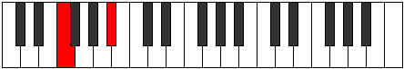 |
## Modes

| Number | Mode | Tonic | Notes | Illustration |
|--------|------|-------|-------|--------------|
| [275](https://ianring.com/musictheory/scales/275) | [Dalic](ModeANaturalDalic.md) | A | A, A#, C#, F, A |  |
| [279](https://ianring.com/musictheory/scales/279) | [Poditonic](ModeANaturalPoditonic.md) | A | A, A#, B, C#, F, A |  |
| [281](https://ianring.com/musictheory/scales/281) | [Lanic](ModeDNaturalLanic.md) | D | D, F, F#, A#, D | 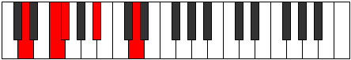 |
| [283](https://ianring.com/musictheory/scales/283) | [Aerylitonic](ModeDNaturalAerylitonic.md) | D | D, D#, F, F#, A#, D |  |
| [283](https://ianring.com/musictheory/scales/283) | [Aerylitonic](ModeANaturalAerylitonic.md) | A | A, A#, C, C#, F, A |  |
| [285](https://ianring.com/musictheory/scales/285) | [Zaritonic](ModeDNaturalZaritonic.md) | D | D, E, F, F#, A#, D |  |
| [287](https://ianring.com/musictheory/scales/287) | [Gynimic](ModeDNaturalGynimic.md) | D | D, Eb, Fb, Gbb, Abbb, Bb, D |  |
| [287](https://ianring.com/musictheory/scales/287) | [Gynimic](ModeANaturalGynimic.md) | A | A, Bb, Cb, Dbb, Ebbb, F, A |  |
| [291](https://ianring.com/musictheory/scales/291) | [Aerathic](ModeFNaturalAerathic.md) | F | F, F#, A#, C#, F |  |
| [291](https://ianring.com/musictheory/scales/291) | [Aerathic](ModeANaturalAerathic.md) | A | A, A#, D, F, A |  |
| [293](https://ianring.com/musictheory/scales/293) | [Zoptic](ModeFNaturalZoptic.md) | F | F, G, A#, C#, F |  |
| [295](https://ianring.com/musictheory/scales/295) | [Gyritonic](ModeFNaturalGyritonic.md) | F | F, F#, G, A#, C#, F |  |
| [295](https://ianring.com/musictheory/scales/295) | [Gyritonic](ModeANaturalGyritonic.md) | A | A, A#, B, D, F, A |  |
| [297](https://ianring.com/musictheory/scales/297) | [Mynic](ModeDNaturalMynic.md) | D | D, F, G, A#, D |  |
| [297](https://ianring.com/musictheory/scales/297) | [Mynic](ModeFNaturalMynic.md) | F | F, G#, A#, C#, F |  |
| [299](https://ianring.com/musictheory/scales/299) | [Phratonic](ModeDNaturalPhratonic.md) | D | D, D#, F, G, A#, D |  |
| [299](https://ianring.com/musictheory/scales/299) | [Phratonic](ModeFNaturalPhratonic.md) | F | F, F#, G#, A#, C#, F |  |
| [299](https://ianring.com/musictheory/scales/299) | [Phratonic](ModeANaturalPhratonic.md) | A | A, A#, C, D, F, A |  |
| [301](https://ianring.com/musictheory/scales/301) | [Zythitonic](ModeDNaturalZythitonic.md) | D | D, E, F, G, A#, D |  |
| [301](https://ianring.com/musictheory/scales/301) | [Zythitonic](ModeFNaturalZythitonic.md) | F | F, G, G#, A#, C#, F |  |
| [303](https://ianring.com/musictheory/scales/303) | [Golimic](ModeDNaturalGolimic.md) | D | D, Eb, Fb, Gbb, Abb, Bb, D |  |
| [303](https://ianring.com/musictheory/scales/303) | [Golimic](ModeFNaturalGolimic.md) | F | F, Gb, Abb, Bbbb, Cbb, Db, F |  |
| [303](https://ianring.com/musictheory/scales/303) | [Golimic](ModeANaturalGolimic.md) | A | A, Bb, Cb, Dbb, Ebb, F, A |  |
| [305](https://ianring.com/musictheory/scales/305) | [Gonic](ModeFNaturalGonic.md) | F | F, A, A#, C#, F |  |
| [307](https://ianring.com/musictheory/scales/307) | [Phrolitonic](ModeANaturalPhrolitonic.md) | A | A, A#, C#, D, F, A |  |
| [307](https://ianring.com/musictheory/scales/307) | [Phrolitonic](ModeFNaturalPhrolitonic.md) | F | F, F#, A, A#, C#, F |  |
| [309](https://ianring.com/musictheory/scales/309) | [Palitonic](ModeFNaturalPalitonic.md) | F | F, G, A, A#, C#, F |  |
| [311](https://ianring.com/musictheory/scales/311) | [Stagimic](ModeFNaturalStagimic.md) | F | F, Gb, Abb, Bbb, Cbb, Db, F |  |
| [311](https://ianring.com/musictheory/scales/311) | [Stagimic](ModeANaturalStagimic.md) | A | A, Bb, Cb, Db, Ebb, F, A |  |
| [313](https://ianring.com/musictheory/scales/313) | [Goritonic](ModeDNaturalGoritonic.md) | D | D, F, F#, G, A#, D |  |
| [313](https://ianring.com/musictheory/scales/313) | [Goritonic](ModeFNaturalGoritonic.md) | F | F, G#, A, A#, C#, F |  |
| [315](https://ianring.com/musictheory/scales/315) | [Stodimic](ModeDNaturalStodimic.md) | D | D, Eb, F, Gb, Abb, Bb, D |  |
| [315](https://ianring.com/musictheory/scales/315) | [Stodimic](ModeANaturalStodimic.md) | A | A, Bb, C, Db, Ebb, F, A |  |
| [315](https://ianring.com/musictheory/scales/315) | [Stodimic](ModeFNaturalStodimic.md) | F | F, Gb, Ab, Bbb, Cbb, Db, F |  |
| [317](https://ianring.com/musictheory/scales/317) | [Korimic](ModeDNaturalKorimic.md) | D | D, E, F, Gb, Abb, Bb, D |  |
| [317](https://ianring.com/musictheory/scales/317) | [Korimic](ModeFNaturalKorimic.md) | F | F, G, Ab, Bbb, Cbb, Db, F |  |
| [319](https://ianring.com/musictheory/scales/319) | [Epodian](ModeDNaturalEpodian.md) | D | D, Eb, Fb, Gbb, Abbb, E###, Cbb, D |  |
| [319](https://ianring.com/musictheory/scales/319) | [Epodian](ModeFNaturalEpodian.md) | F | F, Gb, Abb, Bbbb, Cbbb, Cbb, Db, F |  |
| [319](https://ianring.com/musictheory/scales/319) | [Epodian](ModeANaturalEpodian.md) | A | A, Bb, Cb, Dbb, Ebbb, Fbbb, Gbb, A |  |
| [327](https://ianring.com/musictheory/scales/327) | [Syptitonic](ModeENaturalSyptitonic.md) | E | E, F, F#, A#, C, E |  |
| [327](https://ianring.com/musictheory/scales/327) | [Syptitonic](ModeANaturalSyptitonic.md) | A | A, A#, B, D#, F, A |  |
| [329](https://ianring.com/musictheory/scales/329) | [Lonic](ModeDNaturalLonic.md) | D | D, F, G#, A#, D |  |
| [331](https://ianring.com/musictheory/scales/331) | [Byptitonic](ModeENaturalByptitonic.md) | E | E, F, G, A#, C, E |  |
| [331](https://ianring.com/musictheory/scales/331) | [Byptitonic](ModeDNaturalByptitonic.md) | D | D, D#, F, G#, A#, D |  |
| [331](https://ianring.com/musictheory/scales/331) | [Byptitonic](ModeANaturalByptitonic.md) | A | A, A#, C, D#, F, A |  |
| [333](https://ianring.com/musictheory/scales/333) | [Bogitonic](ModeDNaturalBogitonic.md) | D | D, E, F, G#, A#, D |  |
| [335](https://ianring.com/musictheory/scales/335) | [Zanimic](ModeENaturalZanimic.md) | E | E, F, Gb, Abb, Bb, C, E |  |
| [335](https://ianring.com/musictheory/scales/335) | [Zanimic](ModeDNaturalZanimic.md) | D | D, Eb, Fb, Gbb, Ab, Bb, D |  |
| [335](https://ianring.com/musictheory/scales/335) | [Zanimic](ModeANaturalZanimic.md) | A | A, Bb, Cb, Dbb, Eb, F, A |  |
| [339](https://ianring.com/musictheory/scales/339) | [Zaptitonic](ModeENaturalZaptitonic.md) | E | E, F, G#, A#, C, E |  |
| [339](https://ianring.com/musictheory/scales/339) | [Zaptitonic](ModeANaturalZaptitonic.md) | A | A, A#, C#, D#, F, A |  |
| [343](https://ianring.com/musictheory/scales/343) | [Ionorimic](ModeENaturalIonorimic.md) | E | E, F, Gb, Ab, Bb, C, E |  |
| [343](https://ianring.com/musictheory/scales/343) | [Ionorimic](ModeANaturalIonorimic.md) | A | A, Bb, Cb, Db, Eb, F, A |  |
| [345](https://ianring.com/musictheory/scales/345) | [Gylitonic](ModeDNaturalGylitonic.md) | D | D, F, F#, G#, A#, D |  |
| [347](https://ianring.com/musictheory/scales/347) | [Barimic](ModeDNaturalBarimic.md) | D | D, Eb, F, Gb, Ab, Bb, D |  |
| [347](https://ianring.com/musictheory/scales/347) | [Barimic](ModeENaturalBarimic.md) | E | E, F, G, Ab, Bb, C, E |  |
| [347](https://ianring.com/musictheory/scales/347) | [Barimic](ModeANaturalBarimic.md) | A | A, Bb, C, Db, Eb, F, A |  |
| [349](https://ianring.com/musictheory/scales/349) | [Borimic](ModeDNaturalBorimic.md) | D | D, E, F, Gb, Ab, Bb, D |  |
| [351](https://ianring.com/musictheory/scales/351) | [Epanian](ModeDNaturalEpanian.md) | D | D, Eb, Fb, Gbb, Abbb, Bbbb, Cbb, D |  |
| [351](https://ianring.com/musictheory/scales/351) | [Epanian](ModeENaturalEpanian.md) | E | E, F, Gb, Abb, Bbbb, Cbb, Dbb, E |  |
| [351](https://ianring.com/musictheory/scales/351) | [Epanian](ModeANaturalEpanian.md) | A | A, Bb, Cb, Dbb, Ebbb, Fbb, Gbb, A |  |
| [355](https://ianring.com/musictheory/scales/355) | [Aeoloritonic](ModeANaturalAeoloritonic.md) | A | A, A#, D, D#, F, A |  |
| [355](https://ianring.com/musictheory/scales/355) | [Aeoloritonic](ModeENaturalAeoloritonic.md) | E | E, F, A, A#, C, E |  |
| [355](https://ianring.com/musictheory/scales/355) | [Aeoloritonic](ModeFNaturalAeoloritonic.md) | F | F, F#, A#, B, C#, F |  |
| [357](https://ianring.com/musictheory/scales/357) | [Banitonic](ModeFNaturalBanitonic.md) | F | F, G, A#, B, C#, F |  |
| [359](https://ianring.com/musictheory/scales/359) | [Bothimic](ModeENaturalBothimic.md) | E | E, F, Gb, A, Bb, C, E |  |
| [359](https://ianring.com/musictheory/scales/359) | [Bothimic](ModeFNaturalBothimic.md) | F | F, Gb, Abb, Bb, Cb, Db, F |  |
| [359](https://ianring.com/musictheory/scales/359) | [Bothimic](ModeANaturalBothimic.md) | A | A, Bb, Cb, D, Eb, F, A |  |
| [361](https://ianring.com/musictheory/scales/361) | [Bocritonic](ModeDNaturalBocritonic.md) | D | D, F, G, G#, A#, D |  |
| [361](https://ianring.com/musictheory/scales/361) | [Bocritonic](ModeFNaturalBocritonic.md) | F | F, G#, A#, B, C#, F |  |
| [363](https://ianring.com/musictheory/scales/363) | [Soptimic](ModeDNaturalSoptimic.md) | D | D, Eb, F, G, Ab, Bb, D |  |
| [363](https://ianring.com/musictheory/scales/363) | [Soptimic](ModeANaturalSoptimic.md) | A | A, Bb, C, D, Eb, F, A |  |
| [363](https://ianring.com/musictheory/scales/363) | [Soptimic](ModeENaturalSoptimic.md) | E | E, F, G, A, Bb, C, E |  |
| [363](https://ianring.com/musictheory/scales/363) | [Soptimic](ModeFNaturalSoptimic.md) | F | F, Gb, Ab, Bb, Cb, Db, F |  |
| [365](https://ianring.com/musictheory/scales/365) | [Marimic](ModeDNaturalMarimic.md) | D | D, E, F, G, Ab, Bb, D |  |
| [365](https://ianring.com/musictheory/scales/365) | [Marimic](ModeFNaturalMarimic.md) | F | F, G, Ab, Bb, Cb, Db, F |  |
| [367](https://ianring.com/musictheory/scales/367) | [Aerodian](ModeDNaturalAerodian.md) | D | D, Eb, Fb, Gbb, Abb, Bbbb, Cbb, D |  |
| [367](https://ianring.com/musictheory/scales/367) | [Aerodian](ModeENaturalAerodian.md) | E | E, F, Gb, Abb, Bbb, Cbb, Dbb, E |  |
| [367](https://ianring.com/musictheory/scales/367) | [Aerodian](ModeFNaturalAerodian.md) | F | F, Gb, Abb, Bbbb, Cbb, Dbbb, Ebbb, F |  |
| [367](https://ianring.com/musictheory/scales/367) | [Aerodian](ModeANaturalAerodian.md) | A | A, Bb, Cb, Dbb, Ebb, Fbb, Gbb, A |  |
| [369](https://ianring.com/musictheory/scales/369) | [Laditonic](ModeFNaturalLaditonic.md) | F | F, A, A#, B, C#, F |  |
| [371](https://ianring.com/musictheory/scales/371) | [Rythimic](ModeANaturalRythimic.md) | A | A, Bb, C#, D, Eb, F, A |  |
| [371](https://ianring.com/musictheory/scales/371) | [Rythimic](ModeENaturalRythimic.md) | E | E, F, G#, A, Bb, C, E |  |
| [371](https://ianring.com/musictheory/scales/371) | [Rythimic](ModeFNaturalRythimic.md) | F | F, Gb, A, Bb, Cb, Db, F |  |
| [373](https://ianring.com/musictheory/scales/373) | [Epagimic](ModeFNaturalEpagimic.md) | F | F, G, A, Bb, Cb, Db, F |  |
| [375](https://ianring.com/musictheory/scales/375) | [Sodian](ModeENaturalSodian.md) | E | E, F, Gb, Ab, Bbb, Cbb, Dbb, E |  |
| [375](https://ianring.com/musictheory/scales/375) | [Sodian](ModeANaturalSodian.md) | A | A, Bb, Cb, Db, Ebb, Fbb, Gbb, A |  |
| [375](https://ianring.com/musictheory/scales/375) | [Sodian](ModeFNaturalSodian.md) | F | F, Gb, Abb, Bbb, Cbb, Dbbb, Ebbb, F |  |
| [377](https://ianring.com/musictheory/scales/377) | [Kathimic](ModeDNaturalKathimic.md) | D | D, E#, F#, G, Ab, Bb, D |  |
| [377](https://ianring.com/musictheory/scales/377) | [Kathimic](ModeFNaturalKathimic.md) | F | F, G#, A, Bb, Cb, Db, F |  |
| [379](https://ianring.com/musictheory/scales/379) | [Aeragian](ModeDNaturalAeragian.md) | D | D, Eb, F, Gb, Abb, Bbbb, Cbb, D |  |
| [379](https://ianring.com/musictheory/scales/379) | [Aeragian](ModeANaturalAeragian.md) | A | A, Bb, C, Db, Ebb, Fbb, Gbb, A |  |
| [379](https://ianring.com/musictheory/scales/379) | [Aeragian](ModeENaturalAeragian.md) | E | E, F, G, Ab, Bbb, Cbb, Dbb, E |  |
| [379](https://ianring.com/musictheory/scales/379) | [Aeragian](ModeFNaturalAeragian.md) | F | F, Gb, Ab, Bbb, Cbb, Dbbb, Ebbb, F |  |
| [381](https://ianring.com/musictheory/scales/381) | [Kogian](ModeDNaturalKogian.md) | D | D, E, F, Gb, Abb, Bbbb, Cbb, D |  |
| [381](https://ianring.com/musictheory/scales/381) | [Kogian](ModeFNaturalKogian.md) | F | F, G, Ab, Bbb, Cbb, Dbbb, Ebbb, F |  |
| [383](https://ianring.com/musictheory/scales/383) | [Logyllic](ModeDNaturalLogyllic.md) | D | D, D#, E, F, F#, G, G#, A#, D |  |
| [383](https://ianring.com/musictheory/scales/383) | [Logyllic](ModeENaturalLogyllic.md) | E | E, F, F#, G, G#, A, A#, C, E |  |
| [383](https://ianring.com/musictheory/scales/383) | [Logyllic](ModeANaturalLogyllic.md) | A | A, A#, B, C, C#, D, D#, F, A |  |
| [383](https://ianring.com/musictheory/scales/383) | [Logyllic](ModeFNaturalLogyllic.md) | F | F, F#, G, G#, A, A#, B, C#, F |  |
| [393](https://ianring.com/musictheory/scales/393) | [Lothic](ModeASharpLothic.md) | A# | A#, C#, F, F#, A# |  |
| [393](https://ianring.com/musictheory/scales/393) | [Lothic](ModeBFlatLothic.md) | Bb | Bb, Db, F, Gb, Bb |  |
| [393](https://ianring.com/musictheory/scales/393) | [Lothic](ModeDNaturalLothic.md) | D | D, F, A, A#, D |  |
| [395](https://ianring.com/musictheory/scales/395) | [Dalitonic](ModeDNaturalDalitonic.md) | D | D, D#, F, A, A#, D |  |
| [395](https://ianring.com/musictheory/scales/395) | [Dalitonic](ModeANaturalDalitonic.md) | A | A, A#, C, E, F, A |  |
| [395](https://ianring.com/musictheory/scales/395) | [Dalitonic](ModeASharpDalitonic.md) | A# | A#, B, C#, F, F#, A# |  |
| [395](https://ianring.com/musictheory/scales/395) | [Dalitonic](ModeBFlatDalitonic.md) | Bb | Bb, B, Db, F, Gb, Bb |  |
| [397](https://ianring.com/musictheory/scales/397) | [Epogitonic](ModeASharpEpogitonic.md) | A# | A#, C, C#, F, F#, A# |  |
| [397](https://ianring.com/musictheory/scales/397) | [Epogitonic](ModeBFlatEpogitonic.md) | Bb | Bb, C, Db, F, Gb, Bb |  |
| [397](https://ianring.com/musictheory/scales/397) | [Epogitonic](ModeDNaturalEpogitonic.md) | D | D, E, F, A, A#, D |  |
| [397](https://ianring.com/musictheory/scales/397) | [Epogitonic](ModeDSharpEpogitonic.md) | D# | D#, F, F#, A#, B, D# |  |
| [397](https://ianring.com/musictheory/scales/397) | [Epogitonic](ModeEFlatEpogitonic.md) | Eb | Eb, F, Gb, Bb, B, Eb |  |
| [399](https://ianring.com/musictheory/scales/399) | [Zynimic](ModeDNaturalZynimic.md) | D | D, Eb, Fb, Gbb, A, Bb, D |  |
| [399](https://ianring.com/musictheory/scales/399) | [Zynimic](ModeASharpZynimic.md) | A# | A#, B, C, Db, E#, F#, A# |  |
| [399](https://ianring.com/musictheory/scales/399) | [Zynimic](ModeBFlatZynimic.md) | Bb | Bb, Cb, Dbb, Ebbb, F, Gb, Bb |  |
| [399](https://ianring.com/musictheory/scales/399) | [Zynimic](ModeDSharpZynimic.md) | D# | D#, E, F, Gb, A#, B, D# |  |
| [399](https://ianring.com/musictheory/scales/399) | [Zynimic](ModeEFlatZynimic.md) | Eb | Eb, Fb, Gbb, Abbb, Bb, Cb, Eb |  |
| [399](https://ianring.com/musictheory/scales/399) | [Zynimic](ModeANaturalZynimic.md) | A | A, Bb, Cb, Dbb, E, F, A |  |
| [401](https://ianring.com/musictheory/scales/401) | [Epogic](ModeASharpEpogic.md) | A# | A#, D, F, F#, A# |  |
| [401](https://ianring.com/musictheory/scales/401) | [Epogic](ModeBFlatEpogic.md) | Bb | Bb, D, F, Gb, Bb |  |
| [403](https://ianring.com/musictheory/scales/403) | [Daptitonic](ModeANaturalDaptitonic.md) | A | A, A#, C#, E, F, A |  |
| [403](https://ianring.com/musictheory/scales/403) | [Daptitonic](ModeASharpDaptitonic.md) | A# | A#, B, D, F, F#, A# |  |
| [403](https://ianring.com/musictheory/scales/403) | [Daptitonic](ModeBFlatDaptitonic.md) | Bb | Bb, B, D, F, Gb, Bb |  |
| [405](https://ianring.com/musictheory/scales/405) | [Danitonic](ModeASharpDanitonic.md) | A# | A#, C, D, F, F#, A# | 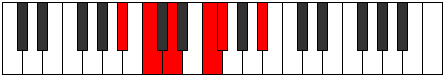 |
| [405](https://ianring.com/musictheory/scales/405) | [Danitonic](ModeBFlatDanitonic.md) | Bb | Bb, C, D, F, Gb, Bb |  |
| [405](https://ianring.com/musictheory/scales/405) | [Danitonic](ModeDSharpDanitonic.md) | D# | D#, F, G, A#, B, D# |  |
| [405](https://ianring.com/musictheory/scales/405) | [Danitonic](ModeEFlatDanitonic.md) | Eb | Eb, F, G, Bb, B, Eb |  |
| [407](https://ianring.com/musictheory/scales/407) | [Zylimic](ModeASharpZylimic.md) | A# | A#, B, C, D, E#, F#, A# |  |
| [407](https://ianring.com/musictheory/scales/407) | [Zylimic](ModeBFlatZylimic.md) | Bb | Bb, Cb, Dbb, Ebb, F, Gb, Bb |  |
| [407](https://ianring.com/musictheory/scales/407) | [Zylimic](ModeDSharpZylimic.md) | D# | D#, E, F, G, A#, B, D# |  |
| [407](https://ianring.com/musictheory/scales/407) | [Zylimic](ModeEFlatZylimic.md) | Eb | Eb, Fb, Gbb, Abb, Bb, Cb, Eb |  |
| [407](https://ianring.com/musictheory/scales/407) | [Zylimic](ModeANaturalZylimic.md) | A | A, Bb, Cb, Db, E, F, A |  |
| [409](https://ianring.com/musictheory/scales/409) | [Laritonic](ModeASharpLaritonic.md) | A# | A#, C#, D, F, F#, A# |  |
| [409](https://ianring.com/musictheory/scales/409) | [Laritonic](ModeBFlatLaritonic.md) | Bb | Bb, Db, D, F, Gb, Bb |  |
| [409](https://ianring.com/musictheory/scales/409) | [Laritonic](ModeDNaturalLaritonic.md) | D | D, F, F#, A, A#, D |  |
| [411](https://ianring.com/musictheory/scales/411) | [Lygimic](ModeANaturalLygimic.md) | A | A, Bb, C, Db, E, F, A |  |
| [411](https://ianring.com/musictheory/scales/411) | [Lygimic](ModeDNaturalLygimic.md) | D | D, Eb, F, Gb, A, Bb, D |  |
| [411](https://ianring.com/musictheory/scales/411) | [Lygimic](ModeASharpLygimic.md) | A# | A#, B, C#, D, E#, F#, A# |  |
| [411](https://ianring.com/musictheory/scales/411) | [Lygimic](ModeBFlatLygimic.md) | Bb | Bb, Cb, Db, Ebb, F, Gb, Bb |  |
| [413](https://ianring.com/musictheory/scales/413) | [Ganimic](ModeASharpGanimic.md) | A# | A#, B#, C#, D, E#, F#, A# |  |
| [413](https://ianring.com/musictheory/scales/413) | [Ganimic](ModeBFlatGanimic.md) | Bb | Bb, C, Db, Ebb, F, Gb, Bb |  |
| [413](https://ianring.com/musictheory/scales/413) | [Ganimic](ModeDNaturalGanimic.md) | D | D, E, F, Gb, A, Bb, D |  |
| [413](https://ianring.com/musictheory/scales/413) | [Ganimic](ModeDSharpGanimic.md) | D# | D#, E#, F#, G, A#, B, D# |  |
| [413](https://ianring.com/musictheory/scales/413) | [Ganimic](ModeEFlatGanimic.md) | Eb | Eb, F, Gb, Abb, Bb, Cb, Eb |  |
| [415](https://ianring.com/musictheory/scales/415) | [Aeoladian](ModeDNaturalAeoladian.md) | D | D, Eb, Fb, Gbb, Abbb, Bbb, Cbb, D |  |
| [415](https://ianring.com/musictheory/scales/415) | [Aeoladian](ModeASharpAeoladian.md) | A# | A#, B, C, Db, Ebb, F, Gb, A# |  |
| [415](https://ianring.com/musictheory/scales/415) | [Aeoladian](ModeBFlatAeoladian.md) | Bb | Bb, Cb, Dbb, Ebbb, Fbbb, Gbb, Abbb, Bb |  |
| [415](https://ianring.com/musictheory/scales/415) | [Aeoladian](ModeDSharpAeoladian.md) | D# | D#, E, F, Gb, Abb, Bb, Cb, D# |  |
| [415](https://ianring.com/musictheory/scales/415) | [Aeoladian](ModeEFlatAeoladian.md) | Eb | Eb, Fb, Gbb, Abbb, E###, Cbb, Dbbb, Eb |  |
| [415](https://ianring.com/musictheory/scales/415) | [Aeoladian](ModeANaturalAeoladian.md) | A | A, Bb, Cb, Dbb, Ebbb, Fb, Gbb, A |  |
| [419](https://ianring.com/musictheory/scales/419) | [Ionacritonic](ModeFNaturalIonacritonic.md) | F | F, F#, A#, C, C#, F |  |
| [419](https://ianring.com/musictheory/scales/419) | [Ionacritonic](ModeANaturalIonacritonic.md) | A | A, A#, D, E, F, A |  |
| [419](https://ianring.com/musictheory/scales/419) | [Ionacritonic](ModeASharpIonacritonic.md) | A# | A#, B, D#, F, F#, A# |  |
| [419](https://ianring.com/musictheory/scales/419) | [Ionacritonic](ModeBFlatIonacritonic.md) | Bb | Bb, B, Eb, F, Gb, Bb |  |
| [421](https://ianring.com/musictheory/scales/421) | [Ionitonic](ModeASharpIonitonic.md) | A# | A#, C, D#, F, F#, A# |  |
| [421](https://ianring.com/musictheory/scales/421) | [Ionitonic](ModeBFlatIonitonic.md) | Bb | Bb, C, Eb, F, Gb, Bb |  |
| [421](https://ianring.com/musictheory/scales/421) | [Ionitonic](ModeFNaturalIonitonic.md) | F | F, G, A#, C, C#, F |  |
| [421](https://ianring.com/musictheory/scales/421) | [Ionitonic](ModeDSharpIonitonic.md) | D# | D#, F, G#, A#, B, D# |  |
| [421](https://ianring.com/musictheory/scales/421) | [Ionitonic](ModeEFlatIonitonic.md) | Eb | Eb, F, Ab, Bb, B, Eb |  |
| [423](https://ianring.com/musictheory/scales/423) | [Sogimic](ModeFNaturalSogimic.md) | F | F, Gb, Abb, Bb, C, Db, F |  |
| [423](https://ianring.com/musictheory/scales/423) | [Sogimic](ModeASharpSogimic.md) | A# | A#, B, C, D#, E#, F#, A# |  |
| [423](https://ianring.com/musictheory/scales/423) | [Sogimic](ModeBFlatSogimic.md) | Bb | Bb, Cb, Dbb, Eb, F, Gb, Bb |  |
| [423](https://ianring.com/musictheory/scales/423) | [Sogimic](ModeDSharpSogimic.md) | D# | D#, E, F, G#, A#, B, D# |  |
| [423](https://ianring.com/musictheory/scales/423) | [Sogimic](ModeEFlatSogimic.md) | Eb | Eb, Fb, Gbb, Ab, Bb, Cb, Eb |  |
| [423](https://ianring.com/musictheory/scales/423) | [Sogimic](ModeANaturalSogimic.md) | A | A, Bb, Cb, D, E, F, A |  |
| [425](https://ianring.com/musictheory/scales/425) | [Daditonic](ModeASharpDaditonic.md) | A# | A#, C#, D#, F, F#, A# |  |
| [425](https://ianring.com/musictheory/scales/425) | [Daditonic](ModeBFlatDaditonic.md) | Bb | Bb, Db, Eb, F, Gb, Bb |  |
| [425](https://ianring.com/musictheory/scales/425) | [Daditonic](ModeFNaturalDaditonic.md) | F | F, G#, A#, C, C#, F |  |
| [425](https://ianring.com/musictheory/scales/425) | [Daditonic](ModeDNaturalDaditonic.md) | D | D, F, G, A, A#, D |  |
| [427](https://ianring.com/musictheory/scales/427) | [Zothimic](ModeFNaturalZothimic.md) | F | F, Gb, Ab, Bb, C, Db, F |  |
| [427](https://ianring.com/musictheory/scales/427) | [Zothimic](ModeANaturalZothimic.md) | A | A, Bb, C, D, E, F, A |  |
| [427](https://ianring.com/musictheory/scales/427) | [Zothimic](ModeDNaturalZothimic.md) | D | D, Eb, F, G, A, Bb, D |  |
| [427](https://ianring.com/musictheory/scales/427) | [Zothimic](ModeASharpZothimic.md) | A# | A#, B, C#, D#, E#, F#, A# |  |
| [427](https://ianring.com/musictheory/scales/427) | [Zothimic](ModeBFlatZothimic.md) | Bb | Bb, Cb, Db, Eb, F, Gb, Bb |  |
| [429](https://ianring.com/musictheory/scales/429) | [Koptimic](ModeASharpKoptimic.md) | A# | A#, B#, C#, D#, E#, F#, A# |  |
| [429](https://ianring.com/musictheory/scales/429) | [Koptimic](ModeBFlatKoptimic.md) | Bb | Bb, C, Db, Eb, F, Gb, Bb |  |
| [429](https://ianring.com/musictheory/scales/429) | [Koptimic](ModeFNaturalKoptimic.md) | F | F, G, Ab, Bb, C, Db, F |  |
| [429](https://ianring.com/musictheory/scales/429) | [Koptimic](ModeDNaturalKoptimic.md) | D | D, E, F, G, A, Bb, D |  |
| [429](https://ianring.com/musictheory/scales/429) | [Koptimic](ModeDSharpKoptimic.md) | D# | D#, E#, F#, G#, A#, B, D# |  |
| [429](https://ianring.com/musictheory/scales/429) | [Koptimic](ModeEFlatKoptimic.md) | Eb | Eb, F, Gb, Ab, Bb, Cb, Eb |  |
| [431](https://ianring.com/musictheory/scales/431) | [Epyrian](ModeFNaturalEpyrian.md) | F | F, Gb, Abb, Bbbb, Cbb, Dbb, Ebbb, F |  |
| [431](https://ianring.com/musictheory/scales/431) | [Epyrian](ModeDNaturalEpyrian.md) | D | D, Eb, Fb, Gbb, Abb, Bbb, Cbb, D |  |
| [431](https://ianring.com/musictheory/scales/431) | [Epyrian](ModeASharpEpyrian.md) | A# | A#, B, C, Db, Eb, F, Gb, A# |  |
| [431](https://ianring.com/musictheory/scales/431) | [Epyrian](ModeBFlatEpyrian.md) | Bb | Bb, Cb, Dbb, Ebbb, Fbb, Gbb, Abbb, Bb |  |
| [431](https://ianring.com/musictheory/scales/431) | [Epyrian](ModeDSharpEpyrian.md) | D# | D#, E, F, Gb, Ab, Bb, Cb, D# |  |
| [431](https://ianring.com/musictheory/scales/431) | [Epyrian](ModeEFlatEpyrian.md) | Eb | Eb, Fb, Gbb, Abbb, Bbbb, Cbb, Dbbb, Eb |  |
| [431](https://ianring.com/musictheory/scales/431) | [Epyrian](ModeANaturalEpyrian.md) | A | A, Bb, Cb, Dbb, Ebb, Fb, Gbb, A |  |
| [433](https://ianring.com/musictheory/scales/433) | [Poritonic](ModeASharpPoritonic.md) | A# | A#, D, D#, F, F#, A# |  |
| [433](https://ianring.com/musictheory/scales/433) | [Poritonic](ModeBFlatPoritonic.md) | Bb | Bb, D, Eb, F, Gb, Bb |  |
| [433](https://ianring.com/musictheory/scales/433) | [Poritonic](ModeFNaturalPoritonic.md) | F | F, A, A#, C, C#, F |  |
| [435](https://ianring.com/musictheory/scales/435) | [Ionolimic](ModeANaturalIonolimic.md) | A | A, Bb, C#, D, E, F, A |  |
| [435](https://ianring.com/musictheory/scales/435) | [Ionolimic](ModeFNaturalIonolimic.md) | F | F, Gb, A, Bb, C, Db, F |  |
| [435](https://ianring.com/musictheory/scales/435) | [Ionolimic](ModeASharpIonolimic.md) | A# | A#, B, C##, D#, E#, F#, A# |  |
| [435](https://ianring.com/musictheory/scales/435) | [Ionolimic](ModeBFlatIonolimic.md) | Bb | Bb, Cb, D, Eb, F, Gb, Bb |  |
| [437](https://ianring.com/musictheory/scales/437) | [Ronimic](ModeASharpRonimic.md) | A# | A#, B#, C##, D#, E#, F#, A# |  |
| [437](https://ianring.com/musictheory/scales/437) | [Ronimic](ModeBFlatRonimic.md) | Bb | Bb, C, D, Eb, F, Gb, Bb |  |
| [437](https://ianring.com/musictheory/scales/437) | [Ronimic](ModeFNaturalRonimic.md) | F | F, G, A, Bb, C, Db, F |  |
| [437](https://ianring.com/musictheory/scales/437) | [Ronimic](ModeDSharpRonimic.md) | D# | D#, E#, F##, G#, A#, B, D# |  |
| [437](https://ianring.com/musictheory/scales/437) | [Ronimic](ModeEFlatRonimic.md) | Eb | Eb, F, G, Ab, Bb, Cb, Eb |  |
| [439](https://ianring.com/musictheory/scales/439) | [Bythian](ModeFNaturalBythian.md) | F | F, Gb, Abb, Bbb, Cbb, Dbb, Ebbb, F |  |
| [439](https://ianring.com/musictheory/scales/439) | [Bythian](ModeASharpBythian.md) | A# | A#, B, C, D, Eb, F, Gb, A# |  |
| [439](https://ianring.com/musictheory/scales/439) | [Bythian](ModeBFlatBythian.md) | Bb | Bb, Cb, Dbb, Ebb, Fbb, Gbb, Abbb, Bb |  |
| [439](https://ianring.com/musictheory/scales/439) | [Bythian](ModeDSharpBythian.md) | D# | D#, E, F, G, Ab, Bb, Cb, D# |  |
| [439](https://ianring.com/musictheory/scales/439) | [Bythian](ModeEFlatBythian.md) | Eb | Eb, Fb, Gbb, Abb, Bbbb, Cbb, Dbbb, Eb |  |
| [439](https://ianring.com/musictheory/scales/439) | [Bythian](ModeANaturalBythian.md) | A | A, Bb, Cb, Db, Ebb, Fb, Gbb, A |  |
| [441](https://ianring.com/musictheory/scales/441) | [Thycrimic](ModeASharpThycrimic.md) | A# | A#, B##, C##, D#, E#, F#, A# |  |
| [441](https://ianring.com/musictheory/scales/441) | [Thycrimic](ModeBFlatThycrimic.md) | Bb | Bb, C#, D, Eb, F, Gb, Bb |  |
| [441](https://ianring.com/musictheory/scales/441) | [Thycrimic](ModeDNaturalThycrimic.md) | D | D, E#, F#, G, A, Bb, D |  |
| [441](https://ianring.com/musictheory/scales/441) | [Thycrimic](ModeFNaturalThycrimic.md) | F | F, G#, A, Bb, C, Db, F |  |
| [443](https://ianring.com/musictheory/scales/443) | [Kothian](ModeANaturalKothian.md) | A | A, Bb, C, Db, Ebb, Fb, Gbb, A |  |
| [443](https://ianring.com/musictheory/scales/443) | [Kothian](ModeDNaturalKothian.md) | D | D, Eb, F, Gb, Abb, Bbb, Cbb, D |  |
| [443](https://ianring.com/musictheory/scales/443) | [Kothian](ModeFNaturalKothian.md) | F | F, Gb, Ab, Bbb, Cbb, Dbb, Ebbb, F |  |
| [443](https://ianring.com/musictheory/scales/443) | [Kothian](ModeASharpKothian.md) | A# | A#, B, C#, D, Eb, F, Gb, A# |  |
| [443](https://ianring.com/musictheory/scales/443) | [Kothian](ModeBFlatKothian.md) | Bb | Bb, Cb, Db, Ebb, Fbb, Gbb, Abbb, Bb |  |
| [445](https://ianring.com/musictheory/scales/445) | [Gocrian](ModeASharpGocrian.md) | A# | A#, B#, C#, D, Eb, F, Gb, A# |  |
| [445](https://ianring.com/musictheory/scales/445) | [Gocrian](ModeBFlatGocrian.md) | Bb | Bb, C, Db, Ebb, Fbb, Gbb, Abbb, Bb |  |
| [445](https://ianring.com/musictheory/scales/445) | [Gocrian](ModeDNaturalGocrian.md) | D | D, E, F, Gb, Abb, Bbb, Cbb, D |  |
| [445](https://ianring.com/musictheory/scales/445) | [Gocrian](ModeFNaturalGocrian.md) | F | F, G, Ab, Bbb, Cbb, Dbb, Ebbb, F |  |
| [445](https://ianring.com/musictheory/scales/445) | [Gocrian](ModeDSharpGocrian.md) | D# | D#, E#, F#, G, Ab, Bb, Cb, D# |  |
| [445](https://ianring.com/musictheory/scales/445) | [Gocrian](ModeEFlatGocrian.md) | Eb | Eb, F, Gb, Abb, Bbbb, Cbb, Dbbb, Eb |  |
| [447](https://ianring.com/musictheory/scales/447) | [Thyphyllic](ModeDNaturalThyphyllic.md) | D | D, D#, E, F, F#, G, A, A#, D |  |
| [447](https://ianring.com/musictheory/scales/447) | [Thyphyllic](ModeFNaturalThyphyllic.md) | F | F, F#, G, G#, A, A#, C, C#, F |  |
| [447](https://ianring.com/musictheory/scales/447) | [Thyphyllic](ModeASharpThyphyllic.md) | A# | A#, B, C, C#, D, D#, F, F#, A# |  |
| [447](https://ianring.com/musictheory/scales/447) | [Thyphyllic](ModeBFlatThyphyllic.md) | Bb | Bb, B, C, Db, D, Eb, F, Gb, Bb |  |
| [447](https://ianring.com/musictheory/scales/447) | [Thyphyllic](ModeDSharpThyphyllic.md) | D# | D#, E, F, F#, G, G#, A#, B, D# |  |
| [447](https://ianring.com/musictheory/scales/447) | [Thyphyllic](ModeEFlatThyphyllic.md) | Eb | Eb, E, F, Gb, G, Ab, Bb, B, Eb |  |
| [447](https://ianring.com/musictheory/scales/447) | [Thyphyllic](ModeANaturalThyphyllic.md) | A | A, A#, B, C, C#, D, E, F, A |  |
| [453](https://ianring.com/musictheory/scales/453) | [Raditonic](ModeASharpRaditonic.md) | A# | A#, C, E, F, F#, A# |  |
| [453](https://ianring.com/musictheory/scales/453) | [Raditonic](ModeBFlatRaditonic.md) | Bb | Bb, C, E, F, Gb, Bb |  |
| [453](https://ianring.com/musictheory/scales/453) | [Raditonic](ModeDSharpRaditonic.md) | D# | D#, F, A, A#, B, D# |  |
| [453](https://ianring.com/musictheory/scales/453) | [Raditonic](ModeEFlatRaditonic.md) | Eb | Eb, F, A, Bb, B, Eb |  |
| [455](https://ianring.com/musictheory/scales/455) | [Stadimic](ModeENaturalStadimic.md) | E | E, F, Gb, A#, B, C, E |  |
| [455](https://ianring.com/musictheory/scales/455) | [Stadimic](ModeASharpStadimic.md) | A# | A#, B, C, D##, E#, F#, A# |  |
| [455](https://ianring.com/musictheory/scales/455) | [Stadimic](ModeBFlatStadimic.md) | Bb | Bb, Cb, Dbb, E, F, Gb, Bb |  |
| [455](https://ianring.com/musictheory/scales/455) | [Stadimic](ModeDSharpStadimic.md) | D# | D#, E, F, G##, A#, B, D# |  |
| [455](https://ianring.com/musictheory/scales/455) | [Stadimic](ModeEFlatStadimic.md) | Eb | Eb, Fb, Gbb, A, Bb, Cb, Eb |  |
| [455](https://ianring.com/musictheory/scales/455) | [Stadimic](ModeANaturalStadimic.md) | A | A, Bb, Cb, D#, E, F, A |  |
| [457](https://ianring.com/musictheory/scales/457) | [Staptitonic](ModeASharpStaptitonic.md) | A# | A#, C#, E, F, F#, A# |  |
| [457](https://ianring.com/musictheory/scales/457) | [Staptitonic](ModeBFlatStaptitonic.md) | Bb | Bb, Db, E, F, Gb, Bb |  |
| [457](https://ianring.com/musictheory/scales/457) | [Staptitonic](ModeDNaturalStaptitonic.md) | D | D, F, G#, A, A#, D |  |
| [459](https://ianring.com/musictheory/scales/459) | [Zaptimic](ModeANaturalZaptimic.md) | A | A, Bb, C, D#, E, F, A |  |
| [459](https://ianring.com/musictheory/scales/459) | [Zaptimic](ModeDNaturalZaptimic.md) | D | D, Eb, F, G#, A, Bb, D |  |
| [459](https://ianring.com/musictheory/scales/459) | [Zaptimic](ModeASharpZaptimic.md) | A# | A#, B, C#, D##, E#, F#, A# |  |
| [459](https://ianring.com/musictheory/scales/459) | [Zaptimic](ModeBFlatZaptimic.md) | Bb | Bb, Cb, Db, E, F, Gb, Bb |  |
| [459](https://ianring.com/musictheory/scales/459) | [Zaptimic](ModeENaturalZaptimic.md) | E | E, F, G, A#, B, C, E |  |
| [461](https://ianring.com/musictheory/scales/461) | [Madimic](ModeASharpMadimic.md) | A# | A#, B#, C#, D##, E#, F#, A# |  |
| [461](https://ianring.com/musictheory/scales/461) | [Madimic](ModeBFlatMadimic.md) | Bb | Bb, C, Db, E, F, Gb, Bb |  |
| [461](https://ianring.com/musictheory/scales/461) | [Madimic](ModeDNaturalMadimic.md) | D | D, E, F, G#, A, Bb, D |  |
| [461](https://ianring.com/musictheory/scales/461) | [Madimic](ModeDSharpMadimic.md) | D# | D#, E#, F#, G##, A#, B, D# |  |
| [461](https://ianring.com/musictheory/scales/461) | [Madimic](ModeEFlatMadimic.md) | Eb | Eb, F, Gb, A, Bb, Cb, Eb |  |
| [463](https://ianring.com/musictheory/scales/463) | [Zythian](ModeDNaturalZythian.md) | D | D, Eb, Fb, Gbb, Ab, Bbb, Cbb, D |  |
| [463](https://ianring.com/musictheory/scales/463) | [Zythian](ModeASharpZythian.md) | A# | A#, B, C, Db, E, F, Gb, A# |  |
| [463](https://ianring.com/musictheory/scales/463) | [Zythian](ModeBFlatZythian.md) | Bb | Bb, Cb, Dbb, Ebbb, Fb, Gbb, Abbb, Bb |  |
| [463](https://ianring.com/musictheory/scales/463) | [Zythian](ModeENaturalZythian.md) | E | E, F, Gb, Abb, Bb, Cb, Dbb, E |  |
| [463](https://ianring.com/musictheory/scales/463) | [Zythian](ModeANaturalZythian.md) | A | A, Bb, Cb, Dbb, Eb, Fb, Gbb, A |  |
| [463](https://ianring.com/musictheory/scales/463) | [Zythian](ModeDSharpZythian.md) | D# | D#, E, F, Gb, A, Bb, Cb, D# |  |
| [463](https://ianring.com/musictheory/scales/463) | [Zythian](ModeEFlatZythian.md) | Eb | Eb, Fb, Gbb, Abbb, Bbb, Cbb, Dbbb, Eb |  |
| [465](https://ianring.com/musictheory/scales/465) | [Zoditonic](ModeASharpZoditonic.md) | A# | A#, D, E, F, F#, A# |  |
| [465](https://ianring.com/musictheory/scales/465) | [Zoditonic](ModeBFlatZoditonic.md) | Bb | Bb, D, E, F, Gb, Bb |  |
| [467](https://ianring.com/musictheory/scales/467) | [Phrogimic](ModeANaturalPhrogimic.md) | A | A, Bb, C#, D#, E, F, A |  |
| [467](https://ianring.com/musictheory/scales/467) | [Phrogimic](ModeASharpPhrogimic.md) | A# | A#, B, C##, D##, E#, F#, A# |  |
| [467](https://ianring.com/musictheory/scales/467) | [Phrogimic](ModeBFlatPhrogimic.md) | Bb | Bb, Cb, D, E, F, Gb, Bb |  |
| [467](https://ianring.com/musictheory/scales/467) | [Phrogimic](ModeENaturalPhrogimic.md) | E | E, F, G#, A#, B, C, E |  |
| [469](https://ianring.com/musictheory/scales/469) | [Katyrimic](ModeASharpKatyrimic.md) | A# | A#, B#, C##, D##, E#, F#, A# |  |
| [469](https://ianring.com/musictheory/scales/469) | [Katyrimic](ModeBFlatKatyrimic.md) | Bb | Bb, C, D, E, F, Gb, Bb |  |
| [469](https://ianring.com/musictheory/scales/469) | [Katyrimic](ModeDSharpKatyrimic.md) | D# | D#, E#, F##, G##, A#, B, D# |  |
| [469](https://ianring.com/musictheory/scales/469) | [Katyrimic](ModeEFlatKatyrimic.md) | Eb | Eb, F, G, A, Bb, Cb, Eb |  |
| [471](https://ianring.com/musictheory/scales/471) | [Dodian](ModeASharpDodian.md) | A# | A#, B, C, D, E, F, Gb, A# |  |
| [471](https://ianring.com/musictheory/scales/471) | [Dodian](ModeBFlatDodian.md) | Bb | Bb, Cb, Dbb, Ebb, Fb, Gbb, Abbb, Bb |  |
| [471](https://ianring.com/musictheory/scales/471) | [Dodian](ModeENaturalDodian.md) | E | E, F, Gb, Ab, Bb, Cb, Dbb, E |  |
| [471](https://ianring.com/musictheory/scales/471) | [Dodian](ModeANaturalDodian.md) | A | A, Bb, Cb, Db, Eb, Fb, Gbb, A |  |
| [471](https://ianring.com/musictheory/scales/471) | [Dodian](ModeDSharpDodian.md) | D# | D#, E, F, G, A, Bb, Cb, D# |  |
| [471](https://ianring.com/musictheory/scales/471) | [Dodian](ModeEFlatDodian.md) | Eb | Eb, Fb, Gbb, Abb, Bbb, Cbb, Dbbb, Eb |  |
| [473](https://ianring.com/musictheory/scales/473) | [Aeralimic](ModeASharpAeralimic.md) | A# | A#, B##, C##, D##, E#, F#, A# |  |
| [473](https://ianring.com/musictheory/scales/473) | [Aeralimic](ModeBFlatAeralimic.md) | Bb | Bb, C#, D, E, F, Gb, Bb |  |
| [473](https://ianring.com/musictheory/scales/473) | [Aeralimic](ModeDNaturalAeralimic.md) | D | D, E#, F#, G#, A, Bb, D |  |
| [475](https://ianring.com/musictheory/scales/475) | [Aeolygian](ModeANaturalAeolygian.md) | A | A, Bb, C, Db, Eb, Fb, Gbb, A |  |
| [475](https://ianring.com/musictheory/scales/475) | [Aeolygian](ModeDNaturalAeolygian.md) | D | D, Eb, F, Gb, Ab, Bbb, Cbb, D |  |
| [475](https://ianring.com/musictheory/scales/475) | [Aeolygian](ModeASharpAeolygian.md) | A# | A#, B, C#, D, E, F, Gb, A# |  |
| [475](https://ianring.com/musictheory/scales/475) | [Aeolygian](ModeBFlatAeolygian.md) | Bb | Bb, Cb, Db, Ebb, Fb, Gbb, Abbb, Bb |  |
| [475](https://ianring.com/musictheory/scales/475) | [Aeolygian](ModeENaturalAeolygian.md) | E | E, F, G, Ab, Bb, Cb, Dbb, E |  |
| [477](https://ianring.com/musictheory/scales/477) | [Stacrian](ModeASharpStacrian.md) | A# | A#, B#, C#, D, E, F, Gb, A# |  |
| [477](https://ianring.com/musictheory/scales/477) | [Stacrian](ModeBFlatStacrian.md) | Bb | Bb, C, Db, Ebb, Fb, Gbb, Abbb, Bb |  |
| [477](https://ianring.com/musictheory/scales/477) | [Stacrian](ModeDNaturalStacrian.md) | D | D, E, F, Gb, Ab, Bbb, Cbb, D |  |
| [477](https://ianring.com/musictheory/scales/477) | [Stacrian](ModeDSharpStacrian.md) | D# | D#, E#, F#, G, A, Bb, Cb, D# |  |
| [477](https://ianring.com/musictheory/scales/477) | [Stacrian](ModeEFlatStacrian.md) | Eb | Eb, F, Gb, Abb, Bbb, Cbb, Dbbb, Eb |  |
| [479](https://ianring.com/musictheory/scales/479) | [Kocryllic](ModeDNaturalKocryllic.md) | D | D, D#, E, F, F#, G#, A, A#, D |  |
| [479](https://ianring.com/musictheory/scales/479) | [Kocryllic](ModeASharpKocryllic.md) | A# | A#, B, C, C#, D, E, F, F#, A# |  |
| [479](https://ianring.com/musictheory/scales/479) | [Kocryllic](ModeBFlatKocryllic.md) | Bb | Bb, B, C, Db, D, E, F, Gb, Bb |  |
| [479](https://ianring.com/musictheory/scales/479) | [Kocryllic](ModeENaturalKocryllic.md) | E | E, F, F#, G, G#, A#, B, C, E |  |
| [479](https://ianring.com/musictheory/scales/479) | [Kocryllic](ModeANaturalKocryllic.md) | A | A, A#, B, C, C#, D#, E, F, A |  |
| [479](https://ianring.com/musictheory/scales/479) | [Kocryllic](ModeDSharpKocryllic.md) | D# | D#, E, F, F#, G, A, A#, B, D# |  |
| [479](https://ianring.com/musictheory/scales/479) | [Kocryllic](ModeEFlatKocryllic.md) | Eb | Eb, E, F, Gb, G, A, Bb, B, Eb |  |
| [483](https://ianring.com/musictheory/scales/483) | [Kygimic](ModeANaturalKygimic.md) | A | A, Bb, C##, D#, E, F, A |  |
| [483](https://ianring.com/musictheory/scales/483) | [Kygimic](ModeFNaturalKygimic.md) | F | F, Gb, A#, B, C, Db, F |  |
| [483](https://ianring.com/musictheory/scales/483) | [Kygimic](ModeASharpKygimic.md) | A# | A#, B, C###, D##, E#, F#, A# |  |
| [483](https://ianring.com/musictheory/scales/483) | [Kygimic](ModeBFlatKygimic.md) | Bb | Bb, Cb, D#, E, F, Gb, Bb |  |
| [483](https://ianring.com/musictheory/scales/483) | [Kygimic](ModeENaturalKygimic.md) | E | E, F, G##, A#, B, C, E |  |
| [485](https://ianring.com/musictheory/scales/485) | [Stoptimic](ModeASharpStoptimic.md) | A# | A#, B#, C###, D##, E#, F#, A# |  |
| [485](https://ianring.com/musictheory/scales/485) | [Stoptimic](ModeBFlatStoptimic.md) | Bb | Bb, C, D#, E, F, Gb, Bb |  |
| [485](https://ianring.com/musictheory/scales/485) | [Stoptimic](ModeFNaturalStoptimic.md) | F | F, G, A#, B, C, Db, F |  |
| [485](https://ianring.com/musictheory/scales/485) | [Stoptimic](ModeDSharpStoptimic.md) | D# | D#, E#, F###, G##, A#, B, D# |  |
| [485](https://ianring.com/musictheory/scales/485) | [Stoptimic](ModeEFlatStoptimic.md) | Eb | Eb, F, G#, A, Bb, Cb, Eb |  |
| [487](https://ianring.com/musictheory/scales/487) | [Dynian](ModeASharpDynian.md) | A# | A#, B, C, D#, E, F, Gb, A# |  |
| [487](https://ianring.com/musictheory/scales/487) | [Dynian](ModeBFlatDynian.md) | Bb | Bb, Cb, Dbb, Eb, Fb, Gbb, Abbb, Bb |  |
| [487](https://ianring.com/musictheory/scales/487) | [Dynian](ModeFNaturalDynian.md) | F | F, Gb, Abb, Bb, Cb, Dbb, Ebbb, F |  |
| [487](https://ianring.com/musictheory/scales/487) | [Dynian](ModeANaturalDynian.md) | A | A, Bb, Cb, D, Eb, Fb, Gbb, A |  |
| [487](https://ianring.com/musictheory/scales/487) | [Dynian](ModeENaturalDynian.md) | E | E, F, Gb, A, Bb, Cb, Dbb, E |  |
| [487](https://ianring.com/musictheory/scales/487) | [Dynian](ModeDSharpDynian.md) | D# | D#, E, F, G#, A, Bb, Cb, D# |  |
| [487](https://ianring.com/musictheory/scales/487) | [Dynian](ModeEFlatDynian.md) | Eb | Eb, Fb, Gbb, Ab, Bbb, Cbb, Dbbb, Eb |  |
| [489](https://ianring.com/musictheory/scales/489) | [Phrathimic](ModeASharpPhrathimic.md) | A# | A#, B##, C###, D##, E#, F#, A# |  |
| [489](https://ianring.com/musictheory/scales/489) | [Phrathimic](ModeBFlatPhrathimic.md) | Bb | Bb, C#, D#, E, F, Gb, Bb |  |
| [489](https://ianring.com/musictheory/scales/489) | [Phrathimic](ModeDNaturalPhrathimic.md) | D | D, E#, F##, G#, A, Bb, D |  |
| [489](https://ianring.com/musictheory/scales/489) | [Phrathimic](ModeFNaturalPhrathimic.md) | F | F, G#, A#, B, C, Db, F |  |
| [491](https://ianring.com/musictheory/scales/491) | [Aeolyrian](ModeANaturalAeolyrian.md) | A | A, Bb, C, D, Eb, Fb, Gbb, A |  |
| [491](https://ianring.com/musictheory/scales/491) | [Aeolyrian](ModeDNaturalAeolyrian.md) | D | D, Eb, F, G, Ab, Bbb, Cbb, D |  |
| [491](https://ianring.com/musictheory/scales/491) | [Aeolyrian](ModeASharpAeolyrian.md) | A# | A#, B, C#, D#, E, F, Gb, A# |  |
| [491](https://ianring.com/musictheory/scales/491) | [Aeolyrian](ModeBFlatAeolyrian.md) | Bb | Bb, Cb, Db, Eb, Fb, Gbb, Abbb, Bb |  |
| [491](https://ianring.com/musictheory/scales/491) | [Aeolyrian](ModeFNaturalAeolyrian.md) | F | F, Gb, Ab, Bb, Cb, Dbb, Ebbb, F |  |
| [491](https://ianring.com/musictheory/scales/491) | [Aeolyrian](ModeENaturalAeolyrian.md) | E | E, F, G, A, Bb, Cb, Dbb, E |  |
| [493](https://ianring.com/musictheory/scales/493) | [Rygian](ModeASharpRygian.md) | A# | A#, B#, C#, D#, E, F, Gb, A# |  |
| [493](https://ianring.com/musictheory/scales/493) | [Rygian](ModeBFlatRygian.md) | Bb | Bb, C, Db, Eb, Fb, Gbb, Abbb, Bb |  |
| [493](https://ianring.com/musictheory/scales/493) | [Rygian](ModeDNaturalRygian.md) | D | D, E, F, G, Ab, Bbb, Cbb, D |  |
| [493](https://ianring.com/musictheory/scales/493) | [Rygian](ModeFNaturalRygian.md) | F | F, G, Ab, Bb, Cb, Dbb, Ebbb, F |  |
| [493](https://ianring.com/musictheory/scales/493) | [Rygian](ModeDSharpRygian.md) | D# | D#, E#, F#, G#, A, Bb, Cb, D# |  |
| [493](https://ianring.com/musictheory/scales/493) | [Rygian](ModeEFlatRygian.md) | Eb | Eb, F, Gb, Ab, Bbb, Cbb, Dbbb, Eb |  |
| [495](https://ianring.com/musictheory/scales/495) | [Bocryllic](ModeDNaturalBocryllic.md) | D | D, D#, E, F, G, G#, A, A#, D |  |
| [495](https://ianring.com/musictheory/scales/495) | [Bocryllic](ModeASharpBocryllic.md) | A# | A#, B, C, C#, D#, E, F, F#, A# |  |
| [495](https://ianring.com/musictheory/scales/495) | [Bocryllic](ModeBFlatBocryllic.md) | Bb | Bb, B, C, Db, Eb, E, F, Gb, Bb |  |
| [495](https://ianring.com/musictheory/scales/495) | [Bocryllic](ModeFNaturalBocryllic.md) | F | F, F#, G, G#, A#, B, C, C#, F |  |
| [495](https://ianring.com/musictheory/scales/495) | [Bocryllic](ModeANaturalBocryllic.md) | A | A, A#, B, C, D, D#, E, F, A |  |
| [495](https://ianring.com/musictheory/scales/495) | [Bocryllic](ModeENaturalBocryllic.md) | E | E, F, F#, G, A, A#, B, C, E |  |
| [495](https://ianring.com/musictheory/scales/495) | [Bocryllic](ModeDSharpBocryllic.md) | D# | D#, E, F, F#, G#, A, A#, B, D# |  |
| [495](https://ianring.com/musictheory/scales/495) | [Bocryllic](ModeEFlatBocryllic.md) | Eb | Eb, E, F, Gb, Ab, A, Bb, B, Eb |  |
| [497](https://ianring.com/musictheory/scales/497) | [Kadimic](ModeASharpKadimic.md) | A# | A#, B###, C###, D##, E#, F#, A# |  |
| [497](https://ianring.com/musictheory/scales/497) | [Kadimic](ModeBFlatKadimic.md) | Bb | Bb, C##, D#, E, F, Gb, Bb |  |
| [497](https://ianring.com/musictheory/scales/497) | [Kadimic](ModeFNaturalKadimic.md) | F | F, G##, A#, B, C, Db, F |  |
| [499](https://ianring.com/musictheory/scales/499) | [Ionaptian](ModeANaturalIonaptian.md) | A | A, Bb, C#, D, Eb, Fb, Gbb, A |  |
| [499](https://ianring.com/musictheory/scales/499) | [Ionaptian](ModeASharpIonaptian.md) | A# | A#, B, C##, D#, E, F, Gb, A# |  |
| [499](https://ianring.com/musictheory/scales/499) | [Ionaptian](ModeBFlatIonaptian.md) | Bb | Bb, Cb, D, Eb, Fb, Gbb, Abbb, Bb |  |
| [499](https://ianring.com/musictheory/scales/499) | [Ionaptian](ModeFNaturalIonaptian.md) | F | F, Gb, A, Bb, Cb, Dbb, Ebbb, F |  |
| [499](https://ianring.com/musictheory/scales/499) | [Ionaptian](ModeENaturalIonaptian.md) | E | E, F, G#, A, Bb, Cb, Dbb, E |  |
| [501](https://ianring.com/musictheory/scales/501) | [Katylian](ModeASharpKatylian.md) | A# | A#, B#, C##, D#, E, F, Gb, A# |  |
| [501](https://ianring.com/musictheory/scales/501) | [Katylian](ModeBFlatKatylian.md) | Bb | Bb, C, D, Eb, Fb, Gbb, Abbb, Bb |  |
| [501](https://ianring.com/musictheory/scales/501) | [Katylian](ModeFNaturalKatylian.md) | F | F, G, A, Bb, Cb, Dbb, Ebbb, F |  |
| [501](https://ianring.com/musictheory/scales/501) | [Katylian](ModeDSharpKatylian.md) | D# | D#, E#, F##, G#, A, Bb, Cb, D# |  |
| [501](https://ianring.com/musictheory/scales/501) | [Katylian](ModeEFlatKatylian.md) | Eb | Eb, F, G, Ab, Bbb, Cbb, Dbbb, Eb |  |
| [503](https://ianring.com/musictheory/scales/503) | [Thoptyllic](ModeASharpThoptyllic.md) | A# | A#, B, C, D, D#, E, F, F#, A# |  |
| [503](https://ianring.com/musictheory/scales/503) | [Thoptyllic](ModeBFlatThoptyllic.md) | Bb | Bb, B, C, D, Eb, E, F, Gb, Bb |  |
| [503](https://ianring.com/musictheory/scales/503) | [Thoptyllic](ModeANaturalThoptyllic.md) | A | A, A#, B, C#, D, D#, E, F, A |  |
| [503](https://ianring.com/musictheory/scales/503) | [Thoptyllic](ModeFNaturalThoptyllic.md) | F | F, F#, G, A, A#, B, C, C#, F |  |
| [503](https://ianring.com/musictheory/scales/503) | [Thoptyllic](ModeENaturalThoptyllic.md) | E | E, F, F#, G#, A, A#, B, C, E |  |
| [503](https://ianring.com/musictheory/scales/503) | [Thoptyllic](ModeDSharpThoptyllic.md) | D# | D#, E, F, G, G#, A, A#, B, D# |  |
| [503](https://ianring.com/musictheory/scales/503) | [Thoptyllic](ModeEFlatThoptyllic.md) | Eb | Eb, E, F, G, Ab, A, Bb, B, Eb |  |
| [505](https://ianring.com/musictheory/scales/505) | [Sanian](ModeASharpSanian.md) | A# | A#, B##, C##, D#, E, F, Gb, A# |  |
| [505](https://ianring.com/musictheory/scales/505) | [Sanian](ModeBFlatSanian.md) | Bb | Bb, C#, D, Eb, Fb, Gbb, Abbb, Bb |  |
| [505](https://ianring.com/musictheory/scales/505) | [Sanian](ModeDNaturalSanian.md) | D | D, E#, F#, G, Ab, Bbb, Cbb, D |  |
| [505](https://ianring.com/musictheory/scales/505) | [Sanian](ModeFNaturalSanian.md) | F | F, G#, A, Bb, Cb, Dbb, Ebbb, F |  |
| [507](https://ianring.com/musictheory/scales/507) | [Moryllic](ModeANaturalMoryllic.md) | A | A, A#, C, C#, D, D#, E, F, A |  |
| [507](https://ianring.com/musictheory/scales/507) | [Moryllic](ModeDNaturalMoryllic.md) | D | D, D#, F, F#, G, G#, A, A#, D |  |
| [507](https://ianring.com/musictheory/scales/507) | [Moryllic](ModeASharpMoryllic.md) | A# | A#, B, C#, D, D#, E, F, F#, A# |  |
| [507](https://ianring.com/musictheory/scales/507) | [Moryllic](ModeBFlatMoryllic.md) | Bb | Bb, B, Db, D, Eb, E, F, Gb, Bb |  |
| [507](https://ianring.com/musictheory/scales/507) | [Moryllic](ModeFNaturalMoryllic.md) | F | F, F#, G#, A, A#, B, C, C#, F |  |
| [507](https://ianring.com/musictheory/scales/507) | [Moryllic](ModeENaturalMoryllic.md) | E | E, F, G, G#, A, A#, B, C, E |  |
| [509](https://ianring.com/musictheory/scales/509) | [Ionothyllic](ModeASharpIonothyllic.md) | A# | A#, C, C#, D, D#, E, F, F#, A# |  |
| [509](https://ianring.com/musictheory/scales/509) | [Ionothyllic](ModeBFlatIonothyllic.md) | Bb | Bb, C, Db, D, Eb, E, F, Gb, Bb |  |
| [509](https://ianring.com/musictheory/scales/509) | [Ionothyllic](ModeDNaturalIonothyllic.md) | D | D, E, F, F#, G, G#, A, A#, D |  |
| [509](https://ianring.com/musictheory/scales/509) | [Ionothyllic](ModeFNaturalIonothyllic.md) | F | F, G, G#, A, A#, B, C, C#, F |  |
| [509](https://ianring.com/musictheory/scales/509) | [Ionothyllic](ModeDSharpIonothyllic.md) | D# | D#, F, F#, G, G#, A, A#, B, D# |  |
| [509](https://ianring.com/musictheory/scales/509) | [Ionothyllic](ModeEFlatIonothyllic.md) | Eb | Eb, F, Gb, G, Ab, A, Bb, B, Eb |  |
| [511](https://ianring.com/musictheory/scales/511) | [Polygic](ModeDNaturalPolygic.md) | D | D, D#, E, F, F#, G, G#, A, A#, D |  |
| [511](https://ianring.com/musictheory/scales/511) | [Polygic](ModeASharpPolygic.md) | A# | A#, B, C, C#, D, D#, E, F, F#, A# |  |
| [511](https://ianring.com/musictheory/scales/511) | [Polygic](ModeBFlatPolygic.md) | Bb | Bb, B, C, Db, D, Eb, E, F, Gb, Bb |  |
| [511](https://ianring.com/musictheory/scales/511) | [Polygic](ModeANaturalPolygic.md) | A | A, A#, B, C, C#, D, D#, E, F, A |  |
| [511](https://ianring.com/musictheory/scales/511) | [Polygic](ModeFNaturalPolygic.md) | F | F, F#, G, G#, A, A#, B, C, C#, F |  |
| [511](https://ianring.com/musictheory/scales/511) | [Polygic](ModeENaturalPolygic.md) | E | E, F, F#, G, G#, A, A#, B, C, E |  |
| [511](https://ianring.com/musictheory/scales/511) | [Polygic](ModeDSharpPolygic.md) | D# | D#, E, F, F#, G, G#, A, A#, B, D# |  |
| [511](https://ianring.com/musictheory/scales/511) | [Polygic](ModeEFlatPolygic.md) | Eb | Eb, E, F, Gb, G, Ab, A, Bb, B, Eb |  |
| [547](https://ianring.com/musictheory/scales/547) | [Pyrric](ModeFNaturalPyrric.md) | F | F, F#, A#, D, F | 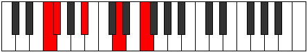 |
| [549](https://ianring.com/musictheory/scales/549) | [Rothic](ModeFNaturalRothic.md) | F | F, G, A#, D, F |  |
| [549](https://ianring.com/musictheory/scales/549) | [Rothic](ModeGSharpRothic.md) | G# | G#, A#, C#, F, G# |  |
| [549](https://ianring.com/musictheory/scales/549) | [Rothic](ModeAFlatRothic.md) | Ab | Ab, Bb, Db, F, Ab |  |
| [551](https://ianring.com/musictheory/scales/551) | [Aeoloditonic](ModeFNaturalAeoloditonic.md) | F | F, F#, G, A#, D, F |  |
| [551](https://ianring.com/musictheory/scales/551) | [Aeoloditonic](ModeGSharpAeoloditonic.md) | G# | G#, A, A#, C#, F, G# |  |
| [551](https://ianring.com/musictheory/scales/551) | [Aeoloditonic](ModeAFlatAeoloditonic.md) | Ab | Ab, A, Bb, Db, F, Ab |  |
| [553](https://ianring.com/musictheory/scales/553) | [Phradic](ModeFNaturalPhradic.md) | F | F, G#, A#, D, F |  |
| [555](https://ianring.com/musictheory/scales/555) | [Aeolycritonic](ModeFNaturalAeolycritonic.md) | F | F, F#, G#, A#, D, F |  |
| [557](https://ianring.com/musictheory/scales/557) | [Gythitonic](ModeFNaturalGythitonic.md) | F | F, G, G#, A#, D, F |  |
| [557](https://ianring.com/musictheory/scales/557) | [Gythitonic](ModeGSharpGythitonic.md) | G# | G#, A#, B, C#, F, G# |  |
| [557](https://ianring.com/musictheory/scales/557) | [Gythitonic](ModeAFlatGythitonic.md) | Ab | Ab, Bb, B, Db, F, Ab |  |
| [559](https://ianring.com/musictheory/scales/559) | [Lylimic](ModeFNaturalLylimic.md) | F | F, Gb, Abb, Bbbb, Cbb, D, F |  |
| [559](https://ianring.com/musictheory/scales/559) | [Lylimic](ModeGSharpLylimic.md) | G# | G#, A, Bb, Cb, Db, E#, G# |  |
| [559](https://ianring.com/musictheory/scales/559) | [Lylimic](ModeAFlatLylimic.md) | Ab | Ab, Bbb, Cbb, Dbbb, Ebbb, F, Ab |  |
| [561](https://ianring.com/musictheory/scales/561) | [Phratic](ModeCSharpPhratic.md) | C# | C#, F, F#, A#, C# |  |
| [561](https://ianring.com/musictheory/scales/561) | [Phratic](ModeDFlatPhratic.md) | Db | Db, F, Gb, Bb, Db |  |
| [561](https://ianring.com/musictheory/scales/561) | [Phratic](ModeFNaturalPhratic.md) | F | F, A, A#, D, F |  |
| [563](https://ianring.com/musictheory/scales/563) | [Thacritonic](ModeCSharpThacritonic.md) | C# | C#, D, F, F#, A#, C# |  |
| [563](https://ianring.com/musictheory/scales/563) | [Thacritonic](ModeDFlatThacritonic.md) | Db | Db, D, F, Gb, Bb, Db |  |
| [563](https://ianring.com/musictheory/scales/563) | [Thacritonic](ModeFNaturalThacritonic.md) | F | F, F#, A, A#, D, F |  |
| [565](https://ianring.com/musictheory/scales/565) | [Aeolyphritonic](ModeCSharpAeolyphritonic.md) | C# | C#, D#, F, F#, A#, C# |  |
| [565](https://ianring.com/musictheory/scales/565) | [Aeolyphritonic](ModeDFlatAeolyphritonic.md) | Db | Db, Eb, F, Gb, Bb, Db |  |
| [565](https://ianring.com/musictheory/scales/565) | [Aeolyphritonic](ModeGSharpAeolyphritonic.md) | G# | G#, A#, C, C#, F, G# |  |
| [565](https://ianring.com/musictheory/scales/565) | [Aeolyphritonic](ModeAFlatAeolyphritonic.md) | Ab | Ab, Bb, C, Db, F, Ab |  |
| [565](https://ianring.com/musictheory/scales/565) | [Aeolyphritonic](ModeFNaturalAeolyphritonic.md) | F | F, G, A, A#, D, F |  |
| [567](https://ianring.com/musictheory/scales/567) | [Aeoladimic](ModeCSharpAeoladimic.md) | C# | C#, D, Eb, F, Gb, A#, C# |  |
| [567](https://ianring.com/musictheory/scales/567) | [Aeoladimic](ModeDFlatAeoladimic.md) | Db | Db, Ebb, Fbb, Gbb, Abbb, Bb, Db |  |
| [567](https://ianring.com/musictheory/scales/567) | [Aeoladimic](ModeFNaturalAeoladimic.md) | F | F, Gb, Abb, Bbb, Cbb, D, F |  |
| [567](https://ianring.com/musictheory/scales/567) | [Aeoladimic](ModeGSharpAeoladimic.md) | G# | G#, A, Bb, C, Db, E#, G# |  |
| [567](https://ianring.com/musictheory/scales/567) | [Aeoladimic](ModeAFlatAeoladimic.md) | Ab | Ab, Bbb, Cbb, Dbb, Ebbb, F, Ab |  |
| [569](https://ianring.com/musictheory/scales/569) | [Mothitonic](ModeCSharpMothitonic.md) | C# | C#, E, F, F#, A#, C# |  |
| [569](https://ianring.com/musictheory/scales/569) | [Mothitonic](ModeDFlatMothitonic.md) | Db | Db, E, F, Gb, Bb, Db |  |
| [569](https://ianring.com/musictheory/scales/569) | [Mothitonic](ModeFNaturalMothitonic.md) | F | F, G#, A, A#, D, F |  |
| [571](https://ianring.com/musictheory/scales/571) | [Kynimic](ModeCSharpKynimic.md) | C# | C#, D, E, F, Gb, A#, C# |  |
| [571](https://ianring.com/musictheory/scales/571) | [Kynimic](ModeDFlatKynimic.md) | Db | Db, Ebb, Fb, Gbb, Abbb, Bb, Db |  |
| [571](https://ianring.com/musictheory/scales/571) | [Kynimic](ModeFNaturalKynimic.md) | F | F, Gb, Ab, Bbb, Cbb, D, F |  |
| [573](https://ianring.com/musictheory/scales/573) | [Saptimic](ModeCSharpSaptimic.md) | C# | C#, D#, E, F, Gb, A#, C# |  |
| [573](https://ianring.com/musictheory/scales/573) | [Saptimic](ModeDFlatSaptimic.md) | Db | Db, Eb, Fb, Gbb, Abbb, Bb, Db |  |
| [573](https://ianring.com/musictheory/scales/573) | [Saptimic](ModeFNaturalSaptimic.md) | F | F, G, Ab, Bbb, Cbb, D, F |  |
| [573](https://ianring.com/musictheory/scales/573) | [Saptimic](ModeGSharpSaptimic.md) | G# | G#, A#, B, C, Db, E#, G# |  |
| [573](https://ianring.com/musictheory/scales/573) | [Saptimic](ModeAFlatSaptimic.md) | Ab | Ab, Bb, Cb, Dbb, Ebbb, F, Ab |  |
| [575](https://ianring.com/musictheory/scales/575) | [Ionydian](ModeCSharpIonydian.md) | C# | C#, D, Eb, Fb, Gbb, Abbb, Bb, C# |  |
| [575](https://ianring.com/musictheory/scales/575) | [Ionydian](ModeDFlatIonydian.md) | Db | Db, Ebb, Fbb, Gbbb, D###, E##, Cbb, Db |  |
| [575](https://ianring.com/musictheory/scales/575) | [Ionydian](ModeFNaturalIonydian.md) | F | F, Gb, Abb, Bbbb, Cbbb, Cbb, D, F |  |
| [575](https://ianring.com/musictheory/scales/575) | [Ionydian](ModeGSharpIonydian.md) | G# | G#, A, Bb, Cb, Dbb, Ebbb, F, G# |  |
| [575](https://ianring.com/musictheory/scales/575) | [Ionydian](ModeAFlatIonydian.md) | Ab | Ab, Bbb, Cbb, Dbbb, Dbb, Ebbb, F, Ab |  |
| [581](https://ianring.com/musictheory/scales/581) | [Bolic](ModeGSharpBolic.md) | G# | G#, A#, D, F, G# |  |
| [581](https://ianring.com/musictheory/scales/581) | [Bolic](ModeAFlatBolic.md) | Ab | Ab, Bb, D, F, Ab |  |
| [583](https://ianring.com/musictheory/scales/583) | [Aeritonic](ModeENaturalAeritonic.md) | E | E, F, F#, A#, C#, E |  |
| [583](https://ianring.com/musictheory/scales/583) | [Aeritonic](ModeGSharpAeritonic.md) | G# | G#, A, A#, D, F, G# |  |
| [583](https://ianring.com/musictheory/scales/583) | [Aeritonic](ModeAFlatAeritonic.md) | Ab | Ab, A, Bb, D, F, Ab |  |
| [587](https://ianring.com/musictheory/scales/587) | [Pathitonic](ModeENaturalPathitonic.md) | E | E, F, G, A#, C#, E |  |
| [589](https://ianring.com/musictheory/scales/589) | [Ionalitonic](ModeGSharpIonalitonic.md) | G# | G#, A#, B, D, F, G# |  |
| [589](https://ianring.com/musictheory/scales/589) | [Ionalitonic](ModeAFlatIonalitonic.md) | Ab | Ab, Bb, B, D, F, Ab |  |
| [591](https://ianring.com/musictheory/scales/591) | [Gaptimic](ModeENaturalGaptimic.md) | E | E, F, Gb, Abb, Bb, C#, E |  |
| [591](https://ianring.com/musictheory/scales/591) | [Gaptimic](ModeGSharpGaptimic.md) | G# | G#, A, Bb, Cb, D, E#, G# |  |
| [591](https://ianring.com/musictheory/scales/591) | [Gaptimic](ModeAFlatGaptimic.md) | Ab | Ab, Bbb, Cbb, Dbbb, Ebb, F, Ab |  |
| [593](https://ianring.com/musictheory/scales/593) | [Saric](ModeCSharpSaric.md) | C# | C#, F, G, A#, C# |  |
| [593](https://ianring.com/musictheory/scales/593) | [Saric](ModeDFlatSaric.md) | Db | Db, F, G, Bb, Db | 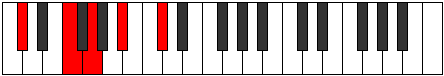 |
| [595](https://ianring.com/musictheory/scales/595) | [Sogitonic](ModeCSharpSogitonic.md) | C# | C#, D, F, G, A#, C# |  |
| [595](https://ianring.com/musictheory/scales/595) | [Sogitonic](ModeDFlatSogitonic.md) | Db | Db, D, F, G, Bb, Db |  |
| [595](https://ianring.com/musictheory/scales/595) | [Sogitonic](ModeENaturalSogitonic.md) | E | E, F, G#, A#, C#, E |  |
| [597](https://ianring.com/musictheory/scales/597) | [Thonitonic](ModeCSharpThonitonic.md) | C# | C#, D#, F, G, A#, C# |  |
| [597](https://ianring.com/musictheory/scales/597) | [Thonitonic](ModeDFlatThonitonic.md) | Db | Db, Eb, F, G, Bb, Db |  |
| [597](https://ianring.com/musictheory/scales/597) | [Thonitonic](ModeGSharpThonitonic.md) | G# | G#, A#, C, D, F, G# |  |
| [597](https://ianring.com/musictheory/scales/597) | [Thonitonic](ModeAFlatThonitonic.md) | Ab | Ab, Bb, C, D, F, Ab |  |
| [599](https://ianring.com/musictheory/scales/599) | [Thyrimic](ModeCSharpThyrimic.md) | C# | C#, D, Eb, F, G, A#, C# |  |
| [599](https://ianring.com/musictheory/scales/599) | [Thyrimic](ModeDFlatThyrimic.md) | Db | Db, Ebb, Fbb, Gbb, Abb, Bb, Db |  |
| [599](https://ianring.com/musictheory/scales/599) | [Thyrimic](ModeENaturalThyrimic.md) | E | E, F, Gb, Ab, Bb, C#, E |  |
| [599](https://ianring.com/musictheory/scales/599) | [Thyrimic](ModeGSharpThyrimic.md) | G# | G#, A, Bb, C, D, E#, G# |  |
| [599](https://ianring.com/musictheory/scales/599) | [Thyrimic](ModeAFlatThyrimic.md) | Ab | Ab, Bbb, Cbb, Dbb, Ebb, F, Ab |  |
| [601](https://ianring.com/musictheory/scales/601) | [Bycritonic](ModeCSharpBycritonic.md) | C# | C#, E, F, G, A#, C# |  |
| [601](https://ianring.com/musictheory/scales/601) | [Bycritonic](ModeDFlatBycritonic.md) | Db | Db, E, F, G, Bb, Db |  |
| [603](https://ianring.com/musictheory/scales/603) | [Aeolygimic](ModeCSharpAeolygimic.md) | C# | C#, D, E, F, G, A#, C# |  |
| [603](https://ianring.com/musictheory/scales/603) | [Aeolygimic](ModeDFlatAeolygimic.md) | Db | Db, Ebb, Fb, Gbb, Abb, Bb, Db |  |
| [603](https://ianring.com/musictheory/scales/603) | [Aeolygimic](ModeENaturalAeolygimic.md) | E | E, F, G, Ab, Bb, C#, E |  |
| [605](https://ianring.com/musictheory/scales/605) | [Dycrimic](ModeCSharpDycrimic.md) | C# | C#, D#, E, F, G, A#, C# |  |
| [605](https://ianring.com/musictheory/scales/605) | [Dycrimic](ModeDFlatDycrimic.md) | Db | Db, Eb, Fb, Gbb, Abb, Bb, Db |  |
| [605](https://ianring.com/musictheory/scales/605) | [Dycrimic](ModeGSharpDycrimic.md) | G# | G#, A#, B, C, D, E#, G# |  |
| [605](https://ianring.com/musictheory/scales/605) | [Dycrimic](ModeAFlatDycrimic.md) | Ab | Ab, Bb, Cb, Dbb, Ebb, F, Ab |  |
| [607](https://ianring.com/musictheory/scales/607) | [Kadian](ModeCSharpKadian.md) | C# | C#, D, Eb, Fb, Gbb, Abb, Bb, C# |  |
| [607](https://ianring.com/musictheory/scales/607) | [Kadian](ModeDFlatKadian.md) | Db | Db, Ebb, Fbb, Gbbb, D###, E###, Cbb, Db |  |
| [607](https://ianring.com/musictheory/scales/607) | [Kadian](ModeENaturalKadian.md) | E | E, F, Gb, Abb, Bbbb, Cbb, Db, E |  |
| [607](https://ianring.com/musictheory/scales/607) | [Kadian](ModeGSharpKadian.md) | G# | G#, A, Bb, Cb, Dbb, Ebb, F, G# |  |
| [607](https://ianring.com/musictheory/scales/607) | [Kadian](ModeAFlatKadian.md) | Ab | Ab, Bbb, Cbb, Dbbb, Dbb, Ebb, F, Ab |  |
| [611](https://ianring.com/musictheory/scales/611) | [Zynitonic](ModeENaturalZynitonic.md) | E | E, F, A, A#, C#, E |  |
| [611](https://ianring.com/musictheory/scales/611) | [Zynitonic](ModeFNaturalZynitonic.md) | F | F, F#, A#, B, D, F |  |
| [613](https://ianring.com/musictheory/scales/613) | [Phralitonic](ModeGSharpPhralitonic.md) | G# | G#, A#, C#, D, F, G# |  |
| [613](https://ianring.com/musictheory/scales/613) | [Phralitonic](ModeAFlatPhralitonic.md) | Ab | Ab, Bb, Db, D, F, Ab |  |
| [613](https://ianring.com/musictheory/scales/613) | [Phralitonic](ModeFNaturalPhralitonic.md) | F | F, G, A#, B, D, F |  |
| [615](https://ianring.com/musictheory/scales/615) | [Phrothimic](ModeENaturalPhrothimic.md) | E | E, F, Gb, A, Bb, C#, E |  |
| [615](https://ianring.com/musictheory/scales/615) | [Phrothimic](ModeGSharpPhrothimic.md) | G# | G#, A, Bb, C#, D, E#, G# |  |
| [615](https://ianring.com/musictheory/scales/615) | [Phrothimic](ModeAFlatPhrothimic.md) | Ab | Ab, Bbb, Cbb, Db, Ebb, F, Ab |  |
| [615](https://ianring.com/musictheory/scales/615) | [Phrothimic](ModeFNaturalPhrothimic.md) | F | F, Gb, Abb, Bb, Cb, D, F |  |
| [617](https://ianring.com/musictheory/scales/617) | [Katycritonic](ModeFNaturalKatycritonic.md) | F | F, G#, A#, B, D, F |  |
| [619](https://ianring.com/musictheory/scales/619) | [Parimic](ModeENaturalParimic.md) | E | E, F, G, A, Bb, C#, E |  |
| [619](https://ianring.com/musictheory/scales/619) | [Parimic](ModeFNaturalParimic.md) | F | F, Gb, Ab, Bb, Cb, D, F |  |
| [621](https://ianring.com/musictheory/scales/621) | [Kyrimic](ModeGSharpKyrimic.md) | G# | G#, A#, B, C#, D, E#, G# |  |
| [621](https://ianring.com/musictheory/scales/621) | [Kyrimic](ModeAFlatKyrimic.md) | Ab | Ab, Bb, Cb, Db, Ebb, F, Ab |  |
| [621](https://ianring.com/musictheory/scales/621) | [Kyrimic](ModeFNaturalKyrimic.md) | F | F, G, Ab, Bb, Cb, D, F |  |
| [623](https://ianring.com/musictheory/scales/623) | [Sycrian](ModeENaturalSycrian.md) | E | E, F, Gb, Abb, Bbb, Cbb, Db, E |  |
| [623](https://ianring.com/musictheory/scales/623) | [Sycrian](ModeFNaturalSycrian.md) | F | F, Gb, Abb, Bbbb, Cbb, Dbbb, Ebb, F |  |
| [623](https://ianring.com/musictheory/scales/623) | [Sycrian](ModeGSharpSycrian.md) | G# | G#, A, Bb, Cb, Db, Ebb, F, G# |  |
| [623](https://ianring.com/musictheory/scales/623) | [Sycrian](ModeAFlatSycrian.md) | Ab | Ab, Bbb, Cbb, Dbbb, Ebbb, Fbbb, Gbb, Ab | 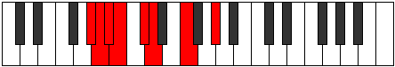 |
| [625](https://ianring.com/musictheory/scales/625) | [Ionyptitonic](ModeCSharpIonyptitonic.md) | C# | C#, F, F#, G, A#, C# |  |
| [625](https://ianring.com/musictheory/scales/625) | [Ionyptitonic](ModeDFlatIonyptitonic.md) | Db | Db, F, Gb, G, Bb, Db |  |
| [625](https://ianring.com/musictheory/scales/625) | [Ionyptitonic](ModeFNaturalIonyptitonic.md) | F | F, A, A#, B, D, F |  |
| [627](https://ianring.com/musictheory/scales/627) | [Mogimic](ModeCSharpMogimic.md) | C# | C#, D, E#, F#, G, A#, C# |  |
| [627](https://ianring.com/musictheory/scales/627) | [Mogimic](ModeDFlatMogimic.md) | Db | Db, Ebb, F, Gb, Abb, Bb, Db |  |
| [627](https://ianring.com/musictheory/scales/627) | [Mogimic](ModeENaturalMogimic.md) | E | E, F, G#, A, Bb, C#, E |  |
| [627](https://ianring.com/musictheory/scales/627) | [Mogimic](ModeFNaturalMogimic.md) | F | F, Gb, A, Bb, Cb, D, F |  |
| [629](https://ianring.com/musictheory/scales/629) | [Aeronimic](ModeCSharpAeronimic.md) | C# | C#, D#, E#, F#, G, A#, C# |  |
| [629](https://ianring.com/musictheory/scales/629) | [Aeronimic](ModeDFlatAeronimic.md) | Db | Db, Eb, F, Gb, Abb, Bb, Db |  |
| [629](https://ianring.com/musictheory/scales/629) | [Aeronimic](ModeGSharpAeronimic.md) | G# | G#, A#, B#, C#, D, E#, G# | 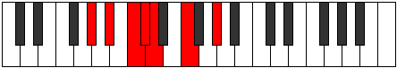 |
| [629](https://ianring.com/musictheory/scales/629) | [Aeronimic](ModeAFlatAeronimic.md) | Ab | Ab, Bb, C, Db, Ebb, F, Ab |  |
| [629](https://ianring.com/musictheory/scales/629) | [Aeronimic](ModeFNaturalAeronimic.md) | F | F, G, A, Bb, Cb, D, F |  |
| [631](https://ianring.com/musictheory/scales/631) | [Zygian](ModeCSharpZygian.md) | C# | C#, D, Eb, F, Gb, Abb, Bb, C# |  |
| [631](https://ianring.com/musictheory/scales/631) | [Zygian](ModeDFlatZygian.md) | Db | Db, Ebb, Fbb, Gbb, Abbb, E###, Cbb, Db |  |
| [631](https://ianring.com/musictheory/scales/631) | [Zygian](ModeGSharpZygian.md) | G# | G#, A, Bb, C, Db, Ebb, F, G# |  |
| [631](https://ianring.com/musictheory/scales/631) | [Zygian](ModeAFlatZygian.md) | Ab | Ab, Bbb, Cbb, Dbb, Ebbb, Fbbb, Gbb, Ab |  |
| [631](https://ianring.com/musictheory/scales/631) | [Zygian](ModeENaturalZygian.md) | E | E, F, Gb, Ab, Bbb, Cbb, Db, E |  |
| [631](https://ianring.com/musictheory/scales/631) | [Zygian](ModeFNaturalZygian.md) | F | F, Gb, Abb, Bbb, Cbb, Dbbb, Ebb, F |  |
| [633](https://ianring.com/musictheory/scales/633) | [Kydimic](ModeCSharpKydimic.md) | C# | C#, D##, E#, F#, G, A#, C# |  |
| [633](https://ianring.com/musictheory/scales/633) | [Kydimic](ModeDFlatKydimic.md) | Db | Db, E, F, Gb, Abb, Bb, Db |  |
| [633](https://ianring.com/musictheory/scales/633) | [Kydimic](ModeFNaturalKydimic.md) | F | F, G#, A, Bb, Cb, D, F |  |
| [635](https://ianring.com/musictheory/scales/635) | [Epolian](ModeCSharpEpolian.md) | C# | C#, D, E, F, Gb, Abb, Bb, C# |  |
| [635](https://ianring.com/musictheory/scales/635) | [Epolian](ModeDFlatEpolian.md) | Db | Db, Ebb, Fb, Gbb, Abbb, E###, Cbb, Db |  |
| [635](https://ianring.com/musictheory/scales/635) | [Epolian](ModeENaturalEpolian.md) | E | E, F, G, Ab, Bbb, Cbb, Db, E |  |
| [635](https://ianring.com/musictheory/scales/635) | [Epolian](ModeFNaturalEpolian.md) | F | F, Gb, Ab, Bbb, Cbb, Dbbb, Ebb, F |  |
| [637](https://ianring.com/musictheory/scales/637) | [Katodian](ModeCSharpKatodian.md) | C# | C#, D#, E, F, Gb, Abb, Bb, C# |  |
| [637](https://ianring.com/musictheory/scales/637) | [Katodian](ModeDFlatKatodian.md) | Db | Db, Eb, Fb, Gbb, Abbb, E###, Cbb, Db |  |
| [637](https://ianring.com/musictheory/scales/637) | [Katodian](ModeGSharpKatodian.md) | G# | G#, A#, B, C, Db, Ebb, F, G# |  |
| [637](https://ianring.com/musictheory/scales/637) | [Katodian](ModeAFlatKatodian.md) | Ab | Ab, Bb, Cb, Dbb, Ebbb, Fbbb, Gbb, Ab |  |
| [637](https://ianring.com/musictheory/scales/637) | [Katodian](ModeFNaturalKatodian.md) | F | F, G, Ab, Bbb, Cbb, Dbbb, Ebb, F |  |
| [639](https://ianring.com/musictheory/scales/639) | [Ionaryllic](ModeCSharpIonaryllic.md) | C# | C#, D, D#, E, F, F#, G, A#, C# |  |
| [639](https://ianring.com/musictheory/scales/639) | [Ionaryllic](ModeDFlatIonaryllic.md) | Db | Db, D, Eb, E, F, Gb, G, Bb, Db |  |
| [639](https://ianring.com/musictheory/scales/639) | [Ionaryllic](ModeENaturalIonaryllic.md) | E | E, F, F#, G, G#, A, A#, C#, E |  |
| [639](https://ianring.com/musictheory/scales/639) | [Ionaryllic](ModeGSharpIonaryllic.md) | G# | G#, A, A#, B, C, C#, D, F, G# |  |
| [639](https://ianring.com/musictheory/scales/639) | [Ionaryllic](ModeAFlatIonaryllic.md) | Ab | Ab, A, Bb, B, C, Db, D, F, Ab |  |
| [639](https://ianring.com/musictheory/scales/639) | [Ionaryllic](ModeFNaturalIonaryllic.md) | F | F, F#, G, G#, A, A#, B, D, F |  |
| [649](https://ianring.com/musictheory/scales/649) | [Byptic](ModeASharpByptic.md) | A# | A#, C#, F, G, A# |  |
| [649](https://ianring.com/musictheory/scales/649) | [Byptic](ModeBFlatByptic.md) | Bb | Bb, Db, F, G, Bb | 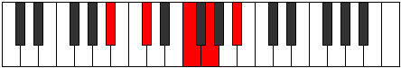 |
| [651](https://ianring.com/musictheory/scales/651) | [Golitonic](ModeASharpGolitonic.md) | A# | A#, B, C#, F, G, A# |  |
| [651](https://ianring.com/musictheory/scales/651) | [Golitonic](ModeBFlatGolitonic.md) | Bb | Bb, B, Db, F, G, Bb |  |
| [653](https://ianring.com/musictheory/scales/653) | [Stathitonic](ModeDSharpStathitonic.md) | D# | D#, F, F#, A#, C, D# |  |
| [653](https://ianring.com/musictheory/scales/653) | [Stathitonic](ModeEFlatStathitonic.md) | Eb | Eb, F, Gb, Bb, C, Eb |  |
| [653](https://ianring.com/musictheory/scales/653) | [Stathitonic](ModeASharpStathitonic.md) | A# | A#, C, C#, F, G, A# |  |
| [653](https://ianring.com/musictheory/scales/653) | [Stathitonic](ModeBFlatStathitonic.md) | Bb | Bb, C, Db, F, G, Bb |  |
| [653](https://ianring.com/musictheory/scales/653) | [Stathitonic](ModeGSharpStathitonic.md) | G# | G#, A#, B, D#, F, G# |  |
| [653](https://ianring.com/musictheory/scales/653) | [Stathitonic](ModeAFlatStathitonic.md) | Ab | Ab, Bb, B, Eb, F, Ab |  |
| [655](https://ianring.com/musictheory/scales/655) | [Kataptimic](ModeDSharpKataptimic.md) | D# | D#, E, F, Gb, A#, B#, D# |  |
| [655](https://ianring.com/musictheory/scales/655) | [Kataptimic](ModeEFlatKataptimic.md) | Eb | Eb, Fb, Gbb, Abbb, Bb, C, Eb |  |
| [655](https://ianring.com/musictheory/scales/655) | [Kataptimic](ModeASharpKataptimic.md) | A# | A#, B, C, Db, E#, F##, A# |  |
| [655](https://ianring.com/musictheory/scales/655) | [Kataptimic](ModeBFlatKataptimic.md) | Bb | Bb, Cb, Dbb, Ebbb, F, G, Bb |  |
| [655](https://ianring.com/musictheory/scales/655) | [Kataptimic](ModeGSharpKataptimic.md) | G# | G#, A, Bb, Cb, D#, E#, G# |  |
| [655](https://ianring.com/musictheory/scales/655) | [Kataptimic](ModeAFlatKataptimic.md) | Ab | Ab, Bbb, Cbb, Dbbb, Eb, F, Ab |  |
| [657](https://ianring.com/musictheory/scales/657) | [Epathic](ModeASharpEpathic.md) | A# | A#, D, F, G, A# |  |
| [657](https://ianring.com/musictheory/scales/657) | [Epathic](ModeBFlatEpathic.md) | Bb | Bb, D, F, G, Bb |  |
| [657](https://ianring.com/musictheory/scales/657) | [Epathic](ModeCSharpEpathic.md) | C# | C#, F, G#, A#, C# |  |
| [657](https://ianring.com/musictheory/scales/657) | [Epathic](ModeDFlatEpathic.md) | Db | Db, F, Ab, Bb, Db |  |
| [659](https://ianring.com/musictheory/scales/659) | [Soptitonic](ModeCSharpSoptitonic.md) | C# | C#, D, F, G#, A#, C# |  |
| [659](https://ianring.com/musictheory/scales/659) | [Soptitonic](ModeDFlatSoptitonic.md) | Db | Db, D, F, Ab, Bb, Db |  |
| [659](https://ianring.com/musictheory/scales/659) | [Soptitonic](ModeASharpSoptitonic.md) | A# | A#, B, D, F, G, A# |  |
| [659](https://ianring.com/musictheory/scales/659) | [Soptitonic](ModeBFlatSoptitonic.md) | Bb | Bb, B, D, F, G, Bb |  |
| [661](https://ianring.com/musictheory/scales/661) | [Pentatonic](ModeASharpPentatonic.md) | A# | A#, C, D, F, G, A# |  |
| [661](https://ianring.com/musictheory/scales/661) | [Pentatonic](ModeBFlatPentatonic.md) | Bb | Bb, C, D, F, G, Bb |  |
| [661](https://ianring.com/musictheory/scales/661) | [Pentatonic](ModeDSharpPentatonic.md) | D# | D#, F, G, A#, C, D# |  |
| [661](https://ianring.com/musictheory/scales/661) | [Pentatonic](ModeEFlatPentatonic.md) | Eb | Eb, F, G, Bb, C, Eb |  |
| [661](https://ianring.com/musictheory/scales/661) | [Pentatonic](ModeGSharpPentatonic.md) | G# | G#, A#, C, D#, F, G# |  |
| [661](https://ianring.com/musictheory/scales/661) | [Pentatonic](ModeAFlatPentatonic.md) | Ab | Ab, Bb, C, Eb, F, Ab |  |
| [661](https://ianring.com/musictheory/scales/661) | [Pentatonic](ModeCSharpPentatonic.md) | C# | C#, D#, F, G#, A#, C# |  |
| [661](https://ianring.com/musictheory/scales/661) | [Pentatonic](ModeDFlatPentatonic.md) | Db | Db, Eb, F, Ab, Bb, Db |  |
| [663](https://ianring.com/musictheory/scales/663) | [Phrynimic](ModeDSharpPhrynimic.md) | D# | D#, E, F, G, A#, B#, D# |  |
| [663](https://ianring.com/musictheory/scales/663) | [Phrynimic](ModeEFlatPhrynimic.md) | Eb | Eb, Fb, Gbb, Abb, Bb, C, Eb |  |
| [663](https://ianring.com/musictheory/scales/663) | [Phrynimic](ModeCSharpPhrynimic.md) | C# | C#, D, Eb, F, G#, A#, C# |  |
| [663](https://ianring.com/musictheory/scales/663) | [Phrynimic](ModeDFlatPhrynimic.md) | Db | Db, Ebb, Fbb, Gbb, Ab, Bb, Db |  |
| [663](https://ianring.com/musictheory/scales/663) | [Phrynimic](ModeGSharpPhrynimic.md) | G# | G#, A, Bb, C, D#, E#, G# |  |
| [663](https://ianring.com/musictheory/scales/663) | [Phrynimic](ModeAFlatPhrynimic.md) | Ab | Ab, Bbb, Cbb, Dbb, Eb, F, Ab |  |
| [663](https://ianring.com/musictheory/scales/663) | [Phrynimic](ModeASharpPhrynimic.md) | A# | A#, B, C, D, E#, F##, A# |  |
| [663](https://ianring.com/musictheory/scales/663) | [Phrynimic](ModeBFlatPhrynimic.md) | Bb | Bb, Cb, Dbb, Ebb, F, G, Bb |  |
| [665](https://ianring.com/musictheory/scales/665) | [Mythitonic](ModeASharpMythitonic.md) | A# | A#, C#, D, F, G, A# |  |
| [665](https://ianring.com/musictheory/scales/665) | [Mythitonic](ModeBFlatMythitonic.md) | Bb | Bb, Db, D, F, G, Bb |  |
| [665](https://ianring.com/musictheory/scales/665) | [Mythitonic](ModeCSharpMythitonic.md) | C# | C#, E, F, G#, A#, C# |  |
| [665](https://ianring.com/musictheory/scales/665) | [Mythitonic](ModeDFlatMythitonic.md) | Db | Db, E, F, Ab, Bb, Db |  |
| [667](https://ianring.com/musictheory/scales/667) | [Rodimic](ModeCSharpRodimic.md) | C# | C#, D, E, F, G#, A#, C# |  |
| [667](https://ianring.com/musictheory/scales/667) | [Rodimic](ModeDFlatRodimic.md) | Db | Db, Ebb, Fb, Gbb, Ab, Bb, Db |  |
| [667](https://ianring.com/musictheory/scales/667) | [Rodimic](ModeASharpRodimic.md) | A# | A#, B, C#, D, E#, F##, A# |  |
| [667](https://ianring.com/musictheory/scales/667) | [Rodimic](ModeBFlatRodimic.md) | Bb | Bb, Cb, Db, Ebb, F, G, Bb |  |
| [669](https://ianring.com/musictheory/scales/669) | [Gycrimic](ModeASharpGycrimic.md) | A# | A#, B#, C#, D, E#, F##, A# |  |
| [669](https://ianring.com/musictheory/scales/669) | [Gycrimic](ModeBFlatGycrimic.md) | Bb | Bb, C, Db, Ebb, F, G, Bb |  |
| [669](https://ianring.com/musictheory/scales/669) | [Gycrimic](ModeDSharpGycrimic.md) | D# | D#, E#, F#, G, A#, B#, D# |  |
| [669](https://ianring.com/musictheory/scales/669) | [Gycrimic](ModeEFlatGycrimic.md) | Eb | Eb, F, Gb, Abb, Bb, C, Eb |  |
| [669](https://ianring.com/musictheory/scales/669) | [Gycrimic](ModeCSharpGycrimic.md) | C# | C#, D#, E, F, G#, A#, C# |  |
| [669](https://ianring.com/musictheory/scales/669) | [Gycrimic](ModeDFlatGycrimic.md) | Db | Db, Eb, Fb, Gbb, Ab, Bb, Db |  |
| [669](https://ianring.com/musictheory/scales/669) | [Gycrimic](ModeGSharpGycrimic.md) | G# | G#, A#, B, C, D#, E#, G# |  |
| [669](https://ianring.com/musictheory/scales/669) | [Gycrimic](ModeAFlatGycrimic.md) | Ab | Ab, Bb, Cb, Dbb, Eb, F, Ab |  |
| [671](https://ianring.com/musictheory/scales/671) | [Stycrian](ModeDSharpStycrian.md) | D# | D#, E, F, Gb, Abb, Bb, C, D# |  |
| [671](https://ianring.com/musictheory/scales/671) | [Stycrian](ModeEFlatStycrian.md) | Eb | Eb, Fb, Gbb, Abbb, E###, Cbb, Dbb, Eb |  |
| [671](https://ianring.com/musictheory/scales/671) | [Stycrian](ModeCSharpStycrian.md) | C# | C#, D, Eb, Fb, Gbb, Ab, Bb, C# |  |
| [671](https://ianring.com/musictheory/scales/671) | [Stycrian](ModeDFlatStycrian.md) | Db | Db, Ebb, Fbb, Gbbb, D###, F###, G###, Db |  |
| [671](https://ianring.com/musictheory/scales/671) | [Stycrian](ModeASharpStycrian.md) | A# | A#, B, C, Db, Ebb, F, G, A# |  |
| [671](https://ianring.com/musictheory/scales/671) | [Stycrian](ModeBFlatStycrian.md) | Bb | Bb, Cb, Dbb, Ebbb, Fbbb, Gbb, Abb, Bb |  |
| [671](https://ianring.com/musictheory/scales/671) | [Stycrian](ModeGSharpStycrian.md) | G# | G#, A, Bb, Cb, Dbb, Eb, F, G# |  |
| [671](https://ianring.com/musictheory/scales/671) | [Stycrian](ModeAFlatStycrian.md) | Ab | Ab, Bbb, Cbb, Dbbb, Dbb, Eb, F, Ab |  |
| [675](https://ianring.com/musictheory/scales/675) | [Zyditonic](ModeFNaturalZyditonic.md) | F | F, F#, A#, C, D, F |  |
| [675](https://ianring.com/musictheory/scales/675) | [Zyditonic](ModeASharpZyditonic.md) | A# | A#, B, D#, F, G, A# |  |
| [675](https://ianring.com/musictheory/scales/675) | [Zyditonic](ModeBFlatZyditonic.md) | Bb | Bb, B, Eb, F, G, Bb |  |
| [677](https://ianring.com/musictheory/scales/677) | [Mynitonic](ModeFNaturalMynitonic.md) | F | F, G, A#, C, D, F |  |
| [677](https://ianring.com/musictheory/scales/677) | [Mynitonic](ModeASharpMynitonic.md) | A# | A#, C, D#, F, G, A# |  |
| [677](https://ianring.com/musictheory/scales/677) | [Mynitonic](ModeBFlatMynitonic.md) | Bb | Bb, C, Eb, F, G, Bb |  |
| [677](https://ianring.com/musictheory/scales/677) | [Mynitonic](ModeDSharpMynitonic.md) | D# | D#, F, G#, A#, C, D# |  |
| [677](https://ianring.com/musictheory/scales/677) | [Mynitonic](ModeEFlatMynitonic.md) | Eb | Eb, F, Ab, Bb, C, Eb |  |
| [677](https://ianring.com/musictheory/scales/677) | [Mynitonic](ModeGSharpMynitonic.md) | G# | G#, A#, C#, D#, F, G# |  |
| [677](https://ianring.com/musictheory/scales/677) | [Mynitonic](ModeAFlatMynitonic.md) | Ab | Ab, Bb, Db, Eb, F, Ab |  |
| [679](https://ianring.com/musictheory/scales/679) | [Lanimic](ModeFNaturalLanimic.md) | F | F, Gb, Abb, Bb, C, D, F |  |
| [679](https://ianring.com/musictheory/scales/679) | [Lanimic](ModeDSharpLanimic.md) | D# | D#, E, F, G#, A#, B#, D# |  |
| [679](https://ianring.com/musictheory/scales/679) | [Lanimic](ModeEFlatLanimic.md) | Eb | Eb, Fb, Gbb, Ab, Bb, C, Eb |  |
| [679](https://ianring.com/musictheory/scales/679) | [Lanimic](ModeGSharpLanimic.md) | G# | G#, A, Bb, C#, D#, E#, G# |  |
| [679](https://ianring.com/musictheory/scales/679) | [Lanimic](ModeAFlatLanimic.md) | Ab | Ab, Bbb, Cbb, Db, Eb, F, Ab |  |
| [679](https://ianring.com/musictheory/scales/679) | [Lanimic](ModeASharpLanimic.md) | A# | A#, B, C, D#, E#, F##, A# |  |
| [679](https://ianring.com/musictheory/scales/679) | [Lanimic](ModeBFlatLanimic.md) | Bb | Bb, Cb, Dbb, Eb, F, G, Bb |  |
| [681](https://ianring.com/musictheory/scales/681) | [Sylitonic](ModeASharpSylitonic.md) | A# | A#, C#, D#, F, G, A# |  |
| [681](https://ianring.com/musictheory/scales/681) | [Sylitonic](ModeBFlatSylitonic.md) | Bb | Bb, Db, Eb, F, G, Bb |  |
| [681](https://ianring.com/musictheory/scales/681) | [Sylitonic](ModeFNaturalSylitonic.md) | F | F, G#, A#, C, D, F |  |
| [683](https://ianring.com/musictheory/scales/683) | [Stogimic](ModeFNaturalStogimic.md) | F | F, Gb, Ab, Bb, C, D, F |  |
| [683](https://ianring.com/musictheory/scales/683) | [Stogimic](ModeASharpStogimic.md) | A# | A#, B, C#, D#, E#, F##, A# |  |
| [683](https://ianring.com/musictheory/scales/683) | [Stogimic](ModeBFlatStogimic.md) | Bb | Bb, Cb, Db, Eb, F, G, Bb |  |
| [685](https://ianring.com/musictheory/scales/685) | [Aerathimic](ModeASharpAerathimic.md) | A# | A#, B#, C#, D#, E#, F##, A# |  |
| [685](https://ianring.com/musictheory/scales/685) | [Aerathimic](ModeBFlatAerathimic.md) | Bb | Bb, C, Db, Eb, F, G, Bb |  |
| [685](https://ianring.com/musictheory/scales/685) | [Aerathimic](ModeDSharpAerathimic.md) | D# | D#, E#, F#, G#, A#, B#, D# |  |
| [685](https://ianring.com/musictheory/scales/685) | [Aerathimic](ModeEFlatAerathimic.md) | Eb | Eb, F, Gb, Ab, Bb, C, Eb |  |
| [685](https://ianring.com/musictheory/scales/685) | [Aerathimic](ModeFNaturalAerathimic.md) | F | F, G, Ab, Bb, C, D, F |  |
| [685](https://ianring.com/musictheory/scales/685) | [Aerathimic](ModeGSharpAerathimic.md) | G# | G#, A#, B, C#, D#, E#, G# |  |
| [685](https://ianring.com/musictheory/scales/685) | [Aerathimic](ModeAFlatAerathimic.md) | Ab | Ab, Bb, Cb, Db, Eb, F, Ab |  |
| [687](https://ianring.com/musictheory/scales/687) | [Aeolythian](ModeDSharpAeolythian.md) | D# | D#, E, F, Gb, Ab, Bb, C, D# |  |
| [687](https://ianring.com/musictheory/scales/687) | [Aeolythian](ModeEFlatAeolythian.md) | Eb | Eb, Fb, Gbb, Abbb, Bbbb, Cbb, Dbb, Eb |  |
| [687](https://ianring.com/musictheory/scales/687) | [Aeolythian](ModeFNaturalAeolythian.md) | F | F, Gb, Abb, Bbbb, Cbb, Dbb, Ebb, F |  |
| [687](https://ianring.com/musictheory/scales/687) | [Aeolythian](ModeASharpAeolythian.md) | A# | A#, B, C, Db, Eb, F, G, A# |  |
| [687](https://ianring.com/musictheory/scales/687) | [Aeolythian](ModeBFlatAeolythian.md) | Bb | Bb, Cb, Dbb, Ebbb, Fbb, Gbb, Abb, Bb |  |
| [687](https://ianring.com/musictheory/scales/687) | [Aeolythian](ModeGSharpAeolythian.md) | G# | G#, A, Bb, Cb, Db, Eb, F, G# |  |
| [687](https://ianring.com/musictheory/scales/687) | [Aeolythian](ModeAFlatAeolythian.md) | Ab | Ab, Bbb, Cbb, Dbbb, Ebbb, Fbb, Gbb, Ab |  |
| [689](https://ianring.com/musictheory/scales/689) | [Lothitonic](ModeASharpLothitonic.md) | A# | A#, D, D#, F, G, A# |  |
| [689](https://ianring.com/musictheory/scales/689) | [Lothitonic](ModeBFlatLothitonic.md) | Bb | Bb, D, Eb, F, G, Bb |  |
| [689](https://ianring.com/musictheory/scales/689) | [Lothitonic](ModeCSharpLothitonic.md) | C# | C#, F, F#, G#, A#, C# |  |
| [689](https://ianring.com/musictheory/scales/689) | [Lothitonic](ModeDFlatLothitonic.md) | Db | Db, F, Gb, Ab, Bb, Db |  |
| [689](https://ianring.com/musictheory/scales/689) | [Lothitonic](ModeFNaturalLothitonic.md) | F | F, A, A#, C, D, F |  |
| [691](https://ianring.com/musictheory/scales/691) | [Zydimic](ModeCSharpZydimic.md) | C# | C#, D, E#, F#, G#, A#, C# |  |
| [691](https://ianring.com/musictheory/scales/691) | [Zydimic](ModeDFlatZydimic.md) | Db | Db, Ebb, F, Gb, Ab, Bb, Db |  |
| [691](https://ianring.com/musictheory/scales/691) | [Zydimic](ModeFNaturalZydimic.md) | F | F, Gb, A, Bb, C, D, F |  |
| [691](https://ianring.com/musictheory/scales/691) | [Zydimic](ModeASharpZydimic.md) | A# | A#, B, C##, D#, E#, F##, A# |  |
| [691](https://ianring.com/musictheory/scales/691) | [Zydimic](ModeBFlatZydimic.md) | Bb | Bb, Cb, D, Eb, F, G, Bb |  |
| [693](https://ianring.com/musictheory/scales/693) | [Mynimic](ModeASharpMynimic.md) | A# | A#, B#, C##, D#, E#, F##, A# |  |
| [693](https://ianring.com/musictheory/scales/693) | [Mynimic](ModeBFlatMynimic.md) | Bb | Bb, C, D, Eb, F, G, Bb |  |
| [693](https://ianring.com/musictheory/scales/693) | [Mynimic](ModeGSharpMynimic.md) | G# | G#, A#, B#, C#, D#, E#, G# |  |
| [693](https://ianring.com/musictheory/scales/693) | [Mynimic](ModeAFlatMynimic.md) | Ab | Ab, Bb, C, Db, Eb, F, Ab |  |
| [693](https://ianring.com/musictheory/scales/693) | [Mynimic](ModeCSharpMynimic.md) | C# | C#, D#, E#, F#, G#, A#, C# |  |
| [693](https://ianring.com/musictheory/scales/693) | [Mynimic](ModeDFlatMynimic.md) | Db | Db, Eb, F, Gb, Ab, Bb, Db |  |
| [693](https://ianring.com/musictheory/scales/693) | [Mynimic](ModeDSharpMynimic.md) | D# | D#, E#, F##, G#, A#, B#, D# |  |
| [693](https://ianring.com/musictheory/scales/693) | [Mynimic](ModeEFlatMynimic.md) | Eb | Eb, F, G, Ab, Bb, C, Eb |  |
| [693](https://ianring.com/musictheory/scales/693) | [Mynimic](ModeFNaturalMynimic.md) | F | F, G, A, Bb, C, D, F |  |
| [695](https://ianring.com/musictheory/scales/695) | [Sarian](ModeCSharpSarian.md) | C# | C#, D, Eb, F, Gb, Ab, Bb, C# |  |
| [695](https://ianring.com/musictheory/scales/695) | [Sarian](ModeDFlatSarian.md) | Db | Db, Ebb, Fbb, Gbb, Abbb, Bbbb, Cbb, Db |  |
| [695](https://ianring.com/musictheory/scales/695) | [Sarian](ModeDSharpSarian.md) | D# | D#, E, F, G, Ab, Bb, C, D# |  |
| [695](https://ianring.com/musictheory/scales/695) | [Sarian](ModeEFlatSarian.md) | Eb | Eb, Fb, Gbb, Abb, Bbbb, Cbb, Dbb, Eb |  |
| [695](https://ianring.com/musictheory/scales/695) | [Sarian](ModeFNaturalSarian.md) | F | F, Gb, Abb, Bbb, Cbb, Dbb, Ebb, F |  |
| [695](https://ianring.com/musictheory/scales/695) | [Sarian](ModeGSharpSarian.md) | G# | G#, A, Bb, C, Db, Eb, F, G# |  |
| [695](https://ianring.com/musictheory/scales/695) | [Sarian](ModeAFlatSarian.md) | Ab | Ab, Bbb, Cbb, Dbb, Ebbb, Fbb, Gbb, Ab |  |
| [695](https://ianring.com/musictheory/scales/695) | [Sarian](ModeASharpSarian.md) | A# | A#, B, C, D, Eb, F, G, A# |  |
| [695](https://ianring.com/musictheory/scales/695) | [Sarian](ModeBFlatSarian.md) | Bb | Bb, Cb, Dbb, Ebb, Fbb, Gbb, Abb, Bb |  |
| [697](https://ianring.com/musictheory/scales/697) | [Lagimic](ModeASharpLagimic.md) | A# | A#, B##, C##, D#, E#, F##, A# |  |
| [697](https://ianring.com/musictheory/scales/697) | [Lagimic](ModeBFlatLagimic.md) | Bb | Bb, C#, D, Eb, F, G, Bb |  |
| [697](https://ianring.com/musictheory/scales/697) | [Lagimic](ModeCSharpLagimic.md) | C# | C#, D##, E#, F#, G#, A#, C# |  |
| [697](https://ianring.com/musictheory/scales/697) | [Lagimic](ModeDFlatLagimic.md) | Db | Db, E, F, Gb, Ab, Bb, Db |  |
| [697](https://ianring.com/musictheory/scales/697) | [Lagimic](ModeFNaturalLagimic.md) | F | F, G#, A, Bb, C, D, F |  |
| [699](https://ianring.com/musictheory/scales/699) | [Aerothian](ModeCSharpAerothian.md) | C# | C#, D, E, F, Gb, Ab, Bb, C# |  |
| [699](https://ianring.com/musictheory/scales/699) | [Aerothian](ModeDFlatAerothian.md) | Db | Db, Ebb, Fb, Gbb, Abbb, Bbbb, Cbb, Db |  |
| [699](https://ianring.com/musictheory/scales/699) | [Aerothian](ModeFNaturalAerothian.md) | F | F, Gb, Ab, Bbb, Cbb, Dbb, Ebb, F |  |
| [699](https://ianring.com/musictheory/scales/699) | [Aerothian](ModeASharpAerothian.md) | A# | A#, B, C#, D, Eb, F, G, A# |  |
| [699](https://ianring.com/musictheory/scales/699) | [Aerothian](ModeBFlatAerothian.md) | Bb | Bb, Cb, Db, Ebb, Fbb, Gbb, Abb, Bb |  |
| [701](https://ianring.com/musictheory/scales/701) | [Mixonyphian](ModeASharpMixonyphian.md) | A# | A#, B#, C#, D, Eb, F, G, A# |  |
| [701](https://ianring.com/musictheory/scales/701) | [Mixonyphian](ModeBFlatMixonyphian.md) | Bb | Bb, C, Db, Ebb, Fbb, Gbb, Abb, Bb |  |
| [701](https://ianring.com/musictheory/scales/701) | [Mixonyphian](ModeCSharpMixonyphian.md) | C# | C#, D#, E, F, Gb, Ab, Bb, C# |  |
| [701](https://ianring.com/musictheory/scales/701) | [Mixonyphian](ModeDFlatMixonyphian.md) | Db | Db, Eb, Fb, Gbb, Abbb, Bbbb, Cbb, Db |  |
| [701](https://ianring.com/musictheory/scales/701) | [Mixonyphian](ModeDSharpMixonyphian.md) | D# | D#, E#, F#, G, Ab, Bb, C, D# |  |
| [701](https://ianring.com/musictheory/scales/701) | [Mixonyphian](ModeEFlatMixonyphian.md) | Eb | Eb, F, Gb, Abb, Bbbb, Cbb, Dbb, Eb |  |
| [701](https://ianring.com/musictheory/scales/701) | [Mixonyphian](ModeFNaturalMixonyphian.md) | F | F, G, Ab, Bbb, Cbb, Dbb, Ebb, F |  |
| [701](https://ianring.com/musictheory/scales/701) | [Mixonyphian](ModeGSharpMixonyphian.md) | G# | G#, A#, B, C, Db, Eb, F, G# |  |
| [701](https://ianring.com/musictheory/scales/701) | [Mixonyphian](ModeAFlatMixonyphian.md) | Ab | Ab, Bb, Cb, Dbb, Ebbb, Fbb, Gbb, Ab |  |
| [703](https://ianring.com/musictheory/scales/703) | [Aerocryllic](ModeCSharpAerocryllic.md) | C# | C#, D, D#, E, F, F#, G#, A#, C# |  |
| [703](https://ianring.com/musictheory/scales/703) | [Aerocryllic](ModeDFlatAerocryllic.md) | Db | Db, D, Eb, E, F, Gb, Ab, Bb, Db |  |
| [703](https://ianring.com/musictheory/scales/703) | [Aerocryllic](ModeDSharpAerocryllic.md) | D# | D#, E, F, F#, G, G#, A#, C, D# |  |
| [703](https://ianring.com/musictheory/scales/703) | [Aerocryllic](ModeEFlatAerocryllic.md) | Eb | Eb, E, F, Gb, G, Ab, Bb, C, Eb |  |
| [703](https://ianring.com/musictheory/scales/703) | [Aerocryllic](ModeFNaturalAerocryllic.md) | F | F, F#, G, G#, A, A#, C, D, F |  |
| [703](https://ianring.com/musictheory/scales/703) | [Aerocryllic](ModeASharpAerocryllic.md) | A# | A#, B, C, C#, D, D#, F, G, A# |  |
| [703](https://ianring.com/musictheory/scales/703) | [Aerocryllic](ModeBFlatAerocryllic.md) | Bb | Bb, B, C, Db, D, Eb, F, G, Bb |  |
| [703](https://ianring.com/musictheory/scales/703) | [Aerocryllic](ModeGSharpAerocryllic.md) | G# | G#, A, A#, B, C, C#, D#, F, G# |  |
| [703](https://ianring.com/musictheory/scales/703) | [Aerocryllic](ModeAFlatAerocryllic.md) | Ab | Ab, A, Bb, B, C, Db, Eb, F, Ab |  |
| [709](https://ianring.com/musictheory/scales/709) | [Ionycritonic](ModeASharpIonycritonic.md) | A# | A#, C, E, F, G, A# |  |
| [709](https://ianring.com/musictheory/scales/709) | [Ionycritonic](ModeBFlatIonycritonic.md) | Bb | Bb, C, E, F, G, Bb |  |
| [709](https://ianring.com/musictheory/scales/709) | [Ionycritonic](ModeGSharpIonycritonic.md) | G# | G#, A#, D, D#, F, G# |  |
| [709](https://ianring.com/musictheory/scales/709) | [Ionycritonic](ModeAFlatIonycritonic.md) | Ab | Ab, Bb, D, Eb, F, Ab |  |
| [709](https://ianring.com/musictheory/scales/709) | [Ionycritonic](ModeDSharpIonycritonic.md) | D# | D#, F, A, A#, C, D# |  |
| [709](https://ianring.com/musictheory/scales/709) | [Ionycritonic](ModeEFlatIonycritonic.md) | Eb | Eb, F, A, Bb, C, Eb |  |
| [711](https://ianring.com/musictheory/scales/711) | [Epyrimic](ModeDSharpEpyrimic.md) | D# | D#, E, F, G##, A#, B#, D# |  |
| [711](https://ianring.com/musictheory/scales/711) | [Epyrimic](ModeEFlatEpyrimic.md) | Eb | Eb, Fb, Gbb, A, Bb, C, Eb |  |
| [711](https://ianring.com/musictheory/scales/711) | [Epyrimic](ModeGSharpEpyrimic.md) | G# | G#, A, Bb, C##, D#, E#, G# |  |
| [711](https://ianring.com/musictheory/scales/711) | [Epyrimic](ModeAFlatEpyrimic.md) | Ab | Ab, Bbb, Cbb, D, Eb, F, Ab |  |
| [711](https://ianring.com/musictheory/scales/711) | [Epyrimic](ModeENaturalEpyrimic.md) | E | E, F, Gb, A#, B, C#, E |  |
| [711](https://ianring.com/musictheory/scales/711) | [Epyrimic](ModeASharpEpyrimic.md) | A# | A#, B, C, D##, E#, F##, A# |  |
| [711](https://ianring.com/musictheory/scales/711) | [Epyrimic](ModeBFlatEpyrimic.md) | Bb | Bb, Cb, Dbb, E, F, G, Bb |  |
| [713](https://ianring.com/musictheory/scales/713) | [Thoptitonic](ModeASharpThoptitonic.md) | A# | A#, C#, E, F, G, A# |  |
| [713](https://ianring.com/musictheory/scales/713) | [Thoptitonic](ModeBFlatThoptitonic.md) | Bb | Bb, Db, E, F, G, Bb |  |
| [715](https://ianring.com/musictheory/scales/715) | [Dodimic](ModeENaturalDodimic.md) | E | E, F, G, A#, B, C#, E |  |
| [715](https://ianring.com/musictheory/scales/715) | [Dodimic](ModeASharpDodimic.md) | A# | A#, B, C#, D##, E#, F##, A# |  |
| [715](https://ianring.com/musictheory/scales/715) | [Dodimic](ModeBFlatDodimic.md) | Bb | Bb, Cb, Db, E, F, G, Bb |  |
| [717](https://ianring.com/musictheory/scales/717) | [Gythimic](ModeASharpGythimic.md) | A# | A#, B#, C#, D##, E#, F##, A# |  |
| [717](https://ianring.com/musictheory/scales/717) | [Gythimic](ModeBFlatGythimic.md) | Bb | Bb, C, Db, E, F, G, Bb |  |
| [717](https://ianring.com/musictheory/scales/717) | [Gythimic](ModeDSharpGythimic.md) | D# | D#, E#, F#, G##, A#, B#, D# |  |
| [717](https://ianring.com/musictheory/scales/717) | [Gythimic](ModeEFlatGythimic.md) | Eb | Eb, F, Gb, A, Bb, C, Eb |  |
| [717](https://ianring.com/musictheory/scales/717) | [Gythimic](ModeGSharpGythimic.md) | G# | G#, A#, B, C##, D#, E#, G# |  |
| [717](https://ianring.com/musictheory/scales/717) | [Gythimic](ModeAFlatGythimic.md) | Ab | Ab, Bb, Cb, D, Eb, F, Ab |  |
| [719](https://ianring.com/musictheory/scales/719) | [Kanian](ModeDSharpKanian.md) | D# | D#, E, F, Gb, A, Bb, C, D# |  |
| [719](https://ianring.com/musictheory/scales/719) | [Kanian](ModeEFlatKanian.md) | Eb | Eb, Fb, Gbb, Abbb, Bbb, Cbb, Dbb, Eb |  |
| [719](https://ianring.com/musictheory/scales/719) | [Kanian](ModeASharpKanian.md) | A# | A#, B, C, Db, E, F, G, A# |  |
| [719](https://ianring.com/musictheory/scales/719) | [Kanian](ModeBFlatKanian.md) | Bb | Bb, Cb, Dbb, Ebbb, Fb, Gbb, Abb, Bb |  |
| [719](https://ianring.com/musictheory/scales/719) | [Kanian](ModeENaturalKanian.md) | E | E, F, Gb, Abb, Bb, Cb, Db, E |  |
| [719](https://ianring.com/musictheory/scales/719) | [Kanian](ModeGSharpKanian.md) | G# | G#, A, Bb, Cb, D, Eb, F, G# |  |
| [719](https://ianring.com/musictheory/scales/719) | [Kanian](ModeAFlatKanian.md) | Ab | Ab, Bbb, Cbb, Dbbb, Ebb, Fbb, Gbb, Ab |  |
| [721](https://ianring.com/musictheory/scales/721) | [Aeolacritonic](ModeASharpAeolacritonic.md) | A# | A#, D, E, F, G, A# |  |
| [721](https://ianring.com/musictheory/scales/721) | [Aeolacritonic](ModeBFlatAeolacritonic.md) | Bb | Bb, D, E, F, G, Bb |  |
| [721](https://ianring.com/musictheory/scales/721) | [Aeolacritonic](ModeCSharpAeolacritonic.md) | C# | C#, F, G, G#, A#, C# |  |
| [721](https://ianring.com/musictheory/scales/721) | [Aeolacritonic](ModeDFlatAeolacritonic.md) | Db | Db, F, G, Ab, Bb, Db |  |
| [723](https://ianring.com/musictheory/scales/723) | [Ionadimic](ModeCSharpIonadimic.md) | C# | C#, D, E#, F##, G#, A#, C# |  |
| [723](https://ianring.com/musictheory/scales/723) | [Ionadimic](ModeDFlatIonadimic.md) | Db | Db, Ebb, F, G, Ab, Bb, Db |  |
| [723](https://ianring.com/musictheory/scales/723) | [Ionadimic](ModeASharpIonadimic.md) | A# | A#, B, C##, D##, E#, F##, A# |  |
| [723](https://ianring.com/musictheory/scales/723) | [Ionadimic](ModeBFlatIonadimic.md) | Bb | Bb, Cb, D, E, F, G, Bb |  |
| [723](https://ianring.com/musictheory/scales/723) | [Ionadimic](ModeENaturalIonadimic.md) | E | E, F, G#, A#, B, C#, E |  |
| [725](https://ianring.com/musictheory/scales/725) | [Lonimic](ModeASharpLonimic.md) | A# | A#, B#, C##, D##, E#, F##, A# |  |
| [725](https://ianring.com/musictheory/scales/725) | [Lonimic](ModeBFlatLonimic.md) | Bb | Bb, C, D, E, F, G, Bb |  |
| [725](https://ianring.com/musictheory/scales/725) | [Lonimic](ModeGSharpLonimic.md) | G# | G#, A#, B#, C##, D#, E#, G# |  |
| [725](https://ianring.com/musictheory/scales/725) | [Lonimic](ModeAFlatLonimic.md) | Ab | Ab, Bb, C, D, Eb, F, Ab |  |
| [725](https://ianring.com/musictheory/scales/725) | [Lonimic](ModeCSharpLonimic.md) | C# | C#, D#, E#, F##, G#, A#, C# |  |
| [725](https://ianring.com/musictheory/scales/725) | [Lonimic](ModeDFlatLonimic.md) | Db | Db, Eb, F, G, Ab, Bb, Db |  |
| [725](https://ianring.com/musictheory/scales/725) | [Lonimic](ModeDSharpLonimic.md) | D# | D#, E#, F##, G##, A#, B#, D# |  |
| [725](https://ianring.com/musictheory/scales/725) | [Lonimic](ModeEFlatLonimic.md) | Eb | Eb, F, G, A, Bb, C, Eb |  |
| [727](https://ianring.com/musictheory/scales/727) | [Phradian](ModeCSharpPhradian.md) | C# | C#, D, Eb, F, G, Ab, Bb, C# |  |
| [727](https://ianring.com/musictheory/scales/727) | [Phradian](ModeDFlatPhradian.md) | Db | Db, Ebb, Fbb, Gbb, Abb, Bbbb, Cbb, Db |  |
| [727](https://ianring.com/musictheory/scales/727) | [Phradian](ModeDSharpPhradian.md) | D# | D#, E, F, G, A, Bb, C, D# |  |
| [727](https://ianring.com/musictheory/scales/727) | [Phradian](ModeEFlatPhradian.md) | Eb | Eb, Fb, Gbb, Abb, Bbb, Cbb, Dbb, Eb |  |
| [727](https://ianring.com/musictheory/scales/727) | [Phradian](ModeGSharpPhradian.md) | G# | G#, A, Bb, C, D, Eb, F, G# |  |
| [727](https://ianring.com/musictheory/scales/727) | [Phradian](ModeAFlatPhradian.md) | Ab | Ab, Bbb, Cbb, Dbb, Ebb, Fbb, Gbb, Ab |  |
| [727](https://ianring.com/musictheory/scales/727) | [Phradian](ModeASharpPhradian.md) | A# | A#, B, C, D, E, F, G, A# |  |
| [727](https://ianring.com/musictheory/scales/727) | [Phradian](ModeBFlatPhradian.md) | Bb | Bb, Cb, Dbb, Ebb, Fb, Gbb, Abb, Bb |  |
| [727](https://ianring.com/musictheory/scales/727) | [Phradian](ModeENaturalPhradian.md) | E | E, F, Gb, Ab, Bb, Cb, Db, E |  |
| [729](https://ianring.com/musictheory/scales/729) | [Stygimic](ModeASharpStygimic.md) | A# | A#, B##, C##, D##, E#, F##, A# |  |
| [729](https://ianring.com/musictheory/scales/729) | [Stygimic](ModeBFlatStygimic.md) | Bb | Bb, C#, D, E, F, G, Bb |  |
| [729](https://ianring.com/musictheory/scales/729) | [Stygimic](ModeCSharpStygimic.md) | C# | C#, D##, E#, F##, G#, A#, C# |  |
| [729](https://ianring.com/musictheory/scales/729) | [Stygimic](ModeDFlatStygimic.md) | Db | Db, E, F, G, Ab, Bb, Db |  |
| [731](https://ianring.com/musictheory/scales/731) | [Ionorian](ModeCSharpIonorian.md) | C# | C#, D, E, F, G, Ab, Bb, C# |  |
| [731](https://ianring.com/musictheory/scales/731) | [Ionorian](ModeDFlatIonorian.md) | Db | Db, Ebb, Fb, Gbb, Abb, Bbbb, Cbb, Db |  |
| [731](https://ianring.com/musictheory/scales/731) | [Ionorian](ModeASharpIonorian.md) | A# | A#, B, C#, D, E, F, G, A# |  |
| [731](https://ianring.com/musictheory/scales/731) | [Ionorian](ModeBFlatIonorian.md) | Bb | Bb, Cb, Db, Ebb, Fb, Gbb, Abb, Bb |  |
| [731](https://ianring.com/musictheory/scales/731) | [Ionorian](ModeENaturalIonorian.md) | E | E, F, G, Ab, Bb, Cb, Db, E |  |
| [733](https://ianring.com/musictheory/scales/733) | [Donian](ModeASharpDonian.md) | A# | A#, B#, C#, D, E, F, G, A# |  |
| [733](https://ianring.com/musictheory/scales/733) | [Donian](ModeBFlatDonian.md) | Bb | Bb, C, Db, Ebb, Fb, Gbb, Abb, Bb |  |
| [733](https://ianring.com/musictheory/scales/733) | [Donian](ModeCSharpDonian.md) | C# | C#, D#, E, F, G, Ab, Bb, C# |  |
| [733](https://ianring.com/musictheory/scales/733) | [Donian](ModeDFlatDonian.md) | Db | Db, Eb, Fb, Gbb, Abb, Bbbb, Cbb, Db |  |
| [733](https://ianring.com/musictheory/scales/733) | [Donian](ModeDSharpDonian.md) | D# | D#, E#, F#, G, A, Bb, C, D# |  |
| [733](https://ianring.com/musictheory/scales/733) | [Donian](ModeEFlatDonian.md) | Eb | Eb, F, Gb, Abb, Bbb, Cbb, Dbb, Eb |  |
| [733](https://ianring.com/musictheory/scales/733) | [Donian](ModeGSharpDonian.md) | G# | G#, A#, B, C, D, Eb, F, G# |  |
| [733](https://ianring.com/musictheory/scales/733) | [Donian](ModeAFlatDonian.md) | Ab | Ab, Bb, Cb, Dbb, Ebb, Fbb, Gbb, Ab |  |
| [735](https://ianring.com/musictheory/scales/735) | [Sylyllic](ModeCSharpSylyllic.md) | C# | C#, D, D#, E, F, G, G#, A#, C# |  |
| [735](https://ianring.com/musictheory/scales/735) | [Sylyllic](ModeDFlatSylyllic.md) | Db | Db, D, Eb, E, F, G, Ab, Bb, Db |  |
| [735](https://ianring.com/musictheory/scales/735) | [Sylyllic](ModeDSharpSylyllic.md) | D# | D#, E, F, F#, G, A, A#, C, D# |  |
| [735](https://ianring.com/musictheory/scales/735) | [Sylyllic](ModeEFlatSylyllic.md) | Eb | Eb, E, F, Gb, G, A, Bb, C, Eb |  |
| [735](https://ianring.com/musictheory/scales/735) | [Sylyllic](ModeASharpSylyllic.md) | A# | A#, B, C, C#, D, E, F, G, A# |  |
| [735](https://ianring.com/musictheory/scales/735) | [Sylyllic](ModeBFlatSylyllic.md) | Bb | Bb, B, C, Db, D, E, F, G, Bb |  |
| [735](https://ianring.com/musictheory/scales/735) | [Sylyllic](ModeENaturalSylyllic.md) | E | E, F, F#, G, G#, A#, B, C#, E |  |
| [735](https://ianring.com/musictheory/scales/735) | [Sylyllic](ModeGSharpSylyllic.md) | G# | G#, A, A#, B, C, D, D#, F, G# |  |
| [735](https://ianring.com/musictheory/scales/735) | [Sylyllic](ModeAFlatSylyllic.md) | Ab | Ab, A, Bb, B, C, D, Eb, F, Ab |  |
| [739](https://ianring.com/musictheory/scales/739) | [Rorimic](ModeFNaturalRorimic.md) | F | F, Gb, A#, B, C, D, F |  |
| [739](https://ianring.com/musictheory/scales/739) | [Rorimic](ModeASharpRorimic.md) | A# | A#, B, C###, D##, E#, F##, A# |  |
| [739](https://ianring.com/musictheory/scales/739) | [Rorimic](ModeBFlatRorimic.md) | Bb | Bb, Cb, D#, E, F, G, Bb |  |
| [739](https://ianring.com/musictheory/scales/739) | [Rorimic](ModeENaturalRorimic.md) | E | E, F, G##, A#, B, C#, E |  |
| [741](https://ianring.com/musictheory/scales/741) | [Gathimic](ModeASharpGathimic.md) | A# | A#, B#, C###, D##, E#, F##, A# |  |
| [741](https://ianring.com/musictheory/scales/741) | [Gathimic](ModeBFlatGathimic.md) | Bb | Bb, C, D#, E, F, G, Bb |  |
| [741](https://ianring.com/musictheory/scales/741) | [Gathimic](ModeGSharpGathimic.md) | G# | G#, A#, B##, C##, D#, E#, G# |  |
| [741](https://ianring.com/musictheory/scales/741) | [Gathimic](ModeAFlatGathimic.md) | Ab | Ab, Bb, C#, D, Eb, F, Ab |  |
| [741](https://ianring.com/musictheory/scales/741) | [Gathimic](ModeDSharpGathimic.md) | D# | D#, E#, F###, G##, A#, B#, D# |  |
| [741](https://ianring.com/musictheory/scales/741) | [Gathimic](ModeEFlatGathimic.md) | Eb | Eb, F, G#, A, Bb, C, Eb |  |
| [741](https://ianring.com/musictheory/scales/741) | [Gathimic](ModeFNaturalGathimic.md) | F | F, G, A#, B, C, D, F |  |
| [743](https://ianring.com/musictheory/scales/743) | [Lanian](ModeGSharpLanian.md) | G# | G#, A, Bb, C#, D, Eb, F, G# |  |
| [743](https://ianring.com/musictheory/scales/743) | [Lanian](ModeAFlatLanian.md) | Ab | Ab, Bbb, Cbb, Db, Ebb, Fbb, Gbb, Ab |  |
| [743](https://ianring.com/musictheory/scales/743) | [Lanian](ModeDSharpLanian.md) | D# | D#, E, F, G#, A, Bb, C, D# |  |
| [743](https://ianring.com/musictheory/scales/743) | [Lanian](ModeEFlatLanian.md) | Eb | Eb, Fb, Gbb, Ab, Bbb, Cbb, Dbb, Eb |  |
| [743](https://ianring.com/musictheory/scales/743) | [Lanian](ModeASharpLanian.md) | A# | A#, B, C, D#, E, F, G, A# |  |
| [743](https://ianring.com/musictheory/scales/743) | [Lanian](ModeBFlatLanian.md) | Bb | Bb, Cb, Dbb, Eb, Fb, Gbb, Abb, Bb |  |
| [743](https://ianring.com/musictheory/scales/743) | [Lanian](ModeFNaturalLanian.md) | F | F, Gb, Abb, Bb, Cb, Dbb, Ebb, F |  |
| [743](https://ianring.com/musictheory/scales/743) | [Lanian](ModeENaturalLanian.md) | E | E, F, Gb, A, Bb, Cb, Db, E |  |
| [745](https://ianring.com/musictheory/scales/745) | [Kolimic](ModeASharpKolimic.md) | A# | A#, B##, C###, D##, E#, F##, A# |  |
| [745](https://ianring.com/musictheory/scales/745) | [Kolimic](ModeBFlatKolimic.md) | Bb | Bb, C#, D#, E, F, G, Bb |  |
| [745](https://ianring.com/musictheory/scales/745) | [Kolimic](ModeFNaturalKolimic.md) | F | F, G#, A#, B, C, D, F |  |
| [747](https://ianring.com/musictheory/scales/747) | [Lynian](ModeASharpLynian.md) | A# | A#, B, C#, D#, E, F, G, A# |  |
| [747](https://ianring.com/musictheory/scales/747) | [Lynian](ModeBFlatLynian.md) | Bb | Bb, Cb, Db, Eb, Fb, Gbb, Abb, Bb |  |
| [747](https://ianring.com/musictheory/scales/747) | [Lynian](ModeFNaturalLynian.md) | F | F, Gb, Ab, Bb, Cb, Dbb, Ebb, F |  |
| [747](https://ianring.com/musictheory/scales/747) | [Lynian](ModeENaturalLynian.md) | E | E, F, G, A, Bb, Cb, Db, E |  |
| [749](https://ianring.com/musictheory/scales/749) | [Aeologian](ModeASharpAeologian.md) | A# | A#, B#, C#, D#, E, F, G, A# |  |
| [749](https://ianring.com/musictheory/scales/749) | [Aeologian](ModeBFlatAeologian.md) | Bb | Bb, C, Db, Eb, Fb, Gbb, Abb, Bb |  |
| [749](https://ianring.com/musictheory/scales/749) | [Aeologian](ModeDSharpAeologian.md) | D# | D#, E#, F#, G#, A, Bb, C, D# |  |
| [749](https://ianring.com/musictheory/scales/749) | [Aeologian](ModeEFlatAeologian.md) | Eb | Eb, F, Gb, Ab, Bbb, Cbb, Dbb, Eb |  |
| [749](https://ianring.com/musictheory/scales/749) | [Aeologian](ModeGSharpAeologian.md) | G# | G#, A#, B, C#, D, Eb, F, G# |  |
| [749](https://ianring.com/musictheory/scales/749) | [Aeologian](ModeAFlatAeologian.md) | Ab | Ab, Bb, Cb, Db, Ebb, Fbb, Gbb, Ab |  |
| [749](https://ianring.com/musictheory/scales/749) | [Aeologian](ModeFNaturalAeologian.md) | F | F, G, Ab, Bb, Cb, Dbb, Ebb, F |  |
| [751](https://ianring.com/musictheory/scales/751) | [Epacryllic](ModeDSharpEpacryllic.md) | D# | D#, E, F, F#, G#, A, A#, C, D# |  |
| [751](https://ianring.com/musictheory/scales/751) | [Epacryllic](ModeEFlatEpacryllic.md) | Eb | Eb, E, F, Gb, Ab, A, Bb, C, Eb |  |
| [751](https://ianring.com/musictheory/scales/751) | [Epacryllic](ModeASharpEpacryllic.md) | A# | A#, B, C, C#, D#, E, F, G, A# |  |
| [751](https://ianring.com/musictheory/scales/751) | [Epacryllic](ModeBFlatEpacryllic.md) | Bb | Bb, B, C, Db, Eb, E, F, G, Bb |  |
| [751](https://ianring.com/musictheory/scales/751) | [Epacryllic](ModeFNaturalEpacryllic.md) | F | F, F#, G, G#, A#, B, C, D, F |  |
| [751](https://ianring.com/musictheory/scales/751) | [Epacryllic](ModeENaturalEpacryllic.md) | E | E, F, F#, G, A, A#, B, C#, E |  |
| [751](https://ianring.com/musictheory/scales/751) | [Epacryllic](ModeGSharpEpacryllic.md) | G# | G#, A, A#, B, C#, D, D#, F, G# |  |
| [751](https://ianring.com/musictheory/scales/751) | [Epacryllic](ModeAFlatEpacryllic.md) | Ab | Ab, A, Bb, B, Db, D, Eb, F, Ab |  |
| [753](https://ianring.com/musictheory/scales/753) | [Kytrimic](ModeASharpKytrimic.md) | A# | A#, B###, C###, D##, E#, F##, A# |  |
| [753](https://ianring.com/musictheory/scales/753) | [Kytrimic](ModeBFlatKytrimic.md) | Bb | Bb, C##, D#, E, F, G, Bb |  |
| [753](https://ianring.com/musictheory/scales/753) | [Kytrimic](ModeCSharpKytrimic.md) | C# | C#, D###, E##, F##, G#, A#, C# |  |
| [753](https://ianring.com/musictheory/scales/753) | [Kytrimic](ModeDFlatKytrimic.md) | Db | Db, E#, F#, G, Ab, Bb, Db |  |
| [753](https://ianring.com/musictheory/scales/753) | [Kytrimic](ModeFNaturalKytrimic.md) | F | F, G##, A#, B, C, D, F |  |
| [755](https://ianring.com/musictheory/scales/755) | [Phrythian](ModeCSharpPhrythian.md) | C# | C#, D, E#, F#, G, Ab, Bb, C# |  |
| [755](https://ianring.com/musictheory/scales/755) | [Phrythian](ModeDFlatPhrythian.md) | Db | Db, Ebb, F, Gb, Abb, Bbbb, Cbb, Db |  |
| [755](https://ianring.com/musictheory/scales/755) | [Phrythian](ModeASharpPhrythian.md) | A# | A#, B, C##, D#, E, F, G, A# |  |
| [755](https://ianring.com/musictheory/scales/755) | [Phrythian](ModeBFlatPhrythian.md) | Bb | Bb, Cb, D, Eb, Fb, Gbb, Abb, Bb |  |
| [755](https://ianring.com/musictheory/scales/755) | [Phrythian](ModeFNaturalPhrythian.md) | F | F, Gb, A, Bb, Cb, Dbb, Ebb, F |  |
| [755](https://ianring.com/musictheory/scales/755) | [Phrythian](ModeENaturalPhrythian.md) | E | E, F, G#, A, Bb, Cb, Db, E |  |
| [757](https://ianring.com/musictheory/scales/757) | [Ionyptian](ModeASharpIonyptian.md) | A# | A#, B#, C##, D#, E, F, G, A# |  |
| [757](https://ianring.com/musictheory/scales/757) | [Ionyptian](ModeBFlatIonyptian.md) | Bb | Bb, C, D, Eb, Fb, Gbb, Abb, Bb |  |
| [757](https://ianring.com/musictheory/scales/757) | [Ionyptian](ModeGSharpIonyptian.md) | G# | G#, A#, B#, C#, D, Eb, F, G# |  |
| [757](https://ianring.com/musictheory/scales/757) | [Ionyptian](ModeAFlatIonyptian.md) | Ab | Ab, Bb, C, Db, Ebb, Fbb, Gbb, Ab |  |
| [757](https://ianring.com/musictheory/scales/757) | [Ionyptian](ModeCSharpIonyptian.md) | C# | C#, D#, E#, F#, G, Ab, Bb, C# |  |
| [757](https://ianring.com/musictheory/scales/757) | [Ionyptian](ModeDFlatIonyptian.md) | Db | Db, Eb, F, Gb, Abb, Bbbb, Cbb, Db |  |
| [757](https://ianring.com/musictheory/scales/757) | [Ionyptian](ModeDSharpIonyptian.md) | D# | D#, E#, F##, G#, A, Bb, C, D# |  |
| [757](https://ianring.com/musictheory/scales/757) | [Ionyptian](ModeEFlatIonyptian.md) | Eb | Eb, F, G, Ab, Bbb, Cbb, Dbb, Eb |  |
| [757](https://ianring.com/musictheory/scales/757) | [Ionyptian](ModeFNaturalIonyptian.md) | F | F, G, A, Bb, Cb, Dbb, Ebb, F |  |
| [759](https://ianring.com/musictheory/scales/759) | [Katalyllic](ModeCSharpKatalyllic.md) | C# | C#, D, D#, F, F#, G, G#, A#, C# |  |
| [759](https://ianring.com/musictheory/scales/759) | [Katalyllic](ModeDFlatKatalyllic.md) | Db | Db, D, Eb, F, Gb, G, Ab, Bb, Db |  |
| [759](https://ianring.com/musictheory/scales/759) | [Katalyllic](ModeGSharpKatalyllic.md) | G# | G#, A, A#, C, C#, D, D#, F, G# |  |
| [759](https://ianring.com/musictheory/scales/759) | [Katalyllic](ModeAFlatKatalyllic.md) | Ab | Ab, A, Bb, C, Db, D, Eb, F, Ab |  |
| [759](https://ianring.com/musictheory/scales/759) | [Katalyllic](ModeDSharpKatalyllic.md) | D# | D#, E, F, G, G#, A, A#, C, D# |  |
| [759](https://ianring.com/musictheory/scales/759) | [Katalyllic](ModeEFlatKatalyllic.md) | Eb | Eb, E, F, G, Ab, A, Bb, C, Eb |  |
| [759](https://ianring.com/musictheory/scales/759) | [Katalyllic](ModeASharpKatalyllic.md) | A# | A#, B, C, D, D#, E, F, G, A# |  |
| [759](https://ianring.com/musictheory/scales/759) | [Katalyllic](ModeBFlatKatalyllic.md) | Bb | Bb, B, C, D, Eb, E, F, G, Bb |  |
| [759](https://ianring.com/musictheory/scales/759) | [Katalyllic](ModeFNaturalKatalyllic.md) | F | F, F#, G, A, A#, B, C, D, F |  |
| [759](https://ianring.com/musictheory/scales/759) | [Katalyllic](ModeENaturalKatalyllic.md) | E | E, F, F#, G#, A, A#, B, C#, E |  |
| [761](https://ianring.com/musictheory/scales/761) | [Ponian](ModeASharpPonian.md) | A# | A#, B##, C##, D#, E, F, G, A# |  |
| [761](https://ianring.com/musictheory/scales/761) | [Ponian](ModeBFlatPonian.md) | Bb | Bb, C#, D, Eb, Fb, Gbb, Abb, Bb |  |
| [761](https://ianring.com/musictheory/scales/761) | [Ponian](ModeCSharpPonian.md) | C# | C#, D##, E#, F#, G, Ab, Bb, C# |  |
| [761](https://ianring.com/musictheory/scales/761) | [Ponian](ModeDFlatPonian.md) | Db | Db, E, F, Gb, Abb, Bbbb, Cbb, Db |  |
| [761](https://ianring.com/musictheory/scales/761) | [Ponian](ModeFNaturalPonian.md) | F | F, G#, A, Bb, Cb, Dbb, Ebb, F |  |
| [763](https://ianring.com/musictheory/scales/763) | [Doryllic](ModeCSharpDoryllic.md) | C# | C#, D, E, F, F#, G, G#, A#, C# |  |
| [763](https://ianring.com/musictheory/scales/763) | [Doryllic](ModeDFlatDoryllic.md) | Db | Db, D, E, F, Gb, G, Ab, Bb, Db |  |
| [763](https://ianring.com/musictheory/scales/763) | [Doryllic](ModeASharpDoryllic.md) | A# | A#, B, C#, D, D#, E, F, G, A# |  |
| [763](https://ianring.com/musictheory/scales/763) | [Doryllic](ModeBFlatDoryllic.md) | Bb | Bb, B, Db, D, Eb, E, F, G, Bb |  |
| [763](https://ianring.com/musictheory/scales/763) | [Doryllic](ModeFNaturalDoryllic.md) | F | F, F#, G#, A, A#, B, C, D, F |  |
| [763](https://ianring.com/musictheory/scales/763) | [Doryllic](ModeENaturalDoryllic.md) | E | E, F, G, G#, A, A#, B, C#, E |  |
| [765](https://ianring.com/musictheory/scales/765) | [Mixonyphyllic](ModeASharpMixonyphyllic.md) | A# | A#, C, C#, D, D#, E, F, G, A# |  |
| [765](https://ianring.com/musictheory/scales/765) | [Mixonyphyllic](ModeBFlatMixonyphyllic.md) | Bb | Bb, C, Db, D, Eb, E, F, G, Bb |  |
| [765](https://ianring.com/musictheory/scales/765) | [Mixonyphyllic](ModeCSharpMixonyphyllic.md) | C# | C#, D#, E, F, F#, G, G#, A#, C# |  |
| [765](https://ianring.com/musictheory/scales/765) | [Mixonyphyllic](ModeDFlatMixonyphyllic.md) | Db | Db, Eb, E, F, Gb, G, Ab, Bb, Db |  |
| [765](https://ianring.com/musictheory/scales/765) | [Mixonyphyllic](ModeDSharpMixonyphyllic.md) | D# | D#, F, F#, G, G#, A, A#, C, D# |  |
| [765](https://ianring.com/musictheory/scales/765) | [Mixonyphyllic](ModeEFlatMixonyphyllic.md) | Eb | Eb, F, Gb, G, Ab, A, Bb, C, Eb |  |
| [765](https://ianring.com/musictheory/scales/765) | [Mixonyphyllic](ModeGSharpMixonyphyllic.md) | G# | G#, A#, B, C, C#, D, D#, F, G# |  |
| [765](https://ianring.com/musictheory/scales/765) | [Mixonyphyllic](ModeAFlatMixonyphyllic.md) | Ab | Ab, Bb, B, C, Db, D, Eb, F, Ab |  |
| [765](https://ianring.com/musictheory/scales/765) | [Mixonyphyllic](ModeFNaturalMixonyphyllic.md) | F | F, G, G#, A, A#, B, C, D, F |  |
| [767](https://ianring.com/musictheory/scales/767) | [Raptygic](ModeCSharpRaptygic.md) | C# | C#, D, D#, E, F, F#, G, G#, A#, C# |  |
| [767](https://ianring.com/musictheory/scales/767) | [Raptygic](ModeDFlatRaptygic.md) | Db | Db, D, Eb, E, F, Gb, G, Ab, Bb, Db |  |
| [767](https://ianring.com/musictheory/scales/767) | [Raptygic](ModeDSharpRaptygic.md) | D# | D#, E, F, F#, G, G#, A, A#, C, D# |  |
| [767](https://ianring.com/musictheory/scales/767) | [Raptygic](ModeEFlatRaptygic.md) | Eb | Eb, E, F, Gb, G, Ab, A, Bb, C, Eb |  |
| [767](https://ianring.com/musictheory/scales/767) | [Raptygic](ModeASharpRaptygic.md) | A# | A#, B, C, C#, D, D#, E, F, G, A# |  |
| [767](https://ianring.com/musictheory/scales/767) | [Raptygic](ModeBFlatRaptygic.md) | Bb | Bb, B, C, Db, D, Eb, E, F, G, Bb |  |
| [767](https://ianring.com/musictheory/scales/767) | [Raptygic](ModeGSharpRaptygic.md) | G# | G#, A, A#, B, C, C#, D, D#, F, G# |  |
| [767](https://ianring.com/musictheory/scales/767) | [Raptygic](ModeAFlatRaptygic.md) | Ab | Ab, A, Bb, B, C, Db, D, Eb, F, Ab |  |
| [767](https://ianring.com/musictheory/scales/767) | [Raptygic](ModeFNaturalRaptygic.md) | F | F, F#, G, G#, A, A#, B, C, D, F |  |
| [767](https://ianring.com/musictheory/scales/767) | [Raptygic](ModeENaturalRaptygic.md) | E | E, F, F#, G, G#, A, A#, B, C#, E |  |
| [785](https://ianring.com/musictheory/scales/785) | [Aeoloric](ModeCSharpAeoloric.md) | C# | C#, F, A, A#, C# |  |
| [785](https://ianring.com/musictheory/scales/785) | [Aeoloric](ModeDFlatAeoloric.md) | Db | Db, F, A, Bb, Db |  |
| [787](https://ianring.com/musictheory/scales/787) | [Aeolapritonic](ModeCSharpAeolapritonic.md) | C# | C#, D, F, A, A#, C# |  |
| [787](https://ianring.com/musictheory/scales/787) | [Aeolapritonic](ModeDFlatAeolapritonic.md) | Db | Db, D, F, A, Bb, Db |  |
| [787](https://ianring.com/musictheory/scales/787) | [Aeolapritonic](ModeANaturalAeolapritonic.md) | A | A, A#, C#, F, F#, A |  |
| [789](https://ianring.com/musictheory/scales/789) | [Zogitonic](ModeGSharpZogitonic.md) | G# | G#, A#, C, E, F, G# |  |
| [789](https://ianring.com/musictheory/scales/789) | [Zogitonic](ModeAFlatZogitonic.md) | Ab | Ab, Bb, C, E, F, Ab |  |
| [789](https://ianring.com/musictheory/scales/789) | [Zogitonic](ModeCSharpZogitonic.md) | C# | C#, D#, F, A, A#, C# |  |
| [789](https://ianring.com/musictheory/scales/789) | [Zogitonic](ModeDFlatZogitonic.md) | Db | Db, Eb, F, A, Bb, Db |  |
| [791](https://ianring.com/musictheory/scales/791) | [Aeoloptimic](ModeCSharpAeoloptimic.md) | C# | C#, D, Eb, F, G##, A#, C# |  |
| [791](https://ianring.com/musictheory/scales/791) | [Aeoloptimic](ModeDFlatAeoloptimic.md) | Db | Db, Ebb, Fbb, Gbb, A, Bb, Db |  |
| [791](https://ianring.com/musictheory/scales/791) | [Aeoloptimic](ModeGSharpAeoloptimic.md) | G# | G#, A, Bb, C, D##, E#, G# |  |
| [791](https://ianring.com/musictheory/scales/791) | [Aeoloptimic](ModeAFlatAeoloptimic.md) | Ab | Ab, Bbb, Cbb, Dbb, E, F, Ab |  |
| [791](https://ianring.com/musictheory/scales/791) | [Aeoloptimic](ModeANaturalAeoloptimic.md) | A | A, Bb, Cb, Db, E#, F#, A |  |
| [793](https://ianring.com/musictheory/scales/793) | [Mocritonic](ModeCSharpMocritonic.md) | C# | C#, E, F, A, A#, C# |  |
| [793](https://ianring.com/musictheory/scales/793) | [Mocritonic](ModeDFlatMocritonic.md) | Db | Db, E, F, A, Bb, Db |  |
| [793](https://ianring.com/musictheory/scales/793) | [Mocritonic](ModeDNaturalMocritonic.md) | D | D, F, F#, A#, B, D |  |
| [795](https://ianring.com/musictheory/scales/795) | [Aeologimic](ModeCSharpAeologimic.md) | C# | C#, D, E, F, G##, A#, C# |  |
| [795](https://ianring.com/musictheory/scales/795) | [Aeologimic](ModeDFlatAeologimic.md) | Db | Db, Ebb, Fb, Gbb, A, Bb, Db |  |
| [795](https://ianring.com/musictheory/scales/795) | [Aeologimic](ModeANaturalAeologimic.md) | A | A, Bb, C, Db, E#, F#, A |  |
| [795](https://ianring.com/musictheory/scales/795) | [Aeologimic](ModeDNaturalAeologimic.md) | D | D, Eb, F, Gb, A#, B, D |  |
| [797](https://ianring.com/musictheory/scales/797) | [Katocrimic](ModeCSharpKatocrimic.md) | C# | C#, D#, E, F, G##, A#, C# |  |
| [797](https://ianring.com/musictheory/scales/797) | [Katocrimic](ModeDFlatKatocrimic.md) | Db | Db, Eb, Fb, Gbb, A, Bb, Db |  |
| [797](https://ianring.com/musictheory/scales/797) | [Katocrimic](ModeDNaturalKatocrimic.md) | D | D, E, F, Gb, A#, B, D |  |
| [797](https://ianring.com/musictheory/scales/797) | [Katocrimic](ModeGSharpKatocrimic.md) | G# | G#, A#, B, C, D##, E#, G# |  |
| [797](https://ianring.com/musictheory/scales/797) | [Katocrimic](ModeAFlatKatocrimic.md) | Ab | Ab, Bb, Cb, Dbb, E, F, Ab |  |
| [799](https://ianring.com/musictheory/scales/799) | [Lolian](ModeCSharpLolian.md) | C# | C#, D, Eb, Fb, Gbb, A, Bb, C# |  |
| [799](https://ianring.com/musictheory/scales/799) | [Lolian](ModeDFlatLolian.md) | Db | Db, Ebb, Fbb, Gbbb, D###, Cbbb, Cbb, Db |  |
| [799](https://ianring.com/musictheory/scales/799) | [Lolian](ModeDNaturalLolian.md) | D | D, Eb, Fb, Gbb, Abbb, Bb, Cb, D |  |
| [799](https://ianring.com/musictheory/scales/799) | [Lolian](ModeANaturalLolian.md) | A | A, Bb, Cb, Dbb, Ebbb, F, Gb, A |  |
| [799](https://ianring.com/musictheory/scales/799) | [Lolian](ModeGSharpLolian.md) | G# | G#, A, Bb, Cb, Dbb, E, F, G# |  |
| [799](https://ianring.com/musictheory/scales/799) | [Lolian](ModeAFlatLolian.md) | Ab | Ab, Bbb, Cbb, Dbbb, Dbb, E, F, Ab |  |
| [803](https://ianring.com/musictheory/scales/803) | [Loritonic](ModeFNaturalLoritonic.md) | F | F, F#, A#, C#, D, F |  |
| [803](https://ianring.com/musictheory/scales/803) | [Loritonic](ModeANaturalLoritonic.md) | A | A, A#, D, F, F#, A |  |
| [805](https://ianring.com/musictheory/scales/805) | [Rothitonic](ModeFNaturalRothitonic.md) | F | F, G, A#, C#, D, F |  |
| [805](https://ianring.com/musictheory/scales/805) | [Rothitonic](ModeGSharpRothitonic.md) | G# | G#, A#, C#, E, F, G# |  |
| [805](https://ianring.com/musictheory/scales/805) | [Rothitonic](ModeAFlatRothitonic.md) | Ab | Ab, Bb, Db, E, F, Ab |  |
| [807](https://ianring.com/musictheory/scales/807) | [Epadimic](ModeFNaturalEpadimic.md) | F | F, Gb, Abb, Bb, C#, D, F |  |
| [807](https://ianring.com/musictheory/scales/807) | [Epadimic](ModeGSharpEpadimic.md) | G# | G#, A, Bb, C#, D##, E#, G# |  |
| [807](https://ianring.com/musictheory/scales/807) | [Epadimic](ModeAFlatEpadimic.md) | Ab | Ab, Bbb, Cbb, Db, E, F, Ab |  |
| [807](https://ianring.com/musictheory/scales/807) | [Epadimic](ModeANaturalEpadimic.md) | A | A, Bb, Cb, D, E#, F#, A |  |
| [809](https://ianring.com/musictheory/scales/809) | [Dogitonic](ModeFNaturalDogitonic.md) | F | F, G#, A#, C#, D, F |  |
| [809](https://ianring.com/musictheory/scales/809) | [Dogitonic](ModeDNaturalDogitonic.md) | D | D, F, G, A#, B, D |  |
| [811](https://ianring.com/musictheory/scales/811) | [Radimic](ModeFNaturalRadimic.md) | F | F, Gb, Ab, Bb, C#, D, F |  |
| [811](https://ianring.com/musictheory/scales/811) | [Radimic](ModeANaturalRadimic.md) | A | A, Bb, C, D, E#, F#, A |  |
| [811](https://ianring.com/musictheory/scales/811) | [Radimic](ModeDNaturalRadimic.md) | D | D, Eb, F, G, A#, B, D |  |
| [813](https://ianring.com/musictheory/scales/813) | [Larimic](ModeFNaturalLarimic.md) | F | F, G, Ab, Bb, C#, D, F |  |
| [813](https://ianring.com/musictheory/scales/813) | [Larimic](ModeDNaturalLarimic.md) | D | D, E, F, G, A#, B, D |  |
| [813](https://ianring.com/musictheory/scales/813) | [Larimic](ModeGSharpLarimic.md) | G# | G#, A#, B, C#, D##, E#, G# |  |
| [813](https://ianring.com/musictheory/scales/813) | [Larimic](ModeAFlatLarimic.md) | Ab | Ab, Bb, Cb, Db, E, F, Ab |  |
| [815](https://ianring.com/musictheory/scales/815) | [Bolian](ModeFNaturalBolian.md) | F | F, Gb, Abb, Bbbb, Cbb, Db, Ebb, F |  |
| [815](https://ianring.com/musictheory/scales/815) | [Bolian](ModeDNaturalBolian.md) | D | D, Eb, Fb, Gbb, Abb, Bb, Cb, D |  |
| [815](https://ianring.com/musictheory/scales/815) | [Bolian](ModeANaturalBolian.md) | A | A, Bb, Cb, Dbb, Ebb, F, Gb, A |  |
| [815](https://ianring.com/musictheory/scales/815) | [Bolian](ModeGSharpBolian.md) | G# | G#, A, Bb, Cb, Db, E, F, G# |  |
| [815](https://ianring.com/musictheory/scales/815) | [Bolian](ModeAFlatBolian.md) | Ab | Ab, Bbb, Cbb, Dbbb, Ebbb, Fb, Gbb, Ab |  |
| [817](https://ianring.com/musictheory/scales/817) | [Zothitonic](ModeFNaturalZothitonic.md) | F | F, A, A#, C#, D, F |  |
| [817](https://ianring.com/musictheory/scales/817) | [Zothitonic](ModeCSharpZothitonic.md) | C# | C#, F, F#, A, A#, C# |  |
| [817](https://ianring.com/musictheory/scales/817) | [Zothitonic](ModeDFlatZothitonic.md) | Db | Db, F, Gb, A, Bb, Db |  |
| [819](https://ianring.com/musictheory/scales/819) | [Aerythimic](ModeCSharpAerythimic.md) | C# | C#, D, E#, F#, G##, A#, C# |  |
| [819](https://ianring.com/musictheory/scales/819) | [Aerythimic](ModeDFlatAerythimic.md) | Db | Db, Ebb, F, Gb, A, Bb, Db |  |
| [819](https://ianring.com/musictheory/scales/819) | [Aerythimic](ModeFNaturalAerythimic.md) | F | F, Gb, A, Bb, C#, D, F |  |
| [819](https://ianring.com/musictheory/scales/819) | [Aerythimic](ModeANaturalAerythimic.md) | A | A, Bb, C#, D, E#, F#, A |  |
| [821](https://ianring.com/musictheory/scales/821) | [Aeranimic](ModeGSharpAeranimic.md) | G# | G#, A#, B#, C#, D##, E#, G# |  |
| [821](https://ianring.com/musictheory/scales/821) | [Aeranimic](ModeAFlatAeranimic.md) | Ab | Ab, Bb, C, Db, E, F, Ab |  |
| [821](https://ianring.com/musictheory/scales/821) | [Aeranimic](ModeCSharpAeranimic.md) | C# | C#, D#, E#, F#, G##, A#, C# |  |
| [821](https://ianring.com/musictheory/scales/821) | [Aeranimic](ModeDFlatAeranimic.md) | Db | Db, Eb, F, Gb, A, Bb, Db |  |
| [821](https://ianring.com/musictheory/scales/821) | [Aeranimic](ModeFNaturalAeranimic.md) | F | F, G, A, Bb, C#, D, F |  |
| [823](https://ianring.com/musictheory/scales/823) | [Stodian](ModeCSharpStodian.md) | C# | C#, D, Eb, F, Gb, A, Bb, C# |  |
| [823](https://ianring.com/musictheory/scales/823) | [Stodian](ModeDFlatStodian.md) | Db | Db, Ebb, Fbb, Gbb, Abbb, Bbb, Cbb, Db |  |
| [823](https://ianring.com/musictheory/scales/823) | [Stodian](ModeFNaturalStodian.md) | F | F, Gb, Abb, Bbb, Cbb, Db, Ebb, F |  |
| [823](https://ianring.com/musictheory/scales/823) | [Stodian](ModeGSharpStodian.md) | G# | G#, A, Bb, C, Db, E, F, G# |  |
| [823](https://ianring.com/musictheory/scales/823) | [Stodian](ModeAFlatStodian.md) | Ab | Ab, Bbb, Cbb, Dbb, Ebbb, Fb, Gbb, Ab |  |
| [823](https://ianring.com/musictheory/scales/823) | [Stodian](ModeANaturalStodian.md) | A | A, Bb, Cb, Db, Ebb, F, Gb, A |  |
| [825](https://ianring.com/musictheory/scales/825) | [Thyptimic](ModeCSharpThyptimic.md) | C# | C#, D##, E#, F#, G##, A#, C# |  |
| [825](https://ianring.com/musictheory/scales/825) | [Thyptimic](ModeDFlatThyptimic.md) | Db | Db, E, F, Gb, A, Bb, Db |  |
| [825](https://ianring.com/musictheory/scales/825) | [Thyptimic](ModeFNaturalThyptimic.md) | F | F, G#, A, Bb, C#, D, F |  |
| [825](https://ianring.com/musictheory/scales/825) | [Thyptimic](ModeDNaturalThyptimic.md) | D | D, E#, F#, G, A#, B, D |  |
| [827](https://ianring.com/musictheory/scales/827) | [Mixolocrian](ModeANaturalMixolocrian.md) | A | A, Bb, C, Db, Ebb, F, Gb, A |  |
| [827](https://ianring.com/musictheory/scales/827) | [Mixolocrian](ModeCSharpMixolocrian.md) | C# | C#, D, E, F, Gb, A, Bb, C# |  |
| [827](https://ianring.com/musictheory/scales/827) | [Mixolocrian](ModeDFlatMixolocrian.md) | Db | Db, Ebb, Fb, Gbb, Abbb, Bbb, Cbb, Db |  |
| [827](https://ianring.com/musictheory/scales/827) | [Mixolocrian](ModeFNaturalMixolocrian.md) | F | F, Gb, Ab, Bbb, Cbb, Db, Ebb, F |  |
| [827](https://ianring.com/musictheory/scales/827) | [Mixolocrian](ModeDNaturalMixolocrian.md) | D | D, Eb, F, Gb, Abb, Bb, Cb, D |  |
| [829](https://ianring.com/musictheory/scales/829) | [Lygian](ModeCSharpLygian.md) | C# | C#, D#, E, F, Gb, A, Bb, C# |  |
| [829](https://ianring.com/musictheory/scales/829) | [Lygian](ModeDFlatLygian.md) | Db | Db, Eb, Fb, Gbb, Abbb, Bbb, Cbb, Db |  |
| [829](https://ianring.com/musictheory/scales/829) | [Lygian](ModeFNaturalLygian.md) | F | F, G, Ab, Bbb, Cbb, Db, Ebb, F |  |
| [829](https://ianring.com/musictheory/scales/829) | [Lygian](ModeDNaturalLygian.md) | D | D, E, F, Gb, Abb, Bb, Cb, D |  |
| [829](https://ianring.com/musictheory/scales/829) | [Lygian](ModeGSharpLygian.md) | G# | G#, A#, B, C, Db, E, F, G# |  |
| [829](https://ianring.com/musictheory/scales/829) | [Lygian](ModeAFlatLygian.md) | Ab | Ab, Bb, Cb, Dbb, Ebbb, Fb, Gbb, Ab |  |
| [831](https://ianring.com/musictheory/scales/831) | [Rodyllic](ModeCSharpRodyllic.md) | C# | C#, D, D#, E, F, F#, A, A#, C# |  |
| [831](https://ianring.com/musictheory/scales/831) | [Rodyllic](ModeDFlatRodyllic.md) | Db | Db, D, Eb, E, F, Gb, A, Bb, Db |  |
| [831](https://ianring.com/musictheory/scales/831) | [Rodyllic](ModeFNaturalRodyllic.md) | F | F, F#, G, G#, A, A#, C#, D, F |  |
| [831](https://ianring.com/musictheory/scales/831) | [Rodyllic](ModeDNaturalRodyllic.md) | D | D, D#, E, F, F#, G, A#, B, D |  |
| [831](https://ianring.com/musictheory/scales/831) | [Rodyllic](ModeANaturalRodyllic.md) | A | A, A#, B, C, C#, D, F, F#, A |  |
| [831](https://ianring.com/musictheory/scales/831) | [Rodyllic](ModeGSharpRodyllic.md) | G# | G#, A, A#, B, C, C#, E, F, G# |  |
| [831](https://ianring.com/musictheory/scales/831) | [Rodyllic](ModeAFlatRodyllic.md) | Ab | Ab, A, Bb, B, C, Db, E, F, Ab |  |
| [837](https://ianring.com/musictheory/scales/837) | [Epaditonic](ModeGSharpEpaditonic.md) | G# | G#, A#, D, E, F, G# |  |
| [837](https://ianring.com/musictheory/scales/837) | [Epaditonic](ModeAFlatEpaditonic.md) | Ab | Ab, Bb, D, E, F, Ab |  |
| [839](https://ianring.com/musictheory/scales/839) | [Ionathimic](ModeENaturalIonathimic.md) | E | E, F, Gb, A#, B#, C#, E |  |
| [839](https://ianring.com/musictheory/scales/839) | [Ionathimic](ModeGSharpIonathimic.md) | G# | G#, A, Bb, C##, D##, E#, G# |  |
| [839](https://ianring.com/musictheory/scales/839) | [Ionathimic](ModeAFlatIonathimic.md) | Ab | Ab, Bbb, Cbb, D, E, F, Ab |  |
| [839](https://ianring.com/musictheory/scales/839) | [Ionathimic](ModeANaturalIonathimic.md) | A | A, Bb, Cb, D#, E#, F#, A |  |
| [841](https://ianring.com/musictheory/scales/841) | [Phrothitonic](ModeDNaturalPhrothitonic.md) | D | D, F, G#, A#, B, D |  |
| [843](https://ianring.com/musictheory/scales/843) | [Molimic](ModeENaturalMolimic.md) | E | E, F, G, A#, B#, C#, E |  |
| [843](https://ianring.com/musictheory/scales/843) | [Molimic](ModeANaturalMolimic.md) | A | A, Bb, C, D#, E#, F#, A |  |
| [843](https://ianring.com/musictheory/scales/843) | [Molimic](ModeDNaturalMolimic.md) | D | D, Eb, F, G#, A#, B, D |  |
| [845](https://ianring.com/musictheory/scales/845) | [Zyrimic](ModeDNaturalZyrimic.md) | D | D, E, F, G#, A#, B, D |  |
| [845](https://ianring.com/musictheory/scales/845) | [Zyrimic](ModeGSharpZyrimic.md) | G# | G#, A#, B, C##, D##, E#, G# |  |
| [845](https://ianring.com/musictheory/scales/845) | [Zyrimic](ModeAFlatZyrimic.md) | Ab | Ab, Bb, Cb, D, E, F, Ab |  |
| [847](https://ianring.com/musictheory/scales/847) | [Ganian](ModeENaturalGanian.md) | E | E, F, Gb, Abb, Bb, C, Db, E |  |
| [847](https://ianring.com/musictheory/scales/847) | [Ganian](ModeDNaturalGanian.md) | D | D, Eb, Fb, Gbb, Ab, Bb, Cb, D |  |
| [847](https://ianring.com/musictheory/scales/847) | [Ganian](ModeANaturalGanian.md) | A | A, Bb, Cb, Dbb, Eb, F, Gb, A |  |
| [847](https://ianring.com/musictheory/scales/847) | [Ganian](ModeGSharpGanian.md) | G# | G#, A, Bb, Cb, D, E, F, G# |  |
| [847](https://ianring.com/musictheory/scales/847) | [Ganian](ModeAFlatGanian.md) | Ab | Ab, Bbb, Cbb, Dbbb, Ebb, Fb, Gbb, Ab |  |
| [849](https://ianring.com/musictheory/scales/849) | [Aerynitonic](ModeCSharpAerynitonic.md) | C# | C#, F, G, A, A#, C# |  |
| [849](https://ianring.com/musictheory/scales/849) | [Aerynitonic](ModeDFlatAerynitonic.md) | Db | Db, F, G, A, Bb, Db |  |
| [851](https://ianring.com/musictheory/scales/851) | [Aerylimic](ModeENaturalAerylimic.md) | E | E, F, G#, A#, B#, C#, E |  |
| [851](https://ianring.com/musictheory/scales/851) | [Aerylimic](ModeANaturalAerylimic.md) | A | A, Bb, C#, D#, E#, F#, A |  |
| [851](https://ianring.com/musictheory/scales/851) | [Aerylimic](ModeCSharpAerylimic.md) | C# | C#, D, E#, F##, G##, A#, C# |  |
| [851](https://ianring.com/musictheory/scales/851) | [Aerylimic](ModeDFlatAerylimic.md) | Db | Db, Ebb, F, G, A, Bb, Db |  |
| [853](https://ianring.com/musictheory/scales/853) | [Epothimic](ModeGSharpEpothimic.md) | G# | G#, A#, B#, C##, D##, E#, G# |  |
| [853](https://ianring.com/musictheory/scales/853) | [Epothimic](ModeAFlatEpothimic.md) | Ab | Ab, Bb, C, D, E, F, Ab |  |
| [853](https://ianring.com/musictheory/scales/853) | [Epothimic](ModeCSharpEpothimic.md) | C# | C#, D#, E#, F##, G##, A#, C# |  |
| [853](https://ianring.com/musictheory/scales/853) | [Epothimic](ModeDFlatEpothimic.md) | Db | Db, Eb, F, G, A, Bb, Db |  |
| [855](https://ianring.com/musictheory/scales/855) | [Porian](ModeENaturalPorian.md) | E | E, F, Gb, Ab, Bb, C, Db, E |  |
| [855](https://ianring.com/musictheory/scales/855) | [Porian](ModeCSharpPorian.md) | C# | C#, D, Eb, F, G, A, Bb, C# |  |
| [855](https://ianring.com/musictheory/scales/855) | [Porian](ModeDFlatPorian.md) | Db | Db, Ebb, Fbb, Gbb, Abb, Bbb, Cbb, Db |  |
| [855](https://ianring.com/musictheory/scales/855) | [Porian](ModeGSharpPorian.md) | G# | G#, A, Bb, C, D, E, F, G# |  |
| [855](https://ianring.com/musictheory/scales/855) | [Porian](ModeAFlatPorian.md) | Ab | Ab, Bbb, Cbb, Dbb, Ebb, Fb, Gbb, Ab |  |
| [855](https://ianring.com/musictheory/scales/855) | [Porian](ModeANaturalPorian.md) | A | A, Bb, Cb, Db, Eb, F, Gb, A |  |
| [857](https://ianring.com/musictheory/scales/857) | [Aeolydimic](ModeCSharpAeolydimic.md) | C# | C#, D##, E#, F##, G##, A#, C# |  |
| [857](https://ianring.com/musictheory/scales/857) | [Aeolydimic](ModeDFlatAeolydimic.md) | Db | Db, E, F, G, A, Bb, Db |  |
| [857](https://ianring.com/musictheory/scales/857) | [Aeolydimic](ModeDNaturalAeolydimic.md) | D | D, E#, F#, G#, A#, B, D |  |
| [859](https://ianring.com/musictheory/scales/859) | [Pathian](ModeENaturalPathian.md) | E | E, F, G, Ab, Bb, C, Db, E |  |
| [859](https://ianring.com/musictheory/scales/859) | [Pathian](ModeANaturalPathian.md) | A | A, Bb, C, Db, Eb, F, Gb, A |  |
| [859](https://ianring.com/musictheory/scales/859) | [Pathian](ModeCSharpPathian.md) | C# | C#, D, E, F, G, A, Bb, C# |  |
| [859](https://ianring.com/musictheory/scales/859) | [Pathian](ModeDFlatPathian.md) | Db | Db, Ebb, Fb, Gbb, Abb, Bbb, Cbb, Db |  |
| [859](https://ianring.com/musictheory/scales/859) | [Pathian](ModeDNaturalPathian.md) | D | D, Eb, F, Gb, Ab, Bb, Cb, D |  |
| [861](https://ianring.com/musictheory/scales/861) | [Rylian](ModeCSharpRylian.md) | C# | C#, D#, E, F, G, A, Bb, C# |  |
| [861](https://ianring.com/musictheory/scales/861) | [Rylian](ModeDFlatRylian.md) | Db | Db, Eb, Fb, Gbb, Abb, Bbb, Cbb, Db |  |
| [861](https://ianring.com/musictheory/scales/861) | [Rylian](ModeGSharpRylian.md) | G# | G#, A#, B, C, D, E, F, G# |  |
| [861](https://ianring.com/musictheory/scales/861) | [Rylian](ModeAFlatRylian.md) | Ab | Ab, Bb, Cb, Dbb, Ebb, Fb, Gbb, Ab |  |
| [861](https://ianring.com/musictheory/scales/861) | [Rylian](ModeDNaturalRylian.md) | D | D, E, F, Gb, Ab, Bb, Cb, D |  |
| [863](https://ianring.com/musictheory/scales/863) | [Pyryllic](ModeENaturalPyryllic.md) | E | E, F, F#, G, G#, A#, C, C#, E |  |
| [863](https://ianring.com/musictheory/scales/863) | [Pyryllic](ModeCSharpPyryllic.md) | C# | C#, D, D#, E, F, G, A, A#, C# |  |
| [863](https://ianring.com/musictheory/scales/863) | [Pyryllic](ModeDFlatPyryllic.md) | Db | Db, D, Eb, E, F, G, A, Bb, Db |  |
| [863](https://ianring.com/musictheory/scales/863) | [Pyryllic](ModeDNaturalPyryllic.md) | D | D, D#, E, F, F#, G#, A#, B, D |  |
| [863](https://ianring.com/musictheory/scales/863) | [Pyryllic](ModeANaturalPyryllic.md) | A | A, A#, B, C, C#, D#, F, F#, A |  |
| [863](https://ianring.com/musictheory/scales/863) | [Pyryllic](ModeGSharpPyryllic.md) | G# | G#, A, A#, B, C, D, E, F, G# |  |
| [863](https://ianring.com/musictheory/scales/863) | [Pyryllic](ModeAFlatPyryllic.md) | Ab | Ab, A, Bb, B, C, D, E, F, Ab |  |
| [867](https://ianring.com/musictheory/scales/867) | [Phrocrimic](ModeENaturalPhrocrimic.md) | E | E, F, G##, A#, B#, C#, E |  |
| [867](https://ianring.com/musictheory/scales/867) | [Phrocrimic](ModeANaturalPhrocrimic.md) | A | A, Bb, C##, D#, E#, F#, A |  |
| [867](https://ianring.com/musictheory/scales/867) | [Phrocrimic](ModeFNaturalPhrocrimic.md) | F | F, Gb, A#, B, C#, D, F |  |
| [869](https://ianring.com/musictheory/scales/869) | [Kothimic](ModeGSharpKothimic.md) | G# | G#, A#, B##, C##, D##, E#, G# |  |
| [869](https://ianring.com/musictheory/scales/869) | [Kothimic](ModeAFlatKothimic.md) | Ab | Ab, Bb, C#, D, E, F, Ab |  |
| [869](https://ianring.com/musictheory/scales/869) | [Kothimic](ModeFNaturalKothimic.md) | F | F, G, A#, B, C#, D, F |  |
| [871](https://ianring.com/musictheory/scales/871) | [Epadian](ModeENaturalEpadian.md) | E | E, F, Gb, A, Bb, C, Db, E |  |
| [871](https://ianring.com/musictheory/scales/871) | [Epadian](ModeGSharpEpadian.md) | G# | G#, A, Bb, C#, D, E, F, G# |  |
| [871](https://ianring.com/musictheory/scales/871) | [Epadian](ModeAFlatEpadian.md) | Ab | Ab, Bbb, Cbb, Db, Ebb, Fb, Gbb, Ab |  |
| [871](https://ianring.com/musictheory/scales/871) | [Epadian](ModeFNaturalEpadian.md) | F | F, Gb, Abb, Bb, Cb, Db, Ebb, F |  |
| [871](https://ianring.com/musictheory/scales/871) | [Epadian](ModeANaturalEpadian.md) | A | A, Bb, Cb, D, Eb, F, Gb, A |  |
| [873](https://ianring.com/musictheory/scales/873) | [Bagimic](ModeFNaturalBagimic.md) | F | F, G#, A#, B, C#, D, F |  |
| [873](https://ianring.com/musictheory/scales/873) | [Bagimic](ModeDNaturalBagimic.md) | D | D, E#, F##, G#, A#, B, D |  |
| [875](https://ianring.com/musictheory/scales/875) | [Stothian](ModeANaturalStothian.md) | A | A, Bb, C, D, Eb, F, Gb, A |  |
| [875](https://ianring.com/musictheory/scales/875) | [Stothian](ModeENaturalStothian.md) | E | E, F, G, A, Bb, C, Db, E |  |
| [875](https://ianring.com/musictheory/scales/875) | [Stothian](ModeFNaturalStothian.md) | F | F, Gb, Ab, Bb, Cb, Db, Ebb, F |  |
| [875](https://ianring.com/musictheory/scales/875) | [Stothian](ModeDNaturalStothian.md) | D | D, Eb, F, G, Ab, Bb, Cb, D |  |
| [877](https://ianring.com/musictheory/scales/877) | [Aeraptian](ModeGSharpAeraptian.md) | G# | G#, A#, B, C#, D, E, F, G# |  |
| [877](https://ianring.com/musictheory/scales/877) | [Aeraptian](ModeAFlatAeraptian.md) | Ab | Ab, Bb, Cb, Db, Ebb, Fb, Gbb, Ab |  |
| [877](https://ianring.com/musictheory/scales/877) | [Aeraptian](ModeFNaturalAeraptian.md) | F | F, G, Ab, Bb, Cb, Db, Ebb, F |  |
| [877](https://ianring.com/musictheory/scales/877) | [Aeraptian](ModeDNaturalAeraptian.md) | D | D, E, F, G, Ab, Bb, Cb, D |  |
| [879](https://ianring.com/musictheory/scales/879) | [Aeolocryllic](ModeENaturalAeolocryllic.md) | E | E, F, F#, G, A, A#, C, C#, E |  |
| [879](https://ianring.com/musictheory/scales/879) | [Aeolocryllic](ModeDNaturalAeolocryllic.md) | D | D, D#, E, F, G, G#, A#, B, D |  |
| [879](https://ianring.com/musictheory/scales/879) | [Aeolocryllic](ModeFNaturalAeolocryllic.md) | F | F, F#, G, G#, A#, B, C#, D, F |  |
| [879](https://ianring.com/musictheory/scales/879) | [Aeolocryllic](ModeANaturalAeolocryllic.md) | A | A, A#, B, C, D, D#, F, F#, A |  |
| [879](https://ianring.com/musictheory/scales/879) | [Aeolocryllic](ModeGSharpAeolocryllic.md) | G# | G#, A, A#, B, C#, D, E, F, G# |  |
| [879](https://ianring.com/musictheory/scales/879) | [Aeolocryllic](ModeAFlatAeolocryllic.md) | Ab | Ab, A, Bb, B, Db, D, E, F, Ab |  |
| [881](https://ianring.com/musictheory/scales/881) | [Aerothimic](ModeCSharpAerothimic.md) | C# | C#, D###, E##, F##, G##, A#, C# |  |
| [881](https://ianring.com/musictheory/scales/881) | [Aerothimic](ModeDFlatAerothimic.md) | Db | Db, E#, F#, G, A, Bb, Db |  |
| [881](https://ianring.com/musictheory/scales/881) | [Aerothimic](ModeFNaturalAerothimic.md) | F | F, G##, A#, B, C#, D, F |  |
| [883](https://ianring.com/musictheory/scales/883) | [Ralian](ModeANaturalRalian.md) | A | A, Bb, C#, D, Eb, F, Gb, A |  |
| [883](https://ianring.com/musictheory/scales/883) | [Ralian](ModeCSharpRalian.md) | C# | C#, D, E#, F#, G, A, Bb, C# |  |
| [883](https://ianring.com/musictheory/scales/883) | [Ralian](ModeDFlatRalian.md) | Db | Db, Ebb, F, Gb, Abb, Bbb, Cbb, Db |  |
| [883](https://ianring.com/musictheory/scales/883) | [Ralian](ModeENaturalRalian.md) | E | E, F, G#, A, Bb, C, Db, E |  |
| [883](https://ianring.com/musictheory/scales/883) | [Ralian](ModeFNaturalRalian.md) | F | F, Gb, A, Bb, Cb, Db, Ebb, F |  |
| [885](https://ianring.com/musictheory/scales/885) | [Sathian](ModeGSharpSathian.md) | G# | G#, A#, B#, C#, D, E, F, G# |  |
| [885](https://ianring.com/musictheory/scales/885) | [Sathian](ModeAFlatSathian.md) | Ab | Ab, Bb, C, Db, Ebb, Fb, Gbb, Ab |  |
| [885](https://ianring.com/musictheory/scales/885) | [Sathian](ModeCSharpSathian.md) | C# | C#, D#, E#, F#, G, A, Bb, C# |  |
| [885](https://ianring.com/musictheory/scales/885) | [Sathian](ModeDFlatSathian.md) | Db | Db, Eb, F, Gb, Abb, Bbb, Cbb, Db |  |
| [885](https://ianring.com/musictheory/scales/885) | [Sathian](ModeFNaturalSathian.md) | F | F, G, A, Bb, Cb, Db, Ebb, F |  |
| [887](https://ianring.com/musictheory/scales/887) | [Sathyllic](ModeCSharpSathyllic.md) | C# | C#, D, D#, F, F#, G, A, A#, C# |  |
| [887](https://ianring.com/musictheory/scales/887) | [Sathyllic](ModeDFlatSathyllic.md) | Db | Db, D, Eb, F, Gb, G, A, Bb, Db |  |
| [887](https://ianring.com/musictheory/scales/887) | [Sathyllic](ModeGSharpSathyllic.md) | G# | G#, A, A#, C, C#, D, E, F, G# |  |
| [887](https://ianring.com/musictheory/scales/887) | [Sathyllic](ModeAFlatSathyllic.md) | Ab | Ab, A, Bb, C, Db, D, E, F, Ab |  |
| [887](https://ianring.com/musictheory/scales/887) | [Sathyllic](ModeENaturalSathyllic.md) | E | E, F, F#, G#, A, A#, C, C#, E |  |
| [887](https://ianring.com/musictheory/scales/887) | [Sathyllic](ModeANaturalSathyllic.md) | A | A, A#, B, C#, D, D#, F, F#, A |  |
| [887](https://ianring.com/musictheory/scales/887) | [Sathyllic](ModeFNaturalSathyllic.md) | F | F, F#, G, A, A#, B, C#, D, F |  |
| [889](https://ianring.com/musictheory/scales/889) | [Borian](ModeCSharpBorian.md) | C# | C#, D##, E#, F#, G, A, Bb, C# |  |
| [889](https://ianring.com/musictheory/scales/889) | [Borian](ModeDFlatBorian.md) | Db | Db, E, F, Gb, Abb, Bbb, Cbb, Db |  |
| [889](https://ianring.com/musictheory/scales/889) | [Borian](ModeDNaturalBorian.md) | D | D, E#, F#, G, Ab, Bb, Cb, D |  |
| [889](https://ianring.com/musictheory/scales/889) | [Borian](ModeFNaturalBorian.md) | F | F, G#, A, Bb, Cb, Db, Ebb, F |  |
| [891](https://ianring.com/musictheory/scales/891) | [Ionilyllic](ModeANaturalIonilyllic.md) | A | A, A#, C, C#, D, D#, F, F#, A |  |
| [891](https://ianring.com/musictheory/scales/891) | [Ionilyllic](ModeCSharpIonilyllic.md) | C# | C#, D, E, F, F#, G, A, A#, C# |  |
| [891](https://ianring.com/musictheory/scales/891) | [Ionilyllic](ModeDFlatIonilyllic.md) | Db | Db, D, E, F, Gb, G, A, Bb, Db |  |
| [891](https://ianring.com/musictheory/scales/891) | [Ionilyllic](ModeENaturalIonilyllic.md) | E | E, F, G, G#, A, A#, C, C#, E |  |
| [891](https://ianring.com/musictheory/scales/891) | [Ionilyllic](ModeDNaturalIonilyllic.md) | D | D, D#, F, F#, G, G#, A#, B, D |  |
| [891](https://ianring.com/musictheory/scales/891) | [Ionilyllic](ModeFNaturalIonilyllic.md) | F | F, F#, G#, A, A#, B, C#, D, F |  |
| [893](https://ianring.com/musictheory/scales/893) | [Pycryllic](ModeCSharpPycryllic.md) | C# | C#, D#, E, F, F#, G, A, A#, C# |  |
| [893](https://ianring.com/musictheory/scales/893) | [Pycryllic](ModeDFlatPycryllic.md) | Db | Db, Eb, E, F, Gb, G, A, Bb, Db |  |
| [893](https://ianring.com/musictheory/scales/893) | [Pycryllic](ModeGSharpPycryllic.md) | G# | G#, A#, B, C, C#, D, E, F, G# |  |
| [893](https://ianring.com/musictheory/scales/893) | [Pycryllic](ModeAFlatPycryllic.md) | Ab | Ab, Bb, B, C, Db, D, E, F, Ab |  |
| [893](https://ianring.com/musictheory/scales/893) | [Pycryllic](ModeDNaturalPycryllic.md) | D | D, E, F, F#, G, G#, A#, B, D |  |
| [893](https://ianring.com/musictheory/scales/893) | [Pycryllic](ModeFNaturalPycryllic.md) | F | F, G, G#, A, A#, B, C#, D, F |  |
| [895](https://ianring.com/musictheory/scales/895) | [Aeolathygic](ModeCSharpAeolathygic.md) | C# | C#, D, D#, E, F, F#, G, A, A#, C# |  |
| [895](https://ianring.com/musictheory/scales/895) | [Aeolathygic](ModeDFlatAeolathygic.md) | Db | Db, D, Eb, E, F, Gb, G, A, Bb, Db |  |
| [895](https://ianring.com/musictheory/scales/895) | [Aeolathygic](ModeENaturalAeolathygic.md) | E | E, F, F#, G, G#, A, A#, C, C#, E |  |
| [895](https://ianring.com/musictheory/scales/895) | [Aeolathygic](ModeDNaturalAeolathygic.md) | D | D, D#, E, F, F#, G, G#, A#, B, D |  |
| [895](https://ianring.com/musictheory/scales/895) | [Aeolathygic](ModeANaturalAeolathygic.md) | A | A, A#, B, C, C#, D, D#, F, F#, A |  |
| [895](https://ianring.com/musictheory/scales/895) | [Aeolathygic](ModeGSharpAeolathygic.md) | G# | G#, A, A#, B, C, C#, D, E, F, G# |  |
| [895](https://ianring.com/musictheory/scales/895) | [Aeolathygic](ModeAFlatAeolathygic.md) | Ab | Ab, A, Bb, B, C, Db, D, E, F, Ab |  |
| [895](https://ianring.com/musictheory/scales/895) | [Aeolathygic](ModeFNaturalAeolathygic.md) | F | F, F#, G, G#, A, A#, B, C#, D, F |  |
| [905](https://ianring.com/musictheory/scales/905) | [Bylitonic](ModeASharpBylitonic.md) | A# | A#, C#, F, F#, G, A# |  |
| [905](https://ianring.com/musictheory/scales/905) | [Bylitonic](ModeBFlatBylitonic.md) | Bb | Bb, Db, F, Gb, G, Bb |  |
| [905](https://ianring.com/musictheory/scales/905) | [Bylitonic](ModeDNaturalBylitonic.md) | D | D, F, A, A#, B, D |  |
| [907](https://ianring.com/musictheory/scales/907) | [Tholimic](ModeANaturalTholimic.md) | A | A, Bb, C, D##, E#, F#, A |  |
| [907](https://ianring.com/musictheory/scales/907) | [Tholimic](ModeASharpTholimic.md) | A# | A#, B, C#, D###, E##, F##, A# |  |
| [907](https://ianring.com/musictheory/scales/907) | [Tholimic](ModeBFlatTholimic.md) | Bb | Bb, Cb, Db, E#, F#, G, Bb |  |
| [907](https://ianring.com/musictheory/scales/907) | [Tholimic](ModeDNaturalTholimic.md) | D | D, Eb, F, G##, A#, B, D |  |
| [909](https://ianring.com/musictheory/scales/909) | [Katarimic](ModeASharpKatarimic.md) | A# | A#, B#, C#, D###, E##, F##, A# |  |
| [909](https://ianring.com/musictheory/scales/909) | [Katarimic](ModeBFlatKatarimic.md) | Bb | Bb, C, Db, E#, F#, G, Bb |  |
| [909](https://ianring.com/musictheory/scales/909) | [Katarimic](ModeDSharpKatarimic.md) | D# | D#, E#, F#, G###, A##, B#, D# |  |
| [909](https://ianring.com/musictheory/scales/909) | [Katarimic](ModeEFlatKatarimic.md) | Eb | Eb, F, Gb, A#, B, C, Eb |  |
| [909](https://ianring.com/musictheory/scales/909) | [Katarimic](ModeGSharpKatarimic.md) | G# | G#, A#, B, C###, D##, E#, G# |  |
| [909](https://ianring.com/musictheory/scales/909) | [Katarimic](ModeAFlatKatarimic.md) | Ab | Ab, Bb, Cb, D#, E, F, Ab |  |
| [909](https://ianring.com/musictheory/scales/909) | [Katarimic](ModeDNaturalKatarimic.md) | D | D, E, F, G##, A#, B, D |  |
| [911](https://ianring.com/musictheory/scales/911) | [Radian](ModeDSharpRadian.md) | D# | D#, E, F, Gb, A#, B, C, D# |  |
| [911](https://ianring.com/musictheory/scales/911) | [Radian](ModeEFlatRadian.md) | Eb | Eb, Fb, Gbb, Abbb, Bb, Cb, Dbb, Eb |  |
| [911](https://ianring.com/musictheory/scales/911) | [Radian](ModeASharpRadian.md) | A# | A#, B, C, Db, E#, F#, G, A# |  |
| [911](https://ianring.com/musictheory/scales/911) | [Radian](ModeBFlatRadian.md) | Bb | Bb, Cb, Dbb, Ebbb, F, Gb, Abb, Bb |  |
| [911](https://ianring.com/musictheory/scales/911) | [Radian](ModeDNaturalRadian.md) | D | D, Eb, Fb, Gbb, A, Bb, Cb, D |  |
| [911](https://ianring.com/musictheory/scales/911) | [Radian](ModeANaturalRadian.md) | A | A, Bb, Cb, Dbb, E, F, Gb, A |  |
| [911](https://ianring.com/musictheory/scales/911) | [Radian](ModeGSharpRadian.md) | G# | G#, A, Bb, Cb, D#, E, F, G# |  |
| [911](https://ianring.com/musictheory/scales/911) | [Radian](ModeAFlatRadian.md) | Ab | Ab, Bbb, Cbb, Dbbb, Eb, Fb, Gbb, Ab |  |
| [913](https://ianring.com/musictheory/scales/913) | [Aeolyritonic](ModeASharpAeolyritonic.md) | A# | A#, D, F, F#, G, A# |  |
| [913](https://ianring.com/musictheory/scales/913) | [Aeolyritonic](ModeBFlatAeolyritonic.md) | Bb | Bb, D, F, Gb, G, Bb |  |
| [913](https://ianring.com/musictheory/scales/913) | [Aeolyritonic](ModeCSharpAeolyritonic.md) | C# | C#, F, G#, A, A#, C# |  |
| [913](https://ianring.com/musictheory/scales/913) | [Aeolyritonic](ModeDFlatAeolyritonic.md) | Db | Db, F, Ab, A, Bb, Db |  |
| [915](https://ianring.com/musictheory/scales/915) | [Loptimic](ModeANaturalLoptimic.md) | A | A, Bb, C#, D##, E#, F#, A |  |
| [915](https://ianring.com/musictheory/scales/915) | [Loptimic](ModeCSharpLoptimic.md) | C# | C#, D, E#, F###, G##, A#, C# |  |
| [915](https://ianring.com/musictheory/scales/915) | [Loptimic](ModeDFlatLoptimic.md) | Db | Db, Ebb, F, G#, A, Bb, Db |  |
| [915](https://ianring.com/musictheory/scales/915) | [Loptimic](ModeASharpLoptimic.md) | A# | A#, B, C##, D###, E##, F##, A# |  |
| [915](https://ianring.com/musictheory/scales/915) | [Loptimic](ModeBFlatLoptimic.md) | Bb | Bb, Cb, D, E#, F#, G, Bb |  |
| [917](https://ianring.com/musictheory/scales/917) | [Dygimic](ModeASharpDygimic.md) | A# | A#, B#, C##, D###, E##, F##, A# |  |
| [917](https://ianring.com/musictheory/scales/917) | [Dygimic](ModeBFlatDygimic.md) | Bb | Bb, C, D, E#, F#, G, Bb |  |
| [917](https://ianring.com/musictheory/scales/917) | [Dygimic](ModeGSharpDygimic.md) | G# | G#, A#, B#, C###, D##, E#, G# |  |
| [917](https://ianring.com/musictheory/scales/917) | [Dygimic](ModeAFlatDygimic.md) | Ab | Ab, Bb, C, D#, E, F, Ab |  |
| [917](https://ianring.com/musictheory/scales/917) | [Dygimic](ModeCSharpDygimic.md) | C# | C#, D#, E#, F###, G##, A#, C# |  |
| [917](https://ianring.com/musictheory/scales/917) | [Dygimic](ModeDFlatDygimic.md) | Db | Db, Eb, F, G#, A, Bb, Db |  |
| [917](https://ianring.com/musictheory/scales/917) | [Dygimic](ModeDSharpDygimic.md) | D# | D#, E#, F##, G###, A##, B#, D# |  |
| [917](https://ianring.com/musictheory/scales/917) | [Dygimic](ModeEFlatDygimic.md) | Eb | Eb, F, G, A#, B, C, Eb |  |
| [919](https://ianring.com/musictheory/scales/919) | [Gathian](ModeCSharpGathian.md) | C# | C#, D, Eb, F, G#, A, Bb, C# |  |
| [919](https://ianring.com/musictheory/scales/919) | [Gathian](ModeDFlatGathian.md) | Db | Db, Ebb, Fbb, Gbb, Ab, Bbb, Cbb, Db |  |
| [919](https://ianring.com/musictheory/scales/919) | [Gathian](ModeGSharpGathian.md) | G# | G#, A, Bb, C, D#, E, F, G# |  |
| [919](https://ianring.com/musictheory/scales/919) | [Gathian](ModeAFlatGathian.md) | Ab | Ab, Bbb, Cbb, Dbb, Eb, Fb, Gbb, Ab |  |
| [919](https://ianring.com/musictheory/scales/919) | [Gathian](ModeDSharpGathian.md) | D# | D#, E, F, G, A#, B, C, D# |  |
| [919](https://ianring.com/musictheory/scales/919) | [Gathian](ModeEFlatGathian.md) | Eb | Eb, Fb, Gbb, Abb, Bb, Cb, Dbb, Eb |  |
| [919](https://ianring.com/musictheory/scales/919) | [Gathian](ModeASharpGathian.md) | A# | A#, B, C, D, E#, F#, G, A# |  |
| [919](https://ianring.com/musictheory/scales/919) | [Gathian](ModeBFlatGathian.md) | Bb | Bb, Cb, Dbb, Ebb, F, Gb, Abb, Bb |  |
| [919](https://ianring.com/musictheory/scales/919) | [Gathian](ModeANaturalGathian.md) | A | A, Bb, Cb, Db, E, F, Gb, A |  |
| [921](https://ianring.com/musictheory/scales/921) | [Bogimic](ModeASharpBogimic.md) | A# | A#, B##, C##, D###, E##, F##, A# |  |
| [921](https://ianring.com/musictheory/scales/921) | [Bogimic](ModeBFlatBogimic.md) | Bb | Bb, C#, D, E#, F#, G, Bb |  |
| [921](https://ianring.com/musictheory/scales/921) | [Bogimic](ModeCSharpBogimic.md) | C# | C#, D##, E#, F###, G##, A#, C# |  |
| [921](https://ianring.com/musictheory/scales/921) | [Bogimic](ModeDFlatBogimic.md) | Db | Db, E, F, G#, A, Bb, Db |  |
| [921](https://ianring.com/musictheory/scales/921) | [Bogimic](ModeDNaturalBogimic.md) | D | D, E#, F#, G##, A#, B, D |  |
| [923](https://ianring.com/musictheory/scales/923) | [Ionodian](ModeANaturalIonodian.md) | A | A, Bb, C, Db, E, F, Gb, A |  |
| [923](https://ianring.com/musictheory/scales/923) | [Ionodian](ModeCSharpIonodian.md) | C# | C#, D, E, F, G#, A, Bb, C# |  |
| [923](https://ianring.com/musictheory/scales/923) | [Ionodian](ModeDFlatIonodian.md) | Db | Db, Ebb, Fb, Gbb, Ab, Bbb, Cbb, Db |  |
| [923](https://ianring.com/musictheory/scales/923) | [Ionodian](ModeASharpIonodian.md) | A# | A#, B, C#, D, E#, F#, G, A# |  |
| [923](https://ianring.com/musictheory/scales/923) | [Ionodian](ModeBFlatIonodian.md) | Bb | Bb, Cb, Db, Ebb, F, Gb, Abb, Bb |  |
| [923](https://ianring.com/musictheory/scales/923) | [Ionodian](ModeDNaturalIonodian.md) | D | D, Eb, F, Gb, A, Bb, Cb, D |  |
| [925](https://ianring.com/musictheory/scales/925) | [Mythian](ModeASharpMythian.md) | A# | A#, B#, C#, D, E#, F#, G, A# |  |
| [925](https://ianring.com/musictheory/scales/925) | [Mythian](ModeBFlatMythian.md) | Bb | Bb, C, Db, Ebb, F, Gb, Abb, Bb |  |
| [925](https://ianring.com/musictheory/scales/925) | [Mythian](ModeCSharpMythian.md) | C# | C#, D#, E, F, G#, A, Bb, C# |  |
| [925](https://ianring.com/musictheory/scales/925) | [Mythian](ModeDFlatMythian.md) | Db | Db, Eb, Fb, Gbb, Ab, Bbb, Cbb, Db |  |
| [925](https://ianring.com/musictheory/scales/925) | [Mythian](ModeDSharpMythian.md) | D# | D#, E#, F#, G, A#, B, C, D# |  |
| [925](https://ianring.com/musictheory/scales/925) | [Mythian](ModeEFlatMythian.md) | Eb | Eb, F, Gb, Abb, Bb, Cb, Dbb, Eb |  |
| [925](https://ianring.com/musictheory/scales/925) | [Mythian](ModeGSharpMythian.md) | G# | G#, A#, B, C, D#, E, F, G# |  |
| [925](https://ianring.com/musictheory/scales/925) | [Mythian](ModeAFlatMythian.md) | Ab | Ab, Bb, Cb, Dbb, Eb, Fb, Gbb, Ab |  |
| [925](https://ianring.com/musictheory/scales/925) | [Mythian](ModeDNaturalMythian.md) | D | D, E, F, Gb, A, Bb, Cb, D |  |
| [927](https://ianring.com/musictheory/scales/927) | [Koptyllic](ModeCSharpKoptyllic.md) | C# | C#, D, D#, E, F, G#, A, A#, C# |  |
| [927](https://ianring.com/musictheory/scales/927) | [Koptyllic](ModeDFlatKoptyllic.md) | Db | Db, D, Eb, E, F, Ab, A, Bb, Db |  |
| [927](https://ianring.com/musictheory/scales/927) | [Koptyllic](ModeASharpKoptyllic.md) | A# | A#, B, C, C#, D, F, F#, G, A# |  |
| [927](https://ianring.com/musictheory/scales/927) | [Koptyllic](ModeBFlatKoptyllic.md) | Bb | Bb, B, C, Db, D, F, Gb, G, Bb |  |
| [927](https://ianring.com/musictheory/scales/927) | [Koptyllic](ModeDSharpKoptyllic.md) | D# | D#, E, F, F#, G, A#, B, C, D# |  |
| [927](https://ianring.com/musictheory/scales/927) | [Koptyllic](ModeEFlatKoptyllic.md) | Eb | Eb, E, F, Gb, G, Bb, B, C, Eb |  |
| [927](https://ianring.com/musictheory/scales/927) | [Koptyllic](ModeANaturalKoptyllic.md) | A | A, A#, B, C, C#, E, F, F#, A |  |
| [927](https://ianring.com/musictheory/scales/927) | [Koptyllic](ModeDNaturalKoptyllic.md) | D | D, D#, E, F, F#, A, A#, B, D |  |
| [927](https://ianring.com/musictheory/scales/927) | [Koptyllic](ModeGSharpKoptyllic.md) | G# | G#, A, A#, B, C, D#, E, F, G# |  |
| [927](https://ianring.com/musictheory/scales/927) | [Koptyllic](ModeAFlatKoptyllic.md) | Ab | Ab, A, Bb, B, C, Eb, E, F, Ab |  |
| [931](https://ianring.com/musictheory/scales/931) | [Bacrimic](ModeFNaturalBacrimic.md) | F | F, Gb, A#, B#, C#, D, F |  |
| [931](https://ianring.com/musictheory/scales/931) | [Bacrimic](ModeANaturalBacrimic.md) | A | A, Bb, C##, D##, E#, F#, A |  |
| [931](https://ianring.com/musictheory/scales/931) | [Bacrimic](ModeASharpBacrimic.md) | A# | A#, B, C###, D###, E##, F##, A# |  |
| [931](https://ianring.com/musictheory/scales/931) | [Bacrimic](ModeBFlatBacrimic.md) | Bb | Bb, Cb, D#, E#, F#, G, Bb |  |
| [933](https://ianring.com/musictheory/scales/933) | [Dadimic](ModeFNaturalDadimic.md) | F | F, G, A#, B#, C#, D, F |  |
| [933](https://ianring.com/musictheory/scales/933) | [Dadimic](ModeASharpDadimic.md) | A# | A#, B#, C###, D###, E##, F##, A# |  |
| [933](https://ianring.com/musictheory/scales/933) | [Dadimic](ModeBFlatDadimic.md) | Bb | Bb, C, D#, E#, F#, G, Bb |  |
| [933](https://ianring.com/musictheory/scales/933) | [Dadimic](ModeGSharpDadimic.md) | G# | G#, A#, B##, C###, D##, E#, G# |  |
| [933](https://ianring.com/musictheory/scales/933) | [Dadimic](ModeAFlatDadimic.md) | Ab | Ab, Bb, C#, D#, E, F, Ab |  |
| [933](https://ianring.com/musictheory/scales/933) | [Dadimic](ModeDSharpDadimic.md) | D# | D#, E#, F###, G###, A##, B#, D# |  |
| [933](https://ianring.com/musictheory/scales/933) | [Dadimic](ModeEFlatDadimic.md) | Eb | Eb, F, G#, A#, B, C, Eb |  |
| [935](https://ianring.com/musictheory/scales/935) | [Katarian](ModeFNaturalKatarian.md) | F | F, Gb, Abb, Bb, C, Db, Ebb, F |  |
| [935](https://ianring.com/musictheory/scales/935) | [Katarian](ModeGSharpKatarian.md) | G# | G#, A, Bb, C#, D#, E, F, G# |  |
| [935](https://ianring.com/musictheory/scales/935) | [Katarian](ModeAFlatKatarian.md) | Ab | Ab, Bbb, Cbb, Db, Eb, Fb, Gbb, Ab |  |
| [935](https://ianring.com/musictheory/scales/935) | [Katarian](ModeASharpKatarian.md) | A# | A#, B, C, D#, E#, F#, G, A# |  |
| [935](https://ianring.com/musictheory/scales/935) | [Katarian](ModeBFlatKatarian.md) | Bb | Bb, Cb, Dbb, Eb, F, Gb, Abb, Bb |  |
| [935](https://ianring.com/musictheory/scales/935) | [Katarian](ModeDSharpKatarian.md) | D# | D#, E, F, G#, A#, B, C, D# |  |
| [935](https://ianring.com/musictheory/scales/935) | [Katarian](ModeEFlatKatarian.md) | Eb | Eb, Fb, Gbb, Ab, Bb, Cb, Dbb, Eb |  |
| [935](https://ianring.com/musictheory/scales/935) | [Katarian](ModeANaturalKatarian.md) | A | A, Bb, Cb, D, E, F, Gb, A |  |
| [937](https://ianring.com/musictheory/scales/937) | [Stothimic](ModeASharpStothimic.md) | A# | A#, B##, C###, D###, E##, F##, A# |  |
| [937](https://ianring.com/musictheory/scales/937) | [Stothimic](ModeBFlatStothimic.md) | Bb | Bb, C#, D#, E#, F#, G, Bb |  |
| [937](https://ianring.com/musictheory/scales/937) | [Stothimic](ModeFNaturalStothimic.md) | F | F, G#, A#, B#, C#, D, F |  |
| [937](https://ianring.com/musictheory/scales/937) | [Stothimic](ModeDNaturalStothimic.md) | D | D, E#, F##, G##, A#, B, D |  |
| [939](https://ianring.com/musictheory/scales/939) | [Dyptian](ModeFNaturalDyptian.md) | F | F, Gb, Ab, Bb, C, Db, Ebb, F |  |
| [939](https://ianring.com/musictheory/scales/939) | [Dyptian](ModeANaturalDyptian.md) | A | A, Bb, C, D, E, F, Gb, A |  |
| [939](https://ianring.com/musictheory/scales/939) | [Dyptian](ModeASharpDyptian.md) | A# | A#, B, C#, D#, E#, F#, G, A# |  |
| [939](https://ianring.com/musictheory/scales/939) | [Dyptian](ModeBFlatDyptian.md) | Bb | Bb, Cb, Db, Eb, F, Gb, Abb, Bb |  |
| [939](https://ianring.com/musictheory/scales/939) | [Dyptian](ModeDNaturalDyptian.md) | D | D, Eb, F, G, A, Bb, Cb, D |  |
| [941](https://ianring.com/musictheory/scales/941) | [Phrorian](ModeASharpPhrorian.md) | A# | A#, B#, C#, D#, E#, F#, G, A# |  |
| [941](https://ianring.com/musictheory/scales/941) | [Phrorian](ModeBFlatPhrorian.md) | Bb | Bb, C, Db, Eb, F, Gb, Abb, Bb |  |
| [941](https://ianring.com/musictheory/scales/941) | [Phrorian](ModeFNaturalPhrorian.md) | F | F, G, Ab, Bb, C, Db, Ebb, F |  |
| [941](https://ianring.com/musictheory/scales/941) | [Phrorian](ModeGSharpPhrorian.md) | G# | G#, A#, B, C#, D#, E, F, G# |  |
| [941](https://ianring.com/musictheory/scales/941) | [Phrorian](ModeAFlatPhrorian.md) | Ab | Ab, Bb, Cb, Db, Eb, Fb, Gbb, Ab |  |
| [941](https://ianring.com/musictheory/scales/941) | [Phrorian](ModeDSharpPhrorian.md) | D# | D#, E#, F#, G#, A#, B, C, D# |  |
| [941](https://ianring.com/musictheory/scales/941) | [Phrorian](ModeEFlatPhrorian.md) | Eb | Eb, F, Gb, Ab, Bb, Cb, Dbb, Eb |  |
| [941](https://ianring.com/musictheory/scales/941) | [Phrorian](ModeDNaturalPhrorian.md) | D | D, E, F, G, A, Bb, Cb, D |  |
| [943](https://ianring.com/musictheory/scales/943) | [Aerygyllic](ModeFNaturalAerygyllic.md) | F | F, F#, G, G#, A#, C, C#, D, F |  |
| [943](https://ianring.com/musictheory/scales/943) | [Aerygyllic](ModeASharpAerygyllic.md) | A# | A#, B, C, C#, D#, F, F#, G, A# |  |
| [943](https://ianring.com/musictheory/scales/943) | [Aerygyllic](ModeBFlatAerygyllic.md) | Bb | Bb, B, C, Db, Eb, F, Gb, G, Bb |  |
| [943](https://ianring.com/musictheory/scales/943) | [Aerygyllic](ModeDSharpAerygyllic.md) | D# | D#, E, F, F#, G#, A#, B, C, D# |  |
| [943](https://ianring.com/musictheory/scales/943) | [Aerygyllic](ModeEFlatAerygyllic.md) | Eb | Eb, E, F, Gb, Ab, Bb, B, C, Eb |  |
| [943](https://ianring.com/musictheory/scales/943) | [Aerygyllic](ModeANaturalAerygyllic.md) | A | A, A#, B, C, D, E, F, F#, A |  |
| [943](https://ianring.com/musictheory/scales/943) | [Aerygyllic](ModeDNaturalAerygyllic.md) | D | D, D#, E, F, G, A, A#, B, D |  |
| [943](https://ianring.com/musictheory/scales/943) | [Aerygyllic](ModeGSharpAerygyllic.md) | G# | G#, A, A#, B, C#, D#, E, F, G# |  |
| [943](https://ianring.com/musictheory/scales/943) | [Aerygyllic](ModeAFlatAerygyllic.md) | Ab | Ab, A, Bb, B, Db, Eb, E, F, Ab |  |
| [945](https://ianring.com/musictheory/scales/945) | [Syrimic](ModeASharpSyrimic.md) | A# | A#, B###, C###, D###, E##, F##, A# |  |
| [945](https://ianring.com/musictheory/scales/945) | [Syrimic](ModeBFlatSyrimic.md) | Bb | Bb, C##, D#, E#, F#, G, Bb |  |
| [945](https://ianring.com/musictheory/scales/945) | [Syrimic](ModeFNaturalSyrimic.md) | F | F, G##, A#, B#, C#, D, F |  |
| [945](https://ianring.com/musictheory/scales/945) | [Syrimic](ModeCSharpSyrimic.md) | C# | C#, D###, E##, F###, G##, A#, C# |  |
| [945](https://ianring.com/musictheory/scales/945) | [Syrimic](ModeDFlatSyrimic.md) | Db | Db, E#, F#, G#, A, Bb, Db |  |
| [947](https://ianring.com/musictheory/scales/947) | [Modian](ModeFNaturalModian.md) | F | F, Gb, A, Bb, C, Db, Ebb, F |  |
| [947](https://ianring.com/musictheory/scales/947) | [Modian](ModeANaturalModian.md) | A | A, Bb, C#, D, E, F, Gb, A |  |
| [947](https://ianring.com/musictheory/scales/947) | [Modian](ModeCSharpModian.md) | C# | C#, D, E#, F#, G#, A, Bb, C# |  |
| [947](https://ianring.com/musictheory/scales/947) | [Modian](ModeDFlatModian.md) | Db | Db, Ebb, F, Gb, Ab, Bbb, Cbb, Db |  |
| [947](https://ianring.com/musictheory/scales/947) | [Modian](ModeASharpModian.md) | A# | A#, B, C##, D#, E#, F#, G, A# |  |
| [947](https://ianring.com/musictheory/scales/947) | [Modian](ModeBFlatModian.md) | Bb | Bb, Cb, D, Eb, F, Gb, Abb, Bb |  |
| [949](https://ianring.com/musictheory/scales/949) | [Ionagian](ModeASharpIonagian.md) | A# | A#, B#, C##, D#, E#, F#, G, A# |  |
| [949](https://ianring.com/musictheory/scales/949) | [Ionagian](ModeBFlatIonagian.md) | Bb | Bb, C, D, Eb, F, Gb, Abb, Bb |  |
| [949](https://ianring.com/musictheory/scales/949) | [Ionagian](ModeGSharpIonagian.md) | G# | G#, A#, B#, C#, D#, E, F, G# |  |
| [949](https://ianring.com/musictheory/scales/949) | [Ionagian](ModeAFlatIonagian.md) | Ab | Ab, Bb, C, Db, Eb, Fb, Gbb, Ab |  |
| [949](https://ianring.com/musictheory/scales/949) | [Ionagian](ModeFNaturalIonagian.md) | F | F, G, A, Bb, C, Db, Ebb, F |  |
| [949](https://ianring.com/musictheory/scales/949) | [Ionagian](ModeCSharpIonagian.md) | C# | C#, D#, E#, F#, G#, A, Bb, C# |  |
| [949](https://ianring.com/musictheory/scales/949) | [Ionagian](ModeDFlatIonagian.md) | Db | Db, Eb, F, Gb, Ab, Bbb, Cbb, Db |  |
| [949](https://ianring.com/musictheory/scales/949) | [Ionagian](ModeDSharpIonagian.md) | D# | D#, E#, F##, G#, A#, B, C, D# |  |
| [949](https://ianring.com/musictheory/scales/949) | [Ionagian](ModeEFlatIonagian.md) | Eb | Eb, F, G, Ab, Bb, Cb, Dbb, Eb |  |
| [951](https://ianring.com/musictheory/scales/951) | [Thogyllic](ModeFNaturalThogyllic.md) | F | F, F#, G, A, A#, C, C#, D, F |  |
| [951](https://ianring.com/musictheory/scales/951) | [Thogyllic](ModeGSharpThogyllic.md) | G# | G#, A, A#, C, C#, D#, E, F, G# |  |
| [951](https://ianring.com/musictheory/scales/951) | [Thogyllic](ModeAFlatThogyllic.md) | Ab | Ab, A, Bb, C, Db, Eb, E, F, Ab |  |
| [951](https://ianring.com/musictheory/scales/951) | [Thogyllic](ModeCSharpThogyllic.md) | C# | C#, D, D#, F, F#, G#, A, A#, C# |  |
| [951](https://ianring.com/musictheory/scales/951) | [Thogyllic](ModeDFlatThogyllic.md) | Db | Db, D, Eb, F, Gb, Ab, A, Bb, Db |  |
| [951](https://ianring.com/musictheory/scales/951) | [Thogyllic](ModeASharpThogyllic.md) | A# | A#, B, C, D, D#, F, F#, G, A# |  |
| [951](https://ianring.com/musictheory/scales/951) | [Thogyllic](ModeBFlatThogyllic.md) | Bb | Bb, B, C, D, Eb, F, Gb, G, Bb |  |
| [951](https://ianring.com/musictheory/scales/951) | [Thogyllic](ModeDSharpThogyllic.md) | D# | D#, E, F, G, G#, A#, B, C, D# |  |
| [951](https://ianring.com/musictheory/scales/951) | [Thogyllic](ModeEFlatThogyllic.md) | Eb | Eb, E, F, G, Ab, Bb, B, C, Eb |  |
| [951](https://ianring.com/musictheory/scales/951) | [Thogyllic](ModeANaturalThogyllic.md) | A | A, A#, B, C#, D, E, F, F#, A |  |
| [953](https://ianring.com/musictheory/scales/953) | [Stoptian](ModeASharpStoptian.md) | A# | A#, B##, C##, D#, E#, F#, G, A# |  |
| [953](https://ianring.com/musictheory/scales/953) | [Stoptian](ModeBFlatStoptian.md) | Bb | Bb, C#, D, Eb, F, Gb, Abb, Bb |  |
| [953](https://ianring.com/musictheory/scales/953) | [Stoptian](ModeFNaturalStoptian.md) | F | F, G#, A, Bb, C, Db, Ebb, F |  |
| [953](https://ianring.com/musictheory/scales/953) | [Stoptian](ModeCSharpStoptian.md) | C# | C#, D##, E#, F#, G#, A, Bb, C# |  |
| [953](https://ianring.com/musictheory/scales/953) | [Stoptian](ModeDFlatStoptian.md) | Db | Db, E, F, Gb, Ab, Bbb, Cbb, Db |  |
| [953](https://ianring.com/musictheory/scales/953) | [Stoptian](ModeDNaturalStoptian.md) | D | D, E#, F#, G, A, Bb, Cb, D |  |
| [955](https://ianring.com/musictheory/scales/955) | [Ionogyllic](ModeANaturalIonogyllic.md) | A | A, A#, C, C#, D, E, F, F#, A |  |
| [955](https://ianring.com/musictheory/scales/955) | [Ionogyllic](ModeFNaturalIonogyllic.md) | F | F, F#, G#, A, A#, C, C#, D, F |  |
| [955](https://ianring.com/musictheory/scales/955) | [Ionogyllic](ModeCSharpIonogyllic.md) | C# | C#, D, E, F, F#, G#, A, A#, C# |  |
| [955](https://ianring.com/musictheory/scales/955) | [Ionogyllic](ModeDFlatIonogyllic.md) | Db | Db, D, E, F, Gb, Ab, A, Bb, Db |  |
| [955](https://ianring.com/musictheory/scales/955) | [Ionogyllic](ModeASharpIonogyllic.md) | A# | A#, B, C#, D, D#, F, F#, G, A# |  |
| [955](https://ianring.com/musictheory/scales/955) | [Ionogyllic](ModeBFlatIonogyllic.md) | Bb | Bb, B, Db, D, Eb, F, Gb, G, Bb |  |
| [955](https://ianring.com/musictheory/scales/955) | [Ionogyllic](ModeDNaturalIonogyllic.md) | D | D, D#, F, F#, G, A, A#, B, D |  |
| [957](https://ianring.com/musictheory/scales/957) | [Phronyllic](ModeASharpPhronyllic.md) | A# | A#, C, C#, D, D#, F, F#, G, A# |  |
| [957](https://ianring.com/musictheory/scales/957) | [Phronyllic](ModeBFlatPhronyllic.md) | Bb | Bb, C, Db, D, Eb, F, Gb, G, Bb |  |
| [957](https://ianring.com/musictheory/scales/957) | [Phronyllic](ModeCSharpPhronyllic.md) | C# | C#, D#, E, F, F#, G#, A, A#, C# |  |
| [957](https://ianring.com/musictheory/scales/957) | [Phronyllic](ModeDFlatPhronyllic.md) | Db | Db, Eb, E, F, Gb, Ab, A, Bb, Db |  |
| [957](https://ianring.com/musictheory/scales/957) | [Phronyllic](ModeFNaturalPhronyllic.md) | F | F, G, G#, A, A#, C, C#, D, F |  |
| [957](https://ianring.com/musictheory/scales/957) | [Phronyllic](ModeGSharpPhronyllic.md) | G# | G#, A#, B, C, C#, D#, E, F, G# |  |
| [957](https://ianring.com/musictheory/scales/957) | [Phronyllic](ModeAFlatPhronyllic.md) | Ab | Ab, Bb, B, C, Db, Eb, E, F, Ab |  |
| [957](https://ianring.com/musictheory/scales/957) | [Phronyllic](ModeDSharpPhronyllic.md) | D# | D#, F, F#, G, G#, A#, B, C, D# |  |
| [957](https://ianring.com/musictheory/scales/957) | [Phronyllic](ModeEFlatPhronyllic.md) | Eb | Eb, F, Gb, G, Ab, Bb, B, C, Eb |  |
| [957](https://ianring.com/musictheory/scales/957) | [Phronyllic](ModeDNaturalPhronyllic.md) | D | D, E, F, F#, G, A, A#, B, D |  |
| [959](https://ianring.com/musictheory/scales/959) | [Katylygic](ModeCSharpKatylygic.md) | C# | C#, D, D#, E, F, F#, G#, A, A#, C# |  |
| [959](https://ianring.com/musictheory/scales/959) | [Katylygic](ModeDFlatKatylygic.md) | Db | Db, D, Eb, E, F, Gb, Ab, A, Bb, Db |  |
| [959](https://ianring.com/musictheory/scales/959) | [Katylygic](ModeFNaturalKatylygic.md) | F | F, F#, G, G#, A, A#, C, C#, D, F |  |
| [959](https://ianring.com/musictheory/scales/959) | [Katylygic](ModeASharpKatylygic.md) | A# | A#, B, C, C#, D, D#, F, F#, G, A# |  |
| [959](https://ianring.com/musictheory/scales/959) | [Katylygic](ModeBFlatKatylygic.md) | Bb | Bb, B, C, Db, D, Eb, F, Gb, G, Bb |  |
| [959](https://ianring.com/musictheory/scales/959) | [Katylygic](ModeDSharpKatylygic.md) | D# | D#, E, F, F#, G, G#, A#, B, C, D# |  |
| [959](https://ianring.com/musictheory/scales/959) | [Katylygic](ModeEFlatKatylygic.md) | Eb | Eb, E, F, Gb, G, Ab, Bb, B, C, Eb |  |
| [959](https://ianring.com/musictheory/scales/959) | [Katylygic](ModeANaturalKatylygic.md) | A | A, A#, B, C, C#, D, E, F, F#, A |  |
| [959](https://ianring.com/musictheory/scales/959) | [Katylygic](ModeDNaturalKatylygic.md) | D | D, D#, E, F, F#, G, A, A#, B, D |  |
| [959](https://ianring.com/musictheory/scales/959) | [Katylygic](ModeGSharpKatylygic.md) | G# | G#, A, A#, B, C, C#, D#, E, F, G# |  |
| [959](https://ianring.com/musictheory/scales/959) | [Katylygic](ModeAFlatKatylygic.md) | Ab | Ab, A, Bb, B, C, Db, Eb, E, F, Ab |  |
| [965](https://ianring.com/musictheory/scales/965) | [Ionothimic](ModeASharpIonothimic.md) | A# | A#, B#, D##, E#, F#, G, A# |  |
| [965](https://ianring.com/musictheory/scales/965) | [Ionothimic](ModeBFlatIonothimic.md) | Bb | Bb, C, D##, E#, F#, G, Bb |  |
| [965](https://ianring.com/musictheory/scales/965) | [Ionothimic](ModeGSharpIonothimic.md) | G# | G#, A#, B###, C###, D##, E#, G# |  |
| [965](https://ianring.com/musictheory/scales/965) | [Ionothimic](ModeAFlatIonothimic.md) | Ab | Ab, Bb, C##, D#, E, F, Ab |  |
| [965](https://ianring.com/musictheory/scales/965) | [Ionothimic](ModeDSharpIonothimic.md) | D# | D#, E#, Cbbb, Cbb, Dbbb, Dbb, D# |  |
| [965](https://ianring.com/musictheory/scales/965) | [Ionothimic](ModeEFlatIonothimic.md) | Eb | Eb, F, G##, A#, B, C, Eb |  |
| [967](https://ianring.com/musictheory/scales/967) | [Aeolanian](ModeGSharpAeolanian.md) | G# | G#, A, Bb, C##, D#, E, F, G# |  |
| [967](https://ianring.com/musictheory/scales/967) | [Aeolanian](ModeAFlatAeolanian.md) | Ab | Ab, Bbb, Cbb, D, Eb, Fb, Gbb, Ab |  |
| [967](https://ianring.com/musictheory/scales/967) | [Aeolanian](ModeENaturalAeolanian.md) | E | E, F, Gb, A#, B, C, Db, E |  |
| [967](https://ianring.com/musictheory/scales/967) | [Aeolanian](ModeASharpAeolanian.md) | A# | A#, B, C, D##, E#, F#, G, A# |  |
| [967](https://ianring.com/musictheory/scales/967) | [Aeolanian](ModeBFlatAeolanian.md) | Bb | Bb, Cb, Dbb, E, F, Gb, Abb, Bb |  |
| [967](https://ianring.com/musictheory/scales/967) | [Aeolanian](ModeDSharpAeolanian.md) | D# | D#, E, F, G##, A#, B, C, D# |  |
| [967](https://ianring.com/musictheory/scales/967) | [Aeolanian](ModeEFlatAeolanian.md) | Eb | Eb, Fb, Gbb, A, Bb, Cb, Dbb, Eb |  |
| [967](https://ianring.com/musictheory/scales/967) | [Aeolanian](ModeANaturalAeolanian.md) | A | A, Bb, Cb, D#, E, F, Gb, A |  |
| [969](https://ianring.com/musictheory/scales/969) | [Ionogimic](ModeASharpIonogimic.md) | A# | A#, B##, D##, E#, F#, G, A# |  |
| [969](https://ianring.com/musictheory/scales/969) | [Ionogimic](ModeBFlatIonogimic.md) | Bb | Bb, C#, D##, E#, F#, G, Bb |  |
| [969](https://ianring.com/musictheory/scales/969) | [Ionogimic](ModeDNaturalIonogimic.md) | D | D, E#, F###, G##, A#, B, D |  |
| [971](https://ianring.com/musictheory/scales/971) | [Ladian](ModeANaturalLadian.md) | A | A, Bb, C, D#, E, F, Gb, A |  |
| [971](https://ianring.com/musictheory/scales/971) | [Ladian](ModeENaturalLadian.md) | E | E, F, G, A#, B, C, Db, E |  |
| [971](https://ianring.com/musictheory/scales/971) | [Ladian](ModeASharpLadian.md) | A# | A#, B, C#, D##, E#, F#, G, A# |  |
| [971](https://ianring.com/musictheory/scales/971) | [Ladian](ModeBFlatLadian.md) | Bb | Bb, Cb, Db, E, F, Gb, Abb, Bb |  |
| [971](https://ianring.com/musictheory/scales/971) | [Ladian](ModeDNaturalLadian.md) | D | D, Eb, F, G#, A, Bb, Cb, D |  |
| [973](https://ianring.com/musictheory/scales/973) | [Phryptian](ModeASharpPhryptian.md) | A# | A#, B#, C#, D##, E#, F#, G, A# |  |
| [973](https://ianring.com/musictheory/scales/973) | [Phryptian](ModeBFlatPhryptian.md) | Bb | Bb, C, Db, E, F, Gb, Abb, Bb |  |
| [973](https://ianring.com/musictheory/scales/973) | [Phryptian](ModeGSharpPhryptian.md) | G# | G#, A#, B, C##, D#, E, F, G# |  |
| [973](https://ianring.com/musictheory/scales/973) | [Phryptian](ModeAFlatPhryptian.md) | Ab | Ab, Bb, Cb, D, Eb, Fb, Gbb, Ab |  |
| [973](https://ianring.com/musictheory/scales/973) | [Phryptian](ModeDSharpPhryptian.md) | D# | D#, E#, F#, G##, A#, B, C, D# |  |
| [973](https://ianring.com/musictheory/scales/973) | [Phryptian](ModeEFlatPhryptian.md) | Eb | Eb, F, Gb, A, Bb, Cb, Dbb, Eb |  |
| [973](https://ianring.com/musictheory/scales/973) | [Phryptian](ModeDNaturalPhryptian.md) | D | D, E, F, G#, A, Bb, Cb, D |  |
| [975](https://ianring.com/musictheory/scales/975) | [Katogyllic](ModeENaturalKatogyllic.md) | E | E, F, F#, G, A#, B, C, C#, E |  |
| [975](https://ianring.com/musictheory/scales/975) | [Katogyllic](ModeASharpKatogyllic.md) | A# | A#, B, C, C#, E, F, F#, G, A# |  |
| [975](https://ianring.com/musictheory/scales/975) | [Katogyllic](ModeBFlatKatogyllic.md) | Bb | Bb, B, C, Db, E, F, Gb, G, Bb |  |
| [975](https://ianring.com/musictheory/scales/975) | [Katogyllic](ModeDSharpKatogyllic.md) | D# | D#, E, F, F#, A, A#, B, C, D# |  |
| [975](https://ianring.com/musictheory/scales/975) | [Katogyllic](ModeEFlatKatogyllic.md) | Eb | Eb, E, F, Gb, A, Bb, B, C, Eb |  |
| [975](https://ianring.com/musictheory/scales/975) | [Katogyllic](ModeANaturalKatogyllic.md) | A | A, A#, B, C, D#, E, F, F#, A |  |
| [975](https://ianring.com/musictheory/scales/975) | [Katogyllic](ModeDNaturalKatogyllic.md) | D | D, D#, E, F, G#, A, A#, B, D |  |
| [975](https://ianring.com/musictheory/scales/975) | [Katogyllic](ModeGSharpKatogyllic.md) | G# | G#, A, A#, B, D, D#, E, F, G# |  |
| [975](https://ianring.com/musictheory/scales/975) | [Katogyllic](ModeAFlatKatogyllic.md) | Ab | Ab, A, Bb, B, D, Eb, E, F, Ab |  |
| [977](https://ianring.com/musictheory/scales/977) | [Kocrimic](ModeASharpKocrimic.md) | A# | A#, B###, D##, E#, F#, G, A# |  |
| [977](https://ianring.com/musictheory/scales/977) | [Kocrimic](ModeBFlatKocrimic.md) | Bb | Bb, C##, D##, E#, F#, G, Bb |  |
| [977](https://ianring.com/musictheory/scales/977) | [Kocrimic](ModeCSharpKocrimic.md) | C# | C#, D###, E###, F###, G##, A#, C# |  |
| [977](https://ianring.com/musictheory/scales/977) | [Kocrimic](ModeDFlatKocrimic.md) | Db | Db, E#, F##, G#, A, Bb, Db |  |
| [979](https://ianring.com/musictheory/scales/979) | [Thogian](ModeANaturalThogian.md) | A | A, Bb, C#, D#, E, F, Gb, A |  |
| [979](https://ianring.com/musictheory/scales/979) | [Thogian](ModeCSharpThogian.md) | C# | C#, D, E#, F##, G#, A, Bb, C# |  |
| [979](https://ianring.com/musictheory/scales/979) | [Thogian](ModeDFlatThogian.md) | Db | Db, Ebb, F, G, Ab, Bbb, Cbb, Db |  |
| [979](https://ianring.com/musictheory/scales/979) | [Thogian](ModeASharpThogian.md) | A# | A#, B, C##, D##, E#, F#, G, A# |  |
| [979](https://ianring.com/musictheory/scales/979) | [Thogian](ModeBFlatThogian.md) | Bb | Bb, Cb, D, E, F, Gb, Abb, Bb |  |
| [979](https://ianring.com/musictheory/scales/979) | [Thogian](ModeENaturalThogian.md) | E | E, F, G#, A#, B, C, Db, E |  |
| [981](https://ianring.com/musictheory/scales/981) | [Bacrian](ModeASharpBacrian.md) | A# | A#, B#, C##, D##, E#, F#, G, A# |  |
| [981](https://ianring.com/musictheory/scales/981) | [Bacrian](ModeBFlatBacrian.md) | Bb | Bb, C, D, E, F, Gb, Abb, Bb |  |
| [981](https://ianring.com/musictheory/scales/981) | [Bacrian](ModeGSharpBacrian.md) | G# | G#, A#, B#, C##, D#, E, F, G# |  |
| [981](https://ianring.com/musictheory/scales/981) | [Bacrian](ModeAFlatBacrian.md) | Ab | Ab, Bb, C, D, Eb, Fb, Gbb, Ab |  |
| [981](https://ianring.com/musictheory/scales/981) | [Bacrian](ModeCSharpBacrian.md) | C# | C#, D#, E#, F##, G#, A, Bb, C# |  |
| [981](https://ianring.com/musictheory/scales/981) | [Bacrian](ModeDFlatBacrian.md) | Db | Db, Eb, F, G, Ab, Bbb, Cbb, Db |  |
| [981](https://ianring.com/musictheory/scales/981) | [Bacrian](ModeDSharpBacrian.md) | D# | D#, E#, F##, G##, A#, B, C, D# |  |
| [981](https://ianring.com/musictheory/scales/981) | [Bacrian](ModeEFlatBacrian.md) | Eb | Eb, F, G, A, Bb, Cb, Dbb, Eb |  |
| [983](https://ianring.com/musictheory/scales/983) | [Epygyllic](ModeGSharpEpygyllic.md) | G# | G#, A, A#, C, D, D#, E, F, G# |  |
| [983](https://ianring.com/musictheory/scales/983) | [Epygyllic](ModeAFlatEpygyllic.md) | Ab | Ab, A, Bb, C, D, Eb, E, F, Ab |  |
| [983](https://ianring.com/musictheory/scales/983) | [Epygyllic](ModeCSharpEpygyllic.md) | C# | C#, D, D#, F, G, G#, A, A#, C# |  |
| [983](https://ianring.com/musictheory/scales/983) | [Epygyllic](ModeDFlatEpygyllic.md) | Db | Db, D, Eb, F, G, Ab, A, Bb, Db |  |
| [983](https://ianring.com/musictheory/scales/983) | [Epygyllic](ModeASharpEpygyllic.md) | A# | A#, B, C, D, E, F, F#, G, A# |  |
| [983](https://ianring.com/musictheory/scales/983) | [Epygyllic](ModeBFlatEpygyllic.md) | Bb | Bb, B, C, D, E, F, Gb, G, Bb |  |
| [983](https://ianring.com/musictheory/scales/983) | [Epygyllic](ModeENaturalEpygyllic.md) | E | E, F, F#, G#, A#, B, C, C#, E |  |
| [983](https://ianring.com/musictheory/scales/983) | [Epygyllic](ModeANaturalEpygyllic.md) | A | A, A#, B, C#, D#, E, F, F#, A |  |
| [983](https://ianring.com/musictheory/scales/983) | [Epygyllic](ModeDSharpEpygyllic.md) | D# | D#, E, F, G, A, A#, B, C, D# |  |
| [983](https://ianring.com/musictheory/scales/983) | [Epygyllic](ModeEFlatEpygyllic.md) | Eb | Eb, E, F, G, A, Bb, B, C, Eb |  |
| [985](https://ianring.com/musictheory/scales/985) | [Raptian](ModeASharpRaptian.md) | A# | A#, B##, C##, D##, E#, F#, G, A# |  |
| [985](https://ianring.com/musictheory/scales/985) | [Raptian](ModeBFlatRaptian.md) | Bb | Bb, C#, D, E, F, Gb, Abb, Bb |  |
| [985](https://ianring.com/musictheory/scales/985) | [Raptian](ModeCSharpRaptian.md) | C# | C#, D##, E#, F##, G#, A, Bb, C# |  |
| [985](https://ianring.com/musictheory/scales/985) | [Raptian](ModeDFlatRaptian.md) | Db | Db, E, F, G, Ab, Bbb, Cbb, Db |  |
| [985](https://ianring.com/musictheory/scales/985) | [Raptian](ModeDNaturalRaptian.md) | D | D, E#, F#, G#, A, Bb, Cb, D |  |
| [987](https://ianring.com/musictheory/scales/987) | [Aeraptyllic](ModeANaturalAeraptyllic.md) | A | A, A#, C, C#, D#, E, F, F#, A |  |
| [987](https://ianring.com/musictheory/scales/987) | [Aeraptyllic](ModeCSharpAeraptyllic.md) | C# | C#, D, E, F, G, G#, A, A#, C# |  |
| [987](https://ianring.com/musictheory/scales/987) | [Aeraptyllic](ModeDFlatAeraptyllic.md) | Db | Db, D, E, F, G, Ab, A, Bb, Db |  |
| [987](https://ianring.com/musictheory/scales/987) | [Aeraptyllic](ModeASharpAeraptyllic.md) | A# | A#, B, C#, D, E, F, F#, G, A# |  |
| [987](https://ianring.com/musictheory/scales/987) | [Aeraptyllic](ModeBFlatAeraptyllic.md) | Bb | Bb, B, Db, D, E, F, Gb, G, Bb |  |
| [987](https://ianring.com/musictheory/scales/987) | [Aeraptyllic](ModeENaturalAeraptyllic.md) | E | E, F, G, G#, A#, B, C, C#, E |  |
| [987](https://ianring.com/musictheory/scales/987) | [Aeraptyllic](ModeDNaturalAeraptyllic.md) | D | D, D#, F, F#, G#, A, A#, B, D |  |
| [989](https://ianring.com/musictheory/scales/989) | [Phrolyllic](ModeASharpPhrolyllic.md) | A# | A#, C, C#, D, E, F, F#, G, A# |  |
| [989](https://ianring.com/musictheory/scales/989) | [Phrolyllic](ModeBFlatPhrolyllic.md) | Bb | Bb, C, Db, D, E, F, Gb, G, Bb |  |
| [989](https://ianring.com/musictheory/scales/989) | [Phrolyllic](ModeCSharpPhrolyllic.md) | C# | C#, D#, E, F, G, G#, A, A#, C# |  |
| [989](https://ianring.com/musictheory/scales/989) | [Phrolyllic](ModeDFlatPhrolyllic.md) | Db | Db, Eb, E, F, G, Ab, A, Bb, Db |  |
| [989](https://ianring.com/musictheory/scales/989) | [Phrolyllic](ModeGSharpPhrolyllic.md) | G# | G#, A#, B, C, D, D#, E, F, G# |  |
| [989](https://ianring.com/musictheory/scales/989) | [Phrolyllic](ModeAFlatPhrolyllic.md) | Ab | Ab, Bb, B, C, D, Eb, E, F, Ab |  |
| [989](https://ianring.com/musictheory/scales/989) | [Phrolyllic](ModeDSharpPhrolyllic.md) | D# | D#, F, F#, G, A, A#, B, C, D# |  |
| [989](https://ianring.com/musictheory/scales/989) | [Phrolyllic](ModeEFlatPhrolyllic.md) | Eb | Eb, F, Gb, G, A, Bb, B, C, Eb |  |
| [989](https://ianring.com/musictheory/scales/989) | [Phrolyllic](ModeDNaturalPhrolyllic.md) | D | D, E, F, F#, G#, A, A#, B, D |  |
| [991](https://ianring.com/musictheory/scales/991) | [Aeolygic](ModeCSharpAeolygic.md) | C# | C#, D, D#, E, F, G, G#, A, A#, C# |  |
| [991](https://ianring.com/musictheory/scales/991) | [Aeolygic](ModeDFlatAeolygic.md) | Db | Db, D, Eb, E, F, G, Ab, A, Bb, Db |  |
| [991](https://ianring.com/musictheory/scales/991) | [Aeolygic](ModeASharpAeolygic.md) | A# | A#, B, C, C#, D, E, F, F#, G, A# |  |
| [991](https://ianring.com/musictheory/scales/991) | [Aeolygic](ModeBFlatAeolygic.md) | Bb | Bb, B, C, Db, D, E, F, Gb, G, Bb |  |
| [991](https://ianring.com/musictheory/scales/991) | [Aeolygic](ModeENaturalAeolygic.md) | E | E, F, F#, G, G#, A#, B, C, C#, E |  |
| [991](https://ianring.com/musictheory/scales/991) | [Aeolygic](ModeANaturalAeolygic.md) | A | A, A#, B, C, C#, D#, E, F, F#, A |  |
| [991](https://ianring.com/musictheory/scales/991) | [Aeolygic](ModeDSharpAeolygic.md) | D# | D#, E, F, F#, G, A, A#, B, C, D# |  |
| [991](https://ianring.com/musictheory/scales/991) | [Aeolygic](ModeEFlatAeolygic.md) | Eb | Eb, E, F, Gb, G, A, Bb, B, C, Eb |  |
| [991](https://ianring.com/musictheory/scales/991) | [Aeolygic](ModeGSharpAeolygic.md) | G# | G#, A, A#, B, C, D, D#, E, F, G# |  |
| [991](https://ianring.com/musictheory/scales/991) | [Aeolygic](ModeAFlatAeolygic.md) | Ab | Ab, A, Bb, B, C, D, Eb, E, F, Ab |  |
| [991](https://ianring.com/musictheory/scales/991) | [Aeolygic](ModeDNaturalAeolygic.md) | D | D, D#, E, F, F#, G#, A, A#, B, D |  |
| [995](https://ianring.com/musictheory/scales/995) | [Phrathian](ModeANaturalPhrathian.md) | A | A, Bb, C##, D#, E, F, Gb, A |  |
| [995](https://ianring.com/musictheory/scales/995) | [Phrathian](ModeFNaturalPhrathian.md) | F | F, Gb, A#, B, C, Db, Ebb, F |  |
| [995](https://ianring.com/musictheory/scales/995) | [Phrathian](ModeASharpPhrathian.md) | A# | A#, B, C###, D##, E#, F#, G, A# |  |
| [995](https://ianring.com/musictheory/scales/995) | [Phrathian](ModeBFlatPhrathian.md) | Bb | Bb, Cb, D#, E, F, Gb, Abb, Bb |  |
| [995](https://ianring.com/musictheory/scales/995) | [Phrathian](ModeENaturalPhrathian.md) | E | E, F, G##, A#, B, C, Db, E |  |
| [997](https://ianring.com/musictheory/scales/997) | [Rycrian](ModeASharpRycrian.md) | A# | A#, B#, C###, D##, E#, F#, G, A# |  |
| [997](https://ianring.com/musictheory/scales/997) | [Rycrian](ModeBFlatRycrian.md) | Bb | Bb, C, D#, E, F, Gb, Abb, Bb |  |
| [997](https://ianring.com/musictheory/scales/997) | [Rycrian](ModeGSharpRycrian.md) | G# | G#, A#, B##, C##, D#, E, F, G# |  |
| [997](https://ianring.com/musictheory/scales/997) | [Rycrian](ModeAFlatRycrian.md) | Ab | Ab, Bb, C#, D, Eb, Fb, Gbb, Ab |  |
| [997](https://ianring.com/musictheory/scales/997) | [Rycrian](ModeFNaturalRycrian.md) | F | F, G, A#, B, C, Db, Ebb, F |  |
| [997](https://ianring.com/musictheory/scales/997) | [Rycrian](ModeDSharpRycrian.md) | D# | D#, E#, F###, G##, A#, B, C, D# |  |
| [997](https://ianring.com/musictheory/scales/997) | [Rycrian](ModeEFlatRycrian.md) | Eb | Eb, F, G#, A, Bb, Cb, Dbb, Eb |  |
| [999](https://ianring.com/musictheory/scales/999) | [Bylyllic](ModeGSharpBylyllic.md) | G# | G#, A, A#, C#, D, D#, E, F, G# |  |
| [999](https://ianring.com/musictheory/scales/999) | [Bylyllic](ModeAFlatBylyllic.md) | Ab | Ab, A, Bb, Db, D, Eb, E, F, Ab |  |
| [999](https://ianring.com/musictheory/scales/999) | [Bylyllic](ModeFNaturalBylyllic.md) | F | F, F#, G, A#, B, C, C#, D, F |  |
| [999](https://ianring.com/musictheory/scales/999) | [Bylyllic](ModeASharpBylyllic.md) | A# | A#, B, C, D#, E, F, F#, G, A# |  |
| [999](https://ianring.com/musictheory/scales/999) | [Bylyllic](ModeBFlatBylyllic.md) | Bb | Bb, B, C, Eb, E, F, Gb, G, Bb |  |
| [999](https://ianring.com/musictheory/scales/999) | [Bylyllic](ModeENaturalBylyllic.md) | E | E, F, F#, A, A#, B, C, C#, E |  |
| [999](https://ianring.com/musictheory/scales/999) | [Bylyllic](ModeANaturalBylyllic.md) | A | A, A#, B, D, D#, E, F, F#, A |  |
| [999](https://ianring.com/musictheory/scales/999) | [Bylyllic](ModeDSharpBylyllic.md) | D# | D#, E, F, G#, A, A#, B, C, D# |  |
| [999](https://ianring.com/musictheory/scales/999) | [Bylyllic](ModeEFlatBylyllic.md) | Eb | Eb, E, F, Ab, A, Bb, B, C, Eb |  |
| [1001](https://ianring.com/musictheory/scales/1001) | [Badian](ModeASharpBadian.md) | A# | A#, B##, C###, D##, E#, F#, G, A# |  |
| [1001](https://ianring.com/musictheory/scales/1001) | [Badian](ModeBFlatBadian.md) | Bb | Bb, C#, D#, E, F, Gb, Abb, Bb |  |
| [1001](https://ianring.com/musictheory/scales/1001) | [Badian](ModeFNaturalBadian.md) | F | F, G#, A#, B, C, Db, Ebb, F |  |
| [1001](https://ianring.com/musictheory/scales/1001) | [Badian](ModeDNaturalBadian.md) | D | D, E#, F##, G#, A, Bb, Cb, D |  |
| [1003](https://ianring.com/musictheory/scales/1003) | [Ionyryllic](ModeANaturalIonyryllic.md) | A | A, A#, C, D, D#, E, F, F#, A |  |
| [1003](https://ianring.com/musictheory/scales/1003) | [Ionyryllic](ModeASharpIonyryllic.md) | A# | A#, B, C#, D#, E, F, F#, G, A# |  |
| [1003](https://ianring.com/musictheory/scales/1003) | [Ionyryllic](ModeBFlatIonyryllic.md) | Bb | Bb, B, Db, Eb, E, F, Gb, G, Bb |  |
| [1003](https://ianring.com/musictheory/scales/1003) | [Ionyryllic](ModeFNaturalIonyryllic.md) | F | F, F#, G#, A#, B, C, C#, D, F |  |
| [1003](https://ianring.com/musictheory/scales/1003) | [Ionyryllic](ModeENaturalIonyryllic.md) | E | E, F, G, A, A#, B, C, C#, E |  |
| [1003](https://ianring.com/musictheory/scales/1003) | [Ionyryllic](ModeDNaturalIonyryllic.md) | D | D, D#, F, G, G#, A, A#, B, D |  |
| [1005](https://ianring.com/musictheory/scales/1005) | [Radyllic](ModeASharpRadyllic.md) | A# | A#, C, C#, D#, E, F, F#, G, A# |  |
| [1005](https://ianring.com/musictheory/scales/1005) | [Radyllic](ModeBFlatRadyllic.md) | Bb | Bb, C, Db, Eb, E, F, Gb, G, Bb |  |
| [1005](https://ianring.com/musictheory/scales/1005) | [Radyllic](ModeGSharpRadyllic.md) | G# | G#, A#, B, C#, D, D#, E, F, G# |  |
| [1005](https://ianring.com/musictheory/scales/1005) | [Radyllic](ModeAFlatRadyllic.md) | Ab | Ab, Bb, B, Db, D, Eb, E, F, Ab |  |
| [1005](https://ianring.com/musictheory/scales/1005) | [Radyllic](ModeFNaturalRadyllic.md) | F | F, G, G#, A#, B, C, C#, D, F |  |
| [1005](https://ianring.com/musictheory/scales/1005) | [Radyllic](ModeDSharpRadyllic.md) | D# | D#, F, F#, G#, A, A#, B, C, D# |  |
| [1005](https://ianring.com/musictheory/scales/1005) | [Radyllic](ModeEFlatRadyllic.md) | Eb | Eb, F, Gb, Ab, A, Bb, B, C, Eb |  |
| [1005](https://ianring.com/musictheory/scales/1005) | [Radyllic](ModeDNaturalRadyllic.md) | D | D, E, F, G, G#, A, A#, B, D |  |
| [1007](https://ianring.com/musictheory/scales/1007) | [Ionycrygic](ModeASharpIonycrygic.md) | A# | A#, B, C, C#, D#, E, F, F#, G, A# |  |
| [1007](https://ianring.com/musictheory/scales/1007) | [Ionycrygic](ModeBFlatIonycrygic.md) | Bb | Bb, B, C, Db, Eb, E, F, Gb, G, Bb |  |
| [1007](https://ianring.com/musictheory/scales/1007) | [Ionycrygic](ModeFNaturalIonycrygic.md) | F | F, F#, G, G#, A#, B, C, C#, D, F |  |
| [1007](https://ianring.com/musictheory/scales/1007) | [Ionycrygic](ModeANaturalIonycrygic.md) | A | A, A#, B, C, D, D#, E, F, F#, A |  |
| [1007](https://ianring.com/musictheory/scales/1007) | [Ionycrygic](ModeENaturalIonycrygic.md) | E | E, F, F#, G, A, A#, B, C, C#, E |  |
| [1007](https://ianring.com/musictheory/scales/1007) | [Ionycrygic](ModeGSharpIonycrygic.md) | G# | G#, A, A#, B, C#, D, D#, E, F, G# |  |
| [1007](https://ianring.com/musictheory/scales/1007) | [Ionycrygic](ModeAFlatIonycrygic.md) | Ab | Ab, A, Bb, B, Db, D, Eb, E, F, Ab |  |
| [1007](https://ianring.com/musictheory/scales/1007) | [Ionycrygic](ModeDSharpIonycrygic.md) | D# | D#, E, F, F#, G#, A, A#, B, C, D# |  |
| [1007](https://ianring.com/musictheory/scales/1007) | [Ionycrygic](ModeEFlatIonycrygic.md) | Eb | Eb, E, F, Gb, Ab, A, Bb, B, C, Eb |  |
| [1007](https://ianring.com/musictheory/scales/1007) | [Ionycrygic](ModeDNaturalIonycrygic.md) | D | D, D#, E, F, G, G#, A, A#, B, D |  |
| [1009](https://ianring.com/musictheory/scales/1009) | [Katyptian](ModeASharpKatyptian.md) | A# | A#, B###, C###, D##, E#, F#, G, A# |  |
| [1009](https://ianring.com/musictheory/scales/1009) | [Katyptian](ModeBFlatKatyptian.md) | Bb | Bb, C##, D#, E, F, Gb, Abb, Bb |  |
| [1009](https://ianring.com/musictheory/scales/1009) | [Katyptian](ModeCSharpKatyptian.md) | C# | C#, D###, E##, F##, G#, A, Bb, C# |  |
| [1009](https://ianring.com/musictheory/scales/1009) | [Katyptian](ModeDFlatKatyptian.md) | Db | Db, E#, F#, G, Ab, Bbb, Cbb, Db |  |
| [1009](https://ianring.com/musictheory/scales/1009) | [Katyptian](ModeFNaturalKatyptian.md) | F | F, G##, A#, B, C, Db, Ebb, F |  |
| [1011](https://ianring.com/musictheory/scales/1011) | [Kycryllic](ModeANaturalKycryllic.md) | A | A, A#, C#, D, D#, E, F, F#, A |  |
| [1011](https://ianring.com/musictheory/scales/1011) | [Kycryllic](ModeCSharpKycryllic.md) | C# | C#, D, F, F#, G, G#, A, A#, C# |  |
| [1011](https://ianring.com/musictheory/scales/1011) | [Kycryllic](ModeDFlatKycryllic.md) | Db | Db, D, F, Gb, G, Ab, A, Bb, Db |  |
| [1011](https://ianring.com/musictheory/scales/1011) | [Kycryllic](ModeASharpKycryllic.md) | A# | A#, B, D, D#, E, F, F#, G, A# |  |
| [1011](https://ianring.com/musictheory/scales/1011) | [Kycryllic](ModeBFlatKycryllic.md) | Bb | Bb, B, D, Eb, E, F, Gb, G, Bb |  |
| [1011](https://ianring.com/musictheory/scales/1011) | [Kycryllic](ModeFNaturalKycryllic.md) | F | F, F#, A, A#, B, C, C#, D, F |  |
| [1011](https://ianring.com/musictheory/scales/1011) | [Kycryllic](ModeENaturalKycryllic.md) | E | E, F, G#, A, A#, B, C, C#, E |  |
| [1013](https://ianring.com/musictheory/scales/1013) | [Stydyllic](ModeASharpStydyllic.md) | A# | A#, C, D, D#, E, F, F#, G, A# |  |
| [1013](https://ianring.com/musictheory/scales/1013) | [Stydyllic](ModeBFlatStydyllic.md) | Bb | Bb, C, D, Eb, E, F, Gb, G, Bb |  |
| [1013](https://ianring.com/musictheory/scales/1013) | [Stydyllic](ModeGSharpStydyllic.md) | G# | G#, A#, C, C#, D, D#, E, F, G# |  |
| [1013](https://ianring.com/musictheory/scales/1013) | [Stydyllic](ModeAFlatStydyllic.md) | Ab | Ab, Bb, C, Db, D, Eb, E, F, Ab |  |
| [1013](https://ianring.com/musictheory/scales/1013) | [Stydyllic](ModeCSharpStydyllic.md) | C# | C#, D#, F, F#, G, G#, A, A#, C# |  |
| [1013](https://ianring.com/musictheory/scales/1013) | [Stydyllic](ModeDFlatStydyllic.md) | Db | Db, Eb, F, Gb, G, Ab, A, Bb, Db |  |
| [1013](https://ianring.com/musictheory/scales/1013) | [Stydyllic](ModeFNaturalStydyllic.md) | F | F, G, A, A#, B, C, C#, D, F |  |
| [1013](https://ianring.com/musictheory/scales/1013) | [Stydyllic](ModeDSharpStydyllic.md) | D# | D#, F, G, G#, A, A#, B, C, D# |  |
| [1013](https://ianring.com/musictheory/scales/1013) | [Stydyllic](ModeEFlatStydyllic.md) | Eb | Eb, F, G, Ab, A, Bb, B, C, Eb |  |
| [1015](https://ianring.com/musictheory/scales/1015) | [Ionodygic](ModeGSharpIonodygic.md) | G# | G#, A, A#, C, C#, D, D#, E, F, G# |  |
| [1015](https://ianring.com/musictheory/scales/1015) | [Ionodygic](ModeAFlatIonodygic.md) | Ab | Ab, A, Bb, C, Db, D, Eb, E, F, Ab |  |
| [1015](https://ianring.com/musictheory/scales/1015) | [Ionodygic](ModeCSharpIonodygic.md) | C# | C#, D, D#, F, F#, G, G#, A, A#, C# |  |
| [1015](https://ianring.com/musictheory/scales/1015) | [Ionodygic](ModeDFlatIonodygic.md) | Db | Db, D, Eb, F, Gb, G, Ab, A, Bb, Db |  |
| [1015](https://ianring.com/musictheory/scales/1015) | [Ionodygic](ModeASharpIonodygic.md) | A# | A#, B, C, D, D#, E, F, F#, G, A# |  |
| [1015](https://ianring.com/musictheory/scales/1015) | [Ionodygic](ModeBFlatIonodygic.md) | Bb | Bb, B, C, D, Eb, E, F, Gb, G, Bb |  |
| [1015](https://ianring.com/musictheory/scales/1015) | [Ionodygic](ModeANaturalIonodygic.md) | A | A, A#, B, C#, D, D#, E, F, F#, A |  |
| [1015](https://ianring.com/musictheory/scales/1015) | [Ionodygic](ModeFNaturalIonodygic.md) | F | F, F#, G, A, A#, B, C, C#, D, F |  |
| [1015](https://ianring.com/musictheory/scales/1015) | [Ionodygic](ModeENaturalIonodygic.md) | E | E, F, F#, G#, A, A#, B, C, C#, E |  |
| [1015](https://ianring.com/musictheory/scales/1015) | [Ionodygic](ModeDSharpIonodygic.md) | D# | D#, E, F, G, G#, A, A#, B, C, D# |  |
| [1015](https://ianring.com/musictheory/scales/1015) | [Ionodygic](ModeEFlatIonodygic.md) | Eb | Eb, E, F, G, Ab, A, Bb, B, C, Eb |  |
| [1017](https://ianring.com/musictheory/scales/1017) | [Dythyllic](ModeASharpDythyllic.md) | A# | A#, C#, D, D#, E, F, F#, G, A# |  |
| [1017](https://ianring.com/musictheory/scales/1017) | [Dythyllic](ModeBFlatDythyllic.md) | Bb | Bb, Db, D, Eb, E, F, Gb, G, Bb |  |
| [1017](https://ianring.com/musictheory/scales/1017) | [Dythyllic](ModeCSharpDythyllic.md) | C# | C#, E, F, F#, G, G#, A, A#, C# |  |
| [1017](https://ianring.com/musictheory/scales/1017) | [Dythyllic](ModeDFlatDythyllic.md) | Db | Db, E, F, Gb, G, Ab, A, Bb, Db |  |
| [1017](https://ianring.com/musictheory/scales/1017) | [Dythyllic](ModeFNaturalDythyllic.md) | F | F, G#, A, A#, B, C, C#, D, F |  |
| [1017](https://ianring.com/musictheory/scales/1017) | [Dythyllic](ModeDNaturalDythyllic.md) | D | D, F, F#, G, G#, A, A#, B, D |  |
| [1019](https://ianring.com/musictheory/scales/1019) | [Aeranygic](ModeANaturalAeranygic.md) | A | A, A#, C, C#, D, D#, E, F, F#, A |  |
| [1019](https://ianring.com/musictheory/scales/1019) | [Aeranygic](ModeCSharpAeranygic.md) | C# | C#, D, E, F, F#, G, G#, A, A#, C# |  |
| [1019](https://ianring.com/musictheory/scales/1019) | [Aeranygic](ModeDFlatAeranygic.md) | Db | Db, D, E, F, Gb, G, Ab, A, Bb, Db |  |
| [1019](https://ianring.com/musictheory/scales/1019) | [Aeranygic](ModeASharpAeranygic.md) | A# | A#, B, C#, D, D#, E, F, F#, G, A# |  |
| [1019](https://ianring.com/musictheory/scales/1019) | [Aeranygic](ModeBFlatAeranygic.md) | Bb | Bb, B, Db, D, Eb, E, F, Gb, G, Bb |  |
| [1019](https://ianring.com/musictheory/scales/1019) | [Aeranygic](ModeFNaturalAeranygic.md) | F | F, F#, G#, A, A#, B, C, C#, D, F |  |
| [1019](https://ianring.com/musictheory/scales/1019) | [Aeranygic](ModeENaturalAeranygic.md) | E | E, F, G, G#, A, A#, B, C, C#, E |  |
| [1019](https://ianring.com/musictheory/scales/1019) | [Aeranygic](ModeDNaturalAeranygic.md) | D | D, D#, F, F#, G, G#, A, A#, B, D |  |
| [1021](https://ianring.com/musictheory/scales/1021) | [Ladygic](ModeASharpLadygic.md) | A# | A#, C, C#, D, D#, E, F, F#, G, A# |  |
| [1021](https://ianring.com/musictheory/scales/1021) | [Ladygic](ModeBFlatLadygic.md) | Bb | Bb, C, Db, D, Eb, E, F, Gb, G, Bb |  |
| [1021](https://ianring.com/musictheory/scales/1021) | [Ladygic](ModeCSharpLadygic.md) | C# | C#, D#, E, F, F#, G, G#, A, A#, C# |  |
| [1021](https://ianring.com/musictheory/scales/1021) | [Ladygic](ModeDFlatLadygic.md) | Db | Db, Eb, E, F, Gb, G, Ab, A, Bb, Db |  |
| [1021](https://ianring.com/musictheory/scales/1021) | [Ladygic](ModeGSharpLadygic.md) | G# | G#, A#, B, C, C#, D, D#, E, F, G# |  |
| [1021](https://ianring.com/musictheory/scales/1021) | [Ladygic](ModeAFlatLadygic.md) | Ab | Ab, Bb, B, C, Db, D, Eb, E, F, Ab |  |
| [1021](https://ianring.com/musictheory/scales/1021) | [Ladygic](ModeFNaturalLadygic.md) | F | F, G, G#, A, A#, B, C, C#, D, F |  |
| [1021](https://ianring.com/musictheory/scales/1021) | [Ladygic](ModeDSharpLadygic.md) | D# | D#, F, F#, G, G#, A, A#, B, C, D# |  |
| [1021](https://ianring.com/musictheory/scales/1021) | [Ladygic](ModeEFlatLadygic.md) | Eb | Eb, F, Gb, G, Ab, A, Bb, B, C, Eb |  |
| [1021](https://ianring.com/musictheory/scales/1021) | [Ladygic](ModeDNaturalLadygic.md) | D | D, E, F, F#, G, G#, A, A#, B, D |  |
| [1023](https://ianring.com/musictheory/scales/1023) | [Dodyllian](ModeCSharpDodyllian.md) | C# | C#, D, D#, E, F, F#, G, G#, A, A#, C# |  |
| [1023](https://ianring.com/musictheory/scales/1023) | [Dodyllian](ModeDFlatDodyllian.md) | Db | Db, D, Eb, E, F, Gb, G, Ab, A, Bb, Db |  |
| [1023](https://ianring.com/musictheory/scales/1023) | [Dodyllian](ModeASharpDodyllian.md) | A# | A#, B, C, C#, D, D#, E, F, F#, G, A# |  |
| [1023](https://ianring.com/musictheory/scales/1023) | [Dodyllian](ModeBFlatDodyllian.md) | Bb | Bb, B, C, Db, D, Eb, E, F, Gb, G, Bb |  |
| [1023](https://ianring.com/musictheory/scales/1023) | [Dodyllian](ModeANaturalDodyllian.md) | A | A, A#, B, C, C#, D, D#, E, F, F#, A |  |
| [1023](https://ianring.com/musictheory/scales/1023) | [Dodyllian](ModeGSharpDodyllian.md) | G# | G#, A, A#, B, C, C#, D, D#, E, F, G# |  |
| [1023](https://ianring.com/musictheory/scales/1023) | [Dodyllian](ModeAFlatDodyllian.md) | Ab | Ab, A, Bb, B, C, Db, D, Eb, E, F, Ab |  |
| [1023](https://ianring.com/musictheory/scales/1023) | [Dodyllian](ModeFNaturalDodyllian.md) | F | F, F#, G, G#, A, A#, B, C, C#, D, F |  |
| [1023](https://ianring.com/musictheory/scales/1023) | [Dodyllian](ModeENaturalDodyllian.md) | E | E, F, F#, G, G#, A, A#, B, C, C#, E |  |
| [1023](https://ianring.com/musictheory/scales/1023) | [Dodyllian](ModeDSharpDodyllian.md) | D# | D#, E, F, F#, G, G#, A, A#, B, C, D# |  |
| [1023](https://ianring.com/musictheory/scales/1023) | [Dodyllian](ModeEFlatDodyllian.md) | Eb | Eb, E, F, Gb, G, Ab, A, Bb, B, C, Eb |  |
| [1023](https://ianring.com/musictheory/scales/1023) | [Dodyllian](ModeDNaturalDodyllian.md) | D | D, D#, E, F, F#, G, G#, A, A#, B, D |  |
| [1095](https://ianring.com/musictheory/scales/1095) | [Phrythitonic](ModeENaturalPhrythitonic.md) | E | E, F, F#, A#, D, E |  |
| [1097](https://ianring.com/musictheory/scales/1097) | [Aeraphic](ModeGNaturalAeraphic.md) | G | G, A#, C#, F, G |  |
| [1099](https://ianring.com/musictheory/scales/1099) | [Dyritonic](ModeENaturalDyritonic.md) | E | E, F, G, A#, D, E |  |
| [1099](https://ianring.com/musictheory/scales/1099) | [Dyritonic](ModeGNaturalDyritonic.md) | G | G, G#, A#, C#, F, G |  |
| [1101](https://ianring.com/musictheory/scales/1101) | [Stothitonic](ModeGNaturalStothitonic.md) | G | G, A, A#, C#, F, G |  |
| [1103](https://ianring.com/musictheory/scales/1103) | [Lynimic](ModeENaturalLynimic.md) | E | E, F, Gb, Abb, Bb, C##, E |  |
| [1103](https://ianring.com/musictheory/scales/1103) | [Lynimic](ModeGNaturalLynimic.md) | G | G, Ab, Bbb, Cbb, Db, E#, G |  |
| [1107](https://ianring.com/musictheory/scales/1107) | [Mogitonic](ModeENaturalMogitonic.md) | E | E, F, G#, A#, D, E |  |
| [1111](https://ianring.com/musictheory/scales/1111) | [Sycrimic](ModeENaturalSycrimic.md) | E | E, F, Gb, Ab, Bb, C##, E |  |
| [1113](https://ianring.com/musictheory/scales/1113) | [Aeronitonic](ModeGNaturalAeronitonic.md) | G | G, A#, B, C#, F, G |  |
| [1115](https://ianring.com/musictheory/scales/1115) | [Locrimic](ModeENaturalLocrimic.md) | E | E, F, G, Ab, Bb, C##, E |  |
| [1115](https://ianring.com/musictheory/scales/1115) | [Locrimic](ModeGNaturalLocrimic.md) | G | G, Ab, Bb, Cb, Db, E#, G |  |
| [1117](https://ianring.com/musictheory/scales/1117) | [Raptimic](ModeGNaturalRaptimic.md) | G | G, A, Bb, Cb, Db, E#, G |  |
| [1119](https://ianring.com/musictheory/scales/1119) | [Rarian](ModeENaturalRarian.md) | E | E, F, Gb, Abb, Bbbb, Cbb, D, E |  |
| [1119](https://ianring.com/musictheory/scales/1119) | [Rarian](ModeGNaturalRarian.md) | G | G, Ab, Bbb, Cbb, Dbbb, Ebbb, F, G |  |
| [1123](https://ianring.com/musictheory/scales/1123) | [Lanitonic](ModeCNaturalLanitonic.md) | C | C, C#, F, F#, A#, C |  |
| [1123](https://ianring.com/musictheory/scales/1123) | [Lanitonic](ModeENaturalLanitonic.md) | E | E, F, A, A#, D, E |  |
| [1123](https://ianring.com/musictheory/scales/1123) | [Lanitonic](ModeFNaturalLanitonic.md) | F | F, F#, A#, B, D#, F |  |
| [1125](https://ianring.com/musictheory/scales/1125) | [Ionaritonic](ModeCNaturalIonaritonic.md) | C | C, D, F, F#, A#, C | 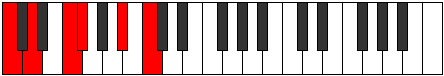 |
| [1125](https://ianring.com/musictheory/scales/1125) | [Ionaritonic](ModeFNaturalIonaritonic.md) | F | F, G, A#, B, D#, F |  |
| [1127](https://ianring.com/musictheory/scales/1127) | [Eparimic](ModeCNaturalEparimic.md) | C | C, Db, Ebb, F, Gb, A#, C |  |
| [1127](https://ianring.com/musictheory/scales/1127) | [Eparimic](ModeENaturalEparimic.md) | E | E, F, Gb, A, Bb, C##, E |  |
| [1127](https://ianring.com/musictheory/scales/1127) | [Eparimic](ModeFNaturalEparimic.md) | F | F, Gb, Abb, Bb, Cb, D#, F |  |
| [1129](https://ianring.com/musictheory/scales/1129) | [Phrynitonic](ModeCNaturalPhrynitonic.md) | C | C, D#, F, F#, A#, C |  |
| [1129](https://ianring.com/musictheory/scales/1129) | [Phrynitonic](ModeGNaturalPhrynitonic.md) | G | G, A#, C, C#, F, G |  |
| [1129](https://ianring.com/musictheory/scales/1129) | [Phrynitonic](ModeFNaturalPhrynitonic.md) | F | F, G#, A#, B, D#, F |  |
| [1131](https://ianring.com/musictheory/scales/1131) | [Thocrimic](ModeCNaturalThocrimic.md) | C | C, Db, Eb, F, Gb, A#, C |  |
| [1131](https://ianring.com/musictheory/scales/1131) | [Thocrimic](ModeGNaturalThocrimic.md) | G | G, Ab, Bb, C, Db, E#, G |  |
| [1131](https://ianring.com/musictheory/scales/1131) | [Thocrimic](ModeENaturalThocrimic.md) | E | E, F, G, A, Bb, C##, E |  |
| [1131](https://ianring.com/musictheory/scales/1131) | [Thocrimic](ModeFNaturalThocrimic.md) | F | F, Gb, Ab, Bb, Cb, D#, F |  |
| [1133](https://ianring.com/musictheory/scales/1133) | [Stycrimic](ModeCNaturalStycrimic.md) | C | C, D, Eb, F, Gb, A#, C |  |
| [1133](https://ianring.com/musictheory/scales/1133) | [Stycrimic](ModeGNaturalStycrimic.md) | G | G, A, Bb, C, Db, E#, G |  |
| [1133](https://ianring.com/musictheory/scales/1133) | [Stycrimic](ModeFNaturalStycrimic.md) | F | F, G, Ab, Bb, Cb, D#, F |  |
| [1135](https://ianring.com/musictheory/scales/1135) | [Katolian](ModeCNaturalKatolian.md) | C | C, Db, Ebb, Fbb, Gbb, Abbb, Bb, C |  |
| [1135](https://ianring.com/musictheory/scales/1135) | [Katolian](ModeENaturalKatolian.md) | E | E, F, Gb, Abb, Bbb, Cbb, D, E |  |
| [1135](https://ianring.com/musictheory/scales/1135) | [Katolian](ModeGNaturalKatolian.md) | G | G, Ab, Bbb, Cbb, Dbb, Ebbb, F, G |  |
| [1135](https://ianring.com/musictheory/scales/1135) | [Katolian](ModeFNaturalKatolian.md) | F | F, Gb, Abb, Bbbb, Cbb, Dbbb, Eb, F |  |
| [1137](https://ianring.com/musictheory/scales/1137) | [Stonitonic](ModeCNaturalStonitonic.md) | C | C, E, F, F#, A#, C |  |
| [1137](https://ianring.com/musictheory/scales/1137) | [Stonitonic](ModeFNaturalStonitonic.md) | F | F, A, A#, B, D#, F |  |
| [1139](https://ianring.com/musictheory/scales/1139) | [Aerygimic](ModeCNaturalAerygimic.md) | C | C, Db, E, F, Gb, A#, C |  |
| [1139](https://ianring.com/musictheory/scales/1139) | [Aerygimic](ModeENaturalAerygimic.md) | E | E, F, G#, A, Bb, C##, E |  |
| [1139](https://ianring.com/musictheory/scales/1139) | [Aerygimic](ModeFNaturalAerygimic.md) | F | F, Gb, A, Bb, Cb, D#, F |  |
| [1141](https://ianring.com/musictheory/scales/1141) | [Rynimic](ModeCNaturalRynimic.md) | C | C, D, E, F, Gb, A#, C |  |
| [1141](https://ianring.com/musictheory/scales/1141) | [Rynimic](ModeFNaturalRynimic.md) | F | F, G, A, Bb, Cb, D#, F |  |
| [1143](https://ianring.com/musictheory/scales/1143) | [Styrian](ModeCNaturalStyrian.md) | C | C, Db, Ebb, Fb, Gbb, Abbb, Bb, C |  |
| [1143](https://ianring.com/musictheory/scales/1143) | [Styrian](ModeENaturalStyrian.md) | E | E, F, Gb, Ab, Bbb, Cbb, D, E |  |
| [1143](https://ianring.com/musictheory/scales/1143) | [Styrian](ModeFNaturalStyrian.md) | F | F, Gb, Abb, Bbb, Cbb, Dbbb, Eb, F |  |
| [1145](https://ianring.com/musictheory/scales/1145) | [Zygimic](ModeCNaturalZygimic.md) | C | C, D#, E, F, Gb, A#, C |  |
| [1145](https://ianring.com/musictheory/scales/1145) | [Zygimic](ModeGNaturalZygimic.md) | G | G, A#, B, C, Db, E#, G |  |
| [1145](https://ianring.com/musictheory/scales/1145) | [Zygimic](ModeFNaturalZygimic.md) | F | F, G#, A, Bb, Cb, D#, F |  |
| [1147](https://ianring.com/musictheory/scales/1147) | [Epynian](ModeCNaturalEpynian.md) | C | C, Db, Eb, Fb, Gbb, Abbb, Bb, C |  |
| [1147](https://ianring.com/musictheory/scales/1147) | [Epynian](ModeENaturalEpynian.md) | E | E, F, G, Ab, Bbb, Cbb, D, E |  |
| [1147](https://ianring.com/musictheory/scales/1147) | [Epynian](ModeGNaturalEpynian.md) | G | G, Ab, Bb, Cb, Dbb, Ebbb, F, G |  |
| [1147](https://ianring.com/musictheory/scales/1147) | [Epynian](ModeFNaturalEpynian.md) | F | F, Gb, Ab, Bbb, Cbb, Dbbb, Eb, F |  |
| [1149](https://ianring.com/musictheory/scales/1149) | [Bydian](ModeCNaturalBydian.md) | C | C, D, Eb, Fb, Gbb, Abbb, Bb, C |  |
| [1149](https://ianring.com/musictheory/scales/1149) | [Bydian](ModeGNaturalBydian.md) | G | G, A, Bb, Cb, Dbb, Ebbb, F, G |  |
| [1149](https://ianring.com/musictheory/scales/1149) | [Bydian](ModeFNaturalBydian.md) | F | F, G, Ab, Bbb, Cbb, Dbbb, Eb, F |  |
| [1151](https://ianring.com/musictheory/scales/1151) | [Mythyllic](ModeCNaturalMythyllic.md) | C | C, C#, D, D#, E, F, F#, A#, C |  |
| [1151](https://ianring.com/musictheory/scales/1151) | [Mythyllic](ModeENaturalMythyllic.md) | E | E, F, F#, G, G#, A, A#, D, E |  |
| [1151](https://ianring.com/musictheory/scales/1151) | [Mythyllic](ModeGNaturalMythyllic.md) | G | G, G#, A, A#, B, C, C#, F, G |  |
| [1151](https://ianring.com/musictheory/scales/1151) | [Mythyllic](ModeFNaturalMythyllic.md) | F | F, F#, G, G#, A, A#, B, D#, F |  |
| [1161](https://ianring.com/musictheory/scales/1161) | [Eporic](ModeGNaturalEporic.md) | G | G, A#, D, F, G |  |
| [1161](https://ianring.com/musictheory/scales/1161) | [Eporic](ModeASharpEporic.md) | A# | A#, C#, F, G#, A# |  |
| [1161](https://ianring.com/musictheory/scales/1161) | [Eporic](ModeBFlatEporic.md) | Bb | Bb, Db, F, Ab, Bb |  |
| [1163](https://ianring.com/musictheory/scales/1163) | [Pagitonic](ModeGNaturalPagitonic.md) | G | G, G#, A#, D, F, G |  |
| [1163](https://ianring.com/musictheory/scales/1163) | [Pagitonic](ModeASharpPagitonic.md) | A# | A#, B, C#, F, G#, A# |  |
| [1163](https://ianring.com/musictheory/scales/1163) | [Pagitonic](ModeBFlatPagitonic.md) | Bb | Bb, B, Db, F, Ab, Bb |  |
| [1165](https://ianring.com/musictheory/scales/1165) | [Gycritonic](ModeDSharpGycritonic.md) | D# | D#, F, F#, A#, C#, D# |  |
| [1165](https://ianring.com/musictheory/scales/1165) | [Gycritonic](ModeEFlatGycritonic.md) | Eb | Eb, F, Gb, Bb, Db, Eb |  |
| [1165](https://ianring.com/musictheory/scales/1165) | [Gycritonic](ModeASharpGycritonic.md) | A# | A#, C, C#, F, G#, A# |  |
| [1165](https://ianring.com/musictheory/scales/1165) | [Gycritonic](ModeBFlatGycritonic.md) | Bb | Bb, C, Db, F, Ab, Bb |  |
| [1165](https://ianring.com/musictheory/scales/1165) | [Gycritonic](ModeGNaturalGycritonic.md) | G | G, A, A#, D, F, G |  |
| [1167](https://ianring.com/musictheory/scales/1167) | [Aerodimic](ModeDSharpAerodimic.md) | D# | D#, E, F, Gb, A#, B##, D# |  |
| [1167](https://ianring.com/musictheory/scales/1167) | [Aerodimic](ModeEFlatAerodimic.md) | Eb | Eb, Fb, Gbb, Abbb, Bb, C#, Eb |  |
| [1167](https://ianring.com/musictheory/scales/1167) | [Aerodimic](ModeGNaturalAerodimic.md) | G | G, Ab, Bbb, Cbb, D, E#, G |  |
| [1167](https://ianring.com/musictheory/scales/1167) | [Aerodimic](ModeASharpAerodimic.md) | A# | A#, B, C, Db, E#, F###, A# |  |
| [1167](https://ianring.com/musictheory/scales/1167) | [Aerodimic](ModeBFlatAerodimic.md) | Bb | Bb, Cb, Dbb, Ebbb, F, G#, Bb |  |
| [1169](https://ianring.com/musictheory/scales/1169) | [Daric](ModeASharpDaric.md) | A# | A#, D, F, G#, A# |  |
| [1169](https://ianring.com/musictheory/scales/1169) | [Daric](ModeBFlatDaric.md) | Bb | Bb, D, F, Ab, Bb | 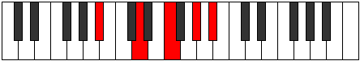 |
| [1171](https://ianring.com/musictheory/scales/1171) | [Loptitonic](ModeASharpLoptitonic.md) | A# | A#, B, D, F, G#, A# |  |
| [1171](https://ianring.com/musictheory/scales/1171) | [Loptitonic](ModeBFlatLoptitonic.md) | Bb | Bb, B, D, F, Ab, Bb |  |
| [1173](https://ianring.com/musictheory/scales/1173) | [Phropitonic](ModeDSharpPhropitonic.md) | D# | D#, F, G, A#, C#, D# |  |
| [1173](https://ianring.com/musictheory/scales/1173) | [Phropitonic](ModeEFlatPhropitonic.md) | Eb | Eb, F, G, Bb, Db, Eb |  |
| [1173](https://ianring.com/musictheory/scales/1173) | [Phropitonic](ModeASharpPhropitonic.md) | A# | A#, C, D, F, G#, A# |  |
| [1173](https://ianring.com/musictheory/scales/1173) | [Phropitonic](ModeBFlatPhropitonic.md) | Bb | Bb, C, D, F, Ab, Bb |  |
| [1175](https://ianring.com/musictheory/scales/1175) | [Epycrimic](ModeDSharpEpycrimic.md) | D# | D#, E, F, G, A#, B##, D# |  |
| [1175](https://ianring.com/musictheory/scales/1175) | [Epycrimic](ModeEFlatEpycrimic.md) | Eb | Eb, Fb, Gbb, Abb, Bb, C#, Eb |  |
| [1175](https://ianring.com/musictheory/scales/1175) | [Epycrimic](ModeASharpEpycrimic.md) | A# | A#, B, C, D, E#, F###, A# |  |
| [1175](https://ianring.com/musictheory/scales/1175) | [Epycrimic](ModeBFlatEpycrimic.md) | Bb | Bb, Cb, Dbb, Ebb, F, G#, Bb |  |
| [1177](https://ianring.com/musictheory/scales/1177) | [Garitonic](ModeASharpGaritonic.md) | A# | A#, C#, D, F, G#, A# |  |
| [1177](https://ianring.com/musictheory/scales/1177) | [Garitonic](ModeBFlatGaritonic.md) | Bb | Bb, Db, D, F, Ab, Bb |  |
| [1177](https://ianring.com/musictheory/scales/1177) | [Garitonic](ModeGNaturalGaritonic.md) | G | G, A#, B, D, F, G |  |
| [1179](https://ianring.com/musictheory/scales/1179) | [Sonimic](ModeASharpSonimic.md) | A# | A#, B, C#, D, E#, F###, A# |  |
| [1179](https://ianring.com/musictheory/scales/1179) | [Sonimic](ModeBFlatSonimic.md) | Bb | Bb, Cb, Db, Ebb, F, G#, Bb |  |
| [1179](https://ianring.com/musictheory/scales/1179) | [Sonimic](ModeGNaturalSonimic.md) | G | G, Ab, Bb, Cb, D, E#, G |  |
| [1181](https://ianring.com/musictheory/scales/1181) | [Katagimic](ModeDSharpKatagimic.md) | D# | D#, E#, F#, G, A#, B##, D# |  |
| [1181](https://ianring.com/musictheory/scales/1181) | [Katagimic](ModeEFlatKatagimic.md) | Eb | Eb, F, Gb, Abb, Bb, C#, Eb |  |
| [1181](https://ianring.com/musictheory/scales/1181) | [Katagimic](ModeASharpKatagimic.md) | A# | A#, B#, C#, D, E#, F###, A# | 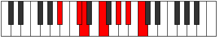 |
| [1181](https://ianring.com/musictheory/scales/1181) | [Katagimic](ModeBFlatKatagimic.md) | Bb | Bb, C, Db, Ebb, F, G#, Bb |  |
| [1181](https://ianring.com/musictheory/scales/1181) | [Katagimic](ModeGNaturalKatagimic.md) | G | G, A, Bb, Cb, D, E#, G |  |
| [1183](https://ianring.com/musictheory/scales/1183) | [Sadian](ModeDSharpSadian.md) | D# | D#, E, F, Gb, Abb, Bb, C#, D# |  |
| [1183](https://ianring.com/musictheory/scales/1183) | [Sadian](ModeEFlatSadian.md) | Eb | Eb, Fb, Gbb, Abbb, E###, Cbb, Db, Eb |  |
| [1183](https://ianring.com/musictheory/scales/1183) | [Sadian](ModeASharpSadian.md) | A# | A#, B, C, Db, Ebb, F, G#, A# |  |
| [1183](https://ianring.com/musictheory/scales/1183) | [Sadian](ModeBFlatSadian.md) | Bb | Bb, Cb, Dbb, Ebbb, Fbbb, Gbb, Ab, Bb |  |
| [1183](https://ianring.com/musictheory/scales/1183) | [Sadian](ModeGNaturalSadian.md) | G | G, Ab, Bbb, Cbb, Dbbb, Ebb, F, G |  |
| [1187](https://ianring.com/musictheory/scales/1187) | [Thalitonic](ModeFNaturalThalitonic.md) | F | F, F#, A#, C, D#, F |  |
| [1187](https://ianring.com/musictheory/scales/1187) | [Thalitonic](ModeCNaturalThalitonic.md) | C | C, C#, F, G, A#, C |  |
| [1187](https://ianring.com/musictheory/scales/1187) | [Thalitonic](ModeASharpThalitonic.md) | A# | A#, B, D#, F, G#, A# |  |
| [1187](https://ianring.com/musictheory/scales/1187) | [Thalitonic](ModeBFlatThalitonic.md) | Bb | Bb, B, Eb, F, Ab, Bb |  |
| [1189](https://ianring.com/musictheory/scales/1189) | [Thaptitonic](ModeCNaturalThaptitonic.md) | C | C, D, F, G, A#, C |  |
| [1189](https://ianring.com/musictheory/scales/1189) | [Thaptitonic](ModeFNaturalThaptitonic.md) | F | F, G, A#, C, D#, F |  |
| [1189](https://ianring.com/musictheory/scales/1189) | [Thaptitonic](ModeASharpThaptitonic.md) | A# | A#, C, D#, F, G#, A# |  |
| [1189](https://ianring.com/musictheory/scales/1189) | [Thaptitonic](ModeBFlatThaptitonic.md) | Bb | Bb, C, Eb, F, Ab, Bb |  |
| [1189](https://ianring.com/musictheory/scales/1189) | [Thaptitonic](ModeDSharpThaptitonic.md) | D# | D#, F, G#, A#, C#, D# |  |
| [1189](https://ianring.com/musictheory/scales/1189) | [Thaptitonic](ModeEFlatThaptitonic.md) | Eb | Eb, F, Ab, Bb, Db, Eb |  |
| [1191](https://ianring.com/musictheory/scales/1191) | [Pyrimic](ModeCNaturalPyrimic.md) | C | C, Db, Ebb, F, G, A#, C |  |
| [1191](https://ianring.com/musictheory/scales/1191) | [Pyrimic](ModeFNaturalPyrimic.md) | F | F, Gb, Abb, Bb, C, D#, F |  |
| [1191](https://ianring.com/musictheory/scales/1191) | [Pyrimic](ModeDSharpPyrimic.md) | D# | D#, E, F, G#, A#, B##, D# |  |
| [1191](https://ianring.com/musictheory/scales/1191) | [Pyrimic](ModeEFlatPyrimic.md) | Eb | Eb, Fb, Gbb, Ab, Bb, C#, Eb |  |
| [1191](https://ianring.com/musictheory/scales/1191) | [Pyrimic](ModeASharpPyrimic.md) | A# | A#, B, C, D#, E#, F###, A# |  |
| [1191](https://ianring.com/musictheory/scales/1191) | [Pyrimic](ModeBFlatPyrimic.md) | Bb | Bb, Cb, Dbb, Eb, F, G#, Bb |  |
| [1193](https://ianring.com/musictheory/scales/1193) | [Rocritonic](ModeGNaturalRocritonic.md) | G | G, A#, C, D, F, G |  |
| [1193](https://ianring.com/musictheory/scales/1193) | [Rocritonic](ModeCNaturalRocritonic.md) | C | C, D#, F, G, A#, C |  |
| [1193](https://ianring.com/musictheory/scales/1193) | [Rocritonic](ModeFNaturalRocritonic.md) | F | F, G#, A#, C, D#, F |  |
| [1193](https://ianring.com/musictheory/scales/1193) | [Rocritonic](ModeASharpRocritonic.md) | A# | A#, C#, D#, F, G#, A# |  |
| [1193](https://ianring.com/musictheory/scales/1193) | [Rocritonic](ModeBFlatRocritonic.md) | Bb | Bb, Db, Eb, F, Ab, Bb |  |
| [1195](https://ianring.com/musictheory/scales/1195) | [Sarimic](ModeCNaturalSarimic.md) | C | C, Db, Eb, F, G, A#, C |  |
| [1195](https://ianring.com/musictheory/scales/1195) | [Sarimic](ModeFNaturalSarimic.md) | F | F, Gb, Ab, Bb, C, D#, F |  |
| [1195](https://ianring.com/musictheory/scales/1195) | [Sarimic](ModeGNaturalSarimic.md) | G | G, Ab, Bb, C, D, E#, G |  |
| [1195](https://ianring.com/musictheory/scales/1195) | [Sarimic](ModeASharpSarimic.md) | A# | A#, B, C#, D#, E#, F###, A# |  |
| [1195](https://ianring.com/musictheory/scales/1195) | [Sarimic](ModeBFlatSarimic.md) | Bb | Bb, Cb, Db, Eb, F, G#, Bb |  |
| [1197](https://ianring.com/musictheory/scales/1197) | [Rocrimic](ModeCNaturalRocrimic.md) | C | C, D, Eb, F, G, A#, C |  |
| [1197](https://ianring.com/musictheory/scales/1197) | [Rocrimic](ModeASharpRocrimic.md) | A# | A#, B#, C#, D#, E#, F###, A# |  |
| [1197](https://ianring.com/musictheory/scales/1197) | [Rocrimic](ModeBFlatRocrimic.md) | Bb | Bb, C, Db, Eb, F, G#, Bb |  |
| [1197](https://ianring.com/musictheory/scales/1197) | [Rocrimic](ModeDSharpRocrimic.md) | D# | D#, E#, F#, G#, A#, B##, D# |  |
| [1197](https://ianring.com/musictheory/scales/1197) | [Rocrimic](ModeEFlatRocrimic.md) | Eb | Eb, F, Gb, Ab, Bb, C#, Eb |  |
| [1197](https://ianring.com/musictheory/scales/1197) | [Rocrimic](ModeFNaturalRocrimic.md) | F | F, G, Ab, Bb, C, D#, F |  |
| [1197](https://ianring.com/musictheory/scales/1197) | [Rocrimic](ModeGNaturalRocrimic.md) | G | G, A, Bb, C, D, E#, G |  |
| [1199](https://ianring.com/musictheory/scales/1199) | [Magian](ModeCNaturalMagian.md) | C | C, Db, Ebb, Fbb, Gbb, Abb, Bb, C |  |
| [1199](https://ianring.com/musictheory/scales/1199) | [Magian](ModeDSharpMagian.md) | D# | D#, E, F, Gb, Ab, Bb, C#, D# |  |
| [1199](https://ianring.com/musictheory/scales/1199) | [Magian](ModeEFlatMagian.md) | Eb | Eb, Fb, Gbb, Abbb, Bbbb, Cbb, Db, Eb |  |
| [1199](https://ianring.com/musictheory/scales/1199) | [Magian](ModeFNaturalMagian.md) | F | F, Gb, Abb, Bbbb, Cbb, Dbb, Eb, F |  |
| [1199](https://ianring.com/musictheory/scales/1199) | [Magian](ModeGNaturalMagian.md) | G | G, Ab, Bbb, Cbb, Dbb, Ebb, F, G |  |
| [1199](https://ianring.com/musictheory/scales/1199) | [Magian](ModeASharpMagian.md) | A# | A#, B, C, Db, Eb, F, G#, A# |  |
| [1199](https://ianring.com/musictheory/scales/1199) | [Magian](ModeBFlatMagian.md) | Bb | Bb, Cb, Dbb, Ebbb, Fbb, Gbb, Ab, Bb |  |
| [1201](https://ianring.com/musictheory/scales/1201) | [Aeracritonic](ModeCNaturalAeracritonic.md) | C | C, E, F, G, A#, C |  |
| [1201](https://ianring.com/musictheory/scales/1201) | [Aeracritonic](ModeASharpAeracritonic.md) | A# | A#, D, D#, F, G#, A# |  |
| [1201](https://ianring.com/musictheory/scales/1201) | [Aeracritonic](ModeBFlatAeracritonic.md) | Bb | Bb, D, Eb, F, Ab, Bb |  |
| [1201](https://ianring.com/musictheory/scales/1201) | [Aeracritonic](ModeFNaturalAeracritonic.md) | F | F, A, A#, C, D#, F |  |
| [1203](https://ianring.com/musictheory/scales/1203) | [Pagimic](ModeCNaturalPagimic.md) | C | C, Db, E, F, G, A#, C |  |
| [1203](https://ianring.com/musictheory/scales/1203) | [Pagimic](ModeFNaturalPagimic.md) | F | F, Gb, A, Bb, C, D#, F |  |
| [1203](https://ianring.com/musictheory/scales/1203) | [Pagimic](ModeASharpPagimic.md) | A# | A#, B, C##, D#, E#, F###, A# |  |
| [1203](https://ianring.com/musictheory/scales/1203) | [Pagimic](ModeBFlatPagimic.md) | Bb | Bb, Cb, D, Eb, F, G#, Bb |  |
| [1205](https://ianring.com/musictheory/scales/1205) | [Ionycrimic](ModeCNaturalIonycrimic.md) | C | C, D, E, F, G, A#, C |  |
| [1205](https://ianring.com/musictheory/scales/1205) | [Ionycrimic](ModeASharpIonycrimic.md) | A# | A#, B#, C##, D#, E#, F###, A# |  |
| [1205](https://ianring.com/musictheory/scales/1205) | [Ionycrimic](ModeBFlatIonycrimic.md) | Bb | Bb, C, D, Eb, F, G#, Bb |  |
| [1205](https://ianring.com/musictheory/scales/1205) | [Ionycrimic](ModeDSharpIonycrimic.md) | D# | D#, E#, F##, G#, A#, B##, D# |  |
| [1205](https://ianring.com/musictheory/scales/1205) | [Ionycrimic](ModeEFlatIonycrimic.md) | Eb | Eb, F, G, Ab, Bb, C#, Eb |  |
| [1205](https://ianring.com/musictheory/scales/1205) | [Ionycrimic](ModeFNaturalIonycrimic.md) | F | F, G, A, Bb, C, D#, F |  |
| [1207](https://ianring.com/musictheory/scales/1207) | [Aeoloptian](ModeCNaturalAeoloptian.md) | C | C, Db, Ebb, Fb, Gbb, Abb, Bb, C |  |
| [1207](https://ianring.com/musictheory/scales/1207) | [Aeoloptian](ModeDSharpAeoloptian.md) | D# | D#, E, F, G, Ab, Bb, C#, D# |  |
| [1207](https://ianring.com/musictheory/scales/1207) | [Aeoloptian](ModeEFlatAeoloptian.md) | Eb | Eb, Fb, Gbb, Abb, Bbbb, Cbb, Db, Eb |  |
| [1207](https://ianring.com/musictheory/scales/1207) | [Aeoloptian](ModeFNaturalAeoloptian.md) | F | F, Gb, Abb, Bbb, Cbb, Dbb, Eb, F |  |
| [1207](https://ianring.com/musictheory/scales/1207) | [Aeoloptian](ModeASharpAeoloptian.md) | A# | A#, B, C, D, Eb, F, G#, A# |  |
| [1207](https://ianring.com/musictheory/scales/1207) | [Aeoloptian](ModeBFlatAeoloptian.md) | Bb | Bb, Cb, Dbb, Ebb, Fbb, Gbb, Ab, Bb |  |
| [1209](https://ianring.com/musictheory/scales/1209) | [Ionynimic](ModeCNaturalIonynimic.md) | C | C, D#, E, F, G, A#, C |  |
| [1209](https://ianring.com/musictheory/scales/1209) | [Ionynimic](ModeASharpIonynimic.md) | A# | A#, B##, C##, D#, E#, F###, A# |  |
| [1209](https://ianring.com/musictheory/scales/1209) | [Ionynimic](ModeBFlatIonynimic.md) | Bb | Bb, C#, D, Eb, F, G#, Bb |  |
| [1209](https://ianring.com/musictheory/scales/1209) | [Ionynimic](ModeFNaturalIonynimic.md) | F | F, G#, A, Bb, C, D#, F |  |
| [1209](https://ianring.com/musictheory/scales/1209) | [Ionynimic](ModeGNaturalIonynimic.md) | G | G, A#, B, C, D, E#, G |  |
| [1211](https://ianring.com/musictheory/scales/1211) | [Zadian](ModeCNaturalZadian.md) | C | C, Db, Eb, Fb, Gbb, Abb, Bb, C |  |
| [1211](https://ianring.com/musictheory/scales/1211) | [Zadian](ModeFNaturalZadian.md) | F | F, Gb, Ab, Bbb, Cbb, Dbb, Eb, F |  |
| [1211](https://ianring.com/musictheory/scales/1211) | [Zadian](ModeASharpZadian.md) | A# | A#, B, C#, D, Eb, F, G#, A# |  |
| [1211](https://ianring.com/musictheory/scales/1211) | [Zadian](ModeBFlatZadian.md) | Bb | Bb, Cb, Db, Ebb, Fbb, Gbb, Ab, Bb |  |
| [1211](https://ianring.com/musictheory/scales/1211) | [Zadian](ModeGNaturalZadian.md) | G | G, Ab, Bb, Cb, Dbb, Ebb, F, G |  |
| [1213](https://ianring.com/musictheory/scales/1213) | [Gyrian](ModeCNaturalGyrian.md) | C | C, D, Eb, Fb, Gbb, Abb, Bb, C |  |
| [1213](https://ianring.com/musictheory/scales/1213) | [Gyrian](ModeASharpGyrian.md) | A# | A#, B#, C#, D, Eb, F, G#, A# |  |
| [1213](https://ianring.com/musictheory/scales/1213) | [Gyrian](ModeBFlatGyrian.md) | Bb | Bb, C, Db, Ebb, Fbb, Gbb, Ab, Bb |  |
| [1213](https://ianring.com/musictheory/scales/1213) | [Gyrian](ModeDSharpGyrian.md) | D# | D#, E#, F#, G, Ab, Bb, C#, D# |  |
| [1213](https://ianring.com/musictheory/scales/1213) | [Gyrian](ModeEFlatGyrian.md) | Eb | Eb, F, Gb, Abb, Bbbb, Cbb, Db, Eb |  |
| [1213](https://ianring.com/musictheory/scales/1213) | [Gyrian](ModeFNaturalGyrian.md) | F | F, G, Ab, Bbb, Cbb, Dbb, Eb, F |  |
| [1213](https://ianring.com/musictheory/scales/1213) | [Gyrian](ModeGNaturalGyrian.md) | G | G, A, Bb, Cb, Dbb, Ebb, F, G |  |
| [1215](https://ianring.com/musictheory/scales/1215) | [Aeolanyllic](ModeCNaturalAeolanyllic.md) | C | C, C#, D, D#, E, F, G, A#, C |  |
| [1215](https://ianring.com/musictheory/scales/1215) | [Aeolanyllic](ModeDSharpAeolanyllic.md) | D# | D#, E, F, F#, G, G#, A#, C#, D# |  |
| [1215](https://ianring.com/musictheory/scales/1215) | [Aeolanyllic](ModeEFlatAeolanyllic.md) | Eb | Eb, E, F, Gb, G, Ab, Bb, Db, Eb |  |
| [1215](https://ianring.com/musictheory/scales/1215) | [Aeolanyllic](ModeFNaturalAeolanyllic.md) | F | F, F#, G, G#, A, A#, C, D#, F |  |
| [1215](https://ianring.com/musictheory/scales/1215) | [Aeolanyllic](ModeASharpAeolanyllic.md) | A# | A#, B, C, C#, D, D#, F, G#, A# |  |
| [1215](https://ianring.com/musictheory/scales/1215) | [Aeolanyllic](ModeBFlatAeolanyllic.md) | Bb | Bb, B, C, Db, D, Eb, F, Ab, Bb |  |
| [1215](https://ianring.com/musictheory/scales/1215) | [Aeolanyllic](ModeGNaturalAeolanyllic.md) | G | G, G#, A, A#, B, C, D, F, G |  |
| [1221](https://ianring.com/musictheory/scales/1221) | [Epyritonic](ModeASharpEpyritonic.md) | A# | A#, C, E, F, G#, A# |  |
| [1221](https://ianring.com/musictheory/scales/1221) | [Epyritonic](ModeBFlatEpyritonic.md) | Bb | Bb, C, E, F, Ab, Bb |  |
| [1221](https://ianring.com/musictheory/scales/1221) | [Epyritonic](ModeDSharpEpyritonic.md) | D# | D#, F, A, A#, C#, D# |  |
| [1221](https://ianring.com/musictheory/scales/1221) | [Epyritonic](ModeEFlatEpyritonic.md) | Eb | Eb, F, A, Bb, Db, Eb |  |
| [1223](https://ianring.com/musictheory/scales/1223) | [Phryptimic](ModeDSharpPhryptimic.md) | D# | D#, E, F, G##, A#, B##, D# |  |
| [1223](https://ianring.com/musictheory/scales/1223) | [Phryptimic](ModeEFlatPhryptimic.md) | Eb | Eb, Fb, Gbb, A, Bb, C#, Eb |  |
| [1223](https://ianring.com/musictheory/scales/1223) | [Phryptimic](ModeENaturalPhryptimic.md) | E | E, F, Gb, A#, B, C##, E |  |
| [1223](https://ianring.com/musictheory/scales/1223) | [Phryptimic](ModeASharpPhryptimic.md) | A# | A#, B, C, D##, E#, F###, A# |  |
| [1223](https://ianring.com/musictheory/scales/1223) | [Phryptimic](ModeBFlatPhryptimic.md) | Bb | Bb, Cb, Dbb, E, F, G#, Bb |  |
| [1225](https://ianring.com/musictheory/scales/1225) | [Lyditonic](ModeGNaturalLyditonic.md) | G | G, A#, C#, D, F, G |  |
| [1225](https://ianring.com/musictheory/scales/1225) | [Lyditonic](ModeASharpLyditonic.md) | A# | A#, C#, E, F, G#, A# |  |
| [1225](https://ianring.com/musictheory/scales/1225) | [Lyditonic](ModeBFlatLyditonic.md) | Bb | Bb, Db, E, F, Ab, Bb |  |
| [1227](https://ianring.com/musictheory/scales/1227) | [Thacrimic](ModeGNaturalThacrimic.md) | G | G, Ab, Bb, C#, D, E#, G |  |
| [1227](https://ianring.com/musictheory/scales/1227) | [Thacrimic](ModeENaturalThacrimic.md) | E | E, F, G, A#, B, C##, E |  |
| [1227](https://ianring.com/musictheory/scales/1227) | [Thacrimic](ModeASharpThacrimic.md) | A# | A#, B, C#, D##, E#, F###, A# |  |
| [1227](https://ianring.com/musictheory/scales/1227) | [Thacrimic](ModeBFlatThacrimic.md) | Bb | Bb, Cb, Db, E, F, G#, Bb |  |
| [1229](https://ianring.com/musictheory/scales/1229) | [Ragimic](ModeASharpRagimic.md) | A# | A#, B#, C#, D##, E#, F###, A# |  |
| [1229](https://ianring.com/musictheory/scales/1229) | [Ragimic](ModeBFlatRagimic.md) | Bb | Bb, C, Db, E, F, G#, Bb |  |
| [1229](https://ianring.com/musictheory/scales/1229) | [Ragimic](ModeDSharpRagimic.md) | D# | D#, E#, F#, G##, A#, B##, D# |  |
| [1229](https://ianring.com/musictheory/scales/1229) | [Ragimic](ModeEFlatRagimic.md) | Eb | Eb, F, Gb, A, Bb, C#, Eb |  |
| [1229](https://ianring.com/musictheory/scales/1229) | [Ragimic](ModeGNaturalRagimic.md) | G | G, A, Bb, C#, D, E#, G |  |
| [1231](https://ianring.com/musictheory/scales/1231) | [Logian](ModeDSharpLogian.md) | D# | D#, E, F, Gb, A, Bb, C#, D# |  |
| [1231](https://ianring.com/musictheory/scales/1231) | [Logian](ModeEFlatLogian.md) | Eb | Eb, Fb, Gbb, Abbb, Bbb, Cbb, Db, Eb |  |
| [1231](https://ianring.com/musictheory/scales/1231) | [Logian](ModeGNaturalLogian.md) | G | G, Ab, Bbb, Cbb, Db, Ebb, F, G |  |
| [1231](https://ianring.com/musictheory/scales/1231) | [Logian](ModeENaturalLogian.md) | E | E, F, Gb, Abb, Bb, Cb, D, E |  |
| [1231](https://ianring.com/musictheory/scales/1231) | [Logian](ModeASharpLogian.md) | A# | A#, B, C, Db, E, F, G#, A# |  |
| [1231](https://ianring.com/musictheory/scales/1231) | [Logian](ModeBFlatLogian.md) | Bb | Bb, Cb, Dbb, Ebbb, Fb, Gbb, Ab, Bb |  |
| [1233](https://ianring.com/musictheory/scales/1233) | [Ionoditonic](ModeASharpIonoditonic.md) | A# | A#, D, E, F, G#, A# |  |
| [1233](https://ianring.com/musictheory/scales/1233) | [Ionoditonic](ModeBFlatIonoditonic.md) | Bb | Bb, D, E, F, Ab, Bb |  |
| [1235](https://ianring.com/musictheory/scales/1235) | [Stylimic](ModeENaturalStylimic.md) | E | E, F, G#, A#, B, C##, E |  |
| [1235](https://ianring.com/musictheory/scales/1235) | [Stylimic](ModeASharpStylimic.md) | A# | A#, B, C##, D##, E#, F###, A# |  |
| [1235](https://ianring.com/musictheory/scales/1235) | [Stylimic](ModeBFlatStylimic.md) | Bb | Bb, Cb, D, E, F, G#, Bb |  |
| [1237](https://ianring.com/musictheory/scales/1237) | [Salimic](ModeASharpSalimic.md) | A# | A#, B#, C##, D##, E#, F###, A# |  |
| [1237](https://ianring.com/musictheory/scales/1237) | [Salimic](ModeBFlatSalimic.md) | Bb | Bb, C, D, E, F, G#, Bb |  |
| [1237](https://ianring.com/musictheory/scales/1237) | [Salimic](ModeDSharpSalimic.md) | D# | D#, E#, F##, G##, A#, B##, D# |  |
| [1237](https://ianring.com/musictheory/scales/1237) | [Salimic](ModeEFlatSalimic.md) | Eb | Eb, F, G, A, Bb, C#, Eb |  |
| [1239](https://ianring.com/musictheory/scales/1239) | [Epaptian](ModeDSharpEpaptian.md) | D# | D#, E, F, G, A, Bb, C#, D# |  |
| [1239](https://ianring.com/musictheory/scales/1239) | [Epaptian](ModeEFlatEpaptian.md) | Eb | Eb, Fb, Gbb, Abb, Bbb, Cbb, Db, Eb |  |
| [1239](https://ianring.com/musictheory/scales/1239) | [Epaptian](ModeASharpEpaptian.md) | A# | A#, B, C, D, E, F, G#, A# |  |
| [1239](https://ianring.com/musictheory/scales/1239) | [Epaptian](ModeBFlatEpaptian.md) | Bb | Bb, Cb, Dbb, Ebb, Fb, Gbb, Ab, Bb |  |
| [1239](https://ianring.com/musictheory/scales/1239) | [Epaptian](ModeENaturalEpaptian.md) | E | E, F, Gb, Ab, Bb, Cb, D, E |  |
| [1241](https://ianring.com/musictheory/scales/1241) | [Pygimic](ModeASharpPygimic.md) | A# | A#, B##, C##, D##, E#, F###, A# |  |
| [1241](https://ianring.com/musictheory/scales/1241) | [Pygimic](ModeBFlatPygimic.md) | Bb | Bb, C#, D, E, F, G#, Bb |  |
| [1241](https://ianring.com/musictheory/scales/1241) | [Pygimic](ModeGNaturalPygimic.md) | G | G, A#, B, C#, D, E#, G |  |
| [1243](https://ianring.com/musictheory/scales/1243) | [Epylian](ModeASharpEpylian.md) | A# | A#, B, C#, D, E, F, G#, A# |  |
| [1243](https://ianring.com/musictheory/scales/1243) | [Epylian](ModeBFlatEpylian.md) | Bb | Bb, Cb, Db, Ebb, Fb, Gbb, Ab, Bb |  |
| [1243](https://ianring.com/musictheory/scales/1243) | [Epylian](ModeGNaturalEpylian.md) | G | G, Ab, Bb, Cb, Db, Ebb, F, G |  |
| [1243](https://ianring.com/musictheory/scales/1243) | [Epylian](ModeENaturalEpylian.md) | E | E, F, G, Ab, Bb, Cb, D, E |  |
| [1245](https://ianring.com/musictheory/scales/1245) | [Lathian](ModeASharpLathian.md) | A# | A#, B#, C#, D, E, F, G#, A# |  |
| [1245](https://ianring.com/musictheory/scales/1245) | [Lathian](ModeBFlatLathian.md) | Bb | Bb, C, Db, Ebb, Fb, Gbb, Ab, Bb |  |
| [1245](https://ianring.com/musictheory/scales/1245) | [Lathian](ModeDSharpLathian.md) | D# | D#, E#, F#, G, A, Bb, C#, D# |  |
| [1245](https://ianring.com/musictheory/scales/1245) | [Lathian](ModeEFlatLathian.md) | Eb | Eb, F, Gb, Abb, Bbb, Cbb, Db, Eb |  |
| [1245](https://ianring.com/musictheory/scales/1245) | [Lathian](ModeGNaturalLathian.md) | G | G, A, Bb, Cb, Db, Ebb, F, G |  |
| [1247](https://ianring.com/musictheory/scales/1247) | [Mygyllic](ModeDSharpMygyllic.md) | D# | D#, E, F, F#, G, A, A#, C#, D# |  |
| [1247](https://ianring.com/musictheory/scales/1247) | [Mygyllic](ModeEFlatMygyllic.md) | Eb | Eb, E, F, Gb, G, A, Bb, Db, Eb |  |
| [1247](https://ianring.com/musictheory/scales/1247) | [Mygyllic](ModeASharpMygyllic.md) | A# | A#, B, C, C#, D, E, F, G#, A# |  |
| [1247](https://ianring.com/musictheory/scales/1247) | [Mygyllic](ModeBFlatMygyllic.md) | Bb | Bb, B, C, Db, D, E, F, Ab, Bb |  |
| [1247](https://ianring.com/musictheory/scales/1247) | [Mygyllic](ModeENaturalMygyllic.md) | E | E, F, F#, G, G#, A#, B, D, E |  |
| [1247](https://ianring.com/musictheory/scales/1247) | [Mygyllic](ModeGNaturalMygyllic.md) | G | G, G#, A, A#, B, C#, D, F, G |  |
| [1251](https://ianring.com/musictheory/scales/1251) | [Sylimic](ModeCNaturalSylimic.md) | C | C, Db, E#, F#, G, A#, C |  |
| [1251](https://ianring.com/musictheory/scales/1251) | [Sylimic](ModeFNaturalSylimic.md) | F | F, Gb, A#, B, C, D#, F |  |
| [1251](https://ianring.com/musictheory/scales/1251) | [Sylimic](ModeASharpSylimic.md) | A# | A#, B, C###, D##, E#, F###, A# |  |
| [1251](https://ianring.com/musictheory/scales/1251) | [Sylimic](ModeBFlatSylimic.md) | Bb | Bb, Cb, D#, E, F, G#, Bb |  |
| [1251](https://ianring.com/musictheory/scales/1251) | [Sylimic](ModeENaturalSylimic.md) | E | E, F, G##, A#, B, C##, E |  |
| [1253](https://ianring.com/musictheory/scales/1253) | [Zolimic](ModeCNaturalZolimic.md) | C | C, D, E#, F#, G, A#, C |  |
| [1253](https://ianring.com/musictheory/scales/1253) | [Zolimic](ModeASharpZolimic.md) | A# | A#, B#, C###, D##, E#, F###, A# |  |
| [1253](https://ianring.com/musictheory/scales/1253) | [Zolimic](ModeBFlatZolimic.md) | Bb | Bb, C, D#, E, F, G#, Bb |  |
| [1253](https://ianring.com/musictheory/scales/1253) | [Zolimic](ModeDSharpZolimic.md) | D# | D#, E#, F###, G##, A#, B##, D# |  |
| [1253](https://ianring.com/musictheory/scales/1253) | [Zolimic](ModeEFlatZolimic.md) | Eb | Eb, F, G#, A, Bb, C#, Eb |  |
| [1253](https://ianring.com/musictheory/scales/1253) | [Zolimic](ModeFNaturalZolimic.md) | F | F, G, A#, B, C, D#, F |  |
| [1255](https://ianring.com/musictheory/scales/1255) | [Sogian](ModeCNaturalSogian.md) | C | C, Db, Ebb, F, Gb, Abb, Bb, C |  |
| [1255](https://ianring.com/musictheory/scales/1255) | [Sogian](ModeDSharpSogian.md) | D# | D#, E, F, G#, A, Bb, C#, D# |  |
| [1255](https://ianring.com/musictheory/scales/1255) | [Sogian](ModeEFlatSogian.md) | Eb | Eb, Fb, Gbb, Ab, Bbb, Cbb, Db, Eb |  |
| [1255](https://ianring.com/musictheory/scales/1255) | [Sogian](ModeFNaturalSogian.md) | F | F, Gb, Abb, Bb, Cb, Dbb, Eb, F |  |
| [1255](https://ianring.com/musictheory/scales/1255) | [Sogian](ModeASharpSogian.md) | A# | A#, B, C, D#, E, F, G#, A# |  |
| [1255](https://ianring.com/musictheory/scales/1255) | [Sogian](ModeBFlatSogian.md) | Bb | Bb, Cb, Dbb, Eb, Fb, Gbb, Ab, Bb |  |
| [1255](https://ianring.com/musictheory/scales/1255) | [Sogian](ModeENaturalSogian.md) | E | E, F, Gb, A, Bb, Cb, D, E |  |
| [1257](https://ianring.com/musictheory/scales/1257) | [Aeolyphimic](ModeGNaturalAeolyphimic.md) | G | G, A#, B#, C#, D, E#, G |  |
| [1257](https://ianring.com/musictheory/scales/1257) | [Aeolyphimic](ModeCNaturalAeolyphimic.md) | C | C, D#, E#, F#, G, A#, C |  |
| [1257](https://ianring.com/musictheory/scales/1257) | [Aeolyphimic](ModeASharpAeolyphimic.md) | A# | A#, B##, C###, D##, E#, F###, A# |  |
| [1257](https://ianring.com/musictheory/scales/1257) | [Aeolyphimic](ModeBFlatAeolyphimic.md) | Bb | Bb, C#, D#, E, F, G#, Bb |  |
| [1257](https://ianring.com/musictheory/scales/1257) | [Aeolyphimic](ModeFNaturalAeolyphimic.md) | F | F, G#, A#, B, C, D#, F |  |
| [1259](https://ianring.com/musictheory/scales/1259) | [Stadian](ModeCNaturalStadian.md) | C | C, Db, Eb, F, Gb, Abb, Bb, C |  |
| [1259](https://ianring.com/musictheory/scales/1259) | [Stadian](ModeGNaturalStadian.md) | G | G, Ab, Bb, C, Db, Ebb, F, G |  |
| [1259](https://ianring.com/musictheory/scales/1259) | [Stadian](ModeASharpStadian.md) | A# | A#, B, C#, D#, E, F, G#, A# |  |
| [1259](https://ianring.com/musictheory/scales/1259) | [Stadian](ModeBFlatStadian.md) | Bb | Bb, Cb, Db, Eb, Fb, Gbb, Ab, Bb |  |
| [1259](https://ianring.com/musictheory/scales/1259) | [Stadian](ModeFNaturalStadian.md) | F | F, Gb, Ab, Bb, Cb, Dbb, Eb, F |  |
| [1259](https://ianring.com/musictheory/scales/1259) | [Stadian](ModeENaturalStadian.md) | E | E, F, G, A, Bb, Cb, D, E |  |
| [1261](https://ianring.com/musictheory/scales/1261) | [Aeodian](ModeCNaturalAeodian.md) | C | C, D, Eb, F, Gb, Abb, Bb, C |  |
| [1261](https://ianring.com/musictheory/scales/1261) | [Aeodian](ModeASharpAeodian.md) | A# | A#, B#, C#, D#, E, F, G#, A# |  |
| [1261](https://ianring.com/musictheory/scales/1261) | [Aeodian](ModeBFlatAeodian.md) | Bb | Bb, C, Db, Eb, Fb, Gbb, Ab, Bb |  |
| [1261](https://ianring.com/musictheory/scales/1261) | [Aeodian](ModeGNaturalAeodian.md) | G | G, A, Bb, C, Db, Ebb, F, G |  |
| [1261](https://ianring.com/musictheory/scales/1261) | [Aeodian](ModeDSharpAeodian.md) | D# | D#, E#, F#, G#, A, Bb, C#, D# |  |
| [1261](https://ianring.com/musictheory/scales/1261) | [Aeodian](ModeEFlatAeodian.md) | Eb | Eb, F, Gb, Ab, Bbb, Cbb, Db, Eb |  |
| [1261](https://ianring.com/musictheory/scales/1261) | [Aeodian](ModeFNaturalAeodian.md) | F | F, G, Ab, Bb, Cb, Dbb, Eb, F |  |
| [1263](https://ianring.com/musictheory/scales/1263) | [Stynyllic](ModeCNaturalStynyllic.md) | C | C, C#, D, D#, F, F#, G, A#, C |  |
| [1263](https://ianring.com/musictheory/scales/1263) | [Stynyllic](ModeDSharpStynyllic.md) | D# | D#, E, F, F#, G#, A, A#, C#, D# |  |
| [1263](https://ianring.com/musictheory/scales/1263) | [Stynyllic](ModeEFlatStynyllic.md) | Eb | Eb, E, F, Gb, Ab, A, Bb, Db, Eb |  |
| [1263](https://ianring.com/musictheory/scales/1263) | [Stynyllic](ModeGNaturalStynyllic.md) | G | G, G#, A, A#, C, C#, D, F, G |  |
| [1263](https://ianring.com/musictheory/scales/1263) | [Stynyllic](ModeASharpStynyllic.md) | A# | A#, B, C, C#, D#, E, F, G#, A# |  |
| [1263](https://ianring.com/musictheory/scales/1263) | [Stynyllic](ModeBFlatStynyllic.md) | Bb | Bb, B, C, Db, Eb, E, F, Ab, Bb |  |
| [1263](https://ianring.com/musictheory/scales/1263) | [Stynyllic](ModeFNaturalStynyllic.md) | F | F, F#, G, G#, A#, B, C, D#, F |  |
| [1263](https://ianring.com/musictheory/scales/1263) | [Stynyllic](ModeENaturalStynyllic.md) | E | E, F, F#, G, A, A#, B, D, E |  |
| [1265](https://ianring.com/musictheory/scales/1265) | [Pynimic](ModeCNaturalPynimic.md) | C | C, D##, E#, F#, G, A#, C |  |
| [1265](https://ianring.com/musictheory/scales/1265) | [Pynimic](ModeASharpPynimic.md) | A# | A#, B###, C###, D##, E#, F###, A# |  |
| [1265](https://ianring.com/musictheory/scales/1265) | [Pynimic](ModeBFlatPynimic.md) | Bb | Bb, C##, D#, E, F, G#, Bb |  |
| [1265](https://ianring.com/musictheory/scales/1265) | [Pynimic](ModeFNaturalPynimic.md) | F | F, G##, A#, B, C, D#, F |  |
| [1267](https://ianring.com/musictheory/scales/1267) | [Katynian](ModeCNaturalKatynian.md) | C | C, Db, E, F, Gb, Abb, Bb, C |  |
| [1267](https://ianring.com/musictheory/scales/1267) | [Katynian](ModeASharpKatynian.md) | A# | A#, B, C##, D#, E, F, G#, A# |  |
| [1267](https://ianring.com/musictheory/scales/1267) | [Katynian](ModeBFlatKatynian.md) | Bb | Bb, Cb, D, Eb, Fb, Gbb, Ab, Bb |  |
| [1267](https://ianring.com/musictheory/scales/1267) | [Katynian](ModeFNaturalKatynian.md) | F | F, Gb, A, Bb, Cb, Dbb, Eb, F |  |
| [1267](https://ianring.com/musictheory/scales/1267) | [Katynian](ModeENaturalKatynian.md) | E | E, F, G#, A, Bb, Cb, D, E |  |
| [1269](https://ianring.com/musictheory/scales/1269) | [Katythian](ModeCNaturalKatythian.md) | C | C, D, E, F, Gb, Abb, Bb, C |  |
| [1269](https://ianring.com/musictheory/scales/1269) | [Katythian](ModeASharpKatythian.md) | A# | A#, B#, C##, D#, E, F, G#, A# |  |
| [1269](https://ianring.com/musictheory/scales/1269) | [Katythian](ModeBFlatKatythian.md) | Bb | Bb, C, D, Eb, Fb, Gbb, Ab, Bb |  |
| [1269](https://ianring.com/musictheory/scales/1269) | [Katythian](ModeDSharpKatythian.md) | D# | D#, E#, F##, G#, A, Bb, C#, D# |  |
| [1269](https://ianring.com/musictheory/scales/1269) | [Katythian](ModeEFlatKatythian.md) | Eb | Eb, F, G, Ab, Bbb, Cbb, Db, Eb |  |
| [1269](https://ianring.com/musictheory/scales/1269) | [Katythian](ModeFNaturalKatythian.md) | F | F, G, A, Bb, Cb, Dbb, Eb, F |  |
| [1271](https://ianring.com/musictheory/scales/1271) | [Kolyllic](ModeCNaturalKolyllic.md) | C | C, C#, D, E, F, F#, G, A#, C |  |
| [1271](https://ianring.com/musictheory/scales/1271) | [Kolyllic](ModeDSharpKolyllic.md) | D# | D#, E, F, G, G#, A, A#, C#, D# |  |
| [1271](https://ianring.com/musictheory/scales/1271) | [Kolyllic](ModeEFlatKolyllic.md) | Eb | Eb, E, F, G, Ab, A, Bb, Db, Eb |  |
| [1271](https://ianring.com/musictheory/scales/1271) | [Kolyllic](ModeASharpKolyllic.md) | A# | A#, B, C, D, D#, E, F, G#, A# |  |
| [1271](https://ianring.com/musictheory/scales/1271) | [Kolyllic](ModeBFlatKolyllic.md) | Bb | Bb, B, C, D, Eb, E, F, Ab, Bb |  |
| [1271](https://ianring.com/musictheory/scales/1271) | [Kolyllic](ModeFNaturalKolyllic.md) | F | F, F#, G, A, A#, B, C, D#, F |  |
| [1271](https://ianring.com/musictheory/scales/1271) | [Kolyllic](ModeENaturalKolyllic.md) | E | E, F, F#, G#, A, A#, B, D, E |  |
| [1273](https://ianring.com/musictheory/scales/1273) | [Ronian](ModeCNaturalRonian.md) | C | C, D#, E, F, Gb, Abb, Bb, C |  |
| [1273](https://ianring.com/musictheory/scales/1273) | [Ronian](ModeASharpRonian.md) | A# | A#, B##, C##, D#, E, F, G#, A# |  |
| [1273](https://ianring.com/musictheory/scales/1273) | [Ronian](ModeBFlatRonian.md) | Bb | Bb, C#, D, Eb, Fb, Gbb, Ab, Bb |  |
| [1273](https://ianring.com/musictheory/scales/1273) | [Ronian](ModeGNaturalRonian.md) | G | G, A#, B, C, Db, Ebb, F, G |  |
| [1273](https://ianring.com/musictheory/scales/1273) | [Ronian](ModeFNaturalRonian.md) | F | F, G#, A, Bb, Cb, Dbb, Eb, F |  |
| [1275](https://ianring.com/musictheory/scales/1275) | [Stagyllic](ModeCNaturalStagyllic.md) | C | C, C#, D#, E, F, F#, G, A#, C |  |
| [1275](https://ianring.com/musictheory/scales/1275) | [Stagyllic](ModeASharpStagyllic.md) | A# | A#, B, C#, D, D#, E, F, G#, A# |  |
| [1275](https://ianring.com/musictheory/scales/1275) | [Stagyllic](ModeBFlatStagyllic.md) | Bb | Bb, B, Db, D, Eb, E, F, Ab, Bb |  |
| [1275](https://ianring.com/musictheory/scales/1275) | [Stagyllic](ModeGNaturalStagyllic.md) | G | G, G#, A#, B, C, C#, D, F, G |  |
| [1275](https://ianring.com/musictheory/scales/1275) | [Stagyllic](ModeFNaturalStagyllic.md) | F | F, F#, G#, A, A#, B, C, D#, F |  |
| [1275](https://ianring.com/musictheory/scales/1275) | [Stagyllic](ModeENaturalStagyllic.md) | E | E, F, G, G#, A, A#, B, D, E |  |
| [1277](https://ianring.com/musictheory/scales/1277) | [Zadyllic](ModeCNaturalZadyllic.md) | C | C, D, D#, E, F, F#, G, A#, C |  |
| [1277](https://ianring.com/musictheory/scales/1277) | [Zadyllic](ModeASharpZadyllic.md) | A# | A#, C, C#, D, D#, E, F, G#, A# |  |
| [1277](https://ianring.com/musictheory/scales/1277) | [Zadyllic](ModeBFlatZadyllic.md) | Bb | Bb, C, Db, D, Eb, E, F, Ab, Bb |  |
| [1277](https://ianring.com/musictheory/scales/1277) | [Zadyllic](ModeDSharpZadyllic.md) | D# | D#, F, F#, G, G#, A, A#, C#, D# |  |
| [1277](https://ianring.com/musictheory/scales/1277) | [Zadyllic](ModeEFlatZadyllic.md) | Eb | Eb, F, Gb, G, Ab, A, Bb, Db, Eb |  |
| [1277](https://ianring.com/musictheory/scales/1277) | [Zadyllic](ModeGNaturalZadyllic.md) | G | G, A, A#, B, C, C#, D, F, G |  |
| [1277](https://ianring.com/musictheory/scales/1277) | [Zadyllic](ModeFNaturalZadyllic.md) | F | F, G, G#, A, A#, B, C, D#, F |  |
| [1279](https://ianring.com/musictheory/scales/1279) | [Sarygic](ModeCNaturalSarygic.md) | C | C, C#, D, D#, E, F, F#, G, A#, C |  |
| [1279](https://ianring.com/musictheory/scales/1279) | [Sarygic](ModeDSharpSarygic.md) | D# | D#, E, F, F#, G, G#, A, A#, C#, D# |  |
| [1279](https://ianring.com/musictheory/scales/1279) | [Sarygic](ModeEFlatSarygic.md) | Eb | Eb, E, F, Gb, G, Ab, A, Bb, Db, Eb |  |
| [1279](https://ianring.com/musictheory/scales/1279) | [Sarygic](ModeASharpSarygic.md) | A# | A#, B, C, C#, D, D#, E, F, G#, A# |  |
| [1279](https://ianring.com/musictheory/scales/1279) | [Sarygic](ModeBFlatSarygic.md) | Bb | Bb, B, C, Db, D, Eb, E, F, Ab, Bb |  |
| [1279](https://ianring.com/musictheory/scales/1279) | [Sarygic](ModeGNaturalSarygic.md) | G | G, G#, A, A#, B, C, C#, D, F, G |  |
| [1279](https://ianring.com/musictheory/scales/1279) | [Sarygic](ModeFNaturalSarygic.md) | F | F, F#, G, G#, A, A#, B, C, D#, F |  |
| [1279](https://ianring.com/musictheory/scales/1279) | [Sarygic](ModeENaturalSarygic.md) | E | E, F, F#, G, G#, A, A#, B, D, E |  |
| [1299](https://ianring.com/musictheory/scales/1299) | [Aerophitonic](ModeANaturalAerophitonic.md) | A | A, A#, C#, F, G, A |  |
| [1303](https://ianring.com/musictheory/scales/1303) | [Epolimic](ModeANaturalEpolimic.md) | A | A, Bb, Cb, Db, E#, F##, A |  |
| [1305](https://ianring.com/musictheory/scales/1305) | [Dynitonic](ModeDNaturalDynitonic.md) | D | D, F, F#, A#, C, D |  |
| [1305](https://ianring.com/musictheory/scales/1305) | [Dynitonic](ModeGNaturalDynitonic.md) | G | G, A#, B, D#, F, G |  |
| [1307](https://ianring.com/musictheory/scales/1307) | [Katorimic](ModeDNaturalKatorimic.md) | D | D, Eb, F, Gb, A#, B#, D |  |
| [1307](https://ianring.com/musictheory/scales/1307) | [Katorimic](ModeANaturalKatorimic.md) | A | A, Bb, C, Db, E#, F##, A |  |
| [1307](https://ianring.com/musictheory/scales/1307) | [Katorimic](ModeGNaturalKatorimic.md) | G | G, Ab, Bb, Cb, D#, E#, G |  |
| [1309](https://ianring.com/musictheory/scales/1309) | [Pogimic](ModeDNaturalPogimic.md) | D | D, E, F, Gb, A#, B#, D |  |
| [1309](https://ianring.com/musictheory/scales/1309) | [Pogimic](ModeGNaturalPogimic.md) | G | G, A, Bb, Cb, D#, E#, G |  |
| [1311](https://ianring.com/musictheory/scales/1311) | [Bynian](ModeDNaturalBynian.md) | D | D, Eb, Fb, Gbb, Abbb, Bb, C, D |  |
| [1311](https://ianring.com/musictheory/scales/1311) | [Bynian](ModeANaturalBynian.md) | A | A, Bb, Cb, Dbb, Ebbb, F, G, A |  |
| [1311](https://ianring.com/musictheory/scales/1311) | [Bynian](ModeGNaturalBynian.md) | G | G, Ab, Bbb, Cbb, Dbbb, Eb, F, G |  |
| [1315](https://ianring.com/musictheory/scales/1315) | [Pyritonic](ModeFNaturalPyritonic.md) | F | F, F#, A#, C#, D#, F |  |
| [1315](https://ianring.com/musictheory/scales/1315) | [Pyritonic](ModeCNaturalPyritonic.md) | C | C, C#, F, G#, A#, C |  |
| [1315](https://ianring.com/musictheory/scales/1315) | [Pyritonic](ModeANaturalPyritonic.md) | A | A, A#, D, F, G, A |  |
| [1317](https://ianring.com/musictheory/scales/1317) | [Staditonic](ModeFNaturalStaditonic.md) | F | F, G, A#, C#, D#, F |  |
| [1317](https://ianring.com/musictheory/scales/1317) | [Staditonic](ModeCNaturalStaditonic.md) | C | C, D, F, G#, A#, C |  |
| [1319](https://ianring.com/musictheory/scales/1319) | [Phronimic](ModeFNaturalPhronimic.md) | F | F, Gb, Abb, Bb, C#, D#, F |  |
| [1319](https://ianring.com/musictheory/scales/1319) | [Phronimic](ModeCNaturalPhronimic.md) | C | C, Db, Ebb, F, G#, A#, C |  |
| [1319](https://ianring.com/musictheory/scales/1319) | [Phronimic](ModeANaturalPhronimic.md) | A | A, Bb, Cb, D, E#, F##, A |  |
| [1321](https://ianring.com/musictheory/scales/1321) | [Epathitonic](ModeDNaturalEpathitonic.md) | D | D, F, G, A#, C, D |  |
| [1321](https://ianring.com/musictheory/scales/1321) | [Epathitonic](ModeGNaturalEpathitonic.md) | G | G, A#, C, D#, F, G |  |
| [1321](https://ianring.com/musictheory/scales/1321) | [Epathitonic](ModeCNaturalEpathitonic.md) | C | C, D#, F, G#, A#, C |  |
| [1321](https://ianring.com/musictheory/scales/1321) | [Epathitonic](ModeFNaturalEpathitonic.md) | F | F, G#, A#, C#, D#, F |  |
| [1323](https://ianring.com/musictheory/scales/1323) | [Eporimic](ModeDNaturalEporimic.md) | D | D, Eb, F, G, A#, B#, D |  |
| [1323](https://ianring.com/musictheory/scales/1323) | [Eporimic](ModeCNaturalEporimic.md) | C | C, Db, Eb, F, G#, A#, C |  |
| [1323](https://ianring.com/musictheory/scales/1323) | [Eporimic](ModeFNaturalEporimic.md) | F | F, Gb, Ab, Bb, C#, D#, F |  |
| [1323](https://ianring.com/musictheory/scales/1323) | [Eporimic](ModeGNaturalEporimic.md) | G | G, Ab, Bb, C, D#, E#, G |  |
| [1323](https://ianring.com/musictheory/scales/1323) | [Eporimic](ModeANaturalEporimic.md) | A | A, Bb, C, D, E#, F##, A |  |
| [1325](https://ianring.com/musictheory/scales/1325) | [Phradimic](ModeDNaturalPhradimic.md) | D | D, E, F, G, A#, B#, D |  |
| [1325](https://ianring.com/musictheory/scales/1325) | [Phradimic](ModeCNaturalPhradimic.md) | C | C, D, Eb, F, G#, A#, C |  |
| [1325](https://ianring.com/musictheory/scales/1325) | [Phradimic](ModeFNaturalPhradimic.md) | F | F, G, Ab, Bb, C#, D#, F |  |
| [1325](https://ianring.com/musictheory/scales/1325) | [Phradimic](ModeGNaturalPhradimic.md) | G | G, A, Bb, C, D#, E#, G |  |
| [1327](https://ianring.com/musictheory/scales/1327) | [Zalian](ModeDNaturalZalian.md) | D | D, Eb, Fb, Gbb, Abb, Bb, C, D |  |
| [1327](https://ianring.com/musictheory/scales/1327) | [Zalian](ModeCNaturalZalian.md) | C | C, Db, Ebb, Fbb, Gbb, Ab, Bb, C |  |
| [1327](https://ianring.com/musictheory/scales/1327) | [Zalian](ModeFNaturalZalian.md) | F | F, Gb, Abb, Bbbb, Cbb, Db, Eb, F |  |
| [1327](https://ianring.com/musictheory/scales/1327) | [Zalian](ModeGNaturalZalian.md) | G | G, Ab, Bbb, Cbb, Dbb, Eb, F, G |  |
| [1327](https://ianring.com/musictheory/scales/1327) | [Zalian](ModeANaturalZalian.md) | A | A, Bb, Cb, Dbb, Ebb, F, G, A |  |
| [1329](https://ianring.com/musictheory/scales/1329) | [Epygitonic](ModeCNaturalEpygitonic.md) | C | C, E, F, G#, A#, C |  |
| [1329](https://ianring.com/musictheory/scales/1329) | [Epygitonic](ModeFNaturalEpygitonic.md) | F | F, A, A#, C#, D#, F |  |
| [1331](https://ianring.com/musictheory/scales/1331) | [Dolimic](ModeCNaturalDolimic.md) | C | C, Db, E, F, G#, A#, C |  |
| [1331](https://ianring.com/musictheory/scales/1331) | [Dolimic](ModeFNaturalDolimic.md) | F | F, Gb, A, Bb, C#, D#, F |  |
| [1331](https://ianring.com/musictheory/scales/1331) | [Dolimic](ModeANaturalDolimic.md) | A | A, Bb, C#, D, E#, F##, A |  |
| [1333](https://ianring.com/musictheory/scales/1333) | [Lyptimic](ModeCNaturalLyptimic.md) | C | C, D, E, F, G#, A#, C |  |
| [1333](https://ianring.com/musictheory/scales/1333) | [Lyptimic](ModeFNaturalLyptimic.md) | F | F, G, A, Bb, C#, D#, F |  |
| [1335](https://ianring.com/musictheory/scales/1335) | [Aeralian](ModeCNaturalAeralian.md) | C | C, Db, Ebb, Fb, Gbb, Ab, Bb, C |  |
| [1335](https://ianring.com/musictheory/scales/1335) | [Aeralian](ModeFNaturalAeralian.md) | F | F, Gb, Abb, Bbb, Cbb, Db, Eb, F |  |
| [1335](https://ianring.com/musictheory/scales/1335) | [Aeralian](ModeANaturalAeralian.md) | A | A, Bb, Cb, Db, Ebb, F, G, A |  |
| [1337](https://ianring.com/musictheory/scales/1337) | [Epogimic](ModeDNaturalEpogimic.md) | D | D, E#, F#, G, A#, B#, D |  |
| [1337](https://ianring.com/musictheory/scales/1337) | [Epogimic](ModeCNaturalEpogimic.md) | C | C, D#, E, F, G#, A#, C |  |
| [1337](https://ianring.com/musictheory/scales/1337) | [Epogimic](ModeFNaturalEpogimic.md) | F | F, G#, A, Bb, C#, D#, F |  |
| [1337](https://ianring.com/musictheory/scales/1337) | [Epogimic](ModeGNaturalEpogimic.md) | G | G, A#, B, C, D#, E#, G |  |
| [1339](https://ianring.com/musictheory/scales/1339) | [Kycrian](ModeDNaturalKycrian.md) | D | D, Eb, F, Gb, Abb, Bb, C, D |  |
| [1339](https://ianring.com/musictheory/scales/1339) | [Kycrian](ModeCNaturalKycrian.md) | C | C, Db, Eb, Fb, Gbb, Ab, Bb, C |  |
| [1339](https://ianring.com/musictheory/scales/1339) | [Kycrian](ModeANaturalKycrian.md) | A | A, Bb, C, Db, Ebb, F, G, A |  |
| [1339](https://ianring.com/musictheory/scales/1339) | [Kycrian](ModeFNaturalKycrian.md) | F | F, Gb, Ab, Bbb, Cbb, Db, Eb, F |  |
| [1339](https://ianring.com/musictheory/scales/1339) | [Kycrian](ModeGNaturalKycrian.md) | G | G, Ab, Bb, Cb, Dbb, Eb, F, G |  |
| [1341](https://ianring.com/musictheory/scales/1341) | [Madian](ModeDNaturalMadian.md) | D | D, E, F, Gb, Abb, Bb, C, D |  |
| [1341](https://ianring.com/musictheory/scales/1341) | [Madian](ModeCNaturalMadian.md) | C | C, D, Eb, Fb, Gbb, Ab, Bb, C |  |
| [1341](https://ianring.com/musictheory/scales/1341) | [Madian](ModeFNaturalMadian.md) | F | F, G, Ab, Bbb, Cbb, Db, Eb, F |  |
| [1341](https://ianring.com/musictheory/scales/1341) | [Madian](ModeGNaturalMadian.md) | G | G, A, Bb, Cb, Dbb, Eb, F, G |  |
| [1343](https://ianring.com/musictheory/scales/1343) | [Zalyllic](ModeDNaturalZalyllic.md) | D | D, D#, E, F, F#, G, A#, C, D |  |
| [1343](https://ianring.com/musictheory/scales/1343) | [Zalyllic](ModeCNaturalZalyllic.md) | C | C, C#, D, D#, E, F, G#, A#, C |  |
| [1343](https://ianring.com/musictheory/scales/1343) | [Zalyllic](ModeFNaturalZalyllic.md) | F | F, F#, G, G#, A, A#, C#, D#, F |  |
| [1343](https://ianring.com/musictheory/scales/1343) | [Zalyllic](ModeANaturalZalyllic.md) | A | A, A#, B, C, C#, D, F, G, A |  |
| [1343](https://ianring.com/musictheory/scales/1343) | [Zalyllic](ModeGNaturalZalyllic.md) | G | G, G#, A, A#, B, C, D#, F, G |  |
| [1351](https://ianring.com/musictheory/scales/1351) | [Aeraptimic](ModeENaturalAeraptimic.md) | E | E, F, Gb, A#, B#, C##, E |  |
| [1351](https://ianring.com/musictheory/scales/1351) | [Aeraptimic](ModeANaturalAeraptimic.md) | A | A, Bb, Cb, D#, E#, F##, A |  |
| [1353](https://ianring.com/musictheory/scales/1353) | [Kataritonic](ModeGNaturalKataritonic.md) | G | G, A#, C#, D#, F, G |  |
| [1353](https://ianring.com/musictheory/scales/1353) | [Kataritonic](ModeDNaturalKataritonic.md) | D | D, F, G#, A#, C, D |  |
| [1355](https://ianring.com/musictheory/scales/1355) | [Aeolorimic](ModeENaturalAeolorimic.md) | E | E, F, G, A#, B#, C##, E |  |
| [1355](https://ianring.com/musictheory/scales/1355) | [Aeolorimic](ModeDNaturalAeolorimic.md) | D | D, Eb, F, G#, A#, B#, D |  |
| [1355](https://ianring.com/musictheory/scales/1355) | [Aeolorimic](ModeGNaturalAeolorimic.md) | G | G, Ab, Bb, C#, D#, E#, G |  |
| [1355](https://ianring.com/musictheory/scales/1355) | [Aeolorimic](ModeANaturalAeolorimic.md) | A | A, Bb, C, D#, E#, F##, A |  |
| [1357](https://ianring.com/musictheory/scales/1357) | [Katonimic](ModeDNaturalKatonimic.md) | D | D, E, F, G#, A#, B#, D |  |
| [1357](https://ianring.com/musictheory/scales/1357) | [Katonimic](ModeGNaturalKatonimic.md) | G | G, A, Bb, C#, D#, E#, G |  |
| [1359](https://ianring.com/musictheory/scales/1359) | [Aerygian](ModeENaturalAerygian.md) | E | E, F, Gb, Abb, Bb, C, D, E |  |
| [1359](https://ianring.com/musictheory/scales/1359) | [Aerygian](ModeDNaturalAerygian.md) | D | D, Eb, Fb, Gbb, Ab, Bb, C, D |  |
| [1359](https://ianring.com/musictheory/scales/1359) | [Aerygian](ModeGNaturalAerygian.md) | G | G, Ab, Bbb, Cbb, Db, Eb, F, G |  |
| [1359](https://ianring.com/musictheory/scales/1359) | [Aerygian](ModeANaturalAerygian.md) | A | A, Bb, Cb, Dbb, Eb, F, G, A |  |
| [1363](https://ianring.com/musictheory/scales/1363) | [Gygimic](ModeENaturalGygimic.md) | E | E, F, G#, A#, B#, C##, E |  |
| [1363](https://ianring.com/musictheory/scales/1363) | [Gygimic](ModeANaturalGygimic.md) | A | A, Bb, C#, D#, E#, F##, A |  |
| [1367](https://ianring.com/musictheory/scales/1367) | [Pyptian](ModeENaturalPyptian.md) | E | E, F, Gb, Ab, Bb, C, D, E |  |
| [1367](https://ianring.com/musictheory/scales/1367) | [Pyptian](ModeANaturalPyptian.md) | A | A, Bb, Cb, Db, Eb, F, G, A |  |
| [1369](https://ianring.com/musictheory/scales/1369) | [Boptimic](ModeDNaturalBoptimic.md) | D | D, E#, F#, G#, A#, B#, D |  |
| [1369](https://ianring.com/musictheory/scales/1369) | [Boptimic](ModeGNaturalBoptimic.md) | G | G, A#, B, C#, D#, E#, G |  |
| [1371](https://ianring.com/musictheory/scales/1371) | [Ionadian](ModeDNaturalIonadian.md) | D | D, Eb, F, Gb, Ab, Bb, C, D |  |
| [1371](https://ianring.com/musictheory/scales/1371) | [Ionadian](ModeENaturalIonadian.md) | E | E, F, G, Ab, Bb, C, D, E |  |
| [1371](https://ianring.com/musictheory/scales/1371) | [Ionadian](ModeANaturalIonadian.md) | A | A, Bb, C, Db, Eb, F, G, A |  |
| [1371](https://ianring.com/musictheory/scales/1371) | [Ionadian](ModeGNaturalIonadian.md) | G | G, Ab, Bb, Cb, Db, Eb, F, G |  |
| [1373](https://ianring.com/musictheory/scales/1373) | [Storian](ModeDNaturalStorian.md) | D | D, E, F, Gb, Ab, Bb, C, D |  |
| [1373](https://ianring.com/musictheory/scales/1373) | [Storian](ModeGNaturalStorian.md) | G | G, A, Bb, Cb, Db, Eb, F, G |  |
| [1375](https://ianring.com/musictheory/scales/1375) | [Bothyllic](ModeDNaturalBothyllic.md) | D | D, D#, E, F, F#, G#, A#, C, D |  |
| [1375](https://ianring.com/musictheory/scales/1375) | [Bothyllic](ModeENaturalBothyllic.md) | E | E, F, F#, G, G#, A#, C, D, E |  |
| [1375](https://ianring.com/musictheory/scales/1375) | [Bothyllic](ModeANaturalBothyllic.md) | A | A, A#, B, C, C#, D#, F, G, A |  |
| [1375](https://ianring.com/musictheory/scales/1375) | [Bothyllic](ModeGNaturalBothyllic.md) | G | G, G#, A, A#, B, C#, D#, F, G |  |
| [1379](https://ianring.com/musictheory/scales/1379) | [Kycrimic](ModeCNaturalKycrimic.md) | C | C, Db, E#, F#, G#, A#, C |  |
| [1379](https://ianring.com/musictheory/scales/1379) | [Kycrimic](ModeENaturalKycrimic.md) | E | E, F, G##, A#, B#, C##, E |  |
| [1379](https://ianring.com/musictheory/scales/1379) | [Kycrimic](ModeANaturalKycrimic.md) | A | A, Bb, C##, D#, E#, F##, A |  |
| [1379](https://ianring.com/musictheory/scales/1379) | [Kycrimic](ModeFNaturalKycrimic.md) | F | F, Gb, A#, B, C#, D#, F |  |
| [1381](https://ianring.com/musictheory/scales/1381) | [Padimic](ModeCNaturalPadimic.md) | C | C, D, E#, F#, G#, A#, C |  |
| [1381](https://ianring.com/musictheory/scales/1381) | [Padimic](ModeFNaturalPadimic.md) | F | F, G, A#, B, C#, D#, F |  |
| [1383](https://ianring.com/musictheory/scales/1383) | [Pynian](ModeCNaturalPynian.md) | C | C, Db, Ebb, F, Gb, Ab, Bb, C |  |
| [1383](https://ianring.com/musictheory/scales/1383) | [Pynian](ModeENaturalPynian.md) | E | E, F, Gb, A, Bb, C, D, E |  |
| [1383](https://ianring.com/musictheory/scales/1383) | [Pynian](ModeFNaturalPynian.md) | F | F, Gb, Abb, Bb, Cb, Db, Eb, F |  |
| [1383](https://ianring.com/musictheory/scales/1383) | [Pynian](ModeANaturalPynian.md) | A | A, Bb, Cb, D, Eb, F, G, A |  |
| [1385](https://ianring.com/musictheory/scales/1385) | [Phracrimic](ModeGNaturalPhracrimic.md) | G | G, A#, B#, C#, D#, E#, G |  |
| [1385](https://ianring.com/musictheory/scales/1385) | [Phracrimic](ModeCNaturalPhracrimic.md) | C | C, D#, E#, F#, G#, A#, C |  |
| [1385](https://ianring.com/musictheory/scales/1385) | [Phracrimic](ModeDNaturalPhracrimic.md) | D | D, E#, F##, G#, A#, B#, D |  |
| [1385](https://ianring.com/musictheory/scales/1385) | [Phracrimic](ModeFNaturalPhracrimic.md) | F | F, G#, A#, B, C#, D#, F |  |
| [1387](https://ianring.com/musictheory/scales/1387) | [Locrian](ModeCNaturalLocrian.md) | C | C, Db, Eb, F, Gb, Ab, Bb, C |  |
| [1387](https://ianring.com/musictheory/scales/1387) | [Locrian](ModeGNaturalLocrian.md) | G | G, Ab, Bb, C, Db, Eb, F, G |  |
| [1387](https://ianring.com/musictheory/scales/1387) | [Locrian](ModeDNaturalLocrian.md) | D | D, Eb, F, G, Ab, Bb, C, D |  |
| [1387](https://ianring.com/musictheory/scales/1387) | [Locrian](ModeANaturalLocrian.md) | A | A, Bb, C, D, Eb, F, G, A |  |
| [1387](https://ianring.com/musictheory/scales/1387) | [Locrian](ModeENaturalLocrian.md) | E | E, F, G, A, Bb, C, D, E |  |
| [1387](https://ianring.com/musictheory/scales/1387) | [Locrian](ModeFNaturalLocrian.md) | F | F, Gb, Ab, Bb, Cb, Db, Eb, F |  |
| [1389](https://ianring.com/musictheory/scales/1389) | [Lorian](ModeCNaturalLorian.md) | C | C, D, Eb, F, Gb, Ab, Bb, C |  |
| [1389](https://ianring.com/musictheory/scales/1389) | [Lorian](ModeDNaturalLorian.md) | D | D, E, F, G, Ab, Bb, C, D |  |
| [1389](https://ianring.com/musictheory/scales/1389) | [Lorian](ModeGNaturalLorian.md) | G | G, A, Bb, C, Db, Eb, F, G |  |
| [1389](https://ianring.com/musictheory/scales/1389) | [Lorian](ModeFNaturalLorian.md) | F | F, G, Ab, Bb, Cb, Db, Eb, F |  |
| [1391](https://ianring.com/musictheory/scales/1391) | [Aeradyllic](ModeCNaturalAeradyllic.md) | C | C, C#, D, D#, F, F#, G#, A#, C |  |
| [1391](https://ianring.com/musictheory/scales/1391) | [Aeradyllic](ModeDNaturalAeradyllic.md) | D | D, D#, E, F, G, G#, A#, C, D |  |
| [1391](https://ianring.com/musictheory/scales/1391) | [Aeradyllic](ModeENaturalAeradyllic.md) | E | E, F, F#, G, A, A#, C, D, E |  |
| [1391](https://ianring.com/musictheory/scales/1391) | [Aeradyllic](ModeGNaturalAeradyllic.md) | G | G, G#, A, A#, C, C#, D#, F, G |  |
| [1391](https://ianring.com/musictheory/scales/1391) | [Aeradyllic](ModeFNaturalAeradyllic.md) | F | F, F#, G, G#, A#, B, C#, D#, F |  |
| [1391](https://ianring.com/musictheory/scales/1391) | [Aeradyllic](ModeANaturalAeradyllic.md) | A | A, A#, B, C, D, D#, F, G, A |  |
| [1393](https://ianring.com/musictheory/scales/1393) | [Mycrimic](ModeCNaturalMycrimic.md) | C | C, D##, E#, F#, G#, A#, C |  |
| [1393](https://ianring.com/musictheory/scales/1393) | [Mycrimic](ModeFNaturalMycrimic.md) | F | F, G##, A#, B, C#, D#, F |  |
| [1395](https://ianring.com/musictheory/scales/1395) | [Mixonorian](ModeCNaturalMixonorian.md) | C | C, Db, E, F, Gb, Ab, Bb, C |  |
| [1395](https://ianring.com/musictheory/scales/1395) | [Mixonorian](ModeANaturalMixonorian.md) | A | A, Bb, C#, D, Eb, F, G, A |  |
| [1395](https://ianring.com/musictheory/scales/1395) | [Mixonorian](ModeENaturalMixonorian.md) | E | E, F, G#, A, Bb, C, D, E |  |
| [1395](https://ianring.com/musictheory/scales/1395) | [Mixonorian](ModeFNaturalMixonorian.md) | F | F, Gb, A, Bb, Cb, Db, Eb, F |  |
| [1397](https://ianring.com/musictheory/scales/1397) | [Gothian](ModeCNaturalGothian.md) | C | C, D, E, F, Gb, Ab, Bb, C |  |
| [1397](https://ianring.com/musictheory/scales/1397) | [Gothian](ModeFNaturalGothian.md) | F | F, G, A, Bb, Cb, Db, Eb, F |  |
| [1399](https://ianring.com/musictheory/scales/1399) | [Syryllic](ModeCNaturalSyryllic.md) | C | C, C#, D, E, F, F#, G#, A#, C |  |
| [1399](https://ianring.com/musictheory/scales/1399) | [Syryllic](ModeENaturalSyryllic.md) | E | E, F, F#, G#, A, A#, C, D, E |  |
| [1399](https://ianring.com/musictheory/scales/1399) | [Syryllic](ModeANaturalSyryllic.md) | A | A, A#, B, C#, D, D#, F, G, A |  |
| [1399](https://ianring.com/musictheory/scales/1399) | [Syryllic](ModeFNaturalSyryllic.md) | F | F, F#, G, A, A#, B, C#, D#, F |  |
| [1401](https://ianring.com/musictheory/scales/1401) | [Pagian](ModeCNaturalPagian.md) | C | C, D#, E, F, Gb, Ab, Bb, C |  |
| [1401](https://ianring.com/musictheory/scales/1401) | [Pagian](ModeDNaturalPagian.md) | D | D, E#, F#, G, Ab, Bb, C, D |  |
| [1401](https://ianring.com/musictheory/scales/1401) | [Pagian](ModeGNaturalPagian.md) | G | G, A#, B, C, Db, Eb, F, G |  |
| [1401](https://ianring.com/musictheory/scales/1401) | [Pagian](ModeFNaturalPagian.md) | F | F, G#, A, Bb, Cb, Db, Eb, F |  |
| [1403](https://ianring.com/musictheory/scales/1403) | [Epinyllic](ModeCNaturalEpinyllic.md) | C | C, C#, D#, E, F, F#, G#, A#, C |  |
| [1403](https://ianring.com/musictheory/scales/1403) | [Epinyllic](ModeDNaturalEpinyllic.md) | D | D, D#, F, F#, G, G#, A#, C, D |  |
| [1403](https://ianring.com/musictheory/scales/1403) | [Epinyllic](ModeANaturalEpinyllic.md) | A | A, A#, C, C#, D, D#, F, G, A |  |
| [1403](https://ianring.com/musictheory/scales/1403) | [Epinyllic](ModeENaturalEpinyllic.md) | E | E, F, G, G#, A, A#, C, D, E |  |
| [1403](https://ianring.com/musictheory/scales/1403) | [Epinyllic](ModeGNaturalEpinyllic.md) | G | G, G#, A#, B, C, C#, D#, F, G |  |
| [1403](https://ianring.com/musictheory/scales/1403) | [Epinyllic](ModeFNaturalEpinyllic.md) | F | F, F#, G#, A, A#, B, C#, D#, F |  |
| [1405](https://ianring.com/musictheory/scales/1405) | [Goryllic](ModeCNaturalGoryllic.md) | C | C, D, D#, E, F, F#, G#, A#, C |  |
| [1405](https://ianring.com/musictheory/scales/1405) | [Goryllic](ModeDNaturalGoryllic.md) | D | D, E, F, F#, G, G#, A#, C, D |  |
| [1405](https://ianring.com/musictheory/scales/1405) | [Goryllic](ModeGNaturalGoryllic.md) | G | G, A, A#, B, C, C#, D#, F, G |  |
| [1405](https://ianring.com/musictheory/scales/1405) | [Goryllic](ModeFNaturalGoryllic.md) | F | F, G, G#, A, A#, B, C#, D#, F |  |
| [1407](https://ianring.com/musictheory/scales/1407) | [Tharygic](ModeCNaturalTharygic.md) | C | C, C#, D, D#, E, F, F#, G#, A#, C |  |
| [1407](https://ianring.com/musictheory/scales/1407) | [Tharygic](ModeDNaturalTharygic.md) | D | D, D#, E, F, F#, G, G#, A#, C, D |  |
| [1407](https://ianring.com/musictheory/scales/1407) | [Tharygic](ModeENaturalTharygic.md) | E | E, F, F#, G, G#, A, A#, C, D, E |  |
| [1407](https://ianring.com/musictheory/scales/1407) | [Tharygic](ModeANaturalTharygic.md) | A | A, A#, B, C, C#, D, D#, F, G, A |  |
| [1407](https://ianring.com/musictheory/scales/1407) | [Tharygic](ModeGNaturalTharygic.md) | G | G, G#, A, A#, B, C, C#, D#, F, G |  |
| [1407](https://ianring.com/musictheory/scales/1407) | [Tharygic](ModeFNaturalTharygic.md) | F | F, F#, G, G#, A, A#, B, C#, D#, F |  |
| [1417](https://ianring.com/musictheory/scales/1417) | [Zoptitonic](ModeGNaturalZoptitonic.md) | G | G, A#, D, D#, F, G |  |
| [1417](https://ianring.com/musictheory/scales/1417) | [Zoptitonic](ModeASharpZoptitonic.md) | A# | A#, C#, F, F#, G#, A# |  |
| [1417](https://ianring.com/musictheory/scales/1417) | [Zoptitonic](ModeBFlatZoptitonic.md) | Bb | Bb, Db, F, Gb, Ab, Bb |  |
| [1417](https://ianring.com/musictheory/scales/1417) | [Zoptitonic](ModeDNaturalZoptitonic.md) | D | D, F, A, A#, C, D |  |
| [1419](https://ianring.com/musictheory/scales/1419) | [Zalimic](ModeGNaturalZalimic.md) | G | G, Ab, Bb, C##, D#, E#, G |  |
| [1419](https://ianring.com/musictheory/scales/1419) | [Zalimic](ModeDNaturalZalimic.md) | D | D, Eb, F, G##, A#, B#, D |  |
| [1419](https://ianring.com/musictheory/scales/1419) | [Zalimic](ModeANaturalZalimic.md) | A | A, Bb, C, D##, E#, F##, A |  |
| [1419](https://ianring.com/musictheory/scales/1419) | [Zalimic](ModeASharpZalimic.md) | A# | A#, B, C#, D###, E##, F###, A# |  |
| [1419](https://ianring.com/musictheory/scales/1419) | [Zalimic](ModeBFlatZalimic.md) | Bb | Bb, Cb, Db, E#, F#, G#, Bb |  |
| [1421](https://ianring.com/musictheory/scales/1421) | [Aeolaphimic](ModeASharpAeolaphimic.md) | A# | A#, B#, C#, D###, E##, F###, A# |  |
| [1421](https://ianring.com/musictheory/scales/1421) | [Aeolaphimic](ModeBFlatAeolaphimic.md) | Bb | Bb, C, Db, E#, F#, G#, Bb |  |
| [1421](https://ianring.com/musictheory/scales/1421) | [Aeolaphimic](ModeDNaturalAeolaphimic.md) | D | D, E, F, G##, A#, B#, D |  |
| [1421](https://ianring.com/musictheory/scales/1421) | [Aeolaphimic](ModeGNaturalAeolaphimic.md) | G | G, A, Bb, C##, D#, E#, G |  |
| [1421](https://ianring.com/musictheory/scales/1421) | [Aeolaphimic](ModeDSharpAeolaphimic.md) | D# | D#, E#, F#, G###, A##, B##, D# |  |
| [1421](https://ianring.com/musictheory/scales/1421) | [Aeolaphimic](ModeEFlatAeolaphimic.md) | Eb | Eb, F, Gb, A#, B, C#, Eb |  |
| [1423](https://ianring.com/musictheory/scales/1423) | [Doptian](ModeDNaturalDoptian.md) | D | D, Eb, Fb, Gbb, A, Bb, C, D |  |
| [1423](https://ianring.com/musictheory/scales/1423) | [Doptian](ModeGNaturalDoptian.md) | G | G, Ab, Bbb, Cbb, D, Eb, F, G |  |
| [1423](https://ianring.com/musictheory/scales/1423) | [Doptian](ModeDSharpDoptian.md) | D# | D#, E, F, Gb, A#, B, C#, D# |  |
| [1423](https://ianring.com/musictheory/scales/1423) | [Doptian](ModeEFlatDoptian.md) | Eb | Eb, Fb, Gbb, Abbb, Bb, Cb, Db, Eb |  |
| [1423](https://ianring.com/musictheory/scales/1423) | [Doptian](ModeASharpDoptian.md) | A# | A#, B, C, Db, E#, F#, G#, A# |  |
| [1423](https://ianring.com/musictheory/scales/1423) | [Doptian](ModeBFlatDoptian.md) | Bb | Bb, Cb, Dbb, Ebbb, F, Gb, Ab, Bb |  |
| [1423](https://ianring.com/musictheory/scales/1423) | [Doptian](ModeANaturalDoptian.md) | A | A, Bb, Cb, Dbb, E, F, G, A |  |
| [1425](https://ianring.com/musictheory/scales/1425) | [Ryphitonic](ModeASharpRyphitonic.md) | A# | A#, D, F, F#, G#, A# |  |
| [1425](https://ianring.com/musictheory/scales/1425) | [Ryphitonic](ModeBFlatRyphitonic.md) | Bb | Bb, D, F, Gb, Ab, Bb |  |
| [1427](https://ianring.com/musictheory/scales/1427) | [Lolimic](ModeANaturalLolimic.md) | A | A, Bb, C#, D##, E#, F##, A |  |
| [1427](https://ianring.com/musictheory/scales/1427) | [Lolimic](ModeASharpLolimic.md) | A# | A#, B, C##, D###, E##, F###, A# |  |
| [1427](https://ianring.com/musictheory/scales/1427) | [Lolimic](ModeBFlatLolimic.md) | Bb | Bb, Cb, D, E#, F#, G#, Bb |  |
| [1429](https://ianring.com/musictheory/scales/1429) | [Bythimic](ModeASharpBythimic.md) | A# | A#, B#, C##, D###, E##, F###, A# |  |
| [1429](https://ianring.com/musictheory/scales/1429) | [Bythimic](ModeBFlatBythimic.md) | Bb | Bb, C, D, E#, F#, G#, Bb |  |
| [1429](https://ianring.com/musictheory/scales/1429) | [Bythimic](ModeDSharpBythimic.md) | D# | D#, E#, F##, G###, A##, B##, D# |  |
| [1429](https://ianring.com/musictheory/scales/1429) | [Bythimic](ModeEFlatBythimic.md) | Eb | Eb, F, G, A#, B, C#, Eb |  |
| [1431](https://ianring.com/musictheory/scales/1431) | [Phragian](ModeDSharpPhragian.md) | D# | D#, E, F, G, A#, B, C#, D# |  |
| [1431](https://ianring.com/musictheory/scales/1431) | [Phragian](ModeEFlatPhragian.md) | Eb | Eb, Fb, Gbb, Abb, Bb, Cb, Db, Eb |  |
| [1431](https://ianring.com/musictheory/scales/1431) | [Phragian](ModeASharpPhragian.md) | A# | A#, B, C, D, E#, F#, G#, A# |  |
| [1431](https://ianring.com/musictheory/scales/1431) | [Phragian](ModeBFlatPhragian.md) | Bb | Bb, Cb, Dbb, Ebb, F, Gb, Ab, Bb |  |
| [1431](https://ianring.com/musictheory/scales/1431) | [Phragian](ModeANaturalPhragian.md) | A | A, Bb, Cb, Db, E, F, G, A |  |
| [1433](https://ianring.com/musictheory/scales/1433) | [Dynimic](ModeASharpDynimic.md) | A# | A#, B##, C##, D###, E##, F###, A# |  |
| [1433](https://ianring.com/musictheory/scales/1433) | [Dynimic](ModeBFlatDynimic.md) | Bb | Bb, C#, D, E#, F#, G#, Bb |  |
| [1433](https://ianring.com/musictheory/scales/1433) | [Dynimic](ModeDNaturalDynimic.md) | D | D, E#, F#, G##, A#, B#, D |  |
| [1433](https://ianring.com/musictheory/scales/1433) | [Dynimic](ModeGNaturalDynimic.md) | G | G, A#, B, C##, D#, E#, G |  |
| [1435](https://ianring.com/musictheory/scales/1435) | [Phronian](ModeDNaturalPhronian.md) | D | D, Eb, F, Gb, A, Bb, C, D |  |
| [1435](https://ianring.com/musictheory/scales/1435) | [Phronian](ModeANaturalPhronian.md) | A | A, Bb, C, Db, E, F, G, A |  |
| [1435](https://ianring.com/musictheory/scales/1435) | [Phronian](ModeASharpPhronian.md) | A# | A#, B, C#, D, E#, F#, G#, A# |  |
| [1435](https://ianring.com/musictheory/scales/1435) | [Phronian](ModeBFlatPhronian.md) | Bb | Bb, Cb, Db, Ebb, F, Gb, Ab, Bb |  |
| [1435](https://ianring.com/musictheory/scales/1435) | [Phronian](ModeGNaturalPhronian.md) | G | G, Ab, Bb, Cb, D, Eb, F, G |  |
| [1437](https://ianring.com/musictheory/scales/1437) | [Aeolycrian](ModeASharpAeolycrian.md) | A# | A#, B#, C#, D, E#, F#, G#, A# |  |
| [1437](https://ianring.com/musictheory/scales/1437) | [Aeolycrian](ModeBFlatAeolycrian.md) | Bb | Bb, C, Db, Ebb, F, Gb, Ab, Bb |  |
| [1437](https://ianring.com/musictheory/scales/1437) | [Aeolycrian](ModeDNaturalAeolycrian.md) | D | D, E, F, Gb, A, Bb, C, D |  |
| [1437](https://ianring.com/musictheory/scales/1437) | [Aeolycrian](ModeDSharpAeolycrian.md) | D# | D#, E#, F#, G, A#, B, C#, D# |  |
| [1437](https://ianring.com/musictheory/scales/1437) | [Aeolycrian](ModeEFlatAeolycrian.md) | Eb | Eb, F, Gb, Abb, Bb, Cb, Db, Eb |  |
| [1437](https://ianring.com/musictheory/scales/1437) | [Aeolycrian](ModeGNaturalAeolycrian.md) | G | G, A, Bb, Cb, D, Eb, F, G |  |
| [1439](https://ianring.com/musictheory/scales/1439) | [Rolyllic](ModeDNaturalRolyllic.md) | D | D, D#, E, F, F#, A, A#, C, D |  |
| [1439](https://ianring.com/musictheory/scales/1439) | [Rolyllic](ModeDSharpRolyllic.md) | D# | D#, E, F, F#, G, A#, B, C#, D# |  |
| [1439](https://ianring.com/musictheory/scales/1439) | [Rolyllic](ModeEFlatRolyllic.md) | Eb | Eb, E, F, Gb, G, Bb, B, Db, Eb |  |
| [1439](https://ianring.com/musictheory/scales/1439) | [Rolyllic](ModeASharpRolyllic.md) | A# | A#, B, C, C#, D, F, F#, G#, A# |  |
| [1439](https://ianring.com/musictheory/scales/1439) | [Rolyllic](ModeBFlatRolyllic.md) | Bb | Bb, B, C, Db, D, F, Gb, Ab, Bb |  |
| [1439](https://ianring.com/musictheory/scales/1439) | [Rolyllic](ModeANaturalRolyllic.md) | A | A, A#, B, C, C#, E, F, G, A |  |
| [1439](https://ianring.com/musictheory/scales/1439) | [Rolyllic](ModeGNaturalRolyllic.md) | G | G, G#, A, A#, B, D, D#, F, G |  |
| [1443](https://ianring.com/musictheory/scales/1443) | [Ionarimic](ModeFNaturalIonarimic.md) | F | F, Gb, A#, B#, C#, D#, F |  |
| [1443](https://ianring.com/musictheory/scales/1443) | [Ionarimic](ModeCNaturalIonarimic.md) | C | C, Db, E#, F##, G#, A#, C |  |
| [1443](https://ianring.com/musictheory/scales/1443) | [Ionarimic](ModeANaturalIonarimic.md) | A | A, Bb, C##, D##, E#, F##, A |  |
| [1443](https://ianring.com/musictheory/scales/1443) | [Ionarimic](ModeASharpIonarimic.md) | A# | A#, B, C###, D###, E##, F###, A# |  |
| [1443](https://ianring.com/musictheory/scales/1443) | [Ionarimic](ModeBFlatIonarimic.md) | Bb | Bb, Cb, D#, E#, F#, G#, Bb |  |
| [1445](https://ianring.com/musictheory/scales/1445) | [Byptimic](ModeFNaturalByptimic.md) | F | F, G, A#, B#, C#, D#, F |  |
| [1445](https://ianring.com/musictheory/scales/1445) | [Byptimic](ModeASharpByptimic.md) | A# | A#, B#, C###, D###, E##, F###, A# |  |
| [1445](https://ianring.com/musictheory/scales/1445) | [Byptimic](ModeBFlatByptimic.md) | Bb | Bb, C, D#, E#, F#, G#, Bb |  |
| [1445](https://ianring.com/musictheory/scales/1445) | [Byptimic](ModeCNaturalByptimic.md) | C | C, D, E#, F##, G#, A#, C |  |
| [1445](https://ianring.com/musictheory/scales/1445) | [Byptimic](ModeDSharpByptimic.md) | D# | D#, E#, F###, G###, A##, B##, D# |  |
| [1445](https://ianring.com/musictheory/scales/1445) | [Byptimic](ModeEFlatByptimic.md) | Eb | Eb, F, G#, A#, B, C#, Eb |  |
| [1447](https://ianring.com/musictheory/scales/1447) | [Mixopyrian](ModeFNaturalMixopyrian.md) | F | F, Gb, Abb, Bb, C, Db, Eb, F |  |
| [1447](https://ianring.com/musictheory/scales/1447) | [Mixopyrian](ModeCNaturalMixopyrian.md) | C | C, Db, Ebb, F, G, Ab, Bb, C |  |
| [1447](https://ianring.com/musictheory/scales/1447) | [Mixopyrian](ModeDSharpMixopyrian.md) | D# | D#, E, F, G#, A#, B, C#, D# |  |
| [1447](https://ianring.com/musictheory/scales/1447) | [Mixopyrian](ModeEFlatMixopyrian.md) | Eb | Eb, Fb, Gbb, Ab, Bb, Cb, Db, Eb |  |
| [1447](https://ianring.com/musictheory/scales/1447) | [Mixopyrian](ModeASharpMixopyrian.md) | A# | A#, B, C, D#, E#, F#, G#, A# |  |
| [1447](https://ianring.com/musictheory/scales/1447) | [Mixopyrian](ModeBFlatMixopyrian.md) | Bb | Bb, Cb, Dbb, Eb, F, Gb, Ab, Bb |  |
| [1447](https://ianring.com/musictheory/scales/1447) | [Mixopyrian](ModeANaturalMixopyrian.md) | A | A, Bb, Cb, D, E, F, G, A |  |
| [1449](https://ianring.com/musictheory/scales/1449) | [Epathimic](ModeGNaturalEpathimic.md) | G | G, A#, B#, C##, D#, E#, G |  |
| [1449](https://ianring.com/musictheory/scales/1449) | [Epathimic](ModeFNaturalEpathimic.md) | F | F, G#, A#, B#, C#, D#, F |  |
| [1449](https://ianring.com/musictheory/scales/1449) | [Epathimic](ModeASharpEpathimic.md) | A# | A#, B##, C###, D###, E##, F###, A# |  |
| [1449](https://ianring.com/musictheory/scales/1449) | [Epathimic](ModeBFlatEpathimic.md) | Bb | Bb, C#, D#, E#, F#, G#, Bb |  |
| [1449](https://ianring.com/musictheory/scales/1449) | [Epathimic](ModeCNaturalEpathimic.md) | C | C, D#, E#, F##, G#, A#, C |  |
| [1449](https://ianring.com/musictheory/scales/1449) | [Epathimic](ModeDNaturalEpathimic.md) | D | D, E#, F##, G##, A#, B#, D |  |
| [1451](https://ianring.com/musictheory/scales/1451) | [Phrygian](ModeFNaturalPhrygian.md) | F | F, Gb, Ab, Bb, C, Db, Eb, F |  |
| [1451](https://ianring.com/musictheory/scales/1451) | [Phrygian](ModeCNaturalPhrygian.md) | C | C, Db, Eb, F, G, Ab, Bb, C |  |
| [1451](https://ianring.com/musictheory/scales/1451) | [Phrygian](ModeGNaturalPhrygian.md) | G | G, Ab, Bb, C, D, Eb, F, G |  |
| [1451](https://ianring.com/musictheory/scales/1451) | [Phrygian](ModeDNaturalPhrygian.md) | D | D, Eb, F, G, A, Bb, C, D |  |
| [1451](https://ianring.com/musictheory/scales/1451) | [Phrygian](ModeANaturalPhrygian.md) | A | A, Bb, C, D, E, F, G, A |  |
| [1451](https://ianring.com/musictheory/scales/1451) | [Phrygian](ModeASharpPhrygian.md) | A# | A#, B, C#, D#, E#, F#, G#, A# |  |
| [1451](https://ianring.com/musictheory/scales/1451) | [Phrygian](ModeBFlatPhrygian.md) | Bb | Bb, Cb, Db, Eb, F, Gb, Ab, Bb |  |
| [1453](https://ianring.com/musictheory/scales/1453) | [Aeolian](ModeASharpAeolian.md) | A# | A#, B#, C#, D#, E#, F#, G#, A# |  |
| [1453](https://ianring.com/musictheory/scales/1453) | [Aeolian](ModeBFlatAeolian.md) | Bb | Bb, C, Db, Eb, F, Gb, Ab, Bb |  |
| [1453](https://ianring.com/musictheory/scales/1453) | [Aeolian](ModeFNaturalAeolian.md) | F | F, G, Ab, Bb, C, Db, Eb, F |  |
| [1453](https://ianring.com/musictheory/scales/1453) | [Aeolian](ModeCNaturalAeolian.md) | C | C, D, Eb, F, G, Ab, Bb, C |  |
| [1453](https://ianring.com/musictheory/scales/1453) | [Aeolian](ModeGNaturalAeolian.md) | G | G, A, Bb, C, D, Eb, F, G |  |
| [1453](https://ianring.com/musictheory/scales/1453) | [Aeolian](ModeDNaturalAeolian.md) | D | D, E, F, G, A, Bb, C, D |  |
| [1453](https://ianring.com/musictheory/scales/1453) | [Aeolian](ModeDSharpAeolian.md) | D# | D#, E#, F#, G#, A#, B, C#, D# |  |
| [1453](https://ianring.com/musictheory/scales/1453) | [Aeolian](ModeEFlatAeolian.md) | Eb | Eb, F, Gb, Ab, Bb, Cb, Db, Eb |  |
| [1455](https://ianring.com/musictheory/scales/1455) | [Soryllic](ModeCNaturalSoryllic.md) | C | C, C#, D, D#, F, G, G#, A#, C |  |
| [1455](https://ianring.com/musictheory/scales/1455) | [Soryllic](ModeFNaturalSoryllic.md) | F | F, F#, G, G#, A#, C, C#, D#, F |  |
| [1455](https://ianring.com/musictheory/scales/1455) | [Soryllic](ModeDNaturalSoryllic.md) | D | D, D#, E, F, G, A, A#, C, D |  |
| [1455](https://ianring.com/musictheory/scales/1455) | [Soryllic](ModeGNaturalSoryllic.md) | G | G, G#, A, A#, C, D, D#, F, G |  |
| [1455](https://ianring.com/musictheory/scales/1455) | [Soryllic](ModeASharpSoryllic.md) | A# | A#, B, C, C#, D#, F, F#, G#, A# |  |
| [1455](https://ianring.com/musictheory/scales/1455) | [Soryllic](ModeBFlatSoryllic.md) | Bb | Bb, B, C, Db, Eb, F, Gb, Ab, Bb |  |
| [1455](https://ianring.com/musictheory/scales/1455) | [Soryllic](ModeDSharpSoryllic.md) | D# | D#, E, F, F#, G#, A#, B, C#, D# |  |
| [1455](https://ianring.com/musictheory/scales/1455) | [Soryllic](ModeEFlatSoryllic.md) | Eb | Eb, E, F, Gb, Ab, Bb, B, Db, Eb |  |
| [1455](https://ianring.com/musictheory/scales/1455) | [Soryllic](ModeANaturalSoryllic.md) | A | A, A#, B, C, D, E, F, G, A |  |
| [1457](https://ianring.com/musictheory/scales/1457) | [Modimic](ModeASharpModimic.md) | A# | A#, B###, C###, D###, E##, F###, A# |  |
| [1457](https://ianring.com/musictheory/scales/1457) | [Modimic](ModeBFlatModimic.md) | Bb | Bb, C##, D#, E#, F#, G#, Bb |  |
| [1457](https://ianring.com/musictheory/scales/1457) | [Modimic](ModeCNaturalModimic.md) | C | C, D##, E#, F##, G#, A#, C |  |
| [1457](https://ianring.com/musictheory/scales/1457) | [Modimic](ModeFNaturalModimic.md) | F | F, G##, A#, B#, C#, D#, F |  |
| [1459](https://ianring.com/musictheory/scales/1459) | [Ionalian](ModeCNaturalIonalian.md) | C | C, Db, E, F, G, Ab, Bb, C |  |
| [1459](https://ianring.com/musictheory/scales/1459) | [Ionalian](ModeFNaturalIonalian.md) | F | F, Gb, A, Bb, C, Db, Eb, F |  |
| [1459](https://ianring.com/musictheory/scales/1459) | [Ionalian](ModeANaturalIonalian.md) | A | A, Bb, C#, D, E, F, G, A |  |
| [1459](https://ianring.com/musictheory/scales/1459) | [Ionalian](ModeASharpIonalian.md) | A# | A#, B, C##, D#, E#, F#, G#, A# |  |
| [1459](https://ianring.com/musictheory/scales/1459) | [Ionalian](ModeBFlatIonalian.md) | Bb | Bb, Cb, D, Eb, F, Gb, Ab, Bb |  |
| [1461](https://ianring.com/musictheory/scales/1461) | [Stydian](ModeASharpStydian.md) | A# | A#, B#, C##, D#, E#, F#, G#, A# |  |
| [1461](https://ianring.com/musictheory/scales/1461) | [Stydian](ModeBFlatStydian.md) | Bb | Bb, C, D, Eb, F, Gb, Ab, Bb |  |
| [1461](https://ianring.com/musictheory/scales/1461) | [Stydian](ModeCNaturalStydian.md) | C | C, D, E, F, G, Ab, Bb, C |  |
| [1461](https://ianring.com/musictheory/scales/1461) | [Stydian](ModeFNaturalStydian.md) | F | F, G, A, Bb, C, Db, Eb, F |  |
| [1461](https://ianring.com/musictheory/scales/1461) | [Stydian](ModeDSharpStydian.md) | D# | D#, E#, F##, G#, A#, B, C#, D# |  |
| [1461](https://ianring.com/musictheory/scales/1461) | [Stydian](ModeEFlatStydian.md) | Eb | Eb, F, G, Ab, Bb, Cb, Db, Eb |  |
| [1463](https://ianring.com/musictheory/scales/1463) | [Zaptyllic](ModeCNaturalZaptyllic.md) | C | C, C#, D, E, F, G, G#, A#, C |  |
| [1463](https://ianring.com/musictheory/scales/1463) | [Zaptyllic](ModeFNaturalZaptyllic.md) | F | F, F#, G, A, A#, C, C#, D#, F |  |
| [1463](https://ianring.com/musictheory/scales/1463) | [Zaptyllic](ModeASharpZaptyllic.md) | A# | A#, B, C, D, D#, F, F#, G#, A# |  |
| [1463](https://ianring.com/musictheory/scales/1463) | [Zaptyllic](ModeBFlatZaptyllic.md) | Bb | Bb, B, C, D, Eb, F, Gb, Ab, Bb |  |
| [1463](https://ianring.com/musictheory/scales/1463) | [Zaptyllic](ModeDSharpZaptyllic.md) | D# | D#, E, F, G, G#, A#, B, C#, D# |  |
| [1463](https://ianring.com/musictheory/scales/1463) | [Zaptyllic](ModeEFlatZaptyllic.md) | Eb | Eb, E, F, G, Ab, Bb, B, Db, Eb |  |
| [1463](https://ianring.com/musictheory/scales/1463) | [Zaptyllic](ModeANaturalZaptyllic.md) | A | A, A#, B, C#, D, E, F, G, A |  |
| [1465](https://ianring.com/musictheory/scales/1465) | [Aerathian](ModeASharpAerathian.md) | A# | A#, B##, C##, D#, E#, F#, G#, A# |  |
| [1465](https://ianring.com/musictheory/scales/1465) | [Aerathian](ModeBFlatAerathian.md) | Bb | Bb, C#, D, Eb, F, Gb, Ab, Bb |  |
| [1465](https://ianring.com/musictheory/scales/1465) | [Aerathian](ModeCNaturalAerathian.md) | C | C, D#, E, F, G, Ab, Bb, C |  |
| [1465](https://ianring.com/musictheory/scales/1465) | [Aerathian](ModeDNaturalAerathian.md) | D | D, E#, F#, G, A, Bb, C, D |  |
| [1465](https://ianring.com/musictheory/scales/1465) | [Aerathian](ModeFNaturalAerathian.md) | F | F, G#, A, Bb, C, Db, Eb, F |  |
| [1465](https://ianring.com/musictheory/scales/1465) | [Aerathian](ModeGNaturalAerathian.md) | G | G, A#, B, C, D, Eb, F, G |  |
| [1467](https://ianring.com/musictheory/scales/1467) | [Thydyllic](ModeCNaturalThydyllic.md) | C | C, C#, D#, E, F, G, G#, A#, C |  |
| [1467](https://ianring.com/musictheory/scales/1467) | [Thydyllic](ModeANaturalThydyllic.md) | A | A, A#, C, C#, D, E, F, G, A |  |
| [1467](https://ianring.com/musictheory/scales/1467) | [Thydyllic](ModeDNaturalThydyllic.md) | D | D, D#, F, F#, G, A, A#, C, D |  |
| [1467](https://ianring.com/musictheory/scales/1467) | [Thydyllic](ModeFNaturalThydyllic.md) | F | F, F#, G#, A, A#, C, C#, D#, F |  |
| [1467](https://ianring.com/musictheory/scales/1467) | [Thydyllic](ModeASharpThydyllic.md) | A# | A#, B, C#, D, D#, F, F#, G#, A# |  |
| [1467](https://ianring.com/musictheory/scales/1467) | [Thydyllic](ModeBFlatThydyllic.md) | Bb | Bb, B, Db, D, Eb, F, Gb, Ab, Bb |  |
| [1467](https://ianring.com/musictheory/scales/1467) | [Thydyllic](ModeGNaturalThydyllic.md) | G | G, G#, A#, B, C, D, D#, F, G |  |
| [1469](https://ianring.com/musictheory/scales/1469) | [Epiryllic](ModeASharpEpiryllic.md) | A# | A#, C, C#, D, D#, F, F#, G#, A# |  |
| [1469](https://ianring.com/musictheory/scales/1469) | [Epiryllic](ModeBFlatEpiryllic.md) | Bb | Bb, C, Db, D, Eb, F, Gb, Ab, Bb |  |
| [1469](https://ianring.com/musictheory/scales/1469) | [Epiryllic](ModeCNaturalEpiryllic.md) | C | C, D, D#, E, F, G, G#, A#, C |  |
| [1469](https://ianring.com/musictheory/scales/1469) | [Epiryllic](ModeDNaturalEpiryllic.md) | D | D, E, F, F#, G, A, A#, C, D |  |
| [1469](https://ianring.com/musictheory/scales/1469) | [Epiryllic](ModeFNaturalEpiryllic.md) | F | F, G, G#, A, A#, C, C#, D#, F |  |
| [1469](https://ianring.com/musictheory/scales/1469) | [Epiryllic](ModeDSharpEpiryllic.md) | D# | D#, F, F#, G, G#, A#, B, C#, D# |  |
| [1469](https://ianring.com/musictheory/scales/1469) | [Epiryllic](ModeEFlatEpiryllic.md) | Eb | Eb, F, Gb, G, Ab, Bb, B, Db, Eb |  |
| [1469](https://ianring.com/musictheory/scales/1469) | [Epiryllic](ModeGNaturalEpiryllic.md) | G | G, A, A#, B, C, D, D#, F, G |  |
| [1471](https://ianring.com/musictheory/scales/1471) | [Radygic](ModeCNaturalRadygic.md) | C | C, C#, D, D#, E, F, G, G#, A#, C |  |
| [1471](https://ianring.com/musictheory/scales/1471) | [Radygic](ModeDNaturalRadygic.md) | D | D, D#, E, F, F#, G, A, A#, C, D |  |
| [1471](https://ianring.com/musictheory/scales/1471) | [Radygic](ModeFNaturalRadygic.md) | F | F, F#, G, G#, A, A#, C, C#, D#, F |  |
| [1471](https://ianring.com/musictheory/scales/1471) | [Radygic](ModeASharpRadygic.md) | A# | A#, B, C, C#, D, D#, F, F#, G#, A# |  |
| [1471](https://ianring.com/musictheory/scales/1471) | [Radygic](ModeBFlatRadygic.md) | Bb | Bb, B, C, Db, D, Eb, F, Gb, Ab, Bb |  |
| [1471](https://ianring.com/musictheory/scales/1471) | [Radygic](ModeDSharpRadygic.md) | D# | D#, E, F, F#, G, G#, A#, B, C#, D# |  |
| [1471](https://ianring.com/musictheory/scales/1471) | [Radygic](ModeEFlatRadygic.md) | Eb | Eb, E, F, Gb, G, Ab, Bb, B, Db, Eb |  |
| [1471](https://ianring.com/musictheory/scales/1471) | [Radygic](ModeANaturalRadygic.md) | A | A, A#, B, C, C#, D, E, F, G, A |  |
| [1471](https://ianring.com/musictheory/scales/1471) | [Radygic](ModeGNaturalRadygic.md) | G | G, G#, A, A#, B, C, D, D#, F, G |  |
| [1477](https://ianring.com/musictheory/scales/1477) | [Phrylimic](ModeASharpPhrylimic.md) | A# | A#, B#, D##, E#, F#, G#, A# |  |
| [1477](https://ianring.com/musictheory/scales/1477) | [Phrylimic](ModeBFlatPhrylimic.md) | Bb | Bb, C, D##, E#, F#, G#, Bb |  |
| [1477](https://ianring.com/musictheory/scales/1477) | [Phrylimic](ModeDSharpPhrylimic.md) | D# | D#, E#, Cbbb, Cbb, Dbbb, Ebbb, D# |  |
| [1477](https://ianring.com/musictheory/scales/1477) | [Phrylimic](ModeEFlatPhrylimic.md) | Eb | Eb, F, G##, A#, B, C#, Eb |  |
| [1479](https://ianring.com/musictheory/scales/1479) | [Aeolagian](ModeENaturalAeolagian.md) | E | E, F, Gb, A#, B, C, D, E |  |
| [1479](https://ianring.com/musictheory/scales/1479) | [Aeolagian](ModeASharpAeolagian.md) | A# | A#, B, C, D##, E#, F#, G#, A# |  |
| [1479](https://ianring.com/musictheory/scales/1479) | [Aeolagian](ModeBFlatAeolagian.md) | Bb | Bb, Cb, Dbb, E, F, Gb, Ab, Bb |  |
| [1479](https://ianring.com/musictheory/scales/1479) | [Aeolagian](ModeDSharpAeolagian.md) | D# | D#, E, F, G##, A#, B, C#, D# |  |
| [1479](https://ianring.com/musictheory/scales/1479) | [Aeolagian](ModeEFlatAeolagian.md) | Eb | Eb, Fb, Gbb, A, Bb, Cb, Db, Eb |  |
| [1479](https://ianring.com/musictheory/scales/1479) | [Aeolagian](ModeANaturalAeolagian.md) | A | A, Bb, Cb, D#, E, F, G, A |  |
| [1481](https://ianring.com/musictheory/scales/1481) | [Zagimic](ModeGNaturalZagimic.md) | G | G, A#, B##, C##, D#, E#, G |  |
| [1481](https://ianring.com/musictheory/scales/1481) | [Zagimic](ModeASharpZagimic.md) | A# | A#, B##, D##, E#, F#, G#, A# |  |
| [1481](https://ianring.com/musictheory/scales/1481) | [Zagimic](ModeBFlatZagimic.md) | Bb | Bb, C#, D##, E#, F#, G#, Bb |  |
| [1481](https://ianring.com/musictheory/scales/1481) | [Zagimic](ModeDNaturalZagimic.md) | D | D, E#, F###, G##, A#, B#, D |  |
| [1483](https://ianring.com/musictheory/scales/1483) | [Dygian](ModeGNaturalDygian.md) | G | G, Ab, Bb, C#, D, Eb, F, G |  |
| [1483](https://ianring.com/musictheory/scales/1483) | [Dygian](ModeANaturalDygian.md) | A | A, Bb, C, D#, E, F, G, A |  |
| [1483](https://ianring.com/musictheory/scales/1483) | [Dygian](ModeDNaturalDygian.md) | D | D, Eb, F, G#, A, Bb, C, D |  |
| [1483](https://ianring.com/musictheory/scales/1483) | [Dygian](ModeENaturalDygian.md) | E | E, F, G, A#, B, C, D, E |  |
| [1483](https://ianring.com/musictheory/scales/1483) | [Dygian](ModeASharpDygian.md) | A# | A#, B, C#, D##, E#, F#, G#, A# |  |
| [1483](https://ianring.com/musictheory/scales/1483) | [Dygian](ModeBFlatDygian.md) | Bb | Bb, Cb, Db, E, F, Gb, Ab, Bb |  |
| [1485](https://ianring.com/musictheory/scales/1485) | [Tyrian](ModeASharpTyrian.md) | A# | A#, B#, C#, D##, E#, F#, G#, A# |  |
| [1485](https://ianring.com/musictheory/scales/1485) | [Tyrian](ModeBFlatTyrian.md) | Bb | Bb, C, Db, E, F, Gb, Ab, Bb |  |
| [1485](https://ianring.com/musictheory/scales/1485) | [Tyrian](ModeGNaturalTyrian.md) | G | G, A, Bb, C#, D, Eb, F, G |  |
| [1485](https://ianring.com/musictheory/scales/1485) | [Tyrian](ModeDNaturalTyrian.md) | D | D, E, F, G#, A, Bb, C, D |  |
| [1485](https://ianring.com/musictheory/scales/1485) | [Tyrian](ModeDSharpTyrian.md) | D# | D#, E#, F#, G##, A#, B, C#, D# |  |
| [1485](https://ianring.com/musictheory/scales/1485) | [Tyrian](ModeEFlatTyrian.md) | Eb | Eb, F, Gb, A, Bb, Cb, Db, Eb |  |
| [1487](https://ianring.com/musictheory/scales/1487) | [Lycryllic](ModeDNaturalLycryllic.md) | D | D, D#, E, F, G#, A, A#, C, D |  |
| [1487](https://ianring.com/musictheory/scales/1487) | [Lycryllic](ModeGNaturalLycryllic.md) | G | G, G#, A, A#, C#, D, D#, F, G |  |
| [1487](https://ianring.com/musictheory/scales/1487) | [Lycryllic](ModeENaturalLycryllic.md) | E | E, F, F#, G, A#, B, C, D, E |  |
| [1487](https://ianring.com/musictheory/scales/1487) | [Lycryllic](ModeASharpLycryllic.md) | A# | A#, B, C, C#, E, F, F#, G#, A# |  |
| [1487](https://ianring.com/musictheory/scales/1487) | [Lycryllic](ModeBFlatLycryllic.md) | Bb | Bb, B, C, Db, E, F, Gb, Ab, Bb |  |
| [1487](https://ianring.com/musictheory/scales/1487) | [Lycryllic](ModeDSharpLycryllic.md) | D# | D#, E, F, F#, A, A#, B, C#, D# |  |
| [1487](https://ianring.com/musictheory/scales/1487) | [Lycryllic](ModeEFlatLycryllic.md) | Eb | Eb, E, F, Gb, A, Bb, B, Db, Eb |  |
| [1487](https://ianring.com/musictheory/scales/1487) | [Lycryllic](ModeANaturalLycryllic.md) | A | A, A#, B, C, D#, E, F, G, A |  |
| [1489](https://ianring.com/musictheory/scales/1489) | [Gacrimic](ModeASharpGacrimic.md) | A# | A#, B###, D##, E#, F#, G#, A# |  |
| [1489](https://ianring.com/musictheory/scales/1489) | [Gacrimic](ModeBFlatGacrimic.md) | Bb | Bb, C##, D##, E#, F#, G#, Bb |  |
| [1491](https://ianring.com/musictheory/scales/1491) | [Rynian](ModeANaturalRynian.md) | A | A, Bb, C#, D#, E, F, G, A |  |
| [1491](https://ianring.com/musictheory/scales/1491) | [Rynian](ModeENaturalRynian.md) | E | E, F, G#, A#, B, C, D, E |  |
| [1491](https://ianring.com/musictheory/scales/1491) | [Rynian](ModeASharpRynian.md) | A# | A#, B, C##, D##, E#, F#, G#, A# |  |
| [1491](https://ianring.com/musictheory/scales/1491) | [Rynian](ModeBFlatRynian.md) | Bb | Bb, Cb, D, E, F, Gb, Ab, Bb |  |
| [1493](https://ianring.com/musictheory/scales/1493) | [Phryrian](ModeASharpPhryrian.md) | A# | A#, B#, C##, D##, E#, F#, G#, A# |  |
| [1493](https://ianring.com/musictheory/scales/1493) | [Phryrian](ModeBFlatPhryrian.md) | Bb | Bb, C, D, E, F, Gb, Ab, Bb |  |
| [1493](https://ianring.com/musictheory/scales/1493) | [Phryrian](ModeDSharpPhryrian.md) | D# | D#, E#, F##, G##, A#, B, C#, D# |  |
| [1493](https://ianring.com/musictheory/scales/1493) | [Phryrian](ModeEFlatPhryrian.md) | Eb | Eb, F, G, A, Bb, Cb, Db, Eb |  |
| [1495](https://ianring.com/musictheory/scales/1495) | [Kaptyllic](ModeENaturalKaptyllic.md) | E | E, F, F#, G#, A#, B, C, D, E |  |
| [1495](https://ianring.com/musictheory/scales/1495) | [Kaptyllic](ModeASharpKaptyllic.md) | A# | A#, B, C, D, E, F, F#, G#, A# |  |
| [1495](https://ianring.com/musictheory/scales/1495) | [Kaptyllic](ModeBFlatKaptyllic.md) | Bb | Bb, B, C, D, E, F, Gb, Ab, Bb |  |
| [1495](https://ianring.com/musictheory/scales/1495) | [Kaptyllic](ModeDSharpKaptyllic.md) | D# | D#, E, F, G, A, A#, B, C#, D# |  |
| [1495](https://ianring.com/musictheory/scales/1495) | [Kaptyllic](ModeEFlatKaptyllic.md) | Eb | Eb, E, F, G, A, Bb, B, Db, Eb |  |
| [1495](https://ianring.com/musictheory/scales/1495) | [Kaptyllic](ModeANaturalKaptyllic.md) | A | A, A#, B, C#, D#, E, F, G, A |  |
| [1497](https://ianring.com/musictheory/scales/1497) | [Ionanian](ModeASharpIonanian.md) | A# | A#, B##, C##, D##, E#, F#, G#, A# |  |
| [1497](https://ianring.com/musictheory/scales/1497) | [Ionanian](ModeBFlatIonanian.md) | Bb | Bb, C#, D, E, F, Gb, Ab, Bb |  |
| [1497](https://ianring.com/musictheory/scales/1497) | [Ionanian](ModeDNaturalIonanian.md) | D | D, E#, F#, G#, A, Bb, C, D |  |
| [1497](https://ianring.com/musictheory/scales/1497) | [Ionanian](ModeGNaturalIonanian.md) | G | G, A#, B, C#, D, Eb, F, G |  |
| [1499](https://ianring.com/musictheory/scales/1499) | [Stonyllic](ModeANaturalStonyllic.md) | A | A, A#, C, C#, D#, E, F, G, A |  |
| [1499](https://ianring.com/musictheory/scales/1499) | [Stonyllic](ModeDNaturalStonyllic.md) | D | D, D#, F, F#, G#, A, A#, C, D |  |
| [1499](https://ianring.com/musictheory/scales/1499) | [Stonyllic](ModeASharpStonyllic.md) | A# | A#, B, C#, D, E, F, F#, G#, A# |  |
| [1499](https://ianring.com/musictheory/scales/1499) | [Stonyllic](ModeBFlatStonyllic.md) | Bb | Bb, B, Db, D, E, F, Gb, Ab, Bb |  |
| [1499](https://ianring.com/musictheory/scales/1499) | [Stonyllic](ModeGNaturalStonyllic.md) | G | G, G#, A#, B, C#, D, D#, F, G |  |
| [1499](https://ianring.com/musictheory/scales/1499) | [Stonyllic](ModeENaturalStonyllic.md) | E | E, F, G, G#, A#, B, C, D, E |  |
| [1501](https://ianring.com/musictheory/scales/1501) | [Stygyllic](ModeASharpStygyllic.md) | A# | A#, C, C#, D, E, F, F#, G#, A# |  |
| [1501](https://ianring.com/musictheory/scales/1501) | [Stygyllic](ModeBFlatStygyllic.md) | Bb | Bb, C, Db, D, E, F, Gb, Ab, Bb |  |
| [1501](https://ianring.com/musictheory/scales/1501) | [Stygyllic](ModeDNaturalStygyllic.md) | D | D, E, F, F#, G#, A, A#, C, D |  |
| [1501](https://ianring.com/musictheory/scales/1501) | [Stygyllic](ModeGNaturalStygyllic.md) | G | G, A, A#, B, C#, D, D#, F, G |  |
| [1501](https://ianring.com/musictheory/scales/1501) | [Stygyllic](ModeDSharpStygyllic.md) | D# | D#, F, F#, G, A, A#, B, C#, D# |  |
| [1501](https://ianring.com/musictheory/scales/1501) | [Stygyllic](ModeEFlatStygyllic.md) | Eb | Eb, F, Gb, G, A, Bb, B, Db, Eb |  |
| [1503](https://ianring.com/musictheory/scales/1503) | [Padygic](ModeDNaturalPadygic.md) | D | D, D#, E, F, F#, G#, A, A#, C, D |  |
| [1503](https://ianring.com/musictheory/scales/1503) | [Padygic](ModeASharpPadygic.md) | A# | A#, B, C, C#, D, E, F, F#, G#, A# |  |
| [1503](https://ianring.com/musictheory/scales/1503) | [Padygic](ModeBFlatPadygic.md) | Bb | Bb, B, C, Db, D, E, F, Gb, Ab, Bb |  |
| [1503](https://ianring.com/musictheory/scales/1503) | [Padygic](ModeENaturalPadygic.md) | E | E, F, F#, G, G#, A#, B, C, D, E |  |
| [1503](https://ianring.com/musictheory/scales/1503) | [Padygic](ModeANaturalPadygic.md) | A | A, A#, B, C, C#, D#, E, F, G, A |  |
| [1503](https://ianring.com/musictheory/scales/1503) | [Padygic](ModeDSharpPadygic.md) | D# | D#, E, F, F#, G, A, A#, B, C#, D# |  |
| [1503](https://ianring.com/musictheory/scales/1503) | [Padygic](ModeEFlatPadygic.md) | Eb | Eb, E, F, Gb, G, A, Bb, B, Db, Eb |  |
| [1503](https://ianring.com/musictheory/scales/1503) | [Padygic](ModeGNaturalPadygic.md) | G | G, G#, A, A#, B, C#, D, D#, F, G |  |
| [1507](https://ianring.com/musictheory/scales/1507) | [Zynian](ModeCNaturalZynian.md) | C | C, Db, E#, F#, G, Ab, Bb, C |  |
| [1507](https://ianring.com/musictheory/scales/1507) | [Zynian](ModeANaturalZynian.md) | A | A, Bb, C##, D#, E, F, G, A |  |
| [1507](https://ianring.com/musictheory/scales/1507) | [Zynian](ModeFNaturalZynian.md) | F | F, Gb, A#, B, C, Db, Eb, F |  |
| [1507](https://ianring.com/musictheory/scales/1507) | [Zynian](ModeASharpZynian.md) | A# | A#, B, C###, D##, E#, F#, G#, A# |  |
| [1507](https://ianring.com/musictheory/scales/1507) | [Zynian](ModeBFlatZynian.md) | Bb | Bb, Cb, D#, E, F, Gb, Ab, Bb |  |
| [1507](https://ianring.com/musictheory/scales/1507) | [Zynian](ModeENaturalZynian.md) | E | E, F, G##, A#, B, C, D, E |  |
| [1509](https://ianring.com/musictheory/scales/1509) | [Ragian](ModeASharpRagian.md) | A# | A#, B#, C###, D##, E#, F#, G#, A# |  |
| [1509](https://ianring.com/musictheory/scales/1509) | [Ragian](ModeBFlatRagian.md) | Bb | Bb, C, D#, E, F, Gb, Ab, Bb |  |
| [1509](https://ianring.com/musictheory/scales/1509) | [Ragian](ModeCNaturalRagian.md) | C | C, D, E#, F#, G, Ab, Bb, C |  |
| [1509](https://ianring.com/musictheory/scales/1509) | [Ragian](ModeFNaturalRagian.md) | F | F, G, A#, B, C, Db, Eb, F |  |
| [1509](https://ianring.com/musictheory/scales/1509) | [Ragian](ModeDSharpRagian.md) | D# | D#, E#, F###, G##, A#, B, C#, D# |  |
| [1509](https://ianring.com/musictheory/scales/1509) | [Ragian](ModeEFlatRagian.md) | Eb | Eb, F, G#, A, Bb, Cb, Db, Eb |  |
| [1511](https://ianring.com/musictheory/scales/1511) | [Styptyllic](ModeCNaturalStyptyllic.md) | C | C, C#, D, F, F#, G, G#, A#, C |  |
| [1511](https://ianring.com/musictheory/scales/1511) | [Styptyllic](ModeFNaturalStyptyllic.md) | F | F, F#, G, A#, B, C, C#, D#, F |  |
| [1511](https://ianring.com/musictheory/scales/1511) | [Styptyllic](ModeASharpStyptyllic.md) | A# | A#, B, C, D#, E, F, F#, G#, A# |  |
| [1511](https://ianring.com/musictheory/scales/1511) | [Styptyllic](ModeBFlatStyptyllic.md) | Bb | Bb, B, C, Eb, E, F, Gb, Ab, Bb |  |
| [1511](https://ianring.com/musictheory/scales/1511) | [Styptyllic](ModeENaturalStyptyllic.md) | E | E, F, F#, A, A#, B, C, D, E |  |
| [1511](https://ianring.com/musictheory/scales/1511) | [Styptyllic](ModeANaturalStyptyllic.md) | A | A, A#, B, D, D#, E, F, G, A |  |
| [1511](https://ianring.com/musictheory/scales/1511) | [Styptyllic](ModeDSharpStyptyllic.md) | D# | D#, E, F, G#, A, A#, B, C#, D# |  |
| [1511](https://ianring.com/musictheory/scales/1511) | [Styptyllic](ModeEFlatStyptyllic.md) | Eb | Eb, E, F, Ab, A, Bb, B, Db, Eb |  |
| [1513](https://ianring.com/musictheory/scales/1513) | [Stathian](ModeGNaturalStathian.md) | G | G, A#, B#, C#, D, Eb, F, G |  |
| [1513](https://ianring.com/musictheory/scales/1513) | [Stathian](ModeASharpStathian.md) | A# | A#, B##, C###, D##, E#, F#, G#, A# |  |
| [1513](https://ianring.com/musictheory/scales/1513) | [Stathian](ModeBFlatStathian.md) | Bb | Bb, C#, D#, E, F, Gb, Ab, Bb |  |
| [1513](https://ianring.com/musictheory/scales/1513) | [Stathian](ModeCNaturalStathian.md) | C | C, D#, E#, F#, G, Ab, Bb, C |  |
| [1513](https://ianring.com/musictheory/scales/1513) | [Stathian](ModeDNaturalStathian.md) | D | D, E#, F##, G#, A, Bb, C, D |  |
| [1513](https://ianring.com/musictheory/scales/1513) | [Stathian](ModeFNaturalStathian.md) | F | F, G#, A#, B, C, Db, Eb, F |  |
| [1515](https://ianring.com/musictheory/scales/1515) | [Solyllic](ModeGNaturalSolyllic.md) | G | G, G#, A#, C, C#, D, D#, F, G |  |
| [1515](https://ianring.com/musictheory/scales/1515) | [Solyllic](ModeCNaturalSolyllic.md) | C | C, C#, D#, F, F#, G, G#, A#, C |  |
| [1515](https://ianring.com/musictheory/scales/1515) | [Solyllic](ModeANaturalSolyllic.md) | A | A, A#, C, D, D#, E, F, G, A |  |
| [1515](https://ianring.com/musictheory/scales/1515) | [Solyllic](ModeDNaturalSolyllic.md) | D | D, D#, F, G, G#, A, A#, C, D |  |
| [1515](https://ianring.com/musictheory/scales/1515) | [Solyllic](ModeFNaturalSolyllic.md) | F | F, F#, G#, A#, B, C, C#, D#, F |  |
| [1515](https://ianring.com/musictheory/scales/1515) | [Solyllic](ModeASharpSolyllic.md) | A# | A#, B, C#, D#, E, F, F#, G#, A# |  |
| [1515](https://ianring.com/musictheory/scales/1515) | [Solyllic](ModeBFlatSolyllic.md) | Bb | Bb, B, Db, Eb, E, F, Gb, Ab, Bb |  |
| [1515](https://ianring.com/musictheory/scales/1515) | [Solyllic](ModeENaturalSolyllic.md) | E | E, F, G, A, A#, B, C, D, E |  |
| [1517](https://ianring.com/musictheory/scales/1517) | [Sagyllic](ModeASharpSagyllic.md) | A# | A#, C, C#, D#, E, F, F#, G#, A# |  |
| [1517](https://ianring.com/musictheory/scales/1517) | [Sagyllic](ModeBFlatSagyllic.md) | Bb | Bb, C, Db, Eb, E, F, Gb, Ab, Bb |  |
| [1517](https://ianring.com/musictheory/scales/1517) | [Sagyllic](ModeCNaturalSagyllic.md) | C | C, D, D#, F, F#, G, G#, A#, C |  |
| [1517](https://ianring.com/musictheory/scales/1517) | [Sagyllic](ModeGNaturalSagyllic.md) | G | G, A, A#, C, C#, D, D#, F, G |  |
| [1517](https://ianring.com/musictheory/scales/1517) | [Sagyllic](ModeDNaturalSagyllic.md) | D | D, E, F, G, G#, A, A#, C, D |  |
| [1517](https://ianring.com/musictheory/scales/1517) | [Sagyllic](ModeFNaturalSagyllic.md) | F | F, G, G#, A#, B, C, C#, D#, F |  |
| [1517](https://ianring.com/musictheory/scales/1517) | [Sagyllic](ModeDSharpSagyllic.md) | D# | D#, F, F#, G#, A, A#, B, C#, D# |  |
| [1517](https://ianring.com/musictheory/scales/1517) | [Sagyllic](ModeEFlatSagyllic.md) | Eb | Eb, F, Gb, Ab, A, Bb, B, Db, Eb |  |
| [1519](https://ianring.com/musictheory/scales/1519) | [Solygic](ModeCNaturalSolygic.md) | C | C, C#, D, D#, F, F#, G, G#, A#, C |  |
| [1519](https://ianring.com/musictheory/scales/1519) | [Solygic](ModeGNaturalSolygic.md) | G | G, G#, A, A#, C, C#, D, D#, F, G |  |
| [1519](https://ianring.com/musictheory/scales/1519) | [Solygic](ModeDNaturalSolygic.md) | D | D, D#, E, F, G, G#, A, A#, C, D |  |
| [1519](https://ianring.com/musictheory/scales/1519) | [Solygic](ModeASharpSolygic.md) | A# | A#, B, C, C#, D#, E, F, F#, G#, A# |  |
| [1519](https://ianring.com/musictheory/scales/1519) | [Solygic](ModeBFlatSolygic.md) | Bb | Bb, B, C, Db, Eb, E, F, Gb, Ab, Bb |  |
| [1519](https://ianring.com/musictheory/scales/1519) | [Solygic](ModeFNaturalSolygic.md) | F | F, F#, G, G#, A#, B, C, C#, D#, F |  |
| [1519](https://ianring.com/musictheory/scales/1519) | [Solygic](ModeANaturalSolygic.md) | A | A, A#, B, C, D, D#, E, F, G, A |  |
| [1519](https://ianring.com/musictheory/scales/1519) | [Solygic](ModeENaturalSolygic.md) | E | E, F, F#, G, A, A#, B, C, D, E |  |
| [1519](https://ianring.com/musictheory/scales/1519) | [Solygic](ModeDSharpSolygic.md) | D# | D#, E, F, F#, G#, A, A#, B, C#, D# |  |
| [1519](https://ianring.com/musictheory/scales/1519) | [Solygic](ModeEFlatSolygic.md) | Eb | Eb, E, F, Gb, Ab, A, Bb, B, Db, Eb |  |
| [1521](https://ianring.com/musictheory/scales/1521) | [Stanian](ModeASharpStanian.md) | A# | A#, B###, C###, D##, E#, F#, G#, A# |  |
| [1521](https://ianring.com/musictheory/scales/1521) | [Stanian](ModeBFlatStanian.md) | Bb | Bb, C##, D#, E, F, Gb, Ab, Bb |  |
| [1521](https://ianring.com/musictheory/scales/1521) | [Stanian](ModeCNaturalStanian.md) | C | C, D##, E#, F#, G, Ab, Bb, C |  |
| [1521](https://ianring.com/musictheory/scales/1521) | [Stanian](ModeFNaturalStanian.md) | F | F, G##, A#, B, C, Db, Eb, F |  |
| [1523](https://ianring.com/musictheory/scales/1523) | [Zothyllic](ModeCNaturalZothyllic.md) | C | C, C#, E, F, F#, G, G#, A#, C |  |
| [1523](https://ianring.com/musictheory/scales/1523) | [Zothyllic](ModeANaturalZothyllic.md) | A | A, A#, C#, D, D#, E, F, G, A |  |
| [1523](https://ianring.com/musictheory/scales/1523) | [Zothyllic](ModeASharpZothyllic.md) | A# | A#, B, D, D#, E, F, F#, G#, A# |  |
| [1523](https://ianring.com/musictheory/scales/1523) | [Zothyllic](ModeBFlatZothyllic.md) | Bb | Bb, B, D, Eb, E, F, Gb, Ab, Bb |  |
| [1523](https://ianring.com/musictheory/scales/1523) | [Zothyllic](ModeFNaturalZothyllic.md) | F | F, F#, A, A#, B, C, C#, D#, F |  |
| [1523](https://ianring.com/musictheory/scales/1523) | [Zothyllic](ModeENaturalZothyllic.md) | E | E, F, G#, A, A#, B, C, D, E |  |
| [1525](https://ianring.com/musictheory/scales/1525) | [Sodyllic](ModeASharpSodyllic.md) | A# | A#, C, D, D#, E, F, F#, G#, A# |  |
| [1525](https://ianring.com/musictheory/scales/1525) | [Sodyllic](ModeBFlatSodyllic.md) | Bb | Bb, C, D, Eb, E, F, Gb, Ab, Bb |  |
| [1525](https://ianring.com/musictheory/scales/1525) | [Sodyllic](ModeCNaturalSodyllic.md) | C | C, D, E, F, F#, G, G#, A#, C |  |
| [1525](https://ianring.com/musictheory/scales/1525) | [Sodyllic](ModeFNaturalSodyllic.md) | F | F, G, A, A#, B, C, C#, D#, F |  |
| [1525](https://ianring.com/musictheory/scales/1525) | [Sodyllic](ModeDSharpSodyllic.md) | D# | D#, F, G, G#, A, A#, B, C#, D# |  |
| [1525](https://ianring.com/musictheory/scales/1525) | [Sodyllic](ModeEFlatSodyllic.md) | Eb | Eb, F, G, Ab, A, Bb, B, Db, Eb |  |
| [1527](https://ianring.com/musictheory/scales/1527) | [Aeolyrygic](ModeCNaturalAeolyrygic.md) | C | C, C#, D, E, F, F#, G, G#, A#, C |  |
| [1527](https://ianring.com/musictheory/scales/1527) | [Aeolyrygic](ModeASharpAeolyrygic.md) | A# | A#, B, C, D, D#, E, F, F#, G#, A# |  |
| [1527](https://ianring.com/musictheory/scales/1527) | [Aeolyrygic](ModeBFlatAeolyrygic.md) | Bb | Bb, B, C, D, Eb, E, F, Gb, Ab, Bb |  |
| [1527](https://ianring.com/musictheory/scales/1527) | [Aeolyrygic](ModeANaturalAeolyrygic.md) | A | A, A#, B, C#, D, D#, E, F, G, A |  |
| [1527](https://ianring.com/musictheory/scales/1527) | [Aeolyrygic](ModeFNaturalAeolyrygic.md) | F | F, F#, G, A, A#, B, C, C#, D#, F |  |
| [1527](https://ianring.com/musictheory/scales/1527) | [Aeolyrygic](ModeENaturalAeolyrygic.md) | E | E, F, F#, G#, A, A#, B, C, D, E |  |
| [1527](https://ianring.com/musictheory/scales/1527) | [Aeolyrygic](ModeDSharpAeolyrygic.md) | D# | D#, E, F, G, G#, A, A#, B, C#, D# |  |
| [1527](https://ianring.com/musictheory/scales/1527) | [Aeolyrygic](ModeEFlatAeolyrygic.md) | Eb | Eb, E, F, G, Ab, A, Bb, B, Db, Eb |  |
| [1529](https://ianring.com/musictheory/scales/1529) | [Kataryllic](ModeASharpKataryllic.md) | A# | A#, C#, D, D#, E, F, F#, G#, A# |  |
| [1529](https://ianring.com/musictheory/scales/1529) | [Kataryllic](ModeBFlatKataryllic.md) | Bb | Bb, Db, D, Eb, E, F, Gb, Ab, Bb |  |
| [1529](https://ianring.com/musictheory/scales/1529) | [Kataryllic](ModeCNaturalKataryllic.md) | C | C, D#, E, F, F#, G, G#, A#, C |  |
| [1529](https://ianring.com/musictheory/scales/1529) | [Kataryllic](ModeDNaturalKataryllic.md) | D | D, F, F#, G, G#, A, A#, C, D |  |
| [1529](https://ianring.com/musictheory/scales/1529) | [Kataryllic](ModeGNaturalKataryllic.md) | G | G, A#, B, C, C#, D, D#, F, G |  |
| [1529](https://ianring.com/musictheory/scales/1529) | [Kataryllic](ModeFNaturalKataryllic.md) | F | F, G#, A, A#, B, C, C#, D#, F |  |
| [1531](https://ianring.com/musictheory/scales/1531) | [Styptygic](ModeCNaturalStyptygic.md) | C | C, C#, D#, E, F, F#, G, G#, A#, C |  |
| [1531](https://ianring.com/musictheory/scales/1531) | [Styptygic](ModeANaturalStyptygic.md) | A | A, A#, C, C#, D, D#, E, F, G, A |  |
| [1531](https://ianring.com/musictheory/scales/1531) | [Styptygic](ModeDNaturalStyptygic.md) | D | D, D#, F, F#, G, G#, A, A#, C, D |  |
| [1531](https://ianring.com/musictheory/scales/1531) | [Styptygic](ModeASharpStyptygic.md) | A# | A#, B, C#, D, D#, E, F, F#, G#, A# |  |
| [1531](https://ianring.com/musictheory/scales/1531) | [Styptygic](ModeBFlatStyptygic.md) | Bb | Bb, B, Db, D, Eb, E, F, Gb, Ab, Bb |  |
| [1531](https://ianring.com/musictheory/scales/1531) | [Styptygic](ModeGNaturalStyptygic.md) | G | G, G#, A#, B, C, C#, D, D#, F, G |  |
| [1531](https://ianring.com/musictheory/scales/1531) | [Styptygic](ModeFNaturalStyptygic.md) | F | F, F#, G#, A, A#, B, C, C#, D#, F |  |
| [1531](https://ianring.com/musictheory/scales/1531) | [Styptygic](ModeENaturalStyptygic.md) | E | E, F, G, G#, A, A#, B, C, D, E |  |
| [1533](https://ianring.com/musictheory/scales/1533) | [Katycrygic](ModeASharpKatycrygic.md) | A# | A#, C, C#, D, D#, E, F, F#, G#, A# |  |
| [1533](https://ianring.com/musictheory/scales/1533) | [Katycrygic](ModeBFlatKatycrygic.md) | Bb | Bb, C, Db, D, Eb, E, F, Gb, Ab, Bb |  |
| [1533](https://ianring.com/musictheory/scales/1533) | [Katycrygic](ModeCNaturalKatycrygic.md) | C | C, D, D#, E, F, F#, G, G#, A#, C |  |
| [1533](https://ianring.com/musictheory/scales/1533) | [Katycrygic](ModeDNaturalKatycrygic.md) | D | D, E, F, F#, G, G#, A, A#, C, D |  |
| [1533](https://ianring.com/musictheory/scales/1533) | [Katycrygic](ModeGNaturalKatycrygic.md) | G | G, A, A#, B, C, C#, D, D#, F, G |  |
| [1533](https://ianring.com/musictheory/scales/1533) | [Katycrygic](ModeFNaturalKatycrygic.md) | F | F, G, G#, A, A#, B, C, C#, D#, F |  |
| [1533](https://ianring.com/musictheory/scales/1533) | [Katycrygic](ModeDSharpKatycrygic.md) | D# | D#, F, F#, G, G#, A, A#, B, C#, D# |  |
| [1533](https://ianring.com/musictheory/scales/1533) | [Katycrygic](ModeEFlatKatycrygic.md) | Eb | Eb, F, Gb, G, Ab, A, Bb, B, Db, Eb |  |
| [1535](https://ianring.com/musictheory/scales/1535) | [Mixodyllian](ModeCNaturalMixodyllian.md) | C | C, C#, D, D#, E, F, F#, G, G#, A#, C |  |
| [1535](https://ianring.com/musictheory/scales/1535) | [Mixodyllian](ModeDNaturalMixodyllian.md) | D | D, D#, E, F, F#, G, G#, A, A#, C, D |  |
| [1535](https://ianring.com/musictheory/scales/1535) | [Mixodyllian](ModeASharpMixodyllian.md) | A# | A#, B, C, C#, D, D#, E, F, F#, G#, A# |  |
| [1535](https://ianring.com/musictheory/scales/1535) | [Mixodyllian](ModeBFlatMixodyllian.md) | Bb | Bb, B, C, Db, D, Eb, E, F, Gb, Ab, Bb |  |
| [1535](https://ianring.com/musictheory/scales/1535) | [Mixodyllian](ModeANaturalMixodyllian.md) | A | A, A#, B, C, C#, D, D#, E, F, G, A |  |
| [1535](https://ianring.com/musictheory/scales/1535) | [Mixodyllian](ModeGNaturalMixodyllian.md) | G | G, G#, A, A#, B, C, C#, D, D#, F, G |  |
| [1535](https://ianring.com/musictheory/scales/1535) | [Mixodyllian](ModeFNaturalMixodyllian.md) | F | F, F#, G, G#, A, A#, B, C, C#, D#, F |  |
| [1535](https://ianring.com/musictheory/scales/1535) | [Mixodyllian](ModeENaturalMixodyllian.md) | E | E, F, F#, G, G#, A, A#, B, C, D, E |  |
| [1535](https://ianring.com/musictheory/scales/1535) | [Mixodyllian](ModeDSharpMixodyllian.md) | D# | D#, E, F, F#, G, G#, A, A#, B, C#, D# |  |
| [1535](https://ianring.com/musictheory/scales/1535) | [Mixodyllian](ModeEFlatMixodyllian.md) | Eb | Eb, E, F, Gb, G, Ab, A, Bb, B, Db, Eb |  |
| [1571](https://ianring.com/musictheory/scales/1571) | [Lagitonic](ModeFNaturalLagitonic.md) | F | F, F#, A#, D, D#, F |  |
| [1571](https://ianring.com/musictheory/scales/1571) | [Lagitonic](ModeCNaturalLagitonic.md) | C | C, C#, F, A, A#, C |  |
| [1573](https://ianring.com/musictheory/scales/1573) | [Saritonic](ModeFNaturalSaritonic.md) | F | F, G, A#, D, D#, F |  |
| [1573](https://ianring.com/musictheory/scales/1573) | [Saritonic](ModeGSharpSaritonic.md) | G# | G#, A#, C#, F, F#, G# |  |
| [1573](https://ianring.com/musictheory/scales/1573) | [Saritonic](ModeAFlatSaritonic.md) | Ab | Ab, Bb, Db, F, Gb, Ab |  |
| [1573](https://ianring.com/musictheory/scales/1573) | [Saritonic](ModeCNaturalSaritonic.md) | C | C, D, F, A, A#, C |  |
| [1575](https://ianring.com/musictheory/scales/1575) | [Zycrimic](ModeFNaturalZycrimic.md) | F | F, Gb, Abb, Bb, C##, D#, F |  |
| [1575](https://ianring.com/musictheory/scales/1575) | [Zycrimic](ModeCNaturalZycrimic.md) | C | C, Db, Ebb, F, G##, A#, C |  |
| [1575](https://ianring.com/musictheory/scales/1575) | [Zycrimic](ModeGSharpZycrimic.md) | G# | G#, A, Bb, C#, D###, E##, G# |  |
| [1575](https://ianring.com/musictheory/scales/1575) | [Zycrimic](ModeAFlatZycrimic.md) | Ab | Ab, Bbb, Cbb, Db, E#, F#, Ab |  |
| [1577](https://ianring.com/musictheory/scales/1577) | [Lonitonic](ModeGNaturalLonitonic.md) | G | G, A#, C, E, F, G |  |
| [1577](https://ianring.com/musictheory/scales/1577) | [Lonitonic](ModeFNaturalLonitonic.md) | F | F, G#, A#, D, D#, F |  |
| [1577](https://ianring.com/musictheory/scales/1577) | [Lonitonic](ModeCNaturalLonitonic.md) | C | C, D#, F, A, A#, C |  |
| [1579](https://ianring.com/musictheory/scales/1579) | [Sagimic](ModeFNaturalSagimic.md) | F | F, Gb, Ab, Bb, C##, D#, F |  |
| [1579](https://ianring.com/musictheory/scales/1579) | [Sagimic](ModeGNaturalSagimic.md) | G | G, Ab, Bb, C, D##, E#, G |  |
| [1579](https://ianring.com/musictheory/scales/1579) | [Sagimic](ModeCNaturalSagimic.md) | C | C, Db, Eb, F, G##, A#, C |  |
| [1581](https://ianring.com/musictheory/scales/1581) | [Gyrimic](ModeFNaturalGyrimic.md) | F | F, G, Ab, Bb, C##, D#, F |  |
| [1581](https://ianring.com/musictheory/scales/1581) | [Gyrimic](ModeCNaturalGyrimic.md) | C | C, D, Eb, F, G##, A#, C |  |
| [1581](https://ianring.com/musictheory/scales/1581) | [Gyrimic](ModeGNaturalGyrimic.md) | G | G, A, Bb, C, D##, E#, G |  |
| [1581](https://ianring.com/musictheory/scales/1581) | [Gyrimic](ModeGSharpGyrimic.md) | G# | G#, A#, B, C#, D###, E##, G# |  |
| [1581](https://ianring.com/musictheory/scales/1581) | [Gyrimic](ModeAFlatGyrimic.md) | Ab | Ab, Bb, Cb, Db, E#, F#, Ab |  |
| [1583](https://ianring.com/musictheory/scales/1583) | [Salian](ModeFNaturalSalian.md) | F | F, Gb, Abb, Bbbb, Cbb, D, Eb, F |  |
| [1583](https://ianring.com/musictheory/scales/1583) | [Salian](ModeCNaturalSalian.md) | C | C, Db, Ebb, Fbb, Gbb, A, Bb, C |  |
| [1583](https://ianring.com/musictheory/scales/1583) | [Salian](ModeGNaturalSalian.md) | G | G, Ab, Bbb, Cbb, Dbb, E, F, G |  |
| [1583](https://ianring.com/musictheory/scales/1583) | [Salian](ModeGSharpSalian.md) | G# | G#, A, Bb, Cb, Db, E#, F#, G# |  |
| [1583](https://ianring.com/musictheory/scales/1583) | [Salian](ModeAFlatSalian.md) | Ab | Ab, Bbb, Cbb, Dbbb, Ebbb, F, Gb, Ab |  |
| [1585](https://ianring.com/musictheory/scales/1585) | [Phraditonic](ModeFNaturalPhraditonic.md) | F | F, A, A#, D, D#, F |  |
| [1585](https://ianring.com/musictheory/scales/1585) | [Phraditonic](ModeCNaturalPhraditonic.md) | C | C, E, F, A, A#, C |  |
| [1585](https://ianring.com/musictheory/scales/1585) | [Phraditonic](ModeCSharpPhraditonic.md) | C# | C#, F, F#, A#, B, C# |  |
| [1585](https://ianring.com/musictheory/scales/1585) | [Phraditonic](ModeDFlatPhraditonic.md) | Db | Db, F, Gb, Bb, B, Db |  |
| [1587](https://ianring.com/musictheory/scales/1587) | [Lalimic](ModeCNaturalLalimic.md) | C | C, Db, E, F, G##, A#, C |  |
| [1587](https://ianring.com/musictheory/scales/1587) | [Lalimic](ModeFNaturalLalimic.md) | F | F, Gb, A, Bb, C##, D#, F |  |
| [1587](https://ianring.com/musictheory/scales/1587) | [Lalimic](ModeCSharpLalimic.md) | C# | C#, D, E#, F#, G###, A##, C# |  |
| [1587](https://ianring.com/musictheory/scales/1587) | [Lalimic](ModeDFlatLalimic.md) | Db | Db, Ebb, F, Gb, A#, B, Db |  |
| [1589](https://ianring.com/musictheory/scales/1589) | [Ionagimic](ModeGSharpIonagimic.md) | G# | G#, A#, B#, C#, D###, E##, G# |  |
| [1589](https://ianring.com/musictheory/scales/1589) | [Ionagimic](ModeAFlatIonagimic.md) | Ab | Ab, Bb, C, Db, E#, F#, Ab |  |
| [1589](https://ianring.com/musictheory/scales/1589) | [Ionagimic](ModeCNaturalIonagimic.md) | C | C, D, E, F, G##, A#, C |  |
| [1589](https://ianring.com/musictheory/scales/1589) | [Ionagimic](ModeFNaturalIonagimic.md) | F | F, G, A, Bb, C##, D#, F |  |
| [1589](https://ianring.com/musictheory/scales/1589) | [Ionagimic](ModeCSharpIonagimic.md) | C# | C#, D#, E#, F#, G###, A##, C# |  |
| [1589](https://ianring.com/musictheory/scales/1589) | [Ionagimic](ModeDFlatIonagimic.md) | Db | Db, Eb, F, Gb, A#, B, Db |  |
| [1591](https://ianring.com/musictheory/scales/1591) | [Rodian](ModeCNaturalRodian.md) | C | C, Db, Ebb, Fb, Gbb, A, Bb, C |  |
| [1591](https://ianring.com/musictheory/scales/1591) | [Rodian](ModeFNaturalRodian.md) | F | F, Gb, Abb, Bbb, Cbb, D, Eb, F |  |
| [1591](https://ianring.com/musictheory/scales/1591) | [Rodian](ModeGSharpRodian.md) | G# | G#, A, Bb, C, Db, E#, F#, G# |  |
| [1591](https://ianring.com/musictheory/scales/1591) | [Rodian](ModeAFlatRodian.md) | Ab | Ab, Bbb, Cbb, Dbb, Ebbb, F, Gb, Ab |  |
| [1591](https://ianring.com/musictheory/scales/1591) | [Rodian](ModeCSharpRodian.md) | C# | C#, D, Eb, F, Gb, A#, B, C# |  |
| [1591](https://ianring.com/musictheory/scales/1591) | [Rodian](ModeDFlatRodian.md) | Db | Db, Ebb, Fbb, Gbb, Abbb, Bb, Cb, Db |  |
| [1593](https://ianring.com/musictheory/scales/1593) | [Zogimic](ModeCNaturalZogimic.md) | C | C, D#, E, F, G##, A#, C |  |
| [1593](https://ianring.com/musictheory/scales/1593) | [Zogimic](ModeFNaturalZogimic.md) | F | F, G#, A, Bb, C##, D#, F |  |
| [1593](https://ianring.com/musictheory/scales/1593) | [Zogimic](ModeCSharpZogimic.md) | C# | C#, D##, E#, F#, G###, A##, C# |  |
| [1593](https://ianring.com/musictheory/scales/1593) | [Zogimic](ModeDFlatZogimic.md) | Db | Db, E, F, Gb, A#, B, Db |  |
| [1593](https://ianring.com/musictheory/scales/1593) | [Zogimic](ModeGNaturalZogimic.md) | G | G, A#, B, C, D##, E#, G |  |
| [1595](https://ianring.com/musictheory/scales/1595) | [Dacrian](ModeCNaturalDacrian.md) | C | C, Db, Eb, Fb, Gbb, A, Bb, C |  |
| [1595](https://ianring.com/musictheory/scales/1595) | [Dacrian](ModeFNaturalDacrian.md) | F | F, Gb, Ab, Bbb, Cbb, D, Eb, F |  |
| [1595](https://ianring.com/musictheory/scales/1595) | [Dacrian](ModeCSharpDacrian.md) | C# | C#, D, E, F, Gb, A#, B, C# |  |
| [1595](https://ianring.com/musictheory/scales/1595) | [Dacrian](ModeDFlatDacrian.md) | Db | Db, Ebb, Fb, Gbb, Abbb, Bb, Cb, Db |  |
| [1595](https://ianring.com/musictheory/scales/1595) | [Dacrian](ModeGNaturalDacrian.md) | G | G, Ab, Bb, Cb, Dbb, E, F, G |  |
| [1597](https://ianring.com/musictheory/scales/1597) | [Aeolodian](ModeCNaturalAeolodian.md) | C | C, D, Eb, Fb, Gbb, A, Bb, C |  |
| [1597](https://ianring.com/musictheory/scales/1597) | [Aeolodian](ModeFNaturalAeolodian.md) | F | F, G, Ab, Bbb, Cbb, D, Eb, F |  |
| [1597](https://ianring.com/musictheory/scales/1597) | [Aeolodian](ModeCSharpAeolodian.md) | C# | C#, D#, E, F, Gb, A#, B, C# |  |
| [1597](https://ianring.com/musictheory/scales/1597) | [Aeolodian](ModeDFlatAeolodian.md) | Db | Db, Eb, Fb, Gbb, Abbb, Bb, Cb, Db |  |
| [1597](https://ianring.com/musictheory/scales/1597) | [Aeolodian](ModeGSharpAeolodian.md) | G# | G#, A#, B, C, Db, E#, F#, G# |  |
| [1597](https://ianring.com/musictheory/scales/1597) | [Aeolodian](ModeAFlatAeolodian.md) | Ab | Ab, Bb, Cb, Dbb, Ebbb, F, Gb, Ab |  |
| [1597](https://ianring.com/musictheory/scales/1597) | [Aeolodian](ModeGNaturalAeolodian.md) | G | G, A, Bb, Cb, Dbb, E, F, G |  |
| [1599](https://ianring.com/musictheory/scales/1599) | [Pocryllic](ModeCNaturalPocryllic.md) | C | C, C#, D, D#, E, F, A, A#, C |  |
| [1599](https://ianring.com/musictheory/scales/1599) | [Pocryllic](ModeFNaturalPocryllic.md) | F | F, F#, G, G#, A, A#, D, D#, F |  |
| [1599](https://ianring.com/musictheory/scales/1599) | [Pocryllic](ModeCSharpPocryllic.md) | C# | C#, D, D#, E, F, F#, A#, B, C# |  |
| [1599](https://ianring.com/musictheory/scales/1599) | [Pocryllic](ModeDFlatPocryllic.md) | Db | Db, D, Eb, E, F, Gb, Bb, B, Db |  |
| [1599](https://ianring.com/musictheory/scales/1599) | [Pocryllic](ModeGSharpPocryllic.md) | G# | G#, A, A#, B, C, C#, F, F#, G# |  |
| [1599](https://ianring.com/musictheory/scales/1599) | [Pocryllic](ModeAFlatPocryllic.md) | Ab | Ab, A, Bb, B, C, Db, F, Gb, Ab |  |
| [1599](https://ianring.com/musictheory/scales/1599) | [Pocryllic](ModeGNaturalPocryllic.md) | G | G, G#, A, A#, B, C, E, F, G |  |
| [1605](https://ianring.com/musictheory/scales/1605) | [Zanitonic](ModeGSharpZanitonic.md) | G# | G#, A#, D, F, F#, G# |  |
| [1605](https://ianring.com/musictheory/scales/1605) | [Zanitonic](ModeAFlatZanitonic.md) | Ab | Ab, Bb, D, F, Gb, Ab |  |
| [1607](https://ianring.com/musictheory/scales/1607) | [Epytimic](ModeENaturalEpytimic.md) | E | E, F, Gb, A#, B##, C##, E |  |
| [1607](https://ianring.com/musictheory/scales/1607) | [Epytimic](ModeGSharpEpytimic.md) | G# | G#, A, Bb, C##, D###, E##, G# |  |
| [1607](https://ianring.com/musictheory/scales/1607) | [Epytimic](ModeAFlatEpytimic.md) | Ab | Ab, Bbb, Cbb, D, E#, F#, Ab |  |
| [1609](https://ianring.com/musictheory/scales/1609) | [Thyritonic](ModeGNaturalThyritonic.md) | G | G, A#, C#, E, F, G |  |
| [1611](https://ianring.com/musictheory/scales/1611) | [Dacrimic](ModeENaturalDacrimic.md) | E | E, F, G, A#, B##, C##, E |  |
| [1611](https://ianring.com/musictheory/scales/1611) | [Dacrimic](ModeGNaturalDacrimic.md) | G | G, Ab, Bb, C#, D##, E#, G |  |
| [1613](https://ianring.com/musictheory/scales/1613) | [Thylimic](ModeGNaturalThylimic.md) | G | G, A, Bb, C#, D##, E#, G |  |
| [1613](https://ianring.com/musictheory/scales/1613) | [Thylimic](ModeGSharpThylimic.md) | G# | G#, A#, B, C##, D###, E##, G# |  |
| [1613](https://ianring.com/musictheory/scales/1613) | [Thylimic](ModeAFlatThylimic.md) | Ab | Ab, Bb, Cb, D, E#, F#, Ab |  |
| [1615](https://ianring.com/musictheory/scales/1615) | [Sydian](ModeENaturalSydian.md) | E | E, F, Gb, Abb, Bb, C#, D, E |  |
| [1615](https://ianring.com/musictheory/scales/1615) | [Sydian](ModeGNaturalSydian.md) | G | G, Ab, Bbb, Cbb, Db, E, F, G |  |
| [1615](https://ianring.com/musictheory/scales/1615) | [Sydian](ModeGSharpSydian.md) | G# | G#, A, Bb, Cb, D, E#, F#, G# |  |
| [1615](https://ianring.com/musictheory/scales/1615) | [Sydian](ModeAFlatSydian.md) | Ab | Ab, Bbb, Cbb, Dbbb, Ebb, F, Gb, Ab |  |
| [1617](https://ianring.com/musictheory/scales/1617) | [Phronitonic](ModeCSharpPhronitonic.md) | C# | C#, F, G, A#, B, C# |  |
| [1617](https://ianring.com/musictheory/scales/1617) | [Phronitonic](ModeDFlatPhronitonic.md) | Db | Db, F, G, Bb, B, Db |  |
| [1619](https://ianring.com/musictheory/scales/1619) | [Monimic](ModeENaturalMonimic.md) | E | E, F, G#, A#, B##, C##, E |  |
| [1619](https://ianring.com/musictheory/scales/1619) | [Monimic](ModeCSharpMonimic.md) | C# | C#, D, E#, F##, G###, A##, C# |  |
| [1619](https://ianring.com/musictheory/scales/1619) | [Monimic](ModeDFlatMonimic.md) | Db | Db, Ebb, F, G, A#, B, Db |  |
| [1621](https://ianring.com/musictheory/scales/1621) | [Aeolathimic](ModeGSharpAeolathimic.md) | G# | G#, A#, B#, C##, D###, E##, G# |  |
| [1621](https://ianring.com/musictheory/scales/1621) | [Aeolathimic](ModeAFlatAeolathimic.md) | Ab | Ab, Bb, C, D, E#, F#, Ab |  |
| [1621](https://ianring.com/musictheory/scales/1621) | [Aeolathimic](ModeCSharpAeolathimic.md) | C# | C#, D#, E#, F##, G###, A##, C# |  |
| [1621](https://ianring.com/musictheory/scales/1621) | [Aeolathimic](ModeDFlatAeolathimic.md) | Db | Db, Eb, F, G, A#, B, Db |  |
| [1623](https://ianring.com/musictheory/scales/1623) | [Lothian](ModeENaturalLothian.md) | E | E, F, Gb, Ab, Bb, C#, D, E |  |
| [1623](https://ianring.com/musictheory/scales/1623) | [Lothian](ModeGSharpLothian.md) | G# | G#, A, Bb, C, D, E#, F#, G# |  |
| [1623](https://ianring.com/musictheory/scales/1623) | [Lothian](ModeAFlatLothian.md) | Ab | Ab, Bbb, Cbb, Dbb, Ebb, F, Gb, Ab |  |
| [1623](https://ianring.com/musictheory/scales/1623) | [Lothian](ModeCSharpLothian.md) | C# | C#, D, Eb, F, G, A#, B, C# |  |
| [1623](https://ianring.com/musictheory/scales/1623) | [Lothian](ModeDFlatLothian.md) | Db | Db, Ebb, Fbb, Gbb, Abb, Bb, Cb, Db |  |
| [1625](https://ianring.com/musictheory/scales/1625) | [Lythimic](ModeCSharpLythimic.md) | C# | C#, D##, E#, F##, G###, A##, C# |  |
| [1625](https://ianring.com/musictheory/scales/1625) | [Lythimic](ModeDFlatLythimic.md) | Db | Db, E, F, G, A#, B, Db |  |
| [1625](https://ianring.com/musictheory/scales/1625) | [Lythimic](ModeGNaturalLythimic.md) | G | G, A#, B, C#, D##, E#, G |  |
| [1627](https://ianring.com/musictheory/scales/1627) | [Zyptian](ModeENaturalZyptian.md) | E | E, F, G, Ab, Bb, C#, D, E |  |
| [1627](https://ianring.com/musictheory/scales/1627) | [Zyptian](ModeCSharpZyptian.md) | C# | C#, D, E, F, G, A#, B, C# |  |
| [1627](https://ianring.com/musictheory/scales/1627) | [Zyptian](ModeDFlatZyptian.md) | Db | Db, Ebb, Fb, Gbb, Abb, Bb, Cb, Db |  |
| [1627](https://ianring.com/musictheory/scales/1627) | [Zyptian](ModeGNaturalZyptian.md) | G | G, Ab, Bb, Cb, Db, E, F, G |  |
| [1629](https://ianring.com/musictheory/scales/1629) | [Synian](ModeCSharpSynian.md) | C# | C#, D#, E, F, G, A#, B, C# |  |
| [1629](https://ianring.com/musictheory/scales/1629) | [Synian](ModeDFlatSynian.md) | Db | Db, Eb, Fb, Gbb, Abb, Bb, Cb, Db |  |
| [1629](https://ianring.com/musictheory/scales/1629) | [Synian](ModeGSharpSynian.md) | G# | G#, A#, B, C, D, E#, F#, G# |  |
| [1629](https://ianring.com/musictheory/scales/1629) | [Synian](ModeAFlatSynian.md) | Ab | Ab, Bb, Cb, Dbb, Ebb, F, Gb, Ab |  |
| [1629](https://ianring.com/musictheory/scales/1629) | [Synian](ModeGNaturalSynian.md) | G | G, A, Bb, Cb, Db, E, F, G |  |
| [1631](https://ianring.com/musictheory/scales/1631) | [Rynyllic](ModeENaturalRynyllic.md) | E | E, F, F#, G, G#, A#, C#, D, E |  |
| [1631](https://ianring.com/musictheory/scales/1631) | [Rynyllic](ModeCSharpRynyllic.md) | C# | C#, D, D#, E, F, G, A#, B, C# |  |
| [1631](https://ianring.com/musictheory/scales/1631) | [Rynyllic](ModeDFlatRynyllic.md) | Db | Db, D, Eb, E, F, G, Bb, B, Db |  |
| [1631](https://ianring.com/musictheory/scales/1631) | [Rynyllic](ModeGSharpRynyllic.md) | G# | G#, A, A#, B, C, D, F, F#, G# |  |
| [1631](https://ianring.com/musictheory/scales/1631) | [Rynyllic](ModeAFlatRynyllic.md) | Ab | Ab, A, Bb, B, C, D, F, Gb, Ab |  |
| [1631](https://ianring.com/musictheory/scales/1631) | [Rynyllic](ModeGNaturalRynyllic.md) | G | G, G#, A, A#, B, C#, E, F, G |  |
| [1635](https://ianring.com/musictheory/scales/1635) | [Sygimic](ModeENaturalSygimic.md) | E | E, F, G##, A#, B##, C##, E |  |
| [1635](https://ianring.com/musictheory/scales/1635) | [Sygimic](ModeCNaturalSygimic.md) | C | C, Db, E#, F#, G##, A#, C |  |
| [1635](https://ianring.com/musictheory/scales/1635) | [Sygimic](ModeFNaturalSygimic.md) | F | F, Gb, A#, B, C##, D#, F |  |
| [1637](https://ianring.com/musictheory/scales/1637) | [Syptimic](ModeGSharpSyptimic.md) | G# | G#, A#, B##, C##, D###, E##, G# |  |
| [1637](https://ianring.com/musictheory/scales/1637) | [Syptimic](ModeAFlatSyptimic.md) | Ab | Ab, Bb, C#, D, E#, F#, Ab |  |
| [1637](https://ianring.com/musictheory/scales/1637) | [Syptimic](ModeCNaturalSyptimic.md) | C | C, D, E#, F#, G##, A#, C |  |
| [1637](https://ianring.com/musictheory/scales/1637) | [Syptimic](ModeFNaturalSyptimic.md) | F | F, G, A#, B, C##, D#, F |  |
| [1639](https://ianring.com/musictheory/scales/1639) | [Aeolothian](ModeCNaturalAeolothian.md) | C | C, Db, Ebb, F, Gb, A, Bb, C |  |
| [1639](https://ianring.com/musictheory/scales/1639) | [Aeolothian](ModeENaturalAeolothian.md) | E | E, F, Gb, A, Bb, C#, D, E |  |
| [1639](https://ianring.com/musictheory/scales/1639) | [Aeolothian](ModeGSharpAeolothian.md) | G# | G#, A, Bb, C#, D, E#, F#, G# |  |
| [1639](https://ianring.com/musictheory/scales/1639) | [Aeolothian](ModeAFlatAeolothian.md) | Ab | Ab, Bbb, Cbb, Db, Ebb, F, Gb, Ab |  |
| [1639](https://ianring.com/musictheory/scales/1639) | [Aeolothian](ModeFNaturalAeolothian.md) | F | F, Gb, Abb, Bb, Cb, D, Eb, F |  |
| [1641](https://ianring.com/musictheory/scales/1641) | [Bocrimic](ModeGNaturalBocrimic.md) | G | G, A#, B#, C#, D##, E#, G |  |
| [1641](https://ianring.com/musictheory/scales/1641) | [Bocrimic](ModeCNaturalBocrimic.md) | C | C, D#, E#, F#, G##, A#, C |  |
| [1641](https://ianring.com/musictheory/scales/1641) | [Bocrimic](ModeFNaturalBocrimic.md) | F | F, G#, A#, B, C##, D#, F |  |
| [1643](https://ianring.com/musictheory/scales/1643) | [Thyptian](ModeGNaturalThyptian.md) | G | G, Ab, Bb, C, Db, E, F, G |  |
| [1643](https://ianring.com/musictheory/scales/1643) | [Thyptian](ModeCNaturalThyptian.md) | C | C, Db, Eb, F, Gb, A, Bb, C |  |
| [1643](https://ianring.com/musictheory/scales/1643) | [Thyptian](ModeENaturalThyptian.md) | E | E, F, G, A, Bb, C#, D, E |  |
| [1643](https://ianring.com/musictheory/scales/1643) | [Thyptian](ModeFNaturalThyptian.md) | F | F, Gb, Ab, Bb, Cb, D, Eb, F |  |
| [1645](https://ianring.com/musictheory/scales/1645) | [Katagian](ModeCNaturalKatagian.md) | C | C, D, Eb, F, Gb, A, Bb, C |  |
| [1645](https://ianring.com/musictheory/scales/1645) | [Katagian](ModeGNaturalKatagian.md) | G | G, A, Bb, C, Db, E, F, G |  |
| [1645](https://ianring.com/musictheory/scales/1645) | [Katagian](ModeGSharpKatagian.md) | G# | G#, A#, B, C#, D, E#, F#, G# |  |
| [1645](https://ianring.com/musictheory/scales/1645) | [Katagian](ModeAFlatKatagian.md) | Ab | Ab, Bb, Cb, Db, Ebb, F, Gb, Ab |  |
| [1645](https://ianring.com/musictheory/scales/1645) | [Katagian](ModeFNaturalKatagian.md) | F | F, G, Ab, Bb, Cb, D, Eb, F |  |
| [1647](https://ianring.com/musictheory/scales/1647) | [Polyllic](ModeCNaturalPolyllic.md) | C | C, C#, D, D#, F, F#, A, A#, C |  |
| [1647](https://ianring.com/musictheory/scales/1647) | [Polyllic](ModeENaturalPolyllic.md) | E | E, F, F#, G, A, A#, C#, D, E |  |
| [1647](https://ianring.com/musictheory/scales/1647) | [Polyllic](ModeGNaturalPolyllic.md) | G | G, G#, A, A#, C, C#, E, F, G |  |
| [1647](https://ianring.com/musictheory/scales/1647) | [Polyllic](ModeFNaturalPolyllic.md) | F | F, F#, G, G#, A#, B, D, D#, F |  |
| [1647](https://ianring.com/musictheory/scales/1647) | [Polyllic](ModeGSharpPolyllic.md) | G# | G#, A, A#, B, C#, D, F, F#, G# |  |
| [1647](https://ianring.com/musictheory/scales/1647) | [Polyllic](ModeAFlatPolyllic.md) | Ab | Ab, A, Bb, B, Db, D, F, Gb, Ab |  |
| [1649](https://ianring.com/musictheory/scales/1649) | [Bolimic](ModeCNaturalBolimic.md) | C | C, D##, E#, F#, G##, A#, C |  |
| [1649](https://ianring.com/musictheory/scales/1649) | [Bolimic](ModeCSharpBolimic.md) | C# | C#, D###, E##, F##, G###, A##, C# |  |
| [1649](https://ianring.com/musictheory/scales/1649) | [Bolimic](ModeDFlatBolimic.md) | Db | Db, E#, F#, G, A#, B, Db |  |
| [1649](https://ianring.com/musictheory/scales/1649) | [Bolimic](ModeFNaturalBolimic.md) | F | F, G##, A#, B, C##, D#, F |  |
| [1651](https://ianring.com/musictheory/scales/1651) | [Mogian](ModeCNaturalMogian.md) | C | C, Db, E, F, Gb, A, Bb, C |  |
| [1651](https://ianring.com/musictheory/scales/1651) | [Mogian](ModeENaturalMogian.md) | E | E, F, G#, A, Bb, C#, D, E |  |
| [1651](https://ianring.com/musictheory/scales/1651) | [Mogian](ModeCSharpMogian.md) | C# | C#, D, E#, F#, G, A#, B, C# |  |
| [1651](https://ianring.com/musictheory/scales/1651) | [Mogian](ModeDFlatMogian.md) | Db | Db, Ebb, F, Gb, Abb, Bb, Cb, Db |  |
| [1651](https://ianring.com/musictheory/scales/1651) | [Mogian](ModeFNaturalMogian.md) | F | F, Gb, A, Bb, Cb, D, Eb, F |  |
| [1653](https://ianring.com/musictheory/scales/1653) | [Gylian](ModeGSharpGylian.md) | G# | G#, A#, B#, C#, D, E#, F#, G# |  |
| [1653](https://ianring.com/musictheory/scales/1653) | [Gylian](ModeAFlatGylian.md) | Ab | Ab, Bb, C, Db, Ebb, F, Gb, Ab |  |
| [1653](https://ianring.com/musictheory/scales/1653) | [Gylian](ModeCNaturalGylian.md) | C | C, D, E, F, Gb, A, Bb, C |  |
| [1653](https://ianring.com/musictheory/scales/1653) | [Gylian](ModeCSharpGylian.md) | C# | C#, D#, E#, F#, G, A#, B, C# |  |
| [1653](https://ianring.com/musictheory/scales/1653) | [Gylian](ModeDFlatGylian.md) | Db | Db, Eb, F, Gb, Abb, Bb, Cb, Db |  |
| [1653](https://ianring.com/musictheory/scales/1653) | [Gylian](ModeFNaturalGylian.md) | F | F, G, A, Bb, Cb, D, Eb, F |  |
| [1655](https://ianring.com/musictheory/scales/1655) | [Katygyllic](ModeCNaturalKatygyllic.md) | C | C, C#, D, E, F, F#, A, A#, C |  |
| [1655](https://ianring.com/musictheory/scales/1655) | [Katygyllic](ModeGSharpKatygyllic.md) | G# | G#, A, A#, C, C#, D, F, F#, G# |  |
| [1655](https://ianring.com/musictheory/scales/1655) | [Katygyllic](ModeAFlatKatygyllic.md) | Ab | Ab, A, Bb, C, Db, D, F, Gb, Ab |  |
| [1655](https://ianring.com/musictheory/scales/1655) | [Katygyllic](ModeENaturalKatygyllic.md) | E | E, F, F#, G#, A, A#, C#, D, E |  |
| [1655](https://ianring.com/musictheory/scales/1655) | [Katygyllic](ModeCSharpKatygyllic.md) | C# | C#, D, D#, F, F#, G, A#, B, C# |  |
| [1655](https://ianring.com/musictheory/scales/1655) | [Katygyllic](ModeDFlatKatygyllic.md) | Db | Db, D, Eb, F, Gb, G, Bb, B, Db |  |
| [1655](https://ianring.com/musictheory/scales/1655) | [Katygyllic](ModeFNaturalKatygyllic.md) | F | F, F#, G, A, A#, B, D, D#, F |  |
| [1657](https://ianring.com/musictheory/scales/1657) | [Ionothian](ModeCNaturalIonothian.md) | C | C, D#, E, F, Gb, A, Bb, C |  |
| [1657](https://ianring.com/musictheory/scales/1657) | [Ionothian](ModeGNaturalIonothian.md) | G | G, A#, B, C, Db, E, F, G |  |
| [1657](https://ianring.com/musictheory/scales/1657) | [Ionothian](ModeCSharpIonothian.md) | C# | C#, D##, E#, F#, G, A#, B, C# |  |
| [1657](https://ianring.com/musictheory/scales/1657) | [Ionothian](ModeDFlatIonothian.md) | Db | Db, E, F, Gb, Abb, Bb, Cb, Db |  |
| [1657](https://ianring.com/musictheory/scales/1657) | [Ionothian](ModeFNaturalIonothian.md) | F | F, G#, A, Bb, Cb, D, Eb, F |  |
| [1659](https://ianring.com/musictheory/scales/1659) | [Magyllic](ModeCNaturalMagyllic.md) | C | C, C#, D#, E, F, F#, A, A#, C |  |
| [1659](https://ianring.com/musictheory/scales/1659) | [Magyllic](ModeENaturalMagyllic.md) | E | E, F, G, G#, A, A#, C#, D, E |  |
| [1659](https://ianring.com/musictheory/scales/1659) | [Magyllic](ModeCSharpMagyllic.md) | C# | C#, D, E, F, F#, G, A#, B, C# |  |
| [1659](https://ianring.com/musictheory/scales/1659) | [Magyllic](ModeDFlatMagyllic.md) | Db | Db, D, E, F, Gb, G, Bb, B, Db |  |
| [1659](https://ianring.com/musictheory/scales/1659) | [Magyllic](ModeGNaturalMagyllic.md) | G | G, G#, A#, B, C, C#, E, F, G |  |
| [1659](https://ianring.com/musictheory/scales/1659) | [Magyllic](ModeFNaturalMagyllic.md) | F | F, F#, G#, A, A#, B, D, D#, F |  |
| [1661](https://ianring.com/musictheory/scales/1661) | [Gonyllic](ModeCNaturalGonyllic.md) | C | C, D, D#, E, F, F#, A, A#, C |  |
| [1661](https://ianring.com/musictheory/scales/1661) | [Gonyllic](ModeCSharpGonyllic.md) | C# | C#, D#, E, F, F#, G, A#, B, C# |  |
| [1661](https://ianring.com/musictheory/scales/1661) | [Gonyllic](ModeDFlatGonyllic.md) | Db | Db, Eb, E, F, Gb, G, Bb, B, Db |  |
| [1661](https://ianring.com/musictheory/scales/1661) | [Gonyllic](ModeGSharpGonyllic.md) | G# | G#, A#, B, C, C#, D, F, F#, G# |  |
| [1661](https://ianring.com/musictheory/scales/1661) | [Gonyllic](ModeAFlatGonyllic.md) | Ab | Ab, Bb, B, C, Db, D, F, Gb, Ab |  |
| [1661](https://ianring.com/musictheory/scales/1661) | [Gonyllic](ModeGNaturalGonyllic.md) | G | G, A, A#, B, C, C#, E, F, G |  |
| [1661](https://ianring.com/musictheory/scales/1661) | [Gonyllic](ModeFNaturalGonyllic.md) | F | F, G, G#, A, A#, B, D, D#, F |  |
| [1663](https://ianring.com/musictheory/scales/1663) | [Lydygic](ModeCNaturalLydygic.md) | C | C, C#, D, D#, E, F, F#, A, A#, C |  |
| [1663](https://ianring.com/musictheory/scales/1663) | [Lydygic](ModeENaturalLydygic.md) | E | E, F, F#, G, G#, A, A#, C#, D, E |  |
| [1663](https://ianring.com/musictheory/scales/1663) | [Lydygic](ModeCSharpLydygic.md) | C# | C#, D, D#, E, F, F#, G, A#, B, C# |  |
| [1663](https://ianring.com/musictheory/scales/1663) | [Lydygic](ModeDFlatLydygic.md) | Db | Db, D, Eb, E, F, Gb, G, Bb, B, Db |  |
| [1663](https://ianring.com/musictheory/scales/1663) | [Lydygic](ModeGSharpLydygic.md) | G# | G#, A, A#, B, C, C#, D, F, F#, G# |  |
| [1663](https://ianring.com/musictheory/scales/1663) | [Lydygic](ModeAFlatLydygic.md) | Ab | Ab, A, Bb, B, C, Db, D, F, Gb, Ab |  |
| [1663](https://ianring.com/musictheory/scales/1663) | [Lydygic](ModeGNaturalLydygic.md) | G | G, G#, A, A#, B, C, C#, E, F, G |  |
| [1663](https://ianring.com/musictheory/scales/1663) | [Lydygic](ModeFNaturalLydygic.md) | F | F, F#, G, G#, A, A#, B, D, D#, F |  |
| [1673](https://ianring.com/musictheory/scales/1673) | [Thocritonic](ModeGNaturalThocritonic.md) | G | G, A#, D, E, F, G |  |
| [1673](https://ianring.com/musictheory/scales/1673) | [Thocritonic](ModeASharpThocritonic.md) | A# | A#, C#, F, G, G#, A# |  |
| [1673](https://ianring.com/musictheory/scales/1673) | [Thocritonic](ModeBFlatThocritonic.md) | Bb | Bb, Db, F, G, Ab, Bb |  |
| [1675](https://ianring.com/musictheory/scales/1675) | [Epatimic](ModeGNaturalEpatimic.md) | G | G, Ab, Bb, C##, D##, E#, G |  |
| [1675](https://ianring.com/musictheory/scales/1675) | [Epatimic](ModeASharpEpatimic.md) | A# | A#, B, C#, D###, E###, F###, A# |  |
| [1675](https://ianring.com/musictheory/scales/1675) | [Epatimic](ModeBFlatEpatimic.md) | Bb | Bb, Cb, Db, E#, F##, G#, Bb |  |
| [1677](https://ianring.com/musictheory/scales/1677) | [Danimic](ModeDSharpDanimic.md) | D# | D#, E#, F#, G###, A###, B##, D# |  |
| [1677](https://ianring.com/musictheory/scales/1677) | [Danimic](ModeEFlatDanimic.md) | Eb | Eb, F, Gb, A#, B#, C#, Eb |  |
| [1677](https://ianring.com/musictheory/scales/1677) | [Danimic](ModeASharpDanimic.md) | A# | A#, B#, C#, D###, E###, F###, A# |  |
| [1677](https://ianring.com/musictheory/scales/1677) | [Danimic](ModeBFlatDanimic.md) | Bb | Bb, C, Db, E#, F##, G#, Bb |  |
| [1677](https://ianring.com/musictheory/scales/1677) | [Danimic](ModeGNaturalDanimic.md) | G | G, A, Bb, C##, D##, E#, G |  |
| [1677](https://ianring.com/musictheory/scales/1677) | [Danimic](ModeGSharpDanimic.md) | G# | G#, A#, B, C###, D###, E##, G# |  |
| [1677](https://ianring.com/musictheory/scales/1677) | [Danimic](ModeAFlatDanimic.md) | Ab | Ab, Bb, Cb, D#, E#, F#, Ab |  |
| [1679](https://ianring.com/musictheory/scales/1679) | [Kydian](ModeDSharpKydian.md) | D# | D#, E, F, Gb, A#, B#, C#, D# |  |
| [1679](https://ianring.com/musictheory/scales/1679) | [Kydian](ModeEFlatKydian.md) | Eb | Eb, Fb, Gbb, Abbb, Bb, C, Db, Eb |  |
| [1679](https://ianring.com/musictheory/scales/1679) | [Kydian](ModeGNaturalKydian.md) | G | G, Ab, Bbb, Cbb, D, E, F, G |  |
| [1679](https://ianring.com/musictheory/scales/1679) | [Kydian](ModeASharpKydian.md) | A# | A#, B, C, Db, E#, F##, G#, A# |  |
| [1679](https://ianring.com/musictheory/scales/1679) | [Kydian](ModeBFlatKydian.md) | Bb | Bb, Cb, Dbb, Ebbb, F, G, Ab, Bb |  |
| [1679](https://ianring.com/musictheory/scales/1679) | [Kydian](ModeGSharpKydian.md) | G# | G#, A, Bb, Cb, D#, E#, F#, G# |  |
| [1679](https://ianring.com/musictheory/scales/1679) | [Kydian](ModeAFlatKydian.md) | Ab | Ab, Bbb, Cbb, Dbbb, Eb, F, Gb, Ab |  |
| [1681](https://ianring.com/musictheory/scales/1681) | [Ionaditonic](ModeASharpIonaditonic.md) | A# | A#, D, F, G, G#, A# |  |
| [1681](https://ianring.com/musictheory/scales/1681) | [Ionaditonic](ModeBFlatIonaditonic.md) | Bb | Bb, D, F, G, Ab, Bb |  |
| [1681](https://ianring.com/musictheory/scales/1681) | [Ionaditonic](ModeCSharpIonaditonic.md) | C# | C#, F, G#, A#, B, C# |  |
| [1681](https://ianring.com/musictheory/scales/1681) | [Ionaditonic](ModeDFlatIonaditonic.md) | Db | Db, F, Ab, Bb, B, Db |  |
| [1683](https://ianring.com/musictheory/scales/1683) | [Rygimic](ModeCSharpRygimic.md) | C# | C#, D, E#, F###, G###, A##, C# |  |
| [1683](https://ianring.com/musictheory/scales/1683) | [Rygimic](ModeDFlatRygimic.md) | Db | Db, Ebb, F, G#, A#, B, Db |  |
| [1683](https://ianring.com/musictheory/scales/1683) | [Rygimic](ModeASharpRygimic.md) | A# | A#, B, C##, D###, E###, F###, A# |  |
| [1683](https://ianring.com/musictheory/scales/1683) | [Rygimic](ModeBFlatRygimic.md) | Bb | Bb, Cb, D, E#, F##, G#, Bb |  |
| [1685](https://ianring.com/musictheory/scales/1685) | [Zeracrimic](ModeDSharpZeracrimic.md) | D# | D#, E#, F##, G###, A###, B##, D# |  |
| [1685](https://ianring.com/musictheory/scales/1685) | [Zeracrimic](ModeEFlatZeracrimic.md) | Eb | Eb, F, G, A#, B#, C#, Eb |  |
| [1685](https://ianring.com/musictheory/scales/1685) | [Zeracrimic](ModeGSharpZeracrimic.md) | G# | G#, A#, B#, C###, D###, E##, G# |  |
| [1685](https://ianring.com/musictheory/scales/1685) | [Zeracrimic](ModeAFlatZeracrimic.md) | Ab | Ab, Bb, C, D#, E#, F#, Ab |  |
| [1685](https://ianring.com/musictheory/scales/1685) | [Zeracrimic](ModeASharpZeracrimic.md) | A# | A#, B#, C##, D###, E###, F###, A# |  |
| [1685](https://ianring.com/musictheory/scales/1685) | [Zeracrimic](ModeBFlatZeracrimic.md) | Bb | Bb, C, D, E#, F##, G#, Bb |  |
| [1685](https://ianring.com/musictheory/scales/1685) | [Zeracrimic](ModeCSharpZeracrimic.md) | C# | C#, D#, E#, F###, G###, A##, C# |  |
| [1685](https://ianring.com/musictheory/scales/1685) | [Zeracrimic](ModeDFlatZeracrimic.md) | Db | Db, Eb, F, G#, A#, B, Db |  |
| [1687](https://ianring.com/musictheory/scales/1687) | [Phralian](ModeDSharpPhralian.md) | D# | D#, E, F, G, A#, B#, C#, D# |  |
| [1687](https://ianring.com/musictheory/scales/1687) | [Phralian](ModeEFlatPhralian.md) | Eb | Eb, Fb, Gbb, Abb, Bb, C, Db, Eb |  |
| [1687](https://ianring.com/musictheory/scales/1687) | [Phralian](ModeGSharpPhralian.md) | G# | G#, A, Bb, C, D#, E#, F#, G# |  |
| [1687](https://ianring.com/musictheory/scales/1687) | [Phralian](ModeAFlatPhralian.md) | Ab | Ab, Bbb, Cbb, Dbb, Eb, F, Gb, Ab |  |
| [1687](https://ianring.com/musictheory/scales/1687) | [Phralian](ModeCSharpPhralian.md) | C# | C#, D, Eb, F, G#, A#, B, C# |  |
| [1687](https://ianring.com/musictheory/scales/1687) | [Phralian](ModeDFlatPhralian.md) | Db | Db, Ebb, Fbb, Gbb, Ab, Bb, Cb, Db |  |
| [1687](https://ianring.com/musictheory/scales/1687) | [Phralian](ModeASharpPhralian.md) | A# | A#, B, C, D, E#, F##, G#, A# |  |
| [1687](https://ianring.com/musictheory/scales/1687) | [Phralian](ModeBFlatPhralian.md) | Bb | Bb, Cb, Dbb, Ebb, F, G, Ab, Bb |  |
| [1689](https://ianring.com/musictheory/scales/1689) | [Lorimic](ModeASharpLorimic.md) | A# | A#, B##, C##, D###, E###, F###, A# |  |
| [1689](https://ianring.com/musictheory/scales/1689) | [Lorimic](ModeBFlatLorimic.md) | Bb | Bb, C#, D, E#, F##, G#, Bb |  |
| [1689](https://ianring.com/musictheory/scales/1689) | [Lorimic](ModeGNaturalLorimic.md) | G | G, A#, B, C##, D##, E#, G |  |
| [1689](https://ianring.com/musictheory/scales/1689) | [Lorimic](ModeCSharpLorimic.md) | C# | C#, D##, E#, F###, G###, A##, C# |  |
| [1689](https://ianring.com/musictheory/scales/1689) | [Lorimic](ModeDFlatLorimic.md) | Db | Db, E, F, G#, A#, B, Db |  |
| [1691](https://ianring.com/musictheory/scales/1691) | [Kathian](ModeCSharpKathian.md) | C# | C#, D, E, F, G#, A#, B, C# |  |
| [1691](https://ianring.com/musictheory/scales/1691) | [Kathian](ModeDFlatKathian.md) | Db | Db, Ebb, Fb, Gbb, Ab, Bb, Cb, Db |  |
| [1691](https://ianring.com/musictheory/scales/1691) | [Kathian](ModeASharpKathian.md) | A# | A#, B, C#, D, E#, F##, G#, A# |  |
| [1691](https://ianring.com/musictheory/scales/1691) | [Kathian](ModeBFlatKathian.md) | Bb | Bb, Cb, Db, Ebb, F, G, Ab, Bb |  |
| [1691](https://ianring.com/musictheory/scales/1691) | [Kathian](ModeGNaturalKathian.md) | G | G, Ab, Bb, Cb, D, E, F, G |  |
| [1693](https://ianring.com/musictheory/scales/1693) | [Dogian](ModeDSharpDogian.md) | D# | D#, E#, F#, G, A#, B#, C#, D# |  |
| [1693](https://ianring.com/musictheory/scales/1693) | [Dogian](ModeEFlatDogian.md) | Eb | Eb, F, Gb, Abb, Bb, C, Db, Eb |  |
| [1693](https://ianring.com/musictheory/scales/1693) | [Dogian](ModeASharpDogian.md) | A# | A#, B#, C#, D, E#, F##, G#, A# |  |
| [1693](https://ianring.com/musictheory/scales/1693) | [Dogian](ModeBFlatDogian.md) | Bb | Bb, C, Db, Ebb, F, G, Ab, Bb |  |
| [1693](https://ianring.com/musictheory/scales/1693) | [Dogian](ModeCSharpDogian.md) | C# | C#, D#, E, F, G#, A#, B, C# |  |
| [1693](https://ianring.com/musictheory/scales/1693) | [Dogian](ModeDFlatDogian.md) | Db | Db, Eb, Fb, Gbb, Ab, Bb, Cb, Db |  |
| [1693](https://ianring.com/musictheory/scales/1693) | [Dogian](ModeGSharpDogian.md) | G# | G#, A#, B, C, D#, E#, F#, G# |  |
| [1693](https://ianring.com/musictheory/scales/1693) | [Dogian](ModeAFlatDogian.md) | Ab | Ab, Bb, Cb, Dbb, Eb, F, Gb, Ab |  |
| [1693](https://ianring.com/musictheory/scales/1693) | [Dogian](ModeGNaturalDogian.md) | G | G, A, Bb, Cb, D, E, F, G |  |
| [1695](https://ianring.com/musictheory/scales/1695) | [Phrodyllic](ModeDSharpPhrodyllic.md) | D# | D#, E, F, F#, G, A#, C, C#, D# |  |
| [1695](https://ianring.com/musictheory/scales/1695) | [Phrodyllic](ModeEFlatPhrodyllic.md) | Eb | Eb, E, F, Gb, G, Bb, C, Db, Eb |  |
| [1695](https://ianring.com/musictheory/scales/1695) | [Phrodyllic](ModeCSharpPhrodyllic.md) | C# | C#, D, D#, E, F, G#, A#, B, C# |  |
| [1695](https://ianring.com/musictheory/scales/1695) | [Phrodyllic](ModeDFlatPhrodyllic.md) | Db | Db, D, Eb, E, F, Ab, Bb, B, Db |  |
| [1695](https://ianring.com/musictheory/scales/1695) | [Phrodyllic](ModeASharpPhrodyllic.md) | A# | A#, B, C, C#, D, F, G, G#, A# |  |
| [1695](https://ianring.com/musictheory/scales/1695) | [Phrodyllic](ModeBFlatPhrodyllic.md) | Bb | Bb, B, C, Db, D, F, G, Ab, Bb |  |
| [1695](https://ianring.com/musictheory/scales/1695) | [Phrodyllic](ModeGSharpPhrodyllic.md) | G# | G#, A, A#, B, C, D#, F, F#, G# |  |
| [1695](https://ianring.com/musictheory/scales/1695) | [Phrodyllic](ModeAFlatPhrodyllic.md) | Ab | Ab, A, Bb, B, C, Eb, F, Gb, Ab |  |
| [1695](https://ianring.com/musictheory/scales/1695) | [Phrodyllic](ModeGNaturalPhrodyllic.md) | G | G, G#, A, A#, B, D, E, F, G |  |
| [1699](https://ianring.com/musictheory/scales/1699) | [Kaptimic](ModeFNaturalKaptimic.md) | F | F, Gb, A#, B#, C##, D#, F |  |
| [1699](https://ianring.com/musictheory/scales/1699) | [Kaptimic](ModeCNaturalKaptimic.md) | C | C, Db, E#, F##, G##, A#, C |  |
| [1699](https://ianring.com/musictheory/scales/1699) | [Kaptimic](ModeASharpKaptimic.md) | A# | A#, B, C###, D###, E###, F###, A# |  |
| [1699](https://ianring.com/musictheory/scales/1699) | [Kaptimic](ModeBFlatKaptimic.md) | Bb | Bb, Cb, D#, E#, F##, G#, Bb |  |
| [1701](https://ianring.com/musictheory/scales/1701) | [Lothimic](ModeFNaturalLothimic.md) | F | F, G, A#, B#, C##, D#, F |  |
| [1701](https://ianring.com/musictheory/scales/1701) | [Lothimic](ModeDSharpLothimic.md) | D# | D#, E#, F###, G###, A###, B##, D# |  |
| [1701](https://ianring.com/musictheory/scales/1701) | [Lothimic](ModeEFlatLothimic.md) | Eb | Eb, F, G#, A#, B#, C#, Eb |  |
| [1701](https://ianring.com/musictheory/scales/1701) | [Lothimic](ModeGSharpLothimic.md) | G# | G#, A#, B##, C###, D###, E##, G# |  |
| [1701](https://ianring.com/musictheory/scales/1701) | [Lothimic](ModeAFlatLothimic.md) | Ab | Ab, Bb, C#, D#, E#, F#, Ab |  |
| [1701](https://ianring.com/musictheory/scales/1701) | [Lothimic](ModeASharpLothimic.md) | A# | A#, B#, C###, D###, E###, F###, A# |  |
| [1701](https://ianring.com/musictheory/scales/1701) | [Lothimic](ModeBFlatLothimic.md) | Bb | Bb, C, D#, E#, F##, G#, Bb |  |
| [1701](https://ianring.com/musictheory/scales/1701) | [Lothimic](ModeCNaturalLothimic.md) | C | C, D, E#, F##, G##, A#, C |  |
| [1703](https://ianring.com/musictheory/scales/1703) | [Zaptian](ModeFNaturalZaptian.md) | F | F, Gb, Abb, Bb, C, D, Eb, F |  |
| [1703](https://ianring.com/musictheory/scales/1703) | [Zaptian](ModeDSharpZaptian.md) | D# | D#, E, F, G#, A#, B#, C#, D# |  |
| [1703](https://ianring.com/musictheory/scales/1703) | [Zaptian](ModeEFlatZaptian.md) | Eb | Eb, Fb, Gbb, Ab, Bb, C, Db, Eb |  |
| [1703](https://ianring.com/musictheory/scales/1703) | [Zaptian](ModeCNaturalZaptian.md) | C | C, Db, Ebb, F, G, A, Bb, C |  |
| [1703](https://ianring.com/musictheory/scales/1703) | [Zaptian](ModeGSharpZaptian.md) | G# | G#, A, Bb, C#, D#, E#, F#, G# |  |
| [1703](https://ianring.com/musictheory/scales/1703) | [Zaptian](ModeAFlatZaptian.md) | Ab | Ab, Bbb, Cbb, Db, Eb, F, Gb, Ab |  |
| [1703](https://ianring.com/musictheory/scales/1703) | [Zaptian](ModeASharpZaptian.md) | A# | A#, B, C, D#, E#, F##, G#, A# |  |
| [1703](https://ianring.com/musictheory/scales/1703) | [Zaptian](ModeBFlatZaptian.md) | Bb | Bb, Cb, Dbb, Eb, F, G, Ab, Bb |  |
| [1705](https://ianring.com/musictheory/scales/1705) | [Darmic](ModeGNaturalDarmic.md) | G | G, A#, B#, C##, D##, E#, G |  |
| [1705](https://ianring.com/musictheory/scales/1705) | [Darmic](ModeFNaturalDarmic.md) | F | F, G#, A#, B#, C##, D#, F |  |
| [1705](https://ianring.com/musictheory/scales/1705) | [Darmic](ModeASharpDarmic.md) | A# | A#, B##, C###, D###, E###, F###, A# |  |
| [1705](https://ianring.com/musictheory/scales/1705) | [Darmic](ModeBFlatDarmic.md) | Bb | Bb, C#, D#, E#, F##, G#, Bb |  |
| [1705](https://ianring.com/musictheory/scales/1705) | [Darmic](ModeCNaturalDarmic.md) | C | C, D#, E#, F##, G##, A#, C |  |
| [1707](https://ianring.com/musictheory/scales/1707) | [Mixolythian](ModeFNaturalMixolythian.md) | F | F, Gb, Ab, Bb, C, D, Eb, F |  |
| [1707](https://ianring.com/musictheory/scales/1707) | [Mixolythian](ModeGNaturalMixolythian.md) | G | G, Ab, Bb, C, D, E, F, G |  |
| [1707](https://ianring.com/musictheory/scales/1707) | [Mixolythian](ModeCNaturalMixolythian.md) | C | C, Db, Eb, F, G, A, Bb, C |  |
| [1707](https://ianring.com/musictheory/scales/1707) | [Mixolythian](ModeASharpMixolythian.md) | A# | A#, B, C#, D#, E#, F##, G#, A# |  |
| [1707](https://ianring.com/musictheory/scales/1707) | [Mixolythian](ModeBFlatMixolythian.md) | Bb | Bb, Cb, Db, Eb, F, G, Ab, Bb |  |
| [1709](https://ianring.com/musictheory/scales/1709) | [Dorian](ModeDSharpDorian.md) | D# | D#, E#, F#, G#, A#, B#, C#, D# |  |
| [1709](https://ianring.com/musictheory/scales/1709) | [Dorian](ModeEFlatDorian.md) | Eb | Eb, F, Gb, Ab, Bb, C, Db, Eb |  |
| [1709](https://ianring.com/musictheory/scales/1709) | [Dorian](ModeASharpDorian.md) | A# | A#, B#, C#, D#, E#, F##, G#, A# |  |
| [1709](https://ianring.com/musictheory/scales/1709) | [Dorian](ModeBFlatDorian.md) | Bb | Bb, C, Db, Eb, F, G, Ab, Bb |  |
| [1709](https://ianring.com/musictheory/scales/1709) | [Dorian](ModeFNaturalDorian.md) | F | F, G, Ab, Bb, C, D, Eb, F |  |
| [1709](https://ianring.com/musictheory/scales/1709) | [Dorian](ModeCNaturalDorian.md) | C | C, D, Eb, F, G, A, Bb, C |  |
| [1709](https://ianring.com/musictheory/scales/1709) | [Dorian](ModeGNaturalDorian.md) | G | G, A, Bb, C, D, E, F, G |  |
| [1709](https://ianring.com/musictheory/scales/1709) | [Dorian](ModeGSharpDorian.md) | G# | G#, A#, B, C#, D#, E#, F#, G# |  |
| [1709](https://ianring.com/musictheory/scales/1709) | [Dorian](ModeAFlatDorian.md) | Ab | Ab, Bb, Cb, Db, Eb, F, Gb, Ab |  |
| [1711](https://ianring.com/musictheory/scales/1711) | [Ragyllic](ModeDSharpRagyllic.md) | D# | D#, E, F, F#, G#, A#, C, C#, D# |  |
| [1711](https://ianring.com/musictheory/scales/1711) | [Ragyllic](ModeEFlatRagyllic.md) | Eb | Eb, E, F, Gb, Ab, Bb, C, Db, Eb |  |
| [1711](https://ianring.com/musictheory/scales/1711) | [Ragyllic](ModeFNaturalRagyllic.md) | F | F, F#, G, G#, A#, C, D, D#, F |  |
| [1711](https://ianring.com/musictheory/scales/1711) | [Ragyllic](ModeCNaturalRagyllic.md) | C | C, C#, D, D#, F, G, A, A#, C |  |
| [1711](https://ianring.com/musictheory/scales/1711) | [Ragyllic](ModeGNaturalRagyllic.md) | G | G, G#, A, A#, C, D, E, F, G |  |
| [1711](https://ianring.com/musictheory/scales/1711) | [Ragyllic](ModeASharpRagyllic.md) | A# | A#, B, C, C#, D#, F, G, G#, A# |  |
| [1711](https://ianring.com/musictheory/scales/1711) | [Ragyllic](ModeBFlatRagyllic.md) | Bb | Bb, B, C, Db, Eb, F, G, Ab, Bb |  |
| [1711](https://ianring.com/musictheory/scales/1711) | [Ragyllic](ModeGSharpRagyllic.md) | G# | G#, A, A#, B, C#, D#, F, F#, G# |  |
| [1711](https://ianring.com/musictheory/scales/1711) | [Ragyllic](ModeAFlatRagyllic.md) | Ab | Ab, A, Bb, B, Db, Eb, F, Gb, Ab |  |
| [1713](https://ianring.com/musictheory/scales/1713) | [Garimic](ModeASharpGarimic.md) | A# | A#, B###, C###, D###, E###, F###, A# |  |
| [1713](https://ianring.com/musictheory/scales/1713) | [Garimic](ModeBFlatGarimic.md) | Bb | Bb, C##, D#, E#, F##, G#, Bb |  |
| [1713](https://ianring.com/musictheory/scales/1713) | [Garimic](ModeFNaturalGarimic.md) | F | F, G##, A#, B#, C##, D#, F |  |
| [1713](https://ianring.com/musictheory/scales/1713) | [Garimic](ModeCNaturalGarimic.md) | C | C, D##, E#, F##, G##, A#, C |  |
| [1713](https://ianring.com/musictheory/scales/1713) | [Garimic](ModeCSharpGarimic.md) | C# | C#, D###, E##, F###, G###, A##, C# |  |
| [1713](https://ianring.com/musictheory/scales/1713) | [Garimic](ModeDFlatGarimic.md) | Db | Db, E#, F#, G#, A#, B, Db |  |
| [1715](https://ianring.com/musictheory/scales/1715) | [Aeronian](ModeFNaturalAeronian.md) | F | F, Gb, A, Bb, C, D, Eb, F |  |
| [1715](https://ianring.com/musictheory/scales/1715) | [Aeronian](ModeCNaturalAeronian.md) | C | C, Db, E, F, G, A, Bb, C |  |
| [1715](https://ianring.com/musictheory/scales/1715) | [Aeronian](ModeCSharpAeronian.md) | C# | C#, D, E#, F#, G#, A#, B, C# |  |
| [1715](https://ianring.com/musictheory/scales/1715) | [Aeronian](ModeDFlatAeronian.md) | Db | Db, Ebb, F, Gb, Ab, Bb, Cb, Db |  |
| [1715](https://ianring.com/musictheory/scales/1715) | [Aeronian](ModeASharpAeronian.md) | A# | A#, B, C##, D#, E#, F##, G#, A# |  |
| [1715](https://ianring.com/musictheory/scales/1715) | [Aeronian](ModeBFlatAeronian.md) | Bb | Bb, Cb, D, Eb, F, G, Ab, Bb |  |
| [1717](https://ianring.com/musictheory/scales/1717) | [Mixolydian](ModeGSharpMixolydian.md) | G# | G#, A#, B#, C#, D#, E#, F#, G# |  |
| [1717](https://ianring.com/musictheory/scales/1717) | [Mixolydian](ModeAFlatMixolydian.md) | Ab | Ab, Bb, C, Db, Eb, F, Gb, Ab |  |
| [1717](https://ianring.com/musictheory/scales/1717) | [Mixolydian](ModeDSharpMixolydian.md) | D# | D#, E#, F##, G#, A#, B#, C#, D# |  |
| [1717](https://ianring.com/musictheory/scales/1717) | [Mixolydian](ModeEFlatMixolydian.md) | Eb | Eb, F, G, Ab, Bb, C, Db, Eb |  |
| [1717](https://ianring.com/musictheory/scales/1717) | [Mixolydian](ModeASharpMixolydian.md) | A# | A#, B#, C##, D#, E#, F##, G#, A# |  |
| [1717](https://ianring.com/musictheory/scales/1717) | [Mixolydian](ModeBFlatMixolydian.md) | Bb | Bb, C, D, Eb, F, G, Ab, Bb |  |
| [1717](https://ianring.com/musictheory/scales/1717) | [Mixolydian](ModeFNaturalMixolydian.md) | F | F, G, A, Bb, C, D, Eb, F |  |
| [1717](https://ianring.com/musictheory/scales/1717) | [Mixolydian](ModeCNaturalMixolydian.md) | C | C, D, E, F, G, A, Bb, C |  |
| [1717](https://ianring.com/musictheory/scales/1717) | [Mixolydian](ModeCSharpMixolydian.md) | C# | C#, D#, E#, F#, G#, A#, B, C# |  |
| [1717](https://ianring.com/musictheory/scales/1717) | [Mixolydian](ModeDFlatMixolydian.md) | Db | Db, Eb, F, Gb, Ab, Bb, Cb, Db |  |
| [1719](https://ianring.com/musictheory/scales/1719) | [Lyryllic](ModeDSharpLyryllic.md) | D# | D#, E, F, G, G#, A#, C, C#, D# |  |
| [1719](https://ianring.com/musictheory/scales/1719) | [Lyryllic](ModeEFlatLyryllic.md) | Eb | Eb, E, F, G, Ab, Bb, C, Db, Eb |  |
| [1719](https://ianring.com/musictheory/scales/1719) | [Lyryllic](ModeCNaturalLyryllic.md) | C | C, C#, D, E, F, G, A, A#, C |  |
| [1719](https://ianring.com/musictheory/scales/1719) | [Lyryllic](ModeFNaturalLyryllic.md) | F | F, F#, G, A, A#, C, D, D#, F |  |
| [1719](https://ianring.com/musictheory/scales/1719) | [Lyryllic](ModeGSharpLyryllic.md) | G# | G#, A, A#, C, C#, D#, F, F#, G# |  |
| [1719](https://ianring.com/musictheory/scales/1719) | [Lyryllic](ModeAFlatLyryllic.md) | Ab | Ab, A, Bb, C, Db, Eb, F, Gb, Ab |  |
| [1719](https://ianring.com/musictheory/scales/1719) | [Lyryllic](ModeCSharpLyryllic.md) | C# | C#, D, D#, F, F#, G#, A#, B, C# |  |
| [1719](https://ianring.com/musictheory/scales/1719) | [Lyryllic](ModeDFlatLyryllic.md) | Db | Db, D, Eb, F, Gb, Ab, Bb, B, Db |  |
| [1719](https://ianring.com/musictheory/scales/1719) | [Lyryllic](ModeASharpLyryllic.md) | A# | A#, B, C, D, D#, F, G, G#, A# |  |
| [1719](https://ianring.com/musictheory/scales/1719) | [Lyryllic](ModeBFlatLyryllic.md) | Bb | Bb, B, C, D, Eb, F, G, Ab, Bb |  |
| [1721](https://ianring.com/musictheory/scales/1721) | [Ionycrian](ModeASharpIonycrian.md) | A# | A#, B##, C##, D#, E#, F##, G#, A# |  |
| [1721](https://ianring.com/musictheory/scales/1721) | [Ionycrian](ModeBFlatIonycrian.md) | Bb | Bb, C#, D, Eb, F, G, Ab, Bb |  |
| [1721](https://ianring.com/musictheory/scales/1721) | [Ionycrian](ModeCNaturalIonycrian.md) | C | C, D#, E, F, G, A, Bb, C |  |
| [1721](https://ianring.com/musictheory/scales/1721) | [Ionycrian](ModeFNaturalIonycrian.md) | F | F, G#, A, Bb, C, D, Eb, F |  |
| [1721](https://ianring.com/musictheory/scales/1721) | [Ionycrian](ModeGNaturalIonycrian.md) | G | G, A#, B, C, D, E, F, G |  |
| [1721](https://ianring.com/musictheory/scales/1721) | [Ionycrian](ModeCSharpIonycrian.md) | C# | C#, D##, E#, F#, G#, A#, B, C# |  |
| [1721](https://ianring.com/musictheory/scales/1721) | [Ionycrian](ModeDFlatIonycrian.md) | Db | Db, E, F, Gb, Ab, Bb, Cb, Db |  |
| [1723](https://ianring.com/musictheory/scales/1723) | [Poryllic](ModeCNaturalPoryllic.md) | C | C, C#, D#, E, F, G, A, A#, C |  |
| [1723](https://ianring.com/musictheory/scales/1723) | [Poryllic](ModeFNaturalPoryllic.md) | F | F, F#, G#, A, A#, C, D, D#, F |  |
| [1723](https://ianring.com/musictheory/scales/1723) | [Poryllic](ModeCSharpPoryllic.md) | C# | C#, D, E, F, F#, G#, A#, B, C# |  |
| [1723](https://ianring.com/musictheory/scales/1723) | [Poryllic](ModeDFlatPoryllic.md) | Db | Db, D, E, F, Gb, Ab, Bb, B, Db |  |
| [1723](https://ianring.com/musictheory/scales/1723) | [Poryllic](ModeASharpPoryllic.md) | A# | A#, B, C#, D, D#, F, G, G#, A# |  |
| [1723](https://ianring.com/musictheory/scales/1723) | [Poryllic](ModeBFlatPoryllic.md) | Bb | Bb, B, Db, D, Eb, F, G, Ab, Bb |  |
| [1723](https://ianring.com/musictheory/scales/1723) | [Poryllic](ModeGNaturalPoryllic.md) | G | G, G#, A#, B, C, D, E, F, G |  |
| [1725](https://ianring.com/musictheory/scales/1725) | [Mixodyllic](ModeASharpMixodyllic.md) | A# | A#, C, C#, D, D#, F, G, G#, A# |  |
| [1725](https://ianring.com/musictheory/scales/1725) | [Mixodyllic](ModeBFlatMixodyllic.md) | Bb | Bb, C, Db, D, Eb, F, G, Ab, Bb |  |
| [1725](https://ianring.com/musictheory/scales/1725) | [Mixodyllic](ModeDSharpMixodyllic.md) | D# | D#, F, F#, G, G#, A#, C, C#, D# |  |
| [1725](https://ianring.com/musictheory/scales/1725) | [Mixodyllic](ModeEFlatMixodyllic.md) | Eb | Eb, F, Gb, G, Ab, Bb, C, Db, Eb |  |
| [1725](https://ianring.com/musictheory/scales/1725) | [Mixodyllic](ModeCNaturalMixodyllic.md) | C | C, D, D#, E, F, G, A, A#, C |  |
| [1725](https://ianring.com/musictheory/scales/1725) | [Mixodyllic](ModeFNaturalMixodyllic.md) | F | F, G, G#, A, A#, C, D, D#, F |  |
| [1725](https://ianring.com/musictheory/scales/1725) | [Mixodyllic](ModeGSharpMixodyllic.md) | G# | G#, A#, B, C, C#, D#, F, F#, G# |  |
| [1725](https://ianring.com/musictheory/scales/1725) | [Mixodyllic](ModeAFlatMixodyllic.md) | Ab | Ab, Bb, B, C, Db, Eb, F, Gb, Ab |  |
| [1725](https://ianring.com/musictheory/scales/1725) | [Mixodyllic](ModeCSharpMixodyllic.md) | C# | C#, D#, E, F, F#, G#, A#, B, C# |  |
| [1725](https://ianring.com/musictheory/scales/1725) | [Mixodyllic](ModeDFlatMixodyllic.md) | Db | Db, Eb, E, F, Gb, Ab, Bb, B, Db |  |
| [1725](https://ianring.com/musictheory/scales/1725) | [Mixodyllic](ModeGNaturalMixodyllic.md) | G | G, A, A#, B, C, D, E, F, G |  |
| [1727](https://ianring.com/musictheory/scales/1727) | [Sydygic](ModeDSharpSydygic.md) | D# | D#, E, F, F#, G, G#, A#, C, C#, D# |  |
| [1727](https://ianring.com/musictheory/scales/1727) | [Sydygic](ModeEFlatSydygic.md) | Eb | Eb, E, F, Gb, G, Ab, Bb, C, Db, Eb |  |
| [1727](https://ianring.com/musictheory/scales/1727) | [Sydygic](ModeCNaturalSydygic.md) | C | C, C#, D, D#, E, F, G, A, A#, C |  |
| [1727](https://ianring.com/musictheory/scales/1727) | [Sydygic](ModeFNaturalSydygic.md) | F | F, F#, G, G#, A, A#, C, D, D#, F |  |
| [1727](https://ianring.com/musictheory/scales/1727) | [Sydygic](ModeCSharpSydygic.md) | C# | C#, D, D#, E, F, F#, G#, A#, B, C# |  |
| [1727](https://ianring.com/musictheory/scales/1727) | [Sydygic](ModeDFlatSydygic.md) | Db | Db, D, Eb, E, F, Gb, Ab, Bb, B, Db |  |
| [1727](https://ianring.com/musictheory/scales/1727) | [Sydygic](ModeASharpSydygic.md) | A# | A#, B, C, C#, D, D#, F, G, G#, A# |  |
| [1727](https://ianring.com/musictheory/scales/1727) | [Sydygic](ModeBFlatSydygic.md) | Bb | Bb, B, C, Db, D, Eb, F, G, Ab, Bb |  |
| [1727](https://ianring.com/musictheory/scales/1727) | [Sydygic](ModeGSharpSydygic.md) | G# | G#, A, A#, B, C, C#, D#, F, F#, G# |  |
| [1727](https://ianring.com/musictheory/scales/1727) | [Sydygic](ModeAFlatSydygic.md) | Ab | Ab, A, Bb, B, C, Db, Eb, F, Gb, Ab |  |
| [1727](https://ianring.com/musictheory/scales/1727) | [Sydygic](ModeGNaturalSydygic.md) | G | G, G#, A, A#, B, C, D, E, F, G |  |
| [1733](https://ianring.com/musictheory/scales/1733) | [Socrimic](ModeGSharpSocrimic.md) | G# | G#, A#, B###, C###, D###, E##, G# |  |
| [1733](https://ianring.com/musictheory/scales/1733) | [Socrimic](ModeAFlatSocrimic.md) | Ab | Ab, Bb, C##, D#, E#, F#, Ab |  |
| [1733](https://ianring.com/musictheory/scales/1733) | [Socrimic](ModeASharpSocrimic.md) | A# | A#, B#, D##, E#, F##, G#, A# |  |
| [1733](https://ianring.com/musictheory/scales/1733) | [Socrimic](ModeBFlatSocrimic.md) | Bb | Bb, C, D##, E#, F##, G#, Bb |  |
| [1733](https://ianring.com/musictheory/scales/1733) | [Socrimic](ModeDSharpSocrimic.md) | D# | D#, E#, Cbbb, Cbb, Dbb, Ebbb, D# |  |
| [1733](https://ianring.com/musictheory/scales/1733) | [Socrimic](ModeEFlatSocrimic.md) | Eb | Eb, F, G##, A#, B#, C#, Eb |  |
| [1735](https://ianring.com/musictheory/scales/1735) | [Dagian](ModeDSharpDagian.md) | D# | D#, E, F, G##, A#, B#, C#, D# |  |
| [1735](https://ianring.com/musictheory/scales/1735) | [Dagian](ModeEFlatDagian.md) | Eb | Eb, Fb, Gbb, A, Bb, C, Db, Eb |  |
| [1735](https://ianring.com/musictheory/scales/1735) | [Dagian](ModeGSharpDagian.md) | G# | G#, A, Bb, C##, D#, E#, F#, G# |  |
| [1735](https://ianring.com/musictheory/scales/1735) | [Dagian](ModeAFlatDagian.md) | Ab | Ab, Bbb, Cbb, D, Eb, F, Gb, Ab |  |
| [1735](https://ianring.com/musictheory/scales/1735) | [Dagian](ModeENaturalDagian.md) | E | E, F, Gb, A#, B, C#, D, E |  |
| [1735](https://ianring.com/musictheory/scales/1735) | [Dagian](ModeASharpDagian.md) | A# | A#, B, C, D##, E#, F##, G#, A# |  |
| [1735](https://ianring.com/musictheory/scales/1735) | [Dagian](ModeBFlatDagian.md) | Bb | Bb, Cb, Dbb, E, F, G, Ab, Bb |  |
| [1737](https://ianring.com/musictheory/scales/1737) | [Thalimic](ModeGNaturalThalimic.md) | G | G, A#, B##, C##, D##, E#, G |  |
| [1737](https://ianring.com/musictheory/scales/1737) | [Thalimic](ModeASharpThalimic.md) | A# | A#, B##, D##, E#, F##, G#, A# |  |
| [1737](https://ianring.com/musictheory/scales/1737) | [Thalimic](ModeBFlatThalimic.md) | Bb | Bb, C#, D##, E#, F##, G#, Bb |  |
| [1739](https://ianring.com/musictheory/scales/1739) | [Phrylian](ModeGNaturalPhrylian.md) | G | G, Ab, Bb, C#, D, E, F, G |  |
| [1739](https://ianring.com/musictheory/scales/1739) | [Phrylian](ModeENaturalPhrylian.md) | E | E, F, G, A#, B, C#, D, E |  |
| [1739](https://ianring.com/musictheory/scales/1739) | [Phrylian](ModeASharpPhrylian.md) | A# | A#, B, C#, D##, E#, F##, G#, A# |  |
| [1739](https://ianring.com/musictheory/scales/1739) | [Phrylian](ModeBFlatPhrylian.md) | Bb | Bb, Cb, Db, E, F, G, Ab, Bb |  |
| [1741](https://ianring.com/musictheory/scales/1741) | [Katycrian](ModeASharpKatycrian.md) | A# | A#, B#, C#, D##, E#, F##, G#, A# |  |
| [1741](https://ianring.com/musictheory/scales/1741) | [Katycrian](ModeBFlatKatycrian.md) | Bb | Bb, C, Db, E, F, G, Ab, Bb |  |
| [1741](https://ianring.com/musictheory/scales/1741) | [Katycrian](ModeDSharpKatycrian.md) | D# | D#, E#, F#, G##, A#, B#, C#, D# |  |
| [1741](https://ianring.com/musictheory/scales/1741) | [Katycrian](ModeEFlatKatycrian.md) | Eb | Eb, F, Gb, A, Bb, C, Db, Eb |  |
| [1741](https://ianring.com/musictheory/scales/1741) | [Katycrian](ModeGNaturalKatycrian.md) | G | G, A, Bb, C#, D, E, F, G |  |
| [1741](https://ianring.com/musictheory/scales/1741) | [Katycrian](ModeGSharpKatycrian.md) | G# | G#, A#, B, C##, D#, E#, F#, G# |  |
| [1741](https://ianring.com/musictheory/scales/1741) | [Katycrian](ModeAFlatKatycrian.md) | Ab | Ab, Bb, Cb, D, Eb, F, Gb, Ab |  |
| [1743](https://ianring.com/musictheory/scales/1743) | [Epigyllic](ModeDSharpEpigyllic.md) | D# | D#, E, F, F#, A, A#, C, C#, D# |  |
| [1743](https://ianring.com/musictheory/scales/1743) | [Epigyllic](ModeEFlatEpigyllic.md) | Eb | Eb, E, F, Gb, A, Bb, C, Db, Eb |  |
| [1743](https://ianring.com/musictheory/scales/1743) | [Epigyllic](ModeGNaturalEpigyllic.md) | G | G, G#, A, A#, C#, D, E, F, G |  |
| [1743](https://ianring.com/musictheory/scales/1743) | [Epigyllic](ModeENaturalEpigyllic.md) | E | E, F, F#, G, A#, B, C#, D, E |  |
| [1743](https://ianring.com/musictheory/scales/1743) | [Epigyllic](ModeASharpEpigyllic.md) | A# | A#, B, C, C#, E, F, G, G#, A# |  |
| [1743](https://ianring.com/musictheory/scales/1743) | [Epigyllic](ModeBFlatEpigyllic.md) | Bb | Bb, B, C, Db, E, F, G, Ab, Bb |  |
| [1743](https://ianring.com/musictheory/scales/1743) | [Epigyllic](ModeGSharpEpigyllic.md) | G# | G#, A, A#, B, D, D#, F, F#, G# |  |
| [1743](https://ianring.com/musictheory/scales/1743) | [Epigyllic](ModeAFlatEpigyllic.md) | Ab | Ab, A, Bb, B, D, Eb, F, Gb, Ab |  |
| [1745](https://ianring.com/musictheory/scales/1745) | [Manimic](ModeASharpManimic.md) | A# | A#, B###, D##, E#, F##, G#, A# |  |
| [1745](https://ianring.com/musictheory/scales/1745) | [Manimic](ModeBFlatManimic.md) | Bb | Bb, C##, D##, E#, F##, G#, Bb |  |
| [1745](https://ianring.com/musictheory/scales/1745) | [Manimic](ModeCSharpManimic.md) | C# | C#, D###, E###, F###, G###, A##, C# |  |
| [1745](https://ianring.com/musictheory/scales/1745) | [Manimic](ModeDFlatManimic.md) | Db | Db, E#, F##, G#, A#, B, Db |  |
| [1747](https://ianring.com/musictheory/scales/1747) | [Epalian](ModeENaturalEpalian.md) | E | E, F, G#, A#, B, C#, D, E |  |
| [1747](https://ianring.com/musictheory/scales/1747) | [Epalian](ModeCSharpEpalian.md) | C# | C#, D, E#, F##, G#, A#, B, C# |  |
| [1747](https://ianring.com/musictheory/scales/1747) | [Epalian](ModeDFlatEpalian.md) | Db | Db, Ebb, F, G, Ab, Bb, Cb, Db |  |
| [1747](https://ianring.com/musictheory/scales/1747) | [Epalian](ModeASharpEpalian.md) | A# | A#, B, C##, D##, E#, F##, G#, A# |  |
| [1747](https://ianring.com/musictheory/scales/1747) | [Epalian](ModeBFlatEpalian.md) | Bb | Bb, Cb, D, E, F, G, Ab, Bb |  |
| [1749](https://ianring.com/musictheory/scales/1749) | [Lythian](ModeGSharpLythian.md) | G# | G#, A#, B#, C##, D#, E#, F#, G# |  |
| [1749](https://ianring.com/musictheory/scales/1749) | [Lythian](ModeAFlatLythian.md) | Ab | Ab, Bb, C, D, Eb, F, Gb, Ab |  |
| [1749](https://ianring.com/musictheory/scales/1749) | [Lythian](ModeASharpLythian.md) | A# | A#, B#, C##, D##, E#, F##, G#, A# |  |
| [1749](https://ianring.com/musictheory/scales/1749) | [Lythian](ModeBFlatLythian.md) | Bb | Bb, C, D, E, F, G, Ab, Bb |  |
| [1749](https://ianring.com/musictheory/scales/1749) | [Lythian](ModeDSharpLythian.md) | D# | D#, E#, F##, G##, A#, B#, C#, D# |  |
| [1749](https://ianring.com/musictheory/scales/1749) | [Lythian](ModeEFlatLythian.md) | Eb | Eb, F, G, A, Bb, C, Db, Eb |  |
| [1749](https://ianring.com/musictheory/scales/1749) | [Lythian](ModeCSharpLythian.md) | C# | C#, D#, E#, F##, G#, A#, B, C# |  |
| [1749](https://ianring.com/musictheory/scales/1749) | [Lythian](ModeDFlatLythian.md) | Db | Db, Eb, F, G, Ab, Bb, Cb, Db |  |
| [1751](https://ianring.com/musictheory/scales/1751) | [Aeolyryllic](ModeDSharpAeolyryllic.md) | D# | D#, E, F, G, A, A#, C, C#, D# |  |
| [1751](https://ianring.com/musictheory/scales/1751) | [Aeolyryllic](ModeEFlatAeolyryllic.md) | Eb | Eb, E, F, G, A, Bb, C, Db, Eb |  |
| [1751](https://ianring.com/musictheory/scales/1751) | [Aeolyryllic](ModeGSharpAeolyryllic.md) | G# | G#, A, A#, C, D, D#, F, F#, G# |  |
| [1751](https://ianring.com/musictheory/scales/1751) | [Aeolyryllic](ModeAFlatAeolyryllic.md) | Ab | Ab, A, Bb, C, D, Eb, F, Gb, Ab |  |
| [1751](https://ianring.com/musictheory/scales/1751) | [Aeolyryllic](ModeENaturalAeolyryllic.md) | E | E, F, F#, G#, A#, B, C#, D, E |  |
| [1751](https://ianring.com/musictheory/scales/1751) | [Aeolyryllic](ModeCSharpAeolyryllic.md) | C# | C#, D, D#, F, G, G#, A#, B, C# |  |
| [1751](https://ianring.com/musictheory/scales/1751) | [Aeolyryllic](ModeDFlatAeolyryllic.md) | Db | Db, D, Eb, F, G, Ab, Bb, B, Db |  |
| [1751](https://ianring.com/musictheory/scales/1751) | [Aeolyryllic](ModeASharpAeolyryllic.md) | A# | A#, B, C, D, E, F, G, G#, A# |  |
| [1751](https://ianring.com/musictheory/scales/1751) | [Aeolyryllic](ModeBFlatAeolyryllic.md) | Bb | Bb, B, C, D, E, F, G, Ab, Bb |  |
| [1753](https://ianring.com/musictheory/scales/1753) | [Mycrian](ModeASharpMycrian.md) | A# | A#, B##, C##, D##, E#, F##, G#, A# |  |
| [1753](https://ianring.com/musictheory/scales/1753) | [Mycrian](ModeBFlatMycrian.md) | Bb | Bb, C#, D, E, F, G, Ab, Bb |  |
| [1753](https://ianring.com/musictheory/scales/1753) | [Mycrian](ModeGNaturalMycrian.md) | G | G, A#, B, C#, D, E, F, G |  |
| [1753](https://ianring.com/musictheory/scales/1753) | [Mycrian](ModeCSharpMycrian.md) | C# | C#, D##, E#, F##, G#, A#, B, C# |  |
| [1753](https://ianring.com/musictheory/scales/1753) | [Mycrian](ModeDFlatMycrian.md) | Db | Db, E, F, G, Ab, Bb, Cb, Db |  |
| [1755](https://ianring.com/musictheory/scales/1755) | [MinorDiminished](ModeCSharpMinorDiminished.md) | C# | C#, D, E, F, G, G#, A#, B, C# |  |
| [1755](https://ianring.com/musictheory/scales/1755) | [MinorDiminished](ModeDFlatMinorDiminished.md) | Db | Db, D, E, F, G, Ab, Bb, B, Db |  |
| [1755](https://ianring.com/musictheory/scales/1755) | [MinorDiminished](ModeENaturalMinorDiminished.md) | E | E, F, G, G#, A#, B, C#, D, E |  |
| [1755](https://ianring.com/musictheory/scales/1755) | [MinorDiminished](ModeGNaturalMinorDiminished.md) | G | G, G#, A#, B, C#, D, E, F, G |  |
| [1755](https://ianring.com/musictheory/scales/1755) | [MinorDiminished](ModeASharpMinorDiminished.md) | A# | A#, B, C#, D, E, F, G, G#, A# |  |
| [1755](https://ianring.com/musictheory/scales/1755) | [MinorDiminished](ModeBFlatMinorDiminished.md) | Bb | Bb, B, Db, D, E, F, G, Ab, Bb |  |
| [1757](https://ianring.com/musictheory/scales/1757) | [Ionyphyllic](ModeASharpIonyphyllic.md) | A# | A#, C, C#, D, E, F, G, G#, A# |  |
| [1757](https://ianring.com/musictheory/scales/1757) | [Ionyphyllic](ModeBFlatIonyphyllic.md) | Bb | Bb, C, Db, D, E, F, G, Ab, Bb |  |
| [1757](https://ianring.com/musictheory/scales/1757) | [Ionyphyllic](ModeDSharpIonyphyllic.md) | D# | D#, F, F#, G, A, A#, C, C#, D# |  |
| [1757](https://ianring.com/musictheory/scales/1757) | [Ionyphyllic](ModeEFlatIonyphyllic.md) | Eb | Eb, F, Gb, G, A, Bb, C, Db, Eb |  |
| [1757](https://ianring.com/musictheory/scales/1757) | [Ionyphyllic](ModeGSharpIonyphyllic.md) | G# | G#, A#, B, C, D, D#, F, F#, G# |  |
| [1757](https://ianring.com/musictheory/scales/1757) | [Ionyphyllic](ModeAFlatIonyphyllic.md) | Ab | Ab, Bb, B, C, D, Eb, F, Gb, Ab |  |
| [1757](https://ianring.com/musictheory/scales/1757) | [Ionyphyllic](ModeCSharpIonyphyllic.md) | C# | C#, D#, E, F, G, G#, A#, B, C# |  |
| [1757](https://ianring.com/musictheory/scales/1757) | [Ionyphyllic](ModeDFlatIonyphyllic.md) | Db | Db, Eb, E, F, G, Ab, Bb, B, Db |  |
| [1757](https://ianring.com/musictheory/scales/1757) | [Ionyphyllic](ModeGNaturalIonyphyllic.md) | G | G, A, A#, B, C#, D, E, F, G |  |
| [1759](https://ianring.com/musictheory/scales/1759) | [Pylygic](ModeDSharpPylygic.md) | D# | D#, E, F, F#, G, A, A#, C, C#, D# |  |
| [1759](https://ianring.com/musictheory/scales/1759) | [Pylygic](ModeEFlatPylygic.md) | Eb | Eb, E, F, Gb, G, A, Bb, C, Db, Eb |  |
| [1759](https://ianring.com/musictheory/scales/1759) | [Pylygic](ModeASharpPylygic.md) | A# | A#, B, C, C#, D, E, F, G, G#, A# |  |
| [1759](https://ianring.com/musictheory/scales/1759) | [Pylygic](ModeBFlatPylygic.md) | Bb | Bb, B, C, Db, D, E, F, G, Ab, Bb |  |
| [1759](https://ianring.com/musictheory/scales/1759) | [Pylygic](ModeCSharpPylygic.md) | C# | C#, D, D#, E, F, G, G#, A#, B, C# |  |
| [1759](https://ianring.com/musictheory/scales/1759) | [Pylygic](ModeDFlatPylygic.md) | Db | Db, D, Eb, E, F, G, Ab, Bb, B, Db |  |
| [1759](https://ianring.com/musictheory/scales/1759) | [Pylygic](ModeENaturalPylygic.md) | E | E, F, F#, G, G#, A#, B, C#, D, E |  |
| [1759](https://ianring.com/musictheory/scales/1759) | [Pylygic](ModeGSharpPylygic.md) | G# | G#, A, A#, B, C, D, D#, F, F#, G# |  |
| [1759](https://ianring.com/musictheory/scales/1759) | [Pylygic](ModeAFlatPylygic.md) | Ab | Ab, A, Bb, B, C, D, Eb, F, Gb, Ab |  |
| [1759](https://ianring.com/musictheory/scales/1759) | [Pylygic](ModeGNaturalPylygic.md) | G | G, G#, A, A#, B, C#, D, E, F, G |  |
| [1763](https://ianring.com/musictheory/scales/1763) | [Katalian](ModeCNaturalKatalian.md) | C | C, Db, E#, F#, G, A, Bb, C |  |
| [1763](https://ianring.com/musictheory/scales/1763) | [Katalian](ModeFNaturalKatalian.md) | F | F, Gb, A#, B, C, D, Eb, F |  |
| [1763](https://ianring.com/musictheory/scales/1763) | [Katalian](ModeASharpKatalian.md) | A# | A#, B, C###, D##, E#, F##, G#, A# |  |
| [1763](https://ianring.com/musictheory/scales/1763) | [Katalian](ModeBFlatKatalian.md) | Bb | Bb, Cb, D#, E, F, G, Ab, Bb |  |
| [1763](https://ianring.com/musictheory/scales/1763) | [Katalian](ModeENaturalKatalian.md) | E | E, F, G##, A#, B, C#, D, E |  |
| [1765](https://ianring.com/musictheory/scales/1765) | [Lonian](ModeGSharpLonian.md) | G# | G#, A#, B##, C##, D#, E#, F#, G# |  |
| [1765](https://ianring.com/musictheory/scales/1765) | [Lonian](ModeAFlatLonian.md) | Ab | Ab, Bb, C#, D, Eb, F, Gb, Ab |  |
| [1765](https://ianring.com/musictheory/scales/1765) | [Lonian](ModeASharpLonian.md) | A# | A#, B#, C###, D##, E#, F##, G#, A# |  |
| [1765](https://ianring.com/musictheory/scales/1765) | [Lonian](ModeBFlatLonian.md) | Bb | Bb, C, D#, E, F, G, Ab, Bb |  |
| [1765](https://ianring.com/musictheory/scales/1765) | [Lonian](ModeCNaturalLonian.md) | C | C, D, E#, F#, G, A, Bb, C |  |
| [1765](https://ianring.com/musictheory/scales/1765) | [Lonian](ModeDSharpLonian.md) | D# | D#, E#, F###, G##, A#, B#, C#, D# |  |
| [1765](https://ianring.com/musictheory/scales/1765) | [Lonian](ModeEFlatLonian.md) | Eb | Eb, F, G#, A, Bb, C, Db, Eb |  |
| [1765](https://ianring.com/musictheory/scales/1765) | [Lonian](ModeFNaturalLonian.md) | F | F, G, A#, B, C, D, Eb, F |  |
| [1767](https://ianring.com/musictheory/scales/1767) | [Dyryllic](ModeCNaturalDyryllic.md) | C | C, C#, D, F, F#, G, A, A#, C |  |
| [1767](https://ianring.com/musictheory/scales/1767) | [Dyryllic](ModeDSharpDyryllic.md) | D# | D#, E, F, G#, A, A#, C, C#, D# |  |
| [1767](https://ianring.com/musictheory/scales/1767) | [Dyryllic](ModeEFlatDyryllic.md) | Eb | Eb, E, F, Ab, A, Bb, C, Db, Eb |  |
| [1767](https://ianring.com/musictheory/scales/1767) | [Dyryllic](ModeGSharpDyryllic.md) | G# | G#, A, A#, C#, D, D#, F, F#, G# |  |
| [1767](https://ianring.com/musictheory/scales/1767) | [Dyryllic](ModeAFlatDyryllic.md) | Ab | Ab, A, Bb, Db, D, Eb, F, Gb, Ab |  |
| [1767](https://ianring.com/musictheory/scales/1767) | [Dyryllic](ModeFNaturalDyryllic.md) | F | F, F#, G, A#, B, C, D, D#, F |  |
| [1767](https://ianring.com/musictheory/scales/1767) | [Dyryllic](ModeASharpDyryllic.md) | A# | A#, B, C, D#, E, F, G, G#, A# |  |
| [1767](https://ianring.com/musictheory/scales/1767) | [Dyryllic](ModeBFlatDyryllic.md) | Bb | Bb, B, C, Eb, E, F, G, Ab, Bb |  |
| [1767](https://ianring.com/musictheory/scales/1767) | [Dyryllic](ModeENaturalDyryllic.md) | E | E, F, F#, A, A#, B, C#, D, E |  |
| [1769](https://ianring.com/musictheory/scales/1769) | [Rythian](ModeGNaturalRythian.md) | G | G, A#, B#, C#, D, E, F, G |  |
| [1769](https://ianring.com/musictheory/scales/1769) | [Rythian](ModeASharpRythian.md) | A# | A#, B##, C###, D##, E#, F##, G#, A# |  |
| [1769](https://ianring.com/musictheory/scales/1769) | [Rythian](ModeBFlatRythian.md) | Bb | Bb, C#, D#, E, F, G, Ab, Bb |  |
| [1769](https://ianring.com/musictheory/scales/1769) | [Rythian](ModeCNaturalRythian.md) | C | C, D#, E#, F#, G, A, Bb, C |  |
| [1769](https://ianring.com/musictheory/scales/1769) | [Rythian](ModeFNaturalRythian.md) | F | F, G#, A#, B, C, D, Eb, F |  |
| [1771](https://ianring.com/musictheory/scales/1771) | [Stylyllic](ModeGNaturalStylyllic.md) | G | G, G#, A#, C, C#, D, E, F, G |  |
| [1771](https://ianring.com/musictheory/scales/1771) | [Stylyllic](ModeCNaturalStylyllic.md) | C | C, C#, D#, F, F#, G, A, A#, C |  |
| [1771](https://ianring.com/musictheory/scales/1771) | [Stylyllic](ModeFNaturalStylyllic.md) | F | F, F#, G#, A#, B, C, D, D#, F |  |
| [1771](https://ianring.com/musictheory/scales/1771) | [Stylyllic](ModeASharpStylyllic.md) | A# | A#, B, C#, D#, E, F, G, G#, A# |  |
| [1771](https://ianring.com/musictheory/scales/1771) | [Stylyllic](ModeBFlatStylyllic.md) | Bb | Bb, B, Db, Eb, E, F, G, Ab, Bb |  |
| [1771](https://ianring.com/musictheory/scales/1771) | [Stylyllic](ModeENaturalStylyllic.md) | E | E, F, G, A, A#, B, C#, D, E |  |
| [1773](https://ianring.com/musictheory/scales/1773) | [Aeoloryllic](ModeASharpAeoloryllic.md) | A# | A#, C, C#, D#, E, F, G, G#, A# |  |
| [1773](https://ianring.com/musictheory/scales/1773) | [Aeoloryllic](ModeBFlatAeoloryllic.md) | Bb | Bb, C, Db, Eb, E, F, G, Ab, Bb |  |
| [1773](https://ianring.com/musictheory/scales/1773) | [Aeoloryllic](ModeGNaturalAeoloryllic.md) | G | G, A, A#, C, C#, D, E, F, G |  |
| [1773](https://ianring.com/musictheory/scales/1773) | [Aeoloryllic](ModeCNaturalAeoloryllic.md) | C | C, D, D#, F, F#, G, A, A#, C |  |
| [1773](https://ianring.com/musictheory/scales/1773) | [Aeoloryllic](ModeDSharpAeoloryllic.md) | D# | D#, F, F#, G#, A, A#, C, C#, D# |  |
| [1773](https://ianring.com/musictheory/scales/1773) | [Aeoloryllic](ModeEFlatAeoloryllic.md) | Eb | Eb, F, Gb, Ab, A, Bb, C, Db, Eb |  |
| [1773](https://ianring.com/musictheory/scales/1773) | [Aeoloryllic](ModeGSharpAeoloryllic.md) | G# | G#, A#, B, C#, D, D#, F, F#, G# |  |
| [1773](https://ianring.com/musictheory/scales/1773) | [Aeoloryllic](ModeAFlatAeoloryllic.md) | Ab | Ab, Bb, B, Db, D, Eb, F, Gb, Ab |  |
| [1773](https://ianring.com/musictheory/scales/1773) | [Aeoloryllic](ModeFNaturalAeoloryllic.md) | F | F, G, G#, A#, B, C, D, D#, F |  |
| [1775](https://ianring.com/musictheory/scales/1775) | [Lyrygic](ModeCNaturalLyrygic.md) | C | C, C#, D, D#, F, F#, G, A, A#, C |  |
| [1775](https://ianring.com/musictheory/scales/1775) | [Lyrygic](ModeDSharpLyrygic.md) | D# | D#, E, F, F#, G#, A, A#, C, C#, D# |  |
| [1775](https://ianring.com/musictheory/scales/1775) | [Lyrygic](ModeEFlatLyrygic.md) | Eb | Eb, E, F, Gb, Ab, A, Bb, C, Db, Eb |  |
| [1775](https://ianring.com/musictheory/scales/1775) | [Lyrygic](ModeGNaturalLyrygic.md) | G | G, G#, A, A#, C, C#, D, E, F, G |  |
| [1775](https://ianring.com/musictheory/scales/1775) | [Lyrygic](ModeASharpLyrygic.md) | A# | A#, B, C, C#, D#, E, F, G, G#, A# |  |
| [1775](https://ianring.com/musictheory/scales/1775) | [Lyrygic](ModeBFlatLyrygic.md) | Bb | Bb, B, C, Db, Eb, E, F, G, Ab, Bb |  |
| [1775](https://ianring.com/musictheory/scales/1775) | [Lyrygic](ModeFNaturalLyrygic.md) | F | F, F#, G, G#, A#, B, C, D, D#, F |  |
| [1775](https://ianring.com/musictheory/scales/1775) | [Lyrygic](ModeENaturalLyrygic.md) | E | E, F, F#, G, A, A#, B, C#, D, E |  |
| [1775](https://ianring.com/musictheory/scales/1775) | [Lyrygic](ModeGSharpLyrygic.md) | G# | G#, A, A#, B, C#, D, D#, F, F#, G# |  |
| [1775](https://ianring.com/musictheory/scales/1775) | [Lyrygic](ModeAFlatLyrygic.md) | Ab | Ab, A, Bb, B, Db, D, Eb, F, Gb, Ab |  |
| [1777](https://ianring.com/musictheory/scales/1777) | [Saptian](ModeASharpSaptian.md) | A# | A#, B###, C###, D##, E#, F##, G#, A# |  |
| [1777](https://ianring.com/musictheory/scales/1777) | [Saptian](ModeBFlatSaptian.md) | Bb | Bb, C##, D#, E, F, G, Ab, Bb |  |
| [1777](https://ianring.com/musictheory/scales/1777) | [Saptian](ModeCNaturalSaptian.md) | C | C, D##, E#, F#, G, A, Bb, C |  |
| [1777](https://ianring.com/musictheory/scales/1777) | [Saptian](ModeCSharpSaptian.md) | C# | C#, D###, E##, F##, G#, A#, B, C# |  |
| [1777](https://ianring.com/musictheory/scales/1777) | [Saptian](ModeDFlatSaptian.md) | Db | Db, E#, F#, G, Ab, Bb, Cb, Db |  |
| [1777](https://ianring.com/musictheory/scales/1777) | [Saptian](ModeFNaturalSaptian.md) | F | F, G##, A#, B, C, D, Eb, F |  |
| [1779](https://ianring.com/musictheory/scales/1779) | [Aerythyllic](ModeCNaturalAerythyllic.md) | C | C, C#, E, F, F#, G, A, A#, C |  |
| [1779](https://ianring.com/musictheory/scales/1779) | [Aerythyllic](ModeASharpAerythyllic.md) | A# | A#, B, D, D#, E, F, G, G#, A# |  |
| [1779](https://ianring.com/musictheory/scales/1779) | [Aerythyllic](ModeBFlatAerythyllic.md) | Bb | Bb, B, D, Eb, E, F, G, Ab, Bb |  |
| [1779](https://ianring.com/musictheory/scales/1779) | [Aerythyllic](ModeCSharpAerythyllic.md) | C# | C#, D, F, F#, G, G#, A#, B, C# |  |
| [1779](https://ianring.com/musictheory/scales/1779) | [Aerythyllic](ModeDFlatAerythyllic.md) | Db | Db, D, F, Gb, G, Ab, Bb, B, Db |  |
| [1779](https://ianring.com/musictheory/scales/1779) | [Aerythyllic](ModeFNaturalAerythyllic.md) | F | F, F#, A, A#, B, C, D, D#, F |  |
| [1779](https://ianring.com/musictheory/scales/1779) | [Aerythyllic](ModeENaturalAerythyllic.md) | E | E, F, G#, A, A#, B, C#, D, E |  |
| [1781](https://ianring.com/musictheory/scales/1781) | [Gocryllic](ModeGSharpGocryllic.md) | G# | G#, A#, C, C#, D, D#, F, F#, G# |  |
| [1781](https://ianring.com/musictheory/scales/1781) | [Gocryllic](ModeAFlatGocryllic.md) | Ab | Ab, Bb, C, Db, D, Eb, F, Gb, Ab |  |
| [1781](https://ianring.com/musictheory/scales/1781) | [Gocryllic](ModeASharpGocryllic.md) | A# | A#, C, D, D#, E, F, G, G#, A# |  |
| [1781](https://ianring.com/musictheory/scales/1781) | [Gocryllic](ModeBFlatGocryllic.md) | Bb | Bb, C, D, Eb, E, F, G, Ab, Bb |  |
| [1781](https://ianring.com/musictheory/scales/1781) | [Gocryllic](ModeCNaturalGocryllic.md) | C | C, D, E, F, F#, G, A, A#, C |  |
| [1781](https://ianring.com/musictheory/scales/1781) | [Gocryllic](ModeDSharpGocryllic.md) | D# | D#, F, G, G#, A, A#, C, C#, D# |  |
| [1781](https://ianring.com/musictheory/scales/1781) | [Gocryllic](ModeEFlatGocryllic.md) | Eb | Eb, F, G, Ab, A, Bb, C, Db, Eb |  |
| [1781](https://ianring.com/musictheory/scales/1781) | [Gocryllic](ModeCSharpGocryllic.md) | C# | C#, D#, F, F#, G, G#, A#, B, C# |  |
| [1781](https://ianring.com/musictheory/scales/1781) | [Gocryllic](ModeDFlatGocryllic.md) | Db | Db, Eb, F, Gb, G, Ab, Bb, B, Db |  |
| [1781](https://ianring.com/musictheory/scales/1781) | [Gocryllic](ModeFNaturalGocryllic.md) | F | F, G, A, A#, B, C, D, D#, F |  |
| [1783](https://ianring.com/musictheory/scales/1783) | [Danygic](ModeCNaturalDanygic.md) | C | C, C#, D, E, F, F#, G, A, A#, C |  |
| [1783](https://ianring.com/musictheory/scales/1783) | [Danygic](ModeGSharpDanygic.md) | G# | G#, A, A#, C, C#, D, D#, F, F#, G# |  |
| [1783](https://ianring.com/musictheory/scales/1783) | [Danygic](ModeAFlatDanygic.md) | Ab | Ab, A, Bb, C, Db, D, Eb, F, Gb, Ab |  |
| [1783](https://ianring.com/musictheory/scales/1783) | [Danygic](ModeDSharpDanygic.md) | D# | D#, E, F, G, G#, A, A#, C, C#, D# |  |
| [1783](https://ianring.com/musictheory/scales/1783) | [Danygic](ModeEFlatDanygic.md) | Eb | Eb, E, F, G, Ab, A, Bb, C, Db, Eb |  |
| [1783](https://ianring.com/musictheory/scales/1783) | [Danygic](ModeASharpDanygic.md) | A# | A#, B, C, D, D#, E, F, G, G#, A# |  |
| [1783](https://ianring.com/musictheory/scales/1783) | [Danygic](ModeBFlatDanygic.md) | Bb | Bb, B, C, D, Eb, E, F, G, Ab, Bb |  |
| [1783](https://ianring.com/musictheory/scales/1783) | [Danygic](ModeCSharpDanygic.md) | C# | C#, D, D#, F, F#, G, G#, A#, B, C# |  |
| [1783](https://ianring.com/musictheory/scales/1783) | [Danygic](ModeDFlatDanygic.md) | Db | Db, D, Eb, F, Gb, G, Ab, Bb, B, Db |  |
| [1783](https://ianring.com/musictheory/scales/1783) | [Danygic](ModeFNaturalDanygic.md) | F | F, F#, G, A, A#, B, C, D, D#, F |  |
| [1783](https://ianring.com/musictheory/scales/1783) | [Danygic](ModeENaturalDanygic.md) | E | E, F, F#, G#, A, A#, B, C#, D, E |  |
| [1785](https://ianring.com/musictheory/scales/1785) | [Tharyllic](ModeASharpTharyllic.md) | A# | A#, C#, D, D#, E, F, G, G#, A# |  |
| [1785](https://ianring.com/musictheory/scales/1785) | [Tharyllic](ModeBFlatTharyllic.md) | Bb | Bb, Db, D, Eb, E, F, G, Ab, Bb |  |
| [1785](https://ianring.com/musictheory/scales/1785) | [Tharyllic](ModeCNaturalTharyllic.md) | C | C, D#, E, F, F#, G, A, A#, C |  |
| [1785](https://ianring.com/musictheory/scales/1785) | [Tharyllic](ModeGNaturalTharyllic.md) | G | G, A#, B, C, C#, D, E, F, G |  |
| [1785](https://ianring.com/musictheory/scales/1785) | [Tharyllic](ModeCSharpTharyllic.md) | C# | C#, E, F, F#, G, G#, A#, B, C# |  |
| [1785](https://ianring.com/musictheory/scales/1785) | [Tharyllic](ModeDFlatTharyllic.md) | Db | Db, E, F, Gb, G, Ab, Bb, B, Db |  |
| [1785](https://ianring.com/musictheory/scales/1785) | [Tharyllic](ModeFNaturalTharyllic.md) | F | F, G#, A, A#, B, C, D, D#, F |  |
| [1787](https://ianring.com/musictheory/scales/1787) | [Mycrygic](ModeCNaturalMycrygic.md) | C | C, C#, D#, E, F, F#, G, A, A#, C |  |
| [1787](https://ianring.com/musictheory/scales/1787) | [Mycrygic](ModeGNaturalMycrygic.md) | G | G, G#, A#, B, C, C#, D, E, F, G |  |
| [1787](https://ianring.com/musictheory/scales/1787) | [Mycrygic](ModeASharpMycrygic.md) | A# | A#, B, C#, D, D#, E, F, G, G#, A# |  |
| [1787](https://ianring.com/musictheory/scales/1787) | [Mycrygic](ModeBFlatMycrygic.md) | Bb | Bb, B, Db, D, Eb, E, F, G, Ab, Bb |  |
| [1787](https://ianring.com/musictheory/scales/1787) | [Mycrygic](ModeCSharpMycrygic.md) | C# | C#, D, E, F, F#, G, G#, A#, B, C# |  |
| [1787](https://ianring.com/musictheory/scales/1787) | [Mycrygic](ModeDFlatMycrygic.md) | Db | Db, D, E, F, Gb, G, Ab, Bb, B, Db |  |
| [1787](https://ianring.com/musictheory/scales/1787) | [Mycrygic](ModeFNaturalMycrygic.md) | F | F, F#, G#, A, A#, B, C, D, D#, F |  |
| [1787](https://ianring.com/musictheory/scales/1787) | [Mycrygic](ModeENaturalMycrygic.md) | E | E, F, G, G#, A, A#, B, C#, D, E |  |
| [1789](https://ianring.com/musictheory/scales/1789) | [Katagygic](ModeASharpKatagygic.md) | A# | A#, C, C#, D, D#, E, F, G, G#, A# |  |
| [1789](https://ianring.com/musictheory/scales/1789) | [Katagygic](ModeBFlatKatagygic.md) | Bb | Bb, C, Db, D, Eb, E, F, G, Ab, Bb |  |
| [1789](https://ianring.com/musictheory/scales/1789) | [Katagygic](ModeCNaturalKatagygic.md) | C | C, D, D#, E, F, F#, G, A, A#, C |  |
| [1789](https://ianring.com/musictheory/scales/1789) | [Katagygic](ModeDSharpKatagygic.md) | D# | D#, F, F#, G, G#, A, A#, C, C#, D# |  |
| [1789](https://ianring.com/musictheory/scales/1789) | [Katagygic](ModeEFlatKatagygic.md) | Eb | Eb, F, Gb, G, Ab, A, Bb, C, Db, Eb |  |
| [1789](https://ianring.com/musictheory/scales/1789) | [Katagygic](ModeGSharpKatagygic.md) | G# | G#, A#, B, C, C#, D, D#, F, F#, G# |  |
| [1789](https://ianring.com/musictheory/scales/1789) | [Katagygic](ModeAFlatKatagygic.md) | Ab | Ab, Bb, B, C, Db, D, Eb, F, Gb, Ab |  |
| [1789](https://ianring.com/musictheory/scales/1789) | [Katagygic](ModeCSharpKatagygic.md) | C# | C#, D#, E, F, F#, G, G#, A#, B, C# |  |
| [1789](https://ianring.com/musictheory/scales/1789) | [Katagygic](ModeDFlatKatagygic.md) | Db | Db, Eb, E, F, Gb, G, Ab, Bb, B, Db |  |
| [1789](https://ianring.com/musictheory/scales/1789) | [Katagygic](ModeGNaturalKatagygic.md) | G | G, A, A#, B, C, C#, D, E, F, G |  |
| [1789](https://ianring.com/musictheory/scales/1789) | [Katagygic](ModeFNaturalKatagygic.md) | F | F, G, G#, A, A#, B, C, D, D#, F |  |
| [1791](https://ianring.com/musictheory/scales/1791) | [Aerygyllian](ModeCNaturalAerygyllian.md) | C | C, C#, D, D#, E, F, F#, G, A, A#, C |  |
| [1791](https://ianring.com/musictheory/scales/1791) | [Aerygyllian](ModeDSharpAerygyllian.md) | D# | D#, E, F, F#, G, G#, A, A#, C, C#, D# |  |
| [1791](https://ianring.com/musictheory/scales/1791) | [Aerygyllian](ModeEFlatAerygyllian.md) | Eb | Eb, E, F, Gb, G, Ab, A, Bb, C, Db, Eb |  |
| [1791](https://ianring.com/musictheory/scales/1791) | [Aerygyllian](ModeASharpAerygyllian.md) | A# | A#, B, C, C#, D, D#, E, F, G, G#, A# |  |
| [1791](https://ianring.com/musictheory/scales/1791) | [Aerygyllian](ModeBFlatAerygyllian.md) | Bb | Bb, B, C, Db, D, Eb, E, F, G, Ab, Bb |  |
| [1791](https://ianring.com/musictheory/scales/1791) | [Aerygyllian](ModeCSharpAerygyllian.md) | C# | C#, D, D#, E, F, F#, G, G#, A#, B, C# |  |
| [1791](https://ianring.com/musictheory/scales/1791) | [Aerygyllian](ModeDFlatAerygyllian.md) | Db | Db, D, Eb, E, F, Gb, G, Ab, Bb, B, Db |  |
| [1791](https://ianring.com/musictheory/scales/1791) | [Aerygyllian](ModeGSharpAerygyllian.md) | G# | G#, A, A#, B, C, C#, D, D#, F, F#, G# |  |
| [1791](https://ianring.com/musictheory/scales/1791) | [Aerygyllian](ModeAFlatAerygyllian.md) | Ab | Ab, A, Bb, B, C, Db, D, Eb, F, Gb, Ab |  |
| [1791](https://ianring.com/musictheory/scales/1791) | [Aerygyllian](ModeGNaturalAerygyllian.md) | G | G, G#, A, A#, B, C, C#, D, E, F, G |  |
| [1791](https://ianring.com/musictheory/scales/1791) | [Aerygyllian](ModeFNaturalAerygyllian.md) | F | F, F#, G, G#, A, A#, B, C, D, D#, F |  |
| [1791](https://ianring.com/musictheory/scales/1791) | [Aerygyllian](ModeENaturalAerygyllian.md) | E | E, F, F#, G, G#, A, A#, B, C#, D, E |  |
| [1809](https://ianring.com/musictheory/scales/1809) | [Ranitonic](ModeCSharpRanitonic.md) | C# | C#, F, A, A#, B, C# |  |
| [1809](https://ianring.com/musictheory/scales/1809) | [Ranitonic](ModeDFlatRanitonic.md) | Db | Db, F, A, Bb, B, Db |  |
| [1811](https://ianring.com/musictheory/scales/1811) | [Kyptimic](ModeANaturalKyptimic.md) | A | A, Bb, C#, D###, E##, F##, A |  |
| [1811](https://ianring.com/musictheory/scales/1811) | [Kyptimic](ModeCSharpKyptimic.md) | C# | C#, D, E#, Cbbb, Cbb, Dbbb, C# |  |
| [1811](https://ianring.com/musictheory/scales/1811) | [Kyptimic](ModeDFlatKyptimic.md) | Db | Db, Ebb, F, G##, A#, B, Db |  |
| [1813](https://ianring.com/musictheory/scales/1813) | [Katothimic](ModeGSharpKatothimic.md) | G# | G#, A#, B#, D##, E#, F#, G# |  |
| [1813](https://ianring.com/musictheory/scales/1813) | [Katothimic](ModeAFlatKatothimic.md) | Ab | Ab, Bb, C, D##, E#, F#, Ab |  |
| [1813](https://ianring.com/musictheory/scales/1813) | [Katothimic](ModeCSharpKatothimic.md) | C# | C#, D#, E#, Cbbb, Cbb, Dbbb, C# |  |
| [1813](https://ianring.com/musictheory/scales/1813) | [Katothimic](ModeDFlatKatothimic.md) | Db | Db, Eb, F, G##, A#, B, Db |  |
| [1815](https://ianring.com/musictheory/scales/1815) | [Godian](ModeGSharpGodian.md) | G# | G#, A, Bb, C, D##, E#, F#, G# |  |
| [1815](https://ianring.com/musictheory/scales/1815) | [Godian](ModeAFlatGodian.md) | Ab | Ab, Bbb, Cbb, Dbb, E, F, Gb, Ab |  |
| [1815](https://ianring.com/musictheory/scales/1815) | [Godian](ModeCSharpGodian.md) | C# | C#, D, Eb, F, G##, A#, B, C# |  |
| [1815](https://ianring.com/musictheory/scales/1815) | [Godian](ModeDFlatGodian.md) | Db | Db, Ebb, Fbb, Gbb, A, Bb, Cb, Db |  |
| [1815](https://ianring.com/musictheory/scales/1815) | [Godian](ModeANaturalGodian.md) | A | A, Bb, Cb, Db, E#, F#, G, A |  |
| [1817](https://ianring.com/musictheory/scales/1817) | [Phrythimic](ModeDNaturalPhrythimic.md) | D | D, E#, F#, G###, A##, B#, D |  |
| [1817](https://ianring.com/musictheory/scales/1817) | [Phrythimic](ModeGNaturalPhrythimic.md) | G | G, A#, B, C###, D##, E#, G |  |
| [1817](https://ianring.com/musictheory/scales/1817) | [Phrythimic](ModeCSharpPhrythimic.md) | C# | C#, D##, E#, Cbbb, Cbb, Dbbb, C# |  |
| [1817](https://ianring.com/musictheory/scales/1817) | [Phrythimic](ModeDFlatPhrythimic.md) | Db | Db, E, F, G##, A#, B, Db |  |
| [1819](https://ianring.com/musictheory/scales/1819) | [Pydian](ModeANaturalPydian.md) | A | A, Bb, C, Db, E#, F#, G, A |  |
| [1819](https://ianring.com/musictheory/scales/1819) | [Pydian](ModeDNaturalPydian.md) | D | D, Eb, F, Gb, A#, B, C, D |  |
| [1819](https://ianring.com/musictheory/scales/1819) | [Pydian](ModeGNaturalPydian.md) | G | G, Ab, Bb, Cb, D#, E, F, G |  |
| [1819](https://ianring.com/musictheory/scales/1819) | [Pydian](ModeCSharpPydian.md) | C# | C#, D, E, F, G##, A#, B, C# |  |
| [1819](https://ianring.com/musictheory/scales/1819) | [Pydian](ModeDFlatPydian.md) | Db | Db, Ebb, Fb, Gbb, A, Bb, Cb, Db |  |
| [1821](https://ianring.com/musictheory/scales/1821) | [Aeradian](ModeDNaturalAeradian.md) | D | D, E, F, Gb, A#, B, C, D |  |
| [1821](https://ianring.com/musictheory/scales/1821) | [Aeradian](ModeGSharpAeradian.md) | G# | G#, A#, B, C, D##, E#, F#, G# |  |
| [1821](https://ianring.com/musictheory/scales/1821) | [Aeradian](ModeAFlatAeradian.md) | Ab | Ab, Bb, Cb, Dbb, E, F, Gb, Ab |  |
| [1821](https://ianring.com/musictheory/scales/1821) | [Aeradian](ModeCSharpAeradian.md) | C# | C#, D#, E, F, G##, A#, B, C# |  |
| [1821](https://ianring.com/musictheory/scales/1821) | [Aeradian](ModeDFlatAeradian.md) | Db | Db, Eb, Fb, Gbb, A, Bb, Cb, Db |  |
| [1821](https://ianring.com/musictheory/scales/1821) | [Aeradian](ModeGNaturalAeradian.md) | G | G, A, Bb, Cb, D#, E, F, G |  |
| [1823](https://ianring.com/musictheory/scales/1823) | [Phralyllic](ModeDNaturalPhralyllic.md) | D | D, D#, E, F, F#, A#, B, C, D |  |
| [1823](https://ianring.com/musictheory/scales/1823) | [Phralyllic](ModeCSharpPhralyllic.md) | C# | C#, D, D#, E, F, A, A#, B, C# |  |
| [1823](https://ianring.com/musictheory/scales/1823) | [Phralyllic](ModeDFlatPhralyllic.md) | Db | Db, D, Eb, E, F, A, Bb, B, Db |  |
| [1823](https://ianring.com/musictheory/scales/1823) | [Phralyllic](ModeANaturalPhralyllic.md) | A | A, A#, B, C, C#, F, F#, G, A |  |
| [1823](https://ianring.com/musictheory/scales/1823) | [Phralyllic](ModeGSharpPhralyllic.md) | G# | G#, A, A#, B, C, E, F, F#, G# |  |
| [1823](https://ianring.com/musictheory/scales/1823) | [Phralyllic](ModeAFlatPhralyllic.md) | Ab | Ab, A, Bb, B, C, E, F, Gb, Ab |  |
| [1823](https://ianring.com/musictheory/scales/1823) | [Phralyllic](ModeGNaturalPhralyllic.md) | G | G, G#, A, A#, B, D#, E, F, G |  |
| [1827](https://ianring.com/musictheory/scales/1827) | [Katygimic](ModeFNaturalKatygimic.md) | F | F, Gb, A#, B##, C##, D#, F |  |
| [1827](https://ianring.com/musictheory/scales/1827) | [Katygimic](ModeANaturalKatygimic.md) | A | A, Bb, C##, D###, E##, F##, A |  |
| [1827](https://ianring.com/musictheory/scales/1827) | [Katygimic](ModeCNaturalKatygimic.md) | C | C, Db, E#, F###, G##, A#, C |  |
| [1829](https://ianring.com/musictheory/scales/1829) | [Pathimic](ModeFNaturalPathimic.md) | F | F, G, A#, B##, C##, D#, F |  |
| [1829](https://ianring.com/musictheory/scales/1829) | [Pathimic](ModeGSharpPathimic.md) | G# | G#, A#, B##, D##, E#, F#, G# |  |
| [1829](https://ianring.com/musictheory/scales/1829) | [Pathimic](ModeAFlatPathimic.md) | Ab | Ab, Bb, C#, D##, E#, F#, Ab |  |
| [1829](https://ianring.com/musictheory/scales/1829) | [Pathimic](ModeCNaturalPathimic.md) | C | C, D, E#, F###, G##, A#, C |  |
| [1831](https://ianring.com/musictheory/scales/1831) | [Pothian](ModeFNaturalPothian.md) | F | F, Gb, Abb, Bb, C#, D, Eb, F |  |
| [1831](https://ianring.com/musictheory/scales/1831) | [Pothian](ModeCNaturalPothian.md) | C | C, Db, Ebb, F, G#, A, Bb, C |  |
| [1831](https://ianring.com/musictheory/scales/1831) | [Pothian](ModeGSharpPothian.md) | G# | G#, A, Bb, C#, D##, E#, F#, G# |  |
| [1831](https://ianring.com/musictheory/scales/1831) | [Pothian](ModeAFlatPothian.md) | Ab | Ab, Bbb, Cbb, Db, E, F, Gb, Ab |  |
| [1831](https://ianring.com/musictheory/scales/1831) | [Pothian](ModeANaturalPothian.md) | A | A, Bb, Cb, D, E#, F#, G, A |  |
| [1833](https://ianring.com/musictheory/scales/1833) | [Ionacrimic](ModeGNaturalIonacrimic.md) | G | G, A#, B#, C###, D##, E#, G |  |
| [1833](https://ianring.com/musictheory/scales/1833) | [Ionacrimic](ModeFNaturalIonacrimic.md) | F | F, G#, A#, B##, C##, D#, F |  |
| [1833](https://ianring.com/musictheory/scales/1833) | [Ionacrimic](ModeCNaturalIonacrimic.md) | C | C, D#, E#, F###, G##, A#, C |  |
| [1833](https://ianring.com/musictheory/scales/1833) | [Ionacrimic](ModeDNaturalIonacrimic.md) | D | D, E#, F##, G###, A##, B#, D |  |
| [1835](https://ianring.com/musictheory/scales/1835) | [Byptian](ModeFNaturalByptian.md) | F | F, Gb, Ab, Bb, C#, D, Eb, F |  |
| [1835](https://ianring.com/musictheory/scales/1835) | [Byptian](ModeGNaturalByptian.md) | G | G, Ab, Bb, C, D#, E, F, G |  |
| [1835](https://ianring.com/musictheory/scales/1835) | [Byptian](ModeANaturalByptian.md) | A | A, Bb, C, D, E#, F#, G, A |  |
| [1835](https://ianring.com/musictheory/scales/1835) | [Byptian](ModeCNaturalByptian.md) | C | C, Db, Eb, F, G#, A, Bb, C |  |
| [1835](https://ianring.com/musictheory/scales/1835) | [Byptian](ModeDNaturalByptian.md) | D | D, Eb, F, G, A#, B, C, D |  |
| [1837](https://ianring.com/musictheory/scales/1837) | [Dalian](ModeFNaturalDalian.md) | F | F, G, Ab, Bb, C#, D, Eb, F |  |
| [1837](https://ianring.com/musictheory/scales/1837) | [Dalian](ModeGNaturalDalian.md) | G | G, A, Bb, C, D#, E, F, G |  |
| [1837](https://ianring.com/musictheory/scales/1837) | [Dalian](ModeCNaturalDalian.md) | C | C, D, Eb, F, G#, A, Bb, C |  |
| [1837](https://ianring.com/musictheory/scales/1837) | [Dalian](ModeDNaturalDalian.md) | D | D, E, F, G, A#, B, C, D |  |
| [1837](https://ianring.com/musictheory/scales/1837) | [Dalian](ModeGSharpDalian.md) | G# | G#, A#, B, C#, D##, E#, F#, G# |  |
| [1837](https://ianring.com/musictheory/scales/1837) | [Dalian](ModeAFlatDalian.md) | Ab | Ab, Bb, Cb, Db, E, F, Gb, Ab |  |
| [1839](https://ianring.com/musictheory/scales/1839) | [Zogyllic](ModeFNaturalZogyllic.md) | F | F, F#, G, G#, A#, C#, D, D#, F |  |
| [1839](https://ianring.com/musictheory/scales/1839) | [Zogyllic](ModeCNaturalZogyllic.md) | C | C, C#, D, D#, F, G#, A, A#, C |  |
| [1839](https://ianring.com/musictheory/scales/1839) | [Zogyllic](ModeGNaturalZogyllic.md) | G | G, G#, A, A#, C, D#, E, F, G |  |
| [1839](https://ianring.com/musictheory/scales/1839) | [Zogyllic](ModeDNaturalZogyllic.md) | D | D, D#, E, F, G, A#, B, C, D |  |
| [1839](https://ianring.com/musictheory/scales/1839) | [Zogyllic](ModeANaturalZogyllic.md) | A | A, A#, B, C, D, F, F#, G, A |  |
| [1839](https://ianring.com/musictheory/scales/1839) | [Zogyllic](ModeGSharpZogyllic.md) | G# | G#, A, A#, B, C#, E, F, F#, G# |  |
| [1839](https://ianring.com/musictheory/scales/1839) | [Zogyllic](ModeAFlatZogyllic.md) | Ab | Ab, A, Bb, B, Db, E, F, Gb, Ab |  |
| [1841](https://ianring.com/musictheory/scales/1841) | [Thogimic](ModeFNaturalThogimic.md) | F | F, G##, A#, B##, C##, D#, F |  |
| [1841](https://ianring.com/musictheory/scales/1841) | [Thogimic](ModeCNaturalThogimic.md) | C | C, D##, E#, F###, G##, A#, C |  |
| [1841](https://ianring.com/musictheory/scales/1841) | [Thogimic](ModeCSharpThogimic.md) | C# | C#, D###, E##, Cbbb, Cbb, Dbbb, C# |  |
| [1841](https://ianring.com/musictheory/scales/1841) | [Thogimic](ModeDFlatThogimic.md) | Db | Db, E#, F#, G##, A#, B, Db |  |
| [1843](https://ianring.com/musictheory/scales/1843) | [Ionygian](ModeFNaturalIonygian.md) | F | F, Gb, A, Bb, C#, D, Eb, F |  |
| [1843](https://ianring.com/musictheory/scales/1843) | [Ionygian](ModeANaturalIonygian.md) | A | A, Bb, C#, D, E#, F#, G, A |  |
| [1843](https://ianring.com/musictheory/scales/1843) | [Ionygian](ModeCNaturalIonygian.md) | C | C, Db, E, F, G#, A, Bb, C |  |
| [1843](https://ianring.com/musictheory/scales/1843) | [Ionygian](ModeCSharpIonygian.md) | C# | C#, D, E#, F#, G##, A#, B, C# |  |
| [1843](https://ianring.com/musictheory/scales/1843) | [Ionygian](ModeDFlatIonygian.md) | Db | Db, Ebb, F, Gb, A, Bb, Cb, Db |  |
| [1845](https://ianring.com/musictheory/scales/1845) | [Lagian](ModeGSharpLagian.md) | G# | G#, A#, B#, C#, D##, E#, F#, G# |  |
| [1845](https://ianring.com/musictheory/scales/1845) | [Lagian](ModeAFlatLagian.md) | Ab | Ab, Bb, C, Db, E, F, Gb, Ab |  |
| [1845](https://ianring.com/musictheory/scales/1845) | [Lagian](ModeFNaturalLagian.md) | F | F, G, A, Bb, C#, D, Eb, F |  |
| [1845](https://ianring.com/musictheory/scales/1845) | [Lagian](ModeCNaturalLagian.md) | C | C, D, E, F, G#, A, Bb, C |  |
| [1845](https://ianring.com/musictheory/scales/1845) | [Lagian](ModeCSharpLagian.md) | C# | C#, D#, E#, F#, G##, A#, B, C# |  |
| [1845](https://ianring.com/musictheory/scales/1845) | [Lagian](ModeDFlatLagian.md) | Db | Db, Eb, F, Gb, A, Bb, Cb, Db |  |
| [1847](https://ianring.com/musictheory/scales/1847) | [Thacryllic](ModeFNaturalThacryllic.md) | F | F, F#, G, A, A#, C#, D, D#, F |  |
| [1847](https://ianring.com/musictheory/scales/1847) | [Thacryllic](ModeCNaturalThacryllic.md) | C | C, C#, D, E, F, G#, A, A#, C |  |
| [1847](https://ianring.com/musictheory/scales/1847) | [Thacryllic](ModeGSharpThacryllic.md) | G# | G#, A, A#, C, C#, E, F, F#, G# |  |
| [1847](https://ianring.com/musictheory/scales/1847) | [Thacryllic](ModeAFlatThacryllic.md) | Ab | Ab, A, Bb, C, Db, E, F, Gb, Ab |  |
| [1847](https://ianring.com/musictheory/scales/1847) | [Thacryllic](ModeCSharpThacryllic.md) | C# | C#, D, D#, F, F#, A, A#, B, C# |  |
| [1847](https://ianring.com/musictheory/scales/1847) | [Thacryllic](ModeDFlatThacryllic.md) | Db | Db, D, Eb, F, Gb, A, Bb, B, Db |  |
| [1847](https://ianring.com/musictheory/scales/1847) | [Thacryllic](ModeANaturalThacryllic.md) | A | A, A#, B, C#, D, F, F#, G, A |  |
| [1849](https://ianring.com/musictheory/scales/1849) | [Epogian](ModeFNaturalEpogian.md) | F | F, G#, A, Bb, C#, D, Eb, F |  |
| [1849](https://ianring.com/musictheory/scales/1849) | [Epogian](ModeCNaturalEpogian.md) | C | C, D#, E, F, G#, A, Bb, C |  |
| [1849](https://ianring.com/musictheory/scales/1849) | [Epogian](ModeGNaturalEpogian.md) | G | G, A#, B, C, D#, E, F, G |  |
| [1849](https://ianring.com/musictheory/scales/1849) | [Epogian](ModeDNaturalEpogian.md) | D | D, E#, F#, G, A#, B, C, D |  |
| [1849](https://ianring.com/musictheory/scales/1849) | [Epogian](ModeCSharpEpogian.md) | C# | C#, D##, E#, F#, G##, A#, B, C# |  |
| [1849](https://ianring.com/musictheory/scales/1849) | [Epogian](ModeDFlatEpogian.md) | Db | Db, E, F, Gb, A, Bb, Cb, Db |  |
| [1851](https://ianring.com/musictheory/scales/1851) | [Zacryllic](ModeANaturalZacryllic.md) | A | A, A#, C, C#, D, F, F#, G, A |  |
| [1851](https://ianring.com/musictheory/scales/1851) | [Zacryllic](ModeCNaturalZacryllic.md) | C | C, C#, D#, E, F, G#, A, A#, C |  |
| [1851](https://ianring.com/musictheory/scales/1851) | [Zacryllic](ModeFNaturalZacryllic.md) | F | F, F#, G#, A, A#, C#, D, D#, F |  |
| [1851](https://ianring.com/musictheory/scales/1851) | [Zacryllic](ModeDNaturalZacryllic.md) | D | D, D#, F, F#, G, A#, B, C, D |  |
| [1851](https://ianring.com/musictheory/scales/1851) | [Zacryllic](ModeGNaturalZacryllic.md) | G | G, G#, A#, B, C, D#, E, F, G |  |
| [1851](https://ianring.com/musictheory/scales/1851) | [Zacryllic](ModeCSharpZacryllic.md) | C# | C#, D, E, F, F#, A, A#, B, C# |  |
| [1851](https://ianring.com/musictheory/scales/1851) | [Zacryllic](ModeDFlatZacryllic.md) | Db | Db, D, E, F, Gb, A, Bb, B, Db |  |
| [1853](https://ianring.com/musictheory/scales/1853) | [Phrynyllic](ModeCNaturalPhrynyllic.md) | C | C, D, D#, E, F, G#, A, A#, C |  |
| [1853](https://ianring.com/musictheory/scales/1853) | [Phrynyllic](ModeFNaturalPhrynyllic.md) | F | F, G, G#, A, A#, C#, D, D#, F |  |
| [1853](https://ianring.com/musictheory/scales/1853) | [Phrynyllic](ModeDNaturalPhrynyllic.md) | D | D, E, F, F#, G, A#, B, C, D |  |
| [1853](https://ianring.com/musictheory/scales/1853) | [Phrynyllic](ModeGSharpPhrynyllic.md) | G# | G#, A#, B, C, C#, E, F, F#, G# |  |
| [1853](https://ianring.com/musictheory/scales/1853) | [Phrynyllic](ModeAFlatPhrynyllic.md) | Ab | Ab, Bb, B, C, Db, E, F, Gb, Ab |  |
| [1853](https://ianring.com/musictheory/scales/1853) | [Phrynyllic](ModeCSharpPhrynyllic.md) | C# | C#, D#, E, F, F#, A, A#, B, C# |  |
| [1853](https://ianring.com/musictheory/scales/1853) | [Phrynyllic](ModeDFlatPhrynyllic.md) | Db | Db, Eb, E, F, Gb, A, Bb, B, Db |  |
| [1853](https://ianring.com/musictheory/scales/1853) | [Phrynyllic](ModeGNaturalPhrynyllic.md) | G | G, A, A#, B, C, D#, E, F, G |  |
| [1855](https://ianring.com/musictheory/scales/1855) | [Marygic](ModeCNaturalMarygic.md) | C | C, C#, D, D#, E, F, G#, A, A#, C |  |
| [1855](https://ianring.com/musictheory/scales/1855) | [Marygic](ModeFNaturalMarygic.md) | F | F, F#, G, G#, A, A#, C#, D, D#, F |  |
| [1855](https://ianring.com/musictheory/scales/1855) | [Marygic](ModeDNaturalMarygic.md) | D | D, D#, E, F, F#, G, A#, B, C, D |  |
| [1855](https://ianring.com/musictheory/scales/1855) | [Marygic](ModeCSharpMarygic.md) | C# | C#, D, D#, E, F, F#, A, A#, B, C# |  |
| [1855](https://ianring.com/musictheory/scales/1855) | [Marygic](ModeDFlatMarygic.md) | Db | Db, D, Eb, E, F, Gb, A, Bb, B, Db |  |
| [1855](https://ianring.com/musictheory/scales/1855) | [Marygic](ModeANaturalMarygic.md) | A | A, A#, B, C, C#, D, F, F#, G, A |  |
| [1855](https://ianring.com/musictheory/scales/1855) | [Marygic](ModeGSharpMarygic.md) | G# | G#, A, A#, B, C, C#, E, F, F#, G# |  |
| [1855](https://ianring.com/musictheory/scales/1855) | [Marygic](ModeAFlatMarygic.md) | Ab | Ab, A, Bb, B, C, Db, E, F, Gb, Ab |  |
| [1855](https://ianring.com/musictheory/scales/1855) | [Marygic](ModeGNaturalMarygic.md) | G | G, G#, A, A#, B, C, D#, E, F, G |  |
| [1861](https://ianring.com/musictheory/scales/1861) | [Phrygimic](ModeGSharpPhrygimic.md) | G# | G#, A#, B###, D##, E#, F#, G# |  |
| [1861](https://ianring.com/musictheory/scales/1861) | [Phrygimic](ModeAFlatPhrygimic.md) | Ab | Ab, Bb, C##, D##, E#, F#, Ab |  |
| [1863](https://ianring.com/musictheory/scales/1863) | [Pycrian](ModeENaturalPycrian.md) | E | E, F, Gb, A#, B#, C#, D, E |  |
| [1863](https://ianring.com/musictheory/scales/1863) | [Pycrian](ModeGSharpPycrian.md) | G# | G#, A, Bb, C##, D##, E#, F#, G# |  |
| [1863](https://ianring.com/musictheory/scales/1863) | [Pycrian](ModeAFlatPycrian.md) | Ab | Ab, Bbb, Cbb, D, E, F, Gb, Ab |  |
| [1863](https://ianring.com/musictheory/scales/1863) | [Pycrian](ModeANaturalPycrian.md) | A | A, Bb, Cb, D#, E#, F#, G, A |  |
| [1865](https://ianring.com/musictheory/scales/1865) | [Thagimic](ModeGNaturalThagimic.md) | G | G, A#, B##, C###, D##, E#, G |  |
| [1865](https://ianring.com/musictheory/scales/1865) | [Thagimic](ModeDNaturalThagimic.md) | D | D, E#, F###, G###, A##, B#, D |  |
| [1867](https://ianring.com/musictheory/scales/1867) | [Solian](ModeENaturalSolian.md) | E | E, F, G, A#, B#, C#, D, E |  |
| [1867](https://ianring.com/musictheory/scales/1867) | [Solian](ModeGNaturalSolian.md) | G | G, Ab, Bb, C#, D#, E, F, G |  |
| [1867](https://ianring.com/musictheory/scales/1867) | [Solian](ModeANaturalSolian.md) | A | A, Bb, C, D#, E#, F#, G, A |  |
| [1867](https://ianring.com/musictheory/scales/1867) | [Solian](ModeDNaturalSolian.md) | D | D, Eb, F, G#, A#, B, C, D |  |
| [1869](https://ianring.com/musictheory/scales/1869) | [Katyrian](ModeGNaturalKatyrian.md) | G | G, A, Bb, C#, D#, E, F, G |  |
| [1869](https://ianring.com/musictheory/scales/1869) | [Katyrian](ModeDNaturalKatyrian.md) | D | D, E, F, G#, A#, B, C, D |  |
| [1869](https://ianring.com/musictheory/scales/1869) | [Katyrian](ModeGSharpKatyrian.md) | G# | G#, A#, B, C##, D##, E#, F#, G# |  |
| [1869](https://ianring.com/musictheory/scales/1869) | [Katyrian](ModeAFlatKatyrian.md) | Ab | Ab, Bb, Cb, D, E, F, Gb, Ab |  |
| [1871](https://ianring.com/musictheory/scales/1871) | [Aeolyllic](ModeENaturalAeolyllic.md) | E | E, F, F#, G, A#, C, C#, D, E |  |
| [1871](https://ianring.com/musictheory/scales/1871) | [Aeolyllic](ModeGNaturalAeolyllic.md) | G | G, G#, A, A#, C#, D#, E, F, G |  |
| [1871](https://ianring.com/musictheory/scales/1871) | [Aeolyllic](ModeDNaturalAeolyllic.md) | D | D, D#, E, F, G#, A#, B, C, D |  |
| [1871](https://ianring.com/musictheory/scales/1871) | [Aeolyllic](ModeANaturalAeolyllic.md) | A | A, A#, B, C, D#, F, F#, G, A |  |
| [1871](https://ianring.com/musictheory/scales/1871) | [Aeolyllic](ModeGSharpAeolyllic.md) | G# | G#, A, A#, B, D, E, F, F#, G# |  |
| [1871](https://ianring.com/musictheory/scales/1871) | [Aeolyllic](ModeAFlatAeolyllic.md) | Ab | Ab, A, Bb, B, D, E, F, Gb, Ab |  |
| [1873](https://ianring.com/musictheory/scales/1873) | [Dathimic](ModeCSharpDathimic.md) | C# | C#, D###, E###, Cbbb, Cbb, Dbbb, C# |  |
| [1873](https://ianring.com/musictheory/scales/1873) | [Dathimic](ModeDFlatDathimic.md) | Db | Db, E#, F##, G##, A#, B, Db |  |
| [1875](https://ianring.com/musictheory/scales/1875) | [Epyphian](ModeENaturalEpyphian.md) | E | E, F, G#, A#, B#, C#, D, E |  |
| [1875](https://ianring.com/musictheory/scales/1875) | [Epyphian](ModeANaturalEpyphian.md) | A | A, Bb, C#, D#, E#, F#, G, A |  |
| [1875](https://ianring.com/musictheory/scales/1875) | [Epyphian](ModeCSharpEpyphian.md) | C# | C#, D, E#, F##, G##, A#, B, C# |  |
| [1875](https://ianring.com/musictheory/scales/1875) | [Epyphian](ModeDFlatEpyphian.md) | Db | Db, Ebb, F, G, A, Bb, Cb, Db |  |
| [1877](https://ianring.com/musictheory/scales/1877) | [Aeroptian](ModeGSharpAeroptian.md) | G# | G#, A#, B#, C##, D##, E#, F#, G# |  |
| [1877](https://ianring.com/musictheory/scales/1877) | [Aeroptian](ModeAFlatAeroptian.md) | Ab | Ab, Bb, C, D, E, F, Gb, Ab |  |
| [1877](https://ianring.com/musictheory/scales/1877) | [Aeroptian](ModeCSharpAeroptian.md) | C# | C#, D#, E#, F##, G##, A#, B, C# |  |
| [1877](https://ianring.com/musictheory/scales/1877) | [Aeroptian](ModeDFlatAeroptian.md) | Db | Db, Eb, F, G, A, Bb, Cb, Db |  |
| [1879](https://ianring.com/musictheory/scales/1879) | [Mixoryllic](ModeENaturalMixoryllic.md) | E | E, F, F#, G#, A#, C, C#, D, E |  |
| [1879](https://ianring.com/musictheory/scales/1879) | [Mixoryllic](ModeGSharpMixoryllic.md) | G# | G#, A, A#, C, D, E, F, F#, G# |  |
| [1879](https://ianring.com/musictheory/scales/1879) | [Mixoryllic](ModeAFlatMixoryllic.md) | Ab | Ab, A, Bb, C, D, E, F, Gb, Ab |  |
| [1879](https://ianring.com/musictheory/scales/1879) | [Mixoryllic](ModeCSharpMixoryllic.md) | C# | C#, D, D#, F, G, A, A#, B, C# |  |
| [1879](https://ianring.com/musictheory/scales/1879) | [Mixoryllic](ModeDFlatMixoryllic.md) | Db | Db, D, Eb, F, G, A, Bb, B, Db |  |
| [1879](https://ianring.com/musictheory/scales/1879) | [Mixoryllic](ModeANaturalMixoryllic.md) | A | A, A#, B, C#, D#, F, F#, G, A |  |
| [1881](https://ianring.com/musictheory/scales/1881) | [Korian](ModeGNaturalKorian.md) | G | G, A#, B, C#, D#, E, F, G |  |
| [1881](https://ianring.com/musictheory/scales/1881) | [Korian](ModeDNaturalKorian.md) | D | D, E#, F#, G#, A#, B, C, D |  |
| [1881](https://ianring.com/musictheory/scales/1881) | [Korian](ModeCSharpKorian.md) | C# | C#, D##, E#, F##, G##, A#, B, C# |  |
| [1881](https://ianring.com/musictheory/scales/1881) | [Korian](ModeDFlatKorian.md) | Db | Db, E, F, G, A, Bb, Cb, Db |  |
| [1883](https://ianring.com/musictheory/scales/1883) | [Mixopyryllic](ModeENaturalMixopyryllic.md) | E | E, F, G, G#, A#, C, C#, D, E |  |
| [1883](https://ianring.com/musictheory/scales/1883) | [Mixopyryllic](ModeANaturalMixopyryllic.md) | A | A, A#, C, C#, D#, F, F#, G, A |  |
| [1883](https://ianring.com/musictheory/scales/1883) | [Mixopyryllic](ModeDNaturalMixopyryllic.md) | D | D, D#, F, F#, G#, A#, B, C, D |  |
| [1883](https://ianring.com/musictheory/scales/1883) | [Mixopyryllic](ModeGNaturalMixopyryllic.md) | G | G, G#, A#, B, C#, D#, E, F, G |  |
| [1883](https://ianring.com/musictheory/scales/1883) | [Mixopyryllic](ModeCSharpMixopyryllic.md) | C# | C#, D, E, F, G, A, A#, B, C# |  |
| [1883](https://ianring.com/musictheory/scales/1883) | [Mixopyryllic](ModeDFlatMixopyryllic.md) | Db | Db, D, E, F, G, A, Bb, B, Db |  |
| [1885](https://ianring.com/musictheory/scales/1885) | [Epidyllic](ModeDNaturalEpidyllic.md) | D | D, E, F, F#, G#, A#, B, C, D |  |
| [1885](https://ianring.com/musictheory/scales/1885) | [Epidyllic](ModeGSharpEpidyllic.md) | G# | G#, A#, B, C, D, E, F, F#, G# |  |
| [1885](https://ianring.com/musictheory/scales/1885) | [Epidyllic](ModeAFlatEpidyllic.md) | Ab | Ab, Bb, B, C, D, E, F, Gb, Ab |  |
| [1885](https://ianring.com/musictheory/scales/1885) | [Epidyllic](ModeCSharpEpidyllic.md) | C# | C#, D#, E, F, G, A, A#, B, C# |  |
| [1885](https://ianring.com/musictheory/scales/1885) | [Epidyllic](ModeDFlatEpidyllic.md) | Db | Db, Eb, E, F, G, A, Bb, B, Db |  |
| [1885](https://ianring.com/musictheory/scales/1885) | [Epidyllic](ModeGNaturalEpidyllic.md) | G | G, A, A#, B, C#, D#, E, F, G |  |
| [1887](https://ianring.com/musictheory/scales/1887) | [Aerocrygic](ModeENaturalAerocrygic.md) | E | E, F, F#, G, G#, A#, C, C#, D, E |  |
| [1887](https://ianring.com/musictheory/scales/1887) | [Aerocrygic](ModeDNaturalAerocrygic.md) | D | D, D#, E, F, F#, G#, A#, B, C, D |  |
| [1887](https://ianring.com/musictheory/scales/1887) | [Aerocrygic](ModeCSharpAerocrygic.md) | C# | C#, D, D#, E, F, G, A, A#, B, C# |  |
| [1887](https://ianring.com/musictheory/scales/1887) | [Aerocrygic](ModeDFlatAerocrygic.md) | Db | Db, D, Eb, E, F, G, A, Bb, B, Db |  |
| [1887](https://ianring.com/musictheory/scales/1887) | [Aerocrygic](ModeANaturalAerocrygic.md) | A | A, A#, B, C, C#, D#, F, F#, G, A |  |
| [1887](https://ianring.com/musictheory/scales/1887) | [Aerocrygic](ModeGSharpAerocrygic.md) | G# | G#, A, A#, B, C, D, E, F, F#, G# |  |
| [1887](https://ianring.com/musictheory/scales/1887) | [Aerocrygic](ModeAFlatAerocrygic.md) | Ab | Ab, A, Bb, B, C, D, E, F, Gb, Ab |  |
| [1887](https://ianring.com/musictheory/scales/1887) | [Aerocrygic](ModeGNaturalAerocrygic.md) | G | G, G#, A, A#, B, C#, D#, E, F, G |  |
| [1891](https://ianring.com/musictheory/scales/1891) | [Thalian](ModeENaturalThalian.md) | E | E, F, G##, A#, B#, C#, D, E |  |
| [1891](https://ianring.com/musictheory/scales/1891) | [Thalian](ModeANaturalThalian.md) | A | A, Bb, C##, D#, E#, F#, G, A |  |
| [1891](https://ianring.com/musictheory/scales/1891) | [Thalian](ModeCNaturalThalian.md) | C | C, Db, E#, F#, G#, A, Bb, C |  |
| [1891](https://ianring.com/musictheory/scales/1891) | [Thalian](ModeFNaturalThalian.md) | F | F, Gb, A#, B, C#, D, Eb, F |  |
| [1893](https://ianring.com/musictheory/scales/1893) | [Ionylian](ModeGSharpIonylian.md) | G# | G#, A#, B##, C##, D##, E#, F#, G# |  |
| [1893](https://ianring.com/musictheory/scales/1893) | [Ionylian](ModeAFlatIonylian.md) | Ab | Ab, Bb, C#, D, E, F, Gb, Ab |  |
| [1893](https://ianring.com/musictheory/scales/1893) | [Ionylian](ModeCNaturalIonylian.md) | C | C, D, E#, F#, G#, A, Bb, C |  |
| [1893](https://ianring.com/musictheory/scales/1893) | [Ionylian](ModeFNaturalIonylian.md) | F | F, G, A#, B, C#, D, Eb, F |  |
| [1895](https://ianring.com/musictheory/scales/1895) | [Salyllic](ModeENaturalSalyllic.md) | E | E, F, F#, A, A#, C, C#, D, E |  |
| [1895](https://ianring.com/musictheory/scales/1895) | [Salyllic](ModeCNaturalSalyllic.md) | C | C, C#, D, F, F#, G#, A, A#, C |  |
| [1895](https://ianring.com/musictheory/scales/1895) | [Salyllic](ModeGSharpSalyllic.md) | G# | G#, A, A#, C#, D, E, F, F#, G# |  |
| [1895](https://ianring.com/musictheory/scales/1895) | [Salyllic](ModeAFlatSalyllic.md) | Ab | Ab, A, Bb, Db, D, E, F, Gb, Ab |  |
| [1895](https://ianring.com/musictheory/scales/1895) | [Salyllic](ModeFNaturalSalyllic.md) | F | F, F#, G, A#, B, C#, D, D#, F |  |
| [1895](https://ianring.com/musictheory/scales/1895) | [Salyllic](ModeANaturalSalyllic.md) | A | A, A#, B, D, D#, F, F#, G, A |  |
| [1897](https://ianring.com/musictheory/scales/1897) | [Ionopian](ModeGNaturalIonopian.md) | G | G, A#, B#, C#, D#, E, F, G |  |
| [1897](https://ianring.com/musictheory/scales/1897) | [Ionopian](ModeCNaturalIonopian.md) | C | C, D#, E#, F#, G#, A, Bb, C |  |
| [1897](https://ianring.com/musictheory/scales/1897) | [Ionopian](ModeFNaturalIonopian.md) | F | F, G#, A#, B, C#, D, Eb, F |  |
| [1897](https://ianring.com/musictheory/scales/1897) | [Ionopian](ModeDNaturalIonopian.md) | D | D, E#, F##, G#, A#, B, C, D |  |
| [1899](https://ianring.com/musictheory/scales/1899) | [Moptyllic](ModeGNaturalMoptyllic.md) | G | G, G#, A#, C, C#, D#, E, F, G |  |
| [1899](https://ianring.com/musictheory/scales/1899) | [Moptyllic](ModeENaturalMoptyllic.md) | E | E, F, G, A, A#, C, C#, D, E |  |
| [1899](https://ianring.com/musictheory/scales/1899) | [Moptyllic](ModeANaturalMoptyllic.md) | A | A, A#, C, D, D#, F, F#, G, A |  |
| [1899](https://ianring.com/musictheory/scales/1899) | [Moptyllic](ModeCNaturalMoptyllic.md) | C | C, C#, D#, F, F#, G#, A, A#, C |  |
| [1899](https://ianring.com/musictheory/scales/1899) | [Moptyllic](ModeFNaturalMoptyllic.md) | F | F, F#, G#, A#, B, C#, D, D#, F |  |
| [1899](https://ianring.com/musictheory/scales/1899) | [Moptyllic](ModeDNaturalMoptyllic.md) | D | D, D#, F, G, G#, A#, B, C, D |  |
| [1901](https://ianring.com/musictheory/scales/1901) | [Ionidyllic](ModeGNaturalIonidyllic.md) | G | G, A, A#, C, C#, D#, E, F, G |  |
| [1901](https://ianring.com/musictheory/scales/1901) | [Ionidyllic](ModeCNaturalIonidyllic.md) | C | C, D, D#, F, F#, G#, A, A#, C |  |
| [1901](https://ianring.com/musictheory/scales/1901) | [Ionidyllic](ModeGSharpIonidyllic.md) | G# | G#, A#, B, C#, D, E, F, F#, G# |  |
| [1901](https://ianring.com/musictheory/scales/1901) | [Ionidyllic](ModeAFlatIonidyllic.md) | Ab | Ab, Bb, B, Db, D, E, F, Gb, Ab |  |
| [1901](https://ianring.com/musictheory/scales/1901) | [Ionidyllic](ModeFNaturalIonidyllic.md) | F | F, G, G#, A#, B, C#, D, D#, F |  |
| [1901](https://ianring.com/musictheory/scales/1901) | [Ionidyllic](ModeDNaturalIonidyllic.md) | D | D, E, F, G, G#, A#, B, C, D |  |
| [1903](https://ianring.com/musictheory/scales/1903) | [Rocrygic](ModeENaturalRocrygic.md) | E | E, F, F#, G, A, A#, C, C#, D, E |  |
| [1903](https://ianring.com/musictheory/scales/1903) | [Rocrygic](ModeCNaturalRocrygic.md) | C | C, C#, D, D#, F, F#, G#, A, A#, C |  |
| [1903](https://ianring.com/musictheory/scales/1903) | [Rocrygic](ModeGNaturalRocrygic.md) | G | G, G#, A, A#, C, C#, D#, E, F, G |  |
| [1903](https://ianring.com/musictheory/scales/1903) | [Rocrygic](ModeDNaturalRocrygic.md) | D | D, D#, E, F, G, G#, A#, B, C, D |  |
| [1903](https://ianring.com/musictheory/scales/1903) | [Rocrygic](ModeFNaturalRocrygic.md) | F | F, F#, G, G#, A#, B, C#, D, D#, F |  |
| [1903](https://ianring.com/musictheory/scales/1903) | [Rocrygic](ModeANaturalRocrygic.md) | A | A, A#, B, C, D, D#, F, F#, G, A |  |
| [1903](https://ianring.com/musictheory/scales/1903) | [Rocrygic](ModeGSharpRocrygic.md) | G# | G#, A, A#, B, C#, D, E, F, F#, G# |  |
| [1903](https://ianring.com/musictheory/scales/1903) | [Rocrygic](ModeAFlatRocrygic.md) | Ab | Ab, A, Bb, B, Db, D, E, F, Gb, Ab |  |
| [1905](https://ianring.com/musictheory/scales/1905) | [Katacrian](ModeCNaturalKatacrian.md) | C | C, D##, E#, F#, G#, A, Bb, C |  |
| [1905](https://ianring.com/musictheory/scales/1905) | [Katacrian](ModeFNaturalKatacrian.md) | F | F, G##, A#, B, C#, D, Eb, F |  |
| [1905](https://ianring.com/musictheory/scales/1905) | [Katacrian](ModeCSharpKatacrian.md) | C# | C#, D###, E##, F##, G##, A#, B, C# |  |
| [1905](https://ianring.com/musictheory/scales/1905) | [Katacrian](ModeDFlatKatacrian.md) | Db | Db, E#, F#, G, A, Bb, Cb, Db |  |
| [1907](https://ianring.com/musictheory/scales/1907) | [Lynyllic](ModeANaturalLynyllic.md) | A | A, A#, C#, D, D#, F, F#, G, A |  |
| [1907](https://ianring.com/musictheory/scales/1907) | [Lynyllic](ModeENaturalLynyllic.md) | E | E, F, G#, A, A#, C, C#, D, E |  |
| [1907](https://ianring.com/musictheory/scales/1907) | [Lynyllic](ModeCNaturalLynyllic.md) | C | C, C#, E, F, F#, G#, A, A#, C |  |
| [1907](https://ianring.com/musictheory/scales/1907) | [Lynyllic](ModeFNaturalLynyllic.md) | F | F, F#, A, A#, B, C#, D, D#, F |  |
| [1907](https://ianring.com/musictheory/scales/1907) | [Lynyllic](ModeCSharpLynyllic.md) | C# | C#, D, F, F#, G, A, A#, B, C# |  |
| [1907](https://ianring.com/musictheory/scales/1907) | [Lynyllic](ModeDFlatLynyllic.md) | Db | Db, D, F, Gb, G, A, Bb, B, Db |  |
| [1909](https://ianring.com/musictheory/scales/1909) | [Epicryllic](ModeGSharpEpicryllic.md) | G# | G#, A#, C, C#, D, E, F, F#, G# |  |
| [1909](https://ianring.com/musictheory/scales/1909) | [Epicryllic](ModeAFlatEpicryllic.md) | Ab | Ab, Bb, C, Db, D, E, F, Gb, Ab |  |
| [1909](https://ianring.com/musictheory/scales/1909) | [Epicryllic](ModeCNaturalEpicryllic.md) | C | C, D, E, F, F#, G#, A, A#, C |  |
| [1909](https://ianring.com/musictheory/scales/1909) | [Epicryllic](ModeFNaturalEpicryllic.md) | F | F, G, A, A#, B, C#, D, D#, F |  |
| [1909](https://ianring.com/musictheory/scales/1909) | [Epicryllic](ModeCSharpEpicryllic.md) | C# | C#, D#, F, F#, G, A, A#, B, C# |  |
| [1909](https://ianring.com/musictheory/scales/1909) | [Epicryllic](ModeDFlatEpicryllic.md) | Db | Db, Eb, F, Gb, G, A, Bb, B, Db |  |
| [1911](https://ianring.com/musictheory/scales/1911) | [Stynygic](ModeCNaturalStynygic.md) | C | C, C#, D, E, F, F#, G#, A, A#, C |  |
| [1911](https://ianring.com/musictheory/scales/1911) | [Stynygic](ModeENaturalStynygic.md) | E | E, F, F#, G#, A, A#, C, C#, D, E |  |
| [1911](https://ianring.com/musictheory/scales/1911) | [Stynygic](ModeGSharpStynygic.md) | G# | G#, A, A#, C, C#, D, E, F, F#, G# |  |
| [1911](https://ianring.com/musictheory/scales/1911) | [Stynygic](ModeAFlatStynygic.md) | Ab | Ab, A, Bb, C, Db, D, E, F, Gb, Ab |  |
| [1911](https://ianring.com/musictheory/scales/1911) | [Stynygic](ModeCSharpStynygic.md) | C# | C#, D, D#, F, F#, G, A, A#, B, C# |  |
| [1911](https://ianring.com/musictheory/scales/1911) | [Stynygic](ModeDFlatStynygic.md) | Db | Db, D, Eb, F, Gb, G, A, Bb, B, Db |  |
| [1911](https://ianring.com/musictheory/scales/1911) | [Stynygic](ModeFNaturalStynygic.md) | F | F, F#, G, A, A#, B, C#, D, D#, F |  |
| [1911](https://ianring.com/musictheory/scales/1911) | [Stynygic](ModeANaturalStynygic.md) | A | A, A#, B, C#, D, D#, F, F#, G, A |  |
| [1913](https://ianring.com/musictheory/scales/1913) | [Zagyllic](ModeCNaturalZagyllic.md) | C | C, D#, E, F, F#, G#, A, A#, C |  |
| [1913](https://ianring.com/musictheory/scales/1913) | [Zagyllic](ModeGNaturalZagyllic.md) | G | G, A#, B, C, C#, D#, E, F, G |  |
| [1913](https://ianring.com/musictheory/scales/1913) | [Zagyllic](ModeDNaturalZagyllic.md) | D | D, F, F#, G, G#, A#, B, C, D |  |
| [1913](https://ianring.com/musictheory/scales/1913) | [Zagyllic](ModeCSharpZagyllic.md) | C# | C#, E, F, F#, G, A, A#, B, C# |  |
| [1913](https://ianring.com/musictheory/scales/1913) | [Zagyllic](ModeDFlatZagyllic.md) | Db | Db, E, F, Gb, G, A, Bb, B, Db |  |
| [1913](https://ianring.com/musictheory/scales/1913) | [Zagyllic](ModeFNaturalZagyllic.md) | F | F, G#, A, A#, B, C#, D, D#, F |  |
| [1915](https://ianring.com/musictheory/scales/1915) | [Thydygic](ModeANaturalThydygic.md) | A | A, A#, C, C#, D, D#, F, F#, G, A |  |
| [1915](https://ianring.com/musictheory/scales/1915) | [Thydygic](ModeCNaturalThydygic.md) | C | C, C#, D#, E, F, F#, G#, A, A#, C |  |
| [1915](https://ianring.com/musictheory/scales/1915) | [Thydygic](ModeENaturalThydygic.md) | E | E, F, G, G#, A, A#, C, C#, D, E |  |
| [1915](https://ianring.com/musictheory/scales/1915) | [Thydygic](ModeGNaturalThydygic.md) | G | G, G#, A#, B, C, C#, D#, E, F, G |  |
| [1915](https://ianring.com/musictheory/scales/1915) | [Thydygic](ModeDNaturalThydygic.md) | D | D, D#, F, F#, G, G#, A#, B, C, D |  |
| [1915](https://ianring.com/musictheory/scales/1915) | [Thydygic](ModeCSharpThydygic.md) | C# | C#, D, E, F, F#, G, A, A#, B, C# |  |
| [1915](https://ianring.com/musictheory/scales/1915) | [Thydygic](ModeDFlatThydygic.md) | Db | Db, D, E, F, Gb, G, A, Bb, B, Db |  |
| [1915](https://ianring.com/musictheory/scales/1915) | [Thydygic](ModeFNaturalThydygic.md) | F | F, F#, G#, A, A#, B, C#, D, D#, F |  |
| [1917](https://ianring.com/musictheory/scales/1917) | [Sacrygic](ModeCNaturalSacrygic.md) | C | C, D, D#, E, F, F#, G#, A, A#, C |  |
| [1917](https://ianring.com/musictheory/scales/1917) | [Sacrygic](ModeGSharpSacrygic.md) | G# | G#, A#, B, C, C#, D, E, F, F#, G# |  |
| [1917](https://ianring.com/musictheory/scales/1917) | [Sacrygic](ModeAFlatSacrygic.md) | Ab | Ab, Bb, B, C, Db, D, E, F, Gb, Ab |  |
| [1917](https://ianring.com/musictheory/scales/1917) | [Sacrygic](ModeDNaturalSacrygic.md) | D | D, E, F, F#, G, G#, A#, B, C, D |  |
| [1917](https://ianring.com/musictheory/scales/1917) | [Sacrygic](ModeGNaturalSacrygic.md) | G | G, A, A#, B, C, C#, D#, E, F, G |  |
| [1917](https://ianring.com/musictheory/scales/1917) | [Sacrygic](ModeCSharpSacrygic.md) | C# | C#, D#, E, F, F#, G, A, A#, B, C# |  |
| [1917](https://ianring.com/musictheory/scales/1917) | [Sacrygic](ModeDFlatSacrygic.md) | Db | Db, Eb, E, F, Gb, G, A, Bb, B, Db |  |
| [1917](https://ianring.com/musictheory/scales/1917) | [Sacrygic](ModeFNaturalSacrygic.md) | F | F, G, G#, A, A#, B, C#, D, D#, F |  |
| [1919](https://ianring.com/musictheory/scales/1919) | [Rocryllian](ModeCNaturalRocryllian.md) | C | C, C#, D, D#, E, F, F#, G#, A, A#, C |  |
| [1919](https://ianring.com/musictheory/scales/1919) | [Rocryllian](ModeENaturalRocryllian.md) | E | E, F, F#, G, G#, A, A#, C, C#, D, E |  |
| [1919](https://ianring.com/musictheory/scales/1919) | [Rocryllian](ModeDNaturalRocryllian.md) | D | D, D#, E, F, F#, G, G#, A#, B, C, D |  |
| [1919](https://ianring.com/musictheory/scales/1919) | [Rocryllian](ModeANaturalRocryllian.md) | A | A, A#, B, C, C#, D, D#, F, F#, G, A |  |
| [1919](https://ianring.com/musictheory/scales/1919) | [Rocryllian](ModeCSharpRocryllian.md) | C# | C#, D, D#, E, F, F#, G, A, A#, B, C# |  |
| [1919](https://ianring.com/musictheory/scales/1919) | [Rocryllian](ModeDFlatRocryllian.md) | Db | Db, D, Eb, E, F, Gb, G, A, Bb, B, Db |  |
| [1919](https://ianring.com/musictheory/scales/1919) | [Rocryllian](ModeGSharpRocryllian.md) | G# | G#, A, A#, B, C, C#, D, E, F, F#, G# |  |
| [1919](https://ianring.com/musictheory/scales/1919) | [Rocryllian](ModeAFlatRocryllian.md) | Ab | Ab, A, Bb, B, C, Db, D, E, F, Gb, Ab |  |
| [1919](https://ianring.com/musictheory/scales/1919) | [Rocryllian](ModeGNaturalRocryllian.md) | G | G, G#, A, A#, B, C, C#, D#, E, F, G |  |
| [1919](https://ianring.com/musictheory/scales/1919) | [Rocryllian](ModeFNaturalRocryllian.md) | F | F, F#, G, G#, A, A#, B, C#, D, D#, F |  |
| [1929](https://ianring.com/musictheory/scales/1929) | [Aeolycrimic](ModeGNaturalAeolycrimic.md) | G | G, A#, B###, C###, D##, E#, G |  |
| [1929](https://ianring.com/musictheory/scales/1929) | [Aeolycrimic](ModeASharpAeolycrimic.md) | A# | A#, B##, D###, E##, F##, G#, A# |  |
| [1929](https://ianring.com/musictheory/scales/1929) | [Aeolycrimic](ModeBFlatAeolycrimic.md) | Bb | Bb, C#, D###, E##, F##, G#, Bb |  |
| [1929](https://ianring.com/musictheory/scales/1929) | [Aeolycrimic](ModeDNaturalAeolycrimic.md) | D | D, E#, Cbbb, Cbb, Dbbb, Dbb, D |  |
| [1931](https://ianring.com/musictheory/scales/1931) | [Stogian](ModeGNaturalStogian.md) | G | G, Ab, Bb, C##, D#, E, F, G |  |
| [1931](https://ianring.com/musictheory/scales/1931) | [Stogian](ModeANaturalStogian.md) | A | A, Bb, C, D##, E#, F#, G, A |  |
| [1931](https://ianring.com/musictheory/scales/1931) | [Stogian](ModeASharpStogian.md) | A# | A#, B, C#, D###, E##, F##, G#, A# |  |
| [1931](https://ianring.com/musictheory/scales/1931) | [Stogian](ModeBFlatStogian.md) | Bb | Bb, Cb, Db, E#, F#, G, Ab, Bb |  |
| [1931](https://ianring.com/musictheory/scales/1931) | [Stogian](ModeDNaturalStogian.md) | D | D, Eb, F, G##, A#, B, C, D |  |
| [1933](https://ianring.com/musictheory/scales/1933) | [Mocrian](ModeASharpMocrian.md) | A# | A#, B#, C#, D###, E##, F##, G#, A# |  |
| [1933](https://ianring.com/musictheory/scales/1933) | [Mocrian](ModeBFlatMocrian.md) | Bb | Bb, C, Db, E#, F#, G, Ab, Bb |  |
| [1933](https://ianring.com/musictheory/scales/1933) | [Mocrian](ModeGNaturalMocrian.md) | G | G, A, Bb, C##, D#, E, F, G |  |
| [1933](https://ianring.com/musictheory/scales/1933) | [Mocrian](ModeDSharpMocrian.md) | D# | D#, E#, F#, G###, A##, B#, C#, D# |  |
| [1933](https://ianring.com/musictheory/scales/1933) | [Mocrian](ModeEFlatMocrian.md) | Eb | Eb, F, Gb, A#, B, C, Db, Eb |  |
| [1933](https://ianring.com/musictheory/scales/1933) | [Mocrian](ModeGSharpMocrian.md) | G# | G#, A#, B, C###, D##, E#, F#, G# |  |
| [1933](https://ianring.com/musictheory/scales/1933) | [Mocrian](ModeAFlatMocrian.md) | Ab | Ab, Bb, Cb, D#, E, F, Gb, Ab |  |
| [1933](https://ianring.com/musictheory/scales/1933) | [Mocrian](ModeDNaturalMocrian.md) | D | D, E, F, G##, A#, B, C, D |  |
| [1935](https://ianring.com/musictheory/scales/1935) | [Mycryllic](ModeGNaturalMycryllic.md) | G | G, G#, A, A#, D, D#, E, F, G |  |
| [1935](https://ianring.com/musictheory/scales/1935) | [Mycryllic](ModeDSharpMycryllic.md) | D# | D#, E, F, F#, A#, B, C, C#, D# |  |
| [1935](https://ianring.com/musictheory/scales/1935) | [Mycryllic](ModeEFlatMycryllic.md) | Eb | Eb, E, F, Gb, Bb, B, C, Db, Eb |  |
| [1935](https://ianring.com/musictheory/scales/1935) | [Mycryllic](ModeASharpMycryllic.md) | A# | A#, B, C, C#, F, F#, G, G#, A# |  |
| [1935](https://ianring.com/musictheory/scales/1935) | [Mycryllic](ModeBFlatMycryllic.md) | Bb | Bb, B, C, Db, F, Gb, G, Ab, Bb |  |
| [1935](https://ianring.com/musictheory/scales/1935) | [Mycryllic](ModeDNaturalMycryllic.md) | D | D, D#, E, F, A, A#, B, C, D |  |
| [1935](https://ianring.com/musictheory/scales/1935) | [Mycryllic](ModeANaturalMycryllic.md) | A | A, A#, B, C, E, F, F#, G, A |  |
| [1935](https://ianring.com/musictheory/scales/1935) | [Mycryllic](ModeGSharpMycryllic.md) | G# | G#, A, A#, B, D#, E, F, F#, G# |  |
| [1935](https://ianring.com/musictheory/scales/1935) | [Mycryllic](ModeAFlatMycryllic.md) | Ab | Ab, A, Bb, B, Eb, E, F, Gb, Ab |  |
| [1937](https://ianring.com/musictheory/scales/1937) | [Galimic](ModeASharpGalimic.md) | A# | A#, B###, D###, E##, F##, G#, A# |  |
| [1937](https://ianring.com/musictheory/scales/1937) | [Galimic](ModeBFlatGalimic.md) | Bb | Bb, C##, D###, E##, F##, G#, Bb |  |
| [1937](https://ianring.com/musictheory/scales/1937) | [Galimic](ModeCSharpGalimic.md) | C# | C#, D###, F###, G##, A#, B, C# |  |
| [1937](https://ianring.com/musictheory/scales/1937) | [Galimic](ModeDFlatGalimic.md) | Db | Db, E#, F###, G##, A#, B, Db |  |
| [1939](https://ianring.com/musictheory/scales/1939) | [Dathian](ModeANaturalDathian.md) | A | A, Bb, C#, D##, E#, F#, G, A |  |
| [1939](https://ianring.com/musictheory/scales/1939) | [Dathian](ModeASharpDathian.md) | A# | A#, B, C##, D###, E##, F##, G#, A# |  |
| [1939](https://ianring.com/musictheory/scales/1939) | [Dathian](ModeBFlatDathian.md) | Bb | Bb, Cb, D, E#, F#, G, Ab, Bb |  |
| [1939](https://ianring.com/musictheory/scales/1939) | [Dathian](ModeCSharpDathian.md) | C# | C#, D, E#, F###, G##, A#, B, C# |  |
| [1939](https://ianring.com/musictheory/scales/1939) | [Dathian](ModeDFlatDathian.md) | Db | Db, Ebb, F, G#, A, Bb, Cb, Db |  |
| [1941](https://ianring.com/musictheory/scales/1941) | [Aeranian](ModeGSharpAeranian.md) | G# | G#, A#, B#, C###, D##, E#, F#, G# |  |
| [1941](https://ianring.com/musictheory/scales/1941) | [Aeranian](ModeAFlatAeranian.md) | Ab | Ab, Bb, C, D#, E, F, Gb, Ab |  |
| [1941](https://ianring.com/musictheory/scales/1941) | [Aeranian](ModeASharpAeranian.md) | A# | A#, B#, C##, D###, E##, F##, G#, A# |  |
| [1941](https://ianring.com/musictheory/scales/1941) | [Aeranian](ModeBFlatAeranian.md) | Bb | Bb, C, D, E#, F#, G, Ab, Bb |  |
| [1941](https://ianring.com/musictheory/scales/1941) | [Aeranian](ModeDSharpAeranian.md) | D# | D#, E#, F##, G###, A##, B#, C#, D# |  |
| [1941](https://ianring.com/musictheory/scales/1941) | [Aeranian](ModeEFlatAeranian.md) | Eb | Eb, F, G, A#, B, C, Db, Eb |  |
| [1941](https://ianring.com/musictheory/scales/1941) | [Aeranian](ModeCSharpAeranian.md) | C# | C#, D#, E#, F###, G##, A#, B, C# |  |
| [1941](https://ianring.com/musictheory/scales/1941) | [Aeranian](ModeDFlatAeranian.md) | Db | Db, Eb, F, G#, A, Bb, Cb, Db |  |
| [1943](https://ianring.com/musictheory/scales/1943) | [Malyllic](ModeGSharpMalyllic.md) | G# | G#, A, A#, C, D#, E, F, F#, G# |  |
| [1943](https://ianring.com/musictheory/scales/1943) | [Malyllic](ModeAFlatMalyllic.md) | Ab | Ab, A, Bb, C, Eb, E, F, Gb, Ab |  |
| [1943](https://ianring.com/musictheory/scales/1943) | [Malyllic](ModeDSharpMalyllic.md) | D# | D#, E, F, G, A#, B, C, C#, D# |  |
| [1943](https://ianring.com/musictheory/scales/1943) | [Malyllic](ModeEFlatMalyllic.md) | Eb | Eb, E, F, G, Bb, B, C, Db, Eb |  |
| [1943](https://ianring.com/musictheory/scales/1943) | [Malyllic](ModeASharpMalyllic.md) | A# | A#, B, C, D, F, F#, G, G#, A# |  |
| [1943](https://ianring.com/musictheory/scales/1943) | [Malyllic](ModeBFlatMalyllic.md) | Bb | Bb, B, C, D, F, Gb, G, Ab, Bb |  |
| [1943](https://ianring.com/musictheory/scales/1943) | [Malyllic](ModeANaturalMalyllic.md) | A | A, A#, B, C#, E, F, F#, G, A |  |
| [1943](https://ianring.com/musictheory/scales/1943) | [Malyllic](ModeCSharpMalyllic.md) | C# | C#, D, D#, F, G#, A, A#, B, C# |  |
| [1943](https://ianring.com/musictheory/scales/1943) | [Malyllic](ModeDFlatMalyllic.md) | Db | Db, D, Eb, F, Ab, A, Bb, B, Db |  |
| [1945](https://ianring.com/musictheory/scales/1945) | [Zarian](ModeASharpZarian.md) | A# | A#, B##, C##, D###, E##, F##, G#, A# |  |
| [1945](https://ianring.com/musictheory/scales/1945) | [Zarian](ModeBFlatZarian.md) | Bb | Bb, C#, D, E#, F#, G, Ab, Bb |  |
| [1945](https://ianring.com/musictheory/scales/1945) | [Zarian](ModeGNaturalZarian.md) | G | G, A#, B, C##, D#, E, F, G |  |
| [1945](https://ianring.com/musictheory/scales/1945) | [Zarian](ModeDNaturalZarian.md) | D | D, E#, F#, G##, A#, B, C, D |  |
| [1945](https://ianring.com/musictheory/scales/1945) | [Zarian](ModeCSharpZarian.md) | C# | C#, D##, E#, F###, G##, A#, B, C# |  |
| [1945](https://ianring.com/musictheory/scales/1945) | [Zarian](ModeDFlatZarian.md) | Db | Db, E, F, G#, A, Bb, Cb, Db |  |
| [1947](https://ianring.com/musictheory/scales/1947) | [Ionoyllic](ModeANaturalIonoyllic.md) | A | A, A#, C, C#, E, F, F#, G, A |  |
| [1947](https://ianring.com/musictheory/scales/1947) | [Ionoyllic](ModeGNaturalIonoyllic.md) | G | G, G#, A#, B, D, D#, E, F, G |  |
| [1947](https://ianring.com/musictheory/scales/1947) | [Ionoyllic](ModeASharpIonoyllic.md) | A# | A#, B, C#, D, F, F#, G, G#, A# |  |
| [1947](https://ianring.com/musictheory/scales/1947) | [Ionoyllic](ModeBFlatIonoyllic.md) | Bb | Bb, B, Db, D, F, Gb, G, Ab, Bb |  |
| [1947](https://ianring.com/musictheory/scales/1947) | [Ionoyllic](ModeDNaturalIonoyllic.md) | D | D, D#, F, F#, A, A#, B, C, D |  |
| [1947](https://ianring.com/musictheory/scales/1947) | [Ionoyllic](ModeCSharpIonoyllic.md) | C# | C#, D, E, F, G#, A, A#, B, C# |  |
| [1947](https://ianring.com/musictheory/scales/1947) | [Ionoyllic](ModeDFlatIonoyllic.md) | Db | Db, D, E, F, Ab, A, Bb, B, Db |  |
| [1949](https://ianring.com/musictheory/scales/1949) | [Mathyllic](ModeASharpMathyllic.md) | A# | A#, C, C#, D, F, F#, G, G#, A# |  |
| [1949](https://ianring.com/musictheory/scales/1949) | [Mathyllic](ModeBFlatMathyllic.md) | Bb | Bb, C, Db, D, F, Gb, G, Ab, Bb |  |
| [1949](https://ianring.com/musictheory/scales/1949) | [Mathyllic](ModeDSharpMathyllic.md) | D# | D#, F, F#, G, A#, B, C, C#, D# |  |
| [1949](https://ianring.com/musictheory/scales/1949) | [Mathyllic](ModeEFlatMathyllic.md) | Eb | Eb, F, Gb, G, Bb, B, C, Db, Eb |  |
| [1949](https://ianring.com/musictheory/scales/1949) | [Mathyllic](ModeGSharpMathyllic.md) | G# | G#, A#, B, C, D#, E, F, F#, G# |  |
| [1949](https://ianring.com/musictheory/scales/1949) | [Mathyllic](ModeAFlatMathyllic.md) | Ab | Ab, Bb, B, C, Eb, E, F, Gb, Ab |  |
| [1949](https://ianring.com/musictheory/scales/1949) | [Mathyllic](ModeDNaturalMathyllic.md) | D | D, E, F, F#, A, A#, B, C, D |  |
| [1949](https://ianring.com/musictheory/scales/1949) | [Mathyllic](ModeGNaturalMathyllic.md) | G | G, A, A#, B, D, D#, E, F, G |  |
| [1949](https://ianring.com/musictheory/scales/1949) | [Mathyllic](ModeCSharpMathyllic.md) | C# | C#, D#, E, F, G#, A, A#, B, C# |  |
| [1949](https://ianring.com/musictheory/scales/1949) | [Mathyllic](ModeDFlatMathyllic.md) | Db | Db, Eb, E, F, Ab, A, Bb, B, Db |  |
| [1951](https://ianring.com/musictheory/scales/1951) | [Gonygic](ModeDSharpGonygic.md) | D# | D#, E, F, F#, G, A#, B, C, C#, D# |  |
| [1951](https://ianring.com/musictheory/scales/1951) | [Gonygic](ModeEFlatGonygic.md) | Eb | Eb, E, F, Gb, G, Bb, B, C, Db, Eb |  |
| [1951](https://ianring.com/musictheory/scales/1951) | [Gonygic](ModeASharpGonygic.md) | A# | A#, B, C, C#, D, F, F#, G, G#, A# |  |
| [1951](https://ianring.com/musictheory/scales/1951) | [Gonygic](ModeBFlatGonygic.md) | Bb | Bb, B, C, Db, D, F, Gb, G, Ab, Bb |  |
| [1951](https://ianring.com/musictheory/scales/1951) | [Gonygic](ModeDNaturalGonygic.md) | D | D, D#, E, F, F#, A, A#, B, C, D |  |
| [1951](https://ianring.com/musictheory/scales/1951) | [Gonygic](ModeANaturalGonygic.md) | A | A, A#, B, C, C#, E, F, F#, G, A |  |
| [1951](https://ianring.com/musictheory/scales/1951) | [Gonygic](ModeCSharpGonygic.md) | C# | C#, D, D#, E, F, G#, A, A#, B, C# |  |
| [1951](https://ianring.com/musictheory/scales/1951) | [Gonygic](ModeDFlatGonygic.md) | Db | Db, D, Eb, E, F, Ab, A, Bb, B, Db |  |
| [1951](https://ianring.com/musictheory/scales/1951) | [Gonygic](ModeGSharpGonygic.md) | G# | G#, A, A#, B, C, D#, E, F, F#, G# |  |
| [1951](https://ianring.com/musictheory/scales/1951) | [Gonygic](ModeAFlatGonygic.md) | Ab | Ab, A, Bb, B, C, Eb, E, F, Gb, Ab |  |
| [1951](https://ianring.com/musictheory/scales/1951) | [Gonygic](ModeGNaturalGonygic.md) | G | G, G#, A, A#, B, D, D#, E, F, G |  |
| [1955](https://ianring.com/musictheory/scales/1955) | [Sonian](ModeFNaturalSonian.md) | F | F, Gb, A#, B#, C#, D, Eb, F |  |
| [1955](https://ianring.com/musictheory/scales/1955) | [Sonian](ModeANaturalSonian.md) | A | A, Bb, C##, D##, E#, F#, G, A |  |
| [1955](https://ianring.com/musictheory/scales/1955) | [Sonian](ModeCNaturalSonian.md) | C | C, Db, E#, F##, G#, A, Bb, C |  |
| [1955](https://ianring.com/musictheory/scales/1955) | [Sonian](ModeASharpSonian.md) | A# | A#, B, C###, D###, E##, F##, G#, A# |  |
| [1955](https://ianring.com/musictheory/scales/1955) | [Sonian](ModeBFlatSonian.md) | Bb | Bb, Cb, D#, E#, F#, G, Ab, Bb |  |
| [1957](https://ianring.com/musictheory/scales/1957) | [Pyrian](ModeFNaturalPyrian.md) | F | F, G, A#, B#, C#, D, Eb, F |  |
| [1957](https://ianring.com/musictheory/scales/1957) | [Pyrian](ModeGSharpPyrian.md) | G# | G#, A#, B##, C###, D##, E#, F#, G# |  |
| [1957](https://ianring.com/musictheory/scales/1957) | [Pyrian](ModeAFlatPyrian.md) | Ab | Ab, Bb, C#, D#, E, F, Gb, Ab |  |
| [1957](https://ianring.com/musictheory/scales/1957) | [Pyrian](ModeASharpPyrian.md) | A# | A#, B#, C###, D###, E##, F##, G#, A# |  |
| [1957](https://ianring.com/musictheory/scales/1957) | [Pyrian](ModeBFlatPyrian.md) | Bb | Bb, C, D#, E#, F#, G, Ab, Bb |  |
| [1957](https://ianring.com/musictheory/scales/1957) | [Pyrian](ModeCNaturalPyrian.md) | C | C, D, E#, F##, G#, A, Bb, C |  |
| [1957](https://ianring.com/musictheory/scales/1957) | [Pyrian](ModeDSharpPyrian.md) | D# | D#, E#, F###, G###, A##, B#, C#, D# |  |
| [1957](https://ianring.com/musictheory/scales/1957) | [Pyrian](ModeEFlatPyrian.md) | Eb | Eb, F, G#, A#, B, C, Db, Eb |  |
| [1959](https://ianring.com/musictheory/scales/1959) | [Katolyllic](ModeFNaturalKatolyllic.md) | F | F, F#, G, A#, C, C#, D, D#, F |  |
| [1959](https://ianring.com/musictheory/scales/1959) | [Katolyllic](ModeGSharpKatolyllic.md) | G# | G#, A, A#, C#, D#, E, F, F#, G# |  |
| [1959](https://ianring.com/musictheory/scales/1959) | [Katolyllic](ModeAFlatKatolyllic.md) | Ab | Ab, A, Bb, Db, Eb, E, F, Gb, Ab |  |
| [1959](https://ianring.com/musictheory/scales/1959) | [Katolyllic](ModeCNaturalKatolyllic.md) | C | C, C#, D, F, G, G#, A, A#, C |  |
| [1959](https://ianring.com/musictheory/scales/1959) | [Katolyllic](ModeDSharpKatolyllic.md) | D# | D#, E, F, G#, A#, B, C, C#, D# |  |
| [1959](https://ianring.com/musictheory/scales/1959) | [Katolyllic](ModeEFlatKatolyllic.md) | Eb | Eb, E, F, Ab, Bb, B, C, Db, Eb |  |
| [1959](https://ianring.com/musictheory/scales/1959) | [Katolyllic](ModeASharpKatolyllic.md) | A# | A#, B, C, D#, F, F#, G, G#, A# |  |
| [1959](https://ianring.com/musictheory/scales/1959) | [Katolyllic](ModeBFlatKatolyllic.md) | Bb | Bb, B, C, Eb, F, Gb, G, Ab, Bb |  |
| [1959](https://ianring.com/musictheory/scales/1959) | [Katolyllic](ModeANaturalKatolyllic.md) | A | A, A#, B, D, E, F, F#, G, A |  |
| [1961](https://ianring.com/musictheory/scales/1961) | [Soptian](ModeGNaturalSoptian.md) | G | G, A#, B#, C##, D#, E, F, G |  |
| [1961](https://ianring.com/musictheory/scales/1961) | [Soptian](ModeFNaturalSoptian.md) | F | F, G#, A#, B#, C#, D, Eb, F |  |
| [1961](https://ianring.com/musictheory/scales/1961) | [Soptian](ModeASharpSoptian.md) | A# | A#, B##, C###, D###, E##, F##, G#, A# |  |
| [1961](https://ianring.com/musictheory/scales/1961) | [Soptian](ModeBFlatSoptian.md) | Bb | Bb, C#, D#, E#, F#, G, Ab, Bb |  |
| [1961](https://ianring.com/musictheory/scales/1961) | [Soptian](ModeCNaturalSoptian.md) | C | C, D#, E#, F##, G#, A, Bb, C |  |
| [1961](https://ianring.com/musictheory/scales/1961) | [Soptian](ModeDNaturalSoptian.md) | D | D, E#, F##, G##, A#, B, C, D |  |
| [1963](https://ianring.com/musictheory/scales/1963) | [Epocryllic](ModeFNaturalEpocryllic.md) | F | F, F#, G#, A#, C, C#, D, D#, F |  |
| [1963](https://ianring.com/musictheory/scales/1963) | [Epocryllic](ModeGNaturalEpocryllic.md) | G | G, G#, A#, C, D, D#, E, F, G |  |
| [1963](https://ianring.com/musictheory/scales/1963) | [Epocryllic](ModeANaturalEpocryllic.md) | A | A, A#, C, D, E, F, F#, G, A |  |
| [1963](https://ianring.com/musictheory/scales/1963) | [Epocryllic](ModeCNaturalEpocryllic.md) | C | C, C#, D#, F, G, G#, A, A#, C |  |
| [1963](https://ianring.com/musictheory/scales/1963) | [Epocryllic](ModeASharpEpocryllic.md) | A# | A#, B, C#, D#, F, F#, G, G#, A# |  |
| [1963](https://ianring.com/musictheory/scales/1963) | [Epocryllic](ModeBFlatEpocryllic.md) | Bb | Bb, B, Db, Eb, F, Gb, G, Ab, Bb |  |
| [1963](https://ianring.com/musictheory/scales/1963) | [Epocryllic](ModeDNaturalEpocryllic.md) | D | D, D#, F, G, A, A#, B, C, D |  |
| [1965](https://ianring.com/musictheory/scales/1965) | [Gadyllic](ModeFNaturalGadyllic.md) | F | F, G, G#, A#, C, C#, D, D#, F |  |
| [1965](https://ianring.com/musictheory/scales/1965) | [Gadyllic](ModeASharpGadyllic.md) | A# | A#, C, C#, D#, F, F#, G, G#, A# |  |
| [1965](https://ianring.com/musictheory/scales/1965) | [Gadyllic](ModeBFlatGadyllic.md) | Bb | Bb, C, Db, Eb, F, Gb, G, Ab, Bb |  |
| [1965](https://ianring.com/musictheory/scales/1965) | [Gadyllic](ModeGNaturalGadyllic.md) | G | G, A, A#, C, D, D#, E, F, G |  |
| [1965](https://ianring.com/musictheory/scales/1965) | [Gadyllic](ModeCNaturalGadyllic.md) | C | C, D, D#, F, G, G#, A, A#, C |  |
| [1965](https://ianring.com/musictheory/scales/1965) | [Gadyllic](ModeDSharpGadyllic.md) | D# | D#, F, F#, G#, A#, B, C, C#, D# |  |
| [1965](https://ianring.com/musictheory/scales/1965) | [Gadyllic](ModeEFlatGadyllic.md) | Eb | Eb, F, Gb, Ab, Bb, B, C, Db, Eb |  |
| [1965](https://ianring.com/musictheory/scales/1965) | [Gadyllic](ModeGSharpGadyllic.md) | G# | G#, A#, B, C#, D#, E, F, F#, G# |  |
| [1965](https://ianring.com/musictheory/scales/1965) | [Gadyllic](ModeAFlatGadyllic.md) | Ab | Ab, Bb, B, Db, Eb, E, F, Gb, Ab |  |
| [1965](https://ianring.com/musictheory/scales/1965) | [Gadyllic](ModeDNaturalGadyllic.md) | D | D, E, F, G, A, A#, B, C, D |  |
| [1967](https://ianring.com/musictheory/scales/1967) | [Godygic](ModeFNaturalGodygic.md) | F | F, F#, G, G#, A#, C, C#, D, D#, F |  |
| [1967](https://ianring.com/musictheory/scales/1967) | [Godygic](ModeCNaturalGodygic.md) | C | C, C#, D, D#, F, G, G#, A, A#, C |  |
| [1967](https://ianring.com/musictheory/scales/1967) | [Godygic](ModeGNaturalGodygic.md) | G | G, G#, A, A#, C, D, D#, E, F, G |  |
| [1967](https://ianring.com/musictheory/scales/1967) | [Godygic](ModeDSharpGodygic.md) | D# | D#, E, F, F#, G#, A#, B, C, C#, D# |  |
| [1967](https://ianring.com/musictheory/scales/1967) | [Godygic](ModeEFlatGodygic.md) | Eb | Eb, E, F, Gb, Ab, Bb, B, C, Db, Eb |  |
| [1967](https://ianring.com/musictheory/scales/1967) | [Godygic](ModeASharpGodygic.md) | A# | A#, B, C, C#, D#, F, F#, G, G#, A# |  |
| [1967](https://ianring.com/musictheory/scales/1967) | [Godygic](ModeBFlatGodygic.md) | Bb | Bb, B, C, Db, Eb, F, Gb, G, Ab, Bb |  |
| [1967](https://ianring.com/musictheory/scales/1967) | [Godygic](ModeDNaturalGodygic.md) | D | D, D#, E, F, G, A, A#, B, C, D |  |
| [1967](https://ianring.com/musictheory/scales/1967) | [Godygic](ModeANaturalGodygic.md) | A | A, A#, B, C, D, E, F, F#, G, A |  |
| [1967](https://ianring.com/musictheory/scales/1967) | [Godygic](ModeGSharpGodygic.md) | G# | G#, A, A#, B, C#, D#, E, F, F#, G# |  |
| [1967](https://ianring.com/musictheory/scales/1967) | [Godygic](ModeAFlatGodygic.md) | Ab | Ab, A, Bb, B, Db, Eb, E, F, Gb, Ab |  |
| [1969](https://ianring.com/musictheory/scales/1969) | [Zorian](ModeASharpZorian.md) | A# | A#, B###, C###, D###, E##, F##, G#, A# |  |
| [1969](https://ianring.com/musictheory/scales/1969) | [Zorian](ModeBFlatZorian.md) | Bb | Bb, C##, D#, E#, F#, G, Ab, Bb |  |
| [1969](https://ianring.com/musictheory/scales/1969) | [Zorian](ModeFNaturalZorian.md) | F | F, G##, A#, B#, C#, D, Eb, F |  |
| [1969](https://ianring.com/musictheory/scales/1969) | [Zorian](ModeCNaturalZorian.md) | C | C, D##, E#, F##, G#, A, Bb, C |  |
| [1969](https://ianring.com/musictheory/scales/1969) | [Zorian](ModeCSharpZorian.md) | C# | C#, D###, E##, F###, G##, A#, B, C# |  |
| [1969](https://ianring.com/musictheory/scales/1969) | [Zorian](ModeDFlatZorian.md) | Db | Db, E#, F#, G#, A, Bb, Cb, Db |  |
| [1971](https://ianring.com/musictheory/scales/1971) | [Aerynyllic](ModeFNaturalAerynyllic.md) | F | F, F#, A, A#, C, C#, D, D#, F |  |
| [1971](https://ianring.com/musictheory/scales/1971) | [Aerynyllic](ModeANaturalAerynyllic.md) | A | A, A#, C#, D, E, F, F#, G, A |  |
| [1971](https://ianring.com/musictheory/scales/1971) | [Aerynyllic](ModeCNaturalAerynyllic.md) | C | C, C#, E, F, G, G#, A, A#, C |  |
| [1971](https://ianring.com/musictheory/scales/1971) | [Aerynyllic](ModeASharpAerynyllic.md) | A# | A#, B, D, D#, F, F#, G, G#, A# |  |
| [1971](https://ianring.com/musictheory/scales/1971) | [Aerynyllic](ModeBFlatAerynyllic.md) | Bb | Bb, B, D, Eb, F, Gb, G, Ab, Bb |  |
| [1971](https://ianring.com/musictheory/scales/1971) | [Aerynyllic](ModeCSharpAerynyllic.md) | C# | C#, D, F, F#, G#, A, A#, B, C# |  |
| [1971](https://ianring.com/musictheory/scales/1971) | [Aerynyllic](ModeDFlatAerynyllic.md) | Db | Db, D, F, Gb, Ab, A, Bb, B, Db |  |
| [1973](https://ianring.com/musictheory/scales/1973) | [Zyryllic](ModeGSharpZyryllic.md) | G# | G#, A#, C, C#, D#, E, F, F#, G# |  |
| [1973](https://ianring.com/musictheory/scales/1973) | [Zyryllic](ModeAFlatZyryllic.md) | Ab | Ab, Bb, C, Db, Eb, E, F, Gb, Ab |  |
| [1973](https://ianring.com/musictheory/scales/1973) | [Zyryllic](ModeASharpZyryllic.md) | A# | A#, C, D, D#, F, F#, G, G#, A# |  |
| [1973](https://ianring.com/musictheory/scales/1973) | [Zyryllic](ModeBFlatZyryllic.md) | Bb | Bb, C, D, Eb, F, Gb, G, Ab, Bb |  |
| [1973](https://ianring.com/musictheory/scales/1973) | [Zyryllic](ModeFNaturalZyryllic.md) | F | F, G, A, A#, C, C#, D, D#, F |  |
| [1973](https://ianring.com/musictheory/scales/1973) | [Zyryllic](ModeCNaturalZyryllic.md) | C | C, D, E, F, G, G#, A, A#, C |  |
| [1973](https://ianring.com/musictheory/scales/1973) | [Zyryllic](ModeDSharpZyryllic.md) | D# | D#, F, G, G#, A#, B, C, C#, D# |  |
| [1973](https://ianring.com/musictheory/scales/1973) | [Zyryllic](ModeEFlatZyryllic.md) | Eb | Eb, F, G, Ab, Bb, B, C, Db, Eb |  |
| [1973](https://ianring.com/musictheory/scales/1973) | [Zyryllic](ModeCSharpZyryllic.md) | C# | C#, D#, F, F#, G#, A, A#, B, C# |  |
| [1973](https://ianring.com/musictheory/scales/1973) | [Zyryllic](ModeDFlatZyryllic.md) | Db | Db, Eb, F, Gb, Ab, A, Bb, B, Db |  |
| [1975](https://ianring.com/musictheory/scales/1975) | [Ionocrygic](ModeFNaturalIonocrygic.md) | F | F, F#, G, A, A#, C, C#, D, D#, F |  |
| [1975](https://ianring.com/musictheory/scales/1975) | [Ionocrygic](ModeGSharpIonocrygic.md) | G# | G#, A, A#, C, C#, D#, E, F, F#, G# |  |
| [1975](https://ianring.com/musictheory/scales/1975) | [Ionocrygic](ModeAFlatIonocrygic.md) | Ab | Ab, A, Bb, C, Db, Eb, E, F, Gb, Ab |  |
| [1975](https://ianring.com/musictheory/scales/1975) | [Ionocrygic](ModeCNaturalIonocrygic.md) | C | C, C#, D, E, F, G, G#, A, A#, C |  |
| [1975](https://ianring.com/musictheory/scales/1975) | [Ionocrygic](ModeDSharpIonocrygic.md) | D# | D#, E, F, G, G#, A#, B, C, C#, D# |  |
| [1975](https://ianring.com/musictheory/scales/1975) | [Ionocrygic](ModeEFlatIonocrygic.md) | Eb | Eb, E, F, G, Ab, Bb, B, C, Db, Eb |  |
| [1975](https://ianring.com/musictheory/scales/1975) | [Ionocrygic](ModeASharpIonocrygic.md) | A# | A#, B, C, D, D#, F, F#, G, G#, A# |  |
| [1975](https://ianring.com/musictheory/scales/1975) | [Ionocrygic](ModeBFlatIonocrygic.md) | Bb | Bb, B, C, D, Eb, F, Gb, G, Ab, Bb |  |
| [1975](https://ianring.com/musictheory/scales/1975) | [Ionocrygic](ModeANaturalIonocrygic.md) | A | A, A#, B, C#, D, E, F, F#, G, A |  |
| [1975](https://ianring.com/musictheory/scales/1975) | [Ionocrygic](ModeCSharpIonocrygic.md) | C# | C#, D, D#, F, F#, G#, A, A#, B, C# |  |
| [1975](https://ianring.com/musictheory/scales/1975) | [Ionocrygic](ModeDFlatIonocrygic.md) | Db | Db, D, Eb, F, Gb, Ab, A, Bb, B, Db |  |
| [1977](https://ianring.com/musictheory/scales/1977) | [Dagyllic](ModeASharpDagyllic.md) | A# | A#, C#, D, D#, F, F#, G, G#, A# |  |
| [1977](https://ianring.com/musictheory/scales/1977) | [Dagyllic](ModeBFlatDagyllic.md) | Bb | Bb, Db, D, Eb, F, Gb, G, Ab, Bb |  |
| [1977](https://ianring.com/musictheory/scales/1977) | [Dagyllic](ModeFNaturalDagyllic.md) | F | F, G#, A, A#, C, C#, D, D#, F |  |
| [1977](https://ianring.com/musictheory/scales/1977) | [Dagyllic](ModeCNaturalDagyllic.md) | C | C, D#, E, F, G, G#, A, A#, C |  |
| [1977](https://ianring.com/musictheory/scales/1977) | [Dagyllic](ModeGNaturalDagyllic.md) | G | G, A#, B, C, D, D#, E, F, G |  |
| [1977](https://ianring.com/musictheory/scales/1977) | [Dagyllic](ModeDNaturalDagyllic.md) | D | D, F, F#, G, A, A#, B, C, D |  |
| [1977](https://ianring.com/musictheory/scales/1977) | [Dagyllic](ModeCSharpDagyllic.md) | C# | C#, E, F, F#, G#, A, A#, B, C# |  |
| [1977](https://ianring.com/musictheory/scales/1977) | [Dagyllic](ModeDFlatDagyllic.md) | Db | Db, E, F, Gb, Ab, A, Bb, B, Db |  |
| [1979](https://ianring.com/musictheory/scales/1979) | [Aeradygic](ModeANaturalAeradygic.md) | A | A, A#, C, C#, D, E, F, F#, G, A |  |
| [1979](https://ianring.com/musictheory/scales/1979) | [Aeradygic](ModeFNaturalAeradygic.md) | F | F, F#, G#, A, A#, C, C#, D, D#, F |  |
| [1979](https://ianring.com/musictheory/scales/1979) | [Aeradygic](ModeCNaturalAeradygic.md) | C | C, C#, D#, E, F, G, G#, A, A#, C |  |
| [1979](https://ianring.com/musictheory/scales/1979) | [Aeradygic](ModeGNaturalAeradygic.md) | G | G, G#, A#, B, C, D, D#, E, F, G |  |
| [1979](https://ianring.com/musictheory/scales/1979) | [Aeradygic](ModeASharpAeradygic.md) | A# | A#, B, C#, D, D#, F, F#, G, G#, A# |  |
| [1979](https://ianring.com/musictheory/scales/1979) | [Aeradygic](ModeBFlatAeradygic.md) | Bb | Bb, B, Db, D, Eb, F, Gb, G, Ab, Bb |  |
| [1979](https://ianring.com/musictheory/scales/1979) | [Aeradygic](ModeDNaturalAeradygic.md) | D | D, D#, F, F#, G, A, A#, B, C, D |  |
| [1979](https://ianring.com/musictheory/scales/1979) | [Aeradygic](ModeCSharpAeradygic.md) | C# | C#, D, E, F, F#, G#, A, A#, B, C# |  |
| [1979](https://ianring.com/musictheory/scales/1979) | [Aeradygic](ModeDFlatAeradygic.md) | Db | Db, D, E, F, Gb, Ab, A, Bb, B, Db |  |
| [1981](https://ianring.com/musictheory/scales/1981) | [Gadygic](ModeASharpGadygic.md) | A# | A#, C, C#, D, D#, F, F#, G, G#, A# |  |
| [1981](https://ianring.com/musictheory/scales/1981) | [Gadygic](ModeBFlatGadygic.md) | Bb | Bb, C, Db, D, Eb, F, Gb, G, Ab, Bb |  |
| [1981](https://ianring.com/musictheory/scales/1981) | [Gadygic](ModeFNaturalGadygic.md) | F | F, G, G#, A, A#, C, C#, D, D#, F |  |
| [1981](https://ianring.com/musictheory/scales/1981) | [Gadygic](ModeCNaturalGadygic.md) | C | C, D, D#, E, F, G, G#, A, A#, C |  |
| [1981](https://ianring.com/musictheory/scales/1981) | [Gadygic](ModeGSharpGadygic.md) | G# | G#, A#, B, C, C#, D#, E, F, F#, G# |  |
| [1981](https://ianring.com/musictheory/scales/1981) | [Gadygic](ModeAFlatGadygic.md) | Ab | Ab, Bb, B, C, Db, Eb, E, F, Gb, Ab |  |
| [1981](https://ianring.com/musictheory/scales/1981) | [Gadygic](ModeDSharpGadygic.md) | D# | D#, F, F#, G, G#, A#, B, C, C#, D# |  |
| [1981](https://ianring.com/musictheory/scales/1981) | [Gadygic](ModeEFlatGadygic.md) | Eb | Eb, F, Gb, G, Ab, Bb, B, C, Db, Eb |  |
| [1981](https://ianring.com/musictheory/scales/1981) | [Gadygic](ModeGNaturalGadygic.md) | G | G, A, A#, B, C, D, D#, E, F, G |  |
| [1981](https://ianring.com/musictheory/scales/1981) | [Gadygic](ModeDNaturalGadygic.md) | D | D, E, F, F#, G, A, A#, B, C, D |  |
| [1981](https://ianring.com/musictheory/scales/1981) | [Gadygic](ModeCSharpGadygic.md) | C# | C#, D#, E, F, F#, G#, A, A#, B, C# |  |
| [1981](https://ianring.com/musictheory/scales/1981) | [Gadygic](ModeDFlatGadygic.md) | Db | Db, Eb, E, F, Gb, Ab, A, Bb, B, Db |  |
| [1983](https://ianring.com/musictheory/scales/1983) | [Soryllian](ModeCNaturalSoryllian.md) | C | C, C#, D, D#, E, F, G, G#, A, A#, C |  |
| [1983](https://ianring.com/musictheory/scales/1983) | [Soryllian](ModeFNaturalSoryllian.md) | F | F, F#, G, G#, A, A#, C, C#, D, D#, F |  |
| [1983](https://ianring.com/musictheory/scales/1983) | [Soryllian](ModeASharpSoryllian.md) | A# | A#, B, C, C#, D, D#, F, F#, G, G#, A# |  |
| [1983](https://ianring.com/musictheory/scales/1983) | [Soryllian](ModeBFlatSoryllian.md) | Bb | Bb, B, C, Db, D, Eb, F, Gb, G, Ab, Bb |  |
| [1983](https://ianring.com/musictheory/scales/1983) | [Soryllian](ModeDSharpSoryllian.md) | D# | D#, E, F, F#, G, G#, A#, B, C, C#, D# |  |
| [1983](https://ianring.com/musictheory/scales/1983) | [Soryllian](ModeEFlatSoryllian.md) | Eb | Eb, E, F, Gb, G, Ab, Bb, B, C, Db, Eb |  |
| [1983](https://ianring.com/musictheory/scales/1983) | [Soryllian](ModeANaturalSoryllian.md) | A | A, A#, B, C, C#, D, E, F, F#, G, A |  |
| [1983](https://ianring.com/musictheory/scales/1983) | [Soryllian](ModeDNaturalSoryllian.md) | D | D, D#, E, F, F#, G, A, A#, B, C, D |  |
| [1983](https://ianring.com/musictheory/scales/1983) | [Soryllian](ModeGSharpSoryllian.md) | G# | G#, A, A#, B, C, C#, D#, E, F, F#, G# |  |
| [1983](https://ianring.com/musictheory/scales/1983) | [Soryllian](ModeAFlatSoryllian.md) | Ab | Ab, A, Bb, B, C, Db, Eb, E, F, Gb, Ab |  |
| [1983](https://ianring.com/musictheory/scales/1983) | [Soryllian](ModeCSharpSoryllian.md) | C# | C#, D, D#, E, F, F#, G#, A, A#, B, C# |  |
| [1983](https://ianring.com/musictheory/scales/1983) | [Soryllian](ModeDFlatSoryllian.md) | Db | Db, D, Eb, E, F, Gb, Ab, A, Bb, B, Db |  |
| [1983](https://ianring.com/musictheory/scales/1983) | [Soryllian](ModeGNaturalSoryllian.md) | G | G, G#, A, A#, B, C, D, D#, E, F, G |  |
| [1989](https://ianring.com/musictheory/scales/1989) | [Dydian](ModeGSharpDydian.md) | G# | G#, A#, B###, C###, D##, E#, F#, G# |  |
| [1989](https://ianring.com/musictheory/scales/1989) | [Dydian](ModeAFlatDydian.md) | Ab | Ab, Bb, C##, D#, E, F, Gb, Ab |  |
| [1989](https://ianring.com/musictheory/scales/1989) | [Dydian](ModeASharpDydian.md) | A# | A#, B#, D##, E#, F#, G, Ab, A# |  |
| [1989](https://ianring.com/musictheory/scales/1989) | [Dydian](ModeBFlatDydian.md) | Bb | Bb, C, D##, E#, F#, G, Ab, Bb |  |
| [1989](https://ianring.com/musictheory/scales/1989) | [Dydian](ModeDSharpDydian.md) | D# | D#, E#, Cbbb, Cbb, Dbbb, Dbb, Ebbb, D# |  |
| [1989](https://ianring.com/musictheory/scales/1989) | [Dydian](ModeEFlatDydian.md) | Eb | Eb, F, G##, A#, B, C, Db, Eb |  |
| [1991](https://ianring.com/musictheory/scales/1991) | [Phryptyllic](ModeGSharpPhryptyllic.md) | G# | G#, A, A#, D, D#, E, F, F#, G# |  |
| [1991](https://ianring.com/musictheory/scales/1991) | [Phryptyllic](ModeAFlatPhryptyllic.md) | Ab | Ab, A, Bb, D, Eb, E, F, Gb, Ab |  |
| [1991](https://ianring.com/musictheory/scales/1991) | [Phryptyllic](ModeENaturalPhryptyllic.md) | E | E, F, F#, A#, B, C, C#, D, E |  |
| [1991](https://ianring.com/musictheory/scales/1991) | [Phryptyllic](ModeASharpPhryptyllic.md) | A# | A#, B, C, E, F, F#, G, G#, A# |  |
| [1991](https://ianring.com/musictheory/scales/1991) | [Phryptyllic](ModeBFlatPhryptyllic.md) | Bb | Bb, B, C, E, F, Gb, G, Ab, Bb |  |
| [1991](https://ianring.com/musictheory/scales/1991) | [Phryptyllic](ModeDSharpPhryptyllic.md) | D# | D#, E, F, A, A#, B, C, C#, D# |  |
| [1991](https://ianring.com/musictheory/scales/1991) | [Phryptyllic](ModeEFlatPhryptyllic.md) | Eb | Eb, E, F, A, Bb, B, C, Db, Eb |  |
| [1991](https://ianring.com/musictheory/scales/1991) | [Phryptyllic](ModeANaturalPhryptyllic.md) | A | A, A#, B, D#, E, F, F#, G, A |  |
| [1993](https://ianring.com/musictheory/scales/1993) | [Katoptian](ModeGNaturalKatoptian.md) | G | G, A#, B##, C##, D#, E, F, G |  |
| [1993](https://ianring.com/musictheory/scales/1993) | [Katoptian](ModeASharpKatoptian.md) | A# | A#, B##, D##, E#, F#, G, Ab, A# |  |
| [1993](https://ianring.com/musictheory/scales/1993) | [Katoptian](ModeBFlatKatoptian.md) | Bb | Bb, C#, D##, E#, F#, G, Ab, Bb |  |
| [1993](https://ianring.com/musictheory/scales/1993) | [Katoptian](ModeDNaturalKatoptian.md) | D | D, E#, F###, G##, A#, B, C, D |  |
| [1995](https://ianring.com/musictheory/scales/1995) | [Aeolacryllic](ModeGNaturalAeolacryllic.md) | G | G, G#, A#, C#, D, D#, E, F, G |  |
| [1995](https://ianring.com/musictheory/scales/1995) | [Aeolacryllic](ModeANaturalAeolacryllic.md) | A | A, A#, C, D#, E, F, F#, G, A |  |
| [1995](https://ianring.com/musictheory/scales/1995) | [Aeolacryllic](ModeENaturalAeolacryllic.md) | E | E, F, G, A#, B, C, C#, D, E |  |
| [1995](https://ianring.com/musictheory/scales/1995) | [Aeolacryllic](ModeASharpAeolacryllic.md) | A# | A#, B, C#, E, F, F#, G, G#, A# |  |
| [1995](https://ianring.com/musictheory/scales/1995) | [Aeolacryllic](ModeBFlatAeolacryllic.md) | Bb | Bb, B, Db, E, F, Gb, G, Ab, Bb |  |
| [1995](https://ianring.com/musictheory/scales/1995) | [Aeolacryllic](ModeDNaturalAeolacryllic.md) | D | D, D#, F, G#, A, A#, B, C, D |  |
| [1997](https://ianring.com/musictheory/scales/1997) | [Staryllic](ModeASharpStaryllic.md) | A# | A#, C, C#, E, F, F#, G, G#, A# |  |
| [1997](https://ianring.com/musictheory/scales/1997) | [Staryllic](ModeBFlatStaryllic.md) | Bb | Bb, C, Db, E, F, Gb, G, Ab, Bb |  |
| [1997](https://ianring.com/musictheory/scales/1997) | [Staryllic](ModeGNaturalStaryllic.md) | G | G, A, A#, C#, D, D#, E, F, G |  |
| [1997](https://ianring.com/musictheory/scales/1997) | [Staryllic](ModeGSharpStaryllic.md) | G# | G#, A#, B, D, D#, E, F, F#, G# |  |
| [1997](https://ianring.com/musictheory/scales/1997) | [Staryllic](ModeAFlatStaryllic.md) | Ab | Ab, Bb, B, D, Eb, E, F, Gb, Ab |  |
| [1997](https://ianring.com/musictheory/scales/1997) | [Staryllic](ModeDSharpStaryllic.md) | D# | D#, F, F#, A, A#, B, C, C#, D# |  |
| [1997](https://ianring.com/musictheory/scales/1997) | [Staryllic](ModeEFlatStaryllic.md) | Eb | Eb, F, Gb, A, Bb, B, C, Db, Eb |  |
| [1997](https://ianring.com/musictheory/scales/1997) | [Staryllic](ModeDNaturalStaryllic.md) | D | D, E, F, G#, A, A#, B, C, D |  |
| [1999](https://ianring.com/musictheory/scales/1999) | [Zacrygic](ModeGNaturalZacrygic.md) | G | G, G#, A, A#, C#, D, D#, E, F, G |  |
| [1999](https://ianring.com/musictheory/scales/1999) | [Zacrygic](ModeENaturalZacrygic.md) | E | E, F, F#, G, A#, B, C, C#, D, E |  |
| [1999](https://ianring.com/musictheory/scales/1999) | [Zacrygic](ModeASharpZacrygic.md) | A# | A#, B, C, C#, E, F, F#, G, G#, A# |  |
| [1999](https://ianring.com/musictheory/scales/1999) | [Zacrygic](ModeBFlatZacrygic.md) | Bb | Bb, B, C, Db, E, F, Gb, G, Ab, Bb |  |
| [1999](https://ianring.com/musictheory/scales/1999) | [Zacrygic](ModeDSharpZacrygic.md) | D# | D#, E, F, F#, A, A#, B, C, C#, D# |  |
| [1999](https://ianring.com/musictheory/scales/1999) | [Zacrygic](ModeEFlatZacrygic.md) | Eb | Eb, E, F, Gb, A, Bb, B, C, Db, Eb |  |
| [1999](https://ianring.com/musictheory/scales/1999) | [Zacrygic](ModeANaturalZacrygic.md) | A | A, A#, B, C, D#, E, F, F#, G, A |  |
| [1999](https://ianring.com/musictheory/scales/1999) | [Zacrygic](ModeDNaturalZacrygic.md) | D | D, D#, E, F, G#, A, A#, B, C, D |  |
| [1999](https://ianring.com/musictheory/scales/1999) | [Zacrygic](ModeGSharpZacrygic.md) | G# | G#, A, A#, B, D, D#, E, F, F#, G# |  |
| [1999](https://ianring.com/musictheory/scales/1999) | [Zacrygic](ModeAFlatZacrygic.md) | Ab | Ab, A, Bb, B, D, Eb, E, F, Gb, Ab |  |
| [2001](https://ianring.com/musictheory/scales/2001) | [Gydian](ModeASharpGydian.md) | A# | A#, B###, D##, E#, F#, G, Ab, A# |  |
| [2001](https://ianring.com/musictheory/scales/2001) | [Gydian](ModeBFlatGydian.md) | Bb | Bb, C##, D##, E#, F#, G, Ab, Bb |  |
| [2001](https://ianring.com/musictheory/scales/2001) | [Gydian](ModeCSharpGydian.md) | C# | C#, D###, E###, F###, G##, A#, B, C# |  |
| [2001](https://ianring.com/musictheory/scales/2001) | [Gydian](ModeDFlatGydian.md) | Db | Db, E#, F##, G#, A, Bb, Cb, Db |  |
| [2003](https://ianring.com/musictheory/scales/2003) | [Lolyllic](ModeANaturalLolyllic.md) | A | A, A#, C#, D#, E, F, F#, G, A |  |
| [2003](https://ianring.com/musictheory/scales/2003) | [Lolyllic](ModeENaturalLolyllic.md) | E | E, F, G#, A#, B, C, C#, D, E |  |
| [2003](https://ianring.com/musictheory/scales/2003) | [Lolyllic](ModeASharpLolyllic.md) | A# | A#, B, D, E, F, F#, G, G#, A# |  |
| [2003](https://ianring.com/musictheory/scales/2003) | [Lolyllic](ModeBFlatLolyllic.md) | Bb | Bb, B, D, E, F, Gb, G, Ab, Bb |  |
| [2003](https://ianring.com/musictheory/scales/2003) | [Lolyllic](ModeCSharpLolyllic.md) | C# | C#, D, F, G, G#, A, A#, B, C# |  |
| [2003](https://ianring.com/musictheory/scales/2003) | [Lolyllic](ModeDFlatLolyllic.md) | Db | Db, D, F, G, Ab, A, Bb, B, Db |  |
| [2005](https://ianring.com/musictheory/scales/2005) | [Gygyllic](ModeGSharpGygyllic.md) | G# | G#, A#, C, D, D#, E, F, F#, G# |  |
| [2005](https://ianring.com/musictheory/scales/2005) | [Gygyllic](ModeAFlatGygyllic.md) | Ab | Ab, Bb, C, D, Eb, E, F, Gb, Ab |  |
| [2005](https://ianring.com/musictheory/scales/2005) | [Gygyllic](ModeASharpGygyllic.md) | A# | A#, C, D, E, F, F#, G, G#, A# |  |
| [2005](https://ianring.com/musictheory/scales/2005) | [Gygyllic](ModeBFlatGygyllic.md) | Bb | Bb, C, D, E, F, Gb, G, Ab, Bb |  |
| [2005](https://ianring.com/musictheory/scales/2005) | [Gygyllic](ModeDSharpGygyllic.md) | D# | D#, F, G, A, A#, B, C, C#, D# |  |
| [2005](https://ianring.com/musictheory/scales/2005) | [Gygyllic](ModeEFlatGygyllic.md) | Eb | Eb, F, G, A, Bb, B, C, Db, Eb |  |
| [2005](https://ianring.com/musictheory/scales/2005) | [Gygyllic](ModeCSharpGygyllic.md) | C# | C#, D#, F, G, G#, A, A#, B, C# |  |
| [2005](https://ianring.com/musictheory/scales/2005) | [Gygyllic](ModeDFlatGygyllic.md) | Db | Db, Eb, F, G, Ab, A, Bb, B, Db |  |
| [2007](https://ianring.com/musictheory/scales/2007) | [Stonygic](ModeGSharpStonygic.md) | G# | G#, A, A#, C, D, D#, E, F, F#, G# |  |
| [2007](https://ianring.com/musictheory/scales/2007) | [Stonygic](ModeAFlatStonygic.md) | Ab | Ab, A, Bb, C, D, Eb, E, F, Gb, Ab |  |
| [2007](https://ianring.com/musictheory/scales/2007) | [Stonygic](ModeENaturalStonygic.md) | E | E, F, F#, G#, A#, B, C, C#, D, E |  |
| [2007](https://ianring.com/musictheory/scales/2007) | [Stonygic](ModeASharpStonygic.md) | A# | A#, B, C, D, E, F, F#, G, G#, A# |  |
| [2007](https://ianring.com/musictheory/scales/2007) | [Stonygic](ModeBFlatStonygic.md) | Bb | Bb, B, C, D, E, F, Gb, G, Ab, Bb |  |
| [2007](https://ianring.com/musictheory/scales/2007) | [Stonygic](ModeDSharpStonygic.md) | D# | D#, E, F, G, A, A#, B, C, C#, D# |  |
| [2007](https://ianring.com/musictheory/scales/2007) | [Stonygic](ModeEFlatStonygic.md) | Eb | Eb, E, F, G, A, Bb, B, C, Db, Eb |  |
| [2007](https://ianring.com/musictheory/scales/2007) | [Stonygic](ModeANaturalStonygic.md) | A | A, A#, B, C#, D#, E, F, F#, G, A |  |
| [2007](https://ianring.com/musictheory/scales/2007) | [Stonygic](ModeCSharpStonygic.md) | C# | C#, D, D#, F, G, G#, A, A#, B, C# |  |
| [2007](https://ianring.com/musictheory/scales/2007) | [Stonygic](ModeDFlatStonygic.md) | Db | Db, D, Eb, F, G, Ab, A, Bb, B, Db |  |
| [2009](https://ianring.com/musictheory/scales/2009) | [Stacryllic](ModeASharpStacryllic.md) | A# | A#, C#, D, E, F, F#, G, G#, A# |  |
| [2009](https://ianring.com/musictheory/scales/2009) | [Stacryllic](ModeBFlatStacryllic.md) | Bb | Bb, Db, D, E, F, Gb, G, Ab, Bb |  |
| [2009](https://ianring.com/musictheory/scales/2009) | [Stacryllic](ModeGNaturalStacryllic.md) | G | G, A#, B, C#, D, D#, E, F, G |  |
| [2009](https://ianring.com/musictheory/scales/2009) | [Stacryllic](ModeDNaturalStacryllic.md) | D | D, F, F#, G#, A, A#, B, C, D |  |
| [2009](https://ianring.com/musictheory/scales/2009) | [Stacryllic](ModeCSharpStacryllic.md) | C# | C#, E, F, G, G#, A, A#, B, C# |  |
| [2009](https://ianring.com/musictheory/scales/2009) | [Stacryllic](ModeDFlatStacryllic.md) | Db | Db, E, F, G, Ab, A, Bb, B, Db |  |
| [2011](https://ianring.com/musictheory/scales/2011) | [Raphygic](ModeANaturalRaphygic.md) | A | A, A#, C, C#, D#, E, F, F#, G, A |  |
| [2011](https://ianring.com/musictheory/scales/2011) | [Raphygic](ModeENaturalRaphygic.md) | E | E, F, G, G#, A#, B, C, C#, D, E |  |
| [2011](https://ianring.com/musictheory/scales/2011) | [Raphygic](ModeGNaturalRaphygic.md) | G | G, G#, A#, B, C#, D, D#, E, F, G |  |
| [2011](https://ianring.com/musictheory/scales/2011) | [Raphygic](ModeASharpRaphygic.md) | A# | A#, B, C#, D, E, F, F#, G, G#, A# |  |
| [2011](https://ianring.com/musictheory/scales/2011) | [Raphygic](ModeBFlatRaphygic.md) | Bb | Bb, B, Db, D, E, F, Gb, G, Ab, Bb |  |
| [2011](https://ianring.com/musictheory/scales/2011) | [Raphygic](ModeDNaturalRaphygic.md) | D | D, D#, F, F#, G#, A, A#, B, C, D |  |
| [2011](https://ianring.com/musictheory/scales/2011) | [Raphygic](ModeCSharpRaphygic.md) | C# | C#, D, E, F, G, G#, A, A#, B, C# |  |
| [2011](https://ianring.com/musictheory/scales/2011) | [Raphygic](ModeDFlatRaphygic.md) | Db | Db, D, E, F, G, Ab, A, Bb, B, Db |  |
| [2013](https://ianring.com/musictheory/scales/2013) | [Mocrygic](ModeASharpMocrygic.md) | A# | A#, C, C#, D, E, F, F#, G, G#, A# |  |
| [2013](https://ianring.com/musictheory/scales/2013) | [Mocrygic](ModeBFlatMocrygic.md) | Bb | Bb, C, Db, D, E, F, Gb, G, Ab, Bb |  |
| [2013](https://ianring.com/musictheory/scales/2013) | [Mocrygic](ModeGSharpMocrygic.md) | G# | G#, A#, B, C, D, D#, E, F, F#, G# |  |
| [2013](https://ianring.com/musictheory/scales/2013) | [Mocrygic](ModeAFlatMocrygic.md) | Ab | Ab, Bb, B, C, D, Eb, E, F, Gb, Ab |  |
| [2013](https://ianring.com/musictheory/scales/2013) | [Mocrygic](ModeGNaturalMocrygic.md) | G | G, A, A#, B, C#, D, D#, E, F, G |  |
| [2013](https://ianring.com/musictheory/scales/2013) | [Mocrygic](ModeDSharpMocrygic.md) | D# | D#, F, F#, G, A, A#, B, C, C#, D# |  |
| [2013](https://ianring.com/musictheory/scales/2013) | [Mocrygic](ModeEFlatMocrygic.md) | Eb | Eb, F, Gb, G, A, Bb, B, C, Db, Eb |  |
| [2013](https://ianring.com/musictheory/scales/2013) | [Mocrygic](ModeDNaturalMocrygic.md) | D | D, E, F, F#, G#, A, A#, B, C, D |  |
| [2013](https://ianring.com/musictheory/scales/2013) | [Mocrygic](ModeCSharpMocrygic.md) | C# | C#, D#, E, F, G, G#, A, A#, B, C# |  |
| [2013](https://ianring.com/musictheory/scales/2013) | [Mocrygic](ModeDFlatMocrygic.md) | Db | Db, Eb, E, F, G, Ab, A, Bb, B, Db |  |
| [2015](https://ianring.com/musictheory/scales/2015) | [Epiryllian](ModeENaturalEpiryllian.md) | E | E, F, F#, G, G#, A#, B, C, C#, D, E |  |
| [2015](https://ianring.com/musictheory/scales/2015) | [Epiryllian](ModeASharpEpiryllian.md) | A# | A#, B, C, C#, D, E, F, F#, G, G#, A# |  |
| [2015](https://ianring.com/musictheory/scales/2015) | [Epiryllian](ModeBFlatEpiryllian.md) | Bb | Bb, B, C, Db, D, E, F, Gb, G, Ab, Bb |  |
| [2015](https://ianring.com/musictheory/scales/2015) | [Epiryllian](ModeDSharpEpiryllian.md) | D# | D#, E, F, F#, G, A, A#, B, C, C#, D# |  |
| [2015](https://ianring.com/musictheory/scales/2015) | [Epiryllian](ModeEFlatEpiryllian.md) | Eb | Eb, E, F, Gb, G, A, Bb, B, C, Db, Eb |  |
| [2015](https://ianring.com/musictheory/scales/2015) | [Epiryllian](ModeANaturalEpiryllian.md) | A | A, A#, B, C, C#, D#, E, F, F#, G, A |  |
| [2015](https://ianring.com/musictheory/scales/2015) | [Epiryllian](ModeDNaturalEpiryllian.md) | D | D, D#, E, F, F#, G#, A, A#, B, C, D |  |
| [2015](https://ianring.com/musictheory/scales/2015) | [Epiryllian](ModeGSharpEpiryllian.md) | G# | G#, A, A#, B, C, D, D#, E, F, F#, G# |  |
| [2015](https://ianring.com/musictheory/scales/2015) | [Epiryllian](ModeAFlatEpiryllian.md) | Ab | Ab, A, Bb, B, C, D, Eb, E, F, Gb, Ab |  |
| [2015](https://ianring.com/musictheory/scales/2015) | [Epiryllian](ModeCSharpEpiryllian.md) | C# | C#, D, D#, E, F, G, G#, A, A#, B, C# |  |
| [2015](https://ianring.com/musictheory/scales/2015) | [Epiryllian](ModeDFlatEpiryllian.md) | Db | Db, D, Eb, E, F, G, Ab, A, Bb, B, Db |  |
| [2015](https://ianring.com/musictheory/scales/2015) | [Epiryllian](ModeGNaturalEpiryllian.md) | G | G, G#, A, A#, B, C#, D, D#, E, F, G |  |
| [2019](https://ianring.com/musictheory/scales/2019) | [Palyllic](ModeANaturalPalyllic.md) | A | A, A#, D, D#, E, F, F#, G, A |  |
| [2019](https://ianring.com/musictheory/scales/2019) | [Palyllic](ModeCNaturalPalyllic.md) | C | C, C#, F, F#, G, G#, A, A#, C |  |
| [2019](https://ianring.com/musictheory/scales/2019) | [Palyllic](ModeFNaturalPalyllic.md) | F | F, F#, A#, B, C, C#, D, D#, F |  |
| [2019](https://ianring.com/musictheory/scales/2019) | [Palyllic](ModeASharpPalyllic.md) | A# | A#, B, D#, E, F, F#, G, G#, A# |  |
| [2019](https://ianring.com/musictheory/scales/2019) | [Palyllic](ModeBFlatPalyllic.md) | Bb | Bb, B, Eb, E, F, Gb, G, Ab, Bb |  |
| [2019](https://ianring.com/musictheory/scales/2019) | [Palyllic](ModeENaturalPalyllic.md) | E | E, F, A, A#, B, C, C#, D, E |  |
| [2021](https://ianring.com/musictheory/scales/2021) | [Katycryllic](ModeGSharpKatycryllic.md) | G# | G#, A#, C#, D, D#, E, F, F#, G# |  |
| [2021](https://ianring.com/musictheory/scales/2021) | [Katycryllic](ModeAFlatKatycryllic.md) | Ab | Ab, Bb, Db, D, Eb, E, F, Gb, Ab |  |
| [2021](https://ianring.com/musictheory/scales/2021) | [Katycryllic](ModeASharpKatycryllic.md) | A# | A#, C, D#, E, F, F#, G, G#, A# |  |
| [2021](https://ianring.com/musictheory/scales/2021) | [Katycryllic](ModeBFlatKatycryllic.md) | Bb | Bb, C, Eb, E, F, Gb, G, Ab, Bb |  |
| [2021](https://ianring.com/musictheory/scales/2021) | [Katycryllic](ModeCNaturalKatycryllic.md) | C | C, D, F, F#, G, G#, A, A#, C |  |
| [2021](https://ianring.com/musictheory/scales/2021) | [Katycryllic](ModeFNaturalKatycryllic.md) | F | F, G, A#, B, C, C#, D, D#, F |  |
| [2021](https://ianring.com/musictheory/scales/2021) | [Katycryllic](ModeDSharpKatycryllic.md) | D# | D#, F, G#, A, A#, B, C, C#, D# |  |
| [2021](https://ianring.com/musictheory/scales/2021) | [Katycryllic](ModeEFlatKatycryllic.md) | Eb | Eb, F, Ab, A, Bb, B, C, Db, Eb |  |
| [2023](https://ianring.com/musictheory/scales/2023) | [Zodygic](ModeGSharpZodygic.md) | G# | G#, A, A#, C#, D, D#, E, F, F#, G# |  |
| [2023](https://ianring.com/musictheory/scales/2023) | [Zodygic](ModeAFlatZodygic.md) | Ab | Ab, A, Bb, Db, D, Eb, E, F, Gb, Ab |  |
| [2023](https://ianring.com/musictheory/scales/2023) | [Zodygic](ModeCNaturalZodygic.md) | C | C, C#, D, F, F#, G, G#, A, A#, C |  |
| [2023](https://ianring.com/musictheory/scales/2023) | [Zodygic](ModeFNaturalZodygic.md) | F | F, F#, G, A#, B, C, C#, D, D#, F |  |
| [2023](https://ianring.com/musictheory/scales/2023) | [Zodygic](ModeASharpZodygic.md) | A# | A#, B, C, D#, E, F, F#, G, G#, A# |  |
| [2023](https://ianring.com/musictheory/scales/2023) | [Zodygic](ModeBFlatZodygic.md) | Bb | Bb, B, C, Eb, E, F, Gb, G, Ab, Bb |  |
| [2023](https://ianring.com/musictheory/scales/2023) | [Zodygic](ModeENaturalZodygic.md) | E | E, F, F#, A, A#, B, C, C#, D, E |  |
| [2023](https://ianring.com/musictheory/scales/2023) | [Zodygic](ModeANaturalZodygic.md) | A | A, A#, B, D, D#, E, F, F#, G, A |  |
| [2023](https://ianring.com/musictheory/scales/2023) | [Zodygic](ModeDSharpZodygic.md) | D# | D#, E, F, G#, A, A#, B, C, C#, D# |  |
| [2023](https://ianring.com/musictheory/scales/2023) | [Zodygic](ModeEFlatZodygic.md) | Eb | Eb, E, F, Ab, A, Bb, B, C, Db, Eb |  |
| [2025](https://ianring.com/musictheory/scales/2025) | [Mixolydyllic](ModeGNaturalMixolydyllic.md) | G | G, A#, C, C#, D, D#, E, F, G |  |
| [2025](https://ianring.com/musictheory/scales/2025) | [Mixolydyllic](ModeASharpMixolydyllic.md) | A# | A#, C#, D#, E, F, F#, G, G#, A# |  |
| [2025](https://ianring.com/musictheory/scales/2025) | [Mixolydyllic](ModeBFlatMixolydyllic.md) | Bb | Bb, Db, Eb, E, F, Gb, G, Ab, Bb |  |
| [2025](https://ianring.com/musictheory/scales/2025) | [Mixolydyllic](ModeCNaturalMixolydyllic.md) | C | C, D#, F, F#, G, G#, A, A#, C |  |
| [2025](https://ianring.com/musictheory/scales/2025) | [Mixolydyllic](ModeFNaturalMixolydyllic.md) | F | F, G#, A#, B, C, C#, D, D#, F |  |
| [2025](https://ianring.com/musictheory/scales/2025) | [Mixolydyllic](ModeDNaturalMixolydyllic.md) | D | D, F, G, G#, A, A#, B, C, D |  |
| [2027](https://ianring.com/musictheory/scales/2027) | [Boptygic](ModeGNaturalBoptygic.md) | G | G, G#, A#, C, C#, D, D#, E, F, G |  |
| [2027](https://ianring.com/musictheory/scales/2027) | [Boptygic](ModeANaturalBoptygic.md) | A | A, A#, C, D, D#, E, F, F#, G, A |  |
| [2027](https://ianring.com/musictheory/scales/2027) | [Boptygic](ModeCNaturalBoptygic.md) | C | C, C#, D#, F, F#, G, G#, A, A#, C |  |
| [2027](https://ianring.com/musictheory/scales/2027) | [Boptygic](ModeFNaturalBoptygic.md) | F | F, F#, G#, A#, B, C, C#, D, D#, F |  |
| [2027](https://ianring.com/musictheory/scales/2027) | [Boptygic](ModeASharpBoptygic.md) | A# | A#, B, C#, D#, E, F, F#, G, G#, A# |  |
| [2027](https://ianring.com/musictheory/scales/2027) | [Boptygic](ModeBFlatBoptygic.md) | Bb | Bb, B, Db, Eb, E, F, Gb, G, Ab, Bb |  |
| [2027](https://ianring.com/musictheory/scales/2027) | [Boptygic](ModeENaturalBoptygic.md) | E | E, F, G, A, A#, B, C, C#, D, E |  |
| [2027](https://ianring.com/musictheory/scales/2027) | [Boptygic](ModeDNaturalBoptygic.md) | D | D, D#, F, G, G#, A, A#, B, C, D |  |
| [2029](https://ianring.com/musictheory/scales/2029) | [Mathygic](ModeASharpMathygic.md) | A# | A#, C, C#, D#, E, F, F#, G, G#, A# |  |
| [2029](https://ianring.com/musictheory/scales/2029) | [Mathygic](ModeBFlatMathygic.md) | Bb | Bb, C, Db, Eb, E, F, Gb, G, Ab, Bb |  |
| [2029](https://ianring.com/musictheory/scales/2029) | [Mathygic](ModeGNaturalMathygic.md) | G | G, A, A#, C, C#, D, D#, E, F, G |  |
| [2029](https://ianring.com/musictheory/scales/2029) | [Mathygic](ModeCNaturalMathygic.md) | C | C, D, D#, F, F#, G, G#, A, A#, C |  |
| [2029](https://ianring.com/musictheory/scales/2029) | [Mathygic](ModeGSharpMathygic.md) | G# | G#, A#, B, C#, D, D#, E, F, F#, G# |  |
| [2029](https://ianring.com/musictheory/scales/2029) | [Mathygic](ModeAFlatMathygic.md) | Ab | Ab, Bb, B, Db, D, Eb, E, F, Gb, Ab |  |
| [2029](https://ianring.com/musictheory/scales/2029) | [Mathygic](ModeFNaturalMathygic.md) | F | F, G, G#, A#, B, C, C#, D, D#, F |  |
| [2029](https://ianring.com/musictheory/scales/2029) | [Mathygic](ModeDSharpMathygic.md) | D# | D#, F, F#, G#, A, A#, B, C, C#, D# |  |
| [2029](https://ianring.com/musictheory/scales/2029) | [Mathygic](ModeEFlatMathygic.md) | Eb | Eb, F, Gb, Ab, A, Bb, B, C, Db, Eb |  |
| [2029](https://ianring.com/musictheory/scales/2029) | [Mathygic](ModeDNaturalMathygic.md) | D | D, E, F, G, G#, A, A#, B, C, D |  |
| [2031](https://ianring.com/musictheory/scales/2031) | [Gadyllian](ModeGNaturalGadyllian.md) | G | G, G#, A, A#, C, C#, D, D#, E, F, G |  |
| [2031](https://ianring.com/musictheory/scales/2031) | [Gadyllian](ModeCNaturalGadyllian.md) | C | C, C#, D, D#, F, F#, G, G#, A, A#, C |  |
| [2031](https://ianring.com/musictheory/scales/2031) | [Gadyllian](ModeFNaturalGadyllian.md) | F | F, F#, G, G#, A#, B, C, C#, D, D#, F |  |
| [2031](https://ianring.com/musictheory/scales/2031) | [Gadyllian](ModeASharpGadyllian.md) | A# | A#, B, C, C#, D#, E, F, F#, G, G#, A# |  |
| [2031](https://ianring.com/musictheory/scales/2031) | [Gadyllian](ModeBFlatGadyllian.md) | Bb | Bb, B, C, Db, Eb, E, F, Gb, G, Ab, Bb |  |
| [2031](https://ianring.com/musictheory/scales/2031) | [Gadyllian](ModeENaturalGadyllian.md) | E | E, F, F#, G, A, A#, B, C, C#, D, E |  |
| [2031](https://ianring.com/musictheory/scales/2031) | [Gadyllian](ModeANaturalGadyllian.md) | A | A, A#, B, C, D, D#, E, F, F#, G, A |  |
| [2031](https://ianring.com/musictheory/scales/2031) | [Gadyllian](ModeDSharpGadyllian.md) | D# | D#, E, F, F#, G#, A, A#, B, C, C#, D# |  |
| [2031](https://ianring.com/musictheory/scales/2031) | [Gadyllian](ModeEFlatGadyllian.md) | Eb | Eb, E, F, Gb, Ab, A, Bb, B, C, Db, Eb |  |
| [2031](https://ianring.com/musictheory/scales/2031) | [Gadyllian](ModeGSharpGadyllian.md) | G# | G#, A, A#, B, C#, D, D#, E, F, F#, G# |  |
| [2031](https://ianring.com/musictheory/scales/2031) | [Gadyllian](ModeAFlatGadyllian.md) | Ab | Ab, A, Bb, B, Db, D, Eb, E, F, Gb, Ab |  |
| [2031](https://ianring.com/musictheory/scales/2031) | [Gadyllian](ModeDNaturalGadyllian.md) | D | D, D#, E, F, G, G#, A, A#, B, C, D |  |
| [2033](https://ianring.com/musictheory/scales/2033) | [Stolyllic](ModeASharpStolyllic.md) | A# | A#, D, D#, E, F, F#, G, G#, A# |  |
| [2033](https://ianring.com/musictheory/scales/2033) | [Stolyllic](ModeBFlatStolyllic.md) | Bb | Bb, D, Eb, E, F, Gb, G, Ab, Bb |  |
| [2033](https://ianring.com/musictheory/scales/2033) | [Stolyllic](ModeCNaturalStolyllic.md) | C | C, E, F, F#, G, G#, A, A#, C |  |
| [2033](https://ianring.com/musictheory/scales/2033) | [Stolyllic](ModeFNaturalStolyllic.md) | F | F, A, A#, B, C, C#, D, D#, F |  |
| [2033](https://ianring.com/musictheory/scales/2033) | [Stolyllic](ModeCSharpStolyllic.md) | C# | C#, F, F#, G, G#, A, A#, B, C# |  |
| [2033](https://ianring.com/musictheory/scales/2033) | [Stolyllic](ModeDFlatStolyllic.md) | Db | Db, F, Gb, G, Ab, A, Bb, B, Db |  |
| [2035](https://ianring.com/musictheory/scales/2035) | [Aerythygic](ModeANaturalAerythygic.md) | A | A, A#, C#, D, D#, E, F, F#, G, A |  |
| [2035](https://ianring.com/musictheory/scales/2035) | [Aerythygic](ModeCNaturalAerythygic.md) | C | C, C#, E, F, F#, G, G#, A, A#, C |  |
| [2035](https://ianring.com/musictheory/scales/2035) | [Aerythygic](ModeASharpAerythygic.md) | A# | A#, B, D, D#, E, F, F#, G, G#, A# |  |
| [2035](https://ianring.com/musictheory/scales/2035) | [Aerythygic](ModeBFlatAerythygic.md) | Bb | Bb, B, D, Eb, E, F, Gb, G, Ab, Bb |  |
| [2035](https://ianring.com/musictheory/scales/2035) | [Aerythygic](ModeFNaturalAerythygic.md) | F | F, F#, A, A#, B, C, C#, D, D#, F |  |
| [2035](https://ianring.com/musictheory/scales/2035) | [Aerythygic](ModeENaturalAerythygic.md) | E | E, F, G#, A, A#, B, C, C#, D, E |  |
| [2035](https://ianring.com/musictheory/scales/2035) | [Aerythygic](ModeCSharpAerythygic.md) | C# | C#, D, F, F#, G, G#, A, A#, B, C# |  |
| [2035](https://ianring.com/musictheory/scales/2035) | [Aerythygic](ModeDFlatAerythygic.md) | Db | Db, D, F, Gb, G, Ab, A, Bb, B, Db |  |
| [2037](https://ianring.com/musictheory/scales/2037) | [Sythygic](ModeGSharpSythygic.md) | G# | G#, A#, C, C#, D, D#, E, F, F#, G# |  |
| [2037](https://ianring.com/musictheory/scales/2037) | [Sythygic](ModeAFlatSythygic.md) | Ab | Ab, Bb, C, Db, D, Eb, E, F, Gb, Ab |  |
| [2037](https://ianring.com/musictheory/scales/2037) | [Sythygic](ModeASharpSythygic.md) | A# | A#, C, D, D#, E, F, F#, G, G#, A# |  |
| [2037](https://ianring.com/musictheory/scales/2037) | [Sythygic](ModeBFlatSythygic.md) | Bb | Bb, C, D, Eb, E, F, Gb, G, Ab, Bb |  |
| [2037](https://ianring.com/musictheory/scales/2037) | [Sythygic](ModeCNaturalSythygic.md) | C | C, D, E, F, F#, G, G#, A, A#, C |  |
| [2037](https://ianring.com/musictheory/scales/2037) | [Sythygic](ModeFNaturalSythygic.md) | F | F, G, A, A#, B, C, C#, D, D#, F |  |
| [2037](https://ianring.com/musictheory/scales/2037) | [Sythygic](ModeDSharpSythygic.md) | D# | D#, F, G, G#, A, A#, B, C, C#, D# |  |
| [2037](https://ianring.com/musictheory/scales/2037) | [Sythygic](ModeEFlatSythygic.md) | Eb | Eb, F, G, Ab, A, Bb, B, C, Db, Eb |  |
| [2037](https://ianring.com/musictheory/scales/2037) | [Sythygic](ModeCSharpSythygic.md) | C# | C#, D#, F, F#, G, G#, A, A#, B, C# |  |
| [2037](https://ianring.com/musictheory/scales/2037) | [Sythygic](ModeDFlatSythygic.md) | Db | Db, Eb, F, Gb, G, Ab, A, Bb, B, Db |  |
| [2039](https://ianring.com/musictheory/scales/2039) | [Danyllian](ModeGSharpDanyllian.md) | G# | G#, A, A#, C, C#, D, D#, E, F, F#, G# |  |
| [2039](https://ianring.com/musictheory/scales/2039) | [Danyllian](ModeAFlatDanyllian.md) | Ab | Ab, A, Bb, C, Db, D, Eb, E, F, Gb, Ab |  |
| [2039](https://ianring.com/musictheory/scales/2039) | [Danyllian](ModeCNaturalDanyllian.md) | C | C, C#, D, E, F, F#, G, G#, A, A#, C |  |
| [2039](https://ianring.com/musictheory/scales/2039) | [Danyllian](ModeASharpDanyllian.md) | A# | A#, B, C, D, D#, E, F, F#, G, G#, A# |  |
| [2039](https://ianring.com/musictheory/scales/2039) | [Danyllian](ModeBFlatDanyllian.md) | Bb | Bb, B, C, D, Eb, E, F, Gb, G, Ab, Bb |  |
| [2039](https://ianring.com/musictheory/scales/2039) | [Danyllian](ModeFNaturalDanyllian.md) | F | F, F#, G, A, A#, B, C, C#, D, D#, F |  |
| [2039](https://ianring.com/musictheory/scales/2039) | [Danyllian](ModeANaturalDanyllian.md) | A | A, A#, B, C#, D, D#, E, F, F#, G, A |  |
| [2039](https://ianring.com/musictheory/scales/2039) | [Danyllian](ModeENaturalDanyllian.md) | E | E, F, F#, G#, A, A#, B, C, C#, D, E |  |
| [2039](https://ianring.com/musictheory/scales/2039) | [Danyllian](ModeDSharpDanyllian.md) | D# | D#, E, F, G, G#, A, A#, B, C, C#, D# |  |
| [2039](https://ianring.com/musictheory/scales/2039) | [Danyllian](ModeEFlatDanyllian.md) | Eb | Eb, E, F, G, Ab, A, Bb, B, C, Db, Eb |  |
| [2039](https://ianring.com/musictheory/scales/2039) | [Danyllian](ModeCSharpDanyllian.md) | C# | C#, D, D#, F, F#, G, G#, A, A#, B, C# |  |
| [2039](https://ianring.com/musictheory/scales/2039) | [Danyllian](ModeDFlatDanyllian.md) | Db | Db, D, Eb, F, Gb, G, Ab, A, Bb, B, Db |  |
| [2041](https://ianring.com/musictheory/scales/2041) | [Aeolacrygic](ModeASharpAeolacrygic.md) | A# | A#, C#, D, D#, E, F, F#, G, G#, A# |  |
| [2041](https://ianring.com/musictheory/scales/2041) | [Aeolacrygic](ModeBFlatAeolacrygic.md) | Bb | Bb, Db, D, Eb, E, F, Gb, G, Ab, Bb |  |
| [2041](https://ianring.com/musictheory/scales/2041) | [Aeolacrygic](ModeCNaturalAeolacrygic.md) | C | C, D#, E, F, F#, G, G#, A, A#, C |  |
| [2041](https://ianring.com/musictheory/scales/2041) | [Aeolacrygic](ModeGNaturalAeolacrygic.md) | G | G, A#, B, C, C#, D, D#, E, F, G |  |
| [2041](https://ianring.com/musictheory/scales/2041) | [Aeolacrygic](ModeFNaturalAeolacrygic.md) | F | F, G#, A, A#, B, C, C#, D, D#, F |  |
| [2041](https://ianring.com/musictheory/scales/2041) | [Aeolacrygic](ModeDNaturalAeolacrygic.md) | D | D, F, F#, G, G#, A, A#, B, C, D |  |
| [2041](https://ianring.com/musictheory/scales/2041) | [Aeolacrygic](ModeCSharpAeolacrygic.md) | C# | C#, E, F, F#, G, G#, A, A#, B, C# |  |
| [2041](https://ianring.com/musictheory/scales/2041) | [Aeolacrygic](ModeDFlatAeolacrygic.md) | Db | Db, E, F, Gb, G, Ab, A, Bb, B, Db |  |
| [2043](https://ianring.com/musictheory/scales/2043) | [Lythyllian](ModeANaturalLythyllian.md) | A | A, A#, C, C#, D, D#, E, F, F#, G, A |  |
| [2043](https://ianring.com/musictheory/scales/2043) | [Lythyllian](ModeCNaturalLythyllian.md) | C | C, C#, D#, E, F, F#, G, G#, A, A#, C |  |
| [2043](https://ianring.com/musictheory/scales/2043) | [Lythyllian](ModeGNaturalLythyllian.md) | G | G, G#, A#, B, C, C#, D, D#, E, F, G |  |
| [2043](https://ianring.com/musictheory/scales/2043) | [Lythyllian](ModeASharpLythyllian.md) | A# | A#, B, C#, D, D#, E, F, F#, G, G#, A# |  |
| [2043](https://ianring.com/musictheory/scales/2043) | [Lythyllian](ModeBFlatLythyllian.md) | Bb | Bb, B, Db, D, Eb, E, F, Gb, G, Ab, Bb |  |
| [2043](https://ianring.com/musictheory/scales/2043) | [Lythyllian](ModeFNaturalLythyllian.md) | F | F, F#, G#, A, A#, B, C, C#, D, D#, F |  |
| [2043](https://ianring.com/musictheory/scales/2043) | [Lythyllian](ModeENaturalLythyllian.md) | E | E, F, G, G#, A, A#, B, C, C#, D, E |  |
| [2043](https://ianring.com/musictheory/scales/2043) | [Lythyllian](ModeDNaturalLythyllian.md) | D | D, D#, F, F#, G, G#, A, A#, B, C, D |  |
| [2043](https://ianring.com/musictheory/scales/2043) | [Lythyllian](ModeCSharpLythyllian.md) | C# | C#, D, E, F, F#, G, G#, A, A#, B, C# |  |
| [2043](https://ianring.com/musictheory/scales/2043) | [Lythyllian](ModeDFlatLythyllian.md) | Db | Db, D, E, F, Gb, G, Ab, A, Bb, B, Db |  |
| [2045](https://ianring.com/musictheory/scales/2045) | [Katogyllian](ModeASharpKatogyllian.md) | A# | A#, C, C#, D, D#, E, F, F#, G, G#, A# |  |
| [2045](https://ianring.com/musictheory/scales/2045) | [Katogyllian](ModeBFlatKatogyllian.md) | Bb | Bb, C, Db, D, Eb, E, F, Gb, G, Ab, Bb |  |
| [2045](https://ianring.com/musictheory/scales/2045) | [Katogyllian](ModeCNaturalKatogyllian.md) | C | C, D, D#, E, F, F#, G, G#, A, A#, C |  |
| [2045](https://ianring.com/musictheory/scales/2045) | [Katogyllian](ModeGSharpKatogyllian.md) | G# | G#, A#, B, C, C#, D, D#, E, F, F#, G# |  |
| [2045](https://ianring.com/musictheory/scales/2045) | [Katogyllian](ModeAFlatKatogyllian.md) | Ab | Ab, Bb, B, C, Db, D, Eb, E, F, Gb, Ab |  |
| [2045](https://ianring.com/musictheory/scales/2045) | [Katogyllian](ModeGNaturalKatogyllian.md) | G | G, A, A#, B, C, C#, D, D#, E, F, G |  |
| [2045](https://ianring.com/musictheory/scales/2045) | [Katogyllian](ModeFNaturalKatogyllian.md) | F | F, G, G#, A, A#, B, C, C#, D, D#, F |  |
| [2045](https://ianring.com/musictheory/scales/2045) | [Katogyllian](ModeDSharpKatogyllian.md) | D# | D#, F, F#, G, G#, A, A#, B, C, C#, D# |  |
| [2045](https://ianring.com/musictheory/scales/2045) | [Katogyllian](ModeEFlatKatogyllian.md) | Eb | Eb, F, Gb, G, Ab, A, Bb, B, C, Db, Eb |  |
| [2045](https://ianring.com/musictheory/scales/2045) | [Katogyllian](ModeDNaturalKatogyllian.md) | D | D, E, F, F#, G, G#, A, A#, B, C, D |  |
| [2045](https://ianring.com/musictheory/scales/2045) | [Katogyllian](ModeCSharpKatogyllian.md) | C# | C#, D#, E, F, F#, G, G#, A, A#, B, C# |  |
| [2045](https://ianring.com/musictheory/scales/2045) | [Katogyllian](ModeDFlatKatogyllian.md) | Db | Db, Eb, E, F, Gb, G, Ab, A, Bb, B, Db |  |
| [2047](https://ianring.com/musictheory/scales/2047) | [Monatic](ModeCNaturalMonatic.md) | C | C, C#, D, D#, E, F, F#, G, G#, A, A#, C |  |
| [2047](https://ianring.com/musictheory/scales/2047) | [Monatic](ModeASharpMonatic.md) | A# | A#, B, C, C#, D, D#, E, F, F#, G, G#, A# |  |
| [2047](https://ianring.com/musictheory/scales/2047) | [Monatic](ModeBFlatMonatic.md) | Bb | Bb, B, C, Db, D, Eb, E, F, Gb, G, Ab, Bb |  |
| [2047](https://ianring.com/musictheory/scales/2047) | [Monatic](ModeANaturalMonatic.md) | A | A, A#, B, C, C#, D, D#, E, F, F#, G, A |  |
| [2047](https://ianring.com/musictheory/scales/2047) | [Monatic](ModeGSharpMonatic.md) | G# | G#, A, A#, B, C, C#, D, D#, E, F, F#, G# |  |
| [2047](https://ianring.com/musictheory/scales/2047) | [Monatic](ModeAFlatMonatic.md) | Ab | Ab, A, Bb, B, C, Db, D, Eb, E, F, Gb, Ab |  |
| [2047](https://ianring.com/musictheory/scales/2047) | [Monatic](ModeGNaturalMonatic.md) | G | G, G#, A, A#, B, C, C#, D, D#, E, F, G |  |
| [2047](https://ianring.com/musictheory/scales/2047) | [Monatic](ModeFNaturalMonatic.md) | F | F, F#, G, G#, A, A#, B, C, C#, D, D#, F |  |
| [2047](https://ianring.com/musictheory/scales/2047) | [Monatic](ModeENaturalMonatic.md) | E | E, F, F#, G, G#, A, A#, B, C, C#, D, E |  |
| [2047](https://ianring.com/musictheory/scales/2047) | [Monatic](ModeDSharpMonatic.md) | D# | D#, E, F, F#, G, G#, A, A#, B, C, C#, D# |  |
| [2047](https://ianring.com/musictheory/scales/2047) | [Monatic](ModeEFlatMonatic.md) | Eb | Eb, E, F, Gb, G, Ab, A, Bb, B, C, Db, Eb |  |
| [2047](https://ianring.com/musictheory/scales/2047) | [Monatic](ModeDNaturalMonatic.md) | D | D, D#, E, F, F#, G, G#, A, A#, B, C, D |  |
| [2047](https://ianring.com/musictheory/scales/2047) | [Monatic](ModeCSharpMonatic.md) | C# | C#, D, D#, E, F, F#, G, G#, A, A#, B, C# |  |
| [2047](https://ianring.com/musictheory/scales/2047) | [Monatic](ModeDFlatMonatic.md) | Db | Db, D, Eb, E, F, Gb, G, Ab, A, Bb, B, Db |  |
| [2185](https://ianring.com/musictheory/scales/2185) | [Dygic](ModeASharpDygic.md) | A# | A#, C#, F, A, A# |  |
| [2185](https://ianring.com/musictheory/scales/2185) | [Dygic](ModeBFlatDygic.md) | Bb | Bb, Db, F, A, Bb |  |
| [2187](https://ianring.com/musictheory/scales/2187) | [Ionothitonic](ModeASharpIonothitonic.md) | A# | A#, B, C#, F, A, A# |  |
| [2187](https://ianring.com/musictheory/scales/2187) | [Ionothitonic](ModeBFlatIonothitonic.md) | Bb | Bb, B, Db, F, A, Bb |  |
| [2189](https://ianring.com/musictheory/scales/2189) | [Zagitonic](ModeDSharpZagitonic.md) | D# | D#, F, F#, A#, D, D# |  |
| [2189](https://ianring.com/musictheory/scales/2189) | [Zagitonic](ModeEFlatZagitonic.md) | Eb | Eb, F, Gb, Bb, D, Eb |  |
| [2189](https://ianring.com/musictheory/scales/2189) | [Zagitonic](ModeASharpZagitonic.md) | A# | A#, C, C#, F, A, A# |  |
| [2189](https://ianring.com/musictheory/scales/2189) | [Zagitonic](ModeBFlatZagitonic.md) | Bb | Bb, C, Db, F, A, Bb |  |
| [2191](https://ianring.com/musictheory/scales/2191) | [Thydimic](ModeDSharpThydimic.md) | D# | D#, E, F, Gb, A#, B###, D# |  |
| [2191](https://ianring.com/musictheory/scales/2191) | [Thydimic](ModeEFlatThydimic.md) | Eb | Eb, Fb, Gbb, Abbb, Bb, C##, Eb |  |
| [2191](https://ianring.com/musictheory/scales/2191) | [Thydimic](ModeASharpThydimic.md) | A# | A#, B, C, Db, E#, Cbbb, A# |  |
| [2191](https://ianring.com/musictheory/scales/2191) | [Thydimic](ModeBFlatThydimic.md) | Bb | Bb, Cb, Dbb, Ebbb, F, G##, Bb |  |
| [2193](https://ianring.com/musictheory/scales/2193) | [Thaptic](ModeFSharpThaptic.md) | F# | F#, A#, C#, F, F# |  |
| [2193](https://ianring.com/musictheory/scales/2193) | [Thaptic](ModeGFlatThaptic.md) | Gb | Gb, Bb, Db, F, Gb |  |
| [2193](https://ianring.com/musictheory/scales/2193) | [Thaptic](ModeASharpThaptic.md) | A# | A#, D, F, A, A# |  |
| [2193](https://ianring.com/musictheory/scales/2193) | [Thaptic](ModeBFlatThaptic.md) | Bb | Bb, D, F, A, Bb |  |
| [2195](https://ianring.com/musictheory/scales/2195) | [Zalitonic](ModeFSharpZalitonic.md) | F# | F#, G, A#, C#, F, F# |  |
| [2195](https://ianring.com/musictheory/scales/2195) | [Zalitonic](ModeGFlatZalitonic.md) | Gb | Gb, G, Bb, Db, F, Gb |  |
| [2195](https://ianring.com/musictheory/scales/2195) | [Zalitonic](ModeASharpZalitonic.md) | A# | A#, B, D, F, A, A# |  |
| [2195](https://ianring.com/musictheory/scales/2195) | [Zalitonic](ModeBFlatZalitonic.md) | Bb | Bb, B, D, F, A, Bb |  |
| [2197](https://ianring.com/musictheory/scales/2197) | [Aerathitonic](ModeDSharpAerathitonic.md) | D# | D#, F, G, A#, D, D# |  |
| [2197](https://ianring.com/musictheory/scales/2197) | [Aerathitonic](ModeEFlatAerathitonic.md) | Eb | Eb, F, G, Bb, D, Eb |  |
| [2197](https://ianring.com/musictheory/scales/2197) | [Aerathitonic](ModeFSharpAerathitonic.md) | F# | F#, G#, A#, C#, F, F# |  |
| [2197](https://ianring.com/musictheory/scales/2197) | [Aerathitonic](ModeGFlatAerathitonic.md) | Gb | Gb, Ab, Bb, Db, F, Gb |  |
| [2197](https://ianring.com/musictheory/scales/2197) | [Aerathitonic](ModeASharpAerathitonic.md) | A# | A#, C, D, F, A, A# |  |
| [2197](https://ianring.com/musictheory/scales/2197) | [Aerathitonic](ModeBFlatAerathitonic.md) | Bb | Bb, C, D, F, A, Bb |  |
| [2199](https://ianring.com/musictheory/scales/2199) | [Dyptimic](ModeDSharpDyptimic.md) | D# | D#, E, F, G, A#, B###, D# |  |
| [2199](https://ianring.com/musictheory/scales/2199) | [Dyptimic](ModeEFlatDyptimic.md) | Eb | Eb, Fb, Gbb, Abb, Bb, C##, Eb |  |
| [2199](https://ianring.com/musictheory/scales/2199) | [Dyptimic](ModeFSharpDyptimic.md) | F# | F#, G, Ab, Bb, C#, D###, F# |  |
| [2199](https://ianring.com/musictheory/scales/2199) | [Dyptimic](ModeGFlatDyptimic.md) | Gb | Gb, Abb, Bbbb, Cbb, Db, E#, Gb |  |
| [2199](https://ianring.com/musictheory/scales/2199) | [Dyptimic](ModeASharpDyptimic.md) | A# | A#, B, C, D, E#, Cbbb, A# |  |
| [2199](https://ianring.com/musictheory/scales/2199) | [Dyptimic](ModeBFlatDyptimic.md) | Bb | Bb, Cb, Dbb, Ebb, F, G##, Bb |  |
| [2201](https://ianring.com/musictheory/scales/2201) | [Ionagitonic](ModeASharpIonagitonic.md) | A# | A#, C#, D, F, A, A# |  |
| [2201](https://ianring.com/musictheory/scales/2201) | [Ionagitonic](ModeBFlatIonagitonic.md) | Bb | Bb, Db, D, F, A, Bb |  |
| [2201](https://ianring.com/musictheory/scales/2201) | [Ionagitonic](ModeFSharpIonagitonic.md) | F# | F#, A, A#, C#, F, F# |  |
| [2201](https://ianring.com/musictheory/scales/2201) | [Ionagitonic](ModeGFlatIonagitonic.md) | Gb | Gb, A, Bb, Db, F, Gb |  |
| [2203](https://ianring.com/musictheory/scales/2203) | [Dorimic](ModeFSharpDorimic.md) | F# | F#, G, A, Bb, C#, D###, F# |  |
| [2203](https://ianring.com/musictheory/scales/2203) | [Dorimic](ModeGFlatDorimic.md) | Gb | Gb, Abb, Bbb, Cbb, Db, E#, Gb |  |
| [2203](https://ianring.com/musictheory/scales/2203) | [Dorimic](ModeASharpDorimic.md) | A# | A#, B, C#, D, E#, Cbbb, A# |  |
| [2203](https://ianring.com/musictheory/scales/2203) | [Dorimic](ModeBFlatDorimic.md) | Bb | Bb, Cb, Db, Ebb, F, G##, Bb |  |
| [2205](https://ianring.com/musictheory/scales/2205) | [Ionocrimic](ModeDSharpIonocrimic.md) | D# | D#, E#, F#, G, A#, B###, D# |  |
| [2205](https://ianring.com/musictheory/scales/2205) | [Ionocrimic](ModeEFlatIonocrimic.md) | Eb | Eb, F, Gb, Abb, Bb, C##, Eb |  |
| [2205](https://ianring.com/musictheory/scales/2205) | [Ionocrimic](ModeASharpIonocrimic.md) | A# | A#, B#, C#, D, E#, Cbbb, A# |  |
| [2205](https://ianring.com/musictheory/scales/2205) | [Ionocrimic](ModeBFlatIonocrimic.md) | Bb | Bb, C, Db, Ebb, F, G##, Bb |  |
| [2205](https://ianring.com/musictheory/scales/2205) | [Ionocrimic](ModeFSharpIonocrimic.md) | F# | F#, G#, A, Bb, C#, D###, F# |  |
| [2205](https://ianring.com/musictheory/scales/2205) | [Ionocrimic](ModeGFlatIonocrimic.md) | Gb | Gb, Ab, Bbb, Cbb, Db, E#, Gb |  |
| [2207](https://ianring.com/musictheory/scales/2207) | [Mygian](ModeDSharpMygian.md) | D# | D#, E, F, Gb, Abb, Bb, C##, D# |  |
| [2207](https://ianring.com/musictheory/scales/2207) | [Mygian](ModeEFlatMygian.md) | Eb | Eb, Fb, Gbb, Abbb, E###, Cbb, D, Eb |  |
| [2207](https://ianring.com/musictheory/scales/2207) | [Mygian](ModeFSharpMygian.md) | F# | F#, G, Ab, Bbb, Cbb, Db, E#, F# |  |
| [2207](https://ianring.com/musictheory/scales/2207) | [Mygian](ModeGFlatMygian.md) | Gb | Gb, Abb, Bbbb, Cbbb, Cbb, Db, E#, Gb |  |
| [2207](https://ianring.com/musictheory/scales/2207) | [Mygian](ModeASharpMygian.md) | A# | A#, B, C, Db, Ebb, F, G##, A# |  |
| [2207](https://ianring.com/musictheory/scales/2207) | [Mygian](ModeBFlatMygian.md) | Bb | Bb, Cb, Dbb, Ebbb, Fbbb, Gbb, A, Bb |  |
| [2211](https://ianring.com/musictheory/scales/2211) | [Ionythitonic](ModeFNaturalIonythitonic.md) | F | F, F#, A#, C, E, F |  |
| [2211](https://ianring.com/musictheory/scales/2211) | [Ionythitonic](ModeASharpIonythitonic.md) | A# | A#, B, D#, F, A, A# |  |
| [2211](https://ianring.com/musictheory/scales/2211) | [Ionythitonic](ModeBFlatIonythitonic.md) | Bb | Bb, B, Eb, F, A, Bb |  |
| [2213](https://ianring.com/musictheory/scales/2213) | [Daritonic](ModeFNaturalDaritonic.md) | F | F, G, A#, C, E, F |  |
| [2213](https://ianring.com/musictheory/scales/2213) | [Daritonic](ModeDSharpDaritonic.md) | D# | D#, F, G#, A#, D, D# |  |
| [2213](https://ianring.com/musictheory/scales/2213) | [Daritonic](ModeEFlatDaritonic.md) | Eb | Eb, F, Ab, Bb, D, Eb |  |
| [2213](https://ianring.com/musictheory/scales/2213) | [Daritonic](ModeASharpDaritonic.md) | A# | A#, C, D#, F, A, A# |  |
| [2213](https://ianring.com/musictheory/scales/2213) | [Daritonic](ModeBFlatDaritonic.md) | Bb | Bb, C, Eb, F, A, Bb |  |
| [2215](https://ianring.com/musictheory/scales/2215) | [Ranimic](ModeFNaturalRanimic.md) | F | F, Gb, Abb, Bb, C, D##, F |  |
| [2215](https://ianring.com/musictheory/scales/2215) | [Ranimic](ModeDSharpRanimic.md) | D# | D#, E, F, G#, A#, B###, D# |  |
| [2215](https://ianring.com/musictheory/scales/2215) | [Ranimic](ModeEFlatRanimic.md) | Eb | Eb, Fb, Gbb, Ab, Bb, C##, Eb |  |
| [2215](https://ianring.com/musictheory/scales/2215) | [Ranimic](ModeASharpRanimic.md) | A# | A#, B, C, D#, E#, Cbbb, A# |  |
| [2215](https://ianring.com/musictheory/scales/2215) | [Ranimic](ModeBFlatRanimic.md) | Bb | Bb, Cb, Dbb, Eb, F, G##, Bb |  |
| [2217](https://ianring.com/musictheory/scales/2217) | [Kagitonic](ModeFNaturalKagitonic.md) | F | F, G#, A#, C, E, F |  |
| [2217](https://ianring.com/musictheory/scales/2217) | [Kagitonic](ModeASharpKagitonic.md) | A# | A#, C#, D#, F, A, A# |  |
| [2217](https://ianring.com/musictheory/scales/2217) | [Kagitonic](ModeBFlatKagitonic.md) | Bb | Bb, Db, Eb, F, A, Bb |  |
| [2219](https://ianring.com/musictheory/scales/2219) | [Phrydimic](ModeFNaturalPhrydimic.md) | F | F, Gb, Ab, Bb, C, D##, F |  |
| [2219](https://ianring.com/musictheory/scales/2219) | [Phrydimic](ModeASharpPhrydimic.md) | A# | A#, B, C#, D#, E#, Cbbb, A# |  |
| [2219](https://ianring.com/musictheory/scales/2219) | [Phrydimic](ModeBFlatPhrydimic.md) | Bb | Bb, Cb, Db, Eb, F, G##, Bb |  |
| [2221](https://ianring.com/musictheory/scales/2221) | [Poptimic](ModeDSharpPoptimic.md) | D# | D#, E#, F#, G#, A#, B###, D# |  |
| [2221](https://ianring.com/musictheory/scales/2221) | [Poptimic](ModeEFlatPoptimic.md) | Eb | Eb, F, Gb, Ab, Bb, C##, Eb |  |
| [2221](https://ianring.com/musictheory/scales/2221) | [Poptimic](ModeFNaturalPoptimic.md) | F | F, G, Ab, Bb, C, D##, F |  |
| [2221](https://ianring.com/musictheory/scales/2221) | [Poptimic](ModeASharpPoptimic.md) | A# | A#, B#, C#, D#, E#, Cbbb, A# |  |
| [2221](https://ianring.com/musictheory/scales/2221) | [Poptimic](ModeBFlatPoptimic.md) | Bb | Bb, C, Db, Eb, F, G##, Bb |  |
| [2223](https://ianring.com/musictheory/scales/2223) | [Konian](ModeDSharpKonian.md) | D# | D#, E, F, Gb, Ab, Bb, C##, D# |  |
| [2223](https://ianring.com/musictheory/scales/2223) | [Konian](ModeEFlatKonian.md) | Eb | Eb, Fb, Gbb, Abbb, Bbbb, Cbb, D, Eb |  |
| [2223](https://ianring.com/musictheory/scales/2223) | [Konian](ModeFNaturalKonian.md) | F | F, Gb, Abb, Bbbb, Cbb, Dbb, E, F |  |
| [2223](https://ianring.com/musictheory/scales/2223) | [Konian](ModeASharpKonian.md) | A# | A#, B, C, Db, Eb, F, G##, A# |  |
| [2223](https://ianring.com/musictheory/scales/2223) | [Konian](ModeBFlatKonian.md) | Bb | Bb, Cb, Dbb, Ebbb, Fbb, Gbb, A, Bb |  |
| [2225](https://ianring.com/musictheory/scales/2225) | [Gonitonic](ModeASharpGonitonic.md) | A# | A#, D, D#, F, A, A# |  |
| [2225](https://ianring.com/musictheory/scales/2225) | [Gonitonic](ModeBFlatGonitonic.md) | Bb | Bb, D, Eb, F, A, Bb |  |
| [2225](https://ianring.com/musictheory/scales/2225) | [Gonitonic](ModeFNaturalGonitonic.md) | F | F, A, A#, C, E, F |  |
| [2225](https://ianring.com/musictheory/scales/2225) | [Gonitonic](ModeFSharpGonitonic.md) | F# | F#, A#, B, C#, F, F# |  |
| [2225](https://ianring.com/musictheory/scales/2225) | [Gonitonic](ModeGFlatGonitonic.md) | Gb | Gb, Bb, B, Db, F, Gb |  |
| [2227](https://ianring.com/musictheory/scales/2227) | [Katadimic](ModeFNaturalKatadimic.md) | F | F, Gb, A, Bb, C, D##, F |  |
| [2227](https://ianring.com/musictheory/scales/2227) | [Katadimic](ModeFSharpKatadimic.md) | F# | F#, G, A#, B, C#, D###, F# |  |
| [2227](https://ianring.com/musictheory/scales/2227) | [Katadimic](ModeGFlatKatadimic.md) | Gb | Gb, Abb, Bb, Cb, Db, E#, Gb |  |
| [2227](https://ianring.com/musictheory/scales/2227) | [Katadimic](ModeASharpKatadimic.md) | A# | A#, B, C##, D#, E#, Cbbb, A# |  |
| [2227](https://ianring.com/musictheory/scales/2227) | [Katadimic](ModeBFlatKatadimic.md) | Bb | Bb, Cb, D, Eb, F, G##, Bb |  |
| [2229](https://ianring.com/musictheory/scales/2229) | [Ionyptimic](ModeDSharpIonyptimic.md) | D# | D#, E#, F##, G#, A#, B###, D# |  |
| [2229](https://ianring.com/musictheory/scales/2229) | [Ionyptimic](ModeEFlatIonyptimic.md) | Eb | Eb, F, G, Ab, Bb, C##, Eb |  |
| [2229](https://ianring.com/musictheory/scales/2229) | [Ionyptimic](ModeASharpIonyptimic.md) | A# | A#, B#, C##, D#, E#, Cbbb, A# |  |
| [2229](https://ianring.com/musictheory/scales/2229) | [Ionyptimic](ModeBFlatIonyptimic.md) | Bb | Bb, C, D, Eb, F, G##, Bb |  |
| [2229](https://ianring.com/musictheory/scales/2229) | [Ionyptimic](ModeFNaturalIonyptimic.md) | F | F, G, A, Bb, C, D##, F |  |
| [2229](https://ianring.com/musictheory/scales/2229) | [Ionyptimic](ModeFSharpIonyptimic.md) | F# | F#, G#, A#, B, C#, D###, F# |  |
| [2229](https://ianring.com/musictheory/scales/2229) | [Ionyptimic](ModeGFlatIonyptimic.md) | Gb | Gb, Ab, Bb, Cb, Db, E#, Gb |  |
| [2231](https://ianring.com/musictheory/scales/2231) | [Macrian](ModeDSharpMacrian.md) | D# | D#, E, F, G, Ab, Bb, C##, D# |  |
| [2231](https://ianring.com/musictheory/scales/2231) | [Macrian](ModeEFlatMacrian.md) | Eb | Eb, Fb, Gbb, Abb, Bbbb, Cbb, D, Eb |  |
| [2231](https://ianring.com/musictheory/scales/2231) | [Macrian](ModeFNaturalMacrian.md) | F | F, Gb, Abb, Bbb, Cbb, Dbb, E, F |  |
| [2231](https://ianring.com/musictheory/scales/2231) | [Macrian](ModeFSharpMacrian.md) | F# | F#, G, Ab, Bb, Cb, Db, E#, F# |  |
| [2231](https://ianring.com/musictheory/scales/2231) | [Macrian](ModeGFlatMacrian.md) | Gb | Gb, Abb, Bbbb, Cbb, Dbbb, Ebbb, F, Gb |  |
| [2231](https://ianring.com/musictheory/scales/2231) | [Macrian](ModeASharpMacrian.md) | A# | A#, B, C, D, Eb, F, G##, A# |  |
| [2231](https://ianring.com/musictheory/scales/2231) | [Macrian](ModeBFlatMacrian.md) | Bb | Bb, Cb, Dbb, Ebb, Fbb, Gbb, A, Bb |  |
| [2233](https://ianring.com/musictheory/scales/2233) | [Donimic](ModeASharpDonimic.md) | A# | A#, B##, C##, D#, E#, Cbbb, A# |  |
| [2233](https://ianring.com/musictheory/scales/2233) | [Donimic](ModeBFlatDonimic.md) | Bb | Bb, C#, D, Eb, F, G##, Bb |  |
| [2233](https://ianring.com/musictheory/scales/2233) | [Donimic](ModeFNaturalDonimic.md) | F | F, G#, A, Bb, C, D##, F |  |
| [2233](https://ianring.com/musictheory/scales/2233) | [Donimic](ModeFSharpDonimic.md) | F# | F#, G##, A#, B, C#, D###, F# |  |
| [2233](https://ianring.com/musictheory/scales/2233) | [Donimic](ModeGFlatDonimic.md) | Gb | Gb, A, Bb, Cb, Db, E#, Gb |  |
| [2235](https://ianring.com/musictheory/scales/2235) | [Bathian](ModeFNaturalBathian.md) | F | F, Gb, Ab, Bbb, Cbb, Dbb, E, F |  |
| [2235](https://ianring.com/musictheory/scales/2235) | [Bathian](ModeASharpBathian.md) | A# | A#, B, C#, D, Eb, F, G##, A# |  |
| [2235](https://ianring.com/musictheory/scales/2235) | [Bathian](ModeBFlatBathian.md) | Bb | Bb, Cb, Db, Ebb, Fbb, Gbb, A, Bb |  |
| [2235](https://ianring.com/musictheory/scales/2235) | [Bathian](ModeFSharpBathian.md) | F# | F#, G, A, Bb, Cb, Db, E#, F# |  |
| [2235](https://ianring.com/musictheory/scales/2235) | [Bathian](ModeGFlatBathian.md) | Gb | Gb, Abb, Bbb, Cbb, Dbbb, Ebbb, F, Gb |  |
| [2237](https://ianring.com/musictheory/scales/2237) | [Epothian](ModeDSharpEpothian.md) | D# | D#, E#, F#, G, Ab, Bb, C##, D# |  |
| [2237](https://ianring.com/musictheory/scales/2237) | [Epothian](ModeEFlatEpothian.md) | Eb | Eb, F, Gb, Abb, Bbbb, Cbb, D, Eb |  |
| [2237](https://ianring.com/musictheory/scales/2237) | [Epothian](ModeASharpEpothian.md) | A# | A#, B#, C#, D, Eb, F, G##, A# |  |
| [2237](https://ianring.com/musictheory/scales/2237) | [Epothian](ModeBFlatEpothian.md) | Bb | Bb, C, Db, Ebb, Fbb, Gbb, A, Bb |  |
| [2237](https://ianring.com/musictheory/scales/2237) | [Epothian](ModeFNaturalEpothian.md) | F | F, G, Ab, Bbb, Cbb, Dbb, E, F |  |
| [2237](https://ianring.com/musictheory/scales/2237) | [Epothian](ModeFSharpEpothian.md) | F# | F#, G#, A, Bb, Cb, Db, E#, F# |  |
| [2237](https://ianring.com/musictheory/scales/2237) | [Epothian](ModeGFlatEpothian.md) | Gb | Gb, Ab, Bbb, Cbb, Dbbb, Ebbb, F, Gb |  |
| [2239](https://ianring.com/musictheory/scales/2239) | [Dacryllic](ModeDSharpDacryllic.md) | D# | D#, E, F, F#, G, G#, A#, D, D# |  |
| [2239](https://ianring.com/musictheory/scales/2239) | [Dacryllic](ModeEFlatDacryllic.md) | Eb | Eb, E, F, Gb, G, Ab, Bb, D, Eb |  |
| [2239](https://ianring.com/musictheory/scales/2239) | [Dacryllic](ModeFNaturalDacryllic.md) | F | F, F#, G, G#, A, A#, C, E, F |  |
| [2239](https://ianring.com/musictheory/scales/2239) | [Dacryllic](ModeASharpDacryllic.md) | A# | A#, B, C, C#, D, D#, F, A, A# |  |
| [2239](https://ianring.com/musictheory/scales/2239) | [Dacryllic](ModeBFlatDacryllic.md) | Bb | Bb, B, C, Db, D, Eb, F, A, Bb |  |
| [2239](https://ianring.com/musictheory/scales/2239) | [Dacryllic](ModeFSharpDacryllic.md) | F# | F#, G, G#, A, A#, B, C#, F, F# |  |
| [2239](https://ianring.com/musictheory/scales/2239) | [Dacryllic](ModeGFlatDacryllic.md) | Gb | Gb, G, Ab, A, Bb, B, Db, F, Gb |  |
| [2245](https://ianring.com/musictheory/scales/2245) | [Dygitonic](ModeDSharpDygitonic.md) | D# | D#, F, A, A#, D, D# |  |
| [2245](https://ianring.com/musictheory/scales/2245) | [Dygitonic](ModeEFlatDygitonic.md) | Eb | Eb, F, A, Bb, D, Eb |  |
| [2245](https://ianring.com/musictheory/scales/2245) | [Dygitonic](ModeASharpDygitonic.md) | A# | A#, C, E, F, A, A# |  |
| [2245](https://ianring.com/musictheory/scales/2245) | [Dygitonic](ModeBFlatDygitonic.md) | Bb | Bb, C, E, F, A, Bb |  |
| [2245](https://ianring.com/musictheory/scales/2245) | [Dygitonic](ModeBNaturalDygitonic.md) | B | B, C#, F, F#, A#, B |  |
| [2247](https://ianring.com/musictheory/scales/2247) | [Aeolimic](ModeDSharpAeolimic.md) | D# | D#, E, F, G##, A#, B###, D# |  |
| [2247](https://ianring.com/musictheory/scales/2247) | [Aeolimic](ModeEFlatAeolimic.md) | Eb | Eb, Fb, Gbb, A, Bb, C##, Eb |  |
| [2247](https://ianring.com/musictheory/scales/2247) | [Aeolimic](ModeBNaturalAeolimic.md) | B | B, C, Db, E#, F#, G###, B |  |
| [2247](https://ianring.com/musictheory/scales/2247) | [Aeolimic](ModeENaturalAeolimic.md) | E | E, F, Gb, A#, B, C###, E |  |
| [2247](https://ianring.com/musictheory/scales/2247) | [Aeolimic](ModeASharpAeolimic.md) | A# | A#, B, C, D##, E#, Cbbb, A# |  |
| [2247](https://ianring.com/musictheory/scales/2247) | [Aeolimic](ModeBFlatAeolimic.md) | Bb | Bb, Cb, Dbb, E, F, G##, Bb |  |
| [2249](https://ianring.com/musictheory/scales/2249) | [Kygitonic](ModeASharpKygitonic.md) | A# | A#, C#, E, F, A, A# |  |
| [2249](https://ianring.com/musictheory/scales/2249) | [Kygitonic](ModeBFlatKygitonic.md) | Bb | Bb, Db, E, F, A, Bb |  |
| [2249](https://ianring.com/musictheory/scales/2249) | [Kygitonic](ModeBNaturalKygitonic.md) | B | B, D, F, F#, A#, B |  |
| [2251](https://ianring.com/musictheory/scales/2251) | [Zodimic](ModeBNaturalZodimic.md) | B | B, C, D, E#, F#, G###, B |  |
| [2251](https://ianring.com/musictheory/scales/2251) | [Zodimic](ModeENaturalZodimic.md) | E | E, F, G, A#, B, C###, E |  |
| [2251](https://ianring.com/musictheory/scales/2251) | [Zodimic](ModeASharpZodimic.md) | A# | A#, B, C#, D##, E#, Cbbb, A# |  |
| [2251](https://ianring.com/musictheory/scales/2251) | [Zodimic](ModeBFlatZodimic.md) | Bb | Bb, Cb, Db, E, F, G##, Bb |  |
| [2253](https://ianring.com/musictheory/scales/2253) | [Logimic](ModeASharpLogimic.md) | A# | A#, B#, C#, D##, E#, Cbbb, A# |  |
| [2253](https://ianring.com/musictheory/scales/2253) | [Logimic](ModeBFlatLogimic.md) | Bb | Bb, C, Db, E, F, G##, Bb |  |
| [2253](https://ianring.com/musictheory/scales/2253) | [Logimic](ModeDSharpLogimic.md) | D# | D#, E#, F#, G##, A#, B###, D# |  |
| [2253](https://ianring.com/musictheory/scales/2253) | [Logimic](ModeEFlatLogimic.md) | Eb | Eb, F, Gb, A, Bb, C##, Eb |  |
| [2253](https://ianring.com/musictheory/scales/2253) | [Logimic](ModeBNaturalLogimic.md) | B | B, C#, D, E#, F#, G###, B |  |
| [2255](https://ianring.com/musictheory/scales/2255) | [Dylian](ModeDSharpDylian.md) | D# | D#, E, F, Gb, A, Bb, C##, D# |  |
| [2255](https://ianring.com/musictheory/scales/2255) | [Dylian](ModeEFlatDylian.md) | Eb | Eb, Fb, Gbb, Abbb, Bbb, Cbb, D, Eb |  |
| [2255](https://ianring.com/musictheory/scales/2255) | [Dylian](ModeBNaturalDylian.md) | B | B, C, Db, Ebb, F, Gb, A#, B |  |
| [2255](https://ianring.com/musictheory/scales/2255) | [Dylian](ModeENaturalDylian.md) | E | E, F, Gb, Abb, Bb, Cb, D#, E |  |
| [2255](https://ianring.com/musictheory/scales/2255) | [Dylian](ModeASharpDylian.md) | A# | A#, B, C, Db, E, F, G##, A# |  |
| [2255](https://ianring.com/musictheory/scales/2255) | [Dylian](ModeBFlatDylian.md) | Bb | Bb, Cb, Dbb, Ebbb, Fb, Gbb, A, Bb |  |
| [2257](https://ianring.com/musictheory/scales/2257) | [Zolitonic](ModeFSharpZolitonic.md) | F# | F#, A#, C, C#, F, F# |  |
| [2257](https://ianring.com/musictheory/scales/2257) | [Zolitonic](ModeGFlatZolitonic.md) | Gb | Gb, Bb, C, Db, F, Gb |  |
| [2257](https://ianring.com/musictheory/scales/2257) | [Zolitonic](ModeASharpZolitonic.md) | A# | A#, D, E, F, A, A# |  |
| [2257](https://ianring.com/musictheory/scales/2257) | [Zolitonic](ModeBFlatZolitonic.md) | Bb | Bb, D, E, F, A, Bb |  |
| [2257](https://ianring.com/musictheory/scales/2257) | [Zolitonic](ModeBNaturalZolitonic.md) | B | B, D#, F, F#, A#, B |  |
| [2259](https://ianring.com/musictheory/scales/2259) | [Gogimic](ModeFSharpGogimic.md) | F# | F#, G, A#, B#, C#, D###, F# |  |
| [2259](https://ianring.com/musictheory/scales/2259) | [Gogimic](ModeGFlatGogimic.md) | Gb | Gb, Abb, Bb, C, Db, E#, Gb |  |
| [2259](https://ianring.com/musictheory/scales/2259) | [Gogimic](ModeBNaturalGogimic.md) | B | B, C, D#, E#, F#, G###, B |  |
| [2259](https://ianring.com/musictheory/scales/2259) | [Gogimic](ModeENaturalGogimic.md) | E | E, F, G#, A#, B, C###, E |  |
| [2259](https://ianring.com/musictheory/scales/2259) | [Gogimic](ModeASharpGogimic.md) | A# | A#, B, C##, D##, E#, Cbbb, A# |  |
| [2259](https://ianring.com/musictheory/scales/2259) | [Gogimic](ModeBFlatGogimic.md) | Bb | Bb, Cb, D, E, F, G##, Bb |  |
| [2261](https://ianring.com/musictheory/scales/2261) | [Phrolimic](ModeFSharpPhrolimic.md) | F# | F#, G#, A#, B#, C#, D###, F# |  |
| [2261](https://ianring.com/musictheory/scales/2261) | [Phrolimic](ModeGFlatPhrolimic.md) | Gb | Gb, Ab, Bb, C, Db, E#, Gb |  |
| [2261](https://ianring.com/musictheory/scales/2261) | [Phrolimic](ModeASharpPhrolimic.md) | A# | A#, B#, C##, D##, E#, Cbbb, A# |  |
| [2261](https://ianring.com/musictheory/scales/2261) | [Phrolimic](ModeBFlatPhrolimic.md) | Bb | Bb, C, D, E, F, G##, Bb |  |
| [2261](https://ianring.com/musictheory/scales/2261) | [Phrolimic](ModeDSharpPhrolimic.md) | D# | D#, E#, F##, G##, A#, B###, D# |  |
| [2261](https://ianring.com/musictheory/scales/2261) | [Phrolimic](ModeEFlatPhrolimic.md) | Eb | Eb, F, G, A, Bb, C##, Eb |  |
| [2261](https://ianring.com/musictheory/scales/2261) | [Phrolimic](ModeBNaturalPhrolimic.md) | B | B, C#, D#, E#, F#, G###, B |  |
| [2263](https://ianring.com/musictheory/scales/2263) | [Lycrian](ModeFSharpLycrian.md) | F# | F#, G, Ab, Bb, C, Db, E#, F# |  |
| [2263](https://ianring.com/musictheory/scales/2263) | [Lycrian](ModeGFlatLycrian.md) | Gb | Gb, Abb, Bbbb, Cbb, Dbb, Ebbb, F, Gb |  |
| [2263](https://ianring.com/musictheory/scales/2263) | [Lycrian](ModeDSharpLycrian.md) | D# | D#, E, F, G, A, Bb, C##, D# |  |
| [2263](https://ianring.com/musictheory/scales/2263) | [Lycrian](ModeEFlatLycrian.md) | Eb | Eb, Fb, Gbb, Abb, Bbb, Cbb, D, Eb |  |
| [2263](https://ianring.com/musictheory/scales/2263) | [Lycrian](ModeBNaturalLycrian.md) | B | B, C, Db, Eb, F, Gb, A#, B |  |
| [2263](https://ianring.com/musictheory/scales/2263) | [Lycrian](ModeENaturalLycrian.md) | E | E, F, Gb, Ab, Bb, Cb, D#, E |  |
| [2263](https://ianring.com/musictheory/scales/2263) | [Lycrian](ModeASharpLycrian.md) | A# | A#, B, C, D, E, F, G##, A# |  |
| [2263](https://ianring.com/musictheory/scales/2263) | [Lycrian](ModeBFlatLycrian.md) | Bb | Bb, Cb, Dbb, Ebb, Fb, Gbb, A, Bb |  |
| [2265](https://ianring.com/musictheory/scales/2265) | [Ionophimic](ModeASharpIonophimic.md) | A# | A#, B##, C##, D##, E#, Cbbb, A# |  |
| [2265](https://ianring.com/musictheory/scales/2265) | [Ionophimic](ModeBFlatIonophimic.md) | Bb | Bb, C#, D, E, F, G##, Bb |  |
| [2265](https://ianring.com/musictheory/scales/2265) | [Ionophimic](ModeFSharpIonophimic.md) | F# | F#, G##, A#, B#, C#, D###, F# |  |
| [2265](https://ianring.com/musictheory/scales/2265) | [Ionophimic](ModeGFlatIonophimic.md) | Gb | Gb, A, Bb, C, Db, E#, Gb |  |
| [2265](https://ianring.com/musictheory/scales/2265) | [Ionophimic](ModeBNaturalIonophimic.md) | B | B, C##, D#, E#, F#, G###, B |  |
| [2267](https://ianring.com/musictheory/scales/2267) | [Padian](ModeFSharpPadian.md) | F# | F#, G, A, Bb, C, Db, E#, F# |  |
| [2267](https://ianring.com/musictheory/scales/2267) | [Padian](ModeGFlatPadian.md) | Gb | Gb, Abb, Bbb, Cbb, Dbb, Ebbb, F, Gb |  |
| [2267](https://ianring.com/musictheory/scales/2267) | [Padian](ModeBNaturalPadian.md) | B | B, C, D, Eb, F, Gb, A#, B |  |
| [2267](https://ianring.com/musictheory/scales/2267) | [Padian](ModeENaturalPadian.md) | E | E, F, G, Ab, Bb, Cb, D#, E |  |
| [2267](https://ianring.com/musictheory/scales/2267) | [Padian](ModeASharpPadian.md) | A# | A#, B, C#, D, E, F, G##, A# |  |
| [2267](https://ianring.com/musictheory/scales/2267) | [Padian](ModeBFlatPadian.md) | Bb | Bb, Cb, Db, Ebb, Fb, Gbb, A, Bb |  |
| [2269](https://ianring.com/musictheory/scales/2269) | [Pygian](ModeASharpPygian.md) | A# | A#, B#, C#, D, E, F, G##, A# |  |
| [2269](https://ianring.com/musictheory/scales/2269) | [Pygian](ModeBFlatPygian.md) | Bb | Bb, C, Db, Ebb, Fb, Gbb, A, Bb |  |
| [2269](https://ianring.com/musictheory/scales/2269) | [Pygian](ModeDSharpPygian.md) | D# | D#, E#, F#, G, A, Bb, C##, D# |  |
| [2269](https://ianring.com/musictheory/scales/2269) | [Pygian](ModeEFlatPygian.md) | Eb | Eb, F, Gb, Abb, Bbb, Cbb, D, Eb |  |
| [2269](https://ianring.com/musictheory/scales/2269) | [Pygian](ModeFSharpPygian.md) | F# | F#, G#, A, Bb, C, Db, E#, F# |  |
| [2269](https://ianring.com/musictheory/scales/2269) | [Pygian](ModeGFlatPygian.md) | Gb | Gb, Ab, Bbb, Cbb, Dbb, Ebbb, F, Gb |  |
| [2269](https://ianring.com/musictheory/scales/2269) | [Pygian](ModeBNaturalPygian.md) | B | B, C#, D, Eb, F, Gb, A#, B |  |
| [2271](https://ianring.com/musictheory/scales/2271) | [Poptyllic](ModeDSharpPoptyllic.md) | D# | D#, E, F, F#, G, A, A#, D, D# |  |
| [2271](https://ianring.com/musictheory/scales/2271) | [Poptyllic](ModeEFlatPoptyllic.md) | Eb | Eb, E, F, Gb, G, A, Bb, D, Eb |  |
| [2271](https://ianring.com/musictheory/scales/2271) | [Poptyllic](ModeFSharpPoptyllic.md) | F# | F#, G, G#, A, A#, C, C#, F, F# |  |
| [2271](https://ianring.com/musictheory/scales/2271) | [Poptyllic](ModeGFlatPoptyllic.md) | Gb | Gb, G, Ab, A, Bb, C, Db, F, Gb |  |
| [2271](https://ianring.com/musictheory/scales/2271) | [Poptyllic](ModeBNaturalPoptyllic.md) | B | B, C, C#, D, D#, F, F#, A#, B |  |
| [2271](https://ianring.com/musictheory/scales/2271) | [Poptyllic](ModeENaturalPoptyllic.md) | E | E, F, F#, G, G#, A#, B, D#, E |  |
| [2271](https://ianring.com/musictheory/scales/2271) | [Poptyllic](ModeASharpPoptyllic.md) | A# | A#, B, C, C#, D, E, F, A, A# |  |
| [2271](https://ianring.com/musictheory/scales/2271) | [Poptyllic](ModeBFlatPoptyllic.md) | Bb | Bb, B, C, Db, D, E, F, A, Bb |  |
| [2275](https://ianring.com/musictheory/scales/2275) | [Thodimic](ModeFNaturalThodimic.md) | F | F, Gb, A#, B, C, D##, F |  |
| [2275](https://ianring.com/musictheory/scales/2275) | [Thodimic](ModeBNaturalThodimic.md) | B | B, C, D##, E#, F#, G###, B |  |
| [2275](https://ianring.com/musictheory/scales/2275) | [Thodimic](ModeENaturalThodimic.md) | E | E, F, G##, A#, B, C###, E |  |
| [2275](https://ianring.com/musictheory/scales/2275) | [Thodimic](ModeASharpThodimic.md) | A# | A#, B, C###, D##, E#, Cbbb, A# |  |
| [2275](https://ianring.com/musictheory/scales/2275) | [Thodimic](ModeBFlatThodimic.md) | Bb | Bb, Cb, D#, E, F, G##, Bb |  |
| [2277](https://ianring.com/musictheory/scales/2277) | [Kagimic](ModeASharpKagimic.md) | A# | A#, B#, C###, D##, E#, Cbbb, A# |  |
| [2277](https://ianring.com/musictheory/scales/2277) | [Kagimic](ModeBFlatKagimic.md) | Bb | Bb, C, D#, E, F, G##, Bb |  |
| [2277](https://ianring.com/musictheory/scales/2277) | [Kagimic](ModeDSharpKagimic.md) | D# | D#, E#, F###, G##, A#, B###, D# |  |
| [2277](https://ianring.com/musictheory/scales/2277) | [Kagimic](ModeEFlatKagimic.md) | Eb | Eb, F, G#, A, Bb, C##, Eb |  |
| [2277](https://ianring.com/musictheory/scales/2277) | [Kagimic](ModeBNaturalKagimic.md) | B | B, C#, D##, E#, F#, G###, B |  |
| [2277](https://ianring.com/musictheory/scales/2277) | [Kagimic](ModeFNaturalKagimic.md) | F | F, G, A#, B, C, D##, F |  |
| [2279](https://ianring.com/musictheory/scales/2279) | [Dyrian](ModeDSharpDyrian.md) | D# | D#, E, F, G#, A, Bb, C##, D# |  |
| [2279](https://ianring.com/musictheory/scales/2279) | [Dyrian](ModeEFlatDyrian.md) | Eb | Eb, Fb, Gbb, Ab, Bbb, Cbb, D, Eb |  |
| [2279](https://ianring.com/musictheory/scales/2279) | [Dyrian](ModeBNaturalDyrian.md) | B | B, C, Db, E, F, Gb, A#, B |  |
| [2279](https://ianring.com/musictheory/scales/2279) | [Dyrian](ModeFNaturalDyrian.md) | F | F, Gb, Abb, Bb, Cb, Dbb, E, F |  |
| [2279](https://ianring.com/musictheory/scales/2279) | [Dyrian](ModeASharpDyrian.md) | A# | A#, B, C, D#, E, F, G##, A# |  |
| [2279](https://ianring.com/musictheory/scales/2279) | [Dyrian](ModeBFlatDyrian.md) | Bb | Bb, Cb, Dbb, Eb, Fb, Gbb, A, Bb |  |
| [2279](https://ianring.com/musictheory/scales/2279) | [Dyrian](ModeENaturalDyrian.md) | E | E, F, Gb, A, Bb, Cb, D#, E |  |
| [2281](https://ianring.com/musictheory/scales/2281) | [Rathimic](ModeASharpRathimic.md) | A# | A#, B##, C###, D##, E#, Cbbb, A# |  |
| [2281](https://ianring.com/musictheory/scales/2281) | [Rathimic](ModeBFlatRathimic.md) | Bb | Bb, C#, D#, E, F, G##, Bb |  |
| [2281](https://ianring.com/musictheory/scales/2281) | [Rathimic](ModeBNaturalRathimic.md) | B | B, C##, D##, E#, F#, G###, B |  |
| [2281](https://ianring.com/musictheory/scales/2281) | [Rathimic](ModeFNaturalRathimic.md) | F | F, G#, A#, B, C, D##, F |  |
| [2283](https://ianring.com/musictheory/scales/2283) | [Aeolyptian](ModeBNaturalAeolyptian.md) | B | B, C, D, E, F, Gb, A#, B |  |
| [2283](https://ianring.com/musictheory/scales/2283) | [Aeolyptian](ModeFNaturalAeolyptian.md) | F | F, Gb, Ab, Bb, Cb, Dbb, E, F |  |
| [2283](https://ianring.com/musictheory/scales/2283) | [Aeolyptian](ModeASharpAeolyptian.md) | A# | A#, B, C#, D#, E, F, G##, A# |  |
| [2283](https://ianring.com/musictheory/scales/2283) | [Aeolyptian](ModeBFlatAeolyptian.md) | Bb | Bb, Cb, Db, Eb, Fb, Gbb, A, Bb |  |
| [2283](https://ianring.com/musictheory/scales/2283) | [Aeolyptian](ModeENaturalAeolyptian.md) | E | E, F, G, A, Bb, Cb, D#, E |  |
| [2285](https://ianring.com/musictheory/scales/2285) | [Aerogian](ModeASharpAerogian.md) | A# | A#, B#, C#, D#, E, F, G##, A# |  |
| [2285](https://ianring.com/musictheory/scales/2285) | [Aerogian](ModeBFlatAerogian.md) | Bb | Bb, C, Db, Eb, Fb, Gbb, A, Bb |  |
| [2285](https://ianring.com/musictheory/scales/2285) | [Aerogian](ModeDSharpAerogian.md) | D# | D#, E#, F#, G#, A, Bb, C##, D# |  |
| [2285](https://ianring.com/musictheory/scales/2285) | [Aerogian](ModeEFlatAerogian.md) | Eb | Eb, F, Gb, Ab, Bbb, Cbb, D, Eb |  |
| [2285](https://ianring.com/musictheory/scales/2285) | [Aerogian](ModeBNaturalAerogian.md) | B | B, C#, D, E, F, Gb, A#, B |  |
| [2285](https://ianring.com/musictheory/scales/2285) | [Aerogian](ModeFNaturalAerogian.md) | F | F, G, Ab, Bb, Cb, Dbb, E, F |  |
| [2287](https://ianring.com/musictheory/scales/2287) | [Lodyllic](ModeDSharpLodyllic.md) | D# | D#, E, F, F#, G#, A, A#, D, D# |  |
| [2287](https://ianring.com/musictheory/scales/2287) | [Lodyllic](ModeEFlatLodyllic.md) | Eb | Eb, E, F, Gb, Ab, A, Bb, D, Eb |  |
| [2287](https://ianring.com/musictheory/scales/2287) | [Lodyllic](ModeBNaturalLodyllic.md) | B | B, C, C#, D, E, F, F#, A#, B |  |
| [2287](https://ianring.com/musictheory/scales/2287) | [Lodyllic](ModeFNaturalLodyllic.md) | F | F, F#, G, G#, A#, B, C, E, F |  |
| [2287](https://ianring.com/musictheory/scales/2287) | [Lodyllic](ModeASharpLodyllic.md) | A# | A#, B, C, C#, D#, E, F, A, A# |  |
| [2287](https://ianring.com/musictheory/scales/2287) | [Lodyllic](ModeBFlatLodyllic.md) | Bb | Bb, B, C, Db, Eb, E, F, A, Bb |  |
| [2287](https://ianring.com/musictheory/scales/2287) | [Lodyllic](ModeENaturalLodyllic.md) | E | E, F, F#, G, A, A#, B, D#, E |  |
| [2289](https://ianring.com/musictheory/scales/2289) | [Mocrimic](ModeASharpMocrimic.md) | A# | A#, B###, C###, D##, E#, Cbbb, A# |  |
| [2289](https://ianring.com/musictheory/scales/2289) | [Mocrimic](ModeBFlatMocrimic.md) | Bb | Bb, C##, D#, E, F, G##, Bb |  |
| [2289](https://ianring.com/musictheory/scales/2289) | [Mocrimic](ModeFSharpMocrimic.md) | F# | F#, G###, A##, B#, C#, D###, F# |  |
| [2289](https://ianring.com/musictheory/scales/2289) | [Mocrimic](ModeGFlatMocrimic.md) | Gb | Gb, A#, B, C, Db, E#, Gb |  |
| [2289](https://ianring.com/musictheory/scales/2289) | [Mocrimic](ModeBNaturalMocrimic.md) | B | B, C###, D##, E#, F#, G###, B |  |
| [2289](https://ianring.com/musictheory/scales/2289) | [Mocrimic](ModeFNaturalMocrimic.md) | F | F, G##, A#, B, C, D##, F |  |
| [2291](https://ianring.com/musictheory/scales/2291) | [Zydian](ModeBNaturalZydian.md) | B | B, C, D#, E, F, Gb, A#, B |  |
| [2291](https://ianring.com/musictheory/scales/2291) | [Zydian](ModeFSharpZydian.md) | F# | F#, G, A#, B, C, Db, E#, F# |  |
| [2291](https://ianring.com/musictheory/scales/2291) | [Zydian](ModeGFlatZydian.md) | Gb | Gb, Abb, Bb, Cb, Dbb, Ebbb, F, Gb |  |
| [2291](https://ianring.com/musictheory/scales/2291) | [Zydian](ModeASharpZydian.md) | A# | A#, B, C##, D#, E, F, G##, A# |  |
| [2291](https://ianring.com/musictheory/scales/2291) | [Zydian](ModeBFlatZydian.md) | Bb | Bb, Cb, D, Eb, Fb, Gbb, A, Bb |  |
| [2291](https://ianring.com/musictheory/scales/2291) | [Zydian](ModeFNaturalZydian.md) | F | F, Gb, A, Bb, Cb, Dbb, E, F |  |
| [2291](https://ianring.com/musictheory/scales/2291) | [Zydian](ModeENaturalZydian.md) | E | E, F, G#, A, Bb, Cb, D#, E |  |
| [2293](https://ianring.com/musictheory/scales/2293) | [Gorian](ModeASharpGorian.md) | A# | A#, B#, C##, D#, E, F, G##, A# |  |
| [2293](https://ianring.com/musictheory/scales/2293) | [Gorian](ModeBFlatGorian.md) | Bb | Bb, C, D, Eb, Fb, Gbb, A, Bb |  |
| [2293](https://ianring.com/musictheory/scales/2293) | [Gorian](ModeDSharpGorian.md) | D# | D#, E#, F##, G#, A, Bb, C##, D# |  |
| [2293](https://ianring.com/musictheory/scales/2293) | [Gorian](ModeEFlatGorian.md) | Eb | Eb, F, G, Ab, Bbb, Cbb, D, Eb |  |
| [2293](https://ianring.com/musictheory/scales/2293) | [Gorian](ModeBNaturalGorian.md) | B | B, C#, D#, E, F, Gb, A#, B |  |
| [2293](https://ianring.com/musictheory/scales/2293) | [Gorian](ModeFSharpGorian.md) | F# | F#, G#, A#, B, C, Db, E#, F# |  |
| [2293](https://ianring.com/musictheory/scales/2293) | [Gorian](ModeGFlatGorian.md) | Gb | Gb, Ab, Bb, Cb, Dbb, Ebbb, F, Gb |  |
| [2293](https://ianring.com/musictheory/scales/2293) | [Gorian](ModeFNaturalGorian.md) | F | F, G, A, Bb, Cb, Dbb, E, F |  |
| [2295](https://ianring.com/musictheory/scales/2295) | [Kogyllic](ModeDSharpKogyllic.md) | D# | D#, E, F, G, G#, A, A#, D, D# |  |
| [2295](https://ianring.com/musictheory/scales/2295) | [Kogyllic](ModeEFlatKogyllic.md) | Eb | Eb, E, F, G, Ab, A, Bb, D, Eb |  |
| [2295](https://ianring.com/musictheory/scales/2295) | [Kogyllic](ModeBNaturalKogyllic.md) | B | B, C, C#, D#, E, F, F#, A#, B |  |
| [2295](https://ianring.com/musictheory/scales/2295) | [Kogyllic](ModeFSharpKogyllic.md) | F# | F#, G, G#, A#, B, C, C#, F, F# |  |
| [2295](https://ianring.com/musictheory/scales/2295) | [Kogyllic](ModeGFlatKogyllic.md) | Gb | Gb, G, Ab, Bb, B, C, Db, F, Gb |  |
| [2295](https://ianring.com/musictheory/scales/2295) | [Kogyllic](ModeASharpKogyllic.md) | A# | A#, B, C, D, D#, E, F, A, A# |  |
| [2295](https://ianring.com/musictheory/scales/2295) | [Kogyllic](ModeBFlatKogyllic.md) | Bb | Bb, B, C, D, Eb, E, F, A, Bb |  |
| [2295](https://ianring.com/musictheory/scales/2295) | [Kogyllic](ModeFNaturalKogyllic.md) | F | F, F#, G, A, A#, B, C, E, F |  |
| [2295](https://ianring.com/musictheory/scales/2295) | [Kogyllic](ModeENaturalKogyllic.md) | E | E, F, F#, G#, A, A#, B, D#, E |  |
| [2297](https://ianring.com/musictheory/scales/2297) | [Thylian](ModeASharpThylian.md) | A# | A#, B##, C##, D#, E, F, G##, A# |  |
| [2297](https://ianring.com/musictheory/scales/2297) | [Thylian](ModeBFlatThylian.md) | Bb | Bb, C#, D, Eb, Fb, Gbb, A, Bb |  |
| [2297](https://ianring.com/musictheory/scales/2297) | [Thylian](ModeBNaturalThylian.md) | B | B, C##, D#, E, F, Gb, A#, B |  |
| [2297](https://ianring.com/musictheory/scales/2297) | [Thylian](ModeFSharpThylian.md) | F# | F#, G##, A#, B, C, Db, E#, F# |  |
| [2297](https://ianring.com/musictheory/scales/2297) | [Thylian](ModeGFlatThylian.md) | Gb | Gb, A, Bb, Cb, Dbb, Ebbb, F, Gb |  |
| [2297](https://ianring.com/musictheory/scales/2297) | [Thylian](ModeFNaturalThylian.md) | F | F, G#, A, Bb, Cb, Dbb, E, F |  |
| [2299](https://ianring.com/musictheory/scales/2299) | [Phraptyllic](ModeBNaturalPhraptyllic.md) | B | B, C, D, D#, E, F, F#, A#, B |  |
| [2299](https://ianring.com/musictheory/scales/2299) | [Phraptyllic](ModeASharpPhraptyllic.md) | A# | A#, B, C#, D, D#, E, F, A, A# |  |
| [2299](https://ianring.com/musictheory/scales/2299) | [Phraptyllic](ModeBFlatPhraptyllic.md) | Bb | Bb, B, Db, D, Eb, E, F, A, Bb |  |
| [2299](https://ianring.com/musictheory/scales/2299) | [Phraptyllic](ModeFSharpPhraptyllic.md) | F# | F#, G, A, A#, B, C, C#, F, F# |  |
| [2299](https://ianring.com/musictheory/scales/2299) | [Phraptyllic](ModeGFlatPhraptyllic.md) | Gb | Gb, G, A, Bb, B, C, Db, F, Gb |  |
| [2299](https://ianring.com/musictheory/scales/2299) | [Phraptyllic](ModeFNaturalPhraptyllic.md) | F | F, F#, G#, A, A#, B, C, E, F |  |
| [2299](https://ianring.com/musictheory/scales/2299) | [Phraptyllic](ModeENaturalPhraptyllic.md) | E | E, F, G, G#, A, A#, B, D#, E |  |
| [2301](https://ianring.com/musictheory/scales/2301) | [Bydyllic](ModeASharpBydyllic.md) | A# | A#, C, C#, D, D#, E, F, A, A# |  |
| [2301](https://ianring.com/musictheory/scales/2301) | [Bydyllic](ModeBFlatBydyllic.md) | Bb | Bb, C, Db, D, Eb, E, F, A, Bb |  |
| [2301](https://ianring.com/musictheory/scales/2301) | [Bydyllic](ModeDSharpBydyllic.md) | D# | D#, F, F#, G, G#, A, A#, D, D# |  |
| [2301](https://ianring.com/musictheory/scales/2301) | [Bydyllic](ModeEFlatBydyllic.md) | Eb | Eb, F, Gb, G, Ab, A, Bb, D, Eb |  |
| [2301](https://ianring.com/musictheory/scales/2301) | [Bydyllic](ModeBNaturalBydyllic.md) | B | B, C#, D, D#, E, F, F#, A#, B |  |
| [2301](https://ianring.com/musictheory/scales/2301) | [Bydyllic](ModeFSharpBydyllic.md) | F# | F#, G#, A, A#, B, C, C#, F, F# |  |
| [2301](https://ianring.com/musictheory/scales/2301) | [Bydyllic](ModeGFlatBydyllic.md) | Gb | Gb, Ab, A, Bb, B, C, Db, F, Gb |  |
| [2301](https://ianring.com/musictheory/scales/2301) | [Bydyllic](ModeFNaturalBydyllic.md) | F | F, G, G#, A, A#, B, C, E, F |  |
| [2303](https://ianring.com/musictheory/scales/2303) | [Stanygic](ModeDSharpStanygic.md) | D# | D#, E, F, F#, G, G#, A, A#, D, D# |  |
| [2303](https://ianring.com/musictheory/scales/2303) | [Stanygic](ModeEFlatStanygic.md) | Eb | Eb, E, F, Gb, G, Ab, A, Bb, D, Eb |  |
| [2303](https://ianring.com/musictheory/scales/2303) | [Stanygic](ModeBNaturalStanygic.md) | B | B, C, C#, D, D#, E, F, F#, A#, B |  |
| [2303](https://ianring.com/musictheory/scales/2303) | [Stanygic](ModeASharpStanygic.md) | A# | A#, B, C, C#, D, D#, E, F, A, A# |  |
| [2303](https://ianring.com/musictheory/scales/2303) | [Stanygic](ModeBFlatStanygic.md) | Bb | Bb, B, C, Db, D, Eb, E, F, A, Bb |  |
| [2303](https://ianring.com/musictheory/scales/2303) | [Stanygic](ModeFSharpStanygic.md) | F# | F#, G, G#, A, A#, B, C, C#, F, F# |  |
| [2303](https://ianring.com/musictheory/scales/2303) | [Stanygic](ModeGFlatStanygic.md) | Gb | Gb, G, Ab, A, Bb, B, C, Db, F, Gb |  |
| [2303](https://ianring.com/musictheory/scales/2303) | [Stanygic](ModeFNaturalStanygic.md) | F | F, F#, G, G#, A, A#, B, C, E, F |  |
| [2303](https://ianring.com/musictheory/scales/2303) | [Stanygic](ModeENaturalStanygic.md) | E | E, F, F#, G, G#, A, A#, B, D#, E |  |
| [2321](https://ianring.com/musictheory/scales/2321) | [Zyphic](ModeFSharpZyphic.md) | F# | F#, A#, D, F, F# | 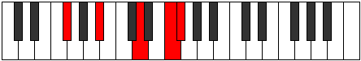 |
| [2321](https://ianring.com/musictheory/scales/2321) | [Zyphic](ModeGFlatZyphic.md) | Gb | Gb, Bb, D, F, Gb |  |
| [2323](https://ianring.com/musictheory/scales/2323) | [Doptitonic](ModeFSharpDoptitonic.md) | F# | F#, G, A#, D, F, F# |  |
| [2323](https://ianring.com/musictheory/scales/2323) | [Doptitonic](ModeGFlatDoptitonic.md) | Gb | Gb, G, Bb, D, F, Gb |  |
| [2323](https://ianring.com/musictheory/scales/2323) | [Doptitonic](ModeANaturalDoptitonic.md) | A | A, A#, C#, F, G#, A |  |
| [2325](https://ianring.com/musictheory/scales/2325) | [Pynitonic](ModeFSharpPynitonic.md) | F# | F#, G#, A#, D, F, F# |  |
| [2325](https://ianring.com/musictheory/scales/2325) | [Pynitonic](ModeGFlatPynitonic.md) | Gb | Gb, Ab, Bb, D, F, Gb |  |
| [2327](https://ianring.com/musictheory/scales/2327) | [Epalimic](ModeFSharpEpalimic.md) | F# | F#, G, Ab, Bb, C##, D###, F# |  |
| [2327](https://ianring.com/musictheory/scales/2327) | [Epalimic](ModeGFlatEpalimic.md) | Gb | Gb, Abb, Bbbb, Cbb, D, E#, Gb |  |
| [2327](https://ianring.com/musictheory/scales/2327) | [Epalimic](ModeANaturalEpalimic.md) | A | A, Bb, Cb, Db, E#, F###, A |  |
| [2329](https://ianring.com/musictheory/scales/2329) | [Styditonic](ModeDNaturalStyditonic.md) | D | D, F, F#, A#, C#, D |  |
| [2329](https://ianring.com/musictheory/scales/2329) | [Styditonic](ModeFSharpStyditonic.md) | F# | F#, A, A#, D, F, F# |  |
| [2329](https://ianring.com/musictheory/scales/2329) | [Styditonic](ModeGFlatStyditonic.md) | Gb | Gb, A, Bb, D, F, Gb |  |
| [2331](https://ianring.com/musictheory/scales/2331) | [Dylimic](ModeDNaturalDylimic.md) | D | D, Eb, F, Gb, A#, B##, D |  |
| [2331](https://ianring.com/musictheory/scales/2331) | [Dylimic](ModeFSharpDylimic.md) | F# | F#, G, A, Bb, C##, D###, F# |  |
| [2331](https://ianring.com/musictheory/scales/2331) | [Dylimic](ModeGFlatDylimic.md) | Gb | Gb, Abb, Bbb, Cbb, D, E#, Gb |  |
| [2331](https://ianring.com/musictheory/scales/2331) | [Dylimic](ModeANaturalDylimic.md) | A | A, Bb, C, Db, E#, F###, A |  |
| [2333](https://ianring.com/musictheory/scales/2333) | [Stynimic](ModeDNaturalStynimic.md) | D | D, E, F, Gb, A#, B##, D |  |
| [2333](https://ianring.com/musictheory/scales/2333) | [Stynimic](ModeFSharpStynimic.md) | F# | F#, G#, A, Bb, C##, D###, F# |  |
| [2333](https://ianring.com/musictheory/scales/2333) | [Stynimic](ModeGFlatStynimic.md) | Gb | Gb, Ab, Bbb, Cbb, D, E#, Gb |  |
| [2335](https://ianring.com/musictheory/scales/2335) | [Epydian](ModeDNaturalEpydian.md) | D | D, Eb, Fb, Gbb, Abbb, Bb, C#, D |  |
| [2335](https://ianring.com/musictheory/scales/2335) | [Epydian](ModeFSharpEpydian.md) | F# | F#, G, Ab, Bbb, Cbb, D, E#, F# |  |
| [2335](https://ianring.com/musictheory/scales/2335) | [Epydian](ModeGFlatEpydian.md) | Gb | Gb, Abb, Bbbb, Cbbb, Cbb, D, E#, Gb |  |
| [2335](https://ianring.com/musictheory/scales/2335) | [Epydian](ModeANaturalEpydian.md) | A | A, Bb, Cb, Dbb, Ebbb, F, G#, A |  |
| [2339](https://ianring.com/musictheory/scales/2339) | [Ragitonic](ModeFNaturalRagitonic.md) | F | F, F#, A#, C#, E, F |  |
| [2339](https://ianring.com/musictheory/scales/2339) | [Ragitonic](ModeANaturalRagitonic.md) | A | A, A#, D, F, G#, A |  |
| [2341](https://ianring.com/musictheory/scales/2341) | [Myditonic](ModeFNaturalMyditonic.md) | F | F, G, A#, C#, E, F |  |
| [2343](https://ianring.com/musictheory/scales/2343) | [Tharimic](ModeFNaturalTharimic.md) | F | F, Gb, Abb, Bb, C#, D##, F |  |
| [2343](https://ianring.com/musictheory/scales/2343) | [Tharimic](ModeANaturalTharimic.md) | A | A, Bb, Cb, D, E#, F###, A |  |
| [2345](https://ianring.com/musictheory/scales/2345) | [Gothitonic](ModeDNaturalGothitonic.md) | D | D, F, G, A#, C#, D |  |
| [2345](https://ianring.com/musictheory/scales/2345) | [Gothitonic](ModeFNaturalGothitonic.md) | F | F, G#, A#, C#, E, F |  |
| [2347](https://ianring.com/musictheory/scales/2347) | [Thothimic](ModeDNaturalThothimic.md) | D | D, Eb, F, G, A#, B##, D |  |
| [2347](https://ianring.com/musictheory/scales/2347) | [Thothimic](ModeFNaturalThothimic.md) | F | F, Gb, Ab, Bb, C#, D##, F |  |
| [2347](https://ianring.com/musictheory/scales/2347) | [Thothimic](ModeANaturalThothimic.md) | A | A, Bb, C, D, E#, F###, A |  |
| [2349](https://ianring.com/musictheory/scales/2349) | [Aerogimic](ModeDNaturalAerogimic.md) | D | D, E, F, G, A#, B##, D |  |
| [2349](https://ianring.com/musictheory/scales/2349) | [Aerogimic](ModeFNaturalAerogimic.md) | F | F, G, Ab, Bb, C#, D##, F |  |
| [2351](https://ianring.com/musictheory/scales/2351) | [Gynian](ModeDNaturalGynian.md) | D | D, Eb, Fb, Gbb, Abb, Bb, C#, D |  |
| [2351](https://ianring.com/musictheory/scales/2351) | [Gynian](ModeFNaturalGynian.md) | F | F, Gb, Abb, Bbbb, Cbb, Db, E, F |  |
| [2351](https://ianring.com/musictheory/scales/2351) | [Gynian](ModeANaturalGynian.md) | A | A, Bb, Cb, Dbb, Ebb, F, G#, A |  |
| [2353](https://ianring.com/musictheory/scales/2353) | [Lycritonic](ModeFNaturalLycritonic.md) | F | F, A, A#, C#, E, F |  |
| [2353](https://ianring.com/musictheory/scales/2353) | [Lycritonic](ModeFSharpLycritonic.md) | F# | F#, A#, B, D, F, F# |  |
| [2353](https://ianring.com/musictheory/scales/2353) | [Lycritonic](ModeGFlatLycritonic.md) | Gb | Gb, Bb, B, D, F, Gb |  |
| [2355](https://ianring.com/musictheory/scales/2355) | [Katycrimic](ModeFNaturalKatycrimic.md) | F | F, Gb, A, Bb, C#, D##, F |  |
| [2355](https://ianring.com/musictheory/scales/2355) | [Katycrimic](ModeANaturalKatycrimic.md) | A | A, Bb, C#, D, E#, F###, A |  |
| [2355](https://ianring.com/musictheory/scales/2355) | [Katycrimic](ModeFSharpKatycrimic.md) | F# | F#, G, A#, B, C##, D###, F# |  |
| [2355](https://ianring.com/musictheory/scales/2355) | [Katycrimic](ModeGFlatKatycrimic.md) | Gb | Gb, Abb, Bb, Cb, D, E#, Gb |  |
| [2357](https://ianring.com/musictheory/scales/2357) | [Ionaptimic](ModeFNaturalIonaptimic.md) | F | F, G, A, Bb, C#, D##, F |  |
| [2357](https://ianring.com/musictheory/scales/2357) | [Ionaptimic](ModeFSharpIonaptimic.md) | F# | F#, G#, A#, B, C##, D###, F# |  |
| [2357](https://ianring.com/musictheory/scales/2357) | [Ionaptimic](ModeGFlatIonaptimic.md) | Gb | Gb, Ab, Bb, Cb, D, E#, Gb |  |
| [2359](https://ianring.com/musictheory/scales/2359) | [Gadian](ModeFNaturalGadian.md) | F | F, Gb, Abb, Bbb, Cbb, Db, E, F |  |
| [2359](https://ianring.com/musictheory/scales/2359) | [Gadian](ModeFSharpGadian.md) | F# | F#, G, Ab, Bb, Cb, D, E#, F# |  |
| [2359](https://ianring.com/musictheory/scales/2359) | [Gadian](ModeGFlatGadian.md) | Gb | Gb, Abb, Bbbb, Cbb, Dbbb, Ebb, F, Gb |  |
| [2359](https://ianring.com/musictheory/scales/2359) | [Gadian](ModeANaturalGadian.md) | A | A, Bb, Cb, Db, Ebb, F, G#, A |  |
| [2361](https://ianring.com/musictheory/scales/2361) | [Docrimic](ModeDNaturalDocrimic.md) | D | D, E#, F#, G, A#, B##, D |  |
| [2361](https://ianring.com/musictheory/scales/2361) | [Docrimic](ModeFNaturalDocrimic.md) | F | F, G#, A, Bb, C#, D##, F |  |
| [2361](https://ianring.com/musictheory/scales/2361) | [Docrimic](ModeFSharpDocrimic.md) | F# | F#, G##, A#, B, C##, D###, F# |  |
| [2361](https://ianring.com/musictheory/scales/2361) | [Docrimic](ModeGFlatDocrimic.md) | Gb | Gb, A, Bb, Cb, D, E#, Gb |  |
| [2363](https://ianring.com/musictheory/scales/2363) | [Kataptian](ModeDNaturalKataptian.md) | D | D, Eb, F, Gb, Abb, Bb, C#, D |  |
| [2363](https://ianring.com/musictheory/scales/2363) | [Kataptian](ModeANaturalKataptian.md) | A | A, Bb, C, Db, Ebb, F, G#, A |  |
| [2363](https://ianring.com/musictheory/scales/2363) | [Kataptian](ModeFNaturalKataptian.md) | F | F, Gb, Ab, Bbb, Cbb, Db, E, F |  |
| [2363](https://ianring.com/musictheory/scales/2363) | [Kataptian](ModeFSharpKataptian.md) | F# | F#, G, A, Bb, Cb, D, E#, F# |  |
| [2363](https://ianring.com/musictheory/scales/2363) | [Kataptian](ModeGFlatKataptian.md) | Gb | Gb, Abb, Bbb, Cbb, Dbbb, Ebb, F, Gb |  |
| [2365](https://ianring.com/musictheory/scales/2365) | [Sythian](ModeDNaturalSythian.md) | D | D, E, F, Gb, Abb, Bb, C#, D |  |
| [2365](https://ianring.com/musictheory/scales/2365) | [Sythian](ModeFNaturalSythian.md) | F | F, G, Ab, Bbb, Cbb, Db, E, F |  |
| [2365](https://ianring.com/musictheory/scales/2365) | [Sythian](ModeFSharpSythian.md) | F# | F#, G#, A, Bb, Cb, D, E#, F# |  |
| [2365](https://ianring.com/musictheory/scales/2365) | [Sythian](ModeGFlatSythian.md) | Gb | Gb, Ab, Bbb, Cbb, Dbbb, Ebb, F, Gb |  |
| [2367](https://ianring.com/musictheory/scales/2367) | [Laryllic](ModeDNaturalLaryllic.md) | D | D, D#, E, F, F#, G, A#, C#, D |  |
| [2367](https://ianring.com/musictheory/scales/2367) | [Laryllic](ModeFNaturalLaryllic.md) | F | F, F#, G, G#, A, A#, C#, E, F |  |
| [2367](https://ianring.com/musictheory/scales/2367) | [Laryllic](ModeANaturalLaryllic.md) | A | A, A#, B, C, C#, D, F, G#, A |  |
| [2367](https://ianring.com/musictheory/scales/2367) | [Laryllic](ModeFSharpLaryllic.md) | F# | F#, G, G#, A, A#, B, D, F, F# |  |
| [2367](https://ianring.com/musictheory/scales/2367) | [Laryllic](ModeGFlatLaryllic.md) | Gb | Gb, G, Ab, A, Bb, B, D, F, Gb |  |
| [2373](https://ianring.com/musictheory/scales/2373) | [Dyptitonic](ModeBNaturalDyptitonic.md) | B | B, C#, F, G, A#, B |  |
| [2375](https://ianring.com/musictheory/scales/2375) | [Aeolaptimic](ModeENaturalAeolaptimic.md) | E | E, F, Gb, A#, B#, C###, E |  |
| [2375](https://ianring.com/musictheory/scales/2375) | [Aeolaptimic](ModeBNaturalAeolaptimic.md) | B | B, C, Db, E#, F##, G###, B |  |
| [2375](https://ianring.com/musictheory/scales/2375) | [Aeolaptimic](ModeANaturalAeolaptimic.md) | A | A, Bb, Cb, D#, E#, F###, A |  |
| [2377](https://ianring.com/musictheory/scales/2377) | [Thoditonic](ModeDNaturalThoditonic.md) | D | D, F, G#, A#, C#, D |  |
| [2377](https://ianring.com/musictheory/scales/2377) | [Thoditonic](ModeBNaturalThoditonic.md) | B | B, D, F, G, A#, B |  |
| [2379](https://ianring.com/musictheory/scales/2379) | [Stathimic](ModeENaturalStathimic.md) | E | E, F, G, A#, B#, C###, E |  |
| [2379](https://ianring.com/musictheory/scales/2379) | [Stathimic](ModeDNaturalStathimic.md) | D | D, Eb, F, G#, A#, B##, D |  |
| [2379](https://ianring.com/musictheory/scales/2379) | [Stathimic](ModeANaturalStathimic.md) | A | A, Bb, C, D#, E#, F###, A |  |
| [2379](https://ianring.com/musictheory/scales/2379) | [Stathimic](ModeBNaturalStathimic.md) | B | B, C, D, E#, F##, G###, B |  |
| [2381](https://ianring.com/musictheory/scales/2381) | [Sorimic](ModeDNaturalSorimic.md) | D | D, E, F, G#, A#, B##, D |  |
| [2381](https://ianring.com/musictheory/scales/2381) | [Sorimic](ModeBNaturalSorimic.md) | B | B, C#, D, E#, F##, G###, B |  |
| [2383](https://ianring.com/musictheory/scales/2383) | [Katorian](ModeENaturalKatorian.md) | E | E, F, Gb, Abb, Bb, C, D#, E |  |
| [2383](https://ianring.com/musictheory/scales/2383) | [Katorian](ModeDNaturalKatorian.md) | D | D, Eb, Fb, Gbb, Ab, Bb, C#, D |  |
| [2383](https://ianring.com/musictheory/scales/2383) | [Katorian](ModeBNaturalKatorian.md) | B | B, C, Db, Ebb, F, G, A#, B |  |
| [2383](https://ianring.com/musictheory/scales/2383) | [Katorian](ModeANaturalKatorian.md) | A | A, Bb, Cb, Dbb, Eb, F, G#, A |  |
| [2385](https://ianring.com/musictheory/scales/2385) | [Aeolanitonic](ModeFSharpAeolanitonic.md) | F# | F#, A#, C, D, F, F# | 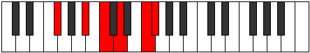 |
| [2385](https://ianring.com/musictheory/scales/2385) | [Aeolanitonic](ModeGFlatAeolanitonic.md) | Gb | Gb, Bb, C, D, F, Gb |  |
| [2385](https://ianring.com/musictheory/scales/2385) | [Aeolanitonic](ModeBNaturalAeolanitonic.md) | B | B, D#, F, G, A#, B |  |
| [2387](https://ianring.com/musictheory/scales/2387) | [Paptimic](ModeFSharpPaptimic.md) | F# | F#, G, A#, B#, C##, D###, F# |  |
| [2387](https://ianring.com/musictheory/scales/2387) | [Paptimic](ModeGFlatPaptimic.md) | Gb | Gb, Abb, Bb, C, D, E#, Gb |  |
| [2387](https://ianring.com/musictheory/scales/2387) | [Paptimic](ModeENaturalPaptimic.md) | E | E, F, G#, A#, B#, C###, E |  |
| [2387](https://ianring.com/musictheory/scales/2387) | [Paptimic](ModeANaturalPaptimic.md) | A | A, Bb, C#, D#, E#, F###, A |  |
| [2387](https://ianring.com/musictheory/scales/2387) | [Paptimic](ModeBNaturalPaptimic.md) | B | B, C, D#, E#, F##, G###, B |  |
| [2389](https://ianring.com/musictheory/scales/2389) | [Thynimic](ModeFSharpThynimic.md) | F# | F#, G#, A#, B#, C##, D###, F# |  |
| [2389](https://ianring.com/musictheory/scales/2389) | [Thynimic](ModeGFlatThynimic.md) | Gb | Gb, Ab, Bb, C, D, E#, Gb |  |
| [2389](https://ianring.com/musictheory/scales/2389) | [Thynimic](ModeBNaturalThynimic.md) | B | B, C#, D#, E#, F##, G###, B |  |
| [2391](https://ianring.com/musictheory/scales/2391) | [Molian](ModeENaturalMolian.md) | E | E, F, Gb, Ab, Bb, C, D#, E |  |
| [2391](https://ianring.com/musictheory/scales/2391) | [Molian](ModeFSharpMolian.md) | F# | F#, G, Ab, Bb, C, D, E#, F# |  |
| [2391](https://ianring.com/musictheory/scales/2391) | [Molian](ModeGFlatMolian.md) | Gb | Gb, Abb, Bbbb, Cbb, Dbb, Ebb, F, Gb |  |
| [2391](https://ianring.com/musictheory/scales/2391) | [Molian](ModeBNaturalMolian.md) | B | B, C, Db, Eb, F, G, A#, B |  |
| [2391](https://ianring.com/musictheory/scales/2391) | [Molian](ModeANaturalMolian.md) | A | A, Bb, Cb, Db, Eb, F, G#, A |  |
| [2393](https://ianring.com/musictheory/scales/2393) | [Zathimic](ModeDNaturalZathimic.md) | D | D, E#, F#, G#, A#, B##, D |  |
| [2393](https://ianring.com/musictheory/scales/2393) | [Zathimic](ModeFSharpZathimic.md) | F# | F#, G##, A#, B#, C##, D###, F# |  |
| [2393](https://ianring.com/musictheory/scales/2393) | [Zathimic](ModeGFlatZathimic.md) | Gb | Gb, A, Bb, C, D, E#, Gb |  |
| [2393](https://ianring.com/musictheory/scales/2393) | [Zathimic](ModeBNaturalZathimic.md) | B | B, C##, D#, E#, F##, G###, B |  |
| [2395](https://ianring.com/musictheory/scales/2395) | [Zoptian](ModeDNaturalZoptian.md) | D | D, Eb, F, Gb, Ab, Bb, C#, D |  |
| [2395](https://ianring.com/musictheory/scales/2395) | [Zoptian](ModeENaturalZoptian.md) | E | E, F, G, Ab, Bb, C, D#, E |  |
| [2395](https://ianring.com/musictheory/scales/2395) | [Zoptian](ModeFSharpZoptian.md) | F# | F#, G, A, Bb, C, D, E#, F# |  |
| [2395](https://ianring.com/musictheory/scales/2395) | [Zoptian](ModeGFlatZoptian.md) | Gb | Gb, Abb, Bbb, Cbb, Dbb, Ebb, F, Gb |  |
| [2395](https://ianring.com/musictheory/scales/2395) | [Zoptian](ModeANaturalZoptian.md) | A | A, Bb, C, Db, Eb, F, G#, A |  |
| [2395](https://ianring.com/musictheory/scales/2395) | [Zoptian](ModeBNaturalZoptian.md) | B | B, C, D, Eb, F, G, A#, B |  |
| [2397](https://ianring.com/musictheory/scales/2397) | [Stagian](ModeDNaturalStagian.md) | D | D, E, F, Gb, Ab, Bb, C#, D |  |
| [2397](https://ianring.com/musictheory/scales/2397) | [Stagian](ModeFSharpStagian.md) | F# | F#, G#, A, Bb, C, D, E#, F# |  |
| [2397](https://ianring.com/musictheory/scales/2397) | [Stagian](ModeGFlatStagian.md) | Gb | Gb, Ab, Bbb, Cbb, Dbb, Ebb, F, Gb |  |
| [2397](https://ianring.com/musictheory/scales/2397) | [Stagian](ModeBNaturalStagian.md) | B | B, C#, D, Eb, F, G, A#, B |  |
| [2399](https://ianring.com/musictheory/scales/2399) | [Zanyllic](ModeDNaturalZanyllic.md) | D | D, D#, E, F, F#, G#, A#, C#, D |  |
| [2399](https://ianring.com/musictheory/scales/2399) | [Zanyllic](ModeENaturalZanyllic.md) | E | E, F, F#, G, G#, A#, C, D#, E |  |
| [2399](https://ianring.com/musictheory/scales/2399) | [Zanyllic](ModeFSharpZanyllic.md) | F# | F#, G, G#, A, A#, C, D, F, F# |  |
| [2399](https://ianring.com/musictheory/scales/2399) | [Zanyllic](ModeGFlatZanyllic.md) | Gb | Gb, G, Ab, A, Bb, C, D, F, Gb |  |
| [2399](https://ianring.com/musictheory/scales/2399) | [Zanyllic](ModeBNaturalZanyllic.md) | B | B, C, C#, D, D#, F, G, A#, B |  |
| [2399](https://ianring.com/musictheory/scales/2399) | [Zanyllic](ModeANaturalZanyllic.md) | A | A, A#, B, C, C#, D#, F, G#, A |  |
| [2403](https://ianring.com/musictheory/scales/2403) | [Lycrimic](ModeENaturalLycrimic.md) | E | E, F, G##, A#, B#, C###, E |  |
| [2403](https://ianring.com/musictheory/scales/2403) | [Lycrimic](ModeANaturalLycrimic.md) | A | A, Bb, C##, D#, E#, F###, A |  |
| [2403](https://ianring.com/musictheory/scales/2403) | [Lycrimic](ModeFNaturalLycrimic.md) | F | F, Gb, A#, B, C#, D##, F |  |
| [2403](https://ianring.com/musictheory/scales/2403) | [Lycrimic](ModeBNaturalLycrimic.md) | B | B, C, D##, E#, F##, G###, B |  |
| [2405](https://ianring.com/musictheory/scales/2405) | [Katalimic](ModeFNaturalKatalimic.md) | F | F, G, A#, B, C#, D##, F |  |
| [2405](https://ianring.com/musictheory/scales/2405) | [Katalimic](ModeBNaturalKatalimic.md) | B | B, C#, D##, E#, F##, G###, B |  |
| [2407](https://ianring.com/musictheory/scales/2407) | [Zylian](ModeENaturalZylian.md) | E | E, F, Gb, A, Bb, C, D#, E |  |
| [2407](https://ianring.com/musictheory/scales/2407) | [Zylian](ModeBNaturalZylian.md) | B | B, C, Db, E, F, G, A#, B |  |
| [2407](https://ianring.com/musictheory/scales/2407) | [Zylian](ModeFNaturalZylian.md) | F | F, Gb, Abb, Bb, Cb, Db, E, F |  |
| [2407](https://ianring.com/musictheory/scales/2407) | [Zylian](ModeANaturalZylian.md) | A | A, Bb, Cb, D, Eb, F, G#, A |  |
| [2409](https://ianring.com/musictheory/scales/2409) | [Zacrimic](ModeDNaturalZacrimic.md) | D | D, E#, F##, G#, A#, B##, D |  |
| [2409](https://ianring.com/musictheory/scales/2409) | [Zacrimic](ModeBNaturalZacrimic.md) | B | B, C##, D##, E#, F##, G###, B |  |
| [2409](https://ianring.com/musictheory/scales/2409) | [Zacrimic](ModeFNaturalZacrimic.md) | F | F, G#, A#, B, C#, D##, F |  |
| [2411](https://ianring.com/musictheory/scales/2411) | [Aeolorian](ModeDNaturalAeolorian.md) | D | D, Eb, F, G, Ab, Bb, C#, D |  |
| [2411](https://ianring.com/musictheory/scales/2411) | [Aeolorian](ModeENaturalAeolorian.md) | E | E, F, G, A, Bb, C, D#, E |  |
| [2411](https://ianring.com/musictheory/scales/2411) | [Aeolorian](ModeANaturalAeolorian.md) | A | A, Bb, C, D, Eb, F, G#, A |  |
| [2411](https://ianring.com/musictheory/scales/2411) | [Aeolorian](ModeBNaturalAeolorian.md) | B | B, C, D, E, F, G, A#, B |  |
| [2411](https://ianring.com/musictheory/scales/2411) | [Aeolorian](ModeFNaturalAeolorian.md) | F | F, Gb, Ab, Bb, Cb, Db, E, F |  |
| [2413](https://ianring.com/musictheory/scales/2413) | [Phrydian](ModeDNaturalPhrydian.md) | D | D, E, F, G, Ab, Bb, C#, D |  |
| [2413](https://ianring.com/musictheory/scales/2413) | [Phrydian](ModeBNaturalPhrydian.md) | B | B, C#, D, E, F, G, A#, B |  |
| [2413](https://ianring.com/musictheory/scales/2413) | [Phrydian](ModeFNaturalPhrydian.md) | F | F, G, Ab, Bb, Cb, Db, E, F |  |
| [2415](https://ianring.com/musictheory/scales/2415) | [Lothyllic](ModeDNaturalLothyllic.md) | D | D, D#, E, F, G, G#, A#, C#, D |  |
| [2415](https://ianring.com/musictheory/scales/2415) | [Lothyllic](ModeENaturalLothyllic.md) | E | E, F, F#, G, A, A#, C, D#, E |  |
| [2415](https://ianring.com/musictheory/scales/2415) | [Lothyllic](ModeBNaturalLothyllic.md) | B | B, C, C#, D, E, F, G, A#, B |  |
| [2415](https://ianring.com/musictheory/scales/2415) | [Lothyllic](ModeFNaturalLothyllic.md) | F | F, F#, G, G#, A#, B, C#, E, F |  |
| [2415](https://ianring.com/musictheory/scales/2415) | [Lothyllic](ModeANaturalLothyllic.md) | A | A, A#, B, C, D, D#, F, G#, A |  |
| [2417](https://ianring.com/musictheory/scales/2417) | [Kanimic](ModeFSharpKanimic.md) | F# | F#, G###, A##, B#, C##, D###, F# |  |
| [2417](https://ianring.com/musictheory/scales/2417) | [Kanimic](ModeGFlatKanimic.md) | Gb | Gb, A#, B, C, D, E#, Gb |  |
| [2417](https://ianring.com/musictheory/scales/2417) | [Kanimic](ModeBNaturalKanimic.md) | B | B, C###, D##, E#, F##, G###, B |  |
| [2417](https://ianring.com/musictheory/scales/2417) | [Kanimic](ModeFNaturalKanimic.md) | F | F, G##, A#, B, C#, D##, F |  |
| [2419](https://ianring.com/musictheory/scales/2419) | [Paptian](ModeANaturalPaptian.md) | A | A, Bb, C#, D, Eb, F, G#, A |  |
| [2419](https://ianring.com/musictheory/scales/2419) | [Paptian](ModeENaturalPaptian.md) | E | E, F, G#, A, Bb, C, D#, E |  |
| [2419](https://ianring.com/musictheory/scales/2419) | [Paptian](ModeBNaturalPaptian.md) | B | B, C, D#, E, F, G, A#, B |  |
| [2419](https://ianring.com/musictheory/scales/2419) | [Paptian](ModeFSharpPaptian.md) | F# | F#, G, A#, B, C, D, E#, F# |  |
| [2419](https://ianring.com/musictheory/scales/2419) | [Paptian](ModeGFlatPaptian.md) | Gb | Gb, Abb, Bb, Cb, Dbb, Ebb, F, Gb |  |
| [2419](https://ianring.com/musictheory/scales/2419) | [Paptian](ModeFNaturalPaptian.md) | F | F, Gb, A, Bb, Cb, Db, E, F |  |
| [2421](https://ianring.com/musictheory/scales/2421) | [Malian](ModeBNaturalMalian.md) | B | B, C#, D#, E, F, G, A#, B |  |
| [2421](https://ianring.com/musictheory/scales/2421) | [Malian](ModeFSharpMalian.md) | F# | F#, G#, A#, B, C, D, E#, F# |  |
| [2421](https://ianring.com/musictheory/scales/2421) | [Malian](ModeGFlatMalian.md) | Gb | Gb, Ab, Bb, Cb, Dbb, Ebb, F, Gb |  |
| [2421](https://ianring.com/musictheory/scales/2421) | [Malian](ModeFNaturalMalian.md) | F | F, G, A, Bb, Cb, Db, E, F |  |
| [2423](https://ianring.com/musictheory/scales/2423) | [Thorcryllic](ModeENaturalThorcryllic.md) | E | E, F, F#, G#, A, A#, C, D#, E |  |
| [2423](https://ianring.com/musictheory/scales/2423) | [Thorcryllic](ModeBNaturalThorcryllic.md) | B | B, C, C#, D#, E, F, G, A#, B |  |
| [2423](https://ianring.com/musictheory/scales/2423) | [Thorcryllic](ModeFSharpThorcryllic.md) | F# | F#, G, G#, A#, B, C, D, F, F# |  |
| [2423](https://ianring.com/musictheory/scales/2423) | [Thorcryllic](ModeGFlatThorcryllic.md) | Gb | Gb, G, Ab, Bb, B, C, D, F, Gb |  |
| [2423](https://ianring.com/musictheory/scales/2423) | [Thorcryllic](ModeFNaturalThorcryllic.md) | F | F, F#, G, A, A#, B, C#, E, F |  |
| [2423](https://ianring.com/musictheory/scales/2423) | [Thorcryllic](ModeANaturalThorcryllic.md) | A | A, A#, B, C#, D, D#, F, G#, A |  |
| [2425](https://ianring.com/musictheory/scales/2425) | [Rorian](ModeDNaturalRorian.md) | D | D, E#, F#, G, Ab, Bb, C#, D |  |
| [2425](https://ianring.com/musictheory/scales/2425) | [Rorian](ModeBNaturalRorian.md) | B | B, C##, D#, E, F, G, A#, B |  |
| [2425](https://ianring.com/musictheory/scales/2425) | [Rorian](ModeFSharpRorian.md) | F# | F#, G##, A#, B, C, D, E#, F# |  |
| [2425](https://ianring.com/musictheory/scales/2425) | [Rorian](ModeGFlatRorian.md) | Gb | Gb, A, Bb, Cb, Dbb, Ebb, F, Gb |  |
| [2425](https://ianring.com/musictheory/scales/2425) | [Rorian](ModeFNaturalRorian.md) | F | F, G#, A, Bb, Cb, Db, E, F |  |
| [2427](https://ianring.com/musictheory/scales/2427) | [Katoryllic](ModeDNaturalKatoryllic.md) | D | D, D#, F, F#, G, G#, A#, C#, D |  |
| [2427](https://ianring.com/musictheory/scales/2427) | [Katoryllic](ModeANaturalKatoryllic.md) | A | A, A#, C, C#, D, D#, F, G#, A |  |
| [2427](https://ianring.com/musictheory/scales/2427) | [Katoryllic](ModeENaturalKatoryllic.md) | E | E, F, G, G#, A, A#, C, D#, E |  |
| [2427](https://ianring.com/musictheory/scales/2427) | [Katoryllic](ModeBNaturalKatoryllic.md) | B | B, C, D, D#, E, F, G, A#, B |  |
| [2427](https://ianring.com/musictheory/scales/2427) | [Katoryllic](ModeFSharpKatoryllic.md) | F# | F#, G, A, A#, B, C, D, F, F# |  |
| [2427](https://ianring.com/musictheory/scales/2427) | [Katoryllic](ModeGFlatKatoryllic.md) | Gb | Gb, G, A, Bb, B, C, D, F, Gb |  |
| [2427](https://ianring.com/musictheory/scales/2427) | [Katoryllic](ModeFNaturalKatoryllic.md) | F | F, F#, G#, A, A#, B, C#, E, F |  |
| [2429](https://ianring.com/musictheory/scales/2429) | [Kadyllic](ModeDNaturalKadyllic.md) | D | D, E, F, F#, G, G#, A#, C#, D |  |
| [2429](https://ianring.com/musictheory/scales/2429) | [Kadyllic](ModeBNaturalKadyllic.md) | B | B, C#, D, D#, E, F, G, A#, B |  |
| [2429](https://ianring.com/musictheory/scales/2429) | [Kadyllic](ModeFSharpKadyllic.md) | F# | F#, G#, A, A#, B, C, D, F, F# |  |
| [2429](https://ianring.com/musictheory/scales/2429) | [Kadyllic](ModeGFlatKadyllic.md) | Gb | Gb, Ab, A, Bb, B, C, D, F, Gb |  |
| [2429](https://ianring.com/musictheory/scales/2429) | [Kadyllic](ModeFNaturalKadyllic.md) | F | F, G, G#, A, A#, B, C#, E, F |  |
| [2431](https://ianring.com/musictheory/scales/2431) | [Gythygic](ModeDNaturalGythygic.md) | D | D, D#, E, F, F#, G, G#, A#, C#, D |  |
| [2431](https://ianring.com/musictheory/scales/2431) | [Gythygic](ModeENaturalGythygic.md) | E | E, F, F#, G, G#, A, A#, C, D#, E |  |
| [2431](https://ianring.com/musictheory/scales/2431) | [Gythygic](ModeBNaturalGythygic.md) | B | B, C, C#, D, D#, E, F, G, A#, B |  |
| [2431](https://ianring.com/musictheory/scales/2431) | [Gythygic](ModeANaturalGythygic.md) | A | A, A#, B, C, C#, D, D#, F, G#, A |  |
| [2431](https://ianring.com/musictheory/scales/2431) | [Gythygic](ModeFSharpGythygic.md) | F# | F#, G, G#, A, A#, B, C, D, F, F# |  |
| [2431](https://ianring.com/musictheory/scales/2431) | [Gythygic](ModeGFlatGythygic.md) | Gb | Gb, G, Ab, A, Bb, B, C, D, F, Gb |  |
| [2431](https://ianring.com/musictheory/scales/2431) | [Gythygic](ModeFNaturalGythygic.md) | F | F, F#, G, G#, A, A#, B, C#, E, F |  |
| [2441](https://ianring.com/musictheory/scales/2441) | [Kyritonic](ModeDNaturalKyritonic.md) | D | D, F, A, A#, C#, D |  |
| [2441](https://ianring.com/musictheory/scales/2441) | [Kyritonic](ModeASharpKyritonic.md) | A# | A#, C#, F, F#, A, A# |  |
| [2441](https://ianring.com/musictheory/scales/2441) | [Kyritonic](ModeBFlatKyritonic.md) | Bb | Bb, Db, F, Gb, A, Bb |  |
| [2443](https://ianring.com/musictheory/scales/2443) | [Panimic](ModeDNaturalPanimic.md) | D | D, Eb, F, G##, A#, B##, D |  |
| [2443](https://ianring.com/musictheory/scales/2443) | [Panimic](ModeANaturalPanimic.md) | A | A, Bb, C, D##, E#, F###, A |  |
| [2443](https://ianring.com/musictheory/scales/2443) | [Panimic](ModeASharpPanimic.md) | A# | A#, B, C#, D###, E##, Cbbb, A# |  |
| [2443](https://ianring.com/musictheory/scales/2443) | [Panimic](ModeBFlatPanimic.md) | Bb | Bb, Cb, Db, E#, F#, G##, Bb |  |
| [2445](https://ianring.com/musictheory/scales/2445) | [Zadimic](ModeDNaturalZadimic.md) | D | D, E, F, G##, A#, B##, D |  |
| [2445](https://ianring.com/musictheory/scales/2445) | [Zadimic](ModeASharpZadimic.md) | A# | A#, B#, C#, D###, E##, Cbbb, A# |  |
| [2445](https://ianring.com/musictheory/scales/2445) | [Zadimic](ModeBFlatZadimic.md) | Bb | Bb, C, Db, E#, F#, G##, Bb |  |
| [2445](https://ianring.com/musictheory/scales/2445) | [Zadimic](ModeDSharpZadimic.md) | D# | D#, E#, F#, G###, A##, B###, D# |  |
| [2445](https://ianring.com/musictheory/scales/2445) | [Zadimic](ModeEFlatZadimic.md) | Eb | Eb, F, Gb, A#, B, C##, Eb |  |
| [2447](https://ianring.com/musictheory/scales/2447) | [Thagian](ModeDNaturalThagian.md) | D | D, Eb, Fb, Gbb, A, Bb, C#, D |  |
| [2447](https://ianring.com/musictheory/scales/2447) | [Thagian](ModeDSharpThagian.md) | D# | D#, E, F, Gb, A#, B, C##, D# |  |
| [2447](https://ianring.com/musictheory/scales/2447) | [Thagian](ModeEFlatThagian.md) | Eb | Eb, Fb, Gbb, Abbb, Bb, Cb, D, Eb |  |
| [2447](https://ianring.com/musictheory/scales/2447) | [Thagian](ModeASharpThagian.md) | A# | A#, B, C, Db, E#, F#, G##, A# |  |
| [2447](https://ianring.com/musictheory/scales/2447) | [Thagian](ModeBFlatThagian.md) | Bb | Bb, Cb, Dbb, Ebbb, F, Gb, A, Bb |  |
| [2447](https://ianring.com/musictheory/scales/2447) | [Thagian](ModeANaturalThagian.md) | A | A, Bb, Cb, Dbb, E, F, G#, A |  |
| [2449](https://ianring.com/musictheory/scales/2449) | [Zacritonic](ModeFSharpZacritonic.md) | F# | F#, A#, C#, D, F, F# |  |
| [2449](https://ianring.com/musictheory/scales/2449) | [Zacritonic](ModeGFlatZacritonic.md) | Gb | Gb, Bb, Db, D, F, Gb |  |
| [2449](https://ianring.com/musictheory/scales/2449) | [Zacritonic](ModeASharpZacritonic.md) | A# | A#, D, F, F#, A, A# |  |
| [2449](https://ianring.com/musictheory/scales/2449) | [Zacritonic](ModeBFlatZacritonic.md) | Bb | Bb, D, F, Gb, A, Bb |  |
| [2451](https://ianring.com/musictheory/scales/2451) | [Aerynimic](ModeFSharpAerynimic.md) | F# | F#, G, A#, B##, C##, D###, F# |  |
| [2451](https://ianring.com/musictheory/scales/2451) | [Aerynimic](ModeGFlatAerynimic.md) | Gb | Gb, Abb, Bb, C#, D, E#, Gb |  |
| [2451](https://ianring.com/musictheory/scales/2451) | [Aerynimic](ModeANaturalAerynimic.md) | A | A, Bb, C#, D##, E#, F###, A |  |
| [2451](https://ianring.com/musictheory/scales/2451) | [Aerynimic](ModeASharpAerynimic.md) | A# | A#, B, C##, D###, E##, Cbbb, A# |  |
| [2451](https://ianring.com/musictheory/scales/2451) | [Aerynimic](ModeBFlatAerynimic.md) | Bb | Bb, Cb, D, E#, F#, G##, Bb |  |
| [2453](https://ianring.com/musictheory/scales/2453) | [Stonimic](ModeFSharpStonimic.md) | F# | F#, G#, A#, B##, C##, D###, F# |  |
| [2453](https://ianring.com/musictheory/scales/2453) | [Stonimic](ModeGFlatStonimic.md) | Gb | Gb, Ab, Bb, C#, D, E#, Gb |  |
| [2453](https://ianring.com/musictheory/scales/2453) | [Stonimic](ModeASharpStonimic.md) | A# | A#, B#, C##, D###, E##, Cbbb, A# |  |
| [2453](https://ianring.com/musictheory/scales/2453) | [Stonimic](ModeBFlatStonimic.md) | Bb | Bb, C, D, E#, F#, G##, Bb |  |
| [2453](https://ianring.com/musictheory/scales/2453) | [Stonimic](ModeDSharpStonimic.md) | D# | D#, E#, F##, G###, A##, B###, D# |  |
| [2453](https://ianring.com/musictheory/scales/2453) | [Stonimic](ModeEFlatStonimic.md) | Eb | Eb, F, G, A#, B, C##, Eb |  |
| [2455](https://ianring.com/musictheory/scales/2455) | [Bothian](ModeFSharpBothian.md) | F# | F#, G, Ab, Bb, C#, D, E#, F# |  |
| [2455](https://ianring.com/musictheory/scales/2455) | [Bothian](ModeGFlatBothian.md) | Gb | Gb, Abb, Bbbb, Cbb, Db, Ebb, F, Gb |  |
| [2455](https://ianring.com/musictheory/scales/2455) | [Bothian](ModeDSharpBothian.md) | D# | D#, E, F, G, A#, B, C##, D# |  |
| [2455](https://ianring.com/musictheory/scales/2455) | [Bothian](ModeEFlatBothian.md) | Eb | Eb, Fb, Gbb, Abb, Bb, Cb, D, Eb |  |
| [2455](https://ianring.com/musictheory/scales/2455) | [Bothian](ModeASharpBothian.md) | A# | A#, B, C, D, E#, F#, G##, A# |  |
| [2455](https://ianring.com/musictheory/scales/2455) | [Bothian](ModeBFlatBothian.md) | Bb | Bb, Cb, Dbb, Ebb, F, Gb, A, Bb |  |
| [2455](https://ianring.com/musictheory/scales/2455) | [Bothian](ModeANaturalBothian.md) | A | A, Bb, Cb, Db, E, F, G#, A |  |
| [2457](https://ianring.com/musictheory/scales/2457) | [Ionythimic](ModeDNaturalIonythimic.md) | D | D, E#, F#, G##, A#, B##, D |  |
| [2457](https://ianring.com/musictheory/scales/2457) | [Ionythimic](ModeFSharpIonythimic.md) | F# | F#, G##, A#, B##, C##, D###, F# |  |
| [2457](https://ianring.com/musictheory/scales/2457) | [Ionythimic](ModeGFlatIonythimic.md) | Gb | Gb, A, Bb, C#, D, E#, Gb |  |
| [2457](https://ianring.com/musictheory/scales/2457) | [Ionythimic](ModeASharpIonythimic.md) | A# | A#, B##, C##, D###, E##, Cbbb, A# |  |
| [2457](https://ianring.com/musictheory/scales/2457) | [Ionythimic](ModeBFlatIonythimic.md) | Bb | Bb, C#, D, E#, F#, G##, Bb |  |
| [2459](https://ianring.com/musictheory/scales/2459) | [Ionocrian](ModeDNaturalIonocrian.md) | D | D, Eb, F, Gb, A, Bb, C#, D |  |
| [2459](https://ianring.com/musictheory/scales/2459) | [Ionocrian](ModeFSharpIonocrian.md) | F# | F#, G, A, Bb, C#, D, E#, F# |  |
| [2459](https://ianring.com/musictheory/scales/2459) | [Ionocrian](ModeGFlatIonocrian.md) | Gb | Gb, Abb, Bbb, Cbb, Db, Ebb, F, Gb |  |
| [2459](https://ianring.com/musictheory/scales/2459) | [Ionocrian](ModeANaturalIonocrian.md) | A | A, Bb, C, Db, E, F, G#, A |  |
| [2459](https://ianring.com/musictheory/scales/2459) | [Ionocrian](ModeASharpIonocrian.md) | A# | A#, B, C#, D, E#, F#, G##, A# |  |
| [2459](https://ianring.com/musictheory/scales/2459) | [Ionocrian](ModeBFlatIonocrian.md) | Bb | Bb, Cb, Db, Ebb, F, Gb, A, Bb |  |
| [2461](https://ianring.com/musictheory/scales/2461) | [Sagian](ModeASharpSagian.md) | A# | A#, B#, C#, D, E#, F#, G##, A# |  |
| [2461](https://ianring.com/musictheory/scales/2461) | [Sagian](ModeBFlatSagian.md) | Bb | Bb, C, Db, Ebb, F, Gb, A, Bb |  |
| [2461](https://ianring.com/musictheory/scales/2461) | [Sagian](ModeDNaturalSagian.md) | D | D, E, F, Gb, A, Bb, C#, D |  |
| [2461](https://ianring.com/musictheory/scales/2461) | [Sagian](ModeFSharpSagian.md) | F# | F#, G#, A, Bb, C#, D, E#, F# |  |
| [2461](https://ianring.com/musictheory/scales/2461) | [Sagian](ModeGFlatSagian.md) | Gb | Gb, Ab, Bbb, Cbb, Db, Ebb, F, Gb |  |
| [2461](https://ianring.com/musictheory/scales/2461) | [Sagian](ModeDSharpSagian.md) | D# | D#, E#, F#, G, A#, B, C##, D# |  |
| [2461](https://ianring.com/musictheory/scales/2461) | [Sagian](ModeEFlatSagian.md) | Eb | Eb, F, Gb, Abb, Bb, Cb, D, Eb |  |
| [2463](https://ianring.com/musictheory/scales/2463) | [Ionathyllic](ModeDNaturalIonathyllic.md) | D | D, D#, E, F, F#, A, A#, C#, D |  |
| [2463](https://ianring.com/musictheory/scales/2463) | [Ionathyllic](ModeFSharpIonathyllic.md) | F# | F#, G, G#, A, A#, C#, D, F, F# |  |
| [2463](https://ianring.com/musictheory/scales/2463) | [Ionathyllic](ModeGFlatIonathyllic.md) | Gb | Gb, G, Ab, A, Bb, Db, D, F, Gb |  |
| [2463](https://ianring.com/musictheory/scales/2463) | [Ionathyllic](ModeDSharpIonathyllic.md) | D# | D#, E, F, F#, G, A#, B, D, D# |  |
| [2463](https://ianring.com/musictheory/scales/2463) | [Ionathyllic](ModeEFlatIonathyllic.md) | Eb | Eb, E, F, Gb, G, Bb, B, D, Eb |  |
| [2463](https://ianring.com/musictheory/scales/2463) | [Ionathyllic](ModeASharpIonathyllic.md) | A# | A#, B, C, C#, D, F, F#, A, A# |  |
| [2463](https://ianring.com/musictheory/scales/2463) | [Ionathyllic](ModeBFlatIonathyllic.md) | Bb | Bb, B, C, Db, D, F, Gb, A, Bb |  |
| [2463](https://ianring.com/musictheory/scales/2463) | [Ionathyllic](ModeANaturalIonathyllic.md) | A | A, A#, B, C, C#, E, F, G#, A |  |
| [2467](https://ianring.com/musictheory/scales/2467) | [Morimic](ModeFNaturalMorimic.md) | F | F, Gb, A#, B#, C#, D##, F |  |
| [2467](https://ianring.com/musictheory/scales/2467) | [Morimic](ModeANaturalMorimic.md) | A | A, Bb, C##, D##, E#, F###, A |  |
| [2467](https://ianring.com/musictheory/scales/2467) | [Morimic](ModeASharpMorimic.md) | A# | A#, B, C###, D###, E##, Cbbb, A# |  |
| [2467](https://ianring.com/musictheory/scales/2467) | [Morimic](ModeBFlatMorimic.md) | Bb | Bb, Cb, D#, E#, F#, G##, Bb |  |
| [2469](https://ianring.com/musictheory/scales/2469) | [Staptimic](ModeFNaturalStaptimic.md) | F | F, G, A#, B#, C#, D##, F |  |
| [2469](https://ianring.com/musictheory/scales/2469) | [Staptimic](ModeASharpStaptimic.md) | A# | A#, B#, C###, D###, E##, Cbbb, A# |  |
| [2469](https://ianring.com/musictheory/scales/2469) | [Staptimic](ModeBFlatStaptimic.md) | Bb | Bb, C, D#, E#, F#, G##, Bb |  |
| [2469](https://ianring.com/musictheory/scales/2469) | [Staptimic](ModeDSharpStaptimic.md) | D# | D#, E#, F###, G###, A##, B###, D# |  |
| [2469](https://ianring.com/musictheory/scales/2469) | [Staptimic](ModeEFlatStaptimic.md) | Eb | Eb, F, G#, A#, B, C##, Eb |  |
| [2471](https://ianring.com/musictheory/scales/2471) | [Eparian](ModeFNaturalEparian.md) | F | F, Gb, Abb, Bb, C, Db, E, F |  |
| [2471](https://ianring.com/musictheory/scales/2471) | [Eparian](ModeDSharpEparian.md) | D# | D#, E, F, G#, A#, B, C##, D# |  |
| [2471](https://ianring.com/musictheory/scales/2471) | [Eparian](ModeEFlatEparian.md) | Eb | Eb, Fb, Gbb, Ab, Bb, Cb, D, Eb |  |
| [2471](https://ianring.com/musictheory/scales/2471) | [Eparian](ModeASharpEparian.md) | A# | A#, B, C, D#, E#, F#, G##, A# |  |
| [2471](https://ianring.com/musictheory/scales/2471) | [Eparian](ModeBFlatEparian.md) | Bb | Bb, Cb, Dbb, Eb, F, Gb, A, Bb |  |
| [2471](https://ianring.com/musictheory/scales/2471) | [Eparian](ModeANaturalEparian.md) | A | A, Bb, Cb, D, E, F, G#, A |  |
| [2473](https://ianring.com/musictheory/scales/2473) | [Mothimic](ModeFNaturalMothimic.md) | F | F, G#, A#, B#, C#, D##, F |  |
| [2473](https://ianring.com/musictheory/scales/2473) | [Mothimic](ModeASharpMothimic.md) | A# | A#, B##, C###, D###, E##, Cbbb, A# |  |
| [2473](https://ianring.com/musictheory/scales/2473) | [Mothimic](ModeBFlatMothimic.md) | Bb | Bb, C#, D#, E#, F#, G##, Bb |  |
| [2473](https://ianring.com/musictheory/scales/2473) | [Mothimic](ModeDNaturalMothimic.md) | D | D, E#, F##, G##, A#, B##, D |  |
| [2475](https://ianring.com/musictheory/scales/2475) | [Aerylian](ModeFNaturalAerylian.md) | F | F, Gb, Ab, Bb, C, Db, E, F |  |
| [2475](https://ianring.com/musictheory/scales/2475) | [Aerylian](ModeDNaturalAerylian.md) | D | D, Eb, F, G, A, Bb, C#, D |  |
| [2475](https://ianring.com/musictheory/scales/2475) | [Aerylian](ModeANaturalAerylian.md) | A | A, Bb, C, D, E, F, G#, A |  |
| [2475](https://ianring.com/musictheory/scales/2475) | [Aerylian](ModeASharpAerylian.md) | A# | A#, B, C#, D#, E#, F#, G##, A# |  |
| [2475](https://ianring.com/musictheory/scales/2475) | [Aerylian](ModeBFlatAerylian.md) | Bb | Bb, Cb, Db, Eb, F, Gb, A, Bb |  |
| [2477](https://ianring.com/musictheory/scales/2477) | [Mydian](ModeFNaturalMydian.md) | F | F, G, Ab, Bb, C, Db, E, F |  |
| [2477](https://ianring.com/musictheory/scales/2477) | [Mydian](ModeASharpMydian.md) | A# | A#, B#, C#, D#, E#, F#, G##, A# |  |
| [2477](https://ianring.com/musictheory/scales/2477) | [Mydian](ModeBFlatMydian.md) | Bb | Bb, C, Db, Eb, F, Gb, A, Bb |  |
| [2477](https://ianring.com/musictheory/scales/2477) | [Mydian](ModeDNaturalMydian.md) | D | D, E, F, G, A, Bb, C#, D |  |
| [2477](https://ianring.com/musictheory/scales/2477) | [Mydian](ModeDSharpMydian.md) | D# | D#, E#, F#, G#, A#, B, C##, D# |  |
| [2477](https://ianring.com/musictheory/scales/2477) | [Mydian](ModeEFlatMydian.md) | Eb | Eb, F, Gb, Ab, Bb, Cb, D, Eb |  |
| [2479](https://ianring.com/musictheory/scales/2479) | [Rycryllic](ModeFNaturalRycryllic.md) | F | F, F#, G, G#, A#, C, C#, E, F |  |
| [2479](https://ianring.com/musictheory/scales/2479) | [Rycryllic](ModeDNaturalRycryllic.md) | D | D, D#, E, F, G, A, A#, C#, D |  |
| [2479](https://ianring.com/musictheory/scales/2479) | [Rycryllic](ModeDSharpRycryllic.md) | D# | D#, E, F, F#, G#, A#, B, D, D# |  |
| [2479](https://ianring.com/musictheory/scales/2479) | [Rycryllic](ModeEFlatRycryllic.md) | Eb | Eb, E, F, Gb, Ab, Bb, B, D, Eb |  |
| [2479](https://ianring.com/musictheory/scales/2479) | [Rycryllic](ModeASharpRycryllic.md) | A# | A#, B, C, C#, D#, F, F#, A, A# |  |
| [2479](https://ianring.com/musictheory/scales/2479) | [Rycryllic](ModeBFlatRycryllic.md) | Bb | Bb, B, C, Db, Eb, F, Gb, A, Bb |  |
| [2479](https://ianring.com/musictheory/scales/2479) | [Rycryllic](ModeANaturalRycryllic.md) | A | A, A#, B, C, D, E, F, G#, A |  |
| [2481](https://ianring.com/musictheory/scales/2481) | [Laptimic](ModeFNaturalLaptimic.md) | F | F, G##, A#, B#, C#, D##, F |  |
| [2481](https://ianring.com/musictheory/scales/2481) | [Laptimic](ModeASharpLaptimic.md) | A# | A#, B###, C###, D###, E##, Cbbb, A# |  |
| [2481](https://ianring.com/musictheory/scales/2481) | [Laptimic](ModeBFlatLaptimic.md) | Bb | Bb, C##, D#, E#, F#, G##, Bb |  |
| [2481](https://ianring.com/musictheory/scales/2481) | [Laptimic](ModeFSharpLaptimic.md) | F# | F#, G###, A##, B##, C##, D###, F# |  |
| [2481](https://ianring.com/musictheory/scales/2481) | [Laptimic](ModeGFlatLaptimic.md) | Gb | Gb, A#, B, C#, D, E#, Gb |  |
| [2483](https://ianring.com/musictheory/scales/2483) | [Aerynian](ModeFNaturalAerynian.md) | F | F, Gb, A, Bb, C, Db, E, F |  |
| [2483](https://ianring.com/musictheory/scales/2483) | [Aerynian](ModeANaturalAerynian.md) | A | A, Bb, C#, D, E, F, G#, A |  |
| [2483](https://ianring.com/musictheory/scales/2483) | [Aerynian](ModeFSharpAerynian.md) | F# | F#, G, A#, B, C#, D, E#, F# |  |
| [2483](https://ianring.com/musictheory/scales/2483) | [Aerynian](ModeGFlatAerynian.md) | Gb | Gb, Abb, Bb, Cb, Db, Ebb, F, Gb |  |
| [2483](https://ianring.com/musictheory/scales/2483) | [Aerynian](ModeASharpAerynian.md) | A# | A#, B, C##, D#, E#, F#, G##, A# |  |
| [2483](https://ianring.com/musictheory/scales/2483) | [Aerynian](ModeBFlatAerynian.md) | Bb | Bb, Cb, D, Eb, F, Gb, A, Bb |  |
| [2485](https://ianring.com/musictheory/scales/2485) | [Aerorian](ModeASharpAerorian.md) | A# | A#, B#, C##, D#, E#, F#, G##, A# |  |
| [2485](https://ianring.com/musictheory/scales/2485) | [Aerorian](ModeBFlatAerorian.md) | Bb | Bb, C, D, Eb, F, Gb, A, Bb |  |
| [2485](https://ianring.com/musictheory/scales/2485) | [Aerorian](ModeFNaturalAerorian.md) | F | F, G, A, Bb, C, Db, E, F |  |
| [2485](https://ianring.com/musictheory/scales/2485) | [Aerorian](ModeFSharpAerorian.md) | F# | F#, G#, A#, B, C#, D, E#, F# |  |
| [2485](https://ianring.com/musictheory/scales/2485) | [Aerorian](ModeGFlatAerorian.md) | Gb | Gb, Ab, Bb, Cb, Db, Ebb, F, Gb |  |
| [2485](https://ianring.com/musictheory/scales/2485) | [Aerorian](ModeDSharpAerorian.md) | D# | D#, E#, F##, G#, A#, B, C##, D# |  |
| [2485](https://ianring.com/musictheory/scales/2485) | [Aerorian](ModeEFlatAerorian.md) | Eb | Eb, F, G, Ab, Bb, Cb, D, Eb |  |
| [2487](https://ianring.com/musictheory/scales/2487) | [Phroptyllic](ModeFNaturalPhroptyllic.md) | F | F, F#, G, A, A#, C, C#, E, F |  |
| [2487](https://ianring.com/musictheory/scales/2487) | [Phroptyllic](ModeDSharpPhroptyllic.md) | D# | D#, E, F, G, G#, A#, B, D, D# |  |
| [2487](https://ianring.com/musictheory/scales/2487) | [Phroptyllic](ModeEFlatPhroptyllic.md) | Eb | Eb, E, F, G, Ab, Bb, B, D, Eb |  |
| [2487](https://ianring.com/musictheory/scales/2487) | [Phroptyllic](ModeFSharpPhroptyllic.md) | F# | F#, G, G#, A#, B, C#, D, F, F# |  |
| [2487](https://ianring.com/musictheory/scales/2487) | [Phroptyllic](ModeGFlatPhroptyllic.md) | Gb | Gb, G, Ab, Bb, B, Db, D, F, Gb |  |
| [2487](https://ianring.com/musictheory/scales/2487) | [Phroptyllic](ModeASharpPhroptyllic.md) | A# | A#, B, C, D, D#, F, F#, A, A# |  |
| [2487](https://ianring.com/musictheory/scales/2487) | [Phroptyllic](ModeBFlatPhroptyllic.md) | Bb | Bb, B, C, D, Eb, F, Gb, A, Bb |  |
| [2487](https://ianring.com/musictheory/scales/2487) | [Phroptyllic](ModeANaturalPhroptyllic.md) | A | A, A#, B, C#, D, E, F, G#, A |  |
| [2489](https://ianring.com/musictheory/scales/2489) | [Syrian](ModeASharpSyrian.md) | A# | A#, B##, C##, D#, E#, F#, G##, A# |  |
| [2489](https://ianring.com/musictheory/scales/2489) | [Syrian](ModeBFlatSyrian.md) | Bb | Bb, C#, D, Eb, F, Gb, A, Bb |  |
| [2489](https://ianring.com/musictheory/scales/2489) | [Syrian](ModeDNaturalSyrian.md) | D | D, E#, F#, G, A, Bb, C#, D |  |
| [2489](https://ianring.com/musictheory/scales/2489) | [Syrian](ModeFNaturalSyrian.md) | F | F, G#, A, Bb, C, Db, E, F |  |
| [2489](https://ianring.com/musictheory/scales/2489) | [Syrian](ModeFSharpSyrian.md) | F# | F#, G##, A#, B, C#, D, E#, F# |  |
| [2489](https://ianring.com/musictheory/scales/2489) | [Syrian](ModeGFlatSyrian.md) | Gb | Gb, A, Bb, Cb, Db, Ebb, F, Gb |  |
| [2491](https://ianring.com/musictheory/scales/2491) | [Layllic](ModeDNaturalLayllic.md) | D | D, D#, F, F#, G, A, A#, C#, D |  |
| [2491](https://ianring.com/musictheory/scales/2491) | [Layllic](ModeANaturalLayllic.md) | A | A, A#, C, C#, D, E, F, G#, A |  |
| [2491](https://ianring.com/musictheory/scales/2491) | [Layllic](ModeFNaturalLayllic.md) | F | F, F#, G#, A, A#, C, C#, E, F |  |
| [2491](https://ianring.com/musictheory/scales/2491) | [Layllic](ModeASharpLayllic.md) | A# | A#, B, C#, D, D#, F, F#, A, A# |  |
| [2491](https://ianring.com/musictheory/scales/2491) | [Layllic](ModeBFlatLayllic.md) | Bb | Bb, B, Db, D, Eb, F, Gb, A, Bb |  |
| [2491](https://ianring.com/musictheory/scales/2491) | [Layllic](ModeFSharpLayllic.md) | F# | F#, G, A, A#, B, C#, D, F, F# |  |
| [2491](https://ianring.com/musictheory/scales/2491) | [Layllic](ModeGFlatLayllic.md) | Gb | Gb, G, A, Bb, B, Db, D, F, Gb |  |
| [2493](https://ianring.com/musictheory/scales/2493) | [Manyllic](ModeASharpManyllic.md) | A# | A#, C, C#, D, D#, F, F#, A, A# |  |
| [2493](https://ianring.com/musictheory/scales/2493) | [Manyllic](ModeBFlatManyllic.md) | Bb | Bb, C, Db, D, Eb, F, Gb, A, Bb |  |
| [2493](https://ianring.com/musictheory/scales/2493) | [Manyllic](ModeDNaturalManyllic.md) | D | D, E, F, F#, G, A, A#, C#, D |  |
| [2493](https://ianring.com/musictheory/scales/2493) | [Manyllic](ModeFNaturalManyllic.md) | F | F, G, G#, A, A#, C, C#, E, F |  |
| [2493](https://ianring.com/musictheory/scales/2493) | [Manyllic](ModeDSharpManyllic.md) | D# | D#, F, F#, G, G#, A#, B, D, D# |  |
| [2493](https://ianring.com/musictheory/scales/2493) | [Manyllic](ModeEFlatManyllic.md) | Eb | Eb, F, Gb, G, Ab, Bb, B, D, Eb |  |
| [2493](https://ianring.com/musictheory/scales/2493) | [Manyllic](ModeFSharpManyllic.md) | F# | F#, G#, A, A#, B, C#, D, F, F# |  |
| [2493](https://ianring.com/musictheory/scales/2493) | [Manyllic](ModeGFlatManyllic.md) | Gb | Gb, Ab, A, Bb, B, Db, D, F, Gb |  |
| [2495](https://ianring.com/musictheory/scales/2495) | [Aeolocrygic](ModeDNaturalAeolocrygic.md) | D | D, D#, E, F, F#, G, A, A#, C#, D |  |
| [2495](https://ianring.com/musictheory/scales/2495) | [Aeolocrygic](ModeFNaturalAeolocrygic.md) | F | F, F#, G, G#, A, A#, C, C#, E, F |  |
| [2495](https://ianring.com/musictheory/scales/2495) | [Aeolocrygic](ModeDSharpAeolocrygic.md) | D# | D#, E, F, F#, G, G#, A#, B, D, D# |  |
| [2495](https://ianring.com/musictheory/scales/2495) | [Aeolocrygic](ModeEFlatAeolocrygic.md) | Eb | Eb, E, F, Gb, G, Ab, Bb, B, D, Eb |  |
| [2495](https://ianring.com/musictheory/scales/2495) | [Aeolocrygic](ModeASharpAeolocrygic.md) | A# | A#, B, C, C#, D, D#, F, F#, A, A# |  |
| [2495](https://ianring.com/musictheory/scales/2495) | [Aeolocrygic](ModeBFlatAeolocrygic.md) | Bb | Bb, B, C, Db, D, Eb, F, Gb, A, Bb |  |
| [2495](https://ianring.com/musictheory/scales/2495) | [Aeolocrygic](ModeANaturalAeolocrygic.md) | A | A, A#, B, C, C#, D, E, F, G#, A |  |
| [2495](https://ianring.com/musictheory/scales/2495) | [Aeolocrygic](ModeFSharpAeolocrygic.md) | F# | F#, G, G#, A, A#, B, C#, D, F, F# |  |
| [2495](https://ianring.com/musictheory/scales/2495) | [Aeolocrygic](ModeGFlatAeolocrygic.md) | Gb | Gb, G, Ab, A, Bb, B, Db, D, F, Gb |  |
| [2501](https://ianring.com/musictheory/scales/2501) | [Ralimic](ModeASharpRalimic.md) | A# | A#, B#, D##, E#, F#, G##, A# |  |
| [2501](https://ianring.com/musictheory/scales/2501) | [Ralimic](ModeBFlatRalimic.md) | Bb | Bb, C, D##, E#, F#, G##, Bb |  |
| [2501](https://ianring.com/musictheory/scales/2501) | [Ralimic](ModeBNaturalRalimic.md) | B | B, C#, D###, E##, F##, G###, B |  |
| [2501](https://ianring.com/musictheory/scales/2501) | [Ralimic](ModeDSharpRalimic.md) | D# | D#, E#, Cbbb, Cbb, Dbbb, Ebb, D# |  |
| [2501](https://ianring.com/musictheory/scales/2501) | [Ralimic](ModeEFlatRalimic.md) | Eb | Eb, F, G##, A#, B, C##, Eb |  |
| [2503](https://ianring.com/musictheory/scales/2503) | [Stonian](ModeENaturalStonian.md) | E | E, F, Gb, A#, B, C, D#, E |  |
| [2503](https://ianring.com/musictheory/scales/2503) | [Stonian](ModeBNaturalStonian.md) | B | B, C, Db, E#, F#, G, A#, B |  |
| [2503](https://ianring.com/musictheory/scales/2503) | [Stonian](ModeDSharpStonian.md) | D# | D#, E, F, G##, A#, B, C##, D# |  |
| [2503](https://ianring.com/musictheory/scales/2503) | [Stonian](ModeEFlatStonian.md) | Eb | Eb, Fb, Gbb, A, Bb, Cb, D, Eb |  |
| [2503](https://ianring.com/musictheory/scales/2503) | [Stonian](ModeASharpStonian.md) | A# | A#, B, C, D##, E#, F#, G##, A# |  |
| [2503](https://ianring.com/musictheory/scales/2503) | [Stonian](ModeBFlatStonian.md) | Bb | Bb, Cb, Dbb, E, F, Gb, A, Bb |  |
| [2503](https://ianring.com/musictheory/scales/2503) | [Stonian](ModeANaturalStonian.md) | A | A, Bb, Cb, D#, E, F, G#, A |  |
| [2505](https://ianring.com/musictheory/scales/2505) | [Mydimic](ModeASharpMydimic.md) | A# | A#, B##, D##, E#, F#, G##, A# |  |
| [2505](https://ianring.com/musictheory/scales/2505) | [Mydimic](ModeBFlatMydimic.md) | Bb | Bb, C#, D##, E#, F#, G##, Bb |  |
| [2505](https://ianring.com/musictheory/scales/2505) | [Mydimic](ModeDNaturalMydimic.md) | D | D, E#, F###, G##, A#, B##, D |  |
| [2505](https://ianring.com/musictheory/scales/2505) | [Mydimic](ModeBNaturalMydimic.md) | B | B, C##, D###, E##, F##, G###, B |  |
| [2507](https://ianring.com/musictheory/scales/2507) | [Ionyphian](ModeDNaturalIonyphian.md) | D | D, Eb, F, G#, A, Bb, C#, D |  |
| [2507](https://ianring.com/musictheory/scales/2507) | [Ionyphian](ModeANaturalIonyphian.md) | A | A, Bb, C, D#, E, F, G#, A |  |
| [2507](https://ianring.com/musictheory/scales/2507) | [Ionyphian](ModeENaturalIonyphian.md) | E | E, F, G, A#, B, C, D#, E |  |
| [2507](https://ianring.com/musictheory/scales/2507) | [Ionyphian](ModeBNaturalIonyphian.md) | B | B, C, D, E#, F#, G, A#, B |  |
| [2507](https://ianring.com/musictheory/scales/2507) | [Ionyphian](ModeASharpIonyphian.md) | A# | A#, B, C#, D##, E#, F#, G##, A# |  |
| [2507](https://ianring.com/musictheory/scales/2507) | [Ionyphian](ModeBFlatIonyphian.md) | Bb | Bb, Cb, Db, E, F, Gb, A, Bb |  |
| [2509](https://ianring.com/musictheory/scales/2509) | [Bogian](ModeASharpBogian.md) | A# | A#, B#, C#, D##, E#, F#, G##, A# |  |
| [2509](https://ianring.com/musictheory/scales/2509) | [Bogian](ModeBFlatBogian.md) | Bb | Bb, C, Db, E, F, Gb, A, Bb |  |
| [2509](https://ianring.com/musictheory/scales/2509) | [Bogian](ModeDNaturalBogian.md) | D | D, E, F, G#, A, Bb, C#, D |  |
| [2509](https://ianring.com/musictheory/scales/2509) | [Bogian](ModeBNaturalBogian.md) | B | B, C#, D, E#, F#, G, A#, B |  |
| [2509](https://ianring.com/musictheory/scales/2509) | [Bogian](ModeDSharpBogian.md) | D# | D#, E#, F#, G##, A#, B, C##, D# |  |
| [2509](https://ianring.com/musictheory/scales/2509) | [Bogian](ModeEFlatBogian.md) | Eb | Eb, F, Gb, A, Bb, Cb, D, Eb |  |
| [2511](https://ianring.com/musictheory/scales/2511) | [Epyryllic](ModeDNaturalEpyryllic.md) | D | D, D#, E, F, G#, A, A#, C#, D |  |
| [2511](https://ianring.com/musictheory/scales/2511) | [Epyryllic](ModeBNaturalEpyryllic.md) | B | B, C, C#, D, F, F#, G, A#, B |  |
| [2511](https://ianring.com/musictheory/scales/2511) | [Epyryllic](ModeENaturalEpyryllic.md) | E | E, F, F#, G, A#, B, C, D#, E |  |
| [2511](https://ianring.com/musictheory/scales/2511) | [Epyryllic](ModeASharpEpyryllic.md) | A# | A#, B, C, C#, E, F, F#, A, A# |  |
| [2511](https://ianring.com/musictheory/scales/2511) | [Epyryllic](ModeBFlatEpyryllic.md) | Bb | Bb, B, C, Db, E, F, Gb, A, Bb |  |
| [2511](https://ianring.com/musictheory/scales/2511) | [Epyryllic](ModeDSharpEpyryllic.md) | D# | D#, E, F, F#, A, A#, B, D, D# |  |
| [2511](https://ianring.com/musictheory/scales/2511) | [Epyryllic](ModeEFlatEpyryllic.md) | Eb | Eb, E, F, Gb, A, Bb, B, D, Eb |  |
| [2511](https://ianring.com/musictheory/scales/2511) | [Epyryllic](ModeANaturalEpyryllic.md) | A | A, A#, B, C, D#, E, F, G#, A |  |
| [2513](https://ianring.com/musictheory/scales/2513) | [Aerycrimic](ModeFSharpAerycrimic.md) | F# | F#, G###, A###, B##, C##, D###, F# |  |
| [2513](https://ianring.com/musictheory/scales/2513) | [Aerycrimic](ModeGFlatAerycrimic.md) | Gb | Gb, A#, B#, C#, D, E#, Gb |  |
| [2513](https://ianring.com/musictheory/scales/2513) | [Aerycrimic](ModeASharpAerycrimic.md) | A# | A#, B###, D##, E#, F#, G##, A# |  |
| [2513](https://ianring.com/musictheory/scales/2513) | [Aerycrimic](ModeBFlatAerycrimic.md) | Bb | Bb, C##, D##, E#, F#, G##, Bb |  |
| [2513](https://ianring.com/musictheory/scales/2513) | [Aerycrimic](ModeBNaturalAerycrimic.md) | B | B, C###, D###, E##, F##, G###, B |  |
| [2515](https://ianring.com/musictheory/scales/2515) | [Stylian](ModeFSharpStylian.md) | F# | F#, G, A#, B#, C#, D, E#, F# |  |
| [2515](https://ianring.com/musictheory/scales/2515) | [Stylian](ModeGFlatStylian.md) | Gb | Gb, Abb, Bb, C, Db, Ebb, F, Gb |  |
| [2515](https://ianring.com/musictheory/scales/2515) | [Stylian](ModeANaturalStylian.md) | A | A, Bb, C#, D#, E, F, G#, A |  |
| [2515](https://ianring.com/musictheory/scales/2515) | [Stylian](ModeBNaturalStylian.md) | B | B, C, D#, E#, F#, G, A#, B |  |
| [2515](https://ianring.com/musictheory/scales/2515) | [Stylian](ModeENaturalStylian.md) | E | E, F, G#, A#, B, C, D#, E |  |
| [2515](https://ianring.com/musictheory/scales/2515) | [Stylian](ModeASharpStylian.md) | A# | A#, B, C##, D##, E#, F#, G##, A# |  |
| [2515](https://ianring.com/musictheory/scales/2515) | [Stylian](ModeBFlatStylian.md) | Bb | Bb, Cb, D, E, F, Gb, A, Bb |  |
| [2517](https://ianring.com/musictheory/scales/2517) | [Ryphian](ModeFSharpRyphian.md) | F# | F#, G#, A#, B#, C#, D, E#, F# |  |
| [2517](https://ianring.com/musictheory/scales/2517) | [Ryphian](ModeGFlatRyphian.md) | Gb | Gb, Ab, Bb, C, Db, Ebb, F, Gb |  |
| [2517](https://ianring.com/musictheory/scales/2517) | [Ryphian](ModeASharpRyphian.md) | A# | A#, B#, C##, D##, E#, F#, G##, A# |  |
| [2517](https://ianring.com/musictheory/scales/2517) | [Ryphian](ModeBFlatRyphian.md) | Bb | Bb, C, D, E, F, Gb, A, Bb |  |
| [2517](https://ianring.com/musictheory/scales/2517) | [Ryphian](ModeBNaturalRyphian.md) | B | B, C#, D#, E#, F#, G, A#, B |  |
| [2517](https://ianring.com/musictheory/scales/2517) | [Ryphian](ModeDSharpRyphian.md) | D# | D#, E#, F##, G##, A#, B, C##, D# |  |
| [2517](https://ianring.com/musictheory/scales/2517) | [Ryphian](ModeEFlatRyphian.md) | Eb | Eb, F, G, A, Bb, Cb, D, Eb |  |
| [2519](https://ianring.com/musictheory/scales/2519) | [Dathyllic](ModeFSharpDathyllic.md) | F# | F#, G, G#, A#, C, C#, D, F, F# |  |
| [2519](https://ianring.com/musictheory/scales/2519) | [Dathyllic](ModeGFlatDathyllic.md) | Gb | Gb, G, Ab, Bb, C, Db, D, F, Gb |  |
| [2519](https://ianring.com/musictheory/scales/2519) | [Dathyllic](ModeBNaturalDathyllic.md) | B | B, C, C#, D#, F, F#, G, A#, B |  |
| [2519](https://ianring.com/musictheory/scales/2519) | [Dathyllic](ModeENaturalDathyllic.md) | E | E, F, F#, G#, A#, B, C, D#, E |  |
| [2519](https://ianring.com/musictheory/scales/2519) | [Dathyllic](ModeASharpDathyllic.md) | A# | A#, B, C, D, E, F, F#, A, A# |  |
| [2519](https://ianring.com/musictheory/scales/2519) | [Dathyllic](ModeBFlatDathyllic.md) | Bb | Bb, B, C, D, E, F, Gb, A, Bb |  |
| [2519](https://ianring.com/musictheory/scales/2519) | [Dathyllic](ModeDSharpDathyllic.md) | D# | D#, E, F, G, A, A#, B, D, D# |  |
| [2519](https://ianring.com/musictheory/scales/2519) | [Dathyllic](ModeEFlatDathyllic.md) | Eb | Eb, E, F, G, A, Bb, B, D, Eb |  |
| [2519](https://ianring.com/musictheory/scales/2519) | [Dathyllic](ModeANaturalDathyllic.md) | A | A, A#, B, C#, D#, E, F, G#, A |  |
| [2521](https://ianring.com/musictheory/scales/2521) | [Barian](ModeFSharpBarian.md) | F# | F#, G##, A#, B#, C#, D, E#, F# |  |
| [2521](https://ianring.com/musictheory/scales/2521) | [Barian](ModeGFlatBarian.md) | Gb | Gb, A, Bb, C, Db, Ebb, F, Gb |  |
| [2521](https://ianring.com/musictheory/scales/2521) | [Barian](ModeASharpBarian.md) | A# | A#, B##, C##, D##, E#, F#, G##, A# |  |
| [2521](https://ianring.com/musictheory/scales/2521) | [Barian](ModeBFlatBarian.md) | Bb | Bb, C#, D, E, F, Gb, A, Bb |  |
| [2521](https://ianring.com/musictheory/scales/2521) | [Barian](ModeDNaturalBarian.md) | D | D, E#, F#, G#, A, Bb, C#, D |  |
| [2521](https://ianring.com/musictheory/scales/2521) | [Barian](ModeBNaturalBarian.md) | B | B, C##, D#, E#, F#, G, A#, B |  |
| [2523](https://ianring.com/musictheory/scales/2523) | [Rygyllic](ModeFSharpRygyllic.md) | F# | F#, G, A, A#, C, C#, D, F, F# |  |
| [2523](https://ianring.com/musictheory/scales/2523) | [Rygyllic](ModeGFlatRygyllic.md) | Gb | Gb, G, A, Bb, C, Db, D, F, Gb |  |
| [2523](https://ianring.com/musictheory/scales/2523) | [Rygyllic](ModeANaturalRygyllic.md) | A | A, A#, C, C#, D#, E, F, G#, A |  |
| [2523](https://ianring.com/musictheory/scales/2523) | [Rygyllic](ModeDNaturalRygyllic.md) | D | D, D#, F, F#, G#, A, A#, C#, D |  |
| [2523](https://ianring.com/musictheory/scales/2523) | [Rygyllic](ModeBNaturalRygyllic.md) | B | B, C, D, D#, F, F#, G, A#, B |  |
| [2523](https://ianring.com/musictheory/scales/2523) | [Rygyllic](ModeENaturalRygyllic.md) | E | E, F, G, G#, A#, B, C, D#, E |  |
| [2523](https://ianring.com/musictheory/scales/2523) | [Rygyllic](ModeASharpRygyllic.md) | A# | A#, B, C#, D, E, F, F#, A, A# |  |
| [2523](https://ianring.com/musictheory/scales/2523) | [Rygyllic](ModeBFlatRygyllic.md) | Bb | Bb, B, Db, D, E, F, Gb, A, Bb |  |
| [2525](https://ianring.com/musictheory/scales/2525) | [Aeolaryllic](ModeASharpAeolaryllic.md) | A# | A#, C, C#, D, E, F, F#, A, A# |  |
| [2525](https://ianring.com/musictheory/scales/2525) | [Aeolaryllic](ModeBFlatAeolaryllic.md) | Bb | Bb, C, Db, D, E, F, Gb, A, Bb |  |
| [2525](https://ianring.com/musictheory/scales/2525) | [Aeolaryllic](ModeFSharpAeolaryllic.md) | F# | F#, G#, A, A#, C, C#, D, F, F# |  |
| [2525](https://ianring.com/musictheory/scales/2525) | [Aeolaryllic](ModeGFlatAeolaryllic.md) | Gb | Gb, Ab, A, Bb, C, Db, D, F, Gb |  |
| [2525](https://ianring.com/musictheory/scales/2525) | [Aeolaryllic](ModeDNaturalAeolaryllic.md) | D | D, E, F, F#, G#, A, A#, C#, D |  |
| [2525](https://ianring.com/musictheory/scales/2525) | [Aeolaryllic](ModeBNaturalAeolaryllic.md) | B | B, C#, D, D#, F, F#, G, A#, B |  |
| [2525](https://ianring.com/musictheory/scales/2525) | [Aeolaryllic](ModeDSharpAeolaryllic.md) | D# | D#, F, F#, G, A, A#, B, D, D# |  |
| [2525](https://ianring.com/musictheory/scales/2525) | [Aeolaryllic](ModeEFlatAeolaryllic.md) | Eb | Eb, F, Gb, G, A, Bb, B, D, Eb |  |
| [2527](https://ianring.com/musictheory/scales/2527) | [Phradygic](ModeDNaturalPhradygic.md) | D | D, D#, E, F, F#, G#, A, A#, C#, D |  |
| [2527](https://ianring.com/musictheory/scales/2527) | [Phradygic](ModeFSharpPhradygic.md) | F# | F#, G, G#, A, A#, C, C#, D, F, F# |  |
| [2527](https://ianring.com/musictheory/scales/2527) | [Phradygic](ModeGFlatPhradygic.md) | Gb | Gb, G, Ab, A, Bb, C, Db, D, F, Gb |  |
| [2527](https://ianring.com/musictheory/scales/2527) | [Phradygic](ModeBNaturalPhradygic.md) | B | B, C, C#, D, D#, F, F#, G, A#, B |  |
| [2527](https://ianring.com/musictheory/scales/2527) | [Phradygic](ModeENaturalPhradygic.md) | E | E, F, F#, G, G#, A#, B, C, D#, E |  |
| [2527](https://ianring.com/musictheory/scales/2527) | [Phradygic](ModeASharpPhradygic.md) | A# | A#, B, C, C#, D, E, F, F#, A, A# |  |
| [2527](https://ianring.com/musictheory/scales/2527) | [Phradygic](ModeBFlatPhradygic.md) | Bb | Bb, B, C, Db, D, E, F, Gb, A, Bb |  |
| [2527](https://ianring.com/musictheory/scales/2527) | [Phradygic](ModeDSharpPhradygic.md) | D# | D#, E, F, F#, G, A, A#, B, D, D# |  |
| [2527](https://ianring.com/musictheory/scales/2527) | [Phradygic](ModeEFlatPhradygic.md) | Eb | Eb, E, F, Gb, G, A, Bb, B, D, Eb |  |
| [2527](https://ianring.com/musictheory/scales/2527) | [Phradygic](ModeANaturalPhradygic.md) | A | A, A#, B, C, C#, D#, E, F, G#, A |  |
| [2531](https://ianring.com/musictheory/scales/2531) | [Danian](ModeANaturalDanian.md) | A | A, Bb, C##, D#, E, F, G#, A |  |
| [2531](https://ianring.com/musictheory/scales/2531) | [Danian](ModeFNaturalDanian.md) | F | F, Gb, A#, B, C, Db, E, F |  |
| [2531](https://ianring.com/musictheory/scales/2531) | [Danian](ModeBNaturalDanian.md) | B | B, C, D##, E#, F#, G, A#, B |  |
| [2531](https://ianring.com/musictheory/scales/2531) | [Danian](ModeENaturalDanian.md) | E | E, F, G##, A#, B, C, D#, E |  |
| [2531](https://ianring.com/musictheory/scales/2531) | [Danian](ModeASharpDanian.md) | A# | A#, B, C###, D##, E#, F#, G##, A# |  |
| [2531](https://ianring.com/musictheory/scales/2531) | [Danian](ModeBFlatDanian.md) | Bb | Bb, Cb, D#, E, F, Gb, A, Bb |  |
| [2533](https://ianring.com/musictheory/scales/2533) | [Podian](ModeASharpPodian.md) | A# | A#, B#, C###, D##, E#, F#, G##, A# |  |
| [2533](https://ianring.com/musictheory/scales/2533) | [Podian](ModeBFlatPodian.md) | Bb | Bb, C, D#, E, F, Gb, A, Bb |  |
| [2533](https://ianring.com/musictheory/scales/2533) | [Podian](ModeFNaturalPodian.md) | F | F, G, A#, B, C, Db, E, F |  |
| [2533](https://ianring.com/musictheory/scales/2533) | [Podian](ModeBNaturalPodian.md) | B | B, C#, D##, E#, F#, G, A#, B |  |
| [2533](https://ianring.com/musictheory/scales/2533) | [Podian](ModeDSharpPodian.md) | D# | D#, E#, F###, G##, A#, B, C##, D# |  |
| [2533](https://ianring.com/musictheory/scales/2533) | [Podian](ModeEFlatPodian.md) | Eb | Eb, F, G#, A, Bb, Cb, D, Eb |  |
| [2535](https://ianring.com/musictheory/scales/2535) | [Zygyllic](ModeFNaturalZygyllic.md) | F | F, F#, G, A#, B, C, C#, E, F |  |
| [2535](https://ianring.com/musictheory/scales/2535) | [Zygyllic](ModeBNaturalZygyllic.md) | B | B, C, C#, E, F, F#, G, A#, B |  |
| [2535](https://ianring.com/musictheory/scales/2535) | [Zygyllic](ModeENaturalZygyllic.md) | E | E, F, F#, A, A#, B, C, D#, E |  |
| [2535](https://ianring.com/musictheory/scales/2535) | [Zygyllic](ModeASharpZygyllic.md) | A# | A#, B, C, D#, E, F, F#, A, A# |  |
| [2535](https://ianring.com/musictheory/scales/2535) | [Zygyllic](ModeBFlatZygyllic.md) | Bb | Bb, B, C, Eb, E, F, Gb, A, Bb |  |
| [2535](https://ianring.com/musictheory/scales/2535) | [Zygyllic](ModeDSharpZygyllic.md) | D# | D#, E, F, G#, A, A#, B, D, D# |  |
| [2535](https://ianring.com/musictheory/scales/2535) | [Zygyllic](ModeEFlatZygyllic.md) | Eb | Eb, E, F, Ab, A, Bb, B, D, Eb |  |
| [2535](https://ianring.com/musictheory/scales/2535) | [Zygyllic](ModeANaturalZygyllic.md) | A | A, A#, B, D, D#, E, F, G#, A |  |
| [2537](https://ianring.com/musictheory/scales/2537) | [Laptian](ModeASharpLaptian.md) | A# | A#, B##, C###, D##, E#, F#, G##, A# |  |
| [2537](https://ianring.com/musictheory/scales/2537) | [Laptian](ModeBFlatLaptian.md) | Bb | Bb, C#, D#, E, F, Gb, A, Bb |  |
| [2537](https://ianring.com/musictheory/scales/2537) | [Laptian](ModeDNaturalLaptian.md) | D | D, E#, F##, G#, A, Bb, C#, D |  |
| [2537](https://ianring.com/musictheory/scales/2537) | [Laptian](ModeBNaturalLaptian.md) | B | B, C##, D##, E#, F#, G, A#, B |  |
| [2537](https://ianring.com/musictheory/scales/2537) | [Laptian](ModeFNaturalLaptian.md) | F | F, G#, A#, B, C, Db, E, F |  |
| [2539](https://ianring.com/musictheory/scales/2539) | [Thonyllic](ModeANaturalThonyllic.md) | A | A, A#, C, D, D#, E, F, G#, A |  |
| [2539](https://ianring.com/musictheory/scales/2539) | [Thonyllic](ModeDNaturalThonyllic.md) | D | D, D#, F, G, G#, A, A#, C#, D |  |
| [2539](https://ianring.com/musictheory/scales/2539) | [Thonyllic](ModeBNaturalThonyllic.md) | B | B, C, D, E, F, F#, G, A#, B |  |
| [2539](https://ianring.com/musictheory/scales/2539) | [Thonyllic](ModeFNaturalThonyllic.md) | F | F, F#, G#, A#, B, C, C#, E, F |  |
| [2539](https://ianring.com/musictheory/scales/2539) | [Thonyllic](ModeASharpThonyllic.md) | A# | A#, B, C#, D#, E, F, F#, A, A# |  |
| [2539](https://ianring.com/musictheory/scales/2539) | [Thonyllic](ModeBFlatThonyllic.md) | Bb | Bb, B, Db, Eb, E, F, Gb, A, Bb |  |
| [2539](https://ianring.com/musictheory/scales/2539) | [Thonyllic](ModeENaturalThonyllic.md) | E | E, F, G, A, A#, B, C, D#, E |  |
| [2541](https://ianring.com/musictheory/scales/2541) | [Katadyllic](ModeASharpKatadyllic.md) | A# | A#, C, C#, D#, E, F, F#, A, A# |  |
| [2541](https://ianring.com/musictheory/scales/2541) | [Katadyllic](ModeBFlatKatadyllic.md) | Bb | Bb, C, Db, Eb, E, F, Gb, A, Bb |  |
| [2541](https://ianring.com/musictheory/scales/2541) | [Katadyllic](ModeDNaturalKatadyllic.md) | D | D, E, F, G, G#, A, A#, C#, D |  |
| [2541](https://ianring.com/musictheory/scales/2541) | [Katadyllic](ModeBNaturalKatadyllic.md) | B | B, C#, D, E, F, F#, G, A#, B |  |
| [2541](https://ianring.com/musictheory/scales/2541) | [Katadyllic](ModeFNaturalKatadyllic.md) | F | F, G, G#, A#, B, C, C#, E, F |  |
| [2541](https://ianring.com/musictheory/scales/2541) | [Katadyllic](ModeDSharpKatadyllic.md) | D# | D#, F, F#, G#, A, A#, B, D, D# |  |
| [2541](https://ianring.com/musictheory/scales/2541) | [Katadyllic](ModeEFlatKatadyllic.md) | Eb | Eb, F, Gb, Ab, A, Bb, B, D, Eb |  |
| [2543](https://ianring.com/musictheory/scales/2543) | [Dydygic](ModeDNaturalDydygic.md) | D | D, D#, E, F, G, G#, A, A#, C#, D |  |
| [2543](https://ianring.com/musictheory/scales/2543) | [Dydygic](ModeBNaturalDydygic.md) | B | B, C, C#, D, E, F, F#, G, A#, B |  |
| [2543](https://ianring.com/musictheory/scales/2543) | [Dydygic](ModeFNaturalDydygic.md) | F | F, F#, G, G#, A#, B, C, C#, E, F |  |
| [2543](https://ianring.com/musictheory/scales/2543) | [Dydygic](ModeASharpDydygic.md) | A# | A#, B, C, C#, D#, E, F, F#, A, A# |  |
| [2543](https://ianring.com/musictheory/scales/2543) | [Dydygic](ModeBFlatDydygic.md) | Bb | Bb, B, C, Db, Eb, E, F, Gb, A, Bb |  |
| [2543](https://ianring.com/musictheory/scales/2543) | [Dydygic](ModeENaturalDydygic.md) | E | E, F, F#, G, A, A#, B, C, D#, E |  |
| [2543](https://ianring.com/musictheory/scales/2543) | [Dydygic](ModeANaturalDydygic.md) | A | A, A#, B, C, D, D#, E, F, G#, A |  |
| [2543](https://ianring.com/musictheory/scales/2543) | [Dydygic](ModeDSharpDydygic.md) | D# | D#, E, F, F#, G#, A, A#, B, D, D# |  |
| [2543](https://ianring.com/musictheory/scales/2543) | [Dydygic](ModeEFlatDydygic.md) | Eb | Eb, E, F, Gb, Ab, A, Bb, B, D, Eb |  |
| [2545](https://ianring.com/musictheory/scales/2545) | [Thycrian](ModeASharpThycrian.md) | A# | A#, B###, C###, D##, E#, F#, G##, A# |  |
| [2545](https://ianring.com/musictheory/scales/2545) | [Thycrian](ModeBFlatThycrian.md) | Bb | Bb, C##, D#, E, F, Gb, A, Bb |  |
| [2545](https://ianring.com/musictheory/scales/2545) | [Thycrian](ModeFSharpThycrian.md) | F# | F#, G###, A##, B#, C#, D, E#, F# |  |
| [2545](https://ianring.com/musictheory/scales/2545) | [Thycrian](ModeGFlatThycrian.md) | Gb | Gb, A#, B, C, Db, Ebb, F, Gb |  |
| [2545](https://ianring.com/musictheory/scales/2545) | [Thycrian](ModeBNaturalThycrian.md) | B | B, C###, D##, E#, F#, G, A#, B |  |
| [2545](https://ianring.com/musictheory/scales/2545) | [Thycrian](ModeFNaturalThycrian.md) | F | F, G##, A#, B, C, Db, E, F |  |
| [2547](https://ianring.com/musictheory/scales/2547) | [Sogyllic](ModeANaturalSogyllic.md) | A | A, A#, C#, D, D#, E, F, G#, A |  |
| [2547](https://ianring.com/musictheory/scales/2547) | [Sogyllic](ModeFSharpSogyllic.md) | F# | F#, G, A#, B, C, C#, D, F, F# |  |
| [2547](https://ianring.com/musictheory/scales/2547) | [Sogyllic](ModeGFlatSogyllic.md) | Gb | Gb, G, Bb, B, C, Db, D, F, Gb |  |
| [2547](https://ianring.com/musictheory/scales/2547) | [Sogyllic](ModeBNaturalSogyllic.md) | B | B, C, D#, E, F, F#, G, A#, B |  |
| [2547](https://ianring.com/musictheory/scales/2547) | [Sogyllic](ModeFNaturalSogyllic.md) | F | F, F#, A, A#, B, C, C#, E, F |  |
| [2547](https://ianring.com/musictheory/scales/2547) | [Sogyllic](ModeASharpSogyllic.md) | A# | A#, B, D, D#, E, F, F#, A, A# |  |
| [2547](https://ianring.com/musictheory/scales/2547) | [Sogyllic](ModeBFlatSogyllic.md) | Bb | Bb, B, D, Eb, E, F, Gb, A, Bb |  |
| [2547](https://ianring.com/musictheory/scales/2547) | [Sogyllic](ModeENaturalSogyllic.md) | E | E, F, G#, A, A#, B, C, D#, E |  |
| [2549](https://ianring.com/musictheory/scales/2549) | [Rydyllic](ModeASharpRydyllic.md) | A# | A#, C, D, D#, E, F, F#, A, A# |  |
| [2549](https://ianring.com/musictheory/scales/2549) | [Rydyllic](ModeBFlatRydyllic.md) | Bb | Bb, C, D, Eb, E, F, Gb, A, Bb |  |
| [2549](https://ianring.com/musictheory/scales/2549) | [Rydyllic](ModeBNaturalRydyllic.md) | B | B, C#, D#, E, F, F#, G, A#, B |  |
| [2549](https://ianring.com/musictheory/scales/2549) | [Rydyllic](ModeFSharpRydyllic.md) | F# | F#, G#, A#, B, C, C#, D, F, F# |  |
| [2549](https://ianring.com/musictheory/scales/2549) | [Rydyllic](ModeGFlatRydyllic.md) | Gb | Gb, Ab, Bb, B, C, Db, D, F, Gb |  |
| [2549](https://ianring.com/musictheory/scales/2549) | [Rydyllic](ModeFNaturalRydyllic.md) | F | F, G, A, A#, B, C, C#, E, F |  |
| [2549](https://ianring.com/musictheory/scales/2549) | [Rydyllic](ModeDSharpRydyllic.md) | D# | D#, F, G, G#, A, A#, B, D, D# |  |
| [2549](https://ianring.com/musictheory/scales/2549) | [Rydyllic](ModeEFlatRydyllic.md) | Eb | Eb, F, G, Ab, A, Bb, B, D, Eb |  |
| [2551](https://ianring.com/musictheory/scales/2551) | [Zoptygic](ModeBNaturalZoptygic.md) | B | B, C, C#, D#, E, F, F#, G, A#, B |  |
| [2551](https://ianring.com/musictheory/scales/2551) | [Zoptygic](ModeFSharpZoptygic.md) | F# | F#, G, G#, A#, B, C, C#, D, F, F# |  |
| [2551](https://ianring.com/musictheory/scales/2551) | [Zoptygic](ModeGFlatZoptygic.md) | Gb | Gb, G, Ab, Bb, B, C, Db, D, F, Gb |  |
| [2551](https://ianring.com/musictheory/scales/2551) | [Zoptygic](ModeASharpZoptygic.md) | A# | A#, B, C, D, D#, E, F, F#, A, A# |  |
| [2551](https://ianring.com/musictheory/scales/2551) | [Zoptygic](ModeBFlatZoptygic.md) | Bb | Bb, B, C, D, Eb, E, F, Gb, A, Bb |  |
| [2551](https://ianring.com/musictheory/scales/2551) | [Zoptygic](ModeFNaturalZoptygic.md) | F | F, F#, G, A, A#, B, C, C#, E, F |  |
| [2551](https://ianring.com/musictheory/scales/2551) | [Zoptygic](ModeANaturalZoptygic.md) | A | A, A#, B, C#, D, D#, E, F, G#, A |  |
| [2551](https://ianring.com/musictheory/scales/2551) | [Zoptygic](ModeENaturalZoptygic.md) | E | E, F, F#, G#, A, A#, B, C, D#, E |  |
| [2551](https://ianring.com/musictheory/scales/2551) | [Zoptygic](ModeDSharpZoptygic.md) | D# | D#, E, F, G, G#, A, A#, B, D, D# |  |
| [2551](https://ianring.com/musictheory/scales/2551) | [Zoptygic](ModeEFlatZoptygic.md) | Eb | Eb, E, F, G, Ab, A, Bb, B, D, Eb |  |
| [2553](https://ianring.com/musictheory/scales/2553) | [Aeolaptyllic](ModeASharpAeolaptyllic.md) | A# | A#, C#, D, D#, E, F, F#, A, A# |  |
| [2553](https://ianring.com/musictheory/scales/2553) | [Aeolaptyllic](ModeBFlatAeolaptyllic.md) | Bb | Bb, Db, D, Eb, E, F, Gb, A, Bb |  |
| [2553](https://ianring.com/musictheory/scales/2553) | [Aeolaptyllic](ModeDNaturalAeolaptyllic.md) | D | D, F, F#, G, G#, A, A#, C#, D |  |
| [2553](https://ianring.com/musictheory/scales/2553) | [Aeolaptyllic](ModeBNaturalAeolaptyllic.md) | B | B, D, D#, E, F, F#, G, A#, B |  |
| [2553](https://ianring.com/musictheory/scales/2553) | [Aeolaptyllic](ModeFSharpAeolaptyllic.md) | F# | F#, A, A#, B, C, C#, D, F, F# |  |
| [2553](https://ianring.com/musictheory/scales/2553) | [Aeolaptyllic](ModeGFlatAeolaptyllic.md) | Gb | Gb, A, Bb, B, C, Db, D, F, Gb |  |
| [2553](https://ianring.com/musictheory/scales/2553) | [Aeolaptyllic](ModeFNaturalAeolaptyllic.md) | F | F, G#, A, A#, B, C, C#, E, F |  |
| [2555](https://ianring.com/musictheory/scales/2555) | [Bythygic](ModeANaturalBythygic.md) | A | A, A#, C, C#, D, D#, E, F, G#, A |  |
| [2555](https://ianring.com/musictheory/scales/2555) | [Bythygic](ModeDNaturalBythygic.md) | D | D, D#, F, F#, G, G#, A, A#, C#, D |  |
| [2555](https://ianring.com/musictheory/scales/2555) | [Bythygic](ModeBNaturalBythygic.md) | B | B, C, D, D#, E, F, F#, G, A#, B |  |
| [2555](https://ianring.com/musictheory/scales/2555) | [Bythygic](ModeASharpBythygic.md) | A# | A#, B, C#, D, D#, E, F, F#, A, A# |  |
| [2555](https://ianring.com/musictheory/scales/2555) | [Bythygic](ModeBFlatBythygic.md) | Bb | Bb, B, Db, D, Eb, E, F, Gb, A, Bb |  |
| [2555](https://ianring.com/musictheory/scales/2555) | [Bythygic](ModeFSharpBythygic.md) | F# | F#, G, A, A#, B, C, C#, D, F, F# |  |
| [2555](https://ianring.com/musictheory/scales/2555) | [Bythygic](ModeGFlatBythygic.md) | Gb | Gb, G, A, Bb, B, C, Db, D, F, Gb |  |
| [2555](https://ianring.com/musictheory/scales/2555) | [Bythygic](ModeFNaturalBythygic.md) | F | F, F#, G#, A, A#, B, C, C#, E, F |  |
| [2555](https://ianring.com/musictheory/scales/2555) | [Bythygic](ModeENaturalBythygic.md) | E | E, F, G, G#, A, A#, B, C, D#, E |  |
| [2557](https://ianring.com/musictheory/scales/2557) | [Dothygic](ModeASharpDothygic.md) | A# | A#, C, C#, D, D#, E, F, F#, A, A# |  |
| [2557](https://ianring.com/musictheory/scales/2557) | [Dothygic](ModeBFlatDothygic.md) | Bb | Bb, C, Db, D, Eb, E, F, Gb, A, Bb |  |
| [2557](https://ianring.com/musictheory/scales/2557) | [Dothygic](ModeDNaturalDothygic.md) | D | D, E, F, F#, G, G#, A, A#, C#, D |  |
| [2557](https://ianring.com/musictheory/scales/2557) | [Dothygic](ModeBNaturalDothygic.md) | B | B, C#, D, D#, E, F, F#, G, A#, B |  |
| [2557](https://ianring.com/musictheory/scales/2557) | [Dothygic](ModeFSharpDothygic.md) | F# | F#, G#, A, A#, B, C, C#, D, F, F# |  |
| [2557](https://ianring.com/musictheory/scales/2557) | [Dothygic](ModeGFlatDothygic.md) | Gb | Gb, Ab, A, Bb, B, C, Db, D, F, Gb |  |
| [2557](https://ianring.com/musictheory/scales/2557) | [Dothygic](ModeFNaturalDothygic.md) | F | F, G, G#, A, A#, B, C, C#, E, F |  |
| [2557](https://ianring.com/musictheory/scales/2557) | [Dothygic](ModeDSharpDothygic.md) | D# | D#, F, F#, G, G#, A, A#, B, D, D# |  |
| [2557](https://ianring.com/musictheory/scales/2557) | [Dothygic](ModeEFlatDothygic.md) | Eb | Eb, F, Gb, G, Ab, A, Bb, B, D, Eb |  |
| [2559](https://ianring.com/musictheory/scales/2559) | [Zogyllian](ModeDNaturalZogyllian.md) | D | D, D#, E, F, F#, G, G#, A, A#, C#, D |  |
| [2559](https://ianring.com/musictheory/scales/2559) | [Zogyllian](ModeBNaturalZogyllian.md) | B | B, C, C#, D, D#, E, F, F#, G, A#, B |  |
| [2559](https://ianring.com/musictheory/scales/2559) | [Zogyllian](ModeASharpZogyllian.md) | A# | A#, B, C, C#, D, D#, E, F, F#, A, A# |  |
| [2559](https://ianring.com/musictheory/scales/2559) | [Zogyllian](ModeBFlatZogyllian.md) | Bb | Bb, B, C, Db, D, Eb, E, F, Gb, A, Bb |  |
| [2559](https://ianring.com/musictheory/scales/2559) | [Zogyllian](ModeANaturalZogyllian.md) | A | A, A#, B, C, C#, D, D#, E, F, G#, A |  |
| [2559](https://ianring.com/musictheory/scales/2559) | [Zogyllian](ModeFSharpZogyllian.md) | F# | F#, G, G#, A, A#, B, C, C#, D, F, F# |  |
| [2559](https://ianring.com/musictheory/scales/2559) | [Zogyllian](ModeGFlatZogyllian.md) | Gb | Gb, G, Ab, A, Bb, B, C, Db, D, F, Gb |  |
| [2559](https://ianring.com/musictheory/scales/2559) | [Zogyllian](ModeFNaturalZogyllian.md) | F | F, F#, G, G#, A, A#, B, C, C#, E, F |  |
| [2559](https://ianring.com/musictheory/scales/2559) | [Zogyllian](ModeENaturalZogyllian.md) | E | E, F, F#, G, G#, A, A#, B, C, D#, E |  |
| [2559](https://ianring.com/musictheory/scales/2559) | [Zogyllian](ModeDSharpZogyllian.md) | D# | D#, E, F, F#, G, G#, A, A#, B, D, D# |  |
| [2559](https://ianring.com/musictheory/scales/2559) | [Zogyllian](ModeEFlatZogyllian.md) | Eb | Eb, E, F, Gb, G, Ab, A, Bb, B, D, Eb |  |
| [2595](https://ianring.com/musictheory/scales/2595) | [Rolitonic](ModeFNaturalRolitonic.md) | F | F, F#, A#, D, E, F |  |
| [2597](https://ianring.com/musictheory/scales/2597) | [Koptitonic](ModeFNaturalKoptitonic.md) | F | F, G, A#, D, E, F |  |
| [2597](https://ianring.com/musictheory/scales/2597) | [Koptitonic](ModeGSharpKoptitonic.md) | G# | G#, A#, C#, F, G, G# |  |
| [2597](https://ianring.com/musictheory/scales/2597) | [Koptitonic](ModeAFlatKoptitonic.md) | Ab | Ab, Bb, Db, F, G, Ab |  |
| [2599](https://ianring.com/musictheory/scales/2599) | [Malimic](ModeFNaturalMalimic.md) | F | F, Gb, Abb, Bb, C##, D##, F |  |
| [2599](https://ianring.com/musictheory/scales/2599) | [Malimic](ModeGSharpMalimic.md) | G# | G#, A, Bb, C#, D###, E###, G# |  |
| [2599](https://ianring.com/musictheory/scales/2599) | [Malimic](ModeAFlatMalimic.md) | Ab | Ab, Bbb, Cbb, Db, E#, F##, Ab |  |
| [2601](https://ianring.com/musictheory/scales/2601) | [Docritonic](ModeFNaturalDocritonic.md) | F | F, G#, A#, D, E, F |  |
| [2603](https://ianring.com/musictheory/scales/2603) | [Gadimic](ModeFNaturalGadimic.md) | F | F, Gb, Ab, Bb, C##, D##, F |  |
| [2605](https://ianring.com/musictheory/scales/2605) | [Rylimic](ModeFNaturalRylimic.md) | F | F, G, Ab, Bb, C##, D##, F |  |
| [2605](https://ianring.com/musictheory/scales/2605) | [Rylimic](ModeGSharpRylimic.md) | G# | G#, A#, B, C#, D###, E###, G# |  |
| [2605](https://ianring.com/musictheory/scales/2605) | [Rylimic](ModeAFlatRylimic.md) | Ab | Ab, Bb, Cb, Db, E#, F##, Ab |  |
| [2607](https://ianring.com/musictheory/scales/2607) | [Aerolian](ModeFNaturalAerolian.md) | F | F, Gb, Abb, Bbbb, Cbb, D, E, F |  |
| [2607](https://ianring.com/musictheory/scales/2607) | [Aerolian](ModeGSharpAerolian.md) | G# | G#, A, Bb, Cb, Db, E#, F##, G# |  |
| [2607](https://ianring.com/musictheory/scales/2607) | [Aerolian](ModeAFlatAerolian.md) | Ab | Ab, Bbb, Cbb, Dbbb, Ebbb, F, G, Ab |  |
| [2609](https://ianring.com/musictheory/scales/2609) | [Paptitonic](ModeCSharpPaptitonic.md) | C# | C#, F, F#, A#, C, C# |  |
| [2609](https://ianring.com/musictheory/scales/2609) | [Paptitonic](ModeDFlatPaptitonic.md) | Db | Db, F, Gb, Bb, C, Db |  |
| [2609](https://ianring.com/musictheory/scales/2609) | [Paptitonic](ModeFNaturalPaptitonic.md) | F | F, A, A#, D, E, F |  |
| [2609](https://ianring.com/musictheory/scales/2609) | [Paptitonic](ModeFSharpPaptitonic.md) | F# | F#, A#, B, D#, F, F# |  |
| [2609](https://ianring.com/musictheory/scales/2609) | [Paptitonic](ModeGFlatPaptitonic.md) | Gb | Gb, Bb, B, Eb, F, Gb |  |
| [2611](https://ianring.com/musictheory/scales/2611) | [Lyrimic](ModeCSharpLyrimic.md) | C# | C#, D, E#, F#, G###, A###, C# |  |
| [2611](https://ianring.com/musictheory/scales/2611) | [Lyrimic](ModeDFlatLyrimic.md) | Db | Db, Ebb, F, Gb, A#, B#, Db |  |
| [2611](https://ianring.com/musictheory/scales/2611) | [Lyrimic](ModeFNaturalLyrimic.md) | F | F, Gb, A, Bb, C##, D##, F |  |
| [2611](https://ianring.com/musictheory/scales/2611) | [Lyrimic](ModeFSharpLyrimic.md) | F# | F#, G, A#, B, C###, D###, F# |  |
| [2611](https://ianring.com/musictheory/scales/2611) | [Lyrimic](ModeGFlatLyrimic.md) | Gb | Gb, Abb, Bb, Cb, D#, E#, Gb |  |
| [2613](https://ianring.com/musictheory/scales/2613) | [Aeolanimic](ModeCSharpAeolanimic.md) | C# | C#, D#, E#, F#, G###, A###, C# |  |
| [2613](https://ianring.com/musictheory/scales/2613) | [Aeolanimic](ModeDFlatAeolanimic.md) | Db | Db, Eb, F, Gb, A#, B#, Db |  |
| [2613](https://ianring.com/musictheory/scales/2613) | [Aeolanimic](ModeGSharpAeolanimic.md) | G# | G#, A#, B#, C#, D###, E###, G# |  |
| [2613](https://ianring.com/musictheory/scales/2613) | [Aeolanimic](ModeAFlatAeolanimic.md) | Ab | Ab, Bb, C, Db, E#, F##, Ab |  |
| [2613](https://ianring.com/musictheory/scales/2613) | [Aeolanimic](ModeFNaturalAeolanimic.md) | F | F, G, A, Bb, C##, D##, F |  |
| [2613](https://ianring.com/musictheory/scales/2613) | [Aeolanimic](ModeFSharpAeolanimic.md) | F# | F#, G#, A#, B, C###, D###, F# |  |
| [2613](https://ianring.com/musictheory/scales/2613) | [Aeolanimic](ModeGFlatAeolanimic.md) | Gb | Gb, Ab, Bb, Cb, D#, E#, Gb |  |
| [2615](https://ianring.com/musictheory/scales/2615) | [Thoptian](ModeCSharpThoptian.md) | C# | C#, D, Eb, F, Gb, A#, B#, C# |  |
| [2615](https://ianring.com/musictheory/scales/2615) | [Thoptian](ModeDFlatThoptian.md) | Db | Db, Ebb, Fbb, Gbb, Abbb, Bb, C, Db |  |
| [2615](https://ianring.com/musictheory/scales/2615) | [Thoptian](ModeFNaturalThoptian.md) | F | F, Gb, Abb, Bbb, Cbb, D, E, F |  |
| [2615](https://ianring.com/musictheory/scales/2615) | [Thoptian](ModeGSharpThoptian.md) | G# | G#, A, Bb, C, Db, E#, F##, G# |  |
| [2615](https://ianring.com/musictheory/scales/2615) | [Thoptian](ModeAFlatThoptian.md) | Ab | Ab, Bbb, Cbb, Dbb, Ebbb, F, G, Ab |  |
| [2615](https://ianring.com/musictheory/scales/2615) | [Thoptian](ModeFSharpThoptian.md) | F# | F#, G, Ab, Bb, Cb, D#, E#, F# |  |
| [2615](https://ianring.com/musictheory/scales/2615) | [Thoptian](ModeGFlatThoptian.md) | Gb | Gb, Abb, Bbbb, Cbb, Dbbb, Eb, F, Gb |  |
| [2617](https://ianring.com/musictheory/scales/2617) | [Pylimic](ModeCSharpPylimic.md) | C# | C#, D##, E#, F#, G###, A###, C# |  |
| [2617](https://ianring.com/musictheory/scales/2617) | [Pylimic](ModeDFlatPylimic.md) | Db | Db, E, F, Gb, A#, B#, Db |  |
| [2617](https://ianring.com/musictheory/scales/2617) | [Pylimic](ModeFNaturalPylimic.md) | F | F, G#, A, Bb, C##, D##, F |  |
| [2617](https://ianring.com/musictheory/scales/2617) | [Pylimic](ModeFSharpPylimic.md) | F# | F#, G##, A#, B, C###, D###, F# |  |
| [2617](https://ianring.com/musictheory/scales/2617) | [Pylimic](ModeGFlatPylimic.md) | Gb | Gb, A, Bb, Cb, D#, E#, Gb |  |
| [2619](https://ianring.com/musictheory/scales/2619) | [Ionyrian](ModeCSharpIonyrian.md) | C# | C#, D, E, F, Gb, A#, B#, C# |  |
| [2619](https://ianring.com/musictheory/scales/2619) | [Ionyrian](ModeDFlatIonyrian.md) | Db | Db, Ebb, Fb, Gbb, Abbb, Bb, C, Db |  |
| [2619](https://ianring.com/musictheory/scales/2619) | [Ionyrian](ModeFNaturalIonyrian.md) | F | F, Gb, Ab, Bbb, Cbb, D, E, F |  |
| [2619](https://ianring.com/musictheory/scales/2619) | [Ionyrian](ModeFSharpIonyrian.md) | F# | F#, G, A, Bb, Cb, D#, E#, F# |  |
| [2619](https://ianring.com/musictheory/scales/2619) | [Ionyrian](ModeGFlatIonyrian.md) | Gb | Gb, Abb, Bbb, Cbb, Dbbb, Eb, F, Gb |  |
| [2621](https://ianring.com/musictheory/scales/2621) | [Ionogian](ModeCSharpIonogian.md) | C# | C#, D#, E, F, Gb, A#, B#, C# |  |
| [2621](https://ianring.com/musictheory/scales/2621) | [Ionogian](ModeDFlatIonogian.md) | Db | Db, Eb, Fb, Gbb, Abbb, Bb, C, Db |  |
| [2621](https://ianring.com/musictheory/scales/2621) | [Ionogian](ModeFNaturalIonogian.md) | F | F, G, Ab, Bbb, Cbb, D, E, F |  |
| [2621](https://ianring.com/musictheory/scales/2621) | [Ionogian](ModeGSharpIonogian.md) | G# | G#, A#, B, C, Db, E#, F##, G# |  |
| [2621](https://ianring.com/musictheory/scales/2621) | [Ionogian](ModeAFlatIonogian.md) | Ab | Ab, Bb, Cb, Dbb, Ebbb, F, G, Ab |  |
| [2621](https://ianring.com/musictheory/scales/2621) | [Ionogian](ModeFSharpIonogian.md) | F# | F#, G#, A, Bb, Cb, D#, E#, F# |  |
| [2621](https://ianring.com/musictheory/scales/2621) | [Ionogian](ModeGFlatIonogian.md) | Gb | Gb, Ab, Bbb, Cbb, Dbbb, Eb, F, Gb |  |
| [2623](https://ianring.com/musictheory/scales/2623) | [Aerylyllic](ModeCSharpAerylyllic.md) | C# | C#, D, D#, E, F, F#, A#, C, C# |  |
| [2623](https://ianring.com/musictheory/scales/2623) | [Aerylyllic](ModeDFlatAerylyllic.md) | Db | Db, D, Eb, E, F, Gb, Bb, C, Db |  |
| [2623](https://ianring.com/musictheory/scales/2623) | [Aerylyllic](ModeFNaturalAerylyllic.md) | F | F, F#, G, G#, A, A#, D, E, F |  |
| [2623](https://ianring.com/musictheory/scales/2623) | [Aerylyllic](ModeGSharpAerylyllic.md) | G# | G#, A, A#, B, C, C#, F, G, G# |  |
| [2623](https://ianring.com/musictheory/scales/2623) | [Aerylyllic](ModeAFlatAerylyllic.md) | Ab | Ab, A, Bb, B, C, Db, F, G, Ab |  |
| [2623](https://ianring.com/musictheory/scales/2623) | [Aerylyllic](ModeFSharpAerylyllic.md) | F# | F#, G, G#, A, A#, B, D#, F, F# |  |
| [2623](https://ianring.com/musictheory/scales/2623) | [Aerylyllic](ModeGFlatAerylyllic.md) | Gb | Gb, G, Ab, A, Bb, B, Eb, F, Gb |  |
| [2629](https://ianring.com/musictheory/scales/2629) | [Aeolythitonic](ModeGSharpAeolythitonic.md) | G# | G#, A#, D, F, G, G# |  |
| [2629](https://ianring.com/musictheory/scales/2629) | [Aeolythitonic](ModeAFlatAeolythitonic.md) | Ab | Ab, Bb, D, F, G, Ab |  |
| [2629](https://ianring.com/musictheory/scales/2629) | [Aeolythitonic](ModeBNaturalAeolythitonic.md) | B | B, C#, F, G#, A#, B |  |
| [2631](https://ianring.com/musictheory/scales/2631) | [Macrimic](ModeENaturalMacrimic.md) | E | E, F, Gb, A#, B##, C###, E |  |
| [2631](https://ianring.com/musictheory/scales/2631) | [Macrimic](ModeGSharpMacrimic.md) | G# | G#, A, Bb, C##, D###, E###, G# |  |
| [2631](https://ianring.com/musictheory/scales/2631) | [Macrimic](ModeAFlatMacrimic.md) | Ab | Ab, Bbb, Cbb, D, E#, F##, Ab |  |
| [2631](https://ianring.com/musictheory/scales/2631) | [Macrimic](ModeBNaturalMacrimic.md) | B | B, C, Db, E#, F###, G###, B |  |
| [2633](https://ianring.com/musictheory/scales/2633) | [Mixitonic](ModeBNaturalMixitonic.md) | B | B, D, F, G#, A#, B |  |
| [2635](https://ianring.com/musictheory/scales/2635) | [Gocrimic](ModeENaturalGocrimic.md) | E | E, F, G, A#, B##, C###, E |  |
| [2635](https://ianring.com/musictheory/scales/2635) | [Gocrimic](ModeBNaturalGocrimic.md) | B | B, C, D, E#, F###, G###, B |  |
| [2637](https://ianring.com/musictheory/scales/2637) | [Aeolonimic](ModeBNaturalAeolonimic.md) | B | B, C#, D, E#, F###, G###, B |  |
| [2637](https://ianring.com/musictheory/scales/2637) | [Aeolonimic](ModeGSharpAeolonimic.md) | G# | G#, A#, B, C##, D###, E###, G# |  |
| [2637](https://ianring.com/musictheory/scales/2637) | [Aeolonimic](ModeAFlatAeolonimic.md) | Ab | Ab, Bb, Cb, D, E#, F##, Ab |  |
| [2639](https://ianring.com/musictheory/scales/2639) | [Dothian](ModeENaturalDothian.md) | E | E, F, Gb, Abb, Bb, C#, D#, E |  |
| [2639](https://ianring.com/musictheory/scales/2639) | [Dothian](ModeBNaturalDothian.md) | B | B, C, Db, Ebb, F, G#, A#, B |  |
| [2639](https://ianring.com/musictheory/scales/2639) | [Dothian](ModeGSharpDothian.md) | G# | G#, A, Bb, Cb, D, E#, F##, G# |  |
| [2639](https://ianring.com/musictheory/scales/2639) | [Dothian](ModeAFlatDothian.md) | Ab | Ab, Bbb, Cbb, Dbbb, Ebb, F, G, Ab |  |
| [2641](https://ianring.com/musictheory/scales/2641) | [Gathitonic](ModeFSharpGathitonic.md) | F# | F#, A#, C, D#, F, F# |  |
| [2641](https://ianring.com/musictheory/scales/2641) | [Gathitonic](ModeGFlatGathitonic.md) | Gb | Gb, Bb, C, Eb, F, Gb |  |
| [2641](https://ianring.com/musictheory/scales/2641) | [Gathitonic](ModeCSharpGathitonic.md) | C# | C#, F, G, A#, C, C# |  |
| [2641](https://ianring.com/musictheory/scales/2641) | [Gathitonic](ModeDFlatGathitonic.md) | Db | Db, F, G, Bb, C, Db |  |
| [2641](https://ianring.com/musictheory/scales/2641) | [Gathitonic](ModeBNaturalGathitonic.md) | B | B, D#, F, G#, A#, B |  |
| [2643](https://ianring.com/musictheory/scales/2643) | [Lydimic](ModeCSharpLydimic.md) | C# | C#, D, E#, F##, G###, A###, C# |  |
| [2643](https://ianring.com/musictheory/scales/2643) | [Lydimic](ModeDFlatLydimic.md) | Db | Db, Ebb, F, G, A#, B#, Db |  |
| [2643](https://ianring.com/musictheory/scales/2643) | [Lydimic](ModeFSharpLydimic.md) | F# | F#, G, A#, B#, C###, D###, F# |  |
| [2643](https://ianring.com/musictheory/scales/2643) | [Lydimic](ModeGFlatLydimic.md) | Gb | Gb, Abb, Bb, C, D#, E#, Gb |  |
| [2643](https://ianring.com/musictheory/scales/2643) | [Lydimic](ModeENaturalLydimic.md) | E | E, F, G#, A#, B##, C###, E |  |
| [2643](https://ianring.com/musictheory/scales/2643) | [Lydimic](ModeBNaturalLydimic.md) | B | B, C, D#, E#, F###, G###, B |  |
| [2645](https://ianring.com/musictheory/scales/2645) | [Zoptimic](ModeCSharpZoptimic.md) | C# | C#, D#, E#, F##, G###, A###, C# |  |
| [2645](https://ianring.com/musictheory/scales/2645) | [Zoptimic](ModeDFlatZoptimic.md) | Db | Db, Eb, F, G, A#, B#, Db |  |
| [2645](https://ianring.com/musictheory/scales/2645) | [Zoptimic](ModeFSharpZoptimic.md) | F# | F#, G#, A#, B#, C###, D###, F# |  |
| [2645](https://ianring.com/musictheory/scales/2645) | [Zoptimic](ModeGFlatZoptimic.md) | Gb | Gb, Ab, Bb, C, D#, E#, Gb |  |
| [2645](https://ianring.com/musictheory/scales/2645) | [Zoptimic](ModeGSharpZoptimic.md) | G# | G#, A#, B#, C##, D###, E###, G# |  |
| [2645](https://ianring.com/musictheory/scales/2645) | [Zoptimic](ModeAFlatZoptimic.md) | Ab | Ab, Bb, C, D, E#, F##, Ab |  |
| [2645](https://ianring.com/musictheory/scales/2645) | [Zoptimic](ModeBNaturalZoptimic.md) | B | B, C#, D#, E#, F###, G###, B |  |
| [2647](https://ianring.com/musictheory/scales/2647) | [Dadian](ModeCSharpDadian.md) | C# | C#, D, Eb, F, G, A#, B#, C# |  |
| [2647](https://ianring.com/musictheory/scales/2647) | [Dadian](ModeDFlatDadian.md) | Db | Db, Ebb, Fbb, Gbb, Abb, Bb, C, Db |  |
| [2647](https://ianring.com/musictheory/scales/2647) | [Dadian](ModeENaturalDadian.md) | E | E, F, Gb, Ab, Bb, C#, D#, E |  |
| [2647](https://ianring.com/musictheory/scales/2647) | [Dadian](ModeFSharpDadian.md) | F# | F#, G, Ab, Bb, C, D#, E#, F# |  |
| [2647](https://ianring.com/musictheory/scales/2647) | [Dadian](ModeGFlatDadian.md) | Gb | Gb, Abb, Bbbb, Cbb, Dbb, Eb, F, Gb |  |
| [2647](https://ianring.com/musictheory/scales/2647) | [Dadian](ModeGSharpDadian.md) | G# | G#, A, Bb, C, D, E#, F##, G# |  |
| [2647](https://ianring.com/musictheory/scales/2647) | [Dadian](ModeAFlatDadian.md) | Ab | Ab, Bbb, Cbb, Dbb, Ebb, F, G, Ab |  |
| [2647](https://ianring.com/musictheory/scales/2647) | [Dadian](ModeBNaturalDadian.md) | B | B, C, Db, Eb, F, G#, A#, B |  |
| [2649](https://ianring.com/musictheory/scales/2649) | [Aeolythimic](ModeCSharpAeolythimic.md) | C# | C#, D##, E#, F##, G###, A###, C# |  |
| [2649](https://ianring.com/musictheory/scales/2649) | [Aeolythimic](ModeDFlatAeolythimic.md) | Db | Db, E, F, G, A#, B#, Db |  |
| [2649](https://ianring.com/musictheory/scales/2649) | [Aeolythimic](ModeFSharpAeolythimic.md) | F# | F#, G##, A#, B#, C###, D###, F# |  |
| [2649](https://ianring.com/musictheory/scales/2649) | [Aeolythimic](ModeGFlatAeolythimic.md) | Gb | Gb, A, Bb, C, D#, E#, Gb |  |
| [2649](https://ianring.com/musictheory/scales/2649) | [Aeolythimic](ModeBNaturalAeolythimic.md) | B | B, C##, D#, E#, F###, G###, B |  |
| [2651](https://ianring.com/musictheory/scales/2651) | [Panian](ModeCSharpPanian.md) | C# | C#, D, E, F, G, A#, B#, C# |  |
| [2651](https://ianring.com/musictheory/scales/2651) | [Panian](ModeDFlatPanian.md) | Db | Db, Ebb, Fb, Gbb, Abb, Bb, C, Db |  |
| [2651](https://ianring.com/musictheory/scales/2651) | [Panian](ModeENaturalPanian.md) | E | E, F, G, Ab, Bb, C#, D#, E |  |
| [2651](https://ianring.com/musictheory/scales/2651) | [Panian](ModeFSharpPanian.md) | F# | F#, G, A, Bb, C, D#, E#, F# |  |
| [2651](https://ianring.com/musictheory/scales/2651) | [Panian](ModeGFlatPanian.md) | Gb | Gb, Abb, Bbb, Cbb, Dbb, Eb, F, Gb |  |
| [2651](https://ianring.com/musictheory/scales/2651) | [Panian](ModeBNaturalPanian.md) | B | B, C, D, Eb, F, G#, A#, B |  |
| [2653](https://ianring.com/musictheory/scales/2653) | [Sygian](ModeCSharpSygian.md) | C# | C#, D#, E, F, G, A#, B#, C# |  |
| [2653](https://ianring.com/musictheory/scales/2653) | [Sygian](ModeDFlatSygian.md) | Db | Db, Eb, Fb, Gbb, Abb, Bb, C, Db |  |
| [2653](https://ianring.com/musictheory/scales/2653) | [Sygian](ModeFSharpSygian.md) | F# | F#, G#, A, Bb, C, D#, E#, F# |  |
| [2653](https://ianring.com/musictheory/scales/2653) | [Sygian](ModeGFlatSygian.md) | Gb | Gb, Ab, Bbb, Cbb, Dbb, Eb, F, Gb |  |
| [2653](https://ianring.com/musictheory/scales/2653) | [Sygian](ModeBNaturalSygian.md) | B | B, C#, D, Eb, F, G#, A#, B |  |
| [2653](https://ianring.com/musictheory/scales/2653) | [Sygian](ModeGSharpSygian.md) | G# | G#, A#, B, C, D, E#, F##, G# |  |
| [2653](https://ianring.com/musictheory/scales/2653) | [Sygian](ModeAFlatSygian.md) | Ab | Ab, Bb, Cb, Dbb, Ebb, F, G, Ab |  |
| [2655](https://ianring.com/musictheory/scales/2655) | [Thocryllic](ModeCSharpThocryllic.md) | C# | C#, D, D#, E, F, G, A#, C, C# |  |
| [2655](https://ianring.com/musictheory/scales/2655) | [Thocryllic](ModeDFlatThocryllic.md) | Db | Db, D, Eb, E, F, G, Bb, C, Db |  |
| [2655](https://ianring.com/musictheory/scales/2655) | [Thocryllic](ModeENaturalThocryllic.md) | E | E, F, F#, G, G#, A#, C#, D#, E |  |
| [2655](https://ianring.com/musictheory/scales/2655) | [Thocryllic](ModeFSharpThocryllic.md) | F# | F#, G, G#, A, A#, C, D#, F, F# |  |
| [2655](https://ianring.com/musictheory/scales/2655) | [Thocryllic](ModeGFlatThocryllic.md) | Gb | Gb, G, Ab, A, Bb, C, Eb, F, Gb |  |
| [2655](https://ianring.com/musictheory/scales/2655) | [Thocryllic](ModeBNaturalThocryllic.md) | B | B, C, C#, D, D#, F, G#, A#, B |  |
| [2655](https://ianring.com/musictheory/scales/2655) | [Thocryllic](ModeGSharpThocryllic.md) | G# | G#, A, A#, B, C, D, F, G, G# |  |
| [2655](https://ianring.com/musictheory/scales/2655) | [Thocryllic](ModeAFlatThocryllic.md) | Ab | Ab, A, Bb, B, C, D, F, G, Ab |  |
| [2659](https://ianring.com/musictheory/scales/2659) | [Katynimic](ModeENaturalKatynimic.md) | E | E, F, G##, A#, B##, C###, E |  |
| [2659](https://ianring.com/musictheory/scales/2659) | [Katynimic](ModeFNaturalKatynimic.md) | F | F, Gb, A#, B, C##, D##, F |  |
| [2659](https://ianring.com/musictheory/scales/2659) | [Katynimic](ModeBNaturalKatynimic.md) | B | B, C, D##, E#, F###, G###, B |  |
| [2661](https://ianring.com/musictheory/scales/2661) | [Stydimic](ModeGSharpStydimic.md) | G# | G#, A#, B##, C##, D###, E###, G# |  |
| [2661](https://ianring.com/musictheory/scales/2661) | [Stydimic](ModeAFlatStydimic.md) | Ab | Ab, Bb, C#, D, E#, F##, Ab |  |
| [2661](https://ianring.com/musictheory/scales/2661) | [Stydimic](ModeFNaturalStydimic.md) | F | F, G, A#, B, C##, D##, F |  |
| [2661](https://ianring.com/musictheory/scales/2661) | [Stydimic](ModeBNaturalStydimic.md) | B | B, C#, D##, E#, F###, G###, B |  |
| [2663](https://ianring.com/musictheory/scales/2663) | [Lalian](ModeENaturalLalian.md) | E | E, F, Gb, A, Bb, C#, D#, E |  |
| [2663](https://ianring.com/musictheory/scales/2663) | [Lalian](ModeGSharpLalian.md) | G# | G#, A, Bb, C#, D, E#, F##, G# |  |
| [2663](https://ianring.com/musictheory/scales/2663) | [Lalian](ModeAFlatLalian.md) | Ab | Ab, Bbb, Cbb, Db, Ebb, F, G, Ab |  |
| [2663](https://ianring.com/musictheory/scales/2663) | [Lalian](ModeFNaturalLalian.md) | F | F, Gb, Abb, Bb, Cb, D, E, F |  |
| [2663](https://ianring.com/musictheory/scales/2663) | [Lalian](ModeBNaturalLalian.md) | B | B, C, Db, E, F, G#, A#, B |  |
| [2665](https://ianring.com/musictheory/scales/2665) | [Aeradimic](ModeFNaturalAeradimic.md) | F | F, G#, A#, B, C##, D##, F |  |
| [2665](https://ianring.com/musictheory/scales/2665) | [Aeradimic](ModeBNaturalAeradimic.md) | B | B, C##, D##, E#, F###, G###, B |  |
| [2667](https://ianring.com/musictheory/scales/2667) | [Byrian](ModeENaturalByrian.md) | E | E, F, G, A, Bb, C#, D#, E |  |
| [2667](https://ianring.com/musictheory/scales/2667) | [Byrian](ModeBNaturalByrian.md) | B | B, C, D, E, F, G#, A#, B |  |
| [2667](https://ianring.com/musictheory/scales/2667) | [Byrian](ModeFNaturalByrian.md) | F | F, Gb, Ab, Bb, Cb, D, E, F |  |
| [2669](https://ianring.com/musictheory/scales/2669) | [Gamian](ModeBNaturalGamian.md) | B | B, C#, D, E, F, G#, A#, B |  |
| [2669](https://ianring.com/musictheory/scales/2669) | [Gamian](ModeGSharpGamian.md) | G# | G#, A#, B, C#, D, E#, F##, G# |  |
| [2669](https://ianring.com/musictheory/scales/2669) | [Gamian](ModeAFlatGamian.md) | Ab | Ab, Bb, Cb, Db, Ebb, F, G, Ab |  |
| [2669](https://ianring.com/musictheory/scales/2669) | [Gamian](ModeFNaturalGamian.md) | F | F, G, Ab, Bb, Cb, D, E, F |  |
| [2671](https://ianring.com/musictheory/scales/2671) | [Lylyllic](ModeENaturalLylyllic.md) | E | E, F, F#, G, A, A#, C#, D#, E |  |
| [2671](https://ianring.com/musictheory/scales/2671) | [Lylyllic](ModeBNaturalLylyllic.md) | B | B, C, C#, D, E, F, G#, A#, B |  |
| [2671](https://ianring.com/musictheory/scales/2671) | [Lylyllic](ModeFNaturalLylyllic.md) | F | F, F#, G, G#, A#, B, D, E, F |  |
| [2671](https://ianring.com/musictheory/scales/2671) | [Lylyllic](ModeGSharpLylyllic.md) | G# | G#, A, A#, B, C#, D, F, G, G# |  |
| [2671](https://ianring.com/musictheory/scales/2671) | [Lylyllic](ModeAFlatLylyllic.md) | Ab | Ab, A, Bb, B, Db, D, F, G, Ab |  |
| [2673](https://ianring.com/musictheory/scales/2673) | [Mythimic](ModeCSharpMythimic.md) | C# | C#, D###, E##, F##, G###, A###, C# |  |
| [2673](https://ianring.com/musictheory/scales/2673) | [Mythimic](ModeDFlatMythimic.md) | Db | Db, E#, F#, G, A#, B#, Db |  |
| [2673](https://ianring.com/musictheory/scales/2673) | [Mythimic](ModeFSharpMythimic.md) | F# | F#, G###, A##, B#, C###, D###, F# |  |
| [2673](https://ianring.com/musictheory/scales/2673) | [Mythimic](ModeGFlatMythimic.md) | Gb | Gb, A#, B, C, D#, E#, Gb |  |
| [2673](https://ianring.com/musictheory/scales/2673) | [Mythimic](ModeBNaturalMythimic.md) | B | B, C###, D##, E#, F###, G###, B |  |
| [2673](https://ianring.com/musictheory/scales/2673) | [Mythimic](ModeFNaturalMythimic.md) | F | F, G##, A#, B, C##, D##, F |  |
| [2675](https://ianring.com/musictheory/scales/2675) | [Gogian](ModeCSharpGogian.md) | C# | C#, D, E#, F#, G, A#, B#, C# |  |
| [2675](https://ianring.com/musictheory/scales/2675) | [Gogian](ModeDFlatGogian.md) | Db | Db, Ebb, F, Gb, Abb, Bb, C, Db |  |
| [2675](https://ianring.com/musictheory/scales/2675) | [Gogian](ModeENaturalGogian.md) | E | E, F, G#, A, Bb, C#, D#, E |  |
| [2675](https://ianring.com/musictheory/scales/2675) | [Gogian](ModeFSharpGogian.md) | F# | F#, G, A#, B, C, D#, E#, F# |  |
| [2675](https://ianring.com/musictheory/scales/2675) | [Gogian](ModeGFlatGogian.md) | Gb | Gb, Abb, Bb, Cb, Dbb, Eb, F, Gb |  |
| [2675](https://ianring.com/musictheory/scales/2675) | [Gogian](ModeBNaturalGogian.md) | B | B, C, D#, E, F, G#, A#, B |  |
| [2675](https://ianring.com/musictheory/scales/2675) | [Gogian](ModeFNaturalGogian.md) | F | F, Gb, A, Bb, Cb, D, E, F |  |
| [2677](https://ianring.com/musictheory/scales/2677) | [Thodian](ModeCSharpThodian.md) | C# | C#, D#, E#, F#, G, A#, B#, C# |  |
| [2677](https://ianring.com/musictheory/scales/2677) | [Thodian](ModeDFlatThodian.md) | Db | Db, Eb, F, Gb, Abb, Bb, C, Db |  |
| [2677](https://ianring.com/musictheory/scales/2677) | [Thodian](ModeGSharpThodian.md) | G# | G#, A#, B#, C#, D, E#, F##, G# |  |
| [2677](https://ianring.com/musictheory/scales/2677) | [Thodian](ModeAFlatThodian.md) | Ab | Ab, Bb, C, Db, Ebb, F, G, Ab |  |
| [2677](https://ianring.com/musictheory/scales/2677) | [Thodian](ModeBNaturalThodian.md) | B | B, C#, D#, E, F, G#, A#, B |  |
| [2677](https://ianring.com/musictheory/scales/2677) | [Thodian](ModeFSharpThodian.md) | F# | F#, G#, A#, B, C, D#, E#, F# |  |
| [2677](https://ianring.com/musictheory/scales/2677) | [Thodian](ModeGFlatThodian.md) | Gb | Gb, Ab, Bb, Cb, Dbb, Eb, F, Gb |  |
| [2677](https://ianring.com/musictheory/scales/2677) | [Thodian](ModeFNaturalThodian.md) | F | F, G, A, Bb, Cb, D, E, F |  |
| [2679](https://ianring.com/musictheory/scales/2679) | [Rathyllic](ModeCSharpRathyllic.md) | C# | C#, D, D#, F, F#, G, A#, C, C# |  |
| [2679](https://ianring.com/musictheory/scales/2679) | [Rathyllic](ModeDFlatRathyllic.md) | Db | Db, D, Eb, F, Gb, G, Bb, C, Db |  |
| [2679](https://ianring.com/musictheory/scales/2679) | [Rathyllic](ModeENaturalRathyllic.md) | E | E, F, F#, G#, A, A#, C#, D#, E |  |
| [2679](https://ianring.com/musictheory/scales/2679) | [Rathyllic](ModeGSharpRathyllic.md) | G# | G#, A, A#, C, C#, D, F, G, G# |  |
| [2679](https://ianring.com/musictheory/scales/2679) | [Rathyllic](ModeAFlatRathyllic.md) | Ab | Ab, A, Bb, C, Db, D, F, G, Ab |  |
| [2679](https://ianring.com/musictheory/scales/2679) | [Rathyllic](ModeBNaturalRathyllic.md) | B | B, C, C#, D#, E, F, G#, A#, B |  |
| [2679](https://ianring.com/musictheory/scales/2679) | [Rathyllic](ModeFSharpRathyllic.md) | F# | F#, G, G#, A#, B, C, D#, F, F# |  |
| [2679](https://ianring.com/musictheory/scales/2679) | [Rathyllic](ModeGFlatRathyllic.md) | Gb | Gb, G, Ab, Bb, B, C, Eb, F, Gb |  |
| [2679](https://ianring.com/musictheory/scales/2679) | [Rathyllic](ModeFNaturalRathyllic.md) | F | F, F#, G, A, A#, B, D, E, F |  |
| [2681](https://ianring.com/musictheory/scales/2681) | [Aerycrian](ModeCSharpAerycrian.md) | C# | C#, D##, E#, F#, G, A#, B#, C# |  |
| [2681](https://ianring.com/musictheory/scales/2681) | [Aerycrian](ModeDFlatAerycrian.md) | Db | Db, E, F, Gb, Abb, Bb, C, Db |  |
| [2681](https://ianring.com/musictheory/scales/2681) | [Aerycrian](ModeBNaturalAerycrian.md) | B | B, C##, D#, E, F, G#, A#, B |  |
| [2681](https://ianring.com/musictheory/scales/2681) | [Aerycrian](ModeFSharpAerycrian.md) | F# | F#, G##, A#, B, C, D#, E#, F# |  |
| [2681](https://ianring.com/musictheory/scales/2681) | [Aerycrian](ModeGFlatAerycrian.md) | Gb | Gb, A, Bb, Cb, Dbb, Eb, F, Gb |  |
| [2681](https://ianring.com/musictheory/scales/2681) | [Aerycrian](ModeFNaturalAerycrian.md) | F | F, G#, A, Bb, Cb, D, E, F |  |
| [2683](https://ianring.com/musictheory/scales/2683) | [Thodyllic](ModeCSharpThodyllic.md) | C# | C#, D, E, F, F#, G, A#, C, C# |  |
| [2683](https://ianring.com/musictheory/scales/2683) | [Thodyllic](ModeDFlatThodyllic.md) | Db | Db, D, E, F, Gb, G, Bb, C, Db |  |
| [2683](https://ianring.com/musictheory/scales/2683) | [Thodyllic](ModeENaturalThodyllic.md) | E | E, F, G, G#, A, A#, C#, D#, E |  |
| [2683](https://ianring.com/musictheory/scales/2683) | [Thodyllic](ModeBNaturalThodyllic.md) | B | B, C, D, D#, E, F, G#, A#, B |  |
| [2683](https://ianring.com/musictheory/scales/2683) | [Thodyllic](ModeFSharpThodyllic.md) | F# | F#, G, A, A#, B, C, D#, F, F# |  |
| [2683](https://ianring.com/musictheory/scales/2683) | [Thodyllic](ModeGFlatThodyllic.md) | Gb | Gb, G, A, Bb, B, C, Eb, F, Gb |  |
| [2683](https://ianring.com/musictheory/scales/2683) | [Thodyllic](ModeFNaturalThodyllic.md) | F | F, F#, G#, A, A#, B, D, E, F |  |
| [2685](https://ianring.com/musictheory/scales/2685) | [Ionoryllic](ModeCSharpIonoryllic.md) | C# | C#, D#, E, F, F#, G, A#, C, C# |  |
| [2685](https://ianring.com/musictheory/scales/2685) | [Ionoryllic](ModeDFlatIonoryllic.md) | Db | Db, Eb, E, F, Gb, G, Bb, C, Db |  |
| [2685](https://ianring.com/musictheory/scales/2685) | [Ionoryllic](ModeBNaturalIonoryllic.md) | B | B, C#, D, D#, E, F, G#, A#, B |  |
| [2685](https://ianring.com/musictheory/scales/2685) | [Ionoryllic](ModeGSharpIonoryllic.md) | G# | G#, A#, B, C, C#, D, F, G, G# |  |
| [2685](https://ianring.com/musictheory/scales/2685) | [Ionoryllic](ModeAFlatIonoryllic.md) | Ab | Ab, Bb, B, C, Db, D, F, G, Ab |  |
| [2685](https://ianring.com/musictheory/scales/2685) | [Ionoryllic](ModeFSharpIonoryllic.md) | F# | F#, G#, A, A#, B, C, D#, F, F# |  |
| [2685](https://ianring.com/musictheory/scales/2685) | [Ionoryllic](ModeGFlatIonoryllic.md) | Gb | Gb, Ab, A, Bb, B, C, Eb, F, Gb |  |
| [2685](https://ianring.com/musictheory/scales/2685) | [Ionoryllic](ModeFNaturalIonoryllic.md) | F | F, G, G#, A, A#, B, D, E, F |  |
| [2687](https://ianring.com/musictheory/scales/2687) | [Thacrygic](ModeCSharpThacrygic.md) | C# | C#, D, D#, E, F, F#, G, A#, C, C# |  |
| [2687](https://ianring.com/musictheory/scales/2687) | [Thacrygic](ModeDFlatThacrygic.md) | Db | Db, D, Eb, E, F, Gb, G, Bb, C, Db |  |
| [2687](https://ianring.com/musictheory/scales/2687) | [Thacrygic](ModeENaturalThacrygic.md) | E | E, F, F#, G, G#, A, A#, C#, D#, E |  |
| [2687](https://ianring.com/musictheory/scales/2687) | [Thacrygic](ModeBNaturalThacrygic.md) | B | B, C, C#, D, D#, E, F, G#, A#, B |  |
| [2687](https://ianring.com/musictheory/scales/2687) | [Thacrygic](ModeGSharpThacrygic.md) | G# | G#, A, A#, B, C, C#, D, F, G, G# |  |
| [2687](https://ianring.com/musictheory/scales/2687) | [Thacrygic](ModeAFlatThacrygic.md) | Ab | Ab, A, Bb, B, C, Db, D, F, G, Ab |  |
| [2687](https://ianring.com/musictheory/scales/2687) | [Thacrygic](ModeFSharpThacrygic.md) | F# | F#, G, G#, A, A#, B, C, D#, F, F# |  |
| [2687](https://ianring.com/musictheory/scales/2687) | [Thacrygic](ModeGFlatThacrygic.md) | Gb | Gb, G, Ab, A, Bb, B, C, Eb, F, Gb |  |
| [2687](https://ianring.com/musictheory/scales/2687) | [Thacrygic](ModeFNaturalThacrygic.md) | F | F, F#, G, G#, A, A#, B, D, E, F |  |
| [2697](https://ianring.com/musictheory/scales/2697) | [Katagitonic](ModeASharpKatagitonic.md) | A# | A#, C#, F, G, A, A# |  |
| [2697](https://ianring.com/musictheory/scales/2697) | [Katagitonic](ModeBFlatKatagitonic.md) | Bb | Bb, Db, F, G, A, Bb |  |
| [2699](https://ianring.com/musictheory/scales/2699) | [Sythimic](ModeASharpSythimic.md) | A# | A#, B, C#, D###, E###, Cbbb, A# |  |
| [2699](https://ianring.com/musictheory/scales/2699) | [Sythimic](ModeBFlatSythimic.md) | Bb | Bb, Cb, Db, E#, F##, G##, Bb |  |
| [2701](https://ianring.com/musictheory/scales/2701) | [Epythimic](ModeDSharpEpythimic.md) | D# | D#, E#, F#, G###, A###, B###, D# |  |
| [2701](https://ianring.com/musictheory/scales/2701) | [Epythimic](ModeEFlatEpythimic.md) | Eb | Eb, F, Gb, A#, B#, C##, Eb |  |
| [2701](https://ianring.com/musictheory/scales/2701) | [Epythimic](ModeASharpEpythimic.md) | A# | A#, B#, C#, D###, E###, Cbbb, A# |  |
| [2701](https://ianring.com/musictheory/scales/2701) | [Epythimic](ModeBFlatEpythimic.md) | Bb | Bb, C, Db, E#, F##, G##, Bb |  |
| [2701](https://ianring.com/musictheory/scales/2701) | [Epythimic](ModeGSharpEpythimic.md) | G# | G#, A#, B, C###, D###, E###, G# |  |
| [2701](https://ianring.com/musictheory/scales/2701) | [Epythimic](ModeAFlatEpythimic.md) | Ab | Ab, Bb, Cb, D#, E#, F##, Ab |  |
| [2703](https://ianring.com/musictheory/scales/2703) | [Galian](ModeDSharpGalian.md) | D# | D#, E, F, Gb, A#, B#, C##, D# |  |
| [2703](https://ianring.com/musictheory/scales/2703) | [Galian](ModeEFlatGalian.md) | Eb | Eb, Fb, Gbb, Abbb, Bb, C, D, Eb |  |
| [2703](https://ianring.com/musictheory/scales/2703) | [Galian](ModeASharpGalian.md) | A# | A#, B, C, Db, E#, F##, G##, A# |  |
| [2703](https://ianring.com/musictheory/scales/2703) | [Galian](ModeBFlatGalian.md) | Bb | Bb, Cb, Dbb, Ebbb, F, G, A, Bb |  |
| [2703](https://ianring.com/musictheory/scales/2703) | [Galian](ModeGSharpGalian.md) | G# | G#, A, Bb, Cb, D#, E#, F##, G# |  |
| [2703](https://ianring.com/musictheory/scales/2703) | [Galian](ModeAFlatGalian.md) | Ab | Ab, Bbb, Cbb, Dbbb, Eb, F, G, Ab |  |
| [2705](https://ianring.com/musictheory/scales/2705) | [Magitonic](ModeFSharpMagitonic.md) | F# | F#, A#, C#, D#, F, F# |  |
| [2705](https://ianring.com/musictheory/scales/2705) | [Magitonic](ModeGFlatMagitonic.md) | Gb | Gb, Bb, Db, Eb, F, Gb |  |
| [2705](https://ianring.com/musictheory/scales/2705) | [Magitonic](ModeCSharpMagitonic.md) | C# | C#, F, G#, A#, C, C# |  |
| [2705](https://ianring.com/musictheory/scales/2705) | [Magitonic](ModeDFlatMagitonic.md) | Db | Db, F, Ab, Bb, C, Db |  |
| [2705](https://ianring.com/musictheory/scales/2705) | [Magitonic](ModeASharpMagitonic.md) | A# | A#, D, F, G, A, A# |  |
| [2705](https://ianring.com/musictheory/scales/2705) | [Magitonic](ModeBFlatMagitonic.md) | Bb | Bb, D, F, G, A, Bb |  |
| [2707](https://ianring.com/musictheory/scales/2707) | [Banimic](ModeFSharpBanimic.md) | F# | F#, G, A#, B##, C###, D###, F# |  |
| [2707](https://ianring.com/musictheory/scales/2707) | [Banimic](ModeGFlatBanimic.md) | Gb | Gb, Abb, Bb, C#, D#, E#, Gb |  |
| [2707](https://ianring.com/musictheory/scales/2707) | [Banimic](ModeCSharpBanimic.md) | C# | C#, D, E#, F###, G###, A###, C# | 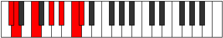 |
| [2707](https://ianring.com/musictheory/scales/2707) | [Banimic](ModeDFlatBanimic.md) | Db | Db, Ebb, F, G#, A#, B#, Db |  |
| [2707](https://ianring.com/musictheory/scales/2707) | [Banimic](ModeASharpBanimic.md) | A# | A#, B, C##, D###, E###, Cbbb, A# |  |
| [2707](https://ianring.com/musictheory/scales/2707) | [Banimic](ModeBFlatBanimic.md) | Bb | Bb, Cb, D, E#, F##, G##, Bb |  |
| [2709](https://ianring.com/musictheory/scales/2709) | [Thaptimic](ModeDSharpThaptimic.md) | D# | D#, E#, F##, G###, A###, B###, D# |  |
| [2709](https://ianring.com/musictheory/scales/2709) | [Thaptimic](ModeEFlatThaptimic.md) | Eb | Eb, F, G, A#, B#, C##, Eb |  |
| [2709](https://ianring.com/musictheory/scales/2709) | [Thaptimic](ModeCSharpThaptimic.md) | C# | C#, D#, E#, F###, G###, A###, C# |  |
| [2709](https://ianring.com/musictheory/scales/2709) | [Thaptimic](ModeDFlatThaptimic.md) | Db | Db, Eb, F, G#, A#, B#, Db |  |
| [2709](https://ianring.com/musictheory/scales/2709) | [Thaptimic](ModeFSharpThaptimic.md) | F# | F#, G#, A#, B##, C###, D###, F# |  |
| [2709](https://ianring.com/musictheory/scales/2709) | [Thaptimic](ModeGFlatThaptimic.md) | Gb | Gb, Ab, Bb, C#, D#, E#, Gb |  |
| [2709](https://ianring.com/musictheory/scales/2709) | [Thaptimic](ModeGSharpThaptimic.md) | G# | G#, A#, B#, C###, D###, E###, G# |  |
| [2709](https://ianring.com/musictheory/scales/2709) | [Thaptimic](ModeAFlatThaptimic.md) | Ab | Ab, Bb, C, D#, E#, F##, Ab |  |
| [2709](https://ianring.com/musictheory/scales/2709) | [Thaptimic](ModeASharpThaptimic.md) | A# | A#, B#, C##, D###, E###, Cbbb, A# |  |
| [2709](https://ianring.com/musictheory/scales/2709) | [Thaptimic](ModeBFlatThaptimic.md) | Bb | Bb, C, D, E#, F##, G##, Bb |  |
| [2711](https://ianring.com/musictheory/scales/2711) | [Stolian](ModeDSharpStolian.md) | D# | D#, E, F, G, A#, B#, C##, D# |  |
| [2711](https://ianring.com/musictheory/scales/2711) | [Stolian](ModeEFlatStolian.md) | Eb | Eb, Fb, Gbb, Abb, Bb, C, D, Eb |  |
| [2711](https://ianring.com/musictheory/scales/2711) | [Stolian](ModeCSharpStolian.md) | C# | C#, D, Eb, F, G#, A#, B#, C# |  |
| [2711](https://ianring.com/musictheory/scales/2711) | [Stolian](ModeDFlatStolian.md) | Db | Db, Ebb, Fbb, Gbb, Ab, Bb, C, Db |  |
| [2711](https://ianring.com/musictheory/scales/2711) | [Stolian](ModeFSharpStolian.md) | F# | F#, G, Ab, Bb, C#, D#, E#, F# |  |
| [2711](https://ianring.com/musictheory/scales/2711) | [Stolian](ModeGFlatStolian.md) | Gb | Gb, Abb, Bbbb, Cbb, Db, Eb, F, Gb |  |
| [2711](https://ianring.com/musictheory/scales/2711) | [Stolian](ModeGSharpStolian.md) | G# | G#, A, Bb, C, D#, E#, F##, G# |  |
| [2711](https://ianring.com/musictheory/scales/2711) | [Stolian](ModeAFlatStolian.md) | Ab | Ab, Bbb, Cbb, Dbb, Eb, F, G, Ab |  |
| [2711](https://ianring.com/musictheory/scales/2711) | [Stolian](ModeASharpStolian.md) | A# | A#, B, C, D, E#, F##, G##, A# |  |
| [2711](https://ianring.com/musictheory/scales/2711) | [Stolian](ModeBFlatStolian.md) | Bb | Bb, Cb, Dbb, Ebb, F, G, A, Bb |  |
| [2713](https://ianring.com/musictheory/scales/2713) | [Porimic](ModeCSharpPorimic.md) | C# | C#, D##, E#, F###, G###, A###, C# |  |
| [2713](https://ianring.com/musictheory/scales/2713) | [Porimic](ModeDFlatPorimic.md) | Db | Db, E, F, G#, A#, B#, Db |  |
| [2713](https://ianring.com/musictheory/scales/2713) | [Porimic](ModeFSharpPorimic.md) | F# | F#, G##, A#, B##, C###, D###, F# |  |
| [2713](https://ianring.com/musictheory/scales/2713) | [Porimic](ModeGFlatPorimic.md) | Gb | Gb, A, Bb, C#, D#, E#, Gb |  |
| [2713](https://ianring.com/musictheory/scales/2713) | [Porimic](ModeASharpPorimic.md) | A# | A#, B##, C##, D###, E###, Cbbb, A# |  |
| [2713](https://ianring.com/musictheory/scales/2713) | [Porimic](ModeBFlatPorimic.md) | Bb | Bb, C#, D, E#, F##, G##, Bb |  |
| [2715](https://ianring.com/musictheory/scales/2715) | [Kynian](ModeCSharpKynian.md) | C# | C#, D, E, F, G#, A#, B#, C# |  |
| [2715](https://ianring.com/musictheory/scales/2715) | [Kynian](ModeDFlatKynian.md) | Db | Db, Ebb, Fb, Gbb, Ab, Bb, C, Db |  |
| [2715](https://ianring.com/musictheory/scales/2715) | [Kynian](ModeFSharpKynian.md) | F# | F#, G, A, Bb, C#, D#, E#, F# |  |
| [2715](https://ianring.com/musictheory/scales/2715) | [Kynian](ModeGFlatKynian.md) | Gb | Gb, Abb, Bbb, Cbb, Db, Eb, F, Gb |  |
| [2715](https://ianring.com/musictheory/scales/2715) | [Kynian](ModeASharpKynian.md) | A# | A#, B, C#, D, E#, F##, G##, A# |  |
| [2715](https://ianring.com/musictheory/scales/2715) | [Kynian](ModeBFlatKynian.md) | Bb | Bb, Cb, Db, Ebb, F, G, A, Bb |  |
| [2717](https://ianring.com/musictheory/scales/2717) | [Epygian](ModeDSharpEpygian.md) | D# | D#, E#, F#, G, A#, B#, C##, D# |  |
| [2717](https://ianring.com/musictheory/scales/2717) | [Epygian](ModeEFlatEpygian.md) | Eb | Eb, F, Gb, Abb, Bb, C, D, Eb |  |
| [2717](https://ianring.com/musictheory/scales/2717) | [Epygian](ModeCSharpEpygian.md) | C# | C#, D#, E, F, G#, A#, B#, C# |  |
| [2717](https://ianring.com/musictheory/scales/2717) | [Epygian](ModeDFlatEpygian.md) | Db | Db, Eb, Fb, Gbb, Ab, Bb, C, Db |  |
| [2717](https://ianring.com/musictheory/scales/2717) | [Epygian](ModeASharpEpygian.md) | A# | A#, B#, C#, D, E#, F##, G##, A# |  |
| [2717](https://ianring.com/musictheory/scales/2717) | [Epygian](ModeBFlatEpygian.md) | Bb | Bb, C, Db, Ebb, F, G, A, Bb |  |
| [2717](https://ianring.com/musictheory/scales/2717) | [Epygian](ModeFSharpEpygian.md) | F# | F#, G#, A, Bb, C#, D#, E#, F# |  |
| [2717](https://ianring.com/musictheory/scales/2717) | [Epygian](ModeGFlatEpygian.md) | Gb | Gb, Ab, Bbb, Cbb, Db, Eb, F, Gb |  |
| [2717](https://ianring.com/musictheory/scales/2717) | [Epygian](ModeGSharpEpygian.md) | G# | G#, A#, B, C, D#, E#, F##, G# |  |
| [2717](https://ianring.com/musictheory/scales/2717) | [Epygian](ModeAFlatEpygian.md) | Ab | Ab, Bb, Cb, Dbb, Eb, F, G, Ab |  |
| [2719](https://ianring.com/musictheory/scales/2719) | [Zocryllic](ModeDSharpZocryllic.md) | D# | D#, E, F, F#, G, A#, C, D, D# |  |
| [2719](https://ianring.com/musictheory/scales/2719) | [Zocryllic](ModeEFlatZocryllic.md) | Eb | Eb, E, F, Gb, G, Bb, C, D, Eb |  |
| [2719](https://ianring.com/musictheory/scales/2719) | [Zocryllic](ModeCSharpZocryllic.md) | C# | C#, D, D#, E, F, G#, A#, C, C# |  |
| [2719](https://ianring.com/musictheory/scales/2719) | [Zocryllic](ModeDFlatZocryllic.md) | Db | Db, D, Eb, E, F, Ab, Bb, C, Db |  |
| [2719](https://ianring.com/musictheory/scales/2719) | [Zocryllic](ModeFSharpZocryllic.md) | F# | F#, G, G#, A, A#, C#, D#, F, F# |  |
| [2719](https://ianring.com/musictheory/scales/2719) | [Zocryllic](ModeGFlatZocryllic.md) | Gb | Gb, G, Ab, A, Bb, Db, Eb, F, Gb |  |
| [2719](https://ianring.com/musictheory/scales/2719) | [Zocryllic](ModeASharpZocryllic.md) | A# | A#, B, C, C#, D, F, G, A, A# |  |
| [2719](https://ianring.com/musictheory/scales/2719) | [Zocryllic](ModeBFlatZocryllic.md) | Bb | Bb, B, C, Db, D, F, G, A, Bb |  |
| [2719](https://ianring.com/musictheory/scales/2719) | [Zocryllic](ModeGSharpZocryllic.md) | G# | G#, A, A#, B, C, D#, F, G, G# |  |
| [2719](https://ianring.com/musictheory/scales/2719) | [Zocryllic](ModeAFlatZocryllic.md) | Ab | Ab, A, Bb, B, C, Eb, F, G, Ab |  |
| [2723](https://ianring.com/musictheory/scales/2723) | [Epylimic](ModeFNaturalEpylimic.md) | F | F, Gb, A#, B#, C##, D##, F |  |
| [2723](https://ianring.com/musictheory/scales/2723) | [Epylimic](ModeASharpEpylimic.md) | A# | A#, B, C###, D###, E###, Cbbb, A# |  |
| [2723](https://ianring.com/musictheory/scales/2723) | [Epylimic](ModeBFlatEpylimic.md) | Bb | Bb, Cb, D#, E#, F##, G##, Bb |  |
| [2725](https://ianring.com/musictheory/scales/2725) | [Gonimic](ModeFNaturalGonimic.md) | F | F, G, A#, B#, C##, D##, F |  |
| [2725](https://ianring.com/musictheory/scales/2725) | [Gonimic](ModeDSharpGonimic.md) | D# | D#, E#, F###, G###, A###, B###, D# |  |
| [2725](https://ianring.com/musictheory/scales/2725) | [Gonimic](ModeEFlatGonimic.md) | Eb | Eb, F, G#, A#, B#, C##, Eb |  |
| [2725](https://ianring.com/musictheory/scales/2725) | [Gonimic](ModeGSharpGonimic.md) | G# | G#, A#, B##, C###, D###, E###, G# |  |
| [2725](https://ianring.com/musictheory/scales/2725) | [Gonimic](ModeAFlatGonimic.md) | Ab | Ab, Bb, C#, D#, E#, F##, Ab |  |
| [2725](https://ianring.com/musictheory/scales/2725) | [Gonimic](ModeASharpGonimic.md) | A# | A#, B#, C###, D###, E###, Cbbb, A# |  |
| [2725](https://ianring.com/musictheory/scales/2725) | [Gonimic](ModeBFlatGonimic.md) | Bb | Bb, C, D#, E#, F##, G##, Bb |  |
| [2727](https://ianring.com/musictheory/scales/2727) | [Pylian](ModeFNaturalPylian.md) | F | F, Gb, Abb, Bb, C, D, E, F |  |
| [2727](https://ianring.com/musictheory/scales/2727) | [Pylian](ModeDSharpPylian.md) | D# | D#, E, F, G#, A#, B#, C##, D# |  |
| [2727](https://ianring.com/musictheory/scales/2727) | [Pylian](ModeEFlatPylian.md) | Eb | Eb, Fb, Gbb, Ab, Bb, C, D, Eb |  |
| [2727](https://ianring.com/musictheory/scales/2727) | [Pylian](ModeGSharpPylian.md) | G# | G#, A, Bb, C#, D#, E#, F##, G# |  |
| [2727](https://ianring.com/musictheory/scales/2727) | [Pylian](ModeAFlatPylian.md) | Ab | Ab, Bbb, Cbb, Db, Eb, F, G, Ab |  |
| [2727](https://ianring.com/musictheory/scales/2727) | [Pylian](ModeASharpPylian.md) | A# | A#, B, C, D#, E#, F##, G##, A# |  |
| [2727](https://ianring.com/musictheory/scales/2727) | [Pylian](ModeBFlatPylian.md) | Bb | Bb, Cb, Dbb, Eb, F, G, A, Bb |  |
| [2729](https://ianring.com/musictheory/scales/2729) | [Aeragimic](ModeFNaturalAeragimic.md) | F | F, G#, A#, B#, C##, D##, F |  |
| [2729](https://ianring.com/musictheory/scales/2729) | [Aeragimic](ModeASharpAeragimic.md) | A# | A#, B##, C###, D###, E###, Cbbb, A# |  |
| [2729](https://ianring.com/musictheory/scales/2729) | [Aeragimic](ModeBFlatAeragimic.md) | Bb | Bb, C#, D#, E#, F##, G##, Bb |  |
| [2731](https://ianring.com/musictheory/scales/2731) | [Thydian](ModeFNaturalThydian.md) | F | F, Gb, Ab, Bb, C, D, E, F |  |
| [2731](https://ianring.com/musictheory/scales/2731) | [Thydian](ModeASharpThydian.md) | A# | A#, B, C#, D#, E#, F##, G##, A# |  |
| [2731](https://ianring.com/musictheory/scales/2731) | [Thydian](ModeBFlatThydian.md) | Bb | Bb, Cb, Db, Eb, F, G, A, Bb |  |
| [2733](https://ianring.com/musictheory/scales/2733) | [Bocrian](ModeDSharpBocrian.md) | D# | D#, E#, F#, G#, A#, B#, C##, D# |  |
| [2733](https://ianring.com/musictheory/scales/2733) | [Bocrian](ModeEFlatBocrian.md) | Eb | Eb, F, Gb, Ab, Bb, C, D, Eb |  |
| [2733](https://ianring.com/musictheory/scales/2733) | [Bocrian](ModeFNaturalBocrian.md) | F | F, G, Ab, Bb, C, D, E, F |  |
| [2733](https://ianring.com/musictheory/scales/2733) | [Bocrian](ModeASharpBocrian.md) | A# | A#, B#, C#, D#, E#, F##, G##, A# |  |
| [2733](https://ianring.com/musictheory/scales/2733) | [Bocrian](ModeBFlatBocrian.md) | Bb | Bb, C, Db, Eb, F, G, A, Bb |  |
| [2733](https://ianring.com/musictheory/scales/2733) | [Bocrian](ModeGSharpBocrian.md) | G# | G#, A#, B, C#, D#, E#, F##, G# |  |
| [2733](https://ianring.com/musictheory/scales/2733) | [Bocrian](ModeAFlatBocrian.md) | Ab | Ab, Bb, Cb, Db, Eb, F, G, Ab |  |
| [2735](https://ianring.com/musictheory/scales/2735) | [Gynyllic](ModeDSharpGynyllic.md) | D# | D#, E, F, F#, G#, A#, C, D, D# |  |
| [2735](https://ianring.com/musictheory/scales/2735) | [Gynyllic](ModeEFlatGynyllic.md) | Eb | Eb, E, F, Gb, Ab, Bb, C, D, Eb |  |
| [2735](https://ianring.com/musictheory/scales/2735) | [Gynyllic](ModeFNaturalGynyllic.md) | F | F, F#, G, G#, A#, C, D, E, F |  |
| [2735](https://ianring.com/musictheory/scales/2735) | [Gynyllic](ModeASharpGynyllic.md) | A# | A#, B, C, C#, D#, F, G, A, A# |  |
| [2735](https://ianring.com/musictheory/scales/2735) | [Gynyllic](ModeBFlatGynyllic.md) | Bb | Bb, B, C, Db, Eb, F, G, A, Bb |  |
| [2735](https://ianring.com/musictheory/scales/2735) | [Gynyllic](ModeGSharpGynyllic.md) | G# | G#, A, A#, B, C#, D#, F, G, G# |  |
| [2735](https://ianring.com/musictheory/scales/2735) | [Gynyllic](ModeAFlatGynyllic.md) | Ab | Ab, A, Bb, B, Db, Eb, F, G, Ab |  |
| [2737](https://ianring.com/musictheory/scales/2737) | [Bylimic](ModeCSharpBylimic.md) | C# | C#, D###, E##, F###, G###, A###, C# |  |
| [2737](https://ianring.com/musictheory/scales/2737) | [Bylimic](ModeDFlatBylimic.md) | Db | Db, E#, F#, G#, A#, B#, Db |  |
| [2737](https://ianring.com/musictheory/scales/2737) | [Bylimic](ModeFNaturalBylimic.md) | F | F, G##, A#, B#, C##, D##, F |  |
| [2737](https://ianring.com/musictheory/scales/2737) | [Bylimic](ModeASharpBylimic.md) | A# | A#, B###, C###, D###, E###, Cbbb, A# |  |
| [2737](https://ianring.com/musictheory/scales/2737) | [Bylimic](ModeBFlatBylimic.md) | Bb | Bb, C##, D#, E#, F##, G##, Bb |  |
| [2737](https://ianring.com/musictheory/scales/2737) | [Bylimic](ModeFSharpBylimic.md) | F# | F#, G###, A##, B##, C###, D###, F# |  |
| [2737](https://ianring.com/musictheory/scales/2737) | [Bylimic](ModeGFlatBylimic.md) | Gb | Gb, A#, B, C#, D#, E#, Gb |  |
| [2739](https://ianring.com/musictheory/scales/2739) | [Zanian](ModeCSharpZanian.md) | C# | C#, D, E#, F#, G#, A#, B#, C# |  |
| [2739](https://ianring.com/musictheory/scales/2739) | [Zanian](ModeDFlatZanian.md) | Db | Db, Ebb, F, Gb, Ab, Bb, C, Db |  |
| [2739](https://ianring.com/musictheory/scales/2739) | [Zanian](ModeFNaturalZanian.md) | F | F, Gb, A, Bb, C, D, E, F |  |
| [2739](https://ianring.com/musictheory/scales/2739) | [Zanian](ModeFSharpZanian.md) | F# | F#, G, A#, B, C#, D#, E#, F# |  |
| [2739](https://ianring.com/musictheory/scales/2739) | [Zanian](ModeGFlatZanian.md) | Gb | Gb, Abb, Bb, Cb, Db, Eb, F, Gb |  |
| [2739](https://ianring.com/musictheory/scales/2739) | [Zanian](ModeASharpZanian.md) | A# | A#, B, C##, D#, E#, F##, G##, A# |  |
| [2739](https://ianring.com/musictheory/scales/2739) | [Zanian](ModeBFlatZanian.md) | Bb | Bb, Cb, D, Eb, F, G, A, Bb |  |
| [2741](https://ianring.com/musictheory/scales/2741) | [Ionian](ModeCSharpIonian.md) | C# | C#, D#, E#, F#, G#, A#, B#, C# |  |
| [2741](https://ianring.com/musictheory/scales/2741) | [Ionian](ModeDFlatIonian.md) | Db | Db, Eb, F, Gb, Ab, Bb, C, Db |  |
| [2741](https://ianring.com/musictheory/scales/2741) | [Ionian](ModeGSharpIonian.md) | G# | G#, A#, B#, C#, D#, E#, F##, G# |  |
| [2741](https://ianring.com/musictheory/scales/2741) | [Ionian](ModeAFlatIonian.md) | Ab | Ab, Bb, C, Db, Eb, F, G, Ab |  |
| [2741](https://ianring.com/musictheory/scales/2741) | [Ionian](ModeDSharpIonian.md) | D# | D#, E#, F##, G#, A#, B#, C##, D# |  |
| [2741](https://ianring.com/musictheory/scales/2741) | [Ionian](ModeEFlatIonian.md) | Eb | Eb, F, G, Ab, Bb, C, D, Eb |  |
| [2741](https://ianring.com/musictheory/scales/2741) | [Ionian](ModeASharpIonian.md) | A# | A#, B#, C##, D#, E#, F##, G##, A# |  |
| [2741](https://ianring.com/musictheory/scales/2741) | [Ionian](ModeBFlatIonian.md) | Bb | Bb, C, D, Eb, F, G, A, Bb |  |
| [2741](https://ianring.com/musictheory/scales/2741) | [Ionian](ModeFNaturalIonian.md) | F | F, G, A, Bb, C, D, E, F |  |
| [2741](https://ianring.com/musictheory/scales/2741) | [Ionian](ModeFSharpIonian.md) | F# | F#, G#, A#, B, C#, D#, E#, F# |  |
| [2741](https://ianring.com/musictheory/scales/2741) | [Ionian](ModeGFlatIonian.md) | Gb | Gb, Ab, Bb, Cb, Db, Eb, F, Gb |  |
| [2743](https://ianring.com/musictheory/scales/2743) | [Staptyllic](ModeCSharpStaptyllic.md) | C# | C#, D, D#, F, F#, G#, A#, C, C# |  |
| [2743](https://ianring.com/musictheory/scales/2743) | [Staptyllic](ModeDFlatStaptyllic.md) | Db | Db, D, Eb, F, Gb, Ab, Bb, C, Db |  |
| [2743](https://ianring.com/musictheory/scales/2743) | [Staptyllic](ModeDSharpStaptyllic.md) | D# | D#, E, F, G, G#, A#, C, D, D# |  |
| [2743](https://ianring.com/musictheory/scales/2743) | [Staptyllic](ModeEFlatStaptyllic.md) | Eb | Eb, E, F, G, Ab, Bb, C, D, Eb |  |
| [2743](https://ianring.com/musictheory/scales/2743) | [Staptyllic](ModeFNaturalStaptyllic.md) | F | F, F#, G, A, A#, C, D, E, F |  |
| [2743](https://ianring.com/musictheory/scales/2743) | [Staptyllic](ModeGSharpStaptyllic.md) | G# | G#, A, A#, C, C#, D#, F, G, G# |  |
| [2743](https://ianring.com/musictheory/scales/2743) | [Staptyllic](ModeAFlatStaptyllic.md) | Ab | Ab, A, Bb, C, Db, Eb, F, G, Ab |  |
| [2743](https://ianring.com/musictheory/scales/2743) | [Staptyllic](ModeFSharpStaptyllic.md) | F# | F#, G, G#, A#, B, C#, D#, F, F# |  |
| [2743](https://ianring.com/musictheory/scales/2743) | [Staptyllic](ModeGFlatStaptyllic.md) | Gb | Gb, G, Ab, Bb, B, Db, Eb, F, Gb |  |
| [2743](https://ianring.com/musictheory/scales/2743) | [Staptyllic](ModeASharpStaptyllic.md) | A# | A#, B, C, D, D#, F, G, A, A# |  |
| [2743](https://ianring.com/musictheory/scales/2743) | [Staptyllic](ModeBFlatStaptyllic.md) | Bb | Bb, B, C, D, Eb, F, G, A, Bb |  |
| [2745](https://ianring.com/musictheory/scales/2745) | [Dolian](ModeCSharpDolian.md) | C# | C#, D##, E#, F#, G#, A#, B#, C# |  |
| [2745](https://ianring.com/musictheory/scales/2745) | [Dolian](ModeDFlatDolian.md) | Db | Db, E, F, Gb, Ab, Bb, C, Db |  |
| [2745](https://ianring.com/musictheory/scales/2745) | [Dolian](ModeASharpDolian.md) | A# | A#, B##, C##, D#, E#, F##, G##, A# |  |
| [2745](https://ianring.com/musictheory/scales/2745) | [Dolian](ModeBFlatDolian.md) | Bb | Bb, C#, D, Eb, F, G, A, Bb |  |
| [2745](https://ianring.com/musictheory/scales/2745) | [Dolian](ModeFNaturalDolian.md) | F | F, G#, A, Bb, C, D, E, F |  |
| [2745](https://ianring.com/musictheory/scales/2745) | [Dolian](ModeFSharpDolian.md) | F# | F#, G##, A#, B, C#, D#, E#, F# |  |
| [2745](https://ianring.com/musictheory/scales/2745) | [Dolian](ModeGFlatDolian.md) | Gb | Gb, A, Bb, Cb, Db, Eb, F, Gb |  |
| [2747](https://ianring.com/musictheory/scales/2747) | [Stythyllic](ModeCSharpStythyllic.md) | C# | C#, D, E, F, F#, G#, A#, C, C# |  |
| [2747](https://ianring.com/musictheory/scales/2747) | [Stythyllic](ModeDFlatStythyllic.md) | Db | Db, D, E, F, Gb, Ab, Bb, C, Db |  |
| [2747](https://ianring.com/musictheory/scales/2747) | [Stythyllic](ModeFNaturalStythyllic.md) | F | F, F#, G#, A, A#, C, D, E, F |  |
| [2747](https://ianring.com/musictheory/scales/2747) | [Stythyllic](ModeASharpStythyllic.md) | A# | A#, B, C#, D, D#, F, G, A, A# |  |
| [2747](https://ianring.com/musictheory/scales/2747) | [Stythyllic](ModeBFlatStythyllic.md) | Bb | Bb, B, Db, D, Eb, F, G, A, Bb |  |
| [2747](https://ianring.com/musictheory/scales/2747) | [Stythyllic](ModeFSharpStythyllic.md) | F# | F#, G, A, A#, B, C#, D#, F, F# |  |
| [2747](https://ianring.com/musictheory/scales/2747) | [Stythyllic](ModeGFlatStythyllic.md) | Gb | Gb, G, A, Bb, B, Db, Eb, F, Gb |  |
| [2749](https://ianring.com/musictheory/scales/2749) | [Katagyllic](ModeCSharpKatagyllic.md) | C# | C#, D#, E, F, F#, G#, A#, C, C# |  |
| [2749](https://ianring.com/musictheory/scales/2749) | [Katagyllic](ModeDFlatKatagyllic.md) | Db | Db, Eb, E, F, Gb, Ab, Bb, C, Db |  |
| [2749](https://ianring.com/musictheory/scales/2749) | [Katagyllic](ModeDSharpKatagyllic.md) | D# | D#, F, F#, G, G#, A#, C, D, D# |  |
| [2749](https://ianring.com/musictheory/scales/2749) | [Katagyllic](ModeEFlatKatagyllic.md) | Eb | Eb, F, Gb, G, Ab, Bb, C, D, Eb |  |
| [2749](https://ianring.com/musictheory/scales/2749) | [Katagyllic](ModeASharpKatagyllic.md) | A# | A#, C, C#, D, D#, F, G, A, A# |  |
| [2749](https://ianring.com/musictheory/scales/2749) | [Katagyllic](ModeBFlatKatagyllic.md) | Bb | Bb, C, Db, D, Eb, F, G, A, Bb |  |
| [2749](https://ianring.com/musictheory/scales/2749) | [Katagyllic](ModeFNaturalKatagyllic.md) | F | F, G, G#, A, A#, C, D, E, F |  |
| [2749](https://ianring.com/musictheory/scales/2749) | [Katagyllic](ModeGSharpKatagyllic.md) | G# | G#, A#, B, C, C#, D#, F, G, G# |  |
| [2749](https://ianring.com/musictheory/scales/2749) | [Katagyllic](ModeAFlatKatagyllic.md) | Ab | Ab, Bb, B, C, Db, Eb, F, G, Ab |  |
| [2749](https://ianring.com/musictheory/scales/2749) | [Katagyllic](ModeFSharpKatagyllic.md) | F# | F#, G#, A, A#, B, C#, D#, F, F# |  |
| [2749](https://ianring.com/musictheory/scales/2749) | [Katagyllic](ModeGFlatKatagyllic.md) | Gb | Gb, Ab, A, Bb, B, Db, Eb, F, Gb |  |
| [2751](https://ianring.com/musictheory/scales/2751) | [Sylygic](ModeCSharpSylygic.md) | C# | C#, D, D#, E, F, F#, G#, A#, C, C# |  |
| [2751](https://ianring.com/musictheory/scales/2751) | [Sylygic](ModeDFlatSylygic.md) | Db | Db, D, Eb, E, F, Gb, Ab, Bb, C, Db |  |
| [2751](https://ianring.com/musictheory/scales/2751) | [Sylygic](ModeDSharpSylygic.md) | D# | D#, E, F, F#, G, G#, A#, C, D, D# |  |
| [2751](https://ianring.com/musictheory/scales/2751) | [Sylygic](ModeEFlatSylygic.md) | Eb | Eb, E, F, Gb, G, Ab, Bb, C, D, Eb |  |
| [2751](https://ianring.com/musictheory/scales/2751) | [Sylygic](ModeFNaturalSylygic.md) | F | F, F#, G, G#, A, A#, C, D, E, F |  |
| [2751](https://ianring.com/musictheory/scales/2751) | [Sylygic](ModeASharpSylygic.md) | A# | A#, B, C, C#, D, D#, F, G, A, A# |  |
| [2751](https://ianring.com/musictheory/scales/2751) | [Sylygic](ModeBFlatSylygic.md) | Bb | Bb, B, C, Db, D, Eb, F, G, A, Bb |  |
| [2751](https://ianring.com/musictheory/scales/2751) | [Sylygic](ModeGSharpSylygic.md) | G# | G#, A, A#, B, C, C#, D#, F, G, G# |  |
| [2751](https://ianring.com/musictheory/scales/2751) | [Sylygic](ModeAFlatSylygic.md) | Ab | Ab, A, Bb, B, C, Db, Eb, F, G, Ab |  |
| [2751](https://ianring.com/musictheory/scales/2751) | [Sylygic](ModeFSharpSylygic.md) | F# | F#, G, G#, A, A#, B, C#, D#, F, F# |  |
| [2751](https://ianring.com/musictheory/scales/2751) | [Sylygic](ModeGFlatSylygic.md) | Gb | Gb, G, Ab, A, Bb, B, Db, Eb, F, Gb |  |
| [2757](https://ianring.com/musictheory/scales/2757) | [Stolimic](ModeGSharpStolimic.md) | G# | G#, A#, B###, C###, D###, E###, G# |  |
| [2757](https://ianring.com/musictheory/scales/2757) | [Stolimic](ModeAFlatStolimic.md) | Ab | Ab, Bb, C##, D#, E#, F##, Ab |  |
| [2757](https://ianring.com/musictheory/scales/2757) | [Stolimic](ModeDSharpStolimic.md) | D# | D#, E#, Cbbb, Cbb, Dbb, Ebb, D# |  |
| [2757](https://ianring.com/musictheory/scales/2757) | [Stolimic](ModeEFlatStolimic.md) | Eb | Eb, F, G##, A#, B#, C##, Eb |  |
| [2757](https://ianring.com/musictheory/scales/2757) | [Stolimic](ModeASharpStolimic.md) | A# | A#, B#, D##, E#, F##, G##, A# |  |
| [2757](https://ianring.com/musictheory/scales/2757) | [Stolimic](ModeBFlatStolimic.md) | Bb | Bb, C, D##, E#, F##, G##, Bb |  |
| [2757](https://ianring.com/musictheory/scales/2757) | [Stolimic](ModeBNaturalStolimic.md) | B | B, C#, D###, E##, F###, G###, B |  |
| [2759](https://ianring.com/musictheory/scales/2759) | [Aeraphian](ModeDSharpAeraphian.md) | D# | D#, E, F, G##, A#, B#, C##, D# |  |
| [2759](https://ianring.com/musictheory/scales/2759) | [Aeraphian](ModeEFlatAeraphian.md) | Eb | Eb, Fb, Gbb, A, Bb, C, D, Eb |  |
| [2759](https://ianring.com/musictheory/scales/2759) | [Aeraphian](ModeGSharpAeraphian.md) | G# | G#, A, Bb, C##, D#, E#, F##, G# |  |
| [2759](https://ianring.com/musictheory/scales/2759) | [Aeraphian](ModeAFlatAeraphian.md) | Ab | Ab, Bbb, Cbb, D, Eb, F, G, Ab |  |
| [2759](https://ianring.com/musictheory/scales/2759) | [Aeraphian](ModeENaturalAeraphian.md) | E | E, F, Gb, A#, B, C#, D#, E |  |
| [2759](https://ianring.com/musictheory/scales/2759) | [Aeraphian](ModeBNaturalAeraphian.md) | B | B, C, Db, E#, F#, G#, A#, B |  |
| [2759](https://ianring.com/musictheory/scales/2759) | [Aeraphian](ModeASharpAeraphian.md) | A# | A#, B, C, D##, E#, F##, G##, A# |  |
| [2759](https://ianring.com/musictheory/scales/2759) | [Aeraphian](ModeBFlatAeraphian.md) | Bb | Bb, Cb, Dbb, E, F, G, A, Bb |  |
| [2761](https://ianring.com/musictheory/scales/2761) | [Dagimic](ModeASharpDagimic.md) | A# | A#, B##, D##, E#, F##, G##, A# |  |
| [2761](https://ianring.com/musictheory/scales/2761) | [Dagimic](ModeBFlatDagimic.md) | Bb | Bb, C#, D##, E#, F##, G##, Bb |  |
| [2761](https://ianring.com/musictheory/scales/2761) | [Dagimic](ModeBNaturalDagimic.md) | B | B, C##, D###, E##, F###, G###, B |  |
| [2763](https://ianring.com/musictheory/scales/2763) | [Manian](ModeENaturalManian.md) | E | E, F, G, A#, B, C#, D#, E |  |
| [2763](https://ianring.com/musictheory/scales/2763) | [Manian](ModeBNaturalManian.md) | B | B, C, D, E#, F#, G#, A#, B |  |
| [2763](https://ianring.com/musictheory/scales/2763) | [Manian](ModeASharpManian.md) | A# | A#, B, C#, D##, E#, F##, G##, A# |  |
| [2763](https://ianring.com/musictheory/scales/2763) | [Manian](ModeBFlatManian.md) | Bb | Bb, Cb, Db, E, F, G, A, Bb |  |
| [2765](https://ianring.com/musictheory/scales/2765) | [Banian](ModeDSharpBanian.md) | D# | D#, E#, F#, G##, A#, B#, C##, D# |  |
| [2765](https://ianring.com/musictheory/scales/2765) | [Banian](ModeEFlatBanian.md) | Eb | Eb, F, Gb, A, Bb, C, D, Eb |  |
| [2765](https://ianring.com/musictheory/scales/2765) | [Banian](ModeASharpBanian.md) | A# | A#, B#, C#, D##, E#, F##, G##, A# |  |
| [2765](https://ianring.com/musictheory/scales/2765) | [Banian](ModeBFlatBanian.md) | Bb | Bb, C, Db, E, F, G, A, Bb |  |
| [2765](https://ianring.com/musictheory/scales/2765) | [Banian](ModeBNaturalBanian.md) | B | B, C#, D, E#, F#, G#, A#, B |  |
| [2765](https://ianring.com/musictheory/scales/2765) | [Banian](ModeGSharpBanian.md) | G# | G#, A#, B, C##, D#, E#, F##, G# |  |
| [2765](https://ianring.com/musictheory/scales/2765) | [Banian](ModeAFlatBanian.md) | Ab | Ab, Bb, Cb, D, Eb, F, G, Ab |  |
| [2767](https://ianring.com/musictheory/scales/2767) | [Katydyllic](ModeDSharpKatydyllic.md) | D# | D#, E, F, F#, A, A#, C, D, D# |  |
| [2767](https://ianring.com/musictheory/scales/2767) | [Katydyllic](ModeEFlatKatydyllic.md) | Eb | Eb, E, F, Gb, A, Bb, C, D, Eb |  |
| [2767](https://ianring.com/musictheory/scales/2767) | [Katydyllic](ModeENaturalKatydyllic.md) | E | E, F, F#, G, A#, B, C#, D#, E |  |
| [2767](https://ianring.com/musictheory/scales/2767) | [Katydyllic](ModeBNaturalKatydyllic.md) | B | B, C, C#, D, F, F#, G#, A#, B |  |
| [2767](https://ianring.com/musictheory/scales/2767) | [Katydyllic](ModeASharpKatydyllic.md) | A# | A#, B, C, C#, E, F, G, A, A# |  |
| [2767](https://ianring.com/musictheory/scales/2767) | [Katydyllic](ModeBFlatKatydyllic.md) | Bb | Bb, B, C, Db, E, F, G, A, Bb |  |
| [2767](https://ianring.com/musictheory/scales/2767) | [Katydyllic](ModeGSharpKatydyllic.md) | G# | G#, A, A#, B, D, D#, F, G, G# |  |
| [2767](https://ianring.com/musictheory/scales/2767) | [Katydyllic](ModeAFlatKatydyllic.md) | Ab | Ab, A, Bb, B, D, Eb, F, G, Ab |  |
| [2769](https://ianring.com/musictheory/scales/2769) | [Dyrimic](ModeFSharpDyrimic.md) | F# | F#, G###, A###, B##, C###, D###, F# |  |
| [2769](https://ianring.com/musictheory/scales/2769) | [Dyrimic](ModeGFlatDyrimic.md) | Gb | Gb, A#, B#, C#, D#, E#, Gb |  |
| [2769](https://ianring.com/musictheory/scales/2769) | [Dyrimic](ModeCSharpDyrimic.md) | C# | C#, D###, E###, F###, G###, A###, C# |  |
| [2769](https://ianring.com/musictheory/scales/2769) | [Dyrimic](ModeDFlatDyrimic.md) | Db | Db, E#, F##, G#, A#, B#, Db |  |
| [2769](https://ianring.com/musictheory/scales/2769) | [Dyrimic](ModeASharpDyrimic.md) | A# | A#, B###, D##, E#, F##, G##, A# |  |
| [2769](https://ianring.com/musictheory/scales/2769) | [Dyrimic](ModeBFlatDyrimic.md) | Bb | Bb, C##, D##, E#, F##, G##, Bb |  |
| [2769](https://ianring.com/musictheory/scales/2769) | [Dyrimic](ModeBNaturalDyrimic.md) | B | B, C###, D###, E##, F###, G###, B |  |
| [2771](https://ianring.com/musictheory/scales/2771) | [Garian](ModeFSharpGarian.md) | F# | F#, G, A#, B#, C#, D#, E#, F# |  |
| [2771](https://ianring.com/musictheory/scales/2771) | [Garian](ModeGFlatGarian.md) | Gb | Gb, Abb, Bb, C, Db, Eb, F, Gb |  |
| [2771](https://ianring.com/musictheory/scales/2771) | [Garian](ModeCSharpGarian.md) | C# | C#, D, E#, F##, G#, A#, B#, C# |  |
| [2771](https://ianring.com/musictheory/scales/2771) | [Garian](ModeDFlatGarian.md) | Db | Db, Ebb, F, G, Ab, Bb, C, Db |  |
| [2771](https://ianring.com/musictheory/scales/2771) | [Garian](ModeENaturalGarian.md) | E | E, F, G#, A#, B, C#, D#, E |  |
| [2771](https://ianring.com/musictheory/scales/2771) | [Garian](ModeBNaturalGarian.md) | B | B, C, D#, E#, F#, G#, A#, B |  |
| [2771](https://ianring.com/musictheory/scales/2771) | [Garian](ModeASharpGarian.md) | A# | A#, B, C##, D##, E#, F##, G##, A# |  |
| [2771](https://ianring.com/musictheory/scales/2771) | [Garian](ModeBFlatGarian.md) | Bb | Bb, Cb, D, E, F, G, A, Bb |  |
| [2773](https://ianring.com/musictheory/scales/2773) | [Lydian](ModeFSharpLydian.md) | F# | F#, G#, A#, B#, C#, D#, E#, F# |  |
| [2773](https://ianring.com/musictheory/scales/2773) | [Lydian](ModeGFlatLydian.md) | Gb | Gb, Ab, Bb, C, Db, Eb, F, Gb |  |
| [2773](https://ianring.com/musictheory/scales/2773) | [Lydian](ModeCSharpLydian.md) | C# | C#, D#, E#, F##, G#, A#, B#, C# |  |
| [2773](https://ianring.com/musictheory/scales/2773) | [Lydian](ModeDFlatLydian.md) | Db | Db, Eb, F, G, Ab, Bb, C, Db |  |
| [2773](https://ianring.com/musictheory/scales/2773) | [Lydian](ModeGSharpLydian.md) | G# | G#, A#, B#, C##, D#, E#, F##, G# |  |
| [2773](https://ianring.com/musictheory/scales/2773) | [Lydian](ModeAFlatLydian.md) | Ab | Ab, Bb, C, D, Eb, F, G, Ab |  |
| [2773](https://ianring.com/musictheory/scales/2773) | [Lydian](ModeDSharpLydian.md) | D# | D#, E#, F##, G##, A#, B#, C##, D# |  |
| [2773](https://ianring.com/musictheory/scales/2773) | [Lydian](ModeEFlatLydian.md) | Eb | Eb, F, G, A, Bb, C, D, Eb |  |
| [2773](https://ianring.com/musictheory/scales/2773) | [Lydian](ModeASharpLydian.md) | A# | A#, B#, C##, D##, E#, F##, G##, A# |  |
| [2773](https://ianring.com/musictheory/scales/2773) | [Lydian](ModeBFlatLydian.md) | Bb | Bb, C, D, E, F, G, A, Bb |  |
| [2773](https://ianring.com/musictheory/scales/2773) | [Lydian](ModeBNaturalLydian.md) | B | B, C#, D#, E#, F#, G#, A#, B |  |
| [2775](https://ianring.com/musictheory/scales/2775) | [Godyllic](ModeCSharpGodyllic.md) | C# | C#, D, D#, F, G, G#, A#, C, C# |  |
| [2775](https://ianring.com/musictheory/scales/2775) | [Godyllic](ModeDFlatGodyllic.md) | Db | Db, D, Eb, F, G, Ab, Bb, C, Db |  |
| [2775](https://ianring.com/musictheory/scales/2775) | [Godyllic](ModeFSharpGodyllic.md) | F# | F#, G, G#, A#, C, C#, D#, F, F# |  |
| [2775](https://ianring.com/musictheory/scales/2775) | [Godyllic](ModeGFlatGodyllic.md) | Gb | Gb, G, Ab, Bb, C, Db, Eb, F, Gb |  |
| [2775](https://ianring.com/musictheory/scales/2775) | [Godyllic](ModeDSharpGodyllic.md) | D# | D#, E, F, G, A, A#, C, D, D# |  |
| [2775](https://ianring.com/musictheory/scales/2775) | [Godyllic](ModeEFlatGodyllic.md) | Eb | Eb, E, F, G, A, Bb, C, D, Eb |  |
| [2775](https://ianring.com/musictheory/scales/2775) | [Godyllic](ModeGSharpGodyllic.md) | G# | G#, A, A#, C, D, D#, F, G, G# |  |
| [2775](https://ianring.com/musictheory/scales/2775) | [Godyllic](ModeAFlatGodyllic.md) | Ab | Ab, A, Bb, C, D, Eb, F, G, Ab |  |
| [2775](https://ianring.com/musictheory/scales/2775) | [Godyllic](ModeBNaturalGodyllic.md) | B | B, C, C#, D#, F, F#, G#, A#, B |  |
| [2775](https://ianring.com/musictheory/scales/2775) | [Godyllic](ModeENaturalGodyllic.md) | E | E, F, F#, G#, A#, B, C#, D#, E |  |
| [2775](https://ianring.com/musictheory/scales/2775) | [Godyllic](ModeASharpGodyllic.md) | A# | A#, B, C, D, E, F, G, A, A# |  |
| [2775](https://ianring.com/musictheory/scales/2775) | [Godyllic](ModeBFlatGodyllic.md) | Bb | Bb, B, C, D, E, F, G, A, Bb |  |
| [2777](https://ianring.com/musictheory/scales/2777) | [Bycrian](ModeCSharpBycrian.md) | C# | C#, D##, E#, F##, G#, A#, B#, C# |  |
| [2777](https://ianring.com/musictheory/scales/2777) | [Bycrian](ModeDFlatBycrian.md) | Db | Db, E, F, G, Ab, Bb, C, Db |  |
| [2777](https://ianring.com/musictheory/scales/2777) | [Bycrian](ModeFSharpBycrian.md) | F# | F#, G##, A#, B#, C#, D#, E#, F# |  |
| [2777](https://ianring.com/musictheory/scales/2777) | [Bycrian](ModeGFlatBycrian.md) | Gb | Gb, A, Bb, C, Db, Eb, F, Gb |  |
| [2777](https://ianring.com/musictheory/scales/2777) | [Bycrian](ModeASharpBycrian.md) | A# | A#, B##, C##, D##, E#, F##, G##, A# |  |
| [2777](https://ianring.com/musictheory/scales/2777) | [Bycrian](ModeBFlatBycrian.md) | Bb | Bb, C#, D, E, F, G, A, Bb |  |
| [2777](https://ianring.com/musictheory/scales/2777) | [Bycrian](ModeBNaturalBycrian.md) | B | B, C##, D#, E#, F#, G#, A#, B |  |
| [2779](https://ianring.com/musictheory/scales/2779) | [Garyllic](ModeCSharpGaryllic.md) | C# | C#, D, E, F, G, G#, A#, C, C# |  |
| [2779](https://ianring.com/musictheory/scales/2779) | [Garyllic](ModeDFlatGaryllic.md) | Db | Db, D, E, F, G, Ab, Bb, C, Db |  |
| [2779](https://ianring.com/musictheory/scales/2779) | [Garyllic](ModeFSharpGaryllic.md) | F# | F#, G, A, A#, C, C#, D#, F, F# |  |
| [2779](https://ianring.com/musictheory/scales/2779) | [Garyllic](ModeGFlatGaryllic.md) | Gb | Gb, G, A, Bb, C, Db, Eb, F, Gb |  |
| [2779](https://ianring.com/musictheory/scales/2779) | [Garyllic](ModeBNaturalGaryllic.md) | B | B, C, D, D#, F, F#, G#, A#, B |  |
| [2779](https://ianring.com/musictheory/scales/2779) | [Garyllic](ModeENaturalGaryllic.md) | E | E, F, G, G#, A#, B, C#, D#, E |  |
| [2779](https://ianring.com/musictheory/scales/2779) | [Garyllic](ModeASharpGaryllic.md) | A# | A#, B, C#, D, E, F, G, A, A# |  |
| [2779](https://ianring.com/musictheory/scales/2779) | [Garyllic](ModeBFlatGaryllic.md) | Bb | Bb, B, Db, D, E, F, G, A, Bb |  |
| [2781](https://ianring.com/musictheory/scales/2781) | [Gycryllic](ModeCSharpGycryllic.md) | C# | C#, D#, E, F, G, G#, A#, C, C# |  |
| [2781](https://ianring.com/musictheory/scales/2781) | [Gycryllic](ModeDFlatGycryllic.md) | Db | Db, Eb, E, F, G, Ab, Bb, C, Db |  |
| [2781](https://ianring.com/musictheory/scales/2781) | [Gycryllic](ModeASharpGycryllic.md) | A# | A#, C, C#, D, E, F, G, A, A# |  |
| [2781](https://ianring.com/musictheory/scales/2781) | [Gycryllic](ModeBFlatGycryllic.md) | Bb | Bb, C, Db, D, E, F, G, A, Bb |  |
| [2781](https://ianring.com/musictheory/scales/2781) | [Gycryllic](ModeDSharpGycryllic.md) | D# | D#, F, F#, G, A, A#, C, D, D# |  |
| [2781](https://ianring.com/musictheory/scales/2781) | [Gycryllic](ModeEFlatGycryllic.md) | Eb | Eb, F, Gb, G, A, Bb, C, D, Eb |  |
| [2781](https://ianring.com/musictheory/scales/2781) | [Gycryllic](ModeFSharpGycryllic.md) | F# | F#, G#, A, A#, C, C#, D#, F, F# |  |
| [2781](https://ianring.com/musictheory/scales/2781) | [Gycryllic](ModeGFlatGycryllic.md) | Gb | Gb, Ab, A, Bb, C, Db, Eb, F, Gb |  |
| [2781](https://ianring.com/musictheory/scales/2781) | [Gycryllic](ModeBNaturalGycryllic.md) | B | B, C#, D, D#, F, F#, G#, A#, B |  |
| [2781](https://ianring.com/musictheory/scales/2781) | [Gycryllic](ModeGSharpGycryllic.md) | G# | G#, A#, B, C, D, D#, F, G, G# |  |
| [2781](https://ianring.com/musictheory/scales/2781) | [Gycryllic](ModeAFlatGycryllic.md) | Ab | Ab, Bb, B, C, D, Eb, F, G, Ab |  |
| [2783](https://ianring.com/musictheory/scales/2783) | [Gothygic](ModeCSharpGothygic.md) | C# | C#, D, D#, E, F, G, G#, A#, C, C# |  |
| [2783](https://ianring.com/musictheory/scales/2783) | [Gothygic](ModeDFlatGothygic.md) | Db | Db, D, Eb, E, F, G, Ab, Bb, C, Db |  |
| [2783](https://ianring.com/musictheory/scales/2783) | [Gothygic](ModeDSharpGothygic.md) | D# | D#, E, F, F#, G, A, A#, C, D, D# |  |
| [2783](https://ianring.com/musictheory/scales/2783) | [Gothygic](ModeEFlatGothygic.md) | Eb | Eb, E, F, Gb, G, A, Bb, C, D, Eb |  |
| [2783](https://ianring.com/musictheory/scales/2783) | [Gothygic](ModeFSharpGothygic.md) | F# | F#, G, G#, A, A#, C, C#, D#, F, F# |  |
| [2783](https://ianring.com/musictheory/scales/2783) | [Gothygic](ModeGFlatGothygic.md) | Gb | Gb, G, Ab, A, Bb, C, Db, Eb, F, Gb |  |
| [2783](https://ianring.com/musictheory/scales/2783) | [Gothygic](ModeBNaturalGothygic.md) | B | B, C, C#, D, D#, F, F#, G#, A#, B |  |
| [2783](https://ianring.com/musictheory/scales/2783) | [Gothygic](ModeENaturalGothygic.md) | E | E, F, F#, G, G#, A#, B, C#, D#, E |  |
| [2783](https://ianring.com/musictheory/scales/2783) | [Gothygic](ModeASharpGothygic.md) | A# | A#, B, C, C#, D, E, F, G, A, A# |  |
| [2783](https://ianring.com/musictheory/scales/2783) | [Gothygic](ModeBFlatGothygic.md) | Bb | Bb, B, C, Db, D, E, F, G, A, Bb |  |
| [2783](https://ianring.com/musictheory/scales/2783) | [Gothygic](ModeGSharpGothygic.md) | G# | G#, A, A#, B, C, D, D#, F, G, G# |  |
| [2783](https://ianring.com/musictheory/scales/2783) | [Gothygic](ModeAFlatGothygic.md) | Ab | Ab, A, Bb, B, C, D, Eb, F, G, Ab |  |
| [2787](https://ianring.com/musictheory/scales/2787) | [Zyrian](ModeFNaturalZyrian.md) | F | F, Gb, A#, B, C, D, E, F |  |
| [2787](https://ianring.com/musictheory/scales/2787) | [Zyrian](ModeBNaturalZyrian.md) | B | B, C, D##, E#, F#, G#, A#, B |  |
| [2787](https://ianring.com/musictheory/scales/2787) | [Zyrian](ModeENaturalZyrian.md) | E | E, F, G##, A#, B, C#, D#, E |  |
| [2787](https://ianring.com/musictheory/scales/2787) | [Zyrian](ModeASharpZyrian.md) | A# | A#, B, C###, D##, E#, F##, G##, A# |  |
| [2787](https://ianring.com/musictheory/scales/2787) | [Zyrian](ModeBFlatZyrian.md) | Bb | Bb, Cb, D#, E, F, G, A, Bb |  |
| [2789](https://ianring.com/musictheory/scales/2789) | [Zolian](ModeGSharpZolian.md) | G# | G#, A#, B##, C##, D#, E#, F##, G# |  |
| [2789](https://ianring.com/musictheory/scales/2789) | [Zolian](ModeAFlatZolian.md) | Ab | Ab, Bb, C#, D, Eb, F, G, Ab |  |
| [2789](https://ianring.com/musictheory/scales/2789) | [Zolian](ModeASharpZolian.md) | A# | A#, B#, C###, D##, E#, F##, G##, A# |  |
| [2789](https://ianring.com/musictheory/scales/2789) | [Zolian](ModeBFlatZolian.md) | Bb | Bb, C, D#, E, F, G, A, Bb |  |
| [2789](https://ianring.com/musictheory/scales/2789) | [Zolian](ModeDSharpZolian.md) | D# | D#, E#, F###, G##, A#, B#, C##, D# |  |
| [2789](https://ianring.com/musictheory/scales/2789) | [Zolian](ModeEFlatZolian.md) | Eb | Eb, F, G#, A, Bb, C, D, Eb |  |
| [2789](https://ianring.com/musictheory/scales/2789) | [Zolian](ModeFNaturalZolian.md) | F | F, G, A#, B, C, D, E, F |  |
| [2789](https://ianring.com/musictheory/scales/2789) | [Zolian](ModeBNaturalZolian.md) | B | B, C#, D##, E#, F#, G#, A#, B |  |
| [2791](https://ianring.com/musictheory/scales/2791) | [Ionyptyllic](ModeDSharpIonyptyllic.md) | D# | D#, E, F, G#, A, A#, C, D, D# |  |
| [2791](https://ianring.com/musictheory/scales/2791) | [Ionyptyllic](ModeEFlatIonyptyllic.md) | Eb | Eb, E, F, Ab, A, Bb, C, D, Eb |  |
| [2791](https://ianring.com/musictheory/scales/2791) | [Ionyptyllic](ModeGSharpIonyptyllic.md) | G# | G#, A, A#, C#, D, D#, F, G, G# |  |
| [2791](https://ianring.com/musictheory/scales/2791) | [Ionyptyllic](ModeAFlatIonyptyllic.md) | Ab | Ab, A, Bb, Db, D, Eb, F, G, Ab |  |
| [2791](https://ianring.com/musictheory/scales/2791) | [Ionyptyllic](ModeFNaturalIonyptyllic.md) | F | F, F#, G, A#, B, C, D, E, F |  |
| [2791](https://ianring.com/musictheory/scales/2791) | [Ionyptyllic](ModeBNaturalIonyptyllic.md) | B | B, C, C#, E, F, F#, G#, A#, B |  |
| [2791](https://ianring.com/musictheory/scales/2791) | [Ionyptyllic](ModeENaturalIonyptyllic.md) | E | E, F, F#, A, A#, B, C#, D#, E |  |
| [2791](https://ianring.com/musictheory/scales/2791) | [Ionyptyllic](ModeASharpIonyptyllic.md) | A# | A#, B, C, D#, E, F, G, A, A# |  |
| [2791](https://ianring.com/musictheory/scales/2791) | [Ionyptyllic](ModeBFlatIonyptyllic.md) | Bb | Bb, B, C, Eb, E, F, G, A, Bb |  |
| [2793](https://ianring.com/musictheory/scales/2793) | [Eporian](ModeASharpEporian.md) | A# | A#, B##, C###, D##, E#, F##, G##, A# |  |
| [2793](https://ianring.com/musictheory/scales/2793) | [Eporian](ModeBFlatEporian.md) | Bb | Bb, C#, D#, E, F, G, A, Bb |  |
| [2793](https://ianring.com/musictheory/scales/2793) | [Eporian](ModeFNaturalEporian.md) | F | F, G#, A#, B, C, D, E, F |  |
| [2793](https://ianring.com/musictheory/scales/2793) | [Eporian](ModeBNaturalEporian.md) | B | B, C##, D##, E#, F#, G#, A#, B |  |
| [2797](https://ianring.com/musictheory/scales/2797) | [Stalyllic](ModeASharpStalyllic.md) | A# | A#, C, C#, D#, E, F, G, A, A# |  |
| [2797](https://ianring.com/musictheory/scales/2797) | [Stalyllic](ModeBFlatStalyllic.md) | Bb | Bb, C, Db, Eb, E, F, G, A, Bb |  |
| [2797](https://ianring.com/musictheory/scales/2797) | [Stalyllic](ModeDSharpStalyllic.md) | D# | D#, F, F#, G#, A, A#, C, D, D# |  |
| [2797](https://ianring.com/musictheory/scales/2797) | [Stalyllic](ModeEFlatStalyllic.md) | Eb | Eb, F, Gb, Ab, A, Bb, C, D, Eb |  |
| [2797](https://ianring.com/musictheory/scales/2797) | [Stalyllic](ModeBNaturalStalyllic.md) | B | B, C#, D, E, F, F#, G#, A#, B |  |
| [2797](https://ianring.com/musictheory/scales/2797) | [Stalyllic](ModeGSharpStalyllic.md) | G# | G#, A#, B, C#, D, D#, F, G, G# |  |
| [2797](https://ianring.com/musictheory/scales/2797) | [Stalyllic](ModeAFlatStalyllic.md) | Ab | Ab, Bb, B, Db, D, Eb, F, G, Ab |  |
| [2797](https://ianring.com/musictheory/scales/2797) | [Stalyllic](ModeFNaturalStalyllic.md) | F | F, G, G#, A#, B, C, D, E, F |  |
| [2799](https://ianring.com/musictheory/scales/2799) | [Epilygic](ModeDSharpEpilygic.md) | D# | D#, E, F, F#, G#, A, A#, C, D, D# |  |
| [2799](https://ianring.com/musictheory/scales/2799) | [Epilygic](ModeEFlatEpilygic.md) | Eb | Eb, E, F, Gb, Ab, A, Bb, C, D, Eb |  |
| [2799](https://ianring.com/musictheory/scales/2799) | [Epilygic](ModeBNaturalEpilygic.md) | B | B, C, C#, D, E, F, F#, G#, A#, B |  |
| [2799](https://ianring.com/musictheory/scales/2799) | [Epilygic](ModeFNaturalEpilygic.md) | F | F, F#, G, G#, A#, B, C, D, E, F |  |
| [2799](https://ianring.com/musictheory/scales/2799) | [Epilygic](ModeASharpEpilygic.md) | A# | A#, B, C, C#, D#, E, F, G, A, A# |  |
| [2799](https://ianring.com/musictheory/scales/2799) | [Epilygic](ModeBFlatEpilygic.md) | Bb | Bb, B, C, Db, Eb, E, F, G, A, Bb |  |
| [2799](https://ianring.com/musictheory/scales/2799) | [Epilygic](ModeENaturalEpilygic.md) | E | E, F, F#, G, A, A#, B, C#, D#, E |  |
| [2799](https://ianring.com/musictheory/scales/2799) | [Epilygic](ModeGSharpEpilygic.md) | G# | G#, A, A#, B, C#, D, D#, F, G, G# |  |
| [2799](https://ianring.com/musictheory/scales/2799) | [Epilygic](ModeAFlatEpilygic.md) | Ab | Ab, A, Bb, B, Db, D, Eb, F, G, Ab |  |
| [2801](https://ianring.com/musictheory/scales/2801) | [Zogian](ModeCSharpZogian.md) | C# | C#, D###, E##, F##, G#, A#, B#, C# |  |
| [2801](https://ianring.com/musictheory/scales/2801) | [Zogian](ModeDFlatZogian.md) | Db | Db, E#, F#, G, Ab, Bb, C, Db |  |
| [2801](https://ianring.com/musictheory/scales/2801) | [Zogian](ModeASharpZogian.md) | A# | A#, B###, C###, D##, E#, F##, G##, A# |  |
| [2801](https://ianring.com/musictheory/scales/2801) | [Zogian](ModeBFlatZogian.md) | Bb | Bb, C##, D#, E, F, G, A, Bb |  |
| [2801](https://ianring.com/musictheory/scales/2801) | [Zogian](ModeFSharpZogian.md) | F# | F#, G###, A##, B#, C#, D#, E#, F# |  |
| [2801](https://ianring.com/musictheory/scales/2801) | [Zogian](ModeGFlatZogian.md) | Gb | Gb, A#, B, C, Db, Eb, F, Gb |  |
| [2801](https://ianring.com/musictheory/scales/2801) | [Zogian](ModeBNaturalZogian.md) | B | B, C###, D##, E#, F#, G#, A#, B |  |
| [2801](https://ianring.com/musictheory/scales/2801) | [Zogian](ModeFNaturalZogian.md) | F | F, G##, A#, B, C, D, E, F |  |
| [2803](https://ianring.com/musictheory/scales/2803) | [Zolyllic](ModeCSharpZolyllic.md) | C# | C#, D, F, F#, G, G#, A#, C, C# |  |
| [2803](https://ianring.com/musictheory/scales/2803) | [Zolyllic](ModeDFlatZolyllic.md) | Db | Db, D, F, Gb, G, Ab, Bb, C, Db |  |
| [2803](https://ianring.com/musictheory/scales/2803) | [Zolyllic](ModeFSharpZolyllic.md) | F# | F#, G, A#, B, C, C#, D#, F, F# |  |
| [2803](https://ianring.com/musictheory/scales/2803) | [Zolyllic](ModeGFlatZolyllic.md) | Gb | Gb, G, Bb, B, C, Db, Eb, F, Gb |  |
| [2803](https://ianring.com/musictheory/scales/2803) | [Zolyllic](ModeBNaturalZolyllic.md) | B | B, C, D#, E, F, F#, G#, A#, B |  |
| [2803](https://ianring.com/musictheory/scales/2803) | [Zolyllic](ModeFNaturalZolyllic.md) | F | F, F#, A, A#, B, C, D, E, F |  |
| [2803](https://ianring.com/musictheory/scales/2803) | [Zolyllic](ModeASharpZolyllic.md) | A# | A#, B, D, D#, E, F, G, A, A# |  |
| [2803](https://ianring.com/musictheory/scales/2803) | [Zolyllic](ModeBFlatZolyllic.md) | Bb | Bb, B, D, Eb, E, F, G, A, Bb |  |
| [2803](https://ianring.com/musictheory/scales/2803) | [Zolyllic](ModeENaturalZolyllic.md) | E | E, F, G#, A, A#, B, C#, D#, E |  |
| [2805](https://ianring.com/musictheory/scales/2805) | [Zylyllic](ModeGSharpZylyllic.md) | G# | G#, A#, C, C#, D, D#, F, G, G# |  |
| [2805](https://ianring.com/musictheory/scales/2805) | [Zylyllic](ModeAFlatZylyllic.md) | Ab | Ab, Bb, C, Db, D, Eb, F, G, Ab |  |
| [2805](https://ianring.com/musictheory/scales/2805) | [Zylyllic](ModeCSharpZylyllic.md) | C# | C#, D#, F, F#, G, G#, A#, C, C# |  |
| [2805](https://ianring.com/musictheory/scales/2805) | [Zylyllic](ModeDFlatZylyllic.md) | Db | Db, Eb, F, Gb, G, Ab, Bb, C, Db |  |
| [2805](https://ianring.com/musictheory/scales/2805) | [Zylyllic](ModeASharpZylyllic.md) | A# | A#, C, D, D#, E, F, G, A, A# |  |
| [2805](https://ianring.com/musictheory/scales/2805) | [Zylyllic](ModeBFlatZylyllic.md) | Bb | Bb, C, D, Eb, E, F, G, A, Bb |  |
| [2805](https://ianring.com/musictheory/scales/2805) | [Zylyllic](ModeDSharpZylyllic.md) | D# | D#, F, G, G#, A, A#, C, D, D# |  |
| [2805](https://ianring.com/musictheory/scales/2805) | [Zylyllic](ModeEFlatZylyllic.md) | Eb | Eb, F, G, Ab, A, Bb, C, D, Eb |  |
| [2805](https://ianring.com/musictheory/scales/2805) | [Zylyllic](ModeFSharpZylyllic.md) | F# | F#, G#, A#, B, C, C#, D#, F, F# |  |
| [2805](https://ianring.com/musictheory/scales/2805) | [Zylyllic](ModeGFlatZylyllic.md) | Gb | Gb, Ab, Bb, B, C, Db, Eb, F, Gb |  |
| [2805](https://ianring.com/musictheory/scales/2805) | [Zylyllic](ModeBNaturalZylyllic.md) | B | B, C#, D#, E, F, F#, G#, A#, B |  |
| [2805](https://ianring.com/musictheory/scales/2805) | [Zylyllic](ModeFNaturalZylyllic.md) | F | F, G, A, A#, B, C, D, E, F |  |
| [2807](https://ianring.com/musictheory/scales/2807) | [Zylygic](ModeCSharpZylygic.md) | C# | C#, D, D#, F, F#, G, G#, A#, C, C# |  |
| [2807](https://ianring.com/musictheory/scales/2807) | [Zylygic](ModeDFlatZylygic.md) | Db | Db, D, Eb, F, Gb, G, Ab, Bb, C, Db |  |
| [2807](https://ianring.com/musictheory/scales/2807) | [Zylygic](ModeGSharpZylygic.md) | G# | G#, A, A#, C, C#, D, D#, F, G, G# |  |
| [2807](https://ianring.com/musictheory/scales/2807) | [Zylygic](ModeAFlatZylygic.md) | Ab | Ab, A, Bb, C, Db, D, Eb, F, G, Ab |  |
| [2807](https://ianring.com/musictheory/scales/2807) | [Zylygic](ModeDSharpZylygic.md) | D# | D#, E, F, G, G#, A, A#, C, D, D# |  |
| [2807](https://ianring.com/musictheory/scales/2807) | [Zylygic](ModeEFlatZylygic.md) | Eb | Eb, E, F, G, Ab, A, Bb, C, D, Eb |  |
| [2807](https://ianring.com/musictheory/scales/2807) | [Zylygic](ModeBNaturalZylygic.md) | B | B, C, C#, D#, E, F, F#, G#, A#, B |  |
| [2807](https://ianring.com/musictheory/scales/2807) | [Zylygic](ModeFSharpZylygic.md) | F# | F#, G, G#, A#, B, C, C#, D#, F, F# |  |
| [2807](https://ianring.com/musictheory/scales/2807) | [Zylygic](ModeGFlatZylygic.md) | Gb | Gb, G, Ab, Bb, B, C, Db, Eb, F, Gb |  |
| [2807](https://ianring.com/musictheory/scales/2807) | [Zylygic](ModeASharpZylygic.md) | A# | A#, B, C, D, D#, E, F, G, A, A# |  |
| [2807](https://ianring.com/musictheory/scales/2807) | [Zylygic](ModeBFlatZylygic.md) | Bb | Bb, B, C, D, Eb, E, F, G, A, Bb |  |
| [2807](https://ianring.com/musictheory/scales/2807) | [Zylygic](ModeFNaturalZylygic.md) | F | F, F#, G, A, A#, B, C, D, E, F |  |
| [2807](https://ianring.com/musictheory/scales/2807) | [Zylygic](ModeENaturalZylygic.md) | E | E, F, F#, G#, A, A#, B, C#, D#, E |  |
| [2809](https://ianring.com/musictheory/scales/2809) | [Gythyllic](ModeCSharpGythyllic.md) | C# | C#, E, F, F#, G, G#, A#, C, C# |  |
| [2809](https://ianring.com/musictheory/scales/2809) | [Gythyllic](ModeDFlatGythyllic.md) | Db | Db, E, F, Gb, G, Ab, Bb, C, Db |  |
| [2809](https://ianring.com/musictheory/scales/2809) | [Gythyllic](ModeASharpGythyllic.md) | A# | A#, C#, D, D#, E, F, G, A, A# |  |
| [2809](https://ianring.com/musictheory/scales/2809) | [Gythyllic](ModeBFlatGythyllic.md) | Bb | Bb, Db, D, Eb, E, F, G, A, Bb |  |
| [2809](https://ianring.com/musictheory/scales/2809) | [Gythyllic](ModeBNaturalGythyllic.md) | B | B, D, D#, E, F, F#, G#, A#, B |  |
| [2809](https://ianring.com/musictheory/scales/2809) | [Gythyllic](ModeFSharpGythyllic.md) | F# | F#, A, A#, B, C, C#, D#, F, F# |  |
| [2809](https://ianring.com/musictheory/scales/2809) | [Gythyllic](ModeGFlatGythyllic.md) | Gb | Gb, A, Bb, B, C, Db, Eb, F, Gb |  |
| [2809](https://ianring.com/musictheory/scales/2809) | [Gythyllic](ModeFNaturalGythyllic.md) | F | F, G#, A, A#, B, C, D, E, F |  |
| [2811](https://ianring.com/musictheory/scales/2811) | [Barygic](ModeCSharpBarygic.md) | C# | C#, D, E, F, F#, G, G#, A#, C, C# |  |
| [2811](https://ianring.com/musictheory/scales/2811) | [Barygic](ModeDFlatBarygic.md) | Db | Db, D, E, F, Gb, G, Ab, Bb, C, Db |  |
| [2811](https://ianring.com/musictheory/scales/2811) | [Barygic](ModeBNaturalBarygic.md) | B | B, C, D, D#, E, F, F#, G#, A#, B |  |
| [2811](https://ianring.com/musictheory/scales/2811) | [Barygic](ModeASharpBarygic.md) | A# | A#, B, C#, D, D#, E, F, G, A, A# |  |
| [2811](https://ianring.com/musictheory/scales/2811) | [Barygic](ModeBFlatBarygic.md) | Bb | Bb, B, Db, D, Eb, E, F, G, A, Bb |  |
| [2811](https://ianring.com/musictheory/scales/2811) | [Barygic](ModeFSharpBarygic.md) | F# | F#, G, A, A#, B, C, C#, D#, F, F# |  |
| [2811](https://ianring.com/musictheory/scales/2811) | [Barygic](ModeGFlatBarygic.md) | Gb | Gb, G, A, Bb, B, C, Db, Eb, F, Gb |  |
| [2811](https://ianring.com/musictheory/scales/2811) | [Barygic](ModeFNaturalBarygic.md) | F | F, F#, G#, A, A#, B, C, D, E, F |  |
| [2811](https://ianring.com/musictheory/scales/2811) | [Barygic](ModeENaturalBarygic.md) | E | E, F, G, G#, A, A#, B, C#, D#, E |  |
| [2813](https://ianring.com/musictheory/scales/2813) | [Zolygic](ModeCSharpZolygic.md) | C# | C#, D#, E, F, F#, G, G#, A#, C, C# |  |
| [2813](https://ianring.com/musictheory/scales/2813) | [Zolygic](ModeDFlatZolygic.md) | Db | Db, Eb, E, F, Gb, G, Ab, Bb, C, Db |  |
| [2813](https://ianring.com/musictheory/scales/2813) | [Zolygic](ModeASharpZolygic.md) | A# | A#, C, C#, D, D#, E, F, G, A, A# |  |
| [2813](https://ianring.com/musictheory/scales/2813) | [Zolygic](ModeBFlatZolygic.md) | Bb | Bb, C, Db, D, Eb, E, F, G, A, Bb |  |
| [2813](https://ianring.com/musictheory/scales/2813) | [Zolygic](ModeDSharpZolygic.md) | D# | D#, F, F#, G, G#, A, A#, C, D, D# |  |
| [2813](https://ianring.com/musictheory/scales/2813) | [Zolygic](ModeEFlatZolygic.md) | Eb | Eb, F, Gb, G, Ab, A, Bb, C, D, Eb |  |
| [2813](https://ianring.com/musictheory/scales/2813) | [Zolygic](ModeBNaturalZolygic.md) | B | B, C#, D, D#, E, F, F#, G#, A#, B |  |
| [2813](https://ianring.com/musictheory/scales/2813) | [Zolygic](ModeGSharpZolygic.md) | G# | G#, A#, B, C, C#, D, D#, F, G, G# |  |
| [2813](https://ianring.com/musictheory/scales/2813) | [Zolygic](ModeAFlatZolygic.md) | Ab | Ab, Bb, B, C, Db, D, Eb, F, G, Ab |  |
| [2813](https://ianring.com/musictheory/scales/2813) | [Zolygic](ModeFSharpZolygic.md) | F# | F#, G#, A, A#, B, C, C#, D#, F, F# |  |
| [2813](https://ianring.com/musictheory/scales/2813) | [Zolygic](ModeGFlatZolygic.md) | Gb | Gb, Ab, A, Bb, B, C, Db, Eb, F, Gb |  |
| [2813](https://ianring.com/musictheory/scales/2813) | [Zolygic](ModeFNaturalZolygic.md) | F | F, G, G#, A, A#, B, C, D, E, F |  |
| [2815](https://ianring.com/musictheory/scales/2815) | [Aeradyllian](ModeCSharpAeradyllian.md) | C# | C#, D, D#, E, F, F#, G, G#, A#, C, C# |  |
| [2815](https://ianring.com/musictheory/scales/2815) | [Aeradyllian](ModeDFlatAeradyllian.md) | Db | Db, D, Eb, E, F, Gb, G, Ab, Bb, C, Db |  |
| [2815](https://ianring.com/musictheory/scales/2815) | [Aeradyllian](ModeDSharpAeradyllian.md) | D# | D#, E, F, F#, G, G#, A, A#, C, D, D# |  |
| [2815](https://ianring.com/musictheory/scales/2815) | [Aeradyllian](ModeEFlatAeradyllian.md) | Eb | Eb, E, F, Gb, G, Ab, A, Bb, C, D, Eb |  |
| [2815](https://ianring.com/musictheory/scales/2815) | [Aeradyllian](ModeBNaturalAeradyllian.md) | B | B, C, C#, D, D#, E, F, F#, G#, A#, B |  |
| [2815](https://ianring.com/musictheory/scales/2815) | [Aeradyllian](ModeASharpAeradyllian.md) | A# | A#, B, C, C#, D, D#, E, F, G, A, A# |  |
| [2815](https://ianring.com/musictheory/scales/2815) | [Aeradyllian](ModeBFlatAeradyllian.md) | Bb | Bb, B, C, Db, D, Eb, E, F, G, A, Bb |  |
| [2815](https://ianring.com/musictheory/scales/2815) | [Aeradyllian](ModeGSharpAeradyllian.md) | G# | G#, A, A#, B, C, C#, D, D#, F, G, G# |  |
| [2815](https://ianring.com/musictheory/scales/2815) | [Aeradyllian](ModeAFlatAeradyllian.md) | Ab | Ab, A, Bb, B, C, Db, D, Eb, F, G, Ab |  |
| [2815](https://ianring.com/musictheory/scales/2815) | [Aeradyllian](ModeFSharpAeradyllian.md) | F# | F#, G, G#, A, A#, B, C, C#, D#, F, F# |  |
| [2815](https://ianring.com/musictheory/scales/2815) | [Aeradyllian](ModeGFlatAeradyllian.md) | Gb | Gb, G, Ab, A, Bb, B, C, Db, Eb, F, Gb |  |
| [2815](https://ianring.com/musictheory/scales/2815) | [Aeradyllian](ModeFNaturalAeradyllian.md) | F | F, F#, G, G#, A, A#, B, C, D, E, F |  |
| [2815](https://ianring.com/musictheory/scales/2815) | [Aeradyllian](ModeENaturalAeradyllian.md) | E | E, F, F#, G, G#, A, A#, B, C#, D#, E |  |
| [2833](https://ianring.com/musictheory/scales/2833) | [Dolitonic](ModeFSharpDolitonic.md) | F# | F#, A#, D, D#, F, F# |  |
| [2833](https://ianring.com/musictheory/scales/2833) | [Dolitonic](ModeGFlatDolitonic.md) | Gb | Gb, Bb, D, Eb, F, Gb |  |
| [2833](https://ianring.com/musictheory/scales/2833) | [Dolitonic](ModeCSharpDolitonic.md) | C# | C#, F, A, A#, C, C# |  |
| [2833](https://ianring.com/musictheory/scales/2833) | [Dolitonic](ModeDFlatDolitonic.md) | Db | Db, F, A, Bb, C, Db |  |
| [2835](https://ianring.com/musictheory/scales/2835) | [Ionygimic](ModeFSharpIonygimic.md) | F# | F#, G, A#, B###, C###, D###, F# |  |
| [2835](https://ianring.com/musictheory/scales/2835) | [Ionygimic](ModeGFlatIonygimic.md) | Gb | Gb, Abb, Bb, C##, D#, E#, Gb |  |
| [2835](https://ianring.com/musictheory/scales/2835) | [Ionygimic](ModeCSharpIonygimic.md) | C# | C#, D, E#, Cbbb, Cbb, Dbb, C# |  |
| [2835](https://ianring.com/musictheory/scales/2835) | [Ionygimic](ModeDFlatIonygimic.md) | Db | Db, Ebb, F, G##, A#, B#, Db |  |
| [2835](https://ianring.com/musictheory/scales/2835) | [Ionygimic](ModeANaturalIonygimic.md) | A | A, Bb, C#, D###, E##, F###, A |  |
| [2837](https://ianring.com/musictheory/scales/2837) | [Aelothimic](ModeFSharpAelothimic.md) | F# | F#, G#, A#, B###, C###, D###, F# |  |
| [2837](https://ianring.com/musictheory/scales/2837) | [Aelothimic](ModeGFlatAelothimic.md) | Gb | Gb, Ab, Bb, C##, D#, E#, Gb |  |
| [2837](https://ianring.com/musictheory/scales/2837) | [Aelothimic](ModeGSharpAelothimic.md) | G# | G#, A#, B#, D##, E#, F##, G# |  |
| [2837](https://ianring.com/musictheory/scales/2837) | [Aelothimic](ModeAFlatAelothimic.md) | Ab | Ab, Bb, C, D##, E#, F##, Ab |  |
| [2837](https://ianring.com/musictheory/scales/2837) | [Aelothimic](ModeCSharpAelothimic.md) | C# | C#, D#, E#, Cbbb, Cbb, Dbb, C# |  |
| [2837](https://ianring.com/musictheory/scales/2837) | [Aelothimic](ModeDFlatAelothimic.md) | Db | Db, Eb, F, G##, A#, B#, Db |  |
| [2839](https://ianring.com/musictheory/scales/2839) | [Lyptian](ModeFSharpLyptian.md) | F# | F#, G, Ab, Bb, C##, D#, E#, F# |  |
| [2839](https://ianring.com/musictheory/scales/2839) | [Lyptian](ModeGFlatLyptian.md) | Gb | Gb, Abb, Bbbb, Cbb, D, Eb, F, Gb |  |
| [2839](https://ianring.com/musictheory/scales/2839) | [Lyptian](ModeCSharpLyptian.md) | C# | C#, D, Eb, F, G##, A#, B#, C# |  |
| [2839](https://ianring.com/musictheory/scales/2839) | [Lyptian](ModeDFlatLyptian.md) | Db | Db, Ebb, Fbb, Gbb, A, Bb, C, Db |  |
| [2839](https://ianring.com/musictheory/scales/2839) | [Lyptian](ModeGSharpLyptian.md) | G# | G#, A, Bb, C, D##, E#, F##, G# |  |
| [2839](https://ianring.com/musictheory/scales/2839) | [Lyptian](ModeAFlatLyptian.md) | Ab | Ab, Bbb, Cbb, Dbb, E, F, G, Ab |  |
| [2839](https://ianring.com/musictheory/scales/2839) | [Lyptian](ModeANaturalLyptian.md) | A | A, Bb, Cb, Db, E#, F#, G#, A |  |
| [2841](https://ianring.com/musictheory/scales/2841) | [Sothimic](ModeCSharpSothimic.md) | C# | C#, D##, E#, Cbbb, Cbb, Dbb, C# |  |
| [2841](https://ianring.com/musictheory/scales/2841) | [Sothimic](ModeDFlatSothimic.md) | Db | Db, E, F, G##, A#, B#, Db |  |
| [2841](https://ianring.com/musictheory/scales/2841) | [Sothimic](ModeFSharpSothimic.md) | F# | F#, G##, A#, B###, C###, D###, F# |  |
| [2841](https://ianring.com/musictheory/scales/2841) | [Sothimic](ModeGFlatSothimic.md) | Gb | Gb, A, Bb, C##, D#, E#, Gb |  |
| [2841](https://ianring.com/musictheory/scales/2841) | [Sothimic](ModeDNaturalSothimic.md) | D | D, E#, F#, G###, A##, B##, D |  |
| [2843](https://ianring.com/musictheory/scales/2843) | [Sorian](ModeCSharpSorian.md) | C# | C#, D, E, F, G##, A#, B#, C# |  |
| [2843](https://ianring.com/musictheory/scales/2843) | [Sorian](ModeDFlatSorian.md) | Db | Db, Ebb, Fb, Gbb, A, Bb, C, Db |  |
| [2843](https://ianring.com/musictheory/scales/2843) | [Sorian](ModeFSharpSorian.md) | F# | F#, G, A, Bb, C##, D#, E#, F# |  |
| [2843](https://ianring.com/musictheory/scales/2843) | [Sorian](ModeGFlatSorian.md) | Gb | Gb, Abb, Bbb, Cbb, D, Eb, F, Gb |  |
| [2843](https://ianring.com/musictheory/scales/2843) | [Sorian](ModeANaturalSorian.md) | A | A, Bb, C, Db, E#, F#, G#, A |  |
| [2843](https://ianring.com/musictheory/scales/2843) | [Sorian](ModeDNaturalSorian.md) | D | D, Eb, F, Gb, A#, B, C#, D |  |
| [2845](https://ianring.com/musictheory/scales/2845) | [Baptian](ModeCSharpBaptian.md) | C# | C#, D#, E, F, G##, A#, B#, C# |  |
| [2845](https://ianring.com/musictheory/scales/2845) | [Baptian](ModeDFlatBaptian.md) | Db | Db, Eb, Fb, Gbb, A, Bb, C, Db |  |
| [2845](https://ianring.com/musictheory/scales/2845) | [Baptian](ModeFSharpBaptian.md) | F# | F#, G#, A, Bb, C##, D#, E#, F# |  |
| [2845](https://ianring.com/musictheory/scales/2845) | [Baptian](ModeGFlatBaptian.md) | Gb | Gb, Ab, Bbb, Cbb, D, Eb, F, Gb |  |
| [2845](https://ianring.com/musictheory/scales/2845) | [Baptian](ModeDNaturalBaptian.md) | D | D, E, F, Gb, A#, B, C#, D |  |
| [2845](https://ianring.com/musictheory/scales/2845) | [Baptian](ModeGSharpBaptian.md) | G# | G#, A#, B, C, D##, E#, F##, G# |  |
| [2845](https://ianring.com/musictheory/scales/2845) | [Baptian](ModeAFlatBaptian.md) | Ab | Ab, Bb, Cb, Dbb, E, F, G, Ab |  |
| [2847](https://ianring.com/musictheory/scales/2847) | [Phracryllic](ModeCSharpPhracryllic.md) | C# | C#, D, D#, E, F, A, A#, C, C# |  |
| [2847](https://ianring.com/musictheory/scales/2847) | [Phracryllic](ModeDFlatPhracryllic.md) | Db | Db, D, Eb, E, F, A, Bb, C, Db |  |
| [2847](https://ianring.com/musictheory/scales/2847) | [Phracryllic](ModeFSharpPhracryllic.md) | F# | F#, G, G#, A, A#, D, D#, F, F# |  |
| [2847](https://ianring.com/musictheory/scales/2847) | [Phracryllic](ModeGFlatPhracryllic.md) | Gb | Gb, G, Ab, A, Bb, D, Eb, F, Gb |  |
| [2847](https://ianring.com/musictheory/scales/2847) | [Phracryllic](ModeDNaturalPhracryllic.md) | D | D, D#, E, F, F#, A#, B, C#, D |  |
| [2847](https://ianring.com/musictheory/scales/2847) | [Phracryllic](ModeANaturalPhracryllic.md) | A | A, A#, B, C, C#, F, F#, G#, A |  |
| [2847](https://ianring.com/musictheory/scales/2847) | [Phracryllic](ModeGSharpPhracryllic.md) | G# | G#, A, A#, B, C, E, F, G, G# |  |
| [2847](https://ianring.com/musictheory/scales/2847) | [Phracryllic](ModeAFlatPhracryllic.md) | Ab | Ab, A, Bb, B, C, E, F, G, Ab |  |
| [2851](https://ianring.com/musictheory/scales/2851) | [Katoptimic](ModeFNaturalKatoptimic.md) | F | F, Gb, A#, B##, C##, D##, F |  |
| [2851](https://ianring.com/musictheory/scales/2851) | [Katoptimic](ModeANaturalKatoptimic.md) | A | A, Bb, C##, D###, E##, F###, A |  |
| [2853](https://ianring.com/musictheory/scales/2853) | [Baptimic](ModeFNaturalBaptimic.md) | F | F, G, A#, B##, C##, D##, F |  |
| [2853](https://ianring.com/musictheory/scales/2853) | [Baptimic](ModeGSharpBaptimic.md) | G# | G#, A#, B##, D##, E#, F##, G# |  |
| [2853](https://ianring.com/musictheory/scales/2853) | [Baptimic](ModeAFlatBaptimic.md) | Ab | Ab, Bb, C#, D##, E#, F##, Ab |  |
| [2855](https://ianring.com/musictheory/scales/2855) | [Epocrian](ModeFNaturalEpocrian.md) | F | F, Gb, Abb, Bb, C#, D, E, F |  |
| [2855](https://ianring.com/musictheory/scales/2855) | [Epocrian](ModeGSharpEpocrian.md) | G# | G#, A, Bb, C#, D##, E#, F##, G# |  |
| [2855](https://ianring.com/musictheory/scales/2855) | [Epocrian](ModeAFlatEpocrian.md) | Ab | Ab, Bbb, Cbb, Db, E, F, G, Ab |  |
| [2855](https://ianring.com/musictheory/scales/2855) | [Epocrian](ModeANaturalEpocrian.md) | A | A, Bb, Cb, D, E#, F#, G#, A |  |
| [2857](https://ianring.com/musictheory/scales/2857) | [Stythimic](ModeFNaturalStythimic.md) | F | F, G#, A#, B##, C##, D##, F |  |
| [2857](https://ianring.com/musictheory/scales/2857) | [Stythimic](ModeDNaturalStythimic.md) | D | D, E#, F##, G###, A##, B##, D |  |
| [2859](https://ianring.com/musictheory/scales/2859) | [Phrycrian](ModeFNaturalPhrycrian.md) | F | F, Gb, Ab, Bb, C#, D, E, F |  |
| [2859](https://ianring.com/musictheory/scales/2859) | [Phrycrian](ModeANaturalPhrycrian.md) | A | A, Bb, C, D, E#, F#, G#, A |  |
| [2859](https://ianring.com/musictheory/scales/2859) | [Phrycrian](ModeDNaturalPhrycrian.md) | D | D, Eb, F, G, A#, B, C#, D |  |
| [2861](https://ianring.com/musictheory/scales/2861) | [Katothian](ModeFNaturalKatothian.md) | F | F, G, Ab, Bb, C#, D, E, F |  |
| [2861](https://ianring.com/musictheory/scales/2861) | [Katothian](ModeDNaturalKatothian.md) | D | D, E, F, G, A#, B, C#, D |  |
| [2861](https://ianring.com/musictheory/scales/2861) | [Katothian](ModeGSharpKatothian.md) | G# | G#, A#, B, C#, D##, E#, F##, G# |  |
| [2861](https://ianring.com/musictheory/scales/2861) | [Katothian](ModeAFlatKatothian.md) | Ab | Ab, Bb, Cb, Db, E, F, G, Ab |  |
| [2863](https://ianring.com/musictheory/scales/2863) | [Aerogyllic](ModeFNaturalAerogyllic.md) | F | F, F#, G, G#, A#, C#, D, E, F |  |
| [2863](https://ianring.com/musictheory/scales/2863) | [Aerogyllic](ModeDNaturalAerogyllic.md) | D | D, D#, E, F, G, A#, B, C#, D |  |
| [2863](https://ianring.com/musictheory/scales/2863) | [Aerogyllic](ModeANaturalAerogyllic.md) | A | A, A#, B, C, D, F, F#, G#, A |  |
| [2863](https://ianring.com/musictheory/scales/2863) | [Aerogyllic](ModeGSharpAerogyllic.md) | G# | G#, A, A#, B, C#, E, F, G, G# |  |
| [2863](https://ianring.com/musictheory/scales/2863) | [Aerogyllic](ModeAFlatAerogyllic.md) | Ab | Ab, A, Bb, B, Db, E, F, G, Ab |  |
| [2865](https://ianring.com/musictheory/scales/2865) | [Solimic](ModeFNaturalSolimic.md) | F | F, G##, A#, B##, C##, D##, F |  |
| [2865](https://ianring.com/musictheory/scales/2865) | [Solimic](ModeCSharpSolimic.md) | C# | C#, D###, E##, Cbbb, Cbb, Dbb, C# |  |
| [2865](https://ianring.com/musictheory/scales/2865) | [Solimic](ModeDFlatSolimic.md) | Db | Db, E#, F#, G##, A#, B#, Db |  |
| [2865](https://ianring.com/musictheory/scales/2865) | [Solimic](ModeFSharpSolimic.md) | F# | F#, G###, A##, B###, C###, D###, F# |  |
| [2865](https://ianring.com/musictheory/scales/2865) | [Solimic](ModeGFlatSolimic.md) | Gb | Gb, A#, B, C##, D#, E#, Gb |  |
| [2867](https://ianring.com/musictheory/scales/2867) | [Socrian](ModeCSharpSocrian.md) | C# | C#, D, E#, F#, G##, A#, B#, C# |  |
| [2867](https://ianring.com/musictheory/scales/2867) | [Socrian](ModeDFlatSocrian.md) | Db | Db, Ebb, F, Gb, A, Bb, C, Db |  |
| [2867](https://ianring.com/musictheory/scales/2867) | [Socrian](ModeFNaturalSocrian.md) | F | F, Gb, A, Bb, C#, D, E, F |  |
| [2867](https://ianring.com/musictheory/scales/2867) | [Socrian](ModeANaturalSocrian.md) | A | A, Bb, C#, D, E#, F#, G#, A |  |
| [2867](https://ianring.com/musictheory/scales/2867) | [Socrian](ModeFSharpSocrian.md) | F# | F#, G, A#, B, C##, D#, E#, F# |  |
| [2867](https://ianring.com/musictheory/scales/2867) | [Socrian](ModeGFlatSocrian.md) | Gb | Gb, Abb, Bb, Cb, D, Eb, F, Gb |  |
| [2869](https://ianring.com/musictheory/scales/2869) | [Phrothian](ModeGSharpPhrothian.md) | G# | G#, A#, B#, C#, D##, E#, F##, G# |  |
| [2869](https://ianring.com/musictheory/scales/2869) | [Phrothian](ModeAFlatPhrothian.md) | Ab | Ab, Bb, C, Db, E, F, G, Ab |  |
| [2869](https://ianring.com/musictheory/scales/2869) | [Phrothian](ModeCSharpPhrothian.md) | C# | C#, D#, E#, F#, G##, A#, B#, C# |  |
| [2869](https://ianring.com/musictheory/scales/2869) | [Phrothian](ModeDFlatPhrothian.md) | Db | Db, Eb, F, Gb, A, Bb, C, Db |  |
| [2869](https://ianring.com/musictheory/scales/2869) | [Phrothian](ModeFNaturalPhrothian.md) | F | F, G, A, Bb, C#, D, E, F |  |
| [2869](https://ianring.com/musictheory/scales/2869) | [Phrothian](ModeFSharpPhrothian.md) | F# | F#, G#, A#, B, C##, D#, E#, F# |  |
| [2869](https://ianring.com/musictheory/scales/2869) | [Phrothian](ModeGFlatPhrothian.md) | Gb | Gb, Ab, Bb, Cb, D, Eb, F, Gb |  |
| [2871](https://ianring.com/musictheory/scales/2871) | [Stanyllic](ModeCSharpStanyllic.md) | C# | C#, D, D#, F, F#, A, A#, C, C# |  |
| [2871](https://ianring.com/musictheory/scales/2871) | [Stanyllic](ModeDFlatStanyllic.md) | Db | Db, D, Eb, F, Gb, A, Bb, C, Db |  |
| [2871](https://ianring.com/musictheory/scales/2871) | [Stanyllic](ModeFNaturalStanyllic.md) | F | F, F#, G, A, A#, C#, D, E, F |  |
| [2871](https://ianring.com/musictheory/scales/2871) | [Stanyllic](ModeGSharpStanyllic.md) | G# | G#, A, A#, C, C#, E, F, G, G# |  |
| [2871](https://ianring.com/musictheory/scales/2871) | [Stanyllic](ModeAFlatStanyllic.md) | Ab | Ab, A, Bb, C, Db, E, F, G, Ab |  |
| [2871](https://ianring.com/musictheory/scales/2871) | [Stanyllic](ModeFSharpStanyllic.md) | F# | F#, G, G#, A#, B, D, D#, F, F# |  |
| [2871](https://ianring.com/musictheory/scales/2871) | [Stanyllic](ModeGFlatStanyllic.md) | Gb | Gb, G, Ab, Bb, B, D, Eb, F, Gb |  |
| [2871](https://ianring.com/musictheory/scales/2871) | [Stanyllic](ModeANaturalStanyllic.md) | A | A, A#, B, C#, D, F, F#, G#, A |  |
| [2873](https://ianring.com/musictheory/scales/2873) | [Docrian](ModeCSharpDocrian.md) | C# | C#, D##, E#, F#, G##, A#, B#, C# |  |
| [2873](https://ianring.com/musictheory/scales/2873) | [Docrian](ModeDFlatDocrian.md) | Db | Db, E, F, Gb, A, Bb, C, Db |  |
| [2873](https://ianring.com/musictheory/scales/2873) | [Docrian](ModeFNaturalDocrian.md) | F | F, G#, A, Bb, C#, D, E, F |  |
| [2873](https://ianring.com/musictheory/scales/2873) | [Docrian](ModeDNaturalDocrian.md) | D | D, E#, F#, G, A#, B, C#, D |  |
| [2873](https://ianring.com/musictheory/scales/2873) | [Docrian](ModeFSharpDocrian.md) | F# | F#, G##, A#, B, C##, D#, E#, F# |  |
| [2873](https://ianring.com/musictheory/scales/2873) | [Docrian](ModeGFlatDocrian.md) | Gb | Gb, A, Bb, Cb, D, Eb, F, Gb |  |
| [2875](https://ianring.com/musictheory/scales/2875) | [Ganyllic](ModeCSharpGanyllic.md) | C# | C#, D, E, F, F#, A, A#, C, C# |  |
| [2875](https://ianring.com/musictheory/scales/2875) | [Ganyllic](ModeDFlatGanyllic.md) | Db | Db, D, E, F, Gb, A, Bb, C, Db |  |
| [2875](https://ianring.com/musictheory/scales/2875) | [Ganyllic](ModeANaturalGanyllic.md) | A | A, A#, C, C#, D, F, F#, G#, A |  |
| [2875](https://ianring.com/musictheory/scales/2875) | [Ganyllic](ModeFNaturalGanyllic.md) | F | F, F#, G#, A, A#, C#, D, E, F |  |
| [2875](https://ianring.com/musictheory/scales/2875) | [Ganyllic](ModeDNaturalGanyllic.md) | D | D, D#, F, F#, G, A#, B, C#, D |  |
| [2875](https://ianring.com/musictheory/scales/2875) | [Ganyllic](ModeFSharpGanyllic.md) | F# | F#, G, A, A#, B, D, D#, F, F# |  |
| [2875](https://ianring.com/musictheory/scales/2875) | [Ganyllic](ModeGFlatGanyllic.md) | Gb | Gb, G, A, Bb, B, D, Eb, F, Gb |  |
| [2877](https://ianring.com/musictheory/scales/2877) | [Phrylyllic](ModeCSharpPhrylyllic.md) | C# | C#, D#, E, F, F#, A, A#, C, C# |  |
| [2877](https://ianring.com/musictheory/scales/2877) | [Phrylyllic](ModeDFlatPhrylyllic.md) | Db | Db, Eb, E, F, Gb, A, Bb, C, Db |  |
| [2877](https://ianring.com/musictheory/scales/2877) | [Phrylyllic](ModeFNaturalPhrylyllic.md) | F | F, G, G#, A, A#, C#, D, E, F |  |
| [2877](https://ianring.com/musictheory/scales/2877) | [Phrylyllic](ModeDNaturalPhrylyllic.md) | D | D, E, F, F#, G, A#, B, C#, D |  |
| [2877](https://ianring.com/musictheory/scales/2877) | [Phrylyllic](ModeGSharpPhrylyllic.md) | G# | G#, A#, B, C, C#, E, F, G, G# |  |
| [2877](https://ianring.com/musictheory/scales/2877) | [Phrylyllic](ModeAFlatPhrylyllic.md) | Ab | Ab, Bb, B, C, Db, E, F, G, Ab |  |
| [2877](https://ianring.com/musictheory/scales/2877) | [Phrylyllic](ModeFSharpPhrylyllic.md) | F# | F#, G#, A, A#, B, D, D#, F, F# |  |
| [2877](https://ianring.com/musictheory/scales/2877) | [Phrylyllic](ModeGFlatPhrylyllic.md) | Gb | Gb, Ab, A, Bb, B, D, Eb, F, Gb |  |
| [2879](https://ianring.com/musictheory/scales/2879) | [Stadygic](ModeCSharpStadygic.md) | C# | C#, D, D#, E, F, F#, A, A#, C, C# |  |
| [2879](https://ianring.com/musictheory/scales/2879) | [Stadygic](ModeDFlatStadygic.md) | Db | Db, D, Eb, E, F, Gb, A, Bb, C, Db |  |
| [2879](https://ianring.com/musictheory/scales/2879) | [Stadygic](ModeFNaturalStadygic.md) | F | F, F#, G, G#, A, A#, C#, D, E, F |  |
| [2879](https://ianring.com/musictheory/scales/2879) | [Stadygic](ModeDNaturalStadygic.md) | D | D, D#, E, F, F#, G, A#, B, C#, D |  |
| [2879](https://ianring.com/musictheory/scales/2879) | [Stadygic](ModeANaturalStadygic.md) | A | A, A#, B, C, C#, D, F, F#, G#, A |  |
| [2879](https://ianring.com/musictheory/scales/2879) | [Stadygic](ModeGSharpStadygic.md) | G# | G#, A, A#, B, C, C#, E, F, G, G# |  |
| [2879](https://ianring.com/musictheory/scales/2879) | [Stadygic](ModeAFlatStadygic.md) | Ab | Ab, A, Bb, B, C, Db, E, F, G, Ab |  |
| [2879](https://ianring.com/musictheory/scales/2879) | [Stadygic](ModeFSharpStadygic.md) | F# | F#, G, G#, A, A#, B, D, D#, F, F# |  |
| [2879](https://ianring.com/musictheory/scales/2879) | [Stadygic](ModeGFlatStadygic.md) | Gb | Gb, G, Ab, A, Bb, B, D, Eb, F, Gb |  |
| [2885](https://ianring.com/musictheory/scales/2885) | [Byrimic](ModeGSharpByrimic.md) | G# | G#, A#, B###, D##, E#, F##, G# |  |
| [2885](https://ianring.com/musictheory/scales/2885) | [Byrimic](ModeAFlatByrimic.md) | Ab | Ab, Bb, C##, D##, E#, F##, Ab |  |
| [2885](https://ianring.com/musictheory/scales/2885) | [Byrimic](ModeBNaturalByrimic.md) | B | B, C#, D###, E###, F###, G###, B |  |
| [2887](https://ianring.com/musictheory/scales/2887) | [Gaptian](ModeENaturalGaptian.md) | E | E, F, Gb, A#, B#, C#, D#, E |  |
| [2887](https://ianring.com/musictheory/scales/2887) | [Gaptian](ModeGSharpGaptian.md) | G# | G#, A, Bb, C##, D##, E#, F##, G# |  |
| [2887](https://ianring.com/musictheory/scales/2887) | [Gaptian](ModeAFlatGaptian.md) | Ab | Ab, Bbb, Cbb, D, E, F, G, Ab |  |
| [2887](https://ianring.com/musictheory/scales/2887) | [Gaptian](ModeBNaturalGaptian.md) | B | B, C, Db, E#, F##, G#, A#, B |  |
| [2887](https://ianring.com/musictheory/scales/2887) | [Gaptian](ModeANaturalGaptian.md) | A | A, Bb, Cb, D#, E#, F#, G#, A |  |
| [2889](https://ianring.com/musictheory/scales/2889) | [Thoptimic](ModeDNaturalThoptimic.md) | D | D, E#, F###, G###, A##, B##, D |  |
| [2889](https://ianring.com/musictheory/scales/2889) | [Thoptimic](ModeBNaturalThoptimic.md) | B | B, C##, D###, E###, F###, G###, B |  |
| [2891](https://ianring.com/musictheory/scales/2891) | [Phrogian](ModeENaturalPhrogian.md) | E | E, F, G, A#, B#, C#, D#, E |  |
| [2891](https://ianring.com/musictheory/scales/2891) | [Phrogian](ModeANaturalPhrogian.md) | A | A, Bb, C, D#, E#, F#, G#, A |  |
| [2891](https://ianring.com/musictheory/scales/2891) | [Phrogian](ModeDNaturalPhrogian.md) | D | D, Eb, F, G#, A#, B, C#, D |  |
| [2891](https://ianring.com/musictheory/scales/2891) | [Phrogian](ModeBNaturalPhrogian.md) | B | B, C, D, E#, F##, G#, A#, B |  |
| [2893](https://ianring.com/musictheory/scales/2893) | [Lylian](ModeDNaturalLylian.md) | D | D, E, F, G#, A#, B, C#, D |  |
| [2893](https://ianring.com/musictheory/scales/2893) | [Lylian](ModeBNaturalLylian.md) | B | B, C#, D, E#, F##, G#, A#, B |  |
| [2893](https://ianring.com/musictheory/scales/2893) | [Lylian](ModeGSharpLylian.md) | G# | G#, A#, B, C##, D##, E#, F##, G# |  |
| [2893](https://ianring.com/musictheory/scales/2893) | [Lylian](ModeAFlatLylian.md) | Ab | Ab, Bb, Cb, D, E, F, G, Ab |  |
| [2895](https://ianring.com/musictheory/scales/2895) | [Aeragyllic](ModeENaturalAeragyllic.md) | E | E, F, F#, G, A#, C, C#, D#, E |  |
| [2895](https://ianring.com/musictheory/scales/2895) | [Aeragyllic](ModeDNaturalAeragyllic.md) | D | D, D#, E, F, G#, A#, B, C#, D |  |
| [2895](https://ianring.com/musictheory/scales/2895) | [Aeragyllic](ModeBNaturalAeragyllic.md) | B | B, C, C#, D, F, G, G#, A#, B |  |
| [2895](https://ianring.com/musictheory/scales/2895) | [Aeragyllic](ModeANaturalAeragyllic.md) | A | A, A#, B, C, D#, F, F#, G#, A |  |
| [2895](https://ianring.com/musictheory/scales/2895) | [Aeragyllic](ModeGSharpAeragyllic.md) | G# | G#, A, A#, B, D, E, F, G, G# |  |
| [2895](https://ianring.com/musictheory/scales/2895) | [Aeragyllic](ModeAFlatAeragyllic.md) | Ab | Ab, A, Bb, B, D, E, F, G, Ab |  |
| [2897](https://ianring.com/musictheory/scales/2897) | [Rycrimic](ModeFSharpRycrimic.md) | F# | F#, G###, A###, B###, C###, D###, F# |  |
| [2897](https://ianring.com/musictheory/scales/2897) | [Rycrimic](ModeGFlatRycrimic.md) | Gb | Gb, A#, B#, C##, D#, E#, Gb |  |
| [2897](https://ianring.com/musictheory/scales/2897) | [Rycrimic](ModeCSharpRycrimic.md) | C# | C#, D###, E###, Cbbb, Cbb, Dbb, C# |  |
| [2897](https://ianring.com/musictheory/scales/2897) | [Rycrimic](ModeDFlatRycrimic.md) | Db | Db, E#, F##, G##, A#, B#, Db |  |
| [2897](https://ianring.com/musictheory/scales/2897) | [Rycrimic](ModeBNaturalRycrimic.md) | B | B, C###, D###, E###, F###, G###, B |  |
| [2899](https://ianring.com/musictheory/scales/2899) | [Kagian](ModeFSharpKagian.md) | F# | F#, G, A#, B#, C##, D#, E#, F# |  |
| [2899](https://ianring.com/musictheory/scales/2899) | [Kagian](ModeGFlatKagian.md) | Gb | Gb, Abb, Bb, C, D, Eb, F, Gb |  |
| [2899](https://ianring.com/musictheory/scales/2899) | [Kagian](ModeENaturalKagian.md) | E | E, F, G#, A#, B#, C#, D#, E |  |
| [2899](https://ianring.com/musictheory/scales/2899) | [Kagian](ModeCSharpKagian.md) | C# | C#, D, E#, F##, G##, A#, B#, C# |  |
| [2899](https://ianring.com/musictheory/scales/2899) | [Kagian](ModeDFlatKagian.md) | Db | Db, Ebb, F, G, A, Bb, C, Db |  |
| [2899](https://ianring.com/musictheory/scales/2899) | [Kagian](ModeANaturalKagian.md) | A | A, Bb, C#, D#, E#, F#, G#, A |  |
| [2899](https://ianring.com/musictheory/scales/2899) | [Kagian](ModeBNaturalKagian.md) | B | B, C, D#, E#, F##, G#, A#, B |  |
| [2901](https://ianring.com/musictheory/scales/2901) | [Larian](ModeFSharpLarian.md) | F# | F#, G#, A#, B#, C##, D#, E#, F# |  |
| [2901](https://ianring.com/musictheory/scales/2901) | [Larian](ModeGFlatLarian.md) | Gb | Gb, Ab, Bb, C, D, Eb, F, Gb |  |
| [2901](https://ianring.com/musictheory/scales/2901) | [Larian](ModeGSharpLarian.md) | G# | G#, A#, B#, C##, D##, E#, F##, G# |  |
| [2901](https://ianring.com/musictheory/scales/2901) | [Larian](ModeAFlatLarian.md) | Ab | Ab, Bb, C, D, E, F, G, Ab |  |
| [2901](https://ianring.com/musictheory/scales/2901) | [Larian](ModeCSharpLarian.md) | C# | C#, D#, E#, F##, G##, A#, B#, C# |  |
| [2901](https://ianring.com/musictheory/scales/2901) | [Larian](ModeDFlatLarian.md) | Db | Db, Eb, F, G, A, Bb, C, Db |  |
| [2901](https://ianring.com/musictheory/scales/2901) | [Larian](ModeBNaturalLarian.md) | B | B, C#, D#, E#, F##, G#, A#, B |  |
| [2903](https://ianring.com/musictheory/scales/2903) | [Gothyllic](ModeENaturalGothyllic.md) | E | E, F, F#, G#, A#, C, C#, D#, E |  |
| [2903](https://ianring.com/musictheory/scales/2903) | [Gothyllic](ModeFSharpGothyllic.md) | F# | F#, G, G#, A#, C, D, D#, F, F# |  |
| [2903](https://ianring.com/musictheory/scales/2903) | [Gothyllic](ModeGFlatGothyllic.md) | Gb | Gb, G, Ab, Bb, C, D, Eb, F, Gb |  |
| [2903](https://ianring.com/musictheory/scales/2903) | [Gothyllic](ModeCSharpGothyllic.md) | C# | C#, D, D#, F, G, A, A#, C, C# |  |
| [2903](https://ianring.com/musictheory/scales/2903) | [Gothyllic](ModeDFlatGothyllic.md) | Db | Db, D, Eb, F, G, A, Bb, C, Db |  |
| [2903](https://ianring.com/musictheory/scales/2903) | [Gothyllic](ModeGSharpGothyllic.md) | G# | G#, A, A#, C, D, E, F, G, G# |  |
| [2903](https://ianring.com/musictheory/scales/2903) | [Gothyllic](ModeAFlatGothyllic.md) | Ab | Ab, A, Bb, C, D, E, F, G, Ab |  |
| [2903](https://ianring.com/musictheory/scales/2903) | [Gothyllic](ModeBNaturalGothyllic.md) | B | B, C, C#, D#, F, G, G#, A#, B |  |
| [2903](https://ianring.com/musictheory/scales/2903) | [Gothyllic](ModeANaturalGothyllic.md) | A | A, A#, B, C#, D#, F, F#, G#, A |  |
| [2905](https://ianring.com/musictheory/scales/2905) | [Palian](ModeFSharpPalian.md) | F# | F#, G##, A#, B#, C##, D#, E#, F# |  |
| [2905](https://ianring.com/musictheory/scales/2905) | [Palian](ModeGFlatPalian.md) | Gb | Gb, A, Bb, C, D, Eb, F, Gb |  |
| [2905](https://ianring.com/musictheory/scales/2905) | [Palian](ModeCSharpPalian.md) | C# | C#, D##, E#, F##, G##, A#, B#, C# |  |
| [2905](https://ianring.com/musictheory/scales/2905) | [Palian](ModeDFlatPalian.md) | Db | Db, E, F, G, A, Bb, C, Db |  |
| [2905](https://ianring.com/musictheory/scales/2905) | [Palian](ModeDNaturalPalian.md) | D | D, E#, F#, G#, A#, B, C#, D |  |
| [2905](https://ianring.com/musictheory/scales/2905) | [Palian](ModeBNaturalPalian.md) | B | B, C##, D#, E#, F##, G#, A#, B |  |
| [2907](https://ianring.com/musictheory/scales/2907) | [Mogyllic](ModeENaturalMogyllic.md) | E | E, F, G, G#, A#, C, C#, D#, E |  |
| [2907](https://ianring.com/musictheory/scales/2907) | [Mogyllic](ModeCSharpMogyllic.md) | C# | C#, D, E, F, G, A, A#, C, C# |  |
| [2907](https://ianring.com/musictheory/scales/2907) | [Mogyllic](ModeDFlatMogyllic.md) | Db | Db, D, E, F, G, A, Bb, C, Db |  |
| [2907](https://ianring.com/musictheory/scales/2907) | [Mogyllic](ModeFSharpMogyllic.md) | F# | F#, G, A, A#, C, D, D#, F, F# |  |
| [2907](https://ianring.com/musictheory/scales/2907) | [Mogyllic](ModeGFlatMogyllic.md) | Gb | Gb, G, A, Bb, C, D, Eb, F, Gb |  |
| [2907](https://ianring.com/musictheory/scales/2907) | [Mogyllic](ModeANaturalMogyllic.md) | A | A, A#, C, C#, D#, F, F#, G#, A |  |
| [2907](https://ianring.com/musictheory/scales/2907) | [Mogyllic](ModeDNaturalMogyllic.md) | D | D, D#, F, F#, G#, A#, B, C#, D |  |
| [2907](https://ianring.com/musictheory/scales/2907) | [Mogyllic](ModeBNaturalMogyllic.md) | B | B, C, D, D#, F, G, G#, A#, B |  |
| [2909](https://ianring.com/musictheory/scales/2909) | [Mocryllic](ModeCSharpMocryllic.md) | C# | C#, D#, E, F, G, A, A#, C, C# |  |
| [2909](https://ianring.com/musictheory/scales/2909) | [Mocryllic](ModeDFlatMocryllic.md) | Db | Db, Eb, E, F, G, A, Bb, C, Db |  |
| [2909](https://ianring.com/musictheory/scales/2909) | [Mocryllic](ModeFSharpMocryllic.md) | F# | F#, G#, A, A#, C, D, D#, F, F# |  |
| [2909](https://ianring.com/musictheory/scales/2909) | [Mocryllic](ModeGFlatMocryllic.md) | Gb | Gb, Ab, A, Bb, C, D, Eb, F, Gb |  |
| [2909](https://ianring.com/musictheory/scales/2909) | [Mocryllic](ModeDNaturalMocryllic.md) | D | D, E, F, F#, G#, A#, B, C#, D |  |
| [2909](https://ianring.com/musictheory/scales/2909) | [Mocryllic](ModeBNaturalMocryllic.md) | B | B, C#, D, D#, F, G, G#, A#, B |  |
| [2909](https://ianring.com/musictheory/scales/2909) | [Mocryllic](ModeGSharpMocryllic.md) | G# | G#, A#, B, C, D, E, F, G, G# |  |
| [2909](https://ianring.com/musictheory/scales/2909) | [Mocryllic](ModeAFlatMocryllic.md) | Ab | Ab, Bb, B, C, D, E, F, G, Ab |  |
| [2911](https://ianring.com/musictheory/scales/2911) | [Katygic](ModeENaturalKatygic.md) | E | E, F, F#, G, G#, A#, C, C#, D#, E |  |
| [2911](https://ianring.com/musictheory/scales/2911) | [Katygic](ModeCSharpKatygic.md) | C# | C#, D, D#, E, F, G, A, A#, C, C# |  |
| [2911](https://ianring.com/musictheory/scales/2911) | [Katygic](ModeDFlatKatygic.md) | Db | Db, D, Eb, E, F, G, A, Bb, C, Db |  |
| [2911](https://ianring.com/musictheory/scales/2911) | [Katygic](ModeFSharpKatygic.md) | F# | F#, G, G#, A, A#, C, D, D#, F, F# |  |
| [2911](https://ianring.com/musictheory/scales/2911) | [Katygic](ModeGFlatKatygic.md) | Gb | Gb, G, Ab, A, Bb, C, D, Eb, F, Gb |  |
| [2911](https://ianring.com/musictheory/scales/2911) | [Katygic](ModeDNaturalKatygic.md) | D | D, D#, E, F, F#, G#, A#, B, C#, D |  |
| [2911](https://ianring.com/musictheory/scales/2911) | [Katygic](ModeBNaturalKatygic.md) | B | B, C, C#, D, D#, F, G, G#, A#, B |  |
| [2911](https://ianring.com/musictheory/scales/2911) | [Katygic](ModeANaturalKatygic.md) | A | A, A#, B, C, C#, D#, F, F#, G#, A |  |
| [2911](https://ianring.com/musictheory/scales/2911) | [Katygic](ModeGSharpKatygic.md) | G# | G#, A, A#, B, C, D, E, F, G, G# |  |
| [2911](https://ianring.com/musictheory/scales/2911) | [Katygic](ModeAFlatKatygic.md) | Ab | Ab, A, Bb, B, C, D, E, F, G, Ab |  |
| [2915](https://ianring.com/musictheory/scales/2915) | [Aeolydian](ModeENaturalAeolydian.md) | E | E, F, G##, A#, B#, C#, D#, E |  |
| [2915](https://ianring.com/musictheory/scales/2915) | [Aeolydian](ModeANaturalAeolydian.md) | A | A, Bb, C##, D#, E#, F#, G#, A |  |
| [2915](https://ianring.com/musictheory/scales/2915) | [Aeolydian](ModeFNaturalAeolydian.md) | F | F, Gb, A#, B, C#, D, E, F |  |
| [2915](https://ianring.com/musictheory/scales/2915) | [Aeolydian](ModeBNaturalAeolydian.md) | B | B, C, D##, E#, F##, G#, A#, B |  |
| [2917](https://ianring.com/musictheory/scales/2917) | [Kocrian](ModeGSharpKocrian.md) | G# | G#, A#, B##, C##, D##, E#, F##, G# |  |
| [2917](https://ianring.com/musictheory/scales/2917) | [Kocrian](ModeAFlatKocrian.md) | Ab | Ab, Bb, C#, D, E, F, G, Ab |  |
| [2917](https://ianring.com/musictheory/scales/2917) | [Kocrian](ModeFNaturalKocrian.md) | F | F, G, A#, B, C#, D, E, F |  |
| [2917](https://ianring.com/musictheory/scales/2917) | [Kocrian](ModeBNaturalKocrian.md) | B | B, C#, D##, E#, F##, G#, A#, B |  |
| [2919](https://ianring.com/musictheory/scales/2919) | [Molyllic](ModeENaturalMolyllic.md) | E | E, F, F#, A, A#, C, C#, D#, E |  |
| [2919](https://ianring.com/musictheory/scales/2919) | [Molyllic](ModeGSharpMolyllic.md) | G# | G#, A, A#, C#, D, E, F, G, G# |  |
| [2919](https://ianring.com/musictheory/scales/2919) | [Molyllic](ModeAFlatMolyllic.md) | Ab | Ab, A, Bb, Db, D, E, F, G, Ab |  |
| [2919](https://ianring.com/musictheory/scales/2919) | [Molyllic](ModeFNaturalMolyllic.md) | F | F, F#, G, A#, B, C#, D, E, F |  |
| [2919](https://ianring.com/musictheory/scales/2919) | [Molyllic](ModeBNaturalMolyllic.md) | B | B, C, C#, E, F, G, G#, A#, B |  |
| [2919](https://ianring.com/musictheory/scales/2919) | [Molyllic](ModeANaturalMolyllic.md) | A | A, A#, B, D, D#, F, F#, G#, A |  |
| [2921](https://ianring.com/musictheory/scales/2921) | [Pogian](ModeFNaturalPogian.md) | F | F, G#, A#, B, C#, D, E, F |  |
| [2921](https://ianring.com/musictheory/scales/2921) | [Pogian](ModeDNaturalPogian.md) | D | D, E#, F##, G#, A#, B, C#, D |  |
| [2921](https://ianring.com/musictheory/scales/2921) | [Pogian](ModeBNaturalPogian.md) | B | B, C##, D##, E#, F##, G#, A#, B |  |
| [2923](https://ianring.com/musictheory/scales/2923) | [Baryllic](ModeENaturalBaryllic.md) | E | E, F, G, A, A#, C, C#, D#, E |  |
| [2923](https://ianring.com/musictheory/scales/2923) | [Baryllic](ModeANaturalBaryllic.md) | A | A, A#, C, D, D#, F, F#, G#, A |  |
| [2923](https://ianring.com/musictheory/scales/2923) | [Baryllic](ModeFNaturalBaryllic.md) | F | F, F#, G#, A#, B, C#, D, E, F |  |
| [2923](https://ianring.com/musictheory/scales/2923) | [Baryllic](ModeDNaturalBaryllic.md) | D | D, D#, F, G, G#, A#, B, C#, D |  |
| [2923](https://ianring.com/musictheory/scales/2923) | [Baryllic](ModeBNaturalBaryllic.md) | B | B, C, D, E, F, G, G#, A#, B |  |
| [2925](https://ianring.com/musictheory/scales/2925) | [MajorDiminished](ModeDNaturalMajorDiminished.md) | D | D, E, F, G, G#, A#, B, C#, D |  |
| [2925](https://ianring.com/musictheory/scales/2925) | [MajorDiminished](ModeFNaturalMajorDiminished.md) | F | F, G, G#, A#, B, C#, D, E, F |  |
| [2925](https://ianring.com/musictheory/scales/2925) | [MajorDiminished](ModeGSharpMajorDiminished.md) | G# | G#, A#, B, C#, D, E, F, G, G# |  |
| [2925](https://ianring.com/musictheory/scales/2925) | [MajorDiminished](ModeAFlatMajorDiminished.md) | Ab | Ab, Bb, B, Db, D, E, F, G, Ab |  |
| [2925](https://ianring.com/musictheory/scales/2925) | [MajorDiminished](ModeBNaturalMajorDiminished.md) | B | B, C#, D, E, F, G, G#, A#, B |  |
| [2927](https://ianring.com/musictheory/scales/2927) | [Rodygic](ModeENaturalRodygic.md) | E | E, F, F#, G, A, A#, C, C#, D#, E |  |
| [2927](https://ianring.com/musictheory/scales/2927) | [Rodygic](ModeBNaturalRodygic.md) | B | B, C, C#, D, E, F, G, G#, A#, B |  |
| [2927](https://ianring.com/musictheory/scales/2927) | [Rodygic](ModeDNaturalRodygic.md) | D | D, D#, E, F, G, G#, A#, B, C#, D |  |
| [2927](https://ianring.com/musictheory/scales/2927) | [Rodygic](ModeFNaturalRodygic.md) | F | F, F#, G, G#, A#, B, C#, D, E, F |  |
| [2927](https://ianring.com/musictheory/scales/2927) | [Rodygic](ModeANaturalRodygic.md) | A | A, A#, B, C, D, D#, F, F#, G#, A |  |
| [2927](https://ianring.com/musictheory/scales/2927) | [Rodygic](ModeGSharpRodygic.md) | G# | G#, A, A#, B, C#, D, E, F, G, G# |  |
| [2927](https://ianring.com/musictheory/scales/2927) | [Rodygic](ModeAFlatRodygic.md) | Ab | Ab, A, Bb, B, Db, D, E, F, G, Ab |  |
| [2929](https://ianring.com/musictheory/scales/2929) | [Aeolathian](ModeCSharpAeolathian.md) | C# | C#, D###, E##, F##, G##, A#, B#, C# |  |
| [2929](https://ianring.com/musictheory/scales/2929) | [Aeolathian](ModeDFlatAeolathian.md) | Db | Db, E#, F#, G, A, Bb, C, Db |  |
| [2929](https://ianring.com/musictheory/scales/2929) | [Aeolathian](ModeFSharpAeolathian.md) | F# | F#, G###, A##, B#, C##, D#, E#, F# |  |
| [2929](https://ianring.com/musictheory/scales/2929) | [Aeolathian](ModeGFlatAeolathian.md) | Gb | Gb, A#, B, C, D, Eb, F, Gb |  |
| [2929](https://ianring.com/musictheory/scales/2929) | [Aeolathian](ModeBNaturalAeolathian.md) | B | B, C###, D##, E#, F##, G#, A#, B |  |
| [2929](https://ianring.com/musictheory/scales/2929) | [Aeolathian](ModeFNaturalAeolathian.md) | F | F, G##, A#, B, C#, D, E, F |  |
| [2931](https://ianring.com/musictheory/scales/2931) | [Zathyllic](ModeCSharpZathyllic.md) | C# | C#, D, F, F#, G, A, A#, C, C# |  |
| [2931](https://ianring.com/musictheory/scales/2931) | [Zathyllic](ModeDFlatZathyllic.md) | Db | Db, D, F, Gb, G, A, Bb, C, Db |  |
| [2931](https://ianring.com/musictheory/scales/2931) | [Zathyllic](ModeENaturalZathyllic.md) | E | E, F, G#, A, A#, C, C#, D#, E |  |
| [2931](https://ianring.com/musictheory/scales/2931) | [Zathyllic](ModeANaturalZathyllic.md) | A | A, A#, C#, D, D#, F, F#, G#, A |  |
| [2931](https://ianring.com/musictheory/scales/2931) | [Zathyllic](ModeFSharpZathyllic.md) | F# | F#, G, A#, B, C, D, D#, F, F# |  |
| [2931](https://ianring.com/musictheory/scales/2931) | [Zathyllic](ModeGFlatZathyllic.md) | Gb | Gb, G, Bb, B, C, D, Eb, F, Gb |  |
| [2931](https://ianring.com/musictheory/scales/2931) | [Zathyllic](ModeBNaturalZathyllic.md) | B | B, C, D#, E, F, G, G#, A#, B |  |
| [2931](https://ianring.com/musictheory/scales/2931) | [Zathyllic](ModeFNaturalZathyllic.md) | F | F, F#, A, A#, B, C#, D, E, F |  |
| [2933](https://ianring.com/musictheory/scales/2933) | [Dalyllic](ModeGSharpDalyllic.md) | G# | G#, A#, C, C#, D, E, F, G, G# |  |
| [2933](https://ianring.com/musictheory/scales/2933) | [Dalyllic](ModeAFlatDalyllic.md) | Ab | Ab, Bb, C, Db, D, E, F, G, Ab |  |
| [2933](https://ianring.com/musictheory/scales/2933) | [Dalyllic](ModeCSharpDalyllic.md) | C# | C#, D#, F, F#, G, A, A#, C, C# |  |
| [2933](https://ianring.com/musictheory/scales/2933) | [Dalyllic](ModeDFlatDalyllic.md) | Db | Db, Eb, F, Gb, G, A, Bb, C, Db |  |
| [2933](https://ianring.com/musictheory/scales/2933) | [Dalyllic](ModeFSharpDalyllic.md) | F# | F#, G#, A#, B, C, D, D#, F, F# |  |
| [2933](https://ianring.com/musictheory/scales/2933) | [Dalyllic](ModeGFlatDalyllic.md) | Gb | Gb, Ab, Bb, B, C, D, Eb, F, Gb |  |
| [2933](https://ianring.com/musictheory/scales/2933) | [Dalyllic](ModeBNaturalDalyllic.md) | B | B, C#, D#, E, F, G, G#, A#, B |  |
| [2933](https://ianring.com/musictheory/scales/2933) | [Dalyllic](ModeFNaturalDalyllic.md) | F | F, G, A, A#, B, C#, D, E, F |  |
| [2935](https://ianring.com/musictheory/scales/2935) | [Modygic](ModeCSharpModygic.md) | C# | C#, D, D#, F, F#, G, A, A#, C, C# |  |
| [2935](https://ianring.com/musictheory/scales/2935) | [Modygic](ModeDFlatModygic.md) | Db | Db, D, Eb, F, Gb, G, A, Bb, C, Db |  |
| [2935](https://ianring.com/musictheory/scales/2935) | [Modygic](ModeENaturalModygic.md) | E | E, F, F#, G#, A, A#, C, C#, D#, E |  |
| [2935](https://ianring.com/musictheory/scales/2935) | [Modygic](ModeGSharpModygic.md) | G# | G#, A, A#, C, C#, D, E, F, G, G# |  |
| [2935](https://ianring.com/musictheory/scales/2935) | [Modygic](ModeAFlatModygic.md) | Ab | Ab, A, Bb, C, Db, D, E, F, G, Ab |  |
| [2935](https://ianring.com/musictheory/scales/2935) | [Modygic](ModeBNaturalModygic.md) | B | B, C, C#, D#, E, F, G, G#, A#, B |  |
| [2935](https://ianring.com/musictheory/scales/2935) | [Modygic](ModeFSharpModygic.md) | F# | F#, G, G#, A#, B, C, D, D#, F, F# |  |
| [2935](https://ianring.com/musictheory/scales/2935) | [Modygic](ModeGFlatModygic.md) | Gb | Gb, G, Ab, Bb, B, C, D, Eb, F, Gb |  |
| [2935](https://ianring.com/musictheory/scales/2935) | [Modygic](ModeFNaturalModygic.md) | F | F, F#, G, A, A#, B, C#, D, E, F |  |
| [2935](https://ianring.com/musictheory/scales/2935) | [Modygic](ModeANaturalModygic.md) | A | A, A#, B, C#, D, D#, F, F#, G#, A |  |
| [2937](https://ianring.com/musictheory/scales/2937) | [Aeolathyllic](ModeCSharpAeolathyllic.md) | C# | C#, E, F, F#, G, A, A#, C, C# |  |
| [2937](https://ianring.com/musictheory/scales/2937) | [Aeolathyllic](ModeDFlatAeolathyllic.md) | Db | Db, E, F, Gb, G, A, Bb, C, Db |  |
| [2937](https://ianring.com/musictheory/scales/2937) | [Aeolathyllic](ModeBNaturalAeolathyllic.md) | B | B, D, D#, E, F, G, G#, A#, B |  |
| [2937](https://ianring.com/musictheory/scales/2937) | [Aeolathyllic](ModeDNaturalAeolathyllic.md) | D | D, F, F#, G, G#, A#, B, C#, D |  |
| [2937](https://ianring.com/musictheory/scales/2937) | [Aeolathyllic](ModeFSharpAeolathyllic.md) | F# | F#, A, A#, B, C, D, D#, F, F# |  |
| [2937](https://ianring.com/musictheory/scales/2937) | [Aeolathyllic](ModeGFlatAeolathyllic.md) | Gb | Gb, A, Bb, B, C, D, Eb, F, Gb |  |
| [2937](https://ianring.com/musictheory/scales/2937) | [Aeolathyllic](ModeFNaturalAeolathyllic.md) | F | F, G#, A, A#, B, C#, D, E, F |  |
| [2939](https://ianring.com/musictheory/scales/2939) | [Goptygic](ModeCSharpGoptygic.md) | C# | C#, D, E, F, F#, G, A, A#, C, C# |  |
| [2939](https://ianring.com/musictheory/scales/2939) | [Goptygic](ModeDFlatGoptygic.md) | Db | Db, D, E, F, Gb, G, A, Bb, C, Db |  |
| [2939](https://ianring.com/musictheory/scales/2939) | [Goptygic](ModeANaturalGoptygic.md) | A | A, A#, C, C#, D, D#, F, F#, G#, A |  |
| [2939](https://ianring.com/musictheory/scales/2939) | [Goptygic](ModeENaturalGoptygic.md) | E | E, F, G, G#, A, A#, C, C#, D#, E |  |
| [2939](https://ianring.com/musictheory/scales/2939) | [Goptygic](ModeBNaturalGoptygic.md) | B | B, C, D, D#, E, F, G, G#, A#, B |  |
| [2939](https://ianring.com/musictheory/scales/2939) | [Goptygic](ModeDNaturalGoptygic.md) | D | D, D#, F, F#, G, G#, A#, B, C#, D |  |
| [2939](https://ianring.com/musictheory/scales/2939) | [Goptygic](ModeFSharpGoptygic.md) | F# | F#, G, A, A#, B, C, D, D#, F, F# |  |
| [2939](https://ianring.com/musictheory/scales/2939) | [Goptygic](ModeGFlatGoptygic.md) | Gb | Gb, G, A, Bb, B, C, D, Eb, F, Gb |  |
| [2939](https://ianring.com/musictheory/scales/2939) | [Goptygic](ModeFNaturalGoptygic.md) | F | F, F#, G#, A, A#, B, C#, D, E, F |  |
| [2941](https://ianring.com/musictheory/scales/2941) | [Laptygic](ModeCSharpLaptygic.md) | C# | C#, D#, E, F, F#, G, A, A#, C, C# |  |
| [2941](https://ianring.com/musictheory/scales/2941) | [Laptygic](ModeDFlatLaptygic.md) | Db | Db, Eb, E, F, Gb, G, A, Bb, C, Db |  |
| [2941](https://ianring.com/musictheory/scales/2941) | [Laptygic](ModeGSharpLaptygic.md) | G# | G#, A#, B, C, C#, D, E, F, G, G# |  |
| [2941](https://ianring.com/musictheory/scales/2941) | [Laptygic](ModeAFlatLaptygic.md) | Ab | Ab, Bb, B, C, Db, D, E, F, G, Ab |  |
| [2941](https://ianring.com/musictheory/scales/2941) | [Laptygic](ModeBNaturalLaptygic.md) | B | B, C#, D, D#, E, F, G, G#, A#, B |  |
| [2941](https://ianring.com/musictheory/scales/2941) | [Laptygic](ModeDNaturalLaptygic.md) | D | D, E, F, F#, G, G#, A#, B, C#, D |  |
| [2941](https://ianring.com/musictheory/scales/2941) | [Laptygic](ModeFSharpLaptygic.md) | F# | F#, G#, A, A#, B, C, D, D#, F, F# |  |
| [2941](https://ianring.com/musictheory/scales/2941) | [Laptygic](ModeGFlatLaptygic.md) | Gb | Gb, Ab, A, Bb, B, C, D, Eb, F, Gb |  |
| [2941](https://ianring.com/musictheory/scales/2941) | [Laptygic](ModeFNaturalLaptygic.md) | F | F, G, G#, A, A#, B, C#, D, E, F |  |
| [2943](https://ianring.com/musictheory/scales/2943) | [Dathyllian](ModeCSharpDathyllian.md) | C# | C#, D, D#, E, F, F#, G, A, A#, C, C# |  |
| [2943](https://ianring.com/musictheory/scales/2943) | [Dathyllian](ModeDFlatDathyllian.md) | Db | Db, D, Eb, E, F, Gb, G, A, Bb, C, Db |  |
| [2943](https://ianring.com/musictheory/scales/2943) | [Dathyllian](ModeENaturalDathyllian.md) | E | E, F, F#, G, G#, A, A#, C, C#, D#, E |  |
| [2943](https://ianring.com/musictheory/scales/2943) | [Dathyllian](ModeBNaturalDathyllian.md) | B | B, C, C#, D, D#, E, F, G, G#, A#, B |  |
| [2943](https://ianring.com/musictheory/scales/2943) | [Dathyllian](ModeDNaturalDathyllian.md) | D | D, D#, E, F, F#, G, G#, A#, B, C#, D |  |
| [2943](https://ianring.com/musictheory/scales/2943) | [Dathyllian](ModeANaturalDathyllian.md) | A | A, A#, B, C, C#, D, D#, F, F#, G#, A |  |
| [2943](https://ianring.com/musictheory/scales/2943) | [Dathyllian](ModeGSharpDathyllian.md) | G# | G#, A, A#, B, C, C#, D, E, F, G, G# |  |
| [2943](https://ianring.com/musictheory/scales/2943) | [Dathyllian](ModeAFlatDathyllian.md) | Ab | Ab, A, Bb, B, C, Db, D, E, F, G, Ab |  |
| [2943](https://ianring.com/musictheory/scales/2943) | [Dathyllian](ModeFSharpDathyllian.md) | F# | F#, G, G#, A, A#, B, C, D, D#, F, F# |  |
| [2943](https://ianring.com/musictheory/scales/2943) | [Dathyllian](ModeGFlatDathyllian.md) | Gb | Gb, G, Ab, A, Bb, B, C, D, Eb, F, Gb |  |
| [2943](https://ianring.com/musictheory/scales/2943) | [Dathyllian](ModeFNaturalDathyllian.md) | F | F, F#, G, G#, A, A#, B, C#, D, E, F |  |
| [2953](https://ianring.com/musictheory/scales/2953) | [Ionylimic](ModeASharpIonylimic.md) | A# | A#, B##, D###, E##, F##, G##, A# |  |
| [2953](https://ianring.com/musictheory/scales/2953) | [Ionylimic](ModeBFlatIonylimic.md) | Bb | Bb, C#, D###, E##, F##, G##, Bb |  |
| [2953](https://ianring.com/musictheory/scales/2953) | [Ionylimic](ModeDNaturalIonylimic.md) | D | D, E#, Cbbb, Cbb, Dbbb, Ebbb, D |  |
| [2955](https://ianring.com/musictheory/scales/2955) | [Thorian](ModeANaturalThorian.md) | A | A, Bb, C, D##, E#, F#, G#, A |  |
| [2955](https://ianring.com/musictheory/scales/2955) | [Thorian](ModeDNaturalThorian.md) | D | D, Eb, F, G##, A#, B, C#, D |  |
| [2955](https://ianring.com/musictheory/scales/2955) | [Thorian](ModeASharpThorian.md) | A# | A#, B, C#, D###, E##, F##, G##, A# |  |
| [2955](https://ianring.com/musictheory/scales/2955) | [Thorian](ModeBFlatThorian.md) | Bb | Bb, Cb, Db, E#, F#, G, A, Bb |  |
| [2957](https://ianring.com/musictheory/scales/2957) | [Thygian](ModeASharpThygian.md) | A# | A#, B#, C#, D###, E##, F##, G##, A# |  |
| [2957](https://ianring.com/musictheory/scales/2957) | [Thygian](ModeBFlatThygian.md) | Bb | Bb, C, Db, E#, F#, G, A, Bb |  |
| [2957](https://ianring.com/musictheory/scales/2957) | [Thygian](ModeDSharpThygian.md) | D# | D#, E#, F#, G###, A##, B#, C##, D# |  |
| [2957](https://ianring.com/musictheory/scales/2957) | [Thygian](ModeEFlatThygian.md) | Eb | Eb, F, Gb, A#, B, C, D, Eb |  |
| [2957](https://ianring.com/musictheory/scales/2957) | [Thygian](ModeGSharpThygian.md) | G# | G#, A#, B, C###, D##, E#, F##, G# |  |
| [2957](https://ianring.com/musictheory/scales/2957) | [Thygian](ModeAFlatThygian.md) | Ab | Ab, Bb, Cb, D#, E, F, G, Ab |  |
| [2957](https://ianring.com/musictheory/scales/2957) | [Thygian](ModeDNaturalThygian.md) | D | D, E, F, G##, A#, B, C#, D |  |
| [2959](https://ianring.com/musictheory/scales/2959) | [Dygyllic](ModeDSharpDygyllic.md) | D# | D#, E, F, F#, A#, B, C, D, D# |  |
| [2959](https://ianring.com/musictheory/scales/2959) | [Dygyllic](ModeEFlatDygyllic.md) | Eb | Eb, E, F, Gb, Bb, B, C, D, Eb |  |
| [2959](https://ianring.com/musictheory/scales/2959) | [Dygyllic](ModeDNaturalDygyllic.md) | D | D, D#, E, F, A, A#, B, C#, D |  |
| [2959](https://ianring.com/musictheory/scales/2959) | [Dygyllic](ModeASharpDygyllic.md) | A# | A#, B, C, C#, F, F#, G, A, A# |  |
| [2959](https://ianring.com/musictheory/scales/2959) | [Dygyllic](ModeBFlatDygyllic.md) | Bb | Bb, B, C, Db, F, Gb, G, A, Bb |  |
| [2959](https://ianring.com/musictheory/scales/2959) | [Dygyllic](ModeANaturalDygyllic.md) | A | A, A#, B, C, E, F, F#, G#, A |  |
| [2959](https://ianring.com/musictheory/scales/2959) | [Dygyllic](ModeGSharpDygyllic.md) | G# | G#, A, A#, B, D#, E, F, G, G# |  |
| [2959](https://ianring.com/musictheory/scales/2959) | [Dygyllic](ModeAFlatDygyllic.md) | Ab | Ab, A, Bb, B, Eb, E, F, G, Ab |  |
| [2961](https://ianring.com/musictheory/scales/2961) | [Bygimic](ModeFSharpBygimic.md) | F# | F#, G###, Db, Ebb, Fbb, Gbb, F# |  |
| [2961](https://ianring.com/musictheory/scales/2961) | [Bygimic](ModeGFlatBygimic.md) | Gb | Gb, A#, B##, C##, D#, E#, Gb |  |
| [2961](https://ianring.com/musictheory/scales/2961) | [Bygimic](ModeASharpBygimic.md) | A# | A#, B###, D###, E##, F##, G##, A# |  |
| [2961](https://ianring.com/musictheory/scales/2961) | [Bygimic](ModeBFlatBygimic.md) | Bb | Bb, C##, D###, E##, F##, G##, Bb |  |
| [2961](https://ianring.com/musictheory/scales/2961) | [Bygimic](ModeCSharpBygimic.md) | C# | C#, D###, F###, G##, A#, B#, C# |  |
| [2961](https://ianring.com/musictheory/scales/2961) | [Bygimic](ModeDFlatBygimic.md) | Db | Db, E#, F###, G##, A#, B#, Db |  |
| [2963](https://ianring.com/musictheory/scales/2963) | [Bygian](ModeFSharpBygian.md) | F# | F#, G, A#, B##, C##, D#, E#, F# |  |
| [2963](https://ianring.com/musictheory/scales/2963) | [Bygian](ModeGFlatBygian.md) | Gb | Gb, Abb, Bb, C#, D, Eb, F, Gb |  |
| [2963](https://ianring.com/musictheory/scales/2963) | [Bygian](ModeCSharpBygian.md) | C# | C#, D, E#, F###, G##, A#, B#, C# |  |
| [2963](https://ianring.com/musictheory/scales/2963) | [Bygian](ModeDFlatBygian.md) | Db | Db, Ebb, F, G#, A, Bb, C, Db |  |
| [2963](https://ianring.com/musictheory/scales/2963) | [Bygian](ModeANaturalBygian.md) | A | A, Bb, C#, D##, E#, F#, G#, A |  |
| [2963](https://ianring.com/musictheory/scales/2963) | [Bygian](ModeASharpBygian.md) | A# | A#, B, C##, D###, E##, F##, G##, A# |  |
| [2963](https://ianring.com/musictheory/scales/2963) | [Bygian](ModeBFlatBygian.md) | Bb | Bb, Cb, D, E#, F#, G, A, Bb |  |
| [2965](https://ianring.com/musictheory/scales/2965) | [Darian](ModeFSharpDarian.md) | F# | F#, G#, A#, B##, C##, D#, E#, F# |  |
| [2965](https://ianring.com/musictheory/scales/2965) | [Darian](ModeGFlatDarian.md) | Gb | Gb, Ab, Bb, C#, D, Eb, F, Gb |  |
| [2965](https://ianring.com/musictheory/scales/2965) | [Darian](ModeGSharpDarian.md) | G# | G#, A#, B#, C###, D##, E#, F##, G# |  |
| [2965](https://ianring.com/musictheory/scales/2965) | [Darian](ModeAFlatDarian.md) | Ab | Ab, Bb, C, D#, E, F, G, Ab |  |
| [2965](https://ianring.com/musictheory/scales/2965) | [Darian](ModeASharpDarian.md) | A# | A#, B#, C##, D###, E##, F##, G##, A# |  |
| [2965](https://ianring.com/musictheory/scales/2965) | [Darian](ModeBFlatDarian.md) | Bb | Bb, C, D, E#, F#, G, A, Bb |  |
| [2965](https://ianring.com/musictheory/scales/2965) | [Darian](ModeCSharpDarian.md) | C# | C#, D#, E#, F###, G##, A#, B#, C# |  |
| [2965](https://ianring.com/musictheory/scales/2965) | [Darian](ModeDFlatDarian.md) | Db | Db, Eb, F, G#, A, Bb, C, Db |  |
| [2965](https://ianring.com/musictheory/scales/2965) | [Darian](ModeDSharpDarian.md) | D# | D#, E#, F##, G###, A##, B#, C##, D# |  |
| [2965](https://ianring.com/musictheory/scales/2965) | [Darian](ModeEFlatDarian.md) | Eb | Eb, F, G, A#, B, C, D, Eb |  |
| [2967](https://ianring.com/musictheory/scales/2967) | [Madyllic](ModeFSharpMadyllic.md) | F# | F#, G, G#, A#, C#, D, D#, F, F# |  |
| [2967](https://ianring.com/musictheory/scales/2967) | [Madyllic](ModeGFlatMadyllic.md) | Gb | Gb, G, Ab, Bb, Db, D, Eb, F, Gb |  |
| [2967](https://ianring.com/musictheory/scales/2967) | [Madyllic](ModeCSharpMadyllic.md) | C# | C#, D, D#, F, G#, A, A#, C, C# |  |
| [2967](https://ianring.com/musictheory/scales/2967) | [Madyllic](ModeDFlatMadyllic.md) | Db | Db, D, Eb, F, Ab, A, Bb, C, Db |  |
| [2967](https://ianring.com/musictheory/scales/2967) | [Madyllic](ModeGSharpMadyllic.md) | G# | G#, A, A#, C, D#, E, F, G, G# |  |
| [2967](https://ianring.com/musictheory/scales/2967) | [Madyllic](ModeAFlatMadyllic.md) | Ab | Ab, A, Bb, C, Eb, E, F, G, Ab |  |
| [2967](https://ianring.com/musictheory/scales/2967) | [Madyllic](ModeDSharpMadyllic.md) | D# | D#, E, F, G, A#, B, C, D, D# |  |
| [2967](https://ianring.com/musictheory/scales/2967) | [Madyllic](ModeEFlatMadyllic.md) | Eb | Eb, E, F, G, Bb, B, C, D, Eb |  |
| [2967](https://ianring.com/musictheory/scales/2967) | [Madyllic](ModeASharpMadyllic.md) | A# | A#, B, C, D, F, F#, G, A, A# |  |
| [2967](https://ianring.com/musictheory/scales/2967) | [Madyllic](ModeBFlatMadyllic.md) | Bb | Bb, B, C, D, F, Gb, G, A, Bb |  |
| [2967](https://ianring.com/musictheory/scales/2967) | [Madyllic](ModeANaturalMadyllic.md) | A | A, A#, B, C#, E, F, F#, G#, A |  |
| [2969](https://ianring.com/musictheory/scales/2969) | [Tholian](ModeFSharpTholian.md) | F# | F#, G##, A#, B##, C##, D#, E#, F# |  |
| [2969](https://ianring.com/musictheory/scales/2969) | [Tholian](ModeGFlatTholian.md) | Gb | Gb, A, Bb, C#, D, Eb, F, Gb |  |
| [2969](https://ianring.com/musictheory/scales/2969) | [Tholian](ModeASharpTholian.md) | A# | A#, B##, C##, D###, E##, F##, G##, A# |  |
| [2969](https://ianring.com/musictheory/scales/2969) | [Tholian](ModeBFlatTholian.md) | Bb | Bb, C#, D, E#, F#, G, A, Bb |  |
| [2969](https://ianring.com/musictheory/scales/2969) | [Tholian](ModeCSharpTholian.md) | C# | C#, D##, E#, F###, G##, A#, B#, C# |  |
| [2969](https://ianring.com/musictheory/scales/2969) | [Tholian](ModeDFlatTholian.md) | Db | Db, E, F, G#, A, Bb, C, Db |  |
| [2969](https://ianring.com/musictheory/scales/2969) | [Tholian](ModeDNaturalTholian.md) | D | D, E#, F#, G##, A#, B, C#, D |  |
| [2971](https://ianring.com/musictheory/scales/2971) | [Aeolynyllic](ModeFSharpAeolynyllic.md) | F# | F#, G, A, A#, C#, D, D#, F, F# |  |
| [2971](https://ianring.com/musictheory/scales/2971) | [Aeolynyllic](ModeGFlatAeolynyllic.md) | Gb | Gb, G, A, Bb, Db, D, Eb, F, Gb |  |
| [2971](https://ianring.com/musictheory/scales/2971) | [Aeolynyllic](ModeCSharpAeolynyllic.md) | C# | C#, D, E, F, G#, A, A#, C, C# |  |
| [2971](https://ianring.com/musictheory/scales/2971) | [Aeolynyllic](ModeDFlatAeolynyllic.md) | Db | Db, D, E, F, Ab, A, Bb, C, Db |  |
| [2971](https://ianring.com/musictheory/scales/2971) | [Aeolynyllic](ModeANaturalAeolynyllic.md) | A | A, A#, C, C#, E, F, F#, G#, A |  |
| [2971](https://ianring.com/musictheory/scales/2971) | [Aeolynyllic](ModeDNaturalAeolynyllic.md) | D | D, D#, F, F#, A, A#, B, C#, D |  |
| [2971](https://ianring.com/musictheory/scales/2971) | [Aeolynyllic](ModeASharpAeolynyllic.md) | A# | A#, B, C#, D, F, F#, G, A, A# |  |
| [2971](https://ianring.com/musictheory/scales/2971) | [Aeolynyllic](ModeBFlatAeolynyllic.md) | Bb | Bb, B, Db, D, F, Gb, G, A, Bb |  |
| [2973](https://ianring.com/musictheory/scales/2973) | [Panyllic](ModeASharpPanyllic.md) | A# | A#, C, C#, D, F, F#, G, A, A# |  |
| [2973](https://ianring.com/musictheory/scales/2973) | [Panyllic](ModeBFlatPanyllic.md) | Bb | Bb, C, Db, D, F, Gb, G, A, Bb |  |
| [2973](https://ianring.com/musictheory/scales/2973) | [Panyllic](ModeCSharpPanyllic.md) | C# | C#, D#, E, F, G#, A, A#, C, C# |  |
| [2973](https://ianring.com/musictheory/scales/2973) | [Panyllic](ModeDFlatPanyllic.md) | Db | Db, Eb, E, F, Ab, A, Bb, C, Db |  |
| [2973](https://ianring.com/musictheory/scales/2973) | [Panyllic](ModeFSharpPanyllic.md) | F# | F#, G#, A, A#, C#, D, D#, F, F# |  |
| [2973](https://ianring.com/musictheory/scales/2973) | [Panyllic](ModeGFlatPanyllic.md) | Gb | Gb, Ab, A, Bb, Db, D, Eb, F, Gb |  |
| [2973](https://ianring.com/musictheory/scales/2973) | [Panyllic](ModeDSharpPanyllic.md) | D# | D#, F, F#, G, A#, B, C, D, D# |  |
| [2973](https://ianring.com/musictheory/scales/2973) | [Panyllic](ModeEFlatPanyllic.md) | Eb | Eb, F, Gb, G, Bb, B, C, D, Eb |  |
| [2973](https://ianring.com/musictheory/scales/2973) | [Panyllic](ModeGSharpPanyllic.md) | G# | G#, A#, B, C, D#, E, F, G, G# |  |
| [2973](https://ianring.com/musictheory/scales/2973) | [Panyllic](ModeAFlatPanyllic.md) | Ab | Ab, Bb, B, C, Eb, E, F, G, Ab |  |
| [2973](https://ianring.com/musictheory/scales/2973) | [Panyllic](ModeDNaturalPanyllic.md) | D | D, E, F, F#, A, A#, B, C#, D |  |
| [2975](https://ianring.com/musictheory/scales/2975) | [Gaptygic](ModeCSharpGaptygic.md) | C# | C#, D, D#, E, F, G#, A, A#, C, C# |  |
| [2975](https://ianring.com/musictheory/scales/2975) | [Gaptygic](ModeDFlatGaptygic.md) | Db | Db, D, Eb, E, F, Ab, A, Bb, C, Db |  |
| [2975](https://ianring.com/musictheory/scales/2975) | [Gaptygic](ModeFSharpGaptygic.md) | F# | F#, G, G#, A, A#, C#, D, D#, F, F# |  |
| [2975](https://ianring.com/musictheory/scales/2975) | [Gaptygic](ModeGFlatGaptygic.md) | Gb | Gb, G, Ab, A, Bb, Db, D, Eb, F, Gb |  |
| [2975](https://ianring.com/musictheory/scales/2975) | [Gaptygic](ModeDSharpGaptygic.md) | D# | D#, E, F, F#, G, A#, B, C, D, D# |  |
| [2975](https://ianring.com/musictheory/scales/2975) | [Gaptygic](ModeEFlatGaptygic.md) | Eb | Eb, E, F, Gb, G, Bb, B, C, D, Eb |  |
| [2975](https://ianring.com/musictheory/scales/2975) | [Gaptygic](ModeDNaturalGaptygic.md) | D | D, D#, E, F, F#, A, A#, B, C#, D |  |
| [2975](https://ianring.com/musictheory/scales/2975) | [Gaptygic](ModeASharpGaptygic.md) | A# | A#, B, C, C#, D, F, F#, G, A, A# |  |
| [2975](https://ianring.com/musictheory/scales/2975) | [Gaptygic](ModeBFlatGaptygic.md) | Bb | Bb, B, C, Db, D, F, Gb, G, A, Bb |  |
| [2975](https://ianring.com/musictheory/scales/2975) | [Gaptygic](ModeANaturalGaptygic.md) | A | A, A#, B, C, C#, E, F, F#, G#, A |  |
| [2975](https://ianring.com/musictheory/scales/2975) | [Gaptygic](ModeGSharpGaptygic.md) | G# | G#, A, A#, B, C, D#, E, F, G, G# |  |
| [2975](https://ianring.com/musictheory/scales/2975) | [Gaptygic](ModeAFlatGaptygic.md) | Ab | Ab, A, Bb, B, C, Eb, E, F, G, Ab |  |
| [2979](https://ianring.com/musictheory/scales/2979) | [Gyptian](ModeFNaturalGyptian.md) | F | F, Gb, A#, B#, C#, D, E, F |  |
| [2979](https://ianring.com/musictheory/scales/2979) | [Gyptian](ModeANaturalGyptian.md) | A | A, Bb, C##, D##, E#, F#, G#, A |  |
| [2979](https://ianring.com/musictheory/scales/2979) | [Gyptian](ModeASharpGyptian.md) | A# | A#, B, C###, D###, E##, F##, G##, A# |  |
| [2979](https://ianring.com/musictheory/scales/2979) | [Gyptian](ModeBFlatGyptian.md) | Bb | Bb, Cb, D#, E#, F#, G, A, Bb |  |
| [2981](https://ianring.com/musictheory/scales/2981) | [Ionolian](ModeFNaturalIonolian.md) | F | F, G, A#, B#, C#, D, E, F |  |
| [2981](https://ianring.com/musictheory/scales/2981) | [Ionolian](ModeGSharpIonolian.md) | G# | G#, A#, B##, C###, D##, E#, F##, G# |  |
| [2981](https://ianring.com/musictheory/scales/2981) | [Ionolian](ModeAFlatIonolian.md) | Ab | Ab, Bb, C#, D#, E, F, G, Ab |  |
| [2981](https://ianring.com/musictheory/scales/2981) | [Ionolian](ModeASharpIonolian.md) | A# | A#, B#, C###, D###, E##, F##, G##, A# |  |
| [2981](https://ianring.com/musictheory/scales/2981) | [Ionolian](ModeBFlatIonolian.md) | Bb | Bb, C, D#, E#, F#, G, A, Bb |  |
| [2981](https://ianring.com/musictheory/scales/2981) | [Ionolian](ModeDSharpIonolian.md) | D# | D#, E#, F###, G###, A##, B#, C##, D# |  |
| [2981](https://ianring.com/musictheory/scales/2981) | [Ionolian](ModeEFlatIonolian.md) | Eb | Eb, F, G#, A#, B, C, D, Eb |  |
| [2983](https://ianring.com/musictheory/scales/2983) | [Zythyllic](ModeFNaturalZythyllic.md) | F | F, F#, G, A#, C, C#, D, E, F |  |
| [2983](https://ianring.com/musictheory/scales/2983) | [Zythyllic](ModeGSharpZythyllic.md) | G# | G#, A, A#, C#, D#, E, F, G, G# |  |
| [2983](https://ianring.com/musictheory/scales/2983) | [Zythyllic](ModeAFlatZythyllic.md) | Ab | Ab, A, Bb, Db, Eb, E, F, G, Ab |  |
| [2983](https://ianring.com/musictheory/scales/2983) | [Zythyllic](ModeDSharpZythyllic.md) | D# | D#, E, F, G#, A#, B, C, D, D# |  |
| [2983](https://ianring.com/musictheory/scales/2983) | [Zythyllic](ModeEFlatZythyllic.md) | Eb | Eb, E, F, Ab, Bb, B, C, D, Eb |  |
| [2983](https://ianring.com/musictheory/scales/2983) | [Zythyllic](ModeASharpZythyllic.md) | A# | A#, B, C, D#, F, F#, G, A, A# |  |
| [2983](https://ianring.com/musictheory/scales/2983) | [Zythyllic](ModeBFlatZythyllic.md) | Bb | Bb, B, C, Eb, F, Gb, G, A, Bb |  |
| [2983](https://ianring.com/musictheory/scales/2983) | [Zythyllic](ModeANaturalZythyllic.md) | A | A, A#, B, D, E, F, F#, G#, A |  |
| [2985](https://ianring.com/musictheory/scales/2985) | [Epacrian](ModeFNaturalEpacrian.md) | F | F, G#, A#, B#, C#, D, E, F |  |
| [2985](https://ianring.com/musictheory/scales/2985) | [Epacrian](ModeASharpEpacrian.md) | A# | A#, B##, C###, D###, E##, F##, G##, A# |  |
| [2985](https://ianring.com/musictheory/scales/2985) | [Epacrian](ModeBFlatEpacrian.md) | Bb | Bb, C#, D#, E#, F#, G, A, Bb |  |
| [2985](https://ianring.com/musictheory/scales/2985) | [Epacrian](ModeDNaturalEpacrian.md) | D | D, E#, F##, G##, A#, B, C#, D |  |
| [2987](https://ianring.com/musictheory/scales/2987) | [Thanyllic](ModeFNaturalThanyllic.md) | F | F, F#, G#, A#, C, C#, D, E, F |  |
| [2987](https://ianring.com/musictheory/scales/2987) | [Thanyllic](ModeANaturalThanyllic.md) | A | A, A#, C, D, E, F, F#, G#, A |  |
| [2987](https://ianring.com/musictheory/scales/2987) | [Thanyllic](ModeDNaturalThanyllic.md) | D | D, D#, F, G, A, A#, B, C#, D |  |
| [2987](https://ianring.com/musictheory/scales/2987) | [Thanyllic](ModeASharpThanyllic.md) | A# | A#, B, C#, D#, F, F#, G, A, A# |  |
| [2987](https://ianring.com/musictheory/scales/2987) | [Thanyllic](ModeBFlatThanyllic.md) | Bb | Bb, B, Db, Eb, F, Gb, G, A, Bb |  |
| [2989](https://ianring.com/musictheory/scales/2989) | [Ionacryllic](ModeFNaturalIonacryllic.md) | F | F, G, G#, A#, C, C#, D, E, F |  |
| [2989](https://ianring.com/musictheory/scales/2989) | [Ionacryllic](ModeASharpIonacryllic.md) | A# | A#, C, C#, D#, F, F#, G, A, A# |  |
| [2989](https://ianring.com/musictheory/scales/2989) | [Ionacryllic](ModeBFlatIonacryllic.md) | Bb | Bb, C, Db, Eb, F, Gb, G, A, Bb |  |
| [2989](https://ianring.com/musictheory/scales/2989) | [Ionacryllic](ModeDSharpIonacryllic.md) | D# | D#, F, F#, G#, A#, B, C, D, D# |  |
| [2989](https://ianring.com/musictheory/scales/2989) | [Ionacryllic](ModeEFlatIonacryllic.md) | Eb | Eb, F, Gb, Ab, Bb, B, C, D, Eb |  |
| [2989](https://ianring.com/musictheory/scales/2989) | [Ionacryllic](ModeGSharpIonacryllic.md) | G# | G#, A#, B, C#, D#, E, F, G, G# |  |
| [2989](https://ianring.com/musictheory/scales/2989) | [Ionacryllic](ModeAFlatIonacryllic.md) | Ab | Ab, Bb, B, Db, Eb, E, F, G, Ab |  |
| [2989](https://ianring.com/musictheory/scales/2989) | [Ionacryllic](ModeDNaturalIonacryllic.md) | D | D, E, F, G, A, A#, B, C#, D |  |
| [2991](https://ianring.com/musictheory/scales/2991) | [Zanygic](ModeFNaturalZanygic.md) | F | F, F#, G, G#, A#, C, C#, D, E, F |  |
| [2991](https://ianring.com/musictheory/scales/2991) | [Zanygic](ModeDSharpZanygic.md) | D# | D#, E, F, F#, G#, A#, B, C, D, D# |  |
| [2991](https://ianring.com/musictheory/scales/2991) | [Zanygic](ModeEFlatZanygic.md) | Eb | Eb, E, F, Gb, Ab, Bb, B, C, D, Eb |  |
| [2991](https://ianring.com/musictheory/scales/2991) | [Zanygic](ModeDNaturalZanygic.md) | D | D, D#, E, F, G, A, A#, B, C#, D |  |
| [2991](https://ianring.com/musictheory/scales/2991) | [Zanygic](ModeASharpZanygic.md) | A# | A#, B, C, C#, D#, F, F#, G, A, A# |  |
| [2991](https://ianring.com/musictheory/scales/2991) | [Zanygic](ModeBFlatZanygic.md) | Bb | Bb, B, C, Db, Eb, F, Gb, G, A, Bb |  |
| [2991](https://ianring.com/musictheory/scales/2991) | [Zanygic](ModeANaturalZanygic.md) | A | A, A#, B, C, D, E, F, F#, G#, A |  |
| [2991](https://ianring.com/musictheory/scales/2991) | [Zanygic](ModeGSharpZanygic.md) | G# | G#, A, A#, B, C#, D#, E, F, G, G# |  |
| [2991](https://ianring.com/musictheory/scales/2991) | [Zanygic](ModeAFlatZanygic.md) | Ab | Ab, A, Bb, B, Db, Eb, E, F, G, Ab |  |
| [2993](https://ianring.com/musictheory/scales/2993) | [Stythian](ModeFNaturalStythian.md) | F | F, G##, A#, B#, C#, D, E, F |  |
| [2993](https://ianring.com/musictheory/scales/2993) | [Stythian](ModeASharpStythian.md) | A# | A#, B###, C###, D###, E##, F##, G##, A# |  |
| [2993](https://ianring.com/musictheory/scales/2993) | [Stythian](ModeBFlatStythian.md) | Bb | Bb, C##, D#, E#, F#, G, A, Bb |  |
| [2993](https://ianring.com/musictheory/scales/2993) | [Stythian](ModeCSharpStythian.md) | C# | C#, D###, E##, F###, G##, A#, B#, C# |  |
| [2993](https://ianring.com/musictheory/scales/2993) | [Stythian](ModeDFlatStythian.md) | Db | Db, E#, F#, G#, A, Bb, C, Db |  |
| [2993](https://ianring.com/musictheory/scales/2993) | [Stythian](ModeFSharpStythian.md) | F# | F#, G###, A##, B##, C##, D#, E#, F# |  |
| [2993](https://ianring.com/musictheory/scales/2993) | [Stythian](ModeGFlatStythian.md) | Gb | Gb, A#, B, C#, D, Eb, F, Gb |  |
| [2995](https://ianring.com/musictheory/scales/2995) | [Sanyllic](ModeFNaturalSanyllic.md) | F | F, F#, A, A#, C, C#, D, E, F |  |
| [2995](https://ianring.com/musictheory/scales/2995) | [Sanyllic](ModeCSharpSanyllic.md) | C# | C#, D, F, F#, G#, A, A#, C, C# |  |
| [2995](https://ianring.com/musictheory/scales/2995) | [Sanyllic](ModeDFlatSanyllic.md) | Db | Db, D, F, Gb, Ab, A, Bb, C, Db |  |
| [2995](https://ianring.com/musictheory/scales/2995) | [Sanyllic](ModeANaturalSanyllic.md) | A | A, A#, C#, D, E, F, F#, G#, A |  |
| [2995](https://ianring.com/musictheory/scales/2995) | [Sanyllic](ModeFSharpSanyllic.md) | F# | F#, G, A#, B, C#, D, D#, F, F# |  |
| [2995](https://ianring.com/musictheory/scales/2995) | [Sanyllic](ModeGFlatSanyllic.md) | Gb | Gb, G, Bb, B, Db, D, Eb, F, Gb |  |
| [2995](https://ianring.com/musictheory/scales/2995) | [Sanyllic](ModeASharpSanyllic.md) | A# | A#, B, D, D#, F, F#, G, A, A# |  |
| [2995](https://ianring.com/musictheory/scales/2995) | [Sanyllic](ModeBFlatSanyllic.md) | Bb | Bb, B, D, Eb, F, Gb, G, A, Bb |  |
| [2997](https://ianring.com/musictheory/scales/2997) | [Ionoptyllic](ModeGSharpIonoptyllic.md) | G# | G#, A#, C, C#, D#, E, F, G, G# |  |
| [2997](https://ianring.com/musictheory/scales/2997) | [Ionoptyllic](ModeAFlatIonoptyllic.md) | Ab | Ab, Bb, C, Db, Eb, E, F, G, Ab |  |
| [2997](https://ianring.com/musictheory/scales/2997) | [Ionoptyllic](ModeFNaturalIonoptyllic.md) | F | F, G, A, A#, C, C#, D, E, F |  |
| [2997](https://ianring.com/musictheory/scales/2997) | [Ionoptyllic](ModeASharpIonoptyllic.md) | A# | A#, C, D, D#, F, F#, G, A, A# |  |
| [2997](https://ianring.com/musictheory/scales/2997) | [Ionoptyllic](ModeBFlatIonoptyllic.md) | Bb | Bb, C, D, Eb, F, Gb, G, A, Bb |  |
| [2997](https://ianring.com/musictheory/scales/2997) | [Ionoptyllic](ModeCSharpIonoptyllic.md) | C# | C#, D#, F, F#, G#, A, A#, C, C# |  |
| [2997](https://ianring.com/musictheory/scales/2997) | [Ionoptyllic](ModeDFlatIonoptyllic.md) | Db | Db, Eb, F, Gb, Ab, A, Bb, C, Db |  |
| [2997](https://ianring.com/musictheory/scales/2997) | [Ionoptyllic](ModeFSharpIonoptyllic.md) | F# | F#, G#, A#, B, C#, D, D#, F, F# |  |
| [2997](https://ianring.com/musictheory/scales/2997) | [Ionoptyllic](ModeGFlatIonoptyllic.md) | Gb | Gb, Ab, Bb, B, Db, D, Eb, F, Gb |  |
| [2997](https://ianring.com/musictheory/scales/2997) | [Ionoptyllic](ModeDSharpIonoptyllic.md) | D# | D#, F, G, G#, A#, B, C, D, D# |  |
| [2997](https://ianring.com/musictheory/scales/2997) | [Ionoptyllic](ModeEFlatIonoptyllic.md) | Eb | Eb, F, G, Ab, Bb, B, C, D, Eb |  |
| [2999](https://ianring.com/musictheory/scales/2999) | [Zyrygic](ModeFNaturalZyrygic.md) | F | F, F#, G, A, A#, C, C#, D, E, F |  |
| [2999](https://ianring.com/musictheory/scales/2999) | [Zyrygic](ModeCSharpZyrygic.md) | C# | C#, D, D#, F, F#, G#, A, A#, C, C# |  |
| [2999](https://ianring.com/musictheory/scales/2999) | [Zyrygic](ModeDFlatZyrygic.md) | Db | Db, D, Eb, F, Gb, Ab, A, Bb, C, Db |  |
| [2999](https://ianring.com/musictheory/scales/2999) | [Zyrygic](ModeGSharpZyrygic.md) | G# | G#, A, A#, C, C#, D#, E, F, G, G# |  |
| [2999](https://ianring.com/musictheory/scales/2999) | [Zyrygic](ModeAFlatZyrygic.md) | Ab | Ab, A, Bb, C, Db, Eb, E, F, G, Ab |  |
| [2999](https://ianring.com/musictheory/scales/2999) | [Zyrygic](ModeDSharpZyrygic.md) | D# | D#, E, F, G, G#, A#, B, C, D, D# |  |
| [2999](https://ianring.com/musictheory/scales/2999) | [Zyrygic](ModeEFlatZyrygic.md) | Eb | Eb, E, F, G, Ab, Bb, B, C, D, Eb |  |
| [2999](https://ianring.com/musictheory/scales/2999) | [Zyrygic](ModeFSharpZyrygic.md) | F# | F#, G, G#, A#, B, C#, D, D#, F, F# |  |
| [2999](https://ianring.com/musictheory/scales/2999) | [Zyrygic](ModeGFlatZyrygic.md) | Gb | Gb, G, Ab, Bb, B, Db, D, Eb, F, Gb |  |
| [2999](https://ianring.com/musictheory/scales/2999) | [Zyrygic](ModeASharpZyrygic.md) | A# | A#, B, C, D, D#, F, F#, G, A, A# |  |
| [2999](https://ianring.com/musictheory/scales/2999) | [Zyrygic](ModeBFlatZyrygic.md) | Bb | Bb, B, C, D, Eb, F, Gb, G, A, Bb |  |
| [2999](https://ianring.com/musictheory/scales/2999) | [Zyrygic](ModeANaturalZyrygic.md) | A | A, A#, B, C#, D, E, F, F#, G#, A |  |
| [3001](https://ianring.com/musictheory/scales/3001) | [Lonyllic](ModeASharpLonyllic.md) | A# | A#, C#, D, D#, F, F#, G, A, A# |  |
| [3001](https://ianring.com/musictheory/scales/3001) | [Lonyllic](ModeBFlatLonyllic.md) | Bb | Bb, Db, D, Eb, F, Gb, G, A, Bb |  |
| [3001](https://ianring.com/musictheory/scales/3001) | [Lonyllic](ModeFNaturalLonyllic.md) | F | F, G#, A, A#, C, C#, D, E, F |  |
| [3001](https://ianring.com/musictheory/scales/3001) | [Lonyllic](ModeCSharpLonyllic.md) | C# | C#, E, F, F#, G#, A, A#, C, C# |  |
| [3001](https://ianring.com/musictheory/scales/3001) | [Lonyllic](ModeDFlatLonyllic.md) | Db | Db, E, F, Gb, Ab, A, Bb, C, Db |  |
| [3001](https://ianring.com/musictheory/scales/3001) | [Lonyllic](ModeFSharpLonyllic.md) | F# | F#, A, A#, B, C#, D, D#, F, F# |  |
| [3001](https://ianring.com/musictheory/scales/3001) | [Lonyllic](ModeGFlatLonyllic.md) | Gb | Gb, A, Bb, B, Db, D, Eb, F, Gb |  |
| [3001](https://ianring.com/musictheory/scales/3001) | [Lonyllic](ModeDNaturalLonyllic.md) | D | D, F, F#, G, A, A#, B, C#, D |  |
| [3003](https://ianring.com/musictheory/scales/3003) | [Zydygic](ModeCSharpZydygic.md) | C# | C#, D, E, F, F#, G#, A, A#, C, C# |  |
| [3003](https://ianring.com/musictheory/scales/3003) | [Zydygic](ModeDFlatZydygic.md) | Db | Db, D, E, F, Gb, Ab, A, Bb, C, Db |  |
| [3003](https://ianring.com/musictheory/scales/3003) | [Zydygic](ModeFNaturalZydygic.md) | F | F, F#, G#, A, A#, C, C#, D, E, F |  |
| [3003](https://ianring.com/musictheory/scales/3003) | [Zydygic](ModeANaturalZydygic.md) | A | A, A#, C, C#, D, E, F, F#, G#, A |  |
| [3003](https://ianring.com/musictheory/scales/3003) | [Zydygic](ModeDNaturalZydygic.md) | D | D, D#, F, F#, G, A, A#, B, C#, D |  |
| [3003](https://ianring.com/musictheory/scales/3003) | [Zydygic](ModeFSharpZydygic.md) | F# | F#, G, A, A#, B, C#, D, D#, F, F# |  |
| [3003](https://ianring.com/musictheory/scales/3003) | [Zydygic](ModeGFlatZydygic.md) | Gb | Gb, G, A, Bb, B, Db, D, Eb, F, Gb |  |
| [3003](https://ianring.com/musictheory/scales/3003) | [Zydygic](ModeASharpZydygic.md) | A# | A#, B, C#, D, D#, F, F#, G, A, A# |  |
| [3003](https://ianring.com/musictheory/scales/3003) | [Zydygic](ModeBFlatZydygic.md) | Bb | Bb, B, Db, D, Eb, F, Gb, G, A, Bb |  |
| [3005](https://ianring.com/musictheory/scales/3005) | [Gycrygic](ModeASharpGycrygic.md) | A# | A#, C, C#, D, D#, F, F#, G, A, A# |  |
| [3005](https://ianring.com/musictheory/scales/3005) | [Gycrygic](ModeBFlatGycrygic.md) | Bb | Bb, C, Db, D, Eb, F, Gb, G, A, Bb |  |
| [3005](https://ianring.com/musictheory/scales/3005) | [Gycrygic](ModeCSharpGycrygic.md) | C# | C#, D#, E, F, F#, G#, A, A#, C, C# |  |
| [3005](https://ianring.com/musictheory/scales/3005) | [Gycrygic](ModeDFlatGycrygic.md) | Db | Db, Eb, E, F, Gb, Ab, A, Bb, C, Db |  |
| [3005](https://ianring.com/musictheory/scales/3005) | [Gycrygic](ModeFNaturalGycrygic.md) | F | F, G, G#, A, A#, C, C#, D, E, F |  |
| [3005](https://ianring.com/musictheory/scales/3005) | [Gycrygic](ModeGSharpGycrygic.md) | G# | G#, A#, B, C, C#, D#, E, F, G, G# |  |
| [3005](https://ianring.com/musictheory/scales/3005) | [Gycrygic](ModeAFlatGycrygic.md) | Ab | Ab, Bb, B, C, Db, Eb, E, F, G, Ab |  |
| [3005](https://ianring.com/musictheory/scales/3005) | [Gycrygic](ModeDSharpGycrygic.md) | D# | D#, F, F#, G, G#, A#, B, C, D, D# |  |
| [3005](https://ianring.com/musictheory/scales/3005) | [Gycrygic](ModeEFlatGycrygic.md) | Eb | Eb, F, Gb, G, Ab, Bb, B, C, D, Eb |  |
| [3005](https://ianring.com/musictheory/scales/3005) | [Gycrygic](ModeDNaturalGycrygic.md) | D | D, E, F, F#, G, A, A#, B, C#, D |  |
| [3005](https://ianring.com/musictheory/scales/3005) | [Gycrygic](ModeFSharpGycrygic.md) | F# | F#, G#, A, A#, B, C#, D, D#, F, F# |  |
| [3005](https://ianring.com/musictheory/scales/3005) | [Gycrygic](ModeGFlatGycrygic.md) | Gb | Gb, Ab, A, Bb, B, Db, D, Eb, F, Gb |  |
| [3007](https://ianring.com/musictheory/scales/3007) | [Zyryllian](ModeCSharpZyryllian.md) | C# | C#, D, D#, E, F, F#, G#, A, A#, C, C# |  |
| [3007](https://ianring.com/musictheory/scales/3007) | [Zyryllian](ModeDFlatZyryllian.md) | Db | Db, D, Eb, E, F, Gb, Ab, A, Bb, C, Db |  |
| [3007](https://ianring.com/musictheory/scales/3007) | [Zyryllian](ModeFNaturalZyryllian.md) | F | F, F#, G, G#, A, A#, C, C#, D, E, F |  |
| [3007](https://ianring.com/musictheory/scales/3007) | [Zyryllian](ModeDSharpZyryllian.md) | D# | D#, E, F, F#, G, G#, A#, B, C, D, D# |  |
| [3007](https://ianring.com/musictheory/scales/3007) | [Zyryllian](ModeEFlatZyryllian.md) | Eb | Eb, E, F, Gb, G, Ab, Bb, B, C, D, Eb |  |
| [3007](https://ianring.com/musictheory/scales/3007) | [Zyryllian](ModeASharpZyryllian.md) | A# | A#, B, C, C#, D, D#, F, F#, G, A, A# |  |
| [3007](https://ianring.com/musictheory/scales/3007) | [Zyryllian](ModeBFlatZyryllian.md) | Bb | Bb, B, C, Db, D, Eb, F, Gb, G, A, Bb |  |
| [3007](https://ianring.com/musictheory/scales/3007) | [Zyryllian](ModeDNaturalZyryllian.md) | D | D, D#, E, F, F#, G, A, A#, B, C#, D |  |
| [3007](https://ianring.com/musictheory/scales/3007) | [Zyryllian](ModeANaturalZyryllian.md) | A | A, A#, B, C, C#, D, E, F, F#, G#, A |  |
| [3007](https://ianring.com/musictheory/scales/3007) | [Zyryllian](ModeGSharpZyryllian.md) | G# | G#, A, A#, B, C, C#, D#, E, F, G, G# |  |
| [3007](https://ianring.com/musictheory/scales/3007) | [Zyryllian](ModeAFlatZyryllian.md) | Ab | Ab, A, Bb, B, C, Db, Eb, E, F, G, Ab |  |
| [3007](https://ianring.com/musictheory/scales/3007) | [Zyryllian](ModeFSharpZyryllian.md) | F# | F#, G, G#, A, A#, B, C#, D, D#, F, F# |  |
| [3007](https://ianring.com/musictheory/scales/3007) | [Zyryllian](ModeGFlatZyryllian.md) | Gb | Gb, G, Ab, A, Bb, B, Db, D, Eb, F, Gb |  |
| [3013](https://ianring.com/musictheory/scales/3013) | [Thynian](ModeGSharpThynian.md) | G# | G#, A#, B###, C###, D##, E#, F##, G# |  |
| [3013](https://ianring.com/musictheory/scales/3013) | [Thynian](ModeAFlatThynian.md) | Ab | Ab, Bb, C##, D#, E, F, G, Ab |  |
| [3013](https://ianring.com/musictheory/scales/3013) | [Thynian](ModeASharpThynian.md) | A# | A#, B#, D##, E#, F#, G, A, A# |  |
| [3013](https://ianring.com/musictheory/scales/3013) | [Thynian](ModeBFlatThynian.md) | Bb | Bb, C, D##, E#, F#, G, A, Bb |  |
| [3013](https://ianring.com/musictheory/scales/3013) | [Thynian](ModeBNaturalThynian.md) | B | B, C#, D###, E##, F##, G#, A#, B |  |
| [3013](https://ianring.com/musictheory/scales/3013) | [Thynian](ModeDSharpThynian.md) | D# | D#, E#, Cbbb, Cbb, Dbbb, Dbb, Ebb, D# |  |
| [3013](https://ianring.com/musictheory/scales/3013) | [Thynian](ModeEFlatThynian.md) | Eb | Eb, F, G##, A#, B, C, D, Eb |  |
| [3015](https://ianring.com/musictheory/scales/3015) | [Laptyllic](ModeGSharpLaptyllic.md) | G# | G#, A, A#, D, D#, E, F, G, G# |  |
| [3015](https://ianring.com/musictheory/scales/3015) | [Laptyllic](ModeAFlatLaptyllic.md) | Ab | Ab, A, Bb, D, Eb, E, F, G, Ab |  |
| [3015](https://ianring.com/musictheory/scales/3015) | [Laptyllic](ModeENaturalLaptyllic.md) | E | E, F, F#, A#, B, C, C#, D#, E |  |
| [3015](https://ianring.com/musictheory/scales/3015) | [Laptyllic](ModeBNaturalLaptyllic.md) | B | B, C, C#, F, F#, G, G#, A#, B |  |
| [3015](https://ianring.com/musictheory/scales/3015) | [Laptyllic](ModeDSharpLaptyllic.md) | D# | D#, E, F, A, A#, B, C, D, D# |  |
| [3015](https://ianring.com/musictheory/scales/3015) | [Laptyllic](ModeEFlatLaptyllic.md) | Eb | Eb, E, F, A, Bb, B, C, D, Eb |  |
| [3015](https://ianring.com/musictheory/scales/3015) | [Laptyllic](ModeASharpLaptyllic.md) | A# | A#, B, C, E, F, F#, G, A, A# |  |
| [3015](https://ianring.com/musictheory/scales/3015) | [Laptyllic](ModeBFlatLaptyllic.md) | Bb | Bb, B, C, E, F, Gb, G, A, Bb |  |
| [3015](https://ianring.com/musictheory/scales/3015) | [Laptyllic](ModeANaturalLaptyllic.md) | A | A, A#, B, D#, E, F, F#, G#, A |  |
| [3017](https://ianring.com/musictheory/scales/3017) | [Gacrian](ModeASharpGacrian.md) | A# | A#, B##, D##, E#, F#, G, A, A# |  |
| [3017](https://ianring.com/musictheory/scales/3017) | [Gacrian](ModeBFlatGacrian.md) | Bb | Bb, C#, D##, E#, F#, G, A, Bb |  |
| [3017](https://ianring.com/musictheory/scales/3017) | [Gacrian](ModeBNaturalGacrian.md) | B | B, C##, D###, E##, F##, G#, A#, B |  |
| [3017](https://ianring.com/musictheory/scales/3017) | [Gacrian](ModeDNaturalGacrian.md) | D | D, E#, F###, G##, A#, B, C#, D |  |
| [3019](https://ianring.com/musictheory/scales/3019) | [Mydyllic](ModeANaturalMydyllic.md) | A | A, A#, C, D#, E, F, F#, G#, A |  |
| [3019](https://ianring.com/musictheory/scales/3019) | [Mydyllic](ModeENaturalMydyllic.md) | E | E, F, G, A#, B, C, C#, D#, E |  |
| [3019](https://ianring.com/musictheory/scales/3019) | [Mydyllic](ModeBNaturalMydyllic.md) | B | B, C, D, F, F#, G, G#, A#, B |  |
| [3019](https://ianring.com/musictheory/scales/3019) | [Mydyllic](ModeASharpMydyllic.md) | A# | A#, B, C#, E, F, F#, G, A, A# |  |
| [3019](https://ianring.com/musictheory/scales/3019) | [Mydyllic](ModeBFlatMydyllic.md) | Bb | Bb, B, Db, E, F, Gb, G, A, Bb |  |
| [3019](https://ianring.com/musictheory/scales/3019) | [Mydyllic](ModeDNaturalMydyllic.md) | D | D, D#, F, G#, A, A#, B, C#, D |  |
| [3021](https://ianring.com/musictheory/scales/3021) | [Gyptyllic](ModeASharpGyptyllic.md) | A# | A#, C, C#, E, F, F#, G, A, A# |  |
| [3021](https://ianring.com/musictheory/scales/3021) | [Gyptyllic](ModeBFlatGyptyllic.md) | Bb | Bb, C, Db, E, F, Gb, G, A, Bb |  |
| [3021](https://ianring.com/musictheory/scales/3021) | [Gyptyllic](ModeGSharpGyptyllic.md) | G# | G#, A#, B, D, D#, E, F, G, G# |  |
| [3021](https://ianring.com/musictheory/scales/3021) | [Gyptyllic](ModeAFlatGyptyllic.md) | Ab | Ab, Bb, B, D, Eb, E, F, G, Ab |  |
| [3021](https://ianring.com/musictheory/scales/3021) | [Gyptyllic](ModeBNaturalGyptyllic.md) | B | B, C#, D, F, F#, G, G#, A#, B |  |
| [3021](https://ianring.com/musictheory/scales/3021) | [Gyptyllic](ModeDSharpGyptyllic.md) | D# | D#, F, F#, A, A#, B, C, D, D# |  |
| [3021](https://ianring.com/musictheory/scales/3021) | [Gyptyllic](ModeEFlatGyptyllic.md) | Eb | Eb, F, Gb, A, Bb, B, C, D, Eb |  |
| [3021](https://ianring.com/musictheory/scales/3021) | [Gyptyllic](ModeDNaturalGyptyllic.md) | D | D, E, F, G#, A, A#, B, C#, D |  |
| [3023](https://ianring.com/musictheory/scales/3023) | [Aeracrygic](ModeENaturalAeracrygic.md) | E | E, F, F#, G, A#, B, C, C#, D#, E |  |
| [3023](https://ianring.com/musictheory/scales/3023) | [Aeracrygic](ModeBNaturalAeracrygic.md) | B | B, C, C#, D, F, F#, G, G#, A#, B |  |
| [3023](https://ianring.com/musictheory/scales/3023) | [Aeracrygic](ModeDSharpAeracrygic.md) | D# | D#, E, F, F#, A, A#, B, C, D, D# |  |
| [3023](https://ianring.com/musictheory/scales/3023) | [Aeracrygic](ModeEFlatAeracrygic.md) | Eb | Eb, E, F, Gb, A, Bb, B, C, D, Eb |  |
| [3023](https://ianring.com/musictheory/scales/3023) | [Aeracrygic](ModeASharpAeracrygic.md) | A# | A#, B, C, C#, E, F, F#, G, A, A# |  |
| [3023](https://ianring.com/musictheory/scales/3023) | [Aeracrygic](ModeBFlatAeracrygic.md) | Bb | Bb, B, C, Db, E, F, Gb, G, A, Bb |  |
| [3023](https://ianring.com/musictheory/scales/3023) | [Aeracrygic](ModeDNaturalAeracrygic.md) | D | D, D#, E, F, G#, A, A#, B, C#, D |  |
| [3023](https://ianring.com/musictheory/scales/3023) | [Aeracrygic](ModeANaturalAeracrygic.md) | A | A, A#, B, C, D#, E, F, F#, G#, A |  |
| [3023](https://ianring.com/musictheory/scales/3023) | [Aeracrygic](ModeGSharpAeracrygic.md) | G# | G#, A, A#, B, D, D#, E, F, G, G# |  |
| [3023](https://ianring.com/musictheory/scales/3023) | [Aeracrygic](ModeAFlatAeracrygic.md) | Ab | Ab, A, Bb, B, D, Eb, E, F, G, Ab |  |
| [3025](https://ianring.com/musictheory/scales/3025) | [Epycrian](ModeFSharpEpycrian.md) | F# | F#, G###, A###, B##, C##, D#, E#, F# |  |
| [3025](https://ianring.com/musictheory/scales/3025) | [Epycrian](ModeGFlatEpycrian.md) | Gb | Gb, A#, B#, C#, D, Eb, F, Gb |  |
| [3025](https://ianring.com/musictheory/scales/3025) | [Epycrian](ModeASharpEpycrian.md) | A# | A#, B###, D##, E#, F#, G, A, A# |  |
| [3025](https://ianring.com/musictheory/scales/3025) | [Epycrian](ModeBFlatEpycrian.md) | Bb | Bb, C##, D##, E#, F#, G, A, Bb |  |
| [3025](https://ianring.com/musictheory/scales/3025) | [Epycrian](ModeCSharpEpycrian.md) | C# | C#, D###, E###, F###, G##, A#, B#, C# |  |
| [3025](https://ianring.com/musictheory/scales/3025) | [Epycrian](ModeDFlatEpycrian.md) | Db | Db, E#, F##, G#, A, Bb, C, Db |  |
| [3025](https://ianring.com/musictheory/scales/3025) | [Epycrian](ModeBNaturalEpycrian.md) | B | B, C###, D###, E##, F##, G#, A#, B |  |
| [3027](https://ianring.com/musictheory/scales/3027) | [Rythyllic](ModeFSharpRythyllic.md) | F# | F#, G, A#, C, C#, D, D#, F, F# |  |
| [3027](https://ianring.com/musictheory/scales/3027) | [Rythyllic](ModeGFlatRythyllic.md) | Gb | Gb, G, Bb, C, Db, D, Eb, F, Gb |  |
| [3027](https://ianring.com/musictheory/scales/3027) | [Rythyllic](ModeANaturalRythyllic.md) | A | A, A#, C#, D#, E, F, F#, G#, A |  |
| [3027](https://ianring.com/musictheory/scales/3027) | [Rythyllic](ModeCSharpRythyllic.md) | C# | C#, D, F, G, G#, A, A#, C, C# |  |
| [3027](https://ianring.com/musictheory/scales/3027) | [Rythyllic](ModeDFlatRythyllic.md) | Db | Db, D, F, G, Ab, A, Bb, C, Db |  |
| [3027](https://ianring.com/musictheory/scales/3027) | [Rythyllic](ModeENaturalRythyllic.md) | E | E, F, G#, A#, B, C, C#, D#, E |  |
| [3027](https://ianring.com/musictheory/scales/3027) | [Rythyllic](ModeBNaturalRythyllic.md) | B | B, C, D#, F, F#, G, G#, A#, B |  |
| [3027](https://ianring.com/musictheory/scales/3027) | [Rythyllic](ModeASharpRythyllic.md) | A# | A#, B, D, E, F, F#, G, A, A# |  |
| [3027](https://ianring.com/musictheory/scales/3027) | [Rythyllic](ModeBFlatRythyllic.md) | Bb | Bb, B, D, E, F, Gb, G, A, Bb |  |
| [3029](https://ianring.com/musictheory/scales/3029) | [Ionocryllic](ModeFSharpIonocryllic.md) | F# | F#, G#, A#, C, C#, D, D#, F, F# |  |
| [3029](https://ianring.com/musictheory/scales/3029) | [Ionocryllic](ModeGFlatIonocryllic.md) | Gb | Gb, Ab, Bb, C, Db, D, Eb, F, Gb |  |
| [3029](https://ianring.com/musictheory/scales/3029) | [Ionocryllic](ModeGSharpIonocryllic.md) | G# | G#, A#, C, D, D#, E, F, G, G# |  |
| [3029](https://ianring.com/musictheory/scales/3029) | [Ionocryllic](ModeAFlatIonocryllic.md) | Ab | Ab, Bb, C, D, Eb, E, F, G, Ab |  |
| [3029](https://ianring.com/musictheory/scales/3029) | [Ionocryllic](ModeASharpIonocryllic.md) | A# | A#, C, D, E, F, F#, G, A, A# |  |
| [3029](https://ianring.com/musictheory/scales/3029) | [Ionocryllic](ModeBFlatIonocryllic.md) | Bb | Bb, C, D, E, F, Gb, G, A, Bb |  |
| [3029](https://ianring.com/musictheory/scales/3029) | [Ionocryllic](ModeCSharpIonocryllic.md) | C# | C#, D#, F, G, G#, A, A#, C, C# |  |
| [3029](https://ianring.com/musictheory/scales/3029) | [Ionocryllic](ModeDFlatIonocryllic.md) | Db | Db, Eb, F, G, Ab, A, Bb, C, Db |  |
| [3029](https://ianring.com/musictheory/scales/3029) | [Ionocryllic](ModeBNaturalIonocryllic.md) | B | B, C#, D#, F, F#, G, G#, A#, B |  |
| [3029](https://ianring.com/musictheory/scales/3029) | [Ionocryllic](ModeDSharpIonocryllic.md) | D# | D#, F, G, A, A#, B, C, D, D# |  |
| [3029](https://ianring.com/musictheory/scales/3029) | [Ionocryllic](ModeEFlatIonocryllic.md) | Eb | Eb, F, G, A, Bb, B, C, D, Eb |  |
| [3031](https://ianring.com/musictheory/scales/3031) | [Epithygic](ModeFSharpEpithygic.md) | F# | F#, G, G#, A#, C, C#, D, D#, F, F# |  |
| [3031](https://ianring.com/musictheory/scales/3031) | [Epithygic](ModeGFlatEpithygic.md) | Gb | Gb, G, Ab, Bb, C, Db, D, Eb, F, Gb |  |
| [3031](https://ianring.com/musictheory/scales/3031) | [Epithygic](ModeCSharpEpithygic.md) | C# | C#, D, D#, F, G, G#, A, A#, C, C# |  |
| [3031](https://ianring.com/musictheory/scales/3031) | [Epithygic](ModeDFlatEpithygic.md) | Db | Db, D, Eb, F, G, Ab, A, Bb, C, Db |  |
| [3031](https://ianring.com/musictheory/scales/3031) | [Epithygic](ModeGSharpEpithygic.md) | G# | G#, A, A#, C, D, D#, E, F, G, G# |  |
| [3031](https://ianring.com/musictheory/scales/3031) | [Epithygic](ModeAFlatEpithygic.md) | Ab | Ab, A, Bb, C, D, Eb, E, F, G, Ab |  |
| [3031](https://ianring.com/musictheory/scales/3031) | [Epithygic](ModeENaturalEpithygic.md) | E | E, F, F#, G#, A#, B, C, C#, D#, E |  |
| [3031](https://ianring.com/musictheory/scales/3031) | [Epithygic](ModeBNaturalEpithygic.md) | B | B, C, C#, D#, F, F#, G, G#, A#, B |  |
| [3031](https://ianring.com/musictheory/scales/3031) | [Epithygic](ModeDSharpEpithygic.md) | D# | D#, E, F, G, A, A#, B, C, D, D# |  |
| [3031](https://ianring.com/musictheory/scales/3031) | [Epithygic](ModeEFlatEpithygic.md) | Eb | Eb, E, F, G, A, Bb, B, C, D, Eb |  |
| [3031](https://ianring.com/musictheory/scales/3031) | [Epithygic](ModeASharpEpithygic.md) | A# | A#, B, C, D, E, F, F#, G, A, A# |  |
| [3031](https://ianring.com/musictheory/scales/3031) | [Epithygic](ModeBFlatEpithygic.md) | Bb | Bb, B, C, D, E, F, Gb, G, A, Bb |  |
| [3031](https://ianring.com/musictheory/scales/3031) | [Epithygic](ModeANaturalEpithygic.md) | A | A, A#, B, C#, D#, E, F, F#, G#, A |  |
| [3033](https://ianring.com/musictheory/scales/3033) | [Doptyllic](ModeFSharpDoptyllic.md) | F# | F#, A, A#, C, C#, D, D#, F, F# |  |
| [3033](https://ianring.com/musictheory/scales/3033) | [Doptyllic](ModeGFlatDoptyllic.md) | Gb | Gb, A, Bb, C, Db, D, Eb, F, Gb |  |
| [3033](https://ianring.com/musictheory/scales/3033) | [Doptyllic](ModeASharpDoptyllic.md) | A# | A#, C#, D, E, F, F#, G, A, A# |  |
| [3033](https://ianring.com/musictheory/scales/3033) | [Doptyllic](ModeBFlatDoptyllic.md) | Bb | Bb, Db, D, E, F, Gb, G, A, Bb |  |
| [3033](https://ianring.com/musictheory/scales/3033) | [Doptyllic](ModeCSharpDoptyllic.md) | C# | C#, E, F, G, G#, A, A#, C, C# |  |
| [3033](https://ianring.com/musictheory/scales/3033) | [Doptyllic](ModeDFlatDoptyllic.md) | Db | Db, E, F, G, Ab, A, Bb, C, Db |  |
| [3033](https://ianring.com/musictheory/scales/3033) | [Doptyllic](ModeBNaturalDoptyllic.md) | B | B, D, D#, F, F#, G, G#, A#, B |  |
| [3033](https://ianring.com/musictheory/scales/3033) | [Doptyllic](ModeDNaturalDoptyllic.md) | D | D, F, F#, G#, A, A#, B, C#, D |  |
| [3035](https://ianring.com/musictheory/scales/3035) | [Gocrygic](ModeFSharpGocrygic.md) | F# | F#, G, A, A#, C, C#, D, D#, F, F# |  |
| [3035](https://ianring.com/musictheory/scales/3035) | [Gocrygic](ModeGFlatGocrygic.md) | Gb | Gb, G, A, Bb, C, Db, D, Eb, F, Gb |  |
| [3035](https://ianring.com/musictheory/scales/3035) | [Gocrygic](ModeANaturalGocrygic.md) | A | A, A#, C, C#, D#, E, F, F#, G#, A |  |
| [3035](https://ianring.com/musictheory/scales/3035) | [Gocrygic](ModeCSharpGocrygic.md) | C# | C#, D, E, F, G, G#, A, A#, C, C# |  |
| [3035](https://ianring.com/musictheory/scales/3035) | [Gocrygic](ModeDFlatGocrygic.md) | Db | Db, D, E, F, G, Ab, A, Bb, C, Db |  |
| [3035](https://ianring.com/musictheory/scales/3035) | [Gocrygic](ModeENaturalGocrygic.md) | E | E, F, G, G#, A#, B, C, C#, D#, E |  |
| [3035](https://ianring.com/musictheory/scales/3035) | [Gocrygic](ModeBNaturalGocrygic.md) | B | B, C, D, D#, F, F#, G, G#, A#, B |  |
| [3035](https://ianring.com/musictheory/scales/3035) | [Gocrygic](ModeASharpGocrygic.md) | A# | A#, B, C#, D, E, F, F#, G, A, A# |  |
| [3035](https://ianring.com/musictheory/scales/3035) | [Gocrygic](ModeBFlatGocrygic.md) | Bb | Bb, B, Db, D, E, F, Gb, G, A, Bb |  |
| [3035](https://ianring.com/musictheory/scales/3035) | [Gocrygic](ModeDNaturalGocrygic.md) | D | D, D#, F, F#, G#, A, A#, B, C#, D |  |
| [3037](https://ianring.com/musictheory/scales/3037) | [Staptygic](ModeASharpStaptygic.md) | A# | A#, C, C#, D, E, F, F#, G, A, A# |  |
| [3037](https://ianring.com/musictheory/scales/3037) | [Staptygic](ModeBFlatStaptygic.md) | Bb | Bb, C, Db, D, E, F, Gb, G, A, Bb |  |
| [3037](https://ianring.com/musictheory/scales/3037) | [Staptygic](ModeFSharpStaptygic.md) | F# | F#, G#, A, A#, C, C#, D, D#, F, F# |  |
| [3037](https://ianring.com/musictheory/scales/3037) | [Staptygic](ModeGFlatStaptygic.md) | Gb | Gb, Ab, A, Bb, C, Db, D, Eb, F, Gb |  |
| [3037](https://ianring.com/musictheory/scales/3037) | [Staptygic](ModeCSharpStaptygic.md) | C# | C#, D#, E, F, G, G#, A, A#, C, C# |  |
| [3037](https://ianring.com/musictheory/scales/3037) | [Staptygic](ModeDFlatStaptygic.md) | Db | Db, Eb, E, F, G, Ab, A, Bb, C, Db |  |
| [3037](https://ianring.com/musictheory/scales/3037) | [Staptygic](ModeGSharpStaptygic.md) | G# | G#, A#, B, C, D, D#, E, F, G, G# |  |
| [3037](https://ianring.com/musictheory/scales/3037) | [Staptygic](ModeAFlatStaptygic.md) | Ab | Ab, Bb, B, C, D, Eb, E, F, G, Ab |  |
| [3037](https://ianring.com/musictheory/scales/3037) | [Staptygic](ModeBNaturalStaptygic.md) | B | B, C#, D, D#, F, F#, G, G#, A#, B |  |
| [3037](https://ianring.com/musictheory/scales/3037) | [Staptygic](ModeDSharpStaptygic.md) | D# | D#, F, F#, G, A, A#, B, C, D, D# |  |
| [3037](https://ianring.com/musictheory/scales/3037) | [Staptygic](ModeEFlatStaptygic.md) | Eb | Eb, F, Gb, G, A, Bb, B, C, D, Eb |  |
| [3037](https://ianring.com/musictheory/scales/3037) | [Staptygic](ModeDNaturalStaptygic.md) | D | D, E, F, F#, G#, A, A#, B, C#, D |  |
| [3039](https://ianring.com/musictheory/scales/3039) | [Godyllian](ModeCSharpGodyllian.md) | C# | C#, D, D#, E, F, G, G#, A, A#, C, C# |  |
| [3039](https://ianring.com/musictheory/scales/3039) | [Godyllian](ModeDFlatGodyllian.md) | Db | Db, D, Eb, E, F, G, Ab, A, Bb, C, Db |  |
| [3039](https://ianring.com/musictheory/scales/3039) | [Godyllian](ModeFSharpGodyllian.md) | F# | F#, G, G#, A, A#, C, C#, D, D#, F, F# |  |
| [3039](https://ianring.com/musictheory/scales/3039) | [Godyllian](ModeGFlatGodyllian.md) | Gb | Gb, G, Ab, A, Bb, C, Db, D, Eb, F, Gb |  |
| [3039](https://ianring.com/musictheory/scales/3039) | [Godyllian](ModeBNaturalGodyllian.md) | B | B, C, C#, D, D#, F, F#, G, G#, A#, B |  |
| [3039](https://ianring.com/musictheory/scales/3039) | [Godyllian](ModeENaturalGodyllian.md) | E | E, F, F#, G, G#, A#, B, C, C#, D#, E |  |
| [3039](https://ianring.com/musictheory/scales/3039) | [Godyllian](ModeASharpGodyllian.md) | A# | A#, B, C, C#, D, E, F, F#, G, A, A# |  |
| [3039](https://ianring.com/musictheory/scales/3039) | [Godyllian](ModeBFlatGodyllian.md) | Bb | Bb, B, C, Db, D, E, F, Gb, G, A, Bb |  |
| [3039](https://ianring.com/musictheory/scales/3039) | [Godyllian](ModeDSharpGodyllian.md) | D# | D#, E, F, F#, G, A, A#, B, C, D, D# |  |
| [3039](https://ianring.com/musictheory/scales/3039) | [Godyllian](ModeEFlatGodyllian.md) | Eb | Eb, E, F, Gb, G, A, Bb, B, C, D, Eb |  |
| [3039](https://ianring.com/musictheory/scales/3039) | [Godyllian](ModeANaturalGodyllian.md) | A | A, A#, B, C, C#, D#, E, F, F#, G#, A |  |
| [3039](https://ianring.com/musictheory/scales/3039) | [Godyllian](ModeDNaturalGodyllian.md) | D | D, D#, E, F, F#, G#, A, A#, B, C#, D |  |
| [3039](https://ianring.com/musictheory/scales/3039) | [Godyllian](ModeGSharpGodyllian.md) | G# | G#, A, A#, B, C, D, D#, E, F, G, G# |  |
| [3039](https://ianring.com/musictheory/scales/3039) | [Godyllian](ModeAFlatGodyllian.md) | Ab | Ab, A, Bb, B, C, D, Eb, E, F, G, Ab |  |
| [3043](https://ianring.com/musictheory/scales/3043) | [Ionayllic](ModeANaturalIonayllic.md) | A | A, A#, D, D#, E, F, F#, G#, A |  |
| [3043](https://ianring.com/musictheory/scales/3043) | [Ionayllic](ModeFNaturalIonayllic.md) | F | F, F#, A#, B, C, C#, D, E, F |  |
| [3043](https://ianring.com/musictheory/scales/3043) | [Ionayllic](ModeBNaturalIonayllic.md) | B | B, C, E, F, F#, G, G#, A#, B |  |
| [3043](https://ianring.com/musictheory/scales/3043) | [Ionayllic](ModeENaturalIonayllic.md) | E | E, F, A, A#, B, C, C#, D#, E |  |
| [3043](https://ianring.com/musictheory/scales/3043) | [Ionayllic](ModeASharpIonayllic.md) | A# | A#, B, D#, E, F, F#, G, A, A# |  |
| [3043](https://ianring.com/musictheory/scales/3043) | [Ionayllic](ModeBFlatIonayllic.md) | Bb | Bb, B, Eb, E, F, Gb, G, A, Bb |  |
| [3045](https://ianring.com/musictheory/scales/3045) | [Raptyllic](ModeGSharpRaptyllic.md) | G# | G#, A#, C#, D, D#, E, F, G, G# |  |
| [3045](https://ianring.com/musictheory/scales/3045) | [Raptyllic](ModeAFlatRaptyllic.md) | Ab | Ab, Bb, Db, D, Eb, E, F, G, Ab |  |
| [3045](https://ianring.com/musictheory/scales/3045) | [Raptyllic](ModeASharpRaptyllic.md) | A# | A#, C, D#, E, F, F#, G, A, A# |  |
| [3045](https://ianring.com/musictheory/scales/3045) | [Raptyllic](ModeBFlatRaptyllic.md) | Bb | Bb, C, Eb, E, F, Gb, G, A, Bb |  |
| [3045](https://ianring.com/musictheory/scales/3045) | [Raptyllic](ModeFNaturalRaptyllic.md) | F | F, G, A#, B, C, C#, D, E, F |  |
| [3045](https://ianring.com/musictheory/scales/3045) | [Raptyllic](ModeBNaturalRaptyllic.md) | B | B, C#, E, F, F#, G, G#, A#, B |  |
| [3045](https://ianring.com/musictheory/scales/3045) | [Raptyllic](ModeDSharpRaptyllic.md) | D# | D#, F, G#, A, A#, B, C, D, D# |  |
| [3045](https://ianring.com/musictheory/scales/3045) | [Raptyllic](ModeEFlatRaptyllic.md) | Eb | Eb, F, Ab, A, Bb, B, C, D, Eb |  |
| [3047](https://ianring.com/musictheory/scales/3047) | [Panygic](ModeGSharpPanygic.md) | G# | G#, A, A#, C#, D, D#, E, F, G, G# |  |
| [3047](https://ianring.com/musictheory/scales/3047) | [Panygic](ModeAFlatPanygic.md) | Ab | Ab, A, Bb, Db, D, Eb, E, F, G, Ab |  |
| [3047](https://ianring.com/musictheory/scales/3047) | [Panygic](ModeFNaturalPanygic.md) | F | F, F#, G, A#, B, C, C#, D, E, F |  |
| [3047](https://ianring.com/musictheory/scales/3047) | [Panygic](ModeBNaturalPanygic.md) | B | B, C, C#, E, F, F#, G, G#, A#, B |  |
| [3047](https://ianring.com/musictheory/scales/3047) | [Panygic](ModeENaturalPanygic.md) | E | E, F, F#, A, A#, B, C, C#, D#, E |  |
| [3047](https://ianring.com/musictheory/scales/3047) | [Panygic](ModeASharpPanygic.md) | A# | A#, B, C, D#, E, F, F#, G, A, A# |  |
| [3047](https://ianring.com/musictheory/scales/3047) | [Panygic](ModeBFlatPanygic.md) | Bb | Bb, B, C, Eb, E, F, Gb, G, A, Bb |  |
| [3047](https://ianring.com/musictheory/scales/3047) | [Panygic](ModeDSharpPanygic.md) | D# | D#, E, F, G#, A, A#, B, C, D, D# |  |
| [3047](https://ianring.com/musictheory/scales/3047) | [Panygic](ModeEFlatPanygic.md) | Eb | Eb, E, F, Ab, A, Bb, B, C, D, Eb |  |
| [3047](https://ianring.com/musictheory/scales/3047) | [Panygic](ModeANaturalPanygic.md) | A | A, A#, B, D, D#, E, F, F#, G#, A |  |
| [3049](https://ianring.com/musictheory/scales/3049) | [Aeronyllic](ModeASharpAeronyllic.md) | A# | A#, C#, D#, E, F, F#, G, A, A# |  |
| [3049](https://ianring.com/musictheory/scales/3049) | [Aeronyllic](ModeBFlatAeronyllic.md) | Bb | Bb, Db, Eb, E, F, Gb, G, A, Bb |  |
| [3049](https://ianring.com/musictheory/scales/3049) | [Aeronyllic](ModeFNaturalAeronyllic.md) | F | F, G#, A#, B, C, C#, D, E, F |  |
| [3049](https://ianring.com/musictheory/scales/3049) | [Aeronyllic](ModeBNaturalAeronyllic.md) | B | B, D, E, F, F#, G, G#, A#, B |  |
| [3049](https://ianring.com/musictheory/scales/3049) | [Aeronyllic](ModeDNaturalAeronyllic.md) | D | D, F, G, G#, A, A#, B, C#, D |  |
| [3051](https://ianring.com/musictheory/scales/3051) | [Stalygic](ModeANaturalStalygic.md) | A | A, A#, C, D, D#, E, F, F#, G#, A |  |
| [3051](https://ianring.com/musictheory/scales/3051) | [Stalygic](ModeFNaturalStalygic.md) | F | F, F#, G#, A#, B, C, C#, D, E, F |  |
| [3051](https://ianring.com/musictheory/scales/3051) | [Stalygic](ModeBNaturalStalygic.md) | B | B, C, D, E, F, F#, G, G#, A#, B |  |
| [3051](https://ianring.com/musictheory/scales/3051) | [Stalygic](ModeENaturalStalygic.md) | E | E, F, G, A, A#, B, C, C#, D#, E |  |
| [3051](https://ianring.com/musictheory/scales/3051) | [Stalygic](ModeASharpStalygic.md) | A# | A#, B, C#, D#, E, F, F#, G, A, A# |  |
| [3051](https://ianring.com/musictheory/scales/3051) | [Stalygic](ModeBFlatStalygic.md) | Bb | Bb, B, Db, Eb, E, F, Gb, G, A, Bb |  |
| [3051](https://ianring.com/musictheory/scales/3051) | [Stalygic](ModeDNaturalStalygic.md) | D | D, D#, F, G, G#, A, A#, B, C#, D |  |
| [3053](https://ianring.com/musictheory/scales/3053) | [Zycrygic](ModeASharpZycrygic.md) | A# | A#, C, C#, D#, E, F, F#, G, A, A# |  |
| [3053](https://ianring.com/musictheory/scales/3053) | [Zycrygic](ModeBFlatZycrygic.md) | Bb | Bb, C, Db, Eb, E, F, Gb, G, A, Bb |  |
| [3053](https://ianring.com/musictheory/scales/3053) | [Zycrygic](ModeFNaturalZycrygic.md) | F | F, G, G#, A#, B, C, C#, D, E, F |  |
| [3053](https://ianring.com/musictheory/scales/3053) | [Zycrygic](ModeGSharpZycrygic.md) | G# | G#, A#, B, C#, D, D#, E, F, G, G# |  |
| [3053](https://ianring.com/musictheory/scales/3053) | [Zycrygic](ModeAFlatZycrygic.md) | Ab | Ab, Bb, B, Db, D, Eb, E, F, G, Ab |  |
| [3053](https://ianring.com/musictheory/scales/3053) | [Zycrygic](ModeBNaturalZycrygic.md) | B | B, C#, D, E, F, F#, G, G#, A#, B |  |
| [3053](https://ianring.com/musictheory/scales/3053) | [Zycrygic](ModeDSharpZycrygic.md) | D# | D#, F, F#, G#, A, A#, B, C, D, D# |  |
| [3053](https://ianring.com/musictheory/scales/3053) | [Zycrygic](ModeEFlatZycrygic.md) | Eb | Eb, F, Gb, Ab, A, Bb, B, C, D, Eb |  |
| [3053](https://ianring.com/musictheory/scales/3053) | [Zycrygic](ModeDNaturalZycrygic.md) | D | D, E, F, G, G#, A, A#, B, C#, D |  |
| [3055](https://ianring.com/musictheory/scales/3055) | [Lyryllian](ModeFNaturalLyryllian.md) | F | F, F#, G, G#, A#, B, C, C#, D, E, F |  |
| [3055](https://ianring.com/musictheory/scales/3055) | [Lyryllian](ModeBNaturalLyryllian.md) | B | B, C, C#, D, E, F, F#, G, G#, A#, B |  |
| [3055](https://ianring.com/musictheory/scales/3055) | [Lyryllian](ModeENaturalLyryllian.md) | E | E, F, F#, G, A, A#, B, C, C#, D#, E |  |
| [3055](https://ianring.com/musictheory/scales/3055) | [Lyryllian](ModeASharpLyryllian.md) | A# | A#, B, C, C#, D#, E, F, F#, G, A, A# |  |
| [3055](https://ianring.com/musictheory/scales/3055) | [Lyryllian](ModeBFlatLyryllian.md) | Bb | Bb, B, C, Db, Eb, E, F, Gb, G, A, Bb |  |
| [3055](https://ianring.com/musictheory/scales/3055) | [Lyryllian](ModeDSharpLyryllian.md) | D# | D#, E, F, F#, G#, A, A#, B, C, D, D# |  |
| [3055](https://ianring.com/musictheory/scales/3055) | [Lyryllian](ModeEFlatLyryllian.md) | Eb | Eb, E, F, Gb, Ab, A, Bb, B, C, D, Eb |  |
| [3055](https://ianring.com/musictheory/scales/3055) | [Lyryllian](ModeANaturalLyryllian.md) | A | A, A#, B, C, D, D#, E, F, F#, G#, A |  |
| [3055](https://ianring.com/musictheory/scales/3055) | [Lyryllian](ModeDNaturalLyryllian.md) | D | D, D#, E, F, G, G#, A, A#, B, C#, D |  |
| [3055](https://ianring.com/musictheory/scales/3055) | [Lyryllian](ModeGSharpLyryllian.md) | G# | G#, A, A#, B, C#, D, D#, E, F, G, G# |  |
| [3055](https://ianring.com/musictheory/scales/3055) | [Lyryllian](ModeAFlatLyryllian.md) | Ab | Ab, A, Bb, B, Db, D, Eb, E, F, G, Ab |  |
| [3057](https://ianring.com/musictheory/scales/3057) | [Phroryllic](ModeASharpPhroryllic.md) | A# | A#, D, D#, E, F, F#, G, A, A# |  |
| [3057](https://ianring.com/musictheory/scales/3057) | [Phroryllic](ModeBFlatPhroryllic.md) | Bb | Bb, D, Eb, E, F, Gb, G, A, Bb |  |
| [3057](https://ianring.com/musictheory/scales/3057) | [Phroryllic](ModeCSharpPhroryllic.md) | C# | C#, F, F#, G, G#, A, A#, C, C# |  |
| [3057](https://ianring.com/musictheory/scales/3057) | [Phroryllic](ModeDFlatPhroryllic.md) | Db | Db, F, Gb, G, Ab, A, Bb, C, Db |  |
| [3057](https://ianring.com/musictheory/scales/3057) | [Phroryllic](ModeFSharpPhroryllic.md) | F# | F#, A#, B, C, C#, D, D#, F, F# |  |
| [3057](https://ianring.com/musictheory/scales/3057) | [Phroryllic](ModeGFlatPhroryllic.md) | Gb | Gb, Bb, B, C, Db, D, Eb, F, Gb |  |
| [3057](https://ianring.com/musictheory/scales/3057) | [Phroryllic](ModeBNaturalPhroryllic.md) | B | B, D#, E, F, F#, G, G#, A#, B |  |
| [3057](https://ianring.com/musictheory/scales/3057) | [Phroryllic](ModeFNaturalPhroryllic.md) | F | F, A, A#, B, C, C#, D, E, F |  |
| [3059](https://ianring.com/musictheory/scales/3059) | [Madygic](ModeANaturalMadygic.md) | A | A, A#, C#, D, D#, E, F, F#, G#, A |  |
| [3059](https://ianring.com/musictheory/scales/3059) | [Madygic](ModeCSharpMadygic.md) | C# | C#, D, F, F#, G, G#, A, A#, C, C# |  |
| [3059](https://ianring.com/musictheory/scales/3059) | [Madygic](ModeDFlatMadygic.md) | Db | Db, D, F, Gb, G, Ab, A, Bb, C, Db |  |
| [3059](https://ianring.com/musictheory/scales/3059) | [Madygic](ModeFSharpMadygic.md) | F# | F#, G, A#, B, C, C#, D, D#, F, F# |  |
| [3059](https://ianring.com/musictheory/scales/3059) | [Madygic](ModeGFlatMadygic.md) | Gb | Gb, G, Bb, B, C, Db, D, Eb, F, Gb |  |
| [3059](https://ianring.com/musictheory/scales/3059) | [Madygic](ModeBNaturalMadygic.md) | B | B, C, D#, E, F, F#, G, G#, A#, B |  |
| [3059](https://ianring.com/musictheory/scales/3059) | [Madygic](ModeFNaturalMadygic.md) | F | F, F#, A, A#, B, C, C#, D, E, F |  |
| [3059](https://ianring.com/musictheory/scales/3059) | [Madygic](ModeASharpMadygic.md) | A# | A#, B, D, D#, E, F, F#, G, A, A# |  |
| [3059](https://ianring.com/musictheory/scales/3059) | [Madygic](ModeBFlatMadygic.md) | Bb | Bb, B, D, Eb, E, F, Gb, G, A, Bb |  |
| [3059](https://ianring.com/musictheory/scales/3059) | [Madygic](ModeENaturalMadygic.md) | E | E, F, G#, A, A#, B, C, C#, D#, E |  |
| [3061](https://ianring.com/musictheory/scales/3061) | [Apinygic](ModeGSharpApinygic.md) | G# | G#, A#, C, C#, D, D#, E, F, G, G# |  |
| [3061](https://ianring.com/musictheory/scales/3061) | [Apinygic](ModeAFlatApinygic.md) | Ab | Ab, Bb, C, Db, D, Eb, E, F, G, Ab |  |
| [3061](https://ianring.com/musictheory/scales/3061) | [Apinygic](ModeASharpApinygic.md) | A# | A#, C, D, D#, E, F, F#, G, A, A# |  |
| [3061](https://ianring.com/musictheory/scales/3061) | [Apinygic](ModeBFlatApinygic.md) | Bb | Bb, C, D, Eb, E, F, Gb, G, A, Bb |  |
| [3061](https://ianring.com/musictheory/scales/3061) | [Apinygic](ModeCSharpApinygic.md) | C# | C#, D#, F, F#, G, G#, A, A#, C, C# |  |
| [3061](https://ianring.com/musictheory/scales/3061) | [Apinygic](ModeDFlatApinygic.md) | Db | Db, Eb, F, Gb, G, Ab, A, Bb, C, Db |  |
| [3061](https://ianring.com/musictheory/scales/3061) | [Apinygic](ModeFSharpApinygic.md) | F# | F#, G#, A#, B, C, C#, D, D#, F, F# |  |
| [3061](https://ianring.com/musictheory/scales/3061) | [Apinygic](ModeGFlatApinygic.md) | Gb | Gb, Ab, Bb, B, C, Db, D, Eb, F, Gb |  |
| [3061](https://ianring.com/musictheory/scales/3061) | [Apinygic](ModeBNaturalApinygic.md) | B | B, C#, D#, E, F, F#, G, G#, A#, B |  |
| [3061](https://ianring.com/musictheory/scales/3061) | [Apinygic](ModeFNaturalApinygic.md) | F | F, G, A, A#, B, C, C#, D, E, F |  |
| [3061](https://ianring.com/musictheory/scales/3061) | [Apinygic](ModeDSharpApinygic.md) | D# | D#, F, G, G#, A, A#, B, C, D, D# |  |
| [3061](https://ianring.com/musictheory/scales/3061) | [Apinygic](ModeEFlatApinygic.md) | Eb | Eb, F, G, Ab, A, Bb, B, C, D, Eb |  |
| [3063](https://ianring.com/musictheory/scales/3063) | [Solyllian](ModeGSharpSolyllian.md) | G# | G#, A, A#, C, C#, D, D#, E, F, G, G# |  |
| [3063](https://ianring.com/musictheory/scales/3063) | [Solyllian](ModeAFlatSolyllian.md) | Ab | Ab, A, Bb, C, Db, D, Eb, E, F, G, Ab |  |
| [3063](https://ianring.com/musictheory/scales/3063) | [Solyllian](ModeCSharpSolyllian.md) | C# | C#, D, D#, F, F#, G, G#, A, A#, C, C# |  |
| [3063](https://ianring.com/musictheory/scales/3063) | [Solyllian](ModeDFlatSolyllian.md) | Db | Db, D, Eb, F, Gb, G, Ab, A, Bb, C, Db |  |
| [3063](https://ianring.com/musictheory/scales/3063) | [Solyllian](ModeFSharpSolyllian.md) | F# | F#, G, G#, A#, B, C, C#, D, D#, F, F# |  |
| [3063](https://ianring.com/musictheory/scales/3063) | [Solyllian](ModeGFlatSolyllian.md) | Gb | Gb, G, Ab, Bb, B, C, Db, D, Eb, F, Gb |  |
| [3063](https://ianring.com/musictheory/scales/3063) | [Solyllian](ModeBNaturalSolyllian.md) | B | B, C, C#, D#, E, F, F#, G, G#, A#, B |  |
| [3063](https://ianring.com/musictheory/scales/3063) | [Solyllian](ModeFNaturalSolyllian.md) | F | F, F#, G, A, A#, B, C, C#, D, E, F |  |
| [3063](https://ianring.com/musictheory/scales/3063) | [Solyllian](ModeASharpSolyllian.md) | A# | A#, B, C, D, D#, E, F, F#, G, A, A# |  |
| [3063](https://ianring.com/musictheory/scales/3063) | [Solyllian](ModeBFlatSolyllian.md) | Bb | Bb, B, C, D, Eb, E, F, Gb, G, A, Bb |  |
| [3063](https://ianring.com/musictheory/scales/3063) | [Solyllian](ModeENaturalSolyllian.md) | E | E, F, F#, G#, A, A#, B, C, C#, D#, E |  |
| [3063](https://ianring.com/musictheory/scales/3063) | [Solyllian](ModeANaturalSolyllian.md) | A | A, A#, B, C#, D, D#, E, F, F#, G#, A |  |
| [3063](https://ianring.com/musictheory/scales/3063) | [Solyllian](ModeDSharpSolyllian.md) | D# | D#, E, F, G, G#, A, A#, B, C, D, D# |  |
| [3063](https://ianring.com/musictheory/scales/3063) | [Solyllian](ModeEFlatSolyllian.md) | Eb | Eb, E, F, G, Ab, A, Bb, B, C, D, Eb |  |
| [3065](https://ianring.com/musictheory/scales/3065) | [Zothygic](ModeASharpZothygic.md) | A# | A#, C#, D, D#, E, F, F#, G, A, A# |  |
| [3065](https://ianring.com/musictheory/scales/3065) | [Zothygic](ModeBFlatZothygic.md) | Bb | Bb, Db, D, Eb, E, F, Gb, G, A, Bb |  |
| [3065](https://ianring.com/musictheory/scales/3065) | [Zothygic](ModeCSharpZothygic.md) | C# | C#, E, F, F#, G, G#, A, A#, C, C# |  |
| [3065](https://ianring.com/musictheory/scales/3065) | [Zothygic](ModeDFlatZothygic.md) | Db | Db, E, F, Gb, G, Ab, A, Bb, C, Db |  |
| [3065](https://ianring.com/musictheory/scales/3065) | [Zothygic](ModeBNaturalZothygic.md) | B | B, D, D#, E, F, F#, G, G#, A#, B |  |
| [3065](https://ianring.com/musictheory/scales/3065) | [Zothygic](ModeFSharpZothygic.md) | F# | F#, A, A#, B, C, C#, D, D#, F, F# |  |
| [3065](https://ianring.com/musictheory/scales/3065) | [Zothygic](ModeGFlatZothygic.md) | Gb | Gb, A, Bb, B, C, Db, D, Eb, F, Gb |  |
| [3065](https://ianring.com/musictheory/scales/3065) | [Zothygic](ModeFNaturalZothygic.md) | F | F, G#, A, A#, B, C, C#, D, E, F |  |
| [3065](https://ianring.com/musictheory/scales/3065) | [Zothygic](ModeDNaturalZothygic.md) | D | D, F, F#, G, G#, A, A#, B, C#, D |  |
| [3067](https://ianring.com/musictheory/scales/3067) | [Goptyllian](ModeANaturalGoptyllian.md) | A | A, A#, C, C#, D, D#, E, F, F#, G#, A |  |
| [3067](https://ianring.com/musictheory/scales/3067) | [Goptyllian](ModeCSharpGoptyllian.md) | C# | C#, D, E, F, F#, G, G#, A, A#, C, C# |  |
| [3067](https://ianring.com/musictheory/scales/3067) | [Goptyllian](ModeDFlatGoptyllian.md) | Db | Db, D, E, F, Gb, G, Ab, A, Bb, C, Db |  |
| [3067](https://ianring.com/musictheory/scales/3067) | [Goptyllian](ModeBNaturalGoptyllian.md) | B | B, C, D, D#, E, F, F#, G, G#, A#, B |  |
| [3067](https://ianring.com/musictheory/scales/3067) | [Goptyllian](ModeFSharpGoptyllian.md) | F# | F#, G, A, A#, B, C, C#, D, D#, F, F# |  |
| [3067](https://ianring.com/musictheory/scales/3067) | [Goptyllian](ModeGFlatGoptyllian.md) | Gb | Gb, G, A, Bb, B, C, Db, D, Eb, F, Gb |  |
| [3067](https://ianring.com/musictheory/scales/3067) | [Goptyllian](ModeASharpGoptyllian.md) | A# | A#, B, C#, D, D#, E, F, F#, G, A, A# |  |
| [3067](https://ianring.com/musictheory/scales/3067) | [Goptyllian](ModeBFlatGoptyllian.md) | Bb | Bb, B, Db, D, Eb, E, F, Gb, G, A, Bb |  |
| [3067](https://ianring.com/musictheory/scales/3067) | [Goptyllian](ModeFNaturalGoptyllian.md) | F | F, F#, G#, A, A#, B, C, C#, D, E, F |  |
| [3067](https://ianring.com/musictheory/scales/3067) | [Goptyllian](ModeENaturalGoptyllian.md) | E | E, F, G, G#, A, A#, B, C, C#, D#, E |  |
| [3067](https://ianring.com/musictheory/scales/3067) | [Goptyllian](ModeDNaturalGoptyllian.md) | D | D, D#, F, F#, G, G#, A, A#, B, C#, D |  |
| [3069](https://ianring.com/musictheory/scales/3069) | [Bacryllian](ModeASharpBacryllian.md) | A# | A#, C, C#, D, D#, E, F, F#, G, A, A# |  |
| [3069](https://ianring.com/musictheory/scales/3069) | [Bacryllian](ModeBFlatBacryllian.md) | Bb | Bb, C, Db, D, Eb, E, F, Gb, G, A, Bb |  |
| [3069](https://ianring.com/musictheory/scales/3069) | [Bacryllian](ModeCSharpBacryllian.md) | C# | C#, D#, E, F, F#, G, G#, A, A#, C, C# |  |
| [3069](https://ianring.com/musictheory/scales/3069) | [Bacryllian](ModeDFlatBacryllian.md) | Db | Db, Eb, E, F, Gb, G, Ab, A, Bb, C, Db |  |
| [3069](https://ianring.com/musictheory/scales/3069) | [Bacryllian](ModeGSharpBacryllian.md) | G# | G#, A#, B, C, C#, D, D#, E, F, G, G# |  |
| [3069](https://ianring.com/musictheory/scales/3069) | [Bacryllian](ModeAFlatBacryllian.md) | Ab | Ab, Bb, B, C, Db, D, Eb, E, F, G, Ab |  |
| [3069](https://ianring.com/musictheory/scales/3069) | [Bacryllian](ModeBNaturalBacryllian.md) | B | B, C#, D, D#, E, F, F#, G, G#, A#, B |  |
| [3069](https://ianring.com/musictheory/scales/3069) | [Bacryllian](ModeFSharpBacryllian.md) | F# | F#, G#, A, A#, B, C, C#, D, D#, F, F# |  |
| [3069](https://ianring.com/musictheory/scales/3069) | [Bacryllian](ModeGFlatBacryllian.md) | Gb | Gb, Ab, A, Bb, B, C, Db, D, Eb, F, Gb |  |
| [3069](https://ianring.com/musictheory/scales/3069) | [Bacryllian](ModeFNaturalBacryllian.md) | F | F, G, G#, A, A#, B, C, C#, D, E, F |  |
| [3069](https://ianring.com/musictheory/scales/3069) | [Bacryllian](ModeDSharpBacryllian.md) | D# | D#, F, F#, G, G#, A, A#, B, C, D, D# |  |
| [3069](https://ianring.com/musictheory/scales/3069) | [Bacryllian](ModeEFlatBacryllian.md) | Eb | Eb, F, Gb, G, Ab, A, Bb, B, C, D, Eb |  |
| [3069](https://ianring.com/musictheory/scales/3069) | [Bacryllian](ModeDNaturalBacryllian.md) | D | D, E, F, F#, G, G#, A, A#, B, C#, D |  |
| [3071](https://ianring.com/musictheory/scales/3071) | [Solatic](ModeCSharpSolatic.md) | C# | C#, D, D#, E, F, F#, G, G#, A, A#, C, C# |  |
| [3071](https://ianring.com/musictheory/scales/3071) | [Solatic](ModeDFlatSolatic.md) | Db | Db, D, Eb, E, F, Gb, G, Ab, A, Bb, C, Db |  |
| [3071](https://ianring.com/musictheory/scales/3071) | [Solatic](ModeBNaturalSolatic.md) | B | B, C, C#, D, D#, E, F, F#, G, G#, A#, B |  |
| [3071](https://ianring.com/musictheory/scales/3071) | [Solatic](ModeASharpSolatic.md) | A# | A#, B, C, C#, D, D#, E, F, F#, G, A, A# |  |
| [3071](https://ianring.com/musictheory/scales/3071) | [Solatic](ModeBFlatSolatic.md) | Bb | Bb, B, C, Db, D, Eb, E, F, Gb, G, A, Bb |  |
| [3071](https://ianring.com/musictheory/scales/3071) | [Solatic](ModeANaturalSolatic.md) | A | A, A#, B, C, C#, D, D#, E, F, F#, G#, A |  |
| [3071](https://ianring.com/musictheory/scales/3071) | [Solatic](ModeGSharpSolatic.md) | G# | G#, A, A#, B, C, C#, D, D#, E, F, G, G# |  |
| [3071](https://ianring.com/musictheory/scales/3071) | [Solatic](ModeAFlatSolatic.md) | Ab | Ab, A, Bb, B, C, Db, D, Eb, E, F, G, Ab |  |
| [3071](https://ianring.com/musictheory/scales/3071) | [Solatic](ModeFSharpSolatic.md) | F# | F#, G, G#, A, A#, B, C, C#, D, D#, F, F# |  |
| [3071](https://ianring.com/musictheory/scales/3071) | [Solatic](ModeGFlatSolatic.md) | Gb | Gb, G, Ab, A, Bb, B, C, Db, D, Eb, F, Gb |  |
| [3071](https://ianring.com/musictheory/scales/3071) | [Solatic](ModeFNaturalSolatic.md) | F | F, F#, G, G#, A, A#, B, C, C#, D, E, F |  |
| [3071](https://ianring.com/musictheory/scales/3071) | [Solatic](ModeENaturalSolatic.md) | E | E, F, F#, G, G#, A, A#, B, C, C#, D#, E |  |
| [3071](https://ianring.com/musictheory/scales/3071) | [Solatic](ModeDSharpSolatic.md) | D# | D#, E, F, F#, G, G#, A, A#, B, C, D, D# |  |
| [3071](https://ianring.com/musictheory/scales/3071) | [Solatic](ModeEFlatSolatic.md) | Eb | Eb, E, F, Gb, G, Ab, A, Bb, B, C, D, Eb |  |
| [3071](https://ianring.com/musictheory/scales/3071) | [Solatic](ModeDNaturalSolatic.md) | D | D, D#, E, F, F#, G, G#, A, A#, B, C#, D |  |
| [3141](https://ianring.com/musictheory/scales/3141) | [Kanitonic](ModeBNaturalKanitonic.md) | B | B, C#, F, A, A#, B |  |
| [3143](https://ianring.com/musictheory/scales/3143) | [Polimic](ModeENaturalPolimic.md) | E | E, F, Gb, A#, B###, C###, E |  |
| [3143](https://ianring.com/musictheory/scales/3143) | [Polimic](ModeBNaturalPolimic.md) | B | B, C, Db, E#, Cbbb, Cbb, B |  |
| [3145](https://ianring.com/musictheory/scales/3145) | [Stolitonic](ModeGNaturalStolitonic.md) | G | G, A#, C#, F, F#, G |  |
| [3145](https://ianring.com/musictheory/scales/3145) | [Stolitonic](ModeBNaturalStolitonic.md) | B | B, D, F, A, A#, B |  |
| [3147](https://ianring.com/musictheory/scales/3147) | [Ryrimic](ModeENaturalRyrimic.md) | E | E, F, G, A#, B###, C###, E |  |
| [3147](https://ianring.com/musictheory/scales/3147) | [Ryrimic](ModeGNaturalRyrimic.md) | G | G, Ab, Bb, C#, D###, E##, G |  |
| [3147](https://ianring.com/musictheory/scales/3147) | [Ryrimic](ModeBNaturalRyrimic.md) | B | B, C, D, E#, Cbbb, Cbb, B |  |
| [3149](https://ianring.com/musictheory/scales/3149) | [Phrycrimic](ModeGNaturalPhrycrimic.md) | G | G, A, Bb, C#, D###, E##, G |  |
| [3149](https://ianring.com/musictheory/scales/3149) | [Phrycrimic](ModeBNaturalPhrycrimic.md) | B | B, C#, D, E#, Cbbb, Cbb, B |  |
| [3151](https://ianring.com/musictheory/scales/3151) | [Pacrian](ModeENaturalPacrian.md) | E | E, F, Gb, Abb, Bb, C##, D#, E |  |
| [3151](https://ianring.com/musictheory/scales/3151) | [Pacrian](ModeGNaturalPacrian.md) | G | G, Ab, Bbb, Cbb, Db, E#, F#, G |  |
| [3151](https://ianring.com/musictheory/scales/3151) | [Pacrian](ModeBNaturalPacrian.md) | B | B, C, Db, Ebb, F, G##, A#, B |  |
| [3153](https://ianring.com/musictheory/scales/3153) | [Zathitonic](ModeFSharpZathitonic.md) | F# | F#, A#, C, E, F, F# |  |
| [3153](https://ianring.com/musictheory/scales/3153) | [Zathitonic](ModeGFlatZathitonic.md) | Gb | Gb, Bb, C, E, F, Gb | 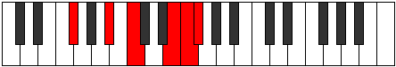 |
| [3153](https://ianring.com/musictheory/scales/3153) | [Zathitonic](ModeBNaturalZathitonic.md) | B | B, D#, F, A, A#, B |  |
| [3155](https://ianring.com/musictheory/scales/3155) | [Ladimic](ModeFSharpLadimic.md) | F# | F#, G, A#, B#, D##, E#, F# |  |
| [3155](https://ianring.com/musictheory/scales/3155) | [Ladimic](ModeGFlatLadimic.md) | Gb | Gb, Abb, Bb, C, D##, E#, Gb |  |
| [3155](https://ianring.com/musictheory/scales/3155) | [Ladimic](ModeENaturalLadimic.md) | E | E, F, G#, A#, B###, C###, E |  |
| [3155](https://ianring.com/musictheory/scales/3155) | [Ladimic](ModeBNaturalLadimic.md) | B | B, C, D#, E#, Cbbb, Cbb, B |  |
| [3157](https://ianring.com/musictheory/scales/3157) | [Zyptimic](ModeFSharpZyptimic.md) | F# | F#, G#, A#, B#, D##, E#, F# |  |
| [3157](https://ianring.com/musictheory/scales/3157) | [Zyptimic](ModeGFlatZyptimic.md) | Gb | Gb, Ab, Bb, C, D##, E#, Gb |  |
| [3157](https://ianring.com/musictheory/scales/3157) | [Zyptimic](ModeBNaturalZyptimic.md) | B | B, C#, D#, E#, Cbbb, Cbb, B |  |
| [3159](https://ianring.com/musictheory/scales/3159) | [Stocrian](ModeENaturalStocrian.md) | E | E, F, Gb, Ab, Bb, C##, D#, E |  |
| [3159](https://ianring.com/musictheory/scales/3159) | [Stocrian](ModeFSharpStocrian.md) | F# | F#, G, Ab, Bb, C, D##, E#, F# |  |
| [3159](https://ianring.com/musictheory/scales/3159) | [Stocrian](ModeGFlatStocrian.md) | Gb | Gb, Abb, Bbbb, Cbb, Dbb, E, F, Gb |  |
| [3159](https://ianring.com/musictheory/scales/3159) | [Stocrian](ModeBNaturalStocrian.md) | B | B, C, Db, Eb, F, G##, A#, B |  |
| [3161](https://ianring.com/musictheory/scales/3161) | [Kodimic](ModeFSharpKodimic.md) | F# | F#, G##, A#, B#, D##, E#, F# |  |
| [3161](https://ianring.com/musictheory/scales/3161) | [Kodimic](ModeGFlatKodimic.md) | Gb | Gb, A, Bb, C, D##, E#, Gb |  |
| [3161](https://ianring.com/musictheory/scales/3161) | [Kodimic](ModeGNaturalKodimic.md) | G | G, A#, B, C#, D###, E##, G |  |
| [3161](https://ianring.com/musictheory/scales/3161) | [Kodimic](ModeBNaturalKodimic.md) | B | B, C##, D#, E#, Cbbb, Cbb, B |  |
| [3163](https://ianring.com/musictheory/scales/3163) | [Rogian](ModeENaturalRogian.md) | E | E, F, G, Ab, Bb, C##, D#, E |  |
| [3163](https://ianring.com/musictheory/scales/3163) | [Rogian](ModeFSharpRogian.md) | F# | F#, G, A, Bb, C, D##, E#, F# |  |
| [3163](https://ianring.com/musictheory/scales/3163) | [Rogian](ModeGFlatRogian.md) | Gb | Gb, Abb, Bbb, Cbb, Dbb, E, F, Gb |  |
| [3163](https://ianring.com/musictheory/scales/3163) | [Rogian](ModeGNaturalRogian.md) | G | G, Ab, Bb, Cb, Db, E#, F#, G |  |
| [3163](https://ianring.com/musictheory/scales/3163) | [Rogian](ModeBNaturalRogian.md) | B | B, C, D, Eb, F, G##, A#, B |  |
| [3165](https://ianring.com/musictheory/scales/3165) | [Mylian](ModeFSharpMylian.md) | F# | F#, G#, A, Bb, C, D##, E#, F# |  |
| [3165](https://ianring.com/musictheory/scales/3165) | [Mylian](ModeGFlatMylian.md) | Gb | Gb, Ab, Bbb, Cbb, Dbb, E, F, Gb |  |
| [3165](https://ianring.com/musictheory/scales/3165) | [Mylian](ModeBNaturalMylian.md) | B | B, C#, D, Eb, F, G##, A#, B |  |
| [3165](https://ianring.com/musictheory/scales/3165) | [Mylian](ModeGNaturalMylian.md) | G | G, A, Bb, Cb, Db, E#, F#, G |  |
| [3167](https://ianring.com/musictheory/scales/3167) | [Thynyllic](ModeENaturalThynyllic.md) | E | E, F, F#, G, G#, A#, D, D#, E |  |
| [3167](https://ianring.com/musictheory/scales/3167) | [Thynyllic](ModeFSharpThynyllic.md) | F# | F#, G, G#, A, A#, C, E, F, F# |  |
| [3167](https://ianring.com/musictheory/scales/3167) | [Thynyllic](ModeGFlatThynyllic.md) | Gb | Gb, G, Ab, A, Bb, C, E, F, Gb |  |
| [3167](https://ianring.com/musictheory/scales/3167) | [Thynyllic](ModeBNaturalThynyllic.md) | B | B, C, C#, D, D#, F, A, A#, B |  |
| [3167](https://ianring.com/musictheory/scales/3167) | [Thynyllic](ModeGNaturalThynyllic.md) | G | G, G#, A, A#, B, C#, F, F#, G |  |
| [3171](https://ianring.com/musictheory/scales/3171) | [Zythimic](ModeENaturalZythimic.md) | E | E, F, G##, A#, B###, C###, E |  |
| [3171](https://ianring.com/musictheory/scales/3171) | [Zythimic](ModeCNaturalZythimic.md) | C | C, Db, E#, F#, G###, A##, C |  |
| [3171](https://ianring.com/musictheory/scales/3171) | [Zythimic](ModeFNaturalZythimic.md) | F | F, Gb, A#, B, C###, D##, F |  |
| [3171](https://ianring.com/musictheory/scales/3171) | [Zythimic](ModeBNaturalZythimic.md) | B | B, C, D##, E#, Cbbb, Cbb, B |  |
| [3173](https://ianring.com/musictheory/scales/3173) | [Zarimic](ModeCNaturalZarimic.md) | C | C, D, E#, F#, G###, A##, C |  |
| [3173](https://ianring.com/musictheory/scales/3173) | [Zarimic](ModeFNaturalZarimic.md) | F | F, G, A#, B, C###, D##, F |  |
| [3173](https://ianring.com/musictheory/scales/3173) | [Zarimic](ModeBNaturalZarimic.md) | B | B, C#, D##, E#, Cbbb, Cbb, B |  |
| [3175](https://ianring.com/musictheory/scales/3175) | [Eponian](ModeENaturalEponian.md) | E | E, F, Gb, A, Bb, C##, D#, E |  |
| [3175](https://ianring.com/musictheory/scales/3175) | [Eponian](ModeCNaturalEponian.md) | C | C, Db, Ebb, F, Gb, A#, B, C |  |
| [3175](https://ianring.com/musictheory/scales/3175) | [Eponian](ModeFNaturalEponian.md) | F | F, Gb, Abb, Bb, Cb, D#, E, F |  |
| [3175](https://ianring.com/musictheory/scales/3175) | [Eponian](ModeBNaturalEponian.md) | B | B, C, Db, E, F, G##, A#, B |  |
| [3177](https://ianring.com/musictheory/scales/3177) | [Rothimic](ModeGNaturalRothimic.md) | G | G, A#, B#, C#, D###, E##, G |  |
| [3177](https://ianring.com/musictheory/scales/3177) | [Rothimic](ModeCNaturalRothimic.md) | C | C, D#, E#, F#, G###, A##, C |  |
| [3177](https://ianring.com/musictheory/scales/3177) | [Rothimic](ModeFNaturalRothimic.md) | F | F, G#, A#, B, C###, D##, F |  |
| [3177](https://ianring.com/musictheory/scales/3177) | [Rothimic](ModeBNaturalRothimic.md) | B | B, C##, D##, E#, Cbbb, Cbb, B |  |
| [3179](https://ianring.com/musictheory/scales/3179) | [Daptian](ModeGNaturalDaptian.md) | G | G, Ab, Bb, C, Db, E#, F#, G |  |
| [3179](https://ianring.com/musictheory/scales/3179) | [Daptian](ModeENaturalDaptian.md) | E | E, F, G, A, Bb, C##, D#, E |  |
| [3179](https://ianring.com/musictheory/scales/3179) | [Daptian](ModeCNaturalDaptian.md) | C | C, Db, Eb, F, Gb, A#, B, C |  |
| [3179](https://ianring.com/musictheory/scales/3179) | [Daptian](ModeFNaturalDaptian.md) | F | F, Gb, Ab, Bb, Cb, D#, E, F |  |
| [3179](https://ianring.com/musictheory/scales/3179) | [Daptian](ModeBNaturalDaptian.md) | B | B, C, D, E, F, G##, A#, B |  |
| [3181](https://ianring.com/musictheory/scales/3181) | [Rolian](ModeGNaturalRolian.md) | G | G, A, Bb, C, Db, E#, F#, G |  |
| [3181](https://ianring.com/musictheory/scales/3181) | [Rolian](ModeCNaturalRolian.md) | C | C, D, Eb, F, Gb, A#, B, C |  |
| [3181](https://ianring.com/musictheory/scales/3181) | [Rolian](ModeFNaturalRolian.md) | F | F, G, Ab, Bb, Cb, D#, E, F |  |
| [3181](https://ianring.com/musictheory/scales/3181) | [Rolian](ModeBNaturalRolian.md) | B | B, C#, D, E, F, G##, A#, B |  |
| [3183](https://ianring.com/musictheory/scales/3183) | [Mixonyllic](ModeENaturalMixonyllic.md) | E | E, F, F#, G, A, A#, D, D#, E |  |
| [3183](https://ianring.com/musictheory/scales/3183) | [Mixonyllic](ModeGNaturalMixonyllic.md) | G | G, G#, A, A#, C, C#, F, F#, G |  |
| [3183](https://ianring.com/musictheory/scales/3183) | [Mixonyllic](ModeCNaturalMixonyllic.md) | C | C, C#, D, D#, F, F#, A#, B, C |  |
| [3183](https://ianring.com/musictheory/scales/3183) | [Mixonyllic](ModeFNaturalMixonyllic.md) | F | F, F#, G, G#, A#, B, D#, E, F |  |
| [3183](https://ianring.com/musictheory/scales/3183) | [Mixonyllic](ModeBNaturalMixonyllic.md) | B | B, C, C#, D, E, F, A, A#, B |  |
| [3185](https://ianring.com/musictheory/scales/3185) | [Thonimic](ModeCNaturalThonimic.md) | C | C, D##, E#, F#, G###, A##, C |  |
| [3185](https://ianring.com/musictheory/scales/3185) | [Thonimic](ModeFSharpThonimic.md) | F# | F#, G###, A##, B#, D##, E#, F# |  |
| [3185](https://ianring.com/musictheory/scales/3185) | [Thonimic](ModeGFlatThonimic.md) | Gb | Gb, A#, B, C, D##, E#, Gb |  |
| [3185](https://ianring.com/musictheory/scales/3185) | [Thonimic](ModeFNaturalThonimic.md) | F | F, G##, A#, B, C###, D##, F |  |
| [3185](https://ianring.com/musictheory/scales/3185) | [Thonimic](ModeBNaturalThonimic.md) | B | B, C###, D##, E#, Cbbb, Cbb, B |  |
| [3187](https://ianring.com/musictheory/scales/3187) | [Koptian](ModeENaturalKoptian.md) | E | E, F, G#, A, Bb, C##, D#, E |  |
| [3187](https://ianring.com/musictheory/scales/3187) | [Koptian](ModeCNaturalKoptian.md) | C | C, Db, E, F, Gb, A#, B, C |  |
| [3187](https://ianring.com/musictheory/scales/3187) | [Koptian](ModeFSharpKoptian.md) | F# | F#, G, A#, B, C, D##, E#, F# |  |
| [3187](https://ianring.com/musictheory/scales/3187) | [Koptian](ModeGFlatKoptian.md) | Gb | Gb, Abb, Bb, Cb, Dbb, E, F, Gb |  |
| [3187](https://ianring.com/musictheory/scales/3187) | [Koptian](ModeBNaturalKoptian.md) | B | B, C, D#, E, F, G##, A#, B |  |
| [3187](https://ianring.com/musictheory/scales/3187) | [Koptian](ModeFNaturalKoptian.md) | F | F, Gb, A, Bb, Cb, D#, E, F |  |
| [3189](https://ianring.com/musictheory/scales/3189) | [Aeolonian](ModeCNaturalAeolonian.md) | C | C, D, E, F, Gb, A#, B, C |  |
| [3189](https://ianring.com/musictheory/scales/3189) | [Aeolonian](ModeFSharpAeolonian.md) | F# | F#, G#, A#, B, C, D##, E#, F# |  |
| [3189](https://ianring.com/musictheory/scales/3189) | [Aeolonian](ModeGFlatAeolonian.md) | Gb | Gb, Ab, Bb, Cb, Dbb, E, F, Gb |  |
| [3189](https://ianring.com/musictheory/scales/3189) | [Aeolonian](ModeBNaturalAeolonian.md) | B | B, C#, D#, E, F, G##, A#, B |  |
| [3189](https://ianring.com/musictheory/scales/3189) | [Aeolonian](ModeFNaturalAeolonian.md) | F | F, G, A, Bb, Cb, D#, E, F |  |
| [3191](https://ianring.com/musictheory/scales/3191) | [Bynyllic](ModeENaturalBynyllic.md) | E | E, F, F#, G#, A, A#, D, D#, E |  |
| [3191](https://ianring.com/musictheory/scales/3191) | [Bynyllic](ModeCNaturalBynyllic.md) | C | C, C#, D, E, F, F#, A#, B, C |  |
| [3191](https://ianring.com/musictheory/scales/3191) | [Bynyllic](ModeFSharpBynyllic.md) | F# | F#, G, G#, A#, B, C, E, F, F# |  |
| [3191](https://ianring.com/musictheory/scales/3191) | [Bynyllic](ModeGFlatBynyllic.md) | Gb | Gb, G, Ab, Bb, B, C, E, F, Gb |  |
| [3191](https://ianring.com/musictheory/scales/3191) | [Bynyllic](ModeBNaturalBynyllic.md) | B | B, C, C#, D#, E, F, A, A#, B |  |
| [3191](https://ianring.com/musictheory/scales/3191) | [Bynyllic](ModeFNaturalBynyllic.md) | F | F, F#, G, A, A#, B, D#, E, F |  |
| [3193](https://ianring.com/musictheory/scales/3193) | [Zathian](ModeCNaturalZathian.md) | C | C, D#, E, F, Gb, A#, B, C |  |
| [3193](https://ianring.com/musictheory/scales/3193) | [Zathian](ModeGNaturalZathian.md) | G | G, A#, B, C, Db, E#, F#, G |  |
| [3193](https://ianring.com/musictheory/scales/3193) | [Zathian](ModeBNaturalZathian.md) | B | B, C##, D#, E, F, G##, A#, B |  |
| [3193](https://ianring.com/musictheory/scales/3193) | [Zathian](ModeFSharpZathian.md) | F# | F#, G##, A#, B, C, D##, E#, F# |  |
| [3193](https://ianring.com/musictheory/scales/3193) | [Zathian](ModeGFlatZathian.md) | Gb | Gb, A, Bb, Cb, Dbb, E, F, Gb |  |
| [3193](https://ianring.com/musictheory/scales/3193) | [Zathian](ModeFNaturalZathian.md) | F | F, G#, A, Bb, Cb, D#, E, F |  |
| [3195](https://ianring.com/musictheory/scales/3195) | [Raryllic](ModeENaturalRaryllic.md) | E | E, F, G, G#, A, A#, D, D#, E |  |
| [3195](https://ianring.com/musictheory/scales/3195) | [Raryllic](ModeCNaturalRaryllic.md) | C | C, C#, D#, E, F, F#, A#, B, C |  |
| [3195](https://ianring.com/musictheory/scales/3195) | [Raryllic](ModeGNaturalRaryllic.md) | G | G, G#, A#, B, C, C#, F, F#, G |  |
| [3195](https://ianring.com/musictheory/scales/3195) | [Raryllic](ModeBNaturalRaryllic.md) | B | B, C, D, D#, E, F, A, A#, B |  |
| [3195](https://ianring.com/musictheory/scales/3195) | [Raryllic](ModeFSharpRaryllic.md) | F# | F#, G, A, A#, B, C, E, F, F# |  |
| [3195](https://ianring.com/musictheory/scales/3195) | [Raryllic](ModeGFlatRaryllic.md) | Gb | Gb, G, A, Bb, B, C, E, F, Gb |  |
| [3195](https://ianring.com/musictheory/scales/3195) | [Raryllic](ModeFNaturalRaryllic.md) | F | F, F#, G#, A, A#, B, D#, E, F |  |
| [3197](https://ianring.com/musictheory/scales/3197) | [Gylyllic](ModeCNaturalGylyllic.md) | C | C, D, D#, E, F, F#, A#, B, C |  |
| [3197](https://ianring.com/musictheory/scales/3197) | [Gylyllic](ModeBNaturalGylyllic.md) | B | B, C#, D, D#, E, F, A, A#, B |  |
| [3197](https://ianring.com/musictheory/scales/3197) | [Gylyllic](ModeGNaturalGylyllic.md) | G | G, A, A#, B, C, C#, F, F#, G |  |
| [3197](https://ianring.com/musictheory/scales/3197) | [Gylyllic](ModeFSharpGylyllic.md) | F# | F#, G#, A, A#, B, C, E, F, F# |  |
| [3197](https://ianring.com/musictheory/scales/3197) | [Gylyllic](ModeGFlatGylyllic.md) | Gb | Gb, Ab, A, Bb, B, C, E, F, Gb |  |
| [3197](https://ianring.com/musictheory/scales/3197) | [Gylyllic](ModeFNaturalGylyllic.md) | F | F, G, G#, A, A#, B, D#, E, F |  |
| [3199](https://ianring.com/musictheory/scales/3199) | [Thaptygic](ModeENaturalThaptygic.md) | E | E, F, F#, G, G#, A, A#, D, D#, E |  |
| [3199](https://ianring.com/musictheory/scales/3199) | [Thaptygic](ModeCNaturalThaptygic.md) | C | C, C#, D, D#, E, F, F#, A#, B, C |  |
| [3199](https://ianring.com/musictheory/scales/3199) | [Thaptygic](ModeBNaturalThaptygic.md) | B | B, C, C#, D, D#, E, F, A, A#, B |  |
| [3199](https://ianring.com/musictheory/scales/3199) | [Thaptygic](ModeGNaturalThaptygic.md) | G | G, G#, A, A#, B, C, C#, F, F#, G |  |
| [3199](https://ianring.com/musictheory/scales/3199) | [Thaptygic](ModeFSharpThaptygic.md) | F# | F#, G, G#, A, A#, B, C, E, F, F# |  |
| [3199](https://ianring.com/musictheory/scales/3199) | [Thaptygic](ModeGFlatThaptygic.md) | Gb | Gb, G, Ab, A, Bb, B, C, E, F, Gb |  |
| [3199](https://ianring.com/musictheory/scales/3199) | [Thaptygic](ModeFNaturalThaptygic.md) | F | F, F#, G, G#, A, A#, B, D#, E, F |  |
| [3209](https://ianring.com/musictheory/scales/3209) | [Aeraphitonic](ModeGNaturalAeraphitonic.md) | G | G, A#, D, F, F#, G |  |
| [3209](https://ianring.com/musictheory/scales/3209) | [Aeraphitonic](ModeASharpAeraphitonic.md) | A# | A#, C#, F, G#, A, A# |  |
| [3209](https://ianring.com/musictheory/scales/3209) | [Aeraphitonic](ModeBFlatAeraphitonic.md) | Bb | Bb, Db, F, Ab, A, Bb |  |
| [3211](https://ianring.com/musictheory/scales/3211) | [Epacrimic](ModeGNaturalEpacrimic.md) | G | G, Ab, Bb, C##, D###, E##, G |  |
| [3211](https://ianring.com/musictheory/scales/3211) | [Epacrimic](ModeASharpEpacrimic.md) | A# | A#, B, C#, D###, F###, G##, A# |  |
| [3211](https://ianring.com/musictheory/scales/3211) | [Epacrimic](ModeBFlatEpacrimic.md) | Bb | Bb, Cb, Db, E#, F###, G##, Bb |  |
| [3213](https://ianring.com/musictheory/scales/3213) | [Eponimic](ModeDSharpEponimic.md) | D# | D#, E#, F#, G###, Db, Ebb, D# |  |
| [3213](https://ianring.com/musictheory/scales/3213) | [Eponimic](ModeEFlatEponimic.md) | Eb | Eb, F, Gb, A#, B##, C##, Eb |  |
| [3213](https://ianring.com/musictheory/scales/3213) | [Eponimic](ModeGNaturalEponimic.md) | G | G, A, Bb, C##, D###, E##, G |  |
| [3213](https://ianring.com/musictheory/scales/3213) | [Eponimic](ModeASharpEponimic.md) | A# | A#, B#, C#, D###, F###, G##, A# |  |
| [3213](https://ianring.com/musictheory/scales/3213) | [Eponimic](ModeBFlatEponimic.md) | Bb | Bb, C, Db, E#, F###, G##, Bb |  |
| [3215](https://ianring.com/musictheory/scales/3215) | [Katydian](ModeDSharpKatydian.md) | D# | D#, E, F, Gb, A#, B##, C##, D# |  |
| [3215](https://ianring.com/musictheory/scales/3215) | [Katydian](ModeEFlatKatydian.md) | Eb | Eb, Fb, Gbb, Abbb, Bb, C#, D, Eb |  |
| [3215](https://ianring.com/musictheory/scales/3215) | [Katydian](ModeGNaturalKatydian.md) | G | G, Ab, Bbb, Cbb, D, E#, F#, G |  |
| [3215](https://ianring.com/musictheory/scales/3215) | [Katydian](ModeASharpKatydian.md) | A# | A#, B, C, Db, E#, F###, G##, A# |  |
| [3215](https://ianring.com/musictheory/scales/3215) | [Katydian](ModeBFlatKatydian.md) | Bb | Bb, Cb, Dbb, Ebbb, F, G#, A, Bb |  |
| [3217](https://ianring.com/musictheory/scales/3217) | [Molitonic](ModeFSharpMolitonic.md) | F# | F#, A#, C#, E, F, F# |  |
| [3217](https://ianring.com/musictheory/scales/3217) | [Molitonic](ModeGFlatMolitonic.md) | Gb | Gb, Bb, Db, E, F, Gb |  |
| [3217](https://ianring.com/musictheory/scales/3217) | [Molitonic](ModeASharpMolitonic.md) | A# | A#, D, F, G#, A, A# |  |
| [3217](https://ianring.com/musictheory/scales/3217) | [Molitonic](ModeBFlatMolitonic.md) | Bb | Bb, D, F, Ab, A, Bb |  |
| [3219](https://ianring.com/musictheory/scales/3219) | [Ionaphimic](ModeFSharpIonaphimic.md) | F# | F#, G, A#, B##, D##, E#, F# |  |
| [3219](https://ianring.com/musictheory/scales/3219) | [Ionaphimic](ModeGFlatIonaphimic.md) | Gb | Gb, Abb, Bb, C#, D##, E#, Gb |  |
| [3219](https://ianring.com/musictheory/scales/3219) | [Ionaphimic](ModeASharpIonaphimic.md) | A# | A#, B, C##, D###, F###, G##, A# |  |
| [3219](https://ianring.com/musictheory/scales/3219) | [Ionaphimic](ModeBFlatIonaphimic.md) | Bb | Bb, Cb, D, E#, F###, G##, Bb |  |
| [3221](https://ianring.com/musictheory/scales/3221) | [Bycrimic](ModeDSharpBycrimic.md) | D# | D#, E#, F##, G###, Db, Ebb, D# |  |
| [3221](https://ianring.com/musictheory/scales/3221) | [Bycrimic](ModeEFlatBycrimic.md) | Eb | Eb, F, G, A#, B##, C##, Eb |  |
| [3221](https://ianring.com/musictheory/scales/3221) | [Bycrimic](ModeFSharpBycrimic.md) | F# | F#, G#, A#, B##, D##, E#, F# |  |
| [3221](https://ianring.com/musictheory/scales/3221) | [Bycrimic](ModeGFlatBycrimic.md) | Gb | Gb, Ab, Bb, C#, D##, E#, Gb |  |
| [3221](https://ianring.com/musictheory/scales/3221) | [Bycrimic](ModeASharpBycrimic.md) | A# | A#, B#, C##, D###, F###, G##, A# |  |
| [3221](https://ianring.com/musictheory/scales/3221) | [Bycrimic](ModeBFlatBycrimic.md) | Bb | Bb, C, D, E#, F###, G##, Bb |  |
| [3223](https://ianring.com/musictheory/scales/3223) | [Thyphian](ModeDSharpThyphian.md) | D# | D#, E, F, G, A#, B##, C##, D# |  |
| [3223](https://ianring.com/musictheory/scales/3223) | [Thyphian](ModeEFlatThyphian.md) | Eb | Eb, Fb, Gbb, Abb, Bb, C#, D, Eb |  |
| [3223](https://ianring.com/musictheory/scales/3223) | [Thyphian](ModeFSharpThyphian.md) | F# | F#, G, Ab, Bb, C#, D##, E#, F# |  |
| [3223](https://ianring.com/musictheory/scales/3223) | [Thyphian](ModeGFlatThyphian.md) | Gb | Gb, Abb, Bbbb, Cbb, Db, E, F, Gb |  |
| [3223](https://ianring.com/musictheory/scales/3223) | [Thyphian](ModeASharpThyphian.md) | A# | A#, B, C, D, E#, F###, G##, A# |  |
| [3223](https://ianring.com/musictheory/scales/3223) | [Thyphian](ModeBFlatThyphian.md) | Bb | Bb, Cb, Dbb, Ebb, F, G#, A, Bb |  |
| [3225](https://ianring.com/musictheory/scales/3225) | [Ionalimic](ModeFSharpIonalimic.md) | F# | F#, G##, A#, B##, D##, E#, F# |  |
| [3225](https://ianring.com/musictheory/scales/3225) | [Ionalimic](ModeGFlatIonalimic.md) | Gb | Gb, A, Bb, C#, D##, E#, Gb |  |
| [3225](https://ianring.com/musictheory/scales/3225) | [Ionalimic](ModeASharpIonalimic.md) | A# | A#, B##, C##, D###, F###, G##, A# | 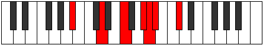 |
| [3225](https://ianring.com/musictheory/scales/3225) | [Ionalimic](ModeBFlatIonalimic.md) | Bb | Bb, C#, D, E#, F###, G##, Bb |  |
| [3225](https://ianring.com/musictheory/scales/3225) | [Ionalimic](ModeGNaturalIonalimic.md) | G | G, A#, B, C##, D###, E##, G |  |
| [3227](https://ianring.com/musictheory/scales/3227) | [Aeolocrian](ModeFSharpAeolocrian.md) | F# | F#, G, A, Bb, C#, D##, E#, F# |  |
| [3227](https://ianring.com/musictheory/scales/3227) | [Aeolocrian](ModeGFlatAeolocrian.md) | Gb | Gb, Abb, Bbb, Cbb, Db, E, F, Gb |  |
| [3227](https://ianring.com/musictheory/scales/3227) | [Aeolocrian](ModeGNaturalAeolocrian.md) | G | G, Ab, Bb, Cb, D, E#, F#, G |  |
| [3227](https://ianring.com/musictheory/scales/3227) | [Aeolocrian](ModeASharpAeolocrian.md) | A# | A#, B, C#, D, E#, F###, G##, A# |  |
| [3227](https://ianring.com/musictheory/scales/3227) | [Aeolocrian](ModeBFlatAeolocrian.md) | Bb | Bb, Cb, Db, Ebb, F, G#, A, Bb |  |
| [3229](https://ianring.com/musictheory/scales/3229) | [Aeolaptian](ModeDSharpAeolaptian.md) | D# | D#, E#, F#, G, A#, B##, C##, D# |  |
| [3229](https://ianring.com/musictheory/scales/3229) | [Aeolaptian](ModeEFlatAeolaptian.md) | Eb | Eb, F, Gb, Abb, Bb, C#, D, Eb |  |
| [3229](https://ianring.com/musictheory/scales/3229) | [Aeolaptian](ModeASharpAeolaptian.md) | A# | A#, B#, C#, D, E#, F###, G##, A# |  |
| [3229](https://ianring.com/musictheory/scales/3229) | [Aeolaptian](ModeBFlatAeolaptian.md) | Bb | Bb, C, Db, Ebb, F, G#, A, Bb |  |
| [3229](https://ianring.com/musictheory/scales/3229) | [Aeolaptian](ModeFSharpAeolaptian.md) | F# | F#, G#, A, Bb, C#, D##, E#, F# |  |
| [3229](https://ianring.com/musictheory/scales/3229) | [Aeolaptian](ModeGFlatAeolaptian.md) | Gb | Gb, Ab, Bbb, Cbb, Db, E, F, Gb |  |
| [3229](https://ianring.com/musictheory/scales/3229) | [Aeolaptian](ModeGNaturalAeolaptian.md) | G | G, A, Bb, Cb, D, E#, F#, G |  |
| [3231](https://ianring.com/musictheory/scales/3231) | [Kataptyllic](ModeDSharpKataptyllic.md) | D# | D#, E, F, F#, G, A#, C#, D, D# |  |
| [3231](https://ianring.com/musictheory/scales/3231) | [Kataptyllic](ModeEFlatKataptyllic.md) | Eb | Eb, E, F, Gb, G, Bb, Db, D, Eb |  |
| [3231](https://ianring.com/musictheory/scales/3231) | [Kataptyllic](ModeFSharpKataptyllic.md) | F# | F#, G, G#, A, A#, C#, E, F, F# |  |
| [3231](https://ianring.com/musictheory/scales/3231) | [Kataptyllic](ModeGFlatKataptyllic.md) | Gb | Gb, G, Ab, A, Bb, Db, E, F, Gb |  |
| [3231](https://ianring.com/musictheory/scales/3231) | [Kataptyllic](ModeASharpKataptyllic.md) | A# | A#, B, C, C#, D, F, G#, A, A# |  |
| [3231](https://ianring.com/musictheory/scales/3231) | [Kataptyllic](ModeBFlatKataptyllic.md) | Bb | Bb, B, C, Db, D, F, Ab, A, Bb |  |
| [3231](https://ianring.com/musictheory/scales/3231) | [Kataptyllic](ModeGNaturalKataptyllic.md) | G | G, G#, A, A#, B, D, F, F#, G |  |
| [3235](https://ianring.com/musictheory/scales/3235) | [Pothimic](ModeFNaturalPothimic.md) | F | F, Gb, A#, B#, C###, D##, F |  |
| [3235](https://ianring.com/musictheory/scales/3235) | [Pothimic](ModeCNaturalPothimic.md) | C | C, Db, E#, F##, G###, A##, C |  |
| [3235](https://ianring.com/musictheory/scales/3235) | [Pothimic](ModeASharpPothimic.md) | A# | A#, B, C###, D###, F###, G##, A# |  |
| [3235](https://ianring.com/musictheory/scales/3235) | [Pothimic](ModeBFlatPothimic.md) | Bb | Bb, Cb, D#, E#, F###, G##, Bb |  |
| [3237](https://ianring.com/musictheory/scales/3237) | [Thatimic](ModeFNaturalThatimic.md) | F | F, G, A#, B#, C###, D##, F |  |
| [3237](https://ianring.com/musictheory/scales/3237) | [Thatimic](ModeDSharpThatimic.md) | D# | D#, E#, F###, G###, Db, Ebb, D# |  |
| [3237](https://ianring.com/musictheory/scales/3237) | [Thatimic](ModeEFlatThatimic.md) | Eb | Eb, F, G#, A#, B##, C##, Eb |  |
| [3237](https://ianring.com/musictheory/scales/3237) | [Thatimic](ModeASharpThatimic.md) | A# | A#, B#, C###, D###, F###, G##, A# |  |
| [3237](https://ianring.com/musictheory/scales/3237) | [Thatimic](ModeBFlatThatimic.md) | Bb | Bb, C, D#, E#, F###, G##, Bb |  |
| [3237](https://ianring.com/musictheory/scales/3237) | [Thatimic](ModeCNaturalThatimic.md) | C | C, D, E#, F##, G###, A##, C |  |
| [3239](https://ianring.com/musictheory/scales/3239) | [Epythian](ModeFNaturalEpythian.md) | F | F, Gb, Abb, Bb, C, D#, E, F |  |
| [3239](https://ianring.com/musictheory/scales/3239) | [Epythian](ModeDSharpEpythian.md) | D# | D#, E, F, G#, A#, B##, C##, D# |  |
| [3239](https://ianring.com/musictheory/scales/3239) | [Epythian](ModeEFlatEpythian.md) | Eb | Eb, Fb, Gbb, Ab, Bb, C#, D, Eb |  |
| [3239](https://ianring.com/musictheory/scales/3239) | [Epythian](ModeCNaturalEpythian.md) | C | C, Db, Ebb, F, G, A#, B, C |  |
| [3239](https://ianring.com/musictheory/scales/3239) | [Epythian](ModeASharpEpythian.md) | A# | A#, B, C, D#, E#, F###, G##, A# |  |
| [3239](https://ianring.com/musictheory/scales/3239) | [Epythian](ModeBFlatEpythian.md) | Bb | Bb, Cb, Dbb, Eb, F, G#, A, Bb |  |
| [3241](https://ianring.com/musictheory/scales/3241) | [Dalimic](ModeGNaturalDalimic.md) | G | G, A#, B#, C##, D###, E##, G |  |
| [3241](https://ianring.com/musictheory/scales/3241) | [Dalimic](ModeFNaturalDalimic.md) | F | F, G#, A#, B#, C###, D##, F |  |
| [3241](https://ianring.com/musictheory/scales/3241) | [Dalimic](ModeASharpDalimic.md) | A# | A#, B##, C###, D###, F###, G##, A# |  |
| [3241](https://ianring.com/musictheory/scales/3241) | [Dalimic](ModeBFlatDalimic.md) | Bb | Bb, C#, D#, E#, F###, G##, Bb |  |
| [3241](https://ianring.com/musictheory/scales/3241) | [Dalimic](ModeCNaturalDalimic.md) | C | C, D#, E#, F##, G###, A##, C |  |
| [3243](https://ianring.com/musictheory/scales/3243) | [Staptian](ModeFNaturalStaptian.md) | F | F, Gb, Ab, Bb, C, D#, E, F |  |
| [3243](https://ianring.com/musictheory/scales/3243) | [Staptian](ModeGNaturalStaptian.md) | G | G, Ab, Bb, C, D, E#, F#, G |  |
| [3243](https://ianring.com/musictheory/scales/3243) | [Staptian](ModeCNaturalStaptian.md) | C | C, Db, Eb, F, G, A#, B, C |  |
| [3243](https://ianring.com/musictheory/scales/3243) | [Staptian](ModeASharpStaptian.md) | A# | A#, B, C#, D#, E#, F###, G##, A# |  |
| [3243](https://ianring.com/musictheory/scales/3243) | [Staptian](ModeBFlatStaptian.md) | Bb | Bb, Cb, Db, Eb, F, G#, A, Bb |  |
| [3245](https://ianring.com/musictheory/scales/3245) | [Aeracrian](ModeDSharpAeracrian.md) | D# | D#, E#, F#, G#, A#, B##, C##, D# |  |
| [3245](https://ianring.com/musictheory/scales/3245) | [Aeracrian](ModeEFlatAeracrian.md) | Eb | Eb, F, Gb, Ab, Bb, C#, D, Eb |  |
| [3245](https://ianring.com/musictheory/scales/3245) | [Aeracrian](ModeFNaturalAeracrian.md) | F | F, G, Ab, Bb, C, D#, E, F |  |
| [3245](https://ianring.com/musictheory/scales/3245) | [Aeracrian](ModeGNaturalAeracrian.md) | G | G, A, Bb, C, D, E#, F#, G |  |
| [3245](https://ianring.com/musictheory/scales/3245) | [Aeracrian](ModeASharpAeracrian.md) | A# | A#, B#, C#, D#, E#, F###, G##, A# |  |
| [3245](https://ianring.com/musictheory/scales/3245) | [Aeracrian](ModeBFlatAeracrian.md) | Bb | Bb, C, Db, Eb, F, G#, A, Bb |  |
| [3245](https://ianring.com/musictheory/scales/3245) | [Aeracrian](ModeCNaturalAeracrian.md) | C | C, D, Eb, F, G, A#, B, C |  |
| [3247](https://ianring.com/musictheory/scales/3247) | [Aeolonyllic](ModeDSharpAeolonyllic.md) | D# | D#, E, F, F#, G#, A#, C#, D, D# |  |
| [3247](https://ianring.com/musictheory/scales/3247) | [Aeolonyllic](ModeEFlatAeolonyllic.md) | Eb | Eb, E, F, Gb, Ab, Bb, Db, D, Eb |  |
| [3247](https://ianring.com/musictheory/scales/3247) | [Aeolonyllic](ModeFNaturalAeolonyllic.md) | F | F, F#, G, G#, A#, C, D#, E, F |  |
| [3247](https://ianring.com/musictheory/scales/3247) | [Aeolonyllic](ModeGNaturalAeolonyllic.md) | G | G, G#, A, A#, C, D, F, F#, G |  |
| [3247](https://ianring.com/musictheory/scales/3247) | [Aeolonyllic](ModeCNaturalAeolonyllic.md) | C | C, C#, D, D#, F, G, A#, B, C |  |
| [3247](https://ianring.com/musictheory/scales/3247) | [Aeolonyllic](ModeASharpAeolonyllic.md) | A# | A#, B, C, C#, D#, F, G#, A, A# |  |
| [3247](https://ianring.com/musictheory/scales/3247) | [Aeolonyllic](ModeBFlatAeolonyllic.md) | Bb | Bb, B, C, Db, Eb, F, Ab, A, Bb |  |
| [3249](https://ianring.com/musictheory/scales/3249) | [Epygimic](ModeFNaturalEpygimic.md) | F | F, G##, A#, B#, C###, D##, F |  |
| [3249](https://ianring.com/musictheory/scales/3249) | [Epygimic](ModeASharpEpygimic.md) | A# | A#, B###, C###, D###, F###, G##, A# |  |
| [3249](https://ianring.com/musictheory/scales/3249) | [Epygimic](ModeBFlatEpygimic.md) | Bb | Bb, C##, D#, E#, F###, G##, Bb |  |
| [3249](https://ianring.com/musictheory/scales/3249) | [Epygimic](ModeFSharpEpygimic.md) | F# | F#, G###, A##, B##, D##, E#, F# |  |
| [3249](https://ianring.com/musictheory/scales/3249) | [Epygimic](ModeGFlatEpygimic.md) | Gb | Gb, A#, B, C#, D##, E#, Gb |  |
| [3249](https://ianring.com/musictheory/scales/3249) | [Epygimic](ModeCNaturalEpygimic.md) | C | C, D##, E#, F##, G###, A##, C |  |
| [3251](https://ianring.com/musictheory/scales/3251) | [Zodian](ModeFNaturalZodian.md) | F | F, Gb, A, Bb, C, D#, E, F |  |
| [3251](https://ianring.com/musictheory/scales/3251) | [Zodian](ModeCNaturalZodian.md) | C | C, Db, E, F, G, A#, B, C |  |
| [3251](https://ianring.com/musictheory/scales/3251) | [Zodian](ModeFSharpZodian.md) | F# | F#, G, A#, B, C#, D##, E#, F# |  |
| [3251](https://ianring.com/musictheory/scales/3251) | [Zodian](ModeGFlatZodian.md) | Gb | Gb, Abb, Bb, Cb, Db, E, F, Gb |  |
| [3251](https://ianring.com/musictheory/scales/3251) | [Zodian](ModeASharpZodian.md) | A# | A#, B, C##, D#, E#, F###, G##, A# |  |
| [3251](https://ianring.com/musictheory/scales/3251) | [Zodian](ModeBFlatZodian.md) | Bb | Bb, Cb, D, Eb, F, G#, A, Bb |  |
| [3253](https://ianring.com/musictheory/scales/3253) | [Gonian](ModeDSharpGonian.md) | D# | D#, E#, F##, G#, A#, B##, C##, D# |  |
| [3253](https://ianring.com/musictheory/scales/3253) | [Gonian](ModeEFlatGonian.md) | Eb | Eb, F, G, Ab, Bb, C#, D, Eb |  |
| [3253](https://ianring.com/musictheory/scales/3253) | [Gonian](ModeFNaturalGonian.md) | F | F, G, A, Bb, C, D#, E, F |  |
| [3253](https://ianring.com/musictheory/scales/3253) | [Gonian](ModeASharpGonian.md) | A# | A#, B#, C##, D#, E#, F###, G##, A# |  |
| [3253](https://ianring.com/musictheory/scales/3253) | [Gonian](ModeBFlatGonian.md) | Bb | Bb, C, D, Eb, F, G#, A, Bb |  |
| [3253](https://ianring.com/musictheory/scales/3253) | [Gonian](ModeCNaturalGonian.md) | C | C, D, E, F, G, A#, B, C |  |
| [3253](https://ianring.com/musictheory/scales/3253) | [Gonian](ModeFSharpGonian.md) | F# | F#, G#, A#, B, C#, D##, E#, F# |  |
| [3253](https://ianring.com/musictheory/scales/3253) | [Gonian](ModeGFlatGonian.md) | Gb | Gb, Ab, Bb, Cb, Db, E, F, Gb |  |
| [3255](https://ianring.com/musictheory/scales/3255) | [Daryllic](ModeDSharpDaryllic.md) | D# | D#, E, F, G, G#, A#, C#, D, D# |  |
| [3255](https://ianring.com/musictheory/scales/3255) | [Daryllic](ModeEFlatDaryllic.md) | Eb | Eb, E, F, G, Ab, Bb, Db, D, Eb |  |
| [3255](https://ianring.com/musictheory/scales/3255) | [Daryllic](ModeFNaturalDaryllic.md) | F | F, F#, G, A, A#, C, D#, E, F |  |
| [3255](https://ianring.com/musictheory/scales/3255) | [Daryllic](ModeCNaturalDaryllic.md) | C | C, C#, D, E, F, G, A#, B, C |  |
| [3255](https://ianring.com/musictheory/scales/3255) | [Daryllic](ModeFSharpDaryllic.md) | F# | F#, G, G#, A#, B, C#, E, F, F# |  |
| [3255](https://ianring.com/musictheory/scales/3255) | [Daryllic](ModeGFlatDaryllic.md) | Gb | Gb, G, Ab, Bb, B, Db, E, F, Gb |  |
| [3255](https://ianring.com/musictheory/scales/3255) | [Daryllic](ModeASharpDaryllic.md) | A# | A#, B, C, D, D#, F, G#, A, A# |  |
| [3255](https://ianring.com/musictheory/scales/3255) | [Daryllic](ModeBFlatDaryllic.md) | Bb | Bb, B, C, D, Eb, F, Ab, A, Bb |  |
| [3257](https://ianring.com/musictheory/scales/3257) | [Ionacrian](ModeASharpIonacrian.md) | A# | A#, B##, C##, D#, E#, F###, G##, A# |  |
| [3257](https://ianring.com/musictheory/scales/3257) | [Ionacrian](ModeBFlatIonacrian.md) | Bb | Bb, C#, D, Eb, F, G#, A, Bb |  |
| [3257](https://ianring.com/musictheory/scales/3257) | [Ionacrian](ModeFNaturalIonacrian.md) | F | F, G#, A, Bb, C, D#, E, F |  |
| [3257](https://ianring.com/musictheory/scales/3257) | [Ionacrian](ModeCNaturalIonacrian.md) | C | C, D#, E, F, G, A#, B, C |  |
| [3257](https://ianring.com/musictheory/scales/3257) | [Ionacrian](ModeGNaturalIonacrian.md) | G | G, A#, B, C, D, E#, F#, G |  |
| [3257](https://ianring.com/musictheory/scales/3257) | [Ionacrian](ModeFSharpIonacrian.md) | F# | F#, G##, A#, B, C#, D##, E#, F# |  |
| [3257](https://ianring.com/musictheory/scales/3257) | [Ionacrian](ModeGFlatIonacrian.md) | Gb | Gb, A, Bb, Cb, Db, E, F, Gb |  |
| [3259](https://ianring.com/musictheory/scales/3259) | [Loptyllic](ModeFNaturalLoptyllic.md) | F | F, F#, G#, A, A#, C, D#, E, F |  |
| [3259](https://ianring.com/musictheory/scales/3259) | [Loptyllic](ModeCNaturalLoptyllic.md) | C | C, C#, D#, E, F, G, A#, B, C |  |
| [3259](https://ianring.com/musictheory/scales/3259) | [Loptyllic](ModeGNaturalLoptyllic.md) | G | G, G#, A#, B, C, D, F, F#, G |  |
| [3259](https://ianring.com/musictheory/scales/3259) | [Loptyllic](ModeFSharpLoptyllic.md) | F# | F#, G, A, A#, B, C#, E, F, F# |  |
| [3259](https://ianring.com/musictheory/scales/3259) | [Loptyllic](ModeGFlatLoptyllic.md) | Gb | Gb, G, A, Bb, B, Db, E, F, Gb |  |
| [3259](https://ianring.com/musictheory/scales/3259) | [Loptyllic](ModeASharpLoptyllic.md) | A# | A#, B, C#, D, D#, F, G#, A, A# |  |
| [3259](https://ianring.com/musictheory/scales/3259) | [Loptyllic](ModeBFlatLoptyllic.md) | Bb | Bb, B, Db, D, Eb, F, Ab, A, Bb |  |
| [3261](https://ianring.com/musictheory/scales/3261) | [Dodyllic](ModeDSharpDodyllic.md) | D# | D#, F, F#, G, G#, A#, C#, D, D# |  |
| [3261](https://ianring.com/musictheory/scales/3261) | [Dodyllic](ModeEFlatDodyllic.md) | Eb | Eb, F, Gb, G, Ab, Bb, Db, D, Eb |  |
| [3261](https://ianring.com/musictheory/scales/3261) | [Dodyllic](ModeASharpDodyllic.md) | A# | A#, C, C#, D, D#, F, G#, A, A# |  |
| [3261](https://ianring.com/musictheory/scales/3261) | [Dodyllic](ModeBFlatDodyllic.md) | Bb | Bb, C, Db, D, Eb, F, Ab, A, Bb |  |
| [3261](https://ianring.com/musictheory/scales/3261) | [Dodyllic](ModeFNaturalDodyllic.md) | F | F, G, G#, A, A#, C, D#, E, F |  |
| [3261](https://ianring.com/musictheory/scales/3261) | [Dodyllic](ModeCNaturalDodyllic.md) | C | C, D, D#, E, F, G, A#, B, C |  |
| [3261](https://ianring.com/musictheory/scales/3261) | [Dodyllic](ModeGNaturalDodyllic.md) | G | G, A, A#, B, C, D, F, F#, G |  |
| [3261](https://ianring.com/musictheory/scales/3261) | [Dodyllic](ModeFSharpDodyllic.md) | F# | F#, G#, A, A#, B, C#, E, F, F# |  |
| [3261](https://ianring.com/musictheory/scales/3261) | [Dodyllic](ModeGFlatDodyllic.md) | Gb | Gb, Ab, A, Bb, B, Db, E, F, Gb |  |
| [3263](https://ianring.com/musictheory/scales/3263) | [Pyrygic](ModeDSharpPyrygic.md) | D# | D#, E, F, F#, G, G#, A#, C#, D, D# |  |
| [3263](https://ianring.com/musictheory/scales/3263) | [Pyrygic](ModeEFlatPyrygic.md) | Eb | Eb, E, F, Gb, G, Ab, Bb, Db, D, Eb |  |
| [3263](https://ianring.com/musictheory/scales/3263) | [Pyrygic](ModeFNaturalPyrygic.md) | F | F, F#, G, G#, A, A#, C, D#, E, F |  |
| [3263](https://ianring.com/musictheory/scales/3263) | [Pyrygic](ModeCNaturalPyrygic.md) | C | C, C#, D, D#, E, F, G, A#, B, C |  |
| [3263](https://ianring.com/musictheory/scales/3263) | [Pyrygic](ModeASharpPyrygic.md) | A# | A#, B, C, C#, D, D#, F, G#, A, A# |  |
| [3263](https://ianring.com/musictheory/scales/3263) | [Pyrygic](ModeBFlatPyrygic.md) | Bb | Bb, B, C, Db, D, Eb, F, Ab, A, Bb |  |
| [3263](https://ianring.com/musictheory/scales/3263) | [Pyrygic](ModeGNaturalPyrygic.md) | G | G, G#, A, A#, B, C, D, F, F#, G |  |
| [3263](https://ianring.com/musictheory/scales/3263) | [Pyrygic](ModeFSharpPyrygic.md) | F# | F#, G, G#, A, A#, B, C#, E, F, F# |  |
| [3263](https://ianring.com/musictheory/scales/3263) | [Pyrygic](ModeGFlatPyrygic.md) | Gb | Gb, G, Ab, A, Bb, B, Db, E, F, Gb |  |
| [3269](https://ianring.com/musictheory/scales/3269) | [Lodimic](ModeDSharpLodimic.md) | D# | D#, E#, Cbbb, Cbb, Db, Ebb, D# |  |
| [3269](https://ianring.com/musictheory/scales/3269) | [Lodimic](ModeEFlatLodimic.md) | Eb | Eb, F, G##, A#, B##, C##, Eb |  |
| [3269](https://ianring.com/musictheory/scales/3269) | [Lodimic](ModeASharpLodimic.md) | A# | A#, B#, D##, E#, F###, G##, A# |  |
| [3269](https://ianring.com/musictheory/scales/3269) | [Lodimic](ModeBFlatLodimic.md) | Bb | Bb, C, D##, E#, F###, G##, Bb |  |
| [3269](https://ianring.com/musictheory/scales/3269) | [Lodimic](ModeBNaturalLodimic.md) | B | B, C#, D###, E##, Cbbb, Cbb, B |  |
| [3271](https://ianring.com/musictheory/scales/3271) | [Kolian](ModeDSharpKolian.md) | D# | D#, E, F, G##, A#, B##, C##, D# |  |
| [3271](https://ianring.com/musictheory/scales/3271) | [Kolian](ModeEFlatKolian.md) | Eb | Eb, Fb, Gbb, A, Bb, C#, D, Eb |  |
| [3271](https://ianring.com/musictheory/scales/3271) | [Kolian](ModeENaturalKolian.md) | E | E, F, Gb, A#, B, C##, D#, E |  |
| [3271](https://ianring.com/musictheory/scales/3271) | [Kolian](ModeBNaturalKolian.md) | B | B, C, Db, E#, F#, G##, A#, B |  |
| [3271](https://ianring.com/musictheory/scales/3271) | [Kolian](ModeASharpKolian.md) | A# | A#, B, C, D##, E#, F###, G##, A# |  |
| [3271](https://ianring.com/musictheory/scales/3271) | [Kolian](ModeBFlatKolian.md) | Bb | Bb, Cb, Dbb, E, F, G#, A, Bb |  |
| [3273](https://ianring.com/musictheory/scales/3273) | [Ionodimic](ModeGNaturalIonodimic.md) | G | G, A#, B##, C##, D###, E##, G |  |
| [3273](https://ianring.com/musictheory/scales/3273) | [Ionodimic](ModeASharpIonodimic.md) | A# | A#, B##, D##, E#, F###, G##, A# |  |
| [3273](https://ianring.com/musictheory/scales/3273) | [Ionodimic](ModeBFlatIonodimic.md) | Bb | Bb, C#, D##, E#, F###, G##, Bb |  |
| [3273](https://ianring.com/musictheory/scales/3273) | [Ionodimic](ModeBNaturalIonodimic.md) | B | B, C##, D###, E##, Cbbb, Cbb, B |  |
| [3275](https://ianring.com/musictheory/scales/3275) | [Katadian](ModeGNaturalKatadian.md) | G | G, Ab, Bb, C#, D, E#, F#, G |  |
| [3275](https://ianring.com/musictheory/scales/3275) | [Katadian](ModeENaturalKatadian.md) | E | E, F, G, A#, B, C##, D#, E |  |
| [3275](https://ianring.com/musictheory/scales/3275) | [Katadian](ModeBNaturalKatadian.md) | B | B, C, D, E#, F#, G##, A#, B |  |
| [3275](https://ianring.com/musictheory/scales/3275) | [Katadian](ModeASharpKatadian.md) | A# | A#, B, C#, D##, E#, F###, G##, A# |  |
| [3275](https://ianring.com/musictheory/scales/3275) | [Katadian](ModeBFlatKatadian.md) | Bb | Bb, Cb, Db, E, F, G#, A, Bb |  |
| [3277](https://ianring.com/musictheory/scales/3277) | [Zycrian](ModeDSharpZycrian.md) | D# | D#, E#, F#, G##, A#, B##, C##, D# |  |
| [3277](https://ianring.com/musictheory/scales/3277) | [Zycrian](ModeEFlatZycrian.md) | Eb | Eb, F, Gb, A, Bb, C#, D, Eb |  |
| [3277](https://ianring.com/musictheory/scales/3277) | [Zycrian](ModeGNaturalZycrian.md) | G | G, A, Bb, C#, D, E#, F#, G |  |
| [3277](https://ianring.com/musictheory/scales/3277) | [Zycrian](ModeASharpZycrian.md) | A# | A#, B#, C#, D##, E#, F###, G##, A# |  |
| [3277](https://ianring.com/musictheory/scales/3277) | [Zycrian](ModeBFlatZycrian.md) | Bb | Bb, C, Db, E, F, G#, A, Bb |  |
| [3277](https://ianring.com/musictheory/scales/3277) | [Zycrian](ModeBNaturalZycrian.md) | B | B, C#, D, E#, F#, G##, A#, B |  |
| [3279](https://ianring.com/musictheory/scales/3279) | [Pythyllic](ModeDSharpPythyllic.md) | D# | D#, E, F, F#, A, A#, C#, D, D# |  |
| [3279](https://ianring.com/musictheory/scales/3279) | [Pythyllic](ModeEFlatPythyllic.md) | Eb | Eb, E, F, Gb, A, Bb, Db, D, Eb |  |
| [3279](https://ianring.com/musictheory/scales/3279) | [Pythyllic](ModeGNaturalPythyllic.md) | G | G, G#, A, A#, C#, D, F, F#, G |  |
| [3279](https://ianring.com/musictheory/scales/3279) | [Pythyllic](ModeENaturalPythyllic.md) | E | E, F, F#, G, A#, B, D, D#, E |  |
| [3279](https://ianring.com/musictheory/scales/3279) | [Pythyllic](ModeBNaturalPythyllic.md) | B | B, C, C#, D, F, F#, A, A#, B |  |
| [3279](https://ianring.com/musictheory/scales/3279) | [Pythyllic](ModeASharpPythyllic.md) | A# | A#, B, C, C#, E, F, G#, A, A# |  |
| [3279](https://ianring.com/musictheory/scales/3279) | [Pythyllic](ModeBFlatPythyllic.md) | Bb | Bb, B, C, Db, E, F, Ab, A, Bb |  |
| [3281](https://ianring.com/musictheory/scales/3281) | [Katythimic](ModeFSharpKatythimic.md) | F# | F#, G###, A###, B##, D##, E#, F# |  |
| [3281](https://ianring.com/musictheory/scales/3281) | [Katythimic](ModeGFlatKatythimic.md) | Gb | Gb, A#, B#, C#, D##, E#, Gb |  |
| [3281](https://ianring.com/musictheory/scales/3281) | [Katythimic](ModeASharpKatythimic.md) | A# | A#, B###, D##, E#, F###, G##, A# |  |
| [3281](https://ianring.com/musictheory/scales/3281) | [Katythimic](ModeBFlatKatythimic.md) | Bb | Bb, C##, D##, E#, F###, G##, Bb |  |
| [3281](https://ianring.com/musictheory/scales/3281) | [Katythimic](ModeBNaturalKatythimic.md) | B | B, C###, D###, E##, Cbbb, Cbb, B |  |
| [3283](https://ianring.com/musictheory/scales/3283) | [Lyrian](ModeFSharpLyrian.md) | F# | F#, G, A#, B#, C#, D##, E#, F# |  |
| [3283](https://ianring.com/musictheory/scales/3283) | [Lyrian](ModeGFlatLyrian.md) | Gb | Gb, Abb, Bb, C, Db, E, F, Gb |  |
| [3283](https://ianring.com/musictheory/scales/3283) | [Lyrian](ModeENaturalLyrian.md) | E | E, F, G#, A#, B, C##, D#, E |  |
| [3283](https://ianring.com/musictheory/scales/3283) | [Lyrian](ModeBNaturalLyrian.md) | B | B, C, D#, E#, F#, G##, A#, B |  |
| [3283](https://ianring.com/musictheory/scales/3283) | [Lyrian](ModeASharpLyrian.md) | A# | A#, B, C##, D##, E#, F###, G##, A# |  |
| [3283](https://ianring.com/musictheory/scales/3283) | [Lyrian](ModeBFlatLyrian.md) | Bb | Bb, Cb, D, E, F, G#, A, Bb |  |
| [3285](https://ianring.com/musictheory/scales/3285) | [Zagian](ModeFSharpZagian.md) | F# | F#, G#, A#, B#, C#, D##, E#, F# |  |
| [3285](https://ianring.com/musictheory/scales/3285) | [Zagian](ModeGFlatZagian.md) | Gb | Gb, Ab, Bb, C, Db, E, F, Gb |  |
| [3285](https://ianring.com/musictheory/scales/3285) | [Zagian](ModeDSharpZagian.md) | D# | D#, E#, F##, G##, A#, B##, C##, D# |  |
| [3285](https://ianring.com/musictheory/scales/3285) | [Zagian](ModeEFlatZagian.md) | Eb | Eb, F, G, A, Bb, C#, D, Eb |  |
| [3285](https://ianring.com/musictheory/scales/3285) | [Zagian](ModeASharpZagian.md) | A# | A#, B#, C##, D##, E#, F###, G##, A# |  |
| [3285](https://ianring.com/musictheory/scales/3285) | [Zagian](ModeBFlatZagian.md) | Bb | Bb, C, D, E, F, G#, A, Bb |  |
| [3285](https://ianring.com/musictheory/scales/3285) | [Zagian](ModeBNaturalZagian.md) | B | B, C#, D#, E#, F#, G##, A#, B |  |
| [3287](https://ianring.com/musictheory/scales/3287) | [Phrathyllic](ModeFSharpPhrathyllic.md) | F# | F#, G, G#, A#, C, C#, E, F, F# |  |
| [3287](https://ianring.com/musictheory/scales/3287) | [Phrathyllic](ModeGFlatPhrathyllic.md) | Gb | Gb, G, Ab, Bb, C, Db, E, F, Gb |  |
| [3287](https://ianring.com/musictheory/scales/3287) | [Phrathyllic](ModeDSharpPhrathyllic.md) | D# | D#, E, F, G, A, A#, C#, D, D# |  |
| [3287](https://ianring.com/musictheory/scales/3287) | [Phrathyllic](ModeEFlatPhrathyllic.md) | Eb | Eb, E, F, G, A, Bb, Db, D, Eb |  |
| [3287](https://ianring.com/musictheory/scales/3287) | [Phrathyllic](ModeENaturalPhrathyllic.md) | E | E, F, F#, G#, A#, B, D, D#, E |  |
| [3287](https://ianring.com/musictheory/scales/3287) | [Phrathyllic](ModeBNaturalPhrathyllic.md) | B | B, C, C#, D#, F, F#, A, A#, B |  |
| [3287](https://ianring.com/musictheory/scales/3287) | [Phrathyllic](ModeASharpPhrathyllic.md) | A# | A#, B, C, D, E, F, G#, A, A# |  |
| [3287](https://ianring.com/musictheory/scales/3287) | [Phrathyllic](ModeBFlatPhrathyllic.md) | Bb | Bb, B, C, D, E, F, Ab, A, Bb |  |
| [3289](https://ianring.com/musictheory/scales/3289) | [Loptian](ModeFSharpLoptian.md) | F# | F#, G##, A#, B#, C#, D##, E#, F# |  |
| [3289](https://ianring.com/musictheory/scales/3289) | [Loptian](ModeGFlatLoptian.md) | Gb | Gb, A, Bb, C, Db, E, F, Gb |  |
| [3289](https://ianring.com/musictheory/scales/3289) | [Loptian](ModeASharpLoptian.md) | A# | A#, B##, C##, D##, E#, F###, G##, A# |  |
| [3289](https://ianring.com/musictheory/scales/3289) | [Loptian](ModeBFlatLoptian.md) | Bb | Bb, C#, D, E, F, G#, A, Bb |  |
| [3289](https://ianring.com/musictheory/scales/3289) | [Loptian](ModeGNaturalLoptian.md) | G | G, A#, B, C#, D, E#, F#, G |  |
| [3289](https://ianring.com/musictheory/scales/3289) | [Loptian](ModeBNaturalLoptian.md) | B | B, C##, D#, E#, F#, G##, A#, B |  |
| [3291](https://ianring.com/musictheory/scales/3291) | [Kodyllic](ModeFSharpKodyllic.md) | F# | F#, G, A, A#, C, C#, E, F, F# |  |
| [3291](https://ianring.com/musictheory/scales/3291) | [Kodyllic](ModeGFlatKodyllic.md) | Gb | Gb, G, A, Bb, C, Db, E, F, Gb |  |
| [3291](https://ianring.com/musictheory/scales/3291) | [Kodyllic](ModeENaturalKodyllic.md) | E | E, F, G, G#, A#, B, D, D#, E |  |
| [3291](https://ianring.com/musictheory/scales/3291) | [Kodyllic](ModeGNaturalKodyllic.md) | G | G, G#, A#, B, C#, D, F, F#, G |  |
| [3291](https://ianring.com/musictheory/scales/3291) | [Kodyllic](ModeBNaturalKodyllic.md) | B | B, C, D, D#, F, F#, A, A#, B |  |
| [3291](https://ianring.com/musictheory/scales/3291) | [Kodyllic](ModeASharpKodyllic.md) | A# | A#, B, C#, D, E, F, G#, A, A# |  |
| [3291](https://ianring.com/musictheory/scales/3291) | [Kodyllic](ModeBFlatKodyllic.md) | Bb | Bb, B, Db, D, E, F, Ab, A, Bb |  |
| [3293](https://ianring.com/musictheory/scales/3293) | [Saryllic](ModeDSharpSaryllic.md) | D# | D#, F, F#, G, A, A#, C#, D, D# |  |
| [3293](https://ianring.com/musictheory/scales/3293) | [Saryllic](ModeEFlatSaryllic.md) | Eb | Eb, F, Gb, G, A, Bb, Db, D, Eb |  |
| [3293](https://ianring.com/musictheory/scales/3293) | [Saryllic](ModeASharpSaryllic.md) | A# | A#, C, C#, D, E, F, G#, A, A# |  |
| [3293](https://ianring.com/musictheory/scales/3293) | [Saryllic](ModeBFlatSaryllic.md) | Bb | Bb, C, Db, D, E, F, Ab, A, Bb |  |
| [3293](https://ianring.com/musictheory/scales/3293) | [Saryllic](ModeFSharpSaryllic.md) | F# | F#, G#, A, A#, C, C#, E, F, F# |  |
| [3293](https://ianring.com/musictheory/scales/3293) | [Saryllic](ModeGFlatSaryllic.md) | Gb | Gb, Ab, A, Bb, C, Db, E, F, Gb |  |
| [3293](https://ianring.com/musictheory/scales/3293) | [Saryllic](ModeBNaturalSaryllic.md) | B | B, C#, D, D#, F, F#, A, A#, B |  |
| [3293](https://ianring.com/musictheory/scales/3293) | [Saryllic](ModeGNaturalSaryllic.md) | G | G, A, A#, B, C#, D, F, F#, G |  |
| [3295](https://ianring.com/musictheory/scales/3295) | [Phroptygic](ModeDSharpPhroptygic.md) | D# | D#, E, F, F#, G, A, A#, C#, D, D# |  |
| [3295](https://ianring.com/musictheory/scales/3295) | [Phroptygic](ModeEFlatPhroptygic.md) | Eb | Eb, E, F, Gb, G, A, Bb, Db, D, Eb |  |
| [3295](https://ianring.com/musictheory/scales/3295) | [Phroptygic](ModeFSharpPhroptygic.md) | F# | F#, G, G#, A, A#, C, C#, E, F, F# |  |
| [3295](https://ianring.com/musictheory/scales/3295) | [Phroptygic](ModeGFlatPhroptygic.md) | Gb | Gb, G, Ab, A, Bb, C, Db, E, F, Gb |  |
| [3295](https://ianring.com/musictheory/scales/3295) | [Phroptygic](ModeENaturalPhroptygic.md) | E | E, F, F#, G, G#, A#, B, D, D#, E |  |
| [3295](https://ianring.com/musictheory/scales/3295) | [Phroptygic](ModeBNaturalPhroptygic.md) | B | B, C, C#, D, D#, F, F#, A, A#, B |  |
| [3295](https://ianring.com/musictheory/scales/3295) | [Phroptygic](ModeASharpPhroptygic.md) | A# | A#, B, C, C#, D, E, F, G#, A, A# |  |
| [3295](https://ianring.com/musictheory/scales/3295) | [Phroptygic](ModeBFlatPhroptygic.md) | Bb | Bb, B, C, Db, D, E, F, Ab, A, Bb |  |
| [3295](https://ianring.com/musictheory/scales/3295) | [Phroptygic](ModeGNaturalPhroptygic.md) | G | G, G#, A, A#, B, C#, D, F, F#, G |  |
| [3299](https://ianring.com/musictheory/scales/3299) | [Syptian](ModeFNaturalSyptian.md) | F | F, Gb, A#, B, C, D#, E, F |  |
| [3299](https://ianring.com/musictheory/scales/3299) | [Syptian](ModeCNaturalSyptian.md) | C | C, Db, E#, F#, G, A#, B, C |  |
| [3299](https://ianring.com/musictheory/scales/3299) | [Syptian](ModeENaturalSyptian.md) | E | E, F, G##, A#, B, C##, D#, E |  |
| [3299](https://ianring.com/musictheory/scales/3299) | [Syptian](ModeBNaturalSyptian.md) | B | B, C, D##, E#, F#, G##, A#, B |  |
| [3299](https://ianring.com/musictheory/scales/3299) | [Syptian](ModeASharpSyptian.md) | A# | A#, B, C###, D##, E#, F###, G##, A# |  |
| [3299](https://ianring.com/musictheory/scales/3299) | [Syptian](ModeBFlatSyptian.md) | Bb | Bb, Cb, D#, E, F, G#, A, Bb |  |
| [3301](https://ianring.com/musictheory/scales/3301) | [Phrynian](ModeDSharpPhrynian.md) | D# | D#, E#, F###, G##, A#, B##, C##, D# |  |
| [3301](https://ianring.com/musictheory/scales/3301) | [Phrynian](ModeEFlatPhrynian.md) | Eb | Eb, F, G#, A, Bb, C#, D, Eb |  |
| [3301](https://ianring.com/musictheory/scales/3301) | [Phrynian](ModeASharpPhrynian.md) | A# | A#, B#, C###, D##, E#, F###, G##, A# |  |
| [3301](https://ianring.com/musictheory/scales/3301) | [Phrynian](ModeBFlatPhrynian.md) | Bb | Bb, C, D#, E, F, G#, A, Bb |  |
| [3301](https://ianring.com/musictheory/scales/3301) | [Phrynian](ModeFNaturalPhrynian.md) | F | F, G, A#, B, C, D#, E, F |  |
| [3301](https://ianring.com/musictheory/scales/3301) | [Phrynian](ModeCNaturalPhrynian.md) | C | C, D, E#, F#, G, A#, B, C |  |
| [3301](https://ianring.com/musictheory/scales/3301) | [Phrynian](ModeBNaturalPhrynian.md) | B | B, C#, D##, E#, F#, G##, A#, B |  |
| [3303](https://ianring.com/musictheory/scales/3303) | [Soptyllic](ModeDSharpSoptyllic.md) | D# | D#, E, F, G#, A, A#, C#, D, D# |  |
| [3303](https://ianring.com/musictheory/scales/3303) | [Soptyllic](ModeEFlatSoptyllic.md) | Eb | Eb, E, F, Ab, A, Bb, Db, D, Eb |  |
| [3303](https://ianring.com/musictheory/scales/3303) | [Soptyllic](ModeCNaturalSoptyllic.md) | C | C, C#, D, F, F#, G, A#, B, C |  |
| [3303](https://ianring.com/musictheory/scales/3303) | [Soptyllic](ModeFNaturalSoptyllic.md) | F | F, F#, G, A#, B, C, D#, E, F |  |
| [3303](https://ianring.com/musictheory/scales/3303) | [Soptyllic](ModeBNaturalSoptyllic.md) | B | B, C, C#, E, F, F#, A, A#, B |  |
| [3303](https://ianring.com/musictheory/scales/3303) | [Soptyllic](ModeENaturalSoptyllic.md) | E | E, F, F#, A, A#, B, D, D#, E |  |
| [3303](https://ianring.com/musictheory/scales/3303) | [Soptyllic](ModeASharpSoptyllic.md) | A# | A#, B, C, D#, E, F, G#, A, A# |  |
| [3303](https://ianring.com/musictheory/scales/3303) | [Soptyllic](ModeBFlatSoptyllic.md) | Bb | Bb, B, C, Eb, E, F, Ab, A, Bb |  |
| [3305](https://ianring.com/musictheory/scales/3305) | [Epathian](ModeGNaturalEpathian.md) | G | G, A#, B#, C#, D, E#, F#, G |  |
| [3305](https://ianring.com/musictheory/scales/3305) | [Epathian](ModeASharpEpathian.md) | A# | A#, B##, C###, D##, E#, F###, G##, A# |  |
| [3305](https://ianring.com/musictheory/scales/3305) | [Epathian](ModeBFlatEpathian.md) | Bb | Bb, C#, D#, E, F, G#, A, Bb |  |
| [3305](https://ianring.com/musictheory/scales/3305) | [Epathian](ModeCNaturalEpathian.md) | C | C, D#, E#, F#, G, A#, B, C |  |
| [3305](https://ianring.com/musictheory/scales/3305) | [Epathian](ModeFNaturalEpathian.md) | F | F, G#, A#, B, C, D#, E, F |  |
| [3305](https://ianring.com/musictheory/scales/3305) | [Epathian](ModeBNaturalEpathian.md) | B | B, C##, D##, E#, F#, G##, A#, B |  |
| [3307](https://ianring.com/musictheory/scales/3307) | [Boptyllic](ModeGNaturalBoptyllic.md) | G | G, G#, A#, C, C#, D, F, F#, G |  |
| [3307](https://ianring.com/musictheory/scales/3307) | [Boptyllic](ModeCNaturalBoptyllic.md) | C | C, C#, D#, F, F#, G, A#, B, C |  |
| [3307](https://ianring.com/musictheory/scales/3307) | [Boptyllic](ModeFNaturalBoptyllic.md) | F | F, F#, G#, A#, B, C, D#, E, F |  |
| [3307](https://ianring.com/musictheory/scales/3307) | [Boptyllic](ModeBNaturalBoptyllic.md) | B | B, C, D, E, F, F#, A, A#, B |  |
| [3307](https://ianring.com/musictheory/scales/3307) | [Boptyllic](ModeENaturalBoptyllic.md) | E | E, F, G, A, A#, B, D, D#, E |  |
| [3307](https://ianring.com/musictheory/scales/3307) | [Boptyllic](ModeASharpBoptyllic.md) | A# | A#, B, C#, D#, E, F, G#, A, A# |  |
| [3307](https://ianring.com/musictheory/scales/3307) | [Boptyllic](ModeBFlatBoptyllic.md) | Bb | Bb, B, Db, Eb, E, F, Ab, A, Bb |  |
| [3309](https://ianring.com/musictheory/scales/3309) | [Bycryllic](ModeGNaturalBycryllic.md) | G | G, A, A#, C, C#, D, F, F#, G |  |
| [3309](https://ianring.com/musictheory/scales/3309) | [Bycryllic](ModeASharpBycryllic.md) | A# | A#, C, C#, D#, E, F, G#, A, A# |  |
| [3309](https://ianring.com/musictheory/scales/3309) | [Bycryllic](ModeBFlatBycryllic.md) | Bb | Bb, C, Db, Eb, E, F, Ab, A, Bb |  |
| [3309](https://ianring.com/musictheory/scales/3309) | [Bycryllic](ModeDSharpBycryllic.md) | D# | D#, F, F#, G#, A, A#, C#, D, D# |  |
| [3309](https://ianring.com/musictheory/scales/3309) | [Bycryllic](ModeEFlatBycryllic.md) | Eb | Eb, F, Gb, Ab, A, Bb, Db, D, Eb |  |
| [3309](https://ianring.com/musictheory/scales/3309) | [Bycryllic](ModeCNaturalBycryllic.md) | C | C, D, D#, F, F#, G, A#, B, C |  |
| [3309](https://ianring.com/musictheory/scales/3309) | [Bycryllic](ModeFNaturalBycryllic.md) | F | F, G, G#, A#, B, C, D#, E, F |  |
| [3309](https://ianring.com/musictheory/scales/3309) | [Bycryllic](ModeBNaturalBycryllic.md) | B | B, C#, D, E, F, F#, A, A#, B |  |
| [3311](https://ianring.com/musictheory/scales/3311) | [Mixodygic](ModeDSharpMixodygic.md) | D# | D#, E, F, F#, G#, A, A#, C#, D, D# |  |
| [3311](https://ianring.com/musictheory/scales/3311) | [Mixodygic](ModeEFlatMixodygic.md) | Eb | Eb, E, F, Gb, Ab, A, Bb, Db, D, Eb |  |
| [3311](https://ianring.com/musictheory/scales/3311) | [Mixodygic](ModeGNaturalMixodygic.md) | G | G, G#, A, A#, C, C#, D, F, F#, G |  |
| [3311](https://ianring.com/musictheory/scales/3311) | [Mixodygic](ModeCNaturalMixodygic.md) | C | C, C#, D, D#, F, F#, G, A#, B, C |  |
| [3311](https://ianring.com/musictheory/scales/3311) | [Mixodygic](ModeFNaturalMixodygic.md) | F | F, F#, G, G#, A#, B, C, D#, E, F |  |
| [3311](https://ianring.com/musictheory/scales/3311) | [Mixodygic](ModeBNaturalMixodygic.md) | B | B, C, C#, D, E, F, F#, A, A#, B |  |
| [3311](https://ianring.com/musictheory/scales/3311) | [Mixodygic](ModeENaturalMixodygic.md) | E | E, F, F#, G, A, A#, B, D, D#, E |  |
| [3311](https://ianring.com/musictheory/scales/3311) | [Mixodygic](ModeASharpMixodygic.md) | A# | A#, B, C, C#, D#, E, F, G#, A, A# |  |
| [3311](https://ianring.com/musictheory/scales/3311) | [Mixodygic](ModeBFlatMixodygic.md) | Bb | Bb, B, C, Db, Eb, E, F, Ab, A, Bb |  |
| [3313](https://ianring.com/musictheory/scales/3313) | [Aeolacrian](ModeASharpAeolacrian.md) | A# | A#, B###, C###, D##, E#, F###, G##, A# |  |
| [3313](https://ianring.com/musictheory/scales/3313) | [Aeolacrian](ModeBFlatAeolacrian.md) | Bb | Bb, C##, D#, E, F, G#, A, Bb |  |
| [3313](https://ianring.com/musictheory/scales/3313) | [Aeolacrian](ModeFSharpAeolacrian.md) | F# | F#, G###, A##, B#, C#, D##, E#, F# |  |
| [3313](https://ianring.com/musictheory/scales/3313) | [Aeolacrian](ModeGFlatAeolacrian.md) | Gb | Gb, A#, B, C, Db, E, F, Gb |  |
| [3313](https://ianring.com/musictheory/scales/3313) | [Aeolacrian](ModeCNaturalAeolacrian.md) | C | C, D##, E#, F#, G, A#, B, C |  |
| [3313](https://ianring.com/musictheory/scales/3313) | [Aeolacrian](ModeFNaturalAeolacrian.md) | F | F, G##, A#, B, C, D#, E, F |  |
| [3313](https://ianring.com/musictheory/scales/3313) | [Aeolacrian](ModeBNaturalAeolacrian.md) | B | B, C###, D##, E#, F#, G##, A#, B |  |
| [3315](https://ianring.com/musictheory/scales/3315) | [Aeralyllic](ModeCNaturalAeralyllic.md) | C | C, C#, E, F, F#, G, A#, B, C |  |
| [3315](https://ianring.com/musictheory/scales/3315) | [Aeralyllic](ModeFSharpAeralyllic.md) | F# | F#, G, A#, B, C, C#, E, F, F# |  |
| [3315](https://ianring.com/musictheory/scales/3315) | [Aeralyllic](ModeGFlatAeralyllic.md) | Gb | Gb, G, Bb, B, C, Db, E, F, Gb |  |
| [3315](https://ianring.com/musictheory/scales/3315) | [Aeralyllic](ModeFNaturalAeralyllic.md) | F | F, F#, A, A#, B, C, D#, E, F |  |
| [3315](https://ianring.com/musictheory/scales/3315) | [Aeralyllic](ModeBNaturalAeralyllic.md) | B | B, C, D#, E, F, F#, A, A#, B |  |
| [3315](https://ianring.com/musictheory/scales/3315) | [Aeralyllic](ModeENaturalAeralyllic.md) | E | E, F, G#, A, A#, B, D, D#, E |  |
| [3315](https://ianring.com/musictheory/scales/3315) | [Aeralyllic](ModeASharpAeralyllic.md) | A# | A#, B, D, D#, E, F, G#, A, A# |  |
| [3315](https://ianring.com/musictheory/scales/3315) | [Aeralyllic](ModeBFlatAeralyllic.md) | Bb | Bb, B, D, Eb, E, F, Ab, A, Bb |  |
| [3317](https://ianring.com/musictheory/scales/3317) | [Lanyllic](ModeASharpLanyllic.md) | A# | A#, C, D, D#, E, F, G#, A, A# |  |
| [3317](https://ianring.com/musictheory/scales/3317) | [Lanyllic](ModeBFlatLanyllic.md) | Bb | Bb, C, D, Eb, E, F, Ab, A, Bb |  |
| [3317](https://ianring.com/musictheory/scales/3317) | [Lanyllic](ModeDSharpLanyllic.md) | D# | D#, F, G, G#, A, A#, C#, D, D# |  |
| [3317](https://ianring.com/musictheory/scales/3317) | [Lanyllic](ModeEFlatLanyllic.md) | Eb | Eb, F, G, Ab, A, Bb, Db, D, Eb |  |
| [3317](https://ianring.com/musictheory/scales/3317) | [Lanyllic](ModeCNaturalLanyllic.md) | C | C, D, E, F, F#, G, A#, B, C |  |
| [3317](https://ianring.com/musictheory/scales/3317) | [Lanyllic](ModeFSharpLanyllic.md) | F# | F#, G#, A#, B, C, C#, E, F, F# |  |
| [3317](https://ianring.com/musictheory/scales/3317) | [Lanyllic](ModeGFlatLanyllic.md) | Gb | Gb, Ab, Bb, B, C, Db, E, F, Gb |  |
| [3317](https://ianring.com/musictheory/scales/3317) | [Lanyllic](ModeBNaturalLanyllic.md) | B | B, C#, D#, E, F, F#, A, A#, B |  |
| [3317](https://ianring.com/musictheory/scales/3317) | [Lanyllic](ModeFNaturalLanyllic.md) | F | F, G, A, A#, B, C, D#, E, F |  |
| [3319](https://ianring.com/musictheory/scales/3319) | [Tholygic](ModeDSharpTholygic.md) | D# | D#, E, F, G, G#, A, A#, C#, D, D# |  |
| [3319](https://ianring.com/musictheory/scales/3319) | [Tholygic](ModeEFlatTholygic.md) | Eb | Eb, E, F, G, Ab, A, Bb, Db, D, Eb |  |
| [3319](https://ianring.com/musictheory/scales/3319) | [Tholygic](ModeCNaturalTholygic.md) | C | C, C#, D, E, F, F#, G, A#, B, C |  |
| [3319](https://ianring.com/musictheory/scales/3319) | [Tholygic](ModeFSharpTholygic.md) | F# | F#, G, G#, A#, B, C, C#, E, F, F# |  |
| [3319](https://ianring.com/musictheory/scales/3319) | [Tholygic](ModeGFlatTholygic.md) | Gb | Gb, G, Ab, Bb, B, C, Db, E, F, Gb |  |
| [3319](https://ianring.com/musictheory/scales/3319) | [Tholygic](ModeBNaturalTholygic.md) | B | B, C, C#, D#, E, F, F#, A, A#, B |  |
| [3319](https://ianring.com/musictheory/scales/3319) | [Tholygic](ModeFNaturalTholygic.md) | F | F, F#, G, A, A#, B, C, D#, E, F |  |
| [3319](https://ianring.com/musictheory/scales/3319) | [Tholygic](ModeASharpTholygic.md) | A# | A#, B, C, D, D#, E, F, G#, A, A# |  |
| [3319](https://ianring.com/musictheory/scales/3319) | [Tholygic](ModeBFlatTholygic.md) | Bb | Bb, B, C, D, Eb, E, F, Ab, A, Bb |  |
| [3319](https://ianring.com/musictheory/scales/3319) | [Tholygic](ModeENaturalTholygic.md) | E | E, F, F#, G#, A, A#, B, D, D#, E |  |
| [3321](https://ianring.com/musictheory/scales/3321) | [Ionycryllic](ModeASharpIonycryllic.md) | A# | A#, C#, D, D#, E, F, G#, A, A# |  |
| [3321](https://ianring.com/musictheory/scales/3321) | [Ionycryllic](ModeBFlatIonycryllic.md) | Bb | Bb, Db, D, Eb, E, F, Ab, A, Bb |  |
| [3321](https://ianring.com/musictheory/scales/3321) | [Ionycryllic](ModeGNaturalIonycryllic.md) | G | G, A#, B, C, C#, D, F, F#, G |  |
| [3321](https://ianring.com/musictheory/scales/3321) | [Ionycryllic](ModeCNaturalIonycryllic.md) | C | C, D#, E, F, F#, G, A#, B, C |  |
| [3321](https://ianring.com/musictheory/scales/3321) | [Ionycryllic](ModeFSharpIonycryllic.md) | F# | F#, A, A#, B, C, C#, E, F, F# |  |
| [3321](https://ianring.com/musictheory/scales/3321) | [Ionycryllic](ModeGFlatIonycryllic.md) | Gb | Gb, A, Bb, B, C, Db, E, F, Gb |  |
| [3321](https://ianring.com/musictheory/scales/3321) | [Ionycryllic](ModeBNaturalIonycryllic.md) | B | B, D, D#, E, F, F#, A, A#, B |  |
| [3321](https://ianring.com/musictheory/scales/3321) | [Ionycryllic](ModeFNaturalIonycryllic.md) | F | F, G#, A, A#, B, C, D#, E, F |  |
| [3323](https://ianring.com/musictheory/scales/3323) | [Phrygygic](ModeCNaturalPhrygygic.md) | C | C, C#, D#, E, F, F#, G, A#, B, C |  |
| [3323](https://ianring.com/musictheory/scales/3323) | [Phrygygic](ModeGNaturalPhrygygic.md) | G | G, G#, A#, B, C, C#, D, F, F#, G |  |
| [3323](https://ianring.com/musictheory/scales/3323) | [Phrygygic](ModeBNaturalPhrygygic.md) | B | B, C, D, D#, E, F, F#, A, A#, B |  |
| [3323](https://ianring.com/musictheory/scales/3323) | [Phrygygic](ModeFSharpPhrygygic.md) | F# | F#, G, A, A#, B, C, C#, E, F, F# |  |
| [3323](https://ianring.com/musictheory/scales/3323) | [Phrygygic](ModeGFlatPhrygygic.md) | Gb | Gb, G, A, Bb, B, C, Db, E, F, Gb |  |
| [3323](https://ianring.com/musictheory/scales/3323) | [Phrygygic](ModeASharpPhrygygic.md) | A# | A#, B, C#, D, D#, E, F, G#, A, A# |  |
| [3323](https://ianring.com/musictheory/scales/3323) | [Phrygygic](ModeBFlatPhrygygic.md) | Bb | Bb, B, Db, D, Eb, E, F, Ab, A, Bb |  |
| [3323](https://ianring.com/musictheory/scales/3323) | [Phrygygic](ModeFNaturalPhrygygic.md) | F | F, F#, G#, A, A#, B, C, D#, E, F |  |
| [3323](https://ianring.com/musictheory/scales/3323) | [Phrygygic](ModeENaturalPhrygygic.md) | E | E, F, G, G#, A, A#, B, D, D#, E |  |
| [3325](https://ianring.com/musictheory/scales/3325) | [Epygic](ModeASharpEpygic.md) | A# | A#, C, C#, D, D#, E, F, G#, A, A# |  |
| [3325](https://ianring.com/musictheory/scales/3325) | [Epygic](ModeBFlatEpygic.md) | Bb | Bb, C, Db, D, Eb, E, F, Ab, A, Bb |  |
| [3325](https://ianring.com/musictheory/scales/3325) | [Epygic](ModeDSharpEpygic.md) | D# | D#, F, F#, G, G#, A, A#, C#, D, D# |  |
| [3325](https://ianring.com/musictheory/scales/3325) | [Epygic](ModeEFlatEpygic.md) | Eb | Eb, F, Gb, G, Ab, A, Bb, Db, D, Eb |  |
| [3325](https://ianring.com/musictheory/scales/3325) | [Epygic](ModeCNaturalEpygic.md) | C | C, D, D#, E, F, F#, G, A#, B, C |  |
| [3325](https://ianring.com/musictheory/scales/3325) | [Epygic](ModeBNaturalEpygic.md) | B | B, C#, D, D#, E, F, F#, A, A#, B |  |
| [3325](https://ianring.com/musictheory/scales/3325) | [Epygic](ModeGNaturalEpygic.md) | G | G, A, A#, B, C, C#, D, F, F#, G |  |
| [3325](https://ianring.com/musictheory/scales/3325) | [Epygic](ModeFSharpEpygic.md) | F# | F#, G#, A, A#, B, C, C#, E, F, F# |  |
| [3325](https://ianring.com/musictheory/scales/3325) | [Epygic](ModeGFlatEpygic.md) | Gb | Gb, Ab, A, Bb, B, C, Db, E, F, Gb |  |
| [3325](https://ianring.com/musictheory/scales/3325) | [Epygic](ModeFNaturalEpygic.md) | F | F, G, G#, A, A#, B, C, D#, E, F |  |
| [3327](https://ianring.com/musictheory/scales/3327) | [Madyllian](ModeDSharpMadyllian.md) | D# | D#, E, F, F#, G, G#, A, A#, C#, D, D# |  |
| [3327](https://ianring.com/musictheory/scales/3327) | [Madyllian](ModeEFlatMadyllian.md) | Eb | Eb, E, F, Gb, G, Ab, A, Bb, Db, D, Eb |  |
| [3327](https://ianring.com/musictheory/scales/3327) | [Madyllian](ModeCNaturalMadyllian.md) | C | C, C#, D, D#, E, F, F#, G, A#, B, C |  |
| [3327](https://ianring.com/musictheory/scales/3327) | [Madyllian](ModeBNaturalMadyllian.md) | B | B, C, C#, D, D#, E, F, F#, A, A#, B |  |
| [3327](https://ianring.com/musictheory/scales/3327) | [Madyllian](ModeASharpMadyllian.md) | A# | A#, B, C, C#, D, D#, E, F, G#, A, A# |  |
| [3327](https://ianring.com/musictheory/scales/3327) | [Madyllian](ModeBFlatMadyllian.md) | Bb | Bb, B, C, Db, D, Eb, E, F, Ab, A, Bb |  |
| [3327](https://ianring.com/musictheory/scales/3327) | [Madyllian](ModeGNaturalMadyllian.md) | G | G, G#, A, A#, B, C, C#, D, F, F#, G |  |
| [3327](https://ianring.com/musictheory/scales/3327) | [Madyllian](ModeFSharpMadyllian.md) | F# | F#, G, G#, A, A#, B, C, C#, E, F, F# |  |
| [3327](https://ianring.com/musictheory/scales/3327) | [Madyllian](ModeGFlatMadyllian.md) | Gb | Gb, G, Ab, A, Bb, B, C, Db, E, F, Gb |  |
| [3327](https://ianring.com/musictheory/scales/3327) | [Madyllian](ModeFNaturalMadyllian.md) | F | F, F#, G, G#, A, A#, B, C, D#, E, F |  |
| [3327](https://ianring.com/musictheory/scales/3327) | [Madyllian](ModeENaturalMadyllian.md) | E | E, F, F#, G, G#, A, A#, B, D, D#, E |  |
| [3345](https://ianring.com/musictheory/scales/3345) | [Zylitonic](ModeFSharpZylitonic.md) | F# | F#, A#, D, E, F, F# |  |
| [3345](https://ianring.com/musictheory/scales/3345) | [Zylitonic](ModeGFlatZylitonic.md) | Gb | Gb, Bb, D, E, F, Gb | 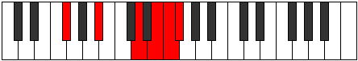 |
| [3347](https://ianring.com/musictheory/scales/3347) | [Synimic](ModeFSharpSynimic.md) | F# | F#, G, A#, B###, D##, E#, F# |  |
| [3347](https://ianring.com/musictheory/scales/3347) | [Synimic](ModeGFlatSynimic.md) | Gb | Gb, Abb, Bb, C##, D##, E#, Gb |  |
| [3347](https://ianring.com/musictheory/scales/3347) | [Synimic](ModeANaturalSynimic.md) | A | A, Bb, C#, D###, E###, F###, A |  |
| [3349](https://ianring.com/musictheory/scales/3349) | [Aeolocrimic](ModeFSharpAeolocrimic.md) | F# | F#, G#, A#, B###, D##, E#, F# |  |
| [3349](https://ianring.com/musictheory/scales/3349) | [Aeolocrimic](ModeGFlatAeolocrimic.md) | Gb | Gb, Ab, Bb, C##, D##, E#, Gb |  |
| [3351](https://ianring.com/musictheory/scales/3351) | [Karian](ModeFSharpKarian.md) | F# | F#, G, Ab, Bb, C##, D##, E#, F# |  |
| [3351](https://ianring.com/musictheory/scales/3351) | [Karian](ModeGFlatKarian.md) | Gb | Gb, Abb, Bbbb, Cbb, D, E, F, Gb |  |
| [3351](https://ianring.com/musictheory/scales/3351) | [Karian](ModeANaturalKarian.md) | A | A, Bb, Cb, Db, E#, F##, G#, A |  |
| [3353](https://ianring.com/musictheory/scales/3353) | [Phraptimic](ModeDNaturalPhraptimic.md) | D | D, E#, F#, G###, A###, B##, D |  |
| [3353](https://ianring.com/musictheory/scales/3353) | [Phraptimic](ModeFSharpPhraptimic.md) | F# | F#, G##, A#, B###, D##, E#, F# |  |
| [3353](https://ianring.com/musictheory/scales/3353) | [Phraptimic](ModeGFlatPhraptimic.md) | Gb | Gb, A, Bb, C##, D##, E#, Gb |  |
| [3353](https://ianring.com/musictheory/scales/3353) | [Phraptimic](ModeGNaturalPhraptimic.md) | G | G, A#, B, C###, D###, E##, G |  |
| [3355](https://ianring.com/musictheory/scales/3355) | [Bagian](ModeDNaturalBagian.md) | D | D, Eb, F, Gb, A#, B#, C#, D |  |
| [3355](https://ianring.com/musictheory/scales/3355) | [Bagian](ModeFSharpBagian.md) | F# | F#, G, A, Bb, C##, D##, E#, F# |  |
| [3355](https://ianring.com/musictheory/scales/3355) | [Bagian](ModeGFlatBagian.md) | Gb | Gb, Abb, Bbb, Cbb, D, E, F, Gb |  |
| [3355](https://ianring.com/musictheory/scales/3355) | [Bagian](ModeANaturalBagian.md) | A | A, Bb, C, Db, E#, F##, G#, A |  |
| [3355](https://ianring.com/musictheory/scales/3355) | [Bagian](ModeGNaturalBagian.md) | G | G, Ab, Bb, Cb, D#, E#, F#, G |  |
| [3357](https://ianring.com/musictheory/scales/3357) | [Phrodian](ModeDNaturalPhrodian.md) | D | D, E, F, Gb, A#, B#, C#, D |  |
| [3357](https://ianring.com/musictheory/scales/3357) | [Phrodian](ModeFSharpPhrodian.md) | F# | F#, G#, A, Bb, C##, D##, E#, F# |  |
| [3357](https://ianring.com/musictheory/scales/3357) | [Phrodian](ModeGFlatPhrodian.md) | Gb | Gb, Ab, Bbb, Cbb, D, E, F, Gb |  |
| [3357](https://ianring.com/musictheory/scales/3357) | [Phrodian](ModeGNaturalPhrodian.md) | G | G, A, Bb, Cb, D#, E#, F#, G |  |
| [3359](https://ianring.com/musictheory/scales/3359) | [Bonyllic](ModeDNaturalBonyllic.md) | D | D, D#, E, F, F#, A#, C, C#, D |  |
| [3359](https://ianring.com/musictheory/scales/3359) | [Bonyllic](ModeFSharpBonyllic.md) | F# | F#, G, G#, A, A#, D, E, F, F# |  |
| [3359](https://ianring.com/musictheory/scales/3359) | [Bonyllic](ModeGFlatBonyllic.md) | Gb | Gb, G, Ab, A, Bb, D, E, F, Gb |  |
| [3359](https://ianring.com/musictheory/scales/3359) | [Bonyllic](ModeANaturalBonyllic.md) | A | A, A#, B, C, C#, F, G, G#, A |  |
| [3359](https://ianring.com/musictheory/scales/3359) | [Bonyllic](ModeGNaturalBonyllic.md) | G | G, G#, A, A#, B, D#, F, F#, G |  |
| [3363](https://ianring.com/musictheory/scales/3363) | [Rogimic](ModeFNaturalRogimic.md) | F | F, Gb, A#, B##, C###, D##, F |  |
| [3363](https://ianring.com/musictheory/scales/3363) | [Rogimic](ModeANaturalRogimic.md) | A | A, Bb, C##, D###, E###, F###, A |  |
| [3363](https://ianring.com/musictheory/scales/3363) | [Rogimic](ModeCNaturalRogimic.md) | C | C, Db, E#, F###, G###, A##, C |  |
| [3365](https://ianring.com/musictheory/scales/3365) | [Katolimic](ModeFNaturalKatolimic.md) | F | F, G, A#, B##, C###, D##, F |  |
| [3365](https://ianring.com/musictheory/scales/3365) | [Katolimic](ModeCNaturalKatolimic.md) | C | C, D, E#, F###, G###, A##, C |  |
| [3367](https://ianring.com/musictheory/scales/3367) | [Moptian](ModeFNaturalMoptian.md) | F | F, Gb, Abb, Bb, C#, D#, E, F |  |
| [3367](https://ianring.com/musictheory/scales/3367) | [Moptian](ModeCNaturalMoptian.md) | C | C, Db, Ebb, F, G#, A#, B, C |  |
| [3367](https://ianring.com/musictheory/scales/3367) | [Moptian](ModeANaturalMoptian.md) | A | A, Bb, Cb, D, E#, F##, G#, A |  |
| [3369](https://ianring.com/musictheory/scales/3369) | [Mixolimic](ModeDNaturalMixolimic.md) | D | D, E#, F##, G###, A###, B##, D |  |
| [3369](https://ianring.com/musictheory/scales/3369) | [Mixolimic](ModeGNaturalMixolimic.md) | G | G, A#, B#, C###, D###, E##, G |  |
| [3369](https://ianring.com/musictheory/scales/3369) | [Mixolimic](ModeFNaturalMixolimic.md) | F | F, G#, A#, B##, C###, D##, F |  |
| [3369](https://ianring.com/musictheory/scales/3369) | [Mixolimic](ModeCNaturalMixolimic.md) | C | C, D#, E#, F###, G###, A##, C |  |
| [3371](https://ianring.com/musictheory/scales/3371) | [Aeolylian](ModeDNaturalAeolylian.md) | D | D, Eb, F, G, A#, B#, C#, D |  |
| [3371](https://ianring.com/musictheory/scales/3371) | [Aeolylian](ModeFNaturalAeolylian.md) | F | F, Gb, Ab, Bb, C#, D#, E, F |  |
| [3371](https://ianring.com/musictheory/scales/3371) | [Aeolylian](ModeGNaturalAeolylian.md) | G | G, Ab, Bb, C, D#, E#, F#, G |  |
| [3371](https://ianring.com/musictheory/scales/3371) | [Aeolylian](ModeANaturalAeolylian.md) | A | A, Bb, C, D, E#, F##, G#, A |  |
| [3371](https://ianring.com/musictheory/scales/3371) | [Aeolylian](ModeCNaturalAeolylian.md) | C | C, Db, Eb, F, G#, A#, B, C |  |
| [3373](https://ianring.com/musictheory/scales/3373) | [Lodian](ModeDNaturalLodian.md) | D | D, E, F, G, A#, B#, C#, D |  |
| [3373](https://ianring.com/musictheory/scales/3373) | [Lodian](ModeFNaturalLodian.md) | F | F, G, Ab, Bb, C#, D#, E, F |  |
| [3373](https://ianring.com/musictheory/scales/3373) | [Lodian](ModeGNaturalLodian.md) | G | G, A, Bb, C, D#, E#, F#, G |  |
| [3373](https://ianring.com/musictheory/scales/3373) | [Lodian](ModeCNaturalLodian.md) | C | C, D, Eb, F, G#, A#, B, C |  |
| [3375](https://ianring.com/musictheory/scales/3375) | [Kygyllic](ModeDNaturalKygyllic.md) | D | D, D#, E, F, G, A#, C, C#, D |  |
| [3375](https://ianring.com/musictheory/scales/3375) | [Kygyllic](ModeFNaturalKygyllic.md) | F | F, F#, G, G#, A#, C#, D#, E, F |  |
| [3375](https://ianring.com/musictheory/scales/3375) | [Kygyllic](ModeGNaturalKygyllic.md) | G | G, G#, A, A#, C, D#, F, F#, G |  |
| [3375](https://ianring.com/musictheory/scales/3375) | [Kygyllic](ModeCNaturalKygyllic.md) | C | C, C#, D, D#, F, G#, A#, B, C |  |
| [3375](https://ianring.com/musictheory/scales/3375) | [Kygyllic](ModeANaturalKygyllic.md) | A | A, A#, B, C, D, F, G, G#, A |  |
| [3377](https://ianring.com/musictheory/scales/3377) | [Phralimic](ModeFNaturalPhralimic.md) | F | F, G##, A#, B##, C###, D##, F |  |
| [3377](https://ianring.com/musictheory/scales/3377) | [Phralimic](ModeFSharpPhralimic.md) | F# | F#, G###, A##, B###, D##, E#, F# |  |
| [3377](https://ianring.com/musictheory/scales/3377) | [Phralimic](ModeGFlatPhralimic.md) | Gb | Gb, A#, B, C##, D##, E#, Gb |  |
| [3377](https://ianring.com/musictheory/scales/3377) | [Phralimic](ModeCNaturalPhralimic.md) | C | C, D##, E#, F###, G###, A##, C |  |
| [3379](https://ianring.com/musictheory/scales/3379) | [Sothian](ModeFNaturalSothian.md) | F | F, Gb, A, Bb, C#, D#, E, F |  |
| [3379](https://ianring.com/musictheory/scales/3379) | [Sothian](ModeANaturalSothian.md) | A | A, Bb, C#, D, E#, F##, G#, A |  |
| [3379](https://ianring.com/musictheory/scales/3379) | [Sothian](ModeFSharpSothian.md) | F# | F#, G, A#, B, C##, D##, E#, F# |  |
| [3379](https://ianring.com/musictheory/scales/3379) | [Sothian](ModeGFlatSothian.md) | Gb | Gb, Abb, Bb, Cb, D, E, F, Gb |  |
| [3379](https://ianring.com/musictheory/scales/3379) | [Sothian](ModeCNaturalSothian.md) | C | C, Db, E, F, G#, A#, B, C |  |
| [3381](https://ianring.com/musictheory/scales/3381) | [Katanian](ModeFNaturalKatanian.md) | F | F, G, A, Bb, C#, D#, E, F |  |
| [3381](https://ianring.com/musictheory/scales/3381) | [Katanian](ModeCNaturalKatanian.md) | C | C, D, E, F, G#, A#, B, C |  |
| [3381](https://ianring.com/musictheory/scales/3381) | [Katanian](ModeFSharpKatanian.md) | F# | F#, G#, A#, B, C##, D##, E#, F# |  |
| [3381](https://ianring.com/musictheory/scales/3381) | [Katanian](ModeGFlatKatanian.md) | Gb | Gb, Ab, Bb, Cb, D, E, F, Gb |  |
| [3383](https://ianring.com/musictheory/scales/3383) | [Daptyllic](ModeFNaturalDaptyllic.md) | F | F, F#, G, A, A#, C#, D#, E, F |  |
| [3383](https://ianring.com/musictheory/scales/3383) | [Daptyllic](ModeCNaturalDaptyllic.md) | C | C, C#, D, E, F, G#, A#, B, C |  |
| [3383](https://ianring.com/musictheory/scales/3383) | [Daptyllic](ModeFSharpDaptyllic.md) | F# | F#, G, G#, A#, B, D, E, F, F# |  |
| [3383](https://ianring.com/musictheory/scales/3383) | [Daptyllic](ModeGFlatDaptyllic.md) | Gb | Gb, G, Ab, Bb, B, D, E, F, Gb |  |
| [3383](https://ianring.com/musictheory/scales/3383) | [Daptyllic](ModeANaturalDaptyllic.md) | A | A, A#, B, C#, D, F, G, G#, A |  |
| [3385](https://ianring.com/musictheory/scales/3385) | [Rothian](ModeDNaturalRothian.md) | D | D, E#, F#, G, A#, B#, C#, D |  |
| [3385](https://ianring.com/musictheory/scales/3385) | [Rothian](ModeFNaturalRothian.md) | F | F, G#, A, Bb, C#, D#, E, F |  |
| [3385](https://ianring.com/musictheory/scales/3385) | [Rothian](ModeGNaturalRothian.md) | G | G, A#, B, C, D#, E#, F#, G |  |
| [3385](https://ianring.com/musictheory/scales/3385) | [Rothian](ModeCNaturalRothian.md) | C | C, D#, E, F, G#, A#, B, C |  |
| [3385](https://ianring.com/musictheory/scales/3385) | [Rothian](ModeFSharpRothian.md) | F# | F#, G##, A#, B, C##, D##, E#, F# |  |
| [3385](https://ianring.com/musictheory/scales/3385) | [Rothian](ModeGFlatRothian.md) | Gb | Gb, A, Bb, Cb, D, E, F, Gb |  |
| [3387](https://ianring.com/musictheory/scales/3387) | [Aeryptyllic](ModeDNaturalAeryptyllic.md) | D | D, D#, F, F#, G, A#, C, C#, D |  |
| [3387](https://ianring.com/musictheory/scales/3387) | [Aeryptyllic](ModeFNaturalAeryptyllic.md) | F | F, F#, G#, A, A#, C#, D#, E, F |  |
| [3387](https://ianring.com/musictheory/scales/3387) | [Aeryptyllic](ModeANaturalAeryptyllic.md) | A | A, A#, C, C#, D, F, G, G#, A |  |
| [3387](https://ianring.com/musictheory/scales/3387) | [Aeryptyllic](ModeCNaturalAeryptyllic.md) | C | C, C#, D#, E, F, G#, A#, B, C |  |
| [3387](https://ianring.com/musictheory/scales/3387) | [Aeryptyllic](ModeGNaturalAeryptyllic.md) | G | G, G#, A#, B, C, D#, F, F#, G |  |
| [3387](https://ianring.com/musictheory/scales/3387) | [Aeryptyllic](ModeFSharpAeryptyllic.md) | F# | F#, G, A, A#, B, D, E, F, F# |  |
| [3387](https://ianring.com/musictheory/scales/3387) | [Aeryptyllic](ModeGFlatAeryptyllic.md) | Gb | Gb, G, A, Bb, B, D, E, F, Gb |  |
| [3389](https://ianring.com/musictheory/scales/3389) | [Socryllic](ModeDNaturalSocryllic.md) | D | D, E, F, F#, G, A#, C, C#, D |  |
| [3389](https://ianring.com/musictheory/scales/3389) | [Socryllic](ModeFNaturalSocryllic.md) | F | F, G, G#, A, A#, C#, D#, E, F |  |
| [3389](https://ianring.com/musictheory/scales/3389) | [Socryllic](ModeCNaturalSocryllic.md) | C | C, D, D#, E, F, G#, A#, B, C |  |
| [3389](https://ianring.com/musictheory/scales/3389) | [Socryllic](ModeGNaturalSocryllic.md) | G | G, A, A#, B, C, D#, F, F#, G |  |
| [3389](https://ianring.com/musictheory/scales/3389) | [Socryllic](ModeFSharpSocryllic.md) | F# | F#, G#, A, A#, B, D, E, F, F# |  |
| [3389](https://ianring.com/musictheory/scales/3389) | [Socryllic](ModeGFlatSocryllic.md) | Gb | Gb, Ab, A, Bb, B, D, E, F, Gb |  |
| [3391](https://ianring.com/musictheory/scales/3391) | [Aeolynygic](ModeDNaturalAeolynygic.md) | D | D, D#, E, F, F#, G, A#, C, C#, D |  |
| [3391](https://ianring.com/musictheory/scales/3391) | [Aeolynygic](ModeFNaturalAeolynygic.md) | F | F, F#, G, G#, A, A#, C#, D#, E, F |  |
| [3391](https://ianring.com/musictheory/scales/3391) | [Aeolynygic](ModeCNaturalAeolynygic.md) | C | C, C#, D, D#, E, F, G#, A#, B, C |  |
| [3391](https://ianring.com/musictheory/scales/3391) | [Aeolynygic](ModeANaturalAeolynygic.md) | A | A, A#, B, C, C#, D, F, G, G#, A |  |
| [3391](https://ianring.com/musictheory/scales/3391) | [Aeolynygic](ModeGNaturalAeolynygic.md) | G | G, G#, A, A#, B, C, D#, F, F#, G |  |
| [3391](https://ianring.com/musictheory/scales/3391) | [Aeolynygic](ModeFSharpAeolynygic.md) | F# | F#, G, G#, A, A#, B, D, E, F, F# |  |
| [3391](https://ianring.com/musictheory/scales/3391) | [Aeolynygic](ModeGFlatAeolynygic.md) | Gb | Gb, G, Ab, A, Bb, B, D, E, F, Gb |  |
| [3397](https://ianring.com/musictheory/scales/3397) | [Sydimic](ModeBNaturalSydimic.md) | B | B, C#, D###, E###, Cbbb, Cbb, B |  |
| [3399](https://ianring.com/musictheory/scales/3399) | [Zonian](ModeENaturalZonian.md) | E | E, F, Gb, A#, B#, C##, D#, E |  |
| [3399](https://ianring.com/musictheory/scales/3399) | [Zonian](ModeBNaturalZonian.md) | B | B, C, Db, E#, F##, G##, A#, B |  |
| [3399](https://ianring.com/musictheory/scales/3399) | [Zonian](ModeANaturalZonian.md) | A | A, Bb, Cb, D#, E#, F##, G#, A |  |
| [3401](https://ianring.com/musictheory/scales/3401) | [Palimic](ModeGNaturalPalimic.md) | G | G, A#, B##, C###, D###, E##, G |  |
| [3401](https://ianring.com/musictheory/scales/3401) | [Palimic](ModeDNaturalPalimic.md) | D | D, E#, F###, G###, A###, B##, D |  |
| [3401](https://ianring.com/musictheory/scales/3401) | [Palimic](ModeBNaturalPalimic.md) | B | B, C##, D###, E###, Cbbb, Cbb, B |  |
| [3403](https://ianring.com/musictheory/scales/3403) | [Bylian](ModeENaturalBylian.md) | E | E, F, G, A#, B#, C##, D#, E |  |
| [3403](https://ianring.com/musictheory/scales/3403) | [Bylian](ModeDNaturalBylian.md) | D | D, Eb, F, G#, A#, B#, C#, D |  |
| [3403](https://ianring.com/musictheory/scales/3403) | [Bylian](ModeGNaturalBylian.md) | G | G, Ab, Bb, C#, D#, E#, F#, G |  |
| [3403](https://ianring.com/musictheory/scales/3403) | [Bylian](ModeANaturalBylian.md) | A | A, Bb, C, D#, E#, F##, G#, A |  |
| [3403](https://ianring.com/musictheory/scales/3403) | [Bylian](ModeBNaturalBylian.md) | B | B, C, D, E#, F##, G##, A#, B |  |
| [3405](https://ianring.com/musictheory/scales/3405) | [Stynian](ModeDNaturalStynian.md) | D | D, E, F, G#, A#, B#, C#, D |  |
| [3405](https://ianring.com/musictheory/scales/3405) | [Stynian](ModeGNaturalStynian.md) | G | G, A, Bb, C#, D#, E#, F#, G |  |
| [3405](https://ianring.com/musictheory/scales/3405) | [Stynian](ModeBNaturalStynian.md) | B | B, C#, D, E#, F##, G##, A#, B |  |
| [3407](https://ianring.com/musictheory/scales/3407) | [Katocryllic](ModeENaturalKatocryllic.md) | E | E, F, F#, G, A#, C, D, D#, E |  |
| [3407](https://ianring.com/musictheory/scales/3407) | [Katocryllic](ModeDNaturalKatocryllic.md) | D | D, D#, E, F, G#, A#, C, C#, D |  |
| [3407](https://ianring.com/musictheory/scales/3407) | [Katocryllic](ModeGNaturalKatocryllic.md) | G | G, G#, A, A#, C#, D#, F, F#, G |  |
| [3407](https://ianring.com/musictheory/scales/3407) | [Katocryllic](ModeBNaturalKatocryllic.md) | B | B, C, C#, D, F, G, A, A#, B |  |
| [3407](https://ianring.com/musictheory/scales/3407) | [Katocryllic](ModeANaturalKatocryllic.md) | A | A, A#, B, C, D#, F, G, G#, A |  |
| [3409](https://ianring.com/musictheory/scales/3409) | [Katanimic](ModeFSharpKatanimic.md) | F# | F#, G###, A###, B###, D##, E#, F# |  |
| [3409](https://ianring.com/musictheory/scales/3409) | [Katanimic](ModeGFlatKatanimic.md) | Gb | Gb, A#, B#, C##, D##, E#, Gb |  |
| [3409](https://ianring.com/musictheory/scales/3409) | [Katanimic](ModeBNaturalKatanimic.md) | B | B, C###, D###, E###, Cbbb, Cbb, B |  |
| [3411](https://ianring.com/musictheory/scales/3411) | [Ionathian](ModeFSharpIonathian.md) | F# | F#, G, A#, B#, C##, D##, E#, F# |  |
| [3411](https://ianring.com/musictheory/scales/3411) | [Ionathian](ModeGFlatIonathian.md) | Gb | Gb, Abb, Bb, C, D, E, F, Gb |  |
| [3411](https://ianring.com/musictheory/scales/3411) | [Ionathian](ModeENaturalIonathian.md) | E | E, F, G#, A#, B#, C##, D#, E |  |
| [3411](https://ianring.com/musictheory/scales/3411) | [Ionathian](ModeANaturalIonathian.md) | A | A, Bb, C#, D#, E#, F##, G#, A |  |
| [3411](https://ianring.com/musictheory/scales/3411) | [Ionathian](ModeBNaturalIonathian.md) | B | B, C, D#, E#, F##, G##, A#, B |  |
| [3413](https://ianring.com/musictheory/scales/3413) | [Aeolynian](ModeFSharpAeolynian.md) | F# | F#, G#, A#, B#, C##, D##, E#, F# |  |
| [3413](https://ianring.com/musictheory/scales/3413) | [Aeolynian](ModeGFlatAeolynian.md) | Gb | Gb, Ab, Bb, C, D, E, F, Gb |  |
| [3413](https://ianring.com/musictheory/scales/3413) | [Aeolynian](ModeBNaturalAeolynian.md) | B | B, C#, D#, E#, F##, G##, A#, B |  |
| [3415](https://ianring.com/musictheory/scales/3415) | [Ionaptyllic](ModeENaturalIonaptyllic.md) | E | E, F, F#, G#, A#, C, D, D#, E |  |
| [3415](https://ianring.com/musictheory/scales/3415) | [Ionaptyllic](ModeFSharpIonaptyllic.md) | F# | F#, G, G#, A#, C, D, E, F, F# |  |
| [3415](https://ianring.com/musictheory/scales/3415) | [Ionaptyllic](ModeGFlatIonaptyllic.md) | Gb | Gb, G, Ab, Bb, C, D, E, F, Gb |  |
| [3415](https://ianring.com/musictheory/scales/3415) | [Ionaptyllic](ModeBNaturalIonaptyllic.md) | B | B, C, C#, D#, F, G, A, A#, B |  |
| [3415](https://ianring.com/musictheory/scales/3415) | [Ionaptyllic](ModeANaturalIonaptyllic.md) | A | A, A#, B, C#, D#, F, G, G#, A |  |
| [3417](https://ianring.com/musictheory/scales/3417) | [Golian](ModeDNaturalGolian.md) | D | D, E#, F#, G#, A#, B#, C#, D |  |
| [3417](https://ianring.com/musictheory/scales/3417) | [Golian](ModeFSharpGolian.md) | F# | F#, G##, A#, B#, C##, D##, E#, F# |  |
| [3417](https://ianring.com/musictheory/scales/3417) | [Golian](ModeGFlatGolian.md) | Gb | Gb, A, Bb, C, D, E, F, Gb |  |
| [3417](https://ianring.com/musictheory/scales/3417) | [Golian](ModeGNaturalGolian.md) | G | G, A#, B, C#, D#, E#, F#, G |  |
| [3417](https://ianring.com/musictheory/scales/3417) | [Golian](ModeBNaturalGolian.md) | B | B, C##, D#, E#, F##, G##, A#, B |  |
| [3419](https://ianring.com/musictheory/scales/3419) | [Danyllic](ModeDNaturalDanyllic.md) | D | D, D#, F, F#, G#, A#, C, C#, D |  |
| [3419](https://ianring.com/musictheory/scales/3419) | [Danyllic](ModeENaturalDanyllic.md) | E | E, F, G, G#, A#, C, D, D#, E |  |
| [3419](https://ianring.com/musictheory/scales/3419) | [Danyllic](ModeFSharpDanyllic.md) | F# | F#, G, A, A#, C, D, E, F, F# |  |
| [3419](https://ianring.com/musictheory/scales/3419) | [Danyllic](ModeGFlatDanyllic.md) | Gb | Gb, G, A, Bb, C, D, E, F, Gb |  |
| [3419](https://ianring.com/musictheory/scales/3419) | [Danyllic](ModeANaturalDanyllic.md) | A | A, A#, C, C#, D#, F, G, G#, A |  |
| [3419](https://ianring.com/musictheory/scales/3419) | [Danyllic](ModeGNaturalDanyllic.md) | G | G, G#, A#, B, C#, D#, F, F#, G |  |
| [3419](https://ianring.com/musictheory/scales/3419) | [Danyllic](ModeBNaturalDanyllic.md) | B | B, C, D, D#, F, G, A, A#, B |  |
| [3421](https://ianring.com/musictheory/scales/3421) | [Aerothyllic](ModeDNaturalAerothyllic.md) | D | D, E, F, F#, G#, A#, C, C#, D |  |
| [3421](https://ianring.com/musictheory/scales/3421) | [Aerothyllic](ModeFSharpAerothyllic.md) | F# | F#, G#, A, A#, C, D, E, F, F# |  |
| [3421](https://ianring.com/musictheory/scales/3421) | [Aerothyllic](ModeGFlatAerothyllic.md) | Gb | Gb, Ab, A, Bb, C, D, E, F, Gb |  |
| [3421](https://ianring.com/musictheory/scales/3421) | [Aerothyllic](ModeBNaturalAerothyllic.md) | B | B, C#, D, D#, F, G, A, A#, B |  |
| [3421](https://ianring.com/musictheory/scales/3421) | [Aerothyllic](ModeGNaturalAerothyllic.md) | G | G, A, A#, B, C#, D#, F, F#, G |  |
| [3423](https://ianring.com/musictheory/scales/3423) | [Lothygic](ModeDNaturalLothygic.md) | D | D, D#, E, F, F#, G#, A#, C, C#, D |  |
| [3423](https://ianring.com/musictheory/scales/3423) | [Lothygic](ModeENaturalLothygic.md) | E | E, F, F#, G, G#, A#, C, D, D#, E |  |
| [3423](https://ianring.com/musictheory/scales/3423) | [Lothygic](ModeFSharpLothygic.md) | F# | F#, G, G#, A, A#, C, D, E, F, F# |  |
| [3423](https://ianring.com/musictheory/scales/3423) | [Lothygic](ModeGFlatLothygic.md) | Gb | Gb, G, Ab, A, Bb, C, D, E, F, Gb |  |
| [3423](https://ianring.com/musictheory/scales/3423) | [Lothygic](ModeBNaturalLothygic.md) | B | B, C, C#, D, D#, F, G, A, A#, B |  |
| [3423](https://ianring.com/musictheory/scales/3423) | [Lothygic](ModeANaturalLothygic.md) | A | A, A#, B, C, C#, D#, F, G, G#, A |  |
| [3423](https://ianring.com/musictheory/scales/3423) | [Lothygic](ModeGNaturalLothygic.md) | G | G, G#, A, A#, B, C#, D#, F, F#, G |  |
| [3427](https://ianring.com/musictheory/scales/3427) | [Zacrian](ModeENaturalZacrian.md) | E | E, F, G##, A#, B#, C##, D#, E |  |
| [3427](https://ianring.com/musictheory/scales/3427) | [Zacrian](ModeANaturalZacrian.md) | A | A, Bb, C##, D#, E#, F##, G#, A |  |
| [3427](https://ianring.com/musictheory/scales/3427) | [Zacrian](ModeFNaturalZacrian.md) | F | F, Gb, A#, B, C#, D#, E, F |  |
| [3427](https://ianring.com/musictheory/scales/3427) | [Zacrian](ModeCNaturalZacrian.md) | C | C, Db, E#, F#, G#, A#, B, C |  |
| [3427](https://ianring.com/musictheory/scales/3427) | [Zacrian](ModeBNaturalZacrian.md) | B | B, C, D##, E#, F##, G##, A#, B |  |
| [3429](https://ianring.com/musictheory/scales/3429) | [Marian](ModeFNaturalMarian.md) | F | F, G, A#, B, C#, D#, E, F |  |
| [3429](https://ianring.com/musictheory/scales/3429) | [Marian](ModeCNaturalMarian.md) | C | C, D, E#, F#, G#, A#, B, C |  |
| [3429](https://ianring.com/musictheory/scales/3429) | [Marian](ModeBNaturalMarian.md) | B | B, C#, D##, E#, F##, G##, A#, B |  |
| [3431](https://ianring.com/musictheory/scales/3431) | [Zyptyllic](ModeENaturalZyptyllic.md) | E | E, F, F#, A, A#, C, D, D#, E |  |
| [3431](https://ianring.com/musictheory/scales/3431) | [Zyptyllic](ModeFNaturalZyptyllic.md) | F | F, F#, G, A#, B, C#, D#, E, F |  |
| [3431](https://ianring.com/musictheory/scales/3431) | [Zyptyllic](ModeCNaturalZyptyllic.md) | C | C, C#, D, F, F#, G#, A#, B, C |  |
| [3431](https://ianring.com/musictheory/scales/3431) | [Zyptyllic](ModeBNaturalZyptyllic.md) | B | B, C, C#, E, F, G, A, A#, B |  |
| [3431](https://ianring.com/musictheory/scales/3431) | [Zyptyllic](ModeANaturalZyptyllic.md) | A | A, A#, B, D, D#, F, G, G#, A |  |
| [3433](https://ianring.com/musictheory/scales/3433) | [Thonian](ModeGNaturalThonian.md) | G | G, A#, B#, C#, D#, E#, F#, G |  |
| [3433](https://ianring.com/musictheory/scales/3433) | [Thonian](ModeDNaturalThonian.md) | D | D, E#, F##, G#, A#, B#, C#, D |  |
| [3433](https://ianring.com/musictheory/scales/3433) | [Thonian](ModeFNaturalThonian.md) | F | F, G#, A#, B, C#, D#, E, F |  |
| [3433](https://ianring.com/musictheory/scales/3433) | [Thonian](ModeCNaturalThonian.md) | C | C, D#, E#, F#, G#, A#, B, C |  |
| [3433](https://ianring.com/musictheory/scales/3433) | [Thonian](ModeBNaturalThonian.md) | B | B, C##, D##, E#, F##, G##, A#, B |  |
| [3435](https://ianring.com/musictheory/scales/3435) | [Epiphyllic](ModeDNaturalEpiphyllic.md) | D | D, D#, F, G, G#, A#, C, C#, D |  |
| [3435](https://ianring.com/musictheory/scales/3435) | [Epiphyllic](ModeGNaturalEpiphyllic.md) | G | G, G#, A#, C, C#, D#, F, F#, G |  |
| [3435](https://ianring.com/musictheory/scales/3435) | [Epiphyllic](ModeENaturalEpiphyllic.md) | E | E, F, G, A, A#, C, D, D#, E |  |
| [3435](https://ianring.com/musictheory/scales/3435) | [Epiphyllic](ModeANaturalEpiphyllic.md) | A | A, A#, C, D, D#, F, G, G#, A |  |
| [3435](https://ianring.com/musictheory/scales/3435) | [Epiphyllic](ModeCNaturalEpiphyllic.md) | C | C, C#, D#, F, F#, G#, A#, B, C |  |
| [3435](https://ianring.com/musictheory/scales/3435) | [Epiphyllic](ModeFNaturalEpiphyllic.md) | F | F, F#, G#, A#, B, C#, D#, E, F |  |
| [3435](https://ianring.com/musictheory/scales/3435) | [Epiphyllic](ModeBNaturalEpiphyllic.md) | B | B, C, D, E, F, G, A, A#, B |  |
| [3437](https://ianring.com/musictheory/scales/3437) | [Gathyllic](ModeDNaturalGathyllic.md) | D | D, E, F, G, G#, A#, C, C#, D |  |
| [3437](https://ianring.com/musictheory/scales/3437) | [Gathyllic](ModeGNaturalGathyllic.md) | G | G, A, A#, C, C#, D#, F, F#, G |  |
| [3437](https://ianring.com/musictheory/scales/3437) | [Gathyllic](ModeCNaturalGathyllic.md) | C | C, D, D#, F, F#, G#, A#, B, C |  |
| [3437](https://ianring.com/musictheory/scales/3437) | [Gathyllic](ModeFNaturalGathyllic.md) | F | F, G, G#, A#, B, C#, D#, E, F |  |
| [3437](https://ianring.com/musictheory/scales/3437) | [Gathyllic](ModeBNaturalGathyllic.md) | B | B, C#, D, E, F, G, A, A#, B |  |
| [3439](https://ianring.com/musictheory/scales/3439) | [Lythygic](ModeDNaturalLythygic.md) | D | D, D#, E, F, G, G#, A#, C, C#, D |  |
| [3439](https://ianring.com/musictheory/scales/3439) | [Lythygic](ModeENaturalLythygic.md) | E | E, F, F#, G, A, A#, C, D, D#, E |  |
| [3439](https://ianring.com/musictheory/scales/3439) | [Lythygic](ModeGNaturalLythygic.md) | G | G, G#, A, A#, C, C#, D#, F, F#, G |  |
| [3439](https://ianring.com/musictheory/scales/3439) | [Lythygic](ModeCNaturalLythygic.md) | C | C, C#, D, D#, F, F#, G#, A#, B, C |  |
| [3439](https://ianring.com/musictheory/scales/3439) | [Lythygic](ModeFNaturalLythygic.md) | F | F, F#, G, G#, A#, B, C#, D#, E, F |  |
| [3439](https://ianring.com/musictheory/scales/3439) | [Lythygic](ModeBNaturalLythygic.md) | B | B, C, C#, D, E, F, G, A, A#, B |  |
| [3439](https://ianring.com/musictheory/scales/3439) | [Lythygic](ModeANaturalLythygic.md) | A | A, A#, B, C, D, D#, F, G, G#, A |  |
| [3441](https://ianring.com/musictheory/scales/3441) | [Thacrian](ModeFSharpThacrian.md) | F# | F#, G###, A##, B#, C##, D##, E#, F# |  |
| [3441](https://ianring.com/musictheory/scales/3441) | [Thacrian](ModeGFlatThacrian.md) | Gb | Gb, A#, B, C, D, E, F, Gb |  |
| [3441](https://ianring.com/musictheory/scales/3441) | [Thacrian](ModeCNaturalThacrian.md) | C | C, D##, E#, F#, G#, A#, B, C |  |
| [3441](https://ianring.com/musictheory/scales/3441) | [Thacrian](ModeFNaturalThacrian.md) | F | F, G##, A#, B, C#, D#, E, F |  |
| [3441](https://ianring.com/musictheory/scales/3441) | [Thacrian](ModeBNaturalThacrian.md) | B | B, C###, D##, E#, F##, G##, A#, B |  |
| [3443](https://ianring.com/musictheory/scales/3443) | [Epathyllic](ModeENaturalEpathyllic.md) | E | E, F, G#, A, A#, C, D, D#, E |  |
| [3443](https://ianring.com/musictheory/scales/3443) | [Epathyllic](ModeANaturalEpathyllic.md) | A | A, A#, C#, D, D#, F, G, G#, A |  |
| [3443](https://ianring.com/musictheory/scales/3443) | [Epathyllic](ModeFSharpEpathyllic.md) | F# | F#, G, A#, B, C, D, E, F, F# |  |
| [3443](https://ianring.com/musictheory/scales/3443) | [Epathyllic](ModeGFlatEpathyllic.md) | Gb | Gb, G, Bb, B, C, D, E, F, Gb |  |
| [3443](https://ianring.com/musictheory/scales/3443) | [Epathyllic](ModeCNaturalEpathyllic.md) | C | C, C#, E, F, F#, G#, A#, B, C |  |
| [3443](https://ianring.com/musictheory/scales/3443) | [Epathyllic](ModeFNaturalEpathyllic.md) | F | F, F#, A, A#, B, C#, D#, E, F |  |
| [3443](https://ianring.com/musictheory/scales/3443) | [Epathyllic](ModeBNaturalEpathyllic.md) | B | B, C, D#, E, F, G, A, A#, B |  |
| [3445](https://ianring.com/musictheory/scales/3445) | [Epotyllic](ModeCNaturalEpotyllic.md) | C | C, D, E, F, F#, G#, A#, B, C |  |
| [3445](https://ianring.com/musictheory/scales/3445) | [Epotyllic](ModeFSharpEpotyllic.md) | F# | F#, G#, A#, B, C, D, E, F, F# |  |
| [3445](https://ianring.com/musictheory/scales/3445) | [Epotyllic](ModeGFlatEpotyllic.md) | Gb | Gb, Ab, Bb, B, C, D, E, F, Gb |  |
| [3445](https://ianring.com/musictheory/scales/3445) | [Epotyllic](ModeFNaturalEpotyllic.md) | F | F, G, A, A#, B, C#, D#, E, F |  |
| [3445](https://ianring.com/musictheory/scales/3445) | [Epotyllic](ModeBNaturalEpotyllic.md) | B | B, C#, D#, E, F, G, A, A#, B |  |
| [3447](https://ianring.com/musictheory/scales/3447) | [Kynygic](ModeENaturalKynygic.md) | E | E, F, F#, G#, A, A#, C, D, D#, E |  |
| [3447](https://ianring.com/musictheory/scales/3447) | [Kynygic](ModeCNaturalKynygic.md) | C | C, C#, D, E, F, F#, G#, A#, B, C |  |
| [3447](https://ianring.com/musictheory/scales/3447) | [Kynygic](ModeFSharpKynygic.md) | F# | F#, G, G#, A#, B, C, D, E, F, F# |  |
| [3447](https://ianring.com/musictheory/scales/3447) | [Kynygic](ModeGFlatKynygic.md) | Gb | Gb, G, Ab, Bb, B, C, D, E, F, Gb |  |
| [3447](https://ianring.com/musictheory/scales/3447) | [Kynygic](ModeBNaturalKynygic.md) | B | B, C, C#, D#, E, F, G, A, A#, B |  |
| [3447](https://ianring.com/musictheory/scales/3447) | [Kynygic](ModeFNaturalKynygic.md) | F | F, F#, G, A, A#, B, C#, D#, E, F |  |
| [3447](https://ianring.com/musictheory/scales/3447) | [Kynygic](ModeANaturalKynygic.md) | A | A, A#, B, C#, D, D#, F, G, G#, A |  |
| [3449](https://ianring.com/musictheory/scales/3449) | [Bacryllic](ModeDNaturalBacryllic.md) | D | D, F, F#, G, G#, A#, C, C#, D |  |
| [3449](https://ianring.com/musictheory/scales/3449) | [Bacryllic](ModeGNaturalBacryllic.md) | G | G, A#, B, C, C#, D#, F, F#, G |  |
| [3449](https://ianring.com/musictheory/scales/3449) | [Bacryllic](ModeCNaturalBacryllic.md) | C | C, D#, E, F, F#, G#, A#, B, C |  |
| [3449](https://ianring.com/musictheory/scales/3449) | [Bacryllic](ModeFSharpBacryllic.md) | F# | F#, A, A#, B, C, D, E, F, F# |  |
| [3449](https://ianring.com/musictheory/scales/3449) | [Bacryllic](ModeGFlatBacryllic.md) | Gb | Gb, A, Bb, B, C, D, E, F, Gb |  |
| [3449](https://ianring.com/musictheory/scales/3449) | [Bacryllic](ModeBNaturalBacryllic.md) | B | B, D, D#, E, F, G, A, A#, B |  |
| [3449](https://ianring.com/musictheory/scales/3449) | [Bacryllic](ModeFNaturalBacryllic.md) | F | F, G#, A, A#, B, C#, D#, E, F |  |
| [3451](https://ianring.com/musictheory/scales/3451) | [Garygic](ModeDNaturalGarygic.md) | D | D, D#, F, F#, G, G#, A#, C, C#, D |  |
| [3451](https://ianring.com/musictheory/scales/3451) | [Garygic](ModeANaturalGarygic.md) | A | A, A#, C, C#, D, D#, F, G, G#, A |  |
| [3451](https://ianring.com/musictheory/scales/3451) | [Garygic](ModeENaturalGarygic.md) | E | E, F, G, G#, A, A#, C, D, D#, E |  |
| [3451](https://ianring.com/musictheory/scales/3451) | [Garygic](ModeCNaturalGarygic.md) | C | C, C#, D#, E, F, F#, G#, A#, B, C |  |
| [3451](https://ianring.com/musictheory/scales/3451) | [Garygic](ModeGNaturalGarygic.md) | G | G, G#, A#, B, C, C#, D#, F, F#, G |  |
| [3451](https://ianring.com/musictheory/scales/3451) | [Garygic](ModeBNaturalGarygic.md) | B | B, C, D, D#, E, F, G, A, A#, B |  |
| [3451](https://ianring.com/musictheory/scales/3451) | [Garygic](ModeFSharpGarygic.md) | F# | F#, G, A, A#, B, C, D, E, F, F# |  |
| [3451](https://ianring.com/musictheory/scales/3451) | [Garygic](ModeGFlatGarygic.md) | Gb | Gb, G, A, Bb, B, C, D, E, F, Gb |  |
| [3451](https://ianring.com/musictheory/scales/3451) | [Garygic](ModeFNaturalGarygic.md) | F | F, F#, G#, A, A#, B, C#, D#, E, F |  |
| [3453](https://ianring.com/musictheory/scales/3453) | [Katarygic](ModeDNaturalKatarygic.md) | D | D, E, F, F#, G, G#, A#, C, C#, D |  |
| [3453](https://ianring.com/musictheory/scales/3453) | [Katarygic](ModeCNaturalKatarygic.md) | C | C, D, D#, E, F, F#, G#, A#, B, C |  |
| [3453](https://ianring.com/musictheory/scales/3453) | [Katarygic](ModeBNaturalKatarygic.md) | B | B, C#, D, D#, E, F, G, A, A#, B |  |
| [3453](https://ianring.com/musictheory/scales/3453) | [Katarygic](ModeGNaturalKatarygic.md) | G | G, A, A#, B, C, C#, D#, F, F#, G |  |
| [3453](https://ianring.com/musictheory/scales/3453) | [Katarygic](ModeFSharpKatarygic.md) | F# | F#, G#, A, A#, B, C, D, E, F, F# |  |
| [3453](https://ianring.com/musictheory/scales/3453) | [Katarygic](ModeGFlatKatarygic.md) | Gb | Gb, Ab, A, Bb, B, C, D, E, F, Gb |  |
| [3453](https://ianring.com/musictheory/scales/3453) | [Katarygic](ModeFNaturalKatarygic.md) | F | F, G, G#, A, A#, B, C#, D#, E, F |  |
| [3455](https://ianring.com/musictheory/scales/3455) | [Ryptyllian](ModeDNaturalRyptyllian.md) | D | D, D#, E, F, F#, G, G#, A#, C, C#, D |  |
| [3455](https://ianring.com/musictheory/scales/3455) | [Ryptyllian](ModeENaturalRyptyllian.md) | E | E, F, F#, G, G#, A, A#, C, D, D#, E |  |
| [3455](https://ianring.com/musictheory/scales/3455) | [Ryptyllian](ModeCNaturalRyptyllian.md) | C | C, C#, D, D#, E, F, F#, G#, A#, B, C |  |
| [3455](https://ianring.com/musictheory/scales/3455) | [Ryptyllian](ModeBNaturalRyptyllian.md) | B | B, C, C#, D, D#, E, F, G, A, A#, B |  |
| [3455](https://ianring.com/musictheory/scales/3455) | [Ryptyllian](ModeANaturalRyptyllian.md) | A | A, A#, B, C, C#, D, D#, F, G, G#, A |  |
| [3455](https://ianring.com/musictheory/scales/3455) | [Ryptyllian](ModeGNaturalRyptyllian.md) | G | G, G#, A, A#, B, C, C#, D#, F, F#, G |  |
| [3455](https://ianring.com/musictheory/scales/3455) | [Ryptyllian](ModeFSharpRyptyllian.md) | F# | F#, G, G#, A, A#, B, C, D, E, F, F# |  |
| [3455](https://ianring.com/musictheory/scales/3455) | [Ryptyllian](ModeGFlatRyptyllian.md) | Gb | Gb, G, Ab, A, Bb, B, C, D, E, F, Gb |  |
| [3455](https://ianring.com/musictheory/scales/3455) | [Ryptyllian](ModeFNaturalRyptyllian.md) | F | F, F#, G, G#, A, A#, B, C#, D#, E, F |  |
| [3465](https://ianring.com/musictheory/scales/3465) | [Katathimic](ModeGNaturalKatathimic.md) | G | G, A#, B###, C###, D###, E##, G |  |
| [3465](https://ianring.com/musictheory/scales/3465) | [Katathimic](ModeDNaturalKatathimic.md) | D | D, E#, Cbbb, Cbb, Dbb, Ebbb, D | 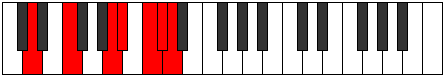 |
| [3465](https://ianring.com/musictheory/scales/3465) | [Katathimic](ModeASharpKatathimic.md) | A# | A#, B##, D###, E##, F###, G##, A# |  |
| [3465](https://ianring.com/musictheory/scales/3465) | [Katathimic](ModeBFlatKatathimic.md) | Bb | Bb, C#, D###, E##, F###, G##, Bb |  |
| [3467](https://ianring.com/musictheory/scales/3467) | [Katonian](ModeGNaturalKatonian.md) | G | G, Ab, Bb, C##, D#, E#, F#, G |  |
| [3467](https://ianring.com/musictheory/scales/3467) | [Katonian](ModeDNaturalKatonian.md) | D | D, Eb, F, G##, A#, B#, C#, D |  |
| [3467](https://ianring.com/musictheory/scales/3467) | [Katonian](ModeANaturalKatonian.md) | A | A, Bb, C, D##, E#, F##, G#, A |  |
| [3467](https://ianring.com/musictheory/scales/3467) | [Katonian](ModeASharpKatonian.md) | A# | A#, B, C#, D###, E##, F###, G##, A# |  |
| [3467](https://ianring.com/musictheory/scales/3467) | [Katonian](ModeBFlatKatonian.md) | Bb | Bb, Cb, Db, E#, F#, G#, A, Bb |  |
| [3469](https://ianring.com/musictheory/scales/3469) | [Monian](ModeDNaturalMonian.md) | D | D, E, F, G##, A#, B#, C#, D |  |
| [3469](https://ianring.com/musictheory/scales/3469) | [Monian](ModeGNaturalMonian.md) | G | G, A, Bb, C##, D#, E#, F#, G |  |
| [3469](https://ianring.com/musictheory/scales/3469) | [Monian](ModeASharpMonian.md) | A# | A#, B#, C#, D###, E##, F###, G##, A# |  |
| [3469](https://ianring.com/musictheory/scales/3469) | [Monian](ModeBFlatMonian.md) | Bb | Bb, C, Db, E#, F#, G#, A, Bb |  |
| [3469](https://ianring.com/musictheory/scales/3469) | [Monian](ModeDSharpMonian.md) | D# | D#, E#, F#, G###, A##, B##, C##, D# |  |
| [3469](https://ianring.com/musictheory/scales/3469) | [Monian](ModeEFlatMonian.md) | Eb | Eb, F, Gb, A#, B, C#, D, Eb |  |
| [3471](https://ianring.com/musictheory/scales/3471) | [Gyryllic](ModeDNaturalGyryllic.md) | D | D, D#, E, F, A, A#, C, C#, D |  |
| [3471](https://ianring.com/musictheory/scales/3471) | [Gyryllic](ModeGNaturalGyryllic.md) | G | G, G#, A, A#, D, D#, F, F#, G |  |
| [3471](https://ianring.com/musictheory/scales/3471) | [Gyryllic](ModeDSharpGyryllic.md) | D# | D#, E, F, F#, A#, B, C#, D, D# |  |
| [3471](https://ianring.com/musictheory/scales/3471) | [Gyryllic](ModeEFlatGyryllic.md) | Eb | Eb, E, F, Gb, Bb, B, Db, D, Eb |  |
| [3471](https://ianring.com/musictheory/scales/3471) | [Gyryllic](ModeASharpGyryllic.md) | A# | A#, B, C, C#, F, F#, G#, A, A# |  |
| [3471](https://ianring.com/musictheory/scales/3471) | [Gyryllic](ModeBFlatGyryllic.md) | Bb | Bb, B, C, Db, F, Gb, Ab, A, Bb |  |
| [3471](https://ianring.com/musictheory/scales/3471) | [Gyryllic](ModeANaturalGyryllic.md) | A | A, A#, B, C, E, F, G, G#, A |  |
| [3473](https://ianring.com/musictheory/scales/3473) | [Lathimic](ModeFSharpLathimic.md) | F# | F#, G###, Db, Ebb, Fb, Gbb, F# |  |
| [3473](https://ianring.com/musictheory/scales/3473) | [Lathimic](ModeGFlatLathimic.md) | Gb | Gb, A#, B##, C##, D##, E#, Gb |  |
| [3473](https://ianring.com/musictheory/scales/3473) | [Lathimic](ModeASharpLathimic.md) | A# | A#, B###, D###, E##, F###, G##, A# |  |
| [3473](https://ianring.com/musictheory/scales/3473) | [Lathimic](ModeBFlatLathimic.md) | Bb | Bb, C##, D###, E##, F###, G##, Bb |  |
| [3475](https://ianring.com/musictheory/scales/3475) | [Kylian](ModeFSharpKylian.md) | F# | F#, G, A#, B##, C##, D##, E#, F# |  |
| [3475](https://ianring.com/musictheory/scales/3475) | [Kylian](ModeGFlatKylian.md) | Gb | Gb, Abb, Bb, C#, D, E, F, Gb |  |
| [3475](https://ianring.com/musictheory/scales/3475) | [Kylian](ModeANaturalKylian.md) | A | A, Bb, C#, D##, E#, F##, G#, A |  |
| [3475](https://ianring.com/musictheory/scales/3475) | [Kylian](ModeASharpKylian.md) | A# | A#, B, C##, D###, E##, F###, G##, A# |  |
| [3475](https://ianring.com/musictheory/scales/3475) | [Kylian](ModeBFlatKylian.md) | Bb | Bb, Cb, D, E#, F#, G#, A, Bb |  |
| [3477](https://ianring.com/musictheory/scales/3477) | [Kyptian](ModeFSharpKyptian.md) | F# | F#, G#, A#, B##, C##, D##, E#, F# |  |
| [3477](https://ianring.com/musictheory/scales/3477) | [Kyptian](ModeGFlatKyptian.md) | Gb | Gb, Ab, Bb, C#, D, E, F, Gb |  |
| [3477](https://ianring.com/musictheory/scales/3477) | [Kyptian](ModeASharpKyptian.md) | A# | A#, B#, C##, D###, E##, F###, G##, A# |  |
| [3477](https://ianring.com/musictheory/scales/3477) | [Kyptian](ModeBFlatKyptian.md) | Bb | Bb, C, D, E#, F#, G#, A, Bb |  |
| [3477](https://ianring.com/musictheory/scales/3477) | [Kyptian](ModeDSharpKyptian.md) | D# | D#, E#, F##, G###, A##, B##, C##, D# |  |
| [3477](https://ianring.com/musictheory/scales/3477) | [Kyptian](ModeEFlatKyptian.md) | Eb | Eb, F, G, A#, B, C#, D, Eb |  |
| [3479](https://ianring.com/musictheory/scales/3479) | [Rothyllic](ModeFSharpRothyllic.md) | F# | F#, G, G#, A#, C#, D, E, F, F# |  |
| [3479](https://ianring.com/musictheory/scales/3479) | [Rothyllic](ModeGFlatRothyllic.md) | Gb | Gb, G, Ab, Bb, Db, D, E, F, Gb |  |
| [3479](https://ianring.com/musictheory/scales/3479) | [Rothyllic](ModeDSharpRothyllic.md) | D# | D#, E, F, G, A#, B, C#, D, D# |  |
| [3479](https://ianring.com/musictheory/scales/3479) | [Rothyllic](ModeEFlatRothyllic.md) | Eb | Eb, E, F, G, Bb, B, Db, D, Eb |  |
| [3479](https://ianring.com/musictheory/scales/3479) | [Rothyllic](ModeASharpRothyllic.md) | A# | A#, B, C, D, F, F#, G#, A, A# |  |
| [3479](https://ianring.com/musictheory/scales/3479) | [Rothyllic](ModeBFlatRothyllic.md) | Bb | Bb, B, C, D, F, Gb, Ab, A, Bb |  |
| [3479](https://ianring.com/musictheory/scales/3479) | [Rothyllic](ModeANaturalRothyllic.md) | A | A, A#, B, C#, E, F, G, G#, A |  |
| [3481](https://ianring.com/musictheory/scales/3481) | [Katathian](ModeDNaturalKatathian.md) | D | D, E#, F#, G##, A#, B#, C#, D |  |
| [3481](https://ianring.com/musictheory/scales/3481) | [Katathian](ModeFSharpKatathian.md) | F# | F#, G##, A#, B##, C##, D##, E#, F# |  |
| [3481](https://ianring.com/musictheory/scales/3481) | [Katathian](ModeGFlatKatathian.md) | Gb | Gb, A, Bb, C#, D, E, F, Gb |  |
| [3481](https://ianring.com/musictheory/scales/3481) | [Katathian](ModeASharpKatathian.md) | A# | A#, B##, C##, D###, E##, F###, G##, A# |  |
| [3481](https://ianring.com/musictheory/scales/3481) | [Katathian](ModeBFlatKatathian.md) | Bb | Bb, C#, D, E#, F#, G#, A, Bb |  |
| [3481](https://ianring.com/musictheory/scales/3481) | [Katathian](ModeGNaturalKatathian.md) | G | G, A#, B, C##, D#, E#, F#, G |  |
| [3483](https://ianring.com/musictheory/scales/3483) | [Mixotharyllic](ModeDNaturalMixotharyllic.md) | D | D, D#, F, F#, A, A#, C, C#, D |  |
| [3483](https://ianring.com/musictheory/scales/3483) | [Mixotharyllic](ModeFSharpMixotharyllic.md) | F# | F#, G, A, A#, C#, D, E, F, F# |  |
| [3483](https://ianring.com/musictheory/scales/3483) | [Mixotharyllic](ModeGFlatMixotharyllic.md) | Gb | Gb, G, A, Bb, Db, D, E, F, Gb |  |
| [3483](https://ianring.com/musictheory/scales/3483) | [Mixotharyllic](ModeANaturalMixotharyllic.md) | A | A, A#, C, C#, E, F, G, G#, A |  |
| [3483](https://ianring.com/musictheory/scales/3483) | [Mixotharyllic](ModeGNaturalMixotharyllic.md) | G | G, G#, A#, B, D, D#, F, F#, G |  |
| [3483](https://ianring.com/musictheory/scales/3483) | [Mixotharyllic](ModeASharpMixotharyllic.md) | A# | A#, B, C#, D, F, F#, G#, A, A# |  |
| [3483](https://ianring.com/musictheory/scales/3483) | [Mixotharyllic](ModeBFlatMixotharyllic.md) | Bb | Bb, B, Db, D, F, Gb, Ab, A, Bb |  |
| [3485](https://ianring.com/musictheory/scales/3485) | [Kyptyllic](ModeDNaturalKyptyllic.md) | D | D, E, F, F#, A, A#, C, C#, D |  |
| [3485](https://ianring.com/musictheory/scales/3485) | [Kyptyllic](ModeASharpKyptyllic.md) | A# | A#, C, C#, D, F, F#, G#, A, A# |  |
| [3485](https://ianring.com/musictheory/scales/3485) | [Kyptyllic](ModeBFlatKyptyllic.md) | Bb | Bb, C, Db, D, F, Gb, Ab, A, Bb |  |
| [3485](https://ianring.com/musictheory/scales/3485) | [Kyptyllic](ModeFSharpKyptyllic.md) | F# | F#, G#, A, A#, C#, D, E, F, F# |  |
| [3485](https://ianring.com/musictheory/scales/3485) | [Kyptyllic](ModeGFlatKyptyllic.md) | Gb | Gb, Ab, A, Bb, Db, D, E, F, Gb |  |
| [3485](https://ianring.com/musictheory/scales/3485) | [Kyptyllic](ModeDSharpKyptyllic.md) | D# | D#, F, F#, G, A#, B, C#, D, D# |  |
| [3485](https://ianring.com/musictheory/scales/3485) | [Kyptyllic](ModeEFlatKyptyllic.md) | Eb | Eb, F, Gb, G, Bb, B, Db, D, Eb |  |
| [3485](https://ianring.com/musictheory/scales/3485) | [Kyptyllic](ModeGNaturalKyptyllic.md) | G | G, A, A#, B, D, D#, F, F#, G |  |
| [3487](https://ianring.com/musictheory/scales/3487) | [Byptygic](ModeDNaturalByptygic.md) | D | D, D#, E, F, F#, A, A#, C, C#, D |  |
| [3487](https://ianring.com/musictheory/scales/3487) | [Byptygic](ModeFSharpByptygic.md) | F# | F#, G, G#, A, A#, C#, D, E, F, F# |  |
| [3487](https://ianring.com/musictheory/scales/3487) | [Byptygic](ModeGFlatByptygic.md) | Gb | Gb, G, Ab, A, Bb, Db, D, E, F, Gb |  |
| [3487](https://ianring.com/musictheory/scales/3487) | [Byptygic](ModeDSharpByptygic.md) | D# | D#, E, F, F#, G, A#, B, C#, D, D# |  |
| [3487](https://ianring.com/musictheory/scales/3487) | [Byptygic](ModeEFlatByptygic.md) | Eb | Eb, E, F, Gb, G, Bb, B, Db, D, Eb |  |
| [3487](https://ianring.com/musictheory/scales/3487) | [Byptygic](ModeASharpByptygic.md) | A# | A#, B, C, C#, D, F, F#, G#, A, A# |  |
| [3487](https://ianring.com/musictheory/scales/3487) | [Byptygic](ModeBFlatByptygic.md) | Bb | Bb, B, C, Db, D, F, Gb, Ab, A, Bb |  |
| [3487](https://ianring.com/musictheory/scales/3487) | [Byptygic](ModeANaturalByptygic.md) | A | A, A#, B, C, C#, E, F, G, G#, A |  |
| [3487](https://ianring.com/musictheory/scales/3487) | [Byptygic](ModeGNaturalByptygic.md) | G | G, G#, A, A#, B, D, D#, F, F#, G |  |
| [3491](https://ianring.com/musictheory/scales/3491) | [Tharian](ModeFNaturalTharian.md) | F | F, Gb, A#, B#, C#, D#, E, F |  |
| [3491](https://ianring.com/musictheory/scales/3491) | [Tharian](ModeANaturalTharian.md) | A | A, Bb, C##, D##, E#, F##, G#, A |  |
| [3491](https://ianring.com/musictheory/scales/3491) | [Tharian](ModeCNaturalTharian.md) | C | C, Db, E#, F##, G#, A#, B, C |  |
| [3491](https://ianring.com/musictheory/scales/3491) | [Tharian](ModeASharpTharian.md) | A# | A#, B, C###, D###, E##, F###, G##, A# |  |
| [3491](https://ianring.com/musictheory/scales/3491) | [Tharian](ModeBFlatTharian.md) | Bb | Bb, Cb, D#, E#, F#, G#, A, Bb |  |
| [3493](https://ianring.com/musictheory/scales/3493) | [Rathian](ModeFNaturalRathian.md) | F | F, G, A#, B#, C#, D#, E, F |  |
| [3493](https://ianring.com/musictheory/scales/3493) | [Rathian](ModeASharpRathian.md) | A# | A#, B#, C###, D###, E##, F###, G##, A# |  |
| [3493](https://ianring.com/musictheory/scales/3493) | [Rathian](ModeBFlatRathian.md) | Bb | Bb, C, D#, E#, F#, G#, A, Bb |  |
| [3493](https://ianring.com/musictheory/scales/3493) | [Rathian](ModeDSharpRathian.md) | D# | D#, E#, F###, G###, A##, B##, C##, D# |  |
| [3493](https://ianring.com/musictheory/scales/3493) | [Rathian](ModeEFlatRathian.md) | Eb | Eb, F, G#, A#, B, C#, D, Eb |  |
| [3493](https://ianring.com/musictheory/scales/3493) | [Rathian](ModeCNaturalRathian.md) | C | C, D, E#, F##, G#, A#, B, C |  |
| [3495](https://ianring.com/musictheory/scales/3495) | [Banyllic](ModeFNaturalBanyllic.md) | F | F, F#, G, A#, C, C#, D#, E, F |  |
| [3495](https://ianring.com/musictheory/scales/3495) | [Banyllic](ModeDSharpBanyllic.md) | D# | D#, E, F, G#, A#, B, C#, D, D# |  |
| [3495](https://ianring.com/musictheory/scales/3495) | [Banyllic](ModeEFlatBanyllic.md) | Eb | Eb, E, F, Ab, Bb, B, Db, D, Eb |  |
| [3495](https://ianring.com/musictheory/scales/3495) | [Banyllic](ModeCNaturalBanyllic.md) | C | C, C#, D, F, G, G#, A#, B, C |  |
| [3495](https://ianring.com/musictheory/scales/3495) | [Banyllic](ModeASharpBanyllic.md) | A# | A#, B, C, D#, F, F#, G#, A, A# |  |
| [3495](https://ianring.com/musictheory/scales/3495) | [Banyllic](ModeBFlatBanyllic.md) | Bb | Bb, B, C, Eb, F, Gb, Ab, A, Bb |  |
| [3495](https://ianring.com/musictheory/scales/3495) | [Banyllic](ModeANaturalBanyllic.md) | A | A, A#, B, D, E, F, G, G#, A |  |
| [3497](https://ianring.com/musictheory/scales/3497) | [Phrolian](ModeGNaturalPhrolian.md) | G | G, A#, B#, C##, D#, E#, F#, G |  |
| [3497](https://ianring.com/musictheory/scales/3497) | [Phrolian](ModeFNaturalPhrolian.md) | F | F, G#, A#, B#, C#, D#, E, F |  |
| [3497](https://ianring.com/musictheory/scales/3497) | [Phrolian](ModeDNaturalPhrolian.md) | D | D, E#, F##, G##, A#, B#, C#, D |  |
| [3497](https://ianring.com/musictheory/scales/3497) | [Phrolian](ModeASharpPhrolian.md) | A# | A#, B##, C###, D###, E##, F###, G##, A# |  |
| [3497](https://ianring.com/musictheory/scales/3497) | [Phrolian](ModeBFlatPhrolian.md) | Bb | Bb, C#, D#, E#, F#, G#, A, Bb |  |
| [3497](https://ianring.com/musictheory/scales/3497) | [Phrolian](ModeCNaturalPhrolian.md) | C | C, D#, E#, F##, G#, A#, B, C |  |
| [3499](https://ianring.com/musictheory/scales/3499) | [Lythyllic](ModeFNaturalLythyllic.md) | F | F, F#, G#, A#, C, C#, D#, E, F |  |
| [3499](https://ianring.com/musictheory/scales/3499) | [Lythyllic](ModeGNaturalLythyllic.md) | G | G, G#, A#, C, D, D#, F, F#, G |  |
| [3499](https://ianring.com/musictheory/scales/3499) | [Lythyllic](ModeDNaturalLythyllic.md) | D | D, D#, F, G, A, A#, C, C#, D |  |
| [3499](https://ianring.com/musictheory/scales/3499) | [Lythyllic](ModeANaturalLythyllic.md) | A | A, A#, C, D, E, F, G, G#, A |  |
| [3499](https://ianring.com/musictheory/scales/3499) | [Lythyllic](ModeCNaturalLythyllic.md) | C | C, C#, D#, F, G, G#, A#, B, C |  |
| [3499](https://ianring.com/musictheory/scales/3499) | [Lythyllic](ModeASharpLythyllic.md) | A# | A#, B, C#, D#, F, F#, G#, A, A# |  |
| [3499](https://ianring.com/musictheory/scales/3499) | [Lythyllic](ModeBFlatLythyllic.md) | Bb | Bb, B, Db, Eb, F, Gb, Ab, A, Bb |  |
| [3501](https://ianring.com/musictheory/scales/3501) | [Katodyllic](ModeFNaturalKatodyllic.md) | F | F, G, G#, A#, C, C#, D#, E, F |  |
| [3501](https://ianring.com/musictheory/scales/3501) | [Katodyllic](ModeDNaturalKatodyllic.md) | D | D, E, F, G, A, A#, C, C#, D |  |
| [3501](https://ianring.com/musictheory/scales/3501) | [Katodyllic](ModeGNaturalKatodyllic.md) | G | G, A, A#, C, D, D#, F, F#, G |  |
| [3501](https://ianring.com/musictheory/scales/3501) | [Katodyllic](ModeASharpKatodyllic.md) | A# | A#, C, C#, D#, F, F#, G#, A, A# |  |
| [3501](https://ianring.com/musictheory/scales/3501) | [Katodyllic](ModeBFlatKatodyllic.md) | Bb | Bb, C, Db, Eb, F, Gb, Ab, A, Bb |  |
| [3501](https://ianring.com/musictheory/scales/3501) | [Katodyllic](ModeDSharpKatodyllic.md) | D# | D#, F, F#, G#, A#, B, C#, D, D# |  |
| [3501](https://ianring.com/musictheory/scales/3501) | [Katodyllic](ModeEFlatKatodyllic.md) | Eb | Eb, F, Gb, Ab, Bb, B, Db, D, Eb |  |
| [3501](https://ianring.com/musictheory/scales/3501) | [Katodyllic](ModeCNaturalKatodyllic.md) | C | C, D, D#, F, G, G#, A#, B, C |  |
| [3503](https://ianring.com/musictheory/scales/3503) | [Zyphygic](ModeFNaturalZyphygic.md) | F | F, F#, G, G#, A#, C, C#, D#, E, F |  |
| [3503](https://ianring.com/musictheory/scales/3503) | [Zyphygic](ModeDNaturalZyphygic.md) | D | D, D#, E, F, G, A, A#, C, C#, D |  |
| [3503](https://ianring.com/musictheory/scales/3503) | [Zyphygic](ModeGNaturalZyphygic.md) | G | G, G#, A, A#, C, D, D#, F, F#, G |  |
| [3503](https://ianring.com/musictheory/scales/3503) | [Zyphygic](ModeDSharpZyphygic.md) | D# | D#, E, F, F#, G#, A#, B, C#, D, D# |  |
| [3503](https://ianring.com/musictheory/scales/3503) | [Zyphygic](ModeEFlatZyphygic.md) | Eb | Eb, E, F, Gb, Ab, Bb, B, Db, D, Eb |  |
| [3503](https://ianring.com/musictheory/scales/3503) | [Zyphygic](ModeCNaturalZyphygic.md) | C | C, C#, D, D#, F, G, G#, A#, B, C |  |
| [3503](https://ianring.com/musictheory/scales/3503) | [Zyphygic](ModeASharpZyphygic.md) | A# | A#, B, C, C#, D#, F, F#, G#, A, A# |  |
| [3503](https://ianring.com/musictheory/scales/3503) | [Zyphygic](ModeBFlatZyphygic.md) | Bb | Bb, B, C, Db, Eb, F, Gb, Ab, A, Bb |  |
| [3503](https://ianring.com/musictheory/scales/3503) | [Zyphygic](ModeANaturalZyphygic.md) | A | A, A#, B, C, D, E, F, G, G#, A |  |
| [3505](https://ianring.com/musictheory/scales/3505) | [Stygian](ModeFNaturalStygian.md) | F | F, G##, A#, B#, C#, D#, E, F |  |
| [3505](https://ianring.com/musictheory/scales/3505) | [Stygian](ModeASharpStygian.md) | A# | A#, B###, C###, D###, E##, F###, G##, A# |  |
| [3505](https://ianring.com/musictheory/scales/3505) | [Stygian](ModeBFlatStygian.md) | Bb | Bb, C##, D#, E#, F#, G#, A, Bb |  |
| [3505](https://ianring.com/musictheory/scales/3505) | [Stygian](ModeFSharpStygian.md) | F# | F#, G###, A##, B##, C##, D##, E#, F# |  |
| [3505](https://ianring.com/musictheory/scales/3505) | [Stygian](ModeGFlatStygian.md) | Gb | Gb, A#, B, C#, D, E, F, Gb |  |
| [3505](https://ianring.com/musictheory/scales/3505) | [Stygian](ModeCNaturalStygian.md) | C | C, D##, E#, F##, G#, A#, B, C |  |
| [3507](https://ianring.com/musictheory/scales/3507) | [Ponyllic](ModeFNaturalPonyllic.md) | F | F, F#, A, A#, C, C#, D#, E, F |  |
| [3507](https://ianring.com/musictheory/scales/3507) | [Ponyllic](ModeANaturalPonyllic.md) | A | A, A#, C#, D, E, F, G, G#, A |  |
| [3507](https://ianring.com/musictheory/scales/3507) | [Ponyllic](ModeFSharpPonyllic.md) | F# | F#, G, A#, B, C#, D, E, F, F# |  |
| [3507](https://ianring.com/musictheory/scales/3507) | [Ponyllic](ModeGFlatPonyllic.md) | Gb | Gb, G, Bb, B, Db, D, E, F, Gb |  |
| [3507](https://ianring.com/musictheory/scales/3507) | [Ponyllic](ModeCNaturalPonyllic.md) | C | C, C#, E, F, G, G#, A#, B, C |  |
| [3507](https://ianring.com/musictheory/scales/3507) | [Ponyllic](ModeASharpPonyllic.md) | A# | A#, B, D, D#, F, F#, G#, A, A# |  |
| [3507](https://ianring.com/musictheory/scales/3507) | [Ponyllic](ModeBFlatPonyllic.md) | Bb | Bb, B, D, Eb, F, Gb, Ab, A, Bb |  |
| [3509](https://ianring.com/musictheory/scales/3509) | [Stogyllic](ModeFNaturalStogyllic.md) | F | F, G, A, A#, C, C#, D#, E, F |  |
| [3509](https://ianring.com/musictheory/scales/3509) | [Stogyllic](ModeASharpStogyllic.md) | A# | A#, C, D, D#, F, F#, G#, A, A# |  |
| [3509](https://ianring.com/musictheory/scales/3509) | [Stogyllic](ModeBFlatStogyllic.md) | Bb | Bb, C, D, Eb, F, Gb, Ab, A, Bb |  |
| [3509](https://ianring.com/musictheory/scales/3509) | [Stogyllic](ModeFSharpStogyllic.md) | F# | F#, G#, A#, B, C#, D, E, F, F# |  |
| [3509](https://ianring.com/musictheory/scales/3509) | [Stogyllic](ModeGFlatStogyllic.md) | Gb | Gb, Ab, Bb, B, Db, D, E, F, Gb |  |
| [3509](https://ianring.com/musictheory/scales/3509) | [Stogyllic](ModeDSharpStogyllic.md) | D# | D#, F, G, G#, A#, B, C#, D, D# |  |
| [3509](https://ianring.com/musictheory/scales/3509) | [Stogyllic](ModeEFlatStogyllic.md) | Eb | Eb, F, G, Ab, Bb, B, Db, D, Eb |  |
| [3509](https://ianring.com/musictheory/scales/3509) | [Stogyllic](ModeCNaturalStogyllic.md) | C | C, D, E, F, G, G#, A#, B, C |  |
| [3511](https://ianring.com/musictheory/scales/3511) | [Epolygic](ModeFNaturalEpolygic.md) | F | F, F#, G, A, A#, C, C#, D#, E, F |  |
| [3511](https://ianring.com/musictheory/scales/3511) | [Epolygic](ModeCNaturalEpolygic.md) | C | C, C#, D, E, F, G, G#, A#, B, C |  |
| [3511](https://ianring.com/musictheory/scales/3511) | [Epolygic](ModeDSharpEpolygic.md) | D# | D#, E, F, G, G#, A#, B, C#, D, D# |  |
| [3511](https://ianring.com/musictheory/scales/3511) | [Epolygic](ModeEFlatEpolygic.md) | Eb | Eb, E, F, G, Ab, Bb, B, Db, D, Eb |  |
| [3511](https://ianring.com/musictheory/scales/3511) | [Epolygic](ModeFSharpEpolygic.md) | F# | F#, G, G#, A#, B, C#, D, E, F, F# |  |
| [3511](https://ianring.com/musictheory/scales/3511) | [Epolygic](ModeGFlatEpolygic.md) | Gb | Gb, G, Ab, Bb, B, Db, D, E, F, Gb |  |
| [3511](https://ianring.com/musictheory/scales/3511) | [Epolygic](ModeASharpEpolygic.md) | A# | A#, B, C, D, D#, F, F#, G#, A, A# |  |
| [3511](https://ianring.com/musictheory/scales/3511) | [Epolygic](ModeBFlatEpolygic.md) | Bb | Bb, B, C, D, Eb, F, Gb, Ab, A, Bb |  |
| [3511](https://ianring.com/musictheory/scales/3511) | [Epolygic](ModeANaturalEpolygic.md) | A | A, A#, B, C#, D, E, F, G, G#, A |  |
| [3513](https://ianring.com/musictheory/scales/3513) | [Dydyllic](ModeDNaturalDydyllic.md) | D | D, F, F#, G, A, A#, C, C#, D |  |
| [3513](https://ianring.com/musictheory/scales/3513) | [Dydyllic](ModeFNaturalDydyllic.md) | F | F, G#, A, A#, C, C#, D#, E, F |  |
| [3513](https://ianring.com/musictheory/scales/3513) | [Dydyllic](ModeASharpDydyllic.md) | A# | A#, C#, D, D#, F, F#, G#, A, A# |  |
| [3513](https://ianring.com/musictheory/scales/3513) | [Dydyllic](ModeBFlatDydyllic.md) | Bb | Bb, Db, D, Eb, F, Gb, Ab, A, Bb |  |
| [3513](https://ianring.com/musictheory/scales/3513) | [Dydyllic](ModeGNaturalDydyllic.md) | G | G, A#, B, C, D, D#, F, F#, G |  |
| [3513](https://ianring.com/musictheory/scales/3513) | [Dydyllic](ModeCNaturalDydyllic.md) | C | C, D#, E, F, G, G#, A#, B, C |  |
| [3513](https://ianring.com/musictheory/scales/3513) | [Dydyllic](ModeFSharpDydyllic.md) | F# | F#, A, A#, B, C#, D, E, F, F# |  |
| [3513](https://ianring.com/musictheory/scales/3513) | [Dydyllic](ModeGFlatDydyllic.md) | Gb | Gb, A, Bb, B, Db, D, E, F, Gb |  |
| [3515](https://ianring.com/musictheory/scales/3515) | [Katodygic](ModeDNaturalKatodygic.md) | D | D, D#, F, F#, G, A, A#, C, C#, D |  |
| [3515](https://ianring.com/musictheory/scales/3515) | [Katodygic](ModeFNaturalKatodygic.md) | F | F, F#, G#, A, A#, C, C#, D#, E, F |  |
| [3515](https://ianring.com/musictheory/scales/3515) | [Katodygic](ModeANaturalKatodygic.md) | A | A, A#, C, C#, D, E, F, G, G#, A |  |
| [3515](https://ianring.com/musictheory/scales/3515) | [Katodygic](ModeCNaturalKatodygic.md) | C | C, C#, D#, E, F, G, G#, A#, B, C |  |
| [3515](https://ianring.com/musictheory/scales/3515) | [Katodygic](ModeGNaturalKatodygic.md) | G | G, G#, A#, B, C, D, D#, F, F#, G |  |
| [3515](https://ianring.com/musictheory/scales/3515) | [Katodygic](ModeFSharpKatodygic.md) | F# | F#, G, A, A#, B, C#, D, E, F, F# |  |
| [3515](https://ianring.com/musictheory/scales/3515) | [Katodygic](ModeGFlatKatodygic.md) | Gb | Gb, G, A, Bb, B, Db, D, E, F, Gb |  |
| [3515](https://ianring.com/musictheory/scales/3515) | [Katodygic](ModeASharpKatodygic.md) | A# | A#, B, C#, D, D#, F, F#, G#, A, A# |  |
| [3515](https://ianring.com/musictheory/scales/3515) | [Katodygic](ModeBFlatKatodygic.md) | Bb | Bb, B, Db, D, Eb, F, Gb, Ab, A, Bb |  |
| [3517](https://ianring.com/musictheory/scales/3517) | [Epocrygic](ModeDNaturalEpocrygic.md) | D | D, E, F, F#, G, A, A#, C, C#, D |  |
| [3517](https://ianring.com/musictheory/scales/3517) | [Epocrygic](ModeASharpEpocrygic.md) | A# | A#, C, C#, D, D#, F, F#, G#, A, A# |  |
| [3517](https://ianring.com/musictheory/scales/3517) | [Epocrygic](ModeBFlatEpocrygic.md) | Bb | Bb, C, Db, D, Eb, F, Gb, Ab, A, Bb |  |
| [3517](https://ianring.com/musictheory/scales/3517) | [Epocrygic](ModeFNaturalEpocrygic.md) | F | F, G, G#, A, A#, C, C#, D#, E, F |  |
| [3517](https://ianring.com/musictheory/scales/3517) | [Epocrygic](ModeCNaturalEpocrygic.md) | C | C, D, D#, E, F, G, G#, A#, B, C |  |
| [3517](https://ianring.com/musictheory/scales/3517) | [Epocrygic](ModeDSharpEpocrygic.md) | D# | D#, F, F#, G, G#, A#, B, C#, D, D# |  |
| [3517](https://ianring.com/musictheory/scales/3517) | [Epocrygic](ModeEFlatEpocrygic.md) | Eb | Eb, F, Gb, G, Ab, Bb, B, Db, D, Eb |  |
| [3517](https://ianring.com/musictheory/scales/3517) | [Epocrygic](ModeGNaturalEpocrygic.md) | G | G, A, A#, B, C, D, D#, F, F#, G |  |
| [3517](https://ianring.com/musictheory/scales/3517) | [Epocrygic](ModeFSharpEpocrygic.md) | F# | F#, G#, A, A#, B, C#, D, E, F, F# |  |
| [3517](https://ianring.com/musictheory/scales/3517) | [Epocrygic](ModeGFlatEpocrygic.md) | Gb | Gb, Ab, A, Bb, B, Db, D, E, F, Gb |  |
| [3519](https://ianring.com/musictheory/scales/3519) | [Boptyllian](ModeDNaturalBoptyllian.md) | D | D, D#, E, F, F#, G, A, A#, C, C#, D |  |
| [3519](https://ianring.com/musictheory/scales/3519) | [Boptyllian](ModeFNaturalBoptyllian.md) | F | F, F#, G, G#, A, A#, C, C#, D#, E, F |  |
| [3519](https://ianring.com/musictheory/scales/3519) | [Boptyllian](ModeCNaturalBoptyllian.md) | C | C, C#, D, D#, E, F, G, G#, A#, B, C |  |
| [3519](https://ianring.com/musictheory/scales/3519) | [Boptyllian](ModeDSharpBoptyllian.md) | D# | D#, E, F, F#, G, G#, A#, B, C#, D, D# |  |
| [3519](https://ianring.com/musictheory/scales/3519) | [Boptyllian](ModeEFlatBoptyllian.md) | Eb | Eb, E, F, Gb, G, Ab, Bb, B, Db, D, Eb |  |
| [3519](https://ianring.com/musictheory/scales/3519) | [Boptyllian](ModeASharpBoptyllian.md) | A# | A#, B, C, C#, D, D#, F, F#, G#, A, A# |  |
| [3519](https://ianring.com/musictheory/scales/3519) | [Boptyllian](ModeBFlatBoptyllian.md) | Bb | Bb, B, C, Db, D, Eb, F, Gb, Ab, A, Bb |  |
| [3519](https://ianring.com/musictheory/scales/3519) | [Boptyllian](ModeANaturalBoptyllian.md) | A | A, A#, B, C, C#, D, E, F, G, G#, A |  |
| [3519](https://ianring.com/musictheory/scales/3519) | [Boptyllian](ModeGNaturalBoptyllian.md) | G | G, G#, A, A#, B, C, D, D#, F, F#, G |  |
| [3519](https://ianring.com/musictheory/scales/3519) | [Boptyllian](ModeFSharpBoptyllian.md) | F# | F#, G, G#, A, A#, B, C#, D, E, F, F# |  |
| [3519](https://ianring.com/musictheory/scales/3519) | [Boptyllian](ModeGFlatBoptyllian.md) | Gb | Gb, G, Ab, A, Bb, B, Db, D, E, F, Gb |  |
| [3525](https://ianring.com/musictheory/scales/3525) | [Zocrian](ModeASharpZocrian.md) | A# | A#, B#, D##, E#, F#, G#, A, A# |  |
| [3525](https://ianring.com/musictheory/scales/3525) | [Zocrian](ModeBFlatZocrian.md) | Bb | Bb, C, D##, E#, F#, G#, A, Bb |  |
| [3525](https://ianring.com/musictheory/scales/3525) | [Zocrian](ModeDSharpZocrian.md) | D# | D#, E#, Cbbb, Cbb, Dbbb, Ebbb, Fbbb, D# |  |
| [3525](https://ianring.com/musictheory/scales/3525) | [Zocrian](ModeEFlatZocrian.md) | Eb | Eb, F, G##, A#, B, C#, D, Eb |  |
| [3525](https://ianring.com/musictheory/scales/3525) | [Zocrian](ModeBNaturalZocrian.md) | B | B, C#, D###, E##, F##, G##, A#, B |  |
| [3527](https://ianring.com/musictheory/scales/3527) | [Ronyllic](ModeENaturalRonyllic.md) | E | E, F, F#, A#, B, C, D, D#, E |  |
| [3527](https://ianring.com/musictheory/scales/3527) | [Ronyllic](ModeDSharpRonyllic.md) | D# | D#, E, F, A, A#, B, C#, D, D# |  |
| [3527](https://ianring.com/musictheory/scales/3527) | [Ronyllic](ModeEFlatRonyllic.md) | Eb | Eb, E, F, A, Bb, B, Db, D, Eb |  |
| [3527](https://ianring.com/musictheory/scales/3527) | [Ronyllic](ModeBNaturalRonyllic.md) | B | B, C, C#, F, F#, G, A, A#, B |  |
| [3527](https://ianring.com/musictheory/scales/3527) | [Ronyllic](ModeASharpRonyllic.md) | A# | A#, B, C, E, F, F#, G#, A, A# |  |
| [3527](https://ianring.com/musictheory/scales/3527) | [Ronyllic](ModeBFlatRonyllic.md) | Bb | Bb, B, C, E, F, Gb, Ab, A, Bb |  |
| [3527](https://ianring.com/musictheory/scales/3527) | [Ronyllic](ModeANaturalRonyllic.md) | A | A, A#, B, D#, E, F, G, G#, A |  |
| [3529](https://ianring.com/musictheory/scales/3529) | [Stalian](ModeGNaturalStalian.md) | G | G, A#, B##, C##, D#, E#, F#, G |  |
| [3529](https://ianring.com/musictheory/scales/3529) | [Stalian](ModeDNaturalStalian.md) | D | D, E#, F###, G##, A#, B#, C#, D |  |
| [3529](https://ianring.com/musictheory/scales/3529) | [Stalian](ModeASharpStalian.md) | A# | A#, B##, D##, E#, F#, G#, A, A# |  |
| [3529](https://ianring.com/musictheory/scales/3529) | [Stalian](ModeBFlatStalian.md) | Bb | Bb, C#, D##, E#, F#, G#, A, Bb |  |
| [3529](https://ianring.com/musictheory/scales/3529) | [Stalian](ModeBNaturalStalian.md) | B | B, C##, D###, E##, F##, G##, A#, B |  |
| [3531](https://ianring.com/musictheory/scales/3531) | [Dycryllic](ModeGNaturalDycryllic.md) | G | G, G#, A#, C#, D, D#, F, F#, G |  |
| [3531](https://ianring.com/musictheory/scales/3531) | [Dycryllic](ModeDNaturalDycryllic.md) | D | D, D#, F, G#, A, A#, C, C#, D |  |
| [3531](https://ianring.com/musictheory/scales/3531) | [Dycryllic](ModeANaturalDycryllic.md) | A | A, A#, C, D#, E, F, G, G#, A |  |
| [3531](https://ianring.com/musictheory/scales/3531) | [Dycryllic](ModeENaturalDycryllic.md) | E | E, F, G, A#, B, C, D, D#, E |  |
| [3531](https://ianring.com/musictheory/scales/3531) | [Dycryllic](ModeBNaturalDycryllic.md) | B | B, C, D, F, F#, G, A, A#, B |  |
| [3531](https://ianring.com/musictheory/scales/3531) | [Dycryllic](ModeASharpDycryllic.md) | A# | A#, B, C#, E, F, F#, G#, A, A# |  |
| [3531](https://ianring.com/musictheory/scales/3531) | [Dycryllic](ModeBFlatDycryllic.md) | Bb | Bb, B, Db, E, F, Gb, Ab, A, Bb |  |
| [3533](https://ianring.com/musictheory/scales/3533) | [Thadyllic](ModeGNaturalThadyllic.md) | G | G, A, A#, C#, D, D#, F, F#, G |  |
| [3533](https://ianring.com/musictheory/scales/3533) | [Thadyllic](ModeDNaturalThadyllic.md) | D | D, E, F, G#, A, A#, C, C#, D |  |
| [3533](https://ianring.com/musictheory/scales/3533) | [Thadyllic](ModeASharpThadyllic.md) | A# | A#, C, C#, E, F, F#, G#, A, A# |  |
| [3533](https://ianring.com/musictheory/scales/3533) | [Thadyllic](ModeBFlatThadyllic.md) | Bb | Bb, C, Db, E, F, Gb, Ab, A, Bb |  |
| [3533](https://ianring.com/musictheory/scales/3533) | [Thadyllic](ModeDSharpThadyllic.md) | D# | D#, F, F#, A, A#, B, C#, D, D# |  |
| [3533](https://ianring.com/musictheory/scales/3533) | [Thadyllic](ModeEFlatThadyllic.md) | Eb | Eb, F, Gb, A, Bb, B, Db, D, Eb |  |
| [3533](https://ianring.com/musictheory/scales/3533) | [Thadyllic](ModeBNaturalThadyllic.md) | B | B, C#, D, F, F#, G, A, A#, B |  |
| [3535](https://ianring.com/musictheory/scales/3535) | [Aeroptygic](ModeDNaturalAeroptygic.md) | D | D, D#, E, F, G#, A, A#, C, C#, D |  |
| [3535](https://ianring.com/musictheory/scales/3535) | [Aeroptygic](ModeGNaturalAeroptygic.md) | G | G, G#, A, A#, C#, D, D#, F, F#, G |  |
| [3535](https://ianring.com/musictheory/scales/3535) | [Aeroptygic](ModeENaturalAeroptygic.md) | E | E, F, F#, G, A#, B, C, D, D#, E |  |
| [3535](https://ianring.com/musictheory/scales/3535) | [Aeroptygic](ModeDSharpAeroptygic.md) | D# | D#, E, F, F#, A, A#, B, C#, D, D# |  |
| [3535](https://ianring.com/musictheory/scales/3535) | [Aeroptygic](ModeEFlatAeroptygic.md) | Eb | Eb, E, F, Gb, A, Bb, B, Db, D, Eb |  |
| [3535](https://ianring.com/musictheory/scales/3535) | [Aeroptygic](ModeBNaturalAeroptygic.md) | B | B, C, C#, D, F, F#, G, A, A#, B |  |
| [3535](https://ianring.com/musictheory/scales/3535) | [Aeroptygic](ModeASharpAeroptygic.md) | A# | A#, B, C, C#, E, F, F#, G#, A, A# |  |
| [3535](https://ianring.com/musictheory/scales/3535) | [Aeroptygic](ModeBFlatAeroptygic.md) | Bb | Bb, B, C, Db, E, F, Gb, Ab, A, Bb |  |
| [3535](https://ianring.com/musictheory/scales/3535) | [Aeroptygic](ModeANaturalAeroptygic.md) | A | A, A#, B, C, D#, E, F, G, G#, A |  |
| [3537](https://ianring.com/musictheory/scales/3537) | [Katogian](ModeFSharpKatogian.md) | F# | F#, G###, A###, B##, C##, D##, E#, F# |  |
| [3537](https://ianring.com/musictheory/scales/3537) | [Katogian](ModeGFlatKatogian.md) | Gb | Gb, A#, B#, C#, D, E, F, Gb |  |
| [3537](https://ianring.com/musictheory/scales/3537) | [Katogian](ModeASharpKatogian.md) | A# | A#, B###, D##, E#, F#, G#, A, A# |  |
| [3537](https://ianring.com/musictheory/scales/3537) | [Katogian](ModeBFlatKatogian.md) | Bb | Bb, C##, D##, E#, F#, G#, A, Bb |  |
| [3537](https://ianring.com/musictheory/scales/3537) | [Katogian](ModeBNaturalKatogian.md) | B | B, C###, D###, E##, F##, G##, A#, B |  |
| [3539](https://ianring.com/musictheory/scales/3539) | [Aeoryllic](ModeFSharpAeoryllic.md) | F# | F#, G, A#, C, C#, D, E, F, F# |  |
| [3539](https://ianring.com/musictheory/scales/3539) | [Aeoryllic](ModeGFlatAeoryllic.md) | Gb | Gb, G, Bb, C, Db, D, E, F, Gb |  |
| [3539](https://ianring.com/musictheory/scales/3539) | [Aeoryllic](ModeANaturalAeoryllic.md) | A | A, A#, C#, D#, E, F, G, G#, A |  |
| [3539](https://ianring.com/musictheory/scales/3539) | [Aeoryllic](ModeENaturalAeoryllic.md) | E | E, F, G#, A#, B, C, D, D#, E |  |
| [3539](https://ianring.com/musictheory/scales/3539) | [Aeoryllic](ModeBNaturalAeoryllic.md) | B | B, C, D#, F, F#, G, A, A#, B |  |
| [3539](https://ianring.com/musictheory/scales/3539) | [Aeoryllic](ModeASharpAeoryllic.md) | A# | A#, B, D, E, F, F#, G#, A, A# |  |
| [3539](https://ianring.com/musictheory/scales/3539) | [Aeoryllic](ModeBFlatAeoryllic.md) | Bb | Bb, B, D, E, F, Gb, Ab, A, Bb |  |
| [3541](https://ianring.com/musictheory/scales/3541) | [Racryllic](ModeFSharpRacryllic.md) | F# | F#, G#, A#, C, C#, D, E, F, F# |  |
| [3541](https://ianring.com/musictheory/scales/3541) | [Racryllic](ModeGFlatRacryllic.md) | Gb | Gb, Ab, Bb, C, Db, D, E, F, Gb |  |
| [3541](https://ianring.com/musictheory/scales/3541) | [Racryllic](ModeASharpRacryllic.md) | A# | A#, C, D, E, F, F#, G#, A, A# |  |
| [3541](https://ianring.com/musictheory/scales/3541) | [Racryllic](ModeBFlatRacryllic.md) | Bb | Bb, C, D, E, F, Gb, Ab, A, Bb |  |
| [3541](https://ianring.com/musictheory/scales/3541) | [Racryllic](ModeDSharpRacryllic.md) | D# | D#, F, G, A, A#, B, C#, D, D# |  |
| [3541](https://ianring.com/musictheory/scales/3541) | [Racryllic](ModeEFlatRacryllic.md) | Eb | Eb, F, G, A, Bb, B, Db, D, Eb |  |
| [3541](https://ianring.com/musictheory/scales/3541) | [Racryllic](ModeBNaturalRacryllic.md) | B | B, C#, D#, F, F#, G, A, A#, B |  |
| [3543](https://ianring.com/musictheory/scales/3543) | [Aeolonygic](ModeFSharpAeolonygic.md) | F# | F#, G, G#, A#, C, C#, D, E, F, F# |  |
| [3543](https://ianring.com/musictheory/scales/3543) | [Aeolonygic](ModeGFlatAeolonygic.md) | Gb | Gb, G, Ab, Bb, C, Db, D, E, F, Gb |  |
| [3543](https://ianring.com/musictheory/scales/3543) | [Aeolonygic](ModeENaturalAeolonygic.md) | E | E, F, F#, G#, A#, B, C, D, D#, E |  |
| [3543](https://ianring.com/musictheory/scales/3543) | [Aeolonygic](ModeDSharpAeolonygic.md) | D# | D#, E, F, G, A, A#, B, C#, D, D# |  |
| [3543](https://ianring.com/musictheory/scales/3543) | [Aeolonygic](ModeEFlatAeolonygic.md) | Eb | Eb, E, F, G, A, Bb, B, Db, D, Eb |  |
| [3543](https://ianring.com/musictheory/scales/3543) | [Aeolonygic](ModeBNaturalAeolonygic.md) | B | B, C, C#, D#, F, F#, G, A, A#, B |  |
| [3543](https://ianring.com/musictheory/scales/3543) | [Aeolonygic](ModeASharpAeolonygic.md) | A# | A#, B, C, D, E, F, F#, G#, A, A# |  |
| [3543](https://ianring.com/musictheory/scales/3543) | [Aeolonygic](ModeBFlatAeolonygic.md) | Bb | Bb, B, C, D, E, F, Gb, Ab, A, Bb |  |
| [3543](https://ianring.com/musictheory/scales/3543) | [Aeolonygic](ModeANaturalAeolonygic.md) | A | A, A#, B, C#, D#, E, F, G, G#, A |  |
| [3545](https://ianring.com/musictheory/scales/3545) | [Thyptyllic](ModeFSharpThyptyllic.md) | F# | F#, A, A#, C, C#, D, E, F, F# |  |
| [3545](https://ianring.com/musictheory/scales/3545) | [Thyptyllic](ModeGFlatThyptyllic.md) | Gb | Gb, A, Bb, C, Db, D, E, F, Gb |  |
| [3545](https://ianring.com/musictheory/scales/3545) | [Thyptyllic](ModeDNaturalThyptyllic.md) | D | D, F, F#, G#, A, A#, C, C#, D |  |
| [3545](https://ianring.com/musictheory/scales/3545) | [Thyptyllic](ModeASharpThyptyllic.md) | A# | A#, C#, D, E, F, F#, G#, A, A# |  |
| [3545](https://ianring.com/musictheory/scales/3545) | [Thyptyllic](ModeBFlatThyptyllic.md) | Bb | Bb, Db, D, E, F, Gb, Ab, A, Bb |  |
| [3545](https://ianring.com/musictheory/scales/3545) | [Thyptyllic](ModeGNaturalThyptyllic.md) | G | G, A#, B, C#, D, D#, F, F#, G |  |
| [3545](https://ianring.com/musictheory/scales/3545) | [Thyptyllic](ModeBNaturalThyptyllic.md) | B | B, D, D#, F, F#, G, A, A#, B |  |
| [3547](https://ianring.com/musictheory/scales/3547) | [Sadygic](ModeFSharpSadygic.md) | F# | F#, G, A, A#, C, C#, D, E, F, F# |  |
| [3547](https://ianring.com/musictheory/scales/3547) | [Sadygic](ModeGFlatSadygic.md) | Gb | Gb, G, A, Bb, C, Db, D, E, F, Gb |  |
| [3547](https://ianring.com/musictheory/scales/3547) | [Sadygic](ModeDNaturalSadygic.md) | D | D, D#, F, F#, G#, A, A#, C, C#, D |  |
| [3547](https://ianring.com/musictheory/scales/3547) | [Sadygic](ModeANaturalSadygic.md) | A | A, A#, C, C#, D#, E, F, G, G#, A |  |
| [3547](https://ianring.com/musictheory/scales/3547) | [Sadygic](ModeENaturalSadygic.md) | E | E, F, G, G#, A#, B, C, D, D#, E |  |
| [3547](https://ianring.com/musictheory/scales/3547) | [Sadygic](ModeGNaturalSadygic.md) | G | G, G#, A#, B, C#, D, D#, F, F#, G |  |
| [3547](https://ianring.com/musictheory/scales/3547) | [Sadygic](ModeBNaturalSadygic.md) | B | B, C, D, D#, F, F#, G, A, A#, B |  |
| [3547](https://ianring.com/musictheory/scales/3547) | [Sadygic](ModeASharpSadygic.md) | A# | A#, B, C#, D, E, F, F#, G#, A, A# |  |
| [3547](https://ianring.com/musictheory/scales/3547) | [Sadygic](ModeBFlatSadygic.md) | Bb | Bb, B, Db, D, E, F, Gb, Ab, A, Bb |  |
| [3549](https://ianring.com/musictheory/scales/3549) | [Phronygic](ModeDNaturalPhronygic.md) | D | D, E, F, F#, G#, A, A#, C, C#, D |  |
| [3549](https://ianring.com/musictheory/scales/3549) | [Phronygic](ModeFSharpPhronygic.md) | F# | F#, G#, A, A#, C, C#, D, E, F, F# |  |
| [3549](https://ianring.com/musictheory/scales/3549) | [Phronygic](ModeGFlatPhronygic.md) | Gb | Gb, Ab, A, Bb, C, Db, D, E, F, Gb |  |
| [3549](https://ianring.com/musictheory/scales/3549) | [Phronygic](ModeASharpPhronygic.md) | A# | A#, C, C#, D, E, F, F#, G#, A, A# |  |
| [3549](https://ianring.com/musictheory/scales/3549) | [Phronygic](ModeBFlatPhronygic.md) | Bb | Bb, C, Db, D, E, F, Gb, Ab, A, Bb |  |
| [3549](https://ianring.com/musictheory/scales/3549) | [Phronygic](ModeDSharpPhronygic.md) | D# | D#, F, F#, G, A, A#, B, C#, D, D# |  |
| [3549](https://ianring.com/musictheory/scales/3549) | [Phronygic](ModeEFlatPhronygic.md) | Eb | Eb, F, Gb, G, A, Bb, B, Db, D, Eb |  |
| [3549](https://ianring.com/musictheory/scales/3549) | [Phronygic](ModeGNaturalPhronygic.md) | G | G, A, A#, B, C#, D, D#, F, F#, G |  |
| [3549](https://ianring.com/musictheory/scales/3549) | [Phronygic](ModeBNaturalPhronygic.md) | B | B, C#, D, D#, F, F#, G, A, A#, B |  |
| [3551](https://ianring.com/musictheory/scales/3551) | [Sagyllian](ModeDNaturalSagyllian.md) | D | D, D#, E, F, F#, G#, A, A#, C, C#, D |  |
| [3551](https://ianring.com/musictheory/scales/3551) | [Sagyllian](ModeFSharpSagyllian.md) | F# | F#, G, G#, A, A#, C, C#, D, E, F, F# |  |
| [3551](https://ianring.com/musictheory/scales/3551) | [Sagyllian](ModeGFlatSagyllian.md) | Gb | Gb, G, Ab, A, Bb, C, Db, D, E, F, Gb |  |
| [3551](https://ianring.com/musictheory/scales/3551) | [Sagyllian](ModeENaturalSagyllian.md) | E | E, F, F#, G, G#, A#, B, C, D, D#, E |  |
| [3551](https://ianring.com/musictheory/scales/3551) | [Sagyllian](ModeBNaturalSagyllian.md) | B | B, C, C#, D, D#, F, F#, G, A, A#, B |  |
| [3551](https://ianring.com/musictheory/scales/3551) | [Sagyllian](ModeDSharpSagyllian.md) | D# | D#, E, F, F#, G, A, A#, B, C#, D, D# |  |
| [3551](https://ianring.com/musictheory/scales/3551) | [Sagyllian](ModeEFlatSagyllian.md) | Eb | Eb, E, F, Gb, G, A, Bb, B, Db, D, Eb |  |
| [3551](https://ianring.com/musictheory/scales/3551) | [Sagyllian](ModeASharpSagyllian.md) | A# | A#, B, C, C#, D, E, F, F#, G#, A, A# |  |
| [3551](https://ianring.com/musictheory/scales/3551) | [Sagyllian](ModeBFlatSagyllian.md) | Bb | Bb, B, C, Db, D, E, F, Gb, Ab, A, Bb |  |
| [3551](https://ianring.com/musictheory/scales/3551) | [Sagyllian](ModeANaturalSagyllian.md) | A | A, A#, B, C, C#, D#, E, F, G, G#, A |  |
| [3551](https://ianring.com/musictheory/scales/3551) | [Sagyllian](ModeGNaturalSagyllian.md) | G | G, G#, A, A#, B, C#, D, D#, F, F#, G |  |
| [3555](https://ianring.com/musictheory/scales/3555) | [Pylyllic](ModeANaturalPylyllic.md) | A | A, A#, D, D#, E, F, G, G#, A |  |
| [3555](https://ianring.com/musictheory/scales/3555) | [Pylyllic](ModeFNaturalPylyllic.md) | F | F, F#, A#, B, C, C#, D#, E, F |  |
| [3555](https://ianring.com/musictheory/scales/3555) | [Pylyllic](ModeCNaturalPylyllic.md) | C | C, C#, F, F#, G, G#, A#, B, C |  |
| [3555](https://ianring.com/musictheory/scales/3555) | [Pylyllic](ModeENaturalPylyllic.md) | E | E, F, A, A#, B, C, D, D#, E |  |
| [3555](https://ianring.com/musictheory/scales/3555) | [Pylyllic](ModeBNaturalPylyllic.md) | B | B, C, E, F, F#, G, A, A#, B |  |
| [3555](https://ianring.com/musictheory/scales/3555) | [Pylyllic](ModeASharpPylyllic.md) | A# | A#, B, D#, E, F, F#, G#, A, A# |  |
| [3555](https://ianring.com/musictheory/scales/3555) | [Pylyllic](ModeBFlatPylyllic.md) | Bb | Bb, B, Eb, E, F, Gb, Ab, A, Bb |  |
| [3557](https://ianring.com/musictheory/scales/3557) | [Thycryllic](ModeASharpThycryllic.md) | A# | A#, C, D#, E, F, F#, G#, A, A# |  |
| [3557](https://ianring.com/musictheory/scales/3557) | [Thycryllic](ModeBFlatThycryllic.md) | Bb | Bb, C, Eb, E, F, Gb, Ab, A, Bb |  |
| [3557](https://ianring.com/musictheory/scales/3557) | [Thycryllic](ModeFNaturalThycryllic.md) | F | F, G, A#, B, C, C#, D#, E, F |  |
| [3557](https://ianring.com/musictheory/scales/3557) | [Thycryllic](ModeCNaturalThycryllic.md) | C | C, D, F, F#, G, G#, A#, B, C |  |
| [3557](https://ianring.com/musictheory/scales/3557) | [Thycryllic](ModeBNaturalThycryllic.md) | B | B, C#, E, F, F#, G, A, A#, B |  |
| [3557](https://ianring.com/musictheory/scales/3557) | [Thycryllic](ModeDSharpThycryllic.md) | D# | D#, F, G#, A, A#, B, C#, D, D# |  |
| [3557](https://ianring.com/musictheory/scales/3557) | [Thycryllic](ModeEFlatThycryllic.md) | Eb | Eb, F, Ab, A, Bb, B, Db, D, Eb |  |
| [3559](https://ianring.com/musictheory/scales/3559) | [Aerathygic](ModeFNaturalAerathygic.md) | F | F, F#, G, A#, B, C, C#, D#, E, F |  |
| [3559](https://ianring.com/musictheory/scales/3559) | [Aerathygic](ModeCNaturalAerathygic.md) | C | C, C#, D, F, F#, G, G#, A#, B, C |  |
| [3559](https://ianring.com/musictheory/scales/3559) | [Aerathygic](ModeENaturalAerathygic.md) | E | E, F, F#, A, A#, B, C, D, D#, E |  |
| [3559](https://ianring.com/musictheory/scales/3559) | [Aerathygic](ModeBNaturalAerathygic.md) | B | B, C, C#, E, F, F#, G, A, A#, B |  |
| [3559](https://ianring.com/musictheory/scales/3559) | [Aerathygic](ModeDSharpAerathygic.md) | D# | D#, E, F, G#, A, A#, B, C#, D, D# |  |
| [3559](https://ianring.com/musictheory/scales/3559) | [Aerathygic](ModeEFlatAerathygic.md) | Eb | Eb, E, F, Ab, A, Bb, B, Db, D, Eb |  |
| [3559](https://ianring.com/musictheory/scales/3559) | [Aerathygic](ModeASharpAerathygic.md) | A# | A#, B, C, D#, E, F, F#, G#, A, A# |  |
| [3559](https://ianring.com/musictheory/scales/3559) | [Aerathygic](ModeBFlatAerathygic.md) | Bb | Bb, B, C, Eb, E, F, Gb, Ab, A, Bb |  |
| [3559](https://ianring.com/musictheory/scales/3559) | [Aerathygic](ModeANaturalAerathygic.md) | A | A, A#, B, D, D#, E, F, G, G#, A |  |
| [3561](https://ianring.com/musictheory/scales/3561) | [Pothyllic](ModeGNaturalPothyllic.md) | G | G, A#, C, C#, D, D#, F, F#, G |  |
| [3561](https://ianring.com/musictheory/scales/3561) | [Pothyllic](ModeASharpPothyllic.md) | A# | A#, C#, D#, E, F, F#, G#, A, A# |  |
| [3561](https://ianring.com/musictheory/scales/3561) | [Pothyllic](ModeBFlatPothyllic.md) | Bb | Bb, Db, Eb, E, F, Gb, Ab, A, Bb |  |
| [3561](https://ianring.com/musictheory/scales/3561) | [Pothyllic](ModeDNaturalPothyllic.md) | D | D, F, G, G#, A, A#, C, C#, D |  |
| [3561](https://ianring.com/musictheory/scales/3561) | [Pothyllic](ModeFNaturalPothyllic.md) | F | F, G#, A#, B, C, C#, D#, E, F |  |
| [3561](https://ianring.com/musictheory/scales/3561) | [Pothyllic](ModeCNaturalPothyllic.md) | C | C, D#, F, F#, G, G#, A#, B, C |  |
| [3561](https://ianring.com/musictheory/scales/3561) | [Pothyllic](ModeBNaturalPothyllic.md) | B | B, D, E, F, F#, G, A, A#, B |  |
| [3563](https://ianring.com/musictheory/scales/3563) | [Ionoptygic](ModeGNaturalIonoptygic.md) | G | G, G#, A#, C, C#, D, D#, F, F#, G |  |
| [3563](https://ianring.com/musictheory/scales/3563) | [Ionoptygic](ModeDNaturalIonoptygic.md) | D | D, D#, F, G, G#, A, A#, C, C#, D |  |
| [3563](https://ianring.com/musictheory/scales/3563) | [Ionoptygic](ModeANaturalIonoptygic.md) | A | A, A#, C, D, D#, E, F, G, G#, A |  |
| [3563](https://ianring.com/musictheory/scales/3563) | [Ionoptygic](ModeFNaturalIonoptygic.md) | F | F, F#, G#, A#, B, C, C#, D#, E, F |  |
| [3563](https://ianring.com/musictheory/scales/3563) | [Ionoptygic](ModeCNaturalIonoptygic.md) | C | C, C#, D#, F, F#, G, G#, A#, B, C |  |
| [3563](https://ianring.com/musictheory/scales/3563) | [Ionoptygic](ModeENaturalIonoptygic.md) | E | E, F, G, A, A#, B, C, D, D#, E |  |
| [3563](https://ianring.com/musictheory/scales/3563) | [Ionoptygic](ModeBNaturalIonoptygic.md) | B | B, C, D, E, F, F#, G, A, A#, B |  |
| [3563](https://ianring.com/musictheory/scales/3563) | [Ionoptygic](ModeASharpIonoptygic.md) | A# | A#, B, C#, D#, E, F, F#, G#, A, A# |  |
| [3563](https://ianring.com/musictheory/scales/3563) | [Ionoptygic](ModeBFlatIonoptygic.md) | Bb | Bb, B, Db, Eb, E, F, Gb, Ab, A, Bb |  |
| [3565](https://ianring.com/musictheory/scales/3565) | [Aeolorygic](ModeGNaturalAeolorygic.md) | G | G, A, A#, C, C#, D, D#, F, F#, G |  |
| [3565](https://ianring.com/musictheory/scales/3565) | [Aeolorygic](ModeASharpAeolorygic.md) | A# | A#, C, C#, D#, E, F, F#, G#, A, A# |  |
| [3565](https://ianring.com/musictheory/scales/3565) | [Aeolorygic](ModeBFlatAeolorygic.md) | Bb | Bb, C, Db, Eb, E, F, Gb, Ab, A, Bb |  |
| [3565](https://ianring.com/musictheory/scales/3565) | [Aeolorygic](ModeDNaturalAeolorygic.md) | D | D, E, F, G, G#, A, A#, C, C#, D |  |
| [3565](https://ianring.com/musictheory/scales/3565) | [Aeolorygic](ModeFNaturalAeolorygic.md) | F | F, G, G#, A#, B, C, C#, D#, E, F |  |
| [3565](https://ianring.com/musictheory/scales/3565) | [Aeolorygic](ModeCNaturalAeolorygic.md) | C | C, D, D#, F, F#, G, G#, A#, B, C |  |
| [3565](https://ianring.com/musictheory/scales/3565) | [Aeolorygic](ModeBNaturalAeolorygic.md) | B | B, C#, D, E, F, F#, G, A, A#, B |  |
| [3565](https://ianring.com/musictheory/scales/3565) | [Aeolorygic](ModeDSharpAeolorygic.md) | D# | D#, F, F#, G#, A, A#, B, C#, D, D# |  |
| [3565](https://ianring.com/musictheory/scales/3565) | [Aeolorygic](ModeEFlatAeolorygic.md) | Eb | Eb, F, Gb, Ab, A, Bb, B, Db, D, Eb |  |
| [3567](https://ianring.com/musictheory/scales/3567) | [Epityllian](ModeDNaturalEpityllian.md) | D | D, D#, E, F, G, G#, A, A#, C, C#, D |  |
| [3567](https://ianring.com/musictheory/scales/3567) | [Epityllian](ModeGNaturalEpityllian.md) | G | G, G#, A, A#, C, C#, D, D#, F, F#, G |  |
| [3567](https://ianring.com/musictheory/scales/3567) | [Epityllian](ModeCNaturalEpityllian.md) | C | C, C#, D, D#, F, F#, G, G#, A#, B, C |  |
| [3567](https://ianring.com/musictheory/scales/3567) | [Epityllian](ModeFNaturalEpityllian.md) | F | F, F#, G, G#, A#, B, C, C#, D#, E, F |  |
| [3567](https://ianring.com/musictheory/scales/3567) | [Epityllian](ModeBNaturalEpityllian.md) | B | B, C, C#, D, E, F, F#, G, A, A#, B |  |
| [3567](https://ianring.com/musictheory/scales/3567) | [Epityllian](ModeENaturalEpityllian.md) | E | E, F, F#, G, A, A#, B, C, D, D#, E |  |
| [3567](https://ianring.com/musictheory/scales/3567) | [Epityllian](ModeASharpEpityllian.md) | A# | A#, B, C, C#, D#, E, F, F#, G#, A, A# |  |
| [3567](https://ianring.com/musictheory/scales/3567) | [Epityllian](ModeBFlatEpityllian.md) | Bb | Bb, B, C, Db, Eb, E, F, Gb, Ab, A, Bb |  |
| [3567](https://ianring.com/musictheory/scales/3567) | [Epityllian](ModeDSharpEpityllian.md) | D# | D#, E, F, F#, G#, A, A#, B, C#, D, D# |  |
| [3567](https://ianring.com/musictheory/scales/3567) | [Epityllian](ModeEFlatEpityllian.md) | Eb | Eb, E, F, Gb, Ab, A, Bb, B, Db, D, Eb |  |
| [3567](https://ianring.com/musictheory/scales/3567) | [Epityllian](ModeANaturalEpityllian.md) | A | A, A#, B, C, D, D#, E, F, G, G#, A |  |
| [3569](https://ianring.com/musictheory/scales/3569) | [Aeoladyllic](ModeASharpAeoladyllic.md) | A# | A#, D, D#, E, F, F#, G#, A, A# |  |
| [3569](https://ianring.com/musictheory/scales/3569) | [Aeoladyllic](ModeBFlatAeoladyllic.md) | Bb | Bb, D, Eb, E, F, Gb, Ab, A, Bb |  |
| [3569](https://ianring.com/musictheory/scales/3569) | [Aeoladyllic](ModeFSharpAeoladyllic.md) | F# | F#, A#, B, C, C#, D, E, F, F# |  |
| [3569](https://ianring.com/musictheory/scales/3569) | [Aeoladyllic](ModeGFlatAeoladyllic.md) | Gb | Gb, Bb, B, C, Db, D, E, F, Gb |  |
| [3569](https://ianring.com/musictheory/scales/3569) | [Aeoladyllic](ModeCNaturalAeoladyllic.md) | C | C, E, F, F#, G, G#, A#, B, C |  |
| [3569](https://ianring.com/musictheory/scales/3569) | [Aeoladyllic](ModeFNaturalAeoladyllic.md) | F | F, A, A#, B, C, C#, D#, E, F |  |
| [3569](https://ianring.com/musictheory/scales/3569) | [Aeoladyllic](ModeBNaturalAeoladyllic.md) | B | B, D#, E, F, F#, G, A, A#, B |  |
| [3571](https://ianring.com/musictheory/scales/3571) | [Dyrygic](ModeANaturalDyrygic.md) | A | A, A#, C#, D, D#, E, F, G, G#, A |  |
| [3571](https://ianring.com/musictheory/scales/3571) | [Dyrygic](ModeFSharpDyrygic.md) | F# | F#, G, A#, B, C, C#, D, E, F, F# |  |
| [3571](https://ianring.com/musictheory/scales/3571) | [Dyrygic](ModeGFlatDyrygic.md) | Gb | Gb, G, Bb, B, C, Db, D, E, F, Gb |  |
| [3571](https://ianring.com/musictheory/scales/3571) | [Dyrygic](ModeCNaturalDyrygic.md) | C | C, C#, E, F, F#, G, G#, A#, B, C |  |
| [3571](https://ianring.com/musictheory/scales/3571) | [Dyrygic](ModeFNaturalDyrygic.md) | F | F, F#, A, A#, B, C, C#, D#, E, F |  |
| [3571](https://ianring.com/musictheory/scales/3571) | [Dyrygic](ModeBNaturalDyrygic.md) | B | B, C, D#, E, F, F#, G, A, A#, B |  |
| [3571](https://ianring.com/musictheory/scales/3571) | [Dyrygic](ModeENaturalDyrygic.md) | E | E, F, G#, A, A#, B, C, D, D#, E |  |
| [3571](https://ianring.com/musictheory/scales/3571) | [Dyrygic](ModeASharpDyrygic.md) | A# | A#, B, D, D#, E, F, F#, G#, A, A# |  |
| [3571](https://ianring.com/musictheory/scales/3571) | [Dyrygic](ModeBFlatDyrygic.md) | Bb | Bb, B, D, Eb, E, F, Gb, Ab, A, Bb |  |
| [3573](https://ianring.com/musictheory/scales/3573) | [Kaptygic](ModeASharpKaptygic.md) | A# | A#, C, D, D#, E, F, F#, G#, A, A# |  |
| [3573](https://ianring.com/musictheory/scales/3573) | [Kaptygic](ModeBFlatKaptygic.md) | Bb | Bb, C, D, Eb, E, F, Gb, Ab, A, Bb |  |
| [3573](https://ianring.com/musictheory/scales/3573) | [Kaptygic](ModeFSharpKaptygic.md) | F# | F#, G#, A#, B, C, C#, D, E, F, F# |  |
| [3573](https://ianring.com/musictheory/scales/3573) | [Kaptygic](ModeGFlatKaptygic.md) | Gb | Gb, Ab, Bb, B, C, Db, D, E, F, Gb |  |
| [3573](https://ianring.com/musictheory/scales/3573) | [Kaptygic](ModeCNaturalKaptygic.md) | C | C, D, E, F, F#, G, G#, A#, B, C |  |
| [3573](https://ianring.com/musictheory/scales/3573) | [Kaptygic](ModeFNaturalKaptygic.md) | F | F, G, A, A#, B, C, C#, D#, E, F |  |
| [3573](https://ianring.com/musictheory/scales/3573) | [Kaptygic](ModeBNaturalKaptygic.md) | B | B, C#, D#, E, F, F#, G, A, A#, B |  |
| [3573](https://ianring.com/musictheory/scales/3573) | [Kaptygic](ModeDSharpKaptygic.md) | D# | D#, F, G, G#, A, A#, B, C#, D, D# |  |
| [3573](https://ianring.com/musictheory/scales/3573) | [Kaptygic](ModeEFlatKaptygic.md) | Eb | Eb, F, G, Ab, A, Bb, B, Db, D, Eb |  |
| [3575](https://ianring.com/musictheory/scales/3575) | [Mogyllian](ModeCNaturalMogyllian.md) | C | C, C#, D, E, F, F#, G, G#, A#, B, C |  |
| [3575](https://ianring.com/musictheory/scales/3575) | [Mogyllian](ModeFSharpMogyllian.md) | F# | F#, G, G#, A#, B, C, C#, D, E, F, F# |  |
| [3575](https://ianring.com/musictheory/scales/3575) | [Mogyllian](ModeGFlatMogyllian.md) | Gb | Gb, G, Ab, Bb, B, C, Db, D, E, F, Gb |  |
| [3575](https://ianring.com/musictheory/scales/3575) | [Mogyllian](ModeFNaturalMogyllian.md) | F | F, F#, G, A, A#, B, C, C#, D#, E, F |  |
| [3575](https://ianring.com/musictheory/scales/3575) | [Mogyllian](ModeBNaturalMogyllian.md) | B | B, C, C#, D#, E, F, F#, G, A, A#, B |  |
| [3575](https://ianring.com/musictheory/scales/3575) | [Mogyllian](ModeENaturalMogyllian.md) | E | E, F, F#, G#, A, A#, B, C, D, D#, E |  |
| [3575](https://ianring.com/musictheory/scales/3575) | [Mogyllian](ModeASharpMogyllian.md) | A# | A#, B, C, D, D#, E, F, F#, G#, A, A# |  |
| [3575](https://ianring.com/musictheory/scales/3575) | [Mogyllian](ModeBFlatMogyllian.md) | Bb | Bb, B, C, D, Eb, E, F, Gb, Ab, A, Bb |  |
| [3575](https://ianring.com/musictheory/scales/3575) | [Mogyllian](ModeDSharpMogyllian.md) | D# | D#, E, F, G, G#, A, A#, B, C#, D, D# |  |
| [3575](https://ianring.com/musictheory/scales/3575) | [Mogyllian](ModeEFlatMogyllian.md) | Eb | Eb, E, F, G, Ab, A, Bb, B, Db, D, Eb |  |
| [3575](https://ianring.com/musictheory/scales/3575) | [Mogyllian](ModeANaturalMogyllian.md) | A | A, A#, B, C#, D, D#, E, F, G, G#, A |  |
| [3577](https://ianring.com/musictheory/scales/3577) | [Loptygic](ModeASharpLoptygic.md) | A# | A#, C#, D, D#, E, F, F#, G#, A, A# |  |
| [3577](https://ianring.com/musictheory/scales/3577) | [Loptygic](ModeBFlatLoptygic.md) | Bb | Bb, Db, D, Eb, E, F, Gb, Ab, A, Bb |  |
| [3577](https://ianring.com/musictheory/scales/3577) | [Loptygic](ModeDNaturalLoptygic.md) | D | D, F, F#, G, G#, A, A#, C, C#, D |  |
| [3577](https://ianring.com/musictheory/scales/3577) | [Loptygic](ModeGNaturalLoptygic.md) | G | G, A#, B, C, C#, D, D#, F, F#, G |  |
| [3577](https://ianring.com/musictheory/scales/3577) | [Loptygic](ModeCNaturalLoptygic.md) | C | C, D#, E, F, F#, G, G#, A#, B, C |  |
| [3577](https://ianring.com/musictheory/scales/3577) | [Loptygic](ModeFSharpLoptygic.md) | F# | F#, A, A#, B, C, C#, D, E, F, F# |  |
| [3577](https://ianring.com/musictheory/scales/3577) | [Loptygic](ModeGFlatLoptygic.md) | Gb | Gb, A, Bb, B, C, Db, D, E, F, Gb |  |
| [3577](https://ianring.com/musictheory/scales/3577) | [Loptygic](ModeBNaturalLoptygic.md) | B | B, D, D#, E, F, F#, G, A, A#, B |  |
| [3577](https://ianring.com/musictheory/scales/3577) | [Loptygic](ModeFNaturalLoptygic.md) | F | F, G#, A, A#, B, C, C#, D#, E, F |  |
| [3579](https://ianring.com/musictheory/scales/3579) | [Zyphyllian](ModeANaturalZyphyllian.md) | A | A, A#, C, C#, D, D#, E, F, G, G#, A |  |
| [3579](https://ianring.com/musictheory/scales/3579) | [Zyphyllian](ModeDNaturalZyphyllian.md) | D | D, D#, F, F#, G, G#, A, A#, C, C#, D |  |
| [3579](https://ianring.com/musictheory/scales/3579) | [Zyphyllian](ModeGNaturalZyphyllian.md) | G | G, G#, A#, B, C, C#, D, D#, F, F#, G |  |
| [3579](https://ianring.com/musictheory/scales/3579) | [Zyphyllian](ModeCNaturalZyphyllian.md) | C | C, C#, D#, E, F, F#, G, G#, A#, B, C |  |
| [3579](https://ianring.com/musictheory/scales/3579) | [Zyphyllian](ModeFSharpZyphyllian.md) | F# | F#, G, A, A#, B, C, C#, D, E, F, F# |  |
| [3579](https://ianring.com/musictheory/scales/3579) | [Zyphyllian](ModeGFlatZyphyllian.md) | Gb | Gb, G, A, Bb, B, C, Db, D, E, F, Gb |  |
| [3579](https://ianring.com/musictheory/scales/3579) | [Zyphyllian](ModeBNaturalZyphyllian.md) | B | B, C, D, D#, E, F, F#, G, A, A#, B |  |
| [3579](https://ianring.com/musictheory/scales/3579) | [Zyphyllian](ModeFNaturalZyphyllian.md) | F | F, F#, G#, A, A#, B, C, C#, D#, E, F |  |
| [3579](https://ianring.com/musictheory/scales/3579) | [Zyphyllian](ModeASharpZyphyllian.md) | A# | A#, B, C#, D, D#, E, F, F#, G#, A, A# |  |
| [3579](https://ianring.com/musictheory/scales/3579) | [Zyphyllian](ModeBFlatZyphyllian.md) | Bb | Bb, B, Db, D, Eb, E, F, Gb, Ab, A, Bb |  |
| [3579](https://ianring.com/musictheory/scales/3579) | [Zyphyllian](ModeENaturalZyphyllian.md) | E | E, F, G, G#, A, A#, B, C, D, D#, E |  |
| [3581](https://ianring.com/musictheory/scales/3581) | [Epocryllian](ModeASharpEpocryllian.md) | A# | A#, C, C#, D, D#, E, F, F#, G#, A, A# |  |
| [3581](https://ianring.com/musictheory/scales/3581) | [Epocryllian](ModeBFlatEpocryllian.md) | Bb | Bb, C, Db, D, Eb, E, F, Gb, Ab, A, Bb |  |
| [3581](https://ianring.com/musictheory/scales/3581) | [Epocryllian](ModeDNaturalEpocryllian.md) | D | D, E, F, F#, G, G#, A, A#, C, C#, D |  |
| [3581](https://ianring.com/musictheory/scales/3581) | [Epocryllian](ModeCNaturalEpocryllian.md) | C | C, D, D#, E, F, F#, G, G#, A#, B, C |  |
| [3581](https://ianring.com/musictheory/scales/3581) | [Epocryllian](ModeGNaturalEpocryllian.md) | G | G, A, A#, B, C, C#, D, D#, F, F#, G |  |
| [3581](https://ianring.com/musictheory/scales/3581) | [Epocryllian](ModeBNaturalEpocryllian.md) | B | B, C#, D, D#, E, F, F#, G, A, A#, B |  |
| [3581](https://ianring.com/musictheory/scales/3581) | [Epocryllian](ModeFSharpEpocryllian.md) | F# | F#, G#, A, A#, B, C, C#, D, E, F, F# |  |
| [3581](https://ianring.com/musictheory/scales/3581) | [Epocryllian](ModeGFlatEpocryllian.md) | Gb | Gb, Ab, A, Bb, B, C, Db, D, E, F, Gb |  |
| [3581](https://ianring.com/musictheory/scales/3581) | [Epocryllian](ModeFNaturalEpocryllian.md) | F | F, G, G#, A, A#, B, C, C#, D#, E, F |  |
| [3581](https://ianring.com/musictheory/scales/3581) | [Epocryllian](ModeDSharpEpocryllian.md) | D# | D#, F, F#, G, G#, A, A#, B, C#, D, D# |  |
| [3581](https://ianring.com/musictheory/scales/3581) | [Epocryllian](ModeEFlatEpocryllian.md) | Eb | Eb, F, Gb, G, Ab, A, Bb, B, Db, D, Eb |  |
| [3583](https://ianring.com/musictheory/scales/3583) | [Zylatic](ModeDNaturalZylatic.md) | D | D, D#, E, F, F#, G, G#, A, A#, C, C#, D |  |
| [3583](https://ianring.com/musictheory/scales/3583) | [Zylatic](ModeCNaturalZylatic.md) | C | C, C#, D, D#, E, F, F#, G, G#, A#, B, C |  |
| [3583](https://ianring.com/musictheory/scales/3583) | [Zylatic](ModeBNaturalZylatic.md) | B | B, C, C#, D, D#, E, F, F#, G, A, A#, B |  |
| [3583](https://ianring.com/musictheory/scales/3583) | [Zylatic](ModeASharpZylatic.md) | A# | A#, B, C, C#, D, D#, E, F, F#, G#, A, A# |  |
| [3583](https://ianring.com/musictheory/scales/3583) | [Zylatic](ModeBFlatZylatic.md) | Bb | Bb, B, C, Db, D, Eb, E, F, Gb, Ab, A, Bb |  |
| [3583](https://ianring.com/musictheory/scales/3583) | [Zylatic](ModeANaturalZylatic.md) | A | A, A#, B, C, C#, D, D#, E, F, G, G#, A |  |
| [3583](https://ianring.com/musictheory/scales/3583) | [Zylatic](ModeGNaturalZylatic.md) | G | G, G#, A, A#, B, C, C#, D, D#, F, F#, G |  |
| [3583](https://ianring.com/musictheory/scales/3583) | [Zylatic](ModeFSharpZylatic.md) | F# | F#, G, G#, A, A#, B, C, C#, D, E, F, F# |  |
| [3583](https://ianring.com/musictheory/scales/3583) | [Zylatic](ModeGFlatZylatic.md) | Gb | Gb, G, Ab, A, Bb, B, C, Db, D, E, F, Gb |  |
| [3583](https://ianring.com/musictheory/scales/3583) | [Zylatic](ModeFNaturalZylatic.md) | F | F, F#, G, G#, A, A#, B, C, C#, D#, E, F |  |
| [3583](https://ianring.com/musictheory/scales/3583) | [Zylatic](ModeENaturalZylatic.md) | E | E, F, F#, G, G#, A, A#, B, C, D, D#, E |  |
| [3583](https://ianring.com/musictheory/scales/3583) | [Zylatic](ModeDSharpZylatic.md) | D# | D#, E, F, F#, G, G#, A, A#, B, C#, D, D# |  |
| [3583](https://ianring.com/musictheory/scales/3583) | [Zylatic](ModeEFlatZylatic.md) | Eb | Eb, E, F, Gb, G, Ab, A, Bb, B, Db, D, Eb |  |
| [3619](https://ianring.com/musictheory/scales/3619) | [Thanimic](ModeFNaturalThanimic.md) | F | F, Gb, A#, B###, C###, D##, F |  |
| [3619](https://ianring.com/musictheory/scales/3619) | [Thanimic](ModeCNaturalThanimic.md) | C | C, Db, E#, Cbbb, Cbb, Dbbb, C |  |
| [3621](https://ianring.com/musictheory/scales/3621) | [Gylimic](ModeFNaturalGylimic.md) | F | F, G, A#, B###, C###, D##, F |  |
| [3621](https://ianring.com/musictheory/scales/3621) | [Gylimic](ModeGSharpGylimic.md) | G# | G#, A#, B##, D###, E##, F##, G# |  |
| [3621](https://ianring.com/musictheory/scales/3621) | [Gylimic](ModeAFlatGylimic.md) | Ab | Ab, Bb, C#, D###, E##, F##, Ab |  |
| [3621](https://ianring.com/musictheory/scales/3621) | [Gylimic](ModeCNaturalGylimic.md) | C | C, D, E#, Cbbb, Cbb, Dbbb, C |  |
| [3623](https://ianring.com/musictheory/scales/3623) | [Aerocrian](ModeFNaturalAerocrian.md) | F | F, Gb, Abb, Bb, C##, D#, E, F |  |
| [3623](https://ianring.com/musictheory/scales/3623) | [Aerocrian](ModeGSharpAerocrian.md) | G# | G#, A, Bb, C#, D###, E##, F##, G# |  |
| [3623](https://ianring.com/musictheory/scales/3623) | [Aerocrian](ModeAFlatAerocrian.md) | Ab | Ab, Bbb, Cbb, Db, E#, F#, G, Ab |  |
| [3623](https://ianring.com/musictheory/scales/3623) | [Aerocrian](ModeCNaturalAerocrian.md) | C | C, Db, Ebb, F, G##, A#, B, C |  |
| [3625](https://ianring.com/musictheory/scales/3625) | [Podimic](ModeGNaturalPodimic.md) | G | G, A#, B#, D##, E#, F#, G |  |
| [3625](https://ianring.com/musictheory/scales/3625) | [Podimic](ModeFNaturalPodimic.md) | F | F, G#, A#, B###, C###, D##, F |  |
| [3625](https://ianring.com/musictheory/scales/3625) | [Podimic](ModeCNaturalPodimic.md) | C | C, D#, E#, Cbbb, Cbb, Dbbb, C |  |
| [3627](https://ianring.com/musictheory/scales/3627) | [Kalian](ModeFNaturalKalian.md) | F | F, Gb, Ab, Bb, C##, D#, E, F |  |
| [3627](https://ianring.com/musictheory/scales/3627) | [Kalian](ModeGNaturalKalian.md) | G | G, Ab, Bb, C, D##, E#, F#, G |  |
| [3627](https://ianring.com/musictheory/scales/3627) | [Kalian](ModeCNaturalKalian.md) | C | C, Db, Eb, F, G##, A#, B, C |  |
| [3629](https://ianring.com/musictheory/scales/3629) | [Boptian](ModeFNaturalBoptian.md) | F | F, G, Ab, Bb, C##, D#, E, F |  |
| [3629](https://ianring.com/musictheory/scales/3629) | [Boptian](ModeGNaturalBoptian.md) | G | G, A, Bb, C, D##, E#, F#, G |  |
| [3629](https://ianring.com/musictheory/scales/3629) | [Boptian](ModeGSharpBoptian.md) | G# | G#, A#, B, C#, D###, E##, F##, G# |  |
| [3629](https://ianring.com/musictheory/scales/3629) | [Boptian](ModeAFlatBoptian.md) | Ab | Ab, Bb, Cb, Db, E#, F#, G, Ab |  |
| [3629](https://ianring.com/musictheory/scales/3629) | [Boptian](ModeCNaturalBoptian.md) | C | C, D, Eb, F, G##, A#, B, C |  |
| [3631](https://ianring.com/musictheory/scales/3631) | [Gydyllic](ModeFNaturalGydyllic.md) | F | F, F#, G, G#, A#, D, D#, E, F |  |
| [3631](https://ianring.com/musictheory/scales/3631) | [Gydyllic](ModeGNaturalGydyllic.md) | G | G, G#, A, A#, C, E, F, F#, G |  |
| [3631](https://ianring.com/musictheory/scales/3631) | [Gydyllic](ModeCNaturalGydyllic.md) | C | C, C#, D, D#, F, A, A#, B, C |  |
| [3631](https://ianring.com/musictheory/scales/3631) | [Gydyllic](ModeGSharpGydyllic.md) | G# | G#, A, A#, B, C#, F, F#, G, G# |  |
| [3631](https://ianring.com/musictheory/scales/3631) | [Gydyllic](ModeAFlatGydyllic.md) | Ab | Ab, A, Bb, B, Db, F, Gb, G, Ab |  |
| [3633](https://ianring.com/musictheory/scales/3633) | [Daptimic](ModeFNaturalDaptimic.md) | F | F, G##, A#, B###, C###, D##, F |  |
| [3633](https://ianring.com/musictheory/scales/3633) | [Daptimic](ModeCSharpDaptimic.md) | C# | C#, D###, E##, Cbb, Dbbb, Dbb, C# |  |
| [3633](https://ianring.com/musictheory/scales/3633) | [Daptimic](ModeDFlatDaptimic.md) | Db | Db, E#, F#, G###, A##, B#, Db |  |
| [3633](https://ianring.com/musictheory/scales/3633) | [Daptimic](ModeFSharpDaptimic.md) | F# | F#, G###, A##, C###, D##, E#, F# |  |
| [3633](https://ianring.com/musictheory/scales/3633) | [Daptimic](ModeGFlatDaptimic.md) | Gb | Gb, A#, B, C###, D##, E#, Gb |  |
| [3633](https://ianring.com/musictheory/scales/3633) | [Daptimic](ModeCNaturalDaptimic.md) | C | C, D##, E#, Cbbb, Cbb, Dbbb, C |  |
| [3635](https://ianring.com/musictheory/scales/3635) | [Katygian](ModeFNaturalKatygian.md) | F | F, Gb, A, Bb, C##, D#, E, F |  |
| [3635](https://ianring.com/musictheory/scales/3635) | [Katygian](ModeCSharpKatygian.md) | C# | C#, D, E#, F#, G###, A##, B#, C# |  |
| [3635](https://ianring.com/musictheory/scales/3635) | [Katygian](ModeDFlatKatygian.md) | Db | Db, Ebb, F, Gb, A#, B, C, Db |  |
| [3635](https://ianring.com/musictheory/scales/3635) | [Katygian](ModeFSharpKatygian.md) | F# | F#, G, A#, B, C###, D##, E#, F# |  |
| [3635](https://ianring.com/musictheory/scales/3635) | [Katygian](ModeGFlatKatygian.md) | Gb | Gb, Abb, Bb, Cb, D#, E, F, Gb |  |
| [3635](https://ianring.com/musictheory/scales/3635) | [Katygian](ModeCNaturalKatygian.md) | C | C, Db, E, F, G##, A#, B, C |  |
| [3637](https://ianring.com/musictheory/scales/3637) | [Kygian](ModeGSharpKygian.md) | G# | G#, A#, B#, C#, D###, E##, F##, G# |  |
| [3637](https://ianring.com/musictheory/scales/3637) | [Kygian](ModeAFlatKygian.md) | Ab | Ab, Bb, C, Db, E#, F#, G, Ab |  |
| [3637](https://ianring.com/musictheory/scales/3637) | [Kygian](ModeFNaturalKygian.md) | F | F, G, A, Bb, C##, D#, E, F |  |
| [3637](https://ianring.com/musictheory/scales/3637) | [Kygian](ModeCSharpKygian.md) | C# | C#, D#, E#, F#, G###, A##, B#, C# |  |
| [3637](https://ianring.com/musictheory/scales/3637) | [Kygian](ModeDFlatKygian.md) | Db | Db, Eb, F, Gb, A#, B, C, Db |  |
| [3637](https://ianring.com/musictheory/scales/3637) | [Kygian](ModeFSharpKygian.md) | F# | F#, G#, A#, B, C###, D##, E#, F# |  |
| [3637](https://ianring.com/musictheory/scales/3637) | [Kygian](ModeGFlatKygian.md) | Gb | Gb, Ab, Bb, Cb, D#, E, F, Gb |  |
| [3637](https://ianring.com/musictheory/scales/3637) | [Kygian](ModeCNaturalKygian.md) | C | C, D, E, F, G##, A#, B, C |  |
| [3639](https://ianring.com/musictheory/scales/3639) | [Paptyllic](ModeFNaturalPaptyllic.md) | F | F, F#, G, A, A#, D, D#, E, F |  |
| [3639](https://ianring.com/musictheory/scales/3639) | [Paptyllic](ModeGSharpPaptyllic.md) | G# | G#, A, A#, C, C#, F, F#, G, G# |  |
| [3639](https://ianring.com/musictheory/scales/3639) | [Paptyllic](ModeAFlatPaptyllic.md) | Ab | Ab, A, Bb, C, Db, F, Gb, G, Ab |  |
| [3639](https://ianring.com/musictheory/scales/3639) | [Paptyllic](ModeCSharpPaptyllic.md) | C# | C#, D, D#, F, F#, A#, B, C, C# |  |
| [3639](https://ianring.com/musictheory/scales/3639) | [Paptyllic](ModeDFlatPaptyllic.md) | Db | Db, D, Eb, F, Gb, Bb, B, C, Db |  |
| [3639](https://ianring.com/musictheory/scales/3639) | [Paptyllic](ModeFSharpPaptyllic.md) | F# | F#, G, G#, A#, B, D#, E, F, F# |  |
| [3639](https://ianring.com/musictheory/scales/3639) | [Paptyllic](ModeGFlatPaptyllic.md) | Gb | Gb, G, Ab, Bb, B, Eb, E, F, Gb |  |
| [3639](https://ianring.com/musictheory/scales/3639) | [Paptyllic](ModeCNaturalPaptyllic.md) | C | C, C#, D, E, F, A, A#, B, C |  |
| [3641](https://ianring.com/musictheory/scales/3641) | [Thocrian](ModeFNaturalThocrian.md) | F | F, G#, A, Bb, C##, D#, E, F |  |
| [3641](https://ianring.com/musictheory/scales/3641) | [Thocrian](ModeCSharpThocrian.md) | C# | C#, D##, E#, F#, G###, A##, B#, C# |  |
| [3641](https://ianring.com/musictheory/scales/3641) | [Thocrian](ModeDFlatThocrian.md) | Db | Db, E, F, Gb, A#, B, C, Db |  |
| [3641](https://ianring.com/musictheory/scales/3641) | [Thocrian](ModeGNaturalThocrian.md) | G | G, A#, B, C, D##, E#, F#, G |  |
| [3641](https://ianring.com/musictheory/scales/3641) | [Thocrian](ModeCNaturalThocrian.md) | C | C, D#, E, F, G##, A#, B, C |  |
| [3641](https://ianring.com/musictheory/scales/3641) | [Thocrian](ModeFSharpThocrian.md) | F# | F#, G##, A#, B, C###, D##, E#, F# |  |
| [3641](https://ianring.com/musictheory/scales/3641) | [Thocrian](ModeGFlatThocrian.md) | Gb | Gb, A, Bb, Cb, D#, E, F, Gb |  |
| [3643](https://ianring.com/musictheory/scales/3643) | [Kydyllic](ModeFNaturalKydyllic.md) | F | F, F#, G#, A, A#, D, D#, E, F |  |
| [3643](https://ianring.com/musictheory/scales/3643) | [Kydyllic](ModeCSharpKydyllic.md) | C# | C#, D, E, F, F#, A#, B, C, C# |  |
| [3643](https://ianring.com/musictheory/scales/3643) | [Kydyllic](ModeDFlatKydyllic.md) | Db | Db, D, E, F, Gb, Bb, B, C, Db |  |
| [3643](https://ianring.com/musictheory/scales/3643) | [Kydyllic](ModeGNaturalKydyllic.md) | G | G, G#, A#, B, C, E, F, F#, G |  |
| [3643](https://ianring.com/musictheory/scales/3643) | [Kydyllic](ModeCNaturalKydyllic.md) | C | C, C#, D#, E, F, A, A#, B, C |  |
| [3643](https://ianring.com/musictheory/scales/3643) | [Kydyllic](ModeFSharpKydyllic.md) | F# | F#, G, A, A#, B, D#, E, F, F# |  |
| [3643](https://ianring.com/musictheory/scales/3643) | [Kydyllic](ModeGFlatKydyllic.md) | Gb | Gb, G, A, Bb, B, Eb, E, F, Gb |  |
| [3645](https://ianring.com/musictheory/scales/3645) | [Zycryllic](ModeFNaturalZycryllic.md) | F | F, G, G#, A, A#, D, D#, E, F |  |
| [3645](https://ianring.com/musictheory/scales/3645) | [Zycryllic](ModeCSharpZycryllic.md) | C# | C#, D#, E, F, F#, A#, B, C, C# |  |
| [3645](https://ianring.com/musictheory/scales/3645) | [Zycryllic](ModeDFlatZycryllic.md) | Db | Db, Eb, E, F, Gb, Bb, B, C, Db |  |
| [3645](https://ianring.com/musictheory/scales/3645) | [Zycryllic](ModeGSharpZycryllic.md) | G# | G#, A#, B, C, C#, F, F#, G, G# |  |
| [3645](https://ianring.com/musictheory/scales/3645) | [Zycryllic](ModeAFlatZycryllic.md) | Ab | Ab, Bb, B, C, Db, F, Gb, G, Ab |  |
| [3645](https://ianring.com/musictheory/scales/3645) | [Zycryllic](ModeCNaturalZycryllic.md) | C | C, D, D#, E, F, A, A#, B, C |  |
| [3645](https://ianring.com/musictheory/scales/3645) | [Zycryllic](ModeGNaturalZycryllic.md) | G | G, A, A#, B, C, E, F, F#, G |  |
| [3645](https://ianring.com/musictheory/scales/3645) | [Zycryllic](ModeFSharpZycryllic.md) | F# | F#, G#, A, A#, B, D#, E, F, F# |  |
| [3645](https://ianring.com/musictheory/scales/3645) | [Zycryllic](ModeGFlatZycryllic.md) | Gb | Gb, Ab, A, Bb, B, Eb, E, F, Gb |  |
| [3647](https://ianring.com/musictheory/scales/3647) | [Eporygic](ModeFNaturalEporygic.md) | F | F, F#, G, G#, A, A#, D, D#, E, F |  |
| [3647](https://ianring.com/musictheory/scales/3647) | [Eporygic](ModeCSharpEporygic.md) | C# | C#, D, D#, E, F, F#, A#, B, C, C# |  |
| [3647](https://ianring.com/musictheory/scales/3647) | [Eporygic](ModeDFlatEporygic.md) | Db | Db, D, Eb, E, F, Gb, Bb, B, C, Db |  |
| [3647](https://ianring.com/musictheory/scales/3647) | [Eporygic](ModeCNaturalEporygic.md) | C | C, C#, D, D#, E, F, A, A#, B, C |  |
| [3647](https://ianring.com/musictheory/scales/3647) | [Eporygic](ModeGSharpEporygic.md) | G# | G#, A, A#, B, C, C#, F, F#, G, G# |  |
| [3647](https://ianring.com/musictheory/scales/3647) | [Eporygic](ModeAFlatEporygic.md) | Ab | Ab, A, Bb, B, C, Db, F, Gb, G, Ab |  |
| [3647](https://ianring.com/musictheory/scales/3647) | [Eporygic](ModeGNaturalEporygic.md) | G | G, G#, A, A#, B, C, E, F, F#, G |  |
| [3647](https://ianring.com/musictheory/scales/3647) | [Eporygic](ModeFSharpEporygic.md) | F# | F#, G, G#, A, A#, B, D#, E, F, F# |  |
| [3647](https://ianring.com/musictheory/scales/3647) | [Eporygic](ModeGFlatEporygic.md) | Gb | Gb, G, Ab, A, Bb, B, Eb, E, F, Gb |  |
| [3653](https://ianring.com/musictheory/scales/3653) | [Sathimic](ModeGSharpSathimic.md) | G# | G#, A#, B###, D###, E##, F##, G# |  |
| [3653](https://ianring.com/musictheory/scales/3653) | [Sathimic](ModeAFlatSathimic.md) | Ab | Ab, Bb, C##, D###, E##, F##, Ab |  |
| [3653](https://ianring.com/musictheory/scales/3653) | [Sathimic](ModeBNaturalSathimic.md) | B | B, C#, D###, F###, G##, A#, B |  |
| [3655](https://ianring.com/musictheory/scales/3655) | [Mathian](ModeENaturalMathian.md) | E | E, F, Gb, A#, B##, C##, D#, E |  |
| [3655](https://ianring.com/musictheory/scales/3655) | [Mathian](ModeGSharpMathian.md) | G# | G#, A, Bb, C##, D###, E##, F##, G# |  |
| [3655](https://ianring.com/musictheory/scales/3655) | [Mathian](ModeAFlatMathian.md) | Ab | Ab, Bbb, Cbb, D, E#, F#, G, Ab |  |
| [3655](https://ianring.com/musictheory/scales/3655) | [Mathian](ModeBNaturalMathian.md) | B | B, C, Db, E#, F###, G##, A#, B |  |
| [3657](https://ianring.com/musictheory/scales/3657) | [Epynimic](ModeGNaturalEpynimic.md) | G | G, A#, B##, D##, E#, F#, G |  |
| [3657](https://ianring.com/musictheory/scales/3657) | [Epynimic](ModeBNaturalEpynimic.md) | B | B, C##, D###, F###, G##, A#, B |  |
| [3659](https://ianring.com/musictheory/scales/3659) | [Polian](ModeENaturalPolian.md) | E | E, F, G, A#, B##, C##, D#, E |  |
| [3659](https://ianring.com/musictheory/scales/3659) | [Polian](ModeGNaturalPolian.md) | G | G, Ab, Bb, C#, D##, E#, F#, G |  |
| [3659](https://ianring.com/musictheory/scales/3659) | [Polian](ModeBNaturalPolian.md) | B | B, C, D, E#, F###, G##, A#, B |  |
| [3661](https://ianring.com/musictheory/scales/3661) | [Mixodorian](ModeGNaturalMixodorian.md) | G | G, A, Bb, C#, D##, E#, F#, G |  |
| [3661](https://ianring.com/musictheory/scales/3661) | [Mixodorian](ModeGSharpMixodorian.md) | G# | G#, A#, B, C##, D###, E##, F##, G# |  |
| [3661](https://ianring.com/musictheory/scales/3661) | [Mixodorian](ModeAFlatMixodorian.md) | Ab | Ab, Bb, Cb, D, E#, F#, G, Ab |  |
| [3661](https://ianring.com/musictheory/scales/3661) | [Mixodorian](ModeBNaturalMixodorian.md) | B | B, C#, D, E#, F###, G##, A#, B |  |
| [3663](https://ianring.com/musictheory/scales/3663) | [Sonyllic](ModeENaturalSonyllic.md) | E | E, F, F#, G, A#, C#, D, D#, E |  |
| [3663](https://ianring.com/musictheory/scales/3663) | [Sonyllic](ModeGNaturalSonyllic.md) | G | G, G#, A, A#, C#, E, F, F#, G |  |
| [3663](https://ianring.com/musictheory/scales/3663) | [Sonyllic](ModeBNaturalSonyllic.md) | B | B, C, C#, D, F, G#, A, A#, B |  |
| [3663](https://ianring.com/musictheory/scales/3663) | [Sonyllic](ModeGSharpSonyllic.md) | G# | G#, A, A#, B, D, F, F#, G, G# |  |
| [3663](https://ianring.com/musictheory/scales/3663) | [Sonyllic](ModeAFlatSonyllic.md) | Ab | Ab, A, Bb, B, D, F, Gb, G, Ab |  |
| [3665](https://ianring.com/musictheory/scales/3665) | [Stalimic](ModeFSharpStalimic.md) | F# | F#, G###, A###, C###, D##, E#, F# |  |
| [3665](https://ianring.com/musictheory/scales/3665) | [Stalimic](ModeGFlatStalimic.md) | Gb | Gb, A#, B#, C###, D##, E#, Gb |  |
| [3665](https://ianring.com/musictheory/scales/3665) | [Stalimic](ModeCSharpStalimic.md) | C# | C#, D###, E###, Cbb, Dbbb, Dbb, C# |  |
| [3665](https://ianring.com/musictheory/scales/3665) | [Stalimic](ModeDFlatStalimic.md) | Db | Db, E#, F##, G###, A##, B#, Db |  |
| [3665](https://ianring.com/musictheory/scales/3665) | [Stalimic](ModeBNaturalStalimic.md) | B | B, C###, D###, F###, G##, A#, B |  |
| [3667](https://ianring.com/musictheory/scales/3667) | [Kaptian](ModeFSharpKaptian.md) | F# | F#, G, A#, B#, C###, D##, E#, F# |  |
| [3667](https://ianring.com/musictheory/scales/3667) | [Kaptian](ModeGFlatKaptian.md) | Gb | Gb, Abb, Bb, C, D#, E, F, Gb |  |
| [3667](https://ianring.com/musictheory/scales/3667) | [Kaptian](ModeENaturalKaptian.md) | E | E, F, G#, A#, B##, C##, D#, E |  |
| [3667](https://ianring.com/musictheory/scales/3667) | [Kaptian](ModeCSharpKaptian.md) | C# | C#, D, E#, F##, G###, A##, B#, C# |  |
| [3667](https://ianring.com/musictheory/scales/3667) | [Kaptian](ModeDFlatKaptian.md) | Db | Db, Ebb, F, G, A#, B, C, Db |  |
| [3667](https://ianring.com/musictheory/scales/3667) | [Kaptian](ModeBNaturalKaptian.md) | B | B, C, D#, E#, F###, G##, A#, B |  |
| [3669](https://ianring.com/musictheory/scales/3669) | [Mothian](ModeFSharpMothian.md) | F# | F#, G#, A#, B#, C###, D##, E#, F# |  |
| [3669](https://ianring.com/musictheory/scales/3669) | [Mothian](ModeGFlatMothian.md) | Gb | Gb, Ab, Bb, C, D#, E, F, Gb |  |
| [3669](https://ianring.com/musictheory/scales/3669) | [Mothian](ModeGSharpMothian.md) | G# | G#, A#, B#, C##, D###, E##, F##, G# |  |
| [3669](https://ianring.com/musictheory/scales/3669) | [Mothian](ModeAFlatMothian.md) | Ab | Ab, Bb, C, D, E#, F#, G, Ab |  |
| [3669](https://ianring.com/musictheory/scales/3669) | [Mothian](ModeCSharpMothian.md) | C# | C#, D#, E#, F##, G###, A##, B#, C# |  |
| [3669](https://ianring.com/musictheory/scales/3669) | [Mothian](ModeDFlatMothian.md) | Db | Db, Eb, F, G, A#, B, C, Db |  |
| [3669](https://ianring.com/musictheory/scales/3669) | [Mothian](ModeBNaturalMothian.md) | B | B, C#, D#, E#, F###, G##, A#, B |  |
| [3671](https://ianring.com/musictheory/scales/3671) | [Aeonyllic](ModeENaturalAeonyllic.md) | E | E, F, F#, G#, A#, C#, D, D#, E |  |
| [3671](https://ianring.com/musictheory/scales/3671) | [Aeonyllic](ModeFSharpAeonyllic.md) | F# | F#, G, G#, A#, C, D#, E, F, F# |  |
| [3671](https://ianring.com/musictheory/scales/3671) | [Aeonyllic](ModeGFlatAeonyllic.md) | Gb | Gb, G, Ab, Bb, C, Eb, E, F, Gb |  |
| [3671](https://ianring.com/musictheory/scales/3671) | [Aeonyllic](ModeGSharpAeonyllic.md) | G# | G#, A, A#, C, D, F, F#, G, G# |  |
| [3671](https://ianring.com/musictheory/scales/3671) | [Aeonyllic](ModeAFlatAeonyllic.md) | Ab | Ab, A, Bb, C, D, F, Gb, G, Ab |  |
| [3671](https://ianring.com/musictheory/scales/3671) | [Aeonyllic](ModeCSharpAeonyllic.md) | C# | C#, D, D#, F, G, A#, B, C, C# |  |
| [3671](https://ianring.com/musictheory/scales/3671) | [Aeonyllic](ModeDFlatAeonyllic.md) | Db | Db, D, Eb, F, G, Bb, B, C, Db |  |
| [3671](https://ianring.com/musictheory/scales/3671) | [Aeonyllic](ModeBNaturalAeonyllic.md) | B | B, C, C#, D#, F, G#, A, A#, B |  |
| [3673](https://ianring.com/musictheory/scales/3673) | [Ranian](ModeFSharpRanian.md) | F# | F#, G##, A#, B#, C###, D##, E#, F# |  |
| [3673](https://ianring.com/musictheory/scales/3673) | [Ranian](ModeGFlatRanian.md) | Gb | Gb, A, Bb, C, D#, E, F, Gb |  |
| [3673](https://ianring.com/musictheory/scales/3673) | [Ranian](ModeCSharpRanian.md) | C# | C#, D##, E#, F##, G###, A##, B#, C# |  |
| [3673](https://ianring.com/musictheory/scales/3673) | [Ranian](ModeDFlatRanian.md) | Db | Db, E, F, G, A#, B, C, Db |  |
| [3673](https://ianring.com/musictheory/scales/3673) | [Ranian](ModeGNaturalRanian.md) | G | G, A#, B, C#, D##, E#, F#, G |  |
| [3673](https://ianring.com/musictheory/scales/3673) | [Ranian](ModeBNaturalRanian.md) | B | B, C##, D#, E#, F###, G##, A#, B |  |
| [3675](https://ianring.com/musictheory/scales/3675) | [Monyllic](ModeENaturalMonyllic.md) | E | E, F, G, G#, A#, C#, D, D#, E |  |
| [3675](https://ianring.com/musictheory/scales/3675) | [Monyllic](ModeFSharpMonyllic.md) | F# | F#, G, A, A#, C, D#, E, F, F# |  |
| [3675](https://ianring.com/musictheory/scales/3675) | [Monyllic](ModeGFlatMonyllic.md) | Gb | Gb, G, A, Bb, C, Eb, E, F, Gb |  |
| [3675](https://ianring.com/musictheory/scales/3675) | [Monyllic](ModeCSharpMonyllic.md) | C# | C#, D, E, F, G, A#, B, C, C# |  |
| [3675](https://ianring.com/musictheory/scales/3675) | [Monyllic](ModeDFlatMonyllic.md) | Db | Db, D, E, F, G, Bb, B, C, Db |  |
| [3675](https://ianring.com/musictheory/scales/3675) | [Monyllic](ModeGNaturalMonyllic.md) | G | G, G#, A#, B, C#, E, F, F#, G |  |
| [3675](https://ianring.com/musictheory/scales/3675) | [Monyllic](ModeBNaturalMonyllic.md) | B | B, C, D, D#, F, G#, A, A#, B |  |
| [3677](https://ianring.com/musictheory/scales/3677) | [Katylyllic](ModeFSharpKatylyllic.md) | F# | F#, G#, A, A#, C, D#, E, F, F# |  |
| [3677](https://ianring.com/musictheory/scales/3677) | [Katylyllic](ModeGFlatKatylyllic.md) | Gb | Gb, Ab, A, Bb, C, Eb, E, F, Gb |  |
| [3677](https://ianring.com/musictheory/scales/3677) | [Katylyllic](ModeCSharpKatylyllic.md) | C# | C#, D#, E, F, G, A#, B, C, C# |  |
| [3677](https://ianring.com/musictheory/scales/3677) | [Katylyllic](ModeDFlatKatylyllic.md) | Db | Db, Eb, E, F, G, Bb, B, C, Db |  |
| [3677](https://ianring.com/musictheory/scales/3677) | [Katylyllic](ModeGSharpKatylyllic.md) | G# | G#, A#, B, C, D, F, F#, G, G# |  |
| [3677](https://ianring.com/musictheory/scales/3677) | [Katylyllic](ModeAFlatKatylyllic.md) | Ab | Ab, Bb, B, C, D, F, Gb, G, Ab |  |
| [3677](https://ianring.com/musictheory/scales/3677) | [Katylyllic](ModeGNaturalKatylyllic.md) | G | G, A, A#, B, C#, E, F, F#, G |  |
| [3677](https://ianring.com/musictheory/scales/3677) | [Katylyllic](ModeBNaturalKatylyllic.md) | B | B, C#, D, D#, F, G#, A, A#, B |  |
| [3679](https://ianring.com/musictheory/scales/3679) | [Rycrygic](ModeENaturalRycrygic.md) | E | E, F, F#, G, G#, A#, C#, D, D#, E |  |
| [3679](https://ianring.com/musictheory/scales/3679) | [Rycrygic](ModeFSharpRycrygic.md) | F# | F#, G, G#, A, A#, C, D#, E, F, F# |  |
| [3679](https://ianring.com/musictheory/scales/3679) | [Rycrygic](ModeGFlatRycrygic.md) | Gb | Gb, G, Ab, A, Bb, C, Eb, E, F, Gb |  |
| [3679](https://ianring.com/musictheory/scales/3679) | [Rycrygic](ModeCSharpRycrygic.md) | C# | C#, D, D#, E, F, G, A#, B, C, C# |  |
| [3679](https://ianring.com/musictheory/scales/3679) | [Rycrygic](ModeDFlatRycrygic.md) | Db | Db, D, Eb, E, F, G, Bb, B, C, Db |  |
| [3679](https://ianring.com/musictheory/scales/3679) | [Rycrygic](ModeBNaturalRycrygic.md) | B | B, C, C#, D, D#, F, G#, A, A#, B |  |
| [3679](https://ianring.com/musictheory/scales/3679) | [Rycrygic](ModeGSharpRycrygic.md) | G# | G#, A, A#, B, C, D, F, F#, G, G# |  |
| [3679](https://ianring.com/musictheory/scales/3679) | [Rycrygic](ModeAFlatRycrygic.md) | Ab | Ab, A, Bb, B, C, D, F, Gb, G, Ab |  |
| [3679](https://ianring.com/musictheory/scales/3679) | [Rycrygic](ModeGNaturalRycrygic.md) | G | G, G#, A, A#, B, C#, E, F, F#, G |  |
| [3683](https://ianring.com/musictheory/scales/3683) | [Dycrian](ModeENaturalDycrian.md) | E | E, F, G##, A#, B##, C##, D#, E |  |
| [3683](https://ianring.com/musictheory/scales/3683) | [Dycrian](ModeFNaturalDycrian.md) | F | F, Gb, A#, B, C##, D#, E, F |  |
| [3683](https://ianring.com/musictheory/scales/3683) | [Dycrian](ModeCNaturalDycrian.md) | C | C, Db, E#, F#, G##, A#, B, C |  |
| [3683](https://ianring.com/musictheory/scales/3683) | [Dycrian](ModeBNaturalDycrian.md) | B | B, C, D##, E#, F###, G##, A#, B |  |
| [3685](https://ianring.com/musictheory/scales/3685) | [Kodian](ModeGSharpKodian.md) | G# | G#, A#, B##, C##, D###, E##, F##, G# |  |
| [3685](https://ianring.com/musictheory/scales/3685) | [Kodian](ModeAFlatKodian.md) | Ab | Ab, Bb, C#, D, E#, F#, G, Ab |  |
| [3685](https://ianring.com/musictheory/scales/3685) | [Kodian](ModeFNaturalKodian.md) | F | F, G, A#, B, C##, D#, E, F |  |
| [3685](https://ianring.com/musictheory/scales/3685) | [Kodian](ModeCNaturalKodian.md) | C | C, D, E#, F#, G##, A#, B, C |  |
| [3685](https://ianring.com/musictheory/scales/3685) | [Kodian](ModeBNaturalKodian.md) | B | B, C#, D##, E#, F###, G##, A#, B |  |
| [3687](https://ianring.com/musictheory/scales/3687) | [Zonyllic](ModeENaturalZonyllic.md) | E | E, F, F#, A, A#, C#, D, D#, E |  |
| [3687](https://ianring.com/musictheory/scales/3687) | [Zonyllic](ModeGSharpZonyllic.md) | G# | G#, A, A#, C#, D, F, F#, G, G# |  |
| [3687](https://ianring.com/musictheory/scales/3687) | [Zonyllic](ModeAFlatZonyllic.md) | Ab | Ab, A, Bb, Db, D, F, Gb, G, Ab |  |
| [3687](https://ianring.com/musictheory/scales/3687) | [Zonyllic](ModeFNaturalZonyllic.md) | F | F, F#, G, A#, B, D, D#, E, F |  |
| [3687](https://ianring.com/musictheory/scales/3687) | [Zonyllic](ModeCNaturalZonyllic.md) | C | C, C#, D, F, F#, A, A#, B, C |  |
| [3687](https://ianring.com/musictheory/scales/3687) | [Zonyllic](ModeBNaturalZonyllic.md) | B | B, C, C#, E, F, G#, A, A#, B |  |
| [3689](https://ianring.com/musictheory/scales/3689) | [Katocrian](ModeGNaturalKatocrian.md) | G | G, A#, B#, C#, D##, E#, F#, G |  |
| [3689](https://ianring.com/musictheory/scales/3689) | [Katocrian](ModeFNaturalKatocrian.md) | F | F, G#, A#, B, C##, D#, E, F |  |
| [3689](https://ianring.com/musictheory/scales/3689) | [Katocrian](ModeCNaturalKatocrian.md) | C | C, D#, E#, F#, G##, A#, B, C |  |
| [3689](https://ianring.com/musictheory/scales/3689) | [Katocrian](ModeBNaturalKatocrian.md) | B | B, C##, D##, E#, F###, G##, A#, B |  |
| [3691](https://ianring.com/musictheory/scales/3691) | [Badyllic](ModeGNaturalBadyllic.md) | G | G, G#, A#, C, C#, E, F, F#, G |  |
| [3691](https://ianring.com/musictheory/scales/3691) | [Badyllic](ModeENaturalBadyllic.md) | E | E, F, G, A, A#, C#, D, D#, E |  |
| [3691](https://ianring.com/musictheory/scales/3691) | [Badyllic](ModeFNaturalBadyllic.md) | F | F, F#, G#, A#, B, D, D#, E, F |  |
| [3691](https://ianring.com/musictheory/scales/3691) | [Badyllic](ModeCNaturalBadyllic.md) | C | C, C#, D#, F, F#, A, A#, B, C |  |
| [3691](https://ianring.com/musictheory/scales/3691) | [Badyllic](ModeBNaturalBadyllic.md) | B | B, C, D, E, F, G#, A, A#, B |  |
| [3693](https://ianring.com/musictheory/scales/3693) | [Epaptyllic](ModeGNaturalEpaptyllic.md) | G | G, A, A#, C, C#, E, F, F#, G |  |
| [3693](https://ianring.com/musictheory/scales/3693) | [Epaptyllic](ModeFNaturalEpaptyllic.md) | F | F, G, G#, A#, B, D, D#, E, F |  |
| [3693](https://ianring.com/musictheory/scales/3693) | [Epaptyllic](ModeGSharpEpaptyllic.md) | G# | G#, A#, B, C#, D, F, F#, G, G# |  |
| [3693](https://ianring.com/musictheory/scales/3693) | [Epaptyllic](ModeAFlatEpaptyllic.md) | Ab | Ab, Bb, B, Db, D, F, Gb, G, Ab |  |
| [3693](https://ianring.com/musictheory/scales/3693) | [Epaptyllic](ModeCNaturalEpaptyllic.md) | C | C, D, D#, F, F#, A, A#, B, C |  |
| [3693](https://ianring.com/musictheory/scales/3693) | [Epaptyllic](ModeBNaturalEpaptyllic.md) | B | B, C#, D, E, F, G#, A, A#, B |  |
| [3695](https://ianring.com/musictheory/scales/3695) | [Kodygic](ModeENaturalKodygic.md) | E | E, F, F#, G, A, A#, C#, D, D#, E |  |
| [3695](https://ianring.com/musictheory/scales/3695) | [Kodygic](ModeGNaturalKodygic.md) | G | G, G#, A, A#, C, C#, E, F, F#, G |  |
| [3695](https://ianring.com/musictheory/scales/3695) | [Kodygic](ModeFNaturalKodygic.md) | F | F, F#, G, G#, A#, B, D, D#, E, F |  |
| [3695](https://ianring.com/musictheory/scales/3695) | [Kodygic](ModeCNaturalKodygic.md) | C | C, C#, D, D#, F, F#, A, A#, B, C |  |
| [3695](https://ianring.com/musictheory/scales/3695) | [Kodygic](ModeBNaturalKodygic.md) | B | B, C, C#, D, E, F, G#, A, A#, B |  |
| [3695](https://ianring.com/musictheory/scales/3695) | [Kodygic](ModeGSharpKodygic.md) | G# | G#, A, A#, B, C#, D, F, F#, G, G# |  |
| [3695](https://ianring.com/musictheory/scales/3695) | [Kodygic](ModeAFlatKodygic.md) | Ab | Ab, A, Bb, B, Db, D, F, Gb, G, Ab |  |
| [3697](https://ianring.com/musictheory/scales/3697) | [Ionarian](ModeFSharpIonarian.md) | F# | F#, G###, A##, B#, C###, D##, E#, F# |  |
| [3697](https://ianring.com/musictheory/scales/3697) | [Ionarian](ModeGFlatIonarian.md) | Gb | Gb, A#, B, C, D#, E, F, Gb |  |
| [3697](https://ianring.com/musictheory/scales/3697) | [Ionarian](ModeCSharpIonarian.md) | C# | C#, D###, E##, F##, G###, A##, B#, C# |  |
| [3697](https://ianring.com/musictheory/scales/3697) | [Ionarian](ModeDFlatIonarian.md) | Db | Db, E#, F#, G, A#, B, C, Db |  |
| [3697](https://ianring.com/musictheory/scales/3697) | [Ionarian](ModeFNaturalIonarian.md) | F | F, G##, A#, B, C##, D#, E, F |  |
| [3697](https://ianring.com/musictheory/scales/3697) | [Ionarian](ModeCNaturalIonarian.md) | C | C, D##, E#, F#, G##, A#, B, C |  |
| [3697](https://ianring.com/musictheory/scales/3697) | [Ionarian](ModeBNaturalIonarian.md) | B | B, C###, D##, E#, F###, G##, A#, B |  |
| [3699](https://ianring.com/musictheory/scales/3699) | [Aeolylyllic](ModeENaturalAeolylyllic.md) | E | E, F, G#, A, A#, C#, D, D#, E |  |
| [3699](https://ianring.com/musictheory/scales/3699) | [Aeolylyllic](ModeCSharpAeolylyllic.md) | C# | C#, D, F, F#, G, A#, B, C, C# |  |
| [3699](https://ianring.com/musictheory/scales/3699) | [Aeolylyllic](ModeDFlatAeolylyllic.md) | Db | Db, D, F, Gb, G, Bb, B, C, Db |  |
| [3699](https://ianring.com/musictheory/scales/3699) | [Aeolylyllic](ModeFSharpAeolylyllic.md) | F# | F#, G, A#, B, C, D#, E, F, F# |  |
| [3699](https://ianring.com/musictheory/scales/3699) | [Aeolylyllic](ModeGFlatAeolylyllic.md) | Gb | Gb, G, Bb, B, C, Eb, E, F, Gb |  |
| [3699](https://ianring.com/musictheory/scales/3699) | [Aeolylyllic](ModeCNaturalAeolylyllic.md) | C | C, C#, E, F, F#, A, A#, B, C |  |
| [3699](https://ianring.com/musictheory/scales/3699) | [Aeolylyllic](ModeFNaturalAeolylyllic.md) | F | F, F#, A, A#, B, D, D#, E, F |  |
| [3699](https://ianring.com/musictheory/scales/3699) | [Aeolylyllic](ModeBNaturalAeolylyllic.md) | B | B, C, D#, E, F, G#, A, A#, B |  |
| [3701](https://ianring.com/musictheory/scales/3701) | [Bagyllic](ModeGSharpBagyllic.md) | G# | G#, A#, C, C#, D, F, F#, G, G# |  |
| [3701](https://ianring.com/musictheory/scales/3701) | [Bagyllic](ModeAFlatBagyllic.md) | Ab | Ab, Bb, C, Db, D, F, Gb, G, Ab |  |
| [3701](https://ianring.com/musictheory/scales/3701) | [Bagyllic](ModeCSharpBagyllic.md) | C# | C#, D#, F, F#, G, A#, B, C, C# |  |
| [3701](https://ianring.com/musictheory/scales/3701) | [Bagyllic](ModeDFlatBagyllic.md) | Db | Db, Eb, F, Gb, G, Bb, B, C, Db |  |
| [3701](https://ianring.com/musictheory/scales/3701) | [Bagyllic](ModeFSharpBagyllic.md) | F# | F#, G#, A#, B, C, D#, E, F, F# |  |
| [3701](https://ianring.com/musictheory/scales/3701) | [Bagyllic](ModeGFlatBagyllic.md) | Gb | Gb, Ab, Bb, B, C, Eb, E, F, Gb |  |
| [3701](https://ianring.com/musictheory/scales/3701) | [Bagyllic](ModeCNaturalBagyllic.md) | C | C, D, E, F, F#, A, A#, B, C |  |
| [3701](https://ianring.com/musictheory/scales/3701) | [Bagyllic](ModeFNaturalBagyllic.md) | F | F, G, A, A#, B, D, D#, E, F |  |
| [3701](https://ianring.com/musictheory/scales/3701) | [Bagyllic](ModeBNaturalBagyllic.md) | B | B, C#, D#, E, F, G#, A, A#, B |  |
| [3703](https://ianring.com/musictheory/scales/3703) | [Katalygic](ModeENaturalKatalygic.md) | E | E, F, F#, G#, A, A#, C#, D, D#, E |  |
| [3703](https://ianring.com/musictheory/scales/3703) | [Katalygic](ModeGSharpKatalygic.md) | G# | G#, A, A#, C, C#, D, F, F#, G, G# |  |
| [3703](https://ianring.com/musictheory/scales/3703) | [Katalygic](ModeAFlatKatalygic.md) | Ab | Ab, A, Bb, C, Db, D, F, Gb, G, Ab |  |
| [3703](https://ianring.com/musictheory/scales/3703) | [Katalygic](ModeCSharpKatalygic.md) | C# | C#, D, D#, F, F#, G, A#, B, C, C# |  |
| [3703](https://ianring.com/musictheory/scales/3703) | [Katalygic](ModeDFlatKatalygic.md) | Db | Db, D, Eb, F, Gb, G, Bb, B, C, Db |  |
| [3703](https://ianring.com/musictheory/scales/3703) | [Katalygic](ModeFSharpKatalygic.md) | F# | F#, G, G#, A#, B, C, D#, E, F, F# |  |
| [3703](https://ianring.com/musictheory/scales/3703) | [Katalygic](ModeGFlatKatalygic.md) | Gb | Gb, G, Ab, Bb, B, C, Eb, E, F, Gb |  |
| [3703](https://ianring.com/musictheory/scales/3703) | [Katalygic](ModeCNaturalKatalygic.md) | C | C, C#, D, E, F, F#, A, A#, B, C |  |
| [3703](https://ianring.com/musictheory/scales/3703) | [Katalygic](ModeFNaturalKatalygic.md) | F | F, F#, G, A, A#, B, D, D#, E, F |  |
| [3703](https://ianring.com/musictheory/scales/3703) | [Katalygic](ModeBNaturalKatalygic.md) | B | B, C, C#, D#, E, F, G#, A, A#, B |  |
| [3705](https://ianring.com/musictheory/scales/3705) | [Sydyllic](ModeCSharpSydyllic.md) | C# | C#, E, F, F#, G, A#, B, C, C# |  |
| [3705](https://ianring.com/musictheory/scales/3705) | [Sydyllic](ModeDFlatSydyllic.md) | Db | Db, E, F, Gb, G, Bb, B, C, Db |  |
| [3705](https://ianring.com/musictheory/scales/3705) | [Sydyllic](ModeGNaturalSydyllic.md) | G | G, A#, B, C, C#, E, F, F#, G |  |
| [3705](https://ianring.com/musictheory/scales/3705) | [Sydyllic](ModeCNaturalSydyllic.md) | C | C, D#, E, F, F#, A, A#, B, C |  |
| [3705](https://ianring.com/musictheory/scales/3705) | [Sydyllic](ModeFSharpSydyllic.md) | F# | F#, A, A#, B, C, D#, E, F, F# |  |
| [3705](https://ianring.com/musictheory/scales/3705) | [Sydyllic](ModeGFlatSydyllic.md) | Gb | Gb, A, Bb, B, C, Eb, E, F, Gb |  |
| [3705](https://ianring.com/musictheory/scales/3705) | [Sydyllic](ModeFNaturalSydyllic.md) | F | F, G#, A, A#, B, D, D#, E, F |  |
| [3705](https://ianring.com/musictheory/scales/3705) | [Sydyllic](ModeBNaturalSydyllic.md) | B | B, D, D#, E, F, G#, A, A#, B |  |
| [3707](https://ianring.com/musictheory/scales/3707) | [Rynygic](ModeENaturalRynygic.md) | E | E, F, G, G#, A, A#, C#, D, D#, E |  |
| [3707](https://ianring.com/musictheory/scales/3707) | [Rynygic](ModeCSharpRynygic.md) | C# | C#, D, E, F, F#, G, A#, B, C, C# |  |
| [3707](https://ianring.com/musictheory/scales/3707) | [Rynygic](ModeDFlatRynygic.md) | Db | Db, D, E, F, Gb, G, Bb, B, C, Db |  |
| [3707](https://ianring.com/musictheory/scales/3707) | [Rynygic](ModeGNaturalRynygic.md) | G | G, G#, A#, B, C, C#, E, F, F#, G |  |
| [3707](https://ianring.com/musictheory/scales/3707) | [Rynygic](ModeCNaturalRynygic.md) | C | C, C#, D#, E, F, F#, A, A#, B, C |  |
| [3707](https://ianring.com/musictheory/scales/3707) | [Rynygic](ModeFSharpRynygic.md) | F# | F#, G, A, A#, B, C, D#, E, F, F# |  |
| [3707](https://ianring.com/musictheory/scales/3707) | [Rynygic](ModeGFlatRynygic.md) | Gb | Gb, G, A, Bb, B, C, Eb, E, F, Gb |  |
| [3707](https://ianring.com/musictheory/scales/3707) | [Rynygic](ModeBNaturalRynygic.md) | B | B, C, D, D#, E, F, G#, A, A#, B |  |
| [3707](https://ianring.com/musictheory/scales/3707) | [Rynygic](ModeFNaturalRynygic.md) | F | F, F#, G#, A, A#, B, D, D#, E, F |  |
| [3709](https://ianring.com/musictheory/scales/3709) | [Locrygic](ModeCSharpLocrygic.md) | C# | C#, D#, E, F, F#, G, A#, B, C, C# |  |
| [3709](https://ianring.com/musictheory/scales/3709) | [Locrygic](ModeDFlatLocrygic.md) | Db | Db, Eb, E, F, Gb, G, Bb, B, C, Db |  |
| [3709](https://ianring.com/musictheory/scales/3709) | [Locrygic](ModeGSharpLocrygic.md) | G# | G#, A#, B, C, C#, D, F, F#, G, G# |  |
| [3709](https://ianring.com/musictheory/scales/3709) | [Locrygic](ModeAFlatLocrygic.md) | Ab | Ab, Bb, B, C, Db, D, F, Gb, G, Ab |  |
| [3709](https://ianring.com/musictheory/scales/3709) | [Locrygic](ModeCNaturalLocrygic.md) | C | C, D, D#, E, F, F#, A, A#, B, C |  |
| [3709](https://ianring.com/musictheory/scales/3709) | [Locrygic](ModeGNaturalLocrygic.md) | G | G, A, A#, B, C, C#, E, F, F#, G |  |
| [3709](https://ianring.com/musictheory/scales/3709) | [Locrygic](ModeBNaturalLocrygic.md) | B | B, C#, D, D#, E, F, G#, A, A#, B |  |
| [3709](https://ianring.com/musictheory/scales/3709) | [Locrygic](ModeFSharpLocrygic.md) | F# | F#, G#, A, A#, B, C, D#, E, F, F# |  |
| [3709](https://ianring.com/musictheory/scales/3709) | [Locrygic](ModeGFlatLocrygic.md) | Gb | Gb, Ab, A, Bb, B, C, Eb, E, F, Gb |  |
| [3709](https://ianring.com/musictheory/scales/3709) | [Locrygic](ModeFNaturalLocrygic.md) | F | F, G, G#, A, A#, B, D, D#, E, F |  |
| [3711](https://ianring.com/musictheory/scales/3711) | [Dycryllian](ModeENaturalDycryllian.md) | E | E, F, F#, G, G#, A, A#, C#, D, D#, E |  |
| [3711](https://ianring.com/musictheory/scales/3711) | [Dycryllian](ModeCSharpDycryllian.md) | C# | C#, D, D#, E, F, F#, G, A#, B, C, C# |  |
| [3711](https://ianring.com/musictheory/scales/3711) | [Dycryllian](ModeDFlatDycryllian.md) | Db | Db, D, Eb, E, F, Gb, G, Bb, B, C, Db |  |
| [3711](https://ianring.com/musictheory/scales/3711) | [Dycryllian](ModeCNaturalDycryllian.md) | C | C, C#, D, D#, E, F, F#, A, A#, B, C |  |
| [3711](https://ianring.com/musictheory/scales/3711) | [Dycryllian](ModeBNaturalDycryllian.md) | B | B, C, C#, D, D#, E, F, G#, A, A#, B |  |
| [3711](https://ianring.com/musictheory/scales/3711) | [Dycryllian](ModeGSharpDycryllian.md) | G# | G#, A, A#, B, C, C#, D, F, F#, G, G# |  |
| [3711](https://ianring.com/musictheory/scales/3711) | [Dycryllian](ModeAFlatDycryllian.md) | Ab | Ab, A, Bb, B, C, Db, D, F, Gb, G, Ab |  |
| [3711](https://ianring.com/musictheory/scales/3711) | [Dycryllian](ModeGNaturalDycryllian.md) | G | G, G#, A, A#, B, C, C#, E, F, F#, G |  |
| [3711](https://ianring.com/musictheory/scales/3711) | [Dycryllian](ModeFSharpDycryllian.md) | F# | F#, G, G#, A, A#, B, C, D#, E, F, F# |  |
| [3711](https://ianring.com/musictheory/scales/3711) | [Dycryllian](ModeGFlatDycryllian.md) | Gb | Gb, G, Ab, A, Bb, B, C, Eb, E, F, Gb |  |
| [3711](https://ianring.com/musictheory/scales/3711) | [Dycryllian](ModeFNaturalDycryllian.md) | F | F, F#, G, G#, A, A#, B, D, D#, E, F |  |
| [3721](https://ianring.com/musictheory/scales/3721) | [Phragimic](ModeGNaturalPhragimic.md) | G | G, A#, B###, D##, E#, F#, G |  |
| [3721](https://ianring.com/musictheory/scales/3721) | [Phragimic](ModeASharpPhragimic.md) | A# | A#, B##, D###, E###, F###, G##, A# |  |
| [3721](https://ianring.com/musictheory/scales/3721) | [Phragimic](ModeBFlatPhragimic.md) | Bb | Bb, C#, D###, E###, F###, G##, Bb |  |
| [3723](https://ianring.com/musictheory/scales/3723) | [Myptian](ModeGNaturalMyptian.md) | G | G, Ab, Bb, C##, D##, E#, F#, G |  |
| [3723](https://ianring.com/musictheory/scales/3723) | [Myptian](ModeASharpMyptian.md) | A# | A#, B, C#, D###, E###, F###, G##, A# |  |
| [3723](https://ianring.com/musictheory/scales/3723) | [Myptian](ModeBFlatMyptian.md) | Bb | Bb, Cb, Db, E#, F##, G#, A, Bb |  |
| [3725](https://ianring.com/musictheory/scales/3725) | [Kyrian](ModeDSharpKyrian.md) | D# | D#, E#, F#, G###, A###, B##, C##, D# |  |
| [3725](https://ianring.com/musictheory/scales/3725) | [Kyrian](ModeEFlatKyrian.md) | Eb | Eb, F, Gb, A#, B#, C#, D, Eb |  |
| [3725](https://ianring.com/musictheory/scales/3725) | [Kyrian](ModeGNaturalKyrian.md) | G | G, A, Bb, C##, D##, E#, F#, G |  |
| [3725](https://ianring.com/musictheory/scales/3725) | [Kyrian](ModeASharpKyrian.md) | A# | A#, B#, C#, D###, E###, F###, G##, A# |  |
| [3725](https://ianring.com/musictheory/scales/3725) | [Kyrian](ModeBFlatKyrian.md) | Bb | Bb, C, Db, E#, F##, G#, A, Bb |  |
| [3725](https://ianring.com/musictheory/scales/3725) | [Kyrian](ModeGSharpKyrian.md) | G# | G#, A#, B, C###, D###, E##, F##, G# |  |
| [3725](https://ianring.com/musictheory/scales/3725) | [Kyrian](ModeAFlatKyrian.md) | Ab | Ab, Bb, Cb, D#, E#, F#, G, Ab |  |
| [3727](https://ianring.com/musictheory/scales/3727) | [Tholyllic](ModeDSharpTholyllic.md) | D# | D#, E, F, F#, A#, C, C#, D, D# |  |
| [3727](https://ianring.com/musictheory/scales/3727) | [Tholyllic](ModeEFlatTholyllic.md) | Eb | Eb, E, F, Gb, Bb, C, Db, D, Eb |  |
| [3727](https://ianring.com/musictheory/scales/3727) | [Tholyllic](ModeGNaturalTholyllic.md) | G | G, G#, A, A#, D, E, F, F#, G |  |
| [3727](https://ianring.com/musictheory/scales/3727) | [Tholyllic](ModeASharpTholyllic.md) | A# | A#, B, C, C#, F, G, G#, A, A# |  |
| [3727](https://ianring.com/musictheory/scales/3727) | [Tholyllic](ModeBFlatTholyllic.md) | Bb | Bb, B, C, Db, F, G, Ab, A, Bb |  |
| [3727](https://ianring.com/musictheory/scales/3727) | [Tholyllic](ModeGSharpTholyllic.md) | G# | G#, A, A#, B, D#, F, F#, G, G# |  |
| [3727](https://ianring.com/musictheory/scales/3727) | [Tholyllic](ModeAFlatTholyllic.md) | Ab | Ab, A, Bb, B, Eb, F, Gb, G, Ab |  |
| [3729](https://ianring.com/musictheory/scales/3729) | [Starimic](ModeFSharpStarimic.md) | F# | F#, G###, Db, Eb, Fb, Gbb, F# |  |
| [3729](https://ianring.com/musictheory/scales/3729) | [Starimic](ModeGFlatStarimic.md) | Gb | Gb, A#, B##, C###, D##, E#, Gb |  |
| [3729](https://ianring.com/musictheory/scales/3729) | [Starimic](ModeASharpStarimic.md) | A# | A#, B###, D###, E###, F###, G##, A# |  |
| [3729](https://ianring.com/musictheory/scales/3729) | [Starimic](ModeBFlatStarimic.md) | Bb | Bb, C##, D###, E###, F###, G##, Bb |  |
| [3729](https://ianring.com/musictheory/scales/3729) | [Starimic](ModeCSharpStarimic.md) | C# | C#, D###, F###, G###, A##, B#, C# |  |
| [3729](https://ianring.com/musictheory/scales/3729) | [Starimic](ModeDFlatStarimic.md) | Db | Db, E#, F###, G###, A##, B#, Db |  |
| [3731](https://ianring.com/musictheory/scales/3731) | [Aeryrian](ModeFSharpAeryrian.md) | F# | F#, G, A#, B##, C###, D##, E#, F# |  |
| [3731](https://ianring.com/musictheory/scales/3731) | [Aeryrian](ModeGFlatAeryrian.md) | Gb | Gb, Abb, Bb, C#, D#, E, F, Gb |  |
| [3731](https://ianring.com/musictheory/scales/3731) | [Aeryrian](ModeCSharpAeryrian.md) | C# | C#, D, E#, F###, G###, A##, B#, C# |  |
| [3731](https://ianring.com/musictheory/scales/3731) | [Aeryrian](ModeDFlatAeryrian.md) | Db | Db, Ebb, F, G#, A#, B, C, Db |  |
| [3731](https://ianring.com/musictheory/scales/3731) | [Aeryrian](ModeASharpAeryrian.md) | A# | A#, B, C##, D###, E###, F###, G##, A# |  |
| [3731](https://ianring.com/musictheory/scales/3731) | [Aeryrian](ModeBFlatAeryrian.md) | Bb | Bb, Cb, D, E#, F##, G#, A, Bb |  |
| [3733](https://ianring.com/musictheory/scales/3733) | [Gycrian](ModeDSharpGycrian.md) | D# | D#, E#, F##, G###, A###, B##, C##, D# |  |
| [3733](https://ianring.com/musictheory/scales/3733) | [Gycrian](ModeEFlatGycrian.md) | Eb | Eb, F, G, A#, B#, C#, D, Eb |  |
| [3733](https://ianring.com/musictheory/scales/3733) | [Gycrian](ModeFSharpGycrian.md) | F# | F#, G#, A#, B##, C###, D##, E#, F# |  |
| [3733](https://ianring.com/musictheory/scales/3733) | [Gycrian](ModeGFlatGycrian.md) | Gb | Gb, Ab, Bb, C#, D#, E, F, Gb |  |
| [3733](https://ianring.com/musictheory/scales/3733) | [Gycrian](ModeGSharpGycrian.md) | G# | G#, A#, B#, C###, D###, E##, F##, G# |  |
| [3733](https://ianring.com/musictheory/scales/3733) | [Gycrian](ModeAFlatGycrian.md) | Ab | Ab, Bb, C, D#, E#, F#, G, Ab |  |
| [3733](https://ianring.com/musictheory/scales/3733) | [Gycrian](ModeASharpGycrian.md) | A# | A#, B#, C##, D###, E###, F###, G##, A# |  |
| [3733](https://ianring.com/musictheory/scales/3733) | [Gycrian](ModeBFlatGycrian.md) | Bb | Bb, C, D, E#, F##, G#, A, Bb |  |
| [3733](https://ianring.com/musictheory/scales/3733) | [Gycrian](ModeCSharpGycrian.md) | C# | C#, D#, E#, F###, G###, A##, B#, C# |  |
| [3733](https://ianring.com/musictheory/scales/3733) | [Gycrian](ModeDFlatGycrian.md) | Db | Db, Eb, F, G#, A#, B, C, Db |  |
| [3735](https://ianring.com/musictheory/scales/3735) | [Ionagyllic](ModeDSharpIonagyllic.md) | D# | D#, E, F, G, A#, C, C#, D, D# |  |
| [3735](https://ianring.com/musictheory/scales/3735) | [Ionagyllic](ModeEFlatIonagyllic.md) | Eb | Eb, E, F, G, Bb, C, Db, D, Eb |  |
| [3735](https://ianring.com/musictheory/scales/3735) | [Ionagyllic](ModeFSharpIonagyllic.md) | F# | F#, G, G#, A#, C#, D#, E, F, F# |  |
| [3735](https://ianring.com/musictheory/scales/3735) | [Ionagyllic](ModeGFlatIonagyllic.md) | Gb | Gb, G, Ab, Bb, Db, Eb, E, F, Gb |  |
| [3735](https://ianring.com/musictheory/scales/3735) | [Ionagyllic](ModeGSharpIonagyllic.md) | G# | G#, A, A#, C, D#, F, F#, G, G# |  |
| [3735](https://ianring.com/musictheory/scales/3735) | [Ionagyllic](ModeAFlatIonagyllic.md) | Ab | Ab, A, Bb, C, Eb, F, Gb, G, Ab |  |
| [3735](https://ianring.com/musictheory/scales/3735) | [Ionagyllic](ModeCSharpIonagyllic.md) | C# | C#, D, D#, F, G#, A#, B, C, C# |  |
| [3735](https://ianring.com/musictheory/scales/3735) | [Ionagyllic](ModeDFlatIonagyllic.md) | Db | Db, D, Eb, F, Ab, Bb, B, C, Db |  |
| [3735](https://ianring.com/musictheory/scales/3735) | [Ionagyllic](ModeASharpIonagyllic.md) | A# | A#, B, C, D, F, G, G#, A, A# |  |
| [3735](https://ianring.com/musictheory/scales/3735) | [Ionagyllic](ModeBFlatIonagyllic.md) | Bb | Bb, B, C, D, F, G, Ab, A, Bb |  |
| [3737](https://ianring.com/musictheory/scales/3737) | [Phrocrian](ModeFSharpPhrocrian.md) | F# | F#, G##, A#, B##, C###, D##, E#, F# |  |
| [3737](https://ianring.com/musictheory/scales/3737) | [Phrocrian](ModeGFlatPhrocrian.md) | Gb | Gb, A, Bb, C#, D#, E, F, Gb |  |
| [3737](https://ianring.com/musictheory/scales/3737) | [Phrocrian](ModeASharpPhrocrian.md) | A# | A#, B##, C##, D###, E###, F###, G##, A# |  |
| [3737](https://ianring.com/musictheory/scales/3737) | [Phrocrian](ModeBFlatPhrocrian.md) | Bb | Bb, C#, D, E#, F##, G#, A, Bb |  |
| [3737](https://ianring.com/musictheory/scales/3737) | [Phrocrian](ModeGNaturalPhrocrian.md) | G | G, A#, B, C##, D##, E#, F#, G |  |
| [3737](https://ianring.com/musictheory/scales/3737) | [Phrocrian](ModeCSharpPhrocrian.md) | C# | C#, D##, E#, F###, G###, A##, B#, C# |  |
| [3737](https://ianring.com/musictheory/scales/3737) | [Phrocrian](ModeDFlatPhrocrian.md) | Db | Db, E, F, G#, A#, B, C, Db |  |
| [3739](https://ianring.com/musictheory/scales/3739) | [Ioninyllic](ModeFSharpIoninyllic.md) | F# | F#, G, A, A#, C#, D#, E, F, F# |  |
| [3739](https://ianring.com/musictheory/scales/3739) | [Ioninyllic](ModeGFlatIoninyllic.md) | Gb | Gb, G, A, Bb, Db, Eb, E, F, Gb |  |
| [3739](https://ianring.com/musictheory/scales/3739) | [Ioninyllic](ModeCSharpIoninyllic.md) | C# | C#, D, E, F, G#, A#, B, C, C# |  |
| [3739](https://ianring.com/musictheory/scales/3739) | [Ioninyllic](ModeDFlatIoninyllic.md) | Db | Db, D, E, F, Ab, Bb, B, C, Db |  |
| [3739](https://ianring.com/musictheory/scales/3739) | [Ioninyllic](ModeGNaturalIoninyllic.md) | G | G, G#, A#, B, D, E, F, F#, G |  |
| [3739](https://ianring.com/musictheory/scales/3739) | [Ioninyllic](ModeASharpIoninyllic.md) | A# | A#, B, C#, D, F, G, G#, A, A# |  |
| [3739](https://ianring.com/musictheory/scales/3739) | [Ioninyllic](ModeBFlatIoninyllic.md) | Bb | Bb, B, Db, D, F, G, Ab, A, Bb |  |
| [3741](https://ianring.com/musictheory/scales/3741) | [Zydyllic](ModeDSharpZydyllic.md) | D# | D#, F, F#, G, A#, C, C#, D, D# |  |
| [3741](https://ianring.com/musictheory/scales/3741) | [Zydyllic](ModeEFlatZydyllic.md) | Eb | Eb, F, Gb, G, Bb, C, Db, D, Eb |  |
| [3741](https://ianring.com/musictheory/scales/3741) | [Zydyllic](ModeFSharpZydyllic.md) | F# | F#, G#, A, A#, C#, D#, E, F, F# |  |
| [3741](https://ianring.com/musictheory/scales/3741) | [Zydyllic](ModeGFlatZydyllic.md) | Gb | Gb, Ab, A, Bb, Db, Eb, E, F, Gb |  |
| [3741](https://ianring.com/musictheory/scales/3741) | [Zydyllic](ModeASharpZydyllic.md) | A# | A#, C, C#, D, F, G, G#, A, A# |  |
| [3741](https://ianring.com/musictheory/scales/3741) | [Zydyllic](ModeBFlatZydyllic.md) | Bb | Bb, C, Db, D, F, G, Ab, A, Bb |  |
| [3741](https://ianring.com/musictheory/scales/3741) | [Zydyllic](ModeCSharpZydyllic.md) | C# | C#, D#, E, F, G#, A#, B, C, C# |  |
| [3741](https://ianring.com/musictheory/scales/3741) | [Zydyllic](ModeDFlatZydyllic.md) | Db | Db, Eb, E, F, Ab, Bb, B, C, Db |  |
| [3741](https://ianring.com/musictheory/scales/3741) | [Zydyllic](ModeGSharpZydyllic.md) | G# | G#, A#, B, C, D#, F, F#, G, G# |  |
| [3741](https://ianring.com/musictheory/scales/3741) | [Zydyllic](ModeAFlatZydyllic.md) | Ab | Ab, Bb, B, C, Eb, F, Gb, G, Ab |  |
| [3741](https://ianring.com/musictheory/scales/3741) | [Zydyllic](ModeGNaturalZydyllic.md) | G | G, A, A#, B, D, E, F, F#, G |  |
| [3743](https://ianring.com/musictheory/scales/3743) | [Thadygic](ModeDSharpThadygic.md) | D# | D#, E, F, F#, G, A#, C, C#, D, D# |  |
| [3743](https://ianring.com/musictheory/scales/3743) | [Thadygic](ModeEFlatThadygic.md) | Eb | Eb, E, F, Gb, G, Bb, C, Db, D, Eb |  |
| [3743](https://ianring.com/musictheory/scales/3743) | [Thadygic](ModeFSharpThadygic.md) | F# | F#, G, G#, A, A#, C#, D#, E, F, F# |  |
| [3743](https://ianring.com/musictheory/scales/3743) | [Thadygic](ModeGFlatThadygic.md) | Gb | Gb, G, Ab, A, Bb, Db, Eb, E, F, Gb |  |
| [3743](https://ianring.com/musictheory/scales/3743) | [Thadygic](ModeCSharpThadygic.md) | C# | C#, D, D#, E, F, G#, A#, B, C, C# |  |
| [3743](https://ianring.com/musictheory/scales/3743) | [Thadygic](ModeDFlatThadygic.md) | Db | Db, D, Eb, E, F, Ab, Bb, B, C, Db |  |
| [3743](https://ianring.com/musictheory/scales/3743) | [Thadygic](ModeASharpThadygic.md) | A# | A#, B, C, C#, D, F, G, G#, A, A# |  |
| [3743](https://ianring.com/musictheory/scales/3743) | [Thadygic](ModeBFlatThadygic.md) | Bb | Bb, B, C, Db, D, F, G, Ab, A, Bb |  |
| [3743](https://ianring.com/musictheory/scales/3743) | [Thadygic](ModeGSharpThadygic.md) | G# | G#, A, A#, B, C, D#, F, F#, G, G# |  |
| [3743](https://ianring.com/musictheory/scales/3743) | [Thadygic](ModeAFlatThadygic.md) | Ab | Ab, A, Bb, B, C, Eb, F, Gb, G, Ab |  |
| [3743](https://ianring.com/musictheory/scales/3743) | [Thadygic](ModeGNaturalThadygic.md) | G | G, G#, A, A#, B, D, E, F, F#, G |  |
| [3747](https://ianring.com/musictheory/scales/3747) | [Myrian](ModeFNaturalMyrian.md) | F | F, Gb, A#, B#, C##, D#, E, F |  |
| [3747](https://ianring.com/musictheory/scales/3747) | [Myrian](ModeCNaturalMyrian.md) | C | C, Db, E#, F##, G##, A#, B, C |  |
| [3747](https://ianring.com/musictheory/scales/3747) | [Myrian](ModeASharpMyrian.md) | A# | A#, B, C###, D###, E###, F###, G##, A# |  |
| [3747](https://ianring.com/musictheory/scales/3747) | [Myrian](ModeBFlatMyrian.md) | Bb | Bb, Cb, D#, E#, F##, G#, A, Bb |  |
| [3749](https://ianring.com/musictheory/scales/3749) | [Zothian](ModeFNaturalZothian.md) | F | F, G, A#, B#, C##, D#, E, F |  |
| [3749](https://ianring.com/musictheory/scales/3749) | [Zothian](ModeDSharpZothian.md) | D# | D#, E#, F###, G###, A###, B##, C##, D# |  |
| [3749](https://ianring.com/musictheory/scales/3749) | [Zothian](ModeEFlatZothian.md) | Eb | Eb, F, G#, A#, B#, C#, D, Eb |  |
| [3749](https://ianring.com/musictheory/scales/3749) | [Zothian](ModeGSharpZothian.md) | G# | G#, A#, B##, C###, D###, E##, F##, G# |  |
| [3749](https://ianring.com/musictheory/scales/3749) | [Zothian](ModeAFlatZothian.md) | Ab | Ab, Bb, C#, D#, E#, F#, G, Ab |  |
| [3749](https://ianring.com/musictheory/scales/3749) | [Zothian](ModeASharpZothian.md) | A# | A#, B#, C###, D###, E###, F###, G##, A# |  |
| [3749](https://ianring.com/musictheory/scales/3749) | [Zothian](ModeBFlatZothian.md) | Bb | Bb, C, D#, E#, F##, G#, A, Bb |  |
| [3749](https://ianring.com/musictheory/scales/3749) | [Zothian](ModeCNaturalZothian.md) | C | C, D, E#, F##, G##, A#, B, C |  |
| [3751](https://ianring.com/musictheory/scales/3751) | [Aerathyllic](ModeFNaturalAerathyllic.md) | F | F, F#, G, A#, C, D, D#, E, F |  |
| [3751](https://ianring.com/musictheory/scales/3751) | [Aerathyllic](ModeDSharpAerathyllic.md) | D# | D#, E, F, G#, A#, C, C#, D, D# |  |
| [3751](https://ianring.com/musictheory/scales/3751) | [Aerathyllic](ModeEFlatAerathyllic.md) | Eb | Eb, E, F, Ab, Bb, C, Db, D, Eb |  |
| [3751](https://ianring.com/musictheory/scales/3751) | [Aerathyllic](ModeGSharpAerathyllic.md) | G# | G#, A, A#, C#, D#, F, F#, G, G# |  |
| [3751](https://ianring.com/musictheory/scales/3751) | [Aerathyllic](ModeAFlatAerathyllic.md) | Ab | Ab, A, Bb, Db, Eb, F, Gb, G, Ab |  |
| [3751](https://ianring.com/musictheory/scales/3751) | [Aerathyllic](ModeCNaturalAerathyllic.md) | C | C, C#, D, F, G, A, A#, B, C |  |
| [3751](https://ianring.com/musictheory/scales/3751) | [Aerathyllic](ModeASharpAerathyllic.md) | A# | A#, B, C, D#, F, G, G#, A, A# |  |
| [3751](https://ianring.com/musictheory/scales/3751) | [Aerathyllic](ModeBFlatAerathyllic.md) | Bb | Bb, B, C, Eb, F, G, Ab, A, Bb |  |
| [3753](https://ianring.com/musictheory/scales/3753) | [Phraptian](ModeGNaturalPhraptian.md) | G | G, A#, B#, C##, D##, E#, F#, G |  |
| [3753](https://ianring.com/musictheory/scales/3753) | [Phraptian](ModeFNaturalPhraptian.md) | F | F, G#, A#, B#, C##, D#, E, F |  |
| [3753](https://ianring.com/musictheory/scales/3753) | [Phraptian](ModeASharpPhraptian.md) | A# | A#, B##, C###, D###, E###, F###, G##, A# |  |
| [3753](https://ianring.com/musictheory/scales/3753) | [Phraptian](ModeBFlatPhraptian.md) | Bb | Bb, C#, D#, E#, F##, G#, A, Bb |  |
| [3753](https://ianring.com/musictheory/scales/3753) | [Phraptian](ModeCNaturalPhraptian.md) | C | C, D#, E#, F##, G##, A#, B, C |  |
| [3755](https://ianring.com/musictheory/scales/3755) | [Phryryllic](ModeFNaturalPhryryllic.md) | F | F, F#, G#, A#, C, D, D#, E, F |  |
| [3755](https://ianring.com/musictheory/scales/3755) | [Phryryllic](ModeGNaturalPhryryllic.md) | G | G, G#, A#, C, D, E, F, F#, G |  |
| [3755](https://ianring.com/musictheory/scales/3755) | [Phryryllic](ModeCNaturalPhryryllic.md) | C | C, C#, D#, F, G, A, A#, B, C |  |
| [3755](https://ianring.com/musictheory/scales/3755) | [Phryryllic](ModeASharpPhryryllic.md) | A# | A#, B, C#, D#, F, G, G#, A, A# |  |
| [3755](https://ianring.com/musictheory/scales/3755) | [Phryryllic](ModeBFlatPhryryllic.md) | Bb | Bb, B, Db, Eb, F, G, Ab, A, Bb |  |
| [3757](https://ianring.com/musictheory/scales/3757) | [Goptyllic](ModeDSharpGoptyllic.md) | D# | D#, F, F#, G#, A#, C, C#, D, D# |  |
| [3757](https://ianring.com/musictheory/scales/3757) | [Goptyllic](ModeEFlatGoptyllic.md) | Eb | Eb, F, Gb, Ab, Bb, C, Db, D, Eb |  |
| [3757](https://ianring.com/musictheory/scales/3757) | [Goptyllic](ModeFNaturalGoptyllic.md) | F | F, G, G#, A#, C, D, D#, E, F |  |
| [3757](https://ianring.com/musictheory/scales/3757) | [Goptyllic](ModeGNaturalGoptyllic.md) | G | G, A, A#, C, D, E, F, F#, G |  |
| [3757](https://ianring.com/musictheory/scales/3757) | [Goptyllic](ModeASharpGoptyllic.md) | A# | A#, C, C#, D#, F, G, G#, A, A# |  |
| [3757](https://ianring.com/musictheory/scales/3757) | [Goptyllic](ModeBFlatGoptyllic.md) | Bb | Bb, C, Db, Eb, F, G, Ab, A, Bb |  |
| [3757](https://ianring.com/musictheory/scales/3757) | [Goptyllic](ModeGSharpGoptyllic.md) | G# | G#, A#, B, C#, D#, F, F#, G, G# |  |
| [3757](https://ianring.com/musictheory/scales/3757) | [Goptyllic](ModeAFlatGoptyllic.md) | Ab | Ab, Bb, B, Db, Eb, F, Gb, G, Ab |  |
| [3757](https://ianring.com/musictheory/scales/3757) | [Goptyllic](ModeCNaturalGoptyllic.md) | C | C, D, D#, F, G, A, A#, B, C |  |
| [3759](https://ianring.com/musictheory/scales/3759) | [Darygic](ModeDSharpDarygic.md) | D# | D#, E, F, F#, G#, A#, C, C#, D, D# |  |
| [3759](https://ianring.com/musictheory/scales/3759) | [Darygic](ModeEFlatDarygic.md) | Eb | Eb, E, F, Gb, Ab, Bb, C, Db, D, Eb |  |
| [3759](https://ianring.com/musictheory/scales/3759) | [Darygic](ModeFNaturalDarygic.md) | F | F, F#, G, G#, A#, C, D, D#, E, F |  |
| [3759](https://ianring.com/musictheory/scales/3759) | [Darygic](ModeGNaturalDarygic.md) | G | G, G#, A, A#, C, D, E, F, F#, G |  |
| [3759](https://ianring.com/musictheory/scales/3759) | [Darygic](ModeCNaturalDarygic.md) | C | C, C#, D, D#, F, G, A, A#, B, C |  |
| [3759](https://ianring.com/musictheory/scales/3759) | [Darygic](ModeASharpDarygic.md) | A# | A#, B, C, C#, D#, F, G, G#, A, A# |  |
| [3759](https://ianring.com/musictheory/scales/3759) | [Darygic](ModeBFlatDarygic.md) | Bb | Bb, B, C, Db, Eb, F, G, Ab, A, Bb |  |
| [3759](https://ianring.com/musictheory/scales/3759) | [Darygic](ModeGSharpDarygic.md) | G# | G#, A, A#, B, C#, D#, F, F#, G, G# |  |
| [3759](https://ianring.com/musictheory/scales/3759) | [Darygic](ModeAFlatDarygic.md) | Ab | Ab, A, Bb, B, Db, Eb, F, Gb, G, Ab |  |
| [3761](https://ianring.com/musictheory/scales/3761) | [Ionythian](ModeFNaturalIonythian.md) | F | F, G##, A#, B#, C##, D#, E, F |  |
| [3761](https://ianring.com/musictheory/scales/3761) | [Ionythian](ModeASharpIonythian.md) | A# | A#, B###, C###, D###, E###, F###, G##, A# |  |
| [3761](https://ianring.com/musictheory/scales/3761) | [Ionythian](ModeBFlatIonythian.md) | Bb | Bb, C##, D#, E#, F##, G#, A, Bb |  |
| [3761](https://ianring.com/musictheory/scales/3761) | [Ionythian](ModeFSharpIonythian.md) | F# | F#, G###, A##, B##, C###, D##, E#, F# |  |
| [3761](https://ianring.com/musictheory/scales/3761) | [Ionythian](ModeGFlatIonythian.md) | Gb | Gb, A#, B, C#, D#, E, F, Gb |  |
| [3761](https://ianring.com/musictheory/scales/3761) | [Ionythian](ModeCSharpIonythian.md) | C# | C#, D###, E##, F###, G###, A##, B#, C# |  |
| [3761](https://ianring.com/musictheory/scales/3761) | [Ionythian](ModeDFlatIonythian.md) | Db | Db, E#, F#, G#, A#, B, C, Db |  |
| [3761](https://ianring.com/musictheory/scales/3761) | [Ionythian](ModeCNaturalIonythian.md) | C | C, D##, E#, F##, G##, A#, B, C |  |
| [3763](https://ianring.com/musictheory/scales/3763) | [Modyllic](ModeFNaturalModyllic.md) | F | F, F#, A, A#, C, D, D#, E, F |  |
| [3763](https://ianring.com/musictheory/scales/3763) | [Modyllic](ModeFSharpModyllic.md) | F# | F#, G, A#, B, C#, D#, E, F, F# |  |
| [3763](https://ianring.com/musictheory/scales/3763) | [Modyllic](ModeGFlatModyllic.md) | Gb | Gb, G, Bb, B, Db, Eb, E, F, Gb |  |
| [3763](https://ianring.com/musictheory/scales/3763) | [Modyllic](ModeCSharpModyllic.md) | C# | C#, D, F, F#, G#, A#, B, C, C# |  |
| [3763](https://ianring.com/musictheory/scales/3763) | [Modyllic](ModeDFlatModyllic.md) | Db | Db, D, F, Gb, Ab, Bb, B, C, Db |  |
| [3763](https://ianring.com/musictheory/scales/3763) | [Modyllic](ModeCNaturalModyllic.md) | C | C, C#, E, F, G, A, A#, B, C |  |
| [3763](https://ianring.com/musictheory/scales/3763) | [Modyllic](ModeASharpModyllic.md) | A# | A#, B, D, D#, F, G, G#, A, A# |  |
| [3763](https://ianring.com/musictheory/scales/3763) | [Modyllic](ModeBFlatModyllic.md) | Bb | Bb, B, D, Eb, F, G, Ab, A, Bb |  |
| [3765](https://ianring.com/musictheory/scales/3765) | [Aerycryllic](ModeDSharpAerycryllic.md) | D# | D#, F, G, G#, A#, C, C#, D, D# |  |
| [3765](https://ianring.com/musictheory/scales/3765) | [Aerycryllic](ModeEFlatAerycryllic.md) | Eb | Eb, F, G, Ab, Bb, C, Db, D, Eb |  |
| [3765](https://ianring.com/musictheory/scales/3765) | [Aerycryllic](ModeGSharpAerycryllic.md) | G# | G#, A#, C, C#, D#, F, F#, G, G# |  |
| [3765](https://ianring.com/musictheory/scales/3765) | [Aerycryllic](ModeAFlatAerycryllic.md) | Ab | Ab, Bb, C, Db, Eb, F, Gb, G, Ab |  |
| [3765](https://ianring.com/musictheory/scales/3765) | [Aerycryllic](ModeFNaturalAerycryllic.md) | F | F, G, A, A#, C, D, D#, E, F |  |
| [3765](https://ianring.com/musictheory/scales/3765) | [Aerycryllic](ModeASharpAerycryllic.md) | A# | A#, C, D, D#, F, G, G#, A, A# |  |
| [3765](https://ianring.com/musictheory/scales/3765) | [Aerycryllic](ModeBFlatAerycryllic.md) | Bb | Bb, C, D, Eb, F, G, Ab, A, Bb |  |
| [3765](https://ianring.com/musictheory/scales/3765) | [Aerycryllic](ModeCSharpAerycryllic.md) | C# | C#, D#, F, F#, G#, A#, B, C, C# |  |
| [3765](https://ianring.com/musictheory/scales/3765) | [Aerycryllic](ModeDFlatAerycryllic.md) | Db | Db, Eb, F, Gb, Ab, Bb, B, C, Db |  |
| [3765](https://ianring.com/musictheory/scales/3765) | [Aerycryllic](ModeFSharpAerycryllic.md) | F# | F#, G#, A#, B, C#, D#, E, F, F# |  |
| [3765](https://ianring.com/musictheory/scales/3765) | [Aerycryllic](ModeGFlatAerycryllic.md) | Gb | Gb, Ab, Bb, B, Db, Eb, E, F, Gb |  |
| [3765](https://ianring.com/musictheory/scales/3765) | [Aerycryllic](ModeCNaturalAerycryllic.md) | C | C, D, E, F, G, A, A#, B, C |  |
| [3767](https://ianring.com/musictheory/scales/3767) | [Bacrygic](ModeDSharpBacrygic.md) | D# | D#, E, F, G, G#, A#, C, C#, D, D# |  |
| [3767](https://ianring.com/musictheory/scales/3767) | [Bacrygic](ModeEFlatBacrygic.md) | Eb | Eb, E, F, G, Ab, Bb, C, Db, D, Eb |  |
| [3767](https://ianring.com/musictheory/scales/3767) | [Bacrygic](ModeFNaturalBacrygic.md) | F | F, F#, G, A, A#, C, D, D#, E, F |  |
| [3767](https://ianring.com/musictheory/scales/3767) | [Bacrygic](ModeGSharpBacrygic.md) | G# | G#, A, A#, C, C#, D#, F, F#, G, G# |  |
| [3767](https://ianring.com/musictheory/scales/3767) | [Bacrygic](ModeAFlatBacrygic.md) | Ab | Ab, A, Bb, C, Db, Eb, F, Gb, G, Ab |  |
| [3767](https://ianring.com/musictheory/scales/3767) | [Bacrygic](ModeCSharpBacrygic.md) | C# | C#, D, D#, F, F#, G#, A#, B, C, C# |  |
| [3767](https://ianring.com/musictheory/scales/3767) | [Bacrygic](ModeDFlatBacrygic.md) | Db | Db, D, Eb, F, Gb, Ab, Bb, B, C, Db |  |
| [3767](https://ianring.com/musictheory/scales/3767) | [Bacrygic](ModeFSharpBacrygic.md) | F# | F#, G, G#, A#, B, C#, D#, E, F, F# |  |
| [3767](https://ianring.com/musictheory/scales/3767) | [Bacrygic](ModeGFlatBacrygic.md) | Gb | Gb, G, Ab, Bb, B, Db, Eb, E, F, Gb |  |
| [3767](https://ianring.com/musictheory/scales/3767) | [Bacrygic](ModeCNaturalBacrygic.md) | C | C, C#, D, E, F, G, A, A#, B, C |  |
| [3767](https://ianring.com/musictheory/scales/3767) | [Bacrygic](ModeASharpBacrygic.md) | A# | A#, B, C, D, D#, F, G, G#, A, A# |  |
| [3767](https://ianring.com/musictheory/scales/3767) | [Bacrygic](ModeBFlatBacrygic.md) | Bb | Bb, B, C, D, Eb, F, G, Ab, A, Bb |  |
| [3769](https://ianring.com/musictheory/scales/3769) | [Aeracryllic](ModeFNaturalAeracryllic.md) | F | F, G#, A, A#, C, D, D#, E, F |  |
| [3769](https://ianring.com/musictheory/scales/3769) | [Aeracryllic](ModeASharpAeracryllic.md) | A# | A#, C#, D, D#, F, G, G#, A, A# |  |
| [3769](https://ianring.com/musictheory/scales/3769) | [Aeracryllic](ModeBFlatAeracryllic.md) | Bb | Bb, Db, D, Eb, F, G, Ab, A, Bb |  |
| [3769](https://ianring.com/musictheory/scales/3769) | [Aeracryllic](ModeGNaturalAeracryllic.md) | G | G, A#, B, C, D, E, F, F#, G |  |
| [3769](https://ianring.com/musictheory/scales/3769) | [Aeracryllic](ModeCSharpAeracryllic.md) | C# | C#, E, F, F#, G#, A#, B, C, C# |  |
| [3769](https://ianring.com/musictheory/scales/3769) | [Aeracryllic](ModeDFlatAeracryllic.md) | Db | Db, E, F, Gb, Ab, Bb, B, C, Db |  |
| [3769](https://ianring.com/musictheory/scales/3769) | [Aeracryllic](ModeFSharpAeracryllic.md) | F# | F#, A, A#, B, C#, D#, E, F, F# |  |
| [3769](https://ianring.com/musictheory/scales/3769) | [Aeracryllic](ModeGFlatAeracryllic.md) | Gb | Gb, A, Bb, B, Db, Eb, E, F, Gb |  |
| [3769](https://ianring.com/musictheory/scales/3769) | [Aeracryllic](ModeCNaturalAeracryllic.md) | C | C, D#, E, F, G, A, A#, B, C |  |
| [3771](https://ianring.com/musictheory/scales/3771) | [Stophygic](ModeFNaturalStophygic.md) | F | F, F#, G#, A, A#, C, D, D#, E, F |  |
| [3771](https://ianring.com/musictheory/scales/3771) | [Stophygic](ModeCSharpStophygic.md) | C# | C#, D, E, F, F#, G#, A#, B, C, C# |  |
| [3771](https://ianring.com/musictheory/scales/3771) | [Stophygic](ModeDFlatStophygic.md) | Db | Db, D, E, F, Gb, Ab, Bb, B, C, Db |  |
| [3771](https://ianring.com/musictheory/scales/3771) | [Stophygic](ModeGNaturalStophygic.md) | G | G, G#, A#, B, C, D, E, F, F#, G |  |
| [3771](https://ianring.com/musictheory/scales/3771) | [Stophygic](ModeCNaturalStophygic.md) | C | C, C#, D#, E, F, G, A, A#, B, C |  |
| [3771](https://ianring.com/musictheory/scales/3771) | [Stophygic](ModeFSharpStophygic.md) | F# | F#, G, A, A#, B, C#, D#, E, F, F# |  |
| [3771](https://ianring.com/musictheory/scales/3771) | [Stophygic](ModeGFlatStophygic.md) | Gb | Gb, G, A, Bb, B, Db, Eb, E, F, Gb |  |
| [3771](https://ianring.com/musictheory/scales/3771) | [Stophygic](ModeASharpStophygic.md) | A# | A#, B, C#, D, D#, F, G, G#, A, A# |  |
| [3771](https://ianring.com/musictheory/scales/3771) | [Stophygic](ModeBFlatStophygic.md) | Bb | Bb, B, Db, D, Eb, F, G, Ab, A, Bb |  |
| [3773](https://ianring.com/musictheory/scales/3773) | [Sorygic](ModeDSharpSorygic.md) | D# | D#, F, F#, G, G#, A#, C, C#, D, D# |  |
| [3773](https://ianring.com/musictheory/scales/3773) | [Sorygic](ModeEFlatSorygic.md) | Eb | Eb, F, Gb, G, Ab, Bb, C, Db, D, Eb |  |
| [3773](https://ianring.com/musictheory/scales/3773) | [Sorygic](ModeASharpSorygic.md) | A# | A#, C, C#, D, D#, F, G, G#, A, A# |  |
| [3773](https://ianring.com/musictheory/scales/3773) | [Sorygic](ModeBFlatSorygic.md) | Bb | Bb, C, Db, D, Eb, F, G, Ab, A, Bb |  |
| [3773](https://ianring.com/musictheory/scales/3773) | [Sorygic](ModeFNaturalSorygic.md) | F | F, G, G#, A, A#, C, D, D#, E, F |  |
| [3773](https://ianring.com/musictheory/scales/3773) | [Sorygic](ModeCSharpSorygic.md) | C# | C#, D#, E, F, F#, G#, A#, B, C, C# |  |
| [3773](https://ianring.com/musictheory/scales/3773) | [Sorygic](ModeDFlatSorygic.md) | Db | Db, Eb, E, F, Gb, Ab, Bb, B, C, Db |  |
| [3773](https://ianring.com/musictheory/scales/3773) | [Sorygic](ModeGSharpSorygic.md) | G# | G#, A#, B, C, C#, D#, F, F#, G, G# |  |
| [3773](https://ianring.com/musictheory/scales/3773) | [Sorygic](ModeAFlatSorygic.md) | Ab | Ab, Bb, B, C, Db, Eb, F, Gb, G, Ab |  |
| [3773](https://ianring.com/musictheory/scales/3773) | [Sorygic](ModeCNaturalSorygic.md) | C | C, D, D#, E, F, G, A, A#, B, C |  |
| [3773](https://ianring.com/musictheory/scales/3773) | [Sorygic](ModeGNaturalSorygic.md) | G | G, A, A#, B, C, D, E, F, F#, G |  |
| [3773](https://ianring.com/musictheory/scales/3773) | [Sorygic](ModeFSharpSorygic.md) | F# | F#, G#, A, A#, B, C#, D#, E, F, F# |  |
| [3773](https://ianring.com/musictheory/scales/3773) | [Sorygic](ModeGFlatSorygic.md) | Gb | Gb, Ab, A, Bb, B, Db, Eb, E, F, Gb |  |
| [3775](https://ianring.com/musictheory/scales/3775) | [Loptyllian](ModeDSharpLoptyllian.md) | D# | D#, E, F, F#, G, G#, A#, C, C#, D, D# |  |
| [3775](https://ianring.com/musictheory/scales/3775) | [Loptyllian](ModeEFlatLoptyllian.md) | Eb | Eb, E, F, Gb, G, Ab, Bb, C, Db, D, Eb |  |
| [3775](https://ianring.com/musictheory/scales/3775) | [Loptyllian](ModeFNaturalLoptyllian.md) | F | F, F#, G, G#, A, A#, C, D, D#, E, F |  |
| [3775](https://ianring.com/musictheory/scales/3775) | [Loptyllian](ModeCSharpLoptyllian.md) | C# | C#, D, D#, E, F, F#, G#, A#, B, C, C# |  |
| [3775](https://ianring.com/musictheory/scales/3775) | [Loptyllian](ModeDFlatLoptyllian.md) | Db | Db, D, Eb, E, F, Gb, Ab, Bb, B, C, Db |  |
| [3775](https://ianring.com/musictheory/scales/3775) | [Loptyllian](ModeCNaturalLoptyllian.md) | C | C, C#, D, D#, E, F, G, A, A#, B, C |  |
| [3775](https://ianring.com/musictheory/scales/3775) | [Loptyllian](ModeASharpLoptyllian.md) | A# | A#, B, C, C#, D, D#, F, G, G#, A, A# |  |
| [3775](https://ianring.com/musictheory/scales/3775) | [Loptyllian](ModeBFlatLoptyllian.md) | Bb | Bb, B, C, Db, D, Eb, F, G, Ab, A, Bb |  |
| [3775](https://ianring.com/musictheory/scales/3775) | [Loptyllian](ModeGSharpLoptyllian.md) | G# | G#, A, A#, B, C, C#, D#, F, F#, G, G# |  |
| [3775](https://ianring.com/musictheory/scales/3775) | [Loptyllian](ModeAFlatLoptyllian.md) | Ab | Ab, A, Bb, B, C, Db, Eb, F, Gb, G, Ab |  |
| [3775](https://ianring.com/musictheory/scales/3775) | [Loptyllian](ModeGNaturalLoptyllian.md) | G | G, G#, A, A#, B, C, D, E, F, F#, G |  |
| [3775](https://ianring.com/musictheory/scales/3775) | [Loptyllian](ModeFSharpLoptyllian.md) | F# | F#, G, G#, A, A#, B, C#, D#, E, F, F# |  |
| [3775](https://ianring.com/musictheory/scales/3775) | [Loptyllian](ModeGFlatLoptyllian.md) | Gb | Gb, G, Ab, A, Bb, B, Db, Eb, E, F, Gb |  |
| [3781](https://ianring.com/musictheory/scales/3781) | [Gyphian](ModeGSharpGyphian.md) | G# | G#, A#, B###, C###, D###, E##, F##, G# |  |
| [3781](https://ianring.com/musictheory/scales/3781) | [Gyphian](ModeAFlatGyphian.md) | Ab | Ab, Bb, C##, D#, E#, F#, G, Ab |  |
| [3781](https://ianring.com/musictheory/scales/3781) | [Gyphian](ModeDSharpGyphian.md) | D# | D#, E#, Cbbb, Cbb, Dbb, Ebbb, Fbbb, D# |  |
| [3781](https://ianring.com/musictheory/scales/3781) | [Gyphian](ModeEFlatGyphian.md) | Eb | Eb, F, G##, A#, B#, C#, D, Eb |  |
| [3781](https://ianring.com/musictheory/scales/3781) | [Gyphian](ModeASharpGyphian.md) | A# | A#, B#, D##, E#, F##, G#, A, A# |  |
| [3781](https://ianring.com/musictheory/scales/3781) | [Gyphian](ModeBFlatGyphian.md) | Bb | Bb, C, D##, E#, F##, G#, A, Bb |  |
| [3781](https://ianring.com/musictheory/scales/3781) | [Gyphian](ModeBNaturalGyphian.md) | B | B, C#, D###, E##, F###, G##, A#, B |  |
| [3783](https://ianring.com/musictheory/scales/3783) | [Phrygyllic](ModeDSharpPhrygyllic.md) | D# | D#, E, F, A, A#, C, C#, D, D# |  |
| [3783](https://ianring.com/musictheory/scales/3783) | [Phrygyllic](ModeEFlatPhrygyllic.md) | Eb | Eb, E, F, A, Bb, C, Db, D, Eb |  |
| [3783](https://ianring.com/musictheory/scales/3783) | [Phrygyllic](ModeGSharpPhrygyllic.md) | G# | G#, A, A#, D, D#, F, F#, G, G# |  |
| [3783](https://ianring.com/musictheory/scales/3783) | [Phrygyllic](ModeAFlatPhrygyllic.md) | Ab | Ab, A, Bb, D, Eb, F, Gb, G, Ab |  |
| [3783](https://ianring.com/musictheory/scales/3783) | [Phrygyllic](ModeENaturalPhrygyllic.md) | E | E, F, F#, A#, B, C#, D, D#, E |  |
| [3783](https://ianring.com/musictheory/scales/3783) | [Phrygyllic](ModeBNaturalPhrygyllic.md) | B | B, C, C#, F, F#, G#, A, A#, B |  |
| [3783](https://ianring.com/musictheory/scales/3783) | [Phrygyllic](ModeASharpPhrygyllic.md) | A# | A#, B, C, E, F, G, G#, A, A# |  |
| [3783](https://ianring.com/musictheory/scales/3783) | [Phrygyllic](ModeBFlatPhrygyllic.md) | Bb | Bb, B, C, E, F, G, Ab, A, Bb |  |
| [3785](https://ianring.com/musictheory/scales/3785) | [Epagian](ModeGNaturalEpagian.md) | G | G, A#, B##, C##, D##, E#, F#, G |  |
| [3785](https://ianring.com/musictheory/scales/3785) | [Epagian](ModeASharpEpagian.md) | A# | A#, B##, D##, E#, F##, G#, A, A# |  |
| [3785](https://ianring.com/musictheory/scales/3785) | [Epagian](ModeBFlatEpagian.md) | Bb | Bb, C#, D##, E#, F##, G#, A, Bb |  |
| [3785](https://ianring.com/musictheory/scales/3785) | [Epagian](ModeBNaturalEpagian.md) | B | B, C##, D###, E##, F###, G##, A#, B |  |
| [3787](https://ianring.com/musictheory/scales/3787) | [Kagyllic](ModeGNaturalKagyllic.md) | G | G, G#, A#, C#, D, E, F, F#, G |  |
| [3787](https://ianring.com/musictheory/scales/3787) | [Kagyllic](ModeENaturalKagyllic.md) | E | E, F, G, A#, B, C#, D, D#, E |  |
| [3787](https://ianring.com/musictheory/scales/3787) | [Kagyllic](ModeBNaturalKagyllic.md) | B | B, C, D, F, F#, G#, A, A#, B |  |
| [3787](https://ianring.com/musictheory/scales/3787) | [Kagyllic](ModeASharpKagyllic.md) | A# | A#, B, C#, E, F, G, G#, A, A# |  |
| [3787](https://ianring.com/musictheory/scales/3787) | [Kagyllic](ModeBFlatKagyllic.md) | Bb | Bb, B, Db, E, F, G, Ab, A, Bb |  |
| [3789](https://ianring.com/musictheory/scales/3789) | [Eporyllic](ModeDSharpEporyllic.md) | D# | D#, F, F#, A, A#, C, C#, D, D# |  |
| [3789](https://ianring.com/musictheory/scales/3789) | [Eporyllic](ModeEFlatEporyllic.md) | Eb | Eb, F, Gb, A, Bb, C, Db, D, Eb |  |
| [3789](https://ianring.com/musictheory/scales/3789) | [Eporyllic](ModeGNaturalEporyllic.md) | G | G, A, A#, C#, D, E, F, F#, G |  |
| [3789](https://ianring.com/musictheory/scales/3789) | [Eporyllic](ModeASharpEporyllic.md) | A# | A#, C, C#, E, F, G, G#, A, A# |  |
| [3789](https://ianring.com/musictheory/scales/3789) | [Eporyllic](ModeBFlatEporyllic.md) | Bb | Bb, C, Db, E, F, G, Ab, A, Bb |  |
| [3789](https://ianring.com/musictheory/scales/3789) | [Eporyllic](ModeGSharpEporyllic.md) | G# | G#, A#, B, D, D#, F, F#, G, G# |  |
| [3789](https://ianring.com/musictheory/scales/3789) | [Eporyllic](ModeAFlatEporyllic.md) | Ab | Ab, Bb, B, D, Eb, F, Gb, G, Ab |  |
| [3789](https://ianring.com/musictheory/scales/3789) | [Eporyllic](ModeBNaturalEporyllic.md) | B | B, C#, D, F, F#, G#, A, A#, B |  |
| [3791](https://ianring.com/musictheory/scales/3791) | [Stodygic](ModeDSharpStodygic.md) | D# | D#, E, F, F#, A, A#, C, C#, D, D# |  |
| [3791](https://ianring.com/musictheory/scales/3791) | [Stodygic](ModeEFlatStodygic.md) | Eb | Eb, E, F, Gb, A, Bb, C, Db, D, Eb |  |
| [3791](https://ianring.com/musictheory/scales/3791) | [Stodygic](ModeGNaturalStodygic.md) | G | G, G#, A, A#, C#, D, E, F, F#, G |  |
| [3791](https://ianring.com/musictheory/scales/3791) | [Stodygic](ModeENaturalStodygic.md) | E | E, F, F#, G, A#, B, C#, D, D#, E |  |
| [3791](https://ianring.com/musictheory/scales/3791) | [Stodygic](ModeBNaturalStodygic.md) | B | B, C, C#, D, F, F#, G#, A, A#, B |  |
| [3791](https://ianring.com/musictheory/scales/3791) | [Stodygic](ModeASharpStodygic.md) | A# | A#, B, C, C#, E, F, G, G#, A, A# |  |
| [3791](https://ianring.com/musictheory/scales/3791) | [Stodygic](ModeBFlatStodygic.md) | Bb | Bb, B, C, Db, E, F, G, Ab, A, Bb |  |
| [3791](https://ianring.com/musictheory/scales/3791) | [Stodygic](ModeGSharpStodygic.md) | G# | G#, A, A#, B, D, D#, F, F#, G, G# |  |
| [3791](https://ianring.com/musictheory/scales/3791) | [Stodygic](ModeAFlatStodygic.md) | Ab | Ab, A, Bb, B, D, Eb, F, Gb, G, Ab |  |
| [3793](https://ianring.com/musictheory/scales/3793) | [Aeopian](ModeFSharpAeopian.md) | F# | F#, G###, A###, B##, C###, D##, E#, F# |  |
| [3793](https://ianring.com/musictheory/scales/3793) | [Aeopian](ModeGFlatAeopian.md) | Gb | Gb, A#, B#, C#, D#, E, F, Gb |  |
| [3793](https://ianring.com/musictheory/scales/3793) | [Aeopian](ModeASharpAeopian.md) | A# | A#, B###, D##, E#, F##, G#, A, A# |  |
| [3793](https://ianring.com/musictheory/scales/3793) | [Aeopian](ModeBFlatAeopian.md) | Bb | Bb, C##, D##, E#, F##, G#, A, Bb |  |
| [3793](https://ianring.com/musictheory/scales/3793) | [Aeopian](ModeCSharpAeopian.md) | C# | C#, D###, E###, F###, G###, A##, B#, C# |  |
| [3793](https://ianring.com/musictheory/scales/3793) | [Aeopian](ModeDFlatAeopian.md) | Db | Db, E#, F##, G#, A#, B, C, Db |  |
| [3793](https://ianring.com/musictheory/scales/3793) | [Aeopian](ModeBNaturalAeopian.md) | B | B, C###, D###, E##, F###, G##, A#, B |  |
| [3795](https://ianring.com/musictheory/scales/3795) | [Epothyllic](ModeFSharpEpothyllic.md) | F# | F#, G, A#, C, C#, D#, E, F, F# |  |
| [3795](https://ianring.com/musictheory/scales/3795) | [Epothyllic](ModeGFlatEpothyllic.md) | Gb | Gb, G, Bb, C, Db, Eb, E, F, Gb |  |
| [3795](https://ianring.com/musictheory/scales/3795) | [Epothyllic](ModeENaturalEpothyllic.md) | E | E, F, G#, A#, B, C#, D, D#, E |  |
| [3795](https://ianring.com/musictheory/scales/3795) | [Epothyllic](ModeCSharpEpothyllic.md) | C# | C#, D, F, G, G#, A#, B, C, C# |  |
| [3795](https://ianring.com/musictheory/scales/3795) | [Epothyllic](ModeDFlatEpothyllic.md) | Db | Db, D, F, G, Ab, Bb, B, C, Db |  |
| [3795](https://ianring.com/musictheory/scales/3795) | [Epothyllic](ModeBNaturalEpothyllic.md) | B | B, C, D#, F, F#, G#, A, A#, B |  |
| [3795](https://ianring.com/musictheory/scales/3795) | [Epothyllic](ModeASharpEpothyllic.md) | A# | A#, B, D, E, F, G, G#, A, A# |  |
| [3795](https://ianring.com/musictheory/scales/3795) | [Epothyllic](ModeBFlatEpothyllic.md) | Bb | Bb, B, D, E, F, G, Ab, A, Bb |  |
| [3797](https://ianring.com/musictheory/scales/3797) | [Rocryllic](ModeFSharpRocryllic.md) | F# | F#, G#, A#, C, C#, D#, E, F, F# |  |
| [3797](https://ianring.com/musictheory/scales/3797) | [Rocryllic](ModeGFlatRocryllic.md) | Gb | Gb, Ab, Bb, C, Db, Eb, E, F, Gb |  |
| [3797](https://ianring.com/musictheory/scales/3797) | [Rocryllic](ModeGSharpRocryllic.md) | G# | G#, A#, C, D, D#, F, F#, G, G# |  |
| [3797](https://ianring.com/musictheory/scales/3797) | [Rocryllic](ModeAFlatRocryllic.md) | Ab | Ab, Bb, C, D, Eb, F, Gb, G, Ab |  |
| [3797](https://ianring.com/musictheory/scales/3797) | [Rocryllic](ModeDSharpRocryllic.md) | D# | D#, F, G, A, A#, C, C#, D, D# |  |
| [3797](https://ianring.com/musictheory/scales/3797) | [Rocryllic](ModeEFlatRocryllic.md) | Eb | Eb, F, G, A, Bb, C, Db, D, Eb |  |
| [3797](https://ianring.com/musictheory/scales/3797) | [Rocryllic](ModeASharpRocryllic.md) | A# | A#, C, D, E, F, G, G#, A, A# |  |
| [3797](https://ianring.com/musictheory/scales/3797) | [Rocryllic](ModeBFlatRocryllic.md) | Bb | Bb, C, D, E, F, G, Ab, A, Bb |  |
| [3797](https://ianring.com/musictheory/scales/3797) | [Rocryllic](ModeCSharpRocryllic.md) | C# | C#, D#, F, G, G#, A#, B, C, C# |  |
| [3797](https://ianring.com/musictheory/scales/3797) | [Rocryllic](ModeDFlatRocryllic.md) | Db | Db, Eb, F, G, Ab, Bb, B, C, Db |  |
| [3797](https://ianring.com/musictheory/scales/3797) | [Rocryllic](ModeBNaturalRocryllic.md) | B | B, C#, D#, F, F#, G#, A, A#, B |  |
| [3799](https://ianring.com/musictheory/scales/3799) | [Aeralygic](ModeFSharpAeralygic.md) | F# | F#, G, G#, A#, C, C#, D#, E, F, F# |  |
| [3799](https://ianring.com/musictheory/scales/3799) | [Aeralygic](ModeGFlatAeralygic.md) | Gb | Gb, G, Ab, Bb, C, Db, Eb, E, F, Gb |  |
| [3799](https://ianring.com/musictheory/scales/3799) | [Aeralygic](ModeDSharpAeralygic.md) | D# | D#, E, F, G, A, A#, C, C#, D, D# |  |
| [3799](https://ianring.com/musictheory/scales/3799) | [Aeralygic](ModeEFlatAeralygic.md) | Eb | Eb, E, F, G, A, Bb, C, Db, D, Eb |  |
| [3799](https://ianring.com/musictheory/scales/3799) | [Aeralygic](ModeGSharpAeralygic.md) | G# | G#, A, A#, C, D, D#, F, F#, G, G# |  |
| [3799](https://ianring.com/musictheory/scales/3799) | [Aeralygic](ModeAFlatAeralygic.md) | Ab | Ab, A, Bb, C, D, Eb, F, Gb, G, Ab |  |
| [3799](https://ianring.com/musictheory/scales/3799) | [Aeralygic](ModeENaturalAeralygic.md) | E | E, F, F#, G#, A#, B, C#, D, D#, E |  |
| [3799](https://ianring.com/musictheory/scales/3799) | [Aeralygic](ModeCSharpAeralygic.md) | C# | C#, D, D#, F, G, G#, A#, B, C, C# |  |
| [3799](https://ianring.com/musictheory/scales/3799) | [Aeralygic](ModeDFlatAeralygic.md) | Db | Db, D, Eb, F, G, Ab, Bb, B, C, Db |  |
| [3799](https://ianring.com/musictheory/scales/3799) | [Aeralygic](ModeBNaturalAeralygic.md) | B | B, C, C#, D#, F, F#, G#, A, A#, B |  |
| [3799](https://ianring.com/musictheory/scales/3799) | [Aeralygic](ModeASharpAeralygic.md) | A# | A#, B, C, D, E, F, G, G#, A, A# |  |
| [3799](https://ianring.com/musictheory/scales/3799) | [Aeralygic](ModeBFlatAeralygic.md) | Bb | Bb, B, C, D, E, F, G, Ab, A, Bb |  |
| [3801](https://ianring.com/musictheory/scales/3801) | [Maptyllic](ModeFSharpMaptyllic.md) | F# | F#, A, A#, C, C#, D#, E, F, F# |  |
| [3801](https://ianring.com/musictheory/scales/3801) | [Maptyllic](ModeGFlatMaptyllic.md) | Gb | Gb, A, Bb, C, Db, Eb, E, F, Gb |  |
| [3801](https://ianring.com/musictheory/scales/3801) | [Maptyllic](ModeASharpMaptyllic.md) | A# | A#, C#, D, E, F, G, G#, A, A# |  |
| [3801](https://ianring.com/musictheory/scales/3801) | [Maptyllic](ModeBFlatMaptyllic.md) | Bb | Bb, Db, D, E, F, G, Ab, A, Bb |  |
| [3801](https://ianring.com/musictheory/scales/3801) | [Maptyllic](ModeGNaturalMaptyllic.md) | G | G, A#, B, C#, D, E, F, F#, G |  |
| [3801](https://ianring.com/musictheory/scales/3801) | [Maptyllic](ModeCSharpMaptyllic.md) | C# | C#, E, F, G, G#, A#, B, C, C# |  |
| [3801](https://ianring.com/musictheory/scales/3801) | [Maptyllic](ModeDFlatMaptyllic.md) | Db | Db, E, F, G, Ab, Bb, B, C, Db |  |
| [3801](https://ianring.com/musictheory/scales/3801) | [Maptyllic](ModeBNaturalMaptyllic.md) | B | B, D, D#, F, F#, G#, A, A#, B |  |
| [3803](https://ianring.com/musictheory/scales/3803) | [Epidygic](ModeFSharpEpidygic.md) | F# | F#, G, A, A#, C, C#, D#, E, F, F# |  |
| [3803](https://ianring.com/musictheory/scales/3803) | [Epidygic](ModeGFlatEpidygic.md) | Gb | Gb, G, A, Bb, C, Db, Eb, E, F, Gb |  |
| [3803](https://ianring.com/musictheory/scales/3803) | [Epidygic](ModeCSharpEpidygic.md) | C# | C#, D, E, F, G, G#, A#, B, C, C# |  |
| [3803](https://ianring.com/musictheory/scales/3803) | [Epidygic](ModeDFlatEpidygic.md) | Db | Db, D, E, F, G, Ab, Bb, B, C, Db |  |
| [3803](https://ianring.com/musictheory/scales/3803) | [Epidygic](ModeENaturalEpidygic.md) | E | E, F, G, G#, A#, B, C#, D, D#, E |  |
| [3803](https://ianring.com/musictheory/scales/3803) | [Epidygic](ModeGNaturalEpidygic.md) | G | G, G#, A#, B, C#, D, E, F, F#, G |  |
| [3803](https://ianring.com/musictheory/scales/3803) | [Epidygic](ModeBNaturalEpidygic.md) | B | B, C, D, D#, F, F#, G#, A, A#, B |  |
| [3803](https://ianring.com/musictheory/scales/3803) | [Epidygic](ModeASharpEpidygic.md) | A# | A#, B, C#, D, E, F, G, G#, A, A# |  |
| [3803](https://ianring.com/musictheory/scales/3803) | [Epidygic](ModeBFlatEpidygic.md) | Bb | Bb, B, Db, D, E, F, G, Ab, A, Bb |  |
| [3805](https://ianring.com/musictheory/scales/3805) | [Moptygic](ModeDSharpMoptygic.md) | D# | D#, F, F#, G, A, A#, C, C#, D, D# |  |
| [3805](https://ianring.com/musictheory/scales/3805) | [Moptygic](ModeEFlatMoptygic.md) | Eb | Eb, F, Gb, G, A, Bb, C, Db, D, Eb |  |
| [3805](https://ianring.com/musictheory/scales/3805) | [Moptygic](ModeFSharpMoptygic.md) | F# | F#, G#, A, A#, C, C#, D#, E, F, F# |  |
| [3805](https://ianring.com/musictheory/scales/3805) | [Moptygic](ModeGFlatMoptygic.md) | Gb | Gb, Ab, A, Bb, C, Db, Eb, E, F, Gb |  |
| [3805](https://ianring.com/musictheory/scales/3805) | [Moptygic](ModeASharpMoptygic.md) | A# | A#, C, C#, D, E, F, G, G#, A, A# |  |
| [3805](https://ianring.com/musictheory/scales/3805) | [Moptygic](ModeBFlatMoptygic.md) | Bb | Bb, C, Db, D, E, F, G, Ab, A, Bb |  |
| [3805](https://ianring.com/musictheory/scales/3805) | [Moptygic](ModeCSharpMoptygic.md) | C# | C#, D#, E, F, G, G#, A#, B, C, C# |  |
| [3805](https://ianring.com/musictheory/scales/3805) | [Moptygic](ModeDFlatMoptygic.md) | Db | Db, Eb, E, F, G, Ab, Bb, B, C, Db |  |
| [3805](https://ianring.com/musictheory/scales/3805) | [Moptygic](ModeGSharpMoptygic.md) | G# | G#, A#, B, C, D, D#, F, F#, G, G# |  |
| [3805](https://ianring.com/musictheory/scales/3805) | [Moptygic](ModeAFlatMoptygic.md) | Ab | Ab, Bb, B, C, D, Eb, F, Gb, G, Ab |  |
| [3805](https://ianring.com/musictheory/scales/3805) | [Moptygic](ModeGNaturalMoptygic.md) | G | G, A, A#, B, C#, D, E, F, F#, G |  |
| [3805](https://ianring.com/musictheory/scales/3805) | [Moptygic](ModeBNaturalMoptygic.md) | B | B, C#, D, D#, F, F#, G#, A, A#, B |  |
| [3807](https://ianring.com/musictheory/scales/3807) | [Bagyllian](ModeDSharpBagyllian.md) | D# | D#, E, F, F#, G, A, A#, C, C#, D, D# |  |
| [3807](https://ianring.com/musictheory/scales/3807) | [Bagyllian](ModeEFlatBagyllian.md) | Eb | Eb, E, F, Gb, G, A, Bb, C, Db, D, Eb |  |
| [3807](https://ianring.com/musictheory/scales/3807) | [Bagyllian](ModeFSharpBagyllian.md) | F# | F#, G, G#, A, A#, C, C#, D#, E, F, F# |  |
| [3807](https://ianring.com/musictheory/scales/3807) | [Bagyllian](ModeGFlatBagyllian.md) | Gb | Gb, G, Ab, A, Bb, C, Db, Eb, E, F, Gb |  |
| [3807](https://ianring.com/musictheory/scales/3807) | [Bagyllian](ModeCSharpBagyllian.md) | C# | C#, D, D#, E, F, G, G#, A#, B, C, C# |  |
| [3807](https://ianring.com/musictheory/scales/3807) | [Bagyllian](ModeDFlatBagyllian.md) | Db | Db, D, Eb, E, F, G, Ab, Bb, B, C, Db |  |
| [3807](https://ianring.com/musictheory/scales/3807) | [Bagyllian](ModeENaturalBagyllian.md) | E | E, F, F#, G, G#, A#, B, C#, D, D#, E |  |
| [3807](https://ianring.com/musictheory/scales/3807) | [Bagyllian](ModeBNaturalBagyllian.md) | B | B, C, C#, D, D#, F, F#, G#, A, A#, B |  |
| [3807](https://ianring.com/musictheory/scales/3807) | [Bagyllian](ModeASharpBagyllian.md) | A# | A#, B, C, C#, D, E, F, G, G#, A, A# |  |
| [3807](https://ianring.com/musictheory/scales/3807) | [Bagyllian](ModeBFlatBagyllian.md) | Bb | Bb, B, C, Db, D, E, F, G, Ab, A, Bb |  |
| [3807](https://ianring.com/musictheory/scales/3807) | [Bagyllian](ModeGSharpBagyllian.md) | G# | G#, A, A#, B, C, D, D#, F, F#, G, G# |  |
| [3807](https://ianring.com/musictheory/scales/3807) | [Bagyllian](ModeAFlatBagyllian.md) | Ab | Ab, A, Bb, B, C, D, Eb, F, Gb, G, Ab |  |
| [3807](https://ianring.com/musictheory/scales/3807) | [Bagyllian](ModeGNaturalBagyllian.md) | G | G, G#, A, A#, B, C#, D, E, F, F#, G |  |
| [3811](https://ianring.com/musictheory/scales/3811) | [Epogyllic](ModeFNaturalEpogyllic.md) | F | F, F#, A#, B, C, D, D#, E, F |  |
| [3811](https://ianring.com/musictheory/scales/3811) | [Epogyllic](ModeENaturalEpogyllic.md) | E | E, F, A, A#, B, C#, D, D#, E |  |
| [3811](https://ianring.com/musictheory/scales/3811) | [Epogyllic](ModeCNaturalEpogyllic.md) | C | C, C#, F, F#, G, A, A#, B, C |  |
| [3811](https://ianring.com/musictheory/scales/3811) | [Epogyllic](ModeBNaturalEpogyllic.md) | B | B, C, E, F, F#, G#, A, A#, B |  |
| [3811](https://ianring.com/musictheory/scales/3811) | [Epogyllic](ModeASharpEpogyllic.md) | A# | A#, B, D#, E, F, G, G#, A, A# |  |
| [3811](https://ianring.com/musictheory/scales/3811) | [Epogyllic](ModeBFlatEpogyllic.md) | Bb | Bb, B, Eb, E, F, G, Ab, A, Bb |  |
| [3813](https://ianring.com/musictheory/scales/3813) | [Aeologyllic](ModeGSharpAeologyllic.md) | G# | G#, A#, C#, D, D#, F, F#, G, G# |  |
| [3813](https://ianring.com/musictheory/scales/3813) | [Aeologyllic](ModeAFlatAeologyllic.md) | Ab | Ab, Bb, Db, D, Eb, F, Gb, G, Ab |  |
| [3813](https://ianring.com/musictheory/scales/3813) | [Aeologyllic](ModeDSharpAeologyllic.md) | D# | D#, F, G#, A, A#, C, C#, D, D# |  |
| [3813](https://ianring.com/musictheory/scales/3813) | [Aeologyllic](ModeEFlatAeologyllic.md) | Eb | Eb, F, Ab, A, Bb, C, Db, D, Eb |  |
| [3813](https://ianring.com/musictheory/scales/3813) | [Aeologyllic](ModeASharpAeologyllic.md) | A# | A#, C, D#, E, F, G, G#, A, A# |  |
| [3813](https://ianring.com/musictheory/scales/3813) | [Aeologyllic](ModeBFlatAeologyllic.md) | Bb | Bb, C, Eb, E, F, G, Ab, A, Bb |  |
| [3813](https://ianring.com/musictheory/scales/3813) | [Aeologyllic](ModeFNaturalAeologyllic.md) | F | F, G, A#, B, C, D, D#, E, F |  |
| [3813](https://ianring.com/musictheory/scales/3813) | [Aeologyllic](ModeCNaturalAeologyllic.md) | C | C, D, F, F#, G, A, A#, B, C |  |
| [3813](https://ianring.com/musictheory/scales/3813) | [Aeologyllic](ModeBNaturalAeologyllic.md) | B | B, C#, E, F, F#, G#, A, A#, B |  |
| [3815](https://ianring.com/musictheory/scales/3815) | [Mylygic](ModeDSharpMylygic.md) | D# | D#, E, F, G#, A, A#, C, C#, D, D# |  |
| [3815](https://ianring.com/musictheory/scales/3815) | [Mylygic](ModeEFlatMylygic.md) | Eb | Eb, E, F, Ab, A, Bb, C, Db, D, Eb |  |
| [3815](https://ianring.com/musictheory/scales/3815) | [Mylygic](ModeGSharpMylygic.md) | G# | G#, A, A#, C#, D, D#, F, F#, G, G# |  |
| [3815](https://ianring.com/musictheory/scales/3815) | [Mylygic](ModeAFlatMylygic.md) | Ab | Ab, A, Bb, Db, D, Eb, F, Gb, G, Ab |  |
| [3815](https://ianring.com/musictheory/scales/3815) | [Mylygic](ModeFNaturalMylygic.md) | F | F, F#, G, A#, B, C, D, D#, E, F |  |
| [3815](https://ianring.com/musictheory/scales/3815) | [Mylygic](ModeENaturalMylygic.md) | E | E, F, F#, A, A#, B, C#, D, D#, E |  |
| [3815](https://ianring.com/musictheory/scales/3815) | [Mylygic](ModeCNaturalMylygic.md) | C | C, C#, D, F, F#, G, A, A#, B, C |  |
| [3815](https://ianring.com/musictheory/scales/3815) | [Mylygic](ModeBNaturalMylygic.md) | B | B, C, C#, E, F, F#, G#, A, A#, B |  |
| [3815](https://ianring.com/musictheory/scales/3815) | [Mylygic](ModeASharpMylygic.md) | A# | A#, B, C, D#, E, F, G, G#, A, A# |  |
| [3815](https://ianring.com/musictheory/scales/3815) | [Mylygic](ModeBFlatMylygic.md) | Bb | Bb, B, C, Eb, E, F, G, Ab, A, Bb |  |
| [3817](https://ianring.com/musictheory/scales/3817) | [Zoryllic](ModeGNaturalZoryllic.md) | G | G, A#, C, C#, D, E, F, F#, G |  |
| [3817](https://ianring.com/musictheory/scales/3817) | [Zoryllic](ModeASharpZoryllic.md) | A# | A#, C#, D#, E, F, G, G#, A, A# |  |
| [3817](https://ianring.com/musictheory/scales/3817) | [Zoryllic](ModeBFlatZoryllic.md) | Bb | Bb, Db, Eb, E, F, G, Ab, A, Bb |  |
| [3817](https://ianring.com/musictheory/scales/3817) | [Zoryllic](ModeFNaturalZoryllic.md) | F | F, G#, A#, B, C, D, D#, E, F |  |
| [3817](https://ianring.com/musictheory/scales/3817) | [Zoryllic](ModeCNaturalZoryllic.md) | C | C, D#, F, F#, G, A, A#, B, C |  |
| [3817](https://ianring.com/musictheory/scales/3817) | [Zoryllic](ModeBNaturalZoryllic.md) | B | B, D, E, F, F#, G#, A, A#, B |  |
| [3819](https://ianring.com/musictheory/scales/3819) | [Aeolanygic](ModeGNaturalAeolanygic.md) | G | G, G#, A#, C, C#, D, E, F, F#, G |  |
| [3819](https://ianring.com/musictheory/scales/3819) | [Aeolanygic](ModeFNaturalAeolanygic.md) | F | F, F#, G#, A#, B, C, D, D#, E, F |  |
| [3819](https://ianring.com/musictheory/scales/3819) | [Aeolanygic](ModeENaturalAeolanygic.md) | E | E, F, G, A, A#, B, C#, D, D#, E |  |
| [3819](https://ianring.com/musictheory/scales/3819) | [Aeolanygic](ModeCNaturalAeolanygic.md) | C | C, C#, D#, F, F#, G, A, A#, B, C |  |
| [3819](https://ianring.com/musictheory/scales/3819) | [Aeolanygic](ModeBNaturalAeolanygic.md) | B | B, C, D, E, F, F#, G#, A, A#, B |  |
| [3819](https://ianring.com/musictheory/scales/3819) | [Aeolanygic](ModeASharpAeolanygic.md) | A# | A#, B, C#, D#, E, F, G, G#, A, A# |  |
| [3819](https://ianring.com/musictheory/scales/3819) | [Aeolanygic](ModeBFlatAeolanygic.md) | Bb | Bb, B, Db, Eb, E, F, G, Ab, A, Bb |  |
| [3821](https://ianring.com/musictheory/scales/3821) | [Epyrygic](ModeGNaturalEpyrygic.md) | G | G, A, A#, C, C#, D, E, F, F#, G |  |
| [3821](https://ianring.com/musictheory/scales/3821) | [Epyrygic](ModeDSharpEpyrygic.md) | D# | D#, F, F#, G#, A, A#, C, C#, D, D# |  |
| [3821](https://ianring.com/musictheory/scales/3821) | [Epyrygic](ModeEFlatEpyrygic.md) | Eb | Eb, F, Gb, Ab, A, Bb, C, Db, D, Eb |  |
| [3821](https://ianring.com/musictheory/scales/3821) | [Epyrygic](ModeASharpEpyrygic.md) | A# | A#, C, C#, D#, E, F, G, G#, A, A# |  |
| [3821](https://ianring.com/musictheory/scales/3821) | [Epyrygic](ModeBFlatEpyrygic.md) | Bb | Bb, C, Db, Eb, E, F, G, Ab, A, Bb |  |
| [3821](https://ianring.com/musictheory/scales/3821) | [Epyrygic](ModeFNaturalEpyrygic.md) | F | F, G, G#, A#, B, C, D, D#, E, F |  |
| [3821](https://ianring.com/musictheory/scales/3821) | [Epyrygic](ModeGSharpEpyrygic.md) | G# | G#, A#, B, C#, D, D#, F, F#, G, G# |  |
| [3821](https://ianring.com/musictheory/scales/3821) | [Epyrygic](ModeAFlatEpyrygic.md) | Ab | Ab, Bb, B, Db, D, Eb, F, Gb, G, Ab |  |
| [3821](https://ianring.com/musictheory/scales/3821) | [Epyrygic](ModeCNaturalEpyrygic.md) | C | C, D, D#, F, F#, G, A, A#, B, C |  |
| [3821](https://ianring.com/musictheory/scales/3821) | [Epyrygic](ModeBNaturalEpyrygic.md) | B | B, C#, D, E, F, F#, G#, A, A#, B |  |
| [3823](https://ianring.com/musictheory/scales/3823) | [Epinyllian](ModeDSharpEpinyllian.md) | D# | D#, E, F, F#, G#, A, A#, C, C#, D, D# |  |
| [3823](https://ianring.com/musictheory/scales/3823) | [Epinyllian](ModeEFlatEpinyllian.md) | Eb | Eb, E, F, Gb, Ab, A, Bb, C, Db, D, Eb |  |
| [3823](https://ianring.com/musictheory/scales/3823) | [Epinyllian](ModeGNaturalEpinyllian.md) | G | G, G#, A, A#, C, C#, D, E, F, F#, G |  |
| [3823](https://ianring.com/musictheory/scales/3823) | [Epinyllian](ModeFNaturalEpinyllian.md) | F | F, F#, G, G#, A#, B, C, D, D#, E, F |  |
| [3823](https://ianring.com/musictheory/scales/3823) | [Epinyllian](ModeCNaturalEpinyllian.md) | C | C, C#, D, D#, F, F#, G, A, A#, B, C |  |
| [3823](https://ianring.com/musictheory/scales/3823) | [Epinyllian](ModeENaturalEpinyllian.md) | E | E, F, F#, G, A, A#, B, C#, D, D#, E |  |
| [3823](https://ianring.com/musictheory/scales/3823) | [Epinyllian](ModeBNaturalEpinyllian.md) | B | B, C, C#, D, E, F, F#, G#, A, A#, B |  |
| [3823](https://ianring.com/musictheory/scales/3823) | [Epinyllian](ModeASharpEpinyllian.md) | A# | A#, B, C, C#, D#, E, F, G, G#, A, A# |  |
| [3823](https://ianring.com/musictheory/scales/3823) | [Epinyllian](ModeBFlatEpinyllian.md) | Bb | Bb, B, C, Db, Eb, E, F, G, Ab, A, Bb |  |
| [3823](https://ianring.com/musictheory/scales/3823) | [Epinyllian](ModeGSharpEpinyllian.md) | G# | G#, A, A#, B, C#, D, D#, F, F#, G, G# |  |
| [3823](https://ianring.com/musictheory/scales/3823) | [Epinyllian](ModeAFlatEpinyllian.md) | Ab | Ab, A, Bb, B, Db, D, Eb, F, Gb, G, Ab |  |
| [3825](https://ianring.com/musictheory/scales/3825) | [Pynyllic](ModeASharpPynyllic.md) | A# | A#, D, D#, E, F, G, G#, A, A# |  |
| [3825](https://ianring.com/musictheory/scales/3825) | [Pynyllic](ModeBFlatPynyllic.md) | Bb | Bb, D, Eb, E, F, G, Ab, A, Bb |  |
| [3825](https://ianring.com/musictheory/scales/3825) | [Pynyllic](ModeFSharpPynyllic.md) | F# | F#, A#, B, C, C#, D#, E, F, F# |  |
| [3825](https://ianring.com/musictheory/scales/3825) | [Pynyllic](ModeGFlatPynyllic.md) | Gb | Gb, Bb, B, C, Db, Eb, E, F, Gb |  |
| [3825](https://ianring.com/musictheory/scales/3825) | [Pynyllic](ModeCSharpPynyllic.md) | C# | C#, F, F#, G, G#, A#, B, C, C# |  |
| [3825](https://ianring.com/musictheory/scales/3825) | [Pynyllic](ModeDFlatPynyllic.md) | Db | Db, F, Gb, G, Ab, Bb, B, C, Db |  |
| [3825](https://ianring.com/musictheory/scales/3825) | [Pynyllic](ModeFNaturalPynyllic.md) | F | F, A, A#, B, C, D, D#, E, F |  |
| [3825](https://ianring.com/musictheory/scales/3825) | [Pynyllic](ModeCNaturalPynyllic.md) | C | C, E, F, F#, G, A, A#, B, C |  |
| [3825](https://ianring.com/musictheory/scales/3825) | [Pynyllic](ModeBNaturalPynyllic.md) | B | B, D#, E, F, F#, G#, A, A#, B |  |
| [3827](https://ianring.com/musictheory/scales/3827) | [Dorygic](ModeFSharpDorygic.md) | F# | F#, G, A#, B, C, C#, D#, E, F, F# |  |
| [3827](https://ianring.com/musictheory/scales/3827) | [Dorygic](ModeGFlatDorygic.md) | Gb | Gb, G, Bb, B, C, Db, Eb, E, F, Gb |  |
| [3827](https://ianring.com/musictheory/scales/3827) | [Dorygic](ModeCSharpDorygic.md) | C# | C#, D, F, F#, G, G#, A#, B, C, C# |  |
| [3827](https://ianring.com/musictheory/scales/3827) | [Dorygic](ModeDFlatDorygic.md) | Db | Db, D, F, Gb, G, Ab, Bb, B, C, Db |  |
| [3827](https://ianring.com/musictheory/scales/3827) | [Dorygic](ModeFNaturalDorygic.md) | F | F, F#, A, A#, B, C, D, D#, E, F |  |
| [3827](https://ianring.com/musictheory/scales/3827) | [Dorygic](ModeCNaturalDorygic.md) | C | C, C#, E, F, F#, G, A, A#, B, C |  |
| [3827](https://ianring.com/musictheory/scales/3827) | [Dorygic](ModeENaturalDorygic.md) | E | E, F, G#, A, A#, B, C#, D, D#, E |  |
| [3827](https://ianring.com/musictheory/scales/3827) | [Dorygic](ModeBNaturalDorygic.md) | B | B, C, D#, E, F, F#, G#, A, A#, B |  |
| [3827](https://ianring.com/musictheory/scales/3827) | [Dorygic](ModeASharpDorygic.md) | A# | A#, B, D, D#, E, F, G, G#, A, A# |  |
| [3827](https://ianring.com/musictheory/scales/3827) | [Dorygic](ModeBFlatDorygic.md) | Bb | Bb, B, D, Eb, E, F, G, Ab, A, Bb |  |
| [3829](https://ianring.com/musictheory/scales/3829) | [Aerycrygic](ModeGSharpAerycrygic.md) | G# | G#, A#, C, C#, D, D#, F, F#, G, G# |  |
| [3829](https://ianring.com/musictheory/scales/3829) | [Aerycrygic](ModeAFlatAerycrygic.md) | Ab | Ab, Bb, C, Db, D, Eb, F, Gb, G, Ab |  |
| [3829](https://ianring.com/musictheory/scales/3829) | [Aerycrygic](ModeDSharpAerycrygic.md) | D# | D#, F, G, G#, A, A#, C, C#, D, D# |  |
| [3829](https://ianring.com/musictheory/scales/3829) | [Aerycrygic](ModeEFlatAerycrygic.md) | Eb | Eb, F, G, Ab, A, Bb, C, Db, D, Eb |  |
| [3829](https://ianring.com/musictheory/scales/3829) | [Aerycrygic](ModeASharpAerycrygic.md) | A# | A#, C, D, D#, E, F, G, G#, A, A# |  |
| [3829](https://ianring.com/musictheory/scales/3829) | [Aerycrygic](ModeBFlatAerycrygic.md) | Bb | Bb, C, D, Eb, E, F, G, Ab, A, Bb |  |
| [3829](https://ianring.com/musictheory/scales/3829) | [Aerycrygic](ModeFSharpAerycrygic.md) | F# | F#, G#, A#, B, C, C#, D#, E, F, F# |  |
| [3829](https://ianring.com/musictheory/scales/3829) | [Aerycrygic](ModeGFlatAerycrygic.md) | Gb | Gb, Ab, Bb, B, C, Db, Eb, E, F, Gb |  |
| [3829](https://ianring.com/musictheory/scales/3829) | [Aerycrygic](ModeCSharpAerycrygic.md) | C# | C#, D#, F, F#, G, G#, A#, B, C, C# |  |
| [3829](https://ianring.com/musictheory/scales/3829) | [Aerycrygic](ModeDFlatAerycrygic.md) | Db | Db, Eb, F, Gb, G, Ab, Bb, B, C, Db |  |
| [3829](https://ianring.com/musictheory/scales/3829) | [Aerycrygic](ModeFNaturalAerycrygic.md) | F | F, G, A, A#, B, C, D, D#, E, F |  |
| [3829](https://ianring.com/musictheory/scales/3829) | [Aerycrygic](ModeCNaturalAerycrygic.md) | C | C, D, E, F, F#, G, A, A#, B, C |  |
| [3829](https://ianring.com/musictheory/scales/3829) | [Aerycrygic](ModeBNaturalAerycrygic.md) | B | B, C#, D#, E, F, F#, G#, A, A#, B |  |
| [3831](https://ianring.com/musictheory/scales/3831) | [Ionyllian](ModeDSharpIonyllian.md) | D# | D#, E, F, G, G#, A, A#, C, C#, D, D# |  |
| [3831](https://ianring.com/musictheory/scales/3831) | [Ionyllian](ModeEFlatIonyllian.md) | Eb | Eb, E, F, G, Ab, A, Bb, C, Db, D, Eb |  |
| [3831](https://ianring.com/musictheory/scales/3831) | [Ionyllian](ModeGSharpIonyllian.md) | G# | G#, A, A#, C, C#, D, D#, F, F#, G, G# |  |
| [3831](https://ianring.com/musictheory/scales/3831) | [Ionyllian](ModeAFlatIonyllian.md) | Ab | Ab, A, Bb, C, Db, D, Eb, F, Gb, G, Ab |  |
| [3831](https://ianring.com/musictheory/scales/3831) | [Ionyllian](ModeCSharpIonyllian.md) | C# | C#, D, D#, F, F#, G, G#, A#, B, C, C# |  |
| [3831](https://ianring.com/musictheory/scales/3831) | [Ionyllian](ModeDFlatIonyllian.md) | Db | Db, D, Eb, F, Gb, G, Ab, Bb, B, C, Db |  |
| [3831](https://ianring.com/musictheory/scales/3831) | [Ionyllian](ModeFSharpIonyllian.md) | F# | F#, G, G#, A#, B, C, C#, D#, E, F, F# |  |
| [3831](https://ianring.com/musictheory/scales/3831) | [Ionyllian](ModeGFlatIonyllian.md) | Gb | Gb, G, Ab, Bb, B, C, Db, Eb, E, F, Gb |  |
| [3831](https://ianring.com/musictheory/scales/3831) | [Ionyllian](ModeCNaturalIonyllian.md) | C | C, C#, D, E, F, F#, G, A, A#, B, C |  |
| [3831](https://ianring.com/musictheory/scales/3831) | [Ionyllian](ModeFNaturalIonyllian.md) | F | F, F#, G, A, A#, B, C, D, D#, E, F |  |
| [3831](https://ianring.com/musictheory/scales/3831) | [Ionyllian](ModeBNaturalIonyllian.md) | B | B, C, C#, D#, E, F, F#, G#, A, A#, B |  |
| [3831](https://ianring.com/musictheory/scales/3831) | [Ionyllian](ModeENaturalIonyllian.md) | E | E, F, F#, G#, A, A#, B, C#, D, D#, E |  |
| [3831](https://ianring.com/musictheory/scales/3831) | [Ionyllian](ModeASharpIonyllian.md) | A# | A#, B, C, D, D#, E, F, G, G#, A, A# |  |
| [3831](https://ianring.com/musictheory/scales/3831) | [Ionyllian](ModeBFlatIonyllian.md) | Bb | Bb, B, C, D, Eb, E, F, G, Ab, A, Bb |  |
| [3833](https://ianring.com/musictheory/scales/3833) | [Dycrygic](ModeASharpDycrygic.md) | A# | A#, C#, D, D#, E, F, G, G#, A, A# |  |
| [3833](https://ianring.com/musictheory/scales/3833) | [Dycrygic](ModeBFlatDycrygic.md) | Bb | Bb, Db, D, Eb, E, F, G, Ab, A, Bb |  |
| [3833](https://ianring.com/musictheory/scales/3833) | [Dycrygic](ModeGNaturalDycrygic.md) | G | G, A#, B, C, C#, D, E, F, F#, G |  |
| [3833](https://ianring.com/musictheory/scales/3833) | [Dycrygic](ModeCSharpDycrygic.md) | C# | C#, E, F, F#, G, G#, A#, B, C, C# |  |
| [3833](https://ianring.com/musictheory/scales/3833) | [Dycrygic](ModeDFlatDycrygic.md) | Db | Db, E, F, Gb, G, Ab, Bb, B, C, Db |  |
| [3833](https://ianring.com/musictheory/scales/3833) | [Dycrygic](ModeFSharpDycrygic.md) | F# | F#, A, A#, B, C, C#, D#, E, F, F# |  |
| [3833](https://ianring.com/musictheory/scales/3833) | [Dycrygic](ModeGFlatDycrygic.md) | Gb | Gb, A, Bb, B, C, Db, Eb, E, F, Gb |  |
| [3833](https://ianring.com/musictheory/scales/3833) | [Dycrygic](ModeCNaturalDycrygic.md) | C | C, D#, E, F, F#, G, A, A#, B, C |  |
| [3833](https://ianring.com/musictheory/scales/3833) | [Dycrygic](ModeFNaturalDycrygic.md) | F | F, G#, A, A#, B, C, D, D#, E, F |  |
| [3833](https://ianring.com/musictheory/scales/3833) | [Dycrygic](ModeBNaturalDycrygic.md) | B | B, D, D#, E, F, F#, G#, A, A#, B |  |
| [3835](https://ianring.com/musictheory/scales/3835) | [Katodyllian](ModeCSharpKatodyllian.md) | C# | C#, D, E, F, F#, G, G#, A#, B, C, C# |  |
| [3835](https://ianring.com/musictheory/scales/3835) | [Katodyllian](ModeDFlatKatodyllian.md) | Db | Db, D, E, F, Gb, G, Ab, Bb, B, C, Db |  |
| [3835](https://ianring.com/musictheory/scales/3835) | [Katodyllian](ModeGNaturalKatodyllian.md) | G | G, G#, A#, B, C, C#, D, E, F, F#, G |  |
| [3835](https://ianring.com/musictheory/scales/3835) | [Katodyllian](ModeCNaturalKatodyllian.md) | C | C, C#, D#, E, F, F#, G, A, A#, B, C |  |
| [3835](https://ianring.com/musictheory/scales/3835) | [Katodyllian](ModeFSharpKatodyllian.md) | F# | F#, G, A, A#, B, C, C#, D#, E, F, F# |  |
| [3835](https://ianring.com/musictheory/scales/3835) | [Katodyllian](ModeGFlatKatodyllian.md) | Gb | Gb, G, A, Bb, B, C, Db, Eb, E, F, Gb |  |
| [3835](https://ianring.com/musictheory/scales/3835) | [Katodyllian](ModeFNaturalKatodyllian.md) | F | F, F#, G#, A, A#, B, C, D, D#, E, F |  |
| [3835](https://ianring.com/musictheory/scales/3835) | [Katodyllian](ModeBNaturalKatodyllian.md) | B | B, C, D, D#, E, F, F#, G#, A, A#, B |  |
| [3835](https://ianring.com/musictheory/scales/3835) | [Katodyllian](ModeENaturalKatodyllian.md) | E | E, F, G, G#, A, A#, B, C#, D, D#, E |  |
| [3835](https://ianring.com/musictheory/scales/3835) | [Katodyllian](ModeASharpKatodyllian.md) | A# | A#, B, C#, D, D#, E, F, G, G#, A, A# |  |
| [3835](https://ianring.com/musictheory/scales/3835) | [Katodyllian](ModeBFlatKatodyllian.md) | Bb | Bb, B, Db, D, Eb, E, F, G, Ab, A, Bb |  |
| [3837](https://ianring.com/musictheory/scales/3837) | [Garyllian](ModeASharpGaryllian.md) | A# | A#, C, C#, D, D#, E, F, G, G#, A, A# |  |
| [3837](https://ianring.com/musictheory/scales/3837) | [Garyllian](ModeBFlatGaryllian.md) | Bb | Bb, C, Db, D, Eb, E, F, G, Ab, A, Bb |  |
| [3837](https://ianring.com/musictheory/scales/3837) | [Garyllian](ModeDSharpGaryllian.md) | D# | D#, F, F#, G, G#, A, A#, C, C#, D, D# |  |
| [3837](https://ianring.com/musictheory/scales/3837) | [Garyllian](ModeEFlatGaryllian.md) | Eb | Eb, F, Gb, G, Ab, A, Bb, C, Db, D, Eb |  |
| [3837](https://ianring.com/musictheory/scales/3837) | [Garyllian](ModeGSharpGaryllian.md) | G# | G#, A#, B, C, C#, D, D#, F, F#, G, G# |  |
| [3837](https://ianring.com/musictheory/scales/3837) | [Garyllian](ModeAFlatGaryllian.md) | Ab | Ab, Bb, B, C, Db, D, Eb, F, Gb, G, Ab |  |
| [3837](https://ianring.com/musictheory/scales/3837) | [Garyllian](ModeCSharpGaryllian.md) | C# | C#, D#, E, F, F#, G, G#, A#, B, C, C# |  |
| [3837](https://ianring.com/musictheory/scales/3837) | [Garyllian](ModeDFlatGaryllian.md) | Db | Db, Eb, E, F, Gb, G, Ab, Bb, B, C, Db |  |
| [3837](https://ianring.com/musictheory/scales/3837) | [Garyllian](ModeGNaturalGaryllian.md) | G | G, A, A#, B, C, C#, D, E, F, F#, G |  |
| [3837](https://ianring.com/musictheory/scales/3837) | [Garyllian](ModeCNaturalGaryllian.md) | C | C, D, D#, E, F, F#, G, A, A#, B, C |  |
| [3837](https://ianring.com/musictheory/scales/3837) | [Garyllian](ModeFSharpGaryllian.md) | F# | F#, G#, A, A#, B, C, C#, D#, E, F, F# |  |
| [3837](https://ianring.com/musictheory/scales/3837) | [Garyllian](ModeGFlatGaryllian.md) | Gb | Gb, Ab, A, Bb, B, C, Db, Eb, E, F, Gb |  |
| [3837](https://ianring.com/musictheory/scales/3837) | [Garyllian](ModeBNaturalGaryllian.md) | B | B, C#, D, D#, E, F, F#, G#, A, A#, B |  |
| [3837](https://ianring.com/musictheory/scales/3837) | [Garyllian](ModeFNaturalGaryllian.md) | F | F, G, G#, A, A#, B, C, D, D#, E, F |  |
| [3839](https://ianring.com/musictheory/scales/3839) | [Mixolatic](ModeDSharpMixolatic.md) | D# | D#, E, F, F#, G, G#, A, A#, C, C#, D, D# |  |
| [3839](https://ianring.com/musictheory/scales/3839) | [Mixolatic](ModeEFlatMixolatic.md) | Eb | Eb, E, F, Gb, G, Ab, A, Bb, C, Db, D, Eb |  |
| [3839](https://ianring.com/musictheory/scales/3839) | [Mixolatic](ModeCSharpMixolatic.md) | C# | C#, D, D#, E, F, F#, G, G#, A#, B, C, C# |  |
| [3839](https://ianring.com/musictheory/scales/3839) | [Mixolatic](ModeDFlatMixolatic.md) | Db | Db, D, Eb, E, F, Gb, G, Ab, Bb, B, C, Db |  |
| [3839](https://ianring.com/musictheory/scales/3839) | [Mixolatic](ModeCNaturalMixolatic.md) | C | C, C#, D, D#, E, F, F#, G, A, A#, B, C |  |
| [3839](https://ianring.com/musictheory/scales/3839) | [Mixolatic](ModeBNaturalMixolatic.md) | B | B, C, C#, D, D#, E, F, F#, G#, A, A#, B |  |
| [3839](https://ianring.com/musictheory/scales/3839) | [Mixolatic](ModeASharpMixolatic.md) | A# | A#, B, C, C#, D, D#, E, F, G, G#, A, A# |  |
| [3839](https://ianring.com/musictheory/scales/3839) | [Mixolatic](ModeBFlatMixolatic.md) | Bb | Bb, B, C, Db, D, Eb, E, F, G, Ab, A, Bb |  |
| [3839](https://ianring.com/musictheory/scales/3839) | [Mixolatic](ModeGSharpMixolatic.md) | G# | G#, A, A#, B, C, C#, D, D#, F, F#, G, G# |  |
| [3839](https://ianring.com/musictheory/scales/3839) | [Mixolatic](ModeAFlatMixolatic.md) | Ab | Ab, A, Bb, B, C, Db, D, Eb, F, Gb, G, Ab |  |
| [3839](https://ianring.com/musictheory/scales/3839) | [Mixolatic](ModeGNaturalMixolatic.md) | G | G, G#, A, A#, B, C, C#, D, E, F, F#, G |  |
| [3839](https://ianring.com/musictheory/scales/3839) | [Mixolatic](ModeFSharpMixolatic.md) | F# | F#, G, G#, A, A#, B, C, C#, D#, E, F, F# |  |
| [3839](https://ianring.com/musictheory/scales/3839) | [Mixolatic](ModeGFlatMixolatic.md) | Gb | Gb, G, Ab, A, Bb, B, C, Db, Eb, E, F, Gb |  |
| [3839](https://ianring.com/musictheory/scales/3839) | [Mixolatic](ModeFNaturalMixolatic.md) | F | F, F#, G, G#, A, A#, B, C, D, D#, E, F |  |
| [3839](https://ianring.com/musictheory/scales/3839) | [Mixolatic](ModeENaturalMixolatic.md) | E | E, F, F#, G, G#, A, A#, B, C#, D, D#, E |  |
| [3857](https://ianring.com/musictheory/scales/3857) | [Ponimic](ModeFSharpPonimic.md) | F# | F#, G###, C##, D#, E, F, F# |  |
| [3857](https://ianring.com/musictheory/scales/3857) | [Ponimic](ModeGFlatPonimic.md) | Gb | Gb, A#, B###, C###, D##, E#, Gb |  |
| [3857](https://ianring.com/musictheory/scales/3857) | [Ponimic](ModeCSharpPonimic.md) | C# | C#, D###, Cbbb, Cbb, Dbbb, Dbb, C# |  |
| [3857](https://ianring.com/musictheory/scales/3857) | [Ponimic](ModeDFlatPonimic.md) | Db | Db, E#, Cbbb, Cbb, Dbbb, Dbb, Db |  |
| [3859](https://ianring.com/musictheory/scales/3859) | [Aeolarian](ModeFSharpAeolarian.md) | F# | F#, G, A#, B###, C###, D##, E#, F# |  |
| [3859](https://ianring.com/musictheory/scales/3859) | [Aeolarian](ModeGFlatAeolarian.md) | Gb | Gb, Abb, Bb, C##, D#, E, F, Gb |  |
| [3859](https://ianring.com/musictheory/scales/3859) | [Aeolarian](ModeANaturalAeolarian.md) | A | A, Bb, C#, D###, E##, F##, G#, A |  |
| [3859](https://ianring.com/musictheory/scales/3859) | [Aeolarian](ModeCSharpAeolarian.md) | C# | C#, D, E#, Cbbb, Cbb, Dbbb, Dbb, C# |  |
| [3859](https://ianring.com/musictheory/scales/3859) | [Aeolarian](ModeDFlatAeolarian.md) | Db | Db, Ebb, F, G##, A#, B, C, Db |  |
| [3861](https://ianring.com/musictheory/scales/3861) | [Phroptian](ModeFSharpPhroptian.md) | F# | F#, G#, A#, B###, C###, D##, E#, F# |  |
| [3861](https://ianring.com/musictheory/scales/3861) | [Phroptian](ModeGFlatPhroptian.md) | Gb | Gb, Ab, Bb, C##, D#, E, F, Gb |  |
| [3861](https://ianring.com/musictheory/scales/3861) | [Phroptian](ModeGSharpPhroptian.md) | G# | G#, A#, B#, D##, E#, F#, G, G# |  |
| [3861](https://ianring.com/musictheory/scales/3861) | [Phroptian](ModeAFlatPhroptian.md) | Ab | Ab, Bb, C, D##, E#, F#, G, Ab |  |
| [3861](https://ianring.com/musictheory/scales/3861) | [Phroptian](ModeCSharpPhroptian.md) | C# | C#, D#, E#, Cbbb, Cbb, Dbbb, Dbb, C# |  |
| [3861](https://ianring.com/musictheory/scales/3861) | [Phroptian](ModeDFlatPhroptian.md) | Db | Db, Eb, F, G##, A#, B, C, Db |  |
| [3863](https://ianring.com/musictheory/scales/3863) | [Eparyllic](ModeFSharpEparyllic.md) | F# | F#, G, G#, A#, D, D#, E, F, F# |  |
| [3863](https://ianring.com/musictheory/scales/3863) | [Eparyllic](ModeGFlatEparyllic.md) | Gb | Gb, G, Ab, Bb, D, Eb, E, F, Gb |  |
| [3863](https://ianring.com/musictheory/scales/3863) | [Eparyllic](ModeGSharpEparyllic.md) | G# | G#, A, A#, C, E, F, F#, G, G# |  |
| [3863](https://ianring.com/musictheory/scales/3863) | [Eparyllic](ModeAFlatEparyllic.md) | Ab | Ab, A, Bb, C, E, F, Gb, G, Ab |  |
| [3863](https://ianring.com/musictheory/scales/3863) | [Eparyllic](ModeCSharpEparyllic.md) | C# | C#, D, D#, F, A, A#, B, C, C# |  |
| [3863](https://ianring.com/musictheory/scales/3863) | [Eparyllic](ModeDFlatEparyllic.md) | Db | Db, D, Eb, F, A, Bb, B, C, Db |  |
| [3863](https://ianring.com/musictheory/scales/3863) | [Eparyllic](ModeANaturalEparyllic.md) | A | A, A#, B, C#, F, F#, G, G#, A |  |
| [3865](https://ianring.com/musictheory/scales/3865) | [Starian](ModeFSharpStarian.md) | F# | F#, G##, A#, B###, C###, D##, E#, F# |  |
| [3865](https://ianring.com/musictheory/scales/3865) | [Starian](ModeGFlatStarian.md) | Gb | Gb, A, Bb, C##, D#, E, F, Gb |  |
| [3865](https://ianring.com/musictheory/scales/3865) | [Starian](ModeDNaturalStarian.md) | D | D, E#, F#, G###, A##, B#, C#, D |  |
| [3865](https://ianring.com/musictheory/scales/3865) | [Starian](ModeGNaturalStarian.md) | G | G, A#, B, C###, D##, E#, F#, G |  |
| [3865](https://ianring.com/musictheory/scales/3865) | [Starian](ModeCSharpStarian.md) | C# | C#, D##, E#, Cbbb, Cbb, Dbbb, Dbb, C# |  |
| [3865](https://ianring.com/musictheory/scales/3865) | [Starian](ModeDFlatStarian.md) | Db | Db, E, F, G##, A#, B, C, Db |  |
| [3867](https://ianring.com/musictheory/scales/3867) | [Storyllic](ModeFSharpStoryllic.md) | F# | F#, G, A, A#, D, D#, E, F, F# |  |
| [3867](https://ianring.com/musictheory/scales/3867) | [Storyllic](ModeGFlatStoryllic.md) | Gb | Gb, G, A, Bb, D, Eb, E, F, Gb |  |
| [3867](https://ianring.com/musictheory/scales/3867) | [Storyllic](ModeANaturalStoryllic.md) | A | A, A#, C, C#, F, F#, G, G#, A |  |
| [3867](https://ianring.com/musictheory/scales/3867) | [Storyllic](ModeDNaturalStoryllic.md) | D | D, D#, F, F#, A#, B, C, C#, D |  |
| [3867](https://ianring.com/musictheory/scales/3867) | [Storyllic](ModeGNaturalStoryllic.md) | G | G, G#, A#, B, D#, E, F, F#, G |  |
| [3867](https://ianring.com/musictheory/scales/3867) | [Storyllic](ModeCSharpStoryllic.md) | C# | C#, D, E, F, A, A#, B, C, C# |  |
| [3867](https://ianring.com/musictheory/scales/3867) | [Storyllic](ModeDFlatStoryllic.md) | Db | Db, D, E, F, A, Bb, B, C, Db |  |
| [3869](https://ianring.com/musictheory/scales/3869) | [Bygyllic](ModeFSharpBygyllic.md) | F# | F#, G#, A, A#, D, D#, E, F, F# |  |
| [3869](https://ianring.com/musictheory/scales/3869) | [Bygyllic](ModeGFlatBygyllic.md) | Gb | Gb, Ab, A, Bb, D, Eb, E, F, Gb |  |
| [3869](https://ianring.com/musictheory/scales/3869) | [Bygyllic](ModeDNaturalBygyllic.md) | D | D, E, F, F#, A#, B, C, C#, D |  |
| [3869](https://ianring.com/musictheory/scales/3869) | [Bygyllic](ModeGSharpBygyllic.md) | G# | G#, A#, B, C, E, F, F#, G, G# |  |
| [3869](https://ianring.com/musictheory/scales/3869) | [Bygyllic](ModeAFlatBygyllic.md) | Ab | Ab, Bb, B, C, E, F, Gb, G, Ab |  |
| [3869](https://ianring.com/musictheory/scales/3869) | [Bygyllic](ModeCSharpBygyllic.md) | C# | C#, D#, E, F, A, A#, B, C, C# |  |
| [3869](https://ianring.com/musictheory/scales/3869) | [Bygyllic](ModeDFlatBygyllic.md) | Db | Db, Eb, E, F, A, Bb, B, C, Db |  |
| [3869](https://ianring.com/musictheory/scales/3869) | [Bygyllic](ModeGNaturalBygyllic.md) | G | G, A, A#, B, D#, E, F, F#, G |  |
| [3871](https://ianring.com/musictheory/scales/3871) | [Aerynygic](ModeFSharpAerynygic.md) | F# | F#, G, G#, A, A#, D, D#, E, F, F# |  |
| [3871](https://ianring.com/musictheory/scales/3871) | [Aerynygic](ModeGFlatAerynygic.md) | Gb | Gb, G, Ab, A, Bb, D, Eb, E, F, Gb |  |
| [3871](https://ianring.com/musictheory/scales/3871) | [Aerynygic](ModeDNaturalAerynygic.md) | D | D, D#, E, F, F#, A#, B, C, C#, D |  |
| [3871](https://ianring.com/musictheory/scales/3871) | [Aerynygic](ModeCSharpAerynygic.md) | C# | C#, D, D#, E, F, A, A#, B, C, C# |  |
| [3871](https://ianring.com/musictheory/scales/3871) | [Aerynygic](ModeDFlatAerynygic.md) | Db | Db, D, Eb, E, F, A, Bb, B, C, Db |  |
| [3871](https://ianring.com/musictheory/scales/3871) | [Aerynygic](ModeANaturalAerynygic.md) | A | A, A#, B, C, C#, F, F#, G, G#, A |  |
| [3871](https://ianring.com/musictheory/scales/3871) | [Aerynygic](ModeGSharpAerynygic.md) | G# | G#, A, A#, B, C, E, F, F#, G, G# |  |
| [3871](https://ianring.com/musictheory/scales/3871) | [Aerynygic](ModeAFlatAerynygic.md) | Ab | Ab, A, Bb, B, C, E, F, Gb, G, Ab |  |
| [3871](https://ianring.com/musictheory/scales/3871) | [Aerynygic](ModeGNaturalAerynygic.md) | G | G, G#, A, A#, B, D#, E, F, F#, G |  |
| [3875](https://ianring.com/musictheory/scales/3875) | [Aeryptian](ModeFNaturalAeryptian.md) | F | F, Gb, A#, B##, C##, D#, E, F |  |
| [3875](https://ianring.com/musictheory/scales/3875) | [Aeryptian](ModeANaturalAeryptian.md) | A | A, Bb, C##, D###, E##, F##, G#, A |  |
| [3875](https://ianring.com/musictheory/scales/3875) | [Aeryptian](ModeCNaturalAeryptian.md) | C | C, Db, E#, F###, G##, A#, B, C |  |
| [3877](https://ianring.com/musictheory/scales/3877) | [Thanian](ModeFNaturalThanian.md) | F | F, G, A#, B##, C##, D#, E, F |  |
| [3877](https://ianring.com/musictheory/scales/3877) | [Thanian](ModeGSharpThanian.md) | G# | G#, A#, B##, D##, E#, F#, G, G# |  |
| [3877](https://ianring.com/musictheory/scales/3877) | [Thanian](ModeAFlatThanian.md) | Ab | Ab, Bb, C#, D##, E#, F#, G, Ab |  |
| [3877](https://ianring.com/musictheory/scales/3877) | [Thanian](ModeCNaturalThanian.md) | C | C, D, E#, F###, G##, A#, B, C |  |
| [3879](https://ianring.com/musictheory/scales/3879) | [Pathyllic](ModeFNaturalPathyllic.md) | F | F, F#, G, A#, C#, D, D#, E, F |  |
| [3879](https://ianring.com/musictheory/scales/3879) | [Pathyllic](ModeGSharpPathyllic.md) | G# | G#, A, A#, C#, E, F, F#, G, G# |  |
| [3879](https://ianring.com/musictheory/scales/3879) | [Pathyllic](ModeAFlatPathyllic.md) | Ab | Ab, A, Bb, Db, E, F, Gb, G, Ab |  |
| [3879](https://ianring.com/musictheory/scales/3879) | [Pathyllic](ModeCNaturalPathyllic.md) | C | C, C#, D, F, G#, A, A#, B, C |  |
| [3879](https://ianring.com/musictheory/scales/3879) | [Pathyllic](ModeANaturalPathyllic.md) | A | A, A#, B, D, F, F#, G, G#, A |  |
| [3881](https://ianring.com/musictheory/scales/3881) | [Morian](ModeGNaturalMorian.md) | G | G, A#, B#, C###, D##, E#, F#, G |  |
| [3881](https://ianring.com/musictheory/scales/3881) | [Morian](ModeFNaturalMorian.md) | F | F, G#, A#, B##, C##, D#, E, F |  |
| [3881](https://ianring.com/musictheory/scales/3881) | [Morian](ModeDNaturalMorian.md) | D | D, E#, F##, G###, A##, B#, C#, D |  |
| [3881](https://ianring.com/musictheory/scales/3881) | [Morian](ModeCNaturalMorian.md) | C | C, D#, E#, F###, G##, A#, B, C |  |
| [3883](https://ianring.com/musictheory/scales/3883) | [Kyryllic](ModeFNaturalKyryllic.md) | F | F, F#, G#, A#, C#, D, D#, E, F |  |
| [3883](https://ianring.com/musictheory/scales/3883) | [Kyryllic](ModeGNaturalKyryllic.md) | G | G, G#, A#, C, D#, E, F, F#, G |  |
| [3883](https://ianring.com/musictheory/scales/3883) | [Kyryllic](ModeANaturalKyryllic.md) | A | A, A#, C, D, F, F#, G, G#, A |  |
| [3883](https://ianring.com/musictheory/scales/3883) | [Kyryllic](ModeDNaturalKyryllic.md) | D | D, D#, F, G, A#, B, C, C#, D |  |
| [3883](https://ianring.com/musictheory/scales/3883) | [Kyryllic](ModeCNaturalKyryllic.md) | C | C, C#, D#, F, G#, A, A#, B, C |  |
| [3885](https://ianring.com/musictheory/scales/3885) | [Styryllic](ModeFNaturalStyryllic.md) | F | F, G, G#, A#, C#, D, D#, E, F |  |
| [3885](https://ianring.com/musictheory/scales/3885) | [Styryllic](ModeGNaturalStyryllic.md) | G | G, A, A#, C, D#, E, F, F#, G |  |
| [3885](https://ianring.com/musictheory/scales/3885) | [Styryllic](ModeDNaturalStyryllic.md) | D | D, E, F, G, A#, B, C, C#, D |  |
| [3885](https://ianring.com/musictheory/scales/3885) | [Styryllic](ModeGSharpStyryllic.md) | G# | G#, A#, B, C#, E, F, F#, G, G# |  |
| [3885](https://ianring.com/musictheory/scales/3885) | [Styryllic](ModeAFlatStyryllic.md) | Ab | Ab, Bb, B, Db, E, F, Gb, G, Ab |  |
| [3885](https://ianring.com/musictheory/scales/3885) | [Styryllic](ModeCNaturalStyryllic.md) | C | C, D, D#, F, G#, A, A#, B, C |  |
| [3887](https://ianring.com/musictheory/scales/3887) | [Phrathygic](ModeFNaturalPhrathygic.md) | F | F, F#, G, G#, A#, C#, D, D#, E, F |  |
| [3887](https://ianring.com/musictheory/scales/3887) | [Phrathygic](ModeGNaturalPhrathygic.md) | G | G, G#, A, A#, C, D#, E, F, F#, G |  |
| [3887](https://ianring.com/musictheory/scales/3887) | [Phrathygic](ModeDNaturalPhrathygic.md) | D | D, D#, E, F, G, A#, B, C, C#, D |  |
| [3887](https://ianring.com/musictheory/scales/3887) | [Phrathygic](ModeCNaturalPhrathygic.md) | C | C, C#, D, D#, F, G#, A, A#, B, C |  |
| [3887](https://ianring.com/musictheory/scales/3887) | [Phrathygic](ModeANaturalPhrathygic.md) | A | A, A#, B, C, D, F, F#, G, G#, A |  |
| [3887](https://ianring.com/musictheory/scales/3887) | [Phrathygic](ModeGSharpPhrathygic.md) | G# | G#, A, A#, B, C#, E, F, F#, G, G# |  |
| [3887](https://ianring.com/musictheory/scales/3887) | [Phrathygic](ModeAFlatPhrathygic.md) | Ab | Ab, A, Bb, B, Db, E, F, Gb, G, Ab |  |
| [3889](https://ianring.com/musictheory/scales/3889) | [Parian](ModeFNaturalParian.md) | F | F, G##, A#, B##, C##, D#, E, F |  |
| [3889](https://ianring.com/musictheory/scales/3889) | [Parian](ModeFSharpParian.md) | F# | F#, G###, A##, B###, C###, D##, E#, F# |  |
| [3889](https://ianring.com/musictheory/scales/3889) | [Parian](ModeGFlatParian.md) | Gb | Gb, A#, B, C##, D#, E, F, Gb |  |
| [3889](https://ianring.com/musictheory/scales/3889) | [Parian](ModeCSharpParian.md) | C# | C#, D###, E##, Cbbb, Cbb, Dbbb, Dbb, C# |  |
| [3889](https://ianring.com/musictheory/scales/3889) | [Parian](ModeDFlatParian.md) | Db | Db, E#, F#, G##, A#, B, C, Db |  |
| [3889](https://ianring.com/musictheory/scales/3889) | [Parian](ModeCNaturalParian.md) | C | C, D##, E#, F###, G##, A#, B, C |  |
| [3891](https://ianring.com/musictheory/scales/3891) | [Ryryllic](ModeFNaturalRyryllic.md) | F | F, F#, A, A#, C#, D, D#, E, F |  |
| [3891](https://ianring.com/musictheory/scales/3891) | [Ryryllic](ModeANaturalRyryllic.md) | A | A, A#, C#, D, F, F#, G, G#, A |  |
| [3891](https://ianring.com/musictheory/scales/3891) | [Ryryllic](ModeFSharpRyryllic.md) | F# | F#, G, A#, B, D, D#, E, F, F# |  |
| [3891](https://ianring.com/musictheory/scales/3891) | [Ryryllic](ModeGFlatRyryllic.md) | Gb | Gb, G, Bb, B, D, Eb, E, F, Gb |  |
| [3891](https://ianring.com/musictheory/scales/3891) | [Ryryllic](ModeCSharpRyryllic.md) | C# | C#, D, F, F#, A, A#, B, C, C# |  |
| [3891](https://ianring.com/musictheory/scales/3891) | [Ryryllic](ModeDFlatRyryllic.md) | Db | Db, D, F, Gb, A, Bb, B, C, Db |  |
| [3891](https://ianring.com/musictheory/scales/3891) | [Ryryllic](ModeCNaturalRyryllic.md) | C | C, C#, E, F, G#, A, A#, B, C |  |
| [3893](https://ianring.com/musictheory/scales/3893) | [Phrocryllic](ModeGSharpPhrocryllic.md) | G# | G#, A#, C, C#, E, F, F#, G, G# |  |
| [3893](https://ianring.com/musictheory/scales/3893) | [Phrocryllic](ModeAFlatPhrocryllic.md) | Ab | Ab, Bb, C, Db, E, F, Gb, G, Ab |  |
| [3893](https://ianring.com/musictheory/scales/3893) | [Phrocryllic](ModeFNaturalPhrocryllic.md) | F | F, G, A, A#, C#, D, D#, E, F |  |
| [3893](https://ianring.com/musictheory/scales/3893) | [Phrocryllic](ModeFSharpPhrocryllic.md) | F# | F#, G#, A#, B, D, D#, E, F, F# |  |
| [3893](https://ianring.com/musictheory/scales/3893) | [Phrocryllic](ModeGFlatPhrocryllic.md) | Gb | Gb, Ab, Bb, B, D, Eb, E, F, Gb |  |
| [3893](https://ianring.com/musictheory/scales/3893) | [Phrocryllic](ModeCSharpPhrocryllic.md) | C# | C#, D#, F, F#, A, A#, B, C, C# |  |
| [3893](https://ianring.com/musictheory/scales/3893) | [Phrocryllic](ModeDFlatPhrocryllic.md) | Db | Db, Eb, F, Gb, A, Bb, B, C, Db |  |
| [3893](https://ianring.com/musictheory/scales/3893) | [Phrocryllic](ModeCNaturalPhrocryllic.md) | C | C, D, E, F, G#, A, A#, B, C |  |
| [3895](https://ianring.com/musictheory/scales/3895) | [Eparygic](ModeFNaturalEparygic.md) | F | F, F#, G, A, A#, C#, D, D#, E, F |  |
| [3895](https://ianring.com/musictheory/scales/3895) | [Eparygic](ModeGSharpEparygic.md) | G# | G#, A, A#, C, C#, E, F, F#, G, G# |  |
| [3895](https://ianring.com/musictheory/scales/3895) | [Eparygic](ModeAFlatEparygic.md) | Ab | Ab, A, Bb, C, Db, E, F, Gb, G, Ab |  |
| [3895](https://ianring.com/musictheory/scales/3895) | [Eparygic](ModeFSharpEparygic.md) | F# | F#, G, G#, A#, B, D, D#, E, F, F# |  |
| [3895](https://ianring.com/musictheory/scales/3895) | [Eparygic](ModeGFlatEparygic.md) | Gb | Gb, G, Ab, Bb, B, D, Eb, E, F, Gb |  |
| [3895](https://ianring.com/musictheory/scales/3895) | [Eparygic](ModeCSharpEparygic.md) | C# | C#, D, D#, F, F#, A, A#, B, C, C# |  |
| [3895](https://ianring.com/musictheory/scales/3895) | [Eparygic](ModeDFlatEparygic.md) | Db | Db, D, Eb, F, Gb, A, Bb, B, C, Db |  |
| [3895](https://ianring.com/musictheory/scales/3895) | [Eparygic](ModeCNaturalEparygic.md) | C | C, C#, D, E, F, G#, A, A#, B, C |  |
| [3895](https://ianring.com/musictheory/scales/3895) | [Eparygic](ModeANaturalEparygic.md) | A | A, A#, B, C#, D, F, F#, G, G#, A |  |
| [3897](https://ianring.com/musictheory/scales/3897) | [Locryllic](ModeFNaturalLocryllic.md) | F | F, G#, A, A#, C#, D, D#, E, F |  |
| [3897](https://ianring.com/musictheory/scales/3897) | [Locryllic](ModeDNaturalLocryllic.md) | D | D, F, F#, G, A#, B, C, C#, D |  |
| [3897](https://ianring.com/musictheory/scales/3897) | [Locryllic](ModeGNaturalLocryllic.md) | G | G, A#, B, C, D#, E, F, F#, G |  |
| [3897](https://ianring.com/musictheory/scales/3897) | [Locryllic](ModeCSharpLocryllic.md) | C# | C#, E, F, F#, A, A#, B, C, C# |  |
| [3897](https://ianring.com/musictheory/scales/3897) | [Locryllic](ModeDFlatLocryllic.md) | Db | Db, E, F, Gb, A, Bb, B, C, Db |  |
| [3897](https://ianring.com/musictheory/scales/3897) | [Locryllic](ModeFSharpLocryllic.md) | F# | F#, A, A#, B, D, D#, E, F, F# |  |
| [3897](https://ianring.com/musictheory/scales/3897) | [Locryllic](ModeGFlatLocryllic.md) | Gb | Gb, A, Bb, B, D, Eb, E, F, Gb |  |
| [3897](https://ianring.com/musictheory/scales/3897) | [Locryllic](ModeCNaturalLocryllic.md) | C | C, D#, E, F, G#, A, A#, B, C |  |
| [3899](https://ianring.com/musictheory/scales/3899) | [Katorygic](ModeFNaturalKatorygic.md) | F | F, F#, G#, A, A#, C#, D, D#, E, F |  |
| [3899](https://ianring.com/musictheory/scales/3899) | [Katorygic](ModeANaturalKatorygic.md) | A | A, A#, C, C#, D, F, F#, G, G#, A |  |
| [3899](https://ianring.com/musictheory/scales/3899) | [Katorygic](ModeDNaturalKatorygic.md) | D | D, D#, F, F#, G, A#, B, C, C#, D |  |
| [3899](https://ianring.com/musictheory/scales/3899) | [Katorygic](ModeGNaturalKatorygic.md) | G | G, G#, A#, B, C, D#, E, F, F#, G |  |
| [3899](https://ianring.com/musictheory/scales/3899) | [Katorygic](ModeCSharpKatorygic.md) | C# | C#, D, E, F, F#, A, A#, B, C, C# |  |
| [3899](https://ianring.com/musictheory/scales/3899) | [Katorygic](ModeDFlatKatorygic.md) | Db | Db, D, E, F, Gb, A, Bb, B, C, Db |  |
| [3899](https://ianring.com/musictheory/scales/3899) | [Katorygic](ModeFSharpKatorygic.md) | F# | F#, G, A, A#, B, D, D#, E, F, F# |  |
| [3899](https://ianring.com/musictheory/scales/3899) | [Katorygic](ModeGFlatKatorygic.md) | Gb | Gb, G, A, Bb, B, D, Eb, E, F, Gb |  |
| [3899](https://ianring.com/musictheory/scales/3899) | [Katorygic](ModeCNaturalKatorygic.md) | C | C, C#, D#, E, F, G#, A, A#, B, C |  |
| [3901](https://ianring.com/musictheory/scales/3901) | [Bycrygic](ModeFNaturalBycrygic.md) | F | F, G, G#, A, A#, C#, D, D#, E, F |  |
| [3901](https://ianring.com/musictheory/scales/3901) | [Bycrygic](ModeDNaturalBycrygic.md) | D | D, E, F, F#, G, A#, B, C, C#, D |  |
| [3901](https://ianring.com/musictheory/scales/3901) | [Bycrygic](ModeGSharpBycrygic.md) | G# | G#, A#, B, C, C#, E, F, F#, G, G# |  |
| [3901](https://ianring.com/musictheory/scales/3901) | [Bycrygic](ModeAFlatBycrygic.md) | Ab | Ab, Bb, B, C, Db, E, F, Gb, G, Ab |  |
| [3901](https://ianring.com/musictheory/scales/3901) | [Bycrygic](ModeCSharpBycrygic.md) | C# | C#, D#, E, F, F#, A, A#, B, C, C# |  |
| [3901](https://ianring.com/musictheory/scales/3901) | [Bycrygic](ModeDFlatBycrygic.md) | Db | Db, Eb, E, F, Gb, A, Bb, B, C, Db |  |
| [3901](https://ianring.com/musictheory/scales/3901) | [Bycrygic](ModeGNaturalBycrygic.md) | G | G, A, A#, B, C, D#, E, F, F#, G |  |
| [3901](https://ianring.com/musictheory/scales/3901) | [Bycrygic](ModeCNaturalBycrygic.md) | C | C, D, D#, E, F, G#, A, A#, B, C |  |
| [3901](https://ianring.com/musictheory/scales/3901) | [Bycrygic](ModeFSharpBycrygic.md) | F# | F#, G#, A, A#, B, D, D#, E, F, F# |  |
| [3901](https://ianring.com/musictheory/scales/3901) | [Bycrygic](ModeGFlatBycrygic.md) | Gb | Gb, Ab, A, Bb, B, D, Eb, E, F, Gb |  |
| [3903](https://ianring.com/musictheory/scales/3903) | [Aeogyllian](ModeFNaturalAeogyllian.md) | F | F, F#, G, G#, A, A#, C#, D, D#, E, F |  |
| [3903](https://ianring.com/musictheory/scales/3903) | [Aeogyllian](ModeDNaturalAeogyllian.md) | D | D, D#, E, F, F#, G, A#, B, C, C#, D |  |
| [3903](https://ianring.com/musictheory/scales/3903) | [Aeogyllian](ModeCSharpAeogyllian.md) | C# | C#, D, D#, E, F, F#, A, A#, B, C, C# |  |
| [3903](https://ianring.com/musictheory/scales/3903) | [Aeogyllian](ModeDFlatAeogyllian.md) | Db | Db, D, Eb, E, F, Gb, A, Bb, B, C, Db |  |
| [3903](https://ianring.com/musictheory/scales/3903) | [Aeogyllian](ModeCNaturalAeogyllian.md) | C | C, C#, D, D#, E, F, G#, A, A#, B, C |  |
| [3903](https://ianring.com/musictheory/scales/3903) | [Aeogyllian](ModeANaturalAeogyllian.md) | A | A, A#, B, C, C#, D, F, F#, G, G#, A |  |
| [3903](https://ianring.com/musictheory/scales/3903) | [Aeogyllian](ModeGSharpAeogyllian.md) | G# | G#, A, A#, B, C, C#, E, F, F#, G, G# |  |
| [3903](https://ianring.com/musictheory/scales/3903) | [Aeogyllian](ModeAFlatAeogyllian.md) | Ab | Ab, A, Bb, B, C, Db, E, F, Gb, G, Ab |  |
| [3903](https://ianring.com/musictheory/scales/3903) | [Aeogyllian](ModeGNaturalAeogyllian.md) | G | G, G#, A, A#, B, C, D#, E, F, F#, G |  |
| [3903](https://ianring.com/musictheory/scales/3903) | [Aeogyllian](ModeFSharpAeogyllian.md) | F# | F#, G, G#, A, A#, B, D, D#, E, F, F# |  |
| [3903](https://ianring.com/musictheory/scales/3903) | [Aeogyllian](ModeGFlatAeogyllian.md) | Gb | Gb, G, Ab, A, Bb, B, D, Eb, E, F, Gb |  |
| [3909](https://ianring.com/musictheory/scales/3909) | [Rydian](ModeGSharpRydian.md) | G# | G#, A#, B###, D##, E#, F#, G, G# |  |
| [3909](https://ianring.com/musictheory/scales/3909) | [Rydian](ModeAFlatRydian.md) | Ab | Ab, Bb, C##, D##, E#, F#, G, Ab |  |
| [3909](https://ianring.com/musictheory/scales/3909) | [Rydian](ModeBNaturalRydian.md) | B | B, C#, D###, E###, F###, G##, A#, B |  |
| [3911](https://ianring.com/musictheory/scales/3911) | [Katyryllic](ModeENaturalKatyryllic.md) | E | E, F, F#, A#, C, C#, D, D#, E |  |
| [3911](https://ianring.com/musictheory/scales/3911) | [Katyryllic](ModeGSharpKatyryllic.md) | G# | G#, A, A#, D, E, F, F#, G, G# |  |
| [3911](https://ianring.com/musictheory/scales/3911) | [Katyryllic](ModeAFlatKatyryllic.md) | Ab | Ab, A, Bb, D, E, F, Gb, G, Ab |  |
| [3911](https://ianring.com/musictheory/scales/3911) | [Katyryllic](ModeBNaturalKatyryllic.md) | B | B, C, C#, F, G, G#, A, A#, B |  |
| [3911](https://ianring.com/musictheory/scales/3911) | [Katyryllic](ModeANaturalKatyryllic.md) | A | A, A#, B, D#, F, F#, G, G#, A |  |
| [3913](https://ianring.com/musictheory/scales/3913) | [Bonian](ModeGNaturalBonian.md) | G | G, A#, B##, C###, D##, E#, F#, G |  |
| [3913](https://ianring.com/musictheory/scales/3913) | [Bonian](ModeDNaturalBonian.md) | D | D, E#, F###, G###, A##, B#, C#, D |  |
| [3913](https://ianring.com/musictheory/scales/3913) | [Bonian](ModeBNaturalBonian.md) | B | B, C##, D###, E###, F###, G##, A#, B |  |
| [3915](https://ianring.com/musictheory/scales/3915) | [Gogyllic](ModeENaturalGogyllic.md) | E | E, F, G, A#, C, C#, D, D#, E |  |
| [3915](https://ianring.com/musictheory/scales/3915) | [Gogyllic](ModeGNaturalGogyllic.md) | G | G, G#, A#, C#, D#, E, F, F#, G |  |
| [3915](https://ianring.com/musictheory/scales/3915) | [Gogyllic](ModeANaturalGogyllic.md) | A | A, A#, C, D#, F, F#, G, G#, A |  |
| [3915](https://ianring.com/musictheory/scales/3915) | [Gogyllic](ModeDNaturalGogyllic.md) | D | D, D#, F, G#, A#, B, C, C#, D |  |
| [3915](https://ianring.com/musictheory/scales/3915) | [Gogyllic](ModeBNaturalGogyllic.md) | B | B, C, D, F, G, G#, A, A#, B |  |
| [3917](https://ianring.com/musictheory/scales/3917) | [Epaphyllic](ModeGNaturalEpaphyllic.md) | G | G, A, A#, C#, D#, E, F, F#, G |  |
| [3917](https://ianring.com/musictheory/scales/3917) | [Epaphyllic](ModeDNaturalEpaphyllic.md) | D | D, E, F, G#, A#, B, C, C#, D |  |
| [3917](https://ianring.com/musictheory/scales/3917) | [Epaphyllic](ModeGSharpEpaphyllic.md) | G# | G#, A#, B, D, E, F, F#, G, G# |  |
| [3917](https://ianring.com/musictheory/scales/3917) | [Epaphyllic](ModeAFlatEpaphyllic.md) | Ab | Ab, Bb, B, D, E, F, Gb, G, Ab |  |
| [3917](https://ianring.com/musictheory/scales/3917) | [Epaphyllic](ModeBNaturalEpaphyllic.md) | B | B, C#, D, F, G, G#, A, A#, B |  |
| [3919](https://ianring.com/musictheory/scales/3919) | [Lynygic](ModeENaturalLynygic.md) | E | E, F, F#, G, A#, C, C#, D, D#, E |  |
| [3919](https://ianring.com/musictheory/scales/3919) | [Lynygic](ModeGNaturalLynygic.md) | G | G, G#, A, A#, C#, D#, E, F, F#, G |  |
| [3919](https://ianring.com/musictheory/scales/3919) | [Lynygic](ModeDNaturalLynygic.md) | D | D, D#, E, F, G#, A#, B, C, C#, D |  |
| [3919](https://ianring.com/musictheory/scales/3919) | [Lynygic](ModeBNaturalLynygic.md) | B | B, C, C#, D, F, G, G#, A, A#, B |  |
| [3919](https://ianring.com/musictheory/scales/3919) | [Lynygic](ModeANaturalLynygic.md) | A | A, A#, B, C, D#, F, F#, G, G#, A |  |
| [3919](https://ianring.com/musictheory/scales/3919) | [Lynygic](ModeGSharpLynygic.md) | G# | G#, A, A#, B, D, E, F, F#, G, G# |  |
| [3919](https://ianring.com/musictheory/scales/3919) | [Lynygic](ModeAFlatLynygic.md) | Ab | Ab, A, Bb, B, D, E, F, Gb, G, Ab |  |
| [3921](https://ianring.com/musictheory/scales/3921) | [Pythian](ModeFSharpPythian.md) | F# | F#, G###, A###, B###, C###, D##, E#, F# |  |
| [3921](https://ianring.com/musictheory/scales/3921) | [Pythian](ModeGFlatPythian.md) | Gb | Gb, A#, B#, C##, D#, E, F, Gb |  |
| [3921](https://ianring.com/musictheory/scales/3921) | [Pythian](ModeCSharpPythian.md) | C# | C#, D###, E###, Cbbb, Cbb, Dbbb, Dbb, C# |  |
| [3921](https://ianring.com/musictheory/scales/3921) | [Pythian](ModeDFlatPythian.md) | Db | Db, E#, F##, G##, A#, B, C, Db |  |
| [3921](https://ianring.com/musictheory/scales/3921) | [Pythian](ModeBNaturalPythian.md) | B | B, C###, D###, E###, F###, G##, A#, B |  |
| [3923](https://ianring.com/musictheory/scales/3923) | [Stoptyllic](ModeFSharpStoptyllic.md) | F# | F#, G, A#, C, D, D#, E, F, F# |  |
| [3923](https://ianring.com/musictheory/scales/3923) | [Stoptyllic](ModeGFlatStoptyllic.md) | Gb | Gb, G, Bb, C, D, Eb, E, F, Gb |  |
| [3923](https://ianring.com/musictheory/scales/3923) | [Stoptyllic](ModeENaturalStoptyllic.md) | E | E, F, G#, A#, C, C#, D, D#, E |  |
| [3923](https://ianring.com/musictheory/scales/3923) | [Stoptyllic](ModeANaturalStoptyllic.md) | A | A, A#, C#, D#, F, F#, G, G#, A |  |
| [3923](https://ianring.com/musictheory/scales/3923) | [Stoptyllic](ModeCSharpStoptyllic.md) | C# | C#, D, F, G, A, A#, B, C, C# |  |
| [3923](https://ianring.com/musictheory/scales/3923) | [Stoptyllic](ModeDFlatStoptyllic.md) | Db | Db, D, F, G, A, Bb, B, C, Db |  |
| [3923](https://ianring.com/musictheory/scales/3923) | [Stoptyllic](ModeBNaturalStoptyllic.md) | B | B, C, D#, F, G, G#, A, A#, B |  |
| [3925](https://ianring.com/musictheory/scales/3925) | [Thyryllic](ModeFSharpThyryllic.md) | F# | F#, G#, A#, C, D, D#, E, F, F# |  |
| [3925](https://ianring.com/musictheory/scales/3925) | [Thyryllic](ModeGFlatThyryllic.md) | Gb | Gb, Ab, Bb, C, D, Eb, E, F, Gb |  |
| [3925](https://ianring.com/musictheory/scales/3925) | [Thyryllic](ModeGSharpThyryllic.md) | G# | G#, A#, C, D, E, F, F#, G, G# |  |
| [3925](https://ianring.com/musictheory/scales/3925) | [Thyryllic](ModeAFlatThyryllic.md) | Ab | Ab, Bb, C, D, E, F, Gb, G, Ab |  |
| [3925](https://ianring.com/musictheory/scales/3925) | [Thyryllic](ModeCSharpThyryllic.md) | C# | C#, D#, F, G, A, A#, B, C, C# |  |
| [3925](https://ianring.com/musictheory/scales/3925) | [Thyryllic](ModeDFlatThyryllic.md) | Db | Db, Eb, F, G, A, Bb, B, C, Db |  |
| [3925](https://ianring.com/musictheory/scales/3925) | [Thyryllic](ModeBNaturalThyryllic.md) | B | B, C#, D#, F, G, G#, A, A#, B |  |
| [3927](https://ianring.com/musictheory/scales/3927) | [Monygic](ModeENaturalMonygic.md) | E | E, F, F#, G#, A#, C, C#, D, D#, E |  |
| [3927](https://ianring.com/musictheory/scales/3927) | [Monygic](ModeFSharpMonygic.md) | F# | F#, G, G#, A#, C, D, D#, E, F, F# |  |
| [3927](https://ianring.com/musictheory/scales/3927) | [Monygic](ModeGFlatMonygic.md) | Gb | Gb, G, Ab, Bb, C, D, Eb, E, F, Gb |  |
| [3927](https://ianring.com/musictheory/scales/3927) | [Monygic](ModeGSharpMonygic.md) | G# | G#, A, A#, C, D, E, F, F#, G, G# |  |
| [3927](https://ianring.com/musictheory/scales/3927) | [Monygic](ModeAFlatMonygic.md) | Ab | Ab, A, Bb, C, D, E, F, Gb, G, Ab |  |
| [3927](https://ianring.com/musictheory/scales/3927) | [Monygic](ModeCSharpMonygic.md) | C# | C#, D, D#, F, G, A, A#, B, C, C# |  |
| [3927](https://ianring.com/musictheory/scales/3927) | [Monygic](ModeDFlatMonygic.md) | Db | Db, D, Eb, F, G, A, Bb, B, C, Db |  |
| [3927](https://ianring.com/musictheory/scales/3927) | [Monygic](ModeBNaturalMonygic.md) | B | B, C, C#, D#, F, G, G#, A, A#, B |  |
| [3927](https://ianring.com/musictheory/scales/3927) | [Monygic](ModeANaturalMonygic.md) | A | A, A#, B, C#, D#, F, F#, G, G#, A |  |
| [3929](https://ianring.com/musictheory/scales/3929) | [Aeolothyllic](ModeFSharpAeolothyllic.md) | F# | F#, A, A#, C, D, D#, E, F, F# |  |
| [3929](https://ianring.com/musictheory/scales/3929) | [Aeolothyllic](ModeGFlatAeolothyllic.md) | Gb | Gb, A, Bb, C, D, Eb, E, F, Gb |  |
| [3929](https://ianring.com/musictheory/scales/3929) | [Aeolothyllic](ModeGNaturalAeolothyllic.md) | G | G, A#, B, C#, D#, E, F, F#, G |  |
| [3929](https://ianring.com/musictheory/scales/3929) | [Aeolothyllic](ModeDNaturalAeolothyllic.md) | D | D, F, F#, G#, A#, B, C, C#, D |  |
| [3929](https://ianring.com/musictheory/scales/3929) | [Aeolothyllic](ModeCSharpAeolothyllic.md) | C# | C#, E, F, G, A, A#, B, C, C# |  |
| [3929](https://ianring.com/musictheory/scales/3929) | [Aeolothyllic](ModeDFlatAeolothyllic.md) | Db | Db, E, F, G, A, Bb, B, C, Db |  |
| [3929](https://ianring.com/musictheory/scales/3929) | [Aeolothyllic](ModeBNaturalAeolothyllic.md) | B | B, D, D#, F, G, G#, A, A#, B |  |
| [3931](https://ianring.com/musictheory/scales/3931) | [Aerygic](ModeENaturalAerygic.md) | E | E, F, G, G#, A#, C, C#, D, D#, E |  |
| [3931](https://ianring.com/musictheory/scales/3931) | [Aerygic](ModeFSharpAerygic.md) | F# | F#, G, A, A#, C, D, D#, E, F, F# |  |
| [3931](https://ianring.com/musictheory/scales/3931) | [Aerygic](ModeGFlatAerygic.md) | Gb | Gb, G, A, Bb, C, D, Eb, E, F, Gb |  |
| [3931](https://ianring.com/musictheory/scales/3931) | [Aerygic](ModeANaturalAerygic.md) | A | A, A#, C, C#, D#, F, F#, G, G#, A |  |
| [3931](https://ianring.com/musictheory/scales/3931) | [Aerygic](ModeDNaturalAerygic.md) | D | D, D#, F, F#, G#, A#, B, C, C#, D |  |
| [3931](https://ianring.com/musictheory/scales/3931) | [Aerygic](ModeGNaturalAerygic.md) | G | G, G#, A#, B, C#, D#, E, F, F#, G |  |
| [3931](https://ianring.com/musictheory/scales/3931) | [Aerygic](ModeCSharpAerygic.md) | C# | C#, D, E, F, G, A, A#, B, C, C# |  |
| [3931](https://ianring.com/musictheory/scales/3931) | [Aerygic](ModeDFlatAerygic.md) | Db | Db, D, E, F, G, A, Bb, B, C, Db |  |
| [3931](https://ianring.com/musictheory/scales/3931) | [Aerygic](ModeBNaturalAerygic.md) | B | B, C, D, D#, F, G, G#, A, A#, B |  |
| [3933](https://ianring.com/musictheory/scales/3933) | [Ionidygic](ModeFSharpIonidygic.md) | F# | F#, G#, A, A#, C, D, D#, E, F, F# |  |
| [3933](https://ianring.com/musictheory/scales/3933) | [Ionidygic](ModeGFlatIonidygic.md) | Gb | Gb, Ab, A, Bb, C, D, Eb, E, F, Gb |  |
| [3933](https://ianring.com/musictheory/scales/3933) | [Ionidygic](ModeDNaturalIonidygic.md) | D | D, E, F, F#, G#, A#, B, C, C#, D |  |
| [3933](https://ianring.com/musictheory/scales/3933) | [Ionidygic](ModeGSharpIonidygic.md) | G# | G#, A#, B, C, D, E, F, F#, G, G# |  |
| [3933](https://ianring.com/musictheory/scales/3933) | [Ionidygic](ModeAFlatIonidygic.md) | Ab | Ab, Bb, B, C, D, E, F, Gb, G, Ab |  |
| [3933](https://ianring.com/musictheory/scales/3933) | [Ionidygic](ModeCSharpIonidygic.md) | C# | C#, D#, E, F, G, A, A#, B, C, C# |  |
| [3933](https://ianring.com/musictheory/scales/3933) | [Ionidygic](ModeDFlatIonidygic.md) | Db | Db, Eb, E, F, G, A, Bb, B, C, Db |  |
| [3933](https://ianring.com/musictheory/scales/3933) | [Ionidygic](ModeGNaturalIonidygic.md) | G | G, A, A#, B, C#, D#, E, F, F#, G |  |
| [3933](https://ianring.com/musictheory/scales/3933) | [Ionidygic](ModeBNaturalIonidygic.md) | B | B, C#, D, D#, F, G, G#, A, A#, B |  |
| [3935](https://ianring.com/musictheory/scales/3935) | [Kataphyllian](ModeENaturalKataphyllian.md) | E | E, F, F#, G, G#, A#, C, C#, D, D#, E |  |
| [3935](https://ianring.com/musictheory/scales/3935) | [Kataphyllian](ModeFSharpKataphyllian.md) | F# | F#, G, G#, A, A#, C, D, D#, E, F, F# |  |
| [3935](https://ianring.com/musictheory/scales/3935) | [Kataphyllian](ModeGFlatKataphyllian.md) | Gb | Gb, G, Ab, A, Bb, C, D, Eb, E, F, Gb |  |
| [3935](https://ianring.com/musictheory/scales/3935) | [Kataphyllian](ModeDNaturalKataphyllian.md) | D | D, D#, E, F, F#, G#, A#, B, C, C#, D |  |
| [3935](https://ianring.com/musictheory/scales/3935) | [Kataphyllian](ModeCSharpKataphyllian.md) | C# | C#, D, D#, E, F, G, A, A#, B, C, C# |  |
| [3935](https://ianring.com/musictheory/scales/3935) | [Kataphyllian](ModeDFlatKataphyllian.md) | Db | Db, D, Eb, E, F, G, A, Bb, B, C, Db |  |
| [3935](https://ianring.com/musictheory/scales/3935) | [Kataphyllian](ModeBNaturalKataphyllian.md) | B | B, C, C#, D, D#, F, G, G#, A, A#, B |  |
| [3935](https://ianring.com/musictheory/scales/3935) | [Kataphyllian](ModeANaturalKataphyllian.md) | A | A, A#, B, C, C#, D#, F, F#, G, G#, A |  |
| [3935](https://ianring.com/musictheory/scales/3935) | [Kataphyllian](ModeGSharpKataphyllian.md) | G# | G#, A, A#, B, C, D, E, F, F#, G, G# |  |
| [3935](https://ianring.com/musictheory/scales/3935) | [Kataphyllian](ModeAFlatKataphyllian.md) | Ab | Ab, A, Bb, B, C, D, E, F, Gb, G, Ab |  |
| [3935](https://ianring.com/musictheory/scales/3935) | [Kataphyllian](ModeGNaturalKataphyllian.md) | G | G, G#, A, A#, B, C#, D#, E, F, F#, G |  |
| [3939](https://ianring.com/musictheory/scales/3939) | [Dogyllic](ModeENaturalDogyllic.md) | E | E, F, A, A#, C, C#, D, D#, E |  |
| [3939](https://ianring.com/musictheory/scales/3939) | [Dogyllic](ModeANaturalDogyllic.md) | A | A, A#, D, D#, F, F#, G, G#, A |  |
| [3939](https://ianring.com/musictheory/scales/3939) | [Dogyllic](ModeFNaturalDogyllic.md) | F | F, F#, A#, B, C#, D, D#, E, F |  |
| [3939](https://ianring.com/musictheory/scales/3939) | [Dogyllic](ModeCNaturalDogyllic.md) | C | C, C#, F, F#, G#, A, A#, B, C |  |
| [3939](https://ianring.com/musictheory/scales/3939) | [Dogyllic](ModeBNaturalDogyllic.md) | B | B, C, E, F, G, G#, A, A#, B |  |
| [3941](https://ianring.com/musictheory/scales/3941) | [Stathyllic](ModeGSharpStathyllic.md) | G# | G#, A#, C#, D, E, F, F#, G, G# |  |
| [3941](https://ianring.com/musictheory/scales/3941) | [Stathyllic](ModeAFlatStathyllic.md) | Ab | Ab, Bb, Db, D, E, F, Gb, G, Ab |  |
| [3941](https://ianring.com/musictheory/scales/3941) | [Stathyllic](ModeFNaturalStathyllic.md) | F | F, G, A#, B, C#, D, D#, E, F |  |
| [3941](https://ianring.com/musictheory/scales/3941) | [Stathyllic](ModeCNaturalStathyllic.md) | C | C, D, F, F#, G#, A, A#, B, C |  |
| [3941](https://ianring.com/musictheory/scales/3941) | [Stathyllic](ModeBNaturalStathyllic.md) | B | B, C#, E, F, G, G#, A, A#, B |  |
| [3943](https://ianring.com/musictheory/scales/3943) | [Zynygic](ModeENaturalZynygic.md) | E | E, F, F#, A, A#, C, C#, D, D#, E |  |
| [3943](https://ianring.com/musictheory/scales/3943) | [Zynygic](ModeGSharpZynygic.md) | G# | G#, A, A#, C#, D, E, F, F#, G, G# |  |
| [3943](https://ianring.com/musictheory/scales/3943) | [Zynygic](ModeAFlatZynygic.md) | Ab | Ab, A, Bb, Db, D, E, F, Gb, G, Ab |  |
| [3943](https://ianring.com/musictheory/scales/3943) | [Zynygic](ModeFNaturalZynygic.md) | F | F, F#, G, A#, B, C#, D, D#, E, F |  |
| [3943](https://ianring.com/musictheory/scales/3943) | [Zynygic](ModeCNaturalZynygic.md) | C | C, C#, D, F, F#, G#, A, A#, B, C |  |
| [3943](https://ianring.com/musictheory/scales/3943) | [Zynygic](ModeBNaturalZynygic.md) | B | B, C, C#, E, F, G, G#, A, A#, B |  |
| [3943](https://ianring.com/musictheory/scales/3943) | [Zynygic](ModeANaturalZynygic.md) | A | A, A#, B, D, D#, F, F#, G, G#, A |  |
| [3945](https://ianring.com/musictheory/scales/3945) | [Lydyllic](ModeGNaturalLydyllic.md) | G | G, A#, C, C#, D#, E, F, F#, G |  |
| [3945](https://ianring.com/musictheory/scales/3945) | [Lydyllic](ModeFNaturalLydyllic.md) | F | F, G#, A#, B, C#, D, D#, E, F |  |
| [3945](https://ianring.com/musictheory/scales/3945) | [Lydyllic](ModeDNaturalLydyllic.md) | D | D, F, G, G#, A#, B, C, C#, D |  |
| [3945](https://ianring.com/musictheory/scales/3945) | [Lydyllic](ModeCNaturalLydyllic.md) | C | C, D#, F, F#, G#, A, A#, B, C |  |
| [3945](https://ianring.com/musictheory/scales/3945) | [Lydyllic](ModeBNaturalLydyllic.md) | B | B, D, E, F, G, G#, A, A#, B |  |
| [3947](https://ianring.com/musictheory/scales/3947) | [Ryptygic](ModeGNaturalRyptygic.md) | G | G, G#, A#, C, C#, D#, E, F, F#, G |  |
| [3947](https://ianring.com/musictheory/scales/3947) | [Ryptygic](ModeENaturalRyptygic.md) | E | E, F, G, A, A#, C, C#, D, D#, E |  |
| [3947](https://ianring.com/musictheory/scales/3947) | [Ryptygic](ModeANaturalRyptygic.md) | A | A, A#, C, D, D#, F, F#, G, G#, A |  |
| [3947](https://ianring.com/musictheory/scales/3947) | [Ryptygic](ModeFNaturalRyptygic.md) | F | F, F#, G#, A#, B, C#, D, D#, E, F |  |
| [3947](https://ianring.com/musictheory/scales/3947) | [Ryptygic](ModeDNaturalRyptygic.md) | D | D, D#, F, G, G#, A#, B, C, C#, D |  |
| [3947](https://ianring.com/musictheory/scales/3947) | [Ryptygic](ModeCNaturalRyptygic.md) | C | C, C#, D#, F, F#, G#, A, A#, B, C |  |
| [3947](https://ianring.com/musictheory/scales/3947) | [Ryptygic](ModeBNaturalRyptygic.md) | B | B, C, D, E, F, G, G#, A, A#, B |  |
| [3949](https://ianring.com/musictheory/scales/3949) | [Koptygic](ModeGNaturalKoptygic.md) | G | G, A, A#, C, C#, D#, E, F, F#, G |  |
| [3949](https://ianring.com/musictheory/scales/3949) | [Koptygic](ModeDNaturalKoptygic.md) | D | D, E, F, G, G#, A#, B, C, C#, D |  |
| [3949](https://ianring.com/musictheory/scales/3949) | [Koptygic](ModeFNaturalKoptygic.md) | F | F, G, G#, A#, B, C#, D, D#, E, F |  |
| [3949](https://ianring.com/musictheory/scales/3949) | [Koptygic](ModeGSharpKoptygic.md) | G# | G#, A#, B, C#, D, E, F, F#, G, G# |  |
| [3949](https://ianring.com/musictheory/scales/3949) | [Koptygic](ModeAFlatKoptygic.md) | Ab | Ab, Bb, B, Db, D, E, F, Gb, G, Ab |  |
| [3949](https://ianring.com/musictheory/scales/3949) | [Koptygic](ModeCNaturalKoptygic.md) | C | C, D, D#, F, F#, G#, A, A#, B, C |  |
| [3949](https://ianring.com/musictheory/scales/3949) | [Koptygic](ModeBNaturalKoptygic.md) | B | B, C#, D, E, F, G, G#, A, A#, B |  |
| [3951](https://ianring.com/musictheory/scales/3951) | [Mathyllian](ModeENaturalMathyllian.md) | E | E, F, F#, G, A, A#, C, C#, D, D#, E |  |
| [3951](https://ianring.com/musictheory/scales/3951) | [Mathyllian](ModeGNaturalMathyllian.md) | G | G, G#, A, A#, C, C#, D#, E, F, F#, G |  |
| [3951](https://ianring.com/musictheory/scales/3951) | [Mathyllian](ModeDNaturalMathyllian.md) | D | D, D#, E, F, G, G#, A#, B, C, C#, D |  |
| [3951](https://ianring.com/musictheory/scales/3951) | [Mathyllian](ModeFNaturalMathyllian.md) | F | F, F#, G, G#, A#, B, C#, D, D#, E, F |  |
| [3951](https://ianring.com/musictheory/scales/3951) | [Mathyllian](ModeCNaturalMathyllian.md) | C | C, C#, D, D#, F, F#, G#, A, A#, B, C |  |
| [3951](https://ianring.com/musictheory/scales/3951) | [Mathyllian](ModeBNaturalMathyllian.md) | B | B, C, C#, D, E, F, G, G#, A, A#, B |  |
| [3951](https://ianring.com/musictheory/scales/3951) | [Mathyllian](ModeANaturalMathyllian.md) | A | A, A#, B, C, D, D#, F, F#, G, G#, A |  |
| [3951](https://ianring.com/musictheory/scales/3951) | [Mathyllian](ModeGSharpMathyllian.md) | G# | G#, A, A#, B, C#, D, E, F, F#, G, G# |  |
| [3951](https://ianring.com/musictheory/scales/3951) | [Mathyllian](ModeAFlatMathyllian.md) | Ab | Ab, A, Bb, B, Db, D, E, F, Gb, G, Ab |  |
| [3953](https://ianring.com/musictheory/scales/3953) | [Thagyllic](ModeFSharpThagyllic.md) | F# | F#, A#, B, C, D, D#, E, F, F# |  |
| [3953](https://ianring.com/musictheory/scales/3953) | [Thagyllic](ModeGFlatThagyllic.md) | Gb | Gb, Bb, B, C, D, Eb, E, F, Gb |  |
| [3953](https://ianring.com/musictheory/scales/3953) | [Thagyllic](ModeFNaturalThagyllic.md) | F | F, A, A#, B, C#, D, D#, E, F |  |
| [3953](https://ianring.com/musictheory/scales/3953) | [Thagyllic](ModeCSharpThagyllic.md) | C# | C#, F, F#, G, A, A#, B, C, C# |  |
| [3953](https://ianring.com/musictheory/scales/3953) | [Thagyllic](ModeDFlatThagyllic.md) | Db | Db, F, Gb, G, A, Bb, B, C, Db |  |
| [3953](https://ianring.com/musictheory/scales/3953) | [Thagyllic](ModeCNaturalThagyllic.md) | C | C, E, F, F#, G#, A, A#, B, C |  |
| [3953](https://ianring.com/musictheory/scales/3953) | [Thagyllic](ModeBNaturalThagyllic.md) | B | B, D#, E, F, G, G#, A, A#, B |  |
| [3955](https://ianring.com/musictheory/scales/3955) | [Galygic](ModeENaturalGalygic.md) | E | E, F, G#, A, A#, C, C#, D, D#, E |  |
| [3955](https://ianring.com/musictheory/scales/3955) | [Galygic](ModeANaturalGalygic.md) | A | A, A#, C#, D, D#, F, F#, G, G#, A |  |
| [3955](https://ianring.com/musictheory/scales/3955) | [Galygic](ModeFSharpGalygic.md) | F# | F#, G, A#, B, C, D, D#, E, F, F# |  |
| [3955](https://ianring.com/musictheory/scales/3955) | [Galygic](ModeGFlatGalygic.md) | Gb | Gb, G, Bb, B, C, D, Eb, E, F, Gb |  |
| [3955](https://ianring.com/musictheory/scales/3955) | [Galygic](ModeFNaturalGalygic.md) | F | F, F#, A, A#, B, C#, D, D#, E, F |  |
| [3955](https://ianring.com/musictheory/scales/3955) | [Galygic](ModeCSharpGalygic.md) | C# | C#, D, F, F#, G, A, A#, B, C, C# |  |
| [3955](https://ianring.com/musictheory/scales/3955) | [Galygic](ModeDFlatGalygic.md) | Db | Db, D, F, Gb, G, A, Bb, B, C, Db |  |
| [3955](https://ianring.com/musictheory/scales/3955) | [Galygic](ModeCNaturalGalygic.md) | C | C, C#, E, F, F#, G#, A, A#, B, C |  |
| [3955](https://ianring.com/musictheory/scales/3955) | [Galygic](ModeBNaturalGalygic.md) | B | B, C, D#, E, F, G, G#, A, A#, B |  |
| [3957](https://ianring.com/musictheory/scales/3957) | [Porygic](ModeGSharpPorygic.md) | G# | G#, A#, C, C#, D, E, F, F#, G, G# |  |
| [3957](https://ianring.com/musictheory/scales/3957) | [Porygic](ModeAFlatPorygic.md) | Ab | Ab, Bb, C, Db, D, E, F, Gb, G, Ab |  |
| [3957](https://ianring.com/musictheory/scales/3957) | [Porygic](ModeFSharpPorygic.md) | F# | F#, G#, A#, B, C, D, D#, E, F, F# |  |
| [3957](https://ianring.com/musictheory/scales/3957) | [Porygic](ModeGFlatPorygic.md) | Gb | Gb, Ab, Bb, B, C, D, Eb, E, F, Gb |  |
| [3957](https://ianring.com/musictheory/scales/3957) | [Porygic](ModeFNaturalPorygic.md) | F | F, G, A, A#, B, C#, D, D#, E, F |  |
| [3957](https://ianring.com/musictheory/scales/3957) | [Porygic](ModeCSharpPorygic.md) | C# | C#, D#, F, F#, G, A, A#, B, C, C# |  |
| [3957](https://ianring.com/musictheory/scales/3957) | [Porygic](ModeDFlatPorygic.md) | Db | Db, Eb, F, Gb, G, A, Bb, B, C, Db |  |
| [3957](https://ianring.com/musictheory/scales/3957) | [Porygic](ModeCNaturalPorygic.md) | C | C, D, E, F, F#, G#, A, A#, B, C |  |
| [3957](https://ianring.com/musictheory/scales/3957) | [Porygic](ModeBNaturalPorygic.md) | B | B, C#, D#, E, F, G, G#, A, A#, B |  |
| [3959](https://ianring.com/musictheory/scales/3959) | [Katagyllian](ModeENaturalKatagyllian.md) | E | E, F, F#, G#, A, A#, C, C#, D, D#, E |  |
| [3959](https://ianring.com/musictheory/scales/3959) | [Katagyllian](ModeGSharpKatagyllian.md) | G# | G#, A, A#, C, C#, D, E, F, F#, G, G# |  |
| [3959](https://ianring.com/musictheory/scales/3959) | [Katagyllian](ModeAFlatKatagyllian.md) | Ab | Ab, A, Bb, C, Db, D, E, F, Gb, G, Ab |  |
| [3959](https://ianring.com/musictheory/scales/3959) | [Katagyllian](ModeFSharpKatagyllian.md) | F# | F#, G, G#, A#, B, C, D, D#, E, F, F# |  |
| [3959](https://ianring.com/musictheory/scales/3959) | [Katagyllian](ModeGFlatKatagyllian.md) | Gb | Gb, G, Ab, Bb, B, C, D, Eb, E, F, Gb |  |
| [3959](https://ianring.com/musictheory/scales/3959) | [Katagyllian](ModeCSharpKatagyllian.md) | C# | C#, D, D#, F, F#, G, A, A#, B, C, C# |  |
| [3959](https://ianring.com/musictheory/scales/3959) | [Katagyllian](ModeDFlatKatagyllian.md) | Db | Db, D, Eb, F, Gb, G, A, Bb, B, C, Db |  |
| [3959](https://ianring.com/musictheory/scales/3959) | [Katagyllian](ModeFNaturalKatagyllian.md) | F | F, F#, G, A, A#, B, C#, D, D#, E, F |  |
| [3959](https://ianring.com/musictheory/scales/3959) | [Katagyllian](ModeCNaturalKatagyllian.md) | C | C, C#, D, E, F, F#, G#, A, A#, B, C |  |
| [3959](https://ianring.com/musictheory/scales/3959) | [Katagyllian](ModeBNaturalKatagyllian.md) | B | B, C, C#, D#, E, F, G, G#, A, A#, B |  |
| [3959](https://ianring.com/musictheory/scales/3959) | [Katagyllian](ModeANaturalKatagyllian.md) | A | A, A#, B, C#, D, D#, F, F#, G, G#, A |  |
| [3961](https://ianring.com/musictheory/scales/3961) | [Mixolydygic](ModeGNaturalMixolydygic.md) | G | G, A#, B, C, C#, D#, E, F, F#, G |  |
| [3961](https://ianring.com/musictheory/scales/3961) | [Mixolydygic](ModeDNaturalMixolydygic.md) | D | D, F, F#, G, G#, A#, B, C, C#, D |  |
| [3961](https://ianring.com/musictheory/scales/3961) | [Mixolydygic](ModeFSharpMixolydygic.md) | F# | F#, A, A#, B, C, D, D#, E, F, F# |  |
| [3961](https://ianring.com/musictheory/scales/3961) | [Mixolydygic](ModeGFlatMixolydygic.md) | Gb | Gb, A, Bb, B, C, D, Eb, E, F, Gb |  |
| [3961](https://ianring.com/musictheory/scales/3961) | [Mixolydygic](ModeCSharpMixolydygic.md) | C# | C#, E, F, F#, G, A, A#, B, C, C# |  |
| [3961](https://ianring.com/musictheory/scales/3961) | [Mixolydygic](ModeDFlatMixolydygic.md) | Db | Db, E, F, Gb, G, A, Bb, B, C, Db |  |
| [3961](https://ianring.com/musictheory/scales/3961) | [Mixolydygic](ModeFNaturalMixolydygic.md) | F | F, G#, A, A#, B, C#, D, D#, E, F |  |
| [3961](https://ianring.com/musictheory/scales/3961) | [Mixolydygic](ModeCNaturalMixolydygic.md) | C | C, D#, E, F, F#, G#, A, A#, B, C |  |
| [3961](https://ianring.com/musictheory/scales/3961) | [Mixolydygic](ModeBNaturalMixolydygic.md) | B | B, D, D#, E, F, G, G#, A, A#, B |  |
| [3963](https://ianring.com/musictheory/scales/3963) | [Aeoryllian](ModeENaturalAeoryllian.md) | E | E, F, G, G#, A, A#, C, C#, D, D#, E |  |
| [3963](https://ianring.com/musictheory/scales/3963) | [Aeoryllian](ModeANaturalAeoryllian.md) | A | A, A#, C, C#, D, D#, F, F#, G, G#, A |  |
| [3963](https://ianring.com/musictheory/scales/3963) | [Aeoryllian](ModeDNaturalAeoryllian.md) | D | D, D#, F, F#, G, G#, A#, B, C, C#, D |  |
| [3963](https://ianring.com/musictheory/scales/3963) | [Aeoryllian](ModeGNaturalAeoryllian.md) | G | G, G#, A#, B, C, C#, D#, E, F, F#, G |  |
| [3963](https://ianring.com/musictheory/scales/3963) | [Aeoryllian](ModeCSharpAeoryllian.md) | C# | C#, D, E, F, F#, G, A, A#, B, C, C# |  |
| [3963](https://ianring.com/musictheory/scales/3963) | [Aeoryllian](ModeDFlatAeoryllian.md) | Db | Db, D, E, F, Gb, G, A, Bb, B, C, Db |  |
| [3963](https://ianring.com/musictheory/scales/3963) | [Aeoryllian](ModeFSharpAeoryllian.md) | F# | F#, G, A, A#, B, C, D, D#, E, F, F# |  |
| [3963](https://ianring.com/musictheory/scales/3963) | [Aeoryllian](ModeGFlatAeoryllian.md) | Gb | Gb, G, A, Bb, B, C, D, Eb, E, F, Gb |  |
| [3963](https://ianring.com/musictheory/scales/3963) | [Aeoryllian](ModeCNaturalAeoryllian.md) | C | C, C#, D#, E, F, F#, G#, A, A#, B, C |  |
| [3963](https://ianring.com/musictheory/scales/3963) | [Aeoryllian](ModeFNaturalAeoryllian.md) | F | F, F#, G#, A, A#, B, C#, D, D#, E, F |  |
| [3963](https://ianring.com/musictheory/scales/3963) | [Aeoryllian](ModeBNaturalAeoryllian.md) | B | B, C, D, D#, E, F, G, G#, A, A#, B |  |
| [3965](https://ianring.com/musictheory/scales/3965) | [Thydyllian](ModeDNaturalThydyllian.md) | D | D, E, F, F#, G, G#, A#, B, C, C#, D |  |
| [3965](https://ianring.com/musictheory/scales/3965) | [Thydyllian](ModeGSharpThydyllian.md) | G# | G#, A#, B, C, C#, D, E, F, F#, G, G# |  |
| [3965](https://ianring.com/musictheory/scales/3965) | [Thydyllian](ModeAFlatThydyllian.md) | Ab | Ab, Bb, B, C, Db, D, E, F, Gb, G, Ab |  |
| [3965](https://ianring.com/musictheory/scales/3965) | [Thydyllian](ModeCSharpThydyllian.md) | C# | C#, D#, E, F, F#, G, A, A#, B, C, C# |  |
| [3965](https://ianring.com/musictheory/scales/3965) | [Thydyllian](ModeDFlatThydyllian.md) | Db | Db, Eb, E, F, Gb, G, A, Bb, B, C, Db |  |
| [3965](https://ianring.com/musictheory/scales/3965) | [Thydyllian](ModeGNaturalThydyllian.md) | G | G, A, A#, B, C, C#, D#, E, F, F#, G |  |
| [3965](https://ianring.com/musictheory/scales/3965) | [Thydyllian](ModeCNaturalThydyllian.md) | C | C, D, D#, E, F, F#, G#, A, A#, B, C |  |
| [3965](https://ianring.com/musictheory/scales/3965) | [Thydyllian](ModeFSharpThydyllian.md) | F# | F#, G#, A, A#, B, C, D, D#, E, F, F# |  |
| [3965](https://ianring.com/musictheory/scales/3965) | [Thydyllian](ModeGFlatThydyllian.md) | Gb | Gb, Ab, A, Bb, B, C, D, Eb, E, F, Gb |  |
| [3965](https://ianring.com/musictheory/scales/3965) | [Thydyllian](ModeFNaturalThydyllian.md) | F | F, G, G#, A, A#, B, C#, D, D#, E, F |  |
| [3965](https://ianring.com/musictheory/scales/3965) | [Thydyllian](ModeBNaturalThydyllian.md) | B | B, C#, D, D#, E, F, G, G#, A, A#, B |  |
| [3967](https://ianring.com/musictheory/scales/3967) | [Soratic](ModeENaturalSoratic.md) | E | E, F, F#, G, G#, A, A#, C, C#, D, D#, E |  |
| [3967](https://ianring.com/musictheory/scales/3967) | [Soratic](ModeDNaturalSoratic.md) | D | D, D#, E, F, F#, G, G#, A#, B, C, C#, D |  |
| [3967](https://ianring.com/musictheory/scales/3967) | [Soratic](ModeCSharpSoratic.md) | C# | C#, D, D#, E, F, F#, G, A, A#, B, C, C# |  |
| [3967](https://ianring.com/musictheory/scales/3967) | [Soratic](ModeDFlatSoratic.md) | Db | Db, D, Eb, E, F, Gb, G, A, Bb, B, C, Db |  |
| [3967](https://ianring.com/musictheory/scales/3967) | [Soratic](ModeCNaturalSoratic.md) | C | C, C#, D, D#, E, F, F#, G#, A, A#, B, C |  |
| [3967](https://ianring.com/musictheory/scales/3967) | [Soratic](ModeBNaturalSoratic.md) | B | B, C, C#, D, D#, E, F, G, G#, A, A#, B |  |
| [3967](https://ianring.com/musictheory/scales/3967) | [Soratic](ModeANaturalSoratic.md) | A | A, A#, B, C, C#, D, D#, F, F#, G, G#, A |  |
| [3967](https://ianring.com/musictheory/scales/3967) | [Soratic](ModeGSharpSoratic.md) | G# | G#, A, A#, B, C, C#, D, E, F, F#, G, G# |  |
| [3967](https://ianring.com/musictheory/scales/3967) | [Soratic](ModeAFlatSoratic.md) | Ab | Ab, A, Bb, B, C, Db, D, E, F, Gb, G, Ab |  |
| [3967](https://ianring.com/musictheory/scales/3967) | [Soratic](ModeGNaturalSoratic.md) | G | G, G#, A, A#, B, C, C#, D#, E, F, F#, G |  |
| [3967](https://ianring.com/musictheory/scales/3967) | [Soratic](ModeFSharpSoratic.md) | F# | F#, G, G#, A, A#, B, C, D, D#, E, F, F# |  |
| [3967](https://ianring.com/musictheory/scales/3967) | [Soratic](ModeGFlatSoratic.md) | Gb | Gb, G, Ab, A, Bb, B, C, D, Eb, E, F, Gb |  |
| [3967](https://ianring.com/musictheory/scales/3967) | [Soratic](ModeFNaturalSoratic.md) | F | F, F#, G, G#, A, A#, B, C#, D, D#, E, F |  |
| [3977](https://ianring.com/musictheory/scales/3977) | [Kythian](ModeGNaturalKythian.md) | G | G, A#, B###, C###, D##, E#, F#, G |  |
| [3977](https://ianring.com/musictheory/scales/3977) | [Kythian](ModeASharpKythian.md) | A# | A#, B##, D###, E##, F##, G#, A, A# |  |
| [3977](https://ianring.com/musictheory/scales/3977) | [Kythian](ModeBFlatKythian.md) | Bb | Bb, C#, D###, E##, F##, G#, A, Bb |  |
| [3977](https://ianring.com/musictheory/scales/3977) | [Kythian](ModeDNaturalKythian.md) | D | D, E#, Cbbb, Cbb, Dbbb, Dbb, Ebbb, D |  |
| [3979](https://ianring.com/musictheory/scales/3979) | [Dynyllic](ModeGNaturalDynyllic.md) | G | G, G#, A#, D, D#, E, F, F#, G |  |
| [3979](https://ianring.com/musictheory/scales/3979) | [Dynyllic](ModeANaturalDynyllic.md) | A | A, A#, C, E, F, F#, G, G#, A |  |
| [3979](https://ianring.com/musictheory/scales/3979) | [Dynyllic](ModeDNaturalDynyllic.md) | D | D, D#, F, A, A#, B, C, C#, D |  |
| [3979](https://ianring.com/musictheory/scales/3979) | [Dynyllic](ModeASharpDynyllic.md) | A# | A#, B, C#, F, F#, G, G#, A, A# |  |
| [3979](https://ianring.com/musictheory/scales/3979) | [Dynyllic](ModeBFlatDynyllic.md) | Bb | Bb, B, Db, F, Gb, G, Ab, A, Bb |  |
| [3981](https://ianring.com/musictheory/scales/3981) | [Phrycryllic](ModeGNaturalPhrycryllic.md) | G | G, A, A#, D, D#, E, F, F#, G |  |
| [3981](https://ianring.com/musictheory/scales/3981) | [Phrycryllic](ModeASharpPhrycryllic.md) | A# | A#, C, C#, F, F#, G, G#, A, A# |  |
| [3981](https://ianring.com/musictheory/scales/3981) | [Phrycryllic](ModeBFlatPhrycryllic.md) | Bb | Bb, C, Db, F, Gb, G, Ab, A, Bb |  |
| [3981](https://ianring.com/musictheory/scales/3981) | [Phrycryllic](ModeDSharpPhrycryllic.md) | D# | D#, F, F#, A#, B, C, C#, D, D# |  |
| [3981](https://ianring.com/musictheory/scales/3981) | [Phrycryllic](ModeEFlatPhrycryllic.md) | Eb | Eb, F, Gb, Bb, B, C, Db, D, Eb |  |
| [3981](https://ianring.com/musictheory/scales/3981) | [Phrycryllic](ModeGSharpPhrycryllic.md) | G# | G#, A#, B, D#, E, F, F#, G, G# |  |
| [3981](https://ianring.com/musictheory/scales/3981) | [Phrycryllic](ModeAFlatPhrycryllic.md) | Ab | Ab, Bb, B, Eb, E, F, Gb, G, Ab |  |
| [3981](https://ianring.com/musictheory/scales/3981) | [Phrycryllic](ModeDNaturalPhrycryllic.md) | D | D, E, F, A, A#, B, C, C#, D |  |
| [3983](https://ianring.com/musictheory/scales/3983) | [Thyptygic](ModeGNaturalThyptygic.md) | G | G, G#, A, A#, D, D#, E, F, F#, G |  |
| [3983](https://ianring.com/musictheory/scales/3983) | [Thyptygic](ModeDSharpThyptygic.md) | D# | D#, E, F, F#, A#, B, C, C#, D, D# |  |
| [3983](https://ianring.com/musictheory/scales/3983) | [Thyptygic](ModeEFlatThyptygic.md) | Eb | Eb, E, F, Gb, Bb, B, C, Db, D, Eb |  |
| [3983](https://ianring.com/musictheory/scales/3983) | [Thyptygic](ModeDNaturalThyptygic.md) | D | D, D#, E, F, A, A#, B, C, C#, D |  |
| [3983](https://ianring.com/musictheory/scales/3983) | [Thyptygic](ModeASharpThyptygic.md) | A# | A#, B, C, C#, F, F#, G, G#, A, A# |  |
| [3983](https://ianring.com/musictheory/scales/3983) | [Thyptygic](ModeBFlatThyptygic.md) | Bb | Bb, B, C, Db, F, Gb, G, Ab, A, Bb |  |
| [3983](https://ianring.com/musictheory/scales/3983) | [Thyptygic](ModeANaturalThyptygic.md) | A | A, A#, B, C, E, F, F#, G, G#, A |  |
| [3983](https://ianring.com/musictheory/scales/3983) | [Thyptygic](ModeGSharpThyptygic.md) | G# | G#, A, A#, B, D#, E, F, F#, G, G# |  |
| [3983](https://ianring.com/musictheory/scales/3983) | [Thyptygic](ModeAFlatThyptygic.md) | Ab | Ab, A, Bb, B, Eb, E, F, Gb, G, Ab |  |
| [3985](https://ianring.com/musictheory/scales/3985) | [Thadian](ModeFSharpThadian.md) | F# | F#, G###, Db, Ebb, Fbb, Gbbb, D###, F# |  |
| [3985](https://ianring.com/musictheory/scales/3985) | [Thadian](ModeGFlatThadian.md) | Gb | Gb, A#, B##, C##, D#, E, F, Gb |  |
| [3985](https://ianring.com/musictheory/scales/3985) | [Thadian](ModeASharpThadian.md) | A# | A#, B###, D###, E##, F##, G#, A, A# |  |
| [3985](https://ianring.com/musictheory/scales/3985) | [Thadian](ModeBFlatThadian.md) | Bb | Bb, C##, D###, E##, F##, G#, A, Bb |  |
| [3985](https://ianring.com/musictheory/scales/3985) | [Thadian](ModeCSharpThadian.md) | C# | C#, D###, F###, G##, A#, B, C, C# |  |
| [3985](https://ianring.com/musictheory/scales/3985) | [Thadian](ModeDFlatThadian.md) | Db | Db, E#, F###, G##, A#, B, C, Db |  |
| [3987](https://ianring.com/musictheory/scales/3987) | [Loryllic](ModeFSharpLoryllic.md) | F# | F#, G, A#, C#, D, D#, E, F, F# |  |
| [3987](https://ianring.com/musictheory/scales/3987) | [Loryllic](ModeGFlatLoryllic.md) | Gb | Gb, G, Bb, Db, D, Eb, E, F, Gb |  |
| [3987](https://ianring.com/musictheory/scales/3987) | [Loryllic](ModeANaturalLoryllic.md) | A | A, A#, C#, E, F, F#, G, G#, A |  |
| [3987](https://ianring.com/musictheory/scales/3987) | [Loryllic](ModeCSharpLoryllic.md) | C# | C#, D, F, G#, A, A#, B, C, C# |  |
| [3987](https://ianring.com/musictheory/scales/3987) | [Loryllic](ModeDFlatLoryllic.md) | Db | Db, D, F, Ab, A, Bb, B, C, Db |  |
| [3987](https://ianring.com/musictheory/scales/3987) | [Loryllic](ModeASharpLoryllic.md) | A# | A#, B, D, F, F#, G, G#, A, A# |  |
| [3987](https://ianring.com/musictheory/scales/3987) | [Loryllic](ModeBFlatLoryllic.md) | Bb | Bb, B, D, F, Gb, G, Ab, A, Bb |  |
| [3989](https://ianring.com/musictheory/scales/3989) | [Sythyllic](ModeFSharpSythyllic.md) | F# | F#, G#, A#, C#, D, D#, E, F, F# |  |
| [3989](https://ianring.com/musictheory/scales/3989) | [Sythyllic](ModeGFlatSythyllic.md) | Gb | Gb, Ab, Bb, Db, D, Eb, E, F, Gb |  |
| [3989](https://ianring.com/musictheory/scales/3989) | [Sythyllic](ModeGSharpSythyllic.md) | G# | G#, A#, C, D#, E, F, F#, G, G# |  |
| [3989](https://ianring.com/musictheory/scales/3989) | [Sythyllic](ModeAFlatSythyllic.md) | Ab | Ab, Bb, C, Eb, E, F, Gb, G, Ab |  |
| [3989](https://ianring.com/musictheory/scales/3989) | [Sythyllic](ModeASharpSythyllic.md) | A# | A#, C, D, F, F#, G, G#, A, A# |  |
| [3989](https://ianring.com/musictheory/scales/3989) | [Sythyllic](ModeBFlatSythyllic.md) | Bb | Bb, C, D, F, Gb, G, Ab, A, Bb |  |
| [3989](https://ianring.com/musictheory/scales/3989) | [Sythyllic](ModeDSharpSythyllic.md) | D# | D#, F, G, A#, B, C, C#, D, D# |  |
| [3989](https://ianring.com/musictheory/scales/3989) | [Sythyllic](ModeEFlatSythyllic.md) | Eb | Eb, F, G, Bb, B, C, Db, D, Eb |  |
| [3989](https://ianring.com/musictheory/scales/3989) | [Sythyllic](ModeCSharpSythyllic.md) | C# | C#, D#, F, G#, A, A#, B, C, C# |  |
| [3989](https://ianring.com/musictheory/scales/3989) | [Sythyllic](ModeDFlatSythyllic.md) | Db | Db, Eb, F, Ab, A, Bb, B, C, Db |  |
| [3991](https://ianring.com/musictheory/scales/3991) | [Badygic](ModeFSharpBadygic.md) | F# | F#, G, G#, A#, C#, D, D#, E, F, F# |  |
| [3991](https://ianring.com/musictheory/scales/3991) | [Badygic](ModeGFlatBadygic.md) | Gb | Gb, G, Ab, Bb, Db, D, Eb, E, F, Gb |  |
| [3991](https://ianring.com/musictheory/scales/3991) | [Badygic](ModeGSharpBadygic.md) | G# | G#, A, A#, C, D#, E, F, F#, G, G# |  |
| [3991](https://ianring.com/musictheory/scales/3991) | [Badygic](ModeAFlatBadygic.md) | Ab | Ab, A, Bb, C, Eb, E, F, Gb, G, Ab |  |
| [3991](https://ianring.com/musictheory/scales/3991) | [Badygic](ModeDSharpBadygic.md) | D# | D#, E, F, G, A#, B, C, C#, D, D# |  |
| [3991](https://ianring.com/musictheory/scales/3991) | [Badygic](ModeEFlatBadygic.md) | Eb | Eb, E, F, G, Bb, B, C, Db, D, Eb |  |
| [3991](https://ianring.com/musictheory/scales/3991) | [Badygic](ModeCSharpBadygic.md) | C# | C#, D, D#, F, G#, A, A#, B, C, C# |  |
| [3991](https://ianring.com/musictheory/scales/3991) | [Badygic](ModeDFlatBadygic.md) | Db | Db, D, Eb, F, Ab, A, Bb, B, C, Db |  |
| [3991](https://ianring.com/musictheory/scales/3991) | [Badygic](ModeASharpBadygic.md) | A# | A#, B, C, D, F, F#, G, G#, A, A# |  |
| [3991](https://ianring.com/musictheory/scales/3991) | [Badygic](ModeBFlatBadygic.md) | Bb | Bb, B, C, D, F, Gb, G, Ab, A, Bb |  |
| [3991](https://ianring.com/musictheory/scales/3991) | [Badygic](ModeANaturalBadygic.md) | A | A, A#, B, C#, E, F, F#, G, G#, A |  |
| [3993](https://ianring.com/musictheory/scales/3993) | [Ioniptyllic](ModeFSharpIoniptyllic.md) | F# | F#, A, A#, C#, D, D#, E, F, F# |  |
| [3993](https://ianring.com/musictheory/scales/3993) | [Ioniptyllic](ModeGFlatIoniptyllic.md) | Gb | Gb, A, Bb, Db, D, Eb, E, F, Gb |  |
| [3993](https://ianring.com/musictheory/scales/3993) | [Ioniptyllic](ModeASharpIoniptyllic.md) | A# | A#, C#, D, F, F#, G, G#, A, A# |  |
| [3993](https://ianring.com/musictheory/scales/3993) | [Ioniptyllic](ModeBFlatIoniptyllic.md) | Bb | Bb, Db, D, F, Gb, G, Ab, A, Bb |  |
| [3993](https://ianring.com/musictheory/scales/3993) | [Ioniptyllic](ModeGNaturalIoniptyllic.md) | G | G, A#, B, D, D#, E, F, F#, G |  |
| [3993](https://ianring.com/musictheory/scales/3993) | [Ioniptyllic](ModeDNaturalIoniptyllic.md) | D | D, F, F#, A, A#, B, C, C#, D |  |
| [3993](https://ianring.com/musictheory/scales/3993) | [Ioniptyllic](ModeCSharpIoniptyllic.md) | C# | C#, E, F, G#, A, A#, B, C, C# |  |
| [3993](https://ianring.com/musictheory/scales/3993) | [Ioniptyllic](ModeDFlatIoniptyllic.md) | Db | Db, E, F, Ab, A, Bb, B, C, Db |  |
| [3995](https://ianring.com/musictheory/scales/3995) | [Ionygic](ModeFSharpIonygic.md) | F# | F#, G, A, A#, C#, D, D#, E, F, F# |  |
| [3995](https://ianring.com/musictheory/scales/3995) | [Ionygic](ModeGFlatIonygic.md) | Gb | Gb, G, A, Bb, Db, D, Eb, E, F, Gb |  |
| [3995](https://ianring.com/musictheory/scales/3995) | [Ionygic](ModeANaturalIonygic.md) | A | A, A#, C, C#, E, F, F#, G, G#, A |  |
| [3995](https://ianring.com/musictheory/scales/3995) | [Ionygic](ModeGNaturalIonygic.md) | G | G, G#, A#, B, D, D#, E, F, F#, G |  |
| [3995](https://ianring.com/musictheory/scales/3995) | [Ionygic](ModeDNaturalIonygic.md) | D | D, D#, F, F#, A, A#, B, C, C#, D |  |
| [3995](https://ianring.com/musictheory/scales/3995) | [Ionygic](ModeCSharpIonygic.md) | C# | C#, D, E, F, G#, A, A#, B, C, C# |  |
| [3995](https://ianring.com/musictheory/scales/3995) | [Ionygic](ModeDFlatIonygic.md) | Db | Db, D, E, F, Ab, A, Bb, B, C, Db |  |
| [3995](https://ianring.com/musictheory/scales/3995) | [Ionygic](ModeASharpIonygic.md) | A# | A#, B, C#, D, F, F#, G, G#, A, A# |  |
| [3995](https://ianring.com/musictheory/scales/3995) | [Ionygic](ModeBFlatIonygic.md) | Bb | Bb, B, Db, D, F, Gb, G, Ab, A, Bb |  |
| [3997](https://ianring.com/musictheory/scales/3997) | [Dogygic](ModeFSharpDogygic.md) | F# | F#, G#, A, A#, C#, D, D#, E, F, F# |  |
| [3997](https://ianring.com/musictheory/scales/3997) | [Dogygic](ModeGFlatDogygic.md) | Gb | Gb, Ab, A, Bb, Db, D, Eb, E, F, Gb |  |
| [3997](https://ianring.com/musictheory/scales/3997) | [Dogygic](ModeASharpDogygic.md) | A# | A#, C, C#, D, F, F#, G, G#, A, A# |  |
| [3997](https://ianring.com/musictheory/scales/3997) | [Dogygic](ModeBFlatDogygic.md) | Bb | Bb, C, Db, D, F, Gb, G, Ab, A, Bb |  |
| [3997](https://ianring.com/musictheory/scales/3997) | [Dogygic](ModeDSharpDogygic.md) | D# | D#, F, F#, G, A#, B, C, C#, D, D# |  |
| [3997](https://ianring.com/musictheory/scales/3997) | [Dogygic](ModeEFlatDogygic.md) | Eb | Eb, F, Gb, G, Bb, B, C, Db, D, Eb |  |
| [3997](https://ianring.com/musictheory/scales/3997) | [Dogygic](ModeGSharpDogygic.md) | G# | G#, A#, B, C, D#, E, F, F#, G, G# |  |
| [3997](https://ianring.com/musictheory/scales/3997) | [Dogygic](ModeAFlatDogygic.md) | Ab | Ab, Bb, B, C, Eb, E, F, Gb, G, Ab |  |
| [3997](https://ianring.com/musictheory/scales/3997) | [Dogygic](ModeDNaturalDogygic.md) | D | D, E, F, F#, A, A#, B, C, C#, D |  |
| [3997](https://ianring.com/musictheory/scales/3997) | [Dogygic](ModeGNaturalDogygic.md) | G | G, A, A#, B, D, D#, E, F, F#, G |  |
| [3997](https://ianring.com/musictheory/scales/3997) | [Dogygic](ModeCSharpDogygic.md) | C# | C#, D#, E, F, G#, A, A#, B, C, C# |  |
| [3997](https://ianring.com/musictheory/scales/3997) | [Dogygic](ModeDFlatDogygic.md) | Db | Db, Eb, E, F, Ab, A, Bb, B, C, Db |  |
| [3999](https://ianring.com/musictheory/scales/3999) | [Dydyllian](ModeFSharpDydyllian.md) | F# | F#, G, G#, A, A#, C#, D, D#, E, F, F# |  |
| [3999](https://ianring.com/musictheory/scales/3999) | [Dydyllian](ModeGFlatDydyllian.md) | Gb | Gb, G, Ab, A, Bb, Db, D, Eb, E, F, Gb |  |
| [3999](https://ianring.com/musictheory/scales/3999) | [Dydyllian](ModeDSharpDydyllian.md) | D# | D#, E, F, F#, G, A#, B, C, C#, D, D# |  |
| [3999](https://ianring.com/musictheory/scales/3999) | [Dydyllian](ModeEFlatDydyllian.md) | Eb | Eb, E, F, Gb, G, Bb, B, C, Db, D, Eb |  |
| [3999](https://ianring.com/musictheory/scales/3999) | [Dydyllian](ModeDNaturalDydyllian.md) | D | D, D#, E, F, F#, A, A#, B, C, C#, D |  |
| [3999](https://ianring.com/musictheory/scales/3999) | [Dydyllian](ModeCSharpDydyllian.md) | C# | C#, D, D#, E, F, G#, A, A#, B, C, C# |  |
| [3999](https://ianring.com/musictheory/scales/3999) | [Dydyllian](ModeDFlatDydyllian.md) | Db | Db, D, Eb, E, F, Ab, A, Bb, B, C, Db |  |
| [3999](https://ianring.com/musictheory/scales/3999) | [Dydyllian](ModeASharpDydyllian.md) | A# | A#, B, C, C#, D, F, F#, G, G#, A, A# |  |
| [3999](https://ianring.com/musictheory/scales/3999) | [Dydyllian](ModeBFlatDydyllian.md) | Bb | Bb, B, C, Db, D, F, Gb, G, Ab, A, Bb |  |
| [3999](https://ianring.com/musictheory/scales/3999) | [Dydyllian](ModeANaturalDydyllian.md) | A | A, A#, B, C, C#, E, F, F#, G, G#, A |  |
| [3999](https://ianring.com/musictheory/scales/3999) | [Dydyllian](ModeGSharpDydyllian.md) | G# | G#, A, A#, B, C, D#, E, F, F#, G, G# |  |
| [3999](https://ianring.com/musictheory/scales/3999) | [Dydyllian](ModeAFlatDydyllian.md) | Ab | Ab, A, Bb, B, C, Eb, E, F, Gb, G, Ab |  |
| [3999](https://ianring.com/musictheory/scales/3999) | [Dydyllian](ModeGNaturalDydyllian.md) | G | G, G#, A, A#, B, D, D#, E, F, F#, G |  |
| [4003](https://ianring.com/musictheory/scales/4003) | [Sadyllic](ModeFNaturalSadyllic.md) | F | F, F#, A#, C, C#, D, D#, E, F |  |
| [4003](https://ianring.com/musictheory/scales/4003) | [Sadyllic](ModeANaturalSadyllic.md) | A | A, A#, D, E, F, F#, G, G#, A |  |
| [4003](https://ianring.com/musictheory/scales/4003) | [Sadyllic](ModeCNaturalSadyllic.md) | C | C, C#, F, G, G#, A, A#, B, C |  |
| [4003](https://ianring.com/musictheory/scales/4003) | [Sadyllic](ModeASharpSadyllic.md) | A# | A#, B, D#, F, F#, G, G#, A, A# |  |
| [4003](https://ianring.com/musictheory/scales/4003) | [Sadyllic](ModeBFlatSadyllic.md) | Bb | Bb, B, Eb, F, Gb, G, Ab, A, Bb |  |
| [4005](https://ianring.com/musictheory/scales/4005) | [Phradyllic](ModeFNaturalPhradyllic.md) | F | F, G, A#, C, C#, D, D#, E, F |  |
| [4005](https://ianring.com/musictheory/scales/4005) | [Phradyllic](ModeGSharpPhradyllic.md) | G# | G#, A#, C#, D#, E, F, F#, G, G# |  |
| [4005](https://ianring.com/musictheory/scales/4005) | [Phradyllic](ModeAFlatPhradyllic.md) | Ab | Ab, Bb, Db, Eb, E, F, Gb, G, Ab |  |
| [4005](https://ianring.com/musictheory/scales/4005) | [Phradyllic](ModeASharpPhradyllic.md) | A# | A#, C, D#, F, F#, G, G#, A, A# |  |
| [4005](https://ianring.com/musictheory/scales/4005) | [Phradyllic](ModeBFlatPhradyllic.md) | Bb | Bb, C, Eb, F, Gb, G, Ab, A, Bb |  |
| [4005](https://ianring.com/musictheory/scales/4005) | [Phradyllic](ModeDSharpPhradyllic.md) | D# | D#, F, G#, A#, B, C, C#, D, D# |  |
| [4005](https://ianring.com/musictheory/scales/4005) | [Phradyllic](ModeEFlatPhradyllic.md) | Eb | Eb, F, Ab, Bb, B, C, Db, D, Eb |  |
| [4005](https://ianring.com/musictheory/scales/4005) | [Phradyllic](ModeCNaturalPhradyllic.md) | C | C, D, F, G, G#, A, A#, B, C |  |
| [4007](https://ianring.com/musictheory/scales/4007) | [Doptygic](ModeFNaturalDoptygic.md) | F | F, F#, G, A#, C, C#, D, D#, E, F |  |
| [4007](https://ianring.com/musictheory/scales/4007) | [Doptygic](ModeGSharpDoptygic.md) | G# | G#, A, A#, C#, D#, E, F, F#, G, G# |  |
| [4007](https://ianring.com/musictheory/scales/4007) | [Doptygic](ModeAFlatDoptygic.md) | Ab | Ab, A, Bb, Db, Eb, E, F, Gb, G, Ab |  |
| [4007](https://ianring.com/musictheory/scales/4007) | [Doptygic](ModeDSharpDoptygic.md) | D# | D#, E, F, G#, A#, B, C, C#, D, D# |  |
| [4007](https://ianring.com/musictheory/scales/4007) | [Doptygic](ModeEFlatDoptygic.md) | Eb | Eb, E, F, Ab, Bb, B, C, Db, D, Eb |  |
| [4007](https://ianring.com/musictheory/scales/4007) | [Doptygic](ModeCNaturalDoptygic.md) | C | C, C#, D, F, G, G#, A, A#, B, C |  |
| [4007](https://ianring.com/musictheory/scales/4007) | [Doptygic](ModeASharpDoptygic.md) | A# | A#, B, C, D#, F, F#, G, G#, A, A# |  |
| [4007](https://ianring.com/musictheory/scales/4007) | [Doptygic](ModeBFlatDoptygic.md) | Bb | Bb, B, C, Eb, F, Gb, G, Ab, A, Bb |  |
| [4007](https://ianring.com/musictheory/scales/4007) | [Doptygic](ModeANaturalDoptygic.md) | A | A, A#, B, D, E, F, F#, G, G#, A |  |
| [4009](https://ianring.com/musictheory/scales/4009) | [Phranyllic](ModeGNaturalPhranyllic.md) | G | G, A#, C, D, D#, E, F, F#, G |  |
| [4009](https://ianring.com/musictheory/scales/4009) | [Phranyllic](ModeFNaturalPhranyllic.md) | F | F, G#, A#, C, C#, D, D#, E, F |  |
| [4009](https://ianring.com/musictheory/scales/4009) | [Phranyllic](ModeASharpPhranyllic.md) | A# | A#, C#, D#, F, F#, G, G#, A, A# |  |
| [4009](https://ianring.com/musictheory/scales/4009) | [Phranyllic](ModeBFlatPhranyllic.md) | Bb | Bb, Db, Eb, F, Gb, G, Ab, A, Bb |  |
| [4009](https://ianring.com/musictheory/scales/4009) | [Phranyllic](ModeDNaturalPhranyllic.md) | D | D, F, G, A, A#, B, C, C#, D |  |
| [4009](https://ianring.com/musictheory/scales/4009) | [Phranyllic](ModeCNaturalPhranyllic.md) | C | C, D#, F, G, G#, A, A#, B, C |  |
| [4011](https://ianring.com/musictheory/scales/4011) | [Styrygic](ModeFNaturalStyrygic.md) | F | F, F#, G#, A#, C, C#, D, D#, E, F |  |
| [4011](https://ianring.com/musictheory/scales/4011) | [Styrygic](ModeGNaturalStyrygic.md) | G | G, G#, A#, C, D, D#, E, F, F#, G |  |
| [4011](https://ianring.com/musictheory/scales/4011) | [Styrygic](ModeANaturalStyrygic.md) | A | A, A#, C, D, E, F, F#, G, G#, A |  |
| [4011](https://ianring.com/musictheory/scales/4011) | [Styrygic](ModeDNaturalStyrygic.md) | D | D, D#, F, G, A, A#, B, C, C#, D |  |
| [4011](https://ianring.com/musictheory/scales/4011) | [Styrygic](ModeCNaturalStyrygic.md) | C | C, C#, D#, F, G, G#, A, A#, B, C |  |
| [4011](https://ianring.com/musictheory/scales/4011) | [Styrygic](ModeASharpStyrygic.md) | A# | A#, B, C#, D#, F, F#, G, G#, A, A# |  |
| [4011](https://ianring.com/musictheory/scales/4011) | [Styrygic](ModeBFlatStyrygic.md) | Bb | Bb, B, Db, Eb, F, Gb, G, Ab, A, Bb |  |
| [4013](https://ianring.com/musictheory/scales/4013) | [Dathygic](ModeFNaturalDathygic.md) | F | F, G, G#, A#, C, C#, D, D#, E, F |  |
| [4013](https://ianring.com/musictheory/scales/4013) | [Dathygic](ModeGNaturalDathygic.md) | G | G, A, A#, C, D, D#, E, F, F#, G |  |
| [4013](https://ianring.com/musictheory/scales/4013) | [Dathygic](ModeASharpDathygic.md) | A# | A#, C, C#, D#, F, F#, G, G#, A, A# |  |
| [4013](https://ianring.com/musictheory/scales/4013) | [Dathygic](ModeBFlatDathygic.md) | Bb | Bb, C, Db, Eb, F, Gb, G, Ab, A, Bb |  |
| [4013](https://ianring.com/musictheory/scales/4013) | [Dathygic](ModeDSharpDathygic.md) | D# | D#, F, F#, G#, A#, B, C, C#, D, D# |  |
| [4013](https://ianring.com/musictheory/scales/4013) | [Dathygic](ModeEFlatDathygic.md) | Eb | Eb, F, Gb, Ab, Bb, B, C, Db, D, Eb |  |
| [4013](https://ianring.com/musictheory/scales/4013) | [Dathygic](ModeGSharpDathygic.md) | G# | G#, A#, B, C#, D#, E, F, F#, G, G# |  |
| [4013](https://ianring.com/musictheory/scales/4013) | [Dathygic](ModeAFlatDathygic.md) | Ab | Ab, Bb, B, Db, Eb, E, F, Gb, G, Ab |  |
| [4013](https://ianring.com/musictheory/scales/4013) | [Dathygic](ModeDNaturalDathygic.md) | D | D, E, F, G, A, A#, B, C, C#, D |  |
| [4013](https://ianring.com/musictheory/scales/4013) | [Dathygic](ModeCNaturalDathygic.md) | C | C, D, D#, F, G, G#, A, A#, B, C |  |
| [4015](https://ianring.com/musictheory/scales/4015) | [Phradyllian](ModeFNaturalPhradyllian.md) | F | F, F#, G, G#, A#, C, C#, D, D#, E, F |  |
| [4015](https://ianring.com/musictheory/scales/4015) | [Phradyllian](ModeGNaturalPhradyllian.md) | G | G, G#, A, A#, C, D, D#, E, F, F#, G |  |
| [4015](https://ianring.com/musictheory/scales/4015) | [Phradyllian](ModeDSharpPhradyllian.md) | D# | D#, E, F, F#, G#, A#, B, C, C#, D, D# |  |
| [4015](https://ianring.com/musictheory/scales/4015) | [Phradyllian](ModeEFlatPhradyllian.md) | Eb | Eb, E, F, Gb, Ab, Bb, B, C, Db, D, Eb |  |
| [4015](https://ianring.com/musictheory/scales/4015) | [Phradyllian](ModeDNaturalPhradyllian.md) | D | D, D#, E, F, G, A, A#, B, C, C#, D |  |
| [4015](https://ianring.com/musictheory/scales/4015) | [Phradyllian](ModeCNaturalPhradyllian.md) | C | C, C#, D, D#, F, G, G#, A, A#, B, C |  |
| [4015](https://ianring.com/musictheory/scales/4015) | [Phradyllian](ModeASharpPhradyllian.md) | A# | A#, B, C, C#, D#, F, F#, G, G#, A, A# |  |
| [4015](https://ianring.com/musictheory/scales/4015) | [Phradyllian](ModeBFlatPhradyllian.md) | Bb | Bb, B, C, Db, Eb, F, Gb, G, Ab, A, Bb |  |
| [4015](https://ianring.com/musictheory/scales/4015) | [Phradyllian](ModeANaturalPhradyllian.md) | A | A, A#, B, C, D, E, F, F#, G, G#, A |  |
| [4015](https://ianring.com/musictheory/scales/4015) | [Phradyllian](ModeGSharpPhradyllian.md) | G# | G#, A, A#, B, C#, D#, E, F, F#, G, G# |  |
| [4015](https://ianring.com/musictheory/scales/4015) | [Phradyllian](ModeAFlatPhradyllian.md) | Ab | Ab, A, Bb, B, Db, Eb, E, F, Gb, G, Ab |  |
| [4017](https://ianring.com/musictheory/scales/4017) | [Dolyllic](ModeFNaturalDolyllic.md) | F | F, A, A#, C, C#, D, D#, E, F |  |
| [4017](https://ianring.com/musictheory/scales/4017) | [Dolyllic](ModeASharpDolyllic.md) | A# | A#, D, D#, F, F#, G, G#, A, A# |  |
| [4017](https://ianring.com/musictheory/scales/4017) | [Dolyllic](ModeBFlatDolyllic.md) | Bb | Bb, D, Eb, F, Gb, G, Ab, A, Bb |  |
| [4017](https://ianring.com/musictheory/scales/4017) | [Dolyllic](ModeFSharpDolyllic.md) | F# | F#, A#, B, C#, D, D#, E, F, F# |  |
| [4017](https://ianring.com/musictheory/scales/4017) | [Dolyllic](ModeGFlatDolyllic.md) | Gb | Gb, Bb, B, Db, D, Eb, E, F, Gb |  |
| [4017](https://ianring.com/musictheory/scales/4017) | [Dolyllic](ModeCSharpDolyllic.md) | C# | C#, F, F#, G#, A, A#, B, C, C# |  |
| [4017](https://ianring.com/musictheory/scales/4017) | [Dolyllic](ModeDFlatDolyllic.md) | Db | Db, F, Gb, Ab, A, Bb, B, C, Db |  |
| [4017](https://ianring.com/musictheory/scales/4017) | [Dolyllic](ModeCNaturalDolyllic.md) | C | C, E, F, G, G#, A, A#, B, C |  |
| [4019](https://ianring.com/musictheory/scales/4019) | [Lonygic](ModeFNaturalLonygic.md) | F | F, F#, A, A#, C, C#, D, D#, E, F |  |
| [4019](https://ianring.com/musictheory/scales/4019) | [Lonygic](ModeANaturalLonygic.md) | A | A, A#, C#, D, E, F, F#, G, G#, A |  |
| [4019](https://ianring.com/musictheory/scales/4019) | [Lonygic](ModeFSharpLonygic.md) | F# | F#, G, A#, B, C#, D, D#, E, F, F# |  |
| [4019](https://ianring.com/musictheory/scales/4019) | [Lonygic](ModeGFlatLonygic.md) | Gb | Gb, G, Bb, B, Db, D, Eb, E, F, Gb |  |
| [4019](https://ianring.com/musictheory/scales/4019) | [Lonygic](ModeCSharpLonygic.md) | C# | C#, D, F, F#, G#, A, A#, B, C, C# |  |
| [4019](https://ianring.com/musictheory/scales/4019) | [Lonygic](ModeDFlatLonygic.md) | Db | Db, D, F, Gb, Ab, A, Bb, B, C, Db |  |
| [4019](https://ianring.com/musictheory/scales/4019) | [Lonygic](ModeCNaturalLonygic.md) | C | C, C#, E, F, G, G#, A, A#, B, C |  |
| [4019](https://ianring.com/musictheory/scales/4019) | [Lonygic](ModeASharpLonygic.md) | A# | A#, B, D, D#, F, F#, G, G#, A, A# |  |
| [4019](https://ianring.com/musictheory/scales/4019) | [Lonygic](ModeBFlatLonygic.md) | Bb | Bb, B, D, Eb, F, Gb, G, Ab, A, Bb |  |
| [4021](https://ianring.com/musictheory/scales/4021) | [Bagygic](ModeGSharpBagygic.md) | G# | G#, A#, C, C#, D#, E, F, F#, G, G# |  |
| [4021](https://ianring.com/musictheory/scales/4021) | [Bagygic](ModeAFlatBagygic.md) | Ab | Ab, Bb, C, Db, Eb, E, F, Gb, G, Ab |  |
| [4021](https://ianring.com/musictheory/scales/4021) | [Bagygic](ModeFNaturalBagygic.md) | F | F, G, A, A#, C, C#, D, D#, E, F |  |
| [4021](https://ianring.com/musictheory/scales/4021) | [Bagygic](ModeASharpBagygic.md) | A# | A#, C, D, D#, F, F#, G, G#, A, A# |  |
| [4021](https://ianring.com/musictheory/scales/4021) | [Bagygic](ModeBFlatBagygic.md) | Bb | Bb, C, D, Eb, F, Gb, G, Ab, A, Bb |  |
| [4021](https://ianring.com/musictheory/scales/4021) | [Bagygic](ModeFSharpBagygic.md) | F# | F#, G#, A#, B, C#, D, D#, E, F, F# |  |
| [4021](https://ianring.com/musictheory/scales/4021) | [Bagygic](ModeGFlatBagygic.md) | Gb | Gb, Ab, Bb, B, Db, D, Eb, E, F, Gb |  |
| [4021](https://ianring.com/musictheory/scales/4021) | [Bagygic](ModeDSharpBagygic.md) | D# | D#, F, G, G#, A#, B, C, C#, D, D# |  |
| [4021](https://ianring.com/musictheory/scales/4021) | [Bagygic](ModeEFlatBagygic.md) | Eb | Eb, F, G, Ab, Bb, B, C, Db, D, Eb |  |
| [4021](https://ianring.com/musictheory/scales/4021) | [Bagygic](ModeCSharpBagygic.md) | C# | C#, D#, F, F#, G#, A, A#, B, C, C# |  |
| [4021](https://ianring.com/musictheory/scales/4021) | [Bagygic](ModeDFlatBagygic.md) | Db | Db, Eb, F, Gb, Ab, A, Bb, B, C, Db |  |
| [4021](https://ianring.com/musictheory/scales/4021) | [Bagygic](ModeCNaturalBagygic.md) | C | C, D, E, F, G, G#, A, A#, B, C |  |
| [4023](https://ianring.com/musictheory/scales/4023) | [Styptyllian](ModeFNaturalStyptyllian.md) | F | F, F#, G, A, A#, C, C#, D, D#, E, F |  |
| [4023](https://ianring.com/musictheory/scales/4023) | [Styptyllian](ModeGSharpStyptyllian.md) | G# | G#, A, A#, C, C#, D#, E, F, F#, G, G# |  |
| [4023](https://ianring.com/musictheory/scales/4023) | [Styptyllian](ModeAFlatStyptyllian.md) | Ab | Ab, A, Bb, C, Db, Eb, E, F, Gb, G, Ab |  |
| [4023](https://ianring.com/musictheory/scales/4023) | [Styptyllian](ModeDSharpStyptyllian.md) | D# | D#, E, F, G, G#, A#, B, C, C#, D, D# |  |
| [4023](https://ianring.com/musictheory/scales/4023) | [Styptyllian](ModeEFlatStyptyllian.md) | Eb | Eb, E, F, G, Ab, Bb, B, C, Db, D, Eb |  |
| [4023](https://ianring.com/musictheory/scales/4023) | [Styptyllian](ModeFSharpStyptyllian.md) | F# | F#, G, G#, A#, B, C#, D, D#, E, F, F# |  |
| [4023](https://ianring.com/musictheory/scales/4023) | [Styptyllian](ModeGFlatStyptyllian.md) | Gb | Gb, G, Ab, Bb, B, Db, D, Eb, E, F, Gb |  |
| [4023](https://ianring.com/musictheory/scales/4023) | [Styptyllian](ModeCSharpStyptyllian.md) | C# | C#, D, D#, F, F#, G#, A, A#, B, C, C# |  |
| [4023](https://ianring.com/musictheory/scales/4023) | [Styptyllian](ModeDFlatStyptyllian.md) | Db | Db, D, Eb, F, Gb, Ab, A, Bb, B, C, Db |  |
| [4023](https://ianring.com/musictheory/scales/4023) | [Styptyllian](ModeCNaturalStyptyllian.md) | C | C, C#, D, E, F, G, G#, A, A#, B, C |  |
| [4023](https://ianring.com/musictheory/scales/4023) | [Styptyllian](ModeASharpStyptyllian.md) | A# | A#, B, C, D, D#, F, F#, G, G#, A, A# |  |
| [4023](https://ianring.com/musictheory/scales/4023) | [Styptyllian](ModeBFlatStyptyllian.md) | Bb | Bb, B, C, D, Eb, F, Gb, G, Ab, A, Bb |  |
| [4023](https://ianring.com/musictheory/scales/4023) | [Styptyllian](ModeANaturalStyptyllian.md) | A | A, A#, B, C#, D, E, F, F#, G, G#, A |  |
| [4025](https://ianring.com/musictheory/scales/4025) | [Kalygic](ModeFNaturalKalygic.md) | F | F, G#, A, A#, C, C#, D, D#, E, F |  |
| [4025](https://ianring.com/musictheory/scales/4025) | [Kalygic](ModeASharpKalygic.md) | A# | A#, C#, D, D#, F, F#, G, G#, A, A# |  |
| [4025](https://ianring.com/musictheory/scales/4025) | [Kalygic](ModeBFlatKalygic.md) | Bb | Bb, Db, D, Eb, F, Gb, G, Ab, A, Bb |  |
| [4025](https://ianring.com/musictheory/scales/4025) | [Kalygic](ModeGNaturalKalygic.md) | G | G, A#, B, C, D, D#, E, F, F#, G |  |
| [4025](https://ianring.com/musictheory/scales/4025) | [Kalygic](ModeFSharpKalygic.md) | F# | F#, A, A#, B, C#, D, D#, E, F, F# |  |
| [4025](https://ianring.com/musictheory/scales/4025) | [Kalygic](ModeGFlatKalygic.md) | Gb | Gb, A, Bb, B, Db, D, Eb, E, F, Gb |  |
| [4025](https://ianring.com/musictheory/scales/4025) | [Kalygic](ModeDNaturalKalygic.md) | D | D, F, F#, G, A, A#, B, C, C#, D |  |
| [4025](https://ianring.com/musictheory/scales/4025) | [Kalygic](ModeCSharpKalygic.md) | C# | C#, E, F, F#, G#, A, A#, B, C, C# |  |
| [4025](https://ianring.com/musictheory/scales/4025) | [Kalygic](ModeDFlatKalygic.md) | Db | Db, E, F, Gb, Ab, A, Bb, B, C, Db |  |
| [4025](https://ianring.com/musictheory/scales/4025) | [Kalygic](ModeCNaturalKalygic.md) | C | C, D#, E, F, G, G#, A, A#, B, C |  |
| [4027](https://ianring.com/musictheory/scales/4027) | [Ragyllian](ModeFNaturalRagyllian.md) | F | F, F#, G#, A, A#, C, C#, D, D#, E, F |  |
| [4027](https://ianring.com/musictheory/scales/4027) | [Ragyllian](ModeANaturalRagyllian.md) | A | A, A#, C, C#, D, E, F, F#, G, G#, A |  |
| [4027](https://ianring.com/musictheory/scales/4027) | [Ragyllian](ModeGNaturalRagyllian.md) | G | G, G#, A#, B, C, D, D#, E, F, F#, G |  |
| [4027](https://ianring.com/musictheory/scales/4027) | [Ragyllian](ModeDNaturalRagyllian.md) | D | D, D#, F, F#, G, A, A#, B, C, C#, D |  |
| [4027](https://ianring.com/musictheory/scales/4027) | [Ragyllian](ModeFSharpRagyllian.md) | F# | F#, G, A, A#, B, C#, D, D#, E, F, F# |  |
| [4027](https://ianring.com/musictheory/scales/4027) | [Ragyllian](ModeGFlatRagyllian.md) | Gb | Gb, G, A, Bb, B, Db, D, Eb, E, F, Gb |  |
| [4027](https://ianring.com/musictheory/scales/4027) | [Ragyllian](ModeCSharpRagyllian.md) | C# | C#, D, E, F, F#, G#, A, A#, B, C, C# |  |
| [4027](https://ianring.com/musictheory/scales/4027) | [Ragyllian](ModeDFlatRagyllian.md) | Db | Db, D, E, F, Gb, Ab, A, Bb, B, C, Db |  |
| [4027](https://ianring.com/musictheory/scales/4027) | [Ragyllian](ModeCNaturalRagyllian.md) | C | C, C#, D#, E, F, G, G#, A, A#, B, C |  |
| [4027](https://ianring.com/musictheory/scales/4027) | [Ragyllian](ModeASharpRagyllian.md) | A# | A#, B, C#, D, D#, F, F#, G, G#, A, A# |  |
| [4027](https://ianring.com/musictheory/scales/4027) | [Ragyllian](ModeBFlatRagyllian.md) | Bb | Bb, B, Db, D, Eb, F, Gb, G, Ab, A, Bb |  |
| [4029](https://ianring.com/musictheory/scales/4029) | [Aerycryllian](ModeFNaturalAerycryllian.md) | F | F, G, G#, A, A#, C, C#, D, D#, E, F |  |
| [4029](https://ianring.com/musictheory/scales/4029) | [Aerycryllian](ModeASharpAerycryllian.md) | A# | A#, C, C#, D, D#, F, F#, G, G#, A, A# |  |
| [4029](https://ianring.com/musictheory/scales/4029) | [Aerycryllian](ModeBFlatAerycryllian.md) | Bb | Bb, C, Db, D, Eb, F, Gb, G, Ab, A, Bb |  |
| [4029](https://ianring.com/musictheory/scales/4029) | [Aerycryllian](ModeDSharpAerycryllian.md) | D# | D#, F, F#, G, G#, A#, B, C, C#, D, D# |  |
| [4029](https://ianring.com/musictheory/scales/4029) | [Aerycryllian](ModeEFlatAerycryllian.md) | Eb | Eb, F, Gb, G, Ab, Bb, B, C, Db, D, Eb |  |
| [4029](https://ianring.com/musictheory/scales/4029) | [Aerycryllian](ModeGSharpAerycryllian.md) | G# | G#, A#, B, C, C#, D#, E, F, F#, G, G# |  |
| [4029](https://ianring.com/musictheory/scales/4029) | [Aerycryllian](ModeAFlatAerycryllian.md) | Ab | Ab, Bb, B, C, Db, Eb, E, F, Gb, G, Ab |  |
| [4029](https://ianring.com/musictheory/scales/4029) | [Aerycryllian](ModeDNaturalAerycryllian.md) | D | D, E, F, F#, G, A, A#, B, C, C#, D |  |
| [4029](https://ianring.com/musictheory/scales/4029) | [Aerycryllian](ModeGNaturalAerycryllian.md) | G | G, A, A#, B, C, D, D#, E, F, F#, G |  |
| [4029](https://ianring.com/musictheory/scales/4029) | [Aerycryllian](ModeCSharpAerycryllian.md) | C# | C#, D#, E, F, F#, G#, A, A#, B, C, C# |  |
| [4029](https://ianring.com/musictheory/scales/4029) | [Aerycryllian](ModeDFlatAerycryllian.md) | Db | Db, Eb, E, F, Gb, Ab, A, Bb, B, C, Db |  |
| [4029](https://ianring.com/musictheory/scales/4029) | [Aerycryllian](ModeFSharpAerycryllian.md) | F# | F#, G#, A, A#, B, C#, D, D#, E, F, F# |  |
| [4029](https://ianring.com/musictheory/scales/4029) | [Aerycryllian](ModeGFlatAerycryllian.md) | Gb | Gb, Ab, A, Bb, B, Db, D, Eb, E, F, Gb |  |
| [4029](https://ianring.com/musictheory/scales/4029) | [Aerycryllian](ModeCNaturalAerycryllian.md) | C | C, D, D#, E, F, G, G#, A, A#, B, C |  |
| [4031](https://ianring.com/musictheory/scales/4031) | [Godatic](ModeFNaturalGodatic.md) | F | F, F#, G, G#, A, A#, C, C#, D, D#, E, F |  |
| [4031](https://ianring.com/musictheory/scales/4031) | [Godatic](ModeDSharpGodatic.md) | D# | D#, E, F, F#, G, G#, A#, B, C, C#, D, D# |  |
| [4031](https://ianring.com/musictheory/scales/4031) | [Godatic](ModeEFlatGodatic.md) | Eb | Eb, E, F, Gb, G, Ab, Bb, B, C, Db, D, Eb |  |
| [4031](https://ianring.com/musictheory/scales/4031) | [Godatic](ModeDNaturalGodatic.md) | D | D, D#, E, F, F#, G, A, A#, B, C, C#, D |  |
| [4031](https://ianring.com/musictheory/scales/4031) | [Godatic](ModeCSharpGodatic.md) | C# | C#, D, D#, E, F, F#, G#, A, A#, B, C, C# |  |
| [4031](https://ianring.com/musictheory/scales/4031) | [Godatic](ModeDFlatGodatic.md) | Db | Db, D, Eb, E, F, Gb, Ab, A, Bb, B, C, Db |  |
| [4031](https://ianring.com/musictheory/scales/4031) | [Godatic](ModeCNaturalGodatic.md) | C | C, C#, D, D#, E, F, G, G#, A, A#, B, C |  |
| [4031](https://ianring.com/musictheory/scales/4031) | [Godatic](ModeASharpGodatic.md) | A# | A#, B, C, C#, D, D#, F, F#, G, G#, A, A# |  |
| [4031](https://ianring.com/musictheory/scales/4031) | [Godatic](ModeBFlatGodatic.md) | Bb | Bb, B, C, Db, D, Eb, F, Gb, G, Ab, A, Bb |  |
| [4031](https://ianring.com/musictheory/scales/4031) | [Godatic](ModeANaturalGodatic.md) | A | A, A#, B, C, C#, D, E, F, F#, G, G#, A |  |
| [4031](https://ianring.com/musictheory/scales/4031) | [Godatic](ModeGSharpGodatic.md) | G# | G#, A, A#, B, C, C#, D#, E, F, F#, G, G# |  |
| [4031](https://ianring.com/musictheory/scales/4031) | [Godatic](ModeAFlatGodatic.md) | Ab | Ab, A, Bb, B, C, Db, Eb, E, F, Gb, G, Ab |  |
| [4031](https://ianring.com/musictheory/scales/4031) | [Godatic](ModeGNaturalGodatic.md) | G | G, G#, A, A#, B, C, D, D#, E, F, F#, G |  |
| [4031](https://ianring.com/musictheory/scales/4031) | [Godatic](ModeFSharpGodatic.md) | F# | F#, G, G#, A, A#, B, C#, D, D#, E, F, F# |  |
| [4031](https://ianring.com/musictheory/scales/4031) | [Godatic](ModeGFlatGodatic.md) | Gb | Gb, G, Ab, A, Bb, B, Db, D, Eb, E, F, Gb |  |
| [4037](https://ianring.com/musictheory/scales/4037) | [Ionyllic](ModeGSharpIonyllic.md) | G# | G#, A#, D, D#, E, F, F#, G, G# |  |
| [4037](https://ianring.com/musictheory/scales/4037) | [Ionyllic](ModeAFlatIonyllic.md) | Ab | Ab, Bb, D, Eb, E, F, Gb, G, Ab |  |
| [4037](https://ianring.com/musictheory/scales/4037) | [Ionyllic](ModeASharpIonyllic.md) | A# | A#, C, E, F, F#, G, G#, A, A# |  |
| [4037](https://ianring.com/musictheory/scales/4037) | [Ionyllic](ModeBFlatIonyllic.md) | Bb | Bb, C, E, F, Gb, G, Ab, A, Bb |  |
| [4037](https://ianring.com/musictheory/scales/4037) | [Ionyllic](ModeDSharpIonyllic.md) | D# | D#, F, A, A#, B, C, C#, D, D# |  |
| [4037](https://ianring.com/musictheory/scales/4037) | [Ionyllic](ModeEFlatIonyllic.md) | Eb | Eb, F, A, Bb, B, C, Db, D, Eb |  |
| [4037](https://ianring.com/musictheory/scales/4037) | [Ionyllic](ModeBNaturalIonyllic.md) | B | B, C#, F, F#, G, G#, A, A#, B |  |
| [4039](https://ianring.com/musictheory/scales/4039) | [Ionogygic](ModeGSharpIonogygic.md) | G# | G#, A, A#, D, D#, E, F, F#, G, G# |  |
| [4039](https://ianring.com/musictheory/scales/4039) | [Ionogygic](ModeAFlatIonogygic.md) | Ab | Ab, A, Bb, D, Eb, E, F, Gb, G, Ab |  |
| [4039](https://ianring.com/musictheory/scales/4039) | [Ionogygic](ModeENaturalIonogygic.md) | E | E, F, F#, A#, B, C, C#, D, D#, E |  |
| [4039](https://ianring.com/musictheory/scales/4039) | [Ionogygic](ModeDSharpIonogygic.md) | D# | D#, E, F, A, A#, B, C, C#, D, D# |  |
| [4039](https://ianring.com/musictheory/scales/4039) | [Ionogygic](ModeEFlatIonogygic.md) | Eb | Eb, E, F, A, Bb, B, C, Db, D, Eb |  |
| [4039](https://ianring.com/musictheory/scales/4039) | [Ionogygic](ModeBNaturalIonogygic.md) | B | B, C, C#, F, F#, G, G#, A, A#, B |  |
| [4039](https://ianring.com/musictheory/scales/4039) | [Ionogygic](ModeASharpIonogygic.md) | A# | A#, B, C, E, F, F#, G, G#, A, A# |  |
| [4039](https://ianring.com/musictheory/scales/4039) | [Ionogygic](ModeBFlatIonogygic.md) | Bb | Bb, B, C, E, F, Gb, G, Ab, A, Bb |  |
| [4039](https://ianring.com/musictheory/scales/4039) | [Ionogygic](ModeANaturalIonogygic.md) | A | A, A#, B, D#, E, F, F#, G, G#, A |  |
| [4041](https://ianring.com/musictheory/scales/4041) | [Zaryllic](ModeGNaturalZaryllic.md) | G | G, A#, C#, D, D#, E, F, F#, G |  |
| [4041](https://ianring.com/musictheory/scales/4041) | [Zaryllic](ModeASharpZaryllic.md) | A# | A#, C#, E, F, F#, G, G#, A, A# |  |
| [4041](https://ianring.com/musictheory/scales/4041) | [Zaryllic](ModeBFlatZaryllic.md) | Bb | Bb, Db, E, F, Gb, G, Ab, A, Bb |  |
| [4041](https://ianring.com/musictheory/scales/4041) | [Zaryllic](ModeDNaturalZaryllic.md) | D | D, F, G#, A, A#, B, C, C#, D |  |
| [4041](https://ianring.com/musictheory/scales/4041) | [Zaryllic](ModeBNaturalZaryllic.md) | B | B, D, F, F#, G, G#, A, A#, B |  |
| [4043](https://ianring.com/musictheory/scales/4043) | [Phrocrygic](ModeGNaturalPhrocrygic.md) | G | G, G#, A#, C#, D, D#, E, F, F#, G |  |
| [4043](https://ianring.com/musictheory/scales/4043) | [Phrocrygic](ModeANaturalPhrocrygic.md) | A | A, A#, C, D#, E, F, F#, G, G#, A |  |
| [4043](https://ianring.com/musictheory/scales/4043) | [Phrocrygic](ModeENaturalPhrocrygic.md) | E | E, F, G, A#, B, C, C#, D, D#, E |  |
| [4043](https://ianring.com/musictheory/scales/4043) | [Phrocrygic](ModeDNaturalPhrocrygic.md) | D | D, D#, F, G#, A, A#, B, C, C#, D |  |
| [4043](https://ianring.com/musictheory/scales/4043) | [Phrocrygic](ModeBNaturalPhrocrygic.md) | B | B, C, D, F, F#, G, G#, A, A#, B |  |
| [4043](https://ianring.com/musictheory/scales/4043) | [Phrocrygic](ModeASharpPhrocrygic.md) | A# | A#, B, C#, E, F, F#, G, G#, A, A# |  |
| [4043](https://ianring.com/musictheory/scales/4043) | [Phrocrygic](ModeBFlatPhrocrygic.md) | Bb | Bb, B, Db, E, F, Gb, G, Ab, A, Bb |  |
| [4045](https://ianring.com/musictheory/scales/4045) | [Gyptygic](ModeGNaturalGyptygic.md) | G | G, A, A#, C#, D, D#, E, F, F#, G |  |
| [4045](https://ianring.com/musictheory/scales/4045) | [Gyptygic](ModeASharpGyptygic.md) | A# | A#, C, C#, E, F, F#, G, G#, A, A# |  |
| [4045](https://ianring.com/musictheory/scales/4045) | [Gyptygic](ModeBFlatGyptygic.md) | Bb | Bb, C, Db, E, F, Gb, G, Ab, A, Bb |  |
| [4045](https://ianring.com/musictheory/scales/4045) | [Gyptygic](ModeGSharpGyptygic.md) | G# | G#, A#, B, D, D#, E, F, F#, G, G# |  |
| [4045](https://ianring.com/musictheory/scales/4045) | [Gyptygic](ModeAFlatGyptygic.md) | Ab | Ab, Bb, B, D, Eb, E, F, Gb, G, Ab |  |
| [4045](https://ianring.com/musictheory/scales/4045) | [Gyptygic](ModeDSharpGyptygic.md) | D# | D#, F, F#, A, A#, B, C, C#, D, D# |  |
| [4045](https://ianring.com/musictheory/scales/4045) | [Gyptygic](ModeEFlatGyptygic.md) | Eb | Eb, F, Gb, A, Bb, B, C, Db, D, Eb |  |
| [4045](https://ianring.com/musictheory/scales/4045) | [Gyptygic](ModeDNaturalGyptygic.md) | D | D, E, F, G#, A, A#, B, C, C#, D |  |
| [4045](https://ianring.com/musictheory/scales/4045) | [Gyptygic](ModeBNaturalGyptygic.md) | B | B, C#, D, F, F#, G, G#, A, A#, B |  |
| [4047](https://ianring.com/musictheory/scales/4047) | [Thogyllian](ModeGNaturalThogyllian.md) | G | G, G#, A, A#, C#, D, D#, E, F, F#, G |  |
| [4047](https://ianring.com/musictheory/scales/4047) | [Thogyllian](ModeENaturalThogyllian.md) | E | E, F, F#, G, A#, B, C, C#, D, D#, E |  |
| [4047](https://ianring.com/musictheory/scales/4047) | [Thogyllian](ModeDSharpThogyllian.md) | D# | D#, E, F, F#, A, A#, B, C, C#, D, D# |  |
| [4047](https://ianring.com/musictheory/scales/4047) | [Thogyllian](ModeEFlatThogyllian.md) | Eb | Eb, E, F, Gb, A, Bb, B, C, Db, D, Eb |  |
| [4047](https://ianring.com/musictheory/scales/4047) | [Thogyllian](ModeDNaturalThogyllian.md) | D | D, D#, E, F, G#, A, A#, B, C, C#, D |  |
| [4047](https://ianring.com/musictheory/scales/4047) | [Thogyllian](ModeBNaturalThogyllian.md) | B | B, C, C#, D, F, F#, G, G#, A, A#, B |  |
| [4047](https://ianring.com/musictheory/scales/4047) | [Thogyllian](ModeASharpThogyllian.md) | A# | A#, B, C, C#, E, F, F#, G, G#, A, A# |  |
| [4047](https://ianring.com/musictheory/scales/4047) | [Thogyllian](ModeBFlatThogyllian.md) | Bb | Bb, B, C, Db, E, F, Gb, G, Ab, A, Bb |  |
| [4047](https://ianring.com/musictheory/scales/4047) | [Thogyllian](ModeANaturalThogyllian.md) | A | A, A#, B, C, D#, E, F, F#, G, G#, A |  |
| [4047](https://ianring.com/musictheory/scales/4047) | [Thogyllian](ModeGSharpThogyllian.md) | G# | G#, A, A#, B, D, D#, E, F, F#, G, G# |  |
| [4047](https://ianring.com/musictheory/scales/4047) | [Thogyllian](ModeAFlatThogyllian.md) | Ab | Ab, A, Bb, B, D, Eb, E, F, Gb, G, Ab |  |
| [4049](https://ianring.com/musictheory/scales/4049) | [Stycryllic](ModeFSharpStycryllic.md) | F# | F#, A#, C, C#, D, D#, E, F, F# |  |
| [4049](https://ianring.com/musictheory/scales/4049) | [Stycryllic](ModeGFlatStycryllic.md) | Gb | Gb, Bb, C, Db, D, Eb, E, F, Gb |  |
| [4049](https://ianring.com/musictheory/scales/4049) | [Stycryllic](ModeASharpStycryllic.md) | A# | A#, D, E, F, F#, G, G#, A, A# |  |
| [4049](https://ianring.com/musictheory/scales/4049) | [Stycryllic](ModeBFlatStycryllic.md) | Bb | Bb, D, E, F, Gb, G, Ab, A, Bb |  |
| [4049](https://ianring.com/musictheory/scales/4049) | [Stycryllic](ModeCSharpStycryllic.md) | C# | C#, F, G, G#, A, A#, B, C, C# |  |
| [4049](https://ianring.com/musictheory/scales/4049) | [Stycryllic](ModeDFlatStycryllic.md) | Db | Db, F, G, Ab, A, Bb, B, C, Db |  |
| [4049](https://ianring.com/musictheory/scales/4049) | [Stycryllic](ModeBNaturalStycryllic.md) | B | B, D#, F, F#, G, G#, A, A#, B |  |
| [4051](https://ianring.com/musictheory/scales/4051) | [Ionilygic](ModeFSharpIonilygic.md) | F# | F#, G, A#, C, C#, D, D#, E, F, F# |  |
| [4051](https://ianring.com/musictheory/scales/4051) | [Ionilygic](ModeGFlatIonilygic.md) | Gb | Gb, G, Bb, C, Db, D, Eb, E, F, Gb |  |
| [4051](https://ianring.com/musictheory/scales/4051) | [Ionilygic](ModeANaturalIonilygic.md) | A | A, A#, C#, D#, E, F, F#, G, G#, A |  |
| [4051](https://ianring.com/musictheory/scales/4051) | [Ionilygic](ModeENaturalIonilygic.md) | E | E, F, G#, A#, B, C, C#, D, D#, E |  |
| [4051](https://ianring.com/musictheory/scales/4051) | [Ionilygic](ModeCSharpIonilygic.md) | C# | C#, D, F, G, G#, A, A#, B, C, C# |  |
| [4051](https://ianring.com/musictheory/scales/4051) | [Ionilygic](ModeDFlatIonilygic.md) | Db | Db, D, F, G, Ab, A, Bb, B, C, Db |  |
| [4051](https://ianring.com/musictheory/scales/4051) | [Ionilygic](ModeBNaturalIonilygic.md) | B | B, C, D#, F, F#, G, G#, A, A#, B |  |
| [4051](https://ianring.com/musictheory/scales/4051) | [Ionilygic](ModeASharpIonilygic.md) | A# | A#, B, D, E, F, F#, G, G#, A, A# |  |
| [4051](https://ianring.com/musictheory/scales/4051) | [Ionilygic](ModeBFlatIonilygic.md) | Bb | Bb, B, D, E, F, Gb, G, Ab, A, Bb |  |
| [4053](https://ianring.com/musictheory/scales/4053) | [Kyrygic](ModeFSharpKyrygic.md) | F# | F#, G#, A#, C, C#, D, D#, E, F, F# |  |
| [4053](https://ianring.com/musictheory/scales/4053) | [Kyrygic](ModeGFlatKyrygic.md) | Gb | Gb, Ab, Bb, C, Db, D, Eb, E, F, Gb |  |
| [4053](https://ianring.com/musictheory/scales/4053) | [Kyrygic](ModeGSharpKyrygic.md) | G# | G#, A#, C, D, D#, E, F, F#, G, G# |  |
| [4053](https://ianring.com/musictheory/scales/4053) | [Kyrygic](ModeAFlatKyrygic.md) | Ab | Ab, Bb, C, D, Eb, E, F, Gb, G, Ab |  |
| [4053](https://ianring.com/musictheory/scales/4053) | [Kyrygic](ModeASharpKyrygic.md) | A# | A#, C, D, E, F, F#, G, G#, A, A# |  |
| [4053](https://ianring.com/musictheory/scales/4053) | [Kyrygic](ModeBFlatKyrygic.md) | Bb | Bb, C, D, E, F, Gb, G, Ab, A, Bb |  |
| [4053](https://ianring.com/musictheory/scales/4053) | [Kyrygic](ModeDSharpKyrygic.md) | D# | D#, F, G, A, A#, B, C, C#, D, D# |  |
| [4053](https://ianring.com/musictheory/scales/4053) | [Kyrygic](ModeEFlatKyrygic.md) | Eb | Eb, F, G, A, Bb, B, C, Db, D, Eb |  |
| [4053](https://ianring.com/musictheory/scales/4053) | [Kyrygic](ModeCSharpKyrygic.md) | C# | C#, D#, F, G, G#, A, A#, B, C, C# |  |
| [4053](https://ianring.com/musictheory/scales/4053) | [Kyrygic](ModeDFlatKyrygic.md) | Db | Db, Eb, F, G, Ab, A, Bb, B, C, Db |  |
| [4053](https://ianring.com/musictheory/scales/4053) | [Kyrygic](ModeBNaturalKyrygic.md) | B | B, C#, D#, F, F#, G, G#, A, A#, B |  |
| [4055](https://ianring.com/musictheory/scales/4055) | [Dagyllian](ModeFSharpDagyllian.md) | F# | F#, G, G#, A#, C, C#, D, D#, E, F, F# |  |
| [4055](https://ianring.com/musictheory/scales/4055) | [Dagyllian](ModeGFlatDagyllian.md) | Gb | Gb, G, Ab, Bb, C, Db, D, Eb, E, F, Gb |  |
| [4055](https://ianring.com/musictheory/scales/4055) | [Dagyllian](ModeGSharpDagyllian.md) | G# | G#, A, A#, C, D, D#, E, F, F#, G, G# |  |
| [4055](https://ianring.com/musictheory/scales/4055) | [Dagyllian](ModeAFlatDagyllian.md) | Ab | Ab, A, Bb, C, D, Eb, E, F, Gb, G, Ab |  |
| [4055](https://ianring.com/musictheory/scales/4055) | [Dagyllian](ModeENaturalDagyllian.md) | E | E, F, F#, G#, A#, B, C, C#, D, D#, E |  |
| [4055](https://ianring.com/musictheory/scales/4055) | [Dagyllian](ModeDSharpDagyllian.md) | D# | D#, E, F, G, A, A#, B, C, C#, D, D# |  |
| [4055](https://ianring.com/musictheory/scales/4055) | [Dagyllian](ModeEFlatDagyllian.md) | Eb | Eb, E, F, G, A, Bb, B, C, Db, D, Eb |  |
| [4055](https://ianring.com/musictheory/scales/4055) | [Dagyllian](ModeCSharpDagyllian.md) | C# | C#, D, D#, F, G, G#, A, A#, B, C, C# |  |
| [4055](https://ianring.com/musictheory/scales/4055) | [Dagyllian](ModeDFlatDagyllian.md) | Db | Db, D, Eb, F, G, Ab, A, Bb, B, C, Db |  |
| [4055](https://ianring.com/musictheory/scales/4055) | [Dagyllian](ModeBNaturalDagyllian.md) | B | B, C, C#, D#, F, F#, G, G#, A, A#, B |  |
| [4055](https://ianring.com/musictheory/scales/4055) | [Dagyllian](ModeASharpDagyllian.md) | A# | A#, B, C, D, E, F, F#, G, G#, A, A# |  |
| [4055](https://ianring.com/musictheory/scales/4055) | [Dagyllian](ModeBFlatDagyllian.md) | Bb | Bb, B, C, D, E, F, Gb, G, Ab, A, Bb |  |
| [4055](https://ianring.com/musictheory/scales/4055) | [Dagyllian](ModeANaturalDagyllian.md) | A | A, A#, B, C#, D#, E, F, F#, G, G#, A |  |
| [4057](https://ianring.com/musictheory/scales/4057) | [Phrygic](ModeFSharpPhrygic.md) | F# | F#, A, A#, C, C#, D, D#, E, F, F# |  |
| [4057](https://ianring.com/musictheory/scales/4057) | [Phrygic](ModeGFlatPhrygic.md) | Gb | Gb, A, Bb, C, Db, D, Eb, E, F, Gb |  |
| [4057](https://ianring.com/musictheory/scales/4057) | [Phrygic](ModeASharpPhrygic.md) | A# | A#, C#, D, E, F, F#, G, G#, A, A# |  |
| [4057](https://ianring.com/musictheory/scales/4057) | [Phrygic](ModeBFlatPhrygic.md) | Bb | Bb, Db, D, E, F, Gb, G, Ab, A, Bb |  |
| [4057](https://ianring.com/musictheory/scales/4057) | [Phrygic](ModeGNaturalPhrygic.md) | G | G, A#, B, C#, D, D#, E, F, F#, G |  |
| [4057](https://ianring.com/musictheory/scales/4057) | [Phrygic](ModeDNaturalPhrygic.md) | D | D, F, F#, G#, A, A#, B, C, C#, D |  |
| [4057](https://ianring.com/musictheory/scales/4057) | [Phrygic](ModeCSharpPhrygic.md) | C# | C#, E, F, G, G#, A, A#, B, C, C# |  |
| [4057](https://ianring.com/musictheory/scales/4057) | [Phrygic](ModeDFlatPhrygic.md) | Db | Db, E, F, G, Ab, A, Bb, B, C, Db |  |
| [4057](https://ianring.com/musictheory/scales/4057) | [Phrygic](ModeBNaturalPhrygic.md) | B | B, D, D#, F, F#, G, G#, A, A#, B |  |
| [4059](https://ianring.com/musictheory/scales/4059) | [Zolyllian](ModeFSharpZolyllian.md) | F# | F#, G, A, A#, C, C#, D, D#, E, F, F# |  |
| [4059](https://ianring.com/musictheory/scales/4059) | [Zolyllian](ModeGFlatZolyllian.md) | Gb | Gb, G, A, Bb, C, Db, D, Eb, E, F, Gb |  |
| [4059](https://ianring.com/musictheory/scales/4059) | [Zolyllian](ModeANaturalZolyllian.md) | A | A, A#, C, C#, D#, E, F, F#, G, G#, A |  |
| [4059](https://ianring.com/musictheory/scales/4059) | [Zolyllian](ModeENaturalZolyllian.md) | E | E, F, G, G#, A#, B, C, C#, D, D#, E |  |
| [4059](https://ianring.com/musictheory/scales/4059) | [Zolyllian](ModeGNaturalZolyllian.md) | G | G, G#, A#, B, C#, D, D#, E, F, F#, G |  |
| [4059](https://ianring.com/musictheory/scales/4059) | [Zolyllian](ModeDNaturalZolyllian.md) | D | D, D#, F, F#, G#, A, A#, B, C, C#, D |  |
| [4059](https://ianring.com/musictheory/scales/4059) | [Zolyllian](ModeCSharpZolyllian.md) | C# | C#, D, E, F, G, G#, A, A#, B, C, C# |  |
| [4059](https://ianring.com/musictheory/scales/4059) | [Zolyllian](ModeDFlatZolyllian.md) | Db | Db, D, E, F, G, Ab, A, Bb, B, C, Db |  |
| [4059](https://ianring.com/musictheory/scales/4059) | [Zolyllian](ModeBNaturalZolyllian.md) | B | B, C, D, D#, F, F#, G, G#, A, A#, B |  |
| [4059](https://ianring.com/musictheory/scales/4059) | [Zolyllian](ModeASharpZolyllian.md) | A# | A#, B, C#, D, E, F, F#, G, G#, A, A# |  |
| [4059](https://ianring.com/musictheory/scales/4059) | [Zolyllian](ModeBFlatZolyllian.md) | Bb | Bb, B, Db, D, E, F, Gb, G, Ab, A, Bb |  |
| [4061](https://ianring.com/musictheory/scales/4061) | [Staptyllian](ModeFSharpStaptyllian.md) | F# | F#, G#, A, A#, C, C#, D, D#, E, F, F# |  |
| [4061](https://ianring.com/musictheory/scales/4061) | [Staptyllian](ModeGFlatStaptyllian.md) | Gb | Gb, Ab, A, Bb, C, Db, D, Eb, E, F, Gb |  |
| [4061](https://ianring.com/musictheory/scales/4061) | [Staptyllian](ModeASharpStaptyllian.md) | A# | A#, C, C#, D, E, F, F#, G, G#, A, A# |  |
| [4061](https://ianring.com/musictheory/scales/4061) | [Staptyllian](ModeBFlatStaptyllian.md) | Bb | Bb, C, Db, D, E, F, Gb, G, Ab, A, Bb |  |
| [4061](https://ianring.com/musictheory/scales/4061) | [Staptyllian](ModeGSharpStaptyllian.md) | G# | G#, A#, B, C, D, D#, E, F, F#, G, G# |  |
| [4061](https://ianring.com/musictheory/scales/4061) | [Staptyllian](ModeAFlatStaptyllian.md) | Ab | Ab, Bb, B, C, D, Eb, E, F, Gb, G, Ab |  |
| [4061](https://ianring.com/musictheory/scales/4061) | [Staptyllian](ModeDSharpStaptyllian.md) | D# | D#, F, F#, G, A, A#, B, C, C#, D, D# |  |
| [4061](https://ianring.com/musictheory/scales/4061) | [Staptyllian](ModeEFlatStaptyllian.md) | Eb | Eb, F, Gb, G, A, Bb, B, C, Db, D, Eb |  |
| [4061](https://ianring.com/musictheory/scales/4061) | [Staptyllian](ModeGNaturalStaptyllian.md) | G | G, A, A#, B, C#, D, D#, E, F, F#, G |  |
| [4061](https://ianring.com/musictheory/scales/4061) | [Staptyllian](ModeDNaturalStaptyllian.md) | D | D, E, F, F#, G#, A, A#, B, C, C#, D |  |
| [4061](https://ianring.com/musictheory/scales/4061) | [Staptyllian](ModeCSharpStaptyllian.md) | C# | C#, D#, E, F, G, G#, A, A#, B, C, C# |  |
| [4061](https://ianring.com/musictheory/scales/4061) | [Staptyllian](ModeDFlatStaptyllian.md) | Db | Db, Eb, E, F, G, Ab, A, Bb, B, C, Db |  |
| [4061](https://ianring.com/musictheory/scales/4061) | [Staptyllian](ModeBNaturalStaptyllian.md) | B | B, C#, D, D#, F, F#, G, G#, A, A#, B |  |
| [4063](https://ianring.com/musictheory/scales/4063) | [Eptatic](ModeFSharpEptatic.md) | F# | F#, G, G#, A, A#, C, C#, D, D#, E, F, F# |  |
| [4063](https://ianring.com/musictheory/scales/4063) | [Eptatic](ModeGFlatEptatic.md) | Gb | Gb, G, Ab, A, Bb, C, Db, D, Eb, E, F, Gb |  |
| [4063](https://ianring.com/musictheory/scales/4063) | [Eptatic](ModeENaturalEptatic.md) | E | E, F, F#, G, G#, A#, B, C, C#, D, D#, E |  |
| [4063](https://ianring.com/musictheory/scales/4063) | [Eptatic](ModeDSharpEptatic.md) | D# | D#, E, F, F#, G, A, A#, B, C, C#, D, D# |  |
| [4063](https://ianring.com/musictheory/scales/4063) | [Eptatic](ModeEFlatEptatic.md) | Eb | Eb, E, F, Gb, G, A, Bb, B, C, Db, D, Eb |  |
| [4063](https://ianring.com/musictheory/scales/4063) | [Eptatic](ModeDNaturalEptatic.md) | D | D, D#, E, F, F#, G#, A, A#, B, C, C#, D |  |
| [4063](https://ianring.com/musictheory/scales/4063) | [Eptatic](ModeCSharpEptatic.md) | C# | C#, D, D#, E, F, G, G#, A, A#, B, C, C# |  |
| [4063](https://ianring.com/musictheory/scales/4063) | [Eptatic](ModeDFlatEptatic.md) | Db | Db, D, Eb, E, F, G, Ab, A, Bb, B, C, Db |  |
| [4063](https://ianring.com/musictheory/scales/4063) | [Eptatic](ModeBNaturalEptatic.md) | B | B, C, C#, D, D#, F, F#, G, G#, A, A#, B |  |
| [4063](https://ianring.com/musictheory/scales/4063) | [Eptatic](ModeASharpEptatic.md) | A# | A#, B, C, C#, D, E, F, F#, G, G#, A, A# |  |
| [4063](https://ianring.com/musictheory/scales/4063) | [Eptatic](ModeBFlatEptatic.md) | Bb | Bb, B, C, Db, D, E, F, Gb, G, Ab, A, Bb |  |
| [4063](https://ianring.com/musictheory/scales/4063) | [Eptatic](ModeANaturalEptatic.md) | A | A, A#, B, C, C#, D#, E, F, F#, G, G#, A |  |
| [4063](https://ianring.com/musictheory/scales/4063) | [Eptatic](ModeGSharpEptatic.md) | G# | G#, A, A#, B, C, D, D#, E, F, F#, G, G# |  |
| [4063](https://ianring.com/musictheory/scales/4063) | [Eptatic](ModeAFlatEptatic.md) | Ab | Ab, A, Bb, B, C, D, Eb, E, F, Gb, G, Ab |  |
| [4063](https://ianring.com/musictheory/scales/4063) | [Eptatic](ModeGNaturalEptatic.md) | G | G, G#, A, A#, B, C#, D, D#, E, F, F#, G |  |
| [4067](https://ianring.com/musictheory/scales/4067) | [Aeolarygic](ModeANaturalAeolarygic.md) | A | A, A#, D, D#, E, F, F#, G, G#, A |  |
| [4067](https://ianring.com/musictheory/scales/4067) | [Aeolarygic](ModeFNaturalAeolarygic.md) | F | F, F#, A#, B, C, C#, D, D#, E, F |  |
| [4067](https://ianring.com/musictheory/scales/4067) | [Aeolarygic](ModeENaturalAeolarygic.md) | E | E, F, A, A#, B, C, C#, D, D#, E |  |
| [4067](https://ianring.com/musictheory/scales/4067) | [Aeolarygic](ModeCNaturalAeolarygic.md) | C | C, C#, F, F#, G, G#, A, A#, B, C |  |
| [4067](https://ianring.com/musictheory/scales/4067) | [Aeolarygic](ModeBNaturalAeolarygic.md) | B | B, C, E, F, F#, G, G#, A, A#, B |  |
| [4067](https://ianring.com/musictheory/scales/4067) | [Aeolarygic](ModeASharpAeolarygic.md) | A# | A#, B, D#, E, F, F#, G, G#, A, A# |  |
| [4067](https://ianring.com/musictheory/scales/4067) | [Aeolarygic](ModeBFlatAeolarygic.md) | Bb | Bb, B, Eb, E, F, Gb, G, Ab, A, Bb |  |
| [4069](https://ianring.com/musictheory/scales/4069) | [Starygic](ModeGSharpStarygic.md) | G# | G#, A#, C#, D, D#, E, F, F#, G, G# |  |
| [4069](https://ianring.com/musictheory/scales/4069) | [Starygic](ModeAFlatStarygic.md) | Ab | Ab, Bb, Db, D, Eb, E, F, Gb, G, Ab |  |
| [4069](https://ianring.com/musictheory/scales/4069) | [Starygic](ModeASharpStarygic.md) | A# | A#, C, D#, E, F, F#, G, G#, A, A# |  |
| [4069](https://ianring.com/musictheory/scales/4069) | [Starygic](ModeBFlatStarygic.md) | Bb | Bb, C, Eb, E, F, Gb, G, Ab, A, Bb |  |
| [4069](https://ianring.com/musictheory/scales/4069) | [Starygic](ModeFNaturalStarygic.md) | F | F, G, A#, B, C, C#, D, D#, E, F |  |
| [4069](https://ianring.com/musictheory/scales/4069) | [Starygic](ModeDSharpStarygic.md) | D# | D#, F, G#, A, A#, B, C, C#, D, D# |  |
| [4069](https://ianring.com/musictheory/scales/4069) | [Starygic](ModeEFlatStarygic.md) | Eb | Eb, F, Ab, A, Bb, B, C, Db, D, Eb |  |
| [4069](https://ianring.com/musictheory/scales/4069) | [Starygic](ModeCNaturalStarygic.md) | C | C, D, F, F#, G, G#, A, A#, B, C |  |
| [4069](https://ianring.com/musictheory/scales/4069) | [Starygic](ModeBNaturalStarygic.md) | B | B, C#, E, F, F#, G, G#, A, A#, B |  |
| [4071](https://ianring.com/musictheory/scales/4071) | [Rygyllian](ModeGSharpRygyllian.md) | G# | G#, A, A#, C#, D, D#, E, F, F#, G, G# |  |
| [4071](https://ianring.com/musictheory/scales/4071) | [Rygyllian](ModeAFlatRygyllian.md) | Ab | Ab, A, Bb, Db, D, Eb, E, F, Gb, G, Ab |  |
| [4071](https://ianring.com/musictheory/scales/4071) | [Rygyllian](ModeFNaturalRygyllian.md) | F | F, F#, G, A#, B, C, C#, D, D#, E, F |  |
| [4071](https://ianring.com/musictheory/scales/4071) | [Rygyllian](ModeENaturalRygyllian.md) | E | E, F, F#, A, A#, B, C, C#, D, D#, E |  |
| [4071](https://ianring.com/musictheory/scales/4071) | [Rygyllian](ModeDSharpRygyllian.md) | D# | D#, E, F, G#, A, A#, B, C, C#, D, D# |  |
| [4071](https://ianring.com/musictheory/scales/4071) | [Rygyllian](ModeEFlatRygyllian.md) | Eb | Eb, E, F, Ab, A, Bb, B, C, Db, D, Eb |  |
| [4071](https://ianring.com/musictheory/scales/4071) | [Rygyllian](ModeCNaturalRygyllian.md) | C | C, C#, D, F, F#, G, G#, A, A#, B, C |  |
| [4071](https://ianring.com/musictheory/scales/4071) | [Rygyllian](ModeBNaturalRygyllian.md) | B | B, C, C#, E, F, F#, G, G#, A, A#, B |  |
| [4071](https://ianring.com/musictheory/scales/4071) | [Rygyllian](ModeASharpRygyllian.md) | A# | A#, B, C, D#, E, F, F#, G, G#, A, A# |  |
| [4071](https://ianring.com/musictheory/scales/4071) | [Rygyllian](ModeBFlatRygyllian.md) | Bb | Bb, B, C, Eb, E, F, Gb, G, Ab, A, Bb |  |
| [4071](https://ianring.com/musictheory/scales/4071) | [Rygyllian](ModeANaturalRygyllian.md) | A | A, A#, B, D, D#, E, F, F#, G, G#, A |  |
| [4073](https://ianring.com/musictheory/scales/4073) | [Sathygic](ModeGNaturalSathygic.md) | G | G, A#, C, C#, D, D#, E, F, F#, G |  |
| [4073](https://ianring.com/musictheory/scales/4073) | [Sathygic](ModeASharpSathygic.md) | A# | A#, C#, D#, E, F, F#, G, G#, A, A# |  |
| [4073](https://ianring.com/musictheory/scales/4073) | [Sathygic](ModeBFlatSathygic.md) | Bb | Bb, Db, Eb, E, F, Gb, G, Ab, A, Bb |  |
| [4073](https://ianring.com/musictheory/scales/4073) | [Sathygic](ModeFNaturalSathygic.md) | F | F, G#, A#, B, C, C#, D, D#, E, F |  |
| [4073](https://ianring.com/musictheory/scales/4073) | [Sathygic](ModeDNaturalSathygic.md) | D | D, F, G, G#, A, A#, B, C, C#, D |  |
| [4073](https://ianring.com/musictheory/scales/4073) | [Sathygic](ModeCNaturalSathygic.md) | C | C, D#, F, F#, G, G#, A, A#, B, C |  |
| [4073](https://ianring.com/musictheory/scales/4073) | [Sathygic](ModeBNaturalSathygic.md) | B | B, D, E, F, F#, G, G#, A, A#, B |  |
| [4075](https://ianring.com/musictheory/scales/4075) | [Katyllian](ModeGNaturalKatyllian.md) | G | G, G#, A#, C, C#, D, D#, E, F, F#, G |  |
| [4075](https://ianring.com/musictheory/scales/4075) | [Katyllian](ModeANaturalKatyllian.md) | A | A, A#, C, D, D#, E, F, F#, G, G#, A |  |
| [4075](https://ianring.com/musictheory/scales/4075) | [Katyllian](ModeFNaturalKatyllian.md) | F | F, F#, G#, A#, B, C, C#, D, D#, E, F |  |
| [4075](https://ianring.com/musictheory/scales/4075) | [Katyllian](ModeENaturalKatyllian.md) | E | E, F, G, A, A#, B, C, C#, D, D#, E |  |
| [4075](https://ianring.com/musictheory/scales/4075) | [Katyllian](ModeDNaturalKatyllian.md) | D | D, D#, F, G, G#, A, A#, B, C, C#, D |  |
| [4075](https://ianring.com/musictheory/scales/4075) | [Katyllian](ModeCNaturalKatyllian.md) | C | C, C#, D#, F, F#, G, G#, A, A#, B, C |  |
| [4075](https://ianring.com/musictheory/scales/4075) | [Katyllian](ModeBNaturalKatyllian.md) | B | B, C, D, E, F, F#, G, G#, A, A#, B |  |
| [4075](https://ianring.com/musictheory/scales/4075) | [Katyllian](ModeASharpKatyllian.md) | A# | A#, B, C#, D#, E, F, F#, G, G#, A, A# |  |
| [4075](https://ianring.com/musictheory/scales/4075) | [Katyllian](ModeBFlatKatyllian.md) | Bb | Bb, B, Db, Eb, E, F, Gb, G, Ab, A, Bb |  |
| [4077](https://ianring.com/musictheory/scales/4077) | [Gothyllian](ModeGNaturalGothyllian.md) | G | G, A, A#, C, C#, D, D#, E, F, F#, G |  |
| [4077](https://ianring.com/musictheory/scales/4077) | [Gothyllian](ModeASharpGothyllian.md) | A# | A#, C, C#, D#, E, F, F#, G, G#, A, A# |  |
| [4077](https://ianring.com/musictheory/scales/4077) | [Gothyllian](ModeBFlatGothyllian.md) | Bb | Bb, C, Db, Eb, E, F, Gb, G, Ab, A, Bb |  |
| [4077](https://ianring.com/musictheory/scales/4077) | [Gothyllian](ModeFNaturalGothyllian.md) | F | F, G, G#, A#, B, C, C#, D, D#, E, F |  |
| [4077](https://ianring.com/musictheory/scales/4077) | [Gothyllian](ModeGSharpGothyllian.md) | G# | G#, A#, B, C#, D, D#, E, F, F#, G, G# |  |
| [4077](https://ianring.com/musictheory/scales/4077) | [Gothyllian](ModeAFlatGothyllian.md) | Ab | Ab, Bb, B, Db, D, Eb, E, F, Gb, G, Ab |  |
| [4077](https://ianring.com/musictheory/scales/4077) | [Gothyllian](ModeDSharpGothyllian.md) | D# | D#, F, F#, G#, A, A#, B, C, C#, D, D# |  |
| [4077](https://ianring.com/musictheory/scales/4077) | [Gothyllian](ModeEFlatGothyllian.md) | Eb | Eb, F, Gb, Ab, A, Bb, B, C, Db, D, Eb |  |
| [4077](https://ianring.com/musictheory/scales/4077) | [Gothyllian](ModeDNaturalGothyllian.md) | D | D, E, F, G, G#, A, A#, B, C, C#, D |  |
| [4077](https://ianring.com/musictheory/scales/4077) | [Gothyllian](ModeCNaturalGothyllian.md) | C | C, D, D#, F, F#, G, G#, A, A#, B, C |  |
| [4077](https://ianring.com/musictheory/scales/4077) | [Gothyllian](ModeBNaturalGothyllian.md) | B | B, C#, D, E, F, F#, G, G#, A, A#, B |  |
| [4079](https://ianring.com/musictheory/scales/4079) | [Ionatic](ModeGNaturalIonatic.md) | G | G, G#, A, A#, C, C#, D, D#, E, F, F#, G |  |
| [4079](https://ianring.com/musictheory/scales/4079) | [Ionatic](ModeFNaturalIonatic.md) | F | F, F#, G, G#, A#, B, C, C#, D, D#, E, F |  |
| [4079](https://ianring.com/musictheory/scales/4079) | [Ionatic](ModeENaturalIonatic.md) | E | E, F, F#, G, A, A#, B, C, C#, D, D#, E |  |
| [4079](https://ianring.com/musictheory/scales/4079) | [Ionatic](ModeDSharpIonatic.md) | D# | D#, E, F, F#, G#, A, A#, B, C, C#, D, D# |  |
| [4079](https://ianring.com/musictheory/scales/4079) | [Ionatic](ModeEFlatIonatic.md) | Eb | Eb, E, F, Gb, Ab, A, Bb, B, C, Db, D, Eb |  |
| [4079](https://ianring.com/musictheory/scales/4079) | [Ionatic](ModeDNaturalIonatic.md) | D | D, D#, E, F, G, G#, A, A#, B, C, C#, D |  |
| [4079](https://ianring.com/musictheory/scales/4079) | [Ionatic](ModeCNaturalIonatic.md) | C | C, C#, D, D#, F, F#, G, G#, A, A#, B, C |  |
| [4079](https://ianring.com/musictheory/scales/4079) | [Ionatic](ModeBNaturalIonatic.md) | B | B, C, C#, D, E, F, F#, G, G#, A, A#, B |  |
| [4079](https://ianring.com/musictheory/scales/4079) | [Ionatic](ModeASharpIonatic.md) | A# | A#, B, C, C#, D#, E, F, F#, G, G#, A, A# |  |
| [4079](https://ianring.com/musictheory/scales/4079) | [Ionatic](ModeBFlatIonatic.md) | Bb | Bb, B, C, Db, Eb, E, F, Gb, G, Ab, A, Bb |  |
| [4079](https://ianring.com/musictheory/scales/4079) | [Ionatic](ModeANaturalIonatic.md) | A | A, A#, B, C, D, D#, E, F, F#, G, G#, A |  |
| [4079](https://ianring.com/musictheory/scales/4079) | [Ionatic](ModeGSharpIonatic.md) | G# | G#, A, A#, B, C#, D, D#, E, F, F#, G, G# |  |
| [4079](https://ianring.com/musictheory/scales/4079) | [Ionatic](ModeAFlatIonatic.md) | Ab | Ab, A, Bb, B, Db, D, Eb, E, F, Gb, G, Ab |  |
| [4081](https://ianring.com/musictheory/scales/4081) | [Manygic](ModeASharpManygic.md) | A# | A#, D, D#, E, F, F#, G, G#, A, A# |  |
| [4081](https://ianring.com/musictheory/scales/4081) | [Manygic](ModeBFlatManygic.md) | Bb | Bb, D, Eb, E, F, Gb, G, Ab, A, Bb |  |
| [4081](https://ianring.com/musictheory/scales/4081) | [Manygic](ModeFSharpManygic.md) | F# | F#, A#, B, C, C#, D, D#, E, F, F# |  |
| [4081](https://ianring.com/musictheory/scales/4081) | [Manygic](ModeGFlatManygic.md) | Gb | Gb, Bb, B, C, Db, D, Eb, E, F, Gb |  |
| [4081](https://ianring.com/musictheory/scales/4081) | [Manygic](ModeFNaturalManygic.md) | F | F, A, A#, B, C, C#, D, D#, E, F |  |
| [4081](https://ianring.com/musictheory/scales/4081) | [Manygic](ModeCSharpManygic.md) | C# | C#, F, F#, G, G#, A, A#, B, C, C# |  |
| [4081](https://ianring.com/musictheory/scales/4081) | [Manygic](ModeDFlatManygic.md) | Db | Db, F, Gb, G, Ab, A, Bb, B, C, Db |  |
| [4081](https://ianring.com/musictheory/scales/4081) | [Manygic](ModeCNaturalManygic.md) | C | C, E, F, F#, G, G#, A, A#, B, C |  |
| [4081](https://ianring.com/musictheory/scales/4081) | [Manygic](ModeBNaturalManygic.md) | B | B, D#, E, F, F#, G, G#, A, A#, B |  |
| [4083](https://ianring.com/musictheory/scales/4083) | [Bathyllian](ModeANaturalBathyllian.md) | A | A, A#, C#, D, D#, E, F, F#, G, G#, A |  |
| [4083](https://ianring.com/musictheory/scales/4083) | [Bathyllian](ModeFSharpBathyllian.md) | F# | F#, G, A#, B, C, C#, D, D#, E, F, F# |  |
| [4083](https://ianring.com/musictheory/scales/4083) | [Bathyllian](ModeGFlatBathyllian.md) | Gb | Gb, G, Bb, B, C, Db, D, Eb, E, F, Gb |  |
| [4083](https://ianring.com/musictheory/scales/4083) | [Bathyllian](ModeFNaturalBathyllian.md) | F | F, F#, A, A#, B, C, C#, D, D#, E, F |  |
| [4083](https://ianring.com/musictheory/scales/4083) | [Bathyllian](ModeENaturalBathyllian.md) | E | E, F, G#, A, A#, B, C, C#, D, D#, E |  |
| [4083](https://ianring.com/musictheory/scales/4083) | [Bathyllian](ModeCSharpBathyllian.md) | C# | C#, D, F, F#, G, G#, A, A#, B, C, C# |  |
| [4083](https://ianring.com/musictheory/scales/4083) | [Bathyllian](ModeDFlatBathyllian.md) | Db | Db, D, F, Gb, G, Ab, A, Bb, B, C, Db |  |
| [4083](https://ianring.com/musictheory/scales/4083) | [Bathyllian](ModeCNaturalBathyllian.md) | C | C, C#, E, F, F#, G, G#, A, A#, B, C |  |
| [4083](https://ianring.com/musictheory/scales/4083) | [Bathyllian](ModeBNaturalBathyllian.md) | B | B, C, D#, E, F, F#, G, G#, A, A#, B |  |
| [4083](https://ianring.com/musictheory/scales/4083) | [Bathyllian](ModeASharpBathyllian.md) | A# | A#, B, D, D#, E, F, F#, G, G#, A, A# |  |
| [4083](https://ianring.com/musictheory/scales/4083) | [Bathyllian](ModeBFlatBathyllian.md) | Bb | Bb, B, D, Eb, E, F, Gb, G, Ab, A, Bb |  |
| [4085](https://ianring.com/musictheory/scales/4085) | [Sydyllian](ModeGSharpSydyllian.md) | G# | G#, A#, C, C#, D, D#, E, F, F#, G, G# |  |
| [4085](https://ianring.com/musictheory/scales/4085) | [Sydyllian](ModeAFlatSydyllian.md) | Ab | Ab, Bb, C, Db, D, Eb, E, F, Gb, G, Ab |  |
| [4085](https://ianring.com/musictheory/scales/4085) | [Sydyllian](ModeASharpSydyllian.md) | A# | A#, C, D, D#, E, F, F#, G, G#, A, A# |  |
| [4085](https://ianring.com/musictheory/scales/4085) | [Sydyllian](ModeBFlatSydyllian.md) | Bb | Bb, C, D, Eb, E, F, Gb, G, Ab, A, Bb |  |
| [4085](https://ianring.com/musictheory/scales/4085) | [Sydyllian](ModeFSharpSydyllian.md) | F# | F#, G#, A#, B, C, C#, D, D#, E, F, F# |  |
| [4085](https://ianring.com/musictheory/scales/4085) | [Sydyllian](ModeGFlatSydyllian.md) | Gb | Gb, Ab, Bb, B, C, Db, D, Eb, E, F, Gb |  |
| [4085](https://ianring.com/musictheory/scales/4085) | [Sydyllian](ModeFNaturalSydyllian.md) | F | F, G, A, A#, B, C, C#, D, D#, E, F |  |
| [4085](https://ianring.com/musictheory/scales/4085) | [Sydyllian](ModeDSharpSydyllian.md) | D# | D#, F, G, G#, A, A#, B, C, C#, D, D# |  |
| [4085](https://ianring.com/musictheory/scales/4085) | [Sydyllian](ModeEFlatSydyllian.md) | Eb | Eb, F, G, Ab, A, Bb, B, C, Db, D, Eb |  |
| [4085](https://ianring.com/musictheory/scales/4085) | [Sydyllian](ModeCSharpSydyllian.md) | C# | C#, D#, F, F#, G, G#, A, A#, B, C, C# |  |
| [4085](https://ianring.com/musictheory/scales/4085) | [Sydyllian](ModeDFlatSydyllian.md) | Db | Db, Eb, F, Gb, G, Ab, A, Bb, B, C, Db |  |
| [4085](https://ianring.com/musictheory/scales/4085) | [Sydyllian](ModeCNaturalSydyllian.md) | C | C, D, E, F, F#, G, G#, A, A#, B, C |  |
| [4085](https://ianring.com/musictheory/scales/4085) | [Sydyllian](ModeBNaturalSydyllian.md) | B | B, C#, D#, E, F, F#, G, G#, A, A#, B |  |
| [4087](https://ianring.com/musictheory/scales/4087) | [Aeolatic](ModeGSharpAeolatic.md) | G# | G#, A, A#, C, C#, D, D#, E, F, F#, G, G# |  |
| [4087](https://ianring.com/musictheory/scales/4087) | [Aeolatic](ModeAFlatAeolatic.md) | Ab | Ab, A, Bb, C, Db, D, Eb, E, F, Gb, G, Ab |  |
| [4087](https://ianring.com/musictheory/scales/4087) | [Aeolatic](ModeFSharpAeolatic.md) | F# | F#, G, G#, A#, B, C, C#, D, D#, E, F, F# |  |
| [4087](https://ianring.com/musictheory/scales/4087) | [Aeolatic](ModeGFlatAeolatic.md) | Gb | Gb, G, Ab, Bb, B, C, Db, D, Eb, E, F, Gb |  |
| [4087](https://ianring.com/musictheory/scales/4087) | [Aeolatic](ModeFNaturalAeolatic.md) | F | F, F#, G, A, A#, B, C, C#, D, D#, E, F |  |
| [4087](https://ianring.com/musictheory/scales/4087) | [Aeolatic](ModeENaturalAeolatic.md) | E | E, F, F#, G#, A, A#, B, C, C#, D, D#, E |  |
| [4087](https://ianring.com/musictheory/scales/4087) | [Aeolatic](ModeDSharpAeolatic.md) | D# | D#, E, F, G, G#, A, A#, B, C, C#, D, D# |  |
| [4087](https://ianring.com/musictheory/scales/4087) | [Aeolatic](ModeEFlatAeolatic.md) | Eb | Eb, E, F, G, Ab, A, Bb, B, C, Db, D, Eb |  |
| [4087](https://ianring.com/musictheory/scales/4087) | [Aeolatic](ModeCSharpAeolatic.md) | C# | C#, D, D#, F, F#, G, G#, A, A#, B, C, C# |  |
| [4087](https://ianring.com/musictheory/scales/4087) | [Aeolatic](ModeDFlatAeolatic.md) | Db | Db, D, Eb, F, Gb, G, Ab, A, Bb, B, C, Db |  |
| [4087](https://ianring.com/musictheory/scales/4087) | [Aeolatic](ModeCNaturalAeolatic.md) | C | C, C#, D, E, F, F#, G, G#, A, A#, B, C |  |
| [4087](https://ianring.com/musictheory/scales/4087) | [Aeolatic](ModeBNaturalAeolatic.md) | B | B, C, C#, D#, E, F, F#, G, G#, A, A#, B |  |
| [4087](https://ianring.com/musictheory/scales/4087) | [Aeolatic](ModeASharpAeolatic.md) | A# | A#, B, C, D, D#, E, F, F#, G, G#, A, A# |  |
| [4087](https://ianring.com/musictheory/scales/4087) | [Aeolatic](ModeBFlatAeolatic.md) | Bb | Bb, B, C, D, Eb, E, F, Gb, G, Ab, A, Bb |  |
| [4087](https://ianring.com/musictheory/scales/4087) | [Aeolatic](ModeANaturalAeolatic.md) | A | A, A#, B, C#, D, D#, E, F, F#, G, G#, A |  |
| [4089](https://ianring.com/musictheory/scales/4089) | [Katoryllian](ModeASharpKatoryllian.md) | A# | A#, C#, D, D#, E, F, F#, G, G#, A, A# |  |
| [4089](https://ianring.com/musictheory/scales/4089) | [Katoryllian](ModeBFlatKatoryllian.md) | Bb | Bb, Db, D, Eb, E, F, Gb, G, Ab, A, Bb |  |
| [4089](https://ianring.com/musictheory/scales/4089) | [Katoryllian](ModeGNaturalKatoryllian.md) | G | G, A#, B, C, C#, D, D#, E, F, F#, G |  |
| [4089](https://ianring.com/musictheory/scales/4089) | [Katoryllian](ModeFSharpKatoryllian.md) | F# | F#, A, A#, B, C, C#, D, D#, E, F, F# |  |
| [4089](https://ianring.com/musictheory/scales/4089) | [Katoryllian](ModeGFlatKatoryllian.md) | Gb | Gb, A, Bb, B, C, Db, D, Eb, E, F, Gb |  |
| [4089](https://ianring.com/musictheory/scales/4089) | [Katoryllian](ModeFNaturalKatoryllian.md) | F | F, G#, A, A#, B, C, C#, D, D#, E, F |  |
| [4089](https://ianring.com/musictheory/scales/4089) | [Katoryllian](ModeDNaturalKatoryllian.md) | D | D, F, F#, G, G#, A, A#, B, C, C#, D |  |
| [4089](https://ianring.com/musictheory/scales/4089) | [Katoryllian](ModeCSharpKatoryllian.md) | C# | C#, E, F, F#, G, G#, A, A#, B, C, C# |  |
| [4089](https://ianring.com/musictheory/scales/4089) | [Katoryllian](ModeDFlatKatoryllian.md) | Db | Db, E, F, Gb, G, Ab, A, Bb, B, C, Db |  |
| [4089](https://ianring.com/musictheory/scales/4089) | [Katoryllian](ModeCNaturalKatoryllian.md) | C | C, D#, E, F, F#, G, G#, A, A#, B, C |  |
| [4089](https://ianring.com/musictheory/scales/4089) | [Katoryllian](ModeBNaturalKatoryllian.md) | B | B, D, D#, E, F, F#, G, G#, A, A#, B |  |
| [4091](https://ianring.com/musictheory/scales/4091) | [Thydatic](ModeANaturalThydatic.md) | A | A, A#, C, C#, D, D#, E, F, F#, G, G#, A |  |
| [4091](https://ianring.com/musictheory/scales/4091) | [Thydatic](ModeGNaturalThydatic.md) | G | G, G#, A#, B, C, C#, D, D#, E, F, F#, G |  |
| [4091](https://ianring.com/musictheory/scales/4091) | [Thydatic](ModeFSharpThydatic.md) | F# | F#, G, A, A#, B, C, C#, D, D#, E, F, F# |  |
| [4091](https://ianring.com/musictheory/scales/4091) | [Thydatic](ModeGFlatThydatic.md) | Gb | Gb, G, A, Bb, B, C, Db, D, Eb, E, F, Gb |  |
| [4091](https://ianring.com/musictheory/scales/4091) | [Thydatic](ModeFNaturalThydatic.md) | F | F, F#, G#, A, A#, B, C, C#, D, D#, E, F |  |
| [4091](https://ianring.com/musictheory/scales/4091) | [Thydatic](ModeENaturalThydatic.md) | E | E, F, G, G#, A, A#, B, C, C#, D, D#, E |  |
| [4091](https://ianring.com/musictheory/scales/4091) | [Thydatic](ModeDNaturalThydatic.md) | D | D, D#, F, F#, G, G#, A, A#, B, C, C#, D |  |
| [4091](https://ianring.com/musictheory/scales/4091) | [Thydatic](ModeCSharpThydatic.md) | C# | C#, D, E, F, F#, G, G#, A, A#, B, C, C# |  |
| [4091](https://ianring.com/musictheory/scales/4091) | [Thydatic](ModeDFlatThydatic.md) | Db | Db, D, E, F, Gb, G, Ab, A, Bb, B, C, Db |  |
| [4091](https://ianring.com/musictheory/scales/4091) | [Thydatic](ModeCNaturalThydatic.md) | C | C, C#, D#, E, F, F#, G, G#, A, A#, B, C |  |
| [4091](https://ianring.com/musictheory/scales/4091) | [Thydatic](ModeBNaturalThydatic.md) | B | B, C, D, D#, E, F, F#, G, G#, A, A#, B |  |
| [4091](https://ianring.com/musictheory/scales/4091) | [Thydatic](ModeASharpThydatic.md) | A# | A#, B, C#, D, D#, E, F, F#, G, G#, A, A# |  |
| [4091](https://ianring.com/musictheory/scales/4091) | [Thydatic](ModeBFlatThydatic.md) | Bb | Bb, B, Db, D, Eb, E, F, Gb, G, Ab, A, Bb |  |
| [4093](https://ianring.com/musictheory/scales/4093) | [Aerycratic](ModeASharpAerycratic.md) | A# | A#, C, C#, D, D#, E, F, F#, G, G#, A, A# |  |
| [4093](https://ianring.com/musictheory/scales/4093) | [Aerycratic](ModeBFlatAerycratic.md) | Bb | Bb, C, Db, D, Eb, E, F, Gb, G, Ab, A, Bb |  |
| [4093](https://ianring.com/musictheory/scales/4093) | [Aerycratic](ModeGSharpAerycratic.md) | G# | G#, A#, B, C, C#, D, D#, E, F, F#, G, G# |  |
| [4093](https://ianring.com/musictheory/scales/4093) | [Aerycratic](ModeAFlatAerycratic.md) | Ab | Ab, Bb, B, C, Db, D, Eb, E, F, Gb, G, Ab |  |
| [4093](https://ianring.com/musictheory/scales/4093) | [Aerycratic](ModeGNaturalAerycratic.md) | G | G, A, A#, B, C, C#, D, D#, E, F, F#, G |  |
| [4093](https://ianring.com/musictheory/scales/4093) | [Aerycratic](ModeFSharpAerycratic.md) | F# | F#, G#, A, A#, B, C, C#, D, D#, E, F, F# |  |
| [4093](https://ianring.com/musictheory/scales/4093) | [Aerycratic](ModeGFlatAerycratic.md) | Gb | Gb, Ab, A, Bb, B, C, Db, D, Eb, E, F, Gb |  |
| [4093](https://ianring.com/musictheory/scales/4093) | [Aerycratic](ModeFNaturalAerycratic.md) | F | F, G, G#, A, A#, B, C, C#, D, D#, E, F |  |
| [4093](https://ianring.com/musictheory/scales/4093) | [Aerycratic](ModeDSharpAerycratic.md) | D# | D#, F, F#, G, G#, A, A#, B, C, C#, D, D# |  |
| [4093](https://ianring.com/musictheory/scales/4093) | [Aerycratic](ModeEFlatAerycratic.md) | Eb | Eb, F, Gb, G, Ab, A, Bb, B, C, Db, D, Eb |  |
| [4093](https://ianring.com/musictheory/scales/4093) | [Aerycratic](ModeDNaturalAerycratic.md) | D | D, E, F, F#, G, G#, A, A#, B, C, C#, D |  |
| [4093](https://ianring.com/musictheory/scales/4093) | [Aerycratic](ModeCSharpAerycratic.md) | C# | C#, D#, E, F, F#, G, G#, A, A#, B, C, C# |  |
| [4093](https://ianring.com/musictheory/scales/4093) | [Aerycratic](ModeDFlatAerycratic.md) | Db | Db, Eb, E, F, Gb, G, Ab, A, Bb, B, C, Db |  |
| [4093](https://ianring.com/musictheory/scales/4093) | [Aerycratic](ModeCNaturalAerycratic.md) | C | C, D, D#, E, F, F#, G, G#, A, A#, B, C |  |
| [4093](https://ianring.com/musictheory/scales/4093) | [Aerycratic](ModeBNaturalAerycratic.md) | B | B, C#, D, D#, E, F, F#, G, G#, A, A#, B |  |
| [4095](https://ianring.com/musictheory/scales/4095) | [Chromatic](ModeCNaturalChromatic.md) | C | C, C#, D, D#, E, F, F#, G, G#, A, A#, B, C |  |
| [4095](https://ianring.com/musictheory/scales/4095) | [Chromatic](ModeCSharpChromatic.md) | C# | C#, D, D#, E, F, F#, G, G#, A, A#, B, C, C# |  |
| [4095](https://ianring.com/musictheory/scales/4095) | [Chromatic](ModeDFlatChromatic.md) | Db | Db, D, Eb, E, F, Gb, G, Ab, A, Bb, B, C, Db |  |
| [4095](https://ianring.com/musictheory/scales/4095) | [Chromatic](ModeDNaturalChromatic.md) | D | D, D#, E, F, F#, G, G#, A, A#, B, C, C#, D |  |
| [4095](https://ianring.com/musictheory/scales/4095) | [Chromatic](ModeDSharpChromatic.md) | D# | D#, E, F, F#, G, G#, A, A#, B, C, C#, D, D# |  |
| [4095](https://ianring.com/musictheory/scales/4095) | [Chromatic](ModeEFlatChromatic.md) | Eb | Eb, E, F, Gb, G, Ab, A, Bb, B, C, Db, D, Eb |  |
| [4095](https://ianring.com/musictheory/scales/4095) | [Chromatic](ModeENaturalChromatic.md) | E | E, F, F#, G, G#, A, A#, B, C, C#, D, D#, E |  |
| [4095](https://ianring.com/musictheory/scales/4095) | [Chromatic](ModeFNaturalChromatic.md) | F | F, F#, G, G#, A, A#, B, C, C#, D, D#, E, F |  |
| [4095](https://ianring.com/musictheory/scales/4095) | [Chromatic](ModeFSharpChromatic.md) | F# | F#, G, G#, A, A#, B, C, C#, D, D#, E, F, F# |  |
| [4095](https://ianring.com/musictheory/scales/4095) | [Chromatic](ModeGFlatChromatic.md) | Gb | Gb, G, Ab, A, Bb, B, C, Db, D, Eb, E, F, Gb |  |
| [4095](https://ianring.com/musictheory/scales/4095) | [Chromatic](ModeGNaturalChromatic.md) | G | G, G#, A, A#, B, C, C#, D, D#, E, F, F#, G |  |
| [4095](https://ianring.com/musictheory/scales/4095) | [Chromatic](ModeGSharpChromatic.md) | G# | G#, A, A#, B, C, C#, D, D#, E, F, F#, G, G# |  |
| [4095](https://ianring.com/musictheory/scales/4095) | [Chromatic](ModeAFlatChromatic.md) | Ab | Ab, A, Bb, B, C, Db, D, Eb, E, F, Gb, G, Ab |  |
| [4095](https://ianring.com/musictheory/scales/4095) | [Chromatic](ModeANaturalChromatic.md) | A | A, A#, B, C, C#, D, D#, E, F, F#, G, G#, A |  |
| [4095](https://ianring.com/musictheory/scales/4095) | [Chromatic](ModeASharpChromatic.md) | A# | A#, B, C, C#, D, D#, E, F, F#, G, G#, A, A# |  |
| [4095](https://ianring.com/musictheory/scales/4095) | [Chromatic](ModeBFlatChromatic.md) | Bb | Bb, B, C, Db, D, Eb, E, F, Gb, G, Ab, A, Bb |  |
| [4095](https://ianring.com/musictheory/scales/4095) | [Chromatic](ModeBNaturalChromatic.md) | B | B, C, C#, D, D#, E, F, F#, G, G#, A, A#, B |  |
