# ASharpSuspendedFourthDoubleSharpFifth

## Links

- [Documentation](index.md)
- [Scales Index](Scales.md)
- [Modes Index](Modes.md)
- [Chords Index](Chords.md)

## Root

A#

## Notes

| Position | Notes | Illustration |
|----------|------|--------------|
| RootPosition | A#,D#,F## |  |
| FirstInversion | D#,F##,A# |  |
| SecondInversion | F##,A#,D# |  |
## Modes

| Number | Mode | Tonic | Notes | Illustration |
|--------|------|-------|-------|--------------|
| [281](https://ianring.com/musictheory/scales/281) | [Lanic](ModeGNaturalLanic.md) | G | G, A#, B, D#, G |  |
| [283](https://ianring.com/musictheory/scales/283) | [Aerylitonic](ModeGNaturalAerylitonic.md) | G | G, G#, A#, B, D#, G |  |
| [285](https://ianring.com/musictheory/scales/285) | [Zaritonic](ModeGNaturalZaritonic.md) | G | G, A, A#, B, D#, G |  |
| [287](https://ianring.com/musictheory/scales/287) | [Gynimic](ModeGNaturalGynimic.md) | G | G, Ab, Bbb, Cbb, Dbbb, Eb, G |  |
| [291](https://ianring.com/musictheory/scales/291) | [Aerathic](ModeDNaturalAerathic.md) | D | D, D#, G, A#, D |  |
| [295](https://ianring.com/musictheory/scales/295) | [Gyritonic](ModeDNaturalGyritonic.md) | D | D, D#, E, G, A#, D |  |
| [297](https://ianring.com/musictheory/scales/297) | [Mynic](ModeGNaturalMynic.md) | G | G, A#, C, D#, G |  |
| [299](https://ianring.com/musictheory/scales/299) | [Phratonic](ModeDNaturalPhratonic.md) | D | D, D#, F, G, A#, D |  |
| [299](https://ianring.com/musictheory/scales/299) | [Phratonic](ModeGNaturalPhratonic.md) | G | G, G#, A#, C, D#, G |  |
| [301](https://ianring.com/musictheory/scales/301) | [Zythitonic](ModeGNaturalZythitonic.md) | G | G, A, A#, C, D#, G |  |
| [303](https://ianring.com/musictheory/scales/303) | [Golimic](ModeDNaturalGolimic.md) | D | D, Eb, Fb, Gbb, Abb, Bb, D |  |
| [303](https://ianring.com/musictheory/scales/303) | [Golimic](ModeGNaturalGolimic.md) | G | G, Ab, Bbb, Cbb, Dbb, Eb, G |  |
| [307](https://ianring.com/musictheory/scales/307) | [Phrolitonic](ModeDNaturalPhrolitonic.md) | D | D, D#, F#, G, A#, D |  |
| [311](https://ianring.com/musictheory/scales/311) | [Stagimic](ModeDNaturalStagimic.md) | D | D, Eb, Fb, Gb, Abb, Bb, D |  |
| [313](https://ianring.com/musictheory/scales/313) | [Goritonic](ModeGNaturalGoritonic.md) | G | G, A#, B, C, D#, G |  |
| [315](https://ianring.com/musictheory/scales/315) | [Stodimic](ModeDNaturalStodimic.md) | D | D, Eb, F, Gb, Abb, Bb, D |  |
| [315](https://ianring.com/musictheory/scales/315) | [Stodimic](ModeGNaturalStodimic.md) | G | G, Ab, Bb, Cb, Dbb, Eb, G |  |
| [317](https://ianring.com/musictheory/scales/317) | [Korimic](ModeGNaturalKorimic.md) | G | G, A, Bb, Cb, Dbb, Eb, G |  |
| [319](https://ianring.com/musictheory/scales/319) | [Epodian](ModeDNaturalEpodian.md) | D | D, Eb, Fb, Gbb, Abbb, E###, Cbb, D |  |
| [319](https://ianring.com/musictheory/scales/319) | [Epodian](ModeGNaturalEpodian.md) | G | G, Ab, Bbb, Cbb, Dbbb, Dbb, Eb, G |  |
| [329](https://ianring.com/musictheory/scales/329) | [Lonic](ModeGNaturalLonic.md) | G | G, A#, C#, D#, G |  |
| [331](https://ianring.com/musictheory/scales/331) | [Byptitonic](ModeGNaturalByptitonic.md) | G | G, G#, A#, C#, D#, G |  |
| [333](https://ianring.com/musictheory/scales/333) | [Bogitonic](ModeGNaturalBogitonic.md) | G | G, A, A#, C#, D#, G |  |
| [335](https://ianring.com/musictheory/scales/335) | [Zanimic](ModeGNaturalZanimic.md) | G | G, Ab, Bbb, Cbb, Db, Eb, G |  |
| [345](https://ianring.com/musictheory/scales/345) | [Gylitonic](ModeGNaturalGylitonic.md) | G | G, A#, B, C#, D#, G |  |
| [347](https://ianring.com/musictheory/scales/347) | [Barimic](ModeGNaturalBarimic.md) | G | G, Ab, Bb, Cb, Db, Eb, G |  |
| [349](https://ianring.com/musictheory/scales/349) | [Borimic](ModeGNaturalBorimic.md) | G | G, A, Bb, Cb, Db, Eb, G |  |
| [351](https://ianring.com/musictheory/scales/351) | [Epanian](ModeGNaturalEpanian.md) | G | G, Ab, Bbb, Cbb, Dbbb, Ebbb, Fbb, G |  |
| [355](https://ianring.com/musictheory/scales/355) | [Aeoloritonic](ModeDNaturalAeoloritonic.md) | D | D, D#, G, G#, A#, D |  |
| [359](https://ianring.com/musictheory/scales/359) | [Bothimic](ModeDNaturalBothimic.md) | D | D, Eb, Fb, G, Ab, Bb, D |  |
| [361](https://ianring.com/musictheory/scales/361) | [Bocritonic](ModeGNaturalBocritonic.md) | G | G, A#, C, C#, D#, G |  |
| [363](https://ianring.com/musictheory/scales/363) | [Soptimic](ModeGNaturalSoptimic.md) | G | G, Ab, Bb, C, Db, Eb, G |  |
| [363](https://ianring.com/musictheory/scales/363) | [Soptimic](ModeDNaturalSoptimic.md) | D | D, Eb, F, G, Ab, Bb, D |  |
| [365](https://ianring.com/musictheory/scales/365) | [Marimic](ModeGNaturalMarimic.md) | G | G, A, Bb, C, Db, Eb, G |  |
| [367](https://ianring.com/musictheory/scales/367) | [Aerodian](ModeDNaturalAerodian.md) | D | D, Eb, Fb, Gbb, Abb, Bbbb, Cbb, D |  |
| [367](https://ianring.com/musictheory/scales/367) | [Aerodian](ModeGNaturalAerodian.md) | G | G, Ab, Bbb, Cbb, Dbb, Ebbb, Fbb, G |  |
| [371](https://ianring.com/musictheory/scales/371) | [Rythimic](ModeDNaturalRythimic.md) | D | D, Eb, F#, G, Ab, Bb, D |  |
| [375](https://ianring.com/musictheory/scales/375) | [Sodian](ModeDNaturalSodian.md) | D | D, Eb, Fb, Gb, Abb, Bbbb, Cbb, D |  |
| [377](https://ianring.com/musictheory/scales/377) | [Kathimic](ModeGNaturalKathimic.md) | G | G, A#, B, C, Db, Eb, G |  |
| [379](https://ianring.com/musictheory/scales/379) | [Aeragian](ModeDNaturalAeragian.md) | D | D, Eb, F, Gb, Abb, Bbbb, Cbb, D |  |
| [379](https://ianring.com/musictheory/scales/379) | [Aeragian](ModeGNaturalAeragian.md) | G | G, Ab, Bb, Cb, Dbb, Ebbb, Fbb, G |  |
| [381](https://ianring.com/musictheory/scales/381) | [Kogian](ModeGNaturalKogian.md) | G | G, A, Bb, Cb, Dbb, Ebbb, Fbb, G |  |
| [383](https://ianring.com/musictheory/scales/383) | [Logyllic](ModeDNaturalLogyllic.md) | D | D, D#, E, F, F#, G, G#, A#, D |  |
| [383](https://ianring.com/musictheory/scales/383) | [Logyllic](ModeGNaturalLogyllic.md) | G | G, G#, A, A#, B, C, C#, D#, G |  |
| [393](https://ianring.com/musictheory/scales/393) | [Lothic](ModeGNaturalLothic.md) | G | G, A#, D, D#, G |  |
| [395](https://ianring.com/musictheory/scales/395) | [Dalitonic](ModeGNaturalDalitonic.md) | G | G, G#, A#, D, D#, G |  |
| [397](https://ianring.com/musictheory/scales/397) | [Epogitonic](ModeGNaturalEpogitonic.md) | G | G, A, A#, D, D#, G |  |
| [399](https://ianring.com/musictheory/scales/399) | [Zynimic](ModeGNaturalZynimic.md) | G | G, Ab, Bbb, Cbb, D, Eb, G |  |
| [401](https://ianring.com/musictheory/scales/401) | [Epogic](ModeDSharpEpogic.md) | D# | D#, G, A#, B, D# |  |
| [401](https://ianring.com/musictheory/scales/401) | [Epogic](ModeEFlatEpogic.md) | Eb | Eb, G, Bb, B, Eb |  |
| [403](https://ianring.com/musictheory/scales/403) | [Daptitonic](ModeDSharpDaptitonic.md) | D# | D#, E, G, A#, B, D# |  |
| [403](https://ianring.com/musictheory/scales/403) | [Daptitonic](ModeEFlatDaptitonic.md) | Eb | Eb, E, G, Bb, B, Eb |  |
| [405](https://ianring.com/musictheory/scales/405) | [Danitonic](ModeDSharpDanitonic.md) | D# | D#, F, G, A#, B, D# |  |
| [405](https://ianring.com/musictheory/scales/405) | [Danitonic](ModeEFlatDanitonic.md) | Eb | Eb, F, G, Bb, B, Eb |  |
| [407](https://ianring.com/musictheory/scales/407) | [Zylimic](ModeDSharpZylimic.md) | D# | D#, E, F, G, A#, B, D# |  |
| [407](https://ianring.com/musictheory/scales/407) | [Zylimic](ModeEFlatZylimic.md) | Eb | Eb, Fb, Gbb, Abb, Bb, Cb, Eb | 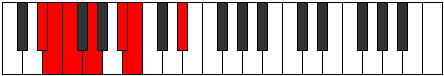 |
| [409](https://ianring.com/musictheory/scales/409) | [Laritonic](ModeGNaturalLaritonic.md) | G | G, A#, B, D, D#, G |  |
| [409](https://ianring.com/musictheory/scales/409) | [Laritonic](ModeDSharpLaritonic.md) | D# | D#, F#, G, A#, B, D# |  |
| [409](https://ianring.com/musictheory/scales/409) | [Laritonic](ModeEFlatLaritonic.md) | Eb | Eb, Gb, G, Bb, B, Eb |  |
| [411](https://ianring.com/musictheory/scales/411) | [Lygimic](ModeDSharpLygimic.md) | D# | D#, E, F#, G, A#, B, D# |  |
| [411](https://ianring.com/musictheory/scales/411) | [Lygimic](ModeEFlatLygimic.md) | Eb | Eb, Fb, Gb, Abb, Bb, Cb, Eb |  |
| [411](https://ianring.com/musictheory/scales/411) | [Lygimic](ModeGNaturalLygimic.md) | G | G, Ab, Bb, Cb, D, Eb, G |  |
| [413](https://ianring.com/musictheory/scales/413) | [Ganimic](ModeDSharpGanimic.md) | D# | D#, E#, F#, G, A#, B, D# |  |
| [413](https://ianring.com/musictheory/scales/413) | [Ganimic](ModeEFlatGanimic.md) | Eb | Eb, F, Gb, Abb, Bb, Cb, Eb |  |
| [413](https://ianring.com/musictheory/scales/413) | [Ganimic](ModeGNaturalGanimic.md) | G | G, A, Bb, Cb, D, Eb, G | 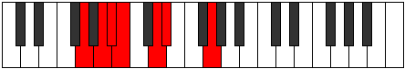 |
| [415](https://ianring.com/musictheory/scales/415) | [Aeoladian](ModeDSharpAeoladian.md) | D# | D#, E, F, Gb, Abb, Bb, Cb, D# |  |
| [415](https://ianring.com/musictheory/scales/415) | [Aeoladian](ModeEFlatAeoladian.md) | Eb | Eb, Fb, Gbb, Abbb, E###, Cbb, Dbbb, Eb |  |
| [415](https://ianring.com/musictheory/scales/415) | [Aeoladian](ModeGNaturalAeoladian.md) | G | G, Ab, Bbb, Cbb, Dbbb, Ebb, Fbb, G |  |
| [419](https://ianring.com/musictheory/scales/419) | [Ionacritonic](ModeDNaturalIonacritonic.md) | D | D, D#, G, A, A#, D |  |
| [423](https://ianring.com/musictheory/scales/423) | [Sogimic](ModeDNaturalSogimic.md) | D | D, Eb, Fb, G, A, Bb, D |  |
| [425](https://ianring.com/musictheory/scales/425) | [Daditonic](ModeGNaturalDaditonic.md) | G | G, A#, C, D, D#, G |  |
| [427](https://ianring.com/musictheory/scales/427) | [Zothimic](ModeGNaturalZothimic.md) | G | G, Ab, Bb, C, D, Eb, G |  |
| [427](https://ianring.com/musictheory/scales/427) | [Zothimic](ModeDNaturalZothimic.md) | D | D, Eb, F, G, A, Bb, D |  |
| [429](https://ianring.com/musictheory/scales/429) | [Koptimic](ModeGNaturalKoptimic.md) | G | G, A, Bb, C, D, Eb, G |  |
| [431](https://ianring.com/musictheory/scales/431) | [Epyrian](ModeDNaturalEpyrian.md) | D | D, Eb, Fb, Gbb, Abb, Bbb, Cbb, D |  |
| [431](https://ianring.com/musictheory/scales/431) | [Epyrian](ModeGNaturalEpyrian.md) | G | G, Ab, Bbb, Cbb, Dbb, Ebb, Fbb, G |  |
| [433](https://ianring.com/musictheory/scales/433) | [Poritonic](ModeDSharpPoritonic.md) | D# | D#, G, G#, A#, B, D# | 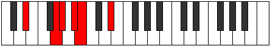 |
| [433](https://ianring.com/musictheory/scales/433) | [Poritonic](ModeEFlatPoritonic.md) | Eb | Eb, G, Ab, Bb, B, Eb |  |
| [435](https://ianring.com/musictheory/scales/435) | [Ionolimic](ModeDNaturalIonolimic.md) | D | D, Eb, F#, G, A, Bb, D |  |
| [435](https://ianring.com/musictheory/scales/435) | [Ionolimic](ModeDSharpIonolimic.md) | D# | D#, E, F##, G#, A#, B, D# |  |
| [435](https://ianring.com/musictheory/scales/435) | [Ionolimic](ModeEFlatIonolimic.md) | Eb | Eb, Fb, G, Ab, Bb, Cb, Eb |  |
| [437](https://ianring.com/musictheory/scales/437) | [Ronimic](ModeDSharpRonimic.md) | D# | D#, E#, F##, G#, A#, B, D# |  |
| [437](https://ianring.com/musictheory/scales/437) | [Ronimic](ModeEFlatRonimic.md) | Eb | Eb, F, G, Ab, Bb, Cb, Eb |  |
| [439](https://ianring.com/musictheory/scales/439) | [Bythian](ModeDNaturalBythian.md) | D | D, Eb, Fb, Gb, Abb, Bbb, Cbb, D |  |
| [439](https://ianring.com/musictheory/scales/439) | [Bythian](ModeDSharpBythian.md) | D# | D#, E, F, G, Ab, Bb, Cb, D# |  |
| [439](https://ianring.com/musictheory/scales/439) | [Bythian](ModeEFlatBythian.md) | Eb | Eb, Fb, Gbb, Abb, Bbbb, Cbb, Dbbb, Eb |  |
| [441](https://ianring.com/musictheory/scales/441) | [Thycrimic](ModeGNaturalThycrimic.md) | G | G, A#, B, C, D, Eb, G |  |
| [441](https://ianring.com/musictheory/scales/441) | [Thycrimic](ModeDSharpThycrimic.md) | D# | D#, E##, F##, G#, A#, B, D# |  |
| [441](https://ianring.com/musictheory/scales/441) | [Thycrimic](ModeEFlatThycrimic.md) | Eb | Eb, F#, G, Ab, Bb, Cb, Eb |  |
| [443](https://ianring.com/musictheory/scales/443) | [Kothian](ModeDNaturalKothian.md) | D | D, Eb, F, Gb, Abb, Bbb, Cbb, D |  |
| [443](https://ianring.com/musictheory/scales/443) | [Kothian](ModeGNaturalKothian.md) | G | G, Ab, Bb, Cb, Dbb, Ebb, Fbb, G |  |
| [443](https://ianring.com/musictheory/scales/443) | [Kothian](ModeDSharpKothian.md) | D# | D#, E, F#, G, Ab, Bb, Cb, D# |  |
| [443](https://ianring.com/musictheory/scales/443) | [Kothian](ModeEFlatKothian.md) | Eb | Eb, Fb, Gb, Abb, Bbbb, Cbb, Dbbb, Eb |  |
| [445](https://ianring.com/musictheory/scales/445) | [Gocrian](ModeDSharpGocrian.md) | D# | D#, E#, F#, G, Ab, Bb, Cb, D# |  |
| [445](https://ianring.com/musictheory/scales/445) | [Gocrian](ModeEFlatGocrian.md) | Eb | Eb, F, Gb, Abb, Bbbb, Cbb, Dbbb, Eb |  |
| [445](https://ianring.com/musictheory/scales/445) | [Gocrian](ModeGNaturalGocrian.md) | G | G, A, Bb, Cb, Dbb, Ebb, Fbb, G |  |
| [447](https://ianring.com/musictheory/scales/447) | [Thyphyllic](ModeDNaturalThyphyllic.md) | D | D, D#, E, F, F#, G, A, A#, D |  |
| [447](https://ianring.com/musictheory/scales/447) | [Thyphyllic](ModeDSharpThyphyllic.md) | D# | D#, E, F, F#, G, G#, A#, B, D# |  |
| [447](https://ianring.com/musictheory/scales/447) | [Thyphyllic](ModeEFlatThyphyllic.md) | Eb | Eb, E, F, Gb, G, Ab, Bb, B, Eb |  |
| [447](https://ianring.com/musictheory/scales/447) | [Thyphyllic](ModeGNaturalThyphyllic.md) | G | G, G#, A, A#, B, C, D, D#, G |  |
| [457](https://ianring.com/musictheory/scales/457) | [Staptitonic](ModeGNaturalStaptitonic.md) | G | G, A#, C#, D, D#, G |  |
| [459](https://ianring.com/musictheory/scales/459) | [Zaptimic](ModeGNaturalZaptimic.md) | G | G, Ab, Bb, C#, D, Eb, G |  |
| [461](https://ianring.com/musictheory/scales/461) | [Madimic](ModeGNaturalMadimic.md) | G | G, A, Bb, C#, D, Eb, G |  |
| [463](https://ianring.com/musictheory/scales/463) | [Zythian](ModeGNaturalZythian.md) | G | G, Ab, Bbb, Cbb, Db, Ebb, Fbb, G |  |
| [465](https://ianring.com/musictheory/scales/465) | [Zoditonic](ModeDSharpZoditonic.md) | D# | D#, G, A, A#, B, D# | 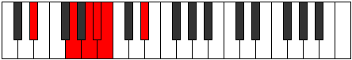 |
| [465](https://ianring.com/musictheory/scales/465) | [Zoditonic](ModeEFlatZoditonic.md) | Eb | Eb, G, A, Bb, B, Eb |  |
| [467](https://ianring.com/musictheory/scales/467) | [Phrogimic](ModeDSharpPhrogimic.md) | D# | D#, E, F##, G##, A#, B, D# |  |
| [467](https://ianring.com/musictheory/scales/467) | [Phrogimic](ModeEFlatPhrogimic.md) | Eb | Eb, Fb, G, A, Bb, Cb, Eb |  |
| [469](https://ianring.com/musictheory/scales/469) | [Katyrimic](ModeDSharpKatyrimic.md) | D# | D#, E#, F##, G##, A#, B, D# |  |
| [469](https://ianring.com/musictheory/scales/469) | [Katyrimic](ModeEFlatKatyrimic.md) | Eb | Eb, F, G, A, Bb, Cb, Eb |  |
| [471](https://ianring.com/musictheory/scales/471) | [Dodian](ModeDSharpDodian.md) | D# | D#, E, F, G, A, Bb, Cb, D# |  |
| [471](https://ianring.com/musictheory/scales/471) | [Dodian](ModeEFlatDodian.md) | Eb | Eb, Fb, Gbb, Abb, Bbb, Cbb, Dbbb, Eb |  |
| [473](https://ianring.com/musictheory/scales/473) | [Aeralimic](ModeGNaturalAeralimic.md) | G | G, A#, B, C#, D, Eb, G |  |
| [473](https://ianring.com/musictheory/scales/473) | [Aeralimic](ModeDSharpAeralimic.md) | D# | D#, E##, F##, G##, A#, B, D# |  |
| [473](https://ianring.com/musictheory/scales/473) | [Aeralimic](ModeEFlatAeralimic.md) | Eb | Eb, F#, G, A, Bb, Cb, Eb |  |
| [475](https://ianring.com/musictheory/scales/475) | [Aeolygian](ModeGNaturalAeolygian.md) | G | G, Ab, Bb, Cb, Db, Ebb, Fbb, G | 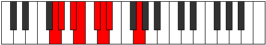 |
| [475](https://ianring.com/musictheory/scales/475) | [Aeolygian](ModeDSharpAeolygian.md) | D# | D#, E, F#, G, A, Bb, Cb, D# |  |
| [475](https://ianring.com/musictheory/scales/475) | [Aeolygian](ModeEFlatAeolygian.md) | Eb | Eb, Fb, Gb, Abb, Bbb, Cbb, Dbbb, Eb |  |
| [477](https://ianring.com/musictheory/scales/477) | [Stacrian](ModeGNaturalStacrian.md) | G | G, A, Bb, Cb, Db, Ebb, Fbb, G |  |
| [477](https://ianring.com/musictheory/scales/477) | [Stacrian](ModeDSharpStacrian.md) | D# | D#, E#, F#, G, A, Bb, Cb, D# |  |
| [477](https://ianring.com/musictheory/scales/477) | [Stacrian](ModeEFlatStacrian.md) | Eb | Eb, F, Gb, Abb, Bbb, Cbb, Dbbb, Eb |  |
| [479](https://ianring.com/musictheory/scales/479) | [Kocryllic](ModeDSharpKocryllic.md) | D# | D#, E, F, F#, G, A, A#, B, D# |  |
| [479](https://ianring.com/musictheory/scales/479) | [Kocryllic](ModeEFlatKocryllic.md) | Eb | Eb, E, F, Gb, G, A, Bb, B, Eb |  |
| [479](https://ianring.com/musictheory/scales/479) | [Kocryllic](ModeGNaturalKocryllic.md) | G | G, G#, A, A#, B, C#, D, D#, G |  |
| [483](https://ianring.com/musictheory/scales/483) | [Kygimic](ModeDNaturalKygimic.md) | D | D, Eb, F##, G#, A, Bb, D |  |
| [487](https://ianring.com/musictheory/scales/487) | [Dynian](ModeDNaturalDynian.md) | D | D, Eb, Fb, G, Ab, Bbb, Cbb, D |  |
| [489](https://ianring.com/musictheory/scales/489) | [Phrathimic](ModeGNaturalPhrathimic.md) | G | G, A#, B#, C#, D, Eb, G |  |
| [491](https://ianring.com/musictheory/scales/491) | [Aeolyrian](ModeGNaturalAeolyrian.md) | G | G, Ab, Bb, C, Db, Ebb, Fbb, G |  |
| [491](https://ianring.com/musictheory/scales/491) | [Aeolyrian](ModeDNaturalAeolyrian.md) | D | D, Eb, F, G, Ab, Bbb, Cbb, D |  |
| [493](https://ianring.com/musictheory/scales/493) | [Rygian](ModeGNaturalRygian.md) | G | G, A, Bb, C, Db, Ebb, Fbb, G |  |
| [495](https://ianring.com/musictheory/scales/495) | [Bocryllic](ModeGNaturalBocryllic.md) | G | G, G#, A, A#, C, C#, D, D#, G |  |
| [495](https://ianring.com/musictheory/scales/495) | [Bocryllic](ModeDNaturalBocryllic.md) | D | D, D#, E, F, G, G#, A, A#, D |  |
| [497](https://ianring.com/musictheory/scales/497) | [Kadimic](ModeDSharpKadimic.md) | D# | D#, E###, F###, G##, A#, B, D# |  |
| [497](https://ianring.com/musictheory/scales/497) | [Kadimic](ModeEFlatKadimic.md) | Eb | Eb, F##, G#, A, Bb, Cb, Eb |  |
| [499](https://ianring.com/musictheory/scales/499) | [Ionaptian](ModeDNaturalIonaptian.md) | D | D, Eb, F#, G, Ab, Bbb, Cbb, D |  |
| [499](https://ianring.com/musictheory/scales/499) | [Ionaptian](ModeDSharpIonaptian.md) | D# | D#, E, F##, G#, A, Bb, Cb, D# |  |
| [499](https://ianring.com/musictheory/scales/499) | [Ionaptian](ModeEFlatIonaptian.md) | Eb | Eb, Fb, G, Ab, Bbb, Cbb, Dbbb, Eb |  |
| [501](https://ianring.com/musictheory/scales/501) | [Katylian](ModeDSharpKatylian.md) | D# | D#, E#, F##, G#, A, Bb, Cb, D# |  |
| [501](https://ianring.com/musictheory/scales/501) | [Katylian](ModeEFlatKatylian.md) | Eb | Eb, F, G, Ab, Bbb, Cbb, Dbbb, Eb |  |
| [503](https://ianring.com/musictheory/scales/503) | [Thoptyllic](ModeDNaturalThoptyllic.md) | D | D, D#, E, F#, G, G#, A, A#, D |  |
| [503](https://ianring.com/musictheory/scales/503) | [Thoptyllic](ModeDSharpThoptyllic.md) | D# | D#, E, F, G, G#, A, A#, B, D# |  |
| [503](https://ianring.com/musictheory/scales/503) | [Thoptyllic](ModeEFlatThoptyllic.md) | Eb | Eb, E, F, G, Ab, A, Bb, B, Eb |  |
| [505](https://ianring.com/musictheory/scales/505) | [Sanian](ModeGNaturalSanian.md) | G | G, A#, B, C, Db, Ebb, Fbb, G |  |
| [505](https://ianring.com/musictheory/scales/505) | [Sanian](ModeDSharpSanian.md) | D# | D#, E##, F##, G#, A, Bb, Cb, D# |  |
| [505](https://ianring.com/musictheory/scales/505) | [Sanian](ModeEFlatSanian.md) | Eb | Eb, F#, G, Ab, Bbb, Cbb, Dbbb, Eb |  |
| [507](https://ianring.com/musictheory/scales/507) | [Moryllic](ModeDNaturalMoryllic.md) | D | D, D#, F, F#, G, G#, A, A#, D |  |
| [507](https://ianring.com/musictheory/scales/507) | [Moryllic](ModeGNaturalMoryllic.md) | G | G, G#, A#, B, C, C#, D, D#, G |  |
| [507](https://ianring.com/musictheory/scales/507) | [Moryllic](ModeDSharpMoryllic.md) | D# | D#, E, F#, G, G#, A, A#, B, D# |  |
| [507](https://ianring.com/musictheory/scales/507) | [Moryllic](ModeEFlatMoryllic.md) | Eb | Eb, E, Gb, G, Ab, A, Bb, B, Eb |  |
| [509](https://ianring.com/musictheory/scales/509) | [Ionothyllic](ModeGNaturalIonothyllic.md) | G | G, A, A#, B, C, C#, D, D#, G |  |
| [509](https://ianring.com/musictheory/scales/509) | [Ionothyllic](ModeDSharpIonothyllic.md) | D# | D#, F, F#, G, G#, A, A#, B, D# |  |
| [509](https://ianring.com/musictheory/scales/509) | [Ionothyllic](ModeEFlatIonothyllic.md) | Eb | Eb, F, Gb, G, Ab, A, Bb, B, Eb |  |
| [511](https://ianring.com/musictheory/scales/511) | [Polygic](ModeDNaturalPolygic.md) | D | D, D#, E, F, F#, G, G#, A, A#, D |  |
| [511](https://ianring.com/musictheory/scales/511) | [Polygic](ModeGNaturalPolygic.md) | G | G, G#, A, A#, B, C, C#, D, D#, G |  |
| [511](https://ianring.com/musictheory/scales/511) | [Polygic](ModeDSharpPolygic.md) | D# | D#, E, F, F#, G, G#, A, A#, B, D# |  |
| [511](https://ianring.com/musictheory/scales/511) | [Polygic](ModeEFlatPolygic.md) | Eb | Eb, E, F, Gb, G, Ab, A, Bb, B, Eb |  |
| [547](https://ianring.com/musictheory/scales/547) | [Pyrric](ModeASharpPyrric.md) | A# | A#, B, D#, G, A# |  |
| [547](https://ianring.com/musictheory/scales/547) | [Pyrric](ModeBFlatPyrric.md) | Bb | Bb, B, Eb, G, Bb |  |
| [549](https://ianring.com/musictheory/scales/549) | [Rothic](ModeASharpRothic.md) | A# | A#, C, D#, G, A# |  |
| [549](https://ianring.com/musictheory/scales/549) | [Rothic](ModeBFlatRothic.md) | Bb | Bb, C, Eb, G, Bb |  |
| [551](https://ianring.com/musictheory/scales/551) | [Aeoloditonic](ModeASharpAeoloditonic.md) | A# | A#, B, C, D#, G, A# |  |
| [551](https://ianring.com/musictheory/scales/551) | [Aeoloditonic](ModeBFlatAeoloditonic.md) | Bb | Bb, B, C, Eb, G, Bb |  |
| [553](https://ianring.com/musictheory/scales/553) | [Phradic](ModeASharpPhradic.md) | A# | A#, C#, D#, G, A# |  |
| [553](https://ianring.com/musictheory/scales/553) | [Phradic](ModeBFlatPhradic.md) | Bb | Bb, Db, Eb, G, Bb |  |
| [555](https://ianring.com/musictheory/scales/555) | [Aeolycritonic](ModeASharpAeolycritonic.md) | A# | A#, B, C#, D#, G, A# |  |
| [555](https://ianring.com/musictheory/scales/555) | [Aeolycritonic](ModeBFlatAeolycritonic.md) | Bb | Bb, B, Db, Eb, G, Bb |  |
| [557](https://ianring.com/musictheory/scales/557) | [Gythitonic](ModeASharpGythitonic.md) | A# | A#, C, C#, D#, G, A# |  |
| [557](https://ianring.com/musictheory/scales/557) | [Gythitonic](ModeBFlatGythitonic.md) | Bb | Bb, C, Db, Eb, G, Bb |  |
| [559](https://ianring.com/musictheory/scales/559) | [Lylimic](ModeASharpLylimic.md) | A# | A#, B, C, Db, Eb, F##, A# |  |
| [559](https://ianring.com/musictheory/scales/559) | [Lylimic](ModeBFlatLylimic.md) | Bb | Bb, Cb, Dbb, Ebbb, Fbb, G, Bb |  |
| [561](https://ianring.com/musictheory/scales/561) | [Phratic](ModeASharpPhratic.md) | A# | A#, D, D#, G, A# |  |
| [561](https://ianring.com/musictheory/scales/561) | [Phratic](ModeBFlatPhratic.md) | Bb | Bb, D, Eb, G, Bb |  |
| [563](https://ianring.com/musictheory/scales/563) | [Thacritonic](ModeASharpThacritonic.md) | A# | A#, B, D, D#, G, A# |  |
| [563](https://ianring.com/musictheory/scales/563) | [Thacritonic](ModeBFlatThacritonic.md) | Bb | Bb, B, D, Eb, G, Bb |  |
| [563](https://ianring.com/musictheory/scales/563) | [Thacritonic](ModeFSharpThacritonic.md) | F# | F#, G, A#, B, D#, F# |  |
| [563](https://ianring.com/musictheory/scales/563) | [Thacritonic](ModeGFlatThacritonic.md) | Gb | Gb, G, Bb, B, Eb, Gb |  |
| [565](https://ianring.com/musictheory/scales/565) | [Aeolyphritonic](ModeASharpAeolyphritonic.md) | A# | A#, C, D, D#, G, A# |  |
| [565](https://ianring.com/musictheory/scales/565) | [Aeolyphritonic](ModeBFlatAeolyphritonic.md) | Bb | Bb, C, D, Eb, G, Bb |  |
| [567](https://ianring.com/musictheory/scales/567) | [Aeoladimic](ModeASharpAeoladimic.md) | A# | A#, B, C, D, Eb, F##, A# |  |
| [567](https://ianring.com/musictheory/scales/567) | [Aeoladimic](ModeBFlatAeoladimic.md) | Bb | Bb, Cb, Dbb, Ebb, Fbb, G, Bb |  |
| [567](https://ianring.com/musictheory/scales/567) | [Aeoladimic](ModeFSharpAeoladimic.md) | F# | F#, G, Ab, Bb, Cb, D#, F# |  |
| [567](https://ianring.com/musictheory/scales/567) | [Aeoladimic](ModeGFlatAeoladimic.md) | Gb | Gb, Abb, Bbbb, Cbb, Dbbb, Eb, Gb |  |
| [569](https://ianring.com/musictheory/scales/569) | [Mothitonic](ModeASharpMothitonic.md) | A# | A#, C#, D, D#, G, A# |  |
| [569](https://ianring.com/musictheory/scales/569) | [Mothitonic](ModeBFlatMothitonic.md) | Bb | Bb, Db, D, Eb, G, Bb |  |
| [571](https://ianring.com/musictheory/scales/571) | [Kynimic](ModeASharpKynimic.md) | A# | A#, B, C#, D, Eb, F##, A# |  |
| [571](https://ianring.com/musictheory/scales/571) | [Kynimic](ModeBFlatKynimic.md) | Bb | Bb, Cb, Db, Ebb, Fbb, G, Bb |  |
| [571](https://ianring.com/musictheory/scales/571) | [Kynimic](ModeFSharpKynimic.md) | F# | F#, G, A, Bb, Cb, D#, F# |  |
| [571](https://ianring.com/musictheory/scales/571) | [Kynimic](ModeGFlatKynimic.md) | Gb | Gb, Abb, Bbb, Cbb, Dbbb, Eb, Gb |  |
| [573](https://ianring.com/musictheory/scales/573) | [Saptimic](ModeASharpSaptimic.md) | A# | A#, B#, C#, D, Eb, F##, A# |  |
| [573](https://ianring.com/musictheory/scales/573) | [Saptimic](ModeBFlatSaptimic.md) | Bb | Bb, C, Db, Ebb, Fbb, G, Bb |  |
| [575](https://ianring.com/musictheory/scales/575) | [Ionydian](ModeASharpIonydian.md) | A# | A#, B, C, Db, Ebb, Fbb, G, A# |  |
| [575](https://ianring.com/musictheory/scales/575) | [Ionydian](ModeBFlatIonydian.md) | Bb | Bb, Cb, Dbb, Ebbb, Fbbb, C###, E###, Bb |  |
| [575](https://ianring.com/musictheory/scales/575) | [Ionydian](ModeFSharpIonydian.md) | F# | F#, G, Ab, Bbb, Cbb, Dbbb, Eb, F# |  |
| [575](https://ianring.com/musictheory/scales/575) | [Ionydian](ModeGFlatIonydian.md) | Gb | Gb, Abb, Bbbb, Cbbb, Cbb, Dbbb, Eb, Gb |  |
| [581](https://ianring.com/musictheory/scales/581) | [Bolic](ModeCSharpBolic.md) | C# | C#, D#, G, A#, C# |  |
| [581](https://ianring.com/musictheory/scales/581) | [Bolic](ModeDFlatBolic.md) | Db | Db, Eb, G, Bb, Db |  |
| [583](https://ianring.com/musictheory/scales/583) | [Aeritonic](ModeCSharpAeritonic.md) | C# | C#, D, D#, G, A#, C# |  |
| [583](https://ianring.com/musictheory/scales/583) | [Aeritonic](ModeDFlatAeritonic.md) | Db | Db, D, Eb, G, Bb, Db | 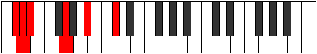 |
| [589](https://ianring.com/musictheory/scales/589) | [Ionalitonic](ModeCSharpIonalitonic.md) | C# | C#, D#, E, G, A#, C# |  |
| [589](https://ianring.com/musictheory/scales/589) | [Ionalitonic](ModeDFlatIonalitonic.md) | Db | Db, Eb, E, G, Bb, Db |  |
| [591](https://ianring.com/musictheory/scales/591) | [Gaptimic](ModeCSharpGaptimic.md) | C# | C#, D, Eb, Fb, G, A#, C# |  |
| [591](https://ianring.com/musictheory/scales/591) | [Gaptimic](ModeDFlatGaptimic.md) | Db | Db, Ebb, Fbb, Gbbb, Abb, Bb, Db |  |
| [595](https://ianring.com/musictheory/scales/595) | [Sogitonic](ModeFSharpSogitonic.md) | F# | F#, G, A#, C, D#, F# |  |
| [595](https://ianring.com/musictheory/scales/595) | [Sogitonic](ModeGFlatSogitonic.md) | Gb | Gb, G, Bb, C, Eb, Gb |  |
| [597](https://ianring.com/musictheory/scales/597) | [Thonitonic](ModeCSharpThonitonic.md) | C# | C#, D#, F, G, A#, C# |  |
| [597](https://ianring.com/musictheory/scales/597) | [Thonitonic](ModeDFlatThonitonic.md) | Db | Db, Eb, F, G, Bb, Db | 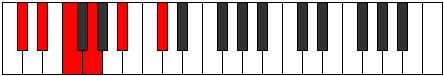 |
| [599](https://ianring.com/musictheory/scales/599) | [Thyrimic](ModeCSharpThyrimic.md) | C# | C#, D, Eb, F, G, A#, C# |  |
| [599](https://ianring.com/musictheory/scales/599) | [Thyrimic](ModeDFlatThyrimic.md) | Db | Db, Ebb, Fbb, Gbb, Abb, Bb, Db |  |
| [599](https://ianring.com/musictheory/scales/599) | [Thyrimic](ModeFSharpThyrimic.md) | F# | F#, G, Ab, Bb, C, D#, F# |  |
| [599](https://ianring.com/musictheory/scales/599) | [Thyrimic](ModeGFlatThyrimic.md) | Gb | Gb, Abb, Bbbb, Cbb, Dbb, Eb, Gb |  |
| [603](https://ianring.com/musictheory/scales/603) | [Aeolygimic](ModeFSharpAeolygimic.md) | F# | F#, G, A, Bb, C, D#, F# |  |
| [603](https://ianring.com/musictheory/scales/603) | [Aeolygimic](ModeGFlatAeolygimic.md) | Gb | Gb, Abb, Bbb, Cbb, Dbb, Eb, Gb |  |
| [605](https://ianring.com/musictheory/scales/605) | [Dycrimic](ModeCSharpDycrimic.md) | C# | C#, D#, E, F, G, A#, C# |  |
| [605](https://ianring.com/musictheory/scales/605) | [Dycrimic](ModeDFlatDycrimic.md) | Db | Db, Eb, Fb, Gbb, Abb, Bb, Db |  |
| [607](https://ianring.com/musictheory/scales/607) | [Kadian](ModeCSharpKadian.md) | C# | C#, D, Eb, Fb, Gbb, Abb, Bb, C# |  |
| [607](https://ianring.com/musictheory/scales/607) | [Kadian](ModeFSharpKadian.md) | F# | F#, G, Ab, Bbb, Cbb, Dbb, Eb, F# |  |
| [607](https://ianring.com/musictheory/scales/607) | [Kadian](ModeGFlatKadian.md) | Gb | Gb, Abb, Bbbb, Cbbb, Cbb, Dbb, Eb, Gb |  |
| [611](https://ianring.com/musictheory/scales/611) | [Zynitonic](ModeASharpZynitonic.md) | A# | A#, B, D#, E, G, A# |  |
| [611](https://ianring.com/musictheory/scales/611) | [Zynitonic](ModeBFlatZynitonic.md) | Bb | Bb, B, Eb, E, G, Bb |  |
| [613](https://ianring.com/musictheory/scales/613) | [Phralitonic](ModeASharpPhralitonic.md) | A# | A#, C, D#, E, G, A# |  |
| [613](https://ianring.com/musictheory/scales/613) | [Phralitonic](ModeBFlatPhralitonic.md) | Bb | Bb, C, Eb, E, G, Bb |  |
| [613](https://ianring.com/musictheory/scales/613) | [Phralitonic](ModeCSharpPhralitonic.md) | C# | C#, D#, F#, G, A#, C# |  |
| [613](https://ianring.com/musictheory/scales/613) | [Phralitonic](ModeDFlatPhralitonic.md) | Db | Db, Eb, Gb, G, Bb, Db |  |
| [615](https://ianring.com/musictheory/scales/615) | [Phrothimic](ModeCSharpPhrothimic.md) | C# | C#, D, Eb, F#, G, A#, C# |  |
| [615](https://ianring.com/musictheory/scales/615) | [Phrothimic](ModeDFlatPhrothimic.md) | Db | Db, Ebb, Fbb, Gb, Abb, Bb, Db |  |
| [615](https://ianring.com/musictheory/scales/615) | [Phrothimic](ModeASharpPhrothimic.md) | A# | A#, B, C, D#, E, F##, A# |  |
| [615](https://ianring.com/musictheory/scales/615) | [Phrothimic](ModeBFlatPhrothimic.md) | Bb | Bb, Cb, Dbb, Eb, Fb, G, Bb |  |
| [617](https://ianring.com/musictheory/scales/617) | [Katycritonic](ModeASharpKatycritonic.md) | A# | A#, C#, D#, E, G, A# |  |
| [617](https://ianring.com/musictheory/scales/617) | [Katycritonic](ModeBFlatKatycritonic.md) | Bb | Bb, Db, Eb, E, G, Bb |  |
| [619](https://ianring.com/musictheory/scales/619) | [Parimic](ModeASharpParimic.md) | A# | A#, B, C#, D#, E, F##, A# |  |
| [619](https://ianring.com/musictheory/scales/619) | [Parimic](ModeBFlatParimic.md) | Bb | Bb, Cb, Db, Eb, Fb, G, Bb |  |
| [621](https://ianring.com/musictheory/scales/621) | [Kyrimic](ModeASharpKyrimic.md) | A# | A#, B#, C#, D#, E, F##, A# |  |
| [621](https://ianring.com/musictheory/scales/621) | [Kyrimic](ModeBFlatKyrimic.md) | Bb | Bb, C, Db, Eb, Fb, G, Bb |  |
| [621](https://ianring.com/musictheory/scales/621) | [Kyrimic](ModeCSharpKyrimic.md) | C# | C#, D#, E, F#, G, A#, C# |  |
| [621](https://ianring.com/musictheory/scales/621) | [Kyrimic](ModeDFlatKyrimic.md) | Db | Db, Eb, Fb, Gb, Abb, Bb, Db |  |
| [623](https://ianring.com/musictheory/scales/623) | [Sycrian](ModeCSharpSycrian.md) | C# | C#, D, Eb, Fb, Gb, Abb, Bb, C# |  |
| [623](https://ianring.com/musictheory/scales/623) | [Sycrian](ModeASharpSycrian.md) | A# | A#, B, C, Db, Eb, Fb, G, A# |  |
| [623](https://ianring.com/musictheory/scales/623) | [Sycrian](ModeBFlatSycrian.md) | Bb | Bb, Cb, Dbb, Ebbb, Fbb, Gbbb, Abb, Bb |  |
| [625](https://ianring.com/musictheory/scales/625) | [Ionyptitonic](ModeASharpIonyptitonic.md) | A# | A#, D, D#, E, G, A# |  |
| [625](https://ianring.com/musictheory/scales/625) | [Ionyptitonic](ModeBFlatIonyptitonic.md) | Bb | Bb, D, Eb, E, G, Bb |  |
| [627](https://ianring.com/musictheory/scales/627) | [Mogimic](ModeASharpMogimic.md) | A# | A#, B, C##, D#, E, F##, A# |  |
| [627](https://ianring.com/musictheory/scales/627) | [Mogimic](ModeBFlatMogimic.md) | Bb | Bb, Cb, D, Eb, Fb, G, Bb |  |
| [627](https://ianring.com/musictheory/scales/627) | [Mogimic](ModeFSharpMogimic.md) | F# | F#, G, A#, B, C, D#, F# |  |
| [627](https://ianring.com/musictheory/scales/627) | [Mogimic](ModeGFlatMogimic.md) | Gb | Gb, Abb, Bb, Cb, Dbb, Eb, Gb |  |
| [629](https://ianring.com/musictheory/scales/629) | [Aeronimic](ModeASharpAeronimic.md) | A# | A#, B#, C##, D#, E, F##, A# |  |
| [629](https://ianring.com/musictheory/scales/629) | [Aeronimic](ModeBFlatAeronimic.md) | Bb | Bb, C, D, Eb, Fb, G, Bb |  |
| [629](https://ianring.com/musictheory/scales/629) | [Aeronimic](ModeCSharpAeronimic.md) | C# | C#, D#, E#, F#, G, A#, C# |  |
| [629](https://ianring.com/musictheory/scales/629) | [Aeronimic](ModeDFlatAeronimic.md) | Db | Db, Eb, F, Gb, Abb, Bb, Db |  |
| [631](https://ianring.com/musictheory/scales/631) | [Zygian](ModeCSharpZygian.md) | C# | C#, D, Eb, F, Gb, Abb, Bb, C# | 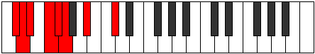 |
| [631](https://ianring.com/musictheory/scales/631) | [Zygian](ModeASharpZygian.md) | A# | A#, B, C, D, Eb, Fb, G, A# |  |
| [631](https://ianring.com/musictheory/scales/631) | [Zygian](ModeBFlatZygian.md) | Bb | Bb, Cb, Dbb, Ebb, Fbb, Gbbb, Abb, Bb |  |
| [631](https://ianring.com/musictheory/scales/631) | [Zygian](ModeFSharpZygian.md) | F# | F#, G, Ab, Bb, Cb, Dbb, Eb, F# |  |
| [631](https://ianring.com/musictheory/scales/631) | [Zygian](ModeGFlatZygian.md) | Gb | Gb, Abb, Bbbb, Cbb, Dbbb, Dbb, Eb, Gb |  |
| [633](https://ianring.com/musictheory/scales/633) | [Kydimic](ModeASharpKydimic.md) | A# | A#, B##, C##, D#, E, F##, A# |  |
| [633](https://ianring.com/musictheory/scales/633) | [Kydimic](ModeBFlatKydimic.md) | Bb | Bb, C#, D, Eb, Fb, G, Bb |  |
| [635](https://ianring.com/musictheory/scales/635) | [Epolian](ModeASharpEpolian.md) | A# | A#, B, C#, D, Eb, Fb, G, A# |  |
| [635](https://ianring.com/musictheory/scales/635) | [Epolian](ModeBFlatEpolian.md) | Bb | Bb, Cb, Db, Ebb, Fbb, Gbbb, Abb, Bb |  |
| [635](https://ianring.com/musictheory/scales/635) | [Epolian](ModeFSharpEpolian.md) | F# | F#, G, A, Bb, Cb, Dbb, Eb, F# |  |
| [635](https://ianring.com/musictheory/scales/635) | [Epolian](ModeGFlatEpolian.md) | Gb | Gb, Abb, Bbb, Cbb, Dbbb, Dbb, Eb, Gb |  |
| [637](https://ianring.com/musictheory/scales/637) | [Katodian](ModeASharpKatodian.md) | A# | A#, B#, C#, D, Eb, Fb, G, A# |  |
| [637](https://ianring.com/musictheory/scales/637) | [Katodian](ModeBFlatKatodian.md) | Bb | Bb, C, Db, Ebb, Fbb, Gbbb, Abb, Bb |  |
| [637](https://ianring.com/musictheory/scales/637) | [Katodian](ModeCSharpKatodian.md) | C# | C#, D#, E, F, Gb, Abb, Bb, C# |  |
| [637](https://ianring.com/musictheory/scales/637) | [Katodian](ModeDFlatKatodian.md) | Db | Db, Eb, Fb, Gbb, Abbb, E###, Cbb, Db |  |
| [639](https://ianring.com/musictheory/scales/639) | [Ionaryllic](ModeCSharpIonaryllic.md) | C# | C#, D, D#, E, F, F#, G, A#, C# |  |
| [639](https://ianring.com/musictheory/scales/639) | [Ionaryllic](ModeDFlatIonaryllic.md) | Db | Db, D, Eb, E, F, Gb, G, Bb, Db |  |
| [639](https://ianring.com/musictheory/scales/639) | [Ionaryllic](ModeASharpIonaryllic.md) | A# | A#, B, C, C#, D, D#, E, G, A# |  |
| [639](https://ianring.com/musictheory/scales/639) | [Ionaryllic](ModeBFlatIonaryllic.md) | Bb | Bb, B, C, Db, D, Eb, E, G, Bb |  |
| [639](https://ianring.com/musictheory/scales/639) | [Ionaryllic](ModeFSharpIonaryllic.md) | F# | F#, G, G#, A, A#, B, C, D#, F# |  |
| [639](https://ianring.com/musictheory/scales/639) | [Ionaryllic](ModeGFlatIonaryllic.md) | Gb | Gb, G, Ab, A, Bb, B, C, Eb, Gb |  |
| [657](https://ianring.com/musictheory/scales/657) | [Epathic](ModeDSharpEpathic.md) | D# | D#, G, A#, C, D# |  |
| [657](https://ianring.com/musictheory/scales/657) | [Epathic](ModeEFlatEpathic.md) | Eb | Eb, G, Bb, C, Eb |  |
| [659](https://ianring.com/musictheory/scales/659) | [Soptitonic](ModeDSharpSoptitonic.md) | D# | D#, E, G, A#, C, D# |  |
| [659](https://ianring.com/musictheory/scales/659) | [Soptitonic](ModeEFlatSoptitonic.md) | Eb | Eb, E, G, Bb, C, Eb |  |
| [659](https://ianring.com/musictheory/scales/659) | [Soptitonic](ModeFSharpSoptitonic.md) | F# | F#, G, A#, C#, D#, F# |  |
| [659](https://ianring.com/musictheory/scales/659) | [Soptitonic](ModeGFlatSoptitonic.md) | Gb | Gb, G, Bb, Db, Eb, Gb |  |
| [661](https://ianring.com/musictheory/scales/661) | [Pentatonic](ModeDSharpPentatonic.md) | D# | D#, F, G, A#, C, D# |  |
| [661](https://ianring.com/musictheory/scales/661) | [Pentatonic](ModeEFlatPentatonic.md) | Eb | Eb, F, G, Bb, C, Eb |  |
| [663](https://ianring.com/musictheory/scales/663) | [Phrynimic](ModeDSharpPhrynimic.md) | D# | D#, E, F, G, A#, B#, D# |  |
| [663](https://ianring.com/musictheory/scales/663) | [Phrynimic](ModeEFlatPhrynimic.md) | Eb | Eb, Fb, Gbb, Abb, Bb, C, Eb |  |
| [663](https://ianring.com/musictheory/scales/663) | [Phrynimic](ModeFSharpPhrynimic.md) | F# | F#, G, Ab, Bb, C#, D#, F# |  |
| [663](https://ianring.com/musictheory/scales/663) | [Phrynimic](ModeGFlatPhrynimic.md) | Gb | Gb, Abb, Bbbb, Cbb, Db, Eb, Gb |  |
| [665](https://ianring.com/musictheory/scales/665) | [Mythitonic](ModeDSharpMythitonic.md) | D# | D#, F#, G, A#, C, D# |  |
| [665](https://ianring.com/musictheory/scales/665) | [Mythitonic](ModeEFlatMythitonic.md) | Eb | Eb, Gb, G, Bb, C, Eb |  |
| [667](https://ianring.com/musictheory/scales/667) | [Rodimic](ModeDSharpRodimic.md) | D# | D#, E, F#, G, A#, B#, D# |  |
| [667](https://ianring.com/musictheory/scales/667) | [Rodimic](ModeEFlatRodimic.md) | Eb | Eb, Fb, Gb, Abb, Bb, C, Eb |  |
| [667](https://ianring.com/musictheory/scales/667) | [Rodimic](ModeFSharpRodimic.md) | F# | F#, G, A, Bb, C#, D#, F# |  |
| [667](https://ianring.com/musictheory/scales/667) | [Rodimic](ModeGFlatRodimic.md) | Gb | Gb, Abb, Bbb, Cbb, Db, Eb, Gb |  |
| [669](https://ianring.com/musictheory/scales/669) | [Gycrimic](ModeDSharpGycrimic.md) | D# | D#, E#, F#, G, A#, B#, D# |  |
| [669](https://ianring.com/musictheory/scales/669) | [Gycrimic](ModeEFlatGycrimic.md) | Eb | Eb, F, Gb, Abb, Bb, C, Eb |  |
| [671](https://ianring.com/musictheory/scales/671) | [Stycrian](ModeDSharpStycrian.md) | D# | D#, E, F, Gb, Abb, Bb, C, D# |  |
| [671](https://ianring.com/musictheory/scales/671) | [Stycrian](ModeEFlatStycrian.md) | Eb | Eb, Fb, Gbb, Abbb, E###, Cbb, Dbb, Eb |  |
| [671](https://ianring.com/musictheory/scales/671) | [Stycrian](ModeFSharpStycrian.md) | F# | F#, G, Ab, Bbb, Cbb, Db, Eb, F# |  |
| [671](https://ianring.com/musictheory/scales/671) | [Stycrian](ModeGFlatStycrian.md) | Gb | Gb, Abb, Bbbb, Cbbb, Cbb, Db, Eb, Gb |  |
| [675](https://ianring.com/musictheory/scales/675) | [Zyditonic](ModeASharpZyditonic.md) | A# | A#, B, D#, F, G, A# |  |
| [675](https://ianring.com/musictheory/scales/675) | [Zyditonic](ModeBFlatZyditonic.md) | Bb | Bb, B, Eb, F, G, Bb |  |
| [677](https://ianring.com/musictheory/scales/677) | [Mynitonic](ModeASharpMynitonic.md) | A# | A#, C, D#, F, G, A# |  |
| [677](https://ianring.com/musictheory/scales/677) | [Mynitonic](ModeBFlatMynitonic.md) | Bb | Bb, C, Eb, F, G, Bb |  |
| [679](https://ianring.com/musictheory/scales/679) | [Lanimic](ModeASharpLanimic.md) | A# | A#, B, C, D#, E#, F##, A# | 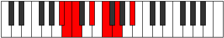 |
| [679](https://ianring.com/musictheory/scales/679) | [Lanimic](ModeBFlatLanimic.md) | Bb | Bb, Cb, Dbb, Eb, F, G, Bb |  |
| [681](https://ianring.com/musictheory/scales/681) | [Sylitonic](ModeASharpSylitonic.md) | A# | A#, C#, D#, F, G, A# |  |
| [681](https://ianring.com/musictheory/scales/681) | [Sylitonic](ModeBFlatSylitonic.md) | Bb | Bb, Db, Eb, F, G, Bb |  |
| [683](https://ianring.com/musictheory/scales/683) | [Stogimic](ModeASharpStogimic.md) | A# | A#, B, C#, D#, E#, F##, A# |  |
| [683](https://ianring.com/musictheory/scales/683) | [Stogimic](ModeBFlatStogimic.md) | Bb | Bb, Cb, Db, Eb, F, G, Bb |  |
| [685](https://ianring.com/musictheory/scales/685) | [Aerathimic](ModeASharpAerathimic.md) | A# | A#, B#, C#, D#, E#, F##, A# |  |
| [685](https://ianring.com/musictheory/scales/685) | [Aerathimic](ModeBFlatAerathimic.md) | Bb | Bb, C, Db, Eb, F, G, Bb |  |
| [687](https://ianring.com/musictheory/scales/687) | [Aeolythian](ModeASharpAeolythian.md) | A# | A#, B, C, Db, Eb, F, G, A# |  |
| [687](https://ianring.com/musictheory/scales/687) | [Aeolythian](ModeBFlatAeolythian.md) | Bb | Bb, Cb, Dbb, Ebbb, Fbb, Gbb, Abb, Bb |  |
| [689](https://ianring.com/musictheory/scales/689) | [Lothitonic](ModeASharpLothitonic.md) | A# | A#, D, D#, F, G, A# |  |
| [689](https://ianring.com/musictheory/scales/689) | [Lothitonic](ModeBFlatLothitonic.md) | Bb | Bb, D, Eb, F, G, Bb |  |
| [689](https://ianring.com/musictheory/scales/689) | [Lothitonic](ModeDSharpLothitonic.md) | D# | D#, G, G#, A#, C, D# |  |
| [689](https://ianring.com/musictheory/scales/689) | [Lothitonic](ModeEFlatLothitonic.md) | Eb | Eb, G, Ab, Bb, C, Eb |  |
| [691](https://ianring.com/musictheory/scales/691) | [Zydimic](ModeDSharpZydimic.md) | D# | D#, E, F##, G#, A#, B#, D# |  |
| [691](https://ianring.com/musictheory/scales/691) | [Zydimic](ModeEFlatZydimic.md) | Eb | Eb, Fb, G, Ab, Bb, C, Eb |  |
| [691](https://ianring.com/musictheory/scales/691) | [Zydimic](ModeASharpZydimic.md) | A# | A#, B, C##, D#, E#, F##, A# |  |
| [691](https://ianring.com/musictheory/scales/691) | [Zydimic](ModeBFlatZydimic.md) | Bb | Bb, Cb, D, Eb, F, G, Bb |  |
| [691](https://ianring.com/musictheory/scales/691) | [Zydimic](ModeFSharpZydimic.md) | F# | F#, G, A#, B, C#, D#, F# |  |
| [691](https://ianring.com/musictheory/scales/691) | [Zydimic](ModeGFlatZydimic.md) | Gb | Gb, Abb, Bb, Cb, Db, Eb, Gb |  |
| [693](https://ianring.com/musictheory/scales/693) | [Mynimic](ModeASharpMynimic.md) | A# | A#, B#, C##, D#, E#, F##, A# |  |
| [693](https://ianring.com/musictheory/scales/693) | [Mynimic](ModeBFlatMynimic.md) | Bb | Bb, C, D, Eb, F, G, Bb |  |
| [693](https://ianring.com/musictheory/scales/693) | [Mynimic](ModeDSharpMynimic.md) | D# | D#, E#, F##, G#, A#, B#, D# |  |
| [693](https://ianring.com/musictheory/scales/693) | [Mynimic](ModeEFlatMynimic.md) | Eb | Eb, F, G, Ab, Bb, C, Eb |  |
| [695](https://ianring.com/musictheory/scales/695) | [Sarian](ModeDSharpSarian.md) | D# | D#, E, F, G, Ab, Bb, C, D# |  |
| [695](https://ianring.com/musictheory/scales/695) | [Sarian](ModeEFlatSarian.md) | Eb | Eb, Fb, Gbb, Abb, Bbbb, Cbb, Dbb, Eb |  |
| [695](https://ianring.com/musictheory/scales/695) | [Sarian](ModeASharpSarian.md) | A# | A#, B, C, D, Eb, F, G, A# |  |
| [695](https://ianring.com/musictheory/scales/695) | [Sarian](ModeBFlatSarian.md) | Bb | Bb, Cb, Dbb, Ebb, Fbb, Gbb, Abb, Bb |  |
| [695](https://ianring.com/musictheory/scales/695) | [Sarian](ModeFSharpSarian.md) | F# | F#, G, Ab, Bb, Cb, Db, Eb, F# |  |
| [697](https://ianring.com/musictheory/scales/697) | [Lagimic](ModeASharpLagimic.md) | A# | A#, B##, C##, D#, E#, F##, A# |  |
| [697](https://ianring.com/musictheory/scales/697) | [Lagimic](ModeBFlatLagimic.md) | Bb | Bb, C#, D, Eb, F, G, Bb |  |
| [697](https://ianring.com/musictheory/scales/697) | [Lagimic](ModeDSharpLagimic.md) | D# | D#, E##, F##, G#, A#, B#, D# |  |
| [697](https://ianring.com/musictheory/scales/697) | [Lagimic](ModeEFlatLagimic.md) | Eb | Eb, F#, G, Ab, Bb, C, Eb |  |
| [699](https://ianring.com/musictheory/scales/699) | [Aerothian](ModeDSharpAerothian.md) | D# | D#, E, F#, G, Ab, Bb, C, D# |  |
| [699](https://ianring.com/musictheory/scales/699) | [Aerothian](ModeEFlatAerothian.md) | Eb | Eb, Fb, Gb, Abb, Bbbb, Cbb, Dbb, Eb |  |
| [699](https://ianring.com/musictheory/scales/699) | [Aerothian](ModeASharpAerothian.md) | A# | A#, B, C#, D, Eb, F, G, A# |  |
| [699](https://ianring.com/musictheory/scales/699) | [Aerothian](ModeBFlatAerothian.md) | Bb | Bb, Cb, Db, Ebb, Fbb, Gbb, Abb, Bb |  |
| [699](https://ianring.com/musictheory/scales/699) | [Aerothian](ModeFSharpAerothian.md) | F# | F#, G, A, Bb, Cb, Db, Eb, F# |  |
| [701](https://ianring.com/musictheory/scales/701) | [Mixonyphian](ModeASharpMixonyphian.md) | A# | A#, B#, C#, D, Eb, F, G, A# |  |
| [701](https://ianring.com/musictheory/scales/701) | [Mixonyphian](ModeBFlatMixonyphian.md) | Bb | Bb, C, Db, Ebb, Fbb, Gbb, Abb, Bb |  |
| [701](https://ianring.com/musictheory/scales/701) | [Mixonyphian](ModeDSharpMixonyphian.md) | D# | D#, E#, F#, G, Ab, Bb, C, D# |  |
| [701](https://ianring.com/musictheory/scales/701) | [Mixonyphian](ModeEFlatMixonyphian.md) | Eb | Eb, F, Gb, Abb, Bbbb, Cbb, Dbb, Eb |  |
| [703](https://ianring.com/musictheory/scales/703) | [Aerocryllic](ModeDSharpAerocryllic.md) | D# | D#, E, F, F#, G, G#, A#, C, D# |  |
| [703](https://ianring.com/musictheory/scales/703) | [Aerocryllic](ModeEFlatAerocryllic.md) | Eb | Eb, E, F, Gb, G, Ab, Bb, C, Eb |  |
| [703](https://ianring.com/musictheory/scales/703) | [Aerocryllic](ModeASharpAerocryllic.md) | A# | A#, B, C, C#, D, D#, F, G, A# |  |
| [703](https://ianring.com/musictheory/scales/703) | [Aerocryllic](ModeBFlatAerocryllic.md) | Bb | Bb, B, C, Db, D, Eb, F, G, Bb |  |
| [703](https://ianring.com/musictheory/scales/703) | [Aerocryllic](ModeFSharpAerocryllic.md) | F# | F#, G, G#, A, A#, B, C#, D#, F# |  |
| [703](https://ianring.com/musictheory/scales/703) | [Aerocryllic](ModeGFlatAerocryllic.md) | Gb | Gb, G, Ab, A, Bb, B, Db, Eb, Gb |  |
| [709](https://ianring.com/musictheory/scales/709) | [Ionycritonic](ModeCSharpIonycritonic.md) | C# | C#, D#, G, G#, A#, C# |  |
| [709](https://ianring.com/musictheory/scales/709) | [Ionycritonic](ModeDFlatIonycritonic.md) | Db | Db, Eb, G, Ab, Bb, Db |  |
| [711](https://ianring.com/musictheory/scales/711) | [Epyrimic](ModeCSharpEpyrimic.md) | C# | C#, D, Eb, F##, G#, A#, C# |  |
| [711](https://ianring.com/musictheory/scales/711) | [Epyrimic](ModeDFlatEpyrimic.md) | Db | Db, Ebb, Fbb, G, Ab, Bb, Db |  |
| [717](https://ianring.com/musictheory/scales/717) | [Gythimic](ModeCSharpGythimic.md) | C# | C#, D#, E, F##, G#, A#, C# |  |
| [717](https://ianring.com/musictheory/scales/717) | [Gythimic](ModeDFlatGythimic.md) | Db | Db, Eb, Fb, G, Ab, Bb, Db |  |
| [719](https://ianring.com/musictheory/scales/719) | [Kanian](ModeCSharpKanian.md) | C# | C#, D, Eb, Fb, G, Ab, Bb, C# |  |
| [721](https://ianring.com/musictheory/scales/721) | [Aeolacritonic](ModeDSharpAeolacritonic.md) | D# | D#, G, A, A#, C, D# |  |
| [721](https://ianring.com/musictheory/scales/721) | [Aeolacritonic](ModeEFlatAeolacritonic.md) | Eb | Eb, G, A, Bb, C, Eb |  |
| [723](https://ianring.com/musictheory/scales/723) | [Ionadimic](ModeFSharpIonadimic.md) | F# | F#, G, A#, B#, C#, D#, F# |  |
| [723](https://ianring.com/musictheory/scales/723) | [Ionadimic](ModeGFlatIonadimic.md) | Gb | Gb, Abb, Bb, C, Db, Eb, Gb | 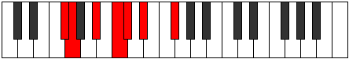 |
| [723](https://ianring.com/musictheory/scales/723) | [Ionadimic](ModeDSharpIonadimic.md) | D# | D#, E, F##, G##, A#, B#, D# |  |
| [723](https://ianring.com/musictheory/scales/723) | [Ionadimic](ModeEFlatIonadimic.md) | Eb | Eb, Fb, G, A, Bb, C, Eb |  |
| [725](https://ianring.com/musictheory/scales/725) | [Lonimic](ModeCSharpLonimic.md) | C# | C#, D#, E#, F##, G#, A#, C# |  |
| [725](https://ianring.com/musictheory/scales/725) | [Lonimic](ModeDFlatLonimic.md) | Db | Db, Eb, F, G, Ab, Bb, Db |  |
| [725](https://ianring.com/musictheory/scales/725) | [Lonimic](ModeDSharpLonimic.md) | D# | D#, E#, F##, G##, A#, B#, D# |  |
| [725](https://ianring.com/musictheory/scales/725) | [Lonimic](ModeEFlatLonimic.md) | Eb | Eb, F, G, A, Bb, C, Eb |  |
| [727](https://ianring.com/musictheory/scales/727) | [Phradian](ModeCSharpPhradian.md) | C# | C#, D, Eb, F, G, Ab, Bb, C# |  |
| [727](https://ianring.com/musictheory/scales/727) | [Phradian](ModeFSharpPhradian.md) | F# | F#, G, Ab, Bb, C, Db, Eb, F# |  |
| [727](https://ianring.com/musictheory/scales/727) | [Phradian](ModeDSharpPhradian.md) | D# | D#, E, F, G, A, Bb, C, D# |  |
| [727](https://ianring.com/musictheory/scales/727) | [Phradian](ModeEFlatPhradian.md) | Eb | Eb, Fb, Gbb, Abb, Bbb, Cbb, Dbb, Eb |  |
| [729](https://ianring.com/musictheory/scales/729) | [Stygimic](ModeDSharpStygimic.md) | D# | D#, E##, F##, G##, A#, B#, D# |  |
| [729](https://ianring.com/musictheory/scales/729) | [Stygimic](ModeEFlatStygimic.md) | Eb | Eb, F#, G, A, Bb, C, Eb |  |
| [731](https://ianring.com/musictheory/scales/731) | [Ionorian](ModeFSharpIonorian.md) | F# | F#, G, A, Bb, C, Db, Eb, F# |  |
| [731](https://ianring.com/musictheory/scales/731) | [Ionorian](ModeDSharpIonorian.md) | D# | D#, E, F#, G, A, Bb, C, D# |  |
| [731](https://ianring.com/musictheory/scales/731) | [Ionorian](ModeEFlatIonorian.md) | Eb | Eb, Fb, Gb, Abb, Bbb, Cbb, Dbb, Eb |  |
| [733](https://ianring.com/musictheory/scales/733) | [Donian](ModeCSharpDonian.md) | C# | C#, D#, E, F, G, Ab, Bb, C# |  |
| [733](https://ianring.com/musictheory/scales/733) | [Donian](ModeDFlatDonian.md) | Db | Db, Eb, Fb, Gbb, Abb, Bbbb, Cbb, Db |  |
| [733](https://ianring.com/musictheory/scales/733) | [Donian](ModeDSharpDonian.md) | D# | D#, E#, F#, G, A, Bb, C, D# |  |
| [733](https://ianring.com/musictheory/scales/733) | [Donian](ModeEFlatDonian.md) | Eb | Eb, F, Gb, Abb, Bbb, Cbb, Dbb, Eb |  |
| [735](https://ianring.com/musictheory/scales/735) | [Sylyllic](ModeCSharpSylyllic.md) | C# | C#, D, D#, E, F, G, G#, A#, C# |  |
| [735](https://ianring.com/musictheory/scales/735) | [Sylyllic](ModeDFlatSylyllic.md) | Db | Db, D, Eb, E, F, G, Ab, Bb, Db |  |
| [735](https://ianring.com/musictheory/scales/735) | [Sylyllic](ModeDSharpSylyllic.md) | D# | D#, E, F, F#, G, A, A#, C, D# |  |
| [735](https://ianring.com/musictheory/scales/735) | [Sylyllic](ModeEFlatSylyllic.md) | Eb | Eb, E, F, Gb, G, A, Bb, C, Eb |  |
| [735](https://ianring.com/musictheory/scales/735) | [Sylyllic](ModeFSharpSylyllic.md) | F# | F#, G, G#, A, A#, C, C#, D#, F# |  |
| [735](https://ianring.com/musictheory/scales/735) | [Sylyllic](ModeGFlatSylyllic.md) | Gb | Gb, G, Ab, A, Bb, C, Db, Eb, Gb |  |
| [739](https://ianring.com/musictheory/scales/739) | [Rorimic](ModeASharpRorimic.md) | A# | A#, B, C###, D##, E#, F##, A# |  |
| [739](https://ianring.com/musictheory/scales/739) | [Rorimic](ModeBFlatRorimic.md) | Bb | Bb, Cb, D#, E, F, G, Bb |  |
| [741](https://ianring.com/musictheory/scales/741) | [Gathimic](ModeASharpGathimic.md) | A# | A#, B#, C###, D##, E#, F##, A# |  |
| [741](https://ianring.com/musictheory/scales/741) | [Gathimic](ModeBFlatGathimic.md) | Bb | Bb, C, D#, E, F, G, Bb |  |
| [741](https://ianring.com/musictheory/scales/741) | [Gathimic](ModeCSharpGathimic.md) | C# | C#, D#, E##, F##, G#, A#, C# |  |
| [741](https://ianring.com/musictheory/scales/741) | [Gathimic](ModeDFlatGathimic.md) | Db | Db, Eb, F#, G, Ab, Bb, Db |  |
| [743](https://ianring.com/musictheory/scales/743) | [Lanian](ModeCSharpLanian.md) | C# | C#, D, Eb, F#, G, Ab, Bb, C# |  |
| [743](https://ianring.com/musictheory/scales/743) | [Lanian](ModeASharpLanian.md) | A# | A#, B, C, D#, E, F, G, A# |  |
| [743](https://ianring.com/musictheory/scales/743) | [Lanian](ModeBFlatLanian.md) | Bb | Bb, Cb, Dbb, Eb, Fb, Gbb, Abb, Bb | 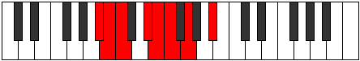 |
| [745](https://ianring.com/musictheory/scales/745) | [Kolimic](ModeASharpKolimic.md) | A# | A#, B##, C###, D##, E#, F##, A# |  |
| [745](https://ianring.com/musictheory/scales/745) | [Kolimic](ModeBFlatKolimic.md) | Bb | Bb, C#, D#, E, F, G, Bb |  |
| [747](https://ianring.com/musictheory/scales/747) | [Lynian](ModeASharpLynian.md) | A# | A#, B, C#, D#, E, F, G, A# |  |
| [747](https://ianring.com/musictheory/scales/747) | [Lynian](ModeBFlatLynian.md) | Bb | Bb, Cb, Db, Eb, Fb, Gbb, Abb, Bb |  |
| [749](https://ianring.com/musictheory/scales/749) | [Aeologian](ModeASharpAeologian.md) | A# | A#, B#, C#, D#, E, F, G, A# |  |
| [749](https://ianring.com/musictheory/scales/749) | [Aeologian](ModeBFlatAeologian.md) | Bb | Bb, C, Db, Eb, Fb, Gbb, Abb, Bb |  |
| [749](https://ianring.com/musictheory/scales/749) | [Aeologian](ModeCSharpAeologian.md) | C# | C#, D#, E, F#, G, Ab, Bb, C# |  |
| [749](https://ianring.com/musictheory/scales/749) | [Aeologian](ModeDFlatAeologian.md) | Db | Db, Eb, Fb, Gb, Abb, Bbbb, Cbb, Db |  |
| [751](https://ianring.com/musictheory/scales/751) | [Epacryllic](ModeCSharpEpacryllic.md) | C# | C#, D, D#, E, F#, G, G#, A#, C# |  |
| [751](https://ianring.com/musictheory/scales/751) | [Epacryllic](ModeDFlatEpacryllic.md) | Db | Db, D, Eb, E, Gb, G, Ab, Bb, Db |  |
| [751](https://ianring.com/musictheory/scales/751) | [Epacryllic](ModeASharpEpacryllic.md) | A# | A#, B, C, C#, D#, E, F, G, A# |  |
| [751](https://ianring.com/musictheory/scales/751) | [Epacryllic](ModeBFlatEpacryllic.md) | Bb | Bb, B, C, Db, Eb, E, F, G, Bb |  |
| [753](https://ianring.com/musictheory/scales/753) | [Kytrimic](ModeASharpKytrimic.md) | A# | A#, B###, C###, D##, E#, F##, A# |  |
| [753](https://ianring.com/musictheory/scales/753) | [Kytrimic](ModeBFlatKytrimic.md) | Bb | Bb, C##, D#, E, F, G, Bb |  |
| [753](https://ianring.com/musictheory/scales/753) | [Kytrimic](ModeDSharpKytrimic.md) | D# | D#, E###, F###, G##, A#, B#, D# |  |
| [753](https://ianring.com/musictheory/scales/753) | [Kytrimic](ModeEFlatKytrimic.md) | Eb | Eb, F##, G#, A, Bb, C, Eb |  |
| [755](https://ianring.com/musictheory/scales/755) | [Phrythian](ModeDSharpPhrythian.md) | D# | D#, E, F##, G#, A, Bb, C, D# |  |
| [755](https://ianring.com/musictheory/scales/755) | [Phrythian](ModeEFlatPhrythian.md) | Eb | Eb, Fb, G, Ab, Bbb, Cbb, Dbb, Eb |  |
| [755](https://ianring.com/musictheory/scales/755) | [Phrythian](ModeASharpPhrythian.md) | A# | A#, B, C##, D#, E, F, G, A# |  |
| [755](https://ianring.com/musictheory/scales/755) | [Phrythian](ModeBFlatPhrythian.md) | Bb | Bb, Cb, D, Eb, Fb, Gbb, Abb, Bb |  |
| [755](https://ianring.com/musictheory/scales/755) | [Phrythian](ModeFSharpPhrythian.md) | F# | F#, G, A#, B, C, Db, Eb, F# |  |
| [755](https://ianring.com/musictheory/scales/755) | [Phrythian](ModeGFlatPhrythian.md) | Gb | Gb, Abb, Bb, Cb, Dbb, Ebbb, Fbb, Gb |  |
| [757](https://ianring.com/musictheory/scales/757) | [Ionyptian](ModeASharpIonyptian.md) | A# | A#, B#, C##, D#, E, F, G, A# |  |
| [757](https://ianring.com/musictheory/scales/757) | [Ionyptian](ModeBFlatIonyptian.md) | Bb | Bb, C, D, Eb, Fb, Gbb, Abb, Bb |  |
| [757](https://ianring.com/musictheory/scales/757) | [Ionyptian](ModeCSharpIonyptian.md) | C# | C#, D#, E#, F#, G, Ab, Bb, C# |  |
| [757](https://ianring.com/musictheory/scales/757) | [Ionyptian](ModeDFlatIonyptian.md) | Db | Db, Eb, F, Gb, Abb, Bbbb, Cbb, Db |  |
| [757](https://ianring.com/musictheory/scales/757) | [Ionyptian](ModeDSharpIonyptian.md) | D# | D#, E#, F##, G#, A, Bb, C, D# |  |
| [757](https://ianring.com/musictheory/scales/757) | [Ionyptian](ModeEFlatIonyptian.md) | Eb | Eb, F, G, Ab, Bbb, Cbb, Dbb, Eb |  |
| [759](https://ianring.com/musictheory/scales/759) | [Katalyllic](ModeCSharpKatalyllic.md) | C# | C#, D, D#, F, F#, G, G#, A#, C# |  |
| [759](https://ianring.com/musictheory/scales/759) | [Katalyllic](ModeDFlatKatalyllic.md) | Db | Db, D, Eb, F, Gb, G, Ab, Bb, Db |  |
| [759](https://ianring.com/musictheory/scales/759) | [Katalyllic](ModeDSharpKatalyllic.md) | D# | D#, E, F, G, G#, A, A#, C, D# | 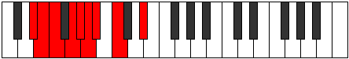 |
| [759](https://ianring.com/musictheory/scales/759) | [Katalyllic](ModeEFlatKatalyllic.md) | Eb | Eb, E, F, G, Ab, A, Bb, C, Eb |  |
| [759](https://ianring.com/musictheory/scales/759) | [Katalyllic](ModeASharpKatalyllic.md) | A# | A#, B, C, D, D#, E, F, G, A# |  |
| [759](https://ianring.com/musictheory/scales/759) | [Katalyllic](ModeBFlatKatalyllic.md) | Bb | Bb, B, C, D, Eb, E, F, G, Bb |  |
| [759](https://ianring.com/musictheory/scales/759) | [Katalyllic](ModeFSharpKatalyllic.md) | F# | F#, G, G#, A#, B, C, C#, D#, F# |  |
| [759](https://ianring.com/musictheory/scales/759) | [Katalyllic](ModeGFlatKatalyllic.md) | Gb | Gb, G, Ab, Bb, B, C, Db, Eb, Gb |  |
| [761](https://ianring.com/musictheory/scales/761) | [Ponian](ModeASharpPonian.md) | A# | A#, B##, C##, D#, E, F, G, A# |  |
| [761](https://ianring.com/musictheory/scales/761) | [Ponian](ModeBFlatPonian.md) | Bb | Bb, C#, D, Eb, Fb, Gbb, Abb, Bb |  |
| [761](https://ianring.com/musictheory/scales/761) | [Ponian](ModeDSharpPonian.md) | D# | D#, E##, F##, G#, A, Bb, C, D# |  |
| [761](https://ianring.com/musictheory/scales/761) | [Ponian](ModeEFlatPonian.md) | Eb | Eb, F#, G, Ab, Bbb, Cbb, Dbb, Eb |  |
| [763](https://ianring.com/musictheory/scales/763) | [Doryllic](ModeDSharpDoryllic.md) | D# | D#, E, F#, G, G#, A, A#, C, D# |  |
| [763](https://ianring.com/musictheory/scales/763) | [Doryllic](ModeEFlatDoryllic.md) | Eb | Eb, E, Gb, G, Ab, A, Bb, C, Eb |  |
| [763](https://ianring.com/musictheory/scales/763) | [Doryllic](ModeASharpDoryllic.md) | A# | A#, B, C#, D, D#, E, F, G, A# |  |
| [763](https://ianring.com/musictheory/scales/763) | [Doryllic](ModeBFlatDoryllic.md) | Bb | Bb, B, Db, D, Eb, E, F, G, Bb |  |
| [763](https://ianring.com/musictheory/scales/763) | [Doryllic](ModeFSharpDoryllic.md) | F# | F#, G, A, A#, B, C, C#, D#, F# |  |
| [763](https://ianring.com/musictheory/scales/763) | [Doryllic](ModeGFlatDoryllic.md) | Gb | Gb, G, A, Bb, B, C, Db, Eb, Gb |  |
| [765](https://ianring.com/musictheory/scales/765) | [Mixonyphyllic](ModeASharpMixonyphyllic.md) | A# | A#, C, C#, D, D#, E, F, G, A# |  |
| [765](https://ianring.com/musictheory/scales/765) | [Mixonyphyllic](ModeBFlatMixonyphyllic.md) | Bb | Bb, C, Db, D, Eb, E, F, G, Bb |  |
| [765](https://ianring.com/musictheory/scales/765) | [Mixonyphyllic](ModeCSharpMixonyphyllic.md) | C# | C#, D#, E, F, F#, G, G#, A#, C# |  |
| [765](https://ianring.com/musictheory/scales/765) | [Mixonyphyllic](ModeDFlatMixonyphyllic.md) | Db | Db, Eb, E, F, Gb, G, Ab, Bb, Db |  |
| [765](https://ianring.com/musictheory/scales/765) | [Mixonyphyllic](ModeDSharpMixonyphyllic.md) | D# | D#, F, F#, G, G#, A, A#, C, D# |  |
| [765](https://ianring.com/musictheory/scales/765) | [Mixonyphyllic](ModeEFlatMixonyphyllic.md) | Eb | Eb, F, Gb, G, Ab, A, Bb, C, Eb |  |
| [767](https://ianring.com/musictheory/scales/767) | [Raptygic](ModeCSharpRaptygic.md) | C# | C#, D, D#, E, F, F#, G, G#, A#, C# |  |
| [767](https://ianring.com/musictheory/scales/767) | [Raptygic](ModeDFlatRaptygic.md) | Db | Db, D, Eb, E, F, Gb, G, Ab, Bb, Db |  |
| [767](https://ianring.com/musictheory/scales/767) | [Raptygic](ModeDSharpRaptygic.md) | D# | D#, E, F, F#, G, G#, A, A#, C, D# |  |
| [767](https://ianring.com/musictheory/scales/767) | [Raptygic](ModeEFlatRaptygic.md) | Eb | Eb, E, F, Gb, G, Ab, A, Bb, C, Eb |  |
| [767](https://ianring.com/musictheory/scales/767) | [Raptygic](ModeASharpRaptygic.md) | A# | A#, B, C, C#, D, D#, E, F, G, A# |  |
| [767](https://ianring.com/musictheory/scales/767) | [Raptygic](ModeBFlatRaptygic.md) | Bb | Bb, B, C, Db, D, Eb, E, F, G, Bb |  |
| [767](https://ianring.com/musictheory/scales/767) | [Raptygic](ModeFSharpRaptygic.md) | F# | F#, G, G#, A, A#, B, C, C#, D#, F# |  |
| [767](https://ianring.com/musictheory/scales/767) | [Raptygic](ModeGFlatRaptygic.md) | Gb | Gb, G, Ab, A, Bb, B, C, Db, Eb, Gb |  |
| [787](https://ianring.com/musictheory/scales/787) | [Aeolapritonic](ModeFSharpAeolapritonic.md) | F# | F#, G, A#, D, D#, F# |  |
| [787](https://ianring.com/musictheory/scales/787) | [Aeolapritonic](ModeGFlatAeolapritonic.md) | Gb | Gb, G, Bb, D, Eb, Gb |  |
| [791](https://ianring.com/musictheory/scales/791) | [Aeoloptimic](ModeFSharpAeoloptimic.md) | F# | F#, G, Ab, Bb, C##, D#, F# |  |
| [791](https://ianring.com/musictheory/scales/791) | [Aeoloptimic](ModeGFlatAeoloptimic.md) | Gb | Gb, Abb, Bbbb, Cbb, D, Eb, Gb |  |
| [793](https://ianring.com/musictheory/scales/793) | [Mocritonic](ModeGNaturalMocritonic.md) | G | G, A#, B, D#, E, G |  |
| [795](https://ianring.com/musictheory/scales/795) | [Aeologimic](ModeFSharpAeologimic.md) | F# | F#, G, A, Bb, C##, D#, F# |  |
| [795](https://ianring.com/musictheory/scales/795) | [Aeologimic](ModeGFlatAeologimic.md) | Gb | Gb, Abb, Bbb, Cbb, D, Eb, Gb |  |
| [795](https://ianring.com/musictheory/scales/795) | [Aeologimic](ModeGNaturalAeologimic.md) | G | G, Ab, Bb, Cb, D#, E, G |  |
| [797](https://ianring.com/musictheory/scales/797) | [Katocrimic](ModeGNaturalKatocrimic.md) | G | G, A, Bb, Cb, D#, E, G |  |
| [799](https://ianring.com/musictheory/scales/799) | [Lolian](ModeFSharpLolian.md) | F# | F#, G, Ab, Bbb, Cbb, D, Eb, F# |  |
| [799](https://ianring.com/musictheory/scales/799) | [Lolian](ModeGFlatLolian.md) | Gb | Gb, Abb, Bbbb, Cbbb, Cbb, D, Eb, Gb |  |
| [799](https://ianring.com/musictheory/scales/799) | [Lolian](ModeGNaturalLolian.md) | G | G, Ab, Bbb, Cbb, Dbbb, Eb, Fb, G |  |
| [803](https://ianring.com/musictheory/scales/803) | [Loritonic](ModeDNaturalLoritonic.md) | D | D, D#, G, A#, B, D |  |
| [803](https://ianring.com/musictheory/scales/803) | [Loritonic](ModeASharpLoritonic.md) | A# | A#, B, D#, F#, G, A# |  |
| [803](https://ianring.com/musictheory/scales/803) | [Loritonic](ModeBFlatLoritonic.md) | Bb | Bb, B, Eb, Gb, G, Bb |  |
| [805](https://ianring.com/musictheory/scales/805) | [Rothitonic](ModeASharpRothitonic.md) | A# | A#, C, D#, F#, G, A# |  |
| [805](https://ianring.com/musictheory/scales/805) | [Rothitonic](ModeBFlatRothitonic.md) | Bb | Bb, C, Eb, Gb, G, Bb | 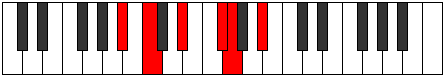 |
| [807](https://ianring.com/musictheory/scales/807) | [Epadimic](ModeDNaturalEpadimic.md) | D | D, Eb, Fb, G, A#, B, D |  |
| [807](https://ianring.com/musictheory/scales/807) | [Epadimic](ModeASharpEpadimic.md) | A# | A#, B, C, D#, E##, F##, A# |  |
| [807](https://ianring.com/musictheory/scales/807) | [Epadimic](ModeBFlatEpadimic.md) | Bb | Bb, Cb, Dbb, Eb, F#, G, Bb |  |
| [809](https://ianring.com/musictheory/scales/809) | [Dogitonic](ModeGNaturalDogitonic.md) | G | G, A#, C, D#, E, G |  |
| [809](https://ianring.com/musictheory/scales/809) | [Dogitonic](ModeASharpDogitonic.md) | A# | A#, C#, D#, F#, G, A# |  |
| [809](https://ianring.com/musictheory/scales/809) | [Dogitonic](ModeBFlatDogitonic.md) | Bb | Bb, Db, Eb, Gb, G, Bb |  |
| [811](https://ianring.com/musictheory/scales/811) | [Radimic](ModeGNaturalRadimic.md) | G | G, Ab, Bb, C, D#, E, G |  |
| [811](https://ianring.com/musictheory/scales/811) | [Radimic](ModeDNaturalRadimic.md) | D | D, Eb, F, G, A#, B, D |  |
| [811](https://ianring.com/musictheory/scales/811) | [Radimic](ModeASharpRadimic.md) | A# | A#, B, C#, D#, E##, F##, A# |  |
| [811](https://ianring.com/musictheory/scales/811) | [Radimic](ModeBFlatRadimic.md) | Bb | Bb, Cb, Db, Eb, F#, G, Bb | 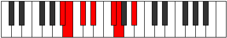 |
| [813](https://ianring.com/musictheory/scales/813) | [Larimic](ModeASharpLarimic.md) | A# | A#, B#, C#, D#, E##, F##, A# |  |
| [813](https://ianring.com/musictheory/scales/813) | [Larimic](ModeBFlatLarimic.md) | Bb | Bb, C, Db, Eb, F#, G, Bb |  |
| [813](https://ianring.com/musictheory/scales/813) | [Larimic](ModeGNaturalLarimic.md) | G | G, A, Bb, C, D#, E, G |  |
| [815](https://ianring.com/musictheory/scales/815) | [Bolian](ModeGNaturalBolian.md) | G | G, Ab, Bbb, Cbb, Dbb, Eb, Fb, G |  |
| [815](https://ianring.com/musictheory/scales/815) | [Bolian](ModeDNaturalBolian.md) | D | D, Eb, Fb, Gbb, Abb, Bb, Cb, D |  |
| [815](https://ianring.com/musictheory/scales/815) | [Bolian](ModeASharpBolian.md) | A# | A#, B, C, Db, Eb, F#, G, A# |  |
| [815](https://ianring.com/musictheory/scales/815) | [Bolian](ModeBFlatBolian.md) | Bb | Bb, Cb, Dbb, Ebbb, Fbb, Gb, Abb, Bb |  |
| [817](https://ianring.com/musictheory/scales/817) | [Zothitonic](ModeASharpZothitonic.md) | A# | A#, D, D#, F#, G, A# |  |
| [817](https://ianring.com/musictheory/scales/817) | [Zothitonic](ModeBFlatZothitonic.md) | Bb | Bb, D, Eb, Gb, G, Bb |  |
| [819](https://ianring.com/musictheory/scales/819) | [Aerythimic](ModeDNaturalAerythimic.md) | D | D, Eb, F#, G, A#, B, D |  |
| [819](https://ianring.com/musictheory/scales/819) | [Aerythimic](ModeFSharpAerythimic.md) | F# | F#, G, A#, B, C##, D#, F# |  |
| [819](https://ianring.com/musictheory/scales/819) | [Aerythimic](ModeGFlatAerythimic.md) | Gb | Gb, Abb, Bb, Cb, D, Eb, Gb |  |
| [819](https://ianring.com/musictheory/scales/819) | [Aerythimic](ModeASharpAerythimic.md) | A# | A#, B, C##, D#, E##, F##, A# |  |
| [819](https://ianring.com/musictheory/scales/819) | [Aerythimic](ModeBFlatAerythimic.md) | Bb | Bb, Cb, D, Eb, F#, G, Bb |  |
| [821](https://ianring.com/musictheory/scales/821) | [Aeranimic](ModeASharpAeranimic.md) | A# | A#, B#, C##, D#, E##, F##, A# | 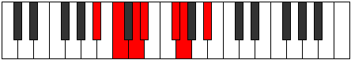 |
| [821](https://ianring.com/musictheory/scales/821) | [Aeranimic](ModeBFlatAeranimic.md) | Bb | Bb, C, D, Eb, F#, G, Bb |  |
| [823](https://ianring.com/musictheory/scales/823) | [Stodian](ModeASharpStodian.md) | A# | A#, B, C, D, Eb, F#, G, A# |  |
| [823](https://ianring.com/musictheory/scales/823) | [Stodian](ModeBFlatStodian.md) | Bb | Bb, Cb, Dbb, Ebb, Fbb, Gb, Abb, Bb |  |
| [823](https://ianring.com/musictheory/scales/823) | [Stodian](ModeDNaturalStodian.md) | D | D, Eb, Fb, Gb, Abb, Bb, Cb, D |  |
| [823](https://ianring.com/musictheory/scales/823) | [Stodian](ModeFSharpStodian.md) | F# | F#, G, Ab, Bb, Cb, D, Eb, F# |  |
| [825](https://ianring.com/musictheory/scales/825) | [Thyptimic](ModeASharpThyptimic.md) | A# | A#, B##, C##, D#, E##, F##, A# |  |
| [825](https://ianring.com/musictheory/scales/825) | [Thyptimic](ModeBFlatThyptimic.md) | Bb | Bb, C#, D, Eb, F#, G, Bb |  |
| [825](https://ianring.com/musictheory/scales/825) | [Thyptimic](ModeGNaturalThyptimic.md) | G | G, A#, B, C, D#, E, G |  |
| [827](https://ianring.com/musictheory/scales/827) | [Mixolocrian](ModeASharpMixolocrian.md) | A# | A#, B, C#, D, Eb, F#, G, A# |  |
| [827](https://ianring.com/musictheory/scales/827) | [Mixolocrian](ModeBFlatMixolocrian.md) | Bb | Bb, Cb, Db, Ebb, Fbb, Gb, Abb, Bb |  |
| [827](https://ianring.com/musictheory/scales/827) | [Mixolocrian](ModeDNaturalMixolocrian.md) | D | D, Eb, F, Gb, Abb, Bb, Cb, D |  |
| [827](https://ianring.com/musictheory/scales/827) | [Mixolocrian](ModeGNaturalMixolocrian.md) | G | G, Ab, Bb, Cb, Dbb, Eb, Fb, G |  |
| [827](https://ianring.com/musictheory/scales/827) | [Mixolocrian](ModeFSharpMixolocrian.md) | F# | F#, G, A, Bb, Cb, D, Eb, F# |  |
| [829](https://ianring.com/musictheory/scales/829) | [Lygian](ModeASharpLygian.md) | A# | A#, B#, C#, D, Eb, F#, G, A# |  |
| [829](https://ianring.com/musictheory/scales/829) | [Lygian](ModeBFlatLygian.md) | Bb | Bb, C, Db, Ebb, Fbb, Gb, Abb, Bb |  |
| [829](https://ianring.com/musictheory/scales/829) | [Lygian](ModeGNaturalLygian.md) | G | G, A, Bb, Cb, Dbb, Eb, Fb, G |  |
| [831](https://ianring.com/musictheory/scales/831) | [Rodyllic](ModeASharpRodyllic.md) | A# | A#, B, C, C#, D, D#, F#, G, A# |  |
| [831](https://ianring.com/musictheory/scales/831) | [Rodyllic](ModeBFlatRodyllic.md) | Bb | Bb, B, C, Db, D, Eb, Gb, G, Bb |  |
| [831](https://ianring.com/musictheory/scales/831) | [Rodyllic](ModeDNaturalRodyllic.md) | D | D, D#, E, F, F#, G, A#, B, D |  |
| [831](https://ianring.com/musictheory/scales/831) | [Rodyllic](ModeGNaturalRodyllic.md) | G | G, G#, A, A#, B, C, D#, E, G |  |
| [831](https://ianring.com/musictheory/scales/831) | [Rodyllic](ModeFSharpRodyllic.md) | F# | F#, G, G#, A, A#, B, D, D#, F# |  |
| [831](https://ianring.com/musictheory/scales/831) | [Rodyllic](ModeGFlatRodyllic.md) | Gb | Gb, G, Ab, A, Bb, B, D, Eb, Gb |  |
| [837](https://ianring.com/musictheory/scales/837) | [Epaditonic](ModeCSharpEpaditonic.md) | C# | C#, D#, G, A, A#, C# |  |
| [837](https://ianring.com/musictheory/scales/837) | [Epaditonic](ModeDFlatEpaditonic.md) | Db | Db, Eb, G, A, Bb, Db |  |
| [839](https://ianring.com/musictheory/scales/839) | [Ionathimic](ModeCSharpIonathimic.md) | C# | C#, D, Eb, F##, G##, A#, C# |  |
| [839](https://ianring.com/musictheory/scales/839) | [Ionathimic](ModeDFlatIonathimic.md) | Db | Db, Ebb, Fbb, G, A, Bb, Db |  |
| [841](https://ianring.com/musictheory/scales/841) | [Phrothitonic](ModeGNaturalPhrothitonic.md) | G | G, A#, C#, D#, E, G |  |
| [843](https://ianring.com/musictheory/scales/843) | [Molimic](ModeGNaturalMolimic.md) | G | G, Ab, Bb, C#, D#, E, G |  |
| [845](https://ianring.com/musictheory/scales/845) | [Zyrimic](ModeCSharpZyrimic.md) | C# | C#, D#, E, F##, G##, A#, C# |  |
| [845](https://ianring.com/musictheory/scales/845) | [Zyrimic](ModeDFlatZyrimic.md) | Db | Db, Eb, Fb, G, A, Bb, Db |  |
| [845](https://ianring.com/musictheory/scales/845) | [Zyrimic](ModeGNaturalZyrimic.md) | G | G, A, Bb, C#, D#, E, G |  |
| [847](https://ianring.com/musictheory/scales/847) | [Ganian](ModeCSharpGanian.md) | C# | C#, D, Eb, Fb, G, A, Bb, C# |  |
| [847](https://ianring.com/musictheory/scales/847) | [Ganian](ModeGNaturalGanian.md) | G | G, Ab, Bbb, Cbb, Db, Eb, Fb, G |  |
| [851](https://ianring.com/musictheory/scales/851) | [Aerylimic](ModeFSharpAerylimic.md) | F# | F#, G, A#, B#, C##, D#, F# |  |
| [851](https://ianring.com/musictheory/scales/851) | [Aerylimic](ModeGFlatAerylimic.md) | Gb | Gb, Abb, Bb, C, D, Eb, Gb |  |
| [853](https://ianring.com/musictheory/scales/853) | [Epothimic](ModeCSharpEpothimic.md) | C# | C#, D#, E#, F##, G##, A#, C# |  |
| [853](https://ianring.com/musictheory/scales/853) | [Epothimic](ModeDFlatEpothimic.md) | Db | Db, Eb, F, G, A, Bb, Db |  |
| [855](https://ianring.com/musictheory/scales/855) | [Porian](ModeFSharpPorian.md) | F# | F#, G, Ab, Bb, C, D, Eb, F# |  |
| [855](https://ianring.com/musictheory/scales/855) | [Porian](ModeCSharpPorian.md) | C# | C#, D, Eb, F, G, A, Bb, C# |  |
| [857](https://ianring.com/musictheory/scales/857) | [Aeolydimic](ModeGNaturalAeolydimic.md) | G | G, A#, B, C#, D#, E, G |  |
| [859](https://ianring.com/musictheory/scales/859) | [Pathian](ModeFSharpPathian.md) | F# | F#, G, A, Bb, C, D, Eb, F# |  |
| [859](https://ianring.com/musictheory/scales/859) | [Pathian](ModeGNaturalPathian.md) | G | G, Ab, Bb, Cb, Db, Eb, Fb, G |  |
| [861](https://ianring.com/musictheory/scales/861) | [Rylian](ModeCSharpRylian.md) | C# | C#, D#, E, F, G, A, Bb, C# |  |
| [861](https://ianring.com/musictheory/scales/861) | [Rylian](ModeDFlatRylian.md) | Db | Db, Eb, Fb, Gbb, Abb, Bbb, Cbb, Db |  |
| [861](https://ianring.com/musictheory/scales/861) | [Rylian](ModeGNaturalRylian.md) | G | G, A, Bb, Cb, Db, Eb, Fb, G | 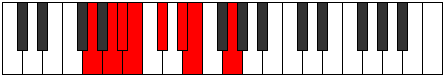 |
| [863](https://ianring.com/musictheory/scales/863) | [Pyryllic](ModeCSharpPyryllic.md) | C# | C#, D, D#, E, F, G, A, A#, C# |  |
| [863](https://ianring.com/musictheory/scales/863) | [Pyryllic](ModeDFlatPyryllic.md) | Db | Db, D, Eb, E, F, G, A, Bb, Db |  |
| [863](https://ianring.com/musictheory/scales/863) | [Pyryllic](ModeFSharpPyryllic.md) | F# | F#, G, G#, A, A#, C, D, D#, F# | 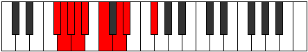 |
| [863](https://ianring.com/musictheory/scales/863) | [Pyryllic](ModeGFlatPyryllic.md) | Gb | Gb, G, Ab, A, Bb, C, D, Eb, Gb |  |
| [863](https://ianring.com/musictheory/scales/863) | [Pyryllic](ModeGNaturalPyryllic.md) | G | G, G#, A, A#, B, C#, D#, E, G |  |
| [867](https://ianring.com/musictheory/scales/867) | [Phrocrimic](ModeASharpPhrocrimic.md) | A# | A#, B, C###, D##, E##, F##, A# |  |
| [867](https://ianring.com/musictheory/scales/867) | [Phrocrimic](ModeBFlatPhrocrimic.md) | Bb | Bb, Cb, D#, E, F#, G, Bb |  |
| [867](https://ianring.com/musictheory/scales/867) | [Phrocrimic](ModeDNaturalPhrocrimic.md) | D | D, Eb, F##, G#, A#, B, D |  |
| [869](https://ianring.com/musictheory/scales/869) | [Kothimic](ModeASharpKothimic.md) | A# | A#, B#, C###, D##, E##, F##, A# |  |
| [869](https://ianring.com/musictheory/scales/869) | [Kothimic](ModeBFlatKothimic.md) | Bb | Bb, C, D#, E, F#, G, Bb |  |
| [869](https://ianring.com/musictheory/scales/869) | [Kothimic](ModeCSharpKothimic.md) | C# | C#, D#, E##, F##, G##, A#, C# |  |
| [869](https://ianring.com/musictheory/scales/869) | [Kothimic](ModeDFlatKothimic.md) | Db | Db, Eb, F#, G, A, Bb, Db |  |
| [871](https://ianring.com/musictheory/scales/871) | [Epadian](ModeCSharpEpadian.md) | C# | C#, D, Eb, F#, G, A, Bb, C# |  |
| [871](https://ianring.com/musictheory/scales/871) | [Epadian](ModeASharpEpadian.md) | A# | A#, B, C, D#, E, F#, G, A# |  |
| [871](https://ianring.com/musictheory/scales/871) | [Epadian](ModeBFlatEpadian.md) | Bb | Bb, Cb, Dbb, Eb, Fb, Gb, Abb, Bb |  |
| [871](https://ianring.com/musictheory/scales/871) | [Epadian](ModeDNaturalEpadian.md) | D | D, Eb, Fb, G, Ab, Bb, Cb, D |  |
| [873](https://ianring.com/musictheory/scales/873) | [Bagimic](ModeGNaturalBagimic.md) | G | G, A#, B#, C#, D#, E, G |  |
| [873](https://ianring.com/musictheory/scales/873) | [Bagimic](ModeASharpBagimic.md) | A# | A#, B##, C###, D##, E##, F##, A# |  |
| [873](https://ianring.com/musictheory/scales/873) | [Bagimic](ModeBFlatBagimic.md) | Bb | Bb, C#, D#, E, F#, G, Bb |  |
| [875](https://ianring.com/musictheory/scales/875) | [Stothian](ModeGNaturalStothian.md) | G | G, Ab, Bb, C, Db, Eb, Fb, G |  |
| [875](https://ianring.com/musictheory/scales/875) | [Stothian](ModeASharpStothian.md) | A# | A#, B, C#, D#, E, F#, G, A# |  |
| [875](https://ianring.com/musictheory/scales/875) | [Stothian](ModeBFlatStothian.md) | Bb | Bb, Cb, Db, Eb, Fb, Gb, Abb, Bb |  |
| [875](https://ianring.com/musictheory/scales/875) | [Stothian](ModeDNaturalStothian.md) | D | D, Eb, F, G, Ab, Bb, Cb, D |  |
| [877](https://ianring.com/musictheory/scales/877) | [Aeraptian](ModeASharpAeraptian.md) | A# | A#, B#, C#, D#, E, F#, G, A# |  |
| [877](https://ianring.com/musictheory/scales/877) | [Aeraptian](ModeBFlatAeraptian.md) | Bb | Bb, C, Db, Eb, Fb, Gb, Abb, Bb |  |
| [877](https://ianring.com/musictheory/scales/877) | [Aeraptian](ModeGNaturalAeraptian.md) | G | G, A, Bb, C, Db, Eb, Fb, G | 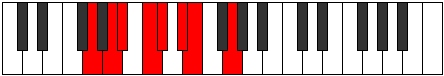 |
| [877](https://ianring.com/musictheory/scales/877) | [Aeraptian](ModeCSharpAeraptian.md) | C# | C#, D#, E, F#, G, A, Bb, C# |  |
| [877](https://ianring.com/musictheory/scales/877) | [Aeraptian](ModeDFlatAeraptian.md) | Db | Db, Eb, Fb, Gb, Abb, Bbb, Cbb, Db |  |
| [879](https://ianring.com/musictheory/scales/879) | [Aeolocryllic](ModeCSharpAeolocryllic.md) | C# | C#, D, D#, E, F#, G, A, A#, C# |  |
| [879](https://ianring.com/musictheory/scales/879) | [Aeolocryllic](ModeDFlatAeolocryllic.md) | Db | Db, D, Eb, E, Gb, G, A, Bb, Db |  |
| [879](https://ianring.com/musictheory/scales/879) | [Aeolocryllic](ModeGNaturalAeolocryllic.md) | G | G, G#, A, A#, C, C#, D#, E, G |  |
| [879](https://ianring.com/musictheory/scales/879) | [Aeolocryllic](ModeASharpAeolocryllic.md) | A# | A#, B, C, C#, D#, E, F#, G, A# |  |
| [879](https://ianring.com/musictheory/scales/879) | [Aeolocryllic](ModeBFlatAeolocryllic.md) | Bb | Bb, B, C, Db, Eb, E, Gb, G, Bb |  |
| [879](https://ianring.com/musictheory/scales/879) | [Aeolocryllic](ModeDNaturalAeolocryllic.md) | D | D, D#, E, F, G, G#, A#, B, D |  |
| [881](https://ianring.com/musictheory/scales/881) | [Aerothimic](ModeASharpAerothimic.md) | A# | A#, B###, C###, D##, E##, F##, A# |  |
| [881](https://ianring.com/musictheory/scales/881) | [Aerothimic](ModeBFlatAerothimic.md) | Bb | Bb, C##, D#, E, F#, G, Bb |  |
| [883](https://ianring.com/musictheory/scales/883) | [Ralian](ModeFSharpRalian.md) | F# | F#, G, A#, B, C, D, Eb, F# |  |
| [883](https://ianring.com/musictheory/scales/883) | [Ralian](ModeGFlatRalian.md) | Gb | Gb, Abb, Bb, Cb, Dbb, Ebb, Fbb, Gb |  |
| [883](https://ianring.com/musictheory/scales/883) | [Ralian](ModeASharpRalian.md) | A# | A#, B, C##, D#, E, F#, G, A# |  |
| [883](https://ianring.com/musictheory/scales/883) | [Ralian](ModeBFlatRalian.md) | Bb | Bb, Cb, D, Eb, Fb, Gb, Abb, Bb |  |
| [883](https://ianring.com/musictheory/scales/883) | [Ralian](ModeDNaturalRalian.md) | D | D, Eb, F#, G, Ab, Bb, Cb, D |  |
| [885](https://ianring.com/musictheory/scales/885) | [Sathian](ModeASharpSathian.md) | A# | A#, B#, C##, D#, E, F#, G, A# |  |
| [885](https://ianring.com/musictheory/scales/885) | [Sathian](ModeBFlatSathian.md) | Bb | Bb, C, D, Eb, Fb, Gb, Abb, Bb |  |
| [885](https://ianring.com/musictheory/scales/885) | [Sathian](ModeCSharpSathian.md) | C# | C#, D#, E#, F#, G, A, Bb, C# |  |
| [885](https://ianring.com/musictheory/scales/885) | [Sathian](ModeDFlatSathian.md) | Db | Db, Eb, F, Gb, Abb, Bbb, Cbb, Db |  |
| [887](https://ianring.com/musictheory/scales/887) | [Sathyllic](ModeCSharpSathyllic.md) | C# | C#, D, D#, F, F#, G, A, A#, C# |  |
| [887](https://ianring.com/musictheory/scales/887) | [Sathyllic](ModeDFlatSathyllic.md) | Db | Db, D, Eb, F, Gb, G, A, Bb, Db |  |
| [887](https://ianring.com/musictheory/scales/887) | [Sathyllic](ModeASharpSathyllic.md) | A# | A#, B, C, D, D#, E, F#, G, A# |  |
| [887](https://ianring.com/musictheory/scales/887) | [Sathyllic](ModeBFlatSathyllic.md) | Bb | Bb, B, C, D, Eb, E, Gb, G, Bb |  |
| [887](https://ianring.com/musictheory/scales/887) | [Sathyllic](ModeFSharpSathyllic.md) | F# | F#, G, G#, A#, B, C, D, D#, F# |  |
| [887](https://ianring.com/musictheory/scales/887) | [Sathyllic](ModeGFlatSathyllic.md) | Gb | Gb, G, Ab, Bb, B, C, D, Eb, Gb |  |
| [887](https://ianring.com/musictheory/scales/887) | [Sathyllic](ModeDNaturalSathyllic.md) | D | D, D#, E, F#, G, G#, A#, B, D |  |
| [889](https://ianring.com/musictheory/scales/889) | [Borian](ModeASharpBorian.md) | A# | A#, B##, C##, D#, E, F#, G, A# |  |
| [889](https://ianring.com/musictheory/scales/889) | [Borian](ModeBFlatBorian.md) | Bb | Bb, C#, D, Eb, Fb, Gb, Abb, Bb |  |
| [889](https://ianring.com/musictheory/scales/889) | [Borian](ModeGNaturalBorian.md) | G | G, A#, B, C, Db, Eb, Fb, G |  |
| [891](https://ianring.com/musictheory/scales/891) | [Ionilyllic](ModeASharpIonilyllic.md) | A# | A#, B, C#, D, D#, E, F#, G, A# |  |
| [891](https://ianring.com/musictheory/scales/891) | [Ionilyllic](ModeBFlatIonilyllic.md) | Bb | Bb, B, Db, D, Eb, E, Gb, G, Bb |  |
| [891](https://ianring.com/musictheory/scales/891) | [Ionilyllic](ModeGNaturalIonilyllic.md) | G | G, G#, A#, B, C, C#, D#, E, G |  |
| [891](https://ianring.com/musictheory/scales/891) | [Ionilyllic](ModeDNaturalIonilyllic.md) | D | D, D#, F, F#, G, G#, A#, B, D |  |
| [891](https://ianring.com/musictheory/scales/891) | [Ionilyllic](ModeFSharpIonilyllic.md) | F# | F#, G, A, A#, B, C, D, D#, F# |  |
| [891](https://ianring.com/musictheory/scales/891) | [Ionilyllic](ModeGFlatIonilyllic.md) | Gb | Gb, G, A, Bb, B, C, D, Eb, Gb |  |
| [893](https://ianring.com/musictheory/scales/893) | [Pycryllic](ModeASharpPycryllic.md) | A# | A#, C, C#, D, D#, E, F#, G, A# |  |
| [893](https://ianring.com/musictheory/scales/893) | [Pycryllic](ModeBFlatPycryllic.md) | Bb | Bb, C, Db, D, Eb, E, Gb, G, Bb |  |
| [893](https://ianring.com/musictheory/scales/893) | [Pycryllic](ModeCSharpPycryllic.md) | C# | C#, D#, E, F, F#, G, A, A#, C# |  |
| [893](https://ianring.com/musictheory/scales/893) | [Pycryllic](ModeDFlatPycryllic.md) | Db | Db, Eb, E, F, Gb, G, A, Bb, Db |  |
| [893](https://ianring.com/musictheory/scales/893) | [Pycryllic](ModeGNaturalPycryllic.md) | G | G, A, A#, B, C, C#, D#, E, G |  |
| [895](https://ianring.com/musictheory/scales/895) | [Aeolathygic](ModeCSharpAeolathygic.md) | C# | C#, D, D#, E, F, F#, G, A, A#, C# |  |
| [895](https://ianring.com/musictheory/scales/895) | [Aeolathygic](ModeDFlatAeolathygic.md) | Db | Db, D, Eb, E, F, Gb, G, A, Bb, Db |  |
| [895](https://ianring.com/musictheory/scales/895) | [Aeolathygic](ModeASharpAeolathygic.md) | A# | A#, B, C, C#, D, D#, E, F#, G, A# |  |
| [895](https://ianring.com/musictheory/scales/895) | [Aeolathygic](ModeBFlatAeolathygic.md) | Bb | Bb, B, C, Db, D, Eb, E, Gb, G, Bb |  |
| [895](https://ianring.com/musictheory/scales/895) | [Aeolathygic](ModeDNaturalAeolathygic.md) | D | D, D#, E, F, F#, G, G#, A#, B, D |  |
| [895](https://ianring.com/musictheory/scales/895) | [Aeolathygic](ModeGNaturalAeolathygic.md) | G | G, G#, A, A#, B, C, C#, D#, E, G |  |
| [895](https://ianring.com/musictheory/scales/895) | [Aeolathygic](ModeFSharpAeolathygic.md) | F# | F#, G, G#, A, A#, B, C, D, D#, F# |  |
| [895](https://ianring.com/musictheory/scales/895) | [Aeolathygic](ModeGFlatAeolathygic.md) | Gb | Gb, G, Ab, A, Bb, B, C, D, Eb, Gb |  |
| [905](https://ianring.com/musictheory/scales/905) | [Bylitonic](ModeGNaturalBylitonic.md) | G | G, A#, D, D#, E, G |  |
| [907](https://ianring.com/musictheory/scales/907) | [Tholimic](ModeGNaturalTholimic.md) | G | G, Ab, Bb, C##, D#, E, G |  |
| [909](https://ianring.com/musictheory/scales/909) | [Katarimic](ModeGNaturalKatarimic.md) | G | G, A, Bb, C##, D#, E, G |  |
| [911](https://ianring.com/musictheory/scales/911) | [Radian](ModeGNaturalRadian.md) | G | G, Ab, Bbb, Cbb, D, Eb, Fb, G |  |
| [913](https://ianring.com/musictheory/scales/913) | [Aeolyritonic](ModeDSharpAeolyritonic.md) | D# | D#, G, A#, B, C, D# |  |
| [913](https://ianring.com/musictheory/scales/913) | [Aeolyritonic](ModeEFlatAeolyritonic.md) | Eb | Eb, G, Bb, B, C, Eb |  |
| [915](https://ianring.com/musictheory/scales/915) | [Loptimic](ModeFSharpLoptimic.md) | F# | F#, G, A#, B##, C##, D#, F# |  |
| [915](https://ianring.com/musictheory/scales/915) | [Loptimic](ModeGFlatLoptimic.md) | Gb | Gb, Abb, Bb, C#, D, Eb, Gb |  |
| [915](https://ianring.com/musictheory/scales/915) | [Loptimic](ModeDSharpLoptimic.md) | D# | D#, E, F##, G###, A##, B#, D# |  |
| [915](https://ianring.com/musictheory/scales/915) | [Loptimic](ModeEFlatLoptimic.md) | Eb | Eb, Fb, G, A#, B, C, Eb | 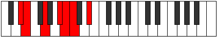 |
| [917](https://ianring.com/musictheory/scales/917) | [Dygimic](ModeDSharpDygimic.md) | D# | D#, E#, F##, G###, A##, B#, D# | 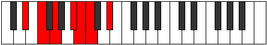 |
| [917](https://ianring.com/musictheory/scales/917) | [Dygimic](ModeEFlatDygimic.md) | Eb | Eb, F, G, A#, B, C, Eb |  |
| [919](https://ianring.com/musictheory/scales/919) | [Gathian](ModeFSharpGathian.md) | F# | F#, G, Ab, Bb, C#, D, Eb, F# |  |
| [919](https://ianring.com/musictheory/scales/919) | [Gathian](ModeDSharpGathian.md) | D# | D#, E, F, G, A#, B, C, D# |  |
| [919](https://ianring.com/musictheory/scales/919) | [Gathian](ModeEFlatGathian.md) | Eb | Eb, Fb, Gbb, Abb, Bb, Cb, Dbb, Eb |  |
| [921](https://ianring.com/musictheory/scales/921) | [Bogimic](ModeGNaturalBogimic.md) | G | G, A#, B, C##, D#, E, G |  |
| [921](https://ianring.com/musictheory/scales/921) | [Bogimic](ModeDSharpBogimic.md) | D# | D#, E##, F##, G###, A##, B#, D# |  |
| [921](https://ianring.com/musictheory/scales/921) | [Bogimic](ModeEFlatBogimic.md) | Eb | Eb, F#, G, A#, B, C, Eb |  |
| [923](https://ianring.com/musictheory/scales/923) | [Ionodian](ModeFSharpIonodian.md) | F# | F#, G, A, Bb, C#, D, Eb, F# |  |
| [923](https://ianring.com/musictheory/scales/923) | [Ionodian](ModeDSharpIonodian.md) | D# | D#, E, F#, G, A#, B, C, D# |  |
| [923](https://ianring.com/musictheory/scales/923) | [Ionodian](ModeEFlatIonodian.md) | Eb | Eb, Fb, Gb, Abb, Bb, Cb, Dbb, Eb |  |
| [923](https://ianring.com/musictheory/scales/923) | [Ionodian](ModeGNaturalIonodian.md) | G | G, Ab, Bb, Cb, D, Eb, Fb, G |  |
| [925](https://ianring.com/musictheory/scales/925) | [Mythian](ModeDSharpMythian.md) | D# | D#, E#, F#, G, A#, B, C, D# |  |
| [925](https://ianring.com/musictheory/scales/925) | [Mythian](ModeEFlatMythian.md) | Eb | Eb, F, Gb, Abb, Bb, Cb, Dbb, Eb |  |
| [925](https://ianring.com/musictheory/scales/925) | [Mythian](ModeGNaturalMythian.md) | G | G, A, Bb, Cb, D, Eb, Fb, G |  |
| [927](https://ianring.com/musictheory/scales/927) | [Koptyllic](ModeFSharpKoptyllic.md) | F# | F#, G, G#, A, A#, C#, D, D#, F# |  |
| [927](https://ianring.com/musictheory/scales/927) | [Koptyllic](ModeGFlatKoptyllic.md) | Gb | Gb, G, Ab, A, Bb, Db, D, Eb, Gb |  |
| [927](https://ianring.com/musictheory/scales/927) | [Koptyllic](ModeDSharpKoptyllic.md) | D# | D#, E, F, F#, G, A#, B, C, D# |  |
| [927](https://ianring.com/musictheory/scales/927) | [Koptyllic](ModeEFlatKoptyllic.md) | Eb | Eb, E, F, Gb, G, Bb, B, C, Eb |  |
| [927](https://ianring.com/musictheory/scales/927) | [Koptyllic](ModeGNaturalKoptyllic.md) | G | G, G#, A, A#, B, D, D#, E, G |  |
| [931](https://ianring.com/musictheory/scales/931) | [Bacrimic](ModeASharpBacrimic.md) | A# | A#, B, C###, D###, E##, F##, A# |  |
| [931](https://ianring.com/musictheory/scales/931) | [Bacrimic](ModeBFlatBacrimic.md) | Bb | Bb, Cb, D#, E#, F#, G, Bb |  |
| [931](https://ianring.com/musictheory/scales/931) | [Bacrimic](ModeDNaturalBacrimic.md) | D | D, Eb, F##, G##, A#, B, D |  |
| [933](https://ianring.com/musictheory/scales/933) | [Dadimic](ModeASharpDadimic.md) | A# | A#, B#, C###, D###, E##, F##, A# |  |
| [933](https://ianring.com/musictheory/scales/933) | [Dadimic](ModeBFlatDadimic.md) | Bb | Bb, C, D#, E#, F#, G, Bb |  |
| [935](https://ianring.com/musictheory/scales/935) | [Katarian](ModeASharpKatarian.md) | A# | A#, B, C, D#, E#, F#, G, A# |  |
| [935](https://ianring.com/musictheory/scales/935) | [Katarian](ModeBFlatKatarian.md) | Bb | Bb, Cb, Dbb, Eb, F, Gb, Abb, Bb |  |
| [935](https://ianring.com/musictheory/scales/935) | [Katarian](ModeDNaturalKatarian.md) | D | D, Eb, Fb, G, A, Bb, Cb, D |  |
| [937](https://ianring.com/musictheory/scales/937) | [Stothimic](ModeGNaturalStothimic.md) | G | G, A#, B#, C##, D#, E, G |  |
| [937](https://ianring.com/musictheory/scales/937) | [Stothimic](ModeASharpStothimic.md) | A# | A#, B##, C###, D###, E##, F##, A# |  |
| [937](https://ianring.com/musictheory/scales/937) | [Stothimic](ModeBFlatStothimic.md) | Bb | Bb, C#, D#, E#, F#, G, Bb |  |
| [939](https://ianring.com/musictheory/scales/939) | [Dyptian](ModeGNaturalDyptian.md) | G | G, Ab, Bb, C, D, Eb, Fb, G |  |
| [939](https://ianring.com/musictheory/scales/939) | [Dyptian](ModeASharpDyptian.md) | A# | A#, B, C#, D#, E#, F#, G, A# |  |
| [939](https://ianring.com/musictheory/scales/939) | [Dyptian](ModeBFlatDyptian.md) | Bb | Bb, Cb, Db, Eb, F, Gb, Abb, Bb |  |
| [939](https://ianring.com/musictheory/scales/939) | [Dyptian](ModeDNaturalDyptian.md) | D | D, Eb, F, G, A, Bb, Cb, D |  |
| [941](https://ianring.com/musictheory/scales/941) | [Phrorian](ModeASharpPhrorian.md) | A# | A#, B#, C#, D#, E#, F#, G, A# |  |
| [941](https://ianring.com/musictheory/scales/941) | [Phrorian](ModeBFlatPhrorian.md) | Bb | Bb, C, Db, Eb, F, Gb, Abb, Bb |  |
| [941](https://ianring.com/musictheory/scales/941) | [Phrorian](ModeGNaturalPhrorian.md) | G | G, A, Bb, C, D, Eb, Fb, G |  |
| [943](https://ianring.com/musictheory/scales/943) | [Aerygyllic](ModeGNaturalAerygyllic.md) | G | G, G#, A, A#, C, D, D#, E, G |  |
| [943](https://ianring.com/musictheory/scales/943) | [Aerygyllic](ModeASharpAerygyllic.md) | A# | A#, B, C, C#, D#, F, F#, G, A# |  |
| [943](https://ianring.com/musictheory/scales/943) | [Aerygyllic](ModeBFlatAerygyllic.md) | Bb | Bb, B, C, Db, Eb, F, Gb, G, Bb |  |
| [943](https://ianring.com/musictheory/scales/943) | [Aerygyllic](ModeDNaturalAerygyllic.md) | D | D, D#, E, F, G, A, A#, B, D |  |
| [945](https://ianring.com/musictheory/scales/945) | [Syrimic](ModeASharpSyrimic.md) | A# | A#, B###, C###, D###, E##, F##, A# |  |
| [945](https://ianring.com/musictheory/scales/945) | [Syrimic](ModeBFlatSyrimic.md) | Bb | Bb, C##, D#, E#, F#, G, Bb |  |
| [945](https://ianring.com/musictheory/scales/945) | [Syrimic](ModeDSharpSyrimic.md) | D# | D#, E###, F###, G###, A##, B#, D# |  |
| [945](https://ianring.com/musictheory/scales/945) | [Syrimic](ModeEFlatSyrimic.md) | Eb | Eb, F##, G#, A#, B, C, Eb |  |
| [947](https://ianring.com/musictheory/scales/947) | [Modian](ModeFSharpModian.md) | F# | F#, G, A#, B, C#, D, Eb, F# |  |
| [947](https://ianring.com/musictheory/scales/947) | [Modian](ModeGFlatModian.md) | Gb | Gb, Abb, Bb, Cb, Db, Ebb, Fbb, Gb |  |
| [947](https://ianring.com/musictheory/scales/947) | [Modian](ModeASharpModian.md) | A# | A#, B, C##, D#, E#, F#, G, A# |  |
| [947](https://ianring.com/musictheory/scales/947) | [Modian](ModeBFlatModian.md) | Bb | Bb, Cb, D, Eb, F, Gb, Abb, Bb |  |
| [947](https://ianring.com/musictheory/scales/947) | [Modian](ModeDSharpModian.md) | D# | D#, E, F##, G#, A#, B, C, D# |  |
| [947](https://ianring.com/musictheory/scales/947) | [Modian](ModeEFlatModian.md) | Eb | Eb, Fb, G, Ab, Bb, Cb, Dbb, Eb |  |
| [947](https://ianring.com/musictheory/scales/947) | [Modian](ModeDNaturalModian.md) | D | D, Eb, F#, G, A, Bb, Cb, D |  |
| [949](https://ianring.com/musictheory/scales/949) | [Ionagian](ModeASharpIonagian.md) | A# | A#, B#, C##, D#, E#, F#, G, A# |  |
| [949](https://ianring.com/musictheory/scales/949) | [Ionagian](ModeBFlatIonagian.md) | Bb | Bb, C, D, Eb, F, Gb, Abb, Bb |  |
| [949](https://ianring.com/musictheory/scales/949) | [Ionagian](ModeDSharpIonagian.md) | D# | D#, E#, F##, G#, A#, B, C, D# |  |
| [949](https://ianring.com/musictheory/scales/949) | [Ionagian](ModeEFlatIonagian.md) | Eb | Eb, F, G, Ab, Bb, Cb, Dbb, Eb |  |
| [951](https://ianring.com/musictheory/scales/951) | [Thogyllic](ModeASharpThogyllic.md) | A# | A#, B, C, D, D#, F, F#, G, A# |  |
| [951](https://ianring.com/musictheory/scales/951) | [Thogyllic](ModeBFlatThogyllic.md) | Bb | Bb, B, C, D, Eb, F, Gb, G, Bb | 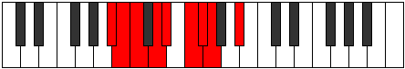 |
| [951](https://ianring.com/musictheory/scales/951) | [Thogyllic](ModeDSharpThogyllic.md) | D# | D#, E, F, G, G#, A#, B, C, D# |  |
| [951](https://ianring.com/musictheory/scales/951) | [Thogyllic](ModeEFlatThogyllic.md) | Eb | Eb, E, F, G, Ab, Bb, B, C, Eb |  |
| [951](https://ianring.com/musictheory/scales/951) | [Thogyllic](ModeFSharpThogyllic.md) | F# | F#, G, G#, A#, B, C#, D, D#, F# |  |
| [951](https://ianring.com/musictheory/scales/951) | [Thogyllic](ModeGFlatThogyllic.md) | Gb | Gb, G, Ab, Bb, B, Db, D, Eb, Gb |  |
| [951](https://ianring.com/musictheory/scales/951) | [Thogyllic](ModeDNaturalThogyllic.md) | D | D, D#, E, F#, G, A, A#, B, D |  |
| [953](https://ianring.com/musictheory/scales/953) | [Stoptian](ModeASharpStoptian.md) | A# | A#, B##, C##, D#, E#, F#, G, A# |  |
| [953](https://ianring.com/musictheory/scales/953) | [Stoptian](ModeBFlatStoptian.md) | Bb | Bb, C#, D, Eb, F, Gb, Abb, Bb |  |
| [953](https://ianring.com/musictheory/scales/953) | [Stoptian](ModeGNaturalStoptian.md) | G | G, A#, B, C, D, Eb, Fb, G |  |
| [953](https://ianring.com/musictheory/scales/953) | [Stoptian](ModeDSharpStoptian.md) | D# | D#, E##, F##, G#, A#, B, C, D# |  |
| [953](https://ianring.com/musictheory/scales/953) | [Stoptian](ModeEFlatStoptian.md) | Eb | Eb, F#, G, Ab, Bb, Cb, Dbb, Eb |  |
| [955](https://ianring.com/musictheory/scales/955) | [Ionogyllic](ModeASharpIonogyllic.md) | A# | A#, B, C#, D, D#, F, F#, G, A# |  |
| [955](https://ianring.com/musictheory/scales/955) | [Ionogyllic](ModeBFlatIonogyllic.md) | Bb | Bb, B, Db, D, Eb, F, Gb, G, Bb |  |
| [955](https://ianring.com/musictheory/scales/955) | [Ionogyllic](ModeGNaturalIonogyllic.md) | G | G, G#, A#, B, C, D, D#, E, G |  |
| [955](https://ianring.com/musictheory/scales/955) | [Ionogyllic](ModeDSharpIonogyllic.md) | D# | D#, E, F#, G, G#, A#, B, C, D# |  |
| [955](https://ianring.com/musictheory/scales/955) | [Ionogyllic](ModeEFlatIonogyllic.md) | Eb | Eb, E, Gb, G, Ab, Bb, B, C, Eb |  |
| [955](https://ianring.com/musictheory/scales/955) | [Ionogyllic](ModeFSharpIonogyllic.md) | F# | F#, G, A, A#, B, C#, D, D#, F# |  |
| [955](https://ianring.com/musictheory/scales/955) | [Ionogyllic](ModeGFlatIonogyllic.md) | Gb | Gb, G, A, Bb, B, Db, D, Eb, Gb |  |
| [955](https://ianring.com/musictheory/scales/955) | [Ionogyllic](ModeDNaturalIonogyllic.md) | D | D, D#, F, F#, G, A, A#, B, D |  |
| [957](https://ianring.com/musictheory/scales/957) | [Phronyllic](ModeASharpPhronyllic.md) | A# | A#, C, C#, D, D#, F, F#, G, A# |  |
| [957](https://ianring.com/musictheory/scales/957) | [Phronyllic](ModeBFlatPhronyllic.md) | Bb | Bb, C, Db, D, Eb, F, Gb, G, Bb |  |
| [957](https://ianring.com/musictheory/scales/957) | [Phronyllic](ModeDSharpPhronyllic.md) | D# | D#, F, F#, G, G#, A#, B, C, D# |  |
| [957](https://ianring.com/musictheory/scales/957) | [Phronyllic](ModeEFlatPhronyllic.md) | Eb | Eb, F, Gb, G, Ab, Bb, B, C, Eb |  |
| [957](https://ianring.com/musictheory/scales/957) | [Phronyllic](ModeGNaturalPhronyllic.md) | G | G, A, A#, B, C, D, D#, E, G |  |
| [959](https://ianring.com/musictheory/scales/959) | [Katylygic](ModeASharpKatylygic.md) | A# | A#, B, C, C#, D, D#, F, F#, G, A# |  |
| [959](https://ianring.com/musictheory/scales/959) | [Katylygic](ModeBFlatKatylygic.md) | Bb | Bb, B, C, Db, D, Eb, F, Gb, G, Bb |  |
| [959](https://ianring.com/musictheory/scales/959) | [Katylygic](ModeDSharpKatylygic.md) | D# | D#, E, F, F#, G, G#, A#, B, C, D# |  |
| [959](https://ianring.com/musictheory/scales/959) | [Katylygic](ModeEFlatKatylygic.md) | Eb | Eb, E, F, Gb, G, Ab, Bb, B, C, Eb |  |
| [959](https://ianring.com/musictheory/scales/959) | [Katylygic](ModeDNaturalKatylygic.md) | D | D, D#, E, F, F#, G, A, A#, B, D |  |
| [959](https://ianring.com/musictheory/scales/959) | [Katylygic](ModeGNaturalKatylygic.md) | G | G, G#, A, A#, B, C, D, D#, E, G |  |
| [959](https://ianring.com/musictheory/scales/959) | [Katylygic](ModeFSharpKatylygic.md) | F# | F#, G, G#, A, A#, B, C#, D, D#, F# |  |
| [959](https://ianring.com/musictheory/scales/959) | [Katylygic](ModeGFlatKatylygic.md) | Gb | Gb, G, Ab, A, Bb, B, Db, D, Eb, Gb |  |
| [965](https://ianring.com/musictheory/scales/965) | [Ionothimic](ModeCSharpIonothimic.md) | C# | C#, D#, E###, F###, G##, A#, C# |  |
| [965](https://ianring.com/musictheory/scales/965) | [Ionothimic](ModeDFlatIonothimic.md) | Db | Db, Eb, F##, G#, A, Bb, Db |  |
| [967](https://ianring.com/musictheory/scales/967) | [Aeolanian](ModeCSharpAeolanian.md) | C# | C#, D, Eb, F##, G#, A, Bb, C# |  |
| [967](https://ianring.com/musictheory/scales/967) | [Aeolanian](ModeDFlatAeolanian.md) | Db | Db, Ebb, Fbb, G, Ab, Bbb, Cbb, Db |  |
| [969](https://ianring.com/musictheory/scales/969) | [Ionogimic](ModeGNaturalIonogimic.md) | G | G, A#, B##, C##, D#, E, G |  |
| [971](https://ianring.com/musictheory/scales/971) | [Ladian](ModeGNaturalLadian.md) | G | G, Ab, Bb, C#, D, Eb, Fb, G |  |
| [973](https://ianring.com/musictheory/scales/973) | [Phryptian](ModeGNaturalPhryptian.md) | G | G, A, Bb, C#, D, Eb, Fb, G |  |
| [973](https://ianring.com/musictheory/scales/973) | [Phryptian](ModeCSharpPhryptian.md) | C# | C#, D#, E, F##, G#, A, Bb, C# |  |
| [973](https://ianring.com/musictheory/scales/973) | [Phryptian](ModeDFlatPhryptian.md) | Db | Db, Eb, Fb, G, Ab, Bbb, Cbb, Db |  |
| [975](https://ianring.com/musictheory/scales/975) | [Katogyllic](ModeCSharpKatogyllic.md) | C# | C#, D, D#, E, G, G#, A, A#, C# |  |
| [975](https://ianring.com/musictheory/scales/975) | [Katogyllic](ModeDFlatKatogyllic.md) | Db | Db, D, Eb, E, G, Ab, A, Bb, Db |  |
| [975](https://ianring.com/musictheory/scales/975) | [Katogyllic](ModeGNaturalKatogyllic.md) | G | G, G#, A, A#, C#, D, D#, E, G |  |
| [977](https://ianring.com/musictheory/scales/977) | [Kocrimic](ModeDSharpKocrimic.md) | D# | D#, E###, Cbbb, Cbb, Dbbb, Dbb, D# |  |
| [977](https://ianring.com/musictheory/scales/977) | [Kocrimic](ModeEFlatKocrimic.md) | Eb | Eb, F##, G##, A#, B, C, Eb |  |
| [979](https://ianring.com/musictheory/scales/979) | [Thogian](ModeFSharpThogian.md) | F# | F#, G, A#, B#, C#, D, Eb, F# |  |
| [979](https://ianring.com/musictheory/scales/979) | [Thogian](ModeGFlatThogian.md) | Gb | Gb, Abb, Bb, C, Db, Ebb, Fbb, Gb |  |
| [979](https://ianring.com/musictheory/scales/979) | [Thogian](ModeDSharpThogian.md) | D# | D#, E, F##, G##, A#, B, C, D# |  |
| [979](https://ianring.com/musictheory/scales/979) | [Thogian](ModeEFlatThogian.md) | Eb | Eb, Fb, G, A, Bb, Cb, Dbb, Eb |  |
| [981](https://ianring.com/musictheory/scales/981) | [Bacrian](ModeCSharpBacrian.md) | C# | C#, D#, E#, F##, G#, A, Bb, C# |  |
| [981](https://ianring.com/musictheory/scales/981) | [Bacrian](ModeDFlatBacrian.md) | Db | Db, Eb, F, G, Ab, Bbb, Cbb, Db |  |
| [981](https://ianring.com/musictheory/scales/981) | [Bacrian](ModeDSharpBacrian.md) | D# | D#, E#, F##, G##, A#, B, C, D# |  |
| [981](https://ianring.com/musictheory/scales/981) | [Bacrian](ModeEFlatBacrian.md) | Eb | Eb, F, G, A, Bb, Cb, Dbb, Eb |  |
| [983](https://ianring.com/musictheory/scales/983) | [Epygyllic](ModeFSharpEpygyllic.md) | F# | F#, G, G#, A#, C, C#, D, D#, F# | 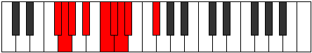 |
| [983](https://ianring.com/musictheory/scales/983) | [Epygyllic](ModeGFlatEpygyllic.md) | Gb | Gb, G, Ab, Bb, C, Db, D, Eb, Gb |  |
| [983](https://ianring.com/musictheory/scales/983) | [Epygyllic](ModeCSharpEpygyllic.md) | C# | C#, D, D#, F, G, G#, A, A#, C# |  |
| [983](https://ianring.com/musictheory/scales/983) | [Epygyllic](ModeDFlatEpygyllic.md) | Db | Db, D, Eb, F, G, Ab, A, Bb, Db |  |
| [983](https://ianring.com/musictheory/scales/983) | [Epygyllic](ModeDSharpEpygyllic.md) | D# | D#, E, F, G, A, A#, B, C, D# |  |
| [983](https://ianring.com/musictheory/scales/983) | [Epygyllic](ModeEFlatEpygyllic.md) | Eb | Eb, E, F, G, A, Bb, B, C, Eb |  |
| [985](https://ianring.com/musictheory/scales/985) | [Raptian](ModeGNaturalRaptian.md) | G | G, A#, B, C#, D, Eb, Fb, G |  |
| [985](https://ianring.com/musictheory/scales/985) | [Raptian](ModeDSharpRaptian.md) | D# | D#, E##, F##, G##, A#, B, C, D# |  |
| [985](https://ianring.com/musictheory/scales/985) | [Raptian](ModeEFlatRaptian.md) | Eb | Eb, F#, G, A, Bb, Cb, Dbb, Eb |  |
| [987](https://ianring.com/musictheory/scales/987) | [Aeraptyllic](ModeFSharpAeraptyllic.md) | F# | F#, G, A, A#, C, C#, D, D#, F# |  |
| [987](https://ianring.com/musictheory/scales/987) | [Aeraptyllic](ModeGFlatAeraptyllic.md) | Gb | Gb, G, A, Bb, C, Db, D, Eb, Gb |  |
| [987](https://ianring.com/musictheory/scales/987) | [Aeraptyllic](ModeGNaturalAeraptyllic.md) | G | G, G#, A#, B, C#, D, D#, E, G |  |
| [987](https://ianring.com/musictheory/scales/987) | [Aeraptyllic](ModeDSharpAeraptyllic.md) | D# | D#, E, F#, G, A, A#, B, C, D# | 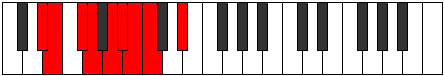 |
| [987](https://ianring.com/musictheory/scales/987) | [Aeraptyllic](ModeEFlatAeraptyllic.md) | Eb | Eb, E, Gb, G, A, Bb, B, C, Eb |  |
| [989](https://ianring.com/musictheory/scales/989) | [Phrolyllic](ModeCSharpPhrolyllic.md) | C# | C#, D#, E, F, G, G#, A, A#, C# |  |
| [989](https://ianring.com/musictheory/scales/989) | [Phrolyllic](ModeDFlatPhrolyllic.md) | Db | Db, Eb, E, F, G, Ab, A, Bb, Db |  |
| [989](https://ianring.com/musictheory/scales/989) | [Phrolyllic](ModeGNaturalPhrolyllic.md) | G | G, A, A#, B, C#, D, D#, E, G |  |
| [989](https://ianring.com/musictheory/scales/989) | [Phrolyllic](ModeDSharpPhrolyllic.md) | D# | D#, F, F#, G, A, A#, B, C, D# |  |
| [989](https://ianring.com/musictheory/scales/989) | [Phrolyllic](ModeEFlatPhrolyllic.md) | Eb | Eb, F, Gb, G, A, Bb, B, C, Eb |  |
| [991](https://ianring.com/musictheory/scales/991) | [Aeolygic](ModeCSharpAeolygic.md) | C# | C#, D, D#, E, F, G, G#, A, A#, C# |  |
| [991](https://ianring.com/musictheory/scales/991) | [Aeolygic](ModeDFlatAeolygic.md) | Db | Db, D, Eb, E, F, G, Ab, A, Bb, Db |  |
| [991](https://ianring.com/musictheory/scales/991) | [Aeolygic](ModeFSharpAeolygic.md) | F# | F#, G, G#, A, A#, C, C#, D, D#, F# |  |
| [991](https://ianring.com/musictheory/scales/991) | [Aeolygic](ModeGFlatAeolygic.md) | Gb | Gb, G, Ab, A, Bb, C, Db, D, Eb, Gb |  |
| [991](https://ianring.com/musictheory/scales/991) | [Aeolygic](ModeDSharpAeolygic.md) | D# | D#, E, F, F#, G, A, A#, B, C, D# |  |
| [991](https://ianring.com/musictheory/scales/991) | [Aeolygic](ModeEFlatAeolygic.md) | Eb | Eb, E, F, Gb, G, A, Bb, B, C, Eb |  |
| [991](https://ianring.com/musictheory/scales/991) | [Aeolygic](ModeGNaturalAeolygic.md) | G | G, G#, A, A#, B, C#, D, D#, E, G |  |
| [995](https://ianring.com/musictheory/scales/995) | [Phrathian](ModeASharpPhrathian.md) | A# | A#, B, C###, D##, E#, F#, G, A# |  |
| [995](https://ianring.com/musictheory/scales/995) | [Phrathian](ModeBFlatPhrathian.md) | Bb | Bb, Cb, D#, E, F, Gb, Abb, Bb |  |
| [995](https://ianring.com/musictheory/scales/995) | [Phrathian](ModeDNaturalPhrathian.md) | D | D, Eb, F##, G#, A, Bb, Cb, D |  |
| [997](https://ianring.com/musictheory/scales/997) | [Rycrian](ModeASharpRycrian.md) | A# | A#, B#, C###, D##, E#, F#, G, A# |  |
| [997](https://ianring.com/musictheory/scales/997) | [Rycrian](ModeBFlatRycrian.md) | Bb | Bb, C, D#, E, F, Gb, Abb, Bb |  |
| [997](https://ianring.com/musictheory/scales/997) | [Rycrian](ModeCSharpRycrian.md) | C# | C#, D#, E##, F##, G#, A, Bb, C# |  |
| [997](https://ianring.com/musictheory/scales/997) | [Rycrian](ModeDFlatRycrian.md) | Db | Db, Eb, F#, G, Ab, Bbb, Cbb, Db |  |
| [999](https://ianring.com/musictheory/scales/999) | [Bylyllic](ModeCSharpBylyllic.md) | C# | C#, D, D#, F#, G, G#, A, A#, C# |  |
| [999](https://ianring.com/musictheory/scales/999) | [Bylyllic](ModeDFlatBylyllic.md) | Db | Db, D, Eb, Gb, G, Ab, A, Bb, Db |  |
| [999](https://ianring.com/musictheory/scales/999) | [Bylyllic](ModeASharpBylyllic.md) | A# | A#, B, C, D#, E, F, F#, G, A# |  |
| [999](https://ianring.com/musictheory/scales/999) | [Bylyllic](ModeBFlatBylyllic.md) | Bb | Bb, B, C, Eb, E, F, Gb, G, Bb |  |
| [999](https://ianring.com/musictheory/scales/999) | [Bylyllic](ModeDNaturalBylyllic.md) | D | D, D#, E, G, G#, A, A#, B, D |  |
| [1001](https://ianring.com/musictheory/scales/1001) | [Badian](ModeGNaturalBadian.md) | G | G, A#, B#, C#, D, Eb, Fb, G |  |
| [1001](https://ianring.com/musictheory/scales/1001) | [Badian](ModeASharpBadian.md) | A# | A#, B##, C###, D##, E#, F#, G, A# |  |
| [1001](https://ianring.com/musictheory/scales/1001) | [Badian](ModeBFlatBadian.md) | Bb | Bb, C#, D#, E, F, Gb, Abb, Bb |  |
| [1003](https://ianring.com/musictheory/scales/1003) | [Ionyryllic](ModeGNaturalIonyryllic.md) | G | G, G#, A#, C, C#, D, D#, E, G |  |
| [1003](https://ianring.com/musictheory/scales/1003) | [Ionyryllic](ModeASharpIonyryllic.md) | A# | A#, B, C#, D#, E, F, F#, G, A# |  |
| [1003](https://ianring.com/musictheory/scales/1003) | [Ionyryllic](ModeBFlatIonyryllic.md) | Bb | Bb, B, Db, Eb, E, F, Gb, G, Bb |  |
| [1003](https://ianring.com/musictheory/scales/1003) | [Ionyryllic](ModeDNaturalIonyryllic.md) | D | D, D#, F, G, G#, A, A#, B, D |  |
| [1005](https://ianring.com/musictheory/scales/1005) | [Radyllic](ModeASharpRadyllic.md) | A# | A#, C, C#, D#, E, F, F#, G, A# |  |
| [1005](https://ianring.com/musictheory/scales/1005) | [Radyllic](ModeBFlatRadyllic.md) | Bb | Bb, C, Db, Eb, E, F, Gb, G, Bb |  |
| [1005](https://ianring.com/musictheory/scales/1005) | [Radyllic](ModeGNaturalRadyllic.md) | G | G, A, A#, C, C#, D, D#, E, G |  |
| [1005](https://ianring.com/musictheory/scales/1005) | [Radyllic](ModeCSharpRadyllic.md) | C# | C#, D#, E, F#, G, G#, A, A#, C# |  |
| [1005](https://ianring.com/musictheory/scales/1005) | [Radyllic](ModeDFlatRadyllic.md) | Db | Db, Eb, E, Gb, G, Ab, A, Bb, Db |  |
| [1007](https://ianring.com/musictheory/scales/1007) | [Ionycrygic](ModeGNaturalIonycrygic.md) | G | G, G#, A, A#, C, C#, D, D#, E, G |  |
| [1007](https://ianring.com/musictheory/scales/1007) | [Ionycrygic](ModeCSharpIonycrygic.md) | C# | C#, D, D#, E, F#, G, G#, A, A#, C# |  |
| [1007](https://ianring.com/musictheory/scales/1007) | [Ionycrygic](ModeDFlatIonycrygic.md) | Db | Db, D, Eb, E, Gb, G, Ab, A, Bb, Db |  |
| [1007](https://ianring.com/musictheory/scales/1007) | [Ionycrygic](ModeASharpIonycrygic.md) | A# | A#, B, C, C#, D#, E, F, F#, G, A# |  |
| [1007](https://ianring.com/musictheory/scales/1007) | [Ionycrygic](ModeBFlatIonycrygic.md) | Bb | Bb, B, C, Db, Eb, E, F, Gb, G, Bb |  |
| [1007](https://ianring.com/musictheory/scales/1007) | [Ionycrygic](ModeDNaturalIonycrygic.md) | D | D, D#, E, F, G, G#, A, A#, B, D |  |
| [1009](https://ianring.com/musictheory/scales/1009) | [Katyptian](ModeASharpKatyptian.md) | A# | A#, B###, C###, D##, E#, F#, G, A# |  |
| [1009](https://ianring.com/musictheory/scales/1009) | [Katyptian](ModeBFlatKatyptian.md) | Bb | Bb, C##, D#, E, F, Gb, Abb, Bb |  |
| [1009](https://ianring.com/musictheory/scales/1009) | [Katyptian](ModeDSharpKatyptian.md) | D# | D#, E###, F###, G##, A#, B, C, D# |  |
| [1009](https://ianring.com/musictheory/scales/1009) | [Katyptian](ModeEFlatKatyptian.md) | Eb | Eb, F##, G#, A, Bb, Cb, Dbb, Eb |  |
| [1011](https://ianring.com/musictheory/scales/1011) | [Kycryllic](ModeFSharpKycryllic.md) | F# | F#, G, A#, B, C, C#, D, D#, F# |  |
| [1011](https://ianring.com/musictheory/scales/1011) | [Kycryllic](ModeGFlatKycryllic.md) | Gb | Gb, G, Bb, B, C, Db, D, Eb, Gb |  |
| [1011](https://ianring.com/musictheory/scales/1011) | [Kycryllic](ModeASharpKycryllic.md) | A# | A#, B, D, D#, E, F, F#, G, A# |  |
| [1011](https://ianring.com/musictheory/scales/1011) | [Kycryllic](ModeBFlatKycryllic.md) | Bb | Bb, B, D, Eb, E, F, Gb, G, Bb |  |
| [1011](https://ianring.com/musictheory/scales/1011) | [Kycryllic](ModeDSharpKycryllic.md) | D# | D#, E, G, G#, A, A#, B, C, D# |  |
| [1011](https://ianring.com/musictheory/scales/1011) | [Kycryllic](ModeEFlatKycryllic.md) | Eb | Eb, E, G, Ab, A, Bb, B, C, Eb |  |
| [1011](https://ianring.com/musictheory/scales/1011) | [Kycryllic](ModeDNaturalKycryllic.md) | D | D, D#, F#, G, G#, A, A#, B, D |  |
| [1013](https://ianring.com/musictheory/scales/1013) | [Stydyllic](ModeASharpStydyllic.md) | A# | A#, C, D, D#, E, F, F#, G, A# |  |
| [1013](https://ianring.com/musictheory/scales/1013) | [Stydyllic](ModeBFlatStydyllic.md) | Bb | Bb, C, D, Eb, E, F, Gb, G, Bb |  |
| [1013](https://ianring.com/musictheory/scales/1013) | [Stydyllic](ModeCSharpStydyllic.md) | C# | C#, D#, F, F#, G, G#, A, A#, C# |  |
| [1013](https://ianring.com/musictheory/scales/1013) | [Stydyllic](ModeDFlatStydyllic.md) | Db | Db, Eb, F, Gb, G, Ab, A, Bb, Db |  |
| [1013](https://ianring.com/musictheory/scales/1013) | [Stydyllic](ModeDSharpStydyllic.md) | D# | D#, F, G, G#, A, A#, B, C, D# |  |
| [1013](https://ianring.com/musictheory/scales/1013) | [Stydyllic](ModeEFlatStydyllic.md) | Eb | Eb, F, G, Ab, A, Bb, B, C, Eb |  |
| [1015](https://ianring.com/musictheory/scales/1015) | [Ionodygic](ModeCSharpIonodygic.md) | C# | C#, D, D#, F, F#, G, G#, A, A#, C# |  |
| [1015](https://ianring.com/musictheory/scales/1015) | [Ionodygic](ModeDFlatIonodygic.md) | Db | Db, D, Eb, F, Gb, G, Ab, A, Bb, Db |  |
| [1015](https://ianring.com/musictheory/scales/1015) | [Ionodygic](ModeASharpIonodygic.md) | A# | A#, B, C, D, D#, E, F, F#, G, A# |  |
| [1015](https://ianring.com/musictheory/scales/1015) | [Ionodygic](ModeBFlatIonodygic.md) | Bb | Bb, B, C, D, Eb, E, F, Gb, G, Bb |  |
| [1015](https://ianring.com/musictheory/scales/1015) | [Ionodygic](ModeFSharpIonodygic.md) | F# | F#, G, G#, A#, B, C, C#, D, D#, F# |  |
| [1015](https://ianring.com/musictheory/scales/1015) | [Ionodygic](ModeGFlatIonodygic.md) | Gb | Gb, G, Ab, Bb, B, C, Db, D, Eb, Gb |  |
| [1015](https://ianring.com/musictheory/scales/1015) | [Ionodygic](ModeDSharpIonodygic.md) | D# | D#, E, F, G, G#, A, A#, B, C, D# |  |
| [1015](https://ianring.com/musictheory/scales/1015) | [Ionodygic](ModeEFlatIonodygic.md) | Eb | Eb, E, F, G, Ab, A, Bb, B, C, Eb |  |
| [1015](https://ianring.com/musictheory/scales/1015) | [Ionodygic](ModeDNaturalIonodygic.md) | D | D, D#, E, F#, G, G#, A, A#, B, D |  |
| [1017](https://ianring.com/musictheory/scales/1017) | [Dythyllic](ModeASharpDythyllic.md) | A# | A#, C#, D, D#, E, F, F#, G, A# |  |
| [1017](https://ianring.com/musictheory/scales/1017) | [Dythyllic](ModeBFlatDythyllic.md) | Bb | Bb, Db, D, Eb, E, F, Gb, G, Bb |  |
| [1017](https://ianring.com/musictheory/scales/1017) | [Dythyllic](ModeGNaturalDythyllic.md) | G | G, A#, B, C, C#, D, D#, E, G | 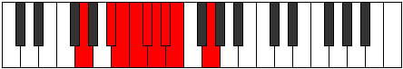 |
| [1017](https://ianring.com/musictheory/scales/1017) | [Dythyllic](ModeDSharpDythyllic.md) | D# | D#, F#, G, G#, A, A#, B, C, D# |  |
| [1017](https://ianring.com/musictheory/scales/1017) | [Dythyllic](ModeEFlatDythyllic.md) | Eb | Eb, Gb, G, Ab, A, Bb, B, C, Eb |  |
| [1019](https://ianring.com/musictheory/scales/1019) | [Aeranygic](ModeASharpAeranygic.md) | A# | A#, B, C#, D, D#, E, F, F#, G, A# |  |
| [1019](https://ianring.com/musictheory/scales/1019) | [Aeranygic](ModeBFlatAeranygic.md) | Bb | Bb, B, Db, D, Eb, E, F, Gb, G, Bb |  |
| [1019](https://ianring.com/musictheory/scales/1019) | [Aeranygic](ModeGNaturalAeranygic.md) | G | G, G#, A#, B, C, C#, D, D#, E, G |  |
| [1019](https://ianring.com/musictheory/scales/1019) | [Aeranygic](ModeFSharpAeranygic.md) | F# | F#, G, A, A#, B, C, C#, D, D#, F# |  |
| [1019](https://ianring.com/musictheory/scales/1019) | [Aeranygic](ModeGFlatAeranygic.md) | Gb | Gb, G, A, Bb, B, C, Db, D, Eb, Gb |  |
| [1019](https://ianring.com/musictheory/scales/1019) | [Aeranygic](ModeDSharpAeranygic.md) | D# | D#, E, F#, G, G#, A, A#, B, C, D# |  |
| [1019](https://ianring.com/musictheory/scales/1019) | [Aeranygic](ModeEFlatAeranygic.md) | Eb | Eb, E, Gb, G, Ab, A, Bb, B, C, Eb |  |
| [1019](https://ianring.com/musictheory/scales/1019) | [Aeranygic](ModeDNaturalAeranygic.md) | D | D, D#, F, F#, G, G#, A, A#, B, D |  |
| [1021](https://ianring.com/musictheory/scales/1021) | [Ladygic](ModeASharpLadygic.md) | A# | A#, C, C#, D, D#, E, F, F#, G, A# |  |
| [1021](https://ianring.com/musictheory/scales/1021) | [Ladygic](ModeBFlatLadygic.md) | Bb | Bb, C, Db, D, Eb, E, F, Gb, G, Bb |  |
| [1021](https://ianring.com/musictheory/scales/1021) | [Ladygic](ModeCSharpLadygic.md) | C# | C#, D#, E, F, F#, G, G#, A, A#, C# |  |
| [1021](https://ianring.com/musictheory/scales/1021) | [Ladygic](ModeDFlatLadygic.md) | Db | Db, Eb, E, F, Gb, G, Ab, A, Bb, Db |  |
| [1021](https://ianring.com/musictheory/scales/1021) | [Ladygic](ModeGNaturalLadygic.md) | G | G, A, A#, B, C, C#, D, D#, E, G |  |
| [1021](https://ianring.com/musictheory/scales/1021) | [Ladygic](ModeDSharpLadygic.md) | D# | D#, F, F#, G, G#, A, A#, B, C, D# |  |
| [1021](https://ianring.com/musictheory/scales/1021) | [Ladygic](ModeEFlatLadygic.md) | Eb | Eb, F, Gb, G, Ab, A, Bb, B, C, Eb |  |
| [1023](https://ianring.com/musictheory/scales/1023) | [Dodyllian](ModeCSharpDodyllian.md) | C# | C#, D, D#, E, F, F#, G, G#, A, A#, C# |  |
| [1023](https://ianring.com/musictheory/scales/1023) | [Dodyllian](ModeDFlatDodyllian.md) | Db | Db, D, Eb, E, F, Gb, G, Ab, A, Bb, Db |  |
| [1023](https://ianring.com/musictheory/scales/1023) | [Dodyllian](ModeASharpDodyllian.md) | A# | A#, B, C, C#, D, D#, E, F, F#, G, A# |  |
| [1023](https://ianring.com/musictheory/scales/1023) | [Dodyllian](ModeBFlatDodyllian.md) | Bb | Bb, B, C, Db, D, Eb, E, F, Gb, G, Bb |  |
| [1023](https://ianring.com/musictheory/scales/1023) | [Dodyllian](ModeGNaturalDodyllian.md) | G | G, G#, A, A#, B, C, C#, D, D#, E, G |  |
| [1023](https://ianring.com/musictheory/scales/1023) | [Dodyllian](ModeFSharpDodyllian.md) | F# | F#, G, G#, A, A#, B, C, C#, D, D#, F# |  |
| [1023](https://ianring.com/musictheory/scales/1023) | [Dodyllian](ModeGFlatDodyllian.md) | Gb | Gb, G, Ab, A, Bb, B, C, Db, D, Eb, Gb | 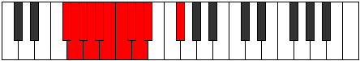 |
| [1023](https://ianring.com/musictheory/scales/1023) | [Dodyllian](ModeDSharpDodyllian.md) | D# | D#, E, F, F#, G, G#, A, A#, B, C, D# |  |
| [1023](https://ianring.com/musictheory/scales/1023) | [Dodyllian](ModeEFlatDodyllian.md) | Eb | Eb, E, F, Gb, G, Ab, A, Bb, B, C, Eb |  |
| [1023](https://ianring.com/musictheory/scales/1023) | [Dodyllian](ModeDNaturalDodyllian.md) | D | D, D#, E, F, F#, G, G#, A, A#, B, D |  |
| [1095](https://ianring.com/musictheory/scales/1095) | [Phrythitonic](ModeANaturalPhrythitonic.md) | A | A, A#, B, D#, G, A |  |
| [1099](https://ianring.com/musictheory/scales/1099) | [Dyritonic](ModeANaturalDyritonic.md) | A | A, A#, C, D#, G, A |  |
| [1103](https://ianring.com/musictheory/scales/1103) | [Lynimic](ModeANaturalLynimic.md) | A | A, Bb, Cb, Dbb, Eb, F##, A |  |
| [1107](https://ianring.com/musictheory/scales/1107) | [Mogitonic](ModeANaturalMogitonic.md) | A | A, A#, C#, D#, G, A |  |
| [1111](https://ianring.com/musictheory/scales/1111) | [Sycrimic](ModeANaturalSycrimic.md) | A | A, Bb, Cb, Db, Eb, F##, A |  |
| [1115](https://ianring.com/musictheory/scales/1115) | [Locrimic](ModeANaturalLocrimic.md) | A | A, Bb, C, Db, Eb, F##, A |  |
| [1119](https://ianring.com/musictheory/scales/1119) | [Rarian](ModeANaturalRarian.md) | A | A, Bb, Cb, Dbb, Ebbb, Fbb, G, A |  |
| [1123](https://ianring.com/musictheory/scales/1123) | [Lanitonic](ModeANaturalLanitonic.md) | A | A, A#, D, D#, G, A |  |
| [1125](https://ianring.com/musictheory/scales/1125) | [Ionaritonic](ModeFNaturalIonaritonic.md) | F | F, G, A#, B, D#, F |  |
| [1127](https://ianring.com/musictheory/scales/1127) | [Eparimic](ModeFNaturalEparimic.md) | F | F, Gb, Abb, Bb, Cb, D#, F |  |
| [1127](https://ianring.com/musictheory/scales/1127) | [Eparimic](ModeANaturalEparimic.md) | A | A, Bb, Cb, D, Eb, F##, A |  |
| [1131](https://ianring.com/musictheory/scales/1131) | [Thocrimic](ModeANaturalThocrimic.md) | A | A, Bb, C, D, Eb, F##, A |  |
| [1133](https://ianring.com/musictheory/scales/1133) | [Stycrimic](ModeFNaturalStycrimic.md) | F | F, G, Ab, Bb, Cb, D#, F |  |
| [1135](https://ianring.com/musictheory/scales/1135) | [Katolian](ModeFNaturalKatolian.md) | F | F, Gb, Abb, Bbbb, Cbb, Dbbb, Eb, F |  |
| [1135](https://ianring.com/musictheory/scales/1135) | [Katolian](ModeANaturalKatolian.md) | A | A, Bb, Cb, Dbb, Ebb, Fbb, G, A |  |
| [1139](https://ianring.com/musictheory/scales/1139) | [Aerygimic](ModeANaturalAerygimic.md) | A | A, Bb, C#, D, Eb, F##, A |  |
| [1141](https://ianring.com/musictheory/scales/1141) | [Rynimic](ModeFNaturalRynimic.md) | F | F, G, A, Bb, Cb, D#, F |  |
| [1143](https://ianring.com/musictheory/scales/1143) | [Styrian](ModeANaturalStyrian.md) | A | A, Bb, Cb, Db, Ebb, Fbb, G, A |  |
| [1143](https://ianring.com/musictheory/scales/1143) | [Styrian](ModeFNaturalStyrian.md) | F | F, Gb, Abb, Bbb, Cbb, Dbbb, Eb, F |  |
| [1147](https://ianring.com/musictheory/scales/1147) | [Epynian](ModeANaturalEpynian.md) | A | A, Bb, C, Db, Ebb, Fbb, G, A |  |
| [1149](https://ianring.com/musictheory/scales/1149) | [Bydian](ModeFNaturalBydian.md) | F | F, G, Ab, Bbb, Cbb, Dbbb, Eb, F |  |
| [1151](https://ianring.com/musictheory/scales/1151) | [Mythyllic](ModeANaturalMythyllic.md) | A | A, A#, B, C, C#, D, D#, G, A |  |
| [1151](https://ianring.com/musictheory/scales/1151) | [Mythyllic](ModeFNaturalMythyllic.md) | F | F, F#, G, G#, A, A#, B, D#, F |  |
| [1161](https://ianring.com/musictheory/scales/1161) | [Eporic](ModeCNaturalEporic.md) | C | C, D#, G, A#, C |  |
| [1163](https://ianring.com/musictheory/scales/1163) | [Pagitonic](ModeCNaturalPagitonic.md) | C | C, C#, D#, G, A#, C |  |
| [1165](https://ianring.com/musictheory/scales/1165) | [Gycritonic](ModeCNaturalGycritonic.md) | C | C, D, D#, G, A#, C |  |
| [1167](https://ianring.com/musictheory/scales/1167) | [Aerodimic](ModeCNaturalAerodimic.md) | C | C, Db, Ebb, Fbb, G, A#, C |  |
| [1169](https://ianring.com/musictheory/scales/1169) | [Daric](ModeDSharpDaric.md) | D# | D#, G, A#, C#, D# | 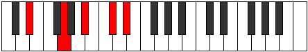 |
| [1169](https://ianring.com/musictheory/scales/1169) | [Daric](ModeEFlatDaric.md) | Eb | Eb, G, Bb, Db, Eb |  |
| [1171](https://ianring.com/musictheory/scales/1171) | [Loptitonic](ModeDSharpLoptitonic.md) | D# | D#, E, G, A#, C#, D# |  |
| [1171](https://ianring.com/musictheory/scales/1171) | [Loptitonic](ModeEFlatLoptitonic.md) | Eb | Eb, E, G, Bb, Db, Eb |  |
| [1173](https://ianring.com/musictheory/scales/1173) | [Phropitonic](ModeDSharpPhropitonic.md) | D# | D#, F, G, A#, C#, D# |  |
| [1173](https://ianring.com/musictheory/scales/1173) | [Phropitonic](ModeEFlatPhropitonic.md) | Eb | Eb, F, G, Bb, Db, Eb |  |
| [1175](https://ianring.com/musictheory/scales/1175) | [Epycrimic](ModeDSharpEpycrimic.md) | D# | D#, E, F, G, A#, B##, D# |  |
| [1175](https://ianring.com/musictheory/scales/1175) | [Epycrimic](ModeEFlatEpycrimic.md) | Eb | Eb, Fb, Gbb, Abb, Bb, C#, Eb |  |
| [1177](https://ianring.com/musictheory/scales/1177) | [Garitonic](ModeCNaturalGaritonic.md) | C | C, D#, E, G, A#, C |  |
| [1177](https://ianring.com/musictheory/scales/1177) | [Garitonic](ModeDSharpGaritonic.md) | D# | D#, F#, G, A#, C#, D# |  |
| [1177](https://ianring.com/musictheory/scales/1177) | [Garitonic](ModeEFlatGaritonic.md) | Eb | Eb, Gb, G, Bb, Db, Eb |  |
| [1179](https://ianring.com/musictheory/scales/1179) | [Sonimic](ModeCNaturalSonimic.md) | C | C, Db, Eb, Fb, G, A#, C |  |
| [1179](https://ianring.com/musictheory/scales/1179) | [Sonimic](ModeDSharpSonimic.md) | D# | D#, E, F#, G, A#, B##, D# |  |
| [1179](https://ianring.com/musictheory/scales/1179) | [Sonimic](ModeEFlatSonimic.md) | Eb | Eb, Fb, Gb, Abb, Bb, C#, Eb |  |
| [1181](https://ianring.com/musictheory/scales/1181) | [Katagimic](ModeCNaturalKatagimic.md) | C | C, D, Eb, Fb, G, A#, C |  |
| [1181](https://ianring.com/musictheory/scales/1181) | [Katagimic](ModeDSharpKatagimic.md) | D# | D#, E#, F#, G, A#, B##, D# |  |
| [1181](https://ianring.com/musictheory/scales/1181) | [Katagimic](ModeEFlatKatagimic.md) | Eb | Eb, F, Gb, Abb, Bb, C#, Eb |  |
| [1183](https://ianring.com/musictheory/scales/1183) | [Sadian](ModeCNaturalSadian.md) | C | C, Db, Ebb, Fbb, Gbbb, Abb, Bb, C |  |
| [1183](https://ianring.com/musictheory/scales/1183) | [Sadian](ModeDSharpSadian.md) | D# | D#, E, F, Gb, Abb, Bb, C#, D# |  |
| [1183](https://ianring.com/musictheory/scales/1183) | [Sadian](ModeEFlatSadian.md) | Eb | Eb, Fb, Gbb, Abbb, E###, Cbb, Db, Eb |  |
| [1189](https://ianring.com/musictheory/scales/1189) | [Thaptitonic](ModeFNaturalThaptitonic.md) | F | F, G, A#, C, D#, F |  |
| [1191](https://ianring.com/musictheory/scales/1191) | [Pyrimic](ModeFNaturalPyrimic.md) | F | F, Gb, Abb, Bb, C, D#, F |  |
| [1193](https://ianring.com/musictheory/scales/1193) | [Rocritonic](ModeCNaturalRocritonic.md) | C | C, D#, F, G, A#, C |  |
| [1195](https://ianring.com/musictheory/scales/1195) | [Sarimic](ModeCNaturalSarimic.md) | C | C, Db, Eb, F, G, A#, C |  |
| [1197](https://ianring.com/musictheory/scales/1197) | [Rocrimic](ModeCNaturalRocrimic.md) | C | C, D, Eb, F, G, A#, C |  |
| [1197](https://ianring.com/musictheory/scales/1197) | [Rocrimic](ModeFNaturalRocrimic.md) | F | F, G, Ab, Bb, C, D#, F |  |
| [1199](https://ianring.com/musictheory/scales/1199) | [Magian](ModeCNaturalMagian.md) | C | C, Db, Ebb, Fbb, Gbb, Abb, Bb, C |  |
| [1199](https://ianring.com/musictheory/scales/1199) | [Magian](ModeFNaturalMagian.md) | F | F, Gb, Abb, Bbbb, Cbb, Dbb, Eb, F |  |
| [1201](https://ianring.com/musictheory/scales/1201) | [Aeracritonic](ModeDSharpAeracritonic.md) | D# | D#, G, G#, A#, C#, D# |  |
| [1201](https://ianring.com/musictheory/scales/1201) | [Aeracritonic](ModeEFlatAeracritonic.md) | Eb | Eb, G, Ab, Bb, Db, Eb |  |
| [1203](https://ianring.com/musictheory/scales/1203) | [Pagimic](ModeDSharpPagimic.md) | D# | D#, E, F##, G#, A#, B##, D# |  |
| [1203](https://ianring.com/musictheory/scales/1203) | [Pagimic](ModeEFlatPagimic.md) | Eb | Eb, Fb, G, Ab, Bb, C#, Eb |  |
| [1205](https://ianring.com/musictheory/scales/1205) | [Ionycrimic](ModeDSharpIonycrimic.md) | D# | D#, E#, F##, G#, A#, B##, D# |  |
| [1205](https://ianring.com/musictheory/scales/1205) | [Ionycrimic](ModeEFlatIonycrimic.md) | Eb | Eb, F, G, Ab, Bb, C#, Eb |  |
| [1205](https://ianring.com/musictheory/scales/1205) | [Ionycrimic](ModeFNaturalIonycrimic.md) | F | F, G, A, Bb, C, D#, F |  |
| [1207](https://ianring.com/musictheory/scales/1207) | [Aeoloptian](ModeDSharpAeoloptian.md) | D# | D#, E, F, G, Ab, Bb, C#, D# |  |
| [1207](https://ianring.com/musictheory/scales/1207) | [Aeoloptian](ModeEFlatAeoloptian.md) | Eb | Eb, Fb, Gbb, Abb, Bbbb, Cbb, Db, Eb |  |
| [1207](https://ianring.com/musictheory/scales/1207) | [Aeoloptian](ModeFNaturalAeoloptian.md) | F | F, Gb, Abb, Bbb, Cbb, Dbb, Eb, F |  |
| [1209](https://ianring.com/musictheory/scales/1209) | [Ionynimic](ModeCNaturalIonynimic.md) | C | C, D#, E, F, G, A#, C |  |
| [1209](https://ianring.com/musictheory/scales/1209) | [Ionynimic](ModeDSharpIonynimic.md) | D# | D#, E##, F##, G#, A#, B##, D# |  |
| [1209](https://ianring.com/musictheory/scales/1209) | [Ionynimic](ModeEFlatIonynimic.md) | Eb | Eb, F#, G, Ab, Bb, C#, Eb | 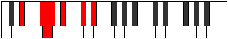 |
| [1211](https://ianring.com/musictheory/scales/1211) | [Zadian](ModeCNaturalZadian.md) | C | C, Db, Eb, Fb, Gbb, Abb, Bb, C |  |
| [1211](https://ianring.com/musictheory/scales/1211) | [Zadian](ModeDSharpZadian.md) | D# | D#, E, F#, G, Ab, Bb, C#, D# | 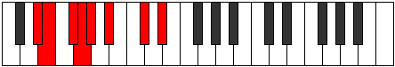 |
| [1211](https://ianring.com/musictheory/scales/1211) | [Zadian](ModeEFlatZadian.md) | Eb | Eb, Fb, Gb, Abb, Bbbb, Cbb, Db, Eb |  |
| [1213](https://ianring.com/musictheory/scales/1213) | [Gyrian](ModeCNaturalGyrian.md) | C | C, D, Eb, Fb, Gbb, Abb, Bb, C |  |
| [1213](https://ianring.com/musictheory/scales/1213) | [Gyrian](ModeDSharpGyrian.md) | D# | D#, E#, F#, G, Ab, Bb, C#, D# |  |
| [1213](https://ianring.com/musictheory/scales/1213) | [Gyrian](ModeEFlatGyrian.md) | Eb | Eb, F, Gb, Abb, Bbbb, Cbb, Db, Eb |  |
| [1213](https://ianring.com/musictheory/scales/1213) | [Gyrian](ModeFNaturalGyrian.md) | F | F, G, Ab, Bbb, Cbb, Dbb, Eb, F |  |
| [1215](https://ianring.com/musictheory/scales/1215) | [Aeolanyllic](ModeCNaturalAeolanyllic.md) | C | C, C#, D, D#, E, F, G, A#, C |  |
| [1215](https://ianring.com/musictheory/scales/1215) | [Aeolanyllic](ModeDSharpAeolanyllic.md) | D# | D#, E, F, F#, G, G#, A#, C#, D# |  |
| [1215](https://ianring.com/musictheory/scales/1215) | [Aeolanyllic](ModeEFlatAeolanyllic.md) | Eb | Eb, E, F, Gb, G, Ab, Bb, Db, Eb |  |
| [1215](https://ianring.com/musictheory/scales/1215) | [Aeolanyllic](ModeFNaturalAeolanyllic.md) | F | F, F#, G, G#, A, A#, C, D#, F |  |
| [1223](https://ianring.com/musictheory/scales/1223) | [Phryptimic](ModeANaturalPhryptimic.md) | A | A, Bb, Cb, D#, E, F##, A | 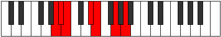 |
| [1225](https://ianring.com/musictheory/scales/1225) | [Lyditonic](ModeCNaturalLyditonic.md) | C | C, D#, F#, G, A#, C |  |
| [1227](https://ianring.com/musictheory/scales/1227) | [Thacrimic](ModeCNaturalThacrimic.md) | C | C, Db, Eb, F#, G, A#, C |  |
| [1227](https://ianring.com/musictheory/scales/1227) | [Thacrimic](ModeANaturalThacrimic.md) | A | A, Bb, C, D#, E, F##, A | 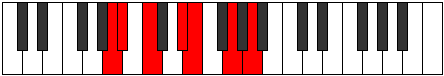 |
| [1229](https://ianring.com/musictheory/scales/1229) | [Ragimic](ModeCNaturalRagimic.md) | C | C, D, Eb, F#, G, A#, C |  |
| [1231](https://ianring.com/musictheory/scales/1231) | [Logian](ModeCNaturalLogian.md) | C | C, Db, Ebb, Fbb, Gb, Abb, Bb, C |  |
| [1231](https://ianring.com/musictheory/scales/1231) | [Logian](ModeANaturalLogian.md) | A | A, Bb, Cb, Dbb, Eb, Fb, G, A |  |
| [1233](https://ianring.com/musictheory/scales/1233) | [Ionoditonic](ModeDSharpIonoditonic.md) | D# | D#, G, A, A#, C#, D# |  |
| [1233](https://ianring.com/musictheory/scales/1233) | [Ionoditonic](ModeEFlatIonoditonic.md) | Eb | Eb, G, A, Bb, Db, Eb |  |
| [1235](https://ianring.com/musictheory/scales/1235) | [Stylimic](ModeDSharpStylimic.md) | D# | D#, E, F##, G##, A#, B##, D# |  |
| [1235](https://ianring.com/musictheory/scales/1235) | [Stylimic](ModeEFlatStylimic.md) | Eb | Eb, Fb, G, A, Bb, C#, Eb |  |
| [1235](https://ianring.com/musictheory/scales/1235) | [Stylimic](ModeANaturalStylimic.md) | A | A, Bb, C#, D#, E, F##, A |  |
| [1237](https://ianring.com/musictheory/scales/1237) | [Salimic](ModeDSharpSalimic.md) | D# | D#, E#, F##, G##, A#, B##, D# |  |
| [1237](https://ianring.com/musictheory/scales/1237) | [Salimic](ModeEFlatSalimic.md) | Eb | Eb, F, G, A, Bb, C#, Eb |  |
| [1239](https://ianring.com/musictheory/scales/1239) | [Epaptian](ModeDSharpEpaptian.md) | D# | D#, E, F, G, A, Bb, C#, D# |  |
| [1239](https://ianring.com/musictheory/scales/1239) | [Epaptian](ModeEFlatEpaptian.md) | Eb | Eb, Fb, Gbb, Abb, Bbb, Cbb, Db, Eb |  |
| [1239](https://ianring.com/musictheory/scales/1239) | [Epaptian](ModeANaturalEpaptian.md) | A | A, Bb, Cb, Db, Eb, Fb, G, A | 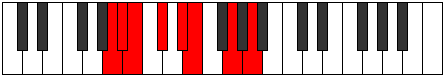 |
| [1241](https://ianring.com/musictheory/scales/1241) | [Pygimic](ModeCNaturalPygimic.md) | C | C, D#, E, F#, G, A#, C |  |
| [1241](https://ianring.com/musictheory/scales/1241) | [Pygimic](ModeDSharpPygimic.md) | D# | D#, E##, F##, G##, A#, B##, D# |  |
| [1241](https://ianring.com/musictheory/scales/1241) | [Pygimic](ModeEFlatPygimic.md) | Eb | Eb, F#, G, A, Bb, C#, Eb |  |
| [1243](https://ianring.com/musictheory/scales/1243) | [Epylian](ModeCNaturalEpylian.md) | C | C, Db, Eb, Fb, Gb, Abb, Bb, C |  |
| [1243](https://ianring.com/musictheory/scales/1243) | [Epylian](ModeANaturalEpylian.md) | A | A, Bb, C, Db, Eb, Fb, G, A |  |
| [1243](https://ianring.com/musictheory/scales/1243) | [Epylian](ModeDSharpEpylian.md) | D# | D#, E, F#, G, A, Bb, C#, D# |  |
| [1243](https://ianring.com/musictheory/scales/1243) | [Epylian](ModeEFlatEpylian.md) | Eb | Eb, Fb, Gb, Abb, Bbb, Cbb, Db, Eb |  |
| [1245](https://ianring.com/musictheory/scales/1245) | [Lathian](ModeCNaturalLathian.md) | C | C, D, Eb, Fb, Gb, Abb, Bb, C |  |
| [1245](https://ianring.com/musictheory/scales/1245) | [Lathian](ModeDSharpLathian.md) | D# | D#, E#, F#, G, A, Bb, C#, D# |  |
| [1245](https://ianring.com/musictheory/scales/1245) | [Lathian](ModeEFlatLathian.md) | Eb | Eb, F, Gb, Abb, Bbb, Cbb, Db, Eb |  |
| [1247](https://ianring.com/musictheory/scales/1247) | [Mygyllic](ModeCNaturalMygyllic.md) | C | C, C#, D, D#, E, F#, G, A#, C |  |
| [1247](https://ianring.com/musictheory/scales/1247) | [Mygyllic](ModeDSharpMygyllic.md) | D# | D#, E, F, F#, G, A, A#, C#, D# |  |
| [1247](https://ianring.com/musictheory/scales/1247) | [Mygyllic](ModeEFlatMygyllic.md) | Eb | Eb, E, F, Gb, G, A, Bb, Db, Eb |  |
| [1247](https://ianring.com/musictheory/scales/1247) | [Mygyllic](ModeANaturalMygyllic.md) | A | A, A#, B, C, C#, D#, E, G, A |  |
| [1251](https://ianring.com/musictheory/scales/1251) | [Sylimic](ModeANaturalSylimic.md) | A | A, Bb, C##, D#, E, F##, A |  |
| [1253](https://ianring.com/musictheory/scales/1253) | [Zolimic](ModeFNaturalZolimic.md) | F | F, G, A#, B, C, D#, F |  |
| [1255](https://ianring.com/musictheory/scales/1255) | [Sogian](ModeFNaturalSogian.md) | F | F, Gb, Abb, Bb, Cb, Dbb, Eb, F |  |
| [1255](https://ianring.com/musictheory/scales/1255) | [Sogian](ModeANaturalSogian.md) | A | A, Bb, Cb, D, Eb, Fb, G, A |  |
| [1257](https://ianring.com/musictheory/scales/1257) | [Aeolyphimic](ModeCNaturalAeolyphimic.md) | C | C, D#, E#, F#, G, A#, C |  |
| [1259](https://ianring.com/musictheory/scales/1259) | [Stadian](ModeCNaturalStadian.md) | C | C, Db, Eb, F, Gb, Abb, Bb, C |  |
| [1259](https://ianring.com/musictheory/scales/1259) | [Stadian](ModeANaturalStadian.md) | A | A, Bb, C, D, Eb, Fb, G, A |  |
| [1261](https://ianring.com/musictheory/scales/1261) | [Aeodian](ModeCNaturalAeodian.md) | C | C, D, Eb, F, Gb, Abb, Bb, C |  |
| [1261](https://ianring.com/musictheory/scales/1261) | [Aeodian](ModeFNaturalAeodian.md) | F | F, G, Ab, Bb, Cb, Dbb, Eb, F |  |
| [1263](https://ianring.com/musictheory/scales/1263) | [Stynyllic](ModeCNaturalStynyllic.md) | C | C, C#, D, D#, F, F#, G, A#, C |  |
| [1263](https://ianring.com/musictheory/scales/1263) | [Stynyllic](ModeFNaturalStynyllic.md) | F | F, F#, G, G#, A#, B, C, D#, F |  |
| [1263](https://ianring.com/musictheory/scales/1263) | [Stynyllic](ModeANaturalStynyllic.md) | A | A, A#, B, C, D, D#, E, G, A |  |
| [1265](https://ianring.com/musictheory/scales/1265) | [Pynimic](ModeDSharpPynimic.md) | D# | D#, E###, F###, G##, A#, B##, D# |  |
| [1265](https://ianring.com/musictheory/scales/1265) | [Pynimic](ModeEFlatPynimic.md) | Eb | Eb, F##, G#, A, Bb, C#, Eb |  |
| [1267](https://ianring.com/musictheory/scales/1267) | [Katynian](ModeANaturalKatynian.md) | A | A, Bb, C#, D, Eb, Fb, G, A |  |
| [1267](https://ianring.com/musictheory/scales/1267) | [Katynian](ModeDSharpKatynian.md) | D# | D#, E, F##, G#, A, Bb, C#, D# |  |
| [1267](https://ianring.com/musictheory/scales/1267) | [Katynian](ModeEFlatKatynian.md) | Eb | Eb, Fb, G, Ab, Bbb, Cbb, Db, Eb |  |
| [1269](https://ianring.com/musictheory/scales/1269) | [Katythian](ModeDSharpKatythian.md) | D# | D#, E#, F##, G#, A, Bb, C#, D# |  |
| [1269](https://ianring.com/musictheory/scales/1269) | [Katythian](ModeEFlatKatythian.md) | Eb | Eb, F, G, Ab, Bbb, Cbb, Db, Eb |  |
| [1269](https://ianring.com/musictheory/scales/1269) | [Katythian](ModeFNaturalKatythian.md) | F | F, G, A, Bb, Cb, Dbb, Eb, F |  |
| [1271](https://ianring.com/musictheory/scales/1271) | [Kolyllic](ModeDSharpKolyllic.md) | D# | D#, E, F, G, G#, A, A#, C#, D# |  |
| [1271](https://ianring.com/musictheory/scales/1271) | [Kolyllic](ModeEFlatKolyllic.md) | Eb | Eb, E, F, G, Ab, A, Bb, Db, Eb |  |
| [1271](https://ianring.com/musictheory/scales/1271) | [Kolyllic](ModeANaturalKolyllic.md) | A | A, A#, B, C#, D, D#, E, G, A |  |
| [1271](https://ianring.com/musictheory/scales/1271) | [Kolyllic](ModeFNaturalKolyllic.md) | F | F, F#, G, A, A#, B, C, D#, F | 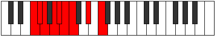 |
| [1273](https://ianring.com/musictheory/scales/1273) | [Ronian](ModeCNaturalRonian.md) | C | C, D#, E, F, Gb, Abb, Bb, C |  |
| [1273](https://ianring.com/musictheory/scales/1273) | [Ronian](ModeDSharpRonian.md) | D# | D#, E##, F##, G#, A, Bb, C#, D# |  |
| [1273](https://ianring.com/musictheory/scales/1273) | [Ronian](ModeEFlatRonian.md) | Eb | Eb, F#, G, Ab, Bbb, Cbb, Db, Eb |  |
| [1275](https://ianring.com/musictheory/scales/1275) | [Stagyllic](ModeCNaturalStagyllic.md) | C | C, C#, D#, E, F, F#, G, A#, C |  |
| [1275](https://ianring.com/musictheory/scales/1275) | [Stagyllic](ModeANaturalStagyllic.md) | A | A, A#, C, C#, D, D#, E, G, A |  |
| [1275](https://ianring.com/musictheory/scales/1275) | [Stagyllic](ModeDSharpStagyllic.md) | D# | D#, E, F#, G, G#, A, A#, C#, D# |  |
| [1275](https://ianring.com/musictheory/scales/1275) | [Stagyllic](ModeEFlatStagyllic.md) | Eb | Eb, E, Gb, G, Ab, A, Bb, Db, Eb |  |
| [1277](https://ianring.com/musictheory/scales/1277) | [Zadyllic](ModeCNaturalZadyllic.md) | C | C, D, D#, E, F, F#, G, A#, C |  |
| [1277](https://ianring.com/musictheory/scales/1277) | [Zadyllic](ModeDSharpZadyllic.md) | D# | D#, F, F#, G, G#, A, A#, C#, D# |  |
| [1277](https://ianring.com/musictheory/scales/1277) | [Zadyllic](ModeEFlatZadyllic.md) | Eb | Eb, F, Gb, G, Ab, A, Bb, Db, Eb |  |
| [1277](https://ianring.com/musictheory/scales/1277) | [Zadyllic](ModeFNaturalZadyllic.md) | F | F, G, G#, A, A#, B, C, D#, F |  |
| [1279](https://ianring.com/musictheory/scales/1279) | [Sarygic](ModeCNaturalSarygic.md) | C | C, C#, D, D#, E, F, F#, G, A#, C |  |
| [1279](https://ianring.com/musictheory/scales/1279) | [Sarygic](ModeDSharpSarygic.md) | D# | D#, E, F, F#, G, G#, A, A#, C#, D# |  |
| [1279](https://ianring.com/musictheory/scales/1279) | [Sarygic](ModeEFlatSarygic.md) | Eb | Eb, E, F, Gb, G, Ab, A, Bb, Db, Eb |  |
| [1279](https://ianring.com/musictheory/scales/1279) | [Sarygic](ModeANaturalSarygic.md) | A | A, A#, B, C, C#, D, D#, E, G, A |  |
| [1279](https://ianring.com/musictheory/scales/1279) | [Sarygic](ModeFNaturalSarygic.md) | F | F, F#, G, G#, A, A#, B, C, D#, F |  |
| [1305](https://ianring.com/musictheory/scales/1305) | [Dynitonic](ModeGNaturalDynitonic.md) | G | G, A#, B, D#, F, G |  |
| [1307](https://ianring.com/musictheory/scales/1307) | [Katorimic](ModeGNaturalKatorimic.md) | G | G, Ab, Bb, Cb, D#, E#, G |  |
| [1309](https://ianring.com/musictheory/scales/1309) | [Pogimic](ModeGNaturalPogimic.md) | G | G, A, Bb, Cb, D#, E#, G | 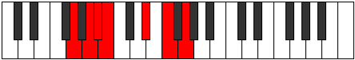 |
| [1311](https://ianring.com/musictheory/scales/1311) | [Bynian](ModeGNaturalBynian.md) | G | G, Ab, Bbb, Cbb, Dbbb, Eb, F, G |  |
| [1315](https://ianring.com/musictheory/scales/1315) | [Pyritonic](ModeDNaturalPyritonic.md) | D | D, D#, G, A#, C, D |  |
| [1317](https://ianring.com/musictheory/scales/1317) | [Staditonic](ModeFNaturalStaditonic.md) | F | F, G, A#, C#, D#, F | 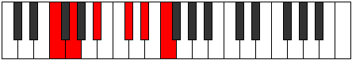 |
| [1319](https://ianring.com/musictheory/scales/1319) | [Phronimic](ModeDNaturalPhronimic.md) | D | D, Eb, Fb, G, A#, B#, D |  |
| [1319](https://ianring.com/musictheory/scales/1319) | [Phronimic](ModeFNaturalPhronimic.md) | F | F, Gb, Abb, Bb, C#, D#, F |  |
| [1321](https://ianring.com/musictheory/scales/1321) | [Epathitonic](ModeGNaturalEpathitonic.md) | G | G, A#, C, D#, F, G |  |
| [1323](https://ianring.com/musictheory/scales/1323) | [Eporimic](ModeDNaturalEporimic.md) | D | D, Eb, F, G, A#, B#, D | 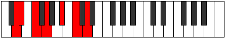 |
| [1323](https://ianring.com/musictheory/scales/1323) | [Eporimic](ModeGNaturalEporimic.md) | G | G, Ab, Bb, C, D#, E#, G |  |
| [1325](https://ianring.com/musictheory/scales/1325) | [Phradimic](ModeFNaturalPhradimic.md) | F | F, G, Ab, Bb, C#, D#, F |  |
| [1325](https://ianring.com/musictheory/scales/1325) | [Phradimic](ModeGNaturalPhradimic.md) | G | G, A, Bb, C, D#, E#, G |  |
| [1327](https://ianring.com/musictheory/scales/1327) | [Zalian](ModeDNaturalZalian.md) | D | D, Eb, Fb, Gbb, Abb, Bb, C, D |  |
| [1327](https://ianring.com/musictheory/scales/1327) | [Zalian](ModeFNaturalZalian.md) | F | F, Gb, Abb, Bbbb, Cbb, Db, Eb, F |  |
| [1327](https://ianring.com/musictheory/scales/1327) | [Zalian](ModeGNaturalZalian.md) | G | G, Ab, Bbb, Cbb, Dbb, Eb, F, G |  |
| [1331](https://ianring.com/musictheory/scales/1331) | [Dolimic](ModeDNaturalDolimic.md) | D | D, Eb, F#, G, A#, B#, D |  |
| [1333](https://ianring.com/musictheory/scales/1333) | [Lyptimic](ModeFNaturalLyptimic.md) | F | F, G, A, Bb, C#, D#, F |  |
| [1335](https://ianring.com/musictheory/scales/1335) | [Aeralian](ModeDNaturalAeralian.md) | D | D, Eb, Fb, Gb, Abb, Bb, C, D |  |
| [1335](https://ianring.com/musictheory/scales/1335) | [Aeralian](ModeFNaturalAeralian.md) | F | F, Gb, Abb, Bbb, Cbb, Db, Eb, F |  |
| [1337](https://ianring.com/musictheory/scales/1337) | [Epogimic](ModeGNaturalEpogimic.md) | G | G, A#, B, C, D#, E#, G |  |
| [1339](https://ianring.com/musictheory/scales/1339) | [Kycrian](ModeDNaturalKycrian.md) | D | D, Eb, F, Gb, Abb, Bb, C, D |  |
| [1339](https://ianring.com/musictheory/scales/1339) | [Kycrian](ModeGNaturalKycrian.md) | G | G, Ab, Bb, Cb, Dbb, Eb, F, G |  |
| [1341](https://ianring.com/musictheory/scales/1341) | [Madian](ModeFNaturalMadian.md) | F | F, G, Ab, Bbb, Cbb, Db, Eb, F |  |
| [1341](https://ianring.com/musictheory/scales/1341) | [Madian](ModeGNaturalMadian.md) | G | G, A, Bb, Cb, Dbb, Eb, F, G |  |
| [1343](https://ianring.com/musictheory/scales/1343) | [Zalyllic](ModeDNaturalZalyllic.md) | D | D, D#, E, F, F#, G, A#, C, D |  |
| [1343](https://ianring.com/musictheory/scales/1343) | [Zalyllic](ModeFNaturalZalyllic.md) | F | F, F#, G, G#, A, A#, C#, D#, F |  |
| [1343](https://ianring.com/musictheory/scales/1343) | [Zalyllic](ModeGNaturalZalyllic.md) | G | G, G#, A, A#, B, C, D#, F, G |  |
| [1351](https://ianring.com/musictheory/scales/1351) | [Aeraptimic](ModeANaturalAeraptimic.md) | A | A, Bb, Cb, D#, E#, F##, A |  |
| [1353](https://ianring.com/musictheory/scales/1353) | [Kataritonic](ModeGNaturalKataritonic.md) | G | G, A#, C#, D#, F, G |  |
| [1355](https://ianring.com/musictheory/scales/1355) | [Aeolorimic](ModeGNaturalAeolorimic.md) | G | G, Ab, Bb, C#, D#, E#, G |  |
| [1355](https://ianring.com/musictheory/scales/1355) | [Aeolorimic](ModeANaturalAeolorimic.md) | A | A, Bb, C, D#, E#, F##, A |  |
| [1357](https://ianring.com/musictheory/scales/1357) | [Katonimic](ModeGNaturalKatonimic.md) | G | G, A, Bb, C#, D#, E#, G | 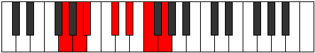 |
| [1359](https://ianring.com/musictheory/scales/1359) | [Aerygian](ModeGNaturalAerygian.md) | G | G, Ab, Bbb, Cbb, Db, Eb, F, G |  |
| [1359](https://ianring.com/musictheory/scales/1359) | [Aerygian](ModeANaturalAerygian.md) | A | A, Bb, Cb, Dbb, Eb, F, G, A |  |
| [1363](https://ianring.com/musictheory/scales/1363) | [Gygimic](ModeANaturalGygimic.md) | A | A, Bb, C#, D#, E#, F##, A |  |
| [1367](https://ianring.com/musictheory/scales/1367) | [Pyptian](ModeANaturalPyptian.md) | A | A, Bb, Cb, Db, Eb, F, G, A |  |
| [1369](https://ianring.com/musictheory/scales/1369) | [Boptimic](ModeGNaturalBoptimic.md) | G | G, A#, B, C#, D#, E#, G |  |
| [1371](https://ianring.com/musictheory/scales/1371) | [Ionadian](ModeANaturalIonadian.md) | A | A, Bb, C, Db, Eb, F, G, A |  |
| [1371](https://ianring.com/musictheory/scales/1371) | [Ionadian](ModeGNaturalIonadian.md) | G | G, Ab, Bb, Cb, Db, Eb, F, G |  |
| [1373](https://ianring.com/musictheory/scales/1373) | [Storian](ModeGNaturalStorian.md) | G | G, A, Bb, Cb, Db, Eb, F, G |  |
| [1375](https://ianring.com/musictheory/scales/1375) | [Bothyllic](ModeANaturalBothyllic.md) | A | A, A#, B, C, C#, D#, F, G, A |  |
| [1375](https://ianring.com/musictheory/scales/1375) | [Bothyllic](ModeGNaturalBothyllic.md) | G | G, G#, A, A#, B, C#, D#, F, G |  |
| [1379](https://ianring.com/musictheory/scales/1379) | [Kycrimic](ModeDNaturalKycrimic.md) | D | D, Eb, F##, G#, A#, B#, D |  |
| [1379](https://ianring.com/musictheory/scales/1379) | [Kycrimic](ModeANaturalKycrimic.md) | A | A, Bb, C##, D#, E#, F##, A |  |
| [1381](https://ianring.com/musictheory/scales/1381) | [Padimic](ModeFNaturalPadimic.md) | F | F, G, A#, B, C#, D#, F |  |
| [1383](https://ianring.com/musictheory/scales/1383) | [Pynian](ModeDNaturalPynian.md) | D | D, Eb, Fb, G, Ab, Bb, C, D | 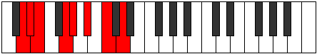 |
| [1383](https://ianring.com/musictheory/scales/1383) | [Pynian](ModeFNaturalPynian.md) | F | F, Gb, Abb, Bb, Cb, Db, Eb, F |  |
| [1383](https://ianring.com/musictheory/scales/1383) | [Pynian](ModeANaturalPynian.md) | A | A, Bb, Cb, D, Eb, F, G, A |  |
| [1385](https://ianring.com/musictheory/scales/1385) | [Phracrimic](ModeGNaturalPhracrimic.md) | G | G, A#, B#, C#, D#, E#, G |  |
| [1387](https://ianring.com/musictheory/scales/1387) | [Locrian](ModeGNaturalLocrian.md) | G | G, Ab, Bb, C, Db, Eb, F, G |  |
| [1387](https://ianring.com/musictheory/scales/1387) | [Locrian](ModeDNaturalLocrian.md) | D | D, Eb, F, G, Ab, Bb, C, D |  |
| [1387](https://ianring.com/musictheory/scales/1387) | [Locrian](ModeANaturalLocrian.md) | A | A, Bb, C, D, Eb, F, G, A |  |
| [1389](https://ianring.com/musictheory/scales/1389) | [Lorian](ModeGNaturalLorian.md) | G | G, A, Bb, C, Db, Eb, F, G |  |
| [1389](https://ianring.com/musictheory/scales/1389) | [Lorian](ModeFNaturalLorian.md) | F | F, G, Ab, Bb, Cb, Db, Eb, F |  |
| [1391](https://ianring.com/musictheory/scales/1391) | [Aeradyllic](ModeDNaturalAeradyllic.md) | D | D, D#, E, F, G, G#, A#, C, D |  |
| [1391](https://ianring.com/musictheory/scales/1391) | [Aeradyllic](ModeGNaturalAeradyllic.md) | G | G, G#, A, A#, C, C#, D#, F, G |  |
| [1391](https://ianring.com/musictheory/scales/1391) | [Aeradyllic](ModeFNaturalAeradyllic.md) | F | F, F#, G, G#, A#, B, C#, D#, F |  |
| [1391](https://ianring.com/musictheory/scales/1391) | [Aeradyllic](ModeANaturalAeradyllic.md) | A | A, A#, B, C, D, D#, F, G, A |  |
| [1395](https://ianring.com/musictheory/scales/1395) | [Mixonorian](ModeDNaturalMixonorian.md) | D | D, Eb, F#, G, Ab, Bb, C, D |  |
| [1395](https://ianring.com/musictheory/scales/1395) | [Mixonorian](ModeANaturalMixonorian.md) | A | A, Bb, C#, D, Eb, F, G, A |  |
| [1397](https://ianring.com/musictheory/scales/1397) | [Gothian](ModeFNaturalGothian.md) | F | F, G, A, Bb, Cb, Db, Eb, F |  |
| [1399](https://ianring.com/musictheory/scales/1399) | [Syryllic](ModeDNaturalSyryllic.md) | D | D, D#, E, F#, G, G#, A#, C, D |  |
| [1399](https://ianring.com/musictheory/scales/1399) | [Syryllic](ModeANaturalSyryllic.md) | A | A, A#, B, C#, D, D#, F, G, A |  |
| [1399](https://ianring.com/musictheory/scales/1399) | [Syryllic](ModeFNaturalSyryllic.md) | F | F, F#, G, A, A#, B, C#, D#, F |  |
| [1401](https://ianring.com/musictheory/scales/1401) | [Pagian](ModeGNaturalPagian.md) | G | G, A#, B, C, Db, Eb, F, G |  |
| [1403](https://ianring.com/musictheory/scales/1403) | [Epinyllic](ModeDNaturalEpinyllic.md) | D | D, D#, F, F#, G, G#, A#, C, D |  |
| [1403](https://ianring.com/musictheory/scales/1403) | [Epinyllic](ModeANaturalEpinyllic.md) | A | A, A#, C, C#, D, D#, F, G, A |  |
| [1403](https://ianring.com/musictheory/scales/1403) | [Epinyllic](ModeGNaturalEpinyllic.md) | G | G, G#, A#, B, C, C#, D#, F, G |  |
| [1405](https://ianring.com/musictheory/scales/1405) | [Goryllic](ModeGNaturalGoryllic.md) | G | G, A, A#, B, C, C#, D#, F, G |  |
| [1405](https://ianring.com/musictheory/scales/1405) | [Goryllic](ModeFNaturalGoryllic.md) | F | F, G, G#, A, A#, B, C#, D#, F |  |
| [1407](https://ianring.com/musictheory/scales/1407) | [Tharygic](ModeDNaturalTharygic.md) | D | D, D#, E, F, F#, G, G#, A#, C, D |  |
| [1407](https://ianring.com/musictheory/scales/1407) | [Tharygic](ModeANaturalTharygic.md) | A | A, A#, B, C, C#, D, D#, F, G, A |  |
| [1407](https://ianring.com/musictheory/scales/1407) | [Tharygic](ModeGNaturalTharygic.md) | G | G, G#, A, A#, B, C, C#, D#, F, G |  |
| [1407](https://ianring.com/musictheory/scales/1407) | [Tharygic](ModeFNaturalTharygic.md) | F | F, F#, G, G#, A, A#, B, C#, D#, F |  |
| [1417](https://ianring.com/musictheory/scales/1417) | [Zoptitonic](ModeGNaturalZoptitonic.md) | G | G, A#, D, D#, F, G |  |
| [1417](https://ianring.com/musictheory/scales/1417) | [Zoptitonic](ModeCNaturalZoptitonic.md) | C | C, D#, G, G#, A#, C |  |
| [1419](https://ianring.com/musictheory/scales/1419) | [Zalimic](ModeCNaturalZalimic.md) | C | C, Db, Eb, F##, G#, A#, C |  |
| [1419](https://ianring.com/musictheory/scales/1419) | [Zalimic](ModeGNaturalZalimic.md) | G | G, Ab, Bb, C##, D#, E#, G |  |
| [1421](https://ianring.com/musictheory/scales/1421) | [Aeolaphimic](ModeCNaturalAeolaphimic.md) | C | C, D, Eb, F##, G#, A#, C |  |
| [1421](https://ianring.com/musictheory/scales/1421) | [Aeolaphimic](ModeGNaturalAeolaphimic.md) | G | G, A, Bb, C##, D#, E#, G |  |
| [1423](https://ianring.com/musictheory/scales/1423) | [Doptian](ModeCNaturalDoptian.md) | C | C, Db, Ebb, Fbb, G, Ab, Bb, C |  |
| [1423](https://ianring.com/musictheory/scales/1423) | [Doptian](ModeGNaturalDoptian.md) | G | G, Ab, Bbb, Cbb, D, Eb, F, G |  |
| [1425](https://ianring.com/musictheory/scales/1425) | [Ryphitonic](ModeDSharpRyphitonic.md) | D# | D#, G, A#, B, C#, D# |  |
| [1425](https://ianring.com/musictheory/scales/1425) | [Ryphitonic](ModeEFlatRyphitonic.md) | Eb | Eb, G, Bb, B, Db, Eb |  |
| [1427](https://ianring.com/musictheory/scales/1427) | [Lolimic](ModeDSharpLolimic.md) | D# | D#, E, F##, G###, A##, B##, D# |  |
| [1427](https://ianring.com/musictheory/scales/1427) | [Lolimic](ModeEFlatLolimic.md) | Eb | Eb, Fb, G, A#, B, C#, Eb |  |
| [1429](https://ianring.com/musictheory/scales/1429) | [Bythimic](ModeDSharpBythimic.md) | D# | D#, E#, F##, G###, A##, B##, D# |  |
| [1429](https://ianring.com/musictheory/scales/1429) | [Bythimic](ModeEFlatBythimic.md) | Eb | Eb, F, G, A#, B, C#, Eb |  |
| [1431](https://ianring.com/musictheory/scales/1431) | [Phragian](ModeDSharpPhragian.md) | D# | D#, E, F, G, A#, B, C#, D# |  |
| [1431](https://ianring.com/musictheory/scales/1431) | [Phragian](ModeEFlatPhragian.md) | Eb | Eb, Fb, Gbb, Abb, Bb, Cb, Db, Eb |  |
| [1433](https://ianring.com/musictheory/scales/1433) | [Dynimic](ModeCNaturalDynimic.md) | C | C, D#, E, F##, G#, A#, C |  |
| [1433](https://ianring.com/musictheory/scales/1433) | [Dynimic](ModeGNaturalDynimic.md) | G | G, A#, B, C##, D#, E#, G | 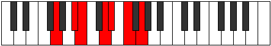 |
| [1433](https://ianring.com/musictheory/scales/1433) | [Dynimic](ModeDSharpDynimic.md) | D# | D#, E##, F##, G###, A##, B##, D# |  |
| [1433](https://ianring.com/musictheory/scales/1433) | [Dynimic](ModeEFlatDynimic.md) | Eb | Eb, F#, G, A#, B, C#, Eb |  |
| [1435](https://ianring.com/musictheory/scales/1435) | [Phronian](ModeCNaturalPhronian.md) | C | C, Db, Eb, Fb, G, Ab, Bb, C |  |
| [1435](https://ianring.com/musictheory/scales/1435) | [Phronian](ModeDSharpPhronian.md) | D# | D#, E, F#, G, A#, B, C#, D# |  |
| [1435](https://ianring.com/musictheory/scales/1435) | [Phronian](ModeEFlatPhronian.md) | Eb | Eb, Fb, Gb, Abb, Bb, Cb, Db, Eb |  |
| [1435](https://ianring.com/musictheory/scales/1435) | [Phronian](ModeGNaturalPhronian.md) | G | G, Ab, Bb, Cb, D, Eb, F, G |  |
| [1437](https://ianring.com/musictheory/scales/1437) | [Aeolycrian](ModeCNaturalAeolycrian.md) | C | C, D, Eb, Fb, G, Ab, Bb, C |  |
| [1437](https://ianring.com/musictheory/scales/1437) | [Aeolycrian](ModeDSharpAeolycrian.md) | D# | D#, E#, F#, G, A#, B, C#, D# |  |
| [1437](https://ianring.com/musictheory/scales/1437) | [Aeolycrian](ModeEFlatAeolycrian.md) | Eb | Eb, F, Gb, Abb, Bb, Cb, Db, Eb |  |
| [1437](https://ianring.com/musictheory/scales/1437) | [Aeolycrian](ModeGNaturalAeolycrian.md) | G | G, A, Bb, Cb, D, Eb, F, G |  |
| [1439](https://ianring.com/musictheory/scales/1439) | [Rolyllic](ModeCNaturalRolyllic.md) | C | C, C#, D, D#, E, G, G#, A#, C |  |
| [1439](https://ianring.com/musictheory/scales/1439) | [Rolyllic](ModeDSharpRolyllic.md) | D# | D#, E, F, F#, G, A#, B, C#, D# |  |
| [1439](https://ianring.com/musictheory/scales/1439) | [Rolyllic](ModeEFlatRolyllic.md) | Eb | Eb, E, F, Gb, G, Bb, B, Db, Eb |  |
| [1439](https://ianring.com/musictheory/scales/1439) | [Rolyllic](ModeGNaturalRolyllic.md) | G | G, G#, A, A#, B, D, D#, F, G |  |
| [1443](https://ianring.com/musictheory/scales/1443) | [Ionarimic](ModeDNaturalIonarimic.md) | D | D, Eb, F##, G##, A#, B#, D |  |
| [1445](https://ianring.com/musictheory/scales/1445) | [Byptimic](ModeFNaturalByptimic.md) | F | F, G, A#, B#, C#, D#, F |  |
| [1447](https://ianring.com/musictheory/scales/1447) | [Mixopyrian](ModeFNaturalMixopyrian.md) | F | F, Gb, Abb, Bb, C, Db, Eb, F |  |
| [1447](https://ianring.com/musictheory/scales/1447) | [Mixopyrian](ModeDNaturalMixopyrian.md) | D | D, Eb, Fb, G, A, Bb, C, D |  |
| [1449](https://ianring.com/musictheory/scales/1449) | [Epathimic](ModeGNaturalEpathimic.md) | G | G, A#, B#, C##, D#, E#, G |  |
| [1449](https://ianring.com/musictheory/scales/1449) | [Epathimic](ModeCNaturalEpathimic.md) | C | C, D#, E#, F##, G#, A#, C |  |
| [1451](https://ianring.com/musictheory/scales/1451) | [Phrygian](ModeCNaturalPhrygian.md) | C | C, Db, Eb, F, G, Ab, Bb, C |  |
| [1451](https://ianring.com/musictheory/scales/1451) | [Phrygian](ModeGNaturalPhrygian.md) | G | G, Ab, Bb, C, D, Eb, F, G |  |
| [1451](https://ianring.com/musictheory/scales/1451) | [Phrygian](ModeDNaturalPhrygian.md) | D | D, Eb, F, G, A, Bb, C, D |  |
| [1453](https://ianring.com/musictheory/scales/1453) | [Aeolian](ModeFNaturalAeolian.md) | F | F, G, Ab, Bb, C, Db, Eb, F |  |
| [1453](https://ianring.com/musictheory/scales/1453) | [Aeolian](ModeCNaturalAeolian.md) | C | C, D, Eb, F, G, Ab, Bb, C |  |
| [1453](https://ianring.com/musictheory/scales/1453) | [Aeolian](ModeGNaturalAeolian.md) | G | G, A, Bb, C, D, Eb, F, G |  |
| [1455](https://ianring.com/musictheory/scales/1455) | [Soryllic](ModeCNaturalSoryllic.md) | C | C, C#, D, D#, F, G, G#, A#, C |  |
| [1455](https://ianring.com/musictheory/scales/1455) | [Soryllic](ModeFNaturalSoryllic.md) | F | F, F#, G, G#, A#, C, C#, D#, F |  |
| [1455](https://ianring.com/musictheory/scales/1455) | [Soryllic](ModeDNaturalSoryllic.md) | D | D, D#, E, F, G, A, A#, C, D |  |
| [1455](https://ianring.com/musictheory/scales/1455) | [Soryllic](ModeGNaturalSoryllic.md) | G | G, G#, A, A#, C, D, D#, F, G |  |
| [1457](https://ianring.com/musictheory/scales/1457) | [Modimic](ModeDSharpModimic.md) | D# | D#, E###, F###, G###, A##, B##, D# |  |
| [1457](https://ianring.com/musictheory/scales/1457) | [Modimic](ModeEFlatModimic.md) | Eb | Eb, F##, G#, A#, B, C#, Eb |  |
| [1459](https://ianring.com/musictheory/scales/1459) | [Ionalian](ModeDNaturalIonalian.md) | D | D, Eb, F#, G, A, Bb, C, D |  |
| [1459](https://ianring.com/musictheory/scales/1459) | [Ionalian](ModeDSharpIonalian.md) | D# | D#, E, F##, G#, A#, B, C#, D# |  |
| [1459](https://ianring.com/musictheory/scales/1459) | [Ionalian](ModeEFlatIonalian.md) | Eb | Eb, Fb, G, Ab, Bb, Cb, Db, Eb |  |
| [1461](https://ianring.com/musictheory/scales/1461) | [Stydian](ModeFNaturalStydian.md) | F | F, G, A, Bb, C, Db, Eb, F |  |
| [1461](https://ianring.com/musictheory/scales/1461) | [Stydian](ModeDSharpStydian.md) | D# | D#, E#, F##, G#, A#, B, C#, D# |  |
| [1461](https://ianring.com/musictheory/scales/1461) | [Stydian](ModeEFlatStydian.md) | Eb | Eb, F, G, Ab, Bb, Cb, Db, Eb |  |
| [1463](https://ianring.com/musictheory/scales/1463) | [Zaptyllic](ModeDNaturalZaptyllic.md) | D | D, D#, E, F#, G, A, A#, C, D |  |
| [1463](https://ianring.com/musictheory/scales/1463) | [Zaptyllic](ModeFNaturalZaptyllic.md) | F | F, F#, G, A, A#, C, C#, D#, F |  |
| [1463](https://ianring.com/musictheory/scales/1463) | [Zaptyllic](ModeDSharpZaptyllic.md) | D# | D#, E, F, G, G#, A#, B, C#, D# |  |
| [1463](https://ianring.com/musictheory/scales/1463) | [Zaptyllic](ModeEFlatZaptyllic.md) | Eb | Eb, E, F, G, Ab, Bb, B, Db, Eb |  |
| [1465](https://ianring.com/musictheory/scales/1465) | [Aerathian](ModeCNaturalAerathian.md) | C | C, D#, E, F, G, Ab, Bb, C |  |
| [1465](https://ianring.com/musictheory/scales/1465) | [Aerathian](ModeGNaturalAerathian.md) | G | G, A#, B, C, D, Eb, F, G |  |
| [1465](https://ianring.com/musictheory/scales/1465) | [Aerathian](ModeDSharpAerathian.md) | D# | D#, E##, F##, G#, A#, B, C#, D# |  |
| [1465](https://ianring.com/musictheory/scales/1465) | [Aerathian](ModeEFlatAerathian.md) | Eb | Eb, F#, G, Ab, Bb, Cb, Db, Eb |  |
| [1467](https://ianring.com/musictheory/scales/1467) | [Thydyllic](ModeCNaturalThydyllic.md) | C | C, C#, D#, E, F, G, G#, A#, C |  |
| [1467](https://ianring.com/musictheory/scales/1467) | [Thydyllic](ModeDNaturalThydyllic.md) | D | D, D#, F, F#, G, A, A#, C, D | 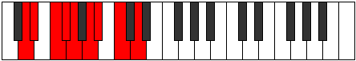 |
| [1467](https://ianring.com/musictheory/scales/1467) | [Thydyllic](ModeGNaturalThydyllic.md) | G | G, G#, A#, B, C, D, D#, F, G |  |
| [1467](https://ianring.com/musictheory/scales/1467) | [Thydyllic](ModeDSharpThydyllic.md) | D# | D#, E, F#, G, G#, A#, B, C#, D# |  |
| [1467](https://ianring.com/musictheory/scales/1467) | [Thydyllic](ModeEFlatThydyllic.md) | Eb | Eb, E, Gb, G, Ab, Bb, B, Db, Eb |  |
| [1469](https://ianring.com/musictheory/scales/1469) | [Epiryllic](ModeCNaturalEpiryllic.md) | C | C, D, D#, E, F, G, G#, A#, C |  |
| [1469](https://ianring.com/musictheory/scales/1469) | [Epiryllic](ModeFNaturalEpiryllic.md) | F | F, G, G#, A, A#, C, C#, D#, F |  |
| [1469](https://ianring.com/musictheory/scales/1469) | [Epiryllic](ModeDSharpEpiryllic.md) | D# | D#, F, F#, G, G#, A#, B, C#, D# |  |
| [1469](https://ianring.com/musictheory/scales/1469) | [Epiryllic](ModeEFlatEpiryllic.md) | Eb | Eb, F, Gb, G, Ab, Bb, B, Db, Eb |  |
| [1469](https://ianring.com/musictheory/scales/1469) | [Epiryllic](ModeGNaturalEpiryllic.md) | G | G, A, A#, B, C, D, D#, F, G |  |
| [1471](https://ianring.com/musictheory/scales/1471) | [Radygic](ModeCNaturalRadygic.md) | C | C, C#, D, D#, E, F, G, G#, A#, C |  |
| [1471](https://ianring.com/musictheory/scales/1471) | [Radygic](ModeDNaturalRadygic.md) | D | D, D#, E, F, F#, G, A, A#, C, D |  |
| [1471](https://ianring.com/musictheory/scales/1471) | [Radygic](ModeFNaturalRadygic.md) | F | F, F#, G, G#, A, A#, C, C#, D#, F |  |
| [1471](https://ianring.com/musictheory/scales/1471) | [Radygic](ModeDSharpRadygic.md) | D# | D#, E, F, F#, G, G#, A#, B, C#, D# |  |
| [1471](https://ianring.com/musictheory/scales/1471) | [Radygic](ModeEFlatRadygic.md) | Eb | Eb, E, F, Gb, G, Ab, Bb, B, Db, Eb |  |
| [1471](https://ianring.com/musictheory/scales/1471) | [Radygic](ModeGNaturalRadygic.md) | G | G, G#, A, A#, B, C, D, D#, F, G |  |
| [1479](https://ianring.com/musictheory/scales/1479) | [Aeolagian](ModeANaturalAeolagian.md) | A | A, Bb, Cb, D#, E, F, G, A |  |
| [1481](https://ianring.com/musictheory/scales/1481) | [Zagimic](ModeGNaturalZagimic.md) | G | G, A#, B##, C##, D#, E#, G |  |
| [1481](https://ianring.com/musictheory/scales/1481) | [Zagimic](ModeCNaturalZagimic.md) | C | C, D#, E##, F##, G#, A#, C |  |
| [1483](https://ianring.com/musictheory/scales/1483) | [Dygian](ModeGNaturalDygian.md) | G | G, Ab, Bb, C#, D, Eb, F, G |  |
| [1483](https://ianring.com/musictheory/scales/1483) | [Dygian](ModeCNaturalDygian.md) | C | C, Db, Eb, F#, G, Ab, Bb, C |  |
| [1483](https://ianring.com/musictheory/scales/1483) | [Dygian](ModeANaturalDygian.md) | A | A, Bb, C, D#, E, F, G, A |  |
| [1485](https://ianring.com/musictheory/scales/1485) | [Tyrian](ModeCNaturalTyrian.md) | C | C, D, Eb, F#, G, Ab, Bb, C |  |
| [1485](https://ianring.com/musictheory/scales/1485) | [Tyrian](ModeGNaturalTyrian.md) | G | G, A, Bb, C#, D, Eb, F, G |  |
| [1487](https://ianring.com/musictheory/scales/1487) | [Lycryllic](ModeCNaturalLycryllic.md) | C | C, C#, D, D#, F#, G, G#, A#, C |  |
| [1487](https://ianring.com/musictheory/scales/1487) | [Lycryllic](ModeGNaturalLycryllic.md) | G | G, G#, A, A#, C#, D, D#, F, G |  |
| [1487](https://ianring.com/musictheory/scales/1487) | [Lycryllic](ModeANaturalLycryllic.md) | A | A, A#, B, C, D#, E, F, G, A |  |
| [1489](https://ianring.com/musictheory/scales/1489) | [Gacrimic](ModeDSharpGacrimic.md) | D# | D#, E###, Cbbb, Cbb, Dbbb, Ebbb, D# |  |
| [1489](https://ianring.com/musictheory/scales/1489) | [Gacrimic](ModeEFlatGacrimic.md) | Eb | Eb, F##, G##, A#, B, C#, Eb |  |
| [1491](https://ianring.com/musictheory/scales/1491) | [Rynian](ModeANaturalRynian.md) | A | A, Bb, C#, D#, E, F, G, A |  |
| [1491](https://ianring.com/musictheory/scales/1491) | [Rynian](ModeDSharpRynian.md) | D# | D#, E, F##, G##, A#, B, C#, D# |  |
| [1491](https://ianring.com/musictheory/scales/1491) | [Rynian](ModeEFlatRynian.md) | Eb | Eb, Fb, G, A, Bb, Cb, Db, Eb |  |
| [1493](https://ianring.com/musictheory/scales/1493) | [Phryrian](ModeDSharpPhryrian.md) | D# | D#, E#, F##, G##, A#, B, C#, D# |  |
| [1493](https://ianring.com/musictheory/scales/1493) | [Phryrian](ModeEFlatPhryrian.md) | Eb | Eb, F, G, A, Bb, Cb, Db, Eb |  |
| [1495](https://ianring.com/musictheory/scales/1495) | [Kaptyllic](ModeDSharpKaptyllic.md) | D# | D#, E, F, G, A, A#, B, C#, D# |  |
| [1495](https://ianring.com/musictheory/scales/1495) | [Kaptyllic](ModeEFlatKaptyllic.md) | Eb | Eb, E, F, G, A, Bb, B, Db, Eb |  |
| [1495](https://ianring.com/musictheory/scales/1495) | [Kaptyllic](ModeANaturalKaptyllic.md) | A | A, A#, B, C#, D#, E, F, G, A |  |
| [1497](https://ianring.com/musictheory/scales/1497) | [Ionanian](ModeCNaturalIonanian.md) | C | C, D#, E, F#, G, Ab, Bb, C |  |
| [1497](https://ianring.com/musictheory/scales/1497) | [Ionanian](ModeGNaturalIonanian.md) | G | G, A#, B, C#, D, Eb, F, G |  |
| [1497](https://ianring.com/musictheory/scales/1497) | [Ionanian](ModeDSharpIonanian.md) | D# | D#, E##, F##, G##, A#, B, C#, D# |  |
| [1497](https://ianring.com/musictheory/scales/1497) | [Ionanian](ModeEFlatIonanian.md) | Eb | Eb, F#, G, A, Bb, Cb, Db, Eb |  |
| [1499](https://ianring.com/musictheory/scales/1499) | [Stonyllic](ModeCNaturalStonyllic.md) | C | C, C#, D#, E, F#, G, G#, A#, C |  |
| [1499](https://ianring.com/musictheory/scales/1499) | [Stonyllic](ModeANaturalStonyllic.md) | A | A, A#, C, C#, D#, E, F, G, A |  |
| [1499](https://ianring.com/musictheory/scales/1499) | [Stonyllic](ModeGNaturalStonyllic.md) | G | G, G#, A#, B, C#, D, D#, F, G |  |
| [1499](https://ianring.com/musictheory/scales/1499) | [Stonyllic](ModeDSharpStonyllic.md) | D# | D#, E, F#, G, A, A#, B, C#, D# |  |
| [1499](https://ianring.com/musictheory/scales/1499) | [Stonyllic](ModeEFlatStonyllic.md) | Eb | Eb, E, Gb, G, A, Bb, B, Db, Eb |  |
| [1501](https://ianring.com/musictheory/scales/1501) | [Stygyllic](ModeCNaturalStygyllic.md) | C | C, D, D#, E, F#, G, G#, A#, C |  |
| [1501](https://ianring.com/musictheory/scales/1501) | [Stygyllic](ModeGNaturalStygyllic.md) | G | G, A, A#, B, C#, D, D#, F, G |  |
| [1501](https://ianring.com/musictheory/scales/1501) | [Stygyllic](ModeDSharpStygyllic.md) | D# | D#, F, F#, G, A, A#, B, C#, D# |  |
| [1501](https://ianring.com/musictheory/scales/1501) | [Stygyllic](ModeEFlatStygyllic.md) | Eb | Eb, F, Gb, G, A, Bb, B, Db, Eb |  |
| [1503](https://ianring.com/musictheory/scales/1503) | [Padygic](ModeCNaturalPadygic.md) | C | C, C#, D, D#, E, F#, G, G#, A#, C |  |
| [1503](https://ianring.com/musictheory/scales/1503) | [Padygic](ModeANaturalPadygic.md) | A | A, A#, B, C, C#, D#, E, F, G, A |  |
| [1503](https://ianring.com/musictheory/scales/1503) | [Padygic](ModeDSharpPadygic.md) | D# | D#, E, F, F#, G, A, A#, B, C#, D# |  |
| [1503](https://ianring.com/musictheory/scales/1503) | [Padygic](ModeEFlatPadygic.md) | Eb | Eb, E, F, Gb, G, A, Bb, B, Db, Eb |  |
| [1503](https://ianring.com/musictheory/scales/1503) | [Padygic](ModeGNaturalPadygic.md) | G | G, G#, A, A#, B, C#, D, D#, F, G |  |
| [1507](https://ianring.com/musictheory/scales/1507) | [Zynian](ModeANaturalZynian.md) | A | A, Bb, C##, D#, E, F, G, A |  |
| [1507](https://ianring.com/musictheory/scales/1507) | [Zynian](ModeDNaturalZynian.md) | D | D, Eb, F##, G#, A, Bb, C, D |  |
| [1509](https://ianring.com/musictheory/scales/1509) | [Ragian](ModeFNaturalRagian.md) | F | F, G, A#, B, C, Db, Eb, F |  |
| [1511](https://ianring.com/musictheory/scales/1511) | [Styptyllic](ModeDNaturalStyptyllic.md) | D | D, D#, E, G, G#, A, A#, C, D |  |
| [1511](https://ianring.com/musictheory/scales/1511) | [Styptyllic](ModeFNaturalStyptyllic.md) | F | F, F#, G, A#, B, C, C#, D#, F |  |
| [1511](https://ianring.com/musictheory/scales/1511) | [Styptyllic](ModeANaturalStyptyllic.md) | A | A, A#, B, D, D#, E, F, G, A |  |
| [1513](https://ianring.com/musictheory/scales/1513) | [Stathian](ModeGNaturalStathian.md) | G | G, A#, B#, C#, D, Eb, F, G |  |
| [1513](https://ianring.com/musictheory/scales/1513) | [Stathian](ModeCNaturalStathian.md) | C | C, D#, E#, F#, G, Ab, Bb, C |  |
| [1515](https://ianring.com/musictheory/scales/1515) | [Solyllic](ModeGNaturalSolyllic.md) | G | G, G#, A#, C, C#, D, D#, F, G |  |
| [1515](https://ianring.com/musictheory/scales/1515) | [Solyllic](ModeCNaturalSolyllic.md) | C | C, C#, D#, F, F#, G, G#, A#, C |  |
| [1515](https://ianring.com/musictheory/scales/1515) | [Solyllic](ModeANaturalSolyllic.md) | A | A, A#, C, D, D#, E, F, G, A |  |
| [1515](https://ianring.com/musictheory/scales/1515) | [Solyllic](ModeDNaturalSolyllic.md) | D | D, D#, F, G, G#, A, A#, C, D |  |
| [1517](https://ianring.com/musictheory/scales/1517) | [Sagyllic](ModeCNaturalSagyllic.md) | C | C, D, D#, F, F#, G, G#, A#, C |  |
| [1517](https://ianring.com/musictheory/scales/1517) | [Sagyllic](ModeGNaturalSagyllic.md) | G | G, A, A#, C, C#, D, D#, F, G |  |
| [1517](https://ianring.com/musictheory/scales/1517) | [Sagyllic](ModeFNaturalSagyllic.md) | F | F, G, G#, A#, B, C, C#, D#, F |  |
| [1519](https://ianring.com/musictheory/scales/1519) | [Solygic](ModeCNaturalSolygic.md) | C | C, C#, D, D#, F, F#, G, G#, A#, C |  |
| [1519](https://ianring.com/musictheory/scales/1519) | [Solygic](ModeGNaturalSolygic.md) | G | G, G#, A, A#, C, C#, D, D#, F, G |  |
| [1519](https://ianring.com/musictheory/scales/1519) | [Solygic](ModeDNaturalSolygic.md) | D | D, D#, E, F, G, G#, A, A#, C, D |  |
| [1519](https://ianring.com/musictheory/scales/1519) | [Solygic](ModeFNaturalSolygic.md) | F | F, F#, G, G#, A#, B, C, C#, D#, F |  |
| [1519](https://ianring.com/musictheory/scales/1519) | [Solygic](ModeANaturalSolygic.md) | A | A, A#, B, C, D, D#, E, F, G, A |  |
| [1521](https://ianring.com/musictheory/scales/1521) | [Stanian](ModeDSharpStanian.md) | D# | D#, E###, F###, G##, A#, B, C#, D# |  |
| [1521](https://ianring.com/musictheory/scales/1521) | [Stanian](ModeEFlatStanian.md) | Eb | Eb, F##, G#, A, Bb, Cb, Db, Eb |  |
| [1523](https://ianring.com/musictheory/scales/1523) | [Zothyllic](ModeANaturalZothyllic.md) | A | A, A#, C#, D, D#, E, F, G, A |  |
| [1523](https://ianring.com/musictheory/scales/1523) | [Zothyllic](ModeDNaturalZothyllic.md) | D | D, D#, F#, G, G#, A, A#, C, D |  |
| [1523](https://ianring.com/musictheory/scales/1523) | [Zothyllic](ModeDSharpZothyllic.md) | D# | D#, E, G, G#, A, A#, B, C#, D# |  |
| [1523](https://ianring.com/musictheory/scales/1523) | [Zothyllic](ModeEFlatZothyllic.md) | Eb | Eb, E, G, Ab, A, Bb, B, Db, Eb |  |
| [1525](https://ianring.com/musictheory/scales/1525) | [Sodyllic](ModeFNaturalSodyllic.md) | F | F, G, A, A#, B, C, C#, D#, F |  |
| [1525](https://ianring.com/musictheory/scales/1525) | [Sodyllic](ModeDSharpSodyllic.md) | D# | D#, F, G, G#, A, A#, B, C#, D# |  |
| [1525](https://ianring.com/musictheory/scales/1525) | [Sodyllic](ModeEFlatSodyllic.md) | Eb | Eb, F, G, Ab, A, Bb, B, Db, Eb |  |
| [1527](https://ianring.com/musictheory/scales/1527) | [Aeolyrygic](ModeDNaturalAeolyrygic.md) | D | D, D#, E, F#, G, G#, A, A#, C, D |  |
| [1527](https://ianring.com/musictheory/scales/1527) | [Aeolyrygic](ModeANaturalAeolyrygic.md) | A | A, A#, B, C#, D, D#, E, F, G, A |  |
| [1527](https://ianring.com/musictheory/scales/1527) | [Aeolyrygic](ModeFNaturalAeolyrygic.md) | F | F, F#, G, A, A#, B, C, C#, D#, F |  |
| [1527](https://ianring.com/musictheory/scales/1527) | [Aeolyrygic](ModeDSharpAeolyrygic.md) | D# | D#, E, F, G, G#, A, A#, B, C#, D# |  |
| [1527](https://ianring.com/musictheory/scales/1527) | [Aeolyrygic](ModeEFlatAeolyrygic.md) | Eb | Eb, E, F, G, Ab, A, Bb, B, Db, Eb |  |
| [1529](https://ianring.com/musictheory/scales/1529) | [Kataryllic](ModeCNaturalKataryllic.md) | C | C, D#, E, F, F#, G, G#, A#, C |  |
| [1529](https://ianring.com/musictheory/scales/1529) | [Kataryllic](ModeGNaturalKataryllic.md) | G | G, A#, B, C, C#, D, D#, F, G |  |
| [1529](https://ianring.com/musictheory/scales/1529) | [Kataryllic](ModeDSharpKataryllic.md) | D# | D#, F#, G, G#, A, A#, B, C#, D# |  |
| [1529](https://ianring.com/musictheory/scales/1529) | [Kataryllic](ModeEFlatKataryllic.md) | Eb | Eb, Gb, G, Ab, A, Bb, B, Db, Eb |  |
| [1531](https://ianring.com/musictheory/scales/1531) | [Styptygic](ModeCNaturalStyptygic.md) | C | C, C#, D#, E, F, F#, G, G#, A#, C |  |
| [1531](https://ianring.com/musictheory/scales/1531) | [Styptygic](ModeANaturalStyptygic.md) | A | A, A#, C, C#, D, D#, E, F, G, A |  |
| [1531](https://ianring.com/musictheory/scales/1531) | [Styptygic](ModeDNaturalStyptygic.md) | D | D, D#, F, F#, G, G#, A, A#, C, D |  |
| [1531](https://ianring.com/musictheory/scales/1531) | [Styptygic](ModeGNaturalStyptygic.md) | G | G, G#, A#, B, C, C#, D, D#, F, G |  |
| [1531](https://ianring.com/musictheory/scales/1531) | [Styptygic](ModeDSharpStyptygic.md) | D# | D#, E, F#, G, G#, A, A#, B, C#, D# |  |
| [1531](https://ianring.com/musictheory/scales/1531) | [Styptygic](ModeEFlatStyptygic.md) | Eb | Eb, E, Gb, G, Ab, A, Bb, B, Db, Eb |  |
| [1533](https://ianring.com/musictheory/scales/1533) | [Katycrygic](ModeCNaturalKatycrygic.md) | C | C, D, D#, E, F, F#, G, G#, A#, C |  |
| [1533](https://ianring.com/musictheory/scales/1533) | [Katycrygic](ModeGNaturalKatycrygic.md) | G | G, A, A#, B, C, C#, D, D#, F, G |  |
| [1533](https://ianring.com/musictheory/scales/1533) | [Katycrygic](ModeFNaturalKatycrygic.md) | F | F, G, G#, A, A#, B, C, C#, D#, F |  |
| [1533](https://ianring.com/musictheory/scales/1533) | [Katycrygic](ModeDSharpKatycrygic.md) | D# | D#, F, F#, G, G#, A, A#, B, C#, D# |  |
| [1533](https://ianring.com/musictheory/scales/1533) | [Katycrygic](ModeEFlatKatycrygic.md) | Eb | Eb, F, Gb, G, Ab, A, Bb, B, Db, Eb |  |
| [1535](https://ianring.com/musictheory/scales/1535) | [Mixodyllian](ModeCNaturalMixodyllian.md) | C | C, C#, D, D#, E, F, F#, G, G#, A#, C |  |
| [1535](https://ianring.com/musictheory/scales/1535) | [Mixodyllian](ModeDNaturalMixodyllian.md) | D | D, D#, E, F, F#, G, G#, A, A#, C, D |  |
| [1535](https://ianring.com/musictheory/scales/1535) | [Mixodyllian](ModeANaturalMixodyllian.md) | A | A, A#, B, C, C#, D, D#, E, F, G, A |  |
| [1535](https://ianring.com/musictheory/scales/1535) | [Mixodyllian](ModeGNaturalMixodyllian.md) | G | G, G#, A, A#, B, C, C#, D, D#, F, G |  |
| [1535](https://ianring.com/musictheory/scales/1535) | [Mixodyllian](ModeFNaturalMixodyllian.md) | F | F, F#, G, G#, A, A#, B, C, C#, D#, F |  |
| [1535](https://ianring.com/musictheory/scales/1535) | [Mixodyllian](ModeDSharpMixodyllian.md) | D# | D#, E, F, F#, G, G#, A, A#, B, C#, D# |  |
| [1535](https://ianring.com/musictheory/scales/1535) | [Mixodyllian](ModeEFlatMixodyllian.md) | Eb | Eb, E, F, Gb, G, Ab, A, Bb, B, Db, Eb |  |
| [1571](https://ianring.com/musictheory/scales/1571) | [Lagitonic](ModeASharpLagitonic.md) | A# | A#, B, D#, G, G#, A# |  |
| [1571](https://ianring.com/musictheory/scales/1571) | [Lagitonic](ModeBFlatLagitonic.md) | Bb | Bb, B, Eb, G, Ab, Bb |  |
| [1573](https://ianring.com/musictheory/scales/1573) | [Saritonic](ModeFNaturalSaritonic.md) | F | F, G, A#, D, D#, F | 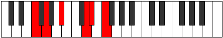 |
| [1573](https://ianring.com/musictheory/scales/1573) | [Saritonic](ModeASharpSaritonic.md) | A# | A#, C, D#, G, G#, A# |  |
| [1573](https://ianring.com/musictheory/scales/1573) | [Saritonic](ModeBFlatSaritonic.md) | Bb | Bb, C, Eb, G, Ab, Bb |  |
| [1575](https://ianring.com/musictheory/scales/1575) | [Zycrimic](ModeFNaturalZycrimic.md) | F | F, Gb, Abb, Bb, C##, D#, F |  |
| [1575](https://ianring.com/musictheory/scales/1575) | [Zycrimic](ModeASharpZycrimic.md) | A# | A#, B, C, D#, E###, F###, A# |  |
| [1575](https://ianring.com/musictheory/scales/1575) | [Zycrimic](ModeBFlatZycrimic.md) | Bb | Bb, Cb, Dbb, Eb, F##, G#, Bb |  |
| [1577](https://ianring.com/musictheory/scales/1577) | [Lonitonic](ModeASharpLonitonic.md) | A# | A#, C#, D#, G, G#, A# |  |
| [1577](https://ianring.com/musictheory/scales/1577) | [Lonitonic](ModeBFlatLonitonic.md) | Bb | Bb, Db, Eb, G, Ab, Bb |  |
| [1579](https://ianring.com/musictheory/scales/1579) | [Sagimic](ModeASharpSagimic.md) | A# | A#, B, C#, D#, E###, F###, A# |  |
| [1579](https://ianring.com/musictheory/scales/1579) | [Sagimic](ModeBFlatSagimic.md) | Bb | Bb, Cb, Db, Eb, F##, G#, Bb |  |
| [1581](https://ianring.com/musictheory/scales/1581) | [Gyrimic](ModeASharpGyrimic.md) | A# | A#, B#, C#, D#, E###, F###, A# |  |
| [1581](https://ianring.com/musictheory/scales/1581) | [Gyrimic](ModeBFlatGyrimic.md) | Bb | Bb, C, Db, Eb, F##, G#, Bb |  |
| [1581](https://ianring.com/musictheory/scales/1581) | [Gyrimic](ModeFNaturalGyrimic.md) | F | F, G, Ab, Bb, C##, D#, F |  |
| [1583](https://ianring.com/musictheory/scales/1583) | [Salian](ModeFNaturalSalian.md) | F | F, Gb, Abb, Bbbb, Cbb, D, Eb, F |  |
| [1583](https://ianring.com/musictheory/scales/1583) | [Salian](ModeASharpSalian.md) | A# | A#, B, C, Db, Eb, F##, G#, A# |  |
| [1583](https://ianring.com/musictheory/scales/1583) | [Salian](ModeBFlatSalian.md) | Bb | Bb, Cb, Dbb, Ebbb, Fbb, G, Ab, Bb |  |
| [1585](https://ianring.com/musictheory/scales/1585) | [Phraditonic](ModeASharpPhraditonic.md) | A# | A#, D, D#, G, G#, A# |  |
| [1585](https://ianring.com/musictheory/scales/1585) | [Phraditonic](ModeBFlatPhraditonic.md) | Bb | Bb, D, Eb, G, Ab, Bb |  |
| [1587](https://ianring.com/musictheory/scales/1587) | [Lalimic](ModeFSharpLalimic.md) | F# | F#, G, A#, B, C###, D##, F# |  |
| [1587](https://ianring.com/musictheory/scales/1587) | [Lalimic](ModeGFlatLalimic.md) | Gb | Gb, Abb, Bb, Cb, D#, E, Gb |  |
| [1587](https://ianring.com/musictheory/scales/1587) | [Lalimic](ModeASharpLalimic.md) | A# | A#, B, C##, D#, E###, F###, A# |  |
| [1587](https://ianring.com/musictheory/scales/1587) | [Lalimic](ModeBFlatLalimic.md) | Bb | Bb, Cb, D, Eb, F##, G#, Bb |  |
| [1589](https://ianring.com/musictheory/scales/1589) | [Ionagimic](ModeASharpIonagimic.md) | A# | A#, B#, C##, D#, E###, F###, A# |  |
| [1589](https://ianring.com/musictheory/scales/1589) | [Ionagimic](ModeBFlatIonagimic.md) | Bb | Bb, C, D, Eb, F##, G#, Bb |  |
| [1589](https://ianring.com/musictheory/scales/1589) | [Ionagimic](ModeFNaturalIonagimic.md) | F | F, G, A, Bb, C##, D#, F |  |
| [1591](https://ianring.com/musictheory/scales/1591) | [Rodian](ModeFNaturalRodian.md) | F | F, Gb, Abb, Bbb, Cbb, D, Eb, F |  |
| [1591](https://ianring.com/musictheory/scales/1591) | [Rodian](ModeASharpRodian.md) | A# | A#, B, C, D, Eb, F##, G#, A# |  |
| [1591](https://ianring.com/musictheory/scales/1591) | [Rodian](ModeBFlatRodian.md) | Bb | Bb, Cb, Dbb, Ebb, Fbb, G, Ab, Bb |  |
| [1591](https://ianring.com/musictheory/scales/1591) | [Rodian](ModeFSharpRodian.md) | F# | F#, G, Ab, Bb, Cb, D#, E, F# |  |
| [1591](https://ianring.com/musictheory/scales/1591) | [Rodian](ModeGFlatRodian.md) | Gb | Gb, Abb, Bbbb, Cbb, Dbbb, Eb, Fb, Gb |  |
| [1593](https://ianring.com/musictheory/scales/1593) | [Zogimic](ModeASharpZogimic.md) | A# | A#, B##, C##, D#, E###, F###, A# |  |
| [1593](https://ianring.com/musictheory/scales/1593) | [Zogimic](ModeBFlatZogimic.md) | Bb | Bb, C#, D, Eb, F##, G#, Bb |  |
| [1595](https://ianring.com/musictheory/scales/1595) | [Dacrian](ModeASharpDacrian.md) | A# | A#, B, C#, D, Eb, F##, G#, A# |  |
| [1595](https://ianring.com/musictheory/scales/1595) | [Dacrian](ModeBFlatDacrian.md) | Bb | Bb, Cb, Db, Ebb, Fbb, G, Ab, Bb |  |
| [1595](https://ianring.com/musictheory/scales/1595) | [Dacrian](ModeFSharpDacrian.md) | F# | F#, G, A, Bb, Cb, D#, E, F# |  |
| [1595](https://ianring.com/musictheory/scales/1595) | [Dacrian](ModeGFlatDacrian.md) | Gb | Gb, Abb, Bbb, Cbb, Dbbb, Eb, Fb, Gb |  |
| [1597](https://ianring.com/musictheory/scales/1597) | [Aeolodian](ModeASharpAeolodian.md) | A# | A#, B#, C#, D, Eb, F##, G#, A# |  |
| [1597](https://ianring.com/musictheory/scales/1597) | [Aeolodian](ModeBFlatAeolodian.md) | Bb | Bb, C, Db, Ebb, Fbb, G, Ab, Bb |  |
| [1597](https://ianring.com/musictheory/scales/1597) | [Aeolodian](ModeFNaturalAeolodian.md) | F | F, G, Ab, Bbb, Cbb, D, Eb, F |  |
| [1599](https://ianring.com/musictheory/scales/1599) | [Pocryllic](ModeFNaturalPocryllic.md) | F | F, F#, G, G#, A, A#, D, D#, F |  |
| [1599](https://ianring.com/musictheory/scales/1599) | [Pocryllic](ModeASharpPocryllic.md) | A# | A#, B, C, C#, D, D#, G, G#, A# |  |
| [1599](https://ianring.com/musictheory/scales/1599) | [Pocryllic](ModeBFlatPocryllic.md) | Bb | Bb, B, C, Db, D, Eb, G, Ab, Bb |  |
| [1599](https://ianring.com/musictheory/scales/1599) | [Pocryllic](ModeFSharpPocryllic.md) | F# | F#, G, G#, A, A#, B, D#, E, F# |  |
| [1599](https://ianring.com/musictheory/scales/1599) | [Pocryllic](ModeGFlatPocryllic.md) | Gb | Gb, G, Ab, A, Bb, B, Eb, E, Gb |  |
| [1605](https://ianring.com/musictheory/scales/1605) | [Zanitonic](ModeCSharpZanitonic.md) | C# | C#, D#, G, A#, B, C# |  |
| [1605](https://ianring.com/musictheory/scales/1605) | [Zanitonic](ModeDFlatZanitonic.md) | Db | Db, Eb, G, Bb, B, Db |  |
| [1607](https://ianring.com/musictheory/scales/1607) | [Epytimic](ModeCSharpEpytimic.md) | C# | C#, D, Eb, F##, G###, A##, C# |  |
| [1607](https://ianring.com/musictheory/scales/1607) | [Epytimic](ModeDFlatEpytimic.md) | Db | Db, Ebb, Fbb, G, A#, B, Db |  |
| [1607](https://ianring.com/musictheory/scales/1607) | [Epytimic](ModeANaturalEpytimic.md) | A | A, Bb, Cb, D#, E##, F##, A |  |
| [1611](https://ianring.com/musictheory/scales/1611) | [Dacrimic](ModeANaturalDacrimic.md) | A | A, Bb, C, D#, E##, F##, A |  |
| [1613](https://ianring.com/musictheory/scales/1613) | [Thylimic](ModeCSharpThylimic.md) | C# | C#, D#, E, F##, G###, A##, C# |  |
| [1613](https://ianring.com/musictheory/scales/1613) | [Thylimic](ModeDFlatThylimic.md) | Db | Db, Eb, Fb, G, A#, B, Db |  |
| [1615](https://ianring.com/musictheory/scales/1615) | [Sydian](ModeCSharpSydian.md) | C# | C#, D, Eb, Fb, G, A#, B, C# |  |
| [1615](https://ianring.com/musictheory/scales/1615) | [Sydian](ModeDFlatSydian.md) | Db | Db, Ebb, Fbb, Gbbb, Abb, Bb, Cb, Db |  |
| [1615](https://ianring.com/musictheory/scales/1615) | [Sydian](ModeANaturalSydian.md) | A | A, Bb, Cb, Dbb, Eb, F#, G, A | 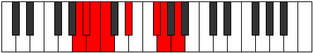 |
| [1619](https://ianring.com/musictheory/scales/1619) | [Monimic](ModeFSharpMonimic.md) | F# | F#, G, A#, B#, C###, D##, F# |  |
| [1619](https://ianring.com/musictheory/scales/1619) | [Monimic](ModeGFlatMonimic.md) | Gb | Gb, Abb, Bb, C, D#, E, Gb |  |
| [1619](https://ianring.com/musictheory/scales/1619) | [Monimic](ModeANaturalMonimic.md) | A | A, Bb, C#, D#, E##, F##, A |  |
| [1621](https://ianring.com/musictheory/scales/1621) | [Aeolathimic](ModeCSharpAeolathimic.md) | C# | C#, D#, E#, F##, G###, A##, C# |  |
| [1621](https://ianring.com/musictheory/scales/1621) | [Aeolathimic](ModeDFlatAeolathimic.md) | Db | Db, Eb, F, G, A#, B, Db |  |
| [1623](https://ianring.com/musictheory/scales/1623) | [Lothian](ModeFSharpLothian.md) | F# | F#, G, Ab, Bb, C, D#, E, F# |  |
| [1623](https://ianring.com/musictheory/scales/1623) | [Lothian](ModeGFlatLothian.md) | Gb | Gb, Abb, Bbbb, Cbb, Dbb, Eb, Fb, Gb |  |
| [1623](https://ianring.com/musictheory/scales/1623) | [Lothian](ModeCSharpLothian.md) | C# | C#, D, Eb, F, G, A#, B, C# |  |
| [1623](https://ianring.com/musictheory/scales/1623) | [Lothian](ModeDFlatLothian.md) | Db | Db, Ebb, Fbb, Gbb, Abb, Bb, Cb, Db |  |
| [1623](https://ianring.com/musictheory/scales/1623) | [Lothian](ModeANaturalLothian.md) | A | A, Bb, Cb, Db, Eb, F#, G, A |  |
| [1627](https://ianring.com/musictheory/scales/1627) | [Zyptian](ModeANaturalZyptian.md) | A | A, Bb, C, Db, Eb, F#, G, A |  |
| [1627](https://ianring.com/musictheory/scales/1627) | [Zyptian](ModeFSharpZyptian.md) | F# | F#, G, A, Bb, C, D#, E, F# |  |
| [1627](https://ianring.com/musictheory/scales/1627) | [Zyptian](ModeGFlatZyptian.md) | Gb | Gb, Abb, Bbb, Cbb, Dbb, Eb, Fb, Gb |  |
| [1629](https://ianring.com/musictheory/scales/1629) | [Synian](ModeCSharpSynian.md) | C# | C#, D#, E, F, G, A#, B, C# |  |
| [1629](https://ianring.com/musictheory/scales/1629) | [Synian](ModeDFlatSynian.md) | Db | Db, Eb, Fb, Gbb, Abb, Bb, Cb, Db |  |
| [1631](https://ianring.com/musictheory/scales/1631) | [Rynyllic](ModeFSharpRynyllic.md) | F# | F#, G, G#, A, A#, C, D#, E, F# |  |
| [1631](https://ianring.com/musictheory/scales/1631) | [Rynyllic](ModeGFlatRynyllic.md) | Gb | Gb, G, Ab, A, Bb, C, Eb, E, Gb |  |
| [1631](https://ianring.com/musictheory/scales/1631) | [Rynyllic](ModeCSharpRynyllic.md) | C# | C#, D, D#, E, F, G, A#, B, C# |  |
| [1631](https://ianring.com/musictheory/scales/1631) | [Rynyllic](ModeDFlatRynyllic.md) | Db | Db, D, Eb, E, F, G, Bb, B, Db |  |
| [1631](https://ianring.com/musictheory/scales/1631) | [Rynyllic](ModeANaturalRynyllic.md) | A | A, A#, B, C, C#, D#, F#, G, A |  |
| [1635](https://ianring.com/musictheory/scales/1635) | [Sygimic](ModeANaturalSygimic.md) | A | A, Bb, C##, D#, E##, F##, A |  |
| [1635](https://ianring.com/musictheory/scales/1635) | [Sygimic](ModeASharpSygimic.md) | A# | A#, B, C###, D##, E###, F###, A# |  |
| [1635](https://ianring.com/musictheory/scales/1635) | [Sygimic](ModeBFlatSygimic.md) | Bb | Bb, Cb, D#, E, F##, G#, Bb |  |
| [1637](https://ianring.com/musictheory/scales/1637) | [Syptimic](ModeASharpSyptimic.md) | A# | A#, B#, C###, D##, E###, F###, A# |  |
| [1637](https://ianring.com/musictheory/scales/1637) | [Syptimic](ModeBFlatSyptimic.md) | Bb | Bb, C, D#, E, F##, G#, Bb |  |
| [1637](https://ianring.com/musictheory/scales/1637) | [Syptimic](ModeFNaturalSyptimic.md) | F | F, G, A#, B, C##, D#, F |  |
| [1637](https://ianring.com/musictheory/scales/1637) | [Syptimic](ModeCSharpSyptimic.md) | C# | C#, D#, E##, F##, G###, A##, C# |  |
| [1637](https://ianring.com/musictheory/scales/1637) | [Syptimic](ModeDFlatSyptimic.md) | Db | Db, Eb, F#, G, A#, B, Db |  |
| [1639](https://ianring.com/musictheory/scales/1639) | [Aeolothian](ModeCSharpAeolothian.md) | C# | C#, D, Eb, F#, G, A#, B, C# |  |
| [1639](https://ianring.com/musictheory/scales/1639) | [Aeolothian](ModeDFlatAeolothian.md) | Db | Db, Ebb, Fbb, Gb, Abb, Bb, Cb, Db |  |
| [1639](https://ianring.com/musictheory/scales/1639) | [Aeolothian](ModeFNaturalAeolothian.md) | F | F, Gb, Abb, Bb, Cb, D, Eb, F | 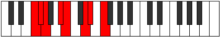 |
| [1639](https://ianring.com/musictheory/scales/1639) | [Aeolothian](ModeASharpAeolothian.md) | A# | A#, B, C, D#, E, F##, G#, A# |  |
| [1639](https://ianring.com/musictheory/scales/1639) | [Aeolothian](ModeBFlatAeolothian.md) | Bb | Bb, Cb, Dbb, Eb, Fb, G, Ab, Bb |  |
| [1639](https://ianring.com/musictheory/scales/1639) | [Aeolothian](ModeANaturalAeolothian.md) | A | A, Bb, Cb, D, Eb, F#, G, A |  |
| [1641](https://ianring.com/musictheory/scales/1641) | [Bocrimic](ModeASharpBocrimic.md) | A# | A#, B##, C###, D##, E###, F###, A# |  |
| [1641](https://ianring.com/musictheory/scales/1641) | [Bocrimic](ModeBFlatBocrimic.md) | Bb | Bb, C#, D#, E, F##, G#, Bb |  |
| [1643](https://ianring.com/musictheory/scales/1643) | [Thyptian](ModeANaturalThyptian.md) | A | A, Bb, C, D, Eb, F#, G, A |  |
| [1643](https://ianring.com/musictheory/scales/1643) | [Thyptian](ModeASharpThyptian.md) | A# | A#, B, C#, D#, E, F##, G#, A# |  |
| [1643](https://ianring.com/musictheory/scales/1643) | [Thyptian](ModeBFlatThyptian.md) | Bb | Bb, Cb, Db, Eb, Fb, G, Ab, Bb |  |
| [1645](https://ianring.com/musictheory/scales/1645) | [Katagian](ModeASharpKatagian.md) | A# | A#, B#, C#, D#, E, F##, G#, A# |  |
| [1645](https://ianring.com/musictheory/scales/1645) | [Katagian](ModeBFlatKatagian.md) | Bb | Bb, C, Db, Eb, Fb, G, Ab, Bb |  |
| [1645](https://ianring.com/musictheory/scales/1645) | [Katagian](ModeCSharpKatagian.md) | C# | C#, D#, E, F#, G, A#, B, C# |  |
| [1645](https://ianring.com/musictheory/scales/1645) | [Katagian](ModeDFlatKatagian.md) | Db | Db, Eb, Fb, Gb, Abb, Bb, Cb, Db |  |
| [1645](https://ianring.com/musictheory/scales/1645) | [Katagian](ModeFNaturalKatagian.md) | F | F, G, Ab, Bb, Cb, D, Eb, F |  |
| [1647](https://ianring.com/musictheory/scales/1647) | [Polyllic](ModeCSharpPolyllic.md) | C# | C#, D, D#, E, F#, G, A#, B, C# |  |
| [1647](https://ianring.com/musictheory/scales/1647) | [Polyllic](ModeDFlatPolyllic.md) | Db | Db, D, Eb, E, Gb, G, Bb, B, Db |  |
| [1647](https://ianring.com/musictheory/scales/1647) | [Polyllic](ModeASharpPolyllic.md) | A# | A#, B, C, C#, D#, E, G, G#, A# |  |
| [1647](https://ianring.com/musictheory/scales/1647) | [Polyllic](ModeBFlatPolyllic.md) | Bb | Bb, B, C, Db, Eb, E, G, Ab, Bb |  |
| [1647](https://ianring.com/musictheory/scales/1647) | [Polyllic](ModeFNaturalPolyllic.md) | F | F, F#, G, G#, A#, B, D, D#, F |  |
| [1647](https://ianring.com/musictheory/scales/1647) | [Polyllic](ModeANaturalPolyllic.md) | A | A, A#, B, C, D, D#, F#, G, A |  |
| [1649](https://ianring.com/musictheory/scales/1649) | [Bolimic](ModeASharpBolimic.md) | A# | A#, B###, C###, D##, E###, F###, A# |  |
| [1649](https://ianring.com/musictheory/scales/1649) | [Bolimic](ModeBFlatBolimic.md) | Bb | Bb, C##, D#, E, F##, G#, Bb |  |
| [1651](https://ianring.com/musictheory/scales/1651) | [Mogian](ModeANaturalMogian.md) | A | A, Bb, C#, D, Eb, F#, G, A |  |
| [1651](https://ianring.com/musictheory/scales/1651) | [Mogian](ModeFSharpMogian.md) | F# | F#, G, A#, B, C, D#, E, F# |  |
| [1651](https://ianring.com/musictheory/scales/1651) | [Mogian](ModeGFlatMogian.md) | Gb | Gb, Abb, Bb, Cb, Dbb, Eb, Fb, Gb |  |
| [1651](https://ianring.com/musictheory/scales/1651) | [Mogian](ModeASharpMogian.md) | A# | A#, B, C##, D#, E, F##, G#, A# |  |
| [1651](https://ianring.com/musictheory/scales/1651) | [Mogian](ModeBFlatMogian.md) | Bb | Bb, Cb, D, Eb, Fb, G, Ab, Bb |  |
| [1653](https://ianring.com/musictheory/scales/1653) | [Gylian](ModeASharpGylian.md) | A# | A#, B#, C##, D#, E, F##, G#, A# |  |
| [1653](https://ianring.com/musictheory/scales/1653) | [Gylian](ModeBFlatGylian.md) | Bb | Bb, C, D, Eb, Fb, G, Ab, Bb |  |
| [1653](https://ianring.com/musictheory/scales/1653) | [Gylian](ModeCSharpGylian.md) | C# | C#, D#, E#, F#, G, A#, B, C# |  |
| [1653](https://ianring.com/musictheory/scales/1653) | [Gylian](ModeDFlatGylian.md) | Db | Db, Eb, F, Gb, Abb, Bb, Cb, Db |  |
| [1653](https://ianring.com/musictheory/scales/1653) | [Gylian](ModeFNaturalGylian.md) | F | F, G, A, Bb, Cb, D, Eb, F |  |
| [1655](https://ianring.com/musictheory/scales/1655) | [Katygyllic](ModeCSharpKatygyllic.md) | C# | C#, D, D#, F, F#, G, A#, B, C# |  |
| [1655](https://ianring.com/musictheory/scales/1655) | [Katygyllic](ModeDFlatKatygyllic.md) | Db | Db, D, Eb, F, Gb, G, Bb, B, Db |  |
| [1655](https://ianring.com/musictheory/scales/1655) | [Katygyllic](ModeASharpKatygyllic.md) | A# | A#, B, C, D, D#, E, G, G#, A# |  |
| [1655](https://ianring.com/musictheory/scales/1655) | [Katygyllic](ModeBFlatKatygyllic.md) | Bb | Bb, B, C, D, Eb, E, G, Ab, Bb |  |
| [1655](https://ianring.com/musictheory/scales/1655) | [Katygyllic](ModeFSharpKatygyllic.md) | F# | F#, G, G#, A#, B, C, D#, E, F# |  |
| [1655](https://ianring.com/musictheory/scales/1655) | [Katygyllic](ModeGFlatKatygyllic.md) | Gb | Gb, G, Ab, Bb, B, C, Eb, E, Gb |  |
| [1655](https://ianring.com/musictheory/scales/1655) | [Katygyllic](ModeANaturalKatygyllic.md) | A | A, A#, B, C#, D, D#, F#, G, A |  |
| [1655](https://ianring.com/musictheory/scales/1655) | [Katygyllic](ModeFNaturalKatygyllic.md) | F | F, F#, G, A, A#, B, D, D#, F |  |
| [1657](https://ianring.com/musictheory/scales/1657) | [Ionothian](ModeASharpIonothian.md) | A# | A#, B##, C##, D#, E, F##, G#, A# |  |
| [1657](https://ianring.com/musictheory/scales/1657) | [Ionothian](ModeBFlatIonothian.md) | Bb | Bb, C#, D, Eb, Fb, G, Ab, Bb |  |
| [1659](https://ianring.com/musictheory/scales/1659) | [Magyllic](ModeANaturalMagyllic.md) | A | A, A#, C, C#, D, D#, F#, G, A |  |
| [1659](https://ianring.com/musictheory/scales/1659) | [Magyllic](ModeASharpMagyllic.md) | A# | A#, B, C#, D, D#, E, G, G#, A# |  |
| [1659](https://ianring.com/musictheory/scales/1659) | [Magyllic](ModeBFlatMagyllic.md) | Bb | Bb, B, Db, D, Eb, E, G, Ab, Bb |  |
| [1659](https://ianring.com/musictheory/scales/1659) | [Magyllic](ModeFSharpMagyllic.md) | F# | F#, G, A, A#, B, C, D#, E, F# |  |
| [1659](https://ianring.com/musictheory/scales/1659) | [Magyllic](ModeGFlatMagyllic.md) | Gb | Gb, G, A, Bb, B, C, Eb, E, Gb |  |
| [1661](https://ianring.com/musictheory/scales/1661) | [Gonyllic](ModeASharpGonyllic.md) | A# | A#, C, C#, D, D#, E, G, G#, A# |  |
| [1661](https://ianring.com/musictheory/scales/1661) | [Gonyllic](ModeBFlatGonyllic.md) | Bb | Bb, C, Db, D, Eb, E, G, Ab, Bb |  |
| [1661](https://ianring.com/musictheory/scales/1661) | [Gonyllic](ModeCSharpGonyllic.md) | C# | C#, D#, E, F, F#, G, A#, B, C# |  |
| [1661](https://ianring.com/musictheory/scales/1661) | [Gonyllic](ModeDFlatGonyllic.md) | Db | Db, Eb, E, F, Gb, G, Bb, B, Db |  |
| [1661](https://ianring.com/musictheory/scales/1661) | [Gonyllic](ModeFNaturalGonyllic.md) | F | F, G, G#, A, A#, B, D, D#, F |  |
| [1663](https://ianring.com/musictheory/scales/1663) | [Lydygic](ModeCSharpLydygic.md) | C# | C#, D, D#, E, F, F#, G, A#, B, C# |  |
| [1663](https://ianring.com/musictheory/scales/1663) | [Lydygic](ModeDFlatLydygic.md) | Db | Db, D, Eb, E, F, Gb, G, Bb, B, Db |  |
| [1663](https://ianring.com/musictheory/scales/1663) | [Lydygic](ModeASharpLydygic.md) | A# | A#, B, C, C#, D, D#, E, G, G#, A# |  |
| [1663](https://ianring.com/musictheory/scales/1663) | [Lydygic](ModeBFlatLydygic.md) | Bb | Bb, B, C, Db, D, Eb, E, G, Ab, Bb |  |
| [1663](https://ianring.com/musictheory/scales/1663) | [Lydygic](ModeANaturalLydygic.md) | A | A, A#, B, C, C#, D, D#, F#, G, A |  |
| [1663](https://ianring.com/musictheory/scales/1663) | [Lydygic](ModeFSharpLydygic.md) | F# | F#, G, G#, A, A#, B, C, D#, E, F# |  |
| [1663](https://ianring.com/musictheory/scales/1663) | [Lydygic](ModeGFlatLydygic.md) | Gb | Gb, G, Ab, A, Bb, B, C, Eb, E, Gb |  |
| [1663](https://ianring.com/musictheory/scales/1663) | [Lydygic](ModeFNaturalLydygic.md) | F | F, F#, G, G#, A, A#, B, D, D#, F |  |
| [1673](https://ianring.com/musictheory/scales/1673) | [Thocritonic](ModeCNaturalThocritonic.md) | C | C, D#, G, A, A#, C |  |
| [1675](https://ianring.com/musictheory/scales/1675) | [Epatimic](ModeCNaturalEpatimic.md) | C | C, Db, Eb, F##, G##, A#, C |  |
| [1677](https://ianring.com/musictheory/scales/1677) | [Danimic](ModeCNaturalDanimic.md) | C | C, D, Eb, F##, G##, A#, C |  |
| [1679](https://ianring.com/musictheory/scales/1679) | [Kydian](ModeCNaturalKydian.md) | C | C, Db, Ebb, Fbb, G, A, Bb, C |  |
| [1681](https://ianring.com/musictheory/scales/1681) | [Ionaditonic](ModeDSharpIonaditonic.md) | D# | D#, G, A#, C, C#, D# |  |
| [1681](https://ianring.com/musictheory/scales/1681) | [Ionaditonic](ModeEFlatIonaditonic.md) | Eb | Eb, G, Bb, C, Db, Eb |  |
| [1683](https://ianring.com/musictheory/scales/1683) | [Rygimic](ModeDSharpRygimic.md) | D# | D#, E, F##, G###, A###, B##, D# |  |
| [1683](https://ianring.com/musictheory/scales/1683) | [Rygimic](ModeEFlatRygimic.md) | Eb | Eb, Fb, G, A#, B#, C#, Eb |  |
| [1683](https://ianring.com/musictheory/scales/1683) | [Rygimic](ModeFSharpRygimic.md) | F# | F#, G, A#, B##, C###, D##, F# |  |
| [1683](https://ianring.com/musictheory/scales/1683) | [Rygimic](ModeGFlatRygimic.md) | Gb | Gb, Abb, Bb, C#, D#, E, Gb |  |
| [1685](https://ianring.com/musictheory/scales/1685) | [Zeracrimic](ModeDSharpZeracrimic.md) | D# | D#, E#, F##, G###, A###, B##, D# |  |
| [1685](https://ianring.com/musictheory/scales/1685) | [Zeracrimic](ModeEFlatZeracrimic.md) | Eb | Eb, F, G, A#, B#, C#, Eb |  |
| [1687](https://ianring.com/musictheory/scales/1687) | [Phralian](ModeDSharpPhralian.md) | D# | D#, E, F, G, A#, B#, C#, D# |  |
| [1687](https://ianring.com/musictheory/scales/1687) | [Phralian](ModeEFlatPhralian.md) | Eb | Eb, Fb, Gbb, Abb, Bb, C, Db, Eb |  |
| [1687](https://ianring.com/musictheory/scales/1687) | [Phralian](ModeFSharpPhralian.md) | F# | F#, G, Ab, Bb, C#, D#, E, F# |  |
| [1687](https://ianring.com/musictheory/scales/1687) | [Phralian](ModeGFlatPhralian.md) | Gb | Gb, Abb, Bbbb, Cbb, Db, Eb, Fb, Gb |  |
| [1689](https://ianring.com/musictheory/scales/1689) | [Lorimic](ModeDSharpLorimic.md) | D# | D#, E##, F##, G###, A###, B##, D# |  |
| [1689](https://ianring.com/musictheory/scales/1689) | [Lorimic](ModeEFlatLorimic.md) | Eb | Eb, F#, G, A#, B#, C#, Eb |  |
| [1689](https://ianring.com/musictheory/scales/1689) | [Lorimic](ModeCNaturalLorimic.md) | C | C, D#, E, F##, G##, A#, C |  |
| [1691](https://ianring.com/musictheory/scales/1691) | [Kathian](ModeDSharpKathian.md) | D# | D#, E, F#, G, A#, B#, C#, D# |  |
| [1691](https://ianring.com/musictheory/scales/1691) | [Kathian](ModeEFlatKathian.md) | Eb | Eb, Fb, Gb, Abb, Bb, C, Db, Eb |  |
| [1691](https://ianring.com/musictheory/scales/1691) | [Kathian](ModeCNaturalKathian.md) | C | C, Db, Eb, Fb, G, A, Bb, C |  |
| [1691](https://ianring.com/musictheory/scales/1691) | [Kathian](ModeFSharpKathian.md) | F# | F#, G, A, Bb, C#, D#, E, F# |  |
| [1691](https://ianring.com/musictheory/scales/1691) | [Kathian](ModeGFlatKathian.md) | Gb | Gb, Abb, Bbb, Cbb, Db, Eb, Fb, Gb |  |
| [1693](https://ianring.com/musictheory/scales/1693) | [Dogian](ModeDSharpDogian.md) | D# | D#, E#, F#, G, A#, B#, C#, D# |  |
| [1693](https://ianring.com/musictheory/scales/1693) | [Dogian](ModeEFlatDogian.md) | Eb | Eb, F, Gb, Abb, Bb, C, Db, Eb |  |
| [1693](https://ianring.com/musictheory/scales/1693) | [Dogian](ModeCNaturalDogian.md) | C | C, D, Eb, Fb, G, A, Bb, C |  |
| [1695](https://ianring.com/musictheory/scales/1695) | [Phrodyllic](ModeDSharpPhrodyllic.md) | D# | D#, E, F, F#, G, A#, C, C#, D# |  |
| [1695](https://ianring.com/musictheory/scales/1695) | [Phrodyllic](ModeEFlatPhrodyllic.md) | Eb | Eb, E, F, Gb, G, Bb, C, Db, Eb |  |
| [1695](https://ianring.com/musictheory/scales/1695) | [Phrodyllic](ModeCNaturalPhrodyllic.md) | C | C, C#, D, D#, E, G, A, A#, C |  |
| [1695](https://ianring.com/musictheory/scales/1695) | [Phrodyllic](ModeFSharpPhrodyllic.md) | F# | F#, G, G#, A, A#, C#, D#, E, F# |  |
| [1695](https://ianring.com/musictheory/scales/1695) | [Phrodyllic](ModeGFlatPhrodyllic.md) | Gb | Gb, G, Ab, A, Bb, Db, Eb, E, Gb |  |
| [1699](https://ianring.com/musictheory/scales/1699) | [Kaptimic](ModeASharpKaptimic.md) | A# | A#, B, C###, D###, E###, F###, A# |  |
| [1699](https://ianring.com/musictheory/scales/1699) | [Kaptimic](ModeBFlatKaptimic.md) | Bb | Bb, Cb, D#, E#, F##, G#, Bb |  |
| [1701](https://ianring.com/musictheory/scales/1701) | [Lothimic](ModeFNaturalLothimic.md) | F | F, G, A#, B#, C##, D#, F |  |
| [1701](https://ianring.com/musictheory/scales/1701) | [Lothimic](ModeASharpLothimic.md) | A# | A#, B#, C###, D###, E###, F###, A# |  |
| [1701](https://ianring.com/musictheory/scales/1701) | [Lothimic](ModeBFlatLothimic.md) | Bb | Bb, C, D#, E#, F##, G#, Bb |  |
| [1703](https://ianring.com/musictheory/scales/1703) | [Zaptian](ModeFNaturalZaptian.md) | F | F, Gb, Abb, Bb, C, D, Eb, F |  |
| [1703](https://ianring.com/musictheory/scales/1703) | [Zaptian](ModeASharpZaptian.md) | A# | A#, B, C, D#, E#, F##, G#, A# |  |
| [1703](https://ianring.com/musictheory/scales/1703) | [Zaptian](ModeBFlatZaptian.md) | Bb | Bb, Cb, Dbb, Eb, F, G, Ab, Bb |  |
| [1705](https://ianring.com/musictheory/scales/1705) | [Darmic](ModeASharpDarmic.md) | A# | A#, B##, C###, D###, E###, F###, A# |  |
| [1705](https://ianring.com/musictheory/scales/1705) | [Darmic](ModeBFlatDarmic.md) | Bb | Bb, C#, D#, E#, F##, G#, Bb |  |
| [1705](https://ianring.com/musictheory/scales/1705) | [Darmic](ModeCNaturalDarmic.md) | C | C, D#, E#, F##, G##, A#, C |  |
| [1707](https://ianring.com/musictheory/scales/1707) | [Mixolythian](ModeCNaturalMixolythian.md) | C | C, Db, Eb, F, G, A, Bb, C |  |
| [1707](https://ianring.com/musictheory/scales/1707) | [Mixolythian](ModeASharpMixolythian.md) | A# | A#, B, C#, D#, E#, F##, G#, A# |  |
| [1707](https://ianring.com/musictheory/scales/1707) | [Mixolythian](ModeBFlatMixolythian.md) | Bb | Bb, Cb, Db, Eb, F, G, Ab, Bb |  |
| [1709](https://ianring.com/musictheory/scales/1709) | [Dorian](ModeASharpDorian.md) | A# | A#, B#, C#, D#, E#, F##, G#, A# |  |
| [1709](https://ianring.com/musictheory/scales/1709) | [Dorian](ModeBFlatDorian.md) | Bb | Bb, C, Db, Eb, F, G, Ab, Bb |  |
| [1709](https://ianring.com/musictheory/scales/1709) | [Dorian](ModeFNaturalDorian.md) | F | F, G, Ab, Bb, C, D, Eb, F |  |
| [1709](https://ianring.com/musictheory/scales/1709) | [Dorian](ModeCNaturalDorian.md) | C | C, D, Eb, F, G, A, Bb, C |  |
| [1711](https://ianring.com/musictheory/scales/1711) | [Ragyllic](ModeFNaturalRagyllic.md) | F | F, F#, G, G#, A#, C, D, D#, F |  |
| [1711](https://ianring.com/musictheory/scales/1711) | [Ragyllic](ModeCNaturalRagyllic.md) | C | C, C#, D, D#, F, G, A, A#, C | 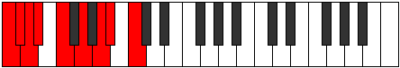 |
| [1711](https://ianring.com/musictheory/scales/1711) | [Ragyllic](ModeASharpRagyllic.md) | A# | A#, B, C, C#, D#, F, G, G#, A# |  |
| [1711](https://ianring.com/musictheory/scales/1711) | [Ragyllic](ModeBFlatRagyllic.md) | Bb | Bb, B, C, Db, Eb, F, G, Ab, Bb |  |
| [1713](https://ianring.com/musictheory/scales/1713) | [Garimic](ModeDSharpGarimic.md) | D# | D#, E###, F###, G###, A###, B##, D# |  |
| [1713](https://ianring.com/musictheory/scales/1713) | [Garimic](ModeEFlatGarimic.md) | Eb | Eb, F##, G#, A#, B#, C#, Eb |  |
| [1713](https://ianring.com/musictheory/scales/1713) | [Garimic](ModeASharpGarimic.md) | A# | A#, B###, C###, D###, E###, F###, A# |  |
| [1713](https://ianring.com/musictheory/scales/1713) | [Garimic](ModeBFlatGarimic.md) | Bb | Bb, C##, D#, E#, F##, G#, Bb |  |
| [1715](https://ianring.com/musictheory/scales/1715) | [Aeronian](ModeDSharpAeronian.md) | D# | D#, E, F##, G#, A#, B#, C#, D# |  |
| [1715](https://ianring.com/musictheory/scales/1715) | [Aeronian](ModeEFlatAeronian.md) | Eb | Eb, Fb, G, Ab, Bb, C, Db, Eb |  |
| [1715](https://ianring.com/musictheory/scales/1715) | [Aeronian](ModeFSharpAeronian.md) | F# | F#, G, A#, B, C#, D#, E, F# |  |
| [1715](https://ianring.com/musictheory/scales/1715) | [Aeronian](ModeGFlatAeronian.md) | Gb | Gb, Abb, Bb, Cb, Db, Eb, Fb, Gb |  |
| [1715](https://ianring.com/musictheory/scales/1715) | [Aeronian](ModeASharpAeronian.md) | A# | A#, B, C##, D#, E#, F##, G#, A# |  |
| [1715](https://ianring.com/musictheory/scales/1715) | [Aeronian](ModeBFlatAeronian.md) | Bb | Bb, Cb, D, Eb, F, G, Ab, Bb |  |
| [1717](https://ianring.com/musictheory/scales/1717) | [Mixolydian](ModeDSharpMixolydian.md) | D# | D#, E#, F##, G#, A#, B#, C#, D# |  |
| [1717](https://ianring.com/musictheory/scales/1717) | [Mixolydian](ModeEFlatMixolydian.md) | Eb | Eb, F, G, Ab, Bb, C, Db, Eb |  |
| [1717](https://ianring.com/musictheory/scales/1717) | [Mixolydian](ModeASharpMixolydian.md) | A# | A#, B#, C##, D#, E#, F##, G#, A# |  |
| [1717](https://ianring.com/musictheory/scales/1717) | [Mixolydian](ModeBFlatMixolydian.md) | Bb | Bb, C, D, Eb, F, G, Ab, Bb |  |
| [1717](https://ianring.com/musictheory/scales/1717) | [Mixolydian](ModeFNaturalMixolydian.md) | F | F, G, A, Bb, C, D, Eb, F |  |
| [1719](https://ianring.com/musictheory/scales/1719) | [Lyryllic](ModeDSharpLyryllic.md) | D# | D#, E, F, G, G#, A#, C, C#, D# |  |
| [1719](https://ianring.com/musictheory/scales/1719) | [Lyryllic](ModeEFlatLyryllic.md) | Eb | Eb, E, F, G, Ab, Bb, C, Db, Eb |  |
| [1719](https://ianring.com/musictheory/scales/1719) | [Lyryllic](ModeFNaturalLyryllic.md) | F | F, F#, G, A, A#, C, D, D#, F |  |
| [1719](https://ianring.com/musictheory/scales/1719) | [Lyryllic](ModeASharpLyryllic.md) | A# | A#, B, C, D, D#, F, G, G#, A# |  |
| [1719](https://ianring.com/musictheory/scales/1719) | [Lyryllic](ModeBFlatLyryllic.md) | Bb | Bb, B, C, D, Eb, F, G, Ab, Bb |  |
| [1719](https://ianring.com/musictheory/scales/1719) | [Lyryllic](ModeFSharpLyryllic.md) | F# | F#, G, G#, A#, B, C#, D#, E, F# |  |
| [1719](https://ianring.com/musictheory/scales/1719) | [Lyryllic](ModeGFlatLyryllic.md) | Gb | Gb, G, Ab, Bb, B, Db, Eb, E, Gb |  |
| [1721](https://ianring.com/musictheory/scales/1721) | [Ionycrian](ModeASharpIonycrian.md) | A# | A#, B##, C##, D#, E#, F##, G#, A# |  |
| [1721](https://ianring.com/musictheory/scales/1721) | [Ionycrian](ModeBFlatIonycrian.md) | Bb | Bb, C#, D, Eb, F, G, Ab, Bb |  |
| [1721](https://ianring.com/musictheory/scales/1721) | [Ionycrian](ModeDSharpIonycrian.md) | D# | D#, E##, F##, G#, A#, B#, C#, D# |  |
| [1721](https://ianring.com/musictheory/scales/1721) | [Ionycrian](ModeEFlatIonycrian.md) | Eb | Eb, F#, G, Ab, Bb, C, Db, Eb |  |
| [1721](https://ianring.com/musictheory/scales/1721) | [Ionycrian](ModeCNaturalIonycrian.md) | C | C, D#, E, F, G, A, Bb, C |  |
| [1723](https://ianring.com/musictheory/scales/1723) | [Poryllic](ModeDSharpPoryllic.md) | D# | D#, E, F#, G, G#, A#, C, C#, D# |  |
| [1723](https://ianring.com/musictheory/scales/1723) | [Poryllic](ModeEFlatPoryllic.md) | Eb | Eb, E, Gb, G, Ab, Bb, C, Db, Eb |  |
| [1723](https://ianring.com/musictheory/scales/1723) | [Poryllic](ModeCNaturalPoryllic.md) | C | C, C#, D#, E, F, G, A, A#, C |  |
| [1723](https://ianring.com/musictheory/scales/1723) | [Poryllic](ModeASharpPoryllic.md) | A# | A#, B, C#, D, D#, F, G, G#, A# |  |
| [1723](https://ianring.com/musictheory/scales/1723) | [Poryllic](ModeBFlatPoryllic.md) | Bb | Bb, B, Db, D, Eb, F, G, Ab, Bb |  |
| [1723](https://ianring.com/musictheory/scales/1723) | [Poryllic](ModeFSharpPoryllic.md) | F# | F#, G, A, A#, B, C#, D#, E, F# |  |
| [1723](https://ianring.com/musictheory/scales/1723) | [Poryllic](ModeGFlatPoryllic.md) | Gb | Gb, G, A, Bb, B, Db, Eb, E, Gb |  |
| [1725](https://ianring.com/musictheory/scales/1725) | [Mixodyllic](ModeASharpMixodyllic.md) | A# | A#, C, C#, D, D#, F, G, G#, A# |  |
| [1725](https://ianring.com/musictheory/scales/1725) | [Mixodyllic](ModeBFlatMixodyllic.md) | Bb | Bb, C, Db, D, Eb, F, G, Ab, Bb |  |
| [1725](https://ianring.com/musictheory/scales/1725) | [Mixodyllic](ModeDSharpMixodyllic.md) | D# | D#, F, F#, G, G#, A#, C, C#, D# |  |
| [1725](https://ianring.com/musictheory/scales/1725) | [Mixodyllic](ModeEFlatMixodyllic.md) | Eb | Eb, F, Gb, G, Ab, Bb, C, Db, Eb |  |
| [1725](https://ianring.com/musictheory/scales/1725) | [Mixodyllic](ModeCNaturalMixodyllic.md) | C | C, D, D#, E, F, G, A, A#, C |  |
| [1725](https://ianring.com/musictheory/scales/1725) | [Mixodyllic](ModeFNaturalMixodyllic.md) | F | F, G, G#, A, A#, C, D, D#, F |  |
| [1727](https://ianring.com/musictheory/scales/1727) | [Sydygic](ModeDSharpSydygic.md) | D# | D#, E, F, F#, G, G#, A#, C, C#, D# |  |
| [1727](https://ianring.com/musictheory/scales/1727) | [Sydygic](ModeEFlatSydygic.md) | Eb | Eb, E, F, Gb, G, Ab, Bb, C, Db, Eb |  |
| [1727](https://ianring.com/musictheory/scales/1727) | [Sydygic](ModeCNaturalSydygic.md) | C | C, C#, D, D#, E, F, G, A, A#, C |  |
| [1727](https://ianring.com/musictheory/scales/1727) | [Sydygic](ModeFNaturalSydygic.md) | F | F, F#, G, G#, A, A#, C, D, D#, F |  |
| [1727](https://ianring.com/musictheory/scales/1727) | [Sydygic](ModeASharpSydygic.md) | A# | A#, B, C, C#, D, D#, F, G, G#, A# |  |
| [1727](https://ianring.com/musictheory/scales/1727) | [Sydygic](ModeBFlatSydygic.md) | Bb | Bb, B, C, Db, D, Eb, F, G, Ab, Bb |  |
| [1727](https://ianring.com/musictheory/scales/1727) | [Sydygic](ModeFSharpSydygic.md) | F# | F#, G, G#, A, A#, B, C#, D#, E, F# |  |
| [1727](https://ianring.com/musictheory/scales/1727) | [Sydygic](ModeGFlatSydygic.md) | Gb | Gb, G, Ab, A, Bb, B, Db, Eb, E, Gb |  |
| [1733](https://ianring.com/musictheory/scales/1733) | [Socrimic](ModeCSharpSocrimic.md) | C# | C#, D#, E###, F###, G###, A##, C# |  |
| [1733](https://ianring.com/musictheory/scales/1733) | [Socrimic](ModeDFlatSocrimic.md) | Db | Db, Eb, F##, G#, A#, B, Db |  |
| [1735](https://ianring.com/musictheory/scales/1735) | [Dagian](ModeCSharpDagian.md) | C# | C#, D, Eb, F##, G#, A#, B, C# |  |
| [1735](https://ianring.com/musictheory/scales/1735) | [Dagian](ModeDFlatDagian.md) | Db | Db, Ebb, Fbb, G, Ab, Bb, Cb, Db |  |
| [1735](https://ianring.com/musictheory/scales/1735) | [Dagian](ModeANaturalDagian.md) | A | A, Bb, Cb, D#, E, F#, G, A |  |
| [1737](https://ianring.com/musictheory/scales/1737) | [Thalimic](ModeCNaturalThalimic.md) | C | C, D#, E##, F##, G##, A#, C |  |
| [1739](https://ianring.com/musictheory/scales/1739) | [Phrylian](ModeCNaturalPhrylian.md) | C | C, Db, Eb, F#, G, A, Bb, C |  |
| [1739](https://ianring.com/musictheory/scales/1739) | [Phrylian](ModeANaturalPhrylian.md) | A | A, Bb, C, D#, E, F#, G, A |  |
| [1741](https://ianring.com/musictheory/scales/1741) | [Katycrian](ModeCNaturalKatycrian.md) | C | C, D, Eb, F#, G, A, Bb, C |  |
| [1741](https://ianring.com/musictheory/scales/1741) | [Katycrian](ModeCSharpKatycrian.md) | C# | C#, D#, E, F##, G#, A#, B, C# |  |
| [1741](https://ianring.com/musictheory/scales/1741) | [Katycrian](ModeDFlatKatycrian.md) | Db | Db, Eb, Fb, G, Ab, Bb, Cb, Db |  |
| [1743](https://ianring.com/musictheory/scales/1743) | [Epigyllic](ModeCNaturalEpigyllic.md) | C | C, C#, D, D#, F#, G, A, A#, C |  |
| [1743](https://ianring.com/musictheory/scales/1743) | [Epigyllic](ModeCSharpEpigyllic.md) | C# | C#, D, D#, E, G, G#, A#, B, C# |  |
| [1743](https://ianring.com/musictheory/scales/1743) | [Epigyllic](ModeDFlatEpigyllic.md) | Db | Db, D, Eb, E, G, Ab, Bb, B, Db |  |
| [1743](https://ianring.com/musictheory/scales/1743) | [Epigyllic](ModeANaturalEpigyllic.md) | A | A, A#, B, C, D#, E, F#, G, A |  |
| [1745](https://ianring.com/musictheory/scales/1745) | [Manimic](ModeDSharpManimic.md) | D# | D#, E###, Cbbb, Cbb, Dbb, Ebbb, D# |  |
| [1745](https://ianring.com/musictheory/scales/1745) | [Manimic](ModeEFlatManimic.md) | Eb | Eb, F##, G##, A#, B#, C#, Eb |  |
| [1747](https://ianring.com/musictheory/scales/1747) | [Epalian](ModeFSharpEpalian.md) | F# | F#, G, A#, B#, C#, D#, E, F# |  |
| [1747](https://ianring.com/musictheory/scales/1747) | [Epalian](ModeGFlatEpalian.md) | Gb | Gb, Abb, Bb, C, Db, Eb, Fb, Gb |  |
| [1747](https://ianring.com/musictheory/scales/1747) | [Epalian](ModeDSharpEpalian.md) | D# | D#, E, F##, G##, A#, B#, C#, D# |  |
| [1747](https://ianring.com/musictheory/scales/1747) | [Epalian](ModeEFlatEpalian.md) | Eb | Eb, Fb, G, A, Bb, C, Db, Eb |  |
| [1747](https://ianring.com/musictheory/scales/1747) | [Epalian](ModeANaturalEpalian.md) | A | A, Bb, C#, D#, E, F#, G, A |  |
| [1749](https://ianring.com/musictheory/scales/1749) | [Lythian](ModeDSharpLythian.md) | D# | D#, E#, F##, G##, A#, B#, C#, D# |  |
| [1749](https://ianring.com/musictheory/scales/1749) | [Lythian](ModeEFlatLythian.md) | Eb | Eb, F, G, A, Bb, C, Db, Eb |  |
| [1749](https://ianring.com/musictheory/scales/1749) | [Lythian](ModeCSharpLythian.md) | C# | C#, D#, E#, F##, G#, A#, B, C# |  |
| [1749](https://ianring.com/musictheory/scales/1749) | [Lythian](ModeDFlatLythian.md) | Db | Db, Eb, F, G, Ab, Bb, Cb, Db |  |
| [1751](https://ianring.com/musictheory/scales/1751) | [Aeolyryllic](ModeFSharpAeolyryllic.md) | F# | F#, G, G#, A#, C, C#, D#, E, F# |  |
| [1751](https://ianring.com/musictheory/scales/1751) | [Aeolyryllic](ModeGFlatAeolyryllic.md) | Gb | Gb, G, Ab, Bb, C, Db, Eb, E, Gb |  |
| [1751](https://ianring.com/musictheory/scales/1751) | [Aeolyryllic](ModeDSharpAeolyryllic.md) | D# | D#, E, F, G, A, A#, C, C#, D# |  |
| [1751](https://ianring.com/musictheory/scales/1751) | [Aeolyryllic](ModeEFlatAeolyryllic.md) | Eb | Eb, E, F, G, A, Bb, C, Db, Eb |  |
| [1751](https://ianring.com/musictheory/scales/1751) | [Aeolyryllic](ModeCSharpAeolyryllic.md) | C# | C#, D, D#, F, G, G#, A#, B, C# |  |
| [1751](https://ianring.com/musictheory/scales/1751) | [Aeolyryllic](ModeDFlatAeolyryllic.md) | Db | Db, D, Eb, F, G, Ab, Bb, B, Db |  |
| [1751](https://ianring.com/musictheory/scales/1751) | [Aeolyryllic](ModeANaturalAeolyryllic.md) | A | A, A#, B, C#, D#, E, F#, G, A |  |
| [1753](https://ianring.com/musictheory/scales/1753) | [Mycrian](ModeDSharpMycrian.md) | D# | D#, E##, F##, G##, A#, B#, C#, D# |  |
| [1753](https://ianring.com/musictheory/scales/1753) | [Mycrian](ModeEFlatMycrian.md) | Eb | Eb, F#, G, A, Bb, C, Db, Eb |  |
| [1753](https://ianring.com/musictheory/scales/1753) | [Mycrian](ModeCNaturalMycrian.md) | C | C, D#, E, F#, G, A, Bb, C |  |
| [1755](https://ianring.com/musictheory/scales/1755) | [MinorDiminished](ModeCNaturalMinorDiminished.md) | C | C, C#, D#, E, F#, G, A, A#, C |  |
| [1755](https://ianring.com/musictheory/scales/1755) | [MinorDiminished](ModeDSharpMinorDiminished.md) | D# | D#, E, F#, G, A, A#, C, C#, D# |  |
| [1755](https://ianring.com/musictheory/scales/1755) | [MinorDiminished](ModeEFlatMinorDiminished.md) | Eb | Eb, E, Gb, G, A, Bb, C, Db, Eb |  |
| [1755](https://ianring.com/musictheory/scales/1755) | [MinorDiminished](ModeFSharpMinorDiminished.md) | F# | F#, G, A, A#, C, C#, D#, E, F# |  |
| [1755](https://ianring.com/musictheory/scales/1755) | [MinorDiminished](ModeGFlatMinorDiminished.md) | Gb | Gb, G, A, Bb, C, Db, Eb, E, Gb |  |
| [1755](https://ianring.com/musictheory/scales/1755) | [MinorDiminished](ModeANaturalMinorDiminished.md) | A | A, A#, C, C#, D#, E, F#, G, A |  |
| [1757](https://ianring.com/musictheory/scales/1757) | [Ionyphyllic](ModeCNaturalIonyphyllic.md) | C | C, D, D#, E, F#, G, A, A#, C |  |
| [1757](https://ianring.com/musictheory/scales/1757) | [Ionyphyllic](ModeDSharpIonyphyllic.md) | D# | D#, F, F#, G, A, A#, C, C#, D# |  |
| [1757](https://ianring.com/musictheory/scales/1757) | [Ionyphyllic](ModeEFlatIonyphyllic.md) | Eb | Eb, F, Gb, G, A, Bb, C, Db, Eb |  |
| [1757](https://ianring.com/musictheory/scales/1757) | [Ionyphyllic](ModeCSharpIonyphyllic.md) | C# | C#, D#, E, F, G, G#, A#, B, C# |  |
| [1757](https://ianring.com/musictheory/scales/1757) | [Ionyphyllic](ModeDFlatIonyphyllic.md) | Db | Db, Eb, E, F, G, Ab, Bb, B, Db |  |
| [1759](https://ianring.com/musictheory/scales/1759) | [Pylygic](ModeCNaturalPylygic.md) | C | C, C#, D, D#, E, F#, G, A, A#, C |  |
| [1759](https://ianring.com/musictheory/scales/1759) | [Pylygic](ModeDSharpPylygic.md) | D# | D#, E, F, F#, G, A, A#, C, C#, D# |  |
| [1759](https://ianring.com/musictheory/scales/1759) | [Pylygic](ModeEFlatPylygic.md) | Eb | Eb, E, F, Gb, G, A, Bb, C, Db, Eb |  |
| [1759](https://ianring.com/musictheory/scales/1759) | [Pylygic](ModeFSharpPylygic.md) | F# | F#, G, G#, A, A#, C, C#, D#, E, F# |  |
| [1759](https://ianring.com/musictheory/scales/1759) | [Pylygic](ModeGFlatPylygic.md) | Gb | Gb, G, Ab, A, Bb, C, Db, Eb, E, Gb |  |
| [1759](https://ianring.com/musictheory/scales/1759) | [Pylygic](ModeCSharpPylygic.md) | C# | C#, D, D#, E, F, G, G#, A#, B, C# |  |
| [1759](https://ianring.com/musictheory/scales/1759) | [Pylygic](ModeDFlatPylygic.md) | Db | Db, D, Eb, E, F, G, Ab, Bb, B, Db |  |
| [1759](https://ianring.com/musictheory/scales/1759) | [Pylygic](ModeANaturalPylygic.md) | A | A, A#, B, C, C#, D#, E, F#, G, A |  |
| [1763](https://ianring.com/musictheory/scales/1763) | [Katalian](ModeANaturalKatalian.md) | A | A, Bb, C##, D#, E, F#, G, A |  |
| [1763](https://ianring.com/musictheory/scales/1763) | [Katalian](ModeASharpKatalian.md) | A# | A#, B, C###, D##, E#, F##, G#, A# |  |
| [1763](https://ianring.com/musictheory/scales/1763) | [Katalian](ModeBFlatKatalian.md) | Bb | Bb, Cb, D#, E, F, G, Ab, Bb |  |
| [1765](https://ianring.com/musictheory/scales/1765) | [Lonian](ModeASharpLonian.md) | A# | A#, B#, C###, D##, E#, F##, G#, A# |  |
| [1765](https://ianring.com/musictheory/scales/1765) | [Lonian](ModeBFlatLonian.md) | Bb | Bb, C, D#, E, F, G, Ab, Bb |  |
| [1765](https://ianring.com/musictheory/scales/1765) | [Lonian](ModeFNaturalLonian.md) | F | F, G, A#, B, C, D, Eb, F |  |
| [1765](https://ianring.com/musictheory/scales/1765) | [Lonian](ModeCSharpLonian.md) | C# | C#, D#, E##, F##, G#, A#, B, C# |  |
| [1765](https://ianring.com/musictheory/scales/1765) | [Lonian](ModeDFlatLonian.md) | Db | Db, Eb, F#, G, Ab, Bb, Cb, Db |  |
| [1767](https://ianring.com/musictheory/scales/1767) | [Dyryllic](ModeFNaturalDyryllic.md) | F | F, F#, G, A#, B, C, D, D#, F |  |
| [1767](https://ianring.com/musictheory/scales/1767) | [Dyryllic](ModeASharpDyryllic.md) | A# | A#, B, C, D#, E, F, G, G#, A# |  |
| [1767](https://ianring.com/musictheory/scales/1767) | [Dyryllic](ModeBFlatDyryllic.md) | Bb | Bb, B, C, Eb, E, F, G, Ab, Bb |  |
| [1767](https://ianring.com/musictheory/scales/1767) | [Dyryllic](ModeCSharpDyryllic.md) | C# | C#, D, D#, F#, G, G#, A#, B, C# |  |
| [1767](https://ianring.com/musictheory/scales/1767) | [Dyryllic](ModeDFlatDyryllic.md) | Db | Db, D, Eb, Gb, G, Ab, Bb, B, Db |  |
| [1767](https://ianring.com/musictheory/scales/1767) | [Dyryllic](ModeANaturalDyryllic.md) | A | A, A#, B, D, D#, E, F#, G, A |  |
| [1769](https://ianring.com/musictheory/scales/1769) | [Rythian](ModeASharpRythian.md) | A# | A#, B##, C###, D##, E#, F##, G#, A# |  |
| [1769](https://ianring.com/musictheory/scales/1769) | [Rythian](ModeBFlatRythian.md) | Bb | Bb, C#, D#, E, F, G, Ab, Bb |  |
| [1769](https://ianring.com/musictheory/scales/1769) | [Rythian](ModeCNaturalRythian.md) | C | C, D#, E#, F#, G, A, Bb, C |  |
| [1771](https://ianring.com/musictheory/scales/1771) | [Stylyllic](ModeANaturalStylyllic.md) | A | A, A#, C, D, D#, E, F#, G, A |  |
| [1771](https://ianring.com/musictheory/scales/1771) | [Stylyllic](ModeCNaturalStylyllic.md) | C | C, C#, D#, F, F#, G, A, A#, C |  |
| [1771](https://ianring.com/musictheory/scales/1771) | [Stylyllic](ModeASharpStylyllic.md) | A# | A#, B, C#, D#, E, F, G, G#, A# |  |
| [1771](https://ianring.com/musictheory/scales/1771) | [Stylyllic](ModeBFlatStylyllic.md) | Bb | Bb, B, Db, Eb, E, F, G, Ab, Bb |  |
| [1773](https://ianring.com/musictheory/scales/1773) | [Aeoloryllic](ModeASharpAeoloryllic.md) | A# | A#, C, C#, D#, E, F, G, G#, A# |  |
| [1773](https://ianring.com/musictheory/scales/1773) | [Aeoloryllic](ModeBFlatAeoloryllic.md) | Bb | Bb, C, Db, Eb, E, F, G, Ab, Bb |  |
| [1773](https://ianring.com/musictheory/scales/1773) | [Aeoloryllic](ModeCNaturalAeoloryllic.md) | C | C, D, D#, F, F#, G, A, A#, C |  |
| [1773](https://ianring.com/musictheory/scales/1773) | [Aeoloryllic](ModeFNaturalAeoloryllic.md) | F | F, G, G#, A#, B, C, D, D#, F |  |
| [1773](https://ianring.com/musictheory/scales/1773) | [Aeoloryllic](ModeCSharpAeoloryllic.md) | C# | C#, D#, E, F#, G, G#, A#, B, C# |  |
| [1773](https://ianring.com/musictheory/scales/1773) | [Aeoloryllic](ModeDFlatAeoloryllic.md) | Db | Db, Eb, E, Gb, G, Ab, Bb, B, Db |  |
| [1775](https://ianring.com/musictheory/scales/1775) | [Lyrygic](ModeCNaturalLyrygic.md) | C | C, C#, D, D#, F, F#, G, A, A#, C |  |
| [1775](https://ianring.com/musictheory/scales/1775) | [Lyrygic](ModeASharpLyrygic.md) | A# | A#, B, C, C#, D#, E, F, G, G#, A# |  |
| [1775](https://ianring.com/musictheory/scales/1775) | [Lyrygic](ModeBFlatLyrygic.md) | Bb | Bb, B, C, Db, Eb, E, F, G, Ab, Bb |  |
| [1775](https://ianring.com/musictheory/scales/1775) | [Lyrygic](ModeCSharpLyrygic.md) | C# | C#, D, D#, E, F#, G, G#, A#, B, C# |  |
| [1775](https://ianring.com/musictheory/scales/1775) | [Lyrygic](ModeDFlatLyrygic.md) | Db | Db, D, Eb, E, Gb, G, Ab, Bb, B, Db |  |
| [1775](https://ianring.com/musictheory/scales/1775) | [Lyrygic](ModeFNaturalLyrygic.md) | F | F, F#, G, G#, A#, B, C, D, D#, F |  |
| [1775](https://ianring.com/musictheory/scales/1775) | [Lyrygic](ModeANaturalLyrygic.md) | A | A, A#, B, C, D, D#, E, F#, G, A |  |
| [1777](https://ianring.com/musictheory/scales/1777) | [Saptian](ModeASharpSaptian.md) | A# | A#, B###, C###, D##, E#, F##, G#, A# |  |
| [1777](https://ianring.com/musictheory/scales/1777) | [Saptian](ModeBFlatSaptian.md) | Bb | Bb, C##, D#, E, F, G, Ab, Bb |  |
| [1777](https://ianring.com/musictheory/scales/1777) | [Saptian](ModeDSharpSaptian.md) | D# | D#, E###, F###, G##, A#, B#, C#, D# | 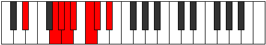 |
| [1777](https://ianring.com/musictheory/scales/1777) | [Saptian](ModeEFlatSaptian.md) | Eb | Eb, F##, G#, A, Bb, C, Db, Eb |  |
| [1779](https://ianring.com/musictheory/scales/1779) | [Aerythyllic](ModeANaturalAerythyllic.md) | A | A, A#, C#, D, D#, E, F#, G, A |  |
| [1779](https://ianring.com/musictheory/scales/1779) | [Aerythyllic](ModeDSharpAerythyllic.md) | D# | D#, E, G, G#, A, A#, C, C#, D# |  |
| [1779](https://ianring.com/musictheory/scales/1779) | [Aerythyllic](ModeEFlatAerythyllic.md) | Eb | Eb, E, G, Ab, A, Bb, C, Db, Eb |  |
| [1779](https://ianring.com/musictheory/scales/1779) | [Aerythyllic](ModeFSharpAerythyllic.md) | F# | F#, G, A#, B, C, C#, D#, E, F# |  |
| [1779](https://ianring.com/musictheory/scales/1779) | [Aerythyllic](ModeGFlatAerythyllic.md) | Gb | Gb, G, Bb, B, C, Db, Eb, E, Gb |  |
| [1779](https://ianring.com/musictheory/scales/1779) | [Aerythyllic](ModeASharpAerythyllic.md) | A# | A#, B, D, D#, E, F, G, G#, A# |  |
| [1779](https://ianring.com/musictheory/scales/1779) | [Aerythyllic](ModeBFlatAerythyllic.md) | Bb | Bb, B, D, Eb, E, F, G, Ab, Bb |  |
| [1781](https://ianring.com/musictheory/scales/1781) | [Gocryllic](ModeASharpGocryllic.md) | A# | A#, C, D, D#, E, F, G, G#, A# |  |
| [1781](https://ianring.com/musictheory/scales/1781) | [Gocryllic](ModeBFlatGocryllic.md) | Bb | Bb, C, D, Eb, E, F, G, Ab, Bb |  |
| [1781](https://ianring.com/musictheory/scales/1781) | [Gocryllic](ModeDSharpGocryllic.md) | D# | D#, F, G, G#, A, A#, C, C#, D# |  |
| [1781](https://ianring.com/musictheory/scales/1781) | [Gocryllic](ModeEFlatGocryllic.md) | Eb | Eb, F, G, Ab, A, Bb, C, Db, Eb |  |
| [1781](https://ianring.com/musictheory/scales/1781) | [Gocryllic](ModeCSharpGocryllic.md) | C# | C#, D#, F, F#, G, G#, A#, B, C# |  |
| [1781](https://ianring.com/musictheory/scales/1781) | [Gocryllic](ModeDFlatGocryllic.md) | Db | Db, Eb, F, Gb, G, Ab, Bb, B, Db |  |
| [1781](https://ianring.com/musictheory/scales/1781) | [Gocryllic](ModeFNaturalGocryllic.md) | F | F, G, A, A#, B, C, D, D#, F |  |
| [1783](https://ianring.com/musictheory/scales/1783) | [Danygic](ModeDSharpDanygic.md) | D# | D#, E, F, G, G#, A, A#, C, C#, D# |  |
| [1783](https://ianring.com/musictheory/scales/1783) | [Danygic](ModeEFlatDanygic.md) | Eb | Eb, E, F, G, Ab, A, Bb, C, Db, Eb |  |
| [1783](https://ianring.com/musictheory/scales/1783) | [Danygic](ModeASharpDanygic.md) | A# | A#, B, C, D, D#, E, F, G, G#, A# |  |
| [1783](https://ianring.com/musictheory/scales/1783) | [Danygic](ModeBFlatDanygic.md) | Bb | Bb, B, C, D, Eb, E, F, G, Ab, Bb |  |
| [1783](https://ianring.com/musictheory/scales/1783) | [Danygic](ModeFSharpDanygic.md) | F# | F#, G, G#, A#, B, C, C#, D#, E, F# |  |
| [1783](https://ianring.com/musictheory/scales/1783) | [Danygic](ModeGFlatDanygic.md) | Gb | Gb, G, Ab, Bb, B, C, Db, Eb, E, Gb |  |
| [1783](https://ianring.com/musictheory/scales/1783) | [Danygic](ModeCSharpDanygic.md) | C# | C#, D, D#, F, F#, G, G#, A#, B, C# |  |
| [1783](https://ianring.com/musictheory/scales/1783) | [Danygic](ModeDFlatDanygic.md) | Db | Db, D, Eb, F, Gb, G, Ab, Bb, B, Db |  |
| [1783](https://ianring.com/musictheory/scales/1783) | [Danygic](ModeANaturalDanygic.md) | A | A, A#, B, C#, D, D#, E, F#, G, A |  |
| [1783](https://ianring.com/musictheory/scales/1783) | [Danygic](ModeFNaturalDanygic.md) | F | F, F#, G, A, A#, B, C, D, D#, F |  |
| [1785](https://ianring.com/musictheory/scales/1785) | [Tharyllic](ModeASharpTharyllic.md) | A# | A#, C#, D, D#, E, F, G, G#, A# |  |
| [1785](https://ianring.com/musictheory/scales/1785) | [Tharyllic](ModeBFlatTharyllic.md) | Bb | Bb, Db, D, Eb, E, F, G, Ab, Bb |  |
| [1785](https://ianring.com/musictheory/scales/1785) | [Tharyllic](ModeCNaturalTharyllic.md) | C | C, D#, E, F, F#, G, A, A#, C |  |
| [1785](https://ianring.com/musictheory/scales/1785) | [Tharyllic](ModeDSharpTharyllic.md) | D# | D#, F#, G, G#, A, A#, C, C#, D# |  |
| [1785](https://ianring.com/musictheory/scales/1785) | [Tharyllic](ModeEFlatTharyllic.md) | Eb | Eb, Gb, G, Ab, A, Bb, C, Db, Eb |  |
| [1787](https://ianring.com/musictheory/scales/1787) | [Mycrygic](ModeANaturalMycrygic.md) | A | A, A#, C, C#, D, D#, E, F#, G, A |  |
| [1787](https://ianring.com/musictheory/scales/1787) | [Mycrygic](ModeCNaturalMycrygic.md) | C | C, C#, D#, E, F, F#, G, A, A#, C |  |
| [1787](https://ianring.com/musictheory/scales/1787) | [Mycrygic](ModeDSharpMycrygic.md) | D# | D#, E, F#, G, G#, A, A#, C, C#, D# |  |
| [1787](https://ianring.com/musictheory/scales/1787) | [Mycrygic](ModeEFlatMycrygic.md) | Eb | Eb, E, Gb, G, Ab, A, Bb, C, Db, Eb |  |
| [1787](https://ianring.com/musictheory/scales/1787) | [Mycrygic](ModeASharpMycrygic.md) | A# | A#, B, C#, D, D#, E, F, G, G#, A# |  |
| [1787](https://ianring.com/musictheory/scales/1787) | [Mycrygic](ModeBFlatMycrygic.md) | Bb | Bb, B, Db, D, Eb, E, F, G, Ab, Bb |  |
| [1787](https://ianring.com/musictheory/scales/1787) | [Mycrygic](ModeFSharpMycrygic.md) | F# | F#, G, A, A#, B, C, C#, D#, E, F# |  |
| [1787](https://ianring.com/musictheory/scales/1787) | [Mycrygic](ModeGFlatMycrygic.md) | Gb | Gb, G, A, Bb, B, C, Db, Eb, E, Gb |  |
| [1789](https://ianring.com/musictheory/scales/1789) | [Katagygic](ModeASharpKatagygic.md) | A# | A#, C, C#, D, D#, E, F, G, G#, A# |  |
| [1789](https://ianring.com/musictheory/scales/1789) | [Katagygic](ModeBFlatKatagygic.md) | Bb | Bb, C, Db, D, Eb, E, F, G, Ab, Bb | 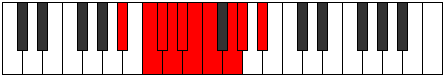 |
| [1789](https://ianring.com/musictheory/scales/1789) | [Katagygic](ModeCNaturalKatagygic.md) | C | C, D, D#, E, F, F#, G, A, A#, C |  |
| [1789](https://ianring.com/musictheory/scales/1789) | [Katagygic](ModeDSharpKatagygic.md) | D# | D#, F, F#, G, G#, A, A#, C, C#, D# |  |
| [1789](https://ianring.com/musictheory/scales/1789) | [Katagygic](ModeEFlatKatagygic.md) | Eb | Eb, F, Gb, G, Ab, A, Bb, C, Db, Eb |  |
| [1789](https://ianring.com/musictheory/scales/1789) | [Katagygic](ModeCSharpKatagygic.md) | C# | C#, D#, E, F, F#, G, G#, A#, B, C# |  |
| [1789](https://ianring.com/musictheory/scales/1789) | [Katagygic](ModeDFlatKatagygic.md) | Db | Db, Eb, E, F, Gb, G, Ab, Bb, B, Db |  |
| [1789](https://ianring.com/musictheory/scales/1789) | [Katagygic](ModeFNaturalKatagygic.md) | F | F, G, G#, A, A#, B, C, D, D#, F |  |
| [1791](https://ianring.com/musictheory/scales/1791) | [Aerygyllian](ModeCNaturalAerygyllian.md) | C | C, C#, D, D#, E, F, F#, G, A, A#, C |  |
| [1791](https://ianring.com/musictheory/scales/1791) | [Aerygyllian](ModeDSharpAerygyllian.md) | D# | D#, E, F, F#, G, G#, A, A#, C, C#, D# |  |
| [1791](https://ianring.com/musictheory/scales/1791) | [Aerygyllian](ModeEFlatAerygyllian.md) | Eb | Eb, E, F, Gb, G, Ab, A, Bb, C, Db, Eb |  |
| [1791](https://ianring.com/musictheory/scales/1791) | [Aerygyllian](ModeASharpAerygyllian.md) | A# | A#, B, C, C#, D, D#, E, F, G, G#, A# |  |
| [1791](https://ianring.com/musictheory/scales/1791) | [Aerygyllian](ModeBFlatAerygyllian.md) | Bb | Bb, B, C, Db, D, Eb, E, F, G, Ab, Bb |  |
| [1791](https://ianring.com/musictheory/scales/1791) | [Aerygyllian](ModeCSharpAerygyllian.md) | C# | C#, D, D#, E, F, F#, G, G#, A#, B, C# |  |
| [1791](https://ianring.com/musictheory/scales/1791) | [Aerygyllian](ModeDFlatAerygyllian.md) | Db | Db, D, Eb, E, F, Gb, G, Ab, Bb, B, Db |  |
| [1791](https://ianring.com/musictheory/scales/1791) | [Aerygyllian](ModeANaturalAerygyllian.md) | A | A, A#, B, C, C#, D, D#, E, F#, G, A |  |
| [1791](https://ianring.com/musictheory/scales/1791) | [Aerygyllian](ModeFSharpAerygyllian.md) | F# | F#, G, G#, A, A#, B, C, C#, D#, E, F# |  |
| [1791](https://ianring.com/musictheory/scales/1791) | [Aerygyllian](ModeGFlatAerygyllian.md) | Gb | Gb, G, Ab, A, Bb, B, C, Db, Eb, E, Gb |  |
| [1791](https://ianring.com/musictheory/scales/1791) | [Aerygyllian](ModeFNaturalAerygyllian.md) | F | F, F#, G, G#, A, A#, B, C, D, D#, F |  |
| [1811](https://ianring.com/musictheory/scales/1811) | [Kyptimic](ModeFSharpKyptimic.md) | F# | F#, G, A#, B###, C###, D##, F# |  |
| [1811](https://ianring.com/musictheory/scales/1811) | [Kyptimic](ModeGFlatKyptimic.md) | Gb | Gb, Abb, Bb, C##, D#, E, Gb |  |
| [1815](https://ianring.com/musictheory/scales/1815) | [Godian](ModeFSharpGodian.md) | F# | F#, G, Ab, Bb, C##, D#, E, F# |  |
| [1815](https://ianring.com/musictheory/scales/1815) | [Godian](ModeGFlatGodian.md) | Gb | Gb, Abb, Bbbb, Cbb, D, Eb, Fb, Gb |  |
| [1817](https://ianring.com/musictheory/scales/1817) | [Phrythimic](ModeGNaturalPhrythimic.md) | G | G, A#, B, C###, D##, E#, G |  |
| [1819](https://ianring.com/musictheory/scales/1819) | [Pydian](ModeFSharpPydian.md) | F# | F#, G, A, Bb, C##, D#, E, F# |  |
| [1819](https://ianring.com/musictheory/scales/1819) | [Pydian](ModeGFlatPydian.md) | Gb | Gb, Abb, Bbb, Cbb, D, Eb, Fb, Gb |  |
| [1819](https://ianring.com/musictheory/scales/1819) | [Pydian](ModeGNaturalPydian.md) | G | G, Ab, Bb, Cb, D#, E, F, G |  |
| [1821](https://ianring.com/musictheory/scales/1821) | [Aeradian](ModeGNaturalAeradian.md) | G | G, A, Bb, Cb, D#, E, F, G |  |
| [1823](https://ianring.com/musictheory/scales/1823) | [Phralyllic](ModeFSharpPhralyllic.md) | F# | F#, G, G#, A, A#, D, D#, E, F# |  |
| [1823](https://ianring.com/musictheory/scales/1823) | [Phralyllic](ModeGFlatPhralyllic.md) | Gb | Gb, G, Ab, A, Bb, D, Eb, E, Gb |  |
| [1823](https://ianring.com/musictheory/scales/1823) | [Phralyllic](ModeGNaturalPhralyllic.md) | G | G, G#, A, A#, B, D#, E, F, G |  |
| [1827](https://ianring.com/musictheory/scales/1827) | [Katygimic](ModeDNaturalKatygimic.md) | D | D, Eb, F##, G###, A##, B#, D |  |
| [1827](https://ianring.com/musictheory/scales/1827) | [Katygimic](ModeASharpKatygimic.md) | A# | A#, B, C###, E##, F##, G#, A# |  |
| [1827](https://ianring.com/musictheory/scales/1827) | [Katygimic](ModeBFlatKatygimic.md) | Bb | Bb, Cb, D#, E##, F##, G#, Bb |  |
| [1829](https://ianring.com/musictheory/scales/1829) | [Pathimic](ModeFNaturalPathimic.md) | F | F, G, A#, B##, C##, D#, F |  |
| [1829](https://ianring.com/musictheory/scales/1829) | [Pathimic](ModeASharpPathimic.md) | A# | A#, B#, C###, E##, F##, G#, A# |  |
| [1829](https://ianring.com/musictheory/scales/1829) | [Pathimic](ModeBFlatPathimic.md) | Bb | Bb, C, D#, E##, F##, G#, Bb |  |
| [1831](https://ianring.com/musictheory/scales/1831) | [Pothian](ModeFNaturalPothian.md) | F | F, Gb, Abb, Bb, C#, D, Eb, F |  |
| [1831](https://ianring.com/musictheory/scales/1831) | [Pothian](ModeDNaturalPothian.md) | D | D, Eb, Fb, G, A#, B, C, D |  |
| [1831](https://ianring.com/musictheory/scales/1831) | [Pothian](ModeASharpPothian.md) | A# | A#, B, C, D#, E##, F##, G#, A# |  |
| [1831](https://ianring.com/musictheory/scales/1831) | [Pothian](ModeBFlatPothian.md) | Bb | Bb, Cb, Dbb, Eb, F#, G, Ab, Bb |  |
| [1833](https://ianring.com/musictheory/scales/1833) | [Ionacrimic](ModeGNaturalIonacrimic.md) | G | G, A#, B#, C###, D##, E#, G |  |
| [1833](https://ianring.com/musictheory/scales/1833) | [Ionacrimic](ModeASharpIonacrimic.md) | A# | A#, B##, C###, E##, F##, G#, A# |  |
| [1833](https://ianring.com/musictheory/scales/1833) | [Ionacrimic](ModeBFlatIonacrimic.md) | Bb | Bb, C#, D#, E##, F##, G#, Bb |  |
| [1835](https://ianring.com/musictheory/scales/1835) | [Byptian](ModeGNaturalByptian.md) | G | G, Ab, Bb, C, D#, E, F, G |  |
| [1835](https://ianring.com/musictheory/scales/1835) | [Byptian](ModeDNaturalByptian.md) | D | D, Eb, F, G, A#, B, C, D |  |
| [1835](https://ianring.com/musictheory/scales/1835) | [Byptian](ModeASharpByptian.md) | A# | A#, B, C#, D#, E##, F##, G#, A# |  |
| [1835](https://ianring.com/musictheory/scales/1835) | [Byptian](ModeBFlatByptian.md) | Bb | Bb, Cb, Db, Eb, F#, G, Ab, Bb |  |
| [1837](https://ianring.com/musictheory/scales/1837) | [Dalian](ModeFNaturalDalian.md) | F | F, G, Ab, Bb, C#, D, Eb, F |  |
| [1837](https://ianring.com/musictheory/scales/1837) | [Dalian](ModeASharpDalian.md) | A# | A#, B#, C#, D#, E##, F##, G#, A# |  |
| [1837](https://ianring.com/musictheory/scales/1837) | [Dalian](ModeBFlatDalian.md) | Bb | Bb, C, Db, Eb, F#, G, Ab, Bb |  |
| [1837](https://ianring.com/musictheory/scales/1837) | [Dalian](ModeGNaturalDalian.md) | G | G, A, Bb, C, D#, E, F, G |  |
| [1839](https://ianring.com/musictheory/scales/1839) | [Zogyllic](ModeFNaturalZogyllic.md) | F | F, F#, G, G#, A#, C#, D, D#, F |  |
| [1839](https://ianring.com/musictheory/scales/1839) | [Zogyllic](ModeGNaturalZogyllic.md) | G | G, G#, A, A#, C, D#, E, F, G |  |
| [1839](https://ianring.com/musictheory/scales/1839) | [Zogyllic](ModeDNaturalZogyllic.md) | D | D, D#, E, F, G, A#, B, C, D |  |
| [1839](https://ianring.com/musictheory/scales/1839) | [Zogyllic](ModeASharpZogyllic.md) | A# | A#, B, C, C#, D#, F#, G, G#, A# |  |
| [1839](https://ianring.com/musictheory/scales/1839) | [Zogyllic](ModeBFlatZogyllic.md) | Bb | Bb, B, C, Db, Eb, Gb, G, Ab, Bb |  |
| [1841](https://ianring.com/musictheory/scales/1841) | [Thogimic](ModeASharpThogimic.md) | A# | A#, B###, C###, E##, F##, G#, A# |  |
| [1841](https://ianring.com/musictheory/scales/1841) | [Thogimic](ModeBFlatThogimic.md) | Bb | Bb, C##, D#, E##, F##, G#, Bb |  |
| [1843](https://ianring.com/musictheory/scales/1843) | [Ionygian](ModeDNaturalIonygian.md) | D | D, Eb, F#, G, A#, B, C, D |  |
| [1843](https://ianring.com/musictheory/scales/1843) | [Ionygian](ModeFSharpIonygian.md) | F# | F#, G, A#, B, C##, D#, E, F# |  |
| [1843](https://ianring.com/musictheory/scales/1843) | [Ionygian](ModeGFlatIonygian.md) | Gb | Gb, Abb, Bb, Cb, D, Eb, Fb, Gb |  |
| [1843](https://ianring.com/musictheory/scales/1843) | [Ionygian](ModeASharpIonygian.md) | A# | A#, B, C##, D#, E##, F##, G#, A# |  |
| [1843](https://ianring.com/musictheory/scales/1843) | [Ionygian](ModeBFlatIonygian.md) | Bb | Bb, Cb, D, Eb, F#, G, Ab, Bb |  |
| [1845](https://ianring.com/musictheory/scales/1845) | [Lagian](ModeASharpLagian.md) | A# | A#, B#, C##, D#, E##, F##, G#, A# |  |
| [1845](https://ianring.com/musictheory/scales/1845) | [Lagian](ModeBFlatLagian.md) | Bb | Bb, C, D, Eb, F#, G, Ab, Bb |  |
| [1845](https://ianring.com/musictheory/scales/1845) | [Lagian](ModeFNaturalLagian.md) | F | F, G, A, Bb, C#, D, Eb, F |  |
| [1847](https://ianring.com/musictheory/scales/1847) | [Thacryllic](ModeFNaturalThacryllic.md) | F | F, F#, G, A, A#, C#, D, D#, F |  |
| [1847](https://ianring.com/musictheory/scales/1847) | [Thacryllic](ModeDNaturalThacryllic.md) | D | D, D#, E, F#, G, A#, B, C, D |  |
| [1847](https://ianring.com/musictheory/scales/1847) | [Thacryllic](ModeASharpThacryllic.md) | A# | A#, B, C, D, D#, F#, G, G#, A# |  |
| [1847](https://ianring.com/musictheory/scales/1847) | [Thacryllic](ModeBFlatThacryllic.md) | Bb | Bb, B, C, D, Eb, Gb, G, Ab, Bb |  |
| [1847](https://ianring.com/musictheory/scales/1847) | [Thacryllic](ModeFSharpThacryllic.md) | F# | F#, G, G#, A#, B, D, D#, E, F# |  |
| [1847](https://ianring.com/musictheory/scales/1847) | [Thacryllic](ModeGFlatThacryllic.md) | Gb | Gb, G, Ab, Bb, B, D, Eb, E, Gb |  |
| [1849](https://ianring.com/musictheory/scales/1849) | [Epogian](ModeASharpEpogian.md) | A# | A#, B##, C##, D#, E##, F##, G#, A# |  |
| [1849](https://ianring.com/musictheory/scales/1849) | [Epogian](ModeBFlatEpogian.md) | Bb | Bb, C#, D, Eb, F#, G, Ab, Bb |  |
| [1849](https://ianring.com/musictheory/scales/1849) | [Epogian](ModeGNaturalEpogian.md) | G | G, A#, B, C, D#, E, F, G |  |
| [1851](https://ianring.com/musictheory/scales/1851) | [Zacryllic](ModeDNaturalZacryllic.md) | D | D, D#, F, F#, G, A#, B, C, D |  |
| [1851](https://ianring.com/musictheory/scales/1851) | [Zacryllic](ModeGNaturalZacryllic.md) | G | G, G#, A#, B, C, D#, E, F, G |  |
| [1851](https://ianring.com/musictheory/scales/1851) | [Zacryllic](ModeASharpZacryllic.md) | A# | A#, B, C#, D, D#, F#, G, G#, A# |  |
| [1851](https://ianring.com/musictheory/scales/1851) | [Zacryllic](ModeBFlatZacryllic.md) | Bb | Bb, B, Db, D, Eb, Gb, G, Ab, Bb |  |
| [1851](https://ianring.com/musictheory/scales/1851) | [Zacryllic](ModeFSharpZacryllic.md) | F# | F#, G, A, A#, B, D, D#, E, F# |  |
| [1851](https://ianring.com/musictheory/scales/1851) | [Zacryllic](ModeGFlatZacryllic.md) | Gb | Gb, G, A, Bb, B, D, Eb, E, Gb |  |
| [1853](https://ianring.com/musictheory/scales/1853) | [Phrynyllic](ModeASharpPhrynyllic.md) | A# | A#, C, C#, D, D#, F#, G, G#, A# |  |
| [1853](https://ianring.com/musictheory/scales/1853) | [Phrynyllic](ModeBFlatPhrynyllic.md) | Bb | Bb, C, Db, D, Eb, Gb, G, Ab, Bb |  |
| [1853](https://ianring.com/musictheory/scales/1853) | [Phrynyllic](ModeFNaturalPhrynyllic.md) | F | F, G, G#, A, A#, C#, D, D#, F |  |
| [1853](https://ianring.com/musictheory/scales/1853) | [Phrynyllic](ModeGNaturalPhrynyllic.md) | G | G, A, A#, B, C, D#, E, F, G |  |
| [1855](https://ianring.com/musictheory/scales/1855) | [Marygic](ModeFNaturalMarygic.md) | F | F, F#, G, G#, A, A#, C#, D, D#, F |  |
| [1855](https://ianring.com/musictheory/scales/1855) | [Marygic](ModeDNaturalMarygic.md) | D | D, D#, E, F, F#, G, A#, B, C, D |  |
| [1855](https://ianring.com/musictheory/scales/1855) | [Marygic](ModeASharpMarygic.md) | A# | A#, B, C, C#, D, D#, F#, G, G#, A# |  |
| [1855](https://ianring.com/musictheory/scales/1855) | [Marygic](ModeBFlatMarygic.md) | Bb | Bb, B, C, Db, D, Eb, Gb, G, Ab, Bb |  |
| [1855](https://ianring.com/musictheory/scales/1855) | [Marygic](ModeGNaturalMarygic.md) | G | G, G#, A, A#, B, C, D#, E, F, G |  |
| [1855](https://ianring.com/musictheory/scales/1855) | [Marygic](ModeFSharpMarygic.md) | F# | F#, G, G#, A, A#, B, D, D#, E, F# |  |
| [1855](https://ianring.com/musictheory/scales/1855) | [Marygic](ModeGFlatMarygic.md) | Gb | Gb, G, Ab, A, Bb, B, D, Eb, E, Gb |  |
| [1861](https://ianring.com/musictheory/scales/1861) | [Phrygimic](ModeCSharpPhrygimic.md) | C# | C#, D#, E###, Cbbb, Cbb, Dbbb, C# |  |
| [1861](https://ianring.com/musictheory/scales/1861) | [Phrygimic](ModeDFlatPhrygimic.md) | Db | Db, Eb, F##, G##, A#, B, Db |  |
| [1863](https://ianring.com/musictheory/scales/1863) | [Pycrian](ModeCSharpPycrian.md) | C# | C#, D, Eb, F##, G##, A#, B, C# |  |
| [1863](https://ianring.com/musictheory/scales/1863) | [Pycrian](ModeDFlatPycrian.md) | Db | Db, Ebb, Fbb, G, A, Bb, Cb, Db |  |
| [1863](https://ianring.com/musictheory/scales/1863) | [Pycrian](ModeANaturalPycrian.md) | A | A, Bb, Cb, D#, E#, F#, G, A |  |
| [1865](https://ianring.com/musictheory/scales/1865) | [Thagimic](ModeGNaturalThagimic.md) | G | G, A#, B##, C###, D##, E#, G |  |
| [1867](https://ianring.com/musictheory/scales/1867) | [Solian](ModeGNaturalSolian.md) | G | G, Ab, Bb, C#, D#, E, F, G | 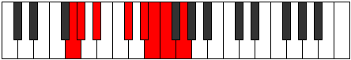 |
| [1867](https://ianring.com/musictheory/scales/1867) | [Solian](ModeANaturalSolian.md) | A | A, Bb, C, D#, E#, F#, G, A |  |
| [1869](https://ianring.com/musictheory/scales/1869) | [Katyrian](ModeGNaturalKatyrian.md) | G | G, A, Bb, C#, D#, E, F, G | 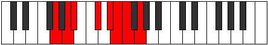 |
| [1869](https://ianring.com/musictheory/scales/1869) | [Katyrian](ModeCSharpKatyrian.md) | C# | C#, D#, E, F##, G##, A#, B, C# |  |
| [1869](https://ianring.com/musictheory/scales/1869) | [Katyrian](ModeDFlatKatyrian.md) | Db | Db, Eb, Fb, G, A, Bb, Cb, Db |  |
| [1871](https://ianring.com/musictheory/scales/1871) | [Aeolyllic](ModeGNaturalAeolyllic.md) | G | G, G#, A, A#, C#, D#, E, F, G |  |
| [1871](https://ianring.com/musictheory/scales/1871) | [Aeolyllic](ModeCSharpAeolyllic.md) | C# | C#, D, D#, E, G, A, A#, B, C# |  |
| [1871](https://ianring.com/musictheory/scales/1871) | [Aeolyllic](ModeDFlatAeolyllic.md) | Db | Db, D, Eb, E, G, A, Bb, B, Db | 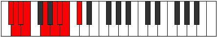 |
| [1871](https://ianring.com/musictheory/scales/1871) | [Aeolyllic](ModeANaturalAeolyllic.md) | A | A, A#, B, C, D#, F, F#, G, A |  |
| [1875](https://ianring.com/musictheory/scales/1875) | [Epyphian](ModeFSharpEpyphian.md) | F# | F#, G, A#, B#, C##, D#, E, F# |  |
| [1875](https://ianring.com/musictheory/scales/1875) | [Epyphian](ModeGFlatEpyphian.md) | Gb | Gb, Abb, Bb, C, D, Eb, Fb, Gb |  |
| [1875](https://ianring.com/musictheory/scales/1875) | [Epyphian](ModeANaturalEpyphian.md) | A | A, Bb, C#, D#, E#, F#, G, A |  |
| [1877](https://ianring.com/musictheory/scales/1877) | [Aeroptian](ModeCSharpAeroptian.md) | C# | C#, D#, E#, F##, G##, A#, B, C# |  |
| [1877](https://ianring.com/musictheory/scales/1877) | [Aeroptian](ModeDFlatAeroptian.md) | Db | Db, Eb, F, G, A, Bb, Cb, Db |  |
| [1879](https://ianring.com/musictheory/scales/1879) | [Mixoryllic](ModeFSharpMixoryllic.md) | F# | F#, G, G#, A#, C, D, D#, E, F# |  |
| [1879](https://ianring.com/musictheory/scales/1879) | [Mixoryllic](ModeGFlatMixoryllic.md) | Gb | Gb, G, Ab, Bb, C, D, Eb, E, Gb |  |
| [1879](https://ianring.com/musictheory/scales/1879) | [Mixoryllic](ModeCSharpMixoryllic.md) | C# | C#, D, D#, F, G, A, A#, B, C# |  |
| [1879](https://ianring.com/musictheory/scales/1879) | [Mixoryllic](ModeDFlatMixoryllic.md) | Db | Db, D, Eb, F, G, A, Bb, B, Db |  |
| [1879](https://ianring.com/musictheory/scales/1879) | [Mixoryllic](ModeANaturalMixoryllic.md) | A | A, A#, B, C#, D#, F, F#, G, A |  |
| [1881](https://ianring.com/musictheory/scales/1881) | [Korian](ModeGNaturalKorian.md) | G | G, A#, B, C#, D#, E, F, G |  |
| [1883](https://ianring.com/musictheory/scales/1883) | [Mixopyryllic](ModeFSharpMixopyryllic.md) | F# | F#, G, A, A#, C, D, D#, E, F# |  |
| [1883](https://ianring.com/musictheory/scales/1883) | [Mixopyryllic](ModeGFlatMixopyryllic.md) | Gb | Gb, G, A, Bb, C, D, Eb, E, Gb |  |
| [1883](https://ianring.com/musictheory/scales/1883) | [Mixopyryllic](ModeANaturalMixopyryllic.md) | A | A, A#, C, C#, D#, F, F#, G, A |  |
| [1883](https://ianring.com/musictheory/scales/1883) | [Mixopyryllic](ModeGNaturalMixopyryllic.md) | G | G, G#, A#, B, C#, D#, E, F, G |  |
| [1885](https://ianring.com/musictheory/scales/1885) | [Epidyllic](ModeCSharpEpidyllic.md) | C# | C#, D#, E, F, G, A, A#, B, C# |  |
| [1885](https://ianring.com/musictheory/scales/1885) | [Epidyllic](ModeDFlatEpidyllic.md) | Db | Db, Eb, E, F, G, A, Bb, B, Db |  |
| [1885](https://ianring.com/musictheory/scales/1885) | [Epidyllic](ModeGNaturalEpidyllic.md) | G | G, A, A#, B, C#, D#, E, F, G |  |
| [1887](https://ianring.com/musictheory/scales/1887) | [Aerocrygic](ModeFSharpAerocrygic.md) | F# | F#, G, G#, A, A#, C, D, D#, E, F# |  |
| [1887](https://ianring.com/musictheory/scales/1887) | [Aerocrygic](ModeGFlatAerocrygic.md) | Gb | Gb, G, Ab, A, Bb, C, D, Eb, E, Gb |  |
| [1887](https://ianring.com/musictheory/scales/1887) | [Aerocrygic](ModeCSharpAerocrygic.md) | C# | C#, D, D#, E, F, G, A, A#, B, C# |  |
| [1887](https://ianring.com/musictheory/scales/1887) | [Aerocrygic](ModeDFlatAerocrygic.md) | Db | Db, D, Eb, E, F, G, A, Bb, B, Db |  |
| [1887](https://ianring.com/musictheory/scales/1887) | [Aerocrygic](ModeANaturalAerocrygic.md) | A | A, A#, B, C, C#, D#, F, F#, G, A |  |
| [1887](https://ianring.com/musictheory/scales/1887) | [Aerocrygic](ModeGNaturalAerocrygic.md) | G | G, G#, A, A#, B, C#, D#, E, F, G |  |
| [1891](https://ianring.com/musictheory/scales/1891) | [Thalian](ModeANaturalThalian.md) | A | A, Bb, C##, D#, E#, F#, G, A |  |
| [1891](https://ianring.com/musictheory/scales/1891) | [Thalian](ModeDNaturalThalian.md) | D | D, Eb, F##, G#, A#, B, C, D |  |
| [1891](https://ianring.com/musictheory/scales/1891) | [Thalian](ModeASharpThalian.md) | A# | A#, B, C###, D##, E##, F##, G#, A# |  |
| [1891](https://ianring.com/musictheory/scales/1891) | [Thalian](ModeBFlatThalian.md) | Bb | Bb, Cb, D#, E, F#, G, Ab, Bb |  |
| [1893](https://ianring.com/musictheory/scales/1893) | [Ionylian](ModeASharpIonylian.md) | A# | A#, B#, C###, D##, E##, F##, G#, A# |  |
| [1893](https://ianring.com/musictheory/scales/1893) | [Ionylian](ModeBFlatIonylian.md) | Bb | Bb, C, D#, E, F#, G, Ab, Bb |  |
| [1893](https://ianring.com/musictheory/scales/1893) | [Ionylian](ModeFNaturalIonylian.md) | F | F, G, A#, B, C#, D, Eb, F |  |
| [1893](https://ianring.com/musictheory/scales/1893) | [Ionylian](ModeCSharpIonylian.md) | C# | C#, D#, E##, F##, G##, A#, B, C# |  |
| [1893](https://ianring.com/musictheory/scales/1893) | [Ionylian](ModeDFlatIonylian.md) | Db | Db, Eb, F#, G, A, Bb, Cb, Db |  |
| [1895](https://ianring.com/musictheory/scales/1895) | [Salyllic](ModeFNaturalSalyllic.md) | F | F, F#, G, A#, B, C#, D, D#, F |  |
| [1895](https://ianring.com/musictheory/scales/1895) | [Salyllic](ModeDNaturalSalyllic.md) | D | D, D#, E, G, G#, A#, B, C, D |  |
| [1895](https://ianring.com/musictheory/scales/1895) | [Salyllic](ModeASharpSalyllic.md) | A# | A#, B, C, D#, E, F#, G, G#, A# |  |
| [1895](https://ianring.com/musictheory/scales/1895) | [Salyllic](ModeBFlatSalyllic.md) | Bb | Bb, B, C, Eb, E, Gb, G, Ab, Bb |  |
| [1895](https://ianring.com/musictheory/scales/1895) | [Salyllic](ModeCSharpSalyllic.md) | C# | C#, D, D#, F#, G, A, A#, B, C# |  |
| [1895](https://ianring.com/musictheory/scales/1895) | [Salyllic](ModeDFlatSalyllic.md) | Db | Db, D, Eb, Gb, G, A, Bb, B, Db |  |
| [1895](https://ianring.com/musictheory/scales/1895) | [Salyllic](ModeANaturalSalyllic.md) | A | A, A#, B, D, D#, F, F#, G, A |  |
| [1897](https://ianring.com/musictheory/scales/1897) | [Ionopian](ModeGNaturalIonopian.md) | G | G, A#, B#, C#, D#, E, F, G |  |
| [1897](https://ianring.com/musictheory/scales/1897) | [Ionopian](ModeASharpIonopian.md) | A# | A#, B##, C###, D##, E##, F##, G#, A# |  |
| [1897](https://ianring.com/musictheory/scales/1897) | [Ionopian](ModeBFlatIonopian.md) | Bb | Bb, C#, D#, E, F#, G, Ab, Bb |  |
| [1899](https://ianring.com/musictheory/scales/1899) | [Moptyllic](ModeGNaturalMoptyllic.md) | G | G, G#, A#, C, C#, D#, E, F, G |  |
| [1899](https://ianring.com/musictheory/scales/1899) | [Moptyllic](ModeANaturalMoptyllic.md) | A | A, A#, C, D, D#, F, F#, G, A |  |
| [1899](https://ianring.com/musictheory/scales/1899) | [Moptyllic](ModeDNaturalMoptyllic.md) | D | D, D#, F, G, G#, A#, B, C, D |  |
| [1899](https://ianring.com/musictheory/scales/1899) | [Moptyllic](ModeASharpMoptyllic.md) | A# | A#, B, C#, D#, E, F#, G, G#, A# |  |
| [1899](https://ianring.com/musictheory/scales/1899) | [Moptyllic](ModeBFlatMoptyllic.md) | Bb | Bb, B, Db, Eb, E, Gb, G, Ab, Bb |  |
| [1901](https://ianring.com/musictheory/scales/1901) | [Ionidyllic](ModeASharpIonidyllic.md) | A# | A#, C, C#, D#, E, F#, G, G#, A# |  |
| [1901](https://ianring.com/musictheory/scales/1901) | [Ionidyllic](ModeBFlatIonidyllic.md) | Bb | Bb, C, Db, Eb, E, Gb, G, Ab, Bb |  |
| [1901](https://ianring.com/musictheory/scales/1901) | [Ionidyllic](ModeGNaturalIonidyllic.md) | G | G, A, A#, C, C#, D#, E, F, G |  |
| [1901](https://ianring.com/musictheory/scales/1901) | [Ionidyllic](ModeFNaturalIonidyllic.md) | F | F, G, G#, A#, B, C#, D, D#, F |  |
| [1901](https://ianring.com/musictheory/scales/1901) | [Ionidyllic](ModeCSharpIonidyllic.md) | C# | C#, D#, E, F#, G, A, A#, B, C# |  |
| [1901](https://ianring.com/musictheory/scales/1901) | [Ionidyllic](ModeDFlatIonidyllic.md) | Db | Db, Eb, E, Gb, G, A, Bb, B, Db |  |
| [1903](https://ianring.com/musictheory/scales/1903) | [Rocrygic](ModeGNaturalRocrygic.md) | G | G, G#, A, A#, C, C#, D#, E, F, G |  |
| [1903](https://ianring.com/musictheory/scales/1903) | [Rocrygic](ModeDNaturalRocrygic.md) | D | D, D#, E, F, G, G#, A#, B, C, D |  |
| [1903](https://ianring.com/musictheory/scales/1903) | [Rocrygic](ModeASharpRocrygic.md) | A# | A#, B, C, C#, D#, E, F#, G, G#, A# |  |
| [1903](https://ianring.com/musictheory/scales/1903) | [Rocrygic](ModeBFlatRocrygic.md) | Bb | Bb, B, C, Db, Eb, E, Gb, G, Ab, Bb |  |
| [1903](https://ianring.com/musictheory/scales/1903) | [Rocrygic](ModeFNaturalRocrygic.md) | F | F, F#, G, G#, A#, B, C#, D, D#, F |  |
| [1903](https://ianring.com/musictheory/scales/1903) | [Rocrygic](ModeCSharpRocrygic.md) | C# | C#, D, D#, E, F#, G, A, A#, B, C# |  |
| [1903](https://ianring.com/musictheory/scales/1903) | [Rocrygic](ModeDFlatRocrygic.md) | Db | Db, D, Eb, E, Gb, G, A, Bb, B, Db |  |
| [1903](https://ianring.com/musictheory/scales/1903) | [Rocrygic](ModeANaturalRocrygic.md) | A | A, A#, B, C, D, D#, F, F#, G, A |  |
| [1905](https://ianring.com/musictheory/scales/1905) | [Katacrian](ModeASharpKatacrian.md) | A# | A#, B###, C###, D##, E##, F##, G#, A# |  |
| [1905](https://ianring.com/musictheory/scales/1905) | [Katacrian](ModeBFlatKatacrian.md) | Bb | Bb, C##, D#, E, F#, G, Ab, Bb |  |
| [1907](https://ianring.com/musictheory/scales/1907) | [Lynyllic](ModeANaturalLynyllic.md) | A | A, A#, C#, D, D#, F, F#, G, A |  |
| [1907](https://ianring.com/musictheory/scales/1907) | [Lynyllic](ModeFSharpLynyllic.md) | F# | F#, G, A#, B, C, D, D#, E, F# |  |
| [1907](https://ianring.com/musictheory/scales/1907) | [Lynyllic](ModeGFlatLynyllic.md) | Gb | Gb, G, Bb, B, C, D, Eb, E, Gb |  |
| [1907](https://ianring.com/musictheory/scales/1907) | [Lynyllic](ModeDNaturalLynyllic.md) | D | D, D#, F#, G, G#, A#, B, C, D |  |
| [1907](https://ianring.com/musictheory/scales/1907) | [Lynyllic](ModeASharpLynyllic.md) | A# | A#, B, D, D#, E, F#, G, G#, A# |  |
| [1907](https://ianring.com/musictheory/scales/1907) | [Lynyllic](ModeBFlatLynyllic.md) | Bb | Bb, B, D, Eb, E, Gb, G, Ab, Bb |  |
| [1909](https://ianring.com/musictheory/scales/1909) | [Epicryllic](ModeASharpEpicryllic.md) | A# | A#, C, D, D#, E, F#, G, G#, A# |  |
| [1909](https://ianring.com/musictheory/scales/1909) | [Epicryllic](ModeBFlatEpicryllic.md) | Bb | Bb, C, D, Eb, E, Gb, G, Ab, Bb |  |
| [1909](https://ianring.com/musictheory/scales/1909) | [Epicryllic](ModeFNaturalEpicryllic.md) | F | F, G, A, A#, B, C#, D, D#, F |  |
| [1909](https://ianring.com/musictheory/scales/1909) | [Epicryllic](ModeCSharpEpicryllic.md) | C# | C#, D#, F, F#, G, A, A#, B, C# |  |
| [1909](https://ianring.com/musictheory/scales/1909) | [Epicryllic](ModeDFlatEpicryllic.md) | Db | Db, Eb, F, Gb, G, A, Bb, B, Db |  |
| [1911](https://ianring.com/musictheory/scales/1911) | [Stynygic](ModeDNaturalStynygic.md) | D | D, D#, E, F#, G, G#, A#, B, C, D |  |
| [1911](https://ianring.com/musictheory/scales/1911) | [Stynygic](ModeFSharpStynygic.md) | F# | F#, G, G#, A#, B, C, D, D#, E, F# |  |
| [1911](https://ianring.com/musictheory/scales/1911) | [Stynygic](ModeGFlatStynygic.md) | Gb | Gb, G, Ab, Bb, B, C, D, Eb, E, Gb |  |
| [1911](https://ianring.com/musictheory/scales/1911) | [Stynygic](ModeASharpStynygic.md) | A# | A#, B, C, D, D#, E, F#, G, G#, A# |  |
| [1911](https://ianring.com/musictheory/scales/1911) | [Stynygic](ModeBFlatStynygic.md) | Bb | Bb, B, C, D, Eb, E, Gb, G, Ab, Bb |  |
| [1911](https://ianring.com/musictheory/scales/1911) | [Stynygic](ModeCSharpStynygic.md) | C# | C#, D, D#, F, F#, G, A, A#, B, C# |  |
| [1911](https://ianring.com/musictheory/scales/1911) | [Stynygic](ModeDFlatStynygic.md) | Db | Db, D, Eb, F, Gb, G, A, Bb, B, Db |  |
| [1911](https://ianring.com/musictheory/scales/1911) | [Stynygic](ModeFNaturalStynygic.md) | F | F, F#, G, A, A#, B, C#, D, D#, F |  |
| [1911](https://ianring.com/musictheory/scales/1911) | [Stynygic](ModeANaturalStynygic.md) | A | A, A#, B, C#, D, D#, F, F#, G, A |  |
| [1913](https://ianring.com/musictheory/scales/1913) | [Zagyllic](ModeASharpZagyllic.md) | A# | A#, C#, D, D#, E, F#, G, G#, A# |  |
| [1913](https://ianring.com/musictheory/scales/1913) | [Zagyllic](ModeBFlatZagyllic.md) | Bb | Bb, Db, D, Eb, E, Gb, G, Ab, Bb |  |
| [1913](https://ianring.com/musictheory/scales/1913) | [Zagyllic](ModeGNaturalZagyllic.md) | G | G, A#, B, C, C#, D#, E, F, G |  |
| [1915](https://ianring.com/musictheory/scales/1915) | [Thydygic](ModeANaturalThydygic.md) | A | A, A#, C, C#, D, D#, F, F#, G, A |  |
| [1915](https://ianring.com/musictheory/scales/1915) | [Thydygic](ModeGNaturalThydygic.md) | G | G, G#, A#, B, C, C#, D#, E, F, G |  |
| [1915](https://ianring.com/musictheory/scales/1915) | [Thydygic](ModeASharpThydygic.md) | A# | A#, B, C#, D, D#, E, F#, G, G#, A# |  |
| [1915](https://ianring.com/musictheory/scales/1915) | [Thydygic](ModeBFlatThydygic.md) | Bb | Bb, B, Db, D, Eb, E, Gb, G, Ab, Bb |  |
| [1915](https://ianring.com/musictheory/scales/1915) | [Thydygic](ModeDNaturalThydygic.md) | D | D, D#, F, F#, G, G#, A#, B, C, D |  |
| [1915](https://ianring.com/musictheory/scales/1915) | [Thydygic](ModeFSharpThydygic.md) | F# | F#, G, A, A#, B, C, D, D#, E, F# |  |
| [1915](https://ianring.com/musictheory/scales/1915) | [Thydygic](ModeGFlatThydygic.md) | Gb | Gb, G, A, Bb, B, C, D, Eb, E, Gb |  |
| [1917](https://ianring.com/musictheory/scales/1917) | [Sacrygic](ModeASharpSacrygic.md) | A# | A#, C, C#, D, D#, E, F#, G, G#, A# |  |
| [1917](https://ianring.com/musictheory/scales/1917) | [Sacrygic](ModeBFlatSacrygic.md) | Bb | Bb, C, Db, D, Eb, E, Gb, G, Ab, Bb |  |
| [1917](https://ianring.com/musictheory/scales/1917) | [Sacrygic](ModeGNaturalSacrygic.md) | G | G, A, A#, B, C, C#, D#, E, F, G |  |
| [1917](https://ianring.com/musictheory/scales/1917) | [Sacrygic](ModeCSharpSacrygic.md) | C# | C#, D#, E, F, F#, G, A, A#, B, C# |  |
| [1917](https://ianring.com/musictheory/scales/1917) | [Sacrygic](ModeDFlatSacrygic.md) | Db | Db, Eb, E, F, Gb, G, A, Bb, B, Db |  |
| [1917](https://ianring.com/musictheory/scales/1917) | [Sacrygic](ModeFNaturalSacrygic.md) | F | F, G, G#, A, A#, B, C#, D, D#, F |  |
| [1919](https://ianring.com/musictheory/scales/1919) | [Rocryllian](ModeASharpRocryllian.md) | A# | A#, B, C, C#, D, D#, E, F#, G, G#, A# |  |
| [1919](https://ianring.com/musictheory/scales/1919) | [Rocryllian](ModeBFlatRocryllian.md) | Bb | Bb, B, C, Db, D, Eb, E, Gb, G, Ab, Bb |  |
| [1919](https://ianring.com/musictheory/scales/1919) | [Rocryllian](ModeDNaturalRocryllian.md) | D | D, D#, E, F, F#, G, G#, A#, B, C, D | 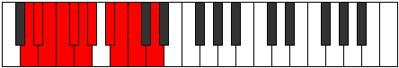 |
| [1919](https://ianring.com/musictheory/scales/1919) | [Rocryllian](ModeANaturalRocryllian.md) | A | A, A#, B, C, C#, D, D#, F, F#, G, A |  |
| [1919](https://ianring.com/musictheory/scales/1919) | [Rocryllian](ModeCSharpRocryllian.md) | C# | C#, D, D#, E, F, F#, G, A, A#, B, C# |  |
| [1919](https://ianring.com/musictheory/scales/1919) | [Rocryllian](ModeDFlatRocryllian.md) | Db | Db, D, Eb, E, F, Gb, G, A, Bb, B, Db |  |
| [1919](https://ianring.com/musictheory/scales/1919) | [Rocryllian](ModeGNaturalRocryllian.md) | G | G, G#, A, A#, B, C, C#, D#, E, F, G |  |
| [1919](https://ianring.com/musictheory/scales/1919) | [Rocryllian](ModeFSharpRocryllian.md) | F# | F#, G, G#, A, A#, B, C, D, D#, E, F# |  |
| [1919](https://ianring.com/musictheory/scales/1919) | [Rocryllian](ModeGFlatRocryllian.md) | Gb | Gb, G, Ab, A, Bb, B, C, D, Eb, E, Gb |  |
| [1919](https://ianring.com/musictheory/scales/1919) | [Rocryllian](ModeFNaturalRocryllian.md) | F | F, F#, G, G#, A, A#, B, C#, D, D#, F |  |
| [1929](https://ianring.com/musictheory/scales/1929) | [Aeolycrimic](ModeGNaturalAeolycrimic.md) | G | G, A#, B###, C###, D##, E#, G |  |
| [1929](https://ianring.com/musictheory/scales/1929) | [Aeolycrimic](ModeCNaturalAeolycrimic.md) | C | C, D#, E###, F###, G##, A#, C |  |
| [1931](https://ianring.com/musictheory/scales/1931) | [Stogian](ModeGNaturalStogian.md) | G | G, Ab, Bb, C##, D#, E, F, G | 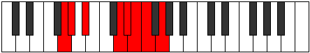 |
| [1931](https://ianring.com/musictheory/scales/1931) | [Stogian](ModeCNaturalStogian.md) | C | C, Db, Eb, F##, G#, A, Bb, C |  |
| [1933](https://ianring.com/musictheory/scales/1933) | [Mocrian](ModeGNaturalMocrian.md) | G | G, A, Bb, C##, D#, E, F, G |  |
| [1933](https://ianring.com/musictheory/scales/1933) | [Mocrian](ModeCNaturalMocrian.md) | C | C, D, Eb, F##, G#, A, Bb, C |  |
| [1935](https://ianring.com/musictheory/scales/1935) | [Mycryllic](ModeCNaturalMycryllic.md) | C | C, C#, D, D#, G, G#, A, A#, C |  |
| [1935](https://ianring.com/musictheory/scales/1935) | [Mycryllic](ModeGNaturalMycryllic.md) | G | G, G#, A, A#, D, D#, E, F, G |  |
| [1937](https://ianring.com/musictheory/scales/1937) | [Galimic](ModeDSharpGalimic.md) | D# | D#, E###, Cbb, Dbbb, Dbb, Ebbb, D# |  |
| [1937](https://ianring.com/musictheory/scales/1937) | [Galimic](ModeEFlatGalimic.md) | Eb | Eb, F##, G###, A##, B#, C#, Eb |  |
| [1939](https://ianring.com/musictheory/scales/1939) | [Dathian](ModeFSharpDathian.md) | F# | F#, G, A#, B##, C##, D#, E, F# |  |
| [1939](https://ianring.com/musictheory/scales/1939) | [Dathian](ModeGFlatDathian.md) | Gb | Gb, Abb, Bb, C#, D, Eb, Fb, Gb |  |
| [1939](https://ianring.com/musictheory/scales/1939) | [Dathian](ModeDSharpDathian.md) | D# | D#, E, F##, G###, A##, B#, C#, D# |  |
| [1939](https://ianring.com/musictheory/scales/1939) | [Dathian](ModeEFlatDathian.md) | Eb | Eb, Fb, G, A#, B, C, Db, Eb |  |
| [1941](https://ianring.com/musictheory/scales/1941) | [Aeranian](ModeDSharpAeranian.md) | D# | D#, E#, F##, G###, A##, B#, C#, D# |  |
| [1941](https://ianring.com/musictheory/scales/1941) | [Aeranian](ModeEFlatAeranian.md) | Eb | Eb, F, G, A#, B, C, Db, Eb |  |
| [1943](https://ianring.com/musictheory/scales/1943) | [Malyllic](ModeFSharpMalyllic.md) | F# | F#, G, G#, A#, C#, D, D#, E, F# |  |
| [1943](https://ianring.com/musictheory/scales/1943) | [Malyllic](ModeGFlatMalyllic.md) | Gb | Gb, G, Ab, Bb, Db, D, Eb, E, Gb |  |
| [1943](https://ianring.com/musictheory/scales/1943) | [Malyllic](ModeDSharpMalyllic.md) | D# | D#, E, F, G, A#, B, C, C#, D# |  |
| [1943](https://ianring.com/musictheory/scales/1943) | [Malyllic](ModeEFlatMalyllic.md) | Eb | Eb, E, F, G, Bb, B, C, Db, Eb |  |
| [1945](https://ianring.com/musictheory/scales/1945) | [Zarian](ModeCNaturalZarian.md) | C | C, D#, E, F##, G#, A, Bb, C |  |
| [1945](https://ianring.com/musictheory/scales/1945) | [Zarian](ModeGNaturalZarian.md) | G | G, A#, B, C##, D#, E, F, G |  |
| [1945](https://ianring.com/musictheory/scales/1945) | [Zarian](ModeDSharpZarian.md) | D# | D#, E##, F##, G###, A##, B#, C#, D# |  |
| [1945](https://ianring.com/musictheory/scales/1945) | [Zarian](ModeEFlatZarian.md) | Eb | Eb, F#, G, A#, B, C, Db, Eb |  |
| [1947](https://ianring.com/musictheory/scales/1947) | [Ionoyllic](ModeFSharpIonoyllic.md) | F# | F#, G, A, A#, C#, D, D#, E, F# |  |
| [1947](https://ianring.com/musictheory/scales/1947) | [Ionoyllic](ModeGFlatIonoyllic.md) | Gb | Gb, G, A, Bb, Db, D, Eb, E, Gb |  |
| [1947](https://ianring.com/musictheory/scales/1947) | [Ionoyllic](ModeCNaturalIonoyllic.md) | C | C, C#, D#, E, G, G#, A, A#, C |  |
| [1947](https://ianring.com/musictheory/scales/1947) | [Ionoyllic](ModeDSharpIonoyllic.md) | D# | D#, E, F#, G, A#, B, C, C#, D# |  |
| [1947](https://ianring.com/musictheory/scales/1947) | [Ionoyllic](ModeEFlatIonoyllic.md) | Eb | Eb, E, Gb, G, Bb, B, C, Db, Eb |  |
| [1947](https://ianring.com/musictheory/scales/1947) | [Ionoyllic](ModeGNaturalIonoyllic.md) | G | G, G#, A#, B, D, D#, E, F, G |  |
| [1949](https://ianring.com/musictheory/scales/1949) | [Mathyllic](ModeCNaturalMathyllic.md) | C | C, D, D#, E, G, G#, A, A#, C |  |
| [1949](https://ianring.com/musictheory/scales/1949) | [Mathyllic](ModeDSharpMathyllic.md) | D# | D#, F, F#, G, A#, B, C, C#, D# |  |
| [1949](https://ianring.com/musictheory/scales/1949) | [Mathyllic](ModeEFlatMathyllic.md) | Eb | Eb, F, Gb, G, Bb, B, C, Db, Eb |  |
| [1949](https://ianring.com/musictheory/scales/1949) | [Mathyllic](ModeGNaturalMathyllic.md) | G | G, A, A#, B, D, D#, E, F, G |  |
| [1951](https://ianring.com/musictheory/scales/1951) | [Gonygic](ModeCNaturalGonygic.md) | C | C, C#, D, D#, E, G, G#, A, A#, C |  |
| [1951](https://ianring.com/musictheory/scales/1951) | [Gonygic](ModeFSharpGonygic.md) | F# | F#, G, G#, A, A#, C#, D, D#, E, F# |  |
| [1951](https://ianring.com/musictheory/scales/1951) | [Gonygic](ModeGFlatGonygic.md) | Gb | Gb, G, Ab, A, Bb, Db, D, Eb, E, Gb |  |
| [1951](https://ianring.com/musictheory/scales/1951) | [Gonygic](ModeDSharpGonygic.md) | D# | D#, E, F, F#, G, A#, B, C, C#, D# |  |
| [1951](https://ianring.com/musictheory/scales/1951) | [Gonygic](ModeEFlatGonygic.md) | Eb | Eb, E, F, Gb, G, Bb, B, C, Db, Eb |  |
| [1951](https://ianring.com/musictheory/scales/1951) | [Gonygic](ModeGNaturalGonygic.md) | G | G, G#, A, A#, B, D, D#, E, F, G |  |
| [1955](https://ianring.com/musictheory/scales/1955) | [Sonian](ModeASharpSonian.md) | A# | A#, B, C###, D###, E##, F##, G#, A# |  |
| [1955](https://ianring.com/musictheory/scales/1955) | [Sonian](ModeBFlatSonian.md) | Bb | Bb, Cb, D#, E#, F#, G, Ab, Bb |  |
| [1955](https://ianring.com/musictheory/scales/1955) | [Sonian](ModeDNaturalSonian.md) | D | D, Eb, F##, G##, A#, B, C, D |  |
| [1957](https://ianring.com/musictheory/scales/1957) | [Pyrian](ModeFNaturalPyrian.md) | F | F, G, A#, B#, C#, D, Eb, F |  |
| [1957](https://ianring.com/musictheory/scales/1957) | [Pyrian](ModeASharpPyrian.md) | A# | A#, B#, C###, D###, E##, F##, G#, A# |  |
| [1957](https://ianring.com/musictheory/scales/1957) | [Pyrian](ModeBFlatPyrian.md) | Bb | Bb, C, D#, E#, F#, G, Ab, Bb |  |
| [1959](https://ianring.com/musictheory/scales/1959) | [Katolyllic](ModeFNaturalKatolyllic.md) | F | F, F#, G, A#, C, C#, D, D#, F |  |
| [1959](https://ianring.com/musictheory/scales/1959) | [Katolyllic](ModeASharpKatolyllic.md) | A# | A#, B, C, D#, F, F#, G, G#, A# |  |
| [1959](https://ianring.com/musictheory/scales/1959) | [Katolyllic](ModeBFlatKatolyllic.md) | Bb | Bb, B, C, Eb, F, Gb, G, Ab, Bb |  |
| [1959](https://ianring.com/musictheory/scales/1959) | [Katolyllic](ModeDNaturalKatolyllic.md) | D | D, D#, E, G, A, A#, B, C, D |  |
| [1961](https://ianring.com/musictheory/scales/1961) | [Soptian](ModeGNaturalSoptian.md) | G | G, A#, B#, C##, D#, E, F, G |  |
| [1961](https://ianring.com/musictheory/scales/1961) | [Soptian](ModeASharpSoptian.md) | A# | A#, B##, C###, D###, E##, F##, G#, A# |  |
| [1961](https://ianring.com/musictheory/scales/1961) | [Soptian](ModeBFlatSoptian.md) | Bb | Bb, C#, D#, E#, F#, G, Ab, Bb |  |
| [1961](https://ianring.com/musictheory/scales/1961) | [Soptian](ModeCNaturalSoptian.md) | C | C, D#, E#, F##, G#, A, Bb, C |  |
| [1963](https://ianring.com/musictheory/scales/1963) | [Epocryllic](ModeGNaturalEpocryllic.md) | G | G, G#, A#, C, D, D#, E, F, G |  |
| [1963](https://ianring.com/musictheory/scales/1963) | [Epocryllic](ModeCNaturalEpocryllic.md) | C | C, C#, D#, F, G, G#, A, A#, C |  |
| [1963](https://ianring.com/musictheory/scales/1963) | [Epocryllic](ModeASharpEpocryllic.md) | A# | A#, B, C#, D#, F, F#, G, G#, A# |  |
| [1963](https://ianring.com/musictheory/scales/1963) | [Epocryllic](ModeBFlatEpocryllic.md) | Bb | Bb, B, Db, Eb, F, Gb, G, Ab, Bb |  |
| [1963](https://ianring.com/musictheory/scales/1963) | [Epocryllic](ModeDNaturalEpocryllic.md) | D | D, D#, F, G, A, A#, B, C, D |  |
| [1965](https://ianring.com/musictheory/scales/1965) | [Gadyllic](ModeFNaturalGadyllic.md) | F | F, G, G#, A#, C, C#, D, D#, F |  |
| [1965](https://ianring.com/musictheory/scales/1965) | [Gadyllic](ModeASharpGadyllic.md) | A# | A#, C, C#, D#, F, F#, G, G#, A# |  |
| [1965](https://ianring.com/musictheory/scales/1965) | [Gadyllic](ModeBFlatGadyllic.md) | Bb | Bb, C, Db, Eb, F, Gb, G, Ab, Bb |  |
| [1965](https://ianring.com/musictheory/scales/1965) | [Gadyllic](ModeGNaturalGadyllic.md) | G | G, A, A#, C, D, D#, E, F, G |  |
| [1965](https://ianring.com/musictheory/scales/1965) | [Gadyllic](ModeCNaturalGadyllic.md) | C | C, D, D#, F, G, G#, A, A#, C |  |
| [1967](https://ianring.com/musictheory/scales/1967) | [Godygic](ModeFNaturalGodygic.md) | F | F, F#, G, G#, A#, C, C#, D, D#, F |  |
| [1967](https://ianring.com/musictheory/scales/1967) | [Godygic](ModeCNaturalGodygic.md) | C | C, C#, D, D#, F, G, G#, A, A#, C |  |
| [1967](https://ianring.com/musictheory/scales/1967) | [Godygic](ModeGNaturalGodygic.md) | G | G, G#, A, A#, C, D, D#, E, F, G |  |
| [1967](https://ianring.com/musictheory/scales/1967) | [Godygic](ModeASharpGodygic.md) | A# | A#, B, C, C#, D#, F, F#, G, G#, A# |  |
| [1967](https://ianring.com/musictheory/scales/1967) | [Godygic](ModeBFlatGodygic.md) | Bb | Bb, B, C, Db, Eb, F, Gb, G, Ab, Bb |  |
| [1967](https://ianring.com/musictheory/scales/1967) | [Godygic](ModeDNaturalGodygic.md) | D | D, D#, E, F, G, A, A#, B, C, D |  |
| [1969](https://ianring.com/musictheory/scales/1969) | [Zorian](ModeASharpZorian.md) | A# | A#, B###, C###, D###, E##, F##, G#, A# |  |
| [1969](https://ianring.com/musictheory/scales/1969) | [Zorian](ModeBFlatZorian.md) | Bb | Bb, C##, D#, E#, F#, G, Ab, Bb |  |
| [1969](https://ianring.com/musictheory/scales/1969) | [Zorian](ModeDSharpZorian.md) | D# | D#, E###, F###, G###, A##, B#, C#, D# |  |
| [1969](https://ianring.com/musictheory/scales/1969) | [Zorian](ModeEFlatZorian.md) | Eb | Eb, F##, G#, A#, B, C, Db, Eb |  |
| [1971](https://ianring.com/musictheory/scales/1971) | [Aerynyllic](ModeFSharpAerynyllic.md) | F# | F#, G, A#, B, C#, D, D#, E, F# |  |
| [1971](https://ianring.com/musictheory/scales/1971) | [Aerynyllic](ModeGFlatAerynyllic.md) | Gb | Gb, G, Bb, B, Db, D, Eb, E, Gb |  |
| [1971](https://ianring.com/musictheory/scales/1971) | [Aerynyllic](ModeDSharpAerynyllic.md) | D# | D#, E, G, G#, A#, B, C, C#, D# |  |
| [1971](https://ianring.com/musictheory/scales/1971) | [Aerynyllic](ModeEFlatAerynyllic.md) | Eb | Eb, E, G, Ab, Bb, B, C, Db, Eb |  |
| [1971](https://ianring.com/musictheory/scales/1971) | [Aerynyllic](ModeASharpAerynyllic.md) | A# | A#, B, D, D#, F, F#, G, G#, A# |  |
| [1971](https://ianring.com/musictheory/scales/1971) | [Aerynyllic](ModeBFlatAerynyllic.md) | Bb | Bb, B, D, Eb, F, Gb, G, Ab, Bb |  |
| [1971](https://ianring.com/musictheory/scales/1971) | [Aerynyllic](ModeDNaturalAerynyllic.md) | D | D, D#, F#, G, A, A#, B, C, D |  |
| [1973](https://ianring.com/musictheory/scales/1973) | [Zyryllic](ModeASharpZyryllic.md) | A# | A#, C, D, D#, F, F#, G, G#, A# |  |
| [1973](https://ianring.com/musictheory/scales/1973) | [Zyryllic](ModeBFlatZyryllic.md) | Bb | Bb, C, D, Eb, F, Gb, G, Ab, Bb |  |
| [1973](https://ianring.com/musictheory/scales/1973) | [Zyryllic](ModeFNaturalZyryllic.md) | F | F, G, A, A#, C, C#, D, D#, F |  |
| [1973](https://ianring.com/musictheory/scales/1973) | [Zyryllic](ModeDSharpZyryllic.md) | D# | D#, F, G, G#, A#, B, C, C#, D# |  |
| [1973](https://ianring.com/musictheory/scales/1973) | [Zyryllic](ModeEFlatZyryllic.md) | Eb | Eb, F, G, Ab, Bb, B, C, Db, Eb |  |
| [1975](https://ianring.com/musictheory/scales/1975) | [Ionocrygic](ModeFNaturalIonocrygic.md) | F | F, F#, G, A, A#, C, C#, D, D#, F |  |
| [1975](https://ianring.com/musictheory/scales/1975) | [Ionocrygic](ModeDSharpIonocrygic.md) | D# | D#, E, F, G, G#, A#, B, C, C#, D# |  |
| [1975](https://ianring.com/musictheory/scales/1975) | [Ionocrygic](ModeEFlatIonocrygic.md) | Eb | Eb, E, F, G, Ab, Bb, B, C, Db, Eb |  |
| [1975](https://ianring.com/musictheory/scales/1975) | [Ionocrygic](ModeFSharpIonocrygic.md) | F# | F#, G, G#, A#, B, C#, D, D#, E, F# |  |
| [1975](https://ianring.com/musictheory/scales/1975) | [Ionocrygic](ModeGFlatIonocrygic.md) | Gb | Gb, G, Ab, Bb, B, Db, D, Eb, E, Gb |  |
| [1975](https://ianring.com/musictheory/scales/1975) | [Ionocrygic](ModeASharpIonocrygic.md) | A# | A#, B, C, D, D#, F, F#, G, G#, A# |  |
| [1975](https://ianring.com/musictheory/scales/1975) | [Ionocrygic](ModeBFlatIonocrygic.md) | Bb | Bb, B, C, D, Eb, F, Gb, G, Ab, Bb |  |
| [1975](https://ianring.com/musictheory/scales/1975) | [Ionocrygic](ModeDNaturalIonocrygic.md) | D | D, D#, E, F#, G, A, A#, B, C, D |  |
| [1977](https://ianring.com/musictheory/scales/1977) | [Dagyllic](ModeASharpDagyllic.md) | A# | A#, C#, D, D#, F, F#, G, G#, A# |  |
| [1977](https://ianring.com/musictheory/scales/1977) | [Dagyllic](ModeBFlatDagyllic.md) | Bb | Bb, Db, D, Eb, F, Gb, G, Ab, Bb |  |
| [1977](https://ianring.com/musictheory/scales/1977) | [Dagyllic](ModeCNaturalDagyllic.md) | C | C, D#, E, F, G, G#, A, A#, C |  |
| [1977](https://ianring.com/musictheory/scales/1977) | [Dagyllic](ModeGNaturalDagyllic.md) | G | G, A#, B, C, D, D#, E, F, G |  |
| [1977](https://ianring.com/musictheory/scales/1977) | [Dagyllic](ModeDSharpDagyllic.md) | D# | D#, F#, G, G#, A#, B, C, C#, D# |  |
| [1977](https://ianring.com/musictheory/scales/1977) | [Dagyllic](ModeEFlatDagyllic.md) | Eb | Eb, Gb, G, Ab, Bb, B, C, Db, Eb |  |
| [1979](https://ianring.com/musictheory/scales/1979) | [Aeradygic](ModeCNaturalAeradygic.md) | C | C, C#, D#, E, F, G, G#, A, A#, C |  |
| [1979](https://ianring.com/musictheory/scales/1979) | [Aeradygic](ModeGNaturalAeradygic.md) | G | G, G#, A#, B, C, D, D#, E, F, G |  |
| [1979](https://ianring.com/musictheory/scales/1979) | [Aeradygic](ModeDSharpAeradygic.md) | D# | D#, E, F#, G, G#, A#, B, C, C#, D# |  |
| [1979](https://ianring.com/musictheory/scales/1979) | [Aeradygic](ModeEFlatAeradygic.md) | Eb | Eb, E, Gb, G, Ab, Bb, B, C, Db, Eb |  |
| [1979](https://ianring.com/musictheory/scales/1979) | [Aeradygic](ModeASharpAeradygic.md) | A# | A#, B, C#, D, D#, F, F#, G, G#, A# |  |
| [1979](https://ianring.com/musictheory/scales/1979) | [Aeradygic](ModeBFlatAeradygic.md) | Bb | Bb, B, Db, D, Eb, F, Gb, G, Ab, Bb |  |
| [1979](https://ianring.com/musictheory/scales/1979) | [Aeradygic](ModeFSharpAeradygic.md) | F# | F#, G, A, A#, B, C#, D, D#, E, F# |  |
| [1979](https://ianring.com/musictheory/scales/1979) | [Aeradygic](ModeGFlatAeradygic.md) | Gb | Gb, G, A, Bb, B, Db, D, Eb, E, Gb |  |
| [1979](https://ianring.com/musictheory/scales/1979) | [Aeradygic](ModeDNaturalAeradygic.md) | D | D, D#, F, F#, G, A, A#, B, C, D |  |
| [1981](https://ianring.com/musictheory/scales/1981) | [Gadygic](ModeASharpGadygic.md) | A# | A#, C, C#, D, D#, F, F#, G, G#, A# |  |
| [1981](https://ianring.com/musictheory/scales/1981) | [Gadygic](ModeBFlatGadygic.md) | Bb | Bb, C, Db, D, Eb, F, Gb, G, Ab, Bb |  |
| [1981](https://ianring.com/musictheory/scales/1981) | [Gadygic](ModeFNaturalGadygic.md) | F | F, G, G#, A, A#, C, C#, D, D#, F |  |
| [1981](https://ianring.com/musictheory/scales/1981) | [Gadygic](ModeCNaturalGadygic.md) | C | C, D, D#, E, F, G, G#, A, A#, C |  |
| [1981](https://ianring.com/musictheory/scales/1981) | [Gadygic](ModeDSharpGadygic.md) | D# | D#, F, F#, G, G#, A#, B, C, C#, D# |  |
| [1981](https://ianring.com/musictheory/scales/1981) | [Gadygic](ModeEFlatGadygic.md) | Eb | Eb, F, Gb, G, Ab, Bb, B, C, Db, Eb |  |
| [1981](https://ianring.com/musictheory/scales/1981) | [Gadygic](ModeGNaturalGadygic.md) | G | G, A, A#, B, C, D, D#, E, F, G |  |
| [1983](https://ianring.com/musictheory/scales/1983) | [Soryllian](ModeCNaturalSoryllian.md) | C | C, C#, D, D#, E, F, G, G#, A, A#, C |  |
| [1983](https://ianring.com/musictheory/scales/1983) | [Soryllian](ModeFNaturalSoryllian.md) | F | F, F#, G, G#, A, A#, C, C#, D, D#, F |  |
| [1983](https://ianring.com/musictheory/scales/1983) | [Soryllian](ModeASharpSoryllian.md) | A# | A#, B, C, C#, D, D#, F, F#, G, G#, A# |  |
| [1983](https://ianring.com/musictheory/scales/1983) | [Soryllian](ModeBFlatSoryllian.md) | Bb | Bb, B, C, Db, D, Eb, F, Gb, G, Ab, Bb |  |
| [1983](https://ianring.com/musictheory/scales/1983) | [Soryllian](ModeDSharpSoryllian.md) | D# | D#, E, F, F#, G, G#, A#, B, C, C#, D# |  |
| [1983](https://ianring.com/musictheory/scales/1983) | [Soryllian](ModeEFlatSoryllian.md) | Eb | Eb, E, F, Gb, G, Ab, Bb, B, C, Db, Eb |  |
| [1983](https://ianring.com/musictheory/scales/1983) | [Soryllian](ModeDNaturalSoryllian.md) | D | D, D#, E, F, F#, G, A, A#, B, C, D |  |
| [1983](https://ianring.com/musictheory/scales/1983) | [Soryllian](ModeGNaturalSoryllian.md) | G | G, G#, A, A#, B, C, D, D#, E, F, G |  |
| [1983](https://ianring.com/musictheory/scales/1983) | [Soryllian](ModeFSharpSoryllian.md) | F# | F#, G, G#, A, A#, B, C#, D, D#, E, F# |  |
| [1983](https://ianring.com/musictheory/scales/1983) | [Soryllian](ModeGFlatSoryllian.md) | Gb | Gb, G, Ab, A, Bb, B, Db, D, Eb, E, Gb |  |
| [1989](https://ianring.com/musictheory/scales/1989) | [Dydian](ModeCSharpDydian.md) | C# | C#, D#, E###, F###, G##, A#, B, C# |  |
| [1989](https://ianring.com/musictheory/scales/1989) | [Dydian](ModeDFlatDydian.md) | Db | Db, Eb, F##, G#, A, Bb, Cb, Db |  |
| [1991](https://ianring.com/musictheory/scales/1991) | [Phryptyllic](ModeANaturalPhryptyllic.md) | A | A, A#, B, D#, E, F, F#, G, A |  |
| [1991](https://ianring.com/musictheory/scales/1991) | [Phryptyllic](ModeCSharpPhryptyllic.md) | C# | C#, D, D#, G, G#, A, A#, B, C# |  |
| [1991](https://ianring.com/musictheory/scales/1991) | [Phryptyllic](ModeDFlatPhryptyllic.md) | Db | Db, D, Eb, G, Ab, A, Bb, B, Db |  |
| [1993](https://ianring.com/musictheory/scales/1993) | [Katoptian](ModeGNaturalKatoptian.md) | G | G, A#, B##, C##, D#, E, F, G |  |
| [1993](https://ianring.com/musictheory/scales/1993) | [Katoptian](ModeCNaturalKatoptian.md) | C | C, D#, E##, F##, G#, A, Bb, C |  |
| [1995](https://ianring.com/musictheory/scales/1995) | [Aeolacryllic](ModeGNaturalAeolacryllic.md) | G | G, G#, A#, C#, D, D#, E, F, G |  |
| [1995](https://ianring.com/musictheory/scales/1995) | [Aeolacryllic](ModeANaturalAeolacryllic.md) | A | A, A#, C, D#, E, F, F#, G, A |  |
| [1995](https://ianring.com/musictheory/scales/1995) | [Aeolacryllic](ModeCNaturalAeolacryllic.md) | C | C, C#, D#, F#, G, G#, A, A#, C |  |
| [1997](https://ianring.com/musictheory/scales/1997) | [Staryllic](ModeGNaturalStaryllic.md) | G | G, A, A#, C#, D, D#, E, F, G |  |
| [1997](https://ianring.com/musictheory/scales/1997) | [Staryllic](ModeCNaturalStaryllic.md) | C | C, D, D#, F#, G, G#, A, A#, C |  |
| [1997](https://ianring.com/musictheory/scales/1997) | [Staryllic](ModeCSharpStaryllic.md) | C# | C#, D#, E, G, G#, A, A#, B, C# |  |
| [1997](https://ianring.com/musictheory/scales/1997) | [Staryllic](ModeDFlatStaryllic.md) | Db | Db, Eb, E, G, Ab, A, Bb, B, Db |  |
| [1999](https://ianring.com/musictheory/scales/1999) | [Zacrygic](ModeGNaturalZacrygic.md) | G | G, G#, A, A#, C#, D, D#, E, F, G |  |
| [1999](https://ianring.com/musictheory/scales/1999) | [Zacrygic](ModeCNaturalZacrygic.md) | C | C, C#, D, D#, F#, G, G#, A, A#, C |  |
| [1999](https://ianring.com/musictheory/scales/1999) | [Zacrygic](ModeANaturalZacrygic.md) | A | A, A#, B, C, D#, E, F, F#, G, A |  |
| [1999](https://ianring.com/musictheory/scales/1999) | [Zacrygic](ModeCSharpZacrygic.md) | C# | C#, D, D#, E, G, G#, A, A#, B, C# |  |
| [1999](https://ianring.com/musictheory/scales/1999) | [Zacrygic](ModeDFlatZacrygic.md) | Db | Db, D, Eb, E, G, Ab, A, Bb, B, Db |  |
| [2001](https://ianring.com/musictheory/scales/2001) | [Gydian](ModeDSharpGydian.md) | D# | D#, E###, Cbbb, Cbb, Dbbb, Dbb, Ebbb, D# |  |
| [2001](https://ianring.com/musictheory/scales/2001) | [Gydian](ModeEFlatGydian.md) | Eb | Eb, F##, G##, A#, B, C, Db, Eb |  |
| [2003](https://ianring.com/musictheory/scales/2003) | [Lolyllic](ModeFSharpLolyllic.md) | F# | F#, G, A#, C, C#, D, D#, E, F# |  |
| [2003](https://ianring.com/musictheory/scales/2003) | [Lolyllic](ModeGFlatLolyllic.md) | Gb | Gb, G, Bb, C, Db, D, Eb, E, Gb |  |
| [2003](https://ianring.com/musictheory/scales/2003) | [Lolyllic](ModeANaturalLolyllic.md) | A | A, A#, C#, D#, E, F, F#, G, A |  |
| [2003](https://ianring.com/musictheory/scales/2003) | [Lolyllic](ModeDSharpLolyllic.md) | D# | D#, E, G, A, A#, B, C, C#, D# |  |
| [2003](https://ianring.com/musictheory/scales/2003) | [Lolyllic](ModeEFlatLolyllic.md) | Eb | Eb, E, G, A, Bb, B, C, Db, Eb |  |
| [2005](https://ianring.com/musictheory/scales/2005) | [Gygyllic](ModeDSharpGygyllic.md) | D# | D#, F, G, A, A#, B, C, C#, D# |  |
| [2005](https://ianring.com/musictheory/scales/2005) | [Gygyllic](ModeEFlatGygyllic.md) | Eb | Eb, F, G, A, Bb, B, C, Db, Eb |  |
| [2005](https://ianring.com/musictheory/scales/2005) | [Gygyllic](ModeCSharpGygyllic.md) | C# | C#, D#, F, G, G#, A, A#, B, C# |  |
| [2005](https://ianring.com/musictheory/scales/2005) | [Gygyllic](ModeDFlatGygyllic.md) | Db | Db, Eb, F, G, Ab, A, Bb, B, Db |  |
| [2007](https://ianring.com/musictheory/scales/2007) | [Stonygic](ModeFSharpStonygic.md) | F# | F#, G, G#, A#, C, C#, D, D#, E, F# |  |
| [2007](https://ianring.com/musictheory/scales/2007) | [Stonygic](ModeGFlatStonygic.md) | Gb | Gb, G, Ab, Bb, C, Db, D, Eb, E, Gb |  |
| [2007](https://ianring.com/musictheory/scales/2007) | [Stonygic](ModeDSharpStonygic.md) | D# | D#, E, F, G, A, A#, B, C, C#, D# |  |
| [2007](https://ianring.com/musictheory/scales/2007) | [Stonygic](ModeEFlatStonygic.md) | Eb | Eb, E, F, G, A, Bb, B, C, Db, Eb |  |
| [2007](https://ianring.com/musictheory/scales/2007) | [Stonygic](ModeANaturalStonygic.md) | A | A, A#, B, C#, D#, E, F, F#, G, A |  |
| [2007](https://ianring.com/musictheory/scales/2007) | [Stonygic](ModeCSharpStonygic.md) | C# | C#, D, D#, F, G, G#, A, A#, B, C# |  |
| [2007](https://ianring.com/musictheory/scales/2007) | [Stonygic](ModeDFlatStonygic.md) | Db | Db, D, Eb, F, G, Ab, A, Bb, B, Db |  |
| [2009](https://ianring.com/musictheory/scales/2009) | [Stacryllic](ModeCNaturalStacryllic.md) | C | C, D#, E, F#, G, G#, A, A#, C |  |
| [2009](https://ianring.com/musictheory/scales/2009) | [Stacryllic](ModeGNaturalStacryllic.md) | G | G, A#, B, C#, D, D#, E, F, G |  |
| [2009](https://ianring.com/musictheory/scales/2009) | [Stacryllic](ModeDSharpStacryllic.md) | D# | D#, F#, G, A, A#, B, C, C#, D# |  |
| [2009](https://ianring.com/musictheory/scales/2009) | [Stacryllic](ModeEFlatStacryllic.md) | Eb | Eb, Gb, G, A, Bb, B, C, Db, Eb |  |
| [2011](https://ianring.com/musictheory/scales/2011) | [Raphygic](ModeFSharpRaphygic.md) | F# | F#, G, A, A#, C, C#, D, D#, E, F# |  |
| [2011](https://ianring.com/musictheory/scales/2011) | [Raphygic](ModeGFlatRaphygic.md) | Gb | Gb, G, A, Bb, C, Db, D, Eb, E, Gb |  |
| [2011](https://ianring.com/musictheory/scales/2011) | [Raphygic](ModeANaturalRaphygic.md) | A | A, A#, C, C#, D#, E, F, F#, G, A |  |
| [2011](https://ianring.com/musictheory/scales/2011) | [Raphygic](ModeCNaturalRaphygic.md) | C | C, C#, D#, E, F#, G, G#, A, A#, C |  |
| [2011](https://ianring.com/musictheory/scales/2011) | [Raphygic](ModeGNaturalRaphygic.md) | G | G, G#, A#, B, C#, D, D#, E, F, G |  |
| [2011](https://ianring.com/musictheory/scales/2011) | [Raphygic](ModeDSharpRaphygic.md) | D# | D#, E, F#, G, A, A#, B, C, C#, D# |  |
| [2011](https://ianring.com/musictheory/scales/2011) | [Raphygic](ModeEFlatRaphygic.md) | Eb | Eb, E, Gb, G, A, Bb, B, C, Db, Eb |  |
| [2013](https://ianring.com/musictheory/scales/2013) | [Mocrygic](ModeCNaturalMocrygic.md) | C | C, D, D#, E, F#, G, G#, A, A#, C |  |
| [2013](https://ianring.com/musictheory/scales/2013) | [Mocrygic](ModeGNaturalMocrygic.md) | G | G, A, A#, B, C#, D, D#, E, F, G |  |
| [2013](https://ianring.com/musictheory/scales/2013) | [Mocrygic](ModeDSharpMocrygic.md) | D# | D#, F, F#, G, A, A#, B, C, C#, D# |  |
| [2013](https://ianring.com/musictheory/scales/2013) | [Mocrygic](ModeEFlatMocrygic.md) | Eb | Eb, F, Gb, G, A, Bb, B, C, Db, Eb |  |
| [2013](https://ianring.com/musictheory/scales/2013) | [Mocrygic](ModeCSharpMocrygic.md) | C# | C#, D#, E, F, G, G#, A, A#, B, C# |  |
| [2013](https://ianring.com/musictheory/scales/2013) | [Mocrygic](ModeDFlatMocrygic.md) | Db | Db, Eb, E, F, G, Ab, A, Bb, B, Db |  |
| [2015](https://ianring.com/musictheory/scales/2015) | [Epiryllian](ModeCNaturalEpiryllian.md) | C | C, C#, D, D#, E, F#, G, G#, A, A#, C |  |
| [2015](https://ianring.com/musictheory/scales/2015) | [Epiryllian](ModeFSharpEpiryllian.md) | F# | F#, G, G#, A, A#, C, C#, D, D#, E, F# |  |
| [2015](https://ianring.com/musictheory/scales/2015) | [Epiryllian](ModeGFlatEpiryllian.md) | Gb | Gb, G, Ab, A, Bb, C, Db, D, Eb, E, Gb |  |
| [2015](https://ianring.com/musictheory/scales/2015) | [Epiryllian](ModeDSharpEpiryllian.md) | D# | D#, E, F, F#, G, A, A#, B, C, C#, D# |  |
| [2015](https://ianring.com/musictheory/scales/2015) | [Epiryllian](ModeEFlatEpiryllian.md) | Eb | Eb, E, F, Gb, G, A, Bb, B, C, Db, Eb |  |
| [2015](https://ianring.com/musictheory/scales/2015) | [Epiryllian](ModeANaturalEpiryllian.md) | A | A, A#, B, C, C#, D#, E, F, F#, G, A |  |
| [2015](https://ianring.com/musictheory/scales/2015) | [Epiryllian](ModeCSharpEpiryllian.md) | C# | C#, D, D#, E, F, G, G#, A, A#, B, C# |  |
| [2015](https://ianring.com/musictheory/scales/2015) | [Epiryllian](ModeDFlatEpiryllian.md) | Db | Db, D, Eb, E, F, G, Ab, A, Bb, B, Db |  |
| [2015](https://ianring.com/musictheory/scales/2015) | [Epiryllian](ModeGNaturalEpiryllian.md) | G | G, G#, A, A#, B, C#, D, D#, E, F, G |  |
| [2019](https://ianring.com/musictheory/scales/2019) | [Palyllic](ModeANaturalPalyllic.md) | A | A, A#, D, D#, E, F, F#, G, A |  |
| [2019](https://ianring.com/musictheory/scales/2019) | [Palyllic](ModeASharpPalyllic.md) | A# | A#, B, D#, E, F, F#, G, G#, A# |  |
| [2019](https://ianring.com/musictheory/scales/2019) | [Palyllic](ModeBFlatPalyllic.md) | Bb | Bb, B, Eb, E, F, Gb, G, Ab, Bb |  |
| [2019](https://ianring.com/musictheory/scales/2019) | [Palyllic](ModeDNaturalPalyllic.md) | D | D, D#, G, G#, A, A#, B, C, D |  |
| [2021](https://ianring.com/musictheory/scales/2021) | [Katycryllic](ModeASharpKatycryllic.md) | A# | A#, C, D#, E, F, F#, G, G#, A# |  |
| [2021](https://ianring.com/musictheory/scales/2021) | [Katycryllic](ModeBFlatKatycryllic.md) | Bb | Bb, C, Eb, E, F, Gb, G, Ab, Bb |  |
| [2021](https://ianring.com/musictheory/scales/2021) | [Katycryllic](ModeFNaturalKatycryllic.md) | F | F, G, A#, B, C, C#, D, D#, F |  |
| [2021](https://ianring.com/musictheory/scales/2021) | [Katycryllic](ModeCSharpKatycryllic.md) | C# | C#, D#, F#, G, G#, A, A#, B, C# |  |
| [2021](https://ianring.com/musictheory/scales/2021) | [Katycryllic](ModeDFlatKatycryllic.md) | Db | Db, Eb, Gb, G, Ab, A, Bb, B, Db |  |
| [2023](https://ianring.com/musictheory/scales/2023) | [Zodygic](ModeFNaturalZodygic.md) | F | F, F#, G, A#, B, C, C#, D, D#, F |  |
| [2023](https://ianring.com/musictheory/scales/2023) | [Zodygic](ModeASharpZodygic.md) | A# | A#, B, C, D#, E, F, F#, G, G#, A# |  |
| [2023](https://ianring.com/musictheory/scales/2023) | [Zodygic](ModeBFlatZodygic.md) | Bb | Bb, B, C, Eb, E, F, Gb, G, Ab, Bb |  |
| [2023](https://ianring.com/musictheory/scales/2023) | [Zodygic](ModeANaturalZodygic.md) | A | A, A#, B, D, D#, E, F, F#, G, A |  |
| [2023](https://ianring.com/musictheory/scales/2023) | [Zodygic](ModeDNaturalZodygic.md) | D | D, D#, E, G, G#, A, A#, B, C, D |  |
| [2023](https://ianring.com/musictheory/scales/2023) | [Zodygic](ModeCSharpZodygic.md) | C# | C#, D, D#, F#, G, G#, A, A#, B, C# |  |
| [2023](https://ianring.com/musictheory/scales/2023) | [Zodygic](ModeDFlatZodygic.md) | Db | Db, D, Eb, Gb, G, Ab, A, Bb, B, Db |  |
| [2025](https://ianring.com/musictheory/scales/2025) | [Mixolydyllic](ModeGNaturalMixolydyllic.md) | G | G, A#, C, C#, D, D#, E, F, G |  |
| [2025](https://ianring.com/musictheory/scales/2025) | [Mixolydyllic](ModeASharpMixolydyllic.md) | A# | A#, C#, D#, E, F, F#, G, G#, A# |  |
| [2025](https://ianring.com/musictheory/scales/2025) | [Mixolydyllic](ModeBFlatMixolydyllic.md) | Bb | Bb, Db, Eb, E, F, Gb, G, Ab, Bb |  |
| [2025](https://ianring.com/musictheory/scales/2025) | [Mixolydyllic](ModeCNaturalMixolydyllic.md) | C | C, D#, F, F#, G, G#, A, A#, C |  |
| [2027](https://ianring.com/musictheory/scales/2027) | [Boptygic](ModeGNaturalBoptygic.md) | G | G, G#, A#, C, C#, D, D#, E, F, G |  |
| [2027](https://ianring.com/musictheory/scales/2027) | [Boptygic](ModeANaturalBoptygic.md) | A | A, A#, C, D, D#, E, F, F#, G, A |  |
| [2027](https://ianring.com/musictheory/scales/2027) | [Boptygic](ModeCNaturalBoptygic.md) | C | C, C#, D#, F, F#, G, G#, A, A#, C |  |
| [2027](https://ianring.com/musictheory/scales/2027) | [Boptygic](ModeASharpBoptygic.md) | A# | A#, B, C#, D#, E, F, F#, G, G#, A# |  |
| [2027](https://ianring.com/musictheory/scales/2027) | [Boptygic](ModeBFlatBoptygic.md) | Bb | Bb, B, Db, Eb, E, F, Gb, G, Ab, Bb |  |
| [2027](https://ianring.com/musictheory/scales/2027) | [Boptygic](ModeDNaturalBoptygic.md) | D | D, D#, F, G, G#, A, A#, B, C, D |  |
| [2029](https://ianring.com/musictheory/scales/2029) | [Mathygic](ModeASharpMathygic.md) | A# | A#, C, C#, D#, E, F, F#, G, G#, A# |  |
| [2029](https://ianring.com/musictheory/scales/2029) | [Mathygic](ModeBFlatMathygic.md) | Bb | Bb, C, Db, Eb, E, F, Gb, G, Ab, Bb |  |
| [2029](https://ianring.com/musictheory/scales/2029) | [Mathygic](ModeGNaturalMathygic.md) | G | G, A, A#, C, C#, D, D#, E, F, G |  |
| [2029](https://ianring.com/musictheory/scales/2029) | [Mathygic](ModeCNaturalMathygic.md) | C | C, D, D#, F, F#, G, G#, A, A#, C |  |
| [2029](https://ianring.com/musictheory/scales/2029) | [Mathygic](ModeFNaturalMathygic.md) | F | F, G, G#, A#, B, C, C#, D, D#, F |  |
| [2029](https://ianring.com/musictheory/scales/2029) | [Mathygic](ModeCSharpMathygic.md) | C# | C#, D#, E, F#, G, G#, A, A#, B, C# |  |
| [2029](https://ianring.com/musictheory/scales/2029) | [Mathygic](ModeDFlatMathygic.md) | Db | Db, Eb, E, Gb, G, Ab, A, Bb, B, Db |  |
| [2031](https://ianring.com/musictheory/scales/2031) | [Gadyllian](ModeGNaturalGadyllian.md) | G | G, G#, A, A#, C, C#, D, D#, E, F, G |  |
| [2031](https://ianring.com/musictheory/scales/2031) | [Gadyllian](ModeCNaturalGadyllian.md) | C | C, C#, D, D#, F, F#, G, G#, A, A#, C |  |
| [2031](https://ianring.com/musictheory/scales/2031) | [Gadyllian](ModeFNaturalGadyllian.md) | F | F, F#, G, G#, A#, B, C, C#, D, D#, F |  |
| [2031](https://ianring.com/musictheory/scales/2031) | [Gadyllian](ModeASharpGadyllian.md) | A# | A#, B, C, C#, D#, E, F, F#, G, G#, A# |  |
| [2031](https://ianring.com/musictheory/scales/2031) | [Gadyllian](ModeBFlatGadyllian.md) | Bb | Bb, B, C, Db, Eb, E, F, Gb, G, Ab, Bb |  |
| [2031](https://ianring.com/musictheory/scales/2031) | [Gadyllian](ModeANaturalGadyllian.md) | A | A, A#, B, C, D, D#, E, F, F#, G, A |  |
| [2031](https://ianring.com/musictheory/scales/2031) | [Gadyllian](ModeDNaturalGadyllian.md) | D | D, D#, E, F, G, G#, A, A#, B, C, D |  |
| [2031](https://ianring.com/musictheory/scales/2031) | [Gadyllian](ModeCSharpGadyllian.md) | C# | C#, D, D#, E, F#, G, G#, A, A#, B, C# |  |
| [2031](https://ianring.com/musictheory/scales/2031) | [Gadyllian](ModeDFlatGadyllian.md) | Db | Db, D, Eb, E, Gb, G, Ab, A, Bb, B, Db |  |
| [2033](https://ianring.com/musictheory/scales/2033) | [Stolyllic](ModeASharpStolyllic.md) | A# | A#, D, D#, E, F, F#, G, G#, A# |  |
| [2033](https://ianring.com/musictheory/scales/2033) | [Stolyllic](ModeBFlatStolyllic.md) | Bb | Bb, D, Eb, E, F, Gb, G, Ab, Bb |  |
| [2033](https://ianring.com/musictheory/scales/2033) | [Stolyllic](ModeDSharpStolyllic.md) | D# | D#, G, G#, A, A#, B, C, C#, D# |  |
| [2033](https://ianring.com/musictheory/scales/2033) | [Stolyllic](ModeEFlatStolyllic.md) | Eb | Eb, G, Ab, A, Bb, B, C, Db, Eb |  |
| [2035](https://ianring.com/musictheory/scales/2035) | [Aerythygic](ModeANaturalAerythygic.md) | A | A, A#, C#, D, D#, E, F, F#, G, A |  |
| [2035](https://ianring.com/musictheory/scales/2035) | [Aerythygic](ModeFSharpAerythygic.md) | F# | F#, G, A#, B, C, C#, D, D#, E, F# |  |
| [2035](https://ianring.com/musictheory/scales/2035) | [Aerythygic](ModeGFlatAerythygic.md) | Gb | Gb, G, Bb, B, C, Db, D, Eb, E, Gb |  |
| [2035](https://ianring.com/musictheory/scales/2035) | [Aerythygic](ModeASharpAerythygic.md) | A# | A#, B, D, D#, E, F, F#, G, G#, A# |  |
| [2035](https://ianring.com/musictheory/scales/2035) | [Aerythygic](ModeBFlatAerythygic.md) | Bb | Bb, B, D, Eb, E, F, Gb, G, Ab, Bb |  |
| [2035](https://ianring.com/musictheory/scales/2035) | [Aerythygic](ModeDSharpAerythygic.md) | D# | D#, E, G, G#, A, A#, B, C, C#, D# |  |
| [2035](https://ianring.com/musictheory/scales/2035) | [Aerythygic](ModeEFlatAerythygic.md) | Eb | Eb, E, G, Ab, A, Bb, B, C, Db, Eb |  |
| [2035](https://ianring.com/musictheory/scales/2035) | [Aerythygic](ModeDNaturalAerythygic.md) | D | D, D#, F#, G, G#, A, A#, B, C, D |  |
| [2037](https://ianring.com/musictheory/scales/2037) | [Sythygic](ModeASharpSythygic.md) | A# | A#, C, D, D#, E, F, F#, G, G#, A# |  |
| [2037](https://ianring.com/musictheory/scales/2037) | [Sythygic](ModeBFlatSythygic.md) | Bb | Bb, C, D, Eb, E, F, Gb, G, Ab, Bb |  |
| [2037](https://ianring.com/musictheory/scales/2037) | [Sythygic](ModeFNaturalSythygic.md) | F | F, G, A, A#, B, C, C#, D, D#, F |  |
| [2037](https://ianring.com/musictheory/scales/2037) | [Sythygic](ModeDSharpSythygic.md) | D# | D#, F, G, G#, A, A#, B, C, C#, D# |  |
| [2037](https://ianring.com/musictheory/scales/2037) | [Sythygic](ModeEFlatSythygic.md) | Eb | Eb, F, G, Ab, A, Bb, B, C, Db, Eb |  |
| [2037](https://ianring.com/musictheory/scales/2037) | [Sythygic](ModeCSharpSythygic.md) | C# | C#, D#, F, F#, G, G#, A, A#, B, C# |  |
| [2037](https://ianring.com/musictheory/scales/2037) | [Sythygic](ModeDFlatSythygic.md) | Db | Db, Eb, F, Gb, G, Ab, A, Bb, B, Db |  |
| [2039](https://ianring.com/musictheory/scales/2039) | [Danyllian](ModeFSharpDanyllian.md) | F# | F#, G, G#, A#, B, C, C#, D, D#, E, F# |  |
| [2039](https://ianring.com/musictheory/scales/2039) | [Danyllian](ModeGFlatDanyllian.md) | Gb | Gb, G, Ab, Bb, B, C, Db, D, Eb, E, Gb |  |
| [2039](https://ianring.com/musictheory/scales/2039) | [Danyllian](ModeASharpDanyllian.md) | A# | A#, B, C, D, D#, E, F, F#, G, G#, A# |  |
| [2039](https://ianring.com/musictheory/scales/2039) | [Danyllian](ModeBFlatDanyllian.md) | Bb | Bb, B, C, D, Eb, E, F, Gb, G, Ab, Bb |  |
| [2039](https://ianring.com/musictheory/scales/2039) | [Danyllian](ModeFNaturalDanyllian.md) | F | F, F#, G, A, A#, B, C, C#, D, D#, F |  |
| [2039](https://ianring.com/musictheory/scales/2039) | [Danyllian](ModeANaturalDanyllian.md) | A | A, A#, B, C#, D, D#, E, F, F#, G, A |  |
| [2039](https://ianring.com/musictheory/scales/2039) | [Danyllian](ModeDSharpDanyllian.md) | D# | D#, E, F, G, G#, A, A#, B, C, C#, D# |  |
| [2039](https://ianring.com/musictheory/scales/2039) | [Danyllian](ModeEFlatDanyllian.md) | Eb | Eb, E, F, G, Ab, A, Bb, B, C, Db, Eb |  |
| [2039](https://ianring.com/musictheory/scales/2039) | [Danyllian](ModeDNaturalDanyllian.md) | D | D, D#, E, F#, G, G#, A, A#, B, C, D |  |
| [2039](https://ianring.com/musictheory/scales/2039) | [Danyllian](ModeCSharpDanyllian.md) | C# | C#, D, D#, F, F#, G, G#, A, A#, B, C# |  |
| [2039](https://ianring.com/musictheory/scales/2039) | [Danyllian](ModeDFlatDanyllian.md) | Db | Db, D, Eb, F, Gb, G, Ab, A, Bb, B, Db |  |
| [2041](https://ianring.com/musictheory/scales/2041) | [Aeolacrygic](ModeASharpAeolacrygic.md) | A# | A#, C#, D, D#, E, F, F#, G, G#, A# |  |
| [2041](https://ianring.com/musictheory/scales/2041) | [Aeolacrygic](ModeBFlatAeolacrygic.md) | Bb | Bb, Db, D, Eb, E, F, Gb, G, Ab, Bb |  |
| [2041](https://ianring.com/musictheory/scales/2041) | [Aeolacrygic](ModeCNaturalAeolacrygic.md) | C | C, D#, E, F, F#, G, G#, A, A#, C |  |
| [2041](https://ianring.com/musictheory/scales/2041) | [Aeolacrygic](ModeGNaturalAeolacrygic.md) | G | G, A#, B, C, C#, D, D#, E, F, G |  |
| [2041](https://ianring.com/musictheory/scales/2041) | [Aeolacrygic](ModeDSharpAeolacrygic.md) | D# | D#, F#, G, G#, A, A#, B, C, C#, D# |  |
| [2041](https://ianring.com/musictheory/scales/2041) | [Aeolacrygic](ModeEFlatAeolacrygic.md) | Eb | Eb, Gb, G, Ab, A, Bb, B, C, Db, Eb |  |
| [2043](https://ianring.com/musictheory/scales/2043) | [Lythyllian](ModeANaturalLythyllian.md) | A | A, A#, C, C#, D, D#, E, F, F#, G, A |  |
| [2043](https://ianring.com/musictheory/scales/2043) | [Lythyllian](ModeCNaturalLythyllian.md) | C | C, C#, D#, E, F, F#, G, G#, A, A#, C |  |
| [2043](https://ianring.com/musictheory/scales/2043) | [Lythyllian](ModeGNaturalLythyllian.md) | G | G, G#, A#, B, C, C#, D, D#, E, F, G |  |
| [2043](https://ianring.com/musictheory/scales/2043) | [Lythyllian](ModeASharpLythyllian.md) | A# | A#, B, C#, D, D#, E, F, F#, G, G#, A# |  |
| [2043](https://ianring.com/musictheory/scales/2043) | [Lythyllian](ModeBFlatLythyllian.md) | Bb | Bb, B, Db, D, Eb, E, F, Gb, G, Ab, Bb |  |
| [2043](https://ianring.com/musictheory/scales/2043) | [Lythyllian](ModeFSharpLythyllian.md) | F# | F#, G, A, A#, B, C, C#, D, D#, E, F# |  |
| [2043](https://ianring.com/musictheory/scales/2043) | [Lythyllian](ModeGFlatLythyllian.md) | Gb | Gb, G, A, Bb, B, C, Db, D, Eb, E, Gb |  |
| [2043](https://ianring.com/musictheory/scales/2043) | [Lythyllian](ModeDSharpLythyllian.md) | D# | D#, E, F#, G, G#, A, A#, B, C, C#, D# |  |
| [2043](https://ianring.com/musictheory/scales/2043) | [Lythyllian](ModeEFlatLythyllian.md) | Eb | Eb, E, Gb, G, Ab, A, Bb, B, C, Db, Eb |  |
| [2043](https://ianring.com/musictheory/scales/2043) | [Lythyllian](ModeDNaturalLythyllian.md) | D | D, D#, F, F#, G, G#, A, A#, B, C, D |  |
| [2045](https://ianring.com/musictheory/scales/2045) | [Katogyllian](ModeASharpKatogyllian.md) | A# | A#, C, C#, D, D#, E, F, F#, G, G#, A# |  |
| [2045](https://ianring.com/musictheory/scales/2045) | [Katogyllian](ModeBFlatKatogyllian.md) | Bb | Bb, C, Db, D, Eb, E, F, Gb, G, Ab, Bb |  |
| [2045](https://ianring.com/musictheory/scales/2045) | [Katogyllian](ModeCNaturalKatogyllian.md) | C | C, D, D#, E, F, F#, G, G#, A, A#, C |  |
| [2045](https://ianring.com/musictheory/scales/2045) | [Katogyllian](ModeGNaturalKatogyllian.md) | G | G, A, A#, B, C, C#, D, D#, E, F, G |  |
| [2045](https://ianring.com/musictheory/scales/2045) | [Katogyllian](ModeFNaturalKatogyllian.md) | F | F, G, G#, A, A#, B, C, C#, D, D#, F |  |
| [2045](https://ianring.com/musictheory/scales/2045) | [Katogyllian](ModeDSharpKatogyllian.md) | D# | D#, F, F#, G, G#, A, A#, B, C, C#, D# |  |
| [2045](https://ianring.com/musictheory/scales/2045) | [Katogyllian](ModeEFlatKatogyllian.md) | Eb | Eb, F, Gb, G, Ab, A, Bb, B, C, Db, Eb |  |
| [2045](https://ianring.com/musictheory/scales/2045) | [Katogyllian](ModeCSharpKatogyllian.md) | C# | C#, D#, E, F, F#, G, G#, A, A#, B, C# |  |
| [2045](https://ianring.com/musictheory/scales/2045) | [Katogyllian](ModeDFlatKatogyllian.md) | Db | Db, Eb, E, F, Gb, G, Ab, A, Bb, B, Db |  |
| [2047](https://ianring.com/musictheory/scales/2047) | [Monatic](ModeCNaturalMonatic.md) | C | C, C#, D, D#, E, F, F#, G, G#, A, A#, C |  |
| [2047](https://ianring.com/musictheory/scales/2047) | [Monatic](ModeASharpMonatic.md) | A# | A#, B, C, C#, D, D#, E, F, F#, G, G#, A# |  |
| [2047](https://ianring.com/musictheory/scales/2047) | [Monatic](ModeBFlatMonatic.md) | Bb | Bb, B, C, Db, D, Eb, E, F, Gb, G, Ab, Bb |  |
| [2047](https://ianring.com/musictheory/scales/2047) | [Monatic](ModeANaturalMonatic.md) | A | A, A#, B, C, C#, D, D#, E, F, F#, G, A |  |
| [2047](https://ianring.com/musictheory/scales/2047) | [Monatic](ModeGNaturalMonatic.md) | G | G, G#, A, A#, B, C, C#, D, D#, E, F, G |  |
| [2047](https://ianring.com/musictheory/scales/2047) | [Monatic](ModeFSharpMonatic.md) | F# | F#, G, G#, A, A#, B, C, C#, D, D#, E, F# |  |
| [2047](https://ianring.com/musictheory/scales/2047) | [Monatic](ModeGFlatMonatic.md) | Gb | Gb, G, Ab, A, Bb, B, C, Db, D, Eb, E, Gb |  |
| [2047](https://ianring.com/musictheory/scales/2047) | [Monatic](ModeFNaturalMonatic.md) | F | F, F#, G, G#, A, A#, B, C, C#, D, D#, F |  |
| [2047](https://ianring.com/musictheory/scales/2047) | [Monatic](ModeDSharpMonatic.md) | D# | D#, E, F, F#, G, G#, A, A#, B, C, C#, D# |  |
| [2047](https://ianring.com/musictheory/scales/2047) | [Monatic](ModeEFlatMonatic.md) | Eb | Eb, E, F, Gb, G, Ab, A, Bb, B, C, Db, Eb |  |
| [2047](https://ianring.com/musictheory/scales/2047) | [Monatic](ModeDNaturalMonatic.md) | D | D, D#, E, F, F#, G, G#, A, A#, B, C, D |  |
| [2047](https://ianring.com/musictheory/scales/2047) | [Monatic](ModeCSharpMonatic.md) | C# | C#, D, D#, E, F, F#, G, G#, A, A#, B, C# |  |
| [2047](https://ianring.com/musictheory/scales/2047) | [Monatic](ModeDFlatMonatic.md) | Db | Db, D, Eb, E, F, Gb, G, Ab, A, Bb, B, Db |  |
| [2189](https://ianring.com/musictheory/scales/2189) | [Zagitonic](ModeGSharpZagitonic.md) | G# | G#, A#, B, D#, G, G# |  |
| [2189](https://ianring.com/musictheory/scales/2189) | [Zagitonic](ModeAFlatZagitonic.md) | Ab | Ab, Bb, B, Eb, G, Ab |  |
| [2191](https://ianring.com/musictheory/scales/2191) | [Thydimic](ModeGSharpThydimic.md) | G# | G#, A, Bb, Cb, D#, E###, G# |  |
| [2191](https://ianring.com/musictheory/scales/2191) | [Thydimic](ModeAFlatThydimic.md) | Ab | Ab, Bbb, Cbb, Dbbb, Eb, F##, Ab |  |
| [2193](https://ianring.com/musictheory/scales/2193) | [Thaptic](ModeDSharpThaptic.md) | D# | D#, G, A#, D, D# |  |
| [2193](https://ianring.com/musictheory/scales/2193) | [Thaptic](ModeEFlatThaptic.md) | Eb | Eb, G, Bb, D, Eb |  |
| [2195](https://ianring.com/musictheory/scales/2195) | [Zalitonic](ModeDSharpZalitonic.md) | D# | D#, E, G, A#, D, D# |  |
| [2195](https://ianring.com/musictheory/scales/2195) | [Zalitonic](ModeEFlatZalitonic.md) | Eb | Eb, E, G, Bb, D, Eb |  |
| [2197](https://ianring.com/musictheory/scales/2197) | [Aerathitonic](ModeDSharpAerathitonic.md) | D# | D#, F, G, A#, D, D# |  |
| [2197](https://ianring.com/musictheory/scales/2197) | [Aerathitonic](ModeEFlatAerathitonic.md) | Eb | Eb, F, G, Bb, D, Eb |  |
| [2197](https://ianring.com/musictheory/scales/2197) | [Aerathitonic](ModeGSharpAerathitonic.md) | G# | G#, A#, C, D#, G, G# |  |
| [2197](https://ianring.com/musictheory/scales/2197) | [Aerathitonic](ModeAFlatAerathitonic.md) | Ab | Ab, Bb, C, Eb, G, Ab |  |
| [2199](https://ianring.com/musictheory/scales/2199) | [Dyptimic](ModeDSharpDyptimic.md) | D# | D#, E, F, G, A#, B###, D# |  |
| [2199](https://ianring.com/musictheory/scales/2199) | [Dyptimic](ModeEFlatDyptimic.md) | Eb | Eb, Fb, Gbb, Abb, Bb, C##, Eb |  |
| [2199](https://ianring.com/musictheory/scales/2199) | [Dyptimic](ModeGSharpDyptimic.md) | G# | G#, A, Bb, C, D#, E###, G# |  |
| [2199](https://ianring.com/musictheory/scales/2199) | [Dyptimic](ModeAFlatDyptimic.md) | Ab | Ab, Bbb, Cbb, Dbb, Eb, F##, Ab |  |
| [2201](https://ianring.com/musictheory/scales/2201) | [Ionagitonic](ModeDSharpIonagitonic.md) | D# | D#, F#, G, A#, D, D# |  |
| [2201](https://ianring.com/musictheory/scales/2201) | [Ionagitonic](ModeEFlatIonagitonic.md) | Eb | Eb, Gb, G, Bb, D, Eb |  |
| [2203](https://ianring.com/musictheory/scales/2203) | [Dorimic](ModeDSharpDorimic.md) | D# | D#, E, F#, G, A#, B###, D# |  |
| [2203](https://ianring.com/musictheory/scales/2203) | [Dorimic](ModeEFlatDorimic.md) | Eb | Eb, Fb, Gb, Abb, Bb, C##, Eb |  |
| [2205](https://ianring.com/musictheory/scales/2205) | [Ionocrimic](ModeDSharpIonocrimic.md) | D# | D#, E#, F#, G, A#, B###, D# |  |
| [2205](https://ianring.com/musictheory/scales/2205) | [Ionocrimic](ModeEFlatIonocrimic.md) | Eb | Eb, F, Gb, Abb, Bb, C##, Eb |  |
| [2205](https://ianring.com/musictheory/scales/2205) | [Ionocrimic](ModeGSharpIonocrimic.md) | G# | G#, A#, B, C, D#, E###, G# |  |
| [2205](https://ianring.com/musictheory/scales/2205) | [Ionocrimic](ModeAFlatIonocrimic.md) | Ab | Ab, Bb, Cb, Dbb, Eb, F##, Ab |  |
| [2207](https://ianring.com/musictheory/scales/2207) | [Mygian](ModeDSharpMygian.md) | D# | D#, E, F, Gb, Abb, Bb, C##, D# |  |
| [2207](https://ianring.com/musictheory/scales/2207) | [Mygian](ModeEFlatMygian.md) | Eb | Eb, Fb, Gbb, Abbb, E###, Cbb, D, Eb |  |
| [2207](https://ianring.com/musictheory/scales/2207) | [Mygian](ModeGSharpMygian.md) | G# | G#, A, Bb, Cb, Dbb, Eb, F##, G# |  |
| [2207](https://ianring.com/musictheory/scales/2207) | [Mygian](ModeAFlatMygian.md) | Ab | Ab, Bbb, Cbb, Dbbb, Dbb, Eb, F##, Ab |  |
| [2213](https://ianring.com/musictheory/scales/2213) | [Daritonic](ModeGSharpDaritonic.md) | G# | G#, A#, C#, D#, G, G# |  |
| [2213](https://ianring.com/musictheory/scales/2213) | [Daritonic](ModeAFlatDaritonic.md) | Ab | Ab, Bb, Db, Eb, G, Ab |  |
| [2215](https://ianring.com/musictheory/scales/2215) | [Ranimic](ModeGSharpRanimic.md) | G# | G#, A, Bb, C#, D#, E###, G# |  |
| [2215](https://ianring.com/musictheory/scales/2215) | [Ranimic](ModeAFlatRanimic.md) | Ab | Ab, Bbb, Cbb, Db, Eb, F##, Ab |  |
| [2221](https://ianring.com/musictheory/scales/2221) | [Poptimic](ModeGSharpPoptimic.md) | G# | G#, A#, B, C#, D#, E###, G# |  |
| [2221](https://ianring.com/musictheory/scales/2221) | [Poptimic](ModeAFlatPoptimic.md) | Ab | Ab, Bb, Cb, Db, Eb, F##, Ab |  |
| [2223](https://ianring.com/musictheory/scales/2223) | [Konian](ModeGSharpKonian.md) | G# | G#, A, Bb, Cb, Db, Eb, F##, G# |  |
| [2223](https://ianring.com/musictheory/scales/2223) | [Konian](ModeAFlatKonian.md) | Ab | Ab, Bbb, Cbb, Dbbb, Ebbb, Fbb, G, Ab |  |
| [2225](https://ianring.com/musictheory/scales/2225) | [Gonitonic](ModeDSharpGonitonic.md) | D# | D#, G, G#, A#, D, D# |  |
| [2225](https://ianring.com/musictheory/scales/2225) | [Gonitonic](ModeEFlatGonitonic.md) | Eb | Eb, G, Ab, Bb, D, Eb |  |
| [2227](https://ianring.com/musictheory/scales/2227) | [Katadimic](ModeDSharpKatadimic.md) | D# | D#, E, F##, G#, A#, B###, D# |  |
| [2227](https://ianring.com/musictheory/scales/2227) | [Katadimic](ModeEFlatKatadimic.md) | Eb | Eb, Fb, G, Ab, Bb, C##, Eb |  |
| [2229](https://ianring.com/musictheory/scales/2229) | [Ionyptimic](ModeGSharpIonyptimic.md) | G# | G#, A#, B#, C#, D#, E###, G# |  |
| [2229](https://ianring.com/musictheory/scales/2229) | [Ionyptimic](ModeAFlatIonyptimic.md) | Ab | Ab, Bb, C, Db, Eb, F##, Ab |  |
| [2229](https://ianring.com/musictheory/scales/2229) | [Ionyptimic](ModeDSharpIonyptimic.md) | D# | D#, E#, F##, G#, A#, B###, D# |  |
| [2229](https://ianring.com/musictheory/scales/2229) | [Ionyptimic](ModeEFlatIonyptimic.md) | Eb | Eb, F, G, Ab, Bb, C##, Eb |  |
| [2231](https://ianring.com/musictheory/scales/2231) | [Macrian](ModeDSharpMacrian.md) | D# | D#, E, F, G, Ab, Bb, C##, D# |  |
| [2231](https://ianring.com/musictheory/scales/2231) | [Macrian](ModeEFlatMacrian.md) | Eb | Eb, Fb, Gbb, Abb, Bbbb, Cbb, D, Eb |  |
| [2231](https://ianring.com/musictheory/scales/2231) | [Macrian](ModeGSharpMacrian.md) | G# | G#, A, Bb, C, Db, Eb, F##, G# |  |
| [2231](https://ianring.com/musictheory/scales/2231) | [Macrian](ModeAFlatMacrian.md) | Ab | Ab, Bbb, Cbb, Dbb, Ebbb, Fbb, G, Ab |  |
| [2233](https://ianring.com/musictheory/scales/2233) | [Donimic](ModeDSharpDonimic.md) | D# | D#, E##, F##, G#, A#, B###, D# |  |
| [2233](https://ianring.com/musictheory/scales/2233) | [Donimic](ModeEFlatDonimic.md) | Eb | Eb, F#, G, Ab, Bb, C##, Eb |  |
| [2235](https://ianring.com/musictheory/scales/2235) | [Bathian](ModeDSharpBathian.md) | D# | D#, E, F#, G, Ab, Bb, C##, D# |  |
| [2235](https://ianring.com/musictheory/scales/2235) | [Bathian](ModeEFlatBathian.md) | Eb | Eb, Fb, Gb, Abb, Bbbb, Cbb, D, Eb |  |
| [2237](https://ianring.com/musictheory/scales/2237) | [Epothian](ModeDSharpEpothian.md) | D# | D#, E#, F#, G, Ab, Bb, C##, D# |  |
| [2237](https://ianring.com/musictheory/scales/2237) | [Epothian](ModeEFlatEpothian.md) | Eb | Eb, F, Gb, Abb, Bbbb, Cbb, D, Eb |  |
| [2237](https://ianring.com/musictheory/scales/2237) | [Epothian](ModeGSharpEpothian.md) | G# | G#, A#, B, C, Db, Eb, F##, G# |  |
| [2237](https://ianring.com/musictheory/scales/2237) | [Epothian](ModeAFlatEpothian.md) | Ab | Ab, Bb, Cb, Dbb, Ebbb, Fbb, G, Ab |  |
| [2239](https://ianring.com/musictheory/scales/2239) | [Dacryllic](ModeDSharpDacryllic.md) | D# | D#, E, F, F#, G, G#, A#, D, D# |  |
| [2239](https://ianring.com/musictheory/scales/2239) | [Dacryllic](ModeEFlatDacryllic.md) | Eb | Eb, E, F, Gb, G, Ab, Bb, D, Eb |  |
| [2239](https://ianring.com/musictheory/scales/2239) | [Dacryllic](ModeGSharpDacryllic.md) | G# | G#, A, A#, B, C, C#, D#, G, G# |  |
| [2239](https://ianring.com/musictheory/scales/2239) | [Dacryllic](ModeAFlatDacryllic.md) | Ab | Ab, A, Bb, B, C, Db, Eb, G, Ab |  |
| [2245](https://ianring.com/musictheory/scales/2245) | [Dygitonic](ModeGSharpDygitonic.md) | G# | G#, A#, D, D#, G, G# |  |
| [2245](https://ianring.com/musictheory/scales/2245) | [Dygitonic](ModeAFlatDygitonic.md) | Ab | Ab, Bb, D, Eb, G, Ab |  |
| [2247](https://ianring.com/musictheory/scales/2247) | [Aeolimic](ModeGSharpAeolimic.md) | G# | G#, A, Bb, C##, D#, E###, G# |  |
| [2247](https://ianring.com/musictheory/scales/2247) | [Aeolimic](ModeAFlatAeolimic.md) | Ab | Ab, Bbb, Cbb, D, Eb, F##, Ab |  |
| [2249](https://ianring.com/musictheory/scales/2249) | [Kygitonic](ModeENaturalKygitonic.md) | E | E, G, A#, B, D#, E |  |
| [2251](https://ianring.com/musictheory/scales/2251) | [Zodimic](ModeENaturalZodimic.md) | E | E, F, G, A#, B, C###, E |  |
| [2253](https://ianring.com/musictheory/scales/2253) | [Logimic](ModeENaturalLogimic.md) | E | E, F#, G, A#, B, C###, E |  |
| [2253](https://ianring.com/musictheory/scales/2253) | [Logimic](ModeGSharpLogimic.md) | G# | G#, A#, B, C##, D#, E###, G# |  |
| [2253](https://ianring.com/musictheory/scales/2253) | [Logimic](ModeAFlatLogimic.md) | Ab | Ab, Bb, Cb, D, Eb, F##, Ab |  |
| [2255](https://ianring.com/musictheory/scales/2255) | [Dylian](ModeENaturalDylian.md) | E | E, F, Gb, Abb, Bb, Cb, D#, E |  |
| [2255](https://ianring.com/musictheory/scales/2255) | [Dylian](ModeGSharpDylian.md) | G# | G#, A, Bb, Cb, D, Eb, F##, G# |  |
| [2255](https://ianring.com/musictheory/scales/2255) | [Dylian](ModeAFlatDylian.md) | Ab | Ab, Bbb, Cbb, Dbbb, Ebb, Fbb, G, Ab |  |
| [2257](https://ianring.com/musictheory/scales/2257) | [Zolitonic](ModeDSharpZolitonic.md) | D# | D#, G, A, A#, D, D# |  |
| [2257](https://ianring.com/musictheory/scales/2257) | [Zolitonic](ModeEFlatZolitonic.md) | Eb | Eb, G, A, Bb, D, Eb |  |
| [2259](https://ianring.com/musictheory/scales/2259) | [Gogimic](ModeDSharpGogimic.md) | D# | D#, E, F##, G##, A#, B###, D# |  |
| [2259](https://ianring.com/musictheory/scales/2259) | [Gogimic](ModeEFlatGogimic.md) | Eb | Eb, Fb, G, A, Bb, C##, Eb |  |
| [2261](https://ianring.com/musictheory/scales/2261) | [Phrolimic](ModeGSharpPhrolimic.md) | G# | G#, A#, B#, C##, D#, E###, G# |  |
| [2261](https://ianring.com/musictheory/scales/2261) | [Phrolimic](ModeAFlatPhrolimic.md) | Ab | Ab, Bb, C, D, Eb, F##, Ab |  |
| [2261](https://ianring.com/musictheory/scales/2261) | [Phrolimic](ModeDSharpPhrolimic.md) | D# | D#, E#, F##, G##, A#, B###, D# |  |
| [2261](https://ianring.com/musictheory/scales/2261) | [Phrolimic](ModeEFlatPhrolimic.md) | Eb | Eb, F, G, A, Bb, C##, Eb |  |
| [2263](https://ianring.com/musictheory/scales/2263) | [Lycrian](ModeDSharpLycrian.md) | D# | D#, E, F, G, A, Bb, C##, D# |  |
| [2263](https://ianring.com/musictheory/scales/2263) | [Lycrian](ModeEFlatLycrian.md) | Eb | Eb, Fb, Gbb, Abb, Bbb, Cbb, D, Eb |  |
| [2263](https://ianring.com/musictheory/scales/2263) | [Lycrian](ModeGSharpLycrian.md) | G# | G#, A, Bb, C, D, Eb, F##, G# |  |
| [2263](https://ianring.com/musictheory/scales/2263) | [Lycrian](ModeAFlatLycrian.md) | Ab | Ab, Bbb, Cbb, Dbb, Ebb, Fbb, G, Ab |  |
| [2265](https://ianring.com/musictheory/scales/2265) | [Ionophimic](ModeDSharpIonophimic.md) | D# | D#, E##, F##, G##, A#, B###, D# |  |
| [2265](https://ianring.com/musictheory/scales/2265) | [Ionophimic](ModeEFlatIonophimic.md) | Eb | Eb, F#, G, A, Bb, C##, Eb |  |
| [2265](https://ianring.com/musictheory/scales/2265) | [Ionophimic](ModeENaturalIonophimic.md) | E | E, F##, G#, A#, B, C###, E |  |
| [2267](https://ianring.com/musictheory/scales/2267) | [Padian](ModeDSharpPadian.md) | D# | D#, E, F#, G, A, Bb, C##, D# |  |
| [2267](https://ianring.com/musictheory/scales/2267) | [Padian](ModeEFlatPadian.md) | Eb | Eb, Fb, Gb, Abb, Bbb, Cbb, D, Eb |  |
| [2267](https://ianring.com/musictheory/scales/2267) | [Padian](ModeENaturalPadian.md) | E | E, F, G, Ab, Bb, Cb, D#, E |  |
| [2269](https://ianring.com/musictheory/scales/2269) | [Pygian](ModeDSharpPygian.md) | D# | D#, E#, F#, G, A, Bb, C##, D# |  |
| [2269](https://ianring.com/musictheory/scales/2269) | [Pygian](ModeEFlatPygian.md) | Eb | Eb, F, Gb, Abb, Bbb, Cbb, D, Eb |  |
| [2269](https://ianring.com/musictheory/scales/2269) | [Pygian](ModeGSharpPygian.md) | G# | G#, A#, B, C, D, Eb, F##, G# |  |
| [2269](https://ianring.com/musictheory/scales/2269) | [Pygian](ModeAFlatPygian.md) | Ab | Ab, Bb, Cb, Dbb, Ebb, Fbb, G, Ab |  |
| [2269](https://ianring.com/musictheory/scales/2269) | [Pygian](ModeENaturalPygian.md) | E | E, F#, G, Ab, Bb, Cb, D#, E |  |
| [2271](https://ianring.com/musictheory/scales/2271) | [Poptyllic](ModeDSharpPoptyllic.md) | D# | D#, E, F, F#, G, A, A#, D, D# |  |
| [2271](https://ianring.com/musictheory/scales/2271) | [Poptyllic](ModeEFlatPoptyllic.md) | Eb | Eb, E, F, Gb, G, A, Bb, D, Eb |  |
| [2271](https://ianring.com/musictheory/scales/2271) | [Poptyllic](ModeENaturalPoptyllic.md) | E | E, F, F#, G, G#, A#, B, D#, E |  |
| [2271](https://ianring.com/musictheory/scales/2271) | [Poptyllic](ModeGSharpPoptyllic.md) | G# | G#, A, A#, B, C, D, D#, G, G# |  |
| [2271](https://ianring.com/musictheory/scales/2271) | [Poptyllic](ModeAFlatPoptyllic.md) | Ab | Ab, A, Bb, B, C, D, Eb, G, Ab |  |
| [2277](https://ianring.com/musictheory/scales/2277) | [Kagimic](ModeGSharpKagimic.md) | G# | G#, A#, B##, C##, D#, E###, G# |  |
| [2277](https://ianring.com/musictheory/scales/2277) | [Kagimic](ModeAFlatKagimic.md) | Ab | Ab, Bb, C#, D, Eb, F##, Ab |  |
| [2279](https://ianring.com/musictheory/scales/2279) | [Dyrian](ModeGSharpDyrian.md) | G# | G#, A, Bb, C#, D, Eb, F##, G# |  |
| [2279](https://ianring.com/musictheory/scales/2279) | [Dyrian](ModeAFlatDyrian.md) | Ab | Ab, Bbb, Cbb, Db, Ebb, Fbb, G, Ab |  |
| [2281](https://ianring.com/musictheory/scales/2281) | [Rathimic](ModeENaturalRathimic.md) | E | E, F##, G##, A#, B, C###, E |  |
| [2283](https://ianring.com/musictheory/scales/2283) | [Aeolyptian](ModeENaturalAeolyptian.md) | E | E, F, G, A, Bb, Cb, D#, E |  |
| [2285](https://ianring.com/musictheory/scales/2285) | [Aerogian](ModeGSharpAerogian.md) | G# | G#, A#, B, C#, D, Eb, F##, G# |  |
| [2285](https://ianring.com/musictheory/scales/2285) | [Aerogian](ModeAFlatAerogian.md) | Ab | Ab, Bb, Cb, Db, Ebb, Fbb, G, Ab |  |
| [2285](https://ianring.com/musictheory/scales/2285) | [Aerogian](ModeENaturalAerogian.md) | E | E, F#, G, A, Bb, Cb, D#, E |  |
| [2287](https://ianring.com/musictheory/scales/2287) | [Lodyllic](ModeENaturalLodyllic.md) | E | E, F, F#, G, A, A#, B, D#, E |  |
| [2287](https://ianring.com/musictheory/scales/2287) | [Lodyllic](ModeGSharpLodyllic.md) | G# | G#, A, A#, B, C#, D, D#, G, G# |  |
| [2287](https://ianring.com/musictheory/scales/2287) | [Lodyllic](ModeAFlatLodyllic.md) | Ab | Ab, A, Bb, B, Db, D, Eb, G, Ab |  |
| [2289](https://ianring.com/musictheory/scales/2289) | [Mocrimic](ModeDSharpMocrimic.md) | D# | D#, E###, F###, G##, A#, B###, D# |  |
| [2289](https://ianring.com/musictheory/scales/2289) | [Mocrimic](ModeEFlatMocrimic.md) | Eb | Eb, F##, G#, A, Bb, C##, Eb |  |
| [2291](https://ianring.com/musictheory/scales/2291) | [Zydian](ModeDSharpZydian.md) | D# | D#, E, F##, G#, A, Bb, C##, D# |  |
| [2291](https://ianring.com/musictheory/scales/2291) | [Zydian](ModeEFlatZydian.md) | Eb | Eb, Fb, G, Ab, Bbb, Cbb, D, Eb |  |
| [2293](https://ianring.com/musictheory/scales/2293) | [Gorian](ModeGSharpGorian.md) | G# | G#, A#, B#, C#, D, Eb, F##, G# |  |
| [2293](https://ianring.com/musictheory/scales/2293) | [Gorian](ModeAFlatGorian.md) | Ab | Ab, Bb, C, Db, Ebb, Fbb, G, Ab |  |
| [2293](https://ianring.com/musictheory/scales/2293) | [Gorian](ModeDSharpGorian.md) | D# | D#, E#, F##, G#, A, Bb, C##, D# |  |
| [2293](https://ianring.com/musictheory/scales/2293) | [Gorian](ModeEFlatGorian.md) | Eb | Eb, F, G, Ab, Bbb, Cbb, D, Eb |  |
| [2295](https://ianring.com/musictheory/scales/2295) | [Kogyllic](ModeGSharpKogyllic.md) | G# | G#, A, A#, C, C#, D, D#, G, G# |  |
| [2295](https://ianring.com/musictheory/scales/2295) | [Kogyllic](ModeAFlatKogyllic.md) | Ab | Ab, A, Bb, C, Db, D, Eb, G, Ab |  |
| [2295](https://ianring.com/musictheory/scales/2295) | [Kogyllic](ModeDSharpKogyllic.md) | D# | D#, E, F, G, G#, A, A#, D, D# |  |
| [2295](https://ianring.com/musictheory/scales/2295) | [Kogyllic](ModeEFlatKogyllic.md) | Eb | Eb, E, F, G, Ab, A, Bb, D, Eb |  |
| [2297](https://ianring.com/musictheory/scales/2297) | [Thylian](ModeDSharpThylian.md) | D# | D#, E##, F##, G#, A, Bb, C##, D# |  |
| [2297](https://ianring.com/musictheory/scales/2297) | [Thylian](ModeEFlatThylian.md) | Eb | Eb, F#, G, Ab, Bbb, Cbb, D, Eb |  |
| [2297](https://ianring.com/musictheory/scales/2297) | [Thylian](ModeENaturalThylian.md) | E | E, F##, G#, A, Bb, Cb, D#, E |  |
| [2299](https://ianring.com/musictheory/scales/2299) | [Phraptyllic](ModeDSharpPhraptyllic.md) | D# | D#, E, F#, G, G#, A, A#, D, D# |  |
| [2299](https://ianring.com/musictheory/scales/2299) | [Phraptyllic](ModeEFlatPhraptyllic.md) | Eb | Eb, E, Gb, G, Ab, A, Bb, D, Eb |  |
| [2299](https://ianring.com/musictheory/scales/2299) | [Phraptyllic](ModeENaturalPhraptyllic.md) | E | E, F, G, G#, A, A#, B, D#, E |  |
| [2301](https://ianring.com/musictheory/scales/2301) | [Bydyllic](ModeDSharpBydyllic.md) | D# | D#, F, F#, G, G#, A, A#, D, D# |  |
| [2301](https://ianring.com/musictheory/scales/2301) | [Bydyllic](ModeEFlatBydyllic.md) | Eb | Eb, F, Gb, G, Ab, A, Bb, D, Eb |  |
| [2301](https://ianring.com/musictheory/scales/2301) | [Bydyllic](ModeGSharpBydyllic.md) | G# | G#, A#, B, C, C#, D, D#, G, G# |  |
| [2301](https://ianring.com/musictheory/scales/2301) | [Bydyllic](ModeAFlatBydyllic.md) | Ab | Ab, Bb, B, C, Db, D, Eb, G, Ab |  |
| [2301](https://ianring.com/musictheory/scales/2301) | [Bydyllic](ModeENaturalBydyllic.md) | E | E, F#, G, G#, A, A#, B, D#, E |  |
| [2303](https://ianring.com/musictheory/scales/2303) | [Stanygic](ModeDSharpStanygic.md) | D# | D#, E, F, F#, G, G#, A, A#, D, D# |  |
| [2303](https://ianring.com/musictheory/scales/2303) | [Stanygic](ModeEFlatStanygic.md) | Eb | Eb, E, F, Gb, G, Ab, A, Bb, D, Eb |  |
| [2303](https://ianring.com/musictheory/scales/2303) | [Stanygic](ModeGSharpStanygic.md) | G# | G#, A, A#, B, C, C#, D, D#, G, G# |  |
| [2303](https://ianring.com/musictheory/scales/2303) | [Stanygic](ModeAFlatStanygic.md) | Ab | Ab, A, Bb, B, C, Db, D, Eb, G, Ab |  |
| [2303](https://ianring.com/musictheory/scales/2303) | [Stanygic](ModeENaturalStanygic.md) | E | E, F, F#, G, G#, A, A#, B, D#, E |  |
| [2321](https://ianring.com/musictheory/scales/2321) | [Zyphic](ModeBNaturalZyphic.md) | B | B, D#, G, A#, B |  |
| [2323](https://ianring.com/musictheory/scales/2323) | [Doptitonic](ModeBNaturalDoptitonic.md) | B | B, C, D#, G, A#, B |  |
| [2325](https://ianring.com/musictheory/scales/2325) | [Pynitonic](ModeBNaturalPynitonic.md) | B | B, C#, D#, G, A#, B |  |
| [2327](https://ianring.com/musictheory/scales/2327) | [Epalimic](ModeBNaturalEpalimic.md) | B | B, C, Db, Eb, F##, G###, B |  |
| [2329](https://ianring.com/musictheory/scales/2329) | [Styditonic](ModeBNaturalStyditonic.md) | B | B, D, D#, G, A#, B |  |
| [2329](https://ianring.com/musictheory/scales/2329) | [Styditonic](ModeGNaturalStyditonic.md) | G | G, A#, B, D#, F#, G |  |
| [2331](https://ianring.com/musictheory/scales/2331) | [Dylimic](ModeBNaturalDylimic.md) | B | B, C, D, Eb, F##, G###, B |  |
| [2331](https://ianring.com/musictheory/scales/2331) | [Dylimic](ModeGNaturalDylimic.md) | G | G, Ab, Bb, Cb, D#, E##, G |  |
| [2333](https://ianring.com/musictheory/scales/2333) | [Stynimic](ModeBNaturalStynimic.md) | B | B, C#, D, Eb, F##, G###, B |  |
| [2333](https://ianring.com/musictheory/scales/2333) | [Stynimic](ModeGNaturalStynimic.md) | G | G, A, Bb, Cb, D#, E##, G |  |
| [2335](https://ianring.com/musictheory/scales/2335) | [Epydian](ModeBNaturalEpydian.md) | B | B, C, Db, Ebb, Fbb, G, A#, B |  |
| [2335](https://ianring.com/musictheory/scales/2335) | [Epydian](ModeGNaturalEpydian.md) | G | G, Ab, Bbb, Cbb, Dbbb, Eb, F#, G |  |
| [2339](https://ianring.com/musictheory/scales/2339) | [Ragitonic](ModeDNaturalRagitonic.md) | D | D, D#, G, A#, C#, D |  |
| [2343](https://ianring.com/musictheory/scales/2343) | [Tharimic](ModeDNaturalTharimic.md) | D | D, Eb, Fb, G, A#, B##, D |  |
| [2345](https://ianring.com/musictheory/scales/2345) | [Gothitonic](ModeGNaturalGothitonic.md) | G | G, A#, C, D#, F#, G |  |
| [2347](https://ianring.com/musictheory/scales/2347) | [Thothimic](ModeDNaturalThothimic.md) | D | D, Eb, F, G, A#, B##, D |  |
| [2347](https://ianring.com/musictheory/scales/2347) | [Thothimic](ModeGNaturalThothimic.md) | G | G, Ab, Bb, C, D#, E##, G |  |
| [2349](https://ianring.com/musictheory/scales/2349) | [Aerogimic](ModeGNaturalAerogimic.md) | G | G, A, Bb, C, D#, E##, G |  |
| [2351](https://ianring.com/musictheory/scales/2351) | [Gynian](ModeDNaturalGynian.md) | D | D, Eb, Fb, Gbb, Abb, Bb, C#, D |  |
| [2351](https://ianring.com/musictheory/scales/2351) | [Gynian](ModeGNaturalGynian.md) | G | G, Ab, Bbb, Cbb, Dbb, Eb, F#, G |  |
| [2353](https://ianring.com/musictheory/scales/2353) | [Lycritonic](ModeBNaturalLycritonic.md) | B | B, D#, E, G, A#, B |  |
| [2355](https://ianring.com/musictheory/scales/2355) | [Katycrimic](ModeDNaturalKatycrimic.md) | D | D, Eb, F#, G, A#, B##, D |  |
| [2355](https://ianring.com/musictheory/scales/2355) | [Katycrimic](ModeBNaturalKatycrimic.md) | B | B, C, D#, E, F##, G###, B |  |
| [2357](https://ianring.com/musictheory/scales/2357) | [Ionaptimic](ModeBNaturalIonaptimic.md) | B | B, C#, D#, E, F##, G###, B |  |
| [2359](https://ianring.com/musictheory/scales/2359) | [Gadian](ModeDNaturalGadian.md) | D | D, Eb, Fb, Gb, Abb, Bb, C#, D |  |
| [2359](https://ianring.com/musictheory/scales/2359) | [Gadian](ModeBNaturalGadian.md) | B | B, C, Db, Eb, Fb, G, A#, B |  |
| [2361](https://ianring.com/musictheory/scales/2361) | [Docrimic](ModeBNaturalDocrimic.md) | B | B, C##, D#, E, F##, G###, B |  |
| [2361](https://ianring.com/musictheory/scales/2361) | [Docrimic](ModeGNaturalDocrimic.md) | G | G, A#, B, C, D#, E##, G |  |
| [2363](https://ianring.com/musictheory/scales/2363) | [Kataptian](ModeDNaturalKataptian.md) | D | D, Eb, F, Gb, Abb, Bb, C#, D |  |
| [2363](https://ianring.com/musictheory/scales/2363) | [Kataptian](ModeBNaturalKataptian.md) | B | B, C, D, Eb, Fb, G, A#, B |  |
| [2363](https://ianring.com/musictheory/scales/2363) | [Kataptian](ModeGNaturalKataptian.md) | G | G, Ab, Bb, Cb, Dbb, Eb, F#, G |  |
| [2365](https://ianring.com/musictheory/scales/2365) | [Sythian](ModeBNaturalSythian.md) | B | B, C#, D, Eb, Fb, G, A#, B |  |
| [2365](https://ianring.com/musictheory/scales/2365) | [Sythian](ModeGNaturalSythian.md) | G | G, A, Bb, Cb, Dbb, Eb, F#, G |  |
| [2367](https://ianring.com/musictheory/scales/2367) | [Laryllic](ModeDNaturalLaryllic.md) | D | D, D#, E, F, F#, G, A#, C#, D |  |
| [2367](https://ianring.com/musictheory/scales/2367) | [Laryllic](ModeBNaturalLaryllic.md) | B | B, C, C#, D, D#, E, G, A#, B |  |
| [2367](https://ianring.com/musictheory/scales/2367) | [Laryllic](ModeGNaturalLaryllic.md) | G | G, G#, A, A#, B, C, D#, F#, G |  |
| [2377](https://ianring.com/musictheory/scales/2377) | [Thoditonic](ModeENaturalThoditonic.md) | E | E, G, A#, C, D#, E |  |
| [2377](https://ianring.com/musictheory/scales/2377) | [Thoditonic](ModeGNaturalThoditonic.md) | G | G, A#, C#, D#, F#, G |  |
| [2379](https://ianring.com/musictheory/scales/2379) | [Stathimic](ModeENaturalStathimic.md) | E | E, F, G, A#, B#, C###, E |  |
| [2379](https://ianring.com/musictheory/scales/2379) | [Stathimic](ModeGNaturalStathimic.md) | G | G, Ab, Bb, C#, D#, E##, G |  |
| [2381](https://ianring.com/musictheory/scales/2381) | [Sorimic](ModeENaturalSorimic.md) | E | E, F#, G, A#, B#, C###, E |  |
| [2381](https://ianring.com/musictheory/scales/2381) | [Sorimic](ModeGNaturalSorimic.md) | G | G, A, Bb, C#, D#, E##, G |  |
| [2383](https://ianring.com/musictheory/scales/2383) | [Katorian](ModeENaturalKatorian.md) | E | E, F, Gb, Abb, Bb, C, D#, E |  |
| [2383](https://ianring.com/musictheory/scales/2383) | [Katorian](ModeGNaturalKatorian.md) | G | G, Ab, Bbb, Cbb, Db, Eb, F#, G |  |
| [2385](https://ianring.com/musictheory/scales/2385) | [Aeolanitonic](ModeBNaturalAeolanitonic.md) | B | B, D#, F, G, A#, B |  |
| [2387](https://ianring.com/musictheory/scales/2387) | [Paptimic](ModeBNaturalPaptimic.md) | B | B, C, D#, E#, F##, G###, B |  |
| [2389](https://ianring.com/musictheory/scales/2389) | [Thynimic](ModeBNaturalThynimic.md) | B | B, C#, D#, E#, F##, G###, B |  |
| [2391](https://ianring.com/musictheory/scales/2391) | [Molian](ModeBNaturalMolian.md) | B | B, C, Db, Eb, F, G, A#, B |  |
| [2393](https://ianring.com/musictheory/scales/2393) | [Zathimic](ModeENaturalZathimic.md) | E | E, F##, G#, A#, B#, C###, E |  |
| [2393](https://ianring.com/musictheory/scales/2393) | [Zathimic](ModeBNaturalZathimic.md) | B | B, C##, D#, E#, F##, G###, B |  |
| [2393](https://ianring.com/musictheory/scales/2393) | [Zathimic](ModeGNaturalZathimic.md) | G | G, A#, B, C#, D#, E##, G |  |
| [2395](https://ianring.com/musictheory/scales/2395) | [Zoptian](ModeENaturalZoptian.md) | E | E, F, G, Ab, Bb, C, D#, E |  |
| [2395](https://ianring.com/musictheory/scales/2395) | [Zoptian](ModeBNaturalZoptian.md) | B | B, C, D, Eb, F, G, A#, B |  |
| [2395](https://ianring.com/musictheory/scales/2395) | [Zoptian](ModeGNaturalZoptian.md) | G | G, Ab, Bb, Cb, Db, Eb, F#, G |  |
| [2397](https://ianring.com/musictheory/scales/2397) | [Stagian](ModeENaturalStagian.md) | E | E, F#, G, Ab, Bb, C, D#, E |  |
| [2397](https://ianring.com/musictheory/scales/2397) | [Stagian](ModeBNaturalStagian.md) | B | B, C#, D, Eb, F, G, A#, B |  |
| [2397](https://ianring.com/musictheory/scales/2397) | [Stagian](ModeGNaturalStagian.md) | G | G, A, Bb, Cb, Db, Eb, F#, G |  |
| [2399](https://ianring.com/musictheory/scales/2399) | [Zanyllic](ModeENaturalZanyllic.md) | E | E, F, F#, G, G#, A#, C, D#, E |  |
| [2399](https://ianring.com/musictheory/scales/2399) | [Zanyllic](ModeBNaturalZanyllic.md) | B | B, C, C#, D, D#, F, G, A#, B |  |
| [2399](https://ianring.com/musictheory/scales/2399) | [Zanyllic](ModeGNaturalZanyllic.md) | G | G, G#, A, A#, B, C#, D#, F#, G |  |
| [2403](https://ianring.com/musictheory/scales/2403) | [Lycrimic](ModeDNaturalLycrimic.md) | D | D, Eb, F##, G#, A#, B##, D |  |
| [2407](https://ianring.com/musictheory/scales/2407) | [Zylian](ModeDNaturalZylian.md) | D | D, Eb, Fb, G, Ab, Bb, C#, D |  |
| [2409](https://ianring.com/musictheory/scales/2409) | [Zacrimic](ModeGNaturalZacrimic.md) | G | G, A#, B#, C#, D#, E##, G |  |
| [2409](https://ianring.com/musictheory/scales/2409) | [Zacrimic](ModeENaturalZacrimic.md) | E | E, F##, G##, A#, B#, C###, E |  |
| [2411](https://ianring.com/musictheory/scales/2411) | [Aeolorian](ModeDNaturalAeolorian.md) | D | D, Eb, F, G, Ab, Bb, C#, D |  |
| [2411](https://ianring.com/musictheory/scales/2411) | [Aeolorian](ModeGNaturalAeolorian.md) | G | G, Ab, Bb, C, Db, Eb, F#, G |  |
| [2411](https://ianring.com/musictheory/scales/2411) | [Aeolorian](ModeENaturalAeolorian.md) | E | E, F, G, A, Bb, C, D#, E |  |
| [2413](https://ianring.com/musictheory/scales/2413) | [Phrydian](ModeGNaturalPhrydian.md) | G | G, A, Bb, C, Db, Eb, F#, G |  |
| [2413](https://ianring.com/musictheory/scales/2413) | [Phrydian](ModeENaturalPhrydian.md) | E | E, F#, G, A, Bb, C, D#, E |  |
| [2415](https://ianring.com/musictheory/scales/2415) | [Lothyllic](ModeDNaturalLothyllic.md) | D | D, D#, E, F, G, G#, A#, C#, D |  |
| [2415](https://ianring.com/musictheory/scales/2415) | [Lothyllic](ModeENaturalLothyllic.md) | E | E, F, F#, G, A, A#, C, D#, E |  |
| [2415](https://ianring.com/musictheory/scales/2415) | [Lothyllic](ModeGNaturalLothyllic.md) | G | G, G#, A, A#, C, C#, D#, F#, G |  |
| [2419](https://ianring.com/musictheory/scales/2419) | [Paptian](ModeDNaturalPaptian.md) | D | D, Eb, F#, G, Ab, Bb, C#, D |  |
| [2419](https://ianring.com/musictheory/scales/2419) | [Paptian](ModeBNaturalPaptian.md) | B | B, C, D#, E, F, G, A#, B |  |
| [2421](https://ianring.com/musictheory/scales/2421) | [Malian](ModeBNaturalMalian.md) | B | B, C#, D#, E, F, G, A#, B |  |
| [2423](https://ianring.com/musictheory/scales/2423) | [Thorcryllic](ModeDNaturalThorcryllic.md) | D | D, D#, E, F#, G, G#, A#, C#, D |  |
| [2423](https://ianring.com/musictheory/scales/2423) | [Thorcryllic](ModeBNaturalThorcryllic.md) | B | B, C, C#, D#, E, F, G, A#, B |  |
| [2425](https://ianring.com/musictheory/scales/2425) | [Rorian](ModeENaturalRorian.md) | E | E, F##, G#, A, Bb, C, D#, E |  |
| [2425](https://ianring.com/musictheory/scales/2425) | [Rorian](ModeBNaturalRorian.md) | B | B, C##, D#, E, F, G, A#, B |  |
| [2425](https://ianring.com/musictheory/scales/2425) | [Rorian](ModeGNaturalRorian.md) | G | G, A#, B, C, Db, Eb, F#, G |  |
| [2427](https://ianring.com/musictheory/scales/2427) | [Katoryllic](ModeDNaturalKatoryllic.md) | D | D, D#, F, F#, G, G#, A#, C#, D |  |
| [2427](https://ianring.com/musictheory/scales/2427) | [Katoryllic](ModeENaturalKatoryllic.md) | E | E, F, G, G#, A, A#, C, D#, E |  |
| [2427](https://ianring.com/musictheory/scales/2427) | [Katoryllic](ModeBNaturalKatoryllic.md) | B | B, C, D, D#, E, F, G, A#, B |  |
| [2427](https://ianring.com/musictheory/scales/2427) | [Katoryllic](ModeGNaturalKatoryllic.md) | G | G, G#, A#, B, C, C#, D#, F#, G |  |
| [2429](https://ianring.com/musictheory/scales/2429) | [Kadyllic](ModeENaturalKadyllic.md) | E | E, F#, G, G#, A, A#, C, D#, E |  |
| [2429](https://ianring.com/musictheory/scales/2429) | [Kadyllic](ModeBNaturalKadyllic.md) | B | B, C#, D, D#, E, F, G, A#, B |  |
| [2429](https://ianring.com/musictheory/scales/2429) | [Kadyllic](ModeGNaturalKadyllic.md) | G | G, A, A#, B, C, C#, D#, F#, G |  |
| [2431](https://ianring.com/musictheory/scales/2431) | [Gythygic](ModeDNaturalGythygic.md) | D | D, D#, E, F, F#, G, G#, A#, C#, D |  |
| [2431](https://ianring.com/musictheory/scales/2431) | [Gythygic](ModeENaturalGythygic.md) | E | E, F, F#, G, G#, A, A#, C, D#, E |  |
| [2431](https://ianring.com/musictheory/scales/2431) | [Gythygic](ModeBNaturalGythygic.md) | B | B, C, C#, D, D#, E, F, G, A#, B |  |
| [2431](https://ianring.com/musictheory/scales/2431) | [Gythygic](ModeGNaturalGythygic.md) | G | G, G#, A, A#, B, C, C#, D#, F#, G |  |
| [2441](https://ianring.com/musictheory/scales/2441) | [Kyritonic](ModeGNaturalKyritonic.md) | G | G, A#, D, D#, F#, G |  |
| [2443](https://ianring.com/musictheory/scales/2443) | [Panimic](ModeGNaturalPanimic.md) | G | G, Ab, Bb, C##, D#, E##, G |  |
| [2445](https://ianring.com/musictheory/scales/2445) | [Zadimic](ModeGNaturalZadimic.md) | G | G, A, Bb, C##, D#, E##, G |  |
| [2445](https://ianring.com/musictheory/scales/2445) | [Zadimic](ModeGSharpZadimic.md) | G# | G#, A#, B, C###, D##, E###, G# |  |
| [2445](https://ianring.com/musictheory/scales/2445) | [Zadimic](ModeAFlatZadimic.md) | Ab | Ab, Bb, Cb, D#, E, F##, Ab |  |
| [2447](https://ianring.com/musictheory/scales/2447) | [Thagian](ModeGNaturalThagian.md) | G | G, Ab, Bbb, Cbb, D, Eb, F#, G |  |
| [2447](https://ianring.com/musictheory/scales/2447) | [Thagian](ModeGSharpThagian.md) | G# | G#, A, Bb, Cb, D#, E, F##, G# |  |
| [2447](https://ianring.com/musictheory/scales/2447) | [Thagian](ModeAFlatThagian.md) | Ab | Ab, Bbb, Cbb, Dbbb, Eb, Fb, G, Ab |  |
| [2449](https://ianring.com/musictheory/scales/2449) | [Zacritonic](ModeDSharpZacritonic.md) | D# | D#, G, A#, B, D, D# |  |
| [2449](https://ianring.com/musictheory/scales/2449) | [Zacritonic](ModeEFlatZacritonic.md) | Eb | Eb, G, Bb, B, D, Eb |  |
| [2449](https://ianring.com/musictheory/scales/2449) | [Zacritonic](ModeBNaturalZacritonic.md) | B | B, D#, F#, G, A#, B |  |
| [2451](https://ianring.com/musictheory/scales/2451) | [Aerynimic](ModeDSharpAerynimic.md) | D# | D#, E, F##, G###, A##, B###, D# |  |
| [2451](https://ianring.com/musictheory/scales/2451) | [Aerynimic](ModeEFlatAerynimic.md) | Eb | Eb, Fb, G, A#, B, C##, Eb |  |
| [2451](https://ianring.com/musictheory/scales/2451) | [Aerynimic](ModeBNaturalAerynimic.md) | B | B, C, D#, E##, F##, G###, B |  |
| [2453](https://ianring.com/musictheory/scales/2453) | [Stonimic](ModeGSharpStonimic.md) | G# | G#, A#, B#, C###, D##, E###, G# |  |
| [2453](https://ianring.com/musictheory/scales/2453) | [Stonimic](ModeAFlatStonimic.md) | Ab | Ab, Bb, C, D#, E, F##, Ab |  |
| [2453](https://ianring.com/musictheory/scales/2453) | [Stonimic](ModeDSharpStonimic.md) | D# | D#, E#, F##, G###, A##, B###, D# |  |
| [2453](https://ianring.com/musictheory/scales/2453) | [Stonimic](ModeEFlatStonimic.md) | Eb | Eb, F, G, A#, B, C##, Eb |  |
| [2453](https://ianring.com/musictheory/scales/2453) | [Stonimic](ModeBNaturalStonimic.md) | B | B, C#, D#, E##, F##, G###, B |  |
| [2455](https://ianring.com/musictheory/scales/2455) | [Bothian](ModeGSharpBothian.md) | G# | G#, A, Bb, C, D#, E, F##, G# |  |
| [2455](https://ianring.com/musictheory/scales/2455) | [Bothian](ModeAFlatBothian.md) | Ab | Ab, Bbb, Cbb, Dbb, Eb, Fb, G, Ab |  |
| [2455](https://ianring.com/musictheory/scales/2455) | [Bothian](ModeDSharpBothian.md) | D# | D#, E, F, G, A#, B, C##, D# |  |
| [2455](https://ianring.com/musictheory/scales/2455) | [Bothian](ModeEFlatBothian.md) | Eb | Eb, Fb, Gbb, Abb, Bb, Cb, D, Eb |  |
| [2455](https://ianring.com/musictheory/scales/2455) | [Bothian](ModeBNaturalBothian.md) | B | B, C, Db, Eb, F#, G, A#, B |  |
| [2457](https://ianring.com/musictheory/scales/2457) | [Ionythimic](ModeDSharpIonythimic.md) | D# | D#, E##, F##, G###, A##, B###, D# |  |
| [2457](https://ianring.com/musictheory/scales/2457) | [Ionythimic](ModeEFlatIonythimic.md) | Eb | Eb, F#, G, A#, B, C##, Eb |  |
| [2457](https://ianring.com/musictheory/scales/2457) | [Ionythimic](ModeGNaturalIonythimic.md) | G | G, A#, B, C##, D#, E##, G |  |
| [2457](https://ianring.com/musictheory/scales/2457) | [Ionythimic](ModeBNaturalIonythimic.md) | B | B, C##, D#, E##, F##, G###, B |  |
| [2459](https://ianring.com/musictheory/scales/2459) | [Ionocrian](ModeBNaturalIonocrian.md) | B | B, C, D, Eb, F#, G, A#, B |  |
| [2459](https://ianring.com/musictheory/scales/2459) | [Ionocrian](ModeDSharpIonocrian.md) | D# | D#, E, F#, G, A#, B, C##, D# |  |
| [2459](https://ianring.com/musictheory/scales/2459) | [Ionocrian](ModeEFlatIonocrian.md) | Eb | Eb, Fb, Gb, Abb, Bb, Cb, D, Eb |  |
| [2459](https://ianring.com/musictheory/scales/2459) | [Ionocrian](ModeGNaturalIonocrian.md) | G | G, Ab, Bb, Cb, D, Eb, F#, G |  |
| [2461](https://ianring.com/musictheory/scales/2461) | [Sagian](ModeBNaturalSagian.md) | B | B, C#, D, Eb, F#, G, A#, B |  |
| [2461](https://ianring.com/musictheory/scales/2461) | [Sagian](ModeDSharpSagian.md) | D# | D#, E#, F#, G, A#, B, C##, D# |  |
| [2461](https://ianring.com/musictheory/scales/2461) | [Sagian](ModeEFlatSagian.md) | Eb | Eb, F, Gb, Abb, Bb, Cb, D, Eb |  |
| [2461](https://ianring.com/musictheory/scales/2461) | [Sagian](ModeGSharpSagian.md) | G# | G#, A#, B, C, D#, E, F##, G# |  |
| [2461](https://ianring.com/musictheory/scales/2461) | [Sagian](ModeAFlatSagian.md) | Ab | Ab, Bb, Cb, Dbb, Eb, Fb, G, Ab |  |
| [2461](https://ianring.com/musictheory/scales/2461) | [Sagian](ModeGNaturalSagian.md) | G | G, A, Bb, Cb, D, Eb, F#, G |  |
| [2463](https://ianring.com/musictheory/scales/2463) | [Ionathyllic](ModeBNaturalIonathyllic.md) | B | B, C, C#, D, D#, F#, G, A#, B |  |
| [2463](https://ianring.com/musictheory/scales/2463) | [Ionathyllic](ModeDSharpIonathyllic.md) | D# | D#, E, F, F#, G, A#, B, D, D# |  |
| [2463](https://ianring.com/musictheory/scales/2463) | [Ionathyllic](ModeEFlatIonathyllic.md) | Eb | Eb, E, F, Gb, G, Bb, B, D, Eb |  |
| [2463](https://ianring.com/musictheory/scales/2463) | [Ionathyllic](ModeGSharpIonathyllic.md) | G# | G#, A, A#, B, C, D#, E, G, G# |  |
| [2463](https://ianring.com/musictheory/scales/2463) | [Ionathyllic](ModeAFlatIonathyllic.md) | Ab | Ab, A, Bb, B, C, Eb, E, G, Ab |  |
| [2463](https://ianring.com/musictheory/scales/2463) | [Ionathyllic](ModeGNaturalIonathyllic.md) | G | G, G#, A, A#, B, D, D#, F#, G |  |
| [2467](https://ianring.com/musictheory/scales/2467) | [Morimic](ModeDNaturalMorimic.md) | D | D, Eb, F##, G##, A#, B##, D |  |
| [2469](https://ianring.com/musictheory/scales/2469) | [Staptimic](ModeGSharpStaptimic.md) | G# | G#, A#, B##, C###, D##, E###, G# |  |
| [2469](https://ianring.com/musictheory/scales/2469) | [Staptimic](ModeAFlatStaptimic.md) | Ab | Ab, Bb, C#, D#, E, F##, Ab |  |
| [2471](https://ianring.com/musictheory/scales/2471) | [Eparian](ModeDNaturalEparian.md) | D | D, Eb, Fb, G, A, Bb, C#, D |  |
| [2471](https://ianring.com/musictheory/scales/2471) | [Eparian](ModeGSharpEparian.md) | G# | G#, A, Bb, C#, D#, E, F##, G# |  |
| [2471](https://ianring.com/musictheory/scales/2471) | [Eparian](ModeAFlatEparian.md) | Ab | Ab, Bbb, Cbb, Db, Eb, Fb, G, Ab |  |
| [2473](https://ianring.com/musictheory/scales/2473) | [Mothimic](ModeGNaturalMothimic.md) | G | G, A#, B#, C##, D#, E##, G |  |
| [2475](https://ianring.com/musictheory/scales/2475) | [Aerylian](ModeGNaturalAerylian.md) | G | G, Ab, Bb, C, D, Eb, F#, G |  |
| [2475](https://ianring.com/musictheory/scales/2475) | [Aerylian](ModeDNaturalAerylian.md) | D | D, Eb, F, G, A, Bb, C#, D |  |
| [2477](https://ianring.com/musictheory/scales/2477) | [Mydian](ModeGNaturalMydian.md) | G | G, A, Bb, C, D, Eb, F#, G |  |
| [2477](https://ianring.com/musictheory/scales/2477) | [Mydian](ModeGSharpMydian.md) | G# | G#, A#, B, C#, D#, E, F##, G# |  |
| [2477](https://ianring.com/musictheory/scales/2477) | [Mydian](ModeAFlatMydian.md) | Ab | Ab, Bb, Cb, Db, Eb, Fb, G, Ab |  |
| [2479](https://ianring.com/musictheory/scales/2479) | [Rycryllic](ModeDNaturalRycryllic.md) | D | D, D#, E, F, G, A, A#, C#, D |  |
| [2479](https://ianring.com/musictheory/scales/2479) | [Rycryllic](ModeGNaturalRycryllic.md) | G | G, G#, A, A#, C, D, D#, F#, G |  |
| [2479](https://ianring.com/musictheory/scales/2479) | [Rycryllic](ModeGSharpRycryllic.md) | G# | G#, A, A#, B, C#, D#, E, G, G# |  |
| [2479](https://ianring.com/musictheory/scales/2479) | [Rycryllic](ModeAFlatRycryllic.md) | Ab | Ab, A, Bb, B, Db, Eb, E, G, Ab |  |
| [2481](https://ianring.com/musictheory/scales/2481) | [Laptimic](ModeDSharpLaptimic.md) | D# | D#, E###, F###, G###, A##, B###, D# |  |
| [2481](https://ianring.com/musictheory/scales/2481) | [Laptimic](ModeEFlatLaptimic.md) | Eb | Eb, F##, G#, A#, B, C##, Eb |  |
| [2483](https://ianring.com/musictheory/scales/2483) | [Aerynian](ModeDNaturalAerynian.md) | D | D, Eb, F#, G, A, Bb, C#, D |  |
| [2483](https://ianring.com/musictheory/scales/2483) | [Aerynian](ModeBNaturalAerynian.md) | B | B, C, D#, E, F#, G, A#, B |  |
| [2483](https://ianring.com/musictheory/scales/2483) | [Aerynian](ModeDSharpAerynian.md) | D# | D#, E, F##, G#, A#, B, C##, D# |  |
| [2483](https://ianring.com/musictheory/scales/2483) | [Aerynian](ModeEFlatAerynian.md) | Eb | Eb, Fb, G, Ab, Bb, Cb, D, Eb |  |
| [2485](https://ianring.com/musictheory/scales/2485) | [Aerorian](ModeGSharpAerorian.md) | G# | G#, A#, B#, C#, D#, E, F##, G# |  |
| [2485](https://ianring.com/musictheory/scales/2485) | [Aerorian](ModeAFlatAerorian.md) | Ab | Ab, Bb, C, Db, Eb, Fb, G, Ab |  |
| [2485](https://ianring.com/musictheory/scales/2485) | [Aerorian](ModeBNaturalAerorian.md) | B | B, C#, D#, E, F#, G, A#, B |  |
| [2485](https://ianring.com/musictheory/scales/2485) | [Aerorian](ModeDSharpAerorian.md) | D# | D#, E#, F##, G#, A#, B, C##, D# |  |
| [2485](https://ianring.com/musictheory/scales/2485) | [Aerorian](ModeEFlatAerorian.md) | Eb | Eb, F, G, Ab, Bb, Cb, D, Eb |  |
| [2487](https://ianring.com/musictheory/scales/2487) | [Phroptyllic](ModeDNaturalPhroptyllic.md) | D | D, D#, E, F#, G, A, A#, C#, D |  |
| [2487](https://ianring.com/musictheory/scales/2487) | [Phroptyllic](ModeGSharpPhroptyllic.md) | G# | G#, A, A#, C, C#, D#, E, G, G# |  |
| [2487](https://ianring.com/musictheory/scales/2487) | [Phroptyllic](ModeAFlatPhroptyllic.md) | Ab | Ab, A, Bb, C, Db, Eb, E, G, Ab |  |
| [2487](https://ianring.com/musictheory/scales/2487) | [Phroptyllic](ModeBNaturalPhroptyllic.md) | B | B, C, C#, D#, E, F#, G, A#, B |  |
| [2487](https://ianring.com/musictheory/scales/2487) | [Phroptyllic](ModeDSharpPhroptyllic.md) | D# | D#, E, F, G, G#, A#, B, D, D# |  |
| [2487](https://ianring.com/musictheory/scales/2487) | [Phroptyllic](ModeEFlatPhroptyllic.md) | Eb | Eb, E, F, G, Ab, Bb, B, D, Eb |  |
| [2489](https://ianring.com/musictheory/scales/2489) | [Syrian](ModeGNaturalSyrian.md) | G | G, A#, B, C, D, Eb, F#, G |  |
| [2489](https://ianring.com/musictheory/scales/2489) | [Syrian](ModeBNaturalSyrian.md) | B | B, C##, D#, E, F#, G, A#, B |  |
| [2489](https://ianring.com/musictheory/scales/2489) | [Syrian](ModeDSharpSyrian.md) | D# | D#, E##, F##, G#, A#, B, C##, D# |  |
| [2489](https://ianring.com/musictheory/scales/2489) | [Syrian](ModeEFlatSyrian.md) | Eb | Eb, F#, G, Ab, Bb, Cb, D, Eb |  |
| [2491](https://ianring.com/musictheory/scales/2491) | [Layllic](ModeDNaturalLayllic.md) | D | D, D#, F, F#, G, A, A#, C#, D |  |
| [2491](https://ianring.com/musictheory/scales/2491) | [Layllic](ModeBNaturalLayllic.md) | B | B, C, D, D#, E, F#, G, A#, B |  |
| [2491](https://ianring.com/musictheory/scales/2491) | [Layllic](ModeGNaturalLayllic.md) | G | G, G#, A#, B, C, D, D#, F#, G |  |
| [2491](https://ianring.com/musictheory/scales/2491) | [Layllic](ModeDSharpLayllic.md) | D# | D#, E, F#, G, G#, A#, B, D, D# |  |
| [2491](https://ianring.com/musictheory/scales/2491) | [Layllic](ModeEFlatLayllic.md) | Eb | Eb, E, Gb, G, Ab, Bb, B, D, Eb |  |
| [2493](https://ianring.com/musictheory/scales/2493) | [Manyllic](ModeBNaturalManyllic.md) | B | B, C#, D, D#, E, F#, G, A#, B |  |
| [2493](https://ianring.com/musictheory/scales/2493) | [Manyllic](ModeGSharpManyllic.md) | G# | G#, A#, B, C, C#, D#, E, G, G# |  |
| [2493](https://ianring.com/musictheory/scales/2493) | [Manyllic](ModeAFlatManyllic.md) | Ab | Ab, Bb, B, C, Db, Eb, E, G, Ab |  |
| [2493](https://ianring.com/musictheory/scales/2493) | [Manyllic](ModeDSharpManyllic.md) | D# | D#, F, F#, G, G#, A#, B, D, D# |  |
| [2493](https://ianring.com/musictheory/scales/2493) | [Manyllic](ModeEFlatManyllic.md) | Eb | Eb, F, Gb, G, Ab, Bb, B, D, Eb |  |
| [2493](https://ianring.com/musictheory/scales/2493) | [Manyllic](ModeGNaturalManyllic.md) | G | G, A, A#, B, C, D, D#, F#, G |  |
| [2495](https://ianring.com/musictheory/scales/2495) | [Aeolocrygic](ModeDNaturalAeolocrygic.md) | D | D, D#, E, F, F#, G, A, A#, C#, D |  |
| [2495](https://ianring.com/musictheory/scales/2495) | [Aeolocrygic](ModeBNaturalAeolocrygic.md) | B | B, C, C#, D, D#, E, F#, G, A#, B |  |
| [2495](https://ianring.com/musictheory/scales/2495) | [Aeolocrygic](ModeDSharpAeolocrygic.md) | D# | D#, E, F, F#, G, G#, A#, B, D, D# |  |
| [2495](https://ianring.com/musictheory/scales/2495) | [Aeolocrygic](ModeEFlatAeolocrygic.md) | Eb | Eb, E, F, Gb, G, Ab, Bb, B, D, Eb |  |
| [2495](https://ianring.com/musictheory/scales/2495) | [Aeolocrygic](ModeGSharpAeolocrygic.md) | G# | G#, A, A#, B, C, C#, D#, E, G, G# |  |
| [2495](https://ianring.com/musictheory/scales/2495) | [Aeolocrygic](ModeAFlatAeolocrygic.md) | Ab | Ab, A, Bb, B, C, Db, Eb, E, G, Ab |  |
| [2495](https://ianring.com/musictheory/scales/2495) | [Aeolocrygic](ModeGNaturalAeolocrygic.md) | G | G, G#, A, A#, B, C, D, D#, F#, G |  |
| [2501](https://ianring.com/musictheory/scales/2501) | [Ralimic](ModeGSharpRalimic.md) | G# | G#, A#, B###, C###, D##, E###, G# |  |
| [2501](https://ianring.com/musictheory/scales/2501) | [Ralimic](ModeAFlatRalimic.md) | Ab | Ab, Bb, C##, D#, E, F##, Ab |  |
| [2503](https://ianring.com/musictheory/scales/2503) | [Stonian](ModeGSharpStonian.md) | G# | G#, A, Bb, C##, D#, E, F##, G# |  |
| [2503](https://ianring.com/musictheory/scales/2503) | [Stonian](ModeAFlatStonian.md) | Ab | Ab, Bbb, Cbb, D, Eb, Fb, G, Ab |  |
| [2505](https://ianring.com/musictheory/scales/2505) | [Mydimic](ModeGNaturalMydimic.md) | G | G, A#, B##, C##, D#, E##, G |  |
| [2507](https://ianring.com/musictheory/scales/2507) | [Ionyphian](ModeGNaturalIonyphian.md) | G | G, Ab, Bb, C#, D, Eb, F#, G |  |
| [2507](https://ianring.com/musictheory/scales/2507) | [Ionyphian](ModeENaturalIonyphian.md) | E | E, F, G, A#, B, C, D#, E |  |
| [2509](https://ianring.com/musictheory/scales/2509) | [Bogian](ModeGNaturalBogian.md) | G | G, A, Bb, C#, D, Eb, F#, G |  |
| [2509](https://ianring.com/musictheory/scales/2509) | [Bogian](ModeENaturalBogian.md) | E | E, F#, G, A#, B, C, D#, E |  |
| [2509](https://ianring.com/musictheory/scales/2509) | [Bogian](ModeGSharpBogian.md) | G# | G#, A#, B, C##, D#, E, F##, G# |  |
| [2509](https://ianring.com/musictheory/scales/2509) | [Bogian](ModeAFlatBogian.md) | Ab | Ab, Bb, Cb, D, Eb, Fb, G, Ab |  |
| [2511](https://ianring.com/musictheory/scales/2511) | [Epyryllic](ModeGNaturalEpyryllic.md) | G | G, G#, A, A#, C#, D, D#, F#, G |  |
| [2511](https://ianring.com/musictheory/scales/2511) | [Epyryllic](ModeENaturalEpyryllic.md) | E | E, F, F#, G, A#, B, C, D#, E |  |
| [2511](https://ianring.com/musictheory/scales/2511) | [Epyryllic](ModeGSharpEpyryllic.md) | G# | G#, A, A#, B, D, D#, E, G, G# |  |
| [2511](https://ianring.com/musictheory/scales/2511) | [Epyryllic](ModeAFlatEpyryllic.md) | Ab | Ab, A, Bb, B, D, Eb, E, G, Ab |  |
| [2513](https://ianring.com/musictheory/scales/2513) | [Aerycrimic](ModeDSharpAerycrimic.md) | D# | D#, E###, Cbbb, Cbb, Dbbb, Ebb, D# |  |
| [2513](https://ianring.com/musictheory/scales/2513) | [Aerycrimic](ModeEFlatAerycrimic.md) | Eb | Eb, F##, G##, A#, B, C##, Eb |  |
| [2515](https://ianring.com/musictheory/scales/2515) | [Stylian](ModeBNaturalStylian.md) | B | B, C, D#, E#, F#, G, A#, B |  |
| [2515](https://ianring.com/musictheory/scales/2515) | [Stylian](ModeDSharpStylian.md) | D# | D#, E, F##, G##, A#, B, C##, D# |  |
| [2515](https://ianring.com/musictheory/scales/2515) | [Stylian](ModeEFlatStylian.md) | Eb | Eb, Fb, G, A, Bb, Cb, D, Eb |  |
| [2517](https://ianring.com/musictheory/scales/2517) | [Ryphian](ModeGSharpRyphian.md) | G# | G#, A#, B#, C##, D#, E, F##, G# |  |
| [2517](https://ianring.com/musictheory/scales/2517) | [Ryphian](ModeAFlatRyphian.md) | Ab | Ab, Bb, C, D, Eb, Fb, G, Ab |  |
| [2517](https://ianring.com/musictheory/scales/2517) | [Ryphian](ModeBNaturalRyphian.md) | B | B, C#, D#, E#, F#, G, A#, B |  |
| [2517](https://ianring.com/musictheory/scales/2517) | [Ryphian](ModeDSharpRyphian.md) | D# | D#, E#, F##, G##, A#, B, C##, D# |  |
| [2517](https://ianring.com/musictheory/scales/2517) | [Ryphian](ModeEFlatRyphian.md) | Eb | Eb, F, G, A, Bb, Cb, D, Eb |  |
| [2519](https://ianring.com/musictheory/scales/2519) | [Dathyllic](ModeGSharpDathyllic.md) | G# | G#, A, A#, C, D, D#, E, G, G# |  |
| [2519](https://ianring.com/musictheory/scales/2519) | [Dathyllic](ModeAFlatDathyllic.md) | Ab | Ab, A, Bb, C, D, Eb, E, G, Ab |  |
| [2519](https://ianring.com/musictheory/scales/2519) | [Dathyllic](ModeBNaturalDathyllic.md) | B | B, C, C#, D#, F, F#, G, A#, B |  |
| [2519](https://ianring.com/musictheory/scales/2519) | [Dathyllic](ModeDSharpDathyllic.md) | D# | D#, E, F, G, A, A#, B, D, D# |  |
| [2519](https://ianring.com/musictheory/scales/2519) | [Dathyllic](ModeEFlatDathyllic.md) | Eb | Eb, E, F, G, A, Bb, B, D, Eb |  |
| [2521](https://ianring.com/musictheory/scales/2521) | [Barian](ModeGNaturalBarian.md) | G | G, A#, B, C#, D, Eb, F#, G |  |
| [2521](https://ianring.com/musictheory/scales/2521) | [Barian](ModeBNaturalBarian.md) | B | B, C##, D#, E#, F#, G, A#, B |  |
| [2521](https://ianring.com/musictheory/scales/2521) | [Barian](ModeENaturalBarian.md) | E | E, F##, G#, A#, B, C, D#, E |  |
| [2521](https://ianring.com/musictheory/scales/2521) | [Barian](ModeDSharpBarian.md) | D# | D#, E##, F##, G##, A#, B, C##, D# |  |
| [2521](https://ianring.com/musictheory/scales/2521) | [Barian](ModeEFlatBarian.md) | Eb | Eb, F#, G, A, Bb, Cb, D, Eb |  |
| [2523](https://ianring.com/musictheory/scales/2523) | [Rygyllic](ModeBNaturalRygyllic.md) | B | B, C, D, D#, F, F#, G, A#, B |  |
| [2523](https://ianring.com/musictheory/scales/2523) | [Rygyllic](ModeENaturalRygyllic.md) | E | E, F, G, G#, A#, B, C, D#, E |  |
| [2523](https://ianring.com/musictheory/scales/2523) | [Rygyllic](ModeGNaturalRygyllic.md) | G | G, G#, A#, B, C#, D, D#, F#, G |  |
| [2523](https://ianring.com/musictheory/scales/2523) | [Rygyllic](ModeDSharpRygyllic.md) | D# | D#, E, F#, G, A, A#, B, D, D# |  |
| [2523](https://ianring.com/musictheory/scales/2523) | [Rygyllic](ModeEFlatRygyllic.md) | Eb | Eb, E, Gb, G, A, Bb, B, D, Eb |  |
| [2525](https://ianring.com/musictheory/scales/2525) | [Aeolaryllic](ModeBNaturalAeolaryllic.md) | B | B, C#, D, D#, F, F#, G, A#, B |  |
| [2525](https://ianring.com/musictheory/scales/2525) | [Aeolaryllic](ModeGSharpAeolaryllic.md) | G# | G#, A#, B, C, D, D#, E, G, G# |  |
| [2525](https://ianring.com/musictheory/scales/2525) | [Aeolaryllic](ModeAFlatAeolaryllic.md) | Ab | Ab, Bb, B, C, D, Eb, E, G, Ab |  |
| [2525](https://ianring.com/musictheory/scales/2525) | [Aeolaryllic](ModeENaturalAeolaryllic.md) | E | E, F#, G, G#, A#, B, C, D#, E |  |
| [2525](https://ianring.com/musictheory/scales/2525) | [Aeolaryllic](ModeGNaturalAeolaryllic.md) | G | G, A, A#, B, C#, D, D#, F#, G |  |
| [2525](https://ianring.com/musictheory/scales/2525) | [Aeolaryllic](ModeDSharpAeolaryllic.md) | D# | D#, F, F#, G, A, A#, B, D, D# |  |
| [2525](https://ianring.com/musictheory/scales/2525) | [Aeolaryllic](ModeEFlatAeolaryllic.md) | Eb | Eb, F, Gb, G, A, Bb, B, D, Eb |  |
| [2527](https://ianring.com/musictheory/scales/2527) | [Phradygic](ModeBNaturalPhradygic.md) | B | B, C, C#, D, D#, F, F#, G, A#, B |  |
| [2527](https://ianring.com/musictheory/scales/2527) | [Phradygic](ModeENaturalPhradygic.md) | E | E, F, F#, G, G#, A#, B, C, D#, E |  |
| [2527](https://ianring.com/musictheory/scales/2527) | [Phradygic](ModeDSharpPhradygic.md) | D# | D#, E, F, F#, G, A, A#, B, D, D# |  |
| [2527](https://ianring.com/musictheory/scales/2527) | [Phradygic](ModeEFlatPhradygic.md) | Eb | Eb, E, F, Gb, G, A, Bb, B, D, Eb |  |
| [2527](https://ianring.com/musictheory/scales/2527) | [Phradygic](ModeGSharpPhradygic.md) | G# | G#, A, A#, B, C, D, D#, E, G, G# |  |
| [2527](https://ianring.com/musictheory/scales/2527) | [Phradygic](ModeAFlatPhradygic.md) | Ab | Ab, A, Bb, B, C, D, Eb, E, G, Ab |  |
| [2527](https://ianring.com/musictheory/scales/2527) | [Phradygic](ModeGNaturalPhradygic.md) | G | G, G#, A, A#, B, C#, D, D#, F#, G |  |
| [2531](https://ianring.com/musictheory/scales/2531) | [Danian](ModeDNaturalDanian.md) | D | D, Eb, F##, G#, A, Bb, C#, D |  |
| [2533](https://ianring.com/musictheory/scales/2533) | [Podian](ModeGSharpPodian.md) | G# | G#, A#, B##, C##, D#, E, F##, G# |  |
| [2533](https://ianring.com/musictheory/scales/2533) | [Podian](ModeAFlatPodian.md) | Ab | Ab, Bb, C#, D, Eb, Fb, G, Ab |  |
| [2535](https://ianring.com/musictheory/scales/2535) | [Zygyllic](ModeDNaturalZygyllic.md) | D | D, D#, E, G, G#, A, A#, C#, D |  |
| [2535](https://ianring.com/musictheory/scales/2535) | [Zygyllic](ModeGSharpZygyllic.md) | G# | G#, A, A#, C#, D, D#, E, G, G# |  |
| [2535](https://ianring.com/musictheory/scales/2535) | [Zygyllic](ModeAFlatZygyllic.md) | Ab | Ab, A, Bb, Db, D, Eb, E, G, Ab |  |
| [2537](https://ianring.com/musictheory/scales/2537) | [Laptian](ModeGNaturalLaptian.md) | G | G, A#, B#, C#, D, Eb, F#, G |  |
| [2537](https://ianring.com/musictheory/scales/2537) | [Laptian](ModeENaturalLaptian.md) | E | E, F##, G##, A#, B, C, D#, E |  |
| [2539](https://ianring.com/musictheory/scales/2539) | [Thonyllic](ModeGNaturalThonyllic.md) | G | G, G#, A#, C, C#, D, D#, F#, G |  |
| [2539](https://ianring.com/musictheory/scales/2539) | [Thonyllic](ModeDNaturalThonyllic.md) | D | D, D#, F, G, G#, A, A#, C#, D |  |
| [2539](https://ianring.com/musictheory/scales/2539) | [Thonyllic](ModeENaturalThonyllic.md) | E | E, F, G, A, A#, B, C, D#, E |  |
| [2541](https://ianring.com/musictheory/scales/2541) | [Katadyllic](ModeGNaturalKatadyllic.md) | G | G, A, A#, C, C#, D, D#, F#, G |  |
| [2541](https://ianring.com/musictheory/scales/2541) | [Katadyllic](ModeGSharpKatadyllic.md) | G# | G#, A#, B, C#, D, D#, E, G, G# |  |
| [2541](https://ianring.com/musictheory/scales/2541) | [Katadyllic](ModeAFlatKatadyllic.md) | Ab | Ab, Bb, B, Db, D, Eb, E, G, Ab |  |
| [2541](https://ianring.com/musictheory/scales/2541) | [Katadyllic](ModeENaturalKatadyllic.md) | E | E, F#, G, A, A#, B, C, D#, E |  |
| [2543](https://ianring.com/musictheory/scales/2543) | [Dydygic](ModeDNaturalDydygic.md) | D | D, D#, E, F, G, G#, A, A#, C#, D |  |
| [2543](https://ianring.com/musictheory/scales/2543) | [Dydygic](ModeGNaturalDydygic.md) | G | G, G#, A, A#, C, C#, D, D#, F#, G |  |
| [2543](https://ianring.com/musictheory/scales/2543) | [Dydygic](ModeENaturalDydygic.md) | E | E, F, F#, G, A, A#, B, C, D#, E |  |
| [2543](https://ianring.com/musictheory/scales/2543) | [Dydygic](ModeGSharpDydygic.md) | G# | G#, A, A#, B, C#, D, D#, E, G, G# |  |
| [2543](https://ianring.com/musictheory/scales/2543) | [Dydygic](ModeAFlatDydygic.md) | Ab | Ab, A, Bb, B, Db, D, Eb, E, G, Ab |  |
| [2545](https://ianring.com/musictheory/scales/2545) | [Thycrian](ModeBNaturalThycrian.md) | B | B, C###, D##, E#, F#, G, A#, B |  |
| [2545](https://ianring.com/musictheory/scales/2545) | [Thycrian](ModeDSharpThycrian.md) | D# | D#, E###, F###, G##, A#, B, C##, D# |  |
| [2545](https://ianring.com/musictheory/scales/2545) | [Thycrian](ModeEFlatThycrian.md) | Eb | Eb, F##, G#, A, Bb, Cb, D, Eb |  |
| [2547](https://ianring.com/musictheory/scales/2547) | [Sogyllic](ModeDNaturalSogyllic.md) | D | D, D#, F#, G, G#, A, A#, C#, D |  |
| [2547](https://ianring.com/musictheory/scales/2547) | [Sogyllic](ModeBNaturalSogyllic.md) | B | B, C, D#, E, F, F#, G, A#, B |  |
| [2547](https://ianring.com/musictheory/scales/2547) | [Sogyllic](ModeDSharpSogyllic.md) | D# | D#, E, G, G#, A, A#, B, D, D# |  |
| [2547](https://ianring.com/musictheory/scales/2547) | [Sogyllic](ModeEFlatSogyllic.md) | Eb | Eb, E, G, Ab, A, Bb, B, D, Eb |  |
| [2549](https://ianring.com/musictheory/scales/2549) | [Rydyllic](ModeGSharpRydyllic.md) | G# | G#, A#, C, C#, D, D#, E, G, G# |  |
| [2549](https://ianring.com/musictheory/scales/2549) | [Rydyllic](ModeAFlatRydyllic.md) | Ab | Ab, Bb, C, Db, D, Eb, E, G, Ab |  |
| [2549](https://ianring.com/musictheory/scales/2549) | [Rydyllic](ModeBNaturalRydyllic.md) | B | B, C#, D#, E, F, F#, G, A#, B |  |
| [2549](https://ianring.com/musictheory/scales/2549) | [Rydyllic](ModeDSharpRydyllic.md) | D# | D#, F, G, G#, A, A#, B, D, D# |  |
| [2549](https://ianring.com/musictheory/scales/2549) | [Rydyllic](ModeEFlatRydyllic.md) | Eb | Eb, F, G, Ab, A, Bb, B, D, Eb |  |
| [2551](https://ianring.com/musictheory/scales/2551) | [Zoptygic](ModeGSharpZoptygic.md) | G# | G#, A, A#, C, C#, D, D#, E, G, G# |  |
| [2551](https://ianring.com/musictheory/scales/2551) | [Zoptygic](ModeAFlatZoptygic.md) | Ab | Ab, A, Bb, C, Db, D, Eb, E, G, Ab |  |
| [2551](https://ianring.com/musictheory/scales/2551) | [Zoptygic](ModeDNaturalZoptygic.md) | D | D, D#, E, F#, G, G#, A, A#, C#, D |  |
| [2551](https://ianring.com/musictheory/scales/2551) | [Zoptygic](ModeBNaturalZoptygic.md) | B | B, C, C#, D#, E, F, F#, G, A#, B |  |
| [2551](https://ianring.com/musictheory/scales/2551) | [Zoptygic](ModeDSharpZoptygic.md) | D# | D#, E, F, G, G#, A, A#, B, D, D# |  |
| [2551](https://ianring.com/musictheory/scales/2551) | [Zoptygic](ModeEFlatZoptygic.md) | Eb | Eb, E, F, G, Ab, A, Bb, B, D, Eb |  |
| [2553](https://ianring.com/musictheory/scales/2553) | [Aeolaptyllic](ModeGNaturalAeolaptyllic.md) | G | G, A#, B, C, C#, D, D#, F#, G |  |
| [2553](https://ianring.com/musictheory/scales/2553) | [Aeolaptyllic](ModeBNaturalAeolaptyllic.md) | B | B, D, D#, E, F, F#, G, A#, B |  |
| [2553](https://ianring.com/musictheory/scales/2553) | [Aeolaptyllic](ModeENaturalAeolaptyllic.md) | E | E, G, G#, A, A#, B, C, D#, E |  |
| [2553](https://ianring.com/musictheory/scales/2553) | [Aeolaptyllic](ModeDSharpAeolaptyllic.md) | D# | D#, F#, G, G#, A, A#, B, D, D# |  |
| [2553](https://ianring.com/musictheory/scales/2553) | [Aeolaptyllic](ModeEFlatAeolaptyllic.md) | Eb | Eb, Gb, G, Ab, A, Bb, B, D, Eb |  |
| [2555](https://ianring.com/musictheory/scales/2555) | [Bythygic](ModeDNaturalBythygic.md) | D | D, D#, F, F#, G, G#, A, A#, C#, D |  |
| [2555](https://ianring.com/musictheory/scales/2555) | [Bythygic](ModeBNaturalBythygic.md) | B | B, C, D, D#, E, F, F#, G, A#, B |  |
| [2555](https://ianring.com/musictheory/scales/2555) | [Bythygic](ModeGNaturalBythygic.md) | G | G, G#, A#, B, C, C#, D, D#, F#, G |  |
| [2555](https://ianring.com/musictheory/scales/2555) | [Bythygic](ModeENaturalBythygic.md) | E | E, F, G, G#, A, A#, B, C, D#, E |  |
| [2555](https://ianring.com/musictheory/scales/2555) | [Bythygic](ModeDSharpBythygic.md) | D# | D#, E, F#, G, G#, A, A#, B, D, D# |  |
| [2555](https://ianring.com/musictheory/scales/2555) | [Bythygic](ModeEFlatBythygic.md) | Eb | Eb, E, Gb, G, Ab, A, Bb, B, D, Eb |  |
| [2557](https://ianring.com/musictheory/scales/2557) | [Dothygic](ModeBNaturalDothygic.md) | B | B, C#, D, D#, E, F, F#, G, A#, B |  |
| [2557](https://ianring.com/musictheory/scales/2557) | [Dothygic](ModeGSharpDothygic.md) | G# | G#, A#, B, C, C#, D, D#, E, G, G# |  |
| [2557](https://ianring.com/musictheory/scales/2557) | [Dothygic](ModeAFlatDothygic.md) | Ab | Ab, Bb, B, C, Db, D, Eb, E, G, Ab |  |
| [2557](https://ianring.com/musictheory/scales/2557) | [Dothygic](ModeGNaturalDothygic.md) | G | G, A, A#, B, C, C#, D, D#, F#, G |  |
| [2557](https://ianring.com/musictheory/scales/2557) | [Dothygic](ModeENaturalDothygic.md) | E | E, F#, G, G#, A, A#, B, C, D#, E |  |
| [2557](https://ianring.com/musictheory/scales/2557) | [Dothygic](ModeDSharpDothygic.md) | D# | D#, F, F#, G, G#, A, A#, B, D, D# |  |
| [2557](https://ianring.com/musictheory/scales/2557) | [Dothygic](ModeEFlatDothygic.md) | Eb | Eb, F, Gb, G, Ab, A, Bb, B, D, Eb |  |
| [2559](https://ianring.com/musictheory/scales/2559) | [Zogyllian](ModeDNaturalZogyllian.md) | D | D, D#, E, F, F#, G, G#, A, A#, C#, D |  |
| [2559](https://ianring.com/musictheory/scales/2559) | [Zogyllian](ModeBNaturalZogyllian.md) | B | B, C, C#, D, D#, E, F, F#, G, A#, B |  |
| [2559](https://ianring.com/musictheory/scales/2559) | [Zogyllian](ModeGSharpZogyllian.md) | G# | G#, A, A#, B, C, C#, D, D#, E, G, G# |  |
| [2559](https://ianring.com/musictheory/scales/2559) | [Zogyllian](ModeAFlatZogyllian.md) | Ab | Ab, A, Bb, B, C, Db, D, Eb, E, G, Ab |  |
| [2559](https://ianring.com/musictheory/scales/2559) | [Zogyllian](ModeGNaturalZogyllian.md) | G | G, G#, A, A#, B, C, C#, D, D#, F#, G |  |
| [2559](https://ianring.com/musictheory/scales/2559) | [Zogyllian](ModeENaturalZogyllian.md) | E | E, F, F#, G, G#, A, A#, B, C, D#, E |  |
| [2559](https://ianring.com/musictheory/scales/2559) | [Zogyllian](ModeDSharpZogyllian.md) | D# | D#, E, F, F#, G, G#, A, A#, B, D, D# |  |
| [2559](https://ianring.com/musictheory/scales/2559) | [Zogyllian](ModeEFlatZogyllian.md) | Eb | Eb, E, F, Gb, G, Ab, A, Bb, B, D, Eb |  |
| [2595](https://ianring.com/musictheory/scales/2595) | [Rolitonic](ModeASharpRolitonic.md) | A# | A#, B, D#, G, A, A# |  |
| [2595](https://ianring.com/musictheory/scales/2595) | [Rolitonic](ModeBFlatRolitonic.md) | Bb | Bb, B, Eb, G, A, Bb |  |
| [2597](https://ianring.com/musictheory/scales/2597) | [Koptitonic](ModeASharpKoptitonic.md) | A# | A#, C, D#, G, A, A# |  |
| [2597](https://ianring.com/musictheory/scales/2597) | [Koptitonic](ModeBFlatKoptitonic.md) | Bb | Bb, C, Eb, G, A, Bb |  |
| [2599](https://ianring.com/musictheory/scales/2599) | [Malimic](ModeASharpMalimic.md) | A# | A#, B, C, D#, E###, Cbbb, A# |  |
| [2599](https://ianring.com/musictheory/scales/2599) | [Malimic](ModeBFlatMalimic.md) | Bb | Bb, Cb, Dbb, Eb, F##, G##, Bb |  |
| [2601](https://ianring.com/musictheory/scales/2601) | [Docritonic](ModeASharpDocritonic.md) | A# | A#, C#, D#, G, A, A# |  |
| [2601](https://ianring.com/musictheory/scales/2601) | [Docritonic](ModeBFlatDocritonic.md) | Bb | Bb, Db, Eb, G, A, Bb |  |
| [2603](https://ianring.com/musictheory/scales/2603) | [Gadimic](ModeASharpGadimic.md) | A# | A#, B, C#, D#, E###, Cbbb, A# |  |
| [2603](https://ianring.com/musictheory/scales/2603) | [Gadimic](ModeBFlatGadimic.md) | Bb | Bb, Cb, Db, Eb, F##, G##, Bb |  |
| [2605](https://ianring.com/musictheory/scales/2605) | [Rylimic](ModeASharpRylimic.md) | A# | A#, B#, C#, D#, E###, Cbbb, A# |  |
| [2605](https://ianring.com/musictheory/scales/2605) | [Rylimic](ModeBFlatRylimic.md) | Bb | Bb, C, Db, Eb, F##, G##, Bb |  |
| [2607](https://ianring.com/musictheory/scales/2607) | [Aerolian](ModeASharpAerolian.md) | A# | A#, B, C, Db, Eb, F##, G##, A# |  |
| [2607](https://ianring.com/musictheory/scales/2607) | [Aerolian](ModeBFlatAerolian.md) | Bb | Bb, Cb, Dbb, Ebbb, Fbb, G, A, Bb |  |
| [2609](https://ianring.com/musictheory/scales/2609) | [Paptitonic](ModeASharpPaptitonic.md) | A# | A#, D, D#, G, A, A# |  |
| [2609](https://ianring.com/musictheory/scales/2609) | [Paptitonic](ModeBFlatPaptitonic.md) | Bb | Bb, D, Eb, G, A, Bb |  |
| [2611](https://ianring.com/musictheory/scales/2611) | [Lyrimic](ModeFSharpLyrimic.md) | F# | F#, G, A#, B, C###, D###, F# |  |
| [2611](https://ianring.com/musictheory/scales/2611) | [Lyrimic](ModeGFlatLyrimic.md) | Gb | Gb, Abb, Bb, Cb, D#, E#, Gb |  |
| [2611](https://ianring.com/musictheory/scales/2611) | [Lyrimic](ModeASharpLyrimic.md) | A# | A#, B, C##, D#, E###, Cbbb, A# |  |
| [2611](https://ianring.com/musictheory/scales/2611) | [Lyrimic](ModeBFlatLyrimic.md) | Bb | Bb, Cb, D, Eb, F##, G##, Bb |  |
| [2613](https://ianring.com/musictheory/scales/2613) | [Aeolanimic](ModeASharpAeolanimic.md) | A# | A#, B#, C##, D#, E###, Cbbb, A# |  |
| [2613](https://ianring.com/musictheory/scales/2613) | [Aeolanimic](ModeBFlatAeolanimic.md) | Bb | Bb, C, D, Eb, F##, G##, Bb |  |
| [2615](https://ianring.com/musictheory/scales/2615) | [Thoptian](ModeFSharpThoptian.md) | F# | F#, G, Ab, Bb, Cb, D#, E#, F# |  |
| [2615](https://ianring.com/musictheory/scales/2615) | [Thoptian](ModeGFlatThoptian.md) | Gb | Gb, Abb, Bbbb, Cbb, Dbbb, Eb, F, Gb |  |
| [2615](https://ianring.com/musictheory/scales/2615) | [Thoptian](ModeASharpThoptian.md) | A# | A#, B, C, D, Eb, F##, G##, A# |  |
| [2615](https://ianring.com/musictheory/scales/2615) | [Thoptian](ModeBFlatThoptian.md) | Bb | Bb, Cb, Dbb, Ebb, Fbb, G, A, Bb |  |
| [2617](https://ianring.com/musictheory/scales/2617) | [Pylimic](ModeASharpPylimic.md) | A# | A#, B##, C##, D#, E###, Cbbb, A# |  |
| [2617](https://ianring.com/musictheory/scales/2617) | [Pylimic](ModeBFlatPylimic.md) | Bb | Bb, C#, D, Eb, F##, G##, Bb |  |
| [2619](https://ianring.com/musictheory/scales/2619) | [Ionyrian](ModeASharpIonyrian.md) | A# | A#, B, C#, D, Eb, F##, G##, A# |  |
| [2619](https://ianring.com/musictheory/scales/2619) | [Ionyrian](ModeBFlatIonyrian.md) | Bb | Bb, Cb, Db, Ebb, Fbb, G, A, Bb |  |
| [2619](https://ianring.com/musictheory/scales/2619) | [Ionyrian](ModeFSharpIonyrian.md) | F# | F#, G, A, Bb, Cb, D#, E#, F# |  |
| [2619](https://ianring.com/musictheory/scales/2619) | [Ionyrian](ModeGFlatIonyrian.md) | Gb | Gb, Abb, Bbb, Cbb, Dbbb, Eb, F, Gb |  |
| [2621](https://ianring.com/musictheory/scales/2621) | [Ionogian](ModeASharpIonogian.md) | A# | A#, B#, C#, D, Eb, F##, G##, A# |  |
| [2621](https://ianring.com/musictheory/scales/2621) | [Ionogian](ModeBFlatIonogian.md) | Bb | Bb, C, Db, Ebb, Fbb, G, A, Bb |  |
| [2623](https://ianring.com/musictheory/scales/2623) | [Aerylyllic](ModeASharpAerylyllic.md) | A# | A#, B, C, C#, D, D#, G, A, A# |  |
| [2623](https://ianring.com/musictheory/scales/2623) | [Aerylyllic](ModeBFlatAerylyllic.md) | Bb | Bb, B, C, Db, D, Eb, G, A, Bb |  |
| [2623](https://ianring.com/musictheory/scales/2623) | [Aerylyllic](ModeFSharpAerylyllic.md) | F# | F#, G, G#, A, A#, B, D#, F, F# |  |
| [2623](https://ianring.com/musictheory/scales/2623) | [Aerylyllic](ModeGFlatAerylyllic.md) | Gb | Gb, G, Ab, A, Bb, B, Eb, F, Gb |  |
| [2629](https://ianring.com/musictheory/scales/2629) | [Aeolythitonic](ModeCSharpAeolythitonic.md) | C# | C#, D#, G, A#, C, C# |  |
| [2629](https://ianring.com/musictheory/scales/2629) | [Aeolythitonic](ModeDFlatAeolythitonic.md) | Db | Db, Eb, G, Bb, C, Db |  |
| [2631](https://ianring.com/musictheory/scales/2631) | [Macrimic](ModeCSharpMacrimic.md) | C# | C#, D, Eb, F##, G###, A###, C# |  |
| [2631](https://ianring.com/musictheory/scales/2631) | [Macrimic](ModeDFlatMacrimic.md) | Db | Db, Ebb, Fbb, G, A#, B#, Db |  |
| [2633](https://ianring.com/musictheory/scales/2633) | [Mixitonic](ModeENaturalMixitonic.md) | E | E, G, A#, C#, D#, E |  |
| [2635](https://ianring.com/musictheory/scales/2635) | [Gocrimic](ModeENaturalGocrimic.md) | E | E, F, G, A#, B##, C###, E |  |
| [2637](https://ianring.com/musictheory/scales/2637) | [Aeolonimic](ModeCSharpAeolonimic.md) | C# | C#, D#, E, F##, G###, A###, C# |  |
| [2637](https://ianring.com/musictheory/scales/2637) | [Aeolonimic](ModeDFlatAeolonimic.md) | Db | Db, Eb, Fb, G, A#, B#, Db |  |
| [2637](https://ianring.com/musictheory/scales/2637) | [Aeolonimic](ModeENaturalAeolonimic.md) | E | E, F#, G, A#, B##, C###, E |  |
| [2639](https://ianring.com/musictheory/scales/2639) | [Dothian](ModeCSharpDothian.md) | C# | C#, D, Eb, Fb, G, A#, B#, C# |  |
| [2639](https://ianring.com/musictheory/scales/2639) | [Dothian](ModeDFlatDothian.md) | Db | Db, Ebb, Fbb, Gbbb, Abb, Bb, C, Db |  |
| [2639](https://ianring.com/musictheory/scales/2639) | [Dothian](ModeENaturalDothian.md) | E | E, F, Gb, Abb, Bb, C#, D#, E |  |
| [2643](https://ianring.com/musictheory/scales/2643) | [Lydimic](ModeFSharpLydimic.md) | F# | F#, G, A#, B#, C###, D###, F# |  |
| [2643](https://ianring.com/musictheory/scales/2643) | [Lydimic](ModeGFlatLydimic.md) | Gb | Gb, Abb, Bb, C, D#, E#, Gb |  |
| [2645](https://ianring.com/musictheory/scales/2645) | [Zoptimic](ModeCSharpZoptimic.md) | C# | C#, D#, E#, F##, G###, A###, C# |  |
| [2645](https://ianring.com/musictheory/scales/2645) | [Zoptimic](ModeDFlatZoptimic.md) | Db | Db, Eb, F, G, A#, B#, Db |  |
| [2647](https://ianring.com/musictheory/scales/2647) | [Dadian](ModeCSharpDadian.md) | C# | C#, D, Eb, F, G, A#, B#, C# |  |
| [2647](https://ianring.com/musictheory/scales/2647) | [Dadian](ModeDFlatDadian.md) | Db | Db, Ebb, Fbb, Gbb, Abb, Bb, C, Db |  |
| [2647](https://ianring.com/musictheory/scales/2647) | [Dadian](ModeFSharpDadian.md) | F# | F#, G, Ab, Bb, C, D#, E#, F# |  |
| [2647](https://ianring.com/musictheory/scales/2647) | [Dadian](ModeGFlatDadian.md) | Gb | Gb, Abb, Bbbb, Cbb, Dbb, Eb, F, Gb |  |
| [2649](https://ianring.com/musictheory/scales/2649) | [Aeolythimic](ModeENaturalAeolythimic.md) | E | E, F##, G#, A#, B##, C###, E |  |
| [2651](https://ianring.com/musictheory/scales/2651) | [Panian](ModeENaturalPanian.md) | E | E, F, G, Ab, Bb, C#, D#, E |  |
| [2651](https://ianring.com/musictheory/scales/2651) | [Panian](ModeFSharpPanian.md) | F# | F#, G, A, Bb, C, D#, E#, F# |  |
| [2651](https://ianring.com/musictheory/scales/2651) | [Panian](ModeGFlatPanian.md) | Gb | Gb, Abb, Bbb, Cbb, Dbb, Eb, F, Gb |  |
| [2653](https://ianring.com/musictheory/scales/2653) | [Sygian](ModeCSharpSygian.md) | C# | C#, D#, E, F, G, A#, B#, C# |  |
| [2653](https://ianring.com/musictheory/scales/2653) | [Sygian](ModeDFlatSygian.md) | Db | Db, Eb, Fb, Gbb, Abb, Bb, C, Db |  |
| [2653](https://ianring.com/musictheory/scales/2653) | [Sygian](ModeENaturalSygian.md) | E | E, F#, G, Ab, Bb, C#, D#, E |  |
| [2655](https://ianring.com/musictheory/scales/2655) | [Thocryllic](ModeCSharpThocryllic.md) | C# | C#, D, D#, E, F, G, A#, C, C# |  |
| [2655](https://ianring.com/musictheory/scales/2655) | [Thocryllic](ModeDFlatThocryllic.md) | Db | Db, D, Eb, E, F, G, Bb, C, Db |  |
| [2655](https://ianring.com/musictheory/scales/2655) | [Thocryllic](ModeENaturalThocryllic.md) | E | E, F, F#, G, G#, A#, C#, D#, E |  |
| [2655](https://ianring.com/musictheory/scales/2655) | [Thocryllic](ModeFSharpThocryllic.md) | F# | F#, G, G#, A, A#, C, D#, F, F# |  |
| [2655](https://ianring.com/musictheory/scales/2655) | [Thocryllic](ModeGFlatThocryllic.md) | Gb | Gb, G, Ab, A, Bb, C, Eb, F, Gb |  |
| [2659](https://ianring.com/musictheory/scales/2659) | [Katynimic](ModeASharpKatynimic.md) | A# | A#, B, C###, D##, E###, Cbbb, A# |  |
| [2659](https://ianring.com/musictheory/scales/2659) | [Katynimic](ModeBFlatKatynimic.md) | Bb | Bb, Cb, D#, E, F##, G##, Bb |  |
| [2661](https://ianring.com/musictheory/scales/2661) | [Stydimic](ModeCSharpStydimic.md) | C# | C#, D#, E##, F##, G###, A###, C# |  |
| [2661](https://ianring.com/musictheory/scales/2661) | [Stydimic](ModeDFlatStydimic.md) | Db | Db, Eb, F#, G, A#, B#, Db |  |
| [2661](https://ianring.com/musictheory/scales/2661) | [Stydimic](ModeASharpStydimic.md) | A# | A#, B#, C###, D##, E###, Cbbb, A# |  |
| [2661](https://ianring.com/musictheory/scales/2661) | [Stydimic](ModeBFlatStydimic.md) | Bb | Bb, C, D#, E, F##, G##, Bb |  |
| [2663](https://ianring.com/musictheory/scales/2663) | [Lalian](ModeCSharpLalian.md) | C# | C#, D, Eb, F#, G, A#, B#, C# |  |
| [2663](https://ianring.com/musictheory/scales/2663) | [Lalian](ModeDFlatLalian.md) | Db | Db, Ebb, Fbb, Gb, Abb, Bb, C, Db |  |
| [2663](https://ianring.com/musictheory/scales/2663) | [Lalian](ModeASharpLalian.md) | A# | A#, B, C, D#, E, F##, G##, A# |  |
| [2663](https://ianring.com/musictheory/scales/2663) | [Lalian](ModeBFlatLalian.md) | Bb | Bb, Cb, Dbb, Eb, Fb, G, A, Bb |  |
| [2665](https://ianring.com/musictheory/scales/2665) | [Aeradimic](ModeENaturalAeradimic.md) | E | E, F##, G##, A#, B##, C###, E |  |
| [2665](https://ianring.com/musictheory/scales/2665) | [Aeradimic](ModeASharpAeradimic.md) | A# | A#, B##, C###, D##, E###, Cbbb, A# |  |
| [2665](https://ianring.com/musictheory/scales/2665) | [Aeradimic](ModeBFlatAeradimic.md) | Bb | Bb, C#, D#, E, F##, G##, Bb |  |
| [2667](https://ianring.com/musictheory/scales/2667) | [Byrian](ModeENaturalByrian.md) | E | E, F, G, A, Bb, C#, D#, E |  |
| [2667](https://ianring.com/musictheory/scales/2667) | [Byrian](ModeASharpByrian.md) | A# | A#, B, C#, D#, E, F##, G##, A# |  |
| [2667](https://ianring.com/musictheory/scales/2667) | [Byrian](ModeBFlatByrian.md) | Bb | Bb, Cb, Db, Eb, Fb, G, A, Bb |  |
| [2669](https://ianring.com/musictheory/scales/2669) | [Gamian](ModeCSharpGamian.md) | C# | C#, D#, E, F#, G, A#, B#, C# |  |
| [2669](https://ianring.com/musictheory/scales/2669) | [Gamian](ModeDFlatGamian.md) | Db | Db, Eb, Fb, Gb, Abb, Bb, C, Db |  |
| [2669](https://ianring.com/musictheory/scales/2669) | [Gamian](ModeASharpGamian.md) | A# | A#, B#, C#, D#, E, F##, G##, A# |  |
| [2669](https://ianring.com/musictheory/scales/2669) | [Gamian](ModeBFlatGamian.md) | Bb | Bb, C, Db, Eb, Fb, G, A, Bb |  |
| [2669](https://ianring.com/musictheory/scales/2669) | [Gamian](ModeENaturalGamian.md) | E | E, F#, G, A, Bb, C#, D#, E |  |
| [2671](https://ianring.com/musictheory/scales/2671) | [Lylyllic](ModeCSharpLylyllic.md) | C# | C#, D, D#, E, F#, G, A#, C, C# |  |
| [2671](https://ianring.com/musictheory/scales/2671) | [Lylyllic](ModeDFlatLylyllic.md) | Db | Db, D, Eb, E, Gb, G, Bb, C, Db |  |
| [2671](https://ianring.com/musictheory/scales/2671) | [Lylyllic](ModeENaturalLylyllic.md) | E | E, F, F#, G, A, A#, C#, D#, E |  |
| [2671](https://ianring.com/musictheory/scales/2671) | [Lylyllic](ModeASharpLylyllic.md) | A# | A#, B, C, C#, D#, E, G, A, A# |  |
| [2671](https://ianring.com/musictheory/scales/2671) | [Lylyllic](ModeBFlatLylyllic.md) | Bb | Bb, B, C, Db, Eb, E, G, A, Bb |  |
| [2673](https://ianring.com/musictheory/scales/2673) | [Mythimic](ModeASharpMythimic.md) | A# | A#, B###, C###, D##, E###, Cbbb, A# |  |
| [2673](https://ianring.com/musictheory/scales/2673) | [Mythimic](ModeBFlatMythimic.md) | Bb | Bb, C##, D#, E, F##, G##, Bb |  |
| [2675](https://ianring.com/musictheory/scales/2675) | [Gogian](ModeFSharpGogian.md) | F# | F#, G, A#, B, C, D#, E#, F# |  |
| [2675](https://ianring.com/musictheory/scales/2675) | [Gogian](ModeGFlatGogian.md) | Gb | Gb, Abb, Bb, Cb, Dbb, Eb, F, Gb |  |
| [2675](https://ianring.com/musictheory/scales/2675) | [Gogian](ModeASharpGogian.md) | A# | A#, B, C##, D#, E, F##, G##, A# |  |
| [2675](https://ianring.com/musictheory/scales/2675) | [Gogian](ModeBFlatGogian.md) | Bb | Bb, Cb, D, Eb, Fb, G, A, Bb |  |
| [2677](https://ianring.com/musictheory/scales/2677) | [Thodian](ModeCSharpThodian.md) | C# | C#, D#, E#, F#, G, A#, B#, C# |  |
| [2677](https://ianring.com/musictheory/scales/2677) | [Thodian](ModeDFlatThodian.md) | Db | Db, Eb, F, Gb, Abb, Bb, C, Db |  |
| [2677](https://ianring.com/musictheory/scales/2677) | [Thodian](ModeASharpThodian.md) | A# | A#, B#, C##, D#, E, F##, G##, A# |  |
| [2677](https://ianring.com/musictheory/scales/2677) | [Thodian](ModeBFlatThodian.md) | Bb | Bb, C, D, Eb, Fb, G, A, Bb |  |
| [2679](https://ianring.com/musictheory/scales/2679) | [Rathyllic](ModeCSharpRathyllic.md) | C# | C#, D, D#, F, F#, G, A#, C, C# |  |
| [2679](https://ianring.com/musictheory/scales/2679) | [Rathyllic](ModeDFlatRathyllic.md) | Db | Db, D, Eb, F, Gb, G, Bb, C, Db |  |
| [2679](https://ianring.com/musictheory/scales/2679) | [Rathyllic](ModeFSharpRathyllic.md) | F# | F#, G, G#, A#, B, C, D#, F, F# |  |
| [2679](https://ianring.com/musictheory/scales/2679) | [Rathyllic](ModeGFlatRathyllic.md) | Gb | Gb, G, Ab, Bb, B, C, Eb, F, Gb |  |
| [2679](https://ianring.com/musictheory/scales/2679) | [Rathyllic](ModeASharpRathyllic.md) | A# | A#, B, C, D, D#, E, G, A, A# |  |
| [2679](https://ianring.com/musictheory/scales/2679) | [Rathyllic](ModeBFlatRathyllic.md) | Bb | Bb, B, C, D, Eb, E, G, A, Bb |  |
| [2681](https://ianring.com/musictheory/scales/2681) | [Aerycrian](ModeASharpAerycrian.md) | A# | A#, B##, C##, D#, E, F##, G##, A# |  |
| [2681](https://ianring.com/musictheory/scales/2681) | [Aerycrian](ModeBFlatAerycrian.md) | Bb | Bb, C#, D, Eb, Fb, G, A, Bb |  |
| [2681](https://ianring.com/musictheory/scales/2681) | [Aerycrian](ModeENaturalAerycrian.md) | E | E, F##, G#, A, Bb, C#, D#, E |  |
| [2683](https://ianring.com/musictheory/scales/2683) | [Thodyllic](ModeENaturalThodyllic.md) | E | E, F, G, G#, A, A#, C#, D#, E |  |
| [2683](https://ianring.com/musictheory/scales/2683) | [Thodyllic](ModeASharpThodyllic.md) | A# | A#, B, C#, D, D#, E, G, A, A# |  |
| [2683](https://ianring.com/musictheory/scales/2683) | [Thodyllic](ModeBFlatThodyllic.md) | Bb | Bb, B, Db, D, Eb, E, G, A, Bb |  |
| [2683](https://ianring.com/musictheory/scales/2683) | [Thodyllic](ModeFSharpThodyllic.md) | F# | F#, G, A, A#, B, C, D#, F, F# |  |
| [2683](https://ianring.com/musictheory/scales/2683) | [Thodyllic](ModeGFlatThodyllic.md) | Gb | Gb, G, A, Bb, B, C, Eb, F, Gb |  |
| [2685](https://ianring.com/musictheory/scales/2685) | [Ionoryllic](ModeCSharpIonoryllic.md) | C# | C#, D#, E, F, F#, G, A#, C, C# |  |
| [2685](https://ianring.com/musictheory/scales/2685) | [Ionoryllic](ModeDFlatIonoryllic.md) | Db | Db, Eb, E, F, Gb, G, Bb, C, Db |  |
| [2685](https://ianring.com/musictheory/scales/2685) | [Ionoryllic](ModeASharpIonoryllic.md) | A# | A#, C, C#, D, D#, E, G, A, A# |  |
| [2685](https://ianring.com/musictheory/scales/2685) | [Ionoryllic](ModeBFlatIonoryllic.md) | Bb | Bb, C, Db, D, Eb, E, G, A, Bb |  |
| [2685](https://ianring.com/musictheory/scales/2685) | [Ionoryllic](ModeENaturalIonoryllic.md) | E | E, F#, G, G#, A, A#, C#, D#, E |  |
| [2687](https://ianring.com/musictheory/scales/2687) | [Thacrygic](ModeCSharpThacrygic.md) | C# | C#, D, D#, E, F, F#, G, A#, C, C# |  |
| [2687](https://ianring.com/musictheory/scales/2687) | [Thacrygic](ModeDFlatThacrygic.md) | Db | Db, D, Eb, E, F, Gb, G, Bb, C, Db |  |
| [2687](https://ianring.com/musictheory/scales/2687) | [Thacrygic](ModeENaturalThacrygic.md) | E | E, F, F#, G, G#, A, A#, C#, D#, E |  |
| [2687](https://ianring.com/musictheory/scales/2687) | [Thacrygic](ModeASharpThacrygic.md) | A# | A#, B, C, C#, D, D#, E, G, A, A# |  |
| [2687](https://ianring.com/musictheory/scales/2687) | [Thacrygic](ModeBFlatThacrygic.md) | Bb | Bb, B, C, Db, D, Eb, E, G, A, Bb |  |
| [2687](https://ianring.com/musictheory/scales/2687) | [Thacrygic](ModeFSharpThacrygic.md) | F# | F#, G, G#, A, A#, B, C, D#, F, F# |  |
| [2687](https://ianring.com/musictheory/scales/2687) | [Thacrygic](ModeGFlatThacrygic.md) | Gb | Gb, G, Ab, A, Bb, B, C, Eb, F, Gb |  |
| [2701](https://ianring.com/musictheory/scales/2701) | [Epythimic](ModeGSharpEpythimic.md) | G# | G#, A#, B, C###, D###, E###, G# |  |
| [2701](https://ianring.com/musictheory/scales/2701) | [Epythimic](ModeAFlatEpythimic.md) | Ab | Ab, Bb, Cb, D#, E#, F##, Ab |  |
| [2703](https://ianring.com/musictheory/scales/2703) | [Galian](ModeGSharpGalian.md) | G# | G#, A, Bb, Cb, D#, E#, F##, G# |  |
| [2703](https://ianring.com/musictheory/scales/2703) | [Galian](ModeAFlatGalian.md) | Ab | Ab, Bbb, Cbb, Dbbb, Eb, F, G, Ab |  |
| [2705](https://ianring.com/musictheory/scales/2705) | [Magitonic](ModeDSharpMagitonic.md) | D# | D#, G, A#, C, D, D# |  |
| [2705](https://ianring.com/musictheory/scales/2705) | [Magitonic](ModeEFlatMagitonic.md) | Eb | Eb, G, Bb, C, D, Eb |  |
| [2707](https://ianring.com/musictheory/scales/2707) | [Banimic](ModeDSharpBanimic.md) | D# | D#, E, F##, G###, A###, B###, D# |  |
| [2707](https://ianring.com/musictheory/scales/2707) | [Banimic](ModeEFlatBanimic.md) | Eb | Eb, Fb, G, A#, B#, C##, Eb |  |
| [2707](https://ianring.com/musictheory/scales/2707) | [Banimic](ModeFSharpBanimic.md) | F# | F#, G, A#, B##, C###, D###, F# |  |
| [2707](https://ianring.com/musictheory/scales/2707) | [Banimic](ModeGFlatBanimic.md) | Gb | Gb, Abb, Bb, C#, D#, E#, Gb |  |
| [2709](https://ianring.com/musictheory/scales/2709) | [Thaptimic](ModeDSharpThaptimic.md) | D# | D#, E#, F##, G###, A###, B###, D# |  |
| [2709](https://ianring.com/musictheory/scales/2709) | [Thaptimic](ModeEFlatThaptimic.md) | Eb | Eb, F, G, A#, B#, C##, Eb |  |
| [2709](https://ianring.com/musictheory/scales/2709) | [Thaptimic](ModeGSharpThaptimic.md) | G# | G#, A#, B#, C###, D###, E###, G# |  |
| [2709](https://ianring.com/musictheory/scales/2709) | [Thaptimic](ModeAFlatThaptimic.md) | Ab | Ab, Bb, C, D#, E#, F##, Ab |  |
| [2711](https://ianring.com/musictheory/scales/2711) | [Stolian](ModeDSharpStolian.md) | D# | D#, E, F, G, A#, B#, C##, D# |  |
| [2711](https://ianring.com/musictheory/scales/2711) | [Stolian](ModeEFlatStolian.md) | Eb | Eb, Fb, Gbb, Abb, Bb, C, D, Eb |  |
| [2711](https://ianring.com/musictheory/scales/2711) | [Stolian](ModeFSharpStolian.md) | F# | F#, G, Ab, Bb, C#, D#, E#, F# |  |
| [2711](https://ianring.com/musictheory/scales/2711) | [Stolian](ModeGFlatStolian.md) | Gb | Gb, Abb, Bbbb, Cbb, Db, Eb, F, Gb |  |
| [2711](https://ianring.com/musictheory/scales/2711) | [Stolian](ModeGSharpStolian.md) | G# | G#, A, Bb, C, D#, E#, F##, G# |  |
| [2711](https://ianring.com/musictheory/scales/2711) | [Stolian](ModeAFlatStolian.md) | Ab | Ab, Bbb, Cbb, Dbb, Eb, F, G, Ab |  |
| [2713](https://ianring.com/musictheory/scales/2713) | [Porimic](ModeDSharpPorimic.md) | D# | D#, E##, F##, G###, A###, B###, D# |  |
| [2713](https://ianring.com/musictheory/scales/2713) | [Porimic](ModeEFlatPorimic.md) | Eb | Eb, F#, G, A#, B#, C##, Eb |  |
| [2715](https://ianring.com/musictheory/scales/2715) | [Kynian](ModeDSharpKynian.md) | D# | D#, E, F#, G, A#, B#, C##, D# |  |
| [2715](https://ianring.com/musictheory/scales/2715) | [Kynian](ModeEFlatKynian.md) | Eb | Eb, Fb, Gb, Abb, Bb, C, D, Eb |  |
| [2715](https://ianring.com/musictheory/scales/2715) | [Kynian](ModeFSharpKynian.md) | F# | F#, G, A, Bb, C#, D#, E#, F# |  |
| [2715](https://ianring.com/musictheory/scales/2715) | [Kynian](ModeGFlatKynian.md) | Gb | Gb, Abb, Bbb, Cbb, Db, Eb, F, Gb |  |
| [2717](https://ianring.com/musictheory/scales/2717) | [Epygian](ModeDSharpEpygian.md) | D# | D#, E#, F#, G, A#, B#, C##, D# |  |
| [2717](https://ianring.com/musictheory/scales/2717) | [Epygian](ModeEFlatEpygian.md) | Eb | Eb, F, Gb, Abb, Bb, C, D, Eb |  |
| [2717](https://ianring.com/musictheory/scales/2717) | [Epygian](ModeGSharpEpygian.md) | G# | G#, A#, B, C, D#, E#, F##, G# |  |
| [2717](https://ianring.com/musictheory/scales/2717) | [Epygian](ModeAFlatEpygian.md) | Ab | Ab, Bb, Cb, Dbb, Eb, F, G, Ab |  |
| [2719](https://ianring.com/musictheory/scales/2719) | [Zocryllic](ModeDSharpZocryllic.md) | D# | D#, E, F, F#, G, A#, C, D, D# |  |
| [2719](https://ianring.com/musictheory/scales/2719) | [Zocryllic](ModeEFlatZocryllic.md) | Eb | Eb, E, F, Gb, G, Bb, C, D, Eb |  |
| [2719](https://ianring.com/musictheory/scales/2719) | [Zocryllic](ModeFSharpZocryllic.md) | F# | F#, G, G#, A, A#, C#, D#, F, F# |  |
| [2719](https://ianring.com/musictheory/scales/2719) | [Zocryllic](ModeGFlatZocryllic.md) | Gb | Gb, G, Ab, A, Bb, Db, Eb, F, Gb |  |
| [2719](https://ianring.com/musictheory/scales/2719) | [Zocryllic](ModeGSharpZocryllic.md) | G# | G#, A, A#, B, C, D#, F, G, G# |  |
| [2719](https://ianring.com/musictheory/scales/2719) | [Zocryllic](ModeAFlatZocryllic.md) | Ab | Ab, A, Bb, B, C, Eb, F, G, Ab |  |
| [2723](https://ianring.com/musictheory/scales/2723) | [Epylimic](ModeASharpEpylimic.md) | A# | A#, B, C###, D###, E###, Cbbb, A# |  |
| [2723](https://ianring.com/musictheory/scales/2723) | [Epylimic](ModeBFlatEpylimic.md) | Bb | Bb, Cb, D#, E#, F##, G##, Bb |  |
| [2725](https://ianring.com/musictheory/scales/2725) | [Gonimic](ModeGSharpGonimic.md) | G# | G#, A#, B##, C###, D###, E###, G# |  |
| [2725](https://ianring.com/musictheory/scales/2725) | [Gonimic](ModeAFlatGonimic.md) | Ab | Ab, Bb, C#, D#, E#, F##, Ab |  |
| [2725](https://ianring.com/musictheory/scales/2725) | [Gonimic](ModeASharpGonimic.md) | A# | A#, B#, C###, D###, E###, Cbbb, A# |  |
| [2725](https://ianring.com/musictheory/scales/2725) | [Gonimic](ModeBFlatGonimic.md) | Bb | Bb, C, D#, E#, F##, G##, Bb |  |
| [2727](https://ianring.com/musictheory/scales/2727) | [Pylian](ModeGSharpPylian.md) | G# | G#, A, Bb, C#, D#, E#, F##, G# |  |
| [2727](https://ianring.com/musictheory/scales/2727) | [Pylian](ModeAFlatPylian.md) | Ab | Ab, Bbb, Cbb, Db, Eb, F, G, Ab |  |
| [2727](https://ianring.com/musictheory/scales/2727) | [Pylian](ModeASharpPylian.md) | A# | A#, B, C, D#, E#, F##, G##, A# |  |
| [2727](https://ianring.com/musictheory/scales/2727) | [Pylian](ModeBFlatPylian.md) | Bb | Bb, Cb, Dbb, Eb, F, G, A, Bb |  |
| [2729](https://ianring.com/musictheory/scales/2729) | [Aeragimic](ModeASharpAeragimic.md) | A# | A#, B##, C###, D###, E###, Cbbb, A# |  |
| [2729](https://ianring.com/musictheory/scales/2729) | [Aeragimic](ModeBFlatAeragimic.md) | Bb | Bb, C#, D#, E#, F##, G##, Bb |  |
| [2731](https://ianring.com/musictheory/scales/2731) | [Thydian](ModeASharpThydian.md) | A# | A#, B, C#, D#, E#, F##, G##, A# |  |
| [2731](https://ianring.com/musictheory/scales/2731) | [Thydian](ModeBFlatThydian.md) | Bb | Bb, Cb, Db, Eb, F, G, A, Bb |  |
| [2733](https://ianring.com/musictheory/scales/2733) | [Bocrian](ModeASharpBocrian.md) | A# | A#, B#, C#, D#, E#, F##, G##, A# |  |
| [2733](https://ianring.com/musictheory/scales/2733) | [Bocrian](ModeBFlatBocrian.md) | Bb | Bb, C, Db, Eb, F, G, A, Bb |  |
| [2733](https://ianring.com/musictheory/scales/2733) | [Bocrian](ModeGSharpBocrian.md) | G# | G#, A#, B, C#, D#, E#, F##, G# |  |
| [2733](https://ianring.com/musictheory/scales/2733) | [Bocrian](ModeAFlatBocrian.md) | Ab | Ab, Bb, Cb, Db, Eb, F, G, Ab |  |
| [2735](https://ianring.com/musictheory/scales/2735) | [Gynyllic](ModeASharpGynyllic.md) | A# | A#, B, C, C#, D#, F, G, A, A# |  |
| [2735](https://ianring.com/musictheory/scales/2735) | [Gynyllic](ModeBFlatGynyllic.md) | Bb | Bb, B, C, Db, Eb, F, G, A, Bb |  |
| [2735](https://ianring.com/musictheory/scales/2735) | [Gynyllic](ModeGSharpGynyllic.md) | G# | G#, A, A#, B, C#, D#, F, G, G# |  |
| [2735](https://ianring.com/musictheory/scales/2735) | [Gynyllic](ModeAFlatGynyllic.md) | Ab | Ab, A, Bb, B, Db, Eb, F, G, Ab |  |
| [2737](https://ianring.com/musictheory/scales/2737) | [Bylimic](ModeDSharpBylimic.md) | D# | D#, E###, F###, G###, A###, B###, D# |  |
| [2737](https://ianring.com/musictheory/scales/2737) | [Bylimic](ModeEFlatBylimic.md) | Eb | Eb, F##, G#, A#, B#, C##, Eb |  |
| [2737](https://ianring.com/musictheory/scales/2737) | [Bylimic](ModeASharpBylimic.md) | A# | A#, B###, C###, D###, E###, Cbbb, A# |  |
| [2737](https://ianring.com/musictheory/scales/2737) | [Bylimic](ModeBFlatBylimic.md) | Bb | Bb, C##, D#, E#, F##, G##, Bb |  |
| [2739](https://ianring.com/musictheory/scales/2739) | [Zanian](ModeDSharpZanian.md) | D# | D#, E, F##, G#, A#, B#, C##, D# |  |
| [2739](https://ianring.com/musictheory/scales/2739) | [Zanian](ModeEFlatZanian.md) | Eb | Eb, Fb, G, Ab, Bb, C, D, Eb |  |
| [2739](https://ianring.com/musictheory/scales/2739) | [Zanian](ModeFSharpZanian.md) | F# | F#, G, A#, B, C#, D#, E#, F# |  |
| [2739](https://ianring.com/musictheory/scales/2739) | [Zanian](ModeGFlatZanian.md) | Gb | Gb, Abb, Bb, Cb, Db, Eb, F, Gb |  |
| [2739](https://ianring.com/musictheory/scales/2739) | [Zanian](ModeASharpZanian.md) | A# | A#, B, C##, D#, E#, F##, G##, A# |  |
| [2739](https://ianring.com/musictheory/scales/2739) | [Zanian](ModeBFlatZanian.md) | Bb | Bb, Cb, D, Eb, F, G, A, Bb |  |
| [2741](https://ianring.com/musictheory/scales/2741) | [Ionian](ModeGSharpIonian.md) | G# | G#, A#, B#, C#, D#, E#, F##, G# |  |
| [2741](https://ianring.com/musictheory/scales/2741) | [Ionian](ModeAFlatIonian.md) | Ab | Ab, Bb, C, Db, Eb, F, G, Ab |  |
| [2741](https://ianring.com/musictheory/scales/2741) | [Ionian](ModeDSharpIonian.md) | D# | D#, E#, F##, G#, A#, B#, C##, D# |  |
| [2741](https://ianring.com/musictheory/scales/2741) | [Ionian](ModeEFlatIonian.md) | Eb | Eb, F, G, Ab, Bb, C, D, Eb |  |
| [2741](https://ianring.com/musictheory/scales/2741) | [Ionian](ModeASharpIonian.md) | A# | A#, B#, C##, D#, E#, F##, G##, A# |  |
| [2741](https://ianring.com/musictheory/scales/2741) | [Ionian](ModeBFlatIonian.md) | Bb | Bb, C, D, Eb, F, G, A, Bb |  |
| [2743](https://ianring.com/musictheory/scales/2743) | [Staptyllic](ModeDSharpStaptyllic.md) | D# | D#, E, F, G, G#, A#, C, D, D# |  |
| [2743](https://ianring.com/musictheory/scales/2743) | [Staptyllic](ModeEFlatStaptyllic.md) | Eb | Eb, E, F, G, Ab, Bb, C, D, Eb |  |
| [2743](https://ianring.com/musictheory/scales/2743) | [Staptyllic](ModeGSharpStaptyllic.md) | G# | G#, A, A#, C, C#, D#, F, G, G# |  |
| [2743](https://ianring.com/musictheory/scales/2743) | [Staptyllic](ModeAFlatStaptyllic.md) | Ab | Ab, A, Bb, C, Db, Eb, F, G, Ab |  |
| [2743](https://ianring.com/musictheory/scales/2743) | [Staptyllic](ModeFSharpStaptyllic.md) | F# | F#, G, G#, A#, B, C#, D#, F, F# |  |
| [2743](https://ianring.com/musictheory/scales/2743) | [Staptyllic](ModeGFlatStaptyllic.md) | Gb | Gb, G, Ab, Bb, B, Db, Eb, F, Gb |  |
| [2743](https://ianring.com/musictheory/scales/2743) | [Staptyllic](ModeASharpStaptyllic.md) | A# | A#, B, C, D, D#, F, G, A, A# |  |
| [2743](https://ianring.com/musictheory/scales/2743) | [Staptyllic](ModeBFlatStaptyllic.md) | Bb | Bb, B, C, D, Eb, F, G, A, Bb |  |
| [2745](https://ianring.com/musictheory/scales/2745) | [Dolian](ModeDSharpDolian.md) | D# | D#, E##, F##, G#, A#, B#, C##, D# |  |
| [2745](https://ianring.com/musictheory/scales/2745) | [Dolian](ModeEFlatDolian.md) | Eb | Eb, F#, G, Ab, Bb, C, D, Eb |  |
| [2745](https://ianring.com/musictheory/scales/2745) | [Dolian](ModeASharpDolian.md) | A# | A#, B##, C##, D#, E#, F##, G##, A# |  |
| [2745](https://ianring.com/musictheory/scales/2745) | [Dolian](ModeBFlatDolian.md) | Bb | Bb, C#, D, Eb, F, G, A, Bb |  |
| [2747](https://ianring.com/musictheory/scales/2747) | [Stythyllic](ModeDSharpStythyllic.md) | D# | D#, E, F#, G, G#, A#, C, D, D# |  |
| [2747](https://ianring.com/musictheory/scales/2747) | [Stythyllic](ModeEFlatStythyllic.md) | Eb | Eb, E, Gb, G, Ab, Bb, C, D, Eb |  |
| [2747](https://ianring.com/musictheory/scales/2747) | [Stythyllic](ModeASharpStythyllic.md) | A# | A#, B, C#, D, D#, F, G, A, A# |  |
| [2747](https://ianring.com/musictheory/scales/2747) | [Stythyllic](ModeBFlatStythyllic.md) | Bb | Bb, B, Db, D, Eb, F, G, A, Bb |  |
| [2747](https://ianring.com/musictheory/scales/2747) | [Stythyllic](ModeFSharpStythyllic.md) | F# | F#, G, A, A#, B, C#, D#, F, F# |  |
| [2747](https://ianring.com/musictheory/scales/2747) | [Stythyllic](ModeGFlatStythyllic.md) | Gb | Gb, G, A, Bb, B, Db, Eb, F, Gb |  |
| [2749](https://ianring.com/musictheory/scales/2749) | [Katagyllic](ModeDSharpKatagyllic.md) | D# | D#, F, F#, G, G#, A#, C, D, D# |  |
| [2749](https://ianring.com/musictheory/scales/2749) | [Katagyllic](ModeEFlatKatagyllic.md) | Eb | Eb, F, Gb, G, Ab, Bb, C, D, Eb |  |
| [2749](https://ianring.com/musictheory/scales/2749) | [Katagyllic](ModeASharpKatagyllic.md) | A# | A#, C, C#, D, D#, F, G, A, A# |  |
| [2749](https://ianring.com/musictheory/scales/2749) | [Katagyllic](ModeBFlatKatagyllic.md) | Bb | Bb, C, Db, D, Eb, F, G, A, Bb |  |
| [2749](https://ianring.com/musictheory/scales/2749) | [Katagyllic](ModeGSharpKatagyllic.md) | G# | G#, A#, B, C, C#, D#, F, G, G# |  |
| [2749](https://ianring.com/musictheory/scales/2749) | [Katagyllic](ModeAFlatKatagyllic.md) | Ab | Ab, Bb, B, C, Db, Eb, F, G, Ab |  |
| [2751](https://ianring.com/musictheory/scales/2751) | [Sylygic](ModeDSharpSylygic.md) | D# | D#, E, F, F#, G, G#, A#, C, D, D# |  |
| [2751](https://ianring.com/musictheory/scales/2751) | [Sylygic](ModeEFlatSylygic.md) | Eb | Eb, E, F, Gb, G, Ab, Bb, C, D, Eb |  |
| [2751](https://ianring.com/musictheory/scales/2751) | [Sylygic](ModeASharpSylygic.md) | A# | A#, B, C, C#, D, D#, F, G, A, A# |  |
| [2751](https://ianring.com/musictheory/scales/2751) | [Sylygic](ModeBFlatSylygic.md) | Bb | Bb, B, C, Db, D, Eb, F, G, A, Bb |  |
| [2751](https://ianring.com/musictheory/scales/2751) | [Sylygic](ModeGSharpSylygic.md) | G# | G#, A, A#, B, C, C#, D#, F, G, G# |  |
| [2751](https://ianring.com/musictheory/scales/2751) | [Sylygic](ModeAFlatSylygic.md) | Ab | Ab, A, Bb, B, C, Db, Eb, F, G, Ab |  |
| [2751](https://ianring.com/musictheory/scales/2751) | [Sylygic](ModeFSharpSylygic.md) | F# | F#, G, G#, A, A#, B, C#, D#, F, F# |  |
| [2751](https://ianring.com/musictheory/scales/2751) | [Sylygic](ModeGFlatSylygic.md) | Gb | Gb, G, Ab, A, Bb, B, Db, Eb, F, Gb |  |
| [2757](https://ianring.com/musictheory/scales/2757) | [Stolimic](ModeCSharpStolimic.md) | C# | C#, D#, E###, F###, G###, A###, C# |  |
| [2757](https://ianring.com/musictheory/scales/2757) | [Stolimic](ModeDFlatStolimic.md) | Db | Db, Eb, F##, G#, A#, B#, Db |  |
| [2757](https://ianring.com/musictheory/scales/2757) | [Stolimic](ModeGSharpStolimic.md) | G# | G#, A#, B###, C###, D###, E###, G# |  |
| [2757](https://ianring.com/musictheory/scales/2757) | [Stolimic](ModeAFlatStolimic.md) | Ab | Ab, Bb, C##, D#, E#, F##, Ab |  |
| [2759](https://ianring.com/musictheory/scales/2759) | [Aeraphian](ModeCSharpAeraphian.md) | C# | C#, D, Eb, F##, G#, A#, B#, C# |  |
| [2759](https://ianring.com/musictheory/scales/2759) | [Aeraphian](ModeDFlatAeraphian.md) | Db | Db, Ebb, Fbb, G, Ab, Bb, C, Db |  |
| [2759](https://ianring.com/musictheory/scales/2759) | [Aeraphian](ModeGSharpAeraphian.md) | G# | G#, A, Bb, C##, D#, E#, F##, G# |  |
| [2759](https://ianring.com/musictheory/scales/2759) | [Aeraphian](ModeAFlatAeraphian.md) | Ab | Ab, Bbb, Cbb, D, Eb, F, G, Ab |  |
| [2763](https://ianring.com/musictheory/scales/2763) | [Manian](ModeENaturalManian.md) | E | E, F, G, A#, B, C#, D#, E |  |
| [2765](https://ianring.com/musictheory/scales/2765) | [Banian](ModeCSharpBanian.md) | C# | C#, D#, E, F##, G#, A#, B#, C# |  |
| [2765](https://ianring.com/musictheory/scales/2765) | [Banian](ModeDFlatBanian.md) | Db | Db, Eb, Fb, G, Ab, Bb, C, Db |  |
| [2765](https://ianring.com/musictheory/scales/2765) | [Banian](ModeENaturalBanian.md) | E | E, F#, G, A#, B, C#, D#, E |  |
| [2765](https://ianring.com/musictheory/scales/2765) | [Banian](ModeGSharpBanian.md) | G# | G#, A#, B, C##, D#, E#, F##, G# |  |
| [2765](https://ianring.com/musictheory/scales/2765) | [Banian](ModeAFlatBanian.md) | Ab | Ab, Bb, Cb, D, Eb, F, G, Ab |  |
| [2767](https://ianring.com/musictheory/scales/2767) | [Katydyllic](ModeCSharpKatydyllic.md) | C# | C#, D, D#, E, G, G#, A#, C, C# |  |
| [2767](https://ianring.com/musictheory/scales/2767) | [Katydyllic](ModeDFlatKatydyllic.md) | Db | Db, D, Eb, E, G, Ab, Bb, C, Db |  |
| [2767](https://ianring.com/musictheory/scales/2767) | [Katydyllic](ModeENaturalKatydyllic.md) | E | E, F, F#, G, A#, B, C#, D#, E |  |
| [2767](https://ianring.com/musictheory/scales/2767) | [Katydyllic](ModeGSharpKatydyllic.md) | G# | G#, A, A#, B, D, D#, F, G, G# |  |
| [2767](https://ianring.com/musictheory/scales/2767) | [Katydyllic](ModeAFlatKatydyllic.md) | Ab | Ab, A, Bb, B, D, Eb, F, G, Ab |  |
| [2769](https://ianring.com/musictheory/scales/2769) | [Dyrimic](ModeDSharpDyrimic.md) | D# | D#, E###, Cbbb, Cbb, Dbb, Ebb, D# |  |
| [2769](https://ianring.com/musictheory/scales/2769) | [Dyrimic](ModeEFlatDyrimic.md) | Eb | Eb, F##, G##, A#, B#, C##, Eb |  |
| [2771](https://ianring.com/musictheory/scales/2771) | [Garian](ModeFSharpGarian.md) | F# | F#, G, A#, B#, C#, D#, E#, F# |  |
| [2771](https://ianring.com/musictheory/scales/2771) | [Garian](ModeGFlatGarian.md) | Gb | Gb, Abb, Bb, C, Db, Eb, F, Gb |  |
| [2771](https://ianring.com/musictheory/scales/2771) | [Garian](ModeDSharpGarian.md) | D# | D#, E, F##, G##, A#, B#, C##, D# |  |
| [2771](https://ianring.com/musictheory/scales/2771) | [Garian](ModeEFlatGarian.md) | Eb | Eb, Fb, G, A, Bb, C, D, Eb |  |
| [2773](https://ianring.com/musictheory/scales/2773) | [Lydian](ModeCSharpLydian.md) | C# | C#, D#, E#, F##, G#, A#, B#, C# |  |
| [2773](https://ianring.com/musictheory/scales/2773) | [Lydian](ModeDFlatLydian.md) | Db | Db, Eb, F, G, Ab, Bb, C, Db |  |
| [2773](https://ianring.com/musictheory/scales/2773) | [Lydian](ModeGSharpLydian.md) | G# | G#, A#, B#, C##, D#, E#, F##, G# |  |
| [2773](https://ianring.com/musictheory/scales/2773) | [Lydian](ModeAFlatLydian.md) | Ab | Ab, Bb, C, D, Eb, F, G, Ab |  |
| [2773](https://ianring.com/musictheory/scales/2773) | [Lydian](ModeDSharpLydian.md) | D# | D#, E#, F##, G##, A#, B#, C##, D# |  |
| [2773](https://ianring.com/musictheory/scales/2773) | [Lydian](ModeEFlatLydian.md) | Eb | Eb, F, G, A, Bb, C, D, Eb |  |
| [2775](https://ianring.com/musictheory/scales/2775) | [Godyllic](ModeCSharpGodyllic.md) | C# | C#, D, D#, F, G, G#, A#, C, C# |  |
| [2775](https://ianring.com/musictheory/scales/2775) | [Godyllic](ModeDFlatGodyllic.md) | Db | Db, D, Eb, F, G, Ab, Bb, C, Db |  |
| [2775](https://ianring.com/musictheory/scales/2775) | [Godyllic](ModeFSharpGodyllic.md) | F# | F#, G, G#, A#, C, C#, D#, F, F# |  |
| [2775](https://ianring.com/musictheory/scales/2775) | [Godyllic](ModeGFlatGodyllic.md) | Gb | Gb, G, Ab, Bb, C, Db, Eb, F, Gb |  |
| [2775](https://ianring.com/musictheory/scales/2775) | [Godyllic](ModeDSharpGodyllic.md) | D# | D#, E, F, G, A, A#, C, D, D# |  |
| [2775](https://ianring.com/musictheory/scales/2775) | [Godyllic](ModeEFlatGodyllic.md) | Eb | Eb, E, F, G, A, Bb, C, D, Eb |  |
| [2775](https://ianring.com/musictheory/scales/2775) | [Godyllic](ModeGSharpGodyllic.md) | G# | G#, A, A#, C, D, D#, F, G, G# |  |
| [2775](https://ianring.com/musictheory/scales/2775) | [Godyllic](ModeAFlatGodyllic.md) | Ab | Ab, A, Bb, C, D, Eb, F, G, Ab |  |
| [2777](https://ianring.com/musictheory/scales/2777) | [Bycrian](ModeDSharpBycrian.md) | D# | D#, E##, F##, G##, A#, B#, C##, D# |  |
| [2777](https://ianring.com/musictheory/scales/2777) | [Bycrian](ModeEFlatBycrian.md) | Eb | Eb, F#, G, A, Bb, C, D, Eb |  |
| [2777](https://ianring.com/musictheory/scales/2777) | [Bycrian](ModeENaturalBycrian.md) | E | E, F##, G#, A#, B, C#, D#, E |  |
| [2779](https://ianring.com/musictheory/scales/2779) | [Garyllic](ModeDSharpGaryllic.md) | D# | D#, E, F#, G, A, A#, C, D, D# |  |
| [2779](https://ianring.com/musictheory/scales/2779) | [Garyllic](ModeEFlatGaryllic.md) | Eb | Eb, E, Gb, G, A, Bb, C, D, Eb |  |
| [2779](https://ianring.com/musictheory/scales/2779) | [Garyllic](ModeFSharpGaryllic.md) | F# | F#, G, A, A#, C, C#, D#, F, F# |  |
| [2779](https://ianring.com/musictheory/scales/2779) | [Garyllic](ModeGFlatGaryllic.md) | Gb | Gb, G, A, Bb, C, Db, Eb, F, Gb |  |
| [2779](https://ianring.com/musictheory/scales/2779) | [Garyllic](ModeENaturalGaryllic.md) | E | E, F, G, G#, A#, B, C#, D#, E |  |
| [2781](https://ianring.com/musictheory/scales/2781) | [Gycryllic](ModeCSharpGycryllic.md) | C# | C#, D#, E, F, G, G#, A#, C, C# |  |
| [2781](https://ianring.com/musictheory/scales/2781) | [Gycryllic](ModeDFlatGycryllic.md) | Db | Db, Eb, E, F, G, Ab, Bb, C, Db |  |
| [2781](https://ianring.com/musictheory/scales/2781) | [Gycryllic](ModeDSharpGycryllic.md) | D# | D#, F, F#, G, A, A#, C, D, D# |  |
| [2781](https://ianring.com/musictheory/scales/2781) | [Gycryllic](ModeEFlatGycryllic.md) | Eb | Eb, F, Gb, G, A, Bb, C, D, Eb |  |
| [2781](https://ianring.com/musictheory/scales/2781) | [Gycryllic](ModeGSharpGycryllic.md) | G# | G#, A#, B, C, D, D#, F, G, G# |  |
| [2781](https://ianring.com/musictheory/scales/2781) | [Gycryllic](ModeAFlatGycryllic.md) | Ab | Ab, Bb, B, C, D, Eb, F, G, Ab |  |
| [2781](https://ianring.com/musictheory/scales/2781) | [Gycryllic](ModeENaturalGycryllic.md) | E | E, F#, G, G#, A#, B, C#, D#, E |  |
| [2783](https://ianring.com/musictheory/scales/2783) | [Gothygic](ModeCSharpGothygic.md) | C# | C#, D, D#, E, F, G, G#, A#, C, C# |  |
| [2783](https://ianring.com/musictheory/scales/2783) | [Gothygic](ModeDFlatGothygic.md) | Db | Db, D, Eb, E, F, G, Ab, Bb, C, Db |  |
| [2783](https://ianring.com/musictheory/scales/2783) | [Gothygic](ModeDSharpGothygic.md) | D# | D#, E, F, F#, G, A, A#, C, D, D# |  |
| [2783](https://ianring.com/musictheory/scales/2783) | [Gothygic](ModeEFlatGothygic.md) | Eb | Eb, E, F, Gb, G, A, Bb, C, D, Eb |  |
| [2783](https://ianring.com/musictheory/scales/2783) | [Gothygic](ModeFSharpGothygic.md) | F# | F#, G, G#, A, A#, C, C#, D#, F, F# |  |
| [2783](https://ianring.com/musictheory/scales/2783) | [Gothygic](ModeGFlatGothygic.md) | Gb | Gb, G, Ab, A, Bb, C, Db, Eb, F, Gb |  |
| [2783](https://ianring.com/musictheory/scales/2783) | [Gothygic](ModeENaturalGothygic.md) | E | E, F, F#, G, G#, A#, B, C#, D#, E |  |
| [2783](https://ianring.com/musictheory/scales/2783) | [Gothygic](ModeGSharpGothygic.md) | G# | G#, A, A#, B, C, D, D#, F, G, G# |  |
| [2783](https://ianring.com/musictheory/scales/2783) | [Gothygic](ModeAFlatGothygic.md) | Ab | Ab, A, Bb, B, C, D, Eb, F, G, Ab |  |
| [2787](https://ianring.com/musictheory/scales/2787) | [Zyrian](ModeASharpZyrian.md) | A# | A#, B, C###, D##, E#, F##, G##, A# |  |
| [2787](https://ianring.com/musictheory/scales/2787) | [Zyrian](ModeBFlatZyrian.md) | Bb | Bb, Cb, D#, E, F, G, A, Bb |  |
| [2789](https://ianring.com/musictheory/scales/2789) | [Zolian](ModeGSharpZolian.md) | G# | G#, A#, B##, C##, D#, E#, F##, G# |  |
| [2789](https://ianring.com/musictheory/scales/2789) | [Zolian](ModeAFlatZolian.md) | Ab | Ab, Bb, C#, D, Eb, F, G, Ab |  |
| [2789](https://ianring.com/musictheory/scales/2789) | [Zolian](ModeCSharpZolian.md) | C# | C#, D#, E##, F##, G#, A#, B#, C# |  |
| [2789](https://ianring.com/musictheory/scales/2789) | [Zolian](ModeDFlatZolian.md) | Db | Db, Eb, F#, G, Ab, Bb, C, Db |  |
| [2789](https://ianring.com/musictheory/scales/2789) | [Zolian](ModeASharpZolian.md) | A# | A#, B#, C###, D##, E#, F##, G##, A# |  |
| [2789](https://ianring.com/musictheory/scales/2789) | [Zolian](ModeBFlatZolian.md) | Bb | Bb, C, D#, E, F, G, A, Bb |  |
| [2791](https://ianring.com/musictheory/scales/2791) | [Ionyptyllic](ModeCSharpIonyptyllic.md) | C# | C#, D, D#, F#, G, G#, A#, C, C# |  |
| [2791](https://ianring.com/musictheory/scales/2791) | [Ionyptyllic](ModeDFlatIonyptyllic.md) | Db | Db, D, Eb, Gb, G, Ab, Bb, C, Db |  |
| [2791](https://ianring.com/musictheory/scales/2791) | [Ionyptyllic](ModeGSharpIonyptyllic.md) | G# | G#, A, A#, C#, D, D#, F, G, G# |  |
| [2791](https://ianring.com/musictheory/scales/2791) | [Ionyptyllic](ModeAFlatIonyptyllic.md) | Ab | Ab, A, Bb, Db, D, Eb, F, G, Ab |  |
| [2791](https://ianring.com/musictheory/scales/2791) | [Ionyptyllic](ModeASharpIonyptyllic.md) | A# | A#, B, C, D#, E, F, G, A, A# |  |
| [2791](https://ianring.com/musictheory/scales/2791) | [Ionyptyllic](ModeBFlatIonyptyllic.md) | Bb | Bb, B, C, Eb, E, F, G, A, Bb |  |
| [2793](https://ianring.com/musictheory/scales/2793) | [Eporian](ModeASharpEporian.md) | A# | A#, B##, C###, D##, E#, F##, G##, A# |  |
| [2793](https://ianring.com/musictheory/scales/2793) | [Eporian](ModeBFlatEporian.md) | Bb | Bb, C#, D#, E, F, G, A, Bb |  |
| [2793](https://ianring.com/musictheory/scales/2793) | [Eporian](ModeENaturalEporian.md) | E | E, F##, G##, A#, B, C#, D#, E |  |
| [2797](https://ianring.com/musictheory/scales/2797) | [Stalyllic](ModeCSharpStalyllic.md) | C# | C#, D#, E, F#, G, G#, A#, C, C# |  |
| [2797](https://ianring.com/musictheory/scales/2797) | [Stalyllic](ModeDFlatStalyllic.md) | Db | Db, Eb, E, Gb, G, Ab, Bb, C, Db |  |
| [2797](https://ianring.com/musictheory/scales/2797) | [Stalyllic](ModeASharpStalyllic.md) | A# | A#, C, C#, D#, E, F, G, A, A# |  |
| [2797](https://ianring.com/musictheory/scales/2797) | [Stalyllic](ModeBFlatStalyllic.md) | Bb | Bb, C, Db, Eb, E, F, G, A, Bb |  |
| [2797](https://ianring.com/musictheory/scales/2797) | [Stalyllic](ModeGSharpStalyllic.md) | G# | G#, A#, B, C#, D, D#, F, G, G# |  |
| [2797](https://ianring.com/musictheory/scales/2797) | [Stalyllic](ModeAFlatStalyllic.md) | Ab | Ab, Bb, B, Db, D, Eb, F, G, Ab |  |
| [2797](https://ianring.com/musictheory/scales/2797) | [Stalyllic](ModeENaturalStalyllic.md) | E | E, F#, G, A, A#, B, C#, D#, E |  |
| [2799](https://ianring.com/musictheory/scales/2799) | [Epilygic](ModeCSharpEpilygic.md) | C# | C#, D, D#, E, F#, G, G#, A#, C, C# |  |
| [2799](https://ianring.com/musictheory/scales/2799) | [Epilygic](ModeDFlatEpilygic.md) | Db | Db, D, Eb, E, Gb, G, Ab, Bb, C, Db |  |
| [2799](https://ianring.com/musictheory/scales/2799) | [Epilygic](ModeASharpEpilygic.md) | A# | A#, B, C, C#, D#, E, F, G, A, A# |  |
| [2799](https://ianring.com/musictheory/scales/2799) | [Epilygic](ModeBFlatEpilygic.md) | Bb | Bb, B, C, Db, Eb, E, F, G, A, Bb |  |
| [2799](https://ianring.com/musictheory/scales/2799) | [Epilygic](ModeENaturalEpilygic.md) | E | E, F, F#, G, A, A#, B, C#, D#, E |  |
| [2799](https://ianring.com/musictheory/scales/2799) | [Epilygic](ModeGSharpEpilygic.md) | G# | G#, A, A#, B, C#, D, D#, F, G, G# |  |
| [2799](https://ianring.com/musictheory/scales/2799) | [Epilygic](ModeAFlatEpilygic.md) | Ab | Ab, A, Bb, B, Db, D, Eb, F, G, Ab |  |
| [2801](https://ianring.com/musictheory/scales/2801) | [Zogian](ModeASharpZogian.md) | A# | A#, B###, C###, D##, E#, F##, G##, A# |  |
| [2801](https://ianring.com/musictheory/scales/2801) | [Zogian](ModeBFlatZogian.md) | Bb | Bb, C##, D#, E, F, G, A, Bb |  |
| [2801](https://ianring.com/musictheory/scales/2801) | [Zogian](ModeDSharpZogian.md) | D# | D#, E###, F###, G##, A#, B#, C##, D# |  |
| [2801](https://ianring.com/musictheory/scales/2801) | [Zogian](ModeEFlatZogian.md) | Eb | Eb, F##, G#, A, Bb, C, D, Eb |  |
| [2803](https://ianring.com/musictheory/scales/2803) | [Zolyllic](ModeDSharpZolyllic.md) | D# | D#, E, G, G#, A, A#, C, D, D# |  |
| [2803](https://ianring.com/musictheory/scales/2803) | [Zolyllic](ModeEFlatZolyllic.md) | Eb | Eb, E, G, Ab, A, Bb, C, D, Eb |  |
| [2803](https://ianring.com/musictheory/scales/2803) | [Zolyllic](ModeFSharpZolyllic.md) | F# | F#, G, A#, B, C, C#, D#, F, F# |  |
| [2803](https://ianring.com/musictheory/scales/2803) | [Zolyllic](ModeGFlatZolyllic.md) | Gb | Gb, G, Bb, B, C, Db, Eb, F, Gb |  |
| [2803](https://ianring.com/musictheory/scales/2803) | [Zolyllic](ModeASharpZolyllic.md) | A# | A#, B, D, D#, E, F, G, A, A# |  |
| [2803](https://ianring.com/musictheory/scales/2803) | [Zolyllic](ModeBFlatZolyllic.md) | Bb | Bb, B, D, Eb, E, F, G, A, Bb |  |
| [2805](https://ianring.com/musictheory/scales/2805) | [Zylyllic](ModeGSharpZylyllic.md) | G# | G#, A#, C, C#, D, D#, F, G, G# |  |
| [2805](https://ianring.com/musictheory/scales/2805) | [Zylyllic](ModeAFlatZylyllic.md) | Ab | Ab, Bb, C, Db, D, Eb, F, G, Ab |  |
| [2805](https://ianring.com/musictheory/scales/2805) | [Zylyllic](ModeCSharpZylyllic.md) | C# | C#, D#, F, F#, G, G#, A#, C, C# |  |
| [2805](https://ianring.com/musictheory/scales/2805) | [Zylyllic](ModeDFlatZylyllic.md) | Db | Db, Eb, F, Gb, G, Ab, Bb, C, Db |  |
| [2805](https://ianring.com/musictheory/scales/2805) | [Zylyllic](ModeASharpZylyllic.md) | A# | A#, C, D, D#, E, F, G, A, A# |  |
| [2805](https://ianring.com/musictheory/scales/2805) | [Zylyllic](ModeBFlatZylyllic.md) | Bb | Bb, C, D, Eb, E, F, G, A, Bb |  |
| [2805](https://ianring.com/musictheory/scales/2805) | [Zylyllic](ModeDSharpZylyllic.md) | D# | D#, F, G, G#, A, A#, C, D, D# |  |
| [2805](https://ianring.com/musictheory/scales/2805) | [Zylyllic](ModeEFlatZylyllic.md) | Eb | Eb, F, G, Ab, A, Bb, C, D, Eb |  |
| [2807](https://ianring.com/musictheory/scales/2807) | [Zylygic](ModeCSharpZylygic.md) | C# | C#, D, D#, F, F#, G, G#, A#, C, C# |  |
| [2807](https://ianring.com/musictheory/scales/2807) | [Zylygic](ModeDFlatZylygic.md) | Db | Db, D, Eb, F, Gb, G, Ab, Bb, C, Db |  |
| [2807](https://ianring.com/musictheory/scales/2807) | [Zylygic](ModeGSharpZylygic.md) | G# | G#, A, A#, C, C#, D, D#, F, G, G# |  |
| [2807](https://ianring.com/musictheory/scales/2807) | [Zylygic](ModeAFlatZylygic.md) | Ab | Ab, A, Bb, C, Db, D, Eb, F, G, Ab |  |
| [2807](https://ianring.com/musictheory/scales/2807) | [Zylygic](ModeDSharpZylygic.md) | D# | D#, E, F, G, G#, A, A#, C, D, D# |  |
| [2807](https://ianring.com/musictheory/scales/2807) | [Zylygic](ModeEFlatZylygic.md) | Eb | Eb, E, F, G, Ab, A, Bb, C, D, Eb |  |
| [2807](https://ianring.com/musictheory/scales/2807) | [Zylygic](ModeFSharpZylygic.md) | F# | F#, G, G#, A#, B, C, C#, D#, F, F# |  |
| [2807](https://ianring.com/musictheory/scales/2807) | [Zylygic](ModeGFlatZylygic.md) | Gb | Gb, G, Ab, Bb, B, C, Db, Eb, F, Gb |  |
| [2807](https://ianring.com/musictheory/scales/2807) | [Zylygic](ModeASharpZylygic.md) | A# | A#, B, C, D, D#, E, F, G, A, A# |  |
| [2807](https://ianring.com/musictheory/scales/2807) | [Zylygic](ModeBFlatZylygic.md) | Bb | Bb, B, C, D, Eb, E, F, G, A, Bb |  |
| [2809](https://ianring.com/musictheory/scales/2809) | [Gythyllic](ModeASharpGythyllic.md) | A# | A#, C#, D, D#, E, F, G, A, A# |  |
| [2809](https://ianring.com/musictheory/scales/2809) | [Gythyllic](ModeBFlatGythyllic.md) | Bb | Bb, Db, D, Eb, E, F, G, A, Bb |  |
| [2809](https://ianring.com/musictheory/scales/2809) | [Gythyllic](ModeDSharpGythyllic.md) | D# | D#, F#, G, G#, A, A#, C, D, D# |  |
| [2809](https://ianring.com/musictheory/scales/2809) | [Gythyllic](ModeEFlatGythyllic.md) | Eb | Eb, Gb, G, Ab, A, Bb, C, D, Eb |  |
| [2809](https://ianring.com/musictheory/scales/2809) | [Gythyllic](ModeENaturalGythyllic.md) | E | E, G, G#, A, A#, B, C#, D#, E |  |
| [2811](https://ianring.com/musictheory/scales/2811) | [Barygic](ModeDSharpBarygic.md) | D# | D#, E, F#, G, G#, A, A#, C, D, D# |  |
| [2811](https://ianring.com/musictheory/scales/2811) | [Barygic](ModeEFlatBarygic.md) | Eb | Eb, E, Gb, G, Ab, A, Bb, C, D, Eb |  |
| [2811](https://ianring.com/musictheory/scales/2811) | [Barygic](ModeASharpBarygic.md) | A# | A#, B, C#, D, D#, E, F, G, A, A# |  |
| [2811](https://ianring.com/musictheory/scales/2811) | [Barygic](ModeBFlatBarygic.md) | Bb | Bb, B, Db, D, Eb, E, F, G, A, Bb |  |
| [2811](https://ianring.com/musictheory/scales/2811) | [Barygic](ModeFSharpBarygic.md) | F# | F#, G, A, A#, B, C, C#, D#, F, F# |  |
| [2811](https://ianring.com/musictheory/scales/2811) | [Barygic](ModeGFlatBarygic.md) | Gb | Gb, G, A, Bb, B, C, Db, Eb, F, Gb |  |
| [2811](https://ianring.com/musictheory/scales/2811) | [Barygic](ModeENaturalBarygic.md) | E | E, F, G, G#, A, A#, B, C#, D#, E |  |
| [2813](https://ianring.com/musictheory/scales/2813) | [Zolygic](ModeCSharpZolygic.md) | C# | C#, D#, E, F, F#, G, G#, A#, C, C# |  |
| [2813](https://ianring.com/musictheory/scales/2813) | [Zolygic](ModeDFlatZolygic.md) | Db | Db, Eb, E, F, Gb, G, Ab, Bb, C, Db |  |
| [2813](https://ianring.com/musictheory/scales/2813) | [Zolygic](ModeASharpZolygic.md) | A# | A#, C, C#, D, D#, E, F, G, A, A# |  |
| [2813](https://ianring.com/musictheory/scales/2813) | [Zolygic](ModeBFlatZolygic.md) | Bb | Bb, C, Db, D, Eb, E, F, G, A, Bb |  |
| [2813](https://ianring.com/musictheory/scales/2813) | [Zolygic](ModeDSharpZolygic.md) | D# | D#, F, F#, G, G#, A, A#, C, D, D# |  |
| [2813](https://ianring.com/musictheory/scales/2813) | [Zolygic](ModeEFlatZolygic.md) | Eb | Eb, F, Gb, G, Ab, A, Bb, C, D, Eb |  |
| [2813](https://ianring.com/musictheory/scales/2813) | [Zolygic](ModeGSharpZolygic.md) | G# | G#, A#, B, C, C#, D, D#, F, G, G# |  |
| [2813](https://ianring.com/musictheory/scales/2813) | [Zolygic](ModeAFlatZolygic.md) | Ab | Ab, Bb, B, C, Db, D, Eb, F, G, Ab |  |
| [2813](https://ianring.com/musictheory/scales/2813) | [Zolygic](ModeENaturalZolygic.md) | E | E, F#, G, G#, A, A#, B, C#, D#, E |  |
| [2815](https://ianring.com/musictheory/scales/2815) | [Aeradyllian](ModeCSharpAeradyllian.md) | C# | C#, D, D#, E, F, F#, G, G#, A#, C, C# |  |
| [2815](https://ianring.com/musictheory/scales/2815) | [Aeradyllian](ModeDFlatAeradyllian.md) | Db | Db, D, Eb, E, F, Gb, G, Ab, Bb, C, Db |  |
| [2815](https://ianring.com/musictheory/scales/2815) | [Aeradyllian](ModeDSharpAeradyllian.md) | D# | D#, E, F, F#, G, G#, A, A#, C, D, D# |  |
| [2815](https://ianring.com/musictheory/scales/2815) | [Aeradyllian](ModeEFlatAeradyllian.md) | Eb | Eb, E, F, Gb, G, Ab, A, Bb, C, D, Eb |  |
| [2815](https://ianring.com/musictheory/scales/2815) | [Aeradyllian](ModeASharpAeradyllian.md) | A# | A#, B, C, C#, D, D#, E, F, G, A, A# |  |
| [2815](https://ianring.com/musictheory/scales/2815) | [Aeradyllian](ModeBFlatAeradyllian.md) | Bb | Bb, B, C, Db, D, Eb, E, F, G, A, Bb |  |
| [2815](https://ianring.com/musictheory/scales/2815) | [Aeradyllian](ModeGSharpAeradyllian.md) | G# | G#, A, A#, B, C, C#, D, D#, F, G, G# |  |
| [2815](https://ianring.com/musictheory/scales/2815) | [Aeradyllian](ModeAFlatAeradyllian.md) | Ab | Ab, A, Bb, B, C, Db, D, Eb, F, G, Ab |  |
| [2815](https://ianring.com/musictheory/scales/2815) | [Aeradyllian](ModeFSharpAeradyllian.md) | F# | F#, G, G#, A, A#, B, C, C#, D#, F, F# |  |
| [2815](https://ianring.com/musictheory/scales/2815) | [Aeradyllian](ModeGFlatAeradyllian.md) | Gb | Gb, G, Ab, A, Bb, B, C, Db, Eb, F, Gb |  |
| [2815](https://ianring.com/musictheory/scales/2815) | [Aeradyllian](ModeENaturalAeradyllian.md) | E | E, F, F#, G, G#, A, A#, B, C#, D#, E |  |
| [2833](https://ianring.com/musictheory/scales/2833) | [Dolitonic](ModeBNaturalDolitonic.md) | B | B, D#, G, G#, A#, B |  |
| [2835](https://ianring.com/musictheory/scales/2835) | [Ionygimic](ModeFSharpIonygimic.md) | F# | F#, G, A#, B###, C###, D###, F# |  |
| [2835](https://ianring.com/musictheory/scales/2835) | [Ionygimic](ModeGFlatIonygimic.md) | Gb | Gb, Abb, Bb, C##, D#, E#, Gb |  |
| [2835](https://ianring.com/musictheory/scales/2835) | [Ionygimic](ModeBNaturalIonygimic.md) | B | B, C, D#, E###, F###, G###, B |  |
| [2837](https://ianring.com/musictheory/scales/2837) | [Aelothimic](ModeBNaturalAelothimic.md) | B | B, C#, D#, E###, F###, G###, B |  |
| [2839](https://ianring.com/musictheory/scales/2839) | [Lyptian](ModeFSharpLyptian.md) | F# | F#, G, Ab, Bb, C##, D#, E#, F# |  |
| [2839](https://ianring.com/musictheory/scales/2839) | [Lyptian](ModeGFlatLyptian.md) | Gb | Gb, Abb, Bbbb, Cbb, D, Eb, F, Gb |  |
| [2839](https://ianring.com/musictheory/scales/2839) | [Lyptian](ModeBNaturalLyptian.md) | B | B, C, Db, Eb, F##, G#, A#, B |  |
| [2841](https://ianring.com/musictheory/scales/2841) | [Sothimic](ModeGNaturalSothimic.md) | G | G, A#, B, C###, D##, E##, G |  |
| [2841](https://ianring.com/musictheory/scales/2841) | [Sothimic](ModeBNaturalSothimic.md) | B | B, C##, D#, E###, F###, G###, B |  |
| [2843](https://ianring.com/musictheory/scales/2843) | [Sorian](ModeFSharpSorian.md) | F# | F#, G, A, Bb, C##, D#, E#, F# |  |
| [2843](https://ianring.com/musictheory/scales/2843) | [Sorian](ModeGFlatSorian.md) | Gb | Gb, Abb, Bbb, Cbb, D, Eb, F, Gb |  |
| [2843](https://ianring.com/musictheory/scales/2843) | [Sorian](ModeBNaturalSorian.md) | B | B, C, D, Eb, F##, G#, A#, B |  |
| [2843](https://ianring.com/musictheory/scales/2843) | [Sorian](ModeGNaturalSorian.md) | G | G, Ab, Bb, Cb, D#, E, F#, G |  |
| [2845](https://ianring.com/musictheory/scales/2845) | [Baptian](ModeBNaturalBaptian.md) | B | B, C#, D, Eb, F##, G#, A#, B |  |
| [2845](https://ianring.com/musictheory/scales/2845) | [Baptian](ModeGNaturalBaptian.md) | G | G, A, Bb, Cb, D#, E, F#, G |  |
| [2847](https://ianring.com/musictheory/scales/2847) | [Phracryllic](ModeFSharpPhracryllic.md) | F# | F#, G, G#, A, A#, D, D#, F, F# |  |
| [2847](https://ianring.com/musictheory/scales/2847) | [Phracryllic](ModeGFlatPhracryllic.md) | Gb | Gb, G, Ab, A, Bb, D, Eb, F, Gb |  |
| [2847](https://ianring.com/musictheory/scales/2847) | [Phracryllic](ModeBNaturalPhracryllic.md) | B | B, C, C#, D, D#, G, G#, A#, B |  |
| [2847](https://ianring.com/musictheory/scales/2847) | [Phracryllic](ModeGNaturalPhracryllic.md) | G | G, G#, A, A#, B, D#, E, F#, G |  |
| [2851](https://ianring.com/musictheory/scales/2851) | [Katoptimic](ModeDNaturalKatoptimic.md) | D | D, Eb, F##, G###, A##, B##, D |  |
| [2851](https://ianring.com/musictheory/scales/2851) | [Katoptimic](ModeASharpKatoptimic.md) | A# | A#, B, C###, E##, F##, G##, A# |  |
| [2851](https://ianring.com/musictheory/scales/2851) | [Katoptimic](ModeBFlatKatoptimic.md) | Bb | Bb, Cb, D#, E##, F##, G##, Bb |  |
| [2853](https://ianring.com/musictheory/scales/2853) | [Baptimic](ModeASharpBaptimic.md) | A# | A#, B#, C###, E##, F##, G##, A# |  |
| [2853](https://ianring.com/musictheory/scales/2853) | [Baptimic](ModeBFlatBaptimic.md) | Bb | Bb, C, D#, E##, F##, G##, Bb |  |
| [2855](https://ianring.com/musictheory/scales/2855) | [Epocrian](ModeDNaturalEpocrian.md) | D | D, Eb, Fb, G, A#, B, C#, D |  |
| [2855](https://ianring.com/musictheory/scales/2855) | [Epocrian](ModeASharpEpocrian.md) | A# | A#, B, C, D#, E##, F##, G##, A# |  |
| [2855](https://ianring.com/musictheory/scales/2855) | [Epocrian](ModeBFlatEpocrian.md) | Bb | Bb, Cb, Dbb, Eb, F#, G, A, Bb |  |
| [2857](https://ianring.com/musictheory/scales/2857) | [Stythimic](ModeGNaturalStythimic.md) | G | G, A#, B#, C###, D##, E##, G |  |
| [2857](https://ianring.com/musictheory/scales/2857) | [Stythimic](ModeASharpStythimic.md) | A# | A#, B##, C###, E##, F##, G##, A# |  |
| [2857](https://ianring.com/musictheory/scales/2857) | [Stythimic](ModeBFlatStythimic.md) | Bb | Bb, C#, D#, E##, F##, G##, Bb |  |
| [2859](https://ianring.com/musictheory/scales/2859) | [Phrycrian](ModeGNaturalPhrycrian.md) | G | G, Ab, Bb, C, D#, E, F#, G |  |
| [2859](https://ianring.com/musictheory/scales/2859) | [Phrycrian](ModeDNaturalPhrycrian.md) | D | D, Eb, F, G, A#, B, C#, D |  |
| [2859](https://ianring.com/musictheory/scales/2859) | [Phrycrian](ModeASharpPhrycrian.md) | A# | A#, B, C#, D#, E##, F##, G##, A# |  |
| [2859](https://ianring.com/musictheory/scales/2859) | [Phrycrian](ModeBFlatPhrycrian.md) | Bb | Bb, Cb, Db, Eb, F#, G, A, Bb |  |
| [2861](https://ianring.com/musictheory/scales/2861) | [Katothian](ModeASharpKatothian.md) | A# | A#, B#, C#, D#, E##, F##, G##, A# |  |
| [2861](https://ianring.com/musictheory/scales/2861) | [Katothian](ModeBFlatKatothian.md) | Bb | Bb, C, Db, Eb, F#, G, A, Bb |  |
| [2861](https://ianring.com/musictheory/scales/2861) | [Katothian](ModeGNaturalKatothian.md) | G | G, A, Bb, C, D#, E, F#, G |  |
| [2863](https://ianring.com/musictheory/scales/2863) | [Aerogyllic](ModeGNaturalAerogyllic.md) | G | G, G#, A, A#, C, D#, E, F#, G |  |
| [2863](https://ianring.com/musictheory/scales/2863) | [Aerogyllic](ModeDNaturalAerogyllic.md) | D | D, D#, E, F, G, A#, B, C#, D |  |
| [2863](https://ianring.com/musictheory/scales/2863) | [Aerogyllic](ModeASharpAerogyllic.md) | A# | A#, B, C, C#, D#, F#, G, A, A# |  |
| [2863](https://ianring.com/musictheory/scales/2863) | [Aerogyllic](ModeBFlatAerogyllic.md) | Bb | Bb, B, C, Db, Eb, Gb, G, A, Bb |  |
| [2865](https://ianring.com/musictheory/scales/2865) | [Solimic](ModeASharpSolimic.md) | A# | A#, B###, C###, E##, F##, G##, A# |  |
| [2865](https://ianring.com/musictheory/scales/2865) | [Solimic](ModeBFlatSolimic.md) | Bb | Bb, C##, D#, E##, F##, G##, Bb |  |
| [2867](https://ianring.com/musictheory/scales/2867) | [Socrian](ModeDNaturalSocrian.md) | D | D, Eb, F#, G, A#, B, C#, D |  |
| [2867](https://ianring.com/musictheory/scales/2867) | [Socrian](ModeFSharpSocrian.md) | F# | F#, G, A#, B, C##, D#, E#, F# |  |
| [2867](https://ianring.com/musictheory/scales/2867) | [Socrian](ModeGFlatSocrian.md) | Gb | Gb, Abb, Bb, Cb, D, Eb, F, Gb |  |
| [2867](https://ianring.com/musictheory/scales/2867) | [Socrian](ModeBNaturalSocrian.md) | B | B, C, D#, E, F##, G#, A#, B |  |
| [2867](https://ianring.com/musictheory/scales/2867) | [Socrian](ModeASharpSocrian.md) | A# | A#, B, C##, D#, E##, F##, G##, A# |  |
| [2867](https://ianring.com/musictheory/scales/2867) | [Socrian](ModeBFlatSocrian.md) | Bb | Bb, Cb, D, Eb, F#, G, A, Bb |  |
| [2869](https://ianring.com/musictheory/scales/2869) | [Phrothian](ModeASharpPhrothian.md) | A# | A#, B#, C##, D#, E##, F##, G##, A# |  |
| [2869](https://ianring.com/musictheory/scales/2869) | [Phrothian](ModeBFlatPhrothian.md) | Bb | Bb, C, D, Eb, F#, G, A, Bb |  |
| [2869](https://ianring.com/musictheory/scales/2869) | [Phrothian](ModeBNaturalPhrothian.md) | B | B, C#, D#, E, F##, G#, A#, B |  |
| [2871](https://ianring.com/musictheory/scales/2871) | [Stanyllic](ModeDNaturalStanyllic.md) | D | D, D#, E, F#, G, A#, B, C#, D |  |
| [2871](https://ianring.com/musictheory/scales/2871) | [Stanyllic](ModeBNaturalStanyllic.md) | B | B, C, C#, D#, E, G, G#, A#, B |  |
| [2871](https://ianring.com/musictheory/scales/2871) | [Stanyllic](ModeFSharpStanyllic.md) | F# | F#, G, G#, A#, B, D, D#, F, F# |  |
| [2871](https://ianring.com/musictheory/scales/2871) | [Stanyllic](ModeGFlatStanyllic.md) | Gb | Gb, G, Ab, Bb, B, D, Eb, F, Gb |  |
| [2871](https://ianring.com/musictheory/scales/2871) | [Stanyllic](ModeASharpStanyllic.md) | A# | A#, B, C, D, D#, F#, G, A, A# |  |
| [2871](https://ianring.com/musictheory/scales/2871) | [Stanyllic](ModeBFlatStanyllic.md) | Bb | Bb, B, C, D, Eb, Gb, G, A, Bb |  |
| [2873](https://ianring.com/musictheory/scales/2873) | [Docrian](ModeASharpDocrian.md) | A# | A#, B##, C##, D#, E##, F##, G##, A# |  |
| [2873](https://ianring.com/musictheory/scales/2873) | [Docrian](ModeBFlatDocrian.md) | Bb | Bb, C#, D, Eb, F#, G, A, Bb |  |
| [2873](https://ianring.com/musictheory/scales/2873) | [Docrian](ModeGNaturalDocrian.md) | G | G, A#, B, C, D#, E, F#, G |  |
| [2873](https://ianring.com/musictheory/scales/2873) | [Docrian](ModeBNaturalDocrian.md) | B | B, C##, D#, E, F##, G#, A#, B |  |
| [2875](https://ianring.com/musictheory/scales/2875) | [Ganyllic](ModeDNaturalGanyllic.md) | D | D, D#, F, F#, G, A#, B, C#, D |  |
| [2875](https://ianring.com/musictheory/scales/2875) | [Ganyllic](ModeBNaturalGanyllic.md) | B | B, C, D, D#, E, G, G#, A#, B |  |
| [2875](https://ianring.com/musictheory/scales/2875) | [Ganyllic](ModeGNaturalGanyllic.md) | G | G, G#, A#, B, C, D#, E, F#, G |  |
| [2875](https://ianring.com/musictheory/scales/2875) | [Ganyllic](ModeASharpGanyllic.md) | A# | A#, B, C#, D, D#, F#, G, A, A# |  |
| [2875](https://ianring.com/musictheory/scales/2875) | [Ganyllic](ModeBFlatGanyllic.md) | Bb | Bb, B, Db, D, Eb, Gb, G, A, Bb |  |
| [2875](https://ianring.com/musictheory/scales/2875) | [Ganyllic](ModeFSharpGanyllic.md) | F# | F#, G, A, A#, B, D, D#, F, F# |  |
| [2875](https://ianring.com/musictheory/scales/2875) | [Ganyllic](ModeGFlatGanyllic.md) | Gb | Gb, G, A, Bb, B, D, Eb, F, Gb |  |
| [2877](https://ianring.com/musictheory/scales/2877) | [Phrylyllic](ModeASharpPhrylyllic.md) | A# | A#, C, C#, D, D#, F#, G, A, A# |  |
| [2877](https://ianring.com/musictheory/scales/2877) | [Phrylyllic](ModeBFlatPhrylyllic.md) | Bb | Bb, C, Db, D, Eb, Gb, G, A, Bb |  |
| [2877](https://ianring.com/musictheory/scales/2877) | [Phrylyllic](ModeBNaturalPhrylyllic.md) | B | B, C#, D, D#, E, G, G#, A#, B |  |
| [2877](https://ianring.com/musictheory/scales/2877) | [Phrylyllic](ModeGNaturalPhrylyllic.md) | G | G, A, A#, B, C, D#, E, F#, G |  |
| [2879](https://ianring.com/musictheory/scales/2879) | [Stadygic](ModeDNaturalStadygic.md) | D | D, D#, E, F, F#, G, A#, B, C#, D |  |
| [2879](https://ianring.com/musictheory/scales/2879) | [Stadygic](ModeBNaturalStadygic.md) | B | B, C, C#, D, D#, E, G, G#, A#, B |  |
| [2879](https://ianring.com/musictheory/scales/2879) | [Stadygic](ModeASharpStadygic.md) | A# | A#, B, C, C#, D, D#, F#, G, A, A# |  |
| [2879](https://ianring.com/musictheory/scales/2879) | [Stadygic](ModeBFlatStadygic.md) | Bb | Bb, B, C, Db, D, Eb, Gb, G, A, Bb |  |
| [2879](https://ianring.com/musictheory/scales/2879) | [Stadygic](ModeGNaturalStadygic.md) | G | G, G#, A, A#, B, C, D#, E, F#, G |  |
| [2879](https://ianring.com/musictheory/scales/2879) | [Stadygic](ModeFSharpStadygic.md) | F# | F#, G, G#, A, A#, B, D, D#, F, F# |  |
| [2879](https://ianring.com/musictheory/scales/2879) | [Stadygic](ModeGFlatStadygic.md) | Gb | Gb, G, Ab, A, Bb, B, D, Eb, F, Gb |  |
| [2885](https://ianring.com/musictheory/scales/2885) | [Byrimic](ModeCSharpByrimic.md) | C# | C#, D#, E###, Cbbb, Cbb, Dbb, C# |  |
| [2885](https://ianring.com/musictheory/scales/2885) | [Byrimic](ModeDFlatByrimic.md) | Db | Db, Eb, F##, G##, A#, B#, Db |  |
| [2887](https://ianring.com/musictheory/scales/2887) | [Gaptian](ModeCSharpGaptian.md) | C# | C#, D, Eb, F##, G##, A#, B#, C# |  |
| [2887](https://ianring.com/musictheory/scales/2887) | [Gaptian](ModeDFlatGaptian.md) | Db | Db, Ebb, Fbb, G, A, Bb, C, Db |  |
| [2889](https://ianring.com/musictheory/scales/2889) | [Thoptimic](ModeGNaturalThoptimic.md) | G | G, A#, B##, C###, D##, E##, G |  |
| [2891](https://ianring.com/musictheory/scales/2891) | [Phrogian](ModeENaturalPhrogian.md) | E | E, F, G, A#, B#, C#, D#, E |  |
| [2891](https://ianring.com/musictheory/scales/2891) | [Phrogian](ModeGNaturalPhrogian.md) | G | G, Ab, Bb, C#, D#, E, F#, G |  |
| [2893](https://ianring.com/musictheory/scales/2893) | [Lylian](ModeENaturalLylian.md) | E | E, F#, G, A#, B#, C#, D#, E |  |
| [2893](https://ianring.com/musictheory/scales/2893) | [Lylian](ModeCSharpLylian.md) | C# | C#, D#, E, F##, G##, A#, B#, C# |  |
| [2893](https://ianring.com/musictheory/scales/2893) | [Lylian](ModeDFlatLylian.md) | Db | Db, Eb, Fb, G, A, Bb, C, Db |  |
| [2893](https://ianring.com/musictheory/scales/2893) | [Lylian](ModeGNaturalLylian.md) | G | G, A, Bb, C#, D#, E, F#, G |  |
| [2895](https://ianring.com/musictheory/scales/2895) | [Aeragyllic](ModeENaturalAeragyllic.md) | E | E, F, F#, G, A#, C, C#, D#, E |  |
| [2895](https://ianring.com/musictheory/scales/2895) | [Aeragyllic](ModeCSharpAeragyllic.md) | C# | C#, D, D#, E, G, A, A#, C, C# |  |
| [2895](https://ianring.com/musictheory/scales/2895) | [Aeragyllic](ModeDFlatAeragyllic.md) | Db | Db, D, Eb, E, G, A, Bb, C, Db |  |
| [2895](https://ianring.com/musictheory/scales/2895) | [Aeragyllic](ModeGNaturalAeragyllic.md) | G | G, G#, A, A#, C#, D#, E, F#, G |  |
| [2899](https://ianring.com/musictheory/scales/2899) | [Kagian](ModeFSharpKagian.md) | F# | F#, G, A#, B#, C##, D#, E#, F# |  |
| [2899](https://ianring.com/musictheory/scales/2899) | [Kagian](ModeGFlatKagian.md) | Gb | Gb, Abb, Bb, C, D, Eb, F, Gb |  |
| [2899](https://ianring.com/musictheory/scales/2899) | [Kagian](ModeBNaturalKagian.md) | B | B, C, D#, E#, F##, G#, A#, B |  |
| [2901](https://ianring.com/musictheory/scales/2901) | [Larian](ModeCSharpLarian.md) | C# | C#, D#, E#, F##, G##, A#, B#, C# |  |
| [2901](https://ianring.com/musictheory/scales/2901) | [Larian](ModeDFlatLarian.md) | Db | Db, Eb, F, G, A, Bb, C, Db |  |
| [2901](https://ianring.com/musictheory/scales/2901) | [Larian](ModeBNaturalLarian.md) | B | B, C#, D#, E#, F##, G#, A#, B |  |
| [2903](https://ianring.com/musictheory/scales/2903) | [Gothyllic](ModeFSharpGothyllic.md) | F# | F#, G, G#, A#, C, D, D#, F, F# |  |
| [2903](https://ianring.com/musictheory/scales/2903) | [Gothyllic](ModeGFlatGothyllic.md) | Gb | Gb, G, Ab, Bb, C, D, Eb, F, Gb |  |
| [2903](https://ianring.com/musictheory/scales/2903) | [Gothyllic](ModeCSharpGothyllic.md) | C# | C#, D, D#, F, G, A, A#, C, C# |  |
| [2903](https://ianring.com/musictheory/scales/2903) | [Gothyllic](ModeDFlatGothyllic.md) | Db | Db, D, Eb, F, G, A, Bb, C, Db |  |
| [2903](https://ianring.com/musictheory/scales/2903) | [Gothyllic](ModeBNaturalGothyllic.md) | B | B, C, C#, D#, F, G, G#, A#, B |  |
| [2905](https://ianring.com/musictheory/scales/2905) | [Palian](ModeENaturalPalian.md) | E | E, F##, G#, A#, B#, C#, D#, E |  |
| [2905](https://ianring.com/musictheory/scales/2905) | [Palian](ModeGNaturalPalian.md) | G | G, A#, B, C#, D#, E, F#, G |  |
| [2905](https://ianring.com/musictheory/scales/2905) | [Palian](ModeBNaturalPalian.md) | B | B, C##, D#, E#, F##, G#, A#, B |  |
| [2907](https://ianring.com/musictheory/scales/2907) | [Mogyllic](ModeENaturalMogyllic.md) | E | E, F, G, G#, A#, C, C#, D#, E |  |
| [2907](https://ianring.com/musictheory/scales/2907) | [Mogyllic](ModeFSharpMogyllic.md) | F# | F#, G, A, A#, C, D, D#, F, F# |  |
| [2907](https://ianring.com/musictheory/scales/2907) | [Mogyllic](ModeGFlatMogyllic.md) | Gb | Gb, G, A, Bb, C, D, Eb, F, Gb |  |
| [2907](https://ianring.com/musictheory/scales/2907) | [Mogyllic](ModeBNaturalMogyllic.md) | B | B, C, D, D#, F, G, G#, A#, B |  |
| [2907](https://ianring.com/musictheory/scales/2907) | [Mogyllic](ModeGNaturalMogyllic.md) | G | G, G#, A#, B, C#, D#, E, F#, G |  |
| [2909](https://ianring.com/musictheory/scales/2909) | [Mocryllic](ModeENaturalMocryllic.md) | E | E, F#, G, G#, A#, C, C#, D#, E |  |
| [2909](https://ianring.com/musictheory/scales/2909) | [Mocryllic](ModeCSharpMocryllic.md) | C# | C#, D#, E, F, G, A, A#, C, C# |  |
| [2909](https://ianring.com/musictheory/scales/2909) | [Mocryllic](ModeDFlatMocryllic.md) | Db | Db, Eb, E, F, G, A, Bb, C, Db |  |
| [2909](https://ianring.com/musictheory/scales/2909) | [Mocryllic](ModeBNaturalMocryllic.md) | B | B, C#, D, D#, F, G, G#, A#, B |  |
| [2909](https://ianring.com/musictheory/scales/2909) | [Mocryllic](ModeGNaturalMocryllic.md) | G | G, A, A#, B, C#, D#, E, F#, G |  |
| [2911](https://ianring.com/musictheory/scales/2911) | [Katygic](ModeENaturalKatygic.md) | E | E, F, F#, G, G#, A#, C, C#, D#, E |  |
| [2911](https://ianring.com/musictheory/scales/2911) | [Katygic](ModeCSharpKatygic.md) | C# | C#, D, D#, E, F, G, A, A#, C, C# |  |
| [2911](https://ianring.com/musictheory/scales/2911) | [Katygic](ModeDFlatKatygic.md) | Db | Db, D, Eb, E, F, G, A, Bb, C, Db |  |
| [2911](https://ianring.com/musictheory/scales/2911) | [Katygic](ModeFSharpKatygic.md) | F# | F#, G, G#, A, A#, C, D, D#, F, F# |  |
| [2911](https://ianring.com/musictheory/scales/2911) | [Katygic](ModeGFlatKatygic.md) | Gb | Gb, G, Ab, A, Bb, C, D, Eb, F, Gb |  |
| [2911](https://ianring.com/musictheory/scales/2911) | [Katygic](ModeBNaturalKatygic.md) | B | B, C, C#, D, D#, F, G, G#, A#, B |  |
| [2911](https://ianring.com/musictheory/scales/2911) | [Katygic](ModeGNaturalKatygic.md) | G | G, G#, A, A#, B, C#, D#, E, F#, G |  |
| [2915](https://ianring.com/musictheory/scales/2915) | [Aeolydian](ModeDNaturalAeolydian.md) | D | D, Eb, F##, G#, A#, B, C#, D |  |
| [2915](https://ianring.com/musictheory/scales/2915) | [Aeolydian](ModeASharpAeolydian.md) | A# | A#, B, C###, D##, E##, F##, G##, A# |  |
| [2915](https://ianring.com/musictheory/scales/2915) | [Aeolydian](ModeBFlatAeolydian.md) | Bb | Bb, Cb, D#, E, F#, G, A, Bb |  |
| [2917](https://ianring.com/musictheory/scales/2917) | [Kocrian](ModeCSharpKocrian.md) | C# | C#, D#, E##, F##, G##, A#, B#, C# |  |
| [2917](https://ianring.com/musictheory/scales/2917) | [Kocrian](ModeDFlatKocrian.md) | Db | Db, Eb, F#, G, A, Bb, C, Db |  |
| [2917](https://ianring.com/musictheory/scales/2917) | [Kocrian](ModeASharpKocrian.md) | A# | A#, B#, C###, D##, E##, F##, G##, A# |  |
| [2917](https://ianring.com/musictheory/scales/2917) | [Kocrian](ModeBFlatKocrian.md) | Bb | Bb, C, D#, E, F#, G, A, Bb |  |
| [2919](https://ianring.com/musictheory/scales/2919) | [Molyllic](ModeCSharpMolyllic.md) | C# | C#, D, D#, F#, G, A, A#, C, C# |  |
| [2919](https://ianring.com/musictheory/scales/2919) | [Molyllic](ModeDFlatMolyllic.md) | Db | Db, D, Eb, Gb, G, A, Bb, C, Db |  |
| [2919](https://ianring.com/musictheory/scales/2919) | [Molyllic](ModeDNaturalMolyllic.md) | D | D, D#, E, G, G#, A#, B, C#, D |  |
| [2919](https://ianring.com/musictheory/scales/2919) | [Molyllic](ModeASharpMolyllic.md) | A# | A#, B, C, D#, E, F#, G, A, A# |  |
| [2919](https://ianring.com/musictheory/scales/2919) | [Molyllic](ModeBFlatMolyllic.md) | Bb | Bb, B, C, Eb, E, Gb, G, A, Bb |  |
| [2921](https://ianring.com/musictheory/scales/2921) | [Pogian](ModeGNaturalPogian.md) | G | G, A#, B#, C#, D#, E, F#, G |  |
| [2921](https://ianring.com/musictheory/scales/2921) | [Pogian](ModeENaturalPogian.md) | E | E, F##, G##, A#, B#, C#, D#, E |  |
| [2921](https://ianring.com/musictheory/scales/2921) | [Pogian](ModeASharpPogian.md) | A# | A#, B##, C###, D##, E##, F##, G##, A# |  |
| [2921](https://ianring.com/musictheory/scales/2921) | [Pogian](ModeBFlatPogian.md) | Bb | Bb, C#, D#, E, F#, G, A, Bb |  |
| [2923](https://ianring.com/musictheory/scales/2923) | [Baryllic](ModeGNaturalBaryllic.md) | G | G, G#, A#, C, C#, D#, E, F#, G |  |
| [2923](https://ianring.com/musictheory/scales/2923) | [Baryllic](ModeENaturalBaryllic.md) | E | E, F, G, A, A#, C, C#, D#, E |  |
| [2923](https://ianring.com/musictheory/scales/2923) | [Baryllic](ModeDNaturalBaryllic.md) | D | D, D#, F, G, G#, A#, B, C#, D |  |
| [2923](https://ianring.com/musictheory/scales/2923) | [Baryllic](ModeASharpBaryllic.md) | A# | A#, B, C#, D#, E, F#, G, A, A# |  |
| [2923](https://ianring.com/musictheory/scales/2923) | [Baryllic](ModeBFlatBaryllic.md) | Bb | Bb, B, Db, Eb, E, Gb, G, A, Bb |  |
| [2925](https://ianring.com/musictheory/scales/2925) | [MajorDiminished](ModeCSharpMajorDiminished.md) | C# | C#, D#, E, F#, G, A, A#, C, C# |  |
| [2925](https://ianring.com/musictheory/scales/2925) | [MajorDiminished](ModeDFlatMajorDiminished.md) | Db | Db, Eb, E, Gb, G, A, Bb, C, Db |  |
| [2925](https://ianring.com/musictheory/scales/2925) | [MajorDiminished](ModeENaturalMajorDiminished.md) | E | E, F#, G, A, A#, C, C#, D#, E |  |
| [2925](https://ianring.com/musictheory/scales/2925) | [MajorDiminished](ModeGNaturalMajorDiminished.md) | G | G, A, A#, C, C#, D#, E, F#, G |  |
| [2925](https://ianring.com/musictheory/scales/2925) | [MajorDiminished](ModeASharpMajorDiminished.md) | A# | A#, C, C#, D#, E, F#, G, A, A# |  |
| [2925](https://ianring.com/musictheory/scales/2925) | [MajorDiminished](ModeBFlatMajorDiminished.md) | Bb | Bb, C, Db, Eb, E, Gb, G, A, Bb |  |
| [2927](https://ianring.com/musictheory/scales/2927) | [Rodygic](ModeCSharpRodygic.md) | C# | C#, D, D#, E, F#, G, A, A#, C, C# |  |
| [2927](https://ianring.com/musictheory/scales/2927) | [Rodygic](ModeDFlatRodygic.md) | Db | Db, D, Eb, E, Gb, G, A, Bb, C, Db |  |
| [2927](https://ianring.com/musictheory/scales/2927) | [Rodygic](ModeENaturalRodygic.md) | E | E, F, F#, G, A, A#, C, C#, D#, E |  |
| [2927](https://ianring.com/musictheory/scales/2927) | [Rodygic](ModeGNaturalRodygic.md) | G | G, G#, A, A#, C, C#, D#, E, F#, G |  |
| [2927](https://ianring.com/musictheory/scales/2927) | [Rodygic](ModeDNaturalRodygic.md) | D | D, D#, E, F, G, G#, A#, B, C#, D |  |
| [2927](https://ianring.com/musictheory/scales/2927) | [Rodygic](ModeASharpRodygic.md) | A# | A#, B, C, C#, D#, E, F#, G, A, A# |  |
| [2927](https://ianring.com/musictheory/scales/2927) | [Rodygic](ModeBFlatRodygic.md) | Bb | Bb, B, C, Db, Eb, E, Gb, G, A, Bb |  |
| [2929](https://ianring.com/musictheory/scales/2929) | [Aeolathian](ModeASharpAeolathian.md) | A# | A#, B###, C###, D##, E##, F##, G##, A# |  |
| [2929](https://ianring.com/musictheory/scales/2929) | [Aeolathian](ModeBFlatAeolathian.md) | Bb | Bb, C##, D#, E, F#, G, A, Bb |  |
| [2929](https://ianring.com/musictheory/scales/2929) | [Aeolathian](ModeBNaturalAeolathian.md) | B | B, C###, D##, E#, F##, G#, A#, B |  |
| [2931](https://ianring.com/musictheory/scales/2931) | [Zathyllic](ModeFSharpZathyllic.md) | F# | F#, G, A#, B, C, D, D#, F, F# |  |
| [2931](https://ianring.com/musictheory/scales/2931) | [Zathyllic](ModeGFlatZathyllic.md) | Gb | Gb, G, Bb, B, C, D, Eb, F, Gb |  |
| [2931](https://ianring.com/musictheory/scales/2931) | [Zathyllic](ModeBNaturalZathyllic.md) | B | B, C, D#, E, F, G, G#, A#, B |  |
| [2931](https://ianring.com/musictheory/scales/2931) | [Zathyllic](ModeDNaturalZathyllic.md) | D | D, D#, F#, G, G#, A#, B, C#, D |  |
| [2931](https://ianring.com/musictheory/scales/2931) | [Zathyllic](ModeASharpZathyllic.md) | A# | A#, B, D, D#, E, F#, G, A, A# |  |
| [2931](https://ianring.com/musictheory/scales/2931) | [Zathyllic](ModeBFlatZathyllic.md) | Bb | Bb, B, D, Eb, E, Gb, G, A, Bb |  |
| [2933](https://ianring.com/musictheory/scales/2933) | [Dalyllic](ModeASharpDalyllic.md) | A# | A#, C, D, D#, E, F#, G, A, A# |  |
| [2933](https://ianring.com/musictheory/scales/2933) | [Dalyllic](ModeBFlatDalyllic.md) | Bb | Bb, C, D, Eb, E, Gb, G, A, Bb |  |
| [2933](https://ianring.com/musictheory/scales/2933) | [Dalyllic](ModeCSharpDalyllic.md) | C# | C#, D#, F, F#, G, A, A#, C, C# |  |
| [2933](https://ianring.com/musictheory/scales/2933) | [Dalyllic](ModeDFlatDalyllic.md) | Db | Db, Eb, F, Gb, G, A, Bb, C, Db |  |
| [2933](https://ianring.com/musictheory/scales/2933) | [Dalyllic](ModeBNaturalDalyllic.md) | B | B, C#, D#, E, F, G, G#, A#, B |  |
| [2935](https://ianring.com/musictheory/scales/2935) | [Modygic](ModeCSharpModygic.md) | C# | C#, D, D#, F, F#, G, A, A#, C, C# |  |
| [2935](https://ianring.com/musictheory/scales/2935) | [Modygic](ModeDFlatModygic.md) | Db | Db, D, Eb, F, Gb, G, A, Bb, C, Db |  |
| [2935](https://ianring.com/musictheory/scales/2935) | [Modygic](ModeBNaturalModygic.md) | B | B, C, C#, D#, E, F, G, G#, A#, B |  |
| [2935](https://ianring.com/musictheory/scales/2935) | [Modygic](ModeDNaturalModygic.md) | D | D, D#, E, F#, G, G#, A#, B, C#, D |  |
| [2935](https://ianring.com/musictheory/scales/2935) | [Modygic](ModeFSharpModygic.md) | F# | F#, G, G#, A#, B, C, D, D#, F, F# |  |
| [2935](https://ianring.com/musictheory/scales/2935) | [Modygic](ModeGFlatModygic.md) | Gb | Gb, G, Ab, Bb, B, C, D, Eb, F, Gb |  |
| [2935](https://ianring.com/musictheory/scales/2935) | [Modygic](ModeASharpModygic.md) | A# | A#, B, C, D, D#, E, F#, G, A, A# |  |
| [2935](https://ianring.com/musictheory/scales/2935) | [Modygic](ModeBFlatModygic.md) | Bb | Bb, B, C, D, Eb, E, Gb, G, A, Bb |  |
| [2937](https://ianring.com/musictheory/scales/2937) | [Aeolathyllic](ModeASharpAeolathyllic.md) | A# | A#, C#, D, D#, E, F#, G, A, A# |  |
| [2937](https://ianring.com/musictheory/scales/2937) | [Aeolathyllic](ModeBFlatAeolathyllic.md) | Bb | Bb, Db, D, Eb, E, Gb, G, A, Bb |  |
| [2937](https://ianring.com/musictheory/scales/2937) | [Aeolathyllic](ModeENaturalAeolathyllic.md) | E | E, G, G#, A, A#, C, C#, D#, E |  |
| [2937](https://ianring.com/musictheory/scales/2937) | [Aeolathyllic](ModeGNaturalAeolathyllic.md) | G | G, A#, B, C, C#, D#, E, F#, G |  |
| [2937](https://ianring.com/musictheory/scales/2937) | [Aeolathyllic](ModeBNaturalAeolathyllic.md) | B | B, D, D#, E, F, G, G#, A#, B |  |
| [2939](https://ianring.com/musictheory/scales/2939) | [Goptygic](ModeENaturalGoptygic.md) | E | E, F, G, G#, A, A#, C, C#, D#, E |  |
| [2939](https://ianring.com/musictheory/scales/2939) | [Goptygic](ModeBNaturalGoptygic.md) | B | B, C, D, D#, E, F, G, G#, A#, B |  |
| [2939](https://ianring.com/musictheory/scales/2939) | [Goptygic](ModeGNaturalGoptygic.md) | G | G, G#, A#, B, C, C#, D#, E, F#, G |  |
| [2939](https://ianring.com/musictheory/scales/2939) | [Goptygic](ModeDNaturalGoptygic.md) | D | D, D#, F, F#, G, G#, A#, B, C#, D |  |
| [2939](https://ianring.com/musictheory/scales/2939) | [Goptygic](ModeASharpGoptygic.md) | A# | A#, B, C#, D, D#, E, F#, G, A, A# |  |
| [2939](https://ianring.com/musictheory/scales/2939) | [Goptygic](ModeBFlatGoptygic.md) | Bb | Bb, B, Db, D, Eb, E, Gb, G, A, Bb |  |
| [2939](https://ianring.com/musictheory/scales/2939) | [Goptygic](ModeFSharpGoptygic.md) | F# | F#, G, A, A#, B, C, D, D#, F, F# |  |
| [2939](https://ianring.com/musictheory/scales/2939) | [Goptygic](ModeGFlatGoptygic.md) | Gb | Gb, G, A, Bb, B, C, D, Eb, F, Gb |  |
| [2941](https://ianring.com/musictheory/scales/2941) | [Laptygic](ModeASharpLaptygic.md) | A# | A#, C, C#, D, D#, E, F#, G, A, A# |  |
| [2941](https://ianring.com/musictheory/scales/2941) | [Laptygic](ModeBFlatLaptygic.md) | Bb | Bb, C, Db, D, Eb, E, Gb, G, A, Bb |  |
| [2941](https://ianring.com/musictheory/scales/2941) | [Laptygic](ModeCSharpLaptygic.md) | C# | C#, D#, E, F, F#, G, A, A#, C, C# |  |
| [2941](https://ianring.com/musictheory/scales/2941) | [Laptygic](ModeDFlatLaptygic.md) | Db | Db, Eb, E, F, Gb, G, A, Bb, C, Db |  |
| [2941](https://ianring.com/musictheory/scales/2941) | [Laptygic](ModeENaturalLaptygic.md) | E | E, F#, G, G#, A, A#, C, C#, D#, E |  |
| [2941](https://ianring.com/musictheory/scales/2941) | [Laptygic](ModeBNaturalLaptygic.md) | B | B, C#, D, D#, E, F, G, G#, A#, B |  |
| [2941](https://ianring.com/musictheory/scales/2941) | [Laptygic](ModeGNaturalLaptygic.md) | G | G, A, A#, B, C, C#, D#, E, F#, G |  |
| [2943](https://ianring.com/musictheory/scales/2943) | [Dathyllian](ModeCSharpDathyllian.md) | C# | C#, D, D#, E, F, F#, G, A, A#, C, C# |  |
| [2943](https://ianring.com/musictheory/scales/2943) | [Dathyllian](ModeDFlatDathyllian.md) | Db | Db, D, Eb, E, F, Gb, G, A, Bb, C, Db |  |
| [2943](https://ianring.com/musictheory/scales/2943) | [Dathyllian](ModeENaturalDathyllian.md) | E | E, F, F#, G, G#, A, A#, C, C#, D#, E |  |
| [2943](https://ianring.com/musictheory/scales/2943) | [Dathyllian](ModeBNaturalDathyllian.md) | B | B, C, C#, D, D#, E, F, G, G#, A#, B |  |
| [2943](https://ianring.com/musictheory/scales/2943) | [Dathyllian](ModeDNaturalDathyllian.md) | D | D, D#, E, F, F#, G, G#, A#, B, C#, D |  |
| [2943](https://ianring.com/musictheory/scales/2943) | [Dathyllian](ModeASharpDathyllian.md) | A# | A#, B, C, C#, D, D#, E, F#, G, A, A# |  |
| [2943](https://ianring.com/musictheory/scales/2943) | [Dathyllian](ModeBFlatDathyllian.md) | Bb | Bb, B, C, Db, D, Eb, E, Gb, G, A, Bb |  |
| [2943](https://ianring.com/musictheory/scales/2943) | [Dathyllian](ModeGNaturalDathyllian.md) | G | G, G#, A, A#, B, C, C#, D#, E, F#, G |  |
| [2943](https://ianring.com/musictheory/scales/2943) | [Dathyllian](ModeFSharpDathyllian.md) | F# | F#, G, G#, A, A#, B, C, D, D#, F, F# |  |
| [2943](https://ianring.com/musictheory/scales/2943) | [Dathyllian](ModeGFlatDathyllian.md) | Gb | Gb, G, Ab, A, Bb, B, C, D, Eb, F, Gb |  |
| [2953](https://ianring.com/musictheory/scales/2953) | [Ionylimic](ModeGNaturalIonylimic.md) | G | G, A#, B###, C###, D##, E##, G |  |
| [2955](https://ianring.com/musictheory/scales/2955) | [Thorian](ModeGNaturalThorian.md) | G | G, Ab, Bb, C##, D#, E, F#, G |  |
| [2957](https://ianring.com/musictheory/scales/2957) | [Thygian](ModeGNaturalThygian.md) | G | G, A, Bb, C##, D#, E, F#, G |  |
| [2957](https://ianring.com/musictheory/scales/2957) | [Thygian](ModeGSharpThygian.md) | G# | G#, A#, B, C###, D##, E#, F##, G# |  |
| [2957](https://ianring.com/musictheory/scales/2957) | [Thygian](ModeAFlatThygian.md) | Ab | Ab, Bb, Cb, D#, E, F, G, Ab |  |
| [2959](https://ianring.com/musictheory/scales/2959) | [Dygyllic](ModeGNaturalDygyllic.md) | G | G, G#, A, A#, D, D#, E, F#, G |  |
| [2959](https://ianring.com/musictheory/scales/2959) | [Dygyllic](ModeGSharpDygyllic.md) | G# | G#, A, A#, B, D#, E, F, G, G# |  |
| [2959](https://ianring.com/musictheory/scales/2959) | [Dygyllic](ModeAFlatDygyllic.md) | Ab | Ab, A, Bb, B, Eb, E, F, G, Ab |  |
| [2961](https://ianring.com/musictheory/scales/2961) | [Bygimic](ModeDSharpBygimic.md) | D# | D#, E###, Cbb, Dbbb, Dbb, Ebb, D# |  |
| [2961](https://ianring.com/musictheory/scales/2961) | [Bygimic](ModeEFlatBygimic.md) | Eb | Eb, F##, G###, A##, B#, C##, Eb |  |
| [2961](https://ianring.com/musictheory/scales/2961) | [Bygimic](ModeBNaturalBygimic.md) | B | B, C###, E##, F##, G#, A#, B |  |
| [2963](https://ianring.com/musictheory/scales/2963) | [Bygian](ModeFSharpBygian.md) | F# | F#, G, A#, B##, C##, D#, E#, F# |  |
| [2963](https://ianring.com/musictheory/scales/2963) | [Bygian](ModeGFlatBygian.md) | Gb | Gb, Abb, Bb, C#, D, Eb, F, Gb |  |
| [2963](https://ianring.com/musictheory/scales/2963) | [Bygian](ModeDSharpBygian.md) | D# | D#, E, F##, G###, A##, B#, C##, D# |  |
| [2963](https://ianring.com/musictheory/scales/2963) | [Bygian](ModeEFlatBygian.md) | Eb | Eb, Fb, G, A#, B, C, D, Eb |  |
| [2963](https://ianring.com/musictheory/scales/2963) | [Bygian](ModeBNaturalBygian.md) | B | B, C, D#, E##, F##, G#, A#, B |  |
| [2965](https://ianring.com/musictheory/scales/2965) | [Darian](ModeGSharpDarian.md) | G# | G#, A#, B#, C###, D##, E#, F##, G# |  |
| [2965](https://ianring.com/musictheory/scales/2965) | [Darian](ModeAFlatDarian.md) | Ab | Ab, Bb, C, D#, E, F, G, Ab |  |
| [2965](https://ianring.com/musictheory/scales/2965) | [Darian](ModeDSharpDarian.md) | D# | D#, E#, F##, G###, A##, B#, C##, D# |  |
| [2965](https://ianring.com/musictheory/scales/2965) | [Darian](ModeEFlatDarian.md) | Eb | Eb, F, G, A#, B, C, D, Eb |  |
| [2965](https://ianring.com/musictheory/scales/2965) | [Darian](ModeBNaturalDarian.md) | B | B, C#, D#, E##, F##, G#, A#, B |  |
| [2967](https://ianring.com/musictheory/scales/2967) | [Madyllic](ModeFSharpMadyllic.md) | F# | F#, G, G#, A#, C#, D, D#, F, F# |  |
| [2967](https://ianring.com/musictheory/scales/2967) | [Madyllic](ModeGFlatMadyllic.md) | Gb | Gb, G, Ab, Bb, Db, D, Eb, F, Gb |  |
| [2967](https://ianring.com/musictheory/scales/2967) | [Madyllic](ModeGSharpMadyllic.md) | G# | G#, A, A#, C, D#, E, F, G, G# |  |
| [2967](https://ianring.com/musictheory/scales/2967) | [Madyllic](ModeAFlatMadyllic.md) | Ab | Ab, A, Bb, C, Eb, E, F, G, Ab |  |
| [2967](https://ianring.com/musictheory/scales/2967) | [Madyllic](ModeDSharpMadyllic.md) | D# | D#, E, F, G, A#, B, C, D, D# |  |
| [2967](https://ianring.com/musictheory/scales/2967) | [Madyllic](ModeEFlatMadyllic.md) | Eb | Eb, E, F, G, Bb, B, C, D, Eb |  |
| [2967](https://ianring.com/musictheory/scales/2967) | [Madyllic](ModeBNaturalMadyllic.md) | B | B, C, C#, D#, F#, G, G#, A#, B |  |
| [2969](https://ianring.com/musictheory/scales/2969) | [Tholian](ModeDSharpTholian.md) | D# | D#, E##, F##, G###, A##, B#, C##, D# |  |
| [2969](https://ianring.com/musictheory/scales/2969) | [Tholian](ModeEFlatTholian.md) | Eb | Eb, F#, G, A#, B, C, D, Eb |  |
| [2969](https://ianring.com/musictheory/scales/2969) | [Tholian](ModeGNaturalTholian.md) | G | G, A#, B, C##, D#, E, F#, G |  |
| [2969](https://ianring.com/musictheory/scales/2969) | [Tholian](ModeBNaturalTholian.md) | B | B, C##, D#, E##, F##, G#, A#, B |  |
| [2971](https://ianring.com/musictheory/scales/2971) | [Aeolynyllic](ModeFSharpAeolynyllic.md) | F# | F#, G, A, A#, C#, D, D#, F, F# |  |
| [2971](https://ianring.com/musictheory/scales/2971) | [Aeolynyllic](ModeGFlatAeolynyllic.md) | Gb | Gb, G, A, Bb, Db, D, Eb, F, Gb |  |
| [2971](https://ianring.com/musictheory/scales/2971) | [Aeolynyllic](ModeDSharpAeolynyllic.md) | D# | D#, E, F#, G, A#, B, C, D, D# |  |
| [2971](https://ianring.com/musictheory/scales/2971) | [Aeolynyllic](ModeEFlatAeolynyllic.md) | Eb | Eb, E, Gb, G, Bb, B, C, D, Eb |  |
| [2971](https://ianring.com/musictheory/scales/2971) | [Aeolynyllic](ModeBNaturalAeolynyllic.md) | B | B, C, D, D#, F#, G, G#, A#, B |  |
| [2971](https://ianring.com/musictheory/scales/2971) | [Aeolynyllic](ModeGNaturalAeolynyllic.md) | G | G, G#, A#, B, D, D#, E, F#, G |  |
| [2973](https://ianring.com/musictheory/scales/2973) | [Panyllic](ModeDSharpPanyllic.md) | D# | D#, F, F#, G, A#, B, C, D, D# |  |
| [2973](https://ianring.com/musictheory/scales/2973) | [Panyllic](ModeEFlatPanyllic.md) | Eb | Eb, F, Gb, G, Bb, B, C, D, Eb |  |
| [2973](https://ianring.com/musictheory/scales/2973) | [Panyllic](ModeGSharpPanyllic.md) | G# | G#, A#, B, C, D#, E, F, G, G# |  |
| [2973](https://ianring.com/musictheory/scales/2973) | [Panyllic](ModeAFlatPanyllic.md) | Ab | Ab, Bb, B, C, Eb, E, F, G, Ab |  |
| [2973](https://ianring.com/musictheory/scales/2973) | [Panyllic](ModeBNaturalPanyllic.md) | B | B, C#, D, D#, F#, G, G#, A#, B |  |
| [2973](https://ianring.com/musictheory/scales/2973) | [Panyllic](ModeGNaturalPanyllic.md) | G | G, A, A#, B, D, D#, E, F#, G |  |
| [2975](https://ianring.com/musictheory/scales/2975) | [Gaptygic](ModeFSharpGaptygic.md) | F# | F#, G, G#, A, A#, C#, D, D#, F, F# |  |
| [2975](https://ianring.com/musictheory/scales/2975) | [Gaptygic](ModeGFlatGaptygic.md) | Gb | Gb, G, Ab, A, Bb, Db, D, Eb, F, Gb |  |
| [2975](https://ianring.com/musictheory/scales/2975) | [Gaptygic](ModeDSharpGaptygic.md) | D# | D#, E, F, F#, G, A#, B, C, D, D# |  |
| [2975](https://ianring.com/musictheory/scales/2975) | [Gaptygic](ModeEFlatGaptygic.md) | Eb | Eb, E, F, Gb, G, Bb, B, C, D, Eb |  |
| [2975](https://ianring.com/musictheory/scales/2975) | [Gaptygic](ModeBNaturalGaptygic.md) | B | B, C, C#, D, D#, F#, G, G#, A#, B |  |
| [2975](https://ianring.com/musictheory/scales/2975) | [Gaptygic](ModeGSharpGaptygic.md) | G# | G#, A, A#, B, C, D#, E, F, G, G# |  |
| [2975](https://ianring.com/musictheory/scales/2975) | [Gaptygic](ModeAFlatGaptygic.md) | Ab | Ab, A, Bb, B, C, Eb, E, F, G, Ab |  |
| [2975](https://ianring.com/musictheory/scales/2975) | [Gaptygic](ModeGNaturalGaptygic.md) | G | G, G#, A, A#, B, D, D#, E, F#, G |  |
| [2979](https://ianring.com/musictheory/scales/2979) | [Gyptian](ModeDNaturalGyptian.md) | D | D, Eb, F##, G##, A#, B, C#, D |  |
| [2979](https://ianring.com/musictheory/scales/2979) | [Gyptian](ModeASharpGyptian.md) | A# | A#, B, C###, D###, E##, F##, G##, A# |  |
| [2979](https://ianring.com/musictheory/scales/2979) | [Gyptian](ModeBFlatGyptian.md) | Bb | Bb, Cb, D#, E#, F#, G, A, Bb |  |
| [2981](https://ianring.com/musictheory/scales/2981) | [Ionolian](ModeGSharpIonolian.md) | G# | G#, A#, B##, C###, D##, E#, F##, G# |  |
| [2981](https://ianring.com/musictheory/scales/2981) | [Ionolian](ModeAFlatIonolian.md) | Ab | Ab, Bb, C#, D#, E, F, G, Ab |  |
| [2981](https://ianring.com/musictheory/scales/2981) | [Ionolian](ModeASharpIonolian.md) | A# | A#, B#, C###, D###, E##, F##, G##, A# |  |
| [2981](https://ianring.com/musictheory/scales/2981) | [Ionolian](ModeBFlatIonolian.md) | Bb | Bb, C, D#, E#, F#, G, A, Bb |  |
| [2983](https://ianring.com/musictheory/scales/2983) | [Zythyllic](ModeGSharpZythyllic.md) | G# | G#, A, A#, C#, D#, E, F, G, G# |  |
| [2983](https://ianring.com/musictheory/scales/2983) | [Zythyllic](ModeAFlatZythyllic.md) | Ab | Ab, A, Bb, Db, Eb, E, F, G, Ab |  |
| [2983](https://ianring.com/musictheory/scales/2983) | [Zythyllic](ModeDNaturalZythyllic.md) | D | D, D#, E, G, A, A#, B, C#, D |  |
| [2983](https://ianring.com/musictheory/scales/2983) | [Zythyllic](ModeASharpZythyllic.md) | A# | A#, B, C, D#, F, F#, G, A, A# |  |
| [2983](https://ianring.com/musictheory/scales/2983) | [Zythyllic](ModeBFlatZythyllic.md) | Bb | Bb, B, C, Eb, F, Gb, G, A, Bb |  |
| [2985](https://ianring.com/musictheory/scales/2985) | [Epacrian](ModeGNaturalEpacrian.md) | G | G, A#, B#, C##, D#, E, F#, G |  |
| [2985](https://ianring.com/musictheory/scales/2985) | [Epacrian](ModeASharpEpacrian.md) | A# | A#, B##, C###, D###, E##, F##, G##, A# |  |
| [2985](https://ianring.com/musictheory/scales/2985) | [Epacrian](ModeBFlatEpacrian.md) | Bb | Bb, C#, D#, E#, F#, G, A, Bb |  |
| [2987](https://ianring.com/musictheory/scales/2987) | [Thanyllic](ModeGNaturalThanyllic.md) | G | G, G#, A#, C, D, D#, E, F#, G |  |
| [2987](https://ianring.com/musictheory/scales/2987) | [Thanyllic](ModeDNaturalThanyllic.md) | D | D, D#, F, G, A, A#, B, C#, D |  |
| [2987](https://ianring.com/musictheory/scales/2987) | [Thanyllic](ModeASharpThanyllic.md) | A# | A#, B, C#, D#, F, F#, G, A, A# |  |
| [2987](https://ianring.com/musictheory/scales/2987) | [Thanyllic](ModeBFlatThanyllic.md) | Bb | Bb, B, Db, Eb, F, Gb, G, A, Bb |  |
| [2989](https://ianring.com/musictheory/scales/2989) | [Ionacryllic](ModeGNaturalIonacryllic.md) | G | G, A, A#, C, D, D#, E, F#, G |  |
| [2989](https://ianring.com/musictheory/scales/2989) | [Ionacryllic](ModeASharpIonacryllic.md) | A# | A#, C, C#, D#, F, F#, G, A, A# |  |
| [2989](https://ianring.com/musictheory/scales/2989) | [Ionacryllic](ModeBFlatIonacryllic.md) | Bb | Bb, C, Db, Eb, F, Gb, G, A, Bb |  |
| [2989](https://ianring.com/musictheory/scales/2989) | [Ionacryllic](ModeGSharpIonacryllic.md) | G# | G#, A#, B, C#, D#, E, F, G, G# |  |
| [2989](https://ianring.com/musictheory/scales/2989) | [Ionacryllic](ModeAFlatIonacryllic.md) | Ab | Ab, Bb, B, Db, Eb, E, F, G, Ab |  |
| [2991](https://ianring.com/musictheory/scales/2991) | [Zanygic](ModeGNaturalZanygic.md) | G | G, G#, A, A#, C, D, D#, E, F#, G |  |
| [2991](https://ianring.com/musictheory/scales/2991) | [Zanygic](ModeDNaturalZanygic.md) | D | D, D#, E, F, G, A, A#, B, C#, D |  |
| [2991](https://ianring.com/musictheory/scales/2991) | [Zanygic](ModeASharpZanygic.md) | A# | A#, B, C, C#, D#, F, F#, G, A, A# |  |
| [2991](https://ianring.com/musictheory/scales/2991) | [Zanygic](ModeBFlatZanygic.md) | Bb | Bb, B, C, Db, Eb, F, Gb, G, A, Bb |  |
| [2991](https://ianring.com/musictheory/scales/2991) | [Zanygic](ModeGSharpZanygic.md) | G# | G#, A, A#, B, C#, D#, E, F, G, G# |  |
| [2991](https://ianring.com/musictheory/scales/2991) | [Zanygic](ModeAFlatZanygic.md) | Ab | Ab, A, Bb, B, Db, Eb, E, F, G, Ab |  |
| [2993](https://ianring.com/musictheory/scales/2993) | [Stythian](ModeASharpStythian.md) | A# | A#, B###, C###, D###, E##, F##, G##, A# |  |
| [2993](https://ianring.com/musictheory/scales/2993) | [Stythian](ModeBFlatStythian.md) | Bb | Bb, C##, D#, E#, F#, G, A, Bb |  |
| [2993](https://ianring.com/musictheory/scales/2993) | [Stythian](ModeDSharpStythian.md) | D# | D#, E###, F###, G###, A##, B#, C##, D# |  |
| [2993](https://ianring.com/musictheory/scales/2993) | [Stythian](ModeEFlatStythian.md) | Eb | Eb, F##, G#, A#, B, C, D, Eb |  |
| [2993](https://ianring.com/musictheory/scales/2993) | [Stythian](ModeBNaturalStythian.md) | B | B, C###, D##, E##, F##, G#, A#, B |  |
| [2995](https://ianring.com/musictheory/scales/2995) | [Sanyllic](ModeFSharpSanyllic.md) | F# | F#, G, A#, B, C#, D, D#, F, F# |  |
| [2995](https://ianring.com/musictheory/scales/2995) | [Sanyllic](ModeGFlatSanyllic.md) | Gb | Gb, G, Bb, B, Db, D, Eb, F, Gb |  |
| [2995](https://ianring.com/musictheory/scales/2995) | [Sanyllic](ModeDSharpSanyllic.md) | D# | D#, E, G, G#, A#, B, C, D, D# |  |
| [2995](https://ianring.com/musictheory/scales/2995) | [Sanyllic](ModeEFlatSanyllic.md) | Eb | Eb, E, G, Ab, Bb, B, C, D, Eb |  |
| [2995](https://ianring.com/musictheory/scales/2995) | [Sanyllic](ModeBNaturalSanyllic.md) | B | B, C, D#, E, F#, G, G#, A#, B |  |
| [2995](https://ianring.com/musictheory/scales/2995) | [Sanyllic](ModeDNaturalSanyllic.md) | D | D, D#, F#, G, A, A#, B, C#, D |  |
| [2995](https://ianring.com/musictheory/scales/2995) | [Sanyllic](ModeASharpSanyllic.md) | A# | A#, B, D, D#, F, F#, G, A, A# |  |
| [2995](https://ianring.com/musictheory/scales/2995) | [Sanyllic](ModeBFlatSanyllic.md) | Bb | Bb, B, D, Eb, F, Gb, G, A, Bb |  |
| [2997](https://ianring.com/musictheory/scales/2997) | [Ionoptyllic](ModeGSharpIonoptyllic.md) | G# | G#, A#, C, C#, D#, E, F, G, G# |  |
| [2997](https://ianring.com/musictheory/scales/2997) | [Ionoptyllic](ModeAFlatIonoptyllic.md) | Ab | Ab, Bb, C, Db, Eb, E, F, G, Ab |  |
| [2997](https://ianring.com/musictheory/scales/2997) | [Ionoptyllic](ModeASharpIonoptyllic.md) | A# | A#, C, D, D#, F, F#, G, A, A# |  |
| [2997](https://ianring.com/musictheory/scales/2997) | [Ionoptyllic](ModeBFlatIonoptyllic.md) | Bb | Bb, C, D, Eb, F, Gb, G, A, Bb |  |
| [2997](https://ianring.com/musictheory/scales/2997) | [Ionoptyllic](ModeDSharpIonoptyllic.md) | D# | D#, F, G, G#, A#, B, C, D, D# |  |
| [2997](https://ianring.com/musictheory/scales/2997) | [Ionoptyllic](ModeEFlatIonoptyllic.md) | Eb | Eb, F, G, Ab, Bb, B, C, D, Eb |  |
| [2997](https://ianring.com/musictheory/scales/2997) | [Ionoptyllic](ModeBNaturalIonoptyllic.md) | B | B, C#, D#, E, F#, G, G#, A#, B |  |
| [2999](https://ianring.com/musictheory/scales/2999) | [Zyrygic](ModeGSharpZyrygic.md) | G# | G#, A, A#, C, C#, D#, E, F, G, G# |  |
| [2999](https://ianring.com/musictheory/scales/2999) | [Zyrygic](ModeAFlatZyrygic.md) | Ab | Ab, A, Bb, C, Db, Eb, E, F, G, Ab |  |
| [2999](https://ianring.com/musictheory/scales/2999) | [Zyrygic](ModeDSharpZyrygic.md) | D# | D#, E, F, G, G#, A#, B, C, D, D# |  |
| [2999](https://ianring.com/musictheory/scales/2999) | [Zyrygic](ModeEFlatZyrygic.md) | Eb | Eb, E, F, G, Ab, Bb, B, C, D, Eb |  |
| [2999](https://ianring.com/musictheory/scales/2999) | [Zyrygic](ModeBNaturalZyrygic.md) | B | B, C, C#, D#, E, F#, G, G#, A#, B |  |
| [2999](https://ianring.com/musictheory/scales/2999) | [Zyrygic](ModeFSharpZyrygic.md) | F# | F#, G, G#, A#, B, C#, D, D#, F, F# |  |
| [2999](https://ianring.com/musictheory/scales/2999) | [Zyrygic](ModeGFlatZyrygic.md) | Gb | Gb, G, Ab, Bb, B, Db, D, Eb, F, Gb |  |
| [2999](https://ianring.com/musictheory/scales/2999) | [Zyrygic](ModeDNaturalZyrygic.md) | D | D, D#, E, F#, G, A, A#, B, C#, D |  |
| [2999](https://ianring.com/musictheory/scales/2999) | [Zyrygic](ModeASharpZyrygic.md) | A# | A#, B, C, D, D#, F, F#, G, A, A# |  |
| [2999](https://ianring.com/musictheory/scales/2999) | [Zyrygic](ModeBFlatZyrygic.md) | Bb | Bb, B, C, D, Eb, F, Gb, G, A, Bb |  |
| [3001](https://ianring.com/musictheory/scales/3001) | [Lonyllic](ModeASharpLonyllic.md) | A# | A#, C#, D, D#, F, F#, G, A, A# |  |
| [3001](https://ianring.com/musictheory/scales/3001) | [Lonyllic](ModeBFlatLonyllic.md) | Bb | Bb, Db, D, Eb, F, Gb, G, A, Bb |  |
| [3001](https://ianring.com/musictheory/scales/3001) | [Lonyllic](ModeGNaturalLonyllic.md) | G | G, A#, B, C, D, D#, E, F#, G |  |
| [3001](https://ianring.com/musictheory/scales/3001) | [Lonyllic](ModeDSharpLonyllic.md) | D# | D#, F#, G, G#, A#, B, C, D, D# |  |
| [3001](https://ianring.com/musictheory/scales/3001) | [Lonyllic](ModeEFlatLonyllic.md) | Eb | Eb, Gb, G, Ab, Bb, B, C, D, Eb |  |
| [3001](https://ianring.com/musictheory/scales/3001) | [Lonyllic](ModeBNaturalLonyllic.md) | B | B, D, D#, E, F#, G, G#, A#, B |  |
| [3003](https://ianring.com/musictheory/scales/3003) | [Zydygic](ModeDSharpZydygic.md) | D# | D#, E, F#, G, G#, A#, B, C, D, D# |  |
| [3003](https://ianring.com/musictheory/scales/3003) | [Zydygic](ModeEFlatZydygic.md) | Eb | Eb, E, Gb, G, Ab, Bb, B, C, D, Eb |  |
| [3003](https://ianring.com/musictheory/scales/3003) | [Zydygic](ModeGNaturalZydygic.md) | G | G, G#, A#, B, C, D, D#, E, F#, G |  |
| [3003](https://ianring.com/musictheory/scales/3003) | [Zydygic](ModeBNaturalZydygic.md) | B | B, C, D, D#, E, F#, G, G#, A#, B |  |
| [3003](https://ianring.com/musictheory/scales/3003) | [Zydygic](ModeDNaturalZydygic.md) | D | D, D#, F, F#, G, A, A#, B, C#, D |  |
| [3003](https://ianring.com/musictheory/scales/3003) | [Zydygic](ModeFSharpZydygic.md) | F# | F#, G, A, A#, B, C#, D, D#, F, F# |  |
| [3003](https://ianring.com/musictheory/scales/3003) | [Zydygic](ModeGFlatZydygic.md) | Gb | Gb, G, A, Bb, B, Db, D, Eb, F, Gb |  |
| [3003](https://ianring.com/musictheory/scales/3003) | [Zydygic](ModeASharpZydygic.md) | A# | A#, B, C#, D, D#, F, F#, G, A, A# |  |
| [3003](https://ianring.com/musictheory/scales/3003) | [Zydygic](ModeBFlatZydygic.md) | Bb | Bb, B, Db, D, Eb, F, Gb, G, A, Bb |  |
| [3005](https://ianring.com/musictheory/scales/3005) | [Gycrygic](ModeASharpGycrygic.md) | A# | A#, C, C#, D, D#, F, F#, G, A, A# |  |
| [3005](https://ianring.com/musictheory/scales/3005) | [Gycrygic](ModeBFlatGycrygic.md) | Bb | Bb, C, Db, D, Eb, F, Gb, G, A, Bb |  |
| [3005](https://ianring.com/musictheory/scales/3005) | [Gycrygic](ModeGSharpGycrygic.md) | G# | G#, A#, B, C, C#, D#, E, F, G, G# |  |
| [3005](https://ianring.com/musictheory/scales/3005) | [Gycrygic](ModeAFlatGycrygic.md) | Ab | Ab, Bb, B, C, Db, Eb, E, F, G, Ab |  |
| [3005](https://ianring.com/musictheory/scales/3005) | [Gycrygic](ModeBNaturalGycrygic.md) | B | B, C#, D, D#, E, F#, G, G#, A#, B |  |
| [3005](https://ianring.com/musictheory/scales/3005) | [Gycrygic](ModeDSharpGycrygic.md) | D# | D#, F, F#, G, G#, A#, B, C, D, D# |  |
| [3005](https://ianring.com/musictheory/scales/3005) | [Gycrygic](ModeEFlatGycrygic.md) | Eb | Eb, F, Gb, G, Ab, Bb, B, C, D, Eb |  |
| [3005](https://ianring.com/musictheory/scales/3005) | [Gycrygic](ModeGNaturalGycrygic.md) | G | G, A, A#, B, C, D, D#, E, F#, G |  |
| [3007](https://ianring.com/musictheory/scales/3007) | [Zyryllian](ModeBNaturalZyryllian.md) | B | B, C, C#, D, D#, E, F#, G, G#, A#, B |  |
| [3007](https://ianring.com/musictheory/scales/3007) | [Zyryllian](ModeDSharpZyryllian.md) | D# | D#, E, F, F#, G, G#, A#, B, C, D, D# |  |
| [3007](https://ianring.com/musictheory/scales/3007) | [Zyryllian](ModeEFlatZyryllian.md) | Eb | Eb, E, F, Gb, G, Ab, Bb, B, C, D, Eb |  |
| [3007](https://ianring.com/musictheory/scales/3007) | [Zyryllian](ModeASharpZyryllian.md) | A# | A#, B, C, C#, D, D#, F, F#, G, A, A# |  |
| [3007](https://ianring.com/musictheory/scales/3007) | [Zyryllian](ModeBFlatZyryllian.md) | Bb | Bb, B, C, Db, D, Eb, F, Gb, G, A, Bb |  |
| [3007](https://ianring.com/musictheory/scales/3007) | [Zyryllian](ModeDNaturalZyryllian.md) | D | D, D#, E, F, F#, G, A, A#, B, C#, D |  |
| [3007](https://ianring.com/musictheory/scales/3007) | [Zyryllian](ModeGSharpZyryllian.md) | G# | G#, A, A#, B, C, C#, D#, E, F, G, G# |  |
| [3007](https://ianring.com/musictheory/scales/3007) | [Zyryllian](ModeAFlatZyryllian.md) | Ab | Ab, A, Bb, B, C, Db, Eb, E, F, G, Ab |  |
| [3007](https://ianring.com/musictheory/scales/3007) | [Zyryllian](ModeGNaturalZyryllian.md) | G | G, G#, A, A#, B, C, D, D#, E, F#, G |  |
| [3007](https://ianring.com/musictheory/scales/3007) | [Zyryllian](ModeFSharpZyryllian.md) | F# | F#, G, G#, A, A#, B, C#, D, D#, F, F# |  |
| [3007](https://ianring.com/musictheory/scales/3007) | [Zyryllian](ModeGFlatZyryllian.md) | Gb | Gb, G, Ab, A, Bb, B, Db, D, Eb, F, Gb |  |
| [3013](https://ianring.com/musictheory/scales/3013) | [Thynian](ModeGSharpThynian.md) | G# | G#, A#, B###, C###, D##, E#, F##, G# |  |
| [3013](https://ianring.com/musictheory/scales/3013) | [Thynian](ModeAFlatThynian.md) | Ab | Ab, Bb, C##, D#, E, F, G, Ab |  |
| [3013](https://ianring.com/musictheory/scales/3013) | [Thynian](ModeCSharpThynian.md) | C# | C#, D#, E###, F###, G##, A#, B#, C# |  |
| [3013](https://ianring.com/musictheory/scales/3013) | [Thynian](ModeDFlatThynian.md) | Db | Db, Eb, F##, G#, A, Bb, C, Db |  |
| [3015](https://ianring.com/musictheory/scales/3015) | [Laptyllic](ModeCSharpLaptyllic.md) | C# | C#, D, D#, G, G#, A, A#, C, C# |  |
| [3015](https://ianring.com/musictheory/scales/3015) | [Laptyllic](ModeDFlatLaptyllic.md) | Db | Db, D, Eb, G, Ab, A, Bb, C, Db |  |
| [3015](https://ianring.com/musictheory/scales/3015) | [Laptyllic](ModeGSharpLaptyllic.md) | G# | G#, A, A#, D, D#, E, F, G, G# |  |
| [3015](https://ianring.com/musictheory/scales/3015) | [Laptyllic](ModeAFlatLaptyllic.md) | Ab | Ab, A, Bb, D, Eb, E, F, G, Ab |  |
| [3017](https://ianring.com/musictheory/scales/3017) | [Gacrian](ModeGNaturalGacrian.md) | G | G, A#, B##, C##, D#, E, F#, G |  |
| [3017](https://ianring.com/musictheory/scales/3017) | [Gacrian](ModeENaturalGacrian.md) | E | E, F##, G###, A##, B#, C#, D#, E |  |
| [3019](https://ianring.com/musictheory/scales/3019) | [Mydyllic](ModeGNaturalMydyllic.md) | G | G, G#, A#, C#, D, D#, E, F#, G |  |
| [3019](https://ianring.com/musictheory/scales/3019) | [Mydyllic](ModeENaturalMydyllic.md) | E | E, F, G, A#, B, C, C#, D#, E |  |
| [3021](https://ianring.com/musictheory/scales/3021) | [Gyptyllic](ModeGNaturalGyptyllic.md) | G | G, A, A#, C#, D, D#, E, F#, G |  |
| [3021](https://ianring.com/musictheory/scales/3021) | [Gyptyllic](ModeCSharpGyptyllic.md) | C# | C#, D#, E, G, G#, A, A#, C, C# |  |
| [3021](https://ianring.com/musictheory/scales/3021) | [Gyptyllic](ModeDFlatGyptyllic.md) | Db | Db, Eb, E, G, Ab, A, Bb, C, Db |  |
| [3021](https://ianring.com/musictheory/scales/3021) | [Gyptyllic](ModeENaturalGyptyllic.md) | E | E, F#, G, A#, B, C, C#, D#, E |  |
| [3021](https://ianring.com/musictheory/scales/3021) | [Gyptyllic](ModeGSharpGyptyllic.md) | G# | G#, A#, B, D, D#, E, F, G, G# |  |
| [3021](https://ianring.com/musictheory/scales/3021) | [Gyptyllic](ModeAFlatGyptyllic.md) | Ab | Ab, Bb, B, D, Eb, E, F, G, Ab |  |
| [3023](https://ianring.com/musictheory/scales/3023) | [Aeracrygic](ModeCSharpAeracrygic.md) | C# | C#, D, D#, E, G, G#, A, A#, C, C# |  |
| [3023](https://ianring.com/musictheory/scales/3023) | [Aeracrygic](ModeDFlatAeracrygic.md) | Db | Db, D, Eb, E, G, Ab, A, Bb, C, Db |  |
| [3023](https://ianring.com/musictheory/scales/3023) | [Aeracrygic](ModeGNaturalAeracrygic.md) | G | G, G#, A, A#, C#, D, D#, E, F#, G |  |
| [3023](https://ianring.com/musictheory/scales/3023) | [Aeracrygic](ModeENaturalAeracrygic.md) | E | E, F, F#, G, A#, B, C, C#, D#, E |  |
| [3023](https://ianring.com/musictheory/scales/3023) | [Aeracrygic](ModeGSharpAeracrygic.md) | G# | G#, A, A#, B, D, D#, E, F, G, G# |  |
| [3023](https://ianring.com/musictheory/scales/3023) | [Aeracrygic](ModeAFlatAeracrygic.md) | Ab | Ab, A, Bb, B, D, Eb, E, F, G, Ab |  |
| [3025](https://ianring.com/musictheory/scales/3025) | [Epycrian](ModeBNaturalEpycrian.md) | B | B, C###, D###, E##, F##, G#, A#, B |  |
| [3025](https://ianring.com/musictheory/scales/3025) | [Epycrian](ModeDSharpEpycrian.md) | D# | D#, E###, Cbbb, Cbb, Dbbb, Dbb, Ebb, D# |  |
| [3025](https://ianring.com/musictheory/scales/3025) | [Epycrian](ModeEFlatEpycrian.md) | Eb | Eb, F##, G##, A#, B, C, D, Eb |  |
| [3027](https://ianring.com/musictheory/scales/3027) | [Rythyllic](ModeFSharpRythyllic.md) | F# | F#, G, A#, C, C#, D, D#, F, F# |  |
| [3027](https://ianring.com/musictheory/scales/3027) | [Rythyllic](ModeGFlatRythyllic.md) | Gb | Gb, G, Bb, C, Db, D, Eb, F, Gb |  |
| [3027](https://ianring.com/musictheory/scales/3027) | [Rythyllic](ModeBNaturalRythyllic.md) | B | B, C, D#, F, F#, G, G#, A#, B |  |
| [3027](https://ianring.com/musictheory/scales/3027) | [Rythyllic](ModeDSharpRythyllic.md) | D# | D#, E, G, A, A#, B, C, D, D# |  |
| [3027](https://ianring.com/musictheory/scales/3027) | [Rythyllic](ModeEFlatRythyllic.md) | Eb | Eb, E, G, A, Bb, B, C, D, Eb |  |
| [3029](https://ianring.com/musictheory/scales/3029) | [Ionocryllic](ModeGSharpIonocryllic.md) | G# | G#, A#, C, D, D#, E, F, G, G# |  |
| [3029](https://ianring.com/musictheory/scales/3029) | [Ionocryllic](ModeAFlatIonocryllic.md) | Ab | Ab, Bb, C, D, Eb, E, F, G, Ab |  |
| [3029](https://ianring.com/musictheory/scales/3029) | [Ionocryllic](ModeCSharpIonocryllic.md) | C# | C#, D#, F, G, G#, A, A#, C, C# |  |
| [3029](https://ianring.com/musictheory/scales/3029) | [Ionocryllic](ModeDFlatIonocryllic.md) | Db | Db, Eb, F, G, Ab, A, Bb, C, Db |  |
| [3029](https://ianring.com/musictheory/scales/3029) | [Ionocryllic](ModeBNaturalIonocryllic.md) | B | B, C#, D#, F, F#, G, G#, A#, B |  |
| [3029](https://ianring.com/musictheory/scales/3029) | [Ionocryllic](ModeDSharpIonocryllic.md) | D# | D#, F, G, A, A#, B, C, D, D# |  |
| [3029](https://ianring.com/musictheory/scales/3029) | [Ionocryllic](ModeEFlatIonocryllic.md) | Eb | Eb, F, G, A, Bb, B, C, D, Eb |  |
| [3031](https://ianring.com/musictheory/scales/3031) | [Epithygic](ModeFSharpEpithygic.md) | F# | F#, G, G#, A#, C, C#, D, D#, F, F# |  |
| [3031](https://ianring.com/musictheory/scales/3031) | [Epithygic](ModeGFlatEpithygic.md) | Gb | Gb, G, Ab, Bb, C, Db, D, Eb, F, Gb |  |
| [3031](https://ianring.com/musictheory/scales/3031) | [Epithygic](ModeCSharpEpithygic.md) | C# | C#, D, D#, F, G, G#, A, A#, C, C# |  |
| [3031](https://ianring.com/musictheory/scales/3031) | [Epithygic](ModeDFlatEpithygic.md) | Db | Db, D, Eb, F, G, Ab, A, Bb, C, Db |  |
| [3031](https://ianring.com/musictheory/scales/3031) | [Epithygic](ModeGSharpEpithygic.md) | G# | G#, A, A#, C, D, D#, E, F, G, G# |  |
| [3031](https://ianring.com/musictheory/scales/3031) | [Epithygic](ModeAFlatEpithygic.md) | Ab | Ab, A, Bb, C, D, Eb, E, F, G, Ab |  |
| [3031](https://ianring.com/musictheory/scales/3031) | [Epithygic](ModeBNaturalEpithygic.md) | B | B, C, C#, D#, F, F#, G, G#, A#, B |  |
| [3031](https://ianring.com/musictheory/scales/3031) | [Epithygic](ModeDSharpEpithygic.md) | D# | D#, E, F, G, A, A#, B, C, D, D# |  |
| [3031](https://ianring.com/musictheory/scales/3031) | [Epithygic](ModeEFlatEpithygic.md) | Eb | Eb, E, F, G, A, Bb, B, C, D, Eb |  |
| [3033](https://ianring.com/musictheory/scales/3033) | [Doptyllic](ModeGNaturalDoptyllic.md) | G | G, A#, B, C#, D, D#, E, F#, G |  |
| [3033](https://ianring.com/musictheory/scales/3033) | [Doptyllic](ModeENaturalDoptyllic.md) | E | E, G, G#, A#, B, C, C#, D#, E |  |
| [3033](https://ianring.com/musictheory/scales/3033) | [Doptyllic](ModeBNaturalDoptyllic.md) | B | B, D, D#, F, F#, G, G#, A#, B |  |
| [3033](https://ianring.com/musictheory/scales/3033) | [Doptyllic](ModeDSharpDoptyllic.md) | D# | D#, F#, G, A, A#, B, C, D, D# |  |
| [3033](https://ianring.com/musictheory/scales/3033) | [Doptyllic](ModeEFlatDoptyllic.md) | Eb | Eb, Gb, G, A, Bb, B, C, D, Eb |  |
| [3035](https://ianring.com/musictheory/scales/3035) | [Gocrygic](ModeFSharpGocrygic.md) | F# | F#, G, A, A#, C, C#, D, D#, F, F# |  |
| [3035](https://ianring.com/musictheory/scales/3035) | [Gocrygic](ModeGFlatGocrygic.md) | Gb | Gb, G, A, Bb, C, Db, D, Eb, F, Gb |  |
| [3035](https://ianring.com/musictheory/scales/3035) | [Gocrygic](ModeENaturalGocrygic.md) | E | E, F, G, G#, A#, B, C, C#, D#, E |  |
| [3035](https://ianring.com/musictheory/scales/3035) | [Gocrygic](ModeGNaturalGocrygic.md) | G | G, G#, A#, B, C#, D, D#, E, F#, G |  |
| [3035](https://ianring.com/musictheory/scales/3035) | [Gocrygic](ModeBNaturalGocrygic.md) | B | B, C, D, D#, F, F#, G, G#, A#, B |  |
| [3035](https://ianring.com/musictheory/scales/3035) | [Gocrygic](ModeDSharpGocrygic.md) | D# | D#, E, F#, G, A, A#, B, C, D, D# |  |
| [3035](https://ianring.com/musictheory/scales/3035) | [Gocrygic](ModeEFlatGocrygic.md) | Eb | Eb, E, Gb, G, A, Bb, B, C, D, Eb |  |
| [3037](https://ianring.com/musictheory/scales/3037) | [Staptygic](ModeCSharpStaptygic.md) | C# | C#, D#, E, F, G, G#, A, A#, C, C# |  |
| [3037](https://ianring.com/musictheory/scales/3037) | [Staptygic](ModeDFlatStaptygic.md) | Db | Db, Eb, E, F, G, Ab, A, Bb, C, Db |  |
| [3037](https://ianring.com/musictheory/scales/3037) | [Staptygic](ModeGSharpStaptygic.md) | G# | G#, A#, B, C, D, D#, E, F, G, G# |  |
| [3037](https://ianring.com/musictheory/scales/3037) | [Staptygic](ModeAFlatStaptygic.md) | Ab | Ab, Bb, B, C, D, Eb, E, F, G, Ab |  |
| [3037](https://ianring.com/musictheory/scales/3037) | [Staptygic](ModeENaturalStaptygic.md) | E | E, F#, G, G#, A#, B, C, C#, D#, E |  |
| [3037](https://ianring.com/musictheory/scales/3037) | [Staptygic](ModeBNaturalStaptygic.md) | B | B, C#, D, D#, F, F#, G, G#, A#, B |  |
| [3037](https://ianring.com/musictheory/scales/3037) | [Staptygic](ModeGNaturalStaptygic.md) | G | G, A, A#, B, C#, D, D#, E, F#, G |  |
| [3037](https://ianring.com/musictheory/scales/3037) | [Staptygic](ModeDSharpStaptygic.md) | D# | D#, F, F#, G, A, A#, B, C, D, D# |  |
| [3037](https://ianring.com/musictheory/scales/3037) | [Staptygic](ModeEFlatStaptygic.md) | Eb | Eb, F, Gb, G, A, Bb, B, C, D, Eb |  |
| [3039](https://ianring.com/musictheory/scales/3039) | [Godyllian](ModeCSharpGodyllian.md) | C# | C#, D, D#, E, F, G, G#, A, A#, C, C# |  |
| [3039](https://ianring.com/musictheory/scales/3039) | [Godyllian](ModeDFlatGodyllian.md) | Db | Db, D, Eb, E, F, G, Ab, A, Bb, C, Db |  |
| [3039](https://ianring.com/musictheory/scales/3039) | [Godyllian](ModeFSharpGodyllian.md) | F# | F#, G, G#, A, A#, C, C#, D, D#, F, F# |  |
| [3039](https://ianring.com/musictheory/scales/3039) | [Godyllian](ModeGFlatGodyllian.md) | Gb | Gb, G, Ab, A, Bb, C, Db, D, Eb, F, Gb |  |
| [3039](https://ianring.com/musictheory/scales/3039) | [Godyllian](ModeBNaturalGodyllian.md) | B | B, C, C#, D, D#, F, F#, G, G#, A#, B |  |
| [3039](https://ianring.com/musictheory/scales/3039) | [Godyllian](ModeENaturalGodyllian.md) | E | E, F, F#, G, G#, A#, B, C, C#, D#, E |  |
| [3039](https://ianring.com/musictheory/scales/3039) | [Godyllian](ModeDSharpGodyllian.md) | D# | D#, E, F, F#, G, A, A#, B, C, D, D# |  |
| [3039](https://ianring.com/musictheory/scales/3039) | [Godyllian](ModeEFlatGodyllian.md) | Eb | Eb, E, F, Gb, G, A, Bb, B, C, D, Eb |  |
| [3039](https://ianring.com/musictheory/scales/3039) | [Godyllian](ModeGSharpGodyllian.md) | G# | G#, A, A#, B, C, D, D#, E, F, G, G# |  |
| [3039](https://ianring.com/musictheory/scales/3039) | [Godyllian](ModeAFlatGodyllian.md) | Ab | Ab, A, Bb, B, C, D, Eb, E, F, G, Ab |  |
| [3039](https://ianring.com/musictheory/scales/3039) | [Godyllian](ModeGNaturalGodyllian.md) | G | G, G#, A, A#, B, C#, D, D#, E, F#, G |  |
| [3043](https://ianring.com/musictheory/scales/3043) | [Ionayllic](ModeASharpIonayllic.md) | A# | A#, B, D#, E, F, F#, G, A, A# |  |
| [3043](https://ianring.com/musictheory/scales/3043) | [Ionayllic](ModeBFlatIonayllic.md) | Bb | Bb, B, Eb, E, F, Gb, G, A, Bb |  |
| [3043](https://ianring.com/musictheory/scales/3043) | [Ionayllic](ModeDNaturalIonayllic.md) | D | D, D#, G, G#, A, A#, B, C#, D |  |
| [3045](https://ianring.com/musictheory/scales/3045) | [Raptyllic](ModeGSharpRaptyllic.md) | G# | G#, A#, C#, D, D#, E, F, G, G# |  |
| [3045](https://ianring.com/musictheory/scales/3045) | [Raptyllic](ModeAFlatRaptyllic.md) | Ab | Ab, Bb, Db, D, Eb, E, F, G, Ab |  |
| [3045](https://ianring.com/musictheory/scales/3045) | [Raptyllic](ModeASharpRaptyllic.md) | A# | A#, C, D#, E, F, F#, G, A, A# |  |
| [3045](https://ianring.com/musictheory/scales/3045) | [Raptyllic](ModeBFlatRaptyllic.md) | Bb | Bb, C, Eb, E, F, Gb, G, A, Bb |  |
| [3045](https://ianring.com/musictheory/scales/3045) | [Raptyllic](ModeCSharpRaptyllic.md) | C# | C#, D#, F#, G, G#, A, A#, C, C# |  |
| [3045](https://ianring.com/musictheory/scales/3045) | [Raptyllic](ModeDFlatRaptyllic.md) | Db | Db, Eb, Gb, G, Ab, A, Bb, C, Db |  |
| [3047](https://ianring.com/musictheory/scales/3047) | [Panygic](ModeGSharpPanygic.md) | G# | G#, A, A#, C#, D, D#, E, F, G, G# |  |
| [3047](https://ianring.com/musictheory/scales/3047) | [Panygic](ModeAFlatPanygic.md) | Ab | Ab, A, Bb, Db, D, Eb, E, F, G, Ab |  |
| [3047](https://ianring.com/musictheory/scales/3047) | [Panygic](ModeCSharpPanygic.md) | C# | C#, D, D#, F#, G, G#, A, A#, C, C# |  |
| [3047](https://ianring.com/musictheory/scales/3047) | [Panygic](ModeDFlatPanygic.md) | Db | Db, D, Eb, Gb, G, Ab, A, Bb, C, Db |  |
| [3047](https://ianring.com/musictheory/scales/3047) | [Panygic](ModeASharpPanygic.md) | A# | A#, B, C, D#, E, F, F#, G, A, A# |  |
| [3047](https://ianring.com/musictheory/scales/3047) | [Panygic](ModeBFlatPanygic.md) | Bb | Bb, B, C, Eb, E, F, Gb, G, A, Bb |  |
| [3047](https://ianring.com/musictheory/scales/3047) | [Panygic](ModeDNaturalPanygic.md) | D | D, D#, E, G, G#, A, A#, B, C#, D |  |
| [3049](https://ianring.com/musictheory/scales/3049) | [Aeronyllic](ModeGNaturalAeronyllic.md) | G | G, A#, C, C#, D, D#, E, F#, G |  |
| [3049](https://ianring.com/musictheory/scales/3049) | [Aeronyllic](ModeASharpAeronyllic.md) | A# | A#, C#, D#, E, F, F#, G, A, A# |  |
| [3049](https://ianring.com/musictheory/scales/3049) | [Aeronyllic](ModeBFlatAeronyllic.md) | Bb | Bb, Db, Eb, E, F, Gb, G, A, Bb |  |
| [3049](https://ianring.com/musictheory/scales/3049) | [Aeronyllic](ModeENaturalAeronyllic.md) | E | E, G, A, A#, B, C, C#, D#, E |  |
| [3051](https://ianring.com/musictheory/scales/3051) | [Stalygic](ModeGNaturalStalygic.md) | G | G, G#, A#, C, C#, D, D#, E, F#, G |  |
| [3051](https://ianring.com/musictheory/scales/3051) | [Stalygic](ModeENaturalStalygic.md) | E | E, F, G, A, A#, B, C, C#, D#, E |  |
| [3051](https://ianring.com/musictheory/scales/3051) | [Stalygic](ModeASharpStalygic.md) | A# | A#, B, C#, D#, E, F, F#, G, A, A# |  |
| [3051](https://ianring.com/musictheory/scales/3051) | [Stalygic](ModeBFlatStalygic.md) | Bb | Bb, B, Db, Eb, E, F, Gb, G, A, Bb |  |
| [3051](https://ianring.com/musictheory/scales/3051) | [Stalygic](ModeDNaturalStalygic.md) | D | D, D#, F, G, G#, A, A#, B, C#, D |  |
| [3053](https://ianring.com/musictheory/scales/3053) | [Zycrygic](ModeGNaturalZycrygic.md) | G | G, A, A#, C, C#, D, D#, E, F#, G |  |
| [3053](https://ianring.com/musictheory/scales/3053) | [Zycrygic](ModeASharpZycrygic.md) | A# | A#, C, C#, D#, E, F, F#, G, A, A# |  |
| [3053](https://ianring.com/musictheory/scales/3053) | [Zycrygic](ModeBFlatZycrygic.md) | Bb | Bb, C, Db, Eb, E, F, Gb, G, A, Bb |  |
| [3053](https://ianring.com/musictheory/scales/3053) | [Zycrygic](ModeCSharpZycrygic.md) | C# | C#, D#, E, F#, G, G#, A, A#, C, C# |  |
| [3053](https://ianring.com/musictheory/scales/3053) | [Zycrygic](ModeDFlatZycrygic.md) | Db | Db, Eb, E, Gb, G, Ab, A, Bb, C, Db |  |
| [3053](https://ianring.com/musictheory/scales/3053) | [Zycrygic](ModeGSharpZycrygic.md) | G# | G#, A#, B, C#, D, D#, E, F, G, G# |  |
| [3053](https://ianring.com/musictheory/scales/3053) | [Zycrygic](ModeAFlatZycrygic.md) | Ab | Ab, Bb, B, Db, D, Eb, E, F, G, Ab |  |
| [3053](https://ianring.com/musictheory/scales/3053) | [Zycrygic](ModeENaturalZycrygic.md) | E | E, F#, G, A, A#, B, C, C#, D#, E |  |
| [3055](https://ianring.com/musictheory/scales/3055) | [Lyryllian](ModeCSharpLyryllian.md) | C# | C#, D, D#, E, F#, G, G#, A, A#, C, C# |  |
| [3055](https://ianring.com/musictheory/scales/3055) | [Lyryllian](ModeDFlatLyryllian.md) | Db | Db, D, Eb, E, Gb, G, Ab, A, Bb, C, Db |  |
| [3055](https://ianring.com/musictheory/scales/3055) | [Lyryllian](ModeGNaturalLyryllian.md) | G | G, G#, A, A#, C, C#, D, D#, E, F#, G |  |
| [3055](https://ianring.com/musictheory/scales/3055) | [Lyryllian](ModeENaturalLyryllian.md) | E | E, F, F#, G, A, A#, B, C, C#, D#, E |  |
| [3055](https://ianring.com/musictheory/scales/3055) | [Lyryllian](ModeASharpLyryllian.md) | A# | A#, B, C, C#, D#, E, F, F#, G, A, A# |  |
| [3055](https://ianring.com/musictheory/scales/3055) | [Lyryllian](ModeBFlatLyryllian.md) | Bb | Bb, B, C, Db, Eb, E, F, Gb, G, A, Bb |  |
| [3055](https://ianring.com/musictheory/scales/3055) | [Lyryllian](ModeDNaturalLyryllian.md) | D | D, D#, E, F, G, G#, A, A#, B, C#, D |  |
| [3055](https://ianring.com/musictheory/scales/3055) | [Lyryllian](ModeGSharpLyryllian.md) | G# | G#, A, A#, B, C#, D, D#, E, F, G, G# |  |
| [3055](https://ianring.com/musictheory/scales/3055) | [Lyryllian](ModeAFlatLyryllian.md) | Ab | Ab, A, Bb, B, Db, D, Eb, E, F, G, Ab |  |
| [3057](https://ianring.com/musictheory/scales/3057) | [Phroryllic](ModeASharpPhroryllic.md) | A# | A#, D, D#, E, F, F#, G, A, A# |  |
| [3057](https://ianring.com/musictheory/scales/3057) | [Phroryllic](ModeBFlatPhroryllic.md) | Bb | Bb, D, Eb, E, F, Gb, G, A, Bb |  |
| [3057](https://ianring.com/musictheory/scales/3057) | [Phroryllic](ModeBNaturalPhroryllic.md) | B | B, D#, E, F, F#, G, G#, A#, B |  |
| [3057](https://ianring.com/musictheory/scales/3057) | [Phroryllic](ModeDSharpPhroryllic.md) | D# | D#, G, G#, A, A#, B, C, D, D# |  |
| [3057](https://ianring.com/musictheory/scales/3057) | [Phroryllic](ModeEFlatPhroryllic.md) | Eb | Eb, G, Ab, A, Bb, B, C, D, Eb |  |
| [3059](https://ianring.com/musictheory/scales/3059) | [Madygic](ModeFSharpMadygic.md) | F# | F#, G, A#, B, C, C#, D, D#, F, F# |  |
| [3059](https://ianring.com/musictheory/scales/3059) | [Madygic](ModeGFlatMadygic.md) | Gb | Gb, G, Bb, B, C, Db, D, Eb, F, Gb |  |
| [3059](https://ianring.com/musictheory/scales/3059) | [Madygic](ModeBNaturalMadygic.md) | B | B, C, D#, E, F, F#, G, G#, A#, B |  |
| [3059](https://ianring.com/musictheory/scales/3059) | [Madygic](ModeASharpMadygic.md) | A# | A#, B, D, D#, E, F, F#, G, A, A# |  |
| [3059](https://ianring.com/musictheory/scales/3059) | [Madygic](ModeBFlatMadygic.md) | Bb | Bb, B, D, Eb, E, F, Gb, G, A, Bb |  |
| [3059](https://ianring.com/musictheory/scales/3059) | [Madygic](ModeDSharpMadygic.md) | D# | D#, E, G, G#, A, A#, B, C, D, D# |  |
| [3059](https://ianring.com/musictheory/scales/3059) | [Madygic](ModeEFlatMadygic.md) | Eb | Eb, E, G, Ab, A, Bb, B, C, D, Eb |  |
| [3059](https://ianring.com/musictheory/scales/3059) | [Madygic](ModeDNaturalMadygic.md) | D | D, D#, F#, G, G#, A, A#, B, C#, D |  |
| [3061](https://ianring.com/musictheory/scales/3061) | [Apinygic](ModeGSharpApinygic.md) | G# | G#, A#, C, C#, D, D#, E, F, G, G# |  |
| [3061](https://ianring.com/musictheory/scales/3061) | [Apinygic](ModeAFlatApinygic.md) | Ab | Ab, Bb, C, Db, D, Eb, E, F, G, Ab |  |
| [3061](https://ianring.com/musictheory/scales/3061) | [Apinygic](ModeASharpApinygic.md) | A# | A#, C, D, D#, E, F, F#, G, A, A# |  |
| [3061](https://ianring.com/musictheory/scales/3061) | [Apinygic](ModeBFlatApinygic.md) | Bb | Bb, C, D, Eb, E, F, Gb, G, A, Bb |  |
| [3061](https://ianring.com/musictheory/scales/3061) | [Apinygic](ModeCSharpApinygic.md) | C# | C#, D#, F, F#, G, G#, A, A#, C, C# |  |
| [3061](https://ianring.com/musictheory/scales/3061) | [Apinygic](ModeDFlatApinygic.md) | Db | Db, Eb, F, Gb, G, Ab, A, Bb, C, Db |  |
| [3061](https://ianring.com/musictheory/scales/3061) | [Apinygic](ModeBNaturalApinygic.md) | B | B, C#, D#, E, F, F#, G, G#, A#, B |  |
| [3061](https://ianring.com/musictheory/scales/3061) | [Apinygic](ModeDSharpApinygic.md) | D# | D#, F, G, G#, A, A#, B, C, D, D# |  |
| [3061](https://ianring.com/musictheory/scales/3061) | [Apinygic](ModeEFlatApinygic.md) | Eb | Eb, F, G, Ab, A, Bb, B, C, D, Eb |  |
| [3063](https://ianring.com/musictheory/scales/3063) | [Solyllian](ModeGSharpSolyllian.md) | G# | G#, A, A#, C, C#, D, D#, E, F, G, G# |  |
| [3063](https://ianring.com/musictheory/scales/3063) | [Solyllian](ModeAFlatSolyllian.md) | Ab | Ab, A, Bb, C, Db, D, Eb, E, F, G, Ab |  |
| [3063](https://ianring.com/musictheory/scales/3063) | [Solyllian](ModeCSharpSolyllian.md) | C# | C#, D, D#, F, F#, G, G#, A, A#, C, C# |  |
| [3063](https://ianring.com/musictheory/scales/3063) | [Solyllian](ModeDFlatSolyllian.md) | Db | Db, D, Eb, F, Gb, G, Ab, A, Bb, C, Db |  |
| [3063](https://ianring.com/musictheory/scales/3063) | [Solyllian](ModeFSharpSolyllian.md) | F# | F#, G, G#, A#, B, C, C#, D, D#, F, F# |  |
| [3063](https://ianring.com/musictheory/scales/3063) | [Solyllian](ModeGFlatSolyllian.md) | Gb | Gb, G, Ab, Bb, B, C, Db, D, Eb, F, Gb |  |
| [3063](https://ianring.com/musictheory/scales/3063) | [Solyllian](ModeBNaturalSolyllian.md) | B | B, C, C#, D#, E, F, F#, G, G#, A#, B |  |
| [3063](https://ianring.com/musictheory/scales/3063) | [Solyllian](ModeASharpSolyllian.md) | A# | A#, B, C, D, D#, E, F, F#, G, A, A# |  |
| [3063](https://ianring.com/musictheory/scales/3063) | [Solyllian](ModeBFlatSolyllian.md) | Bb | Bb, B, C, D, Eb, E, F, Gb, G, A, Bb |  |
| [3063](https://ianring.com/musictheory/scales/3063) | [Solyllian](ModeDSharpSolyllian.md) | D# | D#, E, F, G, G#, A, A#, B, C, D, D# |  |
| [3063](https://ianring.com/musictheory/scales/3063) | [Solyllian](ModeEFlatSolyllian.md) | Eb | Eb, E, F, G, Ab, A, Bb, B, C, D, Eb |  |
| [3063](https://ianring.com/musictheory/scales/3063) | [Solyllian](ModeDNaturalSolyllian.md) | D | D, D#, E, F#, G, G#, A, A#, B, C#, D |  |
| [3065](https://ianring.com/musictheory/scales/3065) | [Zothygic](ModeASharpZothygic.md) | A# | A#, C#, D, D#, E, F, F#, G, A, A# |  |
| [3065](https://ianring.com/musictheory/scales/3065) | [Zothygic](ModeBFlatZothygic.md) | Bb | Bb, Db, D, Eb, E, F, Gb, G, A, Bb |  |
| [3065](https://ianring.com/musictheory/scales/3065) | [Zothygic](ModeGNaturalZothygic.md) | G | G, A#, B, C, C#, D, D#, E, F#, G |  |
| [3065](https://ianring.com/musictheory/scales/3065) | [Zothygic](ModeBNaturalZothygic.md) | B | B, D, D#, E, F, F#, G, G#, A#, B |  |
| [3065](https://ianring.com/musictheory/scales/3065) | [Zothygic](ModeENaturalZothygic.md) | E | E, G, G#, A, A#, B, C, C#, D#, E |  |
| [3065](https://ianring.com/musictheory/scales/3065) | [Zothygic](ModeDSharpZothygic.md) | D# | D#, F#, G, G#, A, A#, B, C, D, D# |  |
| [3065](https://ianring.com/musictheory/scales/3065) | [Zothygic](ModeEFlatZothygic.md) | Eb | Eb, Gb, G, Ab, A, Bb, B, C, D, Eb |  |
| [3067](https://ianring.com/musictheory/scales/3067) | [Goptyllian](ModeGNaturalGoptyllian.md) | G | G, G#, A#, B, C, C#, D, D#, E, F#, G |  |
| [3067](https://ianring.com/musictheory/scales/3067) | [Goptyllian](ModeBNaturalGoptyllian.md) | B | B, C, D, D#, E, F, F#, G, G#, A#, B |  |
| [3067](https://ianring.com/musictheory/scales/3067) | [Goptyllian](ModeFSharpGoptyllian.md) | F# | F#, G, A, A#, B, C, C#, D, D#, F, F# |  |
| [3067](https://ianring.com/musictheory/scales/3067) | [Goptyllian](ModeGFlatGoptyllian.md) | Gb | Gb, G, A, Bb, B, C, Db, D, Eb, F, Gb |  |
| [3067](https://ianring.com/musictheory/scales/3067) | [Goptyllian](ModeASharpGoptyllian.md) | A# | A#, B, C#, D, D#, E, F, F#, G, A, A# |  |
| [3067](https://ianring.com/musictheory/scales/3067) | [Goptyllian](ModeBFlatGoptyllian.md) | Bb | Bb, B, Db, D, Eb, E, F, Gb, G, A, Bb |  |
| [3067](https://ianring.com/musictheory/scales/3067) | [Goptyllian](ModeENaturalGoptyllian.md) | E | E, F, G, G#, A, A#, B, C, C#, D#, E |  |
| [3067](https://ianring.com/musictheory/scales/3067) | [Goptyllian](ModeDSharpGoptyllian.md) | D# | D#, E, F#, G, G#, A, A#, B, C, D, D# |  |
| [3067](https://ianring.com/musictheory/scales/3067) | [Goptyllian](ModeEFlatGoptyllian.md) | Eb | Eb, E, Gb, G, Ab, A, Bb, B, C, D, Eb |  |
| [3067](https://ianring.com/musictheory/scales/3067) | [Goptyllian](ModeDNaturalGoptyllian.md) | D | D, D#, F, F#, G, G#, A, A#, B, C#, D |  |
| [3069](https://ianring.com/musictheory/scales/3069) | [Bacryllian](ModeASharpBacryllian.md) | A# | A#, C, C#, D, D#, E, F, F#, G, A, A# |  |
| [3069](https://ianring.com/musictheory/scales/3069) | [Bacryllian](ModeBFlatBacryllian.md) | Bb | Bb, C, Db, D, Eb, E, F, Gb, G, A, Bb |  |
| [3069](https://ianring.com/musictheory/scales/3069) | [Bacryllian](ModeCSharpBacryllian.md) | C# | C#, D#, E, F, F#, G, G#, A, A#, C, C# |  |
| [3069](https://ianring.com/musictheory/scales/3069) | [Bacryllian](ModeDFlatBacryllian.md) | Db | Db, Eb, E, F, Gb, G, Ab, A, Bb, C, Db |  |
| [3069](https://ianring.com/musictheory/scales/3069) | [Bacryllian](ModeGSharpBacryllian.md) | G# | G#, A#, B, C, C#, D, D#, E, F, G, G# |  |
| [3069](https://ianring.com/musictheory/scales/3069) | [Bacryllian](ModeAFlatBacryllian.md) | Ab | Ab, Bb, B, C, Db, D, Eb, E, F, G, Ab |  |
| [3069](https://ianring.com/musictheory/scales/3069) | [Bacryllian](ModeBNaturalBacryllian.md) | B | B, C#, D, D#, E, F, F#, G, G#, A#, B |  |
| [3069](https://ianring.com/musictheory/scales/3069) | [Bacryllian](ModeGNaturalBacryllian.md) | G | G, A, A#, B, C, C#, D, D#, E, F#, G |  |
| [3069](https://ianring.com/musictheory/scales/3069) | [Bacryllian](ModeENaturalBacryllian.md) | E | E, F#, G, G#, A, A#, B, C, C#, D#, E |  |
| [3069](https://ianring.com/musictheory/scales/3069) | [Bacryllian](ModeDSharpBacryllian.md) | D# | D#, F, F#, G, G#, A, A#, B, C, D, D# |  |
| [3069](https://ianring.com/musictheory/scales/3069) | [Bacryllian](ModeEFlatBacryllian.md) | Eb | Eb, F, Gb, G, Ab, A, Bb, B, C, D, Eb |  |
| [3071](https://ianring.com/musictheory/scales/3071) | [Solatic](ModeCSharpSolatic.md) | C# | C#, D, D#, E, F, F#, G, G#, A, A#, C, C# |  |
| [3071](https://ianring.com/musictheory/scales/3071) | [Solatic](ModeDFlatSolatic.md) | Db | Db, D, Eb, E, F, Gb, G, Ab, A, Bb, C, Db |  |
| [3071](https://ianring.com/musictheory/scales/3071) | [Solatic](ModeBNaturalSolatic.md) | B | B, C, C#, D, D#, E, F, F#, G, G#, A#, B |  |
| [3071](https://ianring.com/musictheory/scales/3071) | [Solatic](ModeASharpSolatic.md) | A# | A#, B, C, C#, D, D#, E, F, F#, G, A, A# |  |
| [3071](https://ianring.com/musictheory/scales/3071) | [Solatic](ModeBFlatSolatic.md) | Bb | Bb, B, C, Db, D, Eb, E, F, Gb, G, A, Bb |  |
| [3071](https://ianring.com/musictheory/scales/3071) | [Solatic](ModeGSharpSolatic.md) | G# | G#, A, A#, B, C, C#, D, D#, E, F, G, G# |  |
| [3071](https://ianring.com/musictheory/scales/3071) | [Solatic](ModeAFlatSolatic.md) | Ab | Ab, A, Bb, B, C, Db, D, Eb, E, F, G, Ab |  |
| [3071](https://ianring.com/musictheory/scales/3071) | [Solatic](ModeGNaturalSolatic.md) | G | G, G#, A, A#, B, C, C#, D, D#, E, F#, G |  |
| [3071](https://ianring.com/musictheory/scales/3071) | [Solatic](ModeFSharpSolatic.md) | F# | F#, G, G#, A, A#, B, C, C#, D, D#, F, F# |  |
| [3071](https://ianring.com/musictheory/scales/3071) | [Solatic](ModeGFlatSolatic.md) | Gb | Gb, G, Ab, A, Bb, B, C, Db, D, Eb, F, Gb |  |
| [3071](https://ianring.com/musictheory/scales/3071) | [Solatic](ModeENaturalSolatic.md) | E | E, F, F#, G, G#, A, A#, B, C, C#, D#, E |  |
| [3071](https://ianring.com/musictheory/scales/3071) | [Solatic](ModeDSharpSolatic.md) | D# | D#, E, F, F#, G, G#, A, A#, B, C, D, D# |  |
| [3071](https://ianring.com/musictheory/scales/3071) | [Solatic](ModeEFlatSolatic.md) | Eb | Eb, E, F, Gb, G, Ab, A, Bb, B, C, D, Eb |  |
| [3071](https://ianring.com/musictheory/scales/3071) | [Solatic](ModeDNaturalSolatic.md) | D | D, D#, E, F, F#, G, G#, A, A#, B, C#, D |  |
| [3143](https://ianring.com/musictheory/scales/3143) | [Polimic](ModeANaturalPolimic.md) | A | A, Bb, Cb, D#, E###, F###, A |  |
| [3145](https://ianring.com/musictheory/scales/3145) | [Stolitonic](ModeENaturalStolitonic.md) | E | E, G, A#, D, D#, E |  |
| [3147](https://ianring.com/musictheory/scales/3147) | [Ryrimic](ModeENaturalRyrimic.md) | E | E, F, G, A#, B###, C###, E |  |
| [3147](https://ianring.com/musictheory/scales/3147) | [Ryrimic](ModeANaturalRyrimic.md) | A | A, Bb, C, D#, E###, F###, A |  |
| [3149](https://ianring.com/musictheory/scales/3149) | [Phrycrimic](ModeENaturalPhrycrimic.md) | E | E, F#, G, A#, B###, C###, E |  |
| [3151](https://ianring.com/musictheory/scales/3151) | [Pacrian](ModeENaturalPacrian.md) | E | E, F, Gb, Abb, Bb, C##, D#, E |  |
| [3151](https://ianring.com/musictheory/scales/3151) | [Pacrian](ModeANaturalPacrian.md) | A | A, Bb, Cb, Dbb, Eb, F##, G#, A |  |
| [3155](https://ianring.com/musictheory/scales/3155) | [Ladimic](ModeANaturalLadimic.md) | A | A, Bb, C#, D#, E###, F###, A |  |
| [3159](https://ianring.com/musictheory/scales/3159) | [Stocrian](ModeANaturalStocrian.md) | A | A, Bb, Cb, Db, Eb, F##, G#, A |  |
| [3161](https://ianring.com/musictheory/scales/3161) | [Kodimic](ModeENaturalKodimic.md) | E | E, F##, G#, A#, B###, C###, E |  |
| [3163](https://ianring.com/musictheory/scales/3163) | [Rogian](ModeENaturalRogian.md) | E | E, F, G, Ab, Bb, C##, D#, E |  |
| [3163](https://ianring.com/musictheory/scales/3163) | [Rogian](ModeANaturalRogian.md) | A | A, Bb, C, Db, Eb, F##, G#, A |  |
| [3165](https://ianring.com/musictheory/scales/3165) | [Mylian](ModeENaturalMylian.md) | E | E, F#, G, Ab, Bb, C##, D#, E |  |
| [3167](https://ianring.com/musictheory/scales/3167) | [Thynyllic](ModeENaturalThynyllic.md) | E | E, F, F#, G, G#, A#, D, D#, E |  |
| [3167](https://ianring.com/musictheory/scales/3167) | [Thynyllic](ModeANaturalThynyllic.md) | A | A, A#, B, C, C#, D#, G, G#, A |  |
| [3171](https://ianring.com/musictheory/scales/3171) | [Zythimic](ModeANaturalZythimic.md) | A | A, Bb, C##, D#, E###, F###, A |  |
| [3173](https://ianring.com/musictheory/scales/3173) | [Zarimic](ModeFNaturalZarimic.md) | F | F, G, A#, B, C###, D##, F |  |
| [3175](https://ianring.com/musictheory/scales/3175) | [Eponian](ModeFNaturalEponian.md) | F | F, Gb, Abb, Bb, Cb, D#, E, F |  |
| [3175](https://ianring.com/musictheory/scales/3175) | [Eponian](ModeANaturalEponian.md) | A | A, Bb, Cb, D, Eb, F##, G#, A |  |
| [3177](https://ianring.com/musictheory/scales/3177) | [Rothimic](ModeENaturalRothimic.md) | E | E, F##, G##, A#, B###, C###, E |  |
| [3179](https://ianring.com/musictheory/scales/3179) | [Daptian](ModeENaturalDaptian.md) | E | E, F, G, A, Bb, C##, D#, E |  |
| [3179](https://ianring.com/musictheory/scales/3179) | [Daptian](ModeANaturalDaptian.md) | A | A, Bb, C, D, Eb, F##, G#, A |  |
| [3181](https://ianring.com/musictheory/scales/3181) | [Rolian](ModeENaturalRolian.md) | E | E, F#, G, A, Bb, C##, D#, E |  |
| [3181](https://ianring.com/musictheory/scales/3181) | [Rolian](ModeFNaturalRolian.md) | F | F, G, Ab, Bb, Cb, D#, E, F |  |
| [3183](https://ianring.com/musictheory/scales/3183) | [Mixonyllic](ModeENaturalMixonyllic.md) | E | E, F, F#, G, A, A#, D, D#, E |  |
| [3183](https://ianring.com/musictheory/scales/3183) | [Mixonyllic](ModeFNaturalMixonyllic.md) | F | F, F#, G, G#, A#, B, D#, E, F |  |
| [3183](https://ianring.com/musictheory/scales/3183) | [Mixonyllic](ModeANaturalMixonyllic.md) | A | A, A#, B, C, D, D#, G, G#, A |  |
| [3187](https://ianring.com/musictheory/scales/3187) | [Koptian](ModeANaturalKoptian.md) | A | A, Bb, C#, D, Eb, F##, G#, A |  |
| [3189](https://ianring.com/musictheory/scales/3189) | [Aeolonian](ModeFNaturalAeolonian.md) | F | F, G, A, Bb, Cb, D#, E, F |  |
| [3191](https://ianring.com/musictheory/scales/3191) | [Bynyllic](ModeFNaturalBynyllic.md) | F | F, F#, G, A, A#, B, D#, E, F |  |
| [3191](https://ianring.com/musictheory/scales/3191) | [Bynyllic](ModeANaturalBynyllic.md) | A | A, A#, B, C#, D, D#, G, G#, A |  |
| [3193](https://ianring.com/musictheory/scales/3193) | [Zathian](ModeENaturalZathian.md) | E | E, F##, G#, A, Bb, C##, D#, E |  |
| [3195](https://ianring.com/musictheory/scales/3195) | [Raryllic](ModeANaturalRaryllic.md) | A | A, A#, C, C#, D, D#, G, G#, A |  |
| [3195](https://ianring.com/musictheory/scales/3195) | [Raryllic](ModeENaturalRaryllic.md) | E | E, F, G, G#, A, A#, D, D#, E |  |
| [3197](https://ianring.com/musictheory/scales/3197) | [Gylyllic](ModeENaturalGylyllic.md) | E | E, F#, G, G#, A, A#, D, D#, E |  |
| [3197](https://ianring.com/musictheory/scales/3197) | [Gylyllic](ModeFNaturalGylyllic.md) | F | F, G, G#, A, A#, B, D#, E, F |  |
| [3199](https://ianring.com/musictheory/scales/3199) | [Thaptygic](ModeENaturalThaptygic.md) | E | E, F, F#, G, G#, A, A#, D, D#, E |  |
| [3199](https://ianring.com/musictheory/scales/3199) | [Thaptygic](ModeANaturalThaptygic.md) | A | A, A#, B, C, C#, D, D#, G, G#, A |  |
| [3199](https://ianring.com/musictheory/scales/3199) | [Thaptygic](ModeFNaturalThaptygic.md) | F | F, F#, G, G#, A, A#, B, D#, E, F |  |
| [3209](https://ianring.com/musictheory/scales/3209) | [Aeraphitonic](ModeCNaturalAeraphitonic.md) | C | C, D#, G, A#, B, C |  |
| [3211](https://ianring.com/musictheory/scales/3211) | [Epacrimic](ModeCNaturalEpacrimic.md) | C | C, Db, Eb, F##, G###, A##, C |  |
| [3213](https://ianring.com/musictheory/scales/3213) | [Eponimic](ModeCNaturalEponimic.md) | C | C, D, Eb, F##, G###, A##, C |  |
| [3213](https://ianring.com/musictheory/scales/3213) | [Eponimic](ModeGSharpEponimic.md) | G# | G#, A#, B, C###, E##, F##, G# |  |
| [3213](https://ianring.com/musictheory/scales/3213) | [Eponimic](ModeAFlatEponimic.md) | Ab | Ab, Bb, Cb, D#, E##, F##, Ab |  |
| [3215](https://ianring.com/musictheory/scales/3215) | [Katydian](ModeCNaturalKatydian.md) | C | C, Db, Ebb, Fbb, G, A#, B, C |  |
| [3215](https://ianring.com/musictheory/scales/3215) | [Katydian](ModeGSharpKatydian.md) | G# | G#, A, Bb, Cb, D#, E##, F##, G# |  |
| [3215](https://ianring.com/musictheory/scales/3215) | [Katydian](ModeAFlatKatydian.md) | Ab | Ab, Bbb, Cbb, Dbbb, Eb, F#, G, Ab |  |
| [3217](https://ianring.com/musictheory/scales/3217) | [Molitonic](ModeDSharpMolitonic.md) | D# | D#, G, A#, C#, D, D# |  |
| [3217](https://ianring.com/musictheory/scales/3217) | [Molitonic](ModeEFlatMolitonic.md) | Eb | Eb, G, Bb, Db, D, Eb |  |
| [3219](https://ianring.com/musictheory/scales/3219) | [Ionaphimic](ModeDSharpIonaphimic.md) | D# | D#, E, F##, G###, Db, Ebb, D# |  |
| [3219](https://ianring.com/musictheory/scales/3219) | [Ionaphimic](ModeEFlatIonaphimic.md) | Eb | Eb, Fb, G, A#, B##, C##, Eb |  |
| [3221](https://ianring.com/musictheory/scales/3221) | [Bycrimic](ModeDSharpBycrimic.md) | D# | D#, E#, F##, G###, Db, Ebb, D# |  |
| [3221](https://ianring.com/musictheory/scales/3221) | [Bycrimic](ModeEFlatBycrimic.md) | Eb | Eb, F, G, A#, B##, C##, Eb |  |
| [3221](https://ianring.com/musictheory/scales/3221) | [Bycrimic](ModeGSharpBycrimic.md) | G# | G#, A#, B#, C###, E##, F##, G# |  |
| [3221](https://ianring.com/musictheory/scales/3221) | [Bycrimic](ModeAFlatBycrimic.md) | Ab | Ab, Bb, C, D#, E##, F##, Ab |  |
| [3223](https://ianring.com/musictheory/scales/3223) | [Thyphian](ModeDSharpThyphian.md) | D# | D#, E, F, G, A#, B##, C##, D# |  |
| [3223](https://ianring.com/musictheory/scales/3223) | [Thyphian](ModeEFlatThyphian.md) | Eb | Eb, Fb, Gbb, Abb, Bb, C#, D, Eb |  |
| [3223](https://ianring.com/musictheory/scales/3223) | [Thyphian](ModeGSharpThyphian.md) | G# | G#, A, Bb, C, D#, E##, F##, G# |  |
| [3223](https://ianring.com/musictheory/scales/3223) | [Thyphian](ModeAFlatThyphian.md) | Ab | Ab, Bbb, Cbb, Dbb, Eb, F#, G, Ab |  |
| [3225](https://ianring.com/musictheory/scales/3225) | [Ionalimic](ModeDSharpIonalimic.md) | D# | D#, E##, F##, G###, Db, Ebb, D# |  |
| [3225](https://ianring.com/musictheory/scales/3225) | [Ionalimic](ModeEFlatIonalimic.md) | Eb | Eb, F#, G, A#, B##, C##, Eb |  |
| [3225](https://ianring.com/musictheory/scales/3225) | [Ionalimic](ModeCNaturalIonalimic.md) | C | C, D#, E, F##, G###, A##, C |  |
| [3227](https://ianring.com/musictheory/scales/3227) | [Aeolocrian](ModeDSharpAeolocrian.md) | D# | D#, E, F#, G, A#, B##, C##, D# |  |
| [3227](https://ianring.com/musictheory/scales/3227) | [Aeolocrian](ModeEFlatAeolocrian.md) | Eb | Eb, Fb, Gb, Abb, Bb, C#, D, Eb |  |
| [3227](https://ianring.com/musictheory/scales/3227) | [Aeolocrian](ModeCNaturalAeolocrian.md) | C | C, Db, Eb, Fb, G, A#, B, C |  |
| [3229](https://ianring.com/musictheory/scales/3229) | [Aeolaptian](ModeDSharpAeolaptian.md) | D# | D#, E#, F#, G, A#, B##, C##, D# |  |
| [3229](https://ianring.com/musictheory/scales/3229) | [Aeolaptian](ModeEFlatAeolaptian.md) | Eb | Eb, F, Gb, Abb, Bb, C#, D, Eb |  |
| [3229](https://ianring.com/musictheory/scales/3229) | [Aeolaptian](ModeCNaturalAeolaptian.md) | C | C, D, Eb, Fb, G, A#, B, C |  |
| [3229](https://ianring.com/musictheory/scales/3229) | [Aeolaptian](ModeGSharpAeolaptian.md) | G# | G#, A#, B, C, D#, E##, F##, G# |  |
| [3229](https://ianring.com/musictheory/scales/3229) | [Aeolaptian](ModeAFlatAeolaptian.md) | Ab | Ab, Bb, Cb, Dbb, Eb, F#, G, Ab |  |
| [3231](https://ianring.com/musictheory/scales/3231) | [Kataptyllic](ModeDSharpKataptyllic.md) | D# | D#, E, F, F#, G, A#, C#, D, D# |  |
| [3231](https://ianring.com/musictheory/scales/3231) | [Kataptyllic](ModeEFlatKataptyllic.md) | Eb | Eb, E, F, Gb, G, Bb, Db, D, Eb |  |
| [3231](https://ianring.com/musictheory/scales/3231) | [Kataptyllic](ModeCNaturalKataptyllic.md) | C | C, C#, D, D#, E, G, A#, B, C |  |
| [3231](https://ianring.com/musictheory/scales/3231) | [Kataptyllic](ModeGSharpKataptyllic.md) | G# | G#, A, A#, B, C, D#, F#, G, G# |  |
| [3231](https://ianring.com/musictheory/scales/3231) | [Kataptyllic](ModeAFlatKataptyllic.md) | Ab | Ab, A, Bb, B, C, Eb, Gb, G, Ab |  |
| [3237](https://ianring.com/musictheory/scales/3237) | [Thatimic](ModeFNaturalThatimic.md) | F | F, G, A#, B#, C###, D##, F |  |
| [3237](https://ianring.com/musictheory/scales/3237) | [Thatimic](ModeGSharpThatimic.md) | G# | G#, A#, B##, C###, E##, F##, G# |  |
| [3237](https://ianring.com/musictheory/scales/3237) | [Thatimic](ModeAFlatThatimic.md) | Ab | Ab, Bb, C#, D#, E##, F##, Ab |  |
| [3239](https://ianring.com/musictheory/scales/3239) | [Epythian](ModeFNaturalEpythian.md) | F | F, Gb, Abb, Bb, C, D#, E, F |  |
| [3239](https://ianring.com/musictheory/scales/3239) | [Epythian](ModeGSharpEpythian.md) | G# | G#, A, Bb, C#, D#, E##, F##, G# |  |
| [3239](https://ianring.com/musictheory/scales/3239) | [Epythian](ModeAFlatEpythian.md) | Ab | Ab, Bbb, Cbb, Db, Eb, F#, G, Ab |  |
| [3241](https://ianring.com/musictheory/scales/3241) | [Dalimic](ModeCNaturalDalimic.md) | C | C, D#, E#, F##, G###, A##, C |  |
| [3243](https://ianring.com/musictheory/scales/3243) | [Staptian](ModeCNaturalStaptian.md) | C | C, Db, Eb, F, G, A#, B, C |  |
| [3245](https://ianring.com/musictheory/scales/3245) | [Aeracrian](ModeFNaturalAeracrian.md) | F | F, G, Ab, Bb, C, D#, E, F |  |
| [3245](https://ianring.com/musictheory/scales/3245) | [Aeracrian](ModeCNaturalAeracrian.md) | C | C, D, Eb, F, G, A#, B, C |  |
| [3245](https://ianring.com/musictheory/scales/3245) | [Aeracrian](ModeGSharpAeracrian.md) | G# | G#, A#, B, C#, D#, E##, F##, G# |  |
| [3245](https://ianring.com/musictheory/scales/3245) | [Aeracrian](ModeAFlatAeracrian.md) | Ab | Ab, Bb, Cb, Db, Eb, F#, G, Ab |  |
| [3247](https://ianring.com/musictheory/scales/3247) | [Aeolonyllic](ModeFNaturalAeolonyllic.md) | F | F, F#, G, G#, A#, C, D#, E, F |  |
| [3247](https://ianring.com/musictheory/scales/3247) | [Aeolonyllic](ModeCNaturalAeolonyllic.md) | C | C, C#, D, D#, F, G, A#, B, C |  |
| [3247](https://ianring.com/musictheory/scales/3247) | [Aeolonyllic](ModeGSharpAeolonyllic.md) | G# | G#, A, A#, B, C#, D#, F#, G, G# |  |
| [3247](https://ianring.com/musictheory/scales/3247) | [Aeolonyllic](ModeAFlatAeolonyllic.md) | Ab | Ab, A, Bb, B, Db, Eb, Gb, G, Ab |  |
| [3249](https://ianring.com/musictheory/scales/3249) | [Epygimic](ModeDSharpEpygimic.md) | D# | D#, E###, F###, G###, Db, Ebb, D# |  |
| [3249](https://ianring.com/musictheory/scales/3249) | [Epygimic](ModeEFlatEpygimic.md) | Eb | Eb, F##, G#, A#, B##, C##, Eb |  |
| [3251](https://ianring.com/musictheory/scales/3251) | [Zodian](ModeDSharpZodian.md) | D# | D#, E, F##, G#, A#, B##, C##, D# |  |
| [3251](https://ianring.com/musictheory/scales/3251) | [Zodian](ModeEFlatZodian.md) | Eb | Eb, Fb, G, Ab, Bb, C#, D, Eb |  |
| [3253](https://ianring.com/musictheory/scales/3253) | [Gonian](ModeDSharpGonian.md) | D# | D#, E#, F##, G#, A#, B##, C##, D# |  |
| [3253](https://ianring.com/musictheory/scales/3253) | [Gonian](ModeEFlatGonian.md) | Eb | Eb, F, G, Ab, Bb, C#, D, Eb |  |
| [3253](https://ianring.com/musictheory/scales/3253) | [Gonian](ModeGSharpGonian.md) | G# | G#, A#, B#, C#, D#, E##, F##, G# |  |
| [3253](https://ianring.com/musictheory/scales/3253) | [Gonian](ModeAFlatGonian.md) | Ab | Ab, Bb, C, Db, Eb, F#, G, Ab |  |
| [3253](https://ianring.com/musictheory/scales/3253) | [Gonian](ModeFNaturalGonian.md) | F | F, G, A, Bb, C, D#, E, F |  |
| [3255](https://ianring.com/musictheory/scales/3255) | [Daryllic](ModeDSharpDaryllic.md) | D# | D#, E, F, G, G#, A#, C#, D, D# |  |
| [3255](https://ianring.com/musictheory/scales/3255) | [Daryllic](ModeEFlatDaryllic.md) | Eb | Eb, E, F, G, Ab, Bb, Db, D, Eb |  |
| [3255](https://ianring.com/musictheory/scales/3255) | [Daryllic](ModeFNaturalDaryllic.md) | F | F, F#, G, A, A#, C, D#, E, F |  |
| [3255](https://ianring.com/musictheory/scales/3255) | [Daryllic](ModeGSharpDaryllic.md) | G# | G#, A, A#, C, C#, D#, F#, G, G# |  |
| [3255](https://ianring.com/musictheory/scales/3255) | [Daryllic](ModeAFlatDaryllic.md) | Ab | Ab, A, Bb, C, Db, Eb, Gb, G, Ab |  |
| [3257](https://ianring.com/musictheory/scales/3257) | [Ionacrian](ModeDSharpIonacrian.md) | D# | D#, E##, F##, G#, A#, B##, C##, D# |  |
| [3257](https://ianring.com/musictheory/scales/3257) | [Ionacrian](ModeEFlatIonacrian.md) | Eb | Eb, F#, G, Ab, Bb, C#, D, Eb |  |
| [3257](https://ianring.com/musictheory/scales/3257) | [Ionacrian](ModeCNaturalIonacrian.md) | C | C, D#, E, F, G, A#, B, C |  |
| [3259](https://ianring.com/musictheory/scales/3259) | [Loptyllic](ModeDSharpLoptyllic.md) | D# | D#, E, F#, G, G#, A#, C#, D, D# |  |
| [3259](https://ianring.com/musictheory/scales/3259) | [Loptyllic](ModeEFlatLoptyllic.md) | Eb | Eb, E, Gb, G, Ab, Bb, Db, D, Eb |  |
| [3259](https://ianring.com/musictheory/scales/3259) | [Loptyllic](ModeCNaturalLoptyllic.md) | C | C, C#, D#, E, F, G, A#, B, C |  |
| [3261](https://ianring.com/musictheory/scales/3261) | [Dodyllic](ModeDSharpDodyllic.md) | D# | D#, F, F#, G, G#, A#, C#, D, D# |  |
| [3261](https://ianring.com/musictheory/scales/3261) | [Dodyllic](ModeEFlatDodyllic.md) | Eb | Eb, F, Gb, G, Ab, Bb, Db, D, Eb |  |
| [3261](https://ianring.com/musictheory/scales/3261) | [Dodyllic](ModeFNaturalDodyllic.md) | F | F, G, G#, A, A#, C, D#, E, F |  |
| [3261](https://ianring.com/musictheory/scales/3261) | [Dodyllic](ModeCNaturalDodyllic.md) | C | C, D, D#, E, F, G, A#, B, C |  |
| [3261](https://ianring.com/musictheory/scales/3261) | [Dodyllic](ModeGSharpDodyllic.md) | G# | G#, A#, B, C, C#, D#, F#, G, G# |  |
| [3261](https://ianring.com/musictheory/scales/3261) | [Dodyllic](ModeAFlatDodyllic.md) | Ab | Ab, Bb, B, C, Db, Eb, Gb, G, Ab |  |
| [3263](https://ianring.com/musictheory/scales/3263) | [Pyrygic](ModeDSharpPyrygic.md) | D# | D#, E, F, F#, G, G#, A#, C#, D, D# |  |
| [3263](https://ianring.com/musictheory/scales/3263) | [Pyrygic](ModeEFlatPyrygic.md) | Eb | Eb, E, F, Gb, G, Ab, Bb, Db, D, Eb |  |
| [3263](https://ianring.com/musictheory/scales/3263) | [Pyrygic](ModeFNaturalPyrygic.md) | F | F, F#, G, G#, A, A#, C, D#, E, F |  |
| [3263](https://ianring.com/musictheory/scales/3263) | [Pyrygic](ModeCNaturalPyrygic.md) | C | C, C#, D, D#, E, F, G, A#, B, C |  |
| [3263](https://ianring.com/musictheory/scales/3263) | [Pyrygic](ModeGSharpPyrygic.md) | G# | G#, A, A#, B, C, C#, D#, F#, G, G# |  |
| [3263](https://ianring.com/musictheory/scales/3263) | [Pyrygic](ModeAFlatPyrygic.md) | Ab | Ab, A, Bb, B, C, Db, Eb, Gb, G, Ab |  |
| [3269](https://ianring.com/musictheory/scales/3269) | [Lodimic](ModeGSharpLodimic.md) | G# | G#, A#, B###, C###, E##, F##, G# |  |
| [3269](https://ianring.com/musictheory/scales/3269) | [Lodimic](ModeAFlatLodimic.md) | Ab | Ab, Bb, C##, D#, E##, F##, Ab |  |
| [3271](https://ianring.com/musictheory/scales/3271) | [Kolian](ModeGSharpKolian.md) | G# | G#, A, Bb, C##, D#, E##, F##, G# |  |
| [3271](https://ianring.com/musictheory/scales/3271) | [Kolian](ModeAFlatKolian.md) | Ab | Ab, Bbb, Cbb, D, Eb, F#, G, Ab |  |
| [3271](https://ianring.com/musictheory/scales/3271) | [Kolian](ModeANaturalKolian.md) | A | A, Bb, Cb, D#, E, F##, G#, A |  |
| [3273](https://ianring.com/musictheory/scales/3273) | [Ionodimic](ModeCNaturalIonodimic.md) | C | C, D#, E##, F##, G###, A##, C |  |
| [3275](https://ianring.com/musictheory/scales/3275) | [Katadian](ModeANaturalKatadian.md) | A | A, Bb, C, D#, E, F##, G#, A |  |
| [3275](https://ianring.com/musictheory/scales/3275) | [Katadian](ModeENaturalKatadian.md) | E | E, F, G, A#, B, C##, D#, E |  |
| [3275](https://ianring.com/musictheory/scales/3275) | [Katadian](ModeCNaturalKatadian.md) | C | C, Db, Eb, F#, G, A#, B, C |  |
| [3277](https://ianring.com/musictheory/scales/3277) | [Zycrian](ModeCNaturalZycrian.md) | C | C, D, Eb, F#, G, A#, B, C |  |
| [3277](https://ianring.com/musictheory/scales/3277) | [Zycrian](ModeENaturalZycrian.md) | E | E, F#, G, A#, B, C##, D#, E |  |
| [3277](https://ianring.com/musictheory/scales/3277) | [Zycrian](ModeGSharpZycrian.md) | G# | G#, A#, B, C##, D#, E##, F##, G# |  |
| [3277](https://ianring.com/musictheory/scales/3277) | [Zycrian](ModeAFlatZycrian.md) | Ab | Ab, Bb, Cb, D, Eb, F#, G, Ab |  |
| [3279](https://ianring.com/musictheory/scales/3279) | [Pythyllic](ModeCNaturalPythyllic.md) | C | C, C#, D, D#, F#, G, A#, B, C |  |
| [3279](https://ianring.com/musictheory/scales/3279) | [Pythyllic](ModeENaturalPythyllic.md) | E | E, F, F#, G, A#, B, D, D#, E |  |
| [3279](https://ianring.com/musictheory/scales/3279) | [Pythyllic](ModeANaturalPythyllic.md) | A | A, A#, B, C, D#, E, G, G#, A |  |
| [3279](https://ianring.com/musictheory/scales/3279) | [Pythyllic](ModeGSharpPythyllic.md) | G# | G#, A, A#, B, D, D#, F#, G, G# |  |
| [3279](https://ianring.com/musictheory/scales/3279) | [Pythyllic](ModeAFlatPythyllic.md) | Ab | Ab, A, Bb, B, D, Eb, Gb, G, Ab |  |
| [3281](https://ianring.com/musictheory/scales/3281) | [Katythimic](ModeDSharpKatythimic.md) | D# | D#, E###, Cbbb, Cbb, Db, Ebb, D# |  |
| [3281](https://ianring.com/musictheory/scales/3281) | [Katythimic](ModeEFlatKatythimic.md) | Eb | Eb, F##, G##, A#, B##, C##, Eb |  |
| [3283](https://ianring.com/musictheory/scales/3283) | [Lyrian](ModeDSharpLyrian.md) | D# | D#, E, F##, G##, A#, B##, C##, D# |  |
| [3283](https://ianring.com/musictheory/scales/3283) | [Lyrian](ModeEFlatLyrian.md) | Eb | Eb, Fb, G, A, Bb, C#, D, Eb |  |
| [3283](https://ianring.com/musictheory/scales/3283) | [Lyrian](ModeANaturalLyrian.md) | A | A, Bb, C#, D#, E, F##, G#, A |  |
| [3285](https://ianring.com/musictheory/scales/3285) | [Zagian](ModeGSharpZagian.md) | G# | G#, A#, B#, C##, D#, E##, F##, G# |  |
| [3285](https://ianring.com/musictheory/scales/3285) | [Zagian](ModeAFlatZagian.md) | Ab | Ab, Bb, C, D, Eb, F#, G, Ab |  |
| [3285](https://ianring.com/musictheory/scales/3285) | [Zagian](ModeDSharpZagian.md) | D# | D#, E#, F##, G##, A#, B##, C##, D# |  |
| [3285](https://ianring.com/musictheory/scales/3285) | [Zagian](ModeEFlatZagian.md) | Eb | Eb, F, G, A, Bb, C#, D, Eb |  |
| [3287](https://ianring.com/musictheory/scales/3287) | [Phrathyllic](ModeDSharpPhrathyllic.md) | D# | D#, E, F, G, A, A#, C#, D, D# |  |
| [3287](https://ianring.com/musictheory/scales/3287) | [Phrathyllic](ModeEFlatPhrathyllic.md) | Eb | Eb, E, F, G, A, Bb, Db, D, Eb |  |
| [3287](https://ianring.com/musictheory/scales/3287) | [Phrathyllic](ModeGSharpPhrathyllic.md) | G# | G#, A, A#, C, D, D#, F#, G, G# |  |
| [3287](https://ianring.com/musictheory/scales/3287) | [Phrathyllic](ModeAFlatPhrathyllic.md) | Ab | Ab, A, Bb, C, D, Eb, Gb, G, Ab |  |
| [3287](https://ianring.com/musictheory/scales/3287) | [Phrathyllic](ModeANaturalPhrathyllic.md) | A | A, A#, B, C#, D#, E, G, G#, A |  |
| [3289](https://ianring.com/musictheory/scales/3289) | [Loptian](ModeDSharpLoptian.md) | D# | D#, E##, F##, G##, A#, B##, C##, D# |  |
| [3289](https://ianring.com/musictheory/scales/3289) | [Loptian](ModeEFlatLoptian.md) | Eb | Eb, F#, G, A, Bb, C#, D, Eb |  |
| [3289](https://ianring.com/musictheory/scales/3289) | [Loptian](ModeCNaturalLoptian.md) | C | C, D#, E, F#, G, A#, B, C |  |
| [3289](https://ianring.com/musictheory/scales/3289) | [Loptian](ModeENaturalLoptian.md) | E | E, F##, G#, A#, B, C##, D#, E |  |
| [3291](https://ianring.com/musictheory/scales/3291) | [Kodyllic](ModeDSharpKodyllic.md) | D# | D#, E, F#, G, A, A#, C#, D, D# |  |
| [3291](https://ianring.com/musictheory/scales/3291) | [Kodyllic](ModeEFlatKodyllic.md) | Eb | Eb, E, Gb, G, A, Bb, Db, D, Eb |  |
| [3291](https://ianring.com/musictheory/scales/3291) | [Kodyllic](ModeANaturalKodyllic.md) | A | A, A#, C, C#, D#, E, G, G#, A |  |
| [3291](https://ianring.com/musictheory/scales/3291) | [Kodyllic](ModeCNaturalKodyllic.md) | C | C, C#, D#, E, F#, G, A#, B, C |  |
| [3291](https://ianring.com/musictheory/scales/3291) | [Kodyllic](ModeENaturalKodyllic.md) | E | E, F, G, G#, A#, B, D, D#, E |  |
| [3293](https://ianring.com/musictheory/scales/3293) | [Saryllic](ModeDSharpSaryllic.md) | D# | D#, F, F#, G, A, A#, C#, D, D# |  |
| [3293](https://ianring.com/musictheory/scales/3293) | [Saryllic](ModeEFlatSaryllic.md) | Eb | Eb, F, Gb, G, A, Bb, Db, D, Eb |  |
| [3293](https://ianring.com/musictheory/scales/3293) | [Saryllic](ModeCNaturalSaryllic.md) | C | C, D, D#, E, F#, G, A#, B, C |  |
| [3293](https://ianring.com/musictheory/scales/3293) | [Saryllic](ModeGSharpSaryllic.md) | G# | G#, A#, B, C, D, D#, F#, G, G# |  |
| [3293](https://ianring.com/musictheory/scales/3293) | [Saryllic](ModeAFlatSaryllic.md) | Ab | Ab, Bb, B, C, D, Eb, Gb, G, Ab |  |
| [3293](https://ianring.com/musictheory/scales/3293) | [Saryllic](ModeENaturalSaryllic.md) | E | E, F#, G, G#, A#, B, D, D#, E |  |
| [3295](https://ianring.com/musictheory/scales/3295) | [Phroptygic](ModeDSharpPhroptygic.md) | D# | D#, E, F, F#, G, A, A#, C#, D, D# |  |
| [3295](https://ianring.com/musictheory/scales/3295) | [Phroptygic](ModeEFlatPhroptygic.md) | Eb | Eb, E, F, Gb, G, A, Bb, Db, D, Eb |  |
| [3295](https://ianring.com/musictheory/scales/3295) | [Phroptygic](ModeCNaturalPhroptygic.md) | C | C, C#, D, D#, E, F#, G, A#, B, C |  |
| [3295](https://ianring.com/musictheory/scales/3295) | [Phroptygic](ModeENaturalPhroptygic.md) | E | E, F, F#, G, G#, A#, B, D, D#, E |  |
| [3295](https://ianring.com/musictheory/scales/3295) | [Phroptygic](ModeANaturalPhroptygic.md) | A | A, A#, B, C, C#, D#, E, G, G#, A |  |
| [3295](https://ianring.com/musictheory/scales/3295) | [Phroptygic](ModeGSharpPhroptygic.md) | G# | G#, A, A#, B, C, D, D#, F#, G, G# |  |
| [3295](https://ianring.com/musictheory/scales/3295) | [Phroptygic](ModeAFlatPhroptygic.md) | Ab | Ab, A, Bb, B, C, D, Eb, Gb, G, Ab |  |
| [3299](https://ianring.com/musictheory/scales/3299) | [Syptian](ModeANaturalSyptian.md) | A | A, Bb, C##, D#, E, F##, G#, A |  |
| [3301](https://ianring.com/musictheory/scales/3301) | [Phrynian](ModeGSharpPhrynian.md) | G# | G#, A#, B##, C##, D#, E##, F##, G# |  |
| [3301](https://ianring.com/musictheory/scales/3301) | [Phrynian](ModeAFlatPhrynian.md) | Ab | Ab, Bb, C#, D, Eb, F#, G, Ab |  |
| [3301](https://ianring.com/musictheory/scales/3301) | [Phrynian](ModeFNaturalPhrynian.md) | F | F, G, A#, B, C, D#, E, F |  |
| [3303](https://ianring.com/musictheory/scales/3303) | [Soptyllic](ModeGSharpSoptyllic.md) | G# | G#, A, A#, C#, D, D#, F#, G, G# |  |
| [3303](https://ianring.com/musictheory/scales/3303) | [Soptyllic](ModeAFlatSoptyllic.md) | Ab | Ab, A, Bb, Db, D, Eb, Gb, G, Ab |  |
| [3303](https://ianring.com/musictheory/scales/3303) | [Soptyllic](ModeFNaturalSoptyllic.md) | F | F, F#, G, A#, B, C, D#, E, F |  |
| [3303](https://ianring.com/musictheory/scales/3303) | [Soptyllic](ModeANaturalSoptyllic.md) | A | A, A#, B, D, D#, E, G, G#, A |  |
| [3305](https://ianring.com/musictheory/scales/3305) | [Epathian](ModeCNaturalEpathian.md) | C | C, D#, E#, F#, G, A#, B, C |  |
| [3305](https://ianring.com/musictheory/scales/3305) | [Epathian](ModeENaturalEpathian.md) | E | E, F##, G##, A#, B, C##, D#, E |  |
| [3307](https://ianring.com/musictheory/scales/3307) | [Boptyllic](ModeANaturalBoptyllic.md) | A | A, A#, C, D, D#, E, G, G#, A |  |
| [3307](https://ianring.com/musictheory/scales/3307) | [Boptyllic](ModeCNaturalBoptyllic.md) | C | C, C#, D#, F, F#, G, A#, B, C |  |
| [3307](https://ianring.com/musictheory/scales/3307) | [Boptyllic](ModeENaturalBoptyllic.md) | E | E, F, G, A, A#, B, D, D#, E |  |
| [3309](https://ianring.com/musictheory/scales/3309) | [Bycryllic](ModeCNaturalBycryllic.md) | C | C, D, D#, F, F#, G, A#, B, C |  |
| [3309](https://ianring.com/musictheory/scales/3309) | [Bycryllic](ModeFNaturalBycryllic.md) | F | F, G, G#, A#, B, C, D#, E, F |  |
| [3309](https://ianring.com/musictheory/scales/3309) | [Bycryllic](ModeGSharpBycryllic.md) | G# | G#, A#, B, C#, D, D#, F#, G, G# |  |
| [3309](https://ianring.com/musictheory/scales/3309) | [Bycryllic](ModeAFlatBycryllic.md) | Ab | Ab, Bb, B, Db, D, Eb, Gb, G, Ab |  |
| [3309](https://ianring.com/musictheory/scales/3309) | [Bycryllic](ModeENaturalBycryllic.md) | E | E, F#, G, A, A#, B, D, D#, E |  |
| [3311](https://ianring.com/musictheory/scales/3311) | [Mixodygic](ModeCNaturalMixodygic.md) | C | C, C#, D, D#, F, F#, G, A#, B, C |  |
| [3311](https://ianring.com/musictheory/scales/3311) | [Mixodygic](ModeFNaturalMixodygic.md) | F | F, F#, G, G#, A#, B, C, D#, E, F |  |
| [3311](https://ianring.com/musictheory/scales/3311) | [Mixodygic](ModeENaturalMixodygic.md) | E | E, F, F#, G, A, A#, B, D, D#, E |  |
| [3311](https://ianring.com/musictheory/scales/3311) | [Mixodygic](ModeANaturalMixodygic.md) | A | A, A#, B, C, D, D#, E, G, G#, A |  |
| [3311](https://ianring.com/musictheory/scales/3311) | [Mixodygic](ModeGSharpMixodygic.md) | G# | G#, A, A#, B, C#, D, D#, F#, G, G# |  |
| [3311](https://ianring.com/musictheory/scales/3311) | [Mixodygic](ModeAFlatMixodygic.md) | Ab | Ab, A, Bb, B, Db, D, Eb, Gb, G, Ab |  |
| [3313](https://ianring.com/musictheory/scales/3313) | [Aeolacrian](ModeDSharpAeolacrian.md) | D# | D#, E###, F###, G##, A#, B##, C##, D# |  |
| [3313](https://ianring.com/musictheory/scales/3313) | [Aeolacrian](ModeEFlatAeolacrian.md) | Eb | Eb, F##, G#, A, Bb, C#, D, Eb |  |
| [3315](https://ianring.com/musictheory/scales/3315) | [Aeralyllic](ModeDSharpAeralyllic.md) | D# | D#, E, G, G#, A, A#, C#, D, D# |  |
| [3315](https://ianring.com/musictheory/scales/3315) | [Aeralyllic](ModeEFlatAeralyllic.md) | Eb | Eb, E, G, Ab, A, Bb, Db, D, Eb |  |
| [3315](https://ianring.com/musictheory/scales/3315) | [Aeralyllic](ModeANaturalAeralyllic.md) | A | A, A#, C#, D, D#, E, G, G#, A |  |
| [3317](https://ianring.com/musictheory/scales/3317) | [Lanyllic](ModeGSharpLanyllic.md) | G# | G#, A#, C, C#, D, D#, F#, G, G# |  |
| [3317](https://ianring.com/musictheory/scales/3317) | [Lanyllic](ModeAFlatLanyllic.md) | Ab | Ab, Bb, C, Db, D, Eb, Gb, G, Ab |  |
| [3317](https://ianring.com/musictheory/scales/3317) | [Lanyllic](ModeDSharpLanyllic.md) | D# | D#, F, G, G#, A, A#, C#, D, D# |  |
| [3317](https://ianring.com/musictheory/scales/3317) | [Lanyllic](ModeEFlatLanyllic.md) | Eb | Eb, F, G, Ab, A, Bb, Db, D, Eb |  |
| [3317](https://ianring.com/musictheory/scales/3317) | [Lanyllic](ModeFNaturalLanyllic.md) | F | F, G, A, A#, B, C, D#, E, F |  |
| [3319](https://ianring.com/musictheory/scales/3319) | [Tholygic](ModeDSharpTholygic.md) | D# | D#, E, F, G, G#, A, A#, C#, D, D# |  |
| [3319](https://ianring.com/musictheory/scales/3319) | [Tholygic](ModeEFlatTholygic.md) | Eb | Eb, E, F, G, Ab, A, Bb, Db, D, Eb |  |
| [3319](https://ianring.com/musictheory/scales/3319) | [Tholygic](ModeGSharpTholygic.md) | G# | G#, A, A#, C, C#, D, D#, F#, G, G# |  |
| [3319](https://ianring.com/musictheory/scales/3319) | [Tholygic](ModeAFlatTholygic.md) | Ab | Ab, A, Bb, C, Db, D, Eb, Gb, G, Ab |  |
| [3319](https://ianring.com/musictheory/scales/3319) | [Tholygic](ModeFNaturalTholygic.md) | F | F, F#, G, A, A#, B, C, D#, E, F |  |
| [3319](https://ianring.com/musictheory/scales/3319) | [Tholygic](ModeANaturalTholygic.md) | A | A, A#, B, C#, D, D#, E, G, G#, A |  |
| [3321](https://ianring.com/musictheory/scales/3321) | [Ionycryllic](ModeDSharpIonycryllic.md) | D# | D#, F#, G, G#, A, A#, C#, D, D# |  |
| [3321](https://ianring.com/musictheory/scales/3321) | [Ionycryllic](ModeEFlatIonycryllic.md) | Eb | Eb, Gb, G, Ab, A, Bb, Db, D, Eb |  |
| [3321](https://ianring.com/musictheory/scales/3321) | [Ionycryllic](ModeCNaturalIonycryllic.md) | C | C, D#, E, F, F#, G, A#, B, C |  |
| [3321](https://ianring.com/musictheory/scales/3321) | [Ionycryllic](ModeENaturalIonycryllic.md) | E | E, G, G#, A, A#, B, D, D#, E |  |
| [3323](https://ianring.com/musictheory/scales/3323) | [Phrygygic](ModeANaturalPhrygygic.md) | A | A, A#, C, C#, D, D#, E, G, G#, A |  |
| [3323](https://ianring.com/musictheory/scales/3323) | [Phrygygic](ModeDSharpPhrygygic.md) | D# | D#, E, F#, G, G#, A, A#, C#, D, D# |  |
| [3323](https://ianring.com/musictheory/scales/3323) | [Phrygygic](ModeEFlatPhrygygic.md) | Eb | Eb, E, Gb, G, Ab, A, Bb, Db, D, Eb |  |
| [3323](https://ianring.com/musictheory/scales/3323) | [Phrygygic](ModeCNaturalPhrygygic.md) | C | C, C#, D#, E, F, F#, G, A#, B, C |  |
| [3323](https://ianring.com/musictheory/scales/3323) | [Phrygygic](ModeENaturalPhrygygic.md) | E | E, F, G, G#, A, A#, B, D, D#, E |  |
| [3325](https://ianring.com/musictheory/scales/3325) | [Epygic](ModeDSharpEpygic.md) | D# | D#, F, F#, G, G#, A, A#, C#, D, D# |  |
| [3325](https://ianring.com/musictheory/scales/3325) | [Epygic](ModeEFlatEpygic.md) | Eb | Eb, F, Gb, G, Ab, A, Bb, Db, D, Eb |  |
| [3325](https://ianring.com/musictheory/scales/3325) | [Epygic](ModeCNaturalEpygic.md) | C | C, D, D#, E, F, F#, G, A#, B, C |  |
| [3325](https://ianring.com/musictheory/scales/3325) | [Epygic](ModeGSharpEpygic.md) | G# | G#, A#, B, C, C#, D, D#, F#, G, G# |  |
| [3325](https://ianring.com/musictheory/scales/3325) | [Epygic](ModeAFlatEpygic.md) | Ab | Ab, Bb, B, C, Db, D, Eb, Gb, G, Ab |  |
| [3325](https://ianring.com/musictheory/scales/3325) | [Epygic](ModeFNaturalEpygic.md) | F | F, G, G#, A, A#, B, C, D#, E, F |  |
| [3325](https://ianring.com/musictheory/scales/3325) | [Epygic](ModeENaturalEpygic.md) | E | E, F#, G, G#, A, A#, B, D, D#, E |  |
| [3327](https://ianring.com/musictheory/scales/3327) | [Madyllian](ModeDSharpMadyllian.md) | D# | D#, E, F, F#, G, G#, A, A#, C#, D, D# |  |
| [3327](https://ianring.com/musictheory/scales/3327) | [Madyllian](ModeEFlatMadyllian.md) | Eb | Eb, E, F, Gb, G, Ab, A, Bb, Db, D, Eb |  |
| [3327](https://ianring.com/musictheory/scales/3327) | [Madyllian](ModeCNaturalMadyllian.md) | C | C, C#, D, D#, E, F, F#, G, A#, B, C |  |
| [3327](https://ianring.com/musictheory/scales/3327) | [Madyllian](ModeANaturalMadyllian.md) | A | A, A#, B, C, C#, D, D#, E, G, G#, A |  |
| [3327](https://ianring.com/musictheory/scales/3327) | [Madyllian](ModeGSharpMadyllian.md) | G# | G#, A, A#, B, C, C#, D, D#, F#, G, G# |  |
| [3327](https://ianring.com/musictheory/scales/3327) | [Madyllian](ModeAFlatMadyllian.md) | Ab | Ab, A, Bb, B, C, Db, D, Eb, Gb, G, Ab |  |
| [3327](https://ianring.com/musictheory/scales/3327) | [Madyllian](ModeFNaturalMadyllian.md) | F | F, F#, G, G#, A, A#, B, C, D#, E, F |  |
| [3327](https://ianring.com/musictheory/scales/3327) | [Madyllian](ModeENaturalMadyllian.md) | E | E, F, F#, G, G#, A, A#, B, D, D#, E |  |
| [3345](https://ianring.com/musictheory/scales/3345) | [Zylitonic](ModeBNaturalZylitonic.md) | B | B, D#, G, A, A#, B |  |
| [3347](https://ianring.com/musictheory/scales/3347) | [Synimic](ModeBNaturalSynimic.md) | B | B, C, D#, E###, Cbbb, Cbb, B |  |
| [3349](https://ianring.com/musictheory/scales/3349) | [Aeolocrimic](ModeBNaturalAeolocrimic.md) | B | B, C#, D#, E###, Cbbb, Cbb, B |  |
| [3351](https://ianring.com/musictheory/scales/3351) | [Karian](ModeBNaturalKarian.md) | B | B, C, Db, Eb, F##, G##, A#, B |  |
| [3353](https://ianring.com/musictheory/scales/3353) | [Phraptimic](ModeGNaturalPhraptimic.md) | G | G, A#, B, C###, D###, E##, G |  |
| [3353](https://ianring.com/musictheory/scales/3353) | [Phraptimic](ModeBNaturalPhraptimic.md) | B | B, C##, D#, E###, Cbbb, Cbb, B |  |
| [3355](https://ianring.com/musictheory/scales/3355) | [Bagian](ModeGNaturalBagian.md) | G | G, Ab, Bb, Cb, D#, E#, F#, G |  |
| [3355](https://ianring.com/musictheory/scales/3355) | [Bagian](ModeBNaturalBagian.md) | B | B, C, D, Eb, F##, G##, A#, B |  |
| [3357](https://ianring.com/musictheory/scales/3357) | [Phrodian](ModeBNaturalPhrodian.md) | B | B, C#, D, Eb, F##, G##, A#, B |  |
| [3357](https://ianring.com/musictheory/scales/3357) | [Phrodian](ModeGNaturalPhrodian.md) | G | G, A, Bb, Cb, D#, E#, F#, G |  |
| [3359](https://ianring.com/musictheory/scales/3359) | [Bonyllic](ModeBNaturalBonyllic.md) | B | B, C, C#, D, D#, G, A, A#, B |  |
| [3359](https://ianring.com/musictheory/scales/3359) | [Bonyllic](ModeGNaturalBonyllic.md) | G | G, G#, A, A#, B, D#, F, F#, G |  |
| [3363](https://ianring.com/musictheory/scales/3363) | [Rogimic](ModeDNaturalRogimic.md) | D | D, Eb, F##, G###, A###, B##, D |  |
| [3365](https://ianring.com/musictheory/scales/3365) | [Katolimic](ModeFNaturalKatolimic.md) | F | F, G, A#, B##, C###, D##, F |  |
| [3367](https://ianring.com/musictheory/scales/3367) | [Moptian](ModeDNaturalMoptian.md) | D | D, Eb, Fb, G, A#, B#, C#, D |  |
| [3367](https://ianring.com/musictheory/scales/3367) | [Moptian](ModeFNaturalMoptian.md) | F | F, Gb, Abb, Bb, C#, D#, E, F |  |
| [3369](https://ianring.com/musictheory/scales/3369) | [Mixolimic](ModeGNaturalMixolimic.md) | G | G, A#, B#, C###, D###, E##, G |  |
| [3371](https://ianring.com/musictheory/scales/3371) | [Aeolylian](ModeDNaturalAeolylian.md) | D | D, Eb, F, G, A#, B#, C#, D |  |
| [3371](https://ianring.com/musictheory/scales/3371) | [Aeolylian](ModeGNaturalAeolylian.md) | G | G, Ab, Bb, C, D#, E#, F#, G |  |
| [3373](https://ianring.com/musictheory/scales/3373) | [Lodian](ModeFNaturalLodian.md) | F | F, G, Ab, Bb, C#, D#, E, F |  |
| [3373](https://ianring.com/musictheory/scales/3373) | [Lodian](ModeGNaturalLodian.md) | G | G, A, Bb, C, D#, E#, F#, G |  |
| [3375](https://ianring.com/musictheory/scales/3375) | [Kygyllic](ModeDNaturalKygyllic.md) | D | D, D#, E, F, G, A#, C, C#, D |  |
| [3375](https://ianring.com/musictheory/scales/3375) | [Kygyllic](ModeFNaturalKygyllic.md) | F | F, F#, G, G#, A#, C#, D#, E, F |  |
| [3375](https://ianring.com/musictheory/scales/3375) | [Kygyllic](ModeGNaturalKygyllic.md) | G | G, G#, A, A#, C, D#, F, F#, G |  |
| [3379](https://ianring.com/musictheory/scales/3379) | [Sothian](ModeDNaturalSothian.md) | D | D, Eb, F#, G, A#, B#, C#, D |  |
| [3379](https://ianring.com/musictheory/scales/3379) | [Sothian](ModeBNaturalSothian.md) | B | B, C, D#, E, F##, G##, A#, B |  |
| [3381](https://ianring.com/musictheory/scales/3381) | [Katanian](ModeFNaturalKatanian.md) | F | F, G, A, Bb, C#, D#, E, F |  |
| [3381](https://ianring.com/musictheory/scales/3381) | [Katanian](ModeBNaturalKatanian.md) | B | B, C#, D#, E, F##, G##, A#, B |  |
| [3383](https://ianring.com/musictheory/scales/3383) | [Daptyllic](ModeDNaturalDaptyllic.md) | D | D, D#, E, F#, G, A#, C, C#, D |  |
| [3383](https://ianring.com/musictheory/scales/3383) | [Daptyllic](ModeFNaturalDaptyllic.md) | F | F, F#, G, A, A#, C#, D#, E, F |  |
| [3383](https://ianring.com/musictheory/scales/3383) | [Daptyllic](ModeBNaturalDaptyllic.md) | B | B, C, C#, D#, E, G, A, A#, B |  |
| [3385](https://ianring.com/musictheory/scales/3385) | [Rothian](ModeGNaturalRothian.md) | G | G, A#, B, C, D#, E#, F#, G |  |
| [3385](https://ianring.com/musictheory/scales/3385) | [Rothian](ModeBNaturalRothian.md) | B | B, C##, D#, E, F##, G##, A#, B |  |
| [3387](https://ianring.com/musictheory/scales/3387) | [Aeryptyllic](ModeDNaturalAeryptyllic.md) | D | D, D#, F, F#, G, A#, C, C#, D |  |
| [3387](https://ianring.com/musictheory/scales/3387) | [Aeryptyllic](ModeGNaturalAeryptyllic.md) | G | G, G#, A#, B, C, D#, F, F#, G |  |
| [3387](https://ianring.com/musictheory/scales/3387) | [Aeryptyllic](ModeBNaturalAeryptyllic.md) | B | B, C, D, D#, E, G, A, A#, B |  |
| [3389](https://ianring.com/musictheory/scales/3389) | [Socryllic](ModeFNaturalSocryllic.md) | F | F, G, G#, A, A#, C#, D#, E, F |  |
| [3389](https://ianring.com/musictheory/scales/3389) | [Socryllic](ModeBNaturalSocryllic.md) | B | B, C#, D, D#, E, G, A, A#, B |  |
| [3389](https://ianring.com/musictheory/scales/3389) | [Socryllic](ModeGNaturalSocryllic.md) | G | G, A, A#, B, C, D#, F, F#, G |  |
| [3391](https://ianring.com/musictheory/scales/3391) | [Aeolynygic](ModeDNaturalAeolynygic.md) | D | D, D#, E, F, F#, G, A#, C, C#, D |  |
| [3391](https://ianring.com/musictheory/scales/3391) | [Aeolynygic](ModeFNaturalAeolynygic.md) | F | F, F#, G, G#, A, A#, C#, D#, E, F |  |
| [3391](https://ianring.com/musictheory/scales/3391) | [Aeolynygic](ModeBNaturalAeolynygic.md) | B | B, C, C#, D, D#, E, G, A, A#, B |  |
| [3391](https://ianring.com/musictheory/scales/3391) | [Aeolynygic](ModeGNaturalAeolynygic.md) | G | G, G#, A, A#, B, C, D#, F, F#, G |  |
| [3399](https://ianring.com/musictheory/scales/3399) | [Zonian](ModeANaturalZonian.md) | A | A, Bb, Cb, D#, E#, F##, G#, A |  |
| [3401](https://ianring.com/musictheory/scales/3401) | [Palimic](ModeGNaturalPalimic.md) | G | G, A#, B##, C###, D###, E##, G |  |
| [3403](https://ianring.com/musictheory/scales/3403) | [Bylian](ModeENaturalBylian.md) | E | E, F, G, A#, B#, C##, D#, E |  |
| [3403](https://ianring.com/musictheory/scales/3403) | [Bylian](ModeGNaturalBylian.md) | G | G, Ab, Bb, C#, D#, E#, F#, G |  |
| [3403](https://ianring.com/musictheory/scales/3403) | [Bylian](ModeANaturalBylian.md) | A | A, Bb, C, D#, E#, F##, G#, A |  |
| [3405](https://ianring.com/musictheory/scales/3405) | [Stynian](ModeENaturalStynian.md) | E | E, F#, G, A#, B#, C##, D#, E |  |
| [3405](https://ianring.com/musictheory/scales/3405) | [Stynian](ModeGNaturalStynian.md) | G | G, A, Bb, C#, D#, E#, F#, G |  |
| [3407](https://ianring.com/musictheory/scales/3407) | [Katocryllic](ModeENaturalKatocryllic.md) | E | E, F, F#, G, A#, C, D, D#, E |  |
| [3407](https://ianring.com/musictheory/scales/3407) | [Katocryllic](ModeGNaturalKatocryllic.md) | G | G, G#, A, A#, C#, D#, F, F#, G |  |
| [3407](https://ianring.com/musictheory/scales/3407) | [Katocryllic](ModeANaturalKatocryllic.md) | A | A, A#, B, C, D#, F, G, G#, A |  |
| [3411](https://ianring.com/musictheory/scales/3411) | [Ionathian](ModeANaturalIonathian.md) | A | A, Bb, C#, D#, E#, F##, G#, A |  |
| [3411](https://ianring.com/musictheory/scales/3411) | [Ionathian](ModeBNaturalIonathian.md) | B | B, C, D#, E#, F##, G##, A#, B |  |
| [3413](https://ianring.com/musictheory/scales/3413) | [Aeolynian](ModeBNaturalAeolynian.md) | B | B, C#, D#, E#, F##, G##, A#, B |  |
| [3415](https://ianring.com/musictheory/scales/3415) | [Ionaptyllic](ModeBNaturalIonaptyllic.md) | B | B, C, C#, D#, F, G, A, A#, B |  |
| [3415](https://ianring.com/musictheory/scales/3415) | [Ionaptyllic](ModeANaturalIonaptyllic.md) | A | A, A#, B, C#, D#, F, G, G#, A |  |
| [3417](https://ianring.com/musictheory/scales/3417) | [Golian](ModeENaturalGolian.md) | E | E, F##, G#, A#, B#, C##, D#, E |  |
| [3417](https://ianring.com/musictheory/scales/3417) | [Golian](ModeGNaturalGolian.md) | G | G, A#, B, C#, D#, E#, F#, G |  |
| [3417](https://ianring.com/musictheory/scales/3417) | [Golian](ModeBNaturalGolian.md) | B | B, C##, D#, E#, F##, G##, A#, B |  |
| [3419](https://ianring.com/musictheory/scales/3419) | [Danyllic](ModeENaturalDanyllic.md) | E | E, F, G, G#, A#, C, D, D#, E |  |
| [3419](https://ianring.com/musictheory/scales/3419) | [Danyllic](ModeANaturalDanyllic.md) | A | A, A#, C, C#, D#, F, G, G#, A |  |
| [3419](https://ianring.com/musictheory/scales/3419) | [Danyllic](ModeGNaturalDanyllic.md) | G | G, G#, A#, B, C#, D#, F, F#, G |  |
| [3419](https://ianring.com/musictheory/scales/3419) | [Danyllic](ModeBNaturalDanyllic.md) | B | B, C, D, D#, F, G, A, A#, B |  |
| [3421](https://ianring.com/musictheory/scales/3421) | [Aerothyllic](ModeENaturalAerothyllic.md) | E | E, F#, G, G#, A#, C, D, D#, E |  |
| [3421](https://ianring.com/musictheory/scales/3421) | [Aerothyllic](ModeBNaturalAerothyllic.md) | B | B, C#, D, D#, F, G, A, A#, B |  |
| [3421](https://ianring.com/musictheory/scales/3421) | [Aerothyllic](ModeGNaturalAerothyllic.md) | G | G, A, A#, B, C#, D#, F, F#, G |  |
| [3423](https://ianring.com/musictheory/scales/3423) | [Lothygic](ModeENaturalLothygic.md) | E | E, F, F#, G, G#, A#, C, D, D#, E |  |
| [3423](https://ianring.com/musictheory/scales/3423) | [Lothygic](ModeBNaturalLothygic.md) | B | B, C, C#, D, D#, F, G, A, A#, B |  |
| [3423](https://ianring.com/musictheory/scales/3423) | [Lothygic](ModeANaturalLothygic.md) | A | A, A#, B, C, C#, D#, F, G, G#, A |  |
| [3423](https://ianring.com/musictheory/scales/3423) | [Lothygic](ModeGNaturalLothygic.md) | G | G, G#, A, A#, B, C#, D#, F, F#, G |  |
| [3427](https://ianring.com/musictheory/scales/3427) | [Zacrian](ModeDNaturalZacrian.md) | D | D, Eb, F##, G#, A#, B#, C#, D |  |
| [3427](https://ianring.com/musictheory/scales/3427) | [Zacrian](ModeANaturalZacrian.md) | A | A, Bb, C##, D#, E#, F##, G#, A |  |
| [3429](https://ianring.com/musictheory/scales/3429) | [Marian](ModeFNaturalMarian.md) | F | F, G, A#, B, C#, D#, E, F |  |
| [3431](https://ianring.com/musictheory/scales/3431) | [Zyptyllic](ModeDNaturalZyptyllic.md) | D | D, D#, E, G, G#, A#, C, C#, D |  |
| [3431](https://ianring.com/musictheory/scales/3431) | [Zyptyllic](ModeFNaturalZyptyllic.md) | F | F, F#, G, A#, B, C#, D#, E, F |  |
| [3431](https://ianring.com/musictheory/scales/3431) | [Zyptyllic](ModeANaturalZyptyllic.md) | A | A, A#, B, D, D#, F, G, G#, A |  |
| [3433](https://ianring.com/musictheory/scales/3433) | [Thonian](ModeGNaturalThonian.md) | G | G, A#, B#, C#, D#, E#, F#, G |  |
| [3433](https://ianring.com/musictheory/scales/3433) | [Thonian](ModeENaturalThonian.md) | E | E, F##, G##, A#, B#, C##, D#, E |  |
| [3435](https://ianring.com/musictheory/scales/3435) | [Epiphyllic](ModeDNaturalEpiphyllic.md) | D | D, D#, F, G, G#, A#, C, C#, D |  |
| [3435](https://ianring.com/musictheory/scales/3435) | [Epiphyllic](ModeGNaturalEpiphyllic.md) | G | G, G#, A#, C, C#, D#, F, F#, G |  |
| [3435](https://ianring.com/musictheory/scales/3435) | [Epiphyllic](ModeENaturalEpiphyllic.md) | E | E, F, G, A, A#, C, D, D#, E |  |
| [3435](https://ianring.com/musictheory/scales/3435) | [Epiphyllic](ModeANaturalEpiphyllic.md) | A | A, A#, C, D, D#, F, G, G#, A |  |
| [3437](https://ianring.com/musictheory/scales/3437) | [Gathyllic](ModeENaturalGathyllic.md) | E | E, F#, G, A, A#, C, D, D#, E |  |
| [3437](https://ianring.com/musictheory/scales/3437) | [Gathyllic](ModeGNaturalGathyllic.md) | G | G, A, A#, C, C#, D#, F, F#, G |  |
| [3437](https://ianring.com/musictheory/scales/3437) | [Gathyllic](ModeFNaturalGathyllic.md) | F | F, G, G#, A#, B, C#, D#, E, F |  |
| [3439](https://ianring.com/musictheory/scales/3439) | [Lythygic](ModeDNaturalLythygic.md) | D | D, D#, E, F, G, G#, A#, C, C#, D |  |
| [3439](https://ianring.com/musictheory/scales/3439) | [Lythygic](ModeENaturalLythygic.md) | E | E, F, F#, G, A, A#, C, D, D#, E |  |
| [3439](https://ianring.com/musictheory/scales/3439) | [Lythygic](ModeGNaturalLythygic.md) | G | G, G#, A, A#, C, C#, D#, F, F#, G |  |
| [3439](https://ianring.com/musictheory/scales/3439) | [Lythygic](ModeFNaturalLythygic.md) | F | F, F#, G, G#, A#, B, C#, D#, E, F |  |
| [3439](https://ianring.com/musictheory/scales/3439) | [Lythygic](ModeANaturalLythygic.md) | A | A, A#, B, C, D, D#, F, G, G#, A |  |
| [3441](https://ianring.com/musictheory/scales/3441) | [Thacrian](ModeBNaturalThacrian.md) | B | B, C###, D##, E#, F##, G##, A#, B |  |
| [3443](https://ianring.com/musictheory/scales/3443) | [Epathyllic](ModeDNaturalEpathyllic.md) | D | D, D#, F#, G, G#, A#, C, C#, D |  |
| [3443](https://ianring.com/musictheory/scales/3443) | [Epathyllic](ModeANaturalEpathyllic.md) | A | A, A#, C#, D, D#, F, G, G#, A |  |
| [3443](https://ianring.com/musictheory/scales/3443) | [Epathyllic](ModeBNaturalEpathyllic.md) | B | B, C, D#, E, F, G, A, A#, B |  |
| [3445](https://ianring.com/musictheory/scales/3445) | [Epotyllic](ModeFNaturalEpotyllic.md) | F | F, G, A, A#, B, C#, D#, E, F |  |
| [3445](https://ianring.com/musictheory/scales/3445) | [Epotyllic](ModeBNaturalEpotyllic.md) | B | B, C#, D#, E, F, G, A, A#, B |  |
| [3447](https://ianring.com/musictheory/scales/3447) | [Kynygic](ModeDNaturalKynygic.md) | D | D, D#, E, F#, G, G#, A#, C, C#, D |  |
| [3447](https://ianring.com/musictheory/scales/3447) | [Kynygic](ModeBNaturalKynygic.md) | B | B, C, C#, D#, E, F, G, A, A#, B |  |
| [3447](https://ianring.com/musictheory/scales/3447) | [Kynygic](ModeFNaturalKynygic.md) | F | F, F#, G, A, A#, B, C#, D#, E, F |  |
| [3447](https://ianring.com/musictheory/scales/3447) | [Kynygic](ModeANaturalKynygic.md) | A | A, A#, B, C#, D, D#, F, G, G#, A |  |
| [3449](https://ianring.com/musictheory/scales/3449) | [Bacryllic](ModeENaturalBacryllic.md) | E | E, G, G#, A, A#, C, D, D#, E |  |
| [3449](https://ianring.com/musictheory/scales/3449) | [Bacryllic](ModeGNaturalBacryllic.md) | G | G, A#, B, C, C#, D#, F, F#, G |  |
| [3449](https://ianring.com/musictheory/scales/3449) | [Bacryllic](ModeBNaturalBacryllic.md) | B | B, D, D#, E, F, G, A, A#, B |  |
| [3451](https://ianring.com/musictheory/scales/3451) | [Garygic](ModeDNaturalGarygic.md) | D | D, D#, F, F#, G, G#, A#, C, C#, D |  |
| [3451](https://ianring.com/musictheory/scales/3451) | [Garygic](ModeANaturalGarygic.md) | A | A, A#, C, C#, D, D#, F, G, G#, A |  |
| [3451](https://ianring.com/musictheory/scales/3451) | [Garygic](ModeENaturalGarygic.md) | E | E, F, G, G#, A, A#, C, D, D#, E |  |
| [3451](https://ianring.com/musictheory/scales/3451) | [Garygic](ModeGNaturalGarygic.md) | G | G, G#, A#, B, C, C#, D#, F, F#, G |  |
| [3451](https://ianring.com/musictheory/scales/3451) | [Garygic](ModeBNaturalGarygic.md) | B | B, C, D, D#, E, F, G, A, A#, B |  |
| [3453](https://ianring.com/musictheory/scales/3453) | [Katarygic](ModeENaturalKatarygic.md) | E | E, F#, G, G#, A, A#, C, D, D#, E |  |
| [3453](https://ianring.com/musictheory/scales/3453) | [Katarygic](ModeBNaturalKatarygic.md) | B | B, C#, D, D#, E, F, G, A, A#, B |  |
| [3453](https://ianring.com/musictheory/scales/3453) | [Katarygic](ModeGNaturalKatarygic.md) | G | G, A, A#, B, C, C#, D#, F, F#, G |  |
| [3453](https://ianring.com/musictheory/scales/3453) | [Katarygic](ModeFNaturalKatarygic.md) | F | F, G, G#, A, A#, B, C#, D#, E, F |  |
| [3455](https://ianring.com/musictheory/scales/3455) | [Ryptyllian](ModeDNaturalRyptyllian.md) | D | D, D#, E, F, F#, G, G#, A#, C, C#, D |  |
| [3455](https://ianring.com/musictheory/scales/3455) | [Ryptyllian](ModeENaturalRyptyllian.md) | E | E, F, F#, G, G#, A, A#, C, D, D#, E |  |
| [3455](https://ianring.com/musictheory/scales/3455) | [Ryptyllian](ModeBNaturalRyptyllian.md) | B | B, C, C#, D, D#, E, F, G, A, A#, B |  |
| [3455](https://ianring.com/musictheory/scales/3455) | [Ryptyllian](ModeANaturalRyptyllian.md) | A | A, A#, B, C, C#, D, D#, F, G, G#, A |  |
| [3455](https://ianring.com/musictheory/scales/3455) | [Ryptyllian](ModeGNaturalRyptyllian.md) | G | G, G#, A, A#, B, C, C#, D#, F, F#, G |  |
| [3455](https://ianring.com/musictheory/scales/3455) | [Ryptyllian](ModeFNaturalRyptyllian.md) | F | F, F#, G, G#, A, A#, B, C#, D#, E, F |  |
| [3465](https://ianring.com/musictheory/scales/3465) | [Katathimic](ModeGNaturalKatathimic.md) | G | G, A#, B###, C###, D###, E##, G |  |
| [3465](https://ianring.com/musictheory/scales/3465) | [Katathimic](ModeCNaturalKatathimic.md) | C | C, D#, E###, F###, G###, A##, C |  |
| [3467](https://ianring.com/musictheory/scales/3467) | [Katonian](ModeGNaturalKatonian.md) | G | G, Ab, Bb, C##, D#, E#, F#, G |  |
| [3467](https://ianring.com/musictheory/scales/3467) | [Katonian](ModeCNaturalKatonian.md) | C | C, Db, Eb, F##, G#, A#, B, C |  |
| [3469](https://ianring.com/musictheory/scales/3469) | [Monian](ModeGNaturalMonian.md) | G | G, A, Bb, C##, D#, E#, F#, G |  |
| [3469](https://ianring.com/musictheory/scales/3469) | [Monian](ModeCNaturalMonian.md) | C | C, D, Eb, F##, G#, A#, B, C |  |
| [3469](https://ianring.com/musictheory/scales/3469) | [Monian](ModeGSharpMonian.md) | G# | G#, A#, B, C###, D##, E##, F##, G# |  |
| [3469](https://ianring.com/musictheory/scales/3469) | [Monian](ModeAFlatMonian.md) | Ab | Ab, Bb, Cb, D#, E, F#, G, Ab |  |
| [3471](https://ianring.com/musictheory/scales/3471) | [Gyryllic](ModeGNaturalGyryllic.md) | G | G, G#, A, A#, D, D#, F, F#, G |  |
| [3471](https://ianring.com/musictheory/scales/3471) | [Gyryllic](ModeCNaturalGyryllic.md) | C | C, C#, D, D#, G, G#, A#, B, C |  |
| [3471](https://ianring.com/musictheory/scales/3471) | [Gyryllic](ModeGSharpGyryllic.md) | G# | G#, A, A#, B, D#, E, F#, G, G# |  |
| [3471](https://ianring.com/musictheory/scales/3471) | [Gyryllic](ModeAFlatGyryllic.md) | Ab | Ab, A, Bb, B, Eb, E, Gb, G, Ab |  |
| [3473](https://ianring.com/musictheory/scales/3473) | [Lathimic](ModeDSharpLathimic.md) | D# | D#, E###, Cbb, Dbbb, Ebbb, Fbbb, D# |  |
| [3473](https://ianring.com/musictheory/scales/3473) | [Lathimic](ModeEFlatLathimic.md) | Eb | Eb, F##, G###, A##, B##, C##, Eb |  |
| [3473](https://ianring.com/musictheory/scales/3473) | [Lathimic](ModeBNaturalLathimic.md) | B | B, C###, E##, F##, G##, A#, B |  |
| [3475](https://ianring.com/musictheory/scales/3475) | [Kylian](ModeDSharpKylian.md) | D# | D#, E, F##, G###, A##, B##, C##, D# |  |
| [3475](https://ianring.com/musictheory/scales/3475) | [Kylian](ModeEFlatKylian.md) | Eb | Eb, Fb, G, A#, B, C#, D, Eb |  |
| [3475](https://ianring.com/musictheory/scales/3475) | [Kylian](ModeBNaturalKylian.md) | B | B, C, D#, E##, F##, G##, A#, B |  |
| [3477](https://ianring.com/musictheory/scales/3477) | [Kyptian](ModeGSharpKyptian.md) | G# | G#, A#, B#, C###, D##, E##, F##, G# |  |
| [3477](https://ianring.com/musictheory/scales/3477) | [Kyptian](ModeAFlatKyptian.md) | Ab | Ab, Bb, C, D#, E, F#, G, Ab |  |
| [3477](https://ianring.com/musictheory/scales/3477) | [Kyptian](ModeDSharpKyptian.md) | D# | D#, E#, F##, G###, A##, B##, C##, D# |  |
| [3477](https://ianring.com/musictheory/scales/3477) | [Kyptian](ModeEFlatKyptian.md) | Eb | Eb, F, G, A#, B, C#, D, Eb |  |
| [3477](https://ianring.com/musictheory/scales/3477) | [Kyptian](ModeBNaturalKyptian.md) | B | B, C#, D#, E##, F##, G##, A#, B |  |
| [3479](https://ianring.com/musictheory/scales/3479) | [Rothyllic](ModeGSharpRothyllic.md) | G# | G#, A, A#, C, D#, E, F#, G, G# |  |
| [3479](https://ianring.com/musictheory/scales/3479) | [Rothyllic](ModeAFlatRothyllic.md) | Ab | Ab, A, Bb, C, Eb, E, Gb, G, Ab |  |
| [3479](https://ianring.com/musictheory/scales/3479) | [Rothyllic](ModeDSharpRothyllic.md) | D# | D#, E, F, G, A#, B, C#, D, D# |  |
| [3479](https://ianring.com/musictheory/scales/3479) | [Rothyllic](ModeEFlatRothyllic.md) | Eb | Eb, E, F, G, Bb, B, Db, D, Eb |  |
| [3479](https://ianring.com/musictheory/scales/3479) | [Rothyllic](ModeBNaturalRothyllic.md) | B | B, C, C#, D#, F#, G, A, A#, B |  |
| [3481](https://ianring.com/musictheory/scales/3481) | [Katathian](ModeDSharpKatathian.md) | D# | D#, E##, F##, G###, A##, B##, C##, D# |  |
| [3481](https://ianring.com/musictheory/scales/3481) | [Katathian](ModeEFlatKatathian.md) | Eb | Eb, F#, G, A#, B, C#, D, Eb |  |
| [3481](https://ianring.com/musictheory/scales/3481) | [Katathian](ModeGNaturalKatathian.md) | G | G, A#, B, C##, D#, E#, F#, G |  |
| [3481](https://ianring.com/musictheory/scales/3481) | [Katathian](ModeCNaturalKatathian.md) | C | C, D#, E, F##, G#, A#, B, C |  |
| [3481](https://ianring.com/musictheory/scales/3481) | [Katathian](ModeBNaturalKatathian.md) | B | B, C##, D#, E##, F##, G##, A#, B |  |
| [3483](https://ianring.com/musictheory/scales/3483) | [Mixotharyllic](ModeDSharpMixotharyllic.md) | D# | D#, E, F#, G, A#, B, C#, D, D# |  |
| [3483](https://ianring.com/musictheory/scales/3483) | [Mixotharyllic](ModeEFlatMixotharyllic.md) | Eb | Eb, E, Gb, G, Bb, B, Db, D, Eb |  |
| [3483](https://ianring.com/musictheory/scales/3483) | [Mixotharyllic](ModeCNaturalMixotharyllic.md) | C | C, C#, D#, E, G, G#, A#, B, C |  |
| [3483](https://ianring.com/musictheory/scales/3483) | [Mixotharyllic](ModeGNaturalMixotharyllic.md) | G | G, G#, A#, B, D, D#, F, F#, G |  |
| [3483](https://ianring.com/musictheory/scales/3483) | [Mixotharyllic](ModeBNaturalMixotharyllic.md) | B | B, C, D, D#, F#, G, A, A#, B |  |
| [3485](https://ianring.com/musictheory/scales/3485) | [Kyptyllic](ModeDSharpKyptyllic.md) | D# | D#, F, F#, G, A#, B, C#, D, D# |  |
| [3485](https://ianring.com/musictheory/scales/3485) | [Kyptyllic](ModeEFlatKyptyllic.md) | Eb | Eb, F, Gb, G, Bb, B, Db, D, Eb |  |
| [3485](https://ianring.com/musictheory/scales/3485) | [Kyptyllic](ModeCNaturalKyptyllic.md) | C | C, D, D#, E, G, G#, A#, B, C |  |
| [3485](https://ianring.com/musictheory/scales/3485) | [Kyptyllic](ModeGSharpKyptyllic.md) | G# | G#, A#, B, C, D#, E, F#, G, G# |  |
| [3485](https://ianring.com/musictheory/scales/3485) | [Kyptyllic](ModeAFlatKyptyllic.md) | Ab | Ab, Bb, B, C, Eb, E, Gb, G, Ab |  |
| [3485](https://ianring.com/musictheory/scales/3485) | [Kyptyllic](ModeBNaturalKyptyllic.md) | B | B, C#, D, D#, F#, G, A, A#, B |  |
| [3485](https://ianring.com/musictheory/scales/3485) | [Kyptyllic](ModeGNaturalKyptyllic.md) | G | G, A, A#, B, D, D#, F, F#, G |  |
| [3487](https://ianring.com/musictheory/scales/3487) | [Byptygic](ModeDSharpByptygic.md) | D# | D#, E, F, F#, G, A#, B, C#, D, D# |  |
| [3487](https://ianring.com/musictheory/scales/3487) | [Byptygic](ModeEFlatByptygic.md) | Eb | Eb, E, F, Gb, G, Bb, B, Db, D, Eb |  |
| [3487](https://ianring.com/musictheory/scales/3487) | [Byptygic](ModeCNaturalByptygic.md) | C | C, C#, D, D#, E, G, G#, A#, B, C |  |
| [3487](https://ianring.com/musictheory/scales/3487) | [Byptygic](ModeBNaturalByptygic.md) | B | B, C, C#, D, D#, F#, G, A, A#, B |  |
| [3487](https://ianring.com/musictheory/scales/3487) | [Byptygic](ModeGSharpByptygic.md) | G# | G#, A, A#, B, C, D#, E, F#, G, G# |  |
| [3487](https://ianring.com/musictheory/scales/3487) | [Byptygic](ModeAFlatByptygic.md) | Ab | Ab, A, Bb, B, C, Eb, E, Gb, G, Ab |  |
| [3487](https://ianring.com/musictheory/scales/3487) | [Byptygic](ModeGNaturalByptygic.md) | G | G, G#, A, A#, B, D, D#, F, F#, G |  |
| [3491](https://ianring.com/musictheory/scales/3491) | [Tharian](ModeDNaturalTharian.md) | D | D, Eb, F##, G##, A#, B#, C#, D |  |
| [3493](https://ianring.com/musictheory/scales/3493) | [Rathian](ModeFNaturalRathian.md) | F | F, G, A#, B#, C#, D#, E, F |  |
| [3493](https://ianring.com/musictheory/scales/3493) | [Rathian](ModeGSharpRathian.md) | G# | G#, A#, B##, C###, D##, E##, F##, G# |  |
| [3493](https://ianring.com/musictheory/scales/3493) | [Rathian](ModeAFlatRathian.md) | Ab | Ab, Bb, C#, D#, E, F#, G, Ab |  |
| [3495](https://ianring.com/musictheory/scales/3495) | [Banyllic](ModeFNaturalBanyllic.md) | F | F, F#, G, A#, C, C#, D#, E, F |  |
| [3495](https://ianring.com/musictheory/scales/3495) | [Banyllic](ModeDNaturalBanyllic.md) | D | D, D#, E, G, A, A#, C, C#, D |  |
| [3495](https://ianring.com/musictheory/scales/3495) | [Banyllic](ModeGSharpBanyllic.md) | G# | G#, A, A#, C#, D#, E, F#, G, G# |  |
| [3495](https://ianring.com/musictheory/scales/3495) | [Banyllic](ModeAFlatBanyllic.md) | Ab | Ab, A, Bb, Db, Eb, E, Gb, G, Ab |  |
| [3497](https://ianring.com/musictheory/scales/3497) | [Phrolian](ModeGNaturalPhrolian.md) | G | G, A#, B#, C##, D#, E#, F#, G |  |
| [3497](https://ianring.com/musictheory/scales/3497) | [Phrolian](ModeCNaturalPhrolian.md) | C | C, D#, E#, F##, G#, A#, B, C |  |
| [3499](https://ianring.com/musictheory/scales/3499) | [Lythyllic](ModeGNaturalLythyllic.md) | G | G, G#, A#, C, D, D#, F, F#, G |  |
| [3499](https://ianring.com/musictheory/scales/3499) | [Lythyllic](ModeDNaturalLythyllic.md) | D | D, D#, F, G, A, A#, C, C#, D |  |
| [3499](https://ianring.com/musictheory/scales/3499) | [Lythyllic](ModeCNaturalLythyllic.md) | C | C, C#, D#, F, G, G#, A#, B, C |  |
| [3501](https://ianring.com/musictheory/scales/3501) | [Katodyllic](ModeFNaturalKatodyllic.md) | F | F, G, G#, A#, C, C#, D#, E, F |  |
| [3501](https://ianring.com/musictheory/scales/3501) | [Katodyllic](ModeGNaturalKatodyllic.md) | G | G, A, A#, C, D, D#, F, F#, G |  |
| [3501](https://ianring.com/musictheory/scales/3501) | [Katodyllic](ModeCNaturalKatodyllic.md) | C | C, D, D#, F, G, G#, A#, B, C |  |
| [3501](https://ianring.com/musictheory/scales/3501) | [Katodyllic](ModeGSharpKatodyllic.md) | G# | G#, A#, B, C#, D#, E, F#, G, G# |  |
| [3501](https://ianring.com/musictheory/scales/3501) | [Katodyllic](ModeAFlatKatodyllic.md) | Ab | Ab, Bb, B, Db, Eb, E, Gb, G, Ab |  |
| [3503](https://ianring.com/musictheory/scales/3503) | [Zyphygic](ModeFNaturalZyphygic.md) | F | F, F#, G, G#, A#, C, C#, D#, E, F |  |
| [3503](https://ianring.com/musictheory/scales/3503) | [Zyphygic](ModeDNaturalZyphygic.md) | D | D, D#, E, F, G, A, A#, C, C#, D |  |
| [3503](https://ianring.com/musictheory/scales/3503) | [Zyphygic](ModeGNaturalZyphygic.md) | G | G, G#, A, A#, C, D, D#, F, F#, G |  |
| [3503](https://ianring.com/musictheory/scales/3503) | [Zyphygic](ModeCNaturalZyphygic.md) | C | C, C#, D, D#, F, G, G#, A#, B, C |  |
| [3503](https://ianring.com/musictheory/scales/3503) | [Zyphygic](ModeGSharpZyphygic.md) | G# | G#, A, A#, B, C#, D#, E, F#, G, G# |  |
| [3503](https://ianring.com/musictheory/scales/3503) | [Zyphygic](ModeAFlatZyphygic.md) | Ab | Ab, A, Bb, B, Db, Eb, E, Gb, G, Ab |  |
| [3505](https://ianring.com/musictheory/scales/3505) | [Stygian](ModeDSharpStygian.md) | D# | D#, E###, F###, G###, A##, B##, C##, D# |  |
| [3505](https://ianring.com/musictheory/scales/3505) | [Stygian](ModeEFlatStygian.md) | Eb | Eb, F##, G#, A#, B, C#, D, Eb |  |
| [3505](https://ianring.com/musictheory/scales/3505) | [Stygian](ModeBNaturalStygian.md) | B | B, C###, D##, E##, F##, G##, A#, B |  |
| [3507](https://ianring.com/musictheory/scales/3507) | [Ponyllic](ModeDNaturalPonyllic.md) | D | D, D#, F#, G, A, A#, C, C#, D |  |
| [3507](https://ianring.com/musictheory/scales/3507) | [Ponyllic](ModeDSharpPonyllic.md) | D# | D#, E, G, G#, A#, B, C#, D, D# |  |
| [3507](https://ianring.com/musictheory/scales/3507) | [Ponyllic](ModeEFlatPonyllic.md) | Eb | Eb, E, G, Ab, Bb, B, Db, D, Eb |  |
| [3507](https://ianring.com/musictheory/scales/3507) | [Ponyllic](ModeBNaturalPonyllic.md) | B | B, C, D#, E, F#, G, A, A#, B |  |
| [3509](https://ianring.com/musictheory/scales/3509) | [Stogyllic](ModeGSharpStogyllic.md) | G# | G#, A#, C, C#, D#, E, F#, G, G# |  |
| [3509](https://ianring.com/musictheory/scales/3509) | [Stogyllic](ModeAFlatStogyllic.md) | Ab | Ab, Bb, C, Db, Eb, E, Gb, G, Ab |  |
| [3509](https://ianring.com/musictheory/scales/3509) | [Stogyllic](ModeFNaturalStogyllic.md) | F | F, G, A, A#, C, C#, D#, E, F |  |
| [3509](https://ianring.com/musictheory/scales/3509) | [Stogyllic](ModeDSharpStogyllic.md) | D# | D#, F, G, G#, A#, B, C#, D, D# |  |
| [3509](https://ianring.com/musictheory/scales/3509) | [Stogyllic](ModeEFlatStogyllic.md) | Eb | Eb, F, G, Ab, Bb, B, Db, D, Eb |  |
| [3509](https://ianring.com/musictheory/scales/3509) | [Stogyllic](ModeBNaturalStogyllic.md) | B | B, C#, D#, E, F#, G, A, A#, B |  |
| [3511](https://ianring.com/musictheory/scales/3511) | [Epolygic](ModeDNaturalEpolygic.md) | D | D, D#, E, F#, G, A, A#, C, C#, D |  |
| [3511](https://ianring.com/musictheory/scales/3511) | [Epolygic](ModeFNaturalEpolygic.md) | F | F, F#, G, A, A#, C, C#, D#, E, F |  |
| [3511](https://ianring.com/musictheory/scales/3511) | [Epolygic](ModeGSharpEpolygic.md) | G# | G#, A, A#, C, C#, D#, E, F#, G, G# |  |
| [3511](https://ianring.com/musictheory/scales/3511) | [Epolygic](ModeAFlatEpolygic.md) | Ab | Ab, A, Bb, C, Db, Eb, E, Gb, G, Ab |  |
| [3511](https://ianring.com/musictheory/scales/3511) | [Epolygic](ModeDSharpEpolygic.md) | D# | D#, E, F, G, G#, A#, B, C#, D, D# |  |
| [3511](https://ianring.com/musictheory/scales/3511) | [Epolygic](ModeEFlatEpolygic.md) | Eb | Eb, E, F, G, Ab, Bb, B, Db, D, Eb |  |
| [3511](https://ianring.com/musictheory/scales/3511) | [Epolygic](ModeBNaturalEpolygic.md) | B | B, C, C#, D#, E, F#, G, A, A#, B |  |
| [3513](https://ianring.com/musictheory/scales/3513) | [Dydyllic](ModeGNaturalDydyllic.md) | G | G, A#, B, C, D, D#, F, F#, G |  |
| [3513](https://ianring.com/musictheory/scales/3513) | [Dydyllic](ModeCNaturalDydyllic.md) | C | C, D#, E, F, G, G#, A#, B, C |  |
| [3513](https://ianring.com/musictheory/scales/3513) | [Dydyllic](ModeDSharpDydyllic.md) | D# | D#, F#, G, G#, A#, B, C#, D, D# |  |
| [3513](https://ianring.com/musictheory/scales/3513) | [Dydyllic](ModeEFlatDydyllic.md) | Eb | Eb, Gb, G, Ab, Bb, B, Db, D, Eb |  |
| [3513](https://ianring.com/musictheory/scales/3513) | [Dydyllic](ModeBNaturalDydyllic.md) | B | B, D, D#, E, F#, G, A, A#, B |  |
| [3515](https://ianring.com/musictheory/scales/3515) | [Katodygic](ModeDNaturalKatodygic.md) | D | D, D#, F, F#, G, A, A#, C, C#, D |  |
| [3515](https://ianring.com/musictheory/scales/3515) | [Katodygic](ModeCNaturalKatodygic.md) | C | C, C#, D#, E, F, G, G#, A#, B, C |  |
| [3515](https://ianring.com/musictheory/scales/3515) | [Katodygic](ModeDSharpKatodygic.md) | D# | D#, E, F#, G, G#, A#, B, C#, D, D# |  |
| [3515](https://ianring.com/musictheory/scales/3515) | [Katodygic](ModeEFlatKatodygic.md) | Eb | Eb, E, Gb, G, Ab, Bb, B, Db, D, Eb |  |
| [3515](https://ianring.com/musictheory/scales/3515) | [Katodygic](ModeGNaturalKatodygic.md) | G | G, G#, A#, B, C, D, D#, F, F#, G |  |
| [3515](https://ianring.com/musictheory/scales/3515) | [Katodygic](ModeBNaturalKatodygic.md) | B | B, C, D, D#, E, F#, G, A, A#, B |  |
| [3517](https://ianring.com/musictheory/scales/3517) | [Epocrygic](ModeFNaturalEpocrygic.md) | F | F, G, G#, A, A#, C, C#, D#, E, F |  |
| [3517](https://ianring.com/musictheory/scales/3517) | [Epocrygic](ModeCNaturalEpocrygic.md) | C | C, D, D#, E, F, G, G#, A#, B, C |  |
| [3517](https://ianring.com/musictheory/scales/3517) | [Epocrygic](ModeGSharpEpocrygic.md) | G# | G#, A#, B, C, C#, D#, E, F#, G, G# |  |
| [3517](https://ianring.com/musictheory/scales/3517) | [Epocrygic](ModeAFlatEpocrygic.md) | Ab | Ab, Bb, B, C, Db, Eb, E, Gb, G, Ab |  |
| [3517](https://ianring.com/musictheory/scales/3517) | [Epocrygic](ModeDSharpEpocrygic.md) | D# | D#, F, F#, G, G#, A#, B, C#, D, D# |  |
| [3517](https://ianring.com/musictheory/scales/3517) | [Epocrygic](ModeEFlatEpocrygic.md) | Eb | Eb, F, Gb, G, Ab, Bb, B, Db, D, Eb |  |
| [3517](https://ianring.com/musictheory/scales/3517) | [Epocrygic](ModeBNaturalEpocrygic.md) | B | B, C#, D, D#, E, F#, G, A, A#, B |  |
| [3517](https://ianring.com/musictheory/scales/3517) | [Epocrygic](ModeGNaturalEpocrygic.md) | G | G, A, A#, B, C, D, D#, F, F#, G |  |
| [3519](https://ianring.com/musictheory/scales/3519) | [Boptyllian](ModeDNaturalBoptyllian.md) | D | D, D#, E, F, F#, G, A, A#, C, C#, D |  |
| [3519](https://ianring.com/musictheory/scales/3519) | [Boptyllian](ModeFNaturalBoptyllian.md) | F | F, F#, G, G#, A, A#, C, C#, D#, E, F |  |
| [3519](https://ianring.com/musictheory/scales/3519) | [Boptyllian](ModeCNaturalBoptyllian.md) | C | C, C#, D, D#, E, F, G, G#, A#, B, C |  |
| [3519](https://ianring.com/musictheory/scales/3519) | [Boptyllian](ModeDSharpBoptyllian.md) | D# | D#, E, F, F#, G, G#, A#, B, C#, D, D# |  |
| [3519](https://ianring.com/musictheory/scales/3519) | [Boptyllian](ModeEFlatBoptyllian.md) | Eb | Eb, E, F, Gb, G, Ab, Bb, B, Db, D, Eb |  |
| [3519](https://ianring.com/musictheory/scales/3519) | [Boptyllian](ModeBNaturalBoptyllian.md) | B | B, C, C#, D, D#, E, F#, G, A, A#, B |  |
| [3519](https://ianring.com/musictheory/scales/3519) | [Boptyllian](ModeGSharpBoptyllian.md) | G# | G#, A, A#, B, C, C#, D#, E, F#, G, G# |  |
| [3519](https://ianring.com/musictheory/scales/3519) | [Boptyllian](ModeAFlatBoptyllian.md) | Ab | Ab, A, Bb, B, C, Db, Eb, E, Gb, G, Ab |  |
| [3519](https://ianring.com/musictheory/scales/3519) | [Boptyllian](ModeGNaturalBoptyllian.md) | G | G, G#, A, A#, B, C, D, D#, F, F#, G |  |
| [3525](https://ianring.com/musictheory/scales/3525) | [Zocrian](ModeGSharpZocrian.md) | G# | G#, A#, B###, C###, D##, E##, F##, G# |  |
| [3525](https://ianring.com/musictheory/scales/3525) | [Zocrian](ModeAFlatZocrian.md) | Ab | Ab, Bb, C##, D#, E, F#, G, Ab |  |
| [3527](https://ianring.com/musictheory/scales/3527) | [Ronyllic](ModeGSharpRonyllic.md) | G# | G#, A, A#, D, D#, E, F#, G, G# |  |
| [3527](https://ianring.com/musictheory/scales/3527) | [Ronyllic](ModeAFlatRonyllic.md) | Ab | Ab, A, Bb, D, Eb, E, Gb, G, Ab |  |
| [3527](https://ianring.com/musictheory/scales/3527) | [Ronyllic](ModeANaturalRonyllic.md) | A | A, A#, B, D#, E, F, G, G#, A |  |
| [3529](https://ianring.com/musictheory/scales/3529) | [Stalian](ModeGNaturalStalian.md) | G | G, A#, B##, C##, D#, E#, F#, G |  |
| [3529](https://ianring.com/musictheory/scales/3529) | [Stalian](ModeENaturalStalian.md) | E | E, F##, G###, A##, B#, C##, D#, E |  |
| [3529](https://ianring.com/musictheory/scales/3529) | [Stalian](ModeCNaturalStalian.md) | C | C, D#, E##, F##, G#, A#, B, C |  |
| [3531](https://ianring.com/musictheory/scales/3531) | [Dycryllic](ModeGNaturalDycryllic.md) | G | G, G#, A#, C#, D, D#, F, F#, G |  |
| [3531](https://ianring.com/musictheory/scales/3531) | [Dycryllic](ModeANaturalDycryllic.md) | A | A, A#, C, D#, E, F, G, G#, A |  |
| [3531](https://ianring.com/musictheory/scales/3531) | [Dycryllic](ModeENaturalDycryllic.md) | E | E, F, G, A#, B, C, D, D#, E |  |
| [3531](https://ianring.com/musictheory/scales/3531) | [Dycryllic](ModeCNaturalDycryllic.md) | C | C, C#, D#, F#, G, G#, A#, B, C |  |
| [3533](https://ianring.com/musictheory/scales/3533) | [Thadyllic](ModeGNaturalThadyllic.md) | G | G, A, A#, C#, D, D#, F, F#, G |  |
| [3533](https://ianring.com/musictheory/scales/3533) | [Thadyllic](ModeENaturalThadyllic.md) | E | E, F#, G, A#, B, C, D, D#, E |  |
| [3533](https://ianring.com/musictheory/scales/3533) | [Thadyllic](ModeCNaturalThadyllic.md) | C | C, D, D#, F#, G, G#, A#, B, C |  |
| [3533](https://ianring.com/musictheory/scales/3533) | [Thadyllic](ModeGSharpThadyllic.md) | G# | G#, A#, B, D, D#, E, F#, G, G# |  |
| [3533](https://ianring.com/musictheory/scales/3533) | [Thadyllic](ModeAFlatThadyllic.md) | Ab | Ab, Bb, B, D, Eb, E, Gb, G, Ab |  |
| [3535](https://ianring.com/musictheory/scales/3535) | [Aeroptygic](ModeGNaturalAeroptygic.md) | G | G, G#, A, A#, C#, D, D#, F, F#, G |  |
| [3535](https://ianring.com/musictheory/scales/3535) | [Aeroptygic](ModeENaturalAeroptygic.md) | E | E, F, F#, G, A#, B, C, D, D#, E |  |
| [3535](https://ianring.com/musictheory/scales/3535) | [Aeroptygic](ModeCNaturalAeroptygic.md) | C | C, C#, D, D#, F#, G, G#, A#, B, C |  |
| [3535](https://ianring.com/musictheory/scales/3535) | [Aeroptygic](ModeANaturalAeroptygic.md) | A | A, A#, B, C, D#, E, F, G, G#, A |  |
| [3535](https://ianring.com/musictheory/scales/3535) | [Aeroptygic](ModeGSharpAeroptygic.md) | G# | G#, A, A#, B, D, D#, E, F#, G, G# |  |
| [3535](https://ianring.com/musictheory/scales/3535) | [Aeroptygic](ModeAFlatAeroptygic.md) | Ab | Ab, A, Bb, B, D, Eb, E, Gb, G, Ab |  |
| [3537](https://ianring.com/musictheory/scales/3537) | [Katogian](ModeDSharpKatogian.md) | D# | D#, E###, Cbbb, Cbb, Dbbb, Ebbb, Fbbb, D# |  |
| [3537](https://ianring.com/musictheory/scales/3537) | [Katogian](ModeEFlatKatogian.md) | Eb | Eb, F##, G##, A#, B, C#, D, Eb |  |
| [3537](https://ianring.com/musictheory/scales/3537) | [Katogian](ModeBNaturalKatogian.md) | B | B, C###, D###, E##, F##, G##, A#, B |  |
| [3539](https://ianring.com/musictheory/scales/3539) | [Aeoryllic](ModeANaturalAeoryllic.md) | A | A, A#, C#, D#, E, F, G, G#, A |  |
| [3539](https://ianring.com/musictheory/scales/3539) | [Aeoryllic](ModeDSharpAeoryllic.md) | D# | D#, E, G, A, A#, B, C#, D, D# |  |
| [3539](https://ianring.com/musictheory/scales/3539) | [Aeoryllic](ModeEFlatAeoryllic.md) | Eb | Eb, E, G, A, Bb, B, Db, D, Eb |  |
| [3539](https://ianring.com/musictheory/scales/3539) | [Aeoryllic](ModeBNaturalAeoryllic.md) | B | B, C, D#, F, F#, G, A, A#, B |  |
| [3541](https://ianring.com/musictheory/scales/3541) | [Racryllic](ModeGSharpRacryllic.md) | G# | G#, A#, C, D, D#, E, F#, G, G# |  |
| [3541](https://ianring.com/musictheory/scales/3541) | [Racryllic](ModeAFlatRacryllic.md) | Ab | Ab, Bb, C, D, Eb, E, Gb, G, Ab |  |
| [3541](https://ianring.com/musictheory/scales/3541) | [Racryllic](ModeDSharpRacryllic.md) | D# | D#, F, G, A, A#, B, C#, D, D# |  |
| [3541](https://ianring.com/musictheory/scales/3541) | [Racryllic](ModeEFlatRacryllic.md) | Eb | Eb, F, G, A, Bb, B, Db, D, Eb |  |
| [3541](https://ianring.com/musictheory/scales/3541) | [Racryllic](ModeBNaturalRacryllic.md) | B | B, C#, D#, F, F#, G, A, A#, B |  |
| [3543](https://ianring.com/musictheory/scales/3543) | [Aeolonygic](ModeGSharpAeolonygic.md) | G# | G#, A, A#, C, D, D#, E, F#, G, G# |  |
| [3543](https://ianring.com/musictheory/scales/3543) | [Aeolonygic](ModeAFlatAeolonygic.md) | Ab | Ab, A, Bb, C, D, Eb, E, Gb, G, Ab |  |
| [3543](https://ianring.com/musictheory/scales/3543) | [Aeolonygic](ModeDSharpAeolonygic.md) | D# | D#, E, F, G, A, A#, B, C#, D, D# |  |
| [3543](https://ianring.com/musictheory/scales/3543) | [Aeolonygic](ModeEFlatAeolonygic.md) | Eb | Eb, E, F, G, A, Bb, B, Db, D, Eb |  |
| [3543](https://ianring.com/musictheory/scales/3543) | [Aeolonygic](ModeBNaturalAeolonygic.md) | B | B, C, C#, D#, F, F#, G, A, A#, B |  |
| [3543](https://ianring.com/musictheory/scales/3543) | [Aeolonygic](ModeANaturalAeolonygic.md) | A | A, A#, B, C#, D#, E, F, G, G#, A |  |
| [3545](https://ianring.com/musictheory/scales/3545) | [Thyptyllic](ModeGNaturalThyptyllic.md) | G | G, A#, B, C#, D, D#, F, F#, G |  |
| [3545](https://ianring.com/musictheory/scales/3545) | [Thyptyllic](ModeENaturalThyptyllic.md) | E | E, G, G#, A#, B, C, D, D#, E |  |
| [3545](https://ianring.com/musictheory/scales/3545) | [Thyptyllic](ModeCNaturalThyptyllic.md) | C | C, D#, E, F#, G, G#, A#, B, C |  |
| [3545](https://ianring.com/musictheory/scales/3545) | [Thyptyllic](ModeDSharpThyptyllic.md) | D# | D#, F#, G, A, A#, B, C#, D, D# |  |
| [3545](https://ianring.com/musictheory/scales/3545) | [Thyptyllic](ModeEFlatThyptyllic.md) | Eb | Eb, Gb, G, A, Bb, B, Db, D, Eb |  |
| [3545](https://ianring.com/musictheory/scales/3545) | [Thyptyllic](ModeBNaturalThyptyllic.md) | B | B, D, D#, F, F#, G, A, A#, B |  |
| [3547](https://ianring.com/musictheory/scales/3547) | [Sadygic](ModeANaturalSadygic.md) | A | A, A#, C, C#, D#, E, F, G, G#, A |  |
| [3547](https://ianring.com/musictheory/scales/3547) | [Sadygic](ModeENaturalSadygic.md) | E | E, F, G, G#, A#, B, C, D, D#, E |  |
| [3547](https://ianring.com/musictheory/scales/3547) | [Sadygic](ModeCNaturalSadygic.md) | C | C, C#, D#, E, F#, G, G#, A#, B, C |  |
| [3547](https://ianring.com/musictheory/scales/3547) | [Sadygic](ModeGNaturalSadygic.md) | G | G, G#, A#, B, C#, D, D#, F, F#, G |  |
| [3547](https://ianring.com/musictheory/scales/3547) | [Sadygic](ModeDSharpSadygic.md) | D# | D#, E, F#, G, A, A#, B, C#, D, D# |  |
| [3547](https://ianring.com/musictheory/scales/3547) | [Sadygic](ModeEFlatSadygic.md) | Eb | Eb, E, Gb, G, A, Bb, B, Db, D, Eb |  |
| [3547](https://ianring.com/musictheory/scales/3547) | [Sadygic](ModeBNaturalSadygic.md) | B | B, C, D, D#, F, F#, G, A, A#, B |  |
| [3549](https://ianring.com/musictheory/scales/3549) | [Phronygic](ModeCNaturalPhronygic.md) | C | C, D, D#, E, F#, G, G#, A#, B, C |  |
| [3549](https://ianring.com/musictheory/scales/3549) | [Phronygic](ModeENaturalPhronygic.md) | E | E, F#, G, G#, A#, B, C, D, D#, E |  |
| [3549](https://ianring.com/musictheory/scales/3549) | [Phronygic](ModeGSharpPhronygic.md) | G# | G#, A#, B, C, D, D#, E, F#, G, G# |  |
| [3549](https://ianring.com/musictheory/scales/3549) | [Phronygic](ModeAFlatPhronygic.md) | Ab | Ab, Bb, B, C, D, Eb, E, Gb, G, Ab |  |
| [3549](https://ianring.com/musictheory/scales/3549) | [Phronygic](ModeDSharpPhronygic.md) | D# | D#, F, F#, G, A, A#, B, C#, D, D# |  |
| [3549](https://ianring.com/musictheory/scales/3549) | [Phronygic](ModeEFlatPhronygic.md) | Eb | Eb, F, Gb, G, A, Bb, B, Db, D, Eb |  |
| [3549](https://ianring.com/musictheory/scales/3549) | [Phronygic](ModeGNaturalPhronygic.md) | G | G, A, A#, B, C#, D, D#, F, F#, G |  |
| [3549](https://ianring.com/musictheory/scales/3549) | [Phronygic](ModeBNaturalPhronygic.md) | B | B, C#, D, D#, F, F#, G, A, A#, B |  |
| [3551](https://ianring.com/musictheory/scales/3551) | [Sagyllian](ModeCNaturalSagyllian.md) | C | C, C#, D, D#, E, F#, G, G#, A#, B, C |  |
| [3551](https://ianring.com/musictheory/scales/3551) | [Sagyllian](ModeENaturalSagyllian.md) | E | E, F, F#, G, G#, A#, B, C, D, D#, E |  |
| [3551](https://ianring.com/musictheory/scales/3551) | [Sagyllian](ModeBNaturalSagyllian.md) | B | B, C, C#, D, D#, F, F#, G, A, A#, B |  |
| [3551](https://ianring.com/musictheory/scales/3551) | [Sagyllian](ModeDSharpSagyllian.md) | D# | D#, E, F, F#, G, A, A#, B, C#, D, D# |  |
| [3551](https://ianring.com/musictheory/scales/3551) | [Sagyllian](ModeEFlatSagyllian.md) | Eb | Eb, E, F, Gb, G, A, Bb, B, Db, D, Eb |  |
| [3551](https://ianring.com/musictheory/scales/3551) | [Sagyllian](ModeANaturalSagyllian.md) | A | A, A#, B, C, C#, D#, E, F, G, G#, A |  |
| [3551](https://ianring.com/musictheory/scales/3551) | [Sagyllian](ModeGSharpSagyllian.md) | G# | G#, A, A#, B, C, D, D#, E, F#, G, G# |  |
| [3551](https://ianring.com/musictheory/scales/3551) | [Sagyllian](ModeAFlatSagyllian.md) | Ab | Ab, A, Bb, B, C, D, Eb, E, Gb, G, Ab |  |
| [3551](https://ianring.com/musictheory/scales/3551) | [Sagyllian](ModeGNaturalSagyllian.md) | G | G, G#, A, A#, B, C#, D, D#, F, F#, G |  |
| [3555](https://ianring.com/musictheory/scales/3555) | [Pylyllic](ModeDNaturalPylyllic.md) | D | D, D#, G, G#, A, A#, C, C#, D |  |
| [3555](https://ianring.com/musictheory/scales/3555) | [Pylyllic](ModeANaturalPylyllic.md) | A | A, A#, D, D#, E, F, G, G#, A |  |
| [3557](https://ianring.com/musictheory/scales/3557) | [Thycryllic](ModeGSharpThycryllic.md) | G# | G#, A#, C#, D, D#, E, F#, G, G# |  |
| [3557](https://ianring.com/musictheory/scales/3557) | [Thycryllic](ModeAFlatThycryllic.md) | Ab | Ab, Bb, Db, D, Eb, E, Gb, G, Ab |  |
| [3557](https://ianring.com/musictheory/scales/3557) | [Thycryllic](ModeFNaturalThycryllic.md) | F | F, G, A#, B, C, C#, D#, E, F |  |
| [3559](https://ianring.com/musictheory/scales/3559) | [Aerathygic](ModeDNaturalAerathygic.md) | D | D, D#, E, G, G#, A, A#, C, C#, D |  |
| [3559](https://ianring.com/musictheory/scales/3559) | [Aerathygic](ModeGSharpAerathygic.md) | G# | G#, A, A#, C#, D, D#, E, F#, G, G# |  |
| [3559](https://ianring.com/musictheory/scales/3559) | [Aerathygic](ModeAFlatAerathygic.md) | Ab | Ab, A, Bb, Db, D, Eb, E, Gb, G, Ab |  |
| [3559](https://ianring.com/musictheory/scales/3559) | [Aerathygic](ModeFNaturalAerathygic.md) | F | F, F#, G, A#, B, C, C#, D#, E, F |  |
| [3559](https://ianring.com/musictheory/scales/3559) | [Aerathygic](ModeANaturalAerathygic.md) | A | A, A#, B, D, D#, E, F, G, G#, A |  |
| [3561](https://ianring.com/musictheory/scales/3561) | [Pothyllic](ModeGNaturalPothyllic.md) | G | G, A#, C, C#, D, D#, F, F#, G |  |
| [3561](https://ianring.com/musictheory/scales/3561) | [Pothyllic](ModeCNaturalPothyllic.md) | C | C, D#, F, F#, G, G#, A#, B, C |  |
| [3561](https://ianring.com/musictheory/scales/3561) | [Pothyllic](ModeENaturalPothyllic.md) | E | E, G, A, A#, B, C, D, D#, E |  |
| [3563](https://ianring.com/musictheory/scales/3563) | [Ionoptygic](ModeGNaturalIonoptygic.md) | G | G, G#, A#, C, C#, D, D#, F, F#, G |  |
| [3563](https://ianring.com/musictheory/scales/3563) | [Ionoptygic](ModeDNaturalIonoptygic.md) | D | D, D#, F, G, G#, A, A#, C, C#, D |  |
| [3563](https://ianring.com/musictheory/scales/3563) | [Ionoptygic](ModeANaturalIonoptygic.md) | A | A, A#, C, D, D#, E, F, G, G#, A |  |
| [3563](https://ianring.com/musictheory/scales/3563) | [Ionoptygic](ModeCNaturalIonoptygic.md) | C | C, C#, D#, F, F#, G, G#, A#, B, C |  |
| [3563](https://ianring.com/musictheory/scales/3563) | [Ionoptygic](ModeENaturalIonoptygic.md) | E | E, F, G, A, A#, B, C, D, D#, E |  |
| [3565](https://ianring.com/musictheory/scales/3565) | [Aeolorygic](ModeGNaturalAeolorygic.md) | G | G, A, A#, C, C#, D, D#, F, F#, G |  |
| [3565](https://ianring.com/musictheory/scales/3565) | [Aeolorygic](ModeFNaturalAeolorygic.md) | F | F, G, G#, A#, B, C, C#, D#, E, F |  |
| [3565](https://ianring.com/musictheory/scales/3565) | [Aeolorygic](ModeGSharpAeolorygic.md) | G# | G#, A#, B, C#, D, D#, E, F#, G, G# |  |
| [3565](https://ianring.com/musictheory/scales/3565) | [Aeolorygic](ModeAFlatAeolorygic.md) | Ab | Ab, Bb, B, Db, D, Eb, E, Gb, G, Ab |  |
| [3565](https://ianring.com/musictheory/scales/3565) | [Aeolorygic](ModeCNaturalAeolorygic.md) | C | C, D, D#, F, F#, G, G#, A#, B, C |  |
| [3565](https://ianring.com/musictheory/scales/3565) | [Aeolorygic](ModeENaturalAeolorygic.md) | E | E, F#, G, A, A#, B, C, D, D#, E |  |
| [3567](https://ianring.com/musictheory/scales/3567) | [Epityllian](ModeDNaturalEpityllian.md) | D | D, D#, E, F, G, G#, A, A#, C, C#, D |  |
| [3567](https://ianring.com/musictheory/scales/3567) | [Epityllian](ModeGNaturalEpityllian.md) | G | G, G#, A, A#, C, C#, D, D#, F, F#, G |  |
| [3567](https://ianring.com/musictheory/scales/3567) | [Epityllian](ModeCNaturalEpityllian.md) | C | C, C#, D, D#, F, F#, G, G#, A#, B, C |  |
| [3567](https://ianring.com/musictheory/scales/3567) | [Epityllian](ModeFNaturalEpityllian.md) | F | F, F#, G, G#, A#, B, C, C#, D#, E, F |  |
| [3567](https://ianring.com/musictheory/scales/3567) | [Epityllian](ModeENaturalEpityllian.md) | E | E, F, F#, G, A, A#, B, C, D, D#, E |  |
| [3567](https://ianring.com/musictheory/scales/3567) | [Epityllian](ModeANaturalEpityllian.md) | A | A, A#, B, C, D, D#, E, F, G, G#, A |  |
| [3567](https://ianring.com/musictheory/scales/3567) | [Epityllian](ModeGSharpEpityllian.md) | G# | G#, A, A#, B, C#, D, D#, E, F#, G, G# |  |
| [3567](https://ianring.com/musictheory/scales/3567) | [Epityllian](ModeAFlatEpityllian.md) | Ab | Ab, A, Bb, B, Db, D, Eb, E, Gb, G, Ab |  |
| [3569](https://ianring.com/musictheory/scales/3569) | [Aeoladyllic](ModeBNaturalAeoladyllic.md) | B | B, D#, E, F, F#, G, A, A#, B |  |
| [3569](https://ianring.com/musictheory/scales/3569) | [Aeoladyllic](ModeDSharpAeoladyllic.md) | D# | D#, G, G#, A, A#, B, C#, D, D# |  |
| [3569](https://ianring.com/musictheory/scales/3569) | [Aeoladyllic](ModeEFlatAeoladyllic.md) | Eb | Eb, G, Ab, A, Bb, B, Db, D, Eb |  |
| [3571](https://ianring.com/musictheory/scales/3571) | [Dyrygic](ModeANaturalDyrygic.md) | A | A, A#, C#, D, D#, E, F, G, G#, A |  |
| [3571](https://ianring.com/musictheory/scales/3571) | [Dyrygic](ModeDNaturalDyrygic.md) | D | D, D#, F#, G, G#, A, A#, C, C#, D |  |
| [3571](https://ianring.com/musictheory/scales/3571) | [Dyrygic](ModeBNaturalDyrygic.md) | B | B, C, D#, E, F, F#, G, A, A#, B |  |
| [3571](https://ianring.com/musictheory/scales/3571) | [Dyrygic](ModeDSharpDyrygic.md) | D# | D#, E, G, G#, A, A#, B, C#, D, D# |  |
| [3571](https://ianring.com/musictheory/scales/3571) | [Dyrygic](ModeEFlatDyrygic.md) | Eb | Eb, E, G, Ab, A, Bb, B, Db, D, Eb |  |
| [3573](https://ianring.com/musictheory/scales/3573) | [Kaptygic](ModeGSharpKaptygic.md) | G# | G#, A#, C, C#, D, D#, E, F#, G, G# |  |
| [3573](https://ianring.com/musictheory/scales/3573) | [Kaptygic](ModeAFlatKaptygic.md) | Ab | Ab, Bb, C, Db, D, Eb, E, Gb, G, Ab |  |
| [3573](https://ianring.com/musictheory/scales/3573) | [Kaptygic](ModeFNaturalKaptygic.md) | F | F, G, A, A#, B, C, C#, D#, E, F |  |
| [3573](https://ianring.com/musictheory/scales/3573) | [Kaptygic](ModeBNaturalKaptygic.md) | B | B, C#, D#, E, F, F#, G, A, A#, B |  |
| [3573](https://ianring.com/musictheory/scales/3573) | [Kaptygic](ModeDSharpKaptygic.md) | D# | D#, F, G, G#, A, A#, B, C#, D, D# |  |
| [3573](https://ianring.com/musictheory/scales/3573) | [Kaptygic](ModeEFlatKaptygic.md) | Eb | Eb, F, G, Ab, A, Bb, B, Db, D, Eb |  |
| [3575](https://ianring.com/musictheory/scales/3575) | [Mogyllian](ModeDNaturalMogyllian.md) | D | D, D#, E, F#, G, G#, A, A#, C, C#, D |  |
| [3575](https://ianring.com/musictheory/scales/3575) | [Mogyllian](ModeGSharpMogyllian.md) | G# | G#, A, A#, C, C#, D, D#, E, F#, G, G# |  |
| [3575](https://ianring.com/musictheory/scales/3575) | [Mogyllian](ModeAFlatMogyllian.md) | Ab | Ab, A, Bb, C, Db, D, Eb, E, Gb, G, Ab |  |
| [3575](https://ianring.com/musictheory/scales/3575) | [Mogyllian](ModeFNaturalMogyllian.md) | F | F, F#, G, A, A#, B, C, C#, D#, E, F |  |
| [3575](https://ianring.com/musictheory/scales/3575) | [Mogyllian](ModeBNaturalMogyllian.md) | B | B, C, C#, D#, E, F, F#, G, A, A#, B |  |
| [3575](https://ianring.com/musictheory/scales/3575) | [Mogyllian](ModeDSharpMogyllian.md) | D# | D#, E, F, G, G#, A, A#, B, C#, D, D# |  |
| [3575](https://ianring.com/musictheory/scales/3575) | [Mogyllian](ModeEFlatMogyllian.md) | Eb | Eb, E, F, G, Ab, A, Bb, B, Db, D, Eb |  |
| [3575](https://ianring.com/musictheory/scales/3575) | [Mogyllian](ModeANaturalMogyllian.md) | A | A, A#, B, C#, D, D#, E, F, G, G#, A |  |
| [3577](https://ianring.com/musictheory/scales/3577) | [Loptygic](ModeGNaturalLoptygic.md) | G | G, A#, B, C, C#, D, D#, F, F#, G |  |
| [3577](https://ianring.com/musictheory/scales/3577) | [Loptygic](ModeCNaturalLoptygic.md) | C | C, D#, E, F, F#, G, G#, A#, B, C |  |
| [3577](https://ianring.com/musictheory/scales/3577) | [Loptygic](ModeBNaturalLoptygic.md) | B | B, D, D#, E, F, F#, G, A, A#, B |  |
| [3577](https://ianring.com/musictheory/scales/3577) | [Loptygic](ModeENaturalLoptygic.md) | E | E, G, G#, A, A#, B, C, D, D#, E |  |
| [3577](https://ianring.com/musictheory/scales/3577) | [Loptygic](ModeDSharpLoptygic.md) | D# | D#, F#, G, G#, A, A#, B, C#, D, D# |  |
| [3577](https://ianring.com/musictheory/scales/3577) | [Loptygic](ModeEFlatLoptygic.md) | Eb | Eb, Gb, G, Ab, A, Bb, B, Db, D, Eb |  |
| [3579](https://ianring.com/musictheory/scales/3579) | [Zyphyllian](ModeANaturalZyphyllian.md) | A | A, A#, C, C#, D, D#, E, F, G, G#, A |  |
| [3579](https://ianring.com/musictheory/scales/3579) | [Zyphyllian](ModeDNaturalZyphyllian.md) | D | D, D#, F, F#, G, G#, A, A#, C, C#, D |  |
| [3579](https://ianring.com/musictheory/scales/3579) | [Zyphyllian](ModeGNaturalZyphyllian.md) | G | G, G#, A#, B, C, C#, D, D#, F, F#, G |  |
| [3579](https://ianring.com/musictheory/scales/3579) | [Zyphyllian](ModeCNaturalZyphyllian.md) | C | C, C#, D#, E, F, F#, G, G#, A#, B, C |  |
| [3579](https://ianring.com/musictheory/scales/3579) | [Zyphyllian](ModeBNaturalZyphyllian.md) | B | B, C, D, D#, E, F, F#, G, A, A#, B |  |
| [3579](https://ianring.com/musictheory/scales/3579) | [Zyphyllian](ModeENaturalZyphyllian.md) | E | E, F, G, G#, A, A#, B, C, D, D#, E |  |
| [3579](https://ianring.com/musictheory/scales/3579) | [Zyphyllian](ModeDSharpZyphyllian.md) | D# | D#, E, F#, G, G#, A, A#, B, C#, D, D# |  |
| [3579](https://ianring.com/musictheory/scales/3579) | [Zyphyllian](ModeEFlatZyphyllian.md) | Eb | Eb, E, Gb, G, Ab, A, Bb, B, Db, D, Eb |  |
| [3581](https://ianring.com/musictheory/scales/3581) | [Epocryllian](ModeGSharpEpocryllian.md) | G# | G#, A#, B, C, C#, D, D#, E, F#, G, G# |  |
| [3581](https://ianring.com/musictheory/scales/3581) | [Epocryllian](ModeAFlatEpocryllian.md) | Ab | Ab, Bb, B, C, Db, D, Eb, E, Gb, G, Ab |  |
| [3581](https://ianring.com/musictheory/scales/3581) | [Epocryllian](ModeCNaturalEpocryllian.md) | C | C, D, D#, E, F, F#, G, G#, A#, B, C |  |
| [3581](https://ianring.com/musictheory/scales/3581) | [Epocryllian](ModeGNaturalEpocryllian.md) | G | G, A, A#, B, C, C#, D, D#, F, F#, G |  |
| [3581](https://ianring.com/musictheory/scales/3581) | [Epocryllian](ModeBNaturalEpocryllian.md) | B | B, C#, D, D#, E, F, F#, G, A, A#, B |  |
| [3581](https://ianring.com/musictheory/scales/3581) | [Epocryllian](ModeFNaturalEpocryllian.md) | F | F, G, G#, A, A#, B, C, C#, D#, E, F |  |
| [3581](https://ianring.com/musictheory/scales/3581) | [Epocryllian](ModeENaturalEpocryllian.md) | E | E, F#, G, G#, A, A#, B, C, D, D#, E |  |
| [3581](https://ianring.com/musictheory/scales/3581) | [Epocryllian](ModeDSharpEpocryllian.md) | D# | D#, F, F#, G, G#, A, A#, B, C#, D, D# |  |
| [3581](https://ianring.com/musictheory/scales/3581) | [Epocryllian](ModeEFlatEpocryllian.md) | Eb | Eb, F, Gb, G, Ab, A, Bb, B, Db, D, Eb |  |
| [3583](https://ianring.com/musictheory/scales/3583) | [Zylatic](ModeDNaturalZylatic.md) | D | D, D#, E, F, F#, G, G#, A, A#, C, C#, D |  |
| [3583](https://ianring.com/musictheory/scales/3583) | [Zylatic](ModeCNaturalZylatic.md) | C | C, C#, D, D#, E, F, F#, G, G#, A#, B, C |  |
| [3583](https://ianring.com/musictheory/scales/3583) | [Zylatic](ModeBNaturalZylatic.md) | B | B, C, C#, D, D#, E, F, F#, G, A, A#, B |  |
| [3583](https://ianring.com/musictheory/scales/3583) | [Zylatic](ModeANaturalZylatic.md) | A | A, A#, B, C, C#, D, D#, E, F, G, G#, A |  |
| [3583](https://ianring.com/musictheory/scales/3583) | [Zylatic](ModeGSharpZylatic.md) | G# | G#, A, A#, B, C, C#, D, D#, E, F#, G, G# |  |
| [3583](https://ianring.com/musictheory/scales/3583) | [Zylatic](ModeAFlatZylatic.md) | Ab | Ab, A, Bb, B, C, Db, D, Eb, E, Gb, G, Ab |  |
| [3583](https://ianring.com/musictheory/scales/3583) | [Zylatic](ModeGNaturalZylatic.md) | G | G, G#, A, A#, B, C, C#, D, D#, F, F#, G |  |
| [3583](https://ianring.com/musictheory/scales/3583) | [Zylatic](ModeFNaturalZylatic.md) | F | F, F#, G, G#, A, A#, B, C, C#, D#, E, F |  |
| [3583](https://ianring.com/musictheory/scales/3583) | [Zylatic](ModeENaturalZylatic.md) | E | E, F, F#, G, G#, A, A#, B, C, D, D#, E |  |
| [3583](https://ianring.com/musictheory/scales/3583) | [Zylatic](ModeDSharpZylatic.md) | D# | D#, E, F, F#, G, G#, A, A#, B, C#, D, D# |  |
| [3583](https://ianring.com/musictheory/scales/3583) | [Zylatic](ModeEFlatZylatic.md) | Eb | Eb, E, F, Gb, G, Ab, A, Bb, B, Db, D, Eb |  |
| [3619](https://ianring.com/musictheory/scales/3619) | [Thanimic](ModeASharpThanimic.md) | A# | A#, B, C###, E###, F###, G##, A# |  |
| [3619](https://ianring.com/musictheory/scales/3619) | [Thanimic](ModeBFlatThanimic.md) | Bb | Bb, Cb, D#, E###, F###, G##, Bb |  |
| [3621](https://ianring.com/musictheory/scales/3621) | [Gylimic](ModeFNaturalGylimic.md) | F | F, G, A#, B###, C###, D##, F |  |
| [3621](https://ianring.com/musictheory/scales/3621) | [Gylimic](ModeASharpGylimic.md) | A# | A#, B#, C###, E###, F###, G##, A# |  |
| [3621](https://ianring.com/musictheory/scales/3621) | [Gylimic](ModeBFlatGylimic.md) | Bb | Bb, C, D#, E###, F###, G##, Bb |  |
| [3623](https://ianring.com/musictheory/scales/3623) | [Aerocrian](ModeFNaturalAerocrian.md) | F | F, Gb, Abb, Bb, C##, D#, E, F |  |
| [3623](https://ianring.com/musictheory/scales/3623) | [Aerocrian](ModeASharpAerocrian.md) | A# | A#, B, C, D#, E###, F###, G##, A# |  |
| [3623](https://ianring.com/musictheory/scales/3623) | [Aerocrian](ModeBFlatAerocrian.md) | Bb | Bb, Cb, Dbb, Eb, F##, G#, A, Bb |  |
| [3625](https://ianring.com/musictheory/scales/3625) | [Podimic](ModeASharpPodimic.md) | A# | A#, B##, C###, E###, F###, G##, A# |  |
| [3625](https://ianring.com/musictheory/scales/3625) | [Podimic](ModeBFlatPodimic.md) | Bb | Bb, C#, D#, E###, F###, G##, Bb |  |
| [3627](https://ianring.com/musictheory/scales/3627) | [Kalian](ModeASharpKalian.md) | A# | A#, B, C#, D#, E###, F###, G##, A# |  |
| [3627](https://ianring.com/musictheory/scales/3627) | [Kalian](ModeBFlatKalian.md) | Bb | Bb, Cb, Db, Eb, F##, G#, A, Bb |  |
| [3629](https://ianring.com/musictheory/scales/3629) | [Boptian](ModeFNaturalBoptian.md) | F | F, G, Ab, Bb, C##, D#, E, F |  |
| [3629](https://ianring.com/musictheory/scales/3629) | [Boptian](ModeASharpBoptian.md) | A# | A#, B#, C#, D#, E###, F###, G##, A# |  |
| [3629](https://ianring.com/musictheory/scales/3629) | [Boptian](ModeBFlatBoptian.md) | Bb | Bb, C, Db, Eb, F##, G#, A, Bb |  |
| [3631](https://ianring.com/musictheory/scales/3631) | [Gydyllic](ModeFNaturalGydyllic.md) | F | F, F#, G, G#, A#, D, D#, E, F |  |
| [3631](https://ianring.com/musictheory/scales/3631) | [Gydyllic](ModeASharpGydyllic.md) | A# | A#, B, C, C#, D#, G, G#, A, A# |  |
| [3631](https://ianring.com/musictheory/scales/3631) | [Gydyllic](ModeBFlatGydyllic.md) | Bb | Bb, B, C, Db, Eb, G, Ab, A, Bb |  |
| [3633](https://ianring.com/musictheory/scales/3633) | [Daptimic](ModeASharpDaptimic.md) | A# | A#, B###, C###, E###, F###, G##, A# |  |
| [3633](https://ianring.com/musictheory/scales/3633) | [Daptimic](ModeBFlatDaptimic.md) | Bb | Bb, C##, D#, E###, F###, G##, Bb |  |
| [3635](https://ianring.com/musictheory/scales/3635) | [Katygian](ModeFSharpKatygian.md) | F# | F#, G, A#, B, C###, D##, E#, F# |  |
| [3635](https://ianring.com/musictheory/scales/3635) | [Katygian](ModeGFlatKatygian.md) | Gb | Gb, Abb, Bb, Cb, D#, E, F, Gb |  |
| [3635](https://ianring.com/musictheory/scales/3635) | [Katygian](ModeASharpKatygian.md) | A# | A#, B, C##, D#, E###, F###, G##, A# |  |
| [3635](https://ianring.com/musictheory/scales/3635) | [Katygian](ModeBFlatKatygian.md) | Bb | Bb, Cb, D, Eb, F##, G#, A, Bb |  |
| [3637](https://ianring.com/musictheory/scales/3637) | [Kygian](ModeFNaturalKygian.md) | F | F, G, A, Bb, C##, D#, E, F |  |
| [3637](https://ianring.com/musictheory/scales/3637) | [Kygian](ModeASharpKygian.md) | A# | A#, B#, C##, D#, E###, F###, G##, A# |  |
| [3637](https://ianring.com/musictheory/scales/3637) | [Kygian](ModeBFlatKygian.md) | Bb | Bb, C, D, Eb, F##, G#, A, Bb |  |
| [3639](https://ianring.com/musictheory/scales/3639) | [Paptyllic](ModeFNaturalPaptyllic.md) | F | F, F#, G, A, A#, D, D#, E, F |  |
| [3639](https://ianring.com/musictheory/scales/3639) | [Paptyllic](ModeFSharpPaptyllic.md) | F# | F#, G, G#, A#, B, D#, E, F, F# |  |
| [3639](https://ianring.com/musictheory/scales/3639) | [Paptyllic](ModeGFlatPaptyllic.md) | Gb | Gb, G, Ab, Bb, B, Eb, E, F, Gb |  |
| [3639](https://ianring.com/musictheory/scales/3639) | [Paptyllic](ModeASharpPaptyllic.md) | A# | A#, B, C, D, D#, G, G#, A, A# |  |
| [3639](https://ianring.com/musictheory/scales/3639) | [Paptyllic](ModeBFlatPaptyllic.md) | Bb | Bb, B, C, D, Eb, G, Ab, A, Bb |  |
| [3641](https://ianring.com/musictheory/scales/3641) | [Thocrian](ModeASharpThocrian.md) | A# | A#, B##, C##, D#, E###, F###, G##, A# |  |
| [3641](https://ianring.com/musictheory/scales/3641) | [Thocrian](ModeBFlatThocrian.md) | Bb | Bb, C#, D, Eb, F##, G#, A, Bb |  |
| [3643](https://ianring.com/musictheory/scales/3643) | [Kydyllic](ModeFSharpKydyllic.md) | F# | F#, G, A, A#, B, D#, E, F, F# |  |
| [3643](https://ianring.com/musictheory/scales/3643) | [Kydyllic](ModeGFlatKydyllic.md) | Gb | Gb, G, A, Bb, B, Eb, E, F, Gb |  |
| [3643](https://ianring.com/musictheory/scales/3643) | [Kydyllic](ModeASharpKydyllic.md) | A# | A#, B, C#, D, D#, G, G#, A, A# |  |
| [3643](https://ianring.com/musictheory/scales/3643) | [Kydyllic](ModeBFlatKydyllic.md) | Bb | Bb, B, Db, D, Eb, G, Ab, A, Bb |  |
| [3645](https://ianring.com/musictheory/scales/3645) | [Zycryllic](ModeASharpZycryllic.md) | A# | A#, C, C#, D, D#, G, G#, A, A# |  |
| [3645](https://ianring.com/musictheory/scales/3645) | [Zycryllic](ModeBFlatZycryllic.md) | Bb | Bb, C, Db, D, Eb, G, Ab, A, Bb |  |
| [3645](https://ianring.com/musictheory/scales/3645) | [Zycryllic](ModeFNaturalZycryllic.md) | F | F, G, G#, A, A#, D, D#, E, F |  |
| [3647](https://ianring.com/musictheory/scales/3647) | [Eporygic](ModeFNaturalEporygic.md) | F | F, F#, G, G#, A, A#, D, D#, E, F |  |
| [3647](https://ianring.com/musictheory/scales/3647) | [Eporygic](ModeASharpEporygic.md) | A# | A#, B, C, C#, D, D#, G, G#, A, A# |  |
| [3647](https://ianring.com/musictheory/scales/3647) | [Eporygic](ModeBFlatEporygic.md) | Bb | Bb, B, C, Db, D, Eb, G, Ab, A, Bb |  |
| [3647](https://ianring.com/musictheory/scales/3647) | [Eporygic](ModeFSharpEporygic.md) | F# | F#, G, G#, A, A#, B, D#, E, F, F# |  |
| [3647](https://ianring.com/musictheory/scales/3647) | [Eporygic](ModeGFlatEporygic.md) | Gb | Gb, G, Ab, A, Bb, B, Eb, E, F, Gb |  |
| [3653](https://ianring.com/musictheory/scales/3653) | [Sathimic](ModeCSharpSathimic.md) | C# | C#, D#, E###, Cbb, Dbbb, Dbb, C# |  |
| [3653](https://ianring.com/musictheory/scales/3653) | [Sathimic](ModeDFlatSathimic.md) | Db | Db, Eb, F##, G###, A##, B#, Db |  |
| [3655](https://ianring.com/musictheory/scales/3655) | [Mathian](ModeCSharpMathian.md) | C# | C#, D, Eb, F##, G###, A##, B#, C# |  |
| [3655](https://ianring.com/musictheory/scales/3655) | [Mathian](ModeDFlatMathian.md) | Db | Db, Ebb, Fbb, G, A#, B, C, Db |  |
| [3655](https://ianring.com/musictheory/scales/3655) | [Mathian](ModeANaturalMathian.md) | A | A, Bb, Cb, D#, E##, F##, G#, A |  |
| [3659](https://ianring.com/musictheory/scales/3659) | [Polian](ModeENaturalPolian.md) | E | E, F, G, A#, B##, C##, D#, E |  |
| [3659](https://ianring.com/musictheory/scales/3659) | [Polian](ModeANaturalPolian.md) | A | A, Bb, C, D#, E##, F##, G#, A |  |
| [3661](https://ianring.com/musictheory/scales/3661) | [Mixodorian](ModeENaturalMixodorian.md) | E | E, F#, G, A#, B##, C##, D#, E |  |
| [3661](https://ianring.com/musictheory/scales/3661) | [Mixodorian](ModeCSharpMixodorian.md) | C# | C#, D#, E, F##, G###, A##, B#, C# |  |
| [3661](https://ianring.com/musictheory/scales/3661) | [Mixodorian](ModeDFlatMixodorian.md) | Db | Db, Eb, Fb, G, A#, B, C, Db |  |
| [3663](https://ianring.com/musictheory/scales/3663) | [Sonyllic](ModeENaturalSonyllic.md) | E | E, F, F#, G, A#, C#, D, D#, E |  |
| [3663](https://ianring.com/musictheory/scales/3663) | [Sonyllic](ModeCSharpSonyllic.md) | C# | C#, D, D#, E, G, A#, B, C, C# |  |
| [3663](https://ianring.com/musictheory/scales/3663) | [Sonyllic](ModeDFlatSonyllic.md) | Db | Db, D, Eb, E, G, Bb, B, C, Db |  |
| [3663](https://ianring.com/musictheory/scales/3663) | [Sonyllic](ModeANaturalSonyllic.md) | A | A, A#, B, C, D#, F#, G, G#, A |  |
| [3667](https://ianring.com/musictheory/scales/3667) | [Kaptian](ModeFSharpKaptian.md) | F# | F#, G, A#, B#, C###, D##, E#, F# |  |
| [3667](https://ianring.com/musictheory/scales/3667) | [Kaptian](ModeGFlatKaptian.md) | Gb | Gb, Abb, Bb, C, D#, E, F, Gb |  |
| [3667](https://ianring.com/musictheory/scales/3667) | [Kaptian](ModeANaturalKaptian.md) | A | A, Bb, C#, D#, E##, F##, G#, A |  |
| [3669](https://ianring.com/musictheory/scales/3669) | [Mothian](ModeCSharpMothian.md) | C# | C#, D#, E#, F##, G###, A##, B#, C# |  |
| [3669](https://ianring.com/musictheory/scales/3669) | [Mothian](ModeDFlatMothian.md) | Db | Db, Eb, F, G, A#, B, C, Db |  |
| [3671](https://ianring.com/musictheory/scales/3671) | [Aeonyllic](ModeFSharpAeonyllic.md) | F# | F#, G, G#, A#, C, D#, E, F, F# |  |
| [3671](https://ianring.com/musictheory/scales/3671) | [Aeonyllic](ModeGFlatAeonyllic.md) | Gb | Gb, G, Ab, Bb, C, Eb, E, F, Gb |  |
| [3671](https://ianring.com/musictheory/scales/3671) | [Aeonyllic](ModeCSharpAeonyllic.md) | C# | C#, D, D#, F, G, A#, B, C, C# |  |
| [3671](https://ianring.com/musictheory/scales/3671) | [Aeonyllic](ModeDFlatAeonyllic.md) | Db | Db, D, Eb, F, G, Bb, B, C, Db |  |
| [3671](https://ianring.com/musictheory/scales/3671) | [Aeonyllic](ModeANaturalAeonyllic.md) | A | A, A#, B, C#, D#, F#, G, G#, A |  |
| [3673](https://ianring.com/musictheory/scales/3673) | [Ranian](ModeENaturalRanian.md) | E | E, F##, G#, A#, B##, C##, D#, E |  |
| [3675](https://ianring.com/musictheory/scales/3675) | [Monyllic](ModeENaturalMonyllic.md) | E | E, F, G, G#, A#, C#, D, D#, E |  |
| [3675](https://ianring.com/musictheory/scales/3675) | [Monyllic](ModeFSharpMonyllic.md) | F# | F#, G, A, A#, C, D#, E, F, F# |  |
| [3675](https://ianring.com/musictheory/scales/3675) | [Monyllic](ModeGFlatMonyllic.md) | Gb | Gb, G, A, Bb, C, Eb, E, F, Gb |  |
| [3675](https://ianring.com/musictheory/scales/3675) | [Monyllic](ModeANaturalMonyllic.md) | A | A, A#, C, C#, D#, F#, G, G#, A |  |
| [3677](https://ianring.com/musictheory/scales/3677) | [Katylyllic](ModeENaturalKatylyllic.md) | E | E, F#, G, G#, A#, C#, D, D#, E |  |
| [3677](https://ianring.com/musictheory/scales/3677) | [Katylyllic](ModeCSharpKatylyllic.md) | C# | C#, D#, E, F, G, A#, B, C, C# |  |
| [3677](https://ianring.com/musictheory/scales/3677) | [Katylyllic](ModeDFlatKatylyllic.md) | Db | Db, Eb, E, F, G, Bb, B, C, Db |  |
| [3679](https://ianring.com/musictheory/scales/3679) | [Rycrygic](ModeENaturalRycrygic.md) | E | E, F, F#, G, G#, A#, C#, D, D#, E |  |
| [3679](https://ianring.com/musictheory/scales/3679) | [Rycrygic](ModeFSharpRycrygic.md) | F# | F#, G, G#, A, A#, C, D#, E, F, F# |  |
| [3679](https://ianring.com/musictheory/scales/3679) | [Rycrygic](ModeGFlatRycrygic.md) | Gb | Gb, G, Ab, A, Bb, C, Eb, E, F, Gb |  |
| [3679](https://ianring.com/musictheory/scales/3679) | [Rycrygic](ModeCSharpRycrygic.md) | C# | C#, D, D#, E, F, G, A#, B, C, C# |  |
| [3679](https://ianring.com/musictheory/scales/3679) | [Rycrygic](ModeDFlatRycrygic.md) | Db | Db, D, Eb, E, F, G, Bb, B, C, Db |  |
| [3679](https://ianring.com/musictheory/scales/3679) | [Rycrygic](ModeANaturalRycrygic.md) | A | A, A#, B, C, C#, D#, F#, G, G#, A |  |
| [3683](https://ianring.com/musictheory/scales/3683) | [Dycrian](ModeANaturalDycrian.md) | A | A, Bb, C##, D#, E##, F##, G#, A |  |
| [3683](https://ianring.com/musictheory/scales/3683) | [Dycrian](ModeASharpDycrian.md) | A# | A#, B, C###, D##, E###, F###, G##, A# |  |
| [3683](https://ianring.com/musictheory/scales/3683) | [Dycrian](ModeBFlatDycrian.md) | Bb | Bb, Cb, D#, E, F##, G#, A, Bb |  |
| [3685](https://ianring.com/musictheory/scales/3685) | [Kodian](ModeASharpKodian.md) | A# | A#, B#, C###, D##, E###, F###, G##, A# |  |
| [3685](https://ianring.com/musictheory/scales/3685) | [Kodian](ModeBFlatKodian.md) | Bb | Bb, C, D#, E, F##, G#, A, Bb |  |
| [3685](https://ianring.com/musictheory/scales/3685) | [Kodian](ModeFNaturalKodian.md) | F | F, G, A#, B, C##, D#, E, F |  |
| [3685](https://ianring.com/musictheory/scales/3685) | [Kodian](ModeCSharpKodian.md) | C# | C#, D#, E##, F##, G###, A##, B#, C# |  |
| [3685](https://ianring.com/musictheory/scales/3685) | [Kodian](ModeDFlatKodian.md) | Db | Db, Eb, F#, G, A#, B, C, Db |  |
| [3687](https://ianring.com/musictheory/scales/3687) | [Zonyllic](ModeCSharpZonyllic.md) | C# | C#, D, D#, F#, G, A#, B, C, C# |  |
| [3687](https://ianring.com/musictheory/scales/3687) | [Zonyllic](ModeDFlatZonyllic.md) | Db | Db, D, Eb, Gb, G, Bb, B, C, Db |  |
| [3687](https://ianring.com/musictheory/scales/3687) | [Zonyllic](ModeFNaturalZonyllic.md) | F | F, F#, G, A#, B, D, D#, E, F |  |
| [3687](https://ianring.com/musictheory/scales/3687) | [Zonyllic](ModeASharpZonyllic.md) | A# | A#, B, C, D#, E, G, G#, A, A# |  |
| [3687](https://ianring.com/musictheory/scales/3687) | [Zonyllic](ModeBFlatZonyllic.md) | Bb | Bb, B, C, Eb, E, G, Ab, A, Bb |  |
| [3687](https://ianring.com/musictheory/scales/3687) | [Zonyllic](ModeANaturalZonyllic.md) | A | A, A#, B, D, D#, F#, G, G#, A |  |
| [3689](https://ianring.com/musictheory/scales/3689) | [Katocrian](ModeENaturalKatocrian.md) | E | E, F##, G##, A#, B##, C##, D#, E |  |
| [3689](https://ianring.com/musictheory/scales/3689) | [Katocrian](ModeASharpKatocrian.md) | A# | A#, B##, C###, D##, E###, F###, G##, A# |  |
| [3689](https://ianring.com/musictheory/scales/3689) | [Katocrian](ModeBFlatKatocrian.md) | Bb | Bb, C#, D#, E, F##, G#, A, Bb |  |
| [3691](https://ianring.com/musictheory/scales/3691) | [Badyllic](ModeENaturalBadyllic.md) | E | E, F, G, A, A#, C#, D, D#, E |  |
| [3691](https://ianring.com/musictheory/scales/3691) | [Badyllic](ModeANaturalBadyllic.md) | A | A, A#, C, D, D#, F#, G, G#, A |  |
| [3691](https://ianring.com/musictheory/scales/3691) | [Badyllic](ModeASharpBadyllic.md) | A# | A#, B, C#, D#, E, G, G#, A, A# |  |
| [3691](https://ianring.com/musictheory/scales/3691) | [Badyllic](ModeBFlatBadyllic.md) | Bb | Bb, B, Db, Eb, E, G, Ab, A, Bb |  |
| [3693](https://ianring.com/musictheory/scales/3693) | [Epaptyllic](ModeENaturalEpaptyllic.md) | E | E, F#, G, A, A#, C#, D, D#, E |  |
| [3693](https://ianring.com/musictheory/scales/3693) | [Epaptyllic](ModeASharpEpaptyllic.md) | A# | A#, C, C#, D#, E, G, G#, A, A# |  |
| [3693](https://ianring.com/musictheory/scales/3693) | [Epaptyllic](ModeBFlatEpaptyllic.md) | Bb | Bb, C, Db, Eb, E, G, Ab, A, Bb |  |
| [3693](https://ianring.com/musictheory/scales/3693) | [Epaptyllic](ModeCSharpEpaptyllic.md) | C# | C#, D#, E, F#, G, A#, B, C, C# |  |
| [3693](https://ianring.com/musictheory/scales/3693) | [Epaptyllic](ModeDFlatEpaptyllic.md) | Db | Db, Eb, E, Gb, G, Bb, B, C, Db |  |
| [3693](https://ianring.com/musictheory/scales/3693) | [Epaptyllic](ModeFNaturalEpaptyllic.md) | F | F, G, G#, A#, B, D, D#, E, F |  |
| [3695](https://ianring.com/musictheory/scales/3695) | [Kodygic](ModeENaturalKodygic.md) | E | E, F, F#, G, A, A#, C#, D, D#, E |  |
| [3695](https://ianring.com/musictheory/scales/3695) | [Kodygic](ModeCSharpKodygic.md) | C# | C#, D, D#, E, F#, G, A#, B, C, C# |  |
| [3695](https://ianring.com/musictheory/scales/3695) | [Kodygic](ModeDFlatKodygic.md) | Db | Db, D, Eb, E, Gb, G, Bb, B, C, Db |  |
| [3695](https://ianring.com/musictheory/scales/3695) | [Kodygic](ModeFNaturalKodygic.md) | F | F, F#, G, G#, A#, B, D, D#, E, F |  |
| [3695](https://ianring.com/musictheory/scales/3695) | [Kodygic](ModeASharpKodygic.md) | A# | A#, B, C, C#, D#, E, G, G#, A, A# |  |
| [3695](https://ianring.com/musictheory/scales/3695) | [Kodygic](ModeBFlatKodygic.md) | Bb | Bb, B, C, Db, Eb, E, G, Ab, A, Bb |  |
| [3695](https://ianring.com/musictheory/scales/3695) | [Kodygic](ModeANaturalKodygic.md) | A | A, A#, B, C, D, D#, F#, G, G#, A |  |
| [3697](https://ianring.com/musictheory/scales/3697) | [Ionarian](ModeASharpIonarian.md) | A# | A#, B###, C###, D##, E###, F###, G##, A# |  |
| [3697](https://ianring.com/musictheory/scales/3697) | [Ionarian](ModeBFlatIonarian.md) | Bb | Bb, C##, D#, E, F##, G#, A, Bb |  |
| [3699](https://ianring.com/musictheory/scales/3699) | [Aeolylyllic](ModeANaturalAeolylyllic.md) | A | A, A#, C#, D, D#, F#, G, G#, A |  |
| [3699](https://ianring.com/musictheory/scales/3699) | [Aeolylyllic](ModeFSharpAeolylyllic.md) | F# | F#, G, A#, B, C, D#, E, F, F# |  |
| [3699](https://ianring.com/musictheory/scales/3699) | [Aeolylyllic](ModeGFlatAeolylyllic.md) | Gb | Gb, G, Bb, B, C, Eb, E, F, Gb |  |
| [3699](https://ianring.com/musictheory/scales/3699) | [Aeolylyllic](ModeASharpAeolylyllic.md) | A# | A#, B, D, D#, E, G, G#, A, A# |  |
| [3699](https://ianring.com/musictheory/scales/3699) | [Aeolylyllic](ModeBFlatAeolylyllic.md) | Bb | Bb, B, D, Eb, E, G, Ab, A, Bb |  |
| [3701](https://ianring.com/musictheory/scales/3701) | [Bagyllic](ModeASharpBagyllic.md) | A# | A#, C, D, D#, E, G, G#, A, A# |  |
| [3701](https://ianring.com/musictheory/scales/3701) | [Bagyllic](ModeBFlatBagyllic.md) | Bb | Bb, C, D, Eb, E, G, Ab, A, Bb |  |
| [3701](https://ianring.com/musictheory/scales/3701) | [Bagyllic](ModeCSharpBagyllic.md) | C# | C#, D#, F, F#, G, A#, B, C, C# |  |
| [3701](https://ianring.com/musictheory/scales/3701) | [Bagyllic](ModeDFlatBagyllic.md) | Db | Db, Eb, F, Gb, G, Bb, B, C, Db |  |
| [3701](https://ianring.com/musictheory/scales/3701) | [Bagyllic](ModeFNaturalBagyllic.md) | F | F, G, A, A#, B, D, D#, E, F |  |
| [3703](https://ianring.com/musictheory/scales/3703) | [Katalygic](ModeCSharpKatalygic.md) | C# | C#, D, D#, F, F#, G, A#, B, C, C# |  |
| [3703](https://ianring.com/musictheory/scales/3703) | [Katalygic](ModeDFlatKatalygic.md) | Db | Db, D, Eb, F, Gb, G, Bb, B, C, Db |  |
| [3703](https://ianring.com/musictheory/scales/3703) | [Katalygic](ModeFSharpKatalygic.md) | F# | F#, G, G#, A#, B, C, D#, E, F, F# |  |
| [3703](https://ianring.com/musictheory/scales/3703) | [Katalygic](ModeGFlatKatalygic.md) | Gb | Gb, G, Ab, Bb, B, C, Eb, E, F, Gb |  |
| [3703](https://ianring.com/musictheory/scales/3703) | [Katalygic](ModeFNaturalKatalygic.md) | F | F, F#, G, A, A#, B, D, D#, E, F |  |
| [3703](https://ianring.com/musictheory/scales/3703) | [Katalygic](ModeASharpKatalygic.md) | A# | A#, B, C, D, D#, E, G, G#, A, A# |  |
| [3703](https://ianring.com/musictheory/scales/3703) | [Katalygic](ModeBFlatKatalygic.md) | Bb | Bb, B, C, D, Eb, E, G, Ab, A, Bb |  |
| [3703](https://ianring.com/musictheory/scales/3703) | [Katalygic](ModeANaturalKatalygic.md) | A | A, A#, B, C#, D, D#, F#, G, G#, A |  |
| [3705](https://ianring.com/musictheory/scales/3705) | [Sydyllic](ModeENaturalSydyllic.md) | E | E, G, G#, A, A#, C#, D, D#, E |  |
| [3705](https://ianring.com/musictheory/scales/3705) | [Sydyllic](ModeASharpSydyllic.md) | A# | A#, C#, D, D#, E, G, G#, A, A# |  |
| [3705](https://ianring.com/musictheory/scales/3705) | [Sydyllic](ModeBFlatSydyllic.md) | Bb | Bb, Db, D, Eb, E, G, Ab, A, Bb |  |
| [3707](https://ianring.com/musictheory/scales/3707) | [Rynygic](ModeENaturalRynygic.md) | E | E, F, G, G#, A, A#, C#, D, D#, E |  |
| [3707](https://ianring.com/musictheory/scales/3707) | [Rynygic](ModeANaturalRynygic.md) | A | A, A#, C, C#, D, D#, F#, G, G#, A |  |
| [3707](https://ianring.com/musictheory/scales/3707) | [Rynygic](ModeFSharpRynygic.md) | F# | F#, G, A, A#, B, C, D#, E, F, F# |  |
| [3707](https://ianring.com/musictheory/scales/3707) | [Rynygic](ModeGFlatRynygic.md) | Gb | Gb, G, A, Bb, B, C, Eb, E, F, Gb |  |
| [3707](https://ianring.com/musictheory/scales/3707) | [Rynygic](ModeASharpRynygic.md) | A# | A#, B, C#, D, D#, E, G, G#, A, A# |  |
| [3707](https://ianring.com/musictheory/scales/3707) | [Rynygic](ModeBFlatRynygic.md) | Bb | Bb, B, Db, D, Eb, E, G, Ab, A, Bb |  |
| [3709](https://ianring.com/musictheory/scales/3709) | [Locrygic](ModeASharpLocrygic.md) | A# | A#, C, C#, D, D#, E, G, G#, A, A# |  |
| [3709](https://ianring.com/musictheory/scales/3709) | [Locrygic](ModeBFlatLocrygic.md) | Bb | Bb, C, Db, D, Eb, E, G, Ab, A, Bb |  |
| [3709](https://ianring.com/musictheory/scales/3709) | [Locrygic](ModeENaturalLocrygic.md) | E | E, F#, G, G#, A, A#, C#, D, D#, E |  |
| [3709](https://ianring.com/musictheory/scales/3709) | [Locrygic](ModeCSharpLocrygic.md) | C# | C#, D#, E, F, F#, G, A#, B, C, C# |  |
| [3709](https://ianring.com/musictheory/scales/3709) | [Locrygic](ModeDFlatLocrygic.md) | Db | Db, Eb, E, F, Gb, G, Bb, B, C, Db |  |
| [3709](https://ianring.com/musictheory/scales/3709) | [Locrygic](ModeFNaturalLocrygic.md) | F | F, G, G#, A, A#, B, D, D#, E, F |  |
| [3711](https://ianring.com/musictheory/scales/3711) | [Dycryllian](ModeENaturalDycryllian.md) | E | E, F, F#, G, G#, A, A#, C#, D, D#, E |  |
| [3711](https://ianring.com/musictheory/scales/3711) | [Dycryllian](ModeCSharpDycryllian.md) | C# | C#, D, D#, E, F, F#, G, A#, B, C, C# |  |
| [3711](https://ianring.com/musictheory/scales/3711) | [Dycryllian](ModeDFlatDycryllian.md) | Db | Db, D, Eb, E, F, Gb, G, Bb, B, C, Db |  |
| [3711](https://ianring.com/musictheory/scales/3711) | [Dycryllian](ModeASharpDycryllian.md) | A# | A#, B, C, C#, D, D#, E, G, G#, A, A# |  |
| [3711](https://ianring.com/musictheory/scales/3711) | [Dycryllian](ModeBFlatDycryllian.md) | Bb | Bb, B, C, Db, D, Eb, E, G, Ab, A, Bb |  |
| [3711](https://ianring.com/musictheory/scales/3711) | [Dycryllian](ModeANaturalDycryllian.md) | A | A, A#, B, C, C#, D, D#, F#, G, G#, A |  |
| [3711](https://ianring.com/musictheory/scales/3711) | [Dycryllian](ModeFSharpDycryllian.md) | F# | F#, G, G#, A, A#, B, C, D#, E, F, F# |  |
| [3711](https://ianring.com/musictheory/scales/3711) | [Dycryllian](ModeGFlatDycryllian.md) | Gb | Gb, G, Ab, A, Bb, B, C, Eb, E, F, Gb |  |
| [3711](https://ianring.com/musictheory/scales/3711) | [Dycryllian](ModeFNaturalDycryllian.md) | F | F, F#, G, G#, A, A#, B, D, D#, E, F |  |
| [3721](https://ianring.com/musictheory/scales/3721) | [Phragimic](ModeCNaturalPhragimic.md) | C | C, D#, E###, Cbbb, Cbb, Dbbb, C |  |
| [3723](https://ianring.com/musictheory/scales/3723) | [Myptian](ModeCNaturalMyptian.md) | C | C, Db, Eb, F##, G##, A#, B, C |  |
| [3725](https://ianring.com/musictheory/scales/3725) | [Kyrian](ModeGSharpKyrian.md) | G# | G#, A#, B, C###, D###, E##, F##, G# |  |
| [3725](https://ianring.com/musictheory/scales/3725) | [Kyrian](ModeAFlatKyrian.md) | Ab | Ab, Bb, Cb, D#, E#, F#, G, Ab |  |
| [3725](https://ianring.com/musictheory/scales/3725) | [Kyrian](ModeCNaturalKyrian.md) | C | C, D, Eb, F##, G##, A#, B, C |  |
| [3727](https://ianring.com/musictheory/scales/3727) | [Tholyllic](ModeCNaturalTholyllic.md) | C | C, C#, D, D#, G, A, A#, B, C |  |
| [3727](https://ianring.com/musictheory/scales/3727) | [Tholyllic](ModeGSharpTholyllic.md) | G# | G#, A, A#, B, D#, F, F#, G, G# |  |
| [3727](https://ianring.com/musictheory/scales/3727) | [Tholyllic](ModeAFlatTholyllic.md) | Ab | Ab, A, Bb, B, Eb, F, Gb, G, Ab |  |
| [3729](https://ianring.com/musictheory/scales/3729) | [Starimic](ModeDSharpStarimic.md) | D# | D#, E###, Cbb, Dbb, Ebbb, Fbbb, D# |  |
| [3729](https://ianring.com/musictheory/scales/3729) | [Starimic](ModeEFlatStarimic.md) | Eb | Eb, F##, G###, A###, B##, C##, Eb |  |
| [3731](https://ianring.com/musictheory/scales/3731) | [Aeryrian](ModeDSharpAeryrian.md) | D# | D#, E, F##, G###, A###, B##, C##, D# |  |
| [3731](https://ianring.com/musictheory/scales/3731) | [Aeryrian](ModeEFlatAeryrian.md) | Eb | Eb, Fb, G, A#, B#, C#, D, Eb |  |
| [3731](https://ianring.com/musictheory/scales/3731) | [Aeryrian](ModeFSharpAeryrian.md) | F# | F#, G, A#, B##, C###, D##, E#, F# |  |
| [3731](https://ianring.com/musictheory/scales/3731) | [Aeryrian](ModeGFlatAeryrian.md) | Gb | Gb, Abb, Bb, C#, D#, E, F, Gb |  |
| [3733](https://ianring.com/musictheory/scales/3733) | [Gycrian](ModeDSharpGycrian.md) | D# | D#, E#, F##, G###, A###, B##, C##, D# |  |
| [3733](https://ianring.com/musictheory/scales/3733) | [Gycrian](ModeEFlatGycrian.md) | Eb | Eb, F, G, A#, B#, C#, D, Eb |  |
| [3733](https://ianring.com/musictheory/scales/3733) | [Gycrian](ModeGSharpGycrian.md) | G# | G#, A#, B#, C###, D###, E##, F##, G# |  |
| [3733](https://ianring.com/musictheory/scales/3733) | [Gycrian](ModeAFlatGycrian.md) | Ab | Ab, Bb, C, D#, E#, F#, G, Ab |  |
| [3735](https://ianring.com/musictheory/scales/3735) | [Ionagyllic](ModeDSharpIonagyllic.md) | D# | D#, E, F, G, A#, C, C#, D, D# |  |
| [3735](https://ianring.com/musictheory/scales/3735) | [Ionagyllic](ModeEFlatIonagyllic.md) | Eb | Eb, E, F, G, Bb, C, Db, D, Eb |  |
| [3735](https://ianring.com/musictheory/scales/3735) | [Ionagyllic](ModeFSharpIonagyllic.md) | F# | F#, G, G#, A#, C#, D#, E, F, F# |  |
| [3735](https://ianring.com/musictheory/scales/3735) | [Ionagyllic](ModeGFlatIonagyllic.md) | Gb | Gb, G, Ab, Bb, Db, Eb, E, F, Gb |  |
| [3735](https://ianring.com/musictheory/scales/3735) | [Ionagyllic](ModeGSharpIonagyllic.md) | G# | G#, A, A#, C, D#, F, F#, G, G# |  |
| [3735](https://ianring.com/musictheory/scales/3735) | [Ionagyllic](ModeAFlatIonagyllic.md) | Ab | Ab, A, Bb, C, Eb, F, Gb, G, Ab |  |
| [3737](https://ianring.com/musictheory/scales/3737) | [Phrocrian](ModeDSharpPhrocrian.md) | D# | D#, E##, F##, G###, A###, B##, C##, D# |  |
| [3737](https://ianring.com/musictheory/scales/3737) | [Phrocrian](ModeEFlatPhrocrian.md) | Eb | Eb, F#, G, A#, B#, C#, D, Eb |  |
| [3737](https://ianring.com/musictheory/scales/3737) | [Phrocrian](ModeCNaturalPhrocrian.md) | C | C, D#, E, F##, G##, A#, B, C |  |
| [3739](https://ianring.com/musictheory/scales/3739) | [Ioninyllic](ModeDSharpIoninyllic.md) | D# | D#, E, F#, G, A#, C, C#, D, D# |  |
| [3739](https://ianring.com/musictheory/scales/3739) | [Ioninyllic](ModeEFlatIoninyllic.md) | Eb | Eb, E, Gb, G, Bb, C, Db, D, Eb |  |
| [3739](https://ianring.com/musictheory/scales/3739) | [Ioninyllic](ModeFSharpIoninyllic.md) | F# | F#, G, A, A#, C#, D#, E, F, F# |  |
| [3739](https://ianring.com/musictheory/scales/3739) | [Ioninyllic](ModeGFlatIoninyllic.md) | Gb | Gb, G, A, Bb, Db, Eb, E, F, Gb |  |
| [3739](https://ianring.com/musictheory/scales/3739) | [Ioninyllic](ModeCNaturalIoninyllic.md) | C | C, C#, D#, E, G, A, A#, B, C |  |
| [3741](https://ianring.com/musictheory/scales/3741) | [Zydyllic](ModeDSharpZydyllic.md) | D# | D#, F, F#, G, A#, C, C#, D, D# |  |
| [3741](https://ianring.com/musictheory/scales/3741) | [Zydyllic](ModeEFlatZydyllic.md) | Eb | Eb, F, Gb, G, Bb, C, Db, D, Eb |  |
| [3741](https://ianring.com/musictheory/scales/3741) | [Zydyllic](ModeGSharpZydyllic.md) | G# | G#, A#, B, C, D#, F, F#, G, G# |  |
| [3741](https://ianring.com/musictheory/scales/3741) | [Zydyllic](ModeAFlatZydyllic.md) | Ab | Ab, Bb, B, C, Eb, F, Gb, G, Ab |  |
| [3741](https://ianring.com/musictheory/scales/3741) | [Zydyllic](ModeCNaturalZydyllic.md) | C | C, D, D#, E, G, A, A#, B, C |  |
| [3743](https://ianring.com/musictheory/scales/3743) | [Thadygic](ModeDSharpThadygic.md) | D# | D#, E, F, F#, G, A#, C, C#, D, D# |  |
| [3743](https://ianring.com/musictheory/scales/3743) | [Thadygic](ModeEFlatThadygic.md) | Eb | Eb, E, F, Gb, G, Bb, C, Db, D, Eb |  |
| [3743](https://ianring.com/musictheory/scales/3743) | [Thadygic](ModeFSharpThadygic.md) | F# | F#, G, G#, A, A#, C#, D#, E, F, F# |  |
| [3743](https://ianring.com/musictheory/scales/3743) | [Thadygic](ModeGFlatThadygic.md) | Gb | Gb, G, Ab, A, Bb, Db, Eb, E, F, Gb |  |
| [3743](https://ianring.com/musictheory/scales/3743) | [Thadygic](ModeCNaturalThadygic.md) | C | C, C#, D, D#, E, G, A, A#, B, C |  |
| [3743](https://ianring.com/musictheory/scales/3743) | [Thadygic](ModeGSharpThadygic.md) | G# | G#, A, A#, B, C, D#, F, F#, G, G# |  |
| [3743](https://ianring.com/musictheory/scales/3743) | [Thadygic](ModeAFlatThadygic.md) | Ab | Ab, A, Bb, B, C, Eb, F, Gb, G, Ab |  |
| [3747](https://ianring.com/musictheory/scales/3747) | [Myrian](ModeASharpMyrian.md) | A# | A#, B, C###, D###, E###, F###, G##, A# |  |
| [3747](https://ianring.com/musictheory/scales/3747) | [Myrian](ModeBFlatMyrian.md) | Bb | Bb, Cb, D#, E#, F##, G#, A, Bb |  |
| [3749](https://ianring.com/musictheory/scales/3749) | [Zothian](ModeFNaturalZothian.md) | F | F, G, A#, B#, C##, D#, E, F |  |
| [3749](https://ianring.com/musictheory/scales/3749) | [Zothian](ModeGSharpZothian.md) | G# | G#, A#, B##, C###, D###, E##, F##, G# |  |
| [3749](https://ianring.com/musictheory/scales/3749) | [Zothian](ModeAFlatZothian.md) | Ab | Ab, Bb, C#, D#, E#, F#, G, Ab |  |
| [3749](https://ianring.com/musictheory/scales/3749) | [Zothian](ModeASharpZothian.md) | A# | A#, B#, C###, D###, E###, F###, G##, A# |  |
| [3749](https://ianring.com/musictheory/scales/3749) | [Zothian](ModeBFlatZothian.md) | Bb | Bb, C, D#, E#, F##, G#, A, Bb |  |
| [3751](https://ianring.com/musictheory/scales/3751) | [Aerathyllic](ModeFNaturalAerathyllic.md) | F | F, F#, G, A#, C, D, D#, E, F |  |
| [3751](https://ianring.com/musictheory/scales/3751) | [Aerathyllic](ModeGSharpAerathyllic.md) | G# | G#, A, A#, C#, D#, F, F#, G, G# |  |
| [3751](https://ianring.com/musictheory/scales/3751) | [Aerathyllic](ModeAFlatAerathyllic.md) | Ab | Ab, A, Bb, Db, Eb, F, Gb, G, Ab |  |
| [3751](https://ianring.com/musictheory/scales/3751) | [Aerathyllic](ModeASharpAerathyllic.md) | A# | A#, B, C, D#, F, G, G#, A, A# |  |
| [3751](https://ianring.com/musictheory/scales/3751) | [Aerathyllic](ModeBFlatAerathyllic.md) | Bb | Bb, B, C, Eb, F, G, Ab, A, Bb |  |
| [3753](https://ianring.com/musictheory/scales/3753) | [Phraptian](ModeASharpPhraptian.md) | A# | A#, B##, C###, D###, E###, F###, G##, A# |  |
| [3753](https://ianring.com/musictheory/scales/3753) | [Phraptian](ModeBFlatPhraptian.md) | Bb | Bb, C#, D#, E#, F##, G#, A, Bb |  |
| [3753](https://ianring.com/musictheory/scales/3753) | [Phraptian](ModeCNaturalPhraptian.md) | C | C, D#, E#, F##, G##, A#, B, C |  |
| [3755](https://ianring.com/musictheory/scales/3755) | [Phryryllic](ModeCNaturalPhryryllic.md) | C | C, C#, D#, F, G, A, A#, B, C |  |
| [3755](https://ianring.com/musictheory/scales/3755) | [Phryryllic](ModeASharpPhryryllic.md) | A# | A#, B, C#, D#, F, G, G#, A, A# |  |
| [3755](https://ianring.com/musictheory/scales/3755) | [Phryryllic](ModeBFlatPhryryllic.md) | Bb | Bb, B, Db, Eb, F, G, Ab, A, Bb |  |
| [3757](https://ianring.com/musictheory/scales/3757) | [Goptyllic](ModeFNaturalGoptyllic.md) | F | F, G, G#, A#, C, D, D#, E, F |  |
| [3757](https://ianring.com/musictheory/scales/3757) | [Goptyllic](ModeASharpGoptyllic.md) | A# | A#, C, C#, D#, F, G, G#, A, A# |  |
| [3757](https://ianring.com/musictheory/scales/3757) | [Goptyllic](ModeBFlatGoptyllic.md) | Bb | Bb, C, Db, Eb, F, G, Ab, A, Bb |  |
| [3757](https://ianring.com/musictheory/scales/3757) | [Goptyllic](ModeGSharpGoptyllic.md) | G# | G#, A#, B, C#, D#, F, F#, G, G# |  |
| [3757](https://ianring.com/musictheory/scales/3757) | [Goptyllic](ModeAFlatGoptyllic.md) | Ab | Ab, Bb, B, Db, Eb, F, Gb, G, Ab |  |
| [3757](https://ianring.com/musictheory/scales/3757) | [Goptyllic](ModeCNaturalGoptyllic.md) | C | C, D, D#, F, G, A, A#, B, C |  |
| [3759](https://ianring.com/musictheory/scales/3759) | [Darygic](ModeFNaturalDarygic.md) | F | F, F#, G, G#, A#, C, D, D#, E, F |  |
| [3759](https://ianring.com/musictheory/scales/3759) | [Darygic](ModeCNaturalDarygic.md) | C | C, C#, D, D#, F, G, A, A#, B, C |  |
| [3759](https://ianring.com/musictheory/scales/3759) | [Darygic](ModeASharpDarygic.md) | A# | A#, B, C, C#, D#, F, G, G#, A, A# |  |
| [3759](https://ianring.com/musictheory/scales/3759) | [Darygic](ModeBFlatDarygic.md) | Bb | Bb, B, C, Db, Eb, F, G, Ab, A, Bb |  |
| [3759](https://ianring.com/musictheory/scales/3759) | [Darygic](ModeGSharpDarygic.md) | G# | G#, A, A#, B, C#, D#, F, F#, G, G# |  |
| [3759](https://ianring.com/musictheory/scales/3759) | [Darygic](ModeAFlatDarygic.md) | Ab | Ab, A, Bb, B, Db, Eb, F, Gb, G, Ab |  |
| [3761](https://ianring.com/musictheory/scales/3761) | [Ionythian](ModeDSharpIonythian.md) | D# | D#, E###, F###, G###, A###, B##, C##, D# |  |
| [3761](https://ianring.com/musictheory/scales/3761) | [Ionythian](ModeEFlatIonythian.md) | Eb | Eb, F##, G#, A#, B#, C#, D, Eb |  |
| [3761](https://ianring.com/musictheory/scales/3761) | [Ionythian](ModeASharpIonythian.md) | A# | A#, B###, C###, D###, E###, F###, G##, A# |  |
| [3761](https://ianring.com/musictheory/scales/3761) | [Ionythian](ModeBFlatIonythian.md) | Bb | Bb, C##, D#, E#, F##, G#, A, Bb |  |
| [3763](https://ianring.com/musictheory/scales/3763) | [Modyllic](ModeDSharpModyllic.md) | D# | D#, E, G, G#, A#, C, C#, D, D# |  |
| [3763](https://ianring.com/musictheory/scales/3763) | [Modyllic](ModeEFlatModyllic.md) | Eb | Eb, E, G, Ab, Bb, C, Db, D, Eb |  |
| [3763](https://ianring.com/musictheory/scales/3763) | [Modyllic](ModeFSharpModyllic.md) | F# | F#, G, A#, B, C#, D#, E, F, F# |  |
| [3763](https://ianring.com/musictheory/scales/3763) | [Modyllic](ModeGFlatModyllic.md) | Gb | Gb, G, Bb, B, Db, Eb, E, F, Gb |  |
| [3763](https://ianring.com/musictheory/scales/3763) | [Modyllic](ModeASharpModyllic.md) | A# | A#, B, D, D#, F, G, G#, A, A# |  |
| [3763](https://ianring.com/musictheory/scales/3763) | [Modyllic](ModeBFlatModyllic.md) | Bb | Bb, B, D, Eb, F, G, Ab, A, Bb |  |
| [3765](https://ianring.com/musictheory/scales/3765) | [Aerycryllic](ModeDSharpAerycryllic.md) | D# | D#, F, G, G#, A#, C, C#, D, D# |  |
| [3765](https://ianring.com/musictheory/scales/3765) | [Aerycryllic](ModeEFlatAerycryllic.md) | Eb | Eb, F, G, Ab, Bb, C, Db, D, Eb |  |
| [3765](https://ianring.com/musictheory/scales/3765) | [Aerycryllic](ModeGSharpAerycryllic.md) | G# | G#, A#, C, C#, D#, F, F#, G, G# |  |
| [3765](https://ianring.com/musictheory/scales/3765) | [Aerycryllic](ModeAFlatAerycryllic.md) | Ab | Ab, Bb, C, Db, Eb, F, Gb, G, Ab |  |
| [3765](https://ianring.com/musictheory/scales/3765) | [Aerycryllic](ModeFNaturalAerycryllic.md) | F | F, G, A, A#, C, D, D#, E, F |  |
| [3765](https://ianring.com/musictheory/scales/3765) | [Aerycryllic](ModeASharpAerycryllic.md) | A# | A#, C, D, D#, F, G, G#, A, A# |  |
| [3765](https://ianring.com/musictheory/scales/3765) | [Aerycryllic](ModeBFlatAerycryllic.md) | Bb | Bb, C, D, Eb, F, G, Ab, A, Bb |  |
| [3767](https://ianring.com/musictheory/scales/3767) | [Bacrygic](ModeDSharpBacrygic.md) | D# | D#, E, F, G, G#, A#, C, C#, D, D# |  |
| [3767](https://ianring.com/musictheory/scales/3767) | [Bacrygic](ModeEFlatBacrygic.md) | Eb | Eb, E, F, G, Ab, Bb, C, Db, D, Eb |  |
| [3767](https://ianring.com/musictheory/scales/3767) | [Bacrygic](ModeFNaturalBacrygic.md) | F | F, F#, G, A, A#, C, D, D#, E, F |  |
| [3767](https://ianring.com/musictheory/scales/3767) | [Bacrygic](ModeGSharpBacrygic.md) | G# | G#, A, A#, C, C#, D#, F, F#, G, G# |  |
| [3767](https://ianring.com/musictheory/scales/3767) | [Bacrygic](ModeAFlatBacrygic.md) | Ab | Ab, A, Bb, C, Db, Eb, F, Gb, G, Ab |  |
| [3767](https://ianring.com/musictheory/scales/3767) | [Bacrygic](ModeFSharpBacrygic.md) | F# | F#, G, G#, A#, B, C#, D#, E, F, F# |  |
| [3767](https://ianring.com/musictheory/scales/3767) | [Bacrygic](ModeGFlatBacrygic.md) | Gb | Gb, G, Ab, Bb, B, Db, Eb, E, F, Gb |  |
| [3767](https://ianring.com/musictheory/scales/3767) | [Bacrygic](ModeASharpBacrygic.md) | A# | A#, B, C, D, D#, F, G, G#, A, A# |  |
| [3767](https://ianring.com/musictheory/scales/3767) | [Bacrygic](ModeBFlatBacrygic.md) | Bb | Bb, B, C, D, Eb, F, G, Ab, A, Bb |  |
| [3769](https://ianring.com/musictheory/scales/3769) | [Aeracryllic](ModeDSharpAeracryllic.md) | D# | D#, F#, G, G#, A#, C, C#, D, D# |  |
| [3769](https://ianring.com/musictheory/scales/3769) | [Aeracryllic](ModeEFlatAeracryllic.md) | Eb | Eb, Gb, G, Ab, Bb, C, Db, D, Eb |  |
| [3769](https://ianring.com/musictheory/scales/3769) | [Aeracryllic](ModeASharpAeracryllic.md) | A# | A#, C#, D, D#, F, G, G#, A, A# |  |
| [3769](https://ianring.com/musictheory/scales/3769) | [Aeracryllic](ModeBFlatAeracryllic.md) | Bb | Bb, Db, D, Eb, F, G, Ab, A, Bb |  |
| [3769](https://ianring.com/musictheory/scales/3769) | [Aeracryllic](ModeCNaturalAeracryllic.md) | C | C, D#, E, F, G, A, A#, B, C |  |
| [3771](https://ianring.com/musictheory/scales/3771) | [Stophygic](ModeDSharpStophygic.md) | D# | D#, E, F#, G, G#, A#, C, C#, D, D# |  |
| [3771](https://ianring.com/musictheory/scales/3771) | [Stophygic](ModeEFlatStophygic.md) | Eb | Eb, E, Gb, G, Ab, Bb, C, Db, D, Eb |  |
| [3771](https://ianring.com/musictheory/scales/3771) | [Stophygic](ModeCNaturalStophygic.md) | C | C, C#, D#, E, F, G, A, A#, B, C |  |
| [3771](https://ianring.com/musictheory/scales/3771) | [Stophygic](ModeFSharpStophygic.md) | F# | F#, G, A, A#, B, C#, D#, E, F, F# |  |
| [3771](https://ianring.com/musictheory/scales/3771) | [Stophygic](ModeGFlatStophygic.md) | Gb | Gb, G, A, Bb, B, Db, Eb, E, F, Gb |  |
| [3771](https://ianring.com/musictheory/scales/3771) | [Stophygic](ModeASharpStophygic.md) | A# | A#, B, C#, D, D#, F, G, G#, A, A# |  |
| [3771](https://ianring.com/musictheory/scales/3771) | [Stophygic](ModeBFlatStophygic.md) | Bb | Bb, B, Db, D, Eb, F, G, Ab, A, Bb |  |
| [3773](https://ianring.com/musictheory/scales/3773) | [Sorygic](ModeDSharpSorygic.md) | D# | D#, F, F#, G, G#, A#, C, C#, D, D# |  |
| [3773](https://ianring.com/musictheory/scales/3773) | [Sorygic](ModeEFlatSorygic.md) | Eb | Eb, F, Gb, G, Ab, Bb, C, Db, D, Eb |  |
| [3773](https://ianring.com/musictheory/scales/3773) | [Sorygic](ModeASharpSorygic.md) | A# | A#, C, C#, D, D#, F, G, G#, A, A# |  |
| [3773](https://ianring.com/musictheory/scales/3773) | [Sorygic](ModeBFlatSorygic.md) | Bb | Bb, C, Db, D, Eb, F, G, Ab, A, Bb |  |
| [3773](https://ianring.com/musictheory/scales/3773) | [Sorygic](ModeFNaturalSorygic.md) | F | F, G, G#, A, A#, C, D, D#, E, F |  |
| [3773](https://ianring.com/musictheory/scales/3773) | [Sorygic](ModeGSharpSorygic.md) | G# | G#, A#, B, C, C#, D#, F, F#, G, G# |  |
| [3773](https://ianring.com/musictheory/scales/3773) | [Sorygic](ModeAFlatSorygic.md) | Ab | Ab, Bb, B, C, Db, Eb, F, Gb, G, Ab |  |
| [3773](https://ianring.com/musictheory/scales/3773) | [Sorygic](ModeCNaturalSorygic.md) | C | C, D, D#, E, F, G, A, A#, B, C |  |
| [3775](https://ianring.com/musictheory/scales/3775) | [Loptyllian](ModeDSharpLoptyllian.md) | D# | D#, E, F, F#, G, G#, A#, C, C#, D, D# |  |
| [3775](https://ianring.com/musictheory/scales/3775) | [Loptyllian](ModeEFlatLoptyllian.md) | Eb | Eb, E, F, Gb, G, Ab, Bb, C, Db, D, Eb |  |
| [3775](https://ianring.com/musictheory/scales/3775) | [Loptyllian](ModeFNaturalLoptyllian.md) | F | F, F#, G, G#, A, A#, C, D, D#, E, F |  |
| [3775](https://ianring.com/musictheory/scales/3775) | [Loptyllian](ModeCNaturalLoptyllian.md) | C | C, C#, D, D#, E, F, G, A, A#, B, C |  |
| [3775](https://ianring.com/musictheory/scales/3775) | [Loptyllian](ModeASharpLoptyllian.md) | A# | A#, B, C, C#, D, D#, F, G, G#, A, A# |  |
| [3775](https://ianring.com/musictheory/scales/3775) | [Loptyllian](ModeBFlatLoptyllian.md) | Bb | Bb, B, C, Db, D, Eb, F, G, Ab, A, Bb |  |
| [3775](https://ianring.com/musictheory/scales/3775) | [Loptyllian](ModeGSharpLoptyllian.md) | G# | G#, A, A#, B, C, C#, D#, F, F#, G, G# |  |
| [3775](https://ianring.com/musictheory/scales/3775) | [Loptyllian](ModeAFlatLoptyllian.md) | Ab | Ab, A, Bb, B, C, Db, Eb, F, Gb, G, Ab |  |
| [3775](https://ianring.com/musictheory/scales/3775) | [Loptyllian](ModeFSharpLoptyllian.md) | F# | F#, G, G#, A, A#, B, C#, D#, E, F, F# |  |
| [3775](https://ianring.com/musictheory/scales/3775) | [Loptyllian](ModeGFlatLoptyllian.md) | Gb | Gb, G, Ab, A, Bb, B, Db, Eb, E, F, Gb |  |
| [3781](https://ianring.com/musictheory/scales/3781) | [Gyphian](ModeGSharpGyphian.md) | G# | G#, A#, B###, C###, D###, E##, F##, G# |  |
| [3781](https://ianring.com/musictheory/scales/3781) | [Gyphian](ModeAFlatGyphian.md) | Ab | Ab, Bb, C##, D#, E#, F#, G, Ab |  |
| [3781](https://ianring.com/musictheory/scales/3781) | [Gyphian](ModeCSharpGyphian.md) | C# | C#, D#, E###, F###, G###, A##, B#, C# |  |
| [3781](https://ianring.com/musictheory/scales/3781) | [Gyphian](ModeDFlatGyphian.md) | Db | Db, Eb, F##, G#, A#, B, C, Db |  |
| [3783](https://ianring.com/musictheory/scales/3783) | [Phrygyllic](ModeGSharpPhrygyllic.md) | G# | G#, A, A#, D, D#, F, F#, G, G# |  |
| [3783](https://ianring.com/musictheory/scales/3783) | [Phrygyllic](ModeAFlatPhrygyllic.md) | Ab | Ab, A, Bb, D, Eb, F, Gb, G, Ab |  |
| [3783](https://ianring.com/musictheory/scales/3783) | [Phrygyllic](ModeCSharpPhrygyllic.md) | C# | C#, D, D#, G, G#, A#, B, C, C# |  |
| [3783](https://ianring.com/musictheory/scales/3783) | [Phrygyllic](ModeDFlatPhrygyllic.md) | Db | Db, D, Eb, G, Ab, Bb, B, C, Db |  |
| [3783](https://ianring.com/musictheory/scales/3783) | [Phrygyllic](ModeANaturalPhrygyllic.md) | A | A, A#, B, D#, E, F#, G, G#, A |  |
| [3785](https://ianring.com/musictheory/scales/3785) | [Epagian](ModeENaturalEpagian.md) | E | E, F##, G###, A##, B##, C##, D#, E |  |
| [3785](https://ianring.com/musictheory/scales/3785) | [Epagian](ModeCNaturalEpagian.md) | C | C, D#, E##, F##, G##, A#, B, C |  |
| [3787](https://ianring.com/musictheory/scales/3787) | [Kagyllic](ModeANaturalKagyllic.md) | A | A, A#, C, D#, E, F#, G, G#, A |  |
| [3787](https://ianring.com/musictheory/scales/3787) | [Kagyllic](ModeENaturalKagyllic.md) | E | E, F, G, A#, B, C#, D, D#, E |  |
| [3787](https://ianring.com/musictheory/scales/3787) | [Kagyllic](ModeCNaturalKagyllic.md) | C | C, C#, D#, F#, G, A, A#, B, C |  |
| [3789](https://ianring.com/musictheory/scales/3789) | [Eporyllic](ModeENaturalEporyllic.md) | E | E, F#, G, A#, B, C#, D, D#, E |  |
| [3789](https://ianring.com/musictheory/scales/3789) | [Eporyllic](ModeCSharpEporyllic.md) | C# | C#, D#, E, G, G#, A#, B, C, C# |  |
| [3789](https://ianring.com/musictheory/scales/3789) | [Eporyllic](ModeDFlatEporyllic.md) | Db | Db, Eb, E, G, Ab, Bb, B, C, Db |  |
| [3789](https://ianring.com/musictheory/scales/3789) | [Eporyllic](ModeGSharpEporyllic.md) | G# | G#, A#, B, D, D#, F, F#, G, G# |  |
| [3789](https://ianring.com/musictheory/scales/3789) | [Eporyllic](ModeAFlatEporyllic.md) | Ab | Ab, Bb, B, D, Eb, F, Gb, G, Ab |  |
| [3789](https://ianring.com/musictheory/scales/3789) | [Eporyllic](ModeCNaturalEporyllic.md) | C | C, D, D#, F#, G, A, A#, B, C |  |
| [3791](https://ianring.com/musictheory/scales/3791) | [Stodygic](ModeENaturalStodygic.md) | E | E, F, F#, G, A#, B, C#, D, D#, E |  |
| [3791](https://ianring.com/musictheory/scales/3791) | [Stodygic](ModeCSharpStodygic.md) | C# | C#, D, D#, E, G, G#, A#, B, C, C# |  |
| [3791](https://ianring.com/musictheory/scales/3791) | [Stodygic](ModeDFlatStodygic.md) | Db | Db, D, Eb, E, G, Ab, Bb, B, C, Db |  |
| [3791](https://ianring.com/musictheory/scales/3791) | [Stodygic](ModeCNaturalStodygic.md) | C | C, C#, D, D#, F#, G, A, A#, B, C |  |
| [3791](https://ianring.com/musictheory/scales/3791) | [Stodygic](ModeANaturalStodygic.md) | A | A, A#, B, C, D#, E, F#, G, G#, A |  |
| [3791](https://ianring.com/musictheory/scales/3791) | [Stodygic](ModeGSharpStodygic.md) | G# | G#, A, A#, B, D, D#, F, F#, G, G# |  |
| [3791](https://ianring.com/musictheory/scales/3791) | [Stodygic](ModeAFlatStodygic.md) | Ab | Ab, A, Bb, B, D, Eb, F, Gb, G, Ab |  |
| [3793](https://ianring.com/musictheory/scales/3793) | [Aeopian](ModeDSharpAeopian.md) | D# | D#, E###, Cbbb, Cbb, Dbb, Ebbb, Fbbb, D# |  |
| [3793](https://ianring.com/musictheory/scales/3793) | [Aeopian](ModeEFlatAeopian.md) | Eb | Eb, F##, G##, A#, B#, C#, D, Eb |  |
| [3795](https://ianring.com/musictheory/scales/3795) | [Epothyllic](ModeFSharpEpothyllic.md) | F# | F#, G, A#, C, C#, D#, E, F, F# |  |
| [3795](https://ianring.com/musictheory/scales/3795) | [Epothyllic](ModeGFlatEpothyllic.md) | Gb | Gb, G, Bb, C, Db, Eb, E, F, Gb |  |
| [3795](https://ianring.com/musictheory/scales/3795) | [Epothyllic](ModeDSharpEpothyllic.md) | D# | D#, E, G, A, A#, C, C#, D, D# |  |
| [3795](https://ianring.com/musictheory/scales/3795) | [Epothyllic](ModeEFlatEpothyllic.md) | Eb | Eb, E, G, A, Bb, C, Db, D, Eb |  |
| [3795](https://ianring.com/musictheory/scales/3795) | [Epothyllic](ModeANaturalEpothyllic.md) | A | A, A#, C#, D#, E, F#, G, G#, A |  |
| [3797](https://ianring.com/musictheory/scales/3797) | [Rocryllic](ModeGSharpRocryllic.md) | G# | G#, A#, C, D, D#, F, F#, G, G# |  |
| [3797](https://ianring.com/musictheory/scales/3797) | [Rocryllic](ModeAFlatRocryllic.md) | Ab | Ab, Bb, C, D, Eb, F, Gb, G, Ab |  |
| [3797](https://ianring.com/musictheory/scales/3797) | [Rocryllic](ModeDSharpRocryllic.md) | D# | D#, F, G, A, A#, C, C#, D, D# |  |
| [3797](https://ianring.com/musictheory/scales/3797) | [Rocryllic](ModeEFlatRocryllic.md) | Eb | Eb, F, G, A, Bb, C, Db, D, Eb |  |
| [3797](https://ianring.com/musictheory/scales/3797) | [Rocryllic](ModeCSharpRocryllic.md) | C# | C#, D#, F, G, G#, A#, B, C, C# |  |
| [3797](https://ianring.com/musictheory/scales/3797) | [Rocryllic](ModeDFlatRocryllic.md) | Db | Db, Eb, F, G, Ab, Bb, B, C, Db |  |
| [3799](https://ianring.com/musictheory/scales/3799) | [Aeralygic](ModeFSharpAeralygic.md) | F# | F#, G, G#, A#, C, C#, D#, E, F, F# |  |
| [3799](https://ianring.com/musictheory/scales/3799) | [Aeralygic](ModeGFlatAeralygic.md) | Gb | Gb, G, Ab, Bb, C, Db, Eb, E, F, Gb |  |
| [3799](https://ianring.com/musictheory/scales/3799) | [Aeralygic](ModeDSharpAeralygic.md) | D# | D#, E, F, G, A, A#, C, C#, D, D# |  |
| [3799](https://ianring.com/musictheory/scales/3799) | [Aeralygic](ModeEFlatAeralygic.md) | Eb | Eb, E, F, G, A, Bb, C, Db, D, Eb |  |
| [3799](https://ianring.com/musictheory/scales/3799) | [Aeralygic](ModeGSharpAeralygic.md) | G# | G#, A, A#, C, D, D#, F, F#, G, G# |  |
| [3799](https://ianring.com/musictheory/scales/3799) | [Aeralygic](ModeAFlatAeralygic.md) | Ab | Ab, A, Bb, C, D, Eb, F, Gb, G, Ab |  |
| [3799](https://ianring.com/musictheory/scales/3799) | [Aeralygic](ModeCSharpAeralygic.md) | C# | C#, D, D#, F, G, G#, A#, B, C, C# |  |
| [3799](https://ianring.com/musictheory/scales/3799) | [Aeralygic](ModeDFlatAeralygic.md) | Db | Db, D, Eb, F, G, Ab, Bb, B, C, Db |  |
| [3799](https://ianring.com/musictheory/scales/3799) | [Aeralygic](ModeANaturalAeralygic.md) | A | A, A#, B, C#, D#, E, F#, G, G#, A |  |
| [3801](https://ianring.com/musictheory/scales/3801) | [Maptyllic](ModeDSharpMaptyllic.md) | D# | D#, F#, G, A, A#, C, C#, D, D# |  |
| [3801](https://ianring.com/musictheory/scales/3801) | [Maptyllic](ModeEFlatMaptyllic.md) | Eb | Eb, Gb, G, A, Bb, C, Db, D, Eb |  |
| [3801](https://ianring.com/musictheory/scales/3801) | [Maptyllic](ModeENaturalMaptyllic.md) | E | E, G, G#, A#, B, C#, D, D#, E |  |
| [3801](https://ianring.com/musictheory/scales/3801) | [Maptyllic](ModeCNaturalMaptyllic.md) | C | C, D#, E, F#, G, A, A#, B, C |  |
| [3803](https://ianring.com/musictheory/scales/3803) | [Epidygic](ModeDSharpEpidygic.md) | D# | D#, E, F#, G, A, A#, C, C#, D, D# |  |
| [3803](https://ianring.com/musictheory/scales/3803) | [Epidygic](ModeEFlatEpidygic.md) | Eb | Eb, E, Gb, G, A, Bb, C, Db, D, Eb |  |
| [3803](https://ianring.com/musictheory/scales/3803) | [Epidygic](ModeFSharpEpidygic.md) | F# | F#, G, A, A#, C, C#, D#, E, F, F# |  |
| [3803](https://ianring.com/musictheory/scales/3803) | [Epidygic](ModeGFlatEpidygic.md) | Gb | Gb, G, A, Bb, C, Db, Eb, E, F, Gb |  |
| [3803](https://ianring.com/musictheory/scales/3803) | [Epidygic](ModeANaturalEpidygic.md) | A | A, A#, C, C#, D#, E, F#, G, G#, A |  |
| [3803](https://ianring.com/musictheory/scales/3803) | [Epidygic](ModeENaturalEpidygic.md) | E | E, F, G, G#, A#, B, C#, D, D#, E |  |
| [3803](https://ianring.com/musictheory/scales/3803) | [Epidygic](ModeCNaturalEpidygic.md) | C | C, C#, D#, E, F#, G, A, A#, B, C |  |
| [3805](https://ianring.com/musictheory/scales/3805) | [Moptygic](ModeDSharpMoptygic.md) | D# | D#, F, F#, G, A, A#, C, C#, D, D# |  |
| [3805](https://ianring.com/musictheory/scales/3805) | [Moptygic](ModeEFlatMoptygic.md) | Eb | Eb, F, Gb, G, A, Bb, C, Db, D, Eb |  |
| [3805](https://ianring.com/musictheory/scales/3805) | [Moptygic](ModeCSharpMoptygic.md) | C# | C#, D#, E, F, G, G#, A#, B, C, C# |  |
| [3805](https://ianring.com/musictheory/scales/3805) | [Moptygic](ModeDFlatMoptygic.md) | Db | Db, Eb, E, F, G, Ab, Bb, B, C, Db |  |
| [3805](https://ianring.com/musictheory/scales/3805) | [Moptygic](ModeENaturalMoptygic.md) | E | E, F#, G, G#, A#, B, C#, D, D#, E |  |
| [3805](https://ianring.com/musictheory/scales/3805) | [Moptygic](ModeGSharpMoptygic.md) | G# | G#, A#, B, C, D, D#, F, F#, G, G# |  |
| [3805](https://ianring.com/musictheory/scales/3805) | [Moptygic](ModeAFlatMoptygic.md) | Ab | Ab, Bb, B, C, D, Eb, F, Gb, G, Ab |  |
| [3805](https://ianring.com/musictheory/scales/3805) | [Moptygic](ModeCNaturalMoptygic.md) | C | C, D, D#, E, F#, G, A, A#, B, C |  |
| [3807](https://ianring.com/musictheory/scales/3807) | [Bagyllian](ModeDSharpBagyllian.md) | D# | D#, E, F, F#, G, A, A#, C, C#, D, D# |  |
| [3807](https://ianring.com/musictheory/scales/3807) | [Bagyllian](ModeEFlatBagyllian.md) | Eb | Eb, E, F, Gb, G, A, Bb, C, Db, D, Eb |  |
| [3807](https://ianring.com/musictheory/scales/3807) | [Bagyllian](ModeFSharpBagyllian.md) | F# | F#, G, G#, A, A#, C, C#, D#, E, F, F# |  |
| [3807](https://ianring.com/musictheory/scales/3807) | [Bagyllian](ModeGFlatBagyllian.md) | Gb | Gb, G, Ab, A, Bb, C, Db, Eb, E, F, Gb |  |
| [3807](https://ianring.com/musictheory/scales/3807) | [Bagyllian](ModeCSharpBagyllian.md) | C# | C#, D, D#, E, F, G, G#, A#, B, C, C# |  |
| [3807](https://ianring.com/musictheory/scales/3807) | [Bagyllian](ModeDFlatBagyllian.md) | Db | Db, D, Eb, E, F, G, Ab, Bb, B, C, Db |  |
| [3807](https://ianring.com/musictheory/scales/3807) | [Bagyllian](ModeENaturalBagyllian.md) | E | E, F, F#, G, G#, A#, B, C#, D, D#, E |  |
| [3807](https://ianring.com/musictheory/scales/3807) | [Bagyllian](ModeCNaturalBagyllian.md) | C | C, C#, D, D#, E, F#, G, A, A#, B, C |  |
| [3807](https://ianring.com/musictheory/scales/3807) | [Bagyllian](ModeANaturalBagyllian.md) | A | A, A#, B, C, C#, D#, E, F#, G, G#, A |  |
| [3807](https://ianring.com/musictheory/scales/3807) | [Bagyllian](ModeGSharpBagyllian.md) | G# | G#, A, A#, B, C, D, D#, F, F#, G, G# |  |
| [3807](https://ianring.com/musictheory/scales/3807) | [Bagyllian](ModeAFlatBagyllian.md) | Ab | Ab, A, Bb, B, C, D, Eb, F, Gb, G, Ab |  |
| [3811](https://ianring.com/musictheory/scales/3811) | [Epogyllic](ModeANaturalEpogyllic.md) | A | A, A#, D, D#, E, F#, G, G#, A |  |
| [3811](https://ianring.com/musictheory/scales/3811) | [Epogyllic](ModeASharpEpogyllic.md) | A# | A#, B, D#, E, F, G, G#, A, A# |  |
| [3811](https://ianring.com/musictheory/scales/3811) | [Epogyllic](ModeBFlatEpogyllic.md) | Bb | Bb, B, Eb, E, F, G, Ab, A, Bb |  |
| [3813](https://ianring.com/musictheory/scales/3813) | [Aeologyllic](ModeGSharpAeologyllic.md) | G# | G#, A#, C#, D, D#, F, F#, G, G# |  |
| [3813](https://ianring.com/musictheory/scales/3813) | [Aeologyllic](ModeAFlatAeologyllic.md) | Ab | Ab, Bb, Db, D, Eb, F, Gb, G, Ab |  |
| [3813](https://ianring.com/musictheory/scales/3813) | [Aeologyllic](ModeASharpAeologyllic.md) | A# | A#, C, D#, E, F, G, G#, A, A# |  |
| [3813](https://ianring.com/musictheory/scales/3813) | [Aeologyllic](ModeBFlatAeologyllic.md) | Bb | Bb, C, Eb, E, F, G, Ab, A, Bb |  |
| [3813](https://ianring.com/musictheory/scales/3813) | [Aeologyllic](ModeFNaturalAeologyllic.md) | F | F, G, A#, B, C, D, D#, E, F |  |
| [3813](https://ianring.com/musictheory/scales/3813) | [Aeologyllic](ModeCSharpAeologyllic.md) | C# | C#, D#, F#, G, G#, A#, B, C, C# |  |
| [3813](https://ianring.com/musictheory/scales/3813) | [Aeologyllic](ModeDFlatAeologyllic.md) | Db | Db, Eb, Gb, G, Ab, Bb, B, C, Db |  |
| [3815](https://ianring.com/musictheory/scales/3815) | [Mylygic](ModeGSharpMylygic.md) | G# | G#, A, A#, C#, D, D#, F, F#, G, G# |  |
| [3815](https://ianring.com/musictheory/scales/3815) | [Mylygic](ModeAFlatMylygic.md) | Ab | Ab, A, Bb, Db, D, Eb, F, Gb, G, Ab |  |
| [3815](https://ianring.com/musictheory/scales/3815) | [Mylygic](ModeFNaturalMylygic.md) | F | F, F#, G, A#, B, C, D, D#, E, F |  |
| [3815](https://ianring.com/musictheory/scales/3815) | [Mylygic](ModeCSharpMylygic.md) | C# | C#, D, D#, F#, G, G#, A#, B, C, C# |  |
| [3815](https://ianring.com/musictheory/scales/3815) | [Mylygic](ModeDFlatMylygic.md) | Db | Db, D, Eb, Gb, G, Ab, Bb, B, C, Db |  |
| [3815](https://ianring.com/musictheory/scales/3815) | [Mylygic](ModeASharpMylygic.md) | A# | A#, B, C, D#, E, F, G, G#, A, A# |  |
| [3815](https://ianring.com/musictheory/scales/3815) | [Mylygic](ModeBFlatMylygic.md) | Bb | Bb, B, C, Eb, E, F, G, Ab, A, Bb |  |
| [3815](https://ianring.com/musictheory/scales/3815) | [Mylygic](ModeANaturalMylygic.md) | A | A, A#, B, D, D#, E, F#, G, G#, A |  |
| [3817](https://ianring.com/musictheory/scales/3817) | [Zoryllic](ModeASharpZoryllic.md) | A# | A#, C#, D#, E, F, G, G#, A, A# |  |
| [3817](https://ianring.com/musictheory/scales/3817) | [Zoryllic](ModeBFlatZoryllic.md) | Bb | Bb, Db, Eb, E, F, G, Ab, A, Bb |  |
| [3817](https://ianring.com/musictheory/scales/3817) | [Zoryllic](ModeENaturalZoryllic.md) | E | E, G, A, A#, B, C#, D, D#, E |  |
| [3817](https://ianring.com/musictheory/scales/3817) | [Zoryllic](ModeCNaturalZoryllic.md) | C | C, D#, F, F#, G, A, A#, B, C |  |
| [3819](https://ianring.com/musictheory/scales/3819) | [Aeolanygic](ModeANaturalAeolanygic.md) | A | A, A#, C, D, D#, E, F#, G, G#, A |  |
| [3819](https://ianring.com/musictheory/scales/3819) | [Aeolanygic](ModeENaturalAeolanygic.md) | E | E, F, G, A, A#, B, C#, D, D#, E |  |
| [3819](https://ianring.com/musictheory/scales/3819) | [Aeolanygic](ModeCNaturalAeolanygic.md) | C | C, C#, D#, F, F#, G, A, A#, B, C |  |
| [3819](https://ianring.com/musictheory/scales/3819) | [Aeolanygic](ModeASharpAeolanygic.md) | A# | A#, B, C#, D#, E, F, G, G#, A, A# |  |
| [3819](https://ianring.com/musictheory/scales/3819) | [Aeolanygic](ModeBFlatAeolanygic.md) | Bb | Bb, B, Db, Eb, E, F, G, Ab, A, Bb |  |
| [3821](https://ianring.com/musictheory/scales/3821) | [Epyrygic](ModeASharpEpyrygic.md) | A# | A#, C, C#, D#, E, F, G, G#, A, A# |  |
| [3821](https://ianring.com/musictheory/scales/3821) | [Epyrygic](ModeBFlatEpyrygic.md) | Bb | Bb, C, Db, Eb, E, F, G, Ab, A, Bb |  |
| [3821](https://ianring.com/musictheory/scales/3821) | [Epyrygic](ModeFNaturalEpyrygic.md) | F | F, G, G#, A#, B, C, D, D#, E, F |  |
| [3821](https://ianring.com/musictheory/scales/3821) | [Epyrygic](ModeCSharpEpyrygic.md) | C# | C#, D#, E, F#, G, G#, A#, B, C, C# |  |
| [3821](https://ianring.com/musictheory/scales/3821) | [Epyrygic](ModeDFlatEpyrygic.md) | Db | Db, Eb, E, Gb, G, Ab, Bb, B, C, Db |  |
| [3821](https://ianring.com/musictheory/scales/3821) | [Epyrygic](ModeGSharpEpyrygic.md) | G# | G#, A#, B, C#, D, D#, F, F#, G, G# |  |
| [3821](https://ianring.com/musictheory/scales/3821) | [Epyrygic](ModeAFlatEpyrygic.md) | Ab | Ab, Bb, B, Db, D, Eb, F, Gb, G, Ab |  |
| [3821](https://ianring.com/musictheory/scales/3821) | [Epyrygic](ModeENaturalEpyrygic.md) | E | E, F#, G, A, A#, B, C#, D, D#, E |  |
| [3821](https://ianring.com/musictheory/scales/3821) | [Epyrygic](ModeCNaturalEpyrygic.md) | C | C, D, D#, F, F#, G, A, A#, B, C |  |
| [3823](https://ianring.com/musictheory/scales/3823) | [Epinyllian](ModeCSharpEpinyllian.md) | C# | C#, D, D#, E, F#, G, G#, A#, B, C, C# |  |
| [3823](https://ianring.com/musictheory/scales/3823) | [Epinyllian](ModeDFlatEpinyllian.md) | Db | Db, D, Eb, E, Gb, G, Ab, Bb, B, C, Db |  |
| [3823](https://ianring.com/musictheory/scales/3823) | [Epinyllian](ModeFNaturalEpinyllian.md) | F | F, F#, G, G#, A#, B, C, D, D#, E, F |  |
| [3823](https://ianring.com/musictheory/scales/3823) | [Epinyllian](ModeCNaturalEpinyllian.md) | C | C, C#, D, D#, F, F#, G, A, A#, B, C |  |
| [3823](https://ianring.com/musictheory/scales/3823) | [Epinyllian](ModeENaturalEpinyllian.md) | E | E, F, F#, G, A, A#, B, C#, D, D#, E |  |
| [3823](https://ianring.com/musictheory/scales/3823) | [Epinyllian](ModeASharpEpinyllian.md) | A# | A#, B, C, C#, D#, E, F, G, G#, A, A# |  |
| [3823](https://ianring.com/musictheory/scales/3823) | [Epinyllian](ModeBFlatEpinyllian.md) | Bb | Bb, B, C, Db, Eb, E, F, G, Ab, A, Bb |  |
| [3823](https://ianring.com/musictheory/scales/3823) | [Epinyllian](ModeANaturalEpinyllian.md) | A | A, A#, B, C, D, D#, E, F#, G, G#, A |  |
| [3823](https://ianring.com/musictheory/scales/3823) | [Epinyllian](ModeGSharpEpinyllian.md) | G# | G#, A, A#, B, C#, D, D#, F, F#, G, G# |  |
| [3823](https://ianring.com/musictheory/scales/3823) | [Epinyllian](ModeAFlatEpinyllian.md) | Ab | Ab, A, Bb, B, Db, D, Eb, F, Gb, G, Ab |  |
| [3825](https://ianring.com/musictheory/scales/3825) | [Pynyllic](ModeDSharpPynyllic.md) | D# | D#, G, G#, A, A#, C, C#, D, D# |  |
| [3825](https://ianring.com/musictheory/scales/3825) | [Pynyllic](ModeEFlatPynyllic.md) | Eb | Eb, G, Ab, A, Bb, C, Db, D, Eb |  |
| [3825](https://ianring.com/musictheory/scales/3825) | [Pynyllic](ModeASharpPynyllic.md) | A# | A#, D, D#, E, F, G, G#, A, A# |  |
| [3825](https://ianring.com/musictheory/scales/3825) | [Pynyllic](ModeBFlatPynyllic.md) | Bb | Bb, D, Eb, E, F, G, Ab, A, Bb |  |
| [3827](https://ianring.com/musictheory/scales/3827) | [Dorygic](ModeDSharpDorygic.md) | D# | D#, E, G, G#, A, A#, C, C#, D, D# |  |
| [3827](https://ianring.com/musictheory/scales/3827) | [Dorygic](ModeEFlatDorygic.md) | Eb | Eb, E, G, Ab, A, Bb, C, Db, D, Eb |  |
| [3827](https://ianring.com/musictheory/scales/3827) | [Dorygic](ModeANaturalDorygic.md) | A | A, A#, C#, D, D#, E, F#, G, G#, A |  |
| [3827](https://ianring.com/musictheory/scales/3827) | [Dorygic](ModeFSharpDorygic.md) | F# | F#, G, A#, B, C, C#, D#, E, F, F# |  |
| [3827](https://ianring.com/musictheory/scales/3827) | [Dorygic](ModeGFlatDorygic.md) | Gb | Gb, G, Bb, B, C, Db, Eb, E, F, Gb |  |
| [3827](https://ianring.com/musictheory/scales/3827) | [Dorygic](ModeASharpDorygic.md) | A# | A#, B, D, D#, E, F, G, G#, A, A# |  |
| [3827](https://ianring.com/musictheory/scales/3827) | [Dorygic](ModeBFlatDorygic.md) | Bb | Bb, B, D, Eb, E, F, G, Ab, A, Bb |  |
| [3829](https://ianring.com/musictheory/scales/3829) | [Aerycrygic](ModeGSharpAerycrygic.md) | G# | G#, A#, C, C#, D, D#, F, F#, G, G# |  |
| [3829](https://ianring.com/musictheory/scales/3829) | [Aerycrygic](ModeAFlatAerycrygic.md) | Ab | Ab, Bb, C, Db, D, Eb, F, Gb, G, Ab |  |
| [3829](https://ianring.com/musictheory/scales/3829) | [Aerycrygic](ModeDSharpAerycrygic.md) | D# | D#, F, G, G#, A, A#, C, C#, D, D# |  |
| [3829](https://ianring.com/musictheory/scales/3829) | [Aerycrygic](ModeEFlatAerycrygic.md) | Eb | Eb, F, G, Ab, A, Bb, C, Db, D, Eb |  |
| [3829](https://ianring.com/musictheory/scales/3829) | [Aerycrygic](ModeASharpAerycrygic.md) | A# | A#, C, D, D#, E, F, G, G#, A, A# |  |
| [3829](https://ianring.com/musictheory/scales/3829) | [Aerycrygic](ModeBFlatAerycrygic.md) | Bb | Bb, C, D, Eb, E, F, G, Ab, A, Bb |  |
| [3829](https://ianring.com/musictheory/scales/3829) | [Aerycrygic](ModeCSharpAerycrygic.md) | C# | C#, D#, F, F#, G, G#, A#, B, C, C# |  |
| [3829](https://ianring.com/musictheory/scales/3829) | [Aerycrygic](ModeDFlatAerycrygic.md) | Db | Db, Eb, F, Gb, G, Ab, Bb, B, C, Db |  |
| [3829](https://ianring.com/musictheory/scales/3829) | [Aerycrygic](ModeFNaturalAerycrygic.md) | F | F, G, A, A#, B, C, D, D#, E, F |  |
| [3831](https://ianring.com/musictheory/scales/3831) | [Ionyllian](ModeDSharpIonyllian.md) | D# | D#, E, F, G, G#, A, A#, C, C#, D, D# |  |
| [3831](https://ianring.com/musictheory/scales/3831) | [Ionyllian](ModeEFlatIonyllian.md) | Eb | Eb, E, F, G, Ab, A, Bb, C, Db, D, Eb |  |
| [3831](https://ianring.com/musictheory/scales/3831) | [Ionyllian](ModeGSharpIonyllian.md) | G# | G#, A, A#, C, C#, D, D#, F, F#, G, G# |  |
| [3831](https://ianring.com/musictheory/scales/3831) | [Ionyllian](ModeAFlatIonyllian.md) | Ab | Ab, A, Bb, C, Db, D, Eb, F, Gb, G, Ab |  |
| [3831](https://ianring.com/musictheory/scales/3831) | [Ionyllian](ModeCSharpIonyllian.md) | C# | C#, D, D#, F, F#, G, G#, A#, B, C, C# |  |
| [3831](https://ianring.com/musictheory/scales/3831) | [Ionyllian](ModeDFlatIonyllian.md) | Db | Db, D, Eb, F, Gb, G, Ab, Bb, B, C, Db |  |
| [3831](https://ianring.com/musictheory/scales/3831) | [Ionyllian](ModeFSharpIonyllian.md) | F# | F#, G, G#, A#, B, C, C#, D#, E, F, F# |  |
| [3831](https://ianring.com/musictheory/scales/3831) | [Ionyllian](ModeGFlatIonyllian.md) | Gb | Gb, G, Ab, Bb, B, C, Db, Eb, E, F, Gb |  |
| [3831](https://ianring.com/musictheory/scales/3831) | [Ionyllian](ModeFNaturalIonyllian.md) | F | F, F#, G, A, A#, B, C, D, D#, E, F |  |
| [3831](https://ianring.com/musictheory/scales/3831) | [Ionyllian](ModeASharpIonyllian.md) | A# | A#, B, C, D, D#, E, F, G, G#, A, A# |  |
| [3831](https://ianring.com/musictheory/scales/3831) | [Ionyllian](ModeBFlatIonyllian.md) | Bb | Bb, B, C, D, Eb, E, F, G, Ab, A, Bb |  |
| [3831](https://ianring.com/musictheory/scales/3831) | [Ionyllian](ModeANaturalIonyllian.md) | A | A, A#, B, C#, D, D#, E, F#, G, G#, A |  |
| [3833](https://ianring.com/musictheory/scales/3833) | [Dycrygic](ModeASharpDycrygic.md) | A# | A#, C#, D, D#, E, F, G, G#, A, A# |  |
| [3833](https://ianring.com/musictheory/scales/3833) | [Dycrygic](ModeBFlatDycrygic.md) | Bb | Bb, Db, D, Eb, E, F, G, Ab, A, Bb |  |
| [3833](https://ianring.com/musictheory/scales/3833) | [Dycrygic](ModeDSharpDycrygic.md) | D# | D#, F#, G, G#, A, A#, C, C#, D, D# |  |
| [3833](https://ianring.com/musictheory/scales/3833) | [Dycrygic](ModeEFlatDycrygic.md) | Eb | Eb, Gb, G, Ab, A, Bb, C, Db, D, Eb |  |
| [3833](https://ianring.com/musictheory/scales/3833) | [Dycrygic](ModeCNaturalDycrygic.md) | C | C, D#, E, F, F#, G, A, A#, B, C |  |
| [3833](https://ianring.com/musictheory/scales/3833) | [Dycrygic](ModeENaturalDycrygic.md) | E | E, G, G#, A, A#, B, C#, D, D#, E |  |
| [3835](https://ianring.com/musictheory/scales/3835) | [Katodyllian](ModeDSharpKatodyllian.md) | D# | D#, E, F#, G, G#, A, A#, C, C#, D, D# |  |
| [3835](https://ianring.com/musictheory/scales/3835) | [Katodyllian](ModeEFlatKatodyllian.md) | Eb | Eb, E, Gb, G, Ab, A, Bb, C, Db, D, Eb |  |
| [3835](https://ianring.com/musictheory/scales/3835) | [Katodyllian](ModeANaturalKatodyllian.md) | A | A, A#, C, C#, D, D#, E, F#, G, G#, A |  |
| [3835](https://ianring.com/musictheory/scales/3835) | [Katodyllian](ModeCNaturalKatodyllian.md) | C | C, C#, D#, E, F, F#, G, A, A#, B, C |  |
| [3835](https://ianring.com/musictheory/scales/3835) | [Katodyllian](ModeFSharpKatodyllian.md) | F# | F#, G, A, A#, B, C, C#, D#, E, F, F# |  |
| [3835](https://ianring.com/musictheory/scales/3835) | [Katodyllian](ModeGFlatKatodyllian.md) | Gb | Gb, G, A, Bb, B, C, Db, Eb, E, F, Gb |  |
| [3835](https://ianring.com/musictheory/scales/3835) | [Katodyllian](ModeENaturalKatodyllian.md) | E | E, F, G, G#, A, A#, B, C#, D, D#, E |  |
| [3835](https://ianring.com/musictheory/scales/3835) | [Katodyllian](ModeASharpKatodyllian.md) | A# | A#, B, C#, D, D#, E, F, G, G#, A, A# |  |
| [3835](https://ianring.com/musictheory/scales/3835) | [Katodyllian](ModeBFlatKatodyllian.md) | Bb | Bb, B, Db, D, Eb, E, F, G, Ab, A, Bb |  |
| [3837](https://ianring.com/musictheory/scales/3837) | [Garyllian](ModeASharpGaryllian.md) | A# | A#, C, C#, D, D#, E, F, G, G#, A, A# |  |
| [3837](https://ianring.com/musictheory/scales/3837) | [Garyllian](ModeBFlatGaryllian.md) | Bb | Bb, C, Db, D, Eb, E, F, G, Ab, A, Bb |  |
| [3837](https://ianring.com/musictheory/scales/3837) | [Garyllian](ModeDSharpGaryllian.md) | D# | D#, F, F#, G, G#, A, A#, C, C#, D, D# |  |
| [3837](https://ianring.com/musictheory/scales/3837) | [Garyllian](ModeEFlatGaryllian.md) | Eb | Eb, F, Gb, G, Ab, A, Bb, C, Db, D, Eb |  |
| [3837](https://ianring.com/musictheory/scales/3837) | [Garyllian](ModeGSharpGaryllian.md) | G# | G#, A#, B, C, C#, D, D#, F, F#, G, G# |  |
| [3837](https://ianring.com/musictheory/scales/3837) | [Garyllian](ModeAFlatGaryllian.md) | Ab | Ab, Bb, B, C, Db, D, Eb, F, Gb, G, Ab |  |
| [3837](https://ianring.com/musictheory/scales/3837) | [Garyllian](ModeCSharpGaryllian.md) | C# | C#, D#, E, F, F#, G, G#, A#, B, C, C# |  |
| [3837](https://ianring.com/musictheory/scales/3837) | [Garyllian](ModeDFlatGaryllian.md) | Db | Db, Eb, E, F, Gb, G, Ab, Bb, B, C, Db |  |
| [3837](https://ianring.com/musictheory/scales/3837) | [Garyllian](ModeCNaturalGaryllian.md) | C | C, D, D#, E, F, F#, G, A, A#, B, C |  |
| [3837](https://ianring.com/musictheory/scales/3837) | [Garyllian](ModeFNaturalGaryllian.md) | F | F, G, G#, A, A#, B, C, D, D#, E, F |  |
| [3837](https://ianring.com/musictheory/scales/3837) | [Garyllian](ModeENaturalGaryllian.md) | E | E, F#, G, G#, A, A#, B, C#, D, D#, E |  |
| [3839](https://ianring.com/musictheory/scales/3839) | [Mixolatic](ModeDSharpMixolatic.md) | D# | D#, E, F, F#, G, G#, A, A#, C, C#, D, D# |  |
| [3839](https://ianring.com/musictheory/scales/3839) | [Mixolatic](ModeEFlatMixolatic.md) | Eb | Eb, E, F, Gb, G, Ab, A, Bb, C, Db, D, Eb |  |
| [3839](https://ianring.com/musictheory/scales/3839) | [Mixolatic](ModeCSharpMixolatic.md) | C# | C#, D, D#, E, F, F#, G, G#, A#, B, C, C# |  |
| [3839](https://ianring.com/musictheory/scales/3839) | [Mixolatic](ModeDFlatMixolatic.md) | Db | Db, D, Eb, E, F, Gb, G, Ab, Bb, B, C, Db |  |
| [3839](https://ianring.com/musictheory/scales/3839) | [Mixolatic](ModeCNaturalMixolatic.md) | C | C, C#, D, D#, E, F, F#, G, A, A#, B, C |  |
| [3839](https://ianring.com/musictheory/scales/3839) | [Mixolatic](ModeASharpMixolatic.md) | A# | A#, B, C, C#, D, D#, E, F, G, G#, A, A# |  |
| [3839](https://ianring.com/musictheory/scales/3839) | [Mixolatic](ModeBFlatMixolatic.md) | Bb | Bb, B, C, Db, D, Eb, E, F, G, Ab, A, Bb |  |
| [3839](https://ianring.com/musictheory/scales/3839) | [Mixolatic](ModeANaturalMixolatic.md) | A | A, A#, B, C, C#, D, D#, E, F#, G, G#, A |  |
| [3839](https://ianring.com/musictheory/scales/3839) | [Mixolatic](ModeGSharpMixolatic.md) | G# | G#, A, A#, B, C, C#, D, D#, F, F#, G, G# |  |
| [3839](https://ianring.com/musictheory/scales/3839) | [Mixolatic](ModeAFlatMixolatic.md) | Ab | Ab, A, Bb, B, C, Db, D, Eb, F, Gb, G, Ab |  |
| [3839](https://ianring.com/musictheory/scales/3839) | [Mixolatic](ModeFSharpMixolatic.md) | F# | F#, G, G#, A, A#, B, C, C#, D#, E, F, F# |  |
| [3839](https://ianring.com/musictheory/scales/3839) | [Mixolatic](ModeGFlatMixolatic.md) | Gb | Gb, G, Ab, A, Bb, B, C, Db, Eb, E, F, Gb |  |
| [3839](https://ianring.com/musictheory/scales/3839) | [Mixolatic](ModeFNaturalMixolatic.md) | F | F, F#, G, G#, A, A#, B, C, D, D#, E, F |  |
| [3839](https://ianring.com/musictheory/scales/3839) | [Mixolatic](ModeENaturalMixolatic.md) | E | E, F, F#, G, G#, A, A#, B, C#, D, D#, E |  |
| [3857](https://ianring.com/musictheory/scales/3857) | [Ponimic](ModeBNaturalPonimic.md) | B | B, C###, E###, F###, G##, A#, B |  |
| [3859](https://ianring.com/musictheory/scales/3859) | [Aeolarian](ModeFSharpAeolarian.md) | F# | F#, G, A#, B###, C###, D##, E#, F# |  |
| [3859](https://ianring.com/musictheory/scales/3859) | [Aeolarian](ModeGFlatAeolarian.md) | Gb | Gb, Abb, Bb, C##, D#, E, F, Gb |  |
| [3859](https://ianring.com/musictheory/scales/3859) | [Aeolarian](ModeBNaturalAeolarian.md) | B | B, C, D#, E###, F###, G##, A#, B |  |
| [3861](https://ianring.com/musictheory/scales/3861) | [Phroptian](ModeBNaturalPhroptian.md) | B | B, C#, D#, E###, F###, G##, A#, B |  |
| [3863](https://ianring.com/musictheory/scales/3863) | [Eparyllic](ModeFSharpEparyllic.md) | F# | F#, G, G#, A#, D, D#, E, F, F# |  |
| [3863](https://ianring.com/musictheory/scales/3863) | [Eparyllic](ModeGFlatEparyllic.md) | Gb | Gb, G, Ab, Bb, D, Eb, E, F, Gb |  |
| [3863](https://ianring.com/musictheory/scales/3863) | [Eparyllic](ModeBNaturalEparyllic.md) | B | B, C, C#, D#, G, G#, A, A#, B |  |
| [3865](https://ianring.com/musictheory/scales/3865) | [Starian](ModeGNaturalStarian.md) | G | G, A#, B, C###, D##, E#, F#, G |  |
| [3865](https://ianring.com/musictheory/scales/3865) | [Starian](ModeBNaturalStarian.md) | B | B, C##, D#, E###, F###, G##, A#, B |  |
| [3867](https://ianring.com/musictheory/scales/3867) | [Storyllic](ModeFSharpStoryllic.md) | F# | F#, G, A, A#, D, D#, E, F, F# |  |
| [3867](https://ianring.com/musictheory/scales/3867) | [Storyllic](ModeGFlatStoryllic.md) | Gb | Gb, G, A, Bb, D, Eb, E, F, Gb |  |
| [3867](https://ianring.com/musictheory/scales/3867) | [Storyllic](ModeGNaturalStoryllic.md) | G | G, G#, A#, B, D#, E, F, F#, G |  |
| [3867](https://ianring.com/musictheory/scales/3867) | [Storyllic](ModeBNaturalStoryllic.md) | B | B, C, D, D#, G, G#, A, A#, B |  |
| [3869](https://ianring.com/musictheory/scales/3869) | [Bygyllic](ModeGNaturalBygyllic.md) | G | G, A, A#, B, D#, E, F, F#, G |  |
| [3869](https://ianring.com/musictheory/scales/3869) | [Bygyllic](ModeBNaturalBygyllic.md) | B | B, C#, D, D#, G, G#, A, A#, B |  |
| [3871](https://ianring.com/musictheory/scales/3871) | [Aerynygic](ModeFSharpAerynygic.md) | F# | F#, G, G#, A, A#, D, D#, E, F, F# |  |
| [3871](https://ianring.com/musictheory/scales/3871) | [Aerynygic](ModeGFlatAerynygic.md) | Gb | Gb, G, Ab, A, Bb, D, Eb, E, F, Gb |  |
| [3871](https://ianring.com/musictheory/scales/3871) | [Aerynygic](ModeBNaturalAerynygic.md) | B | B, C, C#, D, D#, G, G#, A, A#, B |  |
| [3871](https://ianring.com/musictheory/scales/3871) | [Aerynygic](ModeGNaturalAerynygic.md) | G | G, G#, A, A#, B, D#, E, F, F#, G |  |
| [3875](https://ianring.com/musictheory/scales/3875) | [Aeryptian](ModeDNaturalAeryptian.md) | D | D, Eb, F##, G###, A##, B#, C#, D |  |
| [3875](https://ianring.com/musictheory/scales/3875) | [Aeryptian](ModeASharpAeryptian.md) | A# | A#, B, C###, E##, F##, G#, A, A# |  |
| [3875](https://ianring.com/musictheory/scales/3875) | [Aeryptian](ModeBFlatAeryptian.md) | Bb | Bb, Cb, D#, E##, F##, G#, A, Bb |  |
| [3877](https://ianring.com/musictheory/scales/3877) | [Thanian](ModeFNaturalThanian.md) | F | F, G, A#, B##, C##, D#, E, F |  |
| [3877](https://ianring.com/musictheory/scales/3877) | [Thanian](ModeASharpThanian.md) | A# | A#, B#, C###, E##, F##, G#, A, A# |  |
| [3877](https://ianring.com/musictheory/scales/3877) | [Thanian](ModeBFlatThanian.md) | Bb | Bb, C, D#, E##, F##, G#, A, Bb |  |
| [3879](https://ianring.com/musictheory/scales/3879) | [Pathyllic](ModeFNaturalPathyllic.md) | F | F, F#, G, A#, C#, D, D#, E, F |  |
| [3879](https://ianring.com/musictheory/scales/3879) | [Pathyllic](ModeDNaturalPathyllic.md) | D | D, D#, E, G, A#, B, C, C#, D |  |
| [3879](https://ianring.com/musictheory/scales/3879) | [Pathyllic](ModeASharpPathyllic.md) | A# | A#, B, C, D#, F#, G, G#, A, A# |  |
| [3879](https://ianring.com/musictheory/scales/3879) | [Pathyllic](ModeBFlatPathyllic.md) | Bb | Bb, B, C, Eb, Gb, G, Ab, A, Bb |  |
| [3881](https://ianring.com/musictheory/scales/3881) | [Morian](ModeGNaturalMorian.md) | G | G, A#, B#, C###, D##, E#, F#, G |  |
| [3881](https://ianring.com/musictheory/scales/3881) | [Morian](ModeASharpMorian.md) | A# | A#, B##, C###, E##, F##, G#, A, A# |  |
| [3881](https://ianring.com/musictheory/scales/3881) | [Morian](ModeBFlatMorian.md) | Bb | Bb, C#, D#, E##, F##, G#, A, Bb |  |
| [3883](https://ianring.com/musictheory/scales/3883) | [Kyryllic](ModeGNaturalKyryllic.md) | G | G, G#, A#, C, D#, E, F, F#, G |  |
| [3883](https://ianring.com/musictheory/scales/3883) | [Kyryllic](ModeDNaturalKyryllic.md) | D | D, D#, F, G, A#, B, C, C#, D |  |
| [3883](https://ianring.com/musictheory/scales/3883) | [Kyryllic](ModeASharpKyryllic.md) | A# | A#, B, C#, D#, F#, G, G#, A, A# |  |
| [3883](https://ianring.com/musictheory/scales/3883) | [Kyryllic](ModeBFlatKyryllic.md) | Bb | Bb, B, Db, Eb, Gb, G, Ab, A, Bb |  |
| [3885](https://ianring.com/musictheory/scales/3885) | [Styryllic](ModeFNaturalStyryllic.md) | F | F, G, G#, A#, C#, D, D#, E, F |  |
| [3885](https://ianring.com/musictheory/scales/3885) | [Styryllic](ModeGNaturalStyryllic.md) | G | G, A, A#, C, D#, E, F, F#, G |  |
| [3885](https://ianring.com/musictheory/scales/3885) | [Styryllic](ModeASharpStyryllic.md) | A# | A#, C, C#, D#, F#, G, G#, A, A# |  |
| [3885](https://ianring.com/musictheory/scales/3885) | [Styryllic](ModeBFlatStyryllic.md) | Bb | Bb, C, Db, Eb, Gb, G, Ab, A, Bb |  |
| [3887](https://ianring.com/musictheory/scales/3887) | [Phrathygic](ModeFNaturalPhrathygic.md) | F | F, F#, G, G#, A#, C#, D, D#, E, F |  |
| [3887](https://ianring.com/musictheory/scales/3887) | [Phrathygic](ModeGNaturalPhrathygic.md) | G | G, G#, A, A#, C, D#, E, F, F#, G |  |
| [3887](https://ianring.com/musictheory/scales/3887) | [Phrathygic](ModeDNaturalPhrathygic.md) | D | D, D#, E, F, G, A#, B, C, C#, D |  |
| [3887](https://ianring.com/musictheory/scales/3887) | [Phrathygic](ModeASharpPhrathygic.md) | A# | A#, B, C, C#, D#, F#, G, G#, A, A# |  |
| [3887](https://ianring.com/musictheory/scales/3887) | [Phrathygic](ModeBFlatPhrathygic.md) | Bb | Bb, B, C, Db, Eb, Gb, G, Ab, A, Bb |  |
| [3889](https://ianring.com/musictheory/scales/3889) | [Parian](ModeASharpParian.md) | A# | A#, B###, C###, E##, F##, G#, A, A# |  |
| [3889](https://ianring.com/musictheory/scales/3889) | [Parian](ModeBFlatParian.md) | Bb | Bb, C##, D#, E##, F##, G#, A, Bb |  |
| [3889](https://ianring.com/musictheory/scales/3889) | [Parian](ModeBNaturalParian.md) | B | B, C###, D##, E###, F###, G##, A#, B |  |
| [3891](https://ianring.com/musictheory/scales/3891) | [Ryryllic](ModeDNaturalRyryllic.md) | D | D, D#, F#, G, A#, B, C, C#, D |  |
| [3891](https://ianring.com/musictheory/scales/3891) | [Ryryllic](ModeFSharpRyryllic.md) | F# | F#, G, A#, B, D, D#, E, F, F# |  |
| [3891](https://ianring.com/musictheory/scales/3891) | [Ryryllic](ModeGFlatRyryllic.md) | Gb | Gb, G, Bb, B, D, Eb, E, F, Gb |  |
| [3891](https://ianring.com/musictheory/scales/3891) | [Ryryllic](ModeBNaturalRyryllic.md) | B | B, C, D#, E, G, G#, A, A#, B |  |
| [3891](https://ianring.com/musictheory/scales/3891) | [Ryryllic](ModeASharpRyryllic.md) | A# | A#, B, D, D#, F#, G, G#, A, A# |  |
| [3891](https://ianring.com/musictheory/scales/3891) | [Ryryllic](ModeBFlatRyryllic.md) | Bb | Bb, B, D, Eb, Gb, G, Ab, A, Bb |  |
| [3893](https://ianring.com/musictheory/scales/3893) | [Phrocryllic](ModeFNaturalPhrocryllic.md) | F | F, G, A, A#, C#, D, D#, E, F |  |
| [3893](https://ianring.com/musictheory/scales/3893) | [Phrocryllic](ModeASharpPhrocryllic.md) | A# | A#, C, D, D#, F#, G, G#, A, A# |  |
| [3893](https://ianring.com/musictheory/scales/3893) | [Phrocryllic](ModeBFlatPhrocryllic.md) | Bb | Bb, C, D, Eb, Gb, G, Ab, A, Bb |  |
| [3893](https://ianring.com/musictheory/scales/3893) | [Phrocryllic](ModeBNaturalPhrocryllic.md) | B | B, C#, D#, E, G, G#, A, A#, B |  |
| [3895](https://ianring.com/musictheory/scales/3895) | [Eparygic](ModeFNaturalEparygic.md) | F | F, F#, G, A, A#, C#, D, D#, E, F |  |
| [3895](https://ianring.com/musictheory/scales/3895) | [Eparygic](ModeDNaturalEparygic.md) | D | D, D#, E, F#, G, A#, B, C, C#, D |  |
| [3895](https://ianring.com/musictheory/scales/3895) | [Eparygic](ModeFSharpEparygic.md) | F# | F#, G, G#, A#, B, D, D#, E, F, F# |  |
| [3895](https://ianring.com/musictheory/scales/3895) | [Eparygic](ModeGFlatEparygic.md) | Gb | Gb, G, Ab, Bb, B, D, Eb, E, F, Gb |  |
| [3895](https://ianring.com/musictheory/scales/3895) | [Eparygic](ModeBNaturalEparygic.md) | B | B, C, C#, D#, E, G, G#, A, A#, B |  |
| [3895](https://ianring.com/musictheory/scales/3895) | [Eparygic](ModeASharpEparygic.md) | A# | A#, B, C, D, D#, F#, G, G#, A, A# |  |
| [3895](https://ianring.com/musictheory/scales/3895) | [Eparygic](ModeBFlatEparygic.md) | Bb | Bb, B, C, D, Eb, Gb, G, Ab, A, Bb |  |
| [3897](https://ianring.com/musictheory/scales/3897) | [Locryllic](ModeASharpLocryllic.md) | A# | A#, C#, D, D#, F#, G, G#, A, A# |  |
| [3897](https://ianring.com/musictheory/scales/3897) | [Locryllic](ModeBFlatLocryllic.md) | Bb | Bb, Db, D, Eb, Gb, G, Ab, A, Bb |  |
| [3897](https://ianring.com/musictheory/scales/3897) | [Locryllic](ModeGNaturalLocryllic.md) | G | G, A#, B, C, D#, E, F, F#, G |  |
| [3897](https://ianring.com/musictheory/scales/3897) | [Locryllic](ModeBNaturalLocryllic.md) | B | B, D, D#, E, G, G#, A, A#, B |  |
| [3899](https://ianring.com/musictheory/scales/3899) | [Katorygic](ModeDNaturalKatorygic.md) | D | D, D#, F, F#, G, A#, B, C, C#, D |  |
| [3899](https://ianring.com/musictheory/scales/3899) | [Katorygic](ModeGNaturalKatorygic.md) | G | G, G#, A#, B, C, D#, E, F, F#, G |  |
| [3899](https://ianring.com/musictheory/scales/3899) | [Katorygic](ModeFSharpKatorygic.md) | F# | F#, G, A, A#, B, D, D#, E, F, F# |  |
| [3899](https://ianring.com/musictheory/scales/3899) | [Katorygic](ModeGFlatKatorygic.md) | Gb | Gb, G, A, Bb, B, D, Eb, E, F, Gb |  |
| [3899](https://ianring.com/musictheory/scales/3899) | [Katorygic](ModeBNaturalKatorygic.md) | B | B, C, D, D#, E, G, G#, A, A#, B |  |
| [3899](https://ianring.com/musictheory/scales/3899) | [Katorygic](ModeASharpKatorygic.md) | A# | A#, B, C#, D, D#, F#, G, G#, A, A# |  |
| [3899](https://ianring.com/musictheory/scales/3899) | [Katorygic](ModeBFlatKatorygic.md) | Bb | Bb, B, Db, D, Eb, Gb, G, Ab, A, Bb |  |
| [3901](https://ianring.com/musictheory/scales/3901) | [Bycrygic](ModeFNaturalBycrygic.md) | F | F, G, G#, A, A#, C#, D, D#, E, F |  |
| [3901](https://ianring.com/musictheory/scales/3901) | [Bycrygic](ModeASharpBycrygic.md) | A# | A#, C, C#, D, D#, F#, G, G#, A, A# |  |
| [3901](https://ianring.com/musictheory/scales/3901) | [Bycrygic](ModeBFlatBycrygic.md) | Bb | Bb, C, Db, D, Eb, Gb, G, Ab, A, Bb |  |
| [3901](https://ianring.com/musictheory/scales/3901) | [Bycrygic](ModeGNaturalBycrygic.md) | G | G, A, A#, B, C, D#, E, F, F#, G |  |
| [3901](https://ianring.com/musictheory/scales/3901) | [Bycrygic](ModeBNaturalBycrygic.md) | B | B, C#, D, D#, E, G, G#, A, A#, B |  |
| [3903](https://ianring.com/musictheory/scales/3903) | [Aeogyllian](ModeFNaturalAeogyllian.md) | F | F, F#, G, G#, A, A#, C#, D, D#, E, F |  |
| [3903](https://ianring.com/musictheory/scales/3903) | [Aeogyllian](ModeDNaturalAeogyllian.md) | D | D, D#, E, F, F#, G, A#, B, C, C#, D |  |
| [3903](https://ianring.com/musictheory/scales/3903) | [Aeogyllian](ModeBNaturalAeogyllian.md) | B | B, C, C#, D, D#, E, G, G#, A, A#, B |  |
| [3903](https://ianring.com/musictheory/scales/3903) | [Aeogyllian](ModeASharpAeogyllian.md) | A# | A#, B, C, C#, D, D#, F#, G, G#, A, A# |  |
| [3903](https://ianring.com/musictheory/scales/3903) | [Aeogyllian](ModeBFlatAeogyllian.md) | Bb | Bb, B, C, Db, D, Eb, Gb, G, Ab, A, Bb |  |
| [3903](https://ianring.com/musictheory/scales/3903) | [Aeogyllian](ModeGNaturalAeogyllian.md) | G | G, G#, A, A#, B, C, D#, E, F, F#, G |  |
| [3903](https://ianring.com/musictheory/scales/3903) | [Aeogyllian](ModeFSharpAeogyllian.md) | F# | F#, G, G#, A, A#, B, D, D#, E, F, F# |  |
| [3903](https://ianring.com/musictheory/scales/3903) | [Aeogyllian](ModeGFlatAeogyllian.md) | Gb | Gb, G, Ab, A, Bb, B, D, Eb, E, F, Gb |  |
| [3909](https://ianring.com/musictheory/scales/3909) | [Rydian](ModeCSharpRydian.md) | C# | C#, D#, E###, Cbbb, Cbb, Dbbb, Dbb, C# |  |
| [3909](https://ianring.com/musictheory/scales/3909) | [Rydian](ModeDFlatRydian.md) | Db | Db, Eb, F##, G##, A#, B, C, Db |  |
| [3911](https://ianring.com/musictheory/scales/3911) | [Katyryllic](ModeCSharpKatyryllic.md) | C# | C#, D, D#, G, A, A#, B, C, C# |  |
| [3911](https://ianring.com/musictheory/scales/3911) | [Katyryllic](ModeDFlatKatyryllic.md) | Db | Db, D, Eb, G, A, Bb, B, C, Db |  |
| [3911](https://ianring.com/musictheory/scales/3911) | [Katyryllic](ModeANaturalKatyryllic.md) | A | A, A#, B, D#, F, F#, G, G#, A |  |
| [3913](https://ianring.com/musictheory/scales/3913) | [Bonian](ModeENaturalBonian.md) | E | E, F##, G###, A###, B##, C##, D#, E |  |
| [3913](https://ianring.com/musictheory/scales/3913) | [Bonian](ModeGNaturalBonian.md) | G | G, A#, B##, C###, D##, E#, F#, G |  |
| [3915](https://ianring.com/musictheory/scales/3915) | [Gogyllic](ModeENaturalGogyllic.md) | E | E, F, G, A#, C, C#, D, D#, E |  |
| [3915](https://ianring.com/musictheory/scales/3915) | [Gogyllic](ModeGNaturalGogyllic.md) | G | G, G#, A#, C#, D#, E, F, F#, G |  |
| [3915](https://ianring.com/musictheory/scales/3915) | [Gogyllic](ModeANaturalGogyllic.md) | A | A, A#, C, D#, F, F#, G, G#, A |  |
| [3917](https://ianring.com/musictheory/scales/3917) | [Epaphyllic](ModeENaturalEpaphyllic.md) | E | E, F#, G, A#, C, C#, D, D#, E |  |
| [3917](https://ianring.com/musictheory/scales/3917) | [Epaphyllic](ModeGNaturalEpaphyllic.md) | G | G, A, A#, C#, D#, E, F, F#, G |  |
| [3917](https://ianring.com/musictheory/scales/3917) | [Epaphyllic](ModeCSharpEpaphyllic.md) | C# | C#, D#, E, G, A, A#, B, C, C# |  |
| [3917](https://ianring.com/musictheory/scales/3917) | [Epaphyllic](ModeDFlatEpaphyllic.md) | Db | Db, Eb, E, G, A, Bb, B, C, Db |  |
| [3919](https://ianring.com/musictheory/scales/3919) | [Lynygic](ModeENaturalLynygic.md) | E | E, F, F#, G, A#, C, C#, D, D#, E |  |
| [3919](https://ianring.com/musictheory/scales/3919) | [Lynygic](ModeGNaturalLynygic.md) | G | G, G#, A, A#, C#, D#, E, F, F#, G |  |
| [3919](https://ianring.com/musictheory/scales/3919) | [Lynygic](ModeCSharpLynygic.md) | C# | C#, D, D#, E, G, A, A#, B, C, C# |  |
| [3919](https://ianring.com/musictheory/scales/3919) | [Lynygic](ModeDFlatLynygic.md) | Db | Db, D, Eb, E, G, A, Bb, B, C, Db |  |
| [3919](https://ianring.com/musictheory/scales/3919) | [Lynygic](ModeANaturalLynygic.md) | A | A, A#, B, C, D#, F, F#, G, G#, A |  |
| [3921](https://ianring.com/musictheory/scales/3921) | [Pythian](ModeBNaturalPythian.md) | B | B, C###, D###, E###, F###, G##, A#, B |  |
| [3923](https://ianring.com/musictheory/scales/3923) | [Stoptyllic](ModeFSharpStoptyllic.md) | F# | F#, G, A#, C, D, D#, E, F, F# |  |
| [3923](https://ianring.com/musictheory/scales/3923) | [Stoptyllic](ModeGFlatStoptyllic.md) | Gb | Gb, G, Bb, C, D, Eb, E, F, Gb |  |
| [3923](https://ianring.com/musictheory/scales/3923) | [Stoptyllic](ModeANaturalStoptyllic.md) | A | A, A#, C#, D#, F, F#, G, G#, A |  |
| [3923](https://ianring.com/musictheory/scales/3923) | [Stoptyllic](ModeBNaturalStoptyllic.md) | B | B, C, D#, F, G, G#, A, A#, B |  |
| [3925](https://ianring.com/musictheory/scales/3925) | [Thyryllic](ModeCSharpThyryllic.md) | C# | C#, D#, F, G, A, A#, B, C, C# |  |
| [3925](https://ianring.com/musictheory/scales/3925) | [Thyryllic](ModeDFlatThyryllic.md) | Db | Db, Eb, F, G, A, Bb, B, C, Db |  |
| [3925](https://ianring.com/musictheory/scales/3925) | [Thyryllic](ModeBNaturalThyryllic.md) | B | B, C#, D#, F, G, G#, A, A#, B |  |
| [3927](https://ianring.com/musictheory/scales/3927) | [Monygic](ModeFSharpMonygic.md) | F# | F#, G, G#, A#, C, D, D#, E, F, F# |  |
| [3927](https://ianring.com/musictheory/scales/3927) | [Monygic](ModeGFlatMonygic.md) | Gb | Gb, G, Ab, Bb, C, D, Eb, E, F, Gb |  |
| [3927](https://ianring.com/musictheory/scales/3927) | [Monygic](ModeCSharpMonygic.md) | C# | C#, D, D#, F, G, A, A#, B, C, C# |  |
| [3927](https://ianring.com/musictheory/scales/3927) | [Monygic](ModeDFlatMonygic.md) | Db | Db, D, Eb, F, G, A, Bb, B, C, Db |  |
| [3927](https://ianring.com/musictheory/scales/3927) | [Monygic](ModeBNaturalMonygic.md) | B | B, C, C#, D#, F, G, G#, A, A#, B |  |
| [3927](https://ianring.com/musictheory/scales/3927) | [Monygic](ModeANaturalMonygic.md) | A | A, A#, B, C#, D#, F, F#, G, G#, A |  |
| [3929](https://ianring.com/musictheory/scales/3929) | [Aeolothyllic](ModeENaturalAeolothyllic.md) | E | E, G, G#, A#, C, C#, D, D#, E |  |
| [3929](https://ianring.com/musictheory/scales/3929) | [Aeolothyllic](ModeGNaturalAeolothyllic.md) | G | G, A#, B, C#, D#, E, F, F#, G |  |
| [3929](https://ianring.com/musictheory/scales/3929) | [Aeolothyllic](ModeBNaturalAeolothyllic.md) | B | B, D, D#, F, G, G#, A, A#, B |  |
| [3931](https://ianring.com/musictheory/scales/3931) | [Aerygic](ModeENaturalAerygic.md) | E | E, F, G, G#, A#, C, C#, D, D#, E |  |
| [3931](https://ianring.com/musictheory/scales/3931) | [Aerygic](ModeFSharpAerygic.md) | F# | F#, G, A, A#, C, D, D#, E, F, F# |  |
| [3931](https://ianring.com/musictheory/scales/3931) | [Aerygic](ModeGFlatAerygic.md) | Gb | Gb, G, A, Bb, C, D, Eb, E, F, Gb |  |
| [3931](https://ianring.com/musictheory/scales/3931) | [Aerygic](ModeANaturalAerygic.md) | A | A, A#, C, C#, D#, F, F#, G, G#, A |  |
| [3931](https://ianring.com/musictheory/scales/3931) | [Aerygic](ModeGNaturalAerygic.md) | G | G, G#, A#, B, C#, D#, E, F, F#, G |  |
| [3931](https://ianring.com/musictheory/scales/3931) | [Aerygic](ModeBNaturalAerygic.md) | B | B, C, D, D#, F, G, G#, A, A#, B |  |
| [3933](https://ianring.com/musictheory/scales/3933) | [Ionidygic](ModeENaturalIonidygic.md) | E | E, F#, G, G#, A#, C, C#, D, D#, E |  |
| [3933](https://ianring.com/musictheory/scales/3933) | [Ionidygic](ModeCSharpIonidygic.md) | C# | C#, D#, E, F, G, A, A#, B, C, C# |  |
| [3933](https://ianring.com/musictheory/scales/3933) | [Ionidygic](ModeDFlatIonidygic.md) | Db | Db, Eb, E, F, G, A, Bb, B, C, Db |  |
| [3933](https://ianring.com/musictheory/scales/3933) | [Ionidygic](ModeGNaturalIonidygic.md) | G | G, A, A#, B, C#, D#, E, F, F#, G |  |
| [3933](https://ianring.com/musictheory/scales/3933) | [Ionidygic](ModeBNaturalIonidygic.md) | B | B, C#, D, D#, F, G, G#, A, A#, B |  |
| [3935](https://ianring.com/musictheory/scales/3935) | [Kataphyllian](ModeENaturalKataphyllian.md) | E | E, F, F#, G, G#, A#, C, C#, D, D#, E |  |
| [3935](https://ianring.com/musictheory/scales/3935) | [Kataphyllian](ModeFSharpKataphyllian.md) | F# | F#, G, G#, A, A#, C, D, D#, E, F, F# |  |
| [3935](https://ianring.com/musictheory/scales/3935) | [Kataphyllian](ModeGFlatKataphyllian.md) | Gb | Gb, G, Ab, A, Bb, C, D, Eb, E, F, Gb |  |
| [3935](https://ianring.com/musictheory/scales/3935) | [Kataphyllian](ModeCSharpKataphyllian.md) | C# | C#, D, D#, E, F, G, A, A#, B, C, C# |  |
| [3935](https://ianring.com/musictheory/scales/3935) | [Kataphyllian](ModeDFlatKataphyllian.md) | Db | Db, D, Eb, E, F, G, A, Bb, B, C, Db |  |
| [3935](https://ianring.com/musictheory/scales/3935) | [Kataphyllian](ModeBNaturalKataphyllian.md) | B | B, C, C#, D, D#, F, G, G#, A, A#, B |  |
| [3935](https://ianring.com/musictheory/scales/3935) | [Kataphyllian](ModeANaturalKataphyllian.md) | A | A, A#, B, C, C#, D#, F, F#, G, G#, A |  |
| [3935](https://ianring.com/musictheory/scales/3935) | [Kataphyllian](ModeGNaturalKataphyllian.md) | G | G, G#, A, A#, B, C#, D#, E, F, F#, G |  |
| [3939](https://ianring.com/musictheory/scales/3939) | [Dogyllic](ModeANaturalDogyllic.md) | A | A, A#, D, D#, F, F#, G, G#, A |  |
| [3939](https://ianring.com/musictheory/scales/3939) | [Dogyllic](ModeDNaturalDogyllic.md) | D | D, D#, G, G#, A#, B, C, C#, D |  |
| [3939](https://ianring.com/musictheory/scales/3939) | [Dogyllic](ModeASharpDogyllic.md) | A# | A#, B, D#, E, F#, G, G#, A, A# |  |
| [3939](https://ianring.com/musictheory/scales/3939) | [Dogyllic](ModeBFlatDogyllic.md) | Bb | Bb, B, Eb, E, Gb, G, Ab, A, Bb |  |
| [3941](https://ianring.com/musictheory/scales/3941) | [Stathyllic](ModeASharpStathyllic.md) | A# | A#, C, D#, E, F#, G, G#, A, A# |  |
| [3941](https://ianring.com/musictheory/scales/3941) | [Stathyllic](ModeBFlatStathyllic.md) | Bb | Bb, C, Eb, E, Gb, G, Ab, A, Bb |  |
| [3941](https://ianring.com/musictheory/scales/3941) | [Stathyllic](ModeFNaturalStathyllic.md) | F | F, G, A#, B, C#, D, D#, E, F |  |
| [3941](https://ianring.com/musictheory/scales/3941) | [Stathyllic](ModeCSharpStathyllic.md) | C# | C#, D#, F#, G, A, A#, B, C, C# |  |
| [3941](https://ianring.com/musictheory/scales/3941) | [Stathyllic](ModeDFlatStathyllic.md) | Db | Db, Eb, Gb, G, A, Bb, B, C, Db |  |
| [3943](https://ianring.com/musictheory/scales/3943) | [Zynygic](ModeFNaturalZynygic.md) | F | F, F#, G, A#, B, C#, D, D#, E, F |  |
| [3943](https://ianring.com/musictheory/scales/3943) | [Zynygic](ModeDNaturalZynygic.md) | D | D, D#, E, G, G#, A#, B, C, C#, D |  |
| [3943](https://ianring.com/musictheory/scales/3943) | [Zynygic](ModeCSharpZynygic.md) | C# | C#, D, D#, F#, G, A, A#, B, C, C# |  |
| [3943](https://ianring.com/musictheory/scales/3943) | [Zynygic](ModeDFlatZynygic.md) | Db | Db, D, Eb, Gb, G, A, Bb, B, C, Db |  |
| [3943](https://ianring.com/musictheory/scales/3943) | [Zynygic](ModeASharpZynygic.md) | A# | A#, B, C, D#, E, F#, G, G#, A, A# |  |
| [3943](https://ianring.com/musictheory/scales/3943) | [Zynygic](ModeBFlatZynygic.md) | Bb | Bb, B, C, Eb, E, Gb, G, Ab, A, Bb |  |
| [3943](https://ianring.com/musictheory/scales/3943) | [Zynygic](ModeANaturalZynygic.md) | A | A, A#, B, D, D#, F, F#, G, G#, A |  |
| [3945](https://ianring.com/musictheory/scales/3945) | [Lydyllic](ModeGNaturalLydyllic.md) | G | G, A#, C, C#, D#, E, F, F#, G |  |
| [3945](https://ianring.com/musictheory/scales/3945) | [Lydyllic](ModeENaturalLydyllic.md) | E | E, G, A, A#, C, C#, D, D#, E |  |
| [3945](https://ianring.com/musictheory/scales/3945) | [Lydyllic](ModeASharpLydyllic.md) | A# | A#, C#, D#, E, F#, G, G#, A, A# |  |
| [3945](https://ianring.com/musictheory/scales/3945) | [Lydyllic](ModeBFlatLydyllic.md) | Bb | Bb, Db, Eb, E, Gb, G, Ab, A, Bb |  |
| [3947](https://ianring.com/musictheory/scales/3947) | [Ryptygic](ModeGNaturalRyptygic.md) | G | G, G#, A#, C, C#, D#, E, F, F#, G |  |
| [3947](https://ianring.com/musictheory/scales/3947) | [Ryptygic](ModeENaturalRyptygic.md) | E | E, F, G, A, A#, C, C#, D, D#, E |  |
| [3947](https://ianring.com/musictheory/scales/3947) | [Ryptygic](ModeANaturalRyptygic.md) | A | A, A#, C, D, D#, F, F#, G, G#, A |  |
| [3947](https://ianring.com/musictheory/scales/3947) | [Ryptygic](ModeDNaturalRyptygic.md) | D | D, D#, F, G, G#, A#, B, C, C#, D |  |
| [3947](https://ianring.com/musictheory/scales/3947) | [Ryptygic](ModeASharpRyptygic.md) | A# | A#, B, C#, D#, E, F#, G, G#, A, A# |  |
| [3947](https://ianring.com/musictheory/scales/3947) | [Ryptygic](ModeBFlatRyptygic.md) | Bb | Bb, B, Db, Eb, E, Gb, G, Ab, A, Bb |  |
| [3949](https://ianring.com/musictheory/scales/3949) | [Koptygic](ModeENaturalKoptygic.md) | E | E, F#, G, A, A#, C, C#, D, D#, E |  |
| [3949](https://ianring.com/musictheory/scales/3949) | [Koptygic](ModeGNaturalKoptygic.md) | G | G, A, A#, C, C#, D#, E, F, F#, G |  |
| [3949](https://ianring.com/musictheory/scales/3949) | [Koptygic](ModeASharpKoptygic.md) | A# | A#, C, C#, D#, E, F#, G, G#, A, A# |  |
| [3949](https://ianring.com/musictheory/scales/3949) | [Koptygic](ModeBFlatKoptygic.md) | Bb | Bb, C, Db, Eb, E, Gb, G, Ab, A, Bb |  |
| [3949](https://ianring.com/musictheory/scales/3949) | [Koptygic](ModeFNaturalKoptygic.md) | F | F, G, G#, A#, B, C#, D, D#, E, F |  |
| [3949](https://ianring.com/musictheory/scales/3949) | [Koptygic](ModeCSharpKoptygic.md) | C# | C#, D#, E, F#, G, A, A#, B, C, C# |  |
| [3949](https://ianring.com/musictheory/scales/3949) | [Koptygic](ModeDFlatKoptygic.md) | Db | Db, Eb, E, Gb, G, A, Bb, B, C, Db |  |
| [3951](https://ianring.com/musictheory/scales/3951) | [Mathyllian](ModeENaturalMathyllian.md) | E | E, F, F#, G, A, A#, C, C#, D, D#, E |  |
| [3951](https://ianring.com/musictheory/scales/3951) | [Mathyllian](ModeGNaturalMathyllian.md) | G | G, G#, A, A#, C, C#, D#, E, F, F#, G |  |
| [3951](https://ianring.com/musictheory/scales/3951) | [Mathyllian](ModeDNaturalMathyllian.md) | D | D, D#, E, F, G, G#, A#, B, C, C#, D |  |
| [3951](https://ianring.com/musictheory/scales/3951) | [Mathyllian](ModeFNaturalMathyllian.md) | F | F, F#, G, G#, A#, B, C#, D, D#, E, F |  |
| [3951](https://ianring.com/musictheory/scales/3951) | [Mathyllian](ModeCSharpMathyllian.md) | C# | C#, D, D#, E, F#, G, A, A#, B, C, C# |  |
| [3951](https://ianring.com/musictheory/scales/3951) | [Mathyllian](ModeDFlatMathyllian.md) | Db | Db, D, Eb, E, Gb, G, A, Bb, B, C, Db |  |
| [3951](https://ianring.com/musictheory/scales/3951) | [Mathyllian](ModeASharpMathyllian.md) | A# | A#, B, C, C#, D#, E, F#, G, G#, A, A# |  |
| [3951](https://ianring.com/musictheory/scales/3951) | [Mathyllian](ModeBFlatMathyllian.md) | Bb | Bb, B, C, Db, Eb, E, Gb, G, Ab, A, Bb |  |
| [3951](https://ianring.com/musictheory/scales/3951) | [Mathyllian](ModeANaturalMathyllian.md) | A | A, A#, B, C, D, D#, F, F#, G, G#, A |  |
| [3953](https://ianring.com/musictheory/scales/3953) | [Thagyllic](ModeASharpThagyllic.md) | A# | A#, D, D#, E, F#, G, G#, A, A# |  |
| [3953](https://ianring.com/musictheory/scales/3953) | [Thagyllic](ModeBFlatThagyllic.md) | Bb | Bb, D, Eb, E, Gb, G, Ab, A, Bb |  |
| [3953](https://ianring.com/musictheory/scales/3953) | [Thagyllic](ModeBNaturalThagyllic.md) | B | B, D#, E, F, G, G#, A, A#, B |  |
| [3955](https://ianring.com/musictheory/scales/3955) | [Galygic](ModeANaturalGalygic.md) | A | A, A#, C#, D, D#, F, F#, G, G#, A |  |
| [3955](https://ianring.com/musictheory/scales/3955) | [Galygic](ModeFSharpGalygic.md) | F# | F#, G, A#, B, C, D, D#, E, F, F# |  |
| [3955](https://ianring.com/musictheory/scales/3955) | [Galygic](ModeGFlatGalygic.md) | Gb | Gb, G, Bb, B, C, D, Eb, E, F, Gb |  |
| [3955](https://ianring.com/musictheory/scales/3955) | [Galygic](ModeDNaturalGalygic.md) | D | D, D#, F#, G, G#, A#, B, C, C#, D |  |
| [3955](https://ianring.com/musictheory/scales/3955) | [Galygic](ModeBNaturalGalygic.md) | B | B, C, D#, E, F, G, G#, A, A#, B |  |
| [3955](https://ianring.com/musictheory/scales/3955) | [Galygic](ModeASharpGalygic.md) | A# | A#, B, D, D#, E, F#, G, G#, A, A# |  |
| [3955](https://ianring.com/musictheory/scales/3955) | [Galygic](ModeBFlatGalygic.md) | Bb | Bb, B, D, Eb, E, Gb, G, Ab, A, Bb |  |
| [3957](https://ianring.com/musictheory/scales/3957) | [Porygic](ModeASharpPorygic.md) | A# | A#, C, D, D#, E, F#, G, G#, A, A# |  |
| [3957](https://ianring.com/musictheory/scales/3957) | [Porygic](ModeBFlatPorygic.md) | Bb | Bb, C, D, Eb, E, Gb, G, Ab, A, Bb |  |
| [3957](https://ianring.com/musictheory/scales/3957) | [Porygic](ModeFNaturalPorygic.md) | F | F, G, A, A#, B, C#, D, D#, E, F |  |
| [3957](https://ianring.com/musictheory/scales/3957) | [Porygic](ModeCSharpPorygic.md) | C# | C#, D#, F, F#, G, A, A#, B, C, C# |  |
| [3957](https://ianring.com/musictheory/scales/3957) | [Porygic](ModeDFlatPorygic.md) | Db | Db, Eb, F, Gb, G, A, Bb, B, C, Db |  |
| [3957](https://ianring.com/musictheory/scales/3957) | [Porygic](ModeBNaturalPorygic.md) | B | B, C#, D#, E, F, G, G#, A, A#, B |  |
| [3959](https://ianring.com/musictheory/scales/3959) | [Katagyllian](ModeDNaturalKatagyllian.md) | D | D, D#, E, F#, G, G#, A#, B, C, C#, D |  |
| [3959](https://ianring.com/musictheory/scales/3959) | [Katagyllian](ModeFSharpKatagyllian.md) | F# | F#, G, G#, A#, B, C, D, D#, E, F, F# |  |
| [3959](https://ianring.com/musictheory/scales/3959) | [Katagyllian](ModeGFlatKatagyllian.md) | Gb | Gb, G, Ab, Bb, B, C, D, Eb, E, F, Gb |  |
| [3959](https://ianring.com/musictheory/scales/3959) | [Katagyllian](ModeCSharpKatagyllian.md) | C# | C#, D, D#, F, F#, G, A, A#, B, C, C# |  |
| [3959](https://ianring.com/musictheory/scales/3959) | [Katagyllian](ModeDFlatKatagyllian.md) | Db | Db, D, Eb, F, Gb, G, A, Bb, B, C, Db |  |
| [3959](https://ianring.com/musictheory/scales/3959) | [Katagyllian](ModeFNaturalKatagyllian.md) | F | F, F#, G, A, A#, B, C#, D, D#, E, F |  |
| [3959](https://ianring.com/musictheory/scales/3959) | [Katagyllian](ModeBNaturalKatagyllian.md) | B | B, C, C#, D#, E, F, G, G#, A, A#, B |  |
| [3959](https://ianring.com/musictheory/scales/3959) | [Katagyllian](ModeASharpKatagyllian.md) | A# | A#, B, C, D, D#, E, F#, G, G#, A, A# |  |
| [3959](https://ianring.com/musictheory/scales/3959) | [Katagyllian](ModeBFlatKatagyllian.md) | Bb | Bb, B, C, D, Eb, E, Gb, G, Ab, A, Bb |  |
| [3959](https://ianring.com/musictheory/scales/3959) | [Katagyllian](ModeANaturalKatagyllian.md) | A | A, A#, B, C#, D, D#, F, F#, G, G#, A |  |
| [3961](https://ianring.com/musictheory/scales/3961) | [Mixolydygic](ModeENaturalMixolydygic.md) | E | E, G, G#, A, A#, C, C#, D, D#, E |  |
| [3961](https://ianring.com/musictheory/scales/3961) | [Mixolydygic](ModeASharpMixolydygic.md) | A# | A#, C#, D, D#, E, F#, G, G#, A, A# |  |
| [3961](https://ianring.com/musictheory/scales/3961) | [Mixolydygic](ModeBFlatMixolydygic.md) | Bb | Bb, Db, D, Eb, E, Gb, G, Ab, A, Bb |  |
| [3961](https://ianring.com/musictheory/scales/3961) | [Mixolydygic](ModeGNaturalMixolydygic.md) | G | G, A#, B, C, C#, D#, E, F, F#, G |  |
| [3961](https://ianring.com/musictheory/scales/3961) | [Mixolydygic](ModeBNaturalMixolydygic.md) | B | B, D, D#, E, F, G, G#, A, A#, B |  |
| [3963](https://ianring.com/musictheory/scales/3963) | [Aeoryllian](ModeENaturalAeoryllian.md) | E | E, F, G, G#, A, A#, C, C#, D, D#, E |  |
| [3963](https://ianring.com/musictheory/scales/3963) | [Aeoryllian](ModeANaturalAeoryllian.md) | A | A, A#, C, C#, D, D#, F, F#, G, G#, A |  |
| [3963](https://ianring.com/musictheory/scales/3963) | [Aeoryllian](ModeDNaturalAeoryllian.md) | D | D, D#, F, F#, G, G#, A#, B, C, C#, D |  |
| [3963](https://ianring.com/musictheory/scales/3963) | [Aeoryllian](ModeGNaturalAeoryllian.md) | G | G, G#, A#, B, C, C#, D#, E, F, F#, G |  |
| [3963](https://ianring.com/musictheory/scales/3963) | [Aeoryllian](ModeFSharpAeoryllian.md) | F# | F#, G, A, A#, B, C, D, D#, E, F, F# |  |
| [3963](https://ianring.com/musictheory/scales/3963) | [Aeoryllian](ModeGFlatAeoryllian.md) | Gb | Gb, G, A, Bb, B, C, D, Eb, E, F, Gb |  |
| [3963](https://ianring.com/musictheory/scales/3963) | [Aeoryllian](ModeBNaturalAeoryllian.md) | B | B, C, D, D#, E, F, G, G#, A, A#, B |  |
| [3963](https://ianring.com/musictheory/scales/3963) | [Aeoryllian](ModeASharpAeoryllian.md) | A# | A#, B, C#, D, D#, E, F#, G, G#, A, A# |  |
| [3963](https://ianring.com/musictheory/scales/3963) | [Aeoryllian](ModeBFlatAeoryllian.md) | Bb | Bb, B, Db, D, Eb, E, Gb, G, Ab, A, Bb |  |
| [3965](https://ianring.com/musictheory/scales/3965) | [Thydyllian](ModeENaturalThydyllian.md) | E | E, F#, G, G#, A, A#, C, C#, D, D#, E |  |
| [3965](https://ianring.com/musictheory/scales/3965) | [Thydyllian](ModeASharpThydyllian.md) | A# | A#, C, C#, D, D#, E, F#, G, G#, A, A# |  |
| [3965](https://ianring.com/musictheory/scales/3965) | [Thydyllian](ModeBFlatThydyllian.md) | Bb | Bb, C, Db, D, Eb, E, Gb, G, Ab, A, Bb |  |
| [3965](https://ianring.com/musictheory/scales/3965) | [Thydyllian](ModeCSharpThydyllian.md) | C# | C#, D#, E, F, F#, G, A, A#, B, C, C# |  |
| [3965](https://ianring.com/musictheory/scales/3965) | [Thydyllian](ModeDFlatThydyllian.md) | Db | Db, Eb, E, F, Gb, G, A, Bb, B, C, Db |  |
| [3965](https://ianring.com/musictheory/scales/3965) | [Thydyllian](ModeGNaturalThydyllian.md) | G | G, A, A#, B, C, C#, D#, E, F, F#, G |  |
| [3965](https://ianring.com/musictheory/scales/3965) | [Thydyllian](ModeFNaturalThydyllian.md) | F | F, G, G#, A, A#, B, C#, D, D#, E, F |  |
| [3965](https://ianring.com/musictheory/scales/3965) | [Thydyllian](ModeBNaturalThydyllian.md) | B | B, C#, D, D#, E, F, G, G#, A, A#, B |  |
| [3967](https://ianring.com/musictheory/scales/3967) | [Soratic](ModeENaturalSoratic.md) | E | E, F, F#, G, G#, A, A#, C, C#, D, D#, E |  |
| [3967](https://ianring.com/musictheory/scales/3967) | [Soratic](ModeDNaturalSoratic.md) | D | D, D#, E, F, F#, G, G#, A#, B, C, C#, D |  |
| [3967](https://ianring.com/musictheory/scales/3967) | [Soratic](ModeCSharpSoratic.md) | C# | C#, D, D#, E, F, F#, G, A, A#, B, C, C# |  |
| [3967](https://ianring.com/musictheory/scales/3967) | [Soratic](ModeDFlatSoratic.md) | Db | Db, D, Eb, E, F, Gb, G, A, Bb, B, C, Db |  |
| [3967](https://ianring.com/musictheory/scales/3967) | [Soratic](ModeBNaturalSoratic.md) | B | B, C, C#, D, D#, E, F, G, G#, A, A#, B |  |
| [3967](https://ianring.com/musictheory/scales/3967) | [Soratic](ModeASharpSoratic.md) | A# | A#, B, C, C#, D, D#, E, F#, G, G#, A, A# |  |
| [3967](https://ianring.com/musictheory/scales/3967) | [Soratic](ModeBFlatSoratic.md) | Bb | Bb, B, C, Db, D, Eb, E, Gb, G, Ab, A, Bb |  |
| [3967](https://ianring.com/musictheory/scales/3967) | [Soratic](ModeANaturalSoratic.md) | A | A, A#, B, C, C#, D, D#, F, F#, G, G#, A |  |
| [3967](https://ianring.com/musictheory/scales/3967) | [Soratic](ModeGNaturalSoratic.md) | G | G, G#, A, A#, B, C, C#, D#, E, F, F#, G |  |
| [3967](https://ianring.com/musictheory/scales/3967) | [Soratic](ModeFSharpSoratic.md) | F# | F#, G, G#, A, A#, B, C, D, D#, E, F, F# |  |
| [3967](https://ianring.com/musictheory/scales/3967) | [Soratic](ModeGFlatSoratic.md) | Gb | Gb, G, Ab, A, Bb, B, C, D, Eb, E, F, Gb |  |
| [3967](https://ianring.com/musictheory/scales/3967) | [Soratic](ModeFNaturalSoratic.md) | F | F, F#, G, G#, A, A#, B, C#, D, D#, E, F |  |
| [3977](https://ianring.com/musictheory/scales/3977) | [Kythian](ModeGNaturalKythian.md) | G | G, A#, B###, C###, D##, E#, F#, G |  |
| [3977](https://ianring.com/musictheory/scales/3977) | [Kythian](ModeCNaturalKythian.md) | C | C, D#, E###, F###, G##, A#, B, C |  |
| [3979](https://ianring.com/musictheory/scales/3979) | [Dynyllic](ModeGNaturalDynyllic.md) | G | G, G#, A#, D, D#, E, F, F#, G |  |
| [3979](https://ianring.com/musictheory/scales/3979) | [Dynyllic](ModeCNaturalDynyllic.md) | C | C, C#, D#, G, G#, A, A#, B, C |  |
| [3981](https://ianring.com/musictheory/scales/3981) | [Phrycryllic](ModeGNaturalPhrycryllic.md) | G | G, A, A#, D, D#, E, F, F#, G |  |
| [3981](https://ianring.com/musictheory/scales/3981) | [Phrycryllic](ModeGSharpPhrycryllic.md) | G# | G#, A#, B, D#, E, F, F#, G, G# |  |
| [3981](https://ianring.com/musictheory/scales/3981) | [Phrycryllic](ModeAFlatPhrycryllic.md) | Ab | Ab, Bb, B, Eb, E, F, Gb, G, Ab |  |
| [3981](https://ianring.com/musictheory/scales/3981) | [Phrycryllic](ModeCNaturalPhrycryllic.md) | C | C, D, D#, G, G#, A, A#, B, C |  |
| [3983](https://ianring.com/musictheory/scales/3983) | [Thyptygic](ModeGNaturalThyptygic.md) | G | G, G#, A, A#, D, D#, E, F, F#, G |  |
| [3983](https://ianring.com/musictheory/scales/3983) | [Thyptygic](ModeCNaturalThyptygic.md) | C | C, C#, D, D#, G, G#, A, A#, B, C |  |
| [3983](https://ianring.com/musictheory/scales/3983) | [Thyptygic](ModeGSharpThyptygic.md) | G# | G#, A, A#, B, D#, E, F, F#, G, G# |  |
| [3983](https://ianring.com/musictheory/scales/3983) | [Thyptygic](ModeAFlatThyptygic.md) | Ab | Ab, A, Bb, B, Eb, E, F, Gb, G, Ab |  |
| [3985](https://ianring.com/musictheory/scales/3985) | [Thadian](ModeDSharpThadian.md) | D# | D#, E###, Cbb, Dbbb, Dbb, Ebbb, Fbbb, D# |  |
| [3985](https://ianring.com/musictheory/scales/3985) | [Thadian](ModeEFlatThadian.md) | Eb | Eb, F##, G###, A##, B#, C#, D, Eb |  |
| [3985](https://ianring.com/musictheory/scales/3985) | [Thadian](ModeBNaturalThadian.md) | B | B, C###, E##, F##, G#, A, Bb, B |  |
| [3987](https://ianring.com/musictheory/scales/3987) | [Loryllic](ModeFSharpLoryllic.md) | F# | F#, G, A#, C#, D, D#, E, F, F# |  |
| [3987](https://ianring.com/musictheory/scales/3987) | [Loryllic](ModeGFlatLoryllic.md) | Gb | Gb, G, Bb, Db, D, Eb, E, F, Gb |  |
| [3987](https://ianring.com/musictheory/scales/3987) | [Loryllic](ModeDSharpLoryllic.md) | D# | D#, E, G, A#, B, C, C#, D, D# |  |
| [3987](https://ianring.com/musictheory/scales/3987) | [Loryllic](ModeEFlatLoryllic.md) | Eb | Eb, E, G, Bb, B, C, Db, D, Eb |  |
| [3987](https://ianring.com/musictheory/scales/3987) | [Loryllic](ModeBNaturalLoryllic.md) | B | B, C, D#, F#, G, G#, A, A#, B |  |
| [3989](https://ianring.com/musictheory/scales/3989) | [Sythyllic](ModeGSharpSythyllic.md) | G# | G#, A#, C, D#, E, F, F#, G, G# |  |
| [3989](https://ianring.com/musictheory/scales/3989) | [Sythyllic](ModeAFlatSythyllic.md) | Ab | Ab, Bb, C, Eb, E, F, Gb, G, Ab |  |
| [3989](https://ianring.com/musictheory/scales/3989) | [Sythyllic](ModeDSharpSythyllic.md) | D# | D#, F, G, A#, B, C, C#, D, D# |  |
| [3989](https://ianring.com/musictheory/scales/3989) | [Sythyllic](ModeEFlatSythyllic.md) | Eb | Eb, F, G, Bb, B, C, Db, D, Eb |  |
| [3989](https://ianring.com/musictheory/scales/3989) | [Sythyllic](ModeBNaturalSythyllic.md) | B | B, C#, D#, F#, G, G#, A, A#, B |  |
| [3991](https://ianring.com/musictheory/scales/3991) | [Badygic](ModeFSharpBadygic.md) | F# | F#, G, G#, A#, C#, D, D#, E, F, F# |  |
| [3991](https://ianring.com/musictheory/scales/3991) | [Badygic](ModeGFlatBadygic.md) | Gb | Gb, G, Ab, Bb, Db, D, Eb, E, F, Gb |  |
| [3991](https://ianring.com/musictheory/scales/3991) | [Badygic](ModeGSharpBadygic.md) | G# | G#, A, A#, C, D#, E, F, F#, G, G# |  |
| [3991](https://ianring.com/musictheory/scales/3991) | [Badygic](ModeAFlatBadygic.md) | Ab | Ab, A, Bb, C, Eb, E, F, Gb, G, Ab |  |
| [3991](https://ianring.com/musictheory/scales/3991) | [Badygic](ModeDSharpBadygic.md) | D# | D#, E, F, G, A#, B, C, C#, D, D# |  |
| [3991](https://ianring.com/musictheory/scales/3991) | [Badygic](ModeEFlatBadygic.md) | Eb | Eb, E, F, G, Bb, B, C, Db, D, Eb |  |
| [3991](https://ianring.com/musictheory/scales/3991) | [Badygic](ModeBNaturalBadygic.md) | B | B, C, C#, D#, F#, G, G#, A, A#, B |  |
| [3993](https://ianring.com/musictheory/scales/3993) | [Ioniptyllic](ModeDSharpIoniptyllic.md) | D# | D#, F#, G, A#, B, C, C#, D, D# |  |
| [3993](https://ianring.com/musictheory/scales/3993) | [Ioniptyllic](ModeEFlatIoniptyllic.md) | Eb | Eb, Gb, G, Bb, B, C, Db, D, Eb |  |
| [3993](https://ianring.com/musictheory/scales/3993) | [Ioniptyllic](ModeGNaturalIoniptyllic.md) | G | G, A#, B, D, D#, E, F, F#, G |  |
| [3993](https://ianring.com/musictheory/scales/3993) | [Ioniptyllic](ModeCNaturalIoniptyllic.md) | C | C, D#, E, G, G#, A, A#, B, C |  |
| [3993](https://ianring.com/musictheory/scales/3993) | [Ioniptyllic](ModeBNaturalIoniptyllic.md) | B | B, D, D#, F#, G, G#, A, A#, B |  |
| [3995](https://ianring.com/musictheory/scales/3995) | [Ionygic](ModeFSharpIonygic.md) | F# | F#, G, A, A#, C#, D, D#, E, F, F# |  |
| [3995](https://ianring.com/musictheory/scales/3995) | [Ionygic](ModeGFlatIonygic.md) | Gb | Gb, G, A, Bb, Db, D, Eb, E, F, Gb |  |
| [3995](https://ianring.com/musictheory/scales/3995) | [Ionygic](ModeDSharpIonygic.md) | D# | D#, E, F#, G, A#, B, C, C#, D, D# |  |
| [3995](https://ianring.com/musictheory/scales/3995) | [Ionygic](ModeEFlatIonygic.md) | Eb | Eb, E, Gb, G, Bb, B, C, Db, D, Eb |  |
| [3995](https://ianring.com/musictheory/scales/3995) | [Ionygic](ModeGNaturalIonygic.md) | G | G, G#, A#, B, D, D#, E, F, F#, G |  |
| [3995](https://ianring.com/musictheory/scales/3995) | [Ionygic](ModeCNaturalIonygic.md) | C | C, C#, D#, E, G, G#, A, A#, B, C |  |
| [3995](https://ianring.com/musictheory/scales/3995) | [Ionygic](ModeBNaturalIonygic.md) | B | B, C, D, D#, F#, G, G#, A, A#, B |  |
| [3997](https://ianring.com/musictheory/scales/3997) | [Dogygic](ModeDSharpDogygic.md) | D# | D#, F, F#, G, A#, B, C, C#, D, D# |  |
| [3997](https://ianring.com/musictheory/scales/3997) | [Dogygic](ModeEFlatDogygic.md) | Eb | Eb, F, Gb, G, Bb, B, C, Db, D, Eb |  |
| [3997](https://ianring.com/musictheory/scales/3997) | [Dogygic](ModeGSharpDogygic.md) | G# | G#, A#, B, C, D#, E, F, F#, G, G# |  |
| [3997](https://ianring.com/musictheory/scales/3997) | [Dogygic](ModeAFlatDogygic.md) | Ab | Ab, Bb, B, C, Eb, E, F, Gb, G, Ab |  |
| [3997](https://ianring.com/musictheory/scales/3997) | [Dogygic](ModeGNaturalDogygic.md) | G | G, A, A#, B, D, D#, E, F, F#, G |  |
| [3997](https://ianring.com/musictheory/scales/3997) | [Dogygic](ModeCNaturalDogygic.md) | C | C, D, D#, E, G, G#, A, A#, B, C |  |
| [3997](https://ianring.com/musictheory/scales/3997) | [Dogygic](ModeBNaturalDogygic.md) | B | B, C#, D, D#, F#, G, G#, A, A#, B |  |
| [3999](https://ianring.com/musictheory/scales/3999) | [Dydyllian](ModeFSharpDydyllian.md) | F# | F#, G, G#, A, A#, C#, D, D#, E, F, F# |  |
| [3999](https://ianring.com/musictheory/scales/3999) | [Dydyllian](ModeGFlatDydyllian.md) | Gb | Gb, G, Ab, A, Bb, Db, D, Eb, E, F, Gb |  |
| [3999](https://ianring.com/musictheory/scales/3999) | [Dydyllian](ModeDSharpDydyllian.md) | D# | D#, E, F, F#, G, A#, B, C, C#, D, D# |  |
| [3999](https://ianring.com/musictheory/scales/3999) | [Dydyllian](ModeEFlatDydyllian.md) | Eb | Eb, E, F, Gb, G, Bb, B, C, Db, D, Eb |  |
| [3999](https://ianring.com/musictheory/scales/3999) | [Dydyllian](ModeCNaturalDydyllian.md) | C | C, C#, D, D#, E, G, G#, A, A#, B, C |  |
| [3999](https://ianring.com/musictheory/scales/3999) | [Dydyllian](ModeBNaturalDydyllian.md) | B | B, C, C#, D, D#, F#, G, G#, A, A#, B |  |
| [3999](https://ianring.com/musictheory/scales/3999) | [Dydyllian](ModeGSharpDydyllian.md) | G# | G#, A, A#, B, C, D#, E, F, F#, G, G# |  |
| [3999](https://ianring.com/musictheory/scales/3999) | [Dydyllian](ModeAFlatDydyllian.md) | Ab | Ab, A, Bb, B, C, Eb, E, F, Gb, G, Ab |  |
| [3999](https://ianring.com/musictheory/scales/3999) | [Dydyllian](ModeGNaturalDydyllian.md) | G | G, G#, A, A#, B, D, D#, E, F, F#, G |  |
| [4003](https://ianring.com/musictheory/scales/4003) | [Sadyllic](ModeDNaturalSadyllic.md) | D | D, D#, G, A, A#, B, C, C#, D |  |
| [4003](https://ianring.com/musictheory/scales/4003) | [Sadyllic](ModeASharpSadyllic.md) | A# | A#, B, D#, F, F#, G, G#, A, A# |  |
| [4003](https://ianring.com/musictheory/scales/4003) | [Sadyllic](ModeBFlatSadyllic.md) | Bb | Bb, B, Eb, F, Gb, G, Ab, A, Bb |  |
| [4005](https://ianring.com/musictheory/scales/4005) | [Phradyllic](ModeFNaturalPhradyllic.md) | F | F, G, A#, C, C#, D, D#, E, F |  |
| [4005](https://ianring.com/musictheory/scales/4005) | [Phradyllic](ModeGSharpPhradyllic.md) | G# | G#, A#, C#, D#, E, F, F#, G, G# |  |
| [4005](https://ianring.com/musictheory/scales/4005) | [Phradyllic](ModeAFlatPhradyllic.md) | Ab | Ab, Bb, Db, Eb, E, F, Gb, G, Ab |  |
| [4005](https://ianring.com/musictheory/scales/4005) | [Phradyllic](ModeASharpPhradyllic.md) | A# | A#, C, D#, F, F#, G, G#, A, A# |  |
| [4005](https://ianring.com/musictheory/scales/4005) | [Phradyllic](ModeBFlatPhradyllic.md) | Bb | Bb, C, Eb, F, Gb, G, Ab, A, Bb |  |
| [4007](https://ianring.com/musictheory/scales/4007) | [Doptygic](ModeFNaturalDoptygic.md) | F | F, F#, G, A#, C, C#, D, D#, E, F |  |
| [4007](https://ianring.com/musictheory/scales/4007) | [Doptygic](ModeGSharpDoptygic.md) | G# | G#, A, A#, C#, D#, E, F, F#, G, G# |  |
| [4007](https://ianring.com/musictheory/scales/4007) | [Doptygic](ModeAFlatDoptygic.md) | Ab | Ab, A, Bb, Db, Eb, E, F, Gb, G, Ab |  |
| [4007](https://ianring.com/musictheory/scales/4007) | [Doptygic](ModeDNaturalDoptygic.md) | D | D, D#, E, G, A, A#, B, C, C#, D |  |
| [4007](https://ianring.com/musictheory/scales/4007) | [Doptygic](ModeASharpDoptygic.md) | A# | A#, B, C, D#, F, F#, G, G#, A, A# |  |
| [4007](https://ianring.com/musictheory/scales/4007) | [Doptygic](ModeBFlatDoptygic.md) | Bb | Bb, B, C, Eb, F, Gb, G, Ab, A, Bb |  |
| [4009](https://ianring.com/musictheory/scales/4009) | [Phranyllic](ModeGNaturalPhranyllic.md) | G | G, A#, C, D, D#, E, F, F#, G |  |
| [4009](https://ianring.com/musictheory/scales/4009) | [Phranyllic](ModeASharpPhranyllic.md) | A# | A#, C#, D#, F, F#, G, G#, A, A# |  |
| [4009](https://ianring.com/musictheory/scales/4009) | [Phranyllic](ModeBFlatPhranyllic.md) | Bb | Bb, Db, Eb, F, Gb, G, Ab, A, Bb |  |
| [4009](https://ianring.com/musictheory/scales/4009) | [Phranyllic](ModeCNaturalPhranyllic.md) | C | C, D#, F, G, G#, A, A#, B, C |  |
| [4011](https://ianring.com/musictheory/scales/4011) | [Styrygic](ModeGNaturalStyrygic.md) | G | G, G#, A#, C, D, D#, E, F, F#, G |  |
| [4011](https://ianring.com/musictheory/scales/4011) | [Styrygic](ModeDNaturalStyrygic.md) | D | D, D#, F, G, A, A#, B, C, C#, D |  |
| [4011](https://ianring.com/musictheory/scales/4011) | [Styrygic](ModeCNaturalStyrygic.md) | C | C, C#, D#, F, G, G#, A, A#, B, C |  |
| [4011](https://ianring.com/musictheory/scales/4011) | [Styrygic](ModeASharpStyrygic.md) | A# | A#, B, C#, D#, F, F#, G, G#, A, A# |  |
| [4011](https://ianring.com/musictheory/scales/4011) | [Styrygic](ModeBFlatStyrygic.md) | Bb | Bb, B, Db, Eb, F, Gb, G, Ab, A, Bb |  |
| [4013](https://ianring.com/musictheory/scales/4013) | [Dathygic](ModeFNaturalDathygic.md) | F | F, G, G#, A#, C, C#, D, D#, E, F |  |
| [4013](https://ianring.com/musictheory/scales/4013) | [Dathygic](ModeGNaturalDathygic.md) | G | G, A, A#, C, D, D#, E, F, F#, G |  |
| [4013](https://ianring.com/musictheory/scales/4013) | [Dathygic](ModeASharpDathygic.md) | A# | A#, C, C#, D#, F, F#, G, G#, A, A# |  |
| [4013](https://ianring.com/musictheory/scales/4013) | [Dathygic](ModeBFlatDathygic.md) | Bb | Bb, C, Db, Eb, F, Gb, G, Ab, A, Bb |  |
| [4013](https://ianring.com/musictheory/scales/4013) | [Dathygic](ModeGSharpDathygic.md) | G# | G#, A#, B, C#, D#, E, F, F#, G, G# |  |
| [4013](https://ianring.com/musictheory/scales/4013) | [Dathygic](ModeAFlatDathygic.md) | Ab | Ab, Bb, B, Db, Eb, E, F, Gb, G, Ab |  |
| [4013](https://ianring.com/musictheory/scales/4013) | [Dathygic](ModeCNaturalDathygic.md) | C | C, D, D#, F, G, G#, A, A#, B, C |  |
| [4015](https://ianring.com/musictheory/scales/4015) | [Phradyllian](ModeFNaturalPhradyllian.md) | F | F, F#, G, G#, A#, C, C#, D, D#, E, F |  |
| [4015](https://ianring.com/musictheory/scales/4015) | [Phradyllian](ModeGNaturalPhradyllian.md) | G | G, G#, A, A#, C, D, D#, E, F, F#, G |  |
| [4015](https://ianring.com/musictheory/scales/4015) | [Phradyllian](ModeDNaturalPhradyllian.md) | D | D, D#, E, F, G, A, A#, B, C, C#, D |  |
| [4015](https://ianring.com/musictheory/scales/4015) | [Phradyllian](ModeCNaturalPhradyllian.md) | C | C, C#, D, D#, F, G, G#, A, A#, B, C |  |
| [4015](https://ianring.com/musictheory/scales/4015) | [Phradyllian](ModeASharpPhradyllian.md) | A# | A#, B, C, C#, D#, F, F#, G, G#, A, A# |  |
| [4015](https://ianring.com/musictheory/scales/4015) | [Phradyllian](ModeBFlatPhradyllian.md) | Bb | Bb, B, C, Db, Eb, F, Gb, G, Ab, A, Bb |  |
| [4015](https://ianring.com/musictheory/scales/4015) | [Phradyllian](ModeGSharpPhradyllian.md) | G# | G#, A, A#, B, C#, D#, E, F, F#, G, G# |  |
| [4015](https://ianring.com/musictheory/scales/4015) | [Phradyllian](ModeAFlatPhradyllian.md) | Ab | Ab, A, Bb, B, Db, Eb, E, F, Gb, G, Ab |  |
| [4017](https://ianring.com/musictheory/scales/4017) | [Dolyllic](ModeASharpDolyllic.md) | A# | A#, D, D#, F, F#, G, G#, A, A# |  |
| [4017](https://ianring.com/musictheory/scales/4017) | [Dolyllic](ModeBFlatDolyllic.md) | Bb | Bb, D, Eb, F, Gb, G, Ab, A, Bb |  |
| [4017](https://ianring.com/musictheory/scales/4017) | [Dolyllic](ModeDSharpDolyllic.md) | D# | D#, G, G#, A#, B, C, C#, D, D# |  |
| [4017](https://ianring.com/musictheory/scales/4017) | [Dolyllic](ModeEFlatDolyllic.md) | Eb | Eb, G, Ab, Bb, B, C, Db, D, Eb |  |
| [4017](https://ianring.com/musictheory/scales/4017) | [Dolyllic](ModeBNaturalDolyllic.md) | B | B, D#, E, F#, G, G#, A, A#, B |  |
| [4019](https://ianring.com/musictheory/scales/4019) | [Lonygic](ModeFSharpLonygic.md) | F# | F#, G, A#, B, C#, D, D#, E, F, F# |  |
| [4019](https://ianring.com/musictheory/scales/4019) | [Lonygic](ModeGFlatLonygic.md) | Gb | Gb, G, Bb, B, Db, D, Eb, E, F, Gb |  |
| [4019](https://ianring.com/musictheory/scales/4019) | [Lonygic](ModeDSharpLonygic.md) | D# | D#, E, G, G#, A#, B, C, C#, D, D# |  |
| [4019](https://ianring.com/musictheory/scales/4019) | [Lonygic](ModeEFlatLonygic.md) | Eb | Eb, E, G, Ab, Bb, B, C, Db, D, Eb |  |
| [4019](https://ianring.com/musictheory/scales/4019) | [Lonygic](ModeDNaturalLonygic.md) | D | D, D#, F#, G, A, A#, B, C, C#, D |  |
| [4019](https://ianring.com/musictheory/scales/4019) | [Lonygic](ModeBNaturalLonygic.md) | B | B, C, D#, E, F#, G, G#, A, A#, B |  |
| [4019](https://ianring.com/musictheory/scales/4019) | [Lonygic](ModeASharpLonygic.md) | A# | A#, B, D, D#, F, F#, G, G#, A, A# |  |
| [4019](https://ianring.com/musictheory/scales/4019) | [Lonygic](ModeBFlatLonygic.md) | Bb | Bb, B, D, Eb, F, Gb, G, Ab, A, Bb |  |
| [4021](https://ianring.com/musictheory/scales/4021) | [Bagygic](ModeGSharpBagygic.md) | G# | G#, A#, C, C#, D#, E, F, F#, G, G# |  |
| [4021](https://ianring.com/musictheory/scales/4021) | [Bagygic](ModeAFlatBagygic.md) | Ab | Ab, Bb, C, Db, Eb, E, F, Gb, G, Ab |  |
| [4021](https://ianring.com/musictheory/scales/4021) | [Bagygic](ModeFNaturalBagygic.md) | F | F, G, A, A#, C, C#, D, D#, E, F |  |
| [4021](https://ianring.com/musictheory/scales/4021) | [Bagygic](ModeASharpBagygic.md) | A# | A#, C, D, D#, F, F#, G, G#, A, A# |  |
| [4021](https://ianring.com/musictheory/scales/4021) | [Bagygic](ModeBFlatBagygic.md) | Bb | Bb, C, D, Eb, F, Gb, G, Ab, A, Bb |  |
| [4021](https://ianring.com/musictheory/scales/4021) | [Bagygic](ModeDSharpBagygic.md) | D# | D#, F, G, G#, A#, B, C, C#, D, D# |  |
| [4021](https://ianring.com/musictheory/scales/4021) | [Bagygic](ModeEFlatBagygic.md) | Eb | Eb, F, G, Ab, Bb, B, C, Db, D, Eb |  |
| [4021](https://ianring.com/musictheory/scales/4021) | [Bagygic](ModeBNaturalBagygic.md) | B | B, C#, D#, E, F#, G, G#, A, A#, B |  |
| [4023](https://ianring.com/musictheory/scales/4023) | [Styptyllian](ModeFNaturalStyptyllian.md) | F | F, F#, G, A, A#, C, C#, D, D#, E, F |  |
| [4023](https://ianring.com/musictheory/scales/4023) | [Styptyllian](ModeGSharpStyptyllian.md) | G# | G#, A, A#, C, C#, D#, E, F, F#, G, G# |  |
| [4023](https://ianring.com/musictheory/scales/4023) | [Styptyllian](ModeAFlatStyptyllian.md) | Ab | Ab, A, Bb, C, Db, Eb, E, F, Gb, G, Ab |  |
| [4023](https://ianring.com/musictheory/scales/4023) | [Styptyllian](ModeDSharpStyptyllian.md) | D# | D#, E, F, G, G#, A#, B, C, C#, D, D# |  |
| [4023](https://ianring.com/musictheory/scales/4023) | [Styptyllian](ModeEFlatStyptyllian.md) | Eb | Eb, E, F, G, Ab, Bb, B, C, Db, D, Eb |  |
| [4023](https://ianring.com/musictheory/scales/4023) | [Styptyllian](ModeFSharpStyptyllian.md) | F# | F#, G, G#, A#, B, C#, D, D#, E, F, F# |  |
| [4023](https://ianring.com/musictheory/scales/4023) | [Styptyllian](ModeGFlatStyptyllian.md) | Gb | Gb, G, Ab, Bb, B, Db, D, Eb, E, F, Gb |  |
| [4023](https://ianring.com/musictheory/scales/4023) | [Styptyllian](ModeDNaturalStyptyllian.md) | D | D, D#, E, F#, G, A, A#, B, C, C#, D |  |
| [4023](https://ianring.com/musictheory/scales/4023) | [Styptyllian](ModeBNaturalStyptyllian.md) | B | B, C, C#, D#, E, F#, G, G#, A, A#, B |  |
| [4023](https://ianring.com/musictheory/scales/4023) | [Styptyllian](ModeASharpStyptyllian.md) | A# | A#, B, C, D, D#, F, F#, G, G#, A, A# |  |
| [4023](https://ianring.com/musictheory/scales/4023) | [Styptyllian](ModeBFlatStyptyllian.md) | Bb | Bb, B, C, D, Eb, F, Gb, G, Ab, A, Bb |  |
| [4025](https://ianring.com/musictheory/scales/4025) | [Kalygic](ModeASharpKalygic.md) | A# | A#, C#, D, D#, F, F#, G, G#, A, A# |  |
| [4025](https://ianring.com/musictheory/scales/4025) | [Kalygic](ModeBFlatKalygic.md) | Bb | Bb, Db, D, Eb, F, Gb, G, Ab, A, Bb |  |
| [4025](https://ianring.com/musictheory/scales/4025) | [Kalygic](ModeGNaturalKalygic.md) | G | G, A#, B, C, D, D#, E, F, F#, G |  |
| [4025](https://ianring.com/musictheory/scales/4025) | [Kalygic](ModeDSharpKalygic.md) | D# | D#, F#, G, G#, A#, B, C, C#, D, D# |  |
| [4025](https://ianring.com/musictheory/scales/4025) | [Kalygic](ModeEFlatKalygic.md) | Eb | Eb, Gb, G, Ab, Bb, B, C, Db, D, Eb |  |
| [4025](https://ianring.com/musictheory/scales/4025) | [Kalygic](ModeCNaturalKalygic.md) | C | C, D#, E, F, G, G#, A, A#, B, C |  |
| [4025](https://ianring.com/musictheory/scales/4025) | [Kalygic](ModeBNaturalKalygic.md) | B | B, D, D#, E, F#, G, G#, A, A#, B |  |
| [4027](https://ianring.com/musictheory/scales/4027) | [Ragyllian](ModeDSharpRagyllian.md) | D# | D#, E, F#, G, G#, A#, B, C, C#, D, D# |  |
| [4027](https://ianring.com/musictheory/scales/4027) | [Ragyllian](ModeEFlatRagyllian.md) | Eb | Eb, E, Gb, G, Ab, Bb, B, C, Db, D, Eb |  |
| [4027](https://ianring.com/musictheory/scales/4027) | [Ragyllian](ModeGNaturalRagyllian.md) | G | G, G#, A#, B, C, D, D#, E, F, F#, G |  |
| [4027](https://ianring.com/musictheory/scales/4027) | [Ragyllian](ModeDNaturalRagyllian.md) | D | D, D#, F, F#, G, A, A#, B, C, C#, D |  |
| [4027](https://ianring.com/musictheory/scales/4027) | [Ragyllian](ModeFSharpRagyllian.md) | F# | F#, G, A, A#, B, C#, D, D#, E, F, F# |  |
| [4027](https://ianring.com/musictheory/scales/4027) | [Ragyllian](ModeGFlatRagyllian.md) | Gb | Gb, G, A, Bb, B, Db, D, Eb, E, F, Gb |  |
| [4027](https://ianring.com/musictheory/scales/4027) | [Ragyllian](ModeCNaturalRagyllian.md) | C | C, C#, D#, E, F, G, G#, A, A#, B, C |  |
| [4027](https://ianring.com/musictheory/scales/4027) | [Ragyllian](ModeBNaturalRagyllian.md) | B | B, C, D, D#, E, F#, G, G#, A, A#, B |  |
| [4027](https://ianring.com/musictheory/scales/4027) | [Ragyllian](ModeASharpRagyllian.md) | A# | A#, B, C#, D, D#, F, F#, G, G#, A, A# |  |
| [4027](https://ianring.com/musictheory/scales/4027) | [Ragyllian](ModeBFlatRagyllian.md) | Bb | Bb, B, Db, D, Eb, F, Gb, G, Ab, A, Bb |  |
| [4029](https://ianring.com/musictheory/scales/4029) | [Aerycryllian](ModeFNaturalAerycryllian.md) | F | F, G, G#, A, A#, C, C#, D, D#, E, F |  |
| [4029](https://ianring.com/musictheory/scales/4029) | [Aerycryllian](ModeASharpAerycryllian.md) | A# | A#, C, C#, D, D#, F, F#, G, G#, A, A# |  |
| [4029](https://ianring.com/musictheory/scales/4029) | [Aerycryllian](ModeBFlatAerycryllian.md) | Bb | Bb, C, Db, D, Eb, F, Gb, G, Ab, A, Bb |  |
| [4029](https://ianring.com/musictheory/scales/4029) | [Aerycryllian](ModeDSharpAerycryllian.md) | D# | D#, F, F#, G, G#, A#, B, C, C#, D, D# |  |
| [4029](https://ianring.com/musictheory/scales/4029) | [Aerycryllian](ModeEFlatAerycryllian.md) | Eb | Eb, F, Gb, G, Ab, Bb, B, C, Db, D, Eb |  |
| [4029](https://ianring.com/musictheory/scales/4029) | [Aerycryllian](ModeGSharpAerycryllian.md) | G# | G#, A#, B, C, C#, D#, E, F, F#, G, G# |  |
| [4029](https://ianring.com/musictheory/scales/4029) | [Aerycryllian](ModeAFlatAerycryllian.md) | Ab | Ab, Bb, B, C, Db, Eb, E, F, Gb, G, Ab |  |
| [4029](https://ianring.com/musictheory/scales/4029) | [Aerycryllian](ModeGNaturalAerycryllian.md) | G | G, A, A#, B, C, D, D#, E, F, F#, G |  |
| [4029](https://ianring.com/musictheory/scales/4029) | [Aerycryllian](ModeCNaturalAerycryllian.md) | C | C, D, D#, E, F, G, G#, A, A#, B, C |  |
| [4029](https://ianring.com/musictheory/scales/4029) | [Aerycryllian](ModeBNaturalAerycryllian.md) | B | B, C#, D, D#, E, F#, G, G#, A, A#, B |  |
| [4031](https://ianring.com/musictheory/scales/4031) | [Godatic](ModeFNaturalGodatic.md) | F | F, F#, G, G#, A, A#, C, C#, D, D#, E, F |  |
| [4031](https://ianring.com/musictheory/scales/4031) | [Godatic](ModeDSharpGodatic.md) | D# | D#, E, F, F#, G, G#, A#, B, C, C#, D, D# |  |
| [4031](https://ianring.com/musictheory/scales/4031) | [Godatic](ModeEFlatGodatic.md) | Eb | Eb, E, F, Gb, G, Ab, Bb, B, C, Db, D, Eb |  |
| [4031](https://ianring.com/musictheory/scales/4031) | [Godatic](ModeDNaturalGodatic.md) | D | D, D#, E, F, F#, G, A, A#, B, C, C#, D |  |
| [4031](https://ianring.com/musictheory/scales/4031) | [Godatic](ModeCNaturalGodatic.md) | C | C, C#, D, D#, E, F, G, G#, A, A#, B, C |  |
| [4031](https://ianring.com/musictheory/scales/4031) | [Godatic](ModeBNaturalGodatic.md) | B | B, C, C#, D, D#, E, F#, G, G#, A, A#, B |  |
| [4031](https://ianring.com/musictheory/scales/4031) | [Godatic](ModeASharpGodatic.md) | A# | A#, B, C, C#, D, D#, F, F#, G, G#, A, A# |  |
| [4031](https://ianring.com/musictheory/scales/4031) | [Godatic](ModeBFlatGodatic.md) | Bb | Bb, B, C, Db, D, Eb, F, Gb, G, Ab, A, Bb |  |
| [4031](https://ianring.com/musictheory/scales/4031) | [Godatic](ModeGSharpGodatic.md) | G# | G#, A, A#, B, C, C#, D#, E, F, F#, G, G# |  |
| [4031](https://ianring.com/musictheory/scales/4031) | [Godatic](ModeAFlatGodatic.md) | Ab | Ab, A, Bb, B, C, Db, Eb, E, F, Gb, G, Ab |  |
| [4031](https://ianring.com/musictheory/scales/4031) | [Godatic](ModeGNaturalGodatic.md) | G | G, G#, A, A#, B, C, D, D#, E, F, F#, G |  |
| [4031](https://ianring.com/musictheory/scales/4031) | [Godatic](ModeFSharpGodatic.md) | F# | F#, G, G#, A, A#, B, C#, D, D#, E, F, F# |  |
| [4031](https://ianring.com/musictheory/scales/4031) | [Godatic](ModeGFlatGodatic.md) | Gb | Gb, G, Ab, A, Bb, B, Db, D, Eb, E, F, Gb |  |
| [4037](https://ianring.com/musictheory/scales/4037) | [Ionyllic](ModeGSharpIonyllic.md) | G# | G#, A#, D, D#, E, F, F#, G, G# |  |
| [4037](https://ianring.com/musictheory/scales/4037) | [Ionyllic](ModeAFlatIonyllic.md) | Ab | Ab, Bb, D, Eb, E, F, Gb, G, Ab |  |
| [4037](https://ianring.com/musictheory/scales/4037) | [Ionyllic](ModeCSharpIonyllic.md) | C# | C#, D#, G, G#, A, A#, B, C, C# |  |
| [4037](https://ianring.com/musictheory/scales/4037) | [Ionyllic](ModeDFlatIonyllic.md) | Db | Db, Eb, G, Ab, A, Bb, B, C, Db |  |
| [4039](https://ianring.com/musictheory/scales/4039) | [Ionogygic](ModeGSharpIonogygic.md) | G# | G#, A, A#, D, D#, E, F, F#, G, G# |  |
| [4039](https://ianring.com/musictheory/scales/4039) | [Ionogygic](ModeAFlatIonogygic.md) | Ab | Ab, A, Bb, D, Eb, E, F, Gb, G, Ab |  |
| [4039](https://ianring.com/musictheory/scales/4039) | [Ionogygic](ModeCSharpIonogygic.md) | C# | C#, D, D#, G, G#, A, A#, B, C, C# |  |
| [4039](https://ianring.com/musictheory/scales/4039) | [Ionogygic](ModeDFlatIonogygic.md) | Db | Db, D, Eb, G, Ab, A, Bb, B, C, Db |  |
| [4039](https://ianring.com/musictheory/scales/4039) | [Ionogygic](ModeANaturalIonogygic.md) | A | A, A#, B, D#, E, F, F#, G, G#, A |  |
| [4041](https://ianring.com/musictheory/scales/4041) | [Zaryllic](ModeGNaturalZaryllic.md) | G | G, A#, C#, D, D#, E, F, F#, G |  |
| [4041](https://ianring.com/musictheory/scales/4041) | [Zaryllic](ModeENaturalZaryllic.md) | E | E, G, A#, B, C, C#, D, D#, E |  |
| [4041](https://ianring.com/musictheory/scales/4041) | [Zaryllic](ModeCNaturalZaryllic.md) | C | C, D#, F#, G, G#, A, A#, B, C |  |
| [4043](https://ianring.com/musictheory/scales/4043) | [Phrocrygic](ModeGNaturalPhrocrygic.md) | G | G, G#, A#, C#, D, D#, E, F, F#, G |  |
| [4043](https://ianring.com/musictheory/scales/4043) | [Phrocrygic](ModeANaturalPhrocrygic.md) | A | A, A#, C, D#, E, F, F#, G, G#, A |  |
| [4043](https://ianring.com/musictheory/scales/4043) | [Phrocrygic](ModeENaturalPhrocrygic.md) | E | E, F, G, A#, B, C, C#, D, D#, E |  |
| [4043](https://ianring.com/musictheory/scales/4043) | [Phrocrygic](ModeCNaturalPhrocrygic.md) | C | C, C#, D#, F#, G, G#, A, A#, B, C |  |
| [4045](https://ianring.com/musictheory/scales/4045) | [Gyptygic](ModeGNaturalGyptygic.md) | G | G, A, A#, C#, D, D#, E, F, F#, G |  |
| [4045](https://ianring.com/musictheory/scales/4045) | [Gyptygic](ModeENaturalGyptygic.md) | E | E, F#, G, A#, B, C, C#, D, D#, E |  |
| [4045](https://ianring.com/musictheory/scales/4045) | [Gyptygic](ModeGSharpGyptygic.md) | G# | G#, A#, B, D, D#, E, F, F#, G, G# |  |
| [4045](https://ianring.com/musictheory/scales/4045) | [Gyptygic](ModeAFlatGyptygic.md) | Ab | Ab, Bb, B, D, Eb, E, F, Gb, G, Ab |  |
| [4045](https://ianring.com/musictheory/scales/4045) | [Gyptygic](ModeCSharpGyptygic.md) | C# | C#, D#, E, G, G#, A, A#, B, C, C# |  |
| [4045](https://ianring.com/musictheory/scales/4045) | [Gyptygic](ModeDFlatGyptygic.md) | Db | Db, Eb, E, G, Ab, A, Bb, B, C, Db |  |
| [4045](https://ianring.com/musictheory/scales/4045) | [Gyptygic](ModeCNaturalGyptygic.md) | C | C, D, D#, F#, G, G#, A, A#, B, C |  |
| [4047](https://ianring.com/musictheory/scales/4047) | [Thogyllian](ModeGNaturalThogyllian.md) | G | G, G#, A, A#, C#, D, D#, E, F, F#, G |  |
| [4047](https://ianring.com/musictheory/scales/4047) | [Thogyllian](ModeENaturalThogyllian.md) | E | E, F, F#, G, A#, B, C, C#, D, D#, E |  |
| [4047](https://ianring.com/musictheory/scales/4047) | [Thogyllian](ModeCSharpThogyllian.md) | C# | C#, D, D#, E, G, G#, A, A#, B, C, C# |  |
| [4047](https://ianring.com/musictheory/scales/4047) | [Thogyllian](ModeDFlatThogyllian.md) | Db | Db, D, Eb, E, G, Ab, A, Bb, B, C, Db |  |
| [4047](https://ianring.com/musictheory/scales/4047) | [Thogyllian](ModeCNaturalThogyllian.md) | C | C, C#, D, D#, F#, G, G#, A, A#, B, C |  |
| [4047](https://ianring.com/musictheory/scales/4047) | [Thogyllian](ModeANaturalThogyllian.md) | A | A, A#, B, C, D#, E, F, F#, G, G#, A |  |
| [4047](https://ianring.com/musictheory/scales/4047) | [Thogyllian](ModeGSharpThogyllian.md) | G# | G#, A, A#, B, D, D#, E, F, F#, G, G# |  |
| [4047](https://ianring.com/musictheory/scales/4047) | [Thogyllian](ModeAFlatThogyllian.md) | Ab | Ab, A, Bb, B, D, Eb, E, F, Gb, G, Ab |  |
| [4049](https://ianring.com/musictheory/scales/4049) | [Stycryllic](ModeDSharpStycryllic.md) | D# | D#, G, A, A#, B, C, C#, D, D# |  |
| [4049](https://ianring.com/musictheory/scales/4049) | [Stycryllic](ModeEFlatStycryllic.md) | Eb | Eb, G, A, Bb, B, C, Db, D, Eb |  |
| [4049](https://ianring.com/musictheory/scales/4049) | [Stycryllic](ModeBNaturalStycryllic.md) | B | B, D#, F, F#, G, G#, A, A#, B |  |
| [4051](https://ianring.com/musictheory/scales/4051) | [Ionilygic](ModeFSharpIonilygic.md) | F# | F#, G, A#, C, C#, D, D#, E, F, F# |  |
| [4051](https://ianring.com/musictheory/scales/4051) | [Ionilygic](ModeGFlatIonilygic.md) | Gb | Gb, G, Bb, C, Db, D, Eb, E, F, Gb |  |
| [4051](https://ianring.com/musictheory/scales/4051) | [Ionilygic](ModeANaturalIonilygic.md) | A | A, A#, C#, D#, E, F, F#, G, G#, A |  |
| [4051](https://ianring.com/musictheory/scales/4051) | [Ionilygic](ModeDSharpIonilygic.md) | D# | D#, E, G, A, A#, B, C, C#, D, D# |  |
| [4051](https://ianring.com/musictheory/scales/4051) | [Ionilygic](ModeEFlatIonilygic.md) | Eb | Eb, E, G, A, Bb, B, C, Db, D, Eb |  |
| [4051](https://ianring.com/musictheory/scales/4051) | [Ionilygic](ModeBNaturalIonilygic.md) | B | B, C, D#, F, F#, G, G#, A, A#, B |  |
| [4053](https://ianring.com/musictheory/scales/4053) | [Kyrygic](ModeGSharpKyrygic.md) | G# | G#, A#, C, D, D#, E, F, F#, G, G# |  |
| [4053](https://ianring.com/musictheory/scales/4053) | [Kyrygic](ModeAFlatKyrygic.md) | Ab | Ab, Bb, C, D, Eb, E, F, Gb, G, Ab |  |
| [4053](https://ianring.com/musictheory/scales/4053) | [Kyrygic](ModeDSharpKyrygic.md) | D# | D#, F, G, A, A#, B, C, C#, D, D# |  |
| [4053](https://ianring.com/musictheory/scales/4053) | [Kyrygic](ModeEFlatKyrygic.md) | Eb | Eb, F, G, A, Bb, B, C, Db, D, Eb |  |
| [4053](https://ianring.com/musictheory/scales/4053) | [Kyrygic](ModeCSharpKyrygic.md) | C# | C#, D#, F, G, G#, A, A#, B, C, C# |  |
| [4053](https://ianring.com/musictheory/scales/4053) | [Kyrygic](ModeDFlatKyrygic.md) | Db | Db, Eb, F, G, Ab, A, Bb, B, C, Db |  |
| [4053](https://ianring.com/musictheory/scales/4053) | [Kyrygic](ModeBNaturalKyrygic.md) | B | B, C#, D#, F, F#, G, G#, A, A#, B |  |
| [4055](https://ianring.com/musictheory/scales/4055) | [Dagyllian](ModeFSharpDagyllian.md) | F# | F#, G, G#, A#, C, C#, D, D#, E, F, F# |  |
| [4055](https://ianring.com/musictheory/scales/4055) | [Dagyllian](ModeGFlatDagyllian.md) | Gb | Gb, G, Ab, Bb, C, Db, D, Eb, E, F, Gb |  |
| [4055](https://ianring.com/musictheory/scales/4055) | [Dagyllian](ModeGSharpDagyllian.md) | G# | G#, A, A#, C, D, D#, E, F, F#, G, G# |  |
| [4055](https://ianring.com/musictheory/scales/4055) | [Dagyllian](ModeAFlatDagyllian.md) | Ab | Ab, A, Bb, C, D, Eb, E, F, Gb, G, Ab |  |
| [4055](https://ianring.com/musictheory/scales/4055) | [Dagyllian](ModeDSharpDagyllian.md) | D# | D#, E, F, G, A, A#, B, C, C#, D, D# |  |
| [4055](https://ianring.com/musictheory/scales/4055) | [Dagyllian](ModeEFlatDagyllian.md) | Eb | Eb, E, F, G, A, Bb, B, C, Db, D, Eb |  |
| [4055](https://ianring.com/musictheory/scales/4055) | [Dagyllian](ModeCSharpDagyllian.md) | C# | C#, D, D#, F, G, G#, A, A#, B, C, C# |  |
| [4055](https://ianring.com/musictheory/scales/4055) | [Dagyllian](ModeDFlatDagyllian.md) | Db | Db, D, Eb, F, G, Ab, A, Bb, B, C, Db |  |
| [4055](https://ianring.com/musictheory/scales/4055) | [Dagyllian](ModeBNaturalDagyllian.md) | B | B, C, C#, D#, F, F#, G, G#, A, A#, B |  |
| [4055](https://ianring.com/musictheory/scales/4055) | [Dagyllian](ModeANaturalDagyllian.md) | A | A, A#, B, C#, D#, E, F, F#, G, G#, A |  |
| [4057](https://ianring.com/musictheory/scales/4057) | [Phrygic](ModeGNaturalPhrygic.md) | G | G, A#, B, C#, D, D#, E, F, F#, G |  |
| [4057](https://ianring.com/musictheory/scales/4057) | [Phrygic](ModeENaturalPhrygic.md) | E | E, G, G#, A#, B, C, C#, D, D#, E |  |
| [4057](https://ianring.com/musictheory/scales/4057) | [Phrygic](ModeDSharpPhrygic.md) | D# | D#, F#, G, A, A#, B, C, C#, D, D# |  |
| [4057](https://ianring.com/musictheory/scales/4057) | [Phrygic](ModeEFlatPhrygic.md) | Eb | Eb, Gb, G, A, Bb, B, C, Db, D, Eb |  |
| [4057](https://ianring.com/musictheory/scales/4057) | [Phrygic](ModeCNaturalPhrygic.md) | C | C, D#, E, F#, G, G#, A, A#, B, C |  |
| [4057](https://ianring.com/musictheory/scales/4057) | [Phrygic](ModeBNaturalPhrygic.md) | B | B, D, D#, F, F#, G, G#, A, A#, B |  |
| [4059](https://ianring.com/musictheory/scales/4059) | [Zolyllian](ModeFSharpZolyllian.md) | F# | F#, G, A, A#, C, C#, D, D#, E, F, F# |  |
| [4059](https://ianring.com/musictheory/scales/4059) | [Zolyllian](ModeGFlatZolyllian.md) | Gb | Gb, G, A, Bb, C, Db, D, Eb, E, F, Gb |  |
| [4059](https://ianring.com/musictheory/scales/4059) | [Zolyllian](ModeANaturalZolyllian.md) | A | A, A#, C, C#, D#, E, F, F#, G, G#, A |  |
| [4059](https://ianring.com/musictheory/scales/4059) | [Zolyllian](ModeENaturalZolyllian.md) | E | E, F, G, G#, A#, B, C, C#, D, D#, E |  |
| [4059](https://ianring.com/musictheory/scales/4059) | [Zolyllian](ModeGNaturalZolyllian.md) | G | G, G#, A#, B, C#, D, D#, E, F, F#, G |  |
| [4059](https://ianring.com/musictheory/scales/4059) | [Zolyllian](ModeDSharpZolyllian.md) | D# | D#, E, F#, G, A, A#, B, C, C#, D, D# |  |
| [4059](https://ianring.com/musictheory/scales/4059) | [Zolyllian](ModeEFlatZolyllian.md) | Eb | Eb, E, Gb, G, A, Bb, B, C, Db, D, Eb |  |
| [4059](https://ianring.com/musictheory/scales/4059) | [Zolyllian](ModeCNaturalZolyllian.md) | C | C, C#, D#, E, F#, G, G#, A, A#, B, C |  |
| [4059](https://ianring.com/musictheory/scales/4059) | [Zolyllian](ModeBNaturalZolyllian.md) | B | B, C, D, D#, F, F#, G, G#, A, A#, B |  |
| [4061](https://ianring.com/musictheory/scales/4061) | [Staptyllian](ModeENaturalStaptyllian.md) | E | E, F#, G, G#, A#, B, C, C#, D, D#, E |  |
| [4061](https://ianring.com/musictheory/scales/4061) | [Staptyllian](ModeGSharpStaptyllian.md) | G# | G#, A#, B, C, D, D#, E, F, F#, G, G# |  |
| [4061](https://ianring.com/musictheory/scales/4061) | [Staptyllian](ModeAFlatStaptyllian.md) | Ab | Ab, Bb, B, C, D, Eb, E, F, Gb, G, Ab |  |
| [4061](https://ianring.com/musictheory/scales/4061) | [Staptyllian](ModeDSharpStaptyllian.md) | D# | D#, F, F#, G, A, A#, B, C, C#, D, D# |  |
| [4061](https://ianring.com/musictheory/scales/4061) | [Staptyllian](ModeEFlatStaptyllian.md) | Eb | Eb, F, Gb, G, A, Bb, B, C, Db, D, Eb |  |
| [4061](https://ianring.com/musictheory/scales/4061) | [Staptyllian](ModeGNaturalStaptyllian.md) | G | G, A, A#, B, C#, D, D#, E, F, F#, G |  |
| [4061](https://ianring.com/musictheory/scales/4061) | [Staptyllian](ModeCSharpStaptyllian.md) | C# | C#, D#, E, F, G, G#, A, A#, B, C, C# |  |
| [4061](https://ianring.com/musictheory/scales/4061) | [Staptyllian](ModeDFlatStaptyllian.md) | Db | Db, Eb, E, F, G, Ab, A, Bb, B, C, Db |  |
| [4061](https://ianring.com/musictheory/scales/4061) | [Staptyllian](ModeCNaturalStaptyllian.md) | C | C, D, D#, E, F#, G, G#, A, A#, B, C |  |
| [4061](https://ianring.com/musictheory/scales/4061) | [Staptyllian](ModeBNaturalStaptyllian.md) | B | B, C#, D, D#, F, F#, G, G#, A, A#, B |  |
| [4063](https://ianring.com/musictheory/scales/4063) | [Eptatic](ModeFSharpEptatic.md) | F# | F#, G, G#, A, A#, C, C#, D, D#, E, F, F# |  |
| [4063](https://ianring.com/musictheory/scales/4063) | [Eptatic](ModeGFlatEptatic.md) | Gb | Gb, G, Ab, A, Bb, C, Db, D, Eb, E, F, Gb |  |
| [4063](https://ianring.com/musictheory/scales/4063) | [Eptatic](ModeENaturalEptatic.md) | E | E, F, F#, G, G#, A#, B, C, C#, D, D#, E |  |
| [4063](https://ianring.com/musictheory/scales/4063) | [Eptatic](ModeDSharpEptatic.md) | D# | D#, E, F, F#, G, A, A#, B, C, C#, D, D# |  |
| [4063](https://ianring.com/musictheory/scales/4063) | [Eptatic](ModeEFlatEptatic.md) | Eb | Eb, E, F, Gb, G, A, Bb, B, C, Db, D, Eb |  |
| [4063](https://ianring.com/musictheory/scales/4063) | [Eptatic](ModeCSharpEptatic.md) | C# | C#, D, D#, E, F, G, G#, A, A#, B, C, C# |  |
| [4063](https://ianring.com/musictheory/scales/4063) | [Eptatic](ModeDFlatEptatic.md) | Db | Db, D, Eb, E, F, G, Ab, A, Bb, B, C, Db |  |
| [4063](https://ianring.com/musictheory/scales/4063) | [Eptatic](ModeCNaturalEptatic.md) | C | C, C#, D, D#, E, F#, G, G#, A, A#, B, C |  |
| [4063](https://ianring.com/musictheory/scales/4063) | [Eptatic](ModeBNaturalEptatic.md) | B | B, C, C#, D, D#, F, F#, G, G#, A, A#, B |  |
| [4063](https://ianring.com/musictheory/scales/4063) | [Eptatic](ModeANaturalEptatic.md) | A | A, A#, B, C, C#, D#, E, F, F#, G, G#, A |  |
| [4063](https://ianring.com/musictheory/scales/4063) | [Eptatic](ModeGSharpEptatic.md) | G# | G#, A, A#, B, C, D, D#, E, F, F#, G, G# |  |
| [4063](https://ianring.com/musictheory/scales/4063) | [Eptatic](ModeAFlatEptatic.md) | Ab | Ab, A, Bb, B, C, D, Eb, E, F, Gb, G, Ab |  |
| [4063](https://ianring.com/musictheory/scales/4063) | [Eptatic](ModeGNaturalEptatic.md) | G | G, G#, A, A#, B, C#, D, D#, E, F, F#, G |  |
| [4067](https://ianring.com/musictheory/scales/4067) | [Aeolarygic](ModeANaturalAeolarygic.md) | A | A, A#, D, D#, E, F, F#, G, G#, A |  |
| [4067](https://ianring.com/musictheory/scales/4067) | [Aeolarygic](ModeDNaturalAeolarygic.md) | D | D, D#, G, G#, A, A#, B, C, C#, D |  |
| [4067](https://ianring.com/musictheory/scales/4067) | [Aeolarygic](ModeASharpAeolarygic.md) | A# | A#, B, D#, E, F, F#, G, G#, A, A# |  |
| [4067](https://ianring.com/musictheory/scales/4067) | [Aeolarygic](ModeBFlatAeolarygic.md) | Bb | Bb, B, Eb, E, F, Gb, G, Ab, A, Bb |  |
| [4069](https://ianring.com/musictheory/scales/4069) | [Starygic](ModeGSharpStarygic.md) | G# | G#, A#, C#, D, D#, E, F, F#, G, G# |  |
| [4069](https://ianring.com/musictheory/scales/4069) | [Starygic](ModeAFlatStarygic.md) | Ab | Ab, Bb, Db, D, Eb, E, F, Gb, G, Ab |  |
| [4069](https://ianring.com/musictheory/scales/4069) | [Starygic](ModeASharpStarygic.md) | A# | A#, C, D#, E, F, F#, G, G#, A, A# |  |
| [4069](https://ianring.com/musictheory/scales/4069) | [Starygic](ModeBFlatStarygic.md) | Bb | Bb, C, Eb, E, F, Gb, G, Ab, A, Bb |  |
| [4069](https://ianring.com/musictheory/scales/4069) | [Starygic](ModeFNaturalStarygic.md) | F | F, G, A#, B, C, C#, D, D#, E, F |  |
| [4069](https://ianring.com/musictheory/scales/4069) | [Starygic](ModeCSharpStarygic.md) | C# | C#, D#, F#, G, G#, A, A#, B, C, C# |  |
| [4069](https://ianring.com/musictheory/scales/4069) | [Starygic](ModeDFlatStarygic.md) | Db | Db, Eb, Gb, G, Ab, A, Bb, B, C, Db |  |
| [4071](https://ianring.com/musictheory/scales/4071) | [Rygyllian](ModeGSharpRygyllian.md) | G# | G#, A, A#, C#, D, D#, E, F, F#, G, G# |  |
| [4071](https://ianring.com/musictheory/scales/4071) | [Rygyllian](ModeAFlatRygyllian.md) | Ab | Ab, A, Bb, Db, D, Eb, E, F, Gb, G, Ab |  |
| [4071](https://ianring.com/musictheory/scales/4071) | [Rygyllian](ModeFNaturalRygyllian.md) | F | F, F#, G, A#, B, C, C#, D, D#, E, F |  |
| [4071](https://ianring.com/musictheory/scales/4071) | [Rygyllian](ModeDNaturalRygyllian.md) | D | D, D#, E, G, G#, A, A#, B, C, C#, D |  |
| [4071](https://ianring.com/musictheory/scales/4071) | [Rygyllian](ModeCSharpRygyllian.md) | C# | C#, D, D#, F#, G, G#, A, A#, B, C, C# |  |
| [4071](https://ianring.com/musictheory/scales/4071) | [Rygyllian](ModeDFlatRygyllian.md) | Db | Db, D, Eb, Gb, G, Ab, A, Bb, B, C, Db |  |
| [4071](https://ianring.com/musictheory/scales/4071) | [Rygyllian](ModeASharpRygyllian.md) | A# | A#, B, C, D#, E, F, F#, G, G#, A, A# |  |
| [4071](https://ianring.com/musictheory/scales/4071) | [Rygyllian](ModeBFlatRygyllian.md) | Bb | Bb, B, C, Eb, E, F, Gb, G, Ab, A, Bb |  |
| [4071](https://ianring.com/musictheory/scales/4071) | [Rygyllian](ModeANaturalRygyllian.md) | A | A, A#, B, D, D#, E, F, F#, G, G#, A |  |
| [4073](https://ianring.com/musictheory/scales/4073) | [Sathygic](ModeGNaturalSathygic.md) | G | G, A#, C, C#, D, D#, E, F, F#, G |  |
| [4073](https://ianring.com/musictheory/scales/4073) | [Sathygic](ModeASharpSathygic.md) | A# | A#, C#, D#, E, F, F#, G, G#, A, A# |  |
| [4073](https://ianring.com/musictheory/scales/4073) | [Sathygic](ModeBFlatSathygic.md) | Bb | Bb, Db, Eb, E, F, Gb, G, Ab, A, Bb |  |
| [4073](https://ianring.com/musictheory/scales/4073) | [Sathygic](ModeENaturalSathygic.md) | E | E, G, A, A#, B, C, C#, D, D#, E |  |
| [4073](https://ianring.com/musictheory/scales/4073) | [Sathygic](ModeCNaturalSathygic.md) | C | C, D#, F, F#, G, G#, A, A#, B, C |  |
| [4075](https://ianring.com/musictheory/scales/4075) | [Katyllian](ModeGNaturalKatyllian.md) | G | G, G#, A#, C, C#, D, D#, E, F, F#, G |  |
| [4075](https://ianring.com/musictheory/scales/4075) | [Katyllian](ModeANaturalKatyllian.md) | A | A, A#, C, D, D#, E, F, F#, G, G#, A |  |
| [4075](https://ianring.com/musictheory/scales/4075) | [Katyllian](ModeENaturalKatyllian.md) | E | E, F, G, A, A#, B, C, C#, D, D#, E |  |
| [4075](https://ianring.com/musictheory/scales/4075) | [Katyllian](ModeDNaturalKatyllian.md) | D | D, D#, F, G, G#, A, A#, B, C, C#, D |  |
| [4075](https://ianring.com/musictheory/scales/4075) | [Katyllian](ModeCNaturalKatyllian.md) | C | C, C#, D#, F, F#, G, G#, A, A#, B, C |  |
| [4075](https://ianring.com/musictheory/scales/4075) | [Katyllian](ModeASharpKatyllian.md) | A# | A#, B, C#, D#, E, F, F#, G, G#, A, A# |  |
| [4075](https://ianring.com/musictheory/scales/4075) | [Katyllian](ModeBFlatKatyllian.md) | Bb | Bb, B, Db, Eb, E, F, Gb, G, Ab, A, Bb |  |
| [4077](https://ianring.com/musictheory/scales/4077) | [Gothyllian](ModeGNaturalGothyllian.md) | G | G, A, A#, C, C#, D, D#, E, F, F#, G |  |
| [4077](https://ianring.com/musictheory/scales/4077) | [Gothyllian](ModeASharpGothyllian.md) | A# | A#, C, C#, D#, E, F, F#, G, G#, A, A# |  |
| [4077](https://ianring.com/musictheory/scales/4077) | [Gothyllian](ModeBFlatGothyllian.md) | Bb | Bb, C, Db, Eb, E, F, Gb, G, Ab, A, Bb |  |
| [4077](https://ianring.com/musictheory/scales/4077) | [Gothyllian](ModeFNaturalGothyllian.md) | F | F, G, G#, A#, B, C, C#, D, D#, E, F |  |
| [4077](https://ianring.com/musictheory/scales/4077) | [Gothyllian](ModeGSharpGothyllian.md) | G# | G#, A#, B, C#, D, D#, E, F, F#, G, G# |  |
| [4077](https://ianring.com/musictheory/scales/4077) | [Gothyllian](ModeAFlatGothyllian.md) | Ab | Ab, Bb, B, Db, D, Eb, E, F, Gb, G, Ab |  |
| [4077](https://ianring.com/musictheory/scales/4077) | [Gothyllian](ModeENaturalGothyllian.md) | E | E, F#, G, A, A#, B, C, C#, D, D#, E |  |
| [4077](https://ianring.com/musictheory/scales/4077) | [Gothyllian](ModeCSharpGothyllian.md) | C# | C#, D#, E, F#, G, G#, A, A#, B, C, C# |  |
| [4077](https://ianring.com/musictheory/scales/4077) | [Gothyllian](ModeDFlatGothyllian.md) | Db | Db, Eb, E, Gb, G, Ab, A, Bb, B, C, Db |  |
| [4077](https://ianring.com/musictheory/scales/4077) | [Gothyllian](ModeCNaturalGothyllian.md) | C | C, D, D#, F, F#, G, G#, A, A#, B, C |  |
| [4079](https://ianring.com/musictheory/scales/4079) | [Ionatic](ModeGNaturalIonatic.md) | G | G, G#, A, A#, C, C#, D, D#, E, F, F#, G |  |
| [4079](https://ianring.com/musictheory/scales/4079) | [Ionatic](ModeFNaturalIonatic.md) | F | F, F#, G, G#, A#, B, C, C#, D, D#, E, F |  |
| [4079](https://ianring.com/musictheory/scales/4079) | [Ionatic](ModeENaturalIonatic.md) | E | E, F, F#, G, A, A#, B, C, C#, D, D#, E |  |
| [4079](https://ianring.com/musictheory/scales/4079) | [Ionatic](ModeDNaturalIonatic.md) | D | D, D#, E, F, G, G#, A, A#, B, C, C#, D |  |
| [4079](https://ianring.com/musictheory/scales/4079) | [Ionatic](ModeCSharpIonatic.md) | C# | C#, D, D#, E, F#, G, G#, A, A#, B, C, C# |  |
| [4079](https://ianring.com/musictheory/scales/4079) | [Ionatic](ModeDFlatIonatic.md) | Db | Db, D, Eb, E, Gb, G, Ab, A, Bb, B, C, Db |  |
| [4079](https://ianring.com/musictheory/scales/4079) | [Ionatic](ModeCNaturalIonatic.md) | C | C, C#, D, D#, F, F#, G, G#, A, A#, B, C |  |
| [4079](https://ianring.com/musictheory/scales/4079) | [Ionatic](ModeASharpIonatic.md) | A# | A#, B, C, C#, D#, E, F, F#, G, G#, A, A# |  |
| [4079](https://ianring.com/musictheory/scales/4079) | [Ionatic](ModeBFlatIonatic.md) | Bb | Bb, B, C, Db, Eb, E, F, Gb, G, Ab, A, Bb |  |
| [4079](https://ianring.com/musictheory/scales/4079) | [Ionatic](ModeANaturalIonatic.md) | A | A, A#, B, C, D, D#, E, F, F#, G, G#, A |  |
| [4079](https://ianring.com/musictheory/scales/4079) | [Ionatic](ModeGSharpIonatic.md) | G# | G#, A, A#, B, C#, D, D#, E, F, F#, G, G# |  |
| [4079](https://ianring.com/musictheory/scales/4079) | [Ionatic](ModeAFlatIonatic.md) | Ab | Ab, A, Bb, B, Db, D, Eb, E, F, Gb, G, Ab |  |
| [4081](https://ianring.com/musictheory/scales/4081) | [Manygic](ModeASharpManygic.md) | A# | A#, D, D#, E, F, F#, G, G#, A, A# |  |
| [4081](https://ianring.com/musictheory/scales/4081) | [Manygic](ModeBFlatManygic.md) | Bb | Bb, D, Eb, E, F, Gb, G, Ab, A, Bb |  |
| [4081](https://ianring.com/musictheory/scales/4081) | [Manygic](ModeDSharpManygic.md) | D# | D#, G, G#, A, A#, B, C, C#, D, D# |  |
| [4081](https://ianring.com/musictheory/scales/4081) | [Manygic](ModeEFlatManygic.md) | Eb | Eb, G, Ab, A, Bb, B, C, Db, D, Eb |  |
| [4081](https://ianring.com/musictheory/scales/4081) | [Manygic](ModeBNaturalManygic.md) | B | B, D#, E, F, F#, G, G#, A, A#, B |  |
| [4083](https://ianring.com/musictheory/scales/4083) | [Bathyllian](ModeANaturalBathyllian.md) | A | A, A#, C#, D, D#, E, F, F#, G, G#, A |  |
| [4083](https://ianring.com/musictheory/scales/4083) | [Bathyllian](ModeFSharpBathyllian.md) | F# | F#, G, A#, B, C, C#, D, D#, E, F, F# |  |
| [4083](https://ianring.com/musictheory/scales/4083) | [Bathyllian](ModeGFlatBathyllian.md) | Gb | Gb, G, Bb, B, C, Db, D, Eb, E, F, Gb |  |
| [4083](https://ianring.com/musictheory/scales/4083) | [Bathyllian](ModeDSharpBathyllian.md) | D# | D#, E, G, G#, A, A#, B, C, C#, D, D# |  |
| [4083](https://ianring.com/musictheory/scales/4083) | [Bathyllian](ModeEFlatBathyllian.md) | Eb | Eb, E, G, Ab, A, Bb, B, C, Db, D, Eb |  |
| [4083](https://ianring.com/musictheory/scales/4083) | [Bathyllian](ModeDNaturalBathyllian.md) | D | D, D#, F#, G, G#, A, A#, B, C, C#, D |  |
| [4083](https://ianring.com/musictheory/scales/4083) | [Bathyllian](ModeBNaturalBathyllian.md) | B | B, C, D#, E, F, F#, G, G#, A, A#, B |  |
| [4083](https://ianring.com/musictheory/scales/4083) | [Bathyllian](ModeASharpBathyllian.md) | A# | A#, B, D, D#, E, F, F#, G, G#, A, A# |  |
| [4083](https://ianring.com/musictheory/scales/4083) | [Bathyllian](ModeBFlatBathyllian.md) | Bb | Bb, B, D, Eb, E, F, Gb, G, Ab, A, Bb |  |
| [4085](https://ianring.com/musictheory/scales/4085) | [Sydyllian](ModeGSharpSydyllian.md) | G# | G#, A#, C, C#, D, D#, E, F, F#, G, G# |  |
| [4085](https://ianring.com/musictheory/scales/4085) | [Sydyllian](ModeAFlatSydyllian.md) | Ab | Ab, Bb, C, Db, D, Eb, E, F, Gb, G, Ab |  |
| [4085](https://ianring.com/musictheory/scales/4085) | [Sydyllian](ModeASharpSydyllian.md) | A# | A#, C, D, D#, E, F, F#, G, G#, A, A# |  |
| [4085](https://ianring.com/musictheory/scales/4085) | [Sydyllian](ModeBFlatSydyllian.md) | Bb | Bb, C, D, Eb, E, F, Gb, G, Ab, A, Bb |  |
| [4085](https://ianring.com/musictheory/scales/4085) | [Sydyllian](ModeFNaturalSydyllian.md) | F | F, G, A, A#, B, C, C#, D, D#, E, F |  |
| [4085](https://ianring.com/musictheory/scales/4085) | [Sydyllian](ModeDSharpSydyllian.md) | D# | D#, F, G, G#, A, A#, B, C, C#, D, D# |  |
| [4085](https://ianring.com/musictheory/scales/4085) | [Sydyllian](ModeEFlatSydyllian.md) | Eb | Eb, F, G, Ab, A, Bb, B, C, Db, D, Eb |  |
| [4085](https://ianring.com/musictheory/scales/4085) | [Sydyllian](ModeCSharpSydyllian.md) | C# | C#, D#, F, F#, G, G#, A, A#, B, C, C# |  |
| [4085](https://ianring.com/musictheory/scales/4085) | [Sydyllian](ModeDFlatSydyllian.md) | Db | Db, Eb, F, Gb, G, Ab, A, Bb, B, C, Db |  |
| [4085](https://ianring.com/musictheory/scales/4085) | [Sydyllian](ModeBNaturalSydyllian.md) | B | B, C#, D#, E, F, F#, G, G#, A, A#, B |  |
| [4087](https://ianring.com/musictheory/scales/4087) | [Aeolatic](ModeGSharpAeolatic.md) | G# | G#, A, A#, C, C#, D, D#, E, F, F#, G, G# |  |
| [4087](https://ianring.com/musictheory/scales/4087) | [Aeolatic](ModeAFlatAeolatic.md) | Ab | Ab, A, Bb, C, Db, D, Eb, E, F, Gb, G, Ab |  |
| [4087](https://ianring.com/musictheory/scales/4087) | [Aeolatic](ModeFSharpAeolatic.md) | F# | F#, G, G#, A#, B, C, C#, D, D#, E, F, F# |  |
| [4087](https://ianring.com/musictheory/scales/4087) | [Aeolatic](ModeGFlatAeolatic.md) | Gb | Gb, G, Ab, Bb, B, C, Db, D, Eb, E, F, Gb |  |
| [4087](https://ianring.com/musictheory/scales/4087) | [Aeolatic](ModeFNaturalAeolatic.md) | F | F, F#, G, A, A#, B, C, C#, D, D#, E, F |  |
| [4087](https://ianring.com/musictheory/scales/4087) | [Aeolatic](ModeDSharpAeolatic.md) | D# | D#, E, F, G, G#, A, A#, B, C, C#, D, D# |  |
| [4087](https://ianring.com/musictheory/scales/4087) | [Aeolatic](ModeEFlatAeolatic.md) | Eb | Eb, E, F, G, Ab, A, Bb, B, C, Db, D, Eb |  |
| [4087](https://ianring.com/musictheory/scales/4087) | [Aeolatic](ModeDNaturalAeolatic.md) | D | D, D#, E, F#, G, G#, A, A#, B, C, C#, D |  |
| [4087](https://ianring.com/musictheory/scales/4087) | [Aeolatic](ModeCSharpAeolatic.md) | C# | C#, D, D#, F, F#, G, G#, A, A#, B, C, C# |  |
| [4087](https://ianring.com/musictheory/scales/4087) | [Aeolatic](ModeDFlatAeolatic.md) | Db | Db, D, Eb, F, Gb, G, Ab, A, Bb, B, C, Db |  |
| [4087](https://ianring.com/musictheory/scales/4087) | [Aeolatic](ModeBNaturalAeolatic.md) | B | B, C, C#, D#, E, F, F#, G, G#, A, A#, B |  |
| [4087](https://ianring.com/musictheory/scales/4087) | [Aeolatic](ModeASharpAeolatic.md) | A# | A#, B, C, D, D#, E, F, F#, G, G#, A, A# |  |
| [4087](https://ianring.com/musictheory/scales/4087) | [Aeolatic](ModeBFlatAeolatic.md) | Bb | Bb, B, C, D, Eb, E, F, Gb, G, Ab, A, Bb |  |
| [4087](https://ianring.com/musictheory/scales/4087) | [Aeolatic](ModeANaturalAeolatic.md) | A | A, A#, B, C#, D, D#, E, F, F#, G, G#, A |  |
| [4089](https://ianring.com/musictheory/scales/4089) | [Katoryllian](ModeASharpKatoryllian.md) | A# | A#, C#, D, D#, E, F, F#, G, G#, A, A# |  |
| [4089](https://ianring.com/musictheory/scales/4089) | [Katoryllian](ModeBFlatKatoryllian.md) | Bb | Bb, Db, D, Eb, E, F, Gb, G, Ab, A, Bb |  |
| [4089](https://ianring.com/musictheory/scales/4089) | [Katoryllian](ModeGNaturalKatoryllian.md) | G | G, A#, B, C, C#, D, D#, E, F, F#, G |  |
| [4089](https://ianring.com/musictheory/scales/4089) | [Katoryllian](ModeENaturalKatoryllian.md) | E | E, G, G#, A, A#, B, C, C#, D, D#, E |  |
| [4089](https://ianring.com/musictheory/scales/4089) | [Katoryllian](ModeDSharpKatoryllian.md) | D# | D#, F#, G, G#, A, A#, B, C, C#, D, D# |  |
| [4089](https://ianring.com/musictheory/scales/4089) | [Katoryllian](ModeEFlatKatoryllian.md) | Eb | Eb, Gb, G, Ab, A, Bb, B, C, Db, D, Eb |  |
| [4089](https://ianring.com/musictheory/scales/4089) | [Katoryllian](ModeCNaturalKatoryllian.md) | C | C, D#, E, F, F#, G, G#, A, A#, B, C |  |
| [4089](https://ianring.com/musictheory/scales/4089) | [Katoryllian](ModeBNaturalKatoryllian.md) | B | B, D, D#, E, F, F#, G, G#, A, A#, B |  |
| [4091](https://ianring.com/musictheory/scales/4091) | [Thydatic](ModeANaturalThydatic.md) | A | A, A#, C, C#, D, D#, E, F, F#, G, G#, A |  |
| [4091](https://ianring.com/musictheory/scales/4091) | [Thydatic](ModeGNaturalThydatic.md) | G | G, G#, A#, B, C, C#, D, D#, E, F, F#, G |  |
| [4091](https://ianring.com/musictheory/scales/4091) | [Thydatic](ModeFSharpThydatic.md) | F# | F#, G, A, A#, B, C, C#, D, D#, E, F, F# |  |
| [4091](https://ianring.com/musictheory/scales/4091) | [Thydatic](ModeGFlatThydatic.md) | Gb | Gb, G, A, Bb, B, C, Db, D, Eb, E, F, Gb |  |
| [4091](https://ianring.com/musictheory/scales/4091) | [Thydatic](ModeENaturalThydatic.md) | E | E, F, G, G#, A, A#, B, C, C#, D, D#, E |  |
| [4091](https://ianring.com/musictheory/scales/4091) | [Thydatic](ModeDSharpThydatic.md) | D# | D#, E, F#, G, G#, A, A#, B, C, C#, D, D# |  |
| [4091](https://ianring.com/musictheory/scales/4091) | [Thydatic](ModeEFlatThydatic.md) | Eb | Eb, E, Gb, G, Ab, A, Bb, B, C, Db, D, Eb |  |
| [4091](https://ianring.com/musictheory/scales/4091) | [Thydatic](ModeDNaturalThydatic.md) | D | D, D#, F, F#, G, G#, A, A#, B, C, C#, D |  |
| [4091](https://ianring.com/musictheory/scales/4091) | [Thydatic](ModeCNaturalThydatic.md) | C | C, C#, D#, E, F, F#, G, G#, A, A#, B, C |  |
| [4091](https://ianring.com/musictheory/scales/4091) | [Thydatic](ModeBNaturalThydatic.md) | B | B, C, D, D#, E, F, F#, G, G#, A, A#, B |  |
| [4091](https://ianring.com/musictheory/scales/4091) | [Thydatic](ModeASharpThydatic.md) | A# | A#, B, C#, D, D#, E, F, F#, G, G#, A, A# |  |
| [4091](https://ianring.com/musictheory/scales/4091) | [Thydatic](ModeBFlatThydatic.md) | Bb | Bb, B, Db, D, Eb, E, F, Gb, G, Ab, A, Bb |  |
| [4093](https://ianring.com/musictheory/scales/4093) | [Aerycratic](ModeASharpAerycratic.md) | A# | A#, C, C#, D, D#, E, F, F#, G, G#, A, A# |  |
| [4093](https://ianring.com/musictheory/scales/4093) | [Aerycratic](ModeBFlatAerycratic.md) | Bb | Bb, C, Db, D, Eb, E, F, Gb, G, Ab, A, Bb |  |
| [4093](https://ianring.com/musictheory/scales/4093) | [Aerycratic](ModeGSharpAerycratic.md) | G# | G#, A#, B, C, C#, D, D#, E, F, F#, G, G# |  |
| [4093](https://ianring.com/musictheory/scales/4093) | [Aerycratic](ModeAFlatAerycratic.md) | Ab | Ab, Bb, B, C, Db, D, Eb, E, F, Gb, G, Ab |  |
| [4093](https://ianring.com/musictheory/scales/4093) | [Aerycratic](ModeGNaturalAerycratic.md) | G | G, A, A#, B, C, C#, D, D#, E, F, F#, G |  |
| [4093](https://ianring.com/musictheory/scales/4093) | [Aerycratic](ModeFNaturalAerycratic.md) | F | F, G, G#, A, A#, B, C, C#, D, D#, E, F |  |
| [4093](https://ianring.com/musictheory/scales/4093) | [Aerycratic](ModeENaturalAerycratic.md) | E | E, F#, G, G#, A, A#, B, C, C#, D, D#, E |  |
| [4093](https://ianring.com/musictheory/scales/4093) | [Aerycratic](ModeDSharpAerycratic.md) | D# | D#, F, F#, G, G#, A, A#, B, C, C#, D, D# |  |
| [4093](https://ianring.com/musictheory/scales/4093) | [Aerycratic](ModeEFlatAerycratic.md) | Eb | Eb, F, Gb, G, Ab, A, Bb, B, C, Db, D, Eb |  |
| [4093](https://ianring.com/musictheory/scales/4093) | [Aerycratic](ModeCSharpAerycratic.md) | C# | C#, D#, E, F, F#, G, G#, A, A#, B, C, C# |  |
| [4093](https://ianring.com/musictheory/scales/4093) | [Aerycratic](ModeDFlatAerycratic.md) | Db | Db, Eb, E, F, Gb, G, Ab, A, Bb, B, C, Db |  |
| [4093](https://ianring.com/musictheory/scales/4093) | [Aerycratic](ModeCNaturalAerycratic.md) | C | C, D, D#, E, F, F#, G, G#, A, A#, B, C |  |
| [4093](https://ianring.com/musictheory/scales/4093) | [Aerycratic](ModeBNaturalAerycratic.md) | B | B, C#, D, D#, E, F, F#, G, G#, A, A#, B |  |
| [4095](https://ianring.com/musictheory/scales/4095) | [Chromatic](ModeCNaturalChromatic.md) | C | C, C#, D, D#, E, F, F#, G, G#, A, A#, B, C |  |
| [4095](https://ianring.com/musictheory/scales/4095) | [Chromatic](ModeCSharpChromatic.md) | C# | C#, D, D#, E, F, F#, G, G#, A, A#, B, C, C# |  |
| [4095](https://ianring.com/musictheory/scales/4095) | [Chromatic](ModeDFlatChromatic.md) | Db | Db, D, Eb, E, F, Gb, G, Ab, A, Bb, B, C, Db |  |
| [4095](https://ianring.com/musictheory/scales/4095) | [Chromatic](ModeDNaturalChromatic.md) | D | D, D#, E, F, F#, G, G#, A, A#, B, C, C#, D |  |
| [4095](https://ianring.com/musictheory/scales/4095) | [Chromatic](ModeDSharpChromatic.md) | D# | D#, E, F, F#, G, G#, A, A#, B, C, C#, D, D# |  |
| [4095](https://ianring.com/musictheory/scales/4095) | [Chromatic](ModeEFlatChromatic.md) | Eb | Eb, E, F, Gb, G, Ab, A, Bb, B, C, Db, D, Eb |  |
| [4095](https://ianring.com/musictheory/scales/4095) | [Chromatic](ModeENaturalChromatic.md) | E | E, F, F#, G, G#, A, A#, B, C, C#, D, D#, E |  |
| [4095](https://ianring.com/musictheory/scales/4095) | [Chromatic](ModeFNaturalChromatic.md) | F | F, F#, G, G#, A, A#, B, C, C#, D, D#, E, F |  |
| [4095](https://ianring.com/musictheory/scales/4095) | [Chromatic](ModeFSharpChromatic.md) | F# | F#, G, G#, A, A#, B, C, C#, D, D#, E, F, F# |  |
| [4095](https://ianring.com/musictheory/scales/4095) | [Chromatic](ModeGFlatChromatic.md) | Gb | Gb, G, Ab, A, Bb, B, C, Db, D, Eb, E, F, Gb |  |
| [4095](https://ianring.com/musictheory/scales/4095) | [Chromatic](ModeGNaturalChromatic.md) | G | G, G#, A, A#, B, C, C#, D, D#, E, F, F#, G |  |
| [4095](https://ianring.com/musictheory/scales/4095) | [Chromatic](ModeGSharpChromatic.md) | G# | G#, A, A#, B, C, C#, D, D#, E, F, F#, G, G# |  |
| [4095](https://ianring.com/musictheory/scales/4095) | [Chromatic](ModeAFlatChromatic.md) | Ab | Ab, A, Bb, B, C, Db, D, Eb, E, F, Gb, G, Ab |  |
| [4095](https://ianring.com/musictheory/scales/4095) | [Chromatic](ModeANaturalChromatic.md) | A | A, A#, B, C, C#, D, D#, E, F, F#, G, G#, A |  |
| [4095](https://ianring.com/musictheory/scales/4095) | [Chromatic](ModeASharpChromatic.md) | A# | A#, B, C, C#, D, D#, E, F, F#, G, G#, A, A# |  |
| [4095](https://ianring.com/musictheory/scales/4095) | [Chromatic](ModeBFlatChromatic.md) | Bb | Bb, B, C, Db, D, Eb, E, F, Gb, G, Ab, A, Bb |  |
| [4095](https://ianring.com/musictheory/scales/4095) | [Chromatic](ModeBNaturalChromatic.md) | B | B, C, C#, D, D#, E, F, F#, G, G#, A, A#, B |  |
